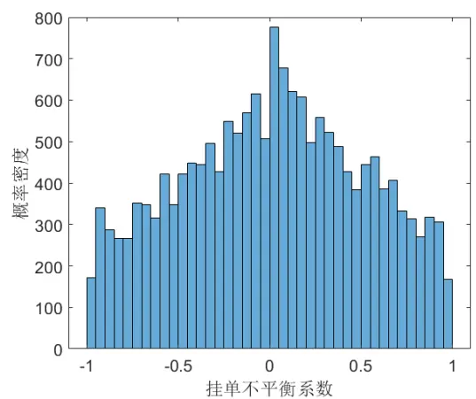
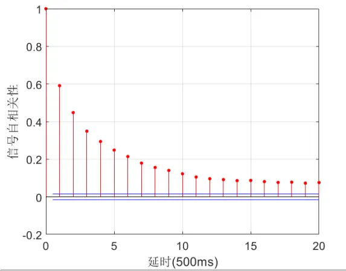
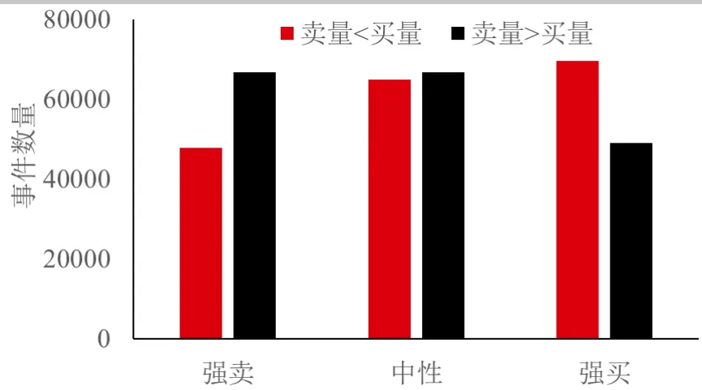
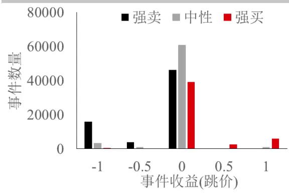
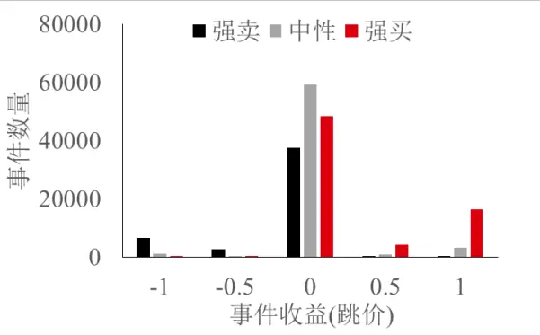
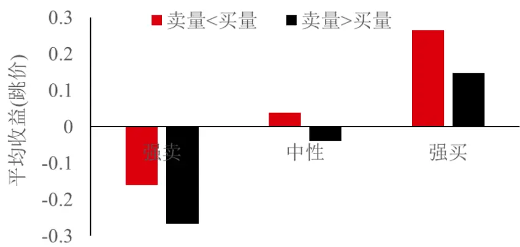
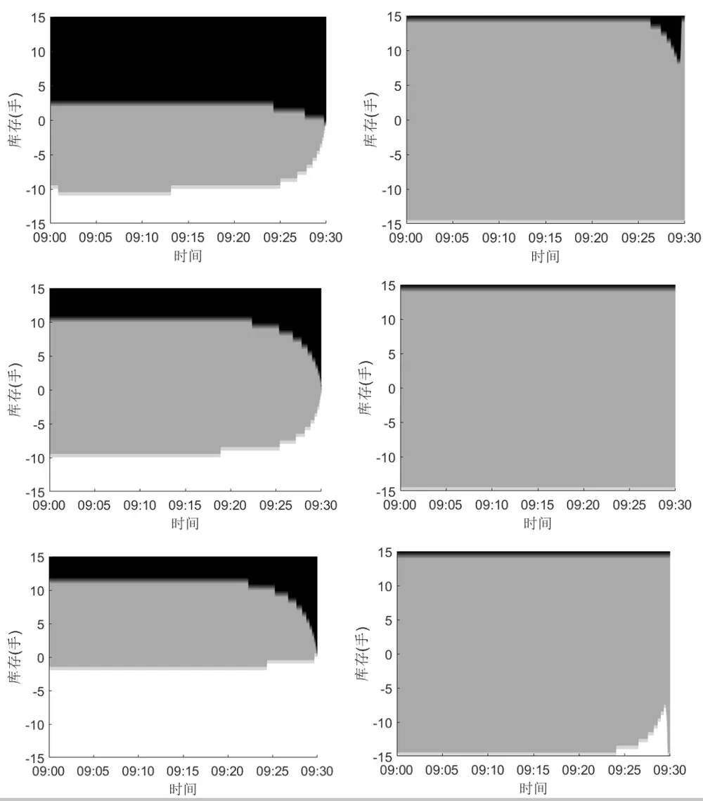
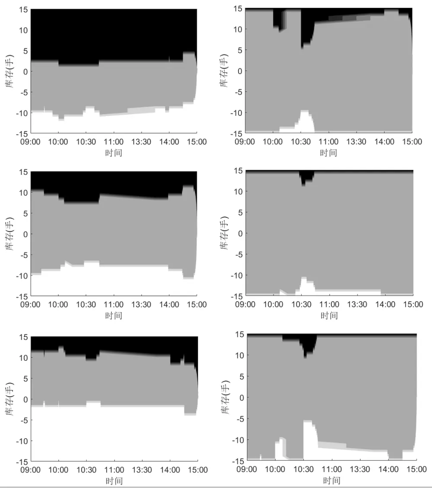
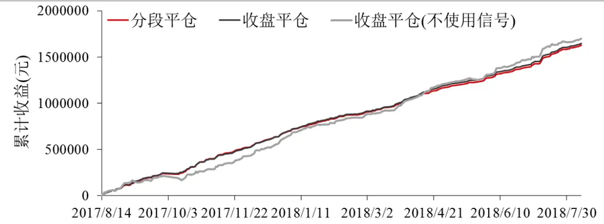
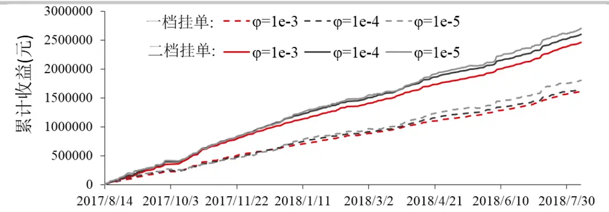

## 指令簿信号在高频做市策略中的应用

高频做市策略是围绕标的物的即时价格在不同价位挂出限价单，通过标的物价格的来回波动触碰到低价的买单和高价的卖单，实现低买高卖，从而获利。对于价差状态通常等于最小跳价的资产而言(大部分商品期货都是此类)，做市的理想情况是市场成交价只在买一和卖一之间来回波动。但如果市场出现波动，例如上涨，则做市商在击穿前所挂的限价卖单必然成交，这将给做市商带来损失，如果做市商能够预测价格上涨并及时将所挂的未成交卖单撤销则可以避免损失。

限价指令簿对预测未来价格涨跌有一定作用。这篇报告参考 Alvaro Cartea, Ryan Donnellyb和 Sebastian Jaimungalc 的论文 Enhancing Trading Strategies with Order Book Signals，利用在最优买卖价上限价指令簿的挂单序列长度，构建指令簿挂单不平衡信号。统计不同信号的转换概率，以及不同信号条件下市价单和限价单的出现模式和买卖价击穿后中间价的变化，在这些市场条件下通过动态规划原理求解 Hamilton-Jacobi-Bellman(HJB)方程得到最优的一档买卖挂单策略。可能是由于使用 500毫秒截面数据的原因，这里的信号条件比原论文 10 毫秒采样的信号弱很多。虽然这里的指令簿信号对提高做市收益没有明显帮助，但是能大大减少盘中亏损，而且对高频做市策略每天的收益波动也能有效控制，从而策略能实现更高夏普率。

投资咨询业务资格：

证监许可【2011】1289 号

研究院 量化组

研究员

罗剑

- 0755-23887993

- luojian@htfc.com

从业资格号：F3029622

投资咨询号：Z0012563

陈维嘉

- 0755-23991517

- chenweijia@htfc.com

从业资格号：T236848

投资咨询号：TZ012046杨子江

- 0755-23887993

- yangzijiang@htfc.com

从业资格号：F3034819

投资咨询号：Z0014576

陈辰

0755-23887993

chenchen@htfc.com

从业资格号：F3024056

投资咨询号：Z0014257

联系人

张纪珩

- 0755-2388799

- zhangjihang@htfc.com

从业资格号：F3047630

高天越

- 0755-23887993

- gaotianyue@htfc.com

从业资格号：F3055799

## 研究背景

高频做市策略是围绕标的物的即时价格在不同价位挂出限价单，通过标的物价格的来回波动触碰到低价的买单和高价的卖单，实现低买高卖，从而获利。这篇报告主要讨论大跳价资产的做市，这类资产的买卖价差通常只有一个最小跳价，指令簿上各个限价单的挂单通常也在 10手以上，市价单大概率会成交在买一或卖一价上而不产生滑点。大部分的商品期货是属于这类资产。对这类资产，做市商的挂单策略，以买方向为例，是在买二或更低价位挂买单，这个可以根据资金规模和风险偏好等因素决定。在买一上是否挂单则是根据市场信号决定，在买一加一个最小跳价上挂单则相当于市价单，用途主要是急于平仓，减少风险。因此做市商的策略主要是根据市场变化决定在买一价和买一加一个最小跳价上是否挂单。卖方向的挂单情况也类似。

同时做市商面临两种风险第一种是库存风险，如果市场出现单边上涨或下跌的行情，做市商容易产生单边净头寸的积累。这类风险的控制需要做市商根据自身风险承受能力，合理评估市场波动做出最优买卖挂单的决策。第二种是逆向选择风险，这是本报告要研究的对象，市场价格受多种信息影响，在订单驱动市场，市场价格的变动首先体现在订单量的变化上。例如当一个新闻事件出现，引起投资者预期价格上涨，那在限价指令簿上的体现就是市价买单增多，同时卖一价上的挂单量减少，买一价上的挂单量增加，如果这时做市商发现在卖一价上仍有挂单，而卖一价上的挂单量很少，那么这个卖一的订单对列就很有可能会在这波市价买单的行情中被打穿，这时做市商的最优策略是把卖一上的挂单撤掉，而只保留卖二价和更深位置的挂单。如果这波市价买单量很多，真的把卖一价打穿，则原来的卖二价变成了新的卖一价，这时做市商再根据类似之前的指令簿信号判定是否要把新卖一价上的挂单也撤去。

从上面的撤单逻辑可以看出，做市商能否在价格被击穿前成功撤单取决于两个条件，第一是是否有足够的指令簿信息，指令簿上的市价买单和限价卖单是一笔一笔撮合成交的，如果做市商能实时获得每一笔成交的单子数量和挂单量，则能准确判定做市商当前所挂限价单的队列排名。因此做市商能够获得的数据更新频率越高，则对撤单的时机把握越准确。第二个条件是做市商的硬件条件，接收行情的速度以及根据行情进行撤单的速度，这决定了做市商的决策能否最终实现。

这篇报告只考虑在买一和卖一价上的撤单逻辑并进行验证，主要参考 Alvaro Cartea, RyanDonnellyb 和 Sebastian Jaimungalc 的论文 Enhancing Trading Strategies with Order Book Signals构建指令簿挂单不平衡信号，并根据做市库存和风险偏好对挂撤单策略进行优化。

## 指令簿信号

指令簿挂单不平衡信号可以根据最优买卖报价上的挂单量进行构建。在t时刻收到截面数据后，挂单不平衡信号可以定义为

$$
\rho_{t}=\frac{\mathrm{V}_{t}^{b}-\mathrm{V}_{t}^{a}}{\mathrm{V}_{t}^{b}+\mathrm{V}_{t}^{a}}\in[-1,1]\tag{1}
$$

其中 $\mathsf{V}_{t}^{b}$ 和 $\mathrm{V}_{t}^{a}$ 是t时刻在买一和卖一价位上所挂限价单的数量。

这篇报告使用天软的 500 毫秒截面高频数据计算指令簿挂单不平衡信号，图 1 是 2017 年 8月 14日沪铜主力期货合约日盘数据产生的信号分布。图1中的左图是挂单不平衡信号大小的直方图。由图可见，这个信号并不是均匀分布在-1 至 1 之间的，信号集中在 0 附近的次数比较多，然后向两边递减。信号出现大于0.5或小于-0.5的时侯较少。当信号接近0时表示指令簿上的买卖意愿相当，未来中间价更倾向于不变。而当该信号越接近 1 时，则表示指令簿上的买单量大大超过卖单量，卖价更可能被击穿，所以未来中间价上升可能性较大。当信号接近于-1 时情况则与之相反。图 1 中的右图则是信号的自相关性，这个自相关性意味着信号能够较好地持续一定时间，在前 3 秒内，自相关性能维持在 0.2 以上，说明信号不会转变特别快。

图1： 2017 年 8 月 14 日挂单不平衡信号分布规律

数据来源：华泰期货研究院

为了挖掘挂单不平衡信号的预测效果，这里把该信号分成 3 个区间。当 $\rho_{t}\in[-1,-\frac{1}{3})$ 时，属于强卖区；当 $\rho_{t}\in[-\frac{1}{3},\frac{1}{3}]$ 时，属于中性区；当 $\begin{array}{r}{\rho_{t}\in(\frac{1}{3},}\end{array}$ 1]时，属于强买区。在这三个区间下可以定义两类事件，第一个事件是500毫秒截面数据中的(市价)卖(单)量<(市价)买(单)量，第二个事件是 500 毫秒截面数据中的(市价)卖(单)量>(市价)买(单)量。

图 2统计了从 2017年 8月14日起，连续 21天在各个信号区间下出现这两个事件的累计数量。在强卖区间，卖量>买量的事件较多，在中性区间，两类事件的数量相差很小，在强买区间卖量<买量的事件较多。因此市价买单和卖单量的对比与限价单的不平衡信号存在一定关系。

图 2： 指令簿信号下市价单事件出现频率

数据来源：华泰期货研究院

图 3是在各个挂单不平衡区间出现卖量>买量(左)和卖量<买量(右)后，下一 500毫秒截面数据呈现的中间价变化分布。在这两个图里的中性区间出现这两个事件后中间价都是大概率不变的。但是在强卖区间，出现卖量>买量的事件后中间价下跌次数要比出现卖量<买量的事件后中间价下跌次数多些。在强买区间的情形也与之对应。另外中间价出现变动大多数情况是都是1个最小跳价，但也有少数情况是只变动了0.5个跳价，变动0.5个跳价是因为价差被暂时拉大，市价单事件后从 1 个跳价变成了 2 个跳价。对比图 3 的左图和右图的差别其实并不十分明显，而在 Alvaro Cartea, Ryan Donnellyb 和 Sebastian Jaimungalc 的论文里这个差别是非常明显的，原因可能是原论文的统计区间是10毫秒，而这里的统计区间是至少500毫秒。在这里使用的更长的统计区间从而导致部分市价单事件无法区分。

图 3： 指令簿信号下市价单事件的中间价变化分布 左：卖量>买量 右：卖量<买量

数据来源：华泰期货研究院

图 4 是在各个挂单不平衡区间下出现这两类事件(500 毫秒)后，中间价的平均变化。在中性

区间出现卖量<买量或者卖量>买量后中间价都会对应地出现轻微的上涨或者下跌。在强买区间出现卖量>买量后中间价上涨比例接近卖量>买量事件的一倍，因此如果在强买区间，如果做市商积累了较多空头库存而在卖一上所挂卖单又还没成交的话，最好做法是把卖单撤去。在强卖区间的情况也类似。

图 4： 指令簿信号下市价单事件的平均收益

数据来源：华泰期货研究院

虽然这里的信号效果比原论文要弱，但从上面的直观观测来看使用 500 毫秒截面数据产生的不平衡信号也有一定的预测效果。因此仍可以仿照 Alvaro Cartea, Ryan Donnellyb 和Sebastian Jaimungalc 的论文 Enhancing Trading Strategies with Order Book Signals 里的方法，在各个挂单不平衡区间下统计市价单事件的出现密度建立做市模型(CDJ 模型)。

## CDJ 模型

Alvaro Cartea, Ryan Donnellyb 和 Sebastian Jaimungalc 提出的离散报价模型中包含了 6 个市场状态和 3类市场事件。沪铜主力合约的价差约有94%的情况为δ，约6%的情况是2δ，极少数情况下会出现大于 2 δ的情景，因此这里只考虑 2 种价差的情况，其中价差∆= {1,2}。在2 种价差状态下分别统计 3 种挂单不平衡信号Z区间,其中信号Z = {1,2,3}，因此共有 2×3=6种市场状态。这里把市场状态记为J，则

$$
\boldsymbol{J}=(\Delta,Z)\tag{2}
$$

3类市场事件包括2类市价单事件即卖量>买量,记为+和卖量<买量，记为−。剩下的1类是限价单市件，主要是指限价单队列的增加或者撤消引起了中间价、价差或挂单不平衡的变化,记为l。

CDJ 模型的参数涉及出现各类市场事件的密度、期望收益以及之后市场状态的转换概率，参数估计过程非常直接。假设 $N_{J,K}^{i}$ 表示市场状态在出现i事件后从市场状态J转换到市场状态K的次数，则限价单事件后的转换概率 $\mathbf{\nabla}cdotT_{J,K}^{l}$ 可以表示为

$$
T_{J,K}^{l}=\frac{N_{J,K}^{l}+N_{\tilde{J},\widetilde{K}}^{l}}{N_{J}^{l}+N_{\tilde{J}}^{l}}\tag{3}
$$

两类市价单事件后的转换概率 $\cdot T_{J,K}^{\pm}$ 可以表示为

$$
T_{J,K}^{\pm}=\frac{N_{J,K}^{\pm}+N_{\tilde{J},\widetilde{K}}^{\mp}}{N_{J}^{\pm}+N_{\tilde{J}}^{\mp}}\tag{4}
$$

限价单事件l在市场状态J下出现的密度 $\lambda^{l}(J)$ 可以表示为

$$
\lambda^{l}(J)=\frac{N_{J}^{l}+N_{\tilde{J}}^{l}}{\tau_{J}+\tau_{\tilde{J}}}\tag{5}
$$

市价单事件±在市场状态J下出现的密度 $\lambda^{\pm}(J)$ 可以表示为

$$
\lambda^{\pm}(J)=\frac{N_{J}^{\pm}+N_{\tilde{J}}^{\mp}}{\tau_{J}+\tau_{\tilde{J}}}\tag{6}
$$

限价单事件l在市场状态J下出现后的中间价变化可以表示为

$$
\epsilon^{l}(J)=\frac{\sum_{k=1}^{N_{J}^{l}}y_{J}^{lk}-\sum_{k=1}^{N_{\tilde{J}}^{l}}y_{\tilde{J}}^{lk}}{N_{J}^{l}+N_{\tilde{J}}^{l}}\tag{7}
$$

其中y表示事件后中间价的变化

市价单事件±在市场状态J下出现后的中间价变化可以表示为

$$
\epsilon^{\pm}(J)=\frac{\sum_{k=1}^{N_{J}^{\pm}}{y_{J}^{\pm k}-\sum_{k=1}^{N_{J}^{\mp}}{y_{J}^{\mp k}}}}{N_{J}^{\pm}+N_{J}^{\mp}}\tag{8}
$$

利用 CDJ 模型做市的目的是最大化做市收益以及在做市结束时拥有最小的库存，假设做市结束时间T时，做市商拥有的现金流为 $X_{T}$ ,累积的库存为 $q_{T}$ ，中间价为 $S_{T}$ 以及处于价差状态∆,则做市商的目标是通过调节在一档上的挂撤单 $\gamma_{s}^{\pm}$ 最大化目标函数

$$
H(t,x,q,S,J)=\operatorname*{sup}_{\left(\gamma_{s}^{\pm}\right)_{t\leq s\leq T}\in A}{\mathbb{E}\left[X_{T}+q_{T}S_{T}-|q_{T}|\frac{\Delta}{2}-\phi\int_{0}^{T}q_{u}^{2}du|\mathcal{F}_{t}\right]}\tag{9}
$$

其中积分项φ $\int_{0}^{T}$ qu2du是对库存的惩罚，代表做市商的风险偏好。

使用的分离变量方法，H可以进一步分解为

$$
H(t,x,q,S,J)=x+qS+h(t,q,J)\tag{10}
$$

这个分解可以比较直观地理解为未来最优策略的选取与已经取得的收益x无关，S是一个鞅过程，期望值为 $0_{:}$ ，所以x和qS可以从H(t, x, q, S,J)中分解出去。

利用动态规划原理φi(t, y)可以通过以下 Hamilton–Jacobi–Bellman(HJB)偏微分方程求得

$$
\begin{array}{rl}{\displaystyle\frac{\partial h}{\partial t}-\phi q^{2}+\lambda^{l}(J)\left(q\epsilon^{l}(J)+\sum^{l}{(t,q,J)}\right)}&{}\\{+\operatorname*{sup}_{\gamma^{+}\in\{0,1\}}\lambda^{+}(J)\left(\gamma^{+}\frac\Delta2+(q-\gamma^{+})\epsilon^{+}(J)+\sum_{\gamma^{+}}^{+}(t,q,J)\right)}&{}\\{+\operatorname*{sup}_{\gamma^{-}\in\{0,1\}}\lambda^{-}(J)\left(\gamma^{-}\frac\Delta2-(q+\gamma^{-})\epsilon^{-}(J)+\sum_{\gamma^{-}}^{-}(t,q,J)\right)=0}\end{array}\tag{11}
$$

其中

$$
\begin{array}{l}{{{\displaystyle{\sum}^{l}}\left(t,q,J\right)={\sum_{K}}\bigl(h(t,q,K)-h(t,q,J)\bigr)T_{J,K}^{l}}}\\{{{\displaystyle{\sum}^{+}}_{\gamma^{+}}(t,q,J)={\sum_{K}}\bigl(h(t,q-\gamma^{+},K)-h(t,q,J)\bigr)T_{J,K}^{+}}}\\{{{\displaystyle{\sum}^{-}}_{\gamma^{-}}(t,q,J)={\sum_{K}}\bigl(h(t,q+\gamma^{-},K)-h(t,q,J)\bigr)T_{J,K}^{-}}}\end{array}
$$

$\gamma^{+}$ 代表是否在卖一上挂单， $\gamma^{-}$ 代表是否在买一上挂单。

同时方程(11)满足终止条件

$$
h(T,q)=-|q|\frac{\Delta}{2}\tag{12}
$$

方程(11)和(12)可以通过有限差分的欧拉格式进行求解。这里的求解是在每天 8 个时间段下分别使用相应的参数进行求解。库存限制在-15 至 15 手之间，库存惩罚系数φ设定为 $10^{-4}\mathrm{{{c}}}$ 这里用到的求解方法分两种，一种是规定每个时段结束后都把仓位平掉而不累积到下个时间段。另外一种则是在下午收盘前才平掉一天的仓位。图 5 列出的是第一种做法下的最优策略，在上午 9:00 开始做市，到上午 9:30 结束平掉仓位。图 5 中的左上图是价差状态为 1时处在强卖区间的挂单策略。黑色部分代表的是只挂卖单，这部分的面积超过 1/3，这说明在强卖区间，即使积累了少量的多头库存仍然应该尽快平掉。灰色部分代表在买卖双向同时挂单，这部分比较偏下，尤其是即使当库存为-10时，如果离做市结束时间还较远，则仍然可以挂卖单。这就相当于通过承担库存风险，去避免价格可能下跌而带来的风险。图中的白色部分代表只挂买单，这部分占的比例较小，那是因为在强卖区间，只挂买单是逆趋势而为，除非当前已经积累了较大空头头寸，例如空头库存多于10手时，才应该挂买单减少空头头寸。另外这个图上可以看到在做市结束前 15分钟内，即大概有一半的时间挂单策略是随着时间改变而改变的，图中的灰色部分，即同时挂买单和卖单的部分是随着做市结束时间的临近而缩小的，这是因为临近做市结束，做市商应该逐渐平掉累积的库存。在强卖区间下这个平空头的过程进行的比较晚，在做市结束前5分钟白色部分才急剧上升。

图 5 的左中部分则是上下比较对称，因为在挂单不平衡的中性条件下并没有涨跌趋势，所以做市商可以在买卖双向较自由地挂单，只有在突破10手的单边库存时才停止与库存同方向的挂单。

图 5： 分时段平仓做市策略 左:价差为 1 右:价差为 2 上:强卖中:中性下:强卖黑色:只挂卖单 灰色:同时挂买卖单 白色:只挂买单

数据来源：华泰期货研究院

图 5 中的左下图是在强买区间下的挂单策略，情形与强卖区间下的策略完全相反，在强买区间下白色部分，即只挂买单的时候较多，因为这时挂卖单容易被市价单打穿造成损失。图5中的左边部分是在价差状态为 2时的挂单策略，在3种不平衡状态下灰色都能占到 90%以上的比例。主要是因为价差为 2 时即使一方被击穿了，价差进一步扩大的可能性非常小，相反价差缩小的可能性大很多，因此这种情况产生损失的可能性非常小。图 5 只列举了 9:00至9:30的时间段，其他时间段策略会因为具体参数的不同而略有不同。

图6是在下午15:00收盘前才结束做市的情景，其原理与图5类似。图 6中黑色、灰色和白色三部分的分界线表现得凹凸不平，主要是因为不同时间段市场的活跃程度不一样，模型参数不一样导致的。比较值得注意的是图 6 的中图表示在中性区间的挂单策略。这个中性区间的灰色部分在 1000前较宽，这是因为之前的时间段成交比较活跃，在 10:00至 11:00内灰色部分收窄，之后开始放宽，这主要是因为在 10:00 至 11:00 这个时间段内，市场通常都不会太活跃，因此如果积累了较多单边库存应该尽快平掉。

图6： 下午收盘平仓做市策略 左:价差为1 右:价差为2 上:强卖中:中性下:强卖黑色:只挂卖单 灰色:同时挂买卖单 白色:只挂买单

数据来源：华泰期货研究院

## 做市策略回测

策略回测使用的天软高频数据，每秒约有 2 笔行情数据，但是并非每秒都有 2 笔数据，所以这里以接收到的数据更新间隔为单位去更新挂单和成交情况。这里使用模拟排队的方法去回测策略的成交情况。在开盘后根据最优策略给出的买卖报价位置以及数量挂出限价单。当模型所算出的最优报价等于买一或卖一价时，在买一或卖一价上的队列排名就等于这时价位上的买卖单量加上 CDJ模型算出的最优报价量。这里假设了交易系统是全市场最快的，实际的排名会更落后一些。

在t+1时刻收到下一笔行情数据后，以买方向挂单为例，说明成交判断和更新方法。这时如果：

（1） 最低市价卖单成交价Ys小于所挂买单价B,意味着所挂的买单被击穿，即判定为成交。

（2） 最低市价卖单成交价 $\cdot Y_{s}$ 大于所挂买单价B,则所挂买单不会成交，所在队列状态也不发生变化，因为这里假设市场其他投资者不撤单。

（3） 最低市价卖单成交价 $\cdot Y_{s}$ 等于所挂买单价B，则根据把当前限价买单队列排名减去卖单成交量从而得到新的买单排名，如果这个新排名小于 0，则判断买单成交，否则继续挂单等待。

在判定完所挂限价单成交情况后，则价差和库存调用CDJ模型算出是否应该在买一和卖一价上挂单。目前只回测沪铜日盘的情况。

图 7 是在库存惩罚 $\phi{=}10^{-4}$ 时各个做市策略的表现：分别是分段平仓，对应图 5 的策略，收盘平仓，对应图 6 的策略，和收盘平仓，对应对应图 6 的策略，但所有挂单不平衡信号都视为中性。

图 7： 不同平仓条件和信号条件下 CDJ 模型做市策略收益

数据来源：华泰期货研究院

从图中可以看出这 3个策略的走势都是非常接近的，从 2017年 8月到 2018年 8月的累计收益也比较一致，但是曲线的波动则不太一样。不使用信号的去平仓收益波动较大在 2017年10月产生了较大回撤，但另外两个策略的回撤却会小很多。

表格 1 总结了不同平仓条件和信号条件下 CDJ 模型做市策略表现，虽然收盘平仓(无信号)的平均日收益是最高的达到 6965元，但是收益标准差也是最高的达到 9449元，而分段平仓的策略收益虽然是最低的，只有 6674元，但是风险也最低，只有 4839元，年化夏普率达到22。产生的成交量也最低，手续费按 1%%算也是最低的，因此所需要的返佣比例也最低只要 86.56%即可盈利。从各个策略的效果看挂单不平衡信号的主要作用是减低风险，尤其是减低策略收益的日间波动有明显帮助。

表格 1不同平仓条件和信号条件下CDJ模型做市策略表现

|  | 收益 (元) | 手续费 (元) | 成交量 (手) | 撤单量 (手) | 最大持 仓(手) | 最大亏 损(元) | 标准差 (元) | 年化夏 普率 | 返佣比 例 |
| --- | --- | --- | --- | --- | --- | --- | --- | --- | --- |
| 分段平仓 | 6674 | 49638 | 1906 | 2833 | 12 | -8750 | 4839 | 22 | 86.56% |
| 收盘平仓 | 6752 | 50274 | 1931 | 2809 | 13 | -9000 | 5105 | 21 | 86.57% |
| 收盘平仓 (无信号) | 6965 | 52888 | 2031 | 2817 | 15 | -31700 | 9449 | 12 | 86.83% |

## 数据来源：华泰期货研究院

上面回测的做市策略只局限在买一和卖一上挂单，而实际上最优的做法应该是在更深价位保留挂单，例如在买二上有挂单，那么买一被击穿时，原来买二上的挂单就上升到新的买一位置，做市商能够获得更优先的队列排名，然后再根据 CDJ 模型判定是否应该进行撤单。下面对同时在一档和二档挂单的情况进行回测，由于使用的是 Level1 数据，没法获得二档的挂单量，因此这里假设，在二档挂单时的初始排名是一档挂单量的 1.5倍。下面使用的是收盘平仓的策略，测试在不同库存惩罚系数φ下策略的累计收益。

从图 8 可以看出增加二档挂单后策略的收益有了明显的提高，而且库存惩罚系数φ越小，即做市商更能承担库存风险，则做市收益越大。

图 8： 不同挂单条件和风险偏好下 CDJ 模型做市策略累计收益

数据来源：华泰期货研究院

表格2对各种挂单位置和库存惩罚系数φ下的表现进行了汇总。随着挂单位置的深入，库存惩罚的降低，在每天平均收益增加的同时，成交量和手续费都会随之增加盘中的亏损、每天收益的标准差也会增加。夏普率最高的是同时在二档挂单， $\phi{=}10^{-3}$ 的时候，能达到年化33，同时这组参数所以需要的返还比例也是最低的只有 80.13%。但是这个组合的撤单量也是最高的，达到日均3097手，因此高夏普率的实现也会带来频繁的报撤单。

表格 2 不同挂单条件和风险偏好下 CDJ 模型做市策略表现(每天)

| 挂单 | φ | 收益(元) | 手续费(元) | 成交量(手) | 撤单量(手) | 最大持仓(手) | 最大亏损(元) | 标准差(元) | 年化夏普率 | 返佣比例 |
| --- | --- | --- | --- | --- | --- | --- | --- | --- | --- | --- |
| 一档 | 1.E-03 | 6651 | 44994 | 1728 | 2958 | 7 | -3400 | 3538 | 30 | 85.22% |
|  | 1.E-04 | 6752 | 50274 | 1931 | 2809 | 13 | -9000 | 5105 | 21 | 86.57% |
|  | 1.E-05 | 7383 | 52411 | 2013 | 2770 | 15 | -27500 | 9422 | 12 | 85.91% |
| 二档 | 1.E-03 | 10091 | 50778 | 1950 | 3097 | 11 | -6100 | 4867 | 33 | 80.13% |
|  | 1.E-04 | 10679 | 56962 | 2187 | 2906 | 15 | -12350 | 6036 | 28 | 81.25% |
|  | 1.E-05 | 11091 | 59339 | 2279 | 2867 | 16 | -29950 | 9853 | 18 | 81.31% |

数据来源：华泰期货研究院

## 结果讨论

这篇报告参考了 Alvaro Cartea, Ryan Donnellyb 和 Sebastian Jaimungalc 的论文 Enhancing TradingStrategies with Order Book Signals 利用指令簿挂单不平衡信号对做市商在一档的挂撤单策略进行建模。这个策略基于离散报价，适用于大部分的商品期货做市。可能是因为只使用了500 毫秒截面数据的原因，挂单不平衡信号的预测能力比较有限，应用在 CDJ 模型中并不能提高策略的收益，但是却对做市盘中和日间收益的波动风险作出了有效控制，从而大大提高了做市策略的夏普率。另外，这篇报告也回测了做市商在更深价位挂单的情景，使用CDJ 模型能够达到更高的夏普率，而所需的手续费返还则更低。

## 免责声明

此报告并非针对或意图送发给或为任何就送发、发布、可得到或使用此报告而使华泰期货有限公司违反当地的法律或法规或可致使华泰期货有限公司受制于的法律或法规的任何地区、国家或其它管辖区域的公民或居民。除非另有显示，否则所有此报告中的材料的版权均属华泰期货有限公司。未经华泰期货有限公司事先书面授权下，不得更改或以任何方式发送、复印此报告的材料、内容或其复印本予任何其它人。所有于此报告中使用的商标、服务标记及标记均为华泰期货有限公司的商标、服务标记及标记。

此报告所载的资料、工具及材料只提供给阁下作查照之用。此报告的内容并不构成对任何人的投资建议，而华泰期货有限公司不会因接收人收到此报告而视他们为其客户。

此报告所载资料的来源及观点的出处皆被华泰期货有限公司认为可靠，但华泰期货有限公司不能担保其准确性或完整性，而华泰期货有限公司不对因使用此报告的材料而引致的损失而负任何责任。并不能依靠此报告以取代行使独立判断。华泰期货有限公司可发出其它与本报告所载资料不一致及有不同结论的报告。本报告及该等报告反映编写分析员的不同设想、见解及分析方法。为免生疑，本报告所载的观点并不代表华泰期货有限公司，或任何其附属或联营公司的立场。

此报告中所指的投资及服务可能不适合阁下，我们建议阁下如有任何疑问应咨询独立投资顾问。此报告并不构成投资、法律、会计或税务建议或担保任何投资或策略适合或切合阁下个别情况。此报告并不构成给予阁下私人咨询建议。

华泰期货有限公司2019版权所有。保留一切权利。

## 公司总部

地址：广东省广州市越秀区东风东路761号丽丰大厦20层

电话：400-6280-888

网址：www.htfc.com