## 限价单队列模型在高频做市中的应用

对大部分商品期货来说，市场流动性较好，因此买卖价差在绝大部分交易时间里都是一个最小变动价位，而买一和卖一价位上的限价单队列通常较长。对这类资产的做市通常是在深度档位上时刻保留挂单，而只考虑如何在一档价位上进行挂撤单，以及如何使用市价单减仓的问题。在一档价位上挂单的选择可以转化为对四类风险的控制，包括限价单的执行风险和逆向选择风险，市价单的滑点风险和做市过程中积累的库存风险。如何控制这四类风险是做市策略成功的关键。

这篇报告通过简单假设市价单、限价单和撤单数量符合泊松分布，直接模拟做市商所挂限价单的队列排名，在一系列假设下，计算做市商面临的交易风险，通过动态规划原理，求解 Hamilton-Jacobi-Bellman(HJB)方程得到在一档位置何时使用限价单、撤单以及市价单的最优下单策略。

这个模型应用在沪铜期货主力合约的做市上能够取得较好表现。当模型加入市价单后日均盈利有所上升，所需手续费返还比例也有所下降。

投资咨询业务资格：

证监许可【2011】1289 号

研究院 量化组

研究员

罗剑

- 0755-23887993

- luojian@htfc.com

从业资格号：F3029622

投资咨询号：Z0012563

陈维嘉

- 0755-23991517

- chenweijia@htfc.com

从业资格号：T236848

投资咨询号：TZ012046杨子江

- 0755-23887993

- yangzijiang@htfc.com

从业资格号：F3034819

投资咨询号：Z0014576

陈辰

0755-23887993

chenchen@htfc.com

从业资格号：F3024056

投资咨询号：Z0014257

联系人

张纪珩

- 0755-2388799

- zhangjihang@htfc.com

从业资格号：F3047630

高天越

- 0755-23887993

- gaotianyue@htfc.com

从业资格号：F3055799

## 研究背景

高频做市策略是围绕标的物的即时价格在不同价位挂出限价单，通过标的物价格的来回波动触碰到低价的买单和高价的卖单，实现低买高卖，从而获利。这篇报告主要讨论大跳价资产的做市，这类资产的买卖价差通常只有一个最小跳价，指令簿上各个限价单的挂单通常也在 10 手以上。大部分的商品期货是属于这类资产。对这类资产，做市商的挂单策略，以买方向为例，是在买二或更低价位挂买单，这个可以根据资金规模和风险偏好等因素决定。在买一上是否挂单则可以根据当前累积的库存大小决定。如果限价单队列较长，做市商甚至可以使用市价单通过承担买卖价差的损失来降低库存风险。

做市商在以上决策过程中主要面临四类风险。首先是所挂限价单的执行风险。虽然做市商希望能从价格的来回波动中获利，但是实际情况是价格总会出现短期甚至长期趋势，而大跳价资产限价单队列较长，这使得做市商所挂出的限价单未必能在合理价格成交。例如市场出现上涨趋势时，限价买单的队列通常较长，如果做市商积累了较多空头库存，则往往急于平仓以减少损失。这时做市商就要考虑是挂限价买单继续等待还是使用市价单赶紧平仓止损。

第二类风险是逆向选择风险，做市策略较多地使用限价单，当市场出现上涨趋势时，市场上有信息优势的投资者就会使用市价单买入，而没有信息优势的做市商所挂的限价卖单则会成交，然后中间价上涨一个最小变动价位，则做市商的限价卖单亏损半个最小变动价位。这种形式的成交通常是由于做市商所挂的卖单后，其他投资者的卖单较少，这个价位被市价买单击穿导致的。一个破解的方法是当做市商后面的挂单变得较少时，便把所挂卖单撤去，所以这里就涉及到了做市商应该如何平衡成交概率和击穿概率的问题。

第三类风险是库存风险。虽然大部分时候做市商同时挂出买卖单，但这两部分的挂单不可能总是同时成交，因此做市商可能会持有净的多头库存或空头库存，所持的库存往往是跟市场趋势方向相反的，如果这些库存积累了较长时间则可能产生较大亏损，做市商如何选择限价单或市价单去减少库存风险也是盈利的关键。

第四类风险是市价单的滑点风险，这类风险只有在做市商选择使用市价单时才有可能碰到。对大跳价资产来说，这类风险出现的可能性也比较小，只有在对价的队列较短时才有可能被打穿从而差生滑点。

从上面的分析可以看出，做市商所涉及的风险当中有三类是涉及到限价单队列的，对限价单队列的准确模拟是计算各类风险发生可能的前提，而目前主流文献中能用于高频做市策略的限价单队列模型较为少见，因此篇报告针对做市商在一档行情价位上所挂限价单的队列状态进行建模，在给定的队列状态和库存状态下计算出做市商的最优下单策略。

## 限价单队列模型

对大跳价资产来说，限价单队列较长，500毫秒内市价单能击穿一档报价，到达二档报价的概率是非常小的，因此做市商的最优做法通常是在深度价位保留挂单，当一档价位被击穿后，原来的二档价位变成一档价位，这时做市商可以重新考虑新的一档价位上的挂单操作。因此深度价位上的最优挂单操作是唯一的，只要保留挂单即可。这里只需要考虑一档位置上的最优挂单。如前所述，一档位置上的挂单操作主要是考虑成交风险和逆向选择风险，这两个因素分别受做市商所挂限价单排名和限价单队列长度所影响。如果买一和卖一价格保持不变，并且不断有市价卖单和市价买单与之匹配成交，那么做市商所挂限价单排名便会不断往前靠，直到成交。同时限价单队列长度也处在不断变化中，除了市价单对限价单队列的消耗，同时会有新的限价单加入或者撤消。所以做市商所挂限价单排名取决于一定时间内市价单量。而限价单队列长度则取决于一定时间内市价单量与该限价单队列挂撤单数量的对比。由于使用的期货 Level1 数据无法直接观测撤单量和限价单报单量，这里使用可以计算得到的挂撤单数量代替。如果挂撤单数量为正，市价单量小于挂撤单数量，则该限价单队列会变长，反之如果市价单量大于挂撤单数量，则该限价单队列会变短直到消失，从而实现价格的变化。如果挂撤单数量为负，即使没有市价单消耗，队列也一定会最终消失，实现价格变化。因此通过限价单队列变化的分析可以看到，价格变化、成交风险和逆向选择风险都最终归结到市价单量和挂撤单数量上。下面就用泊松过程来描绘这两个量的变化。

以沪铜期货为例，2017年8月 14日日盘的市价买单数量M+(+表示市价买单，-表示市价卖单)分布如图1表示。实际上当日 500毫秒内的平均市价买单数量是2手，但是从概率分布上看，买单数量最多的时候可以达到 250 手，具有较长的尾部。而同样是均值为 2 的泊松分布则数量较为集中，出现数量大于 20的概率接近为0，除此以外市价单数量在1至 10之间的概率也有所偏高。虽然泊松分布无法完美刻画买单数量的分布概率，但也能较好地逼近真实情况，这也是主流文献常用的方法之一。

图1： 2017 年 8 月 14 日市价买单数量与泊松分布
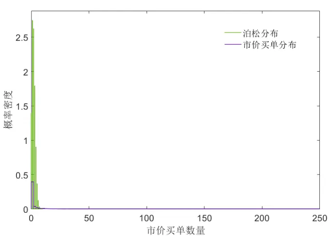
数据来源：华泰期货研究院

接下来看挂撤单数量，假设在t时刻限价单队列长度为 $l_{t}^{\mp}$ ，则挂撤单数量 ${\cdot}L_{t}^{\mp}$ 可以表示为

$$
L_{t}^{\mp}=l_{t}^{\mp}-l_{t-1}^{\mp}+M_{t}^{\pm}\tag{1}
$$

如果 $L_{t}^{\mp}>0$ ，表示新增限价单报单量大于撤单量， $L_{t}^{\mp}<0$ 则表示新增限价单报单量小于撤单量。图 2 表示 2017 年 8月 14 日卖一挂撤量的分布。由下图可见，挂撤量基本呈现左右对称，具有较长的尾部，均值约为 2。这说明平均来讲，挂单量是大于撤单量的。这个分布可以使用两个泊松分布合成，这里分别假设挂单量符合均值为 8 的泊松分布，而撤单量符合均值为 6 的泊松分布，这样两者的均值之差就等于 2 了，与实际观测一致。虽然均值能保持一致，但是方差等高阶统计量仍然与实际有较大差别，虽然调节挂单量均值和撤单量均值可以调整方差，但是尾部分布并无法使用泊松分布很好地刻画。从后面回测的结果来看这些差别对模型的盈利能力影响有限。

图 2： 2017 年 8 月 14 日卖一挂撤量与泊松分布合成结果
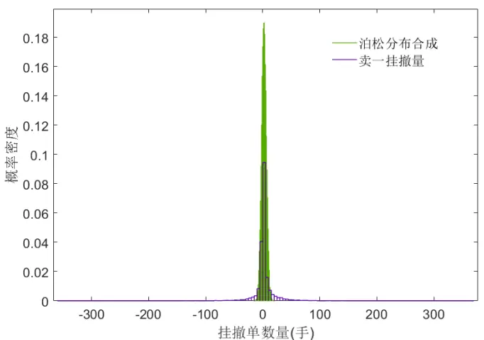
数据来源：华泰期货研究院

以上就是限价单队列模型所涉及的三个参数：市价单量均值、挂单量均值和撤单量均值。

由于只考虑一档位置上的挂单，而且买一和卖一上最多只有一手挂单，则在t时刻做市商的库存和挂单状态可以表示为S $:=\mathbb{S}(t,q,l^{+},l^{-},r^{+},r^{-})$ 。其中q表示库存， $\mathfrak{q}\in[-Q,-Q+1,\dots-$ $1,0,1,\ldots Q-1,Q]$ , Q表示最大库存约束，由做市商的风险偏好决定。l±表示一档队列上买单和卖单的长度 $l^{\pm}\in\left[1,2,\dots,l_{\operatorname*{max}}^{\pm},l_{\infty}^{\pm}\right]\circ l_{\operatorname*{max}}^{\pm}$ 为模拟的队列最大长度， $\bar{\kappa}l_{\infty}^{\pm}$ 则相当于一条无穷长的队列，具体使用方法后面会描述。 $r^{\pm}.$ 表示做市商一档挂单在买队列和卖队列上的排名，$r^{\pm}\in[1,2,\ldots,l^{\pm}]$ 。 除 去 时 间 外 ， 做 市 商 的 状 态 $\mathbb{S}(q,l^{+},l^{-},r^{+},r^{-})$ 共 有 $(2Q+1)\times$ $\frac{\big(l_{\mathrm{max}}^{+}+1\big)\big(l_{\mathrm{max}}^{+}+2\big)}{2}\times\frac{(l_{\mathrm{max}}^{-}+1)(l_{\mathrm{max}}^{-}+2)}{2}$ 种组合方法。最优做市策略就是在这给定时间下，求出所有组合下的最优挂单策略。

由于限价单队列理论上可以达到无穷长，但数值模拟只能计算有限的情形，所以当限价单队列长度超出一定范围后就必须截断，所以远场状态S $(t,q,l_{\infty}^{\pm},.,.)$ 作为一个抽象的代表状态存在，也相当于一个远场边界条件。当队列长度 $l^{\pm}>l_{\mathrm{max}}^{\pm}$ 后，做市商的挂单便进入状态$\mathbb{S}(t,q,l_{\infty}^{\pm},.,.)$

在构建做市商状态后，可以根据市价单量和挂撤单量的泊松分布概率密度函数计算出做市商状态之间的转换概率。具体来说，这里使用到的限价单概率包括限价单未成交时的排名或队列状态转换概率 $\mathrm{{P_{T}},}$ 限价单成交概率 $\mathrm{\cdot P_{D}}$ 和成交后队列击穿概率 $\mathrm{\cdot P_{R}}$ 。为了定义这三个概率作出如下假设：

（1） 做市商所挂买单队列变化以及成交判定与所挂卖单的情况相互独立而且两个队列的事件发生有先后关系，不会同时发生。这个假设可以使买卖两个方向的队列事件分开，最优挂单策略也互相独立。

（2） 市价单事件与对应限价单队列的挂撤单事件相互独立。

（3） 假设所有的挂撤单都发生在做市商所挂的限价单之后。新的挂单必定是在做市商挂单之后的，但这里主要是假设撤单都发生在做市商挂单之后，这一方面是因为大部分撤单都发生在队列末尾，也是因为这样做能简化计算。

（4） 策略成交或撤单以后，新的队列长度为l±，挂单位置在l±。

在这两个假设下，未成交前买单的转换概率 $\mathrm{P_{T}}$ 可以定义为

$$
\begin{array}{c}{{{\mathrm P}_{\mathrm{T}}\Big((l^{+},r^{+})\to(l^{+}+L^{+}-M^{-},r^{+}-M^{-})\Big)=P(L^{+})P(M^{-})}}\\{{{}}}\\{{0<l^{+}+L^{+}-M^{-}\leq l_{\operatorname*{max}}^{\pm}}}\\{{r^{+}-M^{-}>0}}\\{{l^{+}+L^{+}\geq r^{+}}}\end{array}\tag{2}
$$

其中 $P(L^{+})\mathcal{\bar{H}}^{p}P(M^{-})$ 分别为 $L^{+}$ 和 $M^{-}$ 的泊松概率密度。当 $r^{+}-M^{-}\leq0$ 时便进入成交状态。

另外在远场状态下 $\mathrm{\Delta P_{T}}$ 满足

$$
\begin{array}{r}{P((l_{\infty}^{+},)(l_{\infty}^{+},))=0.5}\\{P((l_{\infty}^{+},)(l_{\mathrm{max}}^{+},))=0.5}\end{array}\tag{3}
$$

意味着当队列无限长时，做市商有 0.5的概率维持原来的状态，同时有0.5概率进入队列有限长度的状态。

限价买单的成交概率 $\mathrm{{P_{D}}}$ 则可以定义为

$$
\mathrm{P}_{\mathrm{D}}=P(M^{-}\geq r^{+})\tag{4}
$$

限价单队列的击穿概率 $\mathrm{P_{R}}$ 可以定义为

$$
\mathrm{P}_{\mathrm{R}}=P(M^{-}>l^{+})\tag{5}
$$

如果做市商使用1手市价单，则 $\dot{\bar{y^{\underline{{~}}}}}$ 生一个跳价的滑点概率 $\mathrm{P}_{s}$ 可以定义为

$$
\mathrm{P}_{\mathrm{S}}=P(M^{+}-1>l^{-})\tag{6}
$$

为了方便计算，可以把在相同时刻t和相同库存状态 $q$ 下 的 S(t, $q,l^{+},l^{-},r^{+},r^{-})$ 记为$\mathbb{S}(t,q,lr^{+},lr^{-})$ ，其中

$$
lr^{\pm}=\{1,1,2,1,2,3,\dots,1,2,\dots,l_{\mathrm{max}}^{\pm},1,2,\dots,l_{\mathrm{max}}^{\pm},l_{\infty}^{\pm}\}
$$

这相当于把四维的买卖单队列压缩到二维表示，这使得四类概率 $\mathrm{P_{T},P_{D},P_{R}}$ 和 $\mathrm{\cdot P}_{S}$ 可以用相应的概率矩阵ℙ , $\mathbb{P}_{D}.$ $\mathbb{P}_{\mathrm{R}}$ 和 $\mathbb{P}_{S}$ 表示。在t时刻做市商的简化效用记为 $h_{q}(lr^{+},lr^{-})$ ，那么做市商的最优挂单策略可以根据动态规划原理，求解下述 Hamilton-Jacobi-Bellman(HJB)方程得到

$$
\begin{array}{rl}&{\displaystyle\operatorname*{max}\{\frac{\partial h_{q}}{\partial t}+\begin{array}{c}{\displaystyle\operatorname*{sup}_{\gamma^{+}\in\{0,1\}}\bigg(\gamma^{+}\bigg(\mathbb{P}_{\mathbb{T}}h_{q}+\mathbb{P}_{D}\Big(h_{q+\gamma^{+}}^{\infty}+\frac{1}{2}\Big)-\mathbb{P}_{\mathbb{R}}(q+\gamma^{+})\bigg)}\\{\displaystyle+(1-\gamma^{+})\big(h_{q}^{\infty}-\mathbb{P}_{\mathbb{R}}q\big)-h_{q}\bigg)}\end{array}}\\&\quad\quad\quad+\begin{array}{c}{\displaystyle\operatorname*{sup}_{\gamma^{-}\in\{0,1\}}\bigg(\gamma^{-}\bigg(\big(h_{q}\mathbb{P}_{\mathbb{T}}\big)^{\prime}+\mathbb{P}_{\mathrm{D}}^{\prime}\Big(h_{q-\gamma^{-}}^{\infty}+\frac{1}{2}\Big)+\mathbb{P}_{\mathrm{R}}^{\prime}\big(q-\gamma^{-}\big)\bigg)}\\{\displaystyle+(1-\gamma^{-})\big(h_{q}^{\infty}+\mathbb{P}_{\mathrm{R}}^{\prime}q\big)-h_{q}\bigg)-\phi q^{2};}\end{array}\end{array}\tag{7}
$$

$$
h_{q+1}^{\infty}-\left(\frac{1}{2}+\mathbb{P}_{\mathrm{S}}^{\prime}+\mathbb{P}_{\mathrm{R}}(q+1)\right)-h_{q}^{\infty};h_{q-1}^{\infty}-\left(\frac{1}{2}+\mathbb{P}_{\mathrm{S}}-\mathbb{P}_{\mathrm{R}}^{\prime}(q-1)\right)-h_{q}^{\infty}\}=0
$$

同时方程(7)满足终止条件

$$
h_{q}(T)=-\frac{|q|}{2}\tag{8}
$$

其中 $\gamma^{+}{=}1$ 表示买方挂单， $\gamma^{+}{=}0$ 表示买方撤单。 $\gamma^{-}$ 的则表示卖方的情况。这组方程有明确

的解释，第 $-\pi\frac{\partial h_{q}}{\partial t}$ 代表简化效用随时间的变化。限价买单项 sup 极值符号里的ℙ ${}_{\mathrm{T}}h_{q}$ 代表γ+∈{0,1}
未成交时随着排名的增加以及队列长度的变化，效用的变化。 $\begin{array}{r}{\mathbb{P}_{D}\left(h_{q+\gamma^{+}}^{\infty}+\frac{1}{2}\right)}\end{array}$ 代表成交后获得的收益 $\ H_{2}^{\frac{1}{2}.}$ 个跳价以及成交后新的挂单在无穷远处时库存增加带来的效用， $\mathbb{P}_{\mathrm{R}}(q+\gamma^{+})$ )代表逆向选择成本， $(1-\gamma^{+})\big(h_{q}^{\infty}-\mathbb{P}_{\mathtt{R}}q\big)$ 则代表撤单后，新的挂单在无穷远处带来的效用以及原来库存所面临的的逆向选择成本。限价卖单项 $\stackrel{\mathrm{\tiny~5up}}{\gamma^{-}}\in\{0,1\}$ 里面的含义与之类似， $\phi q^{2}$ 代表的是做市过程中对累积库存的效用惩罚。后面两个方程代表做市商使用市价买单和市价卖单带来的效用变化，里面包含了使用市价单 $\cdot\dot{\bar{j^{\underline{{\cdot}}}}}$ 生 ${\mathfrak{h}}{\mathfrak{h}}{\mathfrak{\frac{1}{2}}}.$ 个跳价的亏损，1 个跳价的滑点成本和逆向选择成本。这里假设了市价单使用后即使打穿了对价，成交在买二或卖二上，中间价仍然不变。

## 最优做市策略

下面以库存惩罚系数 $\phi{=}10^{-3}$ ，最大库存约束Q=15时为例对求解方程(7)给出的最优策略进行分析。令 $l_{\mathrm{max}}^{\pm}{=}19$ ，意味着只对队列长度小于20的情况进行模拟，当队列长度超过19时即认为队列的长度达到无穷。因此这里买卖限价单的队列组合共有 $(20\times21/2)^{2}{=}210\times210$ 种。虽然最优做市策略随做市结束时间的临近而改变，但在做市结束前 500 秒，最优策略基本能达到稳定，因此使用这个稳定的解进行分析。图 3 左图作出的是效用函数 $\cdot h_{0}.$ 在做市结束前500秒的分布，这是一个210×210的矩阵，里面可以分成 $20\times20$ 个小方块，每个小方块代表了一种买卖队列长度组合下，不同限价单排名的效用。在图中的上边缘和左边缘效用较低，这是因为这里两个位置里其中一方的队列较短，逆向选择成本较高的缘故。右图是从左图中取出的一小块，当队列 $l^{\pm}{=}19$ 时的效用分布。当排名在19时成交概率较低，所以效用也低，随着限价单排名的靠前，效用逐渐升高。由于当前状态没有库存，而且离做市结束时间较长，无论买卖哪方成交都能赚取大约 0.5个跳价的收益。另外值得一提的是最下方一行和最右边一列都处在l = l±的状态下，但是对比其余的小方块，这些位置的效用函数 $h_{0}$ 并没有发生明显的扭曲，可以看出 $l_{\infty}^{\pm}$ 状态能有效代表截断的限价单队列。

图 3： $h_{0}$ 在做市结束前500秒的分布 左:全矩阵分布 右：买卖单队列 $l^{\pm}{=}19$ 时的分布
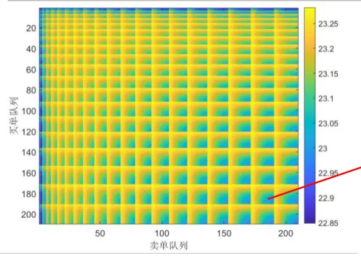
数据来源：华泰期货研究院

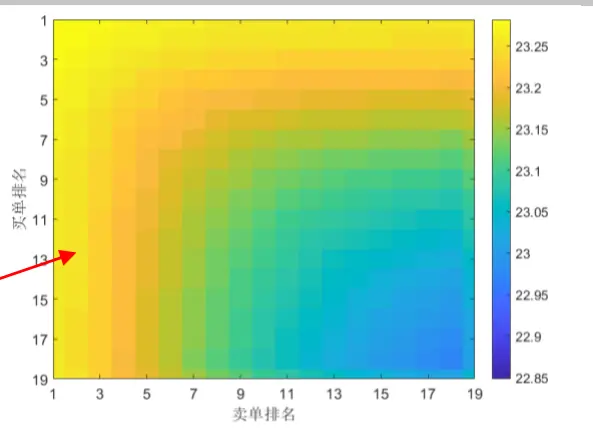

由于库存为正时的挂单策略与库存为负时的策略对称，所以只需要考虑库存为负时的策略即可。以下分析在不同库存状态下的最优报价策略。首先考虑不使用市价单的情景，即只求解公式(7)的第一个方程。这里选取买卖队列长度均为19手时进行展示。图 4中坐上角的情况是库存q=0时的策略，这个时候买卖队列都可以保持挂单。当q=-5时，做市商已经积累了一定的空头库存，并不希望空头库存进一步增加，但同时却希望能从买卖价差中获利。这个时候做市商的最优策略应该是同时保持买卖双方的队列挂单，如果卖单排名比买单靠前很多，则考虑撤去卖单，只保留买单，如果买单排名靠前很多，则可以继续保持继续挂卖单。也就是说卖单是否撤单取决于买卖单的队列排名对比。图 4 中的右上图反映的正是这一原则。假设刚开始时买卖双方限价单都在队列的最后方，即排名都是 19，图中右下角的位置，如果卖单排名到了16，而买单排名依然是19，即进入了图中浅红色的位置，这时最优策略是撤去卖单，在队列末尾重新挂卖单。但如果买单队列前进较快，买单排名到了 12，即仍保留在浅绿色区域，那么卖单就可以继续保持。另外图中的黄色区域实际上是不可能到达的区域，因为它是被浅红色区域包围的，在进入黄色区域之前必定先经过浅红色区域，这时卖单已经被撤去。这里是充分体现队列模型优势的地方，因为这个模型可以根据买卖单的队列排名进行动态挂撤单操作。当 $q{=}{-}10$ 时，做市商积累了更多的空头库存，可以看到这个时候浅绿色区域进一步减少，浅红色区域进一步增加，说明这个时候卖单的撤单操作要发生得更早一些。到了q=-15时，空头库存以及到达了最大库存限制，这个时候做市商只能挂限价买单了。

图 4： $l^{\pm}=19$ 时不同库存状态下的最优限价单策略 浅绿:同时挂买卖单 黄色：不挂单(不可下面考虑加入市价单的情形，即同时求解公式(7)的三个方程。同样选取买卖队列长度均为19 手时进行展示。当 q=0 即库存为 0 时，买卖队列都可以保持挂单，情况与只使用限价单时相同。当q=-5时，如果买单排名比卖单排名低很多，则最优策略会选择使用市价单减少空头仓位。假设在初始状态，买卖双方的挂单排名都在19手，即图中右下角的位置，如果卖单排名比买单排名靠前很多，例如卖单排名10，买单排名16，即进入深红色区域，这个时候最优策略是撤去卖单，同时使用市价单减少空头仓位，否则保留买卖双方的挂单。但如果买单排名在 14以前，卖单排名在 6时，则仍有可能不使用市价单，而只是撤去卖单，保留买方挂单，因为这个时候买单排名比较靠前，成交机会较大，这就是图中的浅红色区域。图中一小块土黄色区域表示使用市价买单，但不撤卖单，这种情形比较少出现。图4和图 5中 q=-5 的情形可以发现，图 5 的情形中绿色区域面积稍微大些，就是说卖单可以保留的排名可以更高一些，这是因为市价单的引入可以及时减少库存风险，即使卖单排名靠前也不必急着撤去。当 q=-10 时，库存风险进一步加大，如果买单的排名太靠后，例如小于 14，则最优策略是及时使用市价单平仓减少风险。当 =-15时，空头库存达到最大库存限制，只要买单排名小于 8，即不能及时成交，最优策略都是使用市价单及时平仓，减少风险积累。

能区域) 浅红色：只挂买单
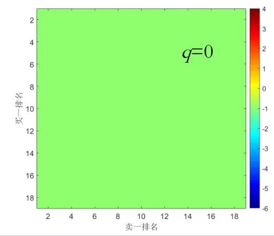

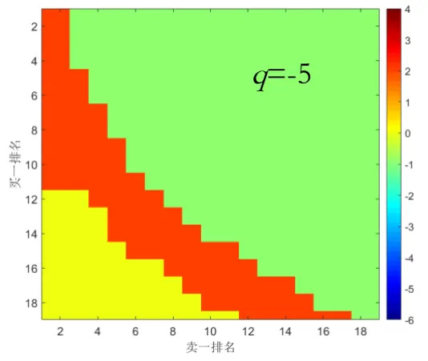

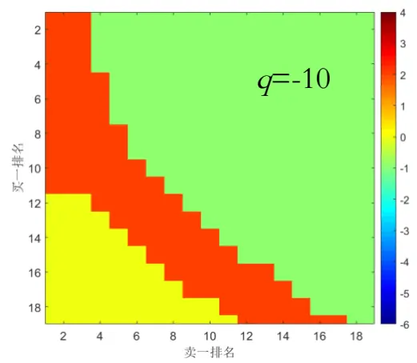

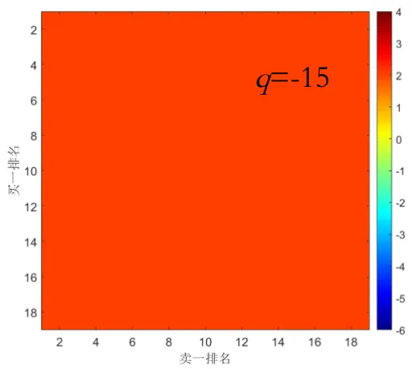
数据来源：华泰期货研究院

图 5： $l^{\pm}{=}19$ 时不同库存状态下的最优限价单/市价单策略浅 绿:同时挂买卖单 土黄色：不挂卖单，市价买单 浅红色：只挂买单 深红色：市价买单
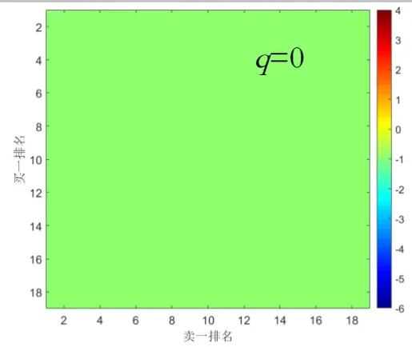

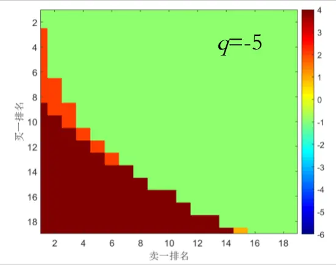

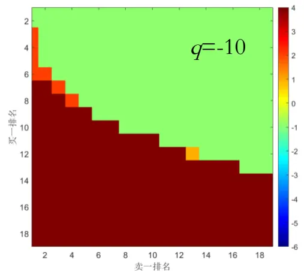
数据来源：华泰期货研究院

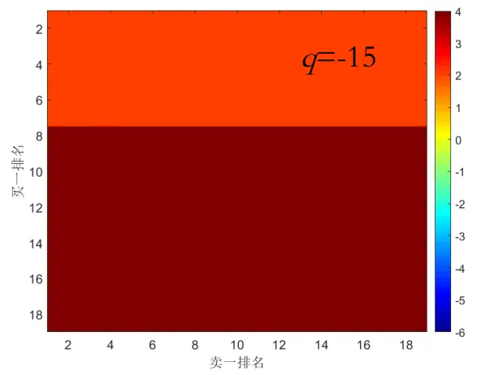

## 做市策略回测

策略回测使用的天软高频数据，每秒约有 2 笔行情数据，但是并非每秒都有 2 笔数据，所以这里以接收到的数据更新间隔为单位去更新挂单和成交情况。这里使用模拟排队的方法去回测策略的成交情况。在开盘后根据最优策略给出的买卖报价位置挂出限价单。当模型所算出的最优报价等于买一或卖一价时，在买一或卖一价上的队列排名就等于这时价位上的买卖单量加 1手。这里假设了交易系统是全市场最快的，实际的排名会更落后一些。

在t+1时刻收到下一笔行情数据后，以买方向挂单为例，说明成交判断和更新方法。这时如果：

（1） 最低市价卖单成交价 $Y_{s}$ 小于所挂买单价B,意味着所挂的买单被击穿，即判定为成交。

（2） 最低市价卖单成交价 $-Y_{s}$ 大于所挂买单价B,则所挂买单不会成交，所在队列状态也不发生变化，因为这里假设市场其他投资者不撤单。

（3） 最低市价卖单成交价Y等于所挂买单价B，则根据把当前限价买单队列排名减去卖单成交量从而得到新的买单排名，如果这个新排名小于 0，则判断买单成交，否则继续挂单等待。

在判定完所挂限价单成交情况后，则根据库存、买卖单队列长度和排名调用限价单队列模型算出是否应该在买一或卖一价上保留挂单或应该使用市价单。目前只回测沪铜日盘的情况。

图 6 是在库存惩罚系数 $\scriptstyle\cdot\phi=10^{-3},\ 10^{-4},\ 10^{-5}$ 时使用市价单和不使用市价单时策略的收益表现。在各种情况下，做市策略都能够获得较为平滑的收益曲线，策略收益主要随着库存惩罚系数φ的下降而增加，意味着能容忍越多的风险，收益就越高。在各种风险偏好下，添加市价单的使用都对提高收益有帮助，但是帮助不大。

图 6： 不同风险偏好φ下限价单队列模型收益(不含手续费)
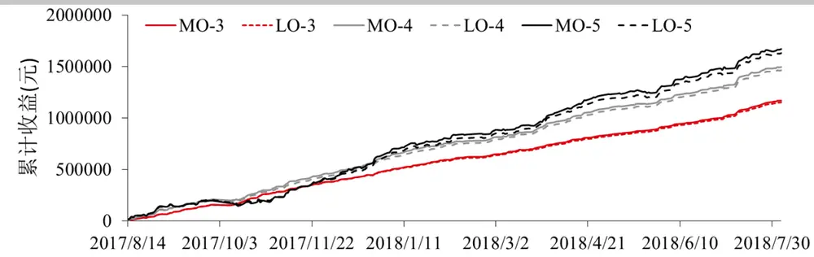
数据来源：华泰期货研究院

表格 1 总结了不同风险偏好φ下限价单队列模型做市策略表现。使用市价单后做市的平均每天收益会有所增加，但是成交量和手续费也会伴随增加，这是因为在一定的库存风险下，不利方向的挂单时间有所延长，成交机会增大。撤单量和每天盘中最大亏损在不同风险水平下表现不一样。夏普率在使用市价单后有非常小幅的增加，所需返佣比例略微下降。

表格 1 不同风险偏好φ下限价单队列模型做市策略表现(日均)

|  |  | 收益 | 手续费 | 成交量 | 撤单量 | 最大持 | 最大亏 | 标准差 | 年化夏 | 返佣 |
| --- | --- | --- | --- | --- | --- | --- | --- | --- | --- | --- |
|  | φ | (元) | (元) | (手) | (手) | 仓(手) | 损(元) | (元) | 普率 | 比例 |
| 市 | 1.E-03 | 4883 | 44124 | 1695 | 3041 | 13 | -7600 | 3383 | 22.8 | 88.93% |
| 价 | 1.E-04 | 6226 | 49783 | 1912 | 2973 | 15 | -16300 | 6049 | 16.3 | 87.49% |
| 单 | 1.E-05 | 6997 | 51802 | 1990 | 2893 | 15 | -28950 | 11085 | 10.0 | 86.49% |
| 限 | 1.E-03 | 4813 | 43956 | 1688 | 3033 | 10 | -8550 | 3355 | 22.7 | 89.05% |
| 价 | 1.E-04 | 6106 | 49696 | 1909 | 2974 | 15 | -15350 | 5956 | 16.2 | 87.71% |
| 单 | 1.E-05 | 6823 | 51304 | 1971 | 2938 | 15 | -29800 | 10128 | 10.7 | 86.70% |

数据来源：华泰期货研究院

限价单队列模型一个比较特殊的地方是使用了远场挂单状态S $(t,q,l_{\infty}^{\pm},.,.)$ 对限价单队列进行截断，因此有必要考察截断位置 $l_{\mathrm{max}}^{\pm}$ 对策略的影响。作为对比，这里选取 $l_{\mathrm{max}}^{\pm}{=}39\ \sharp\mathfrak{s}$ 情形，即模拟的队列长度增加近一倍，同时网格数量从 $210\times210$ 增加至 $810\times810_{\odot}$ 。策略的表现如表格 2 所示，整体上策略表现与表格 1 中 $l_{\mathrm{max}}^{\pm}{=}19$ 时差别不大，但是收益有所下降，成交量减少，撤单量增加，这是因为 $l_{\mathrm{max}}^{\pm}{=}39$ 时，对队列长度为 $l=[20,39]$ 的情形进行了细致模拟，而在 $l_{\mathrm{max}}^{\pm}{=}19$ 的模型中这段队列总是保持挂单，因此更细致的模拟反而导致了更频繁的撤单，从而减少了风险的承担，最终导致收益下降。这点也可以从盘中最大亏损看出， $l_{\mathrm{max}}^{\pm}{=}39$ 时盘中亏损比 $l_{\mathrm{max}}^{\pm}{=}19$ 有了明显的下降，在 $\phi{=}10^{-4}^{\ddagger_{p}}10^{-5}$ 时，收益标准差下降较为明显，夏普率也略有提升，但所需返佣比例有所上升。

表格 2 $l_{\mathrm{max}}^{\pm}{=}39$ 下限价单队列模型做市策略表现(日均)

|  |  | 收益 | 手续费 | 成交量 | 撤单量 | 最大持 | 最大亏 | 标准差 | 年化夏 | 返佣 |
| --- | --- | --- | --- | --- | --- | --- | --- | --- | --- | --- |
|  | φ | (元) | (元) | (手) | (手) | 仓(手) | 损(元) | (元) | 普率 | 比例 |
| 市 | 1.E-03 | 4452 | 42222 | 1621 | 3086 | 14 | -6800 | 3397 | 20.7 | 89.46% |
| 价 | 1.E-04 | 5792 | 48232 | 1852 | 3035 | 15 | -14350 | 5552 | 16.5 | 87.99% |
| 单 | 1.E-05 | 6474 | 50285 | 1931 | 2989 | 15 | -19150 | 7327 | 14.0 | 87.12% |

数据来源：华泰期货研究院

## 结果讨论

这篇报告根据限价单的队列特点构建做市模型，这个模型的参数只包括市价单数量均值和限价单挂撤量的均值，然后假设他们符合泊松分布，从而直接计算出做市过程中出现的成交风险、逆向选择风险、库存风险和滑点风险。模型求解出来的最优策略综合考虑了买卖单的队列排名和队列长度去决定在当前位置是否挂单。同时该模型也考虑了加入市价单去控制库存风险。利用沪铜进行回测的结果表明，这个模型在做市上有一定的盈利能力，在添加了市价单的策略里，整体表现有略微上升。另外通过延长限价单队列长度的模拟，虽然不能增加收益，但能降低做市过程中出现的风险。

## 免责声明

此报告并非针对或意图送发给或为任何就送发、发布、可得到或使用此报告而使华泰期货有限公司违反当地的法律或法规或可致使华泰期货有限公司受制于的法律或法规的任何地区、国家或其它管辖区域的公民或居民。除非另有显示，否则所有此报告中的材料的版权均属华泰期货有限公司。未经华泰期货有限公司事先书面授权下，不得更改或以任何方式发送、复印此报告的材料、内容或其复印本予任何其它人。所有于此报告中使用的商标、服务标记及标记均为华泰期货有限公司的商标、服务标记及标记。

此报告所载的资料、工具及材料只提供给阁下作查照之用。此报告的内容并不构成对任何人的投资建议，而华泰期货有限公司不会因接收人收到此报告而视他们为其客户。

此报告所载资料的来源及观点的出处皆被华泰期货有限公司认为可靠，但华泰期货有限公司不能担保其准确性或完整性，而华泰期货有限公司不对因使用此报告的材料而引致的损失而负任何责任。并不能依靠此报告以取代行使独立判断。华泰期货有限公司可发出其它与本报告所载资料不一致及有不同结论的报告。本报告及该等报告反映编写分析员的不同设想、见解及分析方法。为免生疑，本报告所载的观点并不代表华泰期货有限公司，或任何其附属或联营公司的立场。

此报告中所指的投资及服务可能不适合阁下，我们建议阁下如有任何疑问应咨询独立投资顾问。此报告并不构成投资、法律、会计或税务建议或担保任何投资或策略适合或切合阁下个别情况。此报告并不构成给予阁下私人咨询建议。

华泰期货有限公司2019版权所有。保留一切权利。

## 公司总部

地址：广东省广州市越秀区东风东路761号丽丰大厦20层

电话：400-6280-888

网址：www.htfc.com