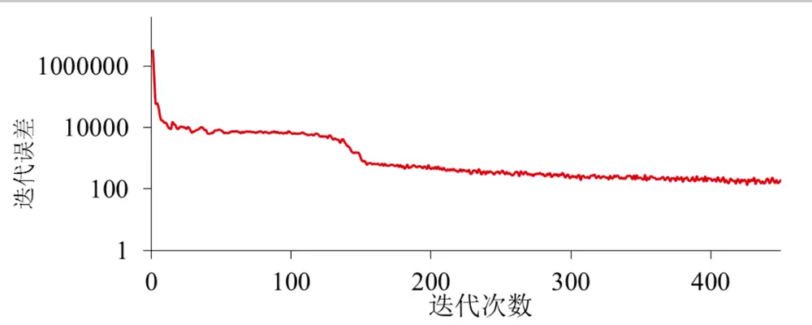
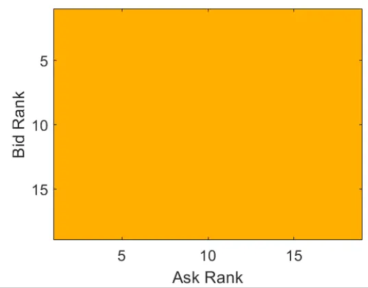
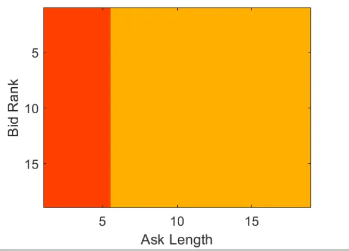
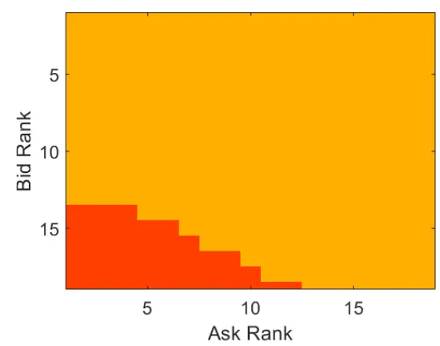
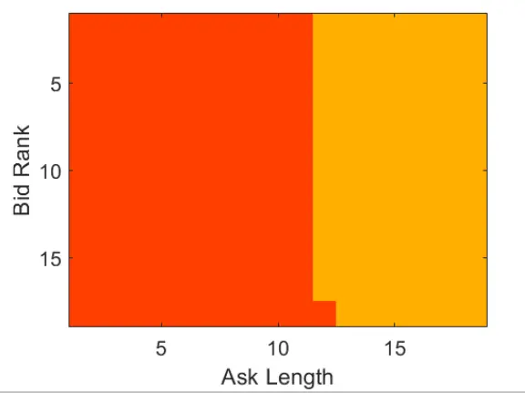
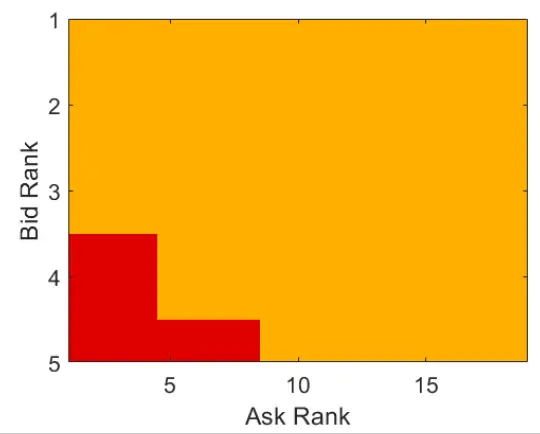
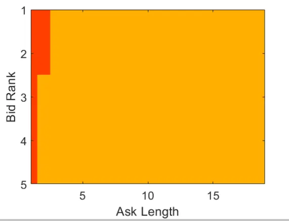
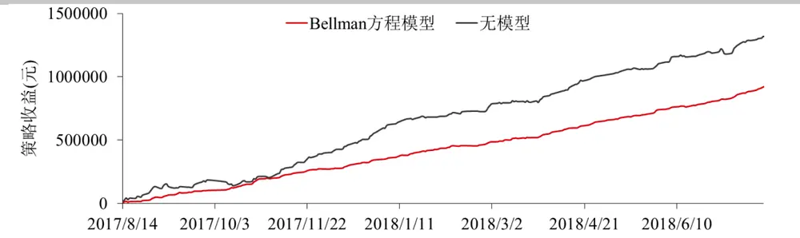
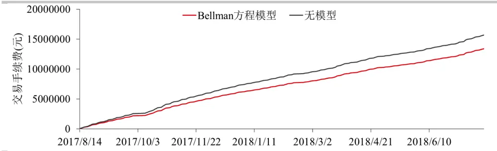
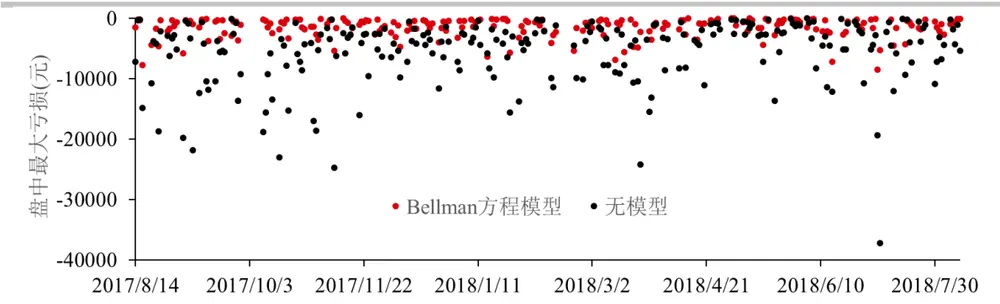

## 基于离散时间的高频做市策略

目前中国大部分商品或证券交易所提供的行情数据都是离散的截面数据，而并非逐笔的行情数据，虽然这个数据的行情间隔通常很小，例如商品通常是 500 毫秒的间隔，但是在策略建模中，把离散的数据采样过程看成是连续的时间过程并不十分恰当。因此在实际建模过程中有必要考虑信息的离散采样间隔，在每收到一笔行情数据后重新根据当前的行情以及挂单状态，作出最优的挂单决策。根据这个特点，这篇报告利用基于离散时间的Bellman 方程代替基于连续时间的 Hamilton-Jacobi-Bellman(HJB)方程，计算做市过程中的最优挂单策略。

对大部分商品期货来说，市场流动性较好，因此买卖价差在绝大部分交易时间里都是一个最小变动价位，而买一和卖一价位上的限价单队列通常较长。如何根据当前限价单的队列长度以及所挂单的队列排名选择最优挂撤单策略将对策略的盈利以及风险产生较大影响，因此这篇报告把买卖单长度、排名以及挂单状态作为 Bellman 方程的状态变量，使做市策略能更好地控制各种风险。

这个模型应用在沪铜期货主力合约的做市上能够取得较好表现。当模型把限价单的队列位置考虑进去后，虽然盈利有所下降但能够更好地控制盘中的市场风险和策略回撤，策略夏普率也得到大幅提高。

投资咨询业务资格：

证监许可【2011】1289 号

研究院 量化组

研究员

罗剑

- 0755-23887993

- luojian@htfc.com

从业资格号：F3029622

投资咨询号：Z0012563

陈维嘉

- 0755-23991517

- chenweijia@htfc.com

从业资格号：T236848

投资咨询号：TZ012046

杨子江

- 0755-23887993

- yangzijiang@htfc.com

从业资格号：F3034819

投资咨询号：Z0014576

陈辰

0755-23887993

chenchen@htfc.com

从业资格号：F3024056

投资咨询号：Z0014257

联系人

高天越

- 0755-23887993

- gaotianyue@htfc.com

从业资格号：F3055799

## 研究背景

高频做市策略是围绕标的物的即时价格在不同价位挂出限价单，通过标的物价格的来回波动触碰到低价的买单和高价的卖单，实现低买高卖，从而获利。这篇报告主要讨论大跳价资产的做市，这类资产的买卖价差通常只有一个最小跳价，指令簿上各个限价单的挂单通常也在 10 手以上。大部分的商品期货是属于这类资产。

通常在中国各商品交易所按 500 毫秒发布的行情间隔下，这类资产的中间价在绝大部分时间内都是保持不变的，而变化的则是限价单和市价单的订单流，以及由此造成的做市商所挂限价单的队列排名更新。因此决定做市商所挂限价单能否成交的因素在于当前市价单的量，以及做市商限价单的队列排名。而资产中间价会否发生变化则取决于市价单的量与限价单量的对比，当买卖一方的限价单队列被市价单消耗掉，而在同一价位又没有新的限价单加入时，该价位即被击穿同时新的限价单队列将产生。这里假设做市商每隔 500 毫秒收到一次行情报价，以及所挂限价单的成交反馈。因此做市商只能每隔 500 毫秒做一次挂单决策。由此可见，做市商所做的决策只能在离散的时间点位进行。

目前高频做市策略的主流文献是采用 Álvaro Cartea 和 Sebastian Jaimungal 等人的做法，即求解基于连续时间的 Hamilton-Jacobi-Bellman(HJB)方程，把限价单的成交概率设定为 1，并把做市商的决策看成是一个连续的时间过程，即做市商可以在任意时间点做出决策。虽然这种处理方法仍然能给出简单有效的做市策略，但无法实时估计限价单限价单成交概率与其价值与实际情况并不十分贴合，从而导致策略较难进一步扩展。因此这篇报告参考 YacineAit-Sahalia 和 Mehmet Saglam 在 High Frequency Market Making: Optimal Quoting 中的做法，通过求解基于离散时间的 Bellman 方程得到最优做市策略。与 HJB 方程不同的是，求解离散时间的 Bellman 方程必须引入挂单状态这组变量才能符合符合实际情景。这里的挂单状态包括同时在买一和卖一上挂单，只在买一上挂单，只在卖一上挂单和都不挂单这四种。这对根据队列长度和排名正确处理挂撤单位置是有帮助的，例如在买一和卖一在同时挂单的状态下，当买一撤单后，做市商并不需要立即在买一队列末尾补上一个新的挂单，而是维持这个只在卖一上挂单的状态，并根据做市商的库存状态、卖一排名和队列长度以及买一的队列长度决定是否重新在买一上挂单。

另一方面，离散时间的 Bellman 方程使得在买一和卖一上的挂单操作变成偶联，而不再像是在连续时间那样互相独立。例如，在连续时间的假设下，买一和卖一上的挂单能同时成交的概率几乎为 0，但是在离散的 500 毫秒时间内，这个概率虽然也非常小，但却不可认为是0，因此有必要同时考虑在买一和卖一上的挂单操作。另外值得注意的是 Yacine Ait-Sahalia等人建立的这个 Bellman 方程框架能够适应高频交易的延时情况，这偏报告虽然没有研究数据延时的影响，但是这个模型框架能够通过模拟限价单的队列排名来反映延时情况，这将留待未来做进一步研究。

## Bellman 方程框架

这里考虑做市商只能在离散的时间点接收到行情数据和成交反馈，这个时间点的间隔是 500 毫秒。并且假设成交反馈是和行情数据同时接受到的。从行情数据中做市商可以获取买卖双方限价单的队列长度，以及市价买卖单量，从而推断出自己所挂出的限价单排名，以及从成交反馈中得到自己当前的挂单状态。

因此在 $t_{n}$ 时刻做市商的库存和挂单状态可以表示为S $:=\mathbb{S}(t_{n},q,e,l^{+},r^{+},l^{-},r^{-})$ 。其中q表示库存， $\mathbf{q}\in\left[-Q,-Q+1,\ldots-1{,}0{,}1,\ldots Q-1,Q\right]$ , Q表示最大库存约束，由做市商的风险偏好决定。l±表示一档队列上买单和卖单的长度l± $\in\left[1{,}2,\dots,l_{\operatorname*{max}}^{\pm},l_{\infty}^{\pm}\right]_{\circ}l_{\operatorname*{max}}^{\pm}$ 为模拟的队列最大长度，而l±则相当于一条无穷长的队列，具体使用方法后面会描述。 $r^{\pm}$ 表示做市商一档挂单在买队列和卖队列上的排名， $r^{\pm}\in[1{,}2,\ldots,l^{\pm}]$ 。其中e的表示做市商的挂单状态， $e\in$ {11,10,01,00},分别表示同时在买一和卖一上挂单，只在买一上挂单，只在卖一上挂单和都不挂单这四种，在买卖方向上做市商最多只有一手挂单。例如在 $e=11$ 状态下，做市商同时在买一和卖一上挂单， $l^{+},r^{+},l^{-},r^{-}$ 分别有对应的值。但是过了 500 毫秒后，如果买一成交了，就只剩卖一仍有挂单了，这样做市商的挂单状态就转为 $e=01了$ ，由于在买一没挂单，因此r+的值不存在，所以做市商的状态变成 $\mathbb{T}\mathbb{S}:=\mathbb{S}(t_{n},q,01,l^{+},l^{-},r^{-})$ 。实际上做市商在买二（卖二）或者更深位置保留都可以有挂单，这样做市商能够占有更优先的成交位置，但是这里暂不考虑这种情形，而只考虑在买一和卖一上进行挂撤单的最优策略。

另外这里考虑的是大跳价资产的做市策略，因此可以假设买一和卖一之间的价差永远为 1 个最小跳价。根据这个假设可以定义限价单状态转换的三个概率：

（1） 大部分时候做市商所挂的限价单不会马上成交，但是限价单的排名会逐渐变得靠前，因此假设在未成交前限价单的状态转换概率为 $P_{T}^{\pm}(l^{\prime\pm},r^{\prime\pm}|l^{\pm},r^{\pm})$ 。

（2） 如果限价单能成交后原来的队列仍然存在，则记这个成交概率为 $P_{D}^{\pm}(l^{\prime\pm}|l^{\pm},r^{\pm})$ ，这时价格并没有发生变动，因此如果按中间价结算则做市商能够获得 0.5 个最小变动单位的收益，记为 $R_{D}^{\pm}(l^{\prime\pm}|l^{\pm},r^{\pm}){=}0.5$ 。同时库存状态q也发生变动。

（3） 如果限价单成交后原来的队列不存在，意味着该价格点位被击穿，记这个击穿概率为 $P_{R}^{\pm}(l_{\infty}^{\prime\pm}|l^{\pm},r^{\pm})$ 。这时价格发生了变动，无论买卖哪一方的队列被击穿，都有新的队列形成。例如当买一被击穿，则原来的买二价变成了新的买一价，而原来的买一价则变成了新的卖一价。新的卖一价是一条新形成的队列，而新的买一价队列则为旧的买二价队列，这里不去模拟他们的长度，而只是简单假设他们的长度是无穷长，所以刺穿后新的队列状态为 $l_{\infty}^{\pm}$ 。这时新成交的限价单损失为 0.5 个最小变动价位，记为 $R_{R}^{\pm}(l_{\infty}^{\prime\pm}|l^{\pm},r^{\pm}){=}\mathrm{{-0.5}}$ ，而原来的库存则损失q个最小变动价位。

在不同挂单状态S下，做市商的挂单策略空间记为 $a\in A=\{11{,}10{,}01{,}00\}$ ，与挂单状态对应。

同时假设买单和卖单的转移概率 $.P_{T}^{+}$ 和 $tP_{T}^{-}$ ，成交概率 $.P_{D}^{+}$ 和 $P_{D}^{-}$ 互相独立，在不同挂单策略a下的 转 移 概 率 可 记 为 $\mathbb{P}_{\mathbb{T}}\big(e^{\prime},{l^{\prime}}^{+},{r^{\prime}}^{+},{l^{\prime}}^{-},{r^{\prime}}^{-}|{l^{+}},{r^{+}},{l^{-}},{r^{-}};a\big)$ 和$\mathbb{P}_{\mathbb{D}}\big(e^{\prime},{l^{\prime}}^{+},{r^{\prime}}^{+},{l^{\prime}}^{-},{r^{\prime}}^{-}|{l^{+}},{r^{+}},{l^{-}},{r^{-}};a\big)$ 。 买 卖 任 一 方 限 价 单 被 击 穿 的 概 率 为$\mathbb{P}_{\mathtt{R}}\Big(e^{\prime},{l^{\prime}}^{+},{r^{\prime}}^{+},{l^{\prime}}^{-},{r^{\prime}}^{-}|l^{+},r^{+},l^{-},r^{-};a\Big)$ 。这些概率可以通过 $P_{T}^{\pm}、P_{D}^{\pm}和P_{R}^{\pm}$ 组合计算得到。并且记做市商的效用为 $H\big(t_{n},q,e,l^{+},r^{+},l^{-},r^{-}\big)$ ，则H满足以下 Bellman 方程

$$
\begin{align*}H(t_n,q,e,l^+,r^+,l^-,r^-)\\=\max_{a\in A}\left\{\sum_{(q,e,r,l^+,r'^+,l^-,r'^-)}\mathbb{P}_{\mathbb{T}}H+\mathbb{P}_{\mathbb{D}}[H+\mathbb{R}_{\mathbb{D}}]+\mathbb{P}_{\mathbb{R}}[H+\mathbb{R}_{\mathbb{R}}]-\phi q^2\right\}\end{align*}\tag{1}
$$

同时满足终止条件

$$
H(T,q,e,l^{+},r^{+},l^{-},r^{-})=-\cfrac{|q|}{2}-\varphi q^{2}\tag{2}
$$

上述 Bellman 方程的各项都有明确的解释， $\mathbb{P}_{\mathrm{T}}H代$ 表在不成交下，由于队列排名变化带来的效用变化， $\mathbb{P}_{\mathrm{D}}[H+\mathbb{R}_{\mathrm{D}}]$ 表示价格不变动时限价单成交带来的收益， $\mathbb{P}_{\mathrm{P}}[H+\mathbb{R}_{\mathrm{P}}$ ]表示价格变动产生逆向选择带来的损失，−φ $q^{2}$ 则表示对库存的惩罚。

## 状态转移概率的计算

这里把市价买单数量记为 $M^{+}$ (+表示市价买单，-表示市价卖单)，假设符合泊松分布。另外假设在t时刻限价单队列长度为l∓，则挂撤单数量 $L_{t}^{\mp}$ 可以表示为

$$
L_{t}^{\mp}=l_{t}^{\mp}-l_{t-1}^{\mp}+M_{t}^{\pm}\tag{3}
$$

如果 $L_{t}^{\mp}>0$ ，表示新增限价单报单量大于撤单量， $L_{t}^{\mp}<0$ 则表示新增限价单报单量小于撤单量。这个分布可以使用两个泊松分布合成，这里分别假设挂单量符合均值为 8 的泊松分布，而撤单量符合均值为 6 的泊松分布，这样两者的均值之差就等于 2 了，与市价单的平均密度接近。以上就是限价单队列模型所涉及的三个参数：市价单量均值、挂单量均值和撤单量均值。

由于限价单队列理论上可以达到无穷长，但数值模拟只能计算有限的情形，所以当限价单队列长度超出一定范围后就必须截断，所以远场状态 $\mathbb{S}(t,q,e,l_{\infty}^{\pm},.,.)$ 作为一个抽象的代表状态存在，也相当于一个远场边界条件。当队列长度 $l^{\pm}>l_{max}^{\pm}$ ，做市商的挂单便进入状态$\mathbb{S}(t,q,e,l_{\infty}^{\pm},.,.)$ 。

在构建做市商状态后，可以根据市价单量和挂撤单量的泊松分布概率密度函数计算出做市商状态之间的转换概率。具体来说，这里使用到的限价单概率包括限价单未成交时的排名或队列状态转换概率 $\mathrm{.P_{T},}$ 限价单成交概率 $.\mathrm{P_{D}}$ 和成交后队列击穿概率 $\mathrm{.P_{R}}$ 。

未成交前买单的转换概率 $\mathrm{P_{T}}$ 可以定义为

$$
\mathrm{P}_{\mathrm{T}}^{+}\Big(\big(l^{+}+L^{+}-M^{-},r^{+}-M^{-}\big)|\big(l^{+},r^{+}\big)\Big)=P\big(L^{+}\big)P\big(M^{-}\big)\tag{4}
$$

限价买单的成交概率 $\mathrm{P_{D}}$ 则可以定义为

$$
\mathrm{P}_{\mathrm{p}}^{+}=P(r^{+}\leq M^{-}<l^{+})\tag{5}
$$

限价单队列的击穿概率 $\mathrm{P_{R}}$ 可以定义为

$$
\mathtt{P}_{\mathtt{R}}=P(M^{-}\geq l^{+})\tag{6}
$$

为了方便计算，这里把H中的挂单状态e进行分离使得，

$$
H(t_{n},q,e,l^{+},r^{+},l^{-},r^{-})=\left\{\begin{aligned}h_{11}(t_{n},q,l^{+},r^{+},l^{-},r^{-}),e&=11\\h_{10}(t_{n},q,l^{+},l^{-},r^{-}),e&=10\\h_{01}(t_{n},q,l^{+},r^{+},l^{-}),e&=01\\h_{00}(t_{n},q,l^{+},l^{-}),e&=00\end{aligned}\right.\tag{7}
$$

这里 $以h_{11}$ 为例给出其各个概率的计算方法。这里首先把 $\boldsymbol{i}\boldsymbol{h}_{11}写$ 成矩阵 $\cdot h_{11}(lr^{\pm},q)$ 的形 $式$ ， $lr^{\pm}$ 按照 $l^{+},r^{+},l^{-},r^{-}的$ 次序从里到外排列，则各种状态转换概率可以从买卖单一方转换成双方偶联的概率并写成：

$$
\begin{align*}\mathsf{P}_{11_{-}11}&(q'=q,e'=11|q=q,e=11;a=11)=\mathsf{P}_{\mathsf{T}}^{-}\otimes\mathsf{P}_{\mathsf{T}}^{+}\\\mathsf{P}_{11_{-}100}&(q'=q-1,e'=10|q=q,e=11;a=11)=\mathsf{P}_{\mathsf{D}}^{-}\otimes\mathsf{P}_{\mathsf{T}}^{+}\\\mathsf{P}_{11_{-}010}&(q'=q+1,e'=01|q=q,e=11;a=11)=\mathsf{P}_{\mathsf{T}}^{-}\otimes\mathsf{P}_{\mathsf{D}}^{+}\\\mathsf{P}_{11_{-}000}&(q'=q,e'=00|q=q,e=11;a=11)=\mathsf{P}_{\mathsf{D}}^{-}\otimes\mathsf{P}_{\mathsf{D}}^{+}\\\mathsf{P}_{11_{-}00\mathsf{R}\mathrm{d}}&(q'=q-1,e'=10|q=q,e=11;a=11)=\mathsf{P}_{\mathsf{R}}^{-}\otimes\mathsf{P}_{\mathsf{T}}^{+}\\\mathsf{P}_{11_{-}00\mathsf{R}\mathrm{u}}&(q'=q+1,e'=1|q=q,e=11;a=11)=\mathsf{P}_{\mathsf{T}}^{-}\otimes\mathsf{P}_{\mathsf{R}}^{+}\end{align*}\tag{8}
$$

其中 $\otimes$ 表示克 $罗$ 内克张量积(kronecker tensor)。那么 $h_{11}$ 在策略a=11 下的 Bellman 方程可以简化为

$$
\begin{array}{rl}&{h_{11}(lr^{\pm},q)=\mathsf{P}_{11,11}h_{11}(,q)+\mathsf{P}_{11,000}\big[h_{00}(,q)+\mathsf{R}_{11,000}\big]}\\&{\qquad\quad+\mathsf{P}_{11,100}\big[h_{10}(,q-1)+\mathsf{R}_{11,100}\big]+\mathsf{P}_{11,010}\big[h_{10}(,q+1)+\mathsf{R}_{11,010}\big]}\\&{\qquad\quad+\mathsf{P}_{11,000\mathsf{d}}\big[h_{00}(,q-1)+\mathsf{R}_{11,00\mathsf{Rd}}\big]}\\&{\qquad\quad+\mathsf{P}_{11,00\mathsf{Ru}}\big[h_{00}(,q+1)+\mathsf{R}_{11,00\mathsf{Ru}}\big]-\phi q^{2}}\end{array}\tag{9}
$$

其 $\vdash-Q<q<Q$ 。当 $q\geq Q$ 时便只挂卖单，当 $q\leq-Q$ 时便只挂买单。

同理可以写出各种策略下 $h_{10},h_{01}和h_{00}$ 的Bellman 方程然后联立迭代求解。公式(9)与公式(1)相比计算更简便，因为直接使用公式(1)涉及到的矩阵数据大多是公式(8)中矩阵数据的重复，$而$ 使用公式(9)可以使得里面涉及的大型稀疏矩阵只需保存一份数据。

## 做市策略分析

下面以库存惩罚系数φ=0，最大库存约束Q=15 时，令 $l_{\mathrm{max}}^{\pm}{=}19$ ，意味着只对队列长度小于20的情况进行模拟，当队列长度超过 19 时即认为队列的长度达到无穷，这里涉及到的所有状态数量约为 $1.64\times10^{6}$ 种。以上述条件为例求解 Bellman 方程(9)给出的最优策略进行分析。在每一步的迭代后统计当前一步最优策略 $\pi_{n}$ 与上一步策略 $\boldsymbol{\cdot}\boldsymbol{\pi}_{n-1}$ 的差异作为迭代误差ϵ

$$
\epsilon=\sum_{e,q,l^{+},r^{+},l^{-},r^{-}}\lvert\pi_{n}-\pi_{n-1}\rvert\tag{10}
$$

下图作出了迭代误差ϵ的收敛曲线，在计算的一开始迭代误差ϵ便急剧下降，接着在 50 至 150步之间有一个平台期，随后又有一次较剧烈的下降，在 200 步后误差收敛便开始放缓，最后在 100 附近震荡。100这个数字相对于这里使用的约 $1.64\times10^{6}$ 种状态还是比较小的数字。

图 1： Bellman 方程的收敛性

数据来源：华泰期货研究院

下面就对收敛后的最优策略进行分析，由于当库存为正时的策略与库存为负时的策略对称，所以这里只需要分析库存为负时的情景。首先需要考虑的是库存状态，当库存为0 时最优策略通常是选择同时挂买卖单，当库存越负，则越倾向于挂买单。接着是挂单状态，这里主要看同时挂单e=11 的状态和只挂买单e=10 的状态，因为当库存为负时通常都是在这两种状态间转换。在固定库存和挂单状态后便可考察队列位置，在买卖同时挂单的状态下存在四种队列状态变量 $(l^{+},r^{+},l^{-},r^{-})$ ，这时可以固定l+,l−即买卖单的队列长度，从而观测随着排名变化而最优挂单策略的变化。对于只挂买单 $\cdot e{\equiv}10$ 的状态，则有三种队列状态变量 $(l^{+},r^{+},l^{-})$ ，此时可以固定买单队列长度l+，考察当买单排名r+和卖单队列长度l−变化时最优策略的变化。

下面考察当库存 $\cdot q{=}0$ 时的最优限价单策略，当挂单状态为 11，即在买卖双向都有挂单，且$l^{\pm}{=}19$ 即队列较长时，最优策略是无论排名如何都保持买卖双方的挂单。因为这时没有库存限制无论买卖哪方排名靠近 0 时都有 0.5 个最小跳价的收益，而且这时队列较长价格出现突破的可能性很小，被逆向选择的可能性因此较小，所以可以保留买卖挂单。图 2 中的右图则是在只挂了买单，没有卖单情况下的策略。当卖单队列足够长的时候，例如大于 6 时的最优策略是保持买卖双方的挂单。但是如果卖单队列较短时，则是继续只挂买单，因为如果挂上卖单价格上涨被击穿的可能较大，从而造成逆向选择损失。

图 2： q=0 时的最优限价单策略 挂单状态左:同时有挂单；挂单状态右:只在买一有挂单。土黄色：同时在买一和卖一上挂单；红色：只在买一上挂单

数据来源：华泰期货研究院

图 3 是当空头库存积累到 14 手，接近最大限度时的最优挂单策略。这种情境下当买卖双方的队列都比较长，即图 3 左图中的 19 手时仍然是可以保持双方的挂单，但是当卖单排名变前，而买单队列相对靠后时则需要考虑撤去卖单，而单独保留买单，以免卖单成交进一步增加库存风险。所以图 3 左图的左下角有一片红色，意味着一旦进入此区域即要撤卖单。图3中的右图是当只挂了买单时的最优策略，如果卖单队列长于 12 手时则可以补挂卖单，这是因为卖单队列长逆向选择风险小，而且队列长的话提早挂单可以抢占更有利的位置。

图 3： q=-14 时的最优限价单策略 挂单状态左:同时有挂单；挂单状态右:只在买一有挂单。土黄色：同时在买一和卖一上挂单；红色：只在买一上挂单

数据来源：华泰期货研究院

图 4 是当库存为 0 时买单长度l+=5 的情景，左图显示此时如果买卖两方都有挂单，大部分时候都可以保留，但是当卖单排名靠前而买单位于队列末尾时，最优策略是撤去买单，因为这时买单队列非常短价格很容易下跌击穿买一价，所以如果买单排名靠后则可以考虑撤去。但如果买单排名靠前则可以保留，同时等待卖单成交中和库存。右图显示的是当只挂买单时的最优操作，此时大部分状态都是要补上卖单，但是如果卖单队列也很短，比如短于 3手时，则价格上涨击穿卖单的概率也较大，此时最好还是只保留买单。

图 4： q=0 时的最优限价单策略 挂单状态左:同时有挂单；挂单状态右:只在买一有挂单。土黄色：同时在买一和卖一上挂单；红色：只在买一上挂单；深红色：只在卖一上挂单

数据来源：华泰期货研究院

## 做市策略回测

策略回测使用的天软高频数据，每秒约有 2 笔行情数据，但是并非每秒都有 2 笔数据，所以这里以接收到的数据更新间隔为单位去更新挂单和成交情况。这里使用模拟排队的方法去回测策略的成交情况。在开盘后根据最优策略给出的买卖报价位置挂出限价单。当模型所算出的最优报价等于买一或卖一价时，在买一或卖一价上的队列排名就等于这时价位上的买卖单量加 1 手。这里假设了交易系统是全市场最快的，实际的排名会更落后一些。

在t + 1时刻收到下一笔行情数据后，以买方向挂单为例，说明成交判断和更新方法。这时如果：

（1） 最低市价卖单成交价Y 小于所挂买单价B,意味着所挂的买单被击穿，即判定为成交。

（2） 最低市价卖单成交价 $-Y_{s}$ 大于所挂买单价B,则所挂买单不会成交，所在队列状态也不发生变化，因为这里假设市场其他投资者不撤单。

（3） 最低市价卖单成交价Y 等于所挂买单价B，则根据把当前限价买单队列排名减去卖单成交量从而得到新的买单排名，如果这个新排名小于 0，则判断买单成交，否则继续挂单等待。

在判定完所挂限价单成交情况后，则根据库存、买卖单队列长度和排名调用限价单队列模型算出是否应该在买一或卖一价上保留挂单或应该使用市价单。目前只回测沪铜日盘的情况。

虽然 Bellman 方程模型的最大持仓手数被设定为 15 手，但是盘中能够到达的最大持仓的中位数只有 10 手。因此作为对比，这里建立一个无模型策略作为对比，在这个策略里的最大持仓被设定为 10 手，当超过 10 手时即停止与库存方向一致的挂单，而只进行反向报价，但是这个模型不考虑队列排名等因素。

图 5 对比了是否使用 Bellman 方程模型产生的策略收益，这个收益不包含手续费。由图可见，如果不使用模型，长期来看策略的收益会比较高，但是日间波动也会大很多。尤其是在 2017 年 9 月至 10 月期间不使用模型的策略产生了一些回撤。在 2018 年 1 月至 3 月期间，策略收益也是基本没有。而使用了 Bellman 方程模型的策略收益虽然有所减少，但是明显稳定很多，基本上看不出明显的回撤。因此使用 Bellman 方程策略的优势主要是降低风险，提高盈利的稳定性。

图 5： Bellman 方程模型收益(不含手续费)

数据来源：华泰期货研究院

图 6 作出的是该策略的交易手续费，手续费是按公司标准手续费计算，即单边成交金额的1%%。这个标准通常会随着交易成交量的增加而有所降低，但从图中可以看出使用 Bellman方程后手续费是会有所减少的，这主要是因为该策略通过减少不必要的交易，例如减少逆向选择的次数，在价格出现突破前撤单等操作来减少手续费。因此该策略通过减少不必要的交易实现规避风险的同时，也能通过减少交易次数实现减少手续费。

图 6： Bellman 方程模型交易手续费

数据来源：华泰期货研究院

Bellman 方程模型除了能减少日间收益波动外也能控制盘中最大亏损，图 7 对比了是否使用模型的两种情况。如果不使用模型盘中的最大亏损差异较大，很多时候会出现 10000 元以上亏损，但是使用 Bellman 方程模型后亏损基本上都能控制在 10000元以下，而且盘中的波动也比较小。

图 7： 盘中最大亏损

数据来源：华泰期货研究院

下表总结了使用 Bellman 方程模型后的策略表现。与不使用模型相比，该策略的收益下降比较显著，从日均 5536 元下降到3925元。日均成交量也会减少近400手，随着成交量的减少日均手续费也会减少 10000 元左右，但是撤单量也会相应增加。虽然盘中的最大持仓量较高能达到 14 手，但是最大亏损却只有 8450元，说明这个策略能比较有效地规避盘中风险。同时年化夏普率能达到 17.6，比不使用模型增加近 2 倍。但是按公司标准手续费，返佣比例须达到 93%才能盈亏持平，比不使用模型稍高。

表格 1Bellman 方程模型做市策略表现(日均)

|  | 收益 | 手续费 | 成交量 | 撤单量 | 最大持 | 最大亏损 | 标准差 | 年化夏 | 返佣 |
| --- | --- | --- | --- | --- | --- | --- | --- | --- | --- |
|  | (元) | (元) | (手) | (手) | 仓(手) | (元) | (元) | 普率 | 比例 |
| Bellman | 3925 | 56853 | 2184 | 2513 | 14 | -8450 | 3535.6 | 17.6 | 93% |
| 无模型 | 5536 | 66520 | 2554 | 2234 | 10 | -37200 | 9174.3 | 9.5 | 92% |

数据来源：华泰期货研究院

## 结果讨论

这篇报告通过求解离散时间的 Bellman 方程建立的高频做市的最优挂单策略。这个模型总共包含了约 160 万种做市状态，状态种类包含了库存、挂单、以及买卖双方的限价单队列长度和排名，该策略根据当前所处状态从四种挂单方式中给出最优策略。这个策略能通过挂单位置的判定，动态平衡做市过程中出现的库存风险和逆向选择风险。与不使用模型相比，虽然 Bellman 方程模型的策略收益有所减少，但是相应的成交量和手续费也会减少，特别是日内的盘中亏损能得到比较有效的控制，策略的年化夏普率也会明显提高。

## 免责声明

此报告并非针对或意图送发给或为任何就送发、发布、可得到或使用此报告而使华泰期货有限公司违反当地的法律或法规或可致使华泰期货有限公司受制于的法律或法规的任何地区、国家或其它管辖区域的公民或居民。除非另有显示，否则所有此报告中的材料的版权均属华泰期货有限公司。未经华泰期货有限公司事先书面授权下，不得更改或以任何方式发送、复印此报告的材料、内容或其复印本予任何其它人。所有于此报告中使用的商标、服务标记及标记均为华泰期货有限公司的商标、服务标记及标记。

此报告所载的资料、工具及材料只提供给阁下作查照之用。此报告的内容并不构成对任何人的投资建议，而华泰期货有限公司不会因接收人收到此报告而视他们为其客户。

此报告所载资料的来源及观点的出处皆被华泰期货有限公司认为可靠，但华泰期货有限公司不能担保其准确性或完整性，而华泰期货有限公司不对因使用此报告的材料而引致的损失而负任何责任。并不能依靠此报告以取代行使独立判断。华泰期货有限公司可发出其它与本报告所载资料不一致及有不同结论的报告。本报告及该等报告反映编写分析员的不同设想、见解及分析方法。为免生疑，本报告所载的观点并不代表华泰期货有限公司，或任何其附属或联营公司的立场。

此报告中所指的投资及服务可能不适合阁下，我们建议阁下如有任何疑问应咨询独立投资顾问。此报告并不构成投资、法律、会计或税务建议或担保任何投资或策略适合或切合阁下个别情况。此报告并不构成给予阁下私人咨询建议。

华泰期货有限公司2019版权所有。保留一切权利。

## 公司总部

地址：广东省广州市越秀区东风东路761号丽丰大厦20层

电话：400-6280-888

网址：www.htfc.com