## 限价单队列尺度不变性原理

目前国内商品交易所的期货合约都是报价驱动市场，所报价格之间存在一个最小变动价位，当最小变动价位与资产价格之间的比值较大时（通常大于2%%时），该资产可称为大跳价资产(large-tick-size asset)。大部分商品期货都属于这种资产。这类资产的限价指令簿上具有较长的限价单序列，通常跳价越大限价买卖单上的队列越长，在做市和下单策略中可能涉及到的队列状态数量就越多。因此有必要研究不同限价单队列长度的变化特征，例如该限价单队列变化的概率分布、击穿概率和新队列插入概率等。

这篇报告根据 A. Gar`eche 和 G. Disdier 等人在 A Fokker-Planck description for the queuedynamics of large tick stocks 中提出的尺度不变性原理(scale invariant)对国内期货市场上的沪铜、橡胶、螺纹钢和铁矿石等不同跳价资产的队列尺度进行研究，发现经过把队列长度除以平均挂单量的队列尺度变换后，这些资产的队列变化都呈现出相似的特征概率分布，因此可以使用统一的函数对不同资产的限价单特征进行逼近，从而为大跳价资产做市和以及下单策略有效降低队列长度的状态数量。

投资咨询业务资格：

证监许可【2011】1289 号

研究院 量化组

研究员

罗剑

- 0755-23887993

- luojian@htfc.com

从业资格号：F3029622

投资咨询号：Z0012563

陈维嘉

- 0755-23991517

- chenweijia@htfc.com

从业资格号：T236848

投资咨询号：TZ012046杨子江

- 0755-23887993

- yangzijiang@htfc.com

从业资格号：F3034819

投资咨询号：Z0014576

陈辰

0755-23887993

chenchen@htfc.com

从业资格号：F3024056

投资咨询号：Z0014257

联系人

高天越

- 0755-23887993

- gaotianyue@htfc.com

从业资格号：F3055799

## 研究背景

目前国内商品交易所的期货合约都是报价驱动市场，投资者或做市商可以在指令簿上根据自身的买卖偏好挂出限价单，所报限价单价格之间存在一个最小变动价位。当最小变动价位与资产价格之间的比值较大时（通常大于 2%%时），该资产可称为大跳价资产(large-tick-size asset)。大部分商品期货都属于这种资产。这个定义里面的最小变动价位是交易所设计期货合约时设定的，一般设好了就不再变动。但是资产价格会不断变化，因此一个期货合约是否属于大跳价资产也可能出现变化。

大跳价资产的特征是限价单队列比较长，这是因为当资产价格出现一个最小价位的变动时，资产价格的变化幅度相对较大，这时投资者会倾向于使用限价单交易，通过承担限价单的成交风险来避免使用市价单造成的买卖价差损失。表格 1列出了 4个品种的期货主力合约在采样时间内资产跳价与在买一和卖一档位上的平均挂单量。由表格可见随着资产跳价增大，一档平均挂单量也会增大。沪铜的资产跳价较小只有2%%，所以挂单量也较小，平均只有 33 手，而铁矿石的跳价则达到了 10%%，同时平均挂单量也达到了 1384 手。目前中国商品交易所规定的限价单成交是按照价格优先和时间优先的原则(price-time piority)来进行的。由于大跳价资产的限价单队列较长，做市策略和下单策略通常是在买卖一档位置上挂单，因为再更深档位上挂单则很难成交。因此买卖一档上的成交概率就由这个价位上的队列排名决定，而价格的涨跌则由一档上的挂单数量决定。

表格 1 资产跳价与平均挂单量

| 资产类别 | 资产跳价(%%) | 一档平均挂单量(手) | 采样时间 |
| --- | --- | --- | --- |
| CU | 2.0 | 33 | 2017.7-2018.8 |
| RU | 4.3 | 87 | 2019.3-2019.6 |
| RB | 2.6 | 314 | 2017.7-2018.8 |
| I | 10.0 | 1384 | 2017.7-2018.8 |

数据来源：华泰期货研究院

因此挂单数量的变化、概率分布以及他们与价格变化之间的关系将有助于交易策略的开发。尤其是对铁矿石这种典型的大跳价资产来说，限价单队列太长把造成过多的挂单状态，如果不对这些状态进行有效压缩，将造成巨大的计算量以致无法得出有效的量化策略。A.Gar`eche 和 G. Disdier 等人在 A Fokker-Planck description for the queue dynamics of large tickstocks 中提出了尺度不变性原理(scale invariant)，根据这个原理限价单的各种特征概率将与队列长度除以一档平均挂单量有关。下面将根据这个原理，以上述 4 个期货主力合约的高频数据为例，研究限价单队列的变化规律。

## 商品期货的一维队列特征

使用的高频数据来源于天软的 500 毫秒 Level1 截面数据，里面包含了 500 毫秒截面上的买一价、卖一价、买一量、卖一量、500毫秒内的成交量和成交金额等数据。这里假设一个截面数据上，买一和卖一上的挂单量分别为 ${l^{+}\hbar{\mu}l^{-}}$ ，这两个价位上的平均挂单量为l，则限价̅单队列的相对长度x可以定义为

$$
x=\frac{l^{\pm}}{\bar{l}}\tag{1}
$$

在尺度x上对限价单的队列进行统计，可以发现各个期货品种的高频数据具有非常相似的特征。

首先值得关注的是在t时刻一档价位上的挂撤单量变化 $L_{t}^{\pm}$ ， $L_{t}^{\pm}$ 与挂单量 $\cdot l_{t}^{\pm}$ 和市价单量M $I_{t}^{\mp}$ 间的关系可表示为

$$
L_{t}^{\pm}=l_{t}^{\pm}-l_{t-1}^{\pm}+M_{t}^{\mp}\tag{2}
$$

挂撤单量变化均值 $g(x)$ 可以表示为

$$
g(x)=\frac{\sum_{L_{t}^{\pm}}L_{t}^{\pm}\rho\big(L_{t}^{\pm}|x_{t-1}\big)}{\bar{l}}\tag{3}
$$

其中 $\rho\big(L_{t}^{\pm}|x_{t-1}\big)$ 为在相对长度x下出现挂撤单量 $L_{t}^{\pm}$ 的概率。对大跳价资产来讲在 90%以上的交易时间里买卖价差都等于 1 个最小变动价位，因此这里只统计价差为 1 且中间价没有出现变化的情况。图 1 作出了 4 个期货品种的 $g(x)$ 值，这里的买卖单是合在一起统计的。由图可见 4个期货品种的 $\mathbf{g}(x)$ 曲线形状非常相似，并且接近重合。当 $x<1$ 时，即队列长度小于均值时， $g(x)>0$ ,意味着此时的挂撤单量会增加，并且队列长度越短，则挂撤单量增加越快。当x > 1时， $g(x)<0$ ，限价单挂撤单量开始减少，并且当队列越长减少的速度越快，一个可能的解释是当一方队列增长，比如买一队列，那么排在后面的买单成交机会就会减少，这时就会撤单，转而使用市价单交易。

对螺纹钢和铁矿石来说，当x > 2时g(x)出现了比较剧烈的波动，这是因为统计采样的原因。限价单队列长度大于 2倍l的情景出现概率较小，而这里的统计是按照具体每个队列的绝对̅长度给出的。比如铁矿石队列长度严格等于 3000的事件出现概率实际非常小，这就产生了采样误差。

图 1： 挂撤单量变化均值
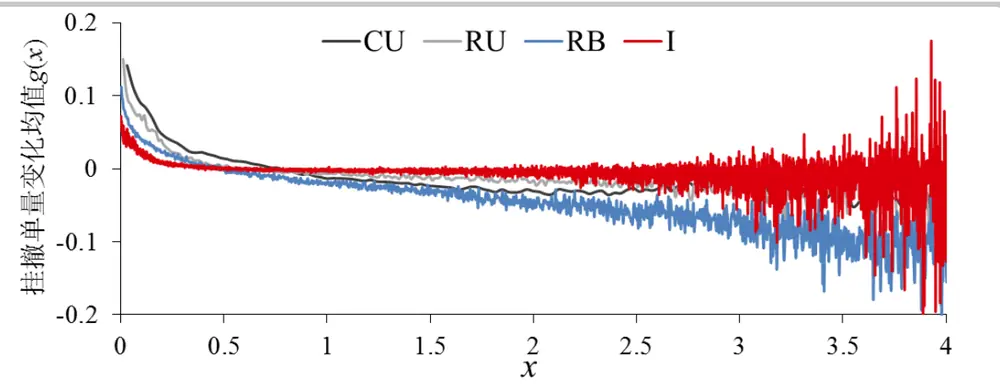
数据来源：华泰期货研究院

如果买卖队列其中一方被市价单击穿，比如卖一被击穿，那么在买卖价差仍然为一个最小变动单位的前提下，原来的买一价就变成了新的买二价，也就是说原来的买一价之前被插入了一个新的买价。在出现新价格插入之前，旧的队列分布可以记为q (x)。对买单来讲，就是价格上涨前旧的买一队列，而对卖单来讲则是价格下跌前旧的卖一队列。这 4 个期货品种的q (x)分布如图 2 所示，他们也是比较接近， $q_{+}(x)$ 随着x增大而增大，当x < 1时这个概率通常增加比较快，之后有所放缓。这个解释也很直接，比如当买一的限价单增加，说明市场看涨情绪较浓，市场有上涨压力，那卖一的限价单就容易被击穿，从而造成新的买单队列插入。

图 2： 队列被插入的概率q+(x)
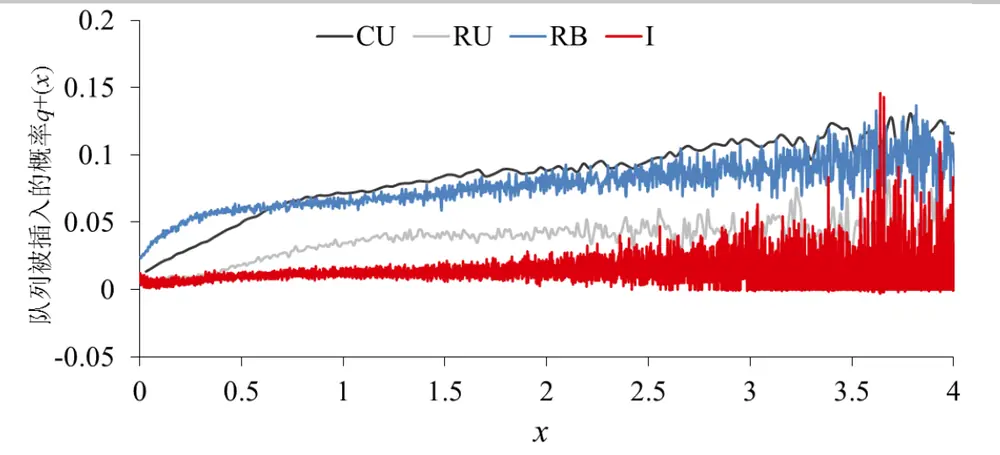
数据来源：华泰期货研究院

图 3 是队列被击穿前的队列长度的概率分布q (x)。这里统计的也是价差为一个最小单位，中间价只变动一个最小单位的情形。由图可见q (x)随着队列长度的增加而减小。当x < 0.2时，击穿概率的衰减较快，当x > 1后这个概率几乎为 0。对这四个期货品种而言，队列的击穿概率都呈现出指数衰减的形式。

图3： 队列被击穿的概率q (x)
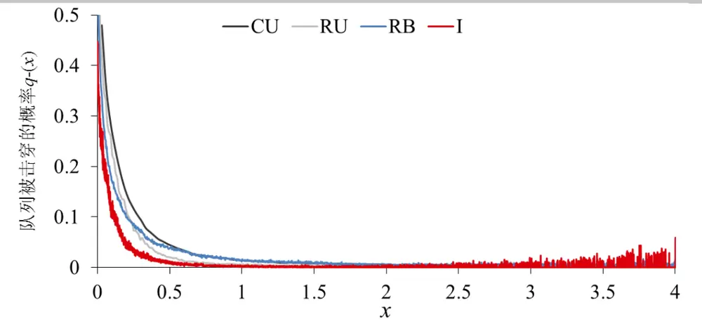
数据来源：华泰期货研究院

当资产中间价出现变化，与前一个 500 毫秒的截面数据相比，必然会有一条新的限价单队列形成。例如当中间价上涨，一个新的买价产生与之伴随的是一条新的买单队列。这条新形成的买单队列概率分布 $\mathsf{P}_{+}(x)$ ，展示如图 4所示。这条新队列的长度也是呈现出指数衰减的函数形式。由于是一条新插入的队列，队列长度大概率较短，对铜和橡胶来说极少数情况下这个长度能大于 1。

图4： 插入的新队列长度概率P (x)
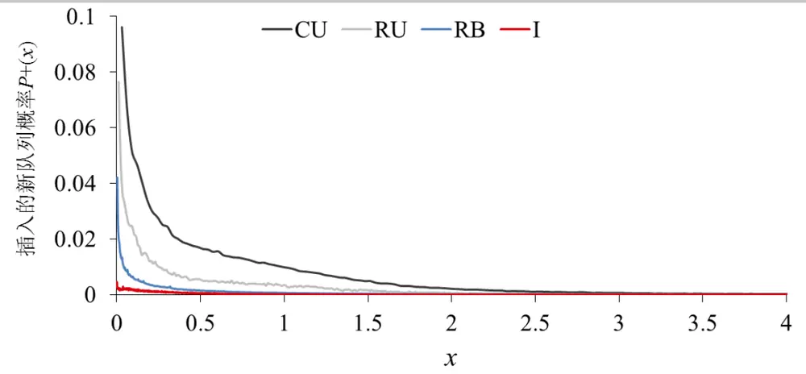
数据来源：华泰期货研究院

与新队列的产生对应的是被击穿一方的队列分布。例如中间价上涨，卖一价被击穿，原来的卖二价成为了新的卖一价，所以这时候新卖一价其实是一条存在的旧队列。这个队列长度的分布P (x)如图5所示。对铜和橡胶来说P (x)的分布在x = 1时达到峰值，即原来的二档队列分布仍然在挂单量均值附近，稍微左偏一点，说明原来二档的挂单量可能比一档要少。螺纹钢和铁矿石的峰值则左偏较多。

图5： 击穿后的新队列长度概率P (x)
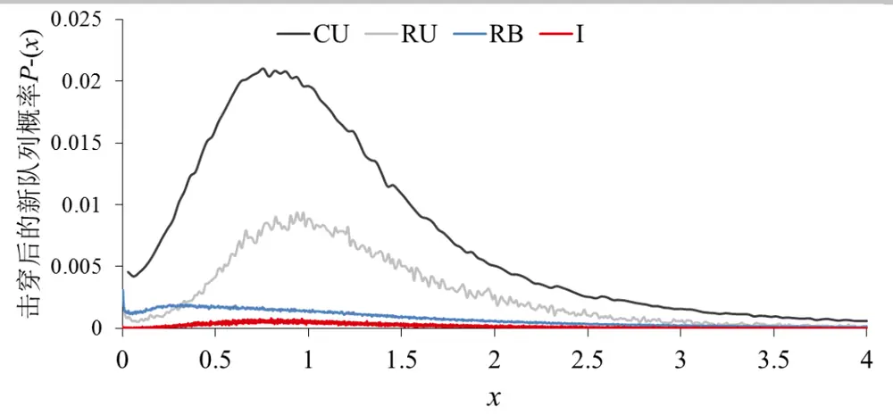
数据来源：华泰期货研究院

## 沪铜的一维队列特征

在上述的 4 种大跳价资产中沪铜的跳价最小，因此呈现出一个比较特殊的性质，就是买卖价差被打开的概率相对较大，高频数据统计结果显示大概有 94%的时间价差处在大于一个最小变动单位的状态。因此有必要对比不同价差状态下的限价单队列分布情况。沪铜在价差大于 1 的持续时间并不长，因此这里不统计挂撤单量变化均值g(x)的变化。下面统计的是价差状态从大于 1恢复到等于1时的情景以及作为对比加入的价差等于 1的情景。

图6展示的是队列被同向插入的概率 $\cdot q2_{+}(x)$ 。比如当价差等于2时插入的新队列为买单时，统计原来的买单队列分布。由图可见这个概率也是随着x增加而增加，这意味着在价差被打开时可以通过买一和卖一的队列长度来预判新形成的队列会是买还是卖。另外对比 $\mathbf{\nabla}_{\cdot}q_{+}(x)$ 和$q2_{+}(x)$ 可以发现这两个概率分布是非常接近的，而且 $q2_{+}(x)>q_{+}(x)$ ，这是因为价差实际上会倾向于回复到等于 1 的情况。同时当 $x>3$ 时， $q2_{+}(x)$ 的点比较散乱，这是因为价差为2时出现较长队列的情况非常小而导致的统计偏差。

图 6： 队列被同向插入的概率 $\mathbf{\partial}_{q_{+}}(x)$ 和q2+(x)
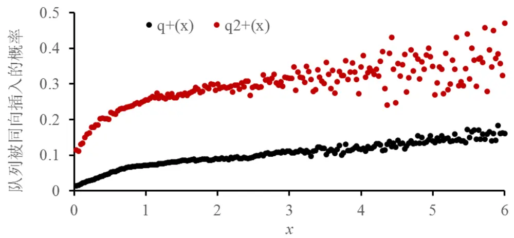
数据来源：华泰期货研究院

图7展示的是队列被反向插入的概率q2 (x)。比如当价差等于2时插入的新队列为买单时，统计原来的卖单队列分布。由图可见，随着x增加，反向插入的概率是减少的，这个结果跟图 6 是一致的。另外对比q (x)和q2 (x)可以发现他们之间的异同与图 6 中 $q_{+}(x)\not/{\approx}q2_{+}(x)$ 的异同一致，即概率分布相似，当x > 3时，概率的采样点比较散乱。

图7： 队列被反向插入的概率q (x)和q2 (x)
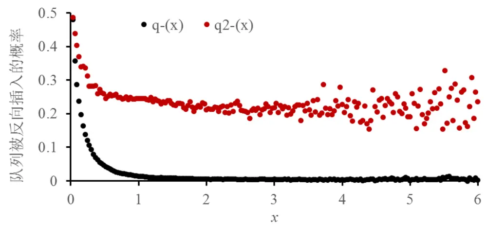
数据来源：华泰期货研究院

图 8 是价差为 2 时，新插入队列的概率分布，而图 9 与新插入队列相对的旧队列概率分布。这两个队列的分布跟价差状态为 1时重合得很好，因此与价差状态无关。

图8： 插入的新队列概率 $P_{+}(x)\mathcal{\bar{F}}^{\flat}P2_{+}(x)$
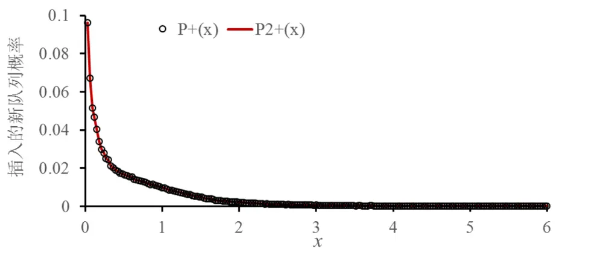
数据来源：华泰期货研究院

图9： 插入后的反向队列概率P (x)和P2 (x)
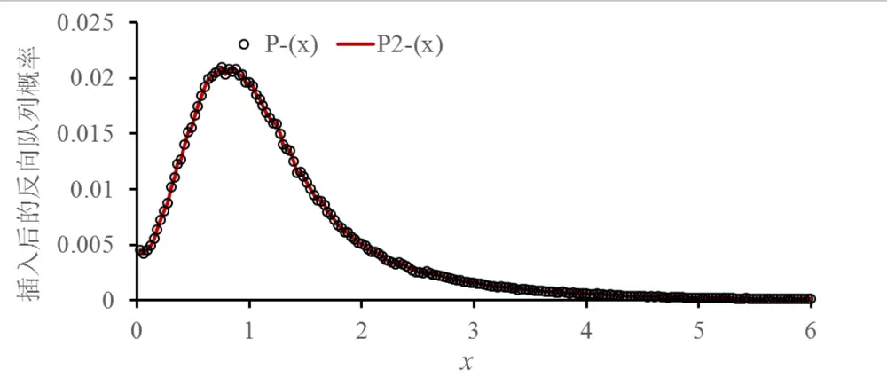
数据来源：华泰期货研究院

## 沪铜的二维队列特征

上述统计分析展示的都是一维的概率分布，而实际上限价单队列的概率分布与更高维度数据有关。例如当新闻发布一个利好事件时，市价买单和限价买单会同时增多，原队列的限价卖单会出现大量撤单，而剩余的限价卖单会被大量市价买单消耗，价格因此而上升。由此可见限价单的队列变化并非只与其本身的长度有关，需要包含更高维度的信息。这里只同时统计买卖限价单队列的二维情景。

首先考察买单和卖单挂撤量变化均值 $g^{+}(x,y)\not\ F^{\sigma}g^{-}(x,y)$ ，定义如下

$$
g^{\pm}(x,y)=\frac{\sum_{L_{t}^{\pm}}L_{t}^{\pm}\rho\big(L_{t}^{\pm}|x_{t-1},y_{t-1}\big)}{\overline{{l}}}\tag{4}
$$

其中x和y分别表示买单和卖单的相对尺度，即(1)。

g+(x, y)和g−(x, y)由此构造出一个向量场如图 10 所示，箭头长短表示期望值向量模的大小。当买卖单队列都较短即x < 0.5和y < 0.5时，买卖单的挂撤量都会增加，而当一方的队列较短，例如买一队列小于 0.25 时，另一方的挂撤量会较为迅速地增加，所以在临近底部和左边的箭头较长。在临近x = 1和y = 1区域挂撤量变化接近0，这也说明限价单队列有一定的均值回复特性。在x > 1和y > 1区域，图中的向量场基本上都指向左下角区域，说明此时限价单队列有减少的趋势。但值得注意的是在此区域右对角线的下方，箭头向右下角拐弯；而在右对角线的上方，向量箭头向左上角拐弯，这个特点能跟常见的挂单不平衡信号对应起来：当买卖挂单一方的量较高时，该方向的挂单量会持续增加，而另一方的挂单量将减少，中间价将击穿挂单量较少的一方。

图10： 限价买卖单挂撤量变化方向
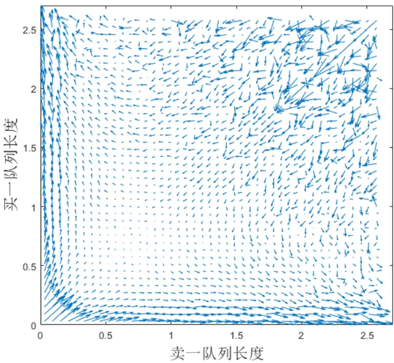
数据来源：华泰期货研究院

图 11 展示了价差状态分别为一个最小变动单位和大于一个最小变动单位时中间价在不同买卖队列长度下的上涨概率。在价差等于 1 时，中间价上涨，意味着卖单队列被击穿，一个新的买单队列插入。在价差大于 1 时，中间价上涨，意味着一个新的买单队列插入。根据买卖单的对称性，中间价下跌的情况只需要对这两个统计矩阵转置即可。由图可见，当价差等于 1，卖一队列长度小于0.5时，价格上涨更多的是取决于买单队列的长度，卖单队列长度的影响较小。而当卖一队列长度大于 0.5 时，无论买单队列多长，上涨概率都非常小。

而当价差状态大于 1 时，由于统计数据较少得到的概率分布并不平滑，但分布规律其实与价差状态为 1时比较相似，即中间价上涨的概率分布主要受买一队列长度影响。

图11： 中间价上涨前买卖单概率分布 左: 价差状态为1；右: 价差状态大于1
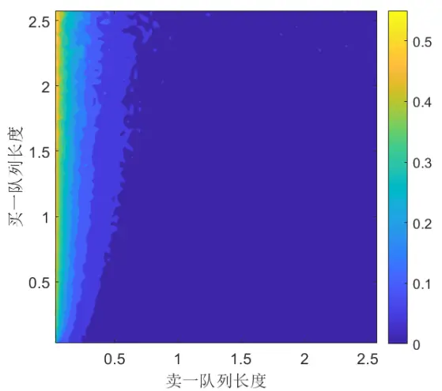
数据来源：华泰期货研究院

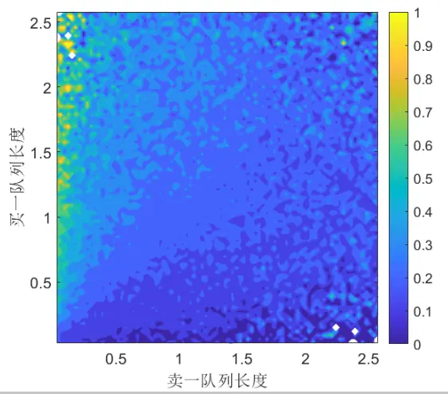

图 12展示了中间价上涨后新买卖队列长度的概率分布。这个分布与价差状态无关，新的买单队列通常较短，而新卖单队列实际上就是原来的卖二队列，因此其概率分布模式与图 5比较接近。新买单长度主要在 0至 0.5区域，而卖单长度主要在 0至 1.5区域。

图12： 中间价上涨后新买卖单概率分布 左: 价差状态为1；右: 价差状态大于1
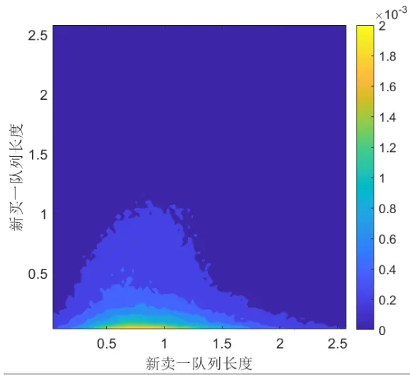
数据来源：华泰期货研究院

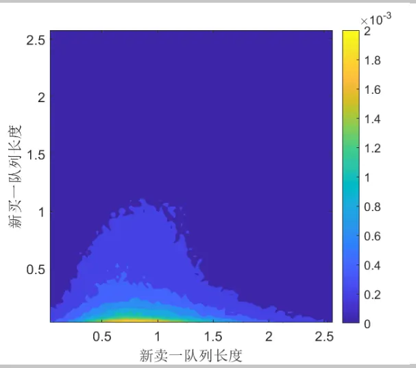

## 结果讨论

这篇报告利用挂单量均值作为新尺度研究高频数据的概率分布特征。所选择的 4 个期货品种的高频数据在这个尺度下都展现了比较相似的概率分布。一维数据特征中这 4 个品种比较接近的是挂撤单量变化均值和队列被击穿的概率。差异比较明显的是队列被插入的概率和价格变化后新队列的概率分布。造成差异的原因主要是这些期货合约的相对跳价和平均挂单量。

另外对沪铜期货存在价差大于 1 的情况进行了专门研究，发现与价差为 1 的情况相比新队列产生的概率分布与价差为 1 的情况类似，但由于买卖价差倾向于收敛，这个概率明显比较大。

最后对沪铜的二维队列的概率分布做了研究发现限价单的挂撤单量有均值回复的现象，中间价涨跌概率主要受限价买卖限价单队列较长的一方决定。

## 免责声明

此报告并非针对或意图送发给或为任何就送发、发布、可得到或使用此报告而使华泰期货有限公司违反当地的法律或法规或可致使华泰期货有限公司受制于的法律或法规的任何地区、国家或其它管辖区域的公民或居民。除非另有显示，否则所有此报告中的材料的版权均属华泰期货有限公司。未经华泰期货有限公司事先书面授权下，不得更改或以任何方式发送、复印此报告的材料、内容或其复印本予任何其它人。所有于此报告中使用的商标、服务标记及标记均为华泰期货有限公司的商标、服务标记及标记。

此报告所载的资料、工具及材料只提供给阁下作查照之用。此报告的内容并不构成对任何人的投资建议，而华泰期货有限公司不会因接收人收到此报告而视他们为其客户。

此报告所载资料的来源及观点的出处皆被华泰期货有限公司认为可靠，但华泰期货有限公司不能担保其准确性或完整性，而华泰期货有限公司不对因使用此报告的材料而引致的损失而负任何责任。并不能依靠此报告以取代行使独立判断。华泰期货有限公司可发出其它与本报告所载资料不一致及有不同结论的报告。本报告及该等报告反映编写分析员的不同设想、见解及分析方法。为免生疑，本报告所载的观点并不代表华泰期货有限公司，或任何其附属或联营公司的立场。

此报告中所指的投资及服务可能不适合阁下，我们建议阁下如有任何疑问应咨询独立投资顾问。此报告并不构成投资、法律、会计或税务建议或担保任何投资或策略适合或切合阁下个别情况。此报告并不构成给予阁下私人咨询建议。

华泰期货有限公司2019版权所有。保留一切权利。

## 公司总部

地址：广东省广州市越秀区东风东路761号丽丰大厦20层

电话：400-6280-888

网址：www.htfc.com