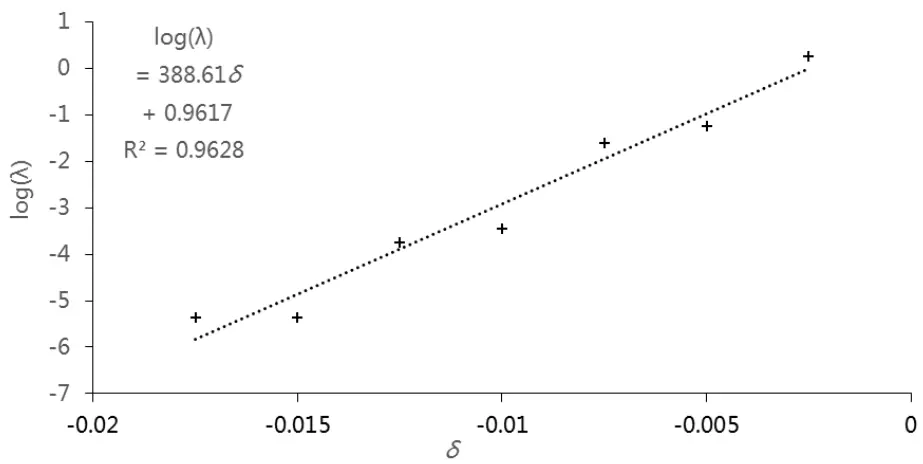
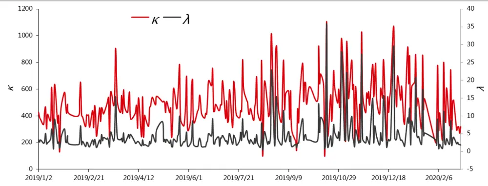
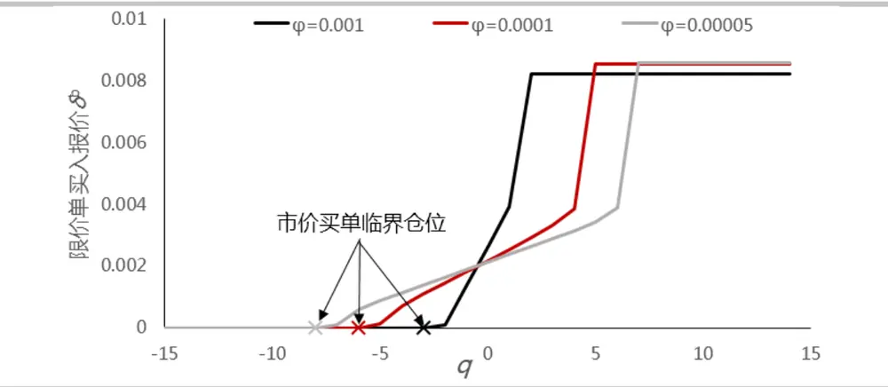
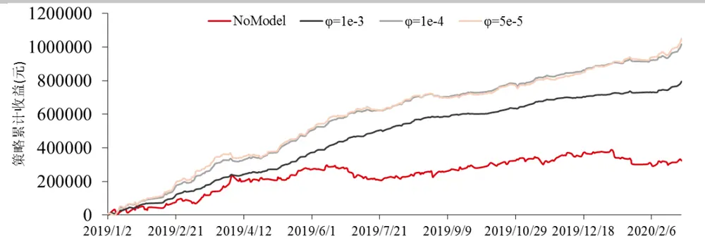
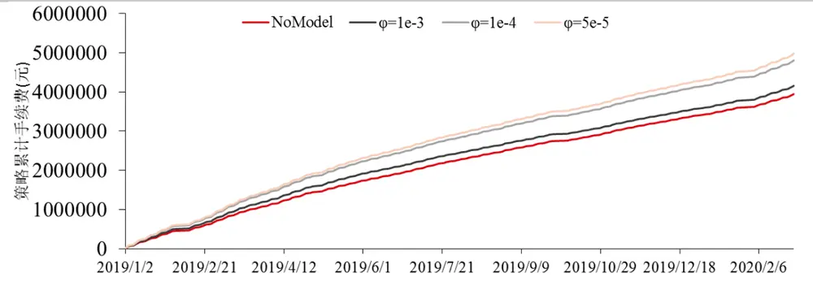

## 国债期货高频做市策略

高频做市策略是围绕标的物的即时价格在不同价位挂出限价单，通过标的物价格的来回波动触碰到低价的买单和高价的卖单，实现低买高卖，从而获利。简单的在买一和卖一挂限价单做法如果碰到市场出现单边趋势性行情时将会出现严重亏损，因为市场越涨，所挂卖单就会大量成交，累积做空头寸，市场越跌所挂买单就会大量成交，累积做多头寸，如何合理管理单边头寸，即库存风险，是做市商面临的较大难题。

这篇报告使用 Álvaro Cartea 和 Jose Penalva 等人在 Algorithmic and High-Frequency Trading 中给出的方法构建做市策略。这个模型假设限价单的成交事件密度符合指数分布，并且对累积库存进行限制，在库存达到最值时，即停止同方向报价，而只做反方向报价，从而限制库存的进一步增加。在此基础上该模型对离散化的库存情况进行建模，通过优化买卖报价实现库存风险的管理。模拟回测发现使用这个做市模型后，与不使用模型相比，策略的日均收益和夏普率都会显著提升。虽然夏普率随着风险偏好增加而降低，但是策略盈利所需的手续费返还比例也会降低。

投资咨询业务资格：

证监许可【2011】1289 号

研究院 量化组

研究员

罗剑

- 0755-23887993

- luojian@htfc.com

从业资格号：F3029622

投资咨询号：Z0012563

陈维嘉

- 0755-23991517

- chenweijia@htfc.com

从业资格号：T236848

投资咨询号：TZ012046

陈辰

0755-23887993

chenchen@htfc.com

从业资格号：F3024056

投资咨询号：Z0014257

联系人

高天越

- 0755-23887993

- gaotianyue@htfc.com

从业资格号：F3055799

## 研究背景

做市策略总是包含着双向报价的目的，通过成交价格在买卖价差之间非常窄幅的波动中获利，这里的窄幅波动通常就只有 1 至 2 个买卖变动价位，而非从标的资产大方向性变化中获利。这意味着做市策略必须避免积累了大量的做多或者做空方向的净头寸。因为净头寸的积累将带来价格反向波动时的损失。这也意味着做市策略的盈利是来自于小幅度但是高频率的价格波动。

根据 Tanmoy Chakraborty 和 Michael Kearns 的论文 Market Making and Mean Reversion, 2011 可以对做市策略的盈利作出合理的解释。这里首先假设所有的市场事件出现在离散的时间点位 0，1，2…直到时刻 $T_{\circ}$ 时刻T是做市策略结束的时间点，可以理解为做市策略从每天开盘开始，到收盘结束。在收盘时刻T，做市策略必须平掉所有的单方向净头寸。标的资产在所有 $0\le t\le T$ 的时刻，都存在一个即时价格 $P_{t}$ ，这个 $P_{t}$ 用变动单位表示，是标的资产最小变动单位的整数倍。做市策略的理论收益为

$$
{\frac{1}{2}}(K-z^{2})\tag{1}
$$

其中

$$
K=\sum_{t=1}^{T}\lvert P_{t+1}-P_{t}\rvert\tag{2}
$$

代表价格波动的绝对幅度。

$$
z=P_{T}-P_{0}\tag{3}
$$

代表收盘后平掉净头寸所产生的盈亏。

因此做市策略的盈利点可以归结为尽量多地捕捉价格的窄幅波动，为实现这一目的则必须紧跟着中间价的变化频繁地进行挂撤单，但是上述公式并没有对做市过程中出现的风险进行控制。下面我们以10年期国债期货主力合约为例，利用随机控制的方法对做市过程中出现的库存风险进行优化控制。

## 做市模型

这里使用 Álvaro Cartea 和 Jose Penalva 等人在 Algorithmic and High-Frequency Trading 中给出的方法构建做市策略。首先假设买卖中间价s服从算术布朗运动

$$
ds_{t}=\sigma dW_{t}\tag{4}
$$

库存q，即做市商的净持仓，由买单持仓 $N^{b}$ 和卖单持仓 $N^{a}$ 构成

$$
q_{t}=N_{t}^{b}-N_{t}^{a}\tag{5}
$$

与AS模型不同，ASQ 模型里做市商围绕中间价s进行买单报价 $\cdot\delta^{b}$ 和卖单报价 $\cdot\delta^{a}$ ，做市商的现金流X可以表示为

$$
dX_{t}=(s_{t}+\delta_{t}^{a})dN_{t}^{a}-(s_{t}+\delta_{t}^{b})dN_{t}^{b}\tag{6}
$$

同时假设在距离中间价δa和 $\hbar^{b}$ 的价位上发生市价单成交事件的泊松密度为

$$
\Lambda(\delta)=\lambda e^{-\kappa\delta}\tag{7}
$$

模型里会对做市商的最大库存Q进行限制，即库存q $\in\{-0,-0+1,\ldots,0,\ldots,0-1,0\}$

当 $|q|<0$ 时，做市商进行买卖双向报价，最优报价 $\cdot\delta^{b}$ 和 ${}_{r\delta}a$ 满足 HJB 方程

$$
\begin{array}{r}{u_{t}+\displaystyle\frac{1}{2}\sigma^{2}u_{ss}+\operatorname*{max}_{\delta^{b}}\lambda e^{-\kappa\delta^{b}}[u(s,x-s+\delta^{b},q+1,t)-u(s,x,q,t)]\medskip\qquad}\\{\quad\quad\quad+\operatorname*{max}_{\delta^{a}}\lambda e^{-\kappa\delta^{a}}[u(s,x+s+\delta^{a},q-1,t)-u(s,x,q,t)]-\phi q^{2}=0}\end{array}\tag{8}
$$

其中的φ为做市过程中做市商的库存风险偏好。

$q=0$ 时，做市商不再进行买入报价，只进行卖出报价，这时最优卖出报价 $\cdot\delta^{a}$ 满足 HJB方程

$$
u_{t}+\frac{1}{2}\sigma^{2}u_{ss}+\operatorname*{max}_{\delta^{\alpha}}\lambda e^{-\kappa\delta^{a}}[u(s,x+s+\delta^{a},q-1,t)-u(s,x,q,t)]-\phi q^{2}=0\tag{9}
$$

当 $q=-0$ 时，做市商不再进行卖出报价，只进行买入报价，这时最优买入报价 $\cdot\delta^{b}$ 满足HJB 方程

$$
u_{t}+\frac{1}{2}\sigma^{2}u_{ss}+\operatorname*{max}_{\delta^{b}}\lambda e^{-\kappa\delta^{b}}[u(s,x-s+\delta^{b},q+1,t)-u(s,x,q,t)]-\phi q^{2}=0\tag{10}
$$

做市商报价在T时刻终止，所以方程(8)-(10)满足终止条件

$$
\forall\mathbf{q}\in\{-\mathbb{Q},\dots,\mathbb{Q}\},u(T,x,q,s)=x+q(s-\alpha q)\tag{11}
$$

方程(8)-(11)包含2Q+1个偏微分方程，必须联立求解。

通过分离变量的方法可以把上述的偏微分方程组简化后求解。这里把公式(8)中的效用函数$u(t,x,q,s)$ 分解为

$$
u(t,x,q,s)=x+qs+h(t,q)\tag{12}
$$

那么方程组(8)-(10)可以转化为

$$
\begin{array}{rl}&{h_{t}+\underset{\delta^{b}}{\operatorname*{max}}\lambda e^{-\kappa\delta^{b}}[\delta^{b}+h(q+1,t)-h(q,t)]}\\&{\qquad+\underset{\delta^{a}}{\operatorname*{max}}\lambda e^{-\kappa\delta^{a}}[\delta^{a}+h(q-1,t)-h(q,t)]-\phi q^{2}=0}\end{array}\tag{13}
$$

其中最优报价策略可以通过令一阶项导数为 0求得

$$
\delta^{a,b}=\frac{1}{\kappa}+[h(t,q)-h(t,q\mp1)]\tag{14}
$$

另外做市商在累计一定库存后，可能需要使用市价单保证成交以减少库存风险，因此引入市价单后公式(13)可以写成

$$
\begin{array}{rl}&{\operatorname*{max}\Big\{h_{t}+\underset{\delta^{b}}{\operatorname*{max}}\lambda e^{-\kappa\delta^{b}}[\delta^{b}+h(q+1,t)-h(q,t)]}\\&{\qquad+\underset{\delta^{a}}{\operatorname*{max}}\lambda e^{-\kappa\delta^{a}}[\delta^{a}+h(q-1,t)-h(q,t)]-\phi q^{2},h(q-1,t)}\\&{\qquad-\ :h(q,t)-\xi,h(q+1,t)-h(q,t)-\xi\Big\}=0}\end{array}\tag{15}
$$

这里的ξ值代表使用市价单成本，这里设定为2个最小变动价位。上述偏微分方程可以使用有限差分的方法进行求解，由于实际中一天的做市过程较长，为了简化计算，这里使用公式(15)达到稳定解时的最优策略进行做市分析与回测。

## 模型的校正与分析

由于这里的做市模型使用到多个市场参数，先对他们稍作分析。这里选取10 年期国债期货主力合约 2019年1月至2020年 2月的高频数据进行分析。使用的高频数据来源于天软的500毫秒 Level1截面数据，里面包含了 500毫秒截面上的买一价、卖一价、买一量、卖一量、500毫秒内的成交量和成交金额等数据。波动率σ可以直接从利用高频数据的中间价计算。限价指令簿厚度系数κ和限价指令簿击穿概率系数A则需要通过统计市价单击穿某个价位的概率，然后拟合公式(7)进行计算。把公式(7)两边取对数可得

$$
\mathrm{log}\Lambda=\mathrm{ln}\lambda-\kappa\delta\tag{16}
$$

公式(16)的拟合参数会受到每天不同的交易量影响，实际交易中最好分时段进行拟合，这里为了简化处理，只使用开盘后约 30 分钟的数据进行拟合，其中 2019 年 1 月 2日 10 年期国债期货高频数据拟合效果如图 1 所示，横轴δ表示与上 500 毫秒中间价的距离，logΛ表示在特定价位上出现成交事件数量的对数。图中的采样点排布规律非常符合线性分布，因此使用公式(7)来描述国债期货的成交价位分布是比较准确的。

图1： 2019 年 1 月 2 日 10 年期国债期货高频数据拟合效果

数据来源：华泰期货研究院

图 2 作出的是 2019年 1 月2 日至 2020年 2月 28日 10 年期国债期货参数κ和λ的走势。κ值大部分时候都是在 400-600左右，这个值比较大是因为这里使用国债期货的最小变动价位表示，而国债期货的最小变动价位是 0.005，非常小，所以κ值显得比较大。λ值则是在 1-5 左右，少数情况下会大于 10，这说明这些高频参数还是比较稳定的。而在实际使用中公式(15)的解也对这些参数不敏感。

图2： 10 年期国债期货参数日间变化

数据来源：华泰期货研究院

接下来研究利用这个随机控制模型进行买卖报价的特点，图 3 以买入操作为例，展示了在不同仓位，以及不同的库存风险偏好φ下的最优报价策略。图中的横轴代表当前的库存仓位，纵轴代表所报限价买单与中间价的距离。从图中的曲线可见，当库存持有较多多头仓位时，限价买单即与中间价拉开较远距离，与之相反在净头寸为负值时，做空仓位越多，限价买单的报价距离与中间价越近。在一定的仓位水平下，具体的报价距离由库存风险水平φ值决定。当φ值较大，即比较厌恶风险时，所报限价单价格相对库存的曲线比较陡峭，做市商倾向于通过减小报价距离，同时减少利润来降低库存水平。图 3也作出了使用市价买单的临界点，随着φ值增加，这个临界仓位也与之增加，意味着做市商更倾向于使用市价单减少风险。

图3： 限价买单/市价买单的报价策略

数据来源：华泰期货研究院

## 做市策略回测

做市策略是一个根据中间价格s变化而做出挂撤单的动态决策过程。在时刻t，模型根据计算结果围绕中间价进行买单和卖单的报价。在下个 500 毫秒收到的行情数据中，如果有合约成交在小于所挂买单的价格或高于所挂卖单的价格则判断为成交，然后再根据新的报价情况进行挂撤单操作。交易手续费按照散户标准 6 元/手计算。由于这类做市策略能制造大量成交，一般可以获得较大比例返佣，实际收益与返佣有关。

挂出的限价卖单按下面方法判定能否成交：

（1） 最高卖单成交价<所挂价格，则所挂卖挂单无机会成交。

（2） 最高卖单成交价>所挂价格，意味着卖单被击穿，判定为成交。

（3） 最高卖单成交价=所挂价格。根据当前时刻t+1的成交量和成交额推算排名和判断成交。

而在使用市价卖单时则是按照行情数据中成交位置最低的一个价格计算，接近成交的最差情况。作为对照，这里加入了不使用模型的情况，即使用限价单在买一和卖一上报价，当累积库存达到仓位限制时即停止同向报价，由于图3给出的市价单临界点最多为净持仓8手，因此这里设定对照策略的最大库存也为8手。

图 4 展示了不使用模型以及各个风险偏好下做市策略的收益。从图中可见在各种情况下策略都能获得一定的正收益，但是不使用随机控制模型的对照组策略收益波动明显较大，使用随机控制的最优报价后收益明显平稳很多。 $\phi\ :=10^{-3}$ 时的收益曲线最为平滑，而当φ =10-4和 $5\times10^{-5}$ 时，两者的收益曲线差别不大，这是因为实际报价需要对连续报价进行取整，虽然图 3 中报价距离有很多，但是根据最小变动单位取整后的报价只有 0, 0.005和 0.01三种，这也是使用连续报价模型的一种缺陷，可以用离散报价进行改进。

图4： 国债期货做市策略收益

数据来源：华泰期货研究院

图5是这个策略产生的累积手续费随着φ值减少，产生的手续费也有所增加，这是因为风险偏好增加，能够容忍更多库存风险，从而导致成交量增加，手续费提高。

图 5： 国债期货做市策略收益产生的手续费

数据来源：华泰期货研究院

表格 1 统计的是 2019 年 1 月至 2020 年 2 月的策略表现，随着库存风险偏好增加，即φ值减少，日均收益有所增加，这是因为做市商主动承担了更多的库存风险，同时日度收益的标准差也有所扩大。与不使用模型比较，使用随机控制模型后的做市收益都有了明显增加，这是因为使用了模型后做市商能够进行深度报价。同时随机控制模型对库存风险的控制也使得收益标准差大大减少。但是随着风险偏好增加，夏普率也有所减少，夏普率最高的情况是 $\phi{=}10^{-3}$ 时，达到了 14.3。而日均交易量和手续费也是随着风险偏好的增加而增加，但是撤单量是减少的，因为风险偏好越高，做市商更能维持较远距离的报价。在日内最大亏损方面，不使用模型亏损最多，而通过随机控制的方法却能有效控制风险。从图 5 也可以看出做市策略的手续费远高于账面收益，因此最终的盈利取决于手续费的返还比例。在φ= 5×10-5的水平下，所需要的手续费返还水平最低，只有 78.89%。

表格 1 策略收益对比

|  | NoModel | φ=1e-3 | φ=1e-4 | φ=5e-5 |
| --- | --- | --- | --- | --- |
| 日均收益(元) | 1156 | 2839 | 3523 | 3752 |
| 收益标准差(元) | 9617 | 3142 | 5118 | 6791 |
| 年化夏普率 | 1.9 | 14.3 | 10.9 | 8.7 |
| 日均交易量(手) | 2350 | 2476 | 2866 | 2963 |
| 日均手续费(元) | 14098 | 14856 | 17197 | 17777 |
| 日均撤单量(手) | 2291 | 3331 | 3039 | 2979 |
| 日内最大持仓(手) | 8 | 3 | 6 | 8 |
| 日内最大亏损(元) | 37950 | 11500 | 15350 | 26900 |
| 返佣临界点 | 91.80% | 80.89% | 79.51% | 78.89% |

数据来源：华泰期货研究院

## 结果讨论

这篇报告介绍了利用随机控制模型做市的原理，这个模型根据做市过程中产生的累积库存风险以及在各个价位报价的成交概率，利用HJB方程推导出最优的限价单报价和选择市价单进场的库存位置。在 10年期国债期货做市回测中发现，使用了随机控制模型后的策略表现，与不使用模型相比，策略的日均收益和夏普率都会显著提升。虽然夏普率随着风险偏好增加而降低，但是策略盈利所需的手续费返还比例也会降低。

## 免责声明

本报告基于本公司认为可靠的、已公开的信息编制，但本公司对该等信息的准确性及完整性不作任何保证。本报告所载的意见、结论及预测仅反映报告发布当日的观点和判断。在不同时期，本公司可能会发出与本报告所载意见、评估及预测不一致的研究报告。本公司不保证本报告所含信息保持在最新状态。本公司对本报告所含信息可在不发出通知的情形下做出修改， 投资者应当自行关注相应的更新或修改。

本公司力求报告内容客观、公正，但本报告所载的观点、结论和建议仅供参考，投资者并不能依靠本报告以取代行使独立判断。对投资者依据或者使用本报告所造成的一切后果，本公司及作者均不承担任何法律责任。

本报告版权仅为本公司所有。未经本公司书面许可，任何机构或个人不得以翻版、复制、发表、引用或再次分发他人等任何形式侵犯本公司版权。如征得本公司同意进行引用、刊发的，需在允许的范围内使用，并注明出处为“华泰期货研究院“，且不得对本报告进行任何有悖原意的引用、删节和修改。本公司保留追究相关责任的权力。所有本报告中使用的商标、服务标记及标记均为本公司的商标、服务标记及标记。

华泰期货有限公司版权所有并保留一切权利。

## 公司总部

地址：广东省广州市越秀区东风东路761号丽丰大厦20层

电话：400-6280-888

网址：www.htfc.com