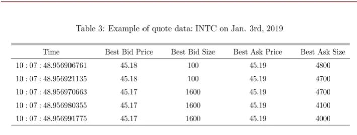
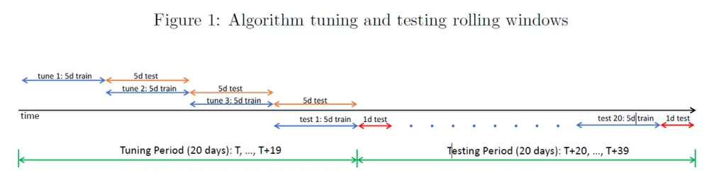
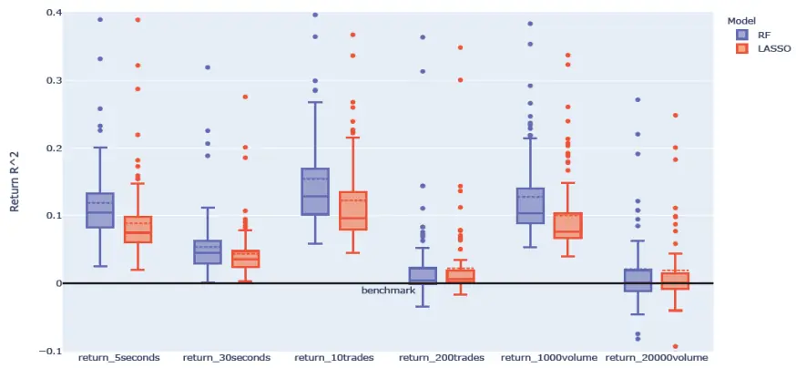
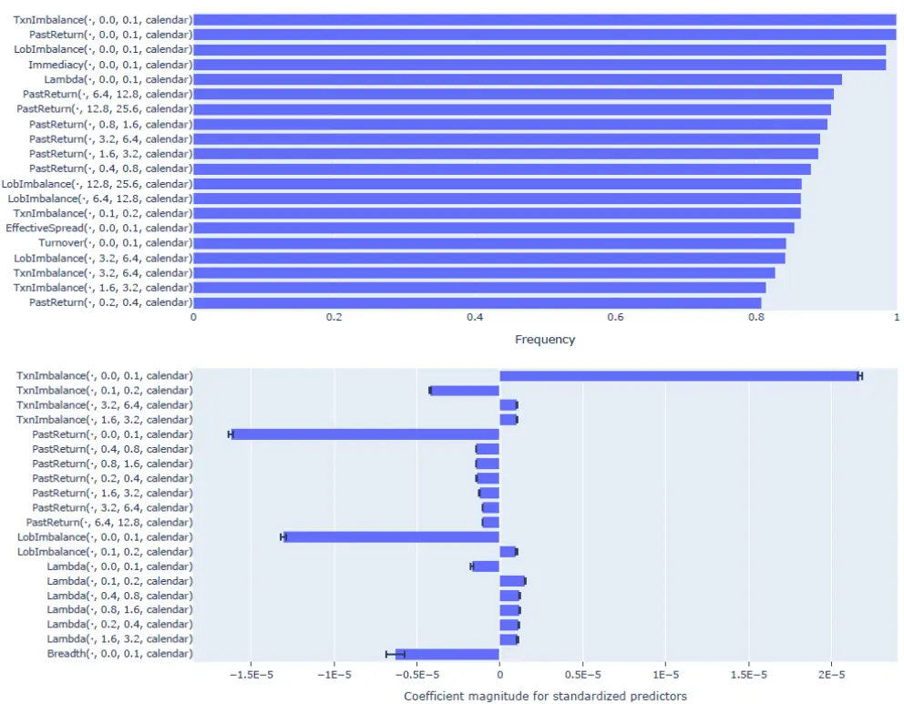
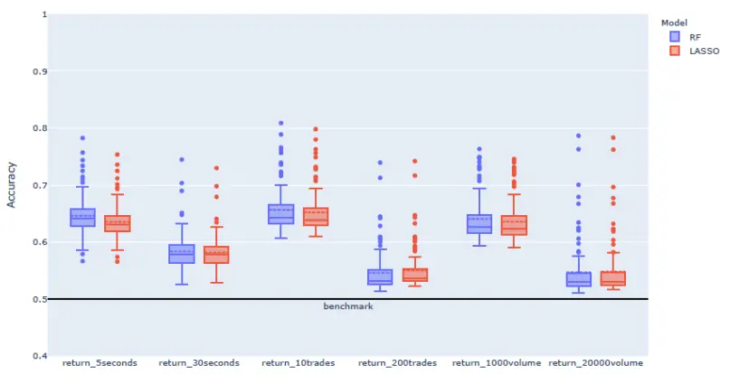
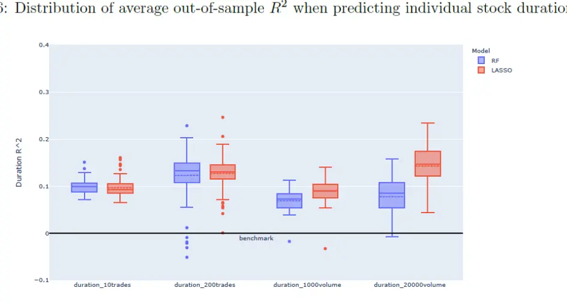
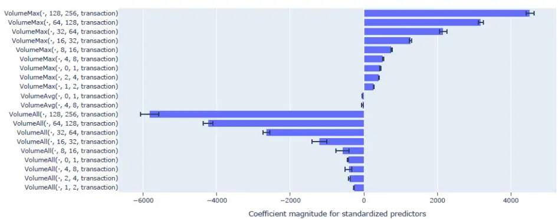
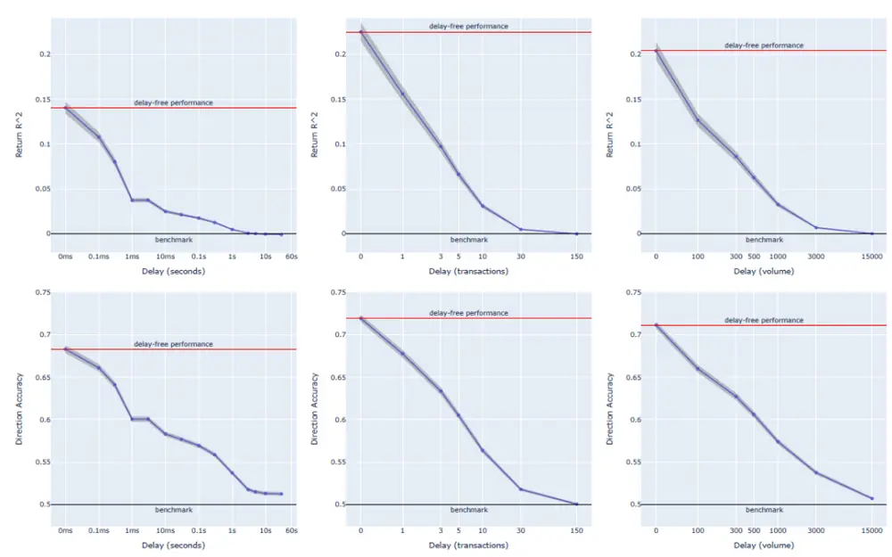
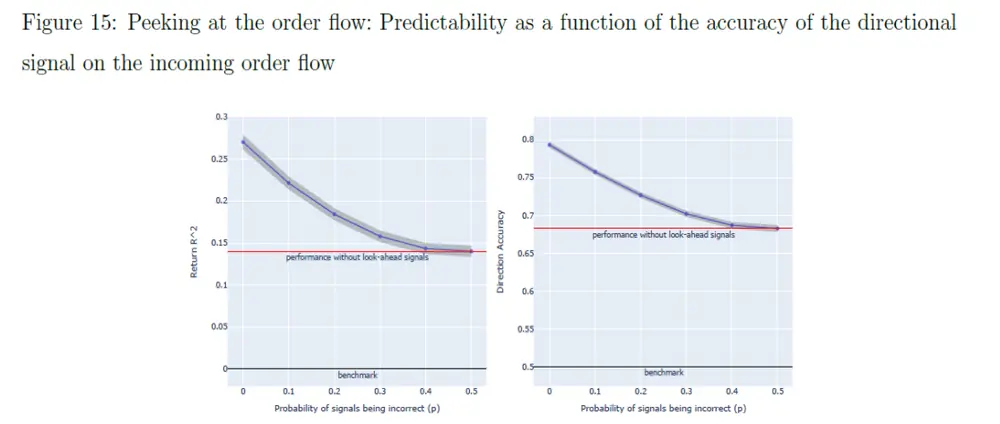

## 华泰期货

HUATAI FUTURES

研究院 量化组

研究员

高天越

- 0755-23887993

- gaotianyue@htfc.com

从业资格号：F3055799

投资咨询号：Z0016156

## 联系人

李光庭

- 0755-23887993

- liguangting@htfc.com

从业资格号：F03108562

## 李逸资

- 0755-23887993

- liyizi@htfc.com

从业资格号：F03105861

投资咨询业务资格：

证监许可【2011】1289 号

## 摘要

本报告的目的是介绍并综述 Yacine Aït-Sahalia、Jianqing Fan 等人在 2022 年发表的研究成果。他们的论文《How and When are High-Frequency Stock Returns Predictable?》深入探讨了高频股票收益率的可预测性。通过应用机器学习算法，文献作者发现，在极短的时间范围内，高频股票收益率和交易持续期展现出显著的、系统的、普遍的可预测性。本报告概述了其研究方法和理论意义，并总结了该论文的核心发现。在后续的报告中，我们将基于这篇文献的基础，对国内期货高频市场进行进一步的实证分析。

## 核心观点

高频收益率的显著可预测性：与传统的低频分析相比，高频股票收益率在极短的时间段内展现出了显著的可预测性。

成交相比于报价数据的有效性：研究发现，基于成交数据构建的预测因子，如成交不平衡和历史收益因子，对于预测高频收益率具有相对较高的帮助，而基于报价数据构造的因子则相对较弱。

数据时效的重要性：高频交易的成功在很大程度上依赖于交易系统的低延时。文献实证结果表明，即使是毫秒级的数据延迟也可能显著降低收益率的可预测性，从而影响实际交易中的盈亏。

前瞻性信息的价值：模拟分析表明，市场参与者若能获得关于未来订单流方向的前瞻性信息，即使这种信息带有噪声，也能显著提高收益预测的准确性。

## 前言

在金融市场的高频交易领域，收益率的可预测性一直是学术界和实务界关注的焦点。高频收益率在不同市场环境下的可预测性对于交易策略的制定和执行具有深远的影响。在本篇报告中，我们将概述 Yacine Aït-Sahalia、Jianqing Fan 等人在其论文《How andWhen are High-Frequency Stock Returns Predictable?》中的主要发现，这些发现为高频收益率的可预测性提供了理论基础和实证依据。

## 文献摘要

论文利用机器学习方法研究了超高频股票收益的在不同维度下的可预测性及持续性。作者发现，与中长期收益率相反（可预测性较小且不稳定），高频收益率在短期内显示出显著、系统性和普遍的可预测性。作者首先从交易和报价数据中构建了相关的预测因子，并研究是什么决定了股票在不同市场环境中可预测性的变化。接下来，作者发现可预测性会随着高频数据的及时性而提高，并对可预测性的变化进行了量化评估。最后，作者模拟了提前获取部分订单流方向（不完美）对预测能力的影响，这种前瞻性能力通常来自于最快的高频交易者，能显著提高收益率的可预测性和持续性。

## 文献实证流程

## 数据收集

论文的数据来源是TAQ数据库，使用了其中纽约证券交易所 2019 年和 2020 年合计两年的交易和报价数据。TAQ 包含纽约证券交易所 (NYSE)、纳斯达克股票市场(NASDAQ) 和美国证券交易所 (AMEX)上市的所有证券的日内交易和一级报价（市场上的最佳买价和卖价）。数据集简要总结如下：

图 1:文献所用数据集简要总结丨单位：无

| Table 1: Basic description of the size of TAQ data used |  |
| --- | --- |
| Securities included | all companies in S&P100 on 2020.12.31 |
| Number of different security symbols | 101 |
| Date range of data | 2019.1.1 to 2020.12.31 |
| Number of trading days included | 505 |
| Number of symbols available on all days | 96 |
| Number of available (symbol, date) pairs | 50,273 |
| Total disk size | 2.3 Terabytes |

数据来源：《How and When are High-Frequency Stock Returns Predictable?》 华泰期货研究院

下图（左）展示了英特尔公司的交易数据示例。对于给定的每个日期和股票代码，交易数据中的一行对应一笔交易。它包含一个时间戳中，交易的价格、规模和交易方向。时间戳以纳秒为单位。作者遵循Lee 和 Ready (1991) 1算法，从交易序列推断订单方向。如果是买入发起的交易，则将交易方向指示为 +1，如果是卖出发起的交易，则将交易方向指示为 -1。

下图（右）展示了报价更新数据的快照示例。报价数据中的每一行对应于某个时间戳的最优双边报价价格以及挂单量。

图 2:文献所用交易数据示例 | 单位：美元

| Time | Price | Size | Direction (Lee-Ready) |
| --- | --- | --- | --- |
| 10:07:48.956770900 | 45.18 | 100 | -1 |
| 10:07:48.956773554 | 45.18 | 300 | -1 |
| 10:07:48.956916983 | 45.18 | 100 | -1 |
| 10:07:48.956971093 | 45.18 | 100 | +1 |
| 10:07:48.957830128 | 45.18 | 66 | +1 |

数据来源：《How and When are High-Frequency Stock ReturnsPredictable?》 华泰期货研究院

图 3:文献所用报价数据示例| 单位：美元

数据来源：《How and When are High-Frequency Stock ReturnsPredictable?》 华泰期货研究院

## 预测目标

论文研究的因变量是未来一定区间内的收益率和方向（涨或是跌）。此处，作者使用了三个时钟（Time Clock）来定义区间，分别是日历时钟、成交时钟以及成交额时钟。日历时钟就是最常见的时间维度（未来 n秒的区间收益率及方向），成交时钟则将交易笔数作为衡量区间的尺度（未来 n笔交易的区间收益率及方向），而成交额时钟则是将成交金额作为衡量区间的尺度（未来n美元交易的区间收益率及方向）。预测区间构造的公式及符号表达如下：

$$
\begin{aligned}{\operatorname{Int}^{\operatorname{forward}}(T,\Delta,\operatorname{M})=\begin{cases}{\operatorname{Int}(T,T+\Delta)}&{\operatorname{if}M=\operatorname{calendar}}\\{\left\{t>T:\left(\sum_{s\in\operatorname{Int}(T,t)}\mathbb{1}_{\left\{V_{s}>0\right\}}\right)\leq\Delta\right\}}&{\operatorname{if}M=\operatorname{transaction}}\\{\left\{t>T:\left(\sum_{s\in\operatorname{Int}(T,t)}V_{s}\right)\leq\Delta\right\}}&{\operatorname{if}M=\operatorname{volume}}\\{}&{}\\{\operatorname{Int}(T_{1},T_{2})=\left\{t\in\mathbb{R}:T_{1}<t\leq T_{2}\right\}.}\\\end{cases}}\\\end{aligned}.
$$

其中，T为当前时点，Δ为区间长度，M为所选时钟。

在进一步介绍收益率与方向的计算方法之前，我们需要先介绍一些数学符号的含义。这些符号在收益率的计算公式以及后面因子的构造公式中会频繁出现，我们在此处列出以便读者更好理解。

令 $\cdot D^{txn}$ 代表所有时间戳中发生成交的时间节点， $D^{qt}$ 代表所有时间戳中与报价相关的时间节点，数据中全部的时间戳则为 $D=D^{txn}\cup D^{qt}$ 。时间 t的最优买价为 $P_{t}^{b}$ ，相应挂单量为 $|S_{t}^{b}|$ ；最优卖价为 $P_{t}^{a}$ ，相应挂单量为Sa；中间价 $P_{t}{=}(P_{t}^{b}+P_{t}^{a})/2$ 。最后，时间t的成交价格为 $P_{t}^{txn}$ ,其中 $t\in D^{txn}$ 。

作者将预测区间收益率定义为未来一段时间内的平均成交价格与当前中间价的比值减一，公式如下：

$$
\mathrm{Return}(T,\Delta,M)=\mathrm{Average}\left[P_{t}^{\mathrm{txn}}:t\in\mathrm{D}^{\mathrm{txn}}\cap\mathrm{Int}^{\mathrm{forward}}(T,\Delta,\mathrm{M})\right]/P_{T}-1.
$$

与传统的单笔交易或固定时间间隔的收益率计算方式相比，这样的计算方式使得收益率数值更加稳定，噪声更小，受到异常值的影响较小。

交易方向的计算公式为：

$$
\operatorname{Direction}(T,\Delta,M)=\mathbb{1}_{\left\{\operatorname{Return}(T,\Delta,M)>\bar{R}(\Delta,M)\right\}}.
$$

其中， $\bar{R}(A,M)$ 为股票历史上的平均区间收益率。由于时间区间较短短，该值会非常趋近于 0。

## 预测变量

## 回溯区间

论文中后续构造的所有自变量都是预测时点 T之前回溯区间内报价及成交数据的线性（或非线性）组合，与因变量一样，需要定义区间的长度。回溯区间的表达方式与预测区间基本一致，如下所示：

$$
\operatorname{Int}^{\operatorname{back}}(T,\Delta_{1},\Delta_{2},\operatorname{M})=\begin{cases}{\operatorname{Int}(T-\Delta_{2},T-\Delta_{1})}&{\operatorname{if}M=\operatorname{calendar}}\\{\left\{t:t\leq T,\Delta_{1}\leq\left(\sum_{s\in\operatorname{Int}(t,T)}\mathbb{1}_{\left\{V_{s}>0\right\}}\right)<\Delta_{2}\right\}}&{\operatorname{if}M=\operatorname{transaction}-}\\{\left\{t:t\leq T,\Delta_{1}\leq\left(\sum_{s\in\operatorname{Int}(t,T)}V_{s}\right)<\Delta_{2}\right\}}&{\operatorname{if}M=\operatorname{volume}}\\\end{cases}
$$

作者使用了多个不相交的区间作为回溯区间。对于日历时钟，作者使用 $(\varDelta_{1},\varDelta_{2})\in$ {(0,0.1), (0.1,0.2), (0.2,0.4), … … , (12.8,25.6)}共 9 个区间作为回溯区间（单位为秒， $\varDelta_{1}$ 代表区间结束时点和当前时点的距离， $\varDelta_{2}$ 代表区间开始时点和当前时点的距离）；对于成交时钟，作者使用 $(\varDelta_{1},\varDelta_{2})\in\{(0{,}1),(1{,}2),(2{,}4),\ldots\ldots,$ (128,256)}作为回溯区间（单位为成交笔数）；对于成交额时钟，作者使用 $(\varDelta_{1},\varDelta_{2})\in$

{(0,100), (100,200), (200,400), … … , (12800,25600)}作为回溯区间（单位为股数）。

没有充分的理由说明每个预测变量所含信息量最多的回溯区间长度应该相同。另外，从原则上讲，在一个时钟下计算得出的因子也应当能够用于预测不同时钟下的目标。由于存在多种可能的组合，这类问题很适合采用机器学习算法来解决。

## 因子构造

论文构造了 13个预测因子，每个因子都可以在 9个回溯区间和 3 个时钟上计算。这13个预测因子大致可以分为以下 3类。

第一类：成交量和持续时间。第一组预测因子与股票的交易强度有关。例如，人们可能预期大额或频繁的交易现象可能会在短期内持续存在，因此此类因子可能具备预测能力。

1）广度因子（Breadth）是回溯区间内的成交笔数：

$$
\operatorname{Breadth}(T,\Delta_{1},\Delta_{2},M)=\big|\mathbf{D}^{\operatorname{txn}}\cap\operatorname{Int}^{\operatorname{back}}(T,\Delta_{1},\Delta_{2},\operatorname{M})\big|.
$$

2）即时性因子（Immediacy）是回溯区间内每笔成交的平均间隔时间：

$$
\operatorname{Immediacy}(T,\Delta_{1},\Delta_{2},M)=\frac{\Delta_{2}-\Delta_{1}}{\operatorname{Breadth}(T,\Delta_{1},\Delta_{2},M)}
$$

3）总成交量因子（VolumeAll）是回溯区间内的总成交量：

$$
\mathrm{VolumeAll}(T,\Delta_1,\Delta_2,M)=\sum_{t\in\mathrm{Int}^{\mathrm{back}}(T,\Delta_1,\Delta_2,M)}V_t.
$$

4）平均成交量因子（VolumeAvg）是回溯区间内的每笔成交的平均成交量：

$$
\mathrm{VolumeAvg}(T,\Delta_1,\Delta_2,M)=\frac{\mathrm{VolumeAll}(T,\Delta_1,\Delta_2,M)}{\mathrm{Breadth}(T,\Delta_1,\Delta_2,M)}.
$$

5）最大成交量因子（VolumeMax）是回溯区间内的单笔成交的最大成交量：

$$
\operatorname{VolumeMax}(T,\Delta_{1},\Delta_{2},M)=\operatorname*{max}\left\{V_{t}:t\in\operatorname{Int}^{\operatorname{back}}(T,\Delta_{1},\Delta_{2},\operatorname{M})\right\}.
$$

第二类：收益和不平衡性。第二组预测因素与股票近期的交易不对称有关。例如，如果大多数交易都是触及卖方报价的买入交易，或者最优报价中买单量显著高于卖单量，那么我们可能会看到价格上涨的较大可能性。因此，预测未来回报的一个因素将是当前限价订单簿（LOB）的特征，包括任何不平衡性。众所周知，这种不平衡预示着未来的价格变动（参见 Cont 等人（2014 年）2以及 Kercheval 和 Zhang（2015 年）3）。

1）价格振幅因子（Lambda）衡量了回溯区间内单位成交量下价格的波动变化：

$$
Let$\mathbf{I}=\mathbf{D}^{\mathrm{txn}}\mathbf{\Omega}\cap\mathrm{Int}^{\mathrm{back}}(T,\Delta_{1},\Delta_{2},\mathrm{M}),$then
$$

$$
{\operatorname{Lambda}}(T,\Delta_{1},\Delta_{2},M)=\frac{P_{\operatorname*{max}({\mathbf{I}})}-P_{\operatorname*{min}({\mathbf{I}})}}{{\operatorname{VolumeAll}}(T,\Delta_{1},\Delta_{2},M)}.
$$

2）报价不平衡因子 （LobImbalance）衡量了回溯区间内最优报价处挂单量的不平衡性：

$$
\operatorname{LobImbalance}(T,\Delta_{1},\Delta_{2},M)=\operatorname{Average}\left[\frac{S_{t}^{a}-S_{t}^{b}}{S_{t}^{a}+S_{t}^{b}}:t\in\operatorname{Int}^{\operatorname{back}}(T,\Delta_{1},\Delta_{2},\operatorname{M})\right].
$$

3）成交不平衡因子（TxnImbalance）衡量了回溯区间内所有成交中主买量和主卖量之前的不平衡性：

$$
\mathrm{TxnImbalance}(T,\Delta_1,\Delta_2,M)=\frac{\sum_{t\in\mathrm{D^{txn}}\cap\mathrm{Int^{back}}(T,\Delta_1,\Delta_2,\mathrm{M})}\left(V_t\cdot\mathrm{Dir}_t^{\mathrm{LR}}\right)}{\mathrm{VolumeAll}(T,\Delta_1,\Delta_2,M)}.
$$

4）历史收益因子（PastReturn）是回溯区间内的收益率，计算方式与与之前提到的预测区间收益率基本一致：

$$
\mathrm{PastReturn}(T,\Delta_{1},\Delta_{2},M)=1-\mathrm{Average}\left[P_{t}^{\mathrm{txn}}:t\in\mathbf{I}\right]/P_{\mathrm{max}(\mathbf{I})}.
$$

第三类：速度和费用。第三组预测因素主要考虑了股票交易的速度和成本。

1）换手率因子（Turnover）是回溯区间内成交量与总流通股数之间的比例：

$$
\operatorname{Turnover}(T,\Delta_{1},\Delta_{2},M)=\frac{\operatorname{VolumeAll}(T,\Delta_{1},\Delta_{2},M)}{S}.
$$

2）自相关性因子（AutoCov）是回溯区间内成交收益率的平均自协方差：

$$
\begin{array}{rl}{\mathrm{AutoCov}(T,\Delta_{1},\Delta_{2},M)=}&{\mathrm{Average}\left[\log\left(\frac{P_{t}^{\mathrm{txn}}}{P_{Lt}^{\mathrm{txn}}}\right)\log\left(\frac{P_{Lt}^{\mathrm{txn}}}{P_{L(Lt)}^{\mathrm{txn}}}\right):\right.}\\&{\left.t\in\mathbf{D}^{\mathrm{txn}}\cap\mathrm{Int}^{\mathrm{back}}(T,\Delta_{1},\Delta_{2},\mathrm{M})\right].}\end{array}
$$

3）报价价差因子（QuotedSpread）是回溯区间内标准化后的平均最优报价价差：

$$
\mathrm{QuotedSpread}(T,\Delta_{1},\Delta_{2},M)=\mathrm{Average}\left[\frac{P_{t}^{a}-P_{t}^{b}}{P_{t}}:t\in\mathrm{Int}^{\mathrm{back}}(T,\Delta_{1},\Delta_{2},\mathrm{M})\right].
$$

4）有效价差因子（QuotedSpread）衡量了回溯区间内用成交价计算的美元加权（dollar-weighted）价差：

$$
\operatorname{EffectiveSpread}(T,\Delta_{1},\Delta_{2},M)=\frac{\sum_{t\in\mathbf{D}^{\operatorname{txn}}\cap\operatorname{Int}^{\operatorname{back}}(T,\Delta_{1},\Delta_{2},\mathbb{M})}\left[\operatorname{log}\left(\frac{P_{t}^{\operatorname{txn}}}{P_{t}}\right)\cdot\operatorname{Dir}_{t}^{\operatorname{LR}}\cdot V_{t}\cdot P_{t}^{\operatorname{txn}}\right]}{\sum_{t\in\mathbf{D}^{\operatorname{txn}}\cap\operatorname{Int}^{\operatorname{back}}(T,\Delta_{1},\Delta_{2},\mathbb{M})}(V_{t}\cdot P_{t}^{\operatorname{txn}})}.
$$

## 模型选择

文献主要使用了两种回归方法进行预测，第一种是正则化逻辑回归（LASSO,Leastabsolute shrinkage and selection operator）作为代表性的参数方法，以及随机森林（RF，Random Forest）作为代表性的非参数方法。除了主要使用的这两种方法之外，作者也对其他的方法进行了评估，包含最小二乘法（OLS）、岭回归（Ridge）、FarmPredict线性回归及梯度提升树（GBT）等方法。

## 衡量预测准确性

出于鲁棒性的考虑，文献作者使用了两个指标来衡量预测的准确性，分别是可决系数R方以及方向准确性（两者都是样本外）。R 方是回归模型最常见的检验指标之一，以标准化的形式衡量目标预测的准确性，公式如下：

$$
R^{2}(\mathbf{Y},\widehat{\mathbf{Y}})=1-\frac{\sum_{i}(Y_{i}-\widehat{Y}_{i})^{2}}{\sum_{i}(Y_{i}-\frac{1}{n}\sum_{i}Y_{i})^{2}}.
$$

R 方取值范围为 $(-\infty,1]$ ，R 方大于 0说明模型能产生有意义的预测结果，优于以样本外均值做预测的预测效果。不难发现，R 方这个指标比较容易受到异常值的影响，因为其计算中的组成部分包含了平方误差，然而不幸的是，股票价格的频繁上涨及时不时出现的大订单会让异常值的出现频率提高。因此，作者同时考虑了一种更稳健的测量方法，即方向准确性，这个指标的优点在于对异常值并不敏感。方向准确性的计算公式为：

$$
\operatorname{Accuracy}(\mathbf{Y},{\widehat{\mathbf{Y}}})={\frac{1}{n}}\sum_{i}\mathbb{1}_{\left\{{\widehat{Y}}_{i}~\cdot~Y_{i}>0\right\}}.
$$

其中，Y为预测目标真实值， $\hat{Y}_{\cdot}$ 为预测值。

## 模型调优及测试

实证所用的每个模型都有大量参数，且都在滚动窗口的基础上进行调整和测试。作者使用过去 5 天的数据为每个测试日拟合一个新模型，优先考虑最新数据的影响。此外，每种方法的超参数也会每月（20 个交易日）进行调整，以保持最新的状态。调优具体流程如下：

1.学习阶段（Learning）：对于每一组超参数和 t = T, T+5, T+10,...等时间点，使用从第t天到第 t+4天（共 5个交易日）的数据来训练一个模型。在随后的 5天区间[t+5, t+9]内评估这个模型，并为测试集中的每一天计算样本外 $R^{2},$ ，即得到 $R_{t+5}^{2},~\cdot\cdot\cdot\cdot\cdot\cdot R_{t+9}^{2}$

2.调参阶段（Tuning）：选择最大平均R²值的超参数组合（计算从T+5到T+19 这段时间内所有测试日R²值的平均值，共有15个测试日），并固定这组超参数用于下一步的预测。

3.预测阶段（Predicting）：对于每个 t = T+20, T+21, ...等时间点，使用从第 t-5 天到第t-1天的数据来训练一个模型，并使用该模型来预测第 t天的结果。

4.滚动窗口（Rolling）：将整个时间窗口向前滚动20个交易日，即 T变为T+20，然后重复步骤 1至4。

图 4:模型调优及测试时间窗口丨单位：无

数据来源：《How and When are High-Frequency Stock Returns Predictable?》 华泰期货研究院

## 文献实证结果

## 收益率预测

作者使用LASSO 和随机森林模型来检验模型预测未来股票回报的能力，选取的回溯区间分别是：日历时钟（5秒、30秒）、成交时钟（10 笔、200笔）以及成交额时钟（1,000股、20,000股）。收益率预测的表现（通过样本中505天的样本外R²平均值来衡量）以箱线图的形式呈现在下图，含义为标准普尔100 指数中各股票的预测结果R方分布情况。预测5秒回报的样本外 R²中位数约为10%，使用随机森林的预测结果比

LASSO的预测结果稍好一些。此外，正如预期的那样，30 秒的回报比 5秒的回报更难预测，中位数R²约为4%。成交和成交额时钟的结果与日历时钟的结果是一致的：较短区间内的可预测性很强，但随着区间的延长而逐渐减弱。

图 样本外收益率 方箱型图丨单位：无
Figure 2: Distribution of average out-of-sample R2 when predicting individual stock returns

数据来源：《How and When are High-Frequency Stock Returns Predictable?》 华泰期货研究院

随后，作者从LASSO模型的结果中给出了因子有效性分析。作者使用了两种方式衡量变量的有效性：第一个是LASSO模型选择将因子纳入模型的频率（LASSO 会自动将不重要的因子系数置0），第二个是因子的回归系数大小（应用 LASSO模型之前需要对变量做标准化处理，因此回归系数大小具备可比性）。两种衡量方式都给出了较为一致的结果，前两名的预测变量是成交不平衡(TxnImbalance)因子和历史收益(PastReturn)因子，这两者都来自于成交而不是报价数据；这两个因子的回归系数符号与预期一致：如果在短期内发生多笔买入交易，这种趋势可能会持续一段时间并推动价格上涨。排在第三名的因子是报价不平衡（LobImbalance）因子，其符号也与预期一致：体现买方力量的买价挂单量过大会导致价格上涨。另一个有趣的观察是，信息最丰富的预测变量是通过使用最近的过去数据构建的。

图 6:LASSO模型的因子重要性（收益率）丨单位：无
Figure 3: Top 20 explanatory variables selected by LASSO for predicting 5-second returns

数据来源：《How and When are High-Frequency Stock Returns Predictable?》 华泰期货研究院

## 方向准确性预测

方向准确性上的预测表现与收益率预测的结果基本一致。日历时钟中，预测5秒回报的方向准确性中位数约为64%，而预测30秒回报时的方向准确性下降到了约 59%，成交和成交额时钟的结果与日历时钟基本一致。但值得注意的是，与之前收益率预测的结果相比，随机森林模型的预测效果与LASSO模型基本一致。此外，预测的结果更加稳健了（箱型图中的异常值较少，结果较为集中）。

图 7:样本外方向准确性箱型图丨单位：无
Figure 5: Distribution of average out-of-sample directional accuracy when predicting individual stock returns

数据来源：《How and When are High-Frequency Stock Returns Predictable?》 华泰期货研究院

## 交易持续期预测

除了收益率和方向的预测之外，作者还对交易持续期（Duration）进行了预测。交易持续期是指发生一定次数的交易或一定手数的交易所需的时间。该变量是流动性的衡量标准之一，也是许多交易策略以及价格回归模型的重要输入。作者使用的方法与预测收益率的方法一致。从结果上看，交易持续期的预测效果甚至比收益率更准确，并且更长的交易持续期具备更强的可预测性，R 方中位数约为15%（等待 200 笔交易发生或20,000 股交易的时间对比 10 笔交易或 1,000 股交易的持续期）。此外，LASSO 模型的预测效果略优于随机森林。

图 样本外交易持续期 方箱型图丨单位：无

Note: Similar captions to those in Figure 1 are used.
数据来源：《How and When are High-Frequency Stock Returns Predictable?》 华泰期货研究院

值得关注的是，LASSO 识别出的对交易持续期预测很重要的因子与之前预测收益的因子有很大不同。前 20 个最重要的特征均源自两个与成交量相关的因子：总成交量（VolumeMax）因子和最大成交量（ VolumeAll）因子。总成交量因子的回归系数小于0是符合预期的，总成交量因子较大表明最近的交易活动很激烈，这种情况可能至少会持续一段时间，因此交易持续期会更短；而最大成交量因子较大表明最近正在进行大宗的交易，回归结果表明这样的交易可能会对市场后续的流动性产生一定的负面影响。

作者在文献中没有解释该现象，我们认为一个可能的原因是，单笔大额的订单往往会显著改变订单簿结构（例如扫单行为，导致价格在短时间内剧烈上升或下降），部分市场参与者无法确定此时的市场报价是否合理，因此选择停止交易，导致交易持续期变长。

图 9:LASSO模型的因子重要性（交易持续期）丨单位：无
Figure 7: Top explanatory variables selected by LASSO when predicting duration

数据来源：《How and When are High-Frequency Stock Returns Predictable?》 华泰期货研究院

## 一毫秒的价值

有大量证据表明，一些高频交易公司竭尽全力减少与交易所交互的延迟：这包括物理位置尽可能靠近交易所服务器，使用专用低延时网络架构，升级行情网关系统，优化网络线路，交换机等等。最明显的目的是能够与交易所快速发送和接收消息，以进行下单或取消订单。本节探讨了可预测性的大小如何随数据的及时性而变化。

## 数据延迟的影响

延迟可以以多种形式出现。从交易服务器发送的最新交易消息和报价更新可能需要一些时间才能到达交易算法系统；系统需要时间来处理数据、根据新数据做出决策并根据这些信息发送订单。此外，当交易所收到限价订单时，限价订单可能不会位于限价订单簿的顶部，并且需要等待一些交易才能执行。

通过让预测目标从Return(T, Δ, M)变为 Return(T + δ, Δ, M)的方式，作者量化了延迟对可预测性的影响。结果表明，随着延迟的增加，可预测性单调急剧下降。尤其是日历时钟，平均样本外 R2 在延迟 10ms（0.01秒）后从14% 下降到 2.5%，类似的急剧下降也出现在其他问题和其他时钟中，表明了数据时效性的重要性。这些结果部分解释了为什么高频市场参与者如此高度重视数据延迟。

图 10:数据延迟对预测准确率的影响丨单位：无

Figure 14: The cost of data delays: Returns predictability as a function of lags in data acquisition and exploitation

数据来源：《How and When are High-Frequency Stock Returns Predictable?》 华泰期货研究院

## 订单流方向的价值

可以发现，获取或处理数据的延迟代价非常高昂。反之又如何呢？如果交易者能够获取有关订单流的某些特征的预先信息（例如传入订单的方向），并且只需极短的时间对其做出反应，结果会怎样呢？有关订单流方向的此类信息可能来自不同的来源。例如，优势可能来自交易者使用更深的限价订单簿数据，或相关衍生品和其他相关证券交易的数据、亦或是其他交易所发布的报价。无论所有这些解释是否现实，计算此类信息是否有助于预测是很有趣的。

作者对这种情况进行了建模。除了之前的所有因子之外，作者添加了一个二元预测因子，用作输入订单流方向的估计（额外添加一定噪音），公式如下：

$$
\mathrm{FlowDir}(T,\Delta,M,p)=\mathrm{sign}(2X-1)\cdot\mathrm{sign}\Big(\sum_{t\in\mathbf{D}^{\mathrm{txn}}\cap\mathrm{Int}^{\mathrm{forward}}(T,\Delta,\mathrm{M})}\mathrm{Dir}_{t}^{\mathrm{LR}}\Big).
$$

其中，X 是一个伯努利随机变量，其P(X = 1) = P，（1-P）是信号正确的概率，这个信号是 A¨ıt-Sahalia, Y., Sa˘glam (2021) 4理论模型中做市商对最优交易策略的输入。该变量以 (1 −P) 的概率翻转未来交易的平均方向。因此，该信号在P = 0 时是无噪声的，而在 P = 0.5 时则变成纯随机的噪声。

结果表明，包含平均未来交易方向的符号可以将收益可预测性从 14% 提高到 27%，方向准确性从 68% 提高到 79%。而且，正如预期的那样，随着信号信息量的减少（p 增加），可预测性单调下降。尽管是否真的有市场参与者有能力推断传入订单流的方向这件事仍然存疑，但可以确定的是，这样的能力是非常有价值的。

图 11:收益率预测样本外 R方（加入订单流方向信息）丨单位：无

数据来源：《How and When are High-Frequency Stock Returns Predictable?》 华泰期货研究院

## 总结

本报告对 Yacine Aït-Sahalia 和 Jianqing Fan 等人的研究成果进行了全面的介绍。他们的论文《How and When are High-Frequency Stock Returns Predictable?》深入探讨了高频股票收益率的可预测性。通过应用机器学习算法，文献作者发现，在极短的时间范围内，高频股票收益率和交易持续期展现出显著的、系统的、普遍的可预测性。本报告总结了该论文的核心发现，并概述了其研究方法和理论意义。在后续的报告中，我们将基于这篇文献的基础，对国内期货高频市场进行进一步的实证分析。

## 参考文献

Aït-Sahalia, Y., Fan, J., Xue, L., & Zhou, Y. (2022). How and When are High-Frequency Stock Returns Predictable? (No. w30366). National Bureau of Economic Research.

Lee, C. M., Ready, M. J., 1991. Inferring trade direction from intraday data. The Journal of Finance 46, 733746.

Cont, R., Kukanov, A., Stoikov, S., 2014. The price impact of order book events. Journal of Financial Econometrics 12, 47{88.

Kercheval, A. N., Zhang, Y., 2015. Modelling high-frequency limit order book dynamics with support vector machines. Quantitative Finance 15, 1315{1329.

A¨ıt-Sahalia, Y., Sa˘glam, M., 2021. High frequency market making: The role of speed. Tech. rep., Princeton University.

## 免责声明

本报告基于本公司认为可靠的、已公开的信息编制，但本公司对该等信息的准确性及完整性不作任何保证。本报告所载的意见、结论及预测仅反映报告发布当日的观点和判断。在不同时期，本公司可能会发出与本报告所载意见、评估及预测不一致的研究报告。本公司不保证本报告所含信息保持在最新状态。本公司对本报告所含信息可在不发出通知的情形下做出修改， 投资者应当自行关注相应的更新或修改。

本公司力求报告内容客观、公正，但本报告所载的观点、结论和建议仅供参考，投资者并不能依靠本报告以取代行使独立判断。对投资者依据或者使用本报告所造成的一切后果，本公司及作者均不承担任何法律责任。

本报告版权仅为本公司所有。未经本公司书面许可，任何机构或个人不得以翻版、复制、发表、引用或再次分发他人等任何形式侵犯本公司版权。如征得本公司同意进行引用、刊发的，需在允许的范围内使用，并注明出处为“华泰期货研究院”，且不得对本报告进行任何有悖原意的引用、删节和修改。本公司保留追究相关责任的权力。所有本报告中使用的商标、服务标记及标记均为本公司的商标、服务标记及标记。

华泰期货有限公司版权所有并保留一切权利。

## 公司总部

广州市天河区临江大道 1号之一 2101-2106单元丨邮编：510000

电话：400-6280-888

网址：www.htfc.com