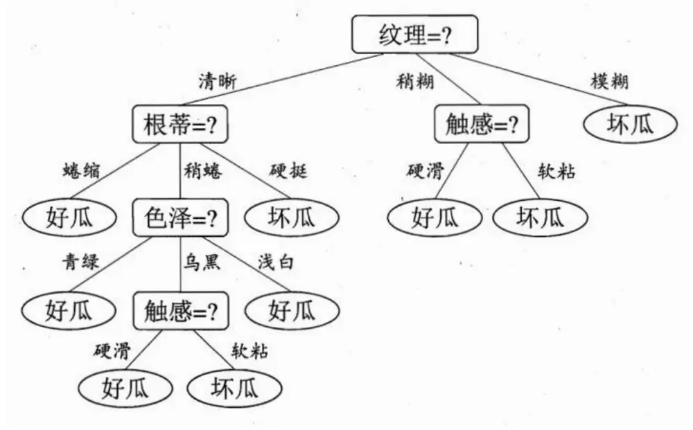
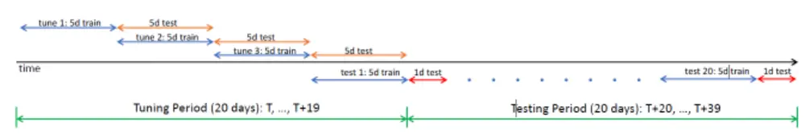

## 华泰期货

研究院 量化组

研究员

高天越

- 0755-23887993

- gaotianyue@htfc.com

从业资格号：F3055799

投资咨询号：Z0016156

联系人

李光庭

- 0755-23887993

- liguangting@htfc.com

从业资格号：F03108562

李逸资

- 0755-23887993

- liyizi@htfc.com

从业资格号：F03105861

麦锐聪

- 0755-23887993

- mairuicong@htfc.com

从业资格号：F03130381

黄煦然

- 0755-23887993

- huangxuran@htfc.com

从业资格号：F03130959

投资咨询业务资格：

证监许可【2011】1289 号

## 摘要

本报告为《高频收益如何及何时可预测》系列报告的中篇，主要介绍了我们在国内期货高频市场的实证分析流程。在上一篇报告中，我们深入探讨了Yacine Aït-Sahalia和Jianqing Fan 等人的研究成果，为高频收益率的可预测性提供了理论基础。本篇报告则转向实际，详细阐述了我们在国内期货市场的实证研究流程，包括数据集介绍、因子构造、预测目标设定、模型介绍及训练方法。在下一篇报告中，我们将展示国内实证的结果及其在实际交易策略中的应用。

## 核心观点

研究对象的确定：综合考虑流动性和数据可得性，我们选取上期所的燃料油 LU及螺纹钢RB的主力期货合约作为国内实证的研究对象。

高频因子库的构建：由于国内期货市场逐笔成交相关数据的缺失，文献中大部分因子无法复现；基于此，我们启动了一项广泛的高频因子收集和开发工作。最终，我们整理并开发了超过130个高频因子，用于后续模型的输入。

模型选择：在实证过程中，我们主要使用了3种线性回归模型（OLS,Ridge,Lasso）以及3种机器学习回归模型（随机森林、XGBoost、LightGBM）进行拟合。

特征预筛选：由于特征较多（1300+），我们使用了小样本数据进行了特征的预筛选。

模型训练：模型训练流程与原文献基本保持一致，我们使用了总共40个交易日的数据作为验证集，进行模型的样本外验证。

## 前言

在当今金融市场中，高频交易日益成为推动市场流动性和价格发现不可或缺的关键因素。高频交易者的成功在很大程度上归功于其对市场微观结构深入而细致的理解与把握。在上一篇报告中，我们概述了 Yacine Aït-Sahalia、Jianqing Fan 等人在其论文《How and When are High-Frequency Stock Returns Predictable?》中的主要发现，这些发现为高频收益率的可预测性提供了理论基础和实证依据。在这一篇报告中，我们将详细阐述我们在国内期货市场的实证研究流程，包括数据集介绍、因子构造、预测目标设定、模型介绍及训练方法，希望能让读者能够清晰、系统地理解我们的研究方法论。

## 数据集介绍

## 研究品种

燃料油FU、螺纹钢RB（综合考虑数据可得性，选取上期所流动性较好的、盘口数据较齐全的2个品种作为研究目标）

合约选取

仅考虑流动性最好的主力合约

时间范围

2023/08/17-2023/11/16

## 数据字段

日期、时间戳、合约代码、最新成交价、成交量、成交额，持仓量变动、持仓量、涨跌停板、交易方向（基于最新成交价与上一tick最优报价之间的关系确定）、买卖报价及挂单量（五档）

图 1:期货高频 tick 数据示例丨单位：无

| date | timestamp | symbol | price | volume | amount | a1 | a1_v | a2 | a2_v | a3 | a3_v | a4 | a4_v | a5 |  | a5_v | b1 |
| --- | --- | --- | --- | --- | --- | --- | --- | --- | --- | --- | --- | --- | --- | --- | --- | --- | --- |
| 2023/11/16 | 9:00:00 | cu2312 | 67880 | 0 | 0 | 67890 |  | 67900 |  |  | 67920 | 16 | 67930 | 12 | 67940 | 12 | 67880 |
| 2023/11/16 | 9:00:01 | cu2312 | 67890 | 7 | 2375900 | 67890 |  | 67900 |  |  | 67920 | 16 12 | 67930 | 12 | 67940 | 14 | 67880 |
| 2023/11/16 | 9:00:01 | cu2312 | 67900 | 14 | 4752250 | 67900 |  | 67920 |  |  | 67930 |  | 67940 | 15 | 67950 | 2 | 67890 |
| 2023/11/16 | 9:00:02 | cu2312 | 67900 | 0 | 0 | 67900 |  | 67920 |  |  | 67930 |  | 67940 | 18 | 67950 | 2 | 67890 |
| 2023/11/16 | 9:00:02 | cu2312 | 67900 | 3 | 1018450 | 67900 |  | 67920 | 19 |  | 67930 |  | 67940 | 18 | 67950 | 2 | 67890 |
| 2023/11/16 | 9:00:03 | cu2312 | 67900 | 12 | 4074000 | 67920 | 18 | 67930 | 11 |  | 67940 |  | 67950 | 2 | 67960 | 1 | 67890 |
| 2023/11/16 | 9:00:03 | cu2312 | 67900 | 0 | 0 | 67910 |  | 67920 | 20 |  | 67930 |  | 67940 | 18 | 67950 | 2 | 67900 |
| 2023/11/16 | 9:00:04 | cu2312 | 67900 | 0 | 0 | 67910 |  | 67920 | 20 |  | 67930 |  | 67940 | 18 | 67950 | 2 | 67900 |
| 2023/11/16 | 9:00:04 | cu2312 | 67900 | 2 | 679000 | 67910 |  | 67920 | 20 |  | 67930 | 20 | 67940 | 19 | 67950 | 2 | 67900 |
| 2023/11/16 | 9:00:05 | cu2312 | 67900 | 10 | 3395000 | 67900 | 12 | 67910 | 4 |  | 67920 |  | 67930 | 16 | 67940 | 18 | 67890 |
| 2023/11/16 | 9:00:05 | cu2312 | 67900 | 7 | 2376250 | 67900 | 21 | 67910 | 5 | 67920 |  |  | 67930 | 16 | 67940 | 19 | 67880 |
| 2023/11/16 | 9:00:06 | cu2312 | 67880 | 2 | 678900 | 67890 |  | 67900 | 26 | 67910 |  |  | 67920 | 25 | 67930 | 16 | 67880 |
| 2023/11/16 | 9:00:06 | cu2312 | 67890 | 2 | 678900 | 67890 |  | 67900 | 22 | 67910 |  |  | 67920 | 25 | 67930 | 16 | 67880 |
| 2023/11/16 | 9:00:07 | cu2312 | 67900 | 8 | 2715850 | 67900 | 17 | 67910 | 1 | 67920 |  |  | 67930 | 16 | 67940 | 19 | 67880 |
| 2023/11/16 | 9:00:07 | cu2312 | 67900 | 3 | 1018500 | 67900 | 17 | 67910 | 7 | 67920 |  |  | 67930 | 16 | 67940 | 19 | 67890 |
| 2023/11/16 | 9:00:08 | cu2312 | 67900 | 11 | 3734450 | 67900 | 6 | 67910 | 7 | 67920 |  |  | 67930 | 16 | 67940 | 19 | 67890 |
| 2023/11/16 | 9:00:08 | cu2312 | 67900 | 6 | 2037000 | 67900 | 3 | 67910 | 7 | 67920 |  |  | 67930 | 16 | 67940 | 19 | 67890 |
| 2023/11/16 | 9:00:09 | cu2312 | 67900 | 5 | 1697500 | 67900 | 1 | 67910 | 7 | 67920 |  | 67930 |  | 16 | 67940 | 19 | 67890 |

数据来源：天软 华泰期货研究院

## 因子构造

在原文献中，作者基于限价订单簿及逐笔成交数据构建了 13个因子。遗憾的是，国内期货市场的高频数据与国外的股票高频数据存在较大的差异，使得大部分因子无法复现。具体差异如下：

1）国外股票高频数据集中有逐笔成交数据，但国内期货市场难以获取逐笔成交数据。

2）国外股票高频数据集中的报价更新数据的快照精确到了纳秒，但国内期货交易所一般1秒推送2个快照数据，即时间间隔为500毫秒。这500毫秒期间发生的具体挂单及交易无从得知，仅能从当前盘口与 500毫秒前盘口之间的相对关系加以推测。

另外，在上一篇报告中我们提到过，文献中使用3个时钟来定义区间，分别是日历时钟、成交时钟以及成交额时钟。日历时钟就是最常见的时间维度（未来 n 秒的区间收益率及方向），成交时钟则将交易笔数作为衡量区间的尺度（未来n笔交易的区间收益率及方向），而成交额时钟则是将成交金额作为衡量区间的尺度（未来n美元交易的区间收益率及方向）。由于我们仅有限价订单簿数据，没有逐笔成交相关的数据，因此我们在后续的实证过程仅考虑日历时钟。

在文献构造的13个因子中，仅总成交量因子，报价不平衡因子，成交不平衡因子，历史收益因子、换手率因子、报价价差因子这6个因子可以在国内期货市场复现（因子具体构造方式请参考《华泰期货量化策略专题报告20240621：做市高频系列（十六）高频收益如何及何时可预测（上）》）。基于初步测试结果，我们发现仅依赖这六个因子构建的模型在预测表现上并不理想。为了进一步提升模型的预测能力，我们启动了一项广泛的高频因子收集和开发工作。最终，我们整理并开发了超过130个高频因子，并将其纳入华泰期货的高频因子库中。

## 回溯区间

对于每个因子，我们都会求其在不同回溯区间的均值作为后续机器学习模型的输入（特征），以求同时捕捉因子的长期及短期的影响。原文献的回溯区间为过去1tick，过去 2-1tick，过去 4-2tick，过去 8-4tick……过去 256tick-128tick 共 9 个回溯区间，这样的构造方式可以保证回溯区间不重合，避免同个因子在不同区间上的因子值之间存在过于明显的多重共线性的问题。然而，经过检验，我们发现这样的构造方式会降低模型在样本外的预测表现，因此我们对原文的回溯区间进行了一定的修改，构造的回溯区间为过去 1tick，过去 2tick，过去 4tick……过去 512tick 共 10 个回溯区间。

## 预测目标

我们的预测目标是未来10个Tick（5秒）的收益率，计算方式为未来一段时间内的平均成交价格与当前中间价的比值减一：

$$
\mathrm{Return}(T,\Delta,M)=\mathrm{Average}\left[P_{t}^{\mathrm{txn}}:t\in\mathbf{D}^{\mathrm{txn}}\cap\mathrm{Int}^{\mathrm{forward}}(T,\Delta,\mathrm{M})\right]/P_{T}-1.
$$

考虑到实际交易时将不可避免存在延迟，我们将预测目标的计算向后延迟了一个tick。公式中的T当前时点的下一个Tick，Δ为区间长度（此处为10个Tick），M为所选时钟（此处为日历时钟）。

在实证过程中，我们主要使用了3种线性回归模型（OLS,Ridge,Lasso）以及3种机器学习回归模型（随机森林、XGBoost、LightGBM）进行拟合，以下是对这些模型的简要介绍：

## 线性回归模型

线性回归模型的基本回归方程为：

$$
y=\beta_{0}+\beta_{1}x_{1}+\beta_{2}x_{2}+...+\beta_{n}x_{n}+\epsilon
$$

其中，y是因变量（预测目标）， $\chi_{1},\chi_{2},\ldots\ldots,\chi_{n}$ 是自变量（因子值）， $\beta_{0}$ 是截距项， $\beta_{1}$ ,$\beta_{1},\ldots\ldots,\beta_{n}$ 是回归系数，ε 是误差项。

以下介绍的三种线性回归的基本回归方程形式是一致的，不同的是最小化的目标函数（损失函数）。

## 最小二乘法

最小二乘法(OLS , Ordinary Least Squares)是一种常用的线性回归方法，OLS 模型假设自变量和因变量之间存在线性关系，并且误差项服从正态分布，具有同方差性和独立性。它通过最小化误差的平方和来寻找数据的最佳拟合线，最小化的目标函数如下：

$$
\begin{array}{r}{\operatorname*{min}_{\beta}\sum_{i=1}^{n}(y_{i}-(\beta_{0}+\beta_{1}x_{i1}+...+\beta_{n}x_{in}))^{2}}\end{array}
$$

计算简单，容易实现。

模型参数的估计具有最优性质（BLUE，最佳线性无偏估计）。

容易进行统计检验和模型诊断。

假设误差项服从正态分布，同方差性和独立性，但真实情况往往不满足。

对异常值敏感，容易受到极端值的影响。

在多重共线性的情况下，模型参数估计不稳定。

## 岭回归

岭回归（Ridge）是一种带有L2正则化的线性回归模型，它通过在损失函数中添加一个正则化项来解决普通最小二乘法在多重共线性情况下的参数不稳定问题。正则化项的系数λ是模型唯一需要调整的超参数，用于控制正则化的强度。该模型最小化的目标函数如下：

$$
\begin{array}{r}{\operatorname*{min}_{\beta}\left(\sum_{i=1}^{n}(y_{i}-\left(\beta_{0}+\beta_{1}x_{i1}+...+\beta_{n}x_{in}\right))^{2}+\lambda\sum_{j=1}^{n}\beta_{j}^{2}\right)}\end{array}
$$

解决了OLS在多重共线性问题下的参数不稳定问题。

通过正则化项控制模型复杂度，避免过拟合。

模型参数估计稳定，适合高维数据。

需要选择合适的正则化系数λ，需要额外的交叉验证。

模型参数不再具有无偏性。

对异常值敏感，容易受到极端值的影响。

## LASSO 回归

LASSO 回归（Least absolute shrinkage and selection operator，最小绝对收缩和选择算子）是一种带有L1正则化的线性回归模型。与岭回归不同，LASSO倾向于产生稀疏的模型系数，即某些系数可以被压缩至零，从而实现特征选择的功能。另外，与岭回归不同，LASSO回归对自变量的缩放较敏感，通常需要对自变量做标准化或归一化处理。该模型最小化的目标函数如下：

$$
\begin{array}{r}{\operatorname*{min}_{\beta}\left(\sum_{i=1}^{n}(y_{i}-(\beta_{0}+\beta_{1}x_{i1}+...+\beta_{n}x_{in}))^{2}+\lambda\sum_{j=1}^{n}|\beta_{j}|\right)}\end{array}
$$

通过L1正则化实现特征选择，能排除无效特征。

回归系数的绝对值可以直接横向对比，表征自变量重要性。

其他优点同岭回归。

需要对自变量做标准化或归一化处理，泛化能力受限，且模型解释性降低（回归系数不能直接反映原始变量单位对因变量的影响）。

其他缺点同岭回归。

## 机器学习回归模型

在机器学习领域中，决策树（Decision Tree）是一种模仿人类决策过程的算法，它通过一系列的问题将数据集分割成不同的分支，最终达到预测结果。这种模型的核心在于递归地将数据集划分为更小的子集，并在每个子集上构建决策规则来逼近目标函数。

图 2:西瓜好坏判断的决策树示例丨单位：无

数据来源：《机器学习》 华泰期货研究院

决策树模型既可以是分类的，也可以是回归的，其核心在于如何选择最优划分属性。对于分类问题，通常使用信息增益、增益率或基尼指数等指标来评估划分的优劣；而对于回归问题，则常采用最小均方误差作为划分标准。

决策树的优点在于其模型的可解释性高，可以直观地展示特征与目标变量之间的关系。然而，单一决策树模型容易受到数据噪声的影响，出现过拟合现象，且对于不平衡的数据集表现不佳。为了克服这些缺点，学者们开发了基于决策树的集成学习方法，这些方法通过构建多个决策树并结合它们的预测来提高整体模型的鲁棒性和准确性。接下来，我们将介绍我们在国内实证过程中用到的三种基于决策树的集成模型：随机森林、XGBoost 和 LightGBM。

## 随机森林（Random Forest）

随机森林是一种集成学习方法，它构建了多个决策树，并通过投票或平均的方式集成这些树的预测结果。在每个决策树的训练过程中，使用自助采样法(Bootstrap Sampling)从原始数据集中有放回地采样得到N 个子样本，然后再从每个子样本中随机选择m 个特征，作为该决策树的一部分。这种随机性有效降低了模型对特定数据的依赖，提高了模型的鲁棒性和泛化能力。

通过集成多个决策树，提高了模型的泛化能力。

模型对异常值不敏感，鲁棒性较好。

训练时间较长，尤其是在数据量大或特征多的情况下。

模型的解释性较差，不如线性模型直观。

## XGBoost

在介绍 XGBoost 之前，有必要介绍一下 GBDT。GBDT（Gradient Boosting DecisionTree），全称为梯度提升决策树，是一种基于决策树的集成学习算法，它通过将多个决策树的预测结果累加来得出最终的预测结果。GBDT 算法的核心在于通过迭代的方式，每一棵树都学习前一棵树预测结果的残差，从而不断优化预测效果。

XGBoost 在GBDT的基础上做了一系列优化，提高了模型训练的效率和效果。 GBDT重点关注于减少模型的偏差，通过多个弱学习器的集成来提升模型预测精确度。

XGBoost 不仅注重减少偏差，同时也对模型的方差进行了优化，通过正则化因子来控制模型的复杂度，从而防止过拟合。除此之外，XGBoost在算法层面做了优化, 如支持并行运算、通过近似算法处理大规模数据集上的分割点求解等，在取得高精度的同时又保持了极快的速度，被广泛的应用于国内外数据挖掘、机器学习竞赛之中。

相对其他机器学习库，更简单易用。

训练速度快，内存使用效率高。在处理大规模数据集时速度快效果好，对内存等硬件资源要求不高。

支持自定义损失函数和评估标准，灵活性高。

需要调整的参数较多，调参过程可能复杂。

模型的解释性较差，不如线性模型直观。

与随机森林不同，XGBoost 对异常值敏感，且更容易过拟合。

## LightGBM

LightGBM（Light Gradient Boosting Machine）是一个基于 GBDT 的高效、可扩展的机器学习算法，作为XGBoost算法的后来者，LGBM非常好地综合了包括XGBoost 在内的此前GBDT算法框架内各算法的一系列优势，并在此基础上做了一系列更进一步的优化。LGBM算法提出的核心目的是解决GBDT算法框架在处理海量数据时计算效率低下的问题，它相较于XGBoost 的主要区别如下：

基于直方图（Histogram）的决策树：这种方法通过构建数据的直方图来快速计算信息增益，从而确定最佳的分裂点。相比于传统的决策树算法，它不需要遍历每个特征的所有值，从而减少了计算时间和内存消耗。

单边梯度采样（Gradient-based One-Side Sampling, GOSS）：GOSS 是一种数据采样技术，它通过减少大量只具有小梯度的数据实例来提高计算效率。在计算信息增益时，只使用具有高梯度的数据实例，这样可以减少不必要的计算，节省时间和空间。

互斥特征捆绑（Exclusive Feature Bundling, EFB）：EFB 是一种特征选择技术，它将许多互斥的特征捆绑为一个特征，从而实现降维。这种方法可以减少模型的复杂度，提高训练和预测的速度。

带深度限制的Leaf-wise的叶子生长策略：传统的GBDT（梯度提升决策树）工具通常使用按层生长（level-wise）的策略，这种方法不加区分地对待同一层的所有叶子，可能会导致不必要的计算开销。LightGBM采用了带深度限制的按叶子生长（leaf-wise）算法，优先考虑分裂增益高的叶子，从而提高训练效率和模型性能。

相较于XGBoost，训练速度更快，内存使用效率更高，适合大规模数据集。

缺点同 XGBoost

## 特征筛选

我们的数据集总共有60天的高频Tick数据，数据量较大。与此同时，我们的因子库中有130+因子，考虑到每个因子都可以应用到10个回溯区间上，总共就会有1300+特征作为回归模型的输入。如果在这样庞大的数据规模上进行模型训练，将面临运算效率低下和预测精度受损的双重挑战。因此，为了提高预测精度和效率，我们对于每一个回归模型（除了OLS）都进行了特征的预筛选：

第一步，先用小样本（前10天）的数据进行模型拟合（全部特征作为输入）。

第二步，对于LASSO模型，选择回归系数不等于0的特征作为有效特征；对于Ridge模型，选择回归系数绝对值排在前 200 的特征作为有效特征；对于随机森林、XGBoost以及LighGBM模型，选取特征重要性大于0的特征作为有效特征。

第三步，将有效特征作为输入，在全样本上进行模型拟合和训练。

## 模型训练

我们训练模型的过程与原文献基本保持一致。训练具体流程如下：

1.学习阶段（Learning）：对于每一组超参数和 $\begin{array}{r}{\mathrm{t=T,T+5,T+10,}}\end{array}$ ...等时间点，使用从第t天到第t+4天（共5个交易日）的数据来训练一个模型。在随后的5天区间[t+5, t+9]内评估这个模型，并为测试集中的每一天计算样本外R²，即得到 $R_{t+5}^{2},\quad\cdots R_{t+9}^{2}$

2.调参阶段（Tuning）：选择最大平均R²值的超参数组合（计算从T+5到T+19这段时间内所有测试日R²值的平均值，共有15个测试日），并固定这组超参数用于下一步的预测。

4.滚动窗口（Rolling）：将整个时间窗口向前滚动20个交易日，即T变为T+20，然后重复步骤 1 至 4。

图 3: 模型调优及测试时间窗口丨单位：无
Figure 1: Algorithm tuning and testing rolling windows

数据来源：《How and When are High-Frequency Stock Returns Predictable?》 华泰期货研究院

在我们的数据集中共有60个交易日，也就是说，共有40天的测试集可用作模型整体预测效果的样本外验证。

## 总结

本篇报告作为《高频收益如何及何时可预测》系列报告的中篇，主要介绍了我们在国内期货高频市场的实证分析流程。在上一篇报告中，我们深入探讨了 Yacine Aït-Sahalia和Jianqing Fan等人的研究成果，为高频收益率的可预测性提供了理论基础。本篇报告则转向实际，详细阐述了我们在国内期货市场的实证研究流程，包括数据集介绍、因子构造、预测目标设定、模型介绍及训练方法。在下一篇报告中，我们将展示国内实证的结果及其在实际交易策略中的应用。

## 参考文献

Aït-Sahalia, Y., Fan, J., Xue, L., & Zhou, Y. (2022). How and When are High -Frequency Stock Returns Predictable? (No. w30366). National Bureau of Economic Research.

## 免责声明

本报告基于本公司认为可靠的、已公开的信息编制，但本公司对该等信息的准确性及完整性不作任何保证。本报告所载的意见、结论及预测仅反映报告发布当日的观点和判断。在不同时期，本公司可能会发出与本报告所载意见、评估及预测不一致的研究报告。本公司不保证本报告所含信息保持在最新状态。本公司对本报告所含信息可在不发出通知的情形下做出修改， 投资者应当自行关注相应的更新或修改。

本公司力求报告内容客观、公正，但本报告所载的观点、结论和建议仅供参考，投资者并不能依靠本报告以取代行使独立判断。对投资者依据或者使用本报告所造成的一切后果，本公司及作者均不承担任何法律责任。

本报告版权仅为本公司所有。未经本公司书面许可，任何机构或个人不得以翻版、复制、发表、引用或再次分发他人等任何形式侵犯本公司版权。如征得本公司同意进行引用、刊发的，需在允许的范围内使用，并注明出处为“华泰期货研究院”，且不得对本报告进行任何有悖原意的引用、删节和修改。本公司保留追究相关责任的权力。所有本报告中使用的商标、服务标记及标记均为本公司的商标、服务标记及标记。

华泰期货有限公司版权所有并保留一切权利。

## 公司总部

广州市天河区临江大道 1 号之一 2101-2106 单元丨邮编：510000

电话：400-6280-888

网址：www.htfc.com