## 华泰期货

HUATAI FUTURES

研究院量化组

研究员

高天越

0755-23887993

gaotianyue@htfc.com

从业资格号：F3055799

投资咨询号：Z0016156

## 联系人

李光庭

0755-23887993

liguangting@htfc.com

从业资格号：F03108562

## 李逸资

0755-23887993

liyizi@htfc.com

从业资格号：F03105861

麦锐聪

0755-23887993

mairuicong@htfc.com

从业资格号：F03130381

黃煦然

0755-23887993

huangxuran@htfc.com

从业资格号：F03130959

## 投资咨询业务资格：

证监许可【2011】1289号

## 摘要

本报告作为《高频收益如何及何时可预测》系列的下篇，全面展示了高频多因子模型在国内期货市场实证的结果。我们深入分析了模型的预测表现、学习曲线、特征重要性，并探讨了预测区间和日内效应对模型预测能力的影响。最后，我们还探索了模型在实际交易策略中的应用，开发了基于高频因子模型的下单算法，并通过模拟测试比较了其与传统下单算法的性能差异。

## 核心观点

预测表现：高频多因子模型在 RB 与 FU上最佳模型的样本外 R方分别为 20.74%及15.05%，均优于文献中的样本外R方中位数10%。

学习曲线：加大样本量对于提升预测效果没有明显帮助；另外，FU比RB更过拟合，LGBM 比 LASSO 更过拟合。

特征重要性：报价不平衡因子、成交收益因子、实际下行波动率因子具备较强有效性。

预测区间：高频收益率在较短区间内的可预测性很强，但随着区间的延长而逐渐减弱。随着预测区间从10 个 Tick延长到120 个Tick，模型的样本外 R方从 20.74%单调递减至4.94%，样本外方向准确性从64.86%单调递减到53.97%。

日内效应：模型在早晨和下午开盘时段预测表现较弱，且午盘略优于早盘。

下单算法：模拟测试结果表明，基于高频因子的下单算法相比于传统算法，在交易成本上具有显著优势。具体来说，该算法有约75%的几率实现更低的交易成本，平均有0.15跳的滑点优化。

## 前言

在《高频收益如何及何时可预测》的上篇和中篇中，我们概述了Yacine Ait-Sahalia、Jianqing Fan 等人在其论文《How and When are High-Frequency Stock ReturnsPredictable?》中的主要发现，并介绍了我们在国内实证的主要流程。在这一篇报告中，我们将分析国内实证的结果，主要包含模型的预测表现、学习曲线、特征重要性，以及预测区间和日内效应对模型预测能力的影响。另外，我们还探索了模型在实际下单策略中的应用，并通过模拟回测的方式比较了其与传统下单算法的性能差异。

## 国内实证结果

## 预测表现

由于原文献在实证结果环节中主要使用5秒作为日历时钟的预测区间，因此我们也以预测区间5秒（10个Tick）为例，展示各模型在FU和RB上的预测结果。

收益率预测

从40天测试集（Test set)的样本外 R方上看，高频多因子模型在RB（螺纹钢）上的预测表现优于FU(燃料油)，最佳模型的样本外R方分别为20.74%及15.05%，均优于文献中的样本外R方中位数10%。该结果符合预期，因为我们额外引入了较多新的高频因子，使得模型更能捕捉到订单簿数据中的微观特征。

从模型层面上看，参数模型中的 LASSO 和 Ridge 模型以及非参数模型中的LGBM模型整体表现较好。OLS受过拟合及多重共线性影响较大，预测效果逊色于其他参数模型；随机森林模型预测效果最差，有一部分原因是随机森林模型训练效率较低，单次训练时长较久，在有限的时间内难以找到最优的超参数组合。

图 1: RB 各模型样本外 R 方|单位：%
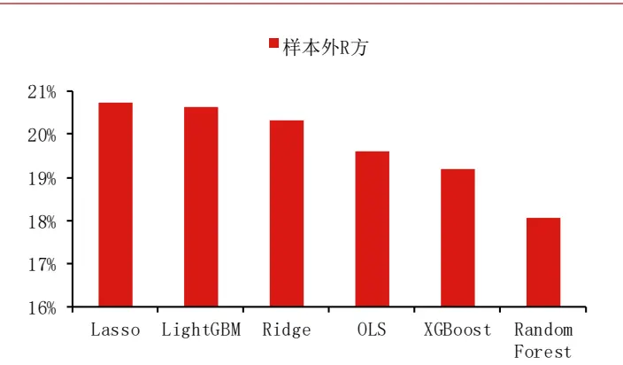
数据来源：天软 华泰期货研究院

图 2: FU 各模型样本外 R 方单位：%
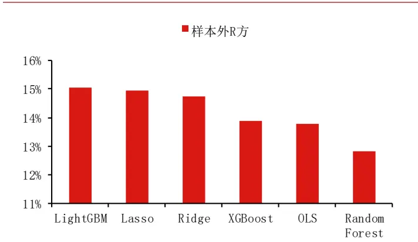
数据来源：天软华泰期货研究院

## 方向预测

从40天测试集(Test set)的方向准确性上看，高频多因子模型在 RB(螺纹钢)上的预测表现同样略优于FU(燃料油)，最佳模型的方向准确性分别为 64.86%及 62.97%，接近于文献中的样本外方向准确性64%。

从模型层面上看，LASSO模型在这两个品种上都是表现最佳的模型。

图 3: RB 各模型样本外方向准确性|单位：%
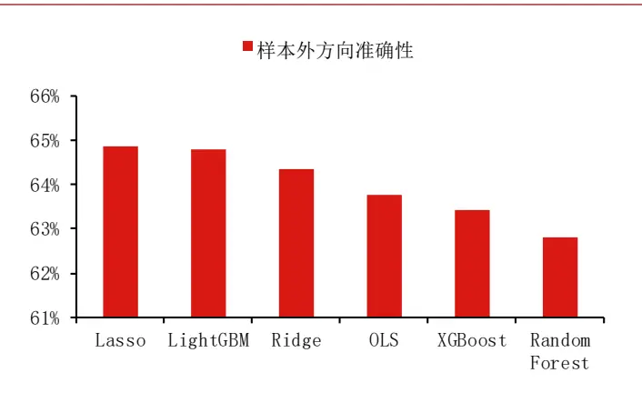
数据来源：天软 华泰期货研究院

图 4: FU 各模型样本外方向准确性|单位：%
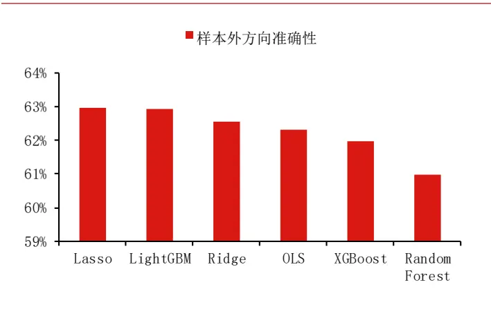
数据来源：天软华泰期货研究院

由于在参数模型中，LASSO模型表现最佳；在非参数模型中，LGBM模型整体表现最佳。因此，我们后文进一步的实证分析仅针对LASSO模型和LGBM模型。

## 学习曲线

在构建机器学习模型时，我们希望尽量减小预测的误差，而误差的来源主要是偏差(Bias)和方差（Variance）。偏差指的是预测值与真实值的差距，较高的偏差意味着模型欠拟合，即模型没有捕捉到数据的复杂性，导致预测结果与真实结果相差较大。方差指的是模型在不同数据集上预测能力的变化程度。如果一个模型在样本内的数据表现较佳，但在样本外的数据表现显著降低，说明该模型方差较大。在理想情况下，我们希望获得一个偏差低，方差也低的模型，但往往这两者之间存在反向关系，即偏差越大，方差越小。因此，我们需要在这两者之间做出权衡（Bias-VarianceTradeoff)，找到两者之间的平衡点，最小化模型的最终误差。

学习曲线(LearningCurve）是训练集和测试集的误差在不同训练集长度下的变化。通过观察学习曲线，我们不仅可以了解预测效果与样本量之间的关系，也有助于判断模型当前是处于过拟合亦或是欠拟合的状态，进而对模型做出进一步调整。

一般而言，当模型测试集的误差较大，且训练的误差和测试集的误差较为接近时，说明模型此时处于欠拟合的状态，偏差较大，方差较小。而当训练集的误差较小，但测试集与训练集之间的差距较大，说明模型此时处于过拟合的状态，方差较大，偏差较小。

图 5：欠拟合学习曲线（高偏差、低方差）单位：无
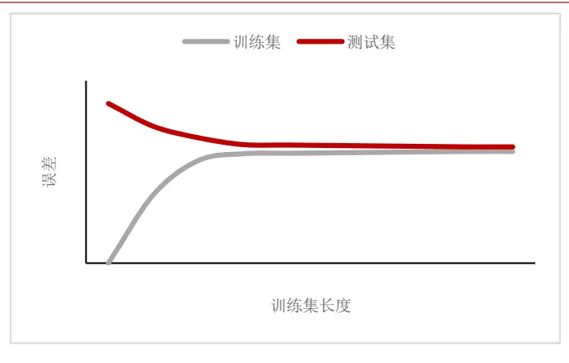
数据来源：华泰期货研究院

图6：过拟合学习曲线（高方差、低偏差）|单位：无
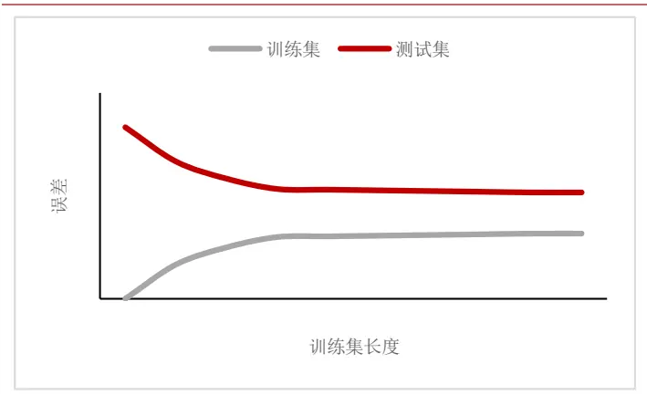
数据来源:华泰期货研究院

下面的四张图展示了LASSO模型以及LGBM模型在 RB 和 FU上的训练曲线，训练集天数取1天到10天。

可以看出，训练集长度对于测试集的MSE影响不大，说明2天的训练集长度已经足够，即便再加大样本量也无法显著提升预测效果。

其次，FU训练集与测试集之间的差值相比于RB而言更大，说明模型在FU上的训练会更加过拟合一些。

最后，LGBM模型在训练集上的表现虽然略优于LASSO模型，但测试集上的表现没有明显优化，说明LGBM模型相比于LASSO模型而言过度拟合了样本内数据，即减小了偏差，但增大了方差。

图7:LASSO 模型的样本外学习曲线（RB）单位：无
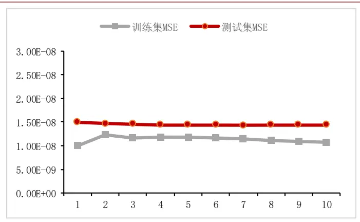
数据来源：天软 华泰期货研究院

图 8:LGBM模型的样本外学习曲线（RB)单位：无
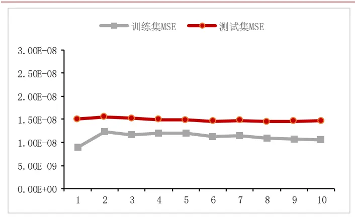
数据来源：天软华泰期货研究院

图 9:LASSO 模型的样本外学习曲线（FU）单位：无
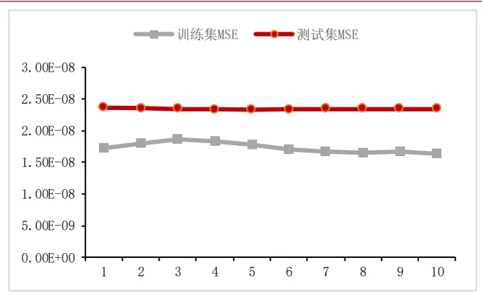
数据来源：天软 华泰期货研究院

图10:LGBM模型的样本外学习曲线（FU）|单位：无
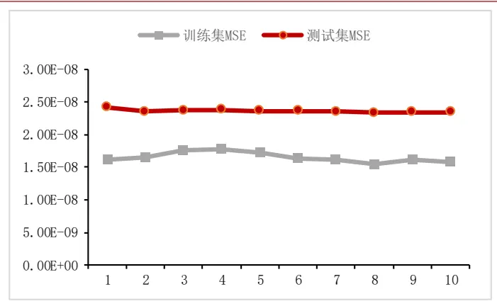
数据来源：天软 华泰期货研究院

## 特征重要性

LASSO模型的一个优势在于，它通过对特征进行标准化预处理，确保了模型回归系数的可比性。这意味着，回归系数的绝对值能够直接反映各特征在模型中的相对重要性。同样地，LGBM模型也内置了计算特征重要性的功能，这为我们评估不同特征对模型预测的贡献度提供了便利。

为了全面评估各特征的重要性，我们计算了所有40个测试集上模型特征重要性的平均值，并据此进行了排序，以确定每个特征的排名。鉴于涉及的因子数量较多，且篇幅有限，这里仅精选部分因子的结果进行展示。

## 报价不平衡因子

第一个要介绍的因子是报价不平衡因子(Loblmbalance），该因子衡量了回溯区间内最优报价处挂单量的不平衡性。该因子来自于文献，且同时也是所有因子中最有效的因子，具体计算公式如下：

$$
LobImbalance(T,\mathcal{A}_{1},\mathcal{A}_{2},M)=Average[\frac{s_{t}^{a}-s_{t}^{b}}{s_{t}^{a}+s_{t}^{b}}\colon t\in Int^{back}(T,\mathcal{A}_{1},\mathcal{A}_{2},M)]
$$

其中，s为挂单量，T为当前时点，Δ1代表区间结束时点和当前时点的距离（注意我们在国内实证时41始终设置为0)，Δ2代表区间开始时点和当前时点的距离，M为所选时钟（此处为日历时钟），Intback为回溯区间内所有时点。

事实上，已经有许多证据表明该因子对未来价格变动而言是较显著的信号，我们在《华泰期货量化策略专题报告20240529：做市高频系列（十五）Micro：优秀的高频公允价指标》中构建Micro指标时就用到了该因子作为Micro指标的关键输入参数之从该因子在LASSO模型的回归系数及其特征排行上看，我们可以得出几个结论。

第一，该因子短期的回归系数小于0，但长期大于0。该因子短期（回溯区间取1个tick时)的回归系数小于0，说明当短期内卖方挂单量相对于买方挂单量越大时，越来价格越有可能下跌，这一点与预期一致。但该因子在更长回溯期间的回归系数大于0，这一点其实是有点超预期的。我们认为一个可能的解释是，当盘口出现不平衡情况时，比如卖方挂单量很大，往往报价会很快的做出反映，整体价格会往下移一档或者多档（卖方在价格更低的地方挂单），来缓解这样的不平衡情况。但如果长时间出现持续的不平衡，很可能盘口很可能并没有往下平移，说明市场买方力量并不比卖方力量弱，只是卖方的挂单量太大了，市场的买方在逐步、主动地在卖方报价位置成交，使得价格维持在一个相对稳定的区间。而在我们的收益率计算方式中，买方在卖方报价处成交所计算出的收益率会大于0。

第二，LASSO模型与LGBM模型之间的特征重要性存在一定差异，比如当回溯区间取2 个tick时，品种为 RB 时，LASSO模型识别该特征并不是特别显著，排在第 64 位，但LGBM 将其识别为显著特征，排在第3位。该差异可能是因为LGBM模型能捕捉数据之间的非线性关系，更有效地利用了该特征。

第三，当回溯区间设定为1Tick时，该因子的特征重要性显著大于其他更长的回溯区间，该发现与文献一致，即信息最丰富的预测变量往往是通过使用最近的过去数据构建的。

图11:报价不平衡因子在 LASSO 模型中的回归系数(RB)单位：无
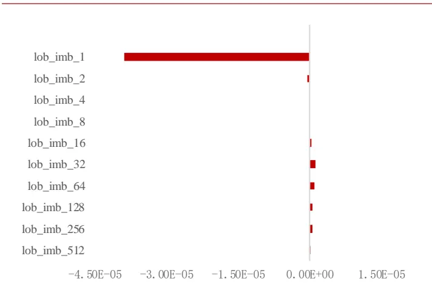
数据来源：天软 华泰期货研究院

表1：报价不平衡因子特征重要性排名（RB）|单位：无

| 特征 Igbm 排名 lasso 排名 |  |  |
| --- | --- | --- |
| lob_imb_1 | 1 | 1 |
| lob_imb_2 | 3 | 64 |
| lob_imb_4 | 27 | 361 |
| lob_imb_8 | 296 | 360 |
| lob_imb_16 | 373 | 67 |
| lob_imb_32 | 340 | 21 |
| lob_imb_64 | 339 | 29 |
| lob_imb_128 | 195 | 44 |
| lob_imb_256 | 174 | 48 |
| lob_imb_512 | 184 | 245 |

数据来源：天软 华泰期货研究院

图12:报价不平衡因子在 LASSO 模型中的回归系数(FU) 单位：无
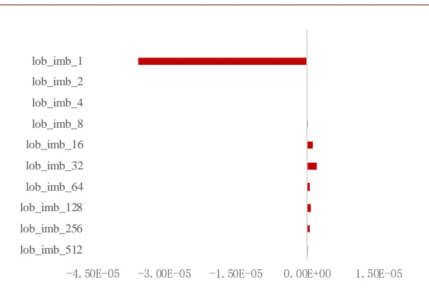
数据来源：天软 华泰期货研究院

表2：报价不平衡因子特征重要性排名（FU）单位：无

| 特征 Igbm 排名 lasso 排名 |  |  |
| --- | --- | --- |
| lob_imb_1 | 1 | 1 |
| lob_imb_2 | 4 | 389 |
| lob_imb_4 | 100 | 378 |
| lob_imb_8 | 280 | 325 |
| lob_imb_16 | 346 | 31 |
| lob_imb_32 | 282 | 15 |
| lob_imb_64 | 212 | 62 |
| lob_imb_128 | 175 | 45 |
| lob_imb_256 | 230 | 57 |
| lob_imb_512 | 91 | 228 |

数据来源：天软 华泰期货研究院

## 成交收益因子

第二个要介绍的因子是成交收益因子(TransactionReturn)，该因子是我们在原文献历史收益因子(PastReturn）的基础上做了相应调整的因子(国内期货市场无逐笔成交数据），衡量了用回溯区间内平均成交价和当前中价计算出的收益率。具体计算公式如下：

$$
\begin{array}{rl}&{TransactionReturn(T,\boldsymbol{A_{1}},\boldsymbol{A_{2}},\boldsymbol{M})}\\&{\qquad=1-\left(\frac{\sum_{t\in Int^{back}(T,\boldsymbol{A_{1}},\boldsymbol{A_{2}},\boldsymbol{M})}{Amount_{t}}}{\sum_{t\in Int^{back}(T,\boldsymbol{A_{1}},\boldsymbol{A_{2}},\boldsymbol{M})}{Volume_{t}}\ast Contract{Unit}}\right)/Mid_{T-\boldsymbol{A_{1}}}}\end{array}
$$

其中，Amount 为成交额，Volume 为成交量，ContractUnit 为合约单位，Mid 为中价。当成交收益因子大于0时，说明当前市场中价高于市场近期成交均价。

从结果上看，成交收益因子的回归系数在不同回溯期均小于0，说明当近期成交均价小于当前中价时，未来价格更有可能下跌。

此外，成交收益因子同样表现出对近期数据的高敏感性，即其信息量主要集中在较短的回溯周期内，一旦回溯区间扩展至超过16个tick，其提供的额外预测信息便趋于饱和，几乎不再增加新的预测价值。

图13:成交收益因子在 LASSO 模型中的回归系数(RB)单位：无
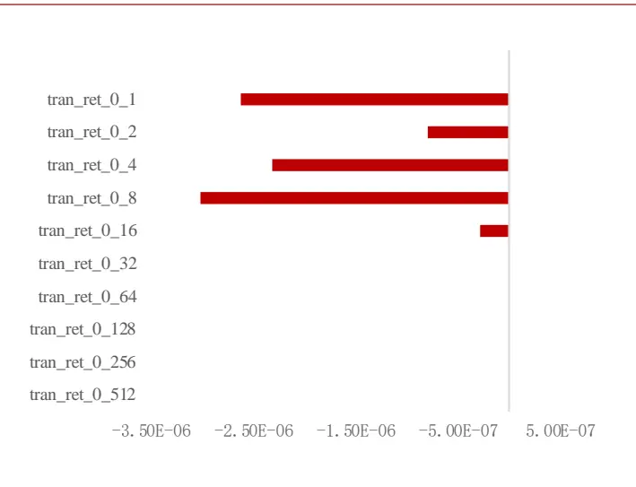
数据来源：天软 华泰期货研究院

表3：成交收益因子特征重要性排名（RB）|单位：无

| 特征 Igbm 排名 lasso 排名 |  |  |
| --- | --- | --- |
| tran_ret_1 | 45 | 7 |
| tran_ret_2 | 68 | 35 |
| tran_re_4 | 30 | 10 |
| tran_ret_8 | 21 | 5 |
| tran_ret_16 | 137 | 81 |
| tran_ret_32 | 290 | 302 |
| tran_ret_64 | 215 | 292 |
| tran_ret_128 | 105 | 304 |
| tran_ret_256 | 198 | 327 |
| tran_ret_512 | 36 | 326 |

数据来源：天软 华泰期货研究院

图14:成交收益因子在 LASSO 模型中的回归系数(FU) 单位：无
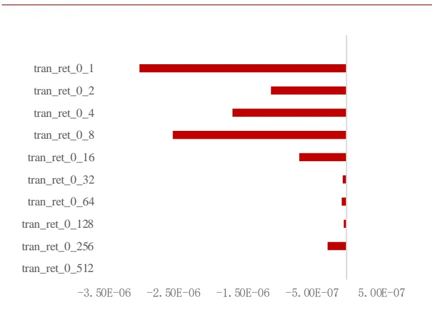
数据来源：天软 华泰期货研究院

| 特征 Igbm 排名 lasso 排名 |  |  |
| --- | --- | --- |
| tran_ret_1 | 11 | 6 |
| tran_ret_2 | 62 | 35 |
| tran_re_4 | 52 | 18 |
| tran_ret_8 | 20 | 9 |
| tran_ret_16 | 49 | 50 |
| tran_ret_32 | 158 | 234 |
| tran_ret_64 | 213 | 231 |
| tran_ret_128 | 157 | 271 |
| tran_ret_256 | 181 | 102 |
| tran_ret_512 | 67 | 500 |

数据来源：天软 华泰期货研究院

## 实际下行波动率因子

最后一个要介绍的因子是实际下行波动率因子(RealDownVariance)，该因子衡量了回溯区间内下行收益的波动率。具体计算公式如下：

$$
RealDownVariance(T,\Delta_{1},\Delta_{2},M)=\frac{\sum_{t\in Int^{back}(T,\Delta_{1},\Delta_{2},M)}[Min(Return_{t},0)]^{2}}{|Int^{back}(T,\Delta_{1},\Delta_{2},M)|}
$$

其中，Return的计算方式与原文献保持一致，是未来1个tick的成交均价与当前中价的比值减去一。

实际下行波动率因子的回归系数普遍小于0，说明当市场在过去经历较大的价格下行波动时，其未来价格走势更倾向于继续下跌，这一点与我们的直观预期一致。

有趣的是，该因子不再遵循“信息最丰富的预测变量往往是通过使用最近的过去数据构建的”这一原则。该因子在使用较短的回溯区间时并不显著，而是当回溯区间扩大至一定范围后，才展现出较强的有效性。这表明，对于特定因子而言，更长时间跨度的历史数据可能蕴含着更多的信息。

图15:实际下行波动率因子在 LASSO 模型中的回归系数（RB)单位：无
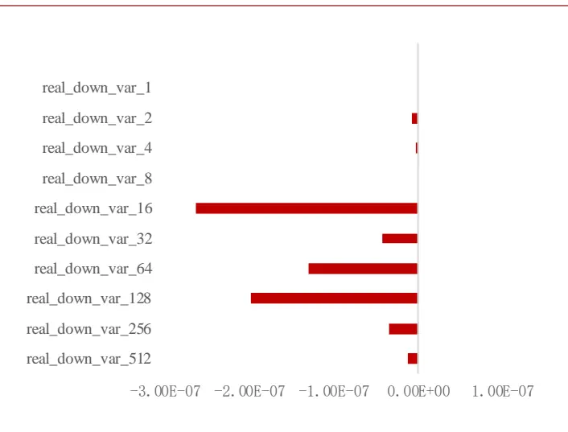
数据来源：天软 华泰期货研究院

表5：实际下行波动率因子特征重要性排名（RB）|单位：无

| 特征 Igbm 排名 lasso 排名 |  |  |
| --- | --- | --- |
| real_down_var_1 | 505 | 392 |
| real_down_var_2 | 481 | 256 |
| real_down_var_4 | 399 | 269 |
| real_down_var_8 | 385 | 477 |
| real_down_var_16 | 246 | 87 |
| real_down_var_32 | 121 | 190 |
| real_down_var_64 | 96 | 124 |
| real_down_var_128 | 84 | 96 |
| real_down_var_256 | 114 | 203 |
| real_down_var_512 | 210 | 246 |

数据来源：天软 华泰期货研究院

图16:实际下行波动率因子在 LASSO 模型中的回归系数（FU）单位：无
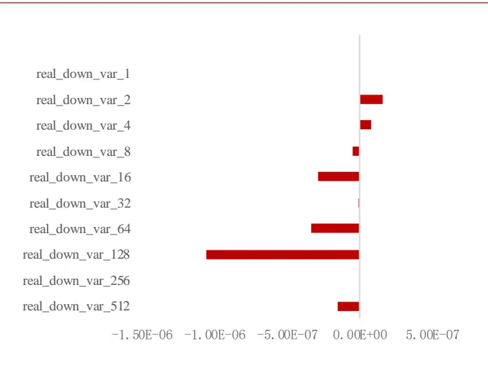
数据来源：天软 华泰期货研究院

表6：实际下行波动率因子特征重要性排名（FU）|单位：无

| 特征 Igbm 排名 lasso 排名 |  |  |
| --- | --- | --- |
| real_down_var_1 | 475 | 437 |
| real_down_var_2 | 441 | 139 |
| real_down_var_4 | 429 | 188 |
| real_down_var_8 | 200 | 175 |
| real_down_var_16 | 205 | 76 |
| real_down_var_32 | 51 | 324 |
| real_down_var_64 | 78 | 91 |
| real_down_var_128 | 66 | 37 |
| real_down_var_256 | 126 | 431 |
| real_down_var_512 | 178 | 164 |

数据来源：天软 华泰期货研究院

## 预测区间

文献提到，高频收益率在较短区间内的可预测性很强，但随着区间的延长而逐渐减弱。我们针对这一观点在国内实证环节做了验证，得到了一致的结论：以品种RB，模型LASSO为例，随着预测区间从10 个Tick延长到120 个Tick，样本外 R方从20.74%单调递减至4.94%，样本外方向准确性从64.86%单调递减到53.97%。

图 17: LASSO 模型样本外 R方（RB） |单位：%
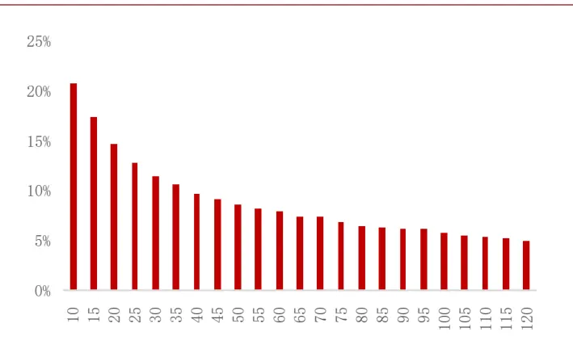
数据来源：天软 华泰期货研究院

图 18: LASSO 模型样本外准确性（RB) 单位：%
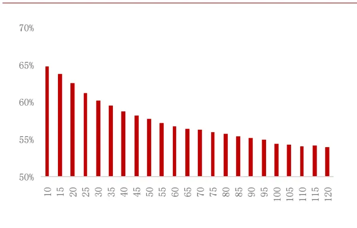
数据来源：天软 华泰期货研究院

## 日内效应

接下来，我们同样对模型的日内效应感兴趣。是否在每天的不同时段，模型的预测表现会存在差异？我们按照15分钟一个时段的原则，将一天日盘的数据划分为15个时段，并分时段查看模型的预测表现。

我们发现，每天早晨和下午开盘时，模型的预测表现显著弱于其他时段。一个合理的解释是，开盘初期的交易反映了投资者对于隔夜（中午）新闻、公告及全球市场动态的综合反映，这些信息的迅速涌入和消化过程中产生了较大的市场分歧与波动，存在较多噪声，导致因子预测效果减弱。另外，模型在午盘的预测效果会略优于早盘，尤其是在FU上体现的比较明显。

表 7: LASSO 模型样本外 R方（RB）单位：%

| 时间段 | 开始时间 | 结束时间 | 样本外R方 | 样本外准确性 |
| --- | --- | --- | --- | --- |
| 1 | 9:00:00 | 9:15:00 | 15.39% | 63.49% |
| 2 | 9:15:00 | 9:30:00 | 20.76% | 64.84% |
| 3 | 9:30:00 | 9:45:00 | 20.46% | 64.43% |
| 4 | 9:45:00 | 10:00:00 | 21.10% | 65.43% |
| 5 | 10:00:00 | 10:15:00 | 20.79% | 64.84% |
| 6 | 10:30:00 | 10:45:00 | 20.16% | 65.04% |
| 7 | 10:45:00 | 11:00:00 | 21.82% | 64.92% |
| 8 | 11:00:00 | 11:15:00 | 23.53% | 66.04% |
| 9 | 11:15:00 | 11:30:00 | 19.24% | 65.21% |
| 10 | 13:30:00 | 13:45:00 | 19.78% | 63.73% |
| 11 | 13:45:00 | 14:00:00 | 23.76% | 65.89% |
| 12 | 14:00:00 | 14:15:00 | 22.32% | 65.23% |
| 13 | 14:15:00 | 14:30:00 | 21.33% | 65.06% |
| 14 | 14:30:00 | 14:45:00 | 20.72% | 64.62% |
| 15 | 14:45:00 | 15:00:00 | 21.90% | 64.10% |

数据来源：天软 华泰期货研究院

表 8:LGBM 模型样本外方向准确性（RB) 单位：%

| 时间段 | 开始时间 | 结束时间 | 样本外R方 | 样本外准确性 |
| --- | --- | --- | --- | --- |
| 1 | 9:00:00 | 9:15:00 | 15.21% | 63.42% |
| 2 | 9:15:00 | 9:30:00 | 21.17% | 65.03% |
| 3 | 9:30:00 | 9:45:00 | 20.68% | 64.55% |
| 4 | 9:45:00 | 10:00:00 | 20.81% | 65.05% |
| 5 | 10:00:00 | 10:15:00 | 21.14% | 64.94% |
| 6 | 10:30:00 | 10:45:00 | 20.03% | 65.00% |
| 7 | 10:45:00 | 11:00:00 | 21.76% | 64.83% |
| 8 | 11:00:00 | 11:15:00 | 23.49% | 66.21% |
| 9 | 11:15:00 | 11:30:00 | 18.75% | 64.85% |
| 10 | 13:30:00 | 13:45:00 | 20.15% | 63.66% |
| 11 | 13:45:00 | 14:00:00 | 23.52% | 65.74% |
| 12 | 14:00:00 | 14:15:00 | 21.66% | 65.32% |
| 13 | 14:15:00 | 14:30:00 | 21.47% | 64.78% |
| 14 | 14:30:00 | 14:45:00 | 20.17% | 64.46% |
| 15 | 14:45:00 | 15:00:00 | 21.41% | 63.94% |

数据来源：天软 华泰期货研究院

表 9: LASSO 模型样本外 R方（FU） |单位：%

| 时间段 | 开始时间 | 结束时间 | 样本外R方 | 样本外准确性 |
| --- | --- | --- | --- | --- |
| 1 | 9:00:00 | 9:15:00 | 3.82% | 61.46% |
| 2 | 9:15:00 | 9:30:00 | 14.78% | 62.79% |
| 3 | 9:30:00 | 9:45:00 | 15.80% | 62.88% |
| 4 | 9:45:00 | 10:00:00 | 16.89% | 64.22% |
| 5 | 10:00:00 | 10:15:00 | 14.10% | 62.54% |
| 6 | 10:30:00 | 10:45:00 | 16.79% | 62.88% |
| 7 | 10:45:00 | 11:00:00 | 18.32% | 63.88% |
| 8 | 11:00:00 | 11:15:00 | 16.08% | 62.13% |
| 9 | 11:15:00 | 11:30:00 | 11.69% | 62.40% |
| 10 | 13:30:00 | 13:45:00 | 15.46% | 62.66% |
| 11 | 13:45:00 | 14:00:00 | 17.00% | 62.68% |
| 12 | 14:00:00 | 14:15:00 | 18.04% | 62.73% |
| 13 | 14:15:00 | 14:30:00 | 19.14% | 64.20% |
| 14 | 14:30:00 | 14:45:00 | 18.19% | 63.78% |
| 15 | 14:45:00 | 15:00:00 | 18.93% | 63.44% |

数据来源：天软 华泰期货研究院

表10:LGBM模型样本外方向准确性（FU） |单位：%

| 时间段 | 开始时间 | 结束时间 | 样本外R方 | 样本外准确性 |
| --- | --- | --- | --- | --- |
| 1 | 9:00:00 | 9:15:00 | 8.23% | 61.71% |
| 2 | 9:15:00 | 9:30:00 | 14.43% | 62.69% |
| 3 | 9:30:00 | 9:45:00 | 15.54% | 62.84% |
| 4 | 9:45:00 | 10:00:00 | 16.90% | 64.17% |
| 5 | 10:00:00 | 10:15:00 | 13.89% | 62.51% |
| 6 | 10:30:00 | 10:45:00 | 16.50% | 62.89% |
| 7 | 10:45:00 | 11:00:00 | 17.63% | 63.64% |
| 8 | 11:00:00 | 11:15:00 | 16.26% | 61.87% |
| 9 | 11:15:00 | 11:30:00 | 11.33% | 62.41% |
| 10 | 13:30:00 | 13:45:00 | 15.72% | 62.55% |
| 11 | 13:45:00 | 14:00:00 | 16.73% | 62.89% |
| 12 | 14:00:00 | 14:15:00 | 17.65% | 62.48% |
| 13 | 14:15:00 | 14:30:00 | 18.82% | 64.37% |
| 14 | 14:30:00 | 14:45:00 | 18.17% | 63.90% |
| 15 | 14:45:00 | 15:00:00 | 18.83% | 63.24% |

数据来源：天软华泰期货研究院

## 实际应用-以下单算法为例

在本小节中，我们专注于该模型在下单层面的实际应用。在《华泰期货量化专题报告20240119：交易所最新交返规则对市场及高频策略的影响》中，我们提到了2024年初以来，随着市场环境的变化，不管是从盘口价差还是从高频策略滑点的角度上看，部分品种的流动性在交返新规实施后都出现了下降的迹象，交易成本在未来可能会进一步上升。因此，我们试图将高频多因子模型应用于下单策略，观察能否较传统下单算法降低交易成本。

## 传统下单算法

传统的下单算法交易策略有两种，分别是VWAP和TWAP，以下是这两种下单算法的简单介绍：

## TWAP

TWAP(Time Weighted Average Price，时间加权平均价格)是一种算法下单策略，它通过将交易订单在一段时间内均匀分配来执行，目的是减少下单行为对市场的影响并降低交易成本。

## VWAP

VWAP(Volume Weighted Average Price，成交量加权平均价格)则是另一种算法交易策略，它通过将大额委托单根据前几天的成交分布情况进行拆分，在约定的时间段内分批执行，使得最终买入或卖出的成交均价尽量接近该段时间内整个市场的成交均价。

## 模拟测试

## 模拟背景

现在，我们假设有一投资者需要在短时间内下200手买单。针对这一需求，我们通过回测的方式对比不同算法下的下单成本。

## 下单方式

我们采取对价下单(即买单下在卖一价）的方式，并默认对价可成交。之所以没有采用下排队价（即买单下在买一价）的原因是，排队下单需要模拟次序并估计成交概率，模拟结果与实盘存在一定差异。此外，我们希望体现的是我们的算法和传统算法之间的横向比较，具体下单方式只需保持一致即可，因此综合考虑后采取对价下单的方式。

## 参数设定

测试的参数有两个，分别是下单的总时间，以及拆单的次数。我们测算了下单总时间在1分钟、5分钟、10分钟，以及拆单次数在10次、20次、30次下的下单成本。

## 下单算法

TWAP：时间间隔固定，将交易订单在一段时间内均匀分配。

VWAP：时间间隔固定，但根据前5天同时段的成交量，加权分配单次的下单量

ModelPrice：基于高频因子模型的下单算法，首先均匀拆分订单量及时间段，在每个时间段中，当模型预测未来5秒收益率大于0时才下单，否则等待，如果在时间段结束时仍未触发开仓条件则强制开仓。

## 评估指标

我们使用两个指标来综合评估各下单算法的性能。第一个指标是价格最优概率，它反映了在大量历史模拟交易中，算法获得三者之中最优价格的频率。第二个指标是平均滑点，它衡量了所有模拟交易中下单价格与最新成交价(Last）之间的差距(跳数)，数值为1代表平均滑点为1跳。

## 模拟结果

从最优概率上看，基于高频因子的下单算法在样本外的模拟中有大约75%的概率是三者中最优的算法。注意到，在各组参数下，三者最优概率的和加起来经常大于100%，这是因为有相当一部分样本的TWAP等于ModelPrice。出现这种情况的原因是，最优报价的更新相对没有那么频繁，当模型的预测值由负转正时，最优报价仍有一定的概率保持不变，使得TWAP的计算结果与ModelPrice 保持一致。

从平均滑点上看，基于高频因子的下单算法的平均滑点显著优于TWAP算法和VWAP算法，平均约有0.15跳的优化。

表11：各下单算法最优概率（LASSO、RB）|单位：%

| 时间 | 拆单次数 | TWAP | VWAP | ModelPrice |
| --- | --- | --- | --- | --- |
| 1 | 10 | 23.54% | 30.50% | 76.23% |
| 1 | 20 | 19.08% | 32.87% | 72.50% |
| 1 | 30 | 18.77% | 36.99% | 67.95% |
| 5 | 10 | 12.32% | 24.70% | 74.29% |
| 5 | 20 | 5.14% | 24.38% | 75.30% |
| 5 | 30 | 4.44% | 24.70% | 74.86% |
| 10 | 10 | 12.83% | 24.65% | 74.08% |
| 10 | 20 | 3.81% | 23.89% | 75.48% |
| 10 | 30 | 2.16% | 24.40% | 75.22% |

数据来源：天软 华泰期货研究院

表12：各下单算法平均滑点（LASSO、RB）|单位：跳

| 时间 | 拆单次数 | TWAP | VWAP | ModelPrice |
| --- | --- | --- | --- | --- |
| 1 | 10 | 0.503 | 0.503 | 0.401 |
| 1 | 20 | 0.504 | 0.506 | 0.438 |
| 1 | 30 | 0.503 | 0.504 | 0.458 |
| 5 | 10 | 0.472 | 0.469 | 0.311 |
| 5 | 20 | 0.471 | 0.477 | 0.330 |
| 5 | 30 | 0.470 | 0.471 | 0.335 |
| 10 | 10 | 0.313 | 0.353 | 0.143 |
| 10 | 20 | 0.311 | 0.347 | 0.151 |
| 10 | 30 | 0.306 | 0.342 | 0.151 |

数据来源：天软 华泰期货研究院

表13：各下单算法最优概率（LGBM、FU）单位：%

| 时间 | 拆单次数 | TWAP | VWAP | ModelPrice |
| --- | --- | --- | --- | --- |
| 1 | 10 | 24.35% | 30.82% | 75.01% |
| 1 | 20 | 20.29% | 33.37% | 70.82% |
| 1 | 30 | 18.44% | 36.53% | 67.08% |
| 5 | 10 | 13.14% | 22.60% | 76.19% |
| 5 | 20 | 6.29% | 22.79% | 75.87% |
| 5 | 30 | 4.89% | 22.54% | 76.76% |
| 10 | 10 | 12.07% | 24.27% | 74.21% |
| 10 | 20 | 4.70% | 23.25% | 75.60% |
| 10 | 30 | 3.68% | 22.74% | 76.62% |

数据来源：天软 华泰期货研究院

表14：各下单算法平均滑点（LGBM、FU）单位：跳

| 时间 | 拆单次数 | TWAP | VWAP | ModelPrice |
| --- | --- | --- | --- | --- |
| 1 | 10 | 0.502 | 0.483 | 0.403 |
| 1 | 20 | 0.502 | 0.486 | 0.437 |
| 1 | 30 | 0.502 | 0.486 | 0.455 |
| 5 | 10 | 0.531 | 0.530 | 0.379 |
| 5 | 20 | 0.538 | 0.552 | 0.405 |
| 5 | 30 | 0.533 | 0.534 | 0.402 |
| 10 | 10 | 0.678 | 0.759 | 0.523 |
| 10 | 20 | 0.660 | 0.713 | 0.509 |
| 10 | 30 | 0.665 | 0.740 | 0.514 |

数据来源：天软华泰期货研究院

## 总结

本报告详细介绍了高频多因子模型在国内期货市场的实证研究成果，并对模型在实际交易中的应用进行了深入探讨。我们深入分析了模型的预测表现、学习曲线、特征重要性，并探讨了预测区间和日内效应对模型预测能力的影响。最后，我们还探索了模型在实际交易策略中的应用，开发了基于高频因子模型的下单算法，并通过模拟测试比较了其与传统下单算法的优劣，为降低交易成本提供了新的思路。

## 参考文献

Aït-Sahalia, Y., Fan, J., Xue, L., & Zhou, Y. (2022). How and When are High-Frequency Stock Returns Predictable? (No. w30366). National Bureau of Economic Research.

## 免责声明

本报告基于本公司认为可靠的、已公开的信息编制，但本公司对该等信息的准确性及完整性不作任何保证。本报告所载的意见、结论及预测仅反映报告发布当日的观点和判断。在不同时期，本公司可能会发出与本报告所载意见、评估及预测不一致的研究报告。本公司不保证本报告所含信息保持在最新状态。本公司对本报告所含信息可在不发出通知的情形下做出修改，投资者应当自行关注相应的更新或修改。

本公司力求报告内容客观、公正，但本报告所载的观点、结论和建议仅供参考，投资者并不能依靠本报告以取代行使独立判断。对投资者依据或者使用本报告所造成的一切后果，本公司及作者均不承担任何法律责任。

本报告版权仅为本公司所有。未经本公司书面许可，任何机构或个人不得以翻版、复制、发表、引用或再次分发他人等任何形式侵犯本公司版权。如征得本公司同意进行引用、刊发的，需在允许的范围内使用，并注明出处为“华泰期货研究院”，且不得对本报告进行任何有悖原意的引用、删节和修改。本公司保留追究相关责任的权力。所有本报告中使用的商标、服务标记及标记均为本公司的商标、服务标记及标记。

华泰期货有限公司版权所有并保留一切权利。

## 公司总部

广州市天河区临江大道1号之一2101-2106单元邮编：510000

电话：400-6280-888

网址：www.htfc.com