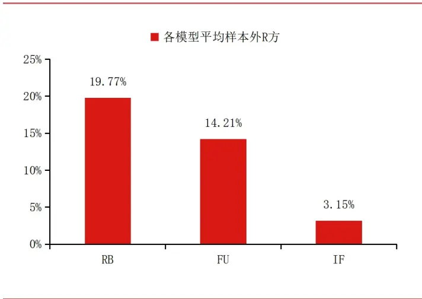
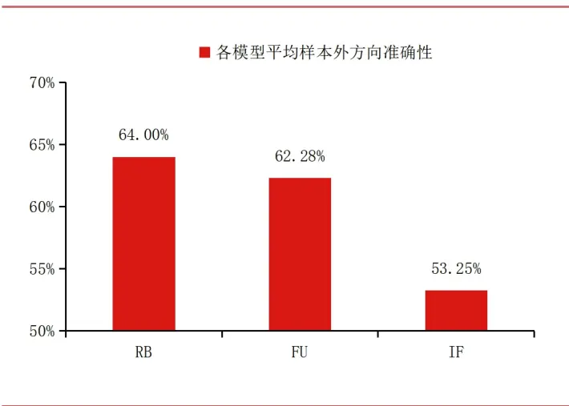
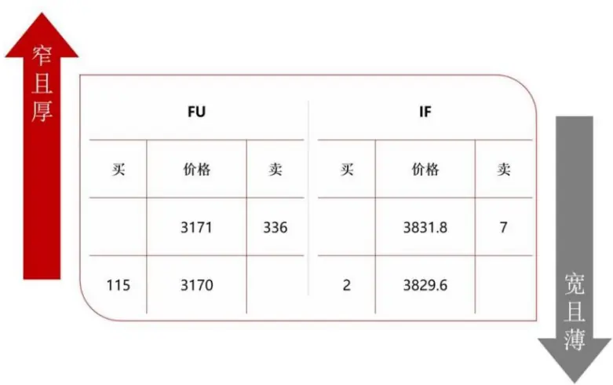
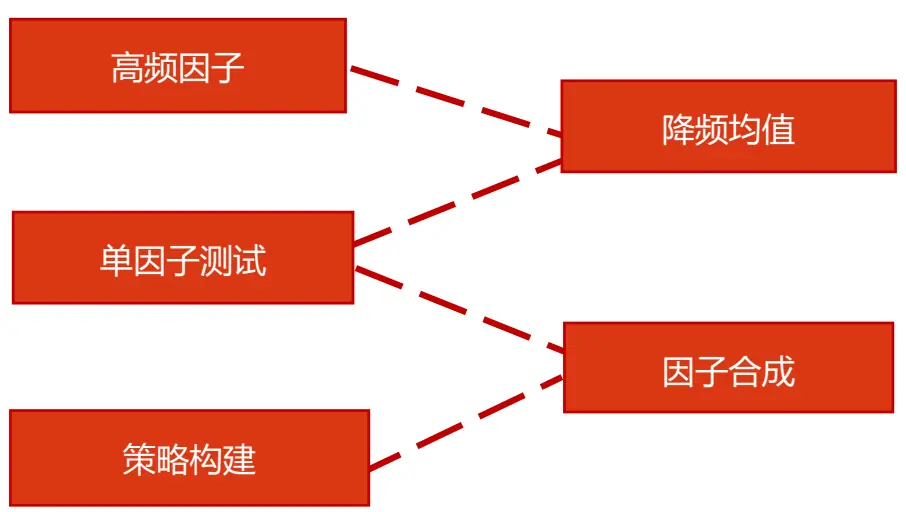
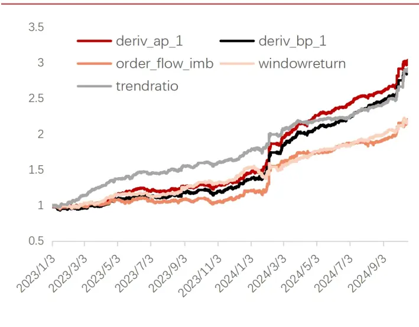
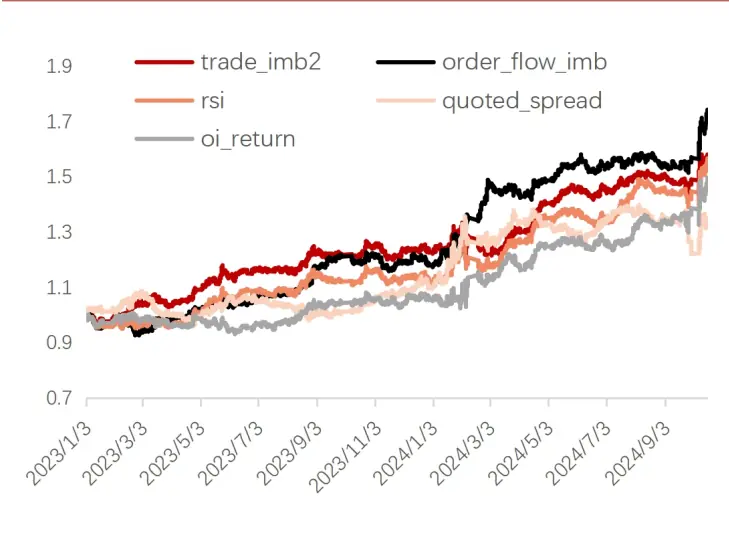
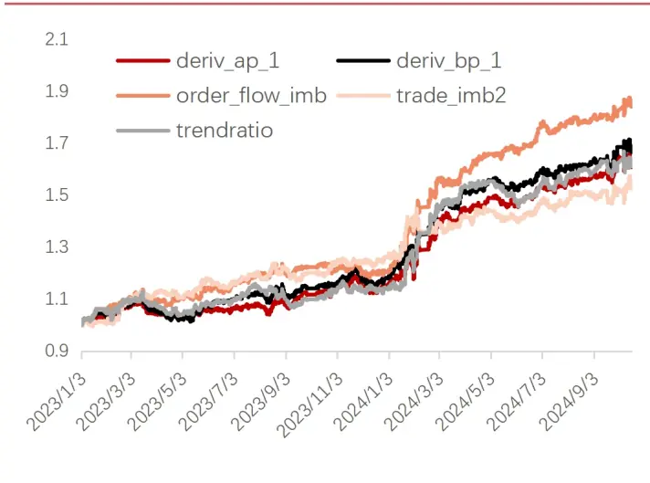
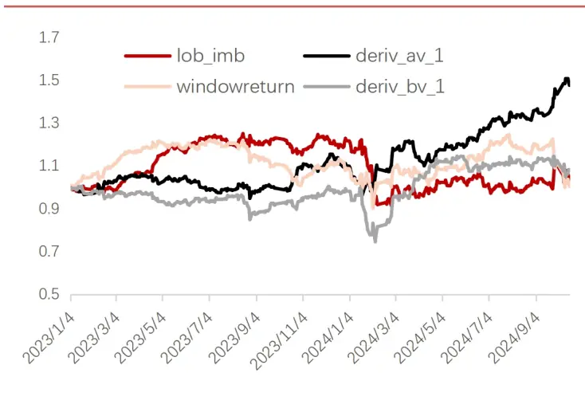

研究院量化组

研究员

高天越

0755-23887993

gaotianyue@htfc.com

从业资格号：F3055799

投资咨询号：Z0016156

## 李逸资

0755-23887993

liyizi@htfc.com

从业资格号：F03105861

投资咨询号：Z0021365

## 李光庭

0755-23887993

liguangting@htfc.com

从业资格号：F03108562

投资咨询号：Z0021506

## 联系人

黄煦然

0755-23887993

huangxuran@htfc.com

从业资格号：F03130959

证监许可【2011】1289号

投资咨询业务资格：

## 摘要

在《高频收益如何及何时可预测》系列报告中，我们展示了高频多因子模型在国内商品期货市场上的实证结果。我们也将该方法应用到股指期货上，验证其在金融期货品种上的有效性。经测试发现，由于股指期货交易数据的特征与商品期货不同导致股指期货预测效果不及商品期货。由于股指期货日内交易的手续费比较昂贵，在收益率预测效果不及预期的情况下，高频策略的收益无法很好地覆盖交易产生的成本。考虑到今年股指期货的波动较大，我们将高频因子进行降频化处理并构建相应的策略，以赚取波段收益。

## 核心观点

1）由于股指期货交易数据的特征与商品期货不同，导致高频多因子模型在股指期货收益的预测效果不及商品期货。

2）股指高频因子低频化后，能够覆盖成交滑点与手续费，在今年股指波动加大的市场环境下，相关低频化策略表现优秀。

## 高频因子在股指期货上的低频化应用

## 高频多因子模型结果

在《高频收益如何及何时可预测》系列报告中，我们展示了高频多因子模型在商品期货上的实证结果。我们也尝试将高频因子收益率预测模型应用在股指期货上，但发现预测效果不如模型在商品上的预测效果。

图 1：多因子模型样本外 R 方 | 单位：%

数据来源：天软华泰期货研究院

图 2：多因子模型样本外方向准确性单位：%

数据来源：天软华泰期货研究院

经过观察发现，股指期货的盘口买卖价差大于商品，挂单量显著少于商品。与商品窄且厚的盘口相比，股指期货盘口展示出了宽且薄的特征。盘口薄可能导致因子值变动过于频繁，使得因子有效性减弱，股指期货的日内手续费加收也会导致超高频策略失效。另外股指期货更多受标的指数变动的影响，仅考虑股指期货盘口量价因子可能不够全面，使得收益率预测效果不如商品。

由于股指期货日内交易的手续费比较昂贵，在收益率预测效果不及预期的情况下，高频策略的收益无法很好地覆盖交易产生的成本。考虑到今年股指期货的波动较大，我们对高频因子进行降频化处理并构建相应的策略，以赚取波段收益。

图3：股指期货与商品盘口差异|单位：无

数据来源：天软，华泰期货研究院

我们首先选取2023年1月至2024年10月的IM主力合约进行测试。为构建更低频率的策略，我们先将tick级别的数据降低至相应的频率，这里选取了1分钟、10分钟、半小时、以及一天进行测试。因子层面，我们采取计算该因子在相应时间段中均值的方法进行降频。收益率层面，我们用每个时间段第一个tick的价格以及最后一个tick的价格来计算收益率。其次，我们对单因子进行因子有效性测试，计算每一期的因子值以及下一期的收益率的相关系数，筛选出相关性强的因子构建单因子策略。然后，我们将这些因子进行择优合成，并构建合成因子策略。

图4：降频后数据示意|单位：无

|  | lob_imb | trade_imb1 | trade_imb2 | tran_ret | tran_ret2 | quoted_spread |
| --- | --- | --- | --- | --- | --- | --- |
| 2023-01-03T09:31:00.000000000 | -0.08475 | 0.50000 | 0.02500 | 0.00003 | 0.00003 | 0.00026 |
| 2023-01-03T09:32:00.000000000 | -0.04092 | 0.36667 | 0.08333 | 0.00001 | 0.00001 | 0.00019 |
| 2023-01-03T09:33:00.000000000 | -0.08363 | 0.20000 | -0.01667 | -0.00000 | -0.00000 | 0.00019 |
| 2023-01-03T09:34:00.000000000 | -0.02577 | 0.18333 | -0.06667 | 0.00001 | 0.00001 | 0.00024 |
| 2023-01-03T09:35:00.000000000 | 0.07396 | 0.28333 | 0.00833 | 0.00000 | 0.00000 | 0.00023 |
| 2023-01-03T09:36:00.000000000 | -0.01172 | 0.37500 | 0.07500 | -0.00001 | -0.00001 | 0.00019 |
| 2023-01-03T09:37:00.000000000 | 0.03920 | 0.20000 | 0.04167 | -0.00001 | -0.00001 | 0.00018 |
| 2023-01-03T09:38:00.000000000 | 0.07766 | 0.05000 | -0.03333 | 0.00000 | 0.00000 | 0.00017 |
| 2023-01-03T09:39:00.000000000 | 0.00647 | 0.14167 | -0.06667 | -0.00000 | -0.00000 | 0.00016 |
| 2023-01-03T09:40:00.000000000 | 0.01235 | 0.16667 | -0.07500 | 0.00001 | 0.00001 | 0.00016 |
| 2023-01-03T09:41:00.000000000 | 0.08379 | 0.00833 | -0.09167 | 0.00001 | 0.00001 | 0.00016 |
| 2023-01-03T09:42:00.000000000 | -0.01646 | 0.15833 | 0.00000 | -0.00000 | -0.00000 | 0.00017 |
| 2023-01-03T09:43:00.000000000 | -0.14850 | 0.18333 | 0.01667 | 0.00001 | 0.00001 | 0.00018 |
| 2023-01-03T09:44:00.000000000 | -0.02378 | 0.18333 | -0.00833 | 0.00001 | 0.00001 | 0.00015 |
| 2023-01-03T09:45:00.000000000 | -0.12407 | 0.09167 | -0.01667 | 0.00001 | 0.00001 | 0.00015 |

数据来源：天软，华泰期货研究院

在构建单因子策略时，我们根据因子特性来决定开仓方向以及阈值。如因子值在0附近震荡，则设多空阈值x和y为0，如因子值都大于0或都小于0，则设多空阈值x和y为其平均值。

图 5：高频因子低频化流程图单位：无

数据来源：华泰期货研究院

当期因子值a与下期收益率r呈正相关时，a>x时做多，a<y时做空；a与r呈负相关时，a<y时做多，a>x时做空； $y\leq a\leq x$ 时空仓。

首先展示的是各频率上效果排名靠前的因子。以下测算结果均尚未考虑交易成本。

图 6：1min 频率因子排名前 5 累计净值|单位：无

数据来源：天软，华泰期货研究院

表1：1min频率因子排名前5 策略效果|单位：无

| 因子 | 年化收益 | 最大回撤 | 夏普比率 |
| --- | --- | --- | --- |
| trendratio | 87.08% | -4.43% | 6.09 |
| deriv_ap_1 | 91.51% | -5.77% | 5.57 |
| deriv_bp_1 | 86.46% | -7.33% | 5.05 |
| windowreturn | 58.03% | -11.71% | 3.59 |
| order_flow_imb | 58.95% | -8.39% | 3.39 |

数据来源：天软，华泰期货研究院

图 7：10min 频率因子排名前 5 累计净值|单位：无

数据来源：天软，华泰期货研究院

表 2：10min频率因子排名前 5 策略效果|单位：无

| 因子 | 年化收益 | 最大回撤 | 夏普比率 |
| --- | --- | --- | --- |
| order_flow_imb | 38.44% | -8.29% | 2.47 |
| trade_imb2 | 30.51% | -9.31% | 2.04 |
| rsi | 30.02% | -8.93% | 1.91 |
| oi_return | 26.59% | -8.51% | 1.60 |
| quoted_spread | 19.16% | -12.74% | 1.28 |

数据来源：天软，华泰期货研究院

图 8：30min 频率因子排名前5 累计净值|单位：无

数据来源：天软，华泰期货研究院

表 3：30min频率因子排名前5 策略效果单位：无

| 因子 | 年化收益 | 最大回撤 | 夏普比率 |
| --- | --- | --- | --- |
| order_flow_imb | 43.52% | -5.57% | 3.16 |
| deriv_bp_1 | 35.44% | -9.36% | 2.51 |
| trendratio | 32.91% | -8.22% | 2.32 |
| deriv_ap_1 | 32.71% | -8.00% | 2.28 |
| trade_imb2 | 28.29% | -6.65% | 2.08 |

数据来源：天软，华泰期货研究院

图 9：1day 频率因子排名前 4 累计净值|单位：无

数据来源：天软，华泰期货研究院

表 4：1day 频率因子排名前 4 策略效果 |单位：无

| 因子 | 年化收益 | 最大回撤 | 夏普比率 |
| --- | --- | --- | --- |
| deriv_av_1 | 25.66% | -16.50% | 1.35 |
| deriv_bv_1 | 4.76% | -25.82% | 0.33 |
| lob_imb | 1.96% | -26.82% | 0.20 |
| windowreturn | 0.33% | -26.26% | 0.12 |

数据来源：天软，华泰期货研究院

不同频率下表现最优的因子有所差异，有些因子如：基于挂单变化的因子order_flow_imb，盘口处价格相关的因子driv_ap_1、trendratio 在不同频率上都有不错的表现。总体来看，大部分高频因子降至日频后效果不佳，综合最大回撤、夏普比率、交易成本等来看，30min在回测的4个频率中表现较好。

其次我们对各因子策略的交易次数及单笔收益进行了统计。

表 5：1min频率单笔收益统计|单位：无

| 因子 | 累计收益（点） | 交易次数 | 单笔收益（点） | 单笔跳价倍数 |
| --- | --- | --- | --- | --- |
| trendratio | 12045.2 | 100750 | 0.12 | 0.60 |
| deriv_ap_1 | 12795 | 105926 | 0.12 | 0.60 |
| deriv_bp_1 | 11942.2 | 105764 | 0.11 | 0.56 |
| windowreturn | 7445.8 | 91882 | 0.08 | 0.41 |
| order_flow_imb | 7582.4 | 94570 | 0.08 | 0.40 |

数据来源：天软华泰期货研究院

表 6：10min频率单笔收益统计单位：无

| 因子 | 累计收益（点） | 交易次数 | 单笔收益（点） | 单笔跳价倍数 |
| --- | --- | --- | --- | --- |
| order_flow_imb | 4656.2 | 8486 | 0.55 | 2.74 |
| trade_imb2 | 3678 | 8634 | 0.43 | 2.13 |
| rsi | 3613.4 | 8716 | 0.41 | 2.07 |
| oi_return | 3100 | 8824 | 0.35 | 1.76 |

请仔细阅读本报告最后一页的免责声明

| quoted_spread | 2237.8 | 3054 | 0.73 | 3.66 |
| --- | --- | --- | --- | --- |

数据来源：天软华泰期货研究院

表 7：30min频率单笔收益统计单位：无

| 因子 | 累计收益（点） | 交易次数 | 单笔收益（点） | 单笔跳价倍数 |
| --- | --- | --- | --- | --- |
| order_flow_imb | 5479.2 | 2606 | 2.10 | 10.51 |
| deriv_bp_1 | 4367.2 | 2936 | 1.49 | 7.44 |
| trendratio | 4028.4 | 2874 | 1.40 | 7.01 |
| deriv_ap_1 | 4001.8 | 2940 | 1.36 | 6.81 |
| trade_imb2 | 3421 | 2676 | 1.28 | 6.39 |

数据来源：天软华泰期货研究院

表 8：1day频率单笔收益统计单位：无

| 因子 | 累计收益（点） | 交易次数 | 单笔收益（点） | 单笔跳价倍数 |
| --- | --- | --- | --- | --- |
| deriv_av_1 | 3052 | 402 | 7.59 | 37.96 |
| deriv_bv_1 | 534.6 | 395 | 1.35 | 6.77 |
| lob_imb | 211.2 | 396 | 0.53 | 2.67 |
| windowreturn | 40.4 | 382 | 0.11 | 0.53 |

数据来源：天软华泰期货研究院

结合总收益以及单笔收益统计来看，日内的3个频率中，30min下的因子表现较优。排名前5的因子单次交易可以承受6倍以上的最小跳价。日频策略中，只有deriv_av_1 的表现较好。

接下来我们选取30min频率进行进一步的策略构建。我们将阈值x和y设为不同的数值，并采取前述开仓方式。

表 9：30min频率因子值分布单位：无

| 因子 | mean | std | min | 25% | 50% | 75% | max |
| --- | --- | --- | --- | --- | --- | --- | --- |
| order_flow_imb | -0.0105 | 0.1275 | -1.0386 | -0.0828 | -0.0111 | 0.0581 | 0.6989 |
| deriv_bp_1 | -0.0002 | 0.0152 | -0.0908 | -0.0076 | -0.0006 | 0.0063 | 0.1283 |
| trendratio | -0.0012 | 0.0128 | -0.0475 | -0.0092 | -0.0014 | 0.0064 | 0.0469 |

数据来源：天软华泰期货研究院

order_flow_imb: x: [0, 0.01, 0.02, 0.03]; y: [0, -0.01, -0.02, -0.03]

deriv_bp_1: x: [0, 0.01, 0.03, 0.04, 0.05]; y: [0, -0.01, -0.03, -0.04, -0.05]

trendratio: x: [0, 0.01, 0.015, 0.02, 0.025, 0.03]; y: [0, -0.01, -0.015, -0.02, -0.025,-0.03]

表 10：30min频率因子阈值夏普排名前 5 单位：%

| 因子 | x | y | 年化收益 | 最大回撤 | 夏普比率 |
| --- | --- | --- | --- | --- | --- |
| order_flow_imb | 0.03 | 0 | 44.45% | -4.73% | 3.39 |
|  | 0.03 | -0.01 | 43.35% | -5.34% | 3.34 |
|  | 0.01 | 0 | 44.97% | -5.42% | 3.34 |
|  | 0.02 | 0 | 44.28% | -5.12% | 3.33 |
|  | 0.01 | -0.01 | 43.87% | -6.12% | 3.28 |
| deriv_bp_1 | 0.01 | 0 | 37.44% | -6.68% | 2.97 |
|  | 0.03 | 0 | 31.92% | -5.18% | 2.81 |
|  | 0.04 | 0 | 30.91% | -5.20% | 2.77 |
|  | 0.05 | 0 | 28.15% | -5.42% | 2.57 |
|  | 0 | 0 | 35.44% | -9.36% | 2.51 |
| trendratio | 0.02 | -0.01 | 27.52% | -4.29% | 2.97 |
|  | 0.02 | -0.015 | 24.53% | -4.40% | 2.83 |
|  | 0.025 | -0.01 | 25.16% | -4.43% | 2.83 |
|  | 0.03 | -0.01 | 24.46% | -4.40% | 2.81 |
|  | 0.025 | -0.015 | 22.12% | -4.55% | 2.68 |

数据来源：天软华泰期货研究院

表 11：30min 频率因子阈值夏普排名后 5 单位：%

| 因子 | X | y | 年化收益 | 最大回撤 | 夏普比率 |
| --- | --- | --- | --- | --- | --- |
| order_flow_imb | 0.03 | -0.03 | 38.43% | -6.49% | 3.01 |
|  | 0.01 | -0.03 | 38.97% | -6.24% | 2.96 |
|  | 0.02 | -0.03 | 38.25% | -5.95% | 2.95 |
|  | 0 | -0.02 | 39.26% | -5.67% | 2.89 |
|  | 0 | -0.03 | 37.47% | -6.73% | 2.77 |
| deriv_bp_1 | 0 | -0.03 | 16.30% | -8.00% | 1.40 |

|  | 0.05 | -0.04 | 7.78% -5.08% | 1.29 |
| --- | --- | --- | --- | --- |
|  | 0 -0.05 | 14.36% | -7.66% | 1.28 |
|  | 0.05 | -0.03 7.96% | -5.30% | 1.20 |
|  | 0.05 | -0.05 | 5.91% -5.15% | 1.02 |
|  | 0.01 | -0.03 7.48% | -6.42% | 0.95 |
|  | 0.015 | -0.03 6.45% | -5.74% | 0.94 |
| trendratio | 0.025 | -0.03 4.20% | -2.97% | 0.94 |
|  | 0.03 | -0.025 5.18% | -5.69% | 0.93 |
|  | 0.03 | -0.03 3.40% | -2.43% | 0.85 |

数据来源：天软华泰期货研究院

从3个因子排名前5以及排名后5的阈值效果来看，阈值的设置存在一定的参数敏感性，其中 trendratio的参数敏感性较强，当开仓阈值逐渐向两端靠近时，夏普从2.5 以上逐渐下降至1 以下。3 个因子对下阈值y的敏感性都略强于x，当y向最小值靠近时，因子效果下降较明显。

其次，我们将该频率表现最优的这3个因子进行信号合成。方案一：如3个因子同时给出做多信号，则开仓做多；如3个因子同时给出做空信号，则开仓做空；如未达到条件则维持前一开仓判断。方案二：如有≥2个因子给出做多信号，则开仓做多；如有≥2个因子给出做空信号，则开仓做空；如未达到条件则维持前一开仓判断。

表12：30min频率合成因子策略效果单位：无

| 因子 | 合成方式 | 年化收益 | 最大回撤 | 夏普比率 |
| --- | --- | --- | --- | --- |
| compound factor | 方案一 | 31.35% | -7.98% | 2.08 |
|  | 方案二 | 46.87% | -7.39% | 3.34 |

数据来源：天软华泰期货研究院

表13：30min频率合成因子单笔收益统计单位：无

| 因子 | 合成方式 | 累计收益（点） | 交易次数 | 单笔收益（点） | 单笔跳价倍数 |
| --- | --- | --- | --- | --- | --- |
| compound factor | 方案一 | 3750 | 419 | 8.95 | 44.75 |
|  | 方案二 | 5953.6 | 1270 | 4.69 | 23.44 |

数据来源：天软华泰期货研究院

合成信号通过增加开仓条件降低了交易频率从而降低交易成本。方案二的合成方式提升了策略的整体收益，但最大回撤较单因子有所上升。

## 更多降频方式

前面我们用到了求平均值的方式来将高频因子进行降频。此外，我们也尝试了其他的降频方式，如，中位数、最值、标准差、因子值在该时间段大于0的比例、以及因子值大于平均值的比例等方法。在筛选因子时，我们将相关性较强的因子分为一组，从每组中挑选出有效性更强的因子进行信号合成。合成规则为，当有一半以上的因子给出做多信号时开仓做多，做空同理；当给出多空信号因子数相同时则维持前一判断。在测试阈值时，由于因子数量较多，我们统一采用因子值百分位的形式，将x范围设置为 50%到70%，将y范围设置为30%到50%，每隔5%为一个单位。

表 13：IM-30min 频率优选因子策略效果单位：无

| 因子 | 降频方式 | x | y | 年化收益 | 最大回撤 | 夏普比率 |
| --- | --- | --- | --- | --- | --- | --- |
| order_flow_imb | 平均值 | 70% | 50% | 42.69% | -4.56% | 3.34 |
|  | 大于平均值的比例 | 55% | 40% | 36.34% | -5.41% | 3.20 |
| trade_imb2 | 大于平均值的比例 | 60% | 30% | 25.47% | -2.87% | 2.70 |
|  | 平均值 | 70% | 45% | 30.73% | -7.66% | 2.48 |
| trendratio | 平均值 | 65% | 30% | 34.51% | -8.07% | 2.84 |
| deriv_bp_1 | 大于平均值的比例 | 50% | 40% | 28.34% | -8.18% | 2.36 |
| midprice_1 | 大于平均值的比例 | 65% | 50% | 29.81% | -7.01% | 2.25 |
| compound_factor1 | 1 | 1 | 1 | 45.23% | -4.83% | 3.38 |
| compound_factor2 | 1 | 1 | 1 | 45.48% | -5.31% | 3.29 |

数据来源：天软华泰期货研究院

我们在表现好的因子里选取较好的降频方法以及阈值进行展示。经过测试，和平均值有关的降频方式相比起其他方式在IM上更加有效，合成信号因子分别在年化收益、最大回撤、夏普比率上较单因子有所改善。

## 其它品种回测效果

除IM以外，我们也在股指期货其它品种上进行了测试，回测结果如下。

表14：IC-30min频率优选因子策略效果|单位：无

| 因子 | 降频方式 | X | y | 年化收益 | 最大回撤 | 夏普比率 |
| --- | --- | --- | --- | --- | --- | --- |
| order_flow_imb | 平均值 | 65% | 50% | 24.67% | -8.14% | 1.86 |
| deriv_ap_1 | 最大值 | 50% | 35% | 22.70% | -10.00% | 1.73 |
| BAspread_1 | 最小值 | 50% | 50% | 21.26% | -10.97% | 1.56 |
| deriv_bv_1 | 最大值 | 70% | 30% | 16.31% | -7.99% | 1.40 |
| logQuotedSlope_1 | 最大值 | 50% | 35% | 17.07% | -12.69% | 1.25 |
| compound_factor1 | 1 | 1 | 1 | 17.90% | -12.75% | 1.30 |
| compound_factor2 | 1 | 1 | 1 | 19.31% | -10.48% | 1.39 |

数据来源：天软华泰期货研究院

表 15：IF-30min 频率优选因子策略效果单位：无

| 因子 | 降频方式 | X | y | 年化收益 | 最大回撤 | 夏普比率 |
| --- | --- | --- | --- | --- | --- | --- |
| order_flow_imb | 平均值 | 65% | 45% | 29.65% | -4.01% | 2.85 |
| deriv_av_1 | 平均值 | 70% | 50% | 24.65% | -5.21% | 2.56 |
|  | 大于平均值的比例 | 60% | 30% | 20.81% | -6.07% | 2.24 |
| lob_imb | 大于平均值的比例 | 50% | 30% | 26.92% | -5.68% | 2.56 |
| netb1_ratio | 最小值 | 50% | 40% | 19.97% | -6.72% | 1.84 |
| bid_depth | 最大值 | 65% | 35% | 17.43% | -6.53% | 1.66 |
| compound_factor1 | / | 1 | 1 | 35.62% | -4.71% | 3.21 |
| compound_factor2 | 1 | 1 | 1 | 39.10% | -4.85% | 3.49 |

数据来源：天软华泰期货研究院

表 16：IH-30min 频率优选因子策略效果|单位：无

| 因子 | 降频方式 | X | y | 年化收益 | 最大回撤 | 夏普比率 |
| --- | --- | --- | --- | --- | --- | --- |
| quoted_spread | 最小值 | 65% | 40% | 18.05% | -12.29% | 1.57 |
| AmtPerTrd | 最大值 | 60% | 35% | 17.97% | -12.30% | 1.57 |
| oi_return | 最大值 | 55% | 35% | 15.39% | -14.25% | 1.34 |
| Mom_bigOrder | 最小值 | 65% | 45% | 14.79% | -15.77% | 1.29 |
| deriv_ap_1 | 最小值 | 70% | 50% | 13.04% | -14.34% | 1.20 |
| compound_factor1 | / | 1 | 1 | 19.84% | -15.16% | 1.65 |
| compound_factor2 | 1 | 1 | 1 | 18.39% | -9.98% | 1.50 |

数据来源：天软华泰期货研究院

## 总结

从因子层面上来看，不同品种上因子的有效程度差异较大，但有个别因子如order_flow_imb在IM、IC、IF上效果都排名靠前；从降频方式上来看，不同因子可能适用不同的降频方式；从高频因子低频化的效果上来看，IM、IF的整体效果较好，在30min的交易频率上，通过优选因子构建的合成因子夏普可达到3以上。

总体来说，股指高频因子低频化后，能够覆盖成交滑点与手续费，特别是在今年股指波动加大的市场环境下，相关低频化策略表现优秀。

## 风险提示

回测结果基于历史数据得出，不排除失效的可能。

## 免责声明

本报告基于本公司认为可靠的、已公开的信息编制，但本公司对该等信息的准确性及完整性不作任何保证。本报告所载的意见、结论及预测仅反映报告发布当日的观点和判断。在不同时期，本公司可能会发出与本报告所载意见、评估及预测不一致的研究报告。本公司不保证本报告所含信息保持在最新状态。本公司对本报告所含信息可在不发出通知的情形下做出修改，投资者应当自行关注相应的更新或修改。

本公司力求报告内容客观、公正，但本报告所载的观点、结论和建议仅供参考，投资者并不能依靠本报告以取代行使独立判断。对投资者依据或者使用本报告所造成的一切后果，本公司及作者均不承担任何法律责任。

本报告版权仅为本公司所有。未经本公司书面许可，任何机构或个人不得以翻版、复制、发表、引用或再次分发他人等任何形式侵犯本公司版权。如征得本公司同意进行引用、刊发的，需在允许的范围内使用，并注明出处为“华泰期货研究院”，且不得对本报告进行任何有悖原意的引用、删节和修改。本公司保留追究相关责任的权力。所有本报告中使用的商标、服务标记及标记均为本公司的商标、服务标记及标记。

华泰期货有限公司版权所有并保留一切权利。

## 公司总部

广州市天河区临江大道1号之一2101-2106单元|邮编：510000

电话：400-6280-888

网址：www.htfc.com