## 金工研究/深度研究

2017年06月01日

林晓明 执业证书编号：S0570516010001

研究员 0755-82080134

linxiaoming@htsc.com

陈烨 010-56793927

联系人 chenye@htsc.com

## 相关研究

1《金工: 华泰价值选股之低市收率 A股模型Ⅱ》2017.05

2《金融经济系统周期的确定》2017.05

3《华泰风险收益一致性择时模型》2017.05

# 人工智能选股框架及经典算法简介华泰人工智能系列之一

## 人工智能和机器学习并不神秘

人工智能和机器学习方法并不神秘，其本质是以数理模型为核心工具，结合控制论、认知心理学等其它学科的研究成果，最终由计算机系统模拟人类的感知、推理、学习、决策等功能。理解常用的机器学习算法，有助于澄清对人工智能的种种误解和偏见，帮助我们更清晰地认识人工智能的长处和局限，从而更合理、有效地将人工智能运用于投资领域。

## 机器“学习”的对象是客观存在的规律

机器学习的对象是某种客观存在的规律。这种规律可以非常浅显，比如教给计算机勾股定理，机器就拥有了计算直角三角形边长的智慧。规律也可以相当复杂，如指纹识别系统学习的是不同指纹图像之间差异的规律，苹果语音助手 Siri 学习的是人类语言的声信号和背后表达意义的规律，无人驾驶学习的是当前路况和驾驶行为的规律。有的规律甚至连人类自己都无法完美诠释，如 AlphaGo 学习的是围棋落子和胜负之间的规律，智能投顾学习的是资本市场中投资决策和收益之间的规律。

## 机器学习遵循基本的流程

机器学习往往遵循一些基本的流程，主要步骤包括：数据获取、特征提取、数据转换、模型训练、模型选择和模型预测。数据获取可以通过数据库以及网络爬虫技术，途径日趋多元化。特征提取基于人的经验和探索，优质的特征能够起到事半功倍的效果。数据转换包括缺失值填充，标准化和降维。机器学习模型可分为监督学习，非监督学习和强化学习。模型选择通常借助交互验证和一系列评价指标。

## 监督学习寻找特征和标签之间的规律，应用极为广泛

监督学习由使用者给出特征和标签，由算法挖掘规律，学习一个模式，并且根据此模式预测新的特征所对应的标签。监督学习应用更广泛，学习效果好。我们从最简单的线性回归模型开始，介绍包括线性回归、岭回归、Lasso 回归、逻辑回归、线性判别分析和二次判别分析、支持向量机、决策树、随机森林、AdaBoost、神经网络、深度学习和 K最近邻算法在内的众多监督学习方法。

## 无监督学习通常用来挖掘数据自身的规律

无监督学习不给出标签，由算法仅仅根据原始特征寻找模式，挖掘数据自身蕴含的规律。聚类和降维是常用的无监督学习方法。聚类包括 K均值聚类、分层聚类和谱聚类。降维包括以主成分分析为代表的线性降维，以及以流形学习为代表的非线性降维。

风险提示：机器学习的结果是历史经验的总结，存在失效的可能。

## 本文研究导读

2016 年 3 月，举世瞩目的围棋人机大战在韩国首尔上演。Google DeepMind 团队的人工智能围棋软件 AlphaGo 以四胜一负的战绩击败世界冠军韩国棋手李世乭，轰动围棋界。2017 年 5 月，AlphaGo 升级版在乌镇围棋峰会中以 3:0 完胜世界围棋第一人中国棋手柯洁，又一次掀起社会上对于人工智能的热议。其实人工智能并不是什么新鲜的名词，早在20 年前，IBM 的人工智能“深蓝”就曾击败国际象棋世界冠军卡斯帕罗夫；而在近 20 年中，人工智能和它借助的机器学习方法也逐渐渗透到人类生活的方方面面。从手写数字的自动识别，到电脑手机上的指纹解锁功能、语音识别系统，再到无人驾驶、智能医疗、智能投顾等热门领域，处处都有人工智能的身影。

在普罗大众的心目中，人工智能和机器学习可能还带有一些神秘色彩。有人质疑人工智能的可靠程度，认为电脑永远不可能达到人脑的水平。有人忧虑人工智能的无限发展最终将导致机器人统治人类。即使在内行看来，人工智能相当于黑箱子，人们无法破译程序“思考”的过程，那么使用人工智能时自然也要打上一个问号。其实，人工智能和它所借助的机器学习方法并没有想象的那么神秘，其本质是以数理模型为核心工具，结合控制论、认知心理学等其它学科的研究成果，最终由计算机系统模拟人类的感知、推理、学习、决策等功能。理解常用的机器学习算法，有助于我们澄清对人工智能的种种误解和偏见，帮助我们更清晰地认识人工智能的长处和局限，从而引导我们更合理、有效地将人工智能运用于投资领域。

## 以下，我们的报告将分为两部分进行论述。

1. 所谓“举一纲而万目张”。在介绍具体的机器学习算法之前，我们首先将介绍机器学习项目的基本套路，为我们未来的系列研究构建好框架。随后我们将着重探讨特征提取、数据转换、交互验证和模型评价等重要步骤，帮助读者建立一个对机器学习的大致概念。

2. 传统机器学习方法包含监督学习和无监督学习两大门类。近年来强化学习逐渐受到重视，成为第三大门类。通俗地说，监督学习是教师（使用者）给出问题（特征）和正确答案（标签），由学生（算法）挖掘规律，学习一个模式，并且根据此模式回答新的问题（预测新的特征所对应的标签）。无监督学习不给出正确答案，由算法仅根据原始特征寻找模式。强化学习的目标是让模型学会使奖赏最大化的决策，是三大门类中最年轻也是最困难的方法。监督学习应用最为广泛，并且学习效果较好，因此第二部分我们将着重围绕监督学习进行介绍。我们将从最简单的线性回归模型开始，介绍包括广义线性模型、线性判别分析、支持向量机、决策树和随机森林、神经网络、K 最近邻算法在内的众多监督学习方法。另外我们也将介绍聚类这一无监督学习方法，以及数据转换常用的降维方法。

本研究的一大亮点是，针对每一种机器学习方法，我们都配合原创、浅显、并且与投资密切相关的例子加以阐述，以一种非常接地气的描述方式推送给读者，试图帮助读者厘清基本概念，使人工智能方法脱去神秘的外衣，让读者都有可能开发出成功的机器学习投资策略，也为我们后续的系列研究报告做铺垫。

## 机器学习基本框架

## 机器“学习”什么？

从物质层面上看，人类的大脑是一个毫不起眼的器官，成年人的大脑约为 1.5 公斤，仅占体重的 2%，相当于一大瓶可口可乐的重量。然而，人类的大脑又是一个极其复杂的器官，约 860 亿个神经元形成的复杂网络上有百万亿数量级别的突触连接, 被誉为宇宙中最复杂的 1.5 公斤重的物体。基于它, 人类产生了知觉、注意、语言、决策、记忆、意识、情感等心理和认知过程, 也产生了以科学和艺术为代表的灿烂的文明。

对于人类来说，最神奇的地方莫过于我们的大脑拥有着无以伦比的学习能力。婴儿甚至没有人教就可以学会爬行、站立和行走。儿童即使没有上学也能熟练地用母语与他人交流。青少年在校园的短短十多年间掌握的科学知识就已超过几百年前人类文明的总和。而当今时代，即使最强大的机器人也无法像人类一样自然地行走，最先进的计算机也不能在和人类对话时以假乱真，我们也无法想象人工智能参加高考能得多少分。

自计算机问世以来，科学家便试图探索计算机究竟能在多大程度上取代人类。很长一段时间，计算机帮助人类实现人脑无法承担的大规模运算，储存人脑无法储存的海量信息，然而这些仍离智慧相距甚远。随着计算机科学的逐步发展成熟，人们意识到让计算机拥有智慧的关键，就在于让机器拥有和大脑一样的学习能力。人工智能和机器学习由此应运而生。

机器学习的对象是某种客观存在的“规律”。这种规律可以非常浅显，比如教给计算机勾股定理a2 +b2 = c2，机器就拥有了计算直角三角形边长的智慧。规律也可以极其复杂，比如指纹识别系统学习的是不同指纹图像之间差异的规律，苹果智能语音助手 Siri学习的是人类语言的声信号和背后表达意义的规律，无人驾驶学习的是当前路况和驾驶行为的规律。有的规律甚至连人类自己都无法完美诠释，比如 AlphaGo 学习的是围棋落子和胜负之间的规律，智能投顾学习的是资本市场中投资决策和收益之间的规律。

## 机器学习基本流程

就如同人类学习某种技能需要持续练习一样，机器学习某种规律也需要大量的数据进行训练。从开始获取数据、训练机器学习模型到最终模型投入应用，通常需要遵循一些固定的流程。图表 1展示了机器学习的基本框架，主要步骤包括：数据获取、特征提取、数据转换、模型训练、模型选择和模型预测。

图表1： 机器学习基本框架
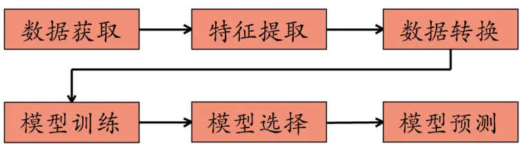
资料来源：华泰证券研究所

数据获取：巧妇难为无米之炊，如果数据的数量不足，或者信噪比过低，那么再精妙的算法也难以发挥作用。因此，如何获取大量的、高质量的数据，是开发机器学习模型过程中首先需要考虑的问题。各个领域都有一些标准化的数据库和数据接口可供选择，比如金融领域的雅虎财经、新浪财经、万得终端等等。随着网络技术的发展，人们开始尝试借助爬虫技术，从新闻网站、财经论坛、自媒体平台甚至聊天软件中获取感兴趣的舆情信息，数据的来源日趋多元化。

特征提取：原始数据中有价值的信息往往湮没在噪音中。另外，原始数据由于格式和类型的限制，可能无法直接用于训练模型。因此需要先从原始数据中提取富有信息量的、可以放入模型训练的特征，这一步称为特征提取。例如在自然语言识别中，人们借助 WordEmbedding 技术，将以文字表示的词汇转换为以数值表示的向量。在图像识别中，人们首先从原始的图片里提取出三原色、亮度等信息。在多因子选股中，人们从原始的价量数据中提取出各类因子，也暗含了特征提取的思想。特征提取有一些基本套路，但是更多时候基于人的经验和探索。优质的特征能够令模型训练的过程事半功倍。

数据转换：现实生活中的数据通常不是完美的。例如数据会存在缺失值，不同特征的取值范围不同，不同特征之间具有相关性。这些都会影响到机器学习模型的训练速率和准确率。因此在正式训练之前，需要对数据进行转换。对于包含缺失值的条目，可以直接删去或以总体均值填充。标准化可以将所有特征限制在相同的范围内。降维能够避免特征之间相关性的影响，也能避免维数灾难的发生。数据转换这一步看似简单，但往往是机器学习成败的关键。

模型训练：完成数据预处理后，接下来是机器学习的核心步骤——模型训练。针对不同的问题，我们需要挑选最合适的机器学习方法。图表 2 展示了常用的机器学习方法。如果数据中包含特征和标签，希望学习特征和标签之间的对应关系，那么可以采用监督学习的方法；如果没有标签，希望探索特征自身的规律，那么可以采用非监督学习；如果学习任务由一系列行动和对应的奖赏组成，那么可以采用强化学习。如果需要预测的标签是分类变量，比如预测股票上涨还是下跌，那么可以采用分类方法；如果标签是连续的数值变量，比如预测股票具体涨多少，那么可以采用回归方法。另外，样本和特征的个数，数据本身的特点，这些都决定了最终选择哪一种机器学习方法。

图表2： 传统机器学习常用方法一览
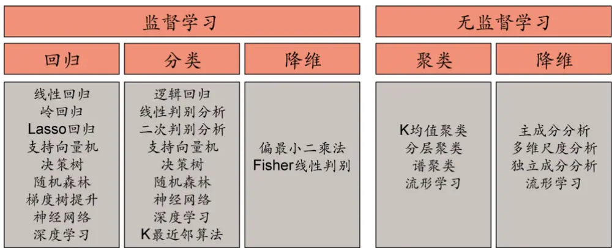
资料来源：华泰证券研究所

模型选择：面对一个机器学习问题时，存在众多备选模型，每个模型的参数也存在多种可能的取值。如何选择最合适的模型和参数？最重要的方法是交互验证，并选择合适的指标对备选模型做出评价。后面的章节我们将详细阐述，如何通过交互验证将数据分为训练集和验证集，从而避免欠拟合和过拟合的发生，找到最优的模型。我们也将介绍除了预测误差和分类正确率之外，还有哪些指标可以用于评价模型的好坏。

模型预测：当确定最优的模型和参数后，最后一步是使用模型对未来做出预测。现实世界中的规律并非一成不变，当规律随时间发生变化时，就需要用新的数据训练模型，对模型进行动态调整。

## 交互验证

面对一个机器学习问题时，存在众多的备选模型供我们选择。解决问题很重要的一步是从大量的模型中遴选出一个最优的模型。表现最优的模型是简单的模型还是复杂的模型？模型的参数应该如何设定？上述这些问题不存在固定的答案，我们要根据具体问题进行决断。尽管如此，模型选择仍需遵循一系列基本的原则和方法。

首先，对于一般的回归问题，我们通常使用均方误差（mean squared error，MSE）来衡量模型的表现。均方误差可以分解为方差（variance）和偏差（bias）：

$$
均方误差=方差+偏差
$$

图表 3的打靶图形象地说明了两者的区别，小的方差代表射手射得稳，小的偏差代表射手瞄得准。

图表3： 方差（Variance）和偏差（Bias）
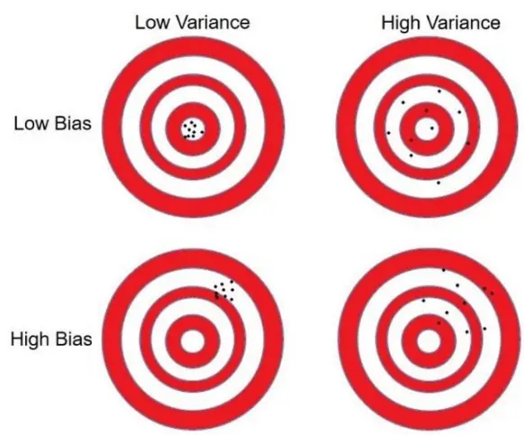
资料来源：华泰证券研究所

具体而言，第一项方差代表我们使用不同训练集时模型表现的差异。由于模型的构建通常和训练集的统计性质有关，不同的训练集会导致模型出现差异。如果某个机器学习方法得到的模型具有较大的方差，训练集只要有少许变化，模型会有很大的改变。复杂的模型一般具有更大的方差。

第二项偏差代表实际模型与理想模型的差别。例如线性模型是最常用的模型之一，而真实世界往往是非常复杂的，当我们用线性模型这样的简单模型去解释世界时，很可能会出现问题。如果我们用复杂度为 2 的线性模型（有截距和斜率两个参数）拟合一个非线性模型（模型复杂度远大于 2），将产生较大的均方误差，其中很大一部分来源于偏差。当我们不断增加模型的复杂程度，模型的均方误差不断下降，整体表现逐渐提升，主要原因是偏差逐渐下降，说明模型更加符合真实的情况。然而随着模型的复杂程度进一步增加，可以发现样本差异导致的方差急剧上升，说明复杂的模型更多地把握住了属于训练样本独有的特性，而非数据的共性，这是我们不希望看到的。均方误差、方差和偏差随模型复杂度的变化关系如图表 4所示。

图表4： 均方误差、方差和偏差随模型复杂度的变化关系
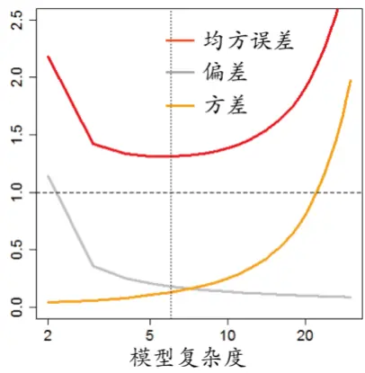
资料来源：华泰证券研究所

机器学习的训练过程是一个不断调整模型的参数数量和大小的过程。在调参的过程中，模型总是会更好地拟合训练集，类似于图表 4中复杂度逐渐增大的情形。此时我们最需要避免的情况是过拟合（overfitting），即模型的方差过大。通俗地说，过拟合是指模型“记住”了训练样本对应的正确答案，但模型不适用于样本外的数据。

图表 5展示了欠拟合、正常拟合和过拟合三种情况。我们到底用什么形状的边界来划分两个类别的样本？简单的模型只有比较少的参数。如图表5左图的直线，只有两个自由参数。增加参数数量可以让模型学会更复杂的关系。如图表 5 中间图的二次曲线，包含三个自由参数；右图的高次函数，包含更多自由参数。参数越多，训练样本的错误率就越低。另一方面，更多的参数也让模型记住了更多训练数据特有的特征和噪音，而非挖掘出总体的信号，因此更容易产生过拟合。

图表5： 欠拟合、正常拟合和过拟合示意图
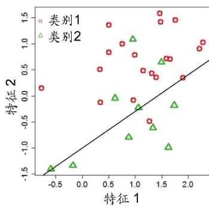
资料来源：华泰证券研究所

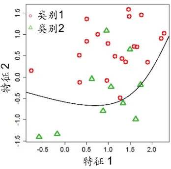

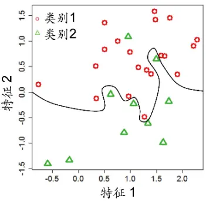

避免过拟合最重要的方法是进行交互验证。交互验证是指使用不曾在训练中出现过的数据来进行验证。如果模型在验证时性能和训练时大致相同，那么就可以确信模型真的“学会”了如何发现数据中的一般规律，而不是“记住”训练样本。这实际上和学生考试的情形类似，要想考察学生是否掌握了某个知识点，不能使用课堂上讲过的例题，而应当使用相似的习题。

交互验证的核心是将全部样本划分成两部分，一部分用来训练模型，称为训练集，另外一部分用来验证模型，称为验证集，随后考察模型在训练集和验证集的表现是否接近。最简单的划分方法是从总样本中随机选取一定比例（如 15%）的样本作为验证集。但是这种方法会导致一部分数据从未参与训练，可能降低模型的准确性。

图表6： 5折交互验证示意图
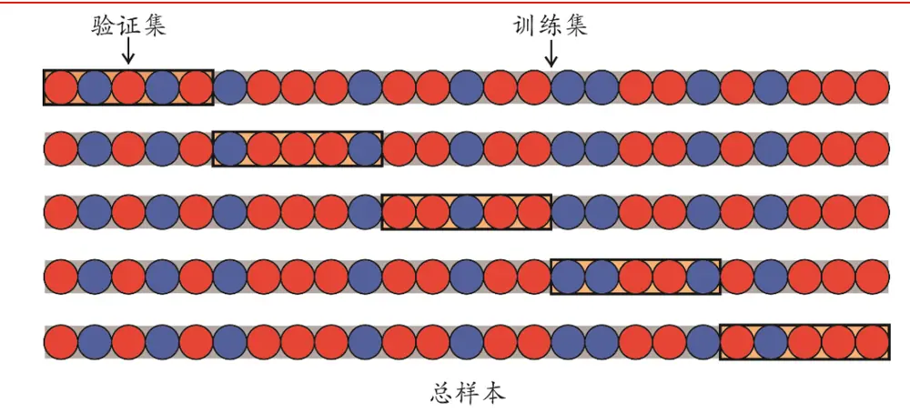
资料来源：华泰证券研究所

为了避免上述情况，我们通常采用 K折交互验证的方法，随机将全体样本分为 K个部分（K在 3~20 之间），每次用其中的一部分作为验证集，其余部分作为训练集。重复 K 次，直到所有部分都被验证过。图表 6 展示了 5 折交互验证的过程，我们把全体样本随机划分成5 个不重叠的部分，每次用 1/5 的橙色部分作为验证集，其余灰色部分作为训练集。最终我们将得到 5个验证集的均方误差，取均值作为验证集的平均表现。

除了把样本分成 K个部分，还可以每次取一个固定数目的样本作为验证集。如果每次取一个样本验证，把其余样本用来训练，重复 N次，这种方法称为留一法（leave one out），我们还可以每次取 P个样本验证，重复 N/P次，这种方法称为留 P法。

## 模型评价

如何评价一个模型的好坏？对于回归问题，我们可以采用上一部分介绍的均方误差作为评价指标，误差越小代表模型越好。对于分类问题，我们可以采用分类正确率进行评价，即测试集中多少比例的样本归入了正确的类别，正确率越高代表模型越好。除了误差和正确率之外，还有一些指标也经常用于模型评价，接下来我们将做简单介绍。

假设有一种医疗诊断技术可以对某种疾病做早期筛查，如何评价这种技术是否可靠？每个人的状态分为两种：阳性（患病）和阴性（健康）；诊断的结果也为分两种：阳性（患病）和阴性（健康）。一个人的真实患病情况与诊断结果共有 4 种可能的组合，即（病人，诊断）=（阳性，阳性）/（阳性，阴性）/（阴性，阳性）/（阴性，阴性），分别称为命中、漏报、虚报和正确拒绝，如图表 7所示。

图表7： 常用模型评价指标

|  | 真实情况=阳性 | 真实情况=阴性 |  |  |
| --- | --- | --- | --- | --- |
| 诊断结果=阳性 | 命中 | 虚报 | 精确率= | 命中 |
|  |  |  |  | 命中+虚报 |
| 诊断结果=阴性 | 漏报 | 正确拒绝 |  |  |
|  | 命中 |  | 虚报 | 命中+正确拒绝 |
|  | 命中率(召回率) = 命中+漏报 | 虚报率= | 虚报+正确拒绝 | 正确率= 命中+正确拒绝+漏报+虚报 |

资料来源：华泰证券研究所

图表 7还展示了常用评价指标的定义。我们常用的正确率（Accuracy）是“正确诊断出一个人是否患病”的概率。除此以外，评价指标还包括：命中率（又称召回率，Recall）、精确率（Precision）和虚报率。命中率是“患病的人被诊断出患病”的概率，精确率是“诊断出患病且此人确实患病”的概率，虚报率是“没有患病的人被诊断出患病”的概率。

对于发病率较高的疾病，传统的正确率可以较好地衡量诊断技术的好坏。然而对于罕见病，正确率的意义就不大了。假设一种罕见病发病率是 1‰，如果某种诊断技术给所有人的诊断都是阴性，那么它的正确率高达 99.9%，但显然这一诊断没有任何意义。此时应该以命中率为评价指标，该诊断技术的命中率为 0%，显然是不合格的。

某些时候，数据中不同类别的样本数目不均衡，例如当我们开发机器学习模型预测公司是否可能发生信用违约，或者预测股票是否会被 ST 时，违约公司或 ST 股票的数量所占比例较小，但是筛查出这些特殊分类情形又尤为重要。此时我们会在使用正确率的同时也参考命中率和精确率。除了上述这些指标外，人们还会借助 ROC 曲线和曲线下面积 AUC评价模型好坏。

以上我们讨论了机器学习的基本框架，重点关注了交互验证和模型评价方法。第二部分我们将逐一介绍主流的机器学习方法。

## 机器学习方法介绍

## 广义线性模型

## 从线性回归开始

线性回归（linear regression）是传统多因子模型中最常见的套路，也是最为基础的监督学习方法。为了帮助读者清晰地理解整个监督学习的框架，我们从简单的一元线性回归开始介绍。例如我们希望能用股票的市盈率因子预测收益率。选取沪深 300 成分股 2016 年底的市盈率以及 2017 年一季度涨跌幅。对市盈率 TTM 取倒数，进行中位数去极值和标准化处理，得到 EP因子。如图表 8所示，我们找到一条直线可以较好地拟合自变量 $x_{1}$ （EP因子）和因变量 y（涨跌幅），该直线对应于线性模型 $.y=w_{0}+w_{1}x_{1}$ ，其中系数的估计量$\widehat{w}_{0}=2.32,\quad\widehat{w}_{1}=3.03$ 。市盈率越低，EP因子越大，那么股票越有可能上涨。

如果用机器学习的语言表述，我们根据已知的“特征”x1和“标签”y ，通过“训练”得到一个反映两者线性关系的模型。如果这种关系在未来一段时间内能够延续，那么任意给出一个股票当前时刻的 EP因子 x1，我们就可以“预测”该股票未来时刻的涨跌幅 $\hat{\gamma}=w_{0}$ +$w_{1}x_{1}$ 。根据已有的特征和标签训练模型，使用新的特征进行预测，两者构成了监督学习最核心的两个环节。

图表8： 市盈率 EP因子和涨跌幅的线性模型
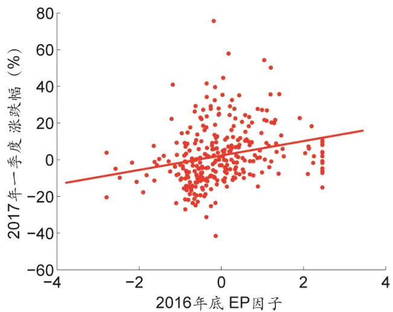
资料来源：Wind，华泰证券研究所

更多的时候，单一自变量很难对因变量进行有效的预测，需要使用多元线性回归。以传统多因子模型为例：已知股票下个月的涨跌幅 y，以及当月的 p 个特征，比如估值因子 $x_{1}$ 成长因子 x2，动量因子 x3，……，波动率因子 $x_{p}$ ，多元线性回归的目标是用各因子 $x_{1}$ ，x2，……， $x_{p}$ 的线性组合解释并预测 $y_{\circ}$ 。为此我们拟合模型：

$$
y=w_{0}+w_{1}x_{1}+w_{2}x_{2}+\cdots+w_{p}x_{p}
$$

其中，系数向量 $w=(w_{0},w_{1},\ldots,w_{p})$ 的估计量由最小二乘法得到。定义损失函数为全部 N个样本拟合残差的平方和：

$$
J(w)={\sum}_{i=1}^{N}(y_{i}-w_{0}-{\sum}_{j=1}^{p}w_{j}x_{ij})^{2}
$$

其中， $x_{ij}$ 表示第 i个样本的第 j个特征（因子）， $\mathsf{yi}$ 表示第 i个样本的标签。模型系数的估计量ŵ为损失函数最小时 w的取值：

$$
\widehat{w}=\min J(w)
$$

在样本量较小的情况下，可以直接求出ŵ的解析解。在样本量较大的情况下，通常使用梯度下降算法，迭代多次求得ŵ。多因子模型的框架中，w 代表因子收益率。通过最小二乘法确定模型参数后，给出任意股票某月月底截面期的因子 x1、x2、……、xp，我们就能预测该股票下个月的收益率 y。

## 岭回归和 Lasso 回归

在普通最小二乘法中，我们不对模型系数 w作任何的先验假定。事实上，w不可能取极大的正数或极小的负数；并且，在特征较多的情形下，很可能只有少数的几个特征具有预测效力。因此我们引入正则化（regularization）的重要思想，在最小二乘法损失函数的后面加入惩罚项。当惩罚项为系数 w的平方和时，这种回归方法称为岭回归（ridge regression，又称为 L2 正则化），损失函数为：

$$
J(w)={\sum}_{i=1}^{N}(y_{i}-w_{0}-{\sum}_{j=1}^{p}w_{j}x_{ij})^{2}+\lambda{\sum}_{j=1}^{p}w_{j}^{2}
$$

当惩罚项为系数 w的绝对值之和时，这种回归方法称为 Lasso 回归（又称为 L1 正则化），损失函数为：

$$
J(w)={\sum}_{i=1}^{N}(y_{i}-w_{0}-{\sum}_{j=1}^{p}w_{j}x_{ij})^{2}+\lambda{\sum}_{j=1}^{p}\lvert w_{j}\rvert
$$

其中，自由参数 λ 为正则化系数。当设置一个较大的 λ时，即使对较小的 w也会加以惩罚，因此拟合得到的 w更接近 0。

正则化的意义在于：首先，岭回归和 Lasso 回归对病态数据的拟合强于线性回归。想象一个最极端的状态，回归模型中有两个特征完全相等，那么普通最小二乘法是无解的，但是岭回归和 Lasso 回归可以进行拟合。其次，正则化可以遴选出更少的特征，即大多数系数为 0，并且避免系数值过大的情形发生。相较于岭回归，Lasso 回归的惩罚力度更强，更有利于选出比较稀疏的若干个特征。图表 9展示了普通最小二乘法，岭回归和 Lasso 回归对相同数据的拟合效果，Lasso 回归（λ取 1）得到的斜率 w1最小，其次为岭回归（λ取50），普通最小二乘法的斜率 w 最大。

图表9： 普通最小二乘法，岭回归和 Lasso回归对相同数据的拟合效果
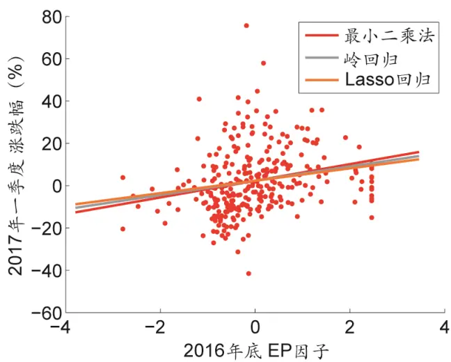
资料来源：Wind，华泰证券研究所

## 逻辑回归

很多时候，我们并不需要预测股票下个月具体的涨跌幅，而是希望预测股票下个月会上涨还是下跌。换言之，我们面对的是“分类”问题，而非“回归”问题。接下来介绍的逻辑回归（logistic regression），尽管名字中包含回归二字，却是解决分类问题经常用到的机器学习方法。

例如，我们希望用股票的市盈率预测涨跌情况。选取沪深 300 成分股 2017 年一季度的涨跌幅排名前 50名和后 50名的个股，计算 2016 年底的市盈率 EP 因子。将涨幅前 50 的个股定义为类别y = 1，跌幅前 50的个股定义为类别 $y=0$

我们首先采用线性回归模型 $P(x_{1})=w_{0}+w_{1}x_{1}$ 进行拟合，其中 $P(x_{1})$ 相当于 $P(y=1|x_{1})$ 即自变量取 $x_{1}$ 时对应的上涨概率，相应的下跌概率为 $1-P(x_{1})$ 。通过最小二乘法求得 $\widehat{w}_{0}=$ $0.54,\widehat{w}_{1}=0.30\cdot$ 。如图表 10，直线上的每个点表示某个 EP因子 $x_{1}$ 对应的上涨概率 $\cdot P(x_{1})$ 直观地看，直线并不能很好地拟合二分类的数据。同时，线性回归的残差项不符合正态分布假设。更为重要的是，当自变量 $\mathsf{x}_{1}$ 取极大或极小的数时，预测的上涨概率 $\cdot P(x_{1})$ 将取到小于 0或大于 1的值，然而根据概率的定义，上涨概率应介于 0到 1 之间。因此，线性回归不适用于分类问题。

图表10： 线性回归模型拟合二分类数据
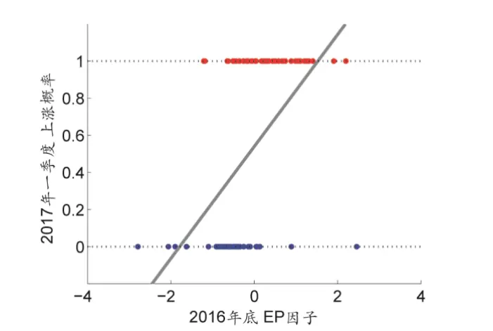
图表11： 逻辑回归模型拟合二分类数据
资料来源：Wind，华泰证券研究所

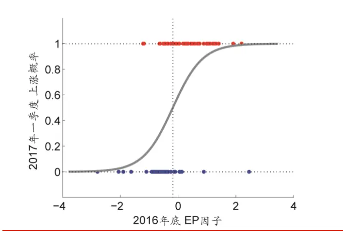
资料来源：Wind，华泰证券研究所

为了确保因变量的预测值介于 0 到 1之间，我们采用逻辑回归模型：

$$
P(x_{1})=\frac{e^{w_{0}+w_{1}x_{1}}}{1+e^{w_{0}+w_{1}x_{1}}}
$$

通过最大似然估计方法求得参数 $\widehat{w}_{0}=1.95,\widehat{w}_{1}=0.36$ 。拟合结果如图表 11 的曲线所示，曲线上的每个点表示某个 EP因子 $x_{1}$ 对应的上涨概率 $\cdot P(x_{1})$ 。当 $x_{1}$ 取极大的数时，上涨概率 $\cdot P(x_{1})$ 趋向于 1；当 $x_{1}$ 取极小的数时，上涨概率 $\cdot P(x_{1})$ 趋向于 $0_{\circ}$

求出模型参数后，我们可以对新的数据做出预测。假设某只股票的 EP因子 $x_{1}=1$ ，则该股票下个月的上涨概率为：

$$
\hat{P}(x_{1})=\frac{e^{1.95+0.36\times1}}{1+e^{1.95+0.36\times1}}=0.91>0.5
$$

我们预测该股票下个月将上涨。事实上，当 EP因子位于图表 11竖直直线的右侧时，将归入上涨类别，左侧则归入下跌类别。

更多的时候，我们使用多个自变量 $x_{1}$ 、x2、……、 $x_{p}$ 对因变量 y进行预测，此时逻辑回归模型为：

$$
P(x_{1})=\frac{e^{w_{0}+w_{1}x_{1}+w_{2}x_{2}+\cdots+w_{p}x_{p}}}{1+e^{w_{0}+w_{1}x_{1}+w_{2}x_{2}+\cdots+w_{p}x_{p}}}
$$

模型的另一种常见等价形式为：

$$
\log(\cfrac{P(x)}{1-P(x)})=w_{0}+w_{1}x_{1}+w_{2}x_{2}+\cdots+w_{p}x_{p}
$$

参数估计值ŵ通过最大似然估计方法得到。上面等式的右侧为线性表达式，逻辑回归本质上仍是一种线性分类方法，属于广义线性模型的范畴。

和线性回归类似，我们同样采用正则化方法以避免过拟合。例如 L2 正则化的逻辑回归的损失函数为：

$$
J(w)=-\sum_{i=1}^{N}(y_{i}logP(x_{i})+(1-y_{i})log(1-P(x_{i})))+\lambda\sum_{j=1}^{p}w_{j}^{2}
$$

最终的参数估计值ŵ是使得损失函数最小值的 w。通常采用梯度下降算法、牛顿法等迭代方法对损失函数求极值。

## 多分类问题

以上我们讨论了二分类问题，在实际生活中，我们还会面对多分类的问题，例如预测股票将上涨、下跌还是震荡，预测天气是晴、多云还是下雨。此时，需要将二分类逻辑回归拓展到多分类。下面介绍两种主要的多分类逻辑回归方法：有序多分类和 OvR 策略。

回到之前用 EP因子 $x_{1}$ 预测涨跌情况的例子。我们把股票按涨跌幅分成 3 类：跌幅前 1/3定义为 $y=0$ ，涨幅前 1/3 定义为 $y=2$ ，其余定义为 $y=1$ 。由于因变量 y 是有序的，因此可以采用有序多分类逻辑回归。具体而言，我们将拟合下面两个逻辑回归模型：

$$
\log(\frac{P(y\leq0|x_{1})}{1-P(y\leq0|x_{1})})=w_{0}+w_{1}x_{1}
$$

$$
\log(\frac{P(y\leq1|x_{1})}{1-P(y\leq1|x_{1})})=w_{2}+w_{3}x_{1}
$$

第一个模型本质上将y = 0视作一类，y = 1,2视作另一类，根据二分类逻辑回归估计出 w0和 w1，进而求得股票下跌的概率 $P(y\leq0|x_{1})$ 。第二个模型本质上是将 $y=0.1$ 视作一类，$y=2$ 视作另一类，同样可以估计出w2和 $\mathsf{W3}$ ，进而求得股票下跌及震荡的概率 $P(y\leq1|x_{1})$ o也就是说，我们将一个有序三分类问题拆分成为两个二分类问题。

如果某只股票的EP因子 $x_{1}=2$ ，可以求得 $P(y\leq0|x_1)=0.11<0.5,P(y\leq1|x_1)=0.46<$ 0.5，那么该股票的预测分类为y = 2，判断下个月将上涨。如果某只股票的 EP因子 $x_{1}=0.5$ 可以求得 $P(y\leq0|x_{1})=0.25<0.5$ $P(y\leq1|x_{1})=0.62>0.5$ ，那么该股票的预测分类为$y=1$ ，判断下个月为震荡。

一般地，如果因变量 y可分为 0，1，2到 N-1共 N 个有顺序关系的等级，对于该有序 N分类问题，可以拆分为 N-1 个二分类问题，通过拟合 N-1 个逻辑回归模型得到解决。如果自变量包含 p个特征 x1、x2、……、xp，那么这 N-1 个逻辑回归模型的形式为：

$$
\log(\frac{P(y\leq k|x)}{1-P(y\leq k|x)})=w_{0}+w_{1}x_{1}+w_{2}x_{2}+\cdots+w_{p}x_{p}
$$

其中 $k=0{,}1,\ldots,N-2$

如果因变量不存在顺序关系，有序多分类就不适用了，我们可以采用 OvR（one-vs-rest）策略。例如我们希望预测未来天气是晴、多云还是下雨：可以先将晴归为一类，其它情形归为一类，拟合逻辑回归模型；再将多云归为一类，其它情形归为一类，拟合逻辑回归模型；最后将下雨归为一类，其它情形归为一类，拟合逻辑回归模型。待三个逻辑回归模型训练完成后，对于每一组输入的特征，分别得到晴、多云和下雨的概率，其中概率最大者即为预测的天气类别。

一般地，对于一个 N 分类问题，OvR 策略将其拆分为 N 个二分类问题。如果因变量 y 可分为 0，1，2到 N-1共 N 类，自变量包含 p 个特征，那么这 N个逻辑回归模型的形式为：

$$
\log(\frac{P(y=k|x)}{1-P(y=k|x)})=w_{0}+w_{1}x_{1}+w_{2}x_{2}+\cdots+w_{p}x_{p}
$$

其中 $k=0{,}1,\ldots,N-1$ o

对于每一组自变量 x，根据 N 个逻辑回归模型可以计算出归入每一类的概率 $\cdot P(y=0|x)$ $P(y=1|x)$ ，……， $P(y=N-1|x)$ ，选取以上概率中最大的分类，即为 x最终的预测分类。

## 线性判别分析和二次判别分析

逻辑回归是一种经典的分类方法，然而该方法在某些情况下会不适用。当样本的两个类别相距过远，逻辑回归得到的参数会不稳定。此时，线性判别分析或者二次判别分析是不错的选择。

线性判别法分析（linear discriminant analysis，LDA）包括两种含义，其中之一是逻辑回归的拓展方法，主要基于样本满足正态分布的假设，接下来将做介绍。另一种是 Fisher在 1968 年改进的 Fisher线性判别法，该方法不需要正态分布的假定，很多时候作为降维的手段被广泛使用，我们会在降维的章节谈及。

我们仍以市盈率因子预测涨或跌的二分类问题为例，介绍线性判别分析的基本逻辑。选取沪深 300 成分股 2017 年一季度的涨跌幅排名前 50 和后 50 的个股，定义涨幅前 50 的个股属于类别k = 1，跌幅前 50的个股属于类别k = 2。 $用x_{1}$ 表示 2016 年末的 EP因子。在线性判别分析中，我们需要对上涨类别拟合判别方程 $.\delta_{1}(x_{1})$ ，同样对下跌类别拟合判别方程 $\delta_{2}(x_{1})$ ：

$$
\begin{aligned}\delta_{1}(x_{1})&=w_{0}+w_{1}x_{1},\\\delta_{2}(x_{1})&=w_{2}+w_{3}x_{1}\end{aligned}
$$

我们关心的上涨概率 $P(x_{1})$ 为：

$$
P(x_{1})=\frac{e^{\delta_{1}(x_{1})}}{e^{\delta_{1}(x_{1})}+e^{\delta_{2}(x_{1})}}
$$

和逻辑回归采用最大似然估计求系数 w 的方法不同，线性判别分析中判别方程的系数 w是基于样本服从正态分布的假设，通过均值和协方差计算得到，具体计算步骤参见图表12。

图表12： 线性判别分析模型系数估计的步骤
i. 计算两类样本的统计量： 
上涨股票 $x_{1}$ 的均值 $\hat{\mu}_{1}=0.28,$ ，方 $差\hat{\sigma}_{1}^{2}=0.95$ ，样本量 $n_{1}=147$ ，占总体比例 $\hat{\pi}_{1}=0.49$ 
下跌股票 $x_{1}$ 的均值 $i\hat{\mu}_{2}=-0.27$ ，方差 $\hat{\sigma}_{2}^{2}=0.91$ ，样本量 $n_{2}=153$ ，占总体比例 $|\hat{\pi}_{2}=0.51$ 
ii. 假设每个类别的协方差应相等，则样本总体的协方差： 
$\hat{\sigma}^{2}=((n_{1}-1)\cdot\hat{\sigma}_{1}^{2}+(n_{2}-1)\cdot\hat{\sigma}_{2}^{2})/(n_{1}+n_{2}-2)=0.93。$ 
iii. 计算系数的估计量： 
ŵ = − μ̂2 2σ̂2 ⁄ + log(π̂ ) = −0.75，ŵ = μ̂ /σ̂2 = 0.30， 
ŵ = − μ̂2 2σ̂2 ⁄ + log(π̂ ) = −0.71，ŵ = μ̂ σ̂2 ⁄ = −0.29。
资料来源：华泰证券研究所

接下来我们用训练好的模型预测新的数据。如果某只股票的 EP 因子 $x_{1}=2$ ，那么该股票上涨的概率：

$$
\hat{P}(x_{1})=\frac{e^{-0.75+0.30\times2}}{e^{-0.75+0.30\times2}+e^{-0.71-0.29\times2}}=0.76>0.5
$$

我们预测该股票下个月将上涨。

逻辑回归和线性判别分析最主要的区别在于估计系数 w的方法不同。大部分情况下，这两种方法有着非常类似的结果，当样本服从正态分布的假设时，线性判别分析的分类效果更好。

一般地，当我们需要把样本分为 1，2，……，N 共 N 类，且自变量包含 p 个特征时，针对每个类别 k 各自拟合一个判别方程：

$$
\delta_{k}(x)=x^{T}\Sigma^{-1}\mu_{k}-\frac{1}{2}\mu_{k}^{T}\Sigma^{-1}\mu_{k}+\mathrm{log}\pi_{k}.
$$

其中 $\mu_{k}$ 为第 k 类样本各特征的均值向量（p×1 维），Σ为关于 p 个特征的协方差矩阵（p×p维）， $\pi_{k}$ 为属于第 k 类的样本在全体样本当中的比例。预测阶段，将样本 x 归入第 k 类的概率为：

$$
P_{k}(x)={\frac{e^{\delta_{k}(x)}}{e^{\delta_{1}(x)}+e^{\delta_{2}(x)}+\cdots e^{\delta_{N}(x)}}}
$$

取 $k=1{,}2,\ldots,$ , N中使得 $\cdot P_{k}(x)$ 最大的分类 k 作为样本 x的预测分类。

为了更形象地展示线性判别分析处理多分类问题的效果，我们构建出一组模拟数据，每个样本代表一只股票，所有样本根据近期表现分成强势、中等和弱势股票三类，包含因子 1和因子 2共两个特征。我们根据已知的因子与股票表现之间的关系，采用线性判别分析计算出全样本空间的概率分布，用不同的背景色代表预测的分类，如图表 13 所示，分类的边界是直线，三条直线将因子空间分成三个区域。

线性判别分析的假设之一是每个类别内部的协方差一致，都等于样本总体的协方差。如果不同类别的协方差相差很大，对线性判别分析的判别方程稍加改动，就能得到二次判别分析（quadratic discriminant analysis，QDA）的判别方程：

$$
\delta_{k}(x)=-\frac{1}{2}(x-\mu_{k})^{T}\Sigma_{k}^{-1}(x-\mu_{k})-\frac{1}{2}\mathrm{log}|\Sigma_{k}|+\mathrm{log}\pi_{k}
$$

其中 $\Sigma_{k}$ 为第 k 类的样本协方差矩阵。二次判别分析的判别方程是二次函数，所以分类的边界一般是非线性的，如图表 14 中强势股票（红色区域）和中等股票（蓝色区域）的曲线边界。在我们的模拟数据中，强势股票和弱势股票两个因子的协方差矩阵相同，因此图表14 中红色区域和绿色区域的边界是一条直线，等价于线性判别分析。

图表13： 线性判别法对模拟数据进行分类
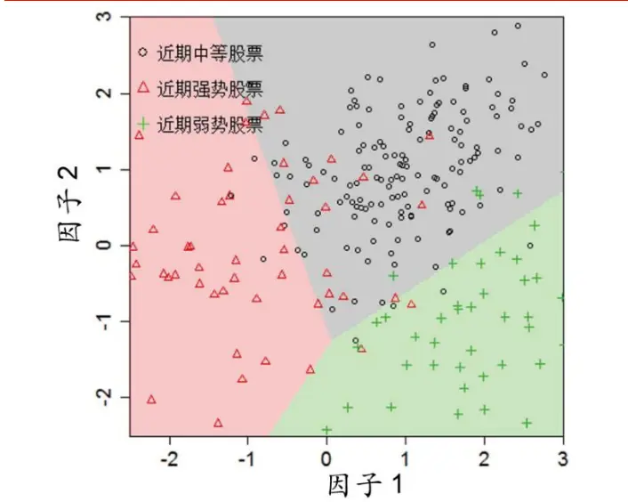
资料来源：华泰证券研究所

图表14： 二次判别法对模拟数据进行分类
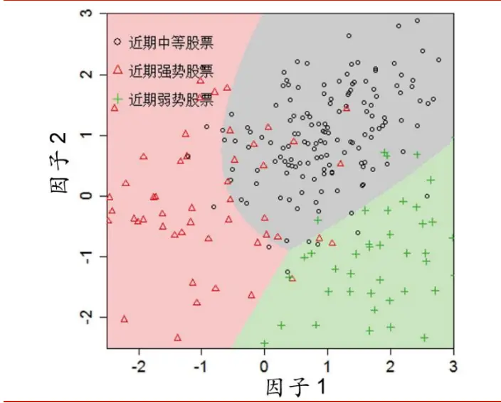
资料来源：华泰证券研究所

## 支持向量机

我们之前讨论的机器学习方法，本质上是将原有的特征通过线性组合的方式合成出新的特征，近似于降维的思路。那么增加维度会有什么样的效果，又是如何实现的？支持向量机（support vector machine，SVM）就是一种增加新维度看待问题的方法，在机器学习领域有极为广泛的应用。

在介绍支持向量机之前，我们先讨论其前身支持向量分类器，两者的思路是一致的，后者更容易理解。就像我们可以用刀（二维平面）将西瓜（三维物体）分成两半，任何一个 P维物体（空间）都可以被一个 P-1 维的超平面分成两部分。对于一个 P 维空间，x1+x2+…+xP=b 就是一个超平面，b 是一个常数。支持向量分类器的核心思路就是用一个这样的超平面划分样本空间，从而解决分类问题。如图表 15 所示，红点和蓝点分别代表两类样本，二维空间中的超平面就是图中的黑色直线。如果一条直线可以让两类样本中的点到这条直线的最短距离取最大值，一般认为这条直线就是最稳定的分界线。而决定这条直线的点往往是由少数几个支撑点决定的，这些点称为支持向量。在我们的例子中是红线和蓝线穿过的点。

图表15： 支持向量分类器示意图
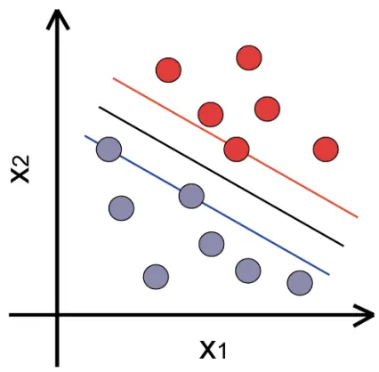
资料来源：华泰证券研究所

我们可以用 $w_{1}x_{1}+w_{2}x_{2}=b$ 来描述这条直线，改写成向量的形式就是w⃗ ∙x = b。向量w⃗ 是我们寻找的分界超平面。那么如何寻找到合适的直线？我们限定 $w_{1}^{2}+w_{2}^{2}=1$ ，已知分类结果y = 1（类别 1）或y = −1（类别 2），使得 $y_{i}(w_{1}x_{i1}+w_{2}x_{i2})\geq$ b对于全部样本都成立，这代表所有样本距离分界线的距离都大于 b。问题变成解一个使 b 取最大值的优化方程，可以通过拉格朗日乘子法实现。对于 p 维的情形，也是类似的处理方法。我们令：

$$
y_{i}(w_{1}x_{i1}+w_{2}x_{i2}+\cdots+w_{p}x_{ip})\geq b。
$$

刚才的例子是一个线性可分的问题，而真实世界的数据往往是混杂而充满噪音的，找不到一个超平面完美地将数据分成两部分，我们此时会寻找一个错误率最小的分界方式。只需要把上面的方程加一项损失项ε ：

$$
\begin{aligned}y_{i}(w_{1}x_{i1}+w_{2}x_{i2}+\cdots&+w_{p}x_{ip})\geq b(1-\varepsilon_{i})\\\sum_{i=1}^{n}\varepsilon_{i}&\leq C\end{aligned}
$$

代表我们允许分界在某些样本上是错误的，但是犯错误的总数较少即可。

在二维的视角下，我们永远无法用一条线来解决异或问题，如图表 16 左图所示。但是如果增加一个新的维度 $[x_{1}\cdot x_{2}$ ，如图表 16 右图所示，就可以得到新的数据点分布，从而可以轻松地用一个截面将这两类点分开，从而解决异或问题。

图表16： 支持向量分类器解决异或问题
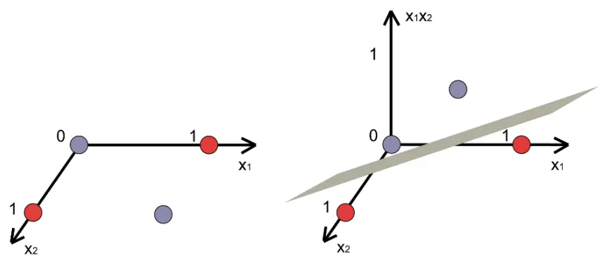
资料来源：华泰证券研究所

有几种常用的增加维度的方式，最简单的是增加一个线性组合的维度，比如 $\boldsymbol{x}_{1}+\boldsymbol{x}_{2}$ ，此时支持向量机将和逻辑回归得到相同的结果。其次是如图表 16 异或问题中，增加多项式的维度，比如 ${\cdot x_{1}\cdot x_{2}}$ ，x3等等，除了这些比较直观的方式之外，还有一种著名的方法： $\Theta^{x},$ 这代表我们用无穷多个维度看待我们现有的数据。根据级数的知识，将 $\Theta^{X}$ 泰勒展开之后得到：

$$
e^{x}=1+x+{\frac{x^{2}}{2!}}+{\frac{x^{3}}{3!}}+\cdots+{\frac{x^{n}}{n!}}+\cdots
$$

这可以理解为我们观察了 x全部多次项的结果。

我们上面所介绍的是支持向量分类器，而支持向量机的思路也是刚才介绍的“超平面分类”以及“引入更多的维度”，所不同的是引入了核（kernel）的方法来计算超平面。对于线性情形，关于超平面的方程可以写作： $\begin{array}{r}{f(\mathrm{x})=\beta_{0}+\sum_{i=1}^{n}\alpha_{i}\left\langle x_{i},x\right\rangle}\end{array}$ 。其中 n 代表训练样本个数，x 是新样本的特征， $\langle x,x_{i}\rangle$ 为新样本与全部训练样本的内积， $而\beta_{0}$ 和α则是通过之前训练样本计算得到。我们用广义内积的形式来表示核（kernel） $K(x_{i},x_{i^{\prime}})$ ，取代上面的内积部分。得到新方程： $\begin{array}{r}{f(\mathrm{x})=\beta_{0}+\sum_{i=1}^{n}\alpha_{i}K\left(x_{i},x\right)}\end{array}$

图表17： 支持向量机常用核函数

| 线性核： |  |
| --- | --- |
| i. | $\begin{array}{r}{K(x_{i},x_{i^{\prime}})=\sum_{j=1}^{p}x_{ij}x_{i^{\prime}j^{\prime}}}\end{array}$ |
| ii. | 多项式核： $\begin{array}{r}{K(x_{i},x_{i^{\prime}})=(1+\sum_{j=1}^{p}x_{ij}x_{i^{\prime}j})^{d},}\end{array}$ ，其中d是多项式的阶数 |
| iii. | 高斯核： $K(x_{i},x_{i'})=\exp(-\gamma(\sum_{j=1}^{p}(x_{ij-}x_{i'j})^2))$ |

资料来源：华泰证券研究所

常用的核分为三种，线性核、多项式核以及高斯核。核函数的具体形式如图表 17 所示。特别值得说明的是高斯核，高斯核就是我们之前提到的用无穷维视角来看待数据的情形，因此线性核会得到平直的边界，多项式核和高斯核都会得到弯曲的边界，后者弯曲程度更大一些。图表 18 是用不同核对于模拟数据的分类结果。

图表18： 不同核的支持向量机（线性核、3阶多项式核、5阶多项式核和高斯核）
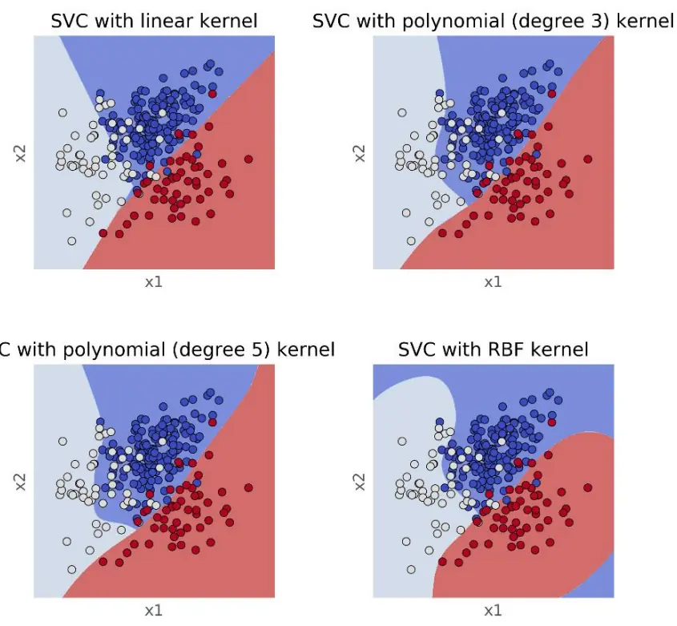
资料来源：华泰证券研究所

最后说明一下实际使用的方法，我们有三种备选的核；同时对于分类损失项ε 总和的上限参数 C，也存在着多种选择。通常使用交互验证的方法来选择最合适的模型和参数。

## 决策树和随机森林

## 决策树

在众多机器学习方法中，决策树（decision tree）是最贴近日常生活的方法之一，我们平时经常用到决策树的朴素思想。比如探险家在野外观察到某种不认识的大型兽类，会根据一些特征做出大致归类。首先根据饮食习性，判断该兽类属于食草动物还是食肉动物。如果是食草动物，再根据脚趾个数，判断它属于奇蹄类还是偶蹄类。如果是偶蹄动物，再根据是否反刍，反刍则属于骆驼科、鹿科或者牛科，不反刍则属于猪科或者河马科。再根据更细致的特征进一步区分，直到界定出该生物的种类。我们将上述决策过程归纳成树的形式，如图表 19所示，每个上层节点通过某种规则分裂成下一层的叶子节点，终端的叶子节点即为最终的分类结果。

图表19： 决策树思想对生物进行分类
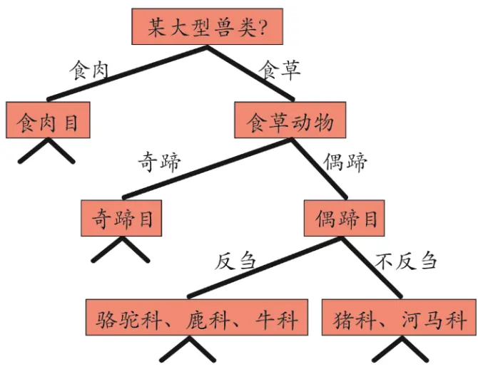
资料来源：华泰证券研究所

构建一棵决策树的关键之处在于，每一步选择哪种特征作为节点分裂的规则。例如图表 19的生物分类问题中，第一步应该根据食肉/食草分类，还是根据奇蹄/偶蹄分类，又或者根据反刍/不反刍分类？针对这一问题，尽管不同的决策树算法所遵循的具体手段略有差异，其核心原则是使得节点分裂后的信息增益最大。下面我们试举一例说明。

假如我们希望根据当前市场股票的市值风格（大、中或小）和板块风格（消费、周期或成长）预测涨跌情况，模拟数据如图表 20。直观地看，大市值股票全部属于“涨”类别，中小市值股票绝大多数属于“跌”类别。似乎以“是否为大市值”为规则进行首次分裂比较好。那么决策树将如何学习这一步呢？

图表20： 根据市值和板块风格预测涨跌的模拟数据

| 因子市值风格 | 板块风格 | 涨跌情况 |
| --- | --- | --- |
| 大 | 消费 | 涨 |
| 大 | 周期 | 涨涨跌跌跌跌跌 |
| 中 | 消费 |  |
| 中 | 周期 |  |
| 中 | 成长 |  |
| 小 | 消费 |  |
| 小 | 周期 |  |
| 小 | 成长 |  |

资料来源：华泰证券研究所

前面提到，节点分裂的原则是使得节点分裂后的信息增益（information gain）最大。其中“信息”由熵（entropy）或基尼不纯度（Gini impurity）定义。以熵为例，其概念源于信息论鼻祖香农（Claude Elwood Shannon）在 1948 年提出的信息熵：

$$
i(p)=-{\sum}_{j}P(\omega_{j}){\log_{2}P(\omega_{j})}
$$

其中i(p)表示分裂前节点 p的信息熵， $P(\omega_{j})$ 表示样本属于 j类的概率。第一步分裂前，全部 8 个样本中有 3个属于“涨”类别，概率为 $P(\omega 涨)=3/8;$ ；5 个属于“跌”类别，概率为 $P\big(\omega 跌\big)=5/8$ 。因此分裂前的熵为：

$$
i(分裂前)=-\left(\frac{3}{8}\log_2\frac{3}{8}+\frac{5}{8}\log_2\frac{5}{8}\right)=0.9544
$$

如果我们以“是否为大市值”作为规则将全样本分裂成两个子节点，在 2 个大市值样本中属于“涨”类别的概率为 $P\big(\omega 涨\big)=0$ ，属于“跌”类别的概率为 $P\big(\omega 跌\big)=1$ ，该子节点的熵为 $i\left(大市值\right)=-\left(0+1\log_{2}1\right)=0$ 。类似地，中小市值子节点的熵为：

$$
i(中小市值)=-\left(\frac{1}{6}\log_2\frac{1}{6}+\frac{5}{6}\log_2\frac{5}{6}\right)=0.6500
$$

定义每步分裂的信息增益为分裂前后的熵之差：

$$
\Delta i(p)=i(p)-{\sum}_{c}P_{c}i\left(p_{c}\right)
$$

其中 $p_{c}$ 是节点 p的子节点， $P_{c}$ 是分裂到 $(p_{c}$ 的概率。上述分裂过程中，分裂到大市值的概率为P(ω大市值) = 2⁄8，分裂到中小市值的概率为 $P\big(\omega 中小市值\big)=6/8$ 。因此信息增益为：

$$
\begin{aligned}&\Delta i\big(是否为大市值\big)=i\big(分裂前\big)-P_{大市值}i\big(大市值\big)-P_{中小市值}i\big(中小市值\big)\\&\\&\begin{aligned}\\&=0.9544-\frac{2}{8}\times0-\frac{6}{8}\times0.6500=0.4669\\&\end{aligned}\\\end{aligned}
$$

如果换成“是否为小市值”或“是否为消费类”作为分裂规则，计算出信息增益为：

$$
\Delta i\left(是否为小市值\right)=0.9544-\frac{3}{8}\times0-\frac{5}{8}\times0.9710=0.3475
$$

$$
\Delta i(是否为消费类)=0.9544-\frac{3}{8}\times0.9183-\frac{5}{8}\times0.7219=0.1589
$$

事实上，在所有可能的分裂规则中，“是否为大市值”的信息增益最大。我们据此进行首次分裂，如图表 21 所示。接下来依照相同办法，继续对子节点进行分裂，直到每个样本都归入终端的叶子节点，如图表 22所示，最终完成整棵决策树的学习。

图表21： 以“是否为大市值”为规则对决策树作首次分裂
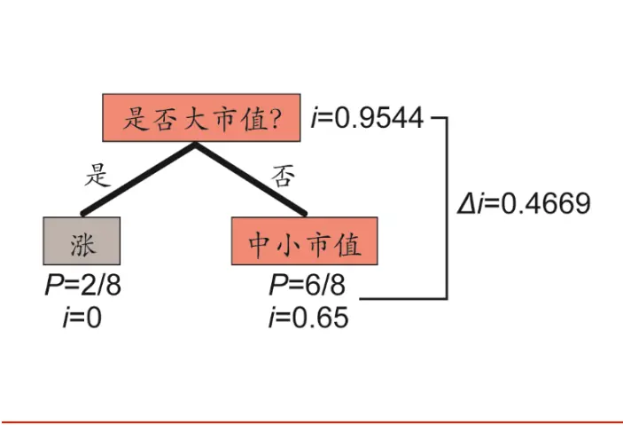
资料来源：华泰证券研究所

图表22： 第二次和第三次分裂完成决策树学习

资料来源：华泰证券研究所

以上我们展示了最简单的决策树构建步骤。在实际应用过程中，节点的分裂不一定依赖单一特征，也可以根据几个特征的组合进行构建。为了避免过拟合，通常采用剪枝法或分支停止法控制决策树的大小。近三十年来，研究者提出了多种决策树算法，目前最为主流的方法是 C4.5 和 CART。两者的原理大致相同，但在细节上有一些差别。C4.5每个节点可分裂成多个子节点，不支持特征的组合，只能用于分类问题；CART 每个节点只分裂成两个子节点，支持特征的组合，可用于分类和回归问题。

相比于之前介绍的机器学习方法，决策树的优势主要包括：1.训练速度快；2.可以处理非数值类的特征，如上述例子中的板块风格（消费、周期和成长）；3.可以实现非线性分类，如图表 23 的异或问题，该问题在线性回归、逻辑回归、线性核的支持向量机下无解，但是使用决策树可以轻松解决。决策树的缺陷在于不稳定，对训练样本非常敏感，并且很容易过拟合。针对这些缺陷，研究者提出了多种基于决策树的分类器集成方法，演化出庞大的决策树算法家族。

图表23： 决策树解决非线性分类中的异或问题
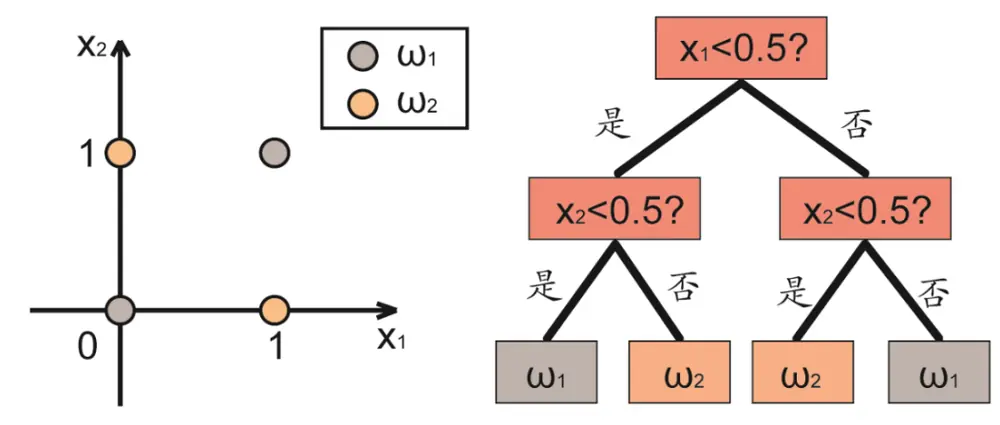
资料来源：华泰证券研究所

## Bootstrap 和 Bagging

“三个臭皮匠，顶个诸葛亮”。单棵决策树的预测能力有限，如何将多个弱分类器组合成一个强分类器，这是分类器集成需要探讨的问题。分类器集成算法有两大渊薮，如图表 24的灰色方框所示，左边一支为 Bagging 系列（并行方法），右边一支为 Boosting 系列（串行方法）。对于多棵决策树，如果以 Bagging 的方式组合起来，可以得到随机森林算法；如果以 Boosting 的方式组合起来，可以得到梯度提升决策树（GBDT）等方法。这一部分我们将首先介绍 Bagging 方法。

图表24： 分类器集成算法和决策树结合演化出决策树家族
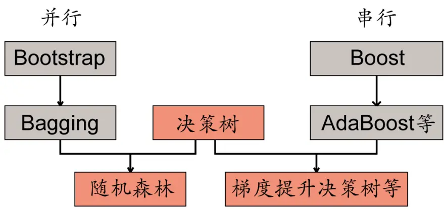
资料来源：华泰证券研究所

Bagging 是 Bootstrap Aggregating 的缩写，其思想脱胎于 Bootstrap。Bootstrap 又称自举法，本身是一种统计方法，主要用于研究统计量的统计特性。例如我们希望研究 A股的平均市盈率，我们的数据集 D 为 2017 年一季度末全 A股 3162 只股票的市盈率，求均值得到 $\bar{x}_{D}=71.02$ ，那么均值x̅的均值和方差又应该如何计算呢？

Bootstrap 方法的核心思想是有放回地抽样。我们首先从数据集中随机抽取一个样本，然后放回，再抽取一个样本，再放回，……，如此重复 3162 次，得到了一个包含 3162 只股票的新数据集 $\mathsf{D}_{1},$ 。注意到原始数据集 D 中有的股票可能被重复抽到，有的股票可能没有被抽到。我们将新数据集 $\mathsf{D}_{1}$ 称为一组 Bootstrap 数据集，求均值得到 $\bar{x}_{D1}$ 。重复上述步骤，我们可以得到 N 组 Bootstrap 数据集 $\mathsf{D}_{2},\mathsf{D}_{3},\dots\dots$ $\mathsf{D}_{\mathsf{N}_{1}}$ ，以及每组数据集的均值$\bar{x}_{D2},\bar{x}_{D3},\dots,\bar{x}_{DN},$ ,。假设重采样次数N = 1000，可以求出这 1000 个平均市盈率的均值：

$$
\bar{x}^{*}=\frac{1}{1000}{\sum}_{i=1}^{1000}\bar{x}_{D_{i}}=70.60,
$$

方差：

$$
\mathrm{Var}(\bar{x})=\frac{1}{1000-1}\sum_{i=1}^{1000}(\bar{x}_{D_i}-\bar{x}^*)^2=1658.08
$$

藉由 Bootstrap 方法，我们从一个原始数据集衍生出了 N 个新的 Bootstrap 数据集。

Bagging 方法是 Bootstrap 思想在机器学习上的应用。如图表 25 所示，我们由原始数据集生成 N 个 Bootstrap 数据集，对于每个 Bootstrap 数据集分别训练一个弱分类器，最终用投票、取平均值等方法组合成强分类器。N 个弱分类器的训练并列进行，因此 Bagging 属于并行方法。对于不稳定的弱分类器（例如决策树、神经网络），Bagging 能显著提高预测的正确率，同时避免过拟合的发生。

图表25： Bagging 并行方法示意
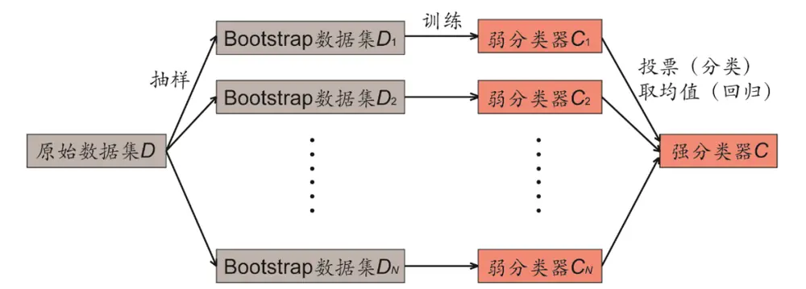
资料来源：华泰证券研究所

## 随机森林

顾名思义，随机“森林”（random forest）是由众多决策“树”组合而成的机器学习算法。简单地说，多棵决策树通过Bagging 的方式集成得到随机森林。具体而言，随机森林算法根据以下两步方法建造每棵决策树。第一步称为“行采样”，从全体训练样本中有放回地抽样，得到一个 Bootstrap 数据集。第二步称为“列采样”，从全部 M 个特征中随机选择m 个特征（m 小于 M），以 Bootstrap 数据集的 m 个特征为新的训练集，训练一棵决策树。最终将全部 N棵决策树以投票的方式组合。

下面我们举一个具体的例子解释决策树和随机森林算法。我们希望用 2016 年底沪深 300成分股的估值类因子和成长类因子两个特征，预测 2017 年一季度的涨跌情况。我们选取2016 年底截面期的 EP因子（市盈率 TTM 取倒数）作为估值类因子，ROE_G_q 因子（最近一期已公布财报摊薄净资产收益率）作为成长类因子，并且对两个因子做中位数去极值和标准化处理。同时我们对股票 2017 年一季度的涨跌幅从高到低进行排序，选取前 1/3作为训练集的正例，后 1/3作为反例，中间 1/3 的股票不纳入训练集。因此训练集包含200 个股票的两个因子（M=2）。

我们首先对两个因子构建一棵决策树。如图表 26 左图所示，亮红色点代表训练集的正例，亮蓝色点代表训练集的反例。红色和蓝色的长方形区域代表分类面，落在红色区域的测试数据（暗红色点）判断为“涨”类别，落在蓝色区域的测试数据（暗蓝色点）判断为“跌”类别。

接下来我们对相同的训练集构建随机森林。随机森林中的决策数棵树设为 50（N=50）。对于每棵决策树，首先进行行采样，从200只股票中有放回地抽样200次，生成一个Bootstrap数据集；随后进行列采样，从两个因子中随机选取一个因子（m=1）；最后以 Bootstrap数据集的一个因子训练决策树。

完成全部 50 棵决策树训练后，以类似投票的方式进行组合。例如当 EP因子 $x_{1}=1$ ROE_G_q 因子x = 0时，50棵决策树中有 49 棵判断为上涨，1 棵判断为下跌，属于“涨”类别的概率为49 $/50=0.98>0.5$ ，因此随机森林最终判断为“涨”。

随机森林的决策面如图表 26 中间图所示，红色和蓝色区域分别对应涨和跌，红色越深表示上涨概率越高。蓝色越深表示下跌概率越高。可以发现决策树和随机森林的分类结果在细节处有诸多差别，决策树更容易受到极端数据影响（如左图的左下角大片区域判别为红色）。尽管随机森林中的每棵树只采用一个因子，但是组合在一起后反而更加稳定，不容易过拟合。除了良好的稳定性之外，随机森林的优点还有训练和预测速度快，适合处理大量、高维数据，同时算法能够计算出每个特征的重要性，因而成为目前非常流行的机器学习算法。

图表26： 决策树、随机森林和 AdaBoost三种方法的比较
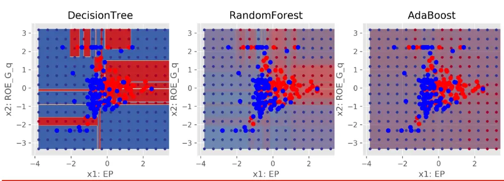
资料来源：Wind，华泰证券研究所

## AdaBoost

和 Bagging 并行组合弱分类器的思想不同，AdaBoost（adaptive boosting）将弱分类器以串行的方式组合起来，如图表 27所示。在训练之前，我们赋予全部样本相等的权重。第一步以原始数据为训练集，训练一个弱分类器 C ，如图表 28左图所示。对于分类错误的样本，提高其权重。第二步以更新样本权值后的数据为训练集，再次训练一个弱分类器C ，如图表 28中间图所示。随后重复上述过程，每次自适应地改变样本权重并训练弱分类器，如图表 28 右图所示。最终，每个弱分类器都可以计算出它的加权训练样本分类错误率，将全部弱分类器按一定权值进行组合得到强分类器，错误率越低的弱分类器所占权重越高。图表 29 展示了 AdaBoost 的具体算法。

AdaBoost 方法中的弱分类器可以是任何机器学习分类算法。在图表 26 所示的例子中，我们以决策树作为弱分类器，使用 AdaBoost 方法将 50棵决策树组合起来，得到图表 26 右图所示的分类面。分类结果和随机森林整体类似，能够将两类样本区分开来，而在细节方面略有差异。AdaBoost 提高了分类错误样本的权重，因而对极端样本更为敏感，可能会造成过拟合的问题。总体而言，AdaBoost 是一种思想简单，实现同样简单的方法，和其它机器学习算法结合后能够大大提高分类准确率，在各个领域有着相当广泛的应用。

图表27： AdaBoost 串行方法示意
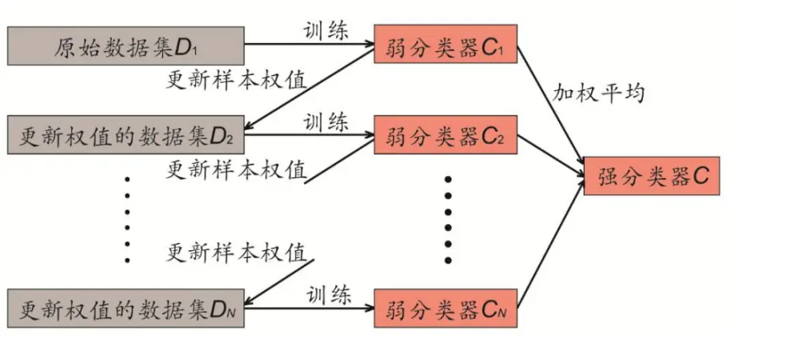
资料来源：华泰证券研究所

图表28： AdaBoost 更新权值的过程
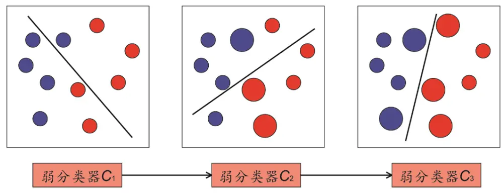
资料来源：华泰证券研究所

图表29： AdaBoost 算法的伪代码
i.训练数据： $S=\{(x_{1},y_{1}),(x_{2},y_{2}),\ldots,(x_{n},y_{n})\},y_{i}\in\{-1{,}1\},i=1{,}2,\ldots,n$ 
ii.样本权值初始化： $d_{i}^{1}=1/n,i=1{,}2,\ldots,n$ 
iii.对 $t=1,2,\ldots,T_{\perp}$ ，循环：
a.按照样本及其权值{S, $d^{t}=(d_{1}^{t},d_{2}^{t},\dots,d_{n}^{t})\}$ 训练弱分类器 $ih_{t}$ 
b. 计算 $h_{t}$ 的加权样本错误率 $\begin{array}{r}{\cdot\varepsilon_{t}=\sum_{i:y_{i}\neq h_{t}(x_{i})}d_{i}^{t}}\end{array}$ 
c.分类器权重 $\alpha_{t}=\frac{1}{2}\log\frac{1-\varepsilon_{t}}{\varepsilon_{t}}$ 
d. 更新权值： $\begin{array}{r}{d_{i}^{t+1}=\frac{d_{i}^{t}\exp\{-\alpha_{t}y_{i}h_{t}(x_{i})\}}{\sum_{i=1}^{n}d_{i}^{t}\exp\{-\alpha_{t}y_{i}h_{t}(x_{i})\}}}\end{array}$ 
iv.当加权样本错误率ε = 0或ε ≥ 1/2时停止循环， $设置T=t-1$ 
v.模型预测： $\begin{array}{r}{f_{T}(x)=\sum_{t=1}^{T}\alpha_{t}h_{t}(x)}\end{array}$
资料来源：Freund & Schapire (1995,1996)，华泰证券研究所

除了通过AdaBoost 方法组合决策树，研究者借鉴 Boost 串行组合的思想，陆续开发出全新的决策树集成算法，包括梯度提升决策树（gradient boosting decision trees，GBDT），以及它的改进版极限梯度提升（extreme gradient boosting，XGboost）。这些方法在众多机器学习竞赛中逐渐崭露头角，有着无比广阔的应用前景。

## 神经网络和深度学习

AlphaGo 所基于的深度学习（deep learning）技术无疑是现如今最为热门的机器学习方法。在介绍深度学习之前，首先要熟悉神经网络（neural networks）的一些基本概念。神经网络最初只是人工智能领域的一种算法模型，如今已发展成为一门多学科交叉的崭新领域，随深度学习的兴起重新受到重视和推崇。为什么说是“重新”呢？神经网络的理念最早可以追溯到 1943 年提出的 McCulloch-Pitts 模型和 1958 年 Rosenblatt 提出的感知机模型。随后 Rumelhart 和 Hinton 于 1986 年提出反向传播算法，LeCun 于 1989 年在手写数字识别领域取得巨大成功。之后神经网络的研究陷入了一段时间的低潮期。随着 2006 年 Hinton在深度学习上取得的重要突破，神经网络再次受到人们的瞩目。

对于一些我们感到很困难的任务，比如解复杂方程和下围棋，机器的表现已经远远超越人类。然而，还有一些我们认为非常简单的任务，比如图像识别和语音识别，机器的表现却远不如人类。我们学会用眼睛看，用耳朵听，是亿万年进化过程中逐渐积累、优化得到的能力。他山之石，可以攻玉，科学家自然而然联想到，能否仿照大脑的结构，设计出符合人类认知过程的算法，从而解决图像识别、语音识别等难题。

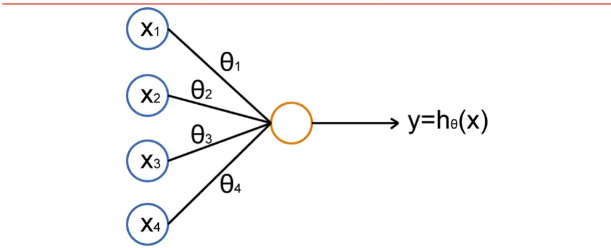
资料来源：华泰证券研究所

人类的大脑是一个由约 860 亿个神经元构成的巨型神经网络。神经网络中最基础的单元是神经元，如图表 30 所示。神经元存在兴奋和抑制两种状态。一般情况下，绝大多数神经元处于抑制状态。一旦某个神经元的树突收到上一级感受器或神经元传来的刺激，导致它的电位超过一定阈值，那么该神经元会被激活，处于兴奋状态，电信号经胞体沿轴突和末端突触，继续传递至下一级神经元的树突。如此逐级传递形成一个巨型网络。

图表30： 神经元结构示意图
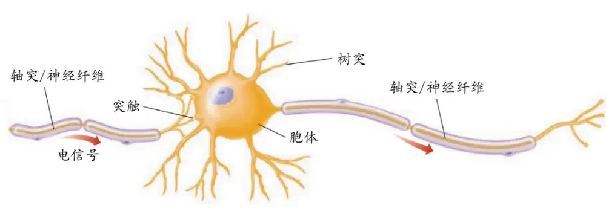
资料来源：Goldstein (2010) Sensation and Perception，华泰证券研究所

神经网络算法中的神经元正是模拟了现实世界中神经元的架构。如图表 31 所示，x1到 x4四个节点组成输入层，代表输入的特征信息，相当于神经元的树突部分。θ1 到 θ4 称为连接权重，代表不同信息的重要性，需要通过训练调节。输入层 x1到 x4的信息按权重加和，随后进入一个非线性的激活函数ℎ (x)，模拟神经元激活的过程。常用的激活函数包括sigmoid 函数、tanh 函数等。

图表31： 单层神经网络示意图

单个神经元相当于线性模型，无法解决包括异或问题在内的非线性问题。将多个神经元层层连接，就得到了含隐藏层的神经网络。神经网络功能非常强大，多层的神经网络可以近似地拟合出任何一个函数。图表 32 展示了含有一个隐藏层，输入层和隐藏层节点数均为4 的神经网络。

图表32： 含有单个隐藏层的神经网络示意图
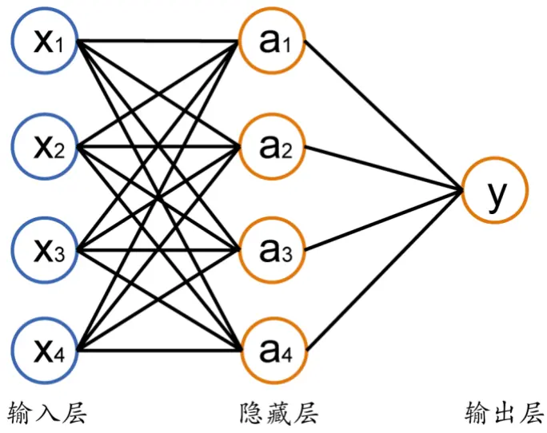
资料来源：华泰证券研究所

在模型训练的过程中，我们根据输入特征 X 计算隐藏层的值 a，再根据隐藏层的值算出输出层的预测值 y，这一步称为前向传播算法。我们希望预测值 y和真实标签 t越接近越好，而输出值和标签的接近程度取决于每一层中的连接权重 θ。在图表 32 的神经网络中，输入层和隐藏层之间含有 16 个连接权重，隐藏层和输出层之间含有 4个连接权重，共计 20个自由参数（如果在隐藏层增加偏置节点，则包含 24个自由参数）。模型训练的目标是寻取最优的权重参数 θ，使得预测的均方误差最小。根据误差梯度对 θ进行迭代优化的过程称为反向传播算法。

理论上，隐藏层数目越多，隐藏层节点数越多，模型对数据的拟合程度越好。但是在实际运用中，人们发现增加层数和节点数将带来诸多问题。首先，权重参数的数目将随之急剧增加，使得优化问题的解空间过大，算法难以收敛。其次，反向传播算法也会失效，误差梯度在经过好几层的传递之后变得极小，对于前几层连接权重的修改变得近乎不可能，这一现象称为梯度消失。再次，模型复杂度的增大带来过拟合的问题。最后，当时 CPU 的计算能力无法胜任超大规模的参数优化问题。这些缺陷一度限制了神经网络的广泛使用。

图表33： 卷积神经网络示意图
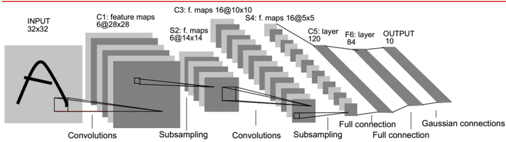
资料来源：LeCun, Bottou, Bengio, & Haffner (1998)，华泰证券研究所

## 2006 年及之后科学家对神经网络提出一系列重大改进，尤其是卷积神经网络

（convolutional neural networks，CNN）的再次兴起，重新燃起人们对于神经网络的兴趣。卷积神经网络的雏形是 LeCun 在 1998 年针对手写字母识别提出的 LeNet-5 模型，如图表 33所示。卷积神经网络最大的特点是仿照人类大脑视觉系统的构造，每一层节点并非和上一层全部节点相连接，而是只和上一层局部的节点连接，并且连接权值以卷积核的形式共享，这样大大减少了连接的数目。其它的改进还包括在卷积层之间设计池化层，引入新的 ReLU 激活函数等。另外，CPU 被具有大规模并行计算能力的 GPU 取代。由此，科学家成功解决了算法不收敛、梯度消失、过拟合和运算能力受限等问题，使得超多层数、超大规模神经网络的训练成为可能，引发起一场波澜壮阔的深度学习革命。

神经网络和深度学习最富争议的一点在于，对于多隐藏层的神经网络，由于节点之间的权值连接过于复杂，很难真正理解清楚其内部是如何工作的，整个学习过程在黑箱中运作。人们往往不愿意信赖一个自己无法理解的工具。上述批评在一定程度上是合理的，如今神经网络的理论研究确实远远落后于实际应用。然而这些诟病也并不全面，我们仍然拥有一些途径一窥黑箱中奥妙。例如神经网络中的连接权值本质上反映了上层节点对下层节点的影响程度，可以对连接权值进行可视化处理，从而了解神经网络更多地参考哪一部分的输入信息。科学家们也在不断开发新的工具，致力于开启神经网络的黑箱。

除了针对图像识别提出的卷积神经网络，科学家针对其它问题陆续提出了其它类型的深度学习算法，包括用于时间序列问题的递归神经网络（recursive neural networks，RNN）和长短记忆网络（long short-term memory，LSTM），最新提出的基于非监督学习的生成对抗网络（generative adversarial nets，GAN）等等，都有着无比广阔的应用前景，勾勒出深度学习激动人心的未来景象。

## K 最近邻算法

以上的分类方法都暗含如下假设：如果两个样本的各个特征都非常接近，那么它们很可能属于同一类别。换句话说，每个样本所属的类别和其“邻居”差不多。我们不妨根据上述思想，制定出一套新的分类规则：每个点对应的类别应当由其周围最近邻的 K个邻居的类别决定——这就是 K最近邻（K-nearest neighbor，KNN）算法。K最近邻算法在理论上非常成熟，也是最简单的监督学习算法之一。该方法的具体思路是：考察某个样本在特征空间内的 K个最相似（即特征空间中最邻近）的样本，如果绝大多数属于某一类别，则该样本也属于这个类别。图表 34 展示了 K=7 时的一个分类例子。训练样例分成红色和灰色两个类别。当我们预测中心点所属的类别时，首先找到距离它最近的 7个点，发现 5 个属于红色，2 个属于灰色，红色占多数，因此判断中心点属于红色类别。

图表34： K最近邻算法示意图（K=7）
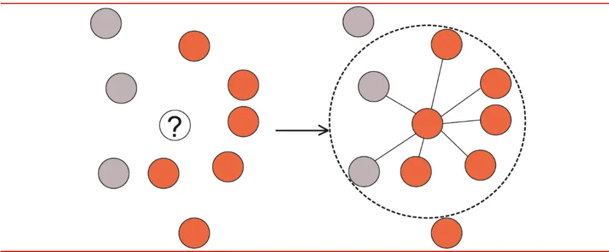
资料来源：华泰证券研究所

我们再以两因子判断股票走势的模拟数据为例。在图表 13 和图表 14 中，我们采用线性判别分析和二次判别分析确定了强势、中等和弱势股票的分类边界，这里我们使用 K最近邻算法。对于样本空间中每一组因子 1和因子 2的取值，根据 K最近邻原则判断该点所属分类，最终将整个样本空间分成三个区域。

K取值的不同会让分类边界的形状变得不同。当 K=3 时，如图表 35 所示，分类边界非常曲折；当 K=21 时，如图表 36 所示，分类边界接近于直线。一般来说，当 K取值较小时，分类边界较弯曲，K取值较大的时候，边界会变得更直。前者会带来过拟合，后者会造成欠拟合。因此使用 K最近邻算法时，最重要的步骤是选取一个合适的 K值，针对不同的数据特点，最适合的 K值也会有所不同，通常采用交互验证的方法寻找最优的 K值。

图表35： K最近邻算法对模拟数据进行分类（K=3）
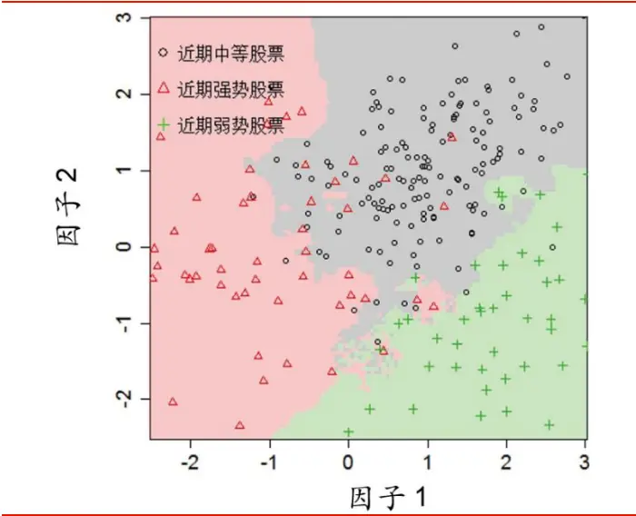
资料来源：华泰证券研究所

图表36： K最近邻算法对模拟数据进行分类（K=21）
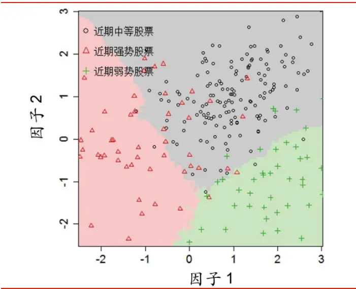
资料来源：华泰证券研究所

## 聚类

聚类（clustering）是一种无监督的学习，它将相似的对象归到同一个簇（cluster）中。聚类方法几乎可以应用于所有对象，簇内的对象越相似，聚类的效果越好。聚类与分类的最大不同在于，分类的目标事先已知，而聚类则不一样。因为其产生的结果与分类相同，而只是类别没有预先定义，故也称聚类为无监督分类。下面我们简单介绍聚类算法中最为常见的一种：K 均值聚类（K-means clustering）。

图表37： K均值聚类第一次迭代示意图（K=3）
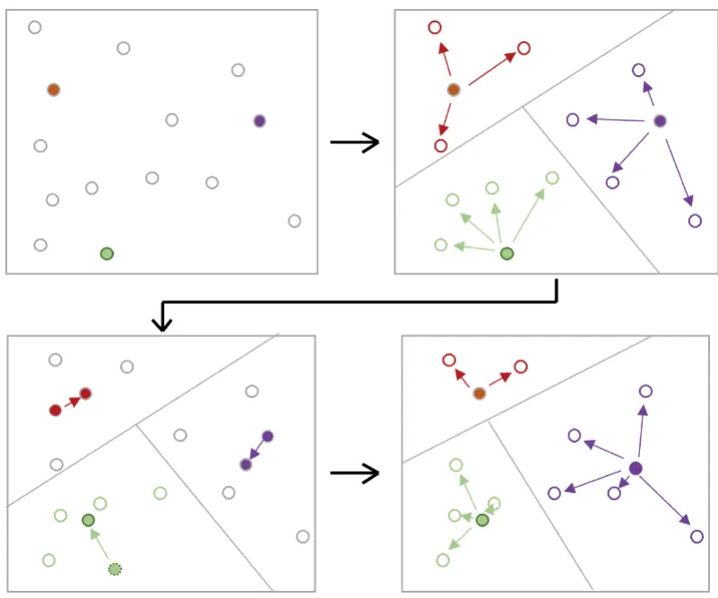
资料来源：华泰证券研究所

## K 均值聚类

K均值聚类从全体样本中挖掘出 K个不同的簇，相当于将全体样本分成 K类，每个簇的中心是簇中样本的均值，故称 K 均值。我们通过图表 37 的例子说明簇的形成过程。图中的空心原点是待分类的样本点，我们希望将它们分成 3类，即 K=3。首先随机确定 3个点作为质心，如左上图中的红色、绿色和蓝色点。然后，为每个样本点寻找距离其最近的质心，并将其分配给该质心所对应的簇，如右上图所示。随后，选取每个簇中所有点的平均值做为该簇新的质心，左下图给出了各簇质心更新的位置移动。由此得到第一次迭代的分类结果，如右下图所示。重复迭代多次，直到簇不发生变化或达到最大迭代次数为止。

图表 38和图表 39 展示了 K取不同值时同一组数据的聚类结果。K均值聚类与我们直观的分类认知有着高度的一致性，由此可见这一分类算法的有效性。同时，也可以看出分类簇数K对于分类结果起着至关重要的作用。在实际运用中需要通过比较不同K值的分类结果，最终确定最优的 K值。

图表38： K均值聚类方法对模拟数据进行分类（K=3）
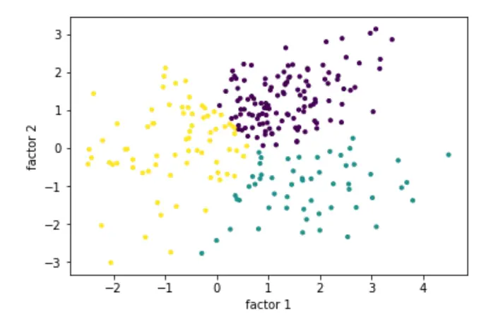
资料来源：华泰证券研究所

图表39： K均值聚类方法对模拟数据进行分类（K=5）
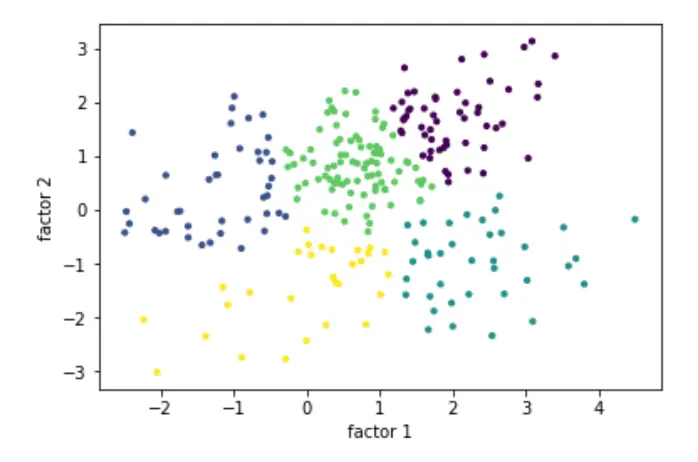
资料来源：华泰证券研究所

K均值聚类的优点是算法高效，简单易实现。缺点是聚类结果受 K值影响较大，可能收敛到局部最优解，在大规模数据集上收敛较慢，并且对异常值敏感。除 K均值聚类以外，常用的聚类方法还有分层聚类和谱聚类。分层聚类是对给定数据对象的集合进行层次分解，以样本之间的相似度或相异度为基础，定义类之间的相似度或相异度，对不同的类进行自顶向下的分裂或自底向上的合并，形成嵌套的层次结构。谱聚类是将聚类问题转化为图的划分问题，将数据集中的每个对象看作是图的顶点 V，将顶点间的相似度量化作为相应顶点连接边 E的权值，从而得到一个基于相似度的无向加权图 G(V, E)。

## 降维

很多时候，我们的数据包含高维度的特征，但是这些特征之间不可避免存在关联，这些关联并非是一件好事，这会导致得到的模型系数不稳定；同时也增加了模型的复杂性，可能导致过拟合的问题。在实际使用中，高维数据下样本数目过少，例如一般的回归问题，当样本特征数 p 大于样本个数 n，无法使用最小二乘法进行回归。另外，K 最近邻算法在高维下往往会失效，因为高维下样本非常稀疏，最近的“邻居”也很遥远。假设所有特征都在 0~1 之间取值，如果我们认为两个样本全部特征的距离都在 0.1 以内算是“邻居”，那么考虑一下某个点“邻居”在总样本的占比，一维条件下是 20%，二维是 4%，三维就是8‰，维数更高的情形下，样本就显得更稀疏。这将给分类带来极大的困难。

在多因子选股体系中，我们面对的同样也是高维数据，而且因子之间直接也往往存在关联。此时就需要通过降维减少特征的个数，避免维数灾难的发生。之前介绍的 Lasso和岭回归都是选取合适特征的方法。这两种方法的效果是删除一些解释因变量能力较弱的特征。下面讨论的降维方法和前两者不同，我们将对特征进行线性变换，把原来 p 个维度的特征变换为 M个。用数学的语言表达，我们之前有 X1，X2……Xp共 p个特征，对其进行线性变换，得到 $Z_{1},Z_{2},\ldots,Z_{M}$ 共 M 个新的特征：

$$
Z_{m}=\sum_{j=1}^{p}\phi_{jm}X_{j}\quad\sum_{j=1}^{p}\phi_{jm}^{2}=1.
$$

随后对这些新的特征做进一步的分析。降维方法的核心在于如何确定 $\phi_{\mathrm{jm}}$ ，下面介绍三种主流的降维方法：主成分分析、偏最小二乘法和 Fisher线性判别法。

## 主成分分析

主成分分析（principal component analysis，PCA）是最常用的降维方法之一，核心思路是寻找样本空间中变动性最大的方向。一般来说，为了避免特征之间单位的不同（如长度可以用米或厘米为单位）影响降维的结果，首先需要对特征进行标准化处理。以二维数据的降维为例，我们选取 2016 年底上证 50 成分股的市盈率和市净率，并进行标准化，得到图表 40 中的二维数据点。我们希望找到一条直线，将数据点投影到这条直线后，得到的方差最大，即下面式子取最大值：

$$
\mathrm{Var}\{\phi_{11}\times(X_1-\overline{X_1})+\phi_{21}\times(X_2-\overline{X_2})\}
$$

新特征 $Z_{1}$ 称为第一主成分：

$$
Z_{1}=\phi_{11}X_{1}+\phi_{21}X_{2}
$$

最终我们得到图表 40中的直线，也就是第一主成分 Z1所在的维度。数据点在沿直线方向上的方差最大，包含的信息最多；而垂直于直线方向上的方差最小，可以视作冗余信息。二维数据点在直线上的一维投影就是降维后的新特征。

图表40： 主成分分析将二维数据投影到一维直线
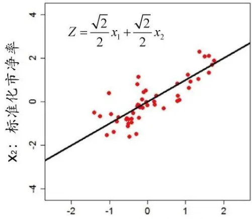
X1：标准化市盈率
资料来源：Wind，华泰证券研究所

对于高维数据，处理的思想类似，首先寻找样本空间中方差最大的方向，也就是使得下式最大的一系列 Φ：

$$
\mathrm{Var}(\phi_{11}\times(X_1-\overline{X_1})+\phi_{21}\times(X_2-\overline{X_2})+\cdots+\phi_{p1}\times\left(X_p-\overline{X_p}\right))
$$

进而得到第一主成分 Z1：

$$
\boldsymbol{Z}_{1}=\boldsymbol{\phi}_{11}\boldsymbol{X}_{1}+\boldsymbol{\phi}_{21}\boldsymbol{X}_{2}+\cdots+\boldsymbol{\phi}_{p1}\boldsymbol{X}_{p}
$$

随后寻找下一条与 $Z_{1}$ 垂直的直线 $Z_{2}$ 作为第二主成分，新的直线同样满足方差最大的要求。
不断重复这一过程，直到找全 M 个主成分。

在实际操作过程中，我们使用更简单的方法计算主成分。首先计算原始 p 维数据的协方差矩阵∑，对协方差矩阵做特征值分解，求出∑的特征值和特征向量。对特征值由大到小进行排序，取前 M 个特征值 λ1、λ2、……、λM对应的特征向量 α1、α2、……、αM即为 M 个主成分的方向。其中第 m 个主成分 $Z_{m}=\alpha_{m}X$ $\alpha_{m}$ 等价于 $\phi_{1\mathrm{m}},\phi_{2\mathrm{m}},\ldots\ldots,\phi_{p\mathrm{m}}$ 组成的向量。

在确定新的特征后，我们就可以使用这 M 个主成分代表的新特征对因变量 Y 进行线性回归。为什么可以这么做？这是因为主成分分析得到的前几个新特征往往解释了自变量的大部分变化，同时也可以反映因变量的变化。这里暗含的假设是自变量变化较大的部分在因变量那里也有较大的响应。当上述假设成立时，用 M 个新特征代替 p（M<p）个旧特征的主成分分析法往往有着较好的结果。我们用较少的维度包含绝大部分的信息，减少了模型复杂度。那么如何选取合适的特征数 M？常用的方法是采取交互验证，设置一系列 M 的取值，选取测试集中表现最好的模型对应的 M 值。

## 偏最小二乘法

在主成分分析中，我们主要关注样本特征所携带的信息，属于无监督学习。主成分分析背后的假设是样本特征变化最剧烈的部分与因变量变化最剧烈的部分是一致的。这个假设通常是成立的，但是当现实数据违背这一假设时，主成分分析表现不佳。此时一个自然的想法是利用特征和因变量之间的关系来确定新的特征，这就是偏最小二乘法的思想。核心思路是寻找特征中和因变量联系最紧密的那些方向。

偏最小二乘法（partial least squares，PLS）和主成分分析有着同样的形式，都是将原有$\mathsf{p}$ 个特征线性变换得到 M 个新的特征：

$$
Z_{m}=\sum_{j=1}^{p}\phi_{jm}X_{j}\quad\sum_{j=1}^{p}\phi_{jm}^{2}=1.
$$

最大区别是确定原有特征 $X_{j}$ 前系数 $\phi$ 的方式。在偏最小二乘法中， $Z_{1}$ 的系数是 $\phi_{11}$ $\phi_{21}$ $\phi_{\mathsf{P1}}$ ，对应于分别用 $X_{j}$ 对 $\mathsf{y}$ 做线性回归得到的回归系数。对于 $Z_{2}$ ，我们先把所有的 X 对 $Z_{1}$ 做回归，用得到的残差项作为新的特征，这些新的特征蕴含 $Z_{1}$ 中缺失的信息，并且和 $Z_{1}$ 正交。然后用这些新的特征继续对 y做线性回归，得到系数 $\phi_{12},\phi_{22}\cdots\cdots\phi_{\mathsf{P}2}$ 。如此重复M 次，得到每一个系数 $\phi_{\mathrm{jm}}$ ，进而计算出 M 个新的特征 $Z_{\mathsf{m}}.$ 。和主成分分析一样，M 的取值也通过交互验证方法寻找得到。

## Fisher 线性判别法

Fisher 于 1968 年提出了 Fisher 线性判别法，在论文中他将该方法和前面介绍的线性判别分析做了区分。可是世事难料，这种方法后来也被人称为线性判别分析，而更准确的说法应为 Fisher 线性判别法。该方法通常用于监督学习中的降维，核心思路是使得样本类内间距离最小，类间距离最大。

图表41： Fisher线性判别法将二维数据投影到一维直线
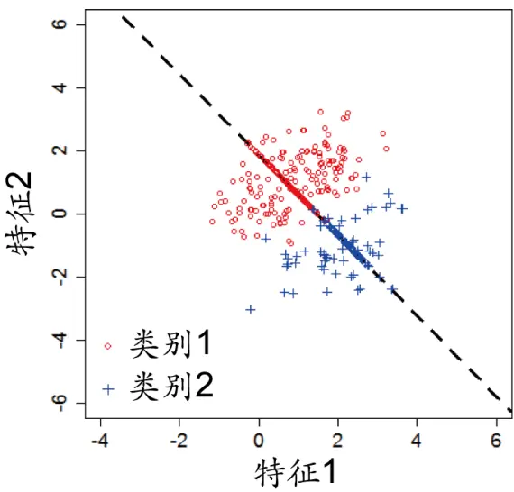
资料来源：华泰证券研究所

以二维数据的降维为例，如图表 41 所示，训练样本 x 分成红色和蓝色两类，共包含两个特征。我们的目标是寻找一个向量 w，将 x投影到 w上得到新的特征 $y,$ ，希望投影后两类样本的类间距离比较远，类内距离比较近。图表 41 中的虚线是目标向量 w，虚线上的红点和蓝点是二维特征投影到这条线上的一维特征。

类似地，对于多维情形，目标仍是寻找一个投影向量 w，将 x投影到 w上得到新的特征 y，使得新特征的类间距离比较远，类内距离比较近。图表 42 展示了求解 w的具体步骤。

## 图表42： Fisher线性判别法步骤

```latex
i.计算两类数据 $\omega_{1}$ 和 $\omega_{2}$ 的中心： $\begin{array}{r}{m_{i}=\frac{1}{n_{i}}{\sum_{x\in\omega_{i}}}x,i=1{,}2}\end{array}$
ii.计算两类数据的离散度矩阵（类内方 $差)$:S_{i}=\sum_{x\in\omega_{i}}(x-m_{i})(x-m_{i})^{T},i=1{,}2$$
iii.计算类间离散度矩阵： $S_{b}=(m_{1}-m_{2})(m_{1}-m_{2})^{T}$
iv.将前面得到的类内方差相加得到类内总离散度矩阵： $S_{w}=S_{1}+S_{2}$
v.希望投影后的类间距离 $w^{T}S_{b}w$ 尽可能大，类内距离w $^TS_{w}w$ 尽可能小。
$\mathrm{以}J_{F}(w)=w^{T}S_{b}w/w^{T}S_{w}w$ 作为优化函数，目标是找到一个向量 w使 $得J_F(w)$ 最大： $w=\arg\max J_{F}(w)$
vi.投影后的中心： $\begin{array}{r}{\widetilde{m_{i}}=\frac{1}{n_{i}}{\sum_{y\in Y_{i}}}y=\frac{1}{n_{i}}w^{T}{\sum_{x\in\omega_{i}}}x=w^{T}m_{i},i=1{,}2}\end{array}$
```
资料来源：华泰证券研究所

以上我们介绍了三种常用的线性降维方法。主成分分析是根据特征协方差寻找最佳的投影方式，属于无监督学习。Fisher 线性判别法则是考虑因变量的影响，希望投影后不同类别之间数据点的距离更大，同一类别的数据点更紧凑。Fisher 线性判别法和偏最小二乘法同属于监督学习，前者用于分类问题，后者用于回归问题。除此以外，一些非线性降维方法也有着广泛的应用，例如流形学习中的局部线性嵌入（local linear embedding，LLE）,测地距离（isomap），拉普拉斯特征映射（Laplacian eigenmaps）等，使用时需要针对不同类型的数据，选择最合适的降维方法。

## 总结和展望

自 18 世纪 60 年代以来，三百多年间人类的生活方式发生了翻天覆地的变化。两次工业革命，电气革命，信息革命一次次颠覆人类的认知，引领人类叩开未知世界的大门。如今，随着机器学习和人工智能的蓬勃发展，人类又一次站在命运的风口浪尖。AlphaGo 的连胜在围棋界掀起了波澜。继围棋之后，翻译这一行业也正面临人工智能翻译的强力挑战。谷歌无人驾驶车队已在公共道路上行驶超过 300 万英里。智能医疗、智能家具、智能投顾正逐渐渗透进百姓的生活。站在巨人的肩膀上才能看得更远，拥抱人工智能也就是拥抱人类的未来。

我们未来将把机器学习技术同华泰多因子模型结合，测试各种机器学习模型的回测效果，以一种非常接地气的描述方式推送给读者，使人工智能方法脱去神秘的外衣，让读者都有可能开发出成功的选股策略。我们也将探索机器学习在择时、大类资产配置等方向的应用。我们的思路并不局限于以上几点，在研究开发过程中，我们将持续思考、深度挖掘，争取打造属于自己的独特竞争优势。

风险提示：机器学习的结果是历史经验的总结，存在失效的可能。

## 免责申明

本报告仅供华泰证券股份有限公司（以下简称“本公司”）客户使用。本公司不因接收人收到本报告而视其为客户。

本报告基于本公司认为可靠的、已公开的信息编制，但本公司对该等信息的准确性及完整性不作任何保证。本报告所载的意见、评估及预测仅反映报告发布当日的观点和判断。在不同时期，本公司可能会发出与本报告所载意见、评估及预测不一致的研究报告。同时，本报告所指的证券或投资标的的价格、价值及投资收入可能会波动。本公司不保证本报告所含信息保持在最新状态。本公司对本报告所含信息可在不发出通知的情形下做出修改，投资者应当自行关注相应的更新或修改。

本公司力求报告内容客观、公正，但本报告所载的观点、结论和建议仅供参考，不构成所述证券的买卖出价或征价。该等观点、建议并未考虑到个别投资者的具体投资目的、财务状况以及特定需求，在任何时候均不构成对客户私人投资建议。投资者应当充分考虑自身特定状况，并完整理解和使用本报告内容，不应视本报告为做出投资决策的唯一因素。对依据或者使用本报告所造成的一切后果，本公司及作者均不承担任何法律责任。任何形式的分享证券投资收益或者分担证券投资损失的书面或口头承诺均为无效。

本公司及作者在自身所知情的范围内，与本报告所指的证券或投资标的不存在法律禁止的利害关系。在法律许可的情况下，本公司及其所属关联机构可能会持有报告中提到的公司所发行的证券头寸并进行交易，也可能为之提供或者争取提供投资银行、财务顾问或者金融产品等相关服务。本公司的资产管理部门、自营部门以及其他投资业务部门可能独立做出与本报告中的意见或建议不一致的投资决策。

本报告版权仅为本公司所有。未经本公司书面许可，任何机构或个人不得以翻版、复制、发表、引用或再次分发他人等任何形式侵犯本公司版权。如征得本公司同意进行引用、刊发的，需在允许的范围内使用，并注明出处为“华泰证券研究所”，且不得对本报告进行任何有悖原意的引用、删节和修改。本公司保留追究相关责任的权力。所有本报告中使用的商标、服务标记及标记均为本公司的商标、服务标记及标记。

本公司具有中国证监会核准的“证券投资咨询”业务资格，经营许可证编号为：Z23032000。全资子公司华泰金融控股（香港）有限公司具有香港证监会核准的“就证券提供意见”业务资格，经营许可证编号为：AOK809
©版权所有 2017年华泰证券股份有限公司

## 评级说明

## 行业评级体系

－报告发布日后的6个月内的行业涨跌幅相对同期的沪深300指数的涨跌幅为基准；

－投资建议的评级标准

增持行业股票指数超越基准

中性行业股票指数基本与基准持平

减持行业股票指数明显弱于基准

## 公司评级体系

－报告发布日后的6个月内的公司涨跌幅相对同期的沪深300指数的涨跌幅为基准；
－投资建议的评级标准
买入股价超越基准 20%以上
增持股价超越基准 5%-20%
中性股价相对基准波动在-5%~5%之间
减持股价弱于基准 5%-20%
卖出股价弱于基准 20%以上

## 华泰证券研究

## 南京

南京市建邺区江东中路228号华泰证券广场1号楼/邮政编码：210019

电话：86 25 83389999 /传真：86 25 83387521

电子邮件：ht-rd@htsc.com

## 深圳

深圳市福田区深南大道4011号香港中旅大厦24层/邮政编码：518048

电话：86 755 82493932 /传真：86 755 82492062

电子邮件：ht-rd@htsc.com

## 北京

北京市西城区太平桥大街丰盛胡同28号太平洋保险大厦A座18层

邮政编码：100032

电话：86 10 63211166/传真：86 10 63211275

电子邮件：ht-rd@htsc.com

## 上海

上海市浦东新区东方路18号保利广场E栋23楼/邮政编码：200120

电话：86 21 28972098 /传真：86 21 28972068

电子邮件：ht-rd@htsc.com