## 金工研究/深度研究

2017年 06月 22日

林 晓明 执业证书编号：S0570516010001

研究员 0755-82080134

linxiaoming@htsc.com

陈 烨 010-56793927

联系人 chenye@htsc.com

## 相关研究

1《金工: 全球多市场择时配置初探》2017.062《金工: 华泰价值选股之“漂亮 50”选股模型》2017.06

3《金工: 人工智能选股框架及经典算法简介》2017.06

# 人工智能选股之广义线性模型

## 采用统一的视角解释与测试所有的广义线性模型

多因子模型的本质是关于股票当期因子暴露和未来收益之间的线性回归模型。我们希望引入机器学习的思想，对传统多因子模型进行优化，最自然的想法正是从简单的线性模型入手。本文中，我们试图采用统一的视角解释与测试所有的广义线性模型，并分析它们应用于多因子选股的异同，希望对本领域的投资者产生有实用意义的参考价值。

## 广义线性模型的构建和回测

广义线性模型的构建包括特征和标签提取、特征预处理、训练集合成和滚动训练等步骤。最终在每个月底可以产生对全部个股下期收益的预测值，也可以将广义线性模型看作一个因子合成模型，即在每个月底将因子池中所有因子合成为一个“因子”。我们对该模型合成的这个“因子”进行分层回测，随后根据模型构建出基于沪深 300行业中性、中证 500行业中性和不做行业中性的选股策略。根据模型回测结果以及测试集 IC或正确率对模型进行评价。

## 对滚动训练集长度等重要参数进行参数敏感性分析

我们对线性回归模型的滚动训练集长度、主成分分析选取的主成分个数和训练集样本量进行参数敏感性分析。结果表明滚动训练集长度为 12~24个月时回测效果较好；主成分分析保留的成分越多，回测效果越好；选取全部样本在沪深 300行业中性基准下表现最好，选取前后排名 20%的样本在中证 500行业中性基准下表现最好。

## 正则化对选股效果没有明显的提升

正则化对选股效果没有明显的提升作用。岭回归、Lasso 回归和弹性网络的表现和线性回归类似。可能的原因是样本的所有特征都是已被证明有效的因子，不存在使用正则化筛选有效因子的必要。其次预处理过程中包含去极值和标准化等步骤，减少了极端样本的出现概率，进一步削弱正则化的价值。

## 逻辑回归和随机梯度下降分类器（SGD）的表现优于线性回归

将回归问题转换为分类问题能够提升模型表现。逻辑回归、SGD + hinge损失函数、SGD + modified Huber损失函数这三个分类器的回测效果均优于传统的线性回归模型。三者之中又以 SGD + hinge损失模型表现最佳，以中证 500作为行业中性基准，每个行业选 10~15只个股的策略，信息比率和 Calmar比率均在 4左右，超额收益最大回撤在 5%左右。三种分类器之所以优于线性回归，可能的原因是对原始收益率进行二值化处理后，在损失部分信息的同时消除了大量噪音，使得模型能够更准确地捕捉数据中蕴含的规律。

风险提示：广义线性模型是历史经验的总结，存在失效的可能。

## 本文研究导读

经典的多因子模型表达式为：

$$
\tilde{r}={\sum}_{k=1}^{K}X_{jk}*\tilde{f_{k}}+\mu_{j},
$$

$X_{jk}$ ：股票j在因子k上的因子暴露（因子载荷）

$\widetilde{f_{k}}$ ：因子k的因子收益

$\mu_{j}\colon$ 股票j的残差收益率

多因子模型的本质是关于股票当期因子暴露和未来收益之间的线性回归模型。我们希望引入机器学习的思想，对传统多因子模型进行优化，最自然的想法正是从简单的线性模型入手。上式显示的就是比较流行的多元线性回归模型，是多因子模型中最常用的数学分析工具。然而除了线性回归之外，您是否知道一些常见的机器学习算法也属于广义的线性模型？本文中，我们试图采用统一的视角解释与测试所有的广义线性模型，并分析它们应用于多因子选股的异同，希望对本领域的投资者产生有实用意义的参考价值。

本文主要关注并讨论了广义线性模型的如下几个环节：

1. 首先是模型选择的问题。除了传统的线性回归之外，逻辑回归、线性支持向量机等方法同属于广义的线性模型，在业界有着相当广泛的应用。这些方法能否对多因子选股的效果有进一步的提升？

2. 其次是正则化的问题。传统的线性回归模型中，在拟合回归方程这一步，我们不对参数的取值范围做任何限定。然而在机器学习领域，最普遍的做法是引入正则化，对参数的选择加以限制，防止过拟合的发生。现在流行的岭回归、Lasso 回归和弹性网络方法，正是将不同正则化方法和线性回归结合起来的产物。那么，在多因子选股模型中，正则化是否有助于提升选股效果？

3. 再次是预处理方法的问题。在多元线性回归中，因子共线性是需要尽力避免的问题。消除因子共线性的方法之一是对多元变量做主成分分析，得到一组新的共线性程度较小的变量。在多因子选股模型中，我们关心主成分分析是否有效，对模型有多大的提升作用？

4. 最后是模型参数的问题。多因子选股模型中包含一系列自由参数。例如，对于 T+1期因子预期收益的估计通常需回溯前 N期的历史收益，N的取值多少最为合理？又如选择不同正则化系数、不同损失函数，最终的选股效果是否存在差别？

我们将围绕以上的问题进行系统性的测试，希望为读者提供一些扎实的证据，并寻找到最优的线性模型，为后续的非线性机器学习方法做铺垫。

## 广义线性模型

## 线性模型回顾

常用的线性模型包括线性回归、岭回归、Lasso回归、逻辑回归、线性判别分析和线性支持向量机等，我们在上一篇报告中已经做了详细阐述。这里我们将对部分方法进行简要回顾。随后我们将从损失函数的视角，换一个角度理解线性模型。

## 线性回归

多元线性回归模型可以表示为：

$$
y=w_{0}+w_{1}x_{1}+w_{2}x_{2}+\cdots+w_{p}x_{p}
$$

其中 x1，x2，……，xp 是样本的 p 个特征，y 是样本的标签，w⃗⃗ = (wo, w1, ……, wp)是需要拟合的系数向量。如果写成矩阵的形式，令 X = (1, x1，……，xp)，那么线性回归模型可以简洁地表示为： $y=X{\vec{w}}$ 。从多因子选股的角度来看，x1，x2，……，xp可以视作截面期的 p个因子暴露度，y 是下期收益，w⃗⃗ 反映了不同因子对收益的影响方向和程度。

定义线性回归的损失函数C(w⃗⃗ )为全部 N个样本拟合残差的平方和：

$$
C(\vec{w})={\sum}_{i=1}^{N}(y_{i}-w_{0}-{\sum}_{j=1}^{p}w_{j}x_{ij})^{2}
$$

表示成矩阵形式（‖a ‖等价于‖a ‖ ，代表向量a 的 2范数，即向量各元素平方和的开方；‖a ‖2代表向量a 各元素的平方和，下同）：

$$
C(\vec{w})=\|y-X\vec{w}\|^{2}
$$

当样本量较小，并且不考虑正则化时，可以通过最小二乘法直接求出使得损失函数取最小值的系数向量w⃗⃗ ：

$$
{\vec{w}}=(X^{\mathrm{T}}X)^{-1}y
$$

## 逻辑回归

线性回归主要用以解决“回归”问题。当面对“分类”问题时，通常采用逻辑回归。逻辑回归模型可以表示为：

$$
P(y=1|x)=\frac{e^{w_{0}+w_{1}x_{1}+w_{2}x_{2}+\cdots+w_{p}x_{p}}}{1+e^{w_{0}+w_{1}x_{1}+w_{2}x_{2}+\cdots+w_{p}x_{p}}}
$$

表示成矩阵形式：

$$
P\left(y=1|x\right)=\frac{e^{X\overrightarrow{w}}}{1+e^{X\overrightarrow{w}}}
$$

其中 $P(y=1|x)$ 代表样本 x 属于正例（y = 1）的概率， $P(y=0|x)=1-P(y=1|x)$ 代表样本 x属于反例（y = 0）的概率。当某个样本 $P(y=1|x)$ 大于 0.5时，预测该样本属于正例（ŷ = 1），反之则归入反例（ŷ= 0）。

逻辑回归的似然函数L(w⃗⃗ )为：

$$
L(\vec{w})=\prod{\sum_{i=1}^{N}}P(y_{i}=1|x_{i})^{y_{i}}(1-P(y_{i}=1|x_{i}))^{1-y_{i}}
$$

定义逻辑回归的损失函数C(w⃗⃗ )为似然函数的负对数：

$$
C(\overrightarrow{w})=-\mathrm{log}L(\overrightarrow{w})=-\sum_{i=1}^{N}(y_{i}\mathrm{log}P(y_{i}=1|x_{i})+(1-y_{i})\mathrm{log}(1-P(y_{i}=1|x_{i})))
$$

以上讨论的是两类样本的标签y = {0,1}时的情形。当两类样本的标签 $\cdot y=\{1,-1\}$ 时，逻辑回归模型可以表示为：

$$
P(y|x)=\frac{e^{y(w_{0}+w_{1}x_{1}+w_{2}x_{2}+\cdots+w_{p}x_{p})}}{1+e^{y(w_{0}+w_{1}x_{1}+w_{2}x_{2}+\cdots+w_{p}x_{p})}}
$$

表示成矩阵形式：

$$
P(y|x)=\frac{e^{yX\overrightarrow{w}}}{1+e^{yX\overrightarrow{w}}}
$$

似然函数L(w⃗⃗ )变为：

$$
L(\overrightarrow{w})=\prod_{i=1}^{N}P(y_{i}|x)
$$

损失函数C(w⃗⃗ )仍为似然函数的负对数：

$$
C(\overrightarrow{w})=-\mathrm{log}L(\overrightarrow{w})=\sum_{i=1}^{N}(-\mathrm{log}1+1+\mathrm{exp}(-y_{i}X\overrightarrow{w}))\equiv\sum_{i=1}^{N}(1+\mathrm{exp}(-y_{i}X\overrightarrow{w}))
$$

## 线性支持向量机

线性支持向量机既可以解决回归问题，也可以用来分类。以分类问题为例，假设正例样本的标签 $\cdot y=1$ ，反例样本的标签 $y=-1$ 。我们试图寻找一个分类超平面，使得两类样本的分类间隔最大。用数学的语言描述，我们希望找到一组系数向量w⃗⃗ = (w1, w2, ……, wp)，使得下面式子中的 b取得最大值，并且对于每个样本 $(x_{i},y_{i})$ ，满足以下所有约束条件：

$$
y_{_i}(w_{_1}x_{i1}+w_{2}x_{i2}+\cdots+w_{p}x_{ip})\geq b(1-\varepsilon_{i})
$$

$$
\begin{array}{r}{\sum_{i=1}^{n}\varepsilon_{i}\leq C,\quad\varepsilon_{i}\geq0,\quad\sum_{j=1}^{p}w_{j}^{2}=1}\end{array}
$$

其中 $\varepsilon_{i}$ 称为松弛变量，所有松弛变量之和应小于惩罚系数 C。

定义支持线性向量机的损失函数C(w⃗⃗ )为：

$$
C(\overrightarrow{w})=\frac{1}{2}{\sum}_{j=1}^{p}{w_{j}}^{2}+C{\sum}_{i=1}^{N}\varepsilon_{i}=\frac{1}{2}\|\overrightarrow{w}\|^{2}+C{\sum}_{i=1}^{N}\varepsilon_{i}
$$

注意到等号右侧的 为惩罚系数，和损失函数C(w⃗⃗ )的含义完全不同。通常采用拉格朗日乘子法，求出使得损失函数取最小值的w⃗⃗ 。

## 正则化

在线性回归和逻辑回归中，系数向量w⃗⃗ 不可能取很大的正数或很小的负数，并且多个特征中可能只有少数特征具有预测效力，因此我们引入正则化（regularization）思想，在线性回归和逻辑回归的损失函数后面加入惩罚项。当惩罚项为系数向量w⃗⃗ 的平方和（即 2范数的平方）时，称为 L2 正则化；当惩罚项为系数向量w⃗⃗ 的绝对值之和（即 1 范数）时，称为 L1正则化。

以线性回归为例，L2正则化的线性回归模型又称为岭回归，损失函数为：

$$
C(\overrightarrow{w})={\sum}_{i=1}^{N}(y_{i}-w_{0}-{\sum}_{j=1}^{p}w_{j}x_{ij})^{2}+\lambda{\sum}_{j=1}^{p}w_{j}^{2}
$$

表示成矩阵形式：

$$
C(\overrightarrow{w})=\|y-X\overrightarrow{w}\|^{2}+\lambda\|\overrightarrow{w}\|^{2}
$$

L1正则化的线性回归模型又称为Lasso回归，损失函数为:

$$
C(\overrightarrow{w})={\sum}_{i\;=1}^{N}(y_{i}-w_{0}-{\sum}_{j\;=1}^{p}w_{j}x_{ij})^{2}+\lambda{\sum}_{j\;=1}^{p}|w_{j}|
$$

表示成矩阵形式：

$$
C(\overrightarrow{w})=\|y-X\overrightarrow{w}\|^{2}+\lambda\|\overrightarrow{w}\|_{1}
$$

其中‖w⃗⃗ ‖等价于‖w⃗⃗ $\vert_{2},$ ，代表向量w⃗⃗ 的 2范数；‖w⃗ ‖ 代表向量w⃗⃗ 的 1范数。参数λ 为正则化系数：当 λ 较大时，即使w⃗⃗ 较小也会加以惩罚，得到的w⃗⃗ 更接近 0。

介于 L1和 L2之间的正则化方法称为弹性网络（elastic net）。对于线性回归模型，弹性网络正则化的损失函数为：

$$
C(\overrightarrow{w})={\sum}_{i=1}^{N}{(\boldsymbol{y}_{i}-\boldsymbol{w}_{0}-{\sum}_{j=1}^{p}{w_{j}x_{ij}})}^{2}+\lambda{\sum}_{j=1}^{p}(\rho\big|w_{j}\big|+(1-\rho)w_{j}^{2})
$$

其中 $\rho$ 相当于 L1正则化系数， $\rho\colon$ 越大则越接近 L1正则化， $\rho_{\cdot}$ 越小则越接近 L2正则化。

以上介绍了 Lasso，岭回归和弹性网络三种回归参数正则化的方式。回想回归的目的，其实就是要在尽可能“简单”的模型下，最小化数据拟合方差。而 ，岭回归以及弹性网络的目的就是用模型的 1 范数，2 范数以及两者的混合来使模型尽可能简单。Zou 和Hastie（2004）的文章提出弹性网络，并用理论和实际数据的数值实验对比了三种正则化方法的优劣。Lasso用的 1范数在 0附近时比 2范数收敛更快，也即更加敏感，反之在远离 0的时候，岭回归使用的 2范数比1范数更加敏感。

换言之，Lasso和岭回归其实是在不同的范围内，对模型复杂度约束的敏感度不同。就好比陆军在陆地作战能力强，对于海洋作战就一筹莫展，但是海军则无疑是海洋的霸主。如果你想要训练一只两栖的海军陆战队，可能单方面都不如海军和陆军，但是它却能在两方面都有作战能力。所以弹性网络把 1范数和 2范数混合，就相当于得到了海军陆战队，在所有实数域上都有一定的敏感性。在 Zou 和 Hastie（2004）文章中的理论数值计算证明弹性网络的表现总是优于 Lasso，大部分时候优于岭回归。

## 损失函数

通过以上对常见线性模型的回顾，我们发现每一种方法都对应一个损失函数。接下来我们将从损失函数的维度，重新审视机器学习中的线性模型，并总结常用的损失函数。记 y为样本的真实类别标签，取值为 1或﹣1；f(x) =Xw⃗⃗ 为线性模型的预测值。两者的乘积yf(x)反映了真实数据和预测值的接近程度。当 y 与f(x)符号相同，预测正确，此时yf(x)为正数；当 y与f(x)符号相反，预测错误，此时yf(x)为负数；yf(x)越小，说明真实数据和预测值相差越远。

## 1）平方损失（squared loss）：

$$
Loss=(1-yf(x))^{2}
$$

当 y = 1时 ， $Loss=(1-f(x))^{2}=(\mathsf{y}-f(x))^{2}$ ； 当 y = −1时 ， $Loss=(1+f(x))^{2}=$ $(-1-f(x))^{2}=(y-f(x))^{2}$ 。容易看出，平方损失等价于未正则化的线性回归损失函数。

## 2）对数损失（log loss）：

$$
Loss=\log(1+\exp(-yf(x)))
$$

对数损失等价于未正则化的逻辑回归损失函数。

## 3）hinge 损失（hinge loss）：

$$
Loss=\max(0,1-yf(x))
$$

hinge损失等价于未正则化的线性支持向量机。下面我们将简要地证明。

线性支持向量机的损失函数为：

$$
C(\overrightarrow{w})=\frac{1}{2}\|\overrightarrow{w}\|^{2}+C{\sum}_{i=1}^{N}\varepsilon_{i},
$$

取 $\lambda=1/2C$ ，得到：

$$
C\left(\overrightarrow{w}\right)=\frac{1}{2}\|\overrightarrow{w}\|^{2}+\frac{1}{2\lambda}{\sum}_{i=1}^{N}\varepsilon_{i}=\frac{1}{2\lambda}\Big(\lambda\|\overrightarrow{w}\|^{2}+{\sum}_{i=1}^{N}\varepsilon_{i}\Big)=\frac{1}{2\lambda}\Big({\sum}_{i=1}^{N}\varepsilon_{i}+\lambda\|\overrightarrow{w}\|^{2}\Big)
$$

根据松弛变量 $\varepsilon_{i}$ 的定义，当样本位于分类边界以内，即 $1-y_{i}f(x_{i})\leq0$ 时， $\varepsilon_{i}=0;$ ；当样本位于分类边界以外，即 $1-y_{i}f(x_{i})>$ 0时， $\varepsilon_{i}=1-y_{i}f(x_{i})>0$ ,并且样本离分类边界越远，$\varepsilon_{i}$ 的值越大。将两种情况结合，得到 $\varepsilon_{i}=\operatorname*{max}(0,1-y_{i}f(x_{i}))$ 。代入上式，则有：

$$
C(\vec{w})=\frac{1}{2\lambda}\left(\sum_{i=1}^{N}\max(0,1-y_{i}f(x_{i}))+\lambda\|\vec{w}\|^{2}\right)
$$

其中λ‖w⃗⃗ ‖2相当于 L2正则化。容易看出，线性支持向量机的损失函数等价于 L2正则化的hinge 损失。

## 4）Huber 损失（Huber loss）：

Huber损失是为了增强平方损失对异常值（outliers）的抗干扰能力而提出的一种损失函数，具体形式如下：

$$
Loss=\left\{\begin{aligned}&\frac{1}{2}(y-f(x))^{2},\qquad for\left|y-f(x)\right|\leq\delta\\&\delta\left(\left|y-f(x)\right|-\frac{1}{2}\delta\right),\qquad otherwise\end{aligned}\right.
$$

当预测误差 $|y-f(x)|$ |较小（小于阈值δ）时，损失函数为二次形式，与平方损失 $(y-f(x))^{2}$ 非常相似；当预测误差 $|y-f(x)|$ |较大时，损失函数为线性形式。因此，异常值带来的预测误差并不会造成过大的 Huber损失，使得模型对极端值不敏感。

## 5）modified Huber 损失（modified Huber loss）：

在分类中常用到 Huber损失函数的变形 modified Huber。具体形式为：

$$
Loss=\left\{\begin{aligned}\max(0,&1-yf(x))^2,\quad foryf(x)\geq-1\\-&4yf(x),\quad otherwise\end{aligned}\right.
$$

当预测误差 $|y-f(x)|$ |较小时，modified Huber 损失等价于 hinge 损失 $\operatorname*{max}(0,1-yf(x))$ 的平方。因此，modified Huber损失相当于二次平滑后的 hinge损失。

部分损失函数的图像如图表 1 所示。当分类正确时，yf(x)为正值，损失函数接近于 0；
当分类错误时，yf(x)为负值，损失函数随 $\ _{\mathcal{Y}}f(x)$ 的减小而增加。

图表1： 常用线性损失函数示意图
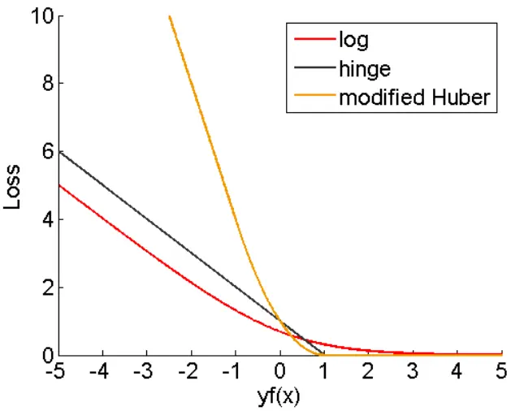
资料来源：华泰证券研究所

## 优化算法

在上节中，我们介绍了各式各样的损失函数，但是如何快速有效地对损失函数求最小值，从而估计模型的参数,这就涉及到优化问题。对于最常见的线性回归Xw⃗⃗ = y，通常以最小化残差平方和（即最小二乘）为目标，给出系数向量w⃗⃗ 的一个线性无偏估计 ${\vec{w}}=(X^{\mathrm{T}}X)^{-1}y$ 但是现实往往不是那么简单，尤其在当今的大数据时代，当数据数量爆炸式增长时，反演矩阵 $\cdot(X^{\mathrm{T}}X)^{-1}$ 的大小将以样本数量平方的速度增长，对计算机的存储提出了很大的挑战。另外，各种损失函数的性质并不像残差平方和那么简单，反演矩阵的寻找也就变得不那么直观。正是由于以上两个原因，基于梯度的优化算法应运而生，并且不断发展。其中最简单，也非常快速和有效的方法，当属梯度下降法及其衍生出的随机梯度下降法。这类算法在解决凸损失函数优化问题中备受青睐，接下来我们将详细介绍其原理。

## 梯度下降

损失函数定量描述了模型输出的预测量和真实数据之间的差异，我们希望最小化损失函数，从而估计出模型的参数，以便对新的数据进行预测。在本节，我们将介绍损失函数优化问题中最常用的梯度下降法（gradient decent）。

假设一个损失函数C(w⃗⃗ )，它是模型参数向量w⃗⃗ 的函数。以最基本的均方误差（MSE）损失函数为例，如下式所示：

$$
C(\vec{w})=\frac{1}{2N}\sum_{x}(y(x)-\hat{y}(x))^{2}
$$

其中， $y(x)$ 是模型输入为 x时数据的真实值，ŷ(x)是输入为 x时模型的预测值，N是训练样本个数。

这里的 MSE 虽然给出了一个具体的损失函数形式，但是在后面介绍梯度下降法时，我们提醒读者梯度下降法的原理与损失函数的具体形式无关，这里的 MSE 只是给出一个比较形象的代数形式。

回到损失函数C(w⃗⃗ )，它可以是任意多元的实值函数，图像上是高维空间里的一个超平面，但是人类的想象往往逃不出三维空间，那么为了理解的直观和方便，不妨把C(w⃗⃗ )看成是一个只有两个变量 $[w_{1},w_{2}$ 的函数，如图表 2 所示。我们要找的就是使损失函数取到最小值的$w_{1},w_{2}$ 。从图表 2中我们可以立刻观察到结果，最小值位于“锅底”的位置。但是，不要忘记这只是我们给出的一个很简单的二元损失函数，对于多元损失函数，仅仅是高维空间就很难想象，几乎不可能直接观察出最小点的位置。

虽然几何的方法给寻找极小值关闭了一扇门，但是代数微积分的方法却打开了一扇窗，高维空间也不过就是数学家代数的游戏而已。如果损失函数 C只是一个或者少数几个变量的函数，那么通过计算导数可以寻找到损失函数的极值点，但是如果损失函数的参数太多，那么计算导数的过程也就如噩梦一般了。

幸运的是，梯度下降法给出了一种有效的方案。把损失函数想象成一个山谷（如图表 2所示），一个小球自由地滚下，可以预测到，小球一定会落在谷底，即损失函数的极小值处。用数学的语言来说，损失函数的导数描述了山谷中局部的“形态”，而万有引力定律则保证能够牵引小球沿着山谷下降方向走。梯度下降法实现的正是模拟小球在每一步都沿着这个山谷下降方向（损失函数梯度的负方向）滚动。

图表2： 二维损失函数示意图
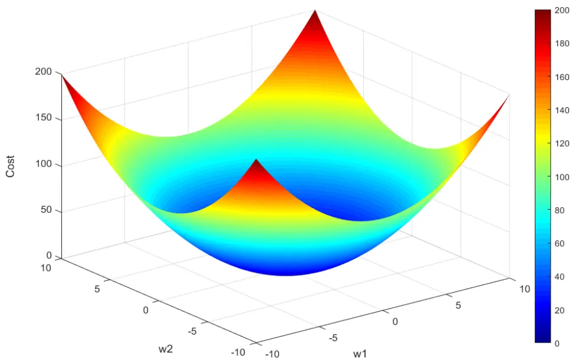
资料来源：华泰证券研究所

我们回到更加复杂的高维空间和代数表达。假设我们让每个模型参数上变化一个小量$\Delta\vec{w}=(\Delta w_{1},\Delta w_{2},\dots,\Delta w_{\mathrm{n}}),$ 微积分告诉我们：

$$
\Delta C\approx\frac{\partial\mathbb{C}}{\partial w_{1}}\cdot\Delta w_{1}+\frac{\partial C}{\partial w_{2}}\cdot\Delta w_{2}+\cdots+\frac{\partial C}{\partial w_{\mathfrak{n}}}\cdot\Delta w_{\mathfrak{n}}\approx\nabla C\cdot\Delta\vec{w}
$$

其中， $\nabla C=(\partial\mathbb{C}/\partial w_{1},\partial\mathbb{C}/\partial w_{2},\dots,\partial\mathbb{C}/\partial w_{\mathfrak{n}})$ ，是损失函数 C的梯度，也就是 C的偏导数组成的向量。∇符号可能对于大部分人很新鲜，但是大家只需要知道它是一个计算损失函数在各个参数上偏导的算符。我们关 $注\Delta C\approx\nabla C\cdot\Delta\vec{w}$ ，可以发现正是∇C将模型参数变化Δw⃗⃗ 和损失函数的变化ΔC关联在一起，这也是我们称∇C为梯度向量的原因。上面的方程，也给我们指出了一条如何选择Δw⃗⃗ 使得ΔC为负数的道路（ΔC为负保证了我们对参数的调整朝着C变小的方向进行）。试想，我们选取:

$$
\Delta\vec{w}=-\eta\cdot\nabla C
$$

其中η称为学习率，通常取一个很小的正数，那么：

$$
\Delta C\approx-\eta\nabla C\cdot\nabla C\approx-\eta\|\nabla C\|^{2}
$$

显然， $\Delta C\leq0$ ，因此按照 $\Delta\vec{w}=-\eta$ ⋅ ∇C这个规则改变w⃗⃗ ，那么损失函数 C将一直减少，直到落入一个极小点。所以，我们似乎在数学上找到了一个类似于自然界的万有引力，只要按照这个“运动规则”重复改变模型规则，我们就能找到最优化的模型参数。事实上，数学上也不难证明梯度方向是目标函数 C减小最快的方向。

以上，我们介绍了梯度下降法的基本原理，下面我们总结梯度下降法的基本步骤：

1） 给出初始模型参数，计算损失函数；

2） 计算损失函数的梯度∇C；

3） 以一定的学习率对模型参数进行调整， $\vec{w}\rightarrow\vec{w}^{\prime}=\vec{w}-\eta\cdot\nabla C;$

4） 用更新后的参数重新与输入数据重新计算模型预测值，重新计算损失函数；

5） 如果损失函数达到要求或迭代次数达到上限，停止计算，输出模型，否则，重复第 $2\sim$ 5 步。

最后，需要提醒读者的是，以上所有的推导都是基于Δw⃗⃗ 是小量的前提，所以学习率η的选择必须足够小，以保证泰勒展开一阶小量近似整个函数的变化量，但是学习率η也不能太小，否则收敛会十分缓慢。常用的方法是自适应地调整学习率η的大小，在迭代的前期选择相对较大的η，而在后期逐步减小η。

## 随机梯度下降

梯度下降法已经是不错的优化算法，然而在实际应用中存在一些缺陷。为了理解梯度下降法的问题所在，我们仍然以 MSE损失函数为例。MSE需要计算每个输入数据 x的预测值与真实值的残差 $C_{\mathbf{x}},$ ，最后得到总的残差平方和 $\begin{array}{r}{\cdot C=\sum_{\mathrm{x}}C_{x},}\end{array}$ 因此为了计算梯度∇C，我们需要遍历计算每一个输入 x的梯度，随后加总 $\begin{array}{r}{\nabla C=\sum_{x}\nabla C_{x}/N}\end{array}$ 。当有大量训练数据时，整个训练过程变得非常缓慢，此外不同输入样本之间的梯度可能会相互抵消，导致整个参数改变幅度小。

基于以上的问题，人们将梯度下降法向前推进了一步，改进成随机梯度下降法（stochasticgradient decent，SGD）。随机梯度下降法的核心思想是每次随机选取全部训练样本中的单个样本，计算方向梯度 $\nabla C_{x},$ ，随后更新模型参数： $\vec{w}\rightarrow\vec{w}^{\prime}=\vec{w}-\eta\cdot\nabla C_{x^{\circ}}$ 将全部训练样本遍历一次，称为一次迭代；多次迭代后，w⃗⃗ 将收敛到最优值。随机梯度下降法使用 $\nabla C_{x}$ 代替梯度下降法中的∇C，大大加快了运算速度，适用于大规模数据的模型优化问题。

梯度下降法和随机梯度下降法的一个折衷方案称为小批量梯度下降法（mini-batchgradient decent）。核心思想是选取全部训练样本的一个子集，计算方向梯度 $\nabla C_{x^{\circ}}$ 。具体而言，我们从全体训练样本中，随机选择 m个样本 $\mathtt{\cdot}X_{1},X_{2},X_{3},\dots,X_{n}$ 组成一个小批量样本。当m=1时，小批量梯度下降等价于随机梯度下降。假设小批量样本满足一定数量，通过大数定律，可以预期 $\nabla C_{x^{\prime}}$ 近似等于∇C，即：

$$
\nabla C_{\mathrm{x}}=\frac{1}{m}\sum_{j=1}^{m}\nabla C_{x_{j}}\approx\nabla C_{\mathrm{x}}
$$

如果把梯度下降比喻成人口普查，随机梯度下降和小批量梯度下降就是人口抽查，普查的成本总是很高，时间很长。虽然抽查并不一定全面而完美，存在统计上的波动，但是实际上也没有必要完美，因为我们实际上关心的是在某个方向来移动减少损失函数，而这个方向偏离一点它下降最快的方向也无妨，只是我们需要多移动几步（多迭代几次）罢了。如图表 3所示，左图的梯度下降法给出了最快的下山路径；而右图的随机梯度下降法每一步并不完美，但是只要迭代次数足够多，最终也能够曲折地到达最小值的位置，并且每一步的计算速度远远快于梯度下降。

图表3： 梯度下降法（左）和随机梯度下降法（右）示意图
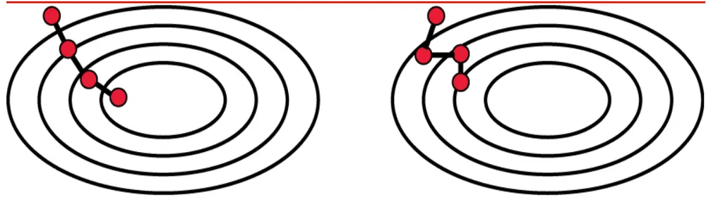
资料来源：华泰证券研究所

## 测试流程

## 广义线性模型构建

图表4： 广义线性模型构建示意图
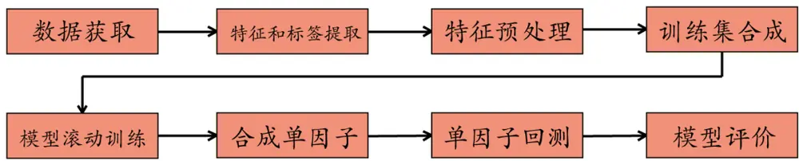
资料来源：华泰证券研究所

如图表 4所示，广义线性模型的构建方法包含下列步骤：

1． 数据获取：

a) 股票池：全 A 股，剔除 ST股票，剔除每个截面期下一交易日停牌的股票，剔除上市 3个月以内的股票。每只股票视作一个样本。

b) 回溯区间：2007-01-31 至 2017-05-31。

2． 特征和标签提取：每个自然月的最后一个交易日，计算之前报告里的 70 个因子暴露度，作为样本的原始特征；计算下一整个自然月的个股超额收益（以沪深 300指数为基准），作为样本的标签。因子池如图表 5所示。

3． 特征预处理：

a) 中位数去极值：设第 T 期某因子在所有个股上的暴露度序列为 $D_{i}$ ， $D_{M}$ 为该序列中位数， $D_{M1}$ 为序列 $|D_{i}-D_{M}$ |的中位数，则将序列 $D_{i}$ 中所有大于 $D_{M}+5D_{M1}$ 的数重设为 $D_{M}+5D_{M1}$ ，将序列 $D_{i}$ 中所有小于 $D_{M}-5D_{M1}$ 的数重设为 $D_{M}-5D_{M1}$ ；

缺失值处理：得到新的因子暴露度序列后，将因子暴露度缺失的地方设为中信一级行业相同个股的平均值。

c) 行业市值中性化：将填充缺失值后的因子暴露度对行业哑变量和取对数后的市值做线性回归，取残差作为新的因子暴露度。

d) 标准化：将中性化处理后的因子暴露度序列减去其现在的均值、除以其标准差，得到一个新的近似服从N(0,1)分布的序列。

e) 主成分分析：对 70 个标准化处理后的因子暴露度进行主成分分析，得到 70 个维度转换后的新特征。

4． 训练集合成：以 T月月末为例，T-12至 T-1月的特征和标签作为训练样本。

a)回归模型：对于线性回归、岭回归、Lasso 回归和弹性网络模型，直接将 12 个月的样本合并成为训练集。

b) 分类模型：对于逻辑回归和随机梯度下降（下称 SGD）模型，在每个月末截面期，选取下月收益排名前 30%的股票作为正例（y = 1），后 30%的股票作为负例（y = 0）。将 12个月的样本合并成为训练集。

5． 模型滚动训练：分别使用线性回归、岭回归、Lasso回归、弹性网络、逻辑回归和 SGD模型拟合训练集。对于 SGD模型，一组测试以 hinge函数作为损失函数，作 L2正则化，迭代 10000 次，该方法等价于线性支持向量机；另一组测试以 modified Huber函数作为损失函数，作 L2 正则化，迭代 10000 次。共计 7 种广义线性模型，如图表6所示。

6． 合成单因子：模型拟合完成后，以 T月月末截面期所有样本预处理后的特征作为模型的输入，得到每个样本的预测值ŷ，将预测值视作合成后的因子。

7． 单因子回测：使用合成后的因子进行单因子分层回测。回测方法和之前的单因子测试报告相同，具体步骤参考下一小节。

8． 模型评价：我们以分层回测的结果作为模型评价指标。对于回归问题，我们将给出训练集和测试集的 IC值；对于分类问题，我们将给出训练集和测试集的正确率。

图表5： 选股模型中涉及的全部因子及其描述

| 大类因子具体因子 | 因子描述 | 因子方向 1 |  |
| --- | --- | --- | --- |
| 估值 EP |  | 净利润（TTM)/总市值 |  |
| 估值 EPcut |  | 扣除非经常性损益后净利润（TTM）/总市值 1 |  |
| 估值 BP | 净资产/总市值 | 1 |  |
| 估值 SP | 营业收入（TTM）/总市值 | 1 |  |
| 估值 NCFP | 净现金流（TTM）/总市值 | 1 |  |
| 估值 OCFP | 经营性现金流（TTM）/总市值 |  |  |
| 估值 DP | 近12个月现金红利（按除息日计）/总市值 | 1 1 |  |
| 估值 G/PE | 净利润（TTM）同比增长率/PE_TTM | 1 |  |
| 成长 | Sales_G_q | 营业收入（最新财报，YTD）同比增长率 |  |
| 成长 | Profit_G_q 净利润（最新财报，YTD）同比增长率 |  |  |
| 成长 OCF_G_q | 经营性现金流（最新财报，YTD）同比增长率 | 7 1 |  |
| 成长 ROE_G_q | ROE（最新财报，YTD）同比增长率 | 1 |  |
| 财务质量 ROE_q | ROE（最新财报，YTD） |  |  |
| 财务质量 ROE_ttm | ROE（最新财报，TTM） | 1 |  |
| 财务质量 ROA_q | ROA（最新财报，YTD） | 1 1 |  |
| 财务质量ROA_ttm | ROA（最新财报，TTM） | 1 |  |
| 财务质量 grossprofitmargin_q | 毛利率（最新财报，YTD） | 1 |  |
| 财务质量 grossprofitmargin_ttm | 毛利率（最新财报，TTM） | 1 |  |
| 财务质量 profitmargin_q | 扣除非经常性损益后净利润率（最新财报，YTD） | 1 |  |
| 财务质量 profitmargin_ttm | 扣除非经常性损益后净利润率（最新财报，TTM) | 1 |  |
| 财务质量 assetturnover_q | 资产周转率（最新财报，YTD） | 1 |  |
| 财务质量 assetturnover_ttm | 资产周转率（最新财报，TTM） | 1 |  |
| 财务质量 operationcashflowratio_q | 经营性现金流/净利润（最新财报，YTD） | 1 |  |
| 财务质量 operationcashflowratio_ttm | 经营性现金流/净利润（最新财报，TTM） | 1 |  |
| 杠杆 financial_leverage | 总资产/净资产 | -1 |  |
| 杠杆 debtequityratio | 非流动负债/净资产 | -1 |  |
| 杠杆 cashratio | 现金比率 | 1 |  |
| 杠杆 currentratio | 流动比率 | 1 |  |
| 市值 | In_capital 总市值取对数 |  |  |
| 动量反转HAlpha |  | 个股60个月收益与上证综指回归的截距项 -1 |  |
| 动量反转return_Nm |  | 个股最近N个月收益率，N=1，3，6，12 -1 |  |
| 动量反转w gt_retum_Nm |  | 个股最近N个月内用每日换手率乘以每日收益率求算术 -1 |  |
| 动量反转 exp_w gt_return_Nm | 平均值，N=1，3，6，12 | -1 |  |
|  |  | 个股最近N个月内用每日换手率乘以函数exp(-x_i/N/4) 再乘以每日收益率求算术平均值，x_i为该日距离截面日 |  |
| 波动率 std_FF3factor_Nm |  | 的交易日的个数，N=1，3，6，12 特质波动率—个股最近N个月内用日频收益率对Fama |  |
| 波动率 std_Nm |  | French三因子回归的残差的标准差，N=1，3，6，12 -1 |  |
|  | 12 | 个股最近N个月的日收益率序列标准差，N=1，3，6， |  |
| 股价 beta beta | In_price | 股价取对数 | -1 |
| 换手率 turn_Nm |  | 个股60个月收益与上证综指回归的 beta 个股最近N个月内日均换手率（剔除停牌、涨跌停的交易 | -1 -1 |
|  |  | 日）,N=1,3,6,12 |  |
| 换手率 | bias_turn_Nm | 个股最近N个月内日均换手率除以最近2年内日均换手 率（剔除停牌、涨跌停的交易日）再减去1，N=1，3， | -1 |
| 情绪 | rating_average | 6,12 w ind 评级的平均值 |  |
| 情绪 | rating_change | wind评级（上调家数-下调家数）/总数 | 1 1 |
| 情绪 | rating_targetprice | wind一致目标价/现价-1 | 1 |
| 股东 | holder_avgpctchange | 户均持股比例的同比增长率 | 1 |
| 技术 | MACD | 经典技术指标（释义可参考百度百科），长周期取30日， | -1 |
| 技术 | DEA | 短周期取10日，计算 DEA 均线的周期（中周期）取15 | -1 |
| 技术 | DIF 日 |  | -1 |
| 技术 | RSI | 经典技术指标，周期取20日 | -1 |
| 技术 | PSY | 经典技术指标，周期取20日 | -1 |
| 技术 | BIAS | 经典技术指标，周期取20日 | -1 |

资料来源：Wind，华泰证券研究所

图表6： 全部测试模型一览

|  | 大类具体方法 | 方法描述 | 参数设定 |
| --- | --- | --- | --- |
| 回归 | 线性回归 |  |  |
|  | 岭回归 | 等价于线性回归L2 正则化 | 惩罚系数λ取1e4 |
|  | Lasso 回归 | 等价于线性回归L1 正则化 | 惩罚系数λ取 1e-3 |
|  | 弹性网络 | 等价于线性回归L1+L2 正则化 | 惩罚系数λ 取 1e-3， L1 比例 ρ取 0.5 |
| 分类 | 逻辑回归 | L2 正则化 | 惩罚系数λ取1e3 |
|  | SGD + hinge 损失 |  | L2正则化，等价于线性支持向量机惩罚系数λ取1e-1，迭代10000次 |
|  | SGD + modified Huber 损失 L2 正则化 |  | 惩罚系数λ取1，迭代10000次 |

资料来源：华泰证券研究所

## 分层模型回测

依照因子值对股票进行打分，构建投资组合回测，是最直观的衡量指标优劣的手段。一般测试模型构建方法如下：

1. 股票池、回溯区间都与回归法相同。

2. 换仓期：在每个自然月最后一个交易日核算因子值，在下个自然月首个交易日按当日收盘价换仓。

3. 数据处理方法：不进行任何加工，因子值为空的股票不参与分层。

4. 分层方法：在每个一级行业内部对所有个股按因子大小进行排序，每个行业内均分成N个分层组合。如图表 7所示，黄色方块代表各行业内个股初始权重，可以相等也可以不等（我们直接取相等权重进行测试），分层具体操作方法为 N 等分行业内个股权重累加值，例如图示行业 1中，5只个股初始权重相等（不妨设每只个股权重为 0.2），假设我们欲分成 3层，则分层组合 1在权重累加值 1/3处截断，即分层组合 1包含个股 1 和个股 2，它们的权重配比为 0.2:(1/3-0.2)=3:2，同样推理，分层组合 2 包含个股 2、3、4，配比为(0.4-1/3):0.2:(2/3-0.6)=1:3:1，分层组合 4 包含个股 4、5，配比为 2:3。以上方法是用来计算各个一级行业内部个股权重配比的，行业间权重配比与基准组合（我们使用沪深 300）相同，也即行业中性。

5. 评价方法：回测年化收益率、夏普比率、信息比率、最大回撤、胜率等。

图表7： 单因子分层测试法示意图
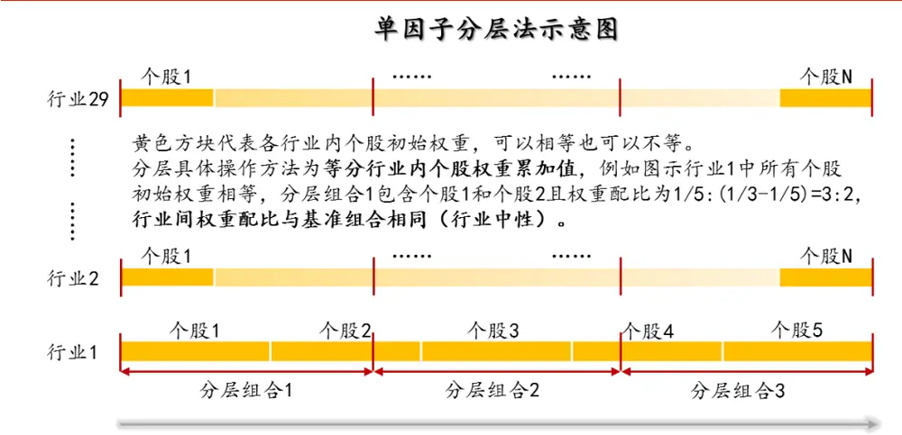
行业内个股按因子值排序
资料来源：华泰证券研究所

## 模型测试结果与参数选择

## 线性回归模型分层回测分析

广义线性模型最终在每个月底可以产生对全部个股下期收益的预测值，也可以将广义线性模型看作一个因子合成模型，即在每个月底将因子池中所有因子合成为一个“因子”。接下来，我们对该模型合成的这个“因子”（即个股下期收益预测值）进行分层回测，从各方面考察该模型的效果。这里的分层测试逻辑和华泰金工前期单因子测试系列报告保持一致。

## 分层测试详细展示图表包括：

1． 分五层组合回测绩效分析表（20070131～20170531）。其中组合 1～组合 5为按该因子从小到大排序构造的行业中性的分层组合。基准组合为行业中性的等权组合，具体来说就是将组合 1～组合5合并，一级行业内部个股等权配置，行业权重按当期沪深300行业权重配置。多空组合是在假设所有个股可以卖空的基础上，每月调仓时买入组合 1，卖空组合5。回测模型在每个自然月最后一个交易日核算因子值，在下个自然月首个交易日按当日收盘价调仓（分层组合构建法等更多细节参见上一章“分层模型回测”小节）。

2． 分五层组合回测净值图。按前面说明的回测方法计算组合 1～组合 5、基准组合的净值，与沪深 300、中证 500净值对比作图。

3． 分五层组合回测，用组合 1～组合 5的净值除以基准组合净值的示意图。可以更清晰地展示各层组合在不同时期的效果。

4． 组合 1相对沪深 300月超额收益分布直方图。该直方图以[-0.5%,0.5%]为中心区间，向正负无穷方向保持组距为1%延伸，在正负两个方向上均延伸到最后一个频数不为零的组为止（即维持组距一致，组数是根据样本情况自适应调整的）。

5． 分五层时的多空组合收益图。再重复一下，多空组合是买入组合 1、卖空组合5（月度调仓）的一个资产组合。多空组合收益率是由组合 1的净值除以组合 5的净值近似核算的。

6． 分十层组合回测时，各层组合在不同年份间的收益率及排名表。每个单元格的内容为在指定年度某层组合的收益率（均为整年收益率），以及某层组合在全部十层组合中的收益率排名。最后一列是分层组合在 2007～2017的排名的均值。

7． 不同市值区间分层组合回测绩效指标对比图（分十层）。我们将全市场股票按市值排名前 1/3，1/3～2/3，后 1/3分成三个大类，在这三类股票中分别进行分层测试，基准组合构成方法同前面所述（注意每个大类对应的基准组合并不相同）。

8． 不同行业间分层组合回测绩效分析表（分五层）。我们在不同一级行业内部都做了分层测试，基准组合为各行业内该因子非空值的个股等权组合（注意每个行业对应的基准组合并不相同）。

图表8： 线性回归模型分层组合绩效分析（20070131～20170531）

| 投资组合年化收益率年化波动率 |  |  | 夏普比率 |  | 最大回撤年化超额收益率 | 年化跟踪误差 | 信息比率 | 相对基准月胜率 | 超额收益最大回撤 |
| --- | --- | --- | --- | --- | --- | --- | --- | --- | --- |
| 组合1 | 24.06% | 31.45% | 0.77 | 68.68% | 8.12% | 4.35% | 1.87 | 60.69% | 4.77% |
| 组合2 | 14.69% | 32.39% | 0.45 | 70.17% | -0.05% | 3.30% | -0.02 | 44.14% | 11.73% |
| 组合3 | 11.69% | 32.45% | 0.36 | 70.79% | -2.66% | 3.06% | -0.87 | 33.10% | 29.23% |
| 组合4 | 8.09% | 32.34% | 0.25 | 71.46% | -5.80% | 3.42% | -1.70 | 23.45% | 46.19% |
| 组合5 | -0.18% | 33.00% | -0.01 | 73.96% | -13.01% | 4.59% | -2.83 | 13.79% | 75.43% |
| 基准组合 | 14.75% | 32.13% | 0.46 | 70.29% |  |  | = |  |  |
| 多空组合 | 24.29% | 7.82% | 3.11 | 6.58% |  | - | - |  | - |

资料来源：Wind，华泰证券研究所

图表9： 线性回归模型分层组合回测净值
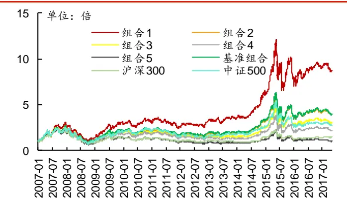
资料来源：Wind，华泰证券研究所

图表10： 线性回归模型各层组合净值除以基准组合净值示意图
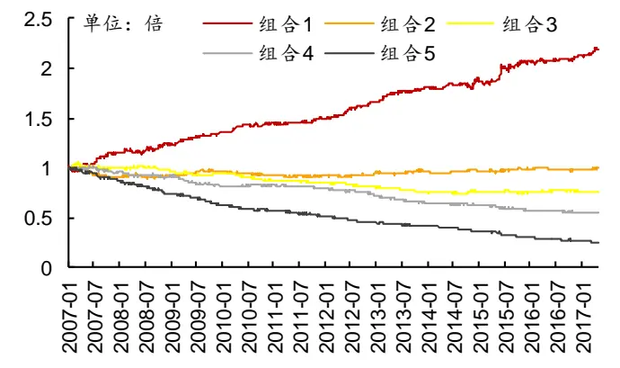
资料来源：Wind，华泰证券研究所

图表11： 线性回归模型分层组合 1相对沪深300月超额收益分布图
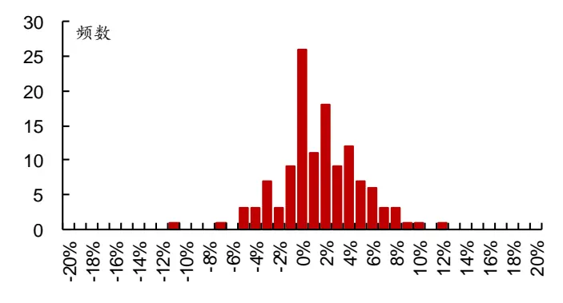
资料来源：Wind，华泰证券研究所

图表12： 线性回归模型多空组合月收益率及累积收益率
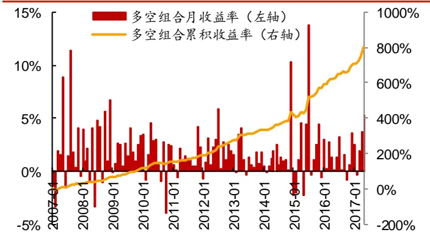
资料来源： ，华泰证券研究所

图表13： 线性回归模型组合在不同年份的收益及排名分析（分十层，2017年收益为年初截至5月 31日的收益）

| 排名 |  |  |  |  |  |  |  |  |  |  |  |
| --- | --- | --- | --- | --- | --- | --- | --- | --- | --- | --- | --- |
|  | 2007 | 2008 | 2009 | 2010 | 2011 | 2012 | 2013 | 2014 | 2015 | 2016 | 2017 均值 |
| 组合1 | 190.3%(1) | -58.6%(4) | 144.7%(1) | 9.6%(1) | -23.8%(1) | 25.4%(1) | 28.1%(1) | 75.3%(1) | 45.1%(1) | 1.9%(1) | -6.4%(2) 1.33 |
| 组合2 | 175.2%(2) | -53.9%(1) | 138.1%(2) | 4.8%(2) | -28.2%(3) | 20.7%(2) | 7.1%(4) | 73.1%(2) | 40.0%(2) | -0.4%(3) | -5.6%(1) 2.17 |
| 组合3 | 125.5%(8) | -61.1%(7) | 134.2%(3) | 2.5%(4) | -27.7%(2) | 16.0%(3) | 14.8%(2) | 71.2%(3) | 29.7%(5) | -1.3%(5) | -6.5%(3) 4.00 |
| 组合4 | 122.9%(9) | -56.9%(2) | 132.8%(4) | -8.5%(8) | -32.4%(7) | 11.3%(4) | 11.6%(3) | 69.9%(4) | 29.8%(4) | -5.3%(7) | -7.8%(4) 5.00 |
| 组合5 | 151.5%(3) | -60.3%(6) | 122.9%(5) | -3.9%(5) | -34.1%(8) | 6.2%(6) | 5.1%(5) | 67.3%(6) | 25.7%(6) | -1.2%(4) | -9.0%(5) 5.33 |
| 组合6 | 142.0%(4) | -60.0%(5) | 108.4%(7) | -9.6%(9) | -28.5%(4) | 8.2%(5) | -3.9%(9) | 69.5%(5) | 30.5%(3) | 0.6%(2) | -9.6%(7) 5.50 |
| 组合7 | 135.0%(5) | -63.9%(8) | 105.5%(8) | 3.1%(3) | -30.7%(5) | 4.2%(8) | -4.9%(10) | 64.6%(7) | 25.4%(7) | -3.0%(6) | -9.2%(6) 6.67 |
| 组合8 | 133.5%(6) | -58.4%(3) | 103.1%(9) | -5.2%(6) | -32.3%(6) | 4.3%(7) | -2.2%(8) | 49.8%(8) | 18.1%(8) | -7.2%(8) | -11.7%(8) 7.08 |
| 组合9 | 132.8%(7) | -64.0%(9) | 109.0%(6) | -7.2%(7) | -35.2%(9) | 3.7%(9) | 0.8%(6) | 49.0%(9) | 11.9%(10) | -11.4%(9) | -14.1%(9) 8.25 |
| 组合10 | 108.8%(10) | )-69.2%(10) | 75.5%(10)-12.8%(10)-36.9%(10) |  |  | -8.2%(10) | -1.7%(7) | 34.9%(10) | 14.6%(9) | )-18.4%(10)-18.5%(10) 9.67 |  |

资料来源：Wind，华泰证券研究所

图表14： 不同市值区间线性回归模型组合绩效指标对比图（分十层）
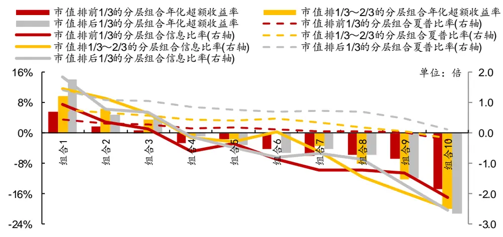
资料来源： ，华泰证券研究所

图表15： 不同行业线性回归模型分层组合绩效分析（分五层）

|  | 组合1年化 | 组合1 | 组合1 | 组合1 | 组合1超额收益 | 组合1 相对 | 所有组合年化 |
| --- | --- | --- | --- | --- | --- | --- | --- |
| 行业 | 超额收益率 | 信息比率 | 年化收益率 | 夏普比率 | 最大回撤 | 基准月胜率 | 收益率排序 |
| 通信 | 26.55% | 2.17 | 55.02% | 1.39 | 10.04% | 60.00% 56.55% | 1,2,3,4,5 |
| 钢铁 餐饮旅游 | 15.66% | 1.29 0.86 | 27.73% 31.63% | 0.73 0.82 | 22.16% 17.36% | 46.90% | 1,4,2,3,5 |
|  | 13.18% | 1.74 |  | 0.95 | 8.69% | 58.62% | 1,2,4,3,5 |
| 基础化工 国防军工 | 13.17% 13.16% | 0.84 | 35.25% 32.57% | 0.74 | 21.13% | 48.97% | 1,2,3,4,5 |
| 房地产 | 12.86% | 1.60 | 33.02% | 0.90 | 10.20% | 55.86% | 1,3,2,4,5 1,2,3,4,5 |
| 传媒 | 12.78% | 0.72 | 30.70% | 0.71 | 42.72% | 52.41% |  |
| 建材 | 12.19% | 1.04 | 38.10% | 1.00 | 12.78% | 49.66% | 1,3,2,4,5 |
| 食品饮料 | 11.09% | 0.89 | 29.74% | 0.86 | 15.58% | 55.17% | 1,2,3,4,5 |
| 机械 | 10.99% | 1.34 | 32.20% | 0.88 | 9.71% | 58.62% | 1,2,3,4,5 |
| 汽车 | 10.40% | 1.15 | 33.49% | 0.92 | 13.42% | 52.41% | 1,2,3,4,5 |
| 纺织服装 | 9.86% | 0.99 | 31.40% | 0.85 | 19.16% | 50.34% | 1,2,3,4,5 |
| 家电 | 9.44% | 0.73 | 34.31% | 0.92 | 28.47% | 53.10% | 1,2,4,3,5 |
| 计算机 | 9.10% | 0.76 | 35.08% | 0.83 | 17.28% | 49.66% | 1,2,4,3,5 |
| 建筑 | 9.03% | 0.71 | 33.56% | 0.90 | 15.75% | 48.97% | 1,2,3,4,5 |
| 电力设备 | 8.76% | 0.85 | 28.69% | 0.75 | 18.03% | 50.34% | 1,2,4,3,5 1,2,4,3,5 |
| 电子元器件 | 8.61% | 0.90 | 32.54% | 0.83 | 12.76% | 48.28% |  |
| 农林牧渔 | 8.18% | 0.76 | 28.44% | 0.77 | 21.31% | 50.34% | 1,2,3,4,5 |
| 有色金属 | 7.79% | 0.70 | 24.10% | 0.60 | 21.78% | 52.41% | 1,2,4,3,5 |
| 电力及公用事业 | 7.32% | 0.76 | 24.16% | 0.68 | 18.44% | 53.10% | 1,2,3,4,5 |
| 轻工制造 | 7.29% | 0.59 | 27.10% | 0.72 | 16.73% | 45.52% | 1,3,2,4,5 |
| 交通运输 | 6.72% | 0.71 | 21.29% | 0.60 | 18.73% | 48.28% | 1,2,3,4,5 1,3,2,4,5 |
| 商贸零售 | 6.44% | 0.75 | 22.14% | 0.61 | 11.74% | 50.34% |  |
| 非银行金融 | 5.42% | 0.30 | 14.63% | 0.33 | 32.25% | 45.52% | 1,2,3,4,5 1,3,2,5,4 |
| 综合 | 5.36% | 0.36 | 27.29% | 0.71 | 45.21% | 46.21% | 1,2,3,4,5 |
| 医药 | 5.18% | 0.69 | 30.37% | 0.84 | 14.69% | 49.66% | 1,2,3,4,5 |
| 银行 | 2.43% | 0.19 | 12.59% | 0.39 | 28.66% | 40.00% | 1,4,3,5,2 |
| 煤炭 | 1.11% | 0.09 | 11.46% | 0.27 | 28.95% | 46.21% | 3,2,1,4,5 |
| 石油石化 | -0.00% | 0.00 | 16.57% | 0.46 | 33.57% | 43.45% | 4,2,3,1,5 |

资料来源：Wind，华泰证券研究所

图表16： 线性回归模型训练集IC值
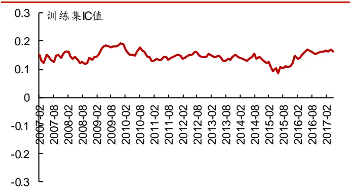
资料来源：Wind，华泰证券研究所

图表17： 线性回归模型测试集IC值
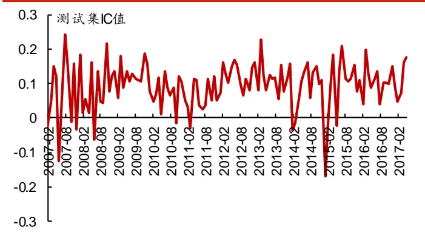
资料来源： ，华泰证券研究所

上图展示了每一期训练集和测试集的 IC值随时间的变化情况。我们发现训练集 IC值稳定在 0.15左右，测试集 IC值波动较大，在个别月份甚至出现负值，平均值为 0.1。

图表 ： 线性回归模型训练集每期因子拟合权重示意图

| 训练集因子拟合权重（负向作用因子已乘以-1进行调整），月频，2007.1.31~2017.5.31 EP EPcut BP SP NCFP OCFP DP G/PE Sales_G_q Profit_G_q OCF_G_q ROE_G_q ROE_q ROE_ttm ROA_q ROA_ttm grossprofitmargin_q grossprofitmargin_ttm profitmargin_q profitmargin_ttm assetturnover_q assetturnover_ttm operationcashflowratio_q operationcashflowratio_ttm financial_leverage debtequityratio cashratio currentratio In_capital HAlpha return_1m return_3m return_6m return_12m wgt_return_1m wgt_return_3m wgt_return_6m wgt_return_12m exp_wgt_return_1m exp_wgt_return_3m exp_wgt_return_6m exp_wgt_return_12m std_FF3factor_1m std_FF3factor_3m std_FF3factor_6m std_FF3factor_12m std_1m std_3m std_6m std_12m In_price beta turn_1m turn_3m turn_6m turn_12m bias_turn_1m bias_turn_3m bias_turn_6m bias_turn_12m rating_average rating_change |
| --- |

资料来源：华泰证券研究所

上图中我们展示了线性回归模型训练集每期因子拟合权重，每一行代表一个因子，每一列代表一个截面。图中使用的是三色刻度，红色越深表示正值越大，绿色越深表示负值越小，纯白色位于两色中间加以区隔，代表0附近的值。涉及的回测期为20070131～20170531，由于该模型为月频模型，故总共有 列。所有因子池中因子都先经过单因子测试确定其对下期收益的整体预测方向是正向还是负向（方法详见华泰金工单因子测试系列报告），展示在图表 5的最后一列。我们预先将所有因子都乘以它的“因子方向值”（+1或-1），再去进行线性回归，模拟出的每期因子拟合权重如上所示。我们发现，该模型中反转、换手率等交易类型因子权重普遍更大，而估值、成长等基本面类型因子权重较低。

更进一步地，我们还在每个截面上，将模型对全部个股下期收益的预测值（如果将模型视为因子合成模型的话，即指合成后的“因子”）与因子池中各个因子值之间计算Spearman相关系数，查看模型预测值与各个因子值之间“真实的”相关情况，如下图所示。我们发现，从真实相关情况来看，预测值更是与反转、波动率、换手率、技术等交易类型因子关联性较为紧密，与基本面类型因子关联性较弱。

图表19： 线性回归模型对于下期收益预期值与本期因子值之间相关系数示意图
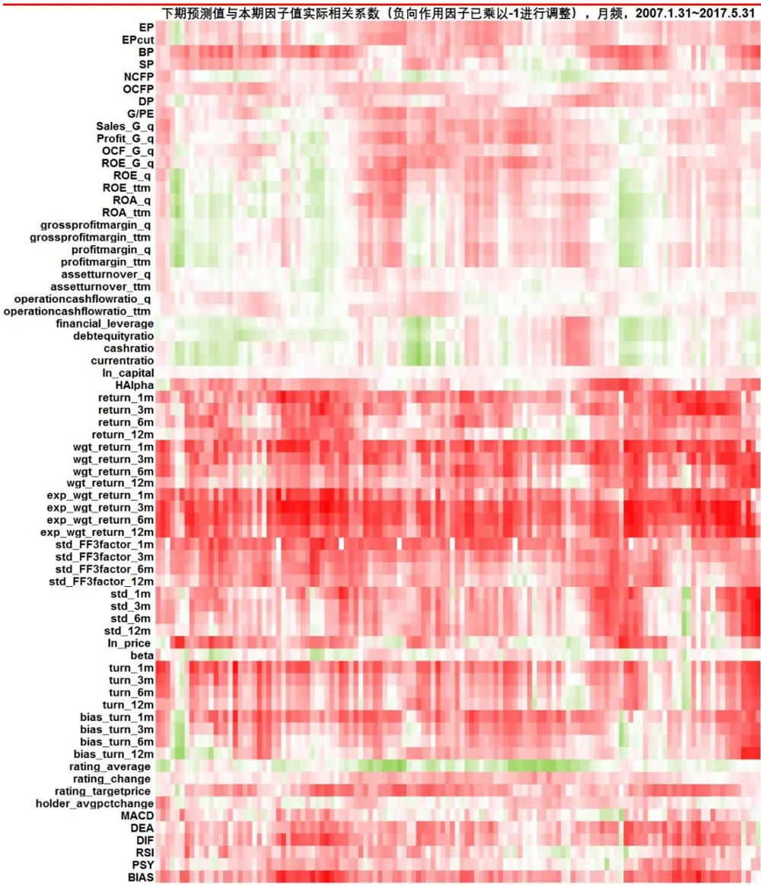
资料来源：华泰证券研究所

## 利用线性回归模型构建选股策略

根据以上测试结果，我们已经较为详细地了解了线性回归模型的特性和绩效，那下一个问题随之而来——应该如何确定参数和其它细节从而构建一个成功的选股策略呢？首先，我们要确定是否需要构建一个行业中性的选股策略？如果构建行业中性选股策略，那每个行业应大致入选多少只股票？如果构建非行业中性选股策略，那投资组合中又应该包含多少只股票？针对这些问题，我们做了参数选择分析图表。下表中行业中性策略为行业内部个股等权、行业间按基准指数配比；非行业中性策略为全部个股等权。全部策略均为月频。

图表20： 线性回归模型参数选择分析表（回测期：20070131～20170531）

|  |  | 每个行业入 | 年化 | 年化 | 夏普 |  | 最大年化超额 | 年化超额收益 |  | 信息 | Calm ar | 相对基准 | 月均双边 |
| --- | --- | --- | --- | --- | --- | --- | --- | --- | --- | --- | --- | --- | --- |
|  | 比较基准是否行业中性 | 选个股数目 |  | 收益率波动率 | 比率 | 回撤 |  | 收益率跟踪误差最大回撤 |  | 比率 | 比率 | 月胜率 | 换手率 |
| 沪深 300 | 是 | 2 | 35.6% | 31.7% | 1.12 | 66.8% | 30.1% | 14.7% | 20.2% | 2.05 | 1.49 | 72.6% | 140.5% |
| 沪深 300 | 是 | 4 | 29.2% | 31.5% | 0.93 | 69.6% | 24.1% | 13.5% | 20.9% | 1.79 | 1.15 | 66.9% | 129.2% |
| 沪深 300 | 是 |  | 6 27.8% | 31.4% | 0.88 | 69.1% | 22.8% | 13.0% | 22.0% | 1.75 | 1.04 | 65.3% | 121.0% |
| 沪深 300 | 是 | 8 | 27.1% | 31.4% | 0.86 | 69.1% | 22.1% | 12.7% | 21.1% | 1.74 | 1.05 | 63.7% | 114.3% |
| 沪深 300 | 是 | 10 | 26.8% | 31.6% | 0.85 | 69.3% | 21.9% | 12.6% | 20.1% | 1.74 | 1.09 | 65.3% | 107.5% |
| 沪深 300 | 是 | 12 | 26.6% | 31.5% |  | 0.84 69.2% | 21.7% | 12.5% | 21.6% | 1.74 | 1.00 | 66.9% | 101.9% |
| 沪深 300 | 是 | 14 | 25.8% | 31.7% | 0.82 | 69.9% | 21.1% | 12.4% | 22.0% | 1.69 | 0.96 | 66.9% | 96.3% |
| 沪深 300 | 是 | 16 | 25.5% | 31.7% | 0.80 | 69.9% | 20.8% | 12.4% | 22.9% | 1.67 | 0.91 | 66.9% | 91.5% |
| 沪深 300 | 是 | 18 | 24.9% | 31.8% |  | 0.78 70.1% | 20.2% | 12.4% | 22.8% | 1.63 | 0.89 | 65.3% | 87.7% |
| 沪深 300 | 是 | 20 | 24.5% | 31.9% | 0.77 | 70.1% | 19.9% | 12.4% | 22.8% | 1.60 | 0.87 | 66.1% | 83.9% |
| 基准组合数据—沪深 300 指数 |  |  | 3.8% | 29.6% |  | 0.13 72.3% |  |  |  |  |  |  |  |
| 中证 500 | 是 | 2 | 36.9% | 33.1% | 1.12 | 69.5% | 23.3% | 9.3% | 9.7% | 2.50 | 2.39 | 75.8% | 149.1% |
| 中证 500 | 是 | 4 | 33.3% | 33.3% | 1.00 | 70.4% | 20.2% | 7.6% | 8.9% | 2.65 | 2.27 | 80.6% | 139.0% |
| 中证 500 | 是 |  | 6 31.2% | 32.7% | 0.95 | 69.5% | 18.1% | 6.8% | 7.6% | 2.67 | 2.40 | 78.2% | 130.1% |
| 中证 500 | 是 | 8 | 30.7% | 32.8% |  | 0.94 69.0% | 17.8% | 6.3% | 6.6% | 2.81 | 2.70 | 76.6% | 123.3% |
| 中证 500 | 是 | 10 | 30.6% | 32.9% | 0.93 | 69.0% | 17.7% | 6.0% | 7.0% | 2.97 | 2.53 | 77.4% | 117.6% |
| 中证 500 | 是 | 12 | 30.7% | 32.7% |  | 0.94 68.5% | 17.8% | 5.7% | 6.0% | 3.10 | 2.97 | 76.6% | 112.7% |
| 中证 500 | 是 | 14 | 30.2% | 32.8% | 0.92 | 69.0% | 17.5% | 5.5% | 5.5% | 3.17 | 3.15 | 76.6% | 107.8% |
| 中证 500 | 是 | 16 | 29.8% | 32.9% |  | 0.91 68.9% | 17.1% | 5.3% | 6.1% | 3.24 | 2.81 | 77.4% | 103.5% |
| 中证 500 中证 500 | 是 | 18 | 29.5% | 32.9% |  | 0.90 69.2% | 16.8% | 5.2% | 5.8% | 3.22 | 2.88 | 79.0% | 99.3% |
|  | 是 | 20 | 29.1% | 32.9% | 0.89 | 69.0% | 16.5% | 5.1% | 5.8% | 3.22 | 2.82 | 79.0% | 95.1% |
|  | 基准组合数据—中证 500 指数 |  | 10.4% | 33.8% |  | 0.31 72.4% |  |  |  |  |  |  |  |
| 中证 500 中证 500 | 否 | 总共 25 | 40.5% | 33.7% | 1.20 | 68.4% | 26.3% | 12.0% | 15.0% | 2.19 | 1.75 | 70.2% | 149.1% |
| 中证 500 | 否 | 总共50 | 36.7% | 33.0% | 1.11 | 68.4% | 22.9% | 9.9% | 8.2% | 2.31 | 2.80 | 72.6% | 139.0% |
| 中证 500 | 否 | 总共75 | 36.5% | 32.8% |  | 1.11 67.8% | 22.8% | 8.8% | 6.9% | 2.59 | 3.30 | 74.2% | 130.1% |
| 中证 500 | 否 | 总共 100 | 34.6% | 32.8% | 1.05 | 68.2% | 21.2% | 7.9% | 7.5% | 2.69 | 2.83 | 76.6% | 123.3% |
| 中证 500 | 否 | 总共 125 | 34.0% | 32.8% | 1.04 | 67.7% | 20.7% | 7.4% | 6.8% | 2.79 | 3.05 | 77.4% | 117.6% |
| 中证 500 | 否 | 总共 150 | 33.3% | 32.7% | 1.02 1.01 | 68.1% 68.5% | 20.0% 19.8% | 7.0% 6.7% | 7.2% 7.4% | 2.84 2.94 | 2.80 2.68 | 78.2% 79.8% | 112.7% |
| 中证 500 | 否 否 | 总共 175 总共 200 | 33.0% 32.8% | 32.8% 32.7% | 1.00 | 68.6% | 19.7% | 6.5% | 7.3% | 3.02 | 2.68 | 82.3% | 107.8% 103.5% |

资料来源：Wind，华泰证券研究所

观察上表可知，对于线性回归模型结合沪深 300行业中性选股策略来说，随着每个行业入选个股数目增多，年化收益率、信息比率和 Calmar比率基本都在下降；对于线性回归模型结合中证 500行业中性选股策略来说，随着每个行业入选个股数目增多，年化收益率在下降，信息比率却在上升，Calmar比率先升后降，最优每个行业入选个股数目在 14个左右；对于线性回归模型不控制行业中性选股策略来说（我们用中证 500指数作为基准进行比较），随着入选个股总数目增多，年化收益率在下降，信息比率在上升，Calmar比率大体上也是先升后降，最优个股数目区间大致在 75～125左右。

总体来说，线性回归模型本身已具备不错的选股能力。训练集 IC值稳定在 0.15左右，测试集 IC值波动较大，在个别月份甚至出现负值，平均值为 0.1。以此构建的选股策略，在沪深 300行业中性基准下，年化超额收益为 20%~30%，信息比率为 1.6~2.0；在中证 500行业中性基准下，年化超额收益为16%~24%，信息比率为 2.5~3.2；在不控制行业中性条件下，年化超额收益为 19%~26%，信息比率为 2.2~3.1。

我们有选择性地展示三个策略的月度超额收益图：

图表21： 线性回归模型结合沪深 300行业中性策略表现（每个行业选2只个股）
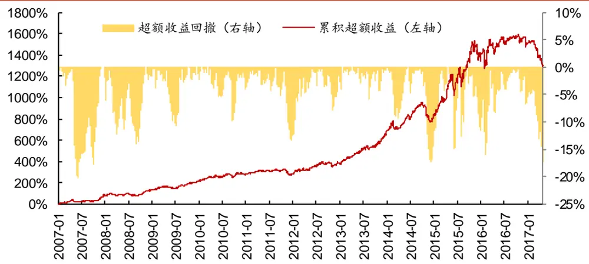
资料来源：Wind，华泰证券研究所

图表22： 线性回归模型结合中证 500行业中性策略表现（每个行业选2只个股）
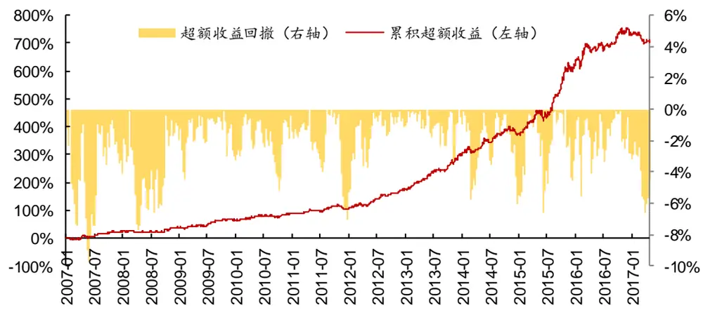
资料来源：Wind，华泰证券研究所

图表23： 线性回归模型等权策略表现（每期选75只个股等权配置，以中证500为基准）
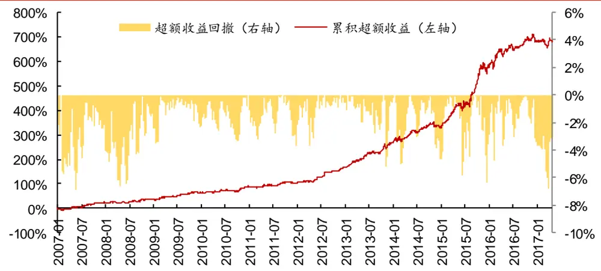
资料来源：Wind，华泰证券研究所

## 线性回归模型参数敏感性分析

训练集长度

图表24： 线性回归模型参数敏感性分析详细指标列表（训练集长度）
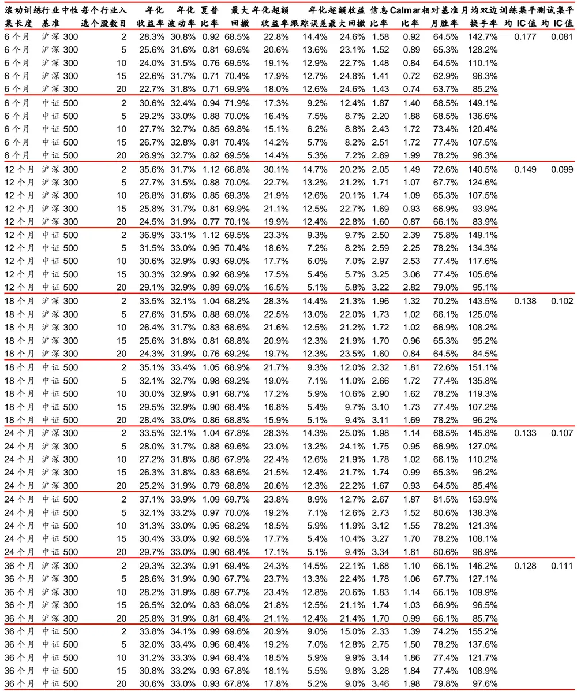
资料来源：Wind，华泰证券研究所

线性回归模型中，我们将滚动训练集的长度设为 12个月。我们同时测试了 6个月、18个月、24个月和 36个月的训练集长度，结果如图表 24和 25所示。从年化超额收益和信息比率来看，回测效果最佳的训练集长度为 12~24个月。图表 25中的统一对照组为默认设置下的线性回归模型（下文同）。

图表25： 线性回归模型参数敏感性分析——重要指标对比（训练集长度）

| 滚动训练集长度 | 每个行业入选个股数目 (从左至右：2,5,10,15,20) |  |  |  |  | 滚动训练集长度每个行业入选个股数目（从左至右：2,5,10,15,20) |  |  |  |
| --- | --- | --- | --- | --- | --- | --- | --- | --- | --- |
| 年化超额收益率 | (沪深 300 行业中性） |  |  |  |  | 年化超额收益率 （中证500 行业中性） |  |  |  |
| 6个月 | 22.8% 20.6% | 19.1% |  | 17.9% 18.0% | 6个月 | 17.3% | 16.4% | 15.1% 14.2% | 14.4% |
| 18个月 | 28.3% 22.5% | 21.6% | 20.9% | 19.7% | 18个月 | 21.7% | 19.0% | 17.2% 16.8% | 15.9% |
| 24个月 | 28.3% 23.0% | 22.4% | 21.5% | 20.6% | 24个月 | 23.8% | 19.2% | 18.5% 17.7% | 17.1% |
| 36个月 | 24.3% 23.7% | 23.4% | 21.8% | 21.1% | 36个月 | 20.9% | 19.2% | 18.5% 18.1% | 17.8% |
| 统一对照组 | 30.1% 22.7% | 21.9% | 21.1% | 19.9% | 统一对照组 | 23.3% | 18.6% 17.7% | 17.5% | 16.5% |
|  | 超额收益最大回撤（沪深300行业中性） |  |  |  |  | 超额收益最大回撤（中证500行业中性） |  |  |  |
| 6个月 | 24.6% 23.1% | 22.7% | 24.8% | 24.6% | 6个月 | 12.4% | 8.7% | 8.8% 8.2% | 7.2% |
| 18个月 | 21.3% 22.0% | 21.2% | 21.9% | 23.5% | 18个月 | 12.0% | 11.0% | 10.6% 9.7% | 9.4% |
| 24个月 | 25.0% 24.1% | 21.9% | 21.7% | 22.2% | 24个月 | 12.7% | 12.6% | 11.9% 10.4% | 9.4% |
| 36个月 | 22.1% 22.4% | 20.6% | 21.1% | 21.4% | 36个月 | 15.0% | 12.8% | 9.9% 9.8% | 9.0% |
| 统一对照组 | 20.2% 21.2% | 20.1% | 22.7% | 22.8% | 统一对照组 | 9.7% | 8.2% | 7.0% 5.7% | 5.8% |
|  | 信息比率（沪深300行业中性） |  |  |  |  |  |  |  |  |
| 6个月 | 1.58 1.52 | 1.48 | 1.41 | 1.43 | 6个月 | 信息比率（中证500行业中性） |  |  |  |
| 18个月 | 1.96 | 1.73 1.72 | 1.7 | 1.6 | 18个月 | 1.87 | 2.2 | 2.43 2.51 | 2.69 |
| 24个月 | 1.98 | 1.75 1.78 | 1.74 | 1.67 | 24个月 | 2.32 2.67 | 2.66 | 2.9 3.1 | 3.11 3.34 |
| 36个月 | 1.68 | 1.78 1.83 | 1.74 | 1.7 | 36个月 | 2.33 | 2.73 2.75 | 3.12 3.27 3.28 | 3.46 |
| 统一对照组 | 2.05 | 1.71 1.74 | 1.69 | 1.6 | 统一对照组 | 2.5 | 2.59 | 3.14 2.97 3.25 | 3.22 |
| 6个月 | 0.92 0.89 | Calmar 比率（沪深 300 行业中性） 0.84 |  |  | 6个月 | Calmar 比率（中证500行业中性） |  |  |  |
| 18个月 | 1.32 1.02 | 1.02 | 0.72 0.96 | 0.74 0.84 | 18个月 | 1.4 1.81 | 1.88 1.72 1.72 1.62 | 1.72 1.73 | 1.99 1.69 |
| 24个月 | 1.14 | 0.95 1.02 | 0.99 | 0.93 | 24个月 | 1.87 | 1.52 | 1.55 1.7 | 1.81 |
| 36个月 | 1.1 | 1.06 1.14 | 1.03 | 0.99 | 36个月 | 1.39 | 1.5 | 1.86 1.84 | 1.98 |
| 统一对照组 | 1.49 1.07 | 1.09 | 0.93 | 0.87 | 统一对照组 | 2.39 | 2.25 2.53 | 3.06 | 2.82 |
| 6个月 | 64.5% 65.3% | 64.5% | 相对基准月胜率（沪深300行业中性） 62.9% | 63.7% | 6个月 | 相对基准月胜率（中证500行业中性） 68.5% 68.5% | 73.4% | 77.4% | 78.2% |
| 18个月 | 70.2% 66.1% | 66.9% | 65.3% | 64.5% | 18个月 | 72.6% | 77.4% 78.2% | 77.4% | 78.2% |
| 24个月 | 68.5% | 66.9% 66.1% | 65.3% | 64.5% | 24个月 | 81.5% | 80.6% | 78.2% 78.2% | 80.6% |
| 36个月 | 66.1% | 67.7% 66.1% | 66.9% | 66.1% | 36个月 | 74.2% | 78.2% | 77.4% 77.4% | 79.8% |
| 统一对照组 | 72.6% | 67.7% 65.3% | 66.9% | 66.1% | 统一对照组 | 75.8% | 78.2% | 77.4% 77.4% | 79.0% |

资料来源：Wind，华泰证券研究所

## 主成分分析

线性回归模型中，我们对特征进行主成分分析（PCA），提取全部 70个成分（即累积方差贡献率 100%）作为新的特征。我们同时测试了提取前 41个主成分（平均累积方差贡献率 95%）、前 34个主成分（平均累积方差贡献率90%）、前 23个主成分（平均累积方差贡献率 80%）和不做 PCA 的预处理方法，结果如图表 26和 27所示。

从年化超额收益和信息比率来看，选取的主成分越多，回测表现越好。由于线性回归的计算开销不大，可以考虑选取所有主成分，保留数据中的全部信息。另外我们也发现做 PCA和不做 PCA 的区别仅在于模型系数不同，最终预测的收益值有细微差异，但是每一期各样本预测收益的相对大小排序几乎完全相同，因此模型回测的表现也完全一致。

图表26： 线性回归模型参数敏感性分析详细指标列表（主成分分析）
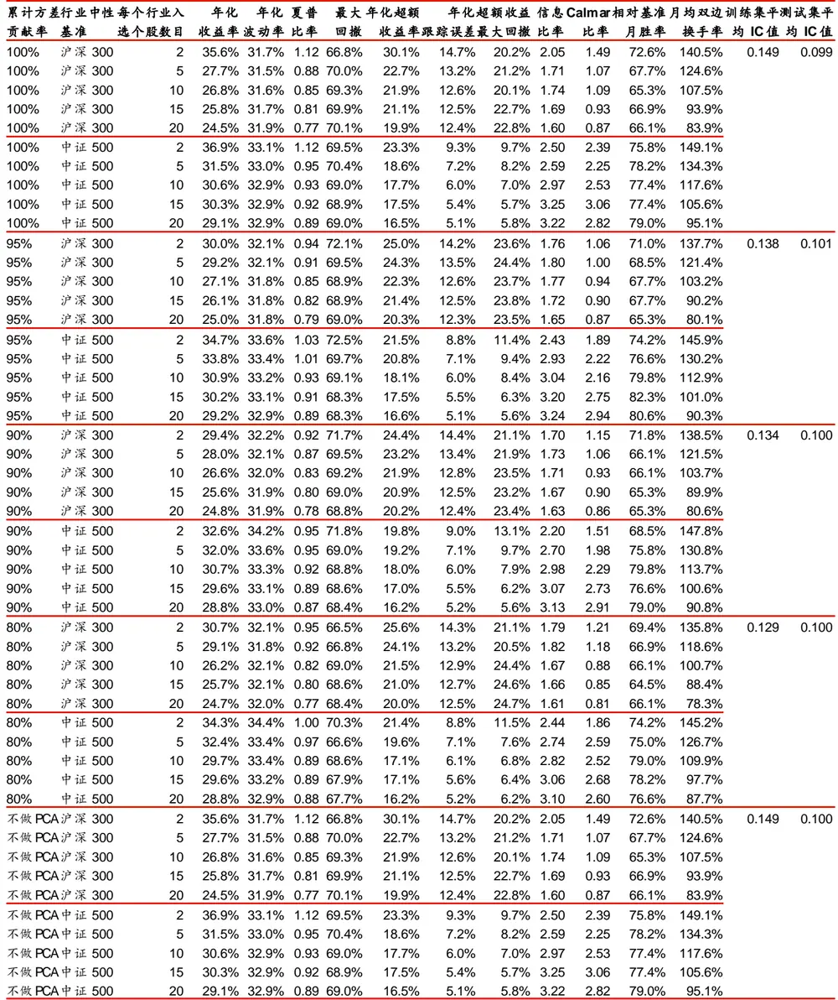
资料来源：Wind，华泰证券研究所

图表27： 线性回归模型参数敏感性分析——重要指标对比（主成分分析）

| 系计万差页献率 每行行业六选 成数口 名 2,3,10,13, 207 |  |  |  |  |
| --- | --- | --- | --- | --- |
| 年化超额收益率（沪深300行业中性） |  |  |  |  |
| 95% | 25.0% | 24.3% | 22.3% | 21.4% 20.3% |
| 90% | 24.4% | 23.2% | 21.9% 20.9% | 20.2% |
| 80% | 25.6% | 24.1% 21.5% | 21.0% | 20.0% |
| 统一对照组 (不做 PCA) | 30.1% | 22.7% 21.9% | 21.1% | 19.9% |
|  | 超额收益最大回撤（沪深300行业中性） |  |  |  |
| 95% | 23.6% | 24.4% 23.7% | 23.8% | 23.5% |
| 90% | 21.1% | 21.9% | 23.5% 23.2% | 23.4% |
| 80% | 21.1% | 20.5% 24.4% |  | 24.6% 24.7% |
| 统一对照组 | 20.2% | 21.2% 20.1% |  | 22.7% 22.8% |
| (不做 PCA) |  |  |  |  |
|  |  | 信息比率（沪深300行业中性） |  |  |
| 95% | 1.76 | 1.8 1.77 | 1.72 | 1.65 |
| 90% | 1.7 | 1.73 1.71 | 1.67 | 1.63 |
| 80% | 1.79 | 1.82 1.67 | 1.66 | 1.61 |
| 统一对照组 (不做 PCA) | 2.05 | 1.71 1.74 | 1.69 | 1.6 |
|  | Calmar 比率（沪深 300 行业中性） |  |  |  |
| 95% | 1.06 | 1 0.94 | 0.9 | 0.87 |
| 90% | 1.15 | 1.06 0.93 | 0.9 | 0.86 |
| 80% | 1.21 | 1.18 0.88 | 0.85 | 0.81 |
| 统一对照组 | 1.49 | 1.07 1.09 | 0.93 | 0.87 |
| (不做 PCA) | 相对基准月胜率（沪深300行业中性） |  |  |  |
| 95% | 71.0% | 68.5% 67.7% | 67.7% | 65.3% |
| 90% | 71.8% | 66.1% 66.1% | 65.3% | 65.3% |
| 80% | 69.4% | 66.9% 66.1% | 64.5% | 66.1% |
| 统一对照组 | 72.6% | 67.7% | 65.3% 66.9% | 66.1% |

资料来源： ，华泰证券研究所

| 累计方差贡献率每个行业入选个股数目（从左至右：2,5,10,15，20） |  |  |  |
| --- | --- | --- | --- |
|  | 年化超额收益率（中证500行业中性） |  |  |
| 95% | 21.5% 20.8% | 18.1% | 17.5% 16.6% |
| 90% | 19.8% 19.2% | 18.0% | 17.0% 16.2% |
| 80% | 21.4% 19.6% | 17.1% | 17.1% 16.2% |
| 统一对照组 | 23.3% 18.6% | 17.7% | 17.5% 16.5% |
| (不做 PCA) |  |  |  |
| 95% | 超额收益最大回撤（中证500行业中性） 9.4% | 8.4% | 6.3% 5.6% |
| 90% | 11.4% 13.1% 9.7% | 7.9% | 6.2% 5.6% |
| 80% |  | 6.8% | 6.4% 6.2% |
| 统一对照组 | 11.5% 7.6% |  | 5.7% 5.8% |
| (不做 PCA) | 9.7% 8.2% | 7.0% |  |
|  | 信息比率（中证500行业中性） |  |  |
| 95% | 2.43 2.93 | 3.04 | 3.2 3.24 |
| 90% | 2.2 | 2.7 2.98 | 3.07 3.13 |
| 80% | 2.44 | 2.82 | 3.06 3.1 |
| 统一对照组 | 2.74 | 2.97 | 3.25 3.22 |
| (不做 PCA) | 2.5 2.59 |  |  |
|  | Calmar比率（中证500 行业中性） |  |  |
| 95% | 1.89 2.22 | 2.16 | 2.75 2.94 |
| 90% | 1.51 1.98 | 2.29 | 2.73 2.91 |
| 80% | 1.86 2.59 | 2.52 | 2.68 2.6 |
| 统一对照组 | 2.39 2.25 | 2.53 | 3.06 2.82 |
| (不做 PCA) |  |  |  |
|  | 相对基准月胜率（中证500行业中性） |  |  |
| 95% | 74.2% 76.6% | 79.8% | 82.3% 80.6% |
| 90% | 68.5% 75.8% | 79.8% | 76.6% 79.0% |
| 80% | 74.2% 75.0% | 79.0% | 78.2% 76.6% |
| 统一对照组 | 75.8% 78.2% | 77.4% | 77.4% 79.0% |

## 训练集样本量

线性回归模型中，我们选取 到 期中每一期的全部样本组成训练集，相当于取收益率排名前后 50%的样本。我们同时测试了只取最具代表性的部分样本的情况，分别选取前后 40%、30%、20%和 10%考察回测效果，结果如图表 28和 29所示。从年化超额收益和信息比率来看，我们发现选取全部样本在沪深 300行业中性基准下的选股表现最好，而选取前后 20%样本在中证 500行业中性基准下的选股表现最好。

图表28： 线性回归模型参数敏感性分析详细指标列表（训练集样本量）
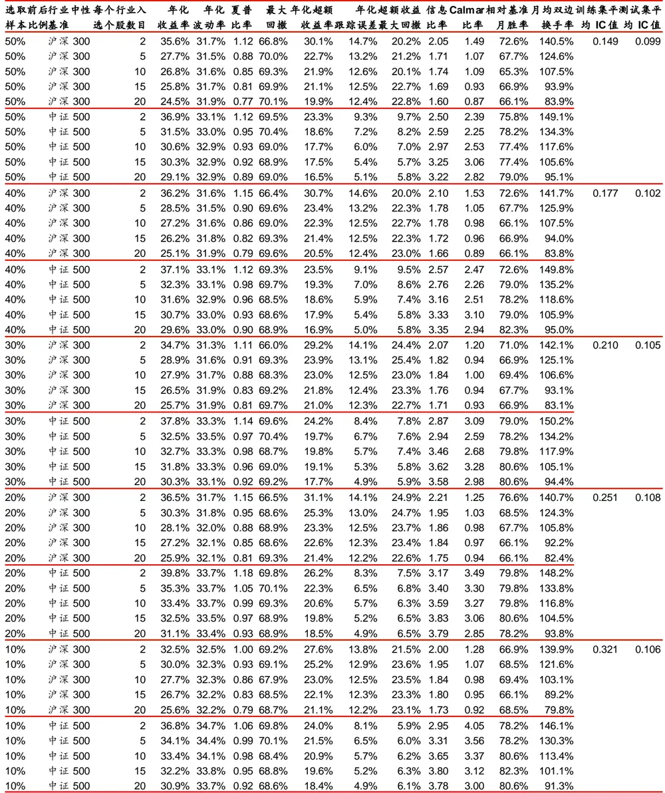
资料来源：Wind，华泰证券研究所

图表29： 线性回归模型参数敏感性分析——重要指标对比（训练集样本量）

| 样本前后比例 | 每个行业入选个股数目（从左至右：2,5，10，15,20） |  |  |  | 样本前后比例 | 每个行业入选个股数目（从左至右：2,5,10，15，20） |  |  |  |
| --- | --- | --- | --- | --- | --- | --- | --- | --- | --- |
|  | 年化超额收益率（沪深300行业中性） |  |  |  |  | 年化超额收益率（中证500行业中性） |  |  |  |
| 10% | 27.6% 25.2% | 23.0% | 22.1% | 21.1% | 10% | 24.0% | 21.5% 20.9% | 19.6% | 18.4% |
| 20% | 31.1% 25.3% | 23.3% | 22.6% | 21.4% | 20% | 26.2% | 22.3% 20.6% | 19.8% | 18.5% |
| 30% | 29.2% 23.9% | 23.0% | 21.8% | 21.0% | 30% | 24.2% | 19.7% 19.8% | 19.1% | 17.7% |
| 40% | 30.7% 23.4% | 22.3% | 21.4% | 20.5% | 40% | 23.5% | 19.3% 18.6% | 17.9% | 16.9% |
| 统一对照组 | 30.1% 22.7% | 21.9% | 21.1% | 19.9% | 统一对照组 | 23.3% | 18.6% 17.7% | 17.5% | 16.5% |
|  | 超额收益最大回撤（沪深300行业中性） |  |  |  |  | 超额收益最大回撤（中证500行业中性） |  |  |  |
| 10% | 21.5% 23.6% | 23.5% |  | 23.3% 23.1% | 10% | 5.9% | 6.0% | 6.2% 6.3% | 6.1% |
| 20% | 24.9% 24.7% | 23.7% | 23.4% | 22.6% | 20% | 7.5% | 6.8% 6.3% | 6.5% | 6.5% |
| 30% | 24.4% 25.4% | 23.0% | 23.3% | 22.7% | 30% | 7.8% | 7.6% | 7.4% 5.8% | 5.9% |
| 40% | 20.0% 22.3% | 22.7% | 22.3% | 23.0% | 40% | 9.5% | 8.6% | 7.4% 5.8% | 5.8% |
| 统一对照组 | 20.2% 21.2% | 20.1% | 22.7% | 22.8% | 统一对照组 | 9.7% | 8.2% | 7.0% 5.7% | 5.8% |
| 信息比率（沪深300行业中性） |  |  |  |  |  |  |  |  |  |
| 10% | 2 1.95 | 1.84 | 1.8 | 1.73 | 10% | 2.95 3.31 | 3.65 | 信息比率（中证500行业中性） 3.8 | 3.78 |
| 20% | 2.21 | 1.95 1.86 | 1.84 | 1.75 | 20% | 3.17 | 3.4 | 3.59 3.83 | 3.79 |
| 30% | 2.07 | 1.82 1.84 | 1.76 | 1.71 | 30% | 2.87 | 2.94 | 3.46 3.62 | 3.58 |
| 40% | 2.1 | 1.78 1.78 | 1.72 | 1.66 | 40% | 2.57 | 2.76 | 3.16 3.33 | 3.35 |
| 统一对照组 | 2.05 | 1.71 1.74 | 1.69 | 1.6 | 统一对照组 | 2.5 | 2.59 | 2.97 3.25 | 3.22 |
| 10% | 1.28 1.07 | Calmar 比率（沪深 300 行业中性） 0.98 |  | 0.92 |  | Calmar 比率（中证500 行业中性） |  |  |  |
| 20% | 1.25 | 1.03 0.98 | 0.95 0.97 | 0.94 | 10% 20% | 4.05 3.49 | 3.56 | 3.37 3.12 3.06 | 3 |
| 30% | 1.2 | 0.94 1 | 0.94 | 0.93 | 30% | 3.09 | 3.3 2.59 | 3.27 3.28 | 2.85 2.98 |
| 40% | 1.53 | 1.05 0.98 | 0.96 | 0.89 | 40% | 2.47 | 2.26 | 2.68 2.51 3.1 | 2.94 |
| 统一对照组 | 1.49 | 1.07 1.09 | 0.93 | 0.87 | 统一对照组 | 2.39 | 2.25 | 2.53 3.06 | 2.82 |
| 10% | 相对基准月胜率（沪深300行业中性） 66.9% 68.5% |  |  |  |  | 相对基准月胜率（中证500行业中性） |  |  |  |
| 20% | 76.6% 68.5% | 69.4% 67.7% | 66.1% 66.1% | 68.5% 66.1% | 10% 20% | 78.2% 78.2% 79.8% 79.8% | 80.6% 79.8% | 82.3% 80.6% | 80.6% |
| 30% | 71.0% | 66.9% 69.4% | 67.7% | 66.9% | 30% | 79.0% | 78.2% | 79.8% 80.6% | 78.2% 80.6% |
| 40% | 72.6% | 67.7% 66.1% | 66.9% | 66.1% | 40% | 72.6% | 79.0% | 78.2% 79.0% | 82.3% |
| 统一对照组 | 72.6% | 67.7% 65.3% | 66.9% | 66.1% | 统一对照组 | 75.8% | 78.2% | 77.4% 77.4% | 79.0% |

资料来源：Wind，华泰证券研究所

## 正则化方法比较

我们比较了岭回归，Lasso回归和弹性网络三种不同的正则化方法。三种方法均包含惩罚系数λ这一自由参数，我们对λ从 至 以 倍为间隔进行遍历，选取测试集值最高的λ作为最终选定的参数。回测结果如下图所示。总体来看，正则化模型的表现和不带正则化的线性回归模型不相上下，引入正则化并没有明显提升选股的效果。

图表30： 不同正则化方法详细指标比较
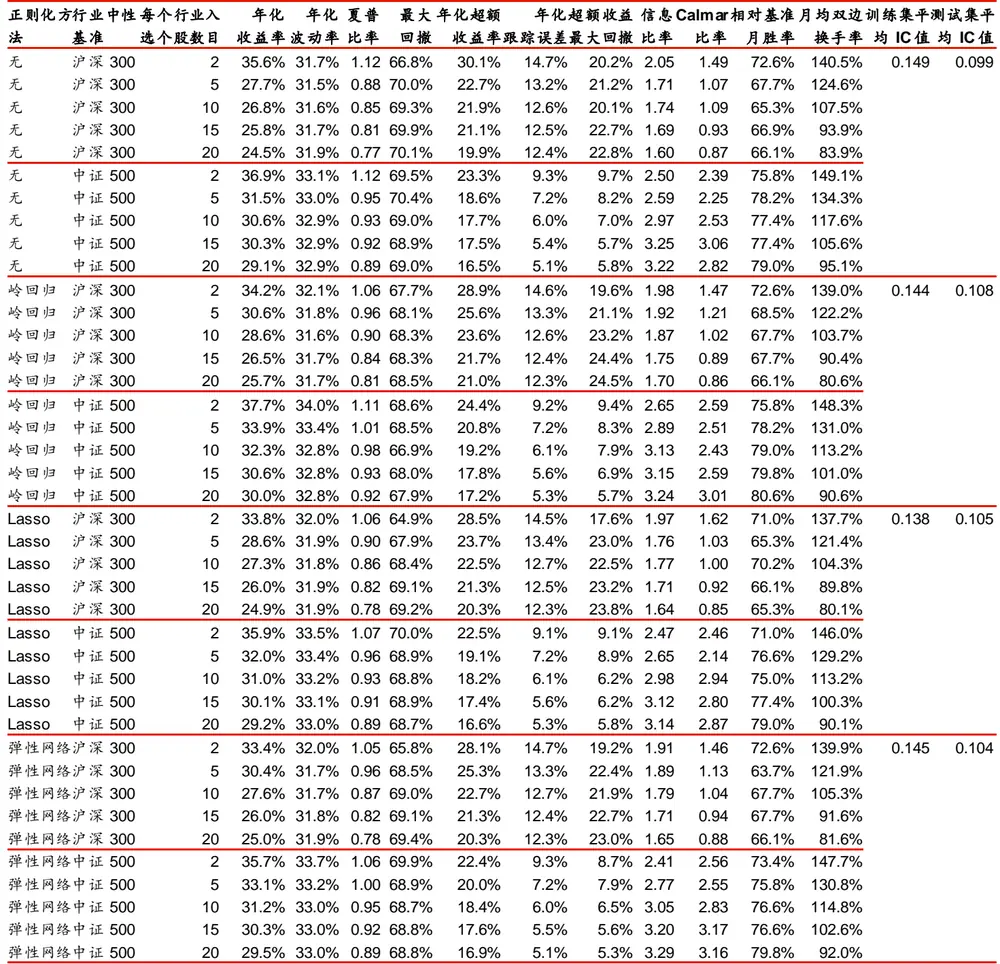
资料来源：Wind，华泰证券研究所

图表31： 不同正则化方法重要指标对比

| 正则化方法 | 每个行业入选个股数目（从左至右：2,5，10，15,20） |  |  |  |  | 滚动训练集长度每个行业入选个股数目（从左至右：2,5,10,15,20） |  |  |  |
| --- | --- | --- | --- | --- | --- | --- | --- | --- | --- |
|  | 年化超额收益率（沪深300行业中性） |  |  |  |  | 年化超额收益率（中证500行业中性） |  |  |  |
| 岭回归 | 30.7% 23.4% | 22.3% | 21.4% | 20.5% | 岭回归 | 23.5% | 19.3% 18.6% | 17.9% | 16.9% |
| Lasso 回归 | 29.2% | 23.9% 23.0% | 21.8% | 21.0% | Lasso 回归 | 24.2% | 19.7% 19.8% | 19.1% | 17.7% |
| 弹性网络 | 31.1% | 25.3% 23.3% | 22.6% | 21.4% | 弹性网络 | 26.2% | 22.3% 20.6% | 19.8% | 18.5% |
| 统一对照组 | 30.1% 22.7% | 21.9% | 21.1% | 19.9% | 统一对照组 | 23.3% | 18.6% 17.7% | 17.5% | 16.5% |
| 超额收益最大回撤（沪深300行业中性） |  |  |  |  |  |  |  |  |  |
| 岭回归 | 20.0% | 22.3% | 22.7% | 22.3% 23.0% | 岭回归 | 超额收益最大回撤 9.5% | 8.6% | （中证500 行业中性） 7.4% | 5.8% |
| Lasso 回归 | 24.4% | 25.4% 23.0% | 23.3% | 22.7% | Lasso 回归 | 7.8% | 7.6% 7.4% | 5.8% 5.8% | 5.9% |
| 弹性网络 |  | 23.7% | 23.4% | 22.6% | 弹性网络 | 7.5% | 6.8% 6.3% | 6.5% | 6.5% |
| 统一对照组 | 24.9% 20.2% | 24.7% 20.1% | 22.7% | 22.8% | 统一对照组 | 9.7% | 8.2% | 5.7% | 5.8% |
|  | 21.2% |  |  |  |  |  |  | 7.0% |  |
|  | 信息比率（沪深300行业中性） |  |  |  |  | 信息比率（中证500行业中性） |  |  |  |
| 岭回归 | 2.1 | 1.78 1.78 | 1.72 | 1.66 | 岭回归 | 2.57 | 2.76 | 3.16 3.33 | 3.35 |
| Lasso 回归 | 2.07 | 1.82 1.84 | 1.76 | 1.71 | Lasso 回归 | 2.87 | 2.94 | 3.46 3.62 | 3.58 |
| 弹性网络 | 2.21 | 1.95 1.86 | 1.84 | 1.75 | 弹性网络 | 3.17 | 3.4 | 3.59 3.83 | 3.79 |
| 统一对照组 | 2.05 1.71 | 1.74 | 1.69 | 1.6 | 统一对照组 | 2.5 | 2.59 | 2.97 3.25 | 3.22 |
|  | Calmar 比率（沪深 300 行业中性） |  |  |  |  | Calmar 比率（中证500 行业中性） |  |  |  |
| 岭回归 | 1.53 1.05 | 0.98 | 0.96 | 0.89 | 岭回归 | 2.47 | 2.26 | 2.51 3.1 | 2.94 |
| Lasso 回归 | 1.2 | 0.94 1 | 0.94 | 0.93 | Lasso 回归 | 3.09 | 2.59 2.68 | 3.28 | 2.98 |
| 弹性网络 | 1.25 | 1.03 0.98 | 0.97 | 0.94 | 弹性网络 | 3.49 | 3.3 | 3.27 3.06 | 2.85 |
| 统一对照组 | 1.49 1.07 | 1.09 | 0.93 | 0.87 | 统一对照组 | 2.39 | 2.25 | 2.53 3.06 | 2.82 |
|  | 相对基准月胜率 （沪深300行业中性） |  |  |  |  |  |  |  | 相对基准月胜率（中证500行业中性） |
| 岭回归 Lasso 回归 | 72.6% 67.7% | 66.1% | 66.9% | 66.1% | 岭回归 | 72.6% | 79.0% 78.2% | 79.0% | 82.3% |
|  | 71.0% 66.9% | 69.4% | 67.7% | 66.9% | Lasso 回归 | 79.0% | 78.2% 79.8% | 80.6% | 80.6% |
| 弹性网络 | 76.6% 68.5% | 67.7% | 66.1% | 66.1% | 弹性网络 | 79.8% | 79.8% | 79.8% 80.6% | 78.2% |
| 统一对照组 | 72.6% 67.7% | 65.3% | 66.9% | 66.1% | 统一对照组 | 75.8% | 78.2% | 77.4% 77.4% | 79.0% |

资料来源：Wind，华泰证券研究所

## 逻辑回归和随机梯度下降法比较

我们比较了逻辑回归，SGD+ hinge损失（等价于线性支持向量机）和 SGD + modifiedHuber三种分类器。三种方法均包含的自由参数为 L2正则化惩罚系数λ，SGD还包含迭代次数这一自由参数。我们固定 SGD迭代次数为 10000次，对λ从 1e-6至 1e6以 10倍为间隔进行遍历，选取测试集 IC值最高并且取值合理的λ作为最终选定的参数。三种分类方法的回测结果如下图所示。

可以发现，三种分类器对训练集的平均正确率在 左右，对测试集的平均正确率在55.7%左右。从年化超额收益和信息比率来看，三种分类器均优于传统的线性回归，超额收益最大回撤也小于线性回归模型。三者之中又以 SGD + hinge损失模型表现最佳，以中证 500作为行业中性基准，每个行业选 10~15只个股的策略，信息比率和 Calmar比率均在 4左右，超额收益最大回撤在 5%左右。

图表32： 逻辑回归和SGD详细指标比较
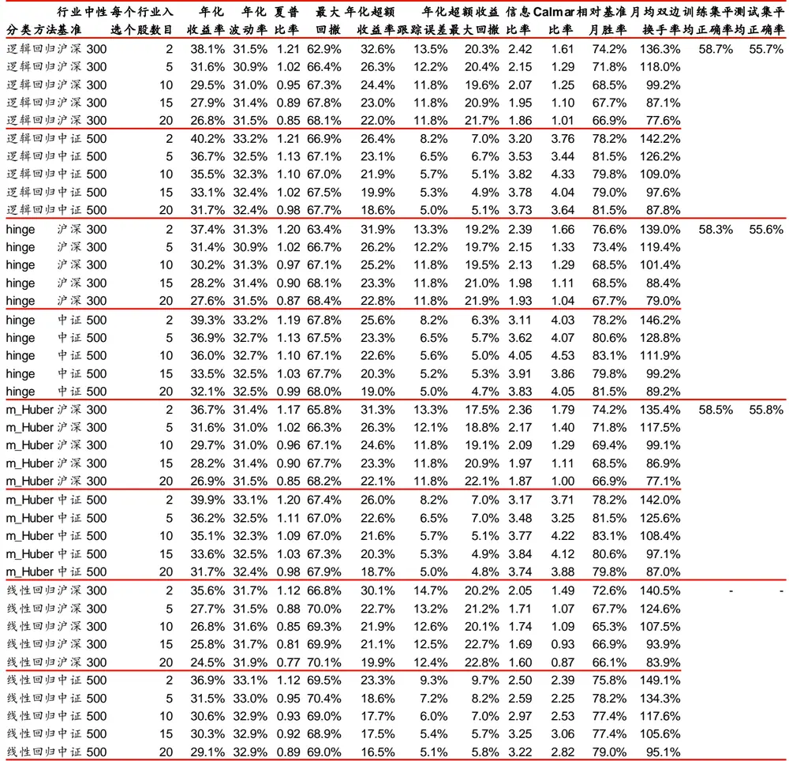
资料来源： ，华泰证券研究所

图表33： 逻辑回归和SGD模型重要指标对比

| 分类器 | 每个行业入选个股数目（从左至右：2,5,10，15,20） |  |  |  | 分类器 | 每个行业入选个股数目（从左至右：2,5,10,15，20） |  |  |  |
| --- | --- | --- | --- | --- | --- | --- | --- | --- | --- |
|  | 年化超额收益率（沪深300行业中性） |  |  |  |  | 年化超额收益率（中证500行业中性） |  |  |  |
| 逻辑回归 | 32.6% 26.3% | 24.4% |  | 23.0%22.0% | 逻辑回归 | 26.4% | 23.1% 21.9% | 19.9% | 18.6% |
| SGD+hinge | 31.9% | 26.2% 25.2% | 23.3% | 22.8% | SGD+hinge | 25.6% | 23.3% 22.6% | 20.3% | 19.0% |
| SGD+m_Huber | 31.3% 26.3% | 24.6% | 23.3% | 22.1% | SGD+m_Huber | 26.0% | 22.6% 21.6% | 20.3% | 18.7% |
| 统一对照组 | 30.1% 22.7% | 21.9% | 21.1% | 19.9% | 统一对照组 | 23.3% | 18.6% 17.7% | 17.5% | 16.5% |
| 超额收益最大回撤（沪深300行业中性） |  |  |  |  |  | 超额收益最大回撤（中证500行业中性） |  |  |  |
| 逻辑回归 | 20.3% 20.4% |  | 20.9% | 21.7% | 逻辑回归 | 7.0% |  | 5.1% |  |
| SGD+hinge | 19.7% | 19.6% 19.5% | 21.0% | 21.9% | SGD+hinge | 6.3% | 6.7% 5.7% | 4.9% 5.0% 5.3% | 5.1% 4.7% |
| SGD+m_Huber | 19.2% | 19.1% | 20.9% |  | SGD+m_Huber | 7.0% |  |  | 4.8% |
| 统一对照组 | 17.5% 18.8% |  |  | 22.1% | 统一对照组 |  | 7.0% | 5.1% 4.9% |  |
|  | 20.2% 21.2% | 20.1% |  | 22.7% 22.8% |  | 9.7% | 8.2% | 7.0% 5.7% | 5.8% |
|  | 信息比率（沪深300行业中性） |  |  |  |  | 信息比率（中证500行业中性） |  |  |  |
| 逻辑回归 | 2.42 2.15 | 2.07 | 1.95 | 1.86 | 逻辑回归 | 3.2 | 3.53 | 3.82 3.78 | 3.73 |
| SGD+hinge | 2.39 | 2.15 2.13 | 1.98 | 1.93 | SGD+hinge | 3.11 | 3.62 | 4.05 3.91 | 3.83 |
| SGD+m_Huber | 2.36 | 2.17 2.09 | 1.97 | 1.87 | SGD+m_Huber | 3.17 | 3.48 | 3.77 3.84 | 3.74 |
| 统一对照组 | 2.05 1.71 | 1.74 | 1.69 | 1.6 | 统一对照组 | 2.5 | 2.59 | 2.97 3.25 | 3.22 |
| 逻辑回归 |  | Calmar 比率（沪深 300 行业中性） 1.25 |  |  | 逻辑回归 |  |  | Calmar 比率（中证500 行业中性） |  |
| SGD+hinge | 1.61 1.29 1.33 |  | 1.1 | 1.01 | SGD+hinge | 3.76 | 3.44 | 4.33 4.04 | 3.64 |
| SGD+m_Huber | 1.66 | 1.29 | 1.11 | 1.04 | SGD+m_Huber | 4.03 | 4.07 | 4.53 3.86 | 4.05 |
| 统一对照组 | 1.79 1.4 1.49 1.07 | 1.29 1.09 | 1.11 0.93 | 0.87 | 统一对照组 | 3.71 2.39 | 3.25 2.25 | 4.22 4.12 2.53 3.06 | 3.88 2.82 |
| 逻辑回归 | 相对基准月胜率（沪深300行业中性） |  |  |  |  | 相对基准月胜率（中证500行业中性） |  |  |  |
| SGD+hinge | 74.2% 71.8% 73.4% | 68.5% | 67.7% 68.5% | 66.9% | 逻辑回归 SGD+hinge | 78.2% 78.2% | 81.5% 79.8% | 79.0% | 81.5% |
| SGD+m_Huber | 76.6% 74.2% 71.8% | 68.5% 69.4% | 68.5% | 67.7% 66.9% | SGD+m_Huber | 78.2% | 80.6% 81.5% | 83.1% 79.8% 80.6% | 81.5% 79.8% |
| 统一对照组 |  |  | 66.9% | 66.1% | 统一对照组 | 75.8% | 78.2% | 83.1% | 79.0% |
|  | 72.6% 67.7% | 65.3% |  |  |  |  |  | 77.4% 77.4% |  |

资料来源：Wind，华泰证券研究所

## 利用随机梯度下降法 + hinge 损失模型构建选股策略

观察以上参数敏感性测试表格可以发现，SGD（随机梯度下降法）结合 hinge损失模型（等价于线性支持向量机）的选股效果最佳，我们同样选择展示三种细节设置下，选股策略的月度超额收益图：

图表34： SGD+hinge 损失模型结合沪深 300行业中性策略表现（每个行业选2只个股）
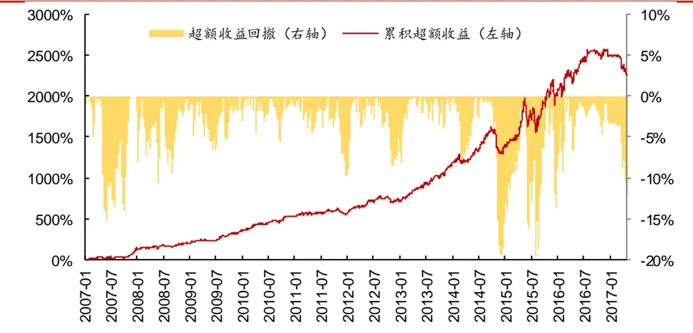
资料来源： ，华泰证券研究所

图表35： SGD+hinge 损失模型结合中证 500行业中性策略表现（每个行业选8只个股）
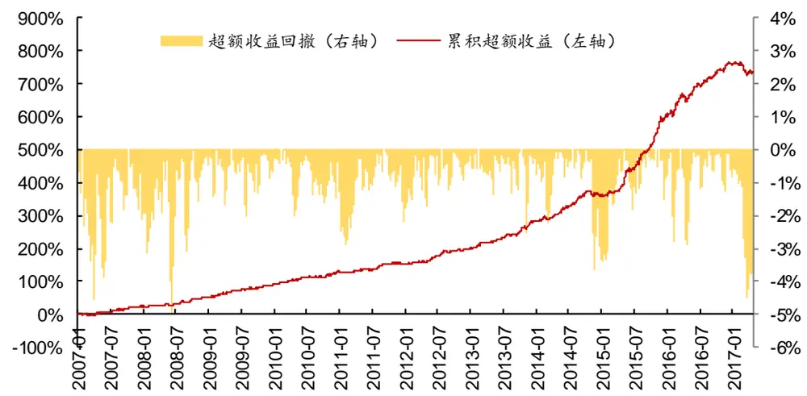
资料来源：Wind，华泰证券研究所

图表36： SGD+hinge 损失模型等权策略表现（每期选125只个股等权配置，以中证500为基准）
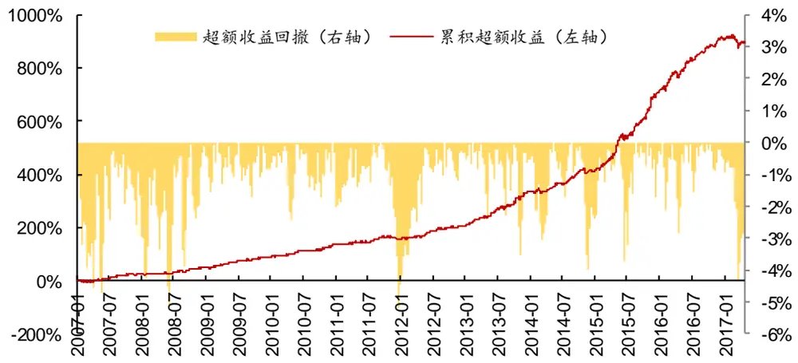
资料来源：Wind，华泰证券研究所

## 总结和展望

以上我们从最简单的线性回归模型出发，对岭回归、Lasso回归、弹性网络、逻辑回归和随机梯度下降法（结合某种损失函数）等广义线性模型进行了系统的测试，并且考察了部分模型参数的敏感性，初步得到以下几个结论：

1. 线性回归模型本身已具备不错的选股能力。训练集 IC值稳定在 0.15左右，测试集 IC值波动较大，在个别月份甚至出现负值，平均值为 0.1。以此构建的选股策略，在沪深 300行业中性基准下，年化超额收益为20%~30%，信息比率为 1.6~2.0；在中证 500行业中性基准下，年化超额收益为 16%~24%，信息比率为 2.5~3.2；在不控制行业中性条件下，年化超额收益为 19%~26%，信息比率为2.2~3.1。

线性回归模型中，滚动训练集长度为 个月时回测效果较好；主成分分析保留的成分越多，回测效果越好；选取全部样本在沪深 300行业中性基准下表现最好，选取前后排名 20%的样本在中证 500行业中性基准下表现最好。

3. 正则化对选股效果没有明显的提升作用。岭回归、Lasso回归和弹性网络的表现和线性回归类似。我们猜测有两个可能的原因。首先，样本的所有特征都是已被证明有效的因子，因此我们的特征不具备稀疏性。以Lasso回归为代表的 L1正则化适用于从海量特征中选出少数有效的特征，因而我们面对的问题不符合 Lasso的应用场景。其次，由于预处理过程中做了去极值、标准化和主成分分析，在降低因子共线性的同时减少了极端样本的出现概率，因而进一步削弱了正则化的价值。

4. 将回归问题转换为分类问题，能够显著提升模型表现。逻辑回归、SGD结合 hinge损失函数、SGD结合 modified Huber损失函数这三个分类器的回测效果均优于传统的线性模型。三者之中又以SGD + hinge损失模型表现最佳，以中证 500作为行业中性基准，每个行业选 10~15只个股的策略，信息比率和 Calmar比率均在 4左右，超额收益最大回撤在 5%左右。我们猜测，三种分类器优于线性回归模型的可能原因，在于对原始收益率进行二值化处理，分成正例和反例后，尽管损失了部分信息，但同时消除了收益率信息中包含的大量噪音，使得模型能够更准确地捕捉数据中蕴含的规律。同时，hinge和 modifiedHuber这两个损失函数对噪音点不敏感，进一步提升了模型的健壮性和泛化能力。

通过以上的测试和讨论，我们初步理解了广义线性模型应用于多因子选股的一些规律。同时也引申出更多的问题。例如：

1. 在岭回归、Lasso、弹性网络、逻辑回归和 SGD的调参过程中，我们对正则化惩罚系数以 10倍为跨度作了粗略的遍历。如果在更精细的尺度下进行参数寻优，模型的表现能否有进一步提升？

2. 对于本篇报告中回测效果最好的 SGD模型，除了 hinge和 modified Huber损失函数外，还存在其它损失函数的选择。另外，在随机梯度下降的过程中，学习速率η和迭代次数都是很重要的参数。以上这些参数应如何选取，值得我们进行深入地探索。

3. 机器学习真正碾压传统统计学习方法的地方，在于它强大的处理海量的、非线性数据的能力。核支持向量机、随机森林、神经网络等非线性方法是否在多因子选股上也有出色的表现，我们将在后续的报告中予以探索，敬请期待。

风险提示：广义线性模型是历史经验的总结，存在失效的可能。

## 免责申明

本报告仅供华泰证券股份有限公司（以下简称“本公司”）客户使用。本公司不因接收人收到本报告而视其为客户。

本报告基于本公司认为可靠的、已公开的信息编制，但本公司对该等信息的准确性及完整性不作任何保证。本报告所载的意见、评估及预测仅反映报告发布当日的观点和判断。在不同时期，本公司可能会发出与本报告所载意见、评估及预测不一致的研究报告。同时，本报告所指的证券或投资标的的价格、价值及投资收入可能会波动。本公司不保证本报告所含信息保持在最新状态。本公司对本报告所含信息可在不发出通知的情形下做出修改，投资者应当自行关注相应的更新或修改。

本公司力求报告内容客观、公正，但本报告所载的观点、结论和建议仅供参考，不构成所述证券的买卖出价或征价。该等观点、建议并未考虑到个别投资者的具体投资目的、财务状况以及特定需求，在任何时候均不构成对客户私人投资建议。投资者应当充分考虑自身特定状况，并完整理解和使用本报告内容，不应视本报告为做出投资决策的唯一因素。对依据或者使用本报告所造成的一切后果，本公司及作者均不承担任何法律责任。任何形式的分享证券投资收益或者分担证券投资损失的书面或口头承诺均为无效。

本公司及作者在自身所知情的范围内，与本报告所指的证券或投资标的不存在法律禁止的利害关系。在法律许可的情况下，本公司及其所属关联机构可能会持有报告中提到的公司所发行的证券头寸并进行交易，也可能为之提供或者争取提供投资银行、财务顾问或者金融产品等相关服务。本公司的资产管理部门、自营部门以及其他投资业务部门可能独立做出与本报告中的意见或建议不一致的投资决策。

本报告版权仅为本公司所有。未经本公司书面许可，任何机构或个人不得以翻版、复制、发表、引用或再次分发他人等任何形式侵犯本公司版权。如征得本公司同意进行引用、刊发的，需在允许的范围内使用，并注明出处为“华泰证券研究所”，且不得对本报告进行任何有悖原意的引用、删节和修改。本公司保留追究相关责任的权力。所有本报告中使用的商标、服务标记及标记均为本公司的商标、服务标记及标记。

本公司具有中国证监会核准的“证券投资咨询”业务资格，经营许可证编号为：Z23032000。全资子公司华泰金融控股（香港）有限公司具有香港证监会核准的“就证券提供意见”业务资格，经营许可证编号为：AOK809

©版权所有 2017 年华泰证券股份有限公司

## 评级说明

## 行业评级体系

－报告发布日后的6个月内的行业涨跌幅相对同期的沪深300指数的涨跌幅为基准；

－投资建议的评级标准

增持行业股票指数超越基准

中性行业股票指数基本与基准持平

减持行业股票指数明显弱于基准

## 公司评级体系

－报告发布日后的6个月内的公司涨跌幅相对同期的沪深300指数的涨跌幅为基准；

－投资建议的评级标准

买入股价超越基准20%以上

增持股价超越基准5%-20%

中性股价相对基准波动在-5%~5%之间

减持股价弱于基准5%-20%

卖出股价弱于基准20%以上

## 华泰证券研究

## 南京

南京市建邺区江东中路228号华泰证券广场1号楼/邮政编码：210019

电话：86 25 83389999 /传真：86 25 83387521

电子邮件：ht-rd@htsc.com

## 深圳

深圳市福田区深南大道4011号香港中旅大厦24层/邮政编码：518048

电话：86 755 82493932 /传真：86 755 82492062

电子邮件：ht-rd@htsc.com

## 北京

北京市西城区太平桥大街丰盛胡同28号太平洋保险大厦A座18层

邮政编码：100032

电话：86 10 63211166/传真：86 10 63211275

电子邮件：ht-rd@htsc.com

## 上海

上海市浦东新区东方路18号保利广场E栋23楼/邮政编码：200120

电话：86 21 28972098 /传真：86 21 28972068

电子邮件：ht-rd@htsc.com