## 金工研究/深度研究

2017年08月04日

林晓明 执业证书编号：S0570516010001

研究员 0755-82080134

linxiaoming@htsc.com

陈烨 010-56793927

联系人 chenye@htsc.com

## 相关研究

1《金工: 华泰价值选股之相对市盈率港股模型》2017.07

3《金工: 全球多市场择时配置初探》2017.06

# 人工智能选股之支持向量机模型

## 华泰人工智能系列之三

## 本报告对各种核支持向量机模型以及支持向量回归进行系统测试

支持向量机（SVM）是应用最广泛的机器学习方法之一。线性支持向量机能够解决线性分类问题，核支持向量机则主要针对非线性分类问题，支持向量回归能够处理回归问题。本篇报告我们将对包括线性核、多项式核、高斯核和 Sigmoid 核在内的各种核函数支持向量机以及支持向量回归进行系统性的测试，并分析它们应用于多因子选股的异同，希望对本领域的投资者产生有实用意义的参考价值。

## 支持向量机模型的构建：样本内训练与交叉验证、样本外测试

支持向量机模型的构建包括特征和标签提取、特征预处理、样本内训练、交叉验证和样本外测试等步骤。最终在每个月底可以产生对全部个股下期上涨概率的预测值，然后根据正确率、AUC 等指标以及策略回测结果对模型进行评价。我们还根据模型的预测结果构建了沪深 300成份内选股、中证 500 成份内选股和全 A选股策略，通过年化收益率、信息比率、最大回撤等指标综合评价策略效果。

## 高斯核支持向量机选股模型收益和信息比率的表现优于线性回归

对于沪深 300 成份股内选股的行业中性策略（每个行业选 6 只个股），高斯核 SVM 模型的超额收益为 4.9%，信息比率为 1.22。对于中证 500 成份股内选股的行业中性策略，高斯核 SVM 模型的超额收益为 9.0%，信息比率为 2.37。对于全 A 选股的行业中性策略，高斯核 SVM 模型相对于中证500 的超额收益为 21.1%，信息比率为 3.66。总体而言，高斯核 SVM 在收益和信息比率方面表现不错，各种策略构建方式下都能稳定地优于线性回归模型；最大回撤方面 SVM 模型相比于线性回归不具备明显优势。

## 高斯核支持向量机模型预测能力整体强于其它核支持向量机

我们比较了不同核支持向量机的预测能力，发现高斯核 SVM 的测试集正确率、AUC 和回测表现普遍优于其它核函数。高斯核作为使用最为广泛的核函数，其优势在于不对原始数据做太多的先验假设。我们的回测结果也印证了这一点，通过交叉验证集调参，最终得到高斯核 SVM 全 A 选股模型的测试集正确率为 56.25%，高于线性核（55.66%）、3 阶多项式核（53.75%）、7 阶多项式核（50.03%）和 Sigmoid 核（55.66%）。我们同时发现支持向量机的回测表现优于支持向量回归。

风险提示：通过支持向量机模型构建选股策略是历史经验的总结，存在失效的可能。

## 本文研究导读

经典的多因子模型表达式为：

$$
\tilde{r}={\sum}_{k=1}^{K}X_{jk}*\tilde{f}_{k}+\mu_{j},
$$

$X_{jk}$ ：股票j在因子k上的因子暴露（因子载荷）

$\widetilde{f}_{k}$ ：因子k的因子收益

$\mu_{j}\colon$ 股票j的残差收益率

多因子模型的本质是关于股票当期因子暴露和未来收益之间的线性回归模型。我们希望引入机器学习的思想，对传统多因子模型进行优化。在华泰人工智能选股系列的第二篇报告中，我们使用滚动训练方法，系统地测试了包括线性回归、岭回归、Lasso 回归、弹性网络、逻辑回归和随机梯度下降法在内的广义线性模型。上述模型的共同点是，它们均属于线性分类器或回归方法，难以捕捉数据中的非线性特点。支持向量机是应用最广泛的机器学习方法之一。线性支持向量机能够解决线性分类问题，核支持向量机则主要针对非线性分类问题，支持向量回归能够处理回归问题。本篇报告我们将支持向量机应用于多因子选股，主要关注如下几方面的问题：

1.首先是模型选择的问题。支持向量机相比于线性回归模型，在性能上是否有提升？以多项式核、Sigmoid 核、高斯核支持向量机为代表的非线性分类器，相比于以线性支持向量机为代表的线性分类器在分类表现上是否具有优势？支持向量回归和支持向量分类器的预测能力是否具有差异？

2.其次是参数寻优的问题。支持向量机对参数的依赖程度远远大于广义线性模型。支持向量机包含两个重要参数：惩罚系数 C和γ值。在与多因子结合的问题背景下，参数取值多少最为合理？应该通过什么样的指标确定最优参数？

3.最后是组合构建的问题。在衡量过不同支持向量机模型的表现之后，应如何利用模型的预测结果构建策略组合进行回测？各模型在沪深 300、中证 500 和全部 A股票池内选股效果的异同是什么？

我们将围绕以上的问题进行系统性的测试，希望为读者提供一些扎实的证据，并寻找到最优的支持向量机模型，希望对本领域的投资者产生有实用意义的参考价值。

## 支持向量机介绍

支持向量机（Support Vector Machine，SVM）是应用最广泛的机器学习方法之一。在 20世纪 90 年代，传统神经网络式微，深度学习尚未兴起，支持向量机由于其极高的预测正确率，并且能够解决非线性分类问题，成为当时最流行的机器学习方法。支持向量机可分为线性支持向量机和核支持向量机，前者针对线性分类问题，后者属于非线性分类器。我们在华泰人工智能系列的第一篇报告对支持向量机作了简单介绍，下面我们将对更多的细节进行深入探讨。

## 线性支持向量机

## 最大间隔分类

对于任何一种线性分类器，需要解决的核心问题是：如何寻找到最佳的分类边界，将两类样本区分开来？在图表 1 所示的二维平面中，分类边界是一条一维直线；在三维空间中，分类边界是一个二维平面；在 N 维度的空间中，分类边界是一个 N-1 维空间。我们将上述用于分类的一维直线、二维平面和 N-1维空间统称为分类超平面（Separating Hyperplane）。那么，线性支持向量机是如何确定最优的分类超平面呢？其遵循的原则是——最大间隔分类。

以图表 1 为例，样本点包含 x1和 x2两个维度的特征，左右两张图中的黑色直线都可以将红蓝两类样本区分开，哪种方式更好？直观地看，如果将黑色直线向两侧平移，直到与样本点相交，可以得到红色和蓝色两条直线，称为最大边缘超平面（Maximum MarginHyperplane），类似于“楚河汉界”。这条“楚河汉界”越宽，分类的效果应越好，例如图表 1 左图较右图的分类间隔更宽，左图中的黑色直线更有可能成为最终的分类边界。落在最大边缘超平面的样本点称为支持向量（Support Vector），支持向量机由此得名。

图表1： 最大间隔分类示意图
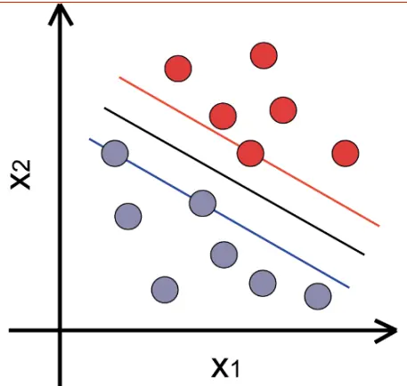
资料来源：华泰证券研究所

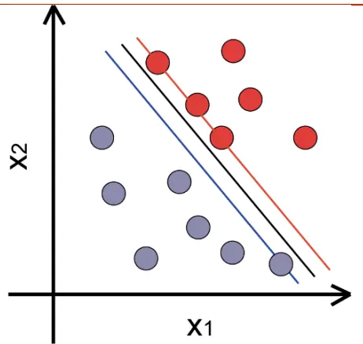

下面我们将最大间隔分类的思想转换为数学语言。二维平面中的任意一条直线均可以表示为 $w_{1}x_{1}+w_{2}x_{2}+b=0$ 的形式，简记为 $\pmb{x}^{T}\pmb{w}+b=0$ ,其中x和w为列向量 $(x_{1},x_{2})$ 和 $(w_{1},w_{2})$ T为转置符号，b为常数。图表 2中的分类超平面（黑色直线）表示为 $\pmb{x}^{T}\pmb{w}+b=0$ ，其上方的最大边缘超平面（红色直线）则相应表示为 $\pmb{x}^{T}\pmb{w}+b-1=0$ ，即 $\pmb{x}^{T}\pmb{w}+b=1$ 。类似地，下方的最大边缘超平面（黑色直线）表示为 $\pmb{x}^{T}\pmb{w}+b=-1$ 。两个最大边缘超平面之间的间隔等 $于2/\|\boldsymbol{w}\|$ ,其中‖w‖为向量 w 的 2 范数，即各元素平方和的平方根。

线性支持向量机的目标是寻找一组直线的参数w和 b，使得分类间隔取得最大值。目标函数可以写成：

$$
\underset{\boldsymbol{w},\boldsymbol{b}}{\operatorname*{max}}\frac{2}{\|\boldsymbol{w}\|}
$$

更常用的目标函数是上式的等价形式：

$$
\operatorname*{min}_{\boldsymbol{w},b}\frac{1}{2}\|\boldsymbol{w}\|^{2}
$$

约束条件为： $y_{i}(\pmb{x}_{i}^{T}\pmb{w}+b)\geq1$ ，表明所有样本均归入正确的类别。其中 $(x_{i},y_{i})$ 表示第 i个样本的特征和标签。

图表2： 线性支持向量机的分类超平面和最大边缘超平面
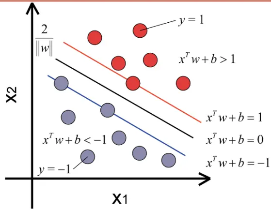
资料来源：华泰证券研究所

## 松弛变量

图表 2展示了理想的线性可分情形。绝大多数时候，数据中会包含噪音，难以用一条直线将两类样本完美地区分开来，如图表 3 所示。此时目标函数的约束条件无法满足。为了应对线性不可分情形，我们引入松弛变量的概念。对每个样本点赋予一个松弛变量的值：如果该点落在最大边缘超平面正确的一侧，则松弛变量ξ = 0；否则，松弛变量的值等于该点到最大边缘超平面的距离。

图表 3中，大多数样本点落在最大边缘超平面（红线和蓝线）本方一侧，这些被正确分类的样本其松弛变量的值ξ = 0；少数样本点落在分类边界（黑线）对方一侧，这些错误分类的样本其松弛变量的值ξ > 1，即红/蓝色样本点到红/蓝线的距离；还有部分样本点尽管落在分类边界本方一侧，但位于“楚河汉界”中，这些虽然分类正确但距离最大边缘超平面不够远的样本，其松弛变量的值取一个较小的正数 $0<\xi\leq1$

图表3： 松弛变量示意图
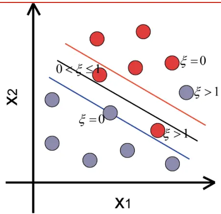
资料来源：华泰证券研究所

此时我们将线性支持向量机的目标函数改写为：

$$
\operatorname*{min}_{\boldsymbol{w},b,\boldsymbol{\xi}}(\frac{1}{2}\|\boldsymbol{w}\|^{2}+C\sum_{i=1}^{n}\xi_{i}),
$$

约束条件为： $y_{i}(\boldsymbol{x}_{i}^{T}\boldsymbol{w}+b)\geq1-\xi_{i},\quad\xi_{i}\geq0$ 。其中 $\xi_{i}$ 为第 i个样本的松弛变量，n为样本个数。

最小化目标函数的过程，实质上是约束条件下求极值的问题，可以通过拉格朗日乘子法（Method of Lagrange Multipliers），随后转换为对偶问题（Dual Problem）进行求解。这里我们省略推导过程，直接给出等价的对偶问题的目标函数：

$$
\operatorname*{max}_{\alpha}({\sum}_{i=1}^{n}\alpha_{i}-{\frac{1}{2}}{\sum}_{i,j=1}^{n}y_{i}y_{j}\alpha_{i}\alpha_{j}{\pmb x}_{i}^{T}{\pmb x}_{j})
$$

约束条件为： $\begin{array}{r}{0\leq\alpha_{i}\leq C,\sum_{i=1}^{n}\alpha_{i}y_{i}=0\mathrm{。}}\end{array}$ 求出二次规划问题的解α̂（即拉格朗日乘子），最终得到分类边界的参数 $\begin{array}{r}{{\mathrm{i}}\widehat{\pmb w}=\sum_{i=1}^{n}\widehat{\alpha}_{i}y_{i}{\pmb x}_{i}}\end{array}$ ，判别函数为 $\begin{array}{r}{f(\pmb{x})=\widehat{\pmb{w}}^{T}\pmb{x}+\widehat{b}=\sum_{i=1}^{n}\widehat{\alpha}_{i}y_{i}\pmb{x}_{i}^{T}\pmb{x}+}\end{array}$ $\hat{b},$ 。当判别函数 $f(\boldsymbol{x})\geq0时$ ，预测ŷ = 1；当判别函数f(x) < 0时，预测ŷ = −1。

## 惩罚系数 C

引进松弛变量后，目标函数在原有的基础之上新加入 $$.C\sum_{i=1}^{n}\xi_{i}$一项$ ，即所有样本松弛变量之和乘以系数 C。这里的系数 C 称为惩罚系数，表示模型对错误分类的容忍度。当 C 取较大的数时，即使很小的松弛变量 $:\xi_{i}$ 也会造成很大的损失，因此分类器对错误分类的容忍度较低，将尽可能保证分类正确，从而导致较高的训练集正确率（如图表 4 左图）。反之，当 C 取较小的数时，分类器对错误分类的容忍度较高，允许错误分类的存在，分类器倾向于以最大间隔分类的原则进行分类（如图表 4右图）。

一般来说，如果惩罚系数 C 取值过大，分类器容易受极端样本影响，造成过拟合的现象，尽管训练集正确率较高，但是测试集正确率并不高，即较低的偏差（Bias）和较大的方差（Variance）；如果惩罚系数 C 取值过小，分类器会过于不在乎分类错误，训练集和测试集正确率都将受损，导致较低的偏差和方差。因此，惩罚系数是影响支持向量分类器性能最为关键的参数之一。实际应用中，通常对惩罚系数 C进行遍历，选择使得交叉验证集正确率最高的 C作为模型最终的参数。

图表4： 惩罚系数 C的取值对分类结果的影响
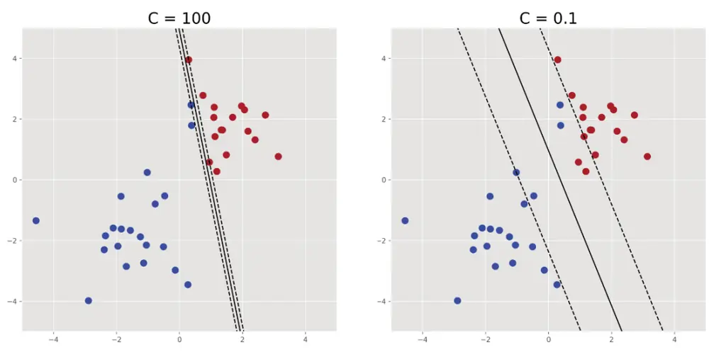
资料来源：华泰证券研究所

## 支持向量回归

以上我们讨论的线性支持向量机能够解决分类问题。在原有的损失函数之上稍加改动，就能得到用于回归问题的支持向量回归（Support Vector Regression），其损失函数为：

$$
\min_{\boldsymbol{w},b,\boldsymbol{\xi},\boldsymbol{\xi}^*}[\frac{1}{2}\|\boldsymbol{w}\|^2+C\sum_{i=1}^{n}(\boldsymbol{\xi}_i+\boldsymbol{\xi}_i^*)]
$$

约束条件为 $:-\varepsilon-\xi_{i}^{*}\leq y_{i}-(\boldsymbol{x}_{i}^{T}\boldsymbol{w}+b)\leq\varepsilon+\xi_{i},\xi_{i},\xi_{i}^{*}\geq0$ 。其中ε表示预测误差的容忍量，ξ 和ξ∗代表第 i个样本的松弛变量。

## 核支持向量机

## 非线性分类

线性支持向量机能够处理线性分类问题，然而对于非线性分类问题，我们需要寻找新的解决途径。图表 5展示了经典的非线性分类问题——异或问题。左图中的样本点x包含 $x^{(1)}$ 和$x^{(2)}$ 两个维度的特征。显然，在二维平面内无法找到一条直线将红蓝两类样本区分开来。接下来我们引入增加维度的思想。在原来的二维特征基础之上增加一个维度，将 $(x^{(1)},x^{(2)})$ 映射到三维特征 $((\mathrm{x}^{(1)})^{2},(\mathrm{x}^{(2)})^{2},\sqrt{2}x^{(1)}x^{(2)})$ ，如图表 5 右图所示。此时，一个二维分类平面就可以将变换后的三维空间中的特征区分开来。

图表5： 非线性分类问题示意图
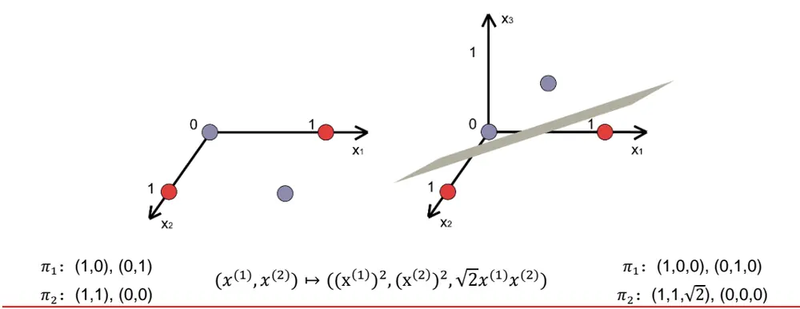
资料来源：华泰证券研究所

核支持向量机的核心思想正是将非线性分类转化为线性分类。首先通过非线性映射φ把原始数据x变换到高维特征空间，随后使用线性支持向量机对高维空间下的数据进行分类，从而解决非线性分类问题：

$$
{\pmb x}\mapsto\phi({\pmb x})=(\phi_{1}({\pmb x}),\dots,\phi_{k}({\pmb x}),\dots)
$$

实际应用中，在高维空间下优化对偶问题目标函数的计算量过大，人们使用核函数的技巧，绕开了高维特征的显式表达，从而巧妙地规避了“维数灾难”的问题。下面我们将对核函数的概念以及核支持向量机进行介绍。

## 核函数

将原始数据x通过非线性映射 $i\phi$ 变换到高维数据 $\phi({\pmb x})$ 后，线性支持向量机对偶问题的目标函数为：

$$
\operatorname*{max}_{\alpha}[{\sum}_{i=1}^{n}\alpha_{i}-{\frac{1}{2}}{\sum}_{i,j=1}^{n}y_{i}y_{j}\alpha_{i}\alpha_{j}\phi({\pmb x}_{i})^{T}\phi\big({\pmb x}_{j}\big)]
$$

$\phi(\pmb{x}_{i})$ 和 $\phi(\boldsymbol{x}_{j})$ 的计算均在高维特征空间进行，计算量巨大。幸运的是，目标函数里的$\phi(\pmb{x}_{i})^{T}\phi(\pmb{x}_{j})$ 实质上是两个向量的内积，记为 $\langle\phi(\pmb{x}_{i}),\phi(\pmb{x}_{j})\rangle$ 。而任意一种映射方式 $\phi$ 的内积$\langle\phi(\pmb{x}_{i}),\phi(\pmb{x}_{j})\rangle$ ，可以用一个确定的核函数K $[({\pmb x}_{i},{\pmb x}_{j})$ 加以刻画。核函数的计算只需要在低维特征空间进行，从而大大减少了运算复杂度。例如，图表 5 中二维平面到三维空间的非线性 映 射 $(x^{(1)},x^{(2)})\mapsto((\mathtt{x}^{(1)})^{2},(\mathtt{x}^{(2)})^{2},\sqrt{2}x^{(1)}x^{(2)})$ 下 的 内 积 可 以 用 核 函 数 $K({\pmb x}_{i},{\pmb x}_{j})=$ $\langle\pmb{x}_{i},\pmb{x}_{j}\rangle^{2}$ 刻画，证明过程参见图表 6。

图表6： 一种映射方式下的内积和核函数等价关系的实例

低维特征： $\pmb{x}=((\mathtt{x}^{(1)})^{2},(\mathtt{x}^{(2)})^{2})$ ；高维特征： $\phi({\pmb x})=(\phi_{1}({\pmb x}),\phi_{2}({\pmb x}),\phi_{3}({\pmb x}))$

映射方式 $\mathbb{\Delta}\pmb{x}\mapsto\phi(\pmb{x})\colon(x^{(1)},x^{(2)})\mapsto((\mathtt{x}^{(1)})^{2},(\mathtt{x}^{(2)})^{2},\sqrt{2}x^{(1)}x^{(2)})$

核函数： $K\big(\pmb{x}_{i},\pmb{x}_{j}\big)=\langle\pmb{x}_{i},\pmb{x}_{j}\rangle^{2}$

内积和核函数的等价性： $\begin{array}{r}{\langle\phi(\pmb{x}_{i}),\phi(\pmb{x}_{j})\rangle=\sum_{k=1}^{3}\phi_{k}(\pmb{x}_{i})\phi_{k}(\pmb{x}_{j})}\end{array}$

$$
1=\left[x_{i}^{(1)}x_{j}^{(1)}\right]^{2}+\left[x_{i}^{(2)}x_{j}^{(2)}\right]^{2}+\left[\sqrt{2}x_{i}^{(1)}x_{i}^{(2)}\right]\left[\sqrt{2}x_{j}^{(1)}x_{j}^{(2)}\right]=\left[x_{i}^{(1)}x_{j}^{(1)}+x_{i}^{(2)}x_{j}^{(2)}\right]^{2}=\langle\boldsymbol{x}_{i},\boldsymbol{x}_{j}\rangle^{2}=K\big(\boldsymbol{x}_{i},\boldsymbol{x}_{j}\big).
$$

资料来源：华泰证券研究所

我们用核函数代替高维特征空间下的内积，得到对偶问题的目标函数：

$$
\operatorname*{max}_{\alpha}[{\sum}_{i=1}^{n}\alpha_{i}-{\frac{1}{2}}{\sum}_{i,j=1}^{n}y_{i}y_{j}\alpha_{i}\alpha_{j}K({\pmb x}_{i},{\pmb x}_{j})].
$$

约束条件为： $\begin{array}{r}{0\leq\alpha_{i}\leq C,\quad\sum_{i=1}^{n}\alpha_{i}y_{i}=0}\end{array}$ 。对于一个新的样本x，我们可以计算判别函数$\begin{array}{r}{f(\pmb{x})=\widehat{\pmb{w}}^{T}\pmb{x}+\widehat{b}=\sum_{i=1}^{n}\widehat{\alpha}_{i}y_{i}K(\pmb{x}_{i},\pmb{x})+\widehat{b}}\end{array}$ 。然后根据判别函数f(x)的值大于（或小于）零判断样本x属于哪个类别。注意到目标函数不包含低维到高维映射方式的显式表达，仅和核函数的选取有关，因此这种分类器称为核支持向量机（Kernel SVM）。

任意一种映射方式都对应一个确定的核函数，理论上任何满足一定数学性质的核函数都可以成为核支持向量机的核函数。在实际应用中，通常使用线性核、多项式核、Sigmoid 核和高斯核，具体的函数表达式如图表 7。其中线性核等价于线性支持向量机。d 阶多项式核本质上将 m 维空间映射到C(m +d,d)维空间。Sigmoid 核相当于多层神经网络。高斯核较为特别，通过指数函数的泰勒展开可以证明，高斯核相当于将原始数据映射到无穷维空间。

图表7： 核支持向量机常用核函数

1． 线性核： $\begin{array}{r}{K\big(\pmb{x}_{i},\pmb{x}_{j}\big)=\langle\pmb{x}_{i},\pmb{x}_{j}\rangle=\sum_{k=1}^{p}x_{i}^{(k)}x_{j}^{(k)}}\end{array}$

2． 多项式核： $\begin{array}{r}{K\big(\pmb{x}_{i},\pmb{x}_{j}\big)=\big(\gamma\langle\pmb{x}_{i},\pmb{x}_{j}\rangle+1\big)^{d}=(\gamma\sum_{k=1}^{p}x_{i}^{(k)}x_{j}^{(k)}+1)^{d}}\end{array}$ ，其中 d是多项式的阶数

3． Sigmoid 核： $K(\boldsymbol{x}_{i},\boldsymbol{x}_{j})=\tanh(\gamma\langle\boldsymbol{x}_{i},\boldsymbol{x}_{j}\rangle+1)=\tanh(\gamma\sum_{k=1}^{p}x_{i}^{(k)}x_{j}^{(k)}+1)$

4． 高斯核（RBF核）： $K(\boldsymbol{x}_{i},\boldsymbol{x}_{j})=\exp(-\gamma(\sum_{k=1}^{p}(x_{i}^{(k)}-x_{j}^{(k)})^2))$

资料来源：华泰证券研究所

不同核函数的分类性能和分类边界不尽相同。图表 8展示了对同一组数据使用不同核函数的分类表现。线性核的分类边界为直线，多项式核、Sigmoid 核和高斯核的分类边界在高维空间中为超平面，在原始空间中为曲线。线性核、低阶多项式核和 Sigmoid 核计算速度快，不容易过拟合，但是在复杂分类问题下表现不佳。高阶多项式核和高斯核的优点是能够求解复杂的边界，对训练样本的分类能力强大，缺点是计算速度缓慢，并且可能导致过拟合。实际使用中需要根据数据自身的特点，选择最合适的核函数。

图表8： 不同核函数的支持向量机（线性核、3阶多项式核、7阶多项式核、Sigmoid核和高斯核）
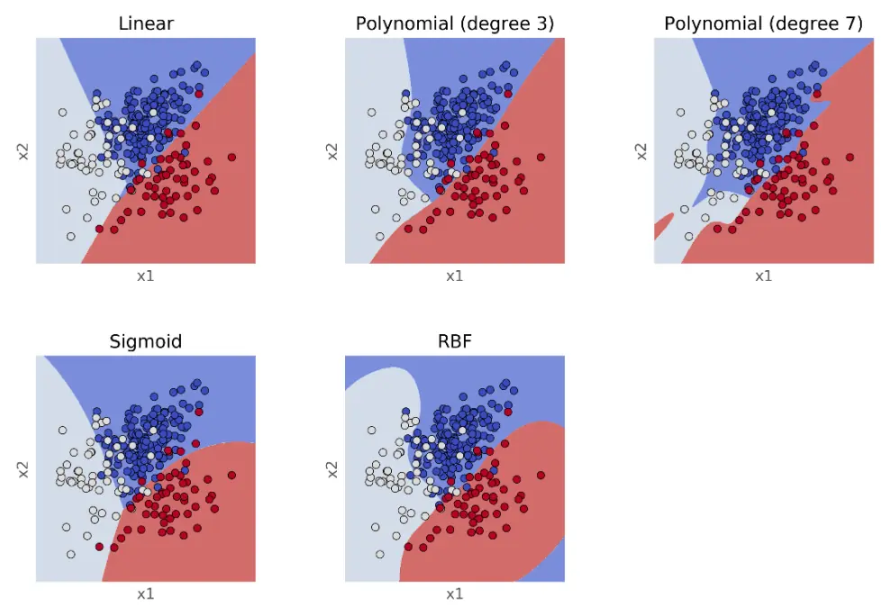
资料来源：华泰证券研究所

## γ 值

之前我们介绍了影响支持向量机性能的重要参数——惩罚系数 C，这里我们介绍另一个核支持向量机的重要参数——γ值。如图表 7所示，多项式核、Sigmoid 核和高斯核的核函数都包含γ值一项。γ决定了原始数据映射到高维数据后，在高维特征空间中的分布。γ越大，样本在高维空间中的分布越稀疏，样本之间间隔越远，更容易被分类边界区分开来，因而训练集正确率更高，也更容易导致过拟合。

图表 9展示了γ值对高斯核支持向量机分类结果的影响。左图中的γ值较小，分类边界较为简单，分类器基本能够区分三类样本，然而无法正确判别部分极端样本。右图中的γ值较大，分类边界极为复杂，分类器学习了更多极端样本，训练集正确率非常高，但是出现了过拟合。实际应用中，过小和过大的γ都会使得分类性能受损。通常对γ进行遍历，选择使得交叉验证集正确率最高的γ作为模型最终的参数。

我们可以同时对惩罚系数 C 和 γ 值进行遍历，在 C 和 γ 组成的二维参数矩阵中，依次检验每一对参数的效果。这种方法称为网格搜索（Grid Search），网格搜索较为费时，但是能够得到全局最优的参数。随后我们将逐一测试各种核函数的支持向量机，同时使用网格搜索等方法进行参数寻优。

图表9： γ值对高斯核 SVM分类结果的影响
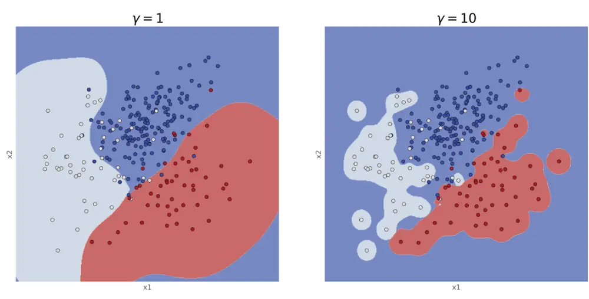
资料来源：华泰证券研究所

## 模型评价指标

在人工智能系列第一篇报告中，我们介绍了常见的模型评价指标。对于分类问题，除了分类正确率（Accuracy）之外，召回率（Recall，又称敏感度 Sensitivity）、精确率（Precision）、虚报率和特异度（Specificity），都是衡量模型好坏的常用指标，详细定义如图表 10所示。

图表10： 常用模型评价指标

| 真实情况=阳性 | 真实情况=阴性 |  |  |
| --- | --- | --- | --- |
| 预测结果=阳性 |  |  | 命中 精确率= |
|  | 命中 | 虚报 | 命中+虚报 |
| 预测结果=阴性 漏报 |  | 正确拒绝 |  |
|  |  | 虚报 | 命中+正确拒绝 |
| 召回率(敏感度) = | 命中 | 虚报率= 虚报+正确拒绝 | 正确率= 命中+正确拒绝+漏报+虚报 |
|  | 命中+漏报 |  |  |
|  |  | 正确拒绝 特异度= 虚报+正确拒绝 |  |

资料来源：华泰证券研究所

在众多模型评价指标中，正确率概念清晰并且计算简便，使用较为广泛。然而在一些特定场景，正确率并不是最好的指标。以多因子选股的支持向量机模型为例。我们可以得到股票下期上涨或下跌的预测值f(x)，表示样本到分类超平面的距离，是一个连续值。我们以0 作为分类阈值，对f(x)进行二值化处理，得到预测的分类标签ŷ，随后和真实的分类标签y进行比较，计算正确率、召回率、虚报率等各项指标。

在实际应用中，我们的目标不仅仅是对股票进行正确分类，更多的时候是希望选择预测值最高，即上涨可能性最大的一小部分股票进行投资。更切实际的做法是设定一个更严格的分类阈值，例如以+1作为分类阈值，此时预测上涨的股票数将变少，虚报率降低，然而召回率也随之降低，正确率未必上升。通俗地说，当法律更严格时，抓住的坏人更多，错杀的好人也更多，社会风气并不一定会更好。由此可见，当我们侧重于某一类别的样本，或者两类样本数量不均等时，正确率、召回率、虚报率并不是稳定的评价指标，其具体大小不仅取决于分类器性能，还和分类阈值密切相关。

是否有一种评价指标和分类阈值的选取无关，从而忠实地反映分类器性能呢？接受者操作特征曲线（Receiver Operating Characteristic Curve，ROC 曲线）的曲线下面积（AreaUnder Curve，AUC）是一个较好的选择。ROC的思想是对所有分类阈值可能的取值进行遍历，每一个分类阈值计算对应的虚报率和召回率，以虚报率为横轴，召回率为纵轴，将所有点顺次连接可以得到一条曲线，如图表 11 所示。

图表11： ROC曲线示意图
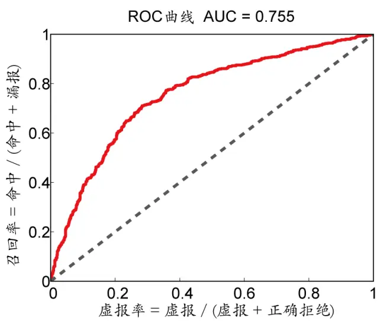
资料来源：Wind，华泰证券研究所

当分类阈值取最小值时，对应于 ROC曲线右上角的点。此时分类标准最为宽松，所有样本均标记成正例，召回率和虚报率都等于 1。当分类阈值取最大值时，对应于 ROC 曲线左下角的点。此时分类标准最为严格，所有样本均标记成负例，召回率和虚报率都等于 0。真正反映分类器性能的点在 ROC 曲线的中段。理想的情形是当分类阈值取一个合适的值时，召回率尽可能高，而虚报率尽可能低，ROC 曲线靠近左上角。反之，对于一个随机反应的分类器，召回率和虚报率同步提升或降低，此时 ROC 曲线与对角线重合。

我们将 ROC曲线的形态特征总结为一个指标——ROC 曲线下覆盖的总面积 AUC，AUC的值在 0.5 到 1之间。分类器性能越好，ROC曲线越接近左上角，AUC 的值接近 1；分类器性能越差，ROC 曲线越接近对角线，AUC 的值接近 0.5。总的来说，AUC 避免了分类阈值对评价指标的干扰，适用于侧重某一类别的样本，或者两类样本数量不均等的情形，比传统的正确率等指标具有更强的普适性。我们在后续的测试中，将使用 AUC 作为调参的主要依据。

## 支持向量机模型测试流程

图表12： 支持向量机模型构建示意图
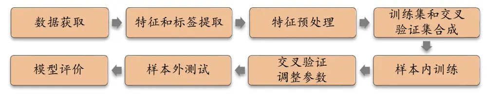
资料来源：华泰证券研究所

如图表 12 所示，支持向量机模型的构建方法包含下列步骤：

## 1． 数据获取：

a) 股票池：沪深 300 成份股/中证 500 成份股/全 A股。剔除 ST 股票，剔除每个截面期下一交易日停牌的股票，剔除上市 3 个月内的股票，每只股票视作一个样本。

b) 样本内区间：2005-01-31 至 2011-12-31 共 72 个月末截面期。

c) 样本外区间：2011-01-31 至 2017-04-28 共 76 个月末截面期。

2． 特征和标签提取：每个自然月的最后一个交易日，计算之前报告里的 70 个因子暴露度，作为样本的原始特征；计算下一整个自然月的个股超额收益（以沪深 300 指数为基准），作为样本的标签。因子池如图表 13 所示。

## 3． 特征预处理：

a) 中位数去极值：设第 T 期某因子在所有个股上的暴露度序列为 $D_{i},~D_{M}$ 为该序列中位数， $D_{M1}$ 为序列 $|D_{i}-D_{M}$ |的中位数，则将序列 $D_{i}$ 中所有大于 ${}^{1}D_{M}+5D_{M1}$ 的数重设为 $D_{M}+5D_{M1}$ ，将序列 $D_{i}$ 中所有小于 $D_{M}-5D_{M1}$ 的数重设为 $D_{M}-5D_{M1}$ ；

b) 缺失值处理：得到新的因子暴露度序列后，将因子暴露度缺失的地方设为中信一级行业相同个股的平均值。

c) 行业市值中性化：将填充缺失值后的因子暴露度对行业哑变量和取对数后的市值做线性回归，取残差作为新的因子暴露度。

d) 标准化：将中性化处理后的因子暴露度序列减去其现在的均值、除以其标准差，得到一个新的近似服从N(0,1)分布的序列。

e) 主成分分析：为避免特征之间的共线性，对 70 个标准化处理后的因子暴露度进行主成分分析，得到 70 个维度转换后的新特征。

## 4． 训练集和交叉验证集的合成：

a) 分类问题：对于支持向量机模型（以下简称 SVM），在每个月末截面期，选取下月收益排前、后 30%的股票分别作为正例（y = 1）、负例（y = −1）。将 72 个月样本合并，随机选取 90%的样本作为训练集，余下 10%样本作为交叉验证集。

b) 回归问题：对于支持向量回归模型（以下简称 SVR），直接将 72 个月的样本合并成为样本内数据，同样按 90%和 10%的比例划分训练集和交叉验证集。

5． 样本内训练：使用 SVM 或 SVR 对训练集进行训练。SVM 选取五种不同类型的核函数：线性核，3 阶多项式核，7 阶多项式核，Sigmoid 核以及高斯核。SVR 选取高斯核。同时使用上一篇报告中的 12 个月滚动回测的线性回归模型作为统一对照组。全部模型如图表 14 所示。

6． 交叉验证调参：模型训练完成后，使用该模型对交叉验证集进行预测。选取交叉验证集 AUC 最高（SVM）或 IC值最高（SVR）的一组参数作为模型的最优参数。

7． 样本外测试：确定最优参数后，以 T 月月末截面期所有样本（即个股）预处理后的特征作为模型的输入，得到每个样本的 T+1 月的预测值f(x)（判别函数值，即样本到分类超平面的距离），可以根据该预测值构建策略组合，具体细节参考下文。

8． 模型评价：评价指标包括两方面，一是测试集的正确率、AUC 等衡量模型性能的指标；二是上一步中构建的策略组合的各项表现（包括年化超额收益率、信息比率等等）。

图表13： 选股模型中涉及的全部因子及其描述

| 大类因子具体因子 | 因子描述 | 因子方向 |  |
| --- | --- | --- | --- |
| 估值 EP |  | 净利润（TTM）/总市值 |  |
| 估值 EPcut |  | 扣除非经常性损益后净利润（TTM）/总市值 |  |
| 估值 BP | 净资产/总市值 |  |  |
| 估值 SP | 营业收入（TTM）/总市值 |  |  |
| 估值 NCFP |  | 净现金流（TTM）/总市值 |  |
| 估值 OCFP |  | 经营性现金流（TTM）/总市值 |  |
| 估值 DP |  | 近12个月现金红利（按除息日计）/总市值 |  |
| 估值 G/PE |  | 净利润（TTM）同比增长率/PE_TTM |  |
| 成长 Sales_G_q |  | 营业收入（最新财报，YTD）同比增长率 |  |
| 成长 Profit_G_q |  | 净利润（最新财报，YTD）同比增长率 |  |
| 成长 OCF_G_q |  | 经营性现金流（最新财报，YTD）同比增长率 |  |
| 成长 ROE_G_q |  | ROE（最新财报，YTD）同比增长率 |  |
| 财务质量 ROE_q |  | ROE（最新财报，YTD） |  |
| 财务质量 ROE_ttm | ROE（最新财报，TTM） |  |  |
| 财务质量 ROA_q |  | ROA（最新财报，YTD） |  |
| 财务质量 ROA_ttm 财务质量grossprofitmargin_q |  | ROA（最新财报，TTM） |  |
| 财务质量grossprofitmargin_ttm |  | 毛利率（最新财报，YTD） |  |
| 财务质量 profitmargin_q |  | 毛利率（最新财报，TTM） |  |
| 财务质量 profitmargin_ttm |  | 扣除非经常性损益后净利润率（最新财报，YTD） |  |
| 财务质量 assetturnover_q |  | 扣除非经常性损益后净利润率（最新财报，TTM） |  |
| 财务质量 assetturnover_ttm |  | 资产周转率（最新财报，YTD） |  |
| 财务质量operationcashflowratio_q |  | 资产周转率（最新财报，TTM） |  |
| 财务质量operationcashflowratio_ttm |  | 经营性现金流/净利润（最新财报，YTD） |  |
| 杠杆 |  | 经营性现金流/净利润（最新财报，TTM） |  |
| 杠杆 | financial_leverage | 总资产/净资产 |  |
| 杠杆 | debtequityratio | 非流动负债/净资产 |  |
| 杠杆 | cashratio | 现金比率 |  |
| 市值 In_capital | currentratio | 流动比率 |  |
| 动量反转HAlpha |  | 总市值取对数 个股60个月收益与上证综指回归的截距项 |  |
| 动量反转return_Nm |  | 个股最近N个月收益率，N=1，3，6，12 |  |
| 动量反转wgt_return_Nm |  | 个股最近N个月内用每日换手率乘以每日收益率求算术平均 |  |
| 动量反转 exp_wgt_return_Nm |  | -1 值，N=1，3，6，12 -1 |  |
| 波动率 std_FF3factor_Nm |  | 个股最近 N 个月内用每日换手率乘以函数 exp(-x_i/N/4)再乘 |  |
|  |  | 以每日收益率求算术平均值，X_i为该日距离截面日的交易日 |  |
|  |  | 的个数，N=1，3，6，12 特质波动率 一个股最近 N 个月内用日频收益率对 Fama | -1 |
| 波动率 std_Nm |  | French三因子回归的残差的标准差，N=1，3，6，12 个股最近N个月的日收益率序列标准差，N=1，3，6，12 | -1 |
| 股价 | In_price | 股价取对数 | -1 |
| beta | beta | 个股60个月收益与上证综指回归的 beta | -1 |
| 换手率 | turn_Nm | 个股最近N个月内日均换手率(剔除停牌、涨跌停的交易日)， | -1 |
|  |  | N=1, 3, 6, 12 | -1 |
| 换手率 | bias_turn_Nm | 个股最近N个月内日均换手率除以最近2年内日均换手率(剔 除停牌、涨跌停的交易日）再减去1，N=1，3，6，12 |  |
| 情绪 | rating_average | wind 评级的平均值 | 1 1 |
| 情绪 情绪 | rating_change | wind评级（上调家数-下调家数）/总数 | 1 |
|  | rating_targetprice | wind一致目标价/现价-1 | 1 |
| 股东 | holder_avgpctchange | 户均持股比例的同比增长率 | -1 |
| 技术 | MACD | 经典技术指标（释义可参考百度百科），长周期取30日，短 |  |
| 技术 | DEA |  | -1 |
| 技术 | DIF | 周期取 10日，计算 DEA 均线的周期（中周期）取15 日 | -1 |
| 技术 | RSI | 经典技术指标，周期取20日 | -1 |
| 技术 | PSY | 经典技术指标，周期取20日 | -1 |
| 技术 | BIAS | 经典技术指标，周期取20日 | -1 |

资料来源：Wind，华泰证券研究所

图表14： 全部测试模型一览

| 大类方法 | 核函数 | 参数设定 (沪深 300 选股) | 参数设定 (中证 500 选股) | 参数设定 (全 A 选股) |
| --- | --- | --- | --- | --- |
| 支持向量机 (SVM，分类) | 线性核 | C=1e-4 | C=0.003 | C=3e-4 |
|  | 3阶多项式核 | C=0.003，γ=0.03 | C=0.001，γ=0.03 | C=0.1，γ =0.01 |
|  | 7阶多项式核 | C=0.03,γ =0.01 | C=3e-4，γ =0.001 | C=1e-4, γ =0.003 |
|  | Sigmoid 核 | C=3, γ =3e-5 | C=0.03，γ=0.01 | C=10, γ =3e-5 |
| 支持向量回归 | 高斯核 | C=1, γ =3e-5 | C=0.1， γ =0.003 | C=1，γ=0.01 |
| (SVR，回归) 线性回归 | 高斯核 | C=0.03，γ=0.03 | C=0.003，γ=0.01 | C=0.1，γ =0.01 |
| (统一对照组) |  |  |  |  |

资料来源：Wind，华泰证券研究所

## 支持向量机模型测试结果

## 核支持向量机

惩罚系数 C 和γ值是支持向量机模型最重要的两个参数。我们希望同时对 C 和γ值进行遍历，找到全局最优解。参数寻优最常用的方法是网格搜索。下面我们以高斯核 SVM 模型（全 A 选股）为例，展示网格搜索的过程。取 C = (0.01, 0.03, 0.1, 0.3, 1, 3, 10)，γ= (1e-4,3e-4, 1e-3, 3e-3, 0.01, 0.03, 0.1, 0.3, 1)，测试每一组 C 和γ值，得到交叉验证集的 AUC值，结果如图表 15 所示，全局最优解为 C=1，γ=0.01。我们同时在图表 16 中展示了交叉验证集和测试集的正确率、AUC 和预测值与收益相关系数的详细结果。

图表15： 高斯核 SVM模型（全 A选股）C和γ网格搜索交叉验证集 AUC结果
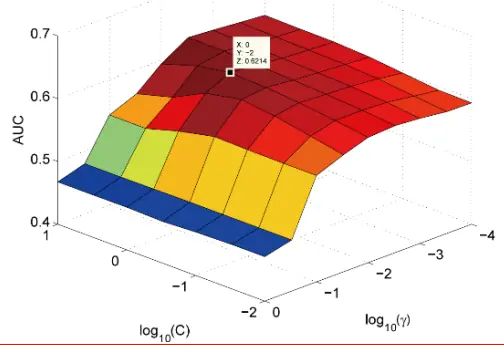
资料来源：华泰证券研究所

图表16： 高斯核 SVM模型（全 A选股）网格搜索交叉验证集/测试集各评价指标详细结果
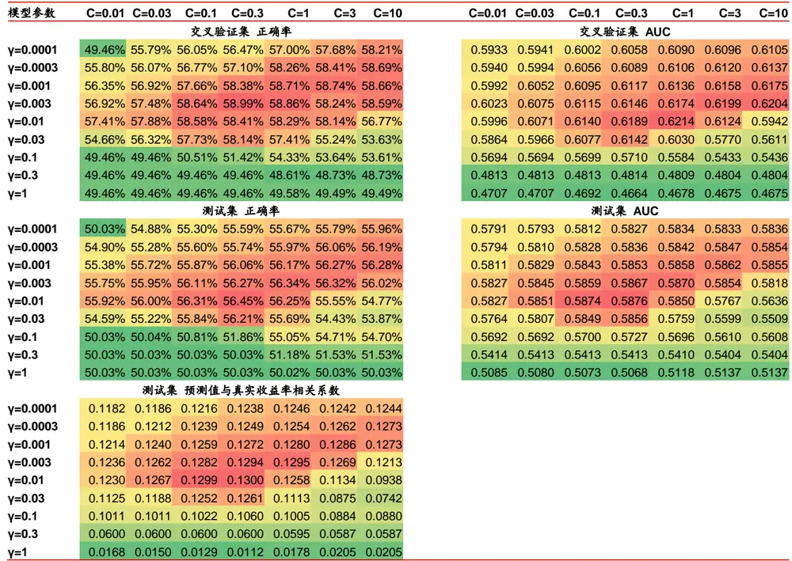
资料来源：Wind，华泰证券研究所

对于其它模型，我们采用相同的方法进行参数优化。下图展示了 Sigmoid 核 SVM 模型（全A选股）的参数优化过程。其余模型将不再赘述。

图表17： Sigmoid核 SVM 模型（全 A选股）C和γ网格搜索交叉验证集 AUC结果
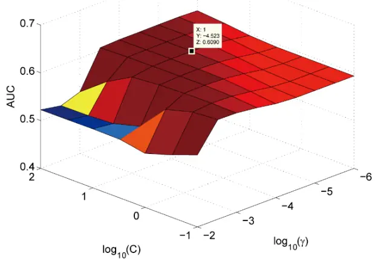
资料来源：华泰证券研究所

图表18： Sigmoid核 SVM 模型（全 A选股）网格搜索交叉验证集/测试集各评价指标详细结果
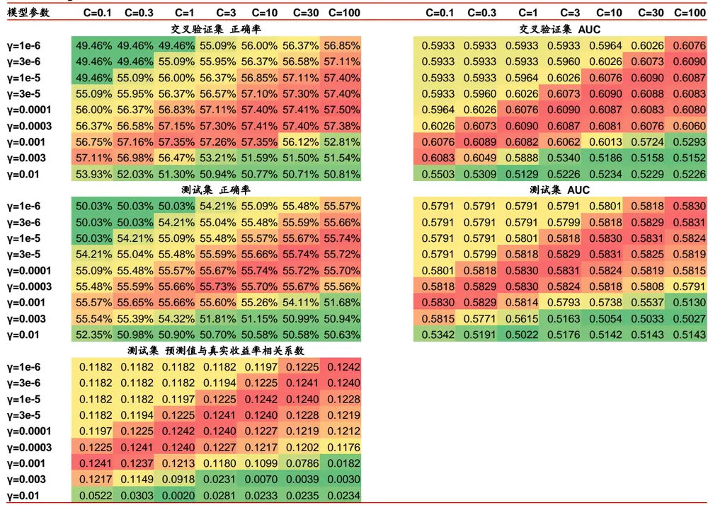
资料来源：Wind，华泰证券研究所

## 模型正确率与 AUC 分析

下图展示了高斯核 SVM 模型（C=1，γ=0.01）和第二篇广义线性模型报告中表现最好的SGD+hinge 损失模型（12个月滚动训练）每一期测试集的正确率和 AUC 随时间的变化情况。高斯核SVM模型样本内训练集和交叉验证集合正确率分别为65.4%和58.3%，AUC分别为 0.718 和 0.621。样本外平均正确率为 56.3%，平均 AUC 为 0.585。SGD+hinge损失模型样本外平均正确率为 55.7%，平均 AUC 为 0.581。两种方法分类表现基本相近，高斯核 SVM 模型稍有优势。

图表19： 高斯核 SVM模型和 SGD+hinge损失模型样本外正确率
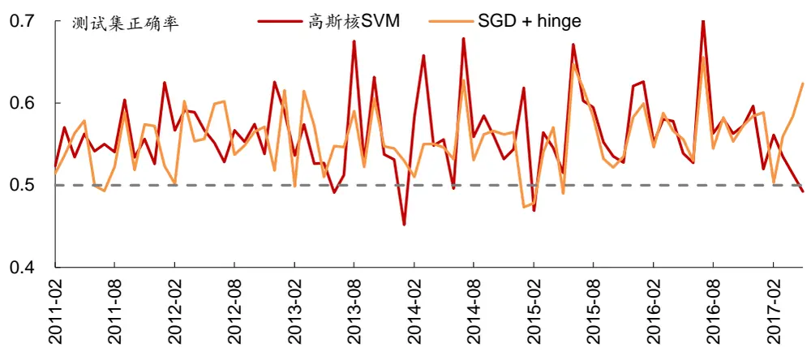
资料来源：Wind，华泰证券研究所

图表20： 高斯核 SVM 模型和 SGD+hinge 损失模型样本外 AUC 值
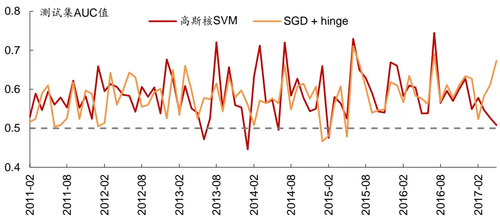
资料来源：Wind，华泰证券研究所

## 模型预测值与各因子相关情况

我们在每个截面上，将高斯核 SVM 模型（C=1，γ=0.01）对全部个股下期涨跌的预测值与因子池中各个因子值之间计算 Spearman 相关系数，查看模型预测值与各个因子值之间“真实的”相关情况，如下图所示。我们发现，与线性模型类似，预测值与反转、波动率、换手率、技术等交易类型因子关联性较为紧密，与基本面类型因子关联性较弱。不过与线性模型的对应图表相比，下图中的每一行（对应一个固定的因子）颜色更加均匀、波动更小。是因为我们本文中所讨论的模型在样本外回测区间中每个截面期都只改变输入的因子值、不改变因子的使用方式；而线性回归模型每个截面期都重新回归拟合参数，相当于改变了因子的使用方式——这也是本文中模型与线性回归模型的一个关键的区别点。我们也可以换一种说法，线性回归模型依赖于动态的因子收益动量效应，其预测值与因子间的相关性会波动更大一点。

图表21： 高斯核 SVM模型对于下期涨跌预测值与本期因子值之间相关系数示意图
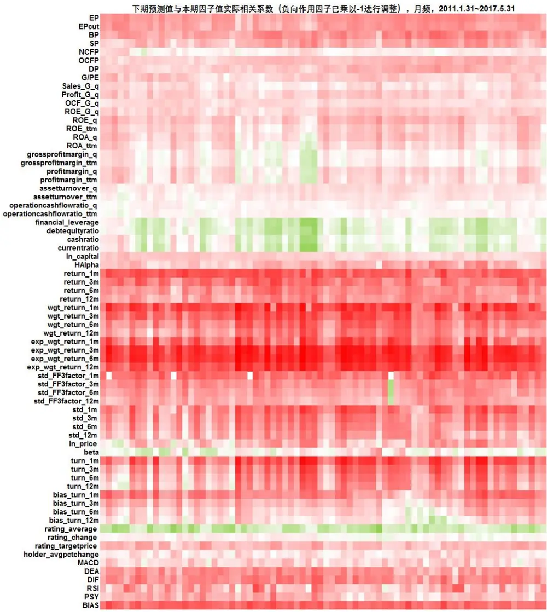
资料来源：华泰证券研究所

## 分层回测分析

依照因子值对股票进行打分，构建投资组合回测，是最直观的衡量因子优劣的手段。SVM属于分类器，最终在每个月底可以产生对全部个股下月上涨或下跌的预测值（即到分类超平面的距离）；SVR 属于回归模型，在每个月底可以产生对全部个股下月收益的预测值。因此可以将两者都看作一个因子合成模型，即在每个月底将因子池中所有因子合成为一个“因子”。接下来，我们对该模型合成的这个“因子”（即个股下期预测值）进行分层回测，从各方面考察该模型的效果。仿照华泰单因子测试系列报告中的思路，分层回测模型构建方法如下：

1. 股票池：全 A 股，剔除 ST 股票，剔除每个截面期下一交易日停牌的股票，剔除上市3 个月以内的股票。

2. 回溯区间：2011-01-31 至 2017-05-31。

3. 换仓期：在每个自然月最后一个交易日核算因子值，在下个自然月首个交易日按当日收盘价换仓。

4. 数据处理方法：将支持向量机模型的预测值视作单因子，因子值为空的股票不参与分层。

5. 分层方法：在每个一级行业内部对所有个股按因子大小进行排序，每个行业内均分成N 个分层组合。如图表 14 所示，黄色方块代表各行业内个股初始权重，可以相等也可以不等（我们直接取相等权重进行测试），分层具体操作方法为 N 等分行业内个股权重累加值，例如图示行业1中，5只个股初始权重相等（不妨设每只个股权重为0.2），假设我们欲分成 3 层，则分层组合 1在权重累加值 1/3 处截断，即分层组合 1包含个股 1 和个股 2，它们的权重配比为 0.2:(1/3-0.2)=3:2，同样推理，分层组合 2 包含个股 2、3、4，配比为(0.4-1/3):0.2:(2/3-0.6)=1:3:1，分层组合 4 包含个股 4、5，配比为 2:3。以上方法是用来计算各个一级行业内部个股权重配比的，行业间权重配比与基准组合（我们使用沪深 300）相同，也即行业中性。

6. 评价方法：回测年化收益率、夏普比率、信息比率、最大回撤、胜率等。

图表22： 单因子分层测试法示意图
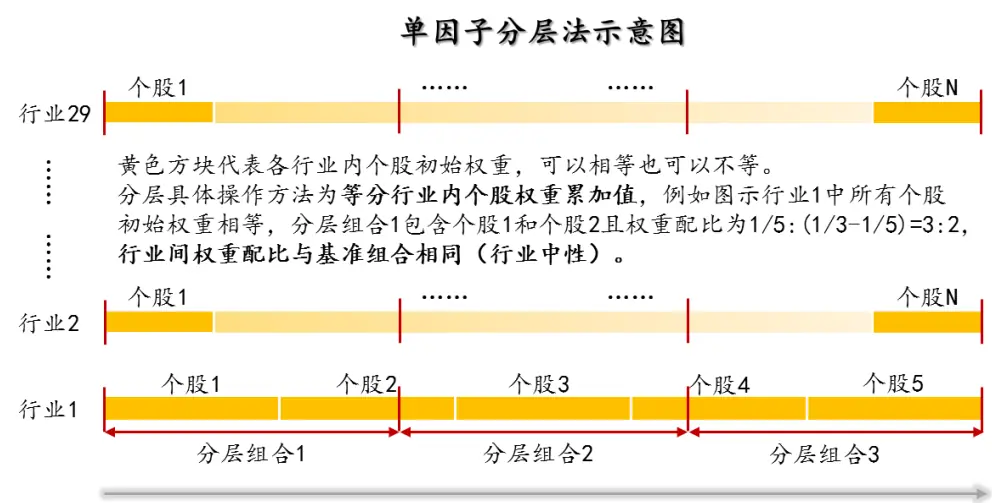
行业内个股按因子值排序
资料来源：华泰证券研究所

这里我们将展示高斯核 SVM 模型（C=1，γ=0.01）的分层测试结果。

下图是分五层组合回测绩效分析表（20110131～20170531）。其中组合 1～组合 5为按该因子从小到大排序构造的行业中性的分层组合。基准组合为行业中性的等权组合，具体来说就是将组合 1～组合 5 合并，一级行业内部个股等权配置，行业权重按当期沪深 300 行业权重配置。多空组合是在假设所有个股可以卖空的基础上，每月调仓时买入组合 1，卖空组合 5。回测模型在每个自然月最后一个交易日核算因子值，在下个自然月首个交易日按当日收盘价调仓。

图表23： 高斯核 SVM 模型分层组合绩效分析（20110131～20170531）

| 投资组合 | 年化收益率 | 年化波动率夏普比率最大回撤 |  |  | 年化超额收益率 | 超额收益年化波动率信息比率 |  | 相对基准月胜率 | 超额收益最大回撤 |
| --- | --- | --- | --- | --- | --- | --- | --- | --- | --- |
| 组合1 | 19.78% | 27.39% | 0.72 | 44.31% | 8.64% | 3.43% | 2.52 | 67.61% | 5.59% |
| 组合2 | 14.98% | 27.53% | 0.54 | 47.67% | 4.29% | 2.90% | 1.48 | 55.75% | 3.66% |
| 组合3 | 8.83% | 27.49% | 0.32 | 49.71% | -1.29% | 2.56% | -0.50 | 39.15% | 11.29% |
| 组合4 | 1.79% | 27.22% | 0.07 | 51.25% | -7.67% | 2.79% | -2.75 | 13.05% | 40.09% |
| 组合5 | -7.93% | 27.87% | -0.28 | 58.74% | -16.49% | 3.93% | -4.20 | 7.12% | 67.29% |
| 基准组合 | 10.25% | 27.34% | 0.37 | 49.05% |  |  |  |  |  |
| 多空组合 | 30.10% | 6.48% | 4.64 | 6.89% |  |  |  |  |  |

资料来源：Wind，华泰证券研究所

下面四个图依次为：

1.分五层组合回测净值图。按前面说明的回测方法计算组合 1～组合 5、基准组合的净值，与沪深 300、中证 500 净值对比作图。

2.分五层组合回测，用组合 1～组合 5的净值除以基准组合净值的示意图。可以更清晰地展示各层组合在不同时期的效果。

3.组合 1相对沪深 300 月超额收益分布直方图。该直方图以[-0.5%,0.5%]为中心区间，向正负无穷方向保持组距为 1%延伸，在正负两个方向上均延伸到最后一个频数不为零的组为止（即维持组距一致，组数是根据样本情况自适应调整的）。

4.分五层时的多空组合收益图。再重复一下，多空组合是买入组合 1、卖空组合 5（月度调仓）的一个资产组合。多空组合收益率是由组合 1 的净值除以组合 5的净值近似核算的。

图表24： 高斯核 SVM模型分层组合回测净值
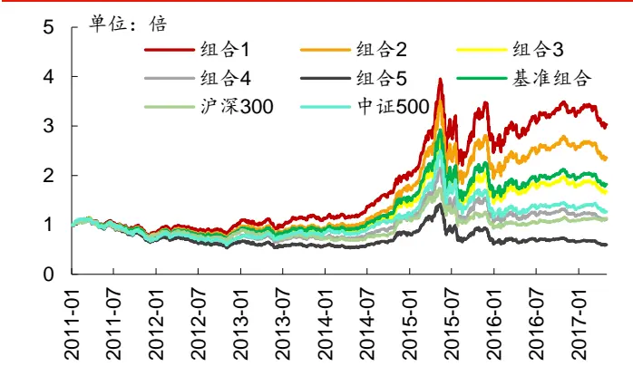
资料来源：Wind，华泰证券研究所

图表25： 高斯核 SVM模型各层组合净值除以基准组合净值示意图
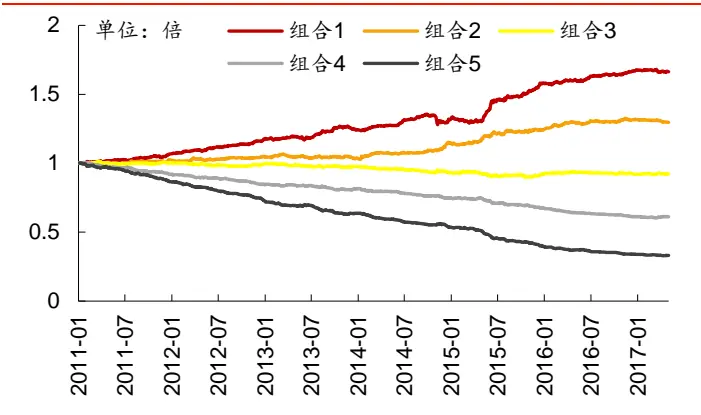
资料来源：Wind，华泰证券研究所

图表26： 高斯核 SVM模型分层组合1相对沪深 300月超额收益分布图
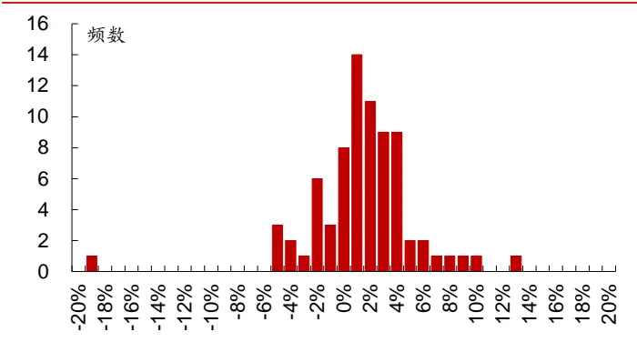
资料来源：Wind，华泰证券研究所

图表27： 高斯核 SVM模型多空组合月收益率及累积收益率
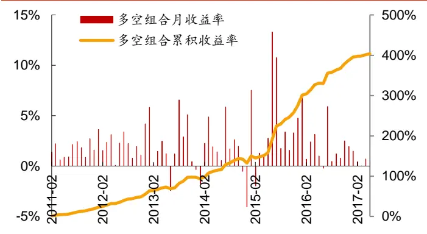
资料来源：Wind，华泰证券研究所

下图为分十层组合回测时，各层组合在不同年份间的收益率及排名表。每个单元格的内容为在指定年度某层组合的收益率（均为整年收益率），以及某层组合在全部十层组合中的收益率排名。最后一列是分层组合在 2011～2017 的排名的均值。

图表28： 高斯核 SVM模型组合在不同年份的收益及排名分析（分十层）

|  | 2011 | 2012 | 2013 | 2014 | 2015 | 2016 | 2017 | 排名均值 |
| --- | --- | --- | --- | --- | --- | --- | --- | --- |
| 组合1 | -20.5%(1) | 26.1%(1) | 15.4%(2) | 83.2%(1) | 59.4%(1) | 4.6%(3) | -9.7%(5) | 1.58 |
| 组合2 | -23.8%(3) | 21.2%(2) | 18.8%(1) | 60.7%(5) | 51.8%(2) | 5.0%(1) | -8.3%(2) | 2.17 |
| 组合3 | -22.6%(2) | 16.7%(3) | 10.2%(4) | 82.8%(2) | 47.2%(3) | 2.3%(5) | -6.8%(1) | 2.92 |
| 组合4 | -27.2%(6) | 14.3%(4) | 7.3%(5) | 73.3%(3) | 43.3%(4) | 4.7%(2) | -13.7%(10) | 4.50 |
| 组合5 | -26.2%(5) | 10.8%(5) | 3.1%(7) | 63.3%(4) | 30.7%(5) | 2.6%(4) | -9.9%(6) | 5.08 |
| 组合6 | -23.9%(4) | 8.6%(6) | 10.5%(3) | 59.3%(6) | 21.2%(7) | -2.2%(6) | -9.0%(4) | 5.50 |
| 组合7 | -31.2%(8) | 4.4%(7) | 5.3%(6) | 53.5%(8) | 22.6%(6) | -10.3%(7) | -8.5%(3) | 6.67 |
| 组合8 | -30.6%(7) | 0.6%(8) | 0.5%(8) | 55.5%(7) | 14.4%(8) | -12.4%(8) | -10.4%(7) | 7.75 |
| 组合9 | -33.1%(9) | -3.3%(9) | -4.0%(9) | 48.7%(9) | 1.7%(9) | -17.6%(9) | -12.2%(9) | 9.00 |
| 组合10 | -36.1%(10) | -6.8%(10) | -12.0%(10) | 42.2%(10) | -8.7%(10) | -21.1%(10) | -11.4%(8) | 9.83 |

资料来源：Wind，华泰证券研究所

下图是不同市值区间分层组合回测绩效指标对比图（分十层）。我们将全市场股票按市值排名前 1/3，1/3～2/3，后 1/3 分成三个大类，在这三类股票中分别进行分层测试，基准组合构成方法同前面所述（注意每个大类对应的基准组合并不相同）。

图表29： 不同市值区间高斯核 SVM模型组合绩效指标对比图（分十层）
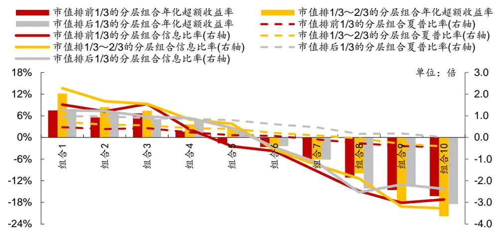
资料来源：Wind，华泰证券研究所

下图是不同行业间分层组合回测绩效分析表（分五层）。我们在不同一级行业内部都做了分层测试，基准组合为各行业内该因子非空值的个股等权组合（注意每个行业对应的基准组合并不相同）。

图表30： 不同行业高斯核 SVM模型分层组合绩效分析（分五层）

|  | 组合1年化 | 组合1 | 组合1 | 组合1 | 组合1超额收益 | 组合1相对 | 所有组合年化 |
| --- | --- | --- | --- | --- | --- | --- | --- |
| 行业 | 超额收益率 | 信息比率 | 年化收益率 | 夏普比率 | 最大回撤 | 基准月胜率 | 收益率排序 |
| 通信 | 20.47% | 2.09 | 42.73% | 1.19 | 8.99% | 64.92% | 1,2,3,4,5 |
| 家电 | 17.80% | 1.63 | 39.07% | 1.27 | 15.00% | 57.57% | 1,2,3,4,5 |
| 机械 | 17.48% | 2.67 | 28.96% | 0.87 | 6.65% | 72.28% | 1,2,3,4,5 |
| 农林牧渔 | 17.46% | 2.00 | 30.60% | 0.96 | 6.85% | 63.70% | 1,2,3,4,5 |
| 国防军工 | 17.37% | 1.42 | 25.86% | 0.63 | 14.44% | 62.47% | 1,3,2,4,5 |
| 石油石化 | 16.67% | 1.44 | 27.49% | 0.81 | 9.65% | 61.25% | 1,2,3,4,5 |
| 基础化工 | 14.91% | 2.39 | 29.01% | 0.90 | 7.44% | 73.50% | 1,2,3,4,5 |
| 有色金属 | 14.61% | 1.64 | 16.54% | 0.48 | 12.09% | 61.25% | 1,2,3,4,5 |
| 传媒 | 14.50% | 1.09 | 34.39% | 0.92 | 32.09% | 60.02% | 1,2,3,4,5 |
| 计算机 | 14.33% | 1.52 | 37.50% | 0.97 | 14.62% | 61.25% | 1,2,3,4,5 |
| 电子元器件 | 14.10% | 1.74 | 32.37% | 0.92 | 9.20% | 63.70% | 1,2,3,4,5 |
| 食品饮料 | 11.46% | 1.19 | 21.30% | 0.72 | 10.36% | 61.25% | 1,2,3,4,5 |
| 房地产 | 11.07% | 1.50 | 29.29% | 0.92 | 6.32% | 60.02% | 1,2,3,4,5 |
| 建材 电力及公用事业 | 11.00% | 1.07 | 25.16% | 0.76 | 11.36% | 56.34% | 2,1,3,4,5 |
| 电力设备 | 10.29% | 1.19 | 23.79% | 0.78 | 8.31% | 52.69% | 1,2,3,4,5 |
| 汽车 | 10.14% | 1.36 | 19.71% | 0.59 | 8.38% | 62.47% | 1,2,3,4,5 |
| 非银行金融 | 9.58% | 1.27 | 23.48% | 0.76 | 12.47% | 61.25% | 1,2,3,4,5 |
| 纺织服装 | 9.24% | 0.80 | 19.34% | 0.52 | 20.82% | 51.46% | 1,2,5,3,4 |
| 餐饮旅游 | 8.46% | 0.97 | 22.87% | 0.70 | 8.42% | 57.57% | 1,2,3,4,5 |
| 商贸零售 | 8.25% | 0.67 | 21.00% | 0.66 | 20.89% | 55.12% | 1,2,3,4,5 |
| 建筑 | 7.81% | 0.99 | 15.93% | 0.51 | 11.79% | 57.57% | 1,2,3,4,5 |
| 医药 | 7.61% | 0.79 | 20.13% | 0.64 | 18.57% | 55.12% | 1,2,3,4,5 |
| 交通运输 | 7.46% | 1.24 | 23.20% | 0.73 | 7.76% | 60.02% | 1,2,3,4,5 |
| 钢铁 | 7.32% | 0.94 | 19.27% | 0.64 | 10.76% | 53.89% | 1,2,3,4,5 |
| 煤炭 | 6.35% | 0.63 | 13.82% | 0.42 | 17.18% | 52.69% | 1,2,4,3,5 |
| 轻工制造 | 6.00% | 0.59 | -0.92% | -0.03 | 13.53% | 53.89% | 1,3,2,4,5 |
|  | 5.85% | 0.58 0.30 | 22.42% | 0.71 0.51 | 18.55% 21.15% | 51.46% 51.46% | 1,2,3,4,5 |
| 综合 | 4.02% |  | 17.30% |  |  |  | 1,3,2,4,5 |
| 银行 | -2.68% | -0.36 | 8.89% | 0.32 | 22.12% | 37.98% | 2,3,1,4,5 |

资料来源：Wind，华泰证券研究所

## 构建策略组合及回测分析

## 支持向量机核函数比较

我们比较了高斯核、线性核、3 阶多项式核、7阶多项式核、Sigmoid 核五种不同的核函数。五种方法均包含惩罚系数 C；高斯核、多项式核和 Sigmoid 核还包含参数γ值。我们对 C 和γ进行遍历，选取交叉验证集 AUC 最高的 C和γ组合作为最终选定的参数。同时以上一篇报告 12 个月滚动回测的线性回归模型作为统一对照组。

首先，我们构建了沪深 300 和中证 500 成分内选股策略并进行回测，各项指标详见图表31。选股策略分为两类：一类是行业中性策略，策略组合的行业配置与基准（沪深 300、中证 500）保持一致，各一级行业中选 N个股票等权配置（N=2,5,10,15,20）；另一类是个股等权策略，直接在票池内不区分行业选 N 个股票等权配置（N=20,50,100,150,200），比较基准取为 300 等权、500 等权指数。两类策略均为月频调仓，个股入选顺序为它们在SVM 模型中的当月的预测值顺序。

对于沪深 300 成份股内选股的行业中性策略，当每个行业选股数大于等于 10只时，除了7 阶多项式核以外，其余 SVM 模型的年化超额收益率、信息比率和 Calmar比率均高于统一对照组的线性回归模型，超额收益最大回撤小于线性回归。其中高斯核和 3阶多项式核表现最好。对于沪深 300 成份股内选股的个股等权策略，当总选股数大于等于 100 只时，高斯核和 3 阶多项式核的年化超额收益率和信息比率高于线性回归。

对于中证 500 成份股内选股的行业中性策略，当每个行业选股数介于 5~10只之间时，除了 7 阶多项式核以外的 SVM 模型年化超额收益率、信息比率和 Calmar比率均明显高于线性回归模型。其中高斯核、3 阶多项式核和 Sigmoid 核表现最好。对于中证 500 成份股内选股的个股等权策略，当总选股数大于等于 100 只时，除了 7阶多项式核以外的 SVM模型年化超额收益率、信息比率和 Calmar 比率均明显高于线性回归模型，超额收益最大回撤小于线性回归。

图表32展示了全A选股策略的回测结果。对于全A选股的行业中性策略和个股等权策略，高斯核、线性核和 Sigmoid 核的年化超额收益率和信息比率优于线性回归模型，但是超额收益最大回撤都明显高于线性回归。

总的来看，不同核函数 SVM 模型的表现差异较大。从收益的角度看，高斯核 SVM 的表现最好，其次是 3阶多项式核和 Sigmoid 核，在各种策略构建方式下都能稳定地优于线性回归模型；7 阶多项式核表现最差，其余核函数 SVM 模型和线性回归差距不大。从回撤的角度看，SVM 模型相比于线性回归不具备明显优势，很多时候回撤会大于线性回归。

图表31： 不同核函数 SVM模型回测重要指标对比（沪深 300及中证 500成份股内选股）
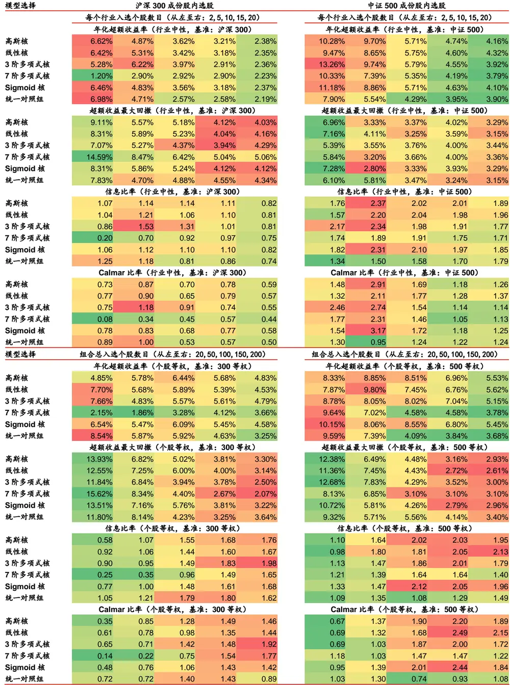
资料来源：Wind，华泰证券研究所

图表32： 不同核函数 SVM模型回测重要指标对比（全 A选股）

| 高斯核 | 全 A 选股，基准为沪深300 全 A 选股，基准为中证 500 全 A 选股，基准为中证全指 |  |  |  |  |  |  |  |  |  |  |  |
| --- | --- | --- | --- | --- | --- | --- | --- | --- | --- | --- | --- | --- |
|  | 年化超额收益率（行业中性） |  |  |  | 年化超额收益率（行业中性） |  |  |  | 年化超额收益率（行业中性） |  |  |  |
|  | 19.9%19.4%18.1%17.3%16.1% |  |  |  | 23.1%21.8%20.8%21.0%20.3% |  |  |  | 19.1%19.2%18.3%17.8% |  |  | 16.9% |
| 线性核 | 19.9%19.4% |  | 17.1%16.5%15.1% |  | 20.8%21.0%19.4%19.1%18.6% |  |  |  | 18.3%18.4% | 16.7% | 16.3% | 15.4% |
| 3阶多项式核 | 18.1%18.5% |  | 16.5%15.5%14.6% |  | 17.1%18.6%17.5%17.4%17.6% |  |  |  | 16.1%16.6% | 15.4% | 15.1% | 14.7% |
| 7阶多项式核 | 12.1% 13.7% |  | 14.0%14.2%14.0% |  | 14.4%15.7% | 16.2%16.8%17.0% |  |  | 11.4%13.0% | 13.6% | 13.9% | 14.0% |
| Sigmoid 核 | 20.0%19.4% |  | 17.1%16.5%15.1% |  | 21.0%21.0% | 19.5% | 19.1%18.6% |  | 18.4%18.4% | 16.7%16.3% |  | 15.3% |
| 统一对照组 | 19.7%16.2%14.9%14.6%14.2% |  |  |  | 26.3%20.8%18.2%18.1%17.2% |  |  |  | 21.5%17.1%15.1%14.9%14.3% |  |  |  |
| 高斯核 | 超额收益最大回撤(行业中性) |  |  |  | 超额收益最大回撤(行业中性) |  |  |  | 超额收益最大回撤(行业中性) |  |  |  |
|  | 17.3%18.4% |  | 15.0%15.0%15.7% |  | 10.6% 9.0% 9.4% 8.4% 7.9% |  |  |  | 11.2%11.2% 9.3% 8.9% |  |  | 8.6% |
| 线性核 | 17.3%14.5% |  | 13.8%14.8%14.8% |  | 6.6% 8.8% | 8.2% 8.3% 7.8% |  |  | 9.1% 8.9% | 7.9% 8.1% |  | 7.9% |
| 3阶多项式核 | 20.1% 15.8% |  | 16.0%15.2%15.4% |  | 11.7%10.1% | 9.6% 8.5% 8.2% |  |  | 10.1%10.0% | 9.4% 8.7% |  | 8.5% |
| 7阶多项式核 | 17.4%15.2% |  | 14.3%14.9%14.8% |  | 13.1%12.2% 9.6% 9.1% 8.4% |  |  |  | 11.5% 9.8% | 8.7%8.6% |  | 8.0% |
| Sigmoid 核 | 17.1%14.6% |  | 13.8%14.8%14.8% |  | 6.6% 9.0% 8.2% 8.3% 7.8% |  |  |  | 8.9% 9.0% 7.9% 8.1% |  |  | 7.9% |
| 统一对照组 | 12.9%13.4%12.7%11.7%12.9% |  |  |  | 7.0% 8.5% | 7.2% 6.0% 6.1% |  |  | 7.3% 7.0% 6.4% 6.5% |  |  | 7.3% |
| 高斯核 | 信息比率(行业中性) |  |  |  | 信息比率 | (行业中性) |  |  | 信息比率(行业中性) |  |  |  |
|  | 2.00 2.06 |  | 2.02 1.98 1.84 |  | 3.20 3.67 | 3.95 | 4.15 4.14 |  | 2.70 3.12 | 3.22 3.25 |  | 3.12 |
| 线性核 | 1.97 2.20 |  | 2.03 2.01 1.84 |  | 2.90 3.64 | 3.78 | 3.97 4.01 |  | 2.52 3.11 | 3.13 3.23 |  | 3.11 |
| 3阶多项式核 | 1.72 2.02 |  | 1.95 1.92 1.81 |  | 2.33 3.17 | 3.40 3.64 3.90 |  |  | 2.26 2.84 | 2.93 3.10 |  | 3.13 |
| 7阶多项式核 | 1.31 1.64 |  | 1.74 1.79 1.76 |  | 1.64 2.33 | 2.85 3.24 3.53 |  |  | 1.50 2.15 2.58 2.85 |  |  | 2.98 |
| Sigmoid 核 | 1.98 2.20 |  | 2.04 2.01 1.84 |  | 2.93 3.63 3.79 3.97 4.01 |  |  |  | 2.54 3.10 3.14 3.23 |  |  | 3.11 |
| 统一对照组 | 1.89 1.72 1.66 1.64 1.60 |  |  |  | 3.03 3.06 3.11 3.38 3.40 |  |  |  | 2.68 2.62 2.61 2.72 |  |  | 2.66 |
| 高斯核 | Calmar 比率（行业中性） |  |  |  | Calmar 比率（行业中性） |  |  |  | Calmar 比率（行业中性） |  |  |  |
|  | 1.15 1.05 |  | 1.20 1.16 1.03 |  | 2.19 2.42 | 2.22 2.49 2.57 |  |  | 1.70 1.71 1.96 1.99 |  |  | 1.96 |
| 线性核 | 1.15 1.34 |  | 1.23 1.11 1.02 |  | 3.13 2.38 | 2.35 2.31 2.37 |  |  | 2.01 2.06 | 2.11 2.01 |  | 1.95 |
| 3阶多项式核 | 0.90 1.17 |  | 1.03 1.02 0.95 |  | 1.46 1.85 | 1.83 | 2.04 2.15 |  | 1.60 1.66 | 1.64 1.74 |  | 1.73 |
| 7阶多项式核 | 0.70 0.90 |  | 0.97 0.95 0.95 |  | 1.10 1.28 | 1.69 | 1.85 2.03 |  | 0.99 1.33 | 1.55 1.63 |  | 1.75 |
| Sigmoid 核 | 1.16 1.34 |  | 1.24 1.11 1.02 |  | 3.18 2.33 | 2.37 2.31 2.37 |  |  | 2.07 2.04 | 2.12 2.01 |  | 1.95 |
| 统一对照组 | 1.52 1.21 |  | 1.17 1.24 1.10 |  | 3.74 2.45 | 2.53 3.00 2.83 |  |  | 2.94 2.44 2.38 2.28 |  |  | 1.95 |
| 模型选择 | 每个行业 |  |  |  | 入选个股数目（从左至右：20,50,100,150,200) |  |  |  |  |  |  |  |
| 高斯核 | 年化超额收益率（个股等权） |  |  |  | 年化超额收益率（个股等权） 年化超额收益率（个股等权） |  |  |  |  |  |  |  |
|  | 26.2%27.9% |  | 25.8%25.6%26.1% |  | 24.3%26.1% | 23.9% | 23.8%24.2% |  | 24.4%26.1%24.0% |  | 23.8% | 24.2% |
| 线性核 | 20.8%25.8% |  | 25.1% | 25.2%24.3% | 19.0%23.9% | 23.2% | 23.2%22.4% |  | 19.0%24.0% | 23.2% | 23.3%2 | 2.5% |
| 3阶多项式核 | 24.1%19.4% |  | 20.0% | 22.6%21.9% | 22.1%17.4% | 18.0% | 20.6% | 19.9% | 22.2%17.5% | 18.1% | 20.7%2 | 0.0% |
| 7阶多项式核 | 9.5%14.4% |  | 18.1% | 20.5%21.0% | 6.4%11.9% | 15.9% | 18.3% | 18.9% | 7.1%12.3%16.1% |  | 18.5% | 19.1% |
| Sigmoid 核 | 20.9%25.7%25.2%25.1%24.4% |  |  |  | 19.2%23.8% | 23.3% | 23.2%22.4% |  | 19.2%23.8%23.3%23.3%2 |  |  | 2.5% |
| 统一对照组 | 28.3%27.2%25.5%23.6%22.7% |  |  |  | 26.4%25.4% | 23.7% | 21.9%21.0% |  | 26.5%25.4%23.7%21.9%2 |  |  | 1.0% |
|  | 超额收益最大回撤（个股等权） |  |  |  | 超额收益最大 | 回撤（个 | 股等权） |  | 超额收益最大回撤（个股等权 |  |  | ） |
| 高斯核 | 32.0%32.0% |  | 32.1%32.2%31.3% |  | 10.6%11.6% | 9.3% | 9.4% 9.8% |  | 18.3%18.1% | 17.8% | 17.9% | 16.8% |
| 线性核 | 31.9%27.2% |  | 28.7%28.0%28.9% |  | 10.7% 9.6% | 7.5% | 7.7% 7.3% |  | 18.1%12.8% | 14.3% | 13.6% | 14.0% |
| 3阶多项式核 | 26.0%26.8% |  | 27.8%28.3%28.9% |  | 13.2%11.7% | 10.8% | 9.6% 9.0% |  | 15.1%13.9% | 13.6% | 13.8% | 14.5% |
| 7阶多项式核 | 23.2%29.9% |  | 29.6%28.8%28.6% |  | 22.2% 8.7% | 8.8% | 9.2% 8.1% |  | 15.7%15.7% | 15.1% | 14.3% | 14.1% |
| Sigmoid 核 | 31.9%27.2%28.7%28.0%28.9% |  |  |  | 10.7% 9.6% | 7.5% | 7.8% 7.3% |  | 18.1%12.8% | 14.3% | 13.6% | 14.0% |
| 统一对照组 | 29.3%27.9%27.5%28.1%28.0% |  |  |  | 15.3% 7.3% | 7.5% 7.2% 7.3% |  |  | 19.6%13.5%12.8%13.9% |  |  | 13.5% |
| 高斯核 | 信息比率(个股等权) |  |  |  | 信息比率 | (个股等权) |  |  | 信息比率(个股等权) |  |  |  |
|  | 1.46 | 1.61 | 1.52 1.52 1.57 |  | 2.69 3.56 | 3.77 3.97 4.21 |  |  | 2.10 2.49 2.46 2.50 |  |  | 2.60 |
| 线性核 | 1.14 1.53 |  | 1.50 1.55 1.52 |  | 2.06 3.36 | 3.65 4.03 4.21 |  |  | 1.61 2.39 2.43 |  | 2.59 | 2.59 |
| 3阶多项式核 | 1.33 1.21 |  | 1.29 1.47 1.44 |  | 2.24 2.33 | 2.83 3.57 3.62 |  |  | 1.83 1.83 2.09 |  | 2.48 | 2.44 |
| 7阶多项式核 | 0.76 1.04 |  | 1.23 1.38 1.42 |  | 0.46 1.40 2.26 2.91 3.23 |  |  |  | 0.66 1.51 | 1.99 2.31 |  | 2.44 |
| Sigmoid 核 |  | 1.15 1.52 |  | 1.51 1.55 1.53 |  | 2.07 3.35 3.66 4.02 4.21 |  |  |  | 1.62 2.38 |  | 2.44 2.58 |
| 统一对照组 | 1.46 1.45 1.45 1.36 1.33 |  |  |  | 2.25 2.80 3.27 3.28 3.42 |  |  |  | 1.97 2.16 2.30 2.22 2.22 |  |  |  |
| 高斯核 | Calmar 比率（个股等权） |  |  |  | Calmar 比率（个股等权） |  |  |  | Calmar 比率（个股等权） |  |  |  |
|  | 0.82 0.87 0.80 0.80 0.83 |  |  |  | 2.29 2.25 2.57 2.52 2.47 |  |  |  | 1.33 1.44 1.35 1.33 1.44 |  |  |  |
| 线性核 | 0.65 0.95 0.87 0.90 0.84 |  |  |  | 1.78 2.48 3.10 3.02 3.05 |  |  |  | 1.05 1.87 1.62 1.71 |  |  | 1.60 |
| 3阶多项式核 | 0.93 0.72 0.72 0.80 0.76 |  |  |  | 1.67 1.48 1.66 2.15 2.20 |  |  |  | 1.47 1.27 | 1.33 1.50 |  | 1.38 |
| 7阶多项式核 | 0.41 0.48 |  | 0.61 0.71 0.74 |  | 0.29 1.37 1.81 1.98 2.33 |  |  |  | 0.45 0.79 | 1.06 | 1.29 | 1.35 |
| Sigmoid 核 | 0.66 0.94 0.88 0.90 0.84 |  |  |  | 1.79 2.47 3.11 2.99 3.06 |  |  |  | 1.06 1.86 | 1.63 | 1.71 1.60 |  |
| 统一对照组 | 0.97 0.97 0.93 0.84 0.81 |  |  |  | 1.73 3.47 3.18 3.05 2.86 |  |  |  | 1.35 1.89 1.86 1.57 1.55 |  |  |  |

资料来源：Wind，华泰证券研究所

## 支持向量机与支持向量回归比较

我们同时测试了支持向量机的拓展形式——支持向量回归（以下简称 SVR）。我们选择之前表现最好的高斯核作为 SVR 的核函数，对 C和γ进行遍历，选取交叉验证集 IC值最高的 C 和γ组合作为最终选定的参数。同时以高斯核 SVM 模型，以及 12 个月滚动回测的线性回归模型作为统一对照组。

图表 33展示了沪深 300 选股模型和中证 500 选股模型的结果。图表 34 展示了全 A选股模型的结果。高斯核 SVR 模型仅在中证 500 成份股内选股的个股等权策略中表现略有优势，其余时候均弱于高斯核 SVM 模型以及线性回归模型。

图表33： SVR模型和 SVM模型回测重要指标对比（沪深 300及中证 500成份股内选股）
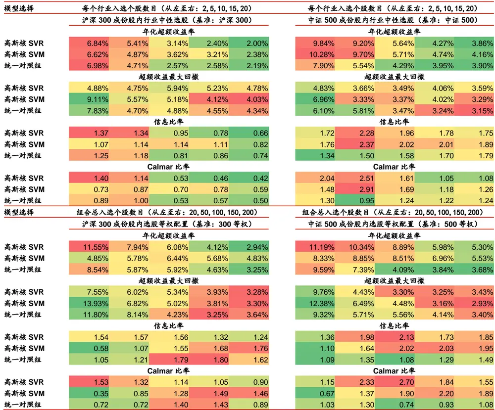
资料来源：Wind，华泰证券研究所

图表34： SVR模型和 SVM模型回测重要指标对比（全 A选股）

| 模型选择 | 每个行业入选个股数目 (从左至右：2,5,10,15,20) |  |  |  |  |  |  |  |  |  |
| --- | --- | --- | --- | --- | --- | --- | --- | --- | --- | --- |
|  | 全 A 选股，基准为沪深 300 |  |  |  | 全 A 选股， 基准为中证 500 |  | 全 A选股，基准为中证全指 |  |  |  |
|  | 年化超额收益率 (行业中性) |  |  |  | 年化超额收益率（行业中性） |  | 年化超额收益率 (行业中性) |  |  |  |
| 高斯核 SVR | 14.9% 14.4% | 13.8% 13.8% | 13.2% | 21.4% 17.7% | 16.1% 16.7% 16.2% | 16.7% | 14.9% 13. | .8% 14.0% 13.4% |  |  |
| 高斯核 SVM | 19.9% 19.4% | 18.1% 17.3% | 16.1% | 23.1% 21.8% 20.8% | 21.0% 20.3% | 19.1% 19.2% | 18. 3.3% 17.8% | 16.9% |  |  |
| 统一对照组 | 19.7% 16.2% | 14.9% 14.6% | 14.2% | 26.3% 20.8% 18.2% | 18.1% 17.2% | 21.5% 17.1% 15. .1% 14.9% 14.3% |  |  |  |  |
|  | 超额收益最大回撤（ | (行业中性) |  | 超额收益最大回撤 | (行业中性) | 超额收益最大回撤 (行业中性) |  |  |  |  |
| 高斯核 SVR | 15.4% |  |  |  | 8.9% 8.4% 7.9% | 12.1% 10.7% 9.4% 8.8% |  |  |  |  |
| 高斯核 SVM | 20.3% 18.3% 17.3% 18.4% | 16.1% 15.0% 15. 5.0% | 15.7% 15.7% | 12.4% 9.7% 10.6% 9.0% 9.4% |  | 11.2% | 11.2% 9.3% | 8.4% 8.9% 8.6% |  |  |
| 统一对照组 | 12.9% 13.4% | 12.7% 11.7% | 12.9% | 7.0% 8.5% 7.2% | 8.4% 7.9% | 7.3% 7.0% | 6.4% 6.5% | 7.3% |  |  |
|  | 信息比率 (行业中性) |  |  |  | 6.0% 6.1% | 信息比率 (行业中性) |  |  |  |  |
| 高斯核 SVR | 1.49 1.57 1.59 1.62 2.89 3.04 |  |  |  | 信息比率 (行业中性) | 3.61 2.42 |  |  |  |  |
| 高斯核 SVM | 2.00 | 2.06 2.02 | 1.55 1.98 1.84 | 3.20 3.67 | 3.20 3.54 3.95 4.15 | 4.14 2.70 | 2.53 3.12 | 2.61 2.77 3.22 3.25 | 2.74 3.12 |  |
| 统一对照组 | 1.89 | 1.72 1.66 1.64 | 1.60 | 3.03 3.06 3.11 | 3.38 | 2.68 | 2.62 | 2.61 2.72 | 2.66 |  |
| Calmar 比率 | (行业中性) |  |  |  | 3.40 Calmar 比率 (行业中性) | Calmar 比率 |  |  |  |  |
| 高斯核 SVR | 0.73 0.78 | 0.86 | 0.90 0.84 | 1.72 | 1.83 1.81 | 2.00 2.05 | 1.38 1.39 | (行业中性) 1.46 | 1.60 1.59 |  |
| 高斯核 SVM | 1.15 1.05 | 1.20 | 1.16 1.03 | 2.19 2.42 | 2.22 2.49 | 2.57 1.70 | 1.71 | 1.96 1.99 | 1.96 |  |
| 统一对照组 | 1.52 1.21 | 1.17 | 1.24 1.10 | 3.74 2.45 | 2.53 3.00 | 2.83 2.94 | 2.44 | 2.38 | 2.28 1.95 |  |
| 模型选择 | 每个行业入选个股数目 (从左至右： 20,50,100,150,200) |  |  |  |  |  |  |  |  |  |
| 年化超额收益率 (个股等权) 年化超额收益率 (个股等权) 年化超额收益率 |  |  |  |  |  |  |  |  |  |  |
| 高斯核 SVR | 21.9% 20.2% | 19.4% | 19. .5% | 19.9% 19.8% | 18.3% 17.5% | 17.6% 18.0% | 20.0% | 18.4% 17. | (个股等权) .6% 17.7% | 18.0% |
| 高斯核 SVM | 26.2% 27.9% | 25.8% 25. | .6% 26.1% | 24.3% | 26.1% 23.9% | 23.8% 24.2% | 24.4% 26.1% | 24.0% | 23.8% | 24.2% |
| 统一对照组 | 28.3% 27.2% | 25.5% | 23.6% 22.7% | 26.4% | 25.4% 23.7% | 21.9% 21.0% | 26.5% | 25.4% 23.7% | 21.9% | 21.0% |
|  | 超额收益最大回撤 |  | (个股等权) |  | 超额收益最大回撤 | (个股等权) | 超额收益最大回撤 |  | (个股等权) |  |
| 高斯核 SVR | 28.6% 29.1% | 29.4% | 28.4% 29.5% | 17.0% | 12.1% 10.0% | 9.7% 8.8% | 19.2% | 14.9% 14.7% | 13.5% | 14.9% |
| 高斯核 SVM | 32.0% 32.0% | 32.1% | 32.2% 31.3% | 10.6% | 11.6% 9.3% | 9.4% 9.8% | 18.3% | 18.1% | 17.8% 17.9% | 16.8% |
| 统一对照组 | 29.3% 27.9% | 27.5% | 28.1% 28.0% | 15.3% | 7.3% 7.5% | 7.2% 7.3% | 19.6% | 13.5% | 12. 2.8% 13.9% | 13.5% |
|  | 信息比率 (个股等权) |  |  |  | 信息比率 (个股等权) |  |  | 信息比率 (个股等权) |  |  |
| 高斯核 SVR | 1.27 1.24 | 1.21 | 1.23 | 1.25 | 2.01 2.49 | 2.83 3.11 | 3.36 1.76 | 1.91 | 1.96 2.03 | 2.10 |
| 高斯核 SVM | 1.46 1.61 | 1.52 | 1.52 1.57 | 2.69 | 3.56 | 3.77 3.97 | 4.21 2.10 | 2.49 | 2.46 2.50 | 2.60 |
| 统一对照组 | 1.46 1.45 | 1.45 | 1.36 1.33 | 2.25 | 2.80 | 3.27 3.28 | 3.42 1.97 | 2.16 | 2.30 2.22 | 2.22 |
|  | Calmar 比率 (个股等权) |  |  |  | Calmar 比率 (个股等权) |  |  |  | Calmar 比率 (个股等权) |  |
| 高斯核 SVR 高斯核 SVM | 0.77 | 0.70 0.66 | 0.69 0.67 | 1.17 | 1.51 | 1.74 1.83 | 2.04 1.04 | 1.23 | 1.20 | 1.31 1.21 |
| 统一对照组 | 0.82 | 0.87 0.80 | 0.80 0.83 | 2.29 | 2.25 2.57 | 2.52 2.47 | 1.33 | 1.44 | 1.35 1.33 | 1.44 |
|  | 0.97 | 0.97 0.93 | 0.84 0.81 | 1.73 | 3.47 3.18 | 3.05 2.86 | 1.35 | 1.89 | 1.86 1.57 | 1.55 |

资料来源：Wind，华泰证券研究所

## 高斯核支持向量机模型选股策略详细分析

下面我们对策略组合的详细回测情况加以展示。因为篇幅有限，我们根据上面的比较测试结果，选择展示效果最好的高斯核 SVM 模型选股策略。下图中，我们分别展示了沪深 300成份股内选股（基准：沪深 300）、中证 500 成份股内选股（基准：中证 500）、全 A选股（基准：中证 500）策略的各种详细评价指标。

观察下面的图表可知，对于高斯核 SVM 模型沪深 300 成分股内选股行业中性策略来说，随着每个行业入选个股数目增多，年化收益率在下降、信息比率和 Calmar比率先升后降，最优每个行业入选个股数目在 6 个左右；对于高斯核 SVM 模型中证 500 成份股内选股行业中性策略来说，随着每个行业入选个股数目增多，年化收益率在下降，信息比率和Calmar 比率先升后降，最优每个行业入选个股数目在 4~6 个左右；对于高斯核 SVM 模型全 A选股行业中性策略来说，随着入选个股总数目增多，年化收益率在下降，信息比率和 Calmar比率却在上升，最优每个行业入选个股数目在 18 个左右。

图表35： 高斯核 SVM模型和线性回归模型策略组合回测分析表（回测期：20110131～20170531）
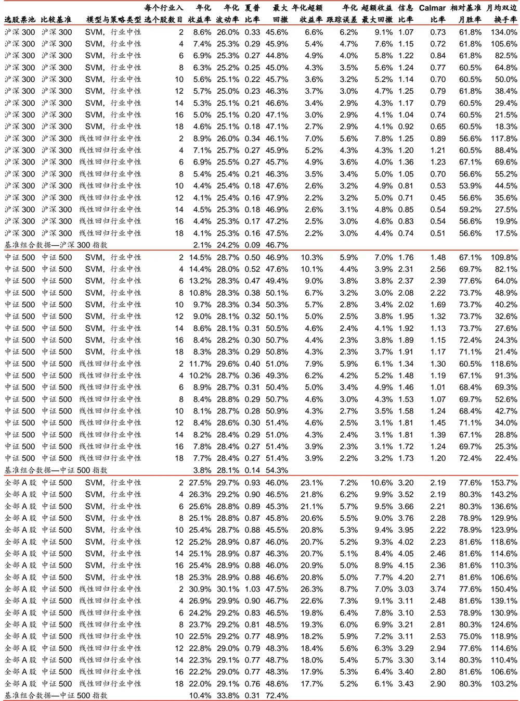
资料来源：Wind，华泰证券研究所

我们有选择性地展示三个策略的月度超额收益图：

图表36： 高斯核 SVM模型和线性回归模型沪深 300成份股内行业中性选股策略表现（每个行业选 6只个股）
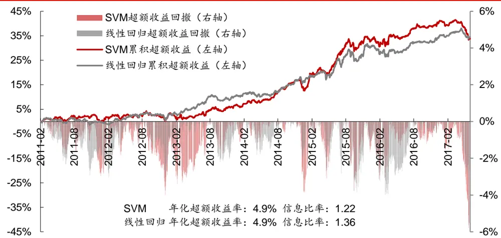
资料来源：Wind，华泰证券研究所

图表37： 高斯核 SVM模型和线性回归模型中证 500成份股内行业中性选股策略表现（每个行业选 6只个股）
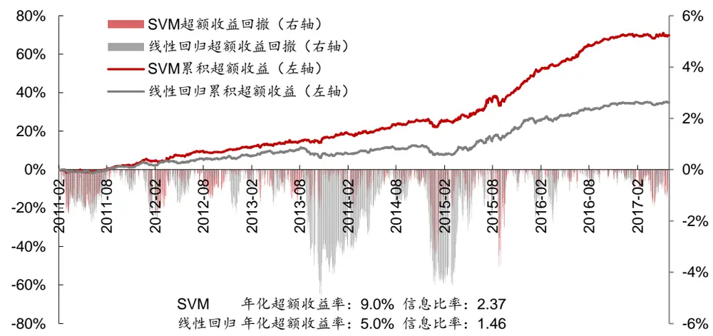
资料来源：Wind，华泰证券研究所

图表38： 高斯核 SVM模型和线性回归模型全 A行业中性选股策略表现（每个行业选 6只个股，基准中证 500）
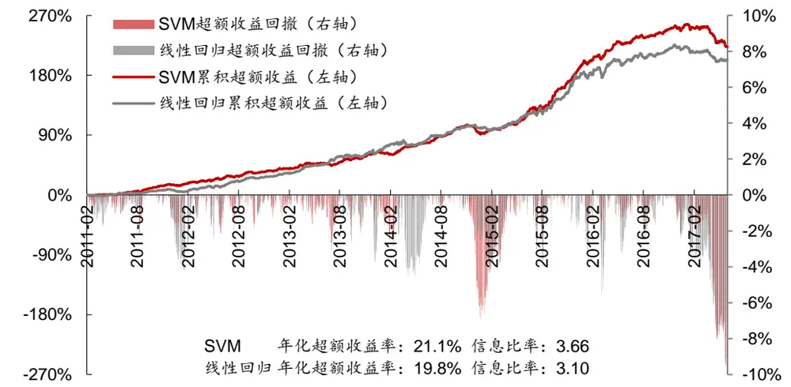
资料来源：Wind，华泰证券研究所

## 总结和展望

以上我们对包括线性核、多项式核、高斯核和 Sigmoid 核在内的多种核函数支持向量机以及支持向量回归进行了系统的测试，并且利用支持向量机模型构建沪深 300、中证 500 和全 A 选股策略，初步得到以下几个结论：

一、SVM 具备不错的预测能力。我们以 2005-2010 年的因子及下期收益作为样本内集合，2011 年至今的数据为样本外测试集，高斯核 SVM 全 A选股模型交叉验证集正确率为58.3%，AUC 为 0.621，样本外测试集平均正确率为 56.3%，平均 AUC 为 0.585。SVM模型的预测正确率和AUC和上一篇报告广义线性模型中表现最好的SGD+hinge损失模型相近。

二、我们分别以沪深 300、中证 500 和全 A股为票池，利用高斯核 SVM 模型构建选股策略。对于沪深 300 成份股内选股的行业中性策略，高斯核 SVM 模型的超额收益不高，在2%~5%之间，信息比率在 0.8~1.2 之间，在收益端和回撤端的表现仍略优于线性回归模型。对于中证500成份股内选股的行业中性策略，高斯核SVM模型的超额收益在4%~10%之间，信息比率在 1.8~2.4 之间，Calmar 比率在 1.2~3.0 之间，表现远优于线性回归模型。对于全A选股的行业中性策略，高斯核SVM模型相对于中证500的超额收益在20%~22%之间，超额收益最大回撤在 7%~10%之间，信息比率在 3.6~4.2 之间。总体而言，高斯核SVM 在收益和信息比率方面表现不错，各种策略构建方式下都能稳定地优于线性回归模型；从回撤的角度看，SVM 模型相比于线性回归不具备明显优势，很多时候回撤与线性回归持平甚至大于线性回归。

三、我们认为 SVM 模型回撤大于线性回归的原因可能在于：对于线性回归我们采取的是滚动训练集的方式，即以 T-12 月到 T-1 月的信息预测 T 月；而对于 SVM 我们采取的是固定训练集的方式，以 2005~2010 年的信息预测 T 月。当市场风格发生切换时，由于滚动训练集包含了最新的信息，因而能够相对迅速地适应新的市场环境。而固定训练集预测的方式无法对模型进行调整，如果市场风格和 2015~2010 年相差较大，那么模型很难有好的表现。

以上仅是我们的猜测，事实上我们可以从图 19 和图 20 展示的预测正确率及 AUC 变化情况窥见端倪。2017 年以来，SVM 模型的预测正确率和 AUC 持续降低，5月底截面期（对应于 6月表现）的正确率低于 50%；相反地，SGD+hinge 模型（广义线性模型，和线性回归接近）的预测正确率在 2 月底截面期（对应于 3 月表现）下降至 50%，但是此后逐步上升，表现出对新的市场风格的适应。

这里我们并非想评判两种模型构建方式孰优孰劣。对于固定训练集的方式，模型能够更充分地挖掘训练集内部的规律，当市场环境和训练集接近时，模型的表现会更好；当市场环境和训练集出现背离时，模型的表现将不尽人意。而对于滚动训练集的方式，其核心假设是因子存在动量效应，一旦动量效应失效，滚动训练模型的表现也将受损。

由此我们也可以推知，对于固定训练集的机器学习模型，训练集的选择至关重要，需要尽可能囊括市场风格的各种可能性。训练集时间长度不能过短，并且应包含至少一个经济周期，我们选择 2005~2010 年作为训练集正是出于上述考虑。然而类似 2014 年 12 月以及2017 年上半年市场风格巨变的情况在历史上发生的次数不多，在训练集时间段中没有出现过，因此固定训练集的模型出现较大回撤在我们的预料之中。

四、我们比较了不同核支持向量机（SVM）以及支持向量回归（SVR）的预测能力。绝大多数时候，高斯核 SVM 的测试集正确率、AUC 和回测表现优于其它核函数，也优于 SVR。高斯核作为使用最为广泛的核函数，其优势在于不对原始数据做太多的先验假设。高斯核SVM 假设原始数据线性可分，换言之因子和收益率之间存在线性关系。多项式核和Sigmoid 核 SVM 假设因子和收益率之间存在相应的非线性关系。而高斯核 SVM 不依赖任何前提假设，理论上可以拟合任意特征到标签的映射关系。

我们的回测结果也印证了这一点。通过交叉验证集调参，我们最终得到高斯核 SVM 全 A选股模型的测试集正确率/AUC 分别为 56.25%/0.6214，高于线性核（55.66%/0.5831），3 阶多项式核（53.75%/0.6062），7 阶多项式核（50.03%/0.5902）和 Sigmoid 核（55.66%/0.6090）。

我们也观察到SVM分类器的回测表现优于SVR回归模型。在上一篇广义线性模型报告中，我们发现过类似的现象，分类器的表现优于回归模型。可能的原因在于，对原始收益率进行二值化处理，分成正例和反例后，尽管损失了部分信息，但同时消除了收益率信息中包含的大量噪音，使得模型能够更准确地捕捉数据中蕴含的规律。

五、在我们的测试中，核支持向量机相较于广义线性模型中表现最好的 SGD+hinge 模型，并没有展现出非常明显的优势。原因可能在于，相比于广义线性模型，核支持向量机的强项在于处理非线性数据。而我们使用的因子都是经验证过的、与收益具有显著线性关系的特征，正好是广义线性模型擅长的领域。未来当我们挖掘更多具有非线性特性的因子时，核支持向量机应有用武之地。

通过以上的测试和讨论，我们初步理解了支持向量机模型应用于多因子选股的一些规律。接下来我们的人工智能系列研究将继续探索朴素贝叶斯、随机森林、神经网络等机器学习方法在多因子选股上的表现，敬请期待。

风险提示：通过支持向量机模型构建选股策略是历史经验的总结，存在失效的可能。

## 附录

## PCA 是否必要

使用支持向量机进行分类时，是否有必要预先对数据做主成分分析（PCA），是一个有争议的问题。支持的一方认为 PCA具有两个重要作用。首先对于高维数据，SVM 计算相对缓慢，如果使用 PCA进行降维处理，提取解释方差最多的前几个主成分作为新的特征，将大大加快运算速度；其次原始数据往往存在共线性问题，而 PCA 可以将原始特征转换为相互正交的新特征，从而避免共线性。

反对的一方则提出两个观点。首先 PCA作为一种降维方法，尽管保留了解释方差最多的主成分，但是毕竟损失了一部分信息，当样本量或特征数并不是特别大时，这种牺牲准确性换取效率的方法是否值得？其次，有人认为 SVM 目标函数的等价形式中已经包含 L2正则化项（详细证明过程请参考上一篇广义线性模型报告“损失函数”一节），可以有效解决共线性问题，因此没有必要做 PCA。

在本篇报告的测试环节，我们在 SVM 训练前对数据进行了 PCA 处理，并且保留所有主成分，相当于保留原始数据的全部信息。同时由于我们的因子数并不多，因此无论是否做PCA，对运算效率的影响不大。因此我们最为关心的问题是，PCA 后保留全部主成分的预处理方式，对分类效果是否有影响？做不做 PCA的结果是否存在差别？

这一问题很难从理论上得到解释，目前也没有相关文献支持。我们尝试以实例的形式探索这个问题。我们首先生成了一组二分类数据，两个维度 $x_{1}和x_{2}$ 存在正相关关系。随后分别使用高斯核、线性核、3 阶多项式核以及 Sigmoid 核 SVM 对原始特征 $x_{1}$ 和 $x_{2}.$ 进行分类。接下来对原始特征进行 PCA，转换为 $z_{1}$ 和 ${}^{\tau}z_{2}$ 两个相互独立的主成分，并使用上述四种核SVM 对新特征 $.z_{1}$ 和 ${}^{\prime}z_{2}$ 进行分类。

下图左边一列展示了不做 PCA的分类结果，中间一列展示了进行 PCA的分类结果。可以发现两种预处理方式对分类结果没有影响。在我们的多因子选股模型中，下期收益的预测是以样本点到分类超平面的距离，即决策函数值的形式给出的，因此我们还需要考察两种预处理方式下决策函数的值是否存在差异。下图右边一列中，每个点的横坐标代表不做PCA 时的决策函数值，纵坐标代表进行 PCA后的决策函数值。可以发现，对于高斯核和线性核，两种预处理方式的决策函数值完全相同；而对于多项式核和 Sigmoid 核，决策函数值发生了细微的变化，而这种变化可能是不保序的（如右下角 Sigmoid 核的情形），因而对选股结果可能造成微小的影响，但总体而言差异并不大。

由此我们得到初步的结论：对于线性核和高斯核 SVM，是否做 PCA对分类结果和决策函数没有任何影响，可以舍去 PCA这一步。对于多项式核和 Sigmoid 核 SVM，两种预处理方式对分类结果无影响，然而在决策函数值上存在微小差异，因此也可以考虑不做 PCA。

图表39： 不同核 SVM是否做 PCA的分类结果对比（从上至下：高斯核、线性核、多项式核、Sigmoid核）
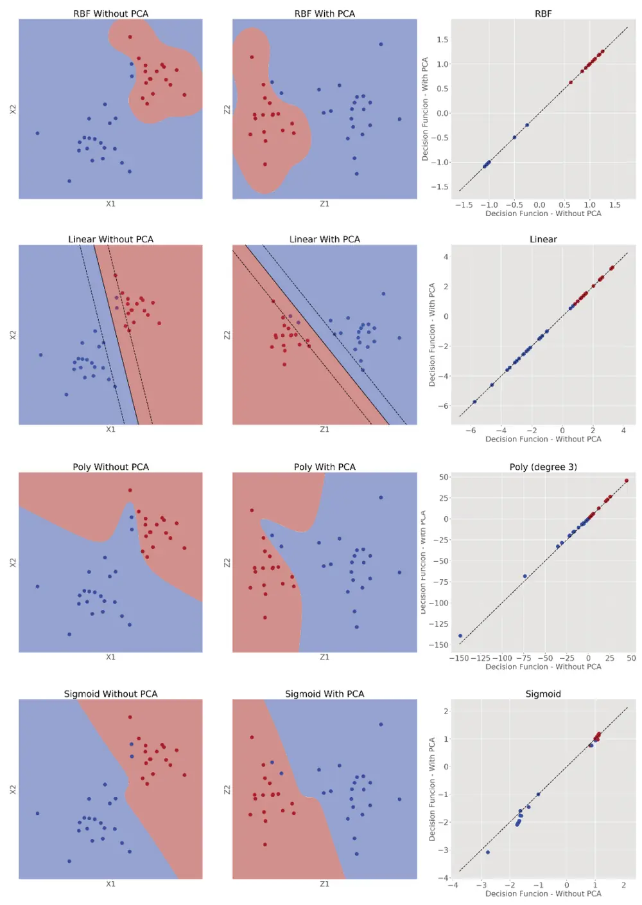
资料来源：Wind，华泰证券研究所

## 免责申明

本报告仅供华泰证券股份有限公司（以下简称“本公司”）客户使用。本公司不因接收人收到本报告而视其为客户。

本报告基于本公司认为可靠的、已公开的信息编制，但本公司对该等信息的准确性及完整性不作任何保证。本报告所载的意见、评估及预测仅反映报告发布当日的观点和判断。在不同时期，本公司可能会发出与本报告所载意见、评估及预测不一致的研究报告。同时，本报告所指的证券或投资标的的价格、价值及投资收入可能会波动。本公司不保证本报告所含信息保持在最新状态。本公司对本报告所含信息可在不发出通知的情形下做出修改，投资者应当自行关注相应的更新或修改。

本公司力求报告内容客观、公正，但本报告所载的观点、结论和建议仅供参考，不构成所述证券的买卖出价或征价。该等观点、建议并未考虑到个别投资者的具体投资目的、财务状况以及特定需求，在任何时候均不构成对客户私人投资建议。投资者应当充分考虑自身特定状况，并完整理解和使用本报告内容，不应视本报告为做出投资决策的唯一因素。对依据或者使用本报告所造成的一切后果，本公司及作者均不承担任何法律责任。任何形式的分享证券投资收益或者分担证券投资损失的书面或口头承诺均为无效。

本公司及作者在自身所知情的范围内，与本报告所指的证券或投资标的不存在法律禁止的利害关系。在法律许可的情况下，本公司及其所属关联机构可能会持有报告中提到的公司所发行的证券头寸并进行交易，也可能为之提供或者争取提供投资银行、财务顾问或者金融产品等相关服务。本公司的资产管理部门、自营部门以及其他投资业务部门可能独立做出与本报告中的意见或建议不一致的投资决策。

本报告版权仅为本公司所有。未经本公司书面许可，任何机构或个人不得以翻版、复制、发表、引用或再次分发他人等任何形式侵犯本公司版权。如征得本公司同意进行引用、刊发的，需在允许的范围内使用，并注明出处为“华泰证券研究所”，且不得对本报告进行任何有悖原意的引用、删节和修改。本公司保留追究相关责任的权力。所有本报告中使用的商标、服务标记及标记均为本公司的商标、服务标记及标记。

本公司具有中国证监会核准的“证券投资咨询”业务资格，经营许可证编号为：Z23032000。全资子公司华泰金融控股（香港）有限公司具有香港证监会核准的“就证券提供意见”业务资格，经营许可证编号为：AOK809
©版权所有 2017年华泰证券股份有限公司

## 评级说明

## 行业评级体系

－报告发布日后的6个月内的行业涨跌幅相对同期的沪深300指数的涨跌幅为基准；

－投资建议的评级标准

增持行业股票指数超越基准

中性行业股票指数基本与基准持平

减持行业股票指数明显弱于基准

## 公司评级体系

－报告发布日后的6个月内的公司涨跌幅相对同期的沪深300指数的涨跌幅为基准；
－投资建议的评级标准
买入股价超越基准 20%以上
增持股价超越基准 5%-20%
中性股价相对基准波动在-5%~5%之间
减持股价弱于基准 5%-20%
卖出股价弱于基准 20%以上

## 华泰证券研究

## 南京

南京市建邺区江东中路228号华泰证券广场1号楼/邮政编码：210019

电话：86 25 83389999 /传真：86 25 83387521电子邮件：ht-rd@htsc.com

## 深圳

深圳市福田区深南大道4011号香港中旅大厦24层/邮政编码：518048

电话：86 755 82493932 /传真：86 755 82492062

电子邮件：ht-rd@htsc.com

## 北京

北京市西城区太平桥大街丰盛胡同28号太平洋保险大厦A座18层

邮政编码：100032

电话：86 10 63211166/传真：86 10 63211275

电子邮件：ht-rd@htsc.com

## 上海

上海市浦东新区东方路18号保利广场E栋23楼/邮政编码：200120

电话：86 21 28972098 /传真：86 21 28972068

电子邮件：ht-rd@htsc.com