## 金工研究/深度研究

2017年08月17日

林晓明 执业证书编号：S0570516010001

研究员 0755-82080134

linxiaoming@htsc.com

陈烨 010-56793927

联系人 chenye@htsc.com

3《金工: 华泰价值选股之相对市盈率港股模型》2017.07

# 人工智能选股之朴素贝叶斯模型

## 华泰人工智能系列之四

本报告对朴素贝叶斯模型及线性判别分析、二次判别分析进行系统测试“生成模型”是机器学习中监督学习方法的一类。与“判别模型”学习决策函数和条件概率不同，生成模型主要学习的是联合概率分布P(X,Y)。本文中，我们从朴素贝叶斯算法入手，分析比较了几种常见的生成模型（包括线性判别分析和二次判别分析）应用于多因子选股的异同，希望对本领域的投资者产生有实用意义的参考价值。

朴素贝叶斯模型构建细节：月频滚动训练，结合基于时间序列的交叉验证朴素贝叶斯模型的构建包括特征和标签提取、特征预处理、训练集合成和滚动训练等步骤。我们的模型设置为月频换仓，在每个月月底重新训练并交叉验证一次。我们采用了一种基于时间序列的交叉验证方法，其核心思想在于，交叉验证集中的样本在时间序列上始终位于训练集样本之后，验证时不会用到未来信息。交叉验证结果显示，训练期越长、模型预测效果越好。最终在每个月底可以产生对全部个股下期上涨概率的预测值，然后根据正确率、AUC 等指标以及策略回测结果对模型进行评价。

朴素贝叶斯在指数成份内选股效果较好，线性判别分析全 A选股效果较好对于沪深 300 成份股内选股的行业中性策略（每个行业选 5 只个股），朴素贝叶斯、线性判别分析和二次判别分析的年化超额收益率分别为 7.69%、7.89%、6.12%，信息比率为 1.84、1.77、1.50。对于中证 500 成份股内选股的行业中性策略，三种方法年化超额收益率分别为 9.64%、8.29%、8.13%，信息比率为 2.14、2.01、1.98。对于全 A 选股的行业中性策略，三种方法相对于中证500的年化超额收益率分别为18.9%、22.2%、20.1%，信息比率为 3.00、3.49、3.38。总体而言，朴素贝叶斯在沪深 300 和中证500 成份内选股表现较优，线性判别分析全 A选股表现较好。

## 线性判别分析法的分类效果最佳，其在某种意义下等价于线性回归

经过对比，我们发现线性判别分析法的测试集正确率、AUC 普遍优于其它算法。通过简单的计算，我们发现股票的特征因子之间存在着相关性，且对于不同类别的股票这种相关性几乎一致，线性判别分析的假设最符合实际情况。在二分类问题中，线性判别分析在某种意义上等价于线性回归，所以这进一步证明了线性回归在多因子选股体系中的优异性。同时，我们发现虽然高斯朴素贝叶斯的假设在实践中不合理，但其依旧表现出了良好的分类效果，并且是稳健的，常见的改进方法对结果影响并不大。

风险提示：通过朴素贝叶斯、LDA、QDA 模型构建选股策略是历史经验的总结，存在失效的可能。

## 本文研究导读

在华泰人工智能选股系列的第三篇报告中，我们采用固定训练集的方法，系统地测试了包括线性核、高斯核、多项式核、Sigmoid 核在内的各种核支持向量机模型。支持向量机模型需要通过网格搜索进行参数寻优，因此计算量比较大。而本篇报告中我们将要介绍的朴素贝叶斯模型思想相对简洁，没有参数需要调整，计算过程比较高效，它与支持向量机都是机器学习领域中比较流行的模型。本篇报告我们将高斯朴素贝叶斯模型以及由此衍生的线性判别分析、二次判别分析模型应用于多因子选股，主要关注如下几方面的问题：

1. 首先是朴素贝叶斯模型假设的问题。朴素贝叶斯模型被质疑较多的一点就是特征之间相互独立的假设，现实中，股票的各个特征往往有较高的相关性，并不满足假设。那我们能不能通过一些手段缓解朴素贝叶斯模型假设带来的估计缺陷？在不符合假设的情况下，朴素贝叶斯算法分类效果究竟如何？

2. 其次是方法比较的问题。通过放宽高斯朴素贝叶斯模型的假设，我们可以得到线性判别分析和二次判别分析模型，本文对这两种方法也进行了研究并比较了三种方法的效果。究竟哪种方法的假设更符合实际？效果更好？应该通过什么指标进行比较？

3. 最后是组合构建的问题。在衡量过不同模型的表现之后，应如何利用模型的预测结果构建策略组合进行回测？各模型在沪深 300、中证 500 和全部 A股票池内选股效果的异同是什么？

我们将围绕以上问题进行系统性的测试，希望为读者提供一些扎实的证据，并寻找到有效的分类方法，能够对本领域的投资者产生参考价值。

## 朴素贝叶斯模型及其拓展

早在 20世纪 50年代，朴素贝叶斯模型（Naïve Bayes）就开始被广泛地研究，并在文本分类领域得到了大量的应用，比如利用词频作为特征来识别垃圾文件，对新闻进行分类等等。朴素贝叶斯的思想十分简单，当特征的维度较高时，它表现出了非常高效的分类效果。下面我们将对朴素贝叶斯模型以及由此拓展而成的线性判别分析（Linear DiscriminantAnalysis）、二次判别分析（Quadratic Discriminant Analysis）进行详细介绍。

## 朴素贝叶斯模型介绍

## 贝叶斯公式的思想

对于一个分类的问题，我们首先要明确的是：问题是什么？问题是我们得到了一组关于事物特征的描述，但却见不到事物本身，我们需要利用过去的经验去推测，拥有这些特征的事物最可能是什么。朴素贝叶斯算法就是利用了贝叶斯公式，在给定事物特征的条件下对其进行分类的一种算法。

经典的贝叶斯公式如下：

$$
P(Y|X)={\frac{P(X|Y)*P(Y)}{P(X)}}
$$

P(Y|X)是一个条件概率（Conditional Probability），是指在事件X已经发生的条件下，事件Y的发生概率。它可以由两个事件独立发生的概率P(X)、P(Y)和条件概率P(X|Y)按上述公式计算得出。上文所述的事物特征是公式里的X，而我们的目标就是根据X去推测Y所属的分类。因为Y的类别有很多种可能，所以我们的猜测并不唯一。在给定一个被遮住的动物拥有四条腿、两个角的条件下，我们既可以猜测它是山羊，也可以猜测它是藏羚羊（当然也有别的动物品种，这里简化了）。但幸运的是，我们可以利用过去的经验赋予这些猜测不同的权重，在这个例子里，根据生活经验我们知道这个动物是山羊的概率要远大于藏羚羊。贝叶斯算法的原则就是：对于给定条件X，我们将Y划分至类别y，y满足 $y=$ $argmax\{P(y_{1}|X),P(y_{2}|X)\}\ldots P(y_{n}|X)\}$ ，即选取事件发生可能性最大的类别作为划分结果。

P(Y|X)也被称为后验概率（Posterior），那么，我们要怎样计算P(Y|X)从而对当前情况完成分类呢？利用贝叶斯公式我们可以把概率拆分成三部分。对于不同的Y，P(X)的概率是相同的，因为X单独发生的概率与Y无关。因此，分类问题中我们只需要比较P(X|Y) ∗ P(Y)的大小而不需要真正计算出准确的概率。我们把P(Y)称为先验概率（Prior），即在获得证据之前推断的概率。通常，我们可以用个人的专业知识预先设定一个主观的先验概率，但在给定历史数据的情况下，我们也可以简单通过历史数据计算出客观先验概率。比如在之前的例子中，我们既可以简单认为藏羚羊数量：山羊数量等于 1:10000，即P(Y = 藏羚羊$)!P(Y=\downarrow\downarrow\dot{\bar{+}})=1{:}10000$ ，也可以花费人力去真实统计世界上两种羊的数量之比来得到准确的先验概率。

## “朴素”的假设

朴素贝叶斯之所以“朴素”是因为其把问题简单化了：假设不同特征之间相互独立。因此对于最后一项P(X|Y)，我们可以拆解成 $\mathsf{P}(x_{1}|Y)\cdot P(x_{1}|Y)\cdot\ldots\cdot P(x_{d}|Y)$ 来计算，这样大大降低了计算概率需要估计的参数数量和估计难度，而且对于多分类问题复杂度不会有很大上升。朴素的假设自然也会有一些代价，很多时候这样的假设会与问题不符，从而影响分类的准确性：比如拥有眼睑和拥有眼睛这两个特征之间明显会存在相关性。

## 朴素贝叶斯在多因子选股中的应用

在对股票进行分类时，为了简化问题，我们先假设只使用过去一年是否分红（分红为 1，不分红为 0）这一特征进行判断。首先我们把历史数据中的股票分成两类，第一类股票未来表现好，第二类表现不好。我们可以计算出第一类股票 80%在过去一年进行了分红，第二类则为 20%。当我们得知一个公司刚刚在过去一年进行了分红，那么我们可以简单认为公司股票未来表现好和表现不好的概率之比为 4:1，即应被归为第一类。

概括来说，我们有数据集 ${\left(x_{i}^{(c)},y^{(c)}\right)},\ \mathrm{i}=1,\ldots,$ d代表的是特征个数， ${\mathfrak{c}}=1,\dotsc,{\mathfrak{n}}$ 代表的是样本个数。此外， $\mathrm{k}=1,\hdots,\mathrm{m}$ 代表的是股票的类别。通常而言，股票的各个特征（即因子值）是连续分布的，形态互异，存在一定的偏度（Skewness），不满足常见的概率分布。但是，朴素贝叶斯算法的核心是概率的次序而不是准确的概率值，这种估计的偏差在决策边界上不会产生很大的影响，所以我们可以简单地假设对于y = k类的股票，其特征x服从一个d维联合高斯（正态）分布，即：

$$
N(x;\pmb{\mu}_{k},\pmb{\Sigma}_{k})=\frac{1}{(2\pi)^{d/2}|\mathscr{L}_{k}|^{1/2}}exp(-\frac{1}{2}(\pmb{x}-\pmb{\mu}_{k})^{T}\pmb{\Sigma}_{k}^{-1}(\pmb{x}-\pmb{\mu}_{k}))
$$

此外我们也尝试了利用排序信息将特征正态化处理的方法和利用核密度估计（KernelDensity Estimate）来计算概率密度的方法，但效果都不如简单假设正态分布。

我们的目的是计算 $\cdot P(Y=y|X_{1}=x_{1},X_{2}=x_{2},\dots X_{d}=x_{d})$ ，其中Y和X代表的是所有类别和特征的集合，y和x代表的是具体的类别和特征。根据贝叶斯公式，有：

$$
P(Y=y|X=x)={\frac{P(X=x,Y=y)}{P(X=x)}}={\frac{P(Y=y)\cdot\prod_{i=1}^{d}P(X_{i}=x_{i}|Y=y)}{P(X=x)}}
$$

我们可以利用样本中类别y的数量占样本总数的比值来估计 $P(Y=y)$ ，最后我们只需要估计 $\mathrm{T}_{i=1}^{d}P(X_{i}=x_{i}|Y=y)$ 。朴素贝叶斯假设了对于不同的类别Y，特征分布的参数是不同的。根据极大似然估计法，我们可以得到各个类别特征的参数估计值。

## 图表1： 高斯朴素贝叶斯参数估计

```latex
1． $\begin{array}{r}{P(y=k)=\frac{\sum_{c=1}^{n}\mathbf{1}\{y^{(c)}=k\}}{n}\ \left(\rlap/\overrightarrow{\mathfrak{x}}y^{(c)}=k\mathbb{M}\mathbf{1}\{y^{(c)}=k\}=1\right.}\end{array}$ ，否则为 0，n代表的是总的样本量）
2． $\begin{array}{r}{\pmb{\mu}_{k}=\frac{\sum_{c=1}^{n}\pmb{1}\{y^{(c)}=k\}\pmb{x}^{(c)}}{\sum_{c=1}^{n}\pmb{1}\{y^{(c)}=k\}}}\end{array}$ （每个类y都对应一个不同的 $\boldsymbol{\mu}_{k},$ x(c)是d×1的特征向量，3同）
∑ 1{y(c)=k} ∑ (xi(c)−μi(c))2di=1nc=1
3． Σk =（Σ 是一个对角线元素为对应特征的方差，其余元素为 0的矩阵）
∑ 1{y(c)=k}nc=1
```
资料来源：华泰证券研究所

在实际估计时我们给方差统一加上了一个极小量，以避免估计过程中的数值计算错误。利用样本估计的参数，我们可以计算出拥有特征x的股票属于不同类别的对数概率。最后，我们把每一类的概率标准化，选择概率最大的类作为股票的分类。朴素贝叶斯法计算出来的概率，本身的实际意义并不多，更为有用的是大小的次序。图 2 是利用朴素贝叶斯法对模拟数据的分类结果，三种颜色的数据点是模拟产生的三个独立正态分布的数据，三种颜色代表的区域是利用朴素贝叶斯法对数据点拟合的分类结果。

图表2： 高斯朴素贝叶斯分类边界
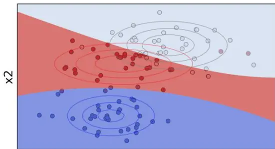
x1
资料来源：华泰证券研究所

## 特征的挑选方法

在多因子模型中，股票的特征并不是相互独立的，部分特征之间存在着较高的相关性，比如净利润和扣除非经常损益后净利润。因为特征独立的假设，两个高度相关的特征在模型中会被单独引入两次，这样大大提高了这一特征在模型中的重要性，导致模型估计不准确。对此，我们有三种处理方法：

1. 不做任何处理，选用所有特征。根据 Zhang（2004）的研究，即使特征之间存在着高度的相关性，其相关性也可能相互抵消从而造成较小的影响。

2. 挑选部分有效的特征，弃掉效果偏弱的特征，缓解特征之间的相关性。

3. 放弃特征之间相互独立的假设，利用历史数据估计特征协方差矩阵Σ。

接下来我们将对 2 进行分析，之后的部分我们将对 3 进行仔细分析。

## 序列向前与序列向后法

序列向前法（Langley and Sage，1994）是一种贪心算法，这种算法从空特征集开始，搜索一个使得分类准确率增加最多的特征，将其加入特征集，然后在剩下的特征中重复搜索过程，直到正确率没有因为新增加的特征而减少。与序列向前法对应的还有一种序列向后法（Kittler，1986），即从全特征开始，每次移除使得正确率下降最多的特征，直到特征的移除对正确率没有明显的影响。当特征的数量较多时，这两种算法都需要大量的时间去搜索最优解。

## 主成分分析（PCA）

PCA 经过线性变换，可以把原始数据变换成一组各维度线性无关的表示，因此可以很好地符合特征之间相互独立的假设。具体而言，我们每期利用训练集的数据对特征进行 PCA处理，选择包含信息最多的几个特征向量（一般取 15 个左右），利用结果对待分类数据的特征X进行相同的处理。

## Lasso 回归

Lasso 回归通过引入损失函数，增加稀疏约束，从而可以挑选出相对更为有效的特征，去掉无用的特征，减少特征数量。具体而言，我们每期对训练集的数据进行 Lasso回归，固定惩罚系数，挑选出那些回归后系数不为 0的特征作为朴素贝叶斯模型的输入特征。

对于一个联合正态分布，当我们的样本量相对特征数量足够大时，要估计其协方差矩阵并不难。接下来我们选择“正视”特征的相关性问题，使用线性判别分析法和二次判别分析法来分类。

## 线性判别分析法（LDA）介绍

线性判别分析法（以下简称 LDA）是高斯朴素贝叶斯法的一个延伸，在其他条件不变的情况下，LDA放弃了特征相互独立的假设，转而利用不同类别的协方差矩阵之和来估计特征之间的相关性。朴素贝叶斯法对不同类别的Y估计了不同的 $\vert\boldsymbol{\Sigma}_{1},\boldsymbol{\Sigma}_{2}\dots\boldsymbol{\Sigma}_{k}$ ，而 LDA 则假设对于不同类别的Y，特征的相关性没有明显的差异。比如在男性和女性中，经常跑马拉松和长跑耐力强这两个特征的相关性基本是一致的。对此我们可以简单地利用全样本数据估计统一的协方差矩阵Σ，进而计算联合正态分布的概率。

图表3： 线性判别分析法参数估计

$$
\begin{array}{rlr}{1.}&{{}\ }&{P(y=k)={\frac{\sum_{c=1}^{n}1\{y^{(c)}=k\}}{n}}}\end{array}
$$

$$
\begin{array}{rl}{2.}&{{}\pmb{\mu}_{k}=\frac{\sum_{c=1}^{n}\pmb{1}\{y}^{(c)}=k\}{\sum_{c=1}^{n}\pmb{1}\{y}^{(c)}=k\}\ (\frac{\hbar}{\sqrt{2}}\wedge\pmb{\dot{\xi}}y^{\pm}\pmb{\dot{\xi}}\mp\pmb{\dot{\xi}}\pmb{\dot{\xi}})-\operatorname{\dot{\eta}}\operatorname{\mathcal{T}}\operatorname{\mathbb{P}}\operatorname{\mathbb{\dot{q}}}\pmb{\dot{\xi}}\pmb{\eta}_{k})}\end{array}
$$

$$
\begin{array}{r}{3.\quad\varSigma=\frac{\sum_{c=1}^{n}(x^{(c)}-\pmb{\mu}_{y(c)=k})(x^{(c)}-\pmb{\mu}_{y(c)=k})^{T}}{n}}\end{array}
$$

资料来源：华泰证券研究所

在计算概率时，我们对贝叶斯公式中的后验概率 $P(y=k|x)$

$$
{\begin{array}{rl}&{P({\boldsymbol{y}}=k|{\boldsymbol{x}})={\frac{P({\boldsymbol{y}}=k)\cdot P({\boldsymbol{x}}|{\boldsymbol{y}}=k)}{\sum_{l=1}^{m}P({\boldsymbol{y}}=l)\cdot P({\boldsymbol{x}}|{\boldsymbol{y}}=l)}}}\\&{\qquad={\frac{\pi_{k}\cdot{\frac{1}{(2\pi)^{d/2}|{\boldsymbol{\Sigma}}|^{1/2}}}\exp\left(-{\frac{1}{2}}({\boldsymbol{x}}-{\boldsymbol{\mu}}_{k})^{T}{\boldsymbol{\Sigma}}^{-1}({\boldsymbol{x}}-{\boldsymbol{\mu}}_{k})\right)}{\sum_{l=1}^{m}\pi_{l}\cdot{\frac{1}{(2\pi)^{d/2}|{\boldsymbol{\Sigma}}|^{1/2}}}\exp\left(-{\frac{1}{2}}({\boldsymbol{x}}-{\boldsymbol{\mu}}_{l})^{T}{\boldsymbol{\Sigma}}^{-1}({\boldsymbol{x}}-{\boldsymbol{\mu}}_{l})\right)}}}\end{array}}
$$

其中 $\pi_{k}=P(y=k)$ ，我们对分式约分后分子取对数，即可得到判别方程：

$$
\delta_{k}(x)=\log(\pi_{k})-\frac{1}{2}{\pmb\mu_{k}}^{T}\Sigma^{-1}{\pmb\mu_{k}}+{\pmb x}^{T}\Sigma^{-1}{\pmb\mu_{k}}
$$

在计算了一组特征对应于k种分类的k个 $\cdot\delta_{k}(x)$ 之后，我们可以通过：

$$
P(y=k|x)=\frac{e^{\delta_{k}(x)}}{\sum_{l=1}^{m}e^{\delta_{l}(x)}}
$$

得到最终的概率。因为 $\delta_{k}(x)$ 是关于x的一次函数，所以这种方法也是一种线性分类法。值得一提的是，对于二分类问题，如果两种类别的样本数相等，线性判别分析计算出的排序结果等价于线性回归（见附录）。

通常而言，协方差矩阵的估计很容易因为存在一些极值而产生偏差，所以我们用了Ledoit-Wolf 法把协方差矩阵的估计值进行了缩减。图 4 中，我们可以看出经过缩减估计的 LDA 明显优于普通的 LDA。

图表4： 线性判别分析法在协方差矩阵缩减时的正确率表现
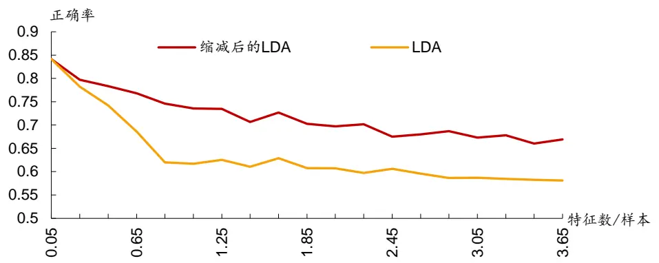
资料来源：华泰证券研究所

## 二次判别分析法（QDA）介绍

不同类别的事物常常有着不同的特征分布。在男性和女性中，去超市购物时购买啤酒和购买纸尿布的相关性就不同（后者较低），此时 LDA 的假设就会变得不合理。作为改进，二次判别分析法（以下简称 QDA）假设了类别的不同会导致事物特征的相关性不同。与朴素贝叶斯相比，QDA 在估计每个类别协方差矩阵时增加了不同特征之间的协方差，而不是简单设为 0。对不同的Y，QDA 为每个类估计了不同的 $\vert\boldsymbol{\Sigma}_{1},\boldsymbol{\Sigma}_{2}\ldots\boldsymbol{\Sigma}_{k}\boldsymbol{\hat{\mathcal{{H}}}\mu_{1}},\pmb{\mu}_{2}\ldots\pmb{\mu}_{k},$

图表5： 二次判别分析法参数估计

$$
\begin{array}{rl}{{1.}\ }&{{}P(y=k)=\frac{\sum_{c=1}^{n}\Im\left\{y^{(c)}=k\right\}}{n}}\\{{2.}\ }&{{}\pmb{\mu_{k}}=\frac{\sum_{c=1}^{n}\Im\left\{y^{(c)}=k\right\}^{(c)}}{\sum_{c=1}^{n}\Im\left\{y^{(c)}=k\right\}}\ \left(\tilde{\mathcal{H}}\atop{\ i\atop\uparrow}\bigwedge\tilde{\mathcal{H}}y^{\frac{\mathrm{d}}{\mathrm{d}}/\tilde{\mathcal{H}}}\right)\tilde{\mathcal{H}}_{k}\ }\\{{3.}\ }&{{}\sum_{k}=\frac{\sum_{c=1}^{n}\Im\left\{y^{(c)}=k\right\}\left(x^{(c)}-\mu_{y}(c)_{=k}\right)\left(x^{(c)}-\mu_{y}(c)_{=k}\right)^{T}}{\sum_{i=1}^{n}\Im\left\{y^{(c)}=k\right\}}\ (\tilde{\mathcal{H}}\mathbin{\not\sim\tilde{\mathcal{H}}}\mathbin{\tilde{\mathcal{H}}}\mathbin{\tilde{\mathcal{H}}}\mathbin{\tilde{\mathcal{H}}}\mathbin{\tilde{\mathcal{H}}}\mathbin{\tilde{\mathcal{H}}}\mathbin{\tilde{\mathcal{H}}}-\bigwedge\setminus\overline{{\mathcal{H}}}\mathbin{\tilde{\mathcal{H}}}\mathbin{\tilde{\mathcal{H}}}\mathbin{\tilde{\mathcal{H}}}\mathscr{L}_{k})}\end{array}
$$

资料来源：华泰证券研究所

与 LDA 类似，我们可以得到如下的判别方程：

$$
\delta_{k}(x)=log(\pi_{k})-\frac{1}{2}{\pmb\mu}_{k}^{\enspace T}{\Sigma}_{k}^{\enspace-1}{\pmb\mu}_{k}+{x}^{T}{\Sigma}_{k}^{\enspace-1}{\pmb\mu}^{(k)}-\frac{1}{2}{\pmb x}^{T}{\Sigma}_{k}^{\enspace-1}{\pmb x}-\frac{1}{2}log|{\cal L}_{k}|
$$

来估计对应的概率。因为Σ不同导致P(y = k|x)的表达式上下不能约分，QDA的判别方程是关于x的二次方程，分类边界是曲线。和线性判别分析类似，在实际计算中我们也对协方差矩阵的估计进行了缩减处理（下文提到的 LDA、QDA算法的结果都是经过缩减处理之后的结果）。QDA 虽然估计了较多的参数，但并不一定比 LDA 的效果好，因为数据减少参数估计的精确度也下降了。图 6是 LDA和 QDA 分类效果的对比，其中星星代表的是分类错误的样本。我们可以看出当随机产生的两类样本拥有相同的协方差矩阵时，两者效果几乎一致；当两类样本的协方差矩阵不相同时，QDA的表现明显优于 LDA。

图表6： LDA、QDA分类效果比较
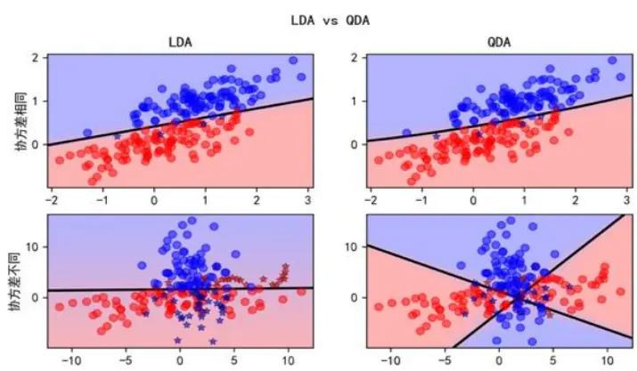
资料来源：华泰证券研究所

## 模型测试流程

图表7： 朴素贝叶斯、LDA、QDA模型构建示意图
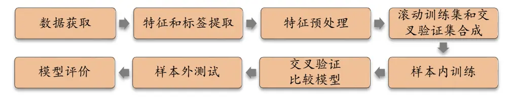
资料来源：华泰证券研究所

如图表 7所示，朴素贝叶斯及 LDA、QDA 模型的构建方法包含下列步骤：

1． 数据获取：

a) 股票池：全 A股，剔除 ST 股票，剔除每个截面期下一交易日停牌的股票，剔除上市 3个月以内的股票，每只股票视作一个样本。

b) 滚动回测区间：2007-01-31 至 2017-07-31。

c) 数据区间：1998-04-31 至 2017-07-31。

2．特征和标签提取：每个自然月的最后一个交易日，计算之前报告里的 70 个因子暴露度，作为样本的原始特征；计算下一整个自然月的个股超额收益（以沪深 300 指数为基准，若没有沪深 300 指数，则选择全部股票的平均收益为基准），作为样本的标签。因子池如图表 8所示。

3． 特征预处理：

a) 中位数去极值：设第 T 期某因子在所有个股上的暴露度序列为 $D_{i}$ ， $D_{M}$ 为该序列中位数， $D_{M1}$ 为序列 $D_{i}-D_{M}|$ 的中位数，则将序列 $D_{i}$ 中所有大于 $D_{M}+5D_{M1}$ 的数重设为 $D_{M}+5D_{M1}$ ，将序列 $D_{i}$ 中所有小于 $D_{M}-5D_{M1}$ 的数重设为 $D_{M}-5D_{M1}$ ；

b) 缺失值处理：得到新的因子暴露度序列后，将因子暴露度缺失的地方设为中信一级行业相同个股的平均值。

c) 行业市值中性化：将填充缺失值后的因子暴露度对行业哑变量和取对数后的市值做线性回归，取残差作为新的因子暴露度。

d) 标准化：将中性化处理后的因子暴露度序列减去其现在的均值、除以其标准差，得到一个新的近似服从N(0,1)分布的序列。

4． 滚动训练集和交叉验证集合成：以 T 月月末为例，从第 T-n（n = 6,12,18,24,36,48,60尽可能长）期至第 T-1期的特征和标签作为训练样本。在每个月末截面期，选取下月收益排名前 30%的股票作为正例（y= 1），后 30%的股票作为负例 $(y=-1)$ ）。将 n 个月的样本合并成为训练集。交叉验证集为全部的训练集，详见下文。

5． 样本内训练：使用朴素贝叶斯模型、LDA模型、QDA 模型对训练集进行训练。同时，我们采用线性回归模型作为统一对照组。

6． 交叉验证比较模型：使用交叉验证的结果比较模型并进行滚动期的选择。

7． 样本外回测：以 T 月月末截面期所有样本预处理后的特征作为模型的输入，得到每个样本的预测概率，将预测概率视作合成后的因子，进行单因子分层回测。回测方法和之前的单因子测试报告相同，具体步骤参考下一小节。

8． 模型评价：我们以分层回测的结果作为模型评价指标。我们还将给出测试集的正确率、AUC 等衡量模型性能的指标。

图表8： 选股模型中涉及的全部因子及其描述

| 大类因子具体因子 | 因子描述 | 因子方向 |  |
| --- | --- | --- | --- |
| 估值 EP |  | 净利润（TTM）/总市值 |  |
| 估值 EPcut |  | 扣除非经常性损益后净利润（TTM）/总市值 |  |
| 估值 BP | 净资产/总市值 |  |  |
| 估值 SP | 营业收入（TTM）/总市值 |  |  |
| 估值 NCFP |  | 净现金流（TTM）/总市值 |  |
| 估值 OCFP |  | 经营性现金流（TTM）/总市值 |  |
| 估值 DP |  | 近12个月现金红利（按除息日计）/总市值 |  |
| 估值 G/PE |  | 净利润（TTM）同比增长率/PE_TTM |  |
| 成长 Sales_G_q |  | 营业收入（最新财报，YTD）同比增长率 |  |
| 成长 Profit_G_q |  | 净利润（最新财报，YTD）同比增长率 |  |
| 成长 OCF_G_q |  | 经营性现金流（最新财报，YTD）同比增长率 |  |
| 成长 ROE_G_q |  | ROE（最新财报，YTD）同比增长率 |  |
| 财务质量 ROE_q |  | ROE（最新财报，YTD） |  |
| 财务质量 ROE_ttm | ROE（最新财报，TTM） |  |  |
| 财务质量 ROA_q |  | ROA（最新财报，YTD） |  |
| 财务质量 ROA_ttm 财务质量grossprofitmargin_q |  | ROA（最新财报，TTM） |  |
| 财务质量grossprofitmargin_ttm |  | 毛利率（最新财报，YTD） |  |
| 财务质量 profitmargin_q |  | 毛利率（最新财报，TTM） |  |
| 财务质量 profitmargin_ttm |  | 扣除非经常性损益后净利润率（最新财报，YTD） |  |
| 财务质量 assetturnover_q |  | 扣除非经常性损益后净利润率（最新财报，TTM） |  |
| 财务质量 assetturnover_ttm |  | 资产周转率（最新财报，YTD） |  |
| 财务质量operationcashflowratio_q |  | 资产周转率（最新财报，TTM） |  |
| 财务质量operationcashflowratio_ttm |  | 经营性现金流/净利润（最新财报，YTD） |  |
| 杠杆 |  | 经营性现金流/净利润（最新财报，TTM） |  |
| 杠杆 | financial_leverage | 总资产/净资产 |  |
| 杠杆 | debtequityratio | 非流动负债/净资产 |  |
| 杠杆 | cashratio | 现金比率 |  |
| 市值 In_capital | currentratio | 流动比率 总市值取对数 |  |
| 动量反转HAlpha |  | 个股60个月收益与上证综指回归的截距项 |  |
| 动量反转return_Nm |  | 个股最近N个月收益率，N=1，3，6，12 |  |
| 动量反转 wgt_return_Nm |  | 个股最近N个月内用每日换手率乘以每日收益率求算术平均 |  |
| 动量反转 exp_wgt_return_Nm |  | -1 值，N=1，3，6，12 |  |
| 波动率 |  | 个股最近 N 个月内用每日换手率乘以函数 exp(-x_i/N/4)再乘 | -1 |
|  |  | 以每日收益率求算术平均值，x_i为该日距离截面日的交易日 |  |
|  |  | 的个数，N=1，3，6，12 |  |
| 波动率 std_Nm | std_FF3factor_Nm | 特质波动率 一个股最近 N 个月内用日频收益率对 Fama French三因子回归的残差的标准差，N=1，3，6，12 | -1 |
| 股价 | In_price | 个股最近N个月的日收益率序列标准差，N=1，3，6，12 股价取对数 | -1 -1 |
| beta beta |  | 个股60个月收益与上证综指回归的 beta | -1 |
| 换手率 | turn_Nm | 个股最近N个月内日均换手率(剔除停牌、涨跌停的交易日)， | -1 |
|  |  | N=1, 3, 6, 12 |  |
| 换手率 | bias_turn_Nm | 个股最近N个月内日均换手率除以最近2年内日均换手率(剔 除停牌、涨跌停的交易日）再减去1，N=1，3，6，12 | -1 |
| 情绪 | rating_average | wind 评级的平均值 | 1 |
| 情绪 | rating_change | wind评级（上调家数-下调家数）/总数 | 1 1 |
| 情绪 | rating_targetprice | wind一致目标价/现价-1 | 1 |
| 股东 | holder_avgpctchange | 户均持股比例的同比增长率 | -1 |
| 技术 | MACD |  |  |
| 技术 | DEA | 经典技术指标（释义可参考百度百科），长周期取30日，短 | -1 |
| 技术 | DIF | 周期取 10日，计算 DEA 均线的周期（中周期）取 15 日 | -1 |
| 技术 | RSI | 经典技术指标，周期取20日 | -1 |
| 技术 | PSY | 经典技术指标，周期取20日 | -1 |
| 技术 | BIAS | 经典技术指标，周期取20日 | -1 |

资料来源：Wind，华泰证券研究所

## 模型测试结果与方法比较

## 时间序列数据的交叉验证

传统机器学习的交叉验证是在样本中随机选取一定比例作为训练集，余下的样本作为交叉验证集。当样本是时间序列数据时（例如股票数据），数据前后次序之间的关联会对结果产生一定的影响。如果某个月的数据一部分被分进了训练集，另一部分被分进了验证集，则会出现用同月的规律预测同月结果的“作弊”行为。因此，本文采用了一种基于时间序列的交叉验证方法，具体算法如图 9所示：

图表9： 时间序列数据的交叉验证
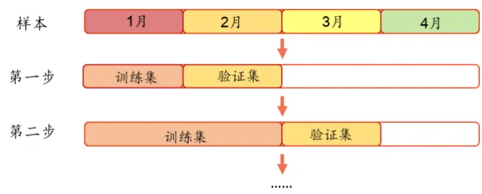
资料来源：华泰证券研究所

简单来说，如果样本的长度为 4 个月，我们就先将第 1个月的数据作为训练集，第 2 个月的数据作为验证集，进行测试。然后将第 1、2个月的数据作为训练集，第 3个月为验证集，以此类推，最后以 1、2、3个月的数据作为训练集，第 4 个月作为验证集，再将所有的指标结果取平均数。图 10 是两种交叉验证的方法应用于三种算法的效果比较，我们可以发现，对于时间序列的交叉验证方法，随着滚动回测的样本月数增加，分类正确率也逐渐增加，这与我们的直觉——数据越多模型越准确相符。对于普通的交叉验证方法，结果则出现了逆转，不符合现实规律。因此本文在对方法进行比较时，采用的是基于时间序列的交叉验证方法。

图表10： 交叉验证方法比较

| 训练集长度选择 | 朴素贝叶斯 | LDA | QDA | 朴素贝叶斯 | LDA | QDA |
| --- | --- | --- | --- | --- | --- | --- |
|  | 时间序列交叉验证正确率 |  |  |  | 普通交叉验证正确率 |  |
| 6个月 | 53.29% | 53.31% | 52.41% | 57.39% | 59.00% | 59.04% |
| 12个月 | 54.08% | 54.05% | 53.39% | 56.38% | 57.90% | 58.08% |
| 18个月 | 54.39% | 54.43% | 53.86% | 56.02% | 57.52% | 57.41% |
| 24个月 | 54.50% | 54.66% | 54.04% | 56.19% | 57.57% | 57.47% |
| 36个月 | 54.67% | 54.99% | 54.36% | 55.77% | 57.33% | 57.10% |
| 48个月 | 54.81% | 55.21% | 54.60% | 55.80% | 57.24% | 56.88% |
| 60 个月 | 54.92% | 55.35% | 54.78% | 55.70% | 57.07% | 56.74% |

资料来源：Wind，华泰证券研究所

## 训练期的选择

通常而言，对于朴素贝叶斯及其衍生的算法，用作训练的数据越多，训练效果越好。为了验证这个假设，本文研究了滚动回测中训练期长度对分类结果的影响，分别选取长度为 6、12…48、60 个月进行比较。结果如图表 11所示：随着训练期的长度增加，分类的正确率、AUC（AUC 的具体定义请参考华泰金工研报《人工智能选股之支持向量机模型》）也缓慢得到了增加，并且这种变化非常稳定，在三种模型中都得到了印证。

图表11： 训练期对模型分类效果的影响

| 训练集长度选择 | 朴素贝叶斯 | LDA | QDA | 朴素贝叶斯 | LDA | QDA |
| --- | --- | --- | --- | --- | --- | --- |
|  | 交叉验证正确率 |  |  | 交叉验证 AUC |  |  |
| 6个月 | 53.29% | 53.31% | 52.41% | 0.5479 | 0.5458 | 0.5326 |
| 12个月 | 54.08% | 54.05% | 53.39% | 0.5591 | 0.5563 | 0.5454 |
| 18个月 | 54.39% | 54.43% | 53.86% | 0.5636 | 0.5615 | 0.5521 |
| 24个月 | 54.50% | 54.66% | 54.04% | 0.5650 | 0.5641 | 0.5552 |
| 36个月 | 54.67% | 54.99% | 54.36% | 0.5674 | 0.5687 | 0.5605 |
| 48个月 | 54.81% | 55.21% | 54.60% | 0.5690 | 0.5718 | 0.5641 |
| 60 个月 | 54.92% | 55.35% | 54.78% | 0.5700 | 0.5736 | 0.5666 |

资料来源：Wind，华泰证券研究所

在最终回测过程中，本文滚动回测训练期选择每期能获得的最大数据，即对于 T+1期，训练期的长度为第 1 至 T 期，如图 12所示。因为股票的特征之间存在明显的相关性，而且不同类别的股票协方差矩阵基本一致，所以 LDA模型的假设最符合实际的情况。从表中我们也可以发现，LDA的分类效果要明显优于朴素贝叶斯和 QDA。QDA 在数据量小时表现较差，但随着数据量的增加，QDA的表现逐渐“赶上”朴素贝叶斯，这也与算法的逻辑相符：QDA 需要估计的参数最多（ $\langle(d(d+1)/2+d)*m\rangle$ ），所以对数据量的要求最大。

图表12： 选择最大的样本作为训练集
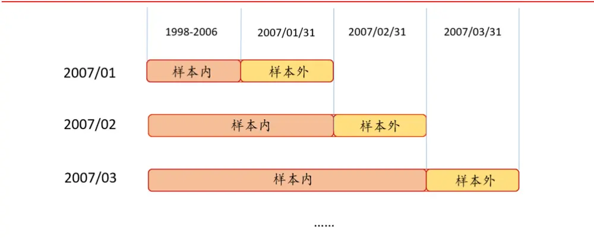
资料来源：华泰证券研究所

## 朴素贝叶斯因子的选择

在介绍部分，本文讨论了缓解朴素贝叶斯算法独立性假设的几种方法，接下来，我们对这些算法进行了比较，主要采用的比较标准是交叉验证集和样本外的分类正确率和 。从图表 13 中我们可以看到，Lasso、全因子、序列向后这三种方法的表现几乎一致，PCA、序列向前法则明显劣于其余的几种方法。值得一提的是，序列向前法和序列向后法很容易陷入局部最优的情况，从而效果不佳。对于序列向前法，每次挑选出来的因子个数大致在20 个以内，对于序列向后法，每次剔除的因子个数在 5 个以内。不同的挑选方法虽然缓解了独立性的假设，但却损失了信息，所以分类结果并没有明显的提升。因此，在本文的回测过程中，对于朴素贝叶斯算法我们简单选择了所有特征，不进行挑选。

图表13： 因子选择对朴素贝叶斯分类效果的影响

| 训练集长度选择 | 序列向前 | 序列向后 | PCA | Lasso | 全因子 | 序列向前 | 序列向后 | PCA | Lasso | 全因子 |
| --- | --- | --- | --- | --- | --- | --- | --- | --- | --- | --- |
| 交叉验证正确率 |  |  |  |  |  |  | 交叉验证 AUC |  |  |  |
| 6个月 | 52.66% | 53.31% | 53.06% | 53.14% | 53.29% | 0.5363 | 0.5478 | 0.5426 | 0.5455 | 0.5479 |
| 12个月 | 53.52% | 54.09% | 53.78% | 54.00% | 54.08% | 0.5480 | 0.5589 | 0.5525 | 0.5581 | 0.5591 |
| 18个月 | 53.88% | 54.40% | 54.12% | 54.32% | 54.39% | 0.5529 | 0.5634 | 0.5571 | 0.5631 | 0.5636 |
| 24个月 | 54.06% | 54.52% | 54.24% | 54.48% | 54.50% | 0.5553 | 0.5650 | 0.5588 | 0.5653 | 0.5650 |
| 36个月 | 54.32% | 54.67% | 54.47% | 54.74% | 54.67% | 0.5589 | 0.5673 | 0.5619 | 0.5693 | 0.5674 |
|  | 样本外正确率 |  |  |  |  |  | 样本外 AUC |  |  |  |
|  | 53.77% | 54.50% | 54.11% | 54.38% | 54.63% | 0.5519 | 0.5655 | 0.5578 | 0.5644 | 0.5663 |
| 6个月 12个月 | 55.10% | 55.35% | 54.98% | 55.52% | 55.38% | 0.5702 | 0.5786 | 0.5692 | 0.5807 | 0.5787 |
| 18个月 | 54.64% | 55.38% | 54.98% | 55.33% | 55.41% | 0.5641 | 0.5772 | 0.5688 | 0.5784 | 0.5774 |
| 24个月 | 55.24% | 55.44% | 55.17% | 55.68% | 55.42% | 0.5708 | 0.5790 | 0.5712 | 0.5817 | 0.5789 |
| 36个月 | 55.18% | 55.45% | 55.34% | 55.57% | 55.45% | 0.5703 | 0.5789 | 0.5723 | 0.5821 | 0.5788 |

资料来源：Wind，华泰证券研究所

## 模型正确率与 AUC 分析

下图展示了朴素贝叶斯、LDA、QDA 和第二篇广义线性模型中的线性回归模型（滚动训练窗口期同本文：即使用所能利用的最大数据集）每一期测试集的 AUC 随时间的变化情况。四种模型测试集平均 AUC 分别为 0.588，0.580，0.582，0.584。从图表 14~16 中可以看出，三种方法的 AUC波动方向基本与线性回归一致，因为 LDA模型与线性回归十分类似，所以两者的 AUC 变化接近重合。朴素贝叶斯和 QDA 的 AUC 则略低于线性模型，且波动较大，总体而言不如 LDA。

图表14： 朴素贝叶斯模型和线性回归模型样本外 AUC值
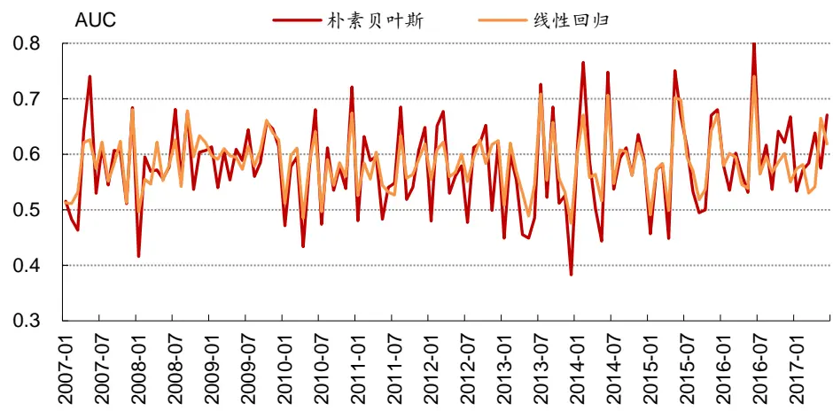
资料来源：Wind，华泰证券研究所

图表15： LDA模型和线性回归模型样本外 AUC值
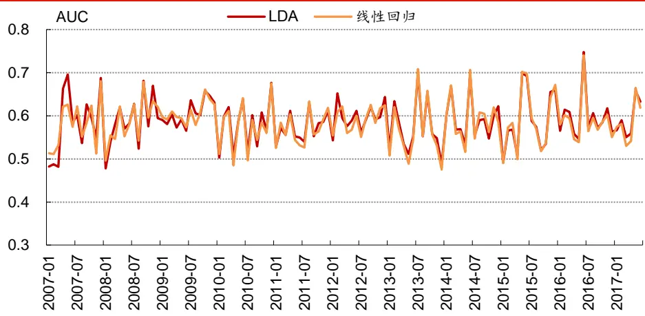
资料来源：Wind，华泰证券研究所

图表16： QDA模型和线性回归模型样本外AUC值
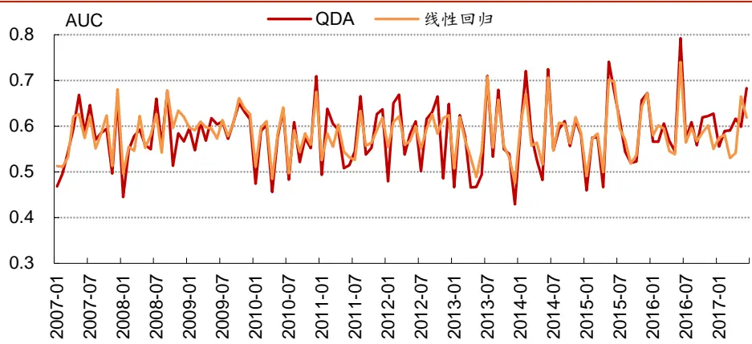
资料来源：Wind，华泰证券研究所

## 模型预测值与各因子相关情况

我们在每个截面上，将朴素贝叶斯模型对全部个股下期涨跌的预测值与因子池中各个因子值之间计算 Spearman 相关系数，查看模型预测值与各个因子值之间“真实的”相关情况，如。仿照华泰单因子测试系列报告中的思路，分层回测模型构建方法如下：

图表17： LDA模型对于下期涨跌预测值与本期因子值之间相关系数示意图

| 下期预测值与本期因子值实际相关系数（负向作用因子已乘以-1进行调整）月频，2007.1.31~2017.7.31 EP EPcut BP SP NCFP OCFP DP G/PE Sales_G_q Profit_G_q OCF_G_q ROE_G_q ROE_q ROE_ttm ROA_q ROA_ttm grossprofitmargin_q grossprofitmargin_ttm |
| --- |

资料来源：华泰证券研究所

## 分层模型回测

依照因子值对股票进行打分，构建投资组合回测，是最直观的衡量指标优劣的手段。一般测试模型构建方法如下：

1. 股票池：全 A 股，剔除 ST 股票，剔除每个截面期下一交易日停牌的股票，剔除上市3 个月以内的股票。

2. 回溯区间：2007-01-31 至 2017-07-31。

3. 换仓期：在每个自然月最后一个交易日核算因子值，在下个自然月首个交易日按当日收盘价换仓。

4. 数据处理方法：将朴素贝叶斯的概率视作单因子，因子值为空的股票不参与分层。

5. 分层方法：在每个一级行业内部对所有个股按因子大小进行排序，每个行业内均分成N 个分层组合。如图表 18 所示，黄色方块代表各行业内个股初始权重，可以相等也可以不等（我们直接取相等权重进行测试），分层具体操作方法为 N 等分行业内个股权重累加值，例如图示行业1中，5只个股初始权重相等（不妨设每只个股权重为0.2），假设我们欲分成 3 层，则分层组合 1在权重累加值 1/3 处截断，即分层组合 1包含个股 1 和个股 2，它们的权重配比为 0.2:(1/3-0.2)=3:2，同样推理，分层组合 2 包含个股 2、3、4，配比为(0.4-1/3):0.2:(2/3-0.6)=1:3:1，分层组合 4 包含个股 4、5，配比为 2:3。以上方法是用来计算各个一级行业内部个股权重配比的，行业间权重配比与基准组合（我们使用沪深 300）相同，也即行业中性。

6. 评价方法：回测年化收益率、夏普比率、信息比率、最大回撤、胜率等。

图表18： 单因子分层测试法示意图
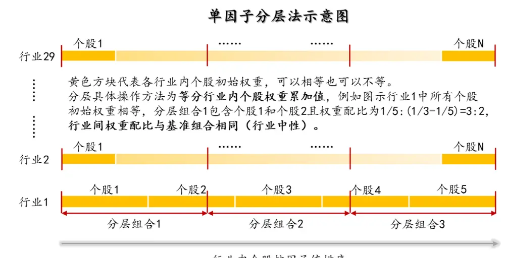
行业内个股按因子值排序
资料来源：华泰证券研究所

## 这里我们将展示朴素贝叶斯模型的分层测试结果。

下图是分五层组合回测绩效分析表（20070131～20170731）。其中组合 1～组合 5为按该因子从小到大排序构造的行业中性的分层组合。基准组合为行业中性的等权组合，具体来说就是将组合 1～组合 5 合并，一级行业内部个股等权配置，行业权重按当期沪深 300 行业权重配置。多空组合是在假设所有个股可以卖空的基础上，每月调仓时买入组合 1，卖空组合 5。回测模型在每个自然月最后一个交易日核算因子值，在下个自然月首个交易日按当日收盘价调仓。

图表19： 朴素贝叶斯模型分层组合绩效分析（20070131～20170731）

| 投资组合 | 年化收益率 | 年化波动率夏普比率最大回撤 |  |  | 年化超额收益率 | 超额收益年化波动率信息比率 |  | 相对基准月胜率 | 超额收益最大回撤 |
| --- | --- | --- | --- | --- | --- | --- | --- | --- | --- |
| 组合1 | 23.31% | 31.26% | 0.75 | 65.90% | 7.46% | 4.74% | 1.57 | 59.48% | 6.85% |
| 组合2 | 18.86% | 31.79% | 0.59 | 69.85% | 3.58% | 3.42% | 1.05 | 53.94% | 3.39% |
| 组合3 | 13.10% | 31.93% | 0.41 | 71.45% | -1.44% | 3.22% | -0.45 | 46.79% | 18.89% |
| 组合4 | 8.29% | 32.72% | 0.25 | 71.88% | -5.63% | 3.32% | -1.70 | 28.55% | 46.43% |
| 组合5 | -3.56% | 34.15% | -0.10 | 75.02% | -15.96% | 5.78% | -2.76 | 15.86% | 82.55% |
| 基准组合 | 14.75% | 32.13% | 0.46 | 70.29% |  |  |  |  |  |
| 多空组合 | 27.86% | 9.59% | 2.90 | 7.41% |  |  |  |  |  |

资料来源：Wind，华泰证券研究所

下面四个图依次为：

1.分五层组合回测净值图。按前面说明的回测方法计算组合 1～组合 5、基准组合的净值，与沪深 300、中证 500 净值对比作图。

2.分五层组合回测，用组合 1～组合 5的净值除以基准组合净值的示意图。可以更清晰地展示各层组合在不同时期的效果。

3.组合 1相对沪深 300 月超额收益分布直方图。该直方图以[-0.5%,0.5%]为中心区间，向正负无穷方向保持组距为 1%延伸，在正负两个方向上均延伸到最后一个频数不为零的组为止（即维持组距一致，组数是根据样本情况自适应调整的）。

4.分五层时的多空组合收益图。再重复一下，多空组合是买入组合 1、卖空组合 5（月度调仓）的一个资产组合。多空组合收益率是由组合 1 的净值除以组合 5的净值近似核算的。

图表20： 朴素贝叶斯模型分层组合回测净值
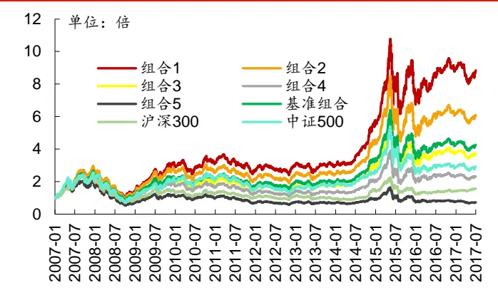
资料来源：Wind，华泰证券研究所

图表21： 朴素贝叶斯模型各层组合净值除以基准组合净值示意图
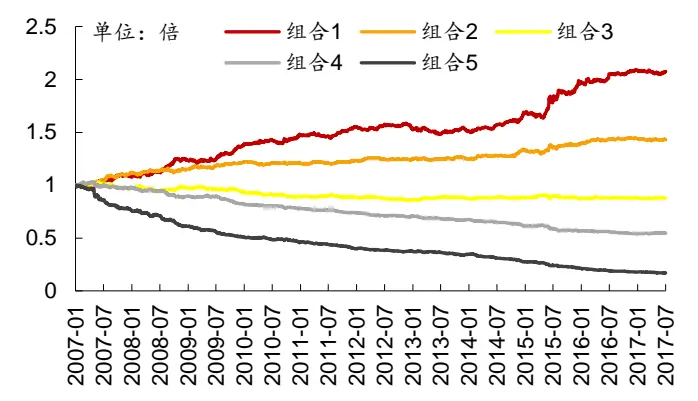
资料来源：Wind，华泰证券研究所

图表22： 朴素贝叶斯模型分层组合 1相对沪深 300月超额收益分布图
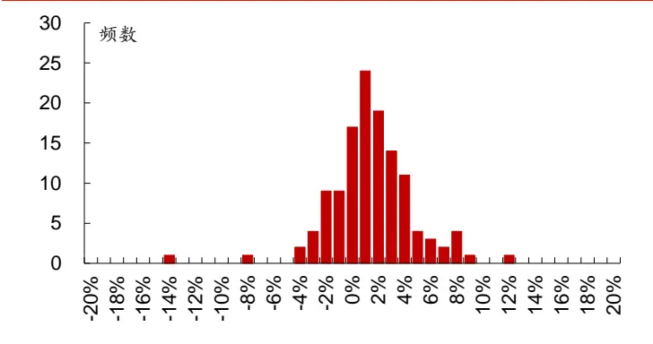
资料来源：Wind，华泰证券研究所

图表23： 朴素贝叶斯模型多空组合月收益率及累积收益率
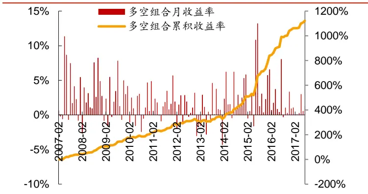
资料来源：Wind，华泰证券研究所

下图为分十层组合回测时，各层组合在不同年份间的收益率及排名表。每个单元格的内容为在指定年度某层组合的收益率（均为整年收益率），以及某层组合在全部十层组合中的收益率排名。最后一列是分层组合在 2007～2017 的排名的均值。

图表24： 朴素贝叶斯模型组合在不同年份的收益及排名分析（分十层）

|  | 2007 | 2008 | 2009 | 2010 | 2011 | 2012 | 2013 | 2014 | 2015 | 2016 | 2017 | 排名均值 |
| --- | --- | --- | --- | --- | --- | --- | --- | --- | --- | --- | --- | --- |
| 组合1 | 169.7%(2) | -54.0%(3) | 139.0%(3) | 11.7%(1) | -22.1%(1) | 17.7%(1) | 6.2%(6) | 78.6%(1) | 54.4%(1) | 6.8%(1) | -0.9%(2) | 1.92 |
| 组合2 | 167.0%(3) | -53.3%(2) | 146.8%(1) | -0.5%(4) | -27.1%(3) | 11.0%(4) | 4.9%(7) | 75.7%(3) | 53.8%(2) | 3.2%(2) | -4.9%(8) | 3.42 |
| 组合3 | 160.0%(4) | -53.2%(1) | 140.2%(2) | -1.7%(5) | -26.6%(2) | 12.9%(3) | 10.6%(2) | 77.6%(2) | 46.4%(3) | 1.7%(4) | -3.8%(6) | 3.08 |
| 组合4 | 183.8%(1) | -62.1%(6) | 131.2%(4) | 1.4%(2) | -28.7%(5) | 13.3%(2) | 7.8%(5) | 74.3%(5) | 25.6%(7) | 2.7%(3) | -3.4%(4) | 4.00 |
| 组合5 | 134.8%(7) | -59.9%(5) | 127.5%(5) | -8.5%(9) | -27.6%(4) | 7.0%(7) | 12.9%(1) | 59.1%(6) | 27.6%(5) | -4.0%(6) | -2.6%(3) | 5.25 |
| 组合6 | 142.4%(6) | -58.0%(4) | 105.0%(8) | -3.7%(6) | -30.6%(6) | 8.8%(5) | 9.5%(3) | 74.9%(4) | 32.9%(4) | -0.6%(5) | -3.6%(5) | 5.17 |
| 组合7 | 146.1%(5) | -62.6%(7) | 105.2%(7) | 0.1%(3) | -33.2%(8) | 5.0%(9) | 8.6%(4) | 56.9%(7) | 26.4%(6) | -5.7%(7) | -4.1%(7) | 6.42 |
| 组合8 | 132.8%(8) | -63.4%(8) | 109.8%(6) | -9.8%(10) | -32.5%(7) | 5.5%(8) | -0.5%(8) | 54.0%(8) | 11.9%(8) | -8.4%(8) | -0.1%(1) | 7.33 |
| 组合9 | 108.7%(9) | -67.3%(9) | 79.2%(10) | -7.5%(7) | -35.8%(9) | 7.0%(6) | -0.9%(9) | 47.1%(9) | 1.0%(10) | -18.2%(9) | -7.1%(9) | 8.75 |
| 组合10 | 79.8%(10)-69.7%(10) |  | 95.5%(9) |  | -8.3%(8)-44.1%(10) | 2.0%(10) | -3.1%(10) | 27.8%(10) |  | 1.0%(9)-20.8%(10)-10.5%(10) |  | 9.67 |

资料来源：Wind，华泰证券研究所

下图是不同市值区间分层组合回测绩效指标对比图（分十层）。我们将全市场股票按市值排名前 1/3，1/3～2/3，后 1/3 分成三个大类，在这三类股票中分别进行分层测试，基准组合构成方法同前面所述（注意每个大类对应的基准组合并不相同）。

图表25： 不同市值区间朴素贝叶斯模型组合绩效指标对比图（分十层）
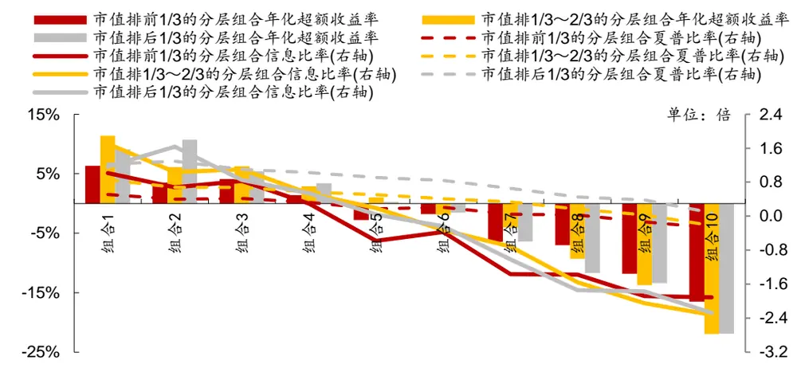
资料来源：Wind，华泰证券研究所

下图是不同行业间分层组合回测绩效分析表（分五层）。我们在不同一级行业内部都做了分层测试，基准组合为各行业内该因子非空值的个股等权组合（注意每个行业对应的基准组合并不相同）。

图表26： 不同行业朴素贝叶斯模型分层组合绩效分析（分五层）

|  | 组合1年化 | 组合1 | 组合1 | 组合1 | 组合1超额收益 | 组合1相对 | 所有组合年化 |
| --- | --- | --- | --- | --- | --- | --- | --- |
| 行业 | 超额收益率 | 信息比率 | 年化收益率 | 夏普比率 | 最大回撤 | 基准月胜率 | 收益率排序 |
| 计算机 | 16.99% | 1.4 | 43.93% | 1.09 | 18.01% | 63.37% | 1,2,3,4,5 |
| 建材 | 14.81% | 1.22 | 42.08% | 1.14 | 17.81% | 60.24% | 1,2,3,4,5 |
| 电力设备 | 13.75% | 1.36 | 34.42% | 0.95 | 11.13% | 66.49% | 1,2,3,4,5 |
| 有色金属 | 13.63% | 1.23 | 33.41% | 0.83 | 14.45% | 63.37% | 1,2,3,4,5 |
| 房地产 | 12.98% | 1.54 | 33.27% | 0.9 | 9.36% | 66.49% | 1,2,3,4,5 |
| 机械 | 12.97% | 1.58 | 34.23% | 0.95 | 12.61% | 64.15% | 1,2,3,4,5 |
| 通信 | 12.60% | 1.04 | 37.80% | 0.99 | 22.61% | 57.11% | 2,1,3,4,5 |
| 农林牧渔 | 11.73% | 1.12 | 33.21% | 0.91 | 16.45% | 61.80% | 1,2,3,4,5 |
| 商贸零售 | 11.37% | 1.24 | 28.03% | 0.82 | 14.20% | 60.24% | 1,3,2,4,5 |
| 传媒 | 11.01% | 0.67 | 28.15% | 0.7 | 32.79% | 57.11% | 1,2,4,3,5 |
| 汽车 | 10.81% | 1.13 | 34.29% | 0.99 | 19.41% | 58.67% | 1,2,3,4,5 |
| 纺织服装 | 10.46% | 1.05 | 31.95% | 0.9 | 16.22% | 61.02% | 1,3,2,4,5 |
| 食品饮料 | 10.46% | 0.89 | 29.74% | 0.92 | 19.45% | 57.11% | 1,2,3,4,5 |
| 基础化工 电力及公用事业 | 9.44% | 1.16 | 31.70% | 0.88 | 12.64% | 62.58% | 1,2,3,4,5 |
| 煤炭 | 9.03% | 1.01 | 25.71% | 0.75 | 10.42% | 58.67% | 1,2,3,4,5 |
| 餐饮旅游 | 8.56% | 0.72 | 22.91% | 0.54 | 20.79% | 57.89% | 1,2,3,4,5 |
| 石油石化 | 8.39% | 0.61 | 25.77% | 0.72 | 24.16% | 60.24% | 1,2,3,4,5 |
| 医药 | 7.89% | 0.52 | 26.31% | 0.75 | 33.15% | 57.11% | 1,2,3,4,5 |
| 轻工制造 | 7.85% | 1.02 | 33.29% | 0.99 | 13.08% | 61.02% | 1,2,3,4,5 |
| 非银行金融 | 7.64% | 0.63 | 27.61% | 0.77 | 18.43% | 54.76% | 1,2,3,4,5 |
| 国防军工 | 7.08% | 0.41 | 17.36% | 0.4 | 28.69% | 53.98% | 1,2,4,3,5 |
| 电子元器件 | 6.52% | 0.4 | 25.24% | 0.59 | 39.59% | 56.33% | 2,1,4,3,5 |
| 钢铁 | 6.18% | 0.66 | 29.89% | 0.79 | 18.80% | 52.42% | 1,3,2,4,5 |
|  | 5.24% | 0.5 | 18.30% | 0.49 | 27.37% | 54.76% | 1,2,4,3,5 |
| 交通运输 | 5.23% | 0.55 | 20.06% | 0.61 | 14.02% | 52.42% | 1,3,2,4,5 |
| 建筑 | 5.21% | 0.43 | 28.91% 25.82% | 0.81 | 26.91% 20.74% | 48.51% | 1,2,3,4,5 |
| 综合 家电 | 4.08% | 0.29 0.18 | 25.43% | 0.69 0.74 | 28.18% | 50.85% 46.16% | 2,1,3,4,5 |
|  | 2.32% |  |  |  |  |  | 2,3,1,4,5 |
| 银行 | -1.22% | -0.1 | 9.47% | 0.3 | 36.54% | 42.24% | 4,1,2,3,5 |

资料来源：Wind，华泰证券研究所

## 构建策略组合及回测分析

我们比较了朴素贝叶斯、LDA、QDA 三种不同的算法。其中朴素贝叶斯选用的是全部特征，LDA和 QDA 在估计协方差矩阵时进行了缩减处理。我们每期的样本是所能获得的最大数据集，同时以人工智能系列报告二中的线性回归模型（滚动训练窗口期同本文：即使用所能利用的最大数据集）作为统一对照组。

首先，我们构建了沪深 300 和中证 500 成份内选股策略并进行回测，各项指标详见图表27。选股策略分为两类：一类是行业中性策略，策略组合的行业配置与基准（沪深 300、中证 500）保持一致，各一级行业中选 N 个股票等权配置（N=2,5,10,15,20）；另一类是个股等权策略，直接在票池内不区分行业选 N 个股票等权配置（N=20,50,100,150,200），比较基准取为 300 等权、500 等权指数。两类策略均为月频调仓，个股入选顺序为它们在三种模型中的当月的预测概率顺序。

对于沪深300成份股内选股的行业中性策略，LDA和朴素贝叶斯在多项指标上均优于QDA和线性回归。对于不约束行业中性的等权配置策略，朴素贝叶斯模型出现了较大的回撤，LDA 模型表现最佳。对于中证 500 成份股内选股的行业中性和个股等权策略，LDA和朴素贝叶斯表现相似，在各项指标上均优于 QDA 和线性回归。

图表28展示了全A选股策略的回测结果。对于全A选股的行业中性策略和个股等权策略，LDA 和线性回归模型在各项指标上总体而言优于 QDA和朴素贝叶斯，QDA 则略优于朴素贝叶斯。

总体来看，在全 A选股中，LDA模型表现最佳；在沪深 300 和中证 500 选股中，朴素贝叶斯模型和 LDA模型有不错的回测表现。

图表27： 朴素贝叶斯、LDA、QDA模型回测重要指标对比（沪深 300及中证 500成份股内选股）
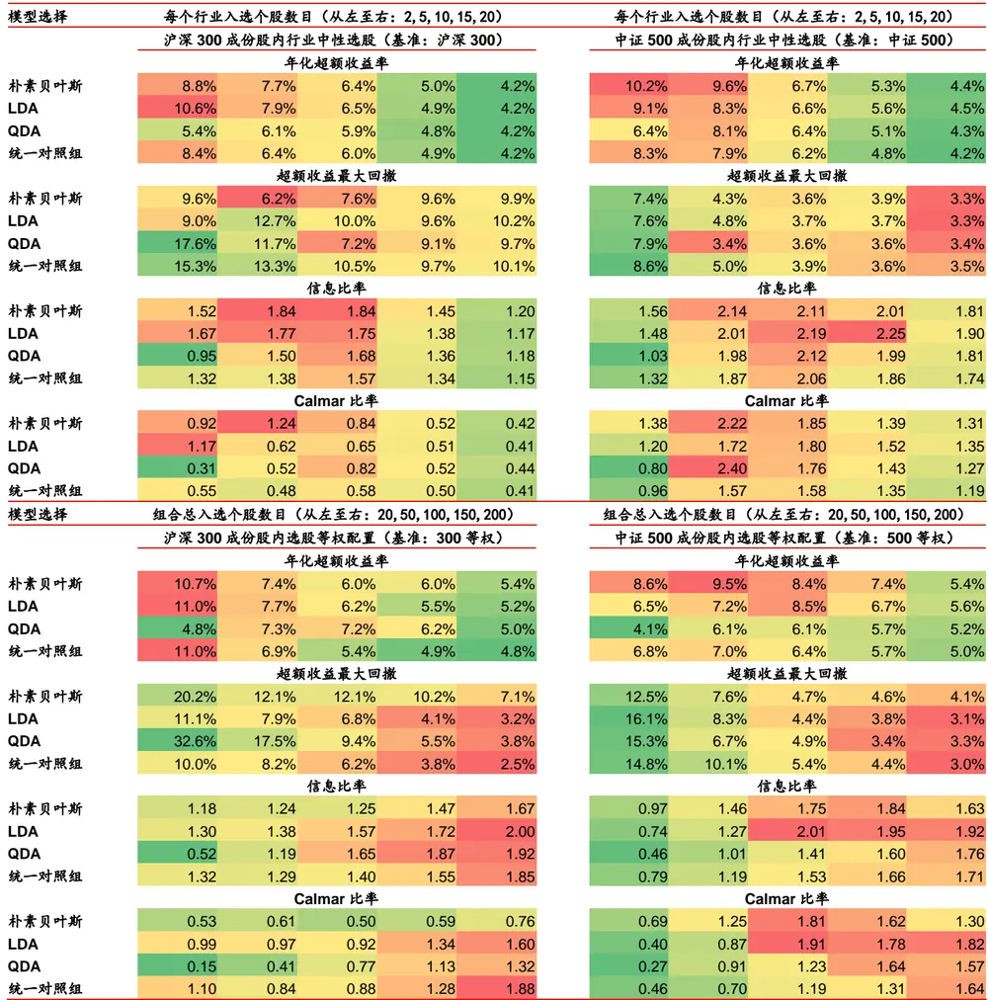
资料来源：Wind，华泰证券研究所

图表28： 朴素贝叶斯、LDA、QDA模型回测重要指标对比（全 A选股）
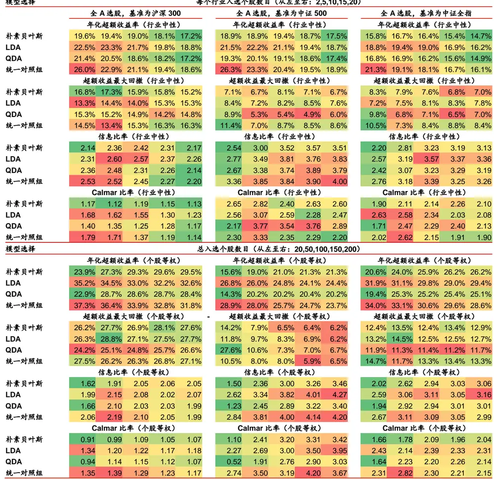
资料来源：Wind，华泰证券研究所

## 朴素贝叶斯模型选股策略详细分析

下面我们对策略组合的详细回测情况加以展示。因为篇幅有限，我们根据上面的比较测试结果，选择朴素贝叶斯模型选股策略。图 29 中，我们分别展示了沪深 300 成份股内选股（基准：沪深 300）、中证 500 成份股内选股（基准：中证 500）、全 A选股（基准：中证500）策略的各种详细评价指标。

观察下面的图表可知，对于朴素贝叶斯模型（NB）沪深 300 成份股内选股行业中性策略来说，随着每个行业入选个股数目增多，年化收益率在下降，夏普比率、信息比率先升后降，最优每个行业入选个股数目在 4~6 个左右；对于朴素贝叶斯模型中证 500 成份股内选股行业中性策略来说，随着每个行业入选个股数目增多，年化收益率在下降，Calmar比率、信息比率先升后降，最优每个行业入选个股数目在 6 个左右；对于朴素贝叶斯模型全 A 选股行业中性策略来说，随着入选个股总数目增多，年化收益率先升后降，信息比率却在上升，最优每个行业入选个股数目在 8~16个左右。

图表29： 朴素贝叶斯模型和线性回归模型策略组合回测分析表（回测期：20070131～20170731）

| 每个行业入年化 |  |  |  |  | 年化 | 夏普 最大年 |  | 化超额 年化超额收益 |  |  | 信息 Calmar相对基准月 |  |  | 均双边换手率 |
| --- | --- | --- | --- | --- | --- | --- | --- | --- | --- | --- | --- | --- | --- | --- |
| 选股票池比较基准模型与策略类型 选个股数目收益率 |  |  |  |  | 波动率 | 比率 回撤 |  | 收益率跟踪误差最大回撤 |  |  | 比率 比率 月胜率 |  |  |  |
| 沪深 300 沪深 300 |  | 朴素贝叶斯行业中性 2 13.3% |  |  | 31.0% 0.4370.6% |  |  | 8.8% 5.8% 9.6% |  |  | 1.52 0.92 61.9% |  |  | 115.6% |
| 沪深 300 沪深 300 |  | 朴素贝叶斯行业中性 412.9% |  |  | 30.5% | 0.42 | 68.5% | 8.4% 4.6% |  | 7.3% | 1.81 1.15 |  | 70.6% | 86.6% |
| 沪深 300 沪深 300 |  | 朴素贝叶斯行业中性 6 12.4% |  |  | 30.2% | 0.41 | 68.5% | 7.8% 3.9% |  | 6.1% | 1.99 1.28 |  | 72.2% | 67.1% |
| 沪深 300 沪深 300 |  | 朴素贝叶斯行业中性 811.4% |  |  | 30.2% | 0.38 | 68.8% | 6.8% 3.6% |  | 6.9% | 1.88 | 0.99 | 72.2% | 52.4% |
| 沪深 300 沪深 300 |  | 朴素贝叶斯行业中性 10 11.0% |  |  | 30.1% | 0.36 | 68.7% | 6.4% | 3.5% | 7.6% | 1.84 | 0.84 | 69.8% | 41.0% |
| 沪深 300 沪深 300 |  | 朴素贝叶斯行业中性 12 10.4% |  |  | 30.2% | 0.34 | 68.8% | 5.9% | 3.5% | 7.9% | 1.69 | 0.75 | 66.7% | 32.0% |
| 沪深 300 沪深 300 |  | 朴素贝叶斯行业中性 14 9.6% |  |  | 30.2% | 0.32 | 69.3% | 5.1% | 3.4% | 9.3% | 1.49 | 0.54 | 65.9% | 25.0% |
| 沪深 300 沪深 300 |  | 朴素贝叶斯行业中性 | 16 9.1% |  | 30.3% | 0.30 | 69.5% | 4.7% | 3.4% | 10.0% | 1.36 | 0.47 | 65.9% | 19.5% |
| 沪深 300 沪深 300 |  | 朴素贝叶斯行业中性 |  | 18 8.8% | 30.3% | 0.29 | 69.8% | 4.4% | 3.5% | 10.2% | 1.25 | 0.43 | 65.9% | 17.3% |
| 沪深 300 沪深 300 |  | 线性回归行业中性 |  | 2 12.9% | 31.2% | 0.41 | 70.3% | 8.4% | 6.4% | 15.3% | 1.32 | 0.55 | 67.5% | 120.4% |
| 沪深 300 沪深 300 |  | 线性回归行业中性 |  | 4 10.8% | 30.7% | 0.35 | 69.4% | 6.4% | 5.0% | 13.8% | 1.27 | 0.46 | 69.0% | 92.1% |
| 沪深 300 沪深 300 |  | 线性回归行业中性 |  | 6 10.9% | 30.4% | 0.36 | 69.2% | 6.4% | 4.4% | 12.5% | 1.44 | 0.51 | 67.5% | 73.2% |
| 沪深 300 沪深 300 |  | 线性回归行业中性 |  | 811.2% | 30.5% | 0.37 | 69.6% | 6.7% | 4.1% | 10.8% | 1.65 | 0.62 | 69.8% | 59.7% |
| 沪深 300 沪深 300 |  | 线性回归行业中性 |  | 10 10.5% | 30.4% | 0.35 | 69.5% | 6.0% | 3.9% | 10.5% | 1.57 | 0.58 | 65.9% | 47.5% |
| 沪深 300 沪深 300线 |  | 性回归行业中性 |  | 12 10.0% | 30.4% | 0.33 | 69.4% | 5.5% | 3.7% | 9.9% | 1.48 | 0.56 | 63.5% | 36.7% |
| 沪深 300 沪深 300线 |  | 性回归行业中性 |  | 14 9.5% | 30.4% | 0.31 | 69.7% | 5.1% | 3.7% | 9.6% | 1.39 | 0.53 | 64.3% | 28.2% |
| 沪深 300 沪 | 深 300 线 | 性回归行业中性 |  | 16 9.1% | 30.4% | 0.30 | 69.9% | 4.7% | 3.7% | 9.5% | 1.29 | 0.49 | 64.3% | 22.1% |
| 沪深 300 沪深 300 线 |  | 性回归行业中性 18 8.8% |  |  | 30.4% | 0.29 | 70.1% | 4.4% | 3.7% | 10.0% | 1.21 | 0.44 | 65.9% | 19.0% |
| 基准组合数据—沪深 |  | 300 指数 4.5% |  |  | 29.4% | 0.15 | 72.3% |  |  |  |  |  |  |  |
| 中证 500 中证 500 朴 |  | 素贝叶斯行业中性 2 22.8% |  |  | 33.2% | 0.69 | 68.2% | 10.2% | 6.5% | 7.4% | 1.56 1.38 |  | 68.3% | 94.1% |
| 中证 500 中证 500朴 |  | 素贝叶斯行业中性 4 22.7% |  |  | 32.9% | 0.69 | 69.1% | 10.2% | 5.0% | 5.2% | 2.02 | 1.95 | 69.8% | 73.1% |
| 中证 500 中证 500朴 |  | 素贝叶斯行业中性 | 6 21.5% |  | 33.2% | 0.65 | 69.3% | 9.1% | 4.1% | 3.9% | 2.23 | 2.33 | 73.8% | 57.6% |
| 中证 500 中证 500朴 |  | 素贝叶斯行业中性 |  | 819.1% | 33.3% | 0.57 | 70.4% | 7.1% | 3.6% | 3.9% | 2.00 | 1.82 | 73.0% | 46.0% |
| 中证500中证500朴 |  | 素贝叶斯行业中性 |  | 10 18.6% | 33.5% | 0.56 | 70.6% | 6.7% | 3.2% | 3.6% | 2.11 | 1.85 | 70.6% | 38.4% |
| 中证 500 中证 500朴 |  | 素贝叶斯行业中性 |  | 12 17.7% | 33.5% | 0.53 | 71.4% | 5.9% | 2.9% | 3.7% | 2.04 | 1.62 | 73.8% | 32.2% |
| 中证 500 中证 500 朴 |  | 素贝叶斯行业中性 |  | 14 17.1% | 33.6% | 0.51 | 71.6% | 5.4% | 2.7% | 3.7% | 1.99 | 1.45 | 72.2% | 27.4% |
| 中证 500 中证 500朴 |  | 素贝叶斯行业中性 |  | 16 16.8% | 33.6% | 0.50 | 71.8% | 5.2% | 2.6% | 3.9% | 2.02 | 1.32 | 73.8% | 24.1% |
| 中证 500 中证 500朴 |  | 素贝叶斯行业中性 |  | 18 16.3% | 33.7% | 0.48 | 72.0% | 4.8% | 2.5% | 3.7% | 1.91 | 1.29 | 72.2% | 21.3% |
| 中证 500 中证 500线 |  | 性回归行业中性 |  | 2 20.0% | 34.7% | 0.58 | 71.3% | 8.3% | 6.3% | 8.6% | 1.32 | 0.96 | 69.0% | 122.4% |
| 中证 500 中证 500线 |  | 性回归行业中性 |  | 4 19.9% | 34.3% | 0.58 | 71.4% | 8.1% | 4.6% | 4.5% | 1.76 | 1.81 | 73.8% | 94.2% |
| 中证 500 中证 500线 |  | 性回归行业中性 |  | 6 19.4% | 34.0% | 0.57 | 71.4% | 7.7% | 3.8% | 4.8% | 1.99 | 1.59 | 73.0% | 72.7% |
| 中证 500 中证 500线 |  | 性回归行业中性 |  | 818.1% | 33.9% | 0.53 | 71.6% | 6.5% | 3.3% | 3.9% | 1.93 | 1.64 | 75.4% | 58.3% |
| 中证 500 中证 500线 |  | 性回归行业中性 |  | 10 17.8% | 34.0% | 0.52 | 71.6% | 6.2% | 3.0% | 3.9% | 2.06 | 1.58 | 77.0% | 47.4% |
| 中证 500 中证 500 线 |  | 性回归行业中性 |  | 12 17.1% | 34.0% | 0.50 | 71.5% | 5.6% | 2.8% | 3.4% | 1.99 | 1.64 | 77.0% | 38.9% |
| 中证 500 中证 500线 |  | 性回归行业中性 |  | 14 16.3% | 33.8% | 0.48 | 71.2% | 4.8% | 2.6% | 3.6% | 1.81 | 1.34 | 72.2% | 32.8% |
| 中证 500 中证 500线 |  | 性回归行业中性 |  | 16 16.1% | 33.8% | 0.48 | 71.6% | 4.6% | 2.6% | 3.6% | 1.80 | 1.29 | 74.6% | 28.1% |
| 中证 500 中证500线 |  | 性回归行业中性 18 16.0% |  |  | 33.8% | 0.47 | 71.7% | 4.5% | 2.5% | 3.3% | 1.82 | 1.36 | 70.6% | 24.4% |
| 基准组合数据—中证 |  | 500 指数 11.0% |  |  | 33.6% | 0.33 | 72.4% |  |  |  |  |  |  |  |
| 全部 A 股中证 500 |  | 朴素贝叶斯行业中性 2 32.6% |  |  | 33.0% | 0.99 | 66.6% | 18.9% | 7.4% | 7.1% | 2.54 | 2.65 | 76.2% | 129.8% |
| 全部 A 股中证 500 朴 |  | 素贝叶斯行业中性 4 32.2% |  |  | 32.8% | 0.98 | 66.2% | 18.5% | 6.6% | 8.2% | 2.80 | 2.25 | 72.2% | 119.0% |
| 全部 A股中证500 朴 |  | 素贝叶斯行业中性 |  | 6 33.3% | 32.6% | 1.02 | 65.7% | 19.4% | 6.2% | 7.4% | 3.15 | 2.63 | 73.0% | 111.3% |
| 全部 A 股中证 500 朴 |  | 素贝叶斯行业中性 |  | 834.1% | 32.5% | 1.05 | 65.8% | 20.1% | 5.8% | 8.6% | 3.49 | 2.34 | 77.0% | 105.1% |
| 全部 A 股中证 500 朴 |  | 素贝叶斯行业中性 |  | 10 33.2% | 32.5% | 1.02 | 67.0% | 19.4% | 5.5% | 8.1% | 3.52 | 2.40 | 78.6% | 99.9% |
| 全部 A 股中证 500 朴 |  | 素贝叶斯行业中性 |  | 12 32.7% | 32.5% | 1.00 | 67.2% | 18.9% | 5.4% | 8.0% | 3.47 | 2.37 | 80.2% | 95.4% |
| 全部 A 股中证 500 朴 |  | 素贝叶斯行业中性 14 |  | 32.6% | 32.4% | 1.01 | 67.3% | 18.8% | 5.3% | 7.3% | 3.55 | 2.59 | 80.2% | 90.8% |
| 全部 A 股中证 500 朴 |  | 素贝叶斯行业中性 |  | 16 32.3% | 32.4% | 1.00 | 67.0% | 18.5% | 5.2% | 7.1% | 3.59 | 2.59 | 81.7% | 86.9% |
| 全部 A 股中证 500 朴 |  | 素贝叶斯行业中性 |  | 18 31.7% | 32.3% | 0.98 | 66.9% | 18.0% | 5.1% | 7.1% | 3.55 | 2.55 | 83.3% | 83.5% |
| 全部 A 股中证 500线 |  | 性回归行业中性 |  | 2 40.6% | 33.8%1.20 | 1.20 | 66.0% | 26.3% | 7.8% | 11.4% | 3.36 | 2.30 | 77.8% | 152.3% |
| 全部 A 股中证 500 线 |  | 性回归行业中性 |  | 4 38.2% | 33.6%1.14 | 1.14 | 66.5% | 24.2% | 6.5% | 7.1% | 3.70 | 3.42 | 84.1% | 142.2% |
| 全部 A 股中证 500线 |  | 性回归行业中性 |  | 6 35.9% | 33.4% | 1.0 | 66.5%7 | 22.1% | 5.8% | 7.9% | 3.79 | 2.78 | 83.3% | 133.6% |
| 全部 A 股中证 500 线 |  | 性回归行业中性 |  | 8 34.9% | 33.2% | 1.05 | 66.9% | 21.2% | 5.5% | 8.1% | 3.85 | 2.63 | 81.7% | 125.9% |
| 全部 A 股中证 500线 |  | 性回归行业中性 |  | 10 34.0% | 33.1% | 1.03 | 67.4% | 20.4% | 5.3% | 8.7% | 3.84 | 2.35 | 84.9% | 119.7% |
| 全部 A 股中证 500线 |  | 性回归行业中性 |  | 12 33.8% | 33.1% | 1.0 | 67.6%2 | 20.2% | 5.2% | 8.4% | 3.91 | 2.41 | 82.5% | 114.3% |
| 全部 A 股中证 500线 |  | 性回归行业中性 |  | 14 33.6% | 33.0% | 1.02 | 67.4% | 20.0% | 5.0% | 8.4% | 3.97 | 2.38 | 84.9% | 109.1% |
| 全部 A 股中证 500线 |  | 性回归行业中性 |  | 16 33.0% | 32.9% | 1.00 | 67.7% | 19.4% | 4.9% | 8.4% | 3.94 | 2.29 | 84.9% | 104.5% |
| 全部 A 股中证 500 线 |  | 性回归行业中性 18 32.6% |  |  | 32.9% | 0.99 | 68.2% | 19.0% 4.8% 8.7% |  |  | 3.94 2.17 |  | 84.9% | 100.4% |
| 基准组合数据—中证 |  | 500 指数 11.0% |  |  | 33.6% | 0.33 | 72.4% |  |  |  |  |  |  |  |

资料来源：Wind，华泰证券研究所

我们有选择性地展示三个策略的月度超额收益图：

图表30： 朴素贝叶斯模型和线性回归模型沪深 300成份股内行业中性选股策略表现（每个行业选 6只个股）
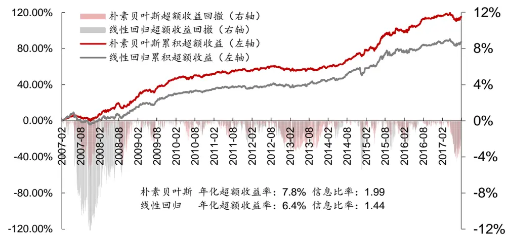
资料来源：Wind，华泰证券研究所

图表31： 朴素贝叶斯模型和线性回归模型中证 500成份股内行业中性选股策略表现（每个行业选 6只个股）
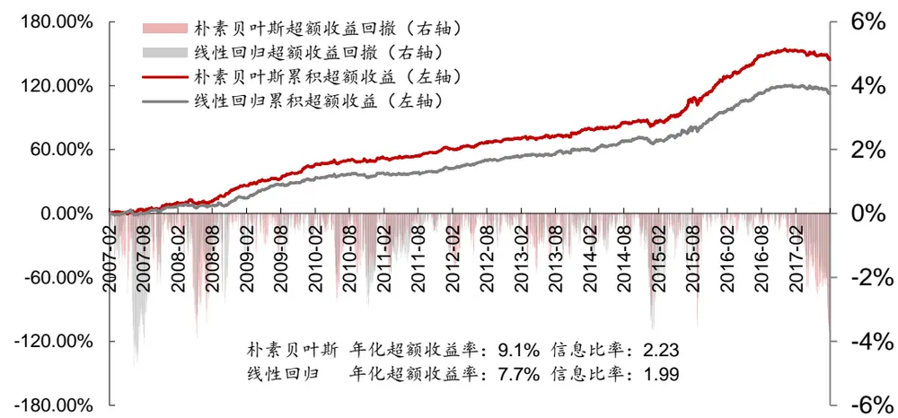
资料来源：Wind，华泰证券研究所

图表32： 朴素贝叶斯模型和线性回归模型全A行业中性选股策略表现（每个行业选 6只个股，基准中证 500）
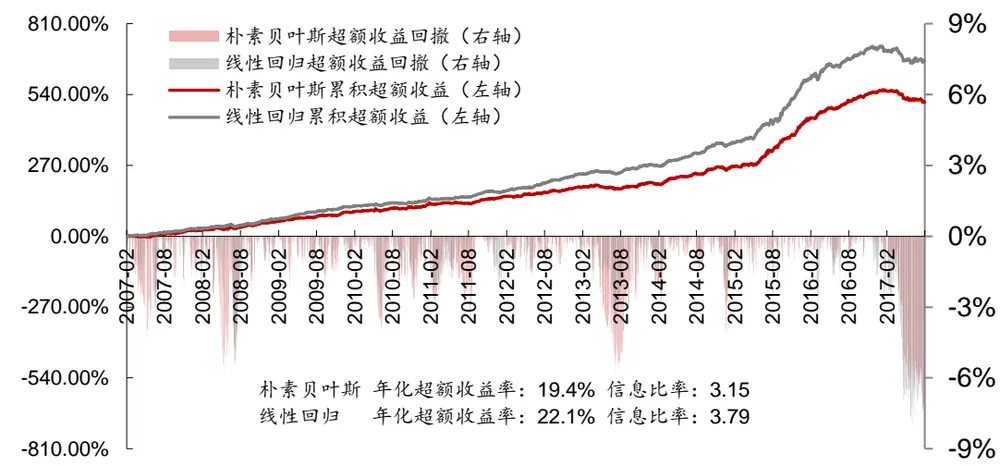
资料来源：Wind，华泰证券研究所

## 总结和展望

以上我们对包括朴素贝叶斯、线性判别分析法以及二次判别分析法在内的三种生成模型进行了系统的测试，并且利用三种方法构建沪深 300、中证 500 和全 A选股策略，初步得到以下几个结论：

一、朴素贝叶斯模型具备不错的预测能力。我们以第一期（1998 年）至 T-1期的因子及下期收益作为样本内集合，T 期样本外测试集，朴素贝叶斯模型样本外测试集平均正确率为 55.6%，平均 AUC 为 0.580。朴素贝叶斯模型的预测正确率和 AUC 和之前报告广义线性模型中表现最好的 SGD+hinge 损失模型相近。

二、我们分别以沪深 300、中证 500 和全 A股为票池，利用朴素贝叶斯模型构建选股策略。对于沪深 300 成份股内选股的行业中性策略，朴素贝叶斯模型的超额收益在 4.7%~8.8%之间，信息比率在 1.25~1.99 之间，各项指标均优于线性回归模型。对于中证 500 成份股内选股的行业中性策略，朴素贝叶斯模型的超额收益在 4.8%~10.2%之间，信息比率在1.56~2.23 之间，Calmar比率在 1.29~2.33 之间，在年化收益、信息比率上优于线性回归模型。对于全 A选股的行业中性策略，朴素贝叶斯模型相对于中证 500 的超额收益在18.9%~20.1%之间，超额收益最大回撤在 7.1%~8.6%之间，信息比率在 2.54~3.59 之间，表现不如线性回归。总体而言，朴素贝叶斯模型在沪深 300、中证 500 成份内选股优于线性回归，全 A选股则不如线性回归。

三、文中 LDA模型总体表现略优于线性回归，我们认为这主要是在估计协方差矩阵时进行缩减处理提升了模型性能导致的。同时，因为我们更关心模型预测的次序而不是具体的数值，所以标签化和去掉中间样本的处理在一定程度上有利于模型效果的提升。朴素贝叶斯模型在沪深 300 和中证 500选股的策略中表现良好，我们认为这主要是因为样本数量减少后线性模型估计协方差矩阵的准确性下降导致的。朴素贝叶斯模型需要估计的参数很少，受样本量减少的影响也较小。

四、我们比较了朴素贝叶斯、LDA、QDA 模型的预测能力。绝大多数时候，LDA模型的测试集正确率、AUC 和回测表现优于其它模型。LDA模型考虑了特征的相关性，并且假设不同类别Y的特征相关性相同，这种假设最符合实际情况，因此效果也明显优于另两种方法。QDA 的假设最为详细，但因为需要估计的参数最多，所以会导致估计上的偏差影响结果。当特征数目不多且数据量较多时，LDA有着绝对的优势，但随着特征数目的增加，朴素贝叶斯因为其简洁的假设会有更好的效果。

五、在一定条件下（二分类、两类样本数目相等），LDA模型的结果其实等价于线性回归模型的排序效果。因此，本文也间接证明了对股票进行标签化处理并且使用较长的数据进行线性回归（数据增加可以减弱因子多重共线性）在实践中十分有效。朴素贝叶斯和二次判别分析两种非线性模型在效果上不如线性回归，但朴素贝叶斯模型的计算速度快于 LDA，适用于特征数量较多的情况。

六、在我们的测试中，我们比较了不同训练期长度对模型分类效果的影响。我们发现训练期越长，效果越佳，且这种现象在三种模型上都得到了印证。因此，我们认为采用 3 年、5 年滚动等常见的方法可能因为数据不足不能让模型效果达到最优。在最终的回测中，我们的训练期长度是所能取到的最长长度。这种方法不仅包含了过去的数据，也可以不断添加最新的数据，是一种比较好的选取训练集的方式。

通过以上的测试和讨论，我们初步理解了朴素贝叶斯、LDA、QDA 模型应用于多因子选股的一些规律。接下来我们的人工智能系列研究将继续探索随机森林、神经网络等机器学习方法在多因子选股上的表现，敬请期待。

## 附录

## LDA与线性回归

事实上，对于二值且两类样本数目相同的分类问题，当我们对y进行特殊的标签化后，可以证明 LDA与线性回归是等价的，下面我们给出证明。在前文中，我们可以知道 LDA的判别方程为：

$$
\delta_{k}(x)=\log(\pi_{k})-\frac{1}{2}{\pmb\mu_{k}}^{T}\Sigma^{-1}{\pmb\mu_{k}}+{\pmb x}^{T}\Sigma^{-1}{\pmb\mu_{k}}
$$

若k = 1,2，我们有：

$$
\delta_{1}(x)=\log(\pi_{1})-\frac{1}{2}{\pmb\mu_{1}}^{T}\Sigma^{-1}{\pmb\mu_{1}}+{\pmb x}^{T}\Sigma^{-1}{\pmb\mu_{1}}
$$

$$
\delta_{2}(x)=\log(\pi_{2})-\frac{1}{2}{\pmb\mu_{2}}^{T}\Sigma^{-1}{\pmb\mu_{2}}+{\pmb x}^{T}\Sigma^{-1}{\pmb\mu_{2}}
$$

当我们在对x进行分类时，若 $\delta_{1}(x)>\delta_{2}(x)$ 则把x归为第一类，即： ${\pmb x}^{T}\Sigma^{-1}({\pmb\mu}_{1}-{\pmb\mu}_{2})>$ $\begin{array}{r}{\frac{1}{2}\big({\pmb\mu}_{1}^{\ {T}}{\Sigma}^{-1}{\pmb\mu}_{1}-{\pmb\mu}_{2}^{\ {T}}{\Sigma}^{-1}{\pmb\mu}_{2}\big)+\ log\frac{\pi_{2}}{\pi_{1}})}\end{array}$ 。当两种类别的股票数目相等时，即 $\lceil\pi_{1}{=}\pi_{2}$ 时，可以简化为 $\begin{array}{r}{{\pmb x}^{T}{\pmb\Sigma}^{-1}({\pmb\mu}_{1}-{\pmb\mu}_{2})>\frac{1}{2}\big({\pmb\mu}_{1}^{\textit{ T }}{\pmb\Sigma}^{-1}{\pmb\mu}_{1}-{\pmb\mu}_{2}^{\textit{ T }}{\pmb\Sigma}^{-1}{\pmb\mu}_{2}\big)}\end{array}$ 。下文中我们把Σ标记为 $\sum^{LDA}$

假设N为总样本数， $N_{1}$ 是类别 1的样本数， $N_{2}$ 是类别 2的样本数（本文中N是股票收益在前后 30%的样本数， $N_{1}$ 是收益在前 30%的样本数， $N_{2}$ 是后 30%的样本数， $\begin{array}{r}{N_{1}=N_{2}=\frac{N}{2})}\end{array}$

在线性回归中我们进行如下标记： $\{\begin{array}{ll}{y=\frac{N}{N_{1}}(\ 种_{1}\|1)}\\{y=-\frac{N}{N_{2}}(\divideontimes\ointop\limits_{i}^{\infty}2)}\end{array}$ 我们的目标是最小化：

$$
\operatorname{E}=\frac{1}{2}\sum_{c=1}^{N}\left(\beta^{T}x^{(c)}+\beta_{0}-y^{(c)}\right)^{2}(\ddag\Psi\circledast\frac{\ddag}{\ddag\ddag}\frac{\ddag}{\ddag\ddag}\frac{\ddag}{\ddag\Phi},\beta_{0}\xrightarrow[\sqrt{4}]{\pi}\sqrt{6}\sqrt{5}\sqrt[3]{7})
$$

分别对 $\cdot\beta^{T}$ 、 $\beta_{0}$ 求导可得：

$$
\left\{\begin{array}{ll}{\displaystyle{\sum_{c=1}^{N}}\big(\beta^{T}\pmb{x}^{(c)}+\beta_{0}-y^{(c)}\big)=0}\\{\displaystyle{\sum_{c=1}^{N}}\big(\beta^{T}\pmb{x}^{(c)}+\beta_{0}-y^{(c)}\big)\pmb{x}^{(c)}=0}\end{array}\right.
$$

由第一个式子可得 $\begin{array}{r}{:\beta_{0}=-\beta^{T}\pmb{\mu}(\pmb{\mu}=\frac{N_{1}\pmb{\mu}_{1}+N_{2}\pmb{\mu}_{2}}{N})}\end{array}$ ），带入第二个式子中，经过化简可以得到：

$$
(\sum^{LDA}+\frac{N_{1}N_{2}}{N}(\pmb{\mu}_{1}-\pmb{\mu}_{2})(\pmb{\mu}_{1}-\pmb{\mu}_{2})^{T})\beta=N(\pmb{\mu}_{1}-\pmb{\mu}_{2})
$$

因为 $\begin{array}{r}{\left(\frac{N_{1}N_{2}}{N}\Big(\pmb{\mu}_{1}-\pmb{\mu}_{2}\Big)\big(\pmb{\mu}_{1}-\pmb{\mu}_{2}\big)^{T}\right)\beta}\end{array}$ 可以写成 $\lambda\big(\pmb{\mu}_{1}-\pmb{\mu}_{2}\big)$ ，所以经过变换后我们可得$\begin{array}{r}{\beta\propto\sum^{LDA^{-1}}(\pmb{\mu}_{1}-\pmb{\mu}_{2})}\end{array}$ 。我们可以发现β与线性判别法中x的系数 $\Sigma^{-1}(\pmb{\mu}_{1}-\pmb{\mu}_{2})$ 的方向是一致的，因此排序结果也是一致的。

风险提示：通过朴素贝叶斯、LDA、QDA 模型构建选股策略是历史经验的总结，存在失效的可能。

## 免责申明

本报告仅供华泰证券股份有限公司（以下简称“本公司”）客户使用。本公司不因接收人收到本报告而视其为客户。

本报告基于本公司认为可靠的、已公开的信息编制，但本公司对该等信息的准确性及完整性不作任何保证。本报告所载的意见、评估及预测仅反映报告发布当日的观点和判断。在不同时期，本公司可能会发出与本报告所载意见、评估及预测不一致的研究报告。同时，本报告所指的证券或投资标的的价格、价值及投资收入可能会波动。本公司不保证本报告所含信息保持在最新状态。本公司对本报告所含信息可在不发出通知的情形下做出修改，投资者应当自行关注相应的更新或修改。

本公司力求报告内容客观、公正，但本报告所载的观点、结论和建议仅供参考，不构成所述证券的买卖出价或征价。该等观点、建议并未考虑到个别投资者的具体投资目的、财务状况以及特定需求，在任何时候均不构成对客户私人投资建议。投资者应当充分考虑自身特定状况，并完整理解和使用本报告内容，不应视本报告为做出投资决策的唯一因素。对依据或者使用本报告所造成的一切后果，本公司及作者均不承担任何法律责任。任何形式的分享证券投资收益或者分担证券投资损失的书面或口头承诺均为无效。

本公司及作者在自身所知情的范围内，与本报告所指的证券或投资标的不存在法律禁止的利害关系。在法律许可的情况下，本公司及其所属关联机构可能会持有报告中提到的公司所发行的证券头寸并进行交易，也可能为之提供或者争取提供投资银行、财务顾问或者金融产品等相关服务。本公司的资产管理部门、自营部门以及其他投资业务部门可能独立做出与本报告中的意见或建议不一致的投资决策。

本报告版权仅为本公司所有。未经本公司书面许可，任何机构或个人不得以翻版、复制、发表、引用或再次分发他人等任何形式侵犯本公司版权。如征得本公司同意进行引用、刊发的，需在允许的范围内使用，并注明出处为“华泰证券研究所”，且不得对本报告进行任何有悖原意的引用、删节和修改。本公司保留追究相关责任的权力。所有本报告中使用的商标、服务标记及标记均为本公司的商标、服务标记及标记。

本公司具有中国证监会核准的“证券投资咨询”业务资格，经营许可证编号为：Z23032000。全资子公司华泰金融控股（香港）有限公司具有香港证监会核准的“就证券提供意见”业务资格，经营许可证编号为：AOK809
©版权所有 2017年华泰证券股份有限公司

## 评级说明

## 行业评级体系

－报告发布日后的6个月内的行业涨跌幅相对同期的沪深300指数的涨跌幅为基准；

－投资建议的评级标准

增持行业股票指数超越基准

中性行业股票指数基本与基准持平

减持行业股票指数明显弱于基准

## 公司评级体系

－报告发布日后的6个月内的公司涨跌幅相对同期的沪深300指数的涨跌幅为基准；
－投资建议的评级标准
买入股价超越基准 20%以上
增持股价超越基准 5%-20%
中性股价相对基准波动在-5%~5%之间
减持股价弱于基准 5%-20%
卖出股价弱于基准 20%以上

## 华泰证券研究

## 南京

南京市建邺区江东中路228号华泰证券广场1号楼/邮政编码：210019

电话：86 25 83389999 /传真：86 25 83387521电子邮件：ht-rd@htsc.com

## 深圳

深圳市福田区深南大道4011号香港中旅大厦24层/邮政编码：518048

电话：86 755 82493932 /传真：86 755 82492062

电子邮件：ht-rd@htsc.com

## 北京

北京市西城区太平桥大街丰盛胡同28号太平洋保险大厦A座18层

邮政编码：100032

电话：86 10 63211166/传真：86 10 63211275

电子邮件：ht-rd@htsc.com

## 上海

上海市浦东新区东方路18号保利广场E栋23楼/邮政编码：200120

电话：86 21 28972098 /传真：86 21 28972068

电子邮件：ht-rd@htsc.com