## 金工研究/深度研究

2017年08月31日

林晓明 执业证书编号：S0570516010001

研究员 0755-82080134

linxiaoming@htsc.com

陈烨 010-56793927

联系人 chenye@htsc.com

# 人工智能选股之随机森林模型

## 华泰人工智能系列之五

## 随机森林模型是以 Bagging 并行方法集成决策树而得到的强分类器

随机森林（Random Forest）是近年来备受青睐的机器学习方法之一。随机森林是以 Bagging 并行方法集成一系列决策树而训练出的强分类器，可以较好地应用于分类和回归的不同场景下。本篇报告我们将对随机森林模型进行系统性的测试，并分析它们应用于多因子选股的异同，希望对本领域的投资者产生有实用意义的参考价值。

## 随机森林模型的构建：7阶段样本内训练与交叉验证、样本外测试

随机森林的构建包括特征和标签提取、特征预处理、样本内训练、交叉验证和样本外测试等步骤。最终在每个月底可以产生对全部个股下期上涨概率的预测值，然后根据正确率、AUC 等指标以及策略回测结果对模型进行评价。我们的模型设置为月频换仓，为了让模型及时学习到市场特征的变化并兼顾计算效率，我们采用了 7 阶段滚动回测方法，即从 2010 年底开始，每年底重新构建一次模型，在下一年进行测试。我们还根据模型的预测结果构建了沪深300成份内选股、中证500成份内选股和全A选股策略，通过年化收益率、信息比率、最大回撤等指标综合评价策略效果。

## 随机森林选股模型的收益和信息比率相较于线性回归具有较大优势

对于沪深 300 成份股内选股的行业中性策略（每个行业选 6 只个股），随机森林模型的超额收益为 6.2%，信息比率为 1.74。对于中证 500 成份股内选股的行业中性策略，随机森林的超额收益为 8.4%，信息比率为 2.16。对于全 A 选股的行业中性策略，随机森林相对于中证 500 的超额收益为30.6%，信息比率为 4.17。总体而言，随机森林模型在多数情况下能获取更高的超额收益和信息比率，相较于前度报告中广义线性模型、支持向量机模型、朴素贝叶斯模型在此方面具有比较大的优势，而对回撤的控制不具备优势。

## 市值和反转因子在随机森林模型中重要性评分较高

模型训练出的因子重要性评分表显示，随机森林模型主要受市值和反转因子影响较大。基于树的分类方法一般在大环境不发生变化的前提下能够获取比较好的预测效果，而此类方法对于参数、噪音、环境变化等因素也比较敏感，即泛化能力不够强。所以随机森林模型在 2011～2016 年这段小盘股风格主导的时期展示出了强大的选股能力，但 2017 年以来确实遭遇一定幅度的困境。我们将在后续报告中持续关注基于树的分类方法，希望寻找到有效的手段解决这一难题。

风险提示：通过随机森林模型构建选股策略是历史经验的总结，存在失效的可能。

## 本文研究导读

在华泰人工智能选股系列的前三篇报告中，我们分别探讨了广义线性模型、核支持向量机模型和朴素贝叶斯模型。本文是人工智能系列第五篇报告，我们将开始探讨另一类应用比较广的方法——基于树的回归和分类方法。简单来说，基于树的方法主要根据分层和分割的方式将预测变量空间划分为一系列简单区域，对于给定观测值依照其所属区域训练集的表现进行预测。分类规则可以被概括展示为一棵树，所以这类方法通常称为决策树方法。决策树方法简单自然，符合人脑的思维逻辑，除了构建单棵决策树，我们还可以建立多棵决策树并通过某种方式将它们结合在一起，综合投票产生最后的预测值。本篇报告中我们将若干决策树（弱分类器）进行组合后得到随机森林模型，并将这个模型应用于多因子选股，主要关注如下几方面的问题：

1.首先是模型构建的意义。从整体构建上看，树模型和传统线性模型有什么区别呢？依照单独特征逐层划分与整体概率估计相比的好处在哪里？树模型的可解释性与实际预测结果是否一致？我们为什么选择构建随机森林，树与树之间又存在怎样的关系呢？

2.其次是参数寻优的问题。与朴素贝叶斯模型和支持向量机模型相比，随机森林模型的参数更多，其对参数的依赖程度也更高，我们选择重要性最大的四个参数进行讨论：树棵数 n，最大特征数 m，节点分裂所需最小样本数 s 和叶子节点最小样本数 l。在与多因子结合的问题背景下，参数取值多少最为合理？我们依照判断标准选出的参数又是否合适？

3.最后是组合构建的问题。在探究过随机森林模型的表现之后，应如何利用模型的预测结果构建策略组合进行回测？各模型在沪深 300、中证 500 和全部 A股票池内选股效果的异同是什么？

我们将围绕以上的问题进行系统性的测试，希望为读者提供一些扎实的证据，并寻找到最有效的分类方法，希望对本领域的投资者产生有实用意义的参考价值。

## 随机森林模型简介

随机森林（Random Forest）作为一种比较新机器学习方法，近年来在界内的关注度与受欢迎程度得到逐步提升。经典的机器学习模型是神经网络，其预测精确，但计算量也大。上世纪 80 年代，决策树算法首次出现，通过反复二分数据进行分类或回归，计算量大大降低。2001 年 Breiman 在此基础提出一种新的算法，这一算法是由多个随机子集生成决策树的实例组成，故我们将其形象地称为“随机森林”。下面我们将从决策树入手，一起逐步探索随机森林的奥秘。

## 决策树

日常生活中，我们对于事物的认知都是基于特征的判断与分类，譬如通过胎生与否可判断哺乳动物，根据肚脐尖圆来挑选螃蟹公母。决策树就是采用这样的思想，基于多个特征进行分类决策。在树的每个结点处，根据特征的表现通过某种规则分裂出下一层的叶子节点，终端的叶子节点即为最终的分类结果。决策树学习的关键是选择最优划分属性。随着逐层划分，决策树分支结点所包含的样本类别会逐渐趋于一致，即节点分裂时要使得节点分裂后的信息增益（Information Gain）最大。

## CART 算法

目前主流的决策树算法包括 C4.5和 CART：C4.5 每个节点可分裂成多个子节点，不支持特征的组合，只能用于分类问题；CART 每个节点只分裂成两个子节点，支持特征的组合，可用于分类和回归问题。而在随机森林中，通常采用 CART 算法来选择划分属性，并使用“基尼指数”（Gini Index）来定义信息增益程度。分类问题中，假设有 K个类，样本集 D中的点属于第 k 类的概率为 $P_{k}$ ，则其 Gini指数为

$$
\begin{array}{r}{\mathrm{Gini(D)}=\sum_{k=1}^{K}P_{k}(1-P_{k})=1-\sum_{k=1}^{K}P_{k}^{2}}\end{array}
$$

Gini(D)反映了从数据集 D 中随机抽取两个样本，其类别标记不一致的概率，Gini(D)越小，数据集 D 的纯度越高。二分类问题中，若对于给定的样本集合 D（|D|表示集合元素个数），根据特征 A分裂为 $D_{1}$ 和 $D_{2}$ 两不相交部分，则分裂后的

$$
\mathrm{Gini}(\mathrm{D},\mathrm{A})=\frac{|\mathrm{D}_{1}|}{|\mathrm{D}|}\mathrm{Gini}(\mathrm{D}_{1})+\frac{|\mathrm{D}_{2}|}{|\mathrm{D}|}\mathrm{Gini}(\mathrm{D}_{2})
$$

从根节点开始，递归地在每个结点分裂时选取Gini(D,A)最小的特征 A为划分属性，将训练集依特征分配到两个子结点中去。照此逐层划分，直至结点中样本个数小于预定阈值，或样本集的 Gini指数小于预定阈值，或者没有更多特征，即生成了一棵可进行分类预测的决策树。下面我们试举一例说明。

假如我们希望根据当前市场股票的市值风格（大、中或小）和板块风格（消费、周期或成长）预测涨跌情况，模拟数据如图表 1。直观地看，大市值股票全部属于“涨”类别，中小市值股票绝大多数属于“跌”类别。似乎以“是否为大市值”为规则进行首次分裂比较好。那么决策树将如何学习这一步呢？

图表1： 根据市值和板块风格预测涨跌的模拟数据

| 市值风格 | 板块风格 | 涨跌情况 |
| --- | --- | --- |
| 大 | 消费 | 涨 |
| 大中中中 | 周期 | 涨涨跌跌跌跌跌 |
|  | 消费 |  |
|  | 周期 |  |
|  | 成长 |  |
| 小 | 消费 |  |
| 小 | 周期 |  |
| 小 | 成长 |  |

资料来源：华泰证券研究所

前面提到，节点分裂的原则是使得分裂后的信息增益最大，即挑选Gini(D,A)最小的特征 A为划分属性。第一步分裂前，全部 8 个样本中有 3个属于“涨”类别，概率为 $P(\omega 涨)=3/8$ ；5 个属于“跌”类别，概率为 $P\big(\omega 跌\big)=5/8$ 。因此分裂前的 Gini指数为：

$$
\mathrm{Gini}(\mathrm{D})=1-\left(\frac{3}{8}\right)^2-\left(\frac{5}{8}\right)^2=0.4688
$$

如果我们以“是否为大市值”作为规则将全样本分裂成两个子节点，在 2 个大市值样本中属于“涨”类别的概率为 $P\big(\omega 涨\big)=0$ ，属于“跌”类别的概率为 $P\big(\omega 跌\big)=1$ ，该子节点的Gini 指数为

$$
Gini\left(D_{大市值}\right)=1-0^{2}-1^{2}=0
$$

类似地，中小市值子节点的 Gini指数为：

$$
Gini\left(D_{中小市值}\right)=1-\left(\frac{1}{6}\right)^{2}-\left(\frac{5}{6}\right)^{2}=0.2778
$$

上述分裂过程中，分裂到大市值的概率为P(ω大市值) = 2⁄8，分裂到中小市值的概率为$P\big(\omega 中小市值\big)=6/8。$ 。因此Gini(D, 市值)为：

$$
\begin{aligned}Gini(D,市值)=&\frac{|D_{大市值}|}{|D|}Gini(D_{大市值})+\frac{|D_{中小市值}|}{|D|}Gini(D_{中小市值})\\=&\frac{2}{8}\times0+\frac{6}{8}\times0.2778=0.2083\end{aligned}
$$

如果换成“是否为小市值”或“是否为消费类”作为分裂规则，计算出 Gini指数为：

$$
Gini(D,小市值)=\frac{3}{8}\times0-\frac{5}{8}\times0.48=0.3
$$

$$
Gini(D,消费)=\frac{3}{8}\times0.4444+\frac{5}{8}\times0.48=0.3667
$$

事实上，在所有可能的分裂规则中，“是否为大市值”的 Gini 指数最小。我们据此进行首次分裂，如图表 2所示。接下来依照相同办法，继续对子节点进行分裂，直到每个样本都归入终端的叶子节点，如图表 3 所示，最终完成整棵决策树的学习。

图表2： 以“是否为大市值”为规则对决策树作首次分裂
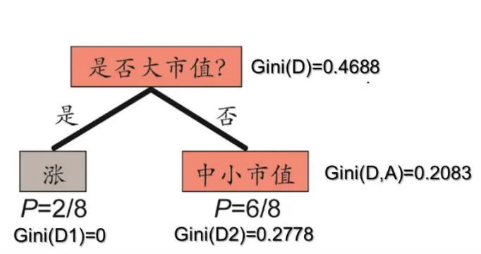
资料来源：华泰证券研究所

图表3： 第二次和第三次分裂完成决策树学习
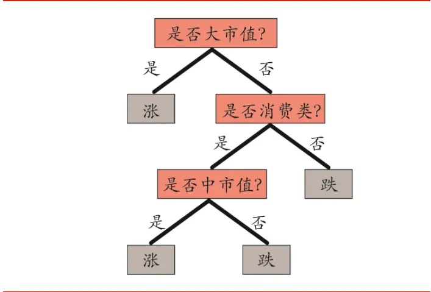
资料来源：华泰证券研究所

## 特征重要性评分

在具体的决策树模型构建中，我们将当期股票的各个因子作为输入特征，按照股票下月收益情况分为不同类别，以此进行模型训练。对于决策树这一非线性分类器，我们依然可以通过特征划分过程来计算评估各个因子特征的重要性，这与传统线性回归模型中的因子权重相仿。

特征影响力的计算需要借助于结点分裂时 Gini指数，方法如下：

$$
\begin{aligned}I_{i}(A)&=\mathrm{Gini}(D_{i})-\mathrm{Gini}(D_{i},A)\\&\quad S(A)=\sum_{i}I_{i}(A)\end{aligned}
$$

其中， $I_{i}(A)$ 表示结点 i根据特征 A分裂为两个子结点后，Gini指数相对于母结点分裂前的下降值。故而可定义特征A的绝对重要性S(A)为所有按特征A分裂的结点处的I (A)之和。将所有特征的绝对重要性归一化，即可得到各个特征的重要性评分（所有特征重要性评分之和为 1）。

如上，我们逐层地根据特征对训练集进行划分，这样便形成了一个分类准则，即决策树算法的本质所在。相较于其他机器学习算法，决策树的优势主要包括：1.训练速度快；2.可以处理非数值类的特征，如不同板块风格股票涨跌分类问题；3.可以实现非线性分类，如图表 4的异或问题(横纵坐标 x、y相同则分类为 1，不同则分类为 0)，该问题在逻辑回归、线性核的支持向量机下无解，但是使用决策树可以轻松解决。但同时，决策树的缺陷在于不稳定，对训练样本很敏感，并且容易过拟合。

图表4： 决策树解决非线性分类中的异或问题
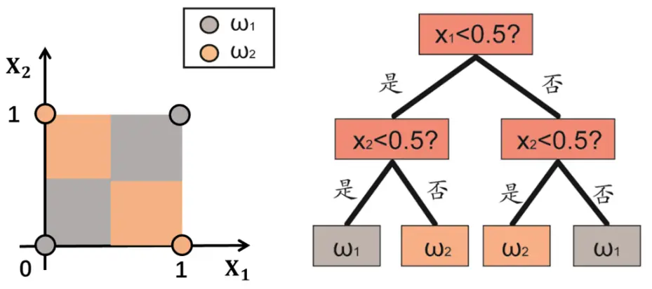
资料来源：华泰证券研究所

## 树剪枝

我们利用训练样本来生成决策树时，在不加限制条件下会递归地选取特征进行二分类直到不能继续下去为止。诚然这样产生的树对训练集数据的分类很准确，模拟分类效果如图表5 所示。但不难发现对于个别点的分类区域划分有些“牵强附会”的意味，我们称之过拟合现象；这样的分类器对测试集数据的分类并不会有那么准确。为此，我们希望通过降低决策树的复杂程度来减小过拟合的风险，故可以主动地去掉一些分支进行简化，这一过程称为剪枝（Pruning）。

图表5： 单棵决策树分类中的过拟合现象
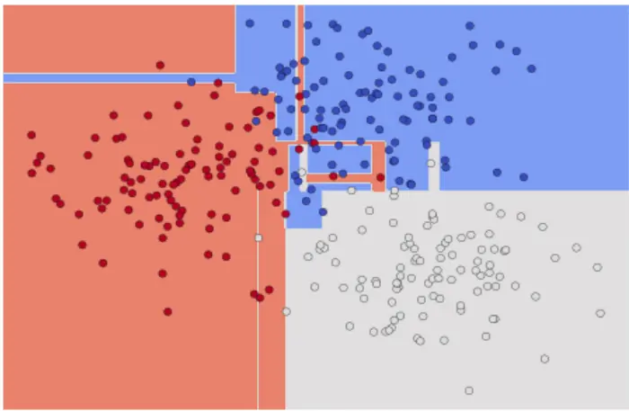
资料来源：华泰证券研究所

决策树的剪枝有两种思路：预剪枝（Pre-Pruning）和后剪枝（Post-Pruning）。预剪枝是在构造决策树的同时进行剪枝。每个节点在划分前需先进行估计，若当前结点的划分不能带来决策树泛化性能提升，则停止划分并将当前结点标记为叶结点。后剪枝即从已生成的树上裁掉一些子树或叶节点，并将其父节点作为新的叶节点，从而简化分类树模型。

## 预剪枝

在预剪枝过程中，常用的判断停止树生长方法包括以下几种：

1、 达到最大树深度（Maximum Tree Depth），如图表 6 中设置 max_depth=3；

2、 设置最优划分下内部/叶结点的最小样本数：小于阈值即停止子树的划分或对叶节点进行剪枝；

图表6： 决策树设置最大树深进行预剪枝
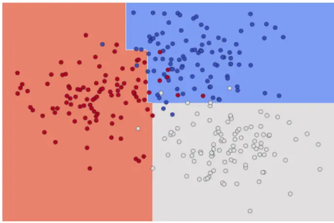
资料来源：华泰证券研究所

在此过程中我们通过判断泛化能力是否提升来决定具体结点划分和剪枝操作。那么如何判断泛化性能是否提升呢？可以采用性能评估方法,对上述停止树生长方式中数值变量设定阈值，并通过验证来对学习器的泛化误差进行评估并进而做出选择。为此，需使用一个“验证集”来检验学习器对新样本的判别能力，然后以验证集上的验证误差作为泛化误差的近似。我们选取验证样本与训练样本为互斥集合，“留出法”直接将数据集 D 划分为两个互斥集合，其中一个集合作为训练集 S，另一个作为验证集 T，即D = S∪T,S∩T = ∅。在 S上训练出模型后，用 T 来评估其验证误差，作为对泛化误差的估计。

预剪枝使得决策树的很多分支都没有“展开”，这不仅降低了过拟合的风险，还显著缩短了决策树的训练及测试时间。但另一方面，有些结点的当前划分虽不能提升泛化性能，但在此基础上进行后续的划分却有可能显著提高泛化性能，一定程度上增加了欠拟合的风险。

## 后剪枝

后剪枝（Post-Pruning）的剪枝过程是在决策树构造完成后删除一些子树，往往是递归地自上而下或自下而上进行。后剪枝常见的算法包括：错误率降低剪枝（Reduced-ErrorPruning）、悲观剪枝（Pessimistic Error Pruning）、代价复杂度剪枝（Cost-ComplexityPruning）、基于错误的剪枝（Error-Based Pruning），我们以代价复杂度剪枝为例来认识一下后剪枝的过程。

设树 T 的叶节点个数为|T|，t 是树 T 的叶节点，该叶节点有 $N_{t}$ 个样本点，其中 k 类的样本点有 $N_{tk}$ 个， $\mathsf{k}{=}1{,}2{,}...{,}\mathsf{K}{,}\quad H_{t}(T)$ 为叶节点 t上的经验熵， $\alpha\geq0$ 为参数，则决策树学习的损失函数可以定义为

$$
\begin{array}{r}{C_{\alpha}(T)=\sum_{t=1}^{|T|}N_{t}H_{t}(T)+\alpha|T|}\end{array}
$$

输入：生成算法产生的整个树 T，参数α。
输出：修剪后的子树T 。
1. 计算每个结点的经验熵。
2. 递归地从树的叶结点向上回缩。
设一组叶结点回缩到其父结点之前与之后的整体树分别为 $T_{B}与T_{A}$ ，其对应的损失函数值分别为 $C_{\alpha}(T_{B})$ 与
$C_{\alpha}(T_{A})$ ，如果 $C_{\alpha}(T_{A})\leq C_{\alpha}(T_{B})$ ，则进行剪枝，即将父结点变为新的叶结点。
3. 返回 2，直至不能继续为止，得到损失函数最小的子树 T_α。
注：只考虑两个树的损失函数差，计算可在局部进行，故剪枝算法可以由一种动态规划的算法实现。
资料来源：华泰证券研究所

其中，经验熵为

$$
H_{t}(T)=-\sum_{k}\frac{N_{tk}}{N_{t}}log\frac{N_{tk}}{N_{t}}
$$

在损失函数中，记

$$
\begin{array}{r}{C(T)=\sum_{t=1}^{|T|}N_{t}H_{t}(T)=-\sum_{t=1}^{|T|}\sum_{k=1}^{K}N_{tk}log\frac{N_{tk}}{N_{t}}}\end{array}
$$

这时有

$$
C_{\alpha}(T)=C(T)+\alpha|T|
$$

其中，C(T)表示模型对训练数据的预测误差，即模型 $与$ 训练数据的拟合程度，|T|表示模型复杂度，参数α ≥ 0控制两者之间的影响。简言之，后剪枝就是在给定α下选择损失函数最小的子树。损失函数刻画出了训练集拟合程度与模型复杂度之间的平衡，通过优化损失函数在进行更好拟合的同时考虑了减小模型复杂度。

## 图表7： 树的后剪枝算法

## 随机森林

通过前面的介绍我们已经对决策树有了清晰的了解，随机森林（Random Forest）正是一种由诸多决策树通过 Bagging 的方式组成的分类器。其中，Bagging 是分类器集成学习的两大渊薮中区别于 Boosting 派系（串行方法）一种并行方法，它的特点是各个弱学习器之间没有依赖关系，可以并行拟合。Bagging 方法是 Bootstrap 随机采样思想在机器学习上的应用。如图表 8所示，我们由原始数据集生成 N个 Bootstrap 数据集，对于每个Bootstrap 数据集分别训练一个弱分类器，最终用投票、取平均值等方法组合成强分类器。

上文提及的 Bootstrap 随机采样思想就是从我们的训练集里面有放回地采集固定个数的样本。也就是说，被采集过的样本在放回后有可能不止一次被采集到。Bagging 算法中，对有 m 个样本训练集做 T 次的随机采样，则由于随机性，一般来说 T 个采样集各不相同。正是由于 Bagging 算法每次利用不同采样集来训练模型，故其泛化能力很强，有助于降低模型的方差。但是不可避免地其对训练集的拟合程度就会差一些，即增大了模型的偏倚。

图表8： Bagging 并行方法示意
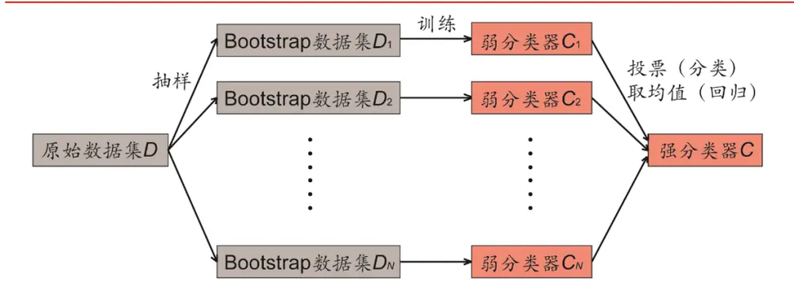
资料来源：华泰证券研究所

具体地，随机森林根据以下两步方法建造每棵决策树。第一步称为“行采样”，从全体训练样本中有放回地抽样，得到一个 Bootstrap 数据集。第二步称为“列采样”，从全部 M个特征中随机选择m个特征（m小于M），以Bootstrap数据集的m个特征为新的训练集，训练一棵决策树。如果是分类预测，则 N 棵决策树投出最多票数的类别或者类别之一为最终类别。如果是对连续数值回归预测，则对 N 棵决策树得到的回归或 0-1 分类结果进行算术平均得到的值为最终的模型输出。

在我们简单介绍和回顾完随机森林原理后，不妨想一下其相较于决策树的改进提升在哪里呢？其实，决策树有一个明显的缺点是容易受到训练集中极端数据影响出现过拟合，而我们通过随机森林模型构建则可以达到降低过拟合几率的效果。在随机森林中，虽然每棵树只利用 m 个因子特征进行划分，单独来看分类效果并不出色但是组合在一起后反而更加稳定。不妨这样理解，每一棵决策树就是一个精通于某一个窄领域（从 M个因子中选取 m个让每棵树学习）的专家，随机森林则包含很多个精通不同领域的专家，对一个新的问题（新数据集），可以用不同的角度去看待它，最终投票得到结果。

除良好的稳定性之外，随机森林的训练和预测速度较快，同时继承了决策树可对特征进行重要性评分的特性。即在对数据进行分类的同时，可以给出各个特征在分类过程中的影响力大小，根据该评分能够筛选出相对重要的因子特征。这一点，与传统线性回归模型中的因子权重有着相似的意义，对于我们判断各时期因子重要性的变化趋势和市场动向具有一定的指导作用。

## 随机森林模型测试流程

图表9： 随机森林模型构建示意图
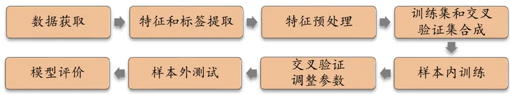
资料来源：华泰证券研究所

如图表 9所示，随机森林模型的构建方法包含下列步骤：

## 1． 数据获取：

a) 股票池：全 A 股，剔除 ST 股票，剔除每个截面期下一交易日停牌的股票，剔除上市 3个月以内的股票。每只股票视作一个样本。

b) 回测区间：2011-01-31 至 2017-07-31。

2． 特征和标签提取：每个自然月的最后一个交易日，计算之前报告里的 70 个因子暴露度，作为样本的原始特征；计算下一整个自然月的个股超额收益（以沪深 300 指数为基准），作为样本的标签。因子池如图表 10 所示。

## 3． 特征预处理：

a) 中位数去极值：设第 T 期某因子在所有个股上的暴露度序列为 $D_{i}$ ， $D_{M}$ 为该序列中位数， $D_{M1}$ 为序列 $\lvert D_{i}{-}D_{M}$ |的中位数，则将序列 $D_{i}$ 中所有大于 $D_{M}+5D_{M1}$ 的数重设为 $D_{M}+5D_{M1}$ ，将序列 $D_{i}$ 中所有小于 $D_{M}-5D_{M1}$ 的数重设为 $D_{M}-5D_{M1}$

b) 缺失值处理：得到新的因子暴露度序列后，将因子暴露度缺失的地方设为中信一级行业相同个股的平均值。

c) 行业市值中性化：将填充缺失值后的因子暴露度对行业哑变量和取对数后的市值做线性回归，取残差作为新的因子暴露度。

d) 标准化：将中性化处理后的因子暴露度序列在横截面上取序，并除以当期票池中的股票数，得到(0,1]上均匀分布的序列。

## 4． 训练集和交叉验证集合成：

在每个月末截面期，选取下月收益排名前 30%的股票作为正例 $(\mathbf{y}=1)$ ），后 30%的股票作为负例 $(\mathbf{y}=0)$ 0

a) 全 A选股模型：将当前年份往前推 72 个月的样本合并，随机选取 90%的样本作为训练集，余下 10%的样本作为交叉验证集。

b) 沪深 300/中证 500 成分股内选股模型：将当前年份往前推 72 个月的样本合并，采用 10折交互验证方法或每次随机选取 90%的样本作为训练集，余下 10%的样本作为交叉验证集，如上重复 10 次。

其中，不同回测年份训练集样本的具体选取方式可参考图表 11。

5． 样本内训练：使用随机森林模型对训练集进行训练，考虑到我们将回测区间按年份划分为 7个子区间，因此需要对每个子回测的不同训练集重复训练。同时设置两个统一对照组：①沿用本系列第二、三篇报告中的 12 个月滚动回测的线性回归模型；②利用与随机森林模型相同的训练周期和训练集构建线性回归模型。

6． 交叉验证调参：选择第一区段（样本内数据为 2005-2010 年）训练模型，训练完成后，使用该模型对交叉验证集进行预测。选取交叉验证集 AUC（或平均 AUC）最高的一组参数作为模型的最优参数。

7． 样本外测试：确定最优参数后，以 T 月月末截面期所有样本（即个股）预处理后的特征作为模型的输入，得到每个样本的 T+1 月的预测值f(x)（合成因子，即随机森林中各决策树分类结果的投票平均值），可以根据该预测值构建策略组合，具体细节参考下文。

8． 模型评价：评价指标包括两方面，一是测试集的正确率、AUC 等衡量模型性能的指标；二是上一步中构建的策略组合的各项表现（包括年化超额收益率、信息比率等等）。

图表10： 选股模型中涉及的全部因子及其描述

| 大类因子 | 具体因子 | 因子描述 | 因子方向 |
| --- | --- | --- | --- |
| 估值 | EP | 净利润（TTM）/总市值 |  |
| 估值 | EPcut | 扣除非经常性损益后净利润（TTM）/总市值 |  |
| 估值 | BP | 净资产/总市值 |  |
| 估值 | SP | 营业收入（TTM）/总市值 |  |
| 估值 | NCFP | 净现金流（TTM）/总市值 |  |
| 估值 | OCFP | 经营性现金流（TTM）/总市值 |  |
| 估值 | DP | 近12个月现金红利（按除息日计）/总市值 |  |
| 估值 | G/PE | 净利润（TTM）同比增长率/PE_TTM |  |
| 成长 | Sales_G_q | 营业收入（最新财报，YTD）同比增长率 |  |
| 成长 | Profit_G_q | 净利润（最新财报，YTD）同比增长率 | 1 |
| 成长 | OCF_G_q | 经营性现金流（最新财报，YTD）同比增长率 | 1 |
| 成长 | ROE_G_q | ROE（最新财报，YTD）同比增长率 |  |
| 财务质量 | ROE_q | ROE（最新财报，YTD） | 1 |
| 财务质量 | ROE_ttm | ROE（最新财报，TTM） |  |
| 财务质量 | ROA_q | ROA（最新财报，YTD） | 1 |
| 财务质量 | ROA_ttm | ROA（最新财报，TTM） | 1 |
| 财务质量 | grossprofitmargin_q | 毛利率（最新财报，YTD） |  |
| 财务质量 | grossprofitmargin_ttm | 毛利率（最新财报，TTM） | 1 |
| 财务质量 | profitmargin_q | 扣除非经常性损益后净利润率（最新财报，YTD） | 1 |
| 财务质量 | profitmargin_ttm | 扣除非经常性损益后净利润率（最新财报，TTM） | 1 |
| 财务质量 | assetturnover_q | 资产周转率（最新财报，YTD） | 1 |
| 财务质量 | assetturnover_ttm | 资产周转率（最新财报，TTM） | 1 |
| 财务质量 | operationcashflowratio_q | 经营性现金流/净利润（最新财报，YTD） | 1 |
| 财务质量 | operationcashflowratio_ttm | 经营性现金流/净利润（最新财报，TTM） | 1 |
| 杠杆 | financial_leverage | 总资产/净资产 | -1 |
| 杠杆 | debtequityratio | 非流动负债/净资产 | -1 |
| 杠杆 | cashratio | 现金比率 | 1 |
| 杠杆 | currentratio | 流动比率 | 1 |
| 市值 | In_capital | 总市值取对数 | -1 |
| 动量反转 | HAlpha | 个股60个月收益与上证综指回归的截距项 | -1 |
| 动量反转 动量反转 | return_Nm | 个股最近N个月收益率，N=1，3，6，12 个股最近N个月内用每日换手率乘以每日收益率求 | -1 -1 |
| 动量反转 | wgt_return_Nm exp_wgt_return_Nm | 算术平均值，N=1，3，6，12 个股最近N个月内用每日换手率乘以函数 | -1 |
| 波动率 |  | exp(-x_i/N/4)再乘以每日收益率求算术平均值，x_i 为该日距离截面日的交易日的个数，N=1，3，6， 12 特质波动率—个股最近N个月内用日频收益率对 |  |
| 波动率 | std_Nm | Fama French 三因子回归的残差的标准差，N=1，3， 6,12 个股最近N个月的日收益率序列标准差，N=1，3， | -1 |
| 股价 | In_price | 6, 12 股价取对数 | -1 |
| beta | beta | 个股60个月收益与上证综指回归的 beta | -1 -1 |
| 换手率 | turn_Nm | 个股最近N个月内日均换手率（剔除停牌、涨跌停的 | -1 |
| 换手率 | bias_turn_Nm | 交易日），N=1，3，6，12 个股最近N个月内日均换手率除以最近2年内日均换 | -1 |
|  |  | 手率（剔除停牌、涨跌停的交易日）再减去1，N=1， 3, 6, 12 |  |
| 情绪 情绪 | rating_average | wind 评级的平均值 wind评级（上调家数-下调家数）/总数 | 1 |
| 情绪 | rating_change rating_targetprice | wind一致目标价/现价-1 | 1 1 |
| 股东 |  | 户均持股比例的同比增长率 | 1 |
|  | holder_avgpctchange |  |  |
| 技术 | MACD | 经典技术指标（释义可参考百度百科），长周期取30 | -1 |
| 技术 | DEA | 日，短周期取10日，计算 DEA 均线的周期（中周期） | -1 |
| 技术 | DIF | 取15 日 | -1 |
| 技术 | RSI | 经典技术指标，周期取20日 | -1 |
| 技术 | PSY | 经典技术指标，周期取20日 | -1 |
| 技术 | BIAS | 经典技术指标，周期取20日 | -1 |

资料来源：Wind，华泰证券研究所

图表11： 分阶段回测模型选取示意图
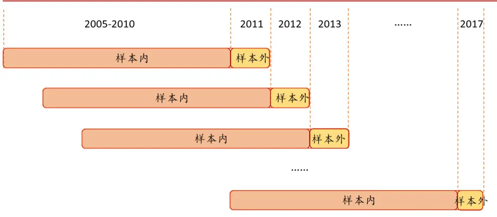
资料来源：华泰证券研究所

## 随机森林模型测试结果

## 参数敏感性分析

由于随机森林模型是由诸多决策树通过 Bagging的方式组成的，我们考虑模型参数时可以从决策树自身参数入手，包括特征个数、内部节点再划分所需最小样本数以及叶节点最小样本数。此外还可以调整随机森林中决策树棵数来提升模型的训练准确度。下面我们以全A选股模型为例，对随机森林模型参数优化进行探究。

## 树棵数

我们将随机森林中最大的弱学习器（决策树）的个数称为树棵数(简记为 n)。一般来说如果树棵数太小，则无法发挥 Bagging 集成算法的优势而容易产生欠拟合；树棵数过大，会增大计算量，并且树棵数到一定的数量后，再增大树棵数获得的模型提升会很小，所以我们要寻找一个适中的数值。在实际调参的过程中，我们常常将树棵数和学习效率一起考虑。依据如下 AUC 曲线随决策树棵数变化图，可见在 1000 棵范围内决策树棵数的增加可以提升模型的预测效果，但考虑到其提升效果的边际效应，例如 1000 棵模型训练时间是 500棵模型的 2 倍，但效果提升仅不到 1‰。故综合训练时间和效果提升考量，在随机森林模型中我们选取决策树棵数为 500。

图表12： 树棵数选择的相关指标评估

| 决策树棵数 | AUC | 正确率 | 精确率 | 召回率 | AUC | 正确率 | 精确率 | 召回率 |
| --- | --- | --- | --- | --- | --- | --- | --- | --- |
|  | 交叉验证集 |  |  |  | 测试集 |  |  |  |
| 50 | 0.6034 | 57.48% | 57.82% | 56.44% | 0.5905 | 56.39% | 56.59% | 55.16% |
| 100 | 0.6098 | 58.33% | 58.71% | 57.14% | 0.5952 | 56.79% | 57.00% | 55.67% |
| 200 | 0.6120 | 58.26% | 58.64% | 57.11% | 0.5969 | 56.83% | 57.09% | 55.50% |
| 300 | 0.6130 | 58.74% | 59.14% | 57.57% | 0.5976 | 56.94% | 57.20% | 55.63% |
| 400 | 0.6125 | 58.24% | 58.63% | 57.04% | 0.5981 | 56.93% | 57.20% | 55.58% |
| 500 | 0.6138 | 58.46% | 58.86% | 57.20% | 0.5982 | 56.97% | 57.24% | 55.57% |
| 600 | 0.6139 | 58.43% | 58.85% | 57.07% | 0.5982 | 56.97% | 57.24% | 55.61% |
| 700 | 0.6140 | 58.43% | 58.79% | 57.37% | 0.5983 | 56.94% | 57.22% | 55.52% |
| 800 | 0.6143 | 58.54% | 58.90% | 57.54% | 0.5984 | 56.93% | 57.21% | 55.52% |
| 900 | 0.6148 | 58.74% | 59.15% | 57.50% | 0.5982 | 56.93% | 57.21% | 55.51% |
| 1000 | 0.6146 | 58.43% | 58.82% | 57.20% | 0.5983 | 56.93% | 57.21% | 55.51% |

资料来源：Wind，华泰证券研究所

图表13： AUC及正确率曲线随决策树棵数变化图（交叉验证集）
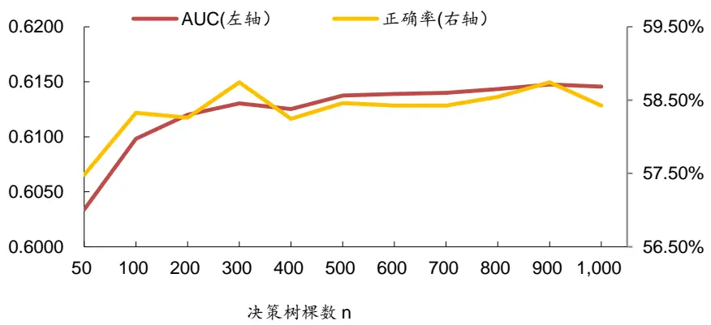
资料来源：华泰证券研究所

## 特征个数

特征个数（max_features）即每个决策树在进行分类时需要考虑的最大特征数，对于决策树的生成时间和具体分类情况有影响作用。当输入样本的总特征个数不多，比如小于 50，则可以不对最大个数进行限制（即全部选入）。由于我们训练模型中特征因子共 70 个，故考虑通过限制最大特征个数来优化模型训练过程，我们对不同参数的模型效果进行评估，结果如下：

图表14： 特征个数选择的相关指标评估

| 特征个数 | AUC | 正确率 | 精确率 | 召回率 | AUC | 正确率 | 精确率 | 召回率 |
| --- | --- | --- | --- | --- | --- | --- | --- | --- |
| 交叉验证集 |  |  |  |  | 测试集 |  |  |  |
|  | 0.6084 | 58.34% | 58.49% | 58.53% | 0.5961 | 56.75% | 56.87% | 56.46% |
| 24 | 0.6119 | 58.61% | 58.88% | 58.07% | 0.5969 | 56.83% | 57.04% | 55.94% |
| 8 | 0.6138 | 58.46% | 58.86% | 57.20% | 0.5986 | 56.93% | 57.21% | 55.44% |
| 17 | 0.6139 | 58.16% | 58.64% | 56.41% | 0.5988 | 56.93% | 57.27% | 54.98% |
| 35 70 | 0.6158 | 59.04% | 59.50% | 57.57% | 0.5982 | 56.88% | 57.29% | 54.36% |
|  | 0.6165 | 58.74% | 59.34% | 56.51% | 0.5977 | 56.85% | 57.23% | 54.62% |

资料来源：Wind，华泰证券研究所

图表15： AUC及正确率曲线随最大特征数变化图（交叉验证集）
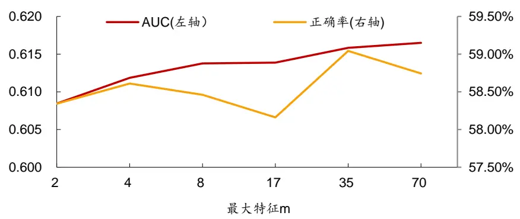
资料来源：华泰证券研究所

由交叉验证集中 AUC 曲线图可看出，随着最大特征数 m 的指数型增长，AUC 值的增长逐渐进入平台期，故从模型效率角度考量，我们最终选择最大特征个数为 8。此外，考虑决策树自身易受异常值影响产生过拟合问题，我们通过以下两个参数的设置进行预剪枝操作。

## 内部节点再划分需最小样本数

在对每个内部节点划分前，若节点样本数少于内部节点再划分需最小样本数（简记为 s）则不再尝试选择最优特征来划分。该参数限制了子树继续划分的条件，考虑到我们训练集样本数目较大，故对该值进行参数优化探究。

## 叶节点最小样本数

若某叶子节点样本数目小于叶节点最小样本数（简记为 l），则会和兄弟节点一起被剪枝。该参数限制了叶子节点最少的样本数，对决策树的构建形态有较大影响，当训练集样本数量较多时，增加该值可以对决策树进行有效的剪枝。

对以上两个参数选择时我们采取遍历方法，寻找全局最优解。参数寻优最常用的方法是网格搜索。取 s = (2,10,20,30,50,70,100,200)，l = (1,5,10,15,20,30,50,100)，测试每一组 s和 l值，得到交叉验证集的 AUC 值，全局最优解为 s=50,l=10。如下，我们在图表 16 中展示了交叉验证集和测试集的正确率、AUC 和预测值与收益秩相关系数的详细结果，并在图表 17 中给出不同选股模型训练选取的最优参数。

图表16： 随机森林模型（全 A选股）网格搜索交叉验证集/测试集各评价指标详细结果
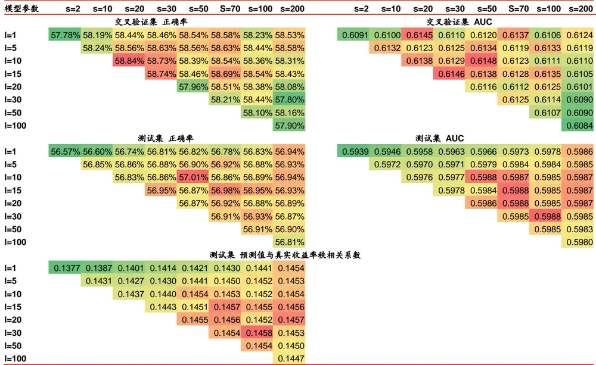
资料来源：Wind，华泰证券研究所

图表17： 测试模型参数选取一览

| 大类方法 | 选股模型 | 树棵数 n | 最大特征数 m 内部再划分最小 s |  | 叶节点最小数I |
| --- | --- | --- | --- | --- | --- |
| 随机森林 | 全 A 选股 | 500 | 8 | 50 | 10 |
|  | 沪深 300 选股 | 600 | 8 | 30 | 5 |
|  | 中证 500 选股 | 300 | 8 | 200 | 50 |

资料来源：Wind，华泰证券研究所

## 模型正确率与 AUC 分析

下图展示了随机森林模型（n=500,m=8,s=50,l=10）和两个统一对照组：12个月滚动线性回归模型、7阶段训练线性回归模型的各期测试集正确率与 AUC 随时间的变化情况。随机森林模型交叉验证集合平均正确率为58.4%，AUC为0.615。样本外平均正确率为57.0%，平均 AUC为 0.599。12 个月滚动线性回归模型样本外平均正确率为 53.8%，平均 AUC为 0.568；7 阶段训练线性回归模型样本外平均正确率为 53.7%，平均 AUC 为 0.577。

对比图表 18~21可以看出，由于具有相同的训练周期和训练集，随机森林模型与 7 阶段训练线性回归模型的评估指标波动情况更加相似，且除了少数月份外，随机森林模型测试集的正确率和AUC均高于线性回归。而相较于沿用前几篇模型中的12个月滚动线性模型，随机森林模型的正确率与 AUC 曲线也均伴随着更大的幅度变动。同时从数值上看，两个线性模型对照组的指标均值相差不大。

图表18： 随机森林模型和滚动线性回归模型样本外正确率
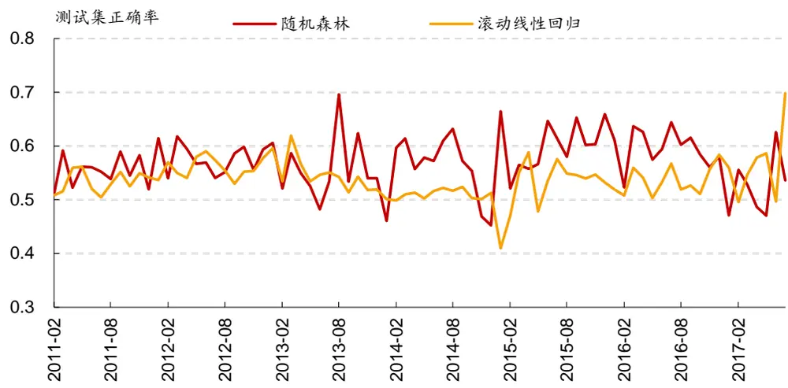
资料来源：Wind，华泰证券研究所

图表19： 随机森林模型和滚动线性回归模型样本外 AUC值
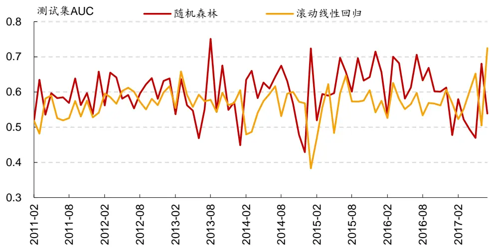
资料来源：Wind，华泰证券研究所

图表20： 随机森林模型和 7阶段线性回归模型样本外 AUC值
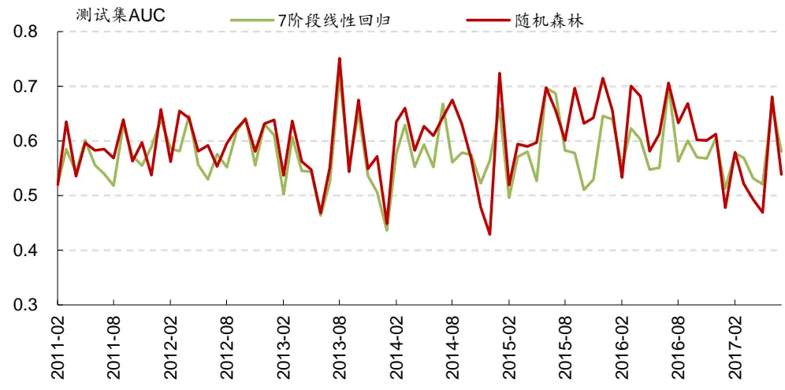
资料来源：Wind，华泰证券研究所

图表21： 随机森林模型和 7阶段线性回归模型样本外 AUC值
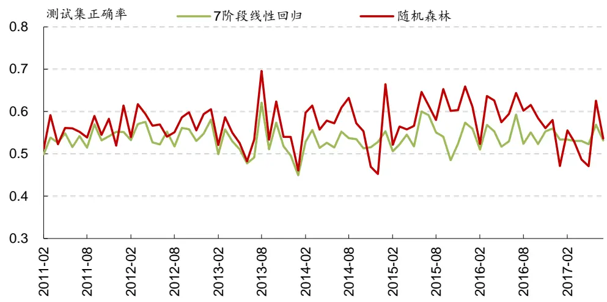
资料来源：Wind，华泰证券研究所

## 模型因子特征重要性统计

前面我们在决策树介绍部分提及过“特征重要性评分”这一概念和计算方法，同样地在随机森林每一个阶段模型训练中我们均可以通过各个决策树节点分裂的 Gini指数变化来确定输入特征的重要性评分。下面我们给出 2011-2017 年间七个测试模型的特征重要性评分表：

图表22： 随机森林模型中因子重要性评分（前 30名）

| 大类因子 | 因子名称 | 2011 | 2012 | 2013 | 2014 | 2015 | 2016 | 2017 | 均值 | 排名 |
| --- | --- | --- | --- | --- | --- | --- | --- | --- | --- | --- |
| 市值 | In_capital | 0.0217 | 0.0241 | 0.0274 | 0.0299 | 0.0314 | 0.0350 | 0.0397 | 0.0299 | 1 |
| 动量反转 | exp_wgt_return_3m | 0.0263 | 0.0247 | 0.0247 | 0.0227 | 0.0239 | 0.0227 | 0.0221 | 0.0239 | 2 |
| 动量反转 | exp_wgt_return_6m | 0.0222 | 0.0213 | 0.0222 | 0.0210 | 0.0227 | 0.0221 | 0.0227 | 0.0220 | 3 |
| 动量反转 | exp_wgt_return_1m | 0.0241 | 0.0233 | 0.0210 | 0.0196 | 0.0176 | 0.0175 | 0.0180 | 0.0202 | 4 |
| 动量反转 | wgt_return_1m | 0.0200 | 0.0199 | 0.0195 | 0.0192 | 0.0200 | 0.0195 | 0.0198 | 0.0197 | 5 |
| 波动率 | std_FF4factor_1m | 0.0204 | 0.0198 | 0.0201 | 0.0194 | 0.0187 | 0.0178 | 0.0154 | 0.0188 | 6 |
| 换手率 | turn_1m | 0.0203 | 0.0216 | 0.0199 | 0.0167 | 0.0168 | 0.0153 | 0.0160 | 0.0181 | 7 |
| 动量反转 | exp_wgt_return_12m | 0.0167 | 0.0165 | 0.0172 | 0.0171 | 0.0180 | 0.0180 | 0.0191 | 0.0175 | 8 |
| 换手率 | bias_turn_1m | 0.0166 | 0.0162 | 0.0173 | 0.0181 | 0.0173 | 0.0168 | 0.0175 | 0.0171 | 9 |
| 情绪 | rating_average | 0.0169 | 0.0159 | 0.0162 | 0.0180 | 0.0161 | 0.0166 | 0.0151 | 0.0164 | 10 |
| 动量反转 | wgt_return_3m | 0.0146 | 0.0150 | 0.0153 | 0.0164 | 0.0173 | 0.0182 | 0.0173 | 0.0163 | 11 |
| 情绪 | rating_change | 0.0155 | 0.0158 | 0.0163 | 0.0166 | 0.0154 | 0.0158 | 0.0153 | 0.0158 | 12 |
| 技术 | MACD | 0.0153 | 0.0156 | 0.0154 | 0.0147 | 0.0164 | 0.0165 | 0.0169 | 0.0158 | 13 |
| 动量反转 | return_1m | 0.0172 | 0.0166 | 0.0157 | 0.0145 | 0.0146 | 0.0156 | 0.0150 | 0.0156 | 14 |
| 技术 | BIAS | 0.0177 | 0.0166 | 0.0163 | 0.0149 | 0.0143 | 0.0145 | 0.0145 | 0.0156 | 15 |
| 成长 | Profit_G_q | 0.0145 | 0.0146 | 0.0154 | 0.0162 | 0.0152 | 0.0157 | 0.0147 | 0.0152 | 16 |
| 技术 | DIF | 0.0156 | 0.0151 | 0.0145 | 0.0146 | 0.0154 | 0.0155 | 0.0155 | 0.0152 | 17 |
| 成长 | Sales_G_q | 0.0139 | 0.0146 | 0.0148 | 0.0158 | 0.0149 | 0.0155 | 0.0150 | 0.0149 | 18 |
| 估值 | G/PE | 0.0146 | 0.0156 | 0.0155 | 0.0150 | 0.0144 | 0.0149 | 0.0144 | 0.0149 | 19 |
| 股东 | holder_avgpctchange | 0.0154 | 0.0151 | 0.0138 | 0.0144 | 0.0156 | 0.0154 | 0.0143 | 0.0149 | 20 |
| 成长 | ROE_G_q | 0.0142 | 0.0142 | 0.0149 | 0.0158 | 0.0149 | 0.0153 | 0.0145 | 0.0148 | 21 |
| 技术 | DEA | 0.0141 | 0.0141 | 0.0139 | 0.0143 | 0.0153 | 0.0157 | 0.0164 | 0.0148 | 22 |
| 成长 | OCF_G_q | 0.0139 | 0.0140 | 0.0143 | 0.0148 | 0.0156 | 0.0158 | 0.0152 | 0.0148 | 23 |
| 波动率 | std_1m | 0.0139 | 0.0139 | 0.0144 | 0.0144 | 0.0148 | 0.0147 | 0.0147 | 0.0144 | 24 |
| 动量反转 | return_3m | 0.0134 | 0.0137 | 0.0139 | 0.0138 | 0.0141 | 0.0160 | 0.0156 | 0.0144 | 25 |
| 波动率 | std_FF5factor_3m | 0.0132 | 0.0134 | 0.0142 | 0.0144 | 0.0144 | 0.0144 | 0.0138 | 0.0140 | 26 |
| 情绪 | rating_targetprice | 0.0135 | 0.0145 | 0.0141 | 0.0137 | 0.0141 | 0.0139 | 0.0137 | 0.0139 | 27 |
| 股价 | In_price | 0.0138 | 0.0148 | 0.0144 | 0.0135 | 0.0134 | 0.0138 | 0.0135 | 0.0139 | 28 |
| 动量反转 | wgt_return_6m | 0.0134 | 0.0130 | 0.0134 | 0.0140 | 0.0141 | 0.0140 | 0.0146 | 0.0138 | 29 |
| 动量反转 | return_6m | 0.0134 | 0.0139 | 0.0141 | 0.0139 | 0.0136 | 0.0133 | 0.0135 | 0.0137 | 30 |

资料来源：Wind，华泰证券研究所

图表23： 随机森林模型中因子重要性评分（后 40名）

| 大类因子 | 因子名称 | 2011 | 2012 | 2013 | 2014 | 2015 | 2016 | 2017 | 均值 | 排名 |
| --- | --- | --- | --- | --- | --- | --- | --- | --- | --- | --- |
| 估值 | DP | 0.0149 | 0.0141 | 0.0137 | 0.0137 | 0.0134 | 0.0130 | 0.0128 | 0.0137 | 31 |
| 技术 | RSI | 0.0139 | 0.0138 | 0.0138 | 0.0134 | 0.0133 | 0.0134 | 0.0132 | 0.0135 | 32 |
| 技术 | PSY | 0.0138 | 0.0135 | 0.0132 | 0.0130 | 0.0135 | 0.0137 | 0.0137 | 0.0135 | 33 |
| 动量反转 | return_12m | 0.0134 | 0.0135 | 0.0130 | 0.0131 | 0.0135 | 0.0136 | 0.0134 | 0.0134 | 34 |
| 换手率 | bias_turn_3m | 0.0131 | 0.0129 | 0.0131 | 0.0134 | 0.0129 | 0.0136 | 0.0142 | 0.0133 | 35 |
| 换手率 | turn_3m | 0.0139 | 0.0147 | 0.0135 | 0.0127 | 0.0125 | 0.0125 | 0.0133 | 0.0133 | 36 |
| 估值 | BP | 0.0135 | 0.0139 | 0.0142 | 0.0129 | 0.0131 | 0.0123 | 0.0128 | 0.0132 | 37 |
| beta | beta | 0.0133 | 0.0132 | 0.0129 | 0.0135 | 0.0130 | 0.0133 | 0.0131 | 0.0132 | 38 |
| 杠杆 | debtequityratio | 0.0127 | 0.0126 | 0.0128 | 0.0145 | 0.0136 | 0.0129 | 0.0125 | 0.0131 | 39 |
| 波动率 | std_3m | 0.0130 | 0.0131 | 0.0133 | 0.0131 | 0.0130 | 0.0127 | 0.0132 | 0.0131 | 40 |
| 估值 | NCFP | 0.0133 | 0.0133 | 0.0126 | 0.0132 | 0.0129 | 0.0131 | 0.0130 | 0.0131 | 41 |
| 换手率 | bias_turn_12m | 0.0127 | 0.0126 | 0.0126 | 0.0127 | 0.0131 | 0.0132 | 0.0144 | 0.0130 | 42 |
| 动量反转 | HAlpha | 0.0129 | 0.0132 | 0.0130 | 0.0128 | 0.0132 | 0.0125 | 0.0133 | 0.0130 | 43 |
| 波动率 | std_FF6factor_6m | 0.0134 | 0.0132 | 0.0128 | 0.0130 | 0.0129 | 0.0124 | 0.0124 | 0.0129 | 44 |
| 财务质量 | ROE_q | 0.0131 | 0.0126 | 0.0127 | 0.0135 | 0.0127 | 0.0127 | 0.0120 | 0.0127 | 45 |
| 波动率 | std_FF7factor_12m | 0.0130 | 0.0127 | 0.0125 | 0.0127 | 0.0129 | 0.0125 | 0.0127 | 0.0127 | 46 |
| 换手率 | turn_12m | 0.0127 | 0.0133 | 0.0131 | 0.0123 | 0.0123 | 0.0123 | 0.0127 | 0.0127 | 47 |
| 波动率 | std_12m | 0.0120 | 0.0126 | 0.0126 | 0.0126 | 0.0134 | 0.0123 | 0.0133 | 0.0127 | 48 |
| 估值 | OCFP | 0.0129 | 0.0130 | 0.0128 | 0.0124 | 0.0125 | 0.0125 | 0.0123 | 0.0126 | 49 |
| 换手率 | bias_turn_6m | 0.0126 | 0.0127 | 0.0125 | 0.0123 | 0.0122 | 0.0124 | 0.0129 | 0.0125 | 50 |
| 财务质量 | operationcashflowratio_q | 0.0125 | 0.0125 | 0.0125 | 0.0128 | 0.0127 | 0.0124 | 0.0123 | 0.0125 | 51 |
| 波动率 | std_6m | 0.0126 | 0.0125 | 0.0124 | 0.0125 | 0.0128 | 0.0122 | 0.0125 | 0.0125 | 52 |
| 估值 | EPcut | 0.0132 | 0.0123 | 0.0127 | 0.0122 | 0.0122 | 0.0122 | 0.0120 | 0.0124 | 53 |
| 换手率 | turn_6m | 0.0126 | 0.0131 | 0.0122 | 0.0115 | 0.0125 | 0.0119 | 0.0128 | 0.0124 | 54 |
| 财务质量 | operationcashflowratio_ttm | 0.0125 | 0.0126 | 0.0125 | 0.0123 | 0.0124 | 0.0122 | 0.0120 | 0.0124 | 55 |
| 动量反转 | wgt_return_12m | 0.0123 | 0.0124 | 0.0124 | 0.0120 | 0.0123 | 0.0123 | 0.0125 | 0.0123 | 56 |
| 估值 | EP | 0.0123 | 0.0123 | 0.0125 | 0.0122 | 0.0123 | 0.0120 | 0.0122 | 0.0122 | 57 |
| 杠杆 | currentratio | 0.0119 | 0.0120 | 0.0118 | 0.0123 | 0.0120 | 0.0126 | 0.0119 | 0.0121 | 58 |
| 杠杆 | cashratio | 0.0119 | 0.0119 | 0.0120 | 0.0122 | 0.0121 | 0.0121 | 0.0118 | 0.0120 | 59 |
| 杠杆 | financial_leverage | 0.0118 | 0.0118 | 0.0118 | 0.0124 | 0.0121 | 0.0118 | 0.0117 | 0.0119 | 60 |
| 财务质量 | ROA_q | 0.0120 | 0.0117 | 0.0116 | 0.0126 | 0.0120 | 0.0117 | 0.0115 | 0.0119 | 61 |
| 财务质量 | ROE_ttm | 0.0116 | 0.0116 | 0.0118 | 0.0122 | 0.0122 | 0.0122 | 0.0114 | 0.0119 | 62 |
| 财务质量 | grossprofitmargin_q | 0.0119 | 0.0118 | 0.0118 | 0.0126 | 0.0119 | 0.0117 | 0.0113 | 0.0118 | 63 |
| 估值 | SP | 0.0122 | 0.0121 | 0.0120 | 0.0117 | 0.0115 | 0.0117 | 0.0114 | 0.0118 | 64 |
| 财务质量 | grossprofitmargin_ttm | 0.0116 | 0.0115 | 0.0117 | 0.0120 | 0.0116 | 0.0116 | 0.0113 | 0.0116 | 65 |
| 财务质量 | assetturnover_q | 0.0119 | 0.0114 | 0.0117 | 0.0115 | 0.0116 | 0.0116 | 0.0114 | 0.0116 | 66 |
| 财务质量 | profitmargin_q | 0.0112 | 0.0112 | 0.0118 | 0.0122 0.0117 | 0.0117 0.0114 | 0.0116 0.0117 | 0.0113 0.0116 | 0.0116 0.0115 | 67 68 |

资料来源：Wind，华泰证券研究所

## 分层回测分析

依照因子值对股票进行打分，构建投资组合回测，是最直观的衡量因子优劣的手段。随机森林属于分类器，最终在每个月底可以产生对全部个股下月上涨或下跌的预测值（即各决策树分类结果的投票平均值），因此可以将两者都看作一个因子合成模型，即在每个月底将因子池中所有因子合成为一个“因子”。接下来，我们对该模型合成的这个“因子”（即个股下期预测值）进行分层回测，从各方面考察该模型的效果。仿照华泰单因子测试系列报告中的思路，分层回测模型构建方法如下：

1. 股票池：全 A 股，剔除 ST 股票，剔除每个截面期下一交易日停牌的股票，剔除上市3 个月以内的股票。

2. 回测区间：2011-01-31 至 2017-07-31（按年度分为 7 个子区间）。

3. 换仓期：在每个自然月最后一个交易日核算因子值，在下个自然月首个交易日按当日收盘价换仓。

4. 数据处理方法：将随机森林模型的预测值视作单因子，因子值为空的股票不参与分层。

5. 分层方法：在每个一级行业内部对所有个股按因子大小进行排序，每个行业内均分成N 个分层组合。如图表 24 所示，黄色方块代表各行业内个股初始权重，可以相等也可以不等（我们直接取相等权重进行测试），分层具体操作方法为 N 等分行业内个股权重累加值，例如图示行业1中，5只个股初始权重相等（不妨设每只个股权重为0.2），假设我们欲分成 3 层，则分层组合 1在权重累加值 1/3 处截断，即分层组合 1包含个股 1 和个股 2，它们的权重配比为 0.2:(1/3-0.2)=3:2，同样推理，分层组合 2 包含个股 2、3、4，配比为(0.4-1/3):0.2:(2/3-0.6)=1:3:1，分层组合 4 包含个股 4、5，配比为 2:3。以上方法是用来计算各个一级行业内部个股权重配比的，行业间权重配比与基准组合（我们使用沪深 300）相同，也即行业中性。

6. 评价方法：回测年化收益率、夏普比率、信息比率、最大回撤、胜率等。

图表24： 单因子分层测试法示意图
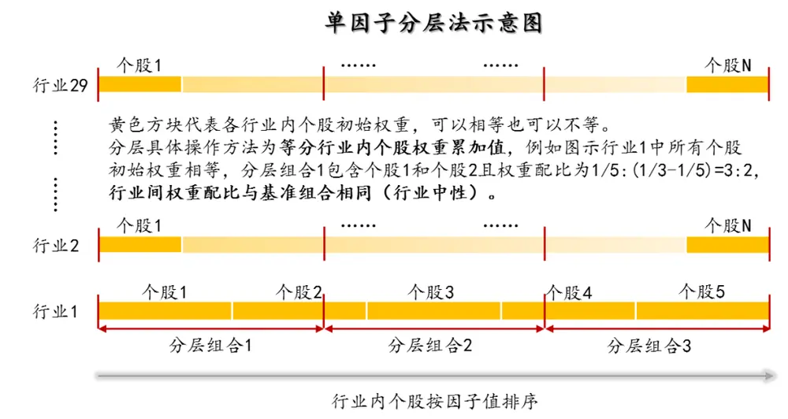
资料来源：华泰证券研究所

这里我们将展示随机森林模型（n=500，m=8，s=50，l=10）的分层测试结果。

下图是分五层组合回测绩效分析表（20110131～20170731）。其中组合 1～组合 5为按该因子从小到大排序构造的行业中性的分层组合。基准组合为行业中性的等权组合，具体来说就是将组合 1～组合 5 合并，一级行业内部个股等权配置，行业权重按当期沪深 300 行业权重配置。多空组合是在假设所有个股可以卖空的基础上，每月调仓时买入组合 1，卖空组合 5。回测模型在每个自然月最后一个交易日核算因子值，在下个自然月首个交易日按当日收盘价调仓。

图表25： 随机森林模型分层组合绩效分析（20110131～20170731）

| 投资组合 | 年化收益率 | 年化波动率夏普比率最大回撤 |  |  | 年化超额收益率 | 超额收益年化波动率信息比率 |  | 相对基准月胜率 | 超额收益最大回撤 |
| --- | --- | --- | --- | --- | --- | --- | --- | --- | --- |
| 组合1 | 26.03% | 27.47% | 0.95 | 44.51% | 13.39% | 3.75% | 3.57 | 80.77% | 5.71% |
| 组合2 | 14.07% | 26.88% | 0.52 | 48.06% | 2.63% | 2.71% | 0.97 | 62.82% | 3.38% |
| 组合3 | 7.32% | 26.91% | 0.27 | 48.86% | -3.44% | 2.57% | -1.34 | 35.90% | 20.39% |
| 组合4 | 2.37% | 26.66% | 0.09 | 52.99% | -7.90% | 3.09% | -2.56 | 24.36% | 41.76% |
| 组合5 | -7.91% | 28.31% | -0.28 | 62.28% | -17.14% | 4.37% | -3.92 | 14.10% | 69.94% |
| 基准组合 | 11.15% | 27.06% | 0.41 | 49.05% |  |  |  |  |  |
| 多空组合 | 36.85% | 7.09% | 5.20 | 12.60% |  |  |  |  |  |

资料来源：Wind，华泰证券研究所

下面四个图依次为：

1.分五层组合回测净值图。按前面说明的回测方法计算组合 1～组合 5、基准组合的净值，与沪深 300、中证 500 净值对比作图。

2.分五层组合回测，用组合 1～组合 5的净值除以基准组合净值的示意图。可以更清晰地展示各层组合在不同时期的效果。

3.组合 1相对沪深 300 月超额收益分布直方图。该直方图以[-0.5%,0.5%]为中心区间，向正负无穷方向保持组距为 1%延伸，在正负两个方向上均延伸到最后一个频数不为零的组为止（即维持组距一致，组数是根据样本情况自适应调整的）。

4.分五层时的多空组合收益图。再重复一下，多空组合是买入组合 1、卖空组合 5（月度调仓）的一个资产组合。多空组合收益率是由组合 1 的净值除以组合 5的净值近似核算的。

图表26： 随机森林模型分层组合回测净值
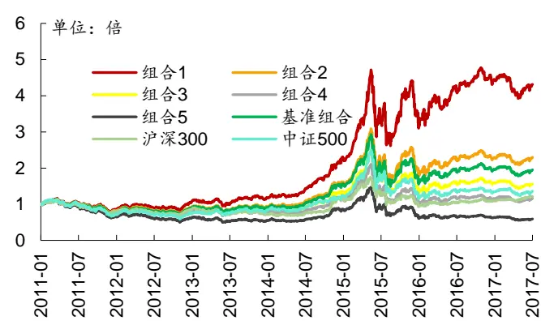
资料来源：Wind，华泰证券研究所

图表27： 随机森林模型各层组合净值除以基准组合净值示意图
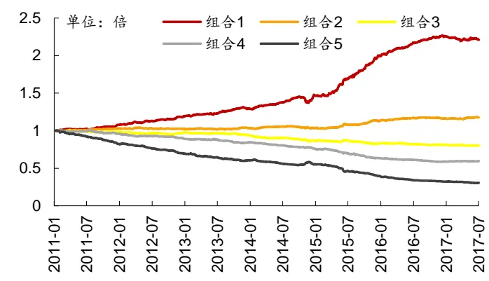
资料来源：Wind，华泰证券研究所

图表28： 随机森林模型分层组合 1相对沪深 300月超额收益分布图
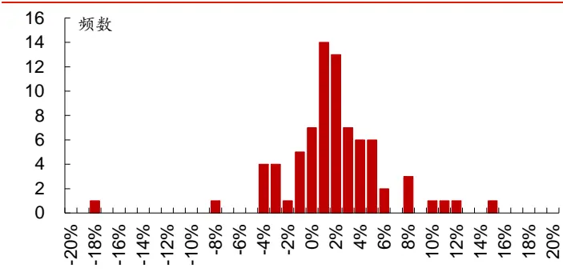
资料来源：Wind，华泰证券研究所

图表29： 随机森林模型多空组合月收益率及累积收益率
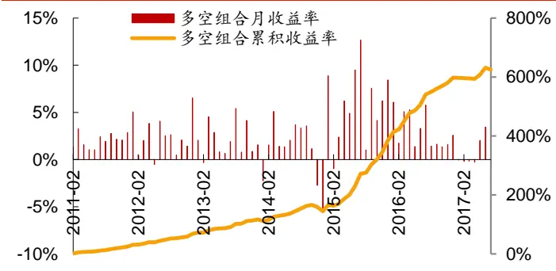
资料来源：Wind，华泰证券研究所

下图为分十层组合回测时，各层组合在不同年份间的收益率及排名表。每个单元格的内容为在指定年度某层组合的收益率（均为整年收益率），以及某层组合在全部十层组合中的收益率排名。最后一列是分层组合在 2011～2017 的排名的均值。

图表30： 随机森林模型组合在不同年份的收益及排名分析（分十层）

| 分层组合 | 2011 | 2012 | 2013 | 2014 | 2015 | 2016 | 2017 | 排名均值 |
| --- | --- | --- | --- | --- | --- | --- | --- | --- |
| 组合1 | -19.1%(1) | 29.7%(1) | 19.0%(1) | 87.4%(1) | 86.4%(1) | 16.0%(1) | -6.0%(8) | 1.58 |
| 组合2 | -24.5%(4) | 22.1%(2) | 19.0%(2) | 71.0%(3) | 77.5%(2) | 9.8%(2) | -4.1%(5) | 2.50 |
| 组合3 | -23.7%(3) | 14.4%(4) | 9.9%(3) | 63.7%(6) | 49.3%(3) | 0.6%(3) | -2.5%(3) | 3.33 |
| 组合4 | -23.2%(2) | 9.7%(5) | 8.8%(4) | 67.8%(4) | 37.7%(4) | 0.1%(4) | -0.5%(2) | 3.75 |
| 组合5 | -26.9%(6) | 17.2%(3) | 5.4%(6) | 55.1%(7) | 31.8%(5) | -2.5%(5) | -4.1%(6) | 5.25 |
| 组合6 | -26.9%(7) | 3.2%(7) | 7.1%(5) | 48.9%(8) | 19.2%(6) | -4.6%(6) | -4.8%(7) | 6.33 |
| 组合7 | -26.5%(5) | 7.4%(6) | -0.3%(8) | 43.1%(10) | 12.8%(7) | -6.3%(7) | 0.3%(1) | 6.58 |
| 组合8 | -29.2%(8) | 1.9%(8) | 1.3%(7) | 66.5%(5) | 1.4%(8) | -13.4%(8) | -2.7%(4) | 7.33 |
| 组合9 | -33.4%(9) | -6.2%(9) | -4.3%(9) | 72.3%(2) | -4.2%(9) | -19.3%(9) | -7.5%(9) | 8.42 |
| 组合10 | -41.2%(10) | -7.6%(10) | -10.1%(10) | 45.3%(9) | -11.8%(10) | -24.0%(10) | -9.8%(10) | 9.92 |

资料来源：Wind，华泰证券研究所

下图是不同市值区间分层组合回测绩效指标对比图（分十层）。我们将全市场股票按市值排名前 1/3，1/3～2/3，后 1/3 分成三个大类，在这三类股票中分别进行分层测试，基准组合构成方法同前面所述（注意每个大类对应的基准组合并不相同）。

图表31： 不同市值区间随机森林模型组合绩效指标对比图（分十层）
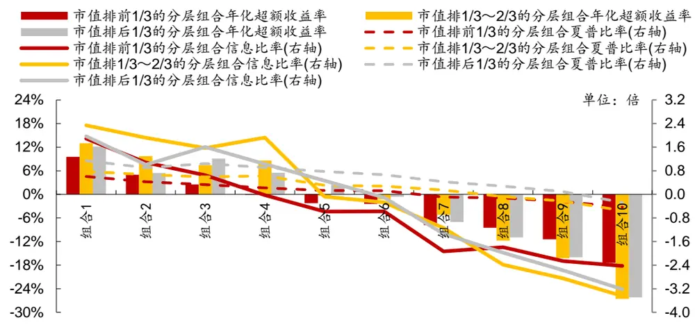
资料来源：Wind，华泰证券研究所

下图是不同行业间分层组合回测绩效分析表（分五层）。我们在不同一级行业内部都做了分层测试，基准组合为各行业内该因子非空值的个股等权组合（注意每个行业对应的基准组合并不相同）。

图表32： 不同行业随机森林模型分层组合绩效分析（分五层）

|  | 组合1年化 | 组合1 | 组合1 | 组合1 | 组合1超额收益 | 组合1相对 | 所有组合年化 |
| --- | --- | --- | --- | --- | --- | --- | --- |
| 行业 | 超额收益率 | 信息比率 | 年化收益率 | 夏普比率 | 最大回撤 | 基准月胜率 | 收益率排序 |
| 有色金属 | 22.31% | 2.32 | 28.80% | 0.84 | 10.73% | 69.39% | 1,2,3,4,5 |
| 建材 | 22.04% | 2.30 | 39.13% | 1.20 | 9.33% | 61.29% | 1,2,3,4,5 |
| 农林牧渔 | 21.48% | 2.31 | 36.23% | 1.11 | 7.01% | 63.60% | 1,2,4,3,5 |
| 计算机 | 21.12% | 2.22 | 44.31% | 1.14 | 14.07% | 62.44% | 1,2,3,4,5 |
| 汽车 | 19.57% | 2.53 | 35.49% | 1.10 | 7.64% | 69.39% | 1,2,3,4,5 |
| 食品饮料 | 18.62% | 1.96 | 30.53% | 1.01 | 9.47% | 63.60% | 1,2,3,4,5 |
| 机械 | 18.53% | 2.76 | 29.89% | 0.90 | 6.55% | 70.55% | 1,2,3,4,5 |
| 通信 | 17.48% | 1.71 | 39.10% | 1.06 | 13.19% | 61.29% | 1,2,3,4,5 |
| 基础化工 | 16.98% | 2.60 | 33.02% | 1.00 | 4.97% | 70.55% | 1,2,3,4,5 |
| 电子元器件 | 16.85% | 2.11 | 36.28% | 1.01 | 12.30% | 61.29% | 1,2,3,4,5 |
| 煤炭 | 16.68% | 1.52 | 14.40% | 0.40 | 15.61% | 64.77% | 1,2,4,3,5 |
| 房地产 | 16.55% | 2.22 | 35.89% | 1.13 | 11.53% | 64.77% | 1,2,3,4,5 |
| 国防军工 | 16.44% | 1.17 | 25.89% | 0.63 | 19.63% | 57.82% | 1,2,3,4,5 |
| 家电 | 16.18% | 1.50 | 37.07% | 1.15 | 12.24% | 56.66% | 1,2,3,4,5 |
| 商贸零售 纺织服装 | 15.96% | 2.06 | 25.30% | 0.79 | 8.28% | 68.24% | 1,2,3,4,5 |
| 钢铁 | 15.66% | 1.76 | 30.96% | 0.95 | 7.75% | 63.60% | 1,2,3,4,5 |
| 电力设备 | 13.37% | 1.23 | 24.96% | 0.73 | 13.20% | 56.66% | 1,2,3,5,4 |
| 电力及公用事业 | 13.36% | 1.74 | 23.25% | 0.68 | 7.93% | 62.44% | 1,2,3,4,5 |
| 传媒 | 13.18% | 1.60 | 26.44% | 0.85 | 6.65% | 63.60% | 1,2,3,4,5 |
| 石油石化 | 13.18% | 0.98 | 31.96% | 0.84 | 31.68% | 54.35% | 1,2,4,3,5 |
| 医药 | 12.78% | 1.05 | 24.26% | 0.73 | 15.62% | 57.82% | 1,2,3,4,5 |
| 综合 | 12.68% | 1.86 | 28.85% | 0.91 | 12.89% | 60.13% | 1,2,3,4,5 |
| 交通运输 | 11.89% | 0.90 | 26.54% | 0.76 | 16.38% | 48.57% | 1,3,2,4,5 |
| 非银行金融 | 10.53% | 1.23 | 23.70% | 0.78 | 11.18% | 69.39% | 1,2,3,4,5 |
| 轻工制造 | 10.40% | 0.86 | 22.14% | 0.60 | 16.94% 18.39% | 54.35% | 1,2,3,5,4 |
| 建筑 | 9.86% | 0.99 0.81 | 27.32% 21.25% | 0.85 0.66 | 14.93% | 55.51% 60.13% | 1,2,4,3,5 |
| 餐饮旅游 | 8.30% 7.60% | 0.62 | 19.98% | 0.64 | 14.59% | 52.04% | 1,2,4,3,5 2,1,3,4,5 |
| 银行 |  |  | 16.88% | 0.62 | 13.94% | 42.79% |  |
|  | 3.16% | 0.40 |  |  |  |  | 1,3,4,2,5 |

资料来源：Wind，华泰证券研究所

## 构建策略组合及回测分析

我们采用了随机森林算法，并对其重要参数进行了敏感性分析。我们将回测区间按年度划分为 7个子区间，训练集为当前回测年度往前推 72 个月的月频数据，为确定模型参数，我们选取第一个回测时期模型为代表，对 n 和 m 进行调整测试，并对 s和 l进行遍历，选取交叉验证集 AUC 最高的组合作为最终选定的参数，并在其后模型中沿用此参数。同时考量两个统一对照组：①沿用本系列第二、三篇报告中的 12 个月滚动回测的线性回归模型；②利用与随机森林模型相同的训练周期和训练集构成构建 7阶段线性回归模型。此外从滚动模型角度出发选取前一篇朴素贝叶斯模型进行比较探究。

首先，我们构建了沪深 300 和中证 500 成分内选股策略并进行回测，各项指标详见图表30。选股策略分为两类：一类是行业中性策略，策略组合的行业配置与基准（沪深 300、中证 500）保持一致，各一级行业中选 N个股票等权配置（N=2,5,10,15,20）；另一类是个股等权策略，直接在票池内不区分行业选 N 个股票等权配置（N=20,50,100,150,200），比较基准取为 300 等权、500 等权指数。两类策略均为月频调仓，个股入选顺序为它们在随机森林模型中当月预测值的顺序。

对于沪深 300 成份股内选股的行业中性策略，当每个行业选股数小于等于 10只时，随机森林模型的年化超额收益率、信息比率和 Calmar 比率均明显高于统一对照组①的线性回归模型，超额收益最大回撤小于 12月滚动线性回归，与朴素贝叶斯模型相比各指标表现也略胜一筹。和统一对照组②相比，随机森林仅在行业选股数较小（选股数为 2）时表现稍弱，其他情况下均略胜一些。对于沪深 300 成份股内选股的个股等权策略，策略表现受总选股数影响较大，总选股数为 50时，各指标均优于两组线性回归统一对照组和朴素贝叶斯模型。但其他选股条件下，随机森林模型仅有年化超额收益率高于线性回归，而回撤则相对较大。

对于中证 500 成份股内选股的行业中性策略，当每个行业选股数小于等于 10只时，随机森林模型的年化超额收益率、信息比率和 Calmar 比率均明显高于统一对照组①的线性回归模型，回撤也相对较小。不同行业选股数情况下策略表现与朴素贝叶斯模型及统一对照②的 7阶段线性回归模型相比总体持平，无大幅优势。对于中证 500 成份股内选股的个股等权策略，选取不同的总选股数，随机森林模型年化超额收益率、信息比率和 Calmar 比率均明显高于 12 月滚动线性回归模型，超额收益最大回撤小于线性回归。与朴素贝叶斯模型相比，随机森林模型的信息比率总体较高，而超额收益最大回撤更大，由此在 Calmar比率上表现略逊色。与行业中性情况相同，整体来看随机森林模型与对照组②的 7阶段滚动线性回归相比无明显优势。

图表34展示了全A选股策略的回测结果。对于全A选股的行业中性策略和个股等权策略，随机森林的年化超额收益率和信息比率都远胜于两组统一对照组的线性回归模型和朴素贝叶斯模型，但是超额收益最大回撤都明显高于线性回归模型。值得注意的是，在成分股选股策略中表现较好、能与随机森林模型持平的 7阶段滚动线性回归模型，在全 A选股策略中与对照组①中线性回归模型的回测结果相差无几，可见选股策略的构建对于模型应用效果有不小的影响。

总的来看，随机森林模型的表现在不同选股方式下差异较大。在沪深 300 与中证 500成分股选股策略下，随机森林模型的表现并不亮眼，与相同训练周期和训练集构成的 7 阶段线性回归模型相比提升不大；而在全 A选股策略中，随机森林模型能获取更高的超额收益，综合提升也较大。从整体指标情况看：收益方面，随机森林模型在多数选股策略下能获取更高的超额收益；而回撤部分，随机森林模型相比于两种对照的线性回归模型和朴素贝叶斯不具备明显优势，很多时候回撤会更大。

图表33： 随机森林模型回测重要指标对比（沪深 300及中证 500成份股内选股）
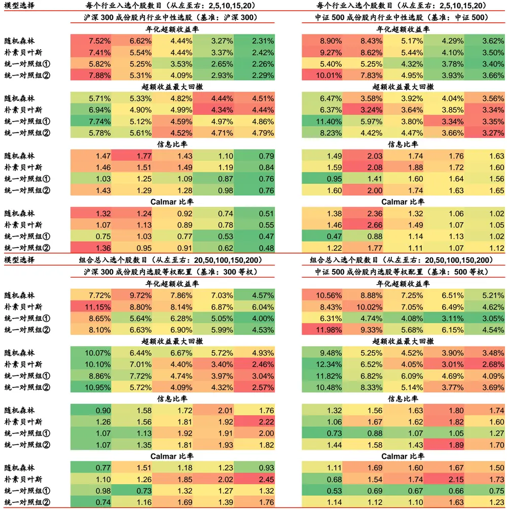
资料来源：Wind，华泰证券研究所

图表34： 随机森林模型回测重要指标对比（全 A选股）
每个行业入选个股数目（从左至右：2,5,10,15,20）

| 模型选择 | 行 全 A 选股，基准为沪深 300 |  |  |  | 日 石 基准为中证 500 |  |  |  |  |  |
| --- | --- | --- | --- | --- | --- | --- | --- | --- | --- | --- |
|  | 年化超额收益率（行业中性） |  |  |  | 全 A 选股， 年化超额收益率（行业中性） |  |  | 全 A 选股，基准为中证全指 |  |  |
| 随机森林 | 25.8% | 24.2% 23.0% | 20.7% | 18.2% | 33.8% 31.2% 28.2% | 25.3% 23.0% | 28.0% 26.4% | 年化超额收益率（行业中性） | 21.8% | 19.6% |
| 朴素贝叶斯 |  | 15.1% | 15.8% 15.0% | 14.2% | 16.5% 17.1% |  | 13.6% |  | 24.5% 15.9% |  |
|  | 14.0% | 15.3% |  |  |  | 18.2% 17.7% 17.2% | 20.3% | 14.9% 16.3% | 15.3% | 14.7% |
| 统一对照组① | 18.7% 17.4% | 14.9% 16.0% | 14.1% | 13.9% 14.2% | 24.3% 19.6% | 17.5% 17.0% 16.4% |  | 15.3% | 14.5% | 14.2% |
| 统一对照组② |  | 16.1% 超额收益最大回撤 | 15.2% (行业中性) | 20.9% | 18.7% 18.3% | 17.9% 16.9% | 18.2% | 16.2% 16.2% | 15.6% | 14.6% |
|  |  |  |  |  | 超额收益最大回撤 (行业中性) |  |  |  | 超额收益最大回撤 (行业中性) |  |
| 随机森林 | 18.3% 19.3% | 18.5% | 17.6% | 19.0% | 14.7% 16.2% 14.9% | 13.3% 13.4% | 13.0% | 14.2% 11.8% | 10.7% | 11.0% |
| 朴素贝叶斯 | 16.8% | 17.3% 15.9% | 15.8% | 15.2% | 7.1% 6.7% 8.1% | 7.1% 6.7% | 8.3% | 7.9% 7.6% | 6.8% | 7.0% |
| 统一对照组① | 15.9% | 15.5% 15.1% | 14.1% | 15.2% | 9.6% 9.0% 7.8% | 6.4% 7.2% | 8.0% | 7.8% 6.6% | 6.6% | 7.3% |
| 统一对照组② | 16.0% 15.6% | 16.3% 17.4% | 18.0% | 9.9% | 10.8% 11.5% | 11.8% 11.7% | 9.8% 9.1% | 9.9% | 10.2% | 10.1% |
|  | 信息比率 | (行业中性) |  |  | 信息比率 (行业中性) |  |  | 信息比率 | (行业中性) |  |
| 随机森林 | 2.26 | 2.24 2.28 | 2.10 | 1.88 3.79 | 4.16 4.25 | 4.09 3.95 | 3.18 | 3.37 | 3.51 3.33 | 3.13 |
| 朴素贝叶斯 | 1.57 | 1.88 2.05 | 1.93 | 1.81 | 2.55 3.00 3.65 | 3.80 3.89 | 2.16 | 2.64 | 3.18 3.16 | 3.12 |
| 统一对照组① | 1.74 | 1.62 1.65 | 1.57 | 1.54 | 2.74 2.95 3.06 | 3.18 3.21 | 2.47 | 2.53 | 2.68 2.62 | 2.60 |
| 统一对照组② | 1.74 1.71 | 1.82 | 1.72 1.62 | 2.68 | 2.90 3.32 | 3.45 3.44 | 2.47 | 2.52 2.86 | 2.82 | 2.74 |
|  | Calmar 比率（行业中性） |  |  |  | Calmar 比率 | (行业中性) |  | Calmar 比率 | (行业中性) |  |
| 随机森林 | 1.41 | 1.26 1.24 | 1.17 | 0.96 | 2.30 1.93 | 1.90 1.90 1.72 | 2.16 | 1.86 | 2.08 2.04 | 1.77 |
| 朴素贝叶斯 | 0.83 | 0.87 0.99 | 0.95 | 0.93 | 2.32 2.54 2.25 | 2.49 2.56 | 1.64 | 1.88 | 2.08 2.24 | 2.10 |
| 统一对照组① | 1.18 | 0.99 0.99 | 1.00 | 0.91 2.52 | 2.18 2.23 | 2.67 2.28 | 2.53 | 2.10 | 2.32 2.20 | 1.94 |
| 统一对照组② | 1.09 | 1.02 0.99 | 0.87 | 0.79 2.11 | 1.74 1.60 | 1.51 1.45 | 1.85 | 1.79 1.64 | 1.53 | 1.45 |
| 模型选择 | 每个行业入选个股数目 (从左至右： 20,50,100,150,200) |  |  |  |  |  |  |  |  |  |
| 随机森林 朴素贝叶斯 | 年化超额收益率（个股等权） 43.2% 38.1% | 34.2% 33.0% | 31.8% |  | 年化超额收益率 | (个股等权) 31.2% 30.0% |  | 年化超额收益率（个股等权） |  |  |
|  | 20.1% 21.2% | 22.0% 22.2% | 22.8% | 41 .6% 17.7% | 36.4% 32.5% 18.7% 19.6% | 19.8% 20.4% | 42.0% 18.4% 19.4% | 36.8% 20.3% | 32.9% 31.6% | 30.4% |
| 统一对照组① | 28.3% 25.7% | 25.1% 24.0% |  |  | 23.8% 23.1% | 22.1% 20.1% | 26.8% | 24.3% | 20.4% | 21.1% |
| 统一对照组② | 27.6% 26.0% | 23.1% 23.5% | 22.0% | 26.3% | 23.9% 21.2% | 21.5% 20.7% | 26.2% 24.5% | 23.7% | 22.6% | 20.6% |
|  | 超额收益最大回撤 | (个股等权) | 22.6% | 25.6% | 超额收益最大回撤 | (个股等权) | 超额收益最大回撤 | 21.7% | 22.1% | 21.2% |
| 随机森林 | 35.5% 33.9% | 33.9% 34.0% | 34.7% | 15.5% | 12.7% 15.2% | 15.0% 14.1% | 22.4% | 20.4% | (个股等权) |  |
| 朴素贝叶斯 | 26.2% 27.7% | 26.9% | 27.6% |  | 7.4% 5.1% | 6.2% 5.3% | 12.4% |  | 20.4% 20.5% | 21.1% |
| 统一对照组① |  | 27.6% | 28.1% | 14.2% |  |  |  | 13.5% | 12.4% 13.4% | 12.9% |
| 统一对照组② | 28.6% 27.6% |  | 28.4% 28.9% | 14.1% | 8.9% 6.5% | 5.7% 6.6% | 19.1% | 14.1% | 13.0% 14.3% | 14.9% |
|  | 30.1% 31.8% | 31.4% | 29.8% 29.8% | 11.5% | 12.4% 9.7% | 8.6% 9.7% | 15.5% | 17.5% 17.0% | 15.1% | 15.1% |
| 随机森林 | 信息比率 2.03 1.92 | (个股等权) 1.76 |  |  | 信息比率 (个股等权) | 4.03 |  | 信息比率 | (个股等权) |  |
| 朴素贝叶斯 |  | 1.46 1.56 | 1.74 1.70 1.59 | 3.81 | 4.05 3.92 | 4.02 3.76 | 2.92 | 2.91 | 2.71 2.74 | 2.71 |
| 统一对照组① | 1.29 | 1.39 | 1.55 | 2.04 | 2.63 3.14 | 3.42 | 1.83 | 2.26 | 2.56 2.64 | 2.78 |
| 统一对照组② | 1.41 | 1.44 | 1.39 1.30 | 2.14 | 2.66 3.24 | 3.38 3.33 | 1.89 | 2.10 | 2.35 2.31 | 2.20 |
|  | 1.47 | 1.52 1.37 | 1.40 1.35 | 2.48 | 3.17 3.24 Calmar 比率 | 3.49 3.48 (个股等权) | 2.12 Calmar 比率 | 2.42 (个股等权) | 2.26 2.35 | 2.28 |

资料来源：Wind，华泰证券研究所

## 随机森林模型选股策略详细分析

下面我们对随机森林模型策略组合的详细回测情况加以展示。下图中，我们分别展示了沪深 300 成份股内选股（基准：沪深 300）、中证 500 成份股内选股（基准：中证 500）、全A选股（基准：中证 500）策略的各种详细评价指标。

观察下面的图表可知，对于随机森林模型沪深 300 成分股内选股行业中性策略来说，随着每个行业入选个股数目增多，年化收益率在下降、信息比率和 Calmar 比率先升后降，最优每个行业入选个股数目在 6 个左右；对于随机森林模型中证 500 成份股内选股行业中性策略来说，随着每个行业入选个股数目增多，年化收益率在下降，信息比率和 Calmar 比率先升后降，最优每个行业入选个股数目在 6 个左右；对于随机森林模型全 A选股行业中性策略来说，随着入选个股总数目增多，年化收益率在下降，信息比率先升后降，Calmar比率也大体呈下降趋势。最优每个行业入选个股数目在 10 个左右。

图表35： 随机森林模型和线性回归模型成份内选股策略组合回测分析表（回测期：20110131～20170731）

|  | 每个行业入 年化 |  |  |  |  | 年化 | 夏普 | 最大年化超额 年化 |  |  |  |  | 超额收益信息Calmar |  | 相对基准 | 月均双边换手率 |
| --- | --- | --- | --- | --- | --- | --- | --- | --- | --- | --- | --- | --- | --- | --- | --- | --- |
| 选股票池 | 比较基准 模型与策略类型选个股数目收益率 |  |  |  |  | 波动率 | 比率 | 回撤 收益率跟踪误差最大回撤 |  |  |  |  | 比率 比率 |  | 月胜率 |  |
| 沪深 300 | 沪深 300随机森林/行业中性 210.7% |  |  |  |  | 25.3% | 0.4240.5% 7.5% 5.1% 5.7% 1.47 1.32 |  |  |  |  |  |  |  | 67.9% | 119.1% |
| 沪深 300 | 沪深 300 | 随机森林/行业中性 410.1% |  |  |  | 24.8% | 0.41 | 43.3% 6.8% |  |  | 4.1% 5.2% |  | 1.65 1.31 |  | 61.5% | 95.1% |
| 沪深300 | 沪深 300 | 随机森林/行业中性 6 |  |  | 9.4% | 24.7% | 0.38 | 44.5% 6.2% |  |  | 3.6% 4.6% |  | 1.74 1.36 |  | 66.7% | 75.3% |
| 沪深300 | 沪深 300 | 随机森林/行业中性 |  | 8 | 8.6% | 24.7% | 0.35 | 45.2% 5.5% |  |  | 3.3% 4.3% |  | 1.67 1.26 |  | 65.4% | 59.6% |
| 沪深300 | 沪深 300 | 随机森林/行业中性 10 |  |  | 7.6% | 24.7% | 0.31 | 46.1% 4.4% |  |  | 3.1% 4.8% 1.43 |  |  | 0.92 | 61.5% | 47.6% |
| 沪深 300 | 沪深300 | 随机森林/行业中性 12 |  |  | 7.1% | 24.7% | 0.29 | 46.4% 4.0% |  |  | 3.0% 4.8% |  | 1.33 | 0.84 | 60.3% | 37.8% |
| 沪深 300 | 沪深 300 | 随机森林/行业中性 14 |  |  | 6.4 | %24.8% | 0.26 | 46.7% 3.4% |  |  | 3.0% | 4.5% | 1.13 0.75 |  | 61.5% | 29.0% |
| 沪深300 | 沪深 300 | 随机森林/行业中性 |  | 16 | 6.0% | 24.8 | 0.24% | 47.0% 3.0% |  |  | 2.9% | 4.5% | 1.02 0.67 |  | 60.3% | 20.8% |
| 沪深300 | 沪深300 | 随机森林/行业中性 |  | 18 | 5.5% | 24.9 | 0.22% | 47.5% |  | 2.5% | 2.9% | 4.5% | 0.85 | 0.55 | 59.0% | 17.7% |
| 沪深300 | 沪深 300 | 线性①行业中性 |  | 2 | 8.9% | 25.5% | 0.35 | 46.5% |  | 5.8% | 5.7% | 7.7% | 1.03 | 0.75 | 59.0% | 109.2% |
| 沪深300 | 沪深300 | 线性①行业中性 |  | 4 | 8.2% | 25.6% | 0.32 | 46.3% |  | 5.3% | 4.5% | 5.3% | 1.17 | 0.99 | 61.5% | 84.9% |
| 沪深300 | 沪深300 | 线性①行业中性 |  | 6 | 8.6% | 25.3% | 0.34 | 45.5% |  | 5.6% | 3.8% | 4.9% | 1.46 | 1.14 | 61.5% | 66.7% |
| 沪深300 | 沪深300 | 线性①行业中性 |  | 8 | 6.7% | 25.3% | 0.26 | 46.5% |  | 3.7% | 3.5% | 4.7% | 1.08 | 0.80 | 59.0% | 53.4% |
| 沪深 300 | 沪深300 | 线性①行业中性 |  | 10 | 6.5% | 25.2 | 0.26% | 47.2% |  | 3.5% | 3.2% | 4.6% | 1.09 | 0.77 | 59.0% | 42.5% |
| 沪深300 | 沪深300 | 线性①行业中性 |  | 12 | 5.6 | 25.1%% | 0.22 | 47.9% |  | 2.6% | 3.1% | 5.3% | 0.86 | 0.50 | 59.0% | 34.3% |
| 沪深300 | 沪深 300 | 线性①行业中性 |  | 14 | 5.7% | 25.0 | 0.23% | 47.0% |  | 2.7% | 3.1% | 5.1% | 0.86 | 0.52 | 56.4% | 26.5% |
| 沪深300 | 沪深300 | 线性①行业中性 |  | 16 | 5.7 | %25.0% | 0.23 | 47.1% 2.7% |  |  | 3.0% | 5.1% | 0.90 | 0.53 | 59.0% | 19.6% |
| 沪深300 | 沪深 300 | 线性①行业中性 |  | 18 | 5.4% | 25.0% | 0.22 | 47.5% 2.4% |  |  | 3.0% | 5.0% | 0.81 | 0.48 | 59.0% | 17.1% |
| 沪深 300 | 沪深 300 | 线性②行业中性 |  | 2 | 11.2% | 25.0% | 0.45 | 43.8% |  | 7.9% | 5.5% | 5.8% | 1.43 | 1.36 | 62.8% | 120.9% |
| 沪深300 | 沪深300 | 线性②行业中性 |  | 4 | 9.2% | 24.7% | 0.37 | 44.6% 6.0% |  |  | 4.4% | 5.9% | 1.35 | 1.02 | 67.9% | 92.6% |
| 沪深 300 | 沪深 300 | 线性②行业中性 |  | 6 | 8.5% | 24.8% | 0.34 | 45.2% 5.3% |  |  | 3.8% | 4.8% | 1.39 | 1.10 | 67.9% | 73.7% |
| 沪深300 | 沪深 300 | 线性②行业中性 |  | 8 | 8.2% | 24.8% | 0.33 | 45.4% |  | 5.1% | 3.4% | 5.0% | 1.50 | 1.02 | 64.1% | 58.8% |
| 沪深 300 | 沪深300 | 线性② | 行业中性 | 10 | 7.2% | 24.8% | 0.29 | 46.7% |  | 4.1% | 3.2% | 4.5% | 1.28 | 0.91 | 60.3% | 47.1% |
| 沪深300 | 沪深 300 | 线性② | 行业中性 | 12 | 6.8% | 24.8% | 0.27 | 46.6% |  | 3.7% | 3.1% | 4.7% | 1.22 | 0.80 | 59.0% | 36.4% |
| 沪深 300 | 沪深300 | 线性②行业中性 |  | 14 | 6.3% | 24.8% | 0.25 | 47.1% |  | 3.2% | 3.0% | 4.9% 1.07 |  | 0.65 | 57.7% | 28.4% |
| 沪深 300 | 沪深300 | 线性② | 行业中性 | 16 | 5.7% | 24.9% | 0.23 | 47.4% |  | 2.6% | 3.0% | 4.6% 0.88 |  | 0.57 | 59.0% | 20.6% |
| 沪深 300 | 沪深300 | 线性②行 | 业中性 | 18 | 5.5% | 24.9% | 0.22 | 47.5% |  | 2.5% | 3.0% | 4.6% | 0.84 | 0.54 | 60.3% | 17.4% |
| 基准组合数 | 据—沪深 3 | 00 指数 |  |  | 3.1% | 24.0% | 0.13 | 46.7% |  |  |  |  |  |  |  |  |
| 中证 500 | 中证 500 随 | 机森林/行业中性 |  | 2 | 14.3% | 28.6% | 0.50 | 47.7% |  | 8.9% | 6.0% | 6.5% | 1.49 | 1.38 | 62.8% | 111.3% |
| 中证 500 | 中证 500 | 随机森林 | 行业中性 | 4 | 14.0% | 28.2% | 0.50 | 49.5% |  | 8.6% | 4.6% | 4.6% 1.87 |  | 1.87 | 75.6% | 84.1% |
| 中证 500 | 中证 500 | 随机森林 | 行业中性 | 6 | 13.8% | 28.2% | 0.49 | 48.4% |  | 8.4% | 3.9% | 3.5% | 2.16 | 2.43 | 70.5% | 66.6% |
| 中证500 | 中证 500随 | 机森林/行 | 业中性 | 8 | 11.1% | 28.2% 0 | .40 | 49.4% |  | 5.9% | 3.3% | 3.8% | 1.78 | 1.54 | 66.7% | 51.5% |
| 中证 500 | 中证 500 | 随机森林 | 行业中性 | 10 | 10.4% | 28.3% | 0.37 | 49.9% |  | 5.2% | 3.0% | 3.9% | 1.74 | 1.32 | 66.7% | 41.7% |
| 中证 500 | 中证 500 | 随机森林 | 行业中性 | 12 | 10.0% | 28.0% | 0.36 | 49.1% |  | 4.8% | 2.7% | 4.1% | 1.78 | 1.16 | 67.9% | 33.8% |
| 中证500 | 中证500 | 随机森林 | 行业中性 | 14 | 9.5% | 28.1% | 0.34 | 49.7% |  | 4.4% | 2.5% | 4.1% 1.73 |  | 1.07 | 67.9% | 28.9% |
| 中证 500 | 中证 500 | 随机森林 | 随机森林/行业中性 | 16 | 9.3% | 28.0% | 0.33 | 50.2% |  | 4.1% | 2.4% | 4.0% | 1.73 | 1.03 | 67.9% | 25.0% |
| 中证 500 | 中证500 | 随机森林 | 行业中性 | 18 | 9.2% | 28.1% | 0.33 | 50.7% |  | 4.0% | 2.3% | 3.6% | 1.75 | 1.10 | 67.9% | 22.3% |
| 中证500 | 中证500 | 线性①行 | 业中性 | 2 | 10.6% | 28.7% | 0.37 | 48.6% |  | 5.4% | 5.7% | 11.4% | 0.95 | 0.47 | 55.1% | 112.9% |
| 中证 500 | 中证 500 | 线性①行 | 业中性 | 4 1 | 0.4 | %28.9% | 0.36 | 50.3% | 5.4% |  | 4.3% | 6.6% | 1.26 | 0.82 | 61.5% | 85.5% |
| 中证500 | 中证500 | 线性① | 行业中性 | 6 | 10.0% | 28.1 | 0.35% | 49.0% | 4.7% |  | 3.3% | 5.2% | 1.42 | 0.91 | 65.4% | 65.4% |
| 中证500 | 中证500 | 线性① | 行业中性 8 |  | 9.7% | 28.4% | 0.34 | 49.8% | 4.5% |  | 3.0% | 4.5% | 1.53 | 1.01 | 67.9% | 51.0% |
| 中证 500 | 中证500 | 线性① 行业中性 10 |  |  | 9.4% | 28.3% | 0.33 | 49.8% | 4.3% |  | 2.7% | 3.8% | 1.60 | 1.14 | 67.9% | 40.7% |
| 中证 500 | 中证 500 | 线性①行业中性 12 |  |  | 9.3% | 28.4% | 0.33 | 50.8% | 4.2% |  | 2.5% | 3.7% | 1.66 | 1.14 | 69.2% | 33.0% |
| 中证 500 | 中证500 | 线性①行业中性 14 |  |  | 9.1% | 28.1% | 0.32 | 51.2% | 3.9% |  | 2.3% | 3.5% | 1.67 | 1.12 | 67.9% | 27.9% |
| 中证 500 | 中证 500 | 线性①行业中性 16 |  |  | 8.8% | 28.2% | 0.31 | 51.3% 3.7% |  |  | 2.3% 3.3% 1.62 |  |  | 1.10 | 73.1% | 24.5% |
| 中证500 | 中证500 | 线性①行业中性 18 |  |  | 8.7% | 28.2% | 0.31 | 51.2% 3.6% |  |  | 2.2% 3.4% |  | 1.60 | 1.06 | 70.5% | 21.5% |
| 中证 500 | 中证 500 | 线性② | 行业中性 2 1 |  | 5.0 | %30.1% 0 | .50 | 48.7% 10.0% |  |  | 6.3% | 8.2% | 1.60 | 1.22 | 66.7% | 122.8% |
| 中证 500 | 中证500 | 线性② | 行业中性 4 |  |  | 13.3%28.6% | 0.46 | 48.8% 8.0% |  |  | 4.3% | 5.0% | 1.85 | 1.61 | 70.5% | 92.4% |
| 中证500 | 中证500 | 线性② | 行业中性 6 |  |  | 12.4%28.4% | 0.43 | 49.8% |  | 7.1% | 3.6% | 4.8% | 1.96 | 1.47 | 70.5% | 70.4% |
| 中证 500 | 中证500 | 线性②行 | 业中性 8 10.8% 2 |  |  | 8.4% 0 | .38 | 50.0% |  | 5.6% | 3.2% | 4.4% 1.77 |  | 1.26 | 67.9% | 54.8% |
| 中证 500 | 中证500 | 线性②行 | 业中性 1010.1% |  |  | 28.5%0 | .35 | 50.4% |  | 5.0% | 2.9% | 4.5%1.74 |  | 1.11 | 67.9% | 43.1% |
| 中证500 | 中证500 | 线性②行 | 业中性 129.6% |  |  | 28.3% | 0.34 | 50.6% |  | 4.5% | 2.6% | 3.8% | 1.71 | 1.18 | 67.9% | 35.2% |
| 中证 500 | 中证500 | 线性② | 行业中性 14 9.1% |  |  | 28.1% | 0.32 | 50.7% |  | 4.0% | 2.5% | 3.7% | 1.61 | 1.08 | 66.7% | 29.2% |
| 中证 500 | 中证500 | 线性② | 行业中性 | 16 | 9.1% | 28.1 | 0.32% | 50.7% |  | 4.0% | 2.4% | 3.8% | 1.68 | 1.04 | 65.4% | 25.4% |
| 中证 500 | 中证500 | 线性② | 行业中性 18 |  | 9.0% | 28.1% | 0.32 | 50.9% 3.9% 2.3% 3.4% 1.70 |  |  |  |  |  | 1.15 | 66.7% | 22.6% |
| 基准组合数 | 据—中证 500 指数 |  | 5.0% |  |  | 27.9% | 0.18 | 54.3% |  |  |  |  |  |  |  |  |

资料来源：Wind，华泰证券研究所

图表36： 随机森林模型和线性回归模型全 A选股策略组合回测分析表（回测期：20110131～20170731）

|  |  |  | 每个行业入 年化 收益率 |  | 年化夏普 |  |  | 最大年化超额 |  | 年化超额收益 | 信息 比率 比率 | Calmar 相对基准月均双边 月胜率 |  | 换手率 |
| --- | --- | --- | --- | --- | --- | --- | --- | --- | --- | --- | --- | --- | --- | --- |
| 选股票池比较基准 | 模型与策略类型选个股数目 |  |  |  |  | 波动率比率 | 回撤 |  | 收益率跟踪误差最大回撤 |  |  |  |  |  |
| 全部 A 股 | 中证 500 | 随机森林/行业中性 | 2 39.7% |  | 31.0%1.28 | 47.2% |  | 33.8% | 8.9% | 14.7%3.79 |  | 2.30 | 80.8% | 148.4% |
| 全部 A 股 | 中证 500 | 随机森林/行业中性 | 437.7% |  | 30.3%1.25 | 45.9% |  | 31.7% | 7.8% | 16.1% 4.08 |  | 1.97 | 83.3% | 134.5% |
| 全部 A 股 | 中证 500 | 随机森林/行业中性 | 6 36.7% |  | 29.8%1.23 | 45.3% |  | 30.6% | 7.4% | 15.6%4.17 |  | 1.96 | 83.3% | 125.8% |
| 全部A 股 | 中证 500 | 随机森林/行业中性 | 834.7% | 29.3% | 1.18 | 44.2% |  | 28.5% | 6.8% | 15.3%4.18 |  | 1.86 | 84.6% | 119.3% |
| 全部 A 股 | 中证 500 | 随机森林/行业中性 | 1034.4% |  | 29.3% 1.17 | 44.4% |  | 28.2% | 6.6% | 14.9%4.25 |  | 1.90 | 84.6% | 113.9% |
| 全部 A 股 | 中证 500 | 随机森林/行业中性 | 1232.8% |  | 29.1% 1.13 | 45.1% |  | 26.7% | 6.5% | 14.7%4.13 |  | 1.81 | 79.5% | 109.4% |
| 全部 A 股 | 中证 500 | 随机森林/行业中性 | 1432.3% | 29.0% | 1.11 | 45.6% |  | 26.2% | 6.3% | 13.5% 4.17 |  | 1.94 | 78.2% | 105.6% |
| 全部 A 股 | 中证 500 随机森林/行业中性 |  | 16 30.8% |  | 29.0%1.06 | 46.0% |  | 24.8% | 6.1% | 13.2%4.05 |  | 1.87 | 79.5% | 101.6% |
| 全部 A 股 中证 500 | 随机森林/行业中性 |  | 18 30.0% |  | 28.8%1.04 | 46.1% |  | 24.0% | 6.0% | 13.5%4.02 |  | 1.77 | 80.8% | 97.9% |
| 全部 A 股 中证 500 | 线性①行业中性 |  | 2 30.0% |  | 30.4%0.99 | 50.3% |  | 24.3% | 8.9% | 9.6% 2.74 |  | 2.52 | 74.4% | 30.0% |
| 全部 A 股 中证 500 | 线性① | 行业中性 | 4 26.4% |  | 29.9% 0.88 | 49.6% |  | 20.8% | 7.3% | 9.2% 2.86 |  | 2.26 | 79.5% | 26.4% |
| 全部 A 股 中证 500 | 线性① | 行业中性 | 6 25.5% |  | 28.9%0.88 | 46.6% |  | 19.6% | 6.3% | 7.6% 3.10 |  | 2.58 | 80.8% | 25.5% |
| 全部 A 股 中证 500 | 线性① 行业中性 |  | 823.7% |  | 28.9%0.82 | 47.6% |  | 18.0% | 5.9% | 7.9% 3.03 |  | 2.28 | 78.2% | 23.7% |
| 全部 A 股 中证500 | 线性①行业中性 |  | 10 23.2% |  | 28.8%0.81 | 48.0% |  | 17.5% | 5.7% | 7.8% 3.06 |  | 2.23 | 79.5% | 23.2% |
| 全部 A 股 中证 500 | 线性①行业中性 |  | 23.1% |  | 28.8% 0.80 | 48.0% |  | 17.4% | 5.6% | 6.4% 3.12 |  | 2.72 | 76.9% | 23.1% |
| 全部 A 股 中证 500 | 线性① 行业中性 | 12 | 14 23.1% |  | 28.8% 0.80 | 48.3% |  | 17.4% | 5.4% | 6.4% 3.21 |  | 2.73 | 78.2% | 23.1% |
| 全部 A 股 中证500 | 线性① 行业中性 | 16 | 22.5% | 28.8% | 0.78 | 48.6% |  | 16.8% | 5.3% | 6.6% 3.18 |  | 2.55 | 79.5% | 22.5% |
| 全部 A 股 中证 500 | 线性① 行业中性 |  | 22.5% |  | 28.9%0.78 | 48.7% |  | 16.8% | 5.2% | 6.8% 3.25 |  | 2.47 | 75.6% | 22.5% |
| 全部 A 股 中证 500 | 线性② 行业中性 | 18 | 2 26.9% |  | 29.1%0.92 | 45.9% |  | 20.9% | 7.8% | 9.9% 2.68 |  | 2.11 | 70.5% | 152.5% |
| 全部 A 股 中证500 | 线性② 行业中性 |  | 4 25.2% | 29.4% | 0.86 | 46.3% |  | 19.5% | 6.8% | 10.7% 2.88 |  | 1.83 | 78.2% | 142.4% |
| 全部 A 股 中证 500 | 线性② 行业中性 |  | 6 25.5% |  | 29.5%0.87 | 46.2% |  | 19.9% | 6.3% | 10.8% 3.17 |  | 1.84 | 78.2% | 134.4% |
| 全部 A 股 中证 500 | 线性② 行业中性 |  | 8 24.9% | 29.0% | 0.86 | 45.9% |  | 19.1% | 5.8% | 10.3% 3.29 |  | 1.86 | 80.8% | 128.6% |
| 全部 A 股 中证 500 | 线性② 行业中性 |  | 1024.1% | 28.8% | 0.84 |  | 45.2% | 18.3% | 5.5% | 11.5% | 3.32 | 1.60 | 76.9% | 122.6% |
| 全部 A 股 中证500 | 线性② 行业中性 |  | 24.4% | 28.8% | 0.84 | 45.5% |  | 18.6% | 5.4% | 11.4% | 3.45 | 1.63 | 75.6% | 118.1% |
| 全部 A 股 中证500 | 线性② 行业中性 | 12 | 14 23.9% | 28.8% | 0.83 | 46.2% |  | 18.2% | 5.2% | 11.8% 3.46 |  | 1.54 | 79.5% | 113.4% |
| 全部 A 股 中证500 | 线性② 行业中性 |  | 16 23.1% |  | 28.8%0.80 |  | 46.8% | 17.4% | 5.1% | 11.8%3.42 |  | 1.48 | 78.2% | 109.5% |

资料来源：Wind，华泰证券研究所

我们有选择性地展示三个策略的月度超额收益图：

图表37： 随机森林模型和线性回归模型①②沪深 300成份股内行业中性选股策略表现（每个行业选 6只个股）
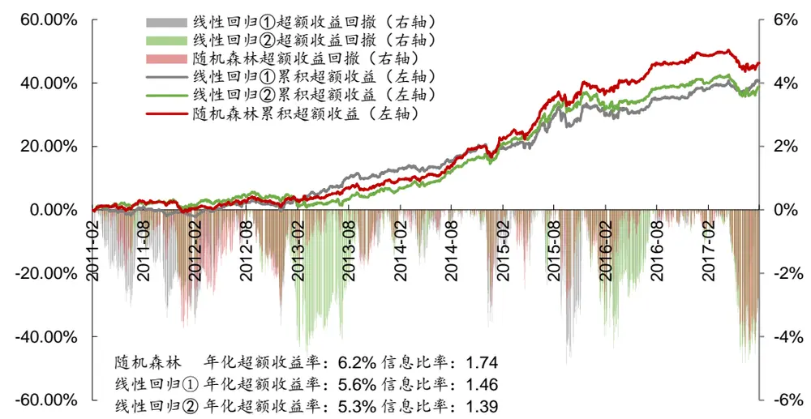
资料来源：Wind，华泰证券研究所

图表38： 随机森林模型和线性回归模型①②中证 500成份股内行业中性选股策略表现（每个行业选 6只个股）
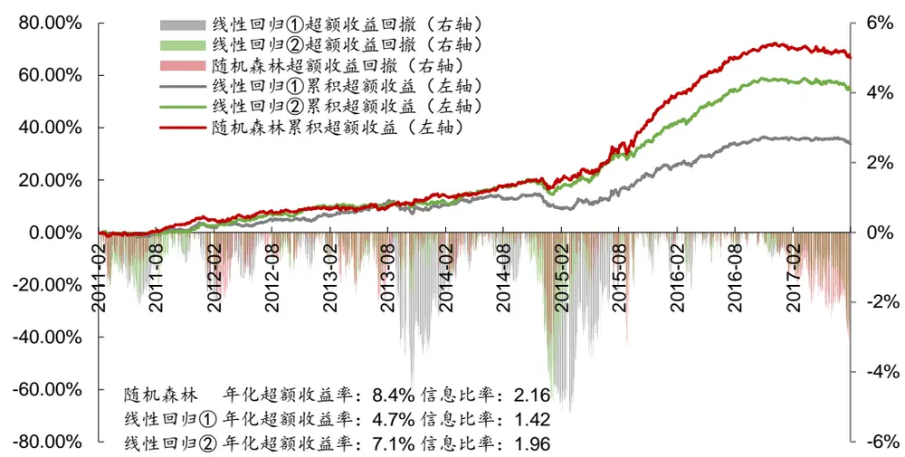
资料来源：Wind，华泰证券研究所

图表39： 随机森林模型和线性回归模型①②全 A行业中性选股策略表现（每个行业选 6只个股，基准中证 500）
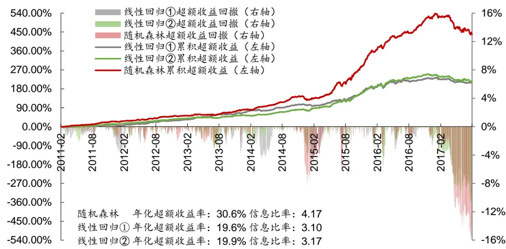
资料来源：Wind，华泰证券研究所

## 总结和展望

以上我们对随机森林进行了系统的测试，并且利用支持向量机模型构建沪深 300、中证 500成份内和全 A选股策略，初步得到以下几个结论：

一、随机森林模型具备不错的预测能力。为了让模型及时学习到市场特征的变化，我们采用了 7阶段滚动回测方法。例如第一阶段滚动回测中，选取 2005-2010 年的月频因子及下期收益作为样本内集合，2011 年的数据为样本外测试集。同时，我们选取两个统一对照组：12 个月滚动线性回归模型、7 阶段训练线性回归模型。随机森林全 A选股模型交叉验证集正确率为 58.4%，AUC 为 0.615。样本外测试集平均正确率为 57.0%，平均 AUC为 0.599。随机森林模型的预测正确率和 AUC 均显著高于两组统一对照组的线性模型。

二、我们分别以沪深 300、中证 500 和全 A股为票池，利用随机森林模型构建选股策略。对于沪深 300 成份股内选股的行业中性策略，随机森林模型的超额收益在 2.5%~7.5%之间，信息比率在 0.8~1.8之间，在收益端和回撤端的表现仍优于 12 个月滚动线性回归模型，但较 7阶段线性回归模型而言提升不明显。对于中证 500 成份股内选股的行业中性策略，随机森林模型的超额收益在 4%~9%之间，信息比率在 1.5~2.2 之间，Calmar比率在1.0~2.5 之间，表现远优于 12 个月滚动线性回归模型，较 7 阶段线性回归模型而言提升同样不明显。对于全 A选股的行业中性策略，随机森林模型能获取更高的超额收益，综合提升也较大：相对于中证500的超额收益在24%~34%之间，超额收益最大回撤在13%~16%之间，信息比率在 3.8~4.3 之间。总体而言：收益方面，随机森林模型在多数选股策略下能获取更高的超额收益；而回撤部分，随机森林模型相比于两种对照的线性回归模型不具备明显优势，很多时候回撤会更大。随机森林在收益和信息比率方面表现不错，各种策略构建方式下都能稳定地优于线性回归模型。

三、在我们的测试中，由于随机森林模型相较于朴素贝叶斯而言对参数的依赖性较大，故需要利用交叉验证集对参数进行选择。考虑到逐月滚动调参的方法会涉及到未来信息的使用，我们遵循第三篇报告支持向量机模型中设定固定训练集思想，同时考虑到市场风格的切换轮动，将原固定测试集按年度划分为 7个阶段，选取当前年度之前 72 个月数据作为训练集，并对逐个阶段进行随机森林模型训练。

基于这一滚动回测模型，我们以第一阶段训练集的交叉验证集 AUC 为据，进行网格搜索寻找最优参数。同时综合网格搜索时间成本与效果提升度，考虑逐年进行参数寻优过于冗余浪费，故在第一阶段确定随机模型参数后，此后的六个模型训练中均不做调整和改变。这在一定程度上不仅提升了模型的训练时效性，也由于引入新的市场数据而使模型的灵活与准确度得到增加。

四、文中随机森林模型总体表现略优于线性回归，但是最大回撤普遍大于线性回归。尤其是全A选股模型，相较于中证500的超额收益自2017年初出现了较大的回撤。我们从输出的因子重要性表格中可以看出随机森林模型训练过程中受市值因子、反转因子以及波动率因子影响较大，同时市值因子的特征重要性在训练模型中逐年增加。考虑到今年以来市场大小盘风格轮动现象，使得市值因子失效，因此我们认为这一阶段的回撤与之相关。在不同选股策略中，我们对比两种滚动线性模型：不难看出，与随机森林模型具有相同训练周期和训练集的7阶段线性回归模型，其超额收益表现在全A策略中更好，而综合回撤较12月滚动线性模型更大。这在一定程度上表明机器学习方法训练中既要确保训练集数据足够多，又要提升数据集的时效性。我们通过设置以上两组统一对照组，从模型训练方法和训练集选取方式上分别对随机森林模型的效果做出来评估考量。

基于本文的测试和讨论，我们对随机森林选股模型有了一些初步认识。接下来我们的人工智能系列研究将继续探讨Boosting、神经网络等方法与多因子结合选股的表现，敬请期待。

## 风险提示

通过随机森林模型构建选股策略是历史经验的总结，存在失效的可能。

## 免责申明

本报告仅供华泰证券股份有限公司（以下简称“本公司”）客户使用。本公司不因接收人收到本报告而视其为客户。

本报告基于本公司认为可靠的、已公开的信息编制，但本公司对该等信息的准确性及完整性不作任何保证。本报告所载的意见、评估及预测仅反映报告发布当日的观点和判断。在不同时期，本公司可能会发出与本报告所载意见、评估及预测不一致的研究报告。同时，本报告所指的证券或投资标的的价格、价值及投资收入可能会波动。本公司不保证本报告所含信息保持在最新状态。本公司对本报告所含信息可在不发出通知的情形下做出修改，投资者应当自行关注相应的更新或修改。

本公司力求报告内容客观、公正，但本报告所载的观点、结论和建议仅供参考，不构成所述证券的买卖出价或征价。该等观点、建议并未考虑到个别投资者的具体投资目的、财务状况以及特定需求，在任何时候均不构成对客户私人投资建议。投资者应当充分考虑自身特定状况，并完整理解和使用本报告内容，不应视本报告为做出投资决策的唯一因素。对依据或者使用本报告所造成的一切后果，本公司及作者均不承担任何法律责任。任何形式的分享证券投资收益或者分担证券投资损失的书面或口头承诺均为无效。

本公司及作者在自身所知情的范围内，与本报告所指的证券或投资标的不存在法律禁止的利害关系。在法律许可的情况下，本公司及其所属关联机构可能会持有报告中提到的公司所发行的证券头寸并进行交易，也可能为之提供或者争取提供投资银行、财务顾问或者金融产品等相关服务。本公司的资产管理部门、自营部门以及其他投资业务部门可能独立做出与本报告中的意见或建议不一致的投资决策。

本报告版权仅为本公司所有。未经本公司书面许可，任何机构或个人不得以翻版、复制、发表、引用或再次分发他人等任何形式侵犯本公司版权。如征得本公司同意进行引用、刊发的，需在允许的范围内使用，并注明出处为“华泰证券研究所”，且不得对本报告进行任何有悖原意的引用、删节和修改。本公司保留追究相关责任的权力。所有本报告中使用的商标、服务标记及标记均为本公司的商标、服务标记及标记。

本公司具有中国证监会核准的“证券投资咨询”业务资格，经营许可证编号为：Z23032000。全资子公司华泰金融控股（香港）有限公司具有香港证监会核准的“就证券提供意见”业务资格，经营许可证编号为：AOK809
©版权所有 2017 年华泰证券股份有限公司

## 评级说明

## 行业评级体系

－报告发布日后的6个月内的行业涨跌幅相对同期的沪深300指数的涨跌幅为基准；

－投资建议的评级标准

增持行业股票指数超越基准

中性行业股票指数基本与基准持平

减持行业股票指数明显弱于基准

## 公司评级体系

－报告发布日后的6个月内的公司涨跌幅相对同期的沪深300指数的涨跌幅为基准；
－投资建议的评级标准
买入股价超越基准 20%以上
增持股价超越基准 5%-20%
中性股价相对基准波动在-5%~5%之间
减持股价弱于基准 5%-20%
卖出股价弱于基准 20%以上

## 华泰证券研究

## 南京

南京市建邺区江东中路228号华泰证券广场1号楼/邮政编码：210019

电话：86 25 83389999 /传真：86 25 83387521电子邮件：ht-rd@htsc.com

## 深圳

深圳市福田区深南大道4011号香港中旅大厦24层/邮政编码：518048

电话：86 755 82493932 /传真：86 755 82492062

电子邮件：ht-rd@htsc.com

## 北京

北京市西城区太平桥大街丰盛胡同28号太平洋保险大厦A座18层

邮政编码：100032

电话：86 10 63211166/传真：86 10 63211275

电子邮件：ht-rd@htsc.com

## 上海

上海市浦东新区东方路18号保利广场E栋23楼/邮政编码：200120

电话：86 21 28972098 /传真：86 21 28972068

电子邮件：ht-rd@htsc.com