## 金工研究/深度研究

2017年09月11日

林晓明 执业证书编号：S0570516010001

研究员 0755-82080134

linxiaoming@htsc.com

陈烨 010-56793927

联系人 chenye@htsc.com

# 人工智能选股之 Boosting 模型

## 报告对各种 Boosting 集成学习模型进行系统测试

Boosting 集成学习模型将多个弱学习器串行结合，能够很好地兼顾模型的偏差和方差，该类模型在最近几年获得了长足的发展，主要包括 AdaBoost、GBDT、XGBoost。本篇报告我们将对这三种 Boosting 集成学习模型进行系统性的测试，并分析它们应用于多因子选股的异同，希望对本领域的投资者产生有实用意义的参考价值。

Boosting集成学习模型构建：7阶段样本内训练与交叉验证、样本外测试Boosting 集成学习模型的构建包括特征和标签提取、特征预处理、样本内训练、交叉验证和样本外测试等步骤。最终在每个月底可以产生对全部个股下期上涨概率的预测值，然后根据正确率、AUC 等指标以及策略回测结果对模型进行评价。为了让模型及时学习到市场特征的变化，我们采用了7 阶段滚动回测方法。我们还根据模型的预测结果构建了沪深 300 成份内选股、中证 500 成份内选股和全 A选股策略，通过年化收益率、信息比率、最大回撤等指标综合评价策略效果。

## XGBoost 模型超额收益和信息比率的表现优于线性回归

对于沪深 300 成份股内选股的行业中性策略（每个行业选 6 只个股），XGBoost 分类模型的超额收益为 6.4%，信息比率为 1.78。对于中证 500成份股内选股的行业中性策略，XGBoost 分类模型的超额收益为 7.2%，信息比率为 2.03。对于全 A选股的行业中性策略，XGBoost 分类模型相对于中证 500 的超额收益为 31.5%，信息比率为 4.4。总体而言，XGBoost分类模型在超额收益和信息比率方面表现不错，各种策略构建方式下都能稳定地优于线性回归模型；最大回撤方面 XGBoost 分类相比于线性回归不具备明显优势。

XGBoost 模型预测能力与其他集成学习模型持平，但运算速度有明显优势我们比较了不同的 Boosting 集成学习模型的预测能力，发现 XGBoost 模型和其他模型持平。AdaBoost、GBDT、XGBoost 三种模型样本外平均AUC 分别为 0.5695，0.5699，0.5696，样本外平均正确率分别为 53.94%，54.12%，54.02%。但 XGBoost 模型在运算速度上有明显优势，其他集成学习模型训练所需时间普遍在 XGBoost 模型的 2～8 倍。

## Boosting 模型比 Bagging 模型（随机森林）更简单

在达到相近预测能力和回测绩效时，Boosting 模型比 Bagging 模型（随机森林）要简单。本文的 Boosting 模型中，每个决策树的深度都为 3，决策树总数为 100。而 Bagging 模型中每个决策树的深度普遍在 20 以上，决策树总数有数百个，模型的复杂程度远大于 Boosting 模型。

风险提示：通过Boosting 集成学习模型构建选股策略是历史经验的总结，存在失效的可能。

## 本文研究导读

到目前为止，华泰金工人工智能选股系列已经推出了 5篇报告，对广义线性模型、支持向量机模型、朴素贝叶斯模型和随机森林模型都进行了尝试和论证。而上一篇报告所提到的随机森林模型涉及到一种经典的 Bagging 集成学习算法，在本篇报告中，我们将继续探究集成学习算法领域的 Boosting 类学习算法，和之前报告的模型进行充分的对比。本篇报告将主要关注如下几方面的问题：

1. 首先，Boosting集成学习模型包含哪些具体模型？这些模型各自的原理和特点是什么，主要参数包括哪些？

2. 2014 年推出的 XGBoost 框架是近年来 Boosting 集成学习领域的新宠，XGBoost 强大的预测能力和高效的性能使得其在 Kaggle 等多个机器学习竞赛中大受欢迎。将XGBoost 应用在多因子选股中的效果到底如何？本文将对 XGBoost 和其他集成学习算法进行测试对比。

3. 最后是组合构建的问题。在衡量过不同模型的表现之后，应如何利用模型的预测结果构建策略组合进行回测？各模型在沪深300、中证500和全部A股票池内选股效果（超额收益、最大回撤、信息比率等）的异同是什么？

我们将围绕以上问题进行系统性的测试，希望为读者提供一些扎实的证据，并寻找到有效的分类方法，能够对本领域的投资者产生参考价值。

## Boosting 集成学习模型简介

“三个臭皮匠，顶个诸葛亮”。单个弱学习器的预测能力有限，如何将多个弱学习器组合成一个强学习器，这是学习器集成需要探讨的问题。集成学习算法有两大种类，如图表 1 的灰色方框所示，左边一支为 Bagging 系列（并行方法），右边一支为 Boosting 系列（串行方法）。对于多棵决策树，如果以 Bagging 的方式组合起来，可以得到随机森林算法；如果以 Boosting 的方式组合起来，可以得到梯度提升决策树（GBDT）等方法。而对于AdaBoost 算法，它的弱学习器不一定是决策树，也可以是 SVM、广义线性回归等。

图表1： 集成学习算法的两大分支
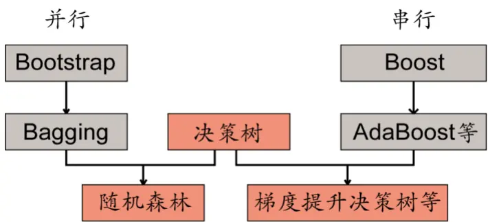
资料来源：华泰证券研究所

## 决策树

决策树是集成学习模型中最常用的弱学习器。决策树基于多个特征进行分类决策。在树的每个结点处，根据特征的表现通过某种规则分裂出下一层的叶子节点，终端的叶子节点即为最终的分类结果。决策树学习的关键是选择最优划分属性。随着逐层划分，决策树分支结点所包含的样本类别会逐渐趋于一致，即节点分裂时要使得节点分裂后的信息增益（Information Gain）最大。本文的 Boosting 集成学习算法使用的弱学习器是 CART 决策树。关于 CART 决策树的介绍请见附录。

## 提升算法 AdaBoost

## AdaBoost 概述

和 Bagging 并行组合弱分类器的思想不同，AdaBoost（adaptive boosting）将弱分类器以串行的方式组合起来，如图表 2所示。在训练之前，我们赋予全部样本相等的权重。第一步以原始数据为训练集，训练一个弱分类器 C1，如图表 3 左图所示。对于分类错误的样本，提高其权重。第二步以更新样本权值后的数据为训练集，再次训练一个弱分类器C2，如图表 3 中间图所示。随后重复上述过程，每次自适应地改变样本权重并训练弱分类器，如图表 3右图所示。最终，每个弱分类器都可以计算出它的加权训练样本分类错误率，将全部弱分类器按一定权值进行组合得到强分类器，错误率越低的弱分类器所占权重越高。

图表2： AdaBoost 串行方法示意
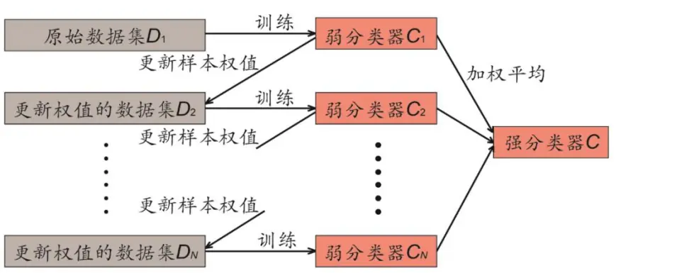
资料来源：华泰证券研究所

图表3： AdaBoost 更新权值过程
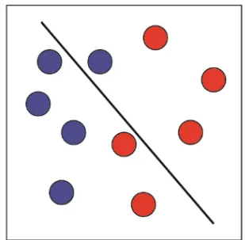

弱分类器C1

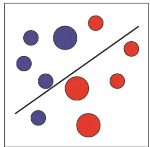

弱分类器C2

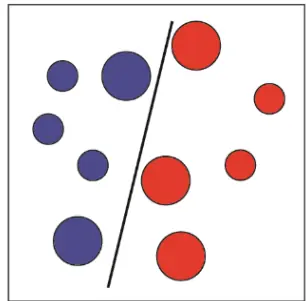

弱分类器C3

资料来源：华泰证券研究所

## AdaBoost 二元分类算法基本步骤

本节中，我们介绍 AdaBoost 二元分类算法的具体步骤。

假设输入为样本集 $\mathsf{T}{=}\{(x_{1},y_{1}),(x_{2},y_{2}),{\ldots},(x_{m},y_{m})\}$ ，输出为{-1,+1}，弱分类器迭代次数 K。输出是强分类器f(x)。
算法主要有以下步骤：

（1） 初始化样本集的权重为

$$
D(1)=(w_{11},w_{12},\ldots w_{1m});w_{1i}=\frac{1}{m};i=1,2...m
$$

（2） 对 $\mp\ k=1,2,\ldots,K$

①使用具有权重D(k)的样本集来训练数据，得到弱分类器 $G_{k}(\boldsymbol{x}_{i})$

②计算 $G_{k}(\boldsymbol{x}_{i})$ 的分类误差率

$$
e_{k}=P(G_{k}(x_{i})\neq y_{i})=\sum_{i=1}^{m}w_{ki}I(G_{k}(x_{i})\neq y_{i})
$$

③计算弱分类器 $G_{k}(x)$ 的权重系数

$$
\alpha_{k}=\frac{1}{2}log\frac{1-e_{k}}{e_{k}}
$$

④更新样本集的权重分布

$$
w_{k+1,i}=\frac{w_{ki}}{Z_{K}}exp(-\alpha_{k}y_{i}G_{k}(x_{i}))\ i=1,2,....m
$$

$Z_{k}$ 是规范化因子

$$
Z_{k}=\sum_{i=1}^{m}w_{ki}exp(-\alpha_{k}y_{i}G_{k}(x_{i}))
$$

（3） 最后，构建强分类器：

$$
f(x)=sign(\sum_{k=1}^{K}\alpha_{k}G_{k}(x))
$$

## AdaBoost 回归算法基本步骤

本节中，我们介绍 AdaBoost 回归算法的具体步骤。

假设输入为样本集 ${\mathsf{T}}{=}\{(x_{1},y_{1}),(x_{2},y_{2}),{\ldots},(x_{m},y_{m})\}$ ，输出为{-1,+1}，弱分类器迭代次数 K。
输出是强学习器f(x)。

算法主要有以下步骤：

（1） 初始化样本集的权重为

$$
D(1)=(w_{11},w_{12},\ldots w_{1m});w_{1i}=\frac{1}{m};i=1,2...m
$$

（2） 对于 $\mathbf{\partial}\cdot\mathbf{k}{=}1,2,...,\mathsf{K}\colon$

①使用具有权重D(k)的样本集来训练数据，得到弱分类器 $G_{k}(\boldsymbol{x}_{i})$

②计算 $.G_{k}(x_{i})$ 在训练集上的最大误差

$$
E_{\mathsf{k}}=max|y_{i}-G_{k}(x_{i})|;\ i=1,2...m
$$

③计算每个样本的相对误差：

如果是线性误差，则 $\begin{array}{r}{e_{ki}=\frac{|y_{i}-G_{k}(x_{i})|}{E_{k}}}\end{array}$

如果是平方误差，则 $\begin{array}{r}{e_{ki}=\frac{(y_{i}-G_{k}(x_{i}))^{2}}{E_{k}^{2}}}\end{array}$

如果是指数误差，则 $\begin{array}{r}{e_{ki}=1-exp(\frac{-y_{i}+G_{k}(x_{i})}{E_{k}})}\end{array}$

④计算回归误差率 $\begin{array}{r}{{\bf\nabla}\cdot{\boldsymbol{e}}_{k}=\sum_{i=1}^{m}w_{ki}\ {\boldsymbol{e}}_{ki}}\end{array}$

⑤计算弱学习器的权重系数 $\begin{array}{r}{\alpha_{k}=\frac{e_{k}}{1-e_{k}}}\end{array}$

⑥更新样本集的权重分布为 $\begin{array}{r}{w_{k+1,i}=\frac{w_{ki}}{z_{k}}\alpha_{k}^{1-e_{ki}}}\end{array}$

$Z_{\mathsf{k}}$ 是规范化因子 $\begin{array}{r}{{\bf\nabla}\cdot{Z_{k}}=\sum_{i=1}^{m}w_{ki}\alpha_{k}^{1-e_{ki}}}\end{array}$

（3） 最后，构建强学习器：

$$
f(x)=\sum_{k=1}^{K}(ln{\frac{1}{\alpha_{k}}})G_{k}(x)
$$

## AdaBoost 主要参数

图表 4中列出了 AdaBoost 模型的主要参数，参数分两大类，一类是 AdaBoost 框架参数，与具体的弱学习器无关；另一类是 AdaBoost 弱学习器参数。

图表4： AdaBoost 主要参数

| 参数类别 | 参数 | 说明 |
| --- | --- | --- |
| AdaBoost 框架参数 | n_estimators | 最大的弱学习器的个数。一般来说n_estimators太小，容易欠拟合， n_estimators太大，又容易过拟合，在实际调参的过程中，常常将 n_estimators 和learning_rate 一起考虑。 |
|  | learning_rate | 每个弱学习器的权重缩减系数v，也称作步长，v的取值范围为 0<v≤1。 对于同样的训练集拟合效果，较小的ν意味着需要更多的弱学习器的 |
| AdaBoost 弱学习器参数 | max_features | 决策树划分时考虑的最大特征数，默认考虑全部特征，如果特征数非 常多，可以取部分特征，以控制决策树的生成时间。 |
|  | max_depth | 决策树最大深度，如果模型样本量多，特征也多的情况下，推荐限制 这个最大深度。 |

资料来源：华泰证券研究所

## 梯度提升决策树 GBDT

## GBDT 概述

梯度提升决策树 GBDT 是一种 Boosting 集成学习算法，但是却和传统的 AdaBoost 有很大的不同，且弱学习器限定了只能使用 CART 回归树模型。在 GBDT 的迭代中，假设前一轮迭代得到的强学习器是 $f_{t-1}(x)$ , 损失函数是 $L(y,f_{t-1}(x))$ , 本轮迭代的目标是得到一个 CART 回归树模型的弱学习器 $h_{t}(x)$ ，使得本轮的损失 $L(y,f_{t}(x)){=}L(y,f_{t-1}(x))+h_{t}(x)$ 最小。也就是说，本轮迭代得到的决策树，要让样本的损失尽量变得更小。

GBDT 的思想可以用一个通俗的例子解释，假如某人有 170 厘米身高，我们首先用 160厘米去拟合，发现残差有 10 厘米，这时我们用 6 厘米去拟合剩下的残差，发现残差还有4 厘米，第三轮我们用 3厘米拟合剩下的残差，残差就只有 1厘米了。如果迭代轮数还没有完，可以继续迭代下去，每一轮迭代，拟合的身高残差都会减小。图表 5 显示了 GBDT算法的流程。

图表5： GBDT串行方法示意
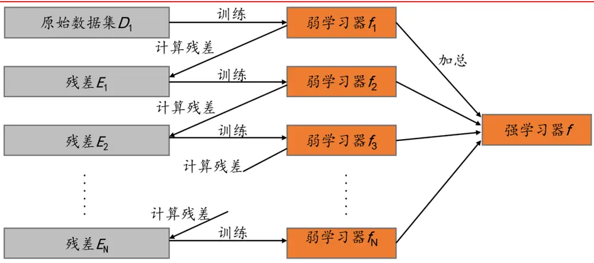
资料来源：华泰证券研究所

## GBDT 回归算法基本步骤

本节中，我们介绍 GBDT 回归算法的具体步骤。

假设输入是训练集样本 $\mathsf{T}\mathsf{=}\{(x_{1},y_{1}),(x_{2},y_{2}),...,(x_{m},y_{m})\}$ ，最大迭代次数 T, 损失函数为 L。输出是强学习器 $\ b{f}(\ b{x})$ 
算法主要有以下步骤：

(1) 初始化弱学习器 c

$$
f_{0}(x)=\underbrace{\mathrm{arg}min}_{c}\sum_{i=1}^{m}L(y_{i},c)
$$

(2) 对迭代轮数 $\mathrm{t}{=}1,2,...,\top$ 有：

① 对样本 $\mathsf{i}{=}1,2,...,\mathsf{m}$ ，计算负梯度

$$
r_{ti}=-[\frac{\partial L(y,f(x_{i})))}{\partial f(x_{i})}]_{f(x)=f_{t-1}(x)}
$$

② 利用 $(x_{i},r_{ti})\left(\mathsf{i}\mathsf{=}1,2,\ldots,\mathsf{m}\right)$ , 拟合一棵 CART 回归树，得到第 t棵回归树，其对应的叶子节点区域为 $R_{tj},\ \mathsf{j}=1,2,...,\mathsf{J}$ 。其中 J 为回归树 t的叶子节点的个数。

③ 对叶子区域 ${\mathrm{j}}=1,2,\ldots,{\mathrm{J}},$ 计算最佳拟合值

$$
c_{tj}=\underbrace{\arg min}_{c}\sum_{x_{i}\in R_{tj}}L(y_{i},f_{t-1}(x_{i})+c)
$$

④ 更新强学习器

$$
f_{t}(x)=f_{t-1}(x)+\sum_{j=1}^{J}c_{tj}I(x\in R_{tj})
$$

(3) 得到强学习器f(x)的表达式

$$
f(x)=f_{T}(x)=\sum_{t=1}^{T}\sum_{j=1}^{J}c_{tj}I(x\in R_{tj})
$$

## GBDT 二元分类算法基本步骤

对于二元分类 GBDT，如果用类似于 Logistic 回归的对数损失函数，则损失函数为：

$$
L{\bigl(}y,f(x){\bigr)}=log(1+exp(-yf(x)))
$$

其中 $y\in\{-1,+1\}$ 。则此时的负梯度误差为

$$
r_{ti}=-[\frac{\partial L(y,f(x_{i})))}{\partial f(x_{i})}]_{f(x)=f_{t-1}(x)}=y_{i}/(1+exp(yf(x_{i})))
$$

对于生成的决策树，各个叶子节点的最佳残差拟合值为

$$
c_{tj}=\underbrace{\arg min}_{c}\sum_{x_{i}\in R_{tj}}log(1+exp(y_{i}(f_{t-1}(x_{i})+c)))
$$

由于上式比较难优化，一般使用近似值代替

$$
c_{tj}=\sum_{x_{i}\in R_{tj}}r_{ti}/\sum_{x_{i}\in R_{tj}}|r_{ti}|(2-|r_{ti}|)
$$

## GBDT 常用损失函数

对于回归算法，常用损失函数有如下 4 种:

（1） 均方差损失函数

$$
L(y,f(x))=(\bigcirc-f(x))^{2}
$$

（2） 绝对损失函数

$$
L(y,f(x))=|y-f(x)|
$$

对应负梯度误差为

$$
sign(y_{i}-f(x_{i}))
$$

（3）Huber 损失函数，它是均方差损失函数和绝对损失函数的折中产物，对于远离中心的异常点，采用绝对损失函数，而中心附近的点采用均方差损失函数。这个界限一般用分位数点度量。损失函数如下

$$
L(y,f(x))=\left\{\begin{array}{rl}{\displaystyle{\frac{1}{2}}(y-f(x))^{2},\quad}&{|y-f(x)|\leq\delta}\\{\displaystyle\delta(|y-f(x)|-{\frac{\delta}{2}}),\quad}&{|y-f(x)|>\delta}\end{array}\right.
$$

对应的负梯度误差为

$$
r(y_{i},f(x_{i}))=\left\{\begin{array}{rl}{y_{i}-f(x_{i}),}&{|y_{i}-f(x_{i})|\leq\delta}\\{\delta sign(y_{i}-f(x_{i})),}&{|y_{i}-f(x_{i})|>\delta}\end{array}\right.
$$

（4） 分位数损失函数。它对应的是分位数回归的损失函数，表达式为

$$
L(y,f(x))=\sum_{y\ge f(x)}\theta|y-f(x)|+\sum_{y<f(x)}(1-\theta)|y-f(x)|
$$

其中θ为分位数，需要我们在回归前指定。对应的负梯度误差为

$$
r(y_{i},f(x_{i}))=\left\{\begin{array}{rl}{\theta,}&{{}\quad y_{i}\geq f(x_{i})}\\{\theta-1,}&{{}\quad y_{i}<f(x_{i})}\end{array}\right.
$$

对于 Huber 损失和分位数损失，主要用于健壮回归，也就是减少异常点对损失函数的影响。

对于分类算法，损失函数一般有对数损失函数和指数损失函数两种:

（1） 指数损失函数表达式为

$$
L{\bigl(}y,f(x){\bigr)}=exp(-yf(x))
$$

此时 GBDT 分类器等价于 AdaBoost 分类器。

（2） 对数损失函数表达式为

$$
L{\bigl(}y,f(x){\bigr)}=log(1+exp(-yf(x)))
$$

## GBDT 主要参数

图表 6 中列出了 GBDT 模型的主要参数，参数分两大类，一类是 GBDT 框架参数，与具体的弱学习器无关；另一类是 GBDT 弱学习器参数。

图表6： GBDT主要参数

| 参数类别 GBDT | 参数 | 说明 |
| --- | --- | --- |
| 框架参数 | n_estimators | 最大的弱学习器的个数。一般来说n_estimators太小，容易欠拟合， n_estimators太大，又容易过拟合，在实际调参的过程中，常常将 n_estimators 和learning_rate 一起考虑。 |
|  | learning_rate | 每个弱学习器的权重缩减系数v，也称作步长，v的取值范围为 0<v≤1。 对于同样的训练集拟合效果，较小的ν意味着需要更多的弱学习器的 迭代次数。 |
|  | subsample | 子采样率，取值为(0,1]，如果取值为1，则全部样本都使用，等于没 有使用子采样。如果取值小于1，则只有一部分样本会去做GBDT的 决策树拟合。选择小于1的比例可以减少方差，即防止过拟合，但是 |
|  | max_features | 会增加样本拟合的偏差，因此取值不能太低。 决策树划分时考虑的最大特征数，默认考虑全部特征，如果特征数非 常多，可以取部分特征，以控制决策树的生成时间。 |
| 弱学习器参数 | max_depth | 决策树最大深度，如果模型样本量多，特征也多的情况下，推荐限制 |
|  |  | 这个最大深度。 |

资料来源：华泰证券研究所

## 极端梯度提升算法 XGBoost

## XGBoost 概述

XGBoost 是 Gradient Boosting 方法的一种高效实现，也是 GBDT 算法的改进和提高。相比于传统的 GBDT 算法，XGBoost 在损失函数、正则化、切分点查找和并行化设计等方面进行了改进，使得其在计算速度上比常见工具包快 5倍以上。例如，GBDT 算法在训练第 n 棵树时需要用到第 n-1 棵树的残差，从而导致算法较难实现并行；而 XGBoost 通过对目标函数做二阶泰勒展开，使得最终的目标函数只依赖每个数据点上损失函数的一阶导和二阶导，进而容易实现并行。图表 7 显示了 XGBoost 算法的流程，它与 GBDT 在数学上的不同之处在于训练每个弱学习器时的目标函数。

图表7： XGBoost 算法流程示意
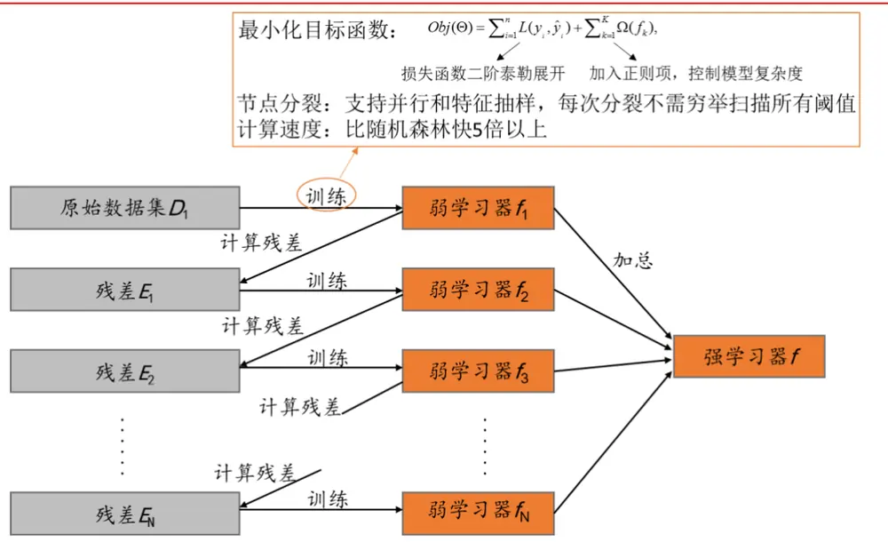
资料来源：华泰证券研究所

## XGBoost 的损失函数和正则化

本文主要介绍以 CART 树为基学习器的 XGBoost 算法。任给一个样本点，计算出该样本在每个 CART 上的得分，累加起来就是该样本的最终得分，由此可进行预测或分类。XGBoost 模型的数学描述和目标函数为：

$$
\hat{y}_{i}=\sum_{k=1}^{K}f_{k}(x_{i}),Obj(\theta)=\sum_{i=1}^{n}L(y_{i},\hat{y}_{i})+\sum_{k=1}^{K}\varOmega(f_{k}),
$$

其中 n 为样本的个数， $x_{i}$ 表示第 i 个样本， $y_{i}\hbar^{\alpha}\hat{y}_{i}$ 为第 i 个样本的真实值和预测值；K 为CART 的个数， $f_{k}$ 表示第 k 个CART，可看做从样本点到分数的映射； $L(\boldsymbol{\mathrm{y}},\boldsymbol{\hat{y}})$ 为损失函数，$\varOmega(f_{k})$ 为正则项。

在训练第 t 棵树时，相当于极小化第 t 棵树的目标函数：

$$
Obj^{(t)}=\sum_{i=1}^{n}L(y_{i},\hat{y}_{i}^{(t)})+\sum_{k=1}^{t}\Omega(f_{k})=\sum_{i=1}^{n}L(y_{i},\hat{y}_{i}^{(t-1)}+f_{t}(x_{i}))+\Omega(f_{t})+const.
$$

XGBoost 的特别之处就是用损失函数的二阶泰勒展开来近似原来的损失函数，上述目标函数可近似为：

$$
Obj^{(t)}\approx\sum_{i=1}^{n}[L(y_{i},\hat{y}_{i}^{(t-1)})+g_{i}f_{t}(x_{i})+\frac{1}{2}h_{i}f_{t}^{2}(x_{i})]+\varOmega(f_{t})+const.
$$

其中 $g_{i}\hbar\hbar_{i}$ 分别为第 i 个样本点上损失函数 L 关于第二个变量的一阶和二阶偏导数。如果我们再知道 $f_{t}$ 和Ω的表达式，就能得到第 t 棵树。

目标函数中正则项部分（相当于树的复杂度）如下定义：

$$
\varOmega(f_{t})=\gamma T+\frac{1}{2}\lambda\sum_{j=1}^{T}\omega_{j}^{2}
$$

其中 $f_{t}$ 表示第 t棵树，T 表示该树的叶子节点的个数， $\omega_{j}$ 表示第j个叶子节点上的分数；γ和λ为惩罚因子，越大表明对树的复杂度的惩罚力度越大。

接下来就是对 $f_{t}$ 的细化，将树拆分成结构部分q和权重部分ω：

$$
f_{t}(x)=\omega_{q(x)},\omega\in R^{T},q\colon R^{d}\to\{1,2,\cdots,T\}
$$

其中ω是一个 T 维向量，对应 T 个叶子节点上的分数；q是一个映射，将样本点 $\boldsymbol{x}\in R^{d}$ 映射到某一个叶子节点上。因此，只要确定了树的结构q和每个叶子节点上的得分ω，就能完全确定这棵树了。

## XGBoost 算法基本步骤

XGBoost 算法的基本步骤与 GBDT 类似，差别在于构造新树的方法不同。这里主要介绍XGBoost 构造新树的方法。

将 $f_{t}$ 和Ω的表达式带入近似的目标函数中，忽略与 $f_{t}$ 无关的常数部分，可以得到：

$$
\begin{array}{l}{\displaystyle Obj^{(t)}\sim\sum_{i=1}^{n}\Big[g_{i}f_{t}(x_{i})+\frac{1}{2}h_{i}f_{t}^{2}(x_{i})\Big]+2(f_{t})}\\{\displaystyle\quad=\sum_{i=1}^{n}\big[g_{i}\omega_{q(x_{i})}+\frac{1}{2}h_{i}\omega_{q(x_{i})}^{2}\big]+\gamma T+\frac{1}{2}\lambda\sum_{j=1}^{T}\omega_{j}^{2}}\\{\displaystyle\quad=\sum_{j=1}^{T}\big[\big(\sum_{i\in I_{j}}g_{i}\big)\omega_{j}+\frac{1}{2}\big(\sum_{i\in I_{j}}h_{i}+\lambda\big)\omega_{j}^{2}\big]+\gamma T}\\{\displaystyle\quad\triangleq\sum_{j=1}^{T}\Big[G_{j}\omega_{j}+\frac{1}{2}\big(H_{j}+\lambda\big)\omega_{j}^{2}\Big]+\gamma T}\end{array}
$$

最后一式中的 $G_{j}$ 和 ${\boldsymbol{\mathsf{H}}}_{\perp}$ 定义为

$$
G_{j}=\sum_{i\in I_{j}}g_{i},H_{j}=\sum_{i\in I_{j}}h_{i}
$$

从最后一式可以看出，目标函数的近似是关于 T 个相互独立的变量 $\omega_{j}$ 的二次函数，可以直接解得极小点

$$
\omega_{j}^{*}=-\frac{G_{j}}{H_{j}+\lambda}
$$

以及目标函数的极小值 $.Obj^{*}$ ，到此就完成了ω的计算。

$$
Obj^{*}=-\frac{1}{2}\sum_{j=1}^{T}\frac{G_{j}^{2}}{H_{j}+\lambda}+\gamma T
$$

下面开始构造树的结构。上面式子中 $Obj^{*}$ 表示当我们指定一棵树时，可以在目标函数上最多减少多少，因此可以把它叫做结构分数； $Obj^{*}$ 越小说明树的结构越好，然后利用贪心算法枚举出不同的树结构，选出结构分数最小的树。具体来讲，每一次尝试对已有的叶子加入一个分割，都要通过下面的式子（该式摘录自报告“Introduction to Boosted Trees”,Tianqi Chen, Oct. 22 2014）计算Obj∗的增益来确定是否要引入该分割：

加入新叶子节点引入的复杂度代价

$$
\begin{array}{rl}&{Gain=\frac{1}{2}[\frac{G_{L}^{2}}{H_{L}+\lambda}+\frac{G_{R}^{2}}{H_{R}+\lambda}-\frac{(G_{L}+G_{R})^{2}}{H_{L}+H_{R}+\lambda}]-\gamma}\\&{\qquad\underset{\pounds\not=\mathbb{HM}\not\ni\sharp\not\times\emptyset}{\bigwedge}}\end{array}
$$

引入分割不一定会使目标函数减小，因为目标函数中还有对引入新叶子的惩罚项，优化这个目标对应了树的剪枝，当引入分割带来的增益小于一个阈值时，可以剪掉这个分割。到此就确定了树的结构。

## XGBoost 相比 GBDT 的优势

（1） 传统 GBDT 在优化时只用到了损失函数的一阶导数信息，XGBoost 则对损失函数进行了二阶泰勒展开，用到了一阶和二阶导数信息。并且 XGBoost 可以自定义损失函数，只要损失函数一阶和二阶可导。

（2）XGBoost 在损失函数里加入了正则项，用于控制模型的复杂度。从方差和偏差权衡的角度来讲，正则项降低了模型的方差，使训练得出的模型更加简单，能防止过拟合，这也是 XGBoost 优于传统 GBDT 的一个特性。

（3） 传统GBDT以CART树作为弱分类器，XGBoost还支持线性分类器作为弱分类器，此时 XGBoost 相当于包含了 L1 和 L2 正则项的 Logistic 回归（分类问题）或者线性回归（回归问题）。

（4）XGBoost 借鉴了随机森林的做法，支持特征抽样，在训练弱学习器时，只使用抽样出来的部分特征。这样不仅能降低过拟合，还能减少计算。

（5）XGBoost 支持并行。但是 XGBoost 的并行不是指能够并行地训练决策树，XGBoost 也是训练完一棵决策树再训练下一棵决策树的。XGBoost 是在处理特征的层面上实现并行的。我们知道，训练决策树最耗时的一步就是对各个特征的值进行排序（为了确定最佳分割点）并计算信息增益，XGBoost 对于各个特征的信息增益计算就可以在多线程中进行。

## XGBoost 主要参数

图表 8 中列出了 XGBoost 模型的主要参数，参数分两大类，一类是 XGBoost 框架参数，与具体的弱学习器无关；另一类是 XGBoost 弱学习器参数。

图表8： XGBoost 主要参数

| 参数类别 GBDT | 参数 | 说明 |
| --- | --- | --- |
| 框架参数 | n_estimators | 最大的弱学习器的个数。一般来说n_estimators太小，容易欠拟合， n_estimators太大，又容易过拟合，在实际调参的过程中，常常将 n_estimators 和learning_rate一起考虑。 |
|  | learning_rate | 每个弱学习器的权重缩减系数v，也称作步长，V的取值范围为 0<v≤1。对于同样的训练集拟合效果，较小的v意味着需要更多的 弱学习器的迭代次数。 |
|  | subsample | 子采样率，取值为(0,1]，如果取值为1，则全部样本都使用，等于 没有使用子采样。如果取值小于1，则只有一部分样本会去做GBDT 的决策树拟合。选择小于1的比例可以减少方差，即防止过拟合， 但是会增加样本拟合的偏差，因此取值不能太低。 |
| GBDT 弱学习器参数 | max_features | 决策树划分时考虑的最大特征数，默认考虑全部特征，如果特征数 非常多，可以取部分特征，以控制决策树的生成时间。 |
|  | colsample_bytree | 构建树时的列抽样比例。 |
|  | colsample_bylevel | 决策树每层分裂时的列抽样比例。 |

资料来源：华泰证券研究所

## Boosting集成学习模型测试流程

图表9： Boosting集成学习模型构建示意图
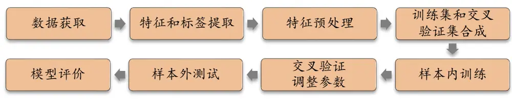
资料来源：华泰证券研究所

本文将要测试的 Boosting 集成学习模型有 3 种：AdaBoost，GBDT，XGBoost，为了保证三种模型的一致性和可比性，对它们采用完全相同的测试流程。Boosting 集成学习模型的构建方法包含下列步骤：

## 1． 数据获取：

a) 股票池：沪深 300 成份股/中证 500 成份股/全 A 股。剔除 ST 股票，剔除每个截面期下一交易日停牌的股票，剔除上市 3 个月内的股票，每只股票视作一个样本。b)回测区间：2011-01-31 至 2017-07-31。分 7 个阶段回测，如图表 11 所示。

2． 特征和标签提取：每个自然月的最后一个交易日，计算之前报告里的 70 个因子暴露度，作为样本的原始特征；计算下一整个自然月的个股超额收益（以沪深 300 指数为基准），作为样本的标签。因子池如图表 10 所示。

3． 特征预处理：

a) 中位数去极值：设第 T 期某因子在所有个股上的暴露度序列为 $D_{i},\ D_{M}$ 为该序列中位数， $D_{M1}$ 为序列 $|D_{i}-D_{M}|$ 的中位数，则将序列 $D_{i}$ 中所有大于 $D_{M}+5D_{M1}$ 的数重设为 $D_{M}+5D_{M1}$ ，将序列 $D_{i}$ 中所有小于 $D_{M}-5D_{M1}$ 的数重设为 $D_{M}-5D_{M1}$ ；

b)缺失值处理：得到新的因子暴露度序列后，将因子暴露度缺失的地方设为中信一级行业相同个股的平均值。

行业市值中性化：将填充缺失值后的因子暴露度对行业哑变量和取对数后的市值做线性回归，取残差作为新的因子暴露度。

d) 标准化：将中性化处理后的因子暴露度序列减去其现在的均值、除以其标准差，得到一个新的近似服从N(0,1)分布的序列。

4． 训练集和交叉验证集的合成：

a) 分类问题：在每个月末截面期，选取下月收益排名前30%的股票作为正例（y = 1），后 30%的股票作为负例 $(y=-1)$ ）。将训练样本合并，随机选取 90%的样本作为训练集，余下 10%的样本作为交叉验证集。

b) 回归问题：直接将样本合并成为样本内数据，同样按 90%和 10%的比例划分训练集和交叉验证集。

5． 样本内训练：使用 Boosting 集成学习模型对训练集进行训练，考虑到我们将回测区间按年份划分为 7个子区间，因此需要对每个子回测的不同训练集重复训练。同时使用本系列第二篇报告中的 12 个月滚动回测的线性回归模型作为统一对照组。

6． 交叉验证调参：模型训练完成后，使用模型对交叉验证集进行预测。选取交叉验证集AUC（或平均 AUC）最高的一组参数作为模型的最优参数。

7． 样本外测试：确定最优参数后，以 T 月月末截面期所有样本预处理后的特征作为模型的输入，得到每个样本的预测值f(x)，将预测值视作合成后的因子。进行单因子分层回测。回测方法和之前的单因子测试报告相同，具体步骤参考下一小节。

8． 模型评价：我们以分层回测的结果作为模型评价指标。我们还将给出测试集的正确率、AUC 等衡量模型性能的指标。

图表10： 选股模型中涉及的全部因子及其描述

| 大类因子 | 具体因子 | 因子描述 | 因子方向 |
| --- | --- | --- | --- |
| 估值 | EP | 净利润（TTM）/总市值 | 1 |
| 估值 | EPcut | 扣除非经常性损益后净利润（TTM）/总市值 | 1 |
| 估值 | BP | 净资产/总市值 | 1 |
| 估值 | SP | 营业收入（TTM）/总市值 | 1 |
| 估值 | NCFP | 净现金流（TTM）/总市值 | 1 |
| 估值 | OCFP | 经营性现金流（TTM）/总市值 | 1 |
| 估值 | DP | 近12个月现金红利（按除息日计)/总市值 | 1 |
| 估值 | G/PE | 净利润（TTM）同比增长率/PE_TTM | 1 |
| 成长 | Sales_G_q | 营业收入（最新财报，YTD）同比增长率 | 1 |
| 成长 | Profit_G_q | 净利润（最新财报，YTD）同比增长率 | 1 |
| 成长 | OCF_G_q | 经营性现金流（最新财报，YTD）同比增长率 | 1 |
| 成长 | ROE_G_q | ROE（最新财报，YTD）同比增长率 | 1 |
| 财务质量 | ROE_q | ROE（最新财报，YTD） | 1 |
| 财务质量 | ROE_ttm | ROE（最新财报，TTM） | 1 |
| 财务质量 | ROA_q | ROA（最新财报，YTD） | 1 |
| 财务质量 | ROA_ttm | ROA（最新财报，TTM） | 1 |
| 财务质量 | grossprofitmargin_q | 毛利率（最新财报，YTD） | 1 |
| 财务质量 | grossprofitmargin_ttm | 毛利率（最新财报，TTM） | 1 |
| 财务质量 | profitmargin_q | 扣除非经常性损益后净利润率（最新财报，YTD） | 1 |
| 财务质量 | profitmargin_ttm | 扣除非经常性损益后净利润率(最新财报，TTM) | 1 |
| 财务质量 | assetturnover_q | 资产周转率（最新财报，YTD） | 1 |
| 财务质量 | assetturnover_ttm | 资产周转率（最新财报，TTM） | 1 |
| 财务质量 | operationcashflowratio_q | 经营性现金流/净利润（最新财报，YTD） | 1 |
| 财务质量 | operationcashflowratio_ttm | 经营性现金流/净利润（最新财报，TTM） | 1 |
| 杠杆 | financial_leverage | 总资产/净资产 | -1 |
| 杠杆 | debtequityratio | 非流动负债/净资产 | -1 |
| 杠杆 | cashratio | 现金比率 | 1 |
| 杠杆 | currentratio | 流动比率 | 1 |
| 市值 | In_capital | 总市值取对数 | -1 |
| 动量反转 | HAlpha | 个股60个月收益与上证综指回归的截距项 | -1 |
| 动量反转 动量反转 | return_Nm wgt_return_Nm | 个股最近N个月收益率，N=1，3，6，12 个股最近N个月内用每日换手率乘以每日收益率求算术平均值， | -1 -1 |
| 动量反转 | exp_wgt_return_Nm | N=1, 3, 6, 12 个股最近 N 个月内用每日换手率乘以函数 exp(-x_i/N/4)再乘以每日 | -1 |
| 波动率 |  | 收益率求算术平均值，x_i为该日距离截面日的交易日的个数，N=1， 3,6, 12 |  |
|  | std_FF3factor_Nm | 特质波动率 -个股最近N 个月内用日频收益率对 Fama French三 因子回归的残差的标准差，N=1，3，6，12 | -1 |
| 波动率 股价 | std_Nm | 个股最近N个月的日收益率序列标准差，N=1，3，6，12 | -1 |
| beta | In_price | 股价取对数 | -1 |
| 换手率 | beta | 个股 60 个月收益与上证综指回归的 beta | -1 |
|  | turn_Nm | 个股最近N个月内日均换手率（剔除停牌、涨跌停的交易日），N=1， 3, 6, 12 | -1 |
| 换手率 | bias_turn_Nm | 个股最近N个月内日均换手率除以最近2年内日均换手率（剔除停 | -1 |
| 情绪 | rating_average | 牌、涨跌停的交易日）再减去1，N=1，3，6，12 wind 评级的平均值 | 1 |
| 情绪 | rating_change | wind评级（上调家数-下调家数）/总数 | 1 |
| 情绪 | rating_targetprice | wind一致目标价/现价-1 | 1 |
| 股东 | holder_avgpctchange | 户均持股比例的同比增长率 | 1 |
| 技术 | MACD | 经典技术指标（释义可参考百度百科），长周期取30日，短周期取 | -1 |
| 技术 | DEA | 10 日，计算 DEA 均线的周期(中周期)取 15 日 | -1 |
| 技术 | DIF |  | -1 |
| 技术 | RSI | 经典技术指标，周期取20日 | -1 |
| 技术 | PSY | 经典技术指标，周期取20日 | -1 |
| 技术 | BIAS | 经典技术指标，周期取20日 | -1 |

资料来源：Wind，华泰证券研究所

图表11： 分阶段回测模型选取示意图

资料来源：华泰证券研究所

## Boosting集成学习模型测试结果

XGBoost 是目前 Boosting 集成学习领域最为新潮的算法，兼具学习准确率高和速度快的优点，同时在参数方面并没有比 AdaBoost 和 GBDT 有更多复杂之处，其调参方法也较为简便且具有代表性，因此本文以 XGBoost 分类模型为例，对模型的参数优化进行说明，其他模型的参数优化方法与之类似。

## XGBoost 分类模型参数优化

在机器学习领域，参数寻优最常用的方法是网格搜索。本文使用的方法是一次选择模型的2 个参数（选择过多的参数会使搜索变得很慢）在给定的范围内取值，遍历得到模型的 AUC值，最后选择 AUC 值最大时模型对应的参数来作为优化的结果。

图表 8中列出了 XGBoost 模型的 6个主要参数，然而在将 XGBoost 模型应用到多因子选股时，并非全部 6 个参数都会对 AUC 值造成显著的影响。某些参数的改变只会使得 AUC值呈现随机变化或者基本不变的状态，这样的参数没有必要进行优化，只需使用模型的默认值即可。我们经过测试，发现图表 8 中的参数中 n_estimators，learning_rate，min_child_weight，colsample_bytree，colsample_bylevel 都不需要进行优化。需要使用网格搜索的参数是 subsample 和 max_depth。

我们取 subsample = (0.6, 0.65, 0.7, 0.75, 0.8, 0.85, 0.9, 0.95, 1)，max_depth = (3, 4, 5, 6,7, 8)，测试每一组 subsample 和 max_depth 值，得到交叉验证集的 AUC 值，全局最优解为 max_depth=3，subsample=0.95。图表 12 中展示了交叉验证集和测试集的正确率、AUC 的详细结果。

图表12： XGBoost分类模型网格搜索交叉验证集/测试集各评价指标详细结果
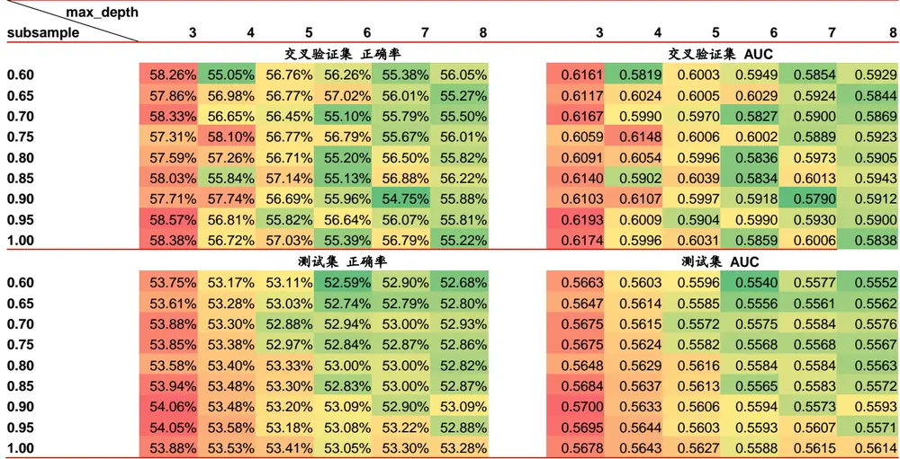
资料来源：Wind，华泰证券研究所

## Boosting 集成学习模型正确率与 AUC 分析

下图展示了 AdaBoost、GBDT、XGBoost 和线性回归模型（分阶段回测同本文）每一期样本外的 AUC 值随时间的变化情况。四种模型样本外平均 AUC 分别为 0.5695，0.5699，0.5696，0.5512，样本外平均正确率分别为 53.94%，54.12%，54.02%，51.44%。从图表 13～图表 15 中可以看出，三种模型的 AUC 波动方向基本与线性回归一致，AUC 均值相对线性回归都要高出一些，但是 AUC 的波动更大，这可能造成选股后组合净值波动率较大。

图表13： Adaboost分类模型和线性回归模型样本外 AUC 值
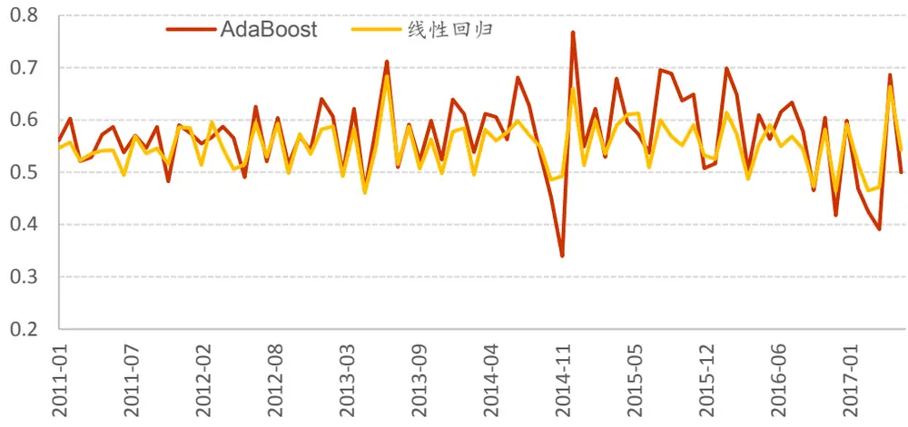
资料来源：Wind，华泰证券研究所

图表14： GBDT分类模型和线性回归模型样本外 AUC 值
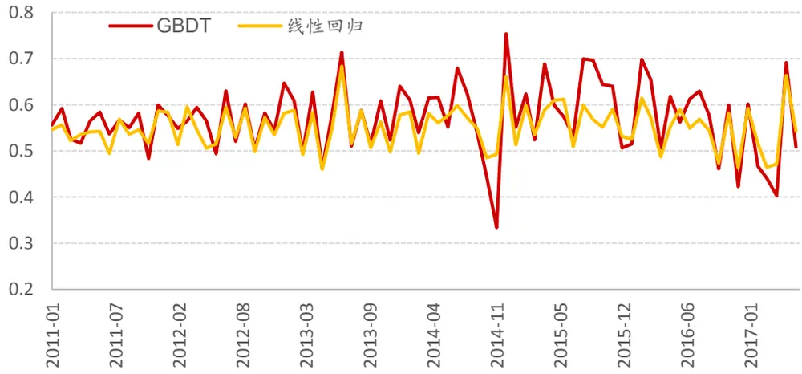
资料来源：Wind，华泰证券研究所

图表15： XGBoost分类模型和线性回归模型样本外 AUC 值
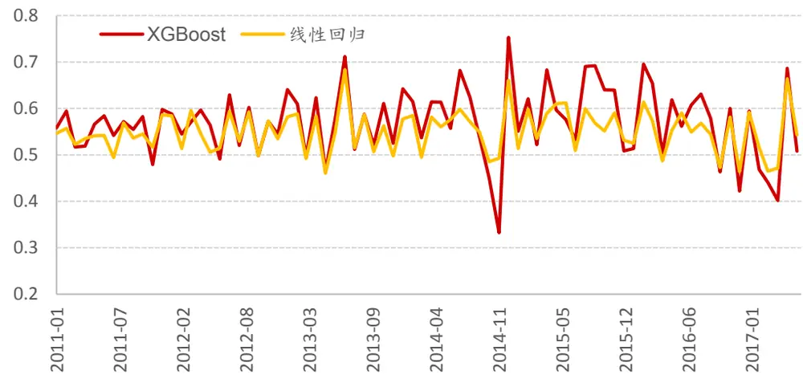
资料来源：Wind，华泰证券研究所

## Boosting 集成学习模型决策树结构分析

本文所研究的 Boosting 集成学习模型所使用的弱学习器都是决策树，运用决策树的一大优势就是可以通过可视化的方法呈现决策树的决策过程和树结构，进而帮助人们理解模型逻辑并发现问题。

在图表 16～图表 18 中，我们列出了 AdaBoost，GBDT，XGBoost 三种模型第一个决策树的结构，由于这三种模型都是 Boosting 模型，决策树按照串行方式训练，因此从第一个决策树中最能看出对模型结果影响最大的因子都有哪些。

图表16： AdaBoost模型第一个决策树的结构
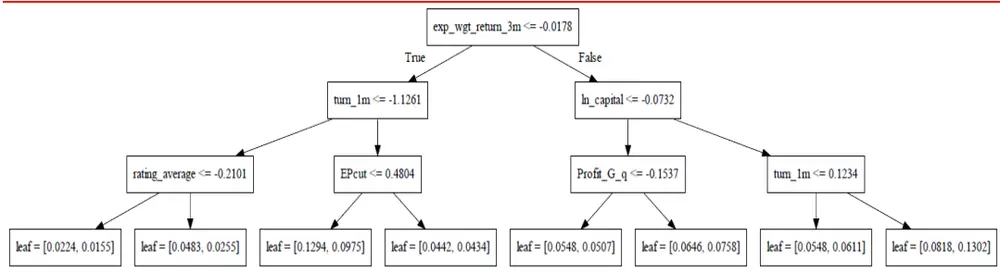
资料来源：Wind，华泰证券研究所

图表17： GBDT模型第一个决策树的结构
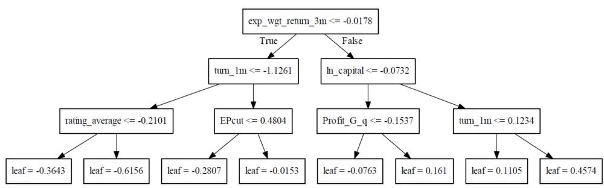
资料来源：Wind，华泰证券研究所

图表18： XGBoost模型第一个决策树的结构
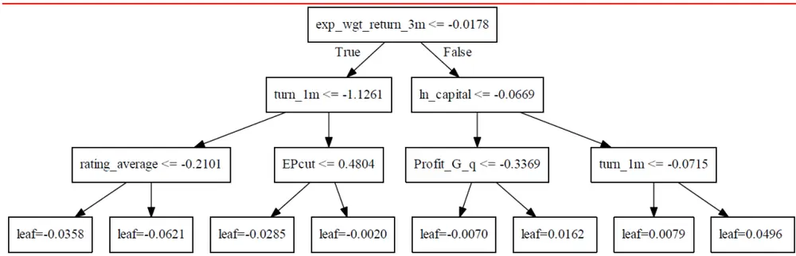
资料来源：Wind，华泰证券研究所

上面图表所对应的的三种模型中，都将决策树的最大深度设为 3，因此这些图中显示的树的深度都为 3。三种模型的第一个决策树都选择从 exp_wgt_return_3m（3 个月改进的动量反转因子）开始进行划分，说明使用该因子进行划分所带来的信息增益较大。在决策树的下面两层中，也有一些因子被三种模型共同选中，如 turn_1m（一个月日均换手率），In_capital（对数市值）。注意到 GBDT 和 XGBoost 的第一个决策树使用的划分因子完全一样，只是划分值有所不同，这是因为 XGBoost 实际上是 GBDT 的一种高效实现，二者有很多共同之处。

## XGBoost 分类模型因子特征重要性统计

XGBoost 分类模型可以导出模型因子特征的重要性，这能帮助我们直观地观察模型主要受那些因子影响。下面我们给出 2011～2017 年间 XGBoost 七阶段测试模型的特征重要性评分表：

图表19： XGBoost分类模型中因子重要性评分（前 40名）

| 大类因子 | 因子名称 | 2011 | 2012 | 2013 | 2014 | 2015 | 2016 | 2017 | 均值 | 排名 |
| --- | --- | --- | --- | --- | --- | --- | --- | --- | --- | --- |
| 市值 | In_capital | 0.0700 | 0.0709 | 0.0688 | 0.0905 | 0.0836 | 0.0960 | 0.1032 | 0.0833 | 1 |
| 情绪 | rating_change | 0.0314 | 0.0333 | 0.0330 | 0.0259 | 0.0274 | 0.0415 | 0.0573 | 0.0357 | 2 |
| 波动率 | std_FF3factor_1m | 0.0300 | 0.0333 | 0.0372 | 0.0388 | 0.0418 | 0.0358 | 0.0258 | 0.0347 | 3 |
| 情绪 | rating_average | 0.0443 | 0.0318 | 0.0344 | 0.0287 | 0.0346 | 0.0301 | 0.0330 | 0.0338 | 4 |
| 动量反转 | exp_wgt_return_1m | 0.0386 | 0.0333 | 0.0287 | 0.0316 | 0.0274 | 0.0358 | 0.0387 | 0.0334 | 5 |
| 波动率 | std_1m | 0.0143 | 0.0275 | 0.0287 | 0.0374 | 0.0245 | 0.0444 | 0.0315 | 0.0297 | 6 |
| 换手率 | bias_turn_1m | 0.0286 | 0.0246 | 0.0244 | 0.0330 | 0.0331 | 0.0258 | 0.0272 | 0.0281 | 7 |
| 股东 | holder_avgpctchange | 0.0343 | 0.0246 | 0.0215 | 0.0230 | 0.0274 | 0.0387 | 0.0229 | 0.0275 | 8 |
| 换手率 | turn_1m | 0.0371 | 0.0449 | 0.0387 | 0.0201 | 0.0144 | 0.0201 | 0.0100 | 0.0265 | 9 |
| 技术 | macd | 0.0314 | 0.0289 | 0.0158 | 0.0158 | 0.0245 | 0.0229 | 0.0330 | 0.0246 | 10 |
| 成长 | Sales_G_q | 0.0157 | 0.0217 | 0.0244 | 0.0287 | 0.0259 | 0.0244 | 0.0244 | 0.0236 | 11 |
| 股价 | In_price | 0.0214 | 0.0275 | 0.0258 | 0.0101 | 0.0216 | 0.0229 | 0.0215 | 0.0215 | 12 |
| 技术 | dif | 0.0129 | 0.0203 | 0.0143 | 0.0172 | 0.0331 | 0.0244 | 0.0244 | 0.0209 | 13 |
| 成长 | ROE_q | 0.0300 | 0.0232 | 0.0158 | 0.0230 | 0.0187 | 0.0172 | 0.0172 | 0.0207 | 14 |
| 估值 | BP | 0.0157 | 0.0275 | 0.0272 | 0.0302 | 0.0202 | 0.0072 | 0.0129 | 0.0201 | 15 |
| 动量反转 | exp_wgt_return_3m | 0.0186 | 0.0232 | 0.0229 | 0.0187 | 0.0245 | 0.0229 | 0.0100 | 0.0201 | 16 |
| 动量反转 | wgt_return_1m | 0.0043 | 0.0087 | 0.0201 | 0.0302 | 0.0303 | 0.0258 | 0.0215 | 0.0201 | 17 |
| 换手率 | return_3m | 0.0057 | 0.0246 | 0.0100 | 0.0244 | 0.0187 | 0.0229 | 0.0229 | 0.0185 | 18 |
| 技术 | dea | 0.0157 | 0.0029 | 0.0172 | 0.0172 | 0.0231 | 0.0186 | 0.0315 | 0.0180 | 19 |
| 成长 | Profit_G_q | 0.0214 | 0.0174 | 0.0244 | 0.0101 | 0.0202 | 0.0143 | 0.0158 | 0.0176 | 20 |
| 估值 | G/PE | 0.0214 | 0.0232 | 0.0172 | 0.0129 | 0.0173 | 0.0172 | 0.0129 | 0.0174 | 21 |
| 换手率 | return_1m | 0.0257 | 0.0217 | 0.0186 | 0.0086 | 0.0130 | 0.0172 | 0.0158 | 0.0172 | 22 |
| 技术 | rsi | 0.0229 | 0.0174 | 0.0201 | 0.0172 | 0.0130 | 0.0100 | 0.0172 | 0.0168 | 23 |
| 情绪 | rating_targetprice | 0.0100 | 0.0217 | 0.0129 | 0.0115 | 0.0159 | 0.0258 | 0.0143 | 0.0160 | 24 |
| 换手率 | return_12m | 0.0143 | 0.0174 | 0.0186 | 0.0172 | 0.0130 | 0.0086 | 0.0115 | 0.0144 | 25 |
| 动量反转 | exp_wgt_return_6m | 0.0114 | 0.0130 | 0.0129 | 0.0144 | 0.0086 | 0.0143 | 0.0258 | 0.0144 | 26 |
| 技术 | bias | 0.0129 | 0.0188 | 0.0229 | 0.0129 | 0.0101 | 0.0100 | 0.0086 | 0.0137 | 27 |
| 换手率 | turn_12m | 0.0157 | 0.0101 | 0.0086 | 0.0086 | 0.0159 | 0.0129 | 0.0215 | 0.0133 | 28 |
| 成长 | ROE_G_q | 0.0086 | 0.0116 | 0.0158 | 0.0144 | 0.0144 | 0.0129 | 0.0143 | 0.0131 | 29 |
| 成长 | OCF_G_q | 0.0129 | 0.0087 | 0.0143 | 0.0158 | 0.0159 | 0.0129 | 0.0057 | 0.0123 | 30 |
| 波动率 | std_12m | 0.0000 | 0.0029 | 0.0115 | 0.0158 | 0.0173 | 0.0244 | 0.0143 | 0.0123 | 31 |
| 波动率 | std_FF3factor_3m | 0.0086 | 0.0043 | 0.0072 | 0.0216 | 0.0173 | 0.0143 | 0.0086 | 0.0117 | 32 |
| 换手率 | bias_turn_3m | 0.0171 | 0.0159 | 0.0115 | 0.0101 | 0.0029 | 0.0100 | 0.0143 | 0.0117 | 33 |
| 动量反转 | wgt_return_3m | 0.0071 | 0.0130 | 0.0115 | 0.0129 | 0.0101 | 0.0143 | 0.0115 | 0.0115 | 34 |
| 估值 | DP | 0.0243 | 0.0260 | 0.0129 | 0.0043 | 0.0043 | 0.0014 | 0.0014 | 0.0107 | 35 |
| 估值 | EPcut | 0.0143 | 0.0116 | 0.0158 | 0.0072 | 0.0072 | 0.0043 | 0.0129 | 0.0105 | 36 |
| 换手率 | return_6m | 0.0129 | 0.0058 | 0.0043 | 0.0129 0.0101 | 0.0130 0.0115 | 0.0172 0.0100 | 0.0072 0.0186 | 0.0105 0.0098 | 37 38 |

资料来源：Wind，华泰证券研究所

图表20： XGBoost分类模型中因子重要性评分（后 30名）

| 大类因子 | 因子名称 | 2011 | 2012 | 2013 | 2014 | 2015 | 2016 | 2017 | 均值 | 排名 |
| --- | --- | --- | --- | --- | --- | --- | --- | --- | --- | --- |
| 换手率 | bias_turn_12m | 0.0043 | 0.0014 | 0.0072 | 0.0072 | 0.0130 | 0.0129 | 0.0186 | 0.0092 | 41 |
| 财务质量 | grossprofitmargin_q | 0.0057 | 0.0145 | 0.0186 | 0.0129 | 0.0072 | 0.0043 | 0.0000 | 0.0090 | 42 |
| 估值 | NCFP | 0.0143 | 0.0116 | 0.0115 | 0.0101 | 0.0086 | 0.0043 | 0.0029 | 0.0090 | 43 |
| 波动率 | std_3m | 0.0100 | 0.0101 | 0.0115 | 0.0115 | 0.0058 | 0.0072 | 0.0072 | 0.0090 | 44 |
| 财务质量 | ROE_ttm | 0.0086 | 0.0101 | 0.0072 | 0.0086 | 0.0101 | 0.0129 | 0.0029 | 0.0086 | 45 |
| 估值 | SP | 0.0100 | 0.0145 | 0.0086 | 0.0043 | 0.0058 | 0.0072 | 0.0057 | 0.0080 | 46 |
| 杠杆 | financial_leverage | 0.0014 | 0.0087 | 0.0072 | 0.0086 | 0.0115 | 0.0043 | 0.0100 | 0.0074 | 47 |
| 技术 | psy | 0.0157 | 0.0029 | 0.0029 | 0.0029 | 0.0058 | 0.0100 | 0.0115 | 0.0074 | 48 |
| 杠杆 | currentratio | 0.0043 | 0.0087 | 0.0029 | 0.0144 | 0.0043 | 0.0057 | 0.0100 | 0.0072 | 49 |
| 估值 | EP | 0.0114 | 0.0087 | 0.0129 | 0.0072 | 0.0029 | 0.0029 | 0.0043 | 0.0072 | 50 |
| 动量反转 | wgt_return_12m | 0.0043 | 0.0087 | 0.0086 | 0.0086 | 0.0101 | 0.0072 | 0.0000 | 0.0068 | 51 |
| 动量反转 | HAlpha | 0.0029 | 0.0014 | 0.0129 | 0.0072 | 0.0144 | 0.0000 | 0.0086 | 0.0068 | 52 |
| 财务质量 | operationcashflowratio_ttm | 0.0086 | 0.0130 | 0.0057 | 0.0101 | 0.0029 | 0.0000 | 0.0043 | 0.0064 | 53 |
| 换手率 | turn_6m | 0.0057 | 0.0043 | 0.0043 | 0.0043 | 0.0101 | 0.0057 | 0.0100 | 0.0064 | 54 |
| beta | beta | 0.0086 | 0.0014 | 0.0072 | 0.0029 | 0.0086 | 0.0057 | 0.0100 | 0.0064 | 55 |
| 估值 | OCFP | 0.0071 | 0.0101 | 0.0086 | 0.0029 | 0.0072 | 0.0043 | 0.0029 | 0.0062 | 56 |
| 换手率 | turn_3m | 0.0086 | 0.0058 | 0.0029 | 0.0043 | 0.0043 | 0.0072 | 0.0100 | 0.0062 | 57 |
| 财务质量 | grossprofitmargin_ttm | 0.0100 | 0.0101 | 0.0043 | 0.0029 | 0.0058 | 0.0029 | 0.0057 | 0.0060 | 58 |
| 波动率 | std_6m | 0.0071 | 0.0043 | 0.0043 | 0.0014 | 0.0072 | 0.0072 | 0.0072 | 0.0055 | 59 |
| 换手率 | bias_turn_6m | 0.0143 | 0.0087 | 0.0100 | 0.0000 | 0.0029 | 0.0029 | 0.0000 | 0.0055 | 60 |
| 财务质量 | operationcashflowratio_q | 0.0043 | 0.0043 | 0.0057 | 0.0072 | 0.0043 | 0.0043 | 0.0072 | 0.0053 | 61 |
| 财务质量 | profitmargin_q | 0.0057 | 0.0043 | 0.0129 | 0.0043 | 0.0043 | 0.0014 | 0.0029 | 0.0051 | 62 |
| 波动率 | std_FF3factor_6m | 0.0071 | 0.0058 | 0.0057 | 0.0057 | 0.0000 | 0.0100 | 0.0014 | 0.0051 | 63 |
| 杠杆 | cashratio | 0.0029 | 0.0058 | 0.0043 | 0.0043 | 0.0086 | 0.0057 | 0.0029 | 0.0049 | 64 |
| 波动率 | std_FF3factor_12m | 0.0100 | 0.0029 | 0.0043 | 0.0043 | 0.0029 | 0.0057 | 0.0043 | 0.0049 | 65 |
| 财务质量 | ROA_q | 0.0086 | 0.0043 | 0.0029 | 0.0086 | 0.0029 | 0.0000 | 0.0029 | 0.0043 | 66 |
| 财务质量 | assetturnover_q | 0.0057 | 0.0000 | 0.0057 | 0.0086 | 0.0029 | 0.0043 | 0.0014 | 0.0041 | 67 |
| 财务质量 | ROA_ttm | 0.0043 | 0.0014 | 0.0000 | 0.0043 | 0.0029 | 0.0014 | 0.0029 | 0.0025 | 68 |
| 财务质量 | profitmargin_ttm | 0.0043 | 0.0000 | 0.0029 | 0.0043 | 0.0043 | 0.0000 | 0.0014 | 0.0025 | 69 |
| 财务质量 | assetturnover_ttm | 0.0014 | 0.0058 | 0.0029 | 0.0029 | 0.0000 | 0.0014 | 0.0014 | 0.0023 | 70 |

资料来源：Wind，华泰证券研究所

我们选取排名前5名的因子，自2011年1月以来，每个月用之前六年的数据训练XGBoost模型的因子重要性，得出因子重要性时间序列。图表 21 显示了排名前 5 名的因子的重要性随时间的变化。ln_capital（对数市值）在 2017 年之前一直是市场上最为有效的因子，重要性远超其他因子，但在 2017 年之后其重要性迅速下滑。另外四个因子则重要性相差不大，且其时间序列呈现出近似平稳的状态。

图表21： XGBoost分类模型排名前 5的因子重要性值时间序列
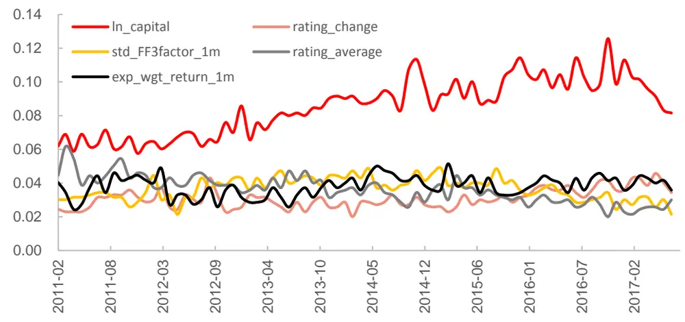
资料来源：Wind，华泰证券研究所

## XGBoost 分类模型分层回测分析

Boosting 集成学习分类器，最终在每个月底可以产生对全部个股下月上涨或下跌的预测值；而 Boosting 集成学习回归模型，在每个月底可以产生对全部个股下月收益的预测值。因此可以将两者都看作一个因子合成模型，即在每个月底将因子池中所有因子合成为一个“因子”。接下来，我们对该模型合成的这个“因子”（即个股下期收益预测值）进行分层回测，从各方面考察该模型的效果。仿照华泰单因子测试系列报告中的思路，分层回测模型构建方法如下：

1. 股票池：全 A 股，剔除 ST 股票，剔除每个截面期下一交易日停牌的股票，剔除上市3 个月以内的股票。

2. 回测区间：2011-01-31 至 2017-07-31（按年度分为 7 个子区间）。

3. 换仓期：在每个自然月最后一个交易日核算因子值，在下个自然月首个交易日按当日收盘价换仓。

4. 数据处理方法：将 Boosting 集成学习模型的预测值视作单因子，因子值为空的股票不参与分层。

5. 分层方法：在每个一级行业内部对所有个股按因子大小进行排序，每个行业内均分成N 个分层组合。如图表 24 所示，黄色方块代表各行业内个股初始权重，可以相等也可以不等（我们直接取相等权重进行测试），分层具体操作方法为 N 等分行业内个股权重累加值，例如图示行业1中，5只个股初始权重相等（不妨设每只个股权重为0.2），假设我们欲分成 3 层，则分层组合 1在权重累加值 1/3 处截断，即分层组合 1包含个股 1 和个股 2，它们的权重配比为 0.2:(1/3-0.2)=3:2，同样推理，分层组合 2 包含个股 2、3、4，配比为(0.4-1/3):0.2:(2/3-0.6)=1:3:1，分层组合 4 包含个股 4、5，配比为 2:3。以上方法是用来计算各个一级行业内部个股权重配比的，行业间权重配比与基准组合（我们使用沪深 300）相同，也即行业中性。

6. 评价方法：回测年化收益率、夏普比率、信息比率、最大回撤、胜率等。

图表22： 单因子分层测试法示意图
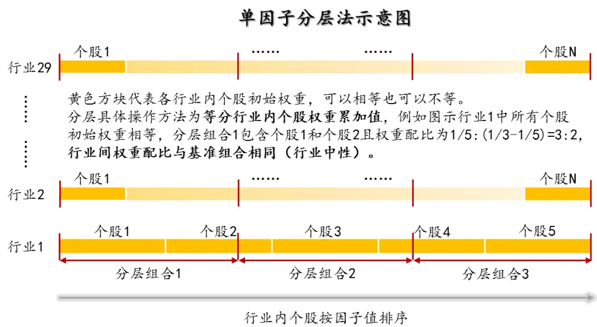
资料来源：华泰证券研究所

## 这里我们将展示 XGBoost 分类模型（subsample=0.95；max_depth=3）的分层测试结果。

下图是分五层组合回测绩效分析表（20110131～20170731）。其中组合 1～组合 5为按该因子从小到大排序构造的行业中性的分层组合。基准组合为行业中性的等权组合，具体来说就是将组合 1～组合 5 合并，一级行业内部个股等权配置，行业权重按当期沪深 300 行业权重配置。多空组合是在假设所有个股可以卖空的基础上，每月调仓时买入组合 1，卖空组合 5。回测模型在每个自然月最后一个交易日核算因子值，在下个自然月首个交易日按当日收盘价调仓。

图表23： XGBoost 分类模型分层组合绩效分析（20110131～20170731）

| 投资组合 | 年化收益率 | 年化波动率夏普比率最大回撤 |  |  | 年化超额收益率 | 超额收益年化波动率信息比率 |  | 相对基准月胜率 | 超额收益最大回撤 |
| --- | --- | --- | --- | --- | --- | --- | --- | --- | --- |
| 组合1 | 26.71% | 27.57% | 0.97 | 46.81% | 14.00% | 3.43% | 4.08 | 80.77% | 3.99% |
| 组合2 | 14.52% | 27.17% | 0.53 | 46.74% | 3.03% | 2.88% | 1.05 | 56.41% | 5.73% |
| 组合3 | 8.24% | 26.82% | 0.31 | 49.51% | -2.62% | 2.62% | -1.00 | 32.05% | 17.72% |
| 组合4 | 0.47% | 26.71% | 0.02 | 51.78% | -9.61% | 2.83% | -3.40 | 15.38% | 47.70% |
| 组合5 | -7.82% | 27.90% | -0.28 | 61.72% | -17.07% | 4.29% | -3.98 | 10.26% | 69.64% |
| 基准组合 | 11.15% | 27.06% | 0.41 | 49.05% |  |  |  |  |  |
| 多空组合 | 37.46% | 6.71% | 5.59 | 7.87% |  |  |  |  |  |

资料来源：Wind，华泰证券研究所

下面四个图依次为：

1.分五层组合回测净值图。按前面说明的回测方法计算组合 1～组合 5、基准组合的净值，与沪深 300、中证 500 净值对比作图。

2.分五层组合回测，用组合 1～组合 5的净值除以基准组合净值的示意图。可以更清晰地展示各层组合在不同时期的效果。

3.组合 1相对沪深 300 月超额收益分布直方图。该直方图以[-0.5%,0.5%]为中心区间，向正负无穷方向保持组距为 1%延伸，在正负两个方向上均延伸到最后一个频数不为零的组为止（即维持组距一致，组数是根据样本情况自适应调整的）。

4.分五层时的多空组合收益图。再重复一下，多空组合是买入组合 1、卖空组合 5（月度调仓）的一个资产组合。多空组合收益率是由组合 1 的净值除以组合 5的净值近似核算的。

图表24： XGBoost分类模型分层组合回测净值
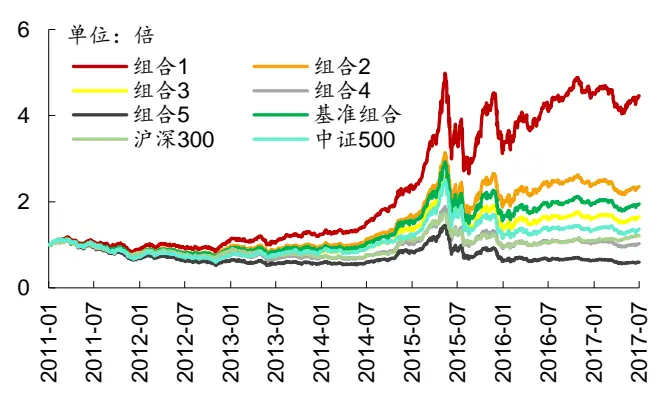
资料来源：Wind，华泰证券研究所

图表25： XGBoost分类模型各层组合净值除以基准组合净值示意图
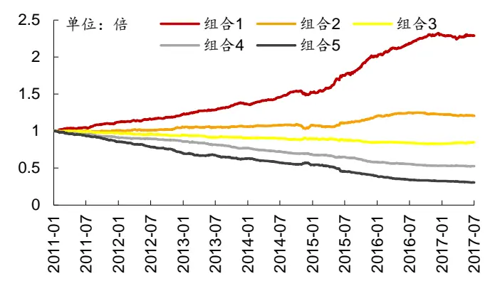
资料来源：Wind，华泰证券研究所

图表26： XGBoost分类分层组合 1相对沪深 300月超额收益分布图
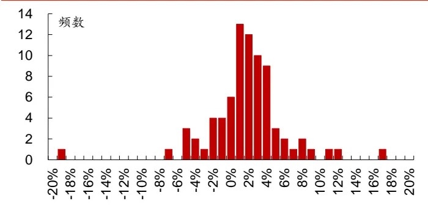
资料来源：Wind，华泰证券研究所

图表27： XGBoost分类模型多空组合月收益率及累积收益率
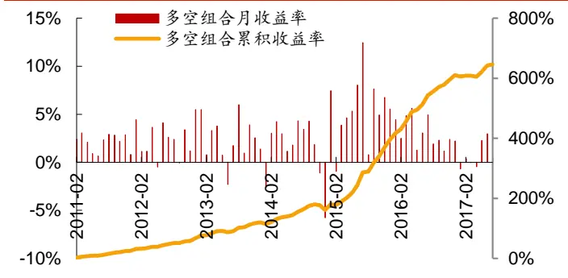
资料来源：Wind，华泰证券研究所

下图为分十层组合回测时，各层组合在不同年份间的收益率及排名表。每个单元格的内容为在指定年度某层组合的收益率（均为整年收益率），以及某层组合在全部十层组合中的收益率排名。最后一列是分层组合在 2011～2017 的排名的均值。

图表28： XGBoost分类模型组合在不同年份的收益及排名分析（分十层）

|  | 2011 | 2012 | 2013 | 2014 | 2015 | 2016 | 2017 | 排名均值 |
| --- | --- | --- | --- | --- | --- | --- | --- | --- |
| 组合1 | -17.4%(1) | 26.4%(1) | 25.0%(1) | 86.8%(1) | 86.8%(1) | 16.3%(1) | -5.2%(9) | 1.67 |
| 组合2 | -20.0%(2) | 19.9%(3) | 22.1%(2) | 73.7%(2) | 64.5%(2) | 9.0%(2) | -2.8%(4) | 2.25 |
| 组合3 | -25.6%(4) | 21.7%(2) | 9.3%(4) | 61.0%(5) | 50.8%(3) | 3.2%(3) | -4.2%(5) | 3.42 |
| 组合4 | -24.5%(3) | 11.4%(4) | 10.9%(3) | 65.3%(4) | 44.0%(4) | 1.9%(4) | -4.9%(8) | 4.17 |
| 组合5 | -28.0%(6) | 8.3%(5) | 7.1%(5) | 66.0%(3) | 26.5%(5) | -0.2%(5) | -0.8%(2) | 4.67 |
| 组合6 | -26.9%(5) | 7.0%(6) | 3.8%(6) | 58.8%(6) | 21.9%(6) | -8.2%(6) | -0.5%(1) | 5.50 |
| 组合7 | -29.0%(7) | 6.5%(7) | -1.6%(7) | 52.4%(8) | 17.2%(7) | -8.4%(7) | -4.6%(6) | 7.00 |
| 组合8 | -33.5%(9) | 5.5%(8) | -6.9%(9) | 51.0%(9) | 1.5%(9) | -13.3%(8) | -2.4%(3) | 7.92 |
| 组合9 | -33.1%(8) | -5.4%(9) | -2.1%(8) | 53.5%(7) | 1.7%(8) | -20.5%(9) | -4.9%(7) | 8.42 |
| 组合10 | -37.3%(10) | -9.6%(10) | -10.4%(10) | 50.9%(10) | -16.4%(10) | -22.4%(10) | -11.9%(10) | 10.00 |

资料来源：Wind，华泰证券研究所

下图是不同市值区间分层组合回测绩效指标对比图（分十层）。我们将全市场股票按市值排名前 1/3，1/3～2/3，后 1/3 分成三个大类，在这三类股票中分别进行分层测试，基准组合构成方法同前面所述（注意每个大类对应的基准组合并不相同）。

图表29： 不同市值区间 XGBoost分类模型组合绩效指标对比图（分十层）
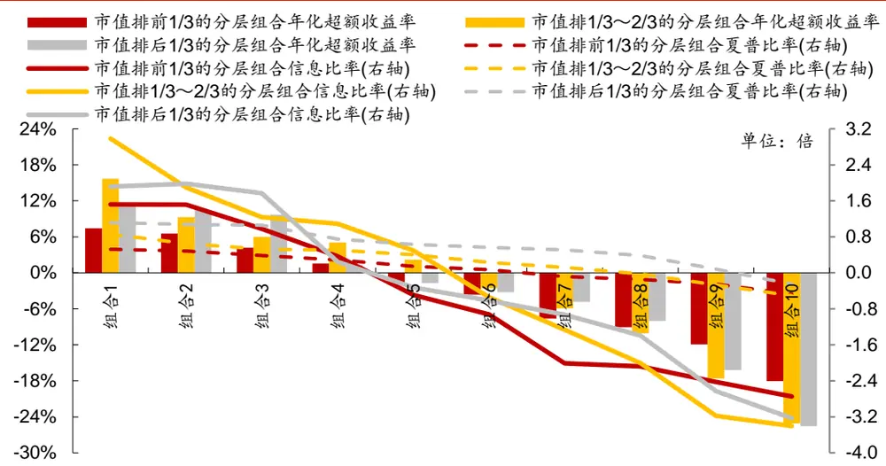
资料来源：Wind，华泰证券研究所

下图是不同行业间分层组合回测绩效分析表（分五层）。我们在不同一级行业内部都做了分层测试，基准组合为各行业内该因子非空值的个股等权组合（注意每个行业对应的基准组合并不相同）。

图表30： 不同行业 XGBoost分类模型分层组合绩效分析（分五层）

|  | 组合1年化 | 组合1 | 组合1 | 组合1 | 组合1超额收益 | 组合1相对 | 所有组合年化 |
| --- | --- | --- | --- | --- | --- | --- | --- |
| 行业 | 超额收益率 | 信息比率 | 年化收益率 | 夏普比率 | 最大回撤 | 基准月胜率 | 收益率排序 |
| 通信 | 27.35% | 2.54 | 50.78% | 1.37 | 10.76% | 72.49% | 1,2,3,4,5 |
| 纺织服装 | 25.59% | 2.70 | 42.21% | 1.28 | 8.42% | 73.72% | 1,3,2,4,5 |
| 农林牧渔 | 24.59% | 2.58 | 39.71% | 1.20 | 7.77% | 72.49% | 1,2,3,4,5 |
| 建材 | 24.29% | 2.53 | 41.70% | 1.26 | 9.01% | 68.81% | 1,2,3,4,5 |
| 有色金属 | 22.59% | 2.33 | 29.10% | 0.85 | 7.79% | 61.42% | 1,2,3,4,5 |
| 计算机 | 22.56% | 2.30 | 46.01% | 1.16 | 13.01% | 70.04% | 1,2,3,4,5 |
| 机械 | 21.93% | 3.16 | 33.62% | 1.00 | 8.14% | 74.95% | 1,2,3,4,5 |
| 汽车 | 20.21% | 2.55 | 36.22% | 1.10 | 9.76% | 76.18% | 1,2,4,3,5 |
| 基础化工 | 20.16% | 3.01 | 36.64% | 1.10 | 5.71% | 78.63% | 1,2,3,4,5 |
| 商贸零售 | 18.56% | 2.32 | 28.12% | 0.87 | 8.04% | 72.49% | 1,2,3,4,5 |
| 电子元器件 | 18.46% | 2.28 | 38.14% | 1.06 | 15.66% | 66.33% | 1,2,3,4,5 |
| 房地产 | 17.35% | 2.28 | 36.82% | 1.13 | 12.47% | 71.26% | 1,2,3,4,5 |
| 家电 | 17.35% | 1.57 | 38.44% | 1.16 | 10.24% | 57.74% | 1,2,3,4,5 |
| 食品饮料 | 15.62% | 1.66 | 27.23% | 0.90 | 10.59% | 63.88% | 1,2,3,4,5 |
| 钢铁 | 15.29% | 1.37 | 27.07% | 0.80 | 12.80% | 62.65% | 1,2,4,3,5 |
| 传媒 | 15.19% | 1.10 | 34.30% | 0.90 | 30.28% | 58.97% | 1,2,3,4,5 |
| 综合 | 14.49% | 1.06 | 29.48% | 0.85 | 17.82% | 56.51% | 1,2,3,4,5 |
| 医药 | 14.30% | 2.04 | 30.71% | 0.95 | 13.55% | 67.56% | 1,4,2,3,5 |
| 建筑 | 13.81% | 1.32 | 27.43% | 0.85 | 14.41% | 65.11% | 1,2,3,4,5 |
| 电力设备 | 13.78% | 1.77 | 23.70% | 0.68 | 11.26% | 70.04% | 1,2,3,4,5 |
| 煤炭 | 12.63% | 1.14 | 10.43% | 0.29 | 11.55% | 62.65% | 1,2,3,4,5 |
| 石油石化 | 12.05% | 1.00 | 23.46% | 0.71 | 17.50% | 60.19% | 1,2,4,3,5 |
| 电力及公用事业 | 11.97% | 1.42 | 25.08% | 0.80 | 9.54% | 68.81% | 1,3,2,4,5 |
| 交通运输 | 11.85% | 1.29 | 25.17% | 0.79 | 18.99% | 71.26% | 1,2,3,4,5 |
| 餐饮旅游 | 11.45% | 0.91 | 24.27% | 0.76 | 11.82% | 61.42% | 1,2,3,4,5 |
| 非银行金融 | 10.52% | 0.96 | 22.28% | 0.60 | 15.44% | 58.97% | 1,2,3,5,4 |
| 国防军工 | 10.47% | 0.75 | 19.44% | 0.48 | 22.87% 16.90% | 60.19% | 1,2,3,4,5 |
| 轻工制造 | 10.08% | 1.01 | 27.57% | 0.84 |  | 52.83% | 1,2,3,4,5 |
| 银行 | 0.84% | 0.11 | 14.26% | 0.52 | 11.97% | 43.00% | 1,3,2,5,4 |

资料来源：Wind，华泰证券研究所

## 各种集成学习模型运行速度比较

XGBoost 模型的一大优点就是运行速度很快，训练模型时可以节省很多时间。在图表 31中，我们对比了各种集成学习模型进行 7阶段模型训练所耗用的时间。可以看到 XGBoost模型在运行速度上优势非常明显。

图表31： 各种集成学习模型运行速度比较

| 模型 | 耗用时间 |
| --- | --- |
| XGBoost | 286 秒 |
| GBDT | 548 秒 |
| AdaBoost | 1780秒 |
| 随机森林 | 2255 秒 |

资料来源：华泰证券研究所

## 各种集成学习模型选股指标比较

我们比较了 XGBoost 分类、XGBoost 回归、GBDT 分类、GBDT 回归 1（平方损失）、GBDT 回归 2（绝对损失）、GBDT 回归 3（Huber 损失）、AdaBoost 分类、AdaBoost 回归 8 种不同的 Boosting 集成学习模型。我们对 8种模型的主要参数进行网格搜索，选取交叉验证集 AUC 最高的参数组合作为最终选定的参数，其他参数取默认值。同时将本系列上一篇报告的随机森林模型也加入测试进行对照。并设置两个统一对照组：①沿用本系列第二、三篇报告中的 12个月滚动回测的线性回归模型；②利用与 XGBoost 模型相同的训练周期和训练集构成构建 7 阶段线性回归模型。以全 A选股模型为例，各个模型的具体参数如图表 32所示。

图表32： 全 A选股全部测试模型一览

| 大类模型 | 细分模型 | 参数设定 |
| --- | --- | --- |
| AdaBoost | 分类 | max_depth=3; learning_rate = 0.15; n_estimators = 100 |
|  | 回归 | max_depth=3; learning_rate = 1; n_estimators = 50 |
| GBDT | 分类 | 损失函数：对数损失；subsample=1；max_depth=3 |
|  | 回归1 | 损失函数：平方损失；subsample=1；max_depth=3 |
|  | 回归2 | 损失函数：绝对损失；subsample=0.75；max_depth=3 |
|  | 回归3 | 损失函数：Huber 损失；subsample=1；max_depth=3 |
| XGBoost | 分类 | subsample=0.95;max_depth=3 |
|  | 回归 | subsample=0.9; max_depth=3 |
| 随机森林 | 分类 | n_estimators = 500; max_fetures=8 |
|  |  | min_samples_split = 50; min_samples_leaf = 10 |

资料来源：华泰证券研究所

首先，我们构建了沪深 300 和中证 500 成份内选股策略并进行回测。选股策略分为两类：一类是行业中性策略，策略组合的行业配置与基准（沪深 300、中证 500）保持一致，各一级行业中选 N个股票等权配置（N=2,5,10,15,20）；另一类是个股等权策略，直接在票池内不区分行业选 N个股票等权配置（N=20,50,100,150,200），比较基准取为 300 等权、500 等权指数。两类策略均为月频调仓，个股入选顺序为它们在被测模型中的当月的预测值顺序。

然后，我们构建了全 A选股策略并进行回测，各项指标详见图表 35 和图表 36。选股策略分为两类：一类是行业中性策略，策略组合的行业配置与基准（沪深 300、中证 500、中证全指）保持一致，各一级行业中选 N 个股票等权配置（N=2,5,10,15,20）；另一类是个股等权策略，直接在票池内不区分行业选 N个股票等权配置（N=20,50,100,150,200），比较基准取为 300 等权、500 等权、中证全指指数。三类策略均为月频调仓，个股入选顺序为它们在被测模型中的当月的预测值顺序。

先总体观察图表 33～36，XGBoost 分类、GBDT 分类、AdaBoost 分类相比 XGBoost 回归、GBDT 回归、AdaBoost 回归在年化超额收益率、信息比率和 Calmar 比率整体上要更加优秀，这是因为本文的回归算法（除了线性回归）都使用全部训练集进行训练，而分类算法只取收益率最优的前 30%和后 30%的训练样本进行训练，这使得分类算法的训练不会受到中间 40%收益率特征不明显的样本干扰。

对于沪深 300 成份股内选股的行业中性策略（图表 33 左侧），XGBoost 分类、GBDT 分类、AdaBoost 分类相比其他算法在年化超额收益率、信息比率整体上优于统一对照组，与随机森林分类模型表现相近。总体来说，表现最优的选股数量是每个行业入选5只个股。对于中证 500 成份股内选股的行业中性策略（图表 33 右侧），除了 Calmer比率指标，XGBoost 分类、GBDT 分类、AdaBoost 分类相比其他模型都没有呈现出明显优势。

对于沪深 300 成份股和中证 500 成份股内选股的个股等权策略（图表 34），整体来看，所有模型的表现都比统一对照组较差。

对于行业中性和个股等权的全 A选股（图表 35 和图表 36），XGBoost 分类、GBDT 分类、AdaBoost 分类相比其他算法在年化超额收益率、信息比率和 Calmar 比率整体上优于其他模型，与随机森林分类模型表现相近。

总的来看，Boosting 分类模型（XGBoost 分类、GBDT 分类、AdaBoost 分类）在年化超额收益率、信息比率和 Calmar 比率上优于线性回归算法，但是最大回撤普遍大于线性回归算法。说明 Boosting 分类模型是一种高收益、高回撤的选股模型，但能够提升投资组合的信息比率和 Calmar 比率。而 XGBoost 分类、GBDT 分类、AdaBoost 分类、随机森林分类之间相比并没有太大差别。

图表33： 各种 Boosting集成学习模型回测重要指标对比（沪深 300及中证 500成份股内选股）

| 模型选择 | 每个行业入选个股数目（从左至右：2,5,10，15,20） |  |  |  | 每个行业入选个股数目（从左至右：2,5,10,15,20） |  |  |  |
| --- | --- | --- | --- | --- | --- | --- | --- | --- |
|  | 沪深300成份股内选股（基准：沪深300） |  |  |  | 中证 500成份股内行业中性选股（基准：中证 500） |  |  |  |
|  | 年化超额收益率（行业中性） |  |  |  | 年化超额收益率（行业中性） |  |  |  |
| XGBoost 分类 | 8.11% | 6.10% 4.42% | 2.95% | 2.42% | 8.93% | 7.83% 5.08% | 3.62% | 3.32% |
| XGBoost 回归 | 7.99% | 5.71% 3.86% | 3.07% | 2.33% | 8.11% | 5.55% 5.14% | 4.36% | 3.76% |
| GBDT 分类 | 8.15% | 6.33% 4.16% | 3.05% | 2.52% | 8.99% | 7.36% 5.09% | 4.53% | 3.71% |
| GBDT 回归 1 | 5.05% | 4.55% 3.66% | 2.91% | 2.22% | 6.62% | 6.46% 4.89% | 4.03% | 3.87% |
| GBDT 回归 2 | 6.46% | 5.11% 4.11% | 2.81% | 2.43% | 7.64% | 5.47% 3.92% | 3.82% | 3.15% |
| GBDT 回归 3 | 7.62% | 4.64% 4.16% | 3.15% | 2.34% | 7.92% | 6.75% 4.71% | 4.18% | 3.25% |
| AdaBoost 分类 | 8.10% | 6.69% 4.76% | 3.05% | 2.41% | 8.69% | 8.47% 10.33% | 7.52% | 4.75% |
| AdaBoost 回归 | 4.96% | 4.66% 2.80% | 2.53% | 2.30% | 4.72% | 5.08% 4.52% | 3.88% | 3.44% |
| 随机森林分类 | 7.52% | 6.62% 4.44% | 3.27% | 2.31% | 8.90% | 8.43% 5.17% | 4.29% | 3.62% |
| 统一对照组① | 5.82% | 5.25% 3.53% | 2.65% | 2.26% | 5.40% | 5.25% 4.32% | 3.78% | 3.40% |
| 统一对照组② | 7.88% | 5.31% 4.09% | 2.93% | 2.29% | 9.14% | 7.17% 4.91% | 3.82% | 3.85% |
|  | 超额收益最大回撤（行业中性） |  |  |  | 超额收益最大回撤（行业中性） |  |  |  |
|  | 6.75% | 5.02% 4.66% | 4.82% | 4.77% | 5.36% | 3.00% 3.22% | 2.57% | 2.13% |
| XGBoost 回归 | 7.91% | 4.83% 5.58% | 4.89% | 4.97% | 6.15% | 4.52% 3.12% | 2.84% | 2.26% |
| GBDT 分类 | 7.80% | 5.34% 5.11% | 4.72% | 4.89% | 5.01% | 2.84% 3.57% | 1.82% | 2.05% |
| GBDT 回归 1 | 9.80% | 5.84% 4.96% | 5.17% | 5.19% | 5.12% | 4.45% 4.01% | 2.80% | 2.05% |
| GBDT 回归 2 | 8.59% | 4.98% 5.06% | 4.81% | 4.91% | 6.53% | 5.81% 3.18% | 2.00% | 2.01% |
| GBDT 回归 3 | 5.92% | 5.26% 5.46% | 5.19% | 4.93% | 5.55% | 4.20% 3.31% | 2.72% | 1.90% |
| AdaBoost 分类 | 5.98% | 4.99% | 5.04% 4.68% | 4.86% | 10.93% | 6.71% 4.64% | 4.64% | 3.84% |
| AdaBoost 回归 | 9.90% | 4.82% | 4.96% 4.79% | 5.10% | 9.29% | 4.86% | 4.50% 2.81% | 2.69% |
| 随机森林分类 | 5.71% | 5.33% 4.82% | 4.44% | 4.51% | 6.47% | 3.58% 3.92% | 4.04% | 3.56% |
| 统一对照组① | 7.74% | 5.12% 4.59% | 4.97% | 4.86% | 11.40% | 5.97% 3.80% | 3.34% | 3.35% |
| 统一对照组② | 5.78% | 5.61% 4.52% | 4.71% | 4.79% | 6.40% | 4.20% 4.32% | 2.80% | 2.03% |
|  | 信息比率（行业中性） |  |  |  | 信息比率（行业中性） |  |  |  |
|  | 1.50 | 1.56 | 1.47 1.02 | 0.83 | 1.56 | 2.05 | 1.86 1.85 | 1.96 |
| XGBoost 回归 | 1.32 | 1.44 | 1.20 1.03 | 0.79 | 1.41 | 1.46 | 1.94 2.03 | 2.11 |
| GBDT 分类 | 1.47 | 1.65 | 1.36 1.04 | 0.85 | 1.64 | 1.86 1.81 | 2.11 | 1.97 |
| GBDT 回归 1 | 0.86 | 1.13 | 1.14 0.96 | 0.74 | 1.14 | 1.71 | 1.88 1.95 | 2.24 |
| GBDT 回归 2 | 1.20 | 1.35 | 1.33 0.96 | 0.83 | 1.35 | 1.43 | 1.51 1.83 | 1.76 |
| GBDT 回归 3 | 1.37 | 1.19 | 1.29 1.06 | 0.79 | 1.38 | 1.84 | 1.80 1.91 | 1.81 |
| AdaBoost 分类 | 1.50 | 1.74 | 1.58 1.05 | 0.82 | 1.07 | 1.41 | 2.08 1.96 | 1.85 |
| AdaBoost 回归 | 0.80 | 1.11 | 0.86 0.86 | 0.78 | 0.83 | 1.29 | 1.75 1.99 | 2.09 |
| 随机森林分类 | 1.47 | 1.77 | 1.43 1.10 | 0.79 | 1.49 | 2.03 | 1.74 1.76 | 1.63 |
| 统一对照组① | 1.03 | 1.25 | 1.09 0.87 | 0.76 | 0.95 | 1.41 | 1.60 1.64 | 1.56 |
| 统一对照组② | 1.43 | 1.29 | 1.28 0.98 | 0.76 | 1.46 | 1.81 Calmar 比率（行业中性） | 1.86 1.83 | 2.23 |
| XGBoost 分类 | Calmar 比率（行业中性） 1.20 1.21 0.95 0.61 |  |  |  | 1.66 1.58 |  |  |  |
| XGBoost 回归 | 1.01 | 1.18 | 0.69 0.63 | 0.51 0.47 | 1.32 | 2.61 1.23 1.65 | 1.40 1.54 | 1.56 1.67 |
| GBDT 分类 | 1.05 | 1.19 | 0.81 0.65 | 0.51 | 1.80 | 2.59 | 1.42 2.49 | 1.81 |
| GBDT 回归 1 | 0.52 | 0.78 | 0.74 0.56 | 0.43 | 1.29 | 1.45 | 1.22 1.44 | 1.89 |
| GBDT 回归 2 | 0.75 | 1.03 | 0.81 0.58 |  | 1.17 | 0.94 | 1.23 1.91 | 1.56 |
|  | 1.29 |  |  | 0.49 |  |  |  |  |
| GBDT 回归 3 AdaBoost 分类 | 1.35 | 0.88 1.34 | 0.76 0.61 0.94 0.65 | 0.48 0.50 | 1.43 0.80 | 1.61 1.26 | 1.42 1.53 2.22 1.62 | 1.71 1.24 |

资料来源：Wind，华泰证券研究所

图表34： 各种 Boosting集成学习模型回测重要指标对比（沪深 300及中证 500成份股内选股）

| 模型选择 | 组合总入选个股数目（从左至右：20,50,100，150,200） |  |  | 组合总入选个股数目（从左至右：20,50,100,150,200） |  |  |  |
| --- | --- | --- | --- | --- | --- | --- | --- |
|  | 年化超额收益率（个股等权） |  |  | 年化超额收益率（个股等权） |  |  |  |
| XGBoost 分类 | 7.88% 5.13% | 5.48% | 4.51% 3.18% | 13.26% | 9.25% 8.07% | 7.14% | 6.22% |
| XGBoost 回归 | 4.29% | 3.38% 2.55% | 2.30% 2.25% | 6.93% | 7.52% 6.07% | 5.40% | 5.86% |
| GBDT 分类 | 5.05% | 2.81% 4.74% | 3.64% 3.39% | 7.56% | 9.37% 9.17% | 6.66% | 4.49% |
| GBDT 回归 1 | 1.63% | 2.92% 3.46% | 2.79% 2.94% | 8.63% | 6.73% 7.03% | 6.12% | 4.76% |
| GBDT 回归 2 | 7.39% | 4.52% 5.22% | 4.14% 3.69% | 9.00% | 8.37% 7.69% | 3.42% | 3.97% |
| GBDT 回归 3 | 7.41% | 4.26% 3.86% | 3.63% 3.24% | 8.16% | 7.74% 7.24% | 6.46% | 3.60% |
| AdaBoost 分类 | 9.61% | 6.68% 5.63% | 4.07% 4.02% | 8.69% | 8.47% 10.33% | 7.52% | 4.75% |
| AdaBoost 回归 | 2.31% | 3.25% 2.34% | 2.47% 1.39% | 6.37% | 8.14% 7.15% | 5.53% | 4.83% |
| 随机森林分类 | 7.52% | 6.53% 6.80% | 5.39% 3.37% | 10.56% | 8.88% 7.25% | 6.51% | 5.21% |
| 统一对照组① | 5.93% | 6.42% 3.89% 2.87% | 2.42% | 6.31% 4.74% | 4.08% | 3.11% | 3.05% |
| 统一对照组② | 3.89% 5.05% | 5.11% 4.34% | 3.06% | 11.40% 11.29% | 7.10% | 7.05% | 6.16% |
| 超额收益最大回撤（个股等权） |  |  |  |  |  | 超额收益最大回撤（个股等权） |  |
| XGBoost 分类 | 14.48% | 14.26% 13.64% | 12.54% 11.27% | 10.40% | 4.64% 4.49% | 4.19% | 3.42% |
| XGBoost 回归 | 19.89% | 18.46% 14.60% | 12.38% 11.68% | 13.35% | 7.85% 5.42% | 5.13% | 3.79% |
| GBDT 分类 | 15.87% | 15.59% 13.13% | 13.55% 12.61% | 13.11% | 6.24% 4.66% | 4.35% | 4.06% |
| GBDT 回归 1 | 26.39% | 17.01% 13.32% | 13.29% 11.22% | 8.20% | 6.94% 6.17% | 4.60% | 3.94% |
| GBDT 回归 2 | 19.57% | 15.90% 13.50% | 13.82% 12.08% | 11.08% | 7.39% 5.39% | 4.90% | 3.76% |
| GBDT 回归 3 | 22.70% | 15.66% 13.00% | 12.42% 11.40% | 8.16% | 7.74% 7.24% | 6.46% | 3.60% |
| AdaBoost 分类 | 23.27% | 13.62% 14.63% | 14.18% 11.72% | 12.84% | 8.47% 7.15% | 6.13% | 5.54% |
| AdaBoost 回归 | 18.21% | 16.85% 16.92% | 13.94% 12.07% | 11.29% | 4.30% 4.30% | 4.79% | 4.48% |
| 随机森林分类 | 14.72% | 13.14% 14.86% | 13.29% 13.10% | 9.48% | 5.25% 4.52% | 3.90% | 3.48% |
| 统一对照组① | 7.49% | 5.50% 4.81% | 4.80% 4.71% | 11.82% | 6.82% 6.09% | 4.69% | 4.09% |
| 统一对照组② | 15.77% 10.15% | 9.86% | 10.19% 10.06% | 11.08% | 6.72% 4.13% | 3.32% | 3.65% |
| 信息比率（个股等权） |  |  |  |  |  | 信息比率（个股等权） |  |
| XGBoost 分类 | 0.92 | 0.74 0.87 | 0.74 | 0.52 1.59 | 1.58 | 1.72 | 1.83 1.93 |
| XGBoost 回归 | 0.39 | 0.39 0.36 | 0.35 0.35 | 0.85 | 1.30 | 1.37 1.44 | 1.83 |
| GBDT 分类 | 0.59 | 0.39 0.73 | 0.58 0.55 | 0.88 | 1.51 | 1.95 1.78 | 1.73 |
| GBDT 回归 1 | 0.15 | 0.34 0.48 | 0.41 0.46 | 1.11 | 1.24 | 1.65 1.68 | 1.59 |
| GBDT 回归 2 | 0.74 | 0.59 0.79 | 0.66 0.59 0.52 | 1.02 | 1.48 | 1.88 1.21 | 1.62 |
| GBDT 回归 3 | 0.71 | 0.53 0.55 | 0.56 0.65 0.65 | 1.04 | 1.38 | 1.72 1.75 | 1.28 |
| AdaBoost 分类 | 1.04 | 0.91 0.85 | 0.37 | 1.07 | 1.41 | 2.08 1.96 | 1.85 |
| AdaBoost 回归 | 0.30 | 0.48 0.34 | 0.21 | 1.14 | 1.82 | 1.78 1.57 | 1.60 |
| 随机森林分类 | 0.93 | 0.94 1.11 | 0.89 0.54 | 1.32 | 1.56 | 1.63 1.80 | 1.74 |
| 统一对照组① | 1.05 | 1.59 1.22 | 0.97 0.82 | 0.73 | 0.88 | 1.07 1.05 | 1.27 |
| 统一对照组② | 0.42 | 0.65 0.74 | 0.65 0.48 | 1.31 | 1.79 | 1.66 1.96 | 1.96 |
| XGBoost 分类 | 0.54 0.36 | Calmar 比率（个股等权） 0.40 | 0.36 |  | Calmar 比率（个股等权） |  |  |
|  | 0.28 0.22 |  |  | 1.27 0.52 | 1.99 1.80 | 1.70 1.05 | 1.82 1.55 |
| XGBoost 回归 GBDT 分类 | 0.32 | 0.18 0.17 0.18 0.36 | 0.19 0.27 | 0.19 0.27 0.58 | 0.96 1.50 | 1.12 1.97 | 1.53 |
| GBDT 回归 1 | 0.06 | 0.17 0.26 | 0.21 0.26 | 1.05 | 0.97 | 1.14 1.33 | 1.11 1.21 |
| GBDT 回归 2 | 0.38 | 0.28 0.39 |  | 0.31 0.81 |  | 1.43 0.70 |  |
|  | 0.33 |  | 0.30 |  | 1.13 |  | 1.06 |
| GBDT 回归 3 |  | 0.27 0.30 | 0.29 0.28 | 0.66 | 0.99 | 1.49 | 1.37 1.00 |
| AdaBoost 分类 | 0.54 | 0.43 0.42 | 0.31 0.36 | 0.80 | 1.26 | 2.22 | 1.62 1.24 |
| AdaBoost 回归 | 0.13 | 0.19 0.14 | 0.18 0.12 | 0.56 | 1.89 | 1.66 | 1.15 1.08 |
| 随机森林分类 | 0.51 | 0.50 0.46 | 0.41 0.26 | 1.11 | 1.69 | 1.60 | 1.67 1.50 |
| 统一对照组① | 0.79 | 1.17 0.81 | 0.60 0.51 | 0.53 | 0.69 | 0.67 | 0.66 0.75 |
| 统一对照组② | 0.25 | 0.50 0.52 | 0.43 0.30 | 1.03 | 1.68 | 1.72 2.13 | 1.69 |

资料来源：Wind，华泰证券研究所

图表35： 各种 Boosting集成学习模型回测重要指标对比（全 A选股）
每个行业入选个股数目（从左至右：2,5,10,15,20）

|  | 全 A 选股，基准为沪深 300 |  |  |  |  | 全 A 选股，基准为中证 500 |  |  |  |  |  | 全 A选股，基准为中证全指 |  |  |  |  |  |
| --- | --- | --- | --- | --- | --- | --- | --- | --- | --- | --- | --- | --- | --- | --- | --- | --- | --- |
|  | 年化超额收益率（行业中性） |  |  |  |  |  | 年化超额收益率（行业中性） |  |  |  |  |  | 年化超额收益率（行业中性） |  |  |  |  |
| XGBoost 分类 | 26.12% 26.09%24.40%21.70%19.22% |  |  |  |  |  | 35.33%32.17%30.44%27.43%24.75% |  |  |  |  |  | 29.36%27.69%26.20%23.32%20.96% |  |  |  |  |
| XGBoost 回归 | 21.01%22.29%20.28%18.47%17.38% |  |  |  |  |  | 26.58%28.48%24.96%23.43%22.49% |  |  |  |  |  | 23.08%24.34%21.49%19.84%18.83% |  |  |  |  |
| GBDT 分类 | 23.62%27.10%24.87%21.55%18.96% |  |  |  |  |  | 33.03%33.83%30.30%27.23%24.07% |  |  |  |  |  | 27.64%29.03%26.38%23.15%20.47% |  |  |  |  |
| GBDT 回归1 | 20.82%21.64%19.96%18.01%17.11% |  |  |  |  |  | 26.63%27.12%24.72%22.86%21.93% |  |  |  |  |  | 23.26%23.72%21.31%19.35%18.49% |  |  |  |  |
| GBDT 回归 2 | 29.33%25.56%22.74%20.09%18.23% |  |  |  |  |  | 37.25%31.68%29.00%26.33%23.76% |  |  |  |  |  | 32.02%27.53%24.80%22.09%19.97% |  |  |  |  |
| GBDT 回归 3 | 24.09%22.87%21.65%19.46%18.05% |  |  |  |  |  | 31.34%29.87%27.07%25.07%23.21% |  |  |  |  |  | 27.28%25.41%23.45%21.17%19.57% |  |  |  |  |
| AdaBoost 分类 | 27.69% 27.00%24.37%21.37%19.00% |  |  |  |  |  | 35.56%32.77%29.64%26.96%24.27% |  |  |  |  |  | 30.43%28.53%25.98%23.04%20.55% |  |  |  |  |
| AdaBoost 回归 | 20.36%21.60%19.35%18.43%16.57% |  |  |  |  |  | 24.70%26.42%23.72%23.03%21.06% |  |  |  |  |  | 21.93%23.06%20.69%19.81%17.89% |  |  |  |  |
| 随机森林分类 | 25.80%24.20%23.00%20.70%18.20% |  |  |  |  |  | 33.80%31.20%28.20%25.30%23.00% |  |  |  |  |  | 28.00%26.40%24.50%21.80%19.60% |  |  |  |  |
| 统一对照组① | 18.70%15.30%14.90%14.10% 13.90% |  |  |  |  |  | 24.30%19.60%17.50%17.00%16.40% |  |  |  |  |  | 20.30%16.30%15.30%14.50%14.20% |  |  |  |  |
| 统一对照组② | 17.40%16.00% 16.10%15.20%14.20% |  |  |  |  |  | 20.90%18.70% 18.30% 17.90%16.90% |  |  |  |  |  | 18.20%16.20% 16.20%15.60%14.60% |  |  |  |  |
|  | 超额收益最大回撤（行业中性） |  |  |  |  |  | 超额收益最大回撤（行业中性） |  |  |  |  |  | 超额收益最大回撤（行业中性） |  |  |  |  |
| XGBoost 分类 | 21.24%18.87% 18.66%19.50% 19.61% |  |  |  |  |  | 17.27%15.87%14.89%15.48%14.41% |  |  |  |  |  | 15.35%12.69%12.39%12.84%12.10% |  |  |  |  |
| XGBoost 回归 | 20.51%19.61% 19.55% 19.47%20.01% |  |  |  |  |  | 17.38%14.49% 14.82%15.20% 15.12% |  |  |  |  |  | 15.03%13.84%12.60%12.29% 12.49% |  |  |  |  |
| GBDT 分类 | 21.81%17.46%18.58% 18.67%19.28% |  |  |  |  |  | 17.37%15.43% 15.41%14.93% 14.66% |  |  |  |  |  | 14.77%12.02%12.64%12.37% 12.25% |  |  |  |  |
| GBDT 回归 1 | 20.19%19.33%18.63%19.45%20.21% |  |  |  |  |  | 17.52%1 | 3.53%14.04%14.62% 14.89% |  |  |  |  | 15.33%1 | 2.66%11.81%1 |  | 1.93%12.44% |  |
| GBDT 回归 2 | 22.12%18.20%19.72%19.33%20.43% |  |  |  |  |  | 17.14%1 | 5.07%15.25%14.18% 14.62% |  |  |  |  | 15.02%1 | 2.34%12.90%1 |  | 1.72%12.45% |  |
| GBDT 回归 3 | 19.81%19.33% 19.40%19.55%20.06% |  |  |  |  |  | 18.67%17.87%15.43%14.81% 14.94% |  |  |  |  |  | 14.27%1 | 3.94%13.15%1 |  | 2.41%12.39% |  |
| AdaBoost 分类 | 21.68%18.57%19.13% 18.89%19.61% |  |  |  |  |  | 14.50%15.53% 15.58% 15.50%14.99% |  |  |  |  |  | 14.71%1 | 2.30%12.92%12.46% 12.38% |  |  |  |
| AdaBoost 回归 | 20.63%18.86% 19.03% 18.96%19.96% |  |  |  |  |  | 18.80%1 | 4.79% 14.38%13.05%13.80% |  |  |  |  | 13.61%13.31%12.33%11.61%11.85% |  |  |  |  |
| 随机森林分类 | 18.30%19.30%18.50%17.60%19.00% |  |  |  |  |  | 14.70%1 | 6.20%14.90%13.30% 13.40% |  |  |  |  | 13.00%1 | 4.20%11.80%10.70%11.00% |  |  |  |
| 统一对照组① | 15.90% 15.50% 15.10%14.10%15.20% |  |  |  |  |  | 9.60% | 9.00% 7.80% 6.40% 7.20% |  |  |  |  | 8.00% | 7.80% 6.60%6.60% 7.30% |  |  |  |
| 统一对照组② | 16.00%15.60%16.30%17.40%18.00% |  |  |  |  |  | 9.90%1 | 0.80%11.50% 11.80% 11.70% |  |  |  |  | 9.80% | 9.10%9.90%10.20% 10.10% |  |  |  |
|  | 信息比率（行业中性） |  |  |  |  |  | 信息比率（行业中性） |  |  |  |  |  | 信息比率（行业中性） |  |  |  |  |
| XGBoost 分类 | 2.25 | 2.40 2.33 2.13 1.91 |  |  |  |  | 3.92 | 4.23 4.36 4.17 3.96 |  |  |  |  | 3.29 | 3.56 3.62 3.40 |  |  | 3.16 |
| XGBoost 回归 | 1.79 | 1.94 1.88 1.73 1.66 |  |  |  |  | 2.74 | 3.38 3.37 3.30 3.33 |  |  |  |  | 2.55 | 2.91 2.85 |  | 2.72 | 2.69 |
| GBDT 分类 | 2.08 | 2.50 2.36 2.12 1.90 |  |  |  |  | 3.80 | 4.44 4.31 4.19 3.93 |  |  |  |  | 3.23 | 3.73 3.63 |  | 3.40 3.15 |  |
| GBDT 回归 1 | 1.71 | 1.90 1.85 1.70 1.63 |  |  |  |  | 2.70 | 3.25 3.33 3.26 3.24 |  |  |  |  | 2.51 | 2.87 2.84 |  | 2.70 | 2.63 |
| GBDT 回归 2 | 2.39 2.26 2.11 1.92 1.77 |  |  |  |  |  | 3.78 | 3.84 3.94 3.83 3.65 |  |  |  |  | 3.42 | 3.38 3.35 |  | 3.16 | 2.96 |
| GBDT 回归 3 | 2.04 2.05 2.04 1.87 1.75 |  |  |  |  |  | 3.21 | 3.65 3.79 3.65 3.50 |  |  |  |  | 2.93 | 3.13 | 3.22 3.02 |  | 2.86 |
| AdaBoost 分类 | 2.29 2.44 2.30 2.11 1.91 |  |  |  |  |  | 3.69 | 4.15 4.19 4.13 3.91 |  |  |  |  | 3.24 | 3.58 | 3.53 3.40 3.14 |  |  |
| AdaBoost 回归 | 1.74 2.02 1.88 1.82 1.66 |  |  |  |  |  | 2.88 | 3.59 3.65 3.75 3.57 |  |  |  |  | 2.56 | 3.08 | 3.00 3.00 2.80 |  |  |
| 随机森林分类 | 2.26 2.24 2.28 2.10 1.88 |  |  |  |  |  | 3.79 | 4.16 | 4.25 4.09 3.95 |  |  |  | 3.18 | 3.37 | 3.51 3.33 3.13 |  |  |
| 统一对照组① | 1.74 1.62 1.65 1.57 1.54 |  |  |  |  |  | 2.74 | 2.95 | 3.06 3.18 3.21 |  |  |  | 2.47 | 2.53 | 2.68 2.62 2.60 |  |  |
| 统一对照组② | 1.74 1.71 1.82 1.72 1.62 |  |  |  |  |  | 2.68 | 2.90 | 3.32 3.45 3.44 |  |  |  | 2.47 2.52 |  | 2.86 2.82 2.74 |  |  |
|  | Calmar 比率（行业中性） |  |  |  |  |  | Calmar 比率（行业中性） |  |  |  |  |  | Calmar 比率（行业中性） |  |  |  |  |
| XGBoost 分类 | 1.23 1.38 1.31 1.11 0.98 |  |  |  |  |  | 2.05 | 2.03 | 2.04 1.77 1.72 |  |  |  | 1.91 | 2.18 | 2.12 1.82 |  | 1.73 |
| XGBoost 回归 | 1.02 1.14 |  | 1.04 0.95 0.87 |  |  |  | 1.53 | 1.97 | 1.68 | 1.54 1.49 |  |  | 1.54 | 1.76 | 1.71 1.61 |  | 1.51 |
| GBDT 分类 | 1.08 1.55 |  | 1.34 1.15 0.98 |  |  |  | 1.90 | 2.19 | 1.97 | 1.82 1.64 |  |  | 1.87 | 2.42 | 2.09 1.87 |  | 1.67 |
| GBDT 回归1 | 1.03 1.12 |  | 1.07 0.93 0.85 |  |  |  | 1.52 | 2.00 | 1.76 | 1.56 | 1.47 |  | 1.52 | 1.87 | 1.80 1.62 |  | 1.49 |
| GBDT 回归 2 | 1.33 1.40 |  | 1.15 1.04 |  | 0.89 |  | 2.17 | 2.10 | 1.90 | 1.86 | 1.63 |  | 2.13 2.23 |  | 1.92 | 1.89 | 1.60 |
| GBDT 回归 3 | 1.22 1.18 |  | 1.12 | 1.00 | 0.90 |  | 1.68 1.67 |  | 1.75 | 1.69 | 1.55 |  | 1.91 1.82 |  | 1.78 | 1.71 | 1.58 |
| AdaBoost 分类 | 0.99 1.15 |  | 1.02 | 0.97 | 0.83 |  | 1.31 | 1.79 | 1.65 | 1.76 | 1.53 |  | 1.61 1.73 |  | 1.68 | 1.71 | 1.51 |
| AdaBoost 回归 | 1.31 1.79 |  | 1.65 | 1.76 | 1.53 |  | 1.31 | 1.79 | 1.65 | 1.76 1.53 |  |  | 1.61 1.73 |  | 1.68 | 1.71 | 1.51 |
| 随机森林分类 | 1.41 1.26 |  | 1.24 1.17 |  | 0.96 |  | 2.30 1.93 |  | 1.90 1.90 1.72 |  |  |  | 2.16 1.86 |  | 2.08 | 2.04 | 1.77 |
| 统一对照组① | 1.18 0.99 |  | 0.99 | 1.00 | 0.91 |  | 2.52 2.18 |  | 2.23 2.67 2.28 |  |  |  | 2.53 2.10 |  | 2.32 | 2.20 | 1.94 |
| 统一对照组② | 1.09 1.02 |  | 0.99 | 0.87 | 0.79 |  | 2.11 1.74 1.6 1.51 1.45 |  |  |  |  |  | 1.85 1.79 |  | 1.64 | 1.53 | 1.45 |

资料来源：Wind，华泰证券研究所

图表36： 各种 Boosting集成学习模型回测重要指标对比（全 A选股）

| 模型选择 组合总入选个股数目 (从左至右： 20,50,10 |  |  |  |  |  |  |
| --- | --- | --- | --- | --- | --- | --- |
|  | 年化超额收益率（个股等权） | 年化超额收益率（个股等权） | 年化超额收益率（个股等权） |  |  |  |
| XGBoost 分类 | 31.78%37.88%36.30%35.50%34.16% | 30.15%36.11%34.58%33.78%32.42% | 30.53%36.53%34.99%34.19%32.85% |  |  |  |
| XGBoost 回归 | 28.35%32.43%29.88%28.22%27.12% | 26.78%30.77%28.27%26.63%25.50% | 27.18%31.19%28.67%27.03%25.91% |  |  |  |
| GBDT 分类 | 29.36%37.18% 37.23%34.74%32.93% | 27.90%35.44% 35.47%32.97%31.19% | 28.21%35.84%35.89%33.40%31.62% |  |  |  |
| GBDT 回归 1 | 26.62%31.23%28.91%27.77%27.04% | 25.18%29.58%27.33%26.18%25.45% | 25.54%30.00%27.72%26.58%25.85% |  |  |  |
| GBDT 回归 2 | 35.16%35.69%32.94% 32.62%31.05% | 33.43%34.02%31.27%30.92%29.38% | 33.87%34.44%31.69%31.35%29.80% |  |  |  |
| GBDT 回归 3 | 31.58%33.28%30.36% 29.95%27.94% | 29.96%31.69%28.73%28.29%26.26% | 30.37%32.07%29.14%28.70%26.69% |  |  |  |
| AdaBoost 分类 AdaBoost 回归 | 41.14% 41.44%36.05%34.24%32.76% | 39.52%39.70%34.30%32.49%31.01% 30.39% 29.39%27.53%26.62% 26.32% | 39.88%40.12%34.73%32.92%31.44% 30.83%29.80%27.93%27.04%26.75% |  |  |  |
|  | 32.12%31.06%29.17%28.32% 28.03% | 41.60%36.40%32.50%31.20%30.00% | 42.00%36.80%32.90%31.60%30.40% |  |  |  |
| 随机森林分类 | 43.20%38.10%34.20%33.00%31.80% | 26.30%23.80%23.10%22.10%20.10% |  |  |  |  |
| 统一对照组① 统一对照组② | 28.30%25.70%25.10%24.00%22.00% |  | 26.80%24.30%23.70%22.60%20.60% |  |  |  |
|  | 27.60%26.00%23.10%23.50%22.60% | 25.60%23.90%21.20%21.50%20.70% | 26.20%24.50%21.70%22.10%21.20% |  |  |  |
|  | 超额收益最大回撤（个股等权） | 超额收益最大回撤（个股等权） | 超额收益最大回撤（个股等权） |  |  |  |
| XGBoost 分类 | 39.96%35.33%34.78%34.06%34.55% | 18.73%19.87%18.18%15.53%14.80% | 27.55%22.16%21.50%20.64%21.22% |  |  |  |
| XGBoost 回归 | 34.29% 34.38%35.62%34.70% 34.93% | 20.15%16.17%13.25%13.97%15.29% | 24.23%21.05%22.51%21.42%21.66% |  |  |  |
| GBDT 分类 | 38.26%34.39%33.59%34.20%34.65% | 18.94%20.03%17.60%16.90% 16.40% | 25.67%21.18%20.08%20.81%21.35% |  |  |  |
| GBDT 回归 1 | 37.50%34.58% 34.93% 35.00% 35.02% | 24.73%14.04% 14.16%12.53%14.68% | 27.04%21.26%21.68%21.58%21.59% |  |  |  |
| GBDT 回归 2 | 38.22% 38.16%36.01%34.90%35.52% | 22.57%15.33%16.52%14.31% 13.94% | 25.14%25.01%22.78%21.39%21.86% |  |  |  |
| GBDT 回归 3 | 40.86%36.68% 36.56%36.21%35.80% | 19.75%14.76% 16.35% 16.19% 16.00% | 28.76%23.77%23.55%23.06%22.45% |  |  |  |
| AdaBoost 分类 | 36.32%34.76%34.25% 35.05% 34.40% | 19.92%17.89%17.43%15.51% 15.75% | 23.59%21.51%20.86%21.82%20.97% |  |  |  |
| AdaBoost 回归 | 36.90%36.32% 36.16%35.19%34.80% | 20.34%17.52%16.87% 16.56% 16.43% | 23.53%22.93%23.14%22.00%21.32% |  |  |  |
| 随机森林分类 | 35.50%33.90% 33.90% 34.00%34.70% | 15.50%12.70%15.20% 15.00%14.10% | 22.40%20.40%20.40%20.50%21.10% |  |  |  |
| 统一对照组① | 28.60% 27.60% 27.60% 28.40% 28.90% 14.10% | 8.90% 6.50% 5.70% 6.60% | 19.10%14.10%13.00%14.30%14.90% |  |  |  |
| 统一对照组② | 30.10%31.80%31.40%29.80% 29.80% | 11.50%12.40% 9.70% 8.60% 9.70% | 15.50%17.50%17.00%15.10% 15.10% |  |  |  |
|  | 信息比率（个股等权） | 信息比率（个股等权） | 信息比率（个股等权） |  |  |  |
| XGBoost 分类 | 1.53 1.92 1.86 1.84 1.80 | 2.80 4.01 4.16 4.20 4.19 | 2.19 2.91 2.89 2.88 | 2.85 |  |  |
| XGBoost 回归 | 1.31 1.61 1.51 1.45 | 1.41 2.18 3.18 3.28 3.25 | 3.23 1.81 | 2.41 2.34 2.27 2.22 |  |  |
| GBDT 分类 | 1.37 1.88 1.92 1.82 | 1.73 2.51 3.93 4.27 4.15 | 4.01 1.93 | 2.84 2.98 2.87 2.74 |  |  |
| GBDT 回归 1 | 1.20 1.56 1.46 1.42 1.40 | 2.00 3.10 3.13 3.15 | 3.18 1.65 | 2.35 2.24 2.22 2.20 |  |  |
| GBDT 回归 2 | 1.67 1.75 1.67 1.69 1.61 | 2.84 3.45 3.57 3.75 | 3.71 2.33 | 2.62 2.58 2.65 2.56 |  |  |
| GBDT 回归 3 | 1.47 1.63 1.54 1.55 1.47 | 2.49 3.25 3.32 3.47 | 3.37 2.05 | 2.43 2.38 2.43 2.33 |  |  |
| AdaBoost 分类 | 1.90 2.06 1.85 1.79 1.73 | 3.41 4.19 4.07 4.10 | 4.05 2.69 | 3.10 2.88 2.83 2.76 |  |  |
| AdaBoost 回归 | 1.58 1.58 1.51 1.50 1.51 | 2.87 3.34 3.39 3.54 | 3.67 2.28 | 2.42 2.35 2.39 2.42 2.71 |  |  |
| 随机森林分类 | 2.03 1.92 1.76 1.74 1.70 | 3.81 4.05 3.92 4.02 | 4.03 2.92 2.91 | 2.71 2.74 |  |  |
| 统一对照组① | 1.41 1.39 1.44 1.39 1.30 | 2.14 2.66 3.24 3.38 | 3.33 1.89 | 2.10 2.35 2.31 |  |  |
| 统一对照组② | 1.47 1.52 1.37 1.40 1.35 | 2.48 3.17 3.24 3.49 | 3.48 2.12 | 2.42 2.26 2.35 |  |  |
|  | Calmar 比率（个股等权） | Calmar 比率（个股等权） |  | Calmar 比率（个股等权） |  |  |
| XGBoost 分类 XGBoost 回归 | 0.80 1.07 1.04 1.04 | 0.99 1.61 1.82 | 1.90 2.17 1.90 2.13 1.91 | 2.19 1.11 1.65 1.67 1.12 | 1.63 1.48 1.27 | 1.66 1.55 1.26 1.20 |
| GBDT 分类 | 0.83 0.94 0.84 | 0.81 0.78 1.33 | 1.47 1.77 2.02 1.95 | 1.90 1.10 | 1.69 1.79 | 1.61 1.48 |
| GBDT 回归 1 | 0.77 1.08 1.11 | 1.02 0.95 | 1.02 2.11 1.93 | 2.09 1.73 | 0.94 1.41 1.28 | 1.23 1.20 |
|  | 0.71 0.90 0.83 | 0.79 0.77 |  | 2.16 2.11 | 1.35 1.38 1.39 | 1.47 |
| GBDT 回归 2 | 0.92 0.94 0.91 | 0.93 0.87 | 1.48 2.22 1.89 |  |  | 1.36 1.24 |
| GBDT 回归 3 | 0.77 0.91 0.83 | 0.83 0.78 | 1.52 2.15 1.76 1.75 | 1.64 | 1.06 1.35 1.24 | 1.19 |
| AdaBoost 分类 | 1.13 1.19 1.05 | 0.98 0.95 | 1.98 2.22 1.97 2.09 | 1.97 | 1.69 1.87 1.66 | 1.51 1.50 |
| AdaBoost 回归 | 0.87 0.86 0.81 | 0.80 0.81 | 1.49 1.68 1.63 | 1.61 1.60 | 1.31 1.30 1.21 | 1.23 1.25 |
| 随机森林分类 | 1.22 1.12 1.01 | 0.97 0.92 | 2.68 2.86 2.14 | 2.07 2.13 | 1.88 1.80 1.62 | 1.55 1.44 |
| 统一对照组① | 0.99 0.93 0.91 | 0.85 0.76 | 1.86 2.67 3.54 | 3.91 3.05 | 1.40 1.72 | 1.82 1.59 1.39 |
|  |  |  |  |  |  | 1.4 |
| 统一对照组② | 0.92 0.82 0.74 | 0.79 0.76 | 2.22 1.93 2.19 | 2.49 2.14 | 1.69 1.4 | 1.28 1.46 |

资料来源：Wind，华泰证券研究所

## XGBoost 分类模型选股策略详细分析

下面我们对策略组合的详细回测情况加以展示。因为篇幅有限，我们根据上面的比较测试结果，选择展示 XGBoost 分类模型选股策略。下图中，我们分别展示了沪深 300 成份股内选股（基准：沪深 300）、中证 500 成份股内选股（基准：中证 500）、全 A选股（基准：中证 500）策略的各种详细评价指标。

观察下面的图表可知，对于 XGBoost 分类模型的行业中性策略来说，随着每个行业入选个股数目增多，年化收益率在下降、信息比率和 Calmar 比率先升后降，最优每个行业入选个股数目在 6个左右。

图表37： XGBoost分类模型和线性回归模型策略组合回测分析表（回测期：20110131～20170731）

|  |  | 每个行业入 | 年化 |  | 年化夏普 |  | 最大年化超额 |  | 年化超额收益 | 信息 |  | Calmar 相对基准 月均双边 |  |
| --- | --- | --- | --- | --- | --- | --- | --- | --- | --- | --- | --- | --- | --- |
| 选股票池比较基准模型与策略类型 |  | 选个股数目 | 收益率 | 波动率比率 |  | 回撤 | 收益率跟踪误差最大回撤 |  |  | 比率 | 比率 | 月胜率 | 换手率 |
| 沪深300 沪深300 | XGBoost 行业中性 |  | 2 11.4% | 25.1%0.45 |  | 42.4% | 8.1% | 5.4% | 6.7%1.50 |  | 1.20 | 65.4% | 115.3% |
| 沪深300 沪深300 | XGBoost 行业中性 | 4 | 8.5% | 24.8%0.34 |  | 44.2% | 5.3% | 4.2% | 7.1% 1.26 |  | 0.74 | 65.4% | 92.9% |
| 沪深300 沪深300 | XGBoost 行业中性 | 6 | 9.6% | 24.5%0.39 |  | 44.7% | 6.4% | 3.6% | 3.9%1.78 |  | 1.64 | 73.1% | 73.8% |
| 沪深300 沪深300 | XGBoost 行业中性 | 8 | 8.7% | 24.6% | 0.35 | 44.4% | 5.5% | 3.3% | 4.1% 1.68 |  | 1.35 | 67.9% | 60.0% |
| 沪深300 沪深300 | XGBoost 行业中性 | 10 | 7.6% | 24.6% | 0.31 | 45.4% | 4.4% | 3.0% | 4.7%1.47 |  | 0.95 | 65.4% | 48.0% |
| 沪深300 沪深300 | XGBoost 行业中性 | 12 | 6.7% | 24.7% | 0.27 | 46.3% | 3.6% | 2.9% | 4.7%1.23 |  | 0.77 | 60.3% | 36.7% |
| 沪深300 沪深300 | XGBoost 行业中性 | 14 | 6.4% | 24.7% | 0.26 | 46.9% | 3.3% | 2.9% |  | 4.9% 1.14 | 0.68 | 60.3% | 28.0% |
| 沪深 300 沪深 300 | XGBoost 行业中性 | 16 | 5.8% | 24.7% | 0.23 | 47.0% | 2.7% | 2.9% |  | 4.9%0.95 | 0.56 | 60.3% | 20.4% |
| 沪深300 沪深300 | XGBoost 行业中性 | 18 | 5.6% | 24.8% | 0.23 | 47.3% | 2.6% | 2.9% |  | 4.7% 0.88 | 0.54 | 61.5% | 17.2% |
| 沪深 300 沪深 300 | 线性① 行业中性 | 2 | 8.9% | 25.5% | 0.35 | 46.5% | 5.8% | 5.7% | 7.7%1.03 |  | 0.75 | 59.0% | 109.2% |
| 沪深 300 沪深 300 | 线性① 行业中性 | 4 | 8.2% | 25.6% | 0.32 | 46.3% | 5.3% | 4.5% |  | 5.3% 1.17 | 0.99 | 61.5% | 84.9% |
| 沪深300 沪深300 | 线性①行业中性 | 6 | 8.6% | 25.3% | 0.34 | 45.5% | 5.6% | 3.8% |  | 4.9% 1.46 | 1.14 | 61.5% | 66.7% |
| 沪深300 沪深300 | 线性①行业中性 | 8 | 6.7% | 25.3% | 0.26 | 46.5% | 3.7% | 3.5% |  | 4.7% 1.08 | 0.80 | 59.0% | 53.4% |
| 沪深300 沪深300 | 线性① 行业中性 | 10 | 6.5% | 25.2% | 0.26 | 47.2% | 3.5% | 3.2% |  | 4.6% 1.09 | 0.77 | 59.0% | 42.5% |
| 沪深300 沪深300 | 线性① 行业中性 | 12 | 5.6% | 25.1% | 0.22 | 47.9% | 2.6% | 3.1% |  | 5.3% 0.86 | 0.50 | 59.0% | 34.3% |
| 沪深300 沪深300 | 线性①行业中性 | 14 | 5.7% | 25.0% | 0.23 | 47.0% | 2.7% | 3.1% |  | 5.1% 0.86 | 0.52 | 56.4% | 26.5% |
| 沪深300 沪深300 | 线性①行业中性 | 16 | 5.7% | 25.0% | 0.23 | 47.1% | 2.7% | 3.0% |  | 5.1% 0.90 | 0.53 | 59.0% | 19.6% |
| 沪深 300 沪深 300 | 线性① 行业中性 | 18 | 5.4% | 25.0% | 0.22 | 47.5% | 2.4% | 3.0% |  | 5.0%0.81 | 0.48 | 59.0% | 17.1% |
| 沪深300 沪深300 | 线性②行业中性 |  | 2 11.2% | 25.0% | 0.45 | 43.8% | 7.9% | 5.5% |  | 5.8%1.43 | 1.36 | 62.8% | 120.9% |
| 沪深 300 沪深 300 | 线性②行业中性 | 4 | 9.2% | 24.7% | 0.37 | 44.6% | 6.0% | 4.4% |  | 5.9%1.35 | 1.02 | 67.9% | 92.6% |
| 沪深300 沪深300 | 线性②行业中性 | 6 | 8.5% | 24.8% | 0.34 | 45.2% | 5.3% | 3.8% |  | 4.8%1.39 | 1.10 | 67.9% | 73.7% |
| 沪深 300 沪深 300 | 线性②行业中性 | 8 | 8.2% | 24.8% | 0.33 | 45.4% | 5.1% | 3.4% |  | 5.0% 1.50 | 1.02 | 64.1% | 58.8% |
| 沪深 300 沪深 300 | 线性②行业中性 | 10 | 7.2% | 24.8% | 0.29 | 46.7% | 4.1% | 3.2% |  | 4.5%1.28 | 0.91 | 60.3% | 47.1% |
| 沪深 300 沪深 300 | 线性②行业中性 | 12 | 6.8% | 24.8% | 0.27 | 46.6% | 3.7% | 3.1% | 4.7% | 1.22 | 0.80 | 59.0% | 36.4% |
| 沪深 300 沪深 300 | 线性②行业中性 | 14 | 6.3% | 24.8% | 0.25 | 47.1% | 3.2% | 3.0% | 4.9% | 1.07 | 0.65 | 57.7% | 28.4% |
| 沪深 300 沪深 300 | 线性②行业中性 | 16 | 5.7% |  | 24.9%0.23 | 47.4% | 2.6% | 3.0% |  | 4.6%0.88 | 0.57 | 59.0% | 20.6% |
| 沪深 300 沪深 300 | 线性②行业中性 | 18 | 5.5% |  | 24.9%0.22 | 47.5% | 2.5% | 3.0% |  | 4.6%0.84 | 0.54 | 60.3% | 17.4% |
| 基准组合数据—沪深 300 指数 |  |  | 3.1% | 24.0% | 0.13 | 46.7% |  |  |  |  |  |  |  |

资料来源：Wind，华泰证券研究所

图表38： XGBoost分类模型和线性回归模型策略组合回测分析表（回测期：20110131～20170731）

|  |  | 每个行业入 |  |  | 年化 | 年化夏 | 普 最大年化超额 年化超额收益 |  |  |  |  |  | 信息Calmar |  | 相对基准 | 月均双边换手率 |
| --- | --- | --- | --- | --- | --- | --- | --- | --- | --- | --- | --- | --- | --- | --- | --- | --- |
| 选股票池 | 比较基准 | 模型与策略类型 选个股数目收益率 |  |  |  | 波动率比 | 率 回撤 收益率跟踪误差最大回撤 |  |  |  |  |  | 比率 比率 |  | 月胜率 |  |
| 中证500 | 中证500 | XGBoost 行业中性 214.5% |  |  |  | 28.2%0.51 | 47.9% 8.9% 5.7% 5.4%1.56 1.66 |  |  |  |  |  |  |  | 69.2% | 116.7% |
| 中证500 | 中证500 | XGBoost 行业中性 4 |  |  | 13.9% | 28.0% | 0.50 | 47.7% 8.4% 4.4% 4.2% |  |  |  |  | 1.91 2.01 |  | 67.9% | 89.4% |
| 中证500 | 中证500 | XGBoost 行业中性 6 |  |  | 12.5% | 28.2%0 | .44 | 49.4% 7.2% 3.5% 3.1% |  |  |  |  | 2.03 2.31 |  | 66.7% | 69.1% |
| 中证500 | 中证500 | XGBoost 行业中性 8 |  |  | 11.0% | 28.4% | 0.39 | 50.2% 5.8% 3.0% 3.7% |  |  |  |  | 1.92 | 1.56 | 62.8% | 54.1% |
| 中证500 | 中证500 | XGBoost 行业中性 10 |  |  | 10.2% | 28.4% | 0.36 | 50.6% 5.1% 2.7% 3.2% |  |  |  |  | 1.86 | 1.58 | 67.9% | 42.9% |
| 中证500 | 中证500 | XGBoost 行业中性 12 |  |  | 9.4% | 28.3% | 0.33 | 51.2% 4.3% 2.3% 3.3% |  |  |  |  | 1.86 | 1.28 | 73.1% | 34.9% |
| 中证500 | 中证500 | XGBoost 行业中性 14 |  |  | 8.9% | 28.2% | 0.32 | 51.3% 3.8% |  |  | 2.0% 2.8% |  | 1.87 | 1.34 | 67.9% | 29.0% |
| 中证500 | 中证500 | XGBoost 行业中性 16 |  |  | 8.8% | 28.2% | 0.31 | 51.6% 3.7% |  |  | 1.9% 2.5% |  | 1.94 | 1.49 | 70.5% | 25.0% |
| 中证500 | 中证500 | XGBoost 行业中性 18 |  |  | 8.5% | 28.2% | 0.30 | 52.1% |  | 3.4% | 1.8% | 2.7% | 1.93 | 1.27 | 71.8% | 21.6% |
| 中证500 | 中证500 | 线性①行业中性 2 |  |  | 10.6% | 28.7% | 0.37 | 48.6% |  | 5.4% | 5.7% | 11.4% | 0.95 | 0.47 | 55.1% | 112.9% |
| 中证500 | 中证500 | 线性①行业中性 4 |  |  | 10.4% | 28.9% | 0.36 | 50.3% |  | 5.4% | 4.3% | 6.6% | 1.26 | 0.82 | 61.5% | 85.5% |
| 中证500 | 中证500 | 线性① 行业中性 6 |  |  | 10.0% | 28.1% | 0.35 | 49.0% | 4.7% |  | 3.3% | 5.2% | 1.42 | 0.91 | 65.4% | 65.4% |
| 中证500 | 中证500 | 线性①行业中性 8 |  |  | 9.7% | 28.4% | 0.34 | 49.8% | 4.5% |  | 3.0% 4.5% |  | 1.53 | 1.01 | 67.9% | 51.0% |
| 中证500 | 中证500 | 线性① 行业中性 10 |  |  | 9.4% | 28.3% | 0.33 | 49.8% | 4.3% |  | 2.7% 3.8% |  | 1.60 | 1.14 | 67.9% | 40.7% |
| 中证500 | 中证500 | 线性① 行业中性 12 |  |  | 9.3% | 28.4% | 0.33 | 50.8% | 4.2% |  | 2.5% 3.7% |  | 1.66 | 1.14 | 69.2% | 33.0% |
| 中证500 | 中证500 | 线性①行业中性 14 |  |  | 9.1% | 28.1% | 0.32 | 51.2% | 3.9% |  | 2.3% | 3.5% | 1.67 | 1.12 | 67.9% | 27.9% |
| 中证500 | 中证500 | 线性① 行业中性 16 |  |  | 8.8% | 28.2% | 0.31 | 51.3% | 3.7% |  | 2.3% | 3.3% | 1.62 | 1.10 | 73.1% | 24.5% |
| 中证500 | 中证500 | 线性① 行业中性 18 |  |  | 8.7% | 28.2% | 0.31 | 51.2% | 3.6% |  | 2.2% | 3.4% | 1.60 | 1.06 | 70.5% | 21.5% |
| 中证500 | 中证500 | 线性②行业中性 2 |  |  | 14.1% | 30.0% | 0.47 | 48.6% | 9.1% |  | 6.3% | 6.4% | 1.46 | 1.43 | 67.9% | 121.1% |
| 中证500 | 中证500 | 线性②行业中性 4 |  |  | 13.2% | 28.5% | 0.46 | 48.7% | 7.9% |  | 4.2% | 4.4% | 1.90 | 1.81 | 69.2% | 92.2% |
| 中证500 | 中证500 | 线性②行业中性 |  |  | 612.1% | 28.3% | 0.43 | 50.1% | 6.8% |  | 3.6% | 4.2% | 1.91 | 1.62 | 67.9% | 72.9% |
| 中证500 | 中证500 | 线性②行业中性 8 |  |  | 10.9% | 28.4% | 0.39 | 49.9% | 5.8% |  | 3.1% | 4.4% | 1.84 | 1.30 | 66.7% | 59.6% |
| 中证500 | 中证500 | 线性②行业中性 10 |  |  | 10.1% | 28.2% | 0.36 | 50.6% | 4.9% |  | 2.6% | 4.3% | 1.86 | 1.14 | 67.9% | 49.7% |
| 中证500 | 中证500 | 线性②行业中性 | 12 |  | 9.4% | 28.2% | 0.33 | 50.9% | 4.3% |  | 2.3% | 3.6% | 1.85 | 1.18 | 67.9% | 42.6% |
| 中证500 | 中证500 | 线性②行业中性 14 |  |  | 9.1% | 28.4% | 0.32 | 51.1% | 4.1% |  | 2.2% | 2.7% | 1.85 | 1.52 | 71.8% | 36.0% |
| 中证500 | 中证500 | 线性②行业中性 16 |  |  | 9.2% | 28.3% | 0.32 | 51.2% | 4.1% |  | 2.0% | 2.6% | 2.04 | 1.59 | 75.6% | 31.5% |
| 中证500 | 中证500 | 线性②行业中性 18 |  |  | 9.0% | 28.3% | 0.32 | 51.5% | 3.9% |  | 1.8% | 1.9% | 2.15 | 2.04 | 74.4% | 27.8% |
| 基准组合数 | 据—中证 | 500 指数 |  |  | 5.0% | 27.9% | 0.18 | 54.3% |  |  |  |  |  |  |  |  |
| 全部 A 股 | 中证 500 | XGBoost 行业中性 2 |  |  | 41.6% | 30.3% | 1.37 | 42.8% | 35.3% |  | 9.0% | 17.3% | 3.92 | 2.05 | 76.9% | 144.5% |
| 全部 A 股 | 中证 500 | XGBoost 行业中性 | 4 |  | 40.1% | 29.9% | 1.34 | 44.2% | 33.9% |  | 8.0% | 16.3% | 4.24 | 2.08 | 80.8% | 132.6% |
| 全部 A 股 | 中证 500 | XGBoost 行业中性 | 6 |  | 38.1% | 29.6% | 1.29 | 1.2945.4% | 31.8% |  | 7.5% | 15.0% | 4.27 | 2.12 | 80.8% | 123.6% |
| 全部 A 股 | 中证 500 | XGBoost 行业中性 | 8 |  | 37.8% | 29.5% | 1.28 | 45.5% | 31.5% |  | 7.2% | 14.5% | 4.40 | 2.17 | 83.3% | 117.8% |
| 全部 A 股 | 中证 500 | XGBoost 行业中性 | 10 |  | 36.7% | 29.4%1.25 | 1.25 | 45.2% | 30.4% |  | 7.0% | 14.9% | 4.36 | 2.04 | 82.1% | 112.0% |
| 全部 A 股 | 中证 500 | XGBoost 行业中性 | 12 |  | 35.3% | 29.4% | 1.20 | 46.2% | 29.1% |  | 6.8% | 15.1% | 4.25 | 1.92 | 80.8% | 107.7% |
| 全部 A 股 | 中证 500 | XGBoost 行业中性 | 14 |  | 34.4% | 29.2% | 1.18 | 46.7% | 28.2% |  | 6.7% | 15.2% | 4.23 | 1.86 | 80.8% | 103.5% |
| 全部 A 股 | 中证 500 | XGBoost 行业中性 | 16 |  | 32.9% | 29.0% | 1.14 | 46.3% | 26.8% |  | 6.4% | 15.1% | 4.16 | 1.77 | 80.8% | 99.9% |
| 全部 A 股 | 中证500 | XGBoost 行业中性 | 18 |  | 31.9% | 29.0% | 1.10 | 46.7% | 25.8% |  | 6.3% | 14.7% | 4.07 | 1.76 | 80.8% | 96.3% |
| 全部 A 股 | 中证500 | 线性①行业中性 | 2 |  | 30.0% | 30.4% | 0.99 | 50.3% | 24.3% |  | 8.9% | 9.6% | 2.74 | 2.52 | 74.4% | 30.0% |
| 全部A 股 | 中证 500 | 线性① 行业中性 | 4 |  | 26.4% | 29.9% | 0.88 | 49.6% | 20.8% |  | 7.3% | 9.2% | 2.86 | 2.26 | 79.5% | 26.4% |
| 全部 A 股 | 中证 500 | 线性①行业中性 | 6 |  | 25.5% | 28.9% | 0.88 | 46.6% | 19.6% |  | 6.3% | 7.6% | 3.10 | 2.58 | 80.8% | 25.5% |
| 全部 A 股 | 中证500 | 线性①行业中性 8 |  |  | 23.7% | 28.9% | 0.82 | 47.6% | 18.0% |  | 5.9% | 7.9% | 3.03 | 2.28 | 78.2% | 23.7% |
| 全部 A 股 | 中证 500 | 线性① 行业中性 10 |  |  | 23.2% | 28.8% | 0.81 | 48.0% | 17.5% |  | 5.7% | 7.8% | 3.06 | 2.23 | 79.5% | 23.2% |
| 全部 A 股 | 中证 500 | 线性① 行业中性 12 |  |  | 23.1% | 28.8% | 0.80 | 48.0% | 17.4% |  | 5.6% | 6.4% | 3.12 | 2.72 | 76.9% | 23.1% |
| 全部 A 股 | 中证 500 | 线性① 行业中性 14 |  |  | 23.1% | 28.8% | 0.80 | 48.3% | 17.4% |  | 5.4% | 6.4% | 3.21 | 2.73 | 78.2% | 23.1% |
| 全部 A 股 | 中证500 | 线性① 行业中性 16 |  |  | 22.5% | 28.8% | 0.78 | 48.6% | 16.8% |  | 5.3% | 6.6% | 3.18 | 2.55 | 79.5% | 22.5% |
| 全部 A 股 | 中证 500 | 线性①行业中性 18 |  |  | 22.5 | %28.9% | 0.78 | 48.7% | 16.8% |  | 5.2% | 6.8% | 3.25 | 2.47 | 75.6% | 22.5% |
| 全部 A 股 | 中证500 | 线性②行业中性 2 |  |  | 26.9% | 29.1% | 0.92 | 45.9% | 20.9% |  | 7.8% | 9.9% | 2.68 | 2.11 | 70.5% | 152.5% |
| 全部 A 股 | 中证 500 | 线性②行业中性 4 |  |  | 25.2% | 29.4% | 0.86 | 46.3% | 19.5% |  | 6.8% | 10.7% | 2.88 | 1.83 | 78.2% | 142.4% |
| 全部 A 股 | 中证 500 | 线性②行业中性 6 |  |  | 25.5% | 29.5% | 0.87 | 46.2% | 19.9% |  | 6.3% | 10.8% | 3.17 | 1.84 | 78.2% | 134.4% |
| 全部 A 股中证500 |  | 线性②行业中性 8 |  |  | 24.9 | %29.0% | 0.86 | 45.9% | 19.1% |  | 5.8% | 10.3% | 3.29 | 1.86 | 80.8% | 128.6% |
| 全部 A 股中证500 |  | 线性②行业中性 10 |  |  | 24.1% | 28.8% | 0.84 | 45.2% | 18.3% |  | 5.5% | 11.5% | 3.32 | 1.60 | 76.9% | 122.6% |
| 全部 A 股中 | 证 500 | 线性②行业中性 12 |  |  | 24.4% | 28.8% | 0.84 | 45.5% | 18.6% |  | 5.4% | 11.4% | 3.45 | 1.63 | 75.6% | 118.1% |
| 全部 A 股中 | 证500 | 线性②行业中性 14 |  |  | 23.9% | 28.8% | 0.83 | 46.2% | 18.2% 5.2% |  |  | 11.8% | 3.46 | 1.54 | 79.5% | 113.4% |
| 全部 A 股中 | 证 500 | 线性②行业中性 |  | 16 | 23.1% | 28.8% | 0.80 | 46.8% | 17.4% 5.1% |  |  | 11.8% | 3.42 | 1.48 | 78.2% | 109.5% |
| 全部 A 股中证500 |  | 线性②行业中性 18 |  |  | 23.0% | 28.8% | 0.80 | 46.8% | 17.4% 5.0% |  |  | 11.4% | 3.46 1.53 |  | 78.2% | 105.8% |
| 基准组合数据—中证 |  | 500 指数 5.0% |  |  |  | 27.9% | 0.18 | 54.3% |  |  |  |  |  |  |  |  |

资料来源：Wind，华泰证券研究所

我们有选择性地展示三个策略的月度超额收益图：

图表39： XGBoost分类模型和线性回归模型沪深 300成份股内行业中性选股策略表现（每个行业选 6只个股）
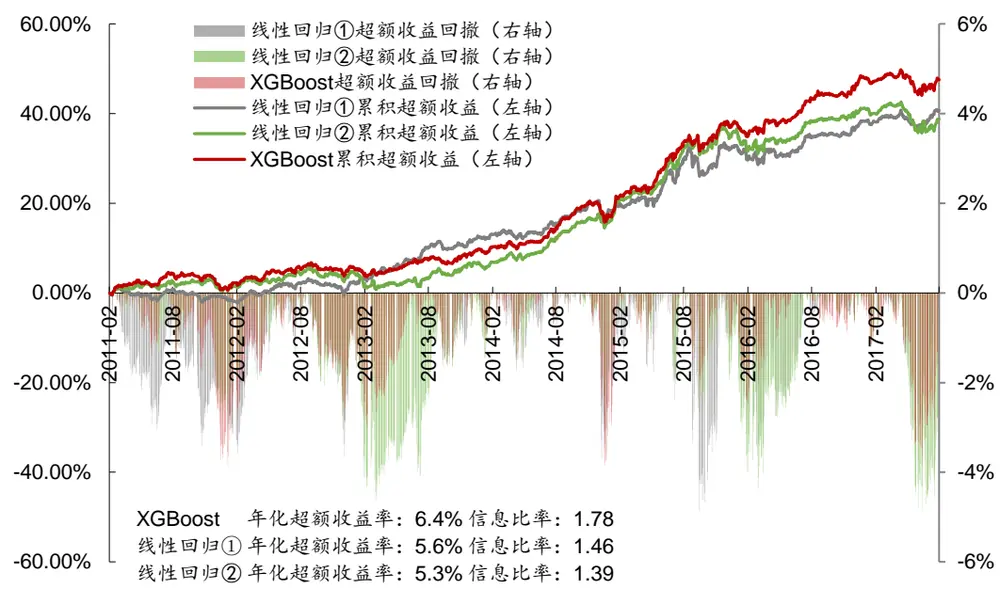
资料来源：Wind，华泰证券研究所

图表40： XGBoost分类模型和线性回归模型中证 500成份股内行业中性选股策略表现（每个行业选 6只个股）
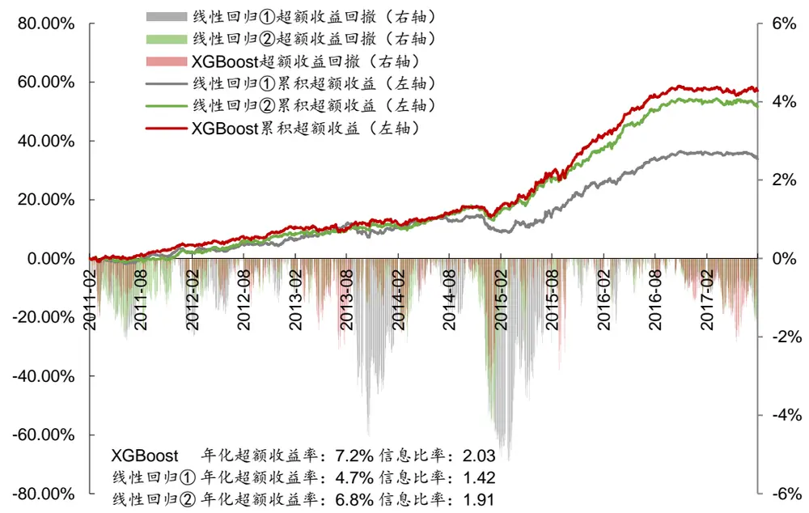
资料来源：Wind，华泰证券研究所

图表41： XGBoost分类模型和线性回归模型全A行业中性选股策略表现（每个行业选6只个股，基准中证500）
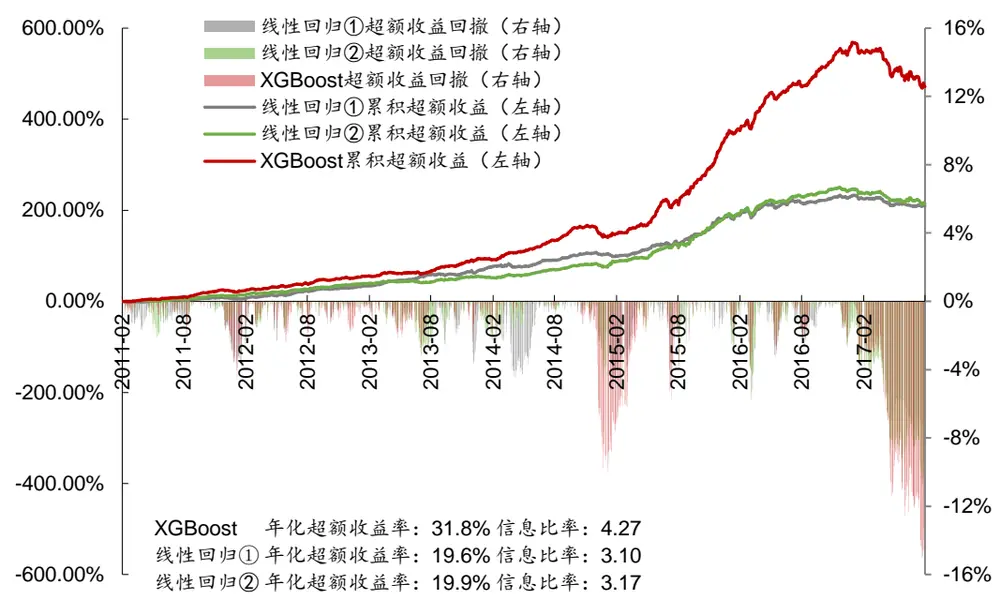
资料来源：Wind，华泰证券研究所

## 总结和展望

以上我们对包括 Adaboost、GBDT 以及 XGBoost 在内的三种 Boosting 集成学习模型进行了系统的测试，并且利用三种方法构建沪深 300、中证 500 和全 A选股策略，初步得到以下几个结论：

一、Boosting 分类模型具备不错的预测能力。我们在 2011-01-31 至 2017-07-31 的回测区间中分 7 个阶段训练并测试模型，Adaboost、GBDT 以及 XGBoost 三种模型样本外平均 AUC 分别为 0.5695，0.5699，0.5696，样本外平均正确率分别为 53.94%，54.12%，54.02%。

二、Boosting 集成学习模型的参数较多，普遍有 5~10个，但在实际调参中，能显著提高模型预测能力的参数很少（1~3 个），其他参数使用默认值即可。这是因为 Boosting 集成学习模型已经对多个深度很浅（深度为 3）的决策树进行了集成，模型的偏差和方差都得到了兼顾，所以再调整其他参数收效不大。

三、我们分别以沪深 300、中证 500 和全 A股为股票池，利用 Boosting 学习模型构建选股策略。对于沪深 300 成份股内选股的行业中性策略，Boosting 分类模型的超额收益在2.4%~8.1%之间，信息比率在 0.82~1.74 之间，超额收益、信息比率、Calmar优于线性回归模型。对于中证 500 成份股内选股的行业中性策略，Boosting 分类模型的超额收益在3.32%~8.99%之间，信息比率在 1.07~2.11之间，相比线性回归模型优势不大。对于全 A选股的行业中性策略，Boosting 分类模型相对于中证 500 的超额收益在 24.1%~35.3%之间，超额收益最大回撤在 14.4%~18.8%之间，信息比率在 3.91~4.44 之间，除了最大回撤，表现优于线性回归。总的来看，Boosting 分类模型（XGBoost 分类、GBDT 分类、AdaBoost 分类）在年化超额收益率、信息比率和 Calmar 比率上优于线性回归算法，但是最大回撤普遍大于线性回归算法。说明 Boosting 分类模型是一种高收益、回撤较大的选股模型，但能够提升投资组合的信比率和 Calmar 比率。而 XGBoost 分类、GBDT 分类、AdaBoost 分类、随机森林分类之间相比并没有太大差别，但是 XGBoost 分类相比与另外三种分类模型在训练速度上有优势。

四、文中 Boosting 分类模型总体表现略优于线性回归，但是最大回撤普遍大于线性回归，我们认为这主要是两类模型在对待特征的处理方式上有区别所导致。本文的 Boosting 分类模型使用的弱学习器都是决策树，决策树是针对一个一个特征进行处理，而线性模型是所有特征给予权重相加得到一个新的值。决策树可以根据各个特征的信息增益进行有先后的分裂，具有一定的特征筛选功能；而且在 Boosting 模型的框架下，信息增益较大的特征很可能会在多个决策树中都被使用。综合以上两点，样本内表现优秀的特征会得到更大的重视，而由于决策树深度的限制，另一些表现一般的特征在模型中所起的作用会非常有限。所以在市场风格变化较小的时候，Boosting 分类模型能充分利用有效特征，带来更高的收益。但是一旦市场风格巨变，之前的有效特征失效，Boosting 分类模型会呈现出较大回撤。

五、本系列的第三篇报告（人工智能选股之支持向量机模型）使用了固定样本内和样本外数据集的回测方法。这种方法以 2005-01-31 至 2010-12-31 的数据作为样本内数据，以2011-01-31 至 2017-04-28 的数据作为样本外数据。样本内数据离当前时间过于久远，可能已经无法准确描述当前市场的特征。所以在这篇报告里，我们尝试了分 7 段回测的方法（见图表 11），该回测方法由于使用了更新的数据训练模型，使得策略的表现更加优秀。

六、本文的测试还表明，在达到相近预测能力和回测绩效时，Boosting 模型比 Bagging模型（随机森林）要简单。本文的 Boosting 模型中，每个决策树的深度都为 3，决策树总数为 100。而 Bagging 模型中每个决策树的深度普遍在 20 以上，决策树总数有数百个，模型的复杂程度远大于 Boosting 模型。

通过以上的测试和讨论，我们初步理解了 Boosting 集成学习模型应用于多因子选股的一些规律。接下来我们的人工智能系列研究将继续探讨神经网络、深度学习等方法在多因子选股上的表现，敬请期待。

## 附录

## CART 决策树

目前主流的决策树算法包括 C4.5 和 CART：C4.5每个节点可分裂成多个子节点，不支持特征的组合，只能用于分类问题；CART 每个节点只分裂成两个子节点，支持特征的组合，可用于分类和回归问题。而在随机森林中，通常采用 CART 算法来选择划分属性，并使用“基尼指数”（Gini Index）来定义信息增益程度。分类问题中，假设有 K个类，样本集 D中的点属于第 k 类的概率为 $P_{k}$ ，则其 Gini指数为

$$
\begin{array}{r}{\mathrm{Gini}(\mathrm{D})=\sum_{k=1}^{K}P_{k}(1-P_{k})=1-\sum_{k=1}^{K}P_{k}^{2}}\end{array}
$$

Gini(D)反映了从数据集 D中随机抽取两个样本，其类别标记不一致的概率，Gini(D)越小，数据集 D的纯度越高。二分类问题中，若对于给定的样本集合 D（|D|表示集合元素个数），根据特征 A分裂为 $D_{1}$ 和 $D_{2}$ 两不相交部分，则分裂后的

$$
\begin{array}{r}{\mathrm{Gini}(\mathrm{D},\mathrm{A})=\frac{|\mathrm{D}_{1}|}{|\mathrm{D}|}\mathrm{Gini}(\mathrm{D}_{1})+\frac{|\mathrm{D}_{2}|}{|\mathrm{D}|}\mathrm{Gini}(\mathrm{D}_{2})}\end{array}
$$

从根节点开始，递归地在每个结点分裂时选取Gini(D,A)最小的特征 A为划分属性，将训练集依特征分配到两个子结点中去。照此逐层划分，直至结点中样本个数小于预定阈值，或样本集的 Gini指数小于预定阈值，抑或没有更多特征，即生成了一棵可进行分类预测的决策树。下面我们试举一例说明。

假如我们希望根据当前市场股票的市值风格（大、中或小）和板块风格（消费、周期或成长）预测涨跌情况，模拟数据如图表 42。直观地看，大市值股票全部属于“涨”类别，中小市值股票绝大多数属于“跌”类别。似乎以“是否为大市值”为规则进行首次分裂比较好。那么决策树将如何学习这一步呢？

图表42： 根据市值和板块风格预测涨跌的模拟数据

| 市值风格 | 板块风格 | 涨跌情况 |
| --- | --- | --- |
| 大 | 消费 | 涨 |
| 大 | 周期 | 涨 |
|  | 消费 | 涨 |
| 中中 | 周期 | 跌 |
| 中 | 成长 | 跌 |
| 小 | 消费 | 跌 |
| 小 | 周期 | 跌 |
| 小 | 成长 | 跌 |

资料来源：华泰证券研究所

前面提到，节点分裂的原则是使得分裂后的信息增益最大，即挑选 $\mathrm{Gini}(D,\mathrm{A})$ 最小的特征 A为划分属性。第一步分裂前，全部 8 个样本中有 3个属于“涨”类别，概率为 $P\big(\omega\ddot{\mathfrak{H}}\ddot{\mathbb{K}}\big)=3/8$ ；5 个属于“跌”类别，概率为 $P\big(\omega^{\mathrm{g}}\big\vert^{2}\big)=5/8$ 。因此分裂前的 Gini 指数为：

$$
\mathrm{Gini(D)}=1-\left({\frac{3}{8}}\right)^{2}-\left({\frac{5}{8}}\right)^{2}=0.4688
$$

如果我们以“是否为大市值”作为规则将全样本分裂成两个子节点，在 2 个大市值样本中属于“涨”类别的概率为 $P\big(\omega\mathfrak{W}\mathbb{K}\big)=0$ ，属于“跌”类别的概率为 $P(\omega^{*\sharp})=1$ ，该子节点的Gini 指数为

$$
{\mathrm{Gini}}\left({\mathrm{D}}_{\star\ \ddag\vert\ddag}\right)=1-0^{2}-1^{2}=0
$$

类似地，中小市值子节点的 Gini指数为：

$$
\mathrm{Gini}\left(\mathrm{D}_{\Phi\cdot\downarrow\cdot\vec{\eta}\cdot\langle\dot{\bf{k}}\rangle}\right)=1-\left(\frac{1}{6}\right)^{2}-\left(\frac{5}{6}\right)^{2}=0.2778
$$

上述分裂过程中，分裂到大市值的概率为 $P\left(\omega\mathbf{\cdot}\tilde{\pi}\mathbf{\Gamma}\mathbf{/}\mathbf{\ !}\mathbf{\cdot}\mathbf{\bar{\mathbf{k}}}\right)=2/8$ ，分裂到中小市值的概率为$P(\omega$ 中小市值) $r=6/8$ 。因此Gini(D, 市值)为：

$$
\begin{array}{l}{{\mathrm{Gini}\displaystyle\left(\mathrm{D},\gtrsim\vec{\tau}\vec{\tau}\mathrm{\rlap/{/}}\vec{\mathbb{E}}\right)=\frac{\left|\mathrm{D}_{\star\vec{\tau}\vec{\eta}\mathrm{\rlap/{/}}}\right|}{\left|\mathrm{D}\right|}\mathrm{Gini}\left(\mathrm{D}_{\star\vec{\eta}\mathrm{\rlap/{/}}\vec{\mathbb{E}}}\right)+\frac{\left|\mathrm{D}_{\Psi\mathrm{\rlap/{/}},\downarrow\vec{\tau}\mathrm{\rlap/{/}}}\right|}{\left|\mathrm{D}\right|}\mathrm{Gini}\left(\mathrm{D}_{\Psi\mathrm{\rlap/{/}},\downarrow\vec{\tau}\mathrm{\rlap/{/}}\vec{\mathbb{E}}}\right)}}\\{{=\frac{2}{8}\times\ 0+\frac{6}{8}\times0.2778=0.2083}}\end{array}
$$

如果换成“是否为小市值”或“是否为消费类”作为分裂规则，计算出 Gini指数为：

$$
\operatorname{Gini}\left(\mathrm{D},\mathrm{*}\mathrm{l}\mathrm{*}\operatorname{\dot{\pi}}/\dddot{\mathrm{\textmu}}\right)=\frac{3}{8}\times0-\frac{5}{8}\times0.48=0.3
$$

$$
\mathrm{Gini}\big(\mathrm{D},\mathrm{\dot{\ y}_{\mathrm{~\scriptsize~1}}^{\ddagger}}\mathrm{\Pi}_{\mathfrak{M}}^{\ddagger}\big)=\frac{3}{8}\times0.4444+\frac{5}{8}\times0.48=0.3667
$$

事实上，在所有可能的分裂规则中，“是否为大市值”的 Gini 指数最小。我们据此进行首次分裂，如图表 43 所示。接下来依照相同办法，继续对子节点进行分裂，直到每个样本都归入终端的叶子节点，如图表 44所示，最终完成整棵决策树的学习。

图表43： 以“是否为大市值”为规则对决策树作首次分裂
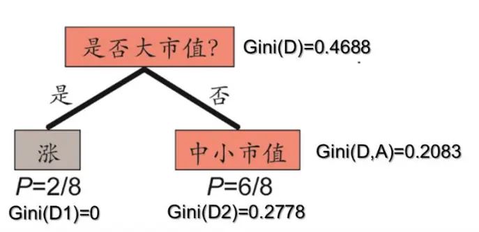
资料来源：华泰证券研究所

图表44： 第二次和第三次分裂完成决策树学习
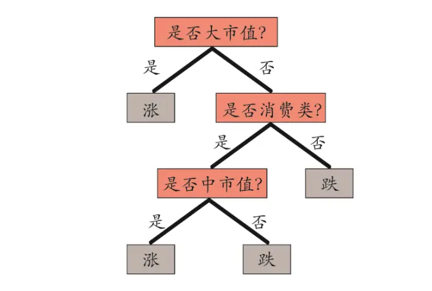
资料来源：华泰证券研究所

## 特征重要性评分

在具体的决策树模型构建中，我们将当期股票的各个因子作为输入特征，按照股票下月收益情况分为不同类别，以此进行模型训练。对于决策树这一非线性分类器，我们依然可以通过特征划分过程来计算评估各个因子特征的重要性，这与传统线性回归模型中的因子权重相仿。

特征影响力的计算需要借助于结点分裂时 Gini指数，方法如下：

$$
\begin{array}{l}{{I_{i}(A)=\mathrm{Gini}(D_{i})-\mathrm{Gini}(D_{i},A)}}\\{{S(A)=\displaystyle\sum_{i}I_{i}(A)}}\end{array}
$$

其中， $I_{i}(A)$ 表示结点 i根据特征 A 分裂为两个子结点后，Gini指数相对于母结点分裂前的下降值。故而可定义特征 A 的绝对重要性S(A)为所有按特征 A 分裂的结点处的Ii(A)之和。将所有特征的绝对重要性标准化，即可得到各个特征的重要性评分，易知所有特征重要性评分和为 1。

如上，我们逐层地根据特征对训练集进行划分，这样便形成了一个分类准则，即决策树算法的本质所在。相较于其他机器学习算法，决策树的优势主要包括：1.训练速度快；2.可以处理非数值类的特征，如不同板块风格股票涨跌分类问题；3.可以实现非线性分类，如图表 45 的异或问题(横纵坐标 x、y 相同则分类为 1，不同则分类为 0)，该问题在逻辑回归、线性核的支持向量机下无解，但是使用决策树可以轻松解决。但同时，决策树的缺陷在于不稳定，对训练样本非常敏感，并且很容易过拟合。

图表45： 决策树解决非线性分类中的异或问题
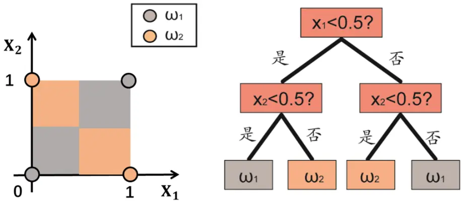
资料来源：华泰证券研究所

## 风险提示

通过 Boosting 模型构建选股策略是历史经验的总结，存在失效的可能。

## 免责申明

本报告仅供华泰证券股份有限公司（以下简称“本公司”）客户使用。本公司不因接收人收到本报告而视其为客户。

本报告基于本公司认为可靠的、已公开的信息编制，但本公司对该等信息的准确性及完整性不作任何保证。本报告所载的意见、评估及预测仅反映报告发布当日的观点和判断。在不同时期，本公司可能会发出与本报告所载意见、评估及预测不一致的研究报告。同时，本报告所指的证券或投资标的的价格、价值及投资收入可能会波动。本公司不保证本报告所含信息保持在最新状态。本公司对本报告所含信息可在不发出通知的情形下做出修改，投资者应当自行关注相应的更新或修改。

本公司力求报告内容客观、公正，但本报告所载的观点、结论和建议仅供参考，不构成所述证券的买卖出价或征价。该等观点、建议并未考虑到个别投资者的具体投资目的、财务状况以及特定需求，在任何时候均不构成对客户私人投资建议。投资者应当充分考虑自身特定状况，并完整理解和使用本报告内容，不应视本报告为做出投资决策的唯一因素。对依据或者使用本报告所造成的一切后果，本公司及作者均不承担任何法律责任。任何形式的分享证券投资收益或者分担证券投资损失的书面或口头承诺均为无效。

本公司及作者在自身所知情的范围内，与本报告所指的证券或投资标的不存在法律禁止的利害关系。在法律许可的情况下，本公司及其所属关联机构可能会持有报告中提到的公司所发行的证券头寸并进行交易，也可能为之提供或者争取提供投资银行、财务顾问或者金融产品等相关服务。本公司的资产管理部门、自营部门以及其他投资业务部门可能独立做出与本报告中的意见或建议不一致的投资决策。

本报告版权仅为本公司所有。未经本公司书面许可，任何机构或个人不得以翻版、复制、发表、引用或再次分发他人等任何形式侵犯本公司版权。如征得本公司同意进行引用、刊发的，需在允许的范围内使用，并注明出处为“华泰证券研究所”，且不得对本报告进行任何有悖原意的引用、删节和修改。本公司保留追究相关责任的权力。所有本报告中使用的商标、服务标记及标记均为本公司的商标、服务标记及标记。

本公司具有中国证监会核准的“证券投资咨询”业务资格，经营许可证编号为：Z23032000。全资子公司华泰金融控股（香港）有限公司具有香港证监会核准的“就证券提供意见”业务资格，经营许可证编号为：AOK809
©版权所有 2017 年华泰证券股份有限公司

## 评级说明

## 行业评级体系

－报告发布日后的6个月内的行业涨跌幅相对同期的沪深300指数的涨跌幅为基准；

－投资建议的评级标准

增持行业股票指数超越基准

中性行业股票指数基本与基准持平

减持行业股票指数明显弱于基准

## 公司评级体系

－报告发布日后的6个月内的公司涨跌幅相对同期的沪深300指数的涨跌幅为基准；
－投资建议的评级标准
买入股价超越基准 20%以上
增持股价超越基准 5%-20%
中性股价相对基准波动在-5%~5%之间
减持股价弱于基准 5%-20%
卖出股价弱于基准 20%以上

## 华泰证券研究

## 南京

南京市建邺区江东中路228号华泰证券广场1号楼/邮政编码：210019

电话：86 25 83389999 /传真：86 25 83387521电子邮件：ht-rd@htsc.com

## 深圳

深圳市福田区深南大道4011号香港中旅大厦24层/邮政编码：518048

电话：86 755 82493932 /传真：86 755 82492062

电子邮件：ht-rd@htsc.com

## 北京

北京市西城区太平桥大街丰盛胡同28号太平洋保险大厦A座18层

邮政编码：100032

电话：86 10 63211166/传真：86 10 63211275

电子邮件：ht-rd@htsc.com

## 上海

上海市浦东新区东方路18号保利广场E栋23楼/邮政编码：200120

电话：86 21 28972098 /传真：86 21 28972068

电子邮件：ht-rd@htsc.com