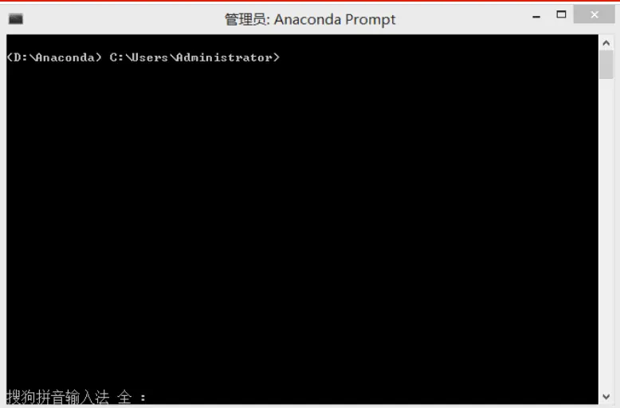
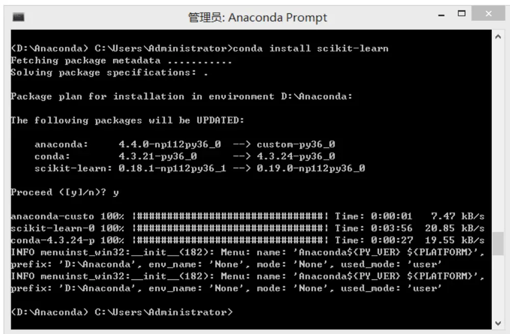
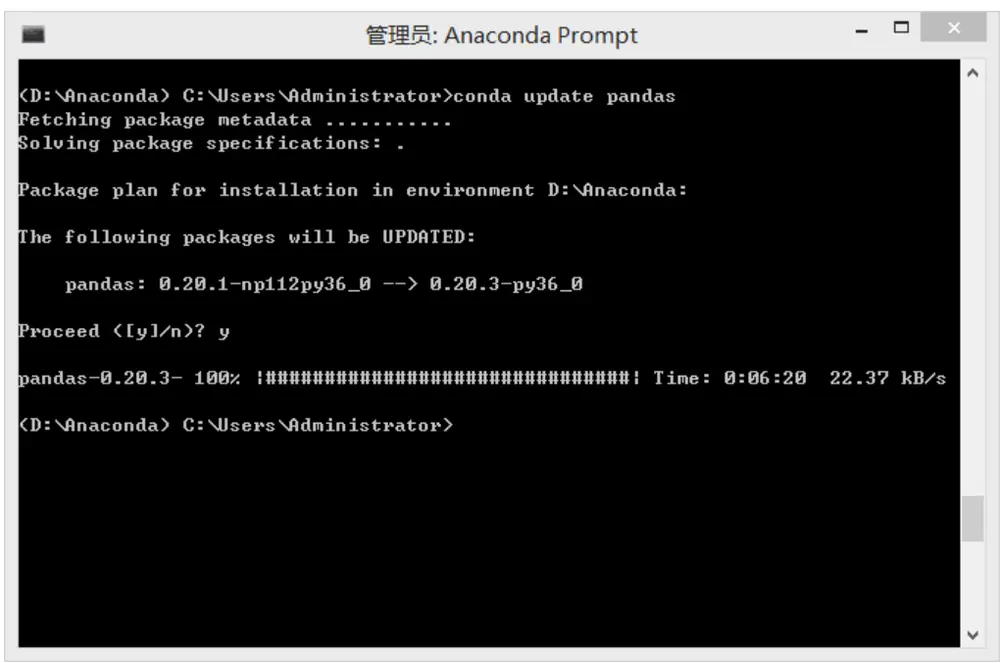
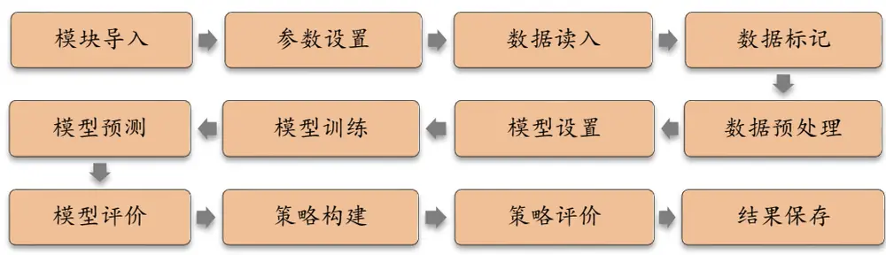
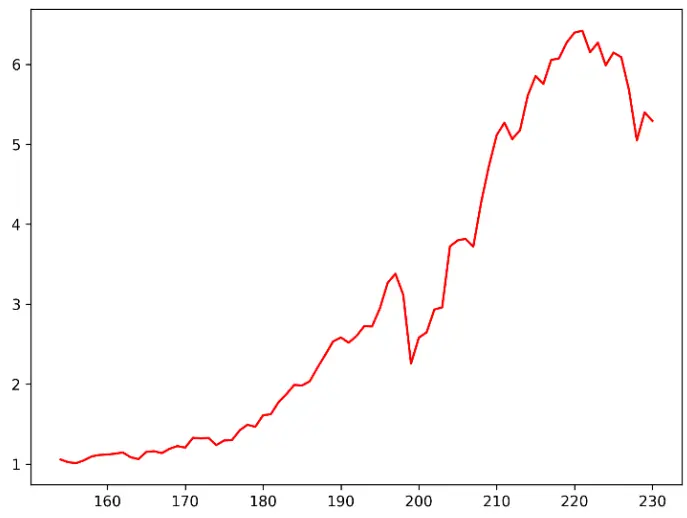
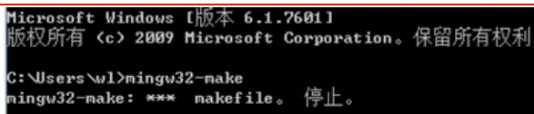
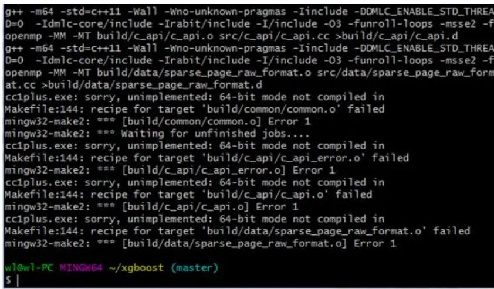
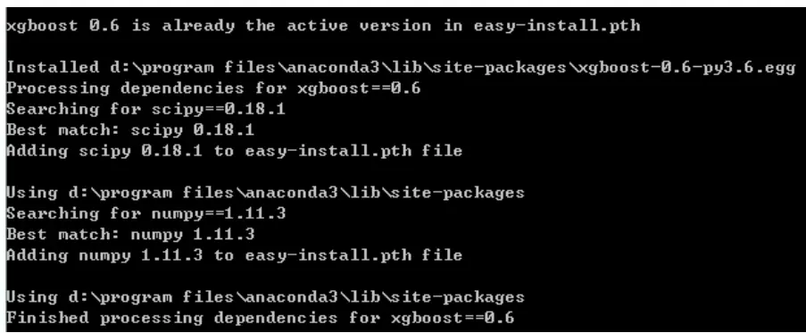
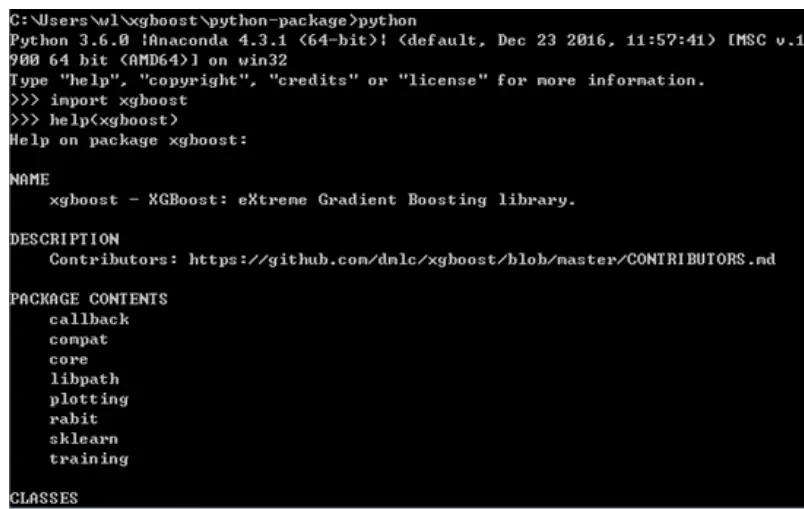

## 金工研究/深度研究

2017年09月19日

林晓明 执业证书编号：S0570516010001

研究员 0755-82080134

linxiaoming@htsc.com

陈烨 010-56793927

联系人 chenye@htsc.com

# 人工智能选股之 Python 实战

## 华泰人工智能系列之七

## 介绍 Python安装方法、与机器学习相关的包以及常用命令

Python 语言是目前机器学习领域使用最广泛的编程语言之一，拥有众多优秀的包和模块，并且相对简单易学。我们将简单介绍 Python 语言的特性，常用命令，以及和机器学习相关的包，例如 NumPy，pandas，scikit-learn等，希望帮助有一定编程基础的读者迅速上手 Python 语言。

## 机器学习选股框架与多因子选股框架类似，具有一定优越性

机器学习中最为主流的方法监督学习，其核心思想是挖掘自变量和因变量之间的规律。我们将经典多因子模型稍加改造，以机器学习的语言描述。在训练阶段，根据历史的因子值 X和收益 r，训练监督学习模型 r=g(X, f)，得到模型自由参数的估计量 f。在测试阶段：根据最新的因子值 X、参数估计量 f 和监督学习模型 g，预测下期收益 r。机器学习方法相较于线性回归的优越之处在于：首先，机器学习可以挖掘数据中的非线性规律；其次，正则化的引入能够筛选出最有效的自变量；再次，参数优化的过程能够遴选出预测力最强的模型。

## 将机器学习选股代码拆分成十二个子模块进行详尽讲解

我们将机器学习选股代码拆分成十二个子模块，包括：模块导入、参数设置、数据读入、数据标记、数据预处理、模型设置、模型训练、模型预测、模型评价、策略构建、策略评价和结果保存。每个子模块我们将展示代码并且逐句进行讲解。报告中展示的代码是完备且成体系的，可以根据需要进行整合，构建一套完整的机器学习选股模型。

风险提示：通过Python 编写人工智能选股算法受到数据库架构、网络环境、计算机硬件条件限制，报告中代码经移植后可能不能正常运行；通过人工智能算法构建选股策略是历史经验的总结，存在失效的可能。

## 本文研究导读

在华泰人工智能系列的前六篇报告中，我们首先对经典的机器学习方法进行了全面梳理，随后系统地测试了广义线性模型、支持向量机、朴素贝叶斯方法、随机森林和 Boosting模型，同时围绕机器学习模型构建选股策略。为了使更多的读者有机会接触到机器学习选股的实务化操作，本篇报告我们将对机器学习选股的完整代码进行详细讲解，希望对本领域的投资者产生有实用意义的参考价值。

## 本文主要包含以下几个环节：

1. Python 语言是目前机器学习领域使用最广泛的编程语言之一，拥有众多优秀的包和模块，并且相对简单易学。本篇报告的第一部分，我们将简单介绍 Python 语言的特性，常用命令，以及与数据分析、机器学习相关的包和模块，例如 NumPy，pandas，scikit-learn 等，希望帮助有一定编程基础的读者迅速上手 Python 语言。

2. 第二部分，我们将介绍机器学习多因子模型的问题背景，将经典的多因子模型转换成机器学习的语言进行描述。同时我们也将初探机器学习多因子模型的数据格式和程序框架，为后续的代码实现部分作铺垫。

3. 第三部分，我们将机器学习选股代码拆分成 12 个子模块，包括：模块导入、参数设置、数据读入、数据标记、数据预处理、模型设置、模型训练、模型预测、模型评价、策略构建、策略评价和结果保存。每个子模块我们将展示代码并且逐句讲解。

## Python 介绍

## Python 语言

“Life is short, you need Python.” —— Bruce Eckel

自从 1991 年诞生以来，Python 已经成为一种非常受欢迎的编程语言。与 C/C++等编译型语言不同，Python 是一门解释性语言，即 Python 程序不需要编译，在运行时才翻译成机器语言，每执行一次都需要翻译一次，因此在运算效率方面不如编译型语言。但是，Python不需要关注程序的编译和库的链接等问题，开发工作相比于编译型语言更加轻松；同时，解释型语言易于移植，适合跨平台的开发。

作为一门简单易学、适合阅读的编程语言，Python 在机器学习的实践中得到了广泛的应用，其主要有以下优点：

1. 免费，开源，有大量的社区讨论交流资料。

2. 可以专注于逻辑、算法本身，而不是纠结于如何实现某个数据结构。自身的数据结构应用简单方便，可以大大提高开发效率。

3. 包（package）、库（library）和模块（module）众多，例如 NumPy、SciPy、pandas、Matplotlib 可以很方便地进行数据处理，scikit-learn、TensorFlow、Theano、Keras都是机器学习领域流行的包。

## Anaconda 及包的安装

## 安装 Anaconda

Anaconda 是一个用于科学计算的 Python 发行版本，支持 Linux、Mac、Windows 系统，提供了包管理与环境管理的功能，可以很方便地解决多版本 Python 并存、切换以及各种第三方包安装问题，并且已经包含了 Python 和相关的配套工具。Anaconda 界面友好、使用方便、具有强大的包管理与环境管理功能，推荐本领域的研究者使用。Anaconda 的下载安装可以通过以下两个途径：

1. 官网安装：https://www.continuum.io/downloads 按照提示，下载并安装 Anaconda。

2. 清华镜像源：https://mirrors.tuna.tsinghua.edu.cn/anaconda/archive/ 在国内安装速度较快。

虽然 Anaconda 已经内嵌了很多包，但在实际运用中，我们可能会用到一些非自带的包。接下来我们学习在Windows 下如何安装和更新包：首先，Windows 用户在“开始”中打开 Anaconda 的文件夹，点击 Anaconda Prompt，得到如下图的命令行窗口。

图表1： Anaconda Prompt 命令行窗口

资料来源：华泰证券研究所

## 安装包

安装包的命令为 conda install，具体用法为在 Anaconda Prompt 中输入 conda install + 包的名字。下图展示了安装 scikit-learn 包的过程，Anaconda 将自动搜取包的源。当出现对话“Proceed<[y]/n>?”时，输入“y”，表示确认安装，等待 Anaconda 自动安装即可。

图表2： Anaconda Prompt 安装包

资料来源：华泰证券研究所

## 更新包

更新包的命令为 conda update。具体用法为在 Anaconda Prompt 中输入 conda update +包的名称。下图展示了更新 pandas 包的过程。当出现对话“Proceed<[y]/n>?”时，输入“y”，表示确认更新，等待 Anaconda 自动更新即可。

图表3： Anaconda Prompt 更新包

资料来源：华泰证券研究所

## Python 和常用包初探

## 获取帮助

授人以鱼不如授人以渔。当我们不清楚某个命令或者函数的用法时，使用 help 命令获取帮助是不错的选择，具体用法为 help('函数名')。

图表4： help 命令

| 1. In[1]: help('print') |
| --- |
| 2. Out[1]:3. Help on built-in function print in module builtins: |
| 4. |
| 5.print(...) |
| 6. print(value, .., sep=', end='\n', file=sys.stdout, flush=False) |
| 7. |
| 8. Prints the values to a stream, or to sys.stdout by default. |
| 9. Optional keyword arguments: |
| 10. file: a file-like object (stream); defaults to the current sys.stdout.11. sep: string inserted between values, default a space. |
| 12. end: string appended after the last value, default a newline. |
| 13. flush: whether to forcibly flush the stream. |

资料来源：华泰证券研究所

上面的例子中，我们使用 help 查询 print 函数的用法。Python 返回 print 的语法以及每个参数的用法。由于 Python 和包的迭代较快，很多纸质和网络教材编写时依据的 Python 版本难以保证是最新版，有的函数已被弃用或者用法发生改动，因此我们推荐有一定英语阅读能力的读者使用 help 命令获取最新版的帮助信息。

## 缩进

在介绍 Python 常用包和数据类型之前，我们首先介绍 Python 代码的缩进。Python 的一大特色就是严格的代码缩进要求，与别的语言中缩进只是为了方便代码阅读与修改不同，在 Python 中每行代码前的缩进都有语法和逻辑上的意义。这样的强制要求增加了代码的可读性，也使得代码总体较为美观。通常我们选择 4 个空格或 1个 Tab 来进行缩进，Anaconda 中的 Spyder IDE也会在写代码过程中自动进行缩进。如果要进行多行代码的集体缩进，可以选中目标代码按 Tab进行集体向右缩进，Shift+Tab 进行集体向左缩进。

## 列表

列表（list）是 Python 中的有序集合类型，列表的元素可以包括任何种类的对象：数字、字符串、或者其他的列表、DataFrame 等等。下面是常见的列表操作：

图表5： 列表的操作
#列表操作 
2. In [1]: list1 = ['Huatai"] 
3. In [2]: list1 
4. Out[2]: ['Huatai'] 
5. In [3]: list2 = [601688] 
6. In [4]: list2 
Out[4]: [601688] 
8. In [5]: list3 = list1 + list2 
9. In [6]: list3 
10. Out[6]: ['Huatai', 601688] 
11. In [7]: list3[1] 
12. Out[7]: 601688
资料来源：华泰证券研究所

上述代码中，list1 列表包含 1 个字符串'Huatai'，list2 列表包含 1 个整数 601688。我们使用简单的加法，把两个列表拼接了起来，得到包含 2 个元素的列表 list3。11-12 行是列表的索引，Python 序列的索引从 0开始，因此 list3[1] 返回的是列表中的第 2个元素。在Python 中，我们以#号开头为代码添加注释，如第 1行所示，能够大大提高代码的可读性。

## NumPy 和数组

NumPy是数据科学领域最常用的 Python 包之一，能够储存和处理大型数组，具备强大的科学计算功能。NumPy的核心是多维数组对象，即 ndarray。这种面向数组的编程方式，使得对海量数据的处理更为方便，逻辑更加清晰。

## 1. 调入 NumPy 包

## 图表6： 调入 NumPy 包

1. import numpy as np
资料来源：华泰证券研究所

在使用 NumPy 包之前，需要通过 import 命令调入 NumPy 包。以后每次使用 NumPy 包中的函数，在函数名前加上 np.即可。

## 2. 创建 ndarray 数组

np.array：输入序列型的对象，通过 array 函数，将其转换为 NumPy 数组。下面的例子中我们将列表类型的 data 通过 array 函数转换为数组类型的 arr1。

## 图表7： 创建数组

1.In[1]: data=[1,2,3,4,5]
2..…: arr1=np.array(data)
3.
4.In[2]: arr1
Out[2]: array([1, 2, 3, 4, 5])
资料来源：华泰证券研究所

np.arange：构建一个等差数列。下面的例子中，我们构建了一个从 0 开始，包含 10 个元素的等差数列。

## 图表8： 构建等差数列

1.In[3]: arr2=np.arange(10)
2.
3.In[4]: arr2
4.Out[4]: array([0, 1, 2, 3, 4, 5, 6, 7, 8, 9])
资料来源：华泰证券研究所

np.reshape：将数组重塑为另一个形状。下面的例子中，我们将 1行 10 列的数组 arr2 通过 reshape 方法转换为 2 行 5 列的数组 arr3。

## 图表9： 数组重塑

1.In[5]: arr3=np.arange(10).reshape(2,5)
2.
3.In[6]: arr3
4.Out[6]:
5.array([[0, 1, 2, 3, 4],
6.[5, 6, 7, 8, 9]])
资料来源：华泰证券研究所

另外，我们还可以通过np.zeros或者np.ones直接创建指定长度或形状的全0或1数组。

## 3. 常用函数

np.sqrt：计算数组各元素的平方根。

图表10： 计算平方根
1. In[7]: np.sqrt(arr3) 
2. Out[7]: 
array([[ 0., 1., 1.41421356, 1.73205081, 2. ], 
4. [2.23606798, 2.44948974, 2.64575131, 2.82842712, 3. ]])
资料来源：华泰证券研究所

np.mean：计算数组各元素的算术平均值。

图表11： 计算算术平均值
1. In[8]: np.mean(arr3) 
2. Out[8]: 4.5
资料来源：华泰证券研究所

np.std：计算数组各元素的标准差。

## 图表12： 计算标准差

1. In[9]: np.std(arr3)
2. Out[9]: 2.8722813232690143
资料来源：华泰证券研究所

np.dot：实现两个矩阵的乘法。下面的例子中，arr3是一个 2行 5列的矩阵，arr4是 5 行2 列的矩阵。矩阵相乘需要满足的条件是第一个矩阵的列数和第二个矩阵的行数相同。

## 图表13： 矩阵乘法

1.In[10]: arr4=np.random.randn(5,2)
2.
3.In[11]: arr4
4.Out[11]:
5.array([[-0.42154852, -0.63276184],
6.[0.05978106, 0.42118734],
7.[-0.74326443, -0.06678579],
8.[-0.26849003, -0.85970702],
9.[1.31973686, 0.65643283]])
10.
11. In[12]: np.dot(arr3,arr4)
12. Out[12]:
13. array([[ 3.04672957, 0.33422602],
14.[2.77780429,-2.07394638]])
资料来源：华泰证券研究所

np.multiply：实现两个数组各元素相乘，两个数据的形状必须相同。

## 图表14： 数组各元素相乘

1. In[13]: arr5=np.random.randn(2,5) 
In[14]: np.multiply(arr3,arr5) 
Out[14]: array([[0., 0.32007971, 0.27281812, 3.40274452, -4.02709079], 
[-4.36690548, -2.63466908, -0.29690275, -0.91943677, -11.31256683]])
资料来源：华泰证券研究所

其中 random.randn 是 NumPy包的函数，作用是生成服从标准正态分布的随机数。参数(2,5)表示生成 2行 5列的随机数组。

np.around：对数值进行四舍五入，取近似值。参数 decimal表示保留小数位数，默认保留 0 位小数，即四舍五入取整数。

## 图表15： 四舍五入取整

1. #四舍五入取整数 
2. In[15]: np.around([1.15,-4,0.27]) 
3. Out[15]: array([ 1., -4., 0.]) 
4. #四舍五入保留1位小数 
5. In[16]: np.around([1.15,-4,0.27],decimals=1) 
6. Out[16]: array([ 1.2, -4. , 0.3])

资料来源：华泰证券研究所

更多关于 NumPy 的详细操作可以参考：http://www.numpy.org/

## pandas 和 DataFrame

pandas 是 Python Data Analysis Library 的缩写，是基于 NumPy 编写的数据分析包。pandas 最大的特色是提供了 DataFrame 这一数据结构，极大地简化了以往数据分析过程中的一些繁琐操作，受到数据科学领域工作者的欢迎。

## 1. 调入 pandas 包

## 图表16： 调入 pandas 包

1. import pandas as pd
资料来源：华泰证券研究所

在使用 pandas 包之前，需要通过 import 命令调入 pandas 包。以后每次使用 pandas 包中的函数，在函数名前加上 pd.即可。

## 2. 数据的读入读出

在进行对数据的处理和分析之前，我们首先需要将数据读入内存；而在处理和分析结束后，我们往往也需要将结果写入文件之中。使用 pandas 可以很方便地帮助我们完成这项任务。

pd.read_csv('ex1.csv') ：读入 csv 文件。其中 pd 指调用 pandas 包，单引号内为将要调用的文件名。

df.to_csv('ex1.csv') ：读出 csv 文件。其中 df 为将要存储的 DataFrame 表格名，单引号内为想要存储的文件名。

pd.read_excel('foo.xlsx', 'Sheet1') ：读入 excel 文件

df.to_excel('foo.xlsx', sheet_name='Sheet1') ：读出 excel 文件。其中'Sheet1'是指读入或读出 excel文件时使用的工作表名。其余参数用法和 csv文件的读入读出类似。

## 3. Series

pandas 的常用数据结构有 Series 和 DataFrame。Series 是一种类似于一维数组的对象，由一组数据以及一组与之相关的数据标签组成。构建 Series 对象的函数：pd.Series

图表17： 构建 Series
1. In[1]: s=pd.Series([2,15,-4],index=['a','b','c']) 
In[2]: s 
3. Out[2]: 
4. a 2 
b 15 
C -4 
7. dtype: int64
资料来源：华泰证券研究所

可以看出，pd.Series 得到一组一一对应的标签与数据。可以对数据进行切片、数值运算等操作。Series 的操作相对简单，在此我们不深入讨论。

## 4. DataFrame

数据集（DataFrame）是一个表格型的数据结构，其直观的存储方式以及丰富的操作，使其成为分析海量数据时使用最多的数据结构。DataFrame 通常包含一系列有序的列，每列可以是不同的值类型。DataFrame 既有行索引，也有列索引。

pd.DataFrame：构建 DataFrame。下面的例子展示了分别构建两个 DataFrame 即 df 和df2 的过程。

图表18： 构建 DataFrame
1. In[3]: data={'A':pd.date_range('20170101',periods=5), 
2. 'B': [2,1,15,-4,27], 
3. 'C':pd.Categorical(['pass', 'pass','pass','fail','pass'])) 
4. In[4]:df=pd.DataFrame(data) 
5. In[5]: df 
6. Out[5]: 
7. A B C 
8. 0 2017-01-01 2 pass 
9. 1 2017-01-02 1 pass 
10. 2 2017-01-03 15 pass 
11. 3 2017-01-04 -4 fail 
12. 4 2017-01-05 27 pass 
13. In[6]:df2=pd.DataFrame(data,columns=['B','C','A],index=list(range(1,6))) 
14. In[7]:df2 
15. Out[7]: 
B C A 
17. 1 2 pass 2017-01-01 
18. 2 1 pass 2017-01-02 
19. 3 15 pass 2017-01-03 
20. 4 -4 fail 2017-01-04 
21. 5 27pass 2017-01-05
资料来源：华泰证券研究所

上述代码段的第 1 行定义了字典（Dictionary）类型的变量 data。字典是 Python 的常用数据类型之一，以花括号{}表示，内部包含多个条目，每个条目包含一组对应的键（key，例如第 2行的'B'）和值（value，例如第 2 行的[2,1,15,-4,27]）。更多关于字典的操作可以使用 help('dict')命令进行查询。

定义字典 data 之后，我们以 data 为基础，构建了 df 和 df2 两个 DataFrame。df 和 df2的区别在于 columns和 index。columns是对其列索引的管理，可指定列的名称；index是对行索引的管理，可指定行的名称。index 在赋值之后不可更改。我们可以在初始化DataFrame 时，赋予其行索引值，如 index=list(range(5))，默认为从 0 开始公差为 1 的等差数列，共 5 个数；如果需要设置为从 1 开始，如 In[6]，可使用 index=list(range(1,6))，即取[1,6)中的 5个正整数；当然也可以直接赋予其它值。

sort_index() 或 sort_values()：对 DataFrame 按某一列进行排序。下面的例子中，我们对 df 按 B的大小降序排列。

图表19： DataFrame 排序
#按照B的大小降序排列 
In[8]: df.sort_values(by='B',ascending=False) 
3. Out[8]: 
4. A B C 
5. 4 2017-01-05 27 pass 
6. 2 2017-01-03 15 pass 
7. 0 2017-01-01 2 pass 
8. 1 2017-01-02 1 pass 
9. 3 2017-01-04 -4 fail
资料来源：华泰证券研究所

dropna：去除 DataFrame 中的缺失值。

图表20： 去除缺失值
1. In[9]:from numpy import nan as NA 
2. In[10]:data=pd.DataFrame([[1.,-2.,3],[NA,3.,3.],[NA,NA,-2.]]) 
3. In[11]:data 
4. Out[11]: 
5. 0 1 2 
6. 0 1.0 -2.0 3.0 
7. 1 NaN 3.0 3.0 
8. 2 NaN NaN -2.0 
9. In[12]:cleaned=data.dropna() 
10. In[13]:cleaned 
11. Out[13]: 
12. 0 1 2 
13. 01.0 -2.03.0
资料来源：华泰证券研究所

loc和 iloc：对数据进行切片，选取部分内容。loc是根据 dataframe 的具体标签选取列，而 iloc 是根据标签所在的位置，从 0开始计数。其中中括号内逗号前是指选取的行序列，逗号后是指选取的列序列。

图表21： 数据切片
1. In[14]: df.loc[:,'B'] 
2. Out[14]: 
3. 0 2 
5. 2 15 
6. 3 -4 
7. 4 27 
8. Name: B, dtype: int64 
9. In[15]: df.iloc[0:2,1] 
10. Out[15]: 
11.0 2 
12.1 1 
13. Name: B, dtype: int64
资料来源：华泰证券研究所

append：连接另一个 DataFrame 对象，产生一个新的 DataFrame 对象。

图表22： DataFrame 合并

| 1. #增加一行，其余行索引为 2 的行相同2. In[16]:s=df.iloc[2] |
| --- |
| 3. In[17]:s |
| 4. Out[17]: |
| 5. A 2017-01-03 00:00:00 |
| 6. B 15 |
| 7. C pass |
| 8. Name: 2, dtype: object |
| 9. In[18]:df.append(s) |
| 10. Out[18]: |
| 11. A B C |
| 12. 0 2017-01-01 2 pass |
| 13. 1 2017-01-02 1 pass |
| 14. 2 2017-01-03 15 pass |
| 15. 3 2017-01-04 -4 fail |
| 16. 4 2017-01-05 27 pass |
| 17. 2 2017-01-03 15 pass |

资料来源：华泰证券研究所

更多详细的 pandas 使用指南可以参考：

http://pandas.pydata.org/pandas-docs/stable/10min.html

## scikit-learn

scikit-learn 简称 sklearn，是 Python 机器学习中使用最为广泛的包，用户界面友好，并且对常用的算法实现进行了高度优化。sklearn 囊括了广义线性模型、支持向量机、朴素贝叶斯、线性和二次判别分析、决策树、随机森林、神经网络、PCA、k 近邻等常见的机器学习算法，此外还提供了数据预处理、交叉验证集划分、网格搜索、分类正确率计算等众多工具。我们将在第三部分 Python 代码实战章节具体介绍 sklearn 的使用方法。sklearn的官方网站给出了更详细使用指南：http://scikit-learn.org/stable/

除了上述介绍的包以外，SciPy广泛应用于高级科学计算，Matplotlib 是 Python 常用的可
视化工具，可以方便地制作多种类型的图表。更多详细的使用指导可以参考官方网站：
https://docs.scipy.org/doc/scipy/reference/
http://matplotlib.org/users/index.html

## 多因子选股机器学习模型

## 问题描述

上一章节我们初步认识了 Python 语言的特性、安装方法和常用命令。那么，如何将 Python这一利器应用于量化投资呢？纵观量化投资的各个领域，我们发现多因子选股问题最适合转换为机器学习的框架。下面我们将多因子选股以机器学习的语言加以描述。

经典的多因子模型表达式为：

$$
\tilde{r}={\sum}_{k=1}^{K}X_{ik}*\tilde{f}_{k}+\mu_{i},
$$

$X_{jk}$ ：股票j在因子k上的因子暴露（因子载荷）

${\widetilde{f}}_{k}\colon$ ：因子k的因子收益

$\mu_{i}\colon$ 股票i的残差收益率

经典多因子模型的实质是线性回归模型。其中因子暴露 $X_{ik}$ 可以被观测到，相当于线性回归的自变量。股票收益r相当于线性回归的因变量。通过对历史上 $.X_{ik}$ 和r的拟合，可以得到回归系数 $\widetilde{f}_{k}$ ，即因子收益的估计量。根据 $\widetilde{f}_{k}$ 和最新截面期的 $X_{ik}$ 预测股票未来收益的估计量r̃。如果不考虑风险模型，那么只需围绕r̃以及约束条件，进行股票选择和权重分配。比如对r̃分行业进行排序，选择各行业排名前 N 的股票，按行业中性的原则配置权重，得到下一期的投资组合。

从以上的描述，可以发现经典多因子模型的核心在于以下两步：

1. 根据历史的自变量 $X_{ik}$ 和因变量r，拟合线性回归模型，得到回归系数 $\widetilde{f}_{k}$ 。

2. 根据最新的自变量 $X_{ik}$ 和线性回归模型，预测因变量r̃。

机器学习中最为主流的方法监督学习，其核心思想与线性回归类似，同样是挖掘自变量和因变量之间的规律。我们将经典多因子模型稍加改造，以机器学习的语言描述：

1. 训练阶段：根据历史的自变量 $X_{ik}$ 和因变量 $r$ ，训练监督学习模型 $r=g(X_{ik},f_{k})$ ，得到模型自由参数的估计量 $\widetilde{f}_{k}$ 。

2. 测试阶段：根据最新的自变量 $X_{ik}$ 和监督学习模型 $g$ ，预测因变量r̃。

从形式上看，经典的多因子模型和机器学习方法几乎完全一致。而机器学习方法相较于线性回归的优越之处在于：首先，机器学习可以挖掘数据中的非线性规律；其次，正则化的引入能够筛选出最有效的自变量；再次，参数优化的过程能够遴选出预测力最强的模型。

## 数据准备

成功的机器学习实践需要依靠强大的算法，但同样也离不开高质量的数据。我们首先将散乱的原始数据通过预处理，组织成结构化的数据。我们使用的数据为 csv格式，每个月度截面期对应一个 csv 文件。其中 1.csv 对应 1998 年 4 月 30 日截面期，232.csv 对应 2017年 7 月 31日截面期。

每个 csv文件包含该月全部股票的基本信息，下期超额收益和当期因子值三部分，如下图所示。数据包含 3411 行，74 列。其中第 1 行为列名，其余 3410 行的每一行对应一只股票。3410 为截止 2017 年 7 月 31 日在 A 股上市的所有股票的数量，包含已退市的股票。1~3 列为基本信息，其中第 1 列为月份信息，第 2列为股票代码，第 3 列为交易状态。如果该股票满足：（1）ST、PT 股（2）处于停牌期（3）上市不满 3 个月三个条件中的任一个，则该股票的交易状态为 0，不参与机器学习模型的训练和预测；否则交易状态为 1。第 4 列为因变量下期超额收益，代表股票下个月相对沪深 300 的超额收益。第 5~74 列对应 70 个因子，例如第 5 列为 EP 因子，第 6 列为 EPcut 因子，第 74 列为 bias 因子。所有因子已完成预处理，包括中位数去极值、缺失值填充、行业市值中性化和标准化。交易状态为 0的股票，其因子值全部为缺失值 NaN。

图表23： csv 数据文件展示

|  |  | B | C | D | E | F | G | H | I | J | K | M | N | 0 | P | Q |  | R |
| --- | --- | --- | --- | --- | --- | --- | --- | --- | --- | --- | --- | --- | --- | --- | --- | --- | --- | --- |
| 1 | nonth | Istock | status | return | EP | EPcut BP | SP | NCFP | OCFP | DP | G/PE | L |  | Sales_G_cProfit_G_OCF_G_q | ROE_G_q | ROE_q | ROE_ttn | RC |
| 2 |  | 231000001.S2 |  | 1 0.159109 | 0.39576 | 0.1708960.840125 |  | 1.29798 -2.72204 |  | -3.66138 | -2.3968 -0.27413 | 0.013352 | -0.0582 | -1.02106 | 0.016021 | -0.27683 | -0.21651 | 一 |
| 3 |  | 231 000002.S2 |  | 1 -0.07955 | 0.671412 | 1.093 | -0.83453 | 1.19504 | 1.47605 | 1.28831 | 1.46365 | -1.66831 -0.24218 | -1.05812 | -0.26926 | -1.00145 | -1.6952 | 0.274037 |  |
| 4 |  | 231 000003.S2 |  | 0 -0.03274 NaN |  | NaN NaN | NaN | NaN | NaN | Nal | NaN | NaN | NaN | NaN | Nal | NaN | NaN | Na |
| 5 |  | 231 000004.S2 |  | 1 -0.16203 | 30.564418 | 0.123479 | -0.84207 | -0.1155 | 0.387468 | 1.31501 | -0.49257 | 0.166685 | -0.8028 0.167295 | -3.12999 | 0.105225 | -1.21785 | 2.69923 |  |
| 6 |  | 231 000005.S2 |  | 1 -0.08978 | -0.45478 | -1.19001 | -1.04296 | -1.05252 | -0.95399 | -2.05081 | -0.81656 | 0.080592 | 1.31989 0.080887 | 0.061565 | 0.050876 | -0.97807 | 0.279816 |  |
| 7 |  | 231 000006.S2 |  | 1 -0.0339 | 2.12164 | 2.37906 | -0.14355 | -0.1998 | 1.75759 | 1.54196 | 2.3955 | 1.94644 | 2.58526 1.11317 | 0.161226 |  | 0.991634 0.548554 | 1.30692 0 |  |
| 8 |  | 231 000007.S2 |  | 0 0.061776 NaN | NaN | NaN | NaN | NaN | NaN | NaN | NaN | NaN | NaN | NaN | NaN |  |  |  |
| 9 |  | 231 000008.S2 |  | 1 0.00984 | 0.114275 | 0.121156 | -0.21668 | -0.83754 | -0.50525 | -0.81086 | -0.87587 | -0.8889 | -1.07907 -0.74952 | -2.90439 |  | NaN | NaN | Na |
| 10 |  | 231 000009.S2 |  | 1 0.110293 | -0.76783 | -1.35061 | -0.66998 | -0.02937 | -1.80524 | -0.598 | 0.211837 | -0.81258 | -1.0921 -0.96368 | 0.100704 | -0.63114 | -0.95357 | 0.015127 |  |
| 11 |  | 231 000010.S2 |  | 1 -0.07188 | -0.41659 | -0.26345 | 1.23318 | -0.69699 | -2.09269 | 2.57511 | -0.67851 | 0.094824 | -0.69126 0.095171 |  | -0.25277 | -0.98474 | -0.51891 |  |
| 12 |  | 231 000011.S2 |  | 1 -0.06764 | 1.24971 | 1.63613 | -1.28211 | -0.62934 | 0.858186 | 1.35171 | 0.456306 | 1.94619 | 2.58493 2.11645 | 0.072437 | 0.059861 | -0.88283 | -0.56799 |  |
| 13 |  | 231 000012.S2 |  | 1 0.025584 | 0.711191 | 0.898711 | 0.338309 | 0.432885 | 0.319324 | 1.67303 | -1.14741 | -1.18212 | -0.62368 -0.99607 | -0.06709 -0.15134 | 2.18657 | 3.03018 | 2.54763 |  |
| 14 |  | 231 000013.S2 |  | 0-0.03274 NaN | NaN | NaN | NaN | NaN | NaN | NaN | NaN | NaN | NaN | NaN | -0.52157 | 0.412694 | 0.135015 |  |
| 15 |  | 231 000014.S2 |  | 1 -0.04921 | -0.7977 | -0.42933 | -1.01789 | -0.47809 | -0.66598 | 2.2268 | -0.50313 | 0.134965 | 2.77015 0.135458 | 3.6827 | NaN | NaN | NaN | Na |
| 16 |  | 231 000015.S2 |  | 0 -0.03274 NaN |  | NaN NaN | NaN | NaN | NaN | Nal | NaN | NaN | NaN |  | 0.0852 | -0.54156 | -0.2813 | 一 |
| 17 |  | 231000016.S2 |  | 1 0.095971 | -1.11446 | -2.75556 | -0.35218 | 1.93378 | 0.097991 | -2.69673 | -1.49767 | 0.109995 | -0.31375 0.884416 | NaN | Nal | NaN | NaN | N |
| 18 |  | 231 000017.S2 |  | 1 -0.11703 | -0.60837 | -0.22331 | -1.65275 | -0.71959 | -0.19222 | -0.19406 | -0.63091 | -0.42217 | -0.58290.546606 | -2.56286 | 2.65095 | -1.63419 | -1.25699 | V |
| 19 |  | 231 000018.S2 |  | 1 -0.06913 | 0.262338 | 0.686497 | -1.73767 | -0.11782 | -0.94944 | -2.77005 | -1.09491 | 0.009003 | -0.12279 -0.15928 | 0.017667 -0.00963 | 0.186601 | -0.00567 |  | 2.886650 |
| 20 |  | 231 000019.S2 |  | 1 -0.07373 | -0.0549 | -1.17788 | -0.44715 | -0.86556 | 0.354818 | -0.38822 | -0.44572 | 0.054812 | -0.71541 0.055013 | 0.041872 | -0.45811 |  | 2.39 2.75468 0 |  |
| 21 |  | 231 000020.S2 |  | 0 -0.03274NaN |  | NaN | NaN | NaN NaN | NaN | Nal | NaN | NaN | NaN | NaN | 0.034602 | -1.73815 | 0.100083 | 一 |
| 22 |  | 231 000021.S2 |  | 1 -0.0602 | -0.26169 | -0.35729 0.958348 |  | 2.4628 | 0.250867 | 0.120822 | 0.146128 | -0.88717 | -1.06034 -0.90498 | 0.053538 | NaN | NaN -0.70651 | NaN -0.76946 | Na |

资料来源：Wind，华泰证券研究所

## 程序架构

在华泰人工智能系列第三篇支持向量机模型报告中，我们使用了经典的样本内外划分方式，选取 2005~2010 年截面期作为样本内数据，2011 年以后截面期作为样本外数据。整个机器学习程序分为 12 个子模块，如下图所示。

图表24： 机器学习程序架构

资料来源：华泰证券研究所

出于表述清晰的考虑，我们在本篇 Python 实战中将以围绕上述架构开发的程序为范例进行讲解。在实际应用过程中，模型的训练方式、样本内外的划分方法可能存在各种变化，例如我们第二篇报告广义线性模型采用滚动训练方式。读者可以很便捷地对原有代码进行子模块的添加和重组，以满足实际需要。

另外，从程序设计的角度，各个子模块之间应注重解耦合性，尽可能相互独立，写成函数或者类的方法的形式。本篇报告出于降低初学者信息负载，同时便于调试的考虑，未以函数或者类的形式给出。有一定 Python 经验的读者可以自行改写，降低代码的耦合度，提升代码的可扩展性和可移植性。

## Python 代码实战

下文我们将以支持向量机模型的完整 Python 代码来说明如何构建机器学习多因子选股模型。每一个子模块包含“代码实例”和“代码分析”，分析部分对代码进行逐句讲解。部分模块还包含“其余变式”，介绍其它机器学习模型的代码写法。

## 模块导入

模块导入通常位于整段代码的开头，将需要用到的包、库、模块等导入程序。

图表25： 模块导入代码实例
1. # -- import packages 
2. import numpy as np 
3. import pandas as pd
资料来源：Wind，华泰证券研究所

## # -- import packages

#符号之后为注释，本程序用注释这种方法将程序分为各模块，以及用于提示某部分代码功能。

## import numpy as np

import pandas as pd

import 为 Python 中导入包的命令，NumPy 包简写为 np，提供众多科学计算功能；pandas包简写为 pd，提供 DataFrame 数据类型，便于海量数据的分析。以后当我们需要调用两个包中的函数时，只需使用 np + 函数名或 pd + 函数名即可。

## 参数设置

本模块将所有可能用到的参数都在程序开头用类（class）的形式加以定义，类名为 Para。预定义 Para 类使得在我们在调整参数时可以直接在 Para 类中改变值，而无需在后面的程序中逐个单独改动。

图表26： 参数设置代码实例
# -- define a class including all parameters 
2. class Para: 
3. method = 'SVM' # or 'LR' 'SGD' 
4. month in sample = range(82, 153 + 1) # -- return 82~153 72 months 
5. month_test = range(154, 230 + 1) # -- return 154~230 77 months 
6. percent_select = [0.3, 0.3] # -- 30% positive samples, 30% negative samples 
7. percent_cv = 0.1 # -- 10% cross validation samples 
8. path_data = '.\lcsv_demoll' 
9. path_results = '.\results_demoll' 
10. seed = 42 # -- random seed 
svm_kernel = 'linear' # -- svm parameter 
12. svm_c = 0.01 # -- svm parameter 
13. para = Para()
资料来源：Wind，华泰证券研究所

## class Para:

class 的作用为创建一个类，可以给该类下各变量赋值。Python 是通过缩进的方法来表示定义类这一操作何时结束，在代码中可以看到 svm_c为类定义操作中的最后一行。

## method = 'SVM'

不同的机器学习模型对应的 Python 命令不尽相同。Method 参数用来确定程序使用的机器学习模型，'SVM'对应支持向量机模型。也可以设置为'LR'（线性模型）或 'SGD'（随机梯度下降模型）。

## month_in_sample = range(82, 153+1)

该参数表示样本内数据对应的月份。注意函数 range(x, y)将生成一组由 x（含）至 y（不含）的连续整数数列。如果希望包含 y，则需要写成 range(x, y+1)。在我们的多因子选股框架中，82 号月对应 2005 年 1 月底截面期，153 号月对应 2010 年 12 月底截面期，样本内数据共包含 72 个月。

## month_test = range(154, 230 + 1)

该参数表示样本外数据对应的月份。在我们的多因子选股框架中，154 号月对应 2011 年 1月底截面期，230 号月对应 2017 年 5 月底截面期，样本外数据共包含 76 个月。

## percent_select = [0.3, 0.3]

在训练 SVM 等分类器模型时，可能需要选取有代表性的数据，而非全部数据。该参数表示选取排名靠前多少比例与排名靠后多少比例的数据。本程序选用每个月超额收益排名前30%的股票作为正例，后 30%的股票作为反例。

## percent_cv = 0.1

该参数表示交叉验证集占样本内数据的比例。本程序选用样本内数据的 10%作为交互验证集，剩余 90%作为训练集。

## path_data = '.\\csv_demo\\'

该参数表示数据文件所在的路径。

## path_results = '.\\results_demo\\'

该参数表示执行程序后生成结果文件所在的路径。

## seed = 42

该参数表示随机数种子。Python 的随机数生成方式为伪随机，随机数的值并非真正随机，而是取决于随机数种子。换言之，当随机数种子固定不变时，每次生成的随机数也将固定不变。为了保证程序运行的结果可重复，我们需要提前设定随机数种子。

## svm_kernel = 'linear'

该参数表示支持向量机模型的核函数类型，linear 表示线性核。也可以设为 poly（多项式核，默认 3 次多项式），sigmoid（Sigmoid 核）或 rbf（高斯核）。

## svm_c = 0.01

该参数表示线性支持向量机的惩罚系数 C。

## para = Para()

为 Para 类创建一个实例 para。Para 类是一个抽象的概念，para 是一个具体的对象，两者的关系相当于人类和某个人。

## 数据标记

本模块定义一个函数：输入全部样本，选择超额收益最高和最低的部分样本，分别标记为1 和 0，再将未被标记的样本剔除，返回标记完成的样本。

图表27： 数据标记代码实例
# -- function: label data 
2. def label_data(data): 
3. # -- initialize 
4. data['return_bin'] = np.nan 
5. # -- sort by excess return 
6. data = data.sort_values(by='return', ascending=False) 
7. # -- decide how much stocks will be selected 
8. n_stock_select = np.multiply(para.percent_select, data.shape[0]) 
9. n_stock_select = np.around(n_stock_select).astype(int) 
10. # -- assign 1 or 0 
data.iloc[0:n_stock_select[0], -1] = 1 
12. data.iloc[-n_stock_select[1]:, -1] = 0 
13. # -- remove other stocks 
14. data = data.dropna(axis=0) 
15. return data
资料来源：Wind，华泰证券研究所

## def label_data(data):

def 的作用为定义函数，以缩进表示函数体的开始和结束位置。定义函数后，我们可以在后续程序里直接调用该函数，使得代码简洁高效。这里我们定义一个名为 label_data 的函数，输入变量为包含全部股票样本的 DataFrame，在函数体内的局部变量名为 data。

## data['return_bin'] = np.nan

向输入的 DataFrame变量 data 的最后一列添加名为 return_bin 的列，初始化赋予缺失值（nan，即 not a number 的缩写）。return_bin 列随后将记录每个样本的标签。

## data = data.sort_values(by='return', ascending=False)

使用 sort_values 方法，按照超额收益 return 对 DataFrame 进行降序排列，并将排列后的data 替代原有 data。参数 by 决定依据哪一列为标准进行排序；参数 ascending 决定是否按照升序排列，设置为 False 则代表降序排列。注意，无论按照升序还是降序排列，nan始终排在最后，并且每行的索引始终不变。

## n_stock_select = np.multiply(para.percent_select, data.shape[0])

调用参数类 para 中的 percent_select 值，即选取前后多少比例的样本参与训练。使用data.shape 方法得到 data 的维数，data 相当于二维矩阵，[0]表示选取第一个值即行数，代表 data 中的股票数量。使用 numpy 中的 multiply 函数将两者相乘，即选取前后样本比例乘以股票总数，最终得到选取前后部分样本的股票个数，并将结果赋予 n_stock_select。

## n_stock_select = np.around(n_stock_select).astype(int)

注意到 n_stock_select 是由小数和整数相乘获得，结果可能带有小数，然而股票个数必须为整数，因此需要进行取整操作。numpy 中的函数 around 默认将输入变量转换成整数。取整后虽然数值为整数，但是在存储格式上仍为浮点数，因此还需要使用 astype(int)强制转换成整数格式。最后将处理后的整数替代原结果。

## data.iloc[0:n_stock_select[0], -1] = 1

使用 iloc 进行矩阵的切分和赋值操作。注意到[]中，逗号前为所取的行，逗号后为所取的列。n_sock_select 为含有两个整数值的列表，[0]即第一个值为选取表现最好的股票数量。所以对于排序后的 data，我们取 0 到 n_stock_select[0]行，再用-1 取它们的最后一列，即我们之前创建的用于记录标签的新列，赋值为 1作为表现最好的股票的标签。

## data.iloc[-n_stock_select[1]:, -1] = 0

类似的，用 iloc 取 data 中-n_stock_select[1]:所在行的样本，注意到负号代表倒着取，而：后面不加任何变量则代表取到底。之后同样取它们的最后一列（即'return_bin'列）并赋值为 0，作为表现最差的股票的标签。

## data = data.dropna(axis=0)

使用 dropna 函数剔除含有缺失值 nan 的样本。参数 axis=0 表示如果某个元素为缺失值，则删除该元素所在的整行，axis=1 则删除该元素所在的整列。将剔除缺失值后的 data 替换原有 data。

## return data

通常位于函数体的结尾，返回完成标记的 data。执行该函数后将得到这个新 DataFrame作为输出。

## 数据读取

本模块的主体是一段 for 循环。作用为将 csv 表格中的数据按月份顺序逐个导入内存，剔除空值，并做标记取前后部分样本，再将所有月份的数据拼接形成一个大的 DataFrame，作为最终的样本内数据集。

图表28： 数据读取代码实例
# -- generate in-sample data 
2. for i_month in para.month_in_sample: 
3. # -- load csv 
4. file_name = para.path_data + str(i_month) + '.csv 
5. data_curr_month = pd.read_csv(file_name, header=0) 
6. para.n_stock = data_curr_month.shape[0] 
7. # -- remove nan 
8. data_curr_month = data_curr_month.dropna(axis=0) 
9. # -- label data 
10. data_curr_month = label_data(data_curr_month) 
# -- merge 
12. if i_month == para.month_in_sample[0]: # -- first month 
13. data_in_sample = data_curr_month 
else: 
data_in_sample = data_in_sample.append(data_curr_month)
资料来源：Wind，华泰证券研究所

for i_month in para.month_in_sample:

和大部分编程语言一样，Python 中的 for 用来开启循环操作。for 循环的主体以缩进的形

式表示。在本例中，i_month 作为循环变量，循环范围为 para 类中的 month_in_sample列表，即样本内数据集的月份编号，从 82 到 153。

```python
file_name = para.path_data + str(i_month) + '.csv'
```

使用 str 函数将迭代变量的数值转为字符类型，与扩展名'.csv'和 para 类中的 path_data 进行字符串拼接，得到需要读取的 csv文件完整路径，赋予 file_name。

## data_curr_month = pd.read_csv(file_name, header=0)

使用 pandas 中的 read_csv 函数读取 csv 文件的全部内容，赋予变量 data_curr_month。
其中参数 header=0 的意义是将 csv文件的第一行作为 DataFrame 的列名。

```toml
para.n_stock = data_curr_month.shape[0]
```

使用 DataFrame 的 shape 方法得到数据集的行数和列数，索引[0]取其第一个值行数，即股票数，将该数值赋予 para 类的变量 n_stock。

```python
data_curr_month = data_curr_month.dropna(axis=0)
```

同 前 一 部 分 所 述 ， 使 用 dropna(axis=0) 删 除 缺 失 值 nan 元 素 所 在 的 行 ， 确 保data_curr_month 不含缺失值。

## data_curr_month = label_data(data_curr_month)

调用之前定义的label_data函数。取data_curr_month矩阵中排名前后各一定比例的股票，分别标记为 1 和 0。将 label_data 函数处理后的新 DataFrame 替换原 DataFrame。

## if i_month == para.month_in_sample[0]:

```python
data_in_sample = data_curr_month
```

使用 if-else 语句进行判断，同样使用缩进的形式表示 if-else 的主体。month_in_sample[0]表示样本内集合第一个月的编号。If 命令判断当前程序是否为循环中的第一次迭代，是则新建一个变量 data_in_sample 保存已标记的 data_curr_month。

## else:

## data_in_sample = data_in_sample.append(data_curr_month)

若当前 迭代 不是循环中的第一次迭代，则将 已 标 记 的 data_curr_month 拼接在data_in_sample 后，得到新的样本内集合。

## 数据预处理

本模块将样本内集合切分成训练集和交叉验证集，并通过主成分分析进行降维以及去除因子共线性。最后得到四个数组，其中 X_train 与 y_train 为训练集的特征和标签，X_cv 与y_cv为交叉验证集的特征和标签。

## 图表29： 数据预处理代码实例

1. # -- generate training and cv sets 
2. X_in_sample = data_in_sample.loc[:, 'EP':'bias'] 
3. y in sample = data in sample.loc[:, 'return bin'] 
4. from sklearn.model_selection import train_test_split 
5. X_train, X_cv, y_train, y_cv = train_test_split(X _in_sample, y_in_sample, test_size=para 
.percent_cv, random_state=para.seed) 
6. 
7. # -- pca 
8. from sklearn import decomposition 
9. pca = decomposition.PCA(n_components=0.95) 
10. pca.fit(X_train) 
11. X_train = pca.transform(X_train) 
12. X_cv = pca.transform(X_cv)
资料来源：Wind，华泰证券研究所

X_in_sample = data_in_sample.loc[:, 'EP':'bias']

本例 SVM 模型的特征为 70 个因子，其中第一列为 EP 因子，最后一列为 bias 因子。我们使用 loc 函数切取样本内集合从 EP 列到 bias 列的数据作为特征 X。

## y_in_sample = data_in_sample.loc[:, 'return_bin']

取 DataFrame 中的 return_bin 列作为样本内集合的标签 y。

## from sklearn.model_selection import train_test_split

使用 from 导入 sklearn 包中的 train_test_split 函数，该函数将样本内集合随机切分为训练集和交叉验证集。通常的编程习惯是将模块导入语句放在整个代码的开头部分。此处为了便于读者理解，将这句命令置于执行相应功能的代码块中。

## X_train, X_cv, y_train, y_cv = train_test_split(X_in_sample, y_in_sample,

```python
test_size=para.percent_cv, random_state=para.seed)
```

使用 train_test_split 函数进行数据切分。函数的输入为样本内集合的特征 X和标签 y；调用 para 类中的 percent_cv（交叉验证集占样本内集合的比例）赋给函数下参数 test_size；调用 para类中的 seed（随机数种子）赋给参数 random_state。该函数按照我们设置的交叉验证比例随机将特征 X与标签 y切分为训练集和交叉验证集两部分。设置随机数种子的目的是我们希望每次随机切分的结果完全相同，从而保证实验结果可重复。如果无需回溯比对，也可以不设置种子值。

## from sklearn import decomposition

使用 from 从 sklearn 包中导入 decomposition 函数，该函数提供主成份分析（PCA）功能。

## pca = decomposition.PCA(n_components=0.95)

使用 decomposition.PCA 函数，将主成分分析的模型赋予模型对象 pca。参数n_components 可以取 0 到 1 之间的浮点数或者大于等于 1 的整数。当 n_components 为0 到 1 之间的浮点数时，PCA 模型取相应比例的主成分数量，例如 0.95 代表取累计方差贡献率大于等于 95%的主成分。当 n_components 为正整数时，PCA 模型取相应数目的主成分。

## pca.fit(X_train)

使用 pca.fit 对训练集的特征 X_train 拟合主成分分析模型。

```python
X_train = pca.transform(X_train)
```

```python
X_cv = pca.transform(X_cv)
```

使用上一步训练好的 pca 模型，对训练集特征 X_train 和交叉验证集特征 X_cv 进行主成份分析转换。使用函数 transform 完成该操作，并将降维后的数组替换原数组。

图表30： 回归模型的数据预处理
1. # -- for regression 
2. y_in_sample = data_in_sample.loc[:, 'return']
资料来源：Wind，华泰证券研究所

特别地，当机器学习模型为回归模型时，通常不使用分类标签作为模型的 y，而是以收益率本身作为 y，因此我们直接将样本内数据集的 return列设为 y。特征 X的取法不变。

图表31： 数据标准化代码实例
1. # -- preprocessing 
2. from sklearn import preprocessing 
3. scaler = preprocessing.StandardScaler().fit(X_train) 
4. X_train = scaler.transform(X_train) 
5. X cv = scaler.transform(X cv)
资料来源：Wind，华泰证券研究所

本例所使用的 csv文件已事先经过多项预处理，所以不需要在程序中做额外的数据预处理操作。若需要在程序内部进行数据预处理，可以使用 sklearn 包中的 preprocessing 函数。上面的代码展示了对数据进行标准化的过程，将原数据转换为均值为 0，标准差为 1 的新数据。

## 模型设置

本模块根据预设的机器学习方法和参数，调用相应包并建立模型对象 model。

图表32： SVM模型设置代码实例
1. # -- set model 
2. # -- SVM 
3. if para.method == 'SVM': 
4. from sklearn import svm 
5. model = svm.SVC(kernel=para.svm_kernel, C=para.svm_c)
资料来源：Wind，华泰证券研究所

if para.method == 'SVM':

调用 para 类中的 method。变量 method 表示使用何种机器学习方法。该语句判断是否为使用支持向量机模型。

## from sklearn import svm

若判断条件通过，进入 if 语句内部。使用 from 导入 sklearn 包中的 svm 模块。

model = svm.SVC(kernel=para.svm_kernel, C=para.svm_c)

使用 svm.SVC 函数，构建 SVM 分类器，赋予模型对象 model。参数 kernel 为核函数类型，此处我们调用 para 类中预设的核函数类型 svm_kernel；参数 C 为惩罚系数，此处我们调用 para 类中预设的惩罚系数 svm_c。

图表33： 线性回归模型设置代码实例
# -- linear regression 
2. if para.method == 'LR': 
3. from sklearn import linear_model 
4. model = linear model.LinearRegression(fit intercept=True)
资料来源：Wind，华泰证券研究所

如果我们希望使用线性回归模型，我们仍以 if 命令判断是否使用线性回归模型，随后以import 导入 linear_model 模块，并使用 linear_model.LinearRegression 构建模型赋予模型对象 model。注意到线性回归的参数设置和支持向量机不同，参数 fit_intercept 表示线性回归是否包含截距项。

图表34： SGD模型设置代码实例
1. # -- SGD + hinge 
2. if para.method == 'SGD': 
3. from sklearn import linear_model 
4. model = linear_model.SGDClassifier(loss='hinge', alpha=0.0001, penalty='I2', max_ite 
r=5, random_state=para.seed)
资料来源：Wind，华泰证券研究所

同样的，如果我们需要使用 SGD 模型，整体框架和前两者相同，只是调用的模块为linear_model.SGDClassifier。参数 loss 表示损失函数类型，这里采用 hinge 损失；alpha为正则项前的权重；penalty 为正则化方法，这里采用 L2 正则化；max_iter 为最大迭代次数； random_state 为随机数种子值，目的是使结果可重复。

## 模型训练

本模块根据训练集的特征和标签训练 SVM 模型，随后使用训练完成的模型对训练集和交叉验证集进行预测。

图表35： SVM模型训练代码实例
1. if para.method == 'SVM': 
2. model.fit(X_train,y_train) 
3. y_pred_train = model.predict(X_train) 
4. y_score_train = model.decision_function(X_train) 
5. y_pred_cv = model.predict(X_cv) 
6. y_score_cv = model.decision_function(X_cv)
资料来源：Wind，华泰证券研究所

model.fit(X_train,y_train)

用训练集的特征 X_train 和标签 y_train 训练模型对象 model。其中函数 fit 的两个参数分

别为特征和标签，训练结果保存在模型对象 model中。

```python
y_pred_train = model.predict(X_train)
y_score_train = model.decision_function(X_train)
```

用训练好的模型对象 model 在训练集 X_train 上做预测，预测结果用于模型评估。其中，函数 predict 给出的结果是二值化的整数[0,1]，表示样本对应的标签（涨或跌）；函数decision_function 给出的决策函数值是连续的浮点数，用于刻画样本点涨跌的“概率”，不同模型计算结果的意义不同。例如 SVM 的结果表示样本点到分类超平面的“距离”（可正可负，可大于 1），越正表示涨的概率越大，越负表示跌的概率越大。变量 y_pred_train是预测标签（二值），变量 y_score_train 是预测的决策函数值（连续），可理解为涨跌的概率。

```python
y_pred_cv = model.predict(X_cv)
y_score_cv = model.decision_function(X_cv)
```

用模型对象 model在交叉验证集 X_cv 上做预测，结果同第 2,3 行，预测结果常用于调参。其中，变量 y_pred_cv 和 y_score_cv 分别表示交叉验证集上的预测标签和预测的决策函数值。

图表36： 线性回归模型训练代码实例
# -- linear regression 
2. if para.method == 'LR': 
3. model.fit(X_train,y_train) 
4. y_score_train = model.predict(X_train) 
5. y_score_cv = model.predict(X_cv)
资料来源：Wind，华泰证券研究所

特别地，当我们需要使用线性回归模型时，回归模型不存在预测标签和决策函数的概念，而是直接以 model.predict 的方法给出预测值。

图表37： SGD模型训练代码实例
if para.method == 'SGD': 
2. model.fit(X_train,y_train) 
3. y_pred_train = model.predict(X_train) 
4. y_score_train = model.decision_function(X_train) 
5. y_pred_cv = model.predict(X_cv) 
6. y_score_cv = model.decision_function(X_cv)
资料来源：Wind，华泰证券研究所

使用 SGD模型时，模型训练的命令和 SVM 模型完全相同。

## 模型预测

本模块使用训练完成的模型在测试集上做预测。首先，创建三个空数据集 y_true_test、y_pred_test 和 y_score_test，分别用于存储预测集上的真实收益、预测标签和预测的决策函数值。随后对测试集中的每个月进行预测，使用 for 循环遍历测试集的每个月。

```python
y_true_test = pd.DataFrame([np.nan] * np.ones((para.n_stock,para.month_test[-1])))
y _pred_test = pd.DataFrame([np.nan] * np.ones((para.n_stock,para.month_test[-1]))
```

```python
for i_month in para.month_test:
```

```python
file_name = para.path_data + str(i_month) + '.csv'
data_curr_month = pd.read_csv(file_name, header = 0)
```

## 图表38： SVM模型预测代码实例

1. #-- initialize 
2. y_true_test = pd.DataFrame([np.nan] * np.ones((para.n_stock,para.month_test[-1]))) 
3. y _pred_test = pd.DataFrame([np.nan] * np.ones((para.n_stock,para.month_test[-1])) 
4. y _score_test = pd.DataFrame([np.nan] * np.ones((para.n_stock,para.month_test[-1]))) 
5. 
6. #-- loop for months 
7. fori month in para.month test: 
8. file_name = para.path_data + str(i_month) + '.csv 
9. data_curr_month = pd.read_csv(file_name, header = 0) 
10. data curr month = data curr month.dropna(axis=0) #-- remove nan 
11. X_curr_month = data_curr_month.loc[:,'EP':'bias] #-- generate X 
12. X_curr_month = pca.transform(X_curr_month) #-- pca 
13. 
14. #-- predict and get decision function 
15. if para.method == 'SVM': 
16. y_pred_curr_month = model.predict(X_curr_month) 
17. y_score_curr_month = model.decision_function(X_curr_month) 
18. 
19. #-- save true and predicted return 
20. y_true_test.iloc[data_curr_month.index,i_month-1] = data_curr_month['return'][data_c 
urr month.index] 
21. y_pred_test.iloc[data_curr_month.index,i_month-1]= y_pred_curr_month 
22. y_score_test.iloc[data_curr_month.index,i_month-1] = y_score_curr_month
资料来源：Wind，华泰证券研究所

三个数据集的类型均为 pandas 中的 DataFrame，数据集初始化为 nan；行数为股票的个数 para.n_stock，每一行代表一只股票的信息；列数为测试集最后一个月的月份para.month_test[-1]，每一列代表一个截面（月）。

para.month_test 为测试集的所有月份，类型为列表。i_month 为循环变量，代表当前月份。

从 csv 文件中读取当前月份 i_month 的数据，返回变量 data_curr_month 的类型为DataFrame。其中，函数 read_csv 用来读取 csv 文件，参数 file_name 表示 csv 文件的存储路径，字符串类型，使用+号运算符拼接字符串时需要把 i_month 从 int 型强制转化为 string 类型；header = 0 表示 csv 文件索引为 0 的行作为返回值的列名，此外 header还可以取 None，表示返回值没有列名。

## data_curr_month = data_curr_month.dropna(axis=0) #-- remove nan

删除数据集 data_curr_month 中含有缺失值 nan 元素所在的行，返回结果仍保存在data_curr_month 中。一般来说，删除缺失值后，data_curr_month 的行数会变少，但是每一行的索引同原来的，于是 data_curr_month.index 不为连续自然数列。

```python
X_curr_month = data_curr_month.loc[:,'EP':'bias'] #-- generate X
```

提取 70 个因子值，也即 data_curr_month 的第'EP'列到'bias'列。注意，函数 loc 是按列名获取切片，函数 iloc 是按索引获取切片。

```python
y_pred_curr_month = model.predict(X_curr_month)
y_score_curr_month = model.decision_function(X_curr_month)
```

X_curr_month = pca.transform(X_curr_month) #-- pca

对因子数据集 X_curr_month 做主成分分析，返回结果仍保存在 X_curr_month 中。一般来说，主成分分析后 X_curr_month 的列数会变少，起到降维和去除因子共线性的作用。

```python
if para.method == 'SVM':
```

para.method 用于选择不同的机器学习方法，SVM 代表支持向量机模型。

根 据 当 前 月 份 的 因 子 值 X_curr_month 做 预 测 ， 变 量 y_pred_curr_month 和y_score_curr_month 分别表示样本点的预测标签和预测的决策函数值。

```ruby
y_true_test.iloc[data_curr_month.index,i_month-1] =
data_curr_month['return'][data_curr_month.index]
```

保存真实收益。将 data_curr_month 的第'return'列（下月的超额收益率）的所有行的值存储到 y_true_test 的相应位置。变量 y_true_test 表示所有股票的真实收益，每一行代表一只股票，每一列代表一个月份。这里变量 y_true_test 的列为 i_month-1 是因为列的索引从 0 开始；行为 data_curr_month.index 是因为只保存进行预测的股票的收益率，没有进行预测的股票收益率仍取为缺失值 nan。注意到，data_curr_month 在去除缺失值 nan 后行数会变少，因此 data_curr_month.index 是 y_true_test.index 的子集。

y_pred_test.iloc[data_curr_month.index,i_month-1] = y_pred_curr_month 
y_score_test.iloc[data_curr_month.index,i_month-1] = y_score_curr_month 
将当前月份的预测标签 y_pred_curr_month 和预测的决策函数值 y_score_curr_month 保 
存到相应位置。

图表39： 线性回归模型预测代码实例
1. # -- linear regression 
2. if para.method == 'LR': 
3. y_score_curr_month = model.predict(X_curr_month)
资料来源：Wind，华泰证券研究所

和模型训练模块类似，使用线性回归模型时，直接以 model.predict 的方法给出预测值。

图表40： SGD模型预测代码实例
1. # -- SGD + hinge 
2. if para.method == 'SGD': 
3. y_pred_curr_month = model.predict(X_curr_month) 
4. y_score_curr_month = model.decision_function(X_curr_month)
资料来源：Wind，华泰证券研究所

使用 SGD模型时，预测标签和决策函数的获取命令和 SVM 模型完全相同。

## 模型评价

模型评估部分主要计算：训练集、交叉验证集和测试集（每月）的正确率和 AUC。

print('cv set, accuracy = %.2f'%metrics.accuracy_score(y_cv, y_pred_cv)) 
print('cv set, AUC = %.2f'%metrics.roc_auc_score(y_cv, y_score_cv))

## 图表41： 模型评价代码实例

1. #-- evaluate the training and cv sets 
2. from sklearn import metrics 
3. print('training set, accuracy = %.2f%metrics.accuracy_score(y_train, y_pred_train)) 
4. print('training set, AUC = %.2f%metrics.roc_auc_score(y_train, y_score_train)) 
5. print('cv set, accuracy = %.2f%metrics.accuracy_score(y_cv, y_pred_cv)) 
6. print('cv set, AUC = %.2f%metrics.roc_auc_score(y_cv, y_score_cv)) 
7. 
8. #-- evaluate the testing set by months 
9. for i_month in para.month_test: 
10. y true curr month = pd.DataFrame({'return':y true test.iloc[:,i month-1]}) 
11. y_pred_curr_month = y_pred_test.iloc[:,i_month-1] 
12. y_score_curr_month = y_score_test.iloc[:,i_month-1] 
13. 
14. #-- remove nan 
15. y_true_curr_month = y_true_curr_month.dropna(axis=0) 
16. 
17. #-- label data and select the best and worst 30% data 
18. y_curr_month = label_data(y_true_curr_month)['return_bin'] 
19. y_pred_curr_month = y_pred_curr_month[y_curr_month.index] 
20. y_score_curr_month = y_score_curr_month[y_curr_month.index] 
21. 
22. print('test set, month %d, accuracy = %.2f%(i_month, metrics.accuracy_score(y_curr 
_month, y_pred_curr_month))) 
23. print('test set, month %d, AUC = %.2f%(i month, metrics.roc auc score(y curr mont 
h, y_score_curr_month)))
资料来源：Wind，华泰证券研究所

## from sklearn import metrics

从 sklearn 包中导入 metrics 模块，该模块覆盖了分类任务中大部分常用的验证指标，比如正确率、ROC、AUC、混淆矩阵、分类精度、f1-score等。

计算训练集上的正确率和 AUC，其中，y_train 为真实标签（二值），y_pred_train 为预测标签（二值），y_score_train 为预测的决策函数值（连续），函数 accuracy_score 用以计算正确率，函数 roc_auc_score 用以计算 AUC。

计算交叉验证集上的正确率和 AUC，其中 y_cv 为真实标签（二值），y_pred_cv 为预测标签（二值），y_score_cv 为预测的决策函数值（连续）。运行上述程序片段后，将在命令行窗口显示如下的结果：

图表42： 训练集和交叉验证集模型评价结果展示
training set, accuracy = 0.57 
2. training set, AUC = 0.60 
3. cv set, accuracy = 0.55 
4. cv set, AUC = 0.59
资料来源：Wind，华泰证券研究所

for i_month in para.month_test:
循环遍历回测区间的所有月份，计算每个月的正确率和 AUC。

```python
y_true_curr_month = pd.DataFrame({'return':y_true_test.iloc[:,i_month-1]})
y_pred_curr_month = y_pred_test.iloc[:,i_month-1]
y_score_curr_month = y_score_test.iloc[:,i_month-1]
获 取 测 试 集 中 当 前 月 份 的 真 实 收 益 y_true_curr_month （ 连 续 ）、 预 测 标 签
y_pred_curr_month（二值）和预测的决策函数值 y_score_curr_month（连续），都是只
有一列的 DataFrame 类型。
```

y_true_curr_month = y_true_curr_month.dropna(axis=0)
删除当前月份真实收益 y_true_curr_month 中的缺失值 nan 所在的行，函数 dropna 已经
多次用到，不做赘述。

给真实收益 y_true_curr_month 加标签。函数 label_data(y_true_curr_month)返回一个DataFrame，两列为'return'和'return_bin'，分别表示真实收益（连续）和真实标签（二值，0,1）；此外，该函数对行也进行了处理，即先按照真实收益降序排列，然后取前后 30%的股票，这样做的好处是尽量减少噪音影响，因为中间 40%的收益很有可能在噪音的影响下变号，从而改变类别。y_curr_month 是 y_true_curr_month 的第'return_bin'列，表示真实标 签 ， 鉴 于 函 数 label_data 对 行 进 行 了 筛 选 ， 因 此 y_curr_month.index 是y_true_curr_month.index 的子集。

获取收益最好和最差的 30%股票的预测标签 y_pred_curr_month（二值）和预测的决策函数值 y_score_curr_month（连续）。其中，y_curr_month.index 是收益最好和最差的 30%股票的索引，也是当前月份所有股票索引 y_true_curr_month.index 的子集。

```matlab
print('test set, month %d, accuracy = %.2f'%(i_month,
metrics.accuracy_score(y_curr_month, y_pred_curr_month)))
print('test set, month %d, AUC = %.2f'%(i_month, metrics.roc_auc_score(y_curr_month,
y_score_curr_month)))
```

计算测试集中每个月的正确率和 AUC，分别由函数 accuracy_score 和 roc_auc_score 给出。其中 y_curr_month 为真实标签（二值），y_pred_curr_month 为预测标签（二值），y_score_curr_month 为预测的决策函数值（连续）。运行上述程序片段后，将在命令行窗口显示如下的模型评估结果：

图表43： 测试集模型评价结果展示
1. testing set, month 154, accuracy = 0.52 
2. testing set, month 154, AUC = 0.52 
3. testing set, month 155, accuracy = 0.56 
4. testing set, month 155, AUC = 0.57 
5. testing set, month 156, accuracy = 0.54 
6. testing set, month 156, AUC = 0.52 
7. 
8. testing set, month 229, accuracy = 0.53 
9. testing set, month 229, AUC = 0.53 
10. testing set, month 230, accuracy = 0.63 
11. testing set, month 230, AUC = 0.69 
12. testing set, month 231, accuracy = 0.57 
13. testing set, month 231, AUC = 0.60
资料来源：Wind，华泰证券研究所

## 策略构建

本模块围绕线性 SVM 模型的预测结果，构建了一个简单策略：选取每个月最可能涨的 100只股票，等权配置资产。随后计算该策略的收益和净值。

图表44： 策略构建代码实例
1. #-- initialize a strategy 
2. para.n_stock_select = 100 
3. strategy = pd.DataFrame({'return':[0] * para.month_test[-1],'value':[1] * para.month_test[- 
1]}) 
4. 
5. #-- loop for months 
6. for i_month in para.month_test: 
7. y_true_curr_month = y_true_test.iloc[:,i_month-1] 
8. y_score_curr_month = y_score_test.iloc[:,i_month-1] 
9. 
10. #-- sort predicted return, and choose the best 100 
11. y_score_curr_month = y_score_curr_month.sort_values(ascending=False) 
12. index_select = y_score_curr_month[0:para.n_stock_select].index 
13. 
14. #-- take the average return as the return of the portfolio 
15. strategy.loc[i_month-1,'return'] = np.mean(y_true_curr_month[index_select]) 
16. 
17. #-- compute the compound value of the strategy 
18. strategy['value'] = (strategy['return']+1).cumprod()
资料来源：Wind，华泰证券研究所

```python
para.n_stock_select = 100
strategy = pd.DataFrame({'return':[0] * para.month_test[-1],'value':[1] *
para.month_test[-1]})
```

设置选股个数为 100，初始化策略的收益和净值。变量 strategy 是 DataFrame 类型，有两列'return'和'value'，分别表示策略的每月收益和每月净值。'return'列的初始值均为 0，'value'列的初始值均为 1。

## for i_month in para.month_test:

遍历回测区间的所有月份，计算每个月的策略收益和净值。

y_true_curr_month 为当前月份的真实收益，y_score_curr_month 为当前月份的预测的决策函数值，均为只包含一列的 DataFrame 类型。其中，函数 iloc 是按索引获取切片，列为 i_month-1 是因为列的索引从 0开始。

## y_score_curr_month = y_score_curr_month.sort_values(ascending=False)

将当前月份的预测的决策函数值 y_score_curr_month 降序排列。其中，函数 sort_values为排列函数，参数 ascending 用于指定排序方式（参数 True 表示升序，False 表示降序)，参数 by用于指定按哪一列排序。注意，无论按照升序还是降序排列，nan 始终排在最后，并且每行的索引始终不变。

## index_select = y_score_curr_month[0:para.n_stock_select].index

选取上涨概率最大的前 100 只股票。上一句命令将预测的决策函数值降序排列后，越靠前的股票上涨概率越大，并且在 dropna 和 sort_values 操作后，每只股票的索引不变，故可将索引看做股票的唯一标识，用于选股。

## strategy.loc[i_month-1,'return'] = np.mean(y_true_curr_month[index_select])

策略的每月收益为当前选取的 100 只股票的收益均值。其中，np.mean 是计算均值的函数，参数为数组型变量。

## strategy['value'] = (strategy['return']+1).cumprod()

计算策略的每月净值：将当前月份之前所有月（包括当前月）的收益加 1，然后累乘。其中，strategy['return']表示按列名访问这一列，函数 cumprod 表示累乘，参数为数组型变量。

## 策略评价

本模块我们将绘制上述策略的净值曲线，并计算年化超额收益，年化超额收益波动率，信息比率等指标用以评价策略。

## 图表45： 策略评价代码实例

1. #-- plot the value 
2. import matplotlib.pyplot as plt 
3. plt.plot(para.month_test,strategy.loc[para.month_test,'value'],'r-') 
4. plt.show() 
5. 
6. #-- evaluation 
7. ann_excess_return = np.mean(strategy.loc[para.month_test,'return']) * 12 
8. ann_excess_vol = np.std(strategy.loc[para.month_test,'return']) * np.sqrt(12) 
9. info_ratio = ann_excess_return/ann_excess_vol 
10. 
11. #-- print out 
12. print('annual excess return = %.2f%ann_excess_return) 
13. print(annual excess volatility = %.2f%ann_excess_vol) 
14. print(information ratio = %.2f%info_ratio)
资料来源：Wind，华泰证券研究所

import matplotlib.pyplot as plt

导入 matplotlib 包中的 pyplot 模块，并将其简记为 plt。

plt.plot(para.month_test,strategy.loc[para.month_test,'value'],'r-')

plt.show()

利用函数 plot 画图，第一个参数 para.month_test 为横轴，表示月份；第二个参数strategy.loc[para.month_test,'value']为纵轴，表示回测区间上每个月的净值；第三个参数'r-'为曲线的颜色和线型，这里指红色的直线。最后通过函数show将绘制的图像显示出来。运行程序时，命令行窗口将显示下图所示的净值曲线。

图表46： 累积超额收益净值图

资料来源：Wind，华泰证券研究所

ann_excess_return = np.mean(strategy.loc[para.month_test,'return']) * 12计算策略的年化超额收益：所有月份收益的均值乘以 12。其中，函数 np.mean 表示计算一组数的均值。

## ann_excess_vol = np.std(strategy.loc[para.month_test,'return']) * np.sqrt(12)

计算策略的年化超额收益波动率：所有月份收益的方差乘以 12 再开根号，等价于，所有月份收益的标准差乘以根号 12。其中，函数 np.std 表示计算一组数的标准差，函数 np.sqrt表示开根号。

info_ratio = ann_excess_return/ann_excess_vol

计算策略的信息比率 IR：超额收益除以超额收益波动率。用于评估策略好坏，含义是承担单位主动风险所获得的超额收益，IR 越大则策略越好，反之越差。

print('annual excess return = %.2f'%ann_excess_return) 
print(‘annual excess volatility = %.2f'%ann_excess_vol) 
print(‘information ratio = %.2f'%info_ratio)

输出策略的评估结果。其中，函数 print 用于打印结果；'%.2f'是格式符，用于控制输出格式，这里表示保留两位小数的浮点数，此外格式符还有'%d'（整型）、'%s'（字符串）等；单引号之后的'%'是格式化操作的标志，表示用之后的变量值依次代替输出格式中格式符的位置。运行程序后在命令行窗口将显示如下的策略评价结果：

filename = para.path_results + 'dataTestYhat.csv'
建立输出文件的文件名，即 para.path_results 目录下的'dataTestYhat.csv'文件。

图表47： 策略评价结果展示
1. annual excess return = 0.28 
2. annual excess volatility = 0.23 
3. information ratio = 1.22
资料来源：Wind，华泰证券研究所

## 数据保存

本模块介绍如何保存数据，将每个月的预测值以 csv格式保存在某个路径下。

图表48： 数据保存代码实例
1. import os 
2. if not os.path.exists(para.path_results): 
3. os.makedirs(para.path_results) 
4. filename = para.path_results + 'dataTestYhat.csv 
5. y_score_test.to_csv(filename,header=0,index=False)
资料来源：Wind，华泰证券研究所

## import os

导入输出模块 os，用来完成数据输出的操作。os 模块提供了一些统一的操作系统接口函数，这些函数通常是平台指定的，os 模块能在不同操作系统平台如 nt 或 posix 中的特定函数间自动切换,从而能实现跨平台操作。os 模块包含了普遍的操作系统功能，如果你希望程序能够与平台无关的话，这个模块尤为重要。

```python
if not os.path.exists(para.path_results):
os.makedirs(para.path_results)
```

建立数据的输出目录，如果没有该目录，则新建。函数 os.path.exists 用来判断目录是否存在，函数 os.makedirs用来新建目录。如果不写这两句话，直接往一个不存在的目录下输出数据，则会报错。

## y_score_test.to_csv(filename,header=0,index=False)

将测试集上预测的决策函数值 y_score_test 保存到输出文件 filename 中，其中，header=0表示列名保存在第 0行，index=False 表示不保存索引。最终保存的 csv文件如下图所示，包含 3410 行和 232 列，每行代表 1只股票，每列代表 1 个月末截面期。每个元素代表该月末截面期对股票下月收益的预测值（SVM 模型为决策函数值）。

图表49： csv结果文件展示

|  | HF | HG | HH | HI | HJ | HK | HL HM | HN | HO | HP HQ | HR | HS | HT HU | HV |  | HW |
| --- | --- | --- | --- | --- | --- | --- | --- | --- | --- | --- | --- | --- | --- | --- | --- | --- |
|  |  |  |  |  | 0.14916 0.362393 0.639497 0.372077 0.619041 | 0.658969 | 0.37712 | -0.16125 0.144263 0.190456 0.463019 |  |  | -0.10523 0.115749 | 0.96534 0.642871 |  | 0.42546 0.199907 | 0.50006 |  |
|  |  |  |  |  |  |  | -0.2185-1.54035 | -1.45209 | -0.77019 | -0.55796 | 0.712086 0.229632 |  | 0.396779 0.452507 | 0.3671750.292903 | -0.17333 |  |
| 23 |  |  |  |  |  |  |  |  |  |  |  |  |  |  |  |  |
| 4 | 0.322823 | -0.12474 |  |  |  |  |  | -1.04526 |  | -0.1917 0.276068 0.086125 0.138833 0.810845 |  |  |  |  | -0.25562 |  |
| 5 |  | -0.17633 0.093555 0.232362 0.161589 0.141303 |  |  |  |  |  | -0.12203 0.432541 0.647907 0.685791 |  |  |  |  | 0.761365 0.498019 0.603807 0.242691 0.183649 0.045711 | -0.04689 | -0.0526 0.495811 |  |
| 6 |  |  |  |  | 0.488406 0.452187 0.457587 -0.10413 0.405263 |  |  | 0.450189 0.174527-0.44264-1.06139 |  | -0.83039-0.05582-0.51306 |  | 0.14039 0.397462 0.152601 |  | 0.201729 0.200141 0.269793 |  |  |
| 7 |  |  |  |  |  |  |  | 0.011723 -1.10988 -0.96295 |  | 0.4064820.320122 0.297607 |  |  |  |  |  |  |
| 8 |  | 0.158633 0.676883 0.356367 -0.28901 |  |  | -0.41243 | 0.262518-0.10966 0.443167 |  |  |  |  |  |  | 0.836741 0.534997 0.476482 0.761598 0.720229 0.700664 -0.03317 0.000772 0.369054 |  |  |  |
| 9 |  |  |  |  | 0.361403 0.912787 0.113989 0.114497 0.264401 | 0.1122150.288615-1.12827 |  |  |  |  |  |  | 0.213708 0.462075 0.3580170.077647 0.670618 0.263046 0.4637980.835139 0.729786-0.26992 |  |  |  |
| 10 |  | -0.86904 -0.34078 0.548345 |  |  | -0.95933 0.388858 | 0.596795 | 0.24778 0.191178 |  |  |  |  |  | -0.27255 1.157584 0.702529 0.0763741.039065 1.069858 0.888245 0.322437 |  | 0.693799 0.527364 |  |
| 11 |  | -0.479340.064299-1.41134 |  | -0.93802 | -0.08189 | -0.75321 | -0.19312 -1.63819 | -1.55398 | -1.65886 | -0.03885 -2.02429 | -0.40558 | -0.89433 | -0.88001 | -0.29652 -0.742 | -0.12453 |  |
| 12 13 |  |  |  |  | -0.46745 0.486474 0.832203 1.228066 0.861806 |  |  | 0.948252 1.000314-0.23336 1.008091 1.047966 |  | -1.02512 |  | 0.93195 0.041085 0.809578 1.196482 |  | 0.93393 | 0.902335 1.196299 |  |
| 14 |  |  | -0.913950.090971 | -1.43471 | -0.73067 |  |  |  |  |  |  |  |  |  |  |  |
| 15 | -1.51058 |  |  |  |  | -0.44735 |  | -0.92364-1.05618-1.12721 | -0.77825 | 0.342251 0.047257 | 0.444275 | -0.11223 | -0.63637 | -0.60417 -0.4483 | -0.16958 |  |
| 16 | 0.485873 | -0.79564 |  |  | 0.873777 0.201226 | 0.797607 |  |  |  |  |  |  |  |  |  |  |
| 17 | -1.62307 | -0.64845 | -0.66199 |  | -0.79232 0.599911 |  | 0.107294 0.282172 | 0.710541 | 0.27371 | -0.08803 | -0.34708 -0.01421 |  | 0.079397 0.397665 | -0.39909 0.118881 | 0.038032 |  |
| 18 |  |  | -0.76015 0.315083 -1.77361 |  | -0.53722-1.78128 | 0.264066 | -1.26892 | -0.387 -0.15389 | -0.67165 0.145205 |  |  |  | -0.75481 0.092503-0.85889 0.568079-0.68345 0.587268 |  | -0.15004 |  |
| 19 | -0.5496 |  | -0.94822-0.20142 | -1.0279 | -0.77756 |  | -0.23759 | -0.16833 0.151042 | 0.678089 | -0.93113 |  | -0.41673 0.347452 0.308909 | -0.402560.9667570.3236030.886015 |  |  |  |
| 20 |  |  | 0.429051 0.955735 | -0.22421 | 1.063999 | -1.5244 | -2.07946 | -2.06124-1.89527 | -1.32623 | -0.62896 |  |  | -0.21016 0.158858-0.72064 -0.17308-0.29874 0.177261 |  | -0.85846 |  |
| 21 |  |  |  |  | 0.460996 0.243648 1.139874 1.013139 1.457504 0.489801 | 0.026402 | 0.177664 | -0.81533 -0.39859 | -0.03774 | -1.12419 | -0.15461 | 0.2651040.287423 | -0.71285 0.198756 |  |  |  |
| 22 | 0.172311 |  |  |  | -0.19294 0.060744-0.10008 0.214973 |  | -0.49621 | 0.572888 0.788322 |  | 1.2961690.8790620.792227 |  |  | 0.2431081.000784 0.608794 0.518388 |  | 0.42725 | 0.99243 |
| 23 |  |  |  |  |  | 0.306231 | -0.17444 | -0.17885 -0.28415 | -0.10066 | -1.0643 | -0.86487 | -0.45512 -0.03963 | -0.43766-1.21695 |  | -0.96081 | -0.94377 |
| 24 |  |  |  |  |  | 0.619428 0.386809 1.166276 1.075308 |  | -0.67402 | -0.14616 0.121133 | 30.154405 0.451799 0.676477 |  |  | 1.170957 0.598831 0.688284 0.491592 |  | -0.23417 |  |
| 25 |  |  | -1.63506-0.91796-0.75333 -0.07998 |  | -0.09944 |  |  |  |  |  |  |  |  |  |  |  |
|  |  |  | 0.902844 0.125722 0.924078 1.070902 |  | 1.217096 |  | -1.07309-1.69753 1.086164 0.7986950.920519 | -0.74371 -0.61048 | 0.145601 -0.91578 0.4385990.313783 | -0.73478 | 0.303064 | 0.32128 -0.44154 0.535848 | 0.070140.019081 -0.3166 0.338749 | 0.036193 0.2723650.686315 | 0.13539-1.53118 |  |

资料来源：Wind，华泰证券研究所

## 总结

以上我们对基于 Python 语言的机器学习选股代码进行了详细介绍。软件开发者的一个共识是不要重复造轮子。我们希望上述的分享能够节省读者的研究时间，帮助读者迅速上手Python 机器学习框架。我们也欢迎感兴趣的读者以此为蓝本进行优化和改造，开发新的机器学习多因子选股策略。

## 附录

## XGBoost 安装方法

XGBoost 是重要的 Boosting 集成学习模型，在最近几年获得了长足的发展。目前scikit-learn 包并没有包含 XGBoost，需要手动安装，过程较为繁琐。我们总结了 XGBoost在Windows 系统下的详细安装方法，供读者参考。

## 安装 Git

Git 是一个分布式版本控制系统，可以对项目版本进行高效的管理。GitHub 是一个软件项目托管平台，使用 Git 可以从 GitHub 中下载或上传开源程序。我们将使用 Git 从 GitHub上获取最新版的 XGBoost。首先我们需要下载 Git for Windows，安装 Git。

下载链接：https://git-for-windows.github.io/

## 下载 XGBoost

Git 安装完成后，打开 Git Bash，在命令行中依次输入：

git clone --recursive https://github.com/dmlc/xgboost

git submodule init

git submodule update

运行完成后，将在用户文件夹中（例如 C:/Users/用户名/）生成一个 xgboost 文件夹。

## 编译

下面我们将使用 MinGW 编译 XGBoost。首先下载 mingw-w64。下载链接：https://sourceforge.net/projects/mingw-w64/files/Toolchains%20targetting%20Win64/Personal%20Builds/mingw-builds/5.3.0/threads-win32/seh/点击下载 x86_64-5.3.0-release-win32-seh-rt_v4-rev0.7z，解压放置于 C 盘根目录。

随后配置环境变量：将 C:/mingw64/bin 粘贴到 path 环境变量下。接下来在命令行运行mingw32-make 调用该命令，如下图所示：

图表50： XGBoost 编译-命令行调用

资料来源：华泰证券研究所

打开 Git Bash，进入到~/xgboost（例如 C:/Users/用户名/xgboost），随后输入：
cp make/mingw64.mk config.mk
mingw32-make -j4
编译结果如下：

图表51： XGBoost 编译结果

资料来源：华泰证券研究所

## 拷贝 xgboost.dll

将~/xgboost/lib 目录下的 xgboost.dll 文件拷贝到~/xgboost/python-package/xgboost 下。

## 安装 setup.py

在命令行中进入~/xgboost/python-package，执行命令：

python setup.py install

结果如下：

图表52： XGBoost 安装-命令行图示

资料来源：华泰证券研究所

## 查看安装结果

在命令行中进入 Python，输入：

import xgboost

help(xgboost)

可以查看 xgboost module 的信息：

图表53： XGBoost module 命令行信息

资料来源：华泰证券研究所

尝试在 Python 里导入 xgboost 包，如果程序没有报错则安装完成。如果提示找不到这个包，那么将目录：

C:/Program Files/Anaconda3/Lib/site-packages/xgboost-0.6-py3.6.egg

下的 xgboost 文件夹拷贝到目录：

C:/Program Files/Anaconda3/Lib/site-packages

下（即将 xgboost 文件夹移动到 xgboost-0.6-py3.6.egg 文件夹外部；这里我们假设C:/Program Files/Anaconda3 为 Anaconda 的安装路径），这是因为 site-packages 下的module 才是 Python 可以直接访问的目录。

## 风险提示

通过Python 编写人工智能选股算法受到数据库架构、网络环境、计算机硬件条件限制，报告中代码经移植后可能不能正常运行；通过人工智能算法构建选股策略是历史经验的总结，存在失效的可能。

## 免责申明

本报告仅供华泰证券股份有限公司（以下简称“本公司”）客户使用。本公司不因接收人收到本报告而视其为客户。

本报告基于本公司认为可靠的、已公开的信息编制，但本公司对该等信息的准确性及完整性不作任何保证。本报告所载的意见、评估及预测仅反映报告发布当日的观点和判断。在不同时期，本公司可能会发出与本报告所载意见、评估及预测不一致的研究报告。同时，本报告所指的证券或投资标的的价格、价值及投资收入可能会波动。本公司不保证本报告所含信息保持在最新状态。本公司对本报告所含信息可在不发出通知的情形下做出修改，投资者应当自行关注相应的更新或修改。

本公司力求报告内容客观、公正，但本报告所载的观点、结论和建议仅供参考，不构成所述证券的买卖出价或征价。该等观点、建议并未考虑到个别投资者的具体投资目的、财务状况以及特定需求，在任何时候均不构成对客户私人投资建议。投资者应当充分考虑自身特定状况，并完整理解和使用本报告内容，不应视本报告为做出投资决策的唯一因素。对依据或者使用本报告所造成的一切后果，本公司及作者均不承担任何法律责任。任何形式的分享证券投资收益或者分担证券投资损失的书面或口头承诺均为无效。

本公司及作者在自身所知情的范围内，与本报告所指的证券或投资标的不存在法律禁止的利害关系。在法律许可的情况下，本公司及其所属关联机构可能会持有报告中提到的公司所发行的证券头寸并进行交易，也可能为之提供或者争取提供投资银行、财务顾问或者金融产品等相关服务。本公司的资产管理部门、自营部门以及其他投资业务部门可能独立做出与本报告中的意见或建议不一致的投资决策。

本报告版权仅为本公司所有。未经本公司书面许可，任何机构或个人不得以翻版、复制、发表、引用或再次分发他人等任何形式侵犯本公司版权。如征得本公司同意进行引用、刊发的，需在允许的范围内使用，并注明出处为“华泰证券研究所”，且不得对本报告进行任何有悖原意的引用、删节和修改。本公司保留追究相关责任的权力。所有本报告中使用的商标、服务标记及标记均为本公司的商标、服务标记及标记。

本公司具有中国证监会核准的“证券投资咨询”业务资格，经营许可证编号为：Z23032000。全资子公司华泰金融控股（香港）有限公司具有香港证监会核准的“就证券提供意见”业务资格，经营许可证编号为：AOK809
©版权所有 2017 年华泰证券股份有限公司

## 评级说明

## 行业评级体系

－报告发布日后的6个月内的行业涨跌幅相对同期的沪深300指数的涨跌幅为基准；

－投资建议的评级标准

增持行业股票指数超越基准

中性行业股票指数基本与基准持平

减持行业股票指数明显弱于基准

## 公司评级体系

－报告发布日后的6个月内的公司涨跌幅相对同期的沪深300指数的涨跌幅为基准；
－投资建议的评级标准
买入股价超越基准 20%以上
增持股价超越基准 5%-20%
中性股价相对基准波动在-5%~5%之间
减持股价弱于基准 5%-20%
卖出股价弱于基准 20%以上

## 华泰证券研究

## 南京

南京市建邺区江东中路228号华泰证券广场1号楼/邮政编码：210019

电话：86 25 83389999 /传真：86 25 83387521电子邮件：ht-rd@htsc.com

## 深圳

深圳市福田区深南大道4011号香港中旅大厦24层/邮政编码：518048

电话：86 755 82493932 /传真：86 755 82492062

电子邮件：ht-rd@htsc.com

## 北京

北京市西城区太平桥大街丰盛胡同28号太平洋保险大厦A座18层

邮政编码：100032

电话：86 10 63211166/传真：86 10 63211275

电子邮件：ht-rd@htsc.com

## 上海

上海市浦东新区东方路18号保利广场E栋23楼/邮政编码：200120

电话：86 21 28972098 /传真：86 21 28972068

电子邮件：ht-rd@htsc.com