## 金工研究/深度研究

2017年11月23日

林晓明 执业证书编号：S0570516010001

研究员 0755-82080134

linxiaoming@htsc.com

陈烨 010-56793927

联系人 chenye@htsc.com

2《金工: 基于通用回归模型的行业轮动策略》2017.11

# 人工智能选股之全连接神经网络

## 华泰人工智能系列之八

## 采用全连接神经网络模型挖掘个股收益与因子之间的非线性关系

人工神经网络模型具有强大的学习能力、适应能力、计算效率，可以良好地模拟出输入空间到输出空间的非线性映射关系，在很多应用领域已经取得了令人瞩目的成果。本报告作为华泰人工智能系列第八篇，开始尝试从浅层结构学习模型迈向深度学习模型的研究，探索神经网络与多因子结合选股将擦出怎样的火花。本报告主要介绍的全连接神经网络是一种结构简单、易于理解、计算效率高的模型，我们对其原理进行了形象化的描述，同时对模型结构和参数设置进行了详细剖析，最后构建选股策略进行回测，发现全连接神经网络选股模型的年化收益和信息比率优于线性模型。

## 全连接神经网络理论部分的精髓在于前向传播和反向传播

全连接神经网络模型一般包含输入层、若干个隐藏层、输出层，每层包含数目不等的节点。前向传播是指在给定训练数据和模型参数的情况下，通过输入层的数据层层传播至输出层，与真实值对比并计算出误差的过程。如果误差不达要求，则进入反向传播过程，这个过程主要是基于梯度下降法的，目的是在给定训练数据和损失函数的前提下，修改连接各节点的边上的权值使损失函数达到最小。神经网络模型的反向传播机制可以类比于飞机的发动机，地位十分重要，是神经网络模型具有学习能力的关键。

## 全连接神经网络选股模型的构建：样本内训练与交叉验证、样本外测试

全连接神经网络模型的构建包括特征和标签提取、特征预处理、样本内训练、交叉验证和样本外测试等步骤。最终在每个月底可以产生对全部个股下期上涨概率的预测值，然后根据正确率、F1-score 等指标以及策略回测结果对模型进行评价。由于神经网络模型需要大量样本数据支持，我们主要在全 A股票池内根据模型的预测结果构建选股策略，通过年化收益率、信息比率、最大回撤等指标综合评价策略效果。

## 全连接神经网络选股模型年化超额收益和信息比率优于线性回归

在回测时段 2011-01-31 至 2017-10-31 内，全连接神经网络模型全 A 选股策略（行业中性，每个行业选股数目分别为 2,5,10,15,20）相对于基准中证 500 指数的年化超额收益在 19.15%~25.36%之间，超额收益最大回撤在 14.72%~18.65%之间，信息比率在 2.81~3.35 之间。总的来看，全连接神经网络模型在年化超额收益率、信息比率上优于线性回归模型，但是最大回撤普遍大于线性回归模型。

## 全连接神经网络选股模型测试集表现优良，理论上具有优势

本报告中，我们采用全连接神经网络选股模型对个股做“涨、平、跌”三分类预测，模型在测试集上的正确率为 42.9%、F1-score 值为 38.0%。全连接神经网络模型与一些更复杂的神经网络模型（如卷积神经网络、循环神经网络、长短记忆神经网络等）相比，其结构更加简单、容易理解、计算效率高；与传统的线性模型相比，能够引入非线性拟合因素，并且在大量股票数据的支持下可能会“学习”到股票市场更精确的运行规律，值得进行更深一步的研究。

风险提示：神经网络模型的输入数据为个股的因子特征，若市场投资环境发生转变，则因子可能会失效，通过神经网络模型构建的选股策略也随之有失效风险。

## 本文研究导读

华泰人工智能系列报告目前已经发布了七篇，在首篇报告《人工智能选股框架及经典算法简介》中，我们对主流的机器学习算法进行了分类介绍和形象化解释，接下来的第二至第六篇报告中，我们详细测试了广义线性模型、支持向量机、朴素贝叶斯、随机森林和Boosting 模型，在第七篇报告中则给出了机器学习选股的完整代码，并对一些实践细节进行详细讲解。相对于最近大火的深度学习（Deep learning）模型，以上报告实际上聚焦在人工智能领域的浅层学习（Shallow learning）模型，从本篇报告开始，我们将开始尝试进行神经网络（Neural network）的研究，一步步接近深度学习的领域。神经网络模型具有强大的学习能力、适应能力、计算效率，它可以良好地模拟出输入空间到输出空间的非线性映射关系，网络结构多种多样，例如 ART 网络、RBF 网络、小波神经网络等，应用范围各不相同。本文构建并测试了一个结构较为简单的全连接神经网络模型，并与多因子模型结合进行选股实证，主要关注如下几方面的问题：

1. 首先是模型选择的问题。全连接神经网络作为一种非线性分类器，相比于以线性分类器在分类表现上是否具有优势？优势具体体现在哪些方面？哪些方面优势不明显？

2. 其次是参数选择的问题。神经网络模型中有许多参数，网络层数、每层网络神经元的个数、激活函数、优化函数等，在与多因子结合的问题背景下，参数取值多少最为合理？应该通过什么样的指标确定最优参数？如何在较小的计算量下确定效果较好的模型参数？

3. 再次是过拟合问题。神经网络结构与算法十分复杂，中间计算过程类似于“黑箱”，难于解释其经济学含义。如何在模型设计过程中减小过拟合的概率？如何提高模型对样本外数据的预测能力？

4. 最后是组合构建的问题。在观察过全连接神经网络模型的表现之后，应如何利用模型的预测结果构建策略组合进行回测？

我们将围绕以上的问题进行系统性的测试，希望为读者提供一些扎实的证据，并寻找到相对较优的全连接神经网络模型，希望对本领域的投资者产生有实用意义的参考价值。

## 人工神经网络介绍

在华泰人工智能系列首篇报告《人工智能选股框架及经典算法简介》（2017.06）中，我们简要地介绍了神经网络的理论基础和研究思路，本文将在前文基础上更为详细地介绍人工神经网络的概念和实现方法。

神经网络仿照生物大脑的组织结构设计，其工作机理近似于大脑神经元网络的活动规律。它反映了大脑的基本特征，模拟大脑的思维模式对外界刺激进行加工和判断。可以说神经网络是利用人工的方式对生物神经网络的模拟。

人类的大脑是一个由约 860 亿个神经元构成的巨型神经网络。神经网络中最基础的单元是神经元，如图表 1所示。神经元存在兴奋和抑制两种状态。一般情况下，绝大多数神经元处于抑制状态。一旦某个神经元的树突收到上一级感受器或神经元传来的刺激，导致它的电位超过一定阈值，那么该神经元会被激活，处于兴奋状态，电信号经胞体沿轴突和末端突触，继续传递至下一级神经元的树突。如此逐级传递形成一个巨型网络。

图表1： 神经元示意图
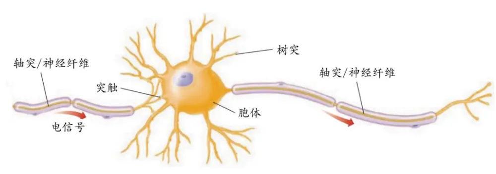
资料来源：Goldstein (2010) Sensation and Perception，华泰证券研究所

神经网络算法中的神经元正是模拟了现实世界中神经元的架构。图表 2 展示了一个简易的单层神经网络，图中红色圆圈相当于一个生物神经元的胞体，也被称为神经网络的节点。左边第一列代表输入层，在该单层神经网络中 $y=f(x_{1}^{(2)})$ 相当于输出层，其中f(∙)为激活函数，其功能在后文中有详细介绍。每一根线都相当于生物神经元中的树突或轴突，表示相邻两层的两个节点之间存在信息传递关系，每根连接线都有一定的权重（weight）。每个节点可以存储一定数据，相邻两层的节点之间可以互相传递信息。

图表2： 单层神经网络示意图
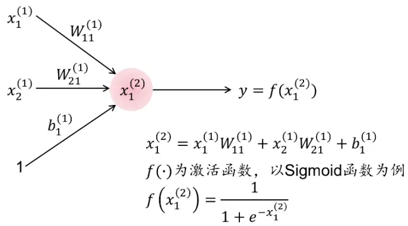
资料来源：华泰证券研究所

接下来我们考察两层节点之间是如何传递信息的。假设第 1 层（即输入层）第i个节点的数据为 $\iota x_{i}^{(1)}$ ，第 2层（即输出层）第k个节点的数据为 $x_{k}^{(2)}$ ，两个节点之间连接的权重为 $w_{ik}^{(1)}$ 数据传递的方向由第 1层传往第 2层。

我们称图表 2神经网络中的输出层为全连接层。所谓全连接，是指该层任意一个节点都和前一层所有节点相连，即后一层的神经元从前一层的所有神经元接收数据，因此第 2 层第k个节点的数据是第 1层所有节点数据的加权和，外加一个偏置量（bias） $b_{k}^{(1)}$ ，相当于线性模型中的截距项。最终第 2 层第k个节点的数据为：

$$
x_{k}^{(2)}={\sum}_{i}x_{i}^{(1)}w_{ik}^{(1)}+b_{k}^{(1)}
$$

用向量形式表示为：

$$
\begin{bmatrix}x_{1}^{(1)}&x_{2}^{(1)}&\ldots\end{bmatrix}\begin{bmatrix}w_{1k}^{(1)}\\w_{2k}^{(1)}\\\ldots\end{bmatrix}+b_{k}^{(1)}
$$

如果第 2 层包含多个节 $点x_{1}^{(2)}、x_{2}^{(2)}$ 、……，那么将第 2 层单个神经元上的运算推广到整个第 2层，就可以得到如下的向量运算：

$$
\begin{bmatrix}x_{1}^{(2)}&x_{2}^{(2)}&\ldots\end{bmatrix}=\begin{bmatrix}x_{1}^{(1)}&x_{2}^{(1)}&\ldots\end{bmatrix}\begin{bmatrix}w_{11}^{(1)}&w_{12}^{(1)}&\ldots\\w_{21}^{(1)}&w_{22}^{(1)}&\ldots\\w_{31}&w_{32}&w_{33}\end{bmatrix}+\begin{bmatrix}b_{1}^{(1)}&b_{2}^{(1)}&\ldots\end{bmatrix}
$$

以矩阵的形式表达，即：

$$
X^{(2)}=X^{(1)}W^{(1)}+B^{(1)}
$$

由上述信息传递方式可知，全连接层本质上是一个向量乘法和一个加法，数据X(1)、 $X^{(2)}$ 和$B^{(1)}$ 都是向量，权重参数 $W^{(1)}$ 可以用矩阵表示。

第 2 层第k个节点的数据 $x_{k}^{(2)}$ 并非直接输出为结果或者传递到下一层，而是需要先通过激活函数 $f(x_{k}^{(2)})$ 进行处理，最终得到输出数据 y，如图表 2所示。设置激活函数的意义在于模仿生物神经元胞体的内部运算过程。对于胞体来说，只有当输出刺激的电位超过一定阈值，神经元才会被激活，进而向下一级神经元输出信号。为了实现上述功能，激活函数通常为非线性函数。

图表3： 含有两个隐藏层的神经网络示意图
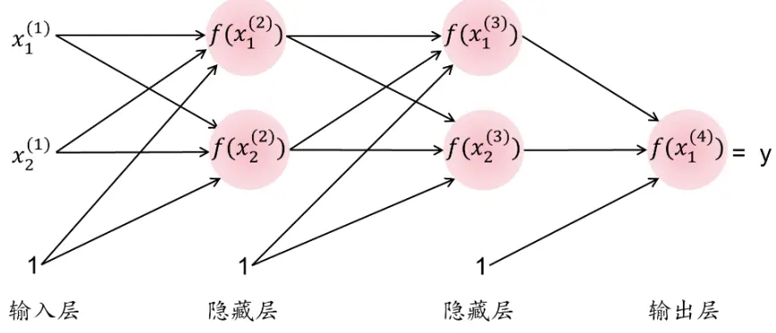
资料来源：华泰证券研究所

单个神经元的核心仍是线性模型，因此无法解决较为复杂的非线性问题。将多个神经元层层连接，就得到了含隐藏层的神经网络。神经网络的功能非常强大，多层的神经网络可以近似地拟合出任意函数。图表 3 展示了一个含有两个隐藏层，输入层和隐藏层节点数均为2，外加 1个偏置节点的神经网络。为简单起见，图表 3中所有节点的激活函数都取为f(∙)，实际上每个节点都可以单独设置不同的激活函数，常用的几种激活函数将在下个小节展开介绍。

## 激活函数

在神经网络中，激活函数的灵感来自于生物神经网络，刻画了神经元对输入信息的加工过程。激活函数通过对加权输入进行非线性组合，从而产生非线性决策边界（non-lineardecision boundary）。常用的激活函数包括 Sigmoid、tanh、ReLU、Softmax 等。其中，Sigmoid 和 tanh常用于神经网络的隐藏层，ReLU 常用于卷积神经网络的隐藏层，Sigmoid和 Softmax 常用于输出层。下面对以上四种激活函数进行简单介绍。

Sigmoid 函数的表达式如下：

$$
f(x)={\frac{1}{1+e^{-x}}}
$$

其中x代表当前节点从上一层全部节点接收到信息的加权和。当x为极小的负数时，f(x)的值趋近于 0；当x为极大的正数时，f(x)的值趋近于 1。Sigmoid 函数图像如图 4 所示。

Sigmoid 函数的功能相当于把一个实数投影至 0到 1之间。压缩至 0 到 1有什么意义呢？从生物学的角度看，神经元的发放频率存在上下限，不可能无限制地发放，而 Sigmoid 函数正是将节点的输出限制在(0,1)区间内，刻画了神经元的生物特性，因此 Sigmoid 函数常用于神经网络的隐藏层。从二分类的角度看，我们也可以把 Sigmoid 函数看作一种“分类的概率”，比如输出为 0.9 可以解释为 90%的概率为正样本，因此 Sigmoid 函数也常用于输出层。

图表4： Sigmoid函数的图形表示
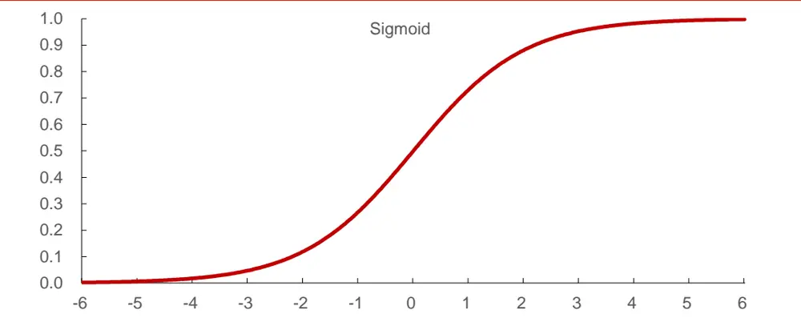
资料来源：华泰证券研究所

tanh 函数的表达式如下：

$$
f(x)={\frac{1-e^{-2x}}{1+e^{-2x}}}
$$

与 Sigmoid 函数类似，tanh 函数的功能是把一个实数投影至-1 到 1 之间，tanh 函数图像如图 5所示。输入非常大的正数时，输出结果会接近 1；而输入非常小的负数时，则会得到接近-1 的结果。和 Sigmoid 函数相比，tanh 为中心对称函数，在进行梯度下降的优化过程中具备一定优势，因此比 Sigmoid 更多地应用于神经网络的隐藏层。

图表5： tanh函数的图形表示
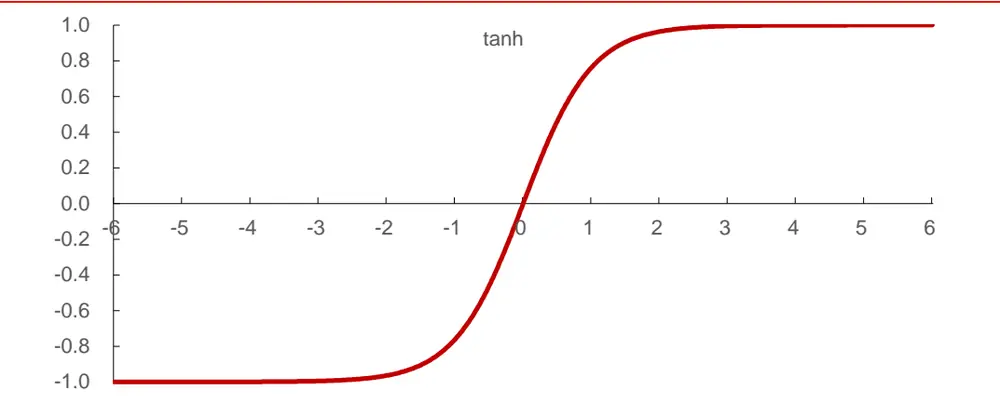
资料来源：华泰证券研究所

Softmax 函数相当于一个归一化函数，其作用是将一个 N 维实向量x“压缩”到另一个 N维实向量f(x)中，使得每一个元素的范围都在 0到 1 之间，并且所有元素的和为 1。函数表达式为：

$$
f(x)_{j}=\frac{e^{x_{j}}}{\sum_{i=1}^{N}e^{x_{i}}}
$$

Softmax函数常用于多分类问题的输出层。例如对于一个三分类问题，我们假设输出层的上一层是一个包含 3个节点的隐藏层，3个节点输出的值分别为[-0.4, 0.3, 0.5]；输出层同样包含 3个节点，每个节点的激活函数为 Softmax 函数。通过上述公式可以计算得到输出层的值分别为[0.183, 0.368, 0.449]，三个数都在 0到 1 之间，和为 1。其代表的含义为：该样本属于第一类的概率为 0.183，属于第二类的概率为 0.368，属于第三类的概率为0.449，进而将该样本归入第三类。在上面 Softmax 函数表达式中，若 N=2，实际上就退化为 Sigmoid 函数了。

当 Softmax 函数用于输出层时，如果神经网络最终期望分出的类别个数为 N，则输入到Softmax 函数中的向量x必须是 N 维的，也即上一层节点个数必须为 N。因为这一具有 N个节点的隐藏层是 Softmax输出层的必要条件，有时在提及神经网络结构时会省去它，例如本报告中我们构建了一个具有 2 个隐藏层的全连接神经网络，这 2 个隐藏层就不包括Softmax输出层前面的那层。具体网络结构详见下下小节的描述。

ReLU（Rectified Linear Unit）函数又称为修正线性单元，其函数表达式为：

$$
f(x)=\max(0,x)
$$

当节点的值x小于 0 时，激活函数的输出为 0，相当于神经元处于抑制状态。当节点的值x大于 0时，激活函数的输出等于输入值，神经元的发放强度和输入的刺激强度成正比。相较于 Sigmoid 和 tanh 函数，ReLU 函数的一个特点是稀疏激活性，它使得一部分神经元的输出为 0，从而实现网络的稀疏性，减少参数的相互依赖，避免过拟合的发生。

ReLU 函数另一个特点在于梯度特征不同。Sigmoid 和 tanh 的梯度在两端的极值区非常平缓，接近于 0，在使用梯度下降法进行最小化损失函数的过程中，很容易造成梯度耗散，从而减缓收敛速度。梯度耗散在网络层数多的时候尤为明显，是加深网络结构的主要障碍之一。相反 ReLU 的梯度大多数情况下是常数，有助于解决深层网络收敛问题，且收敛速度快。Sigmoid 和 tanh 的主要优势在于全程可导，适用于层数不多的神经网络。

图表6： ReLU函数的图形表示
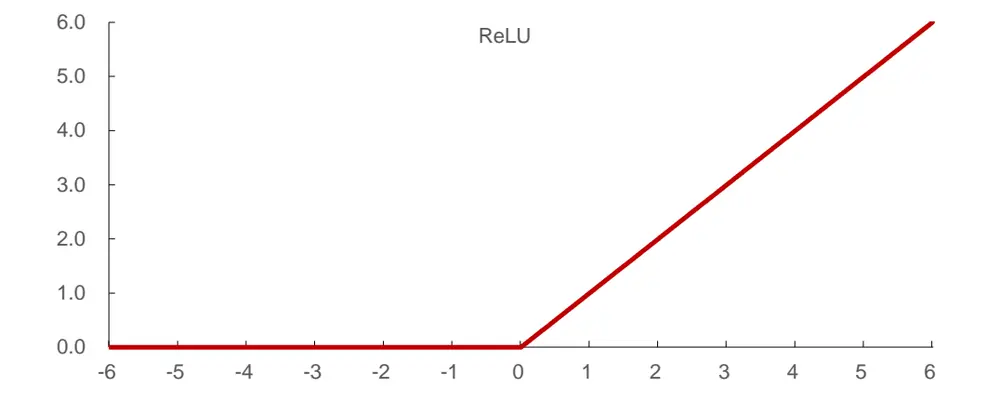
资料来源：华泰证券研究所

总结一下常用的几个激活函数及各自的特点，如下表所示。

图表7： 神经网络常用激活函数及特点

| 名称 | 特点 |
| --- | --- |
| Sigmoid | Sigmoid将任意实数映射到[0,1]，常用于隐藏层和二分类问题的输出层。 |
| tanh | tanh将任意实数映射到[-1,1]。常用于隐藏层。 |
| Softmax | Softmax将任意N维实向量归一化到另一个N维实向量。常用于多分类问题的输出层，计算每个分 类的可能性。 |
| ReLU | ReLU能够带来网络稀疏性，并且避免梯度消失的问题。常用于深度神经网络的隐藏层。 |

资料来源：华泰证券研究所

## 前向传播与反向传播

前向传播（Forward propagation）与反向传播（Backward propagation，或简写为 Backpropagation）是神经网络理论的精髓部分。在给定训练数据和模型参数的情况下，将输入层的数据通过隐藏层中的节点层层传输计算，一直传播到输出层，用最终的输出值和真实值作比较，计算出误差，这个过程就叫前向传播。实际上图表 2、3 及其前后的描述性文字就聚焦于前向传播的过程。对于图表 3 中展示的神经网络模型，我们可以用图表 8 来展示其前向传播的过程，以及每一步的详细计算公式。初始状态下，我们有输入层数据和每条边的权值的初值，为简单起见，图表 8 中所有节点的激活函数都取为 Sigmoid 函数，实际上每个节点都可以单独设置不同的激活函数。

如果前向传播最终计算出来的误差达不到期望值，则进入反向传播过程，这个过程是基于梯度下降法的（梯度下降法在本系列报告第二篇《人工智能选股之广义线性模型》中有详细描述）。反向传播的目的是在给定训练数据和损失函数的前提下，修改权值 $w_{ik}^{(t)}和b_{k}^{(t)}$ 使损失函数达到最小。在反向传播的过程中，首先通过链式法则从后向前逐层求出误差函数对各权值的偏导数，即误差函数对权值的梯度，再结合自己设置的学习速度，就可以计算出各权值的修改量。一次反向传播结束后，再通过前向传播计算误差，若误差达到期望值，则停止训练，否则继续下一轮的反向传播、前向传播过程，一直迭代下去，直至触发训练的终止条件为止（除误差要求外，还可能存在迭代次数上限等其它训练终止条件）。

因为反向传播的计算过程比较复杂，我们将结合图表 9 进行更详细的讲解。假设损失函数为 $E_{loss}=(y-z)^{2}/2$ ，其中 $y=f{\big(}x_{1}^{(4)}{\big)}$ 是网络输出值，z是真实值，定义

$$
\delta=\delta_{1}^{(4)}\triangleq\frac{\partial E_{loss}}{\partial[f\left(x_{1}^{(4)}\right)]}=\frac{\partial E_{loss}}{\partial y}=y-z
$$

首先以权值 $.w_{11}^{(3)}$ 为例，我们想知道微小改变 ${}_{1}w_{11}^{(3)}$ 的值会对误差产生多少影响，于是根据链式法则计算

$$
\frac{\partial E_{loss}}{\partial w_{11}^{(3)}}=\frac{\partial E_{loss}}{\partial\left[f\left(x_{1}^{(4)}\right)\right]}\cdot\frac{\partial\left[f\left(x_{1}^{(4)}\right)\right]}{\partial x_{1}^{(4)}}\cdot\frac{\partial x_{1}^{(4)}}{\partial w_{11}^{(3)}}=\delta\cdot f^{\prime}\left(x_{1}^{(4)}\right)\cdot f\left(x_{1}^{(3)}\right)
$$

假设学习速度（迭代步长）为η，则在该次反向传播过程中， $w_{11}^{(3)}$ 的修正值为

$$
w_{11}^{(3)}{:=}w_{11}^{(3)}-\eta\delta f^{\prime}(x_{1}^{(4)})f(x_{1}^{(3)})
$$

请注意，所有权值的修改公式都可视作是在反向传播结束后同时生效的，此处只是逐个展示计算过程。下面我们再举一个稍微复杂些的算例——权值 $.w_{11}^{(2)}$ 的修改，同样地，先计算

$$
\frac{\partial E_{loss}}{\partial w_{11}^{(2)}}=\frac{\partial E_{loss}}{\partial\left[f\left(x_{1}^{(4)}\right)\right]}\cdot\frac{\partial\left[f\left(x_{1}^{(4)}\right)\right]}{\partial x_{1}^{(4)}}\cdot\frac{\partial x_{1}^{(4)}}{\partial\left[f\left(x_{1}^{(3)}\right)\right]}\cdot\frac{\partial\left[f\left(x_{1}^{(3)}\right)\right]}{\partial x_{1}^{(3)}}\cdot\frac{\partial x_{1}^{(3)}}{\partial w_{11}^{(2)}}
$$

若定义

$$
\delta_{1}^{(3)}\triangleq\frac{\partial E_{loss}}{\partial[f(x_{1}^{(3)})]}=\frac{\partial E_{loss}}{\partial[f(x_{1}^{(4)})]}\cdot\frac{\partial[f(x_{1}^{(4)})]}{\partial x_{1}^{(4)}}\cdot\frac{\partial x_{1}^{(4)}}{\partial[f(x_{1}^{(3)})]}=\delta\cdot f^{\prime}(x_{1}^{(4)})\cdot w_{11}^{(3)}
$$

图表8： 神经网络前向传播示意图
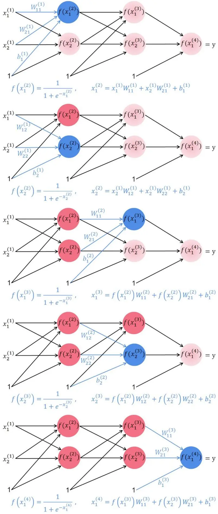
资料来源：华泰证券研究所

图表9： 神经网络反向传播示意图
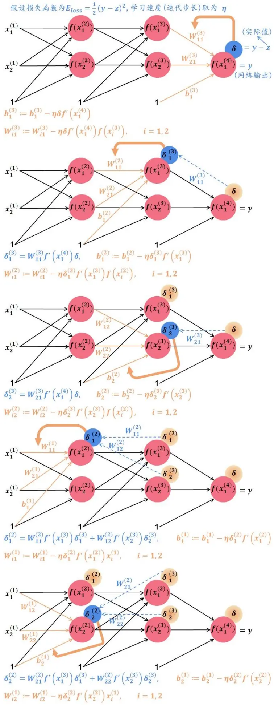
资料来源：华泰证券研究所

则

$$
\frac{\partial E_{loss}}{\partial w_{11}^{(2)}}=\delta_{1}^{(3)}\cdot\frac{\partial\left[f\left(x_{1}^{(3)}\right)\right]}{\partial x_{1}^{(3)}}\cdot\frac{\partial x_{1}^{(3)}}{\partial w_{11}^{(2)}}=\delta_{1}^{(3)}\cdot f^{\prime}\left(x_{1}^{(3)}\right)\cdot f\left(x_{1}^{(2)}\right)
$$

于是 $在$ 该次反向传播过程中， $w_{11}^{(2)}$ 的修正公式为

$$
w_{11}^{(2)}{:=}w_{11}^{(2)}-\eta\delta_{1}^{(3)}f^{\prime}(x_{1}^{(3)})f(x_{1}^{(2)})
$$

类似地，其它权值在该次反向传播过程中的修改公式推导过程如图表 9所示。

上述推导过程是针对一组输入数据 $(x_{1}^{(1)},x_{2}^{(1)})$ 展示的，比较易于理解，实际问题中输入数据一般会有成千上万组，前面公式中很多求导符号实际是在对向量求导，公式写法比较抽象，这里就不赘述了，对反向传播理论有进一步了解需求的读者推荐去阅读相关书籍。

## 优化函数

上一节中我们形象化地描述了前向传播和反向传播过程，不过在实际计算中并没有那么简单，为了兼顾速度、准确度和稳定性，我们可以选择各种优化函数来完成这一计算过程。此处我们主要针对 TensorFlow 来简单介绍几种优化函数的特点，本篇报告中神经网络模型的构建和训练就是基于 TensorFlow 的。TensorFlow 是 Google Brain 开发的开源机器学习系统，其功能全面、使用简单，支持 Python 和 C/C++语言，支持 GPU/CPU 计算，在GPU 中可以大大提升计算速度，因而在神经网络计算上具有很大优势，是当前较为主流的神经网络和深度学习的库。在基于 TensorFlow的神经网络中，函数 tf.train()在传统梯度下降法基础之上，提供了更多优化损失函数的选择，如下表所示。

图表10： 基于 TensorFlow的神经网络常用优化函数及描述

| 优化函数 | 描述 |
| --- | --- |
| tf.train.GradientDescentOptimizer | 使用梯度下降算法的Optimizer。使用为广泛，但收敛速度最慢，不过稳 定性较好。 |
| tf.train.AdadeltaOptimizer | 使用 Adadelta 算法的 Optimizer。收敛速度快也较为稳定。 |
| tf.train.AdagradOptimizer | 使用 Adagrad 算法的 Optimizer。使用每个变量的历史梯度值累加作为更 新的分母，起到平衡不同变量梯度数值差异过大的问题。 |
| tf.train.MomentumOptimizer | 使用Momentum 算法的 Optimizer。收敛速度最快，不过初始值不好时会 向错误方向收敛。 |
| tf.train.RMSPropOptimizer | 使用 RMSProp 算法的 Optimizer。在 AdaGrad 基础上加入了decay factor，防止历史梯度求和过大，收敛速度快且十分稳定。是AlphaGO使 用的优化器。 |
| tf.train.AdamOptimizer | 使用 Adam算法的 Optimizer。类似于加入动量的 RMSProp 优化器，收 敛速度较快。 |

资料来源：华泰证券研究所

本研究报告采用 AdamOptimizer 优化函数，读者也可以根据自己的研究特点选择合适的优化函数。

## 神经网络具体实现方法

理论上，隐藏层数目越多，隐藏层节点数越多，模型对数据的拟合程度越好。但是在实际运用中，人们研究发现增加层数和节点数将带来诸多问题。首先，权重参数的数目将随之急剧增加，使得优化问题的解空间过大，算法难以收敛。其次，反向传播算法也会失效，误差梯度在经过好几层的传递之后变得极小，对于前几层连接权重的修改变得近乎不可能，这一现象称为梯度消失。再次，模型复杂度的增大带来过拟合的问题。最后，在历史时期CPU/GPU 的计算能力无法胜任超大规模的参数优化问题。这些缺陷一度限制了神经网络的广泛使用。

受限于计算量，本报告采用基于 TensorFlow 的 2 层隐藏层的全连接人工神经网络，在普通的家用电脑中可以实现，从输入层 $\cdot X_{input}$ 到输出层y的具体结构如下：

全连接层 fc1+激活函数 tanh（隐藏层 1）：

$$
fc1\colon X_{fc1}=X_{input}W_{fc1}+B_{fc1}
$$

$$
activation1\colon X_{activation1}=tanh{\left(X_{fc1}\right)}
$$

全连接层 fc2+激活函数 tanh（隐藏层 2）：

$$
fc2\colon X_{fc2}=X_{activation1}W_{fc2}+B_{fc2}
$$

$$
activation2\colon X_{activation2}=tanh\big(X_{fc2}\big)
$$

全连接层 fc3+激活函数 Softmax（输出层）：

$$
fc3\colon X_{fc3}=X_{activation2}W_{fc3}+B_{fc3}
$$

$$
activation3:y=X_{activation3}=Softmax\big(X_{fc3}\big)
$$

本报告中，权重初始化采用 TensorFlow 中截断正态分布函数 tf.truncated_normal，隐藏层的激活函数采用 tanh 函数，输出层的激活函数采用 Softmax 函数。读者也可以根据具体案例研究选择其它合适的激活函数。

## 模型评价指标

在人工智能系列第一篇报告中，我们介绍了常见的模型评价指标。对于分类问题，除了分类正确率（Accuracy）之外，还可以采用召回率（Recall，又称敏感度 Sensitivity）、精确率（Precision）、虚报率和特异度（Specificity），它们都是衡量模型好坏的常用指标，详细定义如图表 11 所示。在众多模型评价指标中，正确率的概念清晰并且计算简便，使用较为广泛。

图表11： 常用模型评价指标

| 真实情况=阳性 |  | 真实情况=阴性 |  |  |
| --- | --- | --- | --- | --- |
| 预测结果=阳性 | 命中 | 虚报 | $精确率=\frac{命中}{命中+虚报}$ |  |
| 预测结果=阴性 |  |  |  |  |
|  | 漏报 | 正确拒绝 |  |  |
|  |  |  |  | 命中+正确拒绝 正确率= |
|  | $召回率(敏感度)=\frac{命中}{命中+漏报}$ | $虚报率=\frac{虚报}{虚报+正确拒绝}$ |  | 命中+正确拒绝+漏报+虚报 |
|  |  |  | 正确拒绝 |  |
|  |  | 特异度= | 虚报+正确拒绝 |  |

资料来源：华泰证券研究所

针对具体的神经网络选股模型，如何计算上表中的各项指标呢？比如，我们通过历史数据训练得到一个全连接神经网络模型，将当前时刻股票的特征（因子值）输入网络，就可以得到股票下期上涨或下跌的预测值f(x)，这是一个连续值。如果以中位数作为分类阈值将股票分为相对强势和相对弱势两类，那么根据预测值向量就可以得到预测的分类标签ŷ，随后和真实的分类标签y进行比较，从而就能计算正确率、召回率、虚报率等各项指标了。

在一些特定场景下，正确率并不是最好的指标。在选股模型的实际应用中，我们的目标不仅仅是对股票进行正确分类，更多的时候是希望选择预测值最高，即上涨可能性最大的小部分股票进行投资。更切实际的做法是设定一个更严格的分类阈值，此时预测上涨的股票数将变少，虚报率降低，然而召回率也随之降低，正确率未必上升。通俗地说，当法律更严格时，抓住的坏人更多，错杀的好人也更多，社会风气并不一定会更好。由此可见，当我们侧重于某一类别的样本，或者两类样本数量不均等时，正确率、召回率、虚报率并不是稳定的评价指标，其具体大小不仅取决于分类器性能，还和分类阈值密切相关。

是否有一种评价指标和分类阈值的选取无关，从而忠实地反映分类器性能呢？在华泰人工智能系列第三篇报告《支持向量机模型》中，我们使用了接受者操作特征曲线（ReceiverOperating Characteristic Curve，ROC 曲线）的曲线下面积（Area Under Curve，AUC）作为模型评价的主要指标。然而 AUC 在多分类问题下无法准确地定义。实际上本报告中我们是将个股做了三分类处理（分类详细设置参考下一章第一小节），我们在输出层选用的 Softmax 激活函数是可以进行多分类的。因此，我们将使用另一种常用的，与分类阈值选取无关的，同时适用于多分类问题的评价指标——F-score。

通常而言，准确率和召回率是互相影响的，虽然两者都高是一种期望的理想情况，但实际情况常常是准确率高、召回率低，或者召回率低、准确率高。所以在应用中常常需要根据具体情况做出取舍，例如对一般搜索的情况是在保证召回率的情况下提升准确率，而如果是疾病监测、反垃圾邮件等，则是在保证准确率的条件下，提升召回率。但有时候，需要兼顾两者，那么就可以用 F-score 指标。F-score指标定义如下：

$$
F_{b}=\frac{(1+b^{2})\times 精确率\times 召回率}{b^{2}\times 精确率+召回率}
$$

其中，当 b=1 时，认为精确率和召回率的重要性相当，就是 F1-score。通过定义可知，召回率体现了分类模型对正样本的识别能力，召回率越高，说明模型对正样本的识别能力越强；精确率体现了模型对负样本的区分能力，精确率越高说明模型对负样本的区分能力越强。F1-score 是两者的综合体现，F1-score较高时说明模型稳健，分类效果较理想。我们在后续的测试中，将使用正确率和 F1-score 作为调参的主要依据。

## 全连接神经网络测试流程

全连接神经网络构建

图表12： 全连接神经网络模型构建示意图
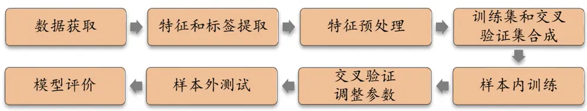
资料来源：华泰证券研究所

如图表 12 所示，全连接神经网络的构建方法包含下列步骤：

1． 数据获取：

a) 股票池：全 A股，剔除 ST 股票，剔除每个截面期下一交易日停牌的股票，剔除上市 3个月以内的股票，每只股票视作一个样本。

b) 回测区间：2011-01-31 至 2017-10-31。分 7 个阶段回测，如图表 14 所示。

2． 特征和标签提取：每个自然月的最后一个交易日，计算之前报告里的 70 个因子暴露度，作为样本的原始特征；计算下一整个自然月的个股超额收益（以沪深 300 指数为基准），前 30%的股票标记为“上涨股”，后 30%的股票标记为“下跌股”，中间股票标记为“中性股”，作为样本的标签。因子池如图表 13 所示。

3． 特征预处理：

a) 中位数去极值：设第 T 期某因子在所有个股上的暴露度序列为 $D_{i},~D_{M}$ 为该序列中位数， $D_{M1}$ 为序列 $|D_{i}-D_{M}|$ 的中位数，则将序列 $D_{i}$ 中所有大于 $D_{M}+5D_{M1}$ 的数重设为 $D_{M}+5D_{M1}$ ，将序列 $D_{i}$ 中所有小于 $D_{M}-5D_{M1}$ 的数重设为 $D_{M}-5D_{M1}$ ；

b) 缺失值处理：得到新的因子暴露度序列后，将因子暴露度缺失的地方设为中信一级行业相同个股的平均值。

c) 行业市值中性化：将填充缺失值后的因子暴露度对行业哑变量和取对数后的市值做线性回归，取残差作为新的因子暴露度。

d) 标准化：将中性化处理后的因子暴露度序列减去其现在的均值、除以其标准差，得到一个新的近似服从N(0,1)分布的序列。

4． 训练集和交叉验证集的合成： 对于全连接神经网络模型，在每个月末截面期，随机选取每个月 90%的样本作为训练集，每个月余下 10%的样本作为交叉验证集。

5． 样本内训练：在样本内训练集使用全连接神经网络训练模型。

6． 交叉验证调参：模型训练完成后，使用该模型对交叉验证集进行预测。选取交叉验证集与样本外测试集正确率一致性高、且 F1-score 高的一组参数作为模型的最优参数。

7． 样本外回测：确定最优参数后，以 T 月月末截面期所有样本预处理后的特征作为模型的输入，得到每个样本的预测值f(x)，将预测值视作合成后的因子，进行单因子分层回测。回测方法和之前的单因子测试报告相同，具体步骤参考下一小节。

8． 模型评价：我们以分层回测的结果作为模型评价指标。我们还将给出测试集的正确率、F1-score 等衡量模型性能的指标。

图表13： 选股模型中涉及的全部因子及其描述

| 大类因子 | 具体因子 | 因子描述 | 因子方向 |
| --- | --- | --- | --- |
| 估值 | EP | 净利润（TTM）/总市值 | 1 |
| 估值 | EPcut | 扣除非经常性损益后净利润（TTM）/总市值 | 1 |
| 估值 | BP | 净资产/总市值 | 1 |
| 估值 | SP | 营业收入（TTM）/总市值 | 1 |
| 估值 | NCFP | 净现金流（TTM）/总市值 | 1 |
| 估值 | OCFP | 经营性现金流（TTM）/总市值 | 1 |
| 估值 | DP | 近12 个月现金红利（按除息日计）/总市值 | 1 |
| 估值 | G/PE | 净利润（TTM）同比增长率/PE_TTM | 1 |
| 成长 | Sales_G_q | 营业收入（最新财报，YTD）同比增长率 | 1 |
| 成长 | Profit_G_q | 净利润（最新财报，YTD）同比增长率 | 1 |
| 成长 | OCF_G_q | 经营性现金流（最新财报，YTD）同比增长率 | 1 |
| 成长 | ROE_G_q | ROE（最新财报，YTD）同比增长率 | 1 |
| 财务质量 财务质量 | ROE_q | ROE（最新财报，YTD） | 1 |
| 财务质量 | ROE_ttm | ROE（最新财报，TTM） |  |
|  | ROA_q | ROA（最新财报，YTD） |  |
| 财务质量 财务质量 | ROA_ttm | ROA（最新财报，TTM） | 1 |
| 财务质量 | grossprofitmargin_q | 毛利率（最新财报，YTD） | 1 |
| 财务质量 | grossprofitmargin_ttm | 毛利率（最新财报，TTM） | 1 |
| 财务质量 | profitmargin_q | 扣除非经常性损益后净利润率（最新财报，YTD） | 1 |
| 财务质量 | profitmargin_ttm | 扣除非经常性损益后净利润率（最新财报，TTM） 资产周转率（最新财报，YTD） | 1 |
| 财务质量 | assetturnover_q | 资产周转率（最新财报，TTM） | 1 |
| 财务质量 | assetturnover_ttm |  | 1 |
| 财务质量 | operationcashflowratio_q | 经营性现金流/净利润（最新财报，YTD） | 1 |
| 杠杆 |  | operationcashflowratio_ttm经营性现金流/净利润（最新财报，TTM） | 1 |
| 杠杆 | financial_leverage | 总资产/净资产 | -1 |
| 杠杆 | debtequityratio | 非流动负债/净资产 | -1 |
| 杠杆 | cashratio | 现金比率 | 1 |
| 市值 | currentratio | 流动比率 总市值取对数 | 1 |
| 动量反转 | In_capital HAlpha | 个股60个月收益与上证综指回归的截距项 | -1 -1 |
| 动量反转 | return_Nm | 个股最近N个月收益率，N=1，3，6，12 | -1 |
| 动量反转 | wgt_return_Nm | 个股最近N个月内用每日换手率乘以每日收益率求算术平均 | -1 |
| 动量反转 | exp_wgt_return_Nm | 值，N=1，3，6，12 |  |
| 波动率 std_FF3factor_Nm |  | 个股最近 N 个月内用每日换手率乘以函数 exp(-x_i/N/4)再乘 | -1 |
|  |  | 以每日收益率求算术平均值，xi为该日距离截面日的交易日 |  |
|  |  | 的个数，N=1，3，6，12 |  |
|  |  | 特质波动率——个股最近 N 个月内用日频收益率对 Fama French三因子回归的残差的标准差，N=1，3，6，12 | -1 |
| 波动率 股价 | std_Nm | 个股最近N个月的日收益率序列标准差，N=1，3，6，12 | -1 |
| beta | In_price beta | 股价取对数 | -1 |
| 换手率 | turn_Nm | 个股 60个月收益与上证综指回归的 beta 个股最近N个月内日均换手率(剔除停牌、涨跌停的交易日)， | -1 |
|  |  | N=1, 3, 6, 12 | -1 |
| 换手率 | bias_turn_Nm | 个股最近N个月内日均换手率除以最近2年内日均换手率(剔 | -1 |
| 情绪 |  | 除停牌、涨跌停的交易日）再减去1，N=1，3，6，12 wind 评级的平均值 |  |
| 情绪 | rating_average rating_change | wind评级（上调家数-下调家数）/总数 | 1 1 |
| 情绪 | rating_targetprice | wind一致目标价/现价-1 | 1 |
| 股东 | holder_avgpctchange | 户均持股比例的同比增长率 | 1 |
| 技术 | MACD |  | -1 |
| 技术 | DEA | 经典技术指标（释义可参考百度百科），长周期取30日，短 | -1 |
| 技术 | DIF | 周期取10 日，计算 DEA 均线的周期（中周期）取 15 日 | -1 |
| 技术 | RSI | 经典技术指标，周期取20日 | -1 |
| 技术 | PSY | 经典技术指标，周期取20日 | -1 |
| 技术 | BIAS | 经典技术指标，周期取20日 | -1 |

资料来源：Wind，华泰证券研究所

图表14： 分阶段回测模型选取示意图
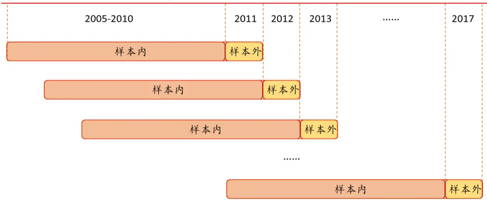
资料来源：华泰证券研究所

## 神经网络模型参数设定

1． 隐藏层（hidden layer）：神经网络理论上可以采用 4 层或者更多的层，但是过多的隐藏层个数计算量过大，且容易造成过拟合，考虑到以上因素，本研究报告中采用含有2 层隐藏层的神经网络。

2． 神经元：网络输入层神经元节点数就是系统的因子（自变量）个数，输出层神经元节点数就是系统目标分类数。隐层节点选取按经验选取，一般设为输入层节点数的 75%。在系统训练时，实际还要对不同的隐层节点数分别进行比较，最后确定出最合理的网络结构。在本研究报告中，网络输入层节点个数是 70（70 个因子），最终输出层节点个数为分类数量，我们采用三分类（上涨、中性、下跌）则输出层节点个数为 3，第1、2 层隐藏层节点个数分别取为 40、10，最终我们构建了一个 70-40-10-3 的全连接神经网络模型。

3． 激活函数（activation）：由上文介绍，激活函数可以为神经网络加入非线性因素，以弥补线性模型的不足。考虑不同激活函数的特点，我们在隐藏层采用 tanh 激活函数，在输出层采用 Softmax 激活函数。

4． dropout：使用 dropout 可以有效减小过拟合概率。试想，训练多个神经网络让它们共同表决，会比只训练一个神经网络更靠谱，因为每个神经网络“过拟合”的方式各不相同，取它们的平均值可以就降低过拟合概率。dropout 的原理是每次迭代时都随机地从隐藏层上去除一部分神经元，每个神经元都随机地与其他神经元进行组合，减小彼此之间的相互影响。dropout 在大型深层网络中特别有用。

5． 学习速率（learning rate）：在经典的反向传播算法中，学习速率是由经验确定，学习速率越大，权重变化越大，收敛越快，但学习速率过大，会引起系统的振荡；学习速率越小，系统更加稳定，但收敛速度会变慢。因此，训练速率在不导致振荡前提下，越大越好。

6． 优化函数（optimizer）：神经网络通过优化函数，改善训练方式，来最小化（或最大化 ） 损 失 函 数 。 我 们 在 模 型 测 试 过 程 中 比 较 了 GradientDescentOptimizer 、MomentumOptimizer、AdamOptimizer 优化函数的效果。

7． 最大迭代次数：一般期望模型在最大迭代次数内收敛，但由于神经网络并不能保证在各种参数配置下迭代收敛，当结果不收敛时，需要设置一个最大迭代次数避免程序陷入死循环。受限于计算能力，本研究报告中最大迭代次数取 10000 次。

## 全连接神经网络模型测试结果

## 模型正确率与 F1-score 分析

下图展示了全连接神经网络模型每一期测试集的正确率和 F1-score随时间的变化情况。本研究报告采用三分类，在完全随机的情况下，正确率值应该为 33.3%，F1-score的值应该为 0.333，交叉验证集和测试集上的正确率和 F1-score 越高说明模型越好。全连接神经网络模型交叉验证集正确率为 42.9%和样本外测试集平均正确率为 42.8%，交叉验证集F1-score 为 0.39 和样本外测试集平均 F1-score为 0.38，交叉验证集与样本外测试集的正确率与 F1-score 具有高度一致性，说明本神经网络模型在样本外依然十分有效。

图表15： 全连接神经网络模型样本外测试集正确率
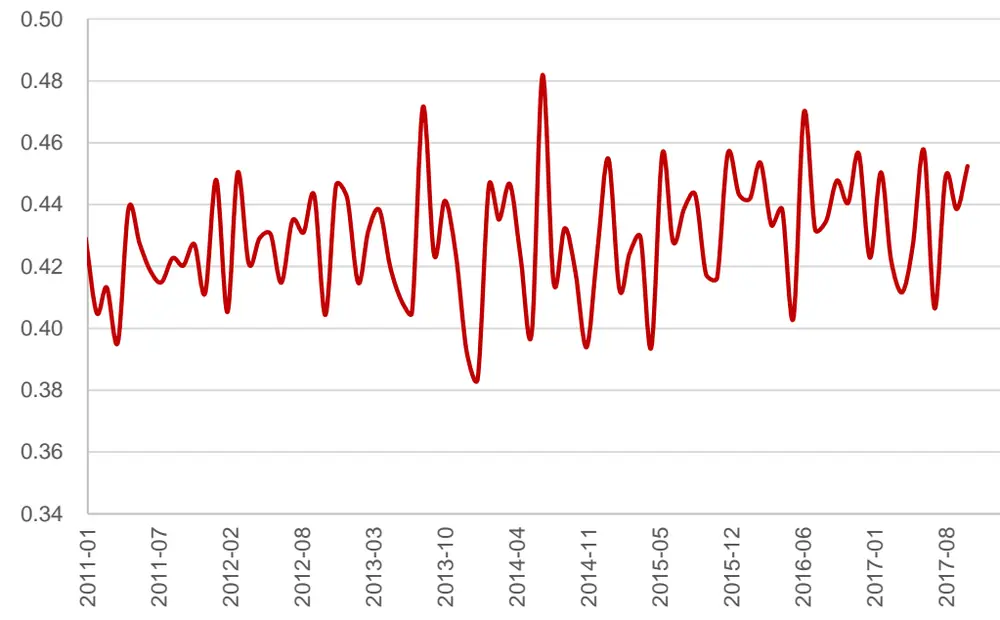
资料来源：Wind，华泰证券研究所

图表16： 全连接神经网络模型样本外 F1-score值
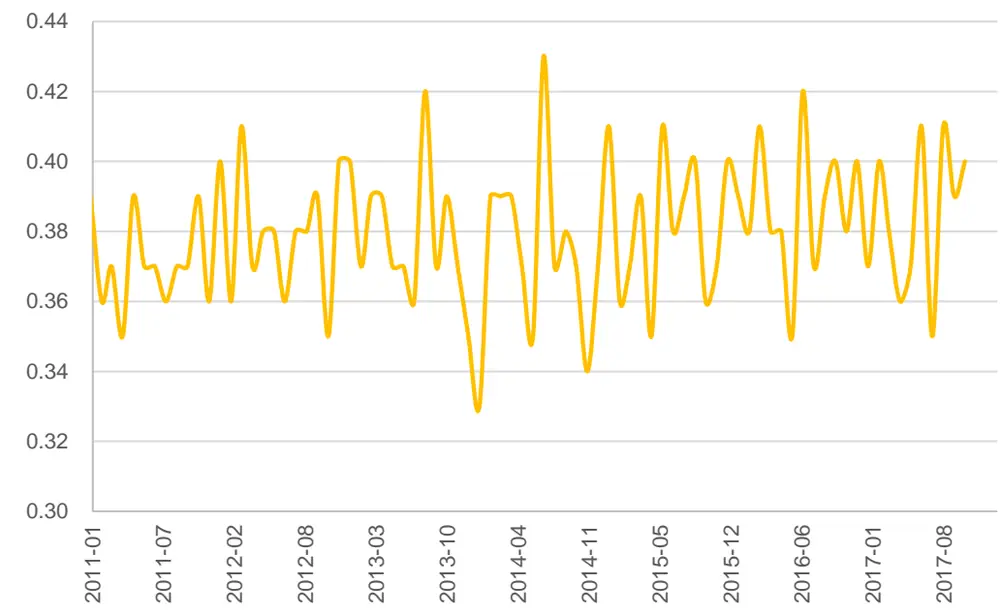
资料来源：Wind，华泰证券研究所

## 分层回测分析

使用神经网络对股价做预测，在每个月底可以产生对全部个股下月收益的预测值。因此可以将神经网络看作一个因子合成模型，即在每个月底将因子池中所有因子合成为一个“因子”。接下来，我们对该模型合成的这个“因子”（即个股下期收益预测值）进行分层回测，从各方面考察该模型的效果。这里的分层测试逻辑和华泰金工前期单因子测试系列报告保持一致。

## 分层测试详细展示图表包括：

1． 分五层组合回测绩效分析表（20110131～20171031）。其中组合 1～组合 5 为按该因子从小到大排序构造的行业中性的分层组合。基准组合为行业中性的等权组合，具体来说就是将组合 1～组合 5 合并，一级行业内部个股等权配置，行业权重按当期沪深300 行业权重配置。多空组合是在假设所有个股可以卖空的基础上，每月调仓时买入组合 1，卖空组合 5。回测模型在每个自然月最后一个交易日核算因子值，在下个自然月首个交易日按当日收盘价调仓（分层组合构建法等更多细节参见上一章“分层模型回测”小节）。

2． 分五层组合回测净值图。按前面说明的回测方法计算组合 1～组合 5、基准组合的净值，与沪深 300、中证 500 净值对比作图。

3． 分五层组合回测，用组合 1～组合 5的净值除以基准组合净值的示意图。可以更清晰地展示各层组合在不同时期的效果。

4． 组合 1相对沪深 300 月超额收益分布直方图。该直方图以[-0.5%,0.5%]为中心区间，向正负无穷方向保持组距为 1%延伸，在正负两个方向上均延伸到最后一个频数不为零的组为止（即维持组距一致，组数是根据样本情况自适应调整的）。

5． 分五层时的多空组合收益图。再重复一下，多空组合是买入组合 1、卖空组合 5（月度调仓）的一个资产组合。多空组合收益率是由组合 1的净值除以组合 5 的净值近似核算的。

6． 分十层组合回测时，各层组合在不同年份间的收益率及排名表。每个单元格的内容为在指定年度某层组合的收益率（均为整年收益率），以及某层组合在全部十层组合中的收益率排名。最后一列是分层组合在 2011～2017 的排名的均值。

7． 不同市值区间分层组合回测绩效指标对比图（分十层）。我们将全市场股票按市值排名前 1/3，1/3～2/3，后 1/3 分成三个大类，在这三类股票中分别进行分层测试，基准组合构成方法同前面所述（注意每个大类对应的基准组合并不相同）。

8． 不同行业间分层组合回测绩效分析表（分五层）。我们在不同一级行业内部都做了分层测试，基准组合为各行业内该因子非空值的个股等权组合（注意每个行业对应的基准组合并不相同）。

图表17： 单因子分层测试法示意图
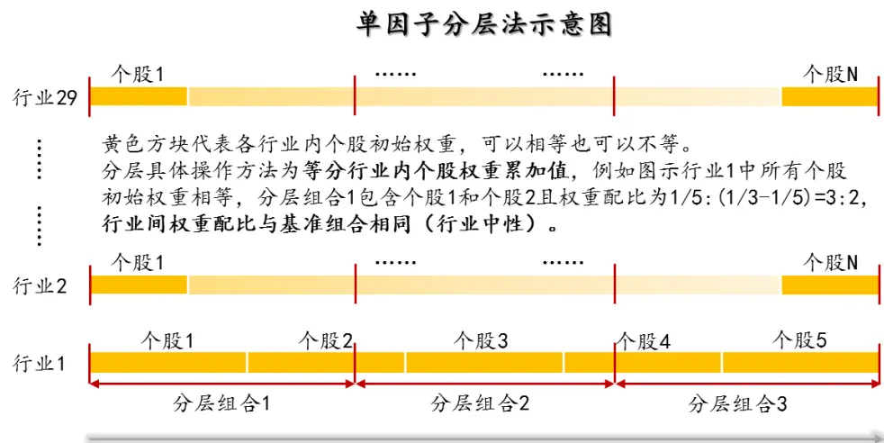
行业内个股按因子值排序
资料来源：华泰证券研究所

下图是分五层组合回测绩效分析表（20110131～20171031）。其中组合 1～组合 5为按该因子从小到大排序构造的行业中性的分层组合。基准组合为行业中性的等权组合，具体来说就是将组合 1～组合 5 合并，一级行业内部个股等权配置，行业权重按当期沪深 300 行业权重配置。多空组合是在假设所有个股可以卖空的基础上，每月调仓时买入组合 1，卖空组合 5。回测模型在每个自然月最后一个交易日核算因子值，在下个自然月首个交易日按当日收盘价调仓。

图表18： 神经网络模型分层组合绩效分析（20110131～20171031）

| 投资组合 | 年化收益率 | 年化波动率夏普比率最大回撤 |  |  | 年化超额收益率 | 超额收益年化波动率信息比率 |  | 相对基准月胜率 | 超额收益最大回撤 |
| --- | --- | --- | --- | --- | --- | --- | --- | --- | --- |
| 组合1 | 21.07% | 26.27% | 0.80 | 45.57% | 9.10% | 3.51% | 2.59 | 76.54% | 6.52% |
| 组合2 | 13.22% | 26.79% | 0.49 | 48.34% | 2.03% | 2.79% | 0.73 | 61.73% | 4.05% |
| 组合3 | 11.18% | 26.46% | 0.42 | 48.12% | 0.19% | 2.62% | 0.07 | 43.21% | 6.71% |
| 组合4 | 3.13% | 26.69% | 0.12 | 50.79% | -7.06% | 2.75% | -2.57 | 14.81% | 38.16% |
| 组合5 | -6.67% | 27.83% | -0.24 | 60.54% | -15.90% | 4.22% | -3.77 | 11.11% | 68.03% |
| 基准组合 | 10.97% | 26.64% | 0.41 | 49.05% |  |  |  |  |  |
| 多空组合 | 29.72% | 6.77% | 4.39 | 10.37% |  |  |  |  |  |

资料来源：Wind，华泰证券研究所

下面四个图依次为：

1.分五层组合回测净值图。按前面说明的回测方法计算组合 1～组合 5、基准组合的净值，与沪深 300、中证 500 净值对比作图。

2.分五层组合回测，用组合 1～组合 5的净值除以基准组合净值的示意图。可以更清晰地展示各层组合在不同时期的效果。

3.组合 1相对沪深 300 月超额收益分布直方图。该直方图以[-0.5%,0.5%]为中心区间，向正负无穷方向保持组距为 1%延伸，在正负两个方向上均延伸到最后一个频数不为零的组为止（即维持组距一致，组数是根据样本情况自适应调整的）。

4.分五层时的多空组合收益图。再重复一下，多空组合是买入组合 1、卖空组合 5（月度调仓）的一个资产组合。多空组合收益率是由组合 1 的净值除以组合 5的净值近似核算的。

图表19： 神经网络模型分层组合回测净值
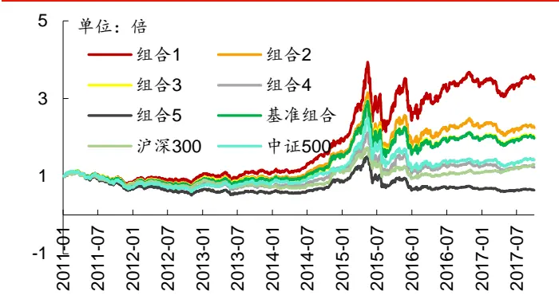
资料来源：Wind，华泰证券研究所

图表20： 神经网络模型各层组合净值除以基准组合净值示意图
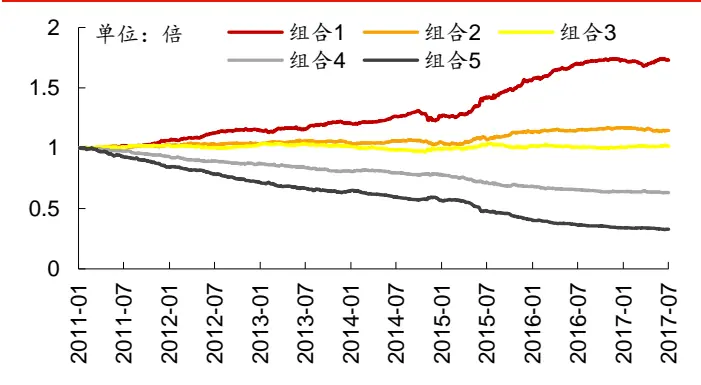
资料来源：Wind，华泰证券研究所

图表21： 神经网络模型分层组合 1相对沪深 300月超额收益分布图
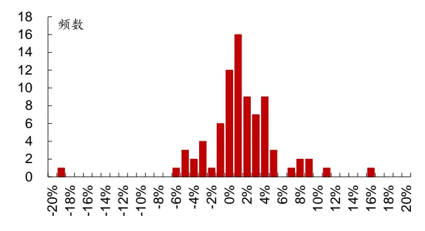
资料来源：Wind，华泰证券研究所

图表22： 神经网络模型多空组合月收益率及累积收益率
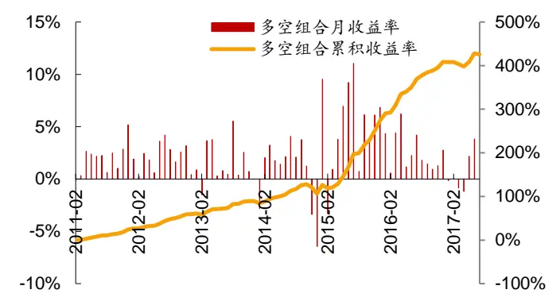
资料来源：Wind，华泰证券研究所

下图为分十层组合回测时，各层组合在不同年份间的收益率及排名表。每个单元格的内容为在指定年度某层组合的收益率（均为整年收益率），以及某层组合在全部十层组合中的收益率排名。最后一列是分层组合在 2011 年至 2017 年的每年收益排名的均值。可以看出，组合 1 和组合 10 的表现十分稳定，在这 7年间一直保持头、尾的位次不变。整体来看组合 1～10的年度排名均值服从单调关系，说明全连接神经网络模型分层回测稳定性上佳。

图表23： 神经网络模型组合在不同年份的收益及排名分析（分十层）

|  | 2011年度 | 2012年度 | 2013年度 | 2014年度 | 2015年度 | 2016年度 | 2017年度 | 排名均值 |
| --- | --- | --- | --- | --- | --- | --- | --- | --- |
| 组合1 | -17.8%(1) | 30.2%(1) | 14.1%(1) | 74.4%(1) | 76.5%(1) | 9.1%(1) | 0.9%(1) | 1.00 |
| 组合2 | -24.5%(4) | 14.4%(3) | 12.0%(2) | 62.9%(4) | 54.7%(2) | 8.6%(2) | -0.2%(2) | 2.42 |
| 组合3 | -22.6%(3) | 15.6%(2) | 9.4%(4) | 59.6%(7) | 45.1%(3) | 5.3%(3) | -2.0%(5) | 3.50 |
| 组合4 | -26.1%(5) | 13.0%(5) | 11.0%(3) | 65.5%(3) | 41.1%(4) | -3.2%(5) | -5.6%(8) | 4.42 |
| 组合5 | -21.3%(2) | 14.2%(4) | 6.4%(6) | 62.1%(6) | 32.5%(6) | 0.6%(4) | -0.7%(3) | 4.67 |
| 组合6 | -27.4%(6) | 9.9%(6) | 9.3%(5) | 62.4%(5) | 33.4%(5) | -5.2%(6) | -0.7%(4) | 5.58 |
| 组合7 | -27.5%(7) | 4.4%(7) | 0.1%(8) | 56.6%(9) | 16.6%(7) | -6.8%(7) | -3.7%(6) | 7.17 |
| 组合8 | -33.4%(8) | 3.2%(8) | 2.8%(7) | 66.9%(2) | 10.7%(8) | -10.3%(8) | -5.8%(9) | 7.50 |
| 组合9 | -34.4%(9) | 1.0%(9) | -2.3%(9) | 59.3%(8) | 0.5%(9) | -17.3%(9) | -4.6%(7) | 8.75 |
| 组合10 | -38.6%(10) | -11.1%(10) | -7.2%(10) | 50.5%(10) | -17.3%(10) | -22.4%(10) | -10.5%(10) | 10.00 |

资料来源：Wind，华泰证券研究所

下图是不同行业间分层组合回测绩效分析表（分五层）。我们在不同一级行业内部都做了分层测试，基准组合为各行业内该因子非空值的个股等权组合（注意每个行业对应的基准组合并不相同）。

图表24： 不同行业神经网络模型分层组合绩效分析（分五层）

|  | 组合1年化 | 组合1 | 组合1 | 组合1 | 组合1超额收益 | 组合1相对 | 所有组合年化 |
| --- | --- | --- | --- | --- | --- | --- | --- |
| 行业 | 超额收益率 | 信息比率 | 年化收益率 | 夏普比率 | 最大回撤 | 基准月胜率 | 收益率排序 |
| 计算机 | 19.33% | 2.08 | 42.63% | 1.10 | 7.48% | 75.60% | 1,2,3,4,5 |
| 国防军工 | 18.86% | 1.44 | 28.18% | 0.69 | 13.34% | 62.20% | 1,2,3,4,5 |
| 农林牧渔 | 18.39% | 2.02 | 32.91% | 1.04 | 11.87% | 63.42% | 1,2,4,3,5 |
| 有色金属 | 16.93% | 1.75 | 22.08% | 0.65 | 11.57% | 65.85% | 1,2,3,4,5 |
| 房地产 | 16.09% | 2.32 | 34.60% | 1.08 | 10.19% | 73.17% | 1,3,2,4,5 |
| 汽车 | 15.64% | 2.08 | 31.11% | 0.98 | 7.06% | 69.51% | 1,2,3,4,5 |
| 家电 | 15.61% | 1.47 | 36.72% | 1.19 | 12.53% | 60.97% | 1,2,4,3,5 |
| 建材 | 15.42% | 1.58 | 31.38% | 0.96 | 10.10% | 59.76% | 1,2,3,4,5 |
| 电子元器件 | 14.92% | 1.96 | 34.94% | 0.99 | 12.74% | 71.95% | 1,2,3,4,5 |
| 基础化工 | 14.70% | 2.35 | 29.80% | 0.92 | 5.87% | 73.17% | 1,2,3,4,5 |
| 煤炭 | 14.68% | 1.39 | 10.75% | 0.31 | 12.24% | 60.97% | 1,2,4,3,5 |
| 传媒 | 14.04% | 1.08 | 32.10% | 0.88 | 18.70% | 60.97% | 1,2,3,4,5 |
| 钢铁 | 13.51% | 1.14 | 24.45% | 0.72 | 16.31% | 64.63% | 1,2,3,4,5 |
| 电力设备 通信 | 12.88% | 1.76 | 22.90% | 0.69 | 6.81% | 70.74% | 1,2,3,4,5 |
| 石油石化 | 12.66% | 1.28 | 34.00% | 0.95 | 12.15% | 68.29% | 1,2,3,4,5 |
| 纺织服装 | 12.56% | 1.01 | 22.91% | 0.67 | 14.03% | 58.54% | 1,2,3,4,5 |
| 机械 | 11.44% | 1.25 | 26.07% | 0.82 | 8.99% | 62.20% | 1,2,3,4,5 |
| 商贸零售 | 10.85% | 1.69 | 21.58% | 0.65 | 8.65% | 70.74% | 1,2,3,4,5 |
| 建筑 | 10.80% | 1.39 | 19.53% | 0.62 | 8.76% | 62.20% | 1,2,3,4,5 |
| 电力及公用事业 | 10.49% | 1.01 | 23.87% | 0.77 | 17.78% | 65.85% | 1,2,3,4,5 |
| 食品饮料 | 9.40% | 1.14 | 21.85% | 0.73 | 8.11% | 67.08% | 1,2,3,4,5 |
|  | 8.19% | 0.91 | 20.00% | 0.68 | 13.40% | 60.97% | 1,3,2,4,5 |
| 医药 | 8.14% | 1.30 | 24.21% | 0.78 | 10.82% | 58.54% | 1,2,3,4,5 |
| 餐饮旅游 轻工制造 | 8.01% | 0.65 | 20.44% | 0.64 | 20.16% | 54.88% | 1,2,3,4,5 |
|  | 7.64% | 0.79 | 24.47% | 0.77 | 15.62% | 51.22% | 1,2,3,4,5 |
| 交通运输 银行 | 6.38% | 0.72 | 19.09% 14.24% | 0.63 | 16.87% 18.80% | 62.20% | 1,2,4,3,5 |
| 综合 | 1.55% 1.36% | 0.19 0.10 | 14.20% | 0.56 0.41 | 19.40% | 51.22% 46.34% | 3,1,5,2,4 |
| 非银行金融 |  |  |  |  |  |  | 2,1,3,4,5 |
|  | 0.76% | 0.06 | 10.92% | 0.32 | 30.29% | 51.22% | 3,1,2,4,5 |

资料来源：Wind，华泰证券研究所

## 全连接神经网络选股指标比较

我们构建了全连接神经网络全 A选股策略并进行回测，同时与线性回归选股策略进行对比，各项指标详见图表 25和图表 26。选股策略分为两类：一类是行业中性策略，策略组合的行业配置与基准（沪深 300、中证 500、中证全指）保持一致，各一级行业中选 N个股票等权配置（N=2,5,10,15,20）；另一类是个股等权策略，直接在票池内不区分行业选 N 个股票等权配置（N=20,50,100,150,200），比较基准取为 300 等权、500 等权、中证全指。三类策略均为月频调仓，个股入选顺序为它们在被测模型中的当月的预测值（连续值）顺序。

从图表 25 和图表 26 中可以看出，对于行业中性和个股等权的全 A选股，全连接神经网络相比线性回归在年化超额收益率、信息比率整体上表现更好，但是最大回撤要大于线性回归模型。

我们没有构建沪深 300 和中证 500 成份内选股策略，这是因为神经网络模型适合于数据量较大的场景，而沪深 300 和中证 500 成份股组成的月频多因子数据偏少，不适合应用在神经网络模型中。

每个行业入选个股数目（从左至右：2,5,10,15,20）

图表25： 全连接神经网络模型回测重要指标对比（全 A选股，行业中性）

| 模型选拌 |  |  |  |  |  |  |  |  |
| --- | --- | --- | --- | --- | --- | --- | --- | --- |
|  | 全 A 选股，基准为沪深 300 |  |  |  | 全 A 选股，基准为中证 500 |  | 全 A选股，基准为中证全指 |  |
|  | 年化超额收益率 (行业中性) |  |  | 年化超额收益率（行业中性） |  |  | 年化超额收益率 (行业中性) |  |
| 全连接神经网络 | 19.82%17.94%17.06%15.90%14.67% |  |  | 25.36%23.99%21.19%20.36%19.15% |  |  | 21.77%20.09%18.34%17.49%16.20% |  |
| 线性回归 | 18.31%15.45%14.34%13.14%12.49% |  |  | 17.15%15.98% 15.83%15.27%15.12% |  |  | 17.34%15.23%14.42%13.63%13.12% |  |
| 全连接神经网络 | 超额收益最大回撤 (行业中性) |  |  | 超额收益最大回撤 (行业中性) |  |  | 超额收益最大回撤 (行业中性) |  |
| 线性回归 | 23.57%20.76%19.62%20.33%20.85% |  |  | 15.63%18.65%15.95%15.20%14.72% |  |  | 17.82%14.00%12.65%11.83%11.86% |  |
|  | 16.74%15.87%16.34%18.46%18.99% |  |  | 12.83%13.24% 10.98%11.50%11.27% |  |  | 11.05% 9.60% 9.09% 9.57% 9.87% |  |
| 全连接神经网络 | 信息比率 | (行业中性) | 信息比率 | (行业中性) |  | 信息比率 | (行业中性) |  |
| 线性回归 | 1.79 1.76 | 1.73 1.65 | 1.54 2.81 | 3.16 3.20 | 3.35 3.32 | 2.59 2.76 | 2.76 | 2.79 2.66 |
|  | 1.88 1.69 1.64 | 1.52 | 1.45 | 2.20 2.55 | 2.88 3.00 3.09 | 2.42 | 2.48 2.60 | 2.57 2.52 |
|  |  | Calmar 比率（行业中性） |  | Calmar 比率 | (行业中性) |  | Calmar 比率（行业中性） |  |
| 全连接神经网络 | 0.84 | 0.86 0.87 0.78 | 0.70 | 1.62 1.29 | 1.33 1.34 1.30 | 1.22 | 1.43 1.45 | 1.48 1.37 |
| 线性回归 | 1.09 | 0.97 0.88 0.71 | 0.66 1.34 | 1.21 1.44 | 1.33 1.34 | 1.57 1.59 | 1.59 1.43 | 1.33 |

资料来源：Wind，华泰证券研究所

图表26： 全连接神经网络模型回测重要指标对比（全 A选股，非行业中性）

| 模型选择 | 组合总入选个股数目（从左至右：20,50，100，150,200） |  |  |  |  |  |  |  |
| --- | --- | --- | --- | --- | --- | --- | --- | --- |
|  | 全 A 选股，基准为 300 等权 |  |  | 全 A 选股，基准为 500 等权 |  | 全 A 选股，基准为中证全指 |  |  |
|  | 年化超额收益率（个股等权） |  |  | 年化超额收益率（个股等权） |  | 年化超额收益率（个股等权） |  |  |
| 全连接神经网络 | 32.35%28.46% 28.58%26.76%25.19% |  |  | 31.17%27.28% 27.40%25.59%24.02% |  | 31.52%27.62%27.74%25.92%24.35% |  |  |
| 线性回归 | 26.56%24.47%: 21.25%20.03% 20.28% |  |  | 25.18%23.05%19.86%18.67%18.92% |  | 25.61%23.48%20.27%19.08%19.32% |  |  |
|  | 超额收益最大回撤（个股等权） |  |  | 超额收益最大回撤（个股等权） |  |  | 超额收益最大回撤（个股等权） |  |
| 全连接神经网络 | 40.50%35.94%33.70%33.21% 33.27% |  |  | 17.39% 13.24%14.63%14.75%15.30% |  |  | 27.88%22.72%19.68%19.23% 19.15% |  |
| 线性回归 | 30.71%31.49%30.71%30.54% 30.41% |  |  | 14.31% 11.15% 9.22% 9.90% 9.59% |  |  | 16.39%17.07%16.12%15.91%15.76% |  |
|  | 信息比率 | (个股等权) |  | 信息比率 | (个股等权) |  | 信息比率（个股等权） |  |
| 全连接神经网络 线性回归 |  |  |  |  |  |  |  |  |
|  | 1.60 1.52 | 1.56 | 1.48 1.41 | 2.78 | 3.09 3.57 | 3.56 3.51 | 2.32 2.37 | 2.55 2.45 2.37 |
|  | 1.43 | 1.45 1.29 | 1.22 1.24 | 2.46 3.11 | 3.12 3.09 | 3.29 2.10 | 2.37 | 2.20 2.12 2.17 |
| 全连接神经网络 |  | Calmar 比率（个股等权） |  |  | Calmar 比率（个股等权） |  | Calmar 比率（个股等权） |  |
| 线性回归 | 0.80 0.79 0.86 | 0.85 0.78 0.69 | 0.81 0.76 0.66 0.67 | 1.79 2.06 1.76 2.07 | 1.87 1.73 2.15 1.89 | 1.57 1.13 1.97 1.56 | 1.22 1.38 1.26 | 1.41 1.35 1.27 1.20 1.23 |

资料来源：Wind，华泰证券研究所

## 全连接神经网络选股策略详细分析

下面我们对策略组合的详细回测情况加以展示。下图中，我们展示了全 A选股（行业中性，基准为中证 500）策略的各种详细评价指标。

观察下面的图表可知，对于全连接神经网络模型（ANN）的行业中性策略来说，随着每个行业入选个股数目增多，年化收益率在下降、信息比率和 Calmar比率先升后降，最优每个行业入选个股数目在 16 个左右。

图表27： 全连接神经网络模型和线性回归模型策略组合回测分析表（回测期：20110131～20171031）

|  | 每个行业入 |  | 年化 | 年化夏普 |  | 最大年化超额 |  | 年化超额收益 | 信息 |  | Calmar 相对基准 | 月均双边 |
| --- | --- | --- | --- | --- | --- | --- | --- | --- | --- | --- | --- | --- |
| 选股票池 比较基准模型与策略类型 | 选个股数目 | 收益率 | 波动率 | 比率 | 回撤 | 收益率 | 跟踪误差 | 最大回撤 | 比率 | 比率 | 月胜率 | 换手率 |
| 全部 A 股 中证 500ANN 行业中性 |  | 2 32.2% | 28.9% | 1.12 | 46.3% | 25.4% | 9.0% | 15.6% | 2.81 | 1.62 | 77.8% | 144.8% |
| 全部 A 股 中证 500ANN 行业中性 |  | 4 32.2% | 28.8% | 1.12 | 46.0% | 25.4% | 7.8% | 18.5% | 3.25 | 1.38 | 76.5% | 135.9% |
| 全部 A 股 中证 500ANN 行业中性 |  | 6 30.1% | 28.6% | 1.05 | 46.7% | 23.5% | 7.3% | 17.4% | 3.21 | 1.35 | 79.0% | 129.0% |
| 全部 A 股 中证 500ANN 行业中性 |  | 8 28.7% | 28.7% |  | 1.0047.5% | 22.1% | 6.9% | 16.4%3.20 |  | 1.35 | 81.5% | 123.3% |
| 全部 A 股 中证 500ANN 行业中性 |  | 10 27.7% | 28.5% | 0.97 | 47.3% | 21.2% | 6.6% | 16.0% | 3.20 | 1.33 | 82.7% | 118.1% |
| 全部 A 股 中证 500ANN 行业中性 |  | 12 27.7% | 28.5% | 0.97 | 47.4% | 21.2% | 6.4% | 15.8% | 3.29 | 1.34 | 81.5% | 113.2% |
| 全部 A 股 中证 500ANN 行业中性 |  | 14 27.0% | 28.5% | 0.95 | 47.4% | 20.6% | 6.2% | 15.4% | 3.33 | 1.33 | 77.8% | 108.8% |
| 全部 A 股 中证 500ANN 行业中性 |  | 16 26.7% | 28.3% | 0.94 | 47.0% | 20.2% | 6.0% | 15.3% | 3.39 | 1.32 | 77.8% | 105.2% |
| 全部 A 股 中证 500ANN 行业中性 |  | 18 26.1% | 28.4% | 0.92 | 47.5% | 19.7% | 5.9% | 15.1% | 3.35 | 1.30 | 77.8% | 101.2% |
| 全部 A 股 中证500线性回归行业中性 |  | 2 23.7% | 28.1% | 0.84 | 46.7% | 17.1% | 7.8% | 12.8% | 2.20 | 1.34 | 64.2% | 156.0% |
| 全部 A 股 中证500线性回归行业中性 |  | 4 23.1% | 28.4% | 0.82 | 45.5% | 16.8% | 6.6% | 12.7% | 2.55 | 1.32 | 71.6% | 146.3% |
| 全部 A 股 中证500线性回归 | 行业中性 | 6 23.2% | 28.2% | 0.82 | 45.3% | 16.9% | 6.0% | 12.1% | 2.83 | 1.40 | 74.1% | 139.6% |
| 全部 A 股 中证 500线性回归 | 行业中性 | 8 22.9% | 28.1% | 0.82 | 46.0% | 16.6% | 5.7% | 11.2% | 2.91 | 1.48 | 74.1% | 133.2% |
| 全部 A 股 中证500线性回归 | 行业中性 | 10 | 22.1% | 28.2% 0.78 | 46.0% | 15.8% | 5.5% | 11.0% | 2.88 | 1.44 | 71.6% | 128.2% |
| 全部 A 股 中证500线性回归 | 行业中性 | 12 | 21.8% | 28.1% 0.77 | 45.8% | 15.6% | 5.3% | 11.4% | 2.92 | 1.36 | 74.1% | 123.3% |
| 全部 A 股 中证500线性回归 | 行业中性 | 14 21.5% |  | 28.0% 0.77 | 45.9% | 15.2% | 5.1% | 11.5% | 2.96 | 1.32 | 70.4% | 118.9% |
| 全部 A 股 中证500线性回归行业中性 |  | 16 21.3% |  | 28.1% 0.76 | 46.1% | 15.0% | 5.0% |  | 11.6% 2.99 | 1.29 | 74.1% | 115.2% |
| 全部 A 股中证 500线性回归行业中性 |  | 1821.2% | 28.2% | 0.75 | 46.5% | 15.1% | 5.0% |  | 11.4%3.03 | 1.32 | 72.8% | 111.1% |
| 基准组合数据—中证 500 指数 |  |  | 5.5% | 27.5% | 0.20 54.3% |  |  |  |  |  |  |  |

资料来源：Wind，华泰证券研究所

我们展示某组参数下全连接神经网络（ANN）和线性回归的月度超额收益对比图：

图表28： 全连接神经网络和线性回归模型全A行业中性选股策略表现（每个行业选 6只个股，基准中证 500）
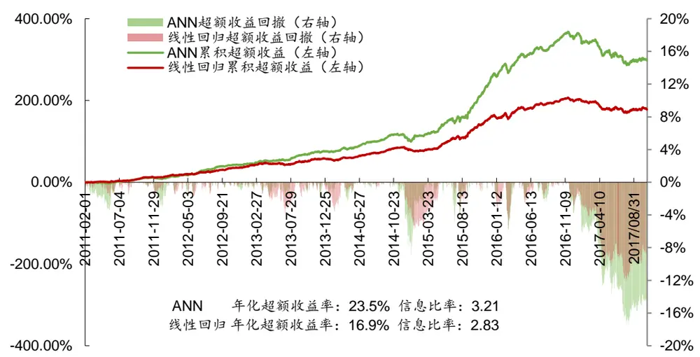
资料来源：Wind，华泰证券研究所

## 总结和展望

以上本文对结构简单的全连接神经网络模型进行了系统的测试，并且考察了部分模型参数的敏感性，初步得到以下几个结论：

1. 全连接神经网络模型本身已具备不错的选股能力。全连接神经网络对个股做“涨、平、跌”三分类时在测试集正确率为 42.9%，F1-score 为 38.0%。全连接神经网络模型与一些更复杂的神经网络模型（如卷积神经网络、循环神经网络、长短记忆神经网络等）相比，其结构更加简单、容易理解、计算效率高；与传统的线性模型相比，能够引入非线性拟合因素，并且在大量股票数据的支持下可能会“学习”到股票市场更精确的运行规律。

2. 我们以全部 A 股作为股票池，利用全连接神经网络模型构建选股策略。在回测时段2011-01-31 至 2017-10-31 内，全连接神经网络模型行业中性选股策略（每个行业选股数目分别为 2,5,10,15,20）相对于基准中证 500 指数的年化超额收益在 19.15%~25.36%之间，超额收益最大回撤在 14.72%~18.65%之间，信息比率在 2.81~3.35 之间，除了最大回撤，表现优于线性回归。总的来看，全连接神经网络在年化超额收益率、信息比率上优于线性回归算法，但是最大回撤普遍大于线性回归算法。

通过以上的测试和讨论，我们初步理解了神经网络模型应用于多因子选股的一些规律。同时也引申出更多的问题。例如：

1. 在神经网络构建过程中，网络层数、神经元个数、激活函数、优化函数、网格结构等等使得神经模型变得十分复杂，在实际问题中无法对所有网络结构进行遍历选择最优模型。如何在有限的计算资源下，设计出预测能力更强的神经网络模型？

2. 神经网络模型训练与预测过程比传统线性模型的所需的计算资源与时间要多许多，如何在一定计算条件下合理优化模型，提高计算效率？

3. 在结构相对简单的全连接神经网络中，其算法已经比较复杂，具有经济学含义的因子在模型训练过程中解释起来变得十分困难，如何合理解释复杂神经网络模型的投资逻辑，明白模型的经济学含义，对于神经网络模型在投资领域的推广具有重要的意义。

4. 神经网络真正强大的地方在于它处理海量非线性数据的能力。如果我们将神经网络模型应用到周频、日频甚至日内股价规律的挖掘上，是否能够显著超越其它传统量化模型？这些我们将在后续的报告中予以探索，敬请期待。

## 风险提示

神经网络模型的输入数据为个股的因子特征，若市场投资环境发生转变，则因子可能会失效，通过神经网络模型构建的选股策略也随之有失效风险。

## 免责申明

本报告仅供华泰证券股份有限公司（以下简称“本公司”）客户使用。本公司不因接收人收到本报告而视其为客户。

本报告基于本公司认为可靠的、已公开的信息编制，但本公司对该等信息的准确性及完整性不作任何保证。本报告所载的意见、评估及预测仅反映报告发布当日的观点和判断。在不同时期，本公司可能会发出与本报告所载意见、评估及预测不一致的研究报告。同时，本报告所指的证券或投资标的的价格、价值及投资收入可能会波动。本公司不保证本报告所含信息保持在最新状态。本公司对本报告所含信息可在不发出通知的情形下做出修改，投资者应当自行关注相应的更新或修改。

本公司力求报告内容客观、公正，但本报告所载的观点、结论和建议仅供参考，不构成所述证券的买卖出价或征价。该等观点、建议并未考虑到个别投资者的具体投资目的、财务状况以及特定需求，在任何时候均不构成对客户私人投资建议。投资者应当充分考虑自身特定状况，并完整理解和使用本报告内容，不应视本报告为做出投资决策的唯一因素。对依据或者使用本报告所造成的一切后果，本公司及作者均不承担任何法律责任。任何形式的分享证券投资收益或者分担证券投资损失的书面或口头承诺均为无效。

本公司及作者在自身所知情的范围内，与本报告所指的证券或投资标的不存在法律禁止的利害关系。在法律许可的情况下，本公司及其所属关联机构可能会持有报告中提到的公司所发行的证券头寸并进行交易，也可能为之提供或者争取提供投资银行、财务顾问或者金融产品等相关服务。本公司的资产管理部门、自营部门以及其他投资业务部门可能独立做出与本报告中的意见或建议不一致的投资决策。

本报告版权仅为本公司所有。未经本公司书面许可，任何机构或个人不得以翻版、复制、发表、引用或再次分发他人等任何形式侵犯本公司版权。如征得本公司同意进行引用、刊发的，需在允许的范围内使用，并注明出处为“华泰证券研究所”，且不得对本报告进行任何有悖原意的引用、删节和修改。本公司保留追究相关责任的权力。所有本报告中使用的商标、服务标记及标记均为本公司的商标、服务标记及标记。

本公司具有中国证监会核准的“证券投资咨询”业务资格，经营许可证编号为：Z23032000。全资子公司华泰金融控股（香港）有限公司具有香港证监会核准的“就证券提供意见”业务资格，经营许可证编号为：AOK809
©版权所有 2017 年华泰证券股份有限公司

## 评级说明

## 行业评级体系

－报告发布日后的6个月内的行业涨跌幅相对同期的沪深300指数的涨跌幅为基准；

－投资建议的评级标准

增持行业股票指数超越基准

中性行业股票指数基本与基准持平

减持行业股票指数明显弱于基准

## 公司评级体系

－报告发布日后的6个月内的公司涨跌幅相对同期的沪深300指数的涨跌幅为基准；
－投资建议的评级标准
买入股价超越基准 20%以上
增持股价超越基准 5%-20%
中性股价相对基准波动在-5%~5%之间
减持股价弱于基准 5%-20%
卖出股价弱于基准 20%以上

## 华泰证券研究

## 南京

南京市建邺区江东中路228号华泰证券广场1号楼/邮政编码：210019

电话：86 25 83389999 /传真：86 25 83387521电子邮件：ht-rd@htsc.com

## 深圳

深圳市福田区深南大道4011号香港中旅大厦24层/邮政编码：518048

电话：86 755 82493932 /传真：86 755 82492062

电子邮件：ht-rd@htsc.com

## 北京

北京市西城区太平桥大街丰盛胡同28号太平洋保险大厦A座18层

邮政编码：100032

电话：86 10 63211166/传真：86 10 63211275

电子邮件：ht-rd@htsc.com

## 上海

上海市浦东新区东方路18号保利广场E栋23楼/邮政编码：200120

电话：86 21 28972098 /传真：86 21 28972068

电子邮件：ht-rd@htsc.com