## 金工研究/深度研究

2017年11月24日

林晓明 执业证书编号：S0570516010001

研究员 0755-82080134

linxiaoming@htsc.com

陈烨 010-56793927

联系人 chenye@htsc.com

3《金工: 基于通用回归模型的行业轮动策略》2017.11

# 人工智能选股之循环神经网络模型

## 循环神经网络选股信息比率优于线性回归，其中 LSTM 模型表现最好

神经网络是近年来迅猛发展的人工智能的核心技术，本篇报告选取具有时间序列预测能力的循环神经网络作为研究对象，对传统 RNN、LSTM、GRU三种循环神经网络模型进行系统性的测试。在月频的多因子选股方面，循环神经网络具有出色的样本外预测平均正确率，但是样本外平均 AUC 值表现一般。神经网络在年化超额收益率、信息比率上优于线性回归算法，但是最大回撤普遍大于线性回归算法。在目前测试的所有神经网络模型中，LSTM 表现最好，GRU的表现和 LSTM相近。

## 循环神经网络模型具有较好的预测能力

我们在 2011-01-31 至 2017-10-31 的回测区间中分 7 个阶段训练并测试模型，传统 RNN、LSTM 以及 GRU 三种模型样本外平均 AUC 分别为0.5410，0. 5429，0. 5576，样本外平均正确率分别为 56.85%，58.57%，57.61%。可以看出，循环神经网络具有出色的样本外平均正确率，但是样本外平均 AUC 值表现一般。

## LSTM 模型超额收益和信息比率的表现优于线性回归

在 2011-01-31 至 2017-10-31 的回测区间中，对于全 A 选股的行业中性策略(每个行业分别选股数目为 2,5,10,15,20)，LSTM 模型相对于中证 500的超额收益在 20.36%~25.05%之间，超额收益最大回撤在 13.13%~16.84%之间，信息比率在 2.95~3.76 之间，除了最大回撤，表现优于线性回归。总的来看，LSTM模型在年化超额收益率、信息比率上优于线性回归算法，但是最大回撤普遍大于线性回归算法。在目前测试的所有神经网络模型中，LSTM表现最好。另一种循环神经网络模型 GRU 的表现和LSTM 相近。

## 通过分析神经网络训练时的权值更新过程使得神经网络具有可解释性

一直以来，神经网络一类模型都在模型可解释性上受到诟病，我们通过分析 LSTM 网络训练过程中神经元的权重更新过程以及权重值分布情况，打开了神经网络这个“黑箱”，使得模型具有可解释性。

## 在月频多因子选股中，神经网络模型综合表现不如 XGBoost

目前看来，以 LSTM 为代表的神经网络在月频的多因子选股上表现并不突出，综合表现不如 XGBoost。我们认为这是因为月频的多因子数据量较小，并不利于神经网络模型发挥其优势。之后我们将尝试在更加高频、数据量更大的场景中继续研究神经网络模型。

风险提示：通过循环神经网络模型构建选股策略面临市场风险，是历史经验的总结，存在失效的可能。

## 本文研究导读

就在华泰金工人工智能选股系列报告陆续推出的过程中，全球人工智能的研究进展也一刻从未停下，从 AlphaGo 到 Master 再到 AlphaGo Zero，人工智能已经在特定领域具备了战胜人类以及战胜自我，不断进化的能力。日常生活中，从手写数字的自动识别，到电脑手机上的指纹解锁功能、语音识别系统，再到无人驾驶、智能医疗、智能投顾等热门领域，处处都有人工智能的身影。神经网络作为当前人工智能的核心技术，应用到多因子选股领域效果到底如何？本文挑选了具有时间序列预测能力的循环神经网络，并将主要关注如下几方面的问题：

1) 循环神经网络模型相比传统神经网络模型有何区别与联系？循环神经网络模型包含哪些模型，关键参数都有哪些？

2) LSTM 网络和 GRU网络相比传统 RNN 的优势在哪里？

3) 循环神经网络模型如何构建，参数如何选取，如何解释模型的训练过程？

4) 最后是组合构建的问题。在衡量过不同模型的表现之后，应如何利用模型的预测结果构建策略组合进行回测？全部A股票池内选股效果(超额收益、最大回撤、信息比率等)的异同是什么？

我们将围绕以上问题进行系统性的测试，希望为读者提供一些扎实的证据，并寻找到有效的分类方法，能够对本领域的投资者产生参考价值。

## 循环神经网络简介

当我们对新事物进行思考时，其实并不每次都是从零开始，过往的经验总会给我们一些启发。对于一段连续的语音、一篇连续的文章，我们可以根据句子的开头去猜测结尾，但传统的神经网络却很难做到这一点。循环神经网络(Recurrent Neural Networks)正是处理这一系列问题的专家。RNN 的前身是 1982 年由 John Hopfield 提出的 Hopfield 模型，由于实现困难外加没有合适的应用领域，一直没有得到学界重视，近年来由于自然语言处理的需求，RNN 得以深度发展。

## 循环神经网络与传统神经网络(ANN)的区别

循环神经网络与传统神经网络模型最大不同之处是加入了对时序数据的处理。以股票多因子为例，ANN 将某支股票某一时间截面的因子数据作为输入值，下期超额收益作为输出值；而 RNN 是将某支股票的长期因子数据作为时间序列，取过去一段时间内的数据作为输入值。这样做最大的好处便是保持了信息的持久化，这和我们的直观感受也是相符的，正如古希腊哲学家修昔底德所说的一样，“历史会重演”。

## 循环神经网络 RNN

## RNN 概述

顾名思义，RNN 是包含循环的网络，如图表 1 左侧所示，神经网络的模块正在读取某个输入 $\mathsf{x},$ ，并输出一个值 $^{0,}$ ，循环可以使得信息从当前步传递到下一步。从表面看，这样的网络结构较难理解，因此将其展开为图表1右侧。对于从序列索引1到T的时间序列数据，如果关注 t 时刻附近的网络结构， $x_{t}$ 代表了在序列索引号 t 时刻训练样本的输入，同理 $x_{t-1}$ 和 ${\boldsymbol{\tau}}{\boldsymbol{x}}_{t+1}$ 代表了在序列索引号 t-1时刻和 t+1 时刻训练样本的输入； $h_{t}$ 代表在 t 时刻模型的隐藏状态，与 ANN 不同的是， $h_{t}$ 不仅由 $x_{t}$ 决定，也受到 $h_{t-1}$ 的影响； $o_{t}$ 代表在 t时刻模型的输出， $o_{t}$ 只由模型当前的隐藏状态 $h_{t}$ 决定； $y_{t}$ 是 t 时刻样本序列的真实值； $L_{t}$ 是 t 时刻模型的损失函数，通过 $o_{t}$ 和 $\boldsymbol{y}_{t}$ 计算得出；U、V、W 这三个矩阵是模型的参数，它们在整个模型中是共享的，这和传统的ANN模型不太一样，同时也体现了RNN模型循环反馈的思想。

图表1： RNN的展开表示
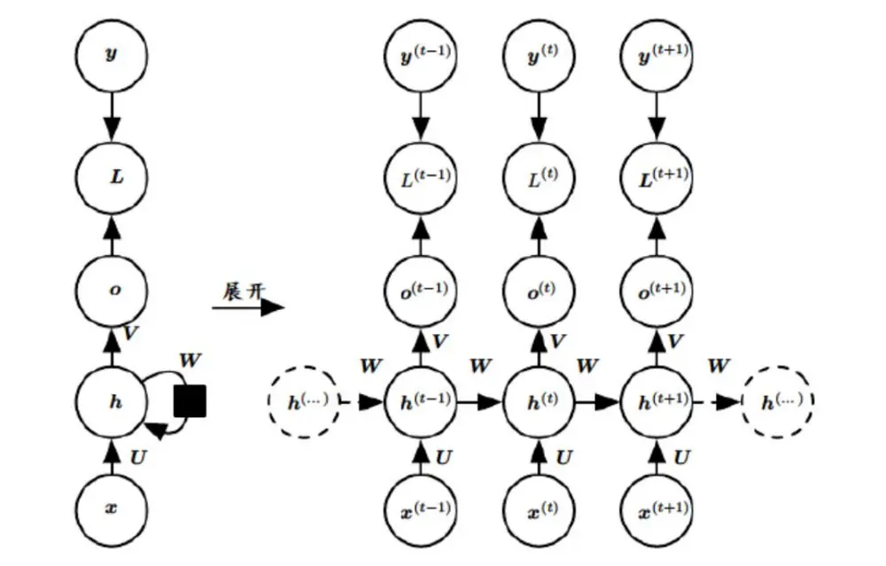
资料来源：华泰证券研究所

## RNN的使用形式

使用 RNN时的主要形式有 4 种，如图表 2所示。

1. Many to many，每一个输入都有相对应的输出，例如给视频的每一帧贴标签；

2. Many to one，整个序列只有一个输出，例如文本的情感分析；

3. One to many，通过一个输入产生一个序列，例如给一张图片加上一串解说词；

4. Many to many，并不一一对应，典型应用是翻译领域。

本文的目的是希望通过 RNN 模型来对股票进行分类，因此选用 Many to one 这种形式。

图表2： RNN的主要形式
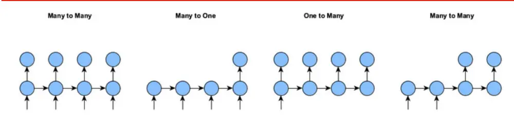
资料来源：华泰证券研究所

## RNN 分类算法基本步骤

我们先关注 RNN的前向传播算法，对于任意 t时刻，隐藏状态 $\cdot h_{t}$ 可由 $x_{t}$ 和 $\cdot h_{t-1}$ 得到

$$
h_{t}=\sigma(z_{t})=\sigma(UX_{t}+Wh_{t-1}+b)
$$

其中, $\sigma$ 为 RNN 的激活函数，此处一般为 tanh，b 为线性关系的偏倚。模型的输出 $o_{t}$ 的表达式比较简单

$$
o_{t}=Vh_{t}+c
$$

最终，t时刻的预测输出为

$$
\hat{y}_{t}=\sigma(o_{t})
$$

注意由于我们的 RNN 是分类模型，所以此处的激活函数一般是 softmax。

有了前向传播算法的基础，下面进行反向传播算法的推导。与传统神经网络模型一致，RNN也是通过梯度下降的方法来寻找 U、V、W 这三个参数的最优解，此处我们考虑较复杂的Many to Many形式，损失函数暂定为对数损失函数，由于序列的每个位置都有损失函数，因此最终损失为

$$
L=\sum_{1}^{\tau}L_{t}
$$

其中，V、c 的梯度计算比较简单

$$
\frac{\partial L}{\partial c}=\sum_{t=1}^{\tau}\frac{\partial L_{t}}{\partial c}=\sum_{t=1}^{\tau}\frac{\partial L_{t}}{\partial\sigma_{t}}\times\frac{\partial\sigma_{t}}{\partial c}=\sum_{t=1}^{\tau}\hat{y}_{t}-y_{t}
$$

$$
\frac{\partial L}{\partial V}=\sum_{t=1}^{\tau}\frac{\partial L_{t}}{\partial V}=\sum_{t=1}^{\tau}\frac{\partial L_{t}}{\partial\sigma_{t}}\times\frac{\partial\sigma_{t}}{\partial V}=\sum_{t=1}^{\tau}(\hat{y}_{t}-y_{t})(h_{t})^{T}
$$

由于t时刻的梯度损失为当前位置输出对应的梯度损失和t+1时刻的梯度损失两部分之和，我们定义 t 时刻隐藏状态的梯度为

$$
\delta_{t}=\frac{\partial L}{\partial h_{t}}=\frac{\partial L}{\partial\sigma_{t}}\times\frac{\partial\sigma_{t}}{\partial h_{t}}+\frac{\partial L}{\partial h_{t+1}}\times\frac{\partial h_{t+1}}{\partial h_{t}}=V^{T}((\hat{y}_{t}-y_{t})+W^{T}\delta_{t+1}diag(1-h_{t+1}^{2})
$$

再根据 $\cdot\delta_{t}$ 求得W、U、b 的梯度表达式：

$$
\frac{\partial L}{\partial W}=\sum_{t=1}^{\tau}\frac{\partial L}{\partial h_{t}}\times\frac{\partial h_{t}}{\partial W}=\sum_{t=1}^{\tau}diag(1-h_{t}^{2})\delta_{t}h_{t-1}^{T}
$$

$$
\frac{\partial L}{\partial b}=\sum_{t=1}^{\tau}\frac{\partial L}{\partial h_{t}}\times\frac{\partial h_{t}}{\partial b}=\sum_{t=1}^{\tau}diag(1-h_{t}^{2})\delta_{t}
$$

$$
\frac{\partial L}{\partial U}=\sum_{t=1}^{\tau}\frac{\partial L}{\partial h_{t}}\times\frac{\partial h_{t}}{\partial U}=\sum_{t=1}^{\tau}diag(1-h_{t}^{2})\delta_{t}x_{t}^{T}
$$

接下来的步骤与 ANN 类似，初始化权值，迭代更新权值至小于阈值或超出预定次数为止，在此就不再赘述了。需要注意的是，本文所涉及的股票分类问题属于上文所述的 RNN 使用形式 2(Many to one)，梯度表达式实际与 ANN 并无区别，本部分所做推导只是 RNN 的一般形式。

## RNN 主要参数

图表 3 中列出了 RNN 的主要参数，参数分两大类，一类是神经单元参数，一类是训练模型参数。

图表3： RNN主要参数

| 参数类别 | 参数 | 说明 |
| --- | --- | --- |
|  | units | 输出维度 |
|  | input_shape | 输入维度，在本文中即股票的70个因子变量 |
| 神经单元参数 | time_steps | 输入序列数目 |
|  | return_sequences | 是否返回序列，若存在两层及以上的隐藏层需设置为True |
|  | kernel_initializer | 初始化权值方法，一般为 RandomUniform |
|  | activation | 模型激活函数，常见的包括 tanh，softmax等 |
|  | dropout | 随机断开输入神经元比率，常用来防止过拟合 |
| 训练模型参数 | optimizer | 模型优化器，包括优化方法及学习速率等 |
|  | loss | 模型损失函数，包括均方误差和对数损失等 |

资料来源：华泰证券研究所

## RNN 存在的问题

相对于传统 ANN，深度神经网络的头号问题就是梯度消失，RNN 作为模型复杂度较高的神经网络模型，使得问题更加棘手，本文从两个角度展开探讨。

## 1. 具体表现

通过下面这个例子我们可以看出，RNN 作为专门处理信息持久化的一种模型，也会遇到从长期记忆退化到短期记忆的窘境，尝试处理下面这段文字：

小明是小刚的朋友。小明今年 15 岁，小刚今年 25 岁。小明是一名学生，认真刻苦，成绩优异，小刚是一名教师，尽心尽力，诲人不倦。小明借给小刚五元钱，小明是小刚的？

## 2. 数学推导

Yoshua Bengio 在 1994 年给出了 RNN 梯度消失的数学解释.在每个时刻，RNN 的隐层输出 $h_{t}$ 可以表示为：

$$
h_{t}=\sigma(UX_{t}+Wh_{t-1}+b)
$$

在反向传播时, 我们需要将 RNN 沿时间维度展开, 隐层梯度在沿时间维度反向传播时需要反复乘以系数W，因此，尽管理论上 RNN 可以捕获长距离依赖，但实际应用中，由于W谱半径(spectral radius)的不同，RNN 将会面临两个挑战：梯度爆炸(gradient explosion)和梯度消失(vanishing gradient)。梯度爆炸会影响训练的收敛，甚至导致网络不收敛；而梯度消失会使梯度趋向于 0，导致模型收敛速度非常慢，网络学习长距离依赖的难度增加。这两者相比，梯度爆炸相对比较好处理，可以用梯度裁剪(gradient clipping)来解决，而如何缓解梯度消失是 RNN及几乎其他所有深度学习方法研究的关键所在。

## 长短期记忆网络 LSTM

## LSTM 概述

传统 RNN 模型容易产生梯度消失的问题，难以处理长序列的数据。而造成梯度消失的原因，本质上是因为隐藏层状态 $h_{t}$ 的计算方式导致梯度被表示为连乘积的形式，因此Hochreater 和 Schmidhuber 在 1997 年提出了长短期记忆网络 LSTM，通过精心设计的隐藏层神经元缓解了传统 RNN 的梯度消失问题。

## LSTM 与 RNN 的区别

在 RNN 模型中，在每个序列索引位置都有一个隐藏状态 ${\cdot}h_{t}$ ，如果我们略去每层都有的 $o_{t}$ $y_{t}$ 和 $L_{t}$ ，那么模型可以简化为如图表 4的形式，通过线条指示的路径可以清晰地看出隐藏状态 $h_{t}$ 由 $h_{t-1}\hbar\pi x_{t}$ 共同决定。 $h_{t}$ 将一方面用于计算当前层模型的损失，另一方面用于计算下一层的 $h_{t+1}$ 1。

图表4： 简化的 RNN模型
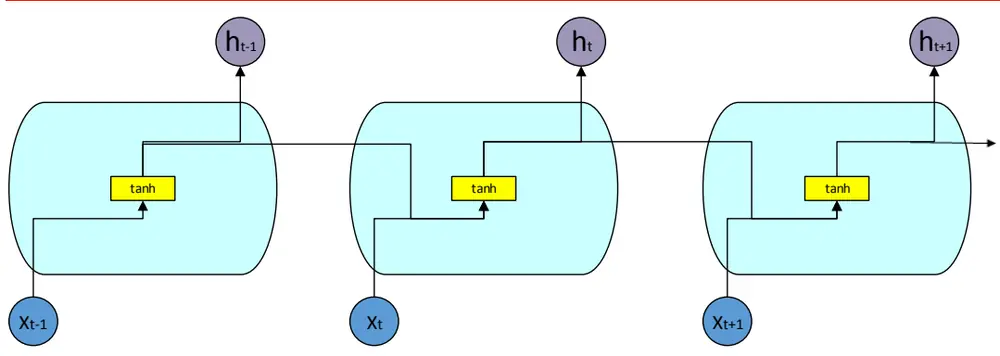
资料来源：华泰证券研究所

与 RNN 不同的是，LSTM 被设计拥有了更为精巧的隐藏状态网络模型结构，如图表 5，可以看到对比 RNN 较为简单的结构，LSTM 要复杂的多，为了能够清晰的表达出 LSTM设计的独到之处，我们将对其隐藏状态结构进行分析。

图表5： LSTM 的隐藏状态网络模型结构
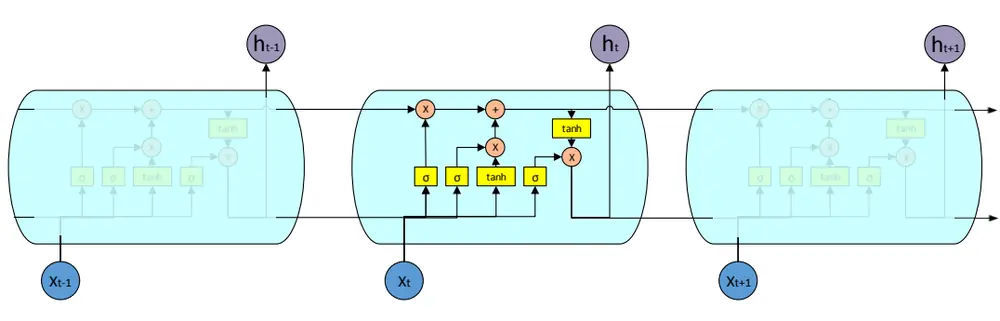
资料来源：华泰证券研究所

## LSTM 隐藏状态结构

LSTM 模型中，每个序列索引位置 t 时刻被向前传播的，除了和 RNN 一样的隐藏状态 $h_{t}$ ，还多了另一个隐藏状态，如图表 6 中的标黑横线。这个隐藏状态被我们称为细胞状态$C_{t}$ (Cell State)， $C_{t}$ 在 LSTM 中实质上起到了 RNN 中隐层状态 $h_{t}$ 的作用。除了细胞状态，图中还有其他许多结构，这些结构一般称之为门控结构(Gate)。LSTM模型在每个序列索引位置 t 的门控结构一般包括遗忘门，输入门和输出门三种，下面我们将对门控结构和细胞状态一一分析。

图表6： 细胞状态结构
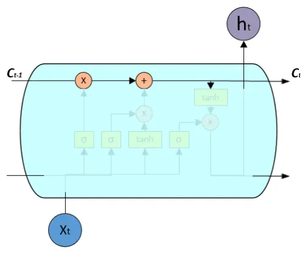
资料来源：华泰证券研究所

图表 7是 LSTM模型的遗忘门部分，遗忘门负责以一定的概率控制是否遗忘上一层的隐藏细胞状态，数学表达式为：

$$
f_{t}=\sigma(W_{f}h_{t-1}+U_{f}x_{t}+b_{f})
$$

$\sigma$ 为 sigmoid 激活函数。由于 $f_{t}$ 的值在[0,1]之间，因此代表了遗忘上一层细胞状态的概率。从语言模型角度看，当遇到新的主语 $x_{t}$ 并希望对下一个词进行预测时，我们希望能够忘记旧主语 $\cdot h_{t-1}$ 的一些特征。

图表7： 遗忘门结构
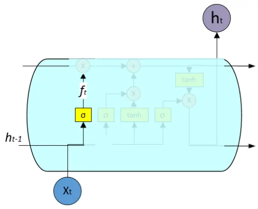
资料来源：华泰证券研究所

图表8是LSTM模型的输入门部分，输入门负责控制是否将当前时刻输 ${\lambda}_{t}$ 融入细胞状态，数学表达式为：

$$
\begin{array}{c}{i_{t}=\sigma(W_{i}h_{t-1}+U_{i}x_{t}+b_{i})}\\{\tilde{C}_{t}=tanh(W_{C}h_{t-1}+U_{C}x_{t}+b_{C})}\end{array}
$$

$\sigma$ 为 sigmoid 激活函数。由于 $\cdot_{i_{t}}$ 的值在[0,1]之间，因此代表了记住这一层输入信息的概率。通过 $\boldsymbol{i}_{t}\mathcal{\dot{\mathsf{K}}}\bar{C}_{t}$ 两者相乘获得当前细胞状态需要添加的信息。从语言模型角度看，即当遇到新主语 $x_{t}$ 时，我们希望在细胞状态 ${\tilde{C}}_{t}$ 中添加新主语 $x_{t}$ 的属性信息。

图表8： 输入门结构
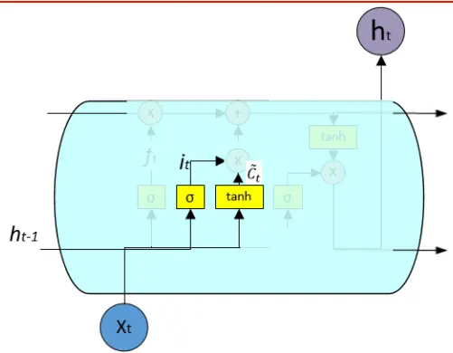
资料来源：华泰证券研究所

图表 9是 LSTM模型的细胞状态更新部分，在研究输出门之前，我们先关注细胞状态是如何更新的。遗忘门和输入门的结果都会作用于当前细胞状态 $C_{t}$ ，数学表达式为：

$$
C_{t}=C_{t-1}\odot f_{t}+i_{t}\odot\tilde{C}_{t}
$$

⨀是矩阵的 Hadamard 积(两个矩阵相同位置元素的乘积)。新状态即为旧状态乘以需要忘记的概率，加上新的候选值乘以需要更新的比率。从语言模型角度看，这里就是我们实际丢弃旧主语属性信息，并根据之前步骤添加新信息的地方。

图表9： 细胞状态更新
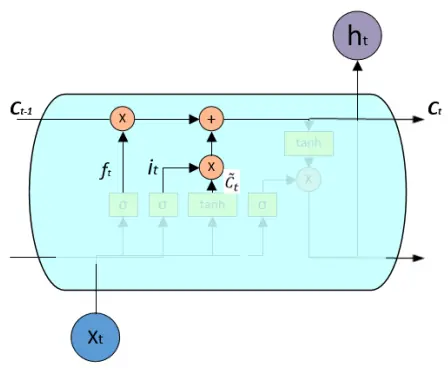
资料来源：华泰证券研究所

图表 10是 LSTM 模型的输出门部分，输出门是对当前细胞状态的过滤，目的是从细胞状态 $C_{t}\dot{\bar{\mathbf{\Gamma}}}$ 生隐藏状态 $h_{t}$ ，数学表达式为：

$$
\begin{array}{c}{{o_{t}=\sigma(W_{o}h_{t-1}+U_{o}x_{t}+b_{o})}}\\{{h_{t}=o_{t}\odot\mathrm{tanh}(C_{t})}}\end{array}
$$

图表10： 输出门结构
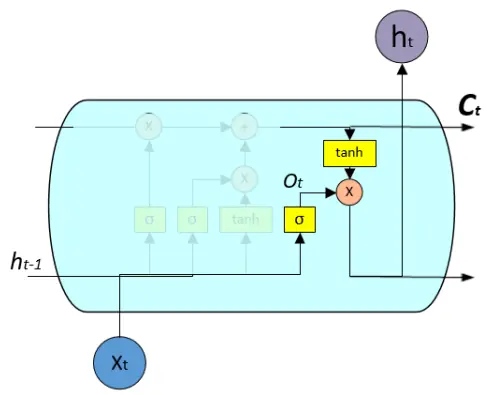
资料来源：华泰证券研究所

σ为 sigmoid 激活函数。由于 $o_{t}$ 的值在[0,1]之间，决定了细胞状态中哪些部分需要输出。然后将细胞状态输入到 tanh 函数中，乘以输出门限值，最终只输出我们想要输出的那部分。从语言模型角度看，模型可能输出主语的单复数信息，那么我们就能确定到底是“他”他还是“他们”。

## LSTM 如何缓解梯度消失问题

为了方便分析，我们把上一节中介绍 LSTM 隐藏状态结构的所有公式都罗列如下：

$$
\begin{array}{rl}&{f_{t}=\sigma(W_{f}h_{t-1}+U_{f}x_{t}+b_{f})}\\&{i_{t}=\sigma(W_{i}h_{t-1}+U_{i}x_{t}+b_{i})}\\&{\tilde{C}_{t}=tanh(W_{C}h_{t-1}+U_{C}x_{t}+b_{C})}\\&{\qquad C_{t}=C_{t-1}\odot f_{t}+i_{t}\odot\tilde{C}_{t}}\\&{\qquad o_{t}=\sigma(W_{o}h_{t-1}+U_{o}x_{t}+b_{o})}\\&{\qquad h_{t}=o_{t}\odot\mathrm{tanh}(\tilde{C}_{t})}\end{array}
$$

联立上面的式子可得：

$$
\begin{array}{c}{h_{t}=o_{t}\odot\mathrm{tanh}(C_{t-1}\odot f_{t}+i_{t}\odot tanh(W_{C}h_{t-1}+U_{C}x_{t}+b_{C}))}\\{C_{t}=C_{t-1}\odot f_{t}+i_{t}\odot\tilde{C}_{t}\qquad}\end{array}
$$

由以上两式可以看出， $h_{t}$ 不仅要由 $h_{t-1}$ 计算得到，还要由 $C_{t}$ 计算得到， $C_{t}$ 的计算本身不依赖于系数 $W_{C}$ ，当遗忘门 $\mid f_{t}$ 被打开时， $C_{t}$ 的梯度可以有效地反向传递给 $C_{t-1}\mathfrak{c}$ 。而系数 $W_{C}$ 正是造成传统 RNN 模型梯度消失的根源所在，所以通过引入另一个隐藏状态 $C_{t}$ 和 3 个门控结构，LSTM缓解了神经网络训练中的梯度消失问题。

## 门控循环单元 GRU

## GRU 概述

门控循环单元(Gated Recurrent Units)由 Cho 在 2014 年提出，是 LSTM 模型的一类常见变种。与 LSTM不同的是，GRU 将遗忘门和输入门合成为单一的更新门。如图表 11，GRU将输入 $\dot{\Pi}i_{t}$ 和遗忘门 $\mid f_{t}$ 融合成单一的更新 ${\lvert{\bf\bar{\Delta}}\rvert}_{\partial_{t}}$ ，并且融合了细胞状态 $C_{t}$ 和隐藏状态 $h_{t}$ 。

图表11： GRU隐藏状态结构
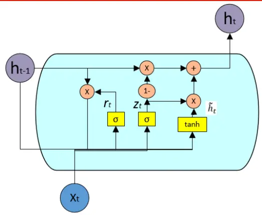
资料来源：华泰证券研究所

## GRU 隐藏状态结构

图表 11中 $r_{t}$ 是 GRU 模型的重置门部分，用于控制前一时刻隐藏状态 $h_{t-1}$ 对当前状态的影响。若 $h_{t-1}$ 不重要，从语言模型角度看，即从当前开始表达新的意思，与上文无关，则重置门关闭，数学表达式为：

$$
r_{t}=\sigma(W_{r}h_{t-1}+U_{r}x_{t}+b_{r})
$$

图表 11中 $z_{t}$ 是 GRU 模型的更新门部分，用于决定是否忽略当前输 ${\lambda}_{t}$ ，类似 LSTM 中的输入门 $|i_{t}$ 。从语言模型角度看，即判断当前 $\dot{\bar{\tau}}\bar{\bar{\tau}}\bar{x}_{t}$ 对整体意思的表达是否重要，数学表达式为：

$$
z_{t}=\sigma(W_{z}h_{t-1}+U_{z}x_{t}+b_{z})
$$

定义完 GRU的重置门和更新门之后，我们再来看 GRU 的细胞更新。当更新门打开时， $h_{t}$ 由 $h_{t-1}$ 和 ${\boldsymbol{\mathbf{\mathit{x}}}}_{t}$ 决定；当更新门被关闭时， $h_{t}$ 将仅由 $h_{t-1}$ 决定，帮助梯度反向传播，与 LSTM相同，这种机制有效地缓解了梯度消失现象。数学表达式为：

$$
\begin{array}{r}{\widetilde{h}_{t}=tanh(Wr_{t}\odot h_{t-1}+Ux_{t}+b_{f})}\\{h_{t}=(1-z_{t})\odot h_{t-1}+z_{t}\odot\widetilde{h}_{t}\quad}\end{array}
$$

## GRU 对比 LSTM

Greff 在 2015 年比较了 LSTM 常见的变种，发现它们的学习效果相差无几；GRU的主要优势在于其构造简单，相比 LSTM 减少了一个门控结构，少了很多矩阵乘法运算，因此在训练数据量很大的情况下，GRU 相比 LSTM 能节省很多时间。

## 循环神经网络模型测试流程

## 测试流程

图表12： 循环神经网络模型构建示意图
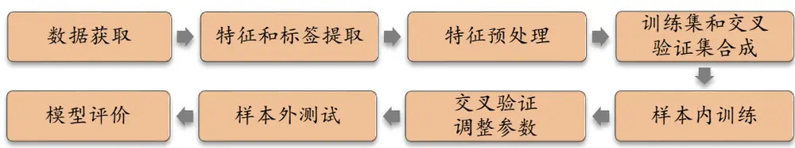
资料来源：华泰证券研究所

本文将要测试的循环神经网络模型有 3 种：传统 RNN，LSTM，GRU，为了保证三种模型的一致性和可比性，对它们采用完全相同的测试流程。循环神经网络模型的构建方法包含下列步骤：

1． 数据获取：

a) 股票池：全 A股。剔除 ST 股票，剔除每个截面期下一交易日停牌的股票，剔除上市 3个月内的股票，每只股票视作一个样本。

b) 回测区间：2011-01-31 至 2017-10-31。分 7 个阶段回测，如图表 14 所示。

2． 特征和标签提取：每个自然月的最后一个交易日，计算之前报告里的 70 个因子暴露度，作为样本的原始特征；计算下一整个自然月的个股超额收益(以沪深 300 指数为基准)，作为样本的标签。因子池如图表 13所示。

3． 特征预处理：

a) 中位数去极值：设第 T 期某因子在所有个股上的暴露度序列为 $D_{i},\ D_{M}$ 为该序列中位数， $D_{M1}$ 为序列 $|D_{i}-D_{M}$ |的中位数，则将序列 $D_{i}$ 中所有大于 $D_{M}+5D_{M1}$ 的数重设为 $D_{M}+5D_{M1}$ ，将序列 $D_{i}$ 中所有小于 $D_{M}-5D_{M1}$ 的数重设为 $D_{M}-5D_{M1}$ ；

b) 缺失值处理：得到新的因子暴露度序列后，将因子暴露度缺失的地方设为中信一级行业相同个股的平均值。

c) 行业市值中性化：将填充缺失值后的因子暴露度对行业哑变量和取对数后的市值做线性回归，取残差作为新的因子暴露度。

d) 标准化：将中性化处理后的因子暴露度序列减去其现在的均值、除以其标准差，得到一个新的近似服从 $_{\mathrm{N}(0,1)}$ 分布的序列。

4． 训练集和交叉验证集的合成：在每个月末截面期，选取下月收益排名前 30%的股票作为正例(y = 1)，后 30%的股票作为负例 $(y=-1)$ 。将训练样本合并，随机选取 90%的样本作为训练集，余下 10%的样本作为交叉验证集。

5． 样本内训练：使用 RNN 模型对训练集进行训练，考虑到我们将回测区间按年份划分为 7 个子区间，因此需要对每个子回测的不同训练集重复训练。

6． 交叉验证调参：模型训练过程中，观察交叉验证集 loss的变化，当交叉验证集的 loss在连续 10 轮迭代后都没有提升时，停止模型训练。选取交叉验证集 loss 最低的一组参数作为模型的最优参数。

7． 样本外测试：确定最优参数后，以 T 月月末截面期所有样本预处理后的特征作为模型的输入，得到每个样本的预测值f(x)，将预测值视作合成后的因子。进行单因子分层回测。回测方法和之前的单因子测试报告相同，具体步骤参考下一小节。

8． 模型评价：我们以分层回测的结果作为模型评价指标。我们还将给出测试集的正确率、AUC 等衡量模型性能的指标。

图表13： 选股模型中涉及的全部因子及其描述

| 大类因子 | 具体因子 | 因子描述 | 因子方向 |
| --- | --- | --- | --- |
| 估值 | EP | 净利润(TTM)/总市值 | 1 |
| 估值 | EPcut | 扣除非经常性损益后净利润(TTM)/总市值 | 1 |
| 估值 | BP | 净资产/总市值 | 1 |
| 估值 | SP | 营业收入(TTM)/总市值 | 1 |
| 估值 | NCFP | 净现金流(TTM)/总市值 | 1 |
| 估值 | OCFP | 经营性现金流(TTM)/总市值 | 1 |
| 估值 | DP | 近12个月现金红利(按除息日计)/总市值 | 1 |
| 估值 | G/PE | 净利润(TTM)同比增长率/PE_TTM | 1 |
| 成长 | Sales_G_q | 营业收入(最新财报，YTD)同比增长率 | 1 |
| 成长 | Profit_G_q | 净利润(最新财报，YTD)同比增长率 | 1 |
| 成长 | OCF_G_q | 经营性现金流(最新财报，YTD)同比增长率 | 1 |
| 成长 | ROE_G_q | ROE(最新财报，YTD)同比增长率 | 1 |
| 财务质量 | ROE_q | ROE(最新财报，YTD) | 1 |
| 财务质量 | ROE_ttm | ROE(最新财报，TTM) |  |
| 财务质量 | ROA_q | ROA(最新财报，YTD) |  |
| 财务质量 | ROA_ttm | ROA(最新财报，TTM) | 1 |
| 财务质量 | grossprofitmargin_q | 毛利率(最新财报，YTD) | 1 |
| 财务质量 | grossprofitmargin_ttm | 毛利率(最新财报，TTM) | 1 |
| 财务质量 财务质量 | profitmargin_q | 扣除非经常性损益后净利润率(最新财报，YTD) | 1 |
| 财务质量 | profitmargin_ttm | 扣除非经常性损益后净利润率(最新财报，TTM) | 1 |
|  | assetturnover_q | 资产周转率(最新财报，YTD) | 1 |
| 财务质量 | assetturnover_ttm | 资产周转率(最新财报，TTM) | 1 |
| 财务质量 | operationcashflowratio_q | 经营性现金流/净利润(最新财报，YTD) | 1 |
| 财务质量 |  | operationcashflowratio_ttm经营性现金流/净利润(最新财报，TTM) | 1 |
| 杠杆 | financial_leverage | 总资产/净资产 | -1 |
| 杠杆 | debtequityratio | 非流动负债/净资产 | -1 |
| 杠杆 杠杆 | cashratio | 现金比率 流动比率 | 1 |
| 市值 | currentratio | 总市值取对数 | 1 |
| 动量反转 | In_capital | 个股60个月收益与上证综指回归的截距项 | -1 -1 |
| 动量反转 | HAlpha | 个股最近N个月收益率，N=1，3，6，12 | -1 |
| 动量反转 | return_Nm wgt_return_Nm | 个股最近N个月内用每日换手率乘以每日收益率求算术平均 | -1 |
| 动量反转 exp_wgt_return_Nm |  | 值，N=1，3，6，12 个股最近 N 个月内用每日换手率乘以函数 exp(-x_i/N/4)再乘 | -1 |
| 波动率 |  | 以每日收益率求算术平均值，X_i为该日距离截面日的交易日 的个数，N=1，3，6，12 特质波动率——个股最近 N 个月内用日频收益率对 Fama |  |
| 波动率 | std_FF3factor_Nm | French三因子回归的残差的标准差，N=1，3，6，12 个股最近N个月的日收益率序列标准差，N=1，3，6，12 | -1 |
| 股价 | std_Nm In_price | 股价取对数 | -1 -1 |
| beta | beta | 个股 60个月收益与上证综指回归的 beta | -1 |
| 换手率 | turn_Nm | 个股最近N个月内日均换手率(剔除停牌、涨跌停的交易日)， | -1 |
| 换手率 |  | N=1, 3, 6, 12 个股最近N个月内日均换手率除以最近2年内日均换手率(剔 |  |
|  | bias_turn_Nm | 除停牌、涨跌停的交易日)再减去1，N=1，3，6，12 | -1 |
| 情绪 情绪 | rating_average | wind 评级的平均值 | 1 1 |
| 情绪 | rating_change rating_targetprice | wind评级(上调家数-下调家数)/总数 wind一致目标价/现价-1 | 1 |
| 股东 | holder_avgpctchange | 户均持股比例的同比增长率 | 1 |
| 技术 |  |  | -1 |
|  | MACD | 经典技术指标(释义可参考百度百科)，长周期取30日，短周 | -1 |
| 技术 | DEA | 期取 10 日，计算 DEA 均线的周期(中周期)取 15 日 | -1 |
| 技术 | DIF RSI |  | -1 |
| 技术 |  | 经典技术指标，周期取20日 |  |
| 技术 | PSY | 经典技术指标，周期取20日 | -1 |
| 技术 | BIAS | 经典技术指标，周期取20日 | -1 |

资料来源：Wind，华泰证券研究所

图表14： 分阶段回测模型选取示意图
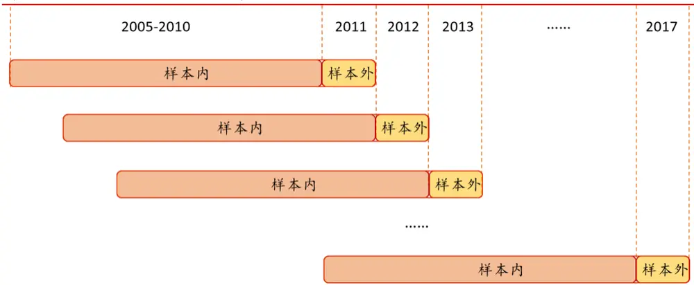
资料来源：华泰证券研究所

## 循环神经网络参数选择和网络结构

LSTM 缓解了传统 RNN 的梯度消失问题，近年来在文本分析、时间序列预测方面有广泛的用途。因此本文以 LSTM模型为例，对模型的参数选择和测试结果进行说明，其他模型与之类似。

由于神经网络模型训练缓慢且参数众多，难以借助本系列之前报告中所提到的网格搜索进行参数寻优。因此 LSTM 的参数设置中加入了一些经验选择的方法。具体参数选择如下：

1. 输入维度(input_shape)：70，对应 70 个因子。

2. 输出维度(units)：2，对应二分类。

3. 输入序列数目(time_steps)：5。这是循环神经网络独有的参数，即预测当前时点输出所使用的历史输入序列数目。在月频的多因子选股中，该参数太大会使得满足要求的样本太少(因为股票停牌造成因子缺失)，太小又难以发挥循环神经网络的特性，因此设定为 5，即预测下个月股票的涨跌使用过去 5个月的因子为输入。

4. 隐藏层数：2 层。在测试中，我们发现 1 层隐藏层的 LSTM 预测能力有限，而 2层以上的 LSTM 具有了不错的预测能力，因此把隐藏层数目定为 2层，这兼顾了模型的预测能力和低复杂度。

5. 隐藏层神经元数(units)：每层都为 100 个。考虑到因子数目为 70 个，选择 100 个隐藏层神经元数顾了模型的预测能力和低复杂度。

6. 随机断开输入神经元比率(dropout):0.2。该参数主要用来避免过拟合。

7. 初始化权值方法(kernel_initializer)：RandomUniform。使用正态分布初始化权值。

8. 神经元激活函数(activation)：tanh。这是 LSTM 中最常用的激活函数。

9. 单个训练批次样本数(batch_size)：1000。

10. 优化器(optimizer)：RMSProp。该优化函数相比随机梯度下降(SGD)收敛速度快很多，可以大大节省训练时间。

11. 学习速率(learning_rate)：0.001。该速率兼顾了收敛速度和收敛稳定性。

12. 损失函数(loss function)：categorical_crossentropy。该损失函数适合二分类情景。

在设置了以上参数后，LSTM 网络的结构如图 15 所示。可以看到，该模型的输入是一个5*70 的向量，两个 LSTM 隐藏层都有 100 个神经元，每个隐藏层之后都有一次 dropout，最后通过一个全连接层(Dense)输出，输出维度是 2，对应二分类。Num 代表输入模型的样本数量。

图表15： LSTM 网络结构
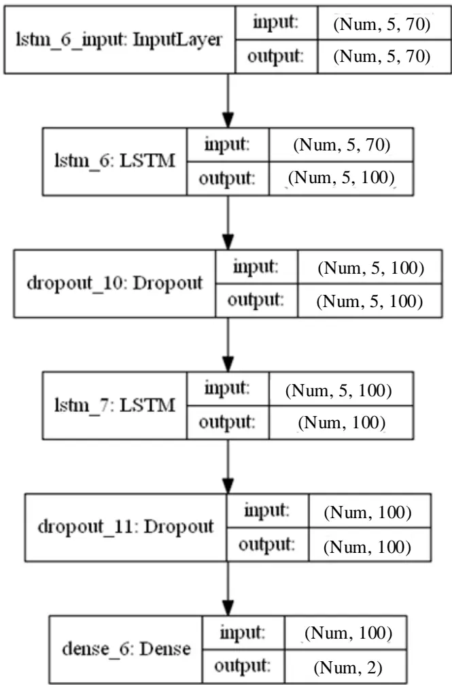
资料来源：华泰证券研究所

## 循环神经网络模型测试结果

循环神经网络正确率与 AUC分析

图 16 和图 17 展示了 LSTM、GRU、传统 RNN 每一期样本外的正确率和 AUC 值随时间的变化情况。我们在 2011-01-31 至 2017-10-31 的回测区间中分 7 个阶段训练并测试模型，三种模型样本外平均 AUC 分别为 0.5429，0.5576，0.5410，样本外平均正确率分别为 58.57%，57.61%，56.85%。

图表16： 三种模型样本外正确率变化
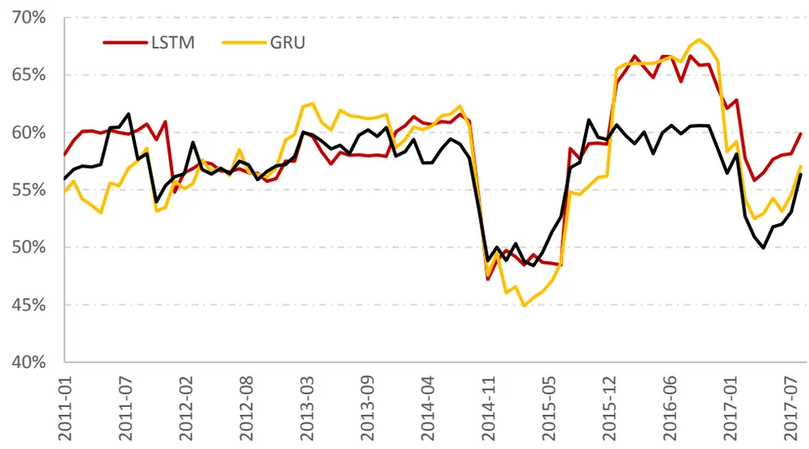
资料来源：Wind，华泰证券研究所

图表17： 三种模型样本外 AUC变化
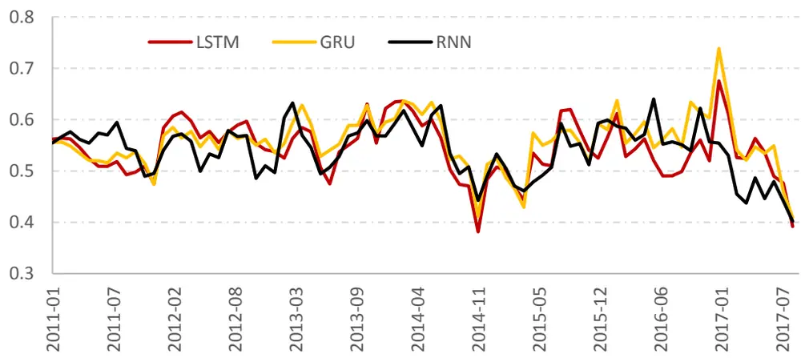
资料来源：Wind，华泰证券研究所

图表 18 和图表 19 展示了 LSTM 模型训练过程中训练集和验证集正确率和 loss 的变化情况，可以看到，当迭代次数超过 1000 次以后，验证集的正确率和 loss不再变得更优，LSTM模型可以停止训练了。

图表18： 训练集和验证集正确率变化
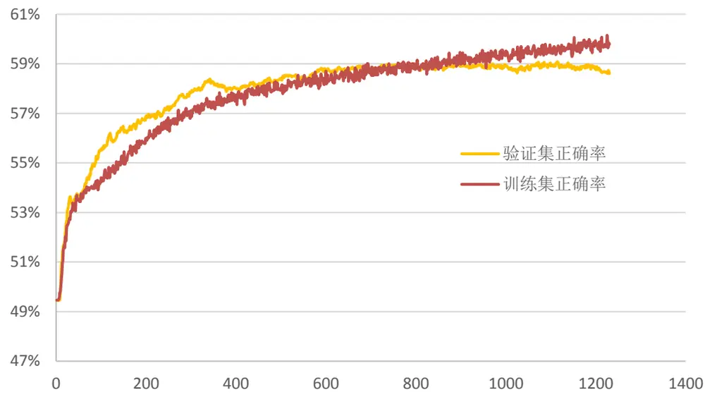
资料来源：Wind，华泰证券研究所

图表19： 训练集和验证集 loss变化
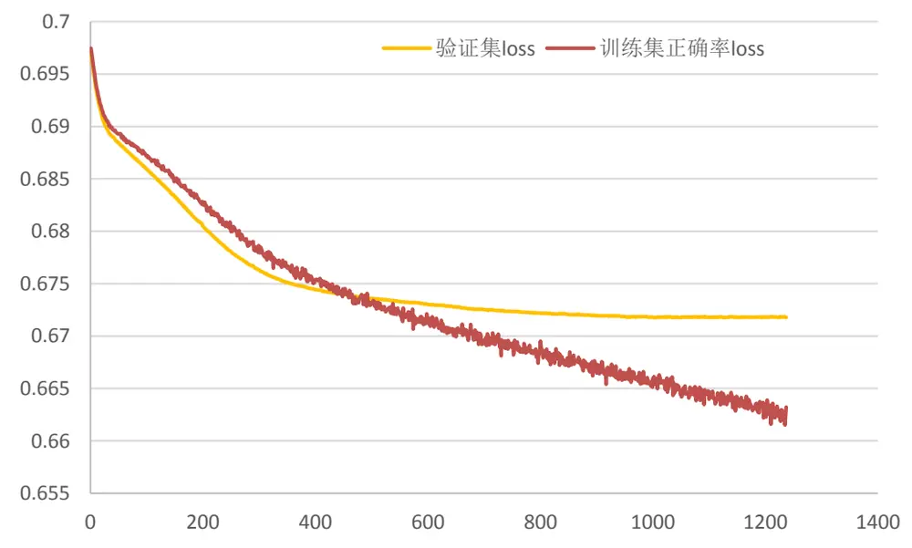
资料来源：Wind，华泰证券研究所

## LSTM 模型训练过程分析

一直以来，神经网络一类模型都在模型可解释性上受到诟病，模型结构的复杂使人们对于模型的分析难以下手，人们普遍认为神经网络是一个黑箱。但是实际上随着实现工具的完善，分析神经网络的内部结构逐渐变得可行，我们借助 Python Keras 包中相关功能，初步对 LSTM 模型训练过程进行了分析。

为了让读者能够更好地理解 LSTM 模型的迭代优化过程，我们在这里以模型权重为例展开讨论。第一层 LSTM有四类权重矩阵，包括输入部分、遗忘部分、细胞状态部分以及输出部分，为了能直观的展示权重变化的过程，我们截取第一层 LSTM 连接当前输入 $\mathbf{\boldsymbol{\mathbf{\rho}}}\cdot\mathbf{\boldsymbol{\mathbf{\mathit{x}}}}_{t}$ 和当前状态 ${\cdot}h_{t}$ 的输入部分权重，即上文中的 $U_{i}$ 。图表 20 是 In_capital 因子所对应的权重，由于全部显示 In_capital 因子连接的 100 个隐藏状态需要的空间较大，因此我们截取了前 15 个隐藏状态。图中纵坐标为迭代次数，数值为当前权重值，可以看到随着迭代的加深，部分权重值的渐变过程很明显(例如第 1、3、4、7、15 列)，即这部分权重被训练的越来越好，对预测下期收益率的重要性越来越大。

图表20： In_capital 因子对应的权重变化

| 迭代次数 |  | 1 | 2 | 3 | 4 | 5 | 6 | 7 | 8 | 9 | 10 | 11 | 12 | 13 | 14 | 15 |
| --- | --- | --- | --- | --- | --- | --- | --- | --- | --- | --- | --- | --- | --- | --- | --- | --- |
| 100 | 0.029 | 0.025 | -0.036 | -0.009 | 0.013 |  | 0.026 | -0.004 | -0.007 | -0.041 | 0.030 | -0.010 | 0.013 | -0.018 | -0.048 | 0.041 |
| 200 | 0.029 | 0.031 | -0.035 | -0.005 | 0.002 |  | 0.022 | 0.009 | -0.001 | -0.041 | 0.037 | -0.014 | -0.003 | -0.009 | -0.052 | 0.052 |
| 300 | 0.042 | 0.029 | -0.033 | 0.011 | 0.008 |  | 0.029 | 0.025 | 0.002 | -0.037 | 0.036 | -0.005 | -0.005 | -0.014 | -0.053 | 0.057 |
| 400 | 0.048 | 0.029 | -0.030 | 0.015 | 0.020 |  | 0.029 | 0.031 | 0.000 | -0.037 | 0.040 | -0.008 | -0.006 | -0.014 | -0.049 | 0.068 |
| 500 | 0.064 | 0.030 | -0.032 | 0.029 | 0.030 |  | 0.032 | 0.042 | -0.005 | -0.037 | 0.043 | -0.013 | -0.008 | -0.003 | -0.049 | 0.080 |
| 600 | 0.083 | 0.023 | -0.040 | 0.041 | 0.028 |  | 0.028 | 0.061 | -0.008 | -0.046 | 0.043 | -0.013 | -0.001 | 0.000 | -0.049 | 0.093 |
| 700 | 0.091 | 0.022 | -0.049 | 0.051 | 0.037 |  | 0.022 | 0.078 | -0.009 | -0.046 | 0.036 | -0.017 | -0.005 | 0.002 | -0.050 | 0.106 |
| 800 | 0.084 | 0.021 | -0.062 | 0.069 | 0.037 |  | 0.036 | 0.091 | -0.018 | -0.055 | 0.027 | -0.021 | 0.001 | 0.012 | -0.043 | 0.108 |
| 900 | 0.103 | 0.019 | -0.070 | 0.083 | 0.048 |  | 0.042 | 0.100 | -0.025 | -0.052 | 0.022 | -0.027 | -0.003 | 0.016 | -0.047 | 0.118 |
| 1000 | 0.116 | 0.022 | -0.069 | 0.085 | 0.054 |  | 0.043 | 0.106 | -0.028 | -0.054 | 0.019 | -0.025 | -0.008 | 0.029 | -0.050 | 0.127 |

资料来源：Wind，华泰证券研究所

图表 21是 assetturnover_ttm 因子对应的权重变化过程，可以看到随着迭代的进行，权重值的渐变过程并不明显，即模型误差的反向传播并没有对这部分参数进行过多的修正，代表着 assetturnover_ttm 因子可能对下月收益率的解释性弱于 In_capital 因子。

图表21： assetturnover_ttm 因子对应的权重变化

| 隐藏状态序号 |  |  |  |  |  |  |  |  |  |  |  |  |  |  |  |
| --- | --- | --- | --- | --- | --- | --- | --- | --- | --- | --- | --- | --- | --- | --- | --- |
| 迭代次数 | 1 | 2 | 3 | 4 | 5 | 6 | 7 | 8 | 9 | 10 | 11 | 12 | 13 | 14 | 15 |
| 100 | 0.034 | -0.013 | -0.048 | -0.011 | 0.030 | 0.057 | -0.034 -0.016 |  | 0.014 | 0.001 | -0.017 | 0.057 | 0.033 | -0.030 | -0.038 |
| 200 | 0.036 | 0.004 | -0.052 | -0.012 | 0.026 | 0.062 | -0.037 | 7-0.006 | 0.011 | 0.002 | -0.009 | 0.064 | 0.037 | -0.017 | -0.036 |
| 300 | 0.043 | 0.007 | -0.059 | -0.016 | 0.036 | 0.073 | -0.039 | -0.003 | 30.003 | 0.006 | -0.008 | 0.068 | 0.044 | -0.013 | -0.031 |
| 400 | 0.030 | 0.007 | -0.055 | -0.017 | 0.033 | 0.076 | -0.040 | 0.010-0.001 |  | 0.007 | -0.007 | 0.066 | 0.038 | -0.004 | -0.031 |
| 500 | 0.037 | 0.013 | -0.051 | -0.012 | 0.039 | 0.082 | -0.049 | 0.020-0.004 |  | 0.007 | -0.008 | 0.069 | 0.029 | -0.003 | -0.039 |
| 600 | 0.037 | 0.021 | -0.055 | -0.010 | 0.039 | 0.086 | -0.053 | 0.020-0.012 |  | 0.002 | 0.003 | 0.070 | 0.020 | -0.001 | -0.042 |
| 700 | 0.030 | 0.026 | -0.056 | -0.007 | 0.039 | 0.093 | -0.052 | 0.026 | -0.021 | 0.005 | 0.007 | 0.072 | 0.017 | 0.008 | -0.045 |
| 800 | 0.028 | 0.024 | -0.052 | -0.016 | 0.039 | 0.085 | -0.054 | 0.024 | -0.024 | -0.001 | 0.005 | 0.070 | 0.017 | 0.007 | -0.044 |
| 900 | 0.026 | 0.024 | -0.056 | -0.017 | 0.046 | 0.091 | -0.058 | 0.034 | -0.026 | 0.000 | 0.000 | 0.073 | 0.017 | 0.011 | -0.047 |
| 1000 | 0.029 | 0.026 | -0.053 | -0.022 | 0.051 | 0.085 | -0.068 | 0.031 | -0.026 |  | 0.004 -0.002 | 0.075 | 0.007 | 0.006 | -0.053 |

资料来源：Wind，华泰证券研究所

图表 22是对 LSTM 第一层参数总体的描述，横坐标代表权重值，纵坐标为迭代次数，可以发现迭代越深，参数总体描述曲线越扁平，参数分布的范围越广；即随着模型的训练，各参数的权重被区分得越来越好。

图表22： LSTM 第一层参数的总体描述
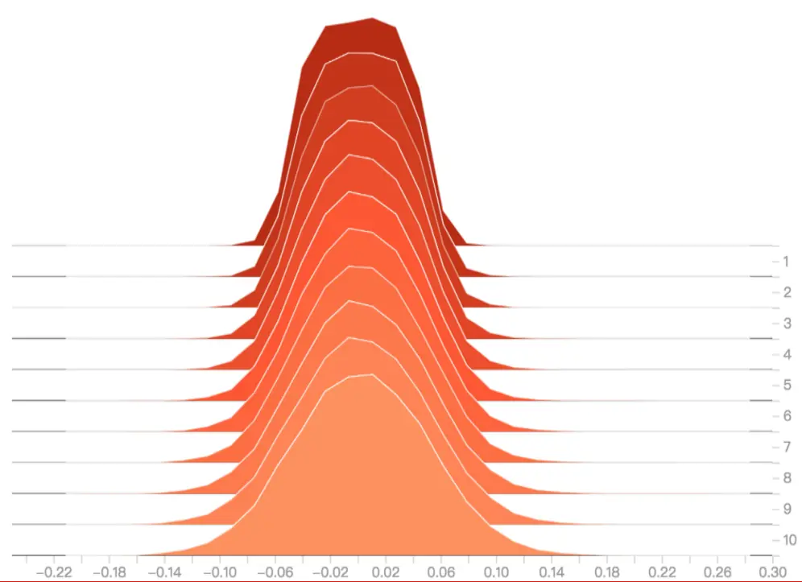
资料来源：Wind，华泰证券研究所

第二层LSTM的100个神经元与第一层的100个神经元相连接，为了直观显示变化过程，我们选取第二层 LSTM 的第一个神经元连接的权重值。图表 23 是其与第一层前 15 个神经元对应的权重值，可以看到部分列的颜色渐变比较明显，这说明模型的训练是有效的。

图表23： LSTM 第二层的第一个神经元连接的权重值

| 隐藏状态序号 |  |  |  |  |  |  |  |  |  |  |  |  |  |  |  |
| --- | --- | --- | --- | --- | --- | --- | --- | --- | --- | --- | --- | --- | --- | --- | --- |
| 迭代次数 1 |  | 2 3 4 |  |  | 5 6 7 8 9 10 11 12 13 14 15 |  |  |  |  |  |  |  |  |  |  |
| 100 | 0.069 | -0.001 | -0.0220.010 |  | -0.042 | 0.0000.019 |  | -0.047 | 0.000 | -0.021 0.0430.047-0.035 |  |  |  | -0.018 0.015 |  |
| 200 | 0.093 | -0.007- | 0.0030.006 |  | -0.041 | -0.0060.028 |  | -0.034 | 0.009 | -0.0250.0540.061-0.041 |  |  |  | -0.008 | 0.028 |
| 300 | 0.105 | -0.012 | 0.0090.002 |  | -0.030 | -0.009 | 0.037 | -0.033 | 0.010 | -0.028 | 0.058 | 0.067 | -0.046 | -0.004 | 0.037 |
| 400 | 0.111 | -0.017 | 0.014-0.005 |  | -0.026 | -0.020 | 0.044 | -0.026 | 0.011 | -0.033 | 0.061 | 0.071 | -0.061 | -0.004 | 0.046 |
| 500 | 0.123 | -0.017 | 0.023-0.009 |  | -0.008 | -0.019 | 0.050 | -0.017 | 0.011 | -0.035 | 0.071 | 0.078 | -0.067 | 0.003 | 0.053 |
| 600 | 0.136 | -0.019 | 0.034-0.015 |  | 0.004 | -0.024 | 0.053 | -0.010 | 0.009 | -0.039 | 0.080 | 0.082 | -0.072 | 0.004 | 0.059 |
| 700 | 0.144 | -0.021 | 0.045-0.015 |  | 0.014 | -0.019 | 0.061 | -0.005 | 0.013 | -0.042 | 0.080 | 0.079 | -0.079 | 0.010 | 0.066 |
| 800 | 0.151 | -0.022 | 0.049 | -0.025 | 0.027 | -0.020 | 0.064 | -0.003 | 0.008 | -0.046 | 0.083 | 0.083 | -0.081 | 0.007 | 0.068 |
| 900 | 0.154 | -0.020 | 0.049 | -0.029 | 0.024 | -0.015 | 0.063 | 0.001 | 0.015 | -0.046 | 0.082 | 0.078 | -0.082 | 0.005 | 0.069 |
| 1000 | 0.157 | -0.026 | 0.054-0.039 |  | 0.019 | -0.019 0.067 |  | -0.0020.011 |  | -0.053 | 0.075 | 0.067 | -0.088 | 0.010 | 0.075 |

资料来源：Wind，华泰证券研究所

与第一层类似，图表 24 是对第二层 LSTM 参数总体的描述，随着模型的训练，各参数被区分得越来越好。

图表24： LSTM 第二层参数的总体描述
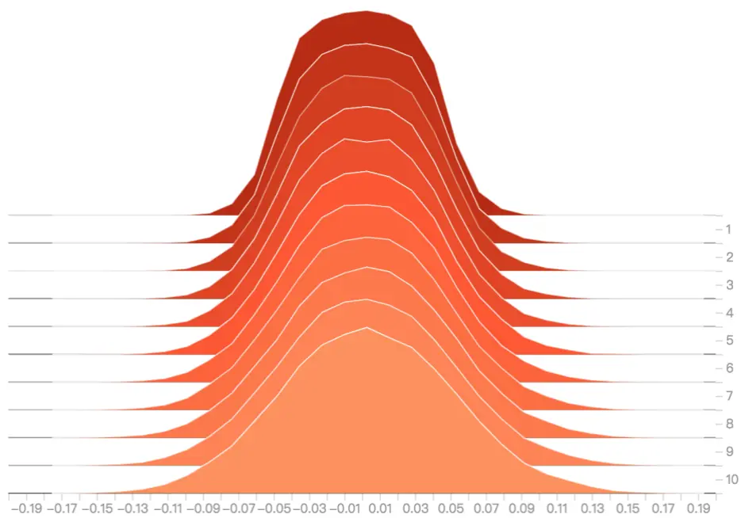
资料来源：Wind，华泰证券研究所

## LSTM 模型分层回测分析

循环神经网络模型，最终在每个月底可以产生对全部个股下月上涨或下跌的预测值。因此可以将其看作一个因子合成模型，即在每个月底将因子池中所有因子合成为一个“因子”。接下来，我们对该模型合成的这个“因子”(即个股下期收益预测值)进行分层回测，从各方面考察该模型的效果。仿照华泰单因子测试系列报告中的思路，分层回测模型构建方法如下：

1. 股票池：全 A 股，剔除 ST 股票，剔除每个截面期下一交易日停牌的股票，剔除上市3 个月以内的股票。

2. 回测区间：2011-01-31 至 2017-10-31(按年度分为 7 个子区间)。

3. 换仓期：在每个自然月最后一个交易日核算因子值，在下个自然月首个交易日按当日收盘价换仓。

4. 数据处理方法：将 LSTM 模型的预测值视作单因子，因子值为空的股票不参与分层。

5. 分层方法：在每个一级行业内部对所有个股按因子大小进行排序，每个行业内均分成N 个分层组合。如图表 25 所示，黄色方块代表各行业内个股初始权重，可以相等也可以不等(我们直接取相等权重进行测试)，分层具体操作方法为 N 等分行业内个股权重累加值，例如图示行业 1 中，5 只个股初始权重相等(不妨设每只个股权重为 0.2)，假设我们欲分成 3 层，则分层组合 1在权重累加值 1/3 处截断，即分层组合 1包含个股 1 和个股 2，它们的权重配比为 0.2:(1/3-0.2)=3:2，同样推理，分层组合 2 包含个股 2、3、4，配比为(0.4-1/3):0.2:(2/3-0.6)=1:3:1，分层组合 4 包含个股 4、5，配比为 2:3。以上方法是用来计算各个一级行业内部个股权重配比的，行业间权重配比与基准组合(我们使用沪深 300)相同，也即行业中性。

6. 评价方法：回测年化收益率、夏普比率、信息比率、最大回撤、胜率等。

图表25： 单因子分层测试法示意图
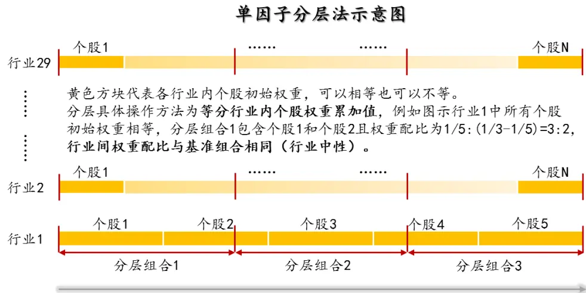
行业内个股按因子值排序
资料来源：华泰证券研究所

这里我们将展示 LSTM 模型的分层测试结果。

下图是分五层组合回测绩效分析表(20110131～20171031)。其中组合 1～组合 5为按LSTM 模型打分从大到小排序构造的行业中性的分层组合。基准组合为行业中性的等权组合，具体来说就是将组合 1～组合 5合并，一级行业内部个股等权配置，行业权重按当期沪深 300 行业权重配置。多空组合是在假设所有个股可以卖空的基础上，每月调仓时买入组合 1，卖空组合 5。回测模型在每个自然月最后一个交易日核算因子值，在下个自然月首个交易日按当日收盘价调仓。

图表26： LSTM 模型分层组合绩效分析(20110131～20171031)

| 投资组合 | 年化收益率 | 年化波动率夏普比率最大回撤 |  |  | 年化超额收益率 | 超额收益年化波动率信息比率 |  | 相对基准月胜率 | 超额收益最大回撤 |
| --- | --- | --- | --- | --- | --- | --- | --- | --- | --- |
| 组合1 | 22.95% | 26.97% | 0.85 | 44.37% | 10.79% | 3.31% | 3.26 | 77.78% | 4.86% |
| 组合2 | 13.62% | 26.71% | 0.51 | 47.37% | 2.39% | 2.67% | 0.89 | 65.43% | 4.20% |
| 组合3 | 9.00% | 26.71% | 0.34 | 50.83% | -1.78% | 2.66% | -0.67 | 37.04% | 14.29% |
| 组合4 | 0.79% | 26.48% | 0.03 | 52.20% | -9.18% | 2.67% | -3.44 | 9.88% | 46.89% |
| 组合5 | -5.10% | 27.09% | -0.19 | 55.96% | -14.48% | 3.67% | -3.94 | 12.35% | 64.36% |
| 基准组合 | 10.97% | 26.64% | 0.41 | 49.05% |  |  |  |  |  |
| 多空组合 | 29.56% | 6.15% | 4.81 | 5.99% |  |  |  |  |  |

资料来源：Wind，华泰证券研究所

下面四个图依次为：

1.分五层组合回测净值图。按前面说明的回测方法计算组合 1～组合 5、基准组合的净值，与沪深 300、中证 500 净值对比作图。

2.分五层组合回测，用组合 1～组合 5的净值除以基准组合净值的示意图。可以更清晰地展示各层组合在不同时期的效果。

3.组合 1相对沪深 300 月超额收益分布直方图。该直方图以[-0.5%,0.5%]为中心区间，向正负无穷方向保持组距为 1%延伸，在正负两个方向上均延伸到最后一个频数不为零的组为止(即维持组距一致，组数是根据样本情况自适应调整的)。

4.分五层时的多空组合收益图。再重复一下，多空组合是买入组合 1、卖空组合 5(月度调仓)的一个资产组合。多空组合收益率是由组合 1 的净值除以组合 5的净值近似核算的。

图表27： LSTM 分类模型分层组合回测净值
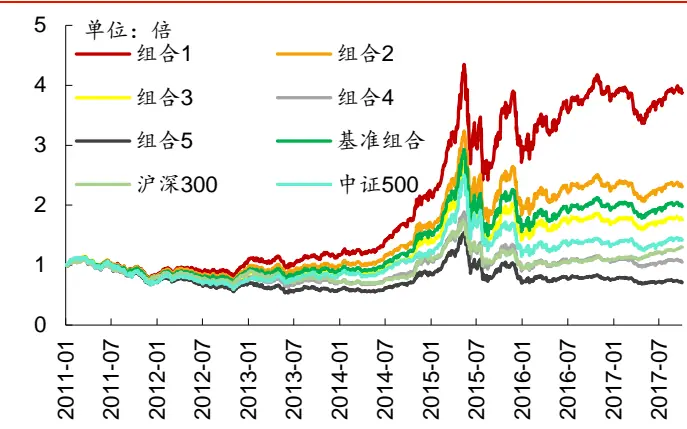
资料来源：Wind，华泰证券研究所

图表28： LSTM 分类模型各层组合净值除以基准组合净值示意图
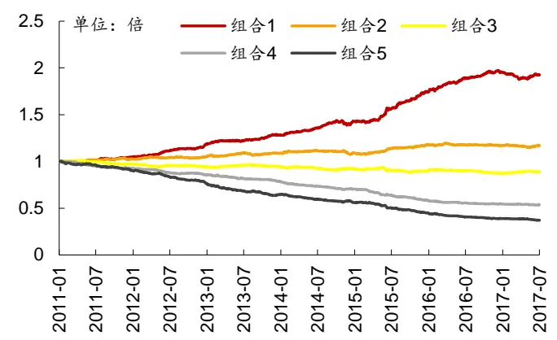
资料来源：Wind，华泰证券研究所

图表29： LSTM 分类分层组合 1相对沪深 300月超额收益分布图
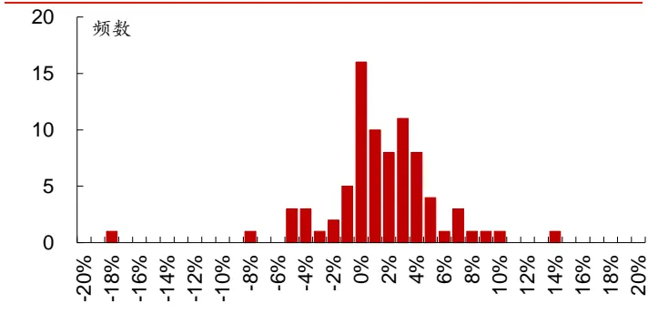
资料来源：Wind，华泰证券研究所

图表30： LSTM 分类模型多空组合月收益率及累积收益率
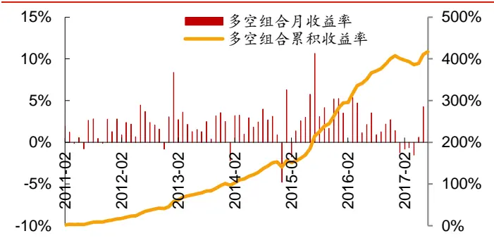
资料来源：Wind，华泰证券研究所

下图为分十层组合回测时，各层组合在不同年份间的收益率及排名表。每个单元格的内容为在指定年度某层组合的收益率(均为整年收益率)，以及某层组合在全部十层组合中的收益率排名。最后一列是分层组合在 2011～2017 的排名的均值。

图表31： LSTM 分类模型组合在不同年份的收益及排名分析(分十层)

|  | 2011 | 2012 | 2013 | 2014 | 2015 | 2016 | 2017 | 排名均值 |
| --- | --- | --- | --- | --- | --- | --- | --- | --- |
| 组合1 | -22.1%(1) | 26.9%(1) | 26.6%(1) | 84.6%(1) | 61.6%(1) | 18.3%(1) | -4.7%(8) | 1.58 |
| 组合2 | -23.2%(2) | 19.6%(2) | 14.9%(3) | 77.2%(2) | 60.5%(2) | 4.6%(2) | 0.4%(2) | 2.08 |
| 组合3 | -24.9%(4) | 11.2%(4) | 16.3%(2) | 63.5%(5) | 49.2%(3) | -1.7%(3) | -1.3%(3) | 3.25 |
| 组合4 | -23.4%(3) | 18.2%(3) | 9.7%(5) | 65.4%(3) | 35.1%(4) | -1.8%(4) | -2.5%(4) | 3.83 |
| 组合5 | -27.9%(7) | 9.8%(5) | 14.8%(4) | 64.5%(4) | 28.1%(5) | -4.2%(5) | -2.6%(5) | 5.00 |
| 组合6 | -27.6%(6) | 7.8%(7) | 3.1%(6) | 61.1%(6) | 24.7%(6) | -5.2%(6) | 3.0%(1) | 5.67 |
| 组合7 | -28.6%(8) | 8.7%(6) | 3.0%(7) | 45.7%(10) | 7.1%(9) | -7.8%(7) | -4.5%(7) | 7.42 |
| 组合8 | -33.4%(9) | 1.1%(8) | -4.2%(8) | 51.6%(7) | 9.4%(7) | -11.3%(8) | -3.2%(6) | 7.75 |
| 组合9 | -27.6%(5) | -3.7%(9) -4.2%(10) | -8.7%(9) | 51.5%(8) | 9.3%(8) | -14.7%(9) | -5.9%(9) | 8.50 |
| 组合10 | -35.8%(10) |  | -16.8%(10) | 50.9%(9) | -5.1%(10) | -18.2%(10) | -12.4%(10) | 9.92 |

资料来源：Wind，华泰证券研究所

下图是不同市值区间分层组合回测绩效指标对比图(分十层)。我们将全市场股票按市值排名前 1/3，1/3～2/3，后 1/3 分成三个大类，在这三类股票中分别进行分层测试，基准组合构成方法同前面所述(注意每个大类对应的基准组合并不相同)。

图表32： 不同市值区间 LSTM分类模型组合绩效指标对比图(分十层)
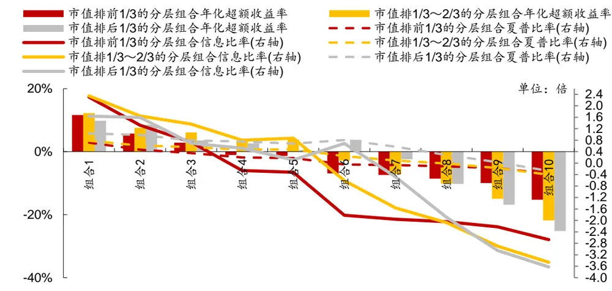
资料来源：Wind，华泰证券研究所

下图是不同行业间分层组合回测绩效分析表(分五层)。我们在不同一级行业内部都做了分层测试，基准组合为各行业内该因子非空值的个股等权组合(注意每个行业对应的基准组合并不相同)。

图表33： 不同行业 LSTM 分类模型分层组合绩效分析(分五层)

|  | 组合1年化 | 组合1 | 组合1 | 组合1 | 组合1超额收益 | 组合1相对 | 所有组合年化 |
| --- | --- | --- | --- | --- | --- | --- | --- |
| 行业 | 超额收益率 | 信息比率 | 年化收益率 | 夏普比率 | 最大回撤 | 基准月胜率 | 收益率排序 |
| 农林牧渔 | 20.87% | 2.23 | 35.69% | 1.12 | 7.57% | 67.20% | 1,3,2,4,5 |
| 电子元器件 | 19.12% | 2.50 | 39.87% | 1.14 | 11.17% | 68.40% | 1,2,4,3,5 |
| 建材 | 18.41% | 1.87 | 34.79% | 1.05 | 10.05% | 64.80% | 1,2,3,4,5 |
| 通信 | 16.70% | 1.76 | 38.81% | 1.07 | 14.69% | 68.40% | 1,2,3,4,5 |
| 机械 汽车 | 16.04% | 2.55 | 27.27% | 0.82 | 5.87% | 73.20% | 1,2,3,4,5 |
| 钢铁 | 15.75% | 2.07 | 31.23% | 1.03 | 7.55% | 66.00% | 1,2,3,4,5 |
| 基础化工 | 15.24% | 1.36 | 26.34% | 0.81 | 13.93% | 58.80% | 1,2,3,4,5 |
| 计算机 | 15.19% | 2.35 | 30.36% | 0.94 | 6.51% | 73.20% | 1,2,3,4,5 |
| 传媒 | 14.35% | 1.58 | 36.68% | 0.94 | 8.91% | 66.00% | 1,2,3,4,5 |
| 电力及公用事业 | 14.27% | 1.17 | 32.36% | 0.88 | 27.60% | 62.40% | 1,2,3,4,5 |
| 家电 | 14.11% | 1.86 | 27.10% | 0.90 | 7.43% | 68.40% | 1,3,2,4,5 |
| 国防军工 | 13.45% | 1.23 | 34.16% | 1.06 | 12.12% | 57.60% | 1,2,3,4,5 |
| 房地产 | 13.45% | 1.03 | 22.35% | 0.55 | 15.00% | 60.00% | 1,2,4,3,5 |
| 建筑 | 12.62% | 1.75 | 30.57% | 0.96 | 8.64% | 68.40% | 1,2,3,4,5 |
| 石油石化 | 12.55% | 1.23 | 26.18% | 0.82 | 19.75% | 63.60% | 1,2,3,5,4 |
| 有色金属 | 12.32% | 0.95 | 22.65% | 0.69 | 12.04% | 55.20% | 1,2,3,4,5 |
| 电力设备 | 12.26% | 1.36 | 17.20% | 0.50 | 12.08% | 57.60% | 1,2,3,4,5 |
| 轻工制造 | 11.79% | 1.62 | 21.71% | 0.64 | 6.19% | 72.00% | 1,2,3,4,5 |
| 食品饮料 | 10.63% | 1.07 1.12 | 27.91% | 0.87 | 11.31% | 58.80% | 1,2,4,3,5 |
| 餐饮旅游 | 10.47% |  | 22.53% | 0.75 | 9.29% | 63.60% | 1,3,2,4,5 |
| 纺织服装 | 10.28% | 0.85 | 22.97% | 0.73 | 14.94% | 58.80% | 1,2,3,4,5 |
| 综合 | 9.92% | 1.10 | 24.35% | 0.76 | 10.79% | 64.80% 49.20% | 1,2,3,4,5 |
| 医药 | 9.92% | 0.74 1.49 | 23.85% | 0.71 | 13.85% 11.10% | 62.40% | 1,4,2,3,5 |
| 商贸零售 | 9.58% 8.76% | 1.12 | 25.85% 17.33% | 0.84 | 11.27% | 62.40% | 1,2,3,4,5 |
| 银行 | 6.40% | 0.76 | 19.70% | 0.55 0.72 | 10.73% | 51.60% | 1,3,2,4,5 1,2,3,4,5 |
| 交通运输 | 6.29% | 0.75 | 18.99% | 0.64 | 11.16% | 60.00% | 1,2,3,4,5 |
| 煤炭 | 5.70% | 0.51 | 2.08% | 0.06 | 25.91% | 55.20% | 1,2,3,4,5 |
| 非银行金融 |  | 0.36 | 14.25% | 0.39 | 16.89% | 57.60% | 1,2,5,3,4 |
|  | 3.79% |  |  |  |  |  |  |

资料来源：Wind，华泰证券研究所

## 循环神经网络选股指标比较

我们比较了传统 RNN、LSTM、GRU 三种不同模型。并设置统一对照组：7 阶段线性回归模型。

我们构建了全 A选股策略并进行回测，各项指标详见图表 34 和图表 35。选股策略分为两类：一类是行业中性策略，策略组合的行业配置与基准(沪深 300、中证 500、中证全指)保持一致，各一级行业中选 N 个股票等权配置(N=2,5,10,15,20)；另一类是个股等权策略，直接在票池内不区分行业选N个股票等权配置(N=20,50,100,150,200)，比较基准取为300等权、500 等权、中证全指指数。三类策略均为月频调仓，个股入选顺序为它们在被测模型中的当月的预测值顺序。

从图表 34 和图表 35 中可以看出，对于行业中性和个股等权的全 A选股，LSTM 模型和GRU 模型在年化超额收益率、信息比率整体上优于其他模型，但是最大回撤要大于线性回归模型。

我们没有构建沪深 300 和中证 500 成分内选股策略，这是因为神经网络模型适合于数据量较大的场景，而沪深 300 和中证 500 成分股组成的月频多因子数据偏少，不适合应用在神经网络模型中。

图表34： 各种循环神经网络模型回测重要指标对比(全 A 选股)
每个行业入选个股数目(从左至右：2,5,10,15,20)

|  | 全 A 选股，基准为沪深 300 |  |  |  | 全 A 选股，基准为中证 500 |  |  |  | 全 A 选股，基准为中证全指 |  |
| --- | --- | --- | --- | --- | --- | --- | --- | --- | --- | --- |
|  | 年化超额收益率(行业中性) |  |  |  | 年化超额收益率(行业中性) |  |  |  | 年化超额收益率(行业中性) |  |
|  | 19.71% 19.57%17.92%16.39%14.81% |  |  |  | 25.05%24.63%23.30%21.64%20.36% |  |  |  | 22.10%21.61%20.02%18.42%16.91% |  |
|  | 18.83%19.43%17.68%15.85%14.65% |  |  |  | 26.27%24.47%22.31%20.50%19.77% |  |  |  | 21.63%21.36%19.29%17.38%16.42% |  |
|  | 16.28%17.55%16.69%14.47%13.77% |  |  |  | 21.28%20.24%19.12%17.96%17.51% |  |  |  | 18.20%18.44%17.44%15.52%14.95% |  |
|  | 18.31%15.45%14.34%13.14%12.49% |  |  |  | 17.15%15.98% 15.83%15.27% 15.12% |  |  |  | 17.34%15.23%14.42%13.63%13.12% |  |
|  | 超额收益最大回撤(行业中性) |  |  |  | 超额收益最大回撤(行业中性) |  |  |  | 超额收益最大回撤(行业中性) |  |
|  | 22.99%23.46%21.05%20.63% 20.91% |  |  |  | 15.54%16.84% |  | 14.71% 13.96%13.13% |  | 15.39%14.62%12.96%11.60%11.01% |  |
|  | 23.64%24.56%24.10%21.93%22.10% |  |  |  | 15.07%16.05% |  | 14.91%14.05%13.24% |  | 13.72%15.01%14.19%12.20%11.67% |  |
|  | 24.14%21.04% 21.23% 21.17% 21.14% |  |  |  | 17.37%16.00%1 |  | 6.62%14.93%13.88% |  | 16.68%14.26%13.87%12.55%11.91% |  |
|  | 16.74%15.87% 16.34%18.46%18.99% |  |  |  | 12.83%13.24%1 |  | 0.98%11.50% 11.27% |  | 11.05%9.60%9.09%9.57%9.87% |  |
|  | 信息比率(行业中性) |  |  |  | 信息比率(行业中性) |  |  |  | 信息比率(行业中性) |  |
|  | 1.75 1.91 1.84 1.72 1.58 |  |  |  | 2.95 3.57 |  | 3.78 3.81 3.76 |  | 2.65 3.06 3.10 3.02 2.88 |  |
|  | 1.73 1.96 1.88 | 1.72 1.61 |  |  | 3.19 3.51 |  | 3.70 3.58 3.69 |  | 2.70 3.06 3.08 2.92 2.89 |  |
|  | 1.50 1.72 1.73 | 1.54 1.48 |  |  | 2.67 3.01 |  | 3.18 3.23 3.26 |  | 2.31 2.66 2.79 2.64 2.62 |  |
| 统一对照组LSTMGRU传统 RNN |  |  | 1.88 1.69 1.64 |  |  | 1.52 1.45 |  | 2.20 2.55 | 2.88 3.00 3.09 |  |
|  | Calmar 比率(行业 | 中性) |  |  | Calmar 比率(行业中性) |  |  |  | Calmar 比率(行业中性) |  |
|  | 0.86 0.83 0.85 | 0.79 | 0.71 |  | 1.61 1.46 |  | 1.58 1.55 1.55 |  | 1.44 1.48 1.54 1.59 1.54 |  |
|  | 0.80 0.79 0.73 | 0.72 | 0.66 |  | 1.74 | 1.52 | 1.50 1.46 1.49 |  | 1.42 1.36 1.42 1.41 |  |
|  |  |  | 0.67 0.83 0.79 | 0.68 | 0.65 |  | 1.23 | 1.27 | 1.15 1.20 1.26 | 1.09 1.29 1.26 1.24 1.26 |
| 统一对照组 | 1.09 0.97 0.88 0.71 |  | 0.66 |  | 1.34 | 1.21 | 1.44 1.33 1.34 |  | 1.57 1.59 1.59 1.43 1.33 |  |

资料来源：Wind，华泰证券研究所

图表35： 各种循环神经网络模型回测重要指标对比(全 A选股)

| 模型选择 | 组合总入选个股数目(从左至右：20,50,100,150,200) |  |  |  |  |  |  |  |  |
| --- | --- | --- | --- | --- | --- | --- | --- | --- | --- |
|  | 年化超额收益率(个股等权) |  |  | 年化超额收益率(个股等权) |  | 年化超额收益率(个股等权) |  |  |  |
| LSTM | 27.78%26.70%27.98%26.15% 26.00% |  |  | 26.36%25.40%26.75%24.89% 24.75% |  | 26.77%25.77%27.08%25.24%25.09% |  |  |  |
| GRU | 29.48%30.00%29.30%26.00%24.77% |  |  | 28.18%28.77%28.00%24.73%23.46% |  | 28.54%29.10%28.37%25.08%23.82% |  |  |  |
| 传统 RNN | 22.36%24.55%23.65%22.63%22.04% |  |  | 21.16%23.29%22.42%21.36%20.76% |  | 21.51%23.65%22.76%21.72%21.13% |  |  |  |
| 统一对照组 | 26.56%24.47%21.25%20.03%20.28% |  |  | 25.18%23.05%19.86%18.67% 18.92% |  | 25.61%23.48%20.27%19.08%19.32% |  |  |  |
|  | 超额收益最大回撤(个股等权) |  |  | 超额收益最大回撤(个股等权) |  | 超额收益最大回撤(个股等权) |  |  |  |
| LSTM | 30.78%31.05%32.51%33.23% 33.14% |  |  | 18.20%19.60%13.56%14.73%15.30% |  | 19.66%20.71%18.80%19.67%19.42% |  |  |  |
| GRU | 33.31%32.62%30.84%31.46%31.41% |  |  | 21.46%16.29%14.65%13.68%14.94% |  | 22.80%18.86%16.82%17.36%17.30% |  |  |  |
| 传统 RNN | 35.84%33.22%31.70% 31.57% 31.50% |  |  | 23.82% 19.12% 16.82% 17.32% 17.24% |  | 24.74%20.16%18.83% 18.75%18.44% |  |  |  |
| 统一对照组 | 30.71%31.49%30.71%30.54%30.41% |  |  | 14.31%11.15% 9.22% 9.90% 9.59% |  | 16.39%17.07%16.12%15.91% 15.76% |  |  |  |
|  | 信息比率(个股等权) |  |  | 信息比率(个股等权) |  |  | 信息比率(个股等权) |  |  |
| LSTM | 1.51 1.48 1.57 | 1.50 1.50 | 2.60 | 3.00 3.63 | 3.63 3.78 | 2.19 2.30 2.53 |  | 2.47 2.50 |  |
| GRU | 1.55 1.63 | 1.66 1.49 1.45 | 2.81 | 3.49 3.86 | 3.65 3.64 | 2.27 2.56 2.72 |  | 2.48 2.45 |  |
| 传统 RNN | 1.18 1.36 | 1.34 1.32 1.29 | 2.18 | 2.85 3.13 | 3.23 3.27 | 1.75 2.15 | 2.19 | 2.20 2.19 |  |
| 统一对照组 | 1.43 1.45 | 1.29 1.22 | 1.24 2.46 | 3.11 | 3.12 3.09 | 3.29 2.10 2.37 | 2.20 2.12 | 2.17 |  |
|  | Calmar 比率(个股等权) |  |  |  | Calmar 比率(个股等权) |  | Calmar 比率(个股等权) |  |  |
|  | 0.90 0.86 | 0.86 0.79 | 0.78 1.45 | 1.30 | 1.97 1.69 | 1.62 1.36 | 1.24 1.44 | 1.28 1.29 |  |
| GRU | 0.88 0.92 | 0.95 0.83 | 0.79 | 1.31 1.77 | 1.91 1.81 | 1.57 | 1.25 1.54 | 1.69 | 1.44 1.38 |
| 传统 RNN | 0.62 0.74 | 0.75 0.72 | 0.70 | 0.89 1.22 | 1.33 | 1.23 1.20 | 0.87 1.17 | 1.21 | 1.16 1.15 |
| 统一对照组 | 0.86 0.78 | 0.69 0.66 | 0.67 | 1.76 2.07 | 2.15 | 1.89 1.97 | 1.56 1.38 | 1.26 | 1.20 1.23 |

资料来源：Wind，华泰证券研究所

## LSTM 选股策略详细分析

下面我们对策略组合的详细回测情况加以展示。因为篇幅有限，我们根据上面的比较测试结果，选择展示 LSTM 模型选股策略。下图中，我们展示了全 A选股(基准：中证 500)策略的各种详细评价指标。观察下面的图表可知，对于 LSTM 模型的行业中性策略来说，随着每个行业入选个股数目增多，年化收益率在下降、信息比率和 Calmar比率先升后降，最优每个行业入选个股数目在 14 个左右。

图表36： LSTM 模型和线性回归模型策略组合回测分析表(回测期：20110131～20171031)

| 选股票池比 | 较基准模 | 型与策略类型 | 每个行业入 | 年化 | 年化 | 夏普 | 最大 | 年化超额 | 年化 | 超额收益最大回撤 | 信息比率 | Calmar比率 | 相对基准月胜率 | 月均双边换手率 |
| --- | --- | --- | --- | --- | --- | --- | --- | --- | --- | --- | --- | --- | --- | --- |
|  |  |  | 选个股数目 | 收益率 | 波动率 | 比率 | 回撤 | 收益率 | 跟踪误差 |  |  |  |  |  |
| 全部 A 股 | 中证 500LSTM | 行业中性 | 2 | 32.0% | 28.2% | 1.13 | 40.2% | 25.0% | 8.5% | 15.5% | 2.95 | 1.61 | 75.3% | 130.0% |
| 全部 A 股中 | 证 500LSTM | 行业中性 | 4 | 31.9% | 28.7% | 1.11 | 44.5% | 25.2% | 7.2% | 16.4% | 3.50 | 1.53 | 79.0% | 120.6% |
| 全部 A 股中 | 证 500LSTM | 行业中性 | 6 | 30.6% | 28.5% | 1.07 | 45.1% | 24.0% | 6.7% | 17.0% | 3.58 | 1.41 | 81.5% | 113.7% |
| 全部A股 | 中证500LSTM | 行业中性 | 8 | 30.4% | 28.4% | 1.07 | 45.1% | 23.8% | 6.5% | 16.2% | 3.67 | 1.46 | 80.2% | 108.7% |
| 全部 A 股中 | 证 500LSTM | 行业中性 | 10 | 29.9% | 28.4% | 1.05 | 45.1% | 23.3% | 6.2% | 14.7% | 3.78 | 1.58 | 80.2% | 105.4% |
| 全部 A 股中 | 证 500LSTM | 行业中性 | 12 | 29.2% | 28.5% | 1.02 | 45.8% | 22.7% | 5.9% | 14.0% | 3.83 | 1.62 | 79.0% | 101.7% |
| 全部 A 股 | 中证500LSTM | 行业中性 | 14 | 28.8% | 28.5% | 1.01 | 45.3% | 22.3% | 5.8% | 13.6% | 3.84 | 1.64 | 79.0% | 98.0% |
| 全部 A 股中 | 证 500LSTM | 行业中性 | 16 | 27.9% | 28.4% | 0.98 | 45.5% | 21.4% | 5.6% | 14.0% | 3.81 | 1.53 | 81.5% | 94.6% |
| 全部 A 股中 | 证 500 | LSTM 行业中性 | 18 | 27.4% | 28.4% | 0.96 | 45.8% | 21.0% | 5.5% | 13.6% | 3.79 | 1.54 | 79.0% | 91.6% |
| 全部 A 股中 | 证 500 | 线性回归行业中性 | 2 | 23.7% | 28.1% | 0.84 | 46.7% | 17.1% | 7.8% | 12.8% | 2.20 | 1.34 | 64.2% | 156.0% |
| 全部 A 股中 | 证 500 | 线性回归行业中性 | 4 | 23.1% | 28.4% | 0.82 | 45.5% | 16.8% | 6.6% | 12.7% | 2.55 | 1.32 | 71.6% | 146.3% |
| 全部 A 股中 | 证 500 | 线性回归行业中性 | 6 | 23.2% | 28.2% | 0.82 | 45.3% | 16.9% | 6.0% | 12.1% | 2.83 | 1.40 | 74.1% | 139.6% |
| 全部 A 股中 | 证 500 | 线性回归行业中性 | 8 | 22.9% | 28.1% | 0.82 | 46.0% | 16.6% | 5.7% | 11.2% | 2.91 | 1.48 | 74.1% | 133.2% |
| 全部 A 股中 | 证 500 | 线性回归行业中性 | 10 | 22.1% | 28.2% | 0.78 | 46.0% | 15.8% | 5.5% | 11.0% | 2.88 | 1.44 | 71.6% | 128.2% |
| 全部 A 股中 | 证 500 | 线性回归行业中性 | 12 | 21.8% | 28.1% | 0.77 | 45.8% | 15.6% | 5.3% | 11.4% | 2.92 | 1.36 | 74.1% | 123.3% |
| 全部 A 股中 | 证 500 | 线性回归行业中性 | 14 | 21.5% | 28.0% | 0.77 | 45.9% | 15.2% | 5.1% | 11.5% | 2.96 | 1.32 | 70.4% | 118.9% |
| 全部 A 股中 | 证 500 | 线性回归行业中性 | 16 | 21.3% | 28.1% | 0.76 | 46.1% | 15.0% | 5.0% | 11.6% | 2.99 | 1.29 | 74.1% | 115.2% |
| 全部 A 股中 | 证 500 | 线性回归行业中性 | 18 | 21.2% | 28.2% | 0.75 | 46.5% | 15.1% | 5.0% | 11.4% | 3.03 | 1.32 | 72.8% | 111.1% |
| 基准组合数 | 据—中证 | 500 指数 |  | 5.5% | 27.5% | 0.20 | 54.3% |  |  |  |  |  |  |  |

资料来源：Wind，华泰证券研究所

我们有选择性地展示 LSTM和线性回归的月度超额收益对比图：

图表37： LSTM 模型和线性回归模型全 A行业中性选股策略表现(每个行业选6只个股，基准中证 500)
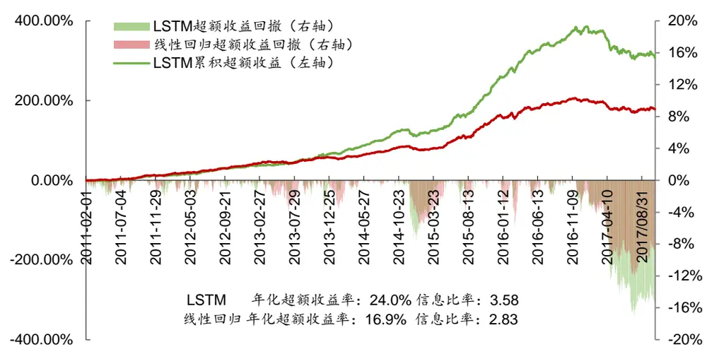
资料来源：Wind，华泰证券研究所

## 各种循环神经网络策略详细分析

为了方便比较，我们在图表 38 和图表 39 中比较了传统 RNN、LSTM、GRU 的月度超额收益，我们同时加入了 XGBoost、ANN 和线性回归进行比较。从图表 38 和图表 39 中可以看出，在行业中性的全 A选股方面，XGBoost 在年化收益率、信息比率和 Calmer 比率都表现最好。LSTM 和 GRU 相比其他神经网络模型在年化收益率、信息比率上有一定的优势。

图表38： 各类模型策略组合回测分析表(回测期：20110131～20171031)

| 选股票池比较基准 | 模型与策略类型 | 每个行业入 选个股数目 | 年化 收益率 | 年化 波动率 | 夏普 比率 | 最大 回撤 | 年化超额 收益率 | 年化 跟踪误差 | 超额收益 最大回撤 | 信息 比率 | Calmar 比率 | 相对基准 月胜率 | 月均双边 换手率 |
| --- | --- | --- | --- | --- | --- | --- | --- | --- | --- | --- | --- | --- | --- |
| 全部A股 中证500 | XGBoost 行业中性 | 6 | 36.4% | 28.8% | 1.27 | 44.9% | 29.5% | 7.2% | 15.8% | 4.08 | 1.86 | 77.8% | 127.3% |
| 全部 A 股 中证500 | LSTM 行业中性 | 6 | 30.6% | 28.5% | 1.07 | 45.1% | 24.0% | 6.7% | 17.0% | 3.58 | 1.41 | 81.5% | 113.7% |
| 全部A 股 中证500 | GRU 行业中性 | 6 | 30.5% | 28.4% | 1.08 | 45.0% | 23.8% | 6.7% | 15.5% | 3.57 | 1.54 | 77.8% | 129.8% |
| 全部A股 中证500 | 传统 RNN 行业中性 | 6 | 26.7% | 28.2% | 0.95 | 45.6% | 20.1% | 6.6% | 16.2% | 3.06 | 1.24 | 76.5% | 125.9% |
| 全部A股 中证500 | ANN 行业中性 | 6 | 30.1% | 28.6% | 1.05 | 46.7% | 23.5% | 7.3% | 17.5% | 3.21 | 1.35 | 79.0% | 129.0% |
| 全部 A 股中证 500 | 线性回归行业中性 | 6 | 23.2% | 28.2% | 0.82 | 45.3% | 16.9% | 6.0% | 12.1% | 2.83 | 1.40 | 74.1% | 139.6% |
| 基准组合数据—中证 500 指数 |  |  | 5.5% | 27.5% | 0.20 | 54.3% |  |  |  |  |  |  |  |

资料来源：Wind，华泰证券研究所

图表39： 各类模型全 A 行业中性选股策略表现(每个行业选 6 只个股，基准中证 500)
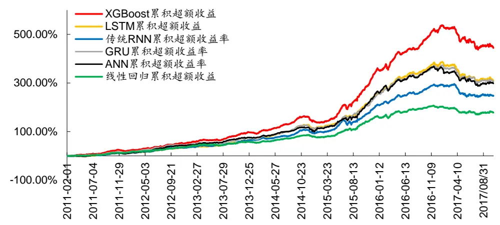
资料来源：Wind，华泰证券研究所

## 总结和展望

以上我们对包括传统 RNN、LSTM 以及 GRU 在内的三种循环神经网络模型进行了系统的测试，并且利用三种方法构建了全 A选股策略，初步得到以下几个结论：

一、我们在 2011-01-31 至 2017-10-31 的回测区间中分 7 个阶段训练并测试模型，传统RNN、LSTM 以及 GRU 三种模型样本外平均 AUC 分别为 0.5410，0. 5429，0. 5576，样本外平均正确率分别为 56.85%，58.57%，57.61%。可以看出，循环神经网络具有出色的样本外平均正确率，但是样本外平均 AUC 值表现一般。

## 二、我们以全 A股为股票池，利用循环神经网络构建选股策略。在 2011-01-31 至

2017-10-31 的回测区间中，对于全 A选股的行业中性策略(每个行业分别选股数目为2,5,10,15,20)，LSTM 模型相对于中证 500 的超额收益在 20.36%~25.05%之间，超额收益最大回撤在 13.13%~16.84%之间，信息比率在 2.95~3.76 之间，除了最大回撤，表现优于线性回归。总的来看，LSTM 模型在年化超额收益率、信息比率上优于线性回归算法，但是最大回撤普遍大于线性回归算法。在目前测试的所有神经网络模型中，LSTM 表现最好，GRU与之相近，但是 LSTM 在全 A选股的表现仍然不如 XGBoost。

三、循环神经网络的参数较多，且模型训练速度缓慢，调参较为困难，需要人工辅助确定参数。我们通过分析 LSTM网络训练过程中神经元的权重更新过程，打开了神经网络这个“黑箱”，使得模型具有可解释性。

四、目前看来，以 LSTM 为代表的神经网络在月频的多因子选股上表现并不突出。我们认为这是因为月频的多因子数据量较小，并不利于神经网络模型发挥其优势。之后我们将尝试在更加高频、数据量更大的场景中继续研究神经网络模型。

通过以上的测试和讨论，我们初步理解了循环神经网络模型应用于月频多因子选股的一些规律。接下来我们的人工智能系列研究将进一步研究各种人工智能算法的特性，寻找它们最适合的应用场景，敬请期待。

## 风险提示

风险提示：通过循环神经网络模型构建选股策略面临市场风险，是历史经验的总结，存在失效的可能。

## 免责申明

本报告仅供华泰证券股份有限公司（以下简称“本公司”）客户使用。本公司不因接收人收到本报告而视其为客户。

本报告基于本公司认为可靠的、已公开的信息编制，但本公司对该等信息的准确性及完整性不作任何保证。本报告所载的意见、评估及预测仅反映报告发布当日的观点和判断。在不同时期，本公司可能会发出与本报告所载意见、评估及预测不一致的研究报告。同时，本报告所指的证券或投资标的的价格、价值及投资收入可能会波动。本公司不保证本报告所含信息保持在最新状态。本公司对本报告所含信息可在不发出通知的情形下做出修改，投资者应当自行关注相应的更新或修改。

本公司力求报告内容客观、公正，但本报告所载的观点、结论和建议仅供参考，不构成所述证券的买卖出价或征价。该等观点、建议并未考虑到个别投资者的具体投资目的、财务状况以及特定需求，在任何时候均不构成对客户私人投资建议。投资者应当充分考虑自身特定状况，并完整理解和使用本报告内容，不应视本报告为做出投资决策的唯一因素。对依据或者使用本报告所造成的一切后果，本公司及作者均不承担任何法律责任。任何形式的分享证券投资收益或者分担证券投资损失的书面或口头承诺均为无效。

本公司及作者在自身所知情的范围内，与本报告所指的证券或投资标的不存在法律禁止的利害关系。在法律许可的情况下，本公司及其所属关联机构可能会持有报告中提到的公司所发行的证券头寸并进行交易，也可能为之提供或者争取提供投资银行、财务顾问或者金融产品等相关服务。本公司的资产管理部门、自营部门以及其他投资业务部门可能独立做出与本报告中的意见或建议不一致的投资决策。

本报告版权仅为本公司所有。未经本公司书面许可，任何机构或个人不得以翻版、复制、发表、引用或再次分发他人等任何形式侵犯本公司版权。如征得本公司同意进行引用、刊发的，需在允许的范围内使用，并注明出处为“华泰证券研究所”，且不得对本报告进行任何有悖原意的引用、删节和修改。本公司保留追究相关责任的权力。所有本报告中使用的商标、服务标记及标记均为本公司的商标、服务标记及标记。

本公司具有中国证监会核准的“证券投资咨询”业务资格，经营许可证编号为：Z23032000。全资子公司华泰金融控股（香港）有限公司具有香港证监会核准的“就证券提供意见”业务资格，经营许可证编号为：AOK809
©版权所有 2017年华泰证券股份有限公司

## 评级说明

## 行业评级体系

－报告发布日后的6个月内的行业涨跌幅相对同期的沪深300指数的涨跌幅为基准；

－投资建议的评级标准

增持行业股票指数超越基准

中性行业股票指数基本与基准持平

减持行业股票指数明显弱于基准

## 公司评级体系

－报告发布日后的6个月内的公司涨跌幅相对同期的沪深300指数的涨跌幅为基准；
－投资建议的评级标准
买入股价超越基准 20%以上
增持股价超越基准 5%-20%
中性股价相对基准波动在-5%~5%之间
减持股价弱于基准 5%-20%
卖出股价弱于基准 20%以上

## 华泰证券研究

## 南京

南京市建邺区江东中路228号华泰证券广场1号楼/邮政编码：210019

电话：86 25 83389999 /传真：86 25 83387521电子邮件：ht-rd@htsc.com

## 深圳

深圳市福田区深南大道4011号香港中旅大厦24层/邮政编码：518048

电话：86 755 82493932 /传真：86 755 82492062

电子邮件：ht-rd@htsc.com

## 北京

北京市西城区太平桥大街丰盛胡同28号太平洋保险大厦A座18层

邮政编码：100032

电话：86 10 63211166/传真：86 10 63211275

电子邮件：ht-rd@htsc.com

## 上海

上海市浦东新区东方路18号保利广场E栋23楼/邮政编码：200120

电话：86 21 28972098 /传真：86 21 28972068

电子邮件：ht-rd@htsc.com