## 金工研究/深度研究

2018年03月20日

林晓明 执业证书编号：S0570516010001

研究员 0755-82080134

linxiaoming@htsc.com

陈烨 010-56793927

联系人 chenye@htsc.com

李子钰

联系人 liziyu@htsc.com

# 宏观周期指标应用于随机森林选股华泰人工智能系列之十

## 将周期三因子引入随机森林模型中构建带有因子择时效应的选股策略

本报告中，我们将多因子截面数据和华泰周期三因子进行合并，构建了因子择时+选股一体化的随机森林模型。周期三因子在随机森林模型中起到了状态切换的作用，不同状态下对应不同的截面因子选股逻辑。加入周期三因子的随机森林模型能获得更好的回测结果，本质上利用了周期因子的两个效应：（1）在周期因子取值单调的训练期内，模型侧重于遵循离当前更近的截面期样本的投资逻辑。（2）在周期因子取值非单调的训练期内（即拐点处），模型能够利用到周期因子在拐点处所带来的增量信息。

## 加入周期三因子的随机森林模型选股表现有稳定的提升

加入了周期三因子的随机森林模型，样本外的平均预测正确率从 53.61%提升至 53.72%，平均 AUC 从 0.5491 提升至 0.5503。同时，我们构建了全 A选股策略（回测期：20110201～20180131，中证 500 行业中性），回测结果显示，加入周期三因子后，随机森林模型构建的选股组合年化超额收益率平均提升了 2.6%，超额收益最大回撤平均下降了 3.7%，信息比率平均提升了 0.55，Calmar比率平均提升了 0.82，选股表现有稳定的提升。

## 本报告中我们选用的训练集数据长度为 6个月

综合考虑前期人工智能选股系列报告的结论和周期因子的特性，我们选用的训练集数据长度为 6 个月，具体原因如下：（1）过长的训练期长度在投资风格发生转变时（2017 年）面临较大回撤，2011 年至 2016 年的投资风格已经不适合于当下。而较短的训练期长度（10个月以内）使得模型能够及时扭转投资风格，大幅减少回撤。2. 较短的训练期长度下，周期因子能够更加精细地切分市场状态，并且模型能更加及时地利用到周期因子位于拐点时的信息。

## 随机森林比 XGBoost更适合结合宏观周期因子

随机森林和 XGBoost 同为决策树集成模型，其集成方式存在一定区别。随机森林模型中每棵决策树都可以得出独立的拟合结果，最后通过平均投票的方式提高预测精度，因此单棵树深度基本都在 20 层以上；而 XGBoost模型的迭代过程中每棵决策树都在学习上一棵决策树拟合的残差，为了防止过拟合，单棵树深度基本都在 5 层以下。宏观周期因子相比传统的截面因子能提供的信息增益较少，因此，深度更大、分支节点更多的随机森林模型相比 XGBoost 模型有更大概率能够选中周期因子成为决策树的分支节点，从而利用到更多的时间序列信息，提升预测能力。

风险提示：加入周期三因子的随机森林选股模型是对历史投资规律的挖掘，若未来市场投资环境发生变化，则模型存在失效的可能。

## 结合宏观周期指标的随机森林选股模型

华泰人工智能系列报告目前已经发布了九篇，在首篇报告《人工智能选股框架及经典算法简介》中，我们对主流的机器学习算法进行了分类介绍和形象化解释，接下来的第二至第六篇报告中，我们详细测试了广义线性模型、支持向量机、朴素贝叶斯、随机森林和Boosting 模型，在第七篇报告中则给出了机器学习选股的完整代码，并对一些实践细节进行详细讲解。在第八、九篇报告中，我们尝试对全连接神经网络、循环神经网络模型结合多因子选股进行了一些探索。以上报告涵盖了几种流行的机器学习模型和两种较为简单的神经网络模型，报告的内容主要集中于算法描述、模型构建、参数测试等环节，展示了各类人工智能模型与多因子选股直白式结合的研发过程，优点主要在于内容详尽。从本篇报告开始，我们将着眼于单个模型的细节挖掘，争取实现原有策略效果的二次提升。

首先，我们来回顾一下系列报告中曾涉及的几种模型的选股效果。下图展示了十个模型在全 A 股票池中选股，相对于中证 500 指数的累积超额收益曲线。这十个选股策略的构建方式相同，都是月频调仓的，用过去 72 个月的数据训练并交叉验证，选股时相对于中证500 指数保持行业中性，在每个行业内选模型预测值最佳的 6只股票等权配置。具体构建细节参考《人工智能选股之随机森林模型》或《人工智能选股之 Boosting 模型》。

图表1： 各人工智能选股策略相对中证 500累积超额收益图（训练期长度：72个月）
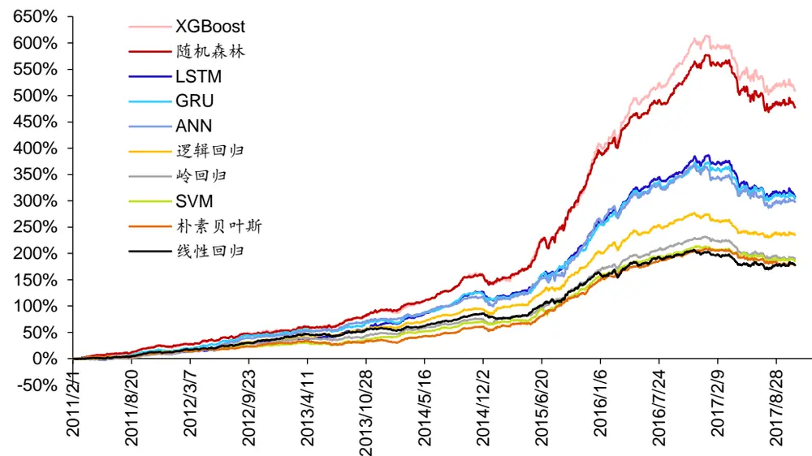
资料来源：Wind，华泰证券研究所

从上图中可以看出，XGBoost 和随机森林这两种基于决策树的模型在回测区段内收益率相对最高。XGBoost 模型是对决策树的串行集成，随机森林模型是对决策树的并行集成（详见图表 2）。从理论上来讲，决策树模型可以达到很高的拟合精度，并且易于直观理解，但同时也比较容易过拟合、泛化能力较差。图表 1 中的累积超额收益曲线正好印证了这一点——在投资风格整体平稳的时段内（2011～2016 年）这两种模型累积收益很高，在投资风格发生转变的时候（2017 年）则出现较大幅度回撤。一般来说，投资风格的持续性比市场涨跌的持续性更强，所以拟合度较高的决策树模型在挖掘个股投资规律方面还是具有明显优势的，它起码能够在较长的一段时间内比其它模型取得更高的收益。

在华泰人工智能系列第五篇报告《人工智能选股之随机森林模型》中，我们已经对决策树并行集成模型——随机森林模型结合多因子选股进行了初步探索实证，在本报告中，我们将对该模型进行更深入的挖掘，希望在保持随机森林选股策略的高收益的同时，降低回撤，使之可以适应各种投资环境。

图表2： 决策树集成模型——随机森林和 XGBoost示意图
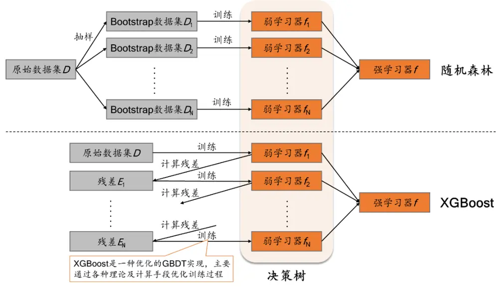
资料来源：华泰证券研究所

我们尝试的主要方向是将随机森林模型和周期三因子模型结合（周期三因子模型的简介请见附录）。周期三因子作为刻画市场状态的重要指标，作用于决策树的分支节点，可以在不同的市场状态下形成不同的选股逻辑，因此本篇报告的探索方向本质上属于最近很流行的“因子择时”门类。目前主流的因子择时方法是通过宏观变量结合主观判断对市场环境进行划分，再去寻找不同市场环境下的投资规律，而本文的因子择时方法则是完全从数据出发，通过算法挖掘历史数据中是否存在因子择时的规律，并且择时与选股的过程完全一体化，逻辑更清晰合理。

下面我们将详细介绍如何将周期三因子融入随机森林模型中。这一过程可以渐进式地理解为两个步骤：

1. 将时间序列因子（而非传统截面因子）融入决策树中产生择时效应；

2. 将周期三因子融入决策树中完成随机森林模型择时+选股一体化改进。

同时，我们在后文中还会回答如下几个问题：

1. 为什么线性回归模型不能通过引入时间序列因子产生择时效应？

2. 随机森林结合周期三因子之后效果提升的根源在哪里？

3. XGBoost 与随机森林都是决策树集成模型，为什么前者的因子择时效应要弱于后者？

## 决策树模型的择时效应：引入时间序列因子

在展开讨论这个问题之前，我们先来回顾一下随机森林选股算法的训练数据集的构造。如图表 3 所示，对于一个月频调仓的机器学习选股模型，假定训练期长度为最近 M 个月、每个月截面上个股数目为 N，则训练数据集是由近 M个月的截面因子数据合并组成，合并之后样本数量变为 M×N（也即不同截面上的个股视作不同的独立样本）。对于传统的截面因子（例如市盈率、净利润增速、个股波动率等），通常是在单个截面上对该因子进行去极值、去空值、中性化、标准化处理，再将处理之后的 M 个截面上该因子的值进行简单合并。而我们此处想要引入时间序列因子用以刻画金融市场状态，在单个截面上所有个股的因子值相同，不同截面上的因子值有区别，例如 GDP、CPI 等宏观指标或指数过去 N 个月涨跌幅等趋势型技术指标都算是时间序列因子，时间序列因子无需标准化。

图表3： 人工智能选股模型训练数据集示意图

|  | 下期收益率 (或标签值) | 截面 因子1 | 截面 因子2 | ……… | 截面 因子K | 时间序列 因子1 | …… 时间序列 因子J |  | 对于训练期长度为M个月 的机器学习选股模型，训 练数据是由T-1至T-M |
| --- | --- | --- | --- | --- | --- | --- | --- | --- | --- |
| 个股1 | yī | xī,−1 | xī,.−1 | …… | xī.−1 | zi−1 | …… 27-1 | 截面数据合并而成 T − 1 |  |
| 个股2 | y2 | x2.−1 | x2,21 | ……… | X2,K xT−1 |  | ……… | 截面 |  |
| : | : |  | : |  | … |  |  |  | 训 |
| 个股N | yN | xτ-1 | xT−1 XN,2 | ……… | xN− 1 | zT−1 | …… |  | 练样本总共N |
| 个股1 |  | xī.{2 | xi,2 | …… | xī.k2 |  | …… | T-2 |  |
|  | : | … |  |  | … |  |  | 截面 |  |
| 个股N |  | xT-² XN,1 | xT−2 XN,2 | …… | xN−k |  | ……… |  |  |
|  | … | …. | … |  | … |  |  |  | X |
| … | … | … | … |  | … |  |  |  | M |
| 个股1 |  | xī,-M | xT,2M | …… |  |  | …… |  | 个 |
| : | : |  | : |  | … | " |  | T - M 截面 |  |
| 个股N |  | XxN-M | XN,2 vT−M | ……… | XN,K xT-M |  | …… | 27-M |  |

以截面因子1为例，对∀i ∈[1,M]，T—i截面上的因子值向量(x11i,… x1)都是单独进行标准化处理的，然后将T-1至T-M截面的标准化之后的因子值向量简单合并
对于单个时间序列因子而言，所有个股在同一截面上的因子值相同，不同截面上的因子值有区别，不进行任何标准化处理
资料来源：华泰证券研究所

决策树模型引入时间序列因子之后的一个训练实例图如图表 4 所示。如果在训练过程中，时间序列因子被选中作为某个分支节点，图中举“CPI 同比增速<=2%”为例，那么该节点实际上是对不同截面期进行划分，CPI 同比增速小于等于 2 %的所有截面期的个股样本进入左侧分支，CPI 同比增速大于 2%的所有截面期的个股样本进入右侧分支，于是左右两个分支实际上对应于两种不同的市场环境，左右两个分支继续分裂的过程是互不干扰的，相当于在不同市场环境下训练出不同的投资逻辑。我们根据当前时刻的 CPI 同比增速值就可以去判断个股遵循决策树哪个分支的投资逻辑，也即实现了所谓的“因子择时”。

图表4： 引入时间序列因子的决策树结构示意图
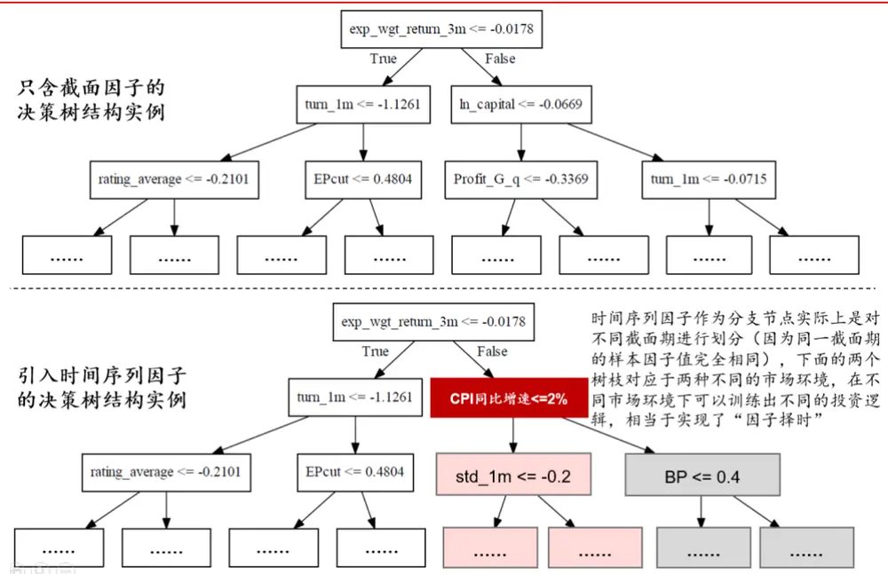
资料来源：华泰证券研究所

这里需要指出，通过引入时间序列因子实现择时效应确实是决策树模型的一个比较特殊的性质，在普通的线性回归模型上是不成立的。下面我们进行简短证明。假设我们把图表 3中的数据输入给一个线性回归模型

$$
\mathbf{y}=a_{1}x_{1}+a_{2}x_{2}+\cdots+a_{K}x_{K}+b_{1}z_{1}+\varepsilon
$$

其中 $\mathrm{y}.$ 是下期收益率向量， $x_{1},\cdots,x_{K}$ 是截面因子 1~K 的因子值向量， $z_{1}$ 是时间序列因子 1的因子值向量， $a_{1},\cdots,a_{K},b_{1}$ 是待拟合回归系数，ε是回归方程的残差向量。由于截面因子i在任意一个截面期上都进行过标准化处理，所以

$$
\mathbf{x}_{1,\mathbf{i}}^{T-\mathbf{j}}+\mathbf{x}_{2,\mathbf{i}}^{T-\mathbf{j}}+\cdots+\mathbf{x}_{\mathbf{N},\mathbf{i}}^{T-\mathbf{j}}=0,\qquad\forall\mathbf{i},\mathbf{j}
$$

那么

$$
z_{1}\cdot x_{i}=\mathtt{z}_{1}^{T-1}\sum_{j=1}^{N}\mathtt{x}_{\mathrm{j},\mathrm{i}}^{T-1}+\mathtt{z}_{1}^{T-2}\sum_{j=1}^{N}\mathtt{x}_{\mathrm{j},\mathrm{i}}^{T-2}+\dots+\mathtt{z}_{1}^{T-\mathsf{M}}\sum_{j=1}^{N}\mathtt{x}_{\mathrm{j},\mathrm{i}}^{T-\mathsf{M}}=0,\qquad\forall\mathrm{i}
$$

即时间序列因子 $z_{1}$ 和任意一个截面因子都正交，于是在线性回归方程中将解释变量 $\left\{z_{1}\right.$ 删去将完全不会影响 $\left[a_{1},\cdots,a_{K}\right.$ 的拟合结果。在当前时间截面做预测并进行选股时，所有个股的时间序列因子值都一样， $z_{1}$ 是常数向量，所以选股结果主要是由 $a_{1}x_{1}+a_{2}x_{2}+\cdots+a_{K}x_{K}$ 这部分决定的，而拟合系数 $[a_{1},\cdots,a_{K}$ 又不会受到时间序列因子干扰，也就是说引入时间序列因子与否都不影响最终的选股结果。综上，线性回归模型不能通过引入时间序列因子产生择时效应。

## 决策树模型结合指数衰减时间序列因子

既然决策树模型可以产生择时效应，那我们要提的下一个问题就是，应该如何构建时间序列因子使决策树模型拥有一个合理的择时逻辑？一个比较直观自然的想法是直接将宏观指标作为时间序列因子输入模型中，不过这样还会涉及到搜集整理数据、筛选指标等准备工作，我们在本小节中先提供一种更简单的思路，直接将一个指数衰减因子作为时间序列因子： $z^{T-i}=\exp(-i),\quad i=0,1,\cdots,\mathbb{M}.$ 。如果经过训练之后发现它出现在决策树的某一个分支节点上，那么说明存在一个时间点，在此时间点之前和之后的训练样本的投资逻辑存在明显差别。在用这棵训练好的决策树去做预测时，遇此分支节点则会走入离现在时间更近的那个分支，也就是说，某个时间点之前的历史经验与现在具有明显差别，那么我们就更多地依靠最近一段时间的投资规律来做决策。示意图如下所示。

图表5： 引入指数衰减时间序列因子的决策树示意图
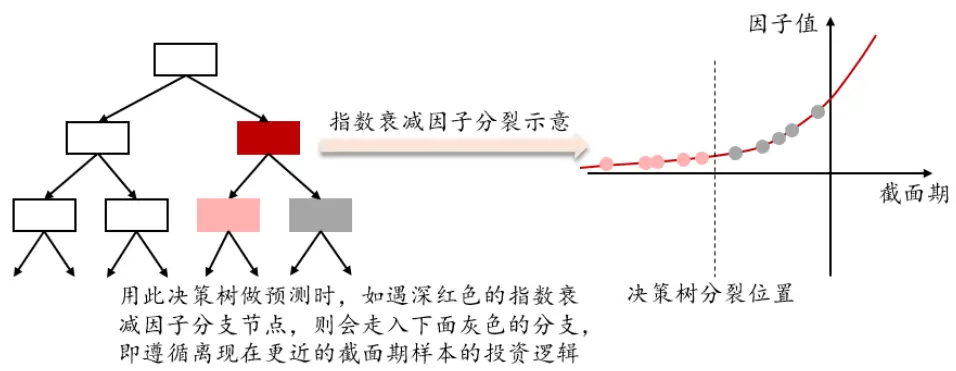
资料来源：华泰证券研究所

## 随机森林模型结合周期三因子

上一小节中，我们引入了一个简单的时间序列因子使决策树模型具有合理的择时逻辑，那么更进一步地，如何构建时间序列因子可以使决策树模型的效果提升更多？本文创新地将华泰周期三因子模型结合到决策树模型中来。华泰周期三因子模型认为，42 个月、100个月、200 个月周期是刻画市场运行状态的三个重要经济周期，浓缩了从宏观到微观、从海外市场到中国市场的大量信息，是简单直观、可靠度高的择时指标。截面 T 上 42 个月周期因子的定义为 1996 年至截面 T 区间内上证综指同比序列的 42 个月周期高斯滤波值（可以想象成正弦曲线上的点位，具体计算方法详见《周期三因子定价与资产配置模型》）。

周期三因子模型中，最短的一个因子周期长达 42 个月，那么在构建随机森林模型的训练集时，是否需要使得训练集长度接近甚至超过因子的周期长度呢？答案是否定的。这主要有以下两个原因：

1. 从图表 1可以看出，过长的训练期长度使模型在投资风格发生转变时（2017 年）面临较大回撤，过去的投资风格已经不适合于当下。而较短的训练期长度（10 个月以内）使得模型能够及时扭转投资风格，大幅减少回撤。

2. 较短的训练期长度下，周期因子能够更加精细地切分市场状态，并且模型能更加及时地利用到周期因子位于拐点时的信息。

因此在本文中，我们选取训练期长度为 6个月。

观察图表 6 可以发现，对于预测点 1来说，其使用的训练集周期因子样本位于曲线单调上升的区间内（对于单调下降的情况也是类似），周期因子和上一小节中的指数衰减因子的效果几乎是一样的，但是对于预测点 2 来说，其使用的训练集周期因子样本在曲线拐点附近的非单调区间内，周期因子作用原理和衰减因子不同。模型通过训练认为波峰（或波谷）与其两侧的投资逻辑存在区别，也就是说在周期因子的拐点处可能存在切分市场状态的增量信息，这是衰减因子所不具备的特点。实践中也证实了周期因子的选股效果是优于指数衰减因子的。

图表6： 引入周期因子的决策树节点分裂示意图（训练期长度为 6个月）
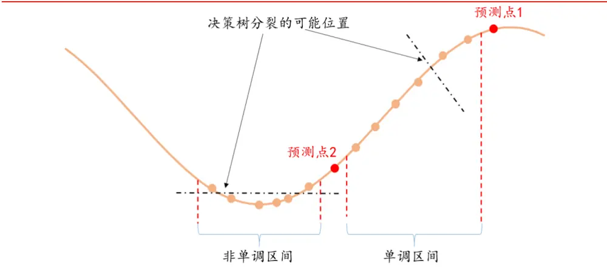
资料来源：华泰证券研究所

在本章节最后，我们回答前面提出的一个问题：XGBoost 与随机森林同为决策树集成模型，为什么我们选择随机森林模型来进行择时改进而不选择 XGBoost？因为决策树的训练过程完全是由算法决定的，一个时间序列因子能否被选中成为分支节点，取决于在当前节点使用该因子进行分裂是否能提供足够大的信息增益。而我们在测试中发现，相比传统的截面因子，时间序列因子能提供的信息增益（因子重要性）相比较少。因此，树的深度越大、分支节点个数越多，时间序列因子能被利用起来的概率也就越大；反之，树的深度越小、分支节点个数越少，决策树倾向于集中使用因子重要性大的因子，时间序列因子能起到的作用就非常有限。对于随机森林模型而言，其中每棵决策树都相当于是独立的“投票人”，每棵树的拟合精度都至少使得它具有独立的投票能力，单棵树深度基本都在 20 层以上；而对于 XGBoost 模型而言，迭代过程中每棵决策树都在学习上一棵决策树拟合的残差，所以每一步拟合都不能达到过高的精度，单棵树深度基本都在5层以下，否则容易过拟合。我们在研究的过程中，也尝试过将周期三因子与 XGBoost 结合，回测结果几乎不会发生变化，所以后文就不详述基于 XGBoost 的策略了。

## 策略构建与测试

## 策略构建流程

图表7： 随机森林模型构建示意图
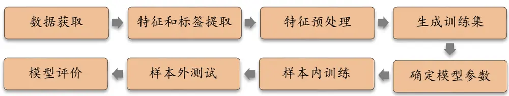
资料来源：华泰证券研究所

如图表 7所示，随机森林运用于多因子选股的构建方法包含下列步骤：

1． 数据获取：

a) 股票池：全 A股，剔除 ST 股票，剔除每个截面期下一交易日停牌的股票，剔除上市 3个月以内的股票。每只股票视作一个样本。

b) 回测区间：2011-02-01 至 2018-01-31。

2． 特征和标签提取：每个自然月的最后一个交易日，计算图表 8中的 70 个因子暴露度以及图表 9 中的上证指数周期三因子，作为样本的原始特征；计算下一整个自然月的个股超额收益（以沪深 300 指数为基准），作为样本的标签。

3． 特征预处理（图表 8中的因子）：

a) 中位数去极值：设第 T 期某因子在所有个股上的暴露度序列为 $D_{i}$ ， $D_{M}$ 为该序列中位数， $D_{M1}$ 为序列 $|D_{i}{-}D_{M}|$ 的中位数，则将序列 $D_{i}$ 中所有大于 $D_{M}+5D_{M1}$ 的数重设为 $D_{M}+5D_{M1}$ ，将序列 $D_{i}$ 中所有小于 $D_{M}-5D_{M1}$ 的数重设为 $D_{M}-5D_{M1}$ ；

b) 缺失值处理：得到新的因子暴露度序列后，将因子暴露度缺失的地方设为中信一级行业相同个股的平均值。

c) 行业市值中性化：将填充缺失值后的因子暴露度对行业哑变量和取对数后的市值做线性回归，取残差作为新的因子暴露度。

d) 标准化：将中性化处理后的因子暴露度序列在横截面上取序，并除以当期票池中的股票数，得到(0,1]上均匀分布的序列。

## 4． 训练集合成：

在每个月末截面期，选取下月收益排名前 30%的股票作为正例 $(\mathbf{y}=1)$ ），后 30%的股票作为负例 $(\mathbf{y}=0)$ ）。将当前月份前 6个月的样本合并形成训练集。其中，月度滚动回测的具体方式可参考图表 10。

5． 样本内训练：使用随机森林模型对训练集进行训练，每个月使用不同训练滚动训练。

6． 样本外测试：模型训练好后，以 T 月月末截面期所有样本（即个股）预处理后的特征作为模型的输入，得到每个样本的 T+1 月的预测值f(x)（合成因子，即随机森林中各决策树分类结果的投票平均值），可以根据该预测值构建策略组合。

7．模型评价：评价指标包括两方面，一是测试集的正确率、AUC 等衡量模型性能的指标；二是上一步中构建的策略组合的各项表现（包括年化超额收益率、信息比率等等）。

图表8： 选股模型中涉及的全部因子及其描述

| 大类因子 具体因子 | 因子描述 |  |
| --- | --- | --- |
| 估值 | EP | 净利润（TTM）/总市值 |
| 估值 | EPcut | 扣除非经常性损益后净利润（TTM）/总市值 |
| 估值 | BP | 净资产/总市值 |
| 估值 | SP | 营业收入（TTM）/总市值 |
| 估值 | NCFP | 净现金流（TTM）/总市值 |
| 估值 | OCFP | 经营性现金流（TTM）/总市值 |
| 估值 | DP | 近12个月现金红利（按除息日计）/总市值 |
| 估值 | G/PE | 净利润（TTM）同比增长率/PE_TTM |
| 成长 | Sales_G_q | 营业收入（最新财报，YTD）同比增长率 |
| 成长 | Profit_G_q | 净利润（最新财报，YTD）同比增长率 |
| 成长 | OCF_G_q | 经营性现金流（最新财报，YTD）同比增长率 |
| 成长 财务质量 ROE_q | ROE_G_q | ROE（最新财报，YTD）同比增长率 |
| 财务质量 ROE_ttm |  | ROE（最新财报，YTD） |
| 财务质量 ROA_q |  | ROE（最新财报，TTM） |
| 财务质量 ROA_ttm |  | ROA（最新财报，YTD） |
| 财务质量grossprofitmargin_q |  | ROA（最新财报，TTM） |
| 财务质量grossprofitmargin_ttm |  | 毛利率（最新财报，YTD） 毛利率（最新财报，TTM） |
| 财务质量 profitmargin_q |  | 扣除非经常性损益后净利润率（最新财报，YTD） |
| 财务质量 profitmargin_ttm |  | 扣除非经常性损益后净利润率（最新财报，TTM） |
| 财务质量 assetturnover_q |  | 资产周转率（最新财报，YTD） |
| 财务质量 assetturnover_ttm |  | 资产周转率（最新财报，TTM） |
|  | 财务质量operationcashflowratio_q | 经营性现金流/净利润（最新财报，YTD） |
|  | 财务质量operationcashflowratio_ttm | 经营性现金流/净利润（最新财报，TTM） |
| 杠杆 | financial_leverage |  |
| 杠杆 | debtequityratio | 总资产/净资产 |
| 杠杆 | cashratio | 非流动负债/净资产 现金比率 |
| 杠杆 | currentratio | 流动比率 |
| 市值 | In_capital | 总市值取对数 |
| 动量反转 HAlpha |  | 个股60个月收益与上证综指回归的截距项 |
| 动量反转return_Nm |  | 个股最近N个月收益率，N=1，3，6，12 |
|  | 动量反转wgt_return_Nm | 个股最近N个月内用每日换手率乘以每日收益率求算术平均 |
| 动量反转 exp_wgt_return_Nm |  | 值，N=1，3，6，12 个股最近 N 个月内用每日换手率乘以函数 exp(-x_i/N/4)再乘 |
| 波动率 |  | 以每日收益率求算术平均值，x_i为该日距离截面日的交易日 的个数，N=1，3，6，12 |
|  | std_FF3factor_Nm | 特质波动率— 一个股最近 N个月内用日频收益率对 Fama French三因子回归的残差的标准差，N=1，3，6，12 |
| 波动率 股价 | std_Nm | 个股最近N个月的日收益率序列标准差，N=1，3，6，12 |
| beta beta | In_price | 股价取对数 |
| 换手率 | turn_Nm | 个股60个月收益与上证综指回归的 beta 个股最近N个月内日均换手率(剔除停牌、涨跌停的交易日)， |
|  |  | N=1, 3, 6, 12 |
| 换手率 | bias_turn_Nm | 个股最近N个月内日均换手率除以最近2年内日均换手率(剔 |
| 情绪 | rating_average | 除停牌、涨跌停的交易日）再减去1，N=1，3，6，12 wind 评级的平均值 |
| 情绪 | rating_change | wind评级（上调家数-下调家数）/总数 |
| 情绪 | rating_targetprice | wind一致目标价/现价-1 |
| 股东 | holder_avgpctchange | 户均持股比例的同比增长率 |
| 技术 | MACD |  |
| 技术 | DEA | 经典技术指标（释义可参考百度百科），长周期取30日，短 |
| 技术 | DIF | 周期取 10 日，计算 DEA 均线的周期（中周期）取15 日 |
| 技术 | RSI | 经典技术指标，周期取20日 |
| 技术 | PSY | 经典技术指标，周期取20日 |
| 技术 | BIAS | 经典技术指标，周期取20日 |

资料来源：Wind，华泰证券研究所

图表9： 上证综指周期三因子及其描述

| 具体因子 | 因子描述 |
| --- | --- |
| 上证综指42个月周期高斯滤波值 | 从1996年起到当前月截面上证综指同比序列的42个月周期高斯滤 波值，所有股票当前月的因子值相同 |
| 上证综指100个月周期高斯滤波值 | 从1996年起到当前月截面上证综指同比序列的100个月周期高斯滤 波值，所有股票当前月的因子值相同 |
| 上证综指200个月周期高斯滤波值 | 从1996年起到当前月截面上证综指同比序列的200个月周期高斯滤 波值，所有股票当前月的因子值相同 |
| 上证综指三因子拟合值 | 从1996年起到当前月截面上证综指同比序列的三因子拟合值，所有 股票当前月的因子值相同 |

资料来源：Wind，华泰证券研究所

图表10： 月频滚动回测示意图
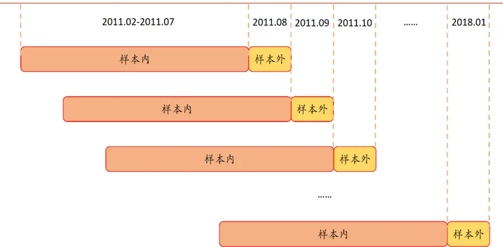
资料来源：华泰证券研究所

## 策略正确率和 AUC 分析

下图展示了添加周期因子的随机森林、添加衰减因子的随机森林和随机森林模型每一期样本外的正确率和 AUC 值随时间的变化情况。三种模型样本外平均正确率分别为 53.72%，53.58%，53.61%，样本外平均 AUC 分别为 0.5503，0.5493，0.5491。从图表 11 和图表 12 中可以看出，添加了周期因子的随机森林模型的正确率和 AUC 都要比其他两个模型有所提高，能够更好地预测股票的涨跌。

图表11： 随机森林和添加周期因子或衰减因子模型样本外正确率
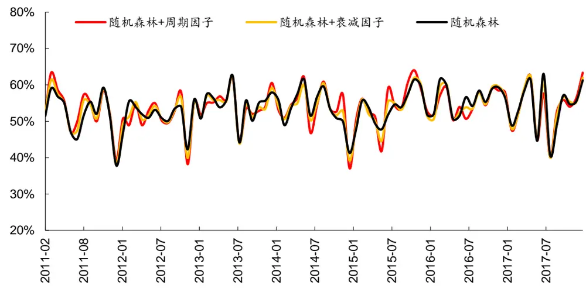
资料来源：Wind，华泰证券研究所

图表12： 随机森林和添加周期因子或衰减因子模型样本外 AUC值
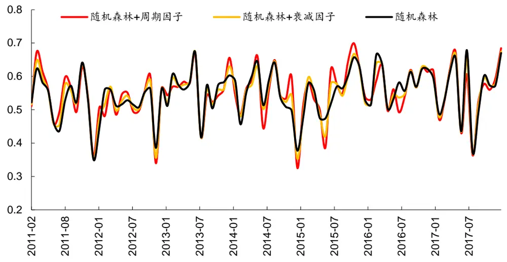
资料来源：Wind，华泰证券研究所

## 策略选股结果分析

我们比较了以下 4 种全 A选股策略的结果：

组合 1：加入了周期因子的随机森林模型（4 个周期因子+70 个传统因子）；

组合 2：加入了衰减因子的随机森林模型（1 个衰减因子+70 个传统因子）；

组合 3：随机森林模型（70个传统因子）；

统一对照组：线性回归模型（70 个传统因子）。

我们构建了全 A选股策略并进行回测，各项指标详见图表 13 和图表 14。选股策略分为两类：一类是行业中性策略，策略组合的行业配置与基准（沪深 300、中证 500、中证全指）保持一致，各一级行业中选 N 个股票等权配置（N=2,3,4,5,6）；另一类是个股等权策略，直接在票池内不区分行业选 N 个股票等权配置（N=20,50,100,150,200），比较基准取为300 等权、500 等权、中证全指指数。三类策略均为月频调仓，个股入选顺序为它们在被测模型中的当月的预测值顺序。

总体来看，无论是行业中性选股还是个股等权选股，组合 1 在年化超额收益率、信息比例、Calmar 比率上表现都比其他 3 个组合更好，在超额收益最大回撤方面也有不错的表现。组合 2的表现则仅次于组合 1。说明在加入了衰减因子后，选股表现有稳定的提升。而加入了周期因子后，由于周期因子同时携带了衰减信息和周期信息，使得选股表现更加优秀。

图表13： 各种模型选股指标对比（全 A选股，行业中性）
每个行业入选个股数目（从左至右：2,3,4,5,6）

| 模型选择 | 每个行业入选个股数目（从左至右：2,3,4,5,6） |  |  |  |  |
| --- | --- | --- | --- | --- | --- |
|  | 全 A 选股，基准为沪深 300 |  | 全 A 选股，基准为中证 500 |  | 全 A选股，基准为中证全指 |
|  | 年化超额收益率（行业中性） |  | 年化超额收益率（行业中性） |  | 年化超额收益率（行业中性） |
| 组合1 | 14.79%14.47% 14.63%14.28%13.64% |  | 23.08%22.58% 22.51% 22.59%21.45% |  | 18.46%18.19% 18.11% 18.03%17.17% |
| 组合2 | 12.21%13.05%13.73%13.23%12.11% |  | 19.89%20.40% 20.59%20.09%19.21% |  | 15.35%16.22%16.76%16.24%15.33% |
| 组合3 | 12.87%12.20% 12.34%12.95%12.60% |  | 18.85%19.46%19.09% 19.44%18.79% |  | 15.34% 15.32% 15.36%15.84%15.36% |
| 统一对照组 | 11.92% 9.63%10.25%10.90%10.45% |  | 19.92%16.99%15.81%16.09%15.32% |  | 15.56% 12.99%12.56%13.16%12.66% |
|  | 超额收益最大回撤（行业中性） |  | 超额收益最大回撤（行业中性） |  | 超额收益最大回撤（行业中性） |
| 组合1 | 24.67%23.86% 23.68% 24.23%23.84% |  | 11.53%10.05% 9.99% 8.61% 8.51% |  | 9.19% 9.43% 9.07% 8.72% 8.31% |
| 组合2 | 23.82%21.55%21.81%22.31%22.72% |  | 16.04%14.89% 14.21%12.37%11.87% |  | 13.02%12.99%12.39%10.92%10.09% |
| 组合3 |  |  | 16.93% 15.41%14.25%12.32% 12.30% |  | 12.72%13.15%12.49%10.57% 10.64% |
| 统一对照组 | 22.95%21.42%22.79%21.63%21.89% |  |  |  | 15.63%13.32%13.77%13.79%14.85% |
|  | 30.00%28.14% 28.04%27.71%28.90% | 9.49% | 9.65%10.26%10.78%11.57% |  |  |
| 组合1 | 信息比率（行业中性） |  | 信息比率（行业中性） 3.28 | 信息比率（行业中性） |  |
| 组合2 | 1.44 1.47 1.54 1.53 | 1.49 2.86 | 3.05 3.18 3.34 2.71 2.91 2.95 2.88 | 2.30 2.45 1.90 2.14 | 2.55 2.63 2.58 2.30 |
| 组合3 | 1.16 1.30 1.39 1.37 | 1.28 2.43 1.28 | 2.53 2.58 2.70 2.68 | 1.88 | 2.32 2.23 |
| 统一对照组 | 1.21 1.20 1.22 1.30 1.13 | 2.25 1.08 |  | 2.00 | 2.05 2.16 2.13 |
|  | 0.95 1.02 1.11 | 2.39 | 2.24 2.19 2.33 2.32 Calmar 比率（行业中性） | 1.91 1.72 | 1.72 1.86 1.83 |
| 组合1 | Calmar 比率（行业中性） 0.60 0.61 0.62 | 0.59 0.57 2.00 | 2.25 2.25 2.62 | 2.52 2.01 1.93 | Calmar 比率（行业中性） 2.00 2.07 2.07 |
| 组合2 | 0.51 0.61 0.63 | 0.59 0.53 1.24 | 1.37 1.45 1.62 | 1.62 1.18 1.25 | 1.35 1.49 1.52 |
| 组合3 | 0.56 0.57 0.54 | 0.60 0.58 1.11 | 1.26 1.34 1.58 | 1.53 1.21 1.17 | 1.23 1.50 1.44 |
| 统一对照组 | 0.40 0.34 0.37 | 0.39 0.36 2.10 | 1.76 1.54 1.49 | 1.32 1.00 | 0.97 0.91 0.95 0.85 |

资料来源：Wind，华泰证券研究所

图表14： 各种模型选股指标对比（全 A选股，个股等权）

| 模型选择 组合总入选个股数目（从左至右：20,50，100，150，200） |  |  |  |  |  |  |  |  |
| --- | --- | --- | --- | --- | --- | --- | --- | --- |
|  | 全 A 选股，基准为沪深 300 |  | 全 A 选股，基准为中证 500 |  | 全 A选股，基准为中证全指 |  |  |  |
|  | 年化超额收益率（个股等权） |  | 年化超额收益率（个股等权） |  | 年化超额收益率（个股等权） |  |  |  |
| 组合1 | 29.34%24.37%22.81%21.56%20.78% |  | 30.26%25.30%23.74%22.41%21.65% |  | 30.01%25.03%23.48%22.18%21.41% |  |  |  |
| 组合2 | 25.25%23.76%21.95%21.01%20.08% |  | 26.28%24.78%22.90%21.96%21.02% |  | 25.99%24.49%22.64%21.69%20.76% |  |  |  |
| 组合3 | 21.86%23.62%21.57%19.80% 19.99% |  | 22.98%24.68%22.60%20.83%20.99% |  | 22.66%24.38%22.31%20.54%20.71% |  |  |  |
| 统一对照组 | 19.01%16.19% 16.38% 16.45% 16.80% |  | 19.90%17.12% 17.35% 17.41%17.75% |  | 19.65%16.85% 17.07% 17.13%17.49% |  |  |  |
|  | 超额收益最大回撤（个股等权） |  | 超额收益最大回撤（个股等权） |  | 超额收益最大回撤（个股等权） |  |  |  |
| 组合1 | 28.27%29.40%28.13%26.62%27.91% |  | 17.33%19.51%17.56%13.53%12.20% |  | 21.61%23.95%22.46%18.62%16.69% |  |  |  |
| 组合2 | 35.50%32.57%31.65%29.99% 30.09% |  | 27.35%23.07%21.90%17.54%14.49% |  |  |  | 31.12%27.15%26.12%22.31%20.05% |  |
| 组合3 |  |  | 32.51%25.16%22.36%19.59%15.91% |  |  |  | 35.83%28.96%25.77%23.38%20.49% |  |
| 统一对照组 | 39.90%33.92%31.13%31.78% 32.11% |  |  |  |  |  |  |  |
|  | 33.07% 33.46%35.22%34.72% 35.00% 信息比率（个股等权） |  | 20.52%11.67% 11.38%10.32% 10.53% 信息比率（个股等权） |  |  | 23.99%16.97% 17.21%16.45% 16.39% |  |  |
| 组合1 | 1.32 | 1.26 | 2.50 2.53 | 2.75 2.86 | 2.14 | 信息比率（个股等权） |  | 2.08 2.05 |
| 组合2 | 1.51 1.28 1.28 | 1.28 1.22 1.20 1.15 | 2.23 2.59 | 2.76 2.83 | 2.86 | 2.00 2.05 |  | 2.01 1.96 |
| 组合3 | 1.06 1.26 | 1.23 | 1.89 2.59 | 2.67 2.58 | 2.85 | 1.85 1.99 2.02 |  | 1.82 1.91 |
| 统一对照组 |  | 1.19 1.09 1.12 |  | 2.60 | 2.75 | 1.55 1.97 1.94 |  | 1.68 1.77 |
|  | 1.00 0.90 | 0.93 0.95 0.98 | 1.79 2.05 | 2.36 Calmar 比率（个股等权） | 2.83 | 1.47 1.49 1.59 |  |  |
| 组合1 | Calmar 比率（个股等权） | 0.81 0.74 |  | 1.35 1.66 |  | Calmar 比率（个股等权） |  | 1.28 |
| 组合2 | 1.04 0.83 0.81 | 0.70 0.67 | 1.75 1.30 0.96 1.07 | 1.05 1.25 | 1.77 | 1.39 1.05 1.05 |  | 1.19 1.04 |
| 组合3 | 0.71 0.73 0.69 | 0.69 0.62 |  | 1.01 1.06 | 1.45 | 0.84 0.90 | 0.87 | 0.97 |
| 统一对照组 | 0.55 0.70 0.57 0.48 | 0.62 0.47 0.47 0.48 | 0.71 0.98 0.97 1.47 | 1.53 1.69 | 1.32 1.69 | 0.63 0.84 0.82 0.99 | 0.87 0.99 | 0.88 1.01 1.04 1.07 |

资料来源：Wind，华泰证券研究所

图表 15 展示了 4 种策略组合在行业中性情况下的详细回测情况。加入周期三因子后，随机森林模型构建的选股组合年化超额收益率平均提升了 2.6%，超额收益最大回撤平均下降了 3.7%，信息比率平均提升了 0.55，Calmar 比率平均提升了 0.82，选股表现有稳定的提升。

图表15： 4 种策略组合回测分析表（回测期：20110201～20180131）

|  | 每个行业入 | 年化 |  | 年化夏普 | 最大年化超额 |  | 年化超额收益 | 信息 |  |  | Calmar 相对基准 月均双边 |
| --- | --- | --- | --- | --- | --- | --- | --- | --- | --- | --- | --- |
| 选股票池比较基准 | 模型与策略类型选个股数目 | 收益率 |  | 波动率比率 | 回撤 | 收益率跟踪误差最大回撤比率 |  |  | 比率 | 月胜率 | 换手率 |
| 全部 A 股 中证500 | 组合1行业中性 | 2 27.1% |  | 28.1%0.97 | 49.5% | 23.1% | 8.1% | 11.5% 2.86 | 2.00 | 77.4% | 156.6% |
| 全部 A 股 中证 500 | 组合1行业中性 | 3 26.7% | 27.5% | 0.97 | 48.6% | 22.6% | 7.4% | 10.1% 3.05 | 2.25 | 76.2% | 150.5% |
| 全部 A 股 中证 500 | 组合1行业中性 | 4 26.6% | 27.5% | 0.97 | 50.2% | 22.5% | 7.1% | 10.0% 3.18 | 2.25 | 76.2% | 145.9% |
| 全部 A 股 中证 500 | 组合1行业中性 | 5 26.7% |  | 27.4%0.98 | 50.0% | 22.6% | 6.8% | 8.6% 3.34 | 2.62 | 77.4% | 141.5% |
| 全部 A 股 中证 500 | 组合1行业中性 | 6 25.5% | 27.5% | 0.93 | 50.6% | 21.5% | 6.5% | 8.5%3.28 | 2.52 | 76.2% | 138.5% |
| 全部 A 股 中证 500 | 组合1行业中性 | 724.7% |  | 27.7%0.89 | 50.8% | 20.7% | 6.4% | 9.2%3.25 | 2.26 | 71.4% | 134.5% |
| 全部 A 股 中证 500 | 组合1行业中性 | 8 24.0% | 27.6% | 0.87 | 50.2% | 20.1% | 6.2% | 9.1% 3.25 | 2.21 | 72.6% | 131.2% |
| 全部 A 股 中证 500 | 组合1行业中性 | 9 23.8% |  | 27.6%0.86 | 50.5% | 19.9% | 6.1% | 9.0%3.27 | 2.20 | 75.0% | 127.8% |
| 全部 A 股 中证 500 | 组合1行业中性 | 10 23.0% |  | 27.6%0.83 | 51.1% | 19.0% | 6.0% | 9.3% 3.18 | 2.05 | 73.8% | 125.5% |
| 全部 A 股 中证 500 | 组合2 行业中性 | 2 23.9% | 28.0% | 0.85 | 52.7% | 19.9% | 8.2% | 16.0% 2.43 | 1.24 | 66.7% | 151.9% |
| 全部 A 股 中证500 | 组合 2 行业中性 | 3 24.3% |  | 28.0%0.87 | 53.2% | 20.4% | 7.5% | 14.9%2.71 | 1.37 | 69.0% | 145.4% |
| 全部 A 股 中证 500 | 组合 2 行业中性 | 24.5% 4 |  | 28.0%0.88 | 52.8% | 20.6% | 7.1% | 14.2% 2.91 | 1.45 | 70.2% | 140.9% |
| 全部 A 股 中证 500 | 组合 2 行业中性 | 5 24.0% |  | 27.9% 0.86 | 52.0% | 20.1% | 6.8% | 12.4% 2.95 | 1.62 | 75.0% | 136.1% |
| 全部 A 股 中证 500 | 组合 2 行业中性 | 6 23.1% |  | 27.9%0.83 | 52.4% | 19.2% | 6.7% | 11.9% 2.88 |  | 1.62 71.4% | 132.4% |
| 全部 A 股 中证 500 | 组合2 行业中性 | 7 22.6% |  | 28.0%0.81 | 53.1% | 18.8% | 6.6% | 12.1% 2.86 |  | 1.56 69.0% | 128.9% |
| 全部 A 股 中证 500 | 组合2 行业中性 | 8 22.0% |  | 28.0%0.79 | 53.0% | 18.2% | 6.4% | 12.2% | 2.85 | 1.49 71.4% | 125.7% |
| 全部 A 股 中证 500 | 组合 2 行业中性 | 21.7% 9 |  | 27.8%0.78 | 52.7% | 17.9% | 6.2% | 12.4%2.87 | 1.45 | 70.2% | 122.6% |
| 全部 A 股 中证 500 | 组合 2 行业中性 | 10 21.7% | 27.8% | 0.78 | 52.6% | 17.9% | 6.1% | 11.1% 2.92 | 1.61 | 69.0% | 120.1% |
| 全部 A 股 中证 500 | 组合3 行业中性 | 2 22.9% |  | 27.9%0.82 | 51.9% | 18.9% | 8.4% | 16.9% 2.25 | 1.11 | 69.0% | 145.8% |
| 全部 A 股 中证 500 | 组合3行业中性 | 3 23.4% | 28.0% | 0.84 | 52.3% | 19.5% | 7.7% | 15.4% 2.53 | 1.26 | 72.6% | 140.5% |
| 全部 A 股 中证500 | 组合3行业中性 | 422.9% | 28.2% | 0.81 | 53.8% | 19.1% | 7.4% | 14.2%2.58 |  | 1.34 75.0% | 136.1% |
| 全部 A 股 中证 500 | 组合3行业中性 | 23.2% 5 |  | 28.3%0.82 | 54.0% | 19.4% | 7.2% | 12.3%2.70 |  | 1.58 71.4% | 132.3% |
| 全部 A 股 中证 500 | 组合3行业中性 | 6 22.5% | 28.4% | 0.79 | 53.3% | 18.8% | 7.0% | 12.3% 2.68 |  | 1.53 70.2% | 128.2% |
| 全部 A 股 中证 500 | 组合3行业中性 | 722.2% |  | 28.2%0.79 | 53.2% | 18.4% | 6.8% | 12.0% 2.70 |  | 1.53 67.9% | 124.6% |
| 全部 A 股 中证 500 | 组合3行业中性 | 8 22.0% | 28.2% | 0.78 | 53.3% | 18.3% | 6.7% | 11.8%2.73 |  | 1.54 69.0% | 121.3% |
| 全部 A 股 中证500 | 组合3行业中性 | 9 22.0% | 28.0% | 0.79 | 52.9% | 18.2% | 6.5% | 11.3% 2.80 |  | 1.60 72.6% | 118.3% |
| 全部 A 股 中证500 | 组合3行业中性 | 1021.7% |  | 28.0%0.77 | 52.6% | 17.9% | 6.4% | 11.7%2.79 |  | 1.53 69.0% | 116.1% |
| 全部 A 股 | 中证500 线性回归行业中性 | 2 23.7% | 28.5% | 0.83 | 50.1% | 19.9% | 8.3% | 9.5% 2.39 |  | 2.10 66.7% | 150.1% |
| 全部 A 股 中证 500 线性回归 | 行业中性 | 3 20.6% | 28.6% | 0.72 | 51.1% | 17.0% | 7.6% | 9.7%2.24 |  | 1.76 65.5% | 144.1% |
| 全部 A 股 中证 500 线性回归 | 行业中性 | 4 19.4% |  | 28.4% 0.68 | 49.8% | 15.8% | 7.2% | 10.3% 2.19 |  | 1.54 64.3% | 139.2% |
| 全部 A 股 中证 500 线性回归 | 行业中性 | 5 19.7% |  | 28.3%0.70 | 48.5% | 16.1% | 6.9% 6.6% | 10.8% 2.33 11.6% | 2.32 | 1.49 66.7% 1.32 67.9% | 135.8% |
| 全部 A 股 中证 500 全部 A 股 | 线性回归 行业中性 | 6 18.9% | 28.3% | 0.67 | 49.7% | 15.3% | 6.5% | 12.1% | 2.37 1.27 | 66.7% | 133.3% |
| 中证 500 线性回归 | 行业中性 | 7 18.9% 8 18.7% |  | 28.3%0.67 | 49.8% | 15.3% | 6.2% | 12.2% | 2.42 | 1.24 66.7% | 129.7% 126.5% |

资料来源：Wind，华泰证券研究所

图表 16展示了 4种策略的超额收益和回撤的走势。

图表16： 4种策略超额收益和回撤表现（每个行业选 4只个股）
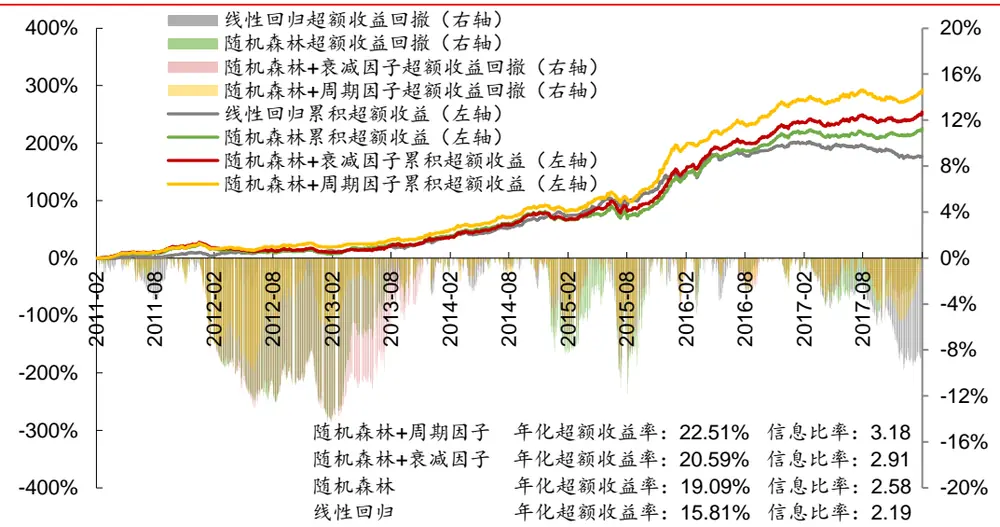
资料来源：Wind，华泰证券研究所

## 周期因子重要性分析

随机森林模型通过统计各个因子在决策树枝杈分裂时带来的信息增益数值来得出各个因子的重要性（feature importance）。因子重要性越高，其在模型中起到的作用就越大。我们统计了所有 74 个因子在回测区间（2011.2-2018.1）的因子重要性平均值，并进行排名，其中 4 个周期因子的重要性均值和排名为如图 17 所示。虽然周期因子的重要性排名都比较靠后，但依然高于一些传统的因子（主要是财务质量类因子）。

图表17： 回测区间（2011.2-2018.1）内周期因子重要性均值和排名

| 具体因子 | 因子重要性均值 | 因子重要性排名 |
| --- | --- | --- |
| 上证综指42个月周期高斯滤波值 | 0.01225 | 51/74 |
| 上证综指100个月周期高斯滤波值 | 0.01179 | 58/74 |
| 上证综指200个月周期高斯滤波值 | 0.01178 | 59/74 |
| 上证综指三因子拟合值 | 0.01139 | 63/74 |

资料来源：Wind，华泰证券研究所

图表 18显示了 4个周期因子的重要性随时间的变化。

图表18： 周期因子重要性时间序列
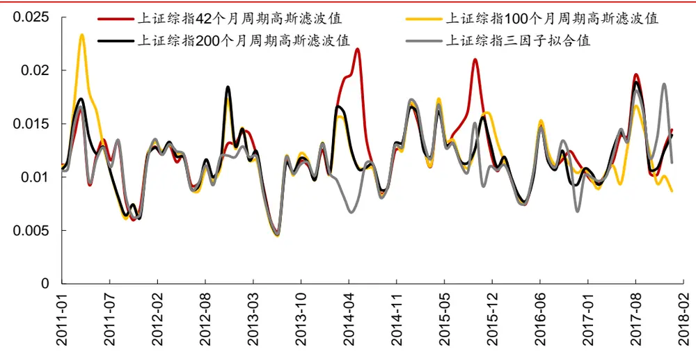
资料来源：Wind，华泰证券研究所

## 总结和展望

本报告中，将宏观因子——华泰周期三因子引入多因子选股模型中，构建了因子择时+选股一体化的随机森林模型。并通过模型预测结果构建全 A选股策略，与其他对照策略进行对比，初步得到以下结论：

1. 相比于线性回归模型，随机森林模型能够合理地利用传统截面因子与宏观时间序列因子合并后的数据。宏观时间序列因子在随机森林模型中起到了状态切换的作用，不同状态下对应不同的截面因子选股逻辑。

2. 加入周期三因子的随机森林模型能获得更好的回测结果，本质上利用了周期因子的两个效应：（1）在周期因子取值单调的训练期内，模型侧重于遵循离当前更近的截面期样本的投资逻辑。（2）在周期因子取值非单调的训练期内（即拐点处），模型能够利用到周期因子在拐点处所带来的增量信息。

3．加入了周期三因子的随机森林模型，在样本外的平均预测正确率从 53.61%提升至53.72%，平均 AUC 从 0.5491 提升至 0.5503，模型的预测能力有所提高，能够更好地预测股票的涨跌。

4. 在随机森林模型中加入周期三因子后，我们构建了全 A选股策略（回测期：20110201～20180131，中证 500 行业中性），回测结果显示，加入了周期三因子的随机森林模型，相比其他对照模型在年化超额收益率、信息比率、Calmar 比率上表现都更好，在超额收益最大回撤方面也有不错的表现。加入周期三因子后，随机森林模型构建的选股组合年化超额收益率平均提升了 2.6%，超额收益最大回撤平均下降了 3.7%，信息比率平均提升了0.55，Calmar比率平均提升了 0.82，选股表现有稳定的提升。

5. 综合考虑前期人工智能选股报告的结论和周期因子的特性，我们选用的训练集数据长度为 6 个月，具体原因如下：（1）过长的训练期长度在投资风格发生转变时（2017 年）面临较大回撤，2011 年至 2015 年的投资风格已经不适合于当下。而较短的训练期长度（10个月以内）使得模型能够及时扭转投资风格，大幅减少回撤。2. 较短的训练期长度下，周期因子能够更加精细地切分市场状态，并且能更加及时地利用到周期因子位于拐点时的信息。

6. 随机森林比 XGBoost 更适合结合宏观周期因子。随机森林和 XGBoost 虽然同是属于决策树集成的模型，但是由于集成方式的不同，随机森林中的决策树层次更深，分支节点更多，因此随机森林相比 XGBoost 更容易利用到信息增益较少的周期因子，从而提升预测能力。

本文是我们将宏观因子利用到人工智能选股领域的初步尝试，我们在之后的研究中，将会继续从数据和模型的角度进行改进，并尝试将更多的宏观指标融入到多因子选股中。

## 附录：华泰周期三因子模型介绍

华泰金工团队自 2016 年起初推出了周期系列报告，使用信号处理领域的一系列定量分析方法研究金融市场的周期现象。从最初的傅里叶变换，到高斯滤波，再到 MUSIC 算法确定全球宏观指标的共同周期，我们不断地完善周期研究的方法论，证明了周期三因子模型能有力地解释多种宏观指标的同比序列，对预测金融资产的走势有积极的参考意义。

## 周期三因子模型原理

Fama 多因子模型告诉我们，股价的变动是由许多因子共同作用导致的结果。同理，任何经济现象，也是许多因子共同作用的结果。华泰金工周期系列报告中的傅里叶变换则说明，这些不规则的经济数据序列，都可以分解成三个周期因子运动的叠加。如图表 19 所示，以上证综指的同比序列为例，可以提取出 42、100、200 个月的高斯滤波周期序列。（详细方法可参见华泰金工周期系列报告《市场的轮回》《市场的频率》《周期研究对大类资产的预测观点》）。

图表19： 上证综指同比序列三周期高斯滤波
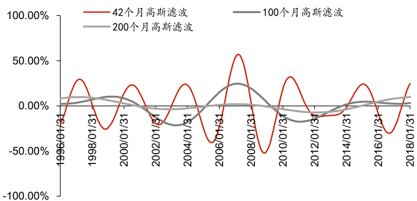
资料来源：华泰证券研究所

为了研究三周期序列对原始同比序列的解释程度，我们再以三周期序列作为自变量，原始同比序列作为因变量，构建回归方程：

$$
y=\beta_{0}+\beta_{1}x_{1}+\beta_{2}x_{2}+\beta_{3}x_{3}+\varepsilon
$$

其中y仍旧表示数据的同比数列， $x_{1}$ 为 42 个月周期提取的高斯滤波， $x_{2}$ 为 100 个月周期提取的高斯滤波， $x_{3}$ 为 200 个月周期提取的高斯滤波，三个滤波的回归分析如下：

图表20： 上证综指滤波回归系数

|  | 回归系数-β0 | 回归系数-β1 | 回归系数-β2 | 回归系数-β3 | 拟合优度(R²) | p值 |
| --- | --- | --- | --- | --- | --- | --- |
| 42个月高斯波单变量回归 | 0.0733 | 1.1977 |  |  | 0.586693 | 4.56E-50 |
| 100个月高斯波单变量回归 | 0.0729 | 1.2706 |  |  | 0.178664 | 2.19E-12 |
| 200个月高斯波单变量回归 | 0.0662 | 2.2065 |  |  | 0.089856 | 1.19E-06 |
| 三个高斯滤波三变量回归 | 0.0705 | 1.1622 | 0.9338 | 0.7496 | 0.731101 | 1.04E-70 |

资料来源：Wind，华泰证券研究所

对上证综指来说，将三个高斯滤波放在一起做三变量回归，模型的拟合优度为 0.7311，这是一个非常高的拟合优度。这说明这三个频率信号可以解释原数据绝大部分的信息。同时，在图表 21 中我们可以很直观的看到，使用三周期序列拟合后的曲线，与上证综指原始序列几乎完全贴合。实际上，任何一项资产运动，都可以分解为无限且可数个傅里叶级数的叠加，类似音乐由各种不同频率混合而成，可见光由不同的频率波混合而成。

图表21： 上证综指同比序列与回归拟合曲线
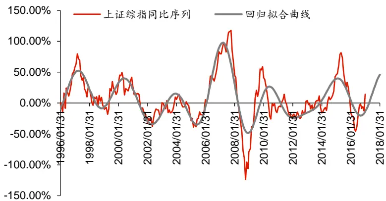
资料来源：华泰证券研究所

从以上的简单分析中，我们可以看出，各种因子运动的叠加，可以产生各种各样的经济现象，这些观测到的现象因而包含了各因子本身的周期性。古典经济学家并没有傅里叶变换等现代分析手段，但是也挖掘出具备普遍意义的周期因子，这些周期因子正好与傅里叶变换获得的结果相互印证，证明了市场确实是基于多因子共同作用而形成的复杂系统。

例如，图表 21 中，最短的周期为英国经济学家基钦提出的，平均长度为 40 个月左右的经济周期，称为“基钦周期”。 中周期为法国经济学家朱格拉提出的，一种为期 9~10 年的经济周期，该周期是以国民收入、失业率和大多数经济部门的生产、利润和价格的波动为标志加以划分的，称为朱格拉周期。长周期则是美国经济学家库兹涅茨提出的以建筑业兴旺和衰落的周期为基准的经济周期，约为 15 年至 25 年，称为“库兹涅茨周期”。这三个因子类似 Fama三因子定价模型，构成了我们的“周期三因子”模型。

## 周期三因子模型的应用

在华泰金工周期系列报告《周期三因子定价与资产配置模型》中，我们使用周期三因子模型对大类资产进行定价并实施主动配置，取得了优异的回测结果（详情可见报告《周期三因子定价与资产配置模型》），这说明周期三因子模型中携带有能够解释资产涨跌的信息，如果将周期三因子模型运用到多因子选股中并结合复杂的机器学习方法，或许能够从中挖掘出相较于传统因子的增量信息。

## 风险提示

加入周期三因子的随机森林选股模型是对历史投资规律的挖掘，若未来市场投资环境发生变化，则模型存在失效的可能。

## 免责申明

本报告仅供华泰证券股份有限公司（以下简称“本公司”）客户使用。本公司不因接收人收到本报告而视其为客户。

本报告基于本公司认为可靠的、已公开的信息编制，但本公司对该等信息的准确性及完整性不作任何保证。本报告所载的意见、评估及预测仅反映报告发布当日的观点和判断。在不同时期，本公司可能会发出与本报告所载意见、评估及预测不一致的研究报告。同时，本报告所指的证券或投资标的的价格、价值及投资收入可能会波动。本公司不保证本报告所含信息保持在最新状态。本公司对本报告所含信息可在不发出通知的情形下做出修改，投资者应当自行关注相应的更新或修改。

本公司力求报告内容客观、公正，但本报告所载的观点、结论和建议仅供参考，不构成所述证券的买卖出价或征价。该等观点、建议并未考虑到个别投资者的具体投资目的、财务状况以及特定需求，在任何时候均不构成对客户私人投资建议。投资者应当充分考虑自身特定状况，并完整理解和使用本报告内容，不应视本报告为做出投资决策的唯一因素。对依据或者使用本报告所造成的一切后果，本公司及作者均不承担任何法律责任。任何形式的分享证券投资收益或者分担证券投资损失的书面或口头承诺均为无效。

本公司及作者在自身所知情的范围内，与本报告所指的证券或投资标的不存在法律禁止的利害关系。在法律许可的情况下，本公司及其所属关联机构可能会持有报告中提到的公司所发行的证券头寸并进行交易，也可能为之提供或者争取提供投资银行、财务顾问或者金融产品等相关服务。本公司的资产管理部门、自营部门以及其他投资业务部门可能独立做出与本报告中的意见或建议不一致的投资决策。

本报告版权仅为本公司所有。未经本公司书面许可，任何机构或个人不得以翻版、复制、发表、引用或再次分发他人等任何形式侵犯本公司版权。如征得本公司同意进行引用、刊发的，需在允许的范围内使用，并注明出处为“华泰证券研究所”，且不得对本报告进行任何有悖原意的引用、删节和修改。本公司保留追究相关责任的权力。所有本报告中使用的商标、服务标记及标记均为本公司的商标、服务标记及标记。

本公司具有中国证监会核准的“证券投资咨询”业务资格，经营许可证编号为：Z23032000。全资子公司华泰金融控股（香港）有限公司具有香港证监会核准的“就证券提供意见”业务资格，经营许可证编号为：AOK809
©版权所有 2018 年华泰证券股份有限公司

## 评级说明

## 行业评级体系

－报告发布日后的6个月内的行业涨跌幅相对同期的沪深300指数的涨跌幅为基准；

－投资建议的评级标准

增持行业股票指数超越基准

中性行业股票指数基本与基准持平

减持行业股票指数明显弱于基准

## 公司评级体系

－报告发布日后的6个月内的公司涨跌幅相对同期的沪深300指数的涨跌幅为基准；
－投资建议的评级标准
买入股价超越基准 20%以上
增持股价超越基准 5%-20%
中性股价相对基准波动在-5%~5%之间
减持股价弱于基准 5%-20%
卖出股价弱于基准 20%以上

## 华泰证券研究

## 南京

南京市建邺区江东中路228号华泰证券广场1号楼/邮政编码：210019

电话：86 25 83389999 /传真：86 25 83387521电子邮件：ht-rd@htsc.com

## 深圳

深圳市福田区深南大道4011号香港中旅大厦24层/邮政编码：518048

电话：86 755 82493932 /传真：86 755 82492062

电子邮件：ht-rd@htsc.com

## 北京

北京市西城区太平桥大街丰盛胡同28号太平洋保险大厦A座18层

邮政编码：100032

电话：86 10 63211166/传真：86 10 63211275

电子邮件：ht-rd@htsc.com

## 上海

上海市浦东新区东方路18号保利广场E栋23楼/邮政编码：200120

电话：86 21 28972098 /传真：86 21 28972068

电子邮件：ht-rd@htsc.com