## 金工研究/深度研究

2018年05月03日

林晓明 执业证书编号：S0570516010001

研究员 0755-82080134

linxiaoming@htsc.com

陈烨 010-56793927

联系人 chenye@htsc.com

李子钰

联系人 liziyu@htsc.com

2《金工: 宏观周期指标应用于随机森林选股》2018.03

# 人工智能选股之stacking集成学习

# 华泰人工智能系列之十一

## 报告使用了一种改进的 Stacking 模型，适合应用于金融数据领域

Stacking 是一种常见的集成学习框架，一般有两层，其能够成功的关键在于第一层模型能针对原始数据得出有差异性（相关性低）且预测能力好的输出值，这样通过第二层模型进一步学习后，能够在多个第一层模型中取长补短，提升预测的准确度和稳定性。本文使用的是一种改进的 Stacking框架，框架的第一层不仅使用不同的模型，还使用有差异的训练数据，这进一步增大了模型输出值之间的差异性，这样的差异性往往适合于训练和预测数据不是同分布的领域，可以增强预测的稳定性，如金融数据的预测。

## 报告提出了基于适应度指标的 Stacking 基模型选择方法

对于 Stacking 集成学习在多因子选股领域的应用，本文提出了基于适应度指标的基模型选择方法，该方法本质是挑选预测值相关性低且预测能力好的基模型进行集成。通过分析，我们认为使用 6 个月数据训练的 XGBoost模型（XGBoost_6m）以及逻辑回归模型（逻辑回归_6m）最适合与使用72 个月数据训练的 XGBoost（XGBoost_72m）进行 Stacking 集成。

## 报告给出了 Stacking应用于多因子选股的 3个关键结论

对于 Stacking 集成学习在多因子选股领域的应用，我们通过对比测试，得出以下结论：（1）Stacking 第一层应该使用不同种类的基模型和训练数据以达到最好的预测结果；（2）Stacking 第一层并非集成越多的基模型表现就越好，要达到更好的集成学习效果，需要各个基模型两两之间相关性低，且基模型有足够好的预测能力。（3）较短的验证集数据长度（2 个月）可以使得 Stacking 集成学习模型的超额收益最大回撤较小，Calmar 比率较高，模型预测值的 IR比率较高。

## Stacking 模型能获得较高的超额收益并控制回撤，Calmer比率提升显著

在本文的测试中，最优的 Stacking 集成学习模型为将 XGBoost_72m 和逻辑回归_6M 进行集成，并且验证集数据选用 2 个月的模型（以下简称最优模型）。最优模型有效结合了基模型的优点（XGBoost_72m 的高收益、高信息比率，逻辑回归_6m 的低回撤）。2011 年 2 月至 2018 年 4 月，对于全 A 选股的行业中性策略，最优模型相对于中证 500 的年化超额收益在27.75%~29.45%之间，超额收益最大回撤在 8.92%~10.18%之间，信息比率在 3.33~3.84 之间，Calmer 比率在 2.73~3.25 之间，Calmer 比率的提升最为显著。

## Stacking 模型预测值的单因子测试结果优秀

我们对 Stacking 最优模型的输出值进行单因子测试。因子分 5层测试多空组合年化收益率为 33.82%，夏普比率为 5.03。因子分 10 层测试组合 1 和组合 10在所有回测年份中排名都没有变化，因子表现稳定。另外，因子在2011 年至今的 IC 均值为 10.94%，IR 比率为 1.47，IC 值大于零比例为91.86%；因子在 2015 年至今的 IC 均值为 12.57%，IR 比率为 1.59，IC值大于零比例为 94.74%，2015 年以来因子表现更好。

风险提示：Stacking 模型高度依赖基模型的表现。是对历史投资规律的挖掘，若未来市场投资环境发生变化导致基模型全部失效，则 Stacking 模型存在失效的可能。

## 本文研究导读

在华泰金工前期的人工智能选股报告中，我们分别介绍了广义线性模型、SVM、朴素贝叶斯、随机森林、Boosting、神经网络模型在多因子选股中的应用。各个模型在全 A选股的表现各异，同一模型在使用不同训练数据时的表现也有很大差异。如何集成各个模型以达到取长补短的目标成为我们主要关注的方向。上世纪 90 年代以来提出的 Stacking 集成学习模型能够集成多个不同类基模型来进一步提升预测能力。在最近几年的 Kaggle 等机器学习大赛中，Stacking 也成为比赛中常用的集成学习方法。本文将主要关注如下几方面的问题：

1. Stacking 集成学习的原理是什么？Stacking 在多因子选股领域的应用和传统领域有什么区别？

2. 如何挑选 Stacking 集成学习中的基模型？

3. Stacking 集成学习模型如何构建，需要考虑的关键点有哪些？

4. 最后是组合构建的问题，应如何利用模型的预测结果构建策略组合进行回测？全部 A股票池内选股效果（超额收益、最大回撤、信息比率等）如何？相比单一的基模型有哪些方面的提升？

## Stacking 集成学习模型简介

在华泰人工智能系列的第五篇《人工智能选股之随机森林模型》和第六篇《人工智能选股之 Boosting 模型》中，我们分别介绍了 Bagging 集成学习（随机森林）和 Boosting 集成学习（XGBoost，AdaBoost 等），两种集成学习方法通过并行或串行的方法将同类弱学习器（如决策树）进行集成。在集成学习领域，还有一种模型集成方法 Stacking，这种方法通过将不同的模型进行“堆叠”来进一步提升总体模型的性能。这一模型同时能够解决人工智能选股策略领域的若干难题：面对如此多的机器学习模型（例如本系列研报曾经介绍过的广义线性模型、SVM、朴素贝叶斯、随机森林、Boosting、神经网络等）我们应该如何判断当前时刻相对有效的模型是哪一个，又如何将各个模型结合起来做出最优预测？对于模型关键参数又将如何随时间变化做出最优选择？

接下来，我们就将详细介绍 Stacking 的原理及 A 股实证结论。

## Stacking 集成学习的原理

Stacking 是一种常见的集成学习框架。一般来说，Stacking 将训练一个多层（一般是两层，本文中默认两层）的模型结构，第一层（也叫学习层）包含 n个不同的模型，将得到的预测结果合并为新的特征集，并作为下一层模型的输入，由下一层模型再次根据对应的数据标签进行训练，得到一个完整的框架。简单的示意图如下：

图表1： Stacking 集成学习示意图
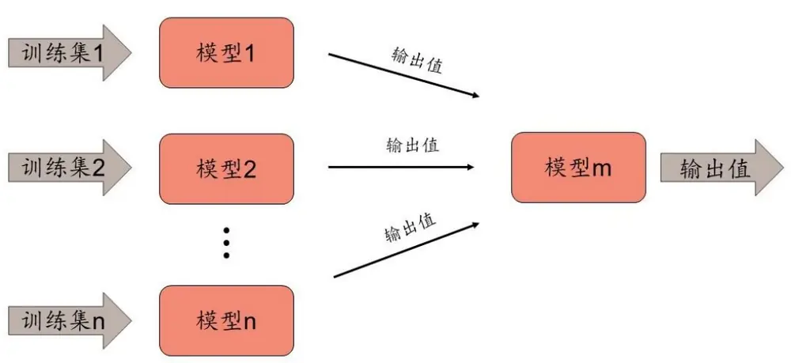
资料来源：华泰证券研究所

通常情况下，Stacking 中第一层的模型会使用拟合度高的模型，以追求对训练数据的充分学习（如 XGBoost、神经网络、SVM 等）。由于不同的模型在原理上和训练集上有所差别，第一层模型可以认为是从原始数据中自动提取有效特征的过程。第一层模型中，由于使用了复杂的非线性变化提取特征，Stacking 更易产生过拟合的情况。为了降低过拟合的风险，第二层模型倾向于使用简单的模型，例如逻辑回归、Lasso 回归等广义线性模型。从以上分析可以看出，Stacking 能够成功的关键在于第一层模型能针对原始训练数据得出有差异性（相关性低）且预测能力好的输出值，这样通过第二层模型进一步学习后，能够在多个第一层模型中取长补短，提升预测的准确度和稳定性。

## 从传统的 Stacking 到改进的 Stacking

一个传统的 Stacking 集成学习如图表 2 所示。图中，所有的第一层模型都使用相同的训练集数据，它们从不同的角度对相同的训练数据进行学习，得到具有差异性的输出值，再通过第二层的逻辑回归得到输出值。该框架主要应用于一些训练和预测数据同分布的传统领域，如图像分类。

图表2： 传统的 Stacking 集成学习
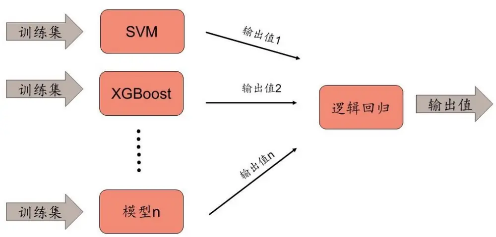
资料来源：华泰证券研究所

本文使用的是一种改进的集成学习框架，如图表 3所示，框架的第一层不仅使用不同的模型，还使用有差异的训练数据，这进一步增大了模型输出值之间的差异性（相关性低），这样的差异性往往适用于训练数据和预测数据不是同分布的领域，可以增强预测的稳定性，如金融数据的预测。

图表3： 改进的 Stacking 集成学习
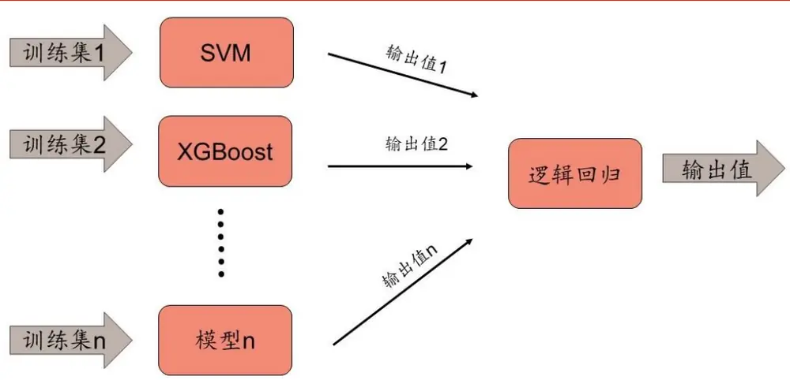
资料来源：华泰证券研究所

传统的 Stacking 和改进的 Stacking 在训练和测试数据的处理上也有一些不同，我们在本文最后的附录部分详细介绍了相关内容。

从本节的分析可以看出，Stacking 与其说是一种模型，不如说是一种机器学习框架，其应用模式并不固定，而是需要根据具体的问题进行模型和训练数据的设计，这使得该框架的应用非常灵活。下一章节中，我们将结合前期人工智能选股系列报告的研究结果，进一步说明我们为何使用改进的 Stacking 集成学习。

## Stacking集成学习中基模型的对比和选取

在本文中，Stacking 模型主要对已有的机器学习模型进行集成。在华泰金工前期的人工智能选股报告中，我们分别介绍了广义线性模型、SVM、朴素贝叶斯、随机森林、Boosting、神经网络模型在多因子选股中的应用。各个模型在全 A选股的表现各异，同一模型在使用不同训练数据时的表现也有很大差异，本章我们将分别展示这些差异，并讨论如何选取Stacking 模型中第一层的基模型。

## 相同训练数据，不同模型的对比

本节中，我们选取 6个模型：逻辑回归、SVM、朴素贝叶斯、随机森林、XGBoost、神经网络模型，对比它们在相同训练数据下的选股表现。

## 训练数据为 72个月

各个模型回测方法如下：

回测时间：2011 年 1 月 31 日至 2018 年 4 月 27 日。

训练数据长度：72 个月，每个月用之前 72 个月的因子数据训练模型。

组合构建方法：月频调仓，在全部 A 股中选股，行业权重配置和中证 500 保持一致，每个行业内选择 4 只模型预测表现最好的股票进行等权配置。

回测得到的超额收益结果如图表 4 所示，总体来看 XGBoost 和随机森林表现最好，模型之间有一定的区分度，但是所有模型在 2017 年后都有较大的回撤。

图表4： 各机器学习模型相对中证 500的超额收益（训练数据为 72个月）
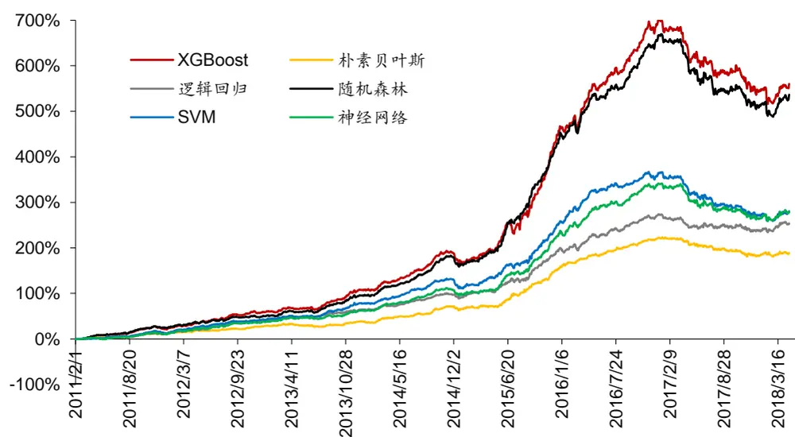
资料来源：Wind，华泰证券研究所

## 训练数据为 6 个月

各个模型回测方法如下：

回测时间：2011 年 1 月 31 日至 2018 年 4 月 27 日。

训练数据长度：6 个月，每个月用之前 6个月的因子数据训练模型。

组合构建方法：月频调仓，在全部 A 股中选股，行业权重配置和中证 500 保持一致，每个行业内选择 4 只模型预测表现最好的股票进行等权配置。

回测得到的超额收益结果如图表 5 所示，总体来看 XGBoost 最好，模型之间有一定的区分度，但是整体走势类似。

图表5： 各机器学习模型相对中证 500的超额收益（训练数据为 6个月）
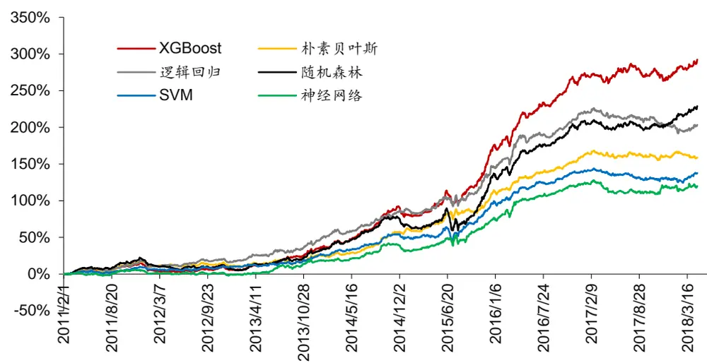
资料来源：Wind，华泰证券研究所

## 不同训练数据，相同模型的对比

本节中，我们主要考察 XGBoost 模型，使用长度分别为 6 个月、9 个月、12 个月、24 个月、36 个月、72 个月的训练数据训练模型，对比它们的选股表现。

各个模型回测方法如下：

回测时间：2011 年 1 月 31 日至 2018 年 4 月 27 日。

组合构建方法：月频调仓，在全部 A 股中选股，行业权重配置和中证 500 保持一致，每个行业内选择 4 只模型预测表现最好的股票进行等权配置。

回测得到的超额收益结果如图表6所示，可以看出训练数据的长短对选股结果有很大影响。72 个月模型学习的是市场的长期规律，但当市场长期规律被打破时（2017 年后），超额收益回撤较大；6 个月模型学习的是市场的短期规律，超额收益增长缓慢且平稳，两个模型各有优劣。其他训练期长度的模型表现位于中间。

图表6： XGBoost各训练期长度训练所得模型相对中证 500的超额收益（训练数据为 6个月）
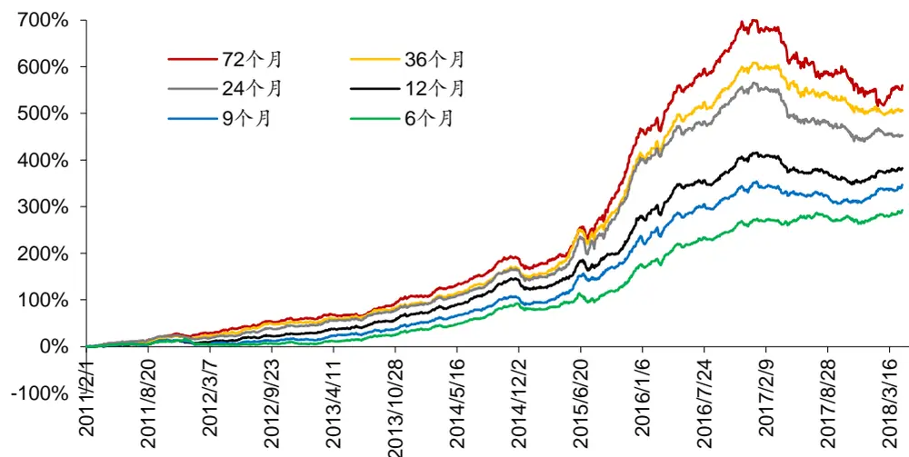
资料来源：Wind，华泰证券研究所

## 模型预测值相关性分析和夏普比率分析

上一章提到过，Stacking 能够成功的关键在于第一层模型能针对原始训练数据得相关性低且预测能力好的输出值。因此在挑选 Stacking 的第一层模型时，要衡量两方面的指标：1. 模型预测值的相关系数（Corr）低。

2. 模型预测能力好。在选股领域，使用模型的夏普比率（Sharpe）来衡量。

为了减少挑选模型的工作量，我们不对所有基模型的预测值进行两两之间的相关性分析，而是挑选出一个优秀的基模型之后，再将其和其他基模型的预测值进行相关性分析。

观察图表 6，发现 XGBoost 使用 72 个月数据训练的模型（以下简称 XGBoost_72m）在2017 年之前有很大的优势，如果在其他基模型中挑选一些和 XGBoost_72m 集成，应该可以达到更好的预测结果。接下来，我们进一步把基模型挑选的范围缩小到使用 6个月数据训练的模型中，因为只有这些模型才能在 2017 年之后回撤较小。在图表 7 中，展示了回测区间内 6个模型预测值与 XGBoost_72m 预测值的相关系数。在图表 8中，展示了回测区间内 6 个模型的 Sharpe 比率。

图表7： 其他基模型预测值与 XGBoost_72m预测值的相关系数

| 模型名称 相关系数（Corr） |
| --- |
| XGBoost_6m 0.61 |
| 朴素贝叶斯_6m 0.56 |
| 逻辑回归_6m 0.53 |
| 随机森林_6m 0.54 |
| 神经网络_6m 0.41 |
| SVM_6m 0.46 |

资料来源：Wind，华泰证券研究所

图表8： 基模型夏普比率

| 模型名称 | 夏普比率（Sharpe） |
| --- | --- |
| XGBoost_6m | 0.96 |
| 朴素贝叶斯_6m | 0.73 |
| 逻辑回归_6m | 0.81 |
| 随机森林_6m | 0.79 |
| 神经网络_6m | 0.59 |
| SVM_6m | 0.61 |

资料来源：Wind，华泰证券研究所

为了选出合适与 XGBoost_72m 模型集成的基模型，我们定义适应度指标 S为：

$$
S=Sharpe/Corr
$$

我们挑选 S较大的那些模型与 XGBoost_72m 模型集成。图表 9展示了 6个模型的适应度指标 S。可知，XGBoost_6m 以及逻辑回归_6m 最适合与 XGBoost_72m 进行 Stacking集成。

图表9： 基模型适应度指标 S

| 模型名称 | 适应度指标S |
| --- | --- |
| XGBoost_6m | 1.57 |
| 朴素贝叶斯_6m | 1.30 |
| 逻辑回归_6m | 1.53 |
| 随机森林_6m | 1.46 |
| 神经网络_6m | 1.44 |
| SVM_6m | 1.33 |

资料来源：Wind，华泰证券研究所

## Stacking 集成学习测试流程

## 测试流程

图表10： Stacking集成学习模型构建示意图
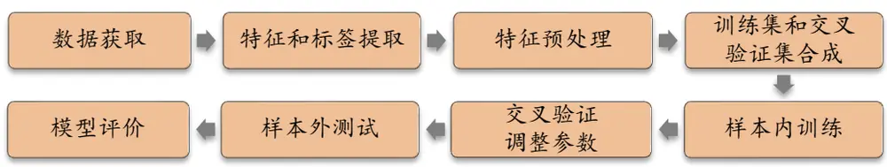
资料来源：华泰证券研究所

Stacking 集成学习模型的构建方法包含下列步骤：

1． 数据获取：

a) 股票池：沪深 300 成份股/中证 500 成份股/全 A股。剔除 ST 股票，剔除每个截面期下一交易日停牌的股票，剔除上市 3 个月内的股票，每只股票视作一个样本。b) 回测区间：2011 年 1 月 31 日至 2018 年 4 月 27 日，月度滚动回测。

2． 特征和标签提取：每个自然月的最后一个交易日，计算之前报告里的 70 个因子暴露度，作为样本的原始特征；计算下一整个自然月的个股超额收益（以沪深 300 指数为基准），作为样本的标签。因子池如图表 11 所示。

3． 特征预处理：

a) 中位数去极值：设第 T 期某因子在所有个股上的暴露度序列为 $D_{i},\ D_{M}$ 为该序列中位数， $D_{M1}$ 为序列 $|D_{i}-D_{M}|$ 的中位数，则将序列 $D_{i}$ 中所有大于 $D_{M}+5D_{M1}$ 的数重设为 $D_{M}+5D_{M1}$ ，将序列 $D_{i}$ 中所有小于 $D_{M}-5D_{M1}$ 的数重设为 $D_{M}-5D_{M1}$ ；

缺失值处理：得到新的因子暴露度序列后，将因子暴露度缺失的地方设为中信一级行业相同个股的平均值。

c) 行业市值中性化：将填充缺失值后的因子暴露度对行业哑变量和取对数后的市值做线性回归，取残差作为新的因子暴露度。

d) 标准化：将中性化处理后的因子暴露度序列减去其现在的均值、除以其标准差，得到一个新的近似服从N(0,1)分布的序列。

4． 训练集和交叉验证集数据处理：

在每个月末截面期，选取下月收益排名前 30%的股票作为正例（y = 1），后 30%的股票作为负例（y = 0）。

5． 样本内训练和交叉验证：该步骤较为复杂，我们将在下一小节进行详细说明。

6． 样本外测试：确定最优参数后，以 T 月月末截面期所有样本预处理后的特征作为模型的输入，得到每个样本的预测值 $f(x)$ ，将预测值视作合成后的因子。进行单因子分层回测。回测方法和之前的单因子测试报告相同，具体步骤参考下一小节。

7． 模型评价：我们以分层回测的结果作为模型评价指标。

图表11： 选股模型中涉及的全部因子及其描述

| 大类因子具体因子 | 因子描述 | 因子方向 |
| --- | --- | --- |
| 估值 EP | 净利润（TTM）/总市值 |  |
| 估值 EPcut | 扣除非经常性损益后净利润（TTM）/总市值 |  |
| 估值 BP | 净资产/总市值 | 1 |
| 估值 SP | 营业收入（TTM）/总市值 | 1 |
| 估值 NCFP | 净现金流（TTM）/总市值 |  |
| 估值 OCFP | 经营性现金流（TTM）/总市值 | 1 |
| 估值 DP | 近12个月现金红利（按除息日计）/总市值 | 1 1 |
| 估值 G/PE | 净利润（TTM）同比增长率/PE_TTM | 1 |
| 成长 Sales_G_q | 营业收入（最新财报，YTD）同比增长率 | 1 |
| 成长 Profit_G_q | 净利润（最新财报，YTD）同比增长率 |  |
| 成长 OCF_G_q | 经营性现金流（最新财报，YTD）同比增长率 | 1 1 |
| 成长 ROE_G_q | ROE（最新财报，YTD）同比增长率 |  |
| 财务质量 ROE_q | ROE（最新财报，YTD） |  |
| 财务质量 ROE_ttm | ROE（最新财报，TTM） |  |
| 财务质量 ROA_q | ROA（最新财报，YTD） |  |
| 财务质量 ROA_ttm | ROA（最新财报，TTM） |  |
| 财务质量grossprofitmargin_q | 毛利率（最新财报，YTD） |  |
| 财务质量grossprofitmargin_ttm | 毛利率（最新财报，TTM） |  |
| 财务质量 profitmargin_q |  | 扣除非经常性损益后净利润率（最新财报，YTD） |
| 财务质量 profitmargin_ttm |  | 扣除非经常性损益后净利润率（最新财报，TTM） |
| 财务质量 assetturnover_q | 资产周转率（最新财报，YTD） |  |
| 财务质量 assetturnover_ttm | 资产周转率（最新财报，TTM） |  |
| 财务质量operationcashflowratio_q | 经营性现金流/净利润（最新财报，YTD） |  |
| 财务质量operationcashflowratio_ttm |  | 经营性现金流/净利润（最新财报，TTM） |
| 杠杆 | financial_leverage 总资产/净资产 |  |
| 杠杆 | debtequityratio 非流动负债/净资产 |  |
| 杠杆 杠杆 | cashratio 现金比率 |  |
| 市值 | currentratio 流动比率 |  |
| 动量反转 HAlpha | In_capital 总市值取对数 |  |
| 动量反转 return_Nm |  | 个股60个月收益与上证综指回归的截距项 |
| 动量反转 wgt_return_Nm |  | 个股最近N个月收益率，N=1，3，6，12 |
|  | 值，N=1，3，6，12 | 个股最近N个月内用每日换手率乘以每日收益率求算术平均 |
|  | 动量反转exp_wgt_return_Nm | 个股最近 N 个月内用每日换手率乘以函数 exp(-x_i/N/4)再乘 -1 以每日收益率求算术平均值，x_i为该日距离截面日的交易日 的个数，N=1，3，6，12 |
| 波动率 | std_FF3factor_Nm | 特质波动率—个股最近 N 个月内用日频收益率对 Fama French三因子回归的残差的标准差，N=1，3，6，12 |
| 波动率 股价 | std_Nm | 个股最近N个月的日收益率序列标准差，N=1，3，6，12 |
| beta beta | In_price | 股价取对数 个股 60个月收益与上证综指回归的 beta |
| 换手率 turn_Nm |  | 个股最近N个月内日均换手率(剔除停牌、涨跌停的交易日)， |
|  | N=1, 3, 6, 12 | -1 |
| 换手率 | bias_turn_Nm | 个股最近N个月内日均换手率除以最近2年内日均换手率(剔 -1 |
| 情绪 rating_average | wind 评级的平均值 | 除停牌、涨跌停的交易日）再减去1，N=1，3，6，12 |
| 情绪 | rating_change | wind评级（上调家数-下调家数）/总数 |
| 情绪 | rating_targetprice | wind一致目标价/现价-1 |
| 股东 | holder_avgpctchange | 户均持股比例的同比增长率 |
| 技术 MACD |  | -1 经典技术指标（释义可参考百度百科），长周期取30日，短 |
| 技术 DEA |  | -1 周期取10 日，计算 DEA 均线的周期（中周期）取15 日 |
| 技术 DIF |  | -1 |
| 技术 RSI | 经典技术指标，周期取20日 | -1 |
| 技术 PSY | 经典技术指标，周期取20日 | -1 |
| 技术 BIAS | 经典技术指标，周期取20日 | -1 |

资料来源：Wind，华泰证券研究所

## 模型构建

上一节提到，我们使用月度滚动的方法进行模型训练和回测，本节我们将具体介绍每个月如何构建 Stacking 模型进行训练和预测。

## 基本设定：

1． 设 1998 年 4 月为第 1 个月，之后月份序号依次递增，到 2018 年 4 月为第 241 个月。

2． 回测区间：2011 年 1 月 31 日至 2018 年 4 月 27 日，即第 155 个月至第 241 个月。

3． 股票池：全 A 股，剔除 ST 股票，剔除每个截面期下一交易日停牌的股票，剔除上市 3 个月以内的股票。每只股票视作一个样本。为了方便起见，在本节所举的例子中，假设有 3000 只股票。

4． 因子数目：70 个。

5． Stacking 模型构建：总共两层，第一层为使用 72 个月训练数据的 XGBoost 模型和使用 6 个月训练数据的逻辑回归模型，以保证两个模型及其训练数据都有差异。第二层为逻辑回归模型。

6． 训练数据划分：样本内数据 74 个月，其中前 72个月的数据为训练集，后 2个月的数据为验证集。样本外数据（测试数据）为截面后 1个月的数据。

模型构建说明：

假设当前测试数据为第 174 个月的数据，模型训练过程如图 12 所示，模型测试过程如图13 所示。

图表12： Stacking 模型滚动训练过程
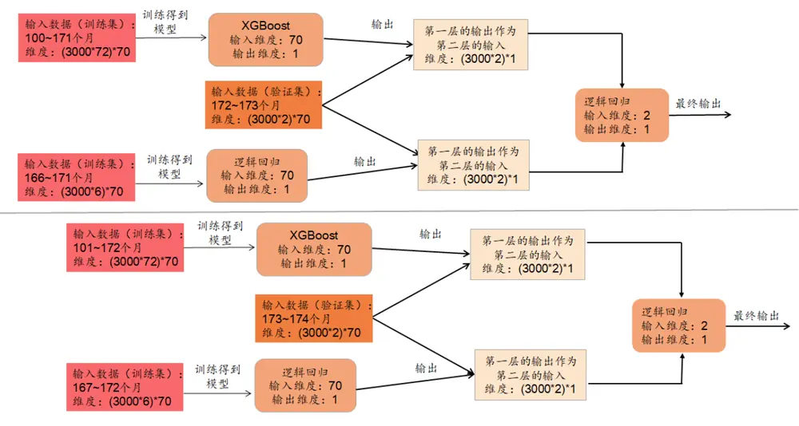
资料来源：华泰证券研究所

图表13： Stacking 模型滚动测试过程
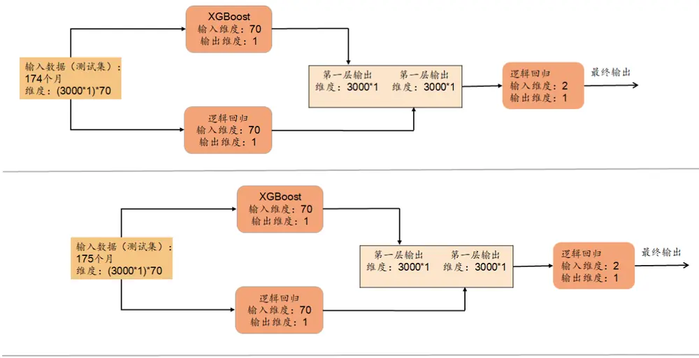
资料来源：华泰证券研究所

模型训练和测试有以下步骤：

1． 首先选取第 100-171 个月的数据作为训练数据集，172-173 个月的数据作为验证集。利用 XGBoost 模型对训练数据集进行训练。训练完成后使用该模型对验证集进行预测，得到第一层输出。

2． 其次选取第 166-171 个月的数据作为训练数据集，172-173 个月的数据作为验证集。利用逻辑回归模型对训练数据集进行训练。训练完成后使用该模型对验证集进行预测，得到第一层输出。

3． 将两个模型预测得到的第一层输出值作为第二层输入，利用逻辑回归进行训练，得到最终 stacking 集成学习模型。

4． 将第 174 个月的测试数据集代入 Stacking 集成学习模型中，计算预测值。

## Stacking 模型分层回测分析

Stacking 集成学习模型最终在每个月底可以产生对全部个股下月上涨或下跌的预测值。因此可以将其看作一个因子合成模型，即在每个月底将因子池中所有因子合成为一个“因子”。接下来，我们对该模型合成的这个“因子”（即个股下期收益预测值）进行分层回测，从各方面考察该模型的效果。仿照华泰单因子测试系列报告中的思路，分层回测模型构建方法如下：

1. 股票池：全 A 股，剔除 ST 股票，剔除每个截面期下一交易日停牌的股票，剔除上市3 个月以内的股票。

2. 回测区间：2011-01-31 至 2018-04-27。

3. 换仓期：在每个自然月最后一个交易日核算因子值，在下个自然月首个交易日按当日收盘价换仓。

4. 数据处理方法：将 Stacking 集成学习模型的预测值视作单因子，因子值为空的股票不参与分层。

5. 分层方法：在每个一级行业内部对所有个股按因子大小进行排序，每个行业内均分成N 个分层组合。如图表 14 所示，黄色方块代表各行业内个股初始权重，可以相等也可以不等（我们直接取相等权重进行测试），分层具体操作方法为 N 等分行业内个股权重累加值，例如图示行业1中，5只个股初始权重相等（不妨设每只个股权重为0.2），假设我们欲分成 3 层，则分层组合 1在权重累加值 1/3 处截断，即分层组合 1包含个股 1 和个股 2，它们的权重配比为 0.2:(1/3-0.2)=3:2，同样推理，分层组合 2 包含个股 2、3、4，配比为(0.4-1/3):0.2:(2/3-0.6)=1:3:1，分层组合 4 包含个股 4、5，配比为 2:3。以上方法是用来计算各个一级行业内部个股权重配比的，行业间权重配比与基准组合（我们使用沪深 300）相同，也即行业中性。

6. 评价方法：回测年化收益率、夏普比率、信息比率、最大回撤、胜率等。

图表14： 单因子分层测试法示意图
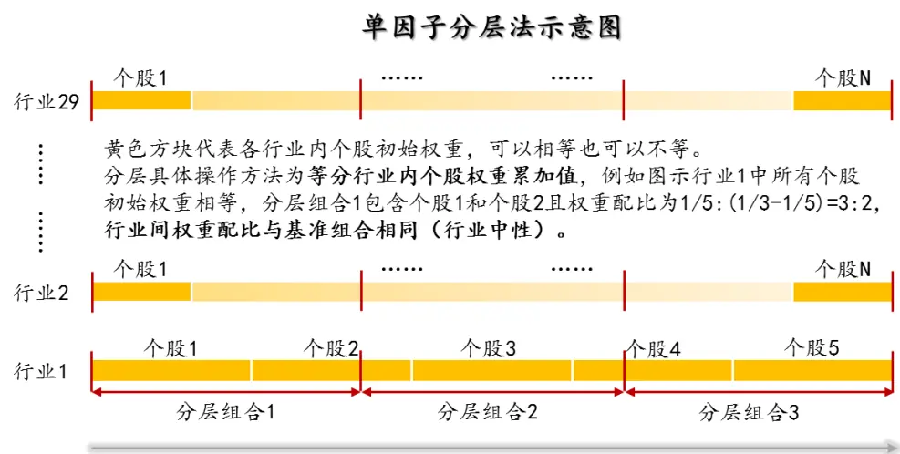
行业内个股按因子值排序
资料来源：华泰证券研究所

这里我们将展示图表 12 中 Stacking 模型的分层测试结果。

下图是分五层组合回测绩效分析表（20110131～20180427）。其中组合 1～组合 5为按该因子从小到大排序构造的行业中性的分层组合。基准组合为行业中性的等权组合，具体来说就是将组合 1～组合 5 合并，一级行业内部个股等权配置，行业权重按当期沪深 300 行业权重配置。多空组合是在假设所有个股可以卖空的基础上，每月调仓时买入组合 1，卖空组合 5。回测模型在每个自然月最后一个交易日核算因子值，在下个自然月首个交易日按当日收盘价调仓。

图表15： Stacking 模型分层组合绩效分析（20110131～20180427）

| 投资组合 | 年化收益率 | 年化波动率夏普比率最大回撤 |  |  | 年化超额收益率 | 超额收益年化波动率信息比率 |  | 相对基准月胜率 | 超额收益最大回撤 |
| --- | --- | --- | --- | --- | --- | --- | --- | --- | --- |
| 组合1 | 21.57% | 26.40% | 0.82 | 46.97% | 12.60% | 3.52% | 3.58 | 82.56% | 3.43% |
| 组合2 | 10.01% | 26.05% | 0.38 | 47.69% | 1.89% | 2.71% | 0.70 | 58.14% | 4.92% |
| 组合3 | 5.17% | 25.91% | 0.20 | 48.40% | -2.59% | 2.65% | -0.98 | 31.40% | 17.39% |
| 组合4 | -1.73% | 25.90% | -0.07 | 55.22% | -8.98% | 2.63% | -3.41 | 12.79% | 48.72% |
| 组合5 | -9.15% | 27.31% | -0.34 | 68.52% | -15.86% | 4.22% | -3.76 | 13.95% | 70.45% |
| 基准组合 | 7.97% | 26.15% | 0.30 | 49.05% |  |  |  |  |  |
| 多空组合 | 33.82% | 6.73% | 5.03 | 6.17% |  |  |  |  |  |

资料来源：Wind，华泰证券研究所

下面四个图依次为：

1. 分五层组合回测净值图。按前面说明的回测方法计算组合 1～组合 5、基准组合的净值，与沪深 300、中证 500 净值对比作图。

2. 分五层组合回测，用组合 1～组合 5 的净值除以基准组合净值的示意图。可以更清晰地展示各层组合在不同时期的效果。

3. 组合 1 相对沪深 300 月超额收益分布直方图。该直方图以[-0.5%,0.5%]为中心区间，向正负无穷方向保持组距为 1%延伸，在正负两个方向上均延伸到最后一个频数不为零的组为止（即维持组距一致，组数是根据样本情况自适应调整的）。

4. 分五层时的多空组合收益图。再重复一下，多空组合是买入组合 1、卖空组合 5（月度调仓）的一个资产组合。多空组合收益率是由组合 1的净值除以组合 5 的净值近似核算的。

图表16： Stacking模型分层组合回测净值
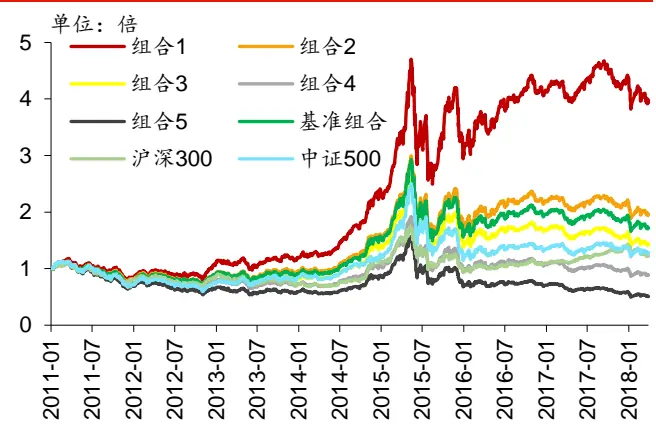
资料来源：Wind，华泰证券研究所

图表17： Stacking模型各层组合净值除以基准组合净值示意图
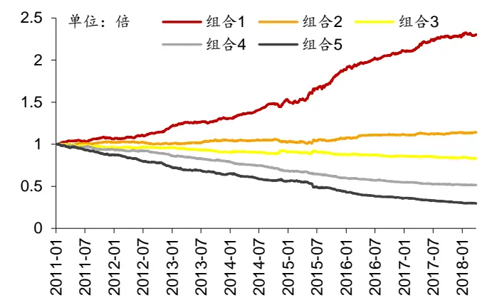
资料来源：Wind，华泰证券研究所

图表18： Stacking模型分层组合 1相对沪深 300月超额收益分布图
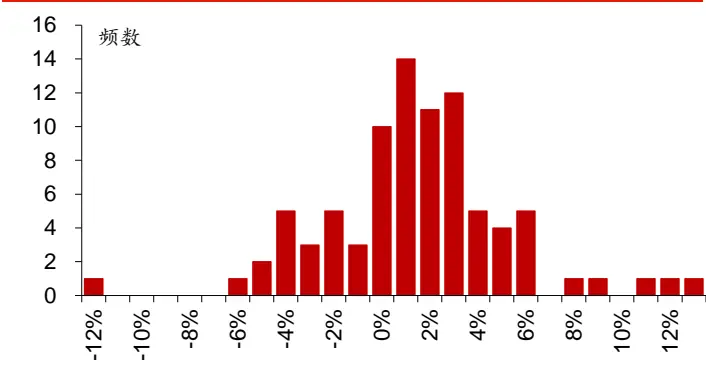
资料来源：Wind，华泰证券研究所

图表19： Stacking模型多空组合月收益率及累积收益率
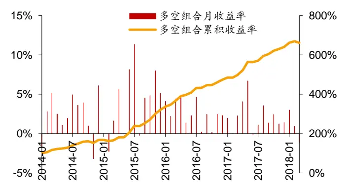
资料来源：Wind，华泰证券研究所

下图为分十层组合回测时，各层组合在不同年份间的收益率及排名表。每个单元格的内容为在指定年度某层组合的收益率（均为整年收益率），以及某层组合在全部十层组合中的收益率排名。最后一列是分层组合在 2011～2018 的排名的均值。其中组合 1和组合 10在所有回测年份中排名都没有变化。

图表20： Stacking模型组合在不同年份的收益及排名分析（分十层）

|  | 2011 | 2012 | 2013 | 2014 | 2015 | 2016 | 2017 | 2018 | 排名均值 |
| --- | --- | --- | --- | --- | --- | --- | --- | --- | --- |
| 组合1 | -18.0%(1) | 23.2%(1) | 23.1%(1) | 96.6%(1) | 80.0%(1) | 11.6%(1) | 2.6%(1) | -6.9%(1) | 1.00 |
| 组合2 | -21.8%(2) | 22.4%(2) | 15.9%(2) | 85.5%(2) | 45.7%(2) | 7.8%(2) | -0.8%(2) | -7.4%(3) | 2.08 |
| 组合3 | -22.9%(3) | 10.3%(5) | 12.9%(4) | 59.3%(6) | 36.6%(3) | 4.6%(3) | -8.1%(5) | -7.8%(4) | 3.69 |
| 组合4 | -24.0%(4) | 8.9%(6) | 13.8%(3) | 68.7%(4) | 34.0%(4) | -1.3%(4) | -2.6%(3) | -7.4%(2) | 3.85 |
| 组合5 | -28.6%(7) | 10.4%(4) | 5.6%(5) | 72.7%(3) | 24.3%(6) | -2.9%(5) | -6.6%(4) | -8.1%(5) | 4.92 |
| 组合6 | -28.1%(6) | 12.1%(3) | 0.6%(6) | 64.7%(5) | 24.4%(5) | -5.3%(6) | -12.9%(7) | -9.1%(7) | 5.77 |
| 组合7 | -28.0%(5) | 4.1%(8) | -0.6%(7) | 42.2%(9) | 17.2%(7) | -10.4%(7) | -13.5%(8) | -8.5%(6) | 7.08 |
| 组合8 | -32.6%(8) | 7.3%(7) | -2.9%(8) | 44.0%(8) | 12.1%(8) | -10.6%(8) | -11.0%(6) | -9.8%(9) | 7.85 |
| 组合9 | -34.3%(9) | -3.2%(9) | -6.2%(9) | 57.9%(7) | 6.7%(9) | -18.1%(9) | -16.4%(9) | -9.7%(8) | 8.77 |
| 组合10 | -36.6%(10) | -5.3%(10) | -7.1%(10) | 33.2%(10) | -0.2%(10) | -21.1%(10) | -27.0%(10) | -13.4%(10) | 10.00 |

资料来源：Wind，华泰证券研究所

下图是不同市值区间分层组合回测绩效指标对比图（分十层）。我们将全市场股票按市值排名前 1/3，1/3～2/3，后 1/3 分成三个大类，在这三类股票中分别进行分层测试，基准组合构成方法同前面所述（注意每个大类对应的基准组合并不相同）。

图表21： 不同市值区间 Stacking模型组合绩效指标对比图（分十层）
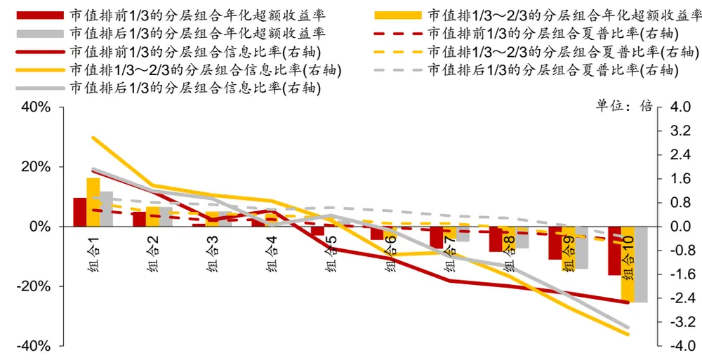
资料来源：Wind，华泰证券研究所

下图是不同行业间分层组合回测绩效分析表（分五层）。我们在不同一级行业内部都做了分层测试，基准组合为各行业内该因子非空值的个股等权组合（注意每个行业对应的基准组合并不相同）。

图表22： 不同行业 Stacking模型分层组合绩效分析（分五层）

|  | 组合1年化 | 组合1 | 组合1 | 组合1 | 组合1超额收益 | 组合1相对 | 所有组合年化 |
| --- | --- | --- | --- | --- | --- | --- | --- |
| 行业 | 超额收益率 | 信息比率 | 年化收益率 | 夏普比率 | 最大回撤 | 基准月胜率 | 收益率排序 |
| 机械 | 21.15% | 3.25 | 28.43% | 0.88 | 8.01% | 81.40% | 1,2,3,4,5 |
| 基础化工 | 16.62% | 2.53 | 27.87% | 0.87 | 6.34% | 73.26% | 1,2,3,4,5 |
| 纺织服装 | 22.45% | 2.38 | 33.73% | 1.07 | 8.46% | 75.58% | 1,3,4,2,5 |
| 建材 | 22.31% | 2.25 | 34.19% | 1.07 | 7.60% | 72.09% | 1,2,3,4,5 |
| 农林牧渔 房地产 | 19.47% | 2.15 | 29.59% | 0.93 | 7.76% | 76.74% | 1,2,3,4,5 |
| 电子元器件 | 15.05% | 2.13 | 29.26% | 0.94 | 12.57% | 72.09% | 1,2,3,4,5 |
| 商贸零售 | 16.52% | 2.12 | 32.71% | 0.94 | 9.87% | 68.60% | 1,2,3,4,5 |
| 汽车 | 16.03% | 2.10 | 21.18% | 0.68 | 9.85% | 73.26% | 1,2,3,4,5 |
| 通信 | 16.11% | 2.10 | 26.45% | 0.83 | 11.94% | 73.26% | 1,2,3,4,5 |
| 有色金属 | 20.26% | 2.00 | 38.78% | 1.11 | 12.33% | 67.44% | 1,2,3,4,5 |
| 计算机 | 19.34% | 1.98 | 21.57% | 0.65 | 10.50% | 65.12% | 1,2,3,4,5 |
| 医药 | 17.63% | 1.85 | 39.20% | 1.03 | 11.97% | 66.28% | 1,3,2,4,5 |
| 电力设备 | 11.75% | 1.72 | 26.71% | 0.87 | 7.86% | 66.28% | 1,2,4,3,5 |
| 食品饮料 | 11.69% | 1.57 | 16.91% | 0.51 | 8.64% | 66.28% | 1,2,3,4,5 |
| 电力及公用事业 | 13.76% | 1.47 | 22.80% | 0.78 | 9.10% | 66.28% | 1,2,3,4,5 |
| 钢铁 | 11.30% | 1.39 1.37 | 19.24% | 0.65 | 16.13% | 66.28% | 1,3,2,4,5 |
| 交通运输 | 15.61% |  | 22.97% | 0.69 | 16.04% | 65.12% | 1,2,4,3,5 |
| 轻工制造 | 11.03% 12.85% | 1.33 1.31 | 20.26% | 0.67 | 16.52% | 69.77% | 1,3,2,4,5 |
| 餐饮旅游 |  | 1.24 | 25.36% | 0.81 | 15.07% | 60.47% | 1,2,3,4,5 |
| 家电 | 14.76% |  | 24.14% | 0.78 | 10.00% | 68.60% | 1,2,3,4,5 |
| 建筑 | 12.64% | 1.20 | 28.35% | 0.91 | 15.86% | 60.47% | 1,3,2,4,5 |
| 综合 | 11.45% | 1.10 | 20.23% | 0.64 | 18.96% 15.84% | 65.12% 56.98% | 1,2,3,4,5 |
| 非银行金融 | 13.42% | 0.99 0.95 | 22.90% 17.92% | 0.68 | 16.56% | 58.14% | 1,2,3,4,5 |
| 传媒 | 11.06% 11.35% | 0.87 |  | 0.50 | 26.91% | 61.63% | 1,2,3,5,4 |
| 国防军工 | 10.32% | 0.81 | 24.96% 17.17% | 0.67 0.43 | 26.53% | 65.12% | 1,2,3,4,5 1,3,2,4,5 |
| 煤炭 | 8.69% | 0.80 | 2.57% | 0.07 | 15.01% | 61.63% | 1,2,4,3,5 |
| 石油石化 | 8.55% | 0.74 | 15.20% | 0.47 | 17.95% | 59.30% | 1,2,3,4,5 |
|  |  |  |  |  | 14.88% | 48.84% |  |
| 银行 | 2.75% | 0.31 | 13.80% | 0.51 |  |  | 1,2,3,4,5 |

资料来源：Wind，华泰证券研究所

## 模型选股测试结果和IC值分析

在“Stacking 集成学习中基模型的对比和选取”一章中，我们得出在全 A 选股情况下，XGBoost_6m 以及逻辑回归_6m 最适合与 XGBoost_72m 进行 Stacking 集成，本节中，我们将依次展示以下模型的回测结果。

1． Stacking1：将 XGBoost_6m 和 XGBoost_72m 进行集成，验证集数据为 2 个月。

2． Stacking2：将逻辑回归_6m 和 XGBoost_72m 进行集成，验证集数据为 2 个月。

3． Stacking3：将 XGBoost_6m 和 XGBoost_72m 进行集成，验证集数据为 3 个月。

4． Stacking4：将逻辑回归_6m 和 XGBoost_72m 进行集成，验证集数据为 3 个月。

5． Stacking5：将 XGBoost_6m 和 XGBoost_72m 进行集成，验证集数据为 4 个月。

6． Stacking6：将逻辑回归_6m 和 XGBoost_72m 进行集成，验证集数据为 4 个月。

7． Stacking7：将 XGBoost_6m，逻辑回归_6m 和 XGBoost_72m 进行集成，验证集数据为 2个月。

对照组模型：

1． XGBoost_72m

2． XGBoost_6m

3． 逻辑回归_6m

其中，主要进行三组对比测试：

对比测试 1：将 Stacking1，Stacking2 和对照组模型对比，主要观察 Stacking 集成学习相比使用单一模型有哪些区别。

对比测试 2：将 Stacking1~ Stacking6 模型进行对比，主要观察不同基模型和不同验证集数据长度对选股结果的影响。

对比测试 3：将 Stacking1，Stacking2，Stacking7 进行对比，主要观察 Stacking 中第一层基模型数量对选股结果的影响。

## 对比测试 1

对比测试 1 将 Stacking1，Stacking2 和对照组模型对比，主要观察 Stacking 集成学习相比使用单一模型有哪些区别。

我们构建了全 A选股策略并进行回测，各项指标详见图表 23，选股策略是行业中性策略，策略组合的行业配置与基准（沪深 300、中证 500、中证全指）保持一致，各一级行业中选 N 个股票等权配置（N=2,3,4,5,6）。从图表 23 可以看出，XGBoost_72m 模型相比XGBoost_6m 和逻辑回归_6m 在年化超额收益率和信息比率上有很大优势，但是超额收益最大回撤更大。而 Stacking1 和 Stacking2 模型具有和 XGBoost_72m 相近的年化超收和信息比率并且超额收益最大回撤也较小，从而取得了最高的 Calmar 的比率。

图表23： 对比测试 1中各种模型选股指标对比（全 A选股，行业中性）
每个行业入选个股数目（从左至右：2,3,4,5,6）

| Stacking1 Stacking2 XGBoost_72m XGBoost_6m 逻辑回归_6m | 全 A 选股，基准为沪深 300 |  |  | 全 A 选股，基准为中证 500 |  | 全 A 选股，基准为中证全指 |  |  |  |
| --- | --- | --- | --- | --- | --- | --- | --- | --- | --- |
|  | 年化超额收益率（行业中性） |  |  | 年化超额收益率（行业中性） |  |  | 年化超额收益率（行业中性） |  |  |
|  | 21.02% 21.22%20.47% 20.26% 19.62% |  |  | 27.09%28.80% 28.71%28.16%27.63% |  |  | 24.58%24.60%24.02%23.02%23.04% |  |  |
|  | 21.61%23.36%21.85%20.82%20.42% |  |  | 29.45%30.98%29.03%28.31%27.75% |  |  | 25.35%26.90%25.00%24.11%23.58% |  |  |
|  | 19.89%21.91%21.09%21.84%21.11% |  |  | 28.83%31.19%30.70%30.58%29.44% |  |  | 24.48%26.42%25.81%25.95%25.01% |  |  |
|  | 16.98%16.32% 15.90%14.43%13.99% |  |  |  |  |  |  |  |  |
|  |  |  |  | 23.78%22.36% 21.85%20.05% 19.95% |  |  | 20.44%19.56%18.98%17.40%17.20% |  |  |
|  | 11.79% 12.12%12.97% 12.50%11.74% |  |  | 18.39%19.37%18.30%17.19%15.61% |  |  | 14.65% 15.09% 15.26%14.61%13.39% |  |  |
|  | 超额收益最大回撤（行业中性） |  |  | 超额收益最大回撤（行业中性） |  |  |  |  | 超额收益最大回撤（行业中性） |
|  | Stacking1 |  | 34.10%29.43%28.15% 27.68% 27.99% |  |  | 14.18%10.74%11.88%11.01%11.17% |  | 15.20% 14.66% 14.81% 14.26% 14.43% |  |
|  | Stacking2 | 24.26%23.40%23.88%25.15%26.46% |  |  | 9.42% 9.69% 8.92% 9.55%10.18% |  | 12.17%10.69%11.00%10.71%11.46% |  |  |
|  | XGBoost_72m | 34.47%33.76% 33.84%32.22%33.06% |  |  | 25.00% 25.06%23.28%22.30%23.03% |  |  | 24.36%23.47%22.59%21.50%22.41% |  |
|  | XGBoost_6m | 21.86%22.17% 21.98%20.87%22.26% |  |  | 14.24%12.75%11.42% 11.83% 11.87% |  |  | 11.82%12.18%11.17%10.85%11.90% |  |
| 逻辑回归_6m | 23.36%22.97%21.40%23.78%24.92% |  | 9.49% | 8.64% 7.92% | 9.77%10.69% | 8.11% 9.07% | 7.77%10.05%11.00% |  |  |
|  | 信息比率（行业中性） |  |  | 信息比率（行业中性） |  | 信息比率（行业中性） |  |  |  |
| Stacking1 Stacking2 | 1.84 1.92 | 1.90 1.92 | 1.87 3.13 | 3.56 3.33 3.73 | 3.75 3.83 3.82 | 2.79 2.95 2.96 | 2.95 2.98 |  |  |
|  | 1.93 2.16 | 2.06 2.00 | 1.97 | 3.07 3.59 | 3.70 3.83 | 3.84 2.82 3.15 3.85 | 3.04 3.06 3.05 |  |  |
| XGBoost_72m XGBoost_6m | 1.67 1.93 | 1.89 1.97 1.60 1.49 | 1.92 1.47 | 2.90 2.99 | 3.73 3.88 3.10 | 2.52 2.91 | 2.95 3.06 3.01 |  |  |
| 逻辑回归_6m | 1.58 1.60 | 1.35 1.34 | 1.27 2.25 | 2.53 2.60 | 2.93 2.99 2.56 | 2.54 2.62 | 2.65 2.47 2.52 2.17 2.18 2.07 |  |  |
|  | 1.14 1.22 | Calmar 比率（行业中性） |  | Calmar 比率（行业中性） | 2.44 1.88 | 2.02 |  |  |  |
| Stacking1 | 0.62 0.72 | 0.73 0.73 | 0.70 | 1.91 2.68 | 2.42 2.56 | 1.62 1.68 1.62 | Calmar 比率（行业中性） 1.61 |  |  |
| Stacking2 | 0.89 | 1.00 0.91 0.83 | 0.77 | 3.13 3.20 | 3.25 2.96 | 2.47 2.73 2.08 | 2.52 2.27 |  |  |
| XGBoost_72m | 0.58 0.65 | 0.62 0.68 | 0.64 | 1.15 1.24 | 1.32 1.37 | 1.28 1.00 | 1.13 1.14 |  |  |
| XGBoost_6m | 0.78 0.74 | 0.72 0.69 | 0.63 | 1.67 1.75 | 1.91 1.70 | 1.68 1.73 | 1.61 1.70 |  |  |
| 逻辑回归_6m | 0.50 0.53 | 0.61 0.53 | 0.47 | 1.94 2.24 | 2.31 1.76 | 1.46 1.81 | 1.66 1.96 |  |  |

资料来源：Wind，华泰证券研究所

图表24展示了对比测试1中5种模型相对中证500的超额收益和回撤的走势。可以看出，Stacking1 和 Stacking2 模型在保持了较高的超额收益增长率的同时，有效地控制了超额收益回撤，2017 年以来超额收益最大回撤在 8%以内。

如果将模型的输出视为单因子，则可以对该单因子进行 IC 值分析，图表 25 和图表 26 展示了 5 种模型输出值的 IC 值分析结果，可以看出，2011 年至今，Stacking1 和 Stacking2模型的 IC 值都比较稳定，表现接近 XGBoost_72m。特别是在 2015 年至今，Stacking2模型表现最好，显示出 Stacking 模型在预测能力方面相比单一模型的优势。

图表24： 对比测试 1中各种模型超额收益和回撤表现（全 A选股，中证 500行业中性，每个行业选 4只个股）
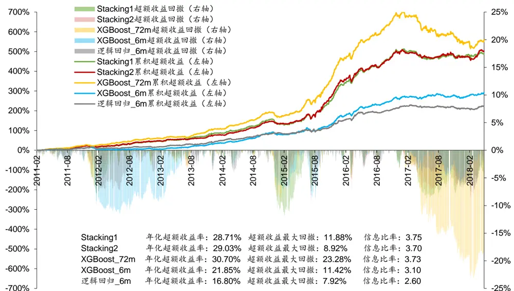
资料来源：Wind，华泰证券研究所

图表25： 对比测试 1中各种模型 IC，IR指标

| 2011年至今 |  |  |  |  | 2015年至今 |  |  |  |
| --- | --- | --- | --- | --- | --- | --- | --- | --- |
|  | IC 均值 | IC 值标准差 | IR 比率 | IC 值大于零比例 | IC 均值 | IC 值标准差 |  | IR 比率 IC 值大于零比例 |
| Stacking1 | 10.66% | 9.24% | 1.15 | 90.70% | 13.08% | 9.38% | 1.39 | 86.84% |
| Stacking2 | 10.94% | 7.44% | 1.47 | 91.86% | 12.57% | 7.92% | 1.59 | 94.74% |
| XGBoost_72m | 11.41% | 7.72% | 1.48 | 91.86% | 12.24% | 8.47% | 1.45 | 92.11% |
| XGBoost_6m | 8.21% | 12.02% | 0.68 | 81.40% | 10.79% | 12.51% | 0.86 | 84.21% |
| 逻辑回归_6m | 7.28% | 8.44% | 0.86 | 84.88% | 9.42% | 8.41% | 1.12 | 84.21% |

资料来源：Wind，华泰证券研究所

图表26： 对比测试 1中各种模型 IC 值累积曲线
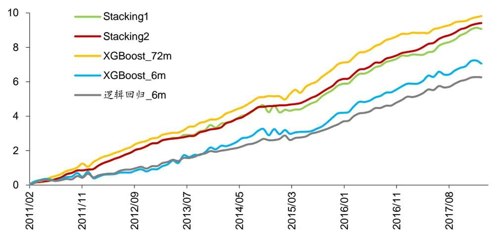
资料来源：Wind，华泰证券研究所

对比测试 1 的结论为：Stacking 集成学习有效结合了基模型的优点（XGBoost_72m 的高收益、高信息比率，XGBoost_6m 和逻辑回归_6m 的低回撤），在各项选股指标上都有不错的表现。

## 对比测试 2

对比测试 2 将 Stacking1~ Stacking6 模型进行对比，主要观察不同基模型和不同验证集数据长度对选股结果的影响。

我们构建了全 A选股策略并进行回测，各项指标详见图表 27，选股策略是行业中性策略，策略组合的行业配置与基准（沪深 300、中证 500、中证全指）保持一致，各一级行业中选 N 个股票等权配置（N=2,3,4,5,6）。从图表 27 可以看出，验证集数据越长（Stacking5和 Stacking6 最长，Stacking1 和 Stacking2 最短），年化超额收益率越大，但是超额收益最大回撤也越大，从 Calmar 比率的角度来看，Stacking2 模型表现最好。各模型信息比率相差不大。

图表27： 对比测试 2中各种模型选股指标对比（全 A选股，行业中性）
每个行业入选个股数目（从左至右：2,3,4,5,6）
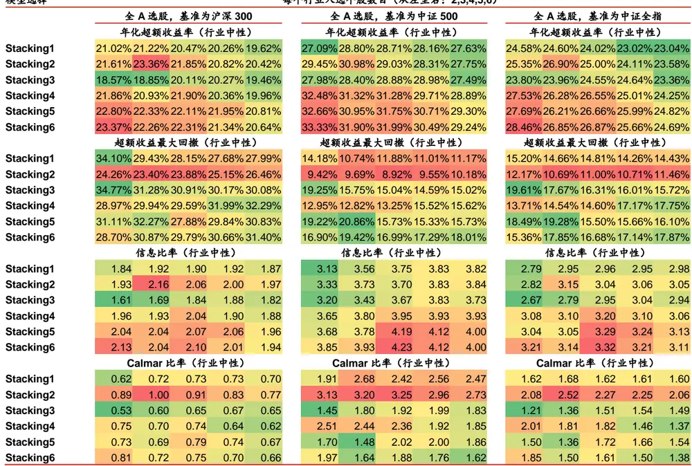
资料来源：Wind，华泰证券研究所

图表 28展示了对比测试 2中 6 种模型相对中证 500 的超额收益和回撤的走势。

如果将模型的输出视为单因子，则可以对该单因子进行 IC 值分析，图表 29 和图表 30 展示了 6 种模型输出值的 IC 值分析结果，从 IR 比率的角度来看，Stacking2 和 Stacking4模型表现最好。

图表28： 对比测试 2中各种模型超额收益和回撤表现（全 A选股，中证 500行业中性，每个行业选 4只个股）
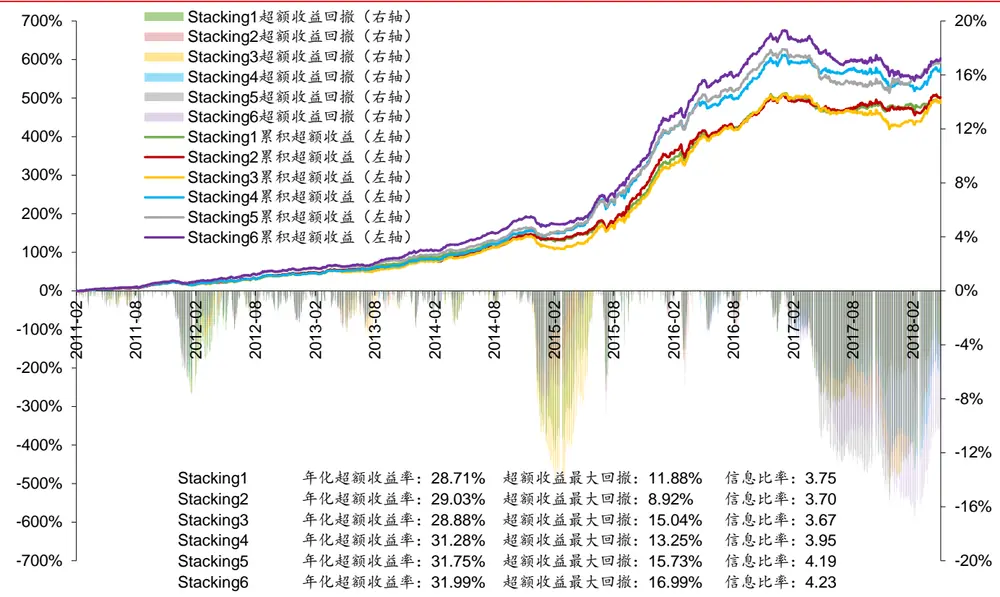
资料来源：Wind，华泰证券研究所

图表29： 对比测试 2中各种模型 IC，IR指标

| 2011年至今 |  |  |  |  | 2015年至今 |  |  |  |
| --- | --- | --- | --- | --- | --- | --- | --- | --- |
|  | IC 均值 | IC 值标准差 | IR 比率 | IC 值大于零比例 | IC 均值 | IC 值标准差 |  | IR 比率 IC 值大于零比例 |
| Stacking1 | 10.66% | 9.24% | 1.15 | 90.70% | 13.08% | 9.38% | 1.39 | 86.84% |
| Stacking2 | 10.94% | 7.44% | 1.47 | 91.86% | 12.57% | 7.92% | 1.59 | 94.74% |
| Stacking3 | 10.75% | 9.03% | 1.19 | 93.02% | 13.32% | 9.15% | 1.46 | 94.74% |
| Stacking4 | 11.26% | 7.32% | 1.54 | 93.02% | 12.55% | 8.23% | 1.53 | 92.11% |
| Stacking5 | 10.80% | 8.16% | 1.32 | 91.86% | 12.02% | 9.13% | 1.32 | 92.11% |
| Stacking6 | 11.18% | 8.41% | 1.33 | 89.53% | 12.14% | 8.82% | 1.38 | 86.84% |

资料来源：Wind，华泰证券研究所

图表30： 对比测试 2中各种模型 IC 值累积曲线
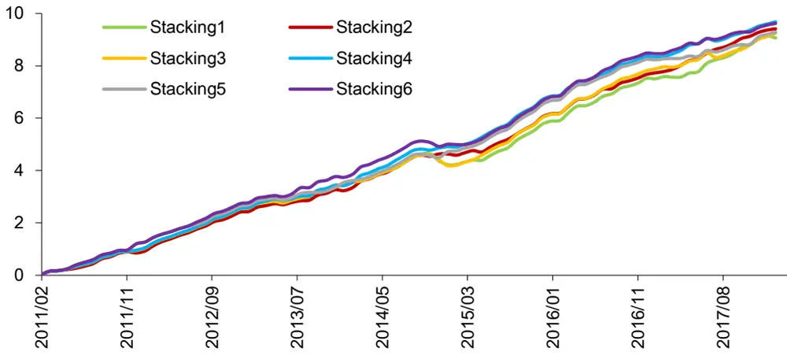
资料来源：Wind，华泰证券研究所

从对比测试 2中，可以得出两个结论：

1． 较短的验证集数据长度（2个月）可以使得 Stacking 集成学习模型的超额收益最大回撤较小，Calmar比率较高。

2． 相同的验证集数据情况下，集成不同类模型的 Stacking（XGBoost_72m 和逻辑回归_6m，对应 Stacking2、Stacking4、Stacking6）要比集成相同类模型的 Stacking（XGBoost_72m 和 XGBoost_6m，对应 Stacking1、Stacking3、Stacking5）表现更好。

## 对比测试 3

对比测试 3：将 Stacking1，Stacking2，Stacking7 进行对比，主要观察 Stacking 中第一层基模型数量对选股结果的影响。

我们构建了全 A选股策略并进行回测，各项指标详见图表 31，选股策略是行业中性策略，策略组合的行业配置与基准（沪深 300、中证 500、中证全指）保持一致，各一级行业中选 N 个股票等权配置（N=2,3,4,5,6）。从图表 31 可以看出，集成 3 个模型的 Stacking（Stacking7）没有比集成 2 个模型的 Stacking（Stacking1 和 Stacking2）表现更好。

图表 32展示了对比测试 3中 3 种模型相对中证 500 的超额收益和回撤的走势。同样可以看出，三种模型的表现相差无几。

如果将模型的输出视为单因子，则可以对该单因子进行 IC 值分析，图表 33 和图表 34 展示了 3 种模型输出值的 IC 值分析结果，从 IR 比率的角度来看，Stacking2 模型表现最好,三种模型的 IC 值累积曲线相差无几，Stacking2 的 IC 值累积曲线波动最小。

对比测试 3 的结论为：在本文研究的多因子选股领域，Stacking 集成学习并非集成越多的基模型表现就越好，要达到更好的集成学习效果，需要各个基模型两两之间相关性低，且有足够好的预测能力。

图表31： 对比测试 3中各种模型选股指标对比（全 A选股，行业中性）
每个行业入选个股数目（从左至右：2,3,4,5,6）

| 模型选择 每个行业入选个股数目（从左至右：2,3,4,5,6） |  |  |  |  |  |  |  |  |  |
| --- | --- | --- | --- | --- | --- | --- | --- | --- | --- |
| 全 A 选股，基准为沪深 300Stacking1Stacking2Stacking7Stacking1Stacking2Stacking7Stacking1Stacking2 |  |  |  |  | 全 A 选股，基准为中证 500 |  | 全 A选股，基准为中证全指 |  |  |
|  |  |  |  | 年化超额收益率(行业中性) |  |  | 年化超额收益率（行业中性） |  | 年化超额收益率（行业中性） |
|  |  |  |  | 21.02%21.22%20.47%20.26%19.62% |  |  | 27.09%28.80% 28.71%28.16%27.63% |  | 24.58%24.60%24.02%23.02%23.04% |
|  |  |  |  | 21.61%23.36%21.85%20.82%20.42% |  |  | 29.45%30.98%29.03%28.31%27.75% |  | 25.35%26.90%25.00%24.11%23.58% |
|  |  |  |  | 20.88%21.66%20.10%19.61%19.35% |  |  | 27.66%29.01%28.15%27.35%26.94% |  | 23.83%25.01%23.71%22.96%22.63% |
|  |  |  |  | 超额收益最大回撤(行业中性) |  |  | 超额收益最大回撤（行业中性） |  | 超额收益最大回撤（行业中性） |
|  |  |  |  | 34.10%29.43%28.15%27.68% 27.99% |  |  | 14.18%10.74%11.88%11.01%11.17% |  | 15.20%14.66%14.81%14.26%14.43% |
|  |  |  |  | 24.26%23.40%23.88%25.15%26.46% |  |  | 9.42%9.69%8.92%9.55%10.18% |  | 12.17%10.69%11.00%10.71%11.46% |
|  |  |  |  | 31.12%27.23%28.24%27.67% 27.59% |  |  | 14.46%10.09%11.29%11.81%11.96% |  | 16.53%12.25%13.30%13.80% 13.69% |
|  |  |  |  | 信息比率(行业中性) |  |  | 信息比率(行业中性) |  | 信息比率（行业中性） |
|  |  |  |  | 1.841.921.901.921.87 |  |  | 3.13 | 3.56 3.75 3.83 3.82 | 2.79 2.95 2.96 2.95 2.98 |
|  |  |  |  | 1.932.16 2.06 2.00 1.97 |  |  | 3.33 | 3.73 3.70 3.83 3.84 | 2.82 3.15 3.04 3.06 3.05 |
| Stacking7 | 1.83 1.97 |  | 1.86 1.86 1.85 |  | 3.17 | 3.57 3.63 3.71 3.73 | 2.68 2.96 2.90 2.92 2.91 |  |  |
|  | Calmar 比率（行业中性） |  |  |  | Calmar 比率（行业中性） |  | Calmar 比率（行业中性） |  |  |
| Stacking1 | 0.62 | 0.72 0.73 0.73 0.70 |  |  | 1.91 | 2.68 2.42 2.56 2.47 | 1.62 1.68 1.62 1.61 1.60 |  |  |
| Stacking2Stacking7 | 0.89 | 1.00 0.91 0.83 0.77 |  |  | 3.13 | 3.20 3.25 2.96 2.73 | 2.08 2.52 2.27 2.25 2.06 |  |  |
|  | 0.67 0.80 0.71 0.71 0.70 |  |  |  | 1.91 | 2.87 2.49 2.32 2.25 | 1.44 2.04 1.78 1.66 1.65 |  |  |

资料来源：Wind，华泰证券研究所

图表32： 对比测试 3中各种模型超额收益和回撤表现（全 A选股，中证 500行业中性，每个行业选 4只个股）
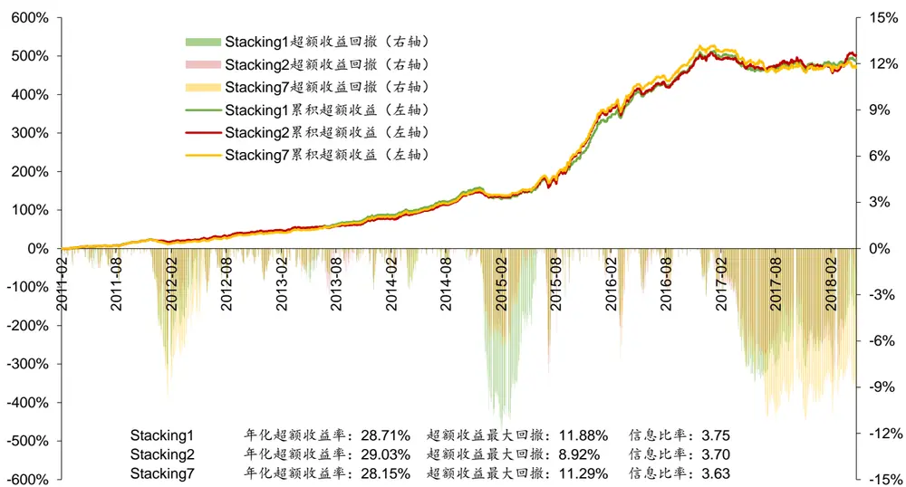
资料来源：Wind，华泰证券研究所

图表33： 对比测试 3 中各种模型 IC，IR 指标

| 2011年至今 |  |  |  |  | 2015年至今 |  |  |  |
| --- | --- | --- | --- | --- | --- | --- | --- | --- |
|  | IC 均值 | IC 值标准差 | IR 比率 | IC 值大于零比例 | IC 均值 | IC 值标准差 |  | IR 比率 IC 值大于零比例 |
| Stacking1 | 10.66% | 9.24% | 1.15 | 90.70% | 13.08% | 9.38% | 1.39 | 86.84% |
| Stacking2 | 10.94% | 7.44% | 1.47 | 91.86% | 12.57% | 7.92% | 1.59 | 94.74% |
| Stacking7 | 10.72% | 8.56% | 1.25 | 91.86% | 11.78% | 10.90% | 1.08 | 84.21% |

资料来源：Wind，华泰证券研究所

图表34： 对比测试 3中各种模型 IC 值累积曲线
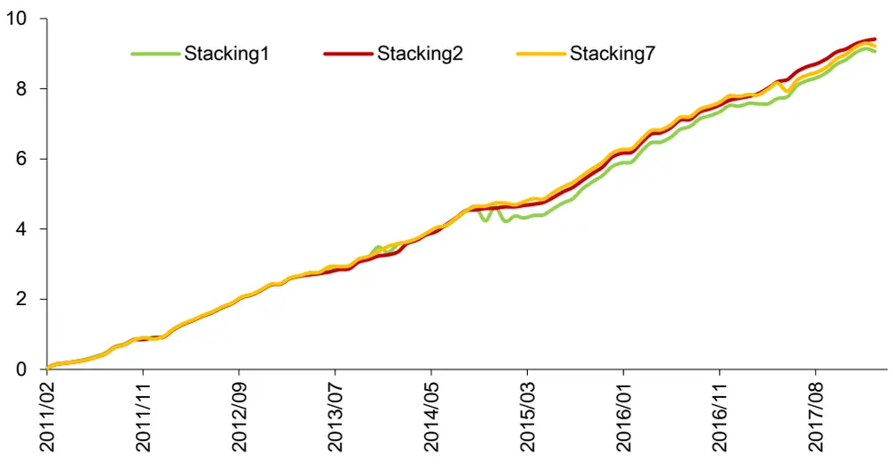
资料来源：Wind，华泰证券研究所

## 总结和展望

本文我们对 Stacking 集成学习模型进行了系统的测试，并且构建了全 A 选股策略，初步得到以下结论：

1． Stacking 是一种常见的集成学习框架，一般有两层。Stacking 能够成功的关键在于第一层模型能针对原始训练数据得出有差异性（相关性低）且预测能力好的输出值，这样通过第二层模型进一步学习后，能够在多个第一层模型中取长补短，提升预测的准确度和稳定性。

2． 本文使用的是一种改进的 Stacking 集成学习框架，框架的第一层不仅使用不同的模型，还使用有差异的训练数据，进一步增大了模型输出值之间的差异性（相关性低），这样的差异性往往适用于训练数据和预测数据不是同分布的领域，可以增强预测的稳定性，如金融数据的预测。

3． 对于 Stacking 集成学习在多因子选股领域的应用，本文提出了基于适应度指标的基模型选择方法，该方法本质是挑选预测值相关性低且预测能力好的模型进行集成。通过分析，我们认为使用 6个月数据训练的 XGBoost 模型（XGBoost_6m）以及逻辑回归模型（逻辑回归_6m）最适合与使用 72 个月数据训练的 XGBoost（XGBoost_72m）进行 Stacking 集成。

4． 对于 Stacking 集成学习在多因子选股领域的应用，我们通过对比测试，得出以下结论：（1）Stacking 第一层应该使用不同种类的基模型和训练数据以达到最好的预测结果；（2）Stacking 第一层并非集成越多的基模型表现就越好，要达到更好的集成学习效果，需要各个基模型两两之间相关性低，且基模型有足够好的预测能力。（3）较短的验证集数据长度（2个月）可以使得Stacking集成学习模型的超额收益最大回撤较小，Calmar 比率较高，模型预测值的 IR比率较高。

5． 在本文的测试中，我们认为最优的 Stacking 集成学习模型为将 XGBoost_72m 和逻辑回归_6M 进行集成，并且验证集数据选用 2 个月的模型（以下简称最优模型）。最优模型有效结合了基模型的优点（XGBoost_72m 的高收益、高信息比率，逻辑回归_6m的低回撤）。2011 年 2月至 2018 年 4 月，对于全 A 选股的行业中性策略，最优模型相对于中证 500 的年化超额收益在 27.75%~29.45%之间，超额收益最大回撤在8.92%~10.18%之间，信息比率在 3.33~3.84 之间，Calmer 比率在 2.73~3.25 之间，Calmer 比率的提升最为显著。

6． 我们对 Stacking 最优模型的输出值进行单因子测试。因子分 5层测试多空组合年化收益率为 33.82%，夏普比率为 5.03。因子分 10 层测试组合 1和组合 10在所有回测年份中排名都没有变化，因子表现稳定。另外，因子在2011年至今的IC均值为10.94%，IR比率为1.47，IC值大于零比例为91.86%；因子在2015年至今的IC均值为12.57%，IR 比率为 1.59，IC 值大于零比例为 94.74%，2015 年以来因子表现更好。

7． Stacking 与其说是一种模型，不如说是一种机器学习框架，其应用模式并不固定，而是需要根据具体的问题进行模型和训练数据的设计，这使得该框架的应用非常灵活。本文是针对 Stacking 集成学习的一个初步探索，未来还有以下几个方向可以深入研究：（1）本文最优的 Stacking 模型只集成了两个基模型，我们认为是因为备选模型相关性较高或预测能力一般，所以集成更多模型无法进一步提升 Stacking 的性能。未来我们会尝试寻找更多特异的基模型进行集成。（2）本文的 Stacking 中基模型使用全部特征进行训练，未来我们会尝试在 Stacking 的不同层次中对特征进行选择。（3）我们会持续关注 Stacking 技术的发展，并尝试把最新的研究成果应用在量化投资当中。

## 附录：传统 Stacking 和改进 Stacking 的区别

## 传统 Stacking模型的构建过程

如图表 35 所示，现有样本内数据集（Learn1，Learn2，Learn3，Learn4）和测试数据集（Test）。

步骤一：选择模型 1，如 XGBoost、神经网络、SVM 模型等

步骤二：将样本内数据集分为互不交叉的四份，记为 Learn1 - Learn4。对该数据集进行交叉验证。

步骤三：交叉验证。将 Learn1 - Learn3 作为训练数据集，Learn4 作为验证数据集，预测结果为 Predict4。以此类推，将 Learn1 - Learn4 全部预测，结果为 Predict1 - Predict4。

步骤四：将交叉验证的预测结果（Predict1 - Predict4）按照对应的位置补全，由预测结果生成的新的特征作为训练数据集在基模型上的 Stacking 转换。

步骤五：用交叉验证中产生的四个模型分别对测试数据集进行预测，将得到的四个预测值取平均值，由该平均值生成的新的特征作为预测数据集在基模型上 Stacking 转换。

步骤六：选取第二个基模型。重复步骤二至步骤五，以此类推。

步骤七：完成基模型的选取后，根据新的特征进行第二层建模，得到最终预测结果。

注：训练数据集和测试数据集的新特征和基模型的个数一致

图表35： 传统 Stacking模型的构建过程
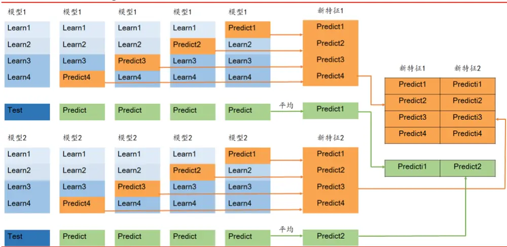
资料来源：华泰证券研究所

## 改进 Stacking 模型的构建过程

如图表 36 所示，现有样本内数据集（Learn1，Learn2，Learn3，Learn4）和测试数据集（Test）。

步骤一：选择模型 1，如 XGBoost、神经网络、SVM 模型等。

步骤二：将样本内数据集按顺序分为互不交叉的四份，记为 Learn1 - Learn4。将前三个数据集视为训练数据集，最后一个作为验证数据集进行预测。

步骤三：将验证集上生成的预测结果作为新的特征，该特征是样本内数据在模型 1 上的Stacking 转换。

步骤四：同时用模型 1对测试数据集进行预测，由该预测结果生成的新的特征作为测试数据集在基模型上 Stacking 转换。

步骤五：选取模型 2。

步骤六：按照步骤二的样本内数据集划分法，将中间两个数据集视为训练集，最后一个作为验证数据集。

步骤七：重复步骤三和步骤四，以此类推。

步骤八：完成基模型的选取后，根据新的特征进行第二层建模，得到最终预测结果。

注 1：样本内数据集和测试数据集的新特征和基模型的个数一致。

注 2：此处样本内数据集的分法是考虑到金融时间序列的有序特征，即样本内数据是按照时间顺序排列，训练集数据时间应该早于验证集数据时间。

图表36： 改进 Stacking模型的构建过程
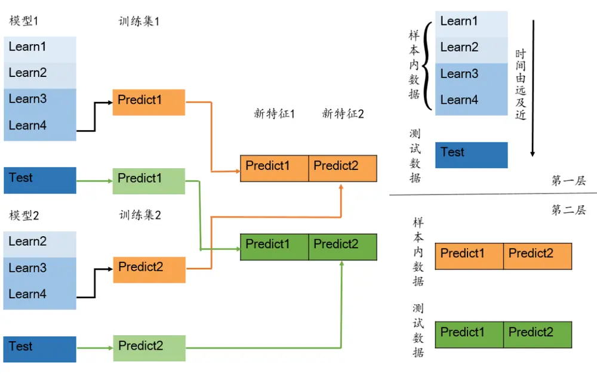
资料来源：华泰证券研究所

## 风险提示

Stacking 模型高度依赖基模型的表现。是对历史投资规律的挖掘，若未来市场投资环境发生变化导致基模型全部失效，则 Stacking 模型存在失效的可能。

## 免责申明

本报告仅供华泰证券股份有限公司（以下简称“本公司”）客户使用。本公司不因接收人收到本报告而视其为客户。

本报告基于本公司认为可靠的、已公开的信息编制，但本公司对该等信息的准确性及完整性不作任何保证。本报告所载的意见、评估及预测仅反映报告发布当日的观点和判断。在不同时期，本公司可能会发出与本报告所载意见、评估及预测不一致的研究报告。同时，本报告所指的证券或投资标的的价格、价值及投资收入可能会波动。本公司不保证本报告所含信息保持在最新状态。本公司对本报告所含信息可在不发出通知的情形下做出修改，投资者应当自行关注相应的更新或修改。

本公司力求报告内容客观、公正，但本报告所载的观点、结论和建议仅供参考，不构成所述证券的买卖出价或征价。该等观点、建议并未考虑到个别投资者的具体投资目的、财务状况以及特定需求，在任何时候均不构成对客户私人投资建议。投资者应当充分考虑自身特定状况，并完整理解和使用本报告内容，不应视本报告为做出投资决策的唯一因素。对依据或者使用本报告所造成的一切后果，本公司及作者均不承担任何法律责任。任何形式的分享证券投资收益或者分担证券投资损失的书面或口头承诺均为无效。

本公司及作者在自身所知情的范围内，与本报告所指的证券或投资标的不存在法律禁止的利害关系。在法律许可的情况下，本公司及其所属关联机构可能会持有报告中提到的公司所发行的证券头寸并进行交易，也可能为之提供或者争取提供投资银行、财务顾问或者金融产品等相关服务。本公司的资产管理部门、自营部门以及其他投资业务部门可能独立做出与本报告中的意见或建议不一致的投资决策。

本报告版权仅为本公司所有。未经本公司书面许可，任何机构或个人不得以翻版、复制、发表、引用或再次分发他人等任何形式侵犯本公司版权。如征得本公司同意进行引用、刊发的，需在允许的范围内使用，并注明出处为“华泰证券研究所”，且不得对本报告进行任何有悖原意的引用、删节和修改。本公司保留追究相关责任的权力。所有本报告中使用的商标、服务标记及标记均为本公司的商标、服务标记及标记。

本公司具有中国证监会核准的“证券投资咨询”业务资格，经营许可证编号为：Z23032000。全资子公司华泰金融控股（香港）有限公司具有香港证监会核准的“就证券提供意见”业务资格，经营许可证编号为：AOK809
©版权所有 2018年华泰证券股份有限公司

## 评级说明

## 行业评级体系

－报告发布日后的6个月内的行业涨跌幅相对同期的沪深300指数的涨跌幅为基准；

－投资建议的评级标准

增持行业股票指数超越基准

中性行业股票指数基本与基准持平

减持行业股票指数明显弱于基准

## 公司评级体系

－报告发布日后的6个月内的公司涨跌幅相对同期的沪深300指数的涨跌幅为基准；
－投资建议的评级标准
买入股价超越基准 20%以上
增持股价超越基准 5%-20%
中性股价相对基准波动在-5%~5%之间
减持股价弱于基准 5%-20%
卖出股价弱于基准 20%以上

## 华泰证券研究

## 南京

南京市建邺区江东中路228号华泰证券广场1号楼/邮政编码：210019

电话：86 25 83389999 /传真：86 25 83387521电子邮件：ht-rd@htsc.com

## 深圳

深圳市福田区深南大道4011号香港中旅大厦24层/邮政编码：518048

电话：86 755 82493932 /传真：86 755 82492062

电子邮件：ht-rd@htsc.com

## 北京

北京市西城区太平桥大街丰盛胡同28号太平洋保险大厦A座18层

邮政编码：100032

电话：86 10 63211166/传真：86 10 63211275

电子邮件：ht-rd@htsc.com

## 上海

上海市浦东新区东方路18号保利广场E栋23楼/邮政编码：200120

电话：86 21 28972098 /传真：86 21 28972068

电子邮件：ht-rd@htsc.com