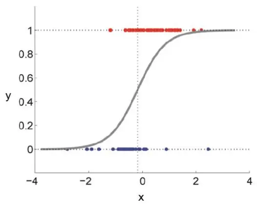
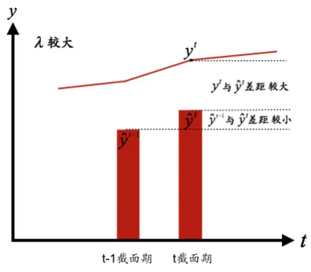
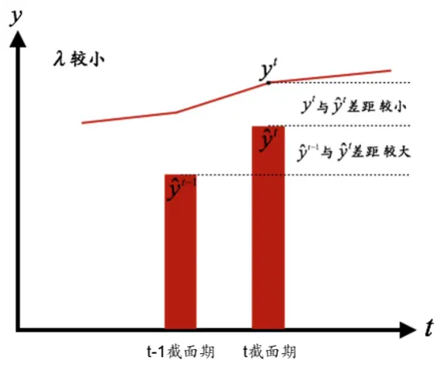
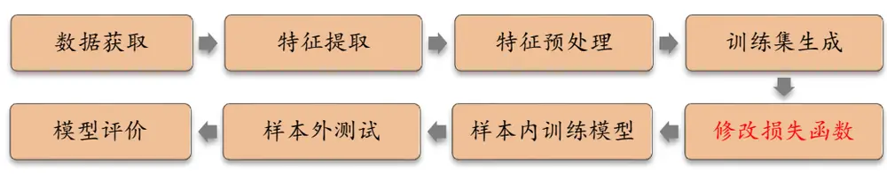
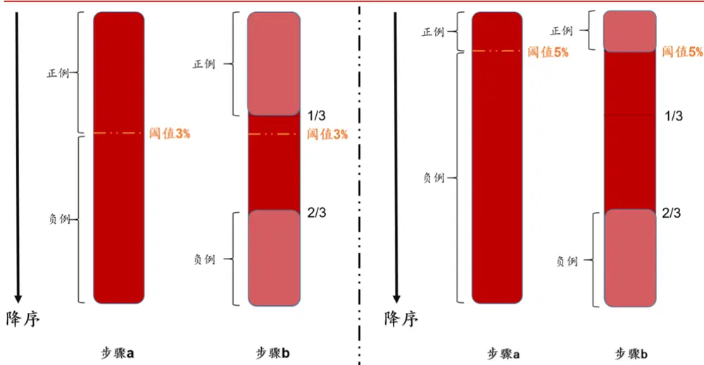
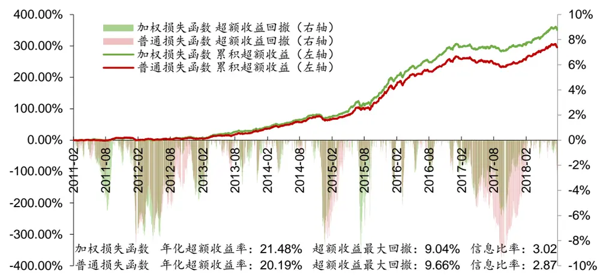
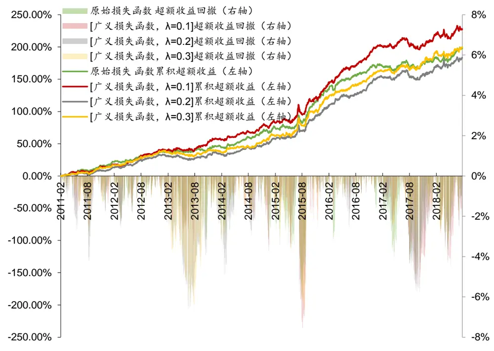
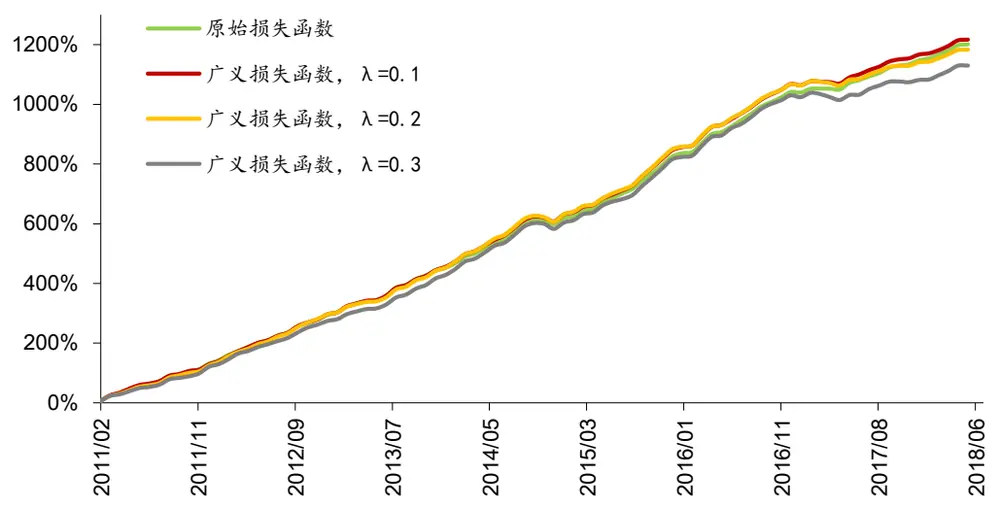

## 金工研究/深度研究

2018年08月02日

林晓明 执业证书编号：S0570516010001

研究员 0755-82080134

linxiaoming@htsc.com

陈烨 010-56793927

联系人 chenye@htsc.com

李子钰

联系人 liziyu@htsc.com

## 相关研究

1《金工: 人工智能选股之特征选择》2018.072《金工: 养老目标驱动的多期博弈均衡模型》2018.06

# 人工智能选股之损失函数的改进

# 华泰人工智能系列之十三

本文创新性地提出了两种对数损失函数改进方案，取得了更好的回测效果损失函数在机器学习模型的训练过程中决定了模型的优化方向，具有重要的地位。对数损失函数是机器学习中最常用的二分类模型损失函数，它的形式可以被分解为两项，分别代表二分类的假阳性误差和假阴性误差，普通对数损失函数中，两类误差的权重是相等的。本文针对对数损失函数的形式，结合机器学习在多因子选股中的应用，提出了两种改进方案，分别解决不同目标下的机器学习选股问题。两种改进方案相比普通对数损失函数都取得了更好的回测结果。

## 改进方案 1：加权损失函数更加适合样本不均衡的分类问题

针对分类模型中两类样本不均衡的问题，我们引入了加权损失函数，该损失函数能增大数量较少一类样本的损失项权重。接下来，我们在全 A股票池内构建不均衡的训练集样本进行测试。总体来看，在保持其他条件相同的情况下，使用加权损失函数的模型在年化超额收益率、信息比率、Calmar比率以及召回率表现更好，但是在超额收益最大回撤方面没有明显优势。说明对于不平衡样本，加权损失函数对于未来表现较好的股票预测能力更好。对比行业中性选股和个股等权选股两种方式，行业中性选股情况下使用加权损失函数的模型优势更加稳定。

## 改进方案 2：广义损失函数能降低机器学习模型的换手率

广义损失函数的核心思想是新增一项损失项并赋予权重λ，使得模型能够在优化原始问题的同时控制预测值与另外一个目标序列的差异。本文将广义损失函数用于控制模型换手率，构建了相对于中证 500行业市值中性的全 A选股策略。回测显示，随着λ的增大，模型的换手率呈现单调下降的趋势。在所有模型中，λ取 0.1 时模型的年化超额收益率、夏普比率以及RankIC 值最高，月均双边换手率下降了 8.21%，说明恰当地使用广义损失函数不仅能降低换手率，还能一定程度上防止过拟合。但是当λ逐渐增大后，模型的年化超额收益率和夏普比率变差，说明模型的预测能力下降。

## 本文给出了改进损失函数的推导过程和 Python 实现代码

在本文的测试中，我们统一选用 XGBoost 分类模型进行测试，在 XGBoost提供的自定义损失函数接口上改进损失函数。XGBoost 是目前最先进的Boosting 模型，其详细原理可参见本系列第六篇报告《华泰人工智能选股之 Boosting 模型》。XGBoost 的自定义损失函数接口要求提供损失函数的一阶导数和二阶导数。本文详细展示了普通损失函数、加权损失函数和广义损失函数的一阶导数以及二阶导数的推导过程，并给出相应的 Python实现代码。

## 广义损失函数仍有进一步研究的空间

在此之前，投资组合换手率的控制一般通过组合优化或风险约束的方法来进行，而本文提到的利用广义损失函数这种方法，则直接将收益预测和换手率控制放入到一个损失函数中进行优化，更具有整体性，是一种创新的方法。对于广义损失函数来说，其结构的通用性可以让我们将任意合适的目标序列加入损失函数中，例如某种选股因子的因子值，这样就能方便调整机器学习模型对该选股因子的暴露程度，使得机器学习模型能够更方便地进行因子权重调整以及因子择时。这将是我们之后会进一步研究的方向。

风险提示：损失函数的改进方案需要根据具体应用环境来设计，设计不当可能无法达到预期效果。机器学习模型是对历史投资规律的挖掘，若未来市场投资环境发生变化，可能导致模型失效。

## 本文研究导读

在机器学习领域，损失函数（loss function）是衡量样本预测值和真实值之间差距的函数，在机器学习模型的训练过程中决定了模型的优化方向，具有较高的研究价值。在前期华泰金工人工智能系列报告中，我们曾对各种损失函数进行了简要介绍。在本文中，我们将针对分类模型中最常用的损失函数——对数损失函数（logloss）进行详细讨论。本文主要内容如下：

1） 对数损失函数如何推导而来？如何形象地解释它的意义？

2） 如何改进对数损失函数使得其更加适合多因子选股领域的应用？

3） 如何评价改进后的损失函数对机器模型性能和多因子选股应用的影响？

## 对数损失函数

对数损失函数是二分类模型的一个经典损失函数，最早应用于逻辑回归，之后又被应用到了神经网络、XGBoost 等模型上。其标准形式如下：

$$
\mathrm{Loss}=-\frac{1}{n}\sum_{i=1}^{n}\left(y_{i}\log(f(x_{i}))+(1-y_{i})\log(1-f(x_{i}))\right)
$$

其中，n为训练样本数量， $x_{i}$ 为第 i 个训练样本的特征值向量， $y_{i}$ 为第 i 个训练样本的标签$(y_{i}\epsilon\{0,1\})$ $f(x_{i})$ 为某种机器学习模型的预测值。粗看下来，对数损失函数相比平方损失函数较难理解。接下来我们首先推导对数损失函数，再对其意义进行形象解释。

## 对数损失函数的推导

对数损失函数由逻辑回归的极大似然估计过程推导而来，逻辑回归模型如图表 1 所示。

图表1： 逻辑回归模型

资料来源：华泰证券研究所

逻辑回归的标准形式如下式：

$$
f(x)={\frac{1}{1+e^{-x}}}
$$

f(x)的值域为（0,1），对于二分类问题，假设P代表分类的概率值，则有两种计算P的情况，分别对应标签为 1 和 0：

$$
P(Y=1|X=x_{i})={\frac{1}{1+e^{-x_{i}}}}=f(x_{i})
$$

$$
P(Y=0|X=x_{i})=1-{\frac{1}{1+e^{-x_{i}}}}=1-f(x_{i})
$$

根据极大似然估计的原理，可以写出逻辑回归的似然函数为：

$$
\mathbf{L}=\prod_{i=1}^{n}P(Y=y_i|X=x_i)=\prod_{i=1}^{n}f(x_i)^{y_i}\left[1-f(x_i)\right]^{1-y_i}
$$

对似然函数取对数，可得

$$
\log L=\sum_{i=1}^{n}(y_{i}\log(f(x_{i}))+(1-y_{i})\log(1-f(x_{i})))
$$

在模型的优化过程中，我们希望似然函数越大越好，这等价于下面的函数越小越好：

$$
\mathrm{Loss}=-\frac{1}{n}\sum_{i=1}^{n}\left(y_{i}\log\left(f(x_{i})\right)+(1-y_{i})\log\left(1-f(x_{i})\right)\right)
$$

逻辑回归的对数损失函数就被推导出来了，接下来我们探讨对数损失函数的意义。

## 对数损失函数的意义解释

对数损失函数可以被分解为以下两项：

$$
\begin{array}{c}{{\mathrm{Loss}1=y_{i}\log\bigl(f(x_{i})\bigr)}}\\{{\mathrm{Loss}2=\;(1-y_{i})\log\bigl(1-f(x_{i})\bigr)}}\end{array}
$$

对于 Loss1，只有当 $y_{i}$ 为 1 时，Loss1 才可能会为非零值，即 Loss1计算的是模型分错标记为 1的样本的误差，记为假阳性（False Positive）误差。

对于 Loss2，只有当 $y_{i}$ 为 0 时，Loss2 才可能会为非零值，即 Loss2计算的是模型分错标记为 0 的样本的误差，记为假阴性（False Negative）误差。

最终的损失函数 Loss 通过 Loss1 和 Loss2 的相加来全面地衡量模型的误差。可以看到，对于原始的对数损失函数，Loss1 和 Loss2 的权重是相等的。

## 对数损失函数的改进

## 改进方案 1：加权损失函数

在机器学习模型的使用过程中，经常会出现两类样本不均衡的问题。比如对于某种疾病，发病率仅为 1%，如果训练一个机器学习模型来找出发病样本，该模型使用如下常规的对数损失函数的话，那么模型很可能无法识别出发病样本。

$$
\mathrm{Loss}=-\frac{1}{n}\sum_{i=1}^{n}\left(y_{i}\log(f(x_{i}))+(1-y_{i})\log(1-f(x_{i}))\right)
$$

因为就算模型把发病样本识别为正常样本，依然只有 1%的样本具有非零的损失函数值，这可以使得总的损失函数非常小，但是这样的模型毫无实用价值。因此在面对不均衡样本时，一种直观的改进方法，就是增大数量较少一类样本的损失项权重,我们可以对损失项进行加权处理，即加入权重 $\cdot_{\beta}$ ，得到加权损失函数：

$$
\mathsf{Weighted\_Loss}=-\frac{1}{n}\sum_{i=1}^{n}\bigl(y_{i}\log\bigl(f(x_{i})\bigr)+\beta(1-y_{i})\log\bigl(1-f(x_{i})\bigr)\bigr).
$$

即：

$$
{\sf Weighted\_Loss}=-\frac{1}{n}{\sum_{i=1}^{n}}(Loss1+\beta Loss2).
$$

关于β值的确定，假设正样本个数为 $n_{1}$ ，负样本个数为 $n_{2},\quad n_{1}+n_{2}=n$ ，则 $\beta=n_{1}/n_{2}\mathrm{。}$

当 $n_{1}$ ≫ $n_{2}$ 时，说明正样本数目远多于负样本，此时 $\cdot\beta$ 取值很大，模型会重点针对Loss2进行优化。

当 $n_{1}\ll n_{2}$ 时，说明负样本数目远多于正样本，此时 $\cdot\beta$ 取值较小，模型会重点针对Loss1进行优化。

## 改进方案 2：广义损失函数

对于损失函数，可以加入正则项来控制过拟合，加入正则项的损失函数如下：

$$
\mathbf{Loss}=\sum_{i=1}^{n}L_{1}(y_{i},\hat{y}_{i})+\boldsymbol{\varOmega}
$$

其中， $L_{1}(y_{i},\hat{y}_{i})$ 为衡量真实值 $.y_{i}$ 和预测值 $\cdot\hat{y}_{i}之$ 间差异的损失项，Ω为正则项，在此基础上，我们还可以加入另一项损失项 $L_{2}(s,\hat{y}_{i})$ ，并给予权重λ，得到如下新的损失函数，这里我们称之为广义损失函数：

$$
\mathrm{General\_Loss}=\sum_{i=1}^{n}[L_{1}(y_{i},\hat{y}_{i})+\lambda L_{2}(s_{i},\hat{y}_{i})]+\varOmega
$$

该损失函数的意义在于模型的优化目标为同时最小化 $.L_{1}$ 和 $L_{2}$ ，即模型在尽量减小真实值 $\cdot y_{i}$ 和预测值 $\hat{y}_{i}$ 之间差异的同时，也要控制预测值 $\hat{\boldsymbol{y}}_{i}$ 和 $^{\prime}s_{i}$ 之间的差距。

关于 General_Loss 损失函数，我们接下来将展示一个实例进行说明。假设一个基于机器学习的多因子选股模型的损失函数如下：

$$
\mathrm{General\_Loss}=\sum_{i=1}^{n}[L_{1}(y_{i}^{t},\hat{y}_{i}^{t})+\lambda L_{2}(\hat{y}_{i}^{t-1},\hat{y}_{i}^{t})]+\Omega_{i}
$$

其中， $y_{i}^{t}$ 为第 t 个截面上股票样本 i 的收益率， $\hat{y}_{i}^{t-1}$ 为第 t-1 个截面上股票样本 i 的收益率预测值， $\hat{y}_{i}^{t}$ 为第 t个截面上股票样本 i的收益率预测值，该损失函数使得模型在尽量减小yt和预测值 $\hat{y}_{i}^{t}$ 之间差异的同时，也要控制预测值 $\boldsymbol{\cdot}\boldsymbol{\hat{y}}_{i}^{t-1}$ 和ŷt之间的差距。如果两个截面上的收益率预测值ŷt−1和ŷt $\textstyle({\hat{y}}^{t}=\sum_{i}^{n}{\hat{y}}_{i}^{t})$ 的差异被控制在一定范围内，那么就可以控制由该模型构建的投资组合的换手率。也就是说，General_Loss 损失函数不仅可以进行收益预测，还起到了约束投资组合换手率的作用，而约束的程度则由参数λ确定，λ越大，则 $\left|\hat{y}^{t-1}和\hat{y}^{t}\right.$ 之间的差距越小，投资组合换手率和交易成本也会越小，但是模型对于训练数据的拟合精度也会下降。图表 2形象地展示了λ值对训练结果的影响。

图表2： λ值对训练结果的影响

资料来源：华泰证券研究所

在此之前，投资组合换手率的控制一般通过组合优化或风险约束的方法来进行，而本文提到的利用广义损失函数这种方法，则直接将收益预测和换手率控制放入到一个损失函数中进行优化，更具有整体性，是一种创新的方法。

## 改进损失函数的测试流程

在本文的测试中，我们统一选用 XGBoost 分类模型进行测试，在 XGBoost 提供的自定义损失函数接口上改进损失函数。测试流程如图表 3所示。

图表3： 测试流程图

资料来源：华泰证券研究所

测试流程包含下列步骤：

## 1． 数据获取：

1) 股票池：全 A股。剔除 ST 股票，剔除每个截面期下一交易日停牌的股票，剔除上市 3个月内的股票，每只股票视作一个样本。

2) 回测区间：2011 年 1 月 31 日至 2018 年 7 月 27 日，月度滚动回测。

2． 特征和标签提取：每个自然月的最后一个交易日，计算之前报告里的 70 个因子暴露度，作为样本的原始特征，因子池如图表 5 所示。

## 3． 特征预处理：

1) 中位数去极值：设第 T 期某因子在所有个股上的暴露度序列为 $D_{i}$ ， $D_{M}$ 为该序列中位数， $D_{M1}$ 为序列 $|D_{i}-D_{M}|$ 的中位数，则将序列 $D_{i}$ 中所有大于 $D_{M}+5D_{M1}$ 的数重设为 $D_{M}+5D_{M1}$ ，将序列 $D_{i}$ 中所有小于 $D_{M}-5D_{M1}$ 的数重设为 $D_{M}-5D_{M1}$ ；

2) 缺失值处理：得到新的因子暴露度序列后，将因子暴露度缺失的地方设为中信一级行业相同个股的平均值。

3) 行业市值中性化：将填充缺失值后的因子暴露度对行业哑变量和取对数后的市值做线性回归，取残差作为新的因子暴露度。

4) 标准化：将中性化处理后的因子暴露度序列减去其现在的均值、除以其标准差，得到一个新的近似服从N(0,1)分布的序列。

## 4． 训练集生成：

1) 对于改进方案 1，为了生成分布不均衡的训练集样本，进行以下步骤：

a) 计算每个月末截面所有股票下个月相对于中证 500 的超额收益率，选定一个超额收益率阈值（本报告中为 3%，4%，5%）,初步将超额收益率大于阈值的股票标记为正例，将超额收益率小于阈值的股票标记为负例。

b) 每个月末截面，将股票按照超额收益率从高到低排序，为了减少排名靠中间的股票样本对模型训练的干扰，我们会剔除一部分中间样本，规则是：如果步骤 a)中标记为正例的样本数量大于所有股票数量的三分之一，则只取排名前三分之一的股票为标记为正例（y = 1）；如果步骤 a)中标记为负例的样本数量大于所有股票数量的三分之一，则只取排名后三分之一的股票标记为反例（y = 0）。

样本标注的步骤如图表 4 所示。图表 4 分别展示了阈值为 3%和 5%的情况。样本标注完成之后，正例样本和负例样本的比值分别为：阈值为3%时比值为0.8983，阈值为 4%时比值为 0.8142，阈值为 5%时比值为 0.7276。随着阈值的增大，正负样本的比值越来越小。

图表4： 改进方案 1 的样本标注方法
步骤a：通过阈值初步把排序后的样本分为正例和负例。
步骤b：为了减少排名靠中间的股票样本对模型训练的干扰，剔除一部分中间样本，以排名1/3和2/3的位置为分界点，得到最终的正例和负例（图中用浅红色表示）。
目的：生成正例负例不均衡的样本。
资料来源：华泰证券研究所

2) 对于改进方案 2，在每个月末截面期，选取下月收益排名前三分之一的股票作为正例（y = 1），后三分之一的股票作为负例（y = 0）。

## 5． 修改损失函数：

使用 XGBoost 提供的自定义损失函数接口改进损失函数，具体修改的代码及推导过程请见附录 1，这里主要展示使用的损失函数的数学表达式：

1) 对于改进方案 1，使用如下的加权损失函数代替原始的损失函数：

$$
\mathsf{Weighted\_Loss}=-\frac{1}{n}\sum_{i=1}^{n}(y_{i}\log(f(x_{i}))+\beta(1-y_{i})\log(1-f(x_{i})))
$$

2) 对于改进方案 2，使用如下的广义损失函数代替原始的损失函数：

$$
\mathrm{General\_Loss}=\sum_{i=1}^{n}[L_{1}(y_{i}^{t},\hat{y}_{i}^{t})+\lambda L_{2}(\hat{y}_{i}^{t-1},\hat{y}_{i}^{t})]+\Omega_{i}
$$

6． 样本内训练模型：

1) 对于改进方案 1，每个月使用过去 9 个月的因子数据进行训练，进行月度滚动训练。

对于改进方案 2，每个月使用过去 72 个月的因子数据进行训练，进行月度滚动训练。

注意到改进方案 1 只使用过去 9 个月的因子数据进行训练，这是因为我们通过后续的测试发现对于改进方案 1 来说，使用行业中性和个股等权的方式进行回测时加权损失函数具有稳定的优势，但是使用行业市值中性方法回测时优势并不明显，也就是说过多地在风格因子上进行约束会削弱加权损失函数的优势。而使用过长的数据（例如72 个月）训练模型来进行行业中性和个股等权回测时，在 2017 年之后模型的回撤较大，所以最后权衡收益和回撤我们对改进方案 1选用了过去 9个月的训练数据。

7． 样本外测试：模型训练完成后，以 T 月月末截面期所有样本预处理后的特征作为模型的输入，得到每个样本的预测值f(x)，将预测值视作合成后的因子，构建组合进行回测。

8． 模型评价：通过模型的回测绩效，模型合成因子的 RankIC 值，模型分类的指标进行评价。

图表5： 选股模型中涉及的全部因子及其描述

| 大类因子 | 具体因子 | 因子描述 |
| --- | --- | --- |
| 估值 | EP | 净利润（TTM）/总市值 |
| 估值 | EPcut | 扣除非经常性损益后净利润（TTM）/总市值 |
| 估值 | BP | 净资产/总市值 |
| 估值 | SP | 营业收入（TTM）/总市值 |
| 估值 | NCFP | 净现金流（TTM）/总市值 |
| 估值 | OCFP | 经营性现金流（TTM）/总市值 |
| 估值 | DP | 近12个月现金红利（按除息日计）/总市值 |
| 估值 | G/PE | 净利润（TTM）同比增长率/PE_TTM |
| 成长 | Sales_G_q | 营业收入（最新财报，YTD）同比增长率 |
| 成长 | Profit_G_q | 净利润（最新财报，YTD）同比增长率 |
| 成长 | OCF_G_q | 经营性现金流（最新财报，YTD）同比增长率 |
| 成长 | ROE_G_q | ROE（最新财报，YTD）同比增长率 |
| 财务质量 财务质量 | ROE_q | ROE（最新财报，YTD） |
| 财务质量 | ROE_ttm | ROE（最新财报，TTM） |
| 财务质量 | ROA_q | ROA（最新财报，YTD） |
| 财务质量 | ROA_ttm | ROA（最新财报，TTM） |
| 财务质量 | grossprofitmargin_q | 毛利率（最新财报，YTD） |
| 财务质量 | grossprofitmargin_ttm | 毛利率（最新财报，TTM） |
| 财务质量 | profitmargin_q | 扣除非经常性损益后净利润率（最新财报，YTD） 扣除非经常性损益后净利润率（最新财报，TTM) |
| 财务质量 | profitmargin_ttm | 资产周转率（最新财报，YTD） |
| 财务质量 | assetturnover_q |  |
| 财务质量 | assetturnover_ttm | 资产周转率（最新财报，TTM） |
| 财务质量 | operationcashflowratio_q | 经营性现金流/净利润（最新财报，YTD） |
| 杠杆 | operationcashflowratio_ttm | 经营性现金流/净利润（最新财报，TTM） |
| 杠杆 | financial_leverage | 总资产/净资产 非流动负债/净资产 |
| 杠杆 | debtequityratio | 现金比率 |
| 杠杆 | cashratio currentratio | 流动比率 |
| 市值 | In_capital | 总市值取对数 |
| 动量反转 | HAlpha | 个股60个月收益与上证综指回归的截距项 |
| 动量反转 | return_Nm | 个股最近N个月收益率，N=1，3，6，12 |
| 动量反转 | wgt_return_Nm | 个股最近N个月内用每日换手率乘以每日收益率求算术平均值， |
| 动量反转 | exp_wgt_return_Nm | N=1, 3, 6, 12 个股最近N个月内用每日换手率乘以函数exp(-x_i/N/4)再乘以每 |
| 波动率 |  | 日收益率求算术平均值，X_i为该日距离截面日的交易日的个数， N=1, 3, 6, 12 特质波动率——个股最近 N 个月内用日频收益率对 Fama |
| 波动率 | std_FF3factor_Nm | French三因子回归的残差的标准差，N=1，3，6，12 |
| 股价 | std_Nm In_price | 个股最近N个月的日收益率序列标准差，N=1，3，6，12 股价取对数 |
| beta | beta | 个股 60个月收益与上证综指回归的 beta |
| 换手率 | turn_Nm | 个股最近N个月内日均换手率（剔除停牌、涨跌停的交易日）， |
| 换手率 |  | N=1, 3, 6, 12 个股最近N个月内日均换手率除以最近2年内日均换手率（剔除 |
|  | bias_turn_Nm | 停牌、涨跌停的交易日）再减去1，N=1，3，6，12 |
| 情绪 情绪 | rating_average rating_change | wind 评级的平均值 wind评级（上调家数-下调家数）/总数 |
| 情绪 | rating_targetprice | wind一致目标价/现价-1 |
| 股东 | holder_avgpctchange | 户均持股比例的同比增长率 |
| 技术 | MACD |  |
| 技术 | DEA | 经典技术指标（释义可参考百度百科），长周期取30日，短周 |
| 技术 | DIF | 期取 10 日，计算 DEA 均线的周期（中周期）取 15 日 |
| 技术 | RSI | 经典技术指标，周期取20日 |
| 技术 | PSY | 经典技术指标，周期取20日 |
| 技术 | BIAS | 经典技术指标，周期取20日 |

资料来源：Wind，华泰证券研究所

## 改进损失函数的测试结果

针对改进方案 1（加权损失函数）和改进方案 2（广义损失函数），由于两种方案关注的改进目标不一样，我们将使用不同的测试方法：

改进方案 1：使用模型的预测值构建行业中性组合以及个股等权组合，比较不同参数下组合在收益和回撤方面的表现。另外还比较模型的召回率和精确率。

改进方案 2：比较模型预测值的 RankIC 值；使用模型的预测值构建行业市值中性组合，比较不同参数下组合在收益和回撤方面的表现，并且结合组合换手率进行对比。

## 改进方案 1（加权损失函数）测试结果

对于改进方案 1，为了生成分布不均衡的训练集样本，我们设置了三组超额收益阈值：3%、4%、5%（详细过程请见测试流程中的训练集生成）。针对每组阈值，分别测试使用加权对数损失函数和普通对数损失函数的组合表现，展示在图表 6中。

图表6： 改进方案 1中各种情况下模型选股指标对比（全 A选股，回测期：20110131～20180727）

| 模型选择 | 每个行业入选个股比例（从左至右：2%，3%，4%，5%，6%） |  |  |  | 组合总入选个股数目（从左至右：20，40,60,80，100） |  |  |  |
| --- | --- | --- | --- | --- | --- | --- | --- | --- |
|  | 全 A 选股（基准：中证 500） |  |  |  | 全 A 选股（基准：中证 500） |  |  |  |
|  |  | 年化超额收益率（行业中性） |  |  |  | 年化超额收益率（个股等权） |  |  |
| 加权损失函数， | 阈值 0.03 19.70% | 19.08% | 19.83% 19.60% 16.68% 18.06% | 19.76% 19.15% | 26.18% 24.66% | 24.56% | 23.92% | 23.54% |
| 普通损失函数， | 阈值 0.03 18.35% | 18.19% |  |  | 22.18% 23.01% | 24.48% | 22.90% | 22.37% |
| 加权损失函数， | 阈值 0.04 21.55% | 21.35% | 21.48% 21.96% | 20.89% | 28.08% 27.05% | 26.36% | 25.62% | 25.42% |
| 普通损失函数， | 阈值 0.04 20.16% | 19.98% | 20.19% 20.54% | 20.23% | 27.55% 25.14% | 24.66% | 26.40% | 25.41% |
| 加权损失函数， | 阈值 0.05 22.59% | 23.74% | 22.03% 21.76% | 21.14% 21.24% | 25.81% 25.72% | 26.99% | 25.28% | 23.02% |
| 普通损失函数，阈值 0.05 | 18.96% | 18.97% 19.42% | 20.70% | 25.10% | 23.70% | 22.11% | 22.42% | 23.05% |
|  | 超额收益最大回撤（行业中性） |  |  |  | 超额收益最大回撤（行业中性） |  |  |  |
| 加权损失函数， 阈值 0.03 | 10.93% | 10.77% | 10.54% 10.08% | 9.84% | 17.85% 12.87% | 12.47% | 11.47% | 12.25% |
| 普通损失函数， 阈值 0.03 | 12.14% | 10.22% | 11.15% 9.75% | 9.77% | 18.47% 15.37% | 12.17% | 11.79% | 13.31% |
| 加权损失函数， 阈值 0.04 | 10.24% | 10.24% | 9.04% 9.27% | 8.80% | 12.39% 13.63% | 11.65% | 10.84% | 10.81% |
| 普通损失函数， 阈值 0.04 | 10.31% | 9.87% | 9.66% 9.85% | 9.90% | 16.07% 16.81% | 12.78% | 11.50% | 11.00% |
| 加权损失函数， 阈值 0.05 | 11.14% | 10.99% | 10.83% 10.42% | 10.21% | 24.84% 16.84% | 14.84% | 12.15% | 12.35% |
| 普通损失函数， 阈值 0.05 | 12.23% | 11.70% | 12.40% 11.71% | 9.46% | 16.36% | 13.98% 13.52% | 11.12% | 11.13% |
|  | 信息比率（行业中性） |  |  |  | 信息比率（行业中性） |  |  |  |
| 加权损失函数， 阈值 0.03 | 2.56 | 2.65 | 2.84 | 2.94 3.09 | 2.33 | 2.64 2.90 | 3.02 | 3.13 |
| 普通损失函数， 阈值 0.03 | 2.39 | 2.50 | 2.45 2.76 | 3.01 | 1.93 | 2.50 2.92 | 2.90 | 2.97 |
| 加权损失函数， 阈值 0.04 | 2.66 | 2.82 | 3.02 3.19 | 3.14 | 2.49 | 2.95 3.11 | 3.21 | 3.34 |
| 普通损失函数， 阈值 0.04 | 2.52 | 2.68 | 2.87 | 3.06 3.12 | 2.53 | 2.77 2.91 | 3.32 | 3.32 |
| 加权损失函数， 阈值 0.05 | 2.76 | 3.09 | 3.03 | 3.09 3.08 | 2.25 | 2.74 3.14 | 3.13 | 3.02 |
| 普通损失函数， 阈值 0.05 | 2.44 | 2.57 | 2.73 | 3.01 3.23 | 2.06 | 2.59 2.63 | 2.81 | 3.00 |
|  | Calmar 比率（行业中性） |  |  |  | Calmar 比率（行业中性） |  |  |  |
| 加权损失函数，阈值 0.03 | 1.80 | 1.77 | 1.88 | 1.94 2.01 | 1.47 | 1.92 | 1.97 2.09 | 1.92 |
| 普通损失函数， 阈值 0.03 | 1.51 | 1.78 | 1.50 | 1.85 1.96 | 1.20 | 1.50 2.01 | 1.94 | 1.68 |
| 加权损失函数，阈值 0.04 | 2.10 | 2.09 | 2.38 | 2.37 2.37 | 2.27 | 1.98 2.26 | 2.36 | 2.35 |
| 普通损失函数，阈值 0.04 | 1.96 | 2.02 | 2.09 | 2.09 2.04 | 1.72 | 1.50 | 1.93 2.30 | 2.31 |
| 加权损失函数，阈值 0.05 | 2.03 | 2.16 | 2.03 | 2.09 2.07 | 1.04 | 1.53 | 1.82 2.08 | 1.86 |
| 普通损失函数，阈值 0.05 | 1.55 | 1.62 | 1.57 | 1.77 2.25 | 1.53 | 1.70 | 1.64 2.02 | 2.07 |

资料来源：Wind，华泰证券研究所

在图表 6中，无论使用行业中性选股还是个股等权选股，都选择模型打分最高的若干只股票构建组合。总体来看，在保持其他条件相同的情况下，使用加权损失函数的模型在年化超额收益率、信息比率和 Calmer 比率表现更好（红色单元格多于绿色单元格），但是在超额收益最大回撤方面没有明显优势。说明对于不平衡样本，加权损失函数对于未来表现较好的股票预测能力更好。对比行业中性选股和个股等权选股两种方式，行业中性选股情况下使用加权损失函数的模型优势更加稳定。

图表 7 展示了行业中性情况下，每个行业入选个股比例占行业 4%时，使用加权损失函数和普通损失函数的超额收益走势对比。

图表7： 加权损失函数和普通损失函数超额收益表现（全 A选股，中证 500行业中性）

资料来源：Wind， 华泰证券研究所

图表 8和图表 9展示了详细的回测分析表。

图表8： 加权损失函数和普通损失函数回测分析表（中证 500行业中性，回测期：20110131～20180727）

|  |  | 每个行业入 | 年化 | 年化 | 夏普 |  | 最大年化超额 | 年化 | 超额收益 | 信息 | Calmar相对基准 |  | 月均双边 |
| --- | --- | --- | --- | --- | --- | --- | --- | --- | --- | --- | --- | --- | --- |
|  |  | 损失函数 阈值 策略类型选个股比例 | 收益率 | 波动率 | 比率 | 回撤 |  | 收益率跟踪误差 | 最大回撤 | 比率 | 比率 | 月胜率 | 换手率 |
| 加权 | 0.03 行业中性 | 2% | 21.91% | 27.82% | 0.79 | 52.03% | 19.70% | 7.69% | 10.93% | 2.56 | 1.80 | 74.16% 159.36% |  |
| 加权 | 0.03 行业中性 | 3% | 21.35% | 27.48% | 0.78 | 49.44% | 19.08% | 7.20% | 10.77% | 2.65 | 1.77 | 74.16% 155.66% |  |
| 加权 | 0.03 行业中性 | 4% | 22.06% | 27.58% | 0.80 | 50.00% | 19.83% | 6.98% | 10.54% | 2.84 | 1.88 | 74.16% 152.50% |  |
| 加权 | 0.03 行业中性 | 5% | 21.88% | 27.36% | 0.80 | 49.55% | 19.60% | 6.66% | 10.08% | 2.94 | 1.94 | 74.16% 149.17% |  |
| 加权 | 0.03 行业中性 | 6% | 22.07% | 27.21% | 0.81 | 49.44% | 19.76% | 6.40% | 9.84% | 3.09 | 2.01 | 77.53%146.79% |  |
| 普通 | 0.03 行业中性 | 2% | 20.58% | 27.68% | 0.74 | 51.56% | 18.35% | 7.68% | 12.14% | 2.39 | 1.51 | 71.91% 157.77% |  |
| 普通 | 0.03 行业中性 | 3% | 20.46% | 27.45% | 0.75 | 51.47% | 18.19% | 7.26% | 10.22% | 2.50 | 1.78 | 73.03% 154.85% |  |
| 普通 | 0.03 行业中性 | 4% | 18.90% | 27.37% | 0.69 | 50.75% | 16.68% | 6.82% | 11.15% | 2.45 | 1.50 | 68.54%151.21% |  |
| 普通 | 0.03 行业中性 | 5% | 20.27% | 27.42% | 0.74 | 51.06% | 18.06% | 6.55% | 9.75% | 2.76 | 1.85 | 73.03% 148.69% |  |
| 普通 | 0.03 行业中性 | 6% | 21.37% | 27.42% | 0.78 | 50.54% | 19.15% | 6.36% | 9.77% | 3.01 | 1.96 | 73.03%146.31% |  |
| 加权 | 0.04 行业中性 | 2% | 23.87% | 27.70% | 0.86 | 51.25% | 21.55% | 8.09% | 10.24% | 2.66 | 2.10 | 70.79% 160.42% |  |
| 加权 | 0.04 行业中性 | 3% | 23.70% | 27.49% | 0.86 | 50.51% | 21.35% | 7.56% | 10.24% | 2.82 | 2.09 | 70.79% 157.23% |  |
| 加权 | 0.04 行业中性 | 4% | 23.94% | 27.03% | 0.89 | 48.50% | 21.48% | 7.10% | 9.04% | 3.02 | 2.38 | 75.28%153.56% |  |
| 加权 | 0.04 行业中性 | 5% | 24.40% | 27.05% | 0.90 | 48.33% | 21.96% | 6.88% | 9.27% | 3.19 | 2.37 | 78.65% 149.98% |  |
| 加权 | 0.04 行业中性 | 6% | 23.38% | 26.81% | 0.87 | 48.17% | 20.89% | 6.65% | 8.80% | 3.14 | 2.37 | 76.40%146.37% |  |
| 普通 | 0.04 行业中性 | 2% | 22.42% | 27.79% | 0.81 | 48.25% | 20.16% | 7.99% | 10.31% | 2.52 | 1.96 | 73.03%158.20% |  |
| 普通 | 0.04 行业中性 | 3% | 22.31% | 27.43% | 0.81 | 49.91% | 19.98% | 7.46% | 9.87% | 2.68 | 2.02 | 67.42% 155.03% |  |
| 普通 | 0.04 行业中性 | 4% | 22.50% | 27.40% | 0.82 | 49.70% | 20.19% | 7.05% | 9.66% | 2.87 | 2.09 | 73.03%153.28% |  |
| 普通 | 0.04 行业中性 | 5% | 22.85% | 27.34% | 0.84 | 49.70% | 20.54% | 6.71% | 9.85% | 3.06 | 2.09 | 73.03% 150.20% |  |
| 普通 | 0.04 行业中性 | 6% | 22.55% | 27.24% | 0.83 | 49.15% | 20.23% | 6.48% | 9.90% | 3.12 | 2.04 | 71.91%147.23% |  |
| 加权 | 0.05 行业中性 | 2% | 24.66% | 28.49% | 0.87 | 49.57% | 22.59% | 8.18% | 11.14% | 2.76 | 2.03 | 68.54% 159.52% |  |
| 加权 | 0.05 行业中性 | 3% | 25.89% | 28.21% | 0.92 | 49.84% | 23.74% | 7.70% | 10.99% | 3.09 | 2.16 | 74.16% 157.02% |  |
| 加权 | 0.05 行业中性 | 4% | 24.14% | 28.12% | 0.86 | 49.79% | 22.03% | 7.26% | 10.83% | 3.03 | 2.03 | 73.03% 152.57% |  |
| 加权 | 0.05 行业中性 | 5% | 23.89% | 28.00% | 0.85 | 49.88% | 21.76% | 7.04% | 10.42% | 3.09 | 2.09 | 73.03% 148.91% |  |
| 加权 | 0.05 行业中性 | 6% | 23.30% | 27.82% | 0.84 | 49.83% | 21.14% | 6.87% | 10.21% | 3.08 | 2.07 | 76.40% 146.55% |  |
| 普通 | 0.05 行业中性 | 2% | 21.49% | 26.85% | 0.80 | 48.06% | 18.96% | 7.78% | 12.23% | 2.44 | 1.55 | 67.42% 156.05% |  |
| 普通 | 0.05 行业中性 | 3% | 21.31% | 27.33% | 0.78 | 49.45% | 18.97% | 7.38% | 11.70% | 2.57 | 1.62 | 71.91%155.42% |  |
| 普通 | 0.05 行业中性 | 4% | 21.65% | 27.62% | 0.78 | 50.01% | 19.42% | 7.11% | 12.40% | 2.73 | 1.57 |  | 74.16% 153.65% |
| 普通 | 0.05 行业中性 | 5% | 22.95% | 27.55% | 0.83 | 49.55% 0.87 48.57% | 20.70% 21.24% | 6.89% 6.59% | 11.71% | 3.01 | 1.77 |  | 76.40%149.88% |

资料来源：Wind，华泰证券研究所

图表9： 加权损失函数和普通损失函数回测分析表（个股等权，回测期：20110131～20180727）

| 每个行业入 |  | 年化 收益率 | 年化 | 夏普 比率 | 最大年化超额 |  | 年化 |  | 超额收益 最大回撤 | 信息 比率 | Calmar 相对基准月均双边 比率 | 月胜率 | 换手率 |
| --- | --- | --- | --- | --- | --- | --- | --- | --- | --- | --- | --- | --- | --- |
| 损失函数 | 阈值 策略类型选个股比例 |  |  |  | 波动率 | 回撤 | 收益率跟踪误差 |  |  |  |  |  |  |
| 加权 | 0.03 个股等权 | 2% 28.78% | 28.22% | 1.02 | 55.21% | 26.18% | 11.21% | 17.85% | 2.33 | 1.47 |  | 71.91% 159.77% |  |
| 加权 | 0.03 个股等权 | 3% 27.07% | 28.01% | 0.97 | 51.94% | 24.66% | 9.35% | 12.87% |  | 2.64 | 1.92 | 65.17% 156.48% |  |
| 加权 | 0.03 个股等权 | 4% 26.87% | 28.02% | 0.96 | 50.39% | 24.56% |  | 8.48% | 12.47% | 2.90 | 1.97 | 70.79% 154.22% |  |
| 加权 | 0.03 个股等权 | 5% 26.32% | 27.59% | 0.95 | 49.91% | 23.92% | 7.92% |  | 11.47% | 3.02 | 2.09 | 70.79% 150.10% |  |
| 加权 | 0.03 个股等权 | 6% 25.84% | 27.70% | 0.93 | 49.38% | 23.54% | 7.51% |  | 12.25% | 3.13 | 1.92 | 74.16%146.32% |  |
| 普通 | 0.03 个股等权 | 2% 24.66% | 28.48% | 0.87 | 54.65% | 22.18% | 11.51% |  | 18.47% | 1.93 | 1.20 | 65.17%162.32% |  |
| 普通 | 0.03 个股等权 | 3% 25.44% | 27.82% | 0.91 | 51.22% | 23.01% |  | 9.22% | 15.37% | 2.50 | 1.50 | 67.42% 155.94% |  |
| 普通 | 0.03 个股等权 | 4% 26.90% | 27.64% | 0.97 | 50.89% | 24.48% |  | 8.37% | 12.17% | 2.92 | 2.01 | 73.03%152.17% |  |
| 普通 | 0.03 个股等权 | 5% 25.29% | 27.50% | 0.92 | 50.50% | 22.90% |  | 7.89% | 11.79% | 2.90 | 1.94 | 73.03% 148.93% |  |
| 普通 | 0.03 个股等权 | 6% 24.74% | 27.44% | 0.90 | 48.73% | 22.37% |  | 7.53% | 13.31% | 2.97 | 1.68 | 71.91%146.65% |  |
| 加权 | 0.04 个股等权 | 2% 31.05% | 27.35% | 1.14 | 48.54% | 28.08% | 11.27% |  | 12.39% | 2.49 | 2.27 | 65.17% 165.09% |  |
| 加权 | 0.04 个股等权 | 3% 29.78% | 27.19% | 1.10 | 49.12% | 27.05% |  | 9.15% | 13.63% | 2.95 | 1.98 | 75.28% 158.16% |  |
| 加权 | 0.04 个股等权 | 4% 29.05% | 27.07% | 1.07 | 46.16% | 26.36% |  | 8.48% | 11.65% | 3.11 | 2.26 | 73.03% 155.01% |  |
| 加权 | 0.04 个股等权 | 5% 28.26% | 27.01% | 1.05 | 46.40% | 25.62% |  | 7.98% | 10.84% | 3.21 | 2.36 | 73.03% 150.86% |  |
| 加权 | 0.04 个股等权 | 6% 27.97% | 27.13% | 1.03 | 46.24% | 25.42% |  | 7.61% | 10.81% | 3.34 | 2.35 | 70.79% 147.87% |  |
| 普通 | 0.04 个股等权 | 2% 30.54% | 27.13% | 1.13 | 48.77% |  | 27.55% | 10.89% | 16.07% | 2.53 | 1.72 | 71.91%158.92% |  |
| 普通 | 0.04 个股等权 | 3% 27.76% | 27.36% | 1.01 | 48.32% |  | 25.14% | 9.06% | 16.81% | 2.77 | 1.50 | 66.29% 156.25% |  |
| 普通 | 0.04 个股等权 | 4% 27.01% | 27.91% |  | 0.97 49.86% |  | 24.66% | 8.47% | 12.78% | 2.91 | 1.93 | 68.54% 153.65% |  |
| 普通 | 0.04 个股等权 | 5% 28.92% | 27.38% |  | 1.06 47.98% |  | 26.40% | 7.96% | 11.50% | 3.32 | 2.30 | 73.03% 149.46% |  |
| 普通 | 0.04 个股等权 | 6% 27.93% | 27.24% |  | 1.03 | 47.89% | 25.41% | 7.65% | 11.00% | 3.32 | 2.31 | 74.16%146.67% |  |
| 加权 | 0.05 个股等权 | 2% 28.43% | 28.30% |  | 1.00 | 49.65% | 25.81% | 11.49% | 24.84% | 2.25 | 1.04 | 71.91%165.72% |  |
| 加权 | 0.05 个股等权 | 3% 28.20% | 27.92% |  | 1.01 47.66% |  | 25.72% | 9.40% | 16.84% | 2.74 | 1.53 |  |  |
| 加权 | 0.05 个股等权 | 4% 29.43% | 27.83% |  | 1.06 | 47.33% | 26.99% | 8.59% |  | 3.14 | 1.82 |  | 70.79% 156.66% |
| 加权 | 0.05 个股等权 | 5% 27.62% |  |  |  |  | 25.28% |  | 14.84% | 3.13 |  |  | 69.66% 154.04% |
| 加权 | 0.05 个股等权 | 25.38% | 27.84% |  | 0.99 | 48.29% | 23.02% | 8.08% | 12.15% | 3.02 | 2.08 |  | 74.16% 149.96% |
| 普通 | 0.05 个股等权 | 6% 2% 28.29% | 27.56% 26.95% |  | 0.92 1.05 | 47.32% 48.04% | 25.10% | 7.63% 12.16% | 12.35% 16.36% | 2.06 | 1.86 1.53 | 70.79% 162.48% | 69.66% 147.09% |

资料来源：Wind，华泰证券研究所

对于样本不均衡的分类问题，相比准确率，召回率和精确率要更加适合用来评估模型的性能。对于准确率，召回率和精确率的详细说明可以参见附录 2。图表 10 展示了超额收益阈值分别为 3%、4%、5%时加权损失函数模型和普通损失函数模型的平均召回率和精确率。

图表10： 加权损失函数和普通损失函数的分类指标对比

| 模型选择 | 召回率 | 精确率 |
| --- | --- | --- |
| 加权损失函数，阈值0.03 | 54.68% | 33.99% |
| 普通损失函数，阈值 0.03 | 47.95% | 34.41% |
| 加权损失函数，阈值 0.04 | 52.97% | 30.05% |
| 普通损失函数，阈值 0.04 | 41.46% | 30.54% |
| 加权损失函数，阈值 0.05 | 51.25% | 26.64% |
| 普通损失函数，阈值 0.05 | 41.31% | 27.00% |

资料来源：Wind，华泰证券研究所

从图表 10 可以看出，在三种阈值情况下，使用加权损失函数模型的召回率都比使用普通损失函数模型的召回率高出不少，但是二者的精确率相差无几，这也从另一个角度解释了加权损失函数模型构建的选股策略表现更好的原因。

## 改进方案 2（广义损失函数）测试结果

本文测试的广义损失函数形式如下：

$$
\mathrm{General\_Loss}=\sum_{i=1}^{n}[L_{1}(y_{i}^{t},\hat{y}_{i}^{t})+\lambda L_{2}(\hat{y}_{i}^{t-1},\hat{y}_{i}^{t})]+\Omega_{i}
$$

在上式中，关键的参数是λ，我们分别测试了λ取 0.1，0.2，0.3 的情况，并和普通损失函数进行对比，对比结果在图表 11 中，组合构建相对于中证 500 进行了行业和市值中性，个股权重偏离上限为 2%。

图表11： 广义损失函数和普通损失函数 2011年以来详细回测绩效（全 A选股，中证 500行业市值中性，回测期：20110131～20180727）

| 超额收益 |  |  |  |  |  |  |  | Calmar 相对基准 |  | 月胜率 | 月均双边 换手率 |
| --- | --- | --- | --- | --- | --- | --- | --- | --- | --- | --- | --- |
| 模型名称 | 年化收益率年化波动率夏普比率最大回撤 |  |  |  | 年化超额收益率年化跟踪误差最大回撤信息比率 |  |  |  | 比率 |  |  |
| 普通损失函数 | 18.67% | 26.45% | 0.71 | 44.60% | 16.20% | 6.18% | 6.12% | 2.62 | 2.65 | 75.28% | 154.03% |
| 广义损失函数，λ=0.1 | 20.61% | 25.33% | 0.81 | 43.23% | 17.73% | 6.36% | 7.55% | 2.79 | 2.35 | 77.53% | 145.82% |
| 广义损失函数，λ=0.2 | 18.22% | 25.35% | 0.72 | 42.79% | 15.41% | 6.24% | 6.63% | 2.47 | 2.33 | 78.65% | 139.32% |
| 广义损失函数，λ=0.3 | 19.03% | 25.67% | 0.74 | 42.48% | 16.29% | 6.43% | 6.79% | 2.53 | 2.40 | 76.40% | 130.50% |
| 中证500 | 1.80% | 26.95% | 0.07 | 56.84% |  |  |  |  |  |  |  |

资料来源：Wind，华泰证券研究所

从图表 11 中可以看出，使用广义损失函数的模型的月均双边换手率都要低于使用普通损失函数的模型，随着λ的增大，模型的换手率呈现单调下降的趋势。在所有模型中，λ取0.1 时模型的年化超额收益率和夏普比率最高，说明恰当地使用广义损失函数不仅能降低换手率，还能一定程度上防止过拟合。但是当λ逐渐增大后，模型的年化超额收益率和夏普比率变差，说明模型的预测能力下降。

图表 12展示了使用广义损失函数和普通损失函数的超额收益走势对比。

图表12： 广义损失函数和普通损失函数超额收益表现（全 A选股，中证 500行业市值中性）

资料来源：Wind， 华泰证券研究所

如果将模型的输出视为单因子，则可以对该单因子进行 RankIC 值分析，图表 13 和图表14 展示了 4 种模型输出值的 RankIC值分析结果，可以看出，2011 年至今，λ取 0.1 时的模型 RankIC 值最高，为 13.67%。2017 年至今，使用普通损失函数的模型 RankIC 值最高，为 9.50%。

图表13： 广义损失函数和普通损失函数 RankIC相关指标

| 2011年至今 |  |  |  |  | 2017年至今 |  |  |  |
| --- | --- | --- | --- | --- | --- | --- | --- | --- |
|  |  |  | RankIC 值大于 |  |  |  |  | RankIC 值大于零 |
|  | RankIC 均值 RankIC 值标准差 |  | RankIR 比率 |  |  | 零比例 RankIC 均值 RankIC 值标准差 RankIR 比率 |  | 比例 |
| 普通损失函数 | 13.49% | 7.71% | 1.7492 | 94.38% | 9.50% | 6.86% | 1.3852 | 88.24% |
| 广义损失函数，λ=0.1 | 13.67% | 8.54% | 1.5999 | 93.26% | 8.99% | 7.36% | 1.2212 | 82.35% |
| 广义损失函数，λ=0.2 | 13.29% | 9.32% | 1.4263 | 92.13% | 7.02% | 7.89% | 0.8908 | 76.47% |
| 广义损失函数，λ=0.3 | 12.69% | 9.75% | 1.3022 | 92.13% | 6.22% | 9.44% | 0.6589 | 76.47% |

资料来源：Wind，华泰证券研究所

图表14： 广义损失函数和普通损失函数 RankIC 值累积曲线

资料来源：Wind，华泰证券研究所

## 总结和展望

本文我们首先推导和解释了对数损失函数，然后提出了两种改进方法并进行了测试，初步得出以下结论：

1. 对数损失函数是机器学习中最常用的二分类模型损失函数，由逻辑回归的极大似然估计过程推导而来。对数损失函数可以被分解为两项，分别代表二分类的假阳性误差和假阴性误差，在普通的对数损失函数中，两类误差的权重是相等的。

2. 针对分类模型中两类样本不均衡的问题，我们引入了加权损失函数并给出了具体的形式，该损失函数能增大数量较少一类样本的损失项权重。接下来，我们在全 A股票池内构建不均衡的训练集样本进行测试。无论使用行业中性选股还是个股等权选股，都选择模型打分最高的若干只股票构建组合。总体来看，在保持其他条件相同的情况下，使用加权损失函数的模型在年化超额收益率、信息比率、Calmar 比率以及召回率表现更好，但是在超额收益最大回撤方面没有明显优势。说明对于不平衡样本，加权损失函数对于未来表现较好的股票预测能力更好。对比行业中性选股和个股等权选股两种方式，行业中性选股情况下使用加权损失函数的模型优势更加稳定。

3. 我们又提出了广义损失函数，该损失函数的核心思想是新增一项损失项并给该损失项赋予权重λ，广义损失函数使得模型能够在优化原始问题的同时控制模型预测值与另外一个目标序列的差异。本文中我们将广义损失函数用于控制模型换手率并进行测试，构建了相对于中证 500 行业市值中性的全 A 选股策略。回测结果显示，随着λ的增大，模型的换手率呈现单调下降的趋势。在所有模型中，λ取 0.1 时模型的年化超额收益率和夏普比率最高，月均双边换手率下降了 8.21%，说明恰当地使用广义损失函数不仅能降低换手率，还能一定程度上防止过拟合。但是当λ逐渐增大后，模型的年化超额收益率和夏普比率变差，说明模型的预测能力下降。我们同时对模型进行RankIC 值分析，2011 年至今，λ取 0.1 时的模型 RankIC 值最高，为 13.67%。

4. 在此之前，投资组合换手率的控制一般通过组合优化或风险约束的方法来进行，而本文提到的利用广义损失函数这种方法，则直接将收益预测和换手率控制放入到一个损失函数中进行优化，更具有整体性，是一种创新的方法。对于广义损失函数来说，其结构的通用性可以让我们将任意合适的目标序列加入损失函数中，例如某种选股因子的因子值，这样就能方便调整机器学习模型对该选股因子的暴露程度，使得机器学习模型能够更方便地进行因子权重调整以及因子择时。这将是我们之后会进一步研究的方向。

## 附录 1：XGBoost损失函数的修改及推导过程

在本文的测试中，我们统一选用 XGBoost 分类模型进行测试，在 XGBoost 提供的自定义损失函数接口上改进损失函数。XGBoost 是目前最先进的 Boosting 模型，其详细原理可参见本系列第六篇《华泰人工智能选股之 Boosting 模型》。

XGBoost 的自定义损失函数接口要求提供损失函数的一阶导数和二阶导数。接下来我们将详细展示普通损失函数、加权损失函数和广义损失函数的一阶导数以及二阶导数的推导过程，并给出相应的 Python 实现代码。

设函数 $\begin{array}{r}{f(x_{i})=\frac{1}{1+e^{-x_{i}}}\circ}\end{array}$

1. 普通损失函数： $\begin{array}{r}{\mathrm{Loss}=-\frac{1}{n}\sum_{i=1}^{n}(y_{i}\log(f(x_{i}))+(1-y_{i})\log(1-f(x_{i})))}\end{array}$

为了简单起见，设 $L_{1}=\left(y_{i}\log(f(x_{i}))+(1-y_{i})\log(1-f(x_{i}))\right)$

$$
L_{1}'=\frac{\partial L_{1}}{\partial x_{i}}=\frac{\partial L_{1}}{\partial f}\cdot\frac{\partial f}{\partial x_{i}}=\frac{1}{f}\cdot y_{i}\cdot\frac{\partial f}{\partial x_{i}}+\frac{1-y_{i}}{1-f}\cdot(-1)\cdot\frac{\partial f}{\partial x_{i}}\tag{1}
$$

$$
\frac{\partial f}{\partial x_{i}}=(-1)\cdot\frac{(-1)\cdot e^{-x_{i}}}{\left(1+e^{-x_{i}}\right)^{2}}=\frac{e^{-x_{i}}}{\left(1+e^{-x_{i}}\right)^{2}}\tag{2}
$$

联立（1）（2）式子得：

$$
\begin{aligned}&{L_{1}}^{\prime}=\frac{\partial{L_{1}}}{\partial{x_{i}}}=\left(\frac{y_{i}}{f}-\frac{1-y_{i}}{1-f}\right)\cdot\frac{e^{-x_{i}}}{\left(1+e^{-x_{i}}\right)^{2}}\\&\\&\begin{array}{l}=\left(y_{i}(1+e^{-x_{i}})-\frac{(1-y_{i})\cdot\left(1+e^{-x_{i}}\right)}{e^{-x_{i}}}\right)\cdot\frac{e^{-x_{i}}}{\left(1+e^{-x_{i}}\right)^{2}}=\frac{y_{i}e^{-x_{i}}-1+y_{i}}{1+e^{-x_{i}}}\\\end{array}\\&\\&\begin{array}{l}=\frac{y_{i}(e^{-x_{i}}+1)-1}{1+e^{-x_{i}}}=y_{i}-\frac{1}{1+e^{-x_{i}}}=y_{i}-f\\\end{array}\\&\\&二阶导数:{L_{1}}^{\prime\prime}=\frac{\partial^{2}{L_{1}}}{\partial{x_{i}}^{2}}=\frac{\partial{L_{1}}^{\prime}}{\partial f}\cdot\frac{\partial f}{\partial{x_{i}}}=(-1)\cdot\frac{e^{-x_{i}}}{\left(1+e^{-x_{i}}\right)^{2}}=(-1)\cdot\frac{1+e^{-x_{i}}-1}{\left(1+e^{-x_{i}}\right)^{2}}=-f(1-f)\\\end{aligned}\tag{3}
$$

（4）

Python 代码实现请见图表 15。其中 logloss 的两个返回值 grad 和 hess 分别代表一阶导数和二阶导数。该实现代码可以直接在 XGBoost 的官方 GitHub 中找到，地址是:https://github.com/dmlc/xgboost/blob/master/demo/guide-python/custom_objective.py

图表15： 普通对数损失函数的 Python实现代码
1import numpy as np 
def 1ogloss(preds, dtrain): 
labels = dtrain.get_label() 
preds = 1.0 / (1.0 + np.exp(-preds)) 
grad = preds - labels 
hess = preds * (1.0 - preds) 
return grad, hess
资料来源：华泰证券研究所

注：由于在 XGBoost 内部使用负梯度更新损失函数，所以图表 14 中一阶导数和二阶导数的符号正负性和式子（3）（4）正好相反。后续两个损失函数的推导中也会出现相同情况，在此统一说明，后续不再赘述。

2. 加权损失函数：Weighted $\begin{array}{r}{\mathsf{Loss}=-\frac{1}{n}\sum_{i=1}^{n}\bigl(y_{i}\log(f(x_{i}))+\beta(1-y_{i})\log(1-f(x_{i}))\bigr)}\end{array}$

为了简单起见，设 $L_{2}=\left(y_{i}\log(f(x_{i}))+\beta(1-y_{i})\log(1-f(x_{i}))\right)$

$$
{L_{2}}^{\prime}=\frac{\partial L_{2}}{\partial x_{i}}=\frac{\partial L_{2}}{\partial f}\cdot\frac{\partial f}{\partial x_{i}}=\frac{1}{f}\cdot y_{i}\cdot\frac{\partial f}{\partial x_{i}}+\beta\frac{1-y_{i}}{1-f}\cdot(-1)\cdot\frac{\partial f}{\partial x_{i}}\tag{5}
$$

联立（2）（5）式子得：

$$
\begin{aligned}{L_{2}}^{\prime}&=\frac{\partial L_{2}}{\partial x_{i}}=\left(\frac{y_{i}}{f}-\beta\frac{1-y_{i}}{1-f}\right)\cdot\frac{e^{-x_{i}}}{\left(1+e^{-x_{i}}\right)^{2}}&\\&=\left(y_{i}(1+e^{-x_{i}})-\beta\frac{(1-y_{i})\cdot(1+e^{-x_{i}})}{e^{-x_{i}}}\right)\cdot\frac{e^{-x_{i}}}{\left(1+e^{-x_{i}}\right)^{2}}=\frac{ye^{-x_{i}}-\beta+\beta y_{i}}{1+e^{-x_{i}}}\\&\\&=\frac{ye^{-x_{i}}-\beta+\beta y_{i}+y_{i}-y_{i}}{1+e^{-x_{i}}}=y_{i}-f(\beta+y_{i}-\beta y_{i})\\\end{aligned}\tag{6}
$$

二阶导数：

$$
\begin{array}{rl}&{{L_{2}}^{\prime\prime}=\frac{\partial^{2}L_{2}}{\partial{x_{i}}^{2}}=\frac{\partial{L_{2}}^{\prime}}{\partial f}\cdot\frac{\partial f}{\partial x_{i}}=(-1)\cdot\frac{e^{-x_{i}}}{\left(1+e^{-x_{i}}\right)^{2}}\cdot(\beta+y_{i}-\beta y_{i})}\\&{\quad}\\&{\quad=-f(1-f)\cdot(\beta+y_{i}-\beta y_{i})}\end{array}\tag{7}
$$

Python 代码实现请见图表 16。

图表16： 加权对数损失函数的 Python 实现代码
10import numpy as np 
11 beta = 0.5 
y = dtrain.get_label() 
p = 1.0 / (1.0 + np.exp(-preds)) 
grad = p * (beta + y - beta*y) - y 
hess = p * (1 - p) * (beta + y - beta*y) 
return grad, hess
资料来源：华泰证券研究所

3. $\begin{aligned}产\end{aligned}$ 义损失函数： $\begin{array}{r}{\mathsf{General\_Loss}=\sum_{i=1}^{n}[L_{1}(y_{i}^{t},\hat{y}_{i}^{t})+\lambda L_{2}(\hat{y}_{i}^{t-1},\hat{y}_{i}^{t})]+\varOmega}\end{array}$

yit和 $t\hat{y}_{i}^{t-1}$ 已知，进一步拆分，有

$$
\begin{aligned}&\mathsf{General\_Loss}=\sum_{i=1}^{n}[\left(y_{i}^{t}\log\bigl(f(x_{i}^{t})\bigr)+(1-y_{i}^{t})\log\bigl(1-f(x_{i}^{t})\bigr)\right)+\\&\quad\lambda[\left(\hat{y}_{i}^{t-1}\log\bigl(f(x_{i}^{t})\bigr)+(1-\hat{y}_{i}^{t-1})\log\bigl(1-f(x_{i}^{t})\bigr)\right)]+\varOmega\\\end{aligned}
$$

为了简单起见，设

$$
L_{3}=[\left(y_{i}^{t}\log\bigl(f(x_{i}^{t})\bigr)+(1-y_{i}^{t})\log\bigl(1-f(x_{i}^{t})\bigr)\right)+
$$

$$
\lambda\big[\big(\hat{y}_{i}^{t-1}\log\bigl(f(x_{i}^{t})\bigr)+(1-\hat{y}_{i}^{t-1})\log\bigl(1-f(x_{i}^{t})\bigr)\big)\big]=L_{31}+\lambda L_{32}
$$

观察可知，若令 $x_{i}=x_{i}^{t},\quad y_{i}=y_{i}^{t},\quad y_{i}=\hat{y}_{i}^{t-1}$ ，则有 $L_{31}=L_{1},\quad L_{32}=L_{1}$ 。由（1）、（2）、（3）、（4）式可得：

$$
\begin{array}{r}{{L_{3}}^{\prime}=\frac{\partial L_{3}}{\partial x_{i}^{t}}=(y_{i}^{t}-f)+\lambda(\hat{y}_{i}^{t-1}-f)}\end{array}\tag{8}
$$

二阶导数：

$$
\begin{array}{r}{{L_{3}}^{\prime\prime}=\frac{\partial^{2}L_{3}}{\partial{x_{i}}^{2}}=-f(1-f)+\lambda f(1-f)}\end{array}\tag{9}
$$

Python 代码实现请见图表 17，其中 obj_series 为任意目标序列，在本文的测试中，obj_series 为上一期模型对股票涨跌预测的序列。

图表17： 广义对数损失函数的 Python实现代码
23import numpy as np 
24lamda = 0.1 
labels = dtrain.get_label() 
preds = 1.0 / (1.0 + np.exp(-preds)) 
grad = preds - labels + lamda * (preds - obj_series) 
hess = preds * (1.0 - preds) + lamda * (preds * (1.0 - preds)) 
return grad, hess
资料来源：华泰证券研究所

准确率（Accuracy）=(TP+TN)/(TP+TN+FN+FP)
精确率（Precision）= TP/ (TP+FP)
召回率（Recall）= TP/ (TP+FN)

## 附录 2：分类模型的评价指标

在分类模型中，有多个指标可以从不同角度评价模型的性能。在列出相应指标的计算方法之前，我们先介绍四类分类结果：

TP（真阳性）: 预测值为正，实际值为正；

FP（假阳性）: 预测值为正，实际值为负；

TN（真阴性）: 预测值为负，实际值为负；

FN（假阴性）: 预测值为负，实际为值正。

接下来就可以给出三种评价指标的计算公式：

一般来说，对于两类数量均衡的样本，准确率是一个合适的评价指标，但是对于不均衡样本，使用精确率和召回率来评价模型的性能更加合适。接下来我们举一个简单的例子来进行说明。

假设有 500 只股票，其中 50 只为实际涨的股票。模型预测有 60 只股票为涨，但是实际只有 30只股票是预测结果与实际均为涨的股票，那么

召回率=30/50=60%

精确率=30/60=50%

准确率=（30+420）/500=90%

在这个例子中，模型的准确率很高，但是召回率和精确率较低。对于不均衡样本，使用精确率和召回率来评价模型的性能更加合适。

## 风险提示

损失函数的改进方案需要根据具体应用环境来设计，设计不当可能无法达到预期效果。机器学习模型是对历史投资规律的挖掘，若未来市场投资环境发生变化，可能导致模型失效。

## 免责申明

本报告仅供华泰证券股份有限公司（以下简称“本公司”）客户使用。本公司不因接收人收到本报告而视其为客户。

本报告基于本公司认为可靠的、已公开的信息编制，但本公司对该等信息的准确性及完整性不作任何保证。本报告所载的意见、评估及预测仅反映报告发布当日的观点和判断。在不同时期，本公司可能会发出与本报告所载意见、评估及预测不一致的研究报告。同时，本报告所指的证券或投资标的的价格、价值及投资收入可能会波动。本公司不保证本报告所含信息保持在最新状态。本公司对本报告所含信息可在不发出通知的情形下做出修改，投资者应当自行关注相应的更新或修改。

本公司力求报告内容客观、公正，但本报告所载的观点、结论和建议仅供参考，不构成所述证券的买卖出价或征价。该等观点、建议并未考虑到个别投资者的具体投资目的、财务状况以及特定需求，在任何时候均不构成对客户私人投资建议。投资者应当充分考虑自身特定状况，并完整理解和使用本报告内容，不应视本报告为做出投资决策的唯一因素。对依据或者使用本报告所造成的一切后果，本公司及作者均不承担任何法律责任。任何形式的分享证券投资收益或者分担证券投资损失的书面或口头承诺均为无效。

本公司及作者在自身所知情的范围内，与本报告所指的证券或投资标的不存在法律禁止的利害关系。在法律许可的情况下，本公司及其所属关联机构可能会持有报告中提到的公司所发行的证券头寸并进行交易，也可能为之提供或者争取提供投资银行、财务顾问或者金融产品等相关服务。本公司的资产管理部门、自营部门以及其他投资业务部门可能独立做出与本报告中的意见或建议不一致的投资决策。

本报告版权仅为本公司所有。未经本公司书面许可，任何机构或个人不得以翻版、复制、发表、引用或再次分发他人等任何形式侵犯本公司版权。如征得本公司同意进行引用、刊发的，需在允许的范围内使用，并注明出处为“华泰证券研究所”，且不得对本报告进行任何有悖原意的引用、删节和修改。本公司保留追究相关责任的权力。所有本报告中使用的商标、服务标记及标记均为本公司的商标、服务标记及标记。

本公司具有中国证监会核准的“证券投资咨询”业务资格，经营许可证编号为：91320000704041011J。

全资子公司华泰金融控股（香港）有限公司具有香港证监会核准的“就证券提供意见”业务资格，经营许可证编号为：AOK809

©版权所有 2018年华泰证券股份有限公司

## 评级说明

## 行业评级体系

－报告发布日后的6个月内的行业涨跌幅相对同期的沪深300指数的涨跌幅为基准；

－投资建议的评级标准

增持行业股票指数超越基准

中性行业股票指数基本与基准持平

减持行业股票指数明显弱于基准

## 公司评级体系

－报告发布日后的6个月内的公司涨跌幅相对同期的沪深300指数的涨跌幅为基准；
－投资建议的评级标准
买入股价超越基准 20%以上
增持股价超越基准 5%-20%
中性股价相对基准波动在-5%~5%之间
减持股价弱于基准 5%-20%
卖出股价弱于基准 20%以上

## 华泰证券研究

## 南京

南京市建邺区江东中路228号华泰证券广场1号楼/邮政编码：210019

电话：86 25 83389999 /传真：86 25 83387521

电子邮件：ht-rd@htsc.com

## 深圳

深圳市福田区深南大道4011号香港中旅大厦24层/邮政编码：518048

电话：86 755 82493932 /传真：86 755 82492062

电子邮件：ht-rd@htsc.com

## 北京

北京市西城区太平桥大街丰盛胡同28号太平洋保险大厦A座18层

邮政编码：100032

电话：86 10 63211166/传真：86 10 63211275

电子邮件：ht-rd@htsc.com

## 上海

上海市浦东新区东方路18号保利广场E栋23楼/邮政编码：200120

电话：86 21 28972098 /传真：86 21 28972068

电子邮件：ht-rd@htsc.com