## 金工研究/深度研究

2018年11月28日

林晓明 执业证书编号：S0570516010001

研究员 0755-82080134

linxiaoming@htsc.com

陈烨 执业证书编号：S0570518080004

研究员 010-56793927

chenye@htsc.com

联系人 hekang@htsc.com

3《金工: 动量增强因子在行业配置中的应用》2018.10

# 对抗过拟合：从时序交叉验证谈起

# 华泰人工智能系列之十四

## 时序交叉验证方法适用于时间序列数据，能够有效防止过拟合

交叉验证是选择模型最优超参数的重要步骤，本文关注传统交叉验证和时序交叉验证的比较。我们采用机器学习公共数据集以及全 A选股数据集，分别比较两种交叉验证方法的表现。结果表明，对于时序数据，时序交叉验证方法在训练集上的表现相对较差，但是在测试集上表现更好。传统交叉验证方法面对时序数据表现出较明显的过拟合，而时序交叉验证方法能够有效防止过拟合。借助时序交叉验证的机器学习选股策略能够获得更高并且更稳定的收益。推荐投资者在选择机器学习模型超参数时，使用时序交叉验证方法。

## 传统交叉验证用于时序数据可能出现未来信息预测历史的“作弊”行为

交叉验证的核心思想是将全部样本划分成训练集和验证集，考察模型在两部分的表现是否接近。如果训练集的表现远优于验证集，说明模型存在过拟合的风险。根据训练集和验证集的划分方式，传统交叉验证方法可细分为简单交叉验证、K折交叉验证、留一法和留 P 法。当样本是时间序列时，数据存在序列相关性，不满足样本独立同分布假设。采用传统交叉验证会将未来数据划入训练集，历史数据划入验证集，进而出现用未来规律预测历史结果的“作弊”行为。时序交叉验证既能保证数据利用率，又能保留时序数据之间相互关系，适用于时序数据的调参。

## 从多角度比较时序交叉验证与传统 K折交叉验证

从交叉验证方法使用的前提看，时序数据不满足样本独立同分布原则，违背传统 K折交叉验证的前提假设。从模型选择的最优超参数角度看，时序交叉验证倾向于选择超参数“简单”的模型，体现出更低的过拟合程度。从不同基学习器的比较看，两种交叉验证的差异在逻辑回归等简单模型上体现不明显，而在 XGBoost 等复杂模型上体现较为明显；复杂模型更易表现出过拟合，时序交叉验证能够带来更大提升。从合成单因子分层回测以及构建策略组合回测的结果看，时序交叉验证在获取收益方面具备较大优势，在控制回撤方面具有一定优势。

## 时序交叉验证思想可以应用于其它量化策略的参数寻优

除机器学习模型涉及到超参数选择以外，很多量化策略也都涉及参数寻优。传统的参数寻优方法是将全部样本按时间先后分为样本内和样本外，寻找使得策略在样本内表现最好的参数，最终应用于样本外。未来可以借鉴时序交叉验证的思路，将样本内数据按时序切分为若干折，寻找使得策略在多个验证集平均表现最好的参数，从而提升策略的稳定性，避免过拟合的发生。

风险提示：时序交叉验证方法是对传统模型调参方法的改进，高度依赖基学习器表现。该方法是对历史投资规律的挖掘，若未来市场投资环境发生变化导致基学习器失效，则该方法存在失效的可能。时序交叉验证方法存在一定欠拟合风险。

## 本文研究导读

对人工智能及机器学习的广泛诟病之一在于过拟合：模型通常能完美地拟合样本内数据，但是对样本外数据集的泛化能力较弱。在投资领域，一方面，投资者在阅读机器学习相关研究报告的过程中，面对一条漂亮的回测净值曲线，往往会持怀疑态度，认为历史上的优秀表现未必能延续。另一方面，量化策略的研究者在调试机器学习模型的过程中，也往往会陷入过度调参的怪圈，刻意追求好的回测结果，而忽视了对参数泛化能力的考量。这些因素客观上妨碍了机器学习模型在投资领域的应用。

事实上，机器学习领域的研究者始终致力于防范过拟合的发生。首先，增加样本数量能够有效提升模型的泛化能力。其次，很多机器学习算法本身就具备避免过拟合的能力，例如损失函数中正则化项的设置，包括随机森林和XGBoost在内的决策树类模型中的行采样、列采样和剪枝算法，神经网络方法中的下采样层和 Dropout 层的设计等。再次，在模型选择环节，借助交叉验证确定模型超参数也是防范过拟合的有效途径。

传统的交叉验证方法包括简单交叉验证、K折交叉验证、留一法和留 P法。这些方法的基本思想和共同点在于，假设所有样本服从独立同分布，选择其中一部分作为训练集用以训练模型，剩下一部分作为验证集用以评估模型的真实性能。上述交叉验证方法在机器学习领域被广泛应用。然而，金融领域有别于其它领域的一个重要特点是样本的时序特性，一段时间区间内的样本不一定满足独立同分布（大部分时候不满足），这与传统交叉验证的假设相违背。

基于传统交叉验证在处理时序数据上的缺陷，研究者提出一种新的交叉验证方法：时序交叉验证。其基本思想是，采用时间靠前的样本作为训练集，时间靠后的样本作为验证集。Tashman（2000）、Varma 和 Simon（2006）、Bergmeir 和 Benitez（2012）等研究表明，时序交叉验证方法在时序数据上的表现优于传统交叉验证方法。然而，时序交叉验证在投资领域的效果尚没有被系统性地测试。

本文的关注点在于传统交叉验证和时序交叉验证的比较。我们采用机器学习公共数据集以及全 A选股数据集，分别比较两种交叉验证方法的表现。结果表明，对于时序数据，相比于传统交叉验证方法，时序交叉验证方法在训练集上的表现相对较差，但是在测试集上的表现更好。传统交叉验证方法面对时序数据表现出较明显的过拟合，而时序交叉验证方法的过拟合程度相对较低。借助时序交叉验证的机器学习选股策略能够获得更高并且更稳定的收益。我们推荐投资者在选择机器学习模型超参数时，使用时序交叉验证方法。

## 过拟合问题与交叉验证

人们在使用机器学习模型时，普遍担心的一个问题是过拟合：模型在样本内数据集的表现优异，但是在样本外数据集的表现出现大幅下降。导致过拟合现象的可能原因在于模型超参数的选取不当。交叉验证是一种常用的模型评价方法，广泛应用于模型超参数的选择。传统交叉验证方法包括简单交叉验证、K折交叉验证、留一法和留 P法，其基本假设是样本服从独立同分布。时间序列样本往往不满足独立同分布假设，此时时序交叉验证是更好的选择。下面我们将围绕和时序交叉验证相关的几个重要概念进行介绍。

## 模型的参数和超参数

参数（parameter）和超参数（hyperparameter）在文献中常被混为一谈。研究者经常提到的“调参”，实际上是调整超参数。为了防止语言上的混淆，我们首先对两者进行界定。

参数是模型的内部变量，是模型通过学习可以确定的参数。以简单的一元线性回归模型y =kx +b为例，斜率 k 和截距 b 是该模型的参数。支持向量机模型的支持向量，神经网络模型的神经元连接权值都是模型的参数。对于决策树类的模型而言，每一步分裂的规则也属于模型参数的范畴。

超参数是模型的外部变量，是使用者用来确定模型的参数。假设我们希望采用回归模型对一组自变量 x和因变量 y进行拟合，究竟使用线性（一次）模型y = kx +b、二次模型y =$k_{1}x^{2}+k_{2}x+b$ 、三次模型 $y=k_{1}x^{3}+k_{2}x^{2}+k_{3}x$ +b或者更高次的回归模型，这里的多项式次数就是模型的超参数。下图展示了对回归模型中参数和超参数的辨析。

图表1： 模型的参数和超参数辨析
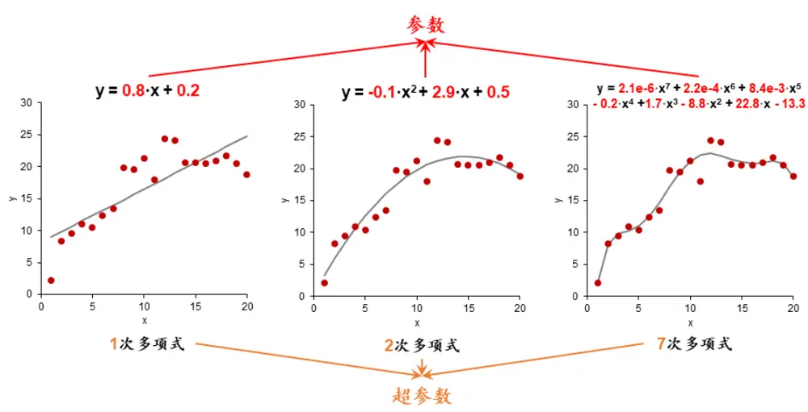
资料来源：华泰证券研究所

支持向量机模型中核函数类型、惩罚系数等，随机森林模型的树棵数、最大特征数、剪枝参数等，XGBoost 模型的学习率、最大树深度、行采样比例等、神经网络模型的网络层数、神经元个数、激活函数类型等，这些都属于模型的超参数。

模型的参数可以从训练集学习到，模型的超参数无法从训练集中直接学习到。模型的超参数应如何学习？在解答这一问题之前，首先要介绍模型超参数选择不当导致的问题——欠拟合和过拟合。

## 欠拟合和过拟合

人们构建和使用机器学习模型时，总是希望模型能够很好地拟合真实数据。“很好地拟合”意味着模型和真实数据的误差较小。误差在统计学习领域的含义较为丰富。对于一般的回归问题，我们通常使用均方误差（mean squared error，MSE）来衡量模型拟合程度的优劣。假设 ${y}_{i}$ 代表第i条样本的真实值，ŷ代表模型对第i条样本的预测值，那么均方误差可以表示为：

$$
MSE=\frac{1}{n}{\sum}^{n}(y_{i}-\widehat{y_{l}})^{2}
$$

从数学期望的角度看：

$$
MSE(\hat{y})=E_{\hat{y}}[(\hat{y}-y)^{2}]
$$

均方误差可以分解为方差（variance）和偏差（bias）：

$$
MSE(\hat{y})=Var_{\hat{y}}(\hat{y})+Bias_{\hat{y}}(\hat{y},y)^{2}
$$

等式右侧第一项方差代表预测值ŷ自身的变异性，第二项偏差代表预测值ŷ和真实值y的整体偏离程度。下图的打靶图形象地说明了两者的区别，小的方差代表射手射得稳，小的偏差代表射手瞄得准。

图表2： 方差（variance）和偏差（bias）
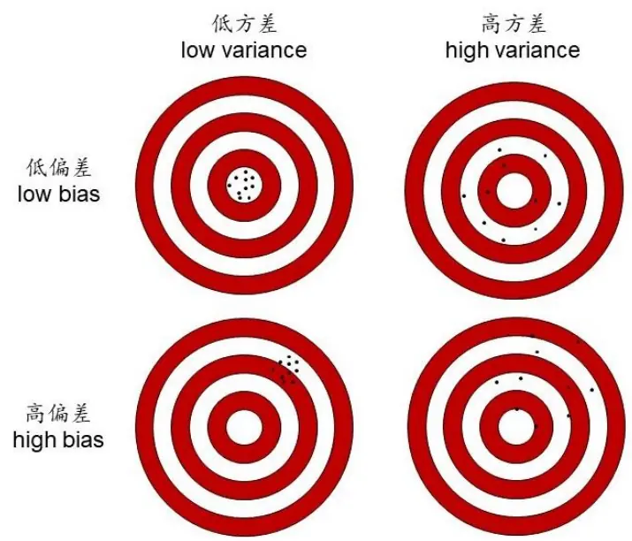
资料来源：华泰证券研究所

进一步看，第一项方差代表我们使用不同训练集时模型表现的差异。由于模型的构建通常和训练集的统计性质有关，不同的训练集会导致模型出现差异。如果某个机器学习方法得到的模型具有较大的方差，训练集只要有少许变化，模型会有很大的改变。复杂的模型一般具有更大的方差。

第二项偏差代表实际模型与理想模型的差别。例如线性模型是最常用的模型之一，而真实世界往往是非常复杂的，当我们用线性模型这样的简单模型去解释世界时，很可能会出现问题。如果我们用复杂度为 2 的线性模型（包含截距和斜率两个参数）拟合一个非线性模型（模型复杂度远大于 2），将产生较大的均方误差，其中很大一部分来源于偏差，这种情况称为欠拟合（underfitting）。当我们不断增加模型的复杂程度，模型的均方误差不断下降，整体表现逐渐提升，主要原因是偏差逐渐下降，说明模型更加符合真实的情况。然而随着模型的复杂程度进一步增加，可以发现样本差异导致的方差急剧上升，说明复杂的模型更多地把握住了属于训练样本独有的特性，而非数据的共性，这种情况称为过拟合（overfitting）。均方误差、方差和偏差随模型复杂度的变化关系如下图所示。

图表3： 均方误差、方差和偏差随模型复杂度的变化关系
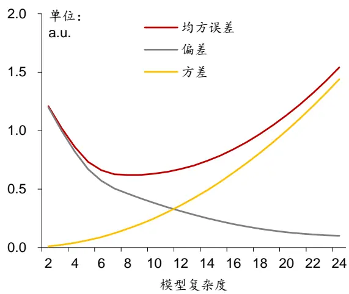
资料来源：华泰证券研究所

机器学习的模型比较环节是一个不断调整模型超参数，最终确定最优超参数的过程。在调参的过程中，模型总是会更好地拟合训练集，类似于上图复杂度逐渐增大的情形。相对于欠拟合来说，此时我们更需要避免的情况是过拟合，即模型的偏差较小而方差过大。通俗地说，过拟合是指模型“记住”了训练样本对应的正确答案，但模型不适用于样本外的数据。

我们再以一个例子展示欠拟合、正常拟合和过拟合三种情况。如下图所示，我们到底用什么形状的边界来划分两个类别的样本？简单的模型只有比较少的参数。如左图的直线，只有两个自由参数。增加参数数量可以让模型学会更复杂的关系。如中间图的二次曲线，包含三个自由参数；右图的高次函数，包含更多自由参数。参数越多，训练样本的错误率就越低。另一方面，更多的参数也让模型记住了更多训练数据特有的特征和噪音，而非挖掘出总体的信号，因此更容易产生过拟合。

图表4： 欠拟合、正常拟合和过拟合示意图
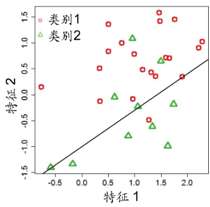
资料来源：华泰证券研究所

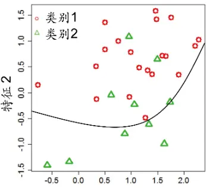
特征1

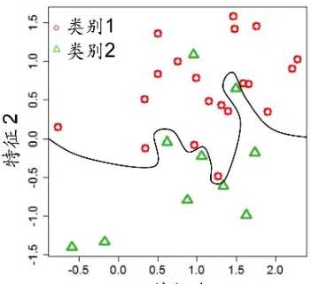

## 交叉验证

避免过拟合的重要方法之一是进行交叉验证（cross-validation）。英国统计学家 MervynStone 和美国统计学家 Seymour Geisser 是交叉验证理论的先驱。交叉验证理论并非仅针对机器学习模型，而是针对任何统计模型。Stone 和 Geisser 在 1974 年分别独立地提出，在评价某个统计模型的表现时，应使用在估计模型环节未使用过的数据。随后 DevijverPierre（1982）、Kohavi Ron（1995）等将交叉验证的思想引入模式识别以及机器学习，在评价机器学习模型表现时，使用不曾在训练环节出现过的样本进行验证。如果模型在验证时性能和训练时大致相同，那么就可以确信模型真的“学会”了如何发现数据中的一般规律，而不是“记住”训练样本。这和学生考试的情形类似，要想考察学生是否掌握了某个知识点，不能使用课堂上讲过的“例题”，而应当使用相似的“习题”。

交叉验证的核心思想是先将全部样本划分成两部分，一部分用来训练模型，称为训练集；另外一部分用来验证模型，称为验证集。随后考察模型在训练集和验证集的表现是否接近。如果两者接近，说明模型具备较好的预测性能；如果训练集的表现远优于验证集，说明模型存在过拟合的风险。当我们需要对不同超参数设置下的多个模型进行比较时，可以考察模型在验证集的表现，选择验证集表现最优的那组超参数作为最终模型的超参数，这一过程称为调参（parameter tuning）。虽然名为“调参”，本质上是“调超参”。

根据训练集和验证集的划分方式，交叉验证方法又可以细分为简单交叉验证、K折交叉验证、留一法、留 P法和时序交叉验证。

## 简单交叉验证

对于训练集和验证集最简单的划分方法是从总样本中随机选取一定比例（如 15%）的样本作为验证集，如下图所示。这种方法称为简单交叉验证，也称为留出法交叉验证（hold-outcross-validation）。其优点在于只需要训练一次模型，速度较快。缺点一是只有一部分数据从未参与训练，可能削弱模型的准确性，在极端情况下，当验证集中数据本身就是整体数据的“噪点”时，模型的准确度将会大大降低；二是最终的模型评价结果可能受到训练集和验证集划分过程中的随机因素干扰。

## K 折交叉验证

针对上述简单交叉验证的缺陷，研究者提出 K折交互验证（K-fold cross-validation）的方法，随机将全体样本分为 K个部分（K在 3~20 之间），每次用其中的一部分作为验证集，其余部分作为训练集。重复 K次，直到所有部分都被验证过。下图展示了 5折交互验证的过程，将全体样本随机划分成 5 个不重叠的部分，每次用 4/5 作为训练集（粉色部分），其余 1/5 部分作为验证集（灰色部分）。最终将得到 5 个验证集的均方误差（或其它损失函数形式），取均值作为验证集的平均表现。

图表5： K折交叉验证示意图（K=5）
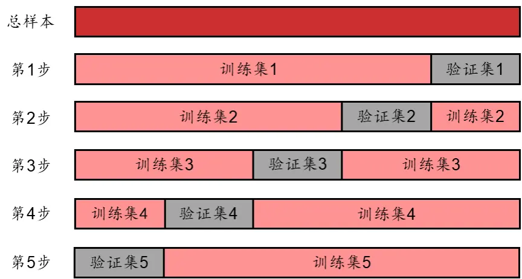
资料来源：华泰证券研究所

## 留一法和留 P 法

除了将样本分成 K个部分，还可以每次取一个固定数目的样本作为验证集。假设样本量为N，如果每次取一个样本验证，把其余样本用来训练，重复 N次，这种方法称为留一法交叉验证（leave-one-out cross-validation，LOOCV）。还可以每次取 P 个样本验证，重复CP次，这种方法称为留 P 法（leave-p-out cross-validation，LPOCV）。留一法和留 P 法适用于样本量较小的情形。当样本量较大时，上述两种方法所需的重复次数较大，运算速度相对较慢，因此通常不采用留一法和留 P法，而是使用 K折交叉验证。

## 时序交叉验证

以上四种传统交叉验证方法成立的前提是样本服从独立同分布。独立是指样本之间不存在相关性，从一条样本无法推知另一条样本的取值；同分布是指包括训练集和验证集在内的全部样本需取自同一分布。当样本是时间序列时，数据随时间演进的过程生成，可能包含周期性、过去和未来数据间相互关系等信息，并不满足交叉验证中数据独立同分布的基本假设。此时如果依然采用传统交叉验证方法，可能会将未来时刻的数据划入训练集，历史时刻的数据划入验证集，进而出现用未来规律预测历史结果的“作弊”行为。因此需要一种既能保证数据利用率，又能保留时序数据之间相互关系的交叉验证方法，这就是时序交叉验证方法（time-series cross-validation），如下图所示。

图表6： 5折时序交叉验证示意图
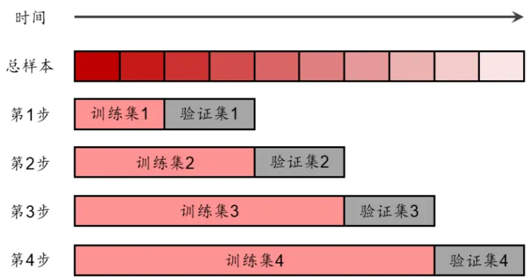
资料来源：华泰证券研究所

我们以上图为例说明时序交叉验证方法。假设样本时间跨度为 10 个月，采用 5 折时序交叉验证，那么首先将样本等分成 5 个部分。以第 1~2 月数据作为训练集，第 3~4 月作为验证集，进行第 1 次验证。再以第 1~4 月数据作为训练集，第 5~6 月为验证集，进行第 2次验证。以此类推，第 4 次验证以第 1~8 月数据作为训练集，第 9~10 月作为验证集。再将总共 4次验证的模型评价指标取平均数。时序交叉验证避免了使用未来信息的可能，对于时序数据的机器学习而言是较为合理的选择。

Tashman（2000）、Varma 和 Simon（2006）和 Bergmeir 和 Benitez（2012）等研究表明，时序交叉验证方法在时序数据上的表现优于传统交叉验证方法。时序特性是金融数据的典型特征，然而时序交叉验证在投资领域的效果尚没有被系统性地测试。本文将对比传统交叉验证方法（以 K折交叉验证为代表）和时序交叉验证方法，在不同领域、不同类型数据上的表现。测试所采用的两大类数据集分别为：机器学习公共数据集、全 A选股数据集。针对每一类数据集，我们将对数据构成、测试方法和测试结果予以介绍。

## 时序交叉验证应用于机器学习公共数据集

## 数据集

本章测试所采用的数据集均来自于加州大学尔湾分校的机器学习公共数据库（https://archive.ics.uci.edu/ml/datasets.html）。截止 2018 年 11 月，该数据库共搜集 450余组机器学习数据集。我们从中选取两组时间序列数据和一组非时间序列数据，比较传统K折交叉验证方法与时序交叉验证方法在三组数据集上的表现。数据集基本信息如下表所示。注意到下表内实际样本内数据量和实际测试集数据量之和小于总数据量，原因在于实际使用时去除了部分包含缺失值的样本。

图表7： 机器学习公共数据集基本信息

| 数据集 | 类别 | 数据下载网址 | 数据量特征数 |  | 实际样本内 | 实际测试集 |  |
| --- | --- | --- | --- | --- | --- | --- | --- |
|  |  |  |  |  |  | 数据量 | 实际使用 数据量 |
| 北京地区 PM2.5 时序 |  | https://archive.ics.uci.edu/ml/datasets/Beijing+PM2.5+Data | 43824 | 7 | 24418 | 17339 | 特征数 6 |
| 办公楼监控管理 | 时序 | https://archive.ics.uci.edu/ml/datasets/Occupancy+Detection+ | 20560 | 5 | 8143 | 9752 | 5 |
| 银行电话营销 | 非时序 | https://archive.ics.uci.edu/ml/datasets/Bank+Marketing | 45211 | 20 | 24000 | 17188 | 5 |

资料来源：UCI机器学习数据库，华泰证券研究所

## 北京地区 PM2.5数据集

该数据集由北京大学陈松蹊等人提供，研究者希望通过包括露点、气温、气压、风向、累积风速、累积降雪天数、累积降雨天数在内共 7项气象指标，预测北京地区 PM2.5 浓度。该数据集的特征为小时频的气象指标，其中风向为类别变量，其余 6 项为连续变量。由于部分机器学习方法不支持类别变量，我们舍弃风向特征，仅使用其余 6项特征。该数据集的原始标签 PM2.5 浓度为连续型变量。实际测试中，我们将 PM2.5 低于 75 的样本标记为正例，PM2.5 大于等于 75 的样本标记为反例，将原先的回归问题转换为分类问题。样本内数据（包含训练集和验证集）时间区间为 2010 年 1 月 2 日 0 时至 2012 年 12 月 31日 23 时，测试集数据时间区间为 2013 年 1 月 1日 0时至 2014 年 12 月 31日 23 时。

图表8： 北京地区 PM2.5数据集部分特征展示
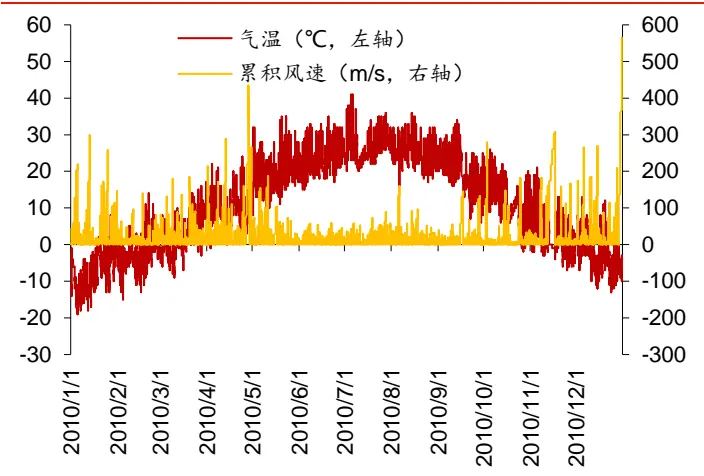
资料来源：UCI机器学习数据库，华泰证券研究所

图表9： 北京地区 PM2.5数据集部分特征自相关系数
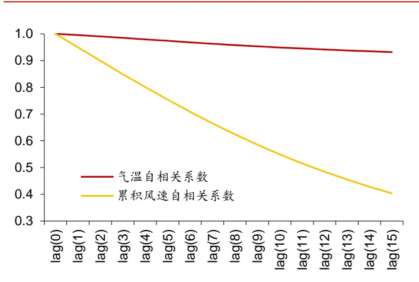
资料来源：UCI机器学习数据库，华泰证券研究所

图表 8展示了气温和累积风速两项特征在部分时间区间内的变化情况。两项特征具有明显的时序特性，为了定量说明特征不满足独立同分布原则中的独立性，我们计算特征的滞后k 期自相关系数。假设广义平稳过程 Xt的均值为 μ，方差为 $\sigma^{2}$ ，则该随机过程滞后 k 期的自相关系数为：

$$
R(k)={\frac{E[(X_{t}-\mu)(X_{t+k}-\mu)]}{\sigma^{2}}}
$$

白噪声（满足独立同分布）的自相关系数为 0；随机过程自相关系数绝对值越大，代表序列相关性越强。图表 9 展示了气温和累积风速两项特征的滞后 0~15 期自相关系数。两项特征表现出较强的序列相关性，不满足传统交叉验证的样本独立同分布假设。

## 办公楼监控管理数据集

该数据集由比利时蒙斯大学的 Luis Candanedo 等人提供，研究者希望采用功耗较小的传感器代替摄像机，利用房间温度、相对湿度、绝对湿度、亮度、二氧化碳浓度 5个指标监控办公室是否有人，以便调节房间空调与照明，实现办公楼节能的效果。该数据集的特征为各类传感器每分钟记录到的读数，标签为该时刻办公室是否有人。样本内数据时间区间为 2015 年 2 月 4 日 17 时至 2015 年 2 月 10 日 9 时，测试集数据时间区间为 2015 年 2月 11 日 15 时至 2015 年 2 月 18 日 9 时。对该数据集的特征进行自相关分析，同样观察到较强的序列相关性，这里不再单独作图说明。

## 银行电话营销数据集

该数据集由里斯本大学的 Sergio Mono 等人提供，研究者希望通过银行电话营销业务的客户信息，预测银行能否将定期存款产品成功推销给客户。该数据集的特征为每位客户的年龄、职业、婚姻状况、教育背景等个人信息，以及此前电话营销的沟通次数、时间间隔、成功与否等信息。我们从全部特征中选取 5项连续型变量作为实际使用的特征。该数据集不包含时序特性，我们按照近似 6:4 的比例随机切分样本内数据集和测试集。对该数据集各项特征进行自相关分析，观察不到序列相关性，这里不再单独作图说明。

## 机器学习方法

对于上述三种数据集，我们分别采用六种机器学习方法：逻辑回归、线性 SVM、高斯核SVM、决策树、随机森林、XGBoost。其中逻辑回归、线性 SVM 模型相对简单，拟合能力不强，过拟合风险相对较低；高斯核 SVM、决策树、随机森林、XGBoost 模型相对复杂，拟合能力较强，过拟合风险相对较高。

样本内数据集和测试集的划分、特征和标签提取环节前文已做介绍，这里不再赘述。由于特征量纲和取值范围不一致，我们对所有特征进行标准化处理，转换为均值为 0、标准差为 1 的标准正态分布。

K 折交叉验证和时序交叉验证均为 10 折。六种机器学习模型包含的超参数个数和调参范围不尽相同。我们采用网格搜索方法进行超参数选择。以 XGBoost 为例，学习速率包含[0.01,0.05,0.1,0.15,0.2]五种可能取值，最大树深包含[3,5,10,15]四种可能取值，行采样比例包含[0.7,0.75,0.8,…,1]七种可能取值，那么三项超参数全部可能的组合数为 5×4×7=140 种。计算每一种超参数组合下的验证集平均正确率。选择正确率最高的一组超参数组合作为最终的模型超参数，以完整的样本内数据集作为训练集，先训练最优模型，再对测试集进行预测。以测试集正确率、AUC 指标评价模型优劣。由于网格搜索及交叉验证方法运算量相对较大，我们统计了每组超参数训练时长，衡量交叉验证方法的时间开销。

六种机器学习模型的超参数和调参范围如下表所示。

图表10： 六种机器学习模型超参数和调参范围

| 基学习器 | 超参数 | 数据集1 调参范围 | 数据集 2 调参范围 | 数据集 3 调参范围 |
| --- | --- | --- | --- | --- |
| 逻辑回归 | 正则化项系数（C） | [1e-5,3e-5,1e-4,,30,100] | [1e-4,3e-4,1e-3,…,0.3,1] | [1e-3,3e-3,6e-3,0.01,…,3,6,10] |
| 线性 SVM | 正则化项系数（C） | [1e-3,3e-3,6e-3,0.01,,3,6,10] |  | [1e-4,3e-4,1e-3,,30,100][1e-3,3e-3,6e-3,0.01,,,3,6,10] |
| 高斯核 SVM | 正则化项系数（C） | [0.01,0.03,0.1,…,30,100] | [0.1,0.3,1,,300,1000] | [0.01,0.03,0.1,,30,100] |
| 决策树 | 核函数系数（γ） | [1e-7,3e-7,1e-6,…,3,10] | [1e-4,3e-4,1e-3,,3,10] | [1e-4,3e-4,1e-3,,3,10] |
|  | 最大树深度(max_depth) | [2,4,6,…,20] | [3,5,10,15,20] | [2,3,4,…,10] |
|  | 最大特征数（max_features） | [2,3,4,5,6] | [2,3,4,5] | [2,3,4,5] |
| 随机森林 | 树棵数（n_estimators） | [5,10,15,20,25,30] | [5,10,15,20,25,30] | [5,10,15,20,25,30] |
|  | 最大特征数（max_features） | [2,3,4,5,6] | [2,3,4,5] | [2,3,4,5] |
|  | 最大树深度（max_depth） | [3,5,10,15,20] | [3,5,10,15,20] | [3,5,10,15,20] |
| XGBoost | 学习速率（learning_rate） | [0.01,0.05,0.1,0.15,0.2] | [0.01,0.05,0.1,0.15,0.2] | [0.01,0.05,0.1,0.15,0.2] |
|  | 最大树深度（max_depth） | [3,5,10,15] | [3,5,10,15] | [3,5,10,15] |
|  | 行采样比例(subsample） | [0.7,0.75,0.8,,1] | [0.7,0.75,0.8,…,1] | [0.7,0.75,0.8,, 1] |

资料来源：华泰证券研究所

## K折与时序交叉验证的结果及比较

## 时间序列数据

首先我们展示北京地区 PM2.5 数据集的分析结果。对于全部六种机器学习模型，K折交叉验证的训练时长约为时序交叉验证的 2 倍（注意图表 11 为对数坐标轴）。同时，K折交叉验证的样本内正确率整体高于时序交叉验证。然而，时序交叉验证的测试集正确率及 AUC高于 K 折交叉验证。两种交叉验证方法测试集正确率及 AUC 的差距在复杂机器学习方法（高斯核 SVM、决策树、随机森林、XGBoost）上尤为明显，而在简单机器学习方法（逻辑回归、线性 SVM）上相差不大。

换言之，将复杂机器学习方法应用于时间序列数据时，传统 K折交叉验证表现出一定的过拟合倾向；而时序交叉验证的过拟合程度较低，泛化能力较强。对于简单机器学习方法而言，由于模型本身拟合能力不强，K折交叉验证和时序交叉验证的表现接近。此外，时序交叉验证在时间开销上也具有一定优势。

图表11： 北京地区 PM2.5数据集两种交叉验证方法训练时长比较
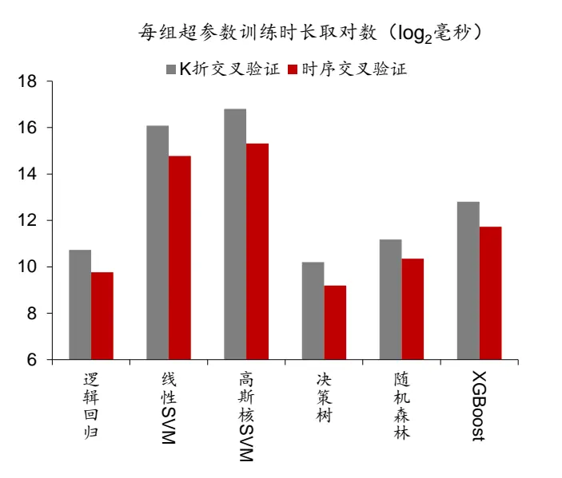
资料来源：UCI机器学习数据库，华泰证券研究所

图表12： 北京地区 PM2.5数据集两种交叉验证方法样本内正确率比较
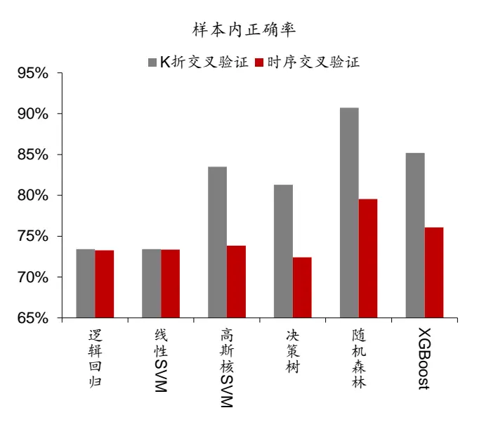
资料来源： 机器学习数据库，华泰证券研究所

图表13： 北京地区 PM2.5数据集两种交叉验证方法测试集正确率比较
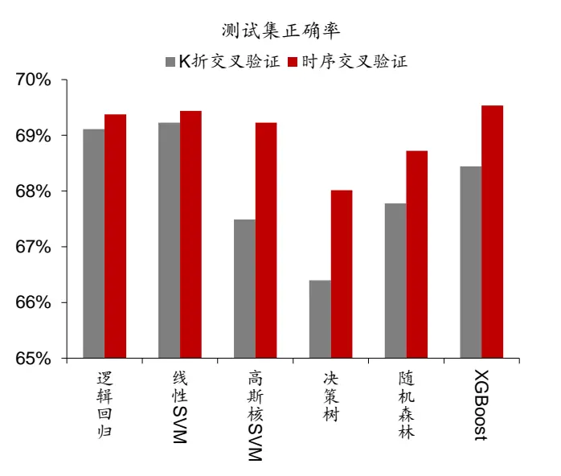
资料来源：UCI机器学习数据库，华泰证券研究所

图表14： 北京地区 PM2.5数据集两种交叉验证方法测试集 AUC比较
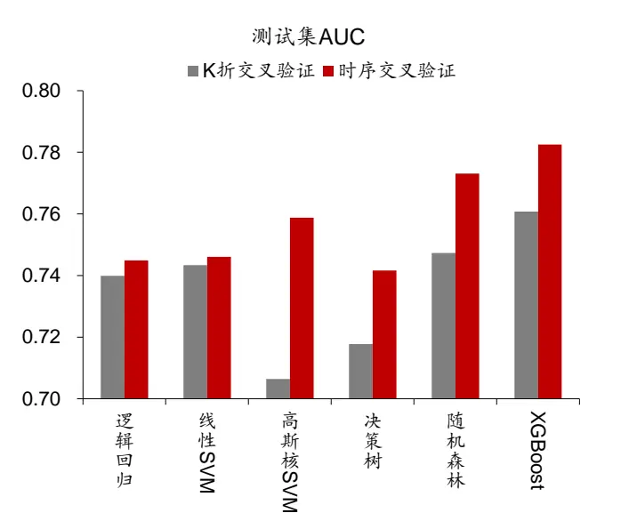
资料来源：UCI机器学习数据库，华泰证券研究所

进而我们展示办公楼监控管理数据集的分析结果。和 PM2.5数据集结果类似，K折交叉验证的训练集正确率更高，而时序交叉验证在测试集上的表现更好。

图表15： 办公楼监控管理数据集两种交叉验证方法训练时长比较
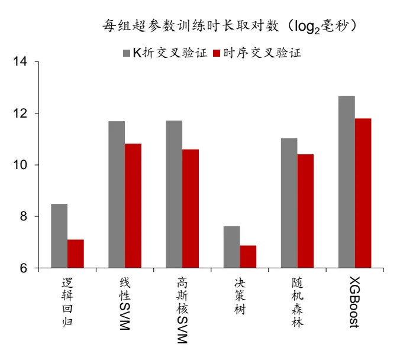
资料来源：UCI机器学习数据库，华泰证券研究所

图表16： 办公楼监控管理数据集两种交叉验证方法样本内正确率比较
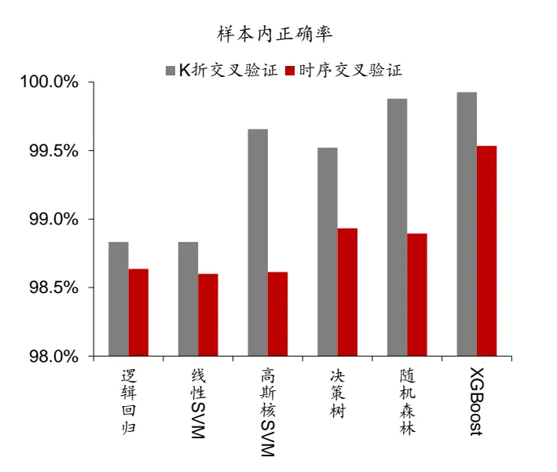
资料来源：UCI机器学习数据库，华泰证券研究所

图表17： 办公楼监控管理数据集两种交叉验证方法测试集正确率比较
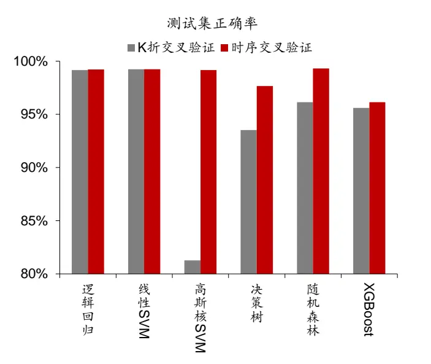
资料来源：UCI机器学习数据库，华泰证券研究所

图表18： 办公楼监控管理数据集两种交叉验证方法测试集 AUC比较
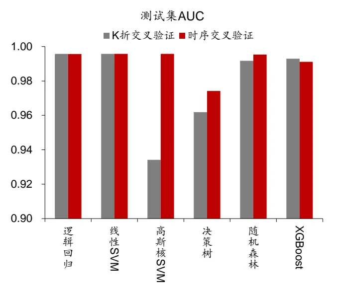
资料来源：UCI机器学习数据库，华泰证券研究所

## 非时间序列数据

最后我们展示银行电话营销数据集的分析结果。从时间开销的角度看，时序交叉验证具备一定优势。从样本内与测试集正确率的角度看，K折交叉验证和时序交叉验证表现整体较为接近。对于 SVM 模型，时序交叉验证的测试集表现稍好；对于随机森林和 XGBoost两类决策树模型的扩展，K折交叉验证的测试集表现稍好。总的来看，两种交叉验证方法在应用于非时间序列数据时，没有表现出明显差异。

图表19： 银行电话营销数据集两种交叉验证方法训练时长比较
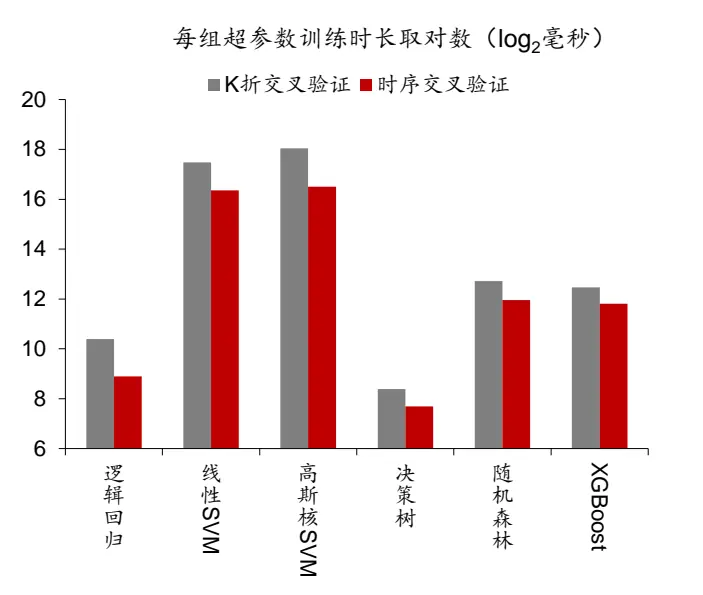
资料来源：UCI机器学习数据库，华泰证券研究所

图表20： 银行电话营销数据集两种交叉验证方法样本内正确率比较
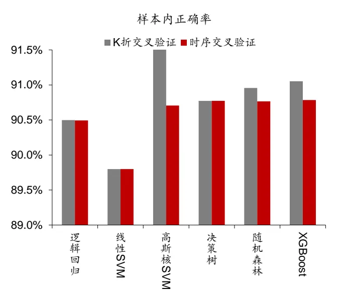
资料来源：UCI机器学习数据库，华泰证券研究所

图表21： 银行电话营销数据集两种交叉验证方法测试集正确率比较
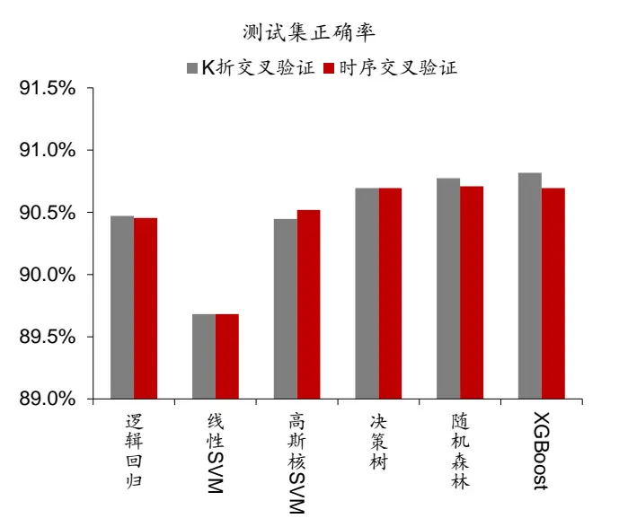
资料来源：UCI机器学习数据库，华泰证券研究所

图表22： 银行电话营销数据集两种交叉验证方法测试集 AUC比较
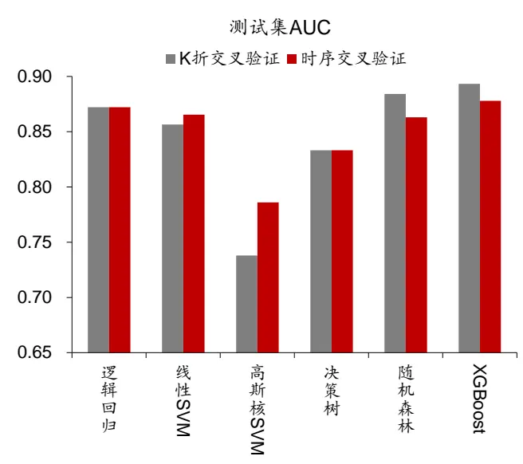
资料来源：UCI机器学习数据库，华泰证券研究所

## 小结

我们将两种交叉验证方法应用于机器学习公开数据库，通过对比分析，得到如下结论：

1. 当数据为时间序列，模型为复杂学习器时，K 折交叉验证表现出过拟合，时序交叉验证在测试集的表现优于 K折交叉验证。

2. 当数据为时间序列，模型为简单学习器时，两种交叉验证方法整体表现接近，时序交叉验证稍占优。

3. 当数据为非时间序列时，两种交叉验证方法表现没有明显差异。

## 时序交叉验证应用于全 A选股数据集

通过比较两种交叉验证方法在机器学习公开数据集上的表现，我们发现当数据具有时序特性时，采用时序交叉验证方法能够有效避免过拟合。上述规律在全 A选股问题上是否仍然成立？我们将在华泰人工智能多因子选股系列研究的基础上，从以下多个方面比较两种交叉验证方法：

1. 从交叉验证方法使用的前提假设看，因子数据是否满足独立同分布，是否具备序列相关性？

2. 从交叉验证选取的最优超参数看，时序交叉验证是否选择了更“简单”的模型？

3. 从模型性能的角度看，时序交叉验证是否能够避免过拟合？其测试集正确率相比传统K折交叉验证是否更高，样本内正确率是否相对较低？

4. 从合成单因子分层回测与构建策略组合回测看，时序交叉验证是否具备优势？

## 人工智能选股模型测试流程

图表23： 人工智能选股模型测试流程示意图
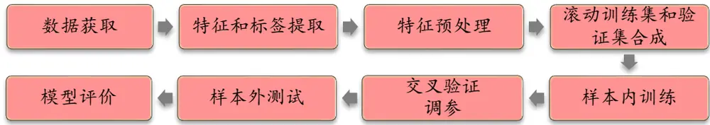
资料来源：华泰证券研究所

本文选用逻辑回归和XGBoost作为基学习器，两者分别作为简单模型和复杂模型的代表。测试流程包含如下步骤：

1． 数据获取：

a) 股票池：全 A股。剔除 ST 股票，剔除每个截面期下一交易日停牌的股票，剔除上市 3个月内的股票，每只股票视作一个样本。

b) 回测区间：2011 年 1 月 31 日至 2018 年 9 月 28 日。

2． 特征和标签提取：每个自然月的最后一个交易日，计算之前报告里的 70 个因子暴露度，作为样本的原始特征，因子池如下表所示。计算下一整个自然月的个股超额收益（以沪深 300 指数为基准），在每个月末截面期，选取下月收益排名前 30%的股票作为正例（y = 1），后 30%的股票作为负例（y = -1），作为样本的标签。

3． 特征预处理：

a) 中位数去极值：设第 T 期某因子在所有个股上的暴露度序列为 $D_{i}$ ， $D_{M}$ 为该序列中位数， $D_{M1}$ 为序列 $|D_{i}-D_{M}|$ 的中位数，则将序列 $D_{i}$ 中所有大于 $D_{M}+5D_{M1}$ 的数重设为 $D_{M}+5D_{M1}$ ，将序列 $D_{i}$ 中所有小于 $D_{M}-5D_{M1}$ 的数重设为 $D_{M}-5D_{M1}$

b)缺失值处理：得到新的因子暴露度序列后，将因子暴露度缺失的地方设为中信一级行业相同个股的平均值；

c) 行业市值中性化：将填充缺失值后的因子暴露度对行业哑变量和取对数后的市值做线性回归，取残差作为新的因子暴露度；

d) 标准化：将中性化处理后的因子暴露度序列减去其现在的均值、除以其标准差，得到一个新的近似服从 N(0, 1)分布的序列。

图表24： 选股模型中涉及的全部因子及其描述

| 大类因子 | 具体因子 | 因子描述 | 因子方向 |
| --- | --- | --- | --- |
| 估值 | EP | 净利润（TTM）/总市值 |  |
| 估值 | EPcut | 扣除非经常性损益后净利润（TTM）/总市值 | 1 |
| 估值 | BP | 净资产/总市值 | 1 |
| 估值 | SP | 营业收入（TTM）/总市值 | 1 |
| 估值 | NCFP | 净现金流（TTM）/总市值 | 1 |
| 估值 | OCFP | 经营性现金流（TTM）/总市值 | 1 |
| 估值 | DP | 近12个月现金红利（按除息日计）/总市值 | 1 |
| 估值 | G/PE | 净利润（TTM）同比增长率/PE_TTM | 1 |
| 成长 | Sales_G_q | 营业收入（最新财报，YTD）同比增长率 | 1 |
| 成长 | Profit_G_q | 净利润（最新财报，YTD）同比增长率 | 1 |
| 成长 | OCF_G_q | 经营性现金流（最新财报，YTD）同比增长率 | 1 |
| 成长 | ROE_G_q | ROE（最新财报，YTD）同比增长率 | 1 |
| 财务质量 | ROE_q | ROE（最新财报，YTD） |  |
| 财务质量 | ROE_ttm | ROE（最新财报，TTM） |  |
| 财务质量 | ROA_q | ROA（最新财报，YTD） | 1 |
| 财务质量 | ROA_ttm | ROA（最新财报，TTM） |  |
| 财务质量 | grossprofitmargin_q | 毛利率（最新财报，YTD） |  |
| 财务质量 | grossprofitmargin_ttm | 毛利率（最新财报，TTM） |  |
| 财务质量 | profitmargin_q | 扣除非经常性损益后净利润率（最新财报，YTD） | 1 |
| 财务质量 | profitmargin_ttm | 扣除非经常性损益后净利润率（最新财报，TTM） |  |
| 财务质量 | assetturnover_q | 资产周转率（最新财报，YTD） |  |
| 财务质量 | assetturnover_ttm | 资产周转率（最新财报，TTM） |  |
| 财务质量 | operationcashflowratio_q | 经营性现金流/净利润（最新财报，YTD） |  |
| 财务质量 | operationcashflowratio_ttm | 经营性现金流/净利润（最新财报，TTM） | 1 |
| 杠杆 | financial_leverage | 总资产/净资产 | -1 |
| 杠杆 | debtequityratio | 非流动负债/净资产 | -1 |
| 杠杆 杠杆 | cashratio | 现金比率 | 1 |
| 市值 | currentratio | 流动比率 | 1 |
| 动量反转 | In_capital | 总市值取对数 | -1 |
| 动量反转 | HAlpha | 个股60个月收益与上证综指回归的截距项 个股最近N个月收益率，N=1，3，6，12 | -1 |
| 动量反转 | return_Nm wgt_return_Nm | 个股最近N个月内用每日换手率乘以每日收益率求算术平均 | -1 -1 |
| 动量反转 exp_wgt_return_Nm |  | 值，N=1，3，6，12 |  |
| 波动率 | std_FF3factor_Nm | 个股最近 N 个月内用每日换手率乘以函数 exp(-x_i/N/4)再乘 |  |
|  |  | 以每日收益率求算术平均值，X_i为该日距离截面日的交易日 |  |
|  |  | 的个数，N=1，3，6，12 特质波动率——个股最近 N 个月内用日频收益率对 Fama |  |
|  |  | French三因子回归的残差的标准差，N=1，3，6，12 | -1 |
| 波动率 股价 | std_Nm | 个股最近N个月的日收益率序列标准差，N=1，3，6，12 | -1 |
| beta | In_price | 股价取对数 | -1 |
| 换手率 | beta | 个股 60个月收益与上证综指回归的 beta | -1 |
|  | turn_Nm | 个股最近N个月内日均换手率(剔除停牌、涨跌停的交易日)， N=1, 3, 6, 12 | -1 |
| 换手率 | bias_turn_Nm | 个股最近N个月内日均换手率除以最近2年内日均换手率(剔 | -1 |
| 情绪 | rating_average | 除停牌、涨跌停的交易日）再减去1，N=1，3，6，12 wind 评级的平均值 | 1 |
| 情绪 | rating_change | wind评级（上调家数-下调家数）/总数 | 1 |
| 情绪 | rating_targetprice | wind一致目标价/现价-1 | 1 |
| 股东 | holder_avgpctchange | 户均持股比例的同比增长率 | 1 |
| 技术 | MACD |  | -1 |
| 技术 | DEA | 经典技术指标（释义可参考百度百科），长周期取30日，短 | -1 |
| 技术 | DIF | 周期取10 日，计算 DEA 均线的周期（中周期）取15 日 | -1 |
| 技术 | RSI | 经典技术指标，周期取20日 | -1 |
| 技术 | PSY | 经典技术指标，周期取20日 | -1 |
| 技术 | BIAS | 经典技术指标，周期取20日 | -1 |

资料来源：Wind，华泰证券研究所

4． 滚动训练集和验证集的合成：由于月度滚动训练模型的时间开销较大，本文采用年度滚动训练方式，全体样本内外数据共分为八个阶段，如下图所示。例如预测 2011 年时，将 2005-2010 年共 72 个月数据合并作为样本内数据集；预测 T 年时，将 T-6 至T-1 年的 72 个月合并作为样本内数据。根据不同的交叉验证方法（K折参考图表 5，时序参考图表 6），划分训练集和验证集。

图表25： 年度滚动训练示意图
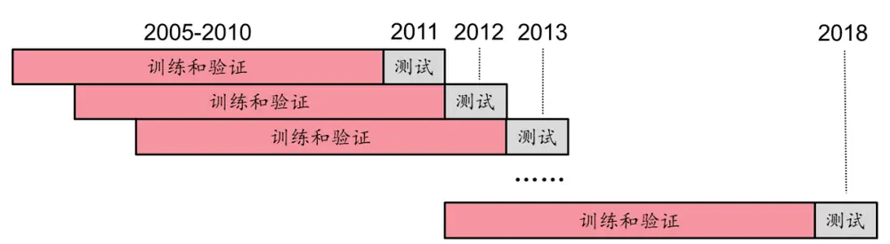
资料来源：华泰证券研究所

5． 样本内训练：使用逻辑回归和 XGBoost 基学习器对训练集进行训练。

6． 交叉验证调参：对全部超参数组合进行网格搜索，选择验证集平均 AUC 最高的一组超参数作为模型最终的超参数。不同交叉验证方法可能得到不同的最优超参数。超参数设置和调参范围如下表所示。

图表26： 全 A选股模型超参数和调参范围

| 基学习器超参数 |  | 调参范围超参数描述 |  |
| --- | --- | --- | --- |
|  | 逻辑回归正则化项系数（C） |  | [1e-4,3e-4,6e-4,8e-4,1e-3,1,3,6,8,10]实际为正则化系数倒数，C越大越容易过拟合 |
| XGBoost | 学习速率(learning_rate） |  | [0.01,0.05,0.1,0.15,0.2]学习速率越小，越容易找到局部最优解，但是越容易过拟合 |
|  | 最大树深度（max_depth） |  | [3,5,10,15,20]树越深，学习能力越强，但是越容易过拟合 |
|  | 行采样比例（subsample） |  | [0.8,0.85,0.9,0.95,1]行采样比例越高越容易过拟合 |

资料来源：华泰证券研究所

7． 样本外测试：确定最优超参数后，以 T 月末截面期所有样本预处理后的特征作为模型的输入，得到每个样本的预测值 f(x)。将预测值视作合成后的因子，进行单因子分层回测，回测方法和之前的单因子测试报告相同。

8． 模型评价：我们以分层回测的结果作为模型筛选标准。我们还将给出测试集的正确率、AUC 等衡量模型性能的指标。

## K折与时序交叉验证的结果及比较

## 因子的时序特性

传统交叉验证的使用前提是样本满足独立同分布。时序交叉验证是针对样本不满足独立同分布时的改进方法。因子数据是否满足独立同分布？我们仍然参考自相关系数的概念，计算邻近截面期因子的相关系数，考察因子是否具备序列相关性。

对于每个因子，我们计算 T 月末截面期及 T-k 月末截面期因子的 Pearson 相关，作为该因子滞后 k 期相关系数。下图展示了 EP、市值、return_1m（1个月反转）因子滞后 1 期和滞后 1~6 期相关系数，以及全部因子的均值。市值因子具有强序列相关性，大多数时期滞后 1~6 期相关系数高于 0.9；以 EP 为代表的基本面类因子同样具有较强的序列相关性，每年 4月末年报发布期会出现短暂下降。以 return_1m 为代表的价量类因子序列相关性相比于基本面类因子而言较低，但仍然稳定大于 0。总的来看，因子数据具备较强序列相关性，不满足传统交叉验证的前提假设。

图表27： 部分因子滞后 1期相关系数
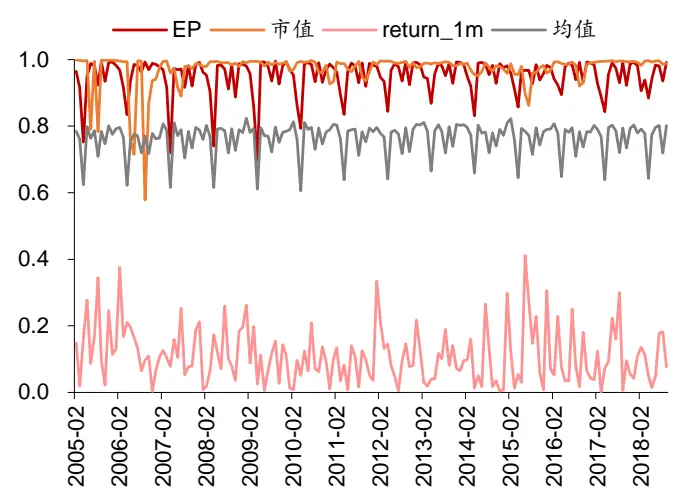
资料来源：Wind，华泰证券研究所

图表28： 部分因子滞后 1~6期相关系数
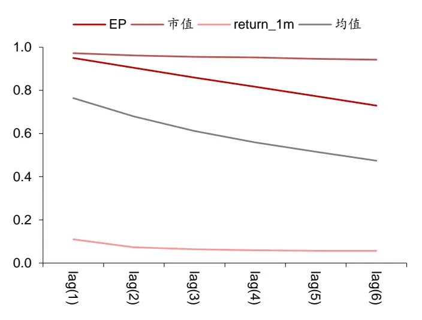
资料来源：Wind，华泰证券研究所

## 模型最优超参数

图表29： 模型历年滚动训练最优超参数

| 交叉验证方法 | 机器学习模型 | 超参数 | 2011 | 2012 | 2013 | 2014 | 2015 | 2016 | 2017 | 2018 |
| --- | --- | --- | --- | --- | --- | --- | --- | --- | --- | --- |
| K折交叉验证 | 逻辑回归 | 正则化项系数（C） | 0.0008 | 0.001 | 0.001 | 0.003 | 0.008 | 0.003 | 0.003 | 0.003 |
|  | XGBoost | 学习速率（learning_rate） | 0.05 | 0.05 | 0.05 | 0.05 | 0.05 | 0.05 | 0.05 | 0.05 |
|  |  | 最大树深度（max_depth） | 10 | 10 | 10 | 10 | 10 | 10 | 10 | 10 |
|  |  | 行采样比例（subsample） | 0.95 | 0.95 | 0.85 | 0.85 | 0.9 | 0.9 | 0.9 | 0.95 |
| 时序交叉验证 | 逻辑回归 | 正则化项系数（C） | 0.0003 | 0.0003 | 0.0003 | 0.0003 | 0.0003 | 0.0001 | 0.0001 | 0.0001 |
|  | XGBoost | 学习速率（learning_rate） | 0.05 | 0.05 | 0.05 | 0.05 | 0.05 | 0.05 | 0.05 | 0.05 |
|  |  | 最大树深度（max_depth） | 3 | 3 | 5 | 5 | 3 | 3 | 3 | 3 |
|  |  | 行采样比例（subsample） | 0.8 | 0.8 | 0.8 | 0.8 | 0.8 | 0.95 | 0.8 | 0.85 |

资料来源：Wind，华泰证券研究所

上表展示了逻辑回归及 XGBoost 历年滚动训练得到的最优超参数。

对于逻辑回归的正则化项系数 C（实际在 scikit-learn 库里为正则化系数的倒数），时序交叉验证得到的超参数值小于 K折交叉验证。C值越小，对正则化项的惩罚越大，模型的拟合能力越弱而泛化能力越强。换言之，时序交叉验证选出的逻辑回归模型更可能出现欠拟合，更不容易出现过拟合。

对于 XGBoost 的三项超参数，和 K 折交叉验证相比，时序交叉验证得到的最大树深度更小，行采样比例更低，学习速率相同。最大树深越小，行采样比例越低，模型的拟合能力越弱而泛化能力越强。换言之，时序交叉验证选出的 XGBoost 模型更可能出现欠拟合，更不容易出现过拟合。

## 机器学习模型性能

两种交叉验证方法历年滚动训练的样本内正确率如下图所示。对于逻辑回归模型，两种方法的样本内正确率接近，K折交叉验证略高，但不超过0.5%。对于 XGBoost 模型，K折交叉验证的样本内正确率在 90%左右，时序交叉验证的样本内正确率在 60%左右。注意到全 A选股问题大部分月份的测试集正确率在 50%至 60%之间，我们认为 K折交叉验证应用于 XGBoost 模型时出现了明显的过拟合。

图表30： 两种交叉验证方法对逻辑回归调参样本内正确率比较
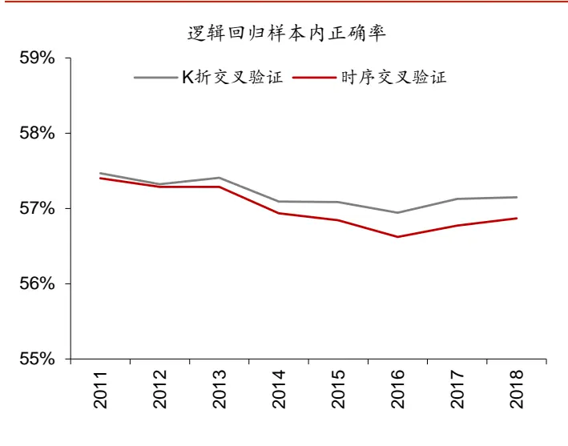
资料来源：Wind，华泰证券研究所

图表31： 两种交叉验证方法对 XGBoost调参样本内正确率比较
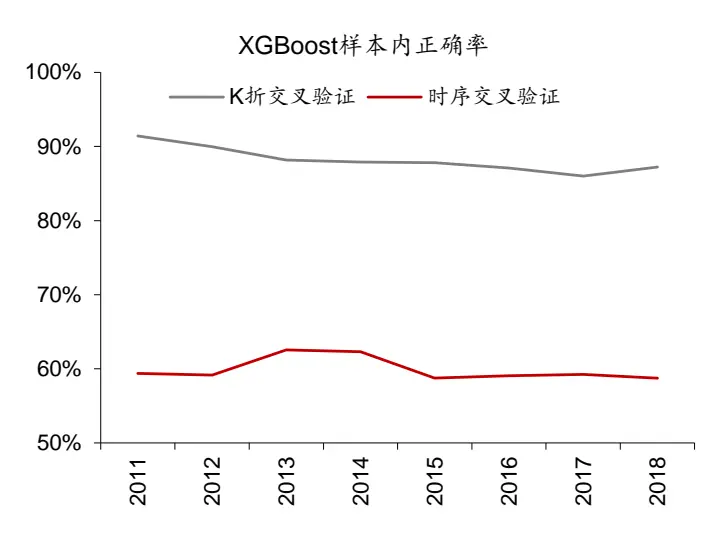
资料来源：Wind，华泰证券研究所

两种交叉验证方法逐月测试集正确率如下图所示。无论是逻辑回归还是 XGBoost 模型，两种交叉验证方法的测试集正确率整体来看都较为接近。计算每个月份时序交叉验证与 K折交叉验证正确率之差，我们发现差值大于 0 的月份占比相对较多，表明大多数月份时序交叉验证在预测集上表现优于 K折交叉验证。

图表32： 两种交叉验证方法对逻辑回归调参测试集正确率比较
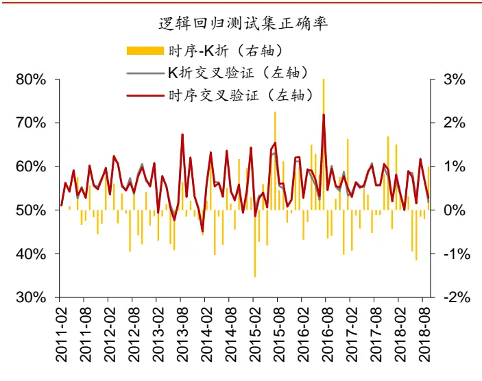
资料来源：Wind，华泰证券研究所

图表33： 两种交叉验证方法对 XGBoost调参测试集正确率比较
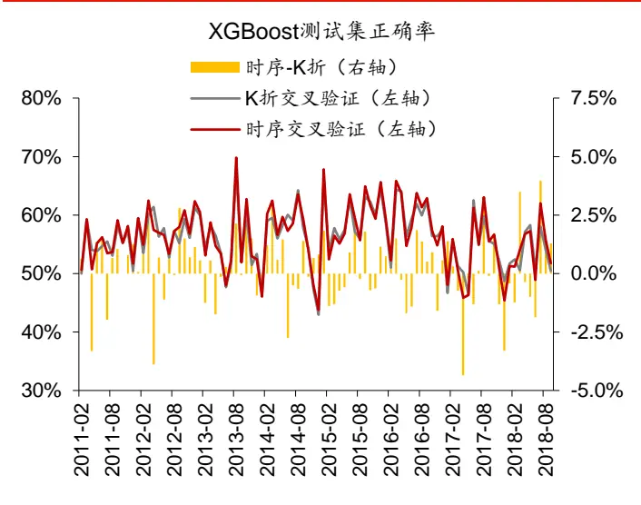
资料来源：Wind，华泰证券研究所

我们对时序交叉验证与 K折交叉验证正确率（及 AUC）之差按月份进行累加，结果如下图所示。从长期来看，时序交叉验证的正确率及 AUC 均优于 K 折交叉验证。对于逻辑回归模型，时序交叉验证的优势主要体现在 2015 至 2017 年。对于 XGBoost 模型，除 2017年两种模型基本持平外，其余时间段时序交叉验证均稳定优于 K折交叉验证。

图表34： 逻辑回归模型累积时序减去 K折正确率及 AUC
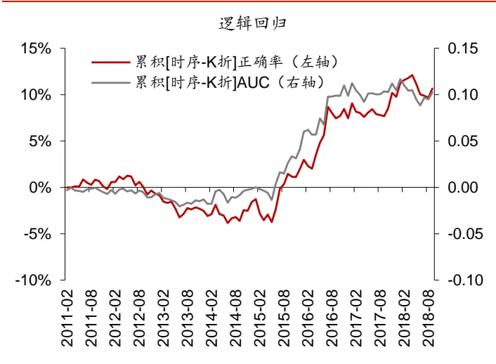
资料来源：Wind，华泰证券研究所

图表35： XGBoost模型累积时序减去 K折正确率及 AUC
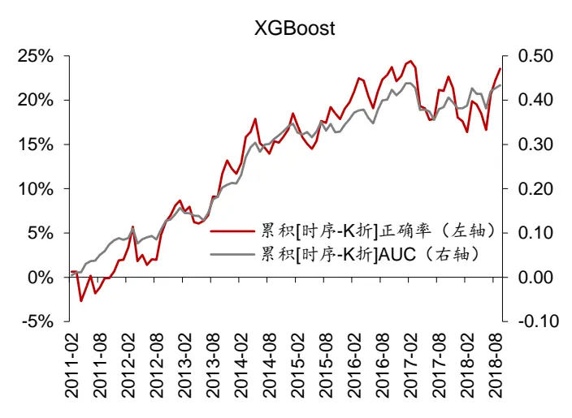
资料来源：Wind，华泰证券研究所

下表展示了两种交叉验证方法模型性能详细结果。

图表36： 两种交叉验证方法模型性能对比

| 基学习器 | 交叉验证方法 | 训练集正确率 | 训练集 AUC | 测试集正确率 | 测试集 AUC |
| --- | --- | --- | --- | --- | --- |
| 逻辑回归 | K折交叉验证 | 57.20% | 0.599 | 56.06% | 0.583 |
| XGBoost | 时序交叉验证 | 57.00% | 0.597 | 56.18% | 0.584 |
|  | K折交叉验证 | 88.20% | 0.954 | 56.20% | 0.588 |
|  | 时序交叉验证 | 59.90% | 0.640 | 56.45% | 0.593 |

资料来源：Wind，华泰证券研究所

如果将模型的输出视为单因子，则可以对该单因子进行 RankIC 值分析。从 RankIC 均值来看，无论是逻辑回归还是 XGBoost 基学习器，时序交叉验证均优于 K 折交叉验证。对于逻辑回归模型，时序交叉验证在 2015 年后展现出优势；对于 XGBoost 模型，时序交叉验证的优势较为稳定。

图表37： 两种交叉验证方法对逻辑回归调参累积 RankIC值
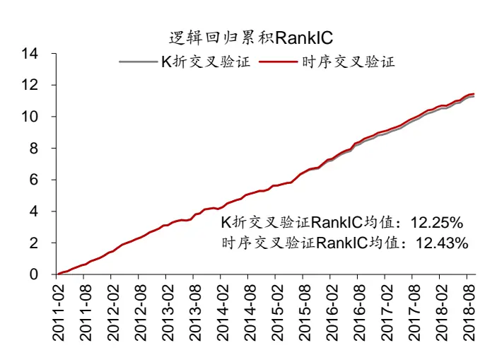
资料来源：Wind，华泰证券研究所

图表38： 两种交叉验证方法对 XGBoost调参累积 RankIC值
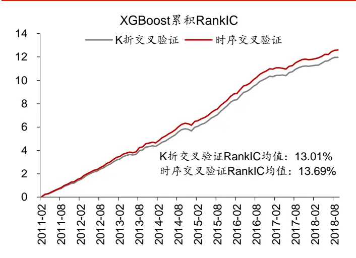
资料来源：Wind，华泰证券研究所

## 单因子分层回测

依照因子值对股票进行打分，构建投资组合回测，是最直观的衡量指标优劣的手段。测试模型构建方法如下：

1. 股票池：全 A 股，剔除 ST 股票，剔除每个截面期下一交易日停牌的股票，剔除上市3 个月以内的股票。

2. 回溯区间：2011-01-31 至 2018-09-28。

3. 换仓期：在每个自然月最后一个交易日核算因子值，在下个自然月首个交易日按当日收盘价换仓。

4. 数据处理方法：将机器学习模型对股票下期上涨概率的预测值视作单因子，因子值为空的股票不参与分层。

5. 分层方法：在每个一级行业内部对所有个股按因子大小进行排序，每个行业内均分成N 个分层组合。如下图所示，黄色方块代表各行业内个股初始权重，可以相等也可以不等（我们直接取相等权重进行测试），分层具体操作方法为 N 等分行业内个股权重累加值，例如图示行业 1 中，5 只个股初始权重相等（不妨设每只个股权重为 0.2），假设我们欲分成 3 层，则分层组合 1在权重累加值 1/3 处截断，即分层组合 1包含个股 1 和个股 2，它们的权重配比为 0.2:(1/3-0.2)=3:2，同样推理，分层组合 2 包含个股 2、3、4，配比为(0.4-1/3):0.2:(2/3-0.6)=1:3:1，分层组合 4 包含个股 4、5，配比为 2:3。以上方法是用来计算各个一级行业内部个股权重配比的，行业间权重配比与基准组合（我们使用沪深 300）相同，也即行业中性。

6. 评价方法：回测年化收益率、夏普比率、信息比率、最大回撤、胜率等。

图表39： 单因子分层测试法示意图
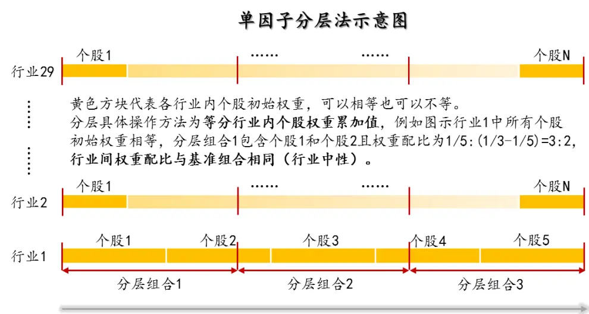
行业内个股按因子值排序
资料来源：华泰证券研究所

这里我们将展示时序交叉验证应用于 XGBoost 模型的分层测试结果。下图是分五层组合回测绩效分析表（20110131～20180928）。其中组合 1～组合 5为按该因子从小到大排序构造的行业中性的分层组合。基准组合为行业中性的等权组合，具体来说就是将组合 1～组合 5合并，一级行业内部个股等权配置，行业权重按当期沪深 300 行业权重配置。多空组合是在假设所有个股可以卖空的基础上，每月调仓时买入组合 1，卖空组合 5。回测模型在每个自然月最后一个交易日核算因子值，在下个自然月首个交易日按当日收盘价调仓。

图表40： 时序交叉验证应用于 XGBoost 模型分层组合绩效分析（20110131～20180928）

| 投资组合 | 年化收益率 | 年化波动率夏普比率最大回撤 |  |  | 年化超额收益率 | 超额收益年化波动率信息比率 |  | 相对基准月胜率 | 超额收益最大回撤 |
| --- | --- | --- | --- | --- | --- | --- | --- | --- | --- |
| 组合1 | 21.15% | 26.47% | 0.80 | 47.32% | 14.93% | 3.49% | 4.28 | 81.52% | 3.73% |
| 组合2 | 11.37% | 25.71% | 0.44 | 46.35% | 5.65% | 2.65% | 2.13 | 78.26% | 4.31% |
| 组合3 | 5.69% | 25.52% | 0.22 | 47.64% | 0.26% | 2.46% | 0.11 | 44.57% | 8.63% |
| 组合4 | 1.71% | 25.56% | 0.07 | 57.94% | -3.52% | 2.78% | -1.27 | 33.70% | 24.76% |
| 组合5 | -10.76% | 27.20% | -0.40 | 74.32% | -15.34% | 4.32% | -3.55 | 10.87% | 71.33% |
| 基准组合 | 5.41% | 25.90% | 0.21 | 52.14% |  |  |  |  |  |
| 多空组合 | 35.75% | 6.78% | 5.28 | 7.26% |  |  |  |  |  |

资料来源：Wind，华泰证券研究所

下面四个图依次为：

1.分五层组合回测净值图。按前面说明的回测方法计算组合 1～组合 5、基准组合的净值，与沪深 300、中证 500 净值对比作图。

2.分五层组合回测，用组合 1～组合 5的净值除以基准组合净值的示意图。可以更清晰地展示各层组合在不同时期的效果。

3.组合 1相对沪深 300 月超额收益分布直方图。该直方图以[-0.5%,0.5%]为中心区间，向正负无穷方向保持组距为 1%延伸，在正负两个方向上均延伸到最后一个频数不为零的组为止（即维持组距一致，组数是根据样本情况自适应调整的）。

4.分五层时的多空组合收益图。再重复一下，多空组合是买入组合 1、卖空组合 5（月度调仓）的一个资产组合。多空组合收益率是由组合 1 的净值除以组合 5的净值近似核算的。

图表41： 时序交叉验证应用于 XGBoost模型分层组合回测净值
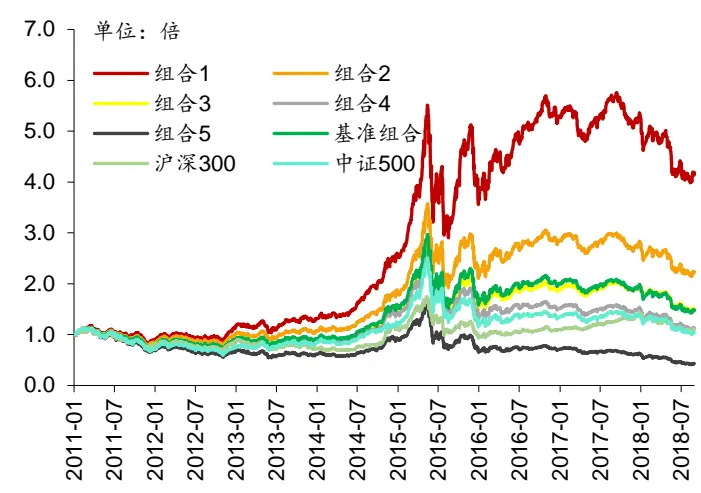
资料来源：Wind，华泰证券研究所

图表42： 时序验证 XGBoost各层组合净值除以基准组合净值示意图
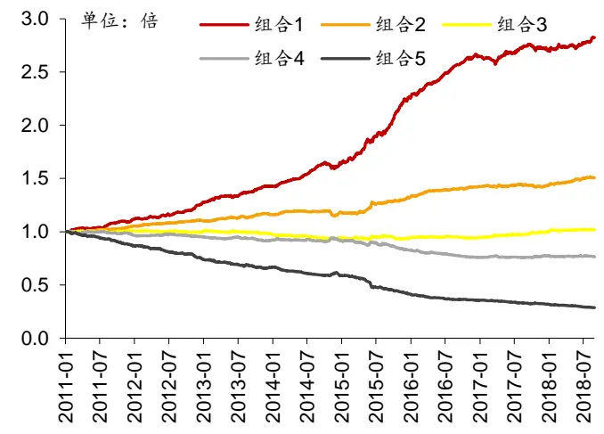
资料来源：Wind，华泰证券研究所

图表43： 时序验证 XGBoost分层组合 1相对沪深 300月超额收益分布
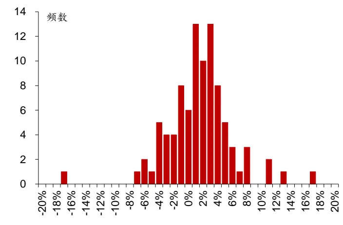
资料来源：Wind，华泰证券研究所

图表44： 时序验证 XGBoost多空组合月收益率及累积收益率
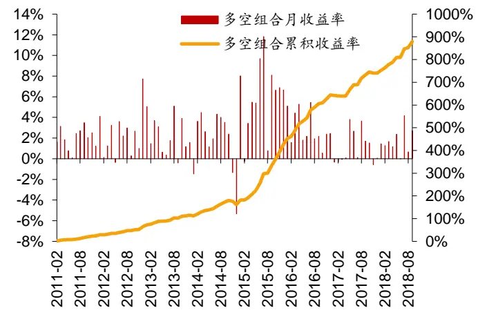
资料来源：Wind，华泰证券研究所

我们将两种交叉验证方法应用于逻辑回归以及 XGBoost 的单因子分层回测多空组合表现整合到下表（注意多空组合年化波动率、最大回撤的数值越小，色阶越偏红）。无论是逻辑回归还是 XGBoost，相比于传统 K 折交叉验证，时序交叉验证都具有更高的年化收益率、更小的最大回撤、更高的 Calmar 比率以及更高的年化波动率。时序交叉验证对于复杂模型 XGBoost 的提升更明显，Calmar 比率提升 77%，年化收益率提升 22%，夏普比率提升 14%。时序交叉验证对于简单模型逻辑回归的提升相对不明显。

图表45： 两种交叉验证方法单因子分层回测结果对比

| 基学习器 | 交叉验证方法 | 多空组合 年化收益率 | 多空组合 年化波动率 | 多空组合 夏普比率 | 多空组合 最大回撤 | 多空组合 Calmar 比率 |
| --- | --- | --- | --- | --- | --- | --- |
| 逻辑回归 | K折交叉验证 | 29.08% | 8.36% | 3.48 | 11.66% | 2.49 |
|  | 时序交叉验证 | 29.18% | 8.59% | 3.40 | 11.57% | 2.52 |
|  | K折交叉验证 | 29.29% | 6.34% | 4.62 | 10.49% | 2.79 |
| XGBoost | 时序交叉验证 | 35.75% | 6.78% | 5.28 | 7.26% | 4.93 |

资料来源：Wind，华泰证券研究所

## 构建策略组合及回测分析

基于两种交叉验证方法，我们构建了行业、市值中性全 A选股策略并进行回测。首先考察基学习器为逻辑回归的情形，如下表所示（注意超额收益最大回撤的数值越小，色阶越偏红）。当行业市值中性基准为沪深 300 时，相比于传统 K折交叉验证，时序交叉验证在年化超额收益率、超额收益最大回撤、信息比率、Calmar 比率上稍有优势。当行业市值中性基准为中证 500 时，两种交叉验证方法没有明显差异。

图表46： 基于两种交叉验证方法构建全 A选股策略回测指标对比（逻辑回归为基学习器，回测期 20110131～20180928）
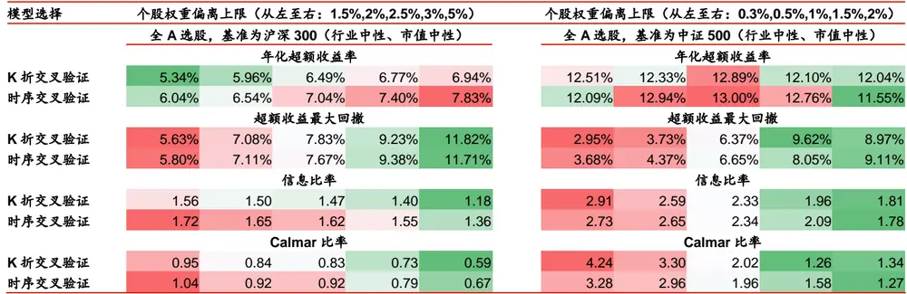
资料来源：Wind，华泰证券研究所

其次考察基学习器为XGBoost的情形。无论行业市值中性基准选取沪深300还是中证500，相比于传统 K折交叉验证，时序交叉验证在年化超额收益率、信息比率上都具备明显优势。当行业市值中性基准为沪深 300 时，时序交叉验证在超额收益最大回撤、Calmar 比率上同样具有优势。当行业市值中性基准为中证 500 时，时序交叉验证在控制回撤上无优势。

图表47： 基于两种交叉验证方法构建全 A选股策略回测指标对比（XGBoost为基学习器，回测期 20110131～20180928）
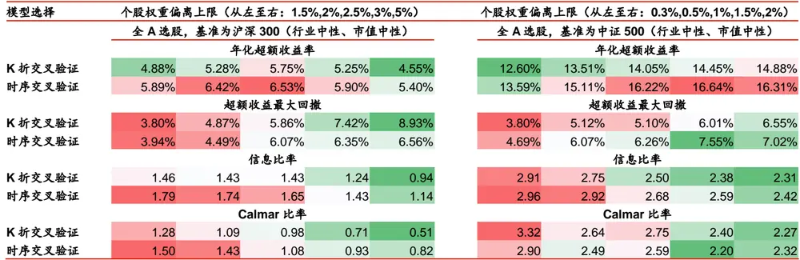
资料来源：Wind，华泰证券研究所

我们有选择性地展示两个策略的超额收益表现，如下图所示。

图表48： 两种交叉验证方法应用于 XGBoost全 A选股策略表现（个股权重偏离上限 2%，基准为沪深 300）
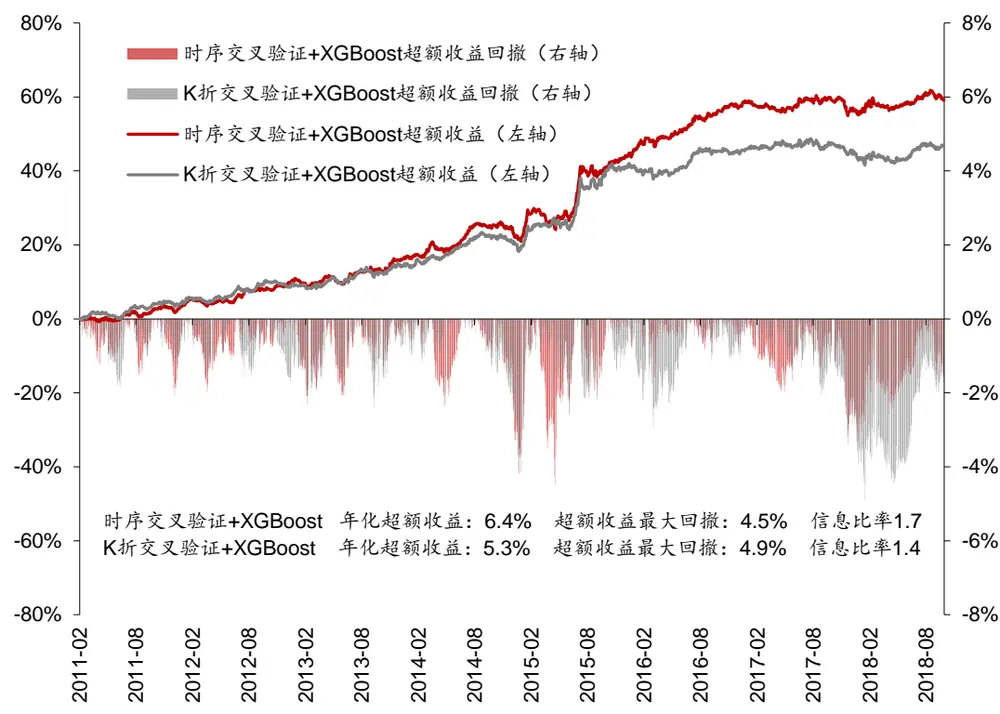
资料来源：Wind，华泰证券研究所

图表49： 两种交叉验证方法应用于 XGBoost全 A选股策略表现（个股权重偏离上限 1%，基准为中证 500）
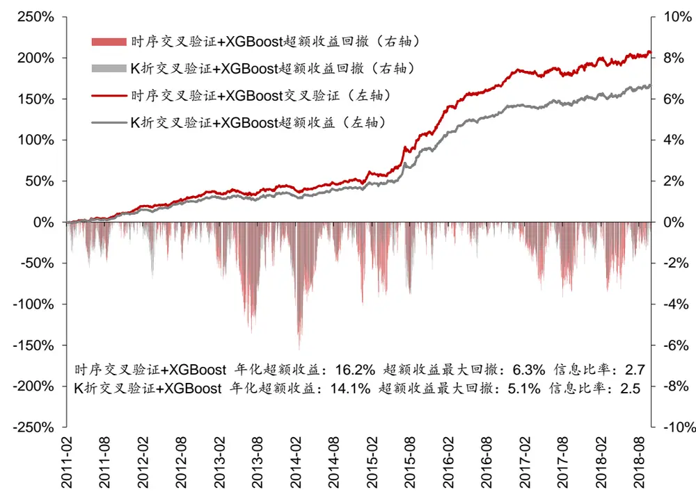
资料来源：Wind，华泰证券研究所

## 小结

我们将两种交叉验证方法应用于全 A选股，通过对比分析，得到如下结论：

1. 从交叉验证方法使用的前提假设看，因子数据具备较强的序列相关性，不满足传统交叉验证所需要的样本独立同分布原则。

2. 从交叉验证选取的最优超参数看，相比传统 K折交叉验证，时序交叉验证得到的逻辑回归模型正则化项系数 C 更小，XGBoost 模型树深度和行采样比例更低，表明时序交叉验证选择了更“简单”的模型，更不容易出现过拟合。

3. 从模型性能的角度看，时序交叉验证方法的测试集正确率、AUC 和 RankIC 值更高，样本内正确率更低，表明时序交叉验证的过拟合程度较低，而 K折交叉验证表现出明显的过拟合。

4. 从合成单因子分层回测及构建策略组合回测看，对于简单的逻辑回归模型，时序交叉验证与 K 折交叉验证表现接近；对于复杂的 XGBoost 模型，时序交叉验证具备明显优势。

## 总结和展望

金融市场远比我们想象的复杂。人们在传统机器学习领域实践所积累的经验和认知，切换到金融市场里未必如此理所当然。在本文的研究过程中，对于传统 K折交叉验证所表现出的相对较高的过拟合程度，是我们始料未及的。本研究探讨了传统机器学习技术应用于金融市场时可能遇到的问题和解决方法，从方法论的层面拓展了我们对机器学习技术的理解。

通过对两种交叉验证方法的多角度比较，我们得到以下重要结论：

1. 无论是对于机器学习公开数据库的时序数据集，还是对于真实全 A选股数据集，时序交叉验证相比于 K折交叉验证的样本内表现相对较差，测试集表现更好，更倾向于选择超参数“简单”的模型，体现出更低的过拟合程度。

2. 时序与 K 折交叉验证的差异在逻辑回归等简单模型上体现不明显，而在 XGBoost 等复杂模型上体现较为明显。复杂模型更易表现出过拟合，时序交叉验证能够带来更大提升。

3. 合成单因子分层回测以及构建策略组合回测表明，时序交叉验证在获取收益方面具备明显优势，在控制回撤方面具有一定优势。

## 本研究存在以下的不足和改进之处：

1. 样本内数据集的时间长度为 72 个月，在进行 10折切分时，会出现同一月份数据分属不同“折”的情况，相当于仍有少数个别月份的数据既出现在训练集又出现验证集，违背了时序交叉验证的本意。当样本内数据集为 60 个月时进行 10 折时序交叉验证，或者当样本内数据集为 72 个月时进行 12折时序交叉验证，可能更为合理。

2. 理论上，时序交叉验证更不容易发生过拟合，那么在 2014 年底以及 2017 年的极端行情下，模型表现应更好，回撤也应更小。然而实际上，时序交叉验证得到的模型在极端行情下同样表现出一定回撤。回撤与过拟合的关系可能比我们此前所理解的更为复杂。要回答这一问题，可能需要深入分析极端行情下模型的具体结构以及持仓情况，从而了解时序交叉验证出现回撤的真实原因。

3. 关于时序交叉验证为何在处理时序数据上优于 K折交叉验证，在我们所阅读的文献范围内，暂时未找到理论上的推导证明，多数研究仅从实证的角度说明。未来如能从理论上论证时序交叉验证能够避免时序数据机器学习的过拟合，将是对本文很好的补充。

## 未来的研究方向包括以下几方面：

1. 除了机器学习模型涉及到超参数选择以外，很多量化策略也都涉及参数寻优。即使如简单的布林带择时模型，策略表现也高度依赖于布林带宽度、移动平均时间窗的设定。传统的参数寻优方法是将全部样本按时间先后分为样本内和样本外，寻找使得策略在样本内表现最好的参数，最终应用于样本外，类似于机器学习里的简单交叉验证。我们可以借鉴时序交叉验证的思路，将样本内数据按时序切分为若干折，寻找使得策略在多个验证集平均表现最好的参数，从而提升策略的稳定性，避免过拟合的发生。未来我们将探讨时序交叉验证思想在量化择时等领域的应用。

2. 目前我们采用网格搜索方法进行调参，网格搜索本质上属于穷举式的搜索，优点是更易找到全局最优解，缺点是时间开销较大。除了网格搜索方法外，遗传算法等其它优化算法也常用于机器学习模型调参，未来我们将对这些方法进行尝试探索。

3. 如何避免过拟合是机器学习的核心问题，本文仅就时序交叉验证一种方法进行探讨。未来我们将介绍和测试更多防范过拟合的方法，如引入 Dropout、引入噪声、提前终止学习（earlystopping）、学习器组合和集成等。我们希望澄清一部分投资者关于“机器学习等于过拟合”的误解，提升机器学习模型的稳健性和泛化能力，努力推动机器学习在投资领域的应用。

## 风险提示

时序交叉验证方法是对传统模型调参方法的改进，高度依赖基学习器表现。该方法是对历史投资规律的挖掘，若未来市场投资环境发生变化导致基学习器失效，则该方法存在失效的可能。时序交叉验证方法存在一定欠拟合风险。

## 免责申明

本报告仅供华泰证券股份有限公司（以下简称“本公司”）客户使用。本公司不因接收人收到本报告而视其为客户。

本报告基于本公司认为可靠的、已公开的信息编制，但本公司对该等信息的准确性及完整性不作任何保证。本报告所载的意见、评估及预测仅反映报告发布当日的观点和判断。在不同时期，本公司可能会发出与本报告所载意见、评估及预测不一致的研究报告。同时，本报告所指的证券或投资标的的价格、价值及投资收入可能会波动。本公司不保证本报告所含信息保持在最新状态。本公司对本报告所含信息可在不发出通知的情形下做出修改，投资者应当自行关注相应的更新或修改。

本公司力求报告内容客观、公正，但本报告所载的观点、结论和建议仅供参考，不构成所述证券的买卖出价或征价。该等观点、建议并未考虑到个别投资者的具体投资目的、财务状况以及特定需求，在任何时候均不构成对客户私人投资建议。投资者应当充分考虑自身特定状况，并完整理解和使用本报告内容，不应视本报告为做出投资决策的唯一因素。对依据或者使用本报告所造成的一切后果，本公司及作者均不承担任何法律责任。任何形式的分享证券投资收益或者分担证券投资损失的书面或口头承诺均为无效。

本公司及作者在自身所知情的范围内，与本报告所指的证券或投资标的不存在法律禁止的利害关系。在法律许可的情况下，本公司及其所属关联机构可能会持有报告中提到的公司所发行的证券头寸并进行交易，也可能为之提供或者争取提供投资银行、财务顾问或者金融产品等相关服务。本公司的资产管理部门、自营部门以及其他投资业务部门可能独立做出与本报告中的意见或建议不一致的投资决策。

本报告版权仅为本公司所有。未经本公司书面许可，任何机构或个人不得以翻版、复制、发表、引用或再次分发他人等任何形式侵犯本公司版权。如征得本公司同意进行引用、刊发的，需在允许的范围内使用，并注明出处为“华泰证券研究所”，且不得对本报告进行任何有悖原意的引用、删节和修改。本公司保留追究相关责任的权力。所有本报告中使用的商标、服务标记及标记均为本公司的商标、服务标记及标记。

本公司具有中国证监会核准的“证券投资咨询”业务资格，经营许可证编号为：91320000704041011J。

全资子公司华泰金融控股（香港）有限公司具有香港证监会核准的“就证券提供意见”业务资格，经营许可证编号为：AOK809

©版权所有 2018年华泰证券股份有限公司

## 评级说明

## 行业评级体系

－报告发布日后的6个月内的行业涨跌幅相对同期的沪深300指数的涨跌幅为基准；

－投资建议的评级标准

增持行业股票指数超越基准

中性行业股票指数基本与基准持平

减持行业股票指数明显弱于基准

## 公司评级体系

－报告发布日后的6个月内的公司涨跌幅相对同期的沪深300指数的涨跌幅为基准；
－投资建议的评级标准
买入股价超越基准 20%以上
增持股价超越基准 5%-20%
中性股价相对基准波动在-5%~5%之间
减持股价弱于基准 5%-20%
卖出股价弱于基准 20%以上

## 华泰证券研究

## 南京

南京市建邺区江东中路228号华泰证券广场1号楼/邮政编码：210019

电话：86 25 83389999 /传真：86 25 83387521

电子邮件：ht-rd@htsc.com

## 深圳

深圳市福田区深南大道4011号香港中旅大厦24层/邮政编码：518048

电话：86 755 82493932 /传真：86 755 82492062

电子邮件：ht-rd@htsc.com

## 北京

北京市西城区太平桥大街丰盛胡同28号太平洋保险大厦A座18层

邮政编码：100032

电话：86 10 63211166/传真：86 10 63211275

电子邮件：ht-rd@htsc.com

## 上海

上海市浦东新区东方路18号保利广场E栋23楼/邮政编码：200120

电话：86 21 28972098 /传真：86 21 28972068

电子邮件：ht-rd@htsc.com