## 金工研究/深度研究

2019年02月13日

林晓明 执业证书编号：S0570516010001

研究员 0755-82080134

陈烨 执业证书编号：S0570518080004

研究员 010-56793942

chenye@htsc.com

李子钰 0755-23987436

联系人 liziyu@htsc.com

## 何康

联系人 hekang@htsc.com

2《金工: 因子合成方法实证分析》2019.01

# 人工智能选股之卷积神经网络

# 华泰人工智能系列之十五

## 卷积神经网络引领深度学习的发展，能够运用于多因子选股

卷积神经网络（CNN）是目前最为成熟的深度学习模型，是近年来人工智能蓬勃发展的重要推手之一，其主要特点是通过卷积和池化操作进行自动的特征提取和特征降维。本文首先通过原理分析给出了 CNN 运用于多因子选股的经验方法；然后在全 A 股票池内对 CNN 的预测结果进行单因子测试，其单因子测试结果相比对比模型具有良好表现；本文还构建了行业、市值中性全 A 选股策略并进行回测，CNN 在以中证 500 为基准的全 A 选股测试中相比对比模型表现优秀。

## 本文通过原理分析总结了卷积神经网络运用于多因子选股的经验方法

将卷积神经网络运用于多因子选股时，通过分析其工作原理，我们总结出以下经验：（1）股票因子数据可以组织成二维的“图片”形式，这使得 CNN具有了时间序列学习的能力。（2）当卷积核作用于股票因子数据时，本质上是在进行因子合成，因此本文只使用了一层卷积层。（3）池化层是对因子数据的“模糊化”，这对体现因子的明确意义是不利的，因此本文未使用池化层。（4）因子数据在“图片”中的排列顺序会影响到CNN的学习结果。

## 卷积神经网络合成因子的单因子测试具有良好表现

我们构建了卷积神经网络、全连接神经网络、线性回归三个模型，在2011-01-31 至 2019-1-31 的回测区间中分年度进行训练和测试，样本空间为全 A 股。从单因子测试的角度来看，CNN 合成因子的 RankIC 均值为13.62%，因子收益率均值为 1.021%，略高于全连接神经网络，也要高于线性回归。在分五层测试中，CNN 合成因子的 TOP 组合年化收益率为20.05%，夏普比率为 0.72，信息比率为 4.04，多空组合的夏普比率为 4.84，表现都要优于全连接神经网络和线性回归。

## 卷积神经网络在以中证 500 为基准的全 A选股测试中表现优秀

基于卷积神经网络、全连接神经网络和线性回归，我们构建了行业、市值中性全 A 选股策略并进行回测。在 2011-01-31 至 2019-1-31 的回测区间中，当以沪深 300 为基准时，两种神经网络在年化超额收益率、信息比率和 Calmar 比率上的表现都不如线性回归。当以中证 500 为基准时，CNN的年化超额收益在 13.69%~16.38%之间，超额收益最大回撤在4.80%~7.55%之间，信息比率在 2.29~2.56 之间，Calmer 比率在 2.16~2.85之间，CNN 在以上各项指标上的表现都优于另外两个模型，全连接神经网络略优于线性回归。

## 卷积神经网络仍有进一步研究的空间

随着 ImageNet 旗下的大规模视觉识别挑战赛（ILSVRC）连续数年的推动，卷积神经网络正在日新月异地进步中，还有诸多技术值得我们学习和尝试，例如增大训练样本数量的“数据增强”方法；ResNet 中的残差学习方法；Inception 网络中的多种尺寸卷积核混合的方法等等。此外，在高频、海量的金融数据中使用 CNN 也是一个值得尝试的方向。

风险提示：通过卷积神经网络构建的选股策略是历史经验的总结，存在失效的可能。卷积神经网络模型可解释程度较低，使用须谨慎。

## 本文研究导读

在本系列前期的报告中，我们分别介绍了全连接神经网络和循环神经网络在人工智能选股方面的应用，除此之外，本文还将介绍卷积神经网络的应用。卷积神经网络在最近几年得到了长足的发展，是人工智能研究的领头羊，目前主要应用于计算机视觉、自然语言处理等领域，是相关技术最为成熟的神经网络模型。那么卷积神经网络如何应用于多因子选股中呢？本文将主要关注以下问题：

1． 卷积神经网络原理是什么？相比于全连接神经网络，有何特色？

2． 卷积神经网络结构特殊，如何构建股票的因子数据来训练模型？这种构建方法的内在含义是什么？

3． 卷积神经网络的参数如何设置？模型的如何训练，全部 A 股票池内选股效果如何？

## 卷积神经网络简介

卷积神经网络（Convolutional Neural Network, CNN），是计算机视觉研究和应用领域中最具影响力的模型。回顾 CNN 的发展历史，可以看到一座座令人赞叹的里程碑。YannLecun 等人在 1989 年提出基于梯度下降的 CNN 算法，并成功地将其应用在手写数字字符识别，在当时的技术和硬件条件就能取得低于 1%的错误率。2012 年，在计算机视觉“世界杯”之称的 ImageNet 图像分类竞赛四周年，Geoffery E.Hinton 等人凭借卷积神经网络AlexNet 以超过第二名近 12%的准确率一举夺得该竞赛冠军，引起广泛关注，自此揭开了CNN在计算机视觉领域逐渐称霸的序幕，此后每年的ImageNet竞赛的冠军非CNN莫属。2015 年，CNN 在 ImageNet 数据集上的错误率（3.57%）第一次超过了人类预测错误率（5.1%）。近年来，随着 CNN 相关领域研究人员的增多，技术的日新月异，CNN 也变得越来越复杂。从最初的 5 层，16 层，到诸如 MSRA提出的 152 层 ResNet 甚至上千层网络已被广大研究者和工程实践人员司空见惯，成为深度学习发展的重要推手。CNN 目前在很多很多研究领域取得了成功，例如: 图像识别，图像分割，语音识别，自然语言处理等。虽然这些领域中解决的问题并不相同，但是这些应用方法都可以被归纳为：CNN 可以自动从(通常是大规模)数据中学习特征，并把结果向同类型未知数据泛化。（以上资料和数据整理自 ImageNet）

## 卷积神经网络的原理

卷积神经网络的结构模仿了眼睛的视觉神经的工作原理。对于眼睛来说，视觉神经是它和大脑沟通的桥梁，大量的视觉神经分工协作，各自负责一小部分区域的视觉图像，再将图像的各种局部特征抽象组合到高层的视觉概念，使得了人类具有了视觉认知能力。卷积神经网络也是类似，它包含了至少一层卷积层，由多个卷积核对图像的局部区域进行特征提取。我们将以经典的 LeNet-5 模型为例，介绍卷积神经网络的工作原理。

图表1： LeNet-5卷积神经网络模型
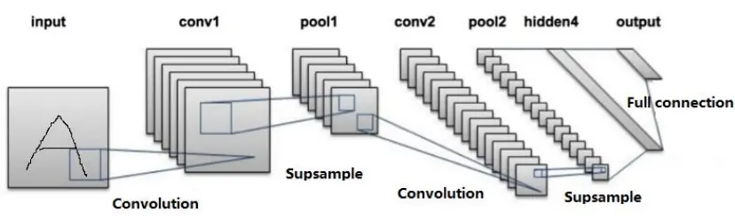
资料来源：LeCun，Bottou， Bengio & Haffner(1998)，华泰证券研究所

LeNet-5 的原始输入数据（图表 1中的 input）为二维图像，横轴和纵轴分别是图像的高度和宽度的像素点，为了识别该图像中的字母，LeNet-5 依次完成以下步骤：

1. 第一层卷积层（图表 1 中的 conv1）进行卷积运算。该层由若干卷积核组成，每个卷积核的参数都是通过反向传播算法优化得到的。卷积核的目的是通过扫描整张图片提取不同特征，第一层卷积层可能只能提取一些低级的特征如边缘、线条和角等层级，更多层的网络能从低级特征中迭代提取更复杂的特征。在卷积层之后都会使用非线性激活函数（如RELU，tanh 等）对特征进行非线性变换。

2. 第一层池化层（图表 1中的 pool1）进行池化运算。通常在卷积层之后会得到维度很大的特征，池化层可以非常有效地缩小参数矩阵的尺寸，从而减少最后全连层中的参数数量。使用池化层既可以加快计算速度也有防止过拟合的作用。一般池化层将特征切成几个区域，取其最大值或平均值，得到新的、维度较小的特征。卷积层和池化层其实都是在对具有高维特征的图片进行特征提取和特征降维（subsample）。

3. 第二层卷积层和第二层池化层（图表 1 中的 conv2 和 pool2）进行进一步的特征提取和特征降维，得到更加高层和抽象的特征。

4. 全连接层（图表 1 中的 hidden4 和 full connection）把卷积核池化得到的特征展平为一维特征，用来进行最后的训练和预测。

从 LeNet-5 的步骤中我们可以看出，CNN 之所以能够在计算机视觉领域中发挥越来越重要的作用，是因为其具有强大的特征提取能力，对于一块图片，人为的切割提取特征不仅对图像本身的完整性有害，而且提取的特征有限，不能捕捉到最好的切割效果，而 CNN能够很好的完成这份工作，通过不同的卷积核进行特征提取，并结合池化层的降维能力，一方面不会遗漏重要的信息，另一方面数据的复杂度并没有太大的提升，可以得到相比人为提取特征更完美的结果，这也是其他神经网络所不具备的特点。

## 卷积神经网络和 ImageNet

ImageNet 项目是一个用于视觉对象识别软件研究的大型可视化数据库，包含超过 1400万张有标注的图像。该项目的图像由李飞飞团队从 2007 年开始，耗费大量人力，通过各种方式（网络抓取，人工标注，亚马逊众包平台等）收集制作而成，是计算机视觉研究领域最权威的平台之一。近年来，CNN 的各种改进版本在 ImageNet 旗下的大规模视觉识别挑战赛（ILSVRC）中持续斩获冠军。在图表 2 中，我们将简要介绍几种重要的卷积神经网络以及其在 ILSVRC 的表现。

图表2： 几种重要的卷积神经网络简介

| 模型 | 提出时间 | 主要特性 | ILSVRC 排名 |
| --- | --- | --- | --- |
| AlexNet | 2012年 | 包含7层隐藏层，首次使用了RELU、DropOut、数据增强等技术， 对后续CNN的设计起到了启发作用。 | 2012 冠军 |
| VGGNet | 2014年 | 包含19层隐藏层，深度网络的代表，探讨了深度学习中权值初始化 的难题。 | 2014 亚军 |
| Inception-V1 2014 年 |  | 包含22层隐藏层，将多种不同尺寸的卷积核构造成Inception结构， 进一步增强网络的特征学习能力。 | 2014 冠军 |
| ResNet | 2015年 | 包含152层隐藏层，提出了解决更加深层次网络难以训练的方法： 残差学习，即在网络中增加了直连通道。 | 2015 冠军 |
| Inception-V2，2015年 |  | 在 Inception 结构中使用维度更小的卷积核，使用 Batch |  |
| Inception-V3 Inception-V4 2016 年 |  | Normalization 技术。 结合了ResNet的特性，进一步加深了神经网络。 |  |

资料来源：ImageNet，华泰证券研究所

回顾历史，正是不断加深、结构不断复杂的 CNN 引领了人工智能领域最近数年的发展。在最后两届 ILSVRC 比赛中（2016 和 2017），CNN 的进一步改进版本 Trimps-Soushen以及 SENet 分别获得了冠军。

## 卷积神经网络应用于股票多因子收益预测

总结一下 CNN 的原理，我们可以得出 CNN最关键的特性：特征提取和特征降维，借助神经网络的端到端以及反向传播的特性，CNN 可以根据数据和标签的情况进行自动的特征提取和特征降维。

随着金融市场的发展，大量与股票收益可能相关的数据在连续不断地生成，CNN 的优秀特性或许能为我们提供股票收益建模的新方法。然而回顾 CNN 的发展历程，其大部分应用都是在计算机视觉领域，如果将 CNN 应用到股票多因子收益预测，需要对因子数据进行一定的整理组织。

如图表 3 所示，为了利用 CNN 方便处理二维数据的特性，我们将个股的因子数据组织成二维形式，假设某个股有 10 个因子（EP，BP，ROE,…），考虑 5个历史截面期，则对于该个股来说，可以得到一张个股的“因子图片”，该个股对应一个 t 时间的相对收益率 Rt作为标签，如果在一个截面上有 3000 只个股，我们就可以得到 3000 张个股的“因子图片”及其对应的标签。另外，这样的数据处理方式也很自然地利用了个股因子数据的时间序列属性。

图表3： 个股的“因子图片”及其对应的相对收益率标签
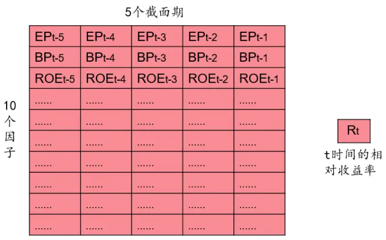
10*5矩阵
资料来源：华泰证券研究所

对于某个股的“因子图片”，接下来将其输入到 CNN中进行卷积运算，卷积运算的详细步骤如图表 4~图表 6 所示。如图表 4，假设有一个大小为 2*2 的卷积核，该卷积核对应 4个权重 $(\mathsf{W}_{1},\mathsf{W}_{2},\mathsf{W}_{3},\mathsf{W}_{4})$ 以及一个偏置项（bias）。卷积运算先从“因子图片”的左上角开始，选取一块与卷积核大小相同的区域进行运算，得到图表 4 右侧灰色区域的卷积结果。具体的运算公式在图表 4 正下方，可以看出，该运算本质上就是对历史因子数据进行因子合成，在同一时间截面上，不同的因子与权重相乘后累加，得到新的因子值 F。接下来，如图表 5 和图表 6 所示，卷积核会在水平和垂直两个方向上对“因子图片”进行遍历的卷积运算，最终生成一个 9*4 大小的“卷积结果图片”。

图表4： 卷积运算的原理展示
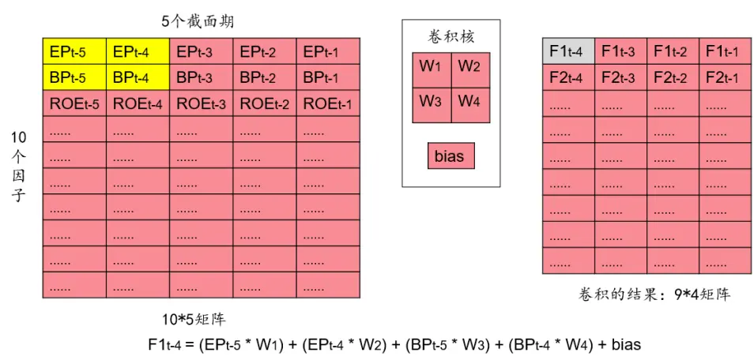
资料来源：华泰证券研究所

图表5： 卷积运算的原理展示（水平遍历）
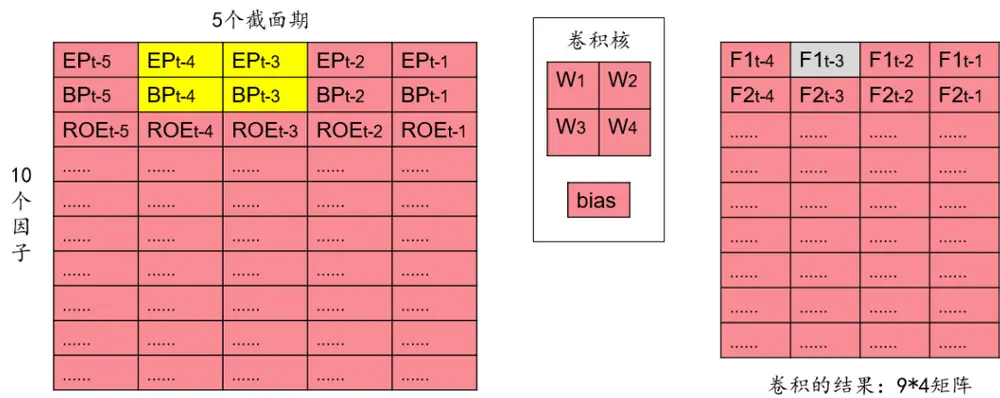
F1t-4 = (EPt-4 * W1) + (EPt-3 * W2)+ (BPt-4 * W3)+ (BPt-3 * W4)+ bias
资料来源：华泰证券研究所

图表6： 卷积运算的原理展示（垂直遍历）
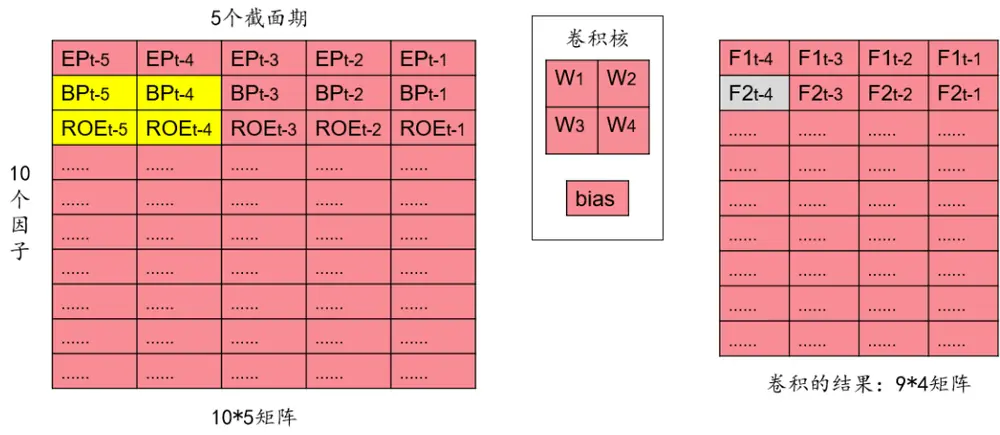
F2t-4 = (BPt-5 * W1)+ (BPt-4 * W2) + (ROEt-5 * W3)+ (ROEt-4 * W4)+ bias
资料来源：华泰证券研究所

由上可知，卷积运算本质上还是线性运算，如果想使得模型具有非线性拟合的能力，就要使用非线性激活函数，如图表 7 所示，我们使用目前最常用的激活函数 RELU，得到图表7 右侧的结果，接下来我们再将其进行一维展开，得到卷积层处理后的因子向量（X1t-4，X1t-3，…，Xnt-2，Xnt-1）。最后我们将一维的因子向量输入全连接神经网络中，就可以按照全连接神经网络的优化方法（反向传播，梯度下降）来优化网络参数。

图表7： 卷积结果的后续处理步骤
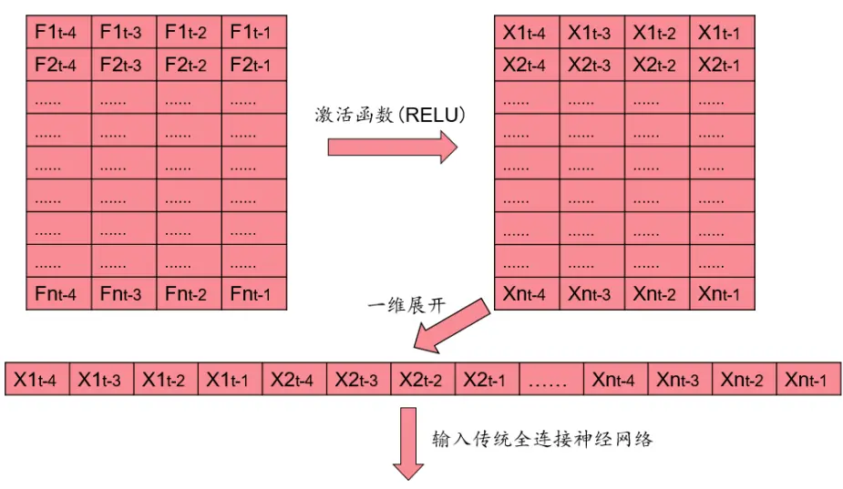
资料来源：华泰证券研究所

到这里，读者可能会有三个疑问，我们将给出解释：

1. 以上步骤只使用了一层卷积层，可否使用多层卷积层？

2. 以上步骤为何没有池化层？

3. “因子图片”中因子的排列顺序对结果是否有影响？

对于第一个问题，理论上可以再添加更多卷积层。但我们认为卷积层的多少和训练数据的性质有关，在多因子选股的应用中，使用的因子都是具有明确意义，经过单因子测试后有效的因子，卷积层所起的作用是对因子之间进行非线性组合，因此一层卷积层大致已经足够。而对于图像识别的应用来说，如图表 8所示，使用的训练数据是抽象层级很低的像素点，一层卷积层只能提取出人脸的边缘、轮廓等低层次特征，需要用更多的卷积层才能逐渐提取出高层次特征（如人的眼睛、耳朵、鼻子等）。因此，如果我们使用的股票数据是更加原始的数据，那么多层卷积层或许能达到更好的效果。

图表8： 图像识别中的多层卷积
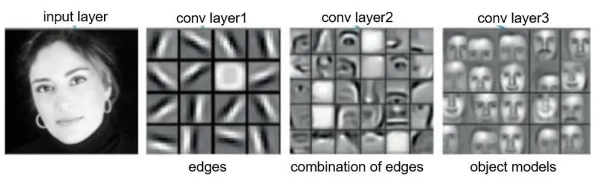
资料来源：Prof. Bart M. ter Haar Romeny，华泰证券研究所

对于第二个问题，解释与第一个问题类似。如图表 9，池化层所起的作用本质上是对卷积的结果进行“模糊化”（图表 9 右侧的 MAX Pooling），归纳局部区域内的统计特征，图像识别所输入的图片具有很高维度的像素，池化层的“模糊化”能在只损失极少量信息的情况下，归纳出图片区域的局部特征，这对于图像识别的降维和可泛化性来说非常有用。但是多因子选股中的因子都是具有明确意义的特征，如果使用池化层进行“模糊化”，相当于损失了一些精细的信息，这对于股票收益建模来说并不可靠。

图表9： 图像识别中的池化
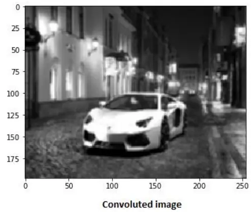
资料来源：DISHASHREE GUPTA，华泰证券研究所

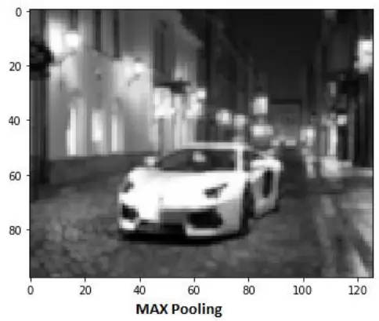

对于第三个问题，我们认为“因子图片”中因子的排列顺序会对训练和预测结果造成影响。事实上这是卷积神经网络相比全连接神经网络或循环神经网络具有根本区别的地方。由于卷积核本质上是在对部分因子进行合成，因此不同的因子排列顺序会影响卷积核中权重的训练，图表 10 中的左右两张图展示了两种排布因子的方式，左图中 BP因子和 ROE因子相邻，右图中 BP 因子和 ROE 因子不相邻，那么对于右图中的情况来说，从卷积核的作用区域（黄色）可以看出，无法对 BP 因子和 ROE 因子进行卷积运算，这将使得卷积核中权重的训练形成差异。而对于全连接神经网络或循环神经网络，无论如何打乱因子的排列顺序，都不会对结果形成影响。因此，在生成“因子图片”时，如何排布因子也是一个有意义的话题，本文将不会继续展开讨论。我们认为一种合理的排布方式是将属于同一大类因子的细分因子放在相邻位置；而对于不同的大类因子来说，将可能有相互作用的大类因子放在相邻位置。

图表10： 不同的因子排布方式生成的“因子图片”

| EPt-5 | EPt-4 | EPt-3 | EPt-2 | EPt-1 |
| --- | --- | --- | --- | --- |
| BPt-5 | BPt-4 | BPt-3 | BPt-2 | BPt-1 |
| ROEt-5 | ROEt-4 | ROEt-3 | ROEt-2 | ROEt-1 |
| ………… | ………… | …… | ………… | ……… |
| ……… | ………… | ……. | ………… | ………… |
| m… | ………… | ………. | ………… | ………… |
| m | " | " | m | m |
| m…. | .. | .... | m. | m |
| ………… | ………. | ………… | ………… | ……… |
| ………… | ………. | …. | ………. | ………. |

资料来源：华泰证券研究所

| EPt-5 | EPt-4 | EPt-3 | EPt-2 | EPt-1 |
| --- | --- | --- | --- | --- |
| BPt-5 | BPt-4 | BPt-3 | BPt-2 | BPt-1 |
| ………… | ……… | ………… | ………… | ………… |
| ……… | ……… | ………… | ………… | ………… |
| ………… | ………… | m.. | …. | m. |
| m | m | m. | " | m |
| nmn | m | m | m | mm |
| m. | m. | m.. | .. | m |
| ………… | ………… | ……… | ………… | ………. |
| ROEt-5 | ROEt-4 | ROEt-3 | ROEt-2 | ROEt-1 |

10*5矩阵

## 卷积神经网络选股模型测试流程

## 测试流程

图表11： 卷积神经网络选股模型测试流程示意图
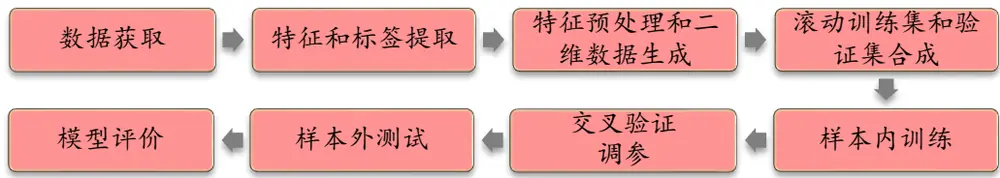
资料来源：华泰证券研究所

测试流程包含如下步骤：

## 1． 数据获取：

a) 股票池：全 A股。剔除 ST 股票，剔除每个截面期下一交易日停牌的股票，剔除上市 3个月内的股票，每只股票视作一个样本。

b) 回测区间：2011 年 1 月 31 日至 2019 年 1 月 31 日。

2． 特征和标签提取：每个自然月的最后一个交易日，计算 82 个因子暴露度，作为样本的原始特征，因子池如图表 13 和图表 14 所示。计算下一整个自然月的个股超额收益（以沪深 300 指数为基准），对于分类模型，选取下月收益排名前 30%的股票作为正例 $(\mathsf{y}=1)$ ），后 30%的股票作为负例 $(\mathsf{y}=0)$ ），作为样本的标签。对于回归模型，使用下个月的超额收益作为标签。

## 3． 特征预处理和二维数据生成

a) 中位数去极值：设第 T 期某因子在所有个股上的暴露度序列为 $D_{i}$ ， $D_{M}$ 为该序列中位数， $D_{M1}$ 为序列 $|D_{i}-D_{M}|$ 的中位数，则将序列 $D_{i}$ 中所有大于 $D_{M}+5D_{M1}$ 的数重设为 $D_{M}+5D_{M1}$ ，将序列 $D_{i}$ 中所有小于 $D_{M}-5D_{M1}$ 的数重设为 $D_{M}-5D_{M1}$ ；

b) 缺失值处理：得到新的因子暴露度序列后，将因子暴露度缺失的地方设为中信一级行业相同个股的平均值；

c) 行业市值中性化：将填充缺失值后的因子暴露度对行业哑变量和取对数后的市值做线性回归，取残差作为新的因子暴露度；

d) 标准化：将中性化处理后的因子暴露度序列减去其现在的均值、除以其标准差，得到一个新的近似服从 N(0, 1)分布的序列。

e) 要使用卷积神经网络，需要提供二维的特征数据，我们按照图表 3 的形式，将某只股票多个截面期的因子数据组织成类似于图片的二维数据，总共 82 行（对应82 个因子），5 列（对应 5 个截面期），这样在每个月截面上，就可以得到上千张“因子图片”。

4． 滚动训练集和验证集的合成：由于月度滚动训练模型的时间开销较大，本文采用年度滚动训练方式，全体样本内外数据共分为九个阶段，如下图所示。例如预测 2011 年时，将 2005-2010 年共 72 个月数据合并作为样本内数据集；预测 T 年时，将 T-6 至T-1 年的 72 个月合并作为样本内数据。

5． 样本内训练：使用卷积神经网络对训练集进行训练。

6． 交叉验证调参：随机取 10%样本内的数据作为验证集，在训练的同时观察卷积神经网络在验证集上的表现，当验证集上的 loss 达到最小时，停止训练。

7． 样本外测试：确定最优参数后，以 T 月末截面期所有样本预处理后的特征作为模型的输入，得到每个样本的预测值 f(x)。将预测值视作合成后的因子，进行单因子分层回测。

8． 模型评价：我们以分层回测和构建选股策略的结果作为模型评价标准。

图表12： 年度滚动训练示意图
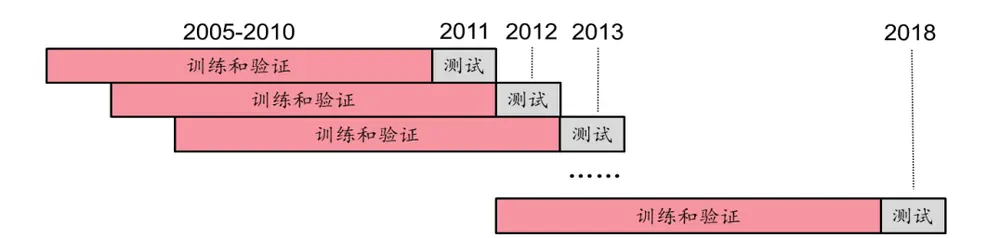
资料来源：华泰证券研究所

图表13： 选股模型中涉及的全部因子及其描述（表 1）

|  | 大类因子 具体因子 | 因子描述 |
| --- | --- | --- |
| 估值 | EP | 净利润（TTM）/总市值 |
| 估值 | EPcut | 扣除非经常性损益后净利润（TTM）/总市值 |
| 估值 | BP | 净资产/总市值 |
| 估值 | SP | 营业收入（TTM）/总市值 |
| 估值 | NCFP | 净现金流（TTM）/总市值 |
| 估值 | OCFP | 经营性现金流（TTM）/总市值 |
| 估值 | DP | 近12个月现金红利（按除息日计）/总市值 |
| 估值 | G/PE | 净利润（TTM）同比增长率/PE_TTM |
| 成长 | Sales_G_q | 营业收入（最新财报，YTD）同比增长率 |
| 成长 | Profit_G_q | 净利润（最新财报，YTD）同比增长率 |
| 成长 | OCF_G_q | 经营性现金流（最新财报，YTD）同比增长率 |
| 成长 | ROE_G_q | ROE（最新财报，YTD）同比增长率 |
| 财务质量 | ROE_q | ROE（最新财报，YTD） |
| 财务质量 | ROE_ttm | ROE（最新财报，TTM） |
| 财务质量 | ROA_q | ROA（最新财报，YTD） |
| 财务质量 | ROA_ttm | ROA（最新财报，TTM） |
| 财务质量 | grossprofitmargin_q | 毛利率（最新财报，YTD） |
| 财务质量 | grossprofitmargin_ttm | 毛利率（最新财报，TTM） |
| 财务质量 | profitmargin_q | 扣除非经常性损益后净利润率（最新财报，YTD） |
| 财务质量 | profitmargin_ttm | 扣除非经常性损益后净利润率（最新财报，TTM） |
| 财务质量 | assetturnover_q | 资产周转率（最新财报，YTD） |
| 财务质量 | assetturnover_ttm | 资产周转率（最新财报，TTM） |
| 财务质量 | operationcashflowratio_q | 经营性现金流/净利润（最新财报，YTD） |
| 财务质量 | operationcashflowratio_ttm | 经营性现金流/净利润（最新财报，TTM） |
| 杠杆 | financial_leverage | 总资产/净资产 |
| 杠杆 | debtequityratio | 非流动负债/净资产 |
| 杠杆 | cashratio | 现金比率 |
| 杠杆 | currentratio | 流动比率 |
| 市值 | In_capital | 总市值取对数 |
| 动量反转 | HAlpha | 个股60个月收益与上证综指回归的截距项 |
| 动量反转 | return_Nm | 个股最近N个月收益率，N=1，3，6，12 |
| 动量反转 | wgt_return_Nm | 个股最近N个月内用每日换手率乘以每日收益率求算术平均值， N=1, 3, 6, 12 |
| 动量反转 | exp_wgt_return_Nm | 个股最近N个月内用每日换手率乘以函数exp(-x_i/N/4)再乘以每日 收益率求算术平均值，x_i为该日距离截面日的交易日的个数， N=1, 3, 6, 12 |
| 波动率 | std_FF3factor_Nm | 特质波动率——个股最近 N 个月内用日频收益率对 Fama French 三因子回归的残差的标准差，N=1，3，6，12 |
| 波动率 | std_Nm | 个股最近N个月的日收益率序列标准差，N=1，3，6，12 |
| 股价 | In_price | 股价取对数 |
| beta | beta | 个股60个月收益与上证综指回归的 beta |
| 换手率 | turn_Nm | 个股最近N个月内日均换手率（剔除停牌、涨跌停的交易日）， N=1, 3, 6, 12 |
| 换手率 | bias_turn_Nm | 个股最近N个月内日均换手率除以最近2年内日均换手率（剔除停 |

资料来源：Wind，华泰证券研究所

图表14： 选股模型中涉及的全部因子及其描述（表 2）

| 大类因子 | 具体因子 | 因子描述 |
| --- | --- | --- |
| 一致预期 | rating_average | wind 评级的平均值 |
| 一致预期 | rating_change | wind评级（上调家数-下调家数）/总数 |
| 一致预期 | rating_targetprice | wind一致目标价/现价-1 |
| 一致预期 | CON_EP | 朝阳永续一致预期EP |
| 一致预期 | CON_EP_REL | 朝阳永续一致预期EP季度环比 |
| 一致预期 | CON_BP | 朝阳永续一致预期EP |
| 一致预期 | CON_BP_REL | 朝阳永续一致预期EP季度环比 |
| 一致预期 | CON_GPE | 朝阳永续一致预期 GPE |
| 一致预期 | CON_GPE_REL | 朝阳永续一致预期 GPE 季度环比 |
| 一致预期 | CON_ROE | 朝阳永续一致预期 ROE |
| 一致预期 | CON_ROE_REL | 朝阳永续一致预期 ROE 季度环比 |
| 一致预期 | CON_EPS | 朝阳永续一致预期 EPS |
| 一致预期 | CON_EPS_REL | 朝阳永续一致预期 EPS 季度环比 |
| 一致预期 | CON_NP | 朝阳永续一致预期归母净利润 |
| 一致预期 | CON_NP_REL | 朝阳永续一致预期归母净利润季度环比 |
| 股东 | holder_avgpctchange | 户均持股比例的同比增长率 |
| 技术 | MACD | 经典技术指标（释义可参考百度百科），长周期取30日，短周期 |
| 技术 | DEA | 取10 日，计算 DEA 均线的周期（中周期）取 15 日 |
| 技术 | DIF |  |
| 技术 | RSI | 经典技术指标，周期取20日 |
| 技术 | PSY | 经典技术指标，周期取20日 |
| 技术 | BIAS | 经典技术指标，周期取20日 |

资料来源：Wind，朝阳永续，华泰证券研究所

## 测试模型设置

为了进行系统的对比，本文将会对比三个模型的测试结果：卷积神经网络、全连接神经网络和线性回归。其中卷积神经网络和全连接神经网络的主要参数如下：

## 1. 卷积神经网络：

（1）输入数据：每个股票样本包含 82 个因子，5 个历史截面期，构成 82*5 的“因子图片”，其标签为 1或 0（涨或跌）。

（2）卷积层：一层卷积层，包含 10 个 5*5 大小的卷积核。卷积核权重使用 xavier 初始化方法（一种保证激活值和梯度值方差不变的初始化方法，经实证适合于初始化卷积层）。

（3）池化层：没有池化层。

（4）全连接层：3 层全连接层，分别包含 100、70、40 个神经元，连接权重使用truncated_normal 初始化方法（截断的正态分布初始化方法，最为常用）。

（5）Dropout 率（神经元连接随机断开的比例）：80%。

（6）优化器和学习速率：RMSProp，0.001。

（7）损失函数：交叉熵损失函数（二分类）。

卷积神经网络结构如下图所示：

图表15： 卷积神经网络结构
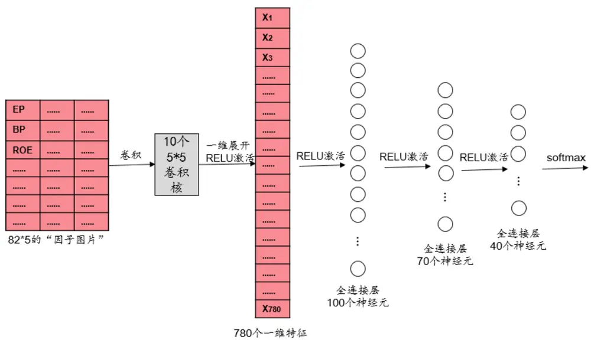
资料来源：华泰证券研究所

2. 全连接神经网络，为了能和卷积神经网络进行差异最小的对比，我们将全连接神经网络的参数设置如下：

（1）输入数据：每个股票样本包含 82 个因子，5 个历史截面期，构成 82*5 的“因子图片”，再将“因子图片”进行一维展开，作为输入数据，其标签为 1或 0（涨或跌）。

（2）全连接层：4 层全连接层，分别包含 780、100、70、40 个神经元，连接权重使用truncated_normal 初始化方法。这里第一层全连接层的 780 个神经元等于卷积神经网络中卷积结果一维展开后得到的特征数目，780=（82-5+1）*10

（3）Dropout 率：80%。

（4）优化器和学习速率：RMSProp，0.001。

（5）损失函数：交叉熵损失函数（二分类）。

全连接神经网络结构如下图所示：

图表16： 全连接神经网络结构
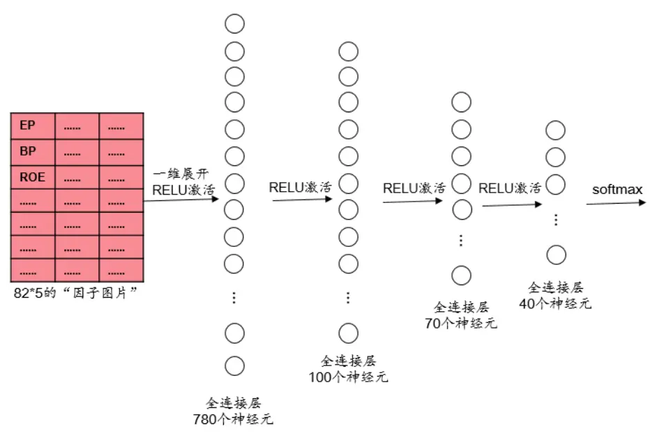
资料来源：华泰证券研究所

## 卷积神经网络选股模型测试结果

## 单因子测试

如果将机器学习模型的输出视为单因子，则可进行单因子测试。

## 单因子回归测试和 IC测试

测试模型构建方法如下：

1. 股票池：全 A 股，剔除 ST 股票，剔除每个截面期下一交易日停牌的股票，剔除上市3 个月以内的股票。

2. 回测区间：2011-01-31 至 2019-01-31。

3. 截面期：每个月月末，用当前截面期因子值与当前截面期至下个截面期内的个股收益进行回归和计算 RankIC值。

4. 数据处理方法：对于分类模型，将模型对股票下期上涨概率的预测值视作单因子。对于回归模型，将回归预测值视作单因子。因子值为空的股票不参与测试。

5. 回归测试中采用加权最小二乘回归（WLS），使用个股流通市值的平方根作为权重。IC测试时对单因子进行行业市值中性。

如图表17所示，卷积神经网络的RankIC均值和因子收益率均值略高于全连接神经网络，也要高于线性回归。

图表17： 三种模型在全 A股的回归法、IC 值分析结果汇总（回测期 20110131～20190131）

| 模型 | It\|均值 | It>2 占比t 均值 | 因子收益率均值 RankIC 均值 RankIC 标准差 |  |  | IC_IR IC>0 占比 |  |
| --- | --- | --- | --- | --- | --- | --- | --- |
| 卷积神经网络 | 5.35 | 79.17%4.97 | 1.021% | 13.62% | 10.92% | 1.25 | 87.50% |
| 全连接神经网络 | 5.44 | 76.04%4.95 | 1.015% | 13.28% | 11.34% | 1.17 | 87.50% |
| 线性回归 | 5.22 | 81.25% 4.96 | 0.968% | 12.48% | 9.67% | 1.29 | 87.50% |

资料来源：Wind，朝阳永续，华泰证券研究所

图表 18和图表 19 分别展示了三种模型的累积 RankIC和累积因子收益率曲线。

图表18： 三种模型的累积 RankIC曲线
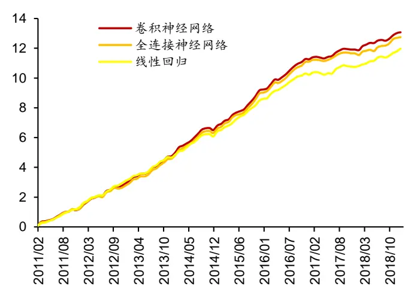
资料来源：Wind，朝阳永续，华泰证券研究所

图表19： 三种模型的累积因子收益率曲线
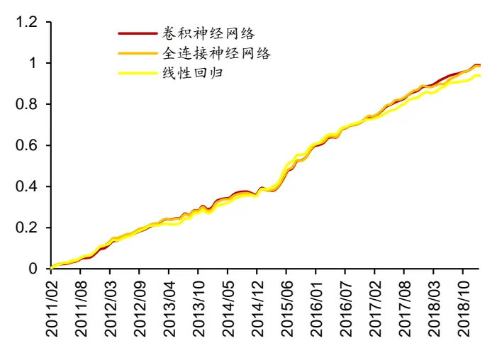
资料来源：Wind，朝阳永续，华泰证券研究所

## 单因子分层测试

依照因子值对股票进行打分，构建投资组合回测，是最直观的衡量因子优劣的手段。测试模型构建方法如下：

1. 股票池、回测区间、截面期均与回归法相同。

2. 换仓：在每个自然月最后一个交易日核算因子值，在下个自然月首个交易日按当日收盘价换仓，交易费用以双边千分之四计。

3. 分层方法：因子先用中位数法去极值，然后进行市值、行业中性化处理（方法论详见上一小节），将股票池内所有个股按因子从大到小进行排序，等分 N 层，每层内部的个股等权配置。当个股总数目无法被 N 整除时采用任一种近似方法处理均可，实际上对分层组合的回测结果影响很小。

4. 多空组合收益计算方法：用 Top 组每天的收益减去 Bottom 组每天的收益，得到每日多空收益序列r1, r2, ⋯ , rn，则多空组合在第 n 天的净值等于(1 + r1)(1 + r2) ⋯ (1 + rn)。

5. 评价方法：全部 N层组合年化收益率（观察是否单调变化），多空组合的年化收益率、夏普比率、最大回撤、月胜率等。

我们展示了模型分层测试的结果（图表 20 和图表 22）。另外，我们对比了三种模型分层测试的 TOP 组合的表现（图表 21 和图表 23），在年化收益率、夏普比率、信息比率上，卷积神经网络相比全连接神经网络表现略好，并且优于线性回归。

图表20： 三种模型在全 A股的分层测试法结果汇总（分五层，回测期 20110131～20190131）

|  |  |  |  |  |  |  | 多空组合年化多空组合夏多空组合最多空组合月 TOP 组合月均 |  |  |  |
| --- | --- | --- | --- | --- | --- | --- | --- | --- | --- | --- |
| 模型 |  | 分层组合1～5（从左到右）年化收益率 |  |  |  | 收益率 | 普比率 | 大回撤 | 胜率 | 双边换手率 |
| 卷积神经网络 | 20.05% | 8.60% | 2.90% | -6.11% | -14.42% | 40.41% | 4.84 | 12.19% | 82.29% | 81.85% |
| 全连接神经网络 | 19.24% | 8.47% | 3.30% | -5.23% | -14.41% | 39.29% | 4.64 | 11.53% | 82.29% | 76.24% |
| 线性回归 | 16.40% | 8.75% | 1.61% | -2.73% | -13.91% | 35.57% | 4.71 | 10.80% | 87.50% | 98.66% |

资料来源：Wind，朝阳永续，华泰证券研究所

图表21： 三种模型 TOP 组合详细绩效分析（分五层，回测期 20110131～20190131）

| 模型 | 年化收益率 | 年化波动率夏普比率最大回撤 |  |  | 年化超额收益率年化跟踪误差 |  | 超额收益最大回撤 | 信息比率相对基准月胜率 |  |
| --- | --- | --- | --- | --- | --- | --- | --- | --- | --- |
| 卷积神经网络 | 20.05% | 27.95% | 0.72 | 49.07% | 15.48% | 3.83% | 5.38% | 4.04 | 82.29% |
| 全连接神经网络 | 19.24% | 27.75% | 0.69 | 49.70% | 14.63% | 3.75% | 4.90% | 3.91 | 78.13% |
| 线性回归 | 16.40% | 28.44% | 0.58 | 53.31% | 12.05% | 3.72% | 5.88% | 3.24 | 82.29% |
| 基准组合 | 4.21% | 26.85% | 0.16 | 63.14% |  |  |  |  |  |

资料来源：Wind，朝阳永续，华泰证券研究所

图表22： 卷积神经网络各层组合净值除以基准组合净值示意图
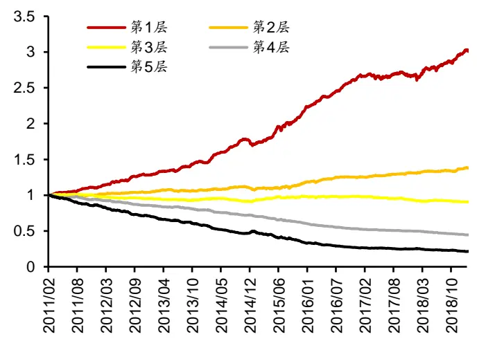
资料来源：Wind，朝阳永续，华泰证券研究所

图表23： 三种模型 TOP组合净值除以基准组合净值示意图
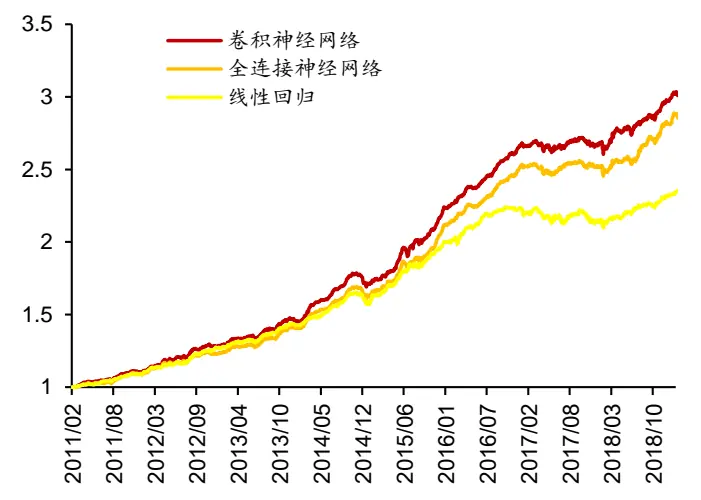
资料来源：Wind，朝阳永续，华泰证券研究所

## 构建策略组合及回测分析

基于卷积神经网络、全连接神经网络和线性回归，我们构建了行业、市值中性全 A选股策略并进行回测。图表 24 中分别展示了以沪深 300 和中证 500 为基准的策略表现明细，包含年化超额收益率、超额收益最大回撤、信息比率、Calmar比率。图表 24 从左至右对应不同的个股权重偏离上限。从图表 24 中可以看出，当以沪深 300 为基准时，两种神经网络在年化超额收益率、信息比率和 Calmar 比率上的表现都不如线性回归。当以中证 500为基准时，卷积神经网络则在各项指标上的表现都优于另外两个模型，全连接神经网络则略优于线性回归。

图表24： 三种模型构建全 A选股策略回测指标对比（回测期 20110131～20190131）
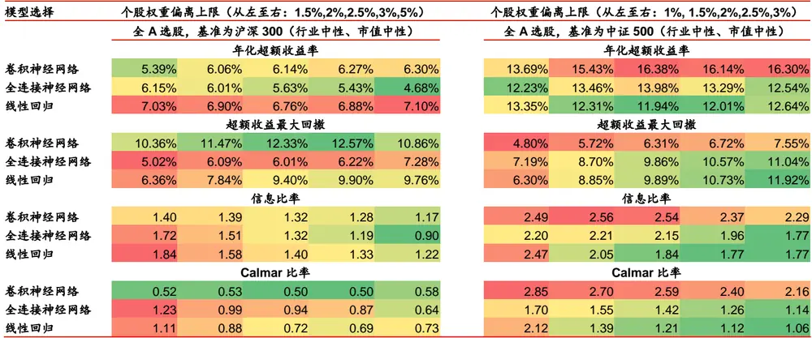
资料来源：Wind，朝阳永续，华泰证券研究所

我们有选择性地展示两个策略的超额收益表现，如图表 25 和图表 26 所示。

图表25： 三种模型全 A选股策略表现（个股权重偏离上限 2.5%，基准为沪深 300）
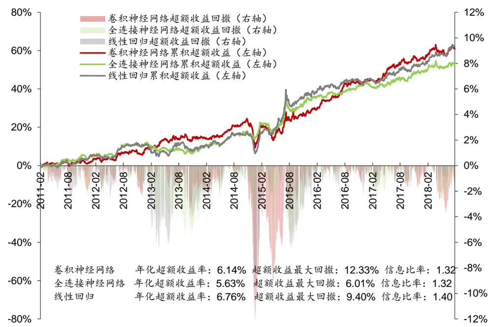
资料来源：Wind，朝阳永续，华泰证券研究所

图表26： 三种模型全 A选股策略表现（个股权重偏离上限 2%，基准为中证 500）
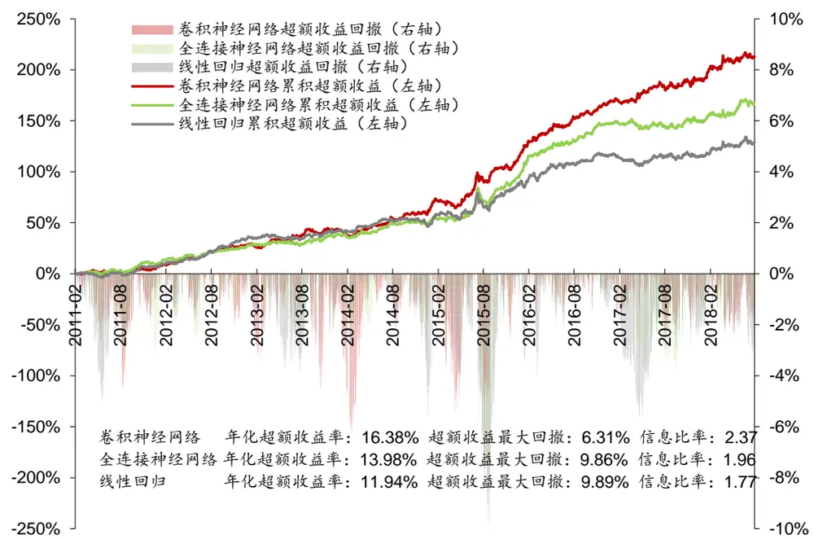
资料来源：Wind，朝阳永续，华泰证券研究所

## 结论和展望

卷积神经网络（CNN）是目前发展最为成熟、投入研究力度最大的深度学习模型，是近年来人工智能蓬勃发展的重要推手之一。本文对 CNN 的原理和特色进行了介绍，并探讨了如何使用 CNN 构建人工智能选股模型。初步得出以下结论：

1. 卷积神经网络（CNN）是目前最为成熟的深度学习模型，是近年来人工智能蓬勃发展的重要推手之一，其主要特点是通过卷积和池化操作进行自动的特征提取和特征降维。把CNN 运用于多因子选股时，我们总结出以下经验：（1）股票因子数据可以组织成二维的“图片”形式，这使得 CNN 具有了时间序列学习的能力。（2）当卷积核作用于股票因子数据时，本质上是在进行因子合成，因此本文只使用了一层卷积层。（3）池化层是对因子数据的“模糊化”，这对体现因子的明确意义是不利的，因此本文未使用池化层。（4）因子数据在“图片”中的排列顺序会影响到 CNN 的学习结果。

2. 我们构建了卷积神经网络、全连接神经网络、线性回归三个模型，在 2011-01-31 至2019-1-31 的回测区间中分年度进行训练和测试，样本空间为全 A股。从单因子测试的角度来看，CNN 合成因子的 RankIC 均值为 13.62%，因子收益率均值为 1.021%，略高于全连接神经网络，也要高于线性回归。在分五层测试中，CNN 合成因子的 TOP组合年化收益率为 20.05%，夏普比率为 0.72，信息比率为 4.04，多空组合的夏普比率为 4.84，表现都要优于全连接神经网络和线性回归。

3. 基于卷积神经网络、全连接神经网络和线性回归，我们构建了行业、市值中性全 A 选股策略并进行回测。在 2011-01-31 至 2019-1-31 的回测区间中，当以沪深 300 为基准时，两种神经网络在年化超额收益率、信息比率和 Calmer 比率上的表现都不如线性回归。当以中证 500 为基准时，CNN 的年化超额收益在 13.69%~16.38%之间，超额收益最大回撤在 4.80%~7.55%之间，信息比率在 2.29~2.56 之间，Calmer 比率在 2.16~2.85 之间，CNN在以上各项指标上的表现都优于另外两个模型，全连接神经网络略优于线性回归。

4. 随着 ImageNet 旗下的大规模视觉识别挑战赛（ILSVRC）连续数年的推动，卷积神经网络正在日新月异地进步中，还有诸多技术值得我们学习和尝试，例如增大训练样本数量的“数据增强”方法；ResNet 中的残差学习方法；Inception 网络中的多种尺寸卷积核混合的方法等等。此外，在高频、海量的金融数据中使用 CNN 也是一个值得尝试的方向。

## 风险提示

通过卷积神经网络构建的选股策略是历史经验的总结，存在失效的可能。卷积神经网络模型可解释程度较低，使用须谨慎。

## 免责申明

本报告仅供华泰证券股份有限公司（以下简称“本公司”）客户使用。本公司不因接收人收到本报告而视其为客户。

本报告基于本公司认为可靠的、已公开的信息编制，但本公司对该等信息的准确性及完整性不作任何保证。本报告所载的意见、评估及预测仅反映报告发布当日的观点和判断。在不同时期，本公司可能会发出与本报告所载意见、评估及预测不一致的研究报告。同时，本报告所指的证券或投资标的的价格、价值及投资收入可能会波动。本公司不保证本报告所含信息保持在最新状态。本公司对本报告所含信息可在不发出通知的情形下做出修改，投资者应当自行关注相应的更新或修改。

本公司力求报告内容客观、公正，但本报告所载的观点、结论和建议仅供参考，不构成所述证券的买卖出价或征价。该等观点、建议并未考虑到个别投资者的具体投资目的、财务状况以及特定需求，在任何时候均不构成对客户私人投资建议。投资者应当充分考虑自身特定状况，并完整理解和使用本报告内容，不应视本报告为做出投资决策的唯一因素。对依据或者使用本报告所造成的一切后果，本公司及作者均不承担任何法律责任。任何形式的分享证券投资收益或者分担证券投资损失的书面或口头承诺均为无效。

本公司及作者在自身所知情的范围内，与本报告所指的证券或投资标的不存在法律禁止的利害关系。在法律许可的情况下，本公司及其所属关联机构可能会持有报告中提到的公司所发行的证券头寸并进行交易，也可能为之提供或者争取提供投资银行、财务顾问或者金融产品等相关服务。本公司的资产管理部门、自营部门以及其他投资业务部门可能独立做出与本报告中的意见或建议不一致的投资决策。

本报告版权仅为本公司所有。未经本公司书面许可，任何机构或个人不得以翻版、复制、发表、引用或再次分发他人等任何形式侵犯本公司版权。如征得本公司同意进行引用、刊发的，需在允许的范围内使用，并注明出处为“华泰证券研究所”，且不得对本报告进行任何有悖原意的引用、删节和修改。本公司保留追究相关责任的权力。所有本报告中使用的商标、服务标记及标记均为本公司的商标、服务标记及标记。

本公司具有中国证监会核准的“证券投资咨询”业务资格，经营许可证编号为：91320000704041011J。

全资子公司华泰金融控股（香港）有限公司具有香港证监会核准的“就证券提供意见”业务资格，经营许可证编号为：AOK809

©版权所有 2019年华泰证券股份有限公司

## 评级说明

## 行业评级体系

－报告发布日后的6个月内的行业涨跌幅相对同期的沪深300指数的涨跌幅为基准；

－投资建议的评级标准

增持行业股票指数超越基准

中性行业股票指数基本与基准持平

减持行业股票指数明显弱于基准

## 公司评级体系

－报告发布日后的6个月内的公司涨跌幅相对同期的沪深300指数的涨跌幅为基准；
－投资建议的评级标准
买入股价超越基准 20%以上
增持股价超越基准 5%-20%
中性股价相对基准波动在-5%~5%之间
减持股价弱于基准 5%-20%
卖出股价弱于基准 20%以上

## 华泰证券研究

## 南京

南京市建邺区江东中路228号华泰证券广场1号楼/邮政编码：210019

电话：86 25 83389999 /传真：86 25 83387521

电子邮件：ht-rd@htsc.com

## 深圳

深圳市福田区益田路5999号基金大厦10楼/邮政编码：518017

电话：86 755 82493932 /传真：86 755 82492062

电子邮件：ht-rd@htsc.com

## 北京

北京市西城区太平桥大街丰盛胡同28号太平洋保险大厦A座18层

邮政编码：100032

电话：86 10 63211166/传真：86 10 63211275

电子邮件：ht-rd@htsc.com

## 上海

上海市浦东新区东方路18号保利广场E栋23楼/邮政编码：200120

电话：86 21 28972098 /传真：86 21 28972068

电子邮件：ht-rd@htsc.com