## 金工研究/深度研究

2019年02月18日

林晓明 执业证书编号：S0570516010001

研究员 0755-82080134

linxiaoming@htsc.com

陈烨 执业证书编号：S0570518080004

研究员 010-56793942

李子钰 0755-23987436

联系人 liziyu@htsc.com

联系人 hekang@htsc.com

3《金工: 因子合成方法实证分析》2019.01

# 再论时序交叉验证对抗过拟合

# 华泰人工智能系列之十六

## 从基线模型设置和样本精确切分两个角度对时序交叉验证提出改进

华泰金工《对抗过拟合：从时序交叉验证谈起》研究发现，对于时间序列数据，传统 K折交叉验证选择的模型存在过拟合风险，时序交叉验证能减轻过拟合。本文从基线模型（baseline model）的设置和训练集验证集的精确切分两个角度，对原有时序交叉验证方法提出改进。通过对比时序交叉验证、分组时序交叉验证以及四种基线模型，我们发现分组时序交叉验证表现优于时序交叉验证，两者均优于其余基线模型。针对时序数据进行机器学习模型调参时，推荐使用分组时序交叉验证方法以对抗过拟合。

## 从模型性能和单因子测试看，时序和分组时序交叉验证能减轻过拟合

从模型性能来看，将六种交叉验证方法按样本内表现排序：时序 < 分组时序 < 三种新的基线模型 < K 折。从模型性能和单因子测试结果来看，将各方法按测试集表现排序：分组时序 > 时序 > 三种新的基线模型 > K折。上述结果表明，K 折交叉验证选出的模型表现出较强的过拟合，时序和分组时序交叉验证能够一定程度上减轻过拟合。

## 时序和分组时序交叉验证带来的提升主要源于时序信息的保留

新基线模型的引入使得我们能够对时序为何优于 K折进行归因分析。首先，和 K折相比，三种新的基线模型使用更少样本，其表现略优于 K折，说明模型表现的提升确实部分源于使用更少样本。其次，和三种新的基线模型相比，时序和分组时序交叉验证保留了时序信息，其表现优于三种新的基线模型，说明模型表现的提升主要源于时序信息的保留。

分组时序交叉验证确保验证集于时序上严格在训练集后，能提升模型表现原始时序交叉验证对训练集和验证集的切分不够精细，可能出现同一月份样本一部分属于训练集一部分属于验证集。通过对 scikit-learn 库model_selection 包进行改造，我们得以实现样本的精确切分，确保验证集在时序上严格位于训练集之后。相比于原始时序交叉验证，改造后的分组时序交叉验证在模型表现上有小幅提升。

风险提示：时序和分组时序交叉验证方法是对传统模型调参方法的改进，高度依赖基学习器表现。该方法是对历史投资规律的挖掘，若未来市场投资环境发生变化导致基学习器失效，则该方法存在失效的可能。时序和分组交叉验证方法存在一定欠拟合风险。

## 本文研究导读

如果将机器学习算法比作基金经理做投资决策的过程，那么交叉验证调参相当于设计一套制度选拔优秀的基金经理。作为机器学习的顶层设计部分，交叉验证理应受到更多重视，然而因其过程相对细碎繁杂，技术含量看似不高，在以往的研究报告中没有得到足够重视。随着对机器学习方法理解的逐渐深入，我们发现交叉验证调参环节作为“挑选算法的算法”，其重要性不亚于挑选算法本身。

本文围绕机器学习对抗对拟合的方法——时序交叉验证作进一步研究。机器学习模型调参的传统方法是 K折交叉验证。在华泰金工人工智能系列之十四《对抗过拟合：从时序交叉验证谈起》（20181128）一文中，我们证实了 K折交叉验证应用于时间序列数据存在模型过拟合的风险，而时序交叉验证能够降低过拟合程度。借助时序交叉验证的机器学习选股策略能够获得更高并且更稳定的收益。

## 本文是对上篇报告的拾遗和改进，从以下两个角度进行探讨：

1. 上篇报告的基线模型（baseline model）不合理，无法区分时序交叉验证带来的提升究竟来自“保留样本时序信息”还是“使用更少的样本”。本文设置更合理的基线模型，提出“训练集折半的 K折交叉验证”和“乱序递进式交叉验证”两种方法供对照之用，希望厘清时序交叉验证带来提升的真实原因；

2. 上篇报告对训练集和验证集的切分不够精细，可能出现同一月份样本一部分属于训练集一部分属于验证集，违背了时序交叉验证的本意。本文对基于 Python 的机器学习库 scikit-learn 的 model_selection 包进行改造，提出新方法“分组时序交叉验证”，从而实现更精细的训练集和验证集切分。

本文针对上述两方面作深入研究，测试了包括时序交叉验证、分组时序交叉验证、四种基线模型在内的六种交叉验证方法，以模型性能和单因子测试表现作为评价依据。结果显示，时序交叉验证表现优于新的基线模型，而新的基线模型表现略优于 K折交叉验证，表明时序交叉验证带来的提升主要源于时序信息的保留，小部分源于使用更少的样本。同时，分组时序交叉验证表现略优于原始时序交叉验证，表明对训练集和验证集进行精细切分能够小幅提升模型表现。

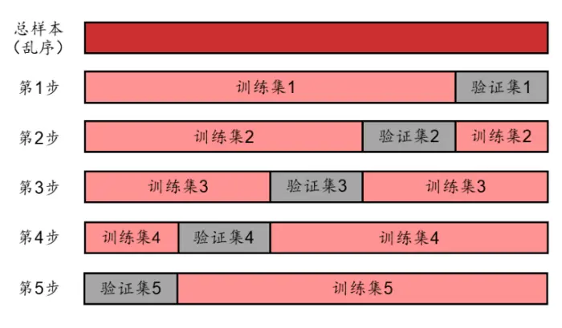

## 时序交叉验证的改进

关于模型调参和交叉验证的基本概念，本文不再赘述，感兴趣的读者请参考华泰金工人工智能系列之十四《对抗过拟合：从时序交叉验证谈起》（20181128）。

本研究共测试六种交叉验证方法，分为三组：

1. “K折交叉验证”和“时序交叉验证”是上篇报告测试比较的两种原始交叉验证方法。其中前者为基线模型作对照之用，后者是上篇报告推荐使用的方法。

2.“训练集折半的 K折交叉验证”和“乱序递进式交叉验证”是基于改进思路 1提出的两种新的基线模型。基线模型仍作对照之用，不是原始方法的提升，目的是探索时序交叉验证带来提升的真实原因。

3. “分组时序交叉验证”和“乱序分组递进式交叉验证”是基于改进思路 2 提出的两种新方法。其中前者是本篇报告推荐使用的方法，后者是针对前者单独设计的新基线模型。

下面我们将逐一介绍六种交叉验证方法。

## K折和时序交叉验证

K 折交叉验证（k-fold cross-validation）是最经典和最常用的交叉验证方法之一。如图表1 所示，将全体样本等分为 K份（通常需要事先随机打乱，K在 3~20之间），每次用其中的 1 份作为验证集，其余 K-1 份作为训练集。重复 K次，直到所有部分都被验证过。取 K个验证集的平均正确率（或 F1 分数、AUC、平方损失、对数损失等其它模型评价指标）用以衡量该模型（或该组超参数）的整体表现。

时序交叉验证（time series cross-validation）如图表 2 所示，适用于时间序列数据。将保留时序信息的数据等分（或依据其它标准切分）成 K+1 份，第 i次验证时取第 i+1 份作为验证集，第 1至 i份作为训练集，重复 K次。同样取 K个验证集的平均表现作为模型间比较的依据。

K折交叉验证广泛应用于图像识别、语音识别、自然语言处理等机器学习技术最为活跃的领域。K折交叉验证的使用前提是样本服从独立同分布。图像、语音、自然语言等领域的数据通常满足独立同分布原则，而金融领域的时间序列数据往往存在较强的时序相关性。理论上，K折交叉验证不适用于时序数据；实际上，在金融领域 K 折交叉验证仍被大量地、错误地使用。

图表1： K折交叉验证示意图（K=5）
图表2： 时序交叉验证示意图（折数=5）
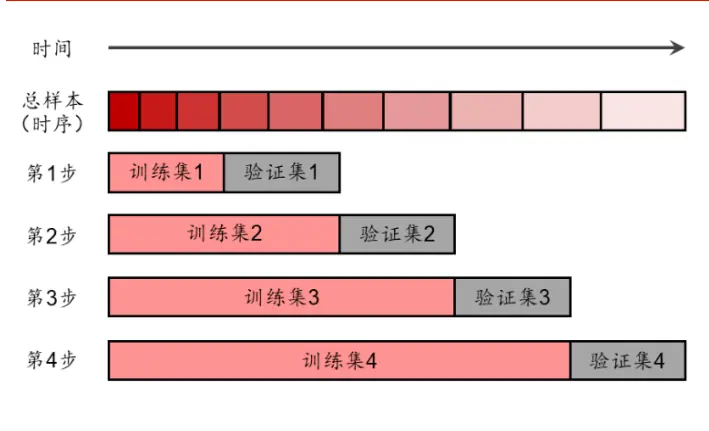
资料来源：华泰证券研究所
资料来源：华泰证券研究所

在华泰金工人工智能系列之十四《对抗过拟合：从时序交叉验证谈起》（20181128）的研究中，我们采用机器学习公共数据集以及全 A选股数据集，比较 K折和时序这两种交叉验证方法的表现。从实践结果来看，对于非时序数据，两种交叉验证方法表现接近。对于时序数据，相比于 K折交叉验证，时序交叉验证在样本内数据集上的表现相对较差，但是在测试集上表现更好，表现出更低的过拟合程度；时序交叉验证倾向于选择超参数“简单”

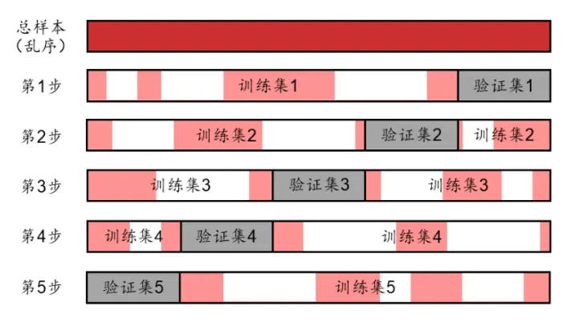

的模型，同样体现出更低的过拟合程度。两种交叉验证的差异在逻辑回归等简单模型上仅略有体现，而在 XGBoost 等复杂模型上体现更为明显。借助时序交叉验证的机器学习选股策略能够获得更高并且更稳定的收益。

然而，上述研究存在不完美之处，以下试举两例说明，同时引申出两种改进思路。

## 改进思路1——更合理的基线模型

上篇报告的第一处缺陷在于基线模型设置不合理。我们希望证明“时序”优于“K 折”，因此将 K折交叉验证视为基线模型以作对照之用。时序和 K折交叉验证的核心区别为以下两点，这两点也可视作时序交叉验证带来提升的可能原因：

1. 时序交叉验证保留样本的时序信息（假设 1）；

2. 时序交叉验证使用更少（接近一半）的样本（假设 2）。

当我们采用 K折交叉验证作为基线模型时，我们并不能回答时序交叉验证展现出的优势主要源于以上哪一点。事实上，存在一种极端的可能，即时序交叉验证的优势完全来源于使用更少样本（假设 2），此时使用 K 折交叉验证对一半样本进行训练和调参，就可能得到和时序交叉验证同样好的表现。然而这和我们采用保留样本时序信息（假设 1）的时序交叉验证的初衷相违背。换言之，由于基线模型设置不合理，我们无法厘清时序交叉验证带来提升的真实原因。

针对上述缺陷，我们提出的第一个改进思路是设置更丰富的基线模型，包括采用“训练集折半的 K 折交叉验证”，以及采用形式类似时序交叉验证但样本时序关系被破坏的“乱序递进式交叉验证”。如果时序交叉验证仍优于新的基线模型，那么表明时序交叉验证带来提升确实源于时序信息的保留。

训练集折半的 K折交叉验证如图表 3所示。在 K折交叉验证的基础上，保留验证集不变，每次随机取一半长度的原训练集作为新训练集。该方法各次训练所使用的平均样本量和时序交叉验证基本相同。如果该方法表现较好，接近于时序交叉验证，那么说明保留时序信息（假设 1）不是时序交叉验证带来提升的主要原因；类似地，如果该方法表现较差，接近于 K折交叉验证，那么说明使用更少的样本（假设 2）不是时序交叉验证带来提升的主要原因。

图表3： 新基线模型 1：训练集折半的 K折交叉验证示意图（K=5）
图表4： 新基线模型 2：乱序递进式交叉验证示意图（折数=5）
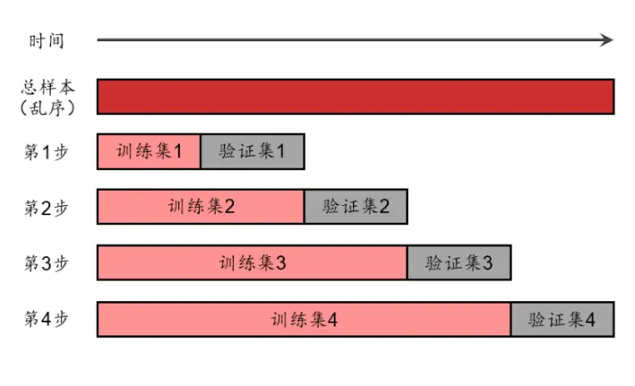
资料来源：华泰证券研究所
资料来源：华泰证券研究所

乱序递进式交叉验证如图表 4 所示。在时序交叉验证基础上，将样本打乱，破坏时序信息。该方法每次训练所使用的样本量均和时序交叉验证相同。该方法用于模型比较的逻辑和训练集折半的 K折交叉验证类似，不再赘述。

## 改进思路2——更精细的切分方法

上篇报告的第二处缺陷在于时序交叉验证对训练集和验证集的切分不够精细。此前我们使用 scikit-learn 库 model_selection 包下的 TimeSeriesSplit 类进行数据切分。默认参数下，TimeSeriesSplit 将样本内数据集等分成若干份，第 i次验证时取前 i份作为训练集，第 i+1份作为验证集。然而，在我们的选股数据集中，每个月份包含的有效样本数不一致。如果简单调用 TimeSeriesSplit，会出现同一月份数据分属不同“折”的情况，即同一月份数据部分出现在训练集部分出现在验证集，违背了时序交叉验证的本意。

针对上述缺陷，我们提出的第二个改进思路是对 scikit-learn 库的 model_selection 包进行改造，增加一个新的类 GroupTimeSeriesSplit，从而实现分组时序交叉验证（grouped timeseries cross-validation）。将样本所属月份通过参数 groups 传递给 GroupTimeSeriesSplit类，切分时不再将数据等分，而是切在相邻两个月的分界处，确保验证集在时序关系上严格位于训练集之后，如图表 5 所示。

分组时序交叉验证的难点不在于方法的构想，而在于代码实现。本文附录部分介绍了对scikit-learn 库 model_selection 包进行改造，增加 GroupTimeSeriesSplit 类以及在主函数中调用该类的详细方法。

乱序分组递进式交叉验证是针对分组时序交叉验证单独设计的新基线模型，如图表6所示。该方法每次进行验证时，训练集和验证集的样本量和分组时序交叉验证完全相同。具体实现方式为：首先根据样本所属月份信息，确定各次验证的训练集和验证集长度；随后将数据打乱，最后调用 GroupTimeSeriesSplit 类进行分组“时序”（实际上是乱序）交叉验证。该方法用于模型比较的逻辑和其余两个基线模型相似，不再赘述。

图表5： 分组时序交叉验证示意图（折数=5）
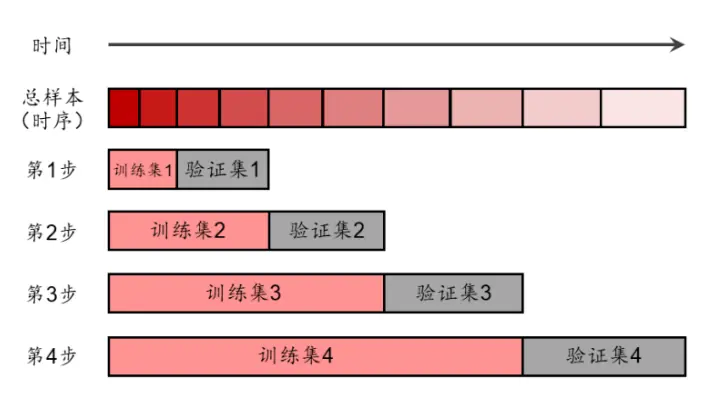
资料来源：华泰证券研究所

图表6： 新基线模型 3：乱序分组递进式交叉验证示意图（折数=5）
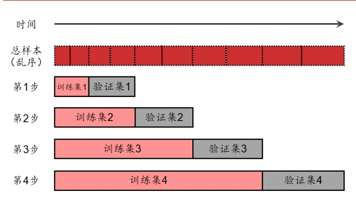
资料来源：华泰证券研究所

下表是对本文测试的六种交叉验证方法的汇总。

图表7： 本文测试的六种交叉验证方法汇总

| 交叉验证方法 | 描述 | 是否保留 时序信息？ | 相比 K折是否 使用更少样本？ | 训练集验证集是否 按月份精确切分？ |
| --- | --- | --- | --- | --- |
| K折 | 原始基线模型 |  |  |  |
| 时序 | 原始推荐模型 | √ | √ |  |
| 训练集折半的K折 | 本文新基线模型1 |  | √ |  |
| 乱序递进式 | 本文新基线模型2 |  | √ | √ |
| 分组时序 | 本文推荐模型 | √ | √ |  |
| 乱序分组递进式 | 本文新基线模型3 |  | √ |  |

资料来源：华泰证券研究所

## 方法

## 人工智能选股模型测试流程

图表8： 人工智能选股模型测试流程示意图
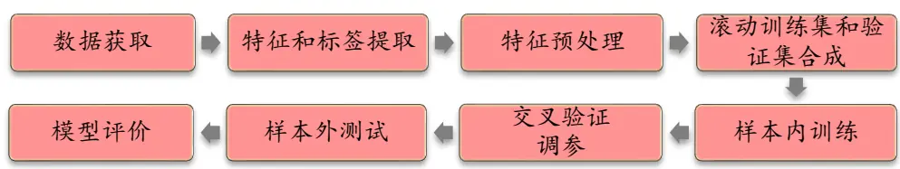
资料来源：华泰证券研究所

本文选用逻辑回归和XGBoost作为基学习器，两者分别作为简单模型和复杂模型的代表。测试流程包含如下步骤：

1． 数据获取：

a) 股票池：全 A股。剔除 ST 股票，剔除每个截面期下一交易日停牌的股票，剔除上市 3个月内的股票，每只股票视作一个样本。

b) 回测区间：2011 年 1 月 31 日至 2019 年 1 月 31 日。

2． 特征和标签提取：每个自然月的最后一个交易日，计算之前报告里的 70 个因子暴露度，作为样本的原始特征，因子池如图表 10 所示。计算下一整个自然月的个股超额收益（以沪深 300 指数为基准），在每个月末截面期，选取下月收益排名前 30%的股票作为正例（y = 1），后 30%的股票作为负例（y = 0），作为样本的标签。

3． 特征预处理：

a) 中位数去极值：设第 T 期某因子在所有个股上的暴露度序列为 $D_{i},~D_{M}$ 为该序列中位数， $D_{M1}$ 为序列 $D_{i}-D_{M}$ |的中位数，则将序列 $D_{i}$ 中所有大于 $D_{M}+5D_{M1}$ 的数重设为 $D_{M}+5D_{M1}$ ，将序列 $D_{i}$ 中所有小于 ${}^{\cdot}D_{M}-5D_{M1}$ 的数重设为 $D_{M}-5D_{M1}$ ；

缺失值处理：得到新的因子暴露度序列后，将因子暴露度缺失的地方设为中信一级行业相同个股的平均值；

c) 行业市值中性化：将填充缺失值后的因子暴露度对行业哑变量和取对数后的市值做线性回归，取残差作为新的因子暴露度；

d) 标准化：将中性化处理后的因子暴露度序列减去其现在的均值、除以其标准差，得到一个新的近似服从 N(0, 1)分布的序列。

4． 滚动训练集和验证集的合成：由于月度滚动训练模型的时间开销较大，本文采用年度滚动训练方式，全体样本内外数据共分为八个阶段，如下图所示。例如预测 2011 年时，将 2005~2010 年共 72 个月数据合并作为样本内数据集；预测 T 年时，将 T-6至T-1 年的 72 个月合并作为样本内数据。根据不同的交叉验证方法（图表 1~6），划分训练集和验证集，交叉验证的折数均为 12。对于分组时序交叉验证，每次训练集长度均为 6个月的整数倍，验证集长度均等于 6个月。对于 K折交叉验证和训练集折半的K 折交叉验证，验证次数为 12 次；对于其余四种交叉验证方法，验证次数为 11 次。凡涉及将数据打乱的交叉验证方法，随机数种子点均相同，从而保证打乱的方式相同。

图表9： 年度滚动训练示意图
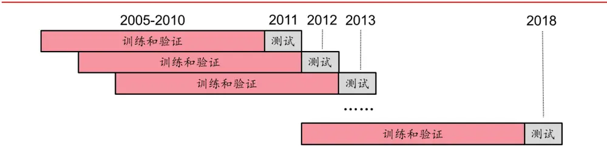
资料来源：华泰证券研究所

图表10： 选股模型中涉及的全部因子及其描述

| 大类因子 | 具体因子 | 因子描述 | 因子方向 |
| --- | --- | --- | --- |
| 估值 | EP | 净利润（TTM）/总市值 |  |
| 估值 | EPcut | 扣除非经常性损益后净利润（TTM）/总市值 | 1 |
| 估值 | BP | 净资产/总市值 | 1 |
| 估值 | SP | 营业收入（TTM）/总市值 | 1 |
| 估值 | NCFP | 净现金流（TTM）/总市值 | 1 |
| 估值 | OCFP | 经营性现金流（TTM）/总市值 | 1 |
| 估值 | DP | 近12个月现金红利（按除息日计）/总市值 | 1 |
| 估值 | G/PE | 净利润（TTM）同比增长率/PE_TTM | 1 |
| 成长 | Sales_G_q | 营业收入（最新财报，YTD）同比增长率 | 1 |
| 成长 | Profit_G_q | 净利润（最新财报，YTD）同比增长率 | 1 |
| 成长 | OCF_G_q | 经营性现金流（最新财报，YTD）同比增长率 | 1 |
| 成长 | ROE_G_q | ROE（最新财报，YTD）同比增长率 | 1 |
| 财务质量 | ROE_q | ROE（最新财报，YTD） |  |
| 财务质量 | ROE_ttm | ROE（最新财报，TTM） |  |
| 财务质量 | ROA_q | ROA（最新财报，YTD） | 1 |
| 财务质量 | ROA_ttm | ROA（最新财报，TTM） |  |
| 财务质量 | grossprofitmargin_q | 毛利率（最新财报，YTD） |  |
| 财务质量 | grossprofitmargin_ttm | 毛利率（最新财报，TTM） |  |
| 财务质量 | profitmargin_q | 扣除非经常性损益后净利润率（最新财报，YTD） | 1 |
| 财务质量 | profitmargin_ttm | 扣除非经常性损益后净利润率（最新财报，TTM） |  |
| 财务质量 | assetturnover_q | 资产周转率（最新财报，YTD） |  |
| 财务质量 | assetturnover_ttm | 资产周转率（最新财报，TTM） |  |
| 财务质量 | operationcashflowratio_q | 经营性现金流/净利润（最新财报，YTD） |  |
| 财务质量 | operationcashflowratio_ttm | 经营性现金流/净利润（最新财报，TTM） | 1 |
| 杠杆 | financial_leverage | 总资产/净资产 | -1 |
| 杠杆 | debtequityratio | 非流动负债/净资产 | -1 |
| 杠杆 杠杆 | cashratio | 现金比率 | 1 |
| 市值 | currentratio | 流动比率 | 1 |
| 动量反转 | In_capital | 总市值取对数 | -1 |
| 动量反转 | HAlpha | 个股60个月收益与上证综指回归的截距项 个股最近N个月收益率，N=1，3，6，12 | -1 |
| 动量反转 | return_Nm wgt_return_Nm | 个股最近N个月内用每日换手率乘以每日收益率求算术平均 | -1 -1 |
| 动量反转 exp_wgt_return_Nm |  | 值，N=1，3，6，12 |  |
| 波动率 | std_FF3factor_Nm | 个股最近 N 个月内用每日换手率乘以函数 exp(-x_i/N/4)再乘 |  |
|  |  | 以每日收益率求算术平均值，x_i为该日距离截面日的交易日 |  |
|  |  | 的个数，N=1，3，6，12 特质波动率——个股最近 N 个月内用日频收益率对 Fama |  |
|  |  | French三因子回归的残差的标准差，N=1，3，6，12 | -1 |
| 波动率 股价 | std_Nm | 个股最近N个月的日收益率序列标准差，N=1，3，6，12 | -1 |
| beta | In_price | 股价取对数 | -1 |
| 换手率 | beta | 个股 60个月收益与上证综指回归的 beta | -1 |
|  | turn_Nm | 个股最近N个月内日均换手率(剔除停牌、涨跌停的交易日)， N=1, 3, 6, 12 | -1 |
| 换手率 | bias_turn_Nm | 个股最近N个月内日均换手率除以最近2年内日均换手率(剔 | -1 |
| 情绪 | rating_average | 除停牌、涨跌停的交易日）再减去1，N=1，3，6，12 wind 评级的平均值 | 1 |
| 情绪 | rating_change | wind评级（上调家数-下调家数）/总数 | 1 |
| 情绪 | rating_targetprice | wind一致目标价/现价-1 | 1 |
| 股东 | holder_avgpctchange | 户均持股比例的同比增长率 | 1 |
| 技术 | MACD |  | -1 |
| 技术 | DEA | 经典技术指标（释义可参考百度百科），长周期取30日，短 | -1 |
| 技术 | DIF | 周期取 10 日，计算 DEA 均线的周期（中周期）取15 日 | -1 |
| 技术 | RSI | 经典技术指标，周期取20日 | -1 |
| 技术 | PSY | 经典技术指标，周期取20日 | -1 |
| 技术 | BIAS | 经典技术指标，周期取20日 | -1 |

资料来源：Wind，华泰证券研究所

5． 样本内训练：使用逻辑回归或 XGBoost 基学习器对训练集进行训练。

6． 交叉验证调参：对全部超参数组合进行网格搜索，选择验证集平均 AUC 最高的一组超参数作为模型最终的超参数。不同交叉验证方法可能得到不同的最优超参数。超参数设置和调参范围如下表所示。

图表11： 选股模型超参数和调参范围

| 基学习器 | 超参数 | 超参数描述 | 调参范围 |
| --- | --- | --- | --- |
| 逻辑回归 | 正则化项系数（C） | 实际为正则化系数倒数，C越大越容易过拟合 | [1e-5,3e-5,6e-5,8e-5,1e-4,,0.01] |
| XGBoost | 学习速率（learning_rate） | 学习速率越小，越容易找到局部最优解，但是越容易过拟合 | [0.01,0.025,0.05,0.075,0.1] |
|  | 最大树深度（max_depth） | 树越深，学习能力越强，但是越容易过拟合 | [3,5,10,15] |
|  | 行采样比例（subsample） | 行采样比例越高越容易过拟合 | [0.8,0.85,0.9,0.95] |

资料来源：华泰证券研究所

7． 样本外测试：确定最优超参数后，以 T 月末截面期所有样本预处理后的特征作为模型的输入，得到每个样本的预测值。将预测值视作合成后的因子，采用回归法、IC分析法和分层回测法进行单因子测试。

8． 模型评价：a) 测试集的正确率、AUC 等衡量模型性能的指标；b) 单因子测试得到的统计指标和回测绩效。

## 单因子测试

## 回归法和 IC值分析法

测试模型构建方法如下：

1. 股票池：全 A 股，剔除 ST 股票，剔除每个截面期下一交易日停牌的股票，剔除上市3 个月以内的股票。

2. 回测区间：2011-01-31 至 2019-01-31。

3. 截面期：每个月月末，用当前截面期因子值与当前截面期至下个截面期内的个股收益进行回归和计算 Rank IC值。

4. 数据处理方法：对于分类模型，将模型对股票下期上涨概率的预测值视作单因子。对于回归模型，将回归预测值视作单因子。因子值为空的股票不参与测试。

5. 回归测试中采用加权最小二乘回归（WLS），使用个股流通市值的平方根作为权重。IC测试时对单因子进行行业市值中性。

## 分层回测法

依照因子值对股票进行打分，构建投资组合回测，是最直观的衡量因子优劣的手段。测试模型构建方法如下：

1. 股票池、回测区间、截面期均与回归法相同。

2. 换仓：在每个自然月最后一个交易日核算因子值，在下个自然月首个交易日按当日收盘价换仓，交易费用以双边千分之四计。

3. 分层方法：因子先用中位数法去极值，然后进行市值、行业中性化处理（方法论详见上一小节），将股票池内所有个股按因子从大到小进行排序，等分 N 层，每层内部的个股等权配置。当个股总数目无法被 N 整除时采用任一种近似方法处理均可，实际上对分层组合的回测结果影响很小。

4. 多空组合收益计算方法：用 Top 组每天的收益减去 Bottom 组每天的收益，得到每日多空收益序列 $r_{1},r_{2},\cdots,r_{n}$ ，则多空组合在第 n天的净值等于 $r(1+r_{1})(1+r_{2})\cdots(1+r_{n})$

5. 评价方法：全部 N层组合年化收益率（观察是否单调变化），多空组合的年化收益率、夏普比率、最大回撤等。

## 结果

## 最优超参数

首先我们展示逻辑回归和 XGBoost 历年滚动训练得到的最优超参数，如下表所示。

图表12： 模型历年滚动训练最优超参数

| 基学习器 | 超参数 | 交叉验证方法 | 2011 | 2012 | 2013 | 2014 | 2015 | 2016 | 2017 | 2018 |
| --- | --- | --- | --- | --- | --- | --- | --- | --- | --- | --- |
| 逻辑回归 | 正则化项系数 | K折 | 0.0008 | 0.001 | 0.003 | 0.003 | 0.008 | 0.003 | 0.003 | 0.003 |
|  | (C) | 时序 | 0.0001 | 0.0001 | 0.0003 | 0.0006 | 0.0006 | 0.0001 | 0.0001 | 0.0001 |
|  |  | 训练集折半的K折 | 0.001 | 0.001 | 0.001 | 0.003 | 0.003 | 0.003 | 0.003 | 0.003 |
|  |  | 乱序递进式 | 0.0008 | 0.001 | 0.003 | 0.003 | 0.003 | 0.001 | 0.001 | 0.001 |
|  |  | 分组时序 | 0.0003 | 0.0006 | 0.0003 | 0.0003 | 0.0006 | 0.0003 | 0.0001 | 0.0001 |
|  |  | 乱序分组递进式 | 0.001 | 0.001 | 0.003 | 0.003 | 0.003 | 0.001 | 0.001 | 0.001 |
| XGBoost | 学习速率 | K折 | 0.05 | 0.025 | 0.025 | 0.025 | 0.025 | 0.025 | 0.05 | 0.05 |
|  | (learning_rate) | 时序 | 0.025 | 0.075 | 0.075 | 0.025 | 0.05 | 0.05 | 0.025 | 0.025 |
|  |  | 训练集折半的K折 | 0.05 | 0.05 | 0.025 | 0.025 | 0.025 | 0.025 | 0.025 | 0.025 |
|  |  | 乱序递进式 | 0.025 | 0.025 | 0.025 | 0.025 | 0.025 | 0.025 | 0.025 | 0.025 |
|  |  | 分组时序 | 0.05 | 0.025 | 0.025 | 0.075 | 0.075 | 0.025 | 0.025 | 0.025 |
|  |  | 乱序分组递进式 | 0.025 | 0.025 | 0.05 | 0.025 | 0.025 | 0.025 | 0.025 | 0.025 |
| XGBoost | 最大树深度 | K折 | 10 | 10 | 10 | 10 | 10 | 10 | 10 | 10 |
|  | (max_depth) | 时序 | 5 | 3 | 3 | 5 | 3 | 3 | 5 | 5 |
|  |  | 训练集折半的K折 | 5 | 5 | 10 | 10 | 10 | 10 | 10 | 10 |
|  |  | 乱序递进式 | 10 | 10 | 10 | 10 | 10 | 10 | 10 | 10 |
|  |  | 分组时序 | 3 | 5 | 5 | 3 | 3 | 5 | 5 | 5 |
|  |  | 乱序分组递进式 | 10 | 10 | 5 | 10 | 10 | 10 | 10 | 10 |
| XGBoost | 行采样比例 | K折 | 0.9 | 0.9 | 0.95 | 0.95 | 0.9 | 0.9 | 0.95 | 0.9 |
|  | (subsample) | 时序 | 0.8 | 0.8 | 0.85 | 0.8 | 0.85 | 0.9 | 0.8 | 0.9 |
|  |  | 训练集折半的K折 | 0.9 | 0.85 | 0.85 | 0.85 | 0.9 | 0.95 | 0.8 | 0.85 |
|  |  | 乱序递进式 | 0.9 | 0.85 | 0.85 | 0.85 | 0.8 | 0.8 | 0.85 | 0.9 |
|  |  | 分组时序 | 0.85 | 0.85 | 0.9 | 0.9 | 0.85 | 0.8 | 0.8 | 0.85 |
|  |  | 乱序分组递进式 | 0.8 | 0.9 | 0.85 | 0.8 | 0.95 | 0.85 | 0.85 | 0.85 |

资料来源：Wind，华泰证券研究所

对于逻辑回归的正则化项系数 C（实际在 scikit-learn 库里为正则化系数的倒数），时序和分组时序交叉验证两种方法的 C 值全部在万分位数量级，其余四种基线模型的 C 值大部分在千分位数量级。C 值越小，对正则化项的惩罚越大，模型的拟合能力越弱而泛化能力越强。换言之，时序和分组时序交叉验证选出的逻辑回归模型更可能出现欠拟合，更不容易出现过拟合。

对于 XGBoost 的学习速率 learning_rate，相比于调参范围（0.01,0.025,0.05,0.075,0.1），六种交叉验证方法得到的最优超参数集中在 0.025~0.075 之间，时序和分组时序交叉验证方法相比于其余四种基线模型没有明显差异。

对于 XGBoost 的最大树深度 max_depth，时序和分组时序交叉验证两种方法的最优超参数均为 3或 5，其余四种基线模型的最优超参数大部分为 10。最大树深度越浅，树模型的分裂规则越简单，模型的拟合能力越弱而泛化能力越强。换言之，时序和分组时序交叉验证选出的 XGBoost 模型更可能出现欠拟合，更不容易出现过拟合。

对于XGBoost的行采样比例subsample，K折交叉验证的最优超参数大于其余五种方法。行采样比例越高，模型相对越复杂，模型的拟合能力越强而泛化能力越弱。换言之，K折交叉验证选出的模型更可能出现过拟合，更不容易出现欠拟合。

总的来看，无论基学习器是逻辑回归还是 XGBoost，时序和分组时序交叉验证都选出了更“简单”的模型，过拟合风险更低。

## 模型性能

接下来我们展示逻辑回归和 XGBoost 的模型性能，关注样本内和测试集的各月平均正确率和 AUC，详细结果如下表所示。

图表13： 六种交叉验证方法模型性能对比（回测期 20110131~20190131）

| 交叉验证方法 | 样本内正确率 | 样本内 AUC 基学习器：逻辑回归 | 测试集正确率 | 测试集 AUC |
| --- | --- | --- | --- | --- |
| K折 | 57.20% | 0.5992 | 56.17% | 0.5841 |
| 时序 | 56.97% | 0.5970 | 56.23% | 0.5849 |
| 训练集折半的K折 | 57.20% | 0.5992 | 56.18% | 0.5842 |
| 乱序递进式 | 57.19% | 0.5991 | 56.22% | 0.5845 |
| 分组时序 | 57.04% | 0.5979 | 56.26% | 0.5852 |
| 乱序分组递进式 | 57.19% | 0.5991 | 56.23% | 0.5845 |
|  |  | 基学习器：XGBoost |  |  |
| K折 | 85.42% | 0.9313 | 56.48% | 0.5923 |
| 时序 | 60.05% | 0.6418 | 56.56% | 0.5953 |
| 训练集折半的K折 | 77.92% | 0.8542 | 56.59% | 0.5942 |
| 乱序递进式 | 83.30% | 0.9142 | 56.52% | 0.5940 |
| 分组时序 | 60.23% | 0.6439 | 56.59% | 0.5954 |
| 乱序分组递进式 | 80.91% | 0.8862 | 56.57% | 0.5944 |

资料来源：Wind，华泰证券研究所

对于样本内正确率和 AUC，时序和分组时序交叉验证的样本内表现不佳，弱于其余四种基线模型。这一差距在 XGBoost 上体现尤为明显，时序和分组时序的样本内 AUC 仅为0.64，而其余四种基线模型的样本内 AUC 则全部高于 0.85。

对于测试集正确率和 AUC，规律则刚好相反，时序和分组时序交叉验证在测试集的表现整体优于其余四种基线模型。这一差距同样在 XGBoost 上体现更为明显。另外，分组时序验证表现略优于原始时序交叉验证。

为了更细致地挖掘各交叉验证方法历史表现中的规律，我们在每个测试月份将除 K折之外五种交叉验证方法的 AUC 减去 K折的 AUC，再逐月累加，结果如下图所示。如果某种交叉验证方法对应的折线接近 0 轴，说明该方法和 K折相比基本没有差别；如果某种交叉验证方法对应的折线稳定上升，说明该方法在历史上稳定地优于 K折。

图表14： 逻辑回归各交叉验证相对 K折 AUC之差的逐月累积值
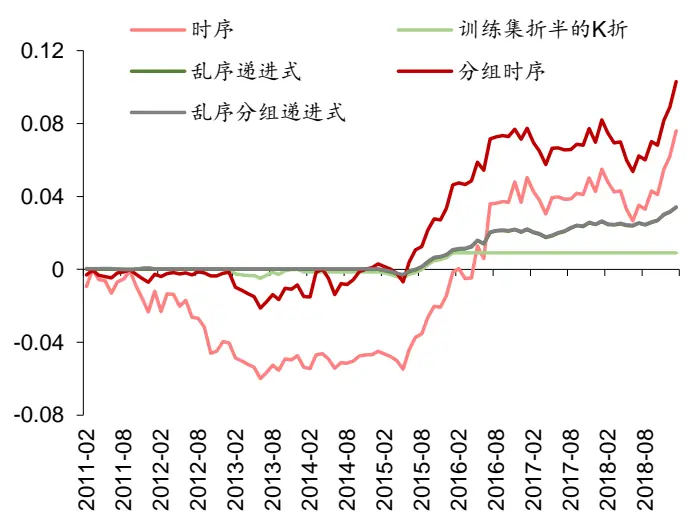
资料来源：Wind，华泰证券研究所

图表15： XGBoost各交叉验证相对 K折 AUC之差的逐月累积值
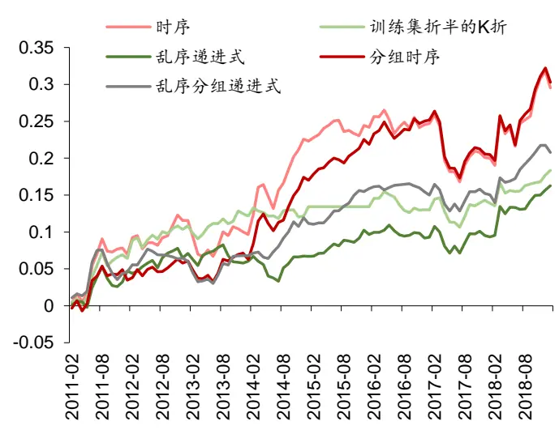
资料来源：Wind，华泰证券研究所

对于逻辑回归（图表 14），2013 年 6 月前，时序交叉验证稳定地弱于 K 折，其余方法和K 折无明显差异；2013 年 6 月后，时序和分组时序交叉验证稳定地优于 K 折，乱序递进式和乱序分组递进式几乎重合（由于最优超参数相同，参考图表 12）并且略优于 K 折。对于 XGBoost（图表 15），除 2017 年 4~7 月以外，时序和分组时序交叉验证均稳定、大幅优于 K折，其余三种交叉验证方法也均略优于 K折。

需要说明的是，图表 14 中训练集折半的 K 折交叉验证自 2016 年 2 月后一直持平，原因是该方法得到的最优超参数和K折相同（参考图表12），其AUC和K折AUC的差值为0，故差值的累积值保持不变。图表 17、图表 19 的情况与之相同。

综合上述结果，我们可以对六种交叉验证方法的表现大致进行排序：

至此我们可以回答本文开头提出的问题：时序相对于 K折交叉验证的提升主要源于保留时序信息（假设 1）还是使用更少的样本（假设 2）？首先，和 K 折相比，三种新的基线模型使用更少样本，其表现略优于 K 折，表明模型表现的提升确实部分源于使用更少样本。其次，和三种新的基线模型相比，时序和分组时序交叉验证保留了时序信息，其表现优于三种新的基线模型，表明模型表现的提升主要源于时序信息的保留。

## 单因子测试

将机器学习模型的输出视为单因子，则可进行单因子测试。六种交叉验证方法单因子测试回归法和 IC 值分析法的详细结果如下表所示。和模型性能结果类似，无论基学习器是逻辑回归还是 XGBoost，对于|t|均值、t 均值、因子收益率均值、RankIC 均值这四项指标，时序和分组时序交叉验证表现相对较好，其次是三种新的基线模型，K折交叉验证表现相对较差。时序和分组时序交叉验证的缺点在于RankIC的波动较大，从而导致IC_IR和IC>0占比这两项指标不占优势。

图表16： 六种交叉验证方法单因子回归法和IC值分析结果对比（回测期 20110131~20190131）
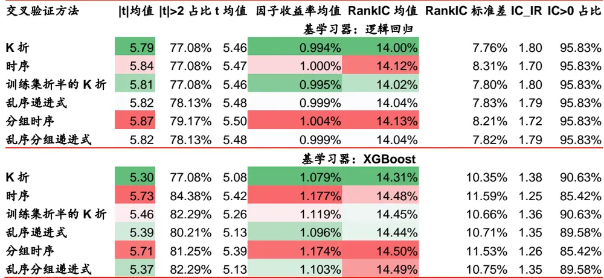
资料来源：Wind，华泰证券研究所

在每个测试月份，将除 K折之外五种交叉验证方法的因子收益率减去 K折的因子收益率，再逐月累加，结果如下图所示。对于逻辑回归（图表 17），分组时序交叉验证在大部分时间段优于其余五种方法，时序交叉验证的波动较大，乱序递进式和乱序分组递进式几乎重合且略优于 K折。对于 XGBoost（图表 18），2015 年 4 月前，五种方法相比于 K折无明显优势；2015 年 4 月后，时序和分组时序交叉验证稳定、大幅优于三种新基线模型，新基线模型略优于 K折。

图表17： 逻辑回归各交叉验证相对 K折因子收益率之差的逐月累积值
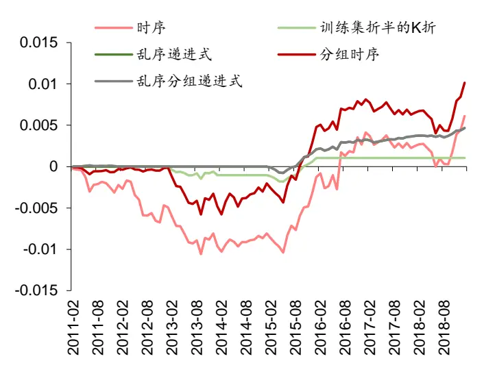
资料来源：Wind，华泰证券研究所

图表18： XGBoost各交叉验证相对 K折因子收益率之差的逐月累积值
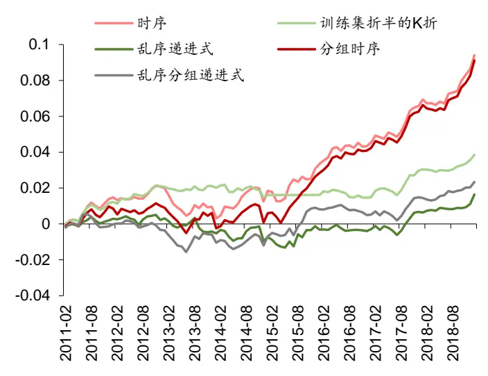
资料来源：Wind，华泰证券研究所

在每个测试月份，将除 K 折之外五种交叉验证方法的 RankIC 减去 K 折的 RankIC，再逐月累加，结果如下图所示。对于逻辑回归（图表 19），时序和分组时序交叉验证在 2017年弱于 K 折，其余时间段均优于 K 折；其余三种新基线模型在 2015 年后小幅优于 K 折。对于 XGBoost（图表 20），五种交叉验证方法在 2011 年 9 月~2012 年 2 月、2017 年和2018 年上半年弱于 K折，其余时间段优于 K折，时序和分组时序的优势更明显。

需要特别说明的是，下图展示的 RankIC 结果和《对抗过拟合：从时序交叉验证谈起》一文的 RankIC 结果有差异，原因在于本文计算 RankIC 时对因子做行业市值中性处理，此前研究未做中性化。实际上，如不做中性化，时序和分组时序交叉验证大部分时间段均稳定优于其余四种基线模型。

图表19： 逻辑回归各交叉验证相对 K折 RankIC之差的逐月累积值
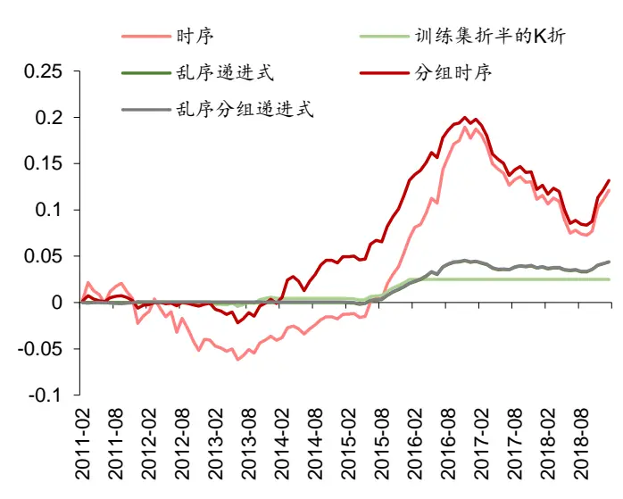
资料来源：Wind，华泰证券研究所

图表20： XGBoost各交叉验证相对 K折 RankIC之差的逐月累积值
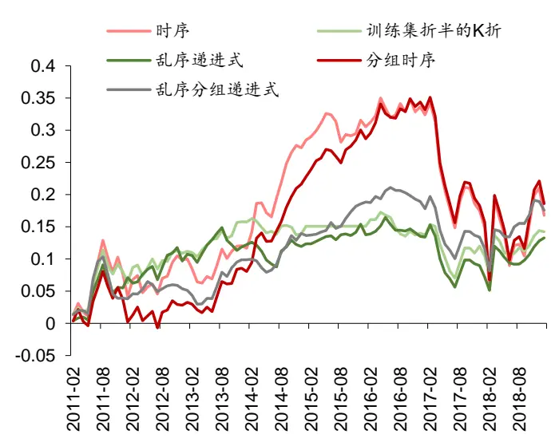
资料来源：Wind，华泰证券研究所

单因子分层回测的详细结果如下表所示。无论基学习器是逻辑回归还是 XGBoost，时序和分组时序交叉验证在 TOP 组合年化收益率、多空组合年化收益率、多空组合 Calmar 比率上均优于其余四种基线模型，分组时序略优于时序。时序和分组时序交叉验证的缺点在于多空组合收益波动较大，因而在多空组合夏普比率上不占优势。

图表21： 六种交叉验证方法单因子分层回测结果对比（回测期 20110131~20190131）

| 交叉验证方法 | 组合1 年化收益率年化收益率 | 组合2 | 组合3 年化收益率 | 组合4 年化收益率 | 组合5 年化收益率 | 多空组合 年化收益率 | 多空组合 夏普比率 | 多空组合 最大回撤 | 多空组合 Calmar 比率 |
| --- | --- | --- | --- | --- | --- | --- | --- | --- | --- |
|  | 基学习器：逻辑回归 |  |  |  |  |  |  |  |  |
| K折 | 17.58% | 9.49% | 4.44% | -3.34% | -15.25% | 38.53% | 5.63 | 7.53% | 5.12 |
| 时序 | 17.86% | 8.83% | 4.99% | -3.16% | -15.38% | 39.00% | 5.44 | 7.23% | 5.40 |
| 训练集折半的K折 | 17.61% | 9.62% | 4.37% | -3.36% | -15.29% | 38.65% | 5.60 | 7.53% | 5.13 |
| 乱序递进式 | 17.74% | 9.49% | 4.41% | -3.44% | -15.22% | 38.70% | 5.60 | 7.53% | 5.14 |
| 分组时序 | 17.91% | 8.99% | 5.08% | -3.30% | -15.51% | 39.28% | 5.53 | 7.18% | 5.47 |
| 乱序分组递进式 | 17.74% | 9.53% | 4.42% | -3.48% | -15.22% | 38.69% | 5.61 | 7.53% | 5.14 |
|  | 基学习器：XGBoost |  |  |  |  |  |  |  |  |
| K折 时序 | 20.16% 20.49% | 8.72% 8.43% | 1.93% 2.73% | -3.98% -3.72% | -14.87% -15.33% | 41.27% 42.30% | 5.41 5.17 | 14.11% 14.07% | 2.93 3.01 |
| 训练集折半的K折 | 20.03% | 9.55% | 1.79% | -3.72% | -15.38% | 41.92% | 5.42 | 14.18% | 2.96 |
| 乱序递进式 | 19.86% | 9.32% | 2.21% | -4.44% | -14.92% | 41.00% | 5.30 | 13.45% | 3.05 |
| 分组时序 | 20.55% | 8.47% | 3.43% | -4.37% | -15.40% | 42.50% | 5.22 | 12.84% | 3.31 |
| 乱序分组递进式 | 19.93% | 8.85% | 2.83% | -4.51% | -15.02% | 41.24% | 5.31 | 13.74% | 3.00 |

资料来源：Wind，华泰证券研究所

相比于多空组合表现，我们更关注因子在多头的表现。TOP 组合的详细绩效分析如下表所示。无论基学习器是逻辑回归还是 XGBoost，时序和分组时序交叉验证在 TOP 组合年化收益率、夏普比率、最大回撤、Calmar比率上全面优于其余四种基线模型，分组时序交叉验证略优于时序。

图表22： 六种交叉验证方法单因子分层回测TOP组合详细绩效分析（回测期 20110131~20190131）

| 交叉验证方法 | 年化收益率 | 年化波动率 | 夏普比率 基学习器：逻辑回归 | 最大回撤 | Calmar 比率 |
| --- | --- | --- | --- | --- | --- |
| K折 | 17.58% 27.87% | 0.631 |  |  | 0.364 |
| 时序 | 17.86% | 27.87% | 0.641 | 48.28% 48.04% | 0.372 |
| 训练集折半的K折 | 17.61% | 27.94% | 0.630 | 48.21% | 0.365 |
| 乱序递进式 | 17.74% | 27.92% | 0.635 | 48.21% | 0.368 |
| 分组时序 | 17.91% | 27.87% | 0.642 | 48.04% | 0.373 |
| 乱序分组递进式 | 17.74% | 27.92% | 0.635 | 48.21% | 0.368 |
|  | 基学习器：XGBoost |  |  |  |  |
| K折 | 20.16% | 28.11% | 0.717 | 48.22% | 0.418 |
| 时序 | 20.49% | 28.20% | 0.726 | 49.10% | 0.417 |
| 训练集折半的K折 | 20.03% | 28.07% | 0.713 | 48.62% | 0.412 |
| 乱序递进式 | 19.86% | 28.06% | 0.708 | 48.65% | 0.408 |
| 分组时序 | 20.55% | 28.17% | 0.729 | 48.59% | 0.423 |
| 乱序分组递进式 | 19.93% | 28.11% | 0.709 | 48.64% | 0.410 |

资料来源：Wind，华泰证券研究所

## 构建策略组合及回测分析

基于六种交叉验证方法，我们构建了行业、市值中性全 A选股策略并进行回测。首先考察基学习器为逻辑回归的情形，如下表所示（注意超额收益最大回撤的数值越小，色阶越偏红）。当行业市值中性基准为沪深 300 时，相比于其它方法，时序和分组时序交叉验证在年化超额收益率、超额收益最大回撤、信息比率、Calmar 比率上稍有优势。当行业市值中性基准为中证 500 时，分组时序交叉验证整体上看略优于其它方法，但是也和策略组合的个股权重偏离上限有关。

图表23： 基于六种交叉验证方法构建全 A选股策略回测指标对比（逻辑回归为基学习器，回测期 20110131~20190131）
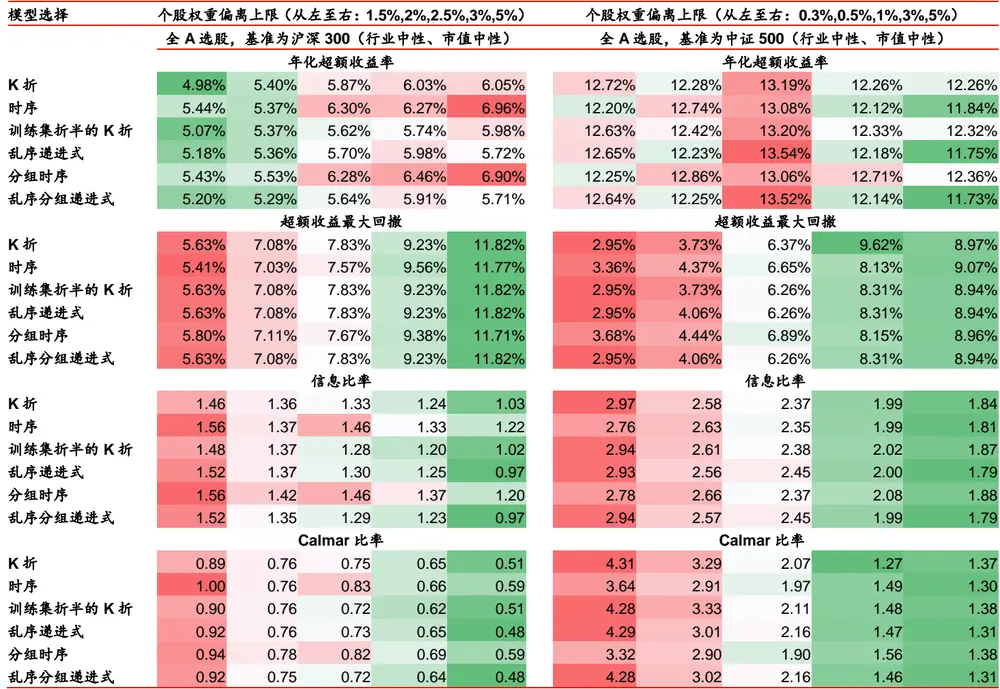
资料来源：Wind，华泰证券研究所

其次考察基学习器为 XGBoost 的情形。当行业市值中性基准为沪深 300 时，时序交叉验证在个股权重偏离上限较小时表现相对较好，分组时序交叉验证没有明显优势。当行业市值中性基准为中证 500 时，时序交叉验证在年化超额收益率上稍占优，但是在其余指标上无优势，分组时序交叉验证也没有优势。

总的来说，由于构建策略组合涉及中性化基准的选取，个股权重偏离上限的选取，并且和单因子测试相比又增加了市值中性的限制，相当于在机器学习模型上增加了更多不可控因素，因而得到的回测结果相对杂乱。客观地看，时序和分组时序交叉验证得到了更好的模型和更好的单因子测试效果，但是我们的行业市值中性策略组合没有把模型的优势体现出来。如何设计更合理的策略组合构建方式从而展现出模型的优势，如何修改机器学习模型以适应特定的策略组合构建方式，可能是未来的思考方向。

图表24： 基于六种交叉验证方法构建全 A选股策略回测指标对比（XGBoost为基学习器，回测期 20110131~20190131）
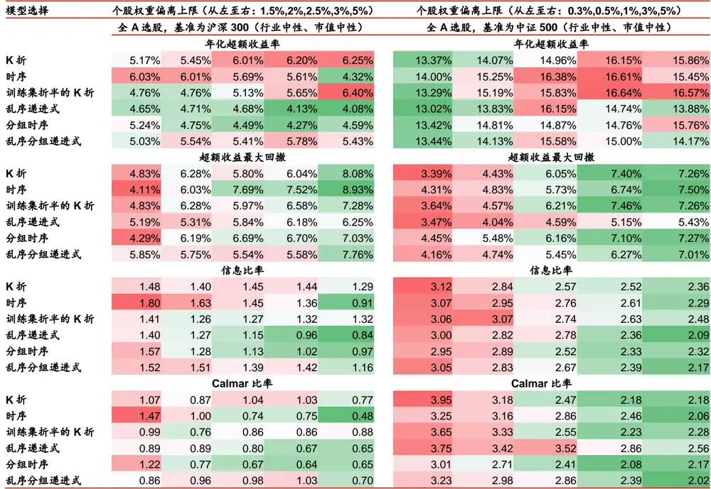
资料来源：Wind，华泰证券研究所

## 总结和讨论

如何防止过拟合是机器学习研究者始终面临的考验。随着对该问题理解的逐步深入，我们发现机器学习在其它领域的成功经验并不能直接照搬到金融领域，其中最突出的问题之一是交叉验证的方式，经典的 K折交叉验证应用于金融时间序列数据可能导致过拟合。我们也发现时序交叉验证是对抗过拟合的重要途径之一。

本文从基线模型的设置和训练集验证集的精确切分两个角度，对原有时序交叉验证方法提出改进。通过对比时序交叉验证、分组时序交叉验证以及四种基线模型，我们得到以下重要结论：

1. 从模型性能来看，将六种交叉验证方法按样本内表现排序：时序 < 分组时序 < 三种新的基线模型 < K折。从模型性能和单因子测试结果来看，将各方法按测试集表现排序：分组时序 > 时序 > 三种新的基线模型 > K折。K折交叉验证得到的模型表现出较强的过拟合，时序和分组时序交叉验证能够一定程度上减轻过拟合。

2. 新基线模型的引入使得我们能够对时序为何优于 K折进行归因分析。首先，和 K折相比，三种新的基线模型使用更少样本，其表现略优于 K折，说明模型表现的提升确实部分源于使用更少样本。其次，和三种新的基线模型相比，时序和分组时序交叉验证保留了时序信息，其表现优于三种新的基线模型，说明模型表现的提升主要源于时序信息的保留。

3. 通过对 scikit-learn 库 model_selection 包的改造，我们得以实现样本的精确切分，确保验证集在时序上严格位于训练集之后。相比于原始时序交叉验证，改造后的分组时序交叉验证在模型表现上有小幅提升。

最后，思考一个有趣的问题。我们通过《对抗过拟合：从时序交叉验证谈起》和本文证明了 K 折交叉验证存在过拟合风险，时序和分组时序交叉验证能够减轻过拟合。然而，如何证明这两篇报告得到的结论不是一种过拟合呢？这样的质疑似乎可以永远迭代下去。进一步地想，作为人类，我们生也有涯，只能从有限的历史中探寻规律。任何基于历史研究得到的结论都不能保证未来仍然成立，那么就都可以被质疑为过拟合，但是能够指导我们做出决策的，也仅有那些“过拟合”的经验而已。说到底，我们需要一套科学的手段评估过拟合的程度，排除那些真正有害的过拟合。如何破解量化研究的过拟合困境，可能成为未来研究的重点。

## 附录：分组时序交叉验证的代码实现

在进行原始时序交叉验证时，我们使用基于 Python 的 scikit-learn 库 model_selection 包下的 TimeSeriesSplit 类进行数据切分。默认参数下，TimeSeriesSplit 将样本内数据集等分成若干份，第 i次验证时取前 i份作为训练集，第 i+1 份作为验证集。但是在选股问题里，每个月份包含的有效样本数不一致。如果简单调用 TimeSeriesSplit，会出现同一月份数据一部分出现在训练集一部分出现在验证集的情况。

本文提出分组时序交叉验证方法，其思路是在切分时不将数据等分，而是切在相邻两个月的分界处，确保验证集在时序关系上严格位于训练集之后。分组时序交叉验证的难点不在于方法构想，而在于实现。我们需要对 scikit-learn 库的 model_selection 包进行改造，增加 一 个 新 的类 GroupTimeSeriesSplit。 将 样 本 所 属 月 份 通 过参 数 groups 传 递给GroupTimeSeriesSplit 类。代码实现方式分为三步：1）修改 model_selection 模块的_split.py ； 2 ） 修 改 model_selection 包 的 __init__.py ； 3 ） 在 主 函 数 中 调 用GroupTimeSeriesSplit。核心是第一步。

下面我们展示具体的代码实现步骤，测试用的 Python 版本为 3.6，scikit-learn 库版本为0.19 及 0.20。

## 修改 model_selection 包的_split.py

## 图表25： model_selection 包的_split.py 中新增 GroupTimeSeriesSplit 类

| 1.class GroupTimeSeriesSplit(_BaseKFold): |
| --- |
| 2. def __init_(self, n_splits=3): |
| 3. super(GroupTimeSeriesSplit, self)._init_(n_splits, |
| 4. shuffle=False, |
| 5. random_state=None) |
| 6. |
| 7. def split(self, X, y=None, groups=None): |
| 8. X, y, groups = indexable(X, y, groups) |
| 9. n_splits = self.n_splits |
| 10. n_folds = n_splits + 1 |
| 11. |
| 12. if groups is None: |
| 13. raise ValueError("The 'groups' parameter should not be None.") |
| 14. groups = check_array(groups, ensure_2d=False, dtype=None) |
| 15. |
| 16. unique_groups = np.unique(groups, return_inverse=True)[0] |
| 17. n_groups = len(unique_groups) |
| 18. |
| 19. if n_groups%n_folds != 0: |
| 20. raise ValueError("Cannot have number of splits n_splits=%d not divisible" |
| 21. " by the number of groups: %d." |
| 22. % (self.n_splits, n_groups)) |
| 23. |
| 24. groups = np.array(groups) |
| 25. n_groups_per_fold = n_groups//n_folds |
| 26. |
| 27. for n_split in range(n_splits): |
| 28. train_groups = unique_groups[0:n_groups_per_fold*(n_split+1)] |
| 29. test_groups = unique_groups[n_groups_per_fold*(n_split+1):n_groups_per_fold*(n_split+2)] |
| 30. yield(np.where(np.logical_and(groups >= train_groups[0], groups <= train_groups[-1]))[0], |
| 31. np.where(np.logical_and(groups >= test_groups[0], groups <= test_groups[-1]))[0]) |

资料来源：华泰证券研究所

_split.py 是 model_selection 包的核心模块之一，用来实现各种训练集和验证集的切分方法。我们新定义的 GroupTimeSeriesSplit 类继承自_BaseKFold 类（第 1 行）；在类的初始化方法__init__中定义了传递给类的唯一参数 n_splits（第 2 行）。n_splits 表示验证次数，通常设为折数 n_folds 减 1（第 10 行），例如验证 11 次则将数据分成 12份。

GroupTimeSeriesSplit 类的核心方法是 split，该方法接受三个参数：特征 X，标签 y，分组标签 groups（第 7 行）。参数 groups 不能为空值，否则抛出错误 ValueError（12~13行）。

读取到 groups 参数后（如每条样本的月份编号），对 groups 去重并升序排列，得到去重后的分组标签 unique_groups（第 16 行），分组个数 n_groups 即为 unique_groups 的长度（第 17 行）。

我们规定分组个数 n_groups 必须为折数 n_folds 的整数倍。例如 72 个月样本内数据集是折数 12 的倍数，从而保证每一折包含整数个月。若不满足整除性要求，则抛出错误ValueError（19~22 行）。

将分组标签 groups 转换为 ndarray 类型（第 24 行），计算每一折包含的分组个数n_groups_per_fold（第 25 行）。

对每一次验证进行遍历（第 27 行）。每一次迭代中，首先确定训练集包含的分组编号train_groups（第 28 行），其次确定验证集包含的分组编号 test_groups（第 29 行），最后寻找分组标签 groups 介于 train_groups 最大最小值之间的样本作为训练集（第 30 行），分组标签 groups 介于 test_groups 最大最小值之间的样本作为验证集（第 31 行），通过yield 返回当前迭代的结果。

## 修改 model_selection 包的__init__.py

## 图表26： model_selection 包的__init__.py 中新增 GroupTimeSeriesSplit 类

| 1. from ._split import GroupTimeSeriesSplit # add a new class |  |
| --- | --- |
| 2. |  |
| 3. | _all__ = ('BaseCrossValidator', |
| 4. | 'GridSearchCV', |
| 5. | 'TimeSeriesSplit', |
| 6. | 'GroupTimeSeriesSplit', # add a new class |
| 7. 8. | 'KFold', |
| 9. | 'GroupKFold', # other classes |
| 10. | 'permutation_test_score', |
| 11. | 'train_test_split', |
| 12. | 'validation_curve') |

资料来源：华泰证券研究所

_init__.py 是 model_selection 包的模块之一，当我们导入 model_selection 包时，实际上是导入了该__init__.py 文件。对__init__.py 的修改较为简单，只需要添加两行代码。首先从之前修改的_split 中新导入 GroupTimeSeriesSplit 类（第 1 行），其次在__all__元组中新加入’GroupTimeSeriesSplit’字符串（第 6 行）。

## 主函数中调用 GroupTimeSeriesSplit 类

## 图表27： 主函数中调用 GroupTimeSeriesSplit 类

from xgboost import XGBClassifier 
2. from sklearn.model_selection import GroupTimeSeriesSplit,GridSearchCV 
3. 
4. xgb = XGBClassifier(random_state=42) 
5. parameters = [{'learning_rate':[0.01,0.025,0.05,0.075,0.1], 
6. 'max_depth':[3,5,10,15] 
7. 'subsample':[0.8,0.85,0.9,0.95]}] 
8. 
9. gptscv = GroupTimeSeriesSplit(n_splits=11) 
10. 
11. clf = GridSearchCV(estimator=xgb,param_grid=parameters, 
scoring='roc_auc',cv=gptscv.split(X,y,groups)) 
13. clf.fit(X,y)
资料来源：华泰证券研究所

下面我们展示如何在主函数中调用之前写好的 GroupTimeSeriesSplit 类。我们将以XGBoost 分类器作为基学习器，并使用网格搜索方法对一定范围内的超参数组合进行遍历。需要事先导入 XGBoost 分类器（第 1 行），GroupTimeSeriesSplit 类和网格搜索（第 2 行）。

创建 XGBoost 分类器的实例化对象 xgb。为保证实验结果可重复，设置随机数种子点random_state 为任意整数，这里设为 42（第 4 行）。对三项超参数进行调参，分别设置学习速率 learning_rate（第 5 行）、最大树深度 max_depth（第 6 行）、行采样比例 subsample（第 7行）的网格搜索范围，保存为列表变量 parameters。

创建分组时序交叉验证 GroupTimeSeriesSplit 类的实例化对象 gptscv，传入唯一参数验证次数 n_splits，参数值设为 11（第 9 行）。

创建网格搜索的实例化对象 clf，参数基学习器 estimator 设为之前定义的 xgb，参数网格搜索范围设为之前定义的 parameters，参数模型评价指标 scoring 设为’roc_auc’即 AUC，参数交叉验证方法 cv 设为 gptscv 的 split 方法（第 12~13 行）。

需要说明的是，gptscv.split 本质上是一个生成器，用来返回每次验证的训练集和验证集的行索引。这里 split 方法传入三个输入参数：特征 X，标签 y，分组标签 groups。

最后我们调用 clf 的 fit 方法，使用定义好的交叉验证和网格搜索模型，对样本内数据集的特征 X 和标签 y 进行拟合。拟合结果可以通过查看 clf 的属性得到。

## 风险提示

时序和分组时序交叉验证方法是对传统模型调参方法的改进，高度依赖基学习器表现。该方法是对历史投资规律的挖掘，若未来市场投资环境发生变化导致基学习器失效，则该方法存在失效的可能。时序和分组交叉验证方法存在一定欠拟合风险。

## 免责申明

本报告仅供华泰证券股份有限公司（以下简称“本公司”）客户使用。本公司不因接收人收到本报告而视其为客户。

本报告基于本公司认为可靠的、已公开的信息编制，但本公司对该等信息的准确性及完整性不作任何保证。本报告所载的意见、评估及预测仅反映报告发布当日的观点和判断。在不同时期，本公司可能会发出与本报告所载意见、评估及预测不一致的研究报告。同时，本报告所指的证券或投资标的的价格、价值及投资收入可能会波动。本公司不保证本报告所含信息保持在最新状态。本公司对本报告所含信息可在不发出通知的情形下做出修改，投资者应当自行关注相应的更新或修改。

本公司力求报告内容客观、公正，但本报告所载的观点、结论和建议仅供参考，不构成所述证券的买卖出价或征价。该等观点、建议并未考虑到个别投资者的具体投资目的、财务状况以及特定需求，在任何时候均不构成对客户私人投资建议。投资者应当充分考虑自身特定状况，并完整理解和使用本报告内容，不应视本报告为做出投资决策的唯一因素。对依据或者使用本报告所造成的一切后果，本公司及作者均不承担任何法律责任。任何形式的分享证券投资收益或者分担证券投资损失的书面或口头承诺均为无效。

本公司及作者在自身所知情的范围内，与本报告所指的证券或投资标的不存在法律禁止的利害关系。在法律许可的情况下，本公司及其所属关联机构可能会持有报告中提到的公司所发行的证券头寸并进行交易，也可能为之提供或者争取提供投资银行、财务顾问或者金融产品等相关服务。本公司的资产管理部门、自营部门以及其他投资业务部门可能独立做出与本报告中的意见或建议不一致的投资决策。

本报告版权仅为本公司所有。未经本公司书面许可，任何机构或个人不得以翻版、复制、发表、引用或再次分发他人等任何形式侵犯本公司版权。如征得本公司同意进行引用、刊发的，需在允许的范围内使用，并注明出处为“华泰证券研究所”，且不得对本报告进行任何有悖原意的引用、删节和修改。本公司保留追究相关责任的权力。所有本报告中使用的商标、服务标记及标记均为本公司的商标、服务标记及标记。

本公司具有中国证监会核准的“证券投资咨询”业务资格，经营许可证编号为：91320000704041011J。

全资子公司华泰金融控股（香港）有限公司具有香港证监会核准的“就证券提供意见”业务资格，经营许可证编号为：AOK809

©版权所有 2019 年华泰证券股份有限公司

## 评级说明

## 行业评级体系

－报告发布日后的6个月内的行业涨跌幅相对同期的沪深300指数的涨跌幅为基准；

－投资建议的评级标准

增持行业股票指数超越基准

中性行业股票指数基本与基准持平

减持行业股票指数明显弱于基准

## 公司评级体系

－报告发布日后的6个月内的公司涨跌幅相对同期的沪深300指数的涨跌幅为基准；
－投资建议的评级标准
买入股价超越基准 20%以上
增持股价超越基准 5%-20%
中性股价相对基准波动在-5%~5%之间
减持股价弱于基准 5%-20%
卖出股价弱于基准 20%以上

## 华泰证券研究

## 南京

南京市建邺区江东中路228号华泰证券广场1号楼/邮政编码：210019

电话：86 25 83389999 /传真：86 25 83387521

电子邮件：ht-rd@htsc.com

## 深圳

深圳市福田区益田路5999号基金大厦10楼/邮政编码：518017

电话：86 755 82493932 /传真：86 755 82492062

电子邮件：ht-rd@htsc.com

## 北京

北京市西城区太平桥大街丰盛胡同28号太平洋保险大厦A座18层

邮政编码：100032

电话：86 10 63211166/传真：86 10 63211275

电子邮件：ht-rd@htsc.com

## 上海

上海市浦东新区东方路18号保利广场E栋23楼/邮政编码：200120

电话：86 21 28972098 /传真：86 21 28972068

电子邮件：ht-rd@htsc.com