## 金工研究/深度研究

2019年03月13日

林晓明 执业证书编号：S0570516010001

研究员 0755-82080134

陈烨执业证书编号：S0570518080004

研究员 010-56793942

李子钰 0755-23987436

联系人 liziyu@htsc.com

联系人 hekang@htsc.com

# 人工智能选股之数据标注方法实证

# 华泰人工智能系列之十七

本文测试了多种数据标注方法以及集成模型，XGBR-Combine表现最好将机器学习运用于多因子选股时，不同的数据标注结果(数据标签)会使得模型得出不同的训练和预测结果。本文使用随机数种子+多次测试的手段，研究对比了分类和回归、使用夏普比率作为标签、使用信息比率作为标签以及使用Calmar比率作为标签的方法，回测表现整体符合预期。最后，我们将不同数据标注方法训练的模型进行等权集成得到模型XGBR-Combine，该模型在回测中表现最为全面。

## 本文使用了随机数种子+多次测试的方法来验证数据标注方法的有效性

在机器学习模型的训练过程中，会有各种各样的步骤给模型带来随机性，如果本文仅对一系列数据标注方法进行单次测试，那么所得出的结果未必具有说服力。此时有必要进行多次对比测试来获得统计意义上的“确定结果”。在多次测试中，可以对模型设置不同的随机数种子，使得每次测试中模型的预测都有一定差别，最后我们统计对比模型构建策略的相应指标的分布情况，就能得到更具有说服力的结果。

## 本文对比了XGBoost分类和回归的测试结果，回归整体表现更好

本文对比了全 A 股票池中，XGBoost 分类(XGBC)和回归(XGBR)的选股效果。单因子回归和IC 测试中，XGBR 只在 RankIC 均值上稍低于 XGBC，其他指标表现都比 XGBC 要好。单因子分层测试的 TOP 组合中XGBC和XGBR的各项回测指标比较接近。本文还构建了相对于中证500的行业、市值中性全A选股策略并进行回测，XGBR 相比XGBC在信息比率上有稳定优势。在其他指标上，XGBR和XGBC的表现不相上下。整体来看，XGBoost回归的表现更好。

## 本文还测试了另外三种数据标注方法，回测表现整体符合预期

本文还在全A股票池中测试了另外三种数据标注方法，使用夏普比率作为标签的模型(XGBR-Sharpe)，使用信息比率作为标签的模型(XGBR-IR)以及使用Calmar 比率作为标签的模型(XGBR-Calmar)。整体来看，在对应的测试中，XGBR-Sharpe 比 XGBR 的夏普比率更高，XGBR-IR 比 XGBR 的信息比率更高，XGBR-Calmar 比XGBR的 Calmar 比率更高。三种数据标注方法的回测表现和它们各自所设定的学习目标相匹配，结果整体符合预期。

## 本文将不同数据标注方法训练的模型进行等权集成，回测表现最为全面

机器学习领域中可以采用模型等权集成的方式以充分体现不同模型的优点。我们将XGBR，XGBR-IR，XGBR-Calmar三个模型集成得到XGBR-Combine 并构建了相对于中证 500 的行业、市值中性全A 选股策略，回测结果中，XGBR-Combine综合了三个基模型的优点，在年化超额收益率(14.74%~18.22%)、信息比率(2.28~3.39)上都表现最好，在超额收益最大回撤(3.83%~8.79%)、Calmar比率(2.13~3.87)上也有不错的表现。同时，XGBR-Combine的以上4个回测指标的标准差都比较小，说明其在多次测试中受随机性的干扰程度最小，表现最为稳定。

风险提示：通过人工智能模型构建的选股策略是历史经验的总结，存在失效的可能。人工智能模型可解释程度较低，使用须谨慎。

## 本文研究导读

机器学习主要分为监督学习(supervised learning)和无监督学习(unsupervised learning)。而在监督学习中，如何为训练样本进行数据标注(datalabeling)是一个非常重要的话题。由于数据标注的结果(数据标签)会直接作用于监督学习的目标函数(objectivefunction)，不同的数据标注方法会使得监督学习得出不同的训练和预测结果。结合机器学习在多因子选股中的运用，本文将列出各种数据标注方法并进行系统的测试。本文将主要关注以下问题：

1. 在将机器学习运用到多因子选股中时，有哪些数据标注方法？

2. 如何验证各种数据标注方法的有效性？

3. 各种数据标注方法在选股中的测试效果如何？是否与它们各自所设定的学习目标相匹配？

4. 如何综合利用各种数据标注方法的优点以达到更好的回测效果？

## 数据标注简介和数据标注的方法

## 监督学习和数据标注

在机器学习领域，监督学习是指利用一组带标签的数据，学习从输入特征X到标签y的映射y=f(X)，然后将这种映射关系f应用到未知数据，达到预测未知数据标签的目的。其中，生成带标签数据的过程就是数据标注。监督学习研究中主要有三个不同的侧重点，图表1里左侧主要研究和对比不同监督学习模型的优劣，是本系列之前多篇报告中着重探讨的话题；图表1里中间部分主要研究输入训练集的处理，对应本系列报告《人工智能选股之特征选择》；图表1里右侧主要研究数据标注的方法，这在本系列报告《人工智能选股之损失函数的改进》中有过一定研究，本文将专门对监督学习中数据标注的方法进行深入全面的探讨。

图表1：监督学习的不同侧重点
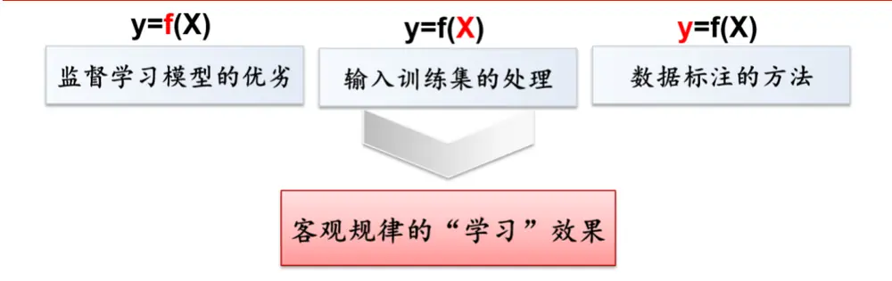
资料来源：华泰证券研究所

## 机器学习多因子选股中的数据标注方法

由上一节的介绍可以看出，数据标注在监督学习流程中往往是一个比较简单的步骤，但由于其直接与模型的输出和目标函数相关，所以会对监督学习的结果造成较大影响。另外，数据标注方法和具体的应用领域也有很大关系，本节将介绍将机器学习应用于多因子选股时的数据标注方法。

## 分类和回归

《统计学习方法》中对分类和回归的定义为：

标签(y)为连续变量的预测问题是回归问题。

标签(y)为有限个离散变量的预测问题为分类问题。

在实际的回归应用中，由于数据量有限，标签y不可能严格连续，但标签y往往会有很多取值(成百上千甚至更多)，因此依然可以视为回归问题。对于分类问题，最常见的是二分类问题(y只有两种取值)，因此本文只讨论二分类问题。我们将通过一个简单的例子来形象展示分类和回归的区别。

线性回归(linear regression)是最简单常用的回归模型，可以使用它来拟合股票市盈率因子和收益率的关系。我们选取沪深300成分股2016年底的市盈率以及2017年一季度涨跌幅。对市盈率TTM取倒数，进行中位数去极值和标准化处理，得到EP因子。如图表2所示，线性回归可以较好地拟合输入特征x1(EP因子)和标签y(涨跌幅)的关系，图中的直线对应于线性回归模型 $y=w_{0}+w_{1}x_{1}$ ，其中系数的估计量 $\widehat{w}_{0}=2.32,\quad\widehat{w}_{1}=3.03$ 。在这个例子中，模型拟合的标签是股票的涨跌幅。

另一种情况是，我们并不想预测股票未来具体的涨跌幅，而是希望预测股票未来会上涨还是下跌。换言之，我们面对的是“分类”问题，而非“回归”问题。此时可以使用逻辑回归(logisticregression)，尽管其名字中包含回归二字，却是解决分类问题常用的机器学习方法。例如，我们希望用股票的市盈率预测涨跌情况，选取沪深300成分股2017年一季度的涨跌幅排名前50名和后50名的个股，计算2016年底的市盈率EP因子，将涨幅前50的个股定义为类别y = 1(图表 3 中的红色样本)，跌幅前 50 的个股定义为类别y = 0(图表 3 中的蓝色样本)。然后就可以使用下面的逻辑回归模型进行拟合。

$$
P(x_{1})=\frac{e^{w_{0}+w_{1}x_{1}}}{1+e^{w_{0}+w_{1}x_{1}}}
$$

通过极大似然估计方法求得参数 $\widehat{w}_{0}=1.95,\ \widehat{w}_{1}=0.36。$ 拟合结果如图表3的曲线所示，曲线上的每个点表示某个EP因子X1对应的上涨概率 $\cdot P(x_{1})$ 。当 $x_{1}$ 取极大的数时，上涨概率 $P(x_{1})$ 趋向于1；当 $x_{1}$ 取极小的数时，上涨概率 $P(x_{1})$ 趋向于0。

图表2：市盈率EP因子和股票涨跌幅的线性回归模型
图表3：市盈率EP因子和股票涨跌的逻辑回归模型
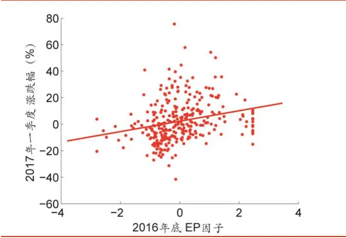
资料来源：Wind，华泰证券研究所

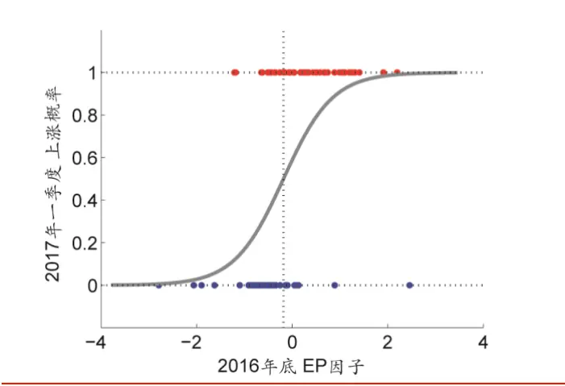
资料来源：Wind，华泰证券研究所

承接上面的例子，在图表4中，我们总结了机器学习运用于多因子选股时，回归和二分类的对比。

图表4：机器学习运用于多因子选股时回归和二分类的对比

| 回归 |  | 二分类 |
| --- | --- | --- |
|  | 数据标注方法每个时间截面上，使用标准化后的股票收益 率作为标签 | 每个时间截面上，对股票收益率进行排序，取一 定比例排名靠前的股票标记为“涨”，一定比例 排名靠后的股票标记为“跌” |
| 标签的特性 | 息，信息损失较小 | 标准化后的股票收益率保留了收益率的排序信标签只有“涨”和“跌”两种取值，信息损失较 大 |
| 目标函数 预测方法 | 最小均方差损失函数 | 交叉熵损失函数 将样本外数据输入模型，直接将模型输出作为将样本外数据输入模型，使用模型输出的分类概 |
|  | 预测值 | 率作为预测值 |

资料来源：华泰证券研究所

## 更多数据标注方法

在将机器学习运用于多因子选股时，除了使用股票收益率作为标签，还可以使用一些能综合体现股票收益、回撤以及波动的指标来给股票样本打标签，本文将测试以下三种数据标注方法：

1. 使用个股的夏普比率进行数据标注。假设个股在第t截面期的复权收盘价为 $P_{t},$ 第 t+1截面期的复权收盘价为 $P_{t+1}$ ，在这两个截面期之间的日度收益率标准差为 $\sigma_{1}$ ，则个股的夏普比率定义为下式。

$$
Sharpe=(\cfrac{P_{t+1}}{P_{t}}-1)/\sigma_{1}
$$

为了简单起见，我们没有在上式中加入无风险收益率。该指标反映了个股的收益波动比，通过该指标给个股打标签，我们希望机器学习模型通过训练能选出具有较高收益波动比的股票。

2. 使用个股的信息比率进行数据标注。假设个股在第t截面期的复权收盘价为 $P_{t}$ ，第 t+1截面期的复权收盘价为 $P_{t+1}$ ，业绩比较基准(本文中为中证500)的第t截面期的复权收盘价为 $B_{t}$ ，第 t+1截面期的复权收盘价为 $B_{t+1}$ ，在这两个截面期之间个股的日度超额收益率标准差为 $\sigma_{2}$ ，则个股的信息比率定义为下式。

$$
IR=(\cfrac{P_{t+1}}{P_{t}}-\cfrac{B_{t+1}}{B_{t}})/\sigma_{2}
$$

该指标反映了个股的超额收益和跟踪误差之比，通过该指标给个股打标签，我们希望机器学习模型通过训练能选出具有较高信息比率的股票。

3. 使用个股的 Calmar 比率进行数据标注。本文计算的是超额收益的 Calmar 比率。假设个股在第t截面期的复权收盘价为 $P_{t},$ ，第 t+1截面期的复权收盘价为 $P_{t+1}$ ，业绩比较基准(本文中为中证500)的第t截面期的复权收盘价为 $B_{t}$ ，第 t+1 截面期的复权收盘价为 $B_{t+1}$ ，在这两个截面期之间个股的超额收益最大回撤为MaxDD，则个股的Calmar比率定义为下式。

$$
Calmar=(\frac{P_{t+1}}{P_{t}}-\frac{B_{t+1}}{B_{t}})/MaxDD
$$

该指标反映了个股的超额收益和超额收益最大回撤之比，通过该指标给个股打标签，我们希望机器学习模型通过训练能选出具有较高Calmar比率的股票。

## 如何验证数据标注方法的有效性？随机数种子+多次测试

在机器学习模型的训练过程中，会有各种各样的步骤给模型带来随机性。比如对XGBoost进行训练时，会对数据和特征进行随机采样；对神经网络进行训练时，会随机初始化网络权重。这些随机性使得模型的预测结果出现不确定性。人们为了避免这种不确定性，使得同一模型每次训练得出的结果完全相同，会设置一个固定的随机数种子(random seed)。

对于本文要对比的一系列数据标注方法来说，单次测试所得出的结果未必具有说服力。比如我们想要对比使用收益率打标签和使用夏普比率打标签的测试结果，经过单次测试之后，发现使用夏普比率的模型构建的策略夏普比率更高，然而这有可能是因为机器学习模型内部的随机性并叠加上金融市场的随机性所得出的“随机结果”，此时就有必要进行多次对比测试来获得统计意义上的“确定结果”。在多次测试中，可以对模型设置不同的随机数种子，使得每次测试中模型的预测都有一定差别，最后我们统计两种对比模型构建策略的夏普比率的分布情况，从而得到更具有说服力的结果。图表5展示了随机数种子+多次测试流程图。

图表5：随机数种子+多次测试流程图
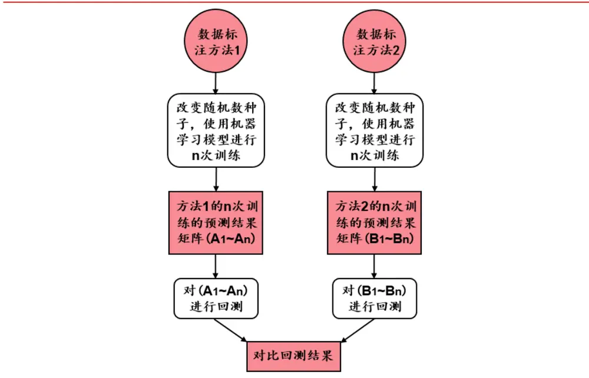
资料来源：华泰证券研究所

## 不同数据标注方法训练所得模型的集成

对比多种数据标注方法训练所得模型的回测结果，不同的模型可能在不同的回测指标上有一定优势。为了充分利用不同模型的优点，模型的等权集成是一种常用的方法。本文将借鉴上一节的多次测试的思想，使用模型之间的随机组合来测试模型等权集成的效果。图表6展示了对多种数据标注方法预测结果进行集成的测试流程。

图表6：对多种数据标注方法预测结果进行集成的测试流程图
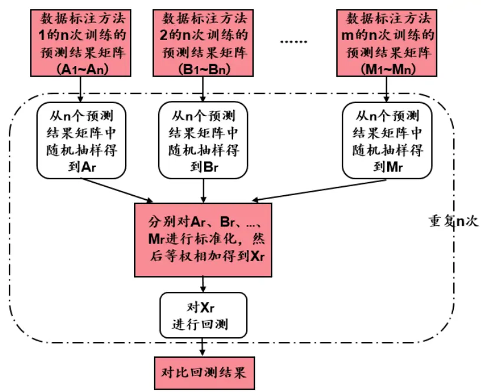
资料来源：华泰证券研究所

## 数据标注方法测试流程

测试流程

图表7：数据标注方法测试流程示意图
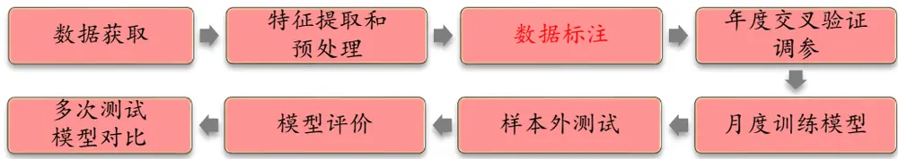
资料来源：华泰证券研究所

本文使用前期报告中表现优秀的XGBoost模型进行测试，测试流程包含如下步骤：1. 数据获取：

1) 股票池：全A股。剔除ST股票，剔除每个截面期下一交易日停牌的股票，剔除上市3个月内的股票，每只股票视作一个样本。

2)回测区间：2011年1月31日至2019年2月28日。

## 2. 特征提取和预处理：

1)每个自然月的最后一个交易日，计算82个因子暴露度，作为样本的原始特征，因子池如图表10和图表11所示。

2) 中位数去极值：设第T 期某因子在所有个股上的暴露度序列为 $D_{i},~D_{M}$ 为该序列中位数， $D_{M1}$ 为序列 $|D_{i}-D_{M}|$ 的中位数，则将序列 $D_{i}$ 中所有大于 ${{\cdot}{D}_{M}}+5{{D}_{M1}}$ 的数重设为 $D_{M}+5D_{M1}$ ，将序列 $D_{i}$ 中所有小于 $D_{M}-5D_{M1}$ 的数重设为 $D_{M}-5D_{M1}$ ;

3)缺失值处理：得到新的因子暴露度序列后，将因子暴露度缺失的地方设为中信一级行业相同个股的平均值；

4)行业市值中性化：将填充缺失值后的因子暴露度对行业哑变量和取对数后的市值做线性回归，取残差作为新的因子暴露度；

5) 标准化：将中性化处理后的因子暴露度序列减去其现在的均值、除以其标准差，得到一个新的近似服从N(0，1)分布的序列。

## 3. 数据标注：该步骤是本文的着重步骤，主要使用以下数据标注方法：

1)分类：每个时间截面上，对股票收益率进行降序排序，取排名前三分之一的股票标记为1，排名后三分之一的股票标记为0。

2) 回归：每个月末截面上，使用标准化后的下个月股票超额收益率(相对中证500)作为标签，为了方便和分类进行对比，按标签取值进行降序排序，选取排前三分之一和后三分之一的样本。

3) 夏普比率：每个月末截面上，使用标准化后的下个月股票夏普比率作为标签，为了方便和(2)中的回归进行对比，按标签取值进行降序排序，选取排前三分之一和后三分之一的样本。

4) 信息比率：每个月末截面上，使用标准化后的下个月股票信息比率(相对中证500)作为标签，为了方便和(2)中的回归进行对比，按标签取值进行降序排序，选取排前三分之一和后三分之一的样本。

5) Calmar 比率：每个月末截面上，使用标准化后的下个月股票 Calmar 比率作为标签，为了方便和(2)中的回归进行对比，按标签取值进行降序排序，选取排前三分之一和后三分之一的样本。

4. 年度交叉验证调参：由于交叉验证调参的时间开销较大，本文采用年度交叉验证调参的方式。全体数据共分为九个阶段，如图表8所示。例如在选择2011年最优参数时，将2005-2010年共72个月数据合并作为样本内数据集；在选择第N年最优超参数时，将N-6至N-1年的72个月合并作为样本内数据。使用时序交叉验证的方式确定第N年模型的最优超参数。

5.月度训练模型：如图表9所示，当第N年的最优超参数确定之后，对于其中的某个月份T月来说，将T-72至T-1月的72个月合并作为样本内数据集，使用第N年的最优超参数训练模型。

6. 样本外测试：确定最优参数后，以T月末截面期所有样本预处理后的特征作为模型的输入，得到每个样本的预测值f(x)。将预测值视作合成后的因子。

7. 模型评价：我们以模型合成因子的单因子测试结果和构建选股策略的结果作为模型评价标准。

8. 模型对比：对于每种数据标注方法，重复100次步骤5~7，每次训练模型设置不同的随机数种子(random seed)，形成100 组测试结果，统计模型评价指标的分布情况，进行模型对比。

图表8：年度交叉验证调参示意图
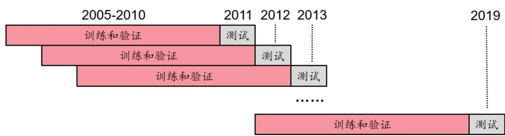
资料来源：华泰证券研究所

图表9：月度滚动训练示意图
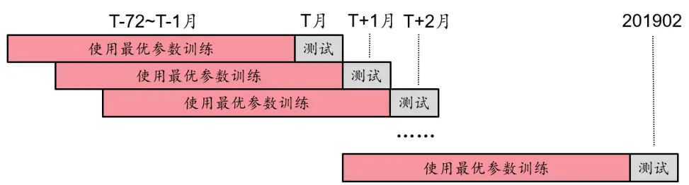
资料来源：华泰证券研究所

图表10： 选股模型中涉及的全部因子及其描述(表1)

| 大类因子 | 具体因子 | 因子描述 |
| --- | --- | --- |
| 估值 | EP | 净利润(TTM)/总市值 |
| 估值 | EPcut | 扣除非经常性损益后净利润(TTM)/总市值 |
| 估值 | BP | 净资产/总市值 |
| 估值 | SP | 营业收入(TTM)/总市值 |
| 估值 | NCFP | 净现金流(TTM)/总市值 |
| 估值 | OCFP | 经营性现金流(TTM)/总市值 |
| 估值 | DP | 近12个月现金红利(按除息日计)/总市值 |
| 估值 | G/PE | 净利润(TTM)同比增长率/PE_TTM |
| 成长 | Sales_G_q | 营业收入(最新财报，YTD)同比增长率 |
| 成长 | Profit_G_q | 净利润(最新财报，YTD)同比增长率 |
| 成长 | OCF_G_q | 经营性现金流(最新财报，YTD)同比增长率 |
| 成长 | ROE_G_q | ROE(最新财报，YTD)同比增长率 |
| 财务质量 | ROE_q | ROE(最新财报，YTD) |
| 财务质量 | ROE_ttm | ROE(最新财报，TTM) |
| 财务质量 | ROA_q | ROA(最新财报，YTD) |
| 财务质量 | ROA_ttm | ROA(最新财报，TTM) |
| 财务质量 | grossprofitmargin_q | 毛利率(最新财报，YTD) |
| 财务质量 | grossprofitmargin_ttm | 毛利率(最新财报，TTM) |
| 财务质量 | profitmargin_q | 扣除非经常性损益后净利润率(最新财报，YTD) |
| 财务质量 | profitmargin_ttm | 扣除非经常性损益后净利润率(最新财报，TTM) |
| 财务质量 | assetturnover_q | 资产周转率(最新财报，YTD) |
| 财务质量 | assetturnover_ttm | 资产周转率(最新财报，TTM) |
| 财务质量 | operationcashflowratio_q | 经营性现金流/净利润(最新财报，YTD) |
| 财务质量 | operationcashflowratio_ttm | 经营性现金流/净利润(最新财报，TTM) |
| 杠杆 | financial_leverage | 总资产/净资产 |
| 杠杆 | debtequityratio | 非流动负债/净资产 |
| 杠杆 | cashratio | 现金比率 |
| 杠杆 | currentratio | 流动比率 |
| 市值 | In_capital | 总市值取对数 |
| 动量反转 | HAlpha | 个股60个月收益与上证综指回归的截距项 |
| 动量反转 | return_Nm | 个股最近N个月收益率，N=1，3，6，12 |
| 动量反转 | wgt_return_Nm | 个股最近N个月内用每日换手率乘以每日收益率求算术平均值， N=1, 3, 6, 12 |
| 动量反转 | exp_wgt_return_Nm | 个股最近N个月内用每日换手率乘以函数exp(-x_i/N/4)再乘以每日 收益率求算术平均值，x_i为该日距离截面日的交易日的个数，N=1， 3, 6, 12 |
| 波动率 | std_FF3factor_Nm | 特质波动率——个股最近 N 个月内用日频收益率对 Fama French 三因子回归的残差的标准差，N=1，3，6，12 |
| 波动率 | std_Nm | 个股最近N个月的日收益率序列标准差，N=1，3，6，12 |
| 股价 | In_price | 股价取对数 |
| beta | beta | 个股60个月收益与上证综指回归的 beta |
| 换手率 | turn_Nm | 个股最近N个月内日均换手率(剔除停牌、涨跌停的交易日)，N=1， 3, 6, 12 |
| 换手率 | bias_turn_Nm | 个股最近N个月内日均换手率除以最近2年内日均换手率(剔除停 |

资料来源：Wind，华泰证券研究所

图表11：选股模型中涉及的全部因子及其描述(表2)

| 大类因子 | 具体因子 | 因子描述 |
| --- | --- | --- |
| 一致预期 | rating_average | wind 评级的平均值 |
| 一致预期 | rating_change | wind 评级(上调家数-下调家数)/总数 |
| 一致预期 | rating_targetprice | wind一致目标价/现价-1 |
| 一致预期 | CON_EP | 朝阳永续一致预期EP |
| 一致预期 | CON_EP_REL | 朝阳永续一致预期EP季度环比 |
| 一致预期 | CON_BP | 朝阳永续一致预期EP |
| 一致预期 | CON_BP_REL | 朝阳永续一致预期EP季度环比 |
| 一致预期 | CON_GPE | 朝阳永续一致预期 GPE |
| 一致预期 | CON_GPE_REL | 朝阳永续一致预期 GPE 季度环比 |
| 一致预期 | CON_ROE | 朝阳永续一致预期 ROE |
| 一致预期 | CON_ROE_REL | 朝阳永续一致预期 ROE 季度环比 |
| 一致预期 | CON_EPS | 朝阳永续一致预期 EPS |
| 一致预期 | CON_EPS_REL | 朝阳永续一致预期 EPS 季度环比 |
| 一致预期 | CON_NP | 朝阳永续一致预期归母净利润 |
| 一致预期 | CON_NP_REL | 朝阳永续一致预期归母净利润季度环比 |
| 股东 | holder_avgpctchange | 户均持股比例的同比增长率 |
| 技术 | MACD | 经典技术指标(释义可参考百度百科)，长周期取30日，短周期取 |
| 技术 | DEA | 10 日，计算 DEA 均线的周期(中周期)取 15 日 |
| 技术 | DIF |  |
| 技术 | RSI | 经典技术指标，周期取20日 |
| 技术 | PSY | 经典技术指标，周期取20日 |
| 技术 | BIAS | 经典技术指标，周期取20日 |

资料来源：Wind，朝阳永续，华泰证券研究所

## 数据标注方法测试结果

## 分类和回归的对比

1. XGBC：XGBoost 分类模型。

2. XGBR：XGBoost 回归模型。

## 单因子回归测试和IC 测试

如果将机器学习模型的输出视为单因子，则可进行单因子测试。测试模型构建方法如下：

1. 股票池：全A股，剔除ST股票，剔除每个截面期下一交易日停牌的股票，剔除上市3个月以内的股票。

2. 回测区间：2011-01-31 至 2019-02-28。

3. 截面期：每个月月末，用当前截面期因子值与当前截面期至下个截面期内的个股收益进行回归和计算 RankIC 值。

4.数据处理方法：对于分类模型，将模型对股票下期上涨概率的预测值视作单因子。对于回归模型，将回归预测值视作单因子。因子值为空的股票不参与测试。

5. 回归测试中采用加权最小二乘回归(WLS)，使用个股流通市值的平方根作为权重。IC测试时对单因子进行行业市值中性。

我们使用不同的随机数种子进行了100次测试，测试所得指标的平均值如图表12所示，可以看出，XGBR模型只在 RankIC 均值上稍低于 XGBC 模型，其他指标表现都比 XGBC模型要好。

图表12： 100 次测试中两种模型在全 A股的回归法、IC 值分析的平均结果汇总(回测期 20110131～20190228)

| 模型 | It\|均值 | \|t\|>2 占比 | t均值 | 因子收益率均值 RankIC 均值 |  | RankIC 标准差 | IC_IR IC>0 占比 |  |
| --- | --- | --- | --- | --- | --- | --- | --- | --- |
| XGBC | 5.38 | 83.92% | 5.85 | 1.12% | 14.02% | 7.88% | 1.780 | 97.89% |
| XGBR | 5.58 | 84.78% | 6.00 | 1.19% | 13.87% | 7.79% | 1.781 | 97.94% |

资料来源：Wind，朝阳永续，华泰证券研究所

图表13和图表14展示了在100 次测试中，两种模型的 RankIC均值和因子收益率均值的分布情况。可见，两种模型的RankIC均值分布比较接近，但是从因子收益率均值分布上看，XGBR模型完全优于XGBC模型。

图表13：100 次测试中两种模型的 RankIC 均值分布
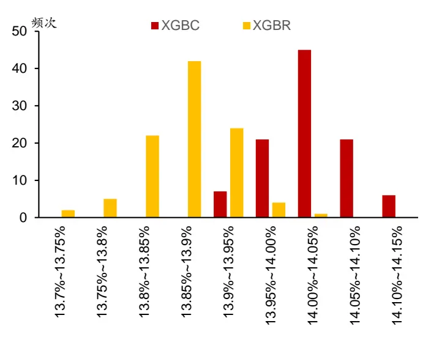
资料来源：Wind，朝阳永续，华泰证券研究所

图表14：100次测试中两种模型的因子收益率均值分布
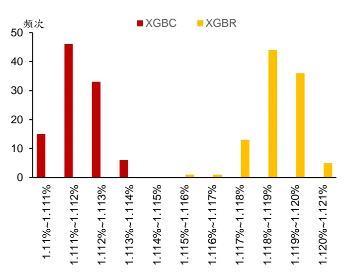
资料来源：Wind，朝阳永续，华泰证券研究所

## 单因子分层测试

依照因子值对股票进行打分，构建投资组合回测，是最直观的衡量因子优劣的手段。测试模型构建方法如下：

1. 股票池、回测区间、截面期均与回归法相同。

2. 换仓：在每个自然月最后一个交易日核算因子值，在下个自然月首个交易日按当日收盘价换仓，交易费用以双边千分之四计。

3. 分层方法：因子先用中位数法去极值，然后进行市值、行业中性化处理(方法论详见上一小节)，将股票池内所有个股按因子从大到小进行排序，等分N层，每层内部的个股等权配置。当个股总数目无法被N整除时采用任一种近似方法处理均可，实际上对分层组合的回测结果影响很小。

4. 多空组合收益计算方法：用 Top 组每天的收益减去 Bottom组每天的收益，得到每日多空收益序歹 $刂r_1,r_2,\cdots,r_n$ ，则多空组合在第n天的净值等于 $(1+r_{1})(1+r_{2})\cdots(1+r_{n})$ 评价方法：全部N层组合年化收益率(观察是否单调变化)，多空组合的年化收益率、夏普比率、最大回撤、月胜率等。

我们使用不同的随机数种子进行了100次测试，分层测试指标的平均值如图表15所示，两种模型的TOP组合年化收益率、多空组合年化收益率和多空组合夏普比率都比较接近。

图表15： 100 次测试中两种模型在全 A股的分层测试法的平均结果汇总(分五层，回测期 20110131～20190228)

|  |  |  |  |  |  |  | 多空组合年化多空组合最多空组合夏多空组合月 TOP组合月均 |  |  |  |
| --- | --- | --- | --- | --- | --- | --- | --- | --- | --- | --- |
| 模型 |  | 分层组合1～5(从左到右)年化收益率 |  |  |  | 收益率 | 大回撤 | 普比率 | 胜率 | 双边换手率 |
| XGBC | 20.25% | 10.77% | 6.30% | 0.25% | -13.60% | 38.31% | 5.07% | 5.67 | 92.97% | 99.72% |
| XGBR | 20.20% | 10.75% | 5.92% | 0.73% | -13.90% | 39.01% | 4.48% | 5.70 | 93.76% | 102.67% |

资料来源：Wind，朝阳永续，华泰证券研究所

另外，我们详细对比了两种模型分层测试的TOP组合的表现(图表16)，两种模型表现不相上下，总体来看各项指标都比较接近。图表17和图表18展示了在100次测试中，两种模型的年化超额收益率均值和信息比率均值的分布情况。

图表16：100 次测试中两种模型 TOP 组合绩效的平均结果(分五层，回测期 20110131～20190228)
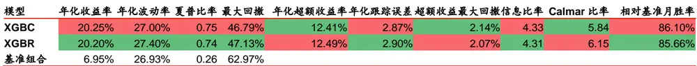
资料来源：Wind，朝阳永续，华泰证券研究所

图表17：100 次测试中两种模型的 TOP 组合年化超额收益率分布
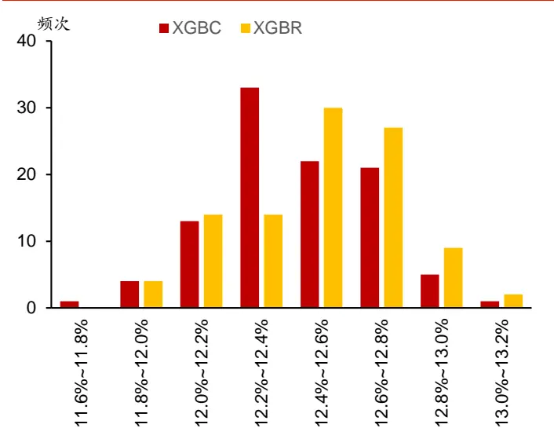
资料来源：Wind，朝阳永续，华泰证券研究所

图表18：100 次测试中两种模型的 TOP 组合信息比率分布
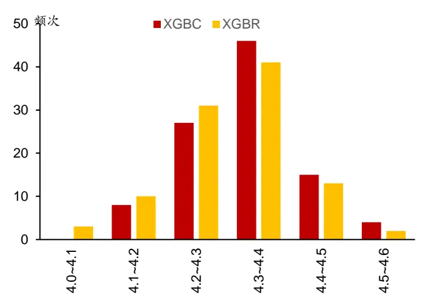
资料来源：Wind，朝阳永续，华泰证券研究所

基于XGBC和XGBR模型，我们构建了相对于中证500 的行业、市值中性全A选股策略并进行回测，图表19中展示了100次测试的平均结果。图表19从左至右的各列对应不同的个股权重偏离上限。可见，XGBR相比XGBC在信息比率上有稳定优势。在其他指标上，XGBR 和XGBC 的表现不相上下。

图表19： 100 次测试中两种模型构建全 A 选股策略回测指标的平均值对比(回测期 20110131～20190228)
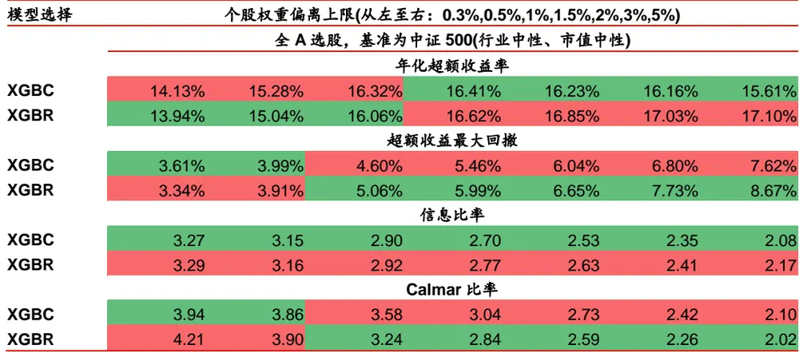
资料来源：Wind，朝阳永续，华泰证券研究所

当个股权重偏离上限为2%时，图表20和图表21展示了在100次测试中，两种模型的年化超额收益率和信息比率的分布情况。该情况下，XGBR的表现优于XGBC。

图表20：100次测试中两种模型的全A选股年化超额收益率分布
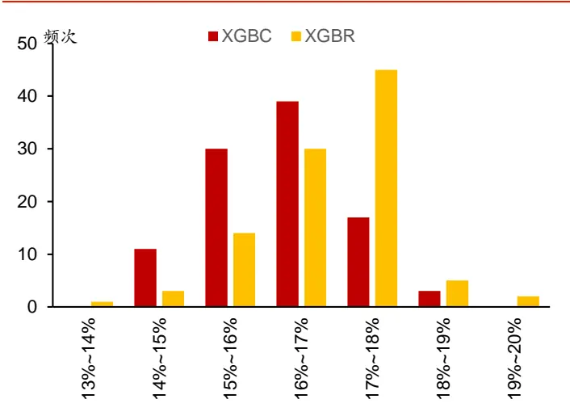
资料来源：Wind，朝阳永续，华泰证券研究所

图表21：100 次测试中两种模型的全 A选股信息比率分布
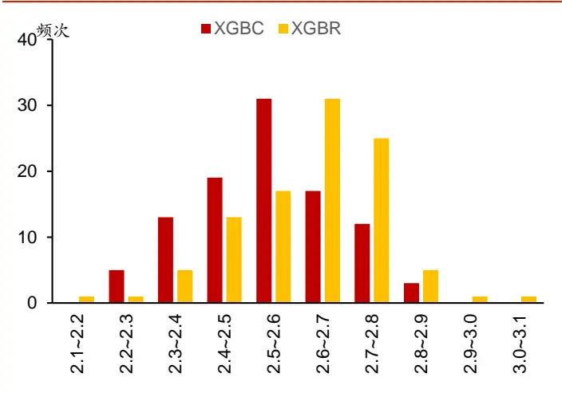
资料来源：Wind，朝阳永续，华泰证券研究所

## 按超额收益率回归和按夏普比率回归的对比

1. XGBR：XGBoost回归模型，以个股相对中证 500的超额收益率为标签。

2. XGBR-Sharpe：XGBoost回归模型，以个股的夏普比率为标签。

由于单因子测试中的回归测试和IC测试是对个股收益进行回归或求IC值，而XGBR-Sharpe模型是对个股夏普比率进行预测，所以对其进行回归测试和IC测试意义不大，本节将只进行单因子分层测试和构建策略组合回测，并重点关注测试中的夏普比率指标。

## 单因子分层测试

我们使用不同的随机数种子进行了100次测试，分层测试指标的平均值如图表22所示，XGBR-Sharpe的多空组合夏普比率更高。另外，我们详细对比了两种模型分层测试的TOP组合的表现(图表 23)，XGBR-Sharpe的 TOP组合夏普比率更高，分析夏普比率提升的原因，XGBR-Sharpe模型主要是在年化收益率上表现更好，在年化波动率上表现则没有优势。

图表22： 100 次测试中两种模型在全 A 股的分层测试法的平均结果汇总(分五层，回测期 20110131～20190228)

|  |  |  |  |  |  |  | 多空组合年化多空组合最多空组合夏多空组合月 TOP 组合月均 |  |  |  |
| --- | --- | --- | --- | --- | --- | --- | --- | --- | --- | --- |
| 模型 |  | 分层组合1～5(从左到右)年化收益率 |  |  |  | 收益率 | 大回撤 | 普比率 | 胜率 | 双边换手率 |
| XGBR | 20.20% | 10.75% | 5.92% | 0.73% | -13.90% | 39.01% | 4.48% | 5.70 | 93.76% | 102.67% |
| XGBR-Sharpe | 20.28% | 10.81% | 6.32% | 0.25% | -13.90% | 39.18% | 4.28% | 5.91 | 94.48% | 101.64% |

资料来源：Wind，朝阳永续，华泰证券研究所

图表23：100 次测试中两种模型 TOP 组合绩效的平均结果(分五层，回测期 20110131～20190228)

| 年化超额收益率年化跟踪误差 超额收益最大回撤信息比率 |  |  |  |  |  |  |  |  | Calmar 相对基准月胜 |  |
| --- | --- | --- | --- | --- | --- | --- | --- | --- | --- | --- |
| 模型 | 年化收益率年化波动率夏普比率最大回撤 |  |  |  |  |  |  |  | 比率 | 率 |
| XGBR | 20.20% | 27.40% | 0.737 | 47.13% | 12.49% | 2.90% | 2.07% | 4.31 | 6.15 | 85.66% |
| XGBR-Sharpe | 20.28% | 27.41% | 0.740 | 47.08% | 12.57% | 2.94% | 2.25% | 4.28 | 5.66 | 85.36% |
| 基准组合 | 6.95% | 26.93% | 0.26 | 62.97% |  |  |  |  |  |  |

资料来源：Wind，朝阳永续，华泰证券研究所

图表 24 和图表 25 展示了在 100 次测试中，两种模型的多空组合夏普比率和 TOP 组合夏普比率的分布情况。

图表24：100次测试中两种模型的多空组合夏普比率分布
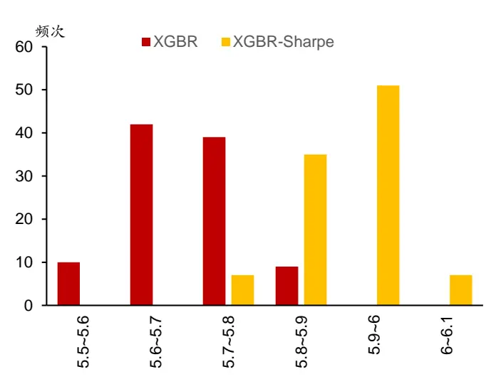
资料来源：Wind，朝阳永续，华泰证券研究所

图表25：100 次测试中两种模型的 TOP 组合夏普比率分布
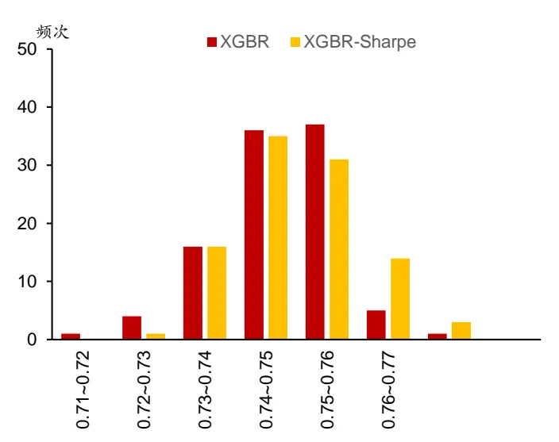
资料来源：Wind，朝阳永续，华泰证券研究所

基于 XGBR 和 XGBR-Sharpe 模型，我们构建了相对于中证 500 的行业、市值中性全 A选股策略并进行回测，图表 26 中展示了100 次测试的平均结果。可见，XGBR-Sharpe相比 XGBR 在夏普比率上有比较稳定的优势。分析夏普比率提升的原因，XGBR-Sharpe模型主要是在年化收益率上表现更好，在年化波动率上则没有优势。

图表26： 100 次测试中两种模型构建全 A 选股策略回测指标的平均值对比(回测期 20110131～20190228)
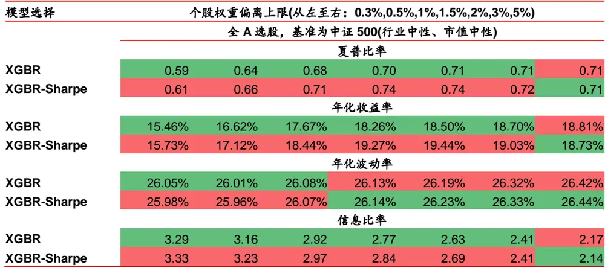
资料来源：Wind，朝阳永续，华泰证券研究所

当个股权重偏离上限为2%时，图表27和图表28展示了在100次测试中，两种模型的年化收益率和夏普比率的分布情况。该情况下，XGBR-Sharpe的表现优于XGBR。

图表27：100次测试中两种模型的全 A选股年化收益率分布
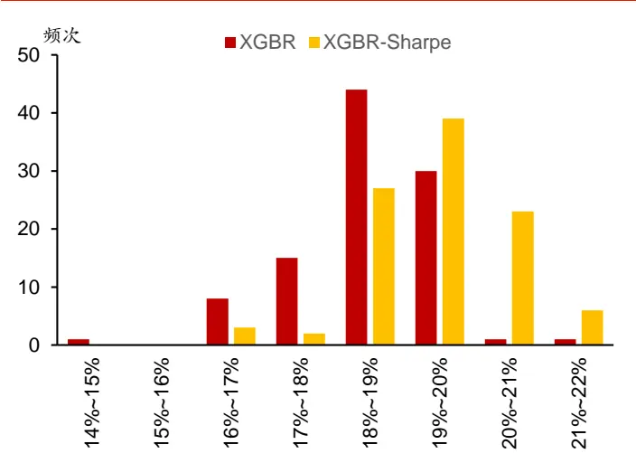
资料来源：Wind，朝阳永续，华泰证券研究所

图表28：100次测试中两种模型的全 A选股夏普比率分布
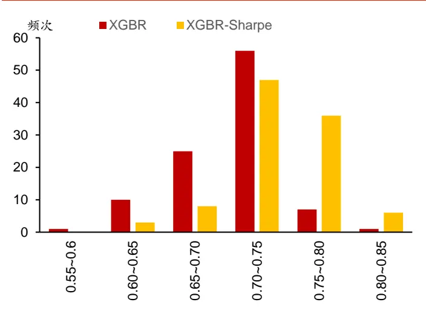
资料来源：Wind，朝阳永续，华泰证券研究所

## 按超额收益率回归和按信息比率回归的对比

1. XGBR：XGBoost回归模型，以个股相对中证500 的超额收益率为标签。

2. XGBR-IR：XGBoost回归模型，以个股的信息比率(基准为中证 500)为标签。

由于单因子测试中的回归测试和IC测试是对个股收益进行回归或求IC值，而XGBR-IR模型是对个股夏普比率进行预测，所以对其进行回归测试和IC测试意义不大。另外，单因子分层测试中所计算的信息比率的基准是全A等权组合，与XGBR-IR的标签所使用的信息比率基准(中证500)不同，因此对其进行分层测试也意义不大。所以本节只进行构建策略组合回测，并重点关注测试中的信息比率指标。

基于 XGBR 和 XGBR-IR 模型，我们构建了相对于中证 500 的行业、市值中性全 A 选股策略并进行回测，图表29中展示了100次测试的平均结果。可见，当个股权重偏离上限较大时，XGBR-IR相比XGBR在信息比率上有稳定的优势。分析信息比率提升的原因，XGBR-IR模型主要是在年化超额收益率上表现更好，而在跟踪误差上表现不如XGBR，在超额收益最大回撤上表现也不如XGBR。

图表29： 100 次测试中两种模型构建全 A 选股策略回测指标的平均值对比(回测期 20110131～20190228)
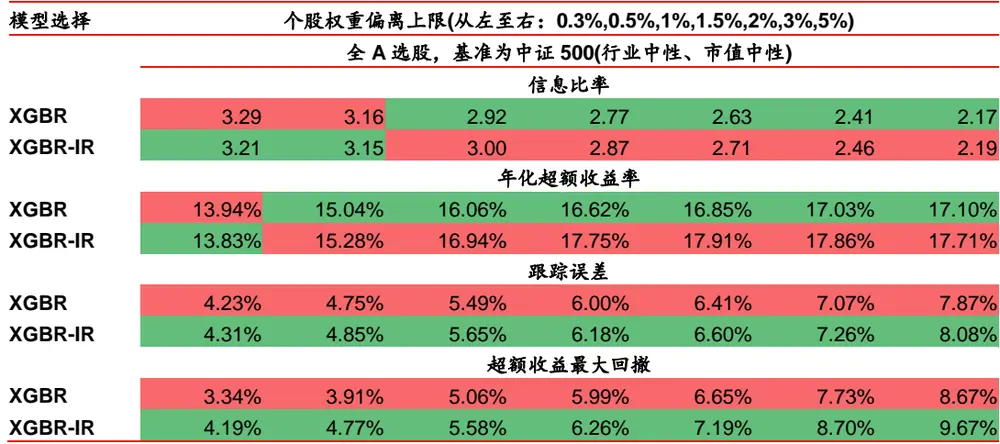
资料来源：Wind，朝阳永续，华泰证券研究所

当个股权重偏离上限为2%时，图表30和图表31展示了在100次测试中，两种模型的年化超额收益率和信息比率的分布情况。该情况下，XGBR-IR的表现优于XGBR。

图表30：100 次测试中两种模型的全A选股年化超额收益率分布
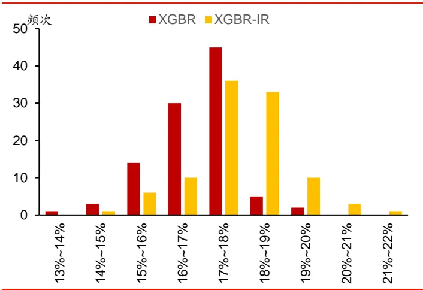
资料来源：Wind，朝阳永续，华泰证券研究所

图表31：100次测试中两种模型的全 A选股信息比率分布
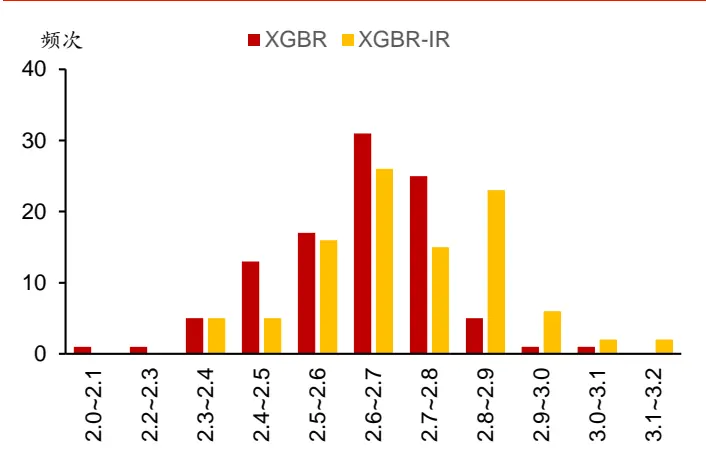
资料来源：Wind，朝阳永续，华泰证券研究所

## 按超额收益率回归和按 Calmar 比率回归的对比

1. XGBR：XGBoost回归模型，以个股相对中证500 的超额收益率为标签。

2. XGBR-Calmar:XGBoost 回归模型，以个股的 Calmar 比率(基准为中证 500)为标签。

由于单因子测试中的回归测试和IC测试是对个股收益进行回归或求IC值，而XGBR-Calmar模型是对个股 Calmar 比率进行预测，所以对其进行回归测试和IC 测试意义不大。另外，单因子分层测试中所计算的Calmar的基准是全A等权组合，与XGBR-Calmar的标签所使用的 Calmar 比率基准(中证500)不同，因此对其进行分层测试也意义不大。所以本节只进行构建策略组合回测，并重点关注测试中的Calmar比率指标。

基于XGBR和XGBR-Calmar模型，我们构建了相对于中证 500的行业、市值中性全A选股策略并进行回测，图表32中展示了100次测试的平均结果。可见，当个股权重偏离上限较大时，XGBR-Calmar相比 XGBR在Calmar比率上有稳定的优势。分析 Calmar比率提升的原因，XGBR-Calmar模型主要是在年化超额收益率上表现更好，在超额收益最大回撤上优势并不明显。

图表32： 100 次测试中两种模型构建全 A 选股策略回测指标的平均值对比(回测期 20110131～20190228)
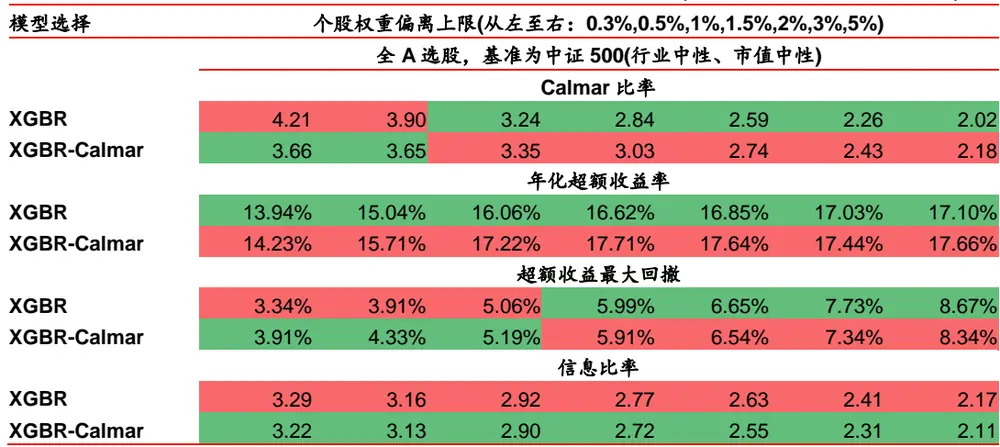
资料来源：Wind，朝阳永续，华泰证券研究所

个股权重偏离上限为2%时，图表33和图表34展示了在100次测试中，两种模型的年化超额收益率和Calmar 比率的分布情况。该情况下，XGBR-Calmar的表现优于XGBR。

图表33：100次测试中两种模型的全A选股年化超额收益率分布
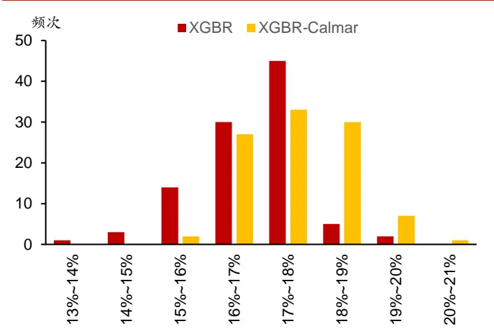
资料来源：Wind，朝阳永续，华泰证券研究所

图表34：100 次测试中两种模型的全 A 选股 Calmar 比率分布
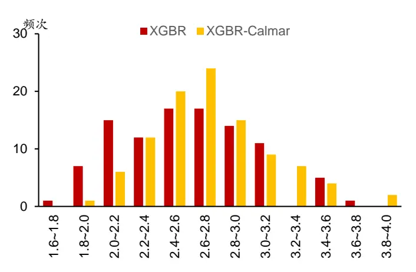
资料来源：Wind，朝阳永续，华泰证券研究所

## 不同数据标注方法所得模型集成的测试结果

本章中，我们将使用图表6中的测试流程进行模型集成的测试。在多因子Alpha模型中，信息比率和Calmar比率是两个重要的指标，我们将对以下三个模型进行集成得到模型XGBR-Combine，并构建策略组合回测。

1. XGBR：XGBoost回归模型，以相对中证500 的超额收益率为标签。

2. XGBR-IR：XGBoost回归模型，以个股的信息比率(基准为中证 500)为标签。

3. XGBR-Calmar:XGBoost 回归模型，以个股的 Calmar 比率(基准为中证 500)为标签。

基于上面提到的四个模型，我们构建了相对于中证500的行业、市值中性全A选股策略并进行回测，图表35中展示了100次测试的平均结果。可见，XGBR-Combine模型综合了三个基模型的优点，在年化超额收益率、信息比率上都表现最好，在超额收益最大回撤、Calmar比率上也有不错的表现。

图表35： 100 次测试中四种模型构建全 A 选股策略回测指标的平均值对比(回测期 20110131～20190228)
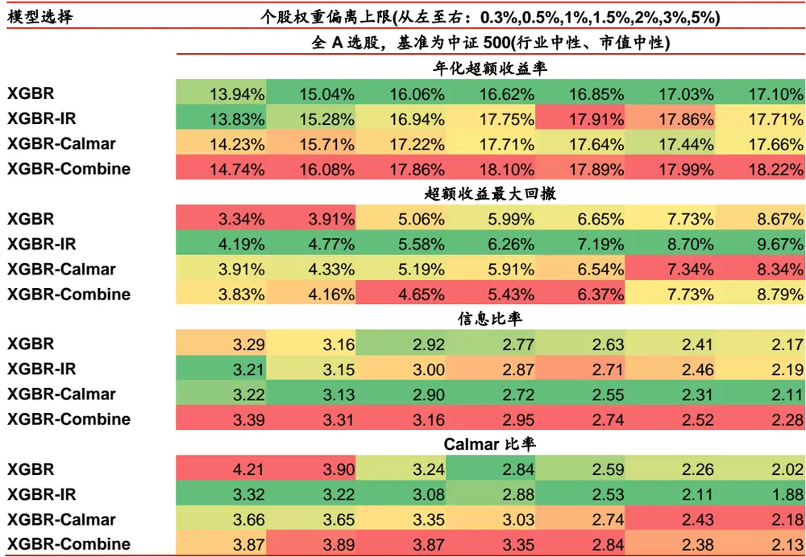
资料来源：Wind，朝阳永续，华泰证券研究所

另外，我们对比了图表35中回测指标在100次测试中的标准差，以衡量各个模型表现的稳定性，结果展示在图表 36 中。从图表 36 可以看出 XGBR-Combine的 4 个回测指标的标准差都比较小，说明其在100次测试中受随机性的干扰程度最小，表现最为稳定。

图表36： 100 次测试中四种模型构建全 A 选股策略回测指标的标准差对比(回测期 20110131～20190228)

| XGBR | 0.37% | 0.50% | 0.66% 0.78% 0.99% | 1.21% | 1.33% |
| --- | --- | --- | --- | --- | --- |
| XGBR-IR | 0.36% | 0.42% | 0.72% 1.03% 1.18% | 1.34% | 1.58% |
| XGBR-Calmar | 0.38% | 0.49% | 0.76% 0.92% 1.00% | 1.33% | 1.77% |
| XGBR-CombineXGBR | 0.27% | 0.30% 0.56% 0.71% 0.78% |  | 0.96% | 1.20% |
|  | 超额收益最大回撤(标准差) |  |  |  |  |
|  | 0.32% | 0.44% | 0.72% 0.93% 0.94% | 1.15% | 1.23% |
| XGBR-IR | 0.34% | 0.35% | 0.64% 0.69% 0.86% | 1.40% | 1.61% |
| XGBR-Calmar | 0.24% | 0.33% | 0.47% 0.57% 0.80% | 1.08% | 1.30% |
| XGBR-CombineXGBR | 0.25% | 0.31% | 0.39% 0.42% 0.68% | 1.16% | 1.44% |
|  |  |  | 信息比率(标准差) |  |  |
|  | 8.82% | 10.87% | 11.52% 12.18% 14.83% | 17.03% | 16.51% |
| XGBR-IR | 8.29% | 8.58% | 12.40% 15.81% 16.96% | 18.03% | 19.46% |
| XGBR-Calmar | 8.54% | 9.76% | 12.50% 13.88% 14.21% | 17.12% | 19.88% |
| XGBR-Combine | 5.86% | 5.95% | 9.71% 11.12% 11.62% | 13.03% | 14.56% |
| XGBRXGBR-IR | Calmar 比率(标准差) |  |  |  |  |
|  | 44.75% 46.40% |  | 48.82% 48.16% 43.13% | 40.91% | 37.72% |
|  | 30.07% | 26.16% | 40.22% 38.49% 36.81% | 41.62% | 37.67% |
| XGBR-Calmar |  | 26.18% | 32.22% | 38.15% 36.14% 39.05% |  |
| XGBR-Combine | 27.47% | 32.21% | 36.10% 29.52% 35.05% | 39.62% | 38.39% |

资料来源：Wind，朝阳永续，华泰证券研究所

个股权重偏离上限为2%时，图表37和图表38展示了在100次测试中，四种模型的年化超额收益率和信息比率的分布情况。从图表 37 和图表 38也可以看出，XGBR-Combine的回测指标分布最集中，表现最稳定。

图表37：100次测试中四种模型的全A选股年化超额收益率分布
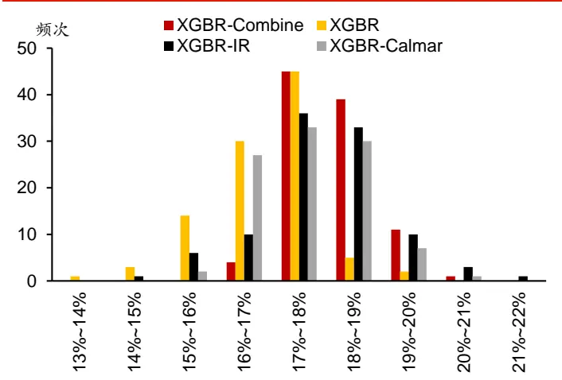
资料来源：Wind，朝阳永续，华泰证券研究所

图表38：100次测试中四种模型的全 A选股信息比率分布
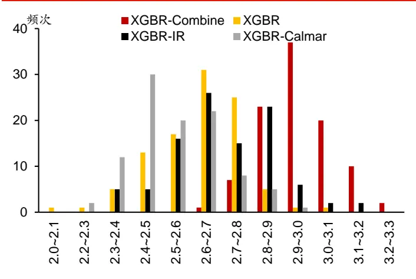
资料来源：Wind，朝阳永续，华泰证券研究所

我们有选择性地展示四个模型的100次测试中的平均超额收益表现，如图表39和图表40所示。

图表39：100 次测试中四种模型全 A选股平均表现(个股权重偏离上限 1%，基准为中证 500)
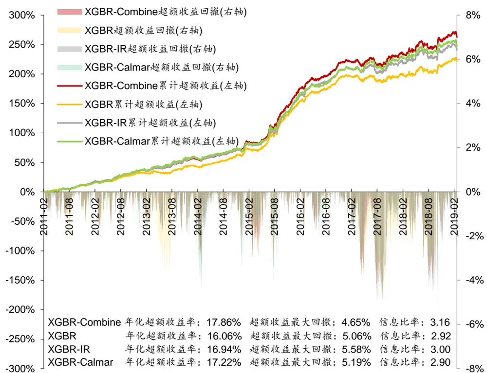
资料来源：Wind，朝阳永续，华泰证券研究所

图表40：100 次测试中四种模型全 A选股平均表现(个股权重偏离上限 2%，基准为中证 500)
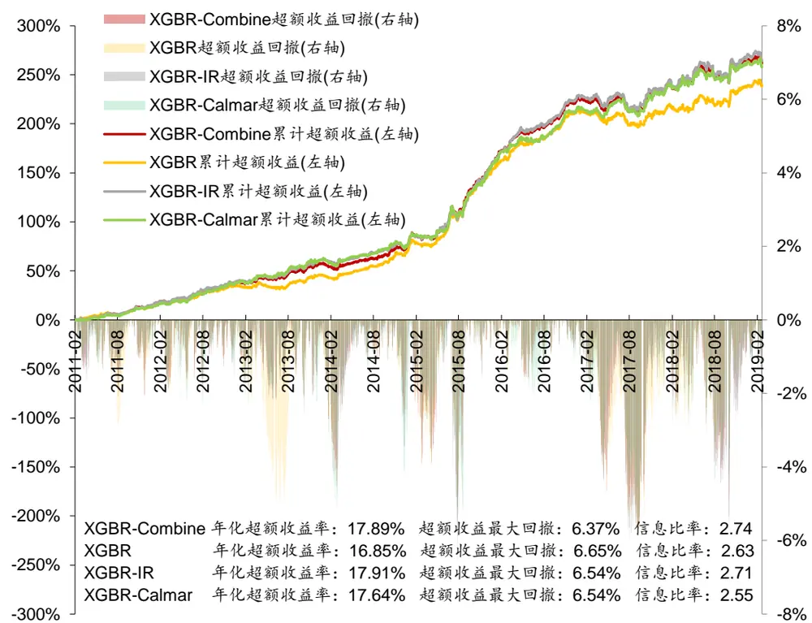
资料来源：Wind，朝阳永续，华泰证券研究所

## 结论

在机器学习中，如何为训练样本进行数据标注是一个非常重要的话题。由于数据标注的结果(数据标签)会直接作用于监督学习的目标函数，因此不同的数据标注方法会使得监督学习得出不同的训练和预测结果。结合机器学习在多因子选股中的运用，本文列出了各种数据标注方法并进行系统的测试，得出以下结论：

1.在机器学习模型的训练过程中，会有各种各样的步骤给模型带来随机性，如果本文仅对一系列数据标注方法进行单次测试，那么所得出的结果未必具有说服力。此时有必要进行多次对比测试来获得统计意义上的“确定结果”。在多次测试中，可以对模型设置不同的随机数种子，使得每次测试中模型的预测都有一定差别，最后我们统计对比模型构建策略的相应指标的分布情况，就能得到更具有说服力的结果。

2. 本文对比了全 A 股票池中，XGBoost 分类(XGBC)和回归(XGBR)的选股效果。单因子回归和IC 测试中，XGBR 只在 RankIC 均值上稍低于XGBC，其他指标表现都比XGBC 要好。单因子分层测试的 TOP 组合中 XGBC 和 XGBR 的各项回测指标比较接近。本文还构建了相对于中证500的行业、市值中性全A选股策略并进行回测，XGBR 相比 XGBC 在信息比率上有稳定优势。在其他指标上，XGBR 和 XGBC 的表现不相上下。整体来看，XGBoost回归的表现更好。

3.本文还在全A股票池中测试了另外三种数据标注方法，使用夏普比率作为标签的模型(XGBR-Sharpe)，使用信息比率作为标签的模型(XGBR-IR)以及使用 Calmar 比率作为标签的模型(XGBR-Calmar)。整体来看，在对应的测试中，XGBR-Sharpe比 XGBR的夏普比率更高，XGBR-IR 比 XGBR 的信息比率更高，XGBR-Calmar 比 XGBR 的Calmar比率更高。三种数据标注方法的回测表现和它们各自所设定的学习目标相匹配，结果整体符合预期。

4. 机器学习领域中可以采用模型等权集成的方式以充分体现不同模型的优点。我们将XGBR，XGBR-IR，XGBR-Calmar三个模型集成得到 XGBR-Combine并构建了相对于中证 500 的行业、市值中性全 A 选股策略，回测结果中，XGBR-Combine综合了三个基模型的优点，在年化超额收益率(14.74%~18.22%)、信息比率(2.28~3.39)上都表现最好，在超额收益最大回撤(3.83%~8.79%)、Calmar比率(2.13~3.87)上也有不错的表现。同时，XGBR-Combine的以上4个回测指标的标准差都比较小，说明其在多次测试中受随机性的干扰程度最小，表现最为稳定。

## 风险提示

通过人工智能模型构建的选股策略是历史经验的总结，存在失效的可能。人工智能模型可解释程度较低，使用须谨慎。

## 免责申明

本报告仅供华泰证券股份有限公司（以下简称“本公司”）客户使用。本公司不因接收人收到本报告而视其为客户。

本报告基于本公司认为可靠的、已公开的信息编制，但本公司对该等信息的准确性及完整性不作任何保证。本报告所载的意见、评估及预测仅反映报告发布当日的观点和判断。在不同时期，本公司可能会发出与本报告所载意见、评估及预测不一致的研究报告。同时，本报告所指的证券或投资标的的价格、价值及投资收入可能会波动。本公司不保证本报告所含信息保持在最新状态。本公司对本报告所含信息可在不发出通知的情形下做出修改，投资者应当自行关注相应的更新或修改。

本公司力求报告内容客观、公正，但本报告所载的观点、结论和建议仅供参考，不构成所述证券的买卖出价或征价。该等观点、建议并未考虑到个别投资者的具体投资目的、财务状况以及特定需求，在任何时候均不构成对客户私人投资建议。投资者应当充分考虑自身特定状况，并完整理解和使用本报告内容，不应视本报告为做出投资决策的唯一因素。对依据或者使用本报告所造成的一切后果，本公司及作者均不承担任何法律责任。任何形式的分享证券投资收益或者分担证券投资损失的书面或口头承诺均为无效。

本公司及作者在自身所知情的范围内，与本报告所指的证券或投资标的不存在法律禁止的利害关系。在法律许可的情况下，本公司及其所属关联机构可能会持有报告中提到的公司所发行的证券头寸并进行交易，也可能为之提供或者争取提供投资银行、财务顾问或者金融产品等相关服务。本公司的资产管理部门、自营部门以及其他投资业务部门可能独立做出与本报告中的意见或建议不一致的投资决策。

本报告版权仅为本公司所有。未经本公司书面许可，任何机构或个人不得以翻版、复制、发表、引用或再次分发他人等任何形式侵犯本公司版权。如征得本公司同意进行引用、刊发的，需在允许的范围内使用，并注明出处为“华泰证券研究所”，且不得对本报告进行任何有悖原意的引用、删节和修改。本公司保留追究相关责任的权力。所有本报告中使用的商标、服务标记及标记均为本公司的商标、服务标记及标记。

本公司具有中国证监会核准的“证券投资咨询”业务资格，经营许可证编号为：91320000704041011J。

全资子公司华泰金融控股（香港）有限公司具有香港证监会核准的“就证券提供意见”业务资格，经营许可证编号为：A0K809

©版权所有2019年华泰证券股份有限公司

## 评级说明

## 行业评级体系

一报告发布日后的6个月内的行业涨跌幅相对同期的沪深300指数的涨跌幅为基准；

一投资建议的评级标准

增持行业股票指数超越基准

中性行业股票指数基本与基准持平

减持行业股票指数明显弱于基准

## 公司评级体系

一报告发布日后的6个月内的公司涨跌幅相对同期的沪深300指数的涨跌幅为基准；
一投资建议的评级标准
买入股价超越基准20%以上
增持股价超越基准 5%-20%
中性股价相对基准波动在-5%~5%之间
减持股价弱于基准 5%-20%
卖出股价弱于基准20%以上

## 华泰证券研究

## 南京

南京市建邺区江东中路228号华泰证券广场1号楼/邮政编码：210019

电话：86 25 83389999/传真：86 25 83387521

电子邮件：ht-rd@htsc.com

## 深圳

深圳市福田区益田路5999号基金大厦10楼/邮政编码：518017

电话：86 755 82493932/传真：86755 82492062

电子邮件：ht-rd@htsc.com

## 北京

北京市西城区太平桥大街丰盛胡同28号太平洋保险大厦A座18层

邮政编码：100032

电话：861063211166/传真：861063211275

电子邮件：ht-rd@htsc.com

## 上海

上海市浦东新区东方路18号保利广场E栋23楼/邮政编码：200120

电话：862128972098/传真：862128972068

电子邮件：ht-rd@htsc.com