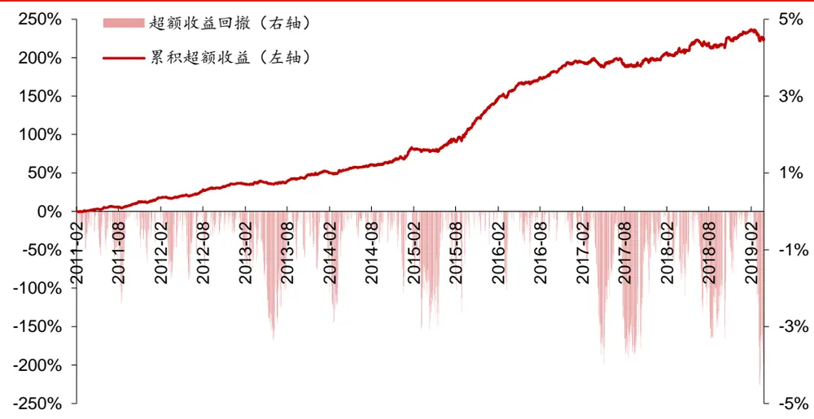
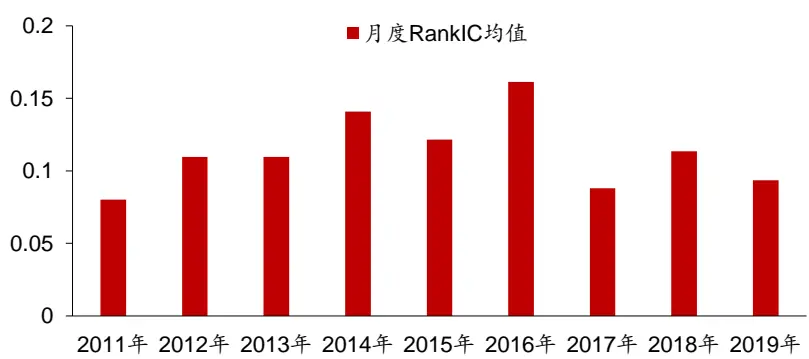
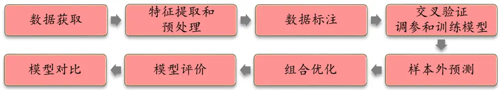
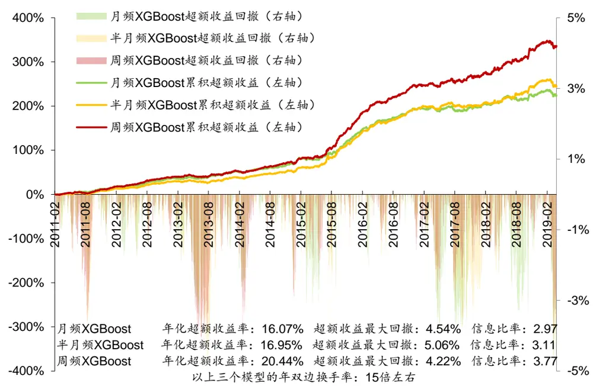
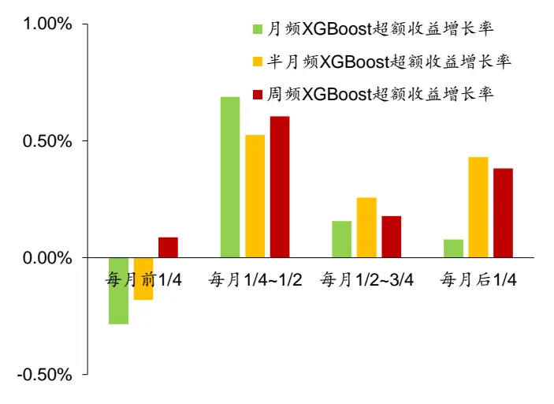
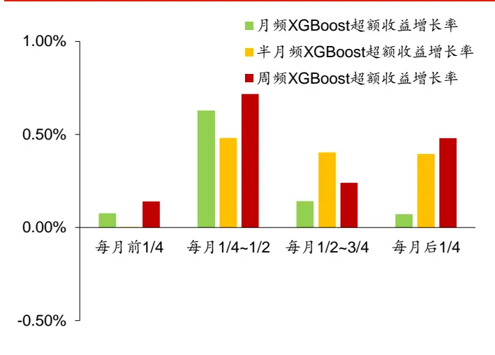
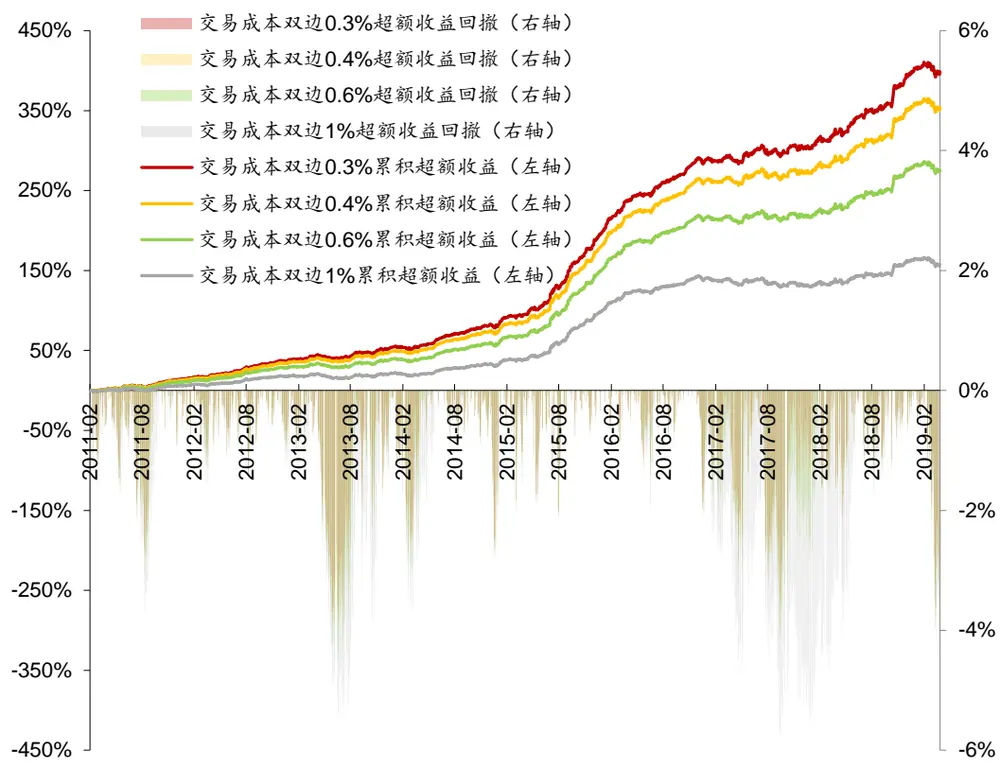

## 金工研究/深度研究

2019年04月09日

林晓明 执业证书编号：S0570516010001

研究员 0755-82080134

陈烨 执业证书编号：S0570518080004

研究员 010-56793942

李子钰 0755-23987436

联系人 liziyu@htsc.com

联系人 hekang@htsc.com

2《金工: 人工智能选股之数据标注方法实证》2019.03

# 机器学习选股模型的调仓频率实证华泰人工智能系列之十八

周频调仓 XGBoost模型表现最好，需要借助组合优化来控制模型换手率2017 年以来，月频调仓的机器学习模型超额收益指标明显下滑。本文根据理论分析，认为可以通过加快调仓频率来提升机器学习选股模型的表现。在实证中，本文对比了三种调仓频率的 XGBoost 模型，周频调仓 XGBoost表现最好。此外，对于周频调仓 XGBoost 来说，需要使用组合优化来控制换手率才能达到最优的回测结果。最后，本文测试了周频调仓 XGBoost在不同交易成本下的表现，投资者可以参考不同交易成本下的回测结果来设计调仓方案。

根据理论分析，可以通过加快调仓频率来提升机器学习选股模型的表现2017 年以来，月频调仓的机器学习模型超额收益指标明显下滑。本文计算了 XGBoost 模型的月度 RankIC 均值， 2017 年之后，其月度 RankIC 均值出现下滑，可能原因之一是 2017 年以后 A 股市场变得更加有效，月频调仓的模型面临挑战。根据 Richard Grinold 提出的公式IR = IC√BR，在IC(信息系数)下滑的情况下，为了达到给定的 IR(信息比率)水平，一个可行的方法就是增大 BR(投资策略的广度)，增大 BR 有两种方法，一是增加投资组合中资产的数目，二是加快调仓频率，本文测试了加快调仓频率的方法，得到了更优的回测结果。

本文对比了三种调仓频率的 XGBoost模型，周频调仓 XGBoost表现最好本文对比了以下三个模型：(1)月频调仓 XGBoost；(2)半月频调仓XGBoost；(3) 周频调仓 XGBoost。我们构建了相对于中证 500 的行业、市值中性全 A 选股策略并进行回测(交易成本为双边 0.4%)。当回测期为20110131～20190329 时，对于年化超额收益率、超额收益最大回撤、信息比率和 Calmar 比率，周频 XGBoost 都表现最好。2017 年以来，月频XGBoost 在每月后半月的超额收益增长率表现欠佳，加快调仓频率可以较大提升模型在后半月的超额收益增长率，且有助于平滑模型在整个月内的超额收益增长率分布并平摊交易成本。

## 对于较高调仓频率的模型，使用组合优化来控制换手率很有必要

本文测试了半月频 XGBoost 和周频 XGBoost 在更高换手率情况下的回测结果(交易成本为双边 0.4%)。当回测期为 20110131～20190329 时，周频XGBoost 在年均双边换手率为 23.91 倍时表现最好，其年化超额收益率为21.02%，超额收益最大回撤为 3.98%，信息比率为 3.86，Calmar 比率为5.28。半月频 XGBoost 在年均双边换手率为 24.64 倍时表现最好，两个模型在不控制换手率时都达到了很高的年均双边换手率(周频 XGBoost 为59.63 倍，半月频 XGBoost 为 32.96 倍)，而且回测结果表现都不佳。所以对于较高调仓频率的模型来说，使用组合优化来控制换手率很有必要。

## 本文测试了周频调仓 XGBoost 在不同交易成本下的表现

对于具有较高换手率的策略来说，交易成本是一个不可忽视的问题，本文选取周频 XGBoost 模型，测试了其在不同交易成本(双边 0.3%，0.4%，0.6%，1%)下的表现。周频 XGBoost 相比于月频 XGBoost，回测超额收益有显著提升，但需要注意的是调仓频率越高，对交易水平的要求也越高，投资者可以参考不同交易成本下的回测结果来设计调仓方案。

风险提示：较高的调仓频率对交易水平、市场流动性有一定要求，极端情况下可能造成过高交易成本。通过人工智能模型构建的选股策略是历史经验的总结，存在失效的可能。人工智能模型可解释程度较低，使用须谨慎。

## 本文研究导读

前期的人工智能选股报告中，我们使用的机器学习模型都使用月频调仓的方式进行回测。我们观察到 2017 年以来，月频调仓的机器学习模型超额收益指标明显下滑。针对这个问题，本文将从模型调仓频率的角度出发，结合组合优化方法，探讨更高频率调仓对模型表现的影响。本文将主要关注以下问题：

1. 2017 年以来，月频调仓的机器学习模型超额收益表现下滑，可能原因是什么？如何应对？

2. 改变机器学习模型的调仓频率，对模型策略的表现有何影响？此时如何通过组合优化来控制模型的换手率？

## 机器学习模型超额收益表现的下滑和应对方法

本章中，我们以 XGBoost 模型为例，首先讨论近年来模型超额收益表现下滑的现象，然后给出解决方案。

## 月频调仓XGBoost模型的超额收益特点

前期的人工智能选股报告中，我们重点关注使用机器学习模型进行股票收益预测。在获得了机器学习模型下个月的收益预测结果后，构建月频调仓的选股策略进行回测。图表 1 中展示了 XGBoost 全 A选股月频调仓策略(中证 500 行业市值中性，个股权重偏离上限为1%)的超额收益表现，可以看出，模型在 2017 年以后超额收益波动明显变大，并反复出现回撤，2017 年至今(2019 年 3 月 29 日)年化超额收益率为 4.87%，信息比率为 0.87，相比 2011 年至 2016 年(年化超额收益率为 20.75%，信息比率为 3.90)明显下滑。(注：为了提高策略的可执行性，本文的回测使用均价(vwap)作为成交价进行回测，之前的报告使用收盘价作为成交价进行回测，因此策略表现有一定差异。)

图表1： XGBoost 全 A 月频调仓选股策略超额收益表现(中证 500 行业市值中性，个股权重偏离上限为 1%)

资料来源：Wind，朝阳永续，华泰证券研究所

量化多因子模型本质上是统计套利模型，利用市场的失效来获取 Alpha。随着 A股市场的发展，市场的有效性在逐渐增强，此时月频调仓的模型显现出其弊端。图表 2 展示了XGBoost 模型在全 A股的逐年月度 RankIC均值(计算方法：将 XGBoost 模型的预测值视为单因子，进行行业市值中性，然后计算月度 RankIC。图表 2中 2019 年的月度 RankIC均值是 2019 年 1 月到 3月的均值)。

图表2： XGBoost 模型在全 A股的逐年月度 RankIC 均值

资料来源：Wind，朝阳永续，华泰证券研究所

从图表 2 可以看出，2017 年之前，XGBoost 模型的月度 RankIC 均值维持在较高位置，2017 年之后，其月度 RankIC 均值出现下滑，可能原因之一是 2017 年以后 A股市场变得更加有效，月频调仓的模型面临挑战。

1989 年，Richard Grinold 在其论文《The Fundamental Law of Active Management》中提出了估计投资组合信息比率(IR)的公式：

$$
IR=IC{\sqrt{BR}}
$$

即 IR 取决于投资策略的广度 BR(Breadth)和信息系数 IC(Information Coefficient)。

1. BR(Breadth)：投资策略的广度，即策略每年对超额收益率做出的独立预测数目；

2. IC(Information Coefficient)：信息系数是每个预测与真实超额收益之间的相关系数，与前文中的 RankIC概念类似。

在 IC 下滑的情况下，为了达到给定的 IR 水平，一个可行的方法就是增大 BR，增大 BR有两种方法，一是增加投资组合中资产的数目，二是加快调仓频率，本文将测试加快调仓频率的方法。

## 调仓频率和组合优化

当模型的调仓频率偏高，例如达到周频调仓的水平时，不进行换手率约束往往会带来较大的换手率，这对于交易水平一般的机构来说，会造成过高的交易成本而使得模型策略难以执行。此时需要借助组合优化模型来控制换手率，本节将简要介绍组合优化框架。

对于投资组合的优化问题，可以采用二次规划的方法构建符合目标的投资组合，其一般形式为：

$$
\begin{array}{rl}{\operatorname*{max}}&{{}x^{T}r\ -\lambda x^{T}\Sigma x}\end{array}\tag{1}
$$

$$
\mathsf{s.t.}~w=w_{B}+x\tag{2}
$$

$$
||w-w_{0}||\leq\delta\tag{3}
$$

$$
f_{lower}\leq X_{f}x\leq f_{upper}\tag{4}
$$

$$
h_{lower}\leq Hx\leq h_{upper}\tag{5}
$$

$$
w_{lower}\leq x\leq w_{upper}\tag{6}
$$

其中，x为个股主动权重向量，w为个股绝对权重向量，r为个股预期收益向量，Σ为个股协方差预测矩阵。

(1)式为优化目标，最大化预期收益与预期风险之差。

(2)式描述了个股主动权重和绝对权重的关系， $w_{B}$ 为基准中个股权重向量。

(3)式为换手率约束， $w_{0}$ 为个股初始权重向量，δ为换手率上限。

(4)式为风格因子暴露约束， $X_{f}$ 为个股的风格因子暴露矩阵， $f_{lower}\acute{\ast}^{\pi}f_{upper}$ 为风格因子暴露上下限。

(5)式为行业暴露约束，H为个股的行业哑变量暴露矩阵， $h_{lower}\#\#h_{upper}$ 为行业暴露上下限。

(6)式为个股主动权重的上下限约束， $w_{lower}\acute{\ast}^{\sigma}w_{upper}$ 为个股重点权重上下限。

在本文的应用中，为简单起见，我们设λ=0，控制模型的市值和行业暴露为 $^{0,}$ ，个股主动权重的上下限约束 $w_{lower}{=}{-}0.01$ $w_{upper}{=}0.01$ 。换手率约束 $||w-w_{0}||\leq\delta\ j$ 是一个非光滑约束条件，不能直接使用线性规划求解，因此需要将其转换为线性约束条件，本文在附录部分对此进行了推导。

## 测试流程

图表3： 测试流程示意图

资料来源：华泰证券研究所

本文使用前期报告中表现优秀的 XGBoost 模型进行测试，测试流程包含如下步骤：

1) 股票池：全 A股。剔除 ST 股票，剔除每个截面期下一交易日停牌的股票，剔除上市 3个月内的股票，每只股票视作一个样本。

2) 回测区间：2011 年 1 月 31 日至 2019 年 3 月 29 日。

## 2． 特征提取和预处理：

1) 每个自然月的最后一个交易日，计算 82 个因子暴露度，作为样本的原始特征，因子池如图表 4所示。

2) 中位数去极值：设第 T 期某因子在所有个股上的暴露度序列为 $D_{i},\ D_{M}$ 为该序列中位数， $D_{M1}$ 为序列 $|D_{i}-D_{M}|$ 的中位数，则将序列 $D_{i}$ 中所有大 $\mp D_{M}+5D_{M1}$ 的数重设为 $D_{M}+5D_{M1}$ ，将序列 $D_{i}$ 中所有小于 $D_{M}-5D_{M1}$ 的数重设为 $D_{M}-5D_{M1}$ ；

3) 缺失值处理：得到新的因子暴露度序列后，将因子暴露度缺失的地方设为中信一级行业相同个股的平均值；

4) 行业市值中性化：将填充缺失值后的因子暴露度对行业哑变量和取对数后的市值做线性回归，取残差作为新的因子暴露度；

5) 标准化：将中性化处理后的因子暴露度序列减去其现在的均值、除以其标准差，得到一个新的近似服从 N(0, 1)分布的序列。

## 3． 数据标注：本文将对比以下三个模型：

1) 月频 XGBoost：在每月第一个交易日以当日均价调仓。

2) 半月频 XGBoost：在每月第一个交易日以当日均价调仓，在每月位于中间的交易日以当日均价调仓，例如 2019 年 3 月时在 3 月 1日和 3 月 15日调仓。

3) 周频 XGBoost：在每周第一个交易日以当日均价调仓。

对于以上三个模型，都使用股票未来一个月的超额收益(相对中证 500)作为标签

4． 交叉验证调参和训练模型：本文采用年度交叉验证调参的方式。当第 N年的最优超参数确定之后，对于其中的某个截面 T 来说，将过去 72 个月的数据合并作为样本内数据集，使用第 N年的最优超参数训练模型。

5． 样本外预测：确定最优参数后，以T截面期所有样本预处理后的特征作为模型的输入，得到每个样本的预测值 f(x)。将预测值视作合成后的因子。

6． 组合优化：主要使用组合优化模型控制模型换手率，保持行业市值中性和约束个股上下限。

7． 模型评价：我们以模型合成因子构建选股策略的结果作为模型评价标准。

8． 模型对比：对比第 3步中的三个模型的选股指标(年化超额收益率、超额收益最大回撤、信息比率、Calmar比率、换手率)。

图表4： 选股模型中涉及的全部因子及其描述

| 大类因子 | 具体因子 因子描述 |  |
| --- | --- | --- |
| 估值 | EP | 净利润(TTM)/总市值 |
| 估值 | EPcut | 扣除非经常性损益后净利润(TTM)/总市值 |
| 估值 | BP | 净资产/总市值 |
| 估值 | SP | 营业收入(TTM)/总市值 |
| 估值 | NCFP | 净现金流(TTM)/总市值 |
| 估值 | OCFP | 经营性现金流(TTM)/总市值 |
| 估值 | DP | 近12个月现金红利(按除息日计)/总市值 |
| 估值 | G/PE | 净利润(TTM)同比增长率/PE_TTM |
| 成长 | Sales_G_q | 营业收入(最新财报，YTD)同比增长率 |
| 成长 | Profit_G_q | 净利润(最新财报，YTD)同比增长率 |
| 成长 | OCF_G_q | 经营性现金流(最新财报，YTD)同比增长率 |
| 成长 | ROE_G_q | ROE(最新财报，YTD)同比增长率 |
| 财务质量 | ROE_q | ROE(最新财报，YTD) |
| 财务质量 | ROE_ttm | ROE(最新财报，TTM) |
| 财务质量 财务质量 | ROA_q | ROA(最新财报，YTD) |
| 财务质量 | ROA_ttm | ROA(最新财报，TTM) |
| 财务质量 | grossprofitmargin_q | 毛利率(最新财报，YTD) |
| 财务质量 | grossprofitmargin_ttm | 毛利率(最新财报，TTM) |
| 财务质量 | profitmargin_q | 扣除非经常性损益后净利润率(最新财报，YTD) 扣除非经常性损益后净利润率(最新财报，TTM) |
| 财务质量 | profitmargin_ttm |  |
| 财务质量 | assetturnover_q | 资产周转率(最新财报，YTD) 资产周转率(最新财报，TTM) |
| 财务质量 | assetturnover_ttm |  |
| 财务质量 | operationcashflowratio_q | 经营性现金流/净利润(最新财报，YTD) |
| 杠杆 | operationcashflowratio_ttm | 经营性现金流/净利润(最新财报，TTM) |
| 杠杆 | financial_leverage | 总资产/净资产 |
| 杠杆 | debtequityratio | 非流动负债/净资产 |
| 杠杆 | cashratio currentratio | 现金比率 流动比率 |
| 市值 | In_capital | 总市值取对数 |
| 动量反转 | HAlpha | 个股60个月收益与上证综指回归的截距项 |
| 动量反转 | return_Nm | 个股最近N个月收益率，N=1，3，6，12 |
| 动量反转 | wgt_return_Nm | 个股最近N个月内用每日换手率乘以每日收益率求算术平均值， |
| 动量反转 | exp_wgt_return_Nm | N=1, 3, 6, 12 个股最近N个月内用每日换手率乘以函数exp(-x_i/N/4)再乘以每日 |
|  |  | 收益率求算术平均值，x_i为该日距离截面日的交易日的个数，N=1， 3, 6, 12 |
| 波动率 | std_FF3factor_Nm | 特质波动率 -个股最近 N 个月内用日频收益率对 Fama French 三因子回归的残差的标准差，N=1，3，6，12 |
| 波动率 股价 | std_Nm | 个股最近N个月的日收益率序列标准差，N=1，3，6，12 |
| beta | In_price | 股价取对数 |
| 换手率 | beta | 个股60个月收益与上证综指回归的 beta |
|  | turn_Nm | 个股最近N个月内日均换手率(剔除停牌、涨跌停的交易日)，N=1， 3, 6, 12 |
| 换手率 | bias_turn_Nm | 个股最近N个月内日均换手率除以最近2年内日均换手率(剔除停 |
| 一致预期 | rating_average | 牌、涨跌停的交易日)再减去1，N=1，3，6，12 wind 评级的平均值 |
| 一致预期 | rating_change | wind 评级(上调家数-下调家数)/总数 |
| 一致预期 | rating_targetprice | wind一致目标价/现价-1 |
| 一致预期 | CON_EP | 朝阳永续一致预期EP |
| 一致预期 | CON_EP_REL | 朝阳永续一致预期EP季度环比 |
| 一致预期 | CON_BP | 朝阳永续一致预期 EP |
| 一致预期 | CON_BP_REL | 朝阳永续一致预期EP季度环比 |
| 一致预期 | CON_GPE | 朝阳永续一致预期 GPE |
| 一致预期 | CON_GPE_REL | 朝阳永续一致预期 GPE季度环比 |
| 一致预期 | CON_ROE | 朝阳永续一致预期 ROE |
| 一致预期 | CON_ROE_REL | 朝阳永续一致预期 ROE 季度环比 |
| 一致预期 | CON_EPS | 朝阳永续一致预期 EPS |
| 一致预期 | CON_EPS_REL | 朝阳永续一致预期 EPS 季度环比 |
| 一致预期 | CON_NP | 朝阳永续一致预期归母净利润 |
| 一致预期 | CON_NP_REL | 朝阳永续一致预期归母净利润季度环比 |
| 股东 技术 | holder_avgpctchange MACD | 户均持股比例的同比增长率 |
| 技术 | DEA | 经典技术指标(释义可参考百度百科)，长周期取30日，短周期取 |
| 技术 | DIF | 10 日，计算 DEA 均线的周期(中周期)取 15 日 |
| 技术 | RSI | 经典技术指标，周期取20日 |
| 技术 | PSY | 经典技术指标，周期取20日 |
| 技术 | BIAS | 经典技术指标，周期取20日 |

资料来源：Wind，朝阳永续，华泰证券研究所

## 测试结果

## 不同换手率约束下的模型回测对比

本节中，我们将对比以下三个模型：

1. 月频 XGBoost：在每月第一个交易日以当日均价调仓。

2. 半月频 XGBoost：在每月第一个交易日以当日均价调仓，在每月位于中间的交易日以当日均价调仓，例如 2019 年 3 月时在 3 月 1日和 3月 15 日调仓。

3. 周频 XGBoost：在每周第一个交易日以当日均价调仓。

基于以上三个模型，我们构建了相对于中证 500 的行业、市值中性全 A选股策略并进行回测(交易成本为双边 0.4%)。图表 5 中，每一列是一组测试。每一组测试都使用换手率约束将三个对比模型的年度双边换手率控制在相近的水平下。当回测期为 20110131～20190329 时，对于年化超额收益率、超额收益最大回撤、信息比率和 Calmar比率，周频 XGBoost 都表现最好。半月频 XGBoost 相比月频 XGBoost 没有明显优势。

图表5： 三个模型构建全 A选股策略回测指标对比(回测期 20110131～20190329)

| 模型选择 | 年均双边换手率(从左至右：换手率逐渐增大) |  |  |
| --- | --- | --- | --- |
|  | 全 A 选股，基准为中证 500(行业市值中性，个股权重偏离上限为1%) 年化超额收益率 |  |  |
| 月频 XGBoost | 16.28% 17.01% | 16.27% | 16.07% |
| 半月频 XGBoost | 15.65% 16.75% | 16.79% | 16.95% |
| 周频 XGBoost | 17.73% 19.00% | 19.73% | 20.44% |
| 超额收益最大回撤 |  |  |  |
| 月频 XGBoost | 5.41% 4.70% | 4.37% | 4.54% |
| 半月频 XGBoost | 5.53% 4.75% | 4.65% | 5.06% |
| 周频 XGBoost | 4.23% 3.95% | 4.07% | 4.22% |
| 信息比率 |  |  |  |
| 月频 XGBoost | 3.07 3.18 | 3.04 | 2.97 |
| 半月频 XGBoost | 2.93 3.10 | 3.11 | 3.11 |
| 周频 XGBoost | 3.36 | 3.61 3.66 | 3.77 |
| Calmar 比率 |  |  |  |
| 月频 XGBoost | 3.01 3.62 | 3.72 | 3.54 |
| 半月频 XGBoost | 2.83 3.52 | 3.61 | 3.35 |
| 周频 XGBoost | 4.20 | 4.81 4.85 | 4.85 |
| 年均双边换手率(倍) |  |  |  |
| 月频 XGBoost | 9.37 | 11.43 13.49 | 14.98 |
| 半月频 XGBoost | 9.37 11.38 | 13.35 | 14.90 |
| 周频 XGBoost | 9.16 | 11.57 13.59 | 15.06 |

资料来源：Wind，朝阳永续，华泰证券研究所

为了观察模型在 2017 年以来的表现，我们将回测期设为 20170103～20190329，回测结果在图表 6 中。2017 年以来，半月频 XGBoost 与周频 XGBoost 的表现比较接近，它们都要比月频 XGBoost 表现要好。

图表6： 三个模型构建全 A选股策略回测指标对比(回测期 20170103～20190329)

| 模型选择 | 年均双边换手率(从左至右：换手率逐渐增大) |  |  |
| --- | --- | --- | --- |
|  | 全 A选股，基准为中证 500(行业市值中性，个股权重偏离上限为 1%) |  |  |
| 年化超额收益率 |  |  |  |
| 月频 XGBoost | 7.60% 7.14% | 6.74% | 4.87% |
| 半月频 XGBoost | 10.63% 10.34% | 8.57% | 7.71% |
| 周频 XGBoost | 8.71% 9.20% | 9.49% | 9.36% |
| 超额收益最大回撤 |  |  |  |
| 月频 XGBoost | 5.37% 4.70% | 4.37% | 4.54% |
| 半月频 XGBoost | 4.84% 4.68% | 4.38% | 4.79% |
| 周频 XGBoost | 4.11% 3.48% | 3.35% | 3.92% |
| 信息比率 |  |  |  |
| 月频 XGBoost | 1.38 1.29 | 1.21 | 0.87 |
| 半月频 XGBoost | 1.96 1.93 | 1.59 | 1.40 |
| 周频 XGBoost | 1.56 | 1.63 1.67 | 1.64 |
| Calmar 比率 |  |  |  |
| 月频 XGBoost | 1.41 | 1.52 1.54 | 1.07 |
| 半月频 XGBoost | 2.20 2.21 | 1.96 | 1.61 |
| 周频 XGBoost | 2.12 | 2.64 2.83 | 2.39 |
| 年均双边换手率(倍) |  |  |  |
| 月频 XGBoost | 9.35 | 11.36 13.39 | 14.41 |
| 半月频 XGBoost | 9.51 | 11.45 13.48 | 14.98 |
| 周频 XGBoost | 9.20 | 11.73 13.69 | 15.11 |

资料来源：Wind，朝阳永续，华泰证券研究所

图表 7展示了三个模型的详细超额收益表现。

图表7： 三个模型超额收益表现(中证 500行业市值中性，个股权重偏离上限为 1%)

资料来源：Wind，朝阳永续，华泰证券研究所

为了更细致地对比 2017 年以来上面三个模型的超额收益，我们将一个月内的交易日分为以下四个等分区间(以 2018 年 12 月为例进行说明)，统计模型在各个区间内的平均超额收益增长率(注：这里超额收益增长率可类比为对冲中证 500 指数组合净值的增长率)。

1. 每月前 1/4：2018 年 12 月 3 日至 7 日。

2. 每月 1/4~1/2：2018 年 12 月 10 日至 14 日。

3. 每月 1/2~3/4：2018 年 12 月 17 日至 21 日。

4. 每月后 1/4：2018 年 12 月 24 日至 28 日。

图表 8和图表 9 展示了图表 7 中的三个模型 2017 年以来每月超额收益增长率分布情况。由于交易成本的产生时间会明显影响超额收益的计算，我们展示了计交易成本(双边 0.4%)的情形(图表 8)和不计交易成本的情形(图表 9)。

图表8： 2017年以来三个模型超额收益增长率分布(计交易成本)

资料来源：Wind，朝阳永续，华泰证券研究所

图表9： 2017年以来三个模型超额收益增长率分布(不计交易成本)

资料来源：Wind，朝阳永续，华泰证券研究所

观察 4个区间的超额收益增长率分布，可以得到以下现象：

1. 每月前 1/4：由于月频 XGBoost 的全部调仓动作在该区间内完成，其超额收益增长率受交易成本影响较大(图表 8)。当不计交易成本时，其超额收益增长率与另外两个模型差别不大(图表 9)。

2. 每月 1/4~1/2：这是月频 XGBoost 表现最好的区间，无论是否计交易成本，超额收益增长率都比半月频 XGBoost 稍好。

3. 每月 1/2~3/4：无论是否计交易成本，月频 XGBoost 的超额收益增长率都低于另外两个模型。

4. 每月后 1/4：无论是否计交易成本，月频 XGBoost 的超额收益增长率都远低于另外两个模型，劣势明显。

根据以上现象，我们可以得出结论：2017 年以来，月频 XGBoost 在每月后半月的超额收益增长率表现欠佳，加快调仓频率可以较大提升模型在后半月的超额收益增长率，且有助于平滑模型在整个月内的超额收益增长率分布并平摊交易成本。

## 模型在更高换手率情况下的回测结果

上一节的模型中，月频 XGBoost 在不控制换手率的情况下，达到的最大年均双边换手率是 14.98 倍。但是对于周频 XGBoost 和半月频 XGBoost 来说，还可以继续放松换手率限制来达到更高的年度双边换手率，图表 10 展示了它们在更高换手率下的回测结果(交易成本为双边 0.4%)。当回测期为 20110131～20190329 时，半月频 XGBoost 在年均双边换手率为 24.64 倍时表现最好，其年化超额收益率为 17.30%，超额收益最大回撤为 4.93%，信息比率为 3.17，Calmar 比率为 3.51。周频 XGBoost 在年均双边换手率为 23.91 倍时表现最好，其年化超额收益率为 21.02%，超额收益最大回撤为 3.98%，信息比率为 3.86，Calmar 比率为 5.28。两个模型在不控制换手率时都达到了很高的年均双边换手率(半月频XGBoost 为 32.96 倍，周频 XGBoost 为 59.63 倍)，而且回测结果表现都不佳，这主要是因为交易成本过高所致。所以对于较高调仓频率的模型来说，使用组合优化来控制换手率很有必要。

图表10： 两个模型构建全 A选股策略回测指标对比(回测期 20110131～20190329)

| 模型选择 | 年均双边换手率(从左至右：换手率逐渐增大) |  |  |  |  |
| --- | --- | --- | --- | --- | --- |
|  | 全 A 选股，基准为中证500(行业市值中性，个股权重偏离上限为 1%) |  |  |  |  |
|  | 年化超额收益率 |  |  |  |  |
| 半月频 XGBoost | 17.09% 16.84% | 17.13% | 17.30% | 16.65% | 16.20% 15.73% |
| 周频 XGBoost | 19.73% 20.10% 20.53% 21.02% 20.86% |  |  |  |  |
|  |  |  | 超额收益最大回撤 |  |  |
| 半月频 XGBoost | 4.72% | 4.99% 4.93% | 4.93% | 5.52% | 5.49% |
| 周频 XGBoost | 4.07% 3.78% | 4.14% | 3.98% | 4.10% | 5.62% |
| 信息比率 |  |  |  |  |  |
| 半月频 XGBoost | 3.15 | 3.10 | 3.15 3.17 | 3.00 | 2.92 |
| 周频 XGBoost | 3.66 | 3.74 | 3.78 3.86 | 3.78 | 2.70 |
| Calmar 比率 |  |  |  |  |  |
| 半月频 XGBoost | 3.62 | 3.37 | 3.47 3.51 | 3.02 | 2.95 |
| 周频 XGBoost | 4.85 | 5.31 | 4.97 | 5.28 5.09 | 2.80 |
| 年均双边换手率(倍) |  |  |  |  |  |
| 半月频 XGBoost | 13.50 | 16.39 | 20.79 | 24.64 31.27 | 32.96(不控制换手率) |
| 周频 XGBoost | 13.59 | 16.52 | 20.49 23.91 | 31.29 | 59.63(不控制换手率) |

资料来源：Wind，朝阳永续，华泰证券研究所

## 模型在不同交易成本下的回测结果

对于具有较高换手率的策略来说，交易成本是一个不可忽视的问题，我们选取上一节中表现最好的周频 XGBoost 模型(年均双边换手率为 23.91 倍)，测试其在不同交易成本下的表现，结果展示在图表 11 中。

图表11： 不同交易成本下周频 XGBoost 构建全 A 选股策略回测指标对比(回测期 20110131～20190329)

| 双边交易成本(从左至右：0.3%，0.4%，0.6%，1%) |  |  |  |
| --- | --- | --- | --- |
| 全 A 选股，基准为中证 500(行业市值中性，个股权重偏离上限为 1%)年化超额收益率 |  |  |  |
| 周频 XGBoost | 22.47% 21.02% 18.18% |  | 12.69% |
|  | 超额收益最大回撤 |  |  |
| 周频 XGBoost | 3.73% | 3.98% 4.47% | 5.80% |
|  | 信息比率 |  |  |
| 周频 XGBoost | 4.15 | 3.86 3.30 | 2.22 |
|  | Calmar 比率 |  |  |
| 周频 XGBoost | 6.02 5.28 4.07 |  | 2.19 |

资料来源：Wind，朝阳永续，华泰证券研究所

图表 12展示了周频 XGBoost 模型在不同交易成本下的详细超额收益表现。

图表12： 不同交易成本下周频 XGBoost超额收益表现(中证 500行业市值中性，个股权重偏离上限为 1%)

资料来源：Wind，朝阳永续，华泰证券研究所

## 结论

我们观察到 2017 年以来，月频调仓的机器学习模型超额收益指标明显下滑。针对这个问题，本文从模型调仓频率的角度出发，结合组合优化方法，探讨了更高频率调仓对模型表现的影响。本文得出了以下结论：

1. 本文计算了 XGBoost 模型的月度 RankIC 均值，2017 年之前，其月度 RankIC 均值维持在较高位置，2017 年之后，其月度 RankIC均值出现下滑，可能原因之一是 2017 年以后 A股市场变得更加有效，月频调仓的模型面临挑战。根据 Richard Grinold 提出的公式IR = IC√BR，在 IC(信息系数)下滑的情况下，为了达到给定的 IR(信息比率)水平，一个可行的方法就是增大 BR，增大 BR 有两种方法，一是增加投资组合中资产的数目，二是加快调仓频率，本文测试了加快调仓频率的方法，得到了更优的回测结果。

## 2. 本文对比了以下三个模型：

1) 月频 XGBoost：在每月第一个交易日以当日均价调仓。

2) 半月频 XGBoost：在每月第一个交易日以当日均价调仓，在每月位于中间的交易日以当日均价调仓。

3) 周频 XGBoost：在每周第一个交易日以当日均价调仓。

基于以上三个模型，我们构建了相对于中证 500 的行业、市值中性全 A 选股策略并进行回测(交易成本为双边 0.4%)。当回测期为 20110131～20190329 时，对于年化超额收益率、超额收益最大回撤、信息比率和 Calmar 比率，周频 XGBoost 都表现最好。半月频XGBoost 相比月频 XGBoost 没有明显优势。当回测期为 20170103～20190329 时，半月频 XGBoost 与周频 XGBoost 的表现比较接近，它们都要比月频 XGBoost 表现要好。我们进一步分析了以上三个模型 2017 年以来每月超额收益增长率分布情况，月频 XGBoost在每月后半月的超额收益增长率表现欠佳，加快调仓频率可以较大提升模型在后半月的超额收益增长率，且有助于平滑模型在整个月内的超额收益增长率分布并平摊交易成本。

3. 本文测试了半月频 XGBoost 和周频 XGBoost 在更高换手率情况下的回测结果(交易成本为双边 0.4%)。当回测期为 20110131～20190329 时，半月频 XGBoost 在年均双边换手率为 24.64 倍时表现最好，其年化超额收益率为 17.30%，超额收益最大回撤为 4.93%，信息比率为 3.17，Calmar 比率为 3.51。周频 XGBoost 在年均双边换手率为 23.91 倍时表现最好，其年化超额收益率为 21.02%，超额收益最大回撤为 3.98%，信息比率为 3.86，Calmar 比率为 5.28。两个模型在不控制换手率时都达到了很高的年均双边换手率(半月频XGBoost 为 32.96 倍，周频 XGBoost 为 59.63 倍)，而且回测结果表现都不佳。所以对于较高调仓频率的模型来说，使用组合优化来控制换手率很有必要。

4. 对于具有较高换手率的策略来说，交易成本是一个不可忽视的问题，本文选取周频XGBoost 模型，测试了其在不同交易成本(双边 0.3%，0.4%，0.6%，1%)下的表现。周频 XGBoost 相比于月频 XGBoost，回测超额收益有显著提升，但需要注意的是调仓频率越高，对交易水平的要求也越高，投资者可以参考不同交易成本下的回测结果来设计调仓方案。

## 风险提示

较高的调仓频率对交易水平、市场流动性有一定要求，极端情况下可能造成过高交易成本。通过人工智能模型构建的选股策略是历史经验的总结，存在失效的可能。人工智能模型可解释程度较低，使用须谨慎。

## 附录：换手率控制的数学推导

对于投资组合的优化问题，可以采用二次规划的方法构建符合目标的投资组合，其一般形式为：

$$
\begin{array}{rl}{\operatorname*{max}}&{{}x^{T}r-\lambda x^{T}\Sigma x}\end{array}\tag{1}
$$

$$
\mathrm{s.t.}w=w_{B}+x\tag{2}
$$

$$
||w-w_{0}||\leq\delta\tag{3}
$$

$$
f_{lower}\leq X_{f}x\leq f_{upper}\tag{4}
$$

$$
h_{lower}\leq Hx\leq h_{upper}\tag{5}
$$

$$
w_{lower}\leq x\leq w_{upper}\tag{6}
$$

其中，x为个股主动权重向量，w为个股绝对权重向量，r为个股预期收益向量，Σ为个股协方差预测矩阵。

(1)式为优化目标，最大化预期收益与预期风险之差。

(2)式描述了个股主动权重和绝对权重的关系， $w_{B}$ 为基准中个股权重向量。

(3)式为换手率约束， $w_{0}$ 为个股初始权重向量，δ为换手率上限。

(4)式为风格因子暴露约束， $X_{f}$ 为个股的风格因子暴露矩阵， $f_{lower}\acute{\ast}^{\pi}f_{upper}$ 为风格因子暴露上下限。

(5)式为行业暴露约束，H为个股的行业哑变量暴露矩阵， $h_{lower}\mathcal{\dot{\pi}}h_{upper}$ 为行业暴露上下限。
(6)式为个股主动权重的上下限约束， $w_{lower}\acute{\ast}^{\sigma}w_{upper}$ 为个股重点权重上下限。

换手率约束 $||w-w_{0}||\leq\delta$ 是一个非光滑约束条件，不能直接使用线性规划求解，因此需要将其转换为线性约束条件：增加辅助变量

$$
\begin{array}{l}{u=max\{0,w_{B}+x-w_{0}\}}\\{v=-min\{0,w_{B}+x-w_{0}\}}\end{array}\tag{7}
$$

使得：

(8)

$$
w_{B}+x-w_{0}=u-v\tag{9}
$$

即：

$$
x=u-v+w_{0}-w_{B}\tag{10}
$$

其中 $u,$ ，v是与x具有相同维度的n×1阶向量，且 $u\geq0,v\geq0$ 。u代表 $w_{B}+x-w_{0}$ 中大于 0的项， $w_{B}+x-w_{0}$ 中小于 0的项在u中的值为 0；同理，v代表 $w_{B}+x-w_{0}$ 中小于 0 的项，$w_{B}+x-w_{0}$ 中大于 0 的项在v中的值为 0(e.g.若 $w_{B}+x-w_{0}=[0.5,0.5,-0.5,-0.5]$ ,则$\boldsymbol{u}=[0.5,0.5,0,0],\boldsymbol{v}=[0,0,0.5,0.5])$ 0

用u，v代替max $\boldsymbol{x}^{T}\boldsymbol{r}^{}-\lambda\boldsymbol{x}^{T}\boldsymbol{\Sigma}\boldsymbol{x}$ 中的x，舍去其中的常数项，整理后得到(11)式。

$$
\begin{array}{rl}{\operatorname*{max}}&{{}z^{T}f-\lambda z^{T}\phi z}\end{array}\tag{11}
$$

其 中 $\begin{array}{r}{z=[~{\boldsymbol u}^{T},{\boldsymbol v}^{T}]^{T}~,\quad f=[r_{1\times n}+2\lambda w_{0}^{T}\Sigma-2\lambda w_{B}^{T}\Sigma,-r_{1\times n}-2\lambda w_{0}^{T}\Sigma+2\lambda w_{B}^{T}\Sigma]^{T}~,\quad\phi=\phi^{\prime}(r_{1\times n}+2\lambda w_{0}^{T}\Sigma-2\lambda w_{0}^{T}\Sigma)^{T}}\end{array}$ $\big[{\LARGE{\frac{\cal Z}{-\cal Z}}}^{\qquad\ L}\big.\begin{array}{rl}{-\Sigma}\\{\Sigma}\end{array}\big],r_{1\times n}$ 为各股票的预测收益。由于辅助变量的加入，线性规划的目标函数的解z的维度由 n提高到了 2n。

约束条件：

$$
a^{T}z\leq\delta\tag{12}
$$

$$
Az\leq b\tag{13}
$$

$$
Dz\leq b\tag{14}
$$

$$
0\le z\tag{15}
$$

(12)式为换手率约束，其中 $\boldsymbol{a}=[\boldsymbol{1}_{1\times n},\boldsymbol{1}_{1\times n}]^{T},~\boldsymbol{a}^{T}\boldsymbol{z}$ 即为 $||\mathbf{w}-\mathbf{w}_{0}||$ o

(13)式为原x变量上下限约束。原x由u，v代替，得到 $w_{lower}\leq u-v+w_{0}-w_{B}\leq w_{upper},$ 即 $u-v\leq w_{B}-w_{0}+w_{upper},\enspace-u+v\leq w_{0}-w_{B}-w_{lower}\circ$ 。因此 $A=\left[{\begin{array}{cc}{E_{n\times n}}&{-E_{n\times n}}\\{-E_{n\times n}}&{E_{n\times n}}\end{array}}\right]$ $\boldsymbol{b}=\left[\begin{array}{l}{w_{B}-w_{0}+w_{upper}}\\{w_{0}-w_{B}-w_{lower}}\end{array}\right]$ $E_{n\times n}$ 为 $n\times n$ 阶单位矩阵。

(14)式为风格因子暴露约束和行业暴露约束。原x由u，v代替，得到 $X_{f}(w_{B}-w_{0})+f_{lower}\le$ $X_{f}(u-v)\le X_{f}(w_{B}-w_{0})+f_{upper}\quad,\quad H(w_{B}-w_{0})+h_{lower}\le H(u-v)\le H(w_{B}-w_{0})+\operatorname*{min}(1+\epsilon/\epsilon),$ $h_{upper^{\circ}}$ 。因此 $D=\left[\begin{array}{cc}{X_{f}}&{-X_{f}}\\{-X_{f}}&{X_{f}}\\{Hx}&{-Hx}\\{-Hx}&{Hx}\end{array}\right],b=\left[\begin{array}{cc}{X_{f}(w_{B}-w_{0})+f_{upper}}\\{X_{f}(w_{0}-w_{B})-f_{lower}}\\{H(w_{B}-w_{0})+w_{upper}}\\{H(w_{0}-w_{B})-w_{lower}}\end{array}\right]\circ$

(15)式为辅助变量下限约束。

求解u，v后，得到个股的权重 $x=u-v+w_{0}-w_{B}$ o

## 免责申明

本报告仅供华泰证券股份有限公司（以下简称“本公司”）客户使用。本公司不因接收人收到本报告而视其为客户。

本报告基于本公司认为可靠的、已公开的信息编制，但本公司对该等信息的准确性及完整性不作任何保证。本报告所载的意见、评估及预测仅反映报告发布当日的观点和判断。在不同时期，本公司可能会发出与本报告所载意见、评估及预测不一致的研究报告。同时，本报告所指的证券或投资标的的价格、价值及投资收入可能会波动。本公司不保证本报告所含信息保持在最新状态。本公司对本报告所含信息可在不发出通知的情形下做出修改，投资者应当自行关注相应的更新或修改。

本公司力求报告内容客观、公正，但本报告所载的观点、结论和建议仅供参考，不构成所述证券的买卖出价或征价。该等观点、建议并未考虑到个别投资者的具体投资目的、财务状况以及特定需求，在任何时候均不构成对客户私人投资建议。投资者应当充分考虑自身特定状况，并完整理解和使用本报告内容，不应视本报告为做出投资决策的唯一因素。对依据或者使用本报告所造成的一切后果，本公司及作者均不承担任何法律责任。任何形式的分享证券投资收益或者分担证券投资损失的书面或口头承诺均为无效。

本公司及作者在自身所知情的范围内，与本报告所指的证券或投资标的不存在法律禁止的利害关系。在法律许可的情况下，本公司及其所属关联机构可能会持有报告中提到的公司所发行的证券头寸并进行交易，也可能为之提供或者争取提供投资银行、财务顾问或者金融产品等相关服务。本公司的资产管理部门、自营部门以及其他投资业务部门可能独立做出与本报告中的意见或建议不一致的投资决策。

本报告版权仅为本公司所有。未经本公司书面许可，任何机构或个人不得以翻版、复制、发表、引用或再次分发他人等任何形式侵犯本公司版权。如征得本公司同意进行引用、刊发的，需在允许的范围内使用，并注明出处为“华泰证券研究所”，且不得对本报告进行任何有悖原意的引用、删节和修改。本公司保留追究相关责任的权力。所有本报告中使用的商标、服务标记及标记均为本公司的商标、服务标记及标记。

本公司具有中国证监会核准的“证券投资咨询”业务资格，经营许可证编号为：91320000704041011J。

全资子公司华泰金融控股（香港）有限公司具有香港证监会核准的“就证券提供意见”业务资格，经营许可证编号为：AOK809

©版权所有 2019年华泰证券股份有限公司

## 评级说明

## 行业评级体系

－报告发布日后的6个月内的行业涨跌幅相对同期的沪深300指数的涨跌幅为基准；

－投资建议的评级标准增持行业股票指数超越基准中性行业股票指数基本与基准持平减持行业股票指数明显弱于基准

## 公司评级体系

－报告发布日后的6个月内的公司涨跌幅相对同期的沪深300指数的涨跌幅为基准；
－投资建议的评级标准
买入股价超越基准 20%以上
增持股价超越基准 5%-20%
中性股价相对基准波动在-5%~5%之间
减持股价弱于基准 5%-20%
卖出股价弱于基准 20%以上

## 华泰证券研究

## 南京

南京市建邺区江东中路228号华泰证券广场1号楼/邮政编码：210019

电话：86 25 83389999 /传真：86 25 83387521

电子邮件：ht-rd@htsc.com

## 深圳

深圳市福田区益田路5999号基金大厦10楼/邮政编码：518017

电话：86 755 82493932 /传真：86 755 82492062

电子邮件：ht-rd@htsc.com

## 北京

北京市西城区太平桥大街丰盛胡同28号太平洋保险大厦A座18层

邮政编码：100032

电话：86 10 63211166/传真：86 10 63211275

电子邮件：ht-rd@htsc.com

## 上海

上海市浦东新区东方路18号保利广场E栋23楼/邮政编码：200120

电话：86 21 28972098 /传真：86 21 28972068

电子邮件：ht-rd@htsc.com