## 金工研究/深度研究

2019年04月22日

林晓明 执业证书编号：S0570516010001

研究员 0755-82080134

陈烨 执业证书编号：S0570518080004

研究员 010-56793942

chenye@htsc.com

李子钰 0755-23987436

联系人 liziyu@htsc.com

何康 021-28972039

联系人 hekang@htsc.com

## 相关研究

1《金工: 机器学习选股模型的调仓频率实 证》2019.04

3《金工: 人工智能选股之数据标注方法实证》2019.03

# 偶然中的必然：重采样技术检验过拟合华泰人工智能系列之十九

## Bootstrap 是一种可行的构建“平行 A股市场”的重采样方法

Bootstrap 是一种可行的构建“平行 A 股市场”的重采样方法，能够模拟机器学习不同环节的随机性，从而检验在真实 A 股市场中得出的研究结论是否为过拟合。我们分别对样本内数据、样本外数据和回测时间进行Bootstrap 重采样，发现在“平行 A 股市场”中分组时序交叉验证方法的模型性能和单因子回测指标均优于其它两种方法，统计检验结果显著。真实世界的研究结论能够在平行世界中复现，表明该结论为过拟合的可能性较低。我们借助“偶然”的工具，探寻出“必然”的规律。

## Bootstrap 重采样的核心思想是有放回地抽样

Bootstrap 是一种统计学上的重采样方法，又称自举法，主要用于研究统计量的统计特性。该方法的核心思想是有放回地抽样。对原始数据集进行有放回地抽样，得到 N 组 Bootstrap 数据集。每组 Bootstrap 数据集中，有的样本可能被重复抽到，有的样本没有被抽到。计算每一组 Bootstrap 数据集的统计量，将得到 N 组 Bootstrap 数据集的该统计量的分布，进而得到该统计量的统计量。

## Bootstrap 重采样对机器学习量化研究体系的构建具有指导意义

Bootstrap 重采样对机器学习量化研究体系的构建具有指导意义。机器学习量化策略开发和传统量化策略开发的重要区别在于，机器学习研究的复杂度、其所涉及的环节、超参数和参数数量远超传统量化研究，任何环节随机性的引入，对最终整个系统都可能造成类似蝴蝶效应式的影响。本文采用 Bootstrap 模拟不同环节的随机性，系统性地评估随机性对机器学习结果的影响方向和影响程度。

## 机器学习不同环节随机性对模型表现的影响各异

三种 Bootstrap 方案对同一组交叉验证方法的影响方向和程度有区别。Bootstrap 样本内数据集相当于向训练集因子值添加小幅扰动，可能小幅削弱模型表现；Bootstrap 样本外数据集相当于向测试集因子值添加小幅扰动，可能部分增强或削弱模型表现；Bootstrap 回测时间即改变模型的回测时间段，可能大幅增强或削弱模型表现。上述结果对研究者的启示是在开发过程中需要密切关注训练数据的质量，同时应避免因回测时间选择不当而造成的误判。

## Bootstrap 提供刻画随机性的思路，使研究者能基于指标分布进行决策

在以往的量化模型开发过程中，通常将历史回测表现视作确定性的结果，而忽略随机性对结果的影响。在面临不同量化策略的取舍之时，往往只是简单基于策略的年化收益率、夏普比率、收益回撤比等评价指标。Bootstrap重采样方法提供了一种刻画随机性的思路，使研究者能够基于评价指标的统计分布而非单个统计量，对模型优劣做出相对客观的判断和决策。本文从方法论的角度，对结合机器学习的多因子选股框架进行反思，针对模型比较和模型评价环节提出创新式的改造，希望对本领域的投资者有所启发。

风险提示：人工智能选股方法是对历史投资规律的挖掘，若未来市场投资环境发生变化，该方法存在失效的可能。机器学习选股模型随机性的来源多样，本研究只考虑有限的三种情况，存在忽略其它更重要随机性来源的可能。Bootstrap 重采样方法是对随机性的简单模拟，存在过度简化的可能。

## 本文研究导读

世界上几乎唯一可以确定的事情是不确定性。在自然科学领域，小到微观世界里粒子的高速运动，大到宏观世界里生物的漫长演化，无不受随机性这双看不见的手的摆布。在社会科学领域，无数遵从随机性的个体经由随机的连接和交互，构成一张复杂的巨型网络，派生出种种纷繁多彩的社会现象。一代代人类穷尽心智，透过随机性的迷雾试图认识和理解世间万象。

现代科学经过数百年的发展，已被公认为理解世界最有力的武器之一。科学的本质特征是可证伪性。“所有天鹅是白色的”这一命题本身是错误的，但是其命题的表述是科学的，原因在于该命题可以通过“找出一只黑天鹅”加以证伪。然而，由于随机性的存在，大部分科学命题并不能简单通过找反例的方式证伪。例如想证伪“吸烟者寿命更长”并不容易，吸烟对健康的影响机制过于复杂，该命题仅仅是一个模糊的、概率上的表述。单纯找出一个寿命较短的烟民并没有多大的说服力，人们需要借助统计学的工具，透过“偶然”的外衣一窥“必然”的真相。

研究随机性的统计学是现代科学的基石之一。统计学是如何解决上述问题的呢？首先定义“吸烟者寿命更长”为虚无假设，“吸烟者寿命不会更长”为备择假设。其次对烟民和非烟民进行随机抽样，样本量尽可能大，并且尽量控制其它影响寿命的因素。进而对两类人群的寿命分布进行定性比较和定量统计检验，计算虚无假设成立的概率（p值）。最终在一定显著性水平下拒绝或接受虚无假设，作出相应推断。以上例子只是相对简化的表述，实际上可以通过更精巧的设计、更复杂的统计模型作出更准确的论断。但无论其模型多么繁复，本质仍是基于大量样本结合统计模型，以推断虚无假设成立的概率。尽管 p 值的使用近年来在学术界备受质疑，上述比较随机变量分布并进行统计检验的思路仍是目前人们从偶然中发现必然的几乎是最有力的工具。

令人稍感意外的是，在量化投资领域，研究者在优质量化策略的求索之路上，却似乎遗忘了随机性的存在，将历史回测表现视作确定性的结果。在面临不同量化策略的取舍之时，往往只是简单基于策略的年化收益率、夏普比率、收益回撤比等评价指标。例如策略 A的夏普比率比策略 B更高，我们便舍弃策略 B，选择策略 A。然而，金融市场是一个开放复杂的巨系统，只需要随机性的手稍加摆弄（例如样本内、外数据集的轻微改变），回测结果就可能大相径庭。我们所有的观测以及得到的结论，都是基于确定性的历史，都是针对我们所生活的真实世界。如果这些结论在与真实世界相仿的“平行世界”里不成立，那么我们就有理由认为，这些结论只是针对真实世界的过拟合。

更值得忧虑的是，上述问题在人工智能量化研究领域都会被放大。机器学习量化策略开发和传统量化策略开发的重要区别在于，机器学习研究的复杂度、其所涉及的环节、超参数和参数数量远超传统量化研究，任何环节随机性的引入，对最终整个系统都可能造成类似蝴蝶效应式的影响。然而不同环节随机性对结果的影响程度，尚没有被系统性的研究过。例如，我们观测到的一切选股因子值都是信号和噪音的叠加。如果训练集因子发生微小扰动，是否会大幅影响机器学习模型的训练结果？如果测试集因子发生微小扰动，是否会大幅影响机器学习策略的回测表现？如果上述问题的回答均为“是”，那么我们同样有理由认为，机器学习模型存在较大的过拟合风险。

能否创造出和真实世界相仿的平行世界？能否将真实世界中的结论放在平行世界中加以验证？能否借鉴统计检验的思路，测量基于真实世界开发的量化策略出现过拟合的概率？作为针对上述问题的初次探索，本文采用基础的重采样方法——Bootstrap，对多因子选股的月度截面数据进行重采样，创造出和真实 A股市场相仿的若干组“平行 A股市场”，并且以华泰金工《人工智能 16：再论时序交叉验证对抗过拟合》中的三组机器学习策略为考察对象，利用定性比较和定量统计检验方法考察各策略在平行 A股市场中的表现，最终评估该研究得到的最优策略为过拟合的可能性。本文从方法论的角度，对结合机器学习的多因子选股框架进行反思，针对模型比较和模型评价环节提出创新式的改造，希望对本领域的投资者有所启发。

## 采用 Bootstrap 重采样构建“平行世界”

## 问题的提出：回测过拟合的困境

量化策略开发的过程中，对多组策略进行取舍时，大多依据回测阶段的业绩表现。例如策略 A 的夏普比率为 2，策略 B的夏普比率为 1.5，策略 C 的夏普比率为 1，那么我们一般认为策略 A 优于策略 B、C。然而，回测阶段的良好表现可能源于一些偶然因素，并非意味着该策略正确捕捉到了市场中的规律，回测阶段的最优策略在实盘阶段可能表现平平，如下图所示，我们将这种现象称为回测过拟合。

图表1： 回测过拟合困境示意图
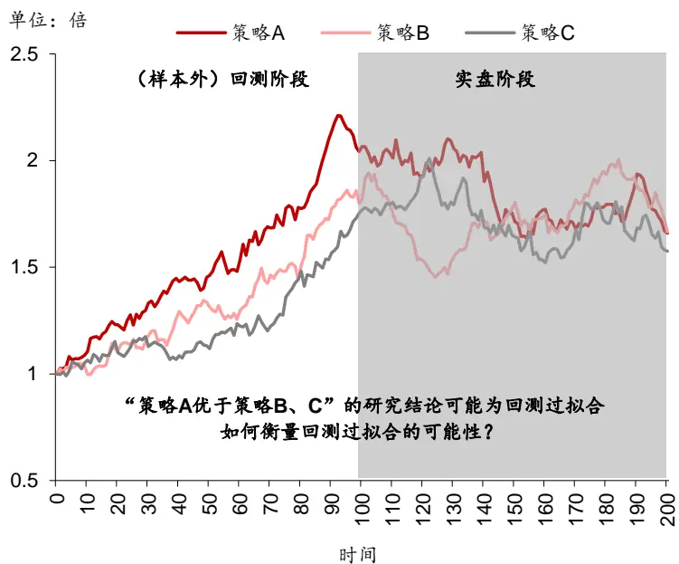
资料来源：华泰证券研究所

回测表现的差距究竟源于真实效果上的差异，还是源于一些偶然因素，我们很难做确切地归因。非不为也，实不能也。真实金融市场不存在“平行世界”，无法通过多次测量进行统计检验的方式，确认研究结论的真实性。

Bootstrap 方法为我们提供了一个窗口，能够基于单个真实金融市场数据，模拟出众多金融市场数据的“平行世界”。假设模拟出 10000 组 A股数据集，那么我们可以得到 10000组 A、B、C 三组策略的夏普比率，基于三者的分布进行统计检验，进而推断“策略 A 优于策略 B、C”的研究结论究竟是由于模型正确捕捉到了市场中的规律，还是由于模型陷入了回测过拟合。

## Bootstrap 重采样方法

Bootstrap 是一种统计学上的重采样方法，又称自举法，主要用于研究统计量的统计特性，从而检验统计结果的稳定性。其基本思想如下图所示。原始数据集的统计量（如均值）等能够很方便地得到，那么如何计算该统计量的统计量呢（如均值的标准差）？Bootstrap方法的核心思想是有放回地抽样。对原始数据集进行有放回地抽样，得到 N 组 Bootstrap数据集，N 通常需要大于 1000。计算每一组 Bootstrap 数据集的统计量（如均值），将得到 N组 Bootstrap 数据集的该统计量的分布，进而得到该统计量的统计量（如标准差）。

图表2： Bootstrap 重采样方法示意图
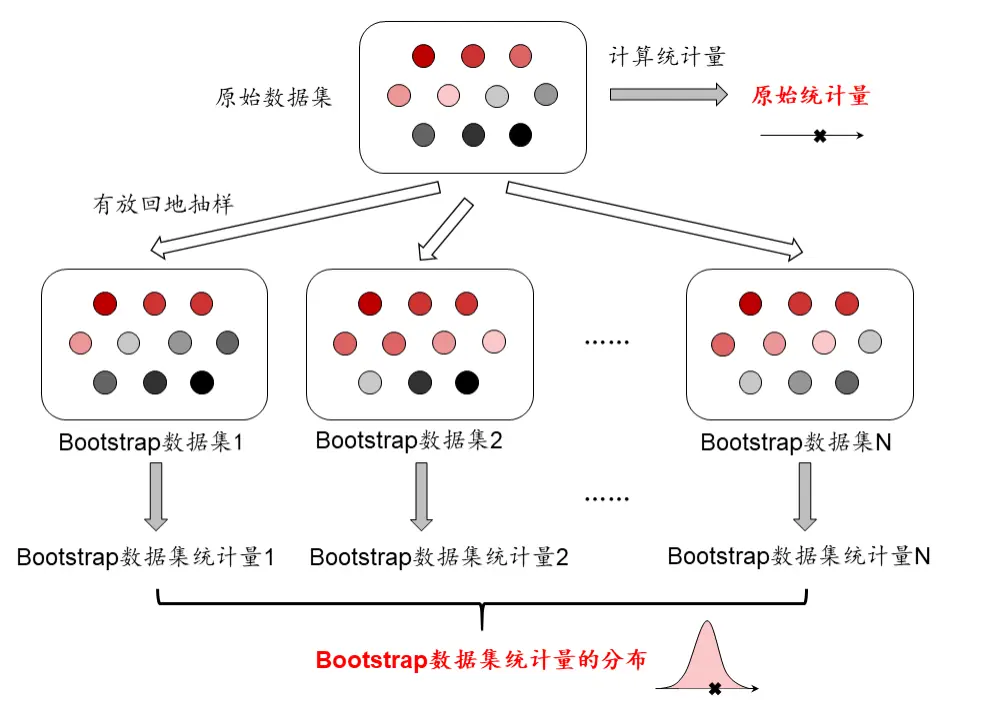
资料来源：华泰证券研究所

下面我们以具体的例子说明。我们希望研究 2019 年 4 月 1 日 A股非停牌个股的平均涨跌幅，数据集 D 为 2019 年 4 月 1 日 A 股 3569 只非停牌个股的涨跌幅，求均值得到 $\bar{x}_{D}=$ 3.6132%，那么均值x̅的均值和标准差应该如何计算呢？

图表3： Bootstrap方法计算 2019年 4月 1日 A股非停牌个股平均涨跌幅均值及标准差
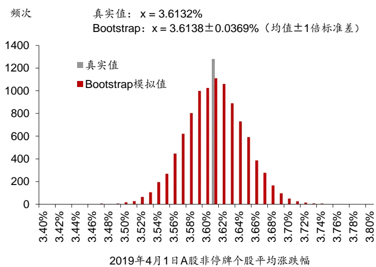
资料来源：Wind，华泰证券研究所

首先对数据集进行有放回地抽样，从数据集中随机抽取一个样本，然后放回，再抽取一个样本，再放回，……，如此重复 3569 次，得到了一个包含 3569 只股票的新数据集 D1。注意到原始数据集 D中有的股票可能被重复抽到，有的股票可能没有被抽到。我们将新数据集 $\mathsf{D}_{1}$ 称为一组 Bootstrap 数据集，求均值得到 $\bar{x}_{D1}$ 。重复上述步骤，我们可以得到 N组Bootstrap 数据集 D2，D3，……，DN，以及每组数据集的均值 $\bar{x}_{D2},\bar{x}_{D3},\ldots,\bar{x}_{DN},\circ$ 假设重采样次数N = 10000，可以求出这 10000 个平均涨跌幅的均值：

$$
\bar{x}^{*}=\frac{1}{10000}{\sum}_{i=1}^{10000}\bar{x}_{D_{i}}=3.6138\%
$$

标准差：

$$
\mathrm{SD}(\hat{x})=\sqrt{\frac{1}{10000-1}{\sum_{i=1}^{10000}}(\hat{x}_{D_{i}}-\hat{x}^{*})^{2}}=0.0369\%
$$

借助 Bootstrap 方法，我们从一个原始数据集衍生出了 N 个新的 Bootstrap 数据集。

有的读者可能提出质疑：对原始数据集进行 Bootstrap 重采样后，得到的 Bootstrap 数据集中有的股票可能被反复抽到，有的股票没有被抽到，针对这样的“假数据集”计算均值有何意义？实际上，单个 Bootstrap 数据集的统计量确实没有多大意义，然而众多Bootstrap 数据集统计量构成的分布提供了有效的增量信息。以一个通俗的例子说明，一颗沙粒可能无足轻重，我们更关心聚沙成塔后那座塔的特性。

## Bootstrap 和机器学习的关系

作为一种统计学方法，Bootstrap 和机器学习有何关系？我们试从两个层面回答。

首先，从“术”的层面，Bootstrap 对机器学习算法能起到优化作用。Bootstrap 广泛应用于弱学习器的集成，这种集成方法也称为 Bagging。随机森林是经典的基于 Bagging 思想的集成学习模型之一，将大量决策树通过并行的方式集成。在训练每一棵决策树时，首先对原始数据集进行行采样和列采样，列采样即每一步分裂时仅从随机抽取的一部分特征中做出选择，行采样即对原始样本进行有放回地抽样，从而得到一个与原始数据集样本量相同的 Bootstrap 数据集。最后将大量决策树通过少数服从多数的原则集成起来，实现随机森林的预测。这里每一棵树的训练只是基于不完整的 Bootstrap 数据集，学习能力相对较弱，其判断可能无足轻重，但是众木成林后，随机森林拥有更强的学习泛化能力。

其次，从“道”的层面，Bootstrap 对机器学习量化研究体系的构建具有指导意义。机器学习量化策略开发和传统量化策略开发的重要区别在于，机器学习研究的复杂度、其所涉及的环节、超参数和参数数量远超传统量化研究，任何环节随机性的引入，对最终整个系统都可能造成类似蝴蝶效应式的影响。然而不同环节随机性对结果的影响程度，尚没有被系统性的研究过。例如，我们观测到的一切选股因子值都是信号和噪音的叠加。如果训练集因子发生微小扰动，是否会大幅影响机器学习模型的训练结果？如果测试集因子发生微小扰动，是否会大幅影响机器学习策略的回测表现？我们需要借助工具评估不同环节随机性对结果的影响。本文将采用 Bootstrap 方法模拟这些随机性，构建一系列“平行 A股市场”，考察机器学习量化模型在这些平行世界中的表现，对不同策略进行比较和取舍，检验策略是否陷入回测过拟合。下面章节我们将详细介绍构建平行 A股市场的方法。

## 构建“平行 A 股市场”

机器学习选股模型随机性的来源较为多样，我们试列举三种可能的来源，如下图所示。

1. 我们观测到的选股因子值是信号和噪音的叠加。假设个股的因子值是服从某个特定分布的随机变量，真实世界里的观测值是该随机变量的采样，那么在另一些“平行 A 股市场”中，无论是样本内还是样本外数据集，相同个股的相同因子都可能取不同的值。样本内数据集因子值的随机噪音可能对模型训练环节造成影响。我们不希望因子的随机扰动使得训练得到的机器学习模型发生大幅改变。

2. 和第 1 点类似，样本外数据集因子值的随机噪音可能对模型回测环节造成影响。我们不希望因子的随机扰动使得机器学习策略的回测表现发生大幅改变。

3. 模型的回测表现和回测时间的选择密切相关。回测区间是牛市还是熊市占主导，是小市值风格还是从价值风格占主导，表现都会大相径庭。我们希望策略能够穿越不同市场环境，不希望回测时间的选择对结果造成大幅影响。

图表4： 机器学习选股问题中随机性的来源和对应的 Bootstrap方案
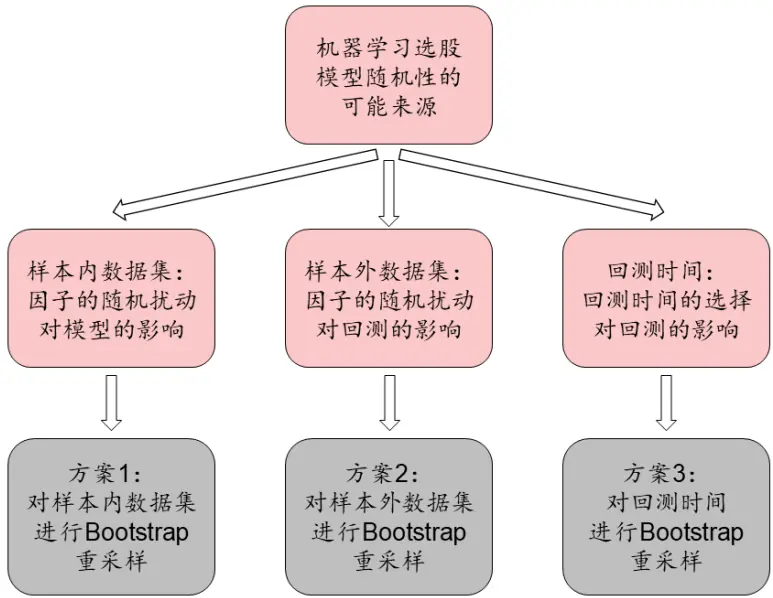
资料来源：华泰证券研究所

针对以上三种随机性的来源，我们尝试下列三种 Bootstrap 重采样构建“平行 A 股市场”的方案。

1. 针对样本内数据集的随机性，我们对样本内数据集进行 Bootstrap 重采样，具体如下图所示。对于样本内的每个月底截面期，假设全 A股票池有效个股数量（非停牌、非次新股、下月初非涨停）为 3600 只，那么我们对全 A 股票池进行有放回地抽样，重复 3600 次，得到一个包含 3600 只股票的 Bootstrap 股票池及其对应的截面期因子数据。相比于真实全 A 股票池，Bootstrap 股票池中有的股票可能重复抽到，有的股票可能没有被抽到。在随后机器学习的训练环节，该月底截面期的特征即为这 3600 只“新”股票的因子值。需要说明的是，Bootstrap 的重采样次数通常应大于 1000。但是考虑到研究的时间开销，本文将重采样次数 N 设为 100。我们发现 N=100 已经能够观察到分布间的差异，并且得到具备一定统计效力的结果，细节请参考本文结果部分。

图表5： 方案 1：对样本内数据集进行 Bootstrap重采样示意图
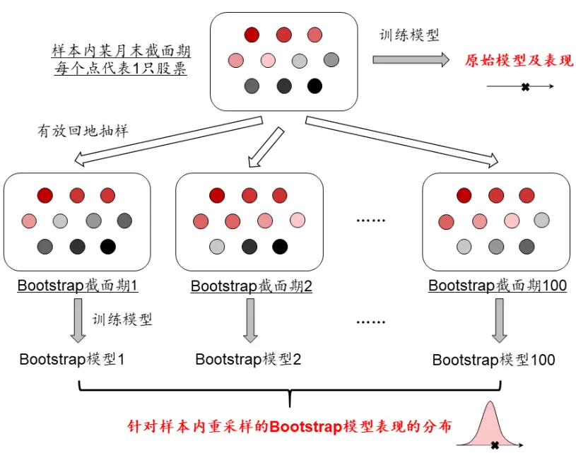
资料来源：华泰证券研究所

2. 针对样本外数据集的随机性，我们对样本外数据集进行 Bootstrap 重采样，具体如左下图所示。对于样本外的每个月底截面期，对全 A 股票池做有放回地抽样，得到 Bootstrap股票池及其对应的截面期因子数据。在随后的回测环节，该月底截面期的特征即为这些“新”股票的因子值。

图表6： 方案 2：对样本外数据集进行 Bootstrap重采样示意图
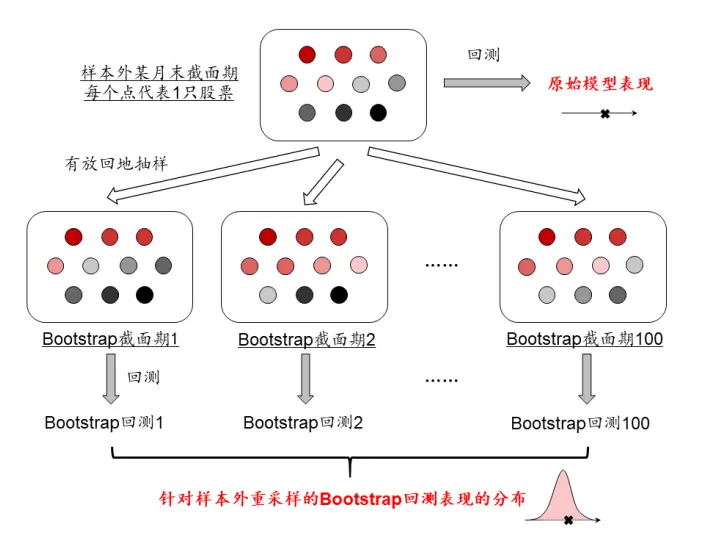
资料来源：华泰证券研究所

图表7： 方案 3：对回测时间进行 Bootstrap 重采样示意图
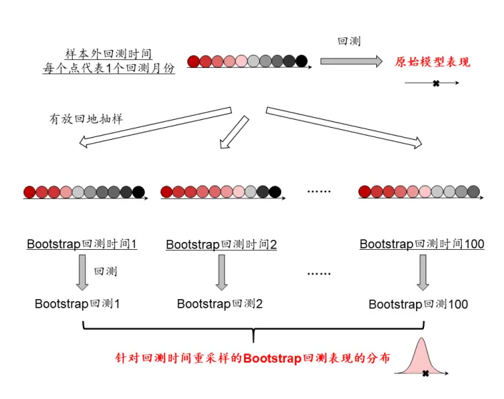
资料来源：华泰证券研究所

3. 针对回测时间的随机性，我们对回测时间进行 Bootstrap 重采样，具体如右上图所示。假设原始样本外数据集包含从2011年 1月~2018年12月共96个月底截面期对应的回测月份（最后一个月底截面期 2018 年 12 月对应的回测月份为 2019 年 1 月），我们对于这96 个回测月份进行有放回地抽样，重复 96 次，得到一个包含新的 96 个回测月份的Bootstrap 回测时间。相比于原始的 96 个回测月份，Bootstrap 回测时间中有的月份可能被重复抽到，有的月份可能没有被抽到。我们随后基于这 96 个“新”回测月份进行机器学习模型的回测。需要指出的是，这 96 个新回测月份不存在严格的时序关系，即 Bootstrap回测时间段中靠前的月份在真实市场中所对应的月份并不一定靠前。

## 方法

## 考察对象：三组交叉验证调参方法

我们希望采用 Bootstrap 方法模拟金融市场中的随机性，构建一系列“平行 A 股市场”，考察机器学习量化选股模型在这些平行世界中的表现，对不同策略进行比较和取舍，检验策略是否陷入回测过拟合。具体而言，本研究的考察对象是华泰金工《人工智能 16：再论时序交叉验证对抗过拟合》（20190218）中的三组交叉验证调参方法，分别为：K折交叉验证、乱序分组递进式交叉验证、分组时序交叉验证。三组调参方法使用的基学习器相同，均为 XGBoost 模型，模型构建细节也相同，仅有的区别是通过调参最终选定的超参数不同。《人工智能 16：再论时序交叉验证对抗过拟合》的研究结论是：基于分组时序交叉验调参方法得到的人工智能选股策略表现优于另外两种方法。本研究将检验上述结论是否存在回测过拟合。

下面简单介绍待检验的结论。对于三组交叉验证方法，我们逐月计算模型性能（如 AUC）以及单因子测试表现（如 Rank IC）。为了突出方法间的差异，将乱序分组递进式和分组时序的 AUC 或 Rank IC 减去 K折的 AUC 或 Rank IC，再对差值做累加。如果差的累积值稳定上升，那么可认为该方法稳定优于 K折；如果差的累积值维持在 0 轴，那么可认为该方法和 K折没有差别。下图结果显示，分组时序表现优于乱序分组递进式，说明时序交叉验证带来的提升源于时序信息的保留；同时乱序分组递进式优于 K折，说明使用更少样本也能部分提升模型表现。

图表8： 两组交叉验证方法相对于 K折 AUC之差累积值
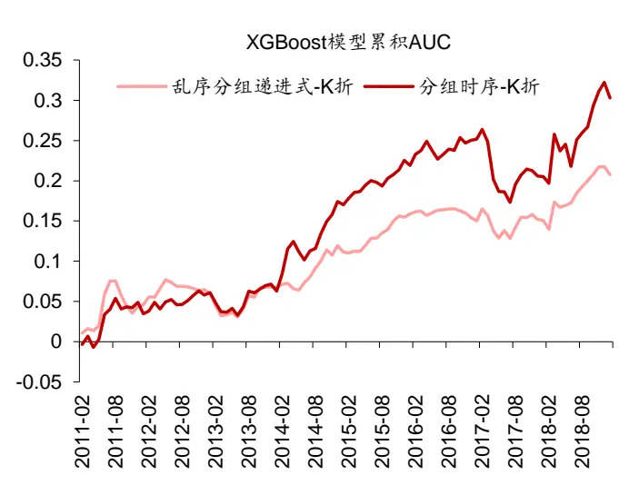
资料来源：Wind，华泰证券研究所

图表9： 两组交叉验证方法相对于 K折 Rank IC之差累积值
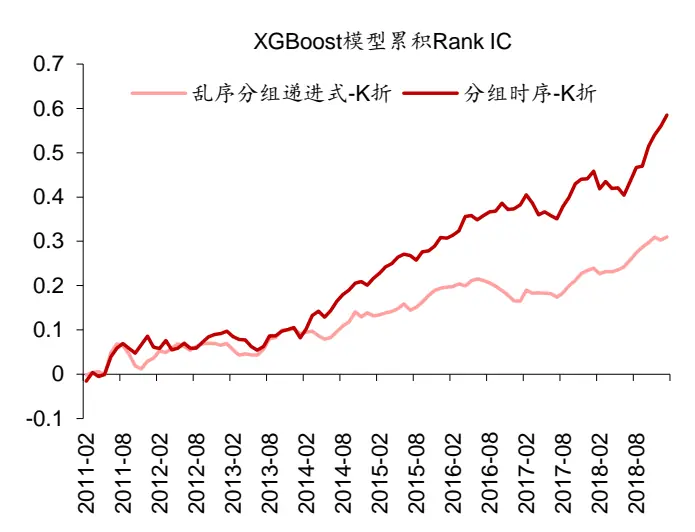
资料来源：Wind，华泰证券研究所

关于三种交叉验证调参方法的概念，本文不再赘述，感兴趣的读者请参考华泰金工《人工智能 14：对抗过拟合：从时序交叉验证谈起》（20181128）和《人工智能 16：再论时序交叉验证对抗过拟合》（20190218）。简单而言：

1. K 折交叉验证是经典的交叉验证方法，适用于独立同分布的非时间序列数据，应用于金融领域的时间序列数据存在过拟合风险，是本文的基线模型。

2. 乱序分组递进式交叉验证相比于 K 折使用更少样本，但是破坏时序信息，也是本文的基线模型。

3. 分组时序交叉验证是针对时间序列数据提出的改进，能一定程度上减轻过拟合，是本文推荐使用的模型。

图表10： 基线模型 1：K折交叉验证示意图（K=5）
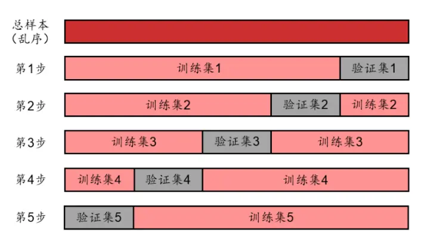
资料来源：华泰证券研究所

图表11： 基线模型 2：乱序分组递进式交叉验证示意图（折数=5）
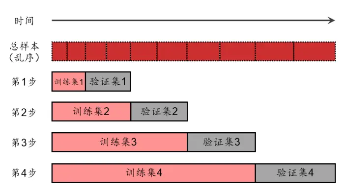
资料来源：华泰证券研究所

图表12： 推荐模型：分组时序交叉验证示意图（折数=5）
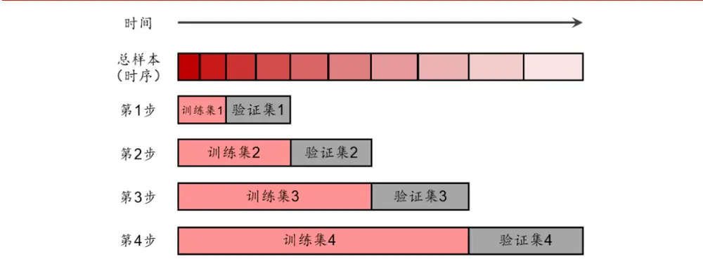
资料来源：华泰证券研究所

## 人工智能选股模型测试流程

图表13： 人工智能选股模型测试流程示意图
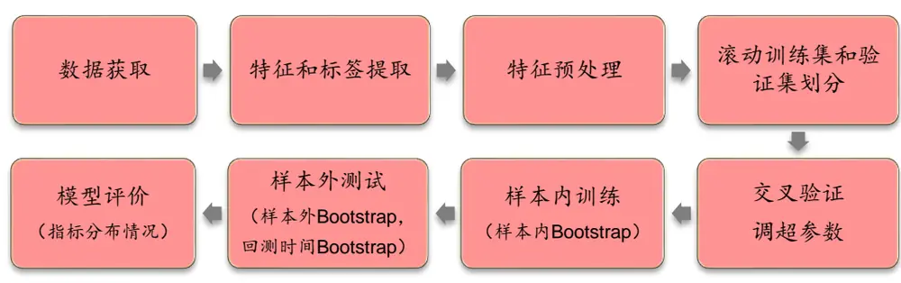
资料来源：华泰证券研究所

本文选用 XGBoost 作为基学习器，测试流程包含如下步骤：

1． 数据获取：

a) 股票池：全 A股。剔除 ST 股票，剔除每个截面期下一交易日停牌的股票，剔除上市 3个月内的股票，每只股票视作一个样本。

b) 回测区间：2011 年 1 月 31 日至 2019 年 1 月 31 日。

2． 特征和标签提取：每个自然月的最后一个交易日，计算之前报告里的 70 个因子暴露度，作为样本的原始特征，因子池如下表所示。计算下一整个自然月的个股超额收益（以沪深 300 指数为基准），在每个月末截面期，选取下月收益排名前 30%的股票作为正例（y = 1），后 30%的股票作为负例（y = 0），作为样本的标签。

图表14： 选股模型中涉及的全部因子及其描述

| 大类因子 | 具体因子 | 因子描述 | 因子方向 |
| --- | --- | --- | --- |
| 估值 | EP | 净利润（TTM）/总市值 |  |
| 估值 | EPcut | 扣除非经常性损益后净利润（TTM）/总市值 | 1 |
| 估值 | BP | 净资产/总市值 | 1 |
| 估值 | SP | 营业收入（TTM）/总市值 | 1 |
| 估值 | NCFP | 净现金流（TTM）/总市值 | 1 |
| 估值 | OCFP | 经营性现金流（TTM）/总市值 | 1 |
| 估值 | DP | 近12个月现金红利（按除息日计）/总市值 | 1 |
| 估值 | G/PE | 净利润（TTM）同比增长率/PE_TTM | 1 |
| 成长 | Sales_G_q | 营业收入（最新财报，YTD）同比增长率 | 1 |
| 成长 | Profit_G_q | 净利润（最新财报，YTD）同比增长率 | 1 |
| 成长 | OCF_G_q | 经营性现金流（最新财报，YTD）同比增长率 | 1 |
| 成长 | ROE_G_q | ROE（最新财报，YTD）同比增长率 | 1 |
| 财务质量 | ROE_q | ROE（最新财报，YTD） |  |
| 财务质量 | ROE_ttm | ROE（最新财报，TTM） |  |
| 财务质量 | ROA_q | ROA（最新财报，YTD） | 1 |
| 财务质量 | ROA_ttm | ROA（最新财报，TTM） |  |
| 财务质量 | grossprofitmargin_q | 毛利率（最新财报，YTD） |  |
| 财务质量 | grossprofitmargin_ttm | 毛利率（最新财报，TTM） |  |
| 财务质量 | profitmargin_q | 扣除非经常性损益后净利润率（最新财报，YTD） | 1 |
| 财务质量 | profitmargin_ttm | 扣除非经常性损益后净利润率（最新财报，TTM） |  |
| 财务质量 | assetturnover_q | 资产周转率（最新财报，YTD） |  |
| 财务质量 | assetturnover_ttm | 资产周转率（最新财报，TTM） |  |
| 财务质量 | operationcashflowratio_q | 经营性现金流/净利润（最新财报，YTD） |  |
| 财务质量 | operationcashflowratio_ttm | 经营性现金流/净利润（最新财报，TTM） | 1 |
| 杠杆 | financial_leverage | 总资产/净资产 | -1 |
| 杠杆 | debtequityratio | 非流动负债/净资产 | -1 |
| 杠杆 杠杆 | cashratio | 现金比率 | 1 |
| 市值 | currentratio | 流动比率 | 1 |
| 动量反转 | In_capital | 总市值取对数 | -1 |
| 动量反转 | HAlpha | 个股60个月收益与上证综指回归的截距项 个股最近N个月收益率，N=1，3，6，12 | -1 |
| 动量反转 | return_Nm wgt_return_Nm | 个股最近N个月内用每日换手率乘以每日收益率求算术平均 | -1 -1 |
| 动量反转 exp_wgt_return_Nm |  | 值，N=1，3，6，12 |  |
| 波动率 | std_FF3factor_Nm | 个股最近 N 个月内用每日换手率乘以函数 exp(-x_i/N/4)再乘 |  |
|  |  | 以每日收益率求算术平均值，x_i为该日距离截面日的交易日 |  |
|  |  | 的个数，N=1，3，6，12 特质波动率——个股最近 N 个月内用日频收益率对 Fama |  |
|  |  | French三因子回归的残差的标准差，N=1，3，6，12 | -1 |
| 波动率 股价 | std_Nm | 个股最近N个月的日收益率序列标准差，N=1，3，6，12 | -1 |
| beta | In_price | 股价取对数 | -1 |
| 换手率 | beta | 个股 60个月收益与上证综指回归的 beta | -1 |
|  | turn_Nm | 个股最近N个月内日均换手率(剔除停牌、涨跌停的交易日)， N=1, 3, 6, 12 | -1 |
| 换手率 | bias_turn_Nm | 个股最近N个月内日均换手率除以最近2年内日均换手率(剔 | -1 |
| 情绪 | rating_average | 除停牌、涨跌停的交易日）再减去1，N=1，3，6，12 wind 评级的平均值 | 1 |
| 情绪 | rating_change | wind评级（上调家数-下调家数）/总数 | 1 |
| 情绪 | rating_targetprice | wind一致目标价/现价-1 | 1 |
| 股东 | holder_avgpctchange | 户均持股比例的同比增长率 | 1 |
| 技术 | MACD |  | -1 |
| 技术 | DEA | 经典技术指标（释义可参考百度百科），长周期取30日，短 | -1 |
| 技术 | DIF | 周期取10 日，计算 DEA 均线的周期（中周期）取15 日 | -1 |
| 技术 | RSI | 经典技术指标，周期取20日 | -1 |
| 技术 | PSY | 经典技术指标，周期取20日 | -1 |
| 技术 | BIAS | 经典技术指标，周期取20日 | -1 |

资料来源：Wind，华泰证券研究所

3． 特征预处理：

a) 中位数去极值：设第 T 期某因子在所有个股上的暴露度序列为 $D_{i}$ ， $D_{M}$ 为该序列中位数， $D_{M1}$ 为序列 $|D_{i}-D_{M}|$ 的中位数，则将序列 $D_{i}$ 中所有大于 $D_{M}+5D_{M1}$ 的数重设为 $D_{M}+5D_{M1}$ ，将序列 $D_{i}$ 中所有小于 $D_{M}-5D_{M1}$ 的数重设为 $D_{M}-5D_{M1}$ ；

b) 缺失值处理：得到新的因子暴露度序列后，将因子暴露度缺失的地方设为中信一级行业相同个股的平均值；

c) 行业市值中性化：将填充缺失值后的因子暴露度对行业哑变量和取对数后的市值做线性回归，取残差作为新的因子暴露度；

d) 标准化：将中性化处理后的因子暴露度序列减去其现在的均值、除以其标准差，得到一个新的近似服从 N(0, 1)分布的序列。

4． 滚动训练集和验证集的划分：本文采用年度滚动训练方式，全体样本内外数据共分为八个阶段，如下图所示。例如预测 2011 年时，将 2005~2010 年共 72 个月数据合并作为样本内数据集；预测 T 年时，将 T-6 至 T-1 年的 72 个月合并作为样本内数据。根据不同的交叉验证方法划分训练集和验证集，交叉验证的折数均为 12。对于分组时序交叉验证，每次训练集长度均为 6个月的整数倍，验证集长度均等于 6 个月。对于K折交叉验证，验证次数为 12 次；对于乱序分组递进式和分组时序交叉验证，验证次数为 11 次。凡涉及将数据打乱的交叉验证方法，随机数种子点均相同，从而保证打乱的方式相同。

图表15： 年度滚动训练示意图
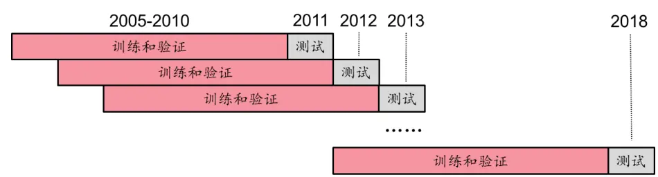
资料来源：华泰证券研究所

5． 交叉验证调参：对全部超参数组合进行网格搜索；针对每一组超参数组合，每次验证使用 XGBoost 基学习器对训练集进行训练，并且记录模型在验证集的表现；选择全部验证集平均 AUC 最高的一组超参数作为模型最优超参数。不同交叉验证方法可能得到不同的最优超参数。最终确定的最优超参数设置下表所示。

图表16： 模型历年滚动训练最优超参数

| 基学习器 | 超参数 | 交叉验证方法 | 2011 | 2012 | 2013 | 2014 | 2015 | 2016 | 2017 | 2018 |
| --- | --- | --- | --- | --- | --- | --- | --- | --- | --- | --- |
| XGBoost | 学习速率 (learning_rate) | K折 | 0.05 | 0.025 | 0.025 | 0.025 | 0.025 | 0.025 | 0.05 | 0.05 |
|  |  | 乱序分组递进式 | 0.025 | 0.025 | 0.05 | 0.025 | 0.025 | 0.025 | 0.025 | 0.025 |
|  |  | 分组时序 | 0.05 | 0.025 | 0.025 | 0.075 | 0.075 | 0.025 | 0.025 | 0.025 |
| XGBoost | 最大树深度 | K折 | 10 | 10 | 10 | 10 | 10 | 10 | 10 | 10 |
|  | (max_depth) | 乱序分组递进式 | 10 | 10 | 5 | 10 | 10 | 10 | 10 | 10 |
|  |  | 分组时序 | 3 | 5 | 5 | 3 | 3 | 5 | 5 | 5 |
| XGBoost | 行采样比例 | K折 | 0.9 | 0.9 | 0.95 | 0.95 | 0.9 | 0.9 | 0.95 | 0.9 |
|  | (subsample) | 乱序分组递进式 | 0.8 | 0.9 | 0.85 | 0.8 | 0.95 | 0.85 | 0.85 | 0.85 |
|  |  | 分组时序 | 0.85 | 0.85 | 0.9 | 0.9 | 0.85 | 0.8 | 0.8 | 0.85 |

资料来源：Wind，华泰证券研究所

6． 样本内训练：使用最优超参数设置下的 XGBoost 基学习器对完整的原始样本内数据集进行训练。采用 Bootstrap 方案 1 时，对 100 组 Bootstrap 样本内数据集分别进行训练，得到 100 组 XGBoost 模型。

7． 样本外测试：完成模型训练后，以 T 月末截面期所有样本预处理后的特征作为模型的输入，得到每个样本的预测值。将预测值视作合成后的因子，采用回归法、IC 分析法和分层回测法进行单因子测试。采用 Bootstrap 方案 2 时，对 100 组 Bootstrap 样本外数据集进行预测并回测。采用 Bootstrap 方案 3时，将原始样本外数据集后按照 100组 Bootstrap 回测时间重新组织并回测。

8． 模型评价：a) （针对 Bootstrap 方案 1）100 组测试集正确率、AUC 等衡量模型性能的指标分布情况；b)（针对 Bootstrap 方案 1、2 和 3） 单因子测试得到的统计指标和回测绩效的分布情况。

## 单因子测试

测试模型构建方法如下：

1. 股票池：全 A 股，剔除 ST 股票，剔除每个截面期下一交易日停牌的股票，剔除上市3 个月以内的股票。采用 Bootstrap 方案 2 时，股票池为 Bootstrap 样本外数据集，同时需符合上述筛选条件。采用 Bootstrap 方案 3 时，股票池为 Bootstrap 回测时间确定的月末截面期所对应的、同时符合上述筛选条件的股票。

2. 回测区间：2011-01-31 至 2019-01-31。

3. 截面期：每个月月末，用当前截面期因子值与当前截面期至下个截面期内的个股收益进行回归和计算 Rank IC值。

4. 数据处理方法：对于分类模型，将模型对股票下期上涨概率的预测值视作单因子。对于回归模型，将回归预测值视作单因子。因子值为空的股票不参与测试。

5. 回归测试中采用加权最小二乘回归（WLS），使用个股流通市值的平方根作为权重。IC测试时对单因子进行行业市值中性。

依照因子值对股票进行打分，构建投资组合回测，是最直观的衡量因子优劣的手段。测试模型构建方法如下：

1. 股票池、回测区间、截面期均与回归法相同。

2. 换仓：在每个自然月最后一个交易日核算因子值，在下个自然月首个交易日按当日收盘价换仓，交易费用以双边千分之四计。

3. 分层方法：因子先用中位数法去极值，然后进行市值、行业中性化处理（方法论详见上一小节），将股票池内所有个股按因子从大到小进行排序，等分 N 层，每层内部的个股等权配置。当个股总数目无法被 N 整除时采用任一种近似方法处理均可，实际上对分层组合的回测结果影响很小。

4. 多空组合收益计算方法：用 Top 组每天的收益减去 Bottom 组每天的收益，得到每日多空收益序列 $r_{1},r_{2},\cdots,r_{n}$ ，则多空组合在第 n天的净值等于 $(1+r_{1})(1+r_{2})\cdots(1+r_{n})$

5. 评价方法：全部 N层组合年化收益率（观察是否单调变化），多空组合的年化收益率、夏普比率、最大回撤等。

## 结果

## 方案 1：对样本内数据集进行 Bootstrap 重采样

首先我们展示对样本内数据集进行 Bootstrap 重采样的结果。对于每一次重采样，我们基于真实因子截面数据，构建一个“平行 A 股市场”；以平行世界中的因子截面数据为样本内数据集，以不同交叉验证方法得到的最优超参数作为模型的超参数，训练 XGBoost 模型；模型训练完成后，以真实 A股市场的因子截面数据为样本外数据集，进行预测和单因子回测，计算模型性能和各项回测指标。最后统计 100 次重采样的模型性能和单因子回测指标，绘制分布，比较三组交叉验证方法的指标分布情况。Bootstrap 样本内数据集的结果回答了如下问题：样本内数据的小幅变动是否影响机器学习研究结论？

## 模型性能

三组交叉验证方法样本内正确率和 AUC 的分布情况如下图。两项指标的分布较为密集，例如全部分组时序交叉验证的样本内正确率集中在 61%~62%的区间，样本内 AUC 集中在 0.66~0.67 的区间。从三组交叉验证方法的样本内表现看，K 折优于乱序分组递进式，乱序分组递进式优于分组时序。

图表17： Bootstrap样本内数据集的样本内正确率分布
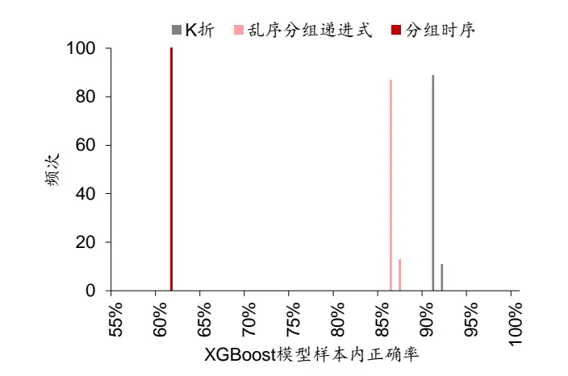
资料来源：Wind，华泰证券研究所

图表18： Bootstrap 样本内数据集的样本内 AUC 分布
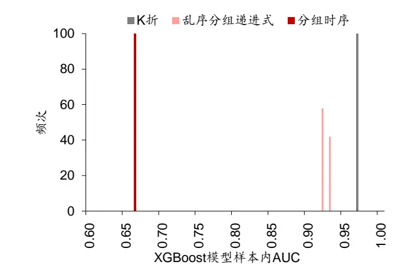
资料来源：Wind，华泰证券研究所

三组交叉验证方法样本外正确率和 AUC 的分布情况如下图。和样本内表现截然不同，三组交叉验证方法的样本外表现出现了逆转，分组时序远优于乱序分组递进式，乱序分组递进式优于 K 折。Bootstrap 样本内数据集构建的平行世界中得出的研究结论与真实世界中得出的研究结论一致（真实世界结论参考图表 8、9，下同）。

图表19： Bootstrap样本内数据集的样本外正确率分布
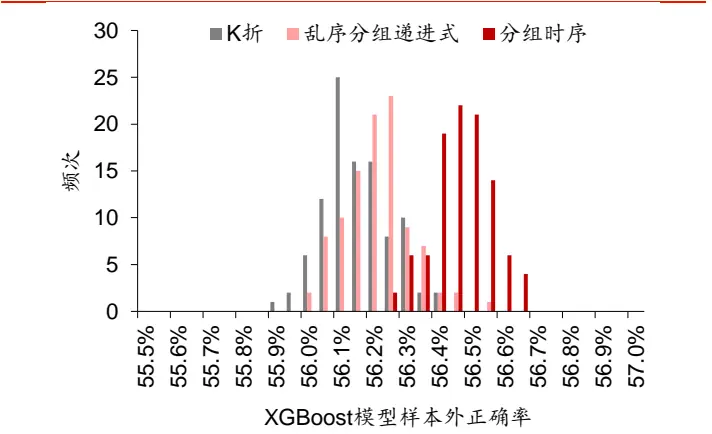
资料来源：Wind，华泰证券研究所

图表20： Bootstrap 样本内数据集的样本外 AUC 分布
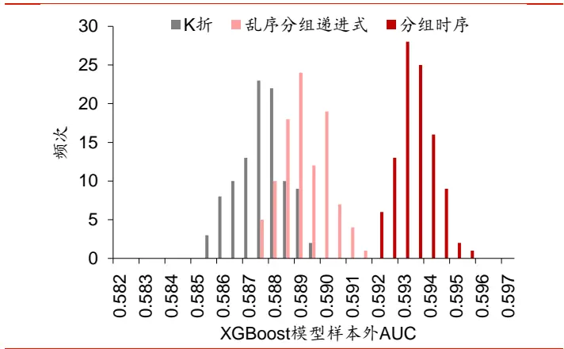
资料来源：Wind，华泰证券研究所

三组交叉验证方法回归法和 IC 值分析法各项指标的分布情况如下图。分组时序交叉验证的|t|均值、t 均值、因子收益率均值、Rank IC均值远优于乱序分递进式和 K折。Bootstrap样本内数据集构建的平行世界中得出的研究结论与真实世界中得出的研究结论一致。

图表21： Bootstrap样本内数据集的回归法|t|均值分布
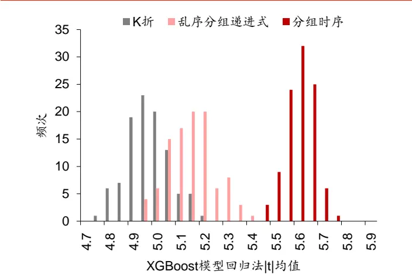
资料来源：Wind，华泰证券研究所

图表22： Bootstrap样本内数据集的回归法 t均值分布
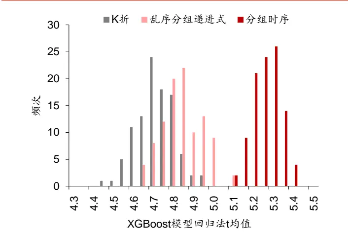
资料来源：Wind，华泰证券研究所

图表23： Bootstrap样本内数据集的回归法因子收益率均值分布
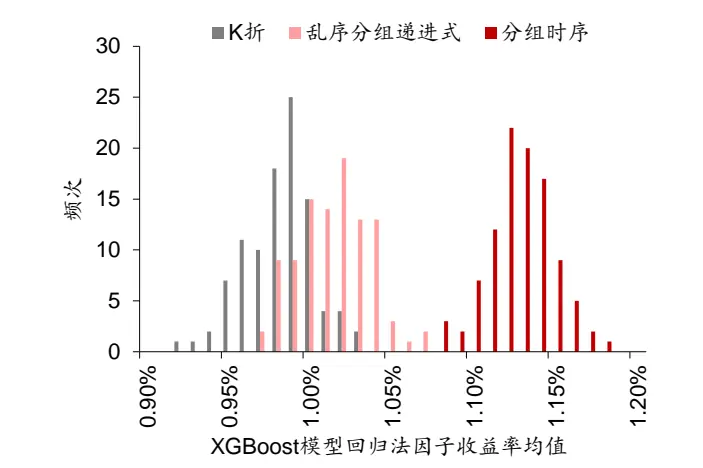
资料来源：Wind，华泰证券研究所

图表24： Bootstrap 样本内数据集的 Rank IC 均值分布
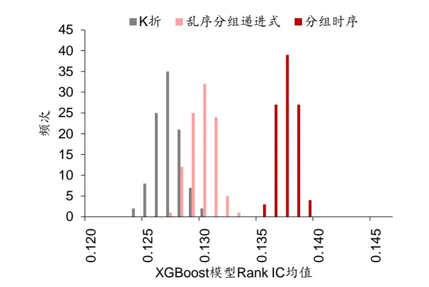
资料来源：Wind，华泰证券研究所

三组交叉验证方法分层回测法各项指标的分布情况如下图。分组时序交叉验证的多空组合年化收益率、Top组合年化收益率、Top组合夏普比率均优于乱序分递进式和 K折；对于多空组合夏普比率，分组时序交叉验证具有微弱优势。Bootstrap 样本内数据集构建的平行世界中得出的研究结论与真实世界中得出的研究结论基本一致。

图表25： Bootstrap样本内数据集的分层回测法多空组合年化收益率
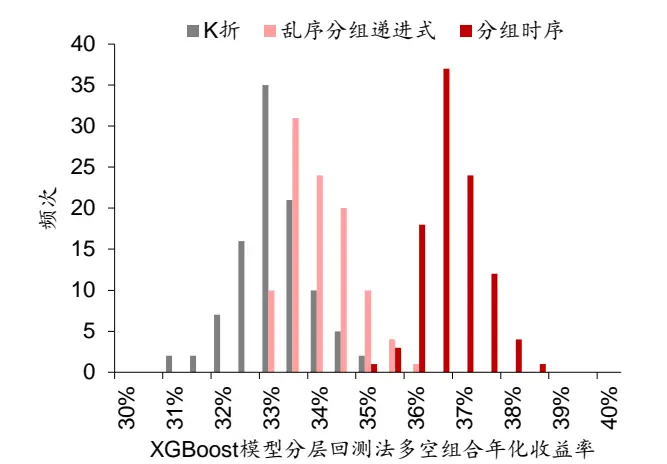
资料来源：Wind，华泰证券研究所

图表26： Bootstrap 样本内数据集的分层回测法多空组合夏普比率
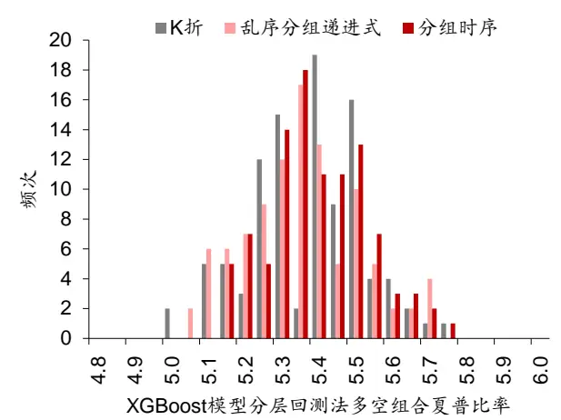
资料来源：Wind，华泰证券研究所

图表27： Bootstrap样本内数据集的分层回测法 Top组合年化收益率
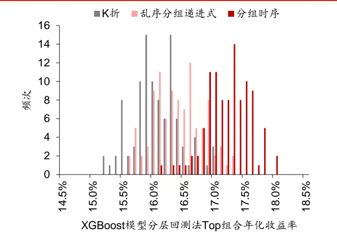
资料来源：Wind，华泰证券研究所

图表28： Bootstrap样本内数据集的分层回测法 Top组合夏普比率
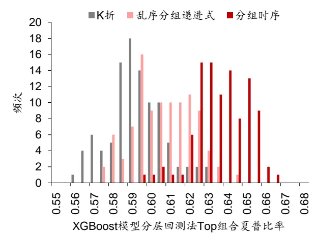
资料来源：Wind，华泰证券研究所

图表29： Bootstrap 样本内数据集的分层回测多空组合净值展示（回测期：20110131~20190131）
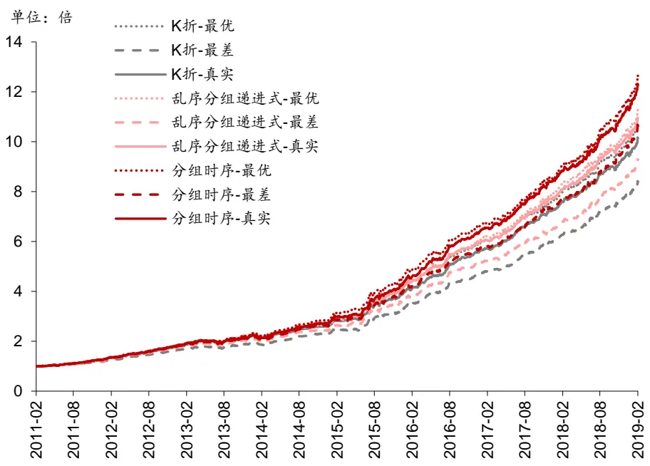
资料来源：Wind，华泰证券研究所

上图展示了三组交叉验证方法 100 次 Bootstrap 重采样下收益最高、收益最低的两条多空组合净值以及真实 A股市场下的多空组合净值。首先，仍可以观察到分组时序、乱序分组递进式、K折收益从高到低的排序关系。其次，我们发现真实净值（实线）和最优净值（点线）接近，和最差净值（短划线）相差较大。换言之，大部分 Bootstrap 样本内平行世界训练得到的模型表现不如真实世界训练得到的模型。这说明样本内数据集的小幅扰动在多数情况下可能削弱模型表现。

## 方案 2：对样本外数据集进行 Bootstrap 重采样

下面我们展示对样本外数据集进行 Bootstrap 重采样的结果。对于每一次重采样，我们基于真实因子截面数据，构建一个“平行 A 股市场”；以真实世界中的因子截面数据为样本内数据集，以不同交叉验证方法得到的最优超参数作为模型的超参数，训练 XGBoost 模型；模型训练完成后，以平行 A股市场的因子截面数据为样本外数据集，进行单因子回测，计算各项回测指标。最后统计 100 次重采样的单因子回测指标，绘制分布，比较三组交叉验证方法的指标分布情况。Bootstrap 样本外数据集的结果回答了如下问题：样本外数据的小幅变动是否影响机器学习研究结论？

三组交叉验证方法回归法和 IC 值分析法各项指标的分布情况如下图。分组时序交叉验证的|t|均值、t 均值、因子收益率均值、Rank IC均值远优于乱序分递进式和 K折。Bootstrap样本外数据集构建的平行世界中得出的研究结论与真实世界中得出的研究结论一致，也和Bootstrap 样本内数据集得出的结论一致。

图表30： Bootstrap 样本外数据集的回归法|t|均值分布
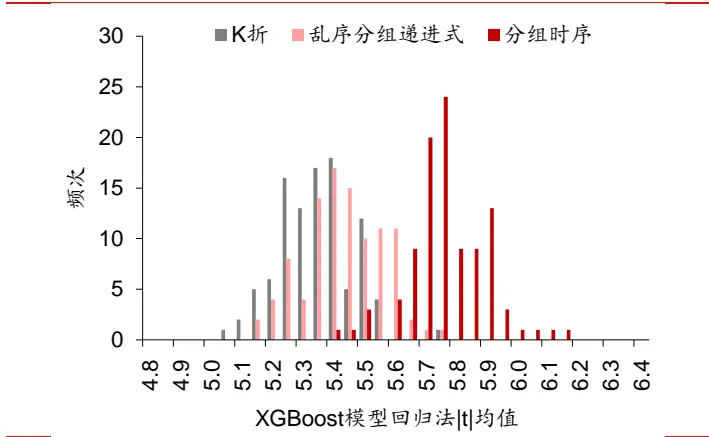
资料来源：Wind，华泰证券研究所

图表31： Bootstrap样本外数据集的回归法 t均值分布
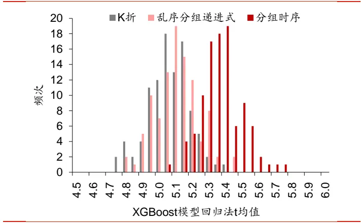
资料来源：Wind，华泰证券研究所

图表32： Bootstrap样本外数据集的回归法因子收益率均值分布
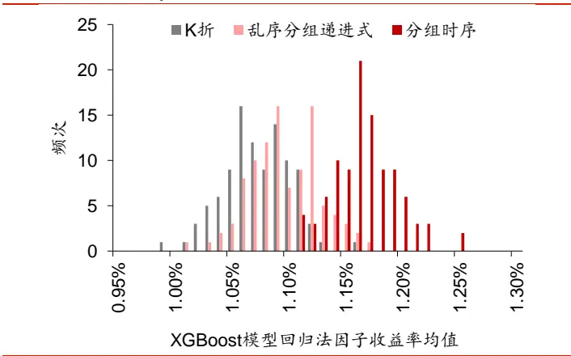
资料来源：Wind，华泰证券研究所

图表33： Bootstrap 样本外数据集的 Rank IC 均值分布
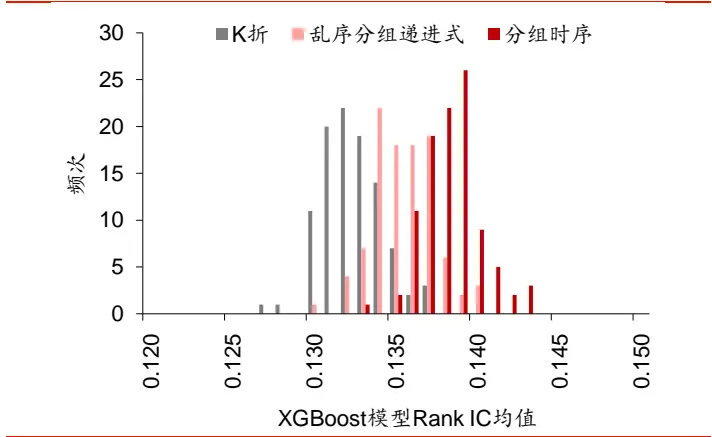
资料来源：Wind，华泰证券研究所

三组交叉验证方法分层回测法各项指标的分布情况如下图。分组时序交叉验证的多空组合年化收益率优于乱序分递进式和 K折；对于多空组合夏普比率、Top组合年化收益率、Top组合夏普比率，分组时序交叉验证具有微弱优势。Bootstrap 样本外数据集构建的平行世界中得到的研究结论与真实世界中得到的研究结论基本一致，也和 Bootstrap 样本内数据集得出的结论基本一致。

图表34： Bootstrap样本外数据集的分层回测法多空组合年化收益率
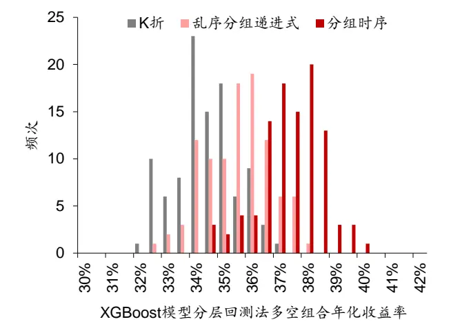
资料来源：Wind，华泰证券研究所

图表35： Bootstrap样本外数据集的分层回测法多空组合夏普比率
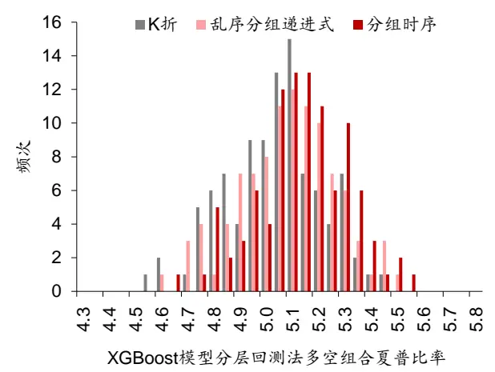
资料来源：Wind，华泰证券研究所

图表36： Bootstrap样本外数据集的分层回测法 Top组合年化收益率
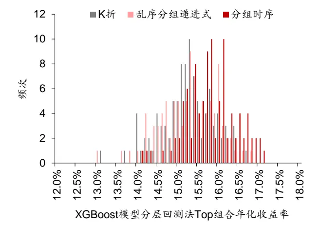
资料来源：Wind，华泰证券研究所

图表37： Bootstrap样本外数据集的分层回测法 Top组合夏普比率
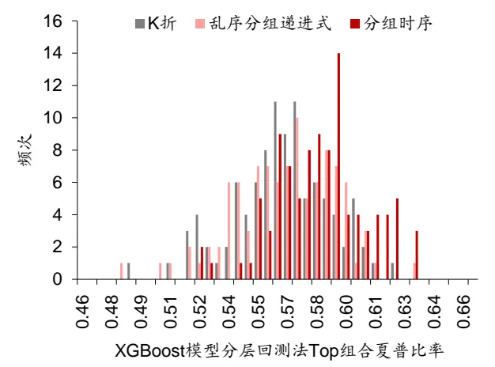
资料来源：Wind，华泰证券研究所

下图展示了三组交叉验证方法 100 次 Bootstrap 重采样下收益最高、收益最低的两条多空组合净值以及真实 A股市场下的多空组合净值。首先，仍可以观察到分组时序优于另外两组方法，但是乱序分组递进式和 K折没有明显差异。其次，我们发现真实净值（实线）位于最优净值（点线）和最差净值（短划线）的中间位置。这说明样本外数据集的小幅扰动对模型表现的影响整体为中性。

图表38： Bootstrap 样本外数据集的分层回测多空组合净值展示（回测期：20110131~20190131）
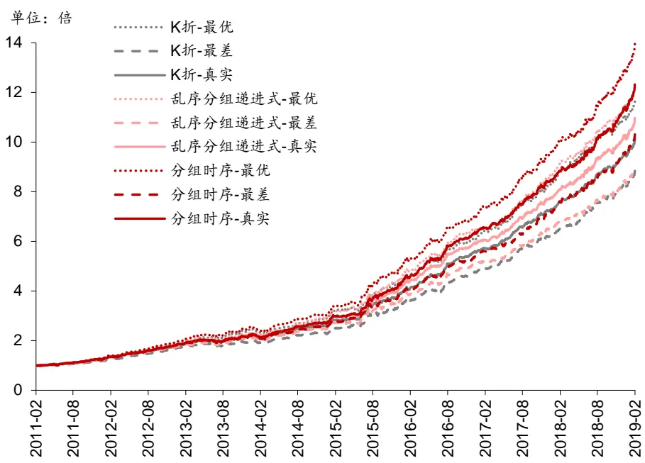
资料来源：Wind，华泰证券研究所

## 方案 3：对回测时间进行 Bootstrap 重采样

下面我们展示对回测时间进行 Bootstrap 重采样的结果。对于每一次重采样，我们基于原有的 96个回测月份，构建一组新的包含 96 个回测月份的时间序列；以真实世界中的因子截面数据为样本内数据集，以不同交叉验证方法得到的最优超参数作为模型的超参数，训练 XGBoost 模型；模型训练完成后，以新的回测月份序列中真实 A 股市场的因子截面数据为样本外数据集，进行单因子回测，计算各项回测指标。最后统计 100 次重采样的单因子回测指标，绘制分布，比较三组交叉验证方法的指标分布情况。Bootstrap 回测时间的结果回答了如下问题：回测时间的改变是否影响机器学习研究结论？

三组交叉验证方法回归法和 IC 值分析法各项指标的分布情况如下图。分组时序交叉验证的|t|均值、t 均值、因子收益率均值、Rank IC 均值略优于乱序分递进式和 K 折，但是优势不如前两种 Bootstrap 方案明显。Bootstrap 回测时间构建的平行世界中得出的研究结论与真实世界中得出的研究结论一致。

图表39： Bootstrap 回测时间的回归法|t|均值分布
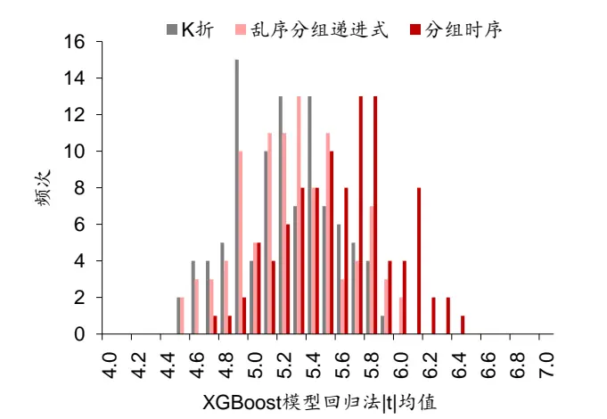
资料来源：Wind，华泰证券研究所

图表40： Bootstrap 回测时间的回归法 t 均值分布
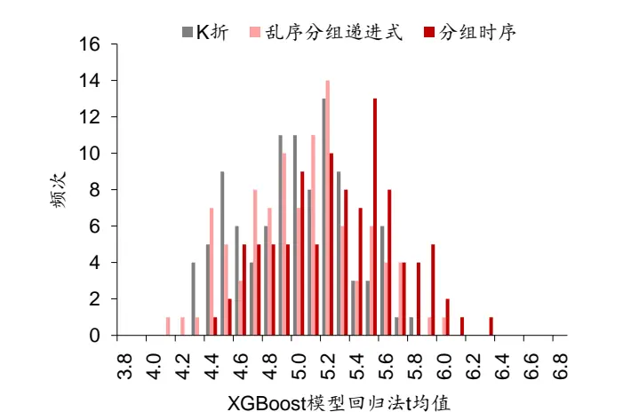
资料来源：Wind，华泰证券研究所

图表41： Bootstrap 回测时间的回归法因子收益率均值分布
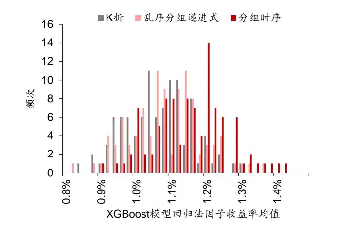
资料来源：Wind，华泰证券研究所

图表42： Bootstrap 回测时间的 Rank IC 均值分布
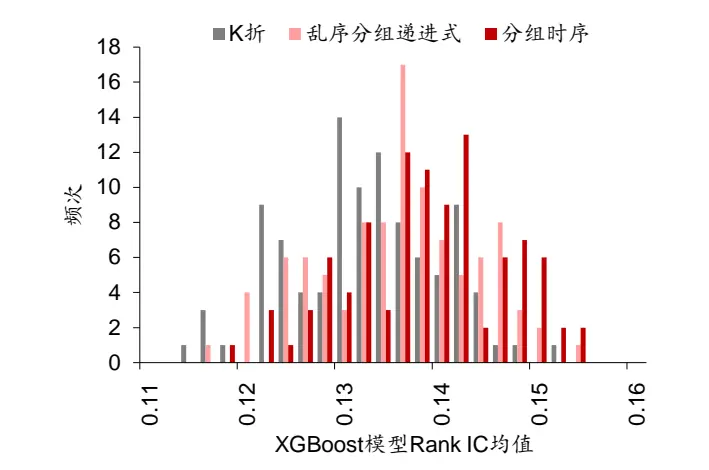
资料来源：Wind，华泰证券研究所

三组交叉验证方法分层回测法各项指标的分布情况如下图。分组时序交叉验证的多空组合年化收益率优于乱序分递进式和 K折；对于多空组合夏普比率、Top组合年化收益率、Top组合夏普比率，如果仅从分布形态看，分组时序交叉验证没有优势。Bootstrap 回测时间构建的平行世界中得到的研究结论与真实世界中得到的研究结论部分一致。

图表43： Bootstrap回测时间的分层回测法多空组合年化收益率
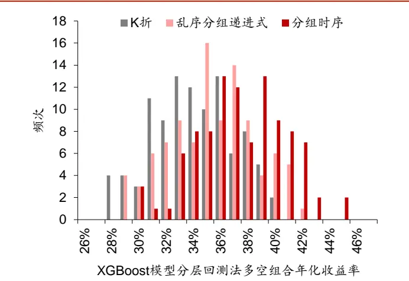
资料来源：Wind，华泰证券研究所

图表44： Bootstrap回测时间的分层回测法多空组合夏普比率
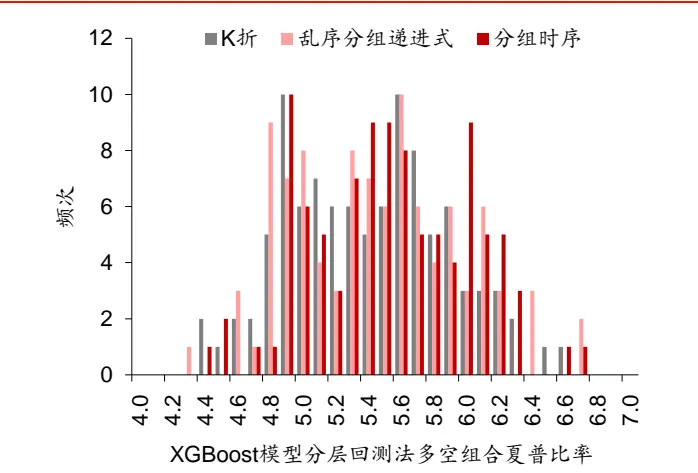
资料来源：Wind，华泰证券研究所

图表45： Bootstrap回测时间的分层回测法 Top组合年化收益率
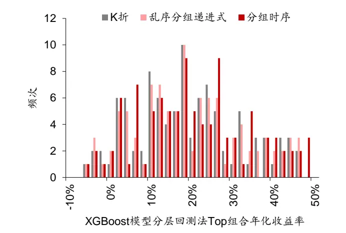
资料来源：Wind，华泰证券研究所

图表46： Bootstrap回测时间的分层回测法 Top组合夏普比率
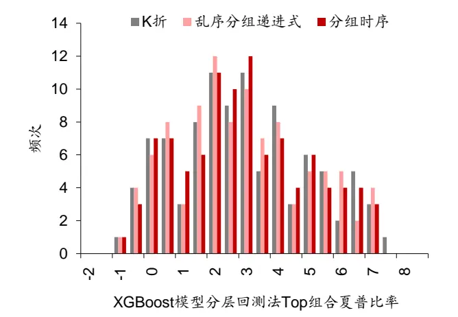
资料来源：Wind，华泰证券研究所

## 三种 Bootstrap 重采样方案的横向比较

除了针对同一种重采样方案下的三组交叉验证方法进行比较外，还可以对同一组交叉验证方法下三种重采样方案得到的指标分布进行横向比较。下面我们以分组时序交叉验证为例展示横向比较结果。横向比较结果回答了如下问题：机器学习选股不同环节随机性的引入，对研究结论的影响程度有何差异？

三种重采样方案下的回归法和 IC 值分析法各项指标的分布情况如下图所示。首先，从分布的宽度看，Bootstrap 样本内数据集的分布较窄，即变异程度低；Bootstrap 样本外数据集次之；Bootstrap 回测时间的分布较宽，即变异程度大。这说明，样本内数据集的小幅变动对研究结论的影响程度不大；回测时间的改变对研究结论的影响程度相对较大，因而在量化策略的开发过程中，需要避免因回测时间选择不当而造成的误判。

其次，从分布的位置看，Bootstrap 样本内数据集位于真实值的左侧，Bootstrap 样本外数据集和 Bootstrap 回测时间的中心位置和真实值接近。这说明，样本内数据集的小幅变动可能削弱模型表现，研究者在开发过程中需要密切关注训练数据的质量；而当模型完成训练后，样本外数据集和回测时间的改变对单因子测试各项统计指标的影响方向整体为中性。

图表47： 三种 Bootstrap 方案分组时序模型回归法|t|均值横向比较
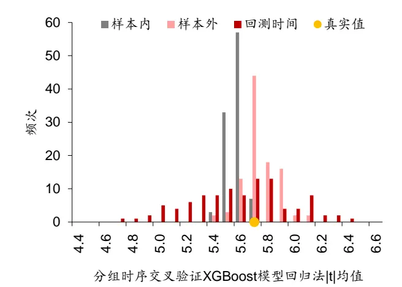
资料来源：Wind，华泰证券研究所

图表48： 三种 Bootstrap 方案分组时序模型回归法 t 均值横向比较
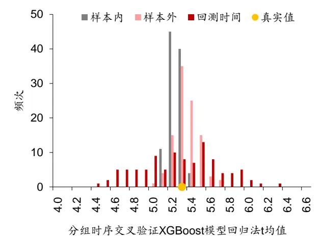
资料来源：Wind，华泰证券研究所

图表49： 三种 Bootstrap方案分组时序模型因子收益率均值横向比较
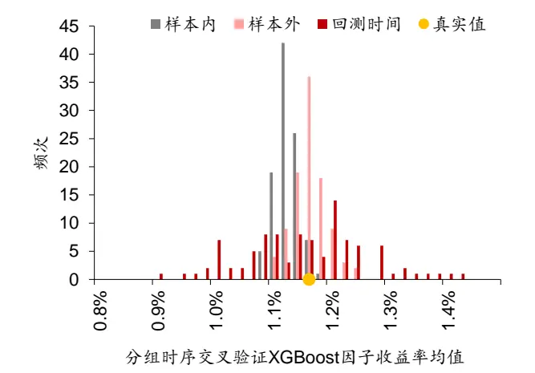
资料来源：Wind，华泰证券研究所

图表50： 三种 Bootstrap方案分组时序模型 Rank IC均值横向比较
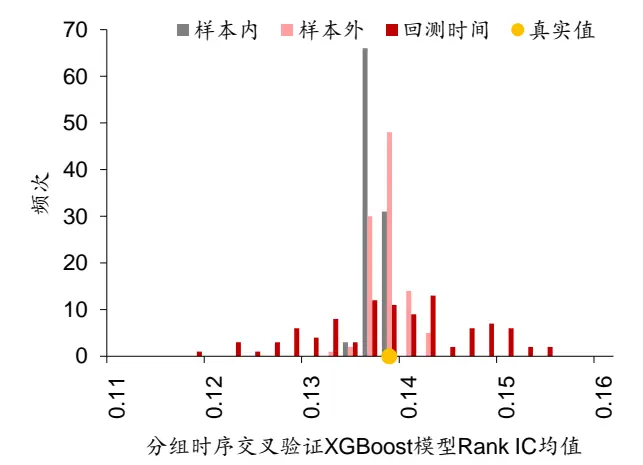
资料来源：Wind，华泰证券研究所

三种重采样方案下的分层回测法多空组合年化收益和夏普比率的分布情况如下图。首先，从分布的宽度看，仍然是 Bootstrap 样本内对结果的影响程度较低，Bootstrap 样本外次之，Bootstrap 回测时间对结果的影响程度较高。其次，从分布的位置看，Bootstrap 样本内和Bootstrap 样本外的多空组合夏普比率分布整体位于真实值的左侧，说明样本内或样本外数据集的小幅变动均可能降低多空组合的夏普比率。与上一小节结果对比可知，t 值、因子收益率、Rank IC 等统计指标对样本外数据集的变动相对不敏感，但是类似多空组合夏普比率这样的和交易密切相关的指标对样本外数据集的变动较为敏感。

图表51： 三种Bootstrap方案分组时序模型多空组合年化收益横向比较
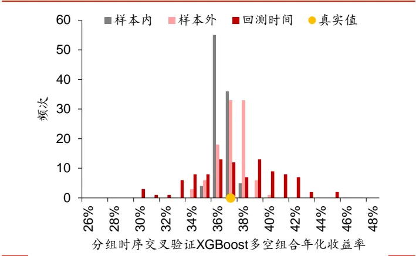
资料来源：Wind，华泰证券研究所

图表52： 三种Bootstrap方案分组时序模型多空组合夏普比率横向比较
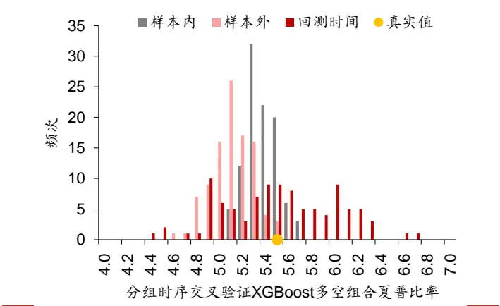
资料来源：Wind，华泰证券研究所

三种重采样方案下的分层回测法 Top 组合年化收益和夏普比率的分布情况如下图。Bootstrap 回测时间的分布宽度远超另外两种 Bootstrap 方案，说明 Top 组合表现对回测时间较为敏感。Top组合指标分布的中心位置在真实值的右侧，原因可能是 Top组合的月度收益为正偏态分布，长尾在右侧的正收益部分，Bootstrap 重采样时高收益月份有较大概率被抽到，提升了 Top组合在平行世界中的表现。

图表53： 三种 Bootstrap 方案分组时序模型 Top 组年化收益横向比较
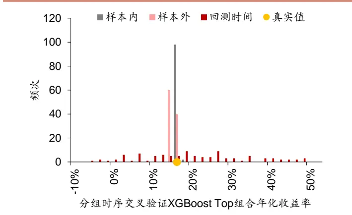
资料来源：Wind，华泰证券研究所

图表54： 三种 Bootstrap 方案分组时序模型 Top 组夏普比率横向比较
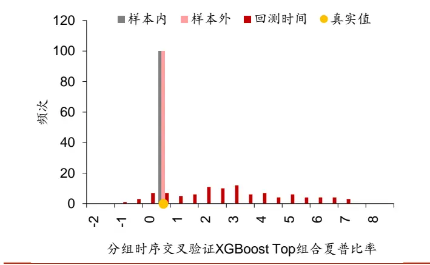
资料来源：Wind，华泰证券研究所

## 结果汇总以及回测过拟合风险的定量刻画

将三组交叉验证方法在三种 Bootstrap 方案下的回测表现进行汇总，结果如下表所示。总的来看，三种 Bootstrap 方案下得出的研究结论和真实 A股市场得出的研究结论一致，即分组时序相对较好，乱序分组递进式次之，K折相对较差。平行世界和真实世界能够互相印证，表明基于真实数据所得出的“分组时序交叉验证优于其余两组方法”的研究结论其回测过拟合风险较低。

图表55： 三组交叉验证方法在三种 Bootstrap方案下的回测表现与真实回测表现

| 回测指标 | 交叉验证方法 | 真实值 | 方案1：Bootstrap 样本内 |  | 方案2：Bootstrap 样本外 |  | 方案 3：Bootstrap 回测时间 |  |
| --- | --- | --- | --- | --- | --- | --- | --- | --- |
|  |  |  | 均值 | 标准差 | 均值 | 标准差 | 均值 | 标准差 |
| It\|均值 | K折 | 5.30 | 4.99 | 0.09 | 5.37 | 0.12 | 5.24 | 0.34 |
|  | 乱序分组递进式 | 5.37 | 5.17 | 0.10 | 5.46 | 0.13 | 5.30 | 0.36 |
|  | 分组时序 | 5.71 | 5.62 | 0.06 | 5.79 | 0.13 | 5.64 | 0.36 |
| t均值 | K折 | 5.08 | 4.74 | 0.10 | 5.09 | 0.13 | 5.03 | 0.37 |
|  | 乱序分组递进式 | 5.13 | 4.87 | 0.10 | 5.13 | 0.13 | 5.07 | 0.39 |
|  | 分组时序 | 5.39 | 5.29 | 0.07 | 5.39 | 0.12 | 5.32 | 0.41 |
|  | K折 | 1.08% | 0.99% | 0.02% | 1.08% | 0.03% | 1.07% | 0.09% |
| 因子收益率 均值 Rank IC | 乱序分组递进式 | 1.10% | 1.02% | 0.02% | 1.10% | 0.03% | 1.09% | 0.10% |
|  | 分组时序 | 1.17% | 1.13% | 0.02% | 1.17% | 0.03% | 1.16% | 0.10% |
|  | K折 | 13.35% | 12.74% | 0.12% | 13.29% | 0.18% | 13.33% | 0.77% |
| 均值 多空组合 | 乱序分组递进式 | 13.68% | 13.03% | 0.12% | 13.59% | 0.19% | 13.66% | 0.79% |
|  | 分组时序 | 13.96% | 13.75% | 0.08% | 13.88% | 0.18% | 13.96% | 0.81% |
|  | K折 | 34.64% | 33.38% | 0.73% | 34.63% | 1.09% | 34.57% | 2.96% |
| 年化收益率 多空组合 | 乱序分组递进式 | 35.96% | 34.29% | 0.68% | 35.73% | 1.15% | 35.84% | 3.15% |
|  | 分组时序 | 37.98% | 36.94% | 0.58% | 37.61% | 1.12% | 37.94% | 3.20% |
|  | K折 | 5.43 | 5.40 | 0.15 | 5.06 | 0.19 | 5.45 | 0.48 |
| 夏普比率 Top 组合 | 乱序分组递进式 | 5.47 | 5.38 | 0.15 | 5.11 | 0.18 | 5.50 | 0.51 |
|  | 分组时序 | 5.54 | 5.42 | 0.13 | 5.16 | 0.18 | 5.57 | 0.48 |
|  | K折 | 16.81% | 16.10% | 0.38% | 15.26% | 0.65% |  | 13.07% |
| 年化收益率 | 乱序分组递进式 | 16.94% | 16.45% | 0.40% | 15.32% | 0.69% | 20.07% 20.22% | 13.17% |
|  | 分组时序 | 17.83% | 17.26% | 0.36% | 15.85% | 0.63% | 21.23% | 13.45% |
|  | K折 | 0.62 | 0.60 | 0.01 | 0.56 | 0.03 |  |  |
| Top 组合 夏普比率 | 乱序分组递进式 | 0.63 | 0.61 | 0.02 | 0.57 | 0.03 | 3.18 3.12 | 2.07 2.04 |
|  | 分组时序 | 0.66 | 0.64 | 0.01 | 0.58 | 0.02 | 3.13 | 1.99 |

资料来源：Wind，华泰证券研究所

通过平行世界和真实世界中模型表现的对比，我们得以定性描述基于真实数据得出研究结论的回测过拟合风险。能否定量刻画回测过拟合风险？下面我们尝试两种简单方法。

1. 对同一种 Bootstrap 方案下三组交叉验证方法的回测指标分布进行单因素重复测量方差分析（One-way Repeated Measures ANOVA）的统计检验。ANOVA 的统计指标 F值和 P值用以衡量三组分布的差异性，F值越大或对应的 P值越小，说明三组分布的差异越大，那么“分组时序交叉验证优于其余两组方法”研究结论其回测过拟合风险可能越小。观察下表可知，除多空组合夏普比率和 Top组合夏普比率外，大部分回测指标在三组交叉验证方法之间均存在显著差异，进一步验证了之前的结论。

2. 对每一次 Bootstrap 重采样，判断分组时序交叉验证的回测指标是否优于其余两组方法。统计全部 100 次重采样下，分组时序交叉验证表现最优的概率。概率值越接近 1，说明分组时序交叉验证在平行世界里表现越好，那么基于真实数据得出结论的过拟合风险越小。观察下表可知，多数指标的概率值等于或接近 1，同样印证了之前的结论。

图表56： 三组交叉验证方法在三种 Bootstrap 方案下回测表现的单因素方差分析及排序结果

| 回测指标 | 方案1：Bootstrap 样本内 |  |  | 方案 2：Bootstrap 样本外 |  |  | 方案 3：Bootstrap 回测时间 |  |  |
| --- | --- | --- | --- | --- | --- | --- | --- | --- | --- |
|  | ANOVA |  | ANOVA P(分组时序 | ANOVA | ANOVA | P(分组时序 | ANOVA |  | ANOVA P(分组时序 |
|  | F(2,198) | P值 | 最优） | F(2,198) | P值 | 最优） | F(2,198) | P值 | 最优) |
| It\|均值 | 3187.03 | 0[1] | 1 | 1493.21 | 0 | 1 | 932.73 | 0 | 1 |
| t均值 | 2268.98 | 0 | 1 | 877.97 | 0 | 1 | 500.61 | 0 | 1 |
| 因子收益率均值 | 2878.59 | 0 | 1 | 1564.46 | 0 | 1 | 886.03 | 0 | 1 |
| Rank IC 均值 | 4389.49 | 0 | 1 | 1702.59 | 0 | 1 | 1209.66 | 0 | 0.98 |
| 多空组合年化收益率 | 1201.30 | 0 | 1 | 577.86 | 0 | 0.98 | 1005.38 | 0 | 1 |
| 多空组合夏普比率 | 5.35 | 0.0055 | 0.42 | 27.89 | 2.13E-11 | 0.58 | 34.53 | 1.37E-13 | 0.65 |
| Top 组合年化收益率 | 357.66 | 0 | 0.97 | 81.69 | 0 | 0.81 | 227.37 | 0 | 0.93 |
| Top 组合夏普比率 | 335.73 | 0 | 0.94 | 68.55 | 0 | 0.75 | 14.92 | 9.19E-07 | 0.35 |

资料来源：Wind，华泰证券研究所；注[1]：P 值表示为 0 代表 P 值低于计算累积概率分布函数的最小精度，实际不等于 0

## 总结

通过每种 Bootstrap 方案下三组交叉验证方法比较，以及三种 Bootstrap 方案下同一组交叉验证方法的横向比较，我们得到下列结论：

1. Bootstrap 是一种可行的构建“平行 A 股市场”的重采样方法，能够模拟机器学习不同环节的随机性，从而检验在真实 A股市场中得出的研究结论是否为过拟合。我们分别对样本内数据、样本外数据和回测时间进行 Bootstrap 重采样，发现在“平行 A 股市场”中分组时序交叉验证方法的模型性能和单因子回测指标均优于其它两种方法，统计检验结果显著。真实世界的研究结论能够在平行世界中复现，表明该结论为过拟合的可能性较低。我们借助“偶然”的工具，探寻出“必然”的规律。

2. 三种 Bootstrap 方案对同一组交叉验证方法的影响方向和程度有区别。Bootstrap 样本内数据集相当于向训练集因子值添加小幅扰动，可能小幅削弱模型表现；Bootstrap样本外数据集相当于向测试集因子值添加小幅扰动，可能部分增强或削弱模型表现；Bootstrap 回测时间即改变模型的回测时间段，可能大幅增强或削弱模型表现。上述结果对研究者的启示是在开发过程中需要密切关注训练数据的质量，同时应避免因回测时间选择不当而造成的误判。

3. 在以往的量化模型开发过程中，通常将历史回测表现视作确定性的结果，而忽略随机性对结果的影响。在面临不同量化策略的取舍之时，往往只是简单基于策略的年化收益率、夏普比率、收益回撤比等评价指标。Bootstrap 重采样方法提供了一种刻画随机性的思路，使研究者能够基于评价指标的统计分布而非单个统计量，对模型优劣做出相对客观的判断和决策。本文从方法论的角度，对结合机器学习的多因子选股框架进行反思，针对模型比较和模型评价环节提出创新式的改造，希望对本领域的投资者有所启发。

## 风险提示

人工智能选股方法是对历史投资规律的挖掘，若未来市场投资环境发生变化，该方法存在失效的可能。机器学习选股模型随机性的来源多样，本研究只考虑有限的三种情况，存在忽略其它更重要随机性来源的可能。Bootstrap 重采样方法是对随机性的简单模拟，存在过度简化的可能。

## 免责申明

本报告仅供华泰证券股份有限公司（以下简称“本公司”）客户使用。本公司不因接收人收到本报告而视其为客户。

本报告基于本公司认为可靠的、已公开的信息编制，但本公司对该等信息的准确性及完整性不作任何保证。本报告所载的意见、评估及预测仅反映报告发布当日的观点和判断。在不同时期，本公司可能会发出与本报告所载意见、评估及预测不一致的研究报告。同时，本报告所指的证券或投资标的的价格、价值及投资收入可能会波动。本公司不保证本报告所含信息保持在最新状态。本公司对本报告所含信息可在不发出通知的情形下做出修改，投资者应当自行关注相应的更新或修改。

本公司力求报告内容客观、公正，但本报告所载的观点、结论和建议仅供参考，不构成所述证券的买卖出价或征价。该等观点、建议并未考虑到个别投资者的具体投资目的、财务状况以及特定需求，在任何时候均不构成对客户私人投资建议。投资者应当充分考虑自身特定状况，并完整理解和使用本报告内容，不应视本报告为做出投资决策的唯一因素。对依据或者使用本报告所造成的一切后果，本公司及作者均不承担任何法律责任。任何形式的分享证券投资收益或者分担证券投资损失的书面或口头承诺均为无效。

本公司及作者在自身所知情的范围内，与本报告所指的证券或投资标的不存在法律禁止的利害关系。在法律许可的情况下，本公司及其所属关联机构可能会持有报告中提到的公司所发行的证券头寸并进行交易，也可能为之提供或者争取提供投资银行、财务顾问或者金融产品等相关服务。本公司的资产管理部门、自营部门以及其他投资业务部门可能独立做出与本报告中的意见或建议不一致的投资决策。

本报告版权仅为本公司所有。未经本公司书面许可，任何机构或个人不得以翻版、复制、发表、引用或再次分发他人等任何形式侵犯本公司版权。如征得本公司同意进行引用、刊发的，需在允许的范围内使用，并注明出处为“华泰证券研究所”，且不得对本报告进行任何有悖原意的引用、删节和修改。本公司保留追究相关责任的权力。所有本报告中使用的商标、服务标记及标记均为本公司的商标、服务标记及标记。

本公司具有中国证监会核准的“证券投资咨询”业务资格，经营许可证编号为：91320000704041011J。

全资子公司华泰金融控股（香港）有限公司具有香港证监会核准的“就证券提供意见”业务资格，经营许可证编号为：AOK809

©版权所有 2019年华泰证券股份有限公司

## 评级说明

## 行业评级体系

－报告发布日后的6个月内的行业涨跌幅相对同期的沪深300指数的涨跌幅为基准；

－投资建议的评级标准

增持行业股票指数超越基准

中性行业股票指数基本与基准持平

减持行业股票指数明显弱于基准

## 公司评级体系

－报告发布日后的6个月内的公司涨跌幅相对同期的沪深300指数的涨跌幅为基准；
－投资建议的评级标准
买入股价超越基准 20%以上
增持股价超越基准 5%-20%
中性股价相对基准波动在-5%~5%之间
减持股价弱于基准 5%-20%
卖出股价弱于基准 20%以上

## 华泰证券研究

## 南京

南京市建邺区江东中路228号华泰证券广场1号楼/邮政编码：210019

电话：86 25 83389999 /传真：86 25 83387521

电子邮件：ht-rd@htsc.com

## 深圳

深圳市福田区益田路5999号基金大厦10楼/邮政编码：518017

电话：86 755 82493932 /传真：86 755 82492062

电子邮件：ht-rd@htsc.com

## 北京

北京市西城区太平桥大街丰盛胡同28号太平洋保险大厦A座18层

邮政编码：100032

电话：86 10 63211166/传真：86 10 63211275

电子邮件：ht-rd@htsc.com

## 上海

上海市浦东新区东方路18号保利广场E栋23楼/邮政编码：200120

电话：86 21 28972098 /传真：86 21 28972068

电子邮件：ht-rd@htsc.com