## 金工研究/深度研究

2019年04月29日

林晓明 执业证书编号：S0570516010001

研究员 0755-82080134

陈烨 执业证书编号：S0570518080004

研究员 010-56793942

李子钰 0755-23987436

联系人 liziyu@htsc.com

何康 021-28972039

联系人 hekang@htsc.com

## 相关研究

1《金工: 偶然中的必然：重采样技术检验过拟合》2019.04

2《金工: 机器学习选股模型的调仓频率实证》2019.04

# 必然中的偶然：机器学习中的随机数华泰人工智能系列之二十

## 不同机器学习模型对随机数种子的敏感程度不同

本文考察逻辑回归、XGBoost、随机森林和全连接神经网络四种机器学习算法在 100 组不同随机数种子下的模型性能和单因子回测表现。结果表明，当随机数种子变化时，逻辑回归的结果几乎保持不变，对随机数不敏感；全连接神经网络的结果可能发生较大变化，对随机数较敏感；XGBoost 和随机森林对随机数的敏感程度介于上述两者之间。机器学习模型看似“必然”的结果背后包含一定“偶然”因素，投资者应认识到机器学习选股模型可能存在的随机数种子选择偏差。

## 机器学习多个环节涉及随机数，目的在于增强模型的泛化能力

机器学习多个环节涉及随机数，例如训练集、验证集和测试集的随机划分，对神经网络权值进行随机初始化，利用随机梯度下降法求损失函数最优解，随机森林、XGBoost 等决策树集成模型的行列采样，神经网络训练过程中使用 Dropout 技术等。引入这些随机数具有重要意义，它们或是为了保证损失函数更易达到最优解，或是为了避免极端值对模型训练造成不良影响，或是为了产生具有差异性的样本以便进一步集成，最终目的都在于增强模型的泛化能力。

## 使用 Python常用机器学习包时可进行若干设置保证训练结果可重复

由于机器学习模型中随机数的存在，为了保证结果的可重复性，需要对模型进行若干设置。我们测试了多种常用 Python 机器学习包随机数种子设置方法，结果表明 sklearn 和 xgboost 包设置 random_state 超参数后就能保证结果可完全复现；当以 tensorflow 作为后端使用 keras 包时，如果不使用 GPU，在单线程环境下同时固定 numpy 和 tensorflow 两处随机数种子就能确保全连接神经网络模型得到可重复的结果。

## 机器学习模型受随机数影响程度与模型复杂度及随机数作用方式有关

逻辑回归本身比较简单，在使用随机梯度下降算法拟合参数时引入了随机数，由于损失函数为凸函数，参数最终大概率收敛到理论最优参数附近，而较少受随机数影响。神经网络参数量大，在初始化网络权重，利用优化算法最小化损失函数，前向传播进行 Dropout 等环节均引入了随机数，模型整体具有较高的复杂度，受随机数影响较大。XGBoost 和随机森林模型复杂度也较高，行列采样环节涉及随机数，但是由于模型已经进行集成，最终结果的不确定性有所降低。

风险提示：机器学习选股方法是对历史投资规律的挖掘，若未来市场投资环境发生变化导致基学习器失效，则该方法存在失效的可能。机器学习存在一定过拟合风险。当机器学习算法涉及随机数时，不同随机数种子可能得到不同结果。

## 本文研究导读

世界上没有完全相同的两片叶子。诸多看似“必然”的现象背后，可能蕴藏着不为人熟知的“偶然”因素。人类的局限性之一，就是我们往往热衷于追逐确定性的结论，而忽视了同样关键的“必然中的偶然”。

以机器学习算法为例，有一个问题常常困扰机器学习的使用者：使用相同的算法训练相同的数据集为什么会得到不同的结果？产生这种现象的主要原因是：机器学习的诸多环节都涉及随机数。例如训练集、验证集和测试集的随机划分，对神经网络的权值进行随机初始化，利用随机梯度下降法求损失函数最优解，随机森林、XGBoost 等决策树集成模型的行列随机采样，训练神经网络时通过 Dropout 技术随机删除部分神经元等。引入这些随机数具有重要意义，它们或是为了保证损失函数更易达到最优解，或是为了产生差异化的样本以便进一步集成，或是为了避免极端值对模型造成不良影响，最终目标都是增强模型的泛化能力。

在每次训练过程中，计算机产生的随机数不同，因而造成训练结果不能完全重复。为了确保研究的可重复性，我们通常会事先固定随机数种子，最终也仅仅汇报该随机数种子对应的结果。这就引入了新的问题——当投资者阅读人工智能和机器学习相关研究报告时，可能对报告中算法的泛化能力产生怀疑：是否可能是作者运气好，选择了一个特殊的随机数种子，得到看似完美的结果，但是更换随机数种子后结论不再成立？

为了回应投资者的上述质疑，全面展示机器学习“必然中的偶然”，本文将系统性地整理和分析机器学习选股模型涉及的随机数，具体关注下列问题：

1. 首先梳理分析随机数在机器学习中的用途。机器学习选股流程中哪些环节涉及随机数？这些环节引入随机数又是基于何种考虑？

2. 其次测试不同选股模型对随机数种子的敏感程度。为了得到可重复的结果，针对特定算法，应固定哪几处随机数种子？当变更这几处随机数种子时，机器学习选股的训练及回测表现会发生怎样的变化？

## 机器学习中的随机数

机器学习的多个环节涉及到随机数，例如：训练集、验证集和测试集的随机划分，对神经网络的权值进行随机初始化，利用随机梯度下降法求损失函数最优解，对随机森林进行行列随机采样，训练神经网络时通过 Dropout 技术随机删除部分神经元等。引入这些随机数对于构建机器学习模型有何帮助？在具体的算法实现层面，这些随机数是如何起作用的？

图表1： 机器学习中随机数所涉及的环节、作用和代表模型

| 随机数涉及环节 | 随机数的作用 | 代表模型 |
| --- | --- | --- |
| 数据集的划分 | 划分训练集、验证集和测试集 |  |
| 优化算法 | 赋予参数随机初始值；随机梯度下降 | 逻辑回归、神经网络 |
| 集成学习 | 行、列随机采样 | 随机森林、XGBoost |
| 神经网络 | Dropout 技术删除部分神经元 | 神经网络 |

资料来源：华泰证券研究所

## 从计算机中的随机数生成谈起

构建机器学习模型所需的随机数，是由计算机的随机数生成器产生的。计算机是如何生成随机数的呢？是在内部设置一个均分的轮盘，每次向轮盘撒黄豆；还是在内部产生一个虚拟的硬币，反复地抛掷硬币？实际上，计算机无法产生绝对随机的随机数，计算机能产生的仅仅是“伪随机数”，即相对的随机数。需要强调的是，伪随机数并不是假的，这里的“伪”，表示有规律。换言之，计算机产生的随机数既是随机的，又是有规律的。

何谓“随机且有规律”？例如，世界上没有两片完全相同的树叶，这突出了事物的随机性。但是每种树的叶子都有相似的形状和颜色，这就是规律性。计算机产生的随机数是可预测、有周期的，是由某些公式和函数生成的。因此，对于同一随机种子与函数，得到的随机数列是一定的。

在计算机中，如果没有设置随机数种子，那么将默认采用当前时钟作为随机数种子，代入生成函数，产生随机数。伪随机数生成函数虽然只是几个简单的函数，却是科学家数十年研究的成果。图灵奖首位亚裔获得者姚期智教授的研究方向之一就是伪随机数生成。目前常用的随机数生成法有同余法（congruential method）和梅森旋转算法（Mersenne twister）。伪随机数的产生机理，确保了使用相同随机数种子产生的序列是完全相同的，从而保证使用者在固定随机数种子后能得到可重复的确定性结果。

## 数据集的随机划分

了解计算机中随机数的生成模式后，我们将进一步梳理机器学习算法每步可能用到的随机数。在训练机器学习模型前，不可缺少的一步是数据集的随机划分：将原始样本按照一定方法，随机划分成训练集（training set）、验证集（validation set）和测试集（test set）。

训练集的作用是训练模型，形成模型的内部结构和参数估计。例如线性回归模型，每个自变量前的参数都是基于训练集估计得到。验证集的作用是模型选择或超参数选择。例如随机森林中树的棵数，每个基决策树的特征个数，内部节点再划分需要的最小样本数等，都是基于模型在验证集的表现，通过不同模型或超参数的对比得到。测试集的作用是测试已经训练完成模型的表现。测试集不参与模型的训练和选择，仅仅用以展示模型的性能，不为模型提供任何信息。

实践中，多种方法可用于数据集的随机划分。以留出法（hold-out）为例，首先对原始数据进行一次或若干次混洗（shuffle）；其次按照混洗后的顺序，取一定比例样本作为总体训练集，剩余样本作为测试集；随后从总体训练集中依照同样方法，划分出训练集和验证集。对于原始数据中的每条样本，我们无法确定它应被分到哪类数据集中，但是它被分到每类数据集的概率应服从给定的样本比例。单次划分数据集得到的结果可能不稳定，一般需要进行多次随机划分，重复实验后再考虑其平均结果。

将原始数据集进行随机划分，确保了划分后每类数据集的内部结构（数据分布）尽可能与原始数据集保持一致，避免因划分过程引入额外偏差对最终结果造成的影响，使得基于训练集得到的模型能够适用于全体样本。

需要说明的是，当原始数据集为时间序列时，随机划分可能破坏样本的时序信息，更常用的方法是不进行混洗，直接按时序划分为训练集、验证集和测试集。此处不涉及随机数。

## 优化算法中的随机数

划分完数据集后，核心环节是在训练集上利用特定学习算法拟合模型。诸多机器学习算法会用到各种形式的损失函数，如何快速有效地对损失函数求最小值，从而估计出模型的参数, 这就涉及到优化问题。各种优化方法也会用到随机数，一方面用来“跳出”局部极值点，使得优化结果更接近全局最优解，另一方面用于消除极端值对优化结果的影响。

## 赋予参数随机初始值

除少数简单模型外，机器学习涉及到的优化问题通常无法直接给出显式解，实践中需借助数值优化算法进行求解。数值优化算法通常从某个初始参数值出发，按照一定规则搜索并更新参数，直到优化目标函数变化小于容忍幅度，或者搜索次数达到最大迭代次数为止。

对于凸目标函数，优化问题在理论上存在唯一解，只要搜寻次数足够长，总可以得到近似最优数值解。然而，无论采用何种参数搜索方法，如果优化在触及最大迭代次数后停止，最终参数所能到达的位置会依赖于初始出发位置。换言之，如果赋予参数不同的初始值，我们可能得到不同的优化结果。

对于非凸目标函数，该问题仍然存在。更为严重的是，由于非凸目标存在局部极值，即使迭代次数足够长，也无法确保从不同的初始参数出发最终能够得到相近的结果。以经典的梯度下降搜寻算法为例，如果给定的初始值恰好落在某个非全局最优的局部极值点附近，由于该点附近梯度近似为 0，参数更新极度缓慢，导致最终结果只能取到该点附近；而如果选择另一个远离该点的初始值，那么最终结果有可能落在全局最优点。

为了解决上述问题，可以随机赋予优化问题若干组不同的初始解，按照某种特定搜索算法求解模型后，将得到与每组初始值对应的一组“最优”参数及局部最优目标值。如果结果与初始值无关，那么全部结果应较接近，任意一组解都可以作为备选最优解；如果结果与初始值相关，那么取各组“局部”最优解中的“全局”最优解对应参数作为最终参数即可。

总之，在赋予参数随机初始值的过程中，使用随机数的作用是：防止 1）迭代次数不足或者 2）参数搜索“陷入”局部最优对优化结果的负面影响。

## 随机梯度下降

梯度下降（gradient decent）是经典的数值优化搜索算法，我们曾在华泰金工《人工智能2：广义线性模型》（20170622）中详细介绍过该方法。梯度下降法通过计算损失函数的梯度，找到使损失函数下降最快的方向进行迭代搜索，最终找到最优值。

不妨把损失函数想象成一处山谷，如下图所示，小球从四周某处自由滚下，那么小球将落在谷底，即损失函数的极小值处。用数学的语言来说，损失函数的导数描述了山谷中局部的“形态”，而万有引力定律则保证能够牵引小球沿着山谷下降方向走。梯度下降法正是模拟小球在每一步都沿着山谷的下降方向（损失函数梯度的负方向）滚动。

图表2： 二元损失函数示意图
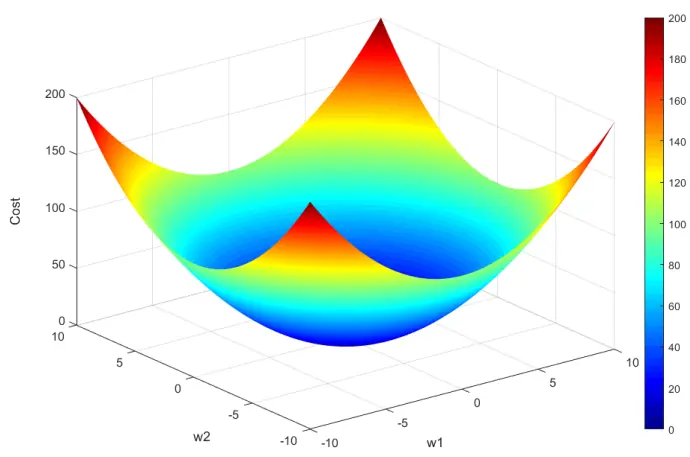
资料来源：华泰证券研究所

然而在实际应用中，梯度下降法存在诸多缺陷。首先，为了计算损失函数的梯度，需要遍历每条训练样本，当训练样本量较大时，会耗费大量内存，整个训练过程变得较为缓慢。其次由于不同样本间的梯度可能相互抵消，导致参数变化幅度过小，参数收敛速度随之变慢。最后对于非凸的损失函数来说，参数值趋于局部极值点时，梯度将趋于零，参数值几乎不再更新，最终损失函数只能优化到局部极值点。

图表3： 损失函数为凸函数（左）和非凸函数（右）
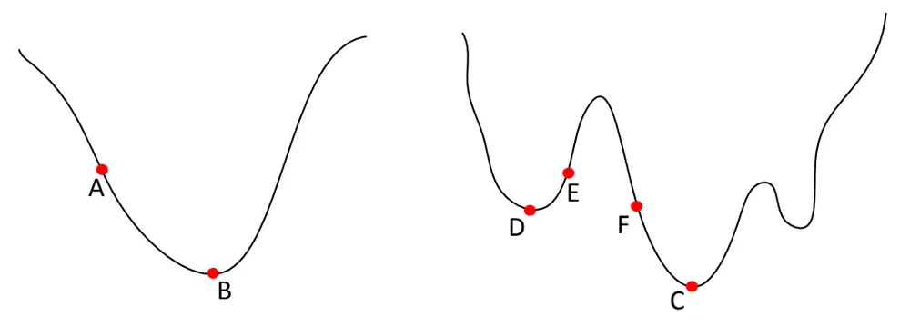
资料来源：华泰证券研究所

针对以上不足，研究者提出随机梯度下降法（stochastic gradient decent，SGD）。随机梯度下降法的核心思想是每次随机选取全部训练样本中的单个样本计算其方向梯度，并据此立即更新模型参数。在具体的算法实现上，通常首先将所有训练样本进行混洗（shuffle）,然后依次遍历重排后的样本，每次根据遍历到的样本计算梯度并立即更新参数。将全部打乱后的训练样本全部遍历一次，称为一轮（epoch）迭代。多轮迭代后，模型参数将可能收敛到全局最优值附近。

图表4： 梯度下降法（左）和随机梯度下降法（右）
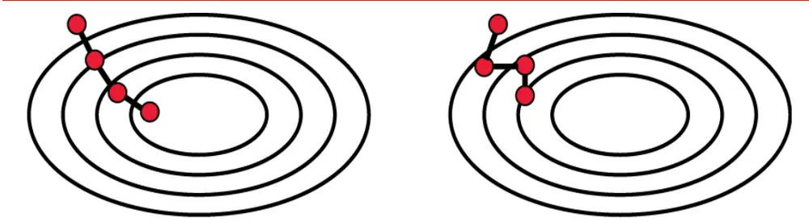
资料来源：华泰证券研究所

随机梯度下降法的优点在于，每次更新参数时，只需要检验单个样本，无需遍历所有样本，因此适用于大规模数据的模型优化问题。由其算法实现过程可知，在同样执行 N 轮迭代后，经典梯度下降方法参数只更新了 N 次，而随机梯度下降方法参数更新了 N 乘以训练样本数量次，这意味着参数变动更为频繁。当样本量较大时，可能无需训练完所有样本，就能得到一个损失值在可接受范围之内的模型。

另外，当损失函数为凸函数，无论是经典梯度下降法还是随机梯度下降法，在初始几步迭代过程中，损失函数下降速度较快。而当参数逼近最优值时，多数样本对应的损失函数已经优化得足够好，仅少数点尚未优化到位。为了继续优化这些样本点，梯度下降法至少需要一次迭代，遍历全体样本使参数更新到最优，尽管其中多数样本对于总的梯度值已经没有贡献。随机梯度下降法也至少需要再执行一次迭代，但是由于样本是随机打乱的，运气足够好的情形下，靠前的几条样本便是尚未优化的样本，利用它们更新参数后就能提前结束本轮迭代，运气最差的情形下需要遍历全体样本，平均而言只需要遍历一半的样本。

当损失函数为非凸函数，使用梯度下降法时，可能“陷入”到局部极值域中。但是对于随机梯度下降法，即使参数在搜索中进入到局部极值域，由于下次取到的样本是随机的，所以仍有一定概率“跳出”该区域，从而进一步搜索到全局最优参数。

总的来看，随机梯度下降法使用随机数的作用是：避免样本极端性对优化结果的影响；同时利用随机性使参数搜索“跳出”梯度为 0的区域，从而获得更接近全局最优的结果。

## 集成学习中的随机数

划分训练集、验证集和测试集，利用随机优化算法基于训练集拟合出模型，再根据验证集选择超参数后，通常可得到弱学习器。单个弱学习器的预测能力有限，要想进一步增强模型的泛化能力，就需要进行集成学习。集成学习算法主要有两大类：Bagging（并行）和Boosting（串行）。集成学习中随机数的使用首先出现在 Bagging，随后扩展到 Boosting。

Bagging（全称 bootstrap aggrating）是 Bootstrap 重采样思想在机器学习中的应用。Bootstrap 重采样是指从数据集里有放回地随机抽取相同数量的样本。一般而言，欲得到泛化性能强的集成模型，集成学习中的基学习器应尽可能保证互相独立。实践中，由于训练都是基于同一数据集，无法严格保证独立性，可行的办法是保证弱学习器之间存在较大差异。如果弱学习器完全一致，集成过程就会失效。

图表5： Bootstrap 重采样示意图
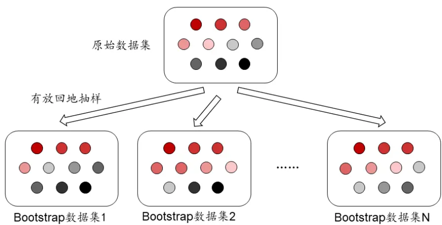
资料来源：华泰证券研究所

Bagging 方法通过对数据集进行多次 Bootstrap 重采样，产生具有差异的基学习器。如上图所示，我们基于原始数据集生成 N 个 Bootstrap 数据集，对于每个 Bootstrap 数据集分别训练单个弱分类器，最终用投票、取平均值等方法组合成强分类器。Bagging 算法中，对包含 M 条样本的训练集做 N 次随机重采样，由于随机性的存在，N 个重采样集各不相同。Bagging算法采用不同的重采样集，训练得到差异化的基学习器，故其泛化能力较强，模型的方差较低。

图表6： Bagging并行集成方法示意图
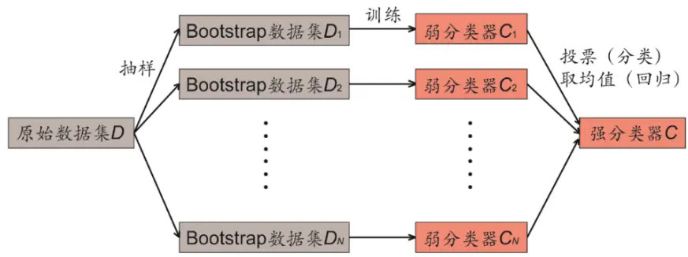
资料来源：华泰证券研究所

随机森林是 Bagging模型的一个扩展变体。随机森林在以决策树为基学习器构建 Bagging集成的基础上，进一步在基决策树的训练中引入随机特征选择。具体而言，随机森林根据以下两步方法构建每棵决策树。第一步称为“行采样”，从全体训练样本中有放回地抽样，得到若干个 Bootstrap 数据集，并建立对应的弱学习器。第二步称为“列采样”，对于每一棵基决策树，传统决策树算法在每一步选择特征划分时，从全部 d 个特征集合中选出一个最优特征；随机森林算法不考虑全部特征，而是随机抽取其中 k 个特征，选择其中的最优特征进行划分。列采样保证了即使 Bootstrap 数据集完全相同，也可能生成不同的决策树。这里的 k 决定了引入随机性的程度，当 k = d 时，随机森林中基决策树的构建与传统决策树相同。

决策树的缺陷之一是易受训练集中极端样本的影响而导致过拟合，随机森林能够降低过拟合程度。极端样本之所以极端，是由于其出现概率小。对于随机森林，只有少数情况下极端样本才会被抽样进入 Bootstrap 数据集中，即使它被抽样进入 Bootstrap 数据集中，也只有少数情况下才被选中参与学习，从而有效降低极端样本对结果的影响。

随着研究者对 Bagging 并行集成方法的日益认可，其核心的行列采样思想也逐渐拓展到Boosting 串行集成学习方法中。具有代表性的决策树串行集成学习方法 XGBoost 包含行采样超参数 subsample 和列采样超参数系列 colsample_by*，该方法同样受到随机数影响。

总的来看，在集成学习中，使用随机数的作用是：产生差异性的样本，进而基于这些样本训练出具有差异性的弱学习器，最终得到泛化能力更强的集成学习器。

## 神经网络中的随机数

过拟合是机器学习常被人诟病的问题之一。神经网络由于参数数量众多，过拟合问题尤为突出。如果模型存在过拟合，那么其实际使用效果将大打折扣。上一节介绍的集成模型通过组合多个具有差异性的基模型，一定程度上缓解了过拟合。然而，集成模型需要训练多个基模型，对于神经网络模型而言，训练单个基模型就已较为耗时，进行后端集成学习不现实。研究者如何缓解神经网络的过拟合？

2012 年，Hinton 等人在论文《Improving neural networks by preventing co-adaptation offeature detectors》中提出 Dropout 技术。Dropout 技术的核心思想是在神经网络进行前向传播时，令神经元的激活值以一定的概率 p 停止工作，使得模型不会过于依赖某些局部特征，从而增强模型的泛化能力。

训练神经网络的常规流程是：每一轮迭代，首先将特征 X 通过网络前向传播，随后将误差e 反向传播，以决定如何更新参数使得网络进行学习。使用 Dropout 时，每一轮迭代的训练流程为：

1. 基于当前参数，拷贝一份临时神经网络，从临时网络中随机地删除一部分隐藏神经元，注意需要保持输入输出神经元不变，如下图。

2. 基于删除一部分神经元的临时网络进行一次前向传播，然后把得到的损失结果反向传播。一小批训练样本执行完上述步骤后，对于原始网络没有被删除的神经元，按照随机梯度下降法更新对应临时网络位置的参数；对于原始网络上被删除的神经元，参数保持不变。

图表7： Dropout 方法示意图
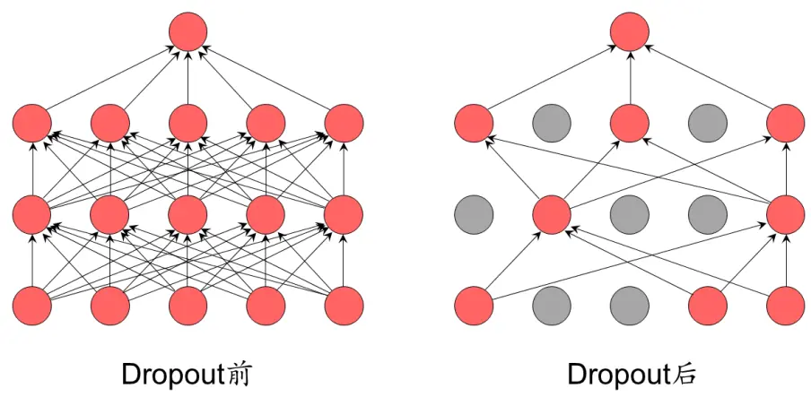
资料来源：华泰证券研究所

在实际训练时，可设定每个隐藏层的 Dropout 比例，当 Dropout 比例为 1 时，相当于经典的训练算法。直观上 Dropout 不同的隐藏神经元类似于训练不同的神经网络（随机删掉部分隐藏神经元导致网络结构发生改变)，整个 Dropout 过程相当于对多个不同的神经网络取多次平均。不同的神经网络可能产生不同程度的过拟合，一些“反向”的拟合互相抵消，能够在整体上缓解过拟合。

总的来看，Dropout 技术使用随机数的作用是：随机选取部分隐藏层神经元，每次基于不同的网络结构训练参数，从而缓解神经网络中的过拟合问题。神经网络的权值初始化和随机梯度下降的环节也涉及随机数，这里不再赘述。

## Python 环境下如何设置随机数种子

以上我们简单梳理了机器学习各环节可能用到的随机数。理论上，固定随机数种子后，机器学习的结果应保持不变。然而在实践过程中，不同机器学习方法固定随机数种子的方法不尽相同，技术实现并非易事。本节我们将介绍 Python 环境下如何设置随机数种子。

我们以逻辑回归，XGBoost，随机森林和全连接神经网络四种常用的机器学习方法为例。上述算法依赖 sklearn、xgboost、keras 和 tensorflow 等机器学习包实现，这些包提供的外部调用接口并不一致。使用 sklearn 和 xgboost 包时，构建学习模型这步可显式地控制random_state 参数，实现随机数种子的设置。而 keras并没有提供这一选项，其官方的常见问题说明中指出，如果想得到完全可重复的结果，需要同时控制 Python 解释器、Python标准库随机数模块、numpy和 tensorflow的全局随机数种子，此外还需考虑 GPU和多线程的使用。

我们针对多个不同的随机数种子，测试比较每个种子的多次训练结果。结果表明，当使用sklearn 和 xgboost 包时，对于几个常见学习模型，设置 random_state 参数就能保证结果可以完全重现；当以 tensorflow 作为后端使用 keras 包时，如果不使用 GPU，且在单线程环境下，无需考虑 Python 标准库随机数模块种子设置，同时固定住 numpy 和 tensorflow的随机数种子，即可保证全连接神经网络模型得到可重复的结果。

图表8： Python常用机器学习包中随机数种子参数设置方法
Python 包 参数说明
sklearn random_state 构建 LogisticRegression, RandomForestClassifier 时设置 random_state 参数。
xgboost random_state 构建 XGBClassifier 模型时设置好 random_state 参数。
keras无无显式设置方式，需要在单线程环境下控制 numpy和 tensorflow两处随机数种子。
资料来源：华泰证券研究所

图表9： keras包（tensorflow 作为后端）设置随机数种子代码实例
1. session_conf = tf.ConfigProto(intra_op_parallelism_threads=1, 
2. inter_op_parallelism_threads=1) 
3. from keras import backend as K 
4. sess = tf.Session(graph=tf.get_default_graph(), config=session_conf) 
5. K.set_session(sess) 
6. np.random.seed(seed[0]) 
7. tf.set_random_seed(seed[1])
资料来源：华泰证券研究所

## 机器学习选股模型随机性的来源

在华泰金工《人工智能 19：偶然中的必然：重采样技术检验过拟合》（20190422）报告中，我们提出机器学习选股模型随机性的三种来源：样本内数据集中因子的随机扰动，样本外数据集因子的随机扰动，回测时间段的选择。针对上述三种随机性的可能来源，我们认为可以采用 Bootstrap 重采样技术模拟这些随机性，通过 Bootstrap 样本内数据集、Bootstrap样本外数据集和 Bootstrap 回测时间考察不同环节随机性对模型的影响。

本文是对上篇报告的进一步拓展，关注随机性的第四种来源：算法本身包含的随机数。考察方式和上篇报告稍有不同，我们将直接对随机数种子点进行遍历，分析 100 组不同随机数种子下模型表现的分布，详细方法请见下一章节。

图表10： 机器学习选股模型随机性的可能来源和对应的考察方式
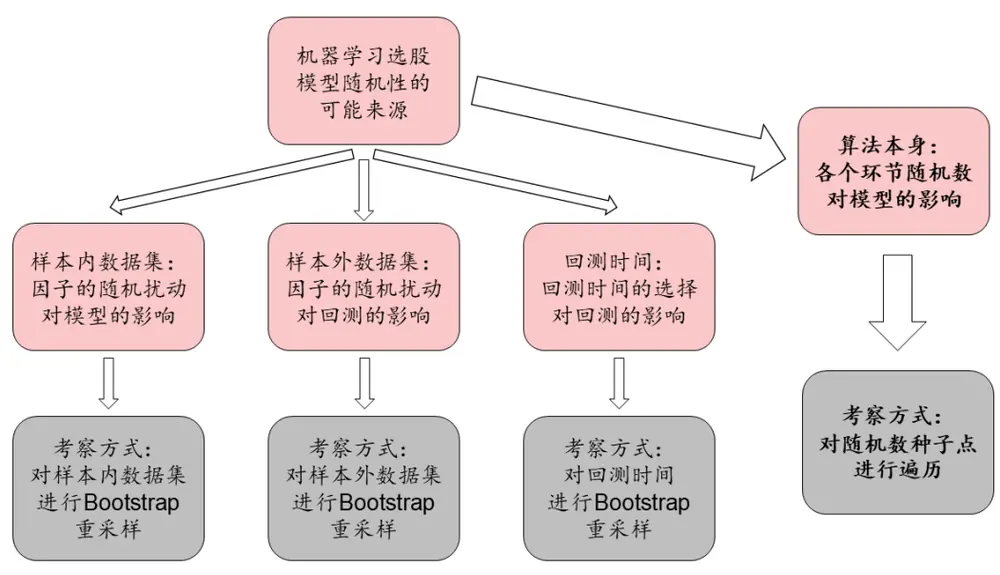
资料来源：华泰证券研究所

## 方法人工智能选股模型测试流程

图表11： 人工智能选股模型测试流程示意图
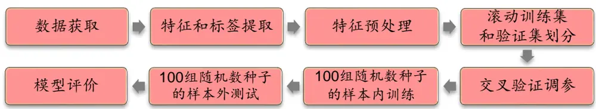
资料来源：华泰证券研究所

本文考察逻辑回归，XGBoost，随机森林，全连接神经网络四种机器学习模型（后文图表中分别以 Logit、XGBoost、RandomForest、ANN 指代）在 100 组不同随机数种子下的结果分布。机器学习模型的测试流程包含如下步骤：

1. 数据获取：

a) 股票池：全 A 股。剔除 ST 股票，剔除每个截面期下一交易日停牌的股票，剔除上市 3个月内的股票，每只股票视作一个样本。

b) 回测区间：2011 年 1 月 31 日至 2019 年 1 月 31 日。

2. 特征和标签提取：每个自然月的最后一个交易日，计算之前报告里的 70 个因子暴露度，作为样本的原始特征，因子池如图表 13 所示。计算下一整个自然月的个股超额收益（以沪深 300 指数为基准），在每个月末截面期，选取下月收益排名前 30%的股票作为正例（y = 1），后 30%的股票作为负例（y = 0），作为样本的标签。

3. 特征预处理：

a) 中位数去极值：设第 T 期某因子在所有个股上的暴露度序列为 $D_{i},\ D_{M}$ 为该序列中位数， $D_{M1}$ 为序列 $|D_{i}-D_{M}$ |的中位数，则将序列 $D_{i}$ 中所有大于 $D_{M}+5D_{M1}$ 的数重设为 $D_{M}+5D_{M1}$ ，将序列 $D_{i}$ 中所有小于 $D_{M}-5D_{M1}$ 的数重设为 $D_{M}-5D_{M1}$ ；

缺失值处理：得到新的因子暴露度序列后，将因子暴露度缺失的地方设为中信一级行业相同个股的平均值；

行业市值中性化：将填充缺失值后的因子暴露度对行业哑变量和取对数后的市值做线性回归，取残差作为新的因子暴露度；

d) 标准化：将中性化处理后的因子暴露度序列减去其现在的均值、除以其标准差，得到一个新的近似服从 N(0, 1)分布的序列

4. 滚动训练集和验证集的划分：由于月度滚动训练模型的时间开销较大，本文采用年度滚动训练方式，全体样本内外数据共分为八个阶段，如下图所示。例如预测 2011 年时，将 2005~2010 年共 72 个月数据合并作为样本内数据集；预测 T 年时，将 T-6至T-1 年的 72 个月合并作为样本内数据。交叉验证采用分组时序交叉验证，折数为 12。

图表12： 年度滚动训练示意图
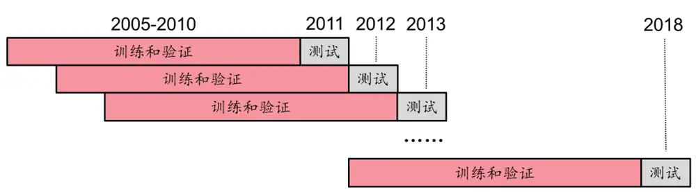
资料来源：华泰证券研究所

图表13： 选股模型中涉及的全部因子及其描述

| 大类因子 | 具体因子 | 因子描述 | 因子方向 |
| --- | --- | --- | --- |
| 估值 | EP | 净利润（TTM）/总市值 |  |
| 估值 | EPcut | 扣除非经常性损益后净利润（TTM）/总市值 | 1 |
| 估值 | BP | 净资产/总市值 | 1 |
| 估值 | SP | 营业收入（TTM）/总市值 | 1 |
| 估值 | NCFP | 净现金流（TTM）/总市值 | 1 |
| 估值 | OCFP | 经营性现金流（TTM）/总市值 | 1 |
| 估值 | DP | 近12个月现金红利（按除息日计）/总市值 | 1 |
| 估值 | G/PE | 净利润（TTM）同比增长率/PE_TTM | 1 |
| 成长 | Sales_G_q | 营业收入（最新财报，YTD）同比增长率 | 1 |
| 成长 | Profit_G_q | 净利润（最新财报，YTD）同比增长率 | 1 |
| 成长 | OCF_G_q | 经营性现金流（最新财报，YTD）同比增长率 | 1 |
| 成长 | ROE_G_q | ROE（最新财报，YTD）同比增长率 | 1 |
| 财务质量 | ROE_q | ROE（最新财报，YTD） |  |
| 财务质量 | ROE_ttm | ROE（最新财报，TTM） |  |
| 财务质量 | ROA_q | ROA（最新财报，YTD） | 1 |
| 财务质量 | ROA_ttm | ROA（最新财报，TTM） |  |
| 财务质量 | grossprofitmargin_q | 毛利率（最新财报，YTD） |  |
| 财务质量 | grossprofitmargin_ttm | 毛利率（最新财报，TTM） |  |
| 财务质量 | profitmargin_q | 扣除非经常性损益后净利润率（最新财报，YTD） | 1 |
| 财务质量 | profitmargin_ttm | 扣除非经常性损益后净利润率（最新财报，TTM） |  |
| 财务质量 | assetturnover_q | 资产周转率（最新财报，YTD） |  |
| 财务质量 | assetturnover_ttm | 资产周转率（最新财报，TTM） |  |
| 财务质量 | operationcashflowratio_q | 经营性现金流/净利润（最新财报，YTD） |  |
| 财务质量 | operationcashflowratio_ttm | 经营性现金流/净利润（最新财报，TTM） | 1 |
| 杠杆 | financial_leverage | 总资产/净资产 | -1 |
| 杠杆 | debtequityratio | 非流动负债/净资产 | -1 |
| 杠杆 杠杆 | cashratio | 现金比率 | 1 |
| 市值 | currentratio | 流动比率 | 1 |
| 动量反转 | In_capital | 总市值取对数 | -1 |
| 动量反转 | HAlpha | 个股60个月收益与上证综指回归的截距项 个股最近N个月收益率，N=1，3，6，12 | -1 |
| 动量反转 | return_Nm wgt_return_Nm | 个股最近N个月内用每日换手率乘以每日收益率求算术平均 | -1 -1 |
| 动量反转 exp_wgt_return_Nm |  | 值，N=1，3，6，12 |  |
| 波动率 | std_FF3factor_Nm | 个股最近 N 个月内用每日换手率乘以函数 exp(-x_i/N/4)再乘 |  |
|  |  | 以每日收益率求算术平均值，x_i为该日距离截面日的交易日 |  |
|  |  | 的个数，N=1，3，6，12 特质波动率——个股最近 N 个月内用日频收益率对 Fama |  |
|  |  | French三因子回归的残差的标准差，N=1，3，6，12 | -1 |
| 波动率 股价 | std_Nm | 个股最近N个月的日收益率序列标准差，N=1，3，6，12 | -1 |
| beta | In_price | 股价取对数 | -1 |
| 换手率 | beta | 个股 60个月收益与上证综指回归的 beta | -1 |
|  | turn_Nm | 个股最近N个月内日均换手率(剔除停牌、涨跌停的交易日)， N=1, 3, 6, 12 | -1 |
| 换手率 | bias_turn_Nm | 个股最近N个月内日均换手率除以最近2年内日均换手率(剔 | -1 |
| 情绪 | rating_average | 除停牌、涨跌停的交易日）再减去1，N=1，3，6，12 wind 评级的平均值 | 1 |
| 情绪 | rating_change | wind评级（上调家数-下调家数）/总数 | 1 |
| 情绪 | rating_targetprice | wind一致目标价/现价-1 | 1 |
| 股东 | holder_avgpctchange | 户均持股比例的同比增长率 | 1 |
| 技术 | MACD |  | -1 |
| 技术 | DEA | 经典技术指标（释义可参考百度百科），长周期取30日，短 | -1 |
| 技术 | DIF | 周期取10 日，计算 DEA 均线的周期（中周期）取15 日 | -1 |
| 技术 | RSI | 经典技术指标，周期取20日 | -1 |
| 技术 | PSY | 经典技术指标，周期取20日 | -1 |
| 技术 | BIAS | 经典技术指标，周期取20日 | -1 |

资料来源：Wind，华泰证券研究所

5. 交叉验证调参：对于除全连接神经网络模型外的模型，对全部超参数组合进行网格搜索，选择验证集平均 AUC 最高的一组超参数作为模型最终的超参数。全连接神经网络模型不调参，使用固定超参数。最终使用的超参数如下表所示。

图表14： 模型历年滚动训练最优超参数

| 学习器 超参数 |  | 2011 | 2012 | 2013 | 2014 | 2015 | 2016 | 2017 | 2018 |
| --- | --- | --- | --- | --- | --- | --- | --- | --- | --- |
| 逻辑回归 | 正则化项系数（C） | 0.0003 | 0.0006 | 0.0003 | 0.0003 | 0.0006 | 0.0003 | 0.0001 | 0.0001 |
| XGBoost | 学习速率（learning rate） | 0.05 | 0.025 | 0.025 | 0.075 | 0.075 | 0.025 | 0.025 | 0.025 |
| 随机森林 | 最大树深度（max depth） | 3 | 5 | 5 | 3 | 3 | 5 | 5 | 5 |
|  | 行采样比例（subsample） | 0.85 | 0.85 | 0.9 | 0.9 | 0.85 | 0.8 | 0.8 | 0.85 |
|  | 树棵数（n_estimators） | 500 | 500 | 500 | 500 | 500 | 500 | 500 | 500 |
|  | 最大特征数（max_features） | 8 | 8 | 8 | 8 | 8 | 8 | 8 | 8 |
|  | 叶节点最小样本数（min_samples_leaf） | 50 | 20 | 20 | 10 | 10 | 50 | 20 | 50 |
| 全连接神经网络 | 节点再划分最小样本数（min_samples_split) | 2 | 2 | 100 | 100 | 200 | 2 | 200 | 200 |
| (不调参) | 第一隐藏层节点数 | 100 | 100 | 100 | 100 | 100 | 100 | 100 | 100 |
|  | 第一隐藏层 Dropout 比例 | 0.2 | 0.2 | 0.2 | 0.2 | 0.2 | 0.2 | 0.2 | 0.2 |
|  | 第二隐藏层节点数 | 10 | 10 | 10 | 10 | 10 | 10 | 10 | 10 |
|  | 第二隐藏层 Dropout 比例 | 0.2 | 0.2 | 0.2 | 0.2 | 0.2 | 0.2 | 0.2 | 0.2 |

资料来源：Wind，华泰证券研究所

6. 100 组随机数种子的样本内训练：每次固定随机数种子，使用机器学习算法对训练集进行训练，重复 100 次。

7. 100 组随机数种子的样本外测试：每组随机数种子下的模型训练完成后，以 T 月末截面期所有样本预处理后的特征作为模型的输入，得到每个样本的预测值，重复100次。

8. 模型评价：a) 100 组测试集正确率、AUC 等衡量模型性能的指标；b) 以模型预测值作为单因子进行回测得到的 100 组统计指标和绩效。

## 全连接神经网络模型参数设定

1．隐藏层：神经网络理论上可以采用 4层或者更多的层，但是过多的隐藏层将使计算量过大，且容易造成过拟合。考虑到以上因素，本研究采用含有 2个隐藏层的全连接神经网络。

2．神经元：网络输入层神经元节点数是系统的因子（自变量）个数，输出层神经元节点数是系统目标分类数。隐藏层节点选取按经验选取，一般设为输入层节点数的 75%。系统进行训练时，实际还要对不同的隐藏层节点数分别进行比较，最后确定出最合理的网络结构。本研究网络输入层节点个数是 70（70 个因子），最终输出层节点个数为分类数量，我们采用二分类（top 30%、bottom 30%）则输出层节点个数为 2，第 1、2 层隐藏层节点个数分别取为 100、10，最终我们构建了一个 70-100-10-2 的全连接神经网络模型。

3．激活函数：激活函数可以为神经网络加入非线性因素，以弥补线性模型的不足。考虑不同激活函数的特点，我们在隐藏层采用 relu 激活函数，在输出层采用 softmax激活函数。

4．Dropout：使用 Dropout 可以有效减小过拟合概率。本研究两个隐藏层统一取 0.2。

5．学习速率：取 0.0001。

6．其它参数：取默认值。

## 单因子测试

使用机器学习模型进行选股，在每个月底可以产生对全部个股下月超额收益率的预测值。因此可以将机器学习模型看作一个因子合成模型，即在每个月底将因子池中所有因子合成为一个“因子”。随后使用回归法、IC值分析法和分层测试法进行合成因子的单因子测试。

## 回归法和 IC值分析法

测试模型构建方法如下：

1. 股票池：全 A 股，剔除 ST 股票，剔除每个截面期下一交易日停牌的股票，剔除上市3 个月以内的股票。

2. 回测区间：2011-01-31 至 2019-01-31。

3. 截面期：每个月月末，用当前截面期因子值与当前截面期至下个截面期内的个股收益进行回归和计算 Rank IC值。

4. 数据处理方法：对于分类模型，将模型对股票下期上涨概率的预测值视作单因子。对于回归模型，将回归预测值视作单因子。因子值为空的股票不参与测试。

5. 回归测试中采用加权最小二乘回归（WLS），使用个股流通市值的平方根作为权重。IC测试时对单因子进行行业市值中性。

## 分层回测法

依照因子值对股票进行打分，构建投资组合回测，是最直观的衡量因子优劣的手段。测试模型构建方法如下：

1. 股票池、回测区间、截面期均与回归法相同。

2. 换仓：在每个自然月最后一个交易日核算因子值，在下个自然月首个交易日按当日收盘价换仓，交易费用以双边千分之四计。

3. 分层方法：因子先用中位数法去极值，然后进行市值、行业中性化处理（方法论详见上一小节），将股票池内所有个股按因子从大到小进行排序，等分 N 层，每层内部的个股等权配置。当个股总数目无法被 N 整除时采用任一种近似方法处理均可，实际上对分层组合的回测结果影响很小。

4. 多空组合收益计算方法：用 Top 组每天的收益减去 Bottom 组每天的收益，得到每日多空收益序列 $r_{1},r_{2},\cdots,r_{n}$ ，则多空组合在第 n 天的净值等于(1 + r1)(1 + r2) ⋯ (1 + rn)。

5. 评价方法：全部 N层组合年化收益率（观察是否单调变化），多空组合的年化收益率、夏普比率、最大回撤等。

## 结果

## 模型性能

我们首先展示 100 组随机数种子下，四种机器学习模型在全部 96 个样本外测试月份的平均正确率和 AUC 分布，如下图所示。

图表15： 2011~2018年四种模型样本外平均正确率分布
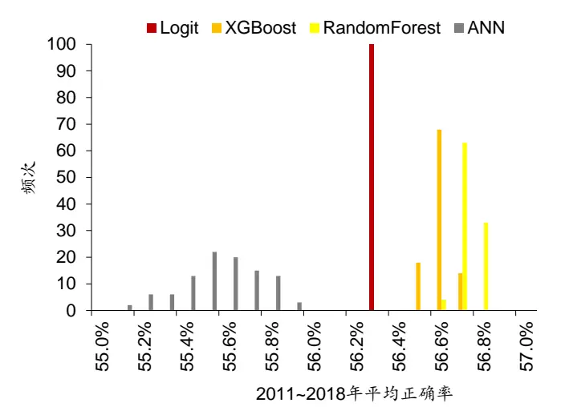
资料来源：Wind，华泰证券研究所

图表16： 2011~2018 年四种模型样本外平均 AUC 分布
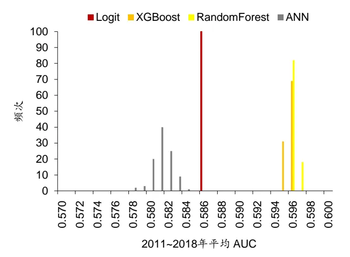
资料来源：Wind，华泰证券研究所

我们同时展示 2018 年 1~12 月的 12 个月末截面期对应测试月份（2018 年 2 月至 2019年 1 月）的平均正确率和 AUC 分布，如下图所示。

图表17： 2018年四种模型样本外平均正确率分布
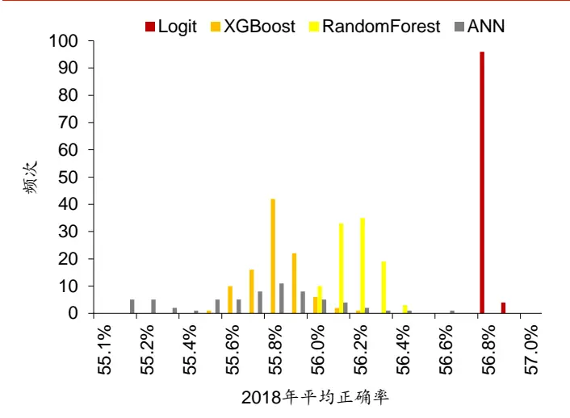
资料来源：Wind，华泰证券研究所

图表18： 2018年四种模型样本外平均 AUC分布
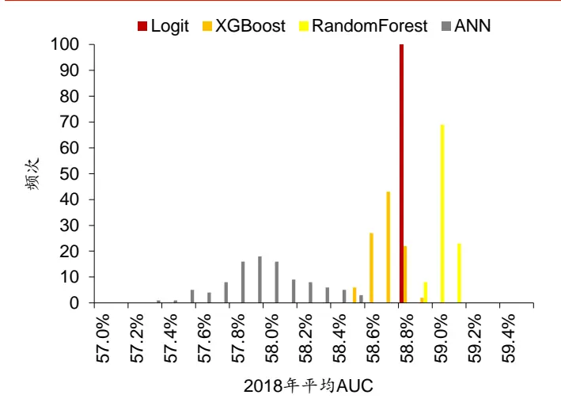
资料来源：Wind，华泰证券研究所

无论是全部样本外测试月份还是 2018 年的 12 个样本外测试月份，逻辑回归的正确率和AUC 分布相对较窄，全连接神经网络模型分布相对较宽，XGBoost 和随机森林分布大致相当，介于逻辑回归和全连接神经网络之间。上述结果表明，变更随机数种子时，逻辑回归的性能几乎不会发生变化，XGBoost 和随机森林的模型性能会在一定范围内波动，全连接神经网络的模型性能则可能发生较大变化，最差情况下可能产生一个百分点的变动。

## 回归法和IC值分析法

下面展示改变随机数种子对于回归法和 IC值分析法各项指标的影响。

图表19： 2011~2018 年四种模型平均 t 值分布
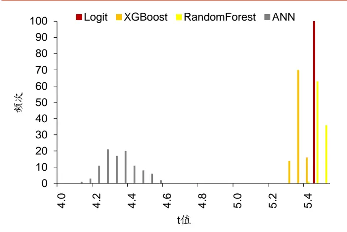
资料来源：Wind，华泰证券研究所

图表20： 2011~2018 年四种模型平均|t|值分布
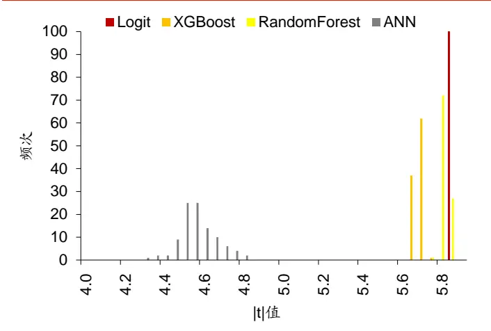
资料来源：Wind，华泰证券研究所

图表21： 2011~2018年四种模型平均因子收益率分布
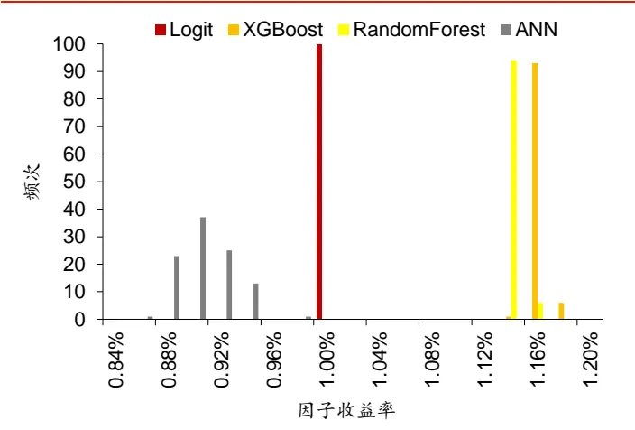
资料来源：Wind，华泰证券研究所

图表22： 2011~2018 年四种模型平均 Rank IC 分布
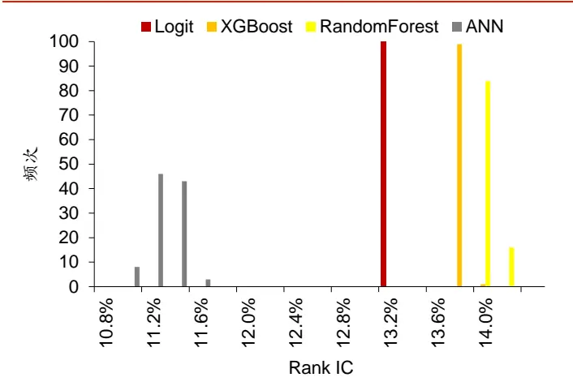
资料来源：Wind，华泰证券研究所

回归法和 IC 分析法的结果和模型性能结果基本一致，从分布宽度看，逻辑回归相对较窄，XGBoost 和随机森林次之，全连接神经网络相对较宽。这表明逻辑回归对随机数种子相对不敏感，全连接神经网络对随机数种子相对敏感。另外，从因子收益率和 Rank IC的分布位置看，XGBoost 和随机森林靠右侧，逻辑回归居中，全连接神经网络靠左侧。该结果表明 XGBoost 和随机森林这两种决策树的集成模型表现相对较好，全连接神经网络表现相对较差。

除了统计平均 Rank IC 外，我们还可以分析累积 Rank IC 随时间的变化情况。下图展示了每种模型 100 组结果的累积 Rank IC均值和±1 倍和±2 倍标准差区域（计算每个交易日100 个累积 Rank IC 的标准差，下同）。逻辑回归累积 Rank IC 的波动较低，XGBoost 和随机森林次之，全连接神经网络的波动较高。

图表23： 2011~2018 年逻辑回归模型累积 Rank IC 及波动情况
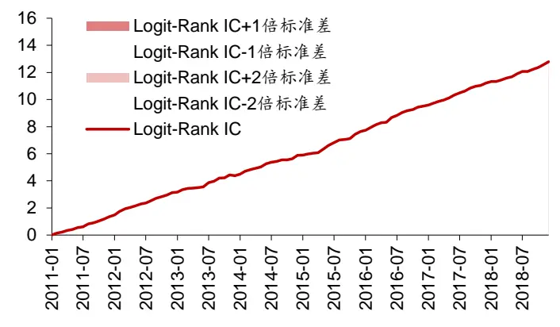
资料来源：Wind，华泰证券研究所

图表24： 2011~2018 年 XGBoost 模型累积 Rank IC 及波动情况
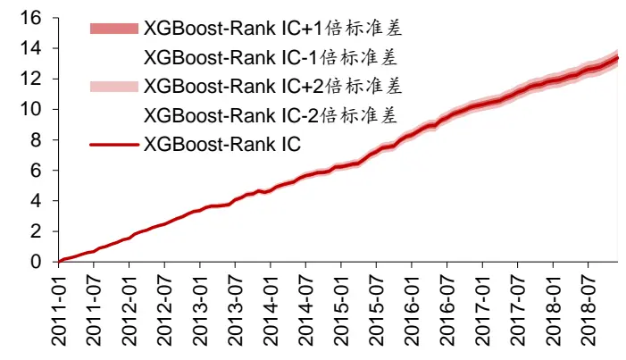
资料来源：Wind，华泰证券研究所

图表25： 2011~2018 年随机森林模型累积 Rank IC 及波动情况
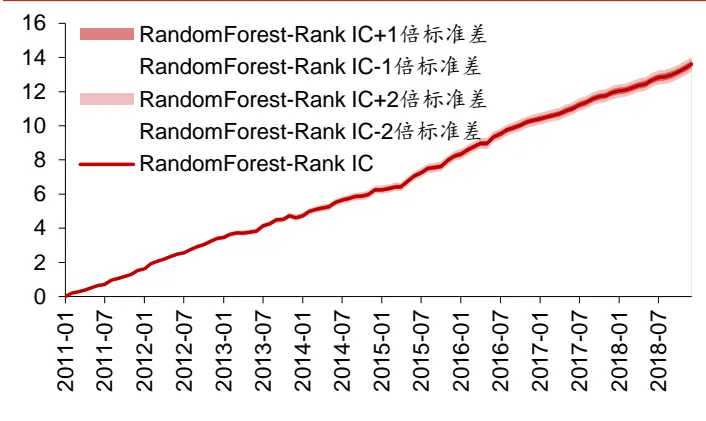
资料来源：Wind，华泰证券研究所

图表26： 2011~2018年全连接神经网络模型累积 Rank IC及波动情况
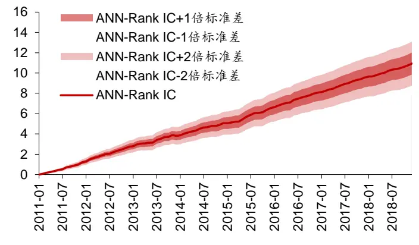
资料来源：Wind，华泰证券研究所

## 分层测试法

下面展示改变随机数种子对于分层测试法各项指标的影响。

图表27： 2011~2018年四种模型多空组合年化收益率分布
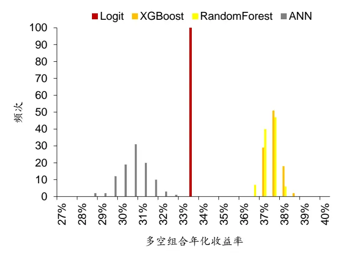
资料来源：Wind，华泰证券研究所

图表28： 2011~2018年四种模型多空组合夏普比率分布
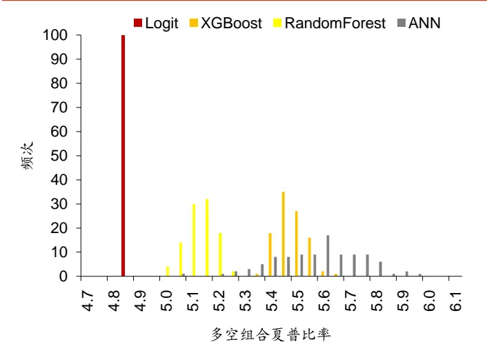
资料来源：Wind，华泰证券研究所

图表29： 2011~2018 年四种模型 Top 组合年化收益率分布
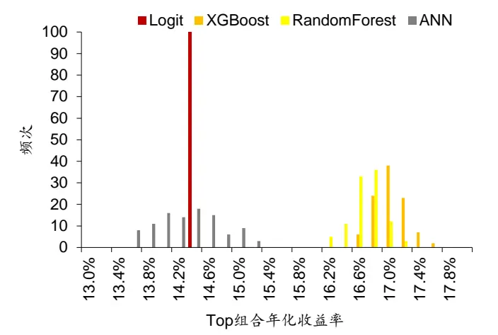
资料来源：Wind，华泰证券研究所

图表30： 2011~2018 年四种模型 Top 组合夏普比率分布
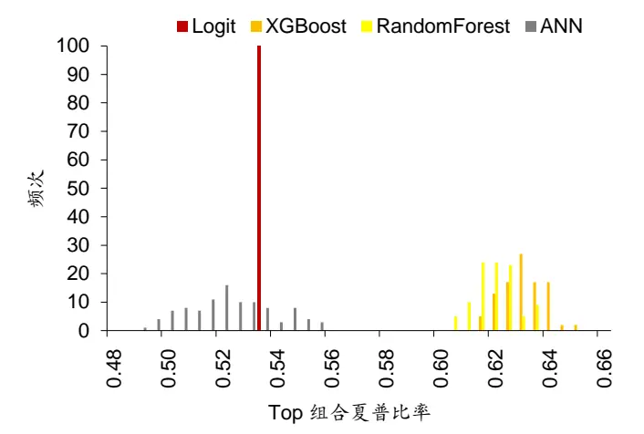
资料来源：Wind，华泰证券研究所

从回测表现看，当变更随机数种子时，逻辑回归的结果几乎不会发生变化，XGBoost 和随机森林的结果会在较窄的范围内波动，而全连接神经网络的结果面临较大的不确定性，Top组合最差和最好情形下的年化收益率相差甚至超过 1.5%，多空组合的最差和最好情形下的年化收益率相差超过 2%。

除统计多空组合的年化收益率和夏普比率外，我们还可以分析多空组合净值随时间的变化情况。下图展示了每种模型100组结果多空组合净值的均值和±1倍和±2倍标准差区域。

图表31： 2011~2018年逻辑回归模型多空组合净值及波动情况
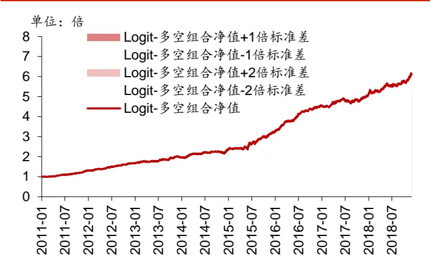
资料来源：Wind，华泰证券研究所

图表32： 2011~2018 年 XGBoost 模型多空组合净值及波动情况
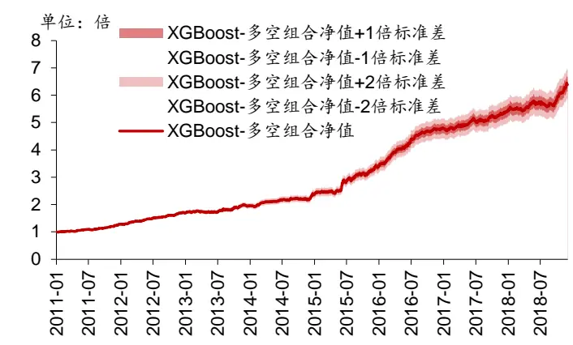
资料来源：Wind，华泰证券研究所

图表33： 2011~2018年随机森林模型多空组合净值及波动情况
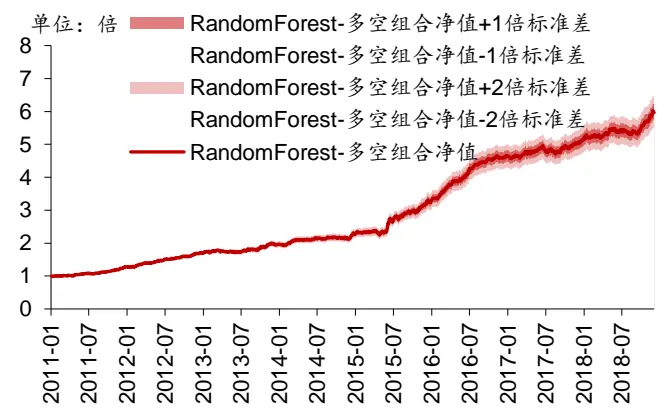
资料来源：Wind，华泰证券研究所

图表34： 2011~2018年全连接神经网络模型多空组合净值及波动情况
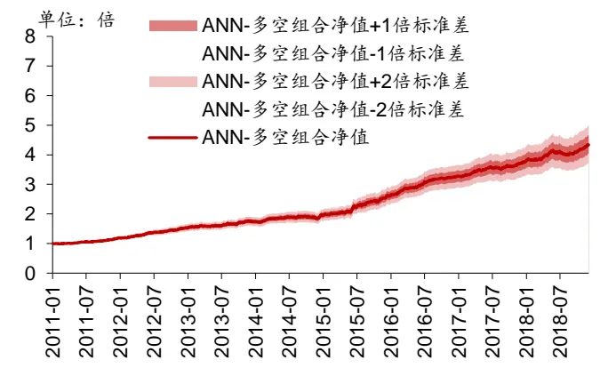
资料来源：Wind，华泰证券研究所

多空组合净值结果和累积 Rank IC 结果类似，当变更随机数种子时，逻辑回归的结果几乎不会发生变化，XGBoost 和随机森林的结果会在一定范围内波动，而全连接神经网络的结果面临较大的不确定性。

在实践中，我们不仅关注随机数种子变化对结果的平均影响，还关心最差或者最优情形下的结果。当我们针对单个随机数种子进行回测得到一条净值曲线时，它可能是最差的结果，实践中的结果大多数情形下都会更好；它也可能是最优的结果，实际几乎不可能出现这种情况；它也可能只是一个普通的结果，实践中有较大的概率能够实现。以下给出了四种模型对应的 100 组结果中总收益最差和最优两种极端情况下的净值表现。

图表35： 2011~2018年逻辑回归模型多空组合平均和最优最差净值
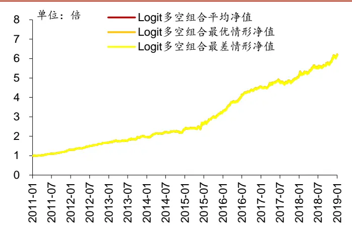
资料来源：Wind，华泰证券研究所

图表36： 2011~2018 年 XGBoost 模型多空组合平均和最优最差净值
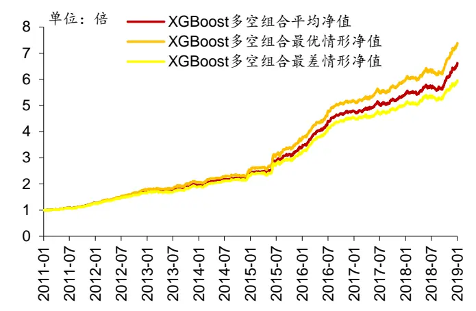
资料来源：Wind，华泰证券研究所

图表37： 2011~2018年随机森林模型多空组合平均和最优最差净值
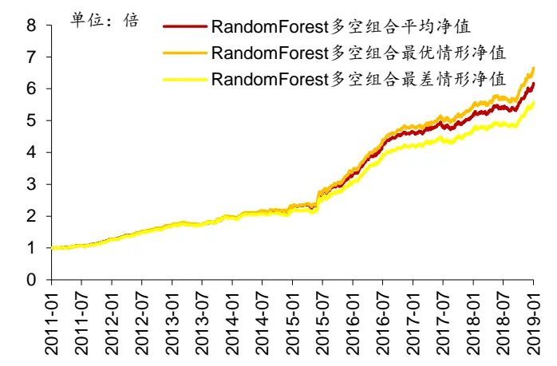
资料来源：Wind，华泰证券研究所

图表38： 2011~2018年全连接神经网络多空组合平均和最优最差净值
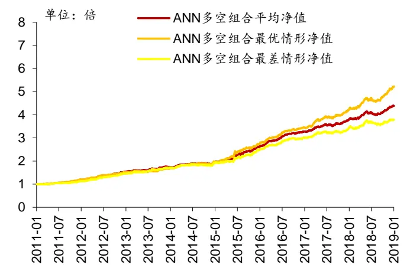
资料来源：Wind，华泰证券研究所

当变更随机数种子时，逻辑回归的结果几乎不会发生变化，最优情形和最差情形相当，与平均结果接近。对于全连接神经网络模型，模型最终结果的最差情形和最优情形都偏离均值较远。

## 不同随机性来源的横向比较

在华泰金工《人工智能 19：偶然中的必然：重采样技术检验过拟合》和本文中，我们提出了四种可能的机器学习选股模型随机性来源：1）样本内数据集中因子的随机扰动，2）样本外数据集因子的随机扰动，3）回测时间段的选择和 4）算法本身包含的随机数。如何衡量这四类随机性来源对结果的相对影响程度？

我们以 XGBoost 模型为例，分别展示 100 次 1）Bootstrap 样本内数据集，2）Bootstrap样本外数据集，3）Bootstrap 回测时间和 4）遍历随机数种子点的单因子测试指标的均值、标准差和变异系数，如下表所示。变异系数（coefficient of variation）用标准差除以均值衡量，相当于标准化后的标准差，目的在于使不同量纲的标准差可比。其中前三种随机性来源的结果取自《人工智能 19》，第四种随机性来源的结果取自本文。

比较四种随机性来源的变异系数，可知回测时间的变异程度较高，说明回测时间选择对模型表现的影响较大；样本外数据的变异程度居中，说明样本外数据的随机扰动对模型表现的影响一般；样本内数据和随机数种子的变异程度较低，说明样本内数据的随机扰动以及算法本身包含的随机数对模型表现的影响较小。

图表39： XGBoost模型四种随机性来源比较

| 回测指标 | 随机性来源 | It\|均值 | t均值 | 因子收益率 | Rank IC | 多空组合 | 多空组合 | Top 组合 年化收益率 | Top 组合 夏普比率 |
| --- | --- | --- | --- | --- | --- | --- | --- | --- | --- |
|  |  |  |  | 均值 | 均值 | 年化收益率 | 夏普比率 |  |  |
| 真实值 |  | 5.71 | 5.39 | 1.17% | 13.96% | 37.98% | 5.54 | 17.83% | 0.66 |
| 均值 | 样本内数据 | 5.62 | 5.29 | 1.13% | 13.75% | 36.94% | 5.42 | 17.26% | 0.64 |
|  | 样本外数据 | 5.79 | 5.39 | 1.17% | 13.88% | 37.61% | 5.16 | 15.85% | 0.58 |
|  | 回测时间 | 5.64 | 5.32 | 1.16% | 13.96% | 37.94% | 5.57 | 21.23% | 3.13 |
|  | 随机数种子 | 5.71 | 5.38 | 1.17% | 13.93% | 37.71% | 5.50 | 17.12% | 0.63 |
| 标准差 | 样本内数据 | 0.06 | 0.07 | 0.02% | 0.08% | 0.58% | 0.13 | 0.36% | 0.01 |
|  | 样本外数据 | 0.13 | 0.12 | 0.03% | 0.18% | 1.12% | 0.18 | 0.63% | 0.02 |
|  | 回测时间 | 0.36 | 0.41 | 0.10% | 0.81% | 3.20% | 0.48 | 13.45% | 1.99 |
|  | 随机数种子 | 0.02 | 0.02 | 0.01% | 0.03% | 0.32% | 0.05 | 0.21% | 0.01 |
| 变异系数 | 样本内数据 | 1.08% | 1.28% | 1.72% | 0.62% | 1.58% | 2.46% | 2.09% | 2.16% |
|  | (标准差/均值)样本外数据 | 2.18% | 2.26% | 2.42% | 1.27% | 2.98% | 3.45% | 3.96% | 4.03% |
|  | 回测时间 | 6.46% | 7.68% | 8.99% | 5.84% | 8.45% | 8.66% | 63.34% | 63.52% |
|  | 随机数种子 | 0.37% | 0.42% | 0.47% | 0.20% | 0.85% | 0.95% | 1.25% | 1.25% |

资料来源：Wind，华泰证券研究所

总的来看，尽管算法中的随机数是机器学习选股模型随机性的重要来源，它对 XGBoost模型最终结果的影响程度并不高。我们建议对于简单模型（如逻辑回归）或者已证实随机数影响程度不高的模型（如 XGBoost），策略开发过程中仅使用固定的单个随机数种子即可。对于复杂模型或者随机数影响程度较大的模型，可取的做法是综合考虑多个随机数种子下的结果。

## 总结

机器学习中引入随机数具有重要意义，或是为了保证损失函数更易达到最优解，或是为了避免极端值对模型训练造成的不良影响，或是为了产生具有差异性的样本以便进一步集成等，最终目的都在于增强模型的泛化能力。实际训练中固定随机数种子的做法虽然保证了结果的可重复性，但是掩盖了随机数本身对模型的影响——即掩盖了“必然中的偶然”。

本文测试分析了 100 组不同随机数种子下逻辑回归、XGBoost、随机森林和全连接神经网络四种机器学习选股模型的性能和单因子回测表现，发现当随机数种子变化时，逻辑回归的结果几乎保持不变，而全连接神经网络模型的结果可能会发生较大变化，XGBoost 和随机森林模型的结果在一定范围内发生变化。

得到这样的结果并不意外。逻辑回归在使用随机梯度下降算法优化损失函数时引入了随机数，由于优化目标是标准的凸函数，优化算法最终大概率会收敛到唯一的理论最优参数附近，因而结果几乎不会发生变化。神经网络模型涉及大量的参数，在初始化神经元权重，利用优化算法最小化损失函数，前向传播进行 Dropout 等环节均引入了随机数，模型整体具有较大的不确定性。和神经网络模型类似，XGBoost 和随机森林模型也具有较高的复杂度，行列采样环节涉及随机数，但是由于这两种模型本身进行了集成，相当于对结果求平均，因此结果的不确定性有所降低。

本文的启示在于：单个随机数种子下逻辑回归的结果较为可靠；单个随机数种子下全连接神经网络的结果具有较大的不确定性，得到一个较差结果时不应轻易否定模型本身的价值，而得到一个较好结果时不应轻信模型的表现，可取的做法是综合考虑多个随机数种子下的结果；对于 XGBoost 和随机森林模型，由随机数种子造成的结果不确定性介于逻辑回归和全连接神经网络之间，投资者应认识到结果本身可能存在的随机数种子选择偏差。

## 风险提示

机器学习选股方法是对历史投资规律的挖掘，若未来市场投资环境发生变化导致基学习器失效，则该方法存在失效的可能。机器学习存在一定过拟合风险。当机器学习算法涉及随机数时，不同随机数种子可能得到不同结果。

## 免责申明

本报告仅供华泰证券股份有限公司（以下简称“本公司”）客户使用。本公司不因接收人收到本报告而视其为客户。

本报告基于本公司认为可靠的、已公开的信息编制，但本公司对该等信息的准确性及完整性不作任何保证。本报告所载的意见、评估及预测仅反映报告发布当日的观点和判断。在不同时期，本公司可能会发出与本报告所载意见、评估及预测不一致的研究报告。同时，本报告所指的证券或投资标的的价格、价值及投资收入可能会波动。本公司不保证本报告所含信息保持在最新状态。本公司对本报告所含信息可在不发出通知的情形下做出修改，投资者应当自行关注相应的更新或修改。

本公司力求报告内容客观、公正，但本报告所载的观点、结论和建议仅供参考，不构成所述证券的买卖出价或征价。该等观点、建议并未考虑到个别投资者的具体投资目的、财务状况以及特定需求，在任何时候均不构成对客户私人投资建议。投资者应当充分考虑自身特定状况，并完整理解和使用本报告内容，不应视本报告为做出投资决策的唯一因素。对依据或者使用本报告所造成的一切后果，本公司及作者均不承担任何法律责任。任何形式的分享证券投资收益或者分担证券投资损失的书面或口头承诺均为无效。

本公司及作者在自身所知情的范围内，与本报告所指的证券或投资标的不存在法律禁止的利害关系。在法律许可的情况下，本公司及其所属关联机构可能会持有报告中提到的公司所发行的证券头寸并进行交易，也可能为之提供或者争取提供投资银行、财务顾问或者金融产品等相关服务。本公司的资产管理部门、自营部门以及其他投资业务部门可能独立做出与本报告中的意见或建议不一致的投资决策。

本报告版权仅为本公司所有。未经本公司书面许可，任何机构或个人不得以翻版、复制、发表、引用或再次分发他人等任何形式侵犯本公司版权。如征得本公司同意进行引用、刊发的，需在允许的范围内使用，并注明出处为“华泰证券研究所”，且不得对本报告进行任何有悖原意的引用、删节和修改。本公司保留追究相关责任的权力。所有本报告中使用的商标、服务标记及标记均为本公司的商标、服务标记及标记。

本公司具有中国证监会核准的“证券投资咨询”业务资格，经营许可证编号为：91320000704041011J。

全资子公司华泰金融控股（香港）有限公司具有香港证监会核准的“就证券提供意见”业务资格，经营许可证编号为：AOK809

©版权所有 2019年华泰证券股份有限公司

## 评级说明

## 行业评级体系

－报告发布日后的6个月内的行业涨跌幅相对同期的沪深300指数的涨跌幅为基准；

－投资建议的评级标准

增持行业股票指数超越基准

中性行业股票指数基本与基准持平

减持行业股票指数明显弱于基准

## 公司评级体系

－报告发布日后的6个月内的公司涨跌幅相对同期的沪深300指数的涨跌幅为基准；
－投资建议的评级标准
买入股价超越基准 20%以上
增持股价超越基准 5%-20%
中性股价相对基准波动在-5%~5%之间
减持股价弱于基准 5%-20%
卖出股价弱于基准 20%以上

## 华泰证券研究

## 南京

南京市建邺区江东中路228号华泰证券广场1号楼/邮政编码：210019

电话：86 25 83389999 /传真：86 25 83387521

电子邮件：ht-rd@htsc.com

## 深圳

深圳市福田区益田路5999号基金大厦10楼/邮政编码：518017

电话：86 755 82493932 /传真：86 755 82492062

电子邮件：ht-rd@htsc.com

## 北京

北京市西城区太平桥大街丰盛胡同28号太平洋保险大厦A座18层

邮政编码：100032

电话：86 10 63211166/传真：86 10 63211275

电子邮件：ht-rd@htsc.com

## 上海

上海市浦东新区东方路18号保利广场E栋23楼/邮政编码：200120

电话：86 21 28972098 /传真：86 21 28972068

电子邮件：ht-rd@htsc.com