## 金工研究/深度研究

2019年06月10日

林晓明 执业证书编号：S0570516010001

研究员 0755-82080134

陈烨 执业证书编号：S0570518080004

研究员 010-56793942

李子钰 0755-23987436

联系人 liziyu@htsc.com

何康 021-28972039

联系人 hekang@htsc.com

3《金工: A股市场低开现象研究》2019.05

# 基于遗传规划的选股因子挖掘

# 华泰人工智能系列之二十一

本文通过原理分析和系统测试，介绍了遗传规划在选股因子挖掘中的应用遗传规划是一种启发式的公式演化技术，通过模拟自然界中遗传进化的过程来逐渐生成契合特定目标的公式群体，适合进行特征工程。将遗传规划运用于选股因子挖掘时，可以充分利用计算机的强大算力，同时突破人类的思维局限，挖掘出某些隐藏的、难以通过人脑构建的因子。本文介绍了遗传规划应用的完整流程，对遗传规划程序包 gplearn 进行了深度定制改进。测试结果显示，遗传规划能从有限的量价数据中挖掘出具有增量信息的因子，为选股因子研究提供了一种新的思路。

针对因子挖掘问题，本文对遗传规划程序包 gplearn 进行了深度定制改进本文在遗传规划的应用中做出了以下贡献：(1)应用成熟的 gplearn 项目，对 gplearn 的关键参数进行了详细说明。(2)扩充了 gplearn 中的函数集，添加了一批适合于构造选股因子的函数。(3)将单因子测试过程引入gplearn，可以对待挖掘因子进行传统风格因子中性化。(4)使用了 Python的并行运算技术，加快了因子矩阵的运算速度，缩短了因子挖掘时间。

经过测试，遗传规划能从有限的量价数据中挖掘出具有增量信息的因子在遗传规划框架中，我们设定预测目标为个股20个交易日后的收益率，初步挖掘出了6个选股因子。这些因子在剔除了行业、市值、过去20日收益率、过去 20 日平均换手率、过去 20 日波动率五个因子的影响后，依然具有较稳定的 RankIC。6 个因子都具有良好的可解释性，其中大部分因子的相关性不高，说明遗传规划能从有限的量价数据中挖掘出具有增量信息的因子。

遗传规划是一套灵活的框架，或许能为选股因子研究提供更多的可能性本着“授人以鱼不如授人以渔”的想法，本文旨在为读者展示遗传规划在选股因子挖掘中的详细流程，流程中的各环节依然有较大的调整空间。在实际应用中，读者可以根据自己特定的数据源、股票池、调仓周期、函数集以及评价指标来构建遗传规划框架。作为一种“先有公式、后有逻辑”的因子研究方法，遗传规划或许能为选股因子研究提供更多的可能性。

风险提示：通过遗传规划挖掘的选股因子是历史经验的总结，存在失效的可能。遗传规划所得因子可能过于复杂，可解释性降低，使用需谨慎。本文仅对因子在全部 A股内的选股效果进行测试，测试结果不能直接推广到其它股票池内。

## 本文研究导读

在华泰金工人工智能系列前期的报告中，我们重点研究人工智能算法在多因子选股中因子合成方面的应用。本文则从一个新的角度出发，探索如何使用人工智能算法进行选股因子挖掘。在众多人工智能算法中，遗传规划(genetic programming)借鉴了生物进化的过程，是一种适合进行特征工程的算法。本文将详细讨论如何在股票量价数据中使用遗传规划进行选股因子挖掘。本文将主要关注以下三个问题：

1. 遗传规划的基本原理是什么？有哪些重要的参数？

2. 在将遗传规划运用于选股因子挖掘时，需要进行哪些定制化改进？

3. 遗传规划所得选股因子的表现如何？因子的含义如何解读？

## 遗传规划简介

物竞天择，适者生存。——《天演论》

遗传规划(genetic programming)是演化算法(evolutionary algorithm)的分支，是一种启发式的公式演化技术。遗传规划从随机生成的公式群体开始，通过模拟自然界中遗传进化的过程，来逐渐生成契合特定目标的公式群体。作为一种监督学习方法，遗传规划可以根据特定目标，发现某些隐藏的、难以通过人脑构建出的数学公式。传统的监督学习算法主要运用于特征与标签之间关系的拟合，而遗传规划则更多运用于特征挖掘(特征工程)。

在量化多因子选股领域中，选股因子的挖掘是一个关注度经久不衰的主题。以往的因子研究中，人们一般从市场可见的规律和投资经验入手，进行因子挖掘和改进，即“先有逻辑、后有公式”的方法，常见的因子如估值、成长、财务质量、波动率等都是通过这种方法研究得出的。随着市场可用数据的增多和机器学习等先进技术的发展，我们可以借助遗传规划的方法在海量数据中进行探索，通过“进化”的方式得出一些经过检验有效的选股因子，再试图去解释这些因子的内涵，即“先有公式、后有逻辑”的方法。以上两种方式对应于选股因子研究方法中的“演绎法”与“归纳法”，都有一定的存在基础。而后者的优势在于可以充分利用计算机的强大算力进行启发式搜索，同时突破人类的思维局限，挖掘出某些隐藏的、难以通过人脑构建的因子，为因子研究提供更多的可能性。

## 遗传规划的总体流程

图表 1展示了遗传规划的总体流程。一开始，一组未经选择和进化的原始公式会被随机生成(第一代公式)，通过某种规则计算每个公式的适应度，从中选出适合的个体作为下一代进化的父代。这些被选择出来的父代通过多种方法进化，形成不同的后代公式，然后循环进行下一轮进化。随着迭代次数的增长，公式不断繁殖、变异、进化，从而不断逼近数据分布的真相。

图表1： 遗传规划的总体流程
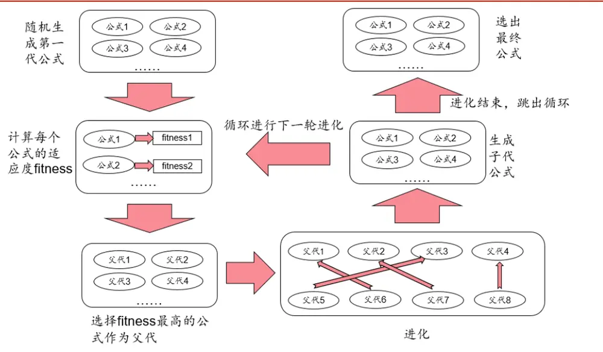
资料来源：华泰证券研究所

## 遗传规划中公式的表示方式

为了方便进行公式的进化，遗传规划中的公式一般会被表示成二叉树的形式。假设有特征X0和 X1，需要预测目标 y。一个可能的公式是：

$$
y=X_{0}^{2}-3\times X_{1}+0.5
$$

在遗传规划中上式用 S-表达式(S-expression)表示：

$$
y=(+(-(\times X_{0}X_{0})(\times3X_{1}))0.5)
$$

公式里包括了变量(X0和 X1)、函数(加、减、乘)和常数(3 和 0.5)。我们可以把公式表示为一个二叉树，如图表 2 所示：

图表2： 公式树
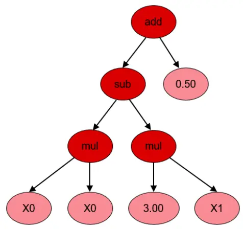
资料来源：gplearn，华泰证券研究所

在这个二叉树里，所有的叶子都是变量或者常数，内部节点则是函数。树内的任意子树都可以被修改或替代。公式的输出值可以用递归的方法求得。

## 遗传规划中的适应度

类比于自然界中个体对其生存环境的适应程度，在遗传规划中，每个公式也有自己的适应度，适应度衡量了公式运算结果与给定目标的相符程度，是公式进化的重要参考指标。在不同的应用中，可以定义不同的适应度，例如对于回归问题，可以使用公式结果和目标值之间的均方误差为适应度，对于分类问题，可以使用公式结果和目标值之间的交叉熵为适应度。对于使用遗传规划生成的选股因子来说，可以使用因子在回测区间内的平均 RankIC或因子收益率来作为适应度。

## 遗传规划中公式的进化方法

遗传规划的核心步骤是公式的进化，算法会参照生物进化的原理，使用多种方式对公式群体进行进化，来生成多样性的、更具适应性的下一代公式群体。本节将依次介绍这些进化方法。

## 交叉

交叉是在两个已有公式树之间生成子树的方法，是最常用也最有效的进化方式。交叉需要通过两次选取找到父代和捐赠者，如图表 3所示，首先选取适应度最高的公式树 A作为父代，从中随机选择子树 A1进行替换； 然后在剩余公式树中找到适应度最高的公式树 B作为捐赠者，从中随机选择子树 B1，并将其插入到公式树 A中替换 A1以形成后代。

图表3： 交叉
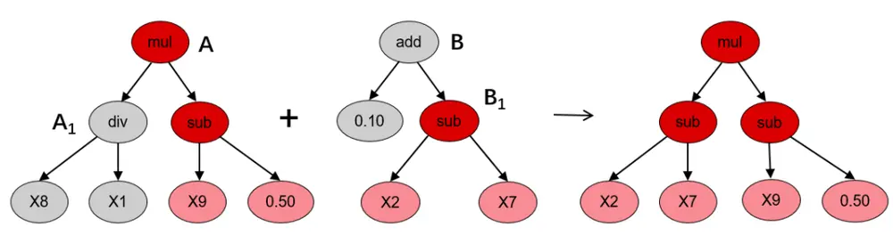
资料来源：gplearn，华泰证券研究所

## 子树变异

子树变异是一种激进的变异操作，父代公式树的子树可以被完全随机生成的子树所取代。这可以将已被淘汰的公式重新引入公式种群，以维持公式多样性。如图表 4 所示，子树变异选择适应度最高的公式树 A 作为父代，从中随机选择子树 A 进行替换，然后随机生成用以替代的子树 B，并将其插入到公式树 A中以形成后代。

图表4： 子树变异
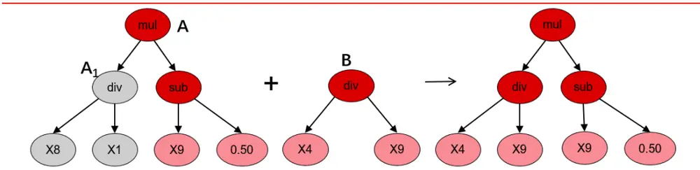
资料来源：gplearn，华泰证券研究所

## 点变异

点变异是另一种常见的变异形式。与子树变异一样，它也可以将已淘汰的公式重新引入种群中以维持公式多样性。如图表 5所示，点变异选取适应度高的父代公式树 A，并从中随机选择节点和叶子进行替换。叶子 A2被其他叶子替换，并且某一节点 A1上的公式被与其含有相同参数个数的公式所替换，以此形成后代。

图表5： 点变异
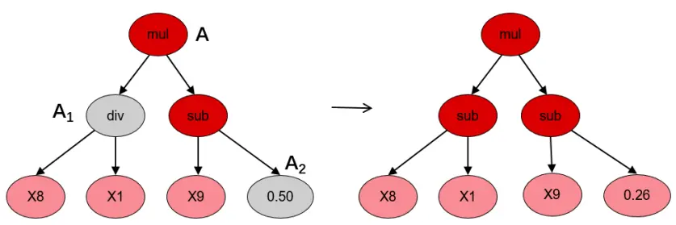
资料来源：gplearn，华泰证券研究所

## Hoist 变异

Hoist(提升)变异是一种对抗公式树过于复杂的方法。这种变异的目的是从公式树中移除部分叶子或者节点，以精简公式树。如图表 6 所示，Hoist 变异选取适应度高的父代公式树A 并从中随机选择子树 A1。然后从该子树中随机选取子树 A11，并将其“提升”到原来子树 A1的位置，以此形成后代。

图表6： Hoist 变异
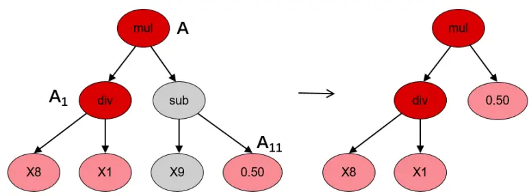
资料来源：gplearn，华泰证券研究所

## gplearn 的简介和改进

## gplearn 的简介和关键参数说明

gplearn(https://gplearn.readthedocs.io)是目前最成熟的 Python 遗传规划项目之一。gplearn 提供类似于 scikit-learn 的调用方式，并通过设置多个参数来完成特定功能。图表7 展示了 gplearn 的主要参数。

图表7： gplearn 的主要参数

| 参数名称 | 定义 |
| --- | --- |
| generations | 公式进化的世代数量。 |
| population_size | 每一代公式群体中的公式数量。 |
| n_components | 最终筛选出的最优公式数量。 |
| hall_of_fame | 选定最后的 n_components 个公式前，提前筛选出的备选公式的数量，n_components < hall_of_fame < population_size。 |
| function_set | 用于构建和进化公式时使用的函数集。 |
| parsimony_coefficient | 节俭系数，用于惩罚过于复杂的公式。 |
| tournament_size | 每一代的所有公式中，tournament_size个公式会被随机选中，其中适应度最高的公式能进行变异或繁殖生成下一代公式。 |
| random_state init_depth | 随机数种子。 |
|  | 公式树的初始化深度，init_depth 是一个二元组(min_depth，max_depth)，树的初始深度将处在[min_depth， max_depth] 区间内。 |
| metric const_range | 适应度指标。 |
| p_crossover | 公式中常数的取值范围，默认为(-1,1)，如果设置为None，则公式中不会有常数。 交叉变异概率，即父代进行交叉变异进化的概率。 |
| p_subtree_mutation | 子树变异概率，即父代进行子树变异进化的概率。 |
| p_hoist_mutation | Hoist 变异概率，即父代进行Hoist变异进化的概率。 |
| p_point_mutation | 点变异概率，即父代进行点变异进化的概率。 |
| p_point_replace |  |
|  | 点替代概率，即点变异中父代每个节点进行变异进化的概率。 |

资料来源：gplearn，华泰证券研究所

## gplearn 的改进

gplearn 提供了一套简洁、规范的遗传规划实现代码，但是不能直接运用于选股因子的挖掘。我们从源代码的层面，对 gplearn 进行了深度改进，使得其能运用于选股因子的挖掘。

首先，我们扩充了 gplearn 的函数集(function_set)，提供了更多特征计算方法，以提升其因子挖掘能力。除了 gplearn 提供的基础函数集(加、减、乘、除、开方、取对数、绝对值等)，我们还自定义了一些函数(包括多种时间序列运算函数，这是 gplearn 不支持的)，函数列表详细展示在图表 8 中。

其次，我们改进了 gplearn 使得其能进行单因子测试。在测试过程中，还可以对待挖掘因子进行传统风格因子中性化。另外，遗传规划由于涉及到大量的随机操作，时间开销较大，我们还使用了 Python 中的并行运算技术，加快了因子矩阵的运算速度，缩短了因子挖掘时间。

图表8： 函数列表

| 类型 | 名称 | 定义 |
| --- | --- | --- |
|  | X：以下函数中自变量 | X一般可以理解为向量{Xi}1≤i≤N，代表N只个股在某指定截面日的因子值，例如： X=CLOSE+OPEN；若X为矩阵，则以下函数可以理解为对每个列向量分别进行运算，再将结果 |
| 基础函数 | add(X, Y) | 按列合并。 返回值为向量，其中第i个元素为Xi+Yi |
| 基础函数 | sub(X, Y) | 返回值为向量，其中第i个元素为Xi-Yi |
| 基础函数 | mul(X, Y) | 返回值为向量，其中第i 个元素为Xj*Y(对应 matlab 中的点乘) |
| 基础函数 | div(X, Y) | 返回值为向量，其中第i 个元素为Xi/Yi(对应 matlab 中的点除) |
| 基础函数 | abs(X) | 返回值为向量，其中第i个元素为Xi的绝对值 |
| 基础函数 | sqrt(X) | 返回值为向量，其中第i个元素为 abs(Xi)的开方 |
| 基础函数 | log(X) | 返回值为向量，其中第i 个元素为 abs(Xi)的对数 |
| 基础函数 | inv(X) | 返回值为向量，其中第i个元素为Xi的倒数 |
| 自定义函数 | rank(X) | 返回值为向量，其中第i个元素为Xi在向量X中的分位数。 |
| 自定义函数 | delay(X, d) | 返回值为向量，d天以前的X值。 |
| 自定义函数 | correlation(X, Y, d) | 返回值为向量，其中第i个元素为过去d天Xi值构成的时序数列和Yi值构成的时序数列的相关系数。 |
| 自定义函数 | covariance(X, Y, d) | 返回值为向量，其中第i个元素为过去d天Xi值构成的时序数列和Y值构成的时序数列的协方差。 |
| 自定义函数 | scale(X, a) | 返回值为向量 a*X/sum(abs(x))，a 的缺省值为 1，一般 a 应为正数。 |
| 自定义函数 | delta(X, d) | 返回值为向量 X - delay(X, d)。 |
| 自定义函数 自定义函数 | signedpower(X, a) | 返回值为向量sign(X).*(abs(X).^a)，其中.*和.^两个运算符代表向量中对应元素相乘、元素乘方。 |
|  | decay_linear(X, d) | 返回值为向量，其中第i个元素为过去d天Xi值构成的时序数列的加权平均值，权数为d, d-1，..., 1(权数之和应为1，需进行归一化处理)，其中离现在越近的日子权数越大。 |
| 自定义函数 | indneutralize(X, indclass) | 返回值为向量，对X进行行业中性化处理，indclass取为中信一级行业。 |
| 自定义函数 | ts_min(X, d) | 返回值为向量，其中第i个元素为过去d天Xi值构成的时序数列中最小值。 |
| 自定义函数 | ts_max(X, d) | 返回值为向量，其中第i个元素为过去d天Xi值构成的时序数列中最大值。 |
| 自定义函数 | ts_argmin(X, d) | 返回值为向量，其中第i个元素为过去d天X值构成的时序数列中最小值出现的位置。 |
| 自定义函数 | ts_argmax(X, d) | 返回值为向量，其中第i个元素为过去d天Xi值构成的时序数列中最大值出现的位置。 |
| 自定义函数 | ts_rank(X, d) | 返回值为向量，其中第i个元素为过去d天Xi值构成的时序数列中本截面日Xi值所处分位数。 |
| 自定义函数 | ts_sum(X, d) | 返回值为向量，其中第i个元素为过去d天Xi值构成的时序数列之和 |
| 自定义函数 | ts_product(X, d) | 返回值为向量，其中第i个元素为过去d天Xi值构成的时序数列的连乘乘积。 |
| 自定义函数 | ts_stddev(X, d) | 返回值为向量，其中第i个元素为过去d天Xi值构成的时序数列的标准差。 |

资料来源：gplearn，华泰证券研究所

## 遗传规划选股因子挖掘的测试流程

测试流程包含下列步骤：

1. 数据获取和特征提取：

1) 股票池：全 A股，剔除 ST、PT 股票，剔除每个截面期下一交易日停牌的股票。

2) 回测区间：2010/1/4～2019/5/31。

3) 因子列表如图表 9 所示，都是个股的原始量价信息，未经过特征工程。

4) 预测目标：个股 20 个交易日后的收益率。

图表9： 原始因子列表

| 名称 | 定义 |
| --- | --- |
| RETURNS | 个股日频收益率(由相邻两个交易日的后复权收盘价计算得来)。 |
| OPEN,CLOSE,HIGH,LOW,VOLUME | 个股日频开盘价、收盘价、最高价、最低价、成交量。 |
| VWAP | 个股日频成交量加权平均价。 |

资料来源：Wind，华泰证券研究所

## 2. 使用遗传规划进行因子挖掘：

1) 使用图表 9 中的因子和图表 8 中的函数集，生成大量公式，并按照图表 1 的流程进行公式的进化和筛选。

2) 公式适应度的计算：假设有公式 F，得出该公式在截面 t上对所有个股因子向量 $F_{t}$ 后，我们会对因子进行以下处理：

a) 中位数去极值：设 $.F_{M}$ 为该向量中位数， $F_{M1}$ 为向量 $|F_{t}-F_{M}|$ 的中位数，则将向量 $F_{t}$ 中所有大于 $F_{M}+5F_{M1}$ 的数重设为 $F_{M}+5F_{M1}$ ，将向量 $F_{t}$ 中所有小于 $F_{M}-$ $5F_{M1}$ 的数重设为 $F_{M}-5F_{M1}$ ；

b) 中性化：在每个截面 t上，对 $F_{t}$ 进行行业、市值、20日收益率、20 日换手率、20 日波动率中性化，以剔除以上五个因子的影响。

c) 标准化：将经过以上处理后的因子暴露度序列减去其现在的均值、除以其标准差，得到一个新的近似服从 N(0,1)分布的序列。

经过以上处理后，计算处理后因子在每个截面上与 20 个交易日后收益率的 RankIC，取 RankIC均值为公式 F 的适应度。

3. 对遗传规划挖掘出的因子，进行更详细的单因子测试，包含 IC 测试、回归测试和分层测试。尝试对因子含义进行解释。

4. 对遗传规划挖掘出的因子进行 IC值衰减分析，相关性分析。

## 遗传规划的主要参数设置和测试结果

本文的遗传规划中主要参数设置在图表 10 中。遗传规划与其他机器学习算法不同，其参数难以使用网格搜索寻优，主要根据计算机算力和实际因子挖掘结果调整。

图表10： 遗传规划的主要参数设置

| 参数名称 | 定义和参数设置说明 | 参数设置 |
| --- | --- | --- |
| generations | 公式进化的世代数量。世代数量越多，消耗算力越多，公式的进化次数越多。 | 3 |
| population_size | 每一代公式群体中的公式数量。公式数量越大，消耗算力越多，公式之间组合的空间越大。 | 1000 |
| function_set | 用于构建和进化公式时使用的函数集，可自定义更多函数。 | 使用图表8中的函数集 |
| init_depth | 公式树的初始化深度，init_depth是一个二元组(min_depth，max_depth)，树的初始深度将处在 [min_depth，max_depth]区间内。设置树深度最小1层，最大4层。最大深度越深，可能得出越 | (1,4) |
| tournament_size | 复杂的因子，但是因子的意义更难解释。 每一代的所有公式中，tournament_size个公式会被随机选中，其中适应度最高的公式能进行变 | 20 |
| metric | 异或繁殖生成下一代公式。tournament_size越小，随机选择范围越小，选择的结果越不确定 适应度指标，可自定义更多指标。 | 自定义的 RankIC 指标 |
| p_crossover | 父代进行交叉变异进化的概率。交叉变异是最有效的进化方式，可以设置为较大概率。 | 0.4 |
| p_subtree_mutation | 父代进行子树变异进化的概率。子树变异的结果不稳定，概率不宜过大。 | 0.01 |
| p_hoist_mutation | 父代进行Hoist变异进化的概率。本文的测试中公式树层次都较低，所以没有使用Hoist变异。 | 0 |
| p_point_mutation | 父代进行点变异进化的概率。点变异的结果不稳定，概率不宜过大。 | 0.01 |
| p_point_replace | 即点变异中父代每个节点进行变异进化的概率。点变异的概率已经很小，可设置为较大概率保证 | 0.4 |
|  | 点变异的执行。 |  |

资料来源：gplearn，华泰证券研究所

在遗传规划的运行过程中，我们可以监控公式群体的一些统计信息来得知当前公式进化的状况。图表 11 展示了某次测试中的统计信息。可以看出，公式进化到了第三代，第一代公式是随机生成的，平均长度较长，平均适应度很低。第二代公式平均长度减小，平均适应度明显提升。第三代公式在第二代公式的基础上继续进化，平均长度稍长，平均适应度继续提升。

图表11： 遗传规划测试过程的统计信息

| 世代 | 公式群体的平均长度 | 公式群体平均适应度 |
| --- | --- | --- |
| 1 | 7.86 | 0.81% |
| 2 | 4.57 | 1.86% |
| 3 | 5.35 | 2.43% |

资料来源：Wind，华泰证券研究所

我们的测试在一台有 2个 E5-2650 处理器的计算机上进行，1000 个公式进化 3代耗时约14 个小时。图表 12展示了遗传规划挖掘出的选股因子。在计算适应度(RankIC)时，因子已经进行了行业、市值、20 日收益率、20 日换手率、20 日波动率中性化。

图表12： 遗传规划挖掘出的选股因子

| 因子名称 因子表达式 |  | 适应度 |
| --- | --- | --- |
| Alpha1 | correlation(div(vwap, high), high, 10) | 3.83% |
| Alpha2 | ts_sum(rank(correlation(high, low, 20)),20) | 3.95% |
| Alpha3 | -ts_stddev(volume, 5) | 3.67% |
| Alpha4 | -mul(rank(covariance(high, volume, 10)), rank(ts_stddev(high, 10))) | 3.41% |
| Alpha5 | -mul(ts_sum( rank(covariance(high, volume, 5)), 5), rank(ts_stddev(high, 5)) | 2.94% |
| Alpha6 | ts_sum(div(add(high,low)), close), 5) | 2.45% |

资料来源：Wind，华泰证券研究所

## 遗传规划所得因子的单因子测试

本章中，我们首先介绍单因子测试方法。然后详细展示图表 12中因子的单因子测试结果，并尝试对因子的含义进行解释。

单因子测试方法简介

回归法

回归法是一种最常用的测试因子有效性的方法，具体做法是将第T期的因子暴露度向量与T+1期的股票收益向量进行线性回归，所得到的回归系数即为因子在T期的因子收益率，同时还能得到该因子收益率在本期回归中的显著度水平——t 值。在某截面期上的个股的因子暴露度(Factor Exposure)即指当前时刻个股在该因子上的因子值。第T期的回归模型具体表达式如下。

$$
r^{T+1}=X^{T}a^{T}+\sum_{j}Indus_{j}^{T}b_{j}^{T}+ln\_mkt^{\mathsf{T}}b^{T}+\varepsilon^{T}
$$

$r^{T+1}$ :所有个股在第T+1期的收益率向量

$X^{T}$ :所有个股第T期在被测单因子上的暴露度向量

IndusjT: 所有个股第 T 期在第 j 个行业因子上的暴露度向量(0/1 哑变量)

$ln\_mkt^{\mathrm{T}};$ :所有个股第T期在对数市值因子上的暴露度向量

$a^{T},b^{T},b_{j}^{T}$ :对应因子收益率，待拟合常数，通常比较关注 $a^{T}$

$\varepsilon^{T}$ :残差向量

在所有截面期上，我们对因子 X进行回归测试，能够得到该因子的因子收益率序列(即所有截面期回归系数 $|a^{T}|$ 构成的序列)和对应的 t 值序列。t 值指的是对单个回归系数 $|a^{T}|$ 的 t 检验统计量，描述的是单个变量显著性，t 值的绝对值大于临界值说明该变量是显著的，即该解释变量(T期个股在因子 X的暴露度)是真正影响因变量(T+1期个股收益率)的一个因素。也就是说，在每个截面期上，对于每个因子的回归方程，我们设

$$
假设检验$\mathbf{\nabla}H_{0}\mathbf{:}\mathbf{\nabla}a^{T}=0$
$$

$$
备择假设$H_{1}\mathrm{:}\quad a^{T}\neq0$
$$

该假设检验对应的 t统计量为

$$
\mathbf{t}={\frac{a^{T}}{SE(a^{T})}}
$$

其中 $SE(a^{T})$ 代表回归系数 $|a^{T}|$ 的标准差的无偏估计量。一般 t值绝对值大于 2 我们就认为本期回归系数 $|a^{T}|$ 是显著异于零的(也就是说，本期因子 X对下期收益率具有显著的解释作用)。注意，我们在回归模型中加入了市值、行业因子，能在一定程度上规避市值、行业因素对财务质量因子的影响。

回归模型构建方法如下：

1． 股票池：全 A股，剔除 ST、PT 股票，剔除每个截面期下一交易日停牌的股票。

2． 回溯区间：2010/1/4～2019/5/31。

3． 截面期：每个交易日作为截面期计算因子值，与该截面期之后 20 个交易日内个股收益进行回归。

4． 数据处理方法：

d) 因子计算方法详见图表 12；

e) 中位数去极值：设第 T 期某因子在所有个股上的暴露度向量为 $D_{i}$ ， $D_{M}$ 为该向量中位数， $D_{M1}$ 为向量 $|D_{i}-D_{M}$ |的中位数，则将向量 $D_{i}$ 中所有大于 $D_{M}+5D_{M1}$ 的数重设为 $D_{M}+5D_{M1}$ ，将向量 $D_{i}$ 中所有小于 $D_{M}-5D_{M1}$ 的数重设为 $D_{M}-5D_{M1}$ ；

f) 中性化：以行业及市值中性化为例，在第 T 期截面上用因子值(已去极值)做因变量、对数总市值因子(已去极值)及全部行业因子(0/1 哑变量)做自变量进行线性回归，取残差作为因子值的一个替代，这样做可以消除行业和市值因素对因子的影响；

g) 标准化：将经过以上处理后的因子暴露度序列减去其现在的均值、除以其标准差，得到一个新的近似服从 N(0,1)分布的序列，这样做可以让不同因子的暴露度之间具有可比性；

h) 缺失值处理：因本文主旨为单因子测试，为了不干扰测试结果，如文中未特殊指明均不填补缺失值(在构建完整多因子模型时需考虑填补缺失值)。

5． 回归权重：由于普通最小二乘回归(OLS)可能会夸大小盘股的影响(因为小盘股的财务质量因子出现极端值概率较大，且小盘股数目很多，但占全市场的交易量比重较小)，并且回归可能存在异方差性，故我们参考 Barra 手册，采用加权最小二乘回归(WLS)，使用个股流通市值的平方根作为权重，此举也有利于消除异方差性。

6． 因子评价方法：

a) t 值序列绝对值均值——因子显著性的重要判据；

b) t 值序列绝对值大于 2的占比——判断因子的显著性是否稳定；

c) t 值序列均值——与 a)结合，能判断因子 t值正负方向是否稳定；

d) 因子收益率序列均值——判断因子收益率的大小。

## IC 值分析法

因子的 IC值是指因子在第 T 期的暴露度向量与 T+1期的股票收益向量的相关系数，即

$$
IC^{T}=\operatorname{corr}(r^{T+1},X^{T})
$$

上式中因子暴露度向量XT一般不会直接采用原始因子值，而是经过去极值、中性化等手段处理之后的因子值。在实际计算中，使用 Pearson 相关系数可能受因子极端值影响较大，使用Spearman秩相关系数则更稳健一些，这种方式下计算出来的 IC一般称为Rank IC。

## IC 值分析模型构建方法如下：

1. 股票池、回溯区间、截面期均与回归法相同。

2. 先将因子暴露度向量进行一定预处理(下文中会指明处理方式)，再计算处理后的 T 期因子暴露度向量和T+1期股票收益向量的Spearman秩相关系数，作为T期因子RankIC 值。

3. 因子评价方法：

a) Rank IC 值序列均值——因子显著性；

b) Rank IC 值序列标准差——因子稳定性；

c) IC_IR(Rank IC 值序列均值与标准差的比值)——因子有效性；

d) Rank IC 值序列大于零的占比——因子作用方向是否稳定。

## 分层回测法

依照因子值对股票进行打分，构建投资组合回测，是最直观的衡量因子优劣的手段。分层测试法与回归法、IC 值分析相比，能够发掘因子对收益预测的非线性规律。也即，若存在一个因子分层测试结果显示，其 Top组和 Bottom 组的绩效长期稳定地差于 Middle 组，则该因子对收益预测存在稳定的非线性规律，但在回归法和 IC 值分析过程中很可能被判定为无效因子。

## 分层测试模型构建方法如下：

1. 股票池、回溯区间、截面期均与回归法相同。

2. 换仓：在每个截面期核算因子值，构建分层组合，在截面期下一个交易日按当日 vwap换仓，交易费用默认为单边 0.15%。

3. 分层方法：先将因子暴露度向量进行一定预处理(下文中会指明处理方式)，将股票池内所有个股按处理后的因子值从大到小进行排序，等分 N 层，每层内部的个股等权重配置。当个股总数目无法被 N 整除时采用任一种近似方法处理均可，实际上对分层组合的回测结果影响很小。分层测试中的基准组合为股票池内所有股票的等权组合。

4. 多空组合收益计算方法：用 Top 组每天的收益减去 Bottom 组每天的收益，得到每日多空收益序列r1, r2, ⋯ , rn，则多空组合在第 n 天的净值等于(1 + r1)(1 + r2) ⋯ (1 + rn)。

5. 本文分层测试的结果均不存在“路径依赖”效应，我们以交易日=20 天为例说明构建方法：首先，在回测首个交易日 K_0 构建分层组合并完成建仓，然后分别在交易日K_i,K_(i+20),K_(i+40),⋯按当日收盘信息重新构建分层组合并完成调仓，i 取值为 1～20 内的整数，则我们可以得到 20 个不同的回测轨道，在这 20 个回测结果中按不同评价指标(比如年化收益率、信息比率等)可以提取出最优情形、最差情形、平均情形等，以便我们对因子的分层测试结果形成更客观的认知。

评价方法：全部 N层组合年化收益率(观察是否单调变化)，多空组合的年化收益率、夏普比率、最大回撤等。

## 遗传规划所得因子的回归测试、IC测试结果汇总

图表 13展示了遗传规划所得因子的回归测试、IC测试结果汇总。其中最后一种情况中的4 个常见风格分别指市值、20 日收益率、20 日换手率、20 日波动率。可以看出，在进行了行业+4 个常见风格中性后，遗传规划所得因子依然具有较显著的增量信息。

图表13： 遗传规划所得因子的回归测试、IC测试结果汇总

| 因子收益 |  |  |  |  |  |  |  |
| --- | --- | --- | --- | --- | --- | --- | --- |
|  | \|t\|均值 \|t\|>2 占比 |  | t均值 |  | 率均值 RankIC 均值 RankIC 标准差 | IC_IR | IC>0 占比 |
| 因子不做中性化处理 |  |  |  |  |  |  |  |
| Alpha1 | 2.40 45.85% |  | 1.55 0.39% | 5.04% | 7.73% | 0.65 | 79.08% |
| Alpha2 | 3.19 | 60.02% | 1.02 | 0.28% | 2.39% | 10.90% 0.22 | 59.18% |
| Alpha3 | 5.26 | 76.48% | 2.88 | 0.72% | 9.07% | 15.99% 0.57 | 73.08% |
| Alpha4 | 4.72 | 71.89% | 2.92 | 0.62% | 9.17% | 12.91% 0.71 | 77.36% |
| Alpha5 | 4.94 | 72.29% | 2.93 | 0.62% | 9.25% | 14.32% 0.65 | 75.38% |
| Alpha6 | 3.30 | 57.06% | 1.36 | 0.37% | 3.05% | 11.49% 0.27 | 59.09% |
| 因子仅做行业中性 |  |  |  |  |  |  |  |
| Alpha1 | 2.57 | 51.59% | 1.87 | 0.37% | 4.79% | 5.95% 0.81 | 83.27% |
| Alpha2 | 3.30 | 60.64% | 1.19 | 0.25% | 2.15% | 8.83% 0.24 | 59.71% |
| Alpha3 | 5.37 | 79.13% | 3.49 | 0.73% | 8.47% | 11.41% 0.74 | 77.80% |
| Alpha4 | 4.95 | 76.17% | 3.52 | 0.68% | 9.06% | 9.52% 0.95 | 83.76% |
| Alpha5 | 5.14 | 75.77% | 3.56 | 0.69% | 9.06% | 10.55% 0.86 | 80.98% |
| Alpha6 | 3.53 | 60.59% | 1.97 | 0.41% | 3.36% | 9.05% 0.37 | 63.42% |
| 因子做行业+市值中性 |  |  |  |  |  |  |  |
| Alpha1 | 2.48 | 50.00% | 1.95 | 0.38% | 4.88% | 5.26% | 0.93 85.88% |
| Alpha2 | 3.07 | 57.28% | 1.13 | 0.23% | 1.99% | 8.13% 0.24 | 58.87% |
| Alpha3 | 4.43 | 74.14% | 2.87 | 0.61% | 6.36% | 9.42% 0.67 | 76.39% |
| Alpha4 | 4.91 | 75.02% | 3.31 | 0.62% | 8.41% | 9.61% 0.88 | 80.98% |
| Alpha5 | 5.14 | 76.26% | 3.31 | 0.62% | 8.30% | 10.69% 0.78 | 77.93% |
| Alpha6 | 3.41 | 60.24% | 2.17 | 0.46% | 3.81% | 7.93% 0.48 | 68.49% |
| 因子做行业+4 个常见风格中性 |  |  |  |  |  |  |  |
| Alpha1 | 1.94 | 40.20% | 1.50 | 0.31% | 3.83% | 4.06% 0.94 | 84.55% |
| Alpha2 | 2.31 | 48.23% | 1.70 | 0.36% | 3.95% | 5.05% 0.78 | 77.89% |
| Alpha3 | 4.41 | 72.15% | 1.94 | 0.46% | 3.67% | 10.26% 0.36 | 62.97% |
| Alpha4 | 2.26 | 47.75% | 1.33 | 0.34% | 3.41% | 5.83% | 0.59 73.48% |
| Alpha5 Alpha6 | 2.46 | 51.50% | 1.28 1.43 | 0.33% 0.34% | 2.94% 2.45% | 6.10% 0.48 5.30% | 70.61% 68.09% |
|  | 2.44 | 50.97% |  |  |  | 0.46 |  |

资料来源：Wind，华泰证券研究所

接下来，我们将详细展示以上 6 个因子在进行了行业+4 个常见风格中性后的测试结果。

## Alpha1 因子的详细测试结果

Alpha1 = correlation(div(vwap, high), high, 10)

Alpha1 计算的是个股的 div(vwap, high)和 high 之间在 10 个交易日内的相关系数。从分层测试上看，Alpha1 的第 1 层表现欠佳，第 2层表现最好。第 2层到第 10 层的表现呈单调变化。从回归和 IC测试上来看，Alpha1 具有较稳定的因子收益率和 RankIC，IC_IR 为0.94。

图表14： Alpha1 的分层测试表现(因子做行业+4 个常见风格中性)

| 年化收益率年化波动率夏普比率最大回撤 月均双边换手率 |  |  |  |  |  |  |  |  |  | 超额收益相对基准 |  |
| --- | --- | --- | --- | --- | --- | --- | --- | --- | --- | --- | --- |
|  |  |  |  |  |  | 年化超额收益率年化跟踪误差信息比率最大回撤 Calmar 比率 月度胜率 |  |  |  |  |  |
| 第1层 | 5.13% | 26.94% | 0.19 | 66.11% | 162.59% | -1.32% | 1.86% | -0.71 | 13.27% | -0.10 | 46.90% |
| 第2层 | 7.77% | 27.29% | 0.28 | 60.75% | 164.16% | 1.27% | 1.26% | 1.01 | 2.82% | 0.45 | 60.18% |
| 第3层 | 7.54% | 27.34% | 0.28 | 60.94% | 164.82% | 1.07% | 1.03% | 1.04 | 1.74% | 0.62 | 61.06% |
| 第4层 | 6.68% | 27.50% | 0.24 | 61.68% | 164.93% | 0.30% | 0.96% | 0.31 | 3.27% | 0.09 | 48.67% |
| 第5层 | 6.00% | 27.45% | 0.22 | 62.45% | 164.77% | -0.35% | 0.93% | -0.38 | 5.95% | -0.06 | 43.36% |
| 第6层 | 4.69% | 27.34% | 0.17 | 63.73% | 164.57% | -1.61% | 0.92% | -1.75 | 13.97% | -0.12 | 29.20% |
| 第7层 | 3.36% | 27.41% | 0.12 | 65.77% | 164.38% | -2.84% | 0.96% | -2.97 | 24.29% | -0.12 | 21.24% |
| 第8层 | 1.45% | 27.44% | 0.05 | 67.67% | 164.13% | -4.63% | 1.00% | -4.63 | 35.49% | -0.13 | 7.96% |
| 第9层 | -1.02% | 27.16% | -0.04 | 70.65% | 162.87% | -7.03% | 1.21% | -5.83 | 48.66% | -0.14 | 3.54% |
| 第10层 | -5.36% | 26.69% | -0.20 | 75.11% | 159.41% | -11.23% | 1.96% | -5.73 | 66.65% | -0.17 | 6.19% |
| 基准 | 6.41% | 27.29% | 0.24 | 62.99% |  |  |  |  |  |  |  |
| 多空组合 | 11.11% | 2.75% | 4.04 | 2.21% |  |  |  |  |  |  |  |

资料来源：Wind，华泰证券研究所

图表15： Alpha1分层组合 1~10净值除以基准净值
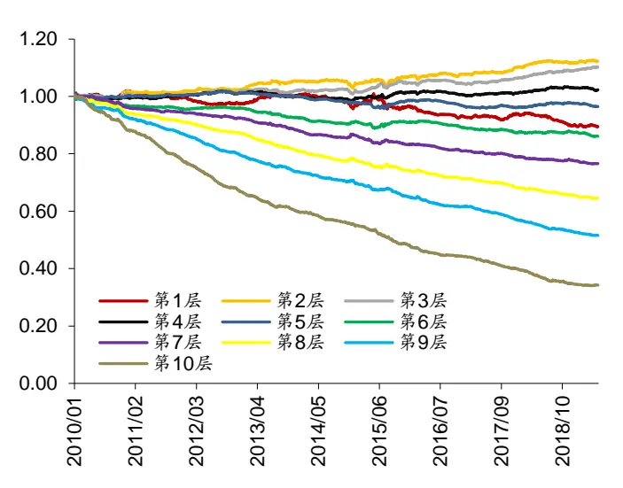
资料来源：Wind，华泰证券研究所

图表16： Alpha1 累积 RankIC 和累积因子收益率
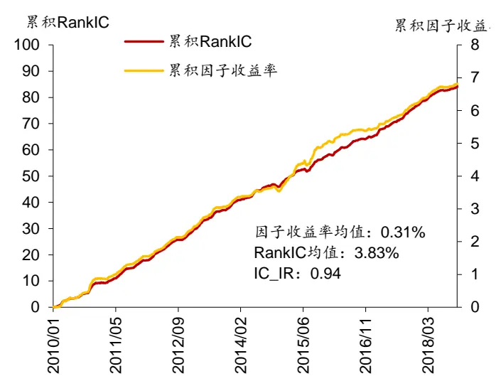
资料来源：Wind，华泰证券研究所

## Alpha2 因子的详细测试结果

Alpah2 = ts_sum(rank(correlation(high, low, 20)),20)

Alpah2 计算的是个股的 high 和 low 在 20 个交易日内相关系数的排序数之和。Alpah2 因子值越高的股票，其日最高价和最低价在走势上“步调”越一致。从分层测试上看，Alpha2的 1~10 层表现单调，但是前 3 层在最近几年的超额收益并不明显。从回归和 IC 测试上来看，Alpha2 的因子收益率和 RankIC 都比 Alpha1 高，但稳定性略差，IC_IR 为 0.78。

图表17： Alpha2 的分层测试表现(因子做行业+4 个常见风格中性)

| 年化收益率年化波动率夏普比率最大回撤 |  |  |  |  |  |  |  |  | 超额收益 |  | 超额收益相对基准 |
| --- | --- | --- | --- | --- | --- | --- | --- | --- | --- | --- | --- |
|  |  |  |  |  | 月均双边换手率 | 年化超额收益率年化跟踪误差信息比率最大回撤 Calmar 比率 月度胜率 |  |  |  |  |  |
| 第1层 | 7.96% | 27.78% | 0.29 | 61.94% | 155.90% | 1.54% | 2.62% | 0.59 | 4.74% | 0.32 | 57.52% |
| 第2层 | 7.31% | 28.17% | 0.26 | 60.76% | 161.70% | 1.04% | 2.16% | 0.48 | 10.63% | 0.10 | 51.33% |
| 第3层 | 6.95% | 28.02% | 0.25 | 61.28% | 163.78% | 0.67% | 1.78% | 0.38 | 6.62% | 0.10 | 50.44% |
| 第4层 | 5.54% | 27.60% | 0.20 | 62.44% | 163.91% | -0.76% | 1.35% | -0.56 | 8.23% | -0.09 | 35.40% |
| 第5层 | 5.14% | 27.60% | 0.19 | 63.14% | 164.93% | -1.14% | 1.28% | -0.89 | 10.92% | -0.10 | 32.74% |
| 第6层 | 3.91% | 27.36% | 0.14 | 65.03% | 165.02% | -2.36% | 1.23% | -1.92 | 20.06% | -0.12 | 30.97% |
| 第7层 | 2.98% | 27.14% | 0.11 | 66.04% | 164.07% | -3.30% | 1.37% | -2.41 | 27.27% | -0.12 | 25.66% |
| 第8层 | 1.42% | 26.75% | 0.05 | 68.23% | 161.60% | -4.86% | 1.67% | -2.91 | 37.40% | -0.13 | 23.01% |
| 第9层 | -0.32% | 26.37% | -0.01 | 70.83% | 159.65% | -6.60% | 2.08% | -3.17 | 47.91% | -0.14 | 20.35% |
| 第10层 | -3.92% | 25.97% | -0.15 | 74.09% | 148.70% | -10.08% | 2.83% | -3.56 | 62.67% | -0.16 | 15.93% |
| 基准 | 6.41% | 27.28% | 0.23 | 62.99% |  |  |  |  |  |  |  |
| 多空组合 | 12.81% | 4.38% | 2.92 | 4.16% |  |  |  |  |  |  |  |

资料来源：Wind，华泰证券研究所

图表18： Alpha2分层组合 1~10净值除以基准净值
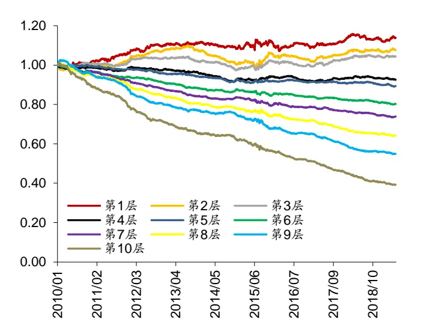
资料来源：Wind，华泰证券研究所

图表19： Alpha2 累积 RankIC 和累积因子收益率
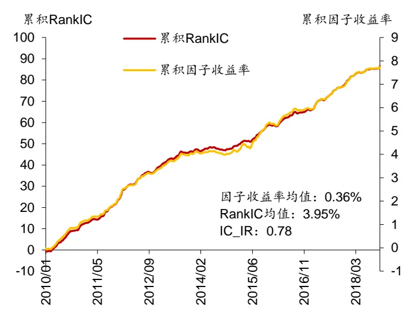
资料来源：Wind，华泰证券研究所

## Alpha3 因子的详细测试结果

Alpha3 = -ts_stddev(volume, 5)

Alpha3 的意义非常简明，其描述的是个股成交量近 5 日的波动率。从分层测试上来看，Alpha3 呈现出“中间好，两头差”的情况，也就是说，成交量 5 日波动率偏低或偏高的股票组合表现不如成交量 5日波动率中等的股票组合。Alpha3 的因子收益率和 RankIC都不太稳定，IC_IR 为 0.36。

图表20： Alpha3 的分层测试表现(因子做行业+4 个常见风格中性)

| 年化收益率年化波动率夏普比率最大回撤 |  |  |  |  |  |  |  |  |  | 超额收益相对基准 |  |
| --- | --- | --- | --- | --- | --- | --- | --- | --- | --- | --- | --- |
|  |  |  |  |  | 月均双边换手率 | 年化超额收益率年化跟踪误差信息比率最大回撤 Calmar 比率月度胜率 |  |  |  |  |  |
| 第1层 | 3.45% | 26.76% | 0.13 | 60.74% | 107.03% | -3.05% | 5.08% | -0.60 | 29.78% | -0.10 | 48.67% |
| 第2层 | 6.23% | 27.43% | 0.23 | 60.20% | 145.20% | -0.18% | 3.32% | -0.05 | 10.88% | -0.02 | 50.44% |
| 第3层 | 7.95% | 27.57% | 0.29 | 59.36% | 153.17% | 1.50% | 2.50% | 0.60 | 5.77% | 0.26 | 56.64% |
| 第4层 | 8.76% | 27.60% | 0.32 | 60.08% | 155.49% | 2.28% | 2.10% | 1.09 | 5.53% | 0.41 | 61.06% |
| 第5层 | 9.41% | 27.62% | 0.34 | 60.69% | 155.75% | 2.90% | 1.96% | 1.48 | 5.13% | 0.57 | 59.29% |
| 第6层 | 8.95% | 27.35% | 0.33 | 61.35% | 154.06% | 2.40% | 1.82% | 1.32 | 5.78% | 0.41 | 59.29% |
| 第7层 | 6.66% | 27.23% | 0.24 | 64.12% | 152.01% | 0.21% | 1.91% | 0.11 | 6.83% | 0.03 | 49.56% |
| 第8层 | 1.28% | 27.08% | 0.05 | 69.17% | 151.08% | -4.90% | 2.71% | -1.81 | 38.43% | -0.13 | 33.63% |
| 第9层 | -4.51% | 27.55% | -0.16 | 73.27% | 140.26% | -10.28% | 4.29% | -2.40 | 62.92% | -0.16 | 26.55% |
| 第10层 | -8.10% | 27.76% | -0.29 | 78.79% | 125.73% | -13.58% | 3.81% | -3.57 | 74.09% | -0.18 | 20.35% |
| 基准 | 6.41% | 27.28% | 0.23 | 62.99% |  |  |  |  |  |  |  |
| 多空组合 | 11.89% | 7.96% | 1.49 | 15.77% |  |  |  |  |  |  |  |

资料来源：Wind，华泰证券研究所

图表21： Alpha3分层组合 1~10净值除以基准净值
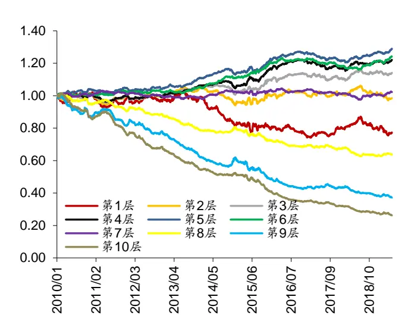
资料来源：Wind，华泰证券研究所

图表22： Alpha3 累积 RankIC 和累积因子收益率
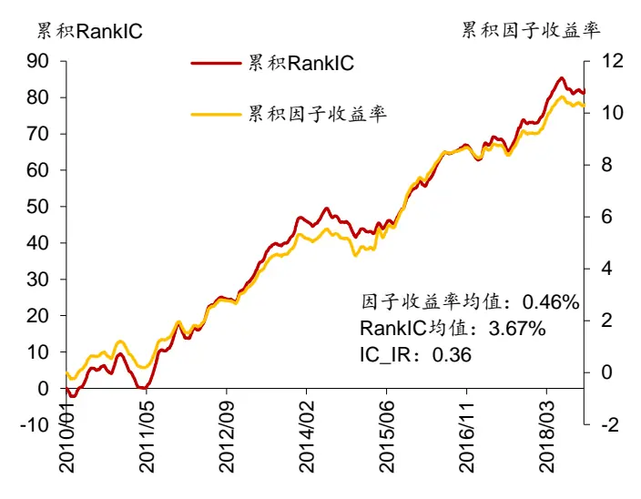
资料来源：Wind，华泰证券研究所

## Alpha4 因子的详细测试结果

Alpha4 = -mul(rank(covariance(high, volume, 10)) , rank(ts_stddev(high, 10)))

Alpha4 因子由两部分相乘而得，左边部分 rank(covariance(high, volume, 10)衡量个股的10 日量价同步程度，右边部分 rank(ts_stddev(high, 10))衡量个股的 10 日最高价波动率。从分层测试上来看，Alpha4 第 1 层和第 2 层表现欠佳，第 4~第 10 层表现单调。 Alpha4的因子收益率和 RankIC 较为稳定，IC_IR 为 0.59。

图表23： Alpha4 的分层测试表现(因子做行业+4 个常见风格中性)

| 年化收益率年化波动率夏普比率最大回撤 月均双边换手率 |  |  |  |  |  |  |  |  |  |  |
| --- | --- | --- | --- | --- | --- | --- | --- | --- | --- | --- |
|  |  |  |  |  |  | 年化超额收益率年化跟踪误差信息比率 |  |  | 超额收益 超额收益 最大回撤 Calmar 比率 月度胜率 | 相对基准 |
| 第1层 | 3.98% | 27.84% | 0.14 | 66.85% | 149.52% | -2.19% | 3.44% | -0.64 19.09% | -0.11 | 44.25% |
| 第2层 | 6.51% | 26.69% | 0.24 | 63.05% | 156.58% | -0.08% | 1.95% | -0.04 5.26% | -0.02 | 46.90% |
| 第3层 | 8.06% | 26.41% | 0.31 | 60.45% | 157.39% | 1.28% | 2.54% | 0.50 5.80% | 0.22 | 52.21% |
| 第4层 | 8.73% | 26.46% | 0.33 | 59.83% | 158.11% | 1.92% | 2.64% | 0.73 5.32% | 0.36 | 56.64% |
| 第5层 | 8.13% | 26.43% | 0.31 | 60.54% | 158.75% | 1.36% | 2.48% | 0.55 5.67% | 0.24 | 49.56% |
| 第6层 | 6.52% | 26.77% | 0.24 | 62.86% | 160.39% | -0.05% | 1.73% | -0.03 5.85% | -0.01 | 48.67% |
| 第7层 | 3.57% | 27.41% | 0.13 | 66.39% | 161.86% | -2.64% | 1.11% | -2.38 22.65% | -0.12 | 22.12% |
| 第8层 | 0.13% | 28.32% | 0.00 | 70.00% | 162.09% | -5.65% | 2.03% | -2.78 41.69% | -0.14 | 21.24% |
| 第9层 | -2.95% | 28.73% | -0.10 | 71.72% | 158.77% | -8.47% | 3.11% | -2.72 55.91% | -0.15 | 24.78% |
| 第10层 | -5.81% | 28.31% | -0.21 | 73.16% | 146.72% | -11.29% | 3.66% | -3.08 66.62% | -0.17 | 25.66% |
| 基准 | 6.41% | 27.28% | 0.23 | 62.99% |  |  |  |  |  |  |
| 多空组合 | 10.18% | 3.46% | 2.94 | 4.23% |  |  |  |  |  |  |

资料来源：Wind，华泰证券研究所

图表24： Alpha4分层组合 1~10净值除以基准净值
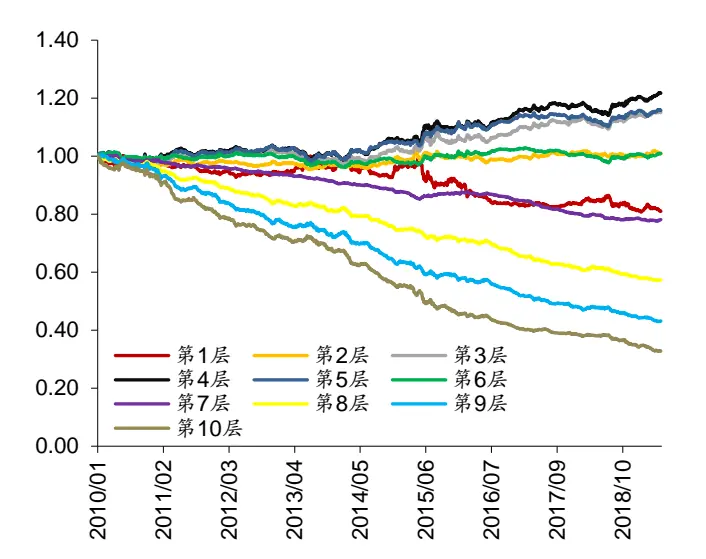
资料来源：Wind，华泰证券研究所

图表25： Alpha4 累积 RankIC 和累积因子收益率
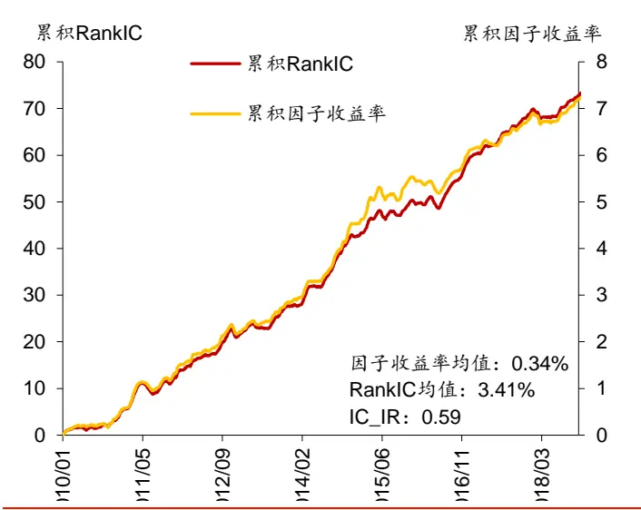
资料来源：Wind，华泰证券研究所

## Alpha5 因子的详细测试结果

Alpha5 = -mul(ts_sum(rank(covariance(high, volume, 5)), 5), rank(ts_stddev(high, 5)))Alpha5 的逻辑和 Alpha4 类似，二者的总体表现也接近。Alpha5 的因子收益率均值和RankIC 均值比 Alpha4 略低。

图表26： Alpha5 的分层测试表现(因子做行业+4 个常见风格中性)
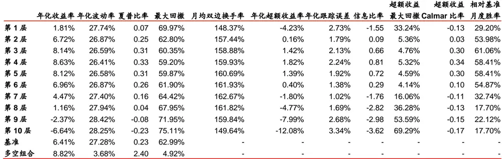
资料来源：Wind，华泰证券研究所

图表27： Alpha5分层组合 1~10净值除以基准净值
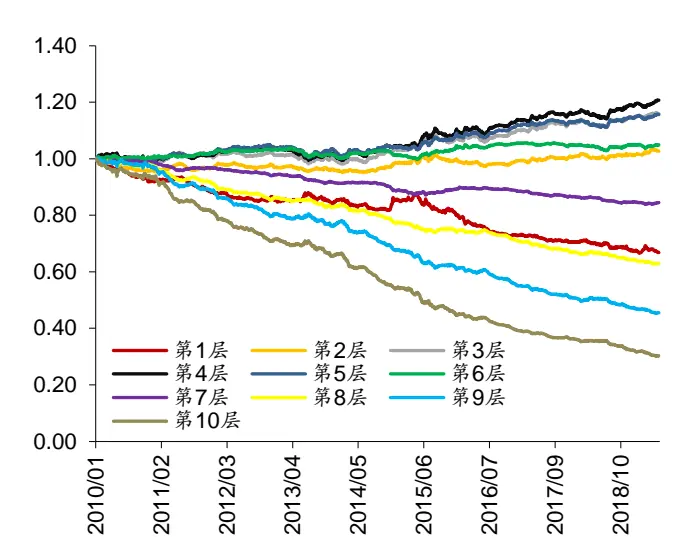
资料来源：Wind，华泰证券研究所

图表28： Alpha5 累积 RankIC 和累积因子收益率
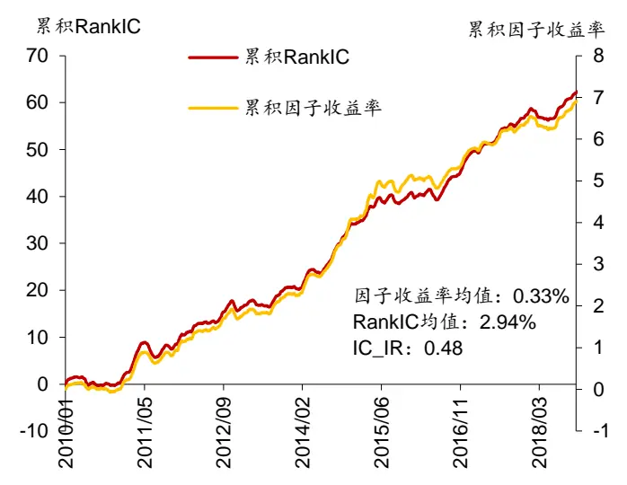
资料来源：Wind，华泰证券研究所

## Alpha6 因子的详细测试结果

Alpha6 = ts_sum(div(add(high,low)), close), 5)

Alpha6 描述了个股最近 5日内每日的多头力量(high)和空头力量(low)强度的对比。Alpha6的分层测试表现欠佳，首先分层的单调性一般，其次表现最好的层相比基准的超额收益也不明显。Alpha6 的因子收益率均值和 RankIC 均值也较低。

图表29： Alpha6的分层测试表现(因子做行业+4个常见风格中性)

| 年化收益率年化波动率夏普比率 |  |  |  |  |  |  |  |  |  | 超额收益 | 超额收益 | 相对基准 |
| --- | --- | --- | --- | --- | --- | --- | --- | --- | --- | --- | --- | --- |
|  |  |  |  | 最大回撤 | 月均双边换手率 | 年化超额收益率年化跟踪误差信息比率 |  |  |  | 最大回撤 Calmar 比率 | 月度胜率 |  |
| 第1层 | 3.59% | 28.68% | 0.13 | 67.87% | 158.93% | -2.31% | 3.19% | -0.73 | 23.23% | -0.10 | 38.94% |  |
| 第2层 | 6.56% | 27.71% | 0.24 | 63.48% | 163.44% | 0.26% | 1.14% | 0.22 | 3.84% | 0.07 | 46.90% |  |
| 第3层 | 6.67% | 27.22% | 0.25 | 61.58% | 164.23% | 0.22% | 1.17% | 0.19 | 6.68% | 0.03 | 48.67% |  |
| 第4层 | 6.66% | 27.07% | 0.25 | 60.43% | 164.14% | 0.16% | 1.54% | 0.11 | 8.60% | 0.02 | 46.90% |  |
| 第5层 | 6.70% | 26.91% | 0.25 | 60.02% | 164.16% | 0.16% | 1.74% | 0.09 | 9.09% | 0.02 | 47.79% |  |
| 第6层 | 6.31% | 26.86% | 0.23 | 60.78% | 164.49% | -0.22% | 1.67% | -0.13 | 8.59% | -0.03 | 44.25% |  |
| 第7层 | 5.74% | 26.91% | 0.21 | 61.68% | 164.62% | -0.74% | 1.39% | -0.53 | 10.57% | -0.07 | 49.56% |  |
| 第8层 | 3.92% | 26.94% | 0.15 | 64.63% | 163.69% | -2.43% | 1.00% | -2.44 | 20.56% | -0.12 | 27.43% |  |
| 第9层 | 0.81% | 27.12% | 0.03 | 68.76% | 161.36% | -5.32% | 1.45% | -3.68 | 39.36% | -0.14 | 11.50% |  |
| 第10层 | -10.02% | 27.45% | -0.37 | 81.95% | 151.55% | -15.47% | 3.76% | -4.12 | 78.53% | -0.20 | 7.96% |  |
| 基准 | 6.41% | 27.28% | 0.23 | 62.99% |  |  |  |  |  |  |  |  |
| 多空组合 | 15.46% | 3.45% | 4.48 | 2.51% |  |  |  |  |  |  |  |  |

资料来源：Wind，华泰证券研究所

图表30： Alpha6 分层组合 1~10 净值除以基准净值
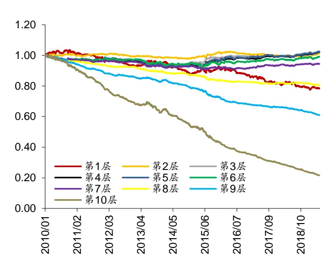
资料来源：Wind，华泰证券研究所

图表31： Alpha6 累积 RankIC 和累积因子收益率
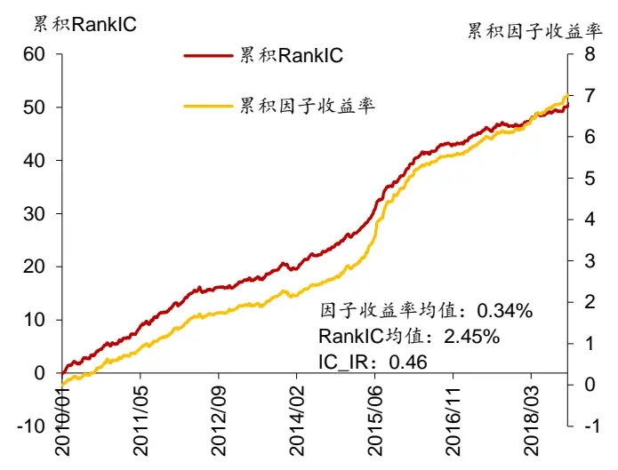
资料来源：Wind，华泰证券研究所

## 因子的 IC衰减测试

我们对因子 Alpha1~6 进行了 IC 衰减测试，因子不进行中性化处理。设因子在交易日 K收盘截面上计算得到的因子值向量为XK，所有股票在 K日之后 20个交易日内的收益率向量为rK+20(该收益率由 K+20交易日复权收盘价除以 K交易日复权收盘价再减 1 得来)，则因子在该截面上的 Rank IC 值为XK和rK+20的 Spearman 秩相关系数。令i = 0,1,2,⋯，则化到 240，因子 Alpha1~6 与 4 个对照因子的“滞后 i期”的 Rank IC 均值(对全回测期所有截面计算均值)变化曲线如下图所示。

图表32： 因子 Alpha1~6与对照因子的 Rank IC衰减图(因子不中性化)
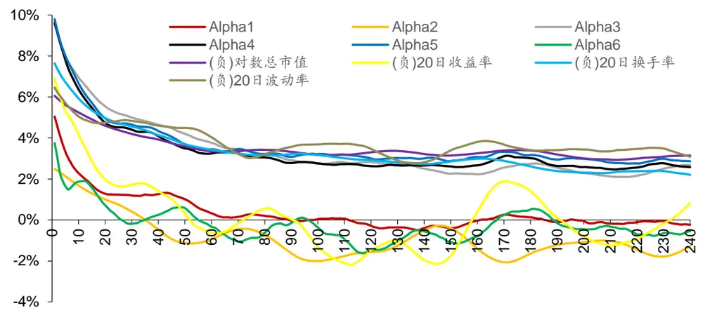
资料来源：Wind，华泰证券研究所

图表 33展示了各因子的半衰期，半衰期的计算方式为因子实际 Rank IC 首次衰减到一半时的滞后期数。如需调整因子参数，或可参考半衰期来进行调整。

图表33： 因子 Alpha1~6与对照因子的 Rank IC半衰期(因子不中性化)

| 因子名称 | 因子表达式 | 半衰期 |
| --- | --- | --- |
| Alpha1 | correlation(div(vwap, high), high, 10) | 9 |
| Alpha2 | ts_sum(rank(correlation(high, low, 20)),20) | 15 |
| Alpha3 | -ts_stddev(volume, 5) | 35 |
| Alpha4 | -mul(rank(covariance(high, volume, 10)) , rank(ts_stddev(high, 10))) | 19 |
| Alpha5 | -mul(ts_sum( rank(covariance(high, volume, 5)), 5), rank(ts_stddev(high, 5))) | 21 |
| Alpha6 | ts_sum(div(add(high,low)), close), 5) | 5 |
| (负)对数总市值 |  | 198 |
| (负)20 日收益率 |  | 14 |
| (负)20 日换手率 |  | 45 |
| (负)20 日波动率 |  | 70 |

资料来源：Wind，华泰证券研究所

## 因子之间的相关性

图表 34 展示了因子 Alpha1~6 之间的相关系数均值，除了 Alpha4 和 Alpha5 相关性较高外(因为它们的构造逻辑相似)，其他因子的相关性都较低，说明遗传规划能从有限的量价数据中挖掘出具有增量信息的因子。

图表34： 因子 Alpha1~6 两两之间相关系数均值

| 因子名称 | Alpha1 | Alpha2 | Alpha3 | Alpha4 | Alpha5 | Alpha6 |
| --- | --- | --- | --- | --- | --- | --- |
| Alpha1 |  | 0.04 | 0.05 | 0.17 | 0.13 | 0.08 |
| Alpha2 | 0.04 |  | -0.01 | -0.04 | -0.04 | -0.01 |
| Alpha3 | 0.05 | -0.01 |  | 0.14 | 0.17 | 0.08 |
| Alpha4 | 0.17 | -0.04 | 0.14 |  | 0.81 | 0.09 |
| Alpha5 | 0.13 | -0.04 | 0.17 | 0.81 |  | 0.09 |
| Alpha6 | 0.08 | -0.01 | 0.08 | 0.09 | 0.09 |  |

资料来源：Wind，华泰证券研究所

## 总结与思考

本文经过原理分析和系统的测试，得出以下结论：

1. 遗传规划是一种启发式的公式演化技术，通过模拟自然界中遗传进化的过程来逐渐生成契合特定目标的公式群体，适合进行特征工程。将遗传规划运用于选股因子挖掘时，可以充分利用计算机的强大算力进行启发式搜索，同时突破人类的思维局限，挖掘出某些隐藏的、难以通过人脑构建的因子，为因子研究提供更多的可能性。

2. 本文在遗传规划的应用中做出了以下贡献：(1)应用成熟的 gplearn 项目，对 gplearn 的关键参数进行了详细说明。(2)扩充了 gplearn 中的函数集，添加了一批适合于构造选股因子的函数。(3)将单因子测试过程引入 gplearn，可以对待挖掘因子进行传统风格因子中性化。(4)使用了 Python 的并行运算技术，加快了因子矩阵的运算速度，缩短了因子挖掘时间。

3. 在遗传规划框架中，我们设定预测目标为个股 20 个交易日后的收益率，初步挖掘出了6 个选股因子。这些因子在剔除了行业、市值、过去 20日收益率、过去 20 日平均换手率、过去 20日波动率五个因子的影响后，依然具有较稳定的 RankIC。6 个因子都具有良好的可解释性，其中大部分因子的相关性不高，说明遗传规划能从有限的量价数据中挖掘出具有增量信息的因子。

4. 本着“授人以鱼不如授人以渔”的想法，本文旨在为读者展示遗传规划在选股因子挖掘中的详细流程，流程中的各环节依然有较大的调整空间。在实际应用中，读者可以根据自己特定的数据源、股票池、调仓周期、函数集以及评价指标来构建遗传规划框架。作为一种“先有公式、后有逻辑”的因子研究方法，遗传规划或许能为选股因子研究提供更多的可能性。

## 风险提示

通过遗传规划挖掘的选股因子是历史经验的总结，存在失效的可能。遗传规划所得因子可能过于复杂，可解释性降低，使用需谨慎。本文仅对因子在全部 A股内的选股效果进行测试，测试结果不能直接推广到其它股票池内。

## 免责申明

本报告仅供华泰证券股份有限公司（以下简称“本公司”）客户使用。本公司不因接收人收到本报告而视其为客户。

本报告基于本公司认为可靠的、已公开的信息编制，但本公司对该等信息的准确性及完整性不作任何保证。本报告所载的意见、评估及预测仅反映报告发布当日的观点和判断。在不同时期，本公司可能会发出与本报告所载意见、评估及预测不一致的研究报告。同时，本报告所指的证券或投资标的的价格、价值及投资收入可能会波动。本公司不保证本报告所含信息保持在最新状态。本公司对本报告所含信息可在不发出通知的情形下做出修改，投资者应当自行关注相应的更新或修改。

本公司力求报告内容客观、公正，但本报告所载的观点、结论和建议仅供参考，不构成所述证券的买卖出价或征价。该等观点、建议并未考虑到个别投资者的具体投资目的、财务状况以及特定需求，在任何时候均不构成对客户私人投资建议。投资者应当充分考虑自身特定状况，并完整理解和使用本报告内容，不应视本报告为做出投资决策的唯一因素。对依据或者使用本报告所造成的一切后果，本公司及作者均不承担任何法律责任。任何形式的分享证券投资收益或者分担证券投资损失的书面或口头承诺均为无效。

本公司及作者在自身所知情的范围内，与本报告所指的证券或投资标的不存在法律禁止的利害关系。在法律许可的情况下，本公司及其所属关联机构可能会持有报告中提到的公司所发行的证券头寸并进行交易，也可能为之提供或者争取提供投资银行、财务顾问或者金融产品等相关服务。本公司的资产管理部门、自营部门以及其他投资业务部门可能独立做出与本报告中的意见或建议不一致的投资决策。

本报告版权仅为本公司所有。未经本公司书面许可，任何机构或个人不得以翻版、复制、发表、引用或再次分发他人等任何形式侵犯本公司版权。如征得本公司同意进行引用、刊发的，需在允许的范围内使用，并注明出处为“华泰证券研究所”，且不得对本报告进行任何有悖原意的引用、删节和修改。本公司保留追究相关责任的权力。所有本报告中使用的商标、服务标记及标记均为本公司的商标、服务标记及标记。

本公司具有中国证监会核准的“证券投资咨询”业务资格，经营许可证编号为：91320000704041011J。

全资子公司华泰金融控股（香港）有限公司具有香港证监会核准的“就证券提供意见”业务资格，经营许可证编号为：AOK809

©版权所有 2019年华泰证券股份有限公司

## 评级说明

## 行业评级体系

－报告发布日后的6个月内的行业涨跌幅相对同期的沪深300指数的涨跌幅为基准；

－投资建议的评级标准增持行业股票指数超越基准中性行业股票指数基本与基准持平减持行业股票指数明显弱于基准

## 公司评级体系

－报告发布日后的6个月内的公司涨跌幅相对同期的沪深300指数的涨跌幅为基准；
－投资建议的评级标准
买入股价超越基准 20%以上
增持股价超越基准 5%-20%
中性股价相对基准波动在-5%~5%之间
减持股价弱于基准 5%-20%
卖出股价弱于基准 20%以上

## 华泰证券研究

## 南京

南京市建邺区江东中路228号华泰证券广场1号楼/邮政编码：210019

电话：86 25 83389999 /传真：86 25 83387521

电子邮件：ht-rd@htsc.com

## 深圳

深圳市福田区益田路5999号基金大厦10楼/邮政编码：518017

电话：86 755 82493932 /传真：86 755 82492062

电子邮件：ht-rd@htsc.com

## 北京

北京市西城区太平桥大街丰盛胡同28号太平洋保险大厦A座18层

邮政编码：100032

电话：86 10 63211166/传真：86 10 63211275

电子邮件：ht-rd@htsc.com

## 上海

上海市浦东新区东方路18号保利广场E栋23楼/邮政编码：200120

电话：86 21 28972098 /传真：86 21 28972068

电子邮件：ht-rd@htsc.com