## 金工研究/深度研究

2019年06月17日

林晓明 执业证书编号：S0570516010001

研究员 0755-82080134

陈烨 执业证书编号：S0570518080004

研究员 010-56793942

李子钰 0755-23987436

联系人 liziyu@htsc.com

何康 021-28972039

联系人 hekang@htsc.com

# 基于 CSCV框架的回测过拟合概率

# 华泰人工智能系列之二十二

## 基于 CSCV框架计算三组量化研究案例的回测过拟合概率

本文基于组合对称交叉验证（CSCV）框架，以三组量化研究为案例展示回测过拟合概率（PBO）的计算流程，发现两组多因子选股模型的 PBO较低，择时模型的 PBO 较高。案例 1 为 7 种机器学习模型的多因子选股策略，指数增强组合 PBO 大多在 15%~50%，“XGBoost 表现最佳”的结论大概率不是回测过拟合。案例 2为 6种交叉验证方法的多因子选股策略，多空组合 PBO 在 20%~50%，“分组时序交叉验证表现最佳”的结论大概率不是回测过拟合。案例 3为双均线 50ETF择时策略，PBO在 50%~90%，“参数组合[11,30]和[11,24]表现最佳”的结论可能为回测过拟合。

## 过拟合可分为两个层次：训练过拟合和回测过拟合

华泰人工智能系列多项研究探讨过拟合。过拟合可分为训练过拟合和回测过拟合两个层次。训练过拟合是机器学习语境下偏狭义色彩的过拟合，是指机器学习模型在训练集表现好，在测试集表现差，产生原因是模型超参数选择不当或者模型过度训练，解决方案是采用合理的交叉验证方法选择模型超参数或迭代次数。回测过拟合是量化研究语境下偏广义色彩的过拟合，是指量化模型在回测阶段表现好，在实盘阶段表现差，产生原因是市场规律发生变化，或者对回测期数据噪音的过度学习。回测过拟合难以根除，相对合理的解决方案是借助量化指标检验回测过拟合程度。

核心思想是计算“训练集”夏普比率最高的策略在“测试集”的相对排名CSCV 框架下回测过拟合概率的核心思想是：计算“训练集”夏普比率最高的策略，在“测试集”中的相对排名，如果相对排名靠前，代表回测过拟合概率较低，反之则代表回测过拟合概率较高。“训练集”和“测试集”的划分基于组合的思想，将全部回测时间划分成 S份，任取其中 S/2份拼接得到“训练集”，剩余 S/2 份拼接得到“测试集”，分别计算各条策略的夏普比率，进而得到相对排名，并重复多次，将相对排名大于 50%即排在后一半的概率视作回测过拟合概率。回测过拟合概率的计算相对简单，不仅适用于机器学习策略，还能推广到其它类型的量化策略。

## 探讨回测过拟合概率计算过程中的各项细节

回测过拟合概率的计算过程中包含多项细节。将长度为 T 的全部回测时间划分成 S 份，每份回测时间长度为 T/S。T/S 越小，组合次数越大，计算时间开销越大；T/S 越大，组合次数越小，策略排名结果受偶然性因素影响更大，实际使用时建议采用较小的 T/S 比。对策略进行排名时一般采用夏普比率，也可以根据实际需要选择其它评价指标，例如本文的指数增强组合采用信息比率进行排名更为合理。

风险提示：多因子选股和择时等量化模型都是对历史投资规律的挖掘，若未来市场投资环境发生变化，则量化投资策略存在失效的可能。回测过拟合概率是将历史回测表现的时间序列经过简单打乱重排计算得到，忽略回测的路径依赖特性，存在过度简化的可能。

## 研究背景

回测（Backtesting）是量化策略研究中必不可少的环节，也是量化投资和传统主动投资的重要区别之一。回测的本质是将某种可被精确刻画的投资策略，在历史中进行推演和复现，通过该策略在历史上的表现，推测它在未来的表现，进而对多组策略加以取舍，形成最终的投资决策。回测这一研究手段的前提假设是历史会在未来重演。

那么，历史会重演吗？这个问题恐怕没有人能回答。如果未来金融市场的规律发生改变，那么历史回测表现好的投资策略，在未来可能变差。投资策略在未来表现弱于历史回测表现的现象称为“回测过拟合”（Backtest Overfitting）。市场规律发生变化是回测过拟合的原因之一。

如果市场规律不变，历史回测表现好的策略在未来表现就会好吗？如果投资策略在历史回测表现好，仅仅源于捕捉到个别股票、个别因子或者个别时间段的极端收益，相当于捕捉到数据中的噪音，那么该策略在未来表现很可能出现退化。模型对回测期数据噪音的过度学习是回测过拟合的另一个原因。

平心而论，回测并不是“科学”的研究手段。和自然科学的研究相比，如果想要探究温度、光照对植物光合作用的影响，那么可以采用控制变量法，控制其它影响因素不变，仅改变温度或光照，比较实验组和对照组的反应产物含量并得出结论。然而，社会科学尤其是金融领域的研究难以开展实验，很多时候只能基于历史挖掘规律。历史上的规律以及基于规律开发的投资策略完全有可能由随机因素促成，就像是中彩票，相同的号码在未来会有多少概率再次中奖呢？

尽管回测这一研究手段存在过拟合的风险，无法得出“科学”的研究结论，对于量化策略开发者来说，它仍然是最好的研究工具之一。回测一定程度上反映了策略的优劣，在实践中我们通常根据回测结果评估策略表现，或是比较不同策略的回测结果来选择模型或选择参数组合。

此时，认识和测量回测过拟合的风险就显得尤为重要。在华泰金工《人工智能 19：重采样技术检验过拟合》（20190422）中，我们借助 Bootstrap 重采样技术构建 A股市场“平行世界”，并提出两种回测过拟合概率的测量方法。本文我们将采用另一种思路，基于Bailey、Borwein、López de Prado 和 Zhu 在 2017 年发表的论文《The Probability ofBacktest Overfitting》中提出的组合对称交叉验证（CSCV）框架，系统性地介绍回测过拟合概率的测量方法，并且以实例展示不同类型量化策略的回测过拟合风险。

## 回测过拟合概率

## 过拟合的两个层次：训练过拟合和回测过拟合

华泰人工智能系列的多项研究探讨“过拟合”。在不同语境下，“过拟合”的含义有所不同。
我们认为过拟合可以分为两个层次：训练过拟合和回测过拟合。

训练过拟合是机器学习语境下偏狭义色彩的过拟合。它是指机器学习模型在训练集表现好，在测试集表现差，如下图所示。训练过拟合的产生原因是模型超参数选择不当（如树集成模型），或者模型过度训练（如神经网络模型）。训练过拟合的问题可被解决，解决方案是采用合理的交叉验证方法选择模型超参数或者迭代次数。交叉验证方法在《人工智能 14：控制过拟合：从时序交叉验证谈起》（20181128）和《人工智能 16：再论时序交叉验证控制过拟合》（20190218）中有详细论述。

图表1： 训练过拟合示意图
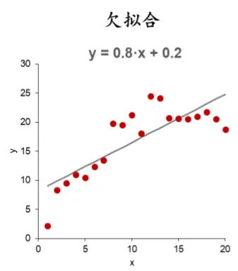

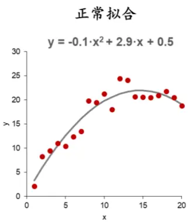
资料来源：华泰证券研究所

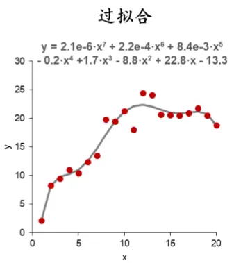

回测过拟合是量化研究语境下偏广义色彩的过拟合。它是指量化模型在回测阶段表现好，在实盘阶段表现差，如下图所示。回测过拟合的产生原因在研究背景中已有论述，主要是市场规律发生变化，或者源于模型对回测期数据噪音的过度学习。回测过拟合的问题难以根除，相对合理的解决方案是测量回测过拟合的概率，以检验回测过拟合的程度。

图表2： 回测过拟合示意图
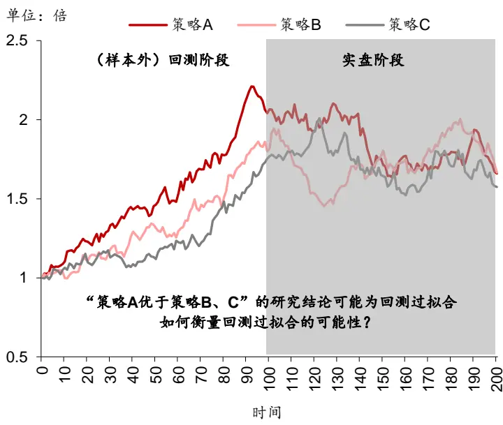
资料来源：华泰证券研究所

在华泰金工《人工智能 19：重采样技术检验过拟合》（20190422）中，我们基于 Bootstrap重采样技术，提出两种测量方法：1）“平行世界”中各策略回测指标的单因素方差分析的P值；2）“真实世界”最优策略在“平行世界”表现最优的概率。然而，上述两种测量方法存在两处缺陷：1）计算过程依赖重采样得到“平行世界”，计算量相对较大；2）只适用于机器学习选股框架，无法推广到其它类型的量化策略。

本文基于 Bailey、Borwein、López de Prado 和 Zhu 在 2017 年发表的论文《The Probabilityof Backtest Overfitting》中提出的组合对称交叉验证（CSCV）框架，介绍回测过拟合概率的另一种测量方法。

## 回测过拟合概率 PBO的定义

PBO（Probability of Backtest Overfitting）是定量衡量回测过拟合风险的指标，计算方式基于 Bailey、Borwein、López de Prado 和 Zhu 在 2017 年提出的组合对称交叉验证（Combinatorially-Symmetric Cross-Validation，简记为 CSCV）框架。假设以夏普比率（Sharpe Ratio，简记为 SR）作为框架中的策略评价指标，那么 PBO 可按如下方式定义：

$$
PBO=P[SR_{n^{*}}<ME(SR)]
$$

其中，SR 表示“测试集”各组策略的夏普比率，n*表示“训练集”表现最好（夏普比率最高）的那组策略，ME表示中位数。注意到这里的“交叉验证”、“训练集”和“测试集”并不完全等价于机器学习传统意义上的相关概念，但是有异曲同工之处。

图表3： PBO计算框架中的回测过拟合示意图
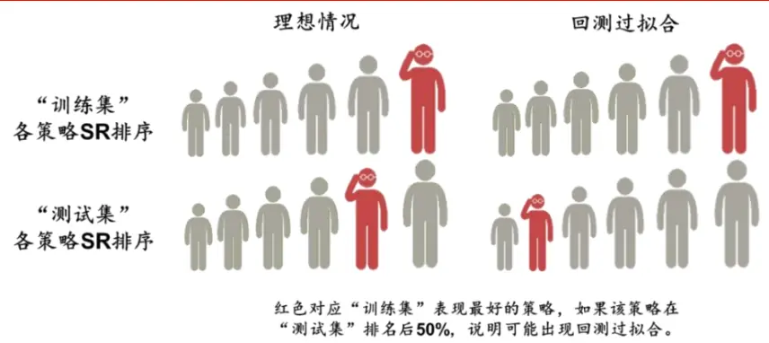
资料来源：华泰证券研究所

上述定义的含义是：“训练集”夏普比率最高的策略 n*，在“测试集”的夏普比率也应该较高，表现至少应优于一半的策略。如果策略 n*的测试集夏普比率排名在后 50%，那么很有可能属于回测过拟合。回测过拟合的概率，即为最优策略 n*的测试集夏普比率排名位于后 50%的概率。

PBO 的定义引申出新的问题：对于量化策略，尤其是非机器学习策略，通常不存在“训练集”和“测试集”的概念。PBO 是如何根据回测结果划分“训练集”和“测试集”呢？下面我们展示 PBO 的计算步骤：

1. 构建矩阵 ${\mathbf{\nabla}}M_{T\times N}$ ；每列分别表示第 N组策略下 T期的收益率序列。

2. 按行切割矩阵 $M_{T\times N}$ ，得到子矩阵 $M_{t},t=1,2,\dots,S$ ；需要注意的是，这里 S必须为偶数，此时每个子矩阵维度相同，均为 $\begin{array}{r}{|\frac{T}{S}\times N|}\end{array}$

3. 从 S个子矩阵中任意选出 $\vdots{\frac{S}{2}},$ 个为一组，用 $C_{S}$ 表示所有可能的组合；根据组合原理，这样的组合共有 $C_{S}^{\frac{S}{2}}$ 种。

4. 对于 $C_{S}$ 中的任意一组 c，进行如下操作：

a. 构建训练集J：将 c中的 $\frac{S}{2}$ 个子矩阵 $M_{t}$ 按行拼接起来。

b. 构建测试集J：̅ 即J的补集，将不包含在 c中的子矩阵 $M_{t}$ 按行拼接起来。

c. 对于训练集J，计算每列的夏普比率，得到夏普比率最高的策略n∗。

d. 对于测试集J，计算每列的夏普̅ 比率，得到策略n∗在测试集夏普比率 $SR_{n^{*}}$ 的绝对排名Rank(n∗)和相对排名ω（均为降序排列）；通常取 $\begin{array}{r}{\omega=\frac{Rank(n^{*})}{N+1},\omega\in(0,1)}\end{array}$ o

e. 定义对数几率 $\begin{array}{r}{\lambda=\log\left(\frac{\omega}{1-\omega}\right)}\end{array}$ ；λ随着ω的增大而增大，当 $\omega=0.5$ 时， $\lambda=0$ ；当ω接近 1 时，λ取无穷大。

5. 根据第 4步，对于 $C_{S}$ 中的任意一组 c，可计算λ。 对全部 c进行遍历，最终得到 $\lambda_{m},~m=$ $1,2,\dots,C_{S}^{\frac{s}{2}}\circ$ 进一步可得到λ的经验分布f(λ)，PBO 是f(λ)在区间 $(-\infty,0]$ 上的定积分：

$$
PBO=\int_{-\infty}^{0}f(\lambda)d\lambda
$$

需要说明的是，上述定积分的前提假设是 S 取无穷大，此时相对排名ω和对数几率λ均为连续变量。一般而言，S 为有限整数时，第 5 步中计算的对数几率λ为离散变量。根据离散变量经验分布的定义：

$$
f(\lambda)=\sum_{i=1}^{n}I_{\{\lambda_{i}<\lambda\}}
$$

有如下推导：

$$
PBO=\int_{-\infty}^{0}f(\lambda)d\lambda=\frac{\#\{\lambda_{m}<0\}}{C_{s}^{\frac{s}{2}}}=\frac{\#\{\omega_{m}<0.5\}}{C_{s}^{\frac{s}{2}}}
$$

其中 $\#\{\lambda_{m}>0\}$ 表示 $C_{S}^{\frac{S}{2}}$ 个 $\cdot\lambda_{m}$ 中大于 0 的个数， $\#\{\omega_{m}>0.5\}$ 则表示 $C_{S}^{\frac{S}{2}}$ 个 $\omega_{m}$ 中大于 0.5 的个数。当划分完“训练集”和“测试集”后，只需要计算相对排名ω，随后统计相对排名ω中大于 0.5 的个数即可，计算过程如下图所示。

图表4： 基于 CSCV框架的回测过拟合概率 PBO计算示意图
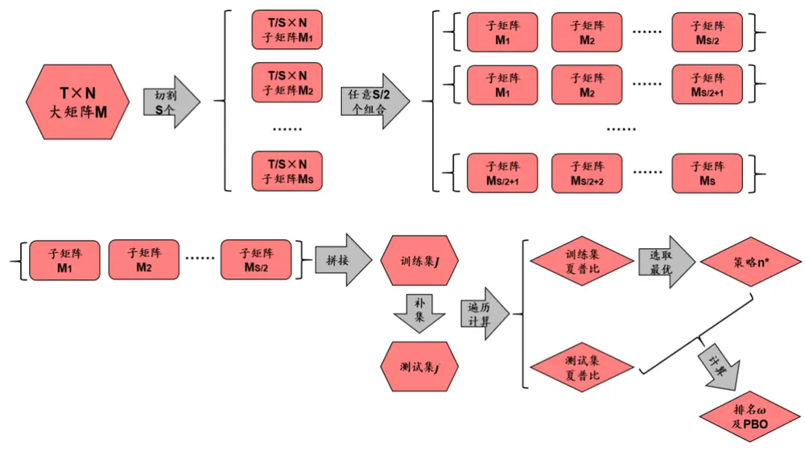
资料来源：华泰证券研究所

下面我们试举一例说明 PBO 的计算过程。

1. 假设共有 N= 9 条备选策略，回测时间为 T= 96个月，M为 96×9 的月频收益率矩阵。

2. 取 $S=16,$ ，将 M划分为 16 个子集，每个子集 M1、M2、……、M16为 6×9 的矩阵，对应连续 6 个月的月频收益率。

3. 从 16 个子矩阵中任选出 8 个为一组（例如 M1、M2、……、M8）；所有可能的组合个数为 $C_{16}^{8}=12870$

4. 对于 12870 种组合中的任意一种组合方式 c1（例如 M1、M2、……、M8），进行如下操作：

a. 将 M1、M2、……、M8按行拼接成 48×9 的训练集矩阵J；

b. 将补集 M9、M10、……、M16按行拼接成 48×9 的测试集矩阵J；̅

c. 对于训练集J，计算每列的夏普比率，假设夏普比率最高的策略为第 7组策略，记$n^{*}=7.$

d. 对于测试集J，计算每列的夏普̅ 比率，得到夏普比率向量 $SR=(SR_{1},SR_{2},\ldots,SR_{9})$ ;计算第 7 条策略测试集夏普比率SR 在SR中的绝对排名，假设排名第 3，则Rank(7) = 3，进而得到相对排名 $\omega_{1}=Rank(7)/(9+1)=0.3$ o

5. 对于全部 12870 种组合进行遍历，得到相对排名向量 $\boldsymbol{\omega}=(\omega_{1},\omega_{2},\dots,\omega_{12870})$ ，统计其中大于 0.5 的元素个数占比，即为回测过拟合概率 PBO。

PBO 的计算框架包含以下优点：

1. 保证“训练集”和“测试集”样本量相同，使得夏普比率具有可比性；

2. 各组策略关系对等，排除其它影响夏普比率因素的干扰；

3. 划分数据时将回测时间 T 划分为 S个子集，每个子集内部保留原始时序。

4. 该框架为非参模型，无需过多假设。

5. 具备灵活性，可以根据实际情况将夏普比率换成其它策略评价指标。

## 方法

我们针对三组量化研究案例计算回测过拟合概率。三组案例的基本信息如下表所示。

图表5： 本文计算回测过拟合概率所使用的三组量化研究案例

| 量化研究案例 |  | 所属领域 比较策略个数T（回测月份）T/S（子矩阵包含月份） |  |  |
| --- | --- | --- | --- | --- |
| 基于不同机器学习算法的多因子选股模型 | 多因子选股 | 7 | 96 | 6,8,12,16,24,48 |
| 基于不同交叉验证方法的多因子选股模型 | 多因子选股 | 6 | 96 | 6,8,12,16,24,48 |
| 基于不同参数组合的 50ETF双均线择时模型择时 |  | 7 或 91 | 168 | 12,14,21,28,42 |

资料来源：华泰证券研究所

案例 1 基于华泰金工《人工智能选股周报》。我们跟踪 Stacking、SVM、朴素贝叶斯、随机森林、XGBoost、逻辑回归、神经网络 7 条机器学习策略在月频多因子选股的表现。对于每一种机器学习方法，首先将选股模型在每个月末截面期对每只股票的打分视作单因子，进行单因子分层测试；其次根据打分构建中证 500 指数增强组合，在全部 A 股中选股，组合构建时相对于中证 500 指数进行行业中性和市值中性处理。

案例 1的回测起始日期为 2011 年 2 月 1 日，为了保证回测月份 T 包含尽可能多的偶因数从而便于划分子矩阵，我们取回测结束日期为 2019 年 1 月 31 日，即包含完整的 96 个月共 8 年数据。此时，子矩阵包含月份 T/S可以取 6、8、12、16、24、48。在这 8 年的回测区间内，XGBoost 模型在单因子回测和指数增强组合上的表现均优于其余 6条策略，如下面四张图所示。我们将检验“XGBoost策略表现最优”结论的回测过拟合概率。

图表6： 7组机器学习选股模型单因子分层回测多空组合净值
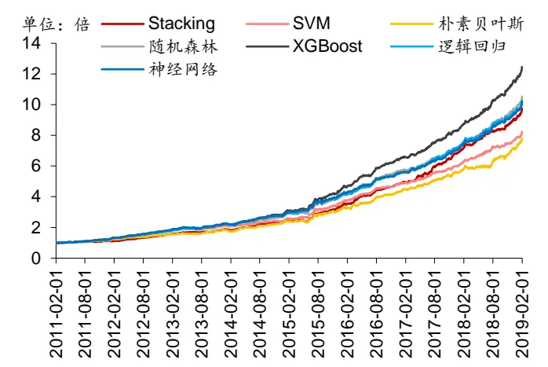
资料来源：Wind，华泰证券研究所

图表7： 7 组机器学习选股模型单因子分层回测 Top 组合净值
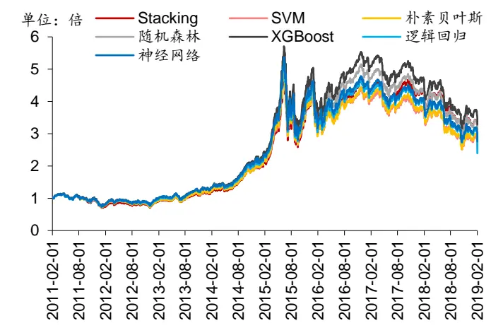
资料来源：Wind，华泰证券研究所

图表8： 7组机器学习选股模型指数增强组合净值
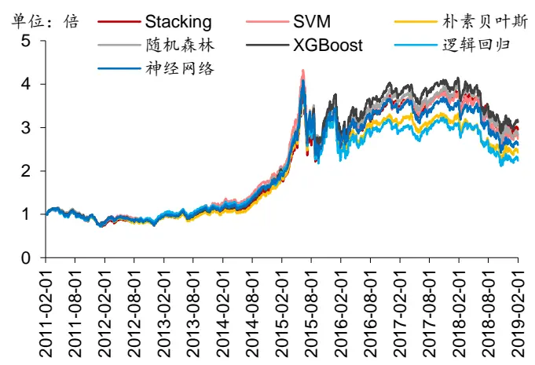
资料来源：Wind，华泰证券研究所

图表9： 7组机器学习选股模型指数增强组合超额收益净值
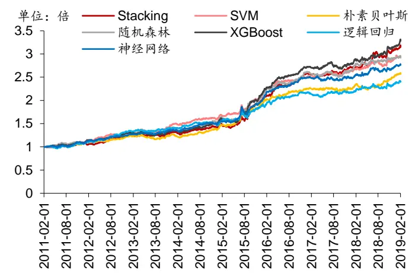
资料来源：Wind，华泰证券研究所

案例 2基于华泰金工《人工智能 16：再论时序交叉验证对抗过拟合》（20190218）。我们比较时序、分组时序、K折以及三种基线模型（训练集折半的 K折、乱序递进式、乱序分组递进式）共6条策略在月频多因子选股的表现。这6条策略均为逻辑回归或均为XGBoost模型，区别在于使用的交叉验证调参方法不同。对于每一种交叉验证方法，我们进行单因子分层测试。

案例 2 的回测起始和结束日期和案例 1 相同，回测区间均为 2011 年 2 月 1 日~2019 年 1月 31 日共 96 个完整月份。子矩阵包含月份 T/S取 6、8、12、16、24、48。在这 8 年的回测区间内，无论是逻辑回归还是 XGBoost，分组时序交叉验证的多空组合表现均优于其余 5 条策略，XGBoost 模型下分组时序交叉验证的优势更明显，如下面两张图所示。我们将检验“分组时序交叉验证策略表现最优”结论的回测过拟合概率。

图表10： 6组交叉验证方法下逻辑回归单因子分层回测多空组合净值
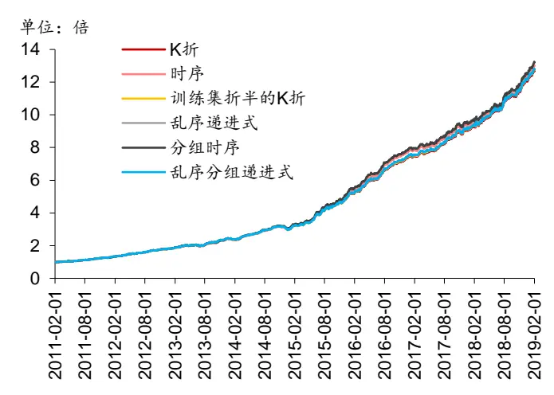
资料来源：Wind，华泰证券研究所

图表11： 6组交叉验证方法下 XGBoost单因子分层回测多空组合净值
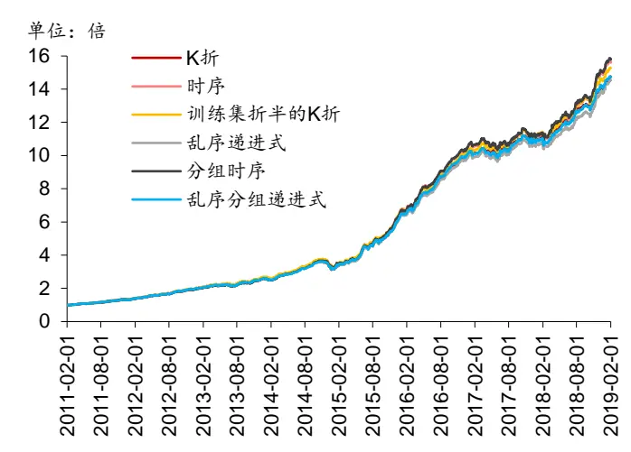
资料来源：Wind，华泰证券研究所

案例 3考察基于不同参数组合的 50ETF 双均线择时模型。择时标的为华夏上证 50ETF 基金（510050.OF）。择时信号根据短均线、长均线的关系确定：若以 T 日收盘价计算的短均线自下而上穿过长均线，并且当前状态为空仓时，则以 T+1 日收盘价开仓做多；若以 T日收盘价计算的短均线自上而下穿过长均线，并且当前状态为开仓时，则以 T+1 日收盘价平仓。

案例 3的双均线择时模型包含两个关键参数：短均线长度和长均线长度。我们采用两条方案确定参数：1）任选 7 组备选参数（[5,6]、[7,12]、[9,20]、[11,30]、[15,26]、[19,30]、[29,30]），从中选择回测夏普比率最高的那组参数；2）对短均线长度=5,7,…,29 和长均线长度=6,8,…,30 进行网格搜索，其中短均线长度需小于长均线长度，共 91 组备选参数，从中选择回测夏普比率最高的那组参数。

案例 3 的回测区间为 2005 年 4 月 1 日~2019 年 3 月 29 日共 168 个完整月份。子矩阵包含月份 T/S 取 12、14、21、28、42。交易费率为单边万二点五。在这 14 年的回测区间内，参数组合[11,30]在 7 组备选参数中表现最优，如下图所示；参数组合[11,24]在 91 组备选参数中表现最优。我们将分别检验上述两项结论的回测过拟合概率。

这里需要说明的是，案例 1、2 的回测区间长度和案例 3 不同。原因在于案例 1、2的机器学习多因子选股模型需要 72 个月的训练数据，从而导致回测起始日期只能从稍晚的 2011年 2 月初开始，到 2019 年 1 月底为止，包含完整的 8年；而案例 3 的择时模型最长只需要 1 个月的数据用来计算长均线，因此回测起始日期可以从较早的 2005 年 4 月初开始，到 2019 年 3 月底为止，包含完整的 14 年 。

图表12： 7种参数下 50ETF双均线择时模型净值
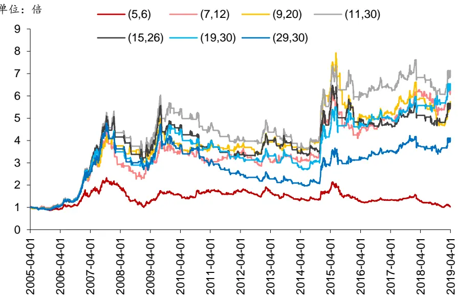
资料来源：Wind，华泰证券研究所

## 结果

## 案例 1：基于不同机器学习算法的多因子选股模型

我们展示不同 T/S 比（子矩阵包含月份）下，训练集最优策略在测试集的相对排名 ω 的分布情况，ω 越小说明测试集表现越好。例如 ω=12.5%代表训练集最优策略在测试集 7条策略中排名第 1（最优情况），ω=87.5%代表训练集最优策略在测试集 7 条策略中排名第 7（最差情况）。

图中不同 T/S比以不同颜色表示，例如 T/S=6 代表将 96 个回测月份以连续 6个月为一组划分成 16 组，任取其中 8 组为训练集，剩余 8 组为测试集，共 $C_{16}^{8}=12870$ 种组合方式；T/S=48代表将96个回测月份以连续48个月为一组划分成2组，任取其中1组为训练集，剩余 1组为测试集，共 $C_{2}^{1}=2$ 种组合方式。

左下图展示单因子分层测试多空组合的训练集最优策略在测试集的相对排名分布。对于各种 T/S 比，相对排名集中在 12.5%的水平，说明训练集多空组合排名第 1 的策略在测试集大概率也排名第 1，单因子分层测试多空组合的回测过拟合可能性较低。

右下图展示单因子分层测试 Top 组合的训练集最优策略在测试集的相对排名分布。对于T/S比为 6、8、12、16、24 这五种情形，相对排名集中在 12.5%和 25.0%的水平，说明训练集 Top组合排名第 1的策略在测试集大概率排在第 1 或第 2，单因子分层测试 Top组合的回测过拟合可能性较低。

对于 T/S比为 48的情形，相对排名 50%的概率落在 25.0%水平，50%的概率落在 87.5%水平。实际上，T/S 比为 48 时，训练集和测试集的组合方式只有两种，换言之训练集多空组合排名第 1的策略在测试集一次落在第 2，一次垫底。考虑到组合方式过少时，策略排名结果可能受偶然性因素影响更大，得到的结论未必客观。后面的分析中我们将不考虑T/S比为 48 的情况。

图表13： 训练集最优多空组合夏普比率在测试集相对排名分布
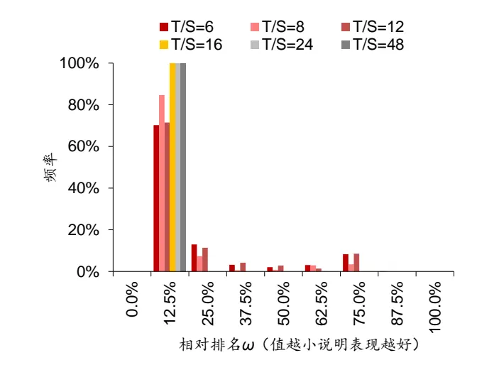
资料来源：Wind，华泰证券研究所

图表14： 训练集最优 Top组合夏普比率在测试集相对排名分布
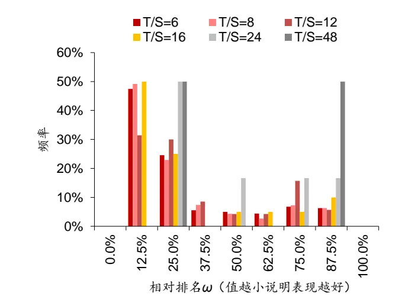
资料来源：Wind，华泰证券研究所

左下图展示中证 500 增强组合净值的训练集最优策略在测试集的相对排名分布。对于除T/S=48 外的各种 T/S 比，相对排名分布相对均匀，说明中证 500 增强组合净值看似存在回测过拟合的可能。然而，对于指数增强组合而言，净值的夏普比率并不是好的评价指标，指数增强的目标是在获得超额收益的同时控制跟踪误差，信息比率（相当于超额收益净值的夏普比率）是更合理的评价指标。

右下图展示中证 500 增强组合超额收益净值的训练集最优策略在测试集的相对排名分布。此时，对于除 T/S=48外的各种 T/S比，相对排名集中在 25.0%和 37.5%的水平，说明训练集信息比率排名第 1的策略在测试集大概率排在第 2或第 3，指数增强组合的回测过拟合可能性相对较低。

图表15： 训练集最优指数增强组合夏普比率在测试集相对排名分布
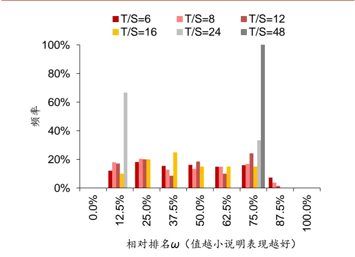
资料来源：Wind，华泰证券研究所

图表16： 训练集最优指数增强组合信息比率在测试集相对排名分布
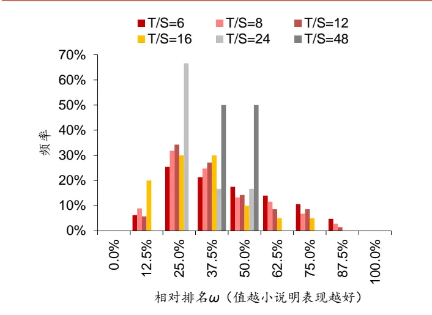
资料来源：Wind，华泰证券研究所

总的来看，对于单因子分层回测的多空组合和 Top组合，以及构建的中证 500 指数增强组合，回归过拟合可能性均较低。我们统计相对排名大于等于 50%的概率，得出回测过拟合概率 PBO，结果如下表所示。排除指数增强组合夏普比率 PBO 以及 T/S=48这两种情形，其余各评价指标的 PBO 整体较低。当 T/S=8 时，多空组合的 PBO 为 7.4%，Top组合的PBO 为 20.6%，指数增强组合超额收益净值的 PBO 为 34.5%。这表明案例 1 的结论“XGBoost 策略表现最优”有较大的概率不是回测过拟合。

图表17： 案例 1不同 T/S比下不同策略评价指标的回测过拟合概率

|  | T/S(子矩阵包含月份) 多空组合夏普比率 Top 组合夏普比率指数增强组合夏普比率指数增强组合信息比率 |  | PBO |
| --- | --- | --- | --- |
|  | PBO | PBO | PBO |
| 6 | 13.5% | 22.4% | 54.3% 46.9% |
| 8 | 7.4% | 20.6% | 48.9% 34.5% |
| 12 | 12.9% | 30.0% | 54.3% 32.9% |
| 16 | 0.0% | 25.0% | 45.0% 20.0% |
| 24 | 0.0% | 50.0% | 33.3% 16.7% |
| 48 | 0.0% | 50.0% | 100.0% 50.0% |

资料来源：Wind，华泰证券研究所

## 案例 2：基于不同交叉验证方法的多因子选股模型

左下图展示逻辑回归模型单因子分层测试多空组合的训练集最优策略在测试集的相对排名分布。对于各种 T/S比，相对排名分布相对均匀，整体偏向 50%的左侧，说明训练集多空组合排名第 1的策略在测试集大概率排名前 50%，逻辑回归模型单因子分层测试多空组合的回测过拟合可能性较低。

右下图展示 XGBoost 模型单因子分层测试多空组合的训练集最优策略在测试集的相对排名分布。对于各种 T/S比，相对排名集中在 28.6%的水平，说明训练集多空组合排名第 1的策略在测试集大概率排名第 2，XGBoost 模型单因子分层测试多空组合的回测过拟合可能性较低，并且比逻辑回归模型的回测过拟合程度更低。

图表18： 训练集最优逻辑回归多空夏普比率在测试集相对排名分布
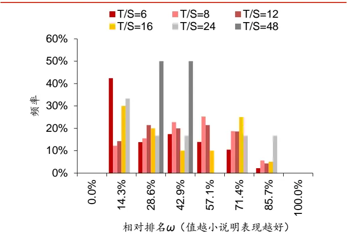
资料来源：Wind，华泰证券研究所

图表19： 训练集最优 XGBoost多空夏普比率在测试集相对排名分布
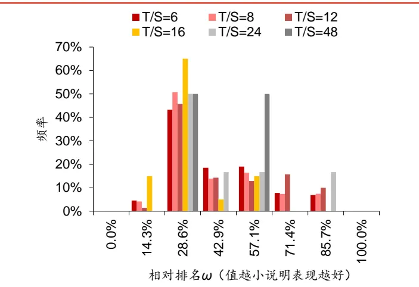
资料来源：Wind，华泰证券研究所

我们统计相对排名大于等于 50%的概率，得出回测过拟合概率 PBO，结果如下表所示。总的来看，除T/S比为48的情形外，逻辑回归多空组合夏普比率PBO在20%~50%之间，XGBoost 多空组合夏普比率 PBO 在 10%~40%之间，两者的回测过拟合概率均较低，这表明案例 2 的结论“分组时序交叉验证策略表现最优”有较大概率不是回测过拟合。同时，XGBoost 的回测过拟合概率低于逻辑回归，这也和此前的研究结论相符，逻辑回归本身不易发生训练过拟合，因此分组时序交叉验证为逻辑回归带来的提升有限。

图表20： 案例 2不同 T/S比下逻辑回归和 XGBoost多空组合的回测过拟合概率

| T/S（子矩阵包含月份） | 逻辑回归多空组合夏普比率PBO | XGBoost 多空组合夏普比率 PBO |
| --- | --- | --- |
| 6 | 26.5% | 33.7% |
| 8 | 49.6% | 31.3% |
| 12 | 44.3% | 38.6% |
| 16 | 40.0% | 15.0% |
| 24 | 33.3% | 33.3% |
| 48 | 0.0% | 50.0% |

资料来源：Wind，华泰证券研究所

## 案例 3：基于不同参数组合的 50ETF双均线择时模型

左下图展示在 7组备选参数下的训练集最优策略在测试集的相对排名分布。对于各种 T/S比，相对排名集中在 62.5%和 75.0%的水平，说明训练集多空组合排名第 1的择时参数在测试集大概率排名第 5或第 6（即倒数第 3 或倒数第 2），回测过拟合可能性较高。

图表21： 训练集 7组参数下最优参数夏普比率在测试集相对排名分布
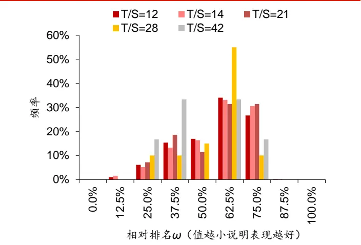
资料来源：Wind，华泰证券研究所

图表22： 训练集 91组参数下最优参数夏普比率在测试集相对排名分布
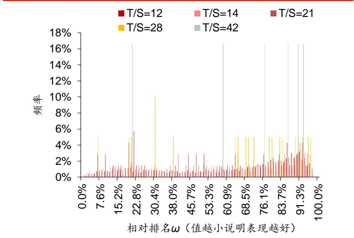
资料来源：Wind，华泰证券研究所

右上图展示在全部 91 组备选参数下的训练集最优策略在测试集的相对排名分布。对于各种 T/S 比，相对排名较为均匀，整体偏向 50%右侧，说明训练集多空组合排名第 1 的择时参数在测试集大概率排名后 50%，回测过拟合可能性较高。

我们统计相对排名大于等于 50%的概率，得出回测过拟合概率 PBO，结果如下表所示。除 T/S 为 42 的情形外，7 种参数选择方式下的 PBO 在 70%~90%之间，91 种参数选择方式下的 PBO 在 50%~70%之间，两者的回测过拟合概率均较高。这表明案例 3的结论“参数组合[11,30]在 7 组备选参数中表现最优”和“参数组合[11,24]在 91 组备选参数中表现最优”有较大的概率是回测过拟合。案例 3 的择时模型相比于案例 1、2 的多因子选股模型更容易出现过拟合，这也和人们的认知相符。

图表23： 案例 3不同 T/S比下择时策略评价指标的回测过拟合概率

| T/S(子矩阵包含月份) | 7组参数下择时模型净值夏普比率PBO 91 组参数下择时模型净值夏普比率 PBO |  |
| --- | --- | --- |
| 12 | 77.7% | 66.6% |
| 14 | 80.1% | 64.8% |
| 21 | 74.3% | 57.1% |
| 28 | 80.0% | 70.0% |
| 42 | 50.0% | 83.3% |

资料来源：Wind，华泰证券研究所

## 总结与讨论

本文基于组合对称交叉验证（CSCV）框架，以三组量化研究为案例展示回测过拟合概率（PBO）的计算流程，发现两组多因子选股模型的回测过拟合概率较低，择时模型的回测过拟合概率较高。案例 1 为 7 种机器学习模型的多因子选股策略，指数增强组合 PBO 大多在 15%~50%之间，“XGBoost 模型表现最佳”的结论大概率不是回测过拟合。案例 2为 6 种交叉验证方法的多因子选股策略，多空组合 PBO 在 20%~50%之间，“分组时序交叉验证方法表现最佳”的结论大概率不是回测过拟合。案例 3为双均线 50ETF择时策略，PBO 在 50%~90%之间，“参数组合[11,30]和[11,24]表现最佳”的结论大概率是回测过拟合。

华泰人工智能系列多项研究探讨过拟合。过拟合可分为训练过拟合和回测过拟合两个层次。训练过拟合是机器学习语境下偏狭义色彩的过拟合，是指机器学习模型在训练集表现好，在测试集表现差，产生原因是模型超参数选择不当或者模型过度训练，解决方案是采用合理的交叉验证方法选择模型超参数或迭代次数。回测过拟合是量化研究语境下偏广义色彩的过拟合，是指量化模型在回测阶段表现好，在实盘阶段表现差，产生原因是市场规律发生变化，或者对回测期数据噪音的过度学习。回测过拟合难以根除，相对合理的解决方案是借助量化指标检验回测过拟合程度。

CSCV 框架下回测过拟合概率的核心思想是：计算“训练集”夏普比率最高的策略，在“测试集”中的相对排名，如果相对排名靠前，代表回测过拟合概率较低，反之则代表回测过拟合概率较高。“训练集”和“测试集”的划分基于组合的思想，将全部回测时间划分成 S份，任取其中 S/2 份拼接得到“训练集”，剩余 S/2 份拼接得到“测试集”，分别计算各条策略的夏普比率，进而得到相对排名，并重复多次，将相对排名大于 50%即排名后一半的概率视作回测过拟合概率。回测过拟合概率的计算相对简单，不仅适用于机器学习策略，还能推广到其它类型的量化策略。

回测过拟合概率的计算过程中包含多项细节。将长度为 T 的全部回测时间划分成 S份，每份回测时间长度为 T/S。T/S 越小，组合次数越大，计算时间开销越大；T/S 越大，组合次数越小，策略排名结果受偶然性因素影响更大，实际使用时建议采用较小的 T/S比。对策略进行排名时一般采用夏普比率，也可以根据实际需要选择其它评价指标，例如本文的指数增强组合采用信息比率进行排名更为合理。

## 附录

## 案例 1 方法

案例 1中，我们跟踪 Stacking、SVM、朴素贝叶斯、随机森林、XGBoost、逻辑回归、神经网络 7条机器学习策略在月频多因子选股的表现。涉及的机器学习模型的详细介绍，可参见华泰人工智能系列报告。机器学习模型运用到多因子选股的流程如下：

1． 数据获取：

a) 股票池：全 A股。剔除 ST 股票，剔除每个截面期下一交易日停牌的股票，剔除上市 3个月内的股票，每只股票视作一个样本。

b) 训练样本长度： 72 个月。

2． 特征和标签提取：每个自然月的最后一个交易日，计算 70 个因子暴露度，作为样本的原始特征；计算下一整个自然月的个股超额收益（以沪深 300 指数为基准），作为样本的标签。因子池如下表所示。

3． 特征预处理：

a) 中位数去极值：设第 T 期某因子在所有个股上的暴露度序列为 $D_{i},\ D_{M}$ 为该序列中位数， $D_{M1}$ 为序列 $|D_{i}-D_{M}|$ 的中位数，则将序列 $D_{i}$ 中所有大于 $D_{M}+5D_{M1}$ 的数重设为 $D_{M}+5D_{M1}$ ，将序列 $D_{i}$ 中所有小于 $D_{M}-5D_{M1}$ 的数重设为 $D_{M}-5D_{M1}$ ；

b) 缺失值处理：得到新的因子暴露度序列后，将因子暴露度缺失的地方设为中信一级行业相同个股的平均值。

c) 行业市值中性化：将填充缺失值后的因子暴露度对行业哑变量和取对数后的市值做线性回归，取残差作为新的因子暴露度。

d) 标准化：将中性化处理后的因子暴露度序列减去其现在的均值、除以其标准差，得到一个新的近似服从N(0,1)分布的序列。

4． 训练集和交叉验证集的合成：

a) 分类问题：在每个月末截面期，选取下月收益排名前30%的股票作为正例（y = 1），后 30%的股票作为负例 $(y=0)$ ）。将训练样本合并，随机选取 90%的样本作为训练集，余下 10%的样本作为交叉验证集。

b)回归问题：直接将样本合并成为样本内数据，同样按 90%和 10%的比例划分训练集和交叉验证集。

5． 样本内训练：使用机器学习模型对训练集进行训练。

6． 交叉验证调参：模型训练完成后，使用模型对交叉验证集进行预测。选取交叉验证集AUC（或平均 AUC）最高的一组参数作为模型的最优参数。

7． 样本外测试：确定最优参数后，以 T 月月末截面期所有样本预处理后的特征作为模型的输入，得到每个样本的预测值f(x)。使用预测值进行单因子分层测试，并构建中证500 行业市值中性的全 A选股组合。回测中的交易费用为单边千分之二。

单因子分层测试的方法如下：

1. 股票池：全 A 股，剔除 ST 股票，剔除每个截面期下一交易日停牌的股票，剔除上市3 个月以内的股票。

2. 回测区间：2011-02-01 至 2019-01-31。

3. 换仓：在每个自然月最后一个交易日核算因子值，在下个自然月首个交易日按当日收盘价换仓，交易费用以单边千分之二计。

4. 分层方法：因子先用中位数法去极值，然后进行市值、行业中性化处理（方法论详见上一小节），将股票池内所有个股按因子从大到小进行排序，等分 N 层，每层内部的个股等权配置。当个股总数目无法被 N 整除时采用任一种近似方法处理均可，实际上对分层组合的回测结果影响很小。

5. 多空组合收益计算方法：用 Top 组每天的收益减去 Bottom 组每天的收益，得到每日多空收益序列 $r_{1},r_{2},\cdots,r_{n}$ ，则多空组合在第 n天的净值等于 $\cdot(1+r_{1})(1+r_{2})\cdots(1+r_{n})$

6. 评价方法：全部 N层组合年化收益率（观察是否单调变化），多空组合的年化收益率、夏普比率、最大回撤等。

图表24： 选股模型中涉及的全部因子及其描述

| 大类因子 | 具体因子 | 因子描述 |
| --- | --- | --- |
| 估值 | EP | 净利润（TTM）/总市值 |
| 估值 | EPcut | 扣除非经常性损益后净利润（TTM）/总市值 |
| 估值 | BP | 净资产/总市值 |
| 估值 | SP | 营业收入（TTM）/总市值 |
| 估值 | NCFP | 净现金流（TTM）/总市值 |
| 估值 | OCFP | 经营性现金流（TTM）/总市值 |
| 估值 | DP | 近12个月现金红利（按除息日计）/总市值 |
| 估值 | G/PE | 净利润（TTM）同比增长率/PE_TTM |
| 成长 | Sales_G_q | 营业收入（最新财报，YTD）同比增长率 |
| 成长 | Profit_G_q | 净利润（最新财报，YTD）同比增长率 |
| 成长 | OCF_G_q | 经营性现金流（最新财报，YTD）同比增长率 |
| 成长 | ROE_G_q | ROE（最新财报，YTD）同比增长率 |
| 财务质量 | ROE_q | ROE（最新财报，YTD） |
| 财务质量 | ROE_ttm | ROE（最新财报，TTM） |
| 财务质量 | ROA_q | ROA（最新财报，YTD） |
| 财务质量 | ROA_ttm | ROA（最新财报，TTM） |
| 财务质量 | grossprofitmargin_q | 毛利率（最新财报，YTD） |
| 财务质量 财务质量 | grossprofitmargin_ttm | 毛利率（最新财报，TTM） |
| 财务质量 | profitmargin_q | 扣除非经常性损益后净利润率（最新财报，YTD） |
| 财务质量 | profitmargin_ttm | 扣除非经常性损益后净利润率（最新财报，TTM） |
| 财务质量 | assetturnover_q | 资产周转率（最新财报，YTD） |
| 财务质量 | assetturnover_ttm | 资产周转率（最新财报，TTM） |
| 财务质量 | operationcashflowratio_q | 经营性现金流/净利润（最新财报，YTD） |
| 杠杆 | operationcashflowratio_ttm | 经营性现金流/净利润（最新财报，TTM） |
|  | financial_leverage | 总资产/净资产 |
| 杠杆 杠杆 | debtequityratio | 非流动负债/净资产 |
| 杠杆 | cashratio | 现金比率 |
| 市值 | currentratio | 流动比率 |
| 动量反转 | In_capital | 总市值取对数 个股60个月收益与上证综指回归的截距项 |
| 动量反转 | HAlpha | 个股最近N个月收益率，N=1，3，6，12 |
| 动量反转 | return_Nm wgt_return_Nm | 个股最近N个月内用每日换手率乘以每日收益率求算术平均值， |
| 动量反转 | exp_wgt_return_Nm | N=1, 3, 6, 12 个股最近 N 个月内用每日换手率乘以函数 exp(-x_i/N/4)再乘以每 |
| 波动率 |  | 日收益率求算术平均值，x_i为该日距离截面日的交易日的个数， N=1, 3, 6, 12 |
|  | std_FF3factor_Nm | 特质波动率——个股最近 N 个月内用日频收益率对 Fama French 三因子回归的残差的标准差，N=1，3，6，12 |
| 波动率 股价 | std_Nm | 个股最近N个月的日收益率序列标准差，N=1，3，6，12 |
| beta | In_price | 股价取对数 |
| 换手率 | beta | 个股60个月收益与上证综指回归的 beta 个股最近N个月内日均换手率（剔除停牌、涨跌停的交易日）， |
|  | turn_Nm | N=1, 3, 6, 12 |
| 换手率 | bias_turn_Nm | 个股最近N个月内日均换手率除以最近2年内日均换手率（剔除 停牌、涨跌停的交易日）再减去1，N=1，3，6，12 |
| 情绪 | rating_average | wind 评级的平均值 |
| 情绪 情绪 | rating_change | wind评级（上调家数-下调家数）/总数 |
| 股东 | rating_targetprice | wind一致目标价/现价-1 |
| 技术 | holder_avgpctchange | 户均持股比例的同比增长率 |
|  | MACD | 经典技术指标（释义可参考百度百科），长周期取30日，短周期 |
| 技术 | DEA | 取 10 日，计算 DEA 均线的周期（中周期）取 15 日 |
| 技术 | DIF |  |
| 技术 | RSI | 经典技术指标，周期取20日 |
| 技术 | PSY | 经典技术指标，周期取20日 |
| 技术 | BIAS | 经典技术指标，周期取20日 |

资料来源：Wind，华泰证券研究所

## 案例 2 方法

案例 2中，我们比较时序、分组时序、K折以及三种基线模型（训练集折半的 K折、乱序递进式、乱序分组递进式）共 6 条策略在月频多因子选股的表现。这 6 条策略均为逻辑回归模型或均为 XGBoost 模型，区别在于使用的交叉验证调参方法不同。所涉及的交叉验证方法如下图所示，详细介绍可参见华泰人工智能系列报告。

图表25： 6种交叉验证方法示意图
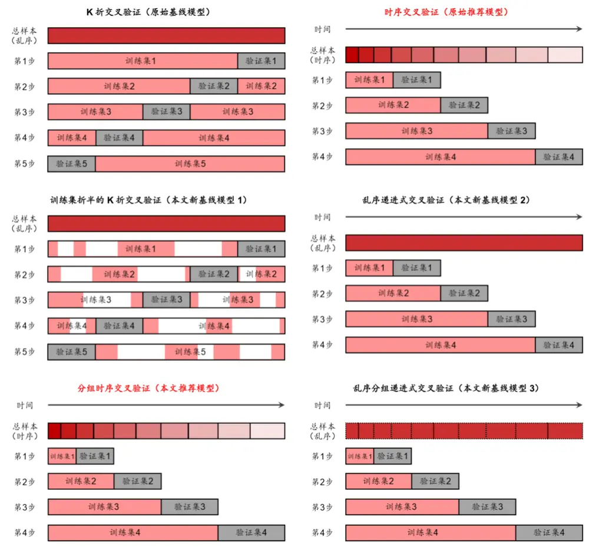
资料来源：华泰证券研究所

案例 2的选股流程中，前 3步数据获取、特征和标签提取、特征预处理以及第 7步样本外测试与案例 1相同；4~6 步略有区别，具体方法如下：

4． 滚动训练集和验证集的合成：采用年度滚动训练方式，全体样本内外数据共分为八个阶段。例如预测 2011 年时，将 2005~2010 年共 72 个月数据合并作为样本内数据集；预测 T 年时，将 T-6 至 T-1 年的 72 个月合并作为样本内数据。根据不同的交叉验证方法，划分训练集和验证集，交叉验证的折数均为 12。对于分组时序交叉验证，每次训练集长度均为 6 个月的整数倍，验证集长度均等于 6 个月。对于 K折交叉验证和训练集折半的 K 折交叉验证，验证次数为 12 次；对于其余四种交叉验证方法，验证次数为 11 次。凡涉及将数据打乱的交叉验证方法，随机数种子点均相同，从而保证打乱的方式相同。

5． 样本内训练：使用逻辑回归或 XGBoost 基学习器对训练集进行训练。

6． 交叉验证调参：对全部超参数组合进行网格搜索，选择验证集平均 AUC 最高的一组超参数作为模型最终的超参数。不同交叉验证方法可能得到不同的最优超参数。

单因子分层测试方法同案例 1。

## 参考文献

Bailey, D. H., Borwein, J., López de Prado, M., & Zhu, Q. J. (2014). Pseudo-mathematics and financial charlatanism: The effects of backtest overfitting on out-of-sample performance. Notices of the American Mathematical Society, 61(5), 458-471.

Bailey, D. H., Borwein, J., Lopez de Prado, M., & Zhu, Q. J. (2017). The probability of backtest overfitting. Journal of Computational Finance, 20(4), 39-70.

López de Prado, M. L. (2018). Advances in Financial Machine Learning. John Wiley & Sons.

## 风险提示

多因子选股和择时等量化模型都是对历史投资规律的挖掘，若未来市场投资环境发生变化，则量化投资策略存在失效的可能。回测过拟合概率是将历史回测表现的时间序列经过简单打乱重排计算得到，忽略回测的路径依赖特性，存在过度简化的可能。

## 免责申明

本报告仅供华泰证券股份有限公司（以下简称“本公司”）客户使用。本公司不因接收人收到本报告而视其为客户。

本报告基于本公司认为可靠的、已公开的信息编制，但本公司对该等信息的准确性及完整性不作任何保证。本报告所载的意见、评估及预测仅反映报告发布当日的观点和判断。在不同时期，本公司可能会发出与本报告所载意见、评估及预测不一致的研究报告。同时，本报告所指的证券或投资标的的价格、价值及投资收入可能会波动。本公司不保证本报告所含信息保持在最新状态。本公司对本报告所含信息可在不发出通知的情形下做出修改，投资者应当自行关注相应的更新或修改。

本公司力求报告内容客观、公正，但本报告所载的观点、结论和建议仅供参考，不构成所述证券的买卖出价或征价。该等观点、建议并未考虑到个别投资者的具体投资目的、财务状况以及特定需求，在任何时候均不构成对客户私人投资建议。投资者应当充分考虑自身特定状况，并完整理解和使用本报告内容，不应视本报告为做出投资决策的唯一因素。对依据或者使用本报告所造成的一切后果，本公司及作者均不承担任何法律责任。任何形式的分享证券投资收益或者分担证券投资损失的书面或口头承诺均为无效。

本公司及作者在自身所知情的范围内，与本报告所指的证券或投资标的不存在法律禁止的利害关系。在法律许可的情况下，本公司及其所属关联机构可能会持有报告中提到的公司所发行的证券头寸并进行交易，也可能为之提供或者争取提供投资银行、财务顾问或者金融产品等相关服务。本公司的资产管理部门、自营部门以及其他投资业务部门可能独立做出与本报告中的意见或建议不一致的投资决策。

本报告版权仅为本公司所有。未经本公司书面许可，任何机构或个人不得以翻版、复制、发表、引用或再次分发他人等任何形式侵犯本公司版权。如征得本公司同意进行引用、刊发的，需在允许的范围内使用，并注明出处为“华泰证券研究所”，且不得对本报告进行任何有悖原意的引用、删节和修改。本公司保留追究相关责任的权力。所有本报告中使用的商标、服务标记及标记均为本公司的商标、服务标记及标记。

本公司具有中国证监会核准的“证券投资咨询”业务资格，经营许可证编号为：91320000704041011J。

全资子公司华泰金融控股（香港）有限公司具有香港证监会核准的“就证券提供意见”业务资格，经营许可证编号为：AOK809

©版权所有 2019年华泰证券股份有限公司

## 评级说明

## 行业评级体系

－报告发布日后的6个月内的行业涨跌幅相对同期的沪深300指数的涨跌幅为基准；

－投资建议的评级标准增持行业股票指数超越基准中性行业股票指数基本与基准持平减持行业股票指数明显弱于基准

## 公司评级体系

－报告发布日后的6个月内的公司涨跌幅相对同期的沪深300指数的涨跌幅为基准；
－投资建议的评级标准
买入股价超越基准 20%以上
增持股价超越基准 5%-20%
中性股价相对基准波动在-5%~5%之间
减持股价弱于基准 5%-20%
卖出股价弱于基准 20%以上

## 华泰证券研究

## 南京

南京市建邺区江东中路228号华泰证券广场1号楼/邮政编码：210019

电话：86 25 83389999 /传真：86 25 83387521

电子邮件：ht-rd@htsc.com

## 深圳

深圳市福田区益田路5999号基金大厦10楼/邮政编码：518017

电话：86 755 82493932 /传真：86 755 82492062

电子邮件：ht-rd@htsc.com

## 北京

北京市西城区太平桥大街丰盛胡同28号太平洋保险大厦A座18层

邮政编码：100032

电话：86 10 63211166/传真：86 10 63211275

电子邮件：ht-rd@htsc.com

## 上海

上海市浦东新区东方路18号保利广场E栋23楼/邮政编码：200120

电话：86 21 28972098 /传真：86 21 28972068

电子邮件：ht-rd@htsc.com