## 金工研究/深度研究

2019年08月07日

林晓明 执业证书编号：S0570516010001

研究员 0755-82080134

陈烨执业证书编号：S0570518080004

研究员 010-56793942

chenye@htsc.com

李子钰 0755-23987436

联系人 liziyu@htsc.com

何康 021-28972039

联系人 hekang@htsc.com

## 相关研究

1《金工：养老目标基金的中国市场开发流 程》2019.07

3《金工：博观约取：价值和成长Smart Beta》2019.07

# 再探基于遗传规划的选股因子挖掘

# 华泰人工智能系列之二十三

## 本文对遗传规划提出了三个改进方向，进一步提升其因子挖掘能力

本文是对华泰金工前期报告《基于遗传规划的选股因子挖掘》(2019.6)的补充和改进，目的是进一步提升遗传规划挖掘选股因子的能力。本文提出并测试了3个改进方向：(1)新的适应度指标—因子互信息和多头超额收益；(2)非线性因子的使用方法；(3)交叉验证控制过拟合。测试中展示了20多个挖掘出的选股因子供投资者参考。通过方法论的介绍，本文旨在说明遗传规划或许能挖掘出大量因子(尤其是非线性因子)，这对于能够利用非线性因子的机器学习选股模型来说具有重要意义。

## 改进方向1：新的适应度指标—因子互信息和多头超额收益

互信息可以捕捉因子和收益间的非线性关系，在遗传规划中使用互信息作为适应度指标，可以挖掘出多个互信息较高的因子。在分层测试中，该类因子与收益的关系大多呈现出“中间分层收益高，两端分层收益低”的特性，且分层规律稳定，这种规律能被基于机器学习的多因子选股模型有效利用。另外，部分投资者可能希望以多头超额收益来评价因子，本文也将多头超额收益加入到适应度指标中，挖掘出了数个多头超额收益较高的因子。

## 改进方向2：非线性因子的使用方法

对于非线性因子的使用，一般有两大类方法，第一类方法是在因子合成时直接使用机器学习模型(如XGBoost、神经网络等)拟合因子与收益率间的关系，该类方法在本系列前期报告中有过大量介绍。第二类方法是对单个因子做非线性变换，重构因子与收益之间的关系，最终得到线性因子。第二类方法中有两个具体方法：三次方回归残差法和多项式拟合法。两个方法各有优劣，在本文的测试中，三次方回归残差法较为简单，但转换效果较差；多项式拟合法转换效果较好，但需要逐个对因子拟合非线性关系，拟合结果对不同因子不能通用。

## 改进方向3：交叉验证控制过拟合

为了控制过拟合的风险，我们在gplearn中加入交叉验证环节，观察新因子在验证集上的适应度表现，据此来评价遗传规划挖掘有效因子的能力。加入交叉验证之后，遗传规划的流程如下：将数据集按指定比例划分为训练集和验证集两部分，训练集用于训练和进化，循环生成子代因子；对于每一代新生成的因子，模型都会在验证集上计算适应度，并记录每一代的验证集平均适应度，观测验证集平均适应度的收敛性，当其明显收敛时，停止循环。在本文的测试中，确实观察到了因子平均适应度在验证集收敛的情况。

风险提示：通过遗传规划挖掘的选股因子是历史经验的总结，存在失效的可能。遗传规划所得因子可能过于复杂，可解释性降低，使用需谨慎。本文仅对因子在全部A股内的选股效果进行测试，测试结果不能直接推广到其它股票池内。

## 遗传规划回顾和改进方向

在本系列前期报告《基于遗传规划的选股因子挖掘》(2019.6)中，我们介绍了遗传规划的基本原理，如图表1所示，遗传规划从随机生成的公式群体开始，通过模拟自然界中遗传进化的过程，来逐渐生成契合特定目标的公式群体。然后我们对遗传规划程序包gplearn进行深度改进，实现了遗传规划在因子挖掘上的应用。本篇报告将在上一篇报告的基础上，从适应度指标的选择、非线性因子的使用方法和控制过拟合的手段这三个不同的角度探索模型的改进方向。

图表1：遗传规划的总体流程
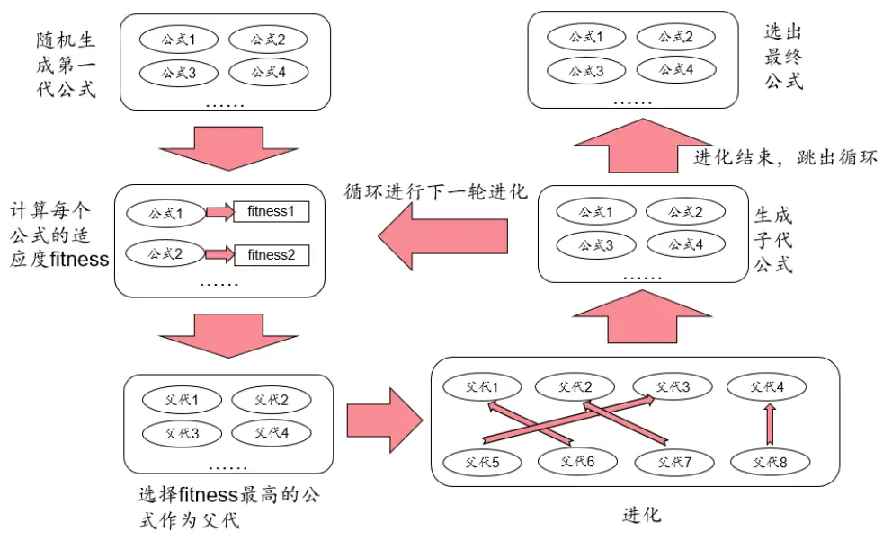
资料来源：华泰证券研究所

## 改进方向1：新的适应度指标

在遗传规划中，适应度衡量了公式运算结果与给定目标的相符程度，是公式进化的重要参考指标。本系列前期报告《基于遗传规划的选股因子挖掘》(2019.6)中使用RankIC来作为因子的适应度指标，它是传统多因子选股模型中对因子的评价指标之一，主要衡量因子和收益间的线性关系。在本篇报告中，我们在gplearn中加入了两个新的适应度指标互信息和多头超额收益，并测试它们的因子挖掘效果。

## 互信息

在基于机器学习的多因子选股模型中，非线性因子也能被有效使用，此时就需要一个能衡量因子和收益间非线性关系的适应度指标。本系列前期报告《人工智能选股之特征选择》(2018.7)中介绍过互信息指标，在此我们将再次介绍该指标的原理。互信息的概念来自概率论和信息论，常用于度量两个随机变量之间的关联程度。不同于相关系数仅能够捕捉两个随机变量之间的线性相关性，互信息方法可以捕捉两个变量之间的任何统计依赖性。两个离散随机变量X和Y的互信息定义为：

$$
\operatorname{I}(\mathrm{X};\Upsilon)=\sum_{y\in Y}\sum_{x\in X}p(x,y)\log\left(\frac{p(x,y)}{p(x)p(y)}\right)
$$

其中，p(x, y)是 X 和 Y的联合概率分布函数，p(x)和 p(y)分别是 X 和 Y的边缘概率分布函数。在连续随机变量的情形下，求和替换为二重定积分：

$$
\operatorname{I}(\mathrm{X};\mathrm{Y})=\int_{Y}\int_{X}p(x,y)\log\left({\frac{p(x,y)}{p(x)p(y)}}\right)dxdy
$$

其中，p(x, y)是 X 和 Y 的联合概率密度函数，p(x)和 p(y)分别是 X 和 Y的边缘概率密度函数。

直观上，互信息反映了联合分布p(x，y)与边缘分布乘积p(x)p(y)的相似程度，它能够度量X和Y共享的信息，量化了已知两个变量其中一个时，另一个变量不确定性的减少程度。例如，如果 X 和 Y相互独立，则已知 X 不会对 Y提供任何信息，那么 p(x, y) = p(x)p(y)，两者的互信息为零。在使用互信息作为适应度指标时，因子与收益之间的互信息越大，两者之间共享的信息越多，那么两者的关联度越高。

下面的例子来自sklearn官网，形象地说明了互信息的效果。例如有三个特征 $\mathsf{X}_{1}$ ${\sf X}_{2}$ ${\sf X}_{3}$ 它们服从区间[0,1]内的均匀分布，定义y如下：

$$
y=X_{1}+sin(6\pi*X_{2})+0.1*N(0,1)
$$

其中N(0,1)为标准正态分布。我们可以使用F检验和互信息来分析y和 $\mathsf{X}_{1}$ ， ${\sf X}_{2}.$ ${\sf X}_{3}$ 的关系，结果展示在图表2中。可以看出，F检验只能评价变量间的线性关系，y和X₁之间的线性关系较高(F-test=1.00)，y和X2的线性关系较低(F-test=0.28)。互信息能评价变量之间的任何统计依赖性，y和X2的互信息较高(Ml=1.00)，y和X₁之间的互信息较低(Ml=0.36)，X3没有出现在y的表达式中，所以y和X3之间没有任何相关性。在遗传规划中使用互信息作为适应度指标，就能够逐渐挖掘出互信息较高的因子。

图表2：互信息和F检验的说明
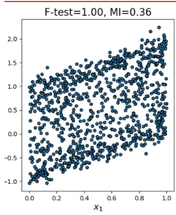
资料来源：sklearn，华泰证券研究所

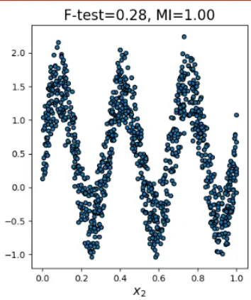

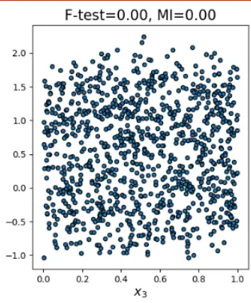

## 多头超额收益

RankIC衡量的是因子和收益之间的线性关系，但对于部分投资者来说，可能希望以多头超额收益来评价因子。因此，我们也将多头超额收益加入到适应度指标中，具体计算如下：参照分层回测的做法，同时考虑正向因子和负向因子，跟踪计算分层组合第一层和最后一层的组合净值；在样本期期末计算这两个组合的年化超额收益率，取两者较大值作为多头超额收益。

## 改进方向2：非线性因子的使用方法

由于互信息可以衡量变量间的非线性关系，所以使用互信息挖掘出来的因子往往是非线性因子，即因子在分层测试中并非头部(或尾部)组合表现最好，而是中间层次的组合表现最好。对于非线性因子的使用，一般有两大类方法，第一类方法是在因子合成时直接使用机器学习模型(如XGBoost、神经网络等)拟合因子与收益率间的关系，该类方法在本系列前期报告中有过大量介绍，此处不再赘述。第二类方法是对单个因子做非线性变换，重构因子与收益之间的关系，最终得到线性因子。第二类方法中有两个具体方法：三次方回归残差法和多项式拟合法，我们将进行详细介绍。

## 三次方回归残差法

三次方回归残差法方法主要参考了 BARRA 的报告Characteristics of FactorPortfolios(Menchero,2010)，报告介绍了一种计算非线性规模因子Non-linear Size (NLS)的方法。NLS因子由规模因子和规模因子三次方项的线性组合构造，公式如下：

$$
\begin{array}{c}{{X_{n}(NLS)=X_{n}(Size^{3})-bX_{n}(Size)}}\\{{\sum_{n}X_{n}(NLS)X_{n}(Size)=0}}\end{array}
$$

其中， $X_{n}(factor)$ 表示特定截面日期的第n只股票的因子值，NLS表示非线性规模因子，Size表示规模因子，通过求解上面的方程组可以得到非线性规模因子 $X_{n}(NLS)$ 的解析解。在实际计算中，用 $Size^{3}$ 对Size过原点回归取残差即可得到 $NLS_{\circ}$ 这种因子转换的效果如下：

图表3：非线性规模因子处理示意图
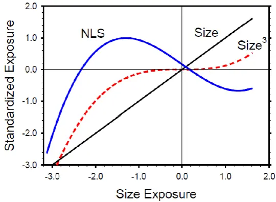
资料来源：华泰证券研究所，Characteristics of Factor Portfolios(Menchero,2010)

在图表3中，横轴表示原始因子Size的暴露度，纵轴表示转换后因子的暴露度，三条曲线分别对应：蓝线-三次方回归残差(NLS)，红线-三次方规模因子 $(Size^{3})$ ，黑线-原始规模因子(Size)。在转换后，NLS的峰值位于原始因子Size的中间部分，而左右两端的取值较低，实现了因子的非线性转换，而且效果与我们的转换目标相似。因此，我们可以套用这种方法来转换互信息高分因子。

## 多项式拟合法

多项式拟合法是一种适用性更广的转换方法，具体做法是用第T+1 期的股票收益对第T期因子的多项式进行回归，用回归拟合得到参数来对因子进行多项式转换。在我们挖掘出的非线性因子中，因子与股票收益的关系曲线单调性最多只出现两次转变，而且曲线不一定是对称的。考虑到因子的这些特征，我们认为把多项式的最高阶定为三次比较合适，回归模型具体表达式如下：

$$
\begin{array}{rl}&{r_{i,t+1}=~a{F_{it}}^{3}+b{F_{it}}^{2}+c{F_{it}}+d}\\&{r_{i,t+1}\colon\mathrm{~f~}_{\bar{x}}^{\pi}\xrightarrow{\oplus}\mathrm{~i~}\ 因数}\\&{F_{it}\colon\mathrm{~\textmu||\vec{x}~\xrightarrow{\oplus}~i~}\nearrow\mathrm{~T~}\xrightarrow{\#}\mathrm{~f~f~}\dot{\vec{y}}\mathrm{~\textmu||\vec{y}~\xrightarrow{\mu>}~\mu||~}}\\&{F_{it}\colon\mathrm{~\mu||\vec{x}~\xrightarrow{\oplus}~i~}\nearrow\mathrm{~T~}\xrightarrow{\#}\mathrm{~f~f~}\dot{\vec{y}}\mathrm{~\mu||~}\dot{\vec{y}}\mathrm{~\textmu||~}\xrightarrow{\oplus}\mathrm{~\forall~}\bar{\vec{y}}}\end{array}
$$

在实际计算中，我们采用滚动回归的方式，每隔20个交易日做一次回归拟合，使用历史500天的数据作为回归样本，每次拟合出来的参数用于转换未来20个交易日的因子。

与三次方回归残差法相似，多项式拟合法也是使用因子的高次函数来重构因子，不同的是，前者只使用了因子本身的数据信息，而后者进一步加入了股票收益的信息。在形式上，多项式拟合法还考虑了二次项的影响，提升了转换函数的灵活度。

## 改进方向3：交叉验证控制过拟合

在本系列报告的《基于遗传规划的选股因子挖掘》中，我们在训练因子和评估算法性能时，使用的是同一个数据集，用已经在训练环节出现过的样本来评估算法性能，容易产生过拟合。为了控制过拟合的风险，我们在gplearn中加入交叉验证环节，观察新因子在验证集上的适应度表现，据此来评价遗传规划挖掘有效因子的能力。

图表4：交叉验证流程图
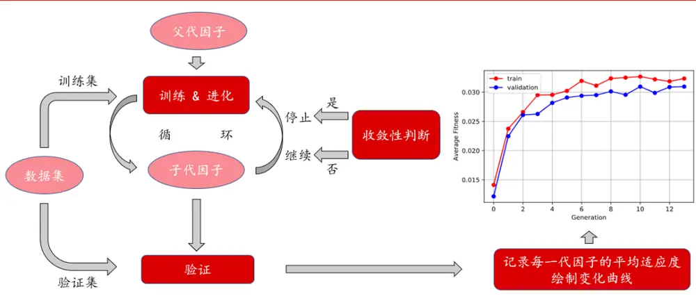
资料来源：华泰证券研究所

加入交叉验证之后，遗传规划的流程如下：将数据集按指定比例划分为训练集和验证集两部分，训练集用于训练和进化，循环生成子代因子，这一部分与原先的算法基本一致；对于每一代新生成的因子，我们都会在验证集上计算适应度，并记录每一代的验证集平均适应度，观测验证集平均适应度的收敛性，当其明显收敛时，停止循环。

## 遗传规划选股因子挖掘的测试流程和测试结果

测试流程

测试流程包含下列步骤：

## 1. 数据获取和特征提取：

(1) 股票池：全A股，剔除ST、PT股票，剔除每个截面期下一交易日涨停和停牌的股票。

(2) 回测区间：2010/1/4～2019/7/31。时间排前80%的截面为训练集，后20%的截面为验证集。

(3) 原始因子列表如图表5所示，都是个股的原始量价信息，未经过特征工程。

(4) 函数列表如图表6所示。

(5) 预测目标：个股20个交易日后的收益率。

图表5：原始因子列表

| 名称 | 定义 |
| --- | --- |
| return1 | 个股日频收益率(由相邻两个交易日的后复权收盘价计算得来)。 |
| open, close, high, low, volume | 个股日频开盘价、收盘价、最高价、最低价、成交量。 |
| vwap | 个股日频成交量加权平均价。 |
| turn, free_turn | 个股日频换手率、自由流通股换手率。 |

资料来源：Wind，华泰证券研究所

图表6：函数列表

| 类型 | 名称 | 定义 |
| --- | --- | --- |
|  | X：以下函数中自变量 | X一般可以理解为向量{Xi}1≤i≤N' 代表N只个股在某指定截面日的因子值，例如：X=close+open； 若X为矩阵，则以下函数可以理解为对每个列向量分别进行运算，再将结果按列合并。 |
| 基础函数 | add(X, Y) | 返回值为向量，其中第i个元素为X+Y |
| 基础函数 | sub(X, Y) | 返回值为向量，其中第i个元素为Xi-Yi |
| 基础函数 | mul(X, Y) | 返回值为向量，其中第i个元素为X;*Y(对应 matlab 中的点乘) |
| 基础函数 | div(X, Y) | 返回值为向量，其中第i 个元素为Xi/Yi(对应 matlab 中的点除) |
| 基础函数 | abs(X) | 返回值为向量，其中第i个元素为X的绝对值 |
| 基础函数 | sqrt(X) | 返回值为向量，其中第i个元素为 abs(Xi)的开方 |
| 基础函数 | log(X) | 返回值为向量，其中第i 个元素为 abs(Xi)的对数 |
| 基础函数 | inv(X) | 返回值为向量，其中第i个元素为Xi的倒数 |
| 自定义函数 rank(X) |  | 返回值为向量，其中第i个元素为X在向量X中的分位数。 |
| 自定义函数 | delay(X, d) | 返回值为向量，d天以前的X值。 |
| 自定义函数 | ts_corr(X, Y, d) | 返回值为向量，其中第i个元素为过去d天X值构成的时序数列和Y值构成的时序数列的相关系数。 |
| 自定义函数 | ts_cov(X, Y, d) | 返回值为向量，其中第i个元素为过去d天X值构成的时序数列和Y值构成的时序数列的协方差。 |
| 自定义函数 scale(X， a) |  | 返回值为向量 a*X/sum(abs(x))，a 的缺省值为 1，一般 a 应为正数。 |
| 自定义函数 | delta(X, d) | 返回值为向量 X - delay(X, d)。 |
| 自定义函数 | signedpower(X, a) | 返回值为向量 sign(X).*(abs(X).^a)，其中.*和.^两个运算符代表向量中对应元素相乘、元素乘方。 |
| 自定义函数 | decay_linear(X, d) | 返回值为向量，其中第i个元素为过去d天X值构成的时序数列的加权平均值，权数为d,d-1，..., 1(权数之和应为1，需进行归一化处理)，其中离现在越近的日子权数越大。 |
| 自定义函数 ts_min(X， d) |  | 返回值为向量，其中第i个元素为过去d天X值构成的时序数列中最小值。 |
| 自定义函数 | ts_max(X, d) | 返回值为向量，其中第i个元素为过去d天X值构成的时序数列中最大值。 |
| 自定义函数 | ts_argmin(X, d) | 返回值为向量，其中第i个元素为过去d天X值构成的时序数列中最小值出现的位置。 |
| 自定义函数 | ts_argmax(X, d) | 返回值为向量，其中第i个元素为过去d天X值构成的时序数列中最大值出现的位置。 |
| 自定义函数 | ts_rank(X, d) | 返回值为向量，其中第i个元素为过去d天X值构成的时序数列中本截面日X值所处分位数。 |
| 自定义函数 | ts_sum(X, d) | 返回值为向量，其中第i个元素为过去d天X值构成的时序数列之和 |
| 自定义函数 | ts_prod(X, d) | 返回值为向量，其中第i个元素为过去d天X值构成的时序数列的连乘乘积。 |
| 自定义函数 | ts_stddev(X, d) | 返回值为向量，其中第i个元素为过去d天X值构成的时序数列的标准差。 |
| 自定义函数 | ts_zscore(X, d) | 返回值为向量，其中第i个元素为过去d天X值构成的时序数列的平均值除以标准差。 |
| 自定义函数 rank_sub(X， Y) |  | 返回值为向量，其中第i个元素为X在向量X中的分位数减去Y在向量Y中的分位数。 |
| 自定义函数 | rank_div(X, Y) | 返回值为向量，其中第i个元素为X在向量X中的分位数除以Y在向量Y中的分位数。 |
| 自定义函数 | sigmoid(X) | 返回值为向量，其中第i个元素为[1 + exp(-Xi)]−1，将X映射到(0,1)的区间 |

资料来源：gplearn，华泰证券研究所

## 2. 使用遗传规划进行因子挖掘：

1)使用图表5中的因子和图表6中的函数集，生成大量公式，并按照图表4的流程进行公式的进化和筛选。

2)公式适应度的计算：假设有公式F，得出该公式在截面t上对所有个股的因子向量$F_{t}$ 后，我们会对因子进行以下处理：

a)中位数去极值：设 $F_{M}$ 为该向量中位数， $F_{M1}$ 为向量 $\left|F_{t}-F_{M}\right|$ 的中位数，则将向量 $F_{t}$ 中所有大于 $F_{M}+5F_{M1}$ 的数重设为 $F_{M}+5F_{M1}$ ，将向量 $F_{t}$ 中所有小于 $\mathbf{\partial}^{-}F_{M}\mathbf{\partial}^{-}$ $5F_{M1}$ 的数重设为 $F_{M}-5F_{M1}$

b) 中性化：在每个截面t上，对 $F_{t}$ 进行行业、市值、20日收益率、20日换手率、20日波动率中性化，以剔除以上五个因子的影响。

经过以上处理后，计算处理后因子适应度(互信息或多头超额收益)。

## 3. 对遗传规划挖掘出的因子进行IC测试、分层测试和相关性分析。

## 测试结果

在遗传规划的运行过程中，我们可以监控公式群体的一些统计信息来得知当前公式进化的状况。图表7展示了某次测试中的统计信息(适应度为互信息)。可以看出，随着进化代数的增加，训练集和验证集的平均适应度都逐渐上升趋于收敛。实际应用中，可以在验证集平均适应度达到最优后停止算法的运行。

图表7：遗传规划测试过程的统计信息(适应度为互信息)

| 世代 | 公式群体的平均长度 | 训练集平均适应度 | 验证集平均适应度 |
| --- | --- | --- | --- |
| 1 | 6.86 | 0.0138 | 0.0135 |
| 2 | 8.22 | 0.0159 | 0.0159 |
| 3 | 7.79 | 0.0179 | 0.0174 |
| 4 | 7.41 | 0.0204 | 0.0204 |
| 5 | 7.32 | 0.0216 | 0.0221 |
| 6 | 6.48 | 0.0210 | 0.0205 |
| 7 | 5.38 | 0.0210 | 0.0201 |
| 8 | 4.57 | 0.0197 | 0.0198 |

资料来源：Wind，华泰证券研究所

## 遗传规划所得因子的单因子测试

本章中，我们将分别展示通过互信息和多头超额收益作为适应度指标挖掘出的因子，并进行单因子测试。

## 分层测试法说明

分层测试法与回归法、IC值分析相比，能够发掘因子对收益预测的非线性规律。也即，若存在一个因子分层测试结果显示，其Top组和Bottom组的绩效长期稳定地差于Middle组，则该因子对收益预测存在稳定的非线性规律，但在回归法和IC值分析过程中很可能被判定为无效因子。分层测试构建方法如下：

1. 股票池：全A股，剔除ST、PT股票，剔除每个截面期下一交易日停牌的股票。

2. 回测区间：2010/1/4～2019/7/31。

3. 换仓：月频调仓，在每个截面期核算因子值，构建分层组合，在截面期下一个交易日按当日 vwap换仓，交易费用默认为单边 0.15%。

4. 分层方法：先将因子暴露度向量进行预处理(去极值，中性化)，将股票池内所有个股按处理后的因子值从大到小进行排序，等分N层，每层内部的个股等权重配置。当个股总数目无法被N整除时采用任一种近似方法处理均可，实际上对分层组合的回测结果影响很小。分层测试中的基准组合为股票池内所有股票的等权组合。

5. 多空组合收益计算方法：用 Top 组每天的收益减去 Bottom 组每天的收益，得到每日多空收益序列 $r_{1},r_{2},\cdots,r_{n}$ ，则多空组合在第n天的净值等于 $(1+r_{1})(1+r_{2})\cdots(1+r_{n})$

6. 本文分层测试的结果均不存在“路径依赖”效应，我们以交易日=20天为例说明构建方法：首先，在回测首个交易日K_0构建分层组合并完成建仓，然后分别在交易日K_i,K_(i+20),K_(i+40),…按当日收盘信息重新构建分层组合并完成调仓，i取值为1～20内的整数，则我们可以得到20个不同的回测轨道，在这20个回测结果中按不同评价指标(比如年化收益率、信息比率等)可以提取出最优情形、最差情形、平均情形等，以便我们对因子的分层测试结果形成更客观的认知。

## 互信息作为适应度指标挖掘所得因子的测试结果

使用互信息作为适应度指标后，遗传规划挖掘出了多个非线性因子。图表8展示了这些因子的表达式、互信息和RankIC(因子进行了行业、市值、20日收益率、20日波动率、20日换手率中性化)，图表9展示了这些因子分层测试中超额收益最高层次的测试结果。

图表8：互信息作为适应度指标挖掘所得因子

| 因子 | 表达式 | 互信息 | RankIC |
| --- | --- | --- | --- |
| Alpha1 | -ts_cov(delay(turn, 3), volume, 7) | 0.0197 | -0.81% |
| Alpha2 | -ts_cov(delay(volume, 5), vwap, 4) | 0.0198 | -0.57% |
| Alpha3 | -ts_cov(ts_cov(delay(low, 3), turn, 7), turn, 7) | 0.0193 | 0.91% |
| Alpha4 | -ts_cov(ts_cov(sub(vwap, close), high, 5), turn, 7) | 0.0243 | -0.92% |
| Alpha5 | -mul(ts_sum(vwap, 5), ts_cov(volume, vwap, 3)) | 0.0222 | 4.03% |
| Alpha6 | -ts_cov(ts_max(turn, 7), free_turn, 9) | 0.0168 | 4.03% |
| Alpha7 | rank_div(rank_sub(rank_div(close, open), open), ts_min(sub(free_turn, close), 3)) | 0.0271 | 2.07% |
| Alpha8 | ts_cov(ts_prod(low, 4), close, 6) | 0.0328 | 0.52% |
| Alpha9 | -mul(free_turn, mul(ts_cov(low, high, 5), delta(low, 5))) | 0.0255 | 2.14% |
| Alpha10 | -div(add(turn, volume), ts_zscore(close, 9)) | 0.0224 | 1.54% |
| Alpha11 | -ts_cov(mul(close, return1), turn, 7) | 0.0242 | 3.32% |
| Alpha12 | -ts_cov(mul(close, return1), turn, 4) | 0.0264 | 3.08% |
| Alpha13 | -div(rank_div(vwap, volume), ts_prod(close, 10)) | 0.0392 | 0.75% |
| Alpha14 | -ts_cov(ts_prod(turn, 5), turn, 7) | 0.0250 | 2.73% |
| Alpha15 | -mul(free_turn, mul(high, delta(low, 5)) | 0.0275 | 2.06% |
| Alpha16 | -mul(return1, mul(turn, decay_linear(turn, 5))) | 0.0279 | 1.11% |
| Alpha17 | ts_cov(mul(close, rank_div(close, return1)), high, 10) | 0.0356 | 0.46% |
| Alpha18 | -ts_min(ts_prod(delta(vwap, 10), 10), 10) | 0.0230 | 1.19% |
| Alpha19 | -ts_cov(ts_stddev(turn, 4), close, 6) | 0.0279 | 2.85% |
| Alpha20 | mul(free_turn, rank_sub(open, delta(volume, 9))) | 0.0222 | 1.92% |

资料来源：Wind，华泰证券研究所

图表9：Alpha1~Alpha20 因子分层测试中的最高收益层表现

| 年化超额 年化跟踪 |  |  |  |  |  |  |  |  | 超额收益 | 超额收益 | 相对基准 |
| --- | --- | --- | --- | --- | --- | --- | --- | --- | --- | --- | --- |
|  | 年化收益率年化波动率 夏普比率 最大回撤 |  |  |  | 月均双边换手率 | 收益率 | 误差 |  | 信息比率 最大回撤 Calmar 比率 月度胜率 |  |  |
| Alpha1 | 11.32% | 25.86% | 0.44 | 54.17% | 157.36% | 4.48% | 2.76% | 1.62 | 4.88% | 0.92 | 65.22% |
| Alpha2 | 10.46% | 26.26% | 0.40 | 57.80% | 158.07% | 3.79% | 2.45% | 1.55 | 3.80% | 1.00 | 65.22% |
| Alpha3 | 9.04% | 27.08% | 0.33 | 57.77% | 163.12% | 2.68% | 2.21% | 1.21 | 3.50% | 0.77 | 58.26% |
| Alpha4 | 8.83% | 25.83% | 0.34 | 57.38% | 155.37% | 2.09% | 3.97% | 0.53 | 12.12% | 0.17 | 58.26% |
| Alpha5 | 10.89% | 26.31% | 0.41 | 56.46% | 155.88% | 4.19% | 3.06% | 1.37 | 5.03% | 0.83 | 59.13% |
| Alpha6 | 9.64% | 27.38% | 0.35 | 58.53% | 159.21% | 3.35% | 1.81% | 1.85 | 2.91% | 1.15 | 66.09% |
| Alpha7 | 7.46% | 26.70% | 0.28 | 60.79% | 154.37% | 1.07% | 3.03% | 0.35 | 6.80% | 0.16 | 51.30% |
| Alpha8 | 7.70% | 26.15% | 0.29 | 58.78% | 146.03% | 1.11% | 3.99% | 0.28 | 11.23% | 0.10 | 49.57% |
| Alpha9 | 9.56% | 27.35% | 0.35 | 56.61% | 163.23% | 3.25% | 2.10% | 1.55 | 3.02% | 1.08 | 63.48% |
| Alpha10 | 9.56% | 27.06% | 0.35 | 59.83% | 158.61% | 3.18% | 2.04% | 1.56 | 4.72% | 0.67 | 65.22% |
| Alpha11 | 9.54% | 26.53% | 0.36 | 56.71% | 160.66% | 2.99% | 2.54% | 1.18 | 5.05% | 0.59 | 59.13% |
| Alpha12 | 9.38% | 26.66% | 0.35 | 57.35% | 161.70% | 2.88% | 2.33% | 1.24 | 3.42% | 0.84 | 59.13% |
| Alpha13 | 9.23% | 26.30% | 0.35 | 58.07% | 102.47% | 2.54% | 5.10% | 0.50 | 12.85% | 0.20 | 48.70% |
| Alpha14 | 9.30% | 25.86% | 0.36 | 55.91% | 153.15% | 2.56% | 3.19% | 0.80 | 8.18% | 0.31 | 64.35% |
| Alpha15 | 8.93% | 27.08% | 0.33 | 57.24% | 162.71% | 2.58% | 2.01% | 1.29 | 3.17% | 0.81 | 58.26% |
| Alpha16 | 9.26% | 25.73% | 0.36 | 57.00% | 161.71% | 2.51% | 2.68% | 0.93 | 4.63% | 0.54 | 63.48% |
| Alpha17 | 8.49% | 25.80% | 0.33 | 59.51% | 149.95% | 1.72% | 4.76% | 0.36 | 12.97% | 0.13 | 51.30% |
| Alpha18 | 8.82% | 25.66% | 0.34 | 57.20% | 137.78% | 2.04% | 3.48% | 0.59 | 9.20% | 0.22 | 61.74% |
| Alpha19 | 8.26% | 26.55% | 0.31 | 60.50% | 160.34% | 1.80% | 2.28% | 0.79 | 4.19% | 0.43 | 56.52% |
| Alpha20 | 8.37% | 26.28% | 0.32 | 58.51% | 155.98% | 1.84% | 1.91% | 0.96 | 4.83% | 0.38 | 57.39% |
| 基准 | 6.15% | 27.15% | 0.23 | 63.15% |  |  |  |  |  |  |  |

资料来源：Wind，华泰证券研究所

图表10展示了这些因子的相关性，除了个别因子的相关性较高以外，因子之间整体的相关性不高。

图表10：Alpha1~Alpha20 因子的相关性矩阵

| Alpha Alpha Alpha Alpha Alpha Alpha Alpha Alpha Alpha Alpha Alpha Alpha Alpha Alpha Alpha Alpha Alpha Alpha Alpha Alpha |  |  |  | 4 |  |  |  |  |  |  |  |  |  |  |  |  |  |  |  |  |
| --- | --- | --- | --- | --- | --- | --- | --- | --- | --- | --- | --- | --- | --- | --- | --- | --- | --- | --- | --- | --- |
|  | 1 | 2 | 3 |  | 5 | 6 | 7 | 8 | 9 | 10 | 11 | 12 | 13 | 14 | 15 | 16 | 17 | 18 | 19 | 20 |
| Alpha1 |  | 0.07 | -0.03 | -0.02 | -0.02 | 0.01 | 0.01 | 0.00 | 0.00 | 0.00 | -0.06 | -0.02 | 0.00 | 0.13 | 0.01 | 0.00 | 0.00 | 0.00 | -0.01 | 0.03 |
| Alpha2 | 0.07 |  | -0.02 | -0.01 | -0.03 | 0.00 | -0.01 | 0.00 | 0.02 | 0.00 | -0.02 | -0.01 | 0.00 | 0.01 | 0.02 | 0.00 | 0.00 | 0.00 | -0.02 | -0.01 |
| Alpha3 | -0.03 | -0.02 |  | 0.07 | 0.05 | 0.26 | 0.01 | 0.03 | 0.10 | 0.00 | -0.06 | -0.06 | 0.00 | 0.07 | 0.15 | 0.02 | 0.05 | 0.02 | 0.22 | 0.03 |
| Alpha4 | -0.02 | -0.01 | 0.07 |  | 0.05 | 0.05 | 0.01 | 0.00 | 0.08 | 0.00 | 0.09 | 0.06 | 0.00 | 0.01 | 0.08 | 0.00 | 0.06 | -0.01 | 0.15 | 0.01 |
| Alpha5 | -0.02 | -0.03 | 0.05 | 0.05 |  | 0.06 | 0.04 | 0.00 | 0.13 | 0.00 | 0.08 | 0.10 | 0.00 | 0.02 | 0.13 | 0.04 | 0.02 | -0.02 | 0.09 | -0.01 |
| Alpha6 | 0.01 | 0.00 | 0.26 | 0.05 | 0.06 |  | -0.03 | 0.02 | 0.06 | 0.00 | 0.09 | 0.11 | -0.01 | 0.13 | 0.14 | 0.09 | 0.07 | 0.00 | 0.31 | -0.17 |
| Alpha7 | 0.01 -0.01 |  | 0.01 | 0.01 | 0.04 | -0.03 |  | 0.40 | 0.00 | 0.00 | 0.01 | 0.02 | 0.00 | -0.01 | 0.03 | 0.03 | 0.03 | -0.09 | 0.00 | 0.06 |
| Alpha8 | 0.00 | 0.00 | 0.03 | 0.00 | 0.00 | 0.02 | 0.40 |  | -0.09 | 0.00 | 0.01 | 0.00 | 0.00 | 0.00 | -0.02 | 0.00 | 0.00 | -0.07 | 0.01 | 0.03 |
| Alpha9 | 0.00 | 0.02 | 0.10 | 0.08 | 0.13 | 0.06 | 0.00 | -0.09 |  | 0.00 | 0.06 | 0.04 | 0.00 | 0.01 | 0.71 | 0.07 | 0.04 | 0.03 | 0.22 | 0.02 |
| Alpha10 | 0.00 | 0.00 | 0.00 | 0.00 | 0.00 | 0.00 | 0.00 | 0.00 | 0.00 |  | 0.00 | 0.00 | 0.00 | 0.00 | 0.01 | 0.01 | 0.00 | 0.00 | 0.01 | -0.02 |
| Alpha11 | -0.06 | -0.02 | -0.06 | 0.09 | 0.08 | 0.09 | 0.01 | 0.01 | 0.06 | 0.00 |  | 0.66 | 0.00 | 0.04 | 0.16 | 0.16 | -0.06 | -0.02 | 0.21 | 0.00 |
| Alpha12 | -0.02 | -0.01 | -0.06 | 0.06 | 0.10 | 0.11 | 0.02 | 0.00 | 0.04 | 0.00 | 0.66 |  | 0.00 | 0.02 | 0.13 | 0.18 | -0.03 | -0.02 | 0.16 | -0.02 |
| Alpha13 | 0.00 | 0.00 | 0.00 | 0.00 | 0.00 | -0.01 | 0.00 | 0.00 | 0.00 | 0.00 | 0.00 | 0.00 |  | 0.00 | 0.00 | 0.00 | 0.00 | 0.00 | -0.01 | -0.02 |
| Alpha14 | 0.13 | 0.01 | 0.07 | 0.01 | 0.02 | 0.13 | -0.01 | 0.00 | 0.01 | 0.00 | 0.04 | 0.02 | 0.00 |  | 0.02 | 0.02 | 0.03 | -0.01 | 0.03 | 0.10 |
| Alpha15 | 0.01 | 0.02 | 0.15 | 0.08 | 0.13 | 0.14 | 0.03 -0.02 |  | 0.71 | 0.01 | 0.16 | 0.13 | 0.00 | 0.02 |  | 0.13 | 0.03 | 0.03 | 0.28 | 0.00 |
| Alpha16 | 0.00 | 0.00 | 0.02 | 0.00 | 0.04 | 0.09 | 0.03 | 0.00 | 0.07 | 0.01 | 0.16 | 0.18 | 0.00 | 0.02 | 0.13 |  | -0.03 | 0.00 | 0.15 | -0.14 |
| Alpha17 | 0.00 | 0.00 | 0.05 | 0.06 | 0.02 | 0.07 | 0.03 | 0.00 | 0.04 | 0.00 | -0.06 | -0.03 | 0.00 | 0.03 | 0.03 | -0.03 |  | -0.03 | 0.08 | 0.05 |
| Alpha18 | 0.00 | 0.00 | 0.02 | -0.01 | -0.02 | 0.00 | -0.09 | -0.07 | 0.03 | 0.00 | -0.02 | -0.02 | 0.00 | -0.01 | 0.03 | 0.00 | -0.03 |  | 0.00 | -0.02 |
| Alpha19 | -0.01 -0.02 |  | 0.22 | 0.15 | 0.09 | 0.31 | 0.00 | 0.01 | 0.22 | 0.01 | 0.21 | 0.16 | -0.01 | 0.03 0.10 | 0.28 0.00 | 0.15 -0.14 | 0.08 0.05 | 0.00 -0.02 | -0.03 | -0.03 |

资料来源：Wind，华泰证券研究所
接下来，我们详细展示 Alpha1~Alpha6的分层测试结果。

## Alpha1 因子的详细测试结果

Alpha1 = -ts_cov(delay(turn, 3), volume, 7)

Alpha1 计算的是 delay(turn, 3)和volume 在过去7个交易日内的协方差相反数。从分层测试的结果上看，原始因子的最高收益组合出现在第6层，Top层和Bottom层都没有实现正超额收益；经过三次方回归残差法转换后，前6层均实现了正超额收益，后4层的超额收益都为负值，但最高收益组合出现在第4层，即超额收益和层数之间仍不是严格的单调关系；经过多项式拟合法转换后，超额收益和层数之间呈现单调关系，即转换后的因子与收益之间存在较强的线性关系。

图表11：Alpha1 分层组合1~10 净值除以基准净值
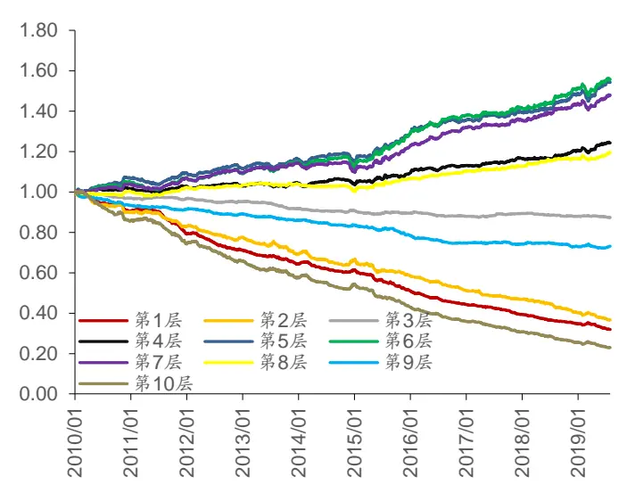
资料来源：Wind，华泰证券研究所

图表12：Alpha1 各分层组合年化超额收益率
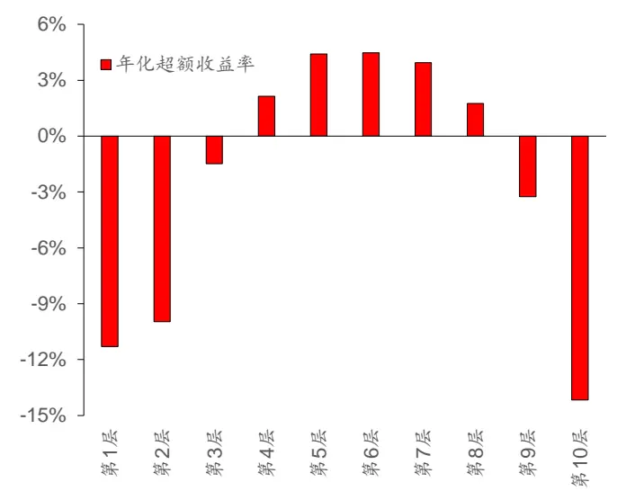
资料来源：Wind，华泰证券研究所

图表13：Alpha1 分层组合1~10 净值除以基准净值(三次方回归残差法)
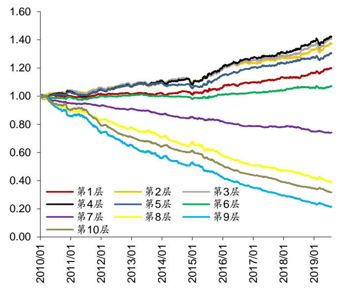
资料来源：Wind，华泰证券研究所

图表14：Alpha1 分层组合1~10 净值除以基准净值(多项式拟合法)
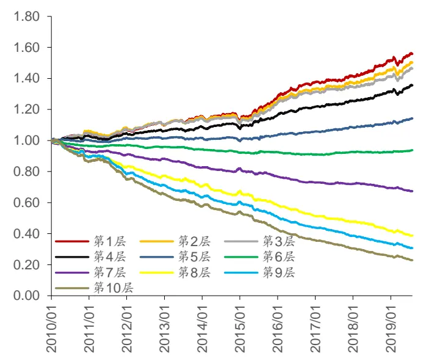
资料来源：Wind，华泰证券研究所

图表15：Alpha1 的分层测试表现(因子做行业+4个常见风格中性，三次方回归残差法)

| 年化收益率年化波动率夏普比率最大回撤 |  |  |  |  | 月均双边换手率 | 年化超额收益率年化跟踪误差信息比率最大回撤 Calmar 比率 月度胜率 |  |  |  |  |  |
| --- | --- | --- | --- | --- | --- | --- | --- | --- | --- | --- | --- |
| 第1层 | 8.22% | 26.52% | 0.31 | 59.24% |  | 162.58% | 1.76% | 1.78% 0.99 | 2.72% | 0.65 | 61.74% |
| 第2层 | 9.81% | 26.27% | 0.37 | 57.73% | 161.71% | 3.18% | 2.08% | 1.53 | 3.46% | 0.92 | 62.61% |
| 第3层 | 10.11% | 26.05% | 0.39 | 56.25% | 160.08% | 3.40% | 2.34% | 1.45 | 4.30% | 0.79 | 60.87% |
| 第4层 | 10.24% | 25.94% | 0.39 | 55.60% | 159.64% | 3.49% | 2.39% | 1.46 | 4.18% | 0.84 | 64.35% |
| 第5层 | 9.23% | 26.20% | 0.35 | 56.76% | 161.71% | 2.62% | 1.99% | 1.32 | 4.20% | 0.62 | 67.83% |
| 第6层 | 6.95% | 26.67% | 0.26 | 60.24% | 163.51% | 0.62% | 1.37% | 0.45 | 3.58% | 0.17 | 61.74% |
| 第7层 | 2.79% | 27.33% | 0.10 | 66.01% | 162.06% | -3.13% | 1.36% | -2.29 | 25.83% | -0.12 | 28.70% |
| 第8层 | -4.01% | 28.46% | -0.14 | 74.15% | 156.34% | -9.28% | 3.08% | -3.01 | 59.85% | -0.16 | 13.91% |
| 第9层 | -10.04% | 29.33% | -0.34 | 80.99% | 149.16% | -14.80% | 4.31% | -3.44 | 77.75% | -0.19 | 13.04% |
| 第10层 | -6.19% | 28.31% | -0.22 | 76.89% | 152.00% | -11.38% | 2.93% | -3.88 | 67.62% | -0.17 | 14.78% |
| 基准 | 6.15% | 27.15% | 0.23 | 63.15% |  |  |  |  |  |  |  |
| 多空组合 | 14.68% | 4.42% | 3.32 | 5.50% |  |  |  |  |  |  |  |

资料来源：Wind，华泰证券研究所

图表16：Alpha1 的分层测试表现(因子做行业+4个常见风格中性，多项式拟合法)

| 超额收益相对基准 |  |  |  |  |  |  |  |  |  |  |
| --- | --- | --- | --- | --- | --- | --- | --- | --- | --- | --- |
| 年化收益率年化波动率夏普比率最大回撤 |  |  |  | 月均双边换手率 |  | 年化超额收益率年化跟踪误差信息比率最大回撤 Calmar 比率月度胜率 |  | 超额收益 |  |  |
| 第1层 | 11.33% | 25.85% | 0.44 | 54.00% | 157.37% | 4.48% | 2.74% | 1.63 4.89% | 0.92 | 69.57% |
| 第2层 | 10.89% | 25.89% | 0.42 | 54.84% | 158.83% | 4.08% | 2.63% | 1.55 4.91% | 0.83 | 64.35% |
| 第3层 | 10.58% | 26.08% | 0.41 | 55.73% | 160.46% | 3.85% | 2.36% | 1.63 3.86% | 1.00 | 63.48% |
| 第4层 | 9.68% | 26.35% | 0.37 | 57.20% | 162.18% | 3.08% | 1.96% | 1.57 3.39% | 0.91 | 69.57% |
| 第5层 | 7.67% | 26.63% | 0.29 | 59.97% | 163.07% | 1.28% | 1.50% | 0.85 2.96% | 0.43 | 60.87% |
| 第6层 | 5.41% | 26.92% | 0.20 | 62.85% | 162.75% | -0.76% | 1.03% | -0.74 9.74% | -0.08 | 42.61% |
| 第7层 | 1.74% | 27.37% | 0.06 | 66.86% | 161.27% | -4.10% | 1.60% | -2.56 32.43% | -0.13 | 26.09% |
| 第8层 | -4.11% | 28.43% | -0.14 | 74.25% | 156.11% | -9.38% | 3.07% | -3.06 60.29% | -0.16 | 15.65% |
| 第9层 | -6.49% | 28.63% | -0.23 | 77.03% | 152.53% | -11.58% | 3.08% | -3.76 68.30% | -0.17 | 12.17% |
| 第10层 | -9.40% | 28.92% | -0.33 | 80.20% | 149.93% | -14.28% | 3.89% | -3.67 76.37% | -0.19 | 11.30% |
| 基准 | 6.15% | 27.15% | 0.23 | 63.15% |  |  |  |  |  |  |
| 多空组合 | 21.58% | 6.51% | 3.31 | 9.15% |  |  |  |  |  |  |

资料来源：Wind，华泰证券研究所

## Alpha2 因子的详细测试结果

Alpha2 = -ts_cov(delay(volume, 5), vwap, 4)

Alpha2 计算的是 delay(volume， 5)和 volume 在过去 4 个交易日内的协方差相反数。从分层测试的结果上看，原始因子的最高收益组合出现在第 6层，Top层和 Bottom 层都没有实现正超额收益；经过三次方回归残差法转换后，前5层均实现了正超额收益，后5层的超额收益都为负值，但最高收益组合出现在第4层，即超额收益和层数之间仍不是严格的单调关系；经过多项式拟合法转换后，超额收益和层数之间呈现单调关系，即转换后的因子与收益之间存在较强的线性关系。

图表17：Alpha2 分层组合 1~10 净值除以基准净值
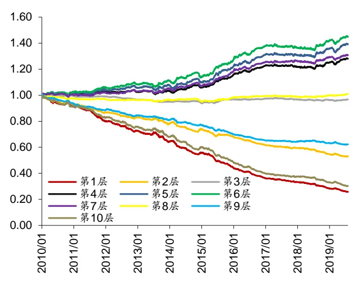
资料来源：Wind，华泰证券研究所

图表18：Alpha2 各分层组合年化超额收益率
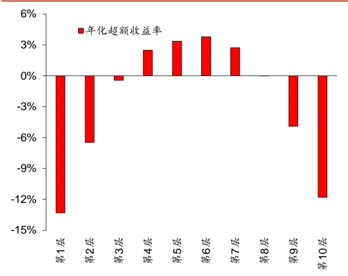
资料来源：Wind，华泰证券研究所

图表19:Alpha2 分层组合1~10 净值除以基准净值(三次方回归残差法)
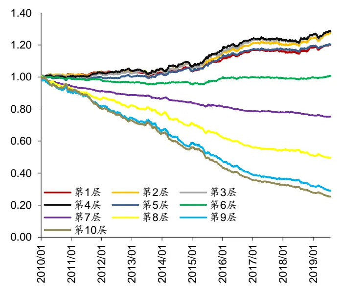
资料来源：Wind，华泰证券研究所

图表20：Alpha2 分层组合1~10 净值除以基准净值(多项式拟合法)
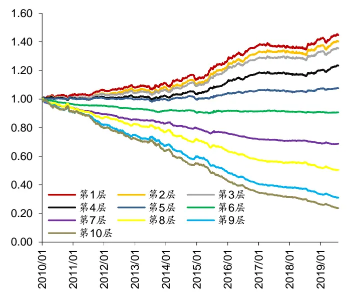
资料来源：Wind，华泰证券研究所

图表21：Alpha2的分层测试表现(因子做行业+4个常见风格中性，三次方回归残差法)

| 年化收益率年化波动率夏普比率最大回撤 |  |  |  |  | 月均双边换手率 | 年化超额收益率年化跟踪误差信息比率最大回撤 Calmar 比率 月度胜率 |  |  |  |  |  |
| --- | --- | --- | --- | --- | --- | --- | --- | --- | --- | --- | --- |
| 第1层 | 8.25% | 26.56% | 0.31 | 60.21% |  | 162.23% | 1.81% | 1.74% | 1.04 3.72% | 0.49 | 57.39% |
| 第2层 | 8.94% | 26.55% | 0.34 | 58.89% | 161.43% | 2.45% | 1.93% | 1.27 | 2.90% | 0.84 | 60.87% |
| 第3层 | 9.02% | 26.34% | 0.34 | 58.91% | 160.09% | 2.46% | 2.12% | 1.16 | 3.04% | 0.81 | 59.13% |
| 第4层 | 9.05% | 26.40% | 0.34 | 58.96% | 160.28% | 2.50% | 2.04% | 1.23 | 3.63% | 0.69 | 63.48% |
| 第5层 | 8.28% | 26.59% | 0.31 | 59.51% | 162.21% | 1.84% | 1.67% | 1.10 | 2.38% | 0.77 | 63.48% |
| 第6层 | 6.23% | 26.83% | 0.23 | 62.11% | 163.56% | -0.01% | 1.08% | -0.01 | 5.66% | 0.00 | 46.09% |
| 第7层 | 2.96% | 27.13% | 0.11 | 65.35% | 162.18% | -3.01% | 1.04% | -2.91 | 24.94% | -0.12 | 14.78% |
| 第8层 | -1.52% | 27.84% | -0.05 | 70.09% | 159.27% | -7.08% | 2.45% | -2.89 | 50.01% | -0.14 | 16.52% |
| 第9层 | -7.03% | 28.50% | -0.25 | 76.80% | 152.41% | -12.15% | 3.77% | -3.23 | 70.23% | -0.17 | 16.52% |
| 第10层 | -8.41% | 28.34% | -0.30 | 78.62% | 154.05% | -13.49% | 3.49% | -3.87 | 74.15% | -0.18 | 15.65% |
| 基准 | 6.15% | 27.15% | 0.23 | 63.15% |  |  |  |  |  |  |  |
| 多空组合 | 17.47% | 5.12% | 3.41 | 5.66% |  |  |  |  |  |  |  |

资料来源：Wind，华泰证券研究所

图表22：Alpha2 的分层测试表现(因子做行业+4个常见风格中性，多项式拟合法)

| 超额收益 超额收益相对基准 |  |  |  |  |  |  |  |  |  |  |
| --- | --- | --- | --- | --- | --- | --- | --- | --- | --- | --- |
| 年化收益率年化波动率夏普比率最大回撤 |  |  |  |  | 月均双边换手率 | 年化超额收益率年化跟踪误差信息比率最大回撤 Calmar 比率月度胜率 |  |  |  |  |
| 第1层 | 10.46% | 26.27% | 0.40 | 57.72% | 157.59% | 3.78% | 2.49% | 1.52 3.66% | 1.03 | 65.22% |
| 第2层 | 10.08% | 26.32% | 0.38 | 57.59% | 158.68% | 3.44% | 2.38% | 1.45 3.80% | 0.91 | 63.48% |
| 第3层 | 9.67% | 26.44% | 0.37 | 58.17% | 160.35% | 3.10% | 2.11% | 1.47 3.05% | 1.02 | 62.61% |
| 第4层 | 8.57% | 26.62% | 0.32 | 59.66% | 161.87% | 2.12% | 1.75% | 1.21 3.18% | 0.67 | 58.26% |
| 第5层 | 6.98% | 26.74% | 0.26 | 61.39% | 162.95% | 0.66% | 1.33% | 0.50 3.08% | 0.22 | 53.04% |
| 第6层 | 5.04% | 26.92% | 0.19 | 63.00% | 162.87% | -1.11% | 0.97% | -1.15 10.44% | -0.11 | 39.13% |
| 第7层 | 1.96% | 27.30% | 0.07 | 66.03% | 162.39% | -3.92% | 1.21% | -3.23 31.36% | -0.12 | 20.87% |
| 第8层 | -1.36% | 27.80% | -0.05 | 69.98% | 159.61% | -6.94% | 2.42% | -2.87 49.27% | -0.14 | 19.13% |
| 第9层 | -6.39% | 28.36% | -0.23 | 76.01% | 154.69% | -11.56% | 3.26% | -3.55 68.25% | -0.17 | 15.65% |
| 第10层 | -9.04% | 28.40% | -0.32 | 79.37% | 151.86% | -14.08% | 3.86% | -3.65 75.74% | -0.19 | 16.52% |
| 基准 | 6.15% | 27.15% | 0.23 | 63.15% |  |  |  |  |  |  |
| 多空组合 | 20.50% | 6.24% | 3.29 | 5.99% |  |  |  |  |  |  |

资料来源：Wind，华泰证券研究所

## Alpha3 因子的详细测试结果

Alpha3 = -ts_cov(ts_cov(delay(low, 3), turn, 7), turn, 7)

Alpha3 是先计算 delay(low，5)和 turn 在过去7个交易日内的协方差，然后再计算这个协方差与turn在过去7个交易日内的协方差，最后取相反数作为因子值。从分层测试的结果上看，原始因子的最高收益组合出现在第3层，前2层的超额收益为负值，后7层的超额收益呈现出明显的递减趋势；经过三次方回归残差法转换后，前5层均实现了正超额收益，后5层的超额收益都为负值，除了第2层，其它层的超额收益和层数之间呈现出明显单调关系；经过多项式拟合法转换后，超额收益和层数之间也呈现单调关系。

图表23：Alpha3 分层组合 1~10 净值除以基准净值
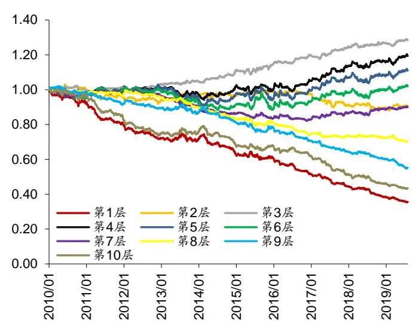
资料来源：Wind，华泰证券研究所

图表24：Alpha3 各分层组合年化超额收益率
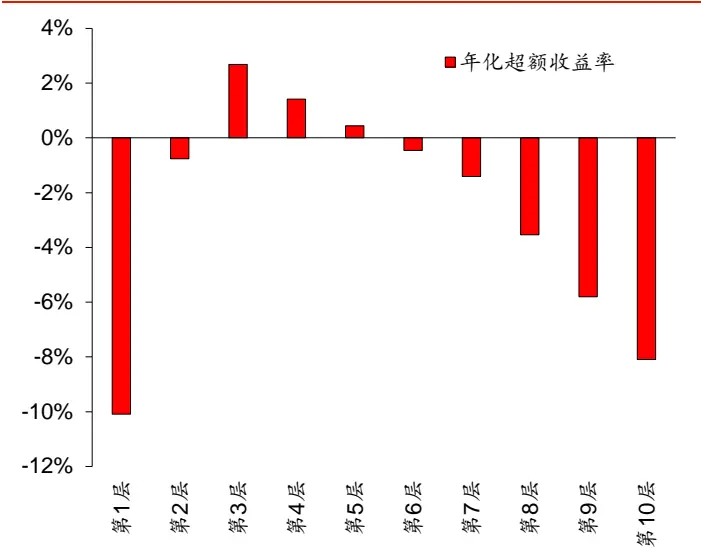
资料来源：Wind，华泰证券研究所

图表25：Alpha3 分层组合1~10 净值除以基准净值(三次方回归残差法)
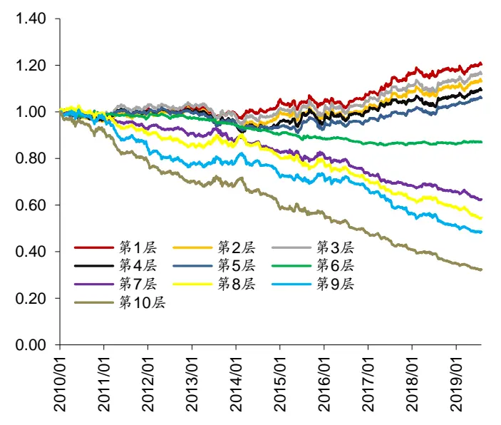
资料来源：Wind，华泰证券研究所

图表26：Alpha3 分层组合1~10 净值除以基准净值(多项式拟合法)
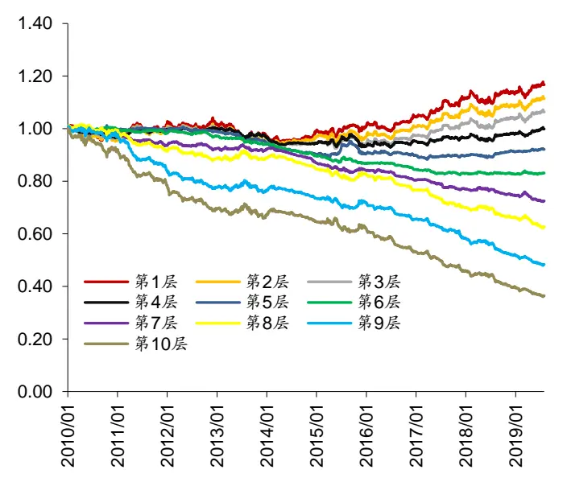
资料来源：Wind，华泰证券研究所

图表27：Alpha3 的分层测试表现(因子做行业+4个常见风格中性，三次方回归残差法)

| 年化收益率年化波动率夏普比率最大回撤 |  |  |  |  | 月均双边换手率 | 年化超额收益率年化跟踪误差信息比率最大回撤 Calmar 比率 月度胜率 |  |  |  |  |  |
| --- | --- | --- | --- | --- | --- | --- | --- | --- | --- | --- | --- |
| 第1层 | 8.28% | 25.60% | 0.32 | 57.58% |  | 160.59% | 1.54% | 3.11% | 0.49 6.41% | 0.24 | 55.65% |
| 第2层 | 7.57% | 25.47% | 0.30 | 58.45% | 159.59% | 0.83% | 3.43% | 0.24 | 10.43% | 0.08 | 54.78% |
| 第3层 | 7.88% | 25.38% | 0.31 | 58.12% | 159.00% | 1.09% | 3.64% | 0.30 | 9.93% | 0.11 | 56.52% |
| 第4层 | 7.17% | 25.53% | 0.28 | 58.82% | 159.55% | 0.46% | 3.56% | 0.13 | 11.37% | 0.04 | 54.78% |
| 第5层 | 6.81% | 25.97% | 0.26 | 59.16% | 161.81% | 0.26% | 2.92% | 0.09 | 11.36% | 0.02 | 53.04% |
| 第6层 | 4.57% | 27.26% | 0.17 | 64.33% | 163.21% | -1.47% | 1.47% | -1.00 | 14.43% | -0.10 | 33.91% |
| 第7层 | 0.91% | 28.87% | 0.03 | 69.99% | 159.74% | -4.52% | 3.30% | -1.37 | 36.04% | -0.13 | 30.43% |
| 第8层 | -0.54% | 29.30% | -0.02 | 72.07% | 156.36% | -5.81% | 4.22% | -1.38 | 44.85% | -0.13 | 34.78% |
| 第9层 | -1.79% | 29.53% | -0.06 | 73.39% | 154.04% | -6.94% | 4.57% | -1.52 | 49.86% | -0.14 | 33.91% |
| 第10层 | -5.97% | 29.19% | -0.20 | 77.31% | 152.93% | -11.01% | 4.94% | -2.23 | 66.66% | -0.17 | 27.83% |
| 基准 | 6.15% | 27.15% | 0.23 | 63.15% |  |  |  |  |  |  |  |
| 多空组合 | 13.68% | 7.71% | 1.77 | 11.19% |  |  |  |  |  |  |  |

资料来源：Wind，华泰证券研究所

图表28：Alpha3的分层测试表现(因子做行业+4个常见风格中性，多项式拟合法)

| 超额收益 超额收益相对基准 |  |  |  |  |  |  |  |  |  |  |
| --- | --- | --- | --- | --- | --- | --- | --- | --- | --- | --- |
| 年化收益率年化波动率夏普比率最大回撤 |  |  |  |  | 月均双边换手率 | 年化超额收益率年化跟踪误差信息比率最大回撤 Calmar 比率月度胜率 |  |  |  |  |
| 第1层 | 7.92% | 25.60% | 0.31 | 57.51% | 158.85% | 1.19% | 3.55% | 0.34 9.37% | 0.13 | 56.52% |
| 第2层 | 7.38% | 25.53% | 0.29 | 58.28% | 159.66% | 0.68% | 3.27% | 0.21 8.27% | 0.08 | 55.65% |
| 第3层 | 6.85% | 25.74% | 0.27 | 59.19% | 161.00% | 0.25% | 2.84% | 0.09 9.62% | 0.03 | 55.65% |
| 第4层 | 6.13% | 26.02% | 0.24 | 61.69% | 162.71% | -0.35% | 2.37% | -0.15 9.66% | -0.04 | 52.17% |
| 第5层 | 5.22% | 26.50% | 0.20 | 62.85% | 163.49% | -1.07% | 1.78% | -0.60 14.01% | -0.08 | 40.87% |
| 第6层 | 4.06% | 27.30% | 0.15 | 65.05% | 163.83% | -1.94% | 1.37% | -1.42 18.05% | -0.11 | 33.91% |
| 第7层 | 2.55% | 28.06% | 0.09 | 67.31% | 162.63% | -3.17% | 2.02% | -1.57 26.83% | -0.12 | 27.83% |
| 第8层 | 0.96% | 28.61% | 0.03 | 70.32% | 160.42% | -4.54% | 2.94% | -1.54 36.82% | -0.12 | 32.17% |
| 第9层 | -1.82% | 28.85% | -0.06 | 73.00% | 158.44% | -7.12% | 3.61% | -1.97 50.64% | -0.14 | 27.83% |
| 第10层 | -4.77% | 29.32% | -0.16 | 76.54% | 154.10% | -9.83% | 4.81% | -2.04 62.29% | -0.16 | 29.57% |
| 基准 | 6.15% | 27.15% | 0.23 | 63.15% |  |  |  |  |  |  |
| 多空组合 | 11.80% | 8.06% | 1.46 | 12.05% |  |  |  |  |  |  |

资料来源：Wind，华泰证券研究所

## Alpha4因子的详细测试结果

Alpha4 = -ts_cov(ts_cov(sub(vwap, close), high, 5), turn, 7)

Alpha4 是先计算 sub(vwap，close)和high 在过去 5 个交易日内的协方差，然后再计算这个协方差与turn在过去7个交易日内的协方差，最后取相反数作为因子值。从分层测试的结果上看，原始因子的最高收益组合出现在第7层，Top层和Bottom层都没有实现正超额收益；经过三次方回归残差法转换后，第1层至第5层均实现了正超额收益，其他层的超额收益都为负值，超额收益和层数之间仍不是严格的单调关系；经过多项式拟合法转换后，除了第9层，其他层的超额收益和层数之间呈现单调关系，即转换后的因子与收益之间存在较强的线性关系。

图表29：Alpha4 分层组合 1~10 净值除以基准净值
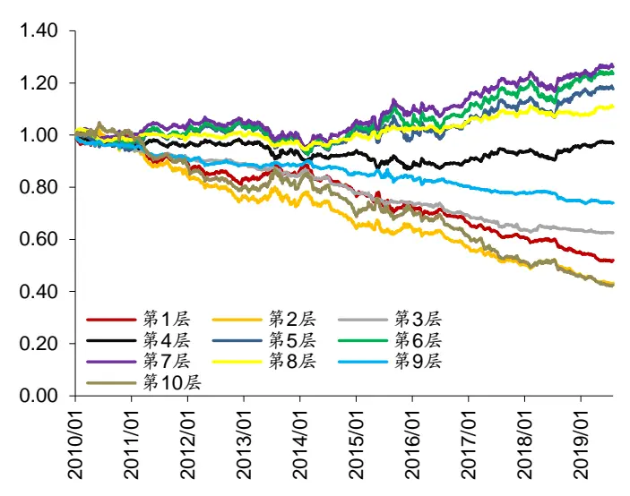
资料来源：Wind，华泰证券研究所

图表30：Alpha4 各分层组合年化超额收益率
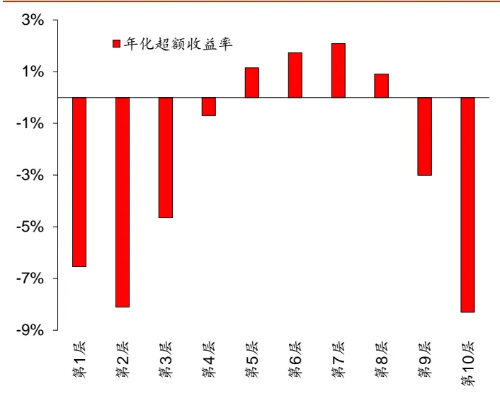
资料来源：Wind，华泰证券研究所

图表31：Alpha4 分层组合1~10 净值除以基准净值(三次方回归残差法)
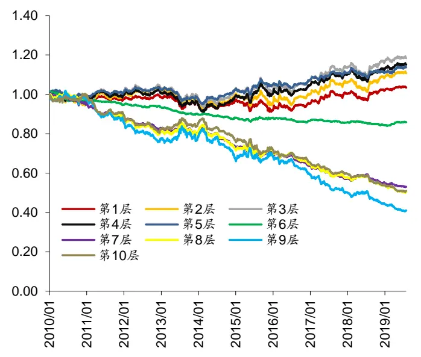
资料来源：Wind，华泰证券研究所

图表32：Alpha4 分层组合1~10 净值除以基准净值(多项式拟合法)
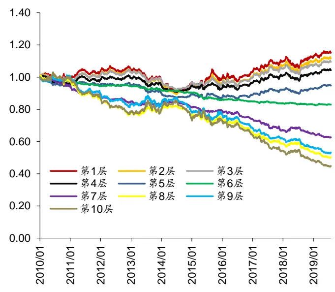
资料来源：Wind，华泰证券研究所

图表33：Alpha4 的分层测试表现(因子做行业+4个常见风格中性，三次方回归残差法)

| 超额收益 超额收益相对基准 |  |  |  |  |  |  |  |  |  |  |
| --- | --- | --- | --- | --- | --- | --- | --- | --- | --- | --- |
| 年化收益率年化波动率夏普比率最大回撤 |  |  |  |  | 月均双边换手率 | 年化超额收益率年化跟踪误差信息比率最大回撤 Calmar 比率 月度胜率 |  |  |  |  |
| 第1层 | 6.52% | 25.95% | 0.25 | 60.43% | 158.93% | -0.02% | 3.51% | -0.01 10.62% | 0.00 | 51.30% |
| 第2层 | 7.31% | 25.59% | 0.29 | 59.51% | 156.26% | 0.59% | 4.17% | 0.14 11.59% | 0.05 | 47.83% |
| 第3层 | 8.08% | 25.70% | 0.31 | 58.70% | 156.35% | 1.34% | 4.22% | 0.32 11.79% | 0.11 | 48.70% |
| 第4层 | 7.76% | 25.85% | 0.30 | 58.36% | 157.16% | 1.10% | 3.78% | 0.29 12.31% | 0.09 | 56.52% |
| 第5层 | 7.63% | 26.25% | 0.29 | 59.95% | 158.35% | 1.11% | 2.89% | 0.38 8.85% | 0.13 | 51.30% |
| 第6层 | 4.42% | 27.20% | 0.16 | 63.95% | 160.18% | -1.62% | 1.50% | -1.08 17.19% | -0.09 | 35.65% |
| 第7层 | -0.85% | 28.91% | -0.03 | 70.84% | 158.11% | -6.20% | 3.80% | -1.63 45.42% | -0.14 | 36.52% |
| 第8层 | -1.38% | 29.34% | -0.05 | 71.59% | 154.34% | -6.62% | 4.90% | -1.35 48.67% | -0.14 | 37.39% |
| 第9层 | -3.55% | 29.79% | -0.12 | 75.53% | 152.68% | -8.62% | 6.29% | -1.37 58.18% | -0.15 | 37.39% |
| 第10层 | -1.27% | 28.32% | -0.04 | 72.37% | 151.78% | -6.76% | 4.27% | -1.58 48.78% | -0.14 | 36.52% |
| 基准 | 6.14% | 27.15% | 0.23 | 63.15% |  |  |  |  |  |  |
| 多空组合 | 6.90% | 7.39% | 0.93 | 16.90% |  |  |  |  |  |  |

资料来源：Wind，华泰证券研究所

图表34：Alpha4的分层测试表现(因子做行业+4个常见风格中性，多项式拟合法)

| 超额收益 超额收益相对基准 |  |  |  |  |  |  |  |  |  |  |
| --- | --- | --- | --- | --- | --- | --- | --- | --- | --- | --- |
| 年化收益率年化波动率夏普比率最大回撤 |  |  |  | 月均双边换手率 |  | 年化超额收益率年化跟踪误差信息比率最大回撤 Calmar 比率月度胜率 |  |  |  |  |
| 第1层 | 7.77% | 25.73% | 0.30 | 57.82% | 155.26% | 1.07% | 4.03% | 0.27 15.69% | 0.07 | 55.65% |
| 第2层 | 7.41% | 25.83% | 0.29 | 58.27% | 156.50% | 0.76% | 3.92% | 0.19 15.50% | 0.05 | 55.65% |
| 第3层 | 7.18% | 25.81% | 0.28 | 59.01% | 157.94% | 0.55% | 3.63% | 0.15 12.61% | 0.04 | 53.91% |
| 第4层 | 6.63% | 25.99% | 0.26 | 60.16% | 159.57% | 0.10% | 3.16% | 0.03 11.51% | 0.01 | 50.43% |
| 第5层 | 5.53% | 26.22% | 0.21 | 61.24% | 161.66% | -0.85% | 2.40% | -0.36 15.15% | -0.06 | 44.35% |
| 第6层 | 4.03% | 27.17% | 0.15 | 64.82% | 162.31% | -1.99% | 1.35% | -1.47 17.68% | -0.11 | 35.65% |
| 第7层 | 0.93% | 28.29% | 0.03 | 69.22% | 160.26% | -4.64% | 2.79% | -1.67 36.20% | -0.13 | 34.78% |
| 第8层 | -1.41% | 29.23% | -0.05 | 72.40% | 155.29% | -6.67% | 4.59% | -1.45 49.18% | -0.14 | 36.52% |
| 第9层 | -0.82% | 28.87% | -0.03 | 72.28% | 153.27% | -6.21% | 4.69% | -1.32 46.43% | -0.13 | 37.39% |
| 第10层 | -2.63% | 29.48% | -0.09 | 75.78% | 151.54% | -7.82% | 5.97% | -1.31 55.11% | -0.14 | 38.26% |
| 基准 | 6.14% | 27.15% | 0.23 | 63.15% |  |  |  |  |  |  |
| 多空组合 | 9.01% | 9.79% | 0.92 | 25.46% |  |  |  |  |  |  |

资料来源：Wind，华泰证券研究所

## Alpha5因子的详细测试结果

Alpha5 = -mul(ts_sum(vwap, 5), ts_cov(volume, vwap, 3))

Alpha5 是先对过去 5 个交易日的 vwap 求和，然后计算 volume 和 vwap 在过去 3 个交易日内的协方差，最后对这两个数的乘积取相反数。从分层测试的结果上看，原始因子的最高收益组合出现在第 5层，Top 层和Bottom层都没有实现正超额收益；经过三次方回归残差法转换后，前5层均实现了正超额收益，后5层的超额收益都为负值，前6层的超额收益和层数之间呈现出严格的单调关系；经过多项式拟合法转换后，超额收益和层数之间呈现单调关系(除了第10层)，即转换后的因子与收益之间存在较强的线性关系。

图表35：Alpha5 分层组合 1~10 净值除以基准净值
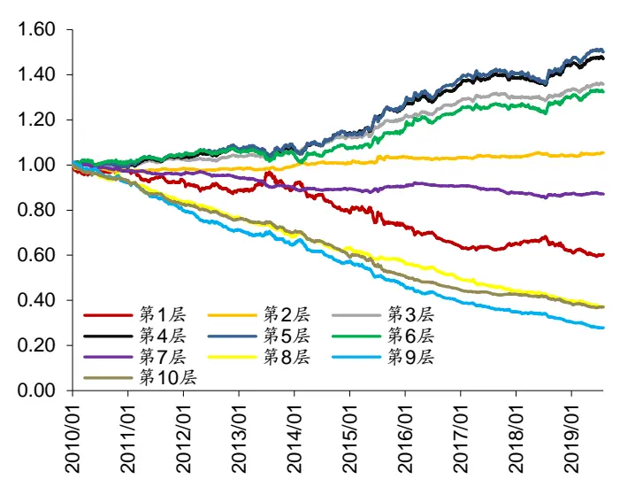
资料来源：Wind，华泰证券研究所

图表36：Alpha5各分层组合年化超额收益率
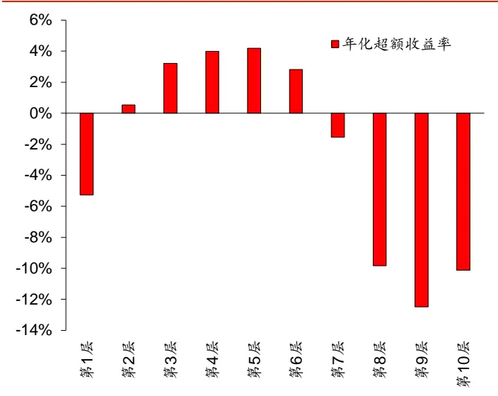
资料来源：Wind，华泰证券研究所

图表37：Alpha5 分层组合1~10 净值除以基准净值(三次方回归残差法)
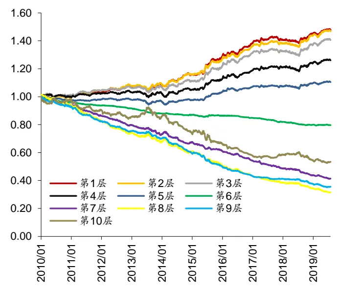
资料来源：Wind，华泰证券研究所

图表38：Alpha5 分层组合1~10 净值除以基准净值(多项式拟合法)
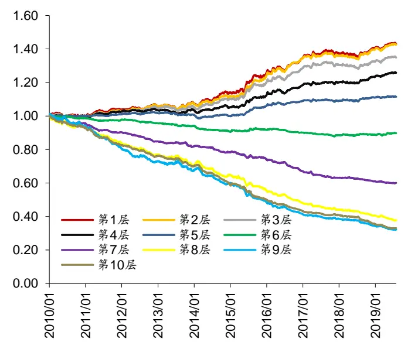
资料来源：Wind，华泰证券研究所

图表39：Alpha5的分层测试表现(因子做行业+4个常见风格中性，三次方回归残差法)

| 年化收益率年化波动率夏普比率最大回撤 |  |  |  |  | 月均双边换手率 | 年化超额收益率年化跟踪误差信息比率最大回撤 Calmar 比率月度胜率 |  |  |  |  |  |
| --- | --- | --- | --- | --- | --- | --- | --- | --- | --- | --- | --- |
| 第1层 | 10.71% | 26.48% | 0.40 | 56.90% |  | 158.59% | 4.08% | 2.48% | 1.65 | 3.59% | 1.14 65.22% |
| 第2层 | 10.62% | 26.54% | 0.40 | 57.48% | 158.82% | 4.01% | 2.54% | 1.58 | 3.84% | 1.05 | 62.61% |
| 第3层 | 10.11% | 26.46% | 0.38 | 57.48% | 158.65% | 3.51% | 2.57% | 1.36 | 4.48% | 0.78 | 62.61% |
| 第4层 | 8.83% | 26.47% | 0.33 | 58.76% | 159.89% | 2.31% | 2.40% | 0.96 | 4.90% | 0.47 | 60.00% |
| 第5层 | 7.29% | 26.62% | 0.27 | 59.87% | 161.88% | 0.92% | 1.80% | 0.51 | 6.19% | 0.15 | 56.52% |
| 第6层 | 3.58% | 27.14% | 0.13 | 65.72% | 162.79% | -2.42% | 0.94% | -2.58 | 20.79% | -0.12 | 24.35% |
| 第7层 | -3.45% | 28.14% | -0.12 | 73.54% | 160.86% | -8.83% | 2.86% | -3.09 | 57.96% | -0.15 | 14.78% |
| 第8层 | -6.19% | 28.66% | -0.22 | 75.95% | 158.14% | -11.31% | 3.72% | -3.04 | 68.01% | -0.17 | 18.26% |
| 第9层 | -5.01% | 27.72% | -0.18 | 73.58% | 156.81% | -10.41% | 2.66% | -3.91 | 64.45% | -0.16 | 17.39% |
| 第10层 | -0.77% | 27.36% | -0.03 | 69.91% | 149.60% | -6.56% | 4.38% | -1.50 | 47.78% | -0.14 | 41.74% |
| 基准 | 6.15% | 27.15% | 0.23 | 63.15% |  |  |  |  |  |  |  |
| 多空组合 | 11.07% | 6.52% | 1.70 | 12.41% |  |  |  |  |  |  |  |

资料来源：Wind，华泰证券研究所

图表40：Alpha5的分层测试表现(因子做行业+4个常见风格中性，多项式拟合法)

| 超额收益 超额收益相对基准 |  |  |  |  |  |  |  |  |  |  |
| --- | --- | --- | --- | --- | --- | --- | --- | --- | --- | --- |
| 年化收益率年化波动率夏普比率最大回撤 |  |  |  | 月均双边换手率 |  | 年化超额收益率年化跟踪误差信息比率最大回撤 Calmar 比率月度胜率 |  |  |  |  |
| 第1层 | 10.31% | 26.51% | 0.39 | 57.36% | 158.49% | 3.71% | 2.45% | 1.51 3.49% | 1.06 | 60.87% |
| 第2层 | 10.27% | 26.62% | 0.39 | 56.68% | 159.58% | 3.71% | 2.34% | 1.59 3.28% | 1.13 | 66.09% |
| 第3层 | 9.61% | 26.57% | 0.36 | 58.03% | 160.65% | 3.08% | 2.13% | 1.45 3.52% | 0.88 | 63.48% |
| 第4层 | 8.80% | 26.62% | 0.33 | 58.64% | 161.54% | 2.33% | 1.84% | 1.27 3.66% | 0.64 | 65.22% |
| 第5层 | 7.39% | 26.63% | 0.28 | 60.05% | 163.10% | 1.02% | 1.46% | 0.70 4.14% | 0.25 | 59.13% |
| 第6层 | 4.92% | 26.76% | 0.18 | 63.92% | 163.43% | -1.27% | 1.22% | -1.04 13.14% | -0.10 | 34.78% |
| 第7层 | 0.49% | 27.36% | 0.02 | 69.93% | 162.56% | -5.29% | 1.76% | -3.01 39.93% | -0.13 | 22.61% |
| 第8层 | -4.40% | 28.17% | -0.16 | 73.94% | 158.91% | -9.74% | 3.40% | -2.86 61.74% | -0.16 | 18.26% |
| 第9层 | -6.02% | 28.48% | -0.21 | 75.06% | 156.96% | -11.20% | 3.74% | -3.00 67.50% | -0.17 | 20.00% |
| 第10层 | -5.75% | 27.55% | -0.21 | 75.39% | 157.06% | -11.15% | 2.74% | -4.06 67.00% | -0.17 | 11.30% |
| 基准 | 6.15% | 27.15% | 0.23 | 63.15% |  |  |  |  |  |  |
| 多空组合 | 16.57% | 4.88% | 3.40 | 3.94% |  |  |  |  |  |  |

资料来源：Wind，华泰证券研究所

## Alpha6因子的详细测试结果

Alpha6 = -ts_cov(ts_max(turn, 7), free_turn, 9)

Alpha6 是计算 ts_max(turn， 7)和free_turn在过去9个交易日内的协方差。从分层测试的结果上看，原始因子的最高收益组合出现在第 2层，Top 层和Bottom层都没有实现正超额收益；经过三次方回归残差法转换后，前4层均实现了正超额收益，后6层的超额收益都为负值，前7层的超额收益和层数之间呈现单调关系；经过多项式拟合法转换后，前4层均实现了正超额收益，后6层的超额收益都为负值，但超额收益和层数之间不是严格的单调关系。

图表41：Alpha6 分层组合1~10 净值除以基准净值
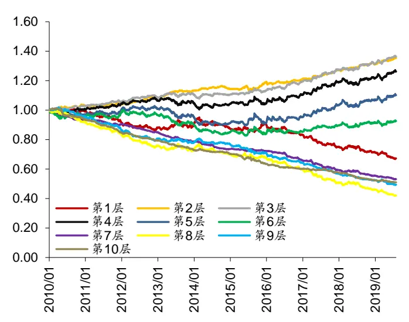
资料来源：Wind，华泰证券研究所

图表42：Alpha6 各分层组合年化超额收益率
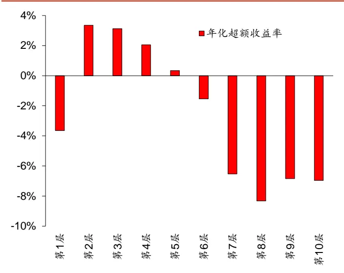
资料来源：Wind，华泰证券研究所

图表43：Alpha6 分层组合1~10 净值除以基准净值(三次方回归残差法)
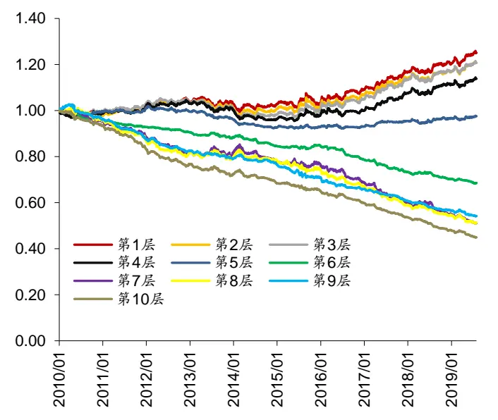
资料来源：Wind，华泰证券研究所

图表44：Alpha6 分层组合1~10 净值除以基准净值(多项式拟合法)
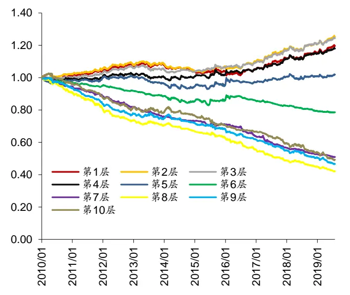
资料来源：Wind，华泰证券研究所

图表45：Alpha6的分层测试表现(因子做行业+4个常见风格中性，三次方回归残差法)

|  | 年化收益率年化波动率夏普比率最大回撤 |  |  |  | 月均双边换手率 | 年化超额收益率年化跟踪误差 信息比率最大回撤 Calmar 比率 月度胜率 |  |  |  |  |  |
| --- | --- | --- | --- | --- | --- | --- | --- | --- | --- | --- | --- |
| 第1层 | 8.73% | 25.68% | 0.34 | 56.45% | 159.26% | 1.98% | 3.13% | 0.63 | 6.67% | 0.30 | 59.13% |
| 第2层 | 8.32% | 25.56% | 0.33 | 56.98% | 160.19% | 1.56% | 3.14% | 0.50 | 8.01% | 0.20 | 57.39% |
| 第3层 | 8.32% | 25.44% | 0.33 | 55.79% | 160.57% | 1.53% | 3.14% | 0.49 | 9.10% | 0.17 | 62.61% |
| 第4层 | 7.63% | 25.40% | 0.30 | 57.28% | 161.07% | 0.88% | 2.93% | 0.30 | 9.51% | 0.09 | 60.87% |
| 第5层 | 5.86% | 26.04% | 0.23 | 61.54% | 161.86% | -0.58% | 1.92% | -0.30 | 10.81% | -0.05 | 51.30% |
| 第6层 | 1.93% | 27.76% | 0.07 | 69.04% | 162.54% | -3.83% | 1.77% | -2.16 | 31.02% | -0.12 | 20.87% |
| 第7层 | -1.23% | 29.37% | -0.04 | 73.29% | 156.85% | -6.44% | 4.14% | -1.56 | 46.83% | -0.14 | 32.17% |
| 第8层 | -1.20% | 29.38% | -0.04 | 73.33% | 155.11% | -6.40% | 3.95% | -1.62 | 47.07% | -0.14 | 29.57% |
| 第9层 | -0.61% | 28.39% | -0.02 | 71.54% | 156.99% | -6.07% | 2.49% | -2.44 | 45.84% | -0.13 | 20.87% |
| 第10层 | -2.59% | 28.35% | -0.09 | 73.14% | 158.75% | -7.96% | 2.74% | -2.91 | 53.93% | -0.15 | 18.26% |
| 基准 | 6.15% | 27.15% | 0.23 | 63.15% |  |  |  |  |  |  |  |
| 多空组合 | 10.64% | 5.65% | 1.88 | 8.46% |  |  |  |  |  |  |  |

资料来源：Wind，华泰证券研究所

图表46：Alpha6的分层测试表现(因子做行业+4个常见风格中性，多项式拟合法)

|  |  |  |  |  |  |  |  |  |  | 超额收益相对基准 |  |
| --- | --- | --- | --- | --- | --- | --- | --- | --- | --- | --- | --- |
|  | 年化收益率年化波动率夏普比率最大回撤 |  |  |  | 月均双边换手率 | 年化超额收益率年化跟踪误差信息比率最大回撤 Calmar 比率 月度胜率 |  |  |  |  |  |
| 第1层 | 8.21% | 26.31% | 0.31 | 59.35% | 158.95% | 1.68% | 2.46% | 0.68 | 7.76% | 0.22 | 60.87% |
| 第2层 | 8.74% | 26.26% | 0.33 | 57.96% | 160.46% | 2.17% | 2.34% | 0.93 | 6.62% | 0.33 | 60.87% |
| 第3层 | 8.66% | 26.14% | 0.33 | 57.96% | 161.77% | 2.06% | 2.25% | 0.92 | 4.46% | 0.46 | 62.61% |
| 第4层 | 8.05% | 25.77% | 0.31 | 57.54% | 161.91% | 1.38% | 2.43% | 0.57 | 4.96% | 0.28 | 60.87% |
| 第5层 | 6.36% | 25.70% | 0.25 | 59.95% | 161.60% | -0.22% | 2.57% | -0.09 | 9.07% | -0.02 | 50.43% |
| 第6层 | 3.43% | 26.21% | 0.13 | 64.28% | 161.66% | -2.82% | 2.07% | -1.37 | 23.88% | -0.12 | 26.09% |
| 第7层 | -1.27% | 27.85% | -0.05 | 72.27% | 161.56% | -6.83% | 2.31% | -2.96 | 48.55% | -0.14 | 14.78% |
| 第8层 | -3.27% | 28.90% | -0.11 | 74.22% | 158.04% | -8.47% | 3.29% | -2.57 | 56.55% | -0.15 | 19.13% |
| 第9层 | -2.21% | 28.99% | -0.08 | 73.21% | 158.46% | -7.44% | 3.36% | -2.21 | 51.58% | -0.14 | 20.00% |
| 第10层 | -1.63% | 29.10% | -0.06 | 73.01% | 155.54% | -6.88% | 3.69% | -1.86 | 50.25% | -0.14 | 25.22% |
| 基准 | 6.15% | 27.15% | 0.23 | 63.15% |  |  |  |  |  |  |  |
| 多空组合 | 8.98% | 5.59% | 1.60 | 8.14% |  |  |  |  |  |  |  |

资料来源：Wind，华泰证券研究所

## 小结

在 Alpha1~Alpha6的分层测试中，可以看出这些因子大致都具有“中间分层收益高，两端分层收益低”的特性。在使用三次方回归残差法和多项式拟合法对非线性因子进行转换时，两个方法各有优劣，三次方回归残差法较为简单，但转换效果较差；多项式拟合法转换效果较好，但需要逐个对因子拟合非线性关系，拟合结果对不同因子不能通用。

## 多头超额收益作为适应度指标挖掘所得因子的测试结果

使用多头超额收益作为适应度指标后，遗传规划挖掘出了数个因子。图表47展示了这些因子的表达式、多头年化超额收益率和RankIC(因子进行了行业、市值、20日收益率、20日波动率、20日换手率中性化)。

图表47：多头超额收益作为适应度指标挖掘所得因子

| 因子 | 表达式 | 多头年化超额收益率 | RanklC |
| --- | --- | --- | --- |
| Alpha21 | -sigmoid(rank(ts_cov(turn, close, 10)) | 3.25% | 4.06% |
| Alpha22 | rank_div(open, volume) | 7.57% | 2.61% |
| Alpha23 | -sigmoid(rank_div(mul(volume, high), rank(high))) | 7.87% | 3.97% |
| Alpha24 | sigmoid(ts_prod(rank_div(vwap, free_turn), 3)) | 5.23% | 2.63% |

资料来源：华泰证券研究所

图表48展示了Alpha21~Alpha24 因子的相关性。由于小市值股票和低成交量股票流动性较差，我们还展示了这些因子和市值因子以及成交量因子的相关性。

图表48：Alpha21~Alpha24 因子的相关性矩阵
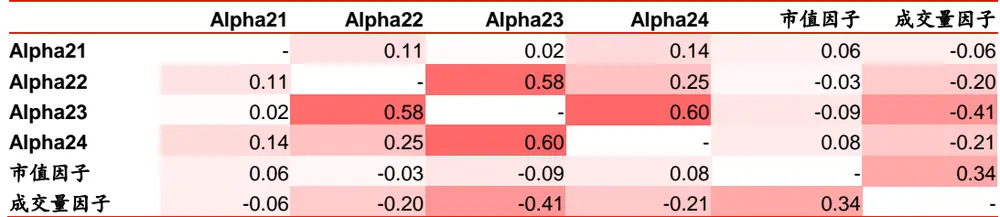
资料来源：华泰证券研究所

接下来，我们将展示 Alpha21~Alpha24的详细分层测试结果。

## Alpha21 因子的详细测试结果

Alpha21 = -sigmoid(rank(ts_cov(turn, close, 10))

Alpha21是先计算 turn和 close 在过去10 个交易日内的协方差，然后对这个协方差依次用 rank 和 sigmoid 两个变换函数进行调整并取相反数。

图表49：Alpha21 分层组合 1~10 净值除以基准净值
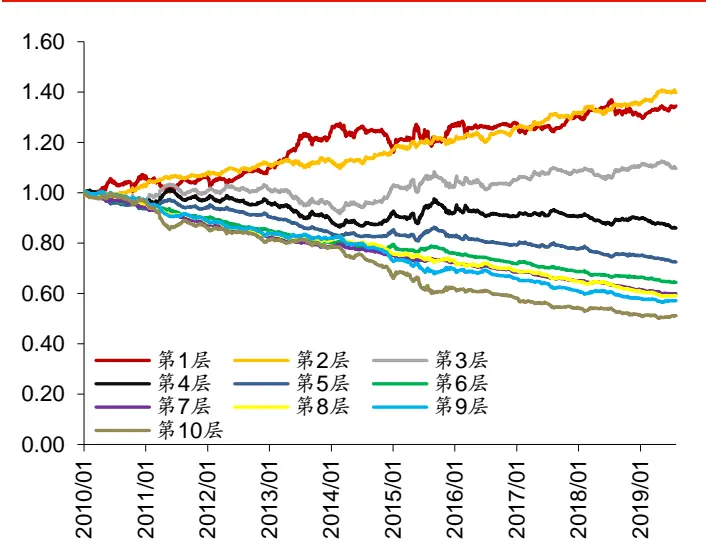
资料来源：Wind，华泰证券研究所

图表50：Alpha21各分层组合年化超额收益率
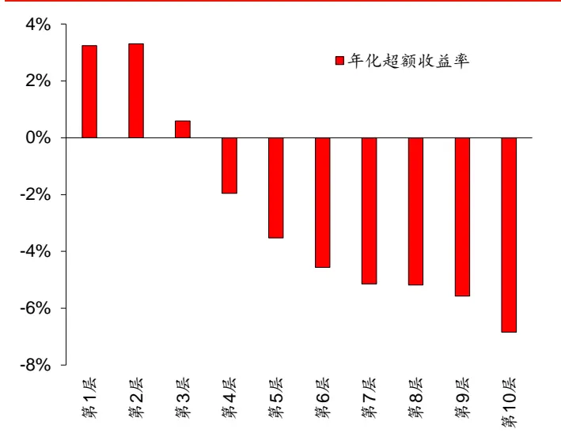
资料来源：Wind，华泰证券研究所

图表51：Alpha21的分层测试表现(因子做行业+4个常见风格中性)
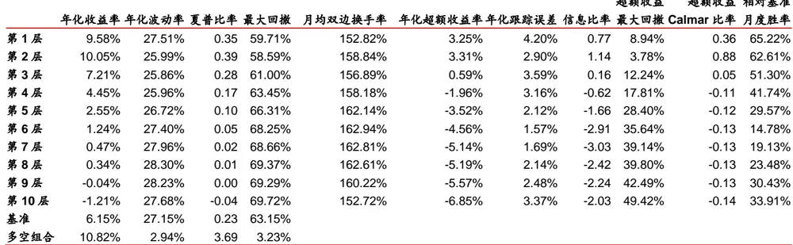
资料来源：Wind，华泰证券研究所

## Alpha22 因子的详细测试结果

Alpha22 = -rank_div(open, volume)

Alpha22 计算的是 rank(open)除以 rank(volume)所得商的相反数。

图表52：Alpha22 分层组合1~10 净值除以基准净值
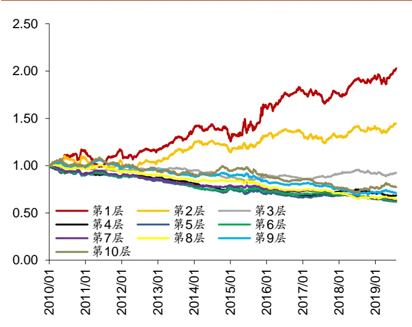
资料来源：Wind，华泰证券研究所

图表53：Alpha22 各分层组合年化超额收益率
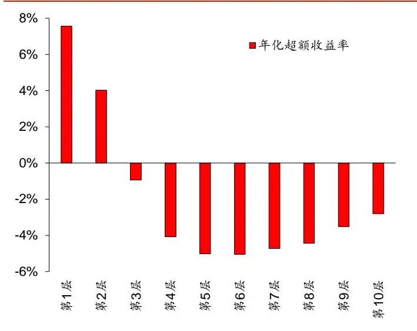
资料来源：Wind，华泰证券研究所

图表54：Alpha22的分层测试表现(因子做行业+4个常见风格中性)

| 超额收益 超额收益相对基准 |  |  |  |  |  |  |  |  |  |  |
| --- | --- | --- | --- | --- | --- | --- | --- | --- | --- | --- |
| 年化收益率年化波动率夏普比率最大回撤 |  |  |  | 月均双边换手率 | 年化超额收益率年化跟踪误差信息比率最大回撤 Calmar 比率月度胜率 |  |  |  |  |  |
| 第1层 | 14.53% | 26.88% | 0.54 | 49.30% | 80.46% | 7.57% | 6.81% | 1.11 15.75% | 0.48 | 61.74% |
| 第2层 | 10.43% | 27.67% | 0.38 | 56.69% | 118.37% | 4.02% | 5.49% | 0.73 16.48% | 0.24 | 57.39% |
| 第3层 | 5.26% | 26.90% | 0.20 | 57.80% | 130.62% | -0.94% | 2.73% | -0.35 18.21% | -0.05 | 50.43% |
| 第4层 | 1.93% | 26.99% | 0.07 | 61.63% | 135.12% | -4.08% | 3.36% | -1.21 32.85% | -0.12 | 35.65% |
| 第5层 | 0.86% | 27.19% | 0.03 | 64.80% | 140.23% | -5.02% | 3.11% | -1.61 38.21% | -0.13 | 27.83% |
| 第6层 | 0.79% | 27.29% | 0.03 | 66.89% | 141.03% | -5.05% | 2.75% | -1.84 38.45% | -0.13 | 26.09% |
| 第7层 | 1.06% | 27.53% | 0.04 | 69.25% | 139.66% | -4.72% | 2.46% | -1.92 36.57% | -0.13 | 30.43% |
| 第8层 | 1.29% | 27.81% | 0.05 | 71.36% | 134.25% | -4.43% | 2.63% | -1.69 35.39% | -0.13 | 32.17% |
| 第9层 | 2.29% | 27.75% | 0.08 | 71.85% | 120.95% | -3.51% | 3.18% | -1.10 35.28% | -0.10 | 40.00% |
| 第 10 层 | 3.23% | 27.23% | 0.12 | 72.14% | 74.38% | -2.81% | 4.29% | -0.65 35.20% | -0.08 | 43.48% |
| 基准 | 6.15% | 27.15% | 0.23 | 63.15% |  |  |  |  |  |  |
| 多空组合 | 10.38% | 8.99% | 1.16 | 22.96% |  |  |  |  |  |  |

资料来源：Wind，华泰证券研究所

Alpha23 因子的详细测试结果

Alpha23 = -sigmoid(rank_div(mul(volume, high), rank(high)))

Alpha23 是先用 rank(mul(volume,high)除以rank(rank(high)，然后用 sigmoid 函数对所得商进行变换。

图表55：Alpha23 分层组合1~10 净值除以基准净值
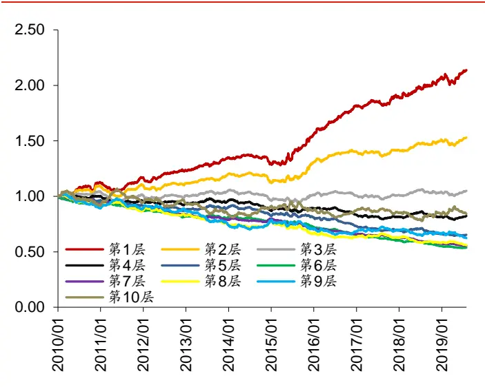
资料来源：Wind，华泰证券研究所

图表56：Alpha23 各分层组合年化超额收益率
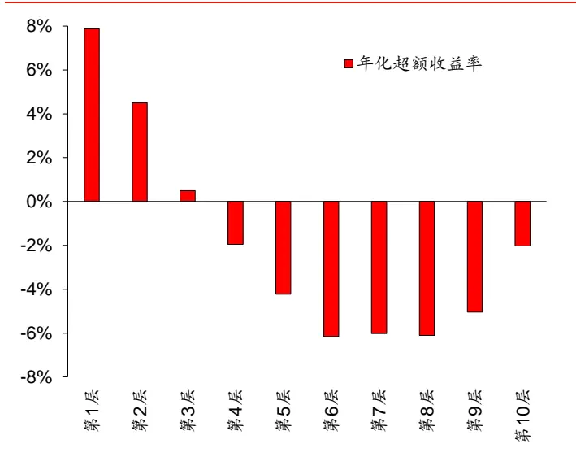
资料来源：Wind，华泰证券研究所

图表57：Alpha23的分层测试表现(因子做行业+4个常见风格中性)

| 超额收益 超额收益相对基准 |  |  |  |  |  |  |  |  |  |  |
| --- | --- | --- | --- | --- | --- | --- | --- | --- | --- | --- |
|  |  |  |  |  | 年化收益率年化波动率夏普比率最大回撤 月均双边换手率 | 年化超额收益率年化跟踪误差信息比率最大回撤 Calmar 比率月度胜率 |  |  |  |  |
| 第1层 | 15.17% | 25.29% | 0.60 | 46.51% | 91.92% | 7.87% | 4.21% | 1.87 7.16% | 1.10 | 73.91% |
| 第2层 | 11.11% | 26.75% | 0.42 | 52.34% | 134.36% | 4.51% | 3.37% 1.34 | 9.13% | 0.49 | 62.61% |
| 第3层 | 6.70% | 27.25% | 0.25 | 59.95% | 143.22% | 0.50% | 3.15% | 0.16 11.56% | 0.04 | 54.78% |
| 第4层 | 3.95% | 27.78% | 0.14 | 65.11% | 145.06% | -1.95% | 3.19% | -0.61 20.54% | -0.10 | 55.65% |
| 第5层 | 1.40% | 28.25% | 0.05 | 69.53% | 144.22% | -4.23% | 3.29% | -1.28 34.06% | -0.12 | 39.13% |
| 第6层 | -0.71% | 28.43% | -0.02 | 72.37% | 141.18% | -6.16% | 2.83% | -2.18 44.94% | -0.14 | 26.09% |
| 第7层 | -0.39% | 27.78% | -0.01 | 70.86% | 133.06% | -6.02% | 2.47% | -2.43 44.31% | -0.14 | 26.96% |
| 第8层 | -0.28% | 27.23% | -0.01 | 70.20% | 121.05% | -6.10% | 3.67% | -1.66 45.00% | -0.14 | 33.04% |
| 第9层 | 0.89% | 27.19% | 0.03 | 68.02% | 102.62% | -5.05% | 4.77% | -1.06 39.48% | -0.13 | 39.13% |
| 第10层 | 4.20% | 26.96% | 0.16 | 67.78% | 56.07% | -2.02% | 5.35% | -0.38 28.78% | -0.07 | 46.96% |
| 基准 | 6.15% | 27.15% | 0.23 | 63.15% |  |  |  |  |  |  |
| 多空组合 | 9.74% | 7.38% | 1.32 | 20.71% |  |  |  |  |  |  |

资料来源：Wind，华泰证券研究所

## Alpha24 因子的详细测试结果

Alpha24 = sigmoid(ts_prod(rank_div(vwap, free_turn), 3))

Alpha24的核心成分是 rank(vwap)除以rank(free_turn)得到的商，再计算这一商在过去3个交易日的连乘乘积，最后使用sigmoid函数对这一乘积进行变换。

图表58：Alpha24 分层组合1~10 净值除以基准净值
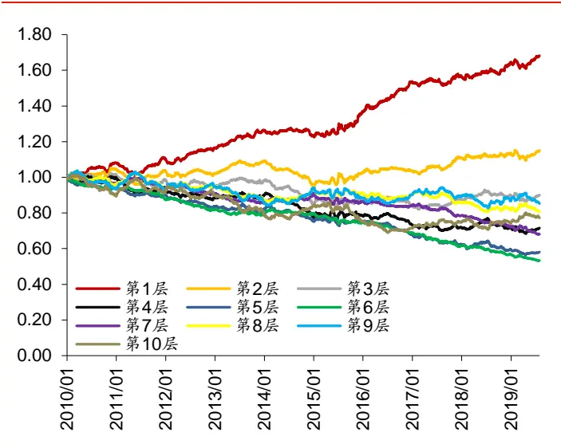
资料来源：Wind，华泰证券研究所

图表59：Alpha24 各分层组合年化超额收益率
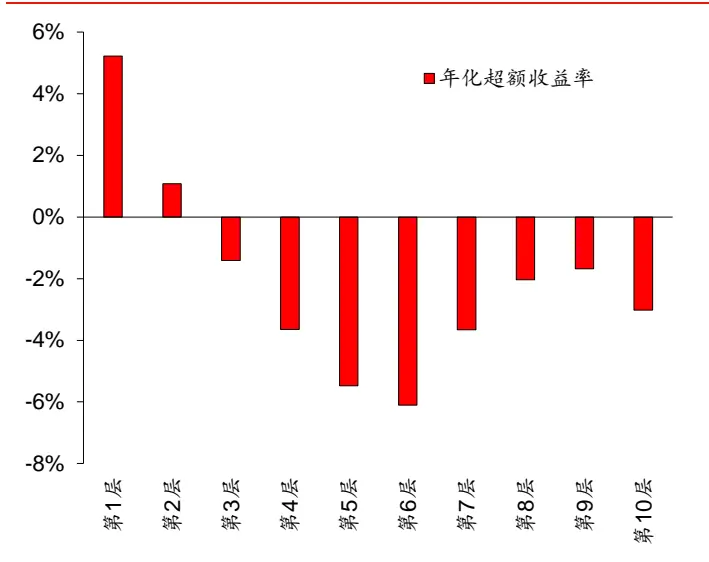
资料来源：Wind，华泰证券研究所

图表60：Alpha24的分层测试表现(因子做行业+4个常见风格中性)

| 超额收益 超额收益相对基准 |  |  |  |  |  |  |  |  |  |  |
| --- | --- | --- | --- | --- | --- | --- | --- | --- | --- | --- |
|  |  |  |  |  | 年化收益率年化波动率夏普比率最大回撤月均双边换手率 | 年化超额收益率年化跟踪误差信息比率最大回撤 Calmar 比率月度胜率 |  |  |  |  |
| 第1层 | 12.24% | 25.54% | 0.48 | 52.74% | 103.48% | 5.23% | 3.46% 1.51 | 6.44% | 0.81 | 64.35% |
| 第2层 | 7.76% | 25.78% | 0.30 | 56.52% | 132.91% | 1.08% | 3.55% 0.30 | 13.70% | 0.08 | 53.04% |
| 第3层 | 4.96% | 26.32% | 0.19 | 60.17% | 139.70% | -1.41% | 3.78% | -0.37 20.97% | -0.07 | 49.57% |
| 第4层 | 2.39% | 27.02% | 0.09 | 65.12% | 139.24% | -3.65% | 3.86% | -0.94 32.51% | -0.11 | 44.35% |
| 第5层 | 0.13% | 28.13% | 0.00 | 70.25% | 143.19% | -5.48% | 3.57% | -1.53 42.17% | -0.13 | 36.52% |
| 第6层 | -0.78% | 28.93% | -0.03 | 72.12% | 143.28% | -6.10% | 3.16% | -1.93 44.68% | -0.14 | 27.83% |
| 第7层 | 1.85% | 28.77% | 0.06 | 69.00% | 140.52% | -3.66% | 3.33% | -1.10 30.82% | -0.12 | 33.04% |
| 第8层 | 3.72% | 28.28% | 0.13 | 67.16% | 135.89% | -2.03% | 3.64% | -0.56 20.68% | -0.10 | 39.13% |
| 第9层 | 4.34% | 27.49% | 0.16 | 65.83% | 124.45% | -1.68% | 3.99% | -0.42 20.50% | -0.08 | 46.96% |
| 第10层 | 3.25% | 26.45% | 0.12 | 66.98% | 83.58% | -3.02% | 4.70% | -0.64 33.55% | -0.09 | 46.09% |
| 基准 | 6.15% | 27.15% | 0.23 | 63.15% |  |  |  |  |  |  |
| 多空组合 | 8.23% | 6.35% | 1.30 | 15.90% |  |  |  |  |  |  |

资料来源：Wind，华泰证券研究所

## 结论

本文是对华泰金工前期报告《基于遗传规划的选股因子挖掘》的补充和改进，目的是进一步提升遗传规划挖掘选股因子的能力。本文提出并测试了3个改进方向，结论如下：

改进方向1：新的适应度指标因子互信息和多头超额收益。互信息可以捕捉因子和收益间的非线性关系，在遗传规划中使用互信息作为适应度指标，可以挖掘出多个互信息较高的因子。在分层测试中，该类因子与收益的关系大多呈现出“中间分层收益高，两端分层收益低”的特性，且分层规律稳定，这种规律能被基于机器学习的多因子选股模型有效利用。另外，部分投资者可能希望以多头超额收益来评价因子，本文也将多头超额收益加入到适应度指标中，挖掘出了数个多头超额收益较高的因子。

改进方向2：非线性因子的使用方法。对于非线性因子的使用，一般有两大类方法，第一类方法是在因子合成时直接使用机器学习模型(如XGBoost、神经网络等)拟合因子与收益率间的关系，该类方法在本系列前期报告中有过大量介绍。第二类方法是对单个因子做非线性变换，重构因子与收益之间的关系，最终得到线性因子。第二类方法中有两个具体方法：三次方回归残差法和多项式拟合法。两个方法各有优劣，在本文的测试中，三次方回归残差法较为简单，但转换效果较差；多项式拟合法转换效果较好，但需要逐个对因子拟合非线性关系，拟合结果对不同因子不能通用。

改进方向3：交叉验证控制过拟合。为了控制过拟合的风险，我们在gplearn中加入交叉验证环节，观察新因子在验证集上的适应度表现，据此来评价遗传规划挖掘有效因子的能力。加入交叉验证之后，遗传规划的流程如下：将数据集按指定比例划分为训练集和验证集两部分，训练集用于训练和进化，循环生成子代因子；对于每一代新生成的因子，模型都会在验证集上计算适应度，并记录每一代的验证集平均适应度，观测验证集平均适应度的收敛性，当其明显收敛时，停止循环。在本文的测试中，确实观察到了因子平均适应度在验证集收敛的情况。

本文在测试中展示了20多个挖掘出的选股因子供投资者参考。通过方法论的介绍，本文旨在说明遗传规划或许能挖掘出大量的因子(尤其是非线性因子)，这对于能够利用非线性因子的机器学习选股模型来说具有重要意义。

## 风险提示

通过遗传规划挖掘的选股因子是历史经验的总结，若市场规律改变，存在失效的可能。遗传规划所得因子可能过于复杂，可解释性较低，大多数不是线性因子，使用需谨慎。本文仅对因子在全部A股内的选股效果进行测试，测试结果不能直接推广到其它股票池内。

## 免责申明

本报告仅供华泰证券股份有限公司（以下简称“本公司”）客户使用。本公司不因接收人收到本报告而视其为客户。

本报告基于本公司认为可靠的、已公开的信息编制，但本公司对该等信息的准确性及完整性不作任何保证。本报告所载的意见、评估及预测仅反映报告发布当日的观点和判断。在不同时期，本公司可能会发出与本报告所载意见、评估及预测不一致的研究报告。同时，本报告所指的证券或投资标的的价格、价值及投资收入可能会波动。本公司不保证本报告所含信息保持在最新状态。本公司对本报告所含信息可在不发出通知的情形下做出修改，投资者应当自行关注相应的更新或修改。

本公司力求报告内容客观、公正，但本报告所载的观点、结论和建议仅供参考，不构成所述证券的买卖出价或征价。该等观点、建议并未考虑到个别投资者的具体投资目的、财务状况以及特定需求，在任何时候均不构成对客户私人投资建议。投资者应当充分考虑自身特定状况，并完整理解和使用本报告内容，不应视本报告为做出投资决策的唯一因素。对依据或者使用本报告所造成的一切后果，本公司及作者均不承担任何法律责任。任何形式的分享证券投资收益或者分担证券投资损失的书面或口头承诺均为无效。

本公司及作者在自身所知情的范围内，与本报告所指的证券或投资标的不存在法律禁止的利害关系。在法律许可的情况下，本公司及其所属关联机构可能会持有报告中提到的公司所发行的证券头寸并进行交易，也可能为之提供或者争取提供投资银行、财务顾问或者金融产品等相关服务。本公司的资产管理部门、自营部门以及其他投资业务部门可能独立做出与本报告中的意见或建议不一致的投资决策。

本报告版权仅为本公司所有。未经本公司书面许可，任何机构或个人不得以翻版、复制、发表、引用或再次分发他人等任何形式侵犯本公司版权。如征得本公司同意进行引用、刊发的，需在允许的范围内使用，并注明出处为“华泰证券研究所”，且不得对本报告进行任何有悖原意的引用、删节和修改。本公司保留追究相关责任的权力。所有本报告中使用的商标、服务标记及标记均为本公司的商标、服务标记及标记。

本公司具有中国证监会核准的“证券投资咨询”业务资格，经营许可证编号为：91320000704041011J。

全资子公司华泰金融控股（香港）有限公司具有香港证监会核准的“就证券提供意见”业务资格，经营许可证编号为：A0K809

©版权所有2019年华泰证券股份有限公司

## 评级说明

## 行业评级体系

一报告发布日后的6个月内的行业涨跌幅相对同期的沪深300指数的涨跌幅为基准；

一投资建议的评级标准 增持行业股票指数超越基准 中性行业股票指数基本与基准持平 减持行业股票指数明显弱于基准

## 公司评级体系

一报告发布日后的6个月内的公司涨跌幅相对同期的沪深300指数的涨跌幅为基准；
一投资建议的评级标准
买入股价超越基准20%以上
增持股价超越基准 5%-20%
中性股价相对基准波动在-5%~5%之间
减持股价弱于基准 5%-20%
卖出股价弱于基准20%以上

## 华泰证券研究

## 南京

南京市建邺区江东中路228号华泰证券广场1号楼/邮政编码：210019

电话：86 25 83389999/传真：86 25 83387521

电子邮件：ht-rd@htsc.com

## 深圳

深圳市福田区益田路5999号基金大厦10楼/邮政编码：518017

电话：86 755 82493932/传真：86755 82492062

电子邮件：ht-rd@htsc.com

## 北京

北京市西城区太平桥大街丰盛胡同28号太平洋保险大厦A座18层

邮政编码：100032

电话：861063211166/传真：861063211275

电子邮件：ht-rd@htsc.com

## 上海

上海市浦东新区东方路18号保利广场E栋23楼/邮政编码：200120

电话：862128972098/传真：862128972068

电子邮件：ht-rd@htsc.com