## 金工研究/深度研究

2019年09月02日

林晓明 执业证书编号：S0570516010001

研究员 0755-82080134

陈烨 执业证书编号：S0570518080004

研究员 010-56793942

chenye@htsc.com

李子钰 0755-23987436

联系人 liziyu@htsc.com

何康 021-28972039

联系人 hekang@htsc.com

## 相关研究

1《金工: 成分股分红对股指期货基差的影响》2019.08

# 投石问路：技术分析可靠否？

# 华泰人工智能系列之二十四：真假序列识别研究

## 真假序列识别的意义和研究思路

本文从一个相对新颖的研究问题——真假市场价量序列识别入手，以机器学习为研究工具，考察真实市场价量序列是否包含显著区别于随机生成的虚假市场价量序列的信息，从反向的逻辑检验市场交易信息是否存在规律，并进一步探讨基于交易信息的技术分析的可靠性。结果表明，单纯基于价的技术分析可靠性存疑，量可能比价更有用。

## 虚假序列的生成与特点

本研究选择收益率作为“价”信息的代表，换手率作为“量”信息的代表，选择 4只宽基指数和 29只一级行业指数作为样本标的，选择 60 个交易日作为样本长度。通过随机打乱收益率和换手率的时间顺序生成虚假序列，同时保证同一交易日的收益率和换手率对应。收益率及价格的真假序列仅凭肉眼观察几乎难以分辨。真实换手率序列相比于虚假换手率序列表现出更强的趋势性和平滑性。

## 卷积神经网络模型模型表现突出，优于其它机器学习模型

模型初筛的结果表明，卷积神经网络（CNN）对真假价量序列的识别能力突出，表现显著优于其它模型；支持向量机和全连接神经网络表现出一定的识别能力，但总体较弱；而逻辑回归、随机森林、XGBoost 等模型几乎没有识别能力。我们推测其原因在于传统分类器依赖特征工程，需要人为从原始数据中提炼特征；而卷积神经网络本身有提取特征的能力，并且对图像数据的局部特征有较强的识别能力，因此适用于类似图像形式的时间序列识别问题。

## 换手率序列识别效果良好，引入技术指标无显著提升

基于收益率和换手率序列的模型对真假序列的识别能力较强，说明市场的价量序列包含非随机特征。将收益率和换手率序列分离并单独测试，发现基于收益率序列的模型识别效果不佳，在召回率上存在短板；基于换手率序列的模型识别效果良好。由此推测价量序列的主要信息来源于换手率，而收益率包含的信息较少或者提取难度较大。进一步尝试通过技术指标对收益率信息进行定向提取，发现引入 DIF、MACD 和 PSY指标对识别效果没有显著提升。由此推测这些基于价格的技术指标带来的增量信息有限。

## 单纯基于价的技术分析可靠性存疑，量可能比价更有用

本研究测试结果表明，换手率序列存在可识别特征，并且在外推时间区间内 CNN 模型仍有良好识别表现；而基于收益率序列的 CNN 模型无法识别真假序列。换言之，基于量的技术分析或存在合理之处，而单纯基于价的技术分析可靠性存疑，量可能比价更有用。价格、收益率或基于价的技术指标蕴含的信息可能有限，可能需要与换手率、成交量或者其它基于量的技术指标结合使用。

## 神经网络 Grad-CAM 可视化：模型识别依靠局部特征

采用Grad-CAM方法对基于换手率序列的CNN模型识别过程进行可视化。连续真实序列的热力图显示出显著的连续平移迹象，表明模型识别真假序列主要来源于对换手率序列局部特征的识别。将 Grad-CAM 热力图和部分真实换手率序列结合，发现 CNN 模型对持续的高换手以及换手大幅降低的局部特征有提取作用。总的来看，针对模型的识别机制和特征提取方法仍缺乏深入理解，难以直观地解释，有待后续进一步研究。

风险提示：真假价量序列识别研究是对市场规律的探索，不构成任何投资建议。基于换手率序列的卷积神经网络模型能够有效识别真假序列，不代表换手率等成交量相关指标能够直接应用于投资。机器学习模型是对历史规律的总结，如果市场规律发生变化，模型存在失效的可能。

## 真假序列识别的意义和研究思路

## 直面争议：技术分析可靠否？

人是视觉的动物。心理学认为，视觉主导着我们的感知。金融市场是一个复杂的高维系统，人类感知这个系统的简单方式之一就是通过看图、看线——本质是价和量在低维平面上的视觉呈现。很多人包括笔者在内，听到某只股票，第一反应可能就是打开软件，输入股票代码，看一眼近期 K线图长什么样。更进一步，不少研究者穷经皓首，试图从线里挖掘规律，找寻圣杯。圣杯能不能找到，笔者并不知晓，但是技术分析就此流传，遍地开花。

基本面分析和技术分析是股票研究的两大主题。技术分析关注市场交易得到的价量信息，以及从中衍生出的各种指标，目标是发现历史价量序列之中蕴含的形态和规律。有效市场理论认为，即使在弱有效的市场，价格也能充分反映历史价量隐含的信息，因此技术分析无法带来超额收益。但是从实际市场表现来看，投资者可能并不是如假设中的完全理性，市场信息存在相当程度的不对称性。短期的供需波动、突发信息的传导以及投资者的心理效应等因素的影响持续释放，使市场交易呈现出一定的形态和规律。

长久以来，海内外技术分析研究者总结出了大量的市场形态和规律，简明者如“顶底背离”、“跳空必补缺”、“金叉买死叉卖”，成体系者如“波浪理论”、“江恩理论”，玄妙者如“缠论”，并由此衍生出各种相关的择时和选股策略。这些策略直观形象，易于传播，被不少投资者追捧。

然而，技术分析源于对历史数据的观察，归纳总结提炼规律，有唯结果论和数据挖掘之嫌，一定程度上缺乏统计意义，技术分析的理论基础和可靠性长期以来备受争议。本文从一个相对新颖的研究问题——真假市场价量序列识别入手，以机器学习为研究工具，考察真实市场价量序列是否包含显著区别于虚假市场价量序列的信息，最终的目标是回答如下问题：市场交易信息是否存在规律？基于交易信息的技术分析是否可靠？

## 通过伪造价量序列反向验证

当前的技术分析理论，大部分是对于价量和验证指标规律的正向发掘，存在主观误差以及数据挖掘的风险。本文尝试从另一种思路出发，对市场交易信息蕴含的规律进行反向检验，从而探讨技术分析及相关投资策略的可靠性。

从逻辑上来看，倘若市场交易信息存在特定的规律和形态，那么真实的市场价量序列并不只是简单的随机波动，和随机生成的序列相比应存在明显差异。基于这种想法，我们通过构造随机的“虚假序列”，并使用机器学习方法尝试对真假序列进行区分，从反方向检验市场规律的存在性。

反向验证的逻辑如下。倘若机器学习模型无法有效识别真假序列的差异，则说明市场交易信息可能不存在所谓的“规律”，那么基于交易信息的技术分析理论的可靠性存疑。倘若机器学习模型能够有效识别真假序列的差异，则我们能进一步观察模型的判断机制，从而提取市场中的有效信息并尝试构造相应的投资策略。

本文作为系列研究的开篇，主要内容包含：真假价量序列的生成和预处理，机器学习模型初步筛选，模型调参和测试，模型可视化等。本系列研究将递进式地探索，期望得到具有实践意义的结论。

## 数据处理和样本生成

## 特征选择：日收益率和日换手率

基础的市场交易信息不外乎价与量，各种技术指标大部分均为价量信息的衍生和提取产物。传统的技术指标大多依赖 K线，但价格序列直接作为机器学习的特征并不合理，主要原因是：1）价格并非单位化变量，不同价格序列之间缺乏可比性； 2）价格序列不具有良好的平稳性。成交量序列亦存在类似问题。

基于上述考虑，我们选取日收益率和日换手率两个单位化序列的日频数据作为特征，以收益率作为“价”信息的代表，以换手率作为“量”信息的代表。由于收益率和价格是一一对应的，我们认为收益率序列能够充分包含价格序列的信息；换手率会受流通股本数变动的影响，但在短时间内影响较小。

## 样本选择：宽基指数和行业指数

个股的特异性风险较大，容易受到突发事件的影响而造成异常波动，同时也存在停牌可能，将增加数据清洗的难度和模型训练的误差。基于以上考虑，我们将选用指数而非个股作为训练和测试样本。

首先选取上证综指、深证成指、沪深 300、中证 500 四只有代表性的宽基指数，提取 2007年 1 月 15日~2014 年 12 月 31 日的历史价量数据作为训练集和验证集，训练集和验证集按 7:3 的比例随机划分。

其次选取不同指数（29 个中信一级行业指数）相同时间区间的价量数据，相同指数不同时间区间（2015 年 1 月 5日~2019 年 7 月 31 日）的价量数据，不同指数不同时间区间的价量数据作为测试集。同时生成白噪声测试集进一步考察模型识别能力。训练集、验证集和测试集样本指数和时间段选择如下表所示。

图表1： 训练集、验证集和测试集样本指数和时间段选择

| 样本类别 | 样本指数 | 样本时间区间 |
| --- | --- | --- |
|  | 训练集和验证集（7:3）上证综指、深证成指、沪深300、中证500 | 2007年1月15日~2014年12月31日 |
| 测试集1 | 29个中信一级行业指数 | 2007年1月15日~2014年12月31日 |
| 测试集2 | 上证综指、深证成指、沪深300、中证500 | 2015年1月5日~2019年7月31日 |
| 测试集3 | 29个中信一级行业指数 | 2015年1月5日~2019年7月31日 |
| 白噪声测试集 | 白噪声 | - |

资料来源：华泰证券研究所

## 真实序列样本生成：60 个交易日滚动采样

为了增加样本的随机性和多样性，我们对训练集进行随机取样，采用滚动切片的方式提取时间序列片段作为样本。具体方法如下：选定固定的样本窗口长度（L = 60 个交易日），设定滑动步长（训练集和验证集取 T = 5，测试集取 T = 1）和起始点 $.t_{0}\left(t_{0}=0\right)$ ，对窗口滚动采样。选用较小的步长可以得到更多样本，而改变起始点可以得到非重叠的样本序列。

需要指出的是，指数倾向于反映市场的整体走势，在相同区间内可能高度同质化，易导致模型直接“记忆”窗口特征，随后在验证集或测试集中“按图索骥”，寻找相同时间段的样本。例如，假设 2007 年 1 月 15 日~2007 年 4 月 16 日（共 60 个交易日）的沪深 300和中证 500 价量数据分属训练集和验证集，两者高度相似，模型可能“记住”了训练样本在第 13、15、27 个交易日大跌，其余交易日单边上涨的沪深 300 真序列的特点，从而较容易在测试样本中识别出与之接近的中证 500 真序列。本质上是一种过拟合。

因此，我们并不直接对指数序列切片，而是在时间轴上切片得到窗口序列，然后对每个窗口随机映射到训练集的四个指数之一，从而使样本在时间窗口上不存在完全重叠，一定程度上避免过拟合的发生。时间切片和随机映射如下面两张图所示。

图表2： 滚动采样第 1步——时间切片
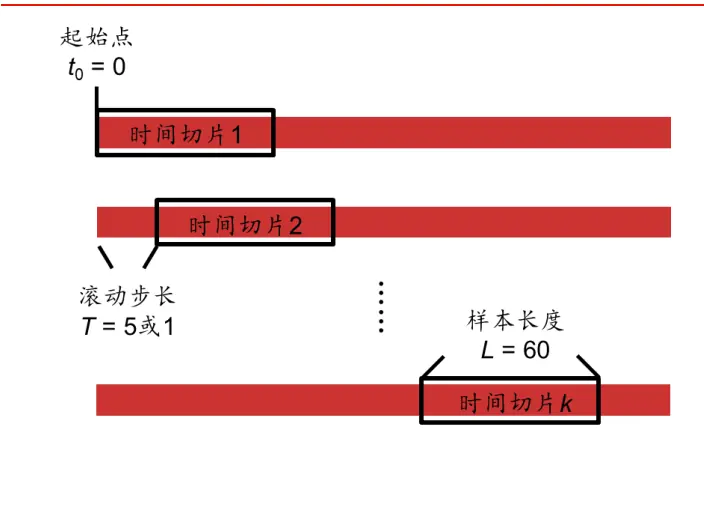
资料来源：华泰证券研究所

图表3： 滚动采样第 2步——随机映射到指数序列
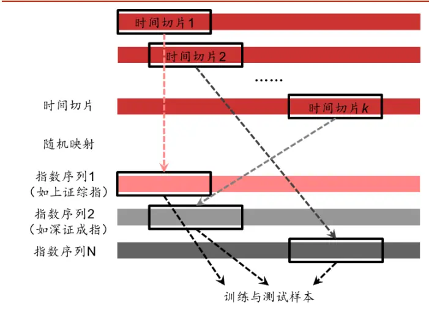
资料来源：华泰证券研究所

## 虚假序列样本生成：按日期重排

作为真实序列的对照，我们将生成虚假序列用于模型训练，并测试模型对真假序列的识别能力。我们将真实序列样本按日期随机打乱重排，保持同一交易日内截面数据（收益率和换手率）的对应关系。上述虚假序列的生成方式仅对真实数据的时序结构进行破坏，而对其它变量进行控制。虚假序列的分布、数量级、收益率换手率的对应关系等均与真实序列完全相同，生成的虚假序列相对“逼真”。以下我们截取部分真实序列以及相对应的虚假序列进行展示。

图表4： 真实（左侧）与虚假（右侧）收益率序列对比
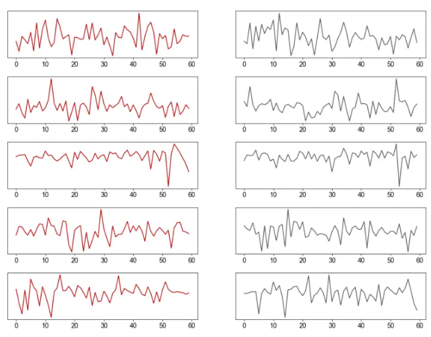
资料来源：Wind，华泰证券研究所

图表5： 真实（左侧）与虚假（右侧）价格序列对比
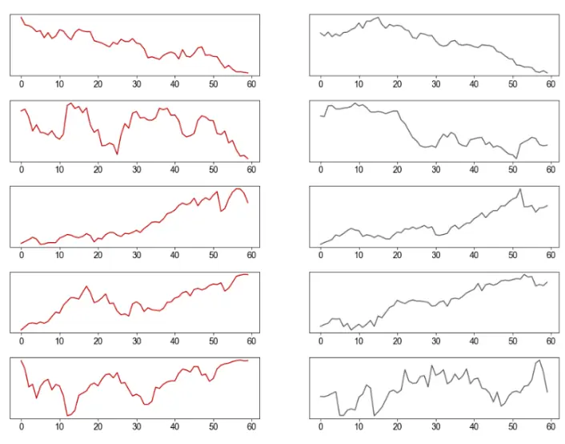
资料来源：Wind，华泰证券研究所

左上图为真实收益率序列（左侧红色）与虚假收益率序列（右侧灰色）的对比，右上图为由真实收益率生成的真实价格序列（左侧红色）与虚假收益率生成的虚假价格序列（右侧灰色）的对比。总的来看，收益率及价格的真假序列仅凭肉眼观察几乎难以分辨。

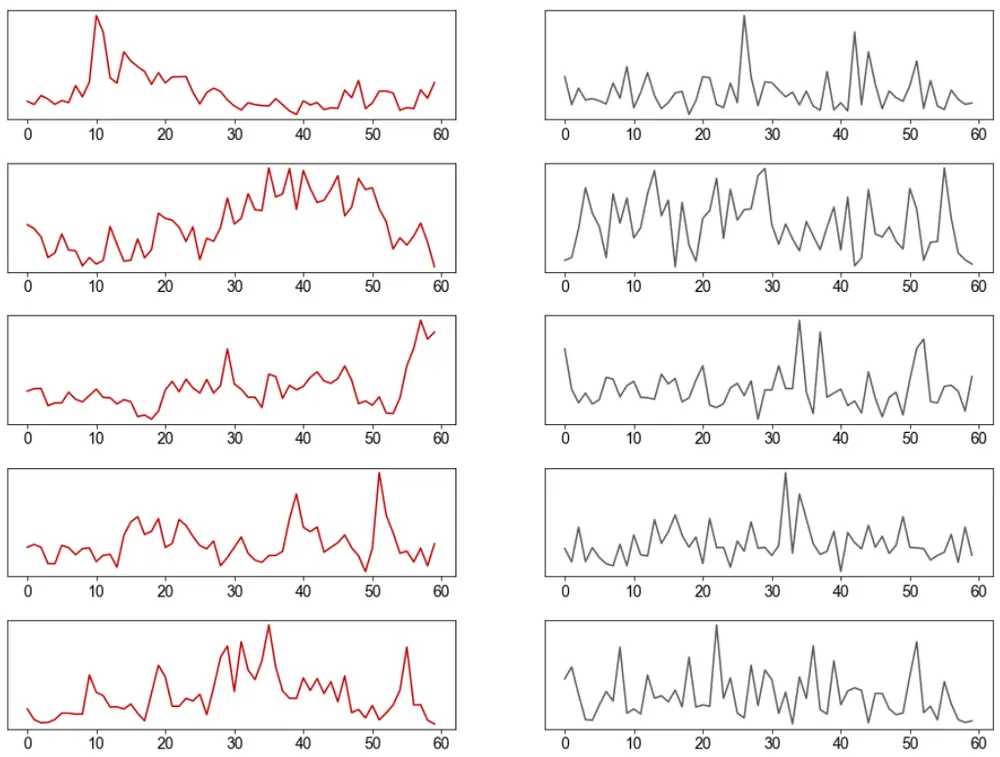
图表6： 真实（左侧）与虚假（右侧）换手率序列对比
资料来源：Wind，华泰证券研究所

上图为真实换手率序列（左侧红色）与虚假换手率序列（右侧灰色）的对比。总的来看，真实换手率序列表现出更强的趋势性和平滑性，不易出现高频的反复波动，相对容易直接辨别。打乱顺序对于换手率序列的结构破坏程度更大。我们猜测换手率的真假序列相比于收益率的真假序列更容易为机器学习模型识别。本文的附录部分将讨论采用其它时间序列分析技术能否用于识别真假序列。

我们将上述收益率、换手率序列作为机器学习模型训练用的特征。对于标签，我们将真实序列标注为 1，将虚假序列标注为 0，将原始问题定义为二分类问题。需要指出的是，随机生成的虚假序列可能仅打乱了小部分次序，与真实序列相似性仍旧较高，简单将其标注为虚假序列可能对模型训练造成干扰，引起过拟合。另一种数据标注思路为，以虚假序列和真实序列的相关度作为标签，将原始问题转化为回归问题。本文仍基于二分类问题进行初步探索，上述思路仅供参考。

具体测试过程中，对于原始训练集和验证集（样本为 4 个宽基指数，时间区间为 2007 年~2014 年），真假样本比例设置为 1:30；对于测试集（样本外推至 29 个行业指数，或者时间区间外推至 2015 年~2019 年 7 月末），真假样本比例设置为 1:10。

## 预处理：时间序列标准化，根据模型选择拼接方式

标准化是机器学习中重要的数据预处理环节。在一般的机器学习过程中，标准化通常针对每个特征进行操作；但在处理当前问题中的时间序列时，针对每个特征进行标准化有不妥之处。

本文探讨的问题中，真假序列在时间维度上的结构是最需要关注的信息。传统方法以特征为基础，对每个特征进行标准化，然而这种方法在处理时间序列时会直接导致序列的时序结构紊乱。神经网络中常用的批量标准化（Batch Normalization）则以“图片”为单位，对整个二维特征矩阵进行标准化，但是本研究中收益率和换手率序列之间存在量纲和数值范围的差异，整体标准化会给数据引入偏差。

基于上述考虑，本研究中的标准化针对每个时间序列进行操作，即单独对收益率序列进行时序维度的 Z-score标准化，并单独对换手率序列进行时序维度的 Z-score标准化。

在下一章的模型初筛中，我们将测试各种经典机器学习模型，多数模型只支持一维向量的特征，无法输入高维度变量。因此，对于除卷积神经网络外的模型，我们将标准化收益率序列和标准化换手率序列首尾拼接，得到一维向量，作为模型的特征；对于卷积神经网络，我们将两组标准化序列纵向组合成类似图片形式的二维标准化矩阵。序列拼接方法如下图所示。

图表7： 时间序列标准化及机器学习模型特征示意图
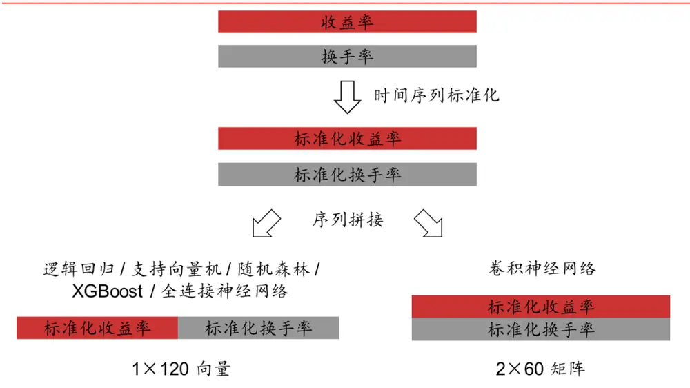
资料来源：华泰证券研究所

## 模型初步筛选及测试结果：卷积神经网络胜出

机器学习模型能否识别真假价量序列？不同机器学习模型的识别能力是否有强弱之分？我们首先对各种机器学习模型进行初步测试和筛选。机器学习模型包含逻辑回归、支持向量机、随机森林、XGBoost、全连接神经网络和卷积神经网络。模型初筛所使用的数据集为原始训练集和验证集，即样本为 4个宽基指数（上证综指、深证成指、沪深 300、中证500），时间区间为 2007 年初~2014 年末的价量序列。

## 模型参数设置

初步筛选模型的主要参数设置如下。此处未采用交叉验证方法调参，参数依据经验设定。
表格中未列出的参数均采用默认值。

图表8： 初步筛选模型重要参数设置（非神经网络类模型）

| 机器学习模型 | 调用 Python 函数 | 参数名称 | 参数值 | 参数含义 |
| --- | --- | --- | --- | --- |
| 逻辑回归 | sklearn.linear_model.LogisticRegressionCV |  | 10 | 惩罚系数 |
|  |  | penalty | 12 | 采用 I2 范数的参数惩罚项 |
| 支持向量机 | sklearn.svm.SVC |  | 1 | 惩罚系数 |
|  |  | kernel | rbf | 高斯核 |
| 随机森林 | sklearn.ensemble.RandomForestClassifier | n_estimators | 10 | 决策树数量 |
|  |  | max_depth | 30 | 最大树深度 |
| XGBoost | xgboost.XGBClassifier | criterion | gini | 损失函数 |
|  |  | n_estimators | 100 | 决策树数量，相当于算法的迭代次数 |
|  |  | max_depth | 30 | 最大树深度 |
|  |  | learning_rate subsample | 0.1 1 | 学习速率 行采样比例，1代表每次训练选择全部样本 |

资料来源：华泰证券研究所

图表9： 初步筛选模型重要参数设置（神经网络类模型）

| 机器学习模型 | 参数名称 | 参数值 |
| --- | --- | --- |
| 全连接神经网络 | 第1层全连接层神经元数 第1层全连接层激活函数 | 20 |
|  | 第 2层全连接层神经元数 | Relu |
|  |  | 40 |
|  | 第 2层全连接层激活函数 | Relu |
|  | 第 3层全连接层神经元数 | 60 |
|  | 第3层全连接层激活函数 | Relu |
|  | 输出层激活函数 | Sigmoid |
|  | 损失函数 | Categorical_crossentropy |
| 卷积神经网络 | 优化器 第1层卷积层卷积核大小 | Adam |
|  |  | 3x15 |
|  | 第1层卷积层卷积核数 | 20 |
|  | 第1 层卷积层激活函数 | Relu |
|  | 第 1 层卷积层 Stride | 1 |
|  | 第 1 层卷积层 Padding | 1 |
|  | 第2层卷积层卷积核大小 | 3x15 |
|  | 第 2层卷积层卷积核数 | 40 |
|  | 第2 层卷积层激活函数 | Relu |
|  | 第 2 层卷积层 Stride | 1 |
|  | 第 2 层卷积层 Padding | 1 |
|  | 第 3层全连接层神经元数 | 60 |
|  | 第3层全连接层激活函数 | Relu |
|  | 输出层激活函数 | Sigmoid |
|  | 损失函数 | Categorical_crossentropy |
|  | 优化器 | Adam |

资料来源：华泰证券研究所

全连接神经网络和卷积神经网络在代码实现层面均采用 Keras 库。网络每层输出后均进行批量标准化。卷积神经网络不进行池化（Pooling）和 Dropout 操作，第 2 层卷积层和第 3层全连接层之间包含一层平铺层（Flatten）。

## 模型评价指标

机器学习模型看似必然的结果背后可能受到偶然因素的影响。本研究中的随机性来源包括：1）训练集和验证集按 7:3的比例随机划分；2）机器学习算法本身的随机数，尤其是神经网络模型各环节涉及的随机数（参见华泰金工人工智能系列之二十《必然中的偶然：机器学习中的随机数》20190429）。为了避免随机性带来的潜在影响，我们共进行 10 次重复测试。每次循环中，首先按 7:3 的比例随机划分训练集和验证集，随后基于新的训练集重新训练模型，基于新的验证集计算模型评价指标，最后将 10 次结果取平均。

模型评价指标主要衡量模型对验证集或测试集中真实样本的识别能力。具体评价指标包括精确率（Precision）、召回率（Recall）和 F1_score。由于真实样本和虚假样本的比例不均衡（1:30），正确率（Accuracy）指标的意义不大，暂不考虑统计。对于真实样本而言，各评价指标的详细释义如下：

精确率：被分类为真实的样本中，被正确分类的真实样本比例，也称为查准率。通俗地说，发射的子弹里有多少比例的子弹命中了目标。

召回率：所有真实样本中，被正确分类的真实样本比例，也称为查全率。通俗地说，全部目标里有多少比例的目标被击中。

F1_score：精确率和召回率的调和平均数，是均衡精确率和召回率两个指标的综合度量。

精确率和召回率之间存在一定的制衡关系：更高的精确率意味着更高的识别可信度，因此样本也就更容易被挡在门外而造成召回率低下；相对应的，降低可信度的门槛能选出更多样本，但容易造成鱼龙混杂。实践中两者应不同需求而有不同侧重，本研究的最终目的是发掘市场的特征，应当在把握一定精确率的条件下尽可能提升召回率。

## 模型初筛结果

从下表的结果来看，传统的逻辑回归、随机森林、 模型几乎没有对于真假序列的识别能力，不适用于该类型的数据；支持向量机和全连接神经网络表现出一定的识别能力，但召回率短板显著；卷积神经网络的优势相对明显，召回率高于其余模型，可以认为 CNN卷积核的特性能够更好地把握时序数据的结构关系。下一章我们将继续优化卷积神经网络模型，并进行更细致的测试。

图表10： 模型初筛环节各机器学习模型对于验证集真实样本的识别能力

| 模型 | 精确率（Precision） | 召回率（Recall） | F1_score |
| --- | --- | --- | --- |
| 卷积神经网络 | 0.99 | 0.91 | 0.95 |
| 支持向量机 | 1.00 | 0.46 | 0.63 |
| 全连接神经网络 | 0.73 | 0.48 | 0.58 |
| XGBoost | 1.00 | 0.13 | 0.22 |
| 随机森林 | 0.18 | 0.00 | 0.00 |
| 逻辑回归 | 0.00 | 0.00 | 0.00 |

资料来源：Wind，华泰证券研究所

## 卷积神经网络调参及测试结果：各组测试集表现良好

卷积神经网络（下文简称 CNN）是一种特殊的神经网络，相比于传统的全连接神经网络，CNN 通过卷积核提取局部特征，即临近特征（像素）间的结构性关联，适用于图像识别等领域。价量序列在时间维度上的结构信息是本研究的重点，而序列数据可以被视为特殊的二维图像。本研究的序列数据仅包含收益率和换手率两组时间序列，无需考虑两者排列顺序的影响。

从上一章模型初筛结果看，CNN 模型识别真假序列的能力显著优于其它机器学习模型。我们认为 CNN 是识别真假序列任务相对合理的选择。本章我们将对 CNN 进行更深入细致的考察。

## CNN 主要参数及选择

## 网络层数

模型的复杂度和计算成本很大程度取决于层数，随层数以乘积的速度上升。对于当前模型，模型的可解释性较为重要，因此我们需要严格控制模型的复杂度。从初筛结果来看，两层卷积层加一层全连接层已经有较好的识别效果，我们选用该框架作为后续模型训练的基础。

由于模型输入特征的行数目（60 个交易日）和列数目（收益率、换手率）相对不平衡，且总体样本量不大，我们在模型中不加入池化层（Pooling）和 Dropout 层，防止对局部信息造成干扰。

## 卷积核大小

卷积核的本质是一个权值连接矩阵，卷积核作用于输入图像中每一块固定大小的局部区域，对于该区域的图片像素值进行加权求和，最终生成输出图像中的相应像素值。由于该操作可以看作是滤波，卷积核常被称为滤波器（Filter）。本质上卷积核与全连接神经网络中的权值连接矩阵的作用相似，但卷积核可以滑动作用于图像的局部区域，对特征的绝对位置依赖性相对较小。

图表11： 卷积神经网络模型卷积核作用原理示意图
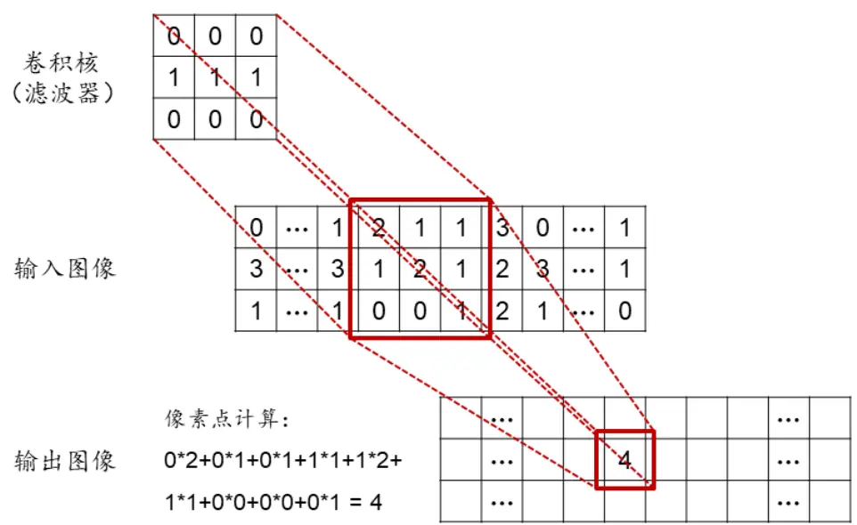
资料来源：华泰证券研究所

卷积核大小的选择一般取决于图像的大小及图像的局部结构特点。首先考虑卷积核的长度。卷积核长度不能太长，否则和全连接神经网络无异，并且计算量较大。卷积核长度也不能太短，过短的时间区间内的价量信息不足以支持真假序列识别。至少连续多少个交易日的数据包含的信息能够识别真假序列？我们选用 5 个交易日的倍数作为可能的卷积核长度，初步测试后发现长度为 15 时模型表现较好。

其次考虑卷积核的宽度，卷积核宽度应避免显著超过图片宽度而掺杂过多额外信息。同时，一般情况下 CNN 的卷积核长宽均会选择奇数，从而保证卷积核拥有明确的几何中心，使Padding（补足）过程能够维持对称。考虑上述几点，卷积核宽度设置为 3较为合理。

## 卷积核数量

每一个卷积核施加在原图像可以看作是一次滤波，也是一次图像局部信息的提取。在卷积核数量的选取上，更多的卷积核代表更多的信息提取，同时也意味着更高的复杂度、训练成本，以及更高的过拟合程度和解释难度。我们将保持之前选定的层数框架（即两层卷积层加一层全连接层）不变，对每层网络的卷积核数量进行调参。

传统的机器学习模型调参一般采用网格搜索（Grid Search），但在超参数组合较多的情况下，传统网格搜索的运算成本随着超参数的数量成倍上升，对于神经网络这类复杂度较高的模型训练难度较大。我们考虑在固定全连接层神经元数量的前提下，首先对卷积层的卷积核数量进行调参；卷积核数量确定后，再对全连接层神经元数量进行调参。

我们将第 1 层卷积层卷积核数量的搜索域设置为[10, 20, 30]，第 2 层卷积层卷积核数量的搜索域设置为[20, 30, 40]，同时固定全连接层神经元数量为 60（模型初筛使用的参数）进行网格搜索。我们仍按 7:3 的比例随机划分训练集和验证集，重复 5 次得到模型对真实样本的平均识别能力，观察较优的卷积核数量组合。

图表12： 不同卷积层卷积核数量组合在验证集的平均表现

| 第1层卷积核数量 | 第 2 层卷积核数量 | 精确率 | 召回率 | F1_score |
| --- | --- | --- | --- | --- |
| 10 | 20 | 0.99 | 0.88 | 0.93 |
| 10 | 30 | 0.98 | 0.92 | 0.95 |
| 10 | 40 | 0.99 | 0.87 | 0.92 |
| 20 | 20 | 1.00 | 0.78 | 0.86 |
| 20 | 30 | 1.00 | 0.93 | 0.96 |
| 20 | 40 | 1.00 | 0.92 | 0.96 |
| 30 | 20 | 0.99 | 0.94 | 0.97 |
| 30 | 30 | 0.99 | 0.95 | 0.97 |
| 30 | 40 | 1.00 | 0.87 | 0.93 |

资料来源：Wind，华泰证券研究所

从上表结果可知，[20, 30]的组合平均 F1_score 超过0.95，在精确率几乎为 1的同时有效提升了召回率，拥有较好的表现；同时，继续提升卷积核的数量对模型表现的提升较小。综合考虑模型表现和计算开销，我们选取[20, 30]作为前两层卷积层的卷积核数量。

类似地，我们对全连接层神经元数量进行调参。由于模型的识别能力已经较强，我们着重观察能否进一步降低模型复杂度，参数搜索域设置为[30, 40, 50, 60]。

图表13： 不同全连接层神经元数量在验证集的平均表现

| 全连接层神经元数量 | 精确率 召回率 | F1_score |
| --- | --- | --- |
| 30 | 0.9964 | 0.9244 0.9585 |
| 40 | 0.9983 | 0.9176 0.9557 |
| 50 | 1.0000 | 0.8706 0.9299 |
| 60 | 1.0000 | 0.9193 0.9578 |

资料来源：Wind，华泰证券研究所

从上表结果可知，全连接层神经元数量在 30 时，模型已经能得到相对较高的 F1_score。综合以上测试结果，我们将 CNN 模型的前两层卷积层卷积核数量以及全连接层神经元数量设置为[20, 30, 30]。

图表14： 调参后的 CNN模型结构和参数

| 网络层 | 激活函数 | 卷积核大小 | 卷积核数量（卷积层）或神经元数量（其余层） |
| --- | --- | --- | --- |
| 第1层卷积层 | Relu | 3*15 | 20 |
| 第 2 层卷积层 | Relu | 3*15 | 30 |
| 全连接层 | Relu |  | 30 |
| 输出层 | Sigmoid |  | 2 |

资料来源：华泰证券研究所

## 迭代次数

CNN 模型的表现和迭代次数（Epochs）密切相关，迭代次数过少可能造成欠拟合，迭代次数过多可能造成过拟合。我们考察训练集和验证集损失随迭代次数的变化，确定合适的迭代次数。由下图可知，验证集损失在迭代次数达到 10 次时，基本已经收敛，进一步增加迭代次数对模型表现无明显提升。因此我们将迭代次数设置为 10。

图表15： CNN模型训练集和验证集损失随迭代次数变化（特征为收益率和换手率序列）
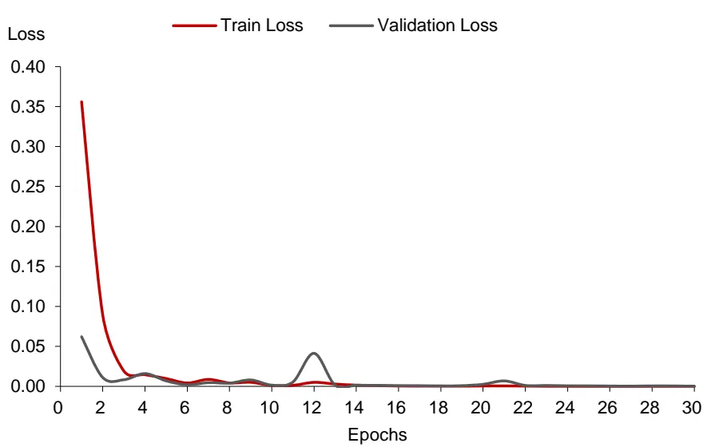
资料来源：Wind，华泰证券研究所

## CNN 模型测试结果

这里我们将重申测试集的组成。如下图所示，测试集由三部分构成，分别对应：1）相同时间区间，不同指数；2）外推时间区间，相同指数；3）外推时间区间，不同指数。测试集的时间切片步长和真假样本比例与训练集及验证集相比略有不同。重点关注模型对测试集真实样本的识别能力，以精确率、召回率、F1-score三个指标衡量。

图表16： 测试集的构成示意图

| 2007/1/15~2014/12/31 |  | 2015/1/5~2019/7/31 |
| --- | --- | --- |
| 4只宽基指数 | 训练集+验证集 时间切片步长T=5 真假样本比1:30 | 测试集2 时间切片步长T=1 真假样本比1:10 |
| 29只中信一级 行业指数 | 测试集1 时间切片步长T=1 真假样本比1:10 | 测试集3 时间切片步长T=1 真假样本比1:10 |

资料来源：Wind，华泰证券研究所

## 测试集 1：相同时间区间，不同指数

CNN 模型对相同时间区间内行业指数的识别表现如下表所示。模型整体识别能力较强，少数识别效果不佳的行业为银行和非银行金融。这一结果本身符合预期，测试集 1 的行业指数和训练集的宽基指数具有高相关性。我们仍需进一步考察模型在外推时间区间的表现。

图表17： CNN模型对测试集 1（相同时间区间，不同指数）真实样本的识别能力

| 中信一级行业 | 精确率 | 召回率 | F1_score |
| --- | --- | --- | --- |
| 商贸零售 | 0.99 | 1.00 | 0.99 |
| 纺织服装 | 0.99 | 1.00 | 0.99 |
| 基础化工 | 0.99 | 1.00 | 0.99 |
| 医药 | 0.99 | 0.99 | 0.99 |
| 电力设备 | 0.99 | 0.99 | 0.99 |
| 农林牧渔 | 0.99 | 1.00 | 0.99 |
| 电子元器件 | 0.99 | 1.00 | 0.99 |
| 机械 | 0.99 | 0.99 | 0.99 |
| 计算机 | 0.99 | 0.99 | 0.99 |
| 有色金属 | 0.99 | 0.99 | 0.99 |
| 电力及公用事业 | 0.99 | 0.99 | 0.99 |
| 传媒 | 0.99 | 0.99 | 0.99 |
| 建材 | 0.99 | 0.99 | 0.99 |
| 汽车 | 0.99 | 0.99 | 0.99 |
| 国防军工 | 0.99 | 0.99 | 0.99 |
| 轻工制造 | 0.99 | 0.99 | 0.99 |
| 综合 | 0.99 | 0.98 | 0.98 |
| 交通运输 | 0.98 | 0.98 | 0.98 |
| 餐饮旅游 | 0.99 | 0.97 | 0.98 |
| 房地产 | 0.99 | 0.97 | 0.98 |
| 食品饮料 | 0.99 | 0.96 | 0.97 |
| 煤炭 | 0.98 | 0.97 | 0.97 |
| 钢铁 | 0.98 | 0.94 | 0.96 |
| 建筑 | 0.99 | 0.93 | 0.96 |
| 石油石化 | 0.98 | 0.93 | 0.95 |
| 通信 | 0.99 | 0.91 | 0.94 |
| 家电 | 0.99 | 0.89 | 0.94 |
| 非银行金融 | 0.97 | 0.75 | 0.85 |
| 银行 | 0.97 | 0.70 | 0.82 |
| 平均数 | 0.99 | 0.96 | 0.97 |
| 中位数 | 0.99 | 0.99 | 0.99 |

资料来源：Wind，华泰证券研究所

## 测试集 2：外推时间区间，相同指数

CNN 模型对外推时间区间内宽基指数的识别表现如下表所示。外推时间区间后，CNN 模型识别能力有一定下降，主要源于召回率的下降，即模型将小部分真实样本误识别为虚假样本，但模型整体识别能力仍处于较高水平。

图表18： CNN模型对测试集 2（外推时间区间，相同指数）真实样本的识别能力

| 宽基指数 | 精确率 | 召回率 | F1_score |
| --- | --- | --- | --- |
| 上证综指 | 0.99 | 0.90 | 0.94 |
| 深证成指 | 0.99 | 0.84 | 0.91 |
| 沪深 300 | 0.99 | 0.85 | 0.91 |
| 中证 500 | 0.99 | 0.87 | 0.92 |
| 平均数 | 0.99 | 0.86 | 0.92 |
| 中位数 | 0.99 | 0.86 | 0.92 |

资料来源：Wind，华泰证券研究所

## 测试集 3：外推时间区间，不同指数

CNN 模型对外推时间区间内行业指数的识别表现如下表所示。和测试集 2 结果类似，外推时间区间后，CNN 模型识别能力有一定下降，主要源于召回率的下降，即模型将小部分真实样本误识别为虚假样本，但模型整体识别能力仍处于较高水平。

图表19： CNN模型对测试集 3（外推时间区间，不同指数）真实样本的识别能力

| 中信一级行业 | 精确率 | 召回率 | F1_score |
| --- | --- | --- | --- |
| 钢铁 | 0.99 | 0.97 | 0.98 |
| 建材 | 0.99 | 0.97 | 0.98 |
| 基础化工 | 0.99 | 0.95 | 0.97 |
| 煤炭 | 0.99 | 0.94 | 0.96 |
| 有色金属 | 0.99 | 0.93 | 0.96 |
| 商贸零售 | 0.99 | 0.93 | 0.96 |
| 石油石化 | 1.00 | 0.92 | 0.96 |
| 电力及公用事业 | 0.99 | 0.92 | 0.95 |
| 农林牧渔 | 0.99 | 0.92 | 0.95 |
| 建筑 | 0.98 | 0.92 | 0.95 |
| 房地产 | 0.98 | 0.91 | 0.94 |
| 交通运输 | 0.99 | 0.90 | 0.94 |
| 汽车 | 0.99 | 0.89 | 0.94 |
| 通信 | 0.99 | 0.89 | 0.94 |
| 纺织服装 | 0.99 | 0.89 | 0.94 |
| 综合 | 0.99 | 0.87 | 0.93 |
| 电力设备 | 0.99 | 0.87 | 0.93 |
| 轻工制造 | 0.99 | 0.87 | 0.93 |
| 计算机 | 0.98 | 0.87 | 0.92 |
| 医药 | 0.99 | 0.86 | 0.92 |
| 国防军工 | 0.99 | 0.85 | 0.92 |
| 机械 | 0.99 | 0.85 | 0.91 |
| 食品饮料 | 0.99 | 0.85 | 0.91 |
| 非银行金融 | 0.98 | 0.85 | 0.91 |
| 传媒 | 0.99 | 0.83 | 0.90 |
| 家电 | 0.99 | 0.82 | 0.90 |
| 餐饮旅游 | 0.99 | 0.79 | 0.88 |
| 电子元器件 | 0.99 | 0.79 | 0.88 |
| 银行 | 0.96 | 0.75 | 0.84 |
| 平均数 | 0.99 | 0.88 | 0.93 |
| 中位数 | 0.99 | 0.89 | 0.94 |

资料来源：Wind，华泰证券研究所

## 三组测试集结果汇总

三组测试集的汇总结果如下图所示。总的来看，CNN 模型整体识别能力较强，可以有效把握真实价量序列的特征信息。模型对真实样本的识别精确率较高，即虚假样本基本能够被稳定排除；但是模型的召回率和 F1_score 稍低，即仍有小部分的真实样本会被误认为虚假样本。

上述结果一定程度上符合我们的预期。真实序列可能包含少量随机成分，使得模型无法正确识别，从而导致召回率和 F1_score 下降。而虚假样本很难模拟出真实市场包含的特征信息，使得模型精确率稳定在较高水平。

另外，比较模型对宽基指数和行业指数的识别表现，两者并无明显差异。比较模型在相同时间区间和外推时间区间的识别表现，模型在外推时间区间的召回率和 F1_score 有一定下降。

上述结果同样符合预期。宽基指数和行业指数本身具有高相关性，改变指数对模型的影响较小。而外推时间区间内的真实市场特征可能与训练集时间区间略有差异，改变时间区间会部分削弱模型表现。

图表20： CNN模型对三组测试集真实样本的平均识别能力汇总（特征为收益率和换手率序列）
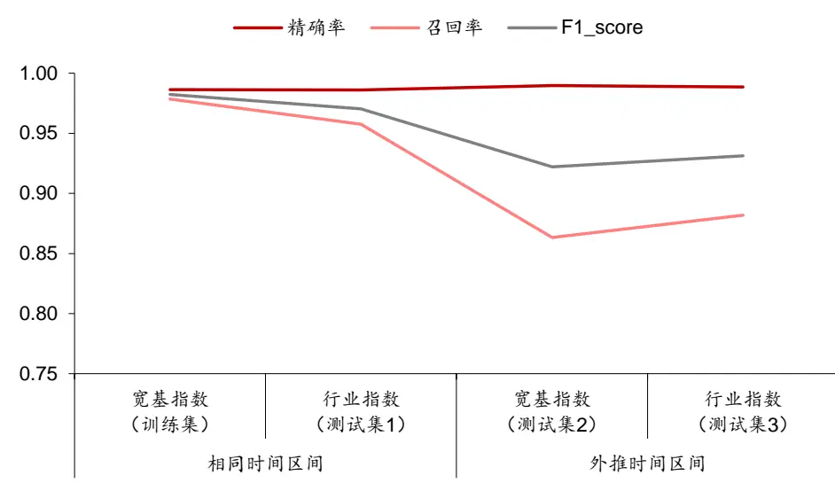
资料来源：Wind，华泰证券研究所

## 白噪声测试

除上述测试外，我们随机生成服从标准正态分布的收益率序列和换手率序列（由于有后续标准化操作，此处不要求换手率为正数），作为白噪声序列对 CNN 模型进行测试。在生成的 50000 次白噪声序列的测试中，模型对噪声序列全部识别为虚假序列，可以认为 CNN模型具有稳健的抗噪声能力。

综合以上测试结果看，CNN 模型对于外推时间区间和不同指数的真实样本整体具有较强的识别能力。模型对于外推时间区间真实样本的召回率稍有降低，可能原因是外推测试集包含部分训练集未出现的特征信息；同时，模型对于白噪声有较强的抵抗能力。可以认为模型能够有效识别真实市场价量序列中的特征信息。

那么，真实市场价量序列中的特征信息究竟是什么？它具体存在于收益率序列，还是换手率序列中？下一章我们将做进一步探讨。

## CNN根据何种信息识别真假价量序列？

CNN 模型根据何种信息识别出真实和虚假价量序列？换言之，真实价量序列究竟在哪些地方有别于虚假价量序列？本章我们尝试进一步对时间序列中的特征信息进行提取，观察特征信息源于收益率还是换手率，抑或两者的结合作用。另外，我们也将尝试以技术分析常用的技术指标结合收益率作为特征，考察技术指标是否有助于识别真假序列。

## 价量信息单独测试：收益率效果不佳，换手率表现出色

## 单收益率序列测试

首先我们单独使用收益率序列作为特征，考察 CNN 模型能否根据收益率识别真假样本。
收益率序列选取连续 60 个交易日的数据，并经过标准化处理，即 1×60 的收益率向量。
除了卷积核宽度缩小至 1 以外，CNN模型其余参数和测试流程均保持不变。

当训练特征为单收益率序列时，CNN 模型训练集和验证集损失随迭代次数变化如下图。模型的验证集损失在 10 次迭代后基本收敛，但是显著高于训练集损失，反映出模型存在一定程度的过拟合。

图表21： CNN模型训练集和验证集损失随迭代次数变化（特征为单收益率序列）
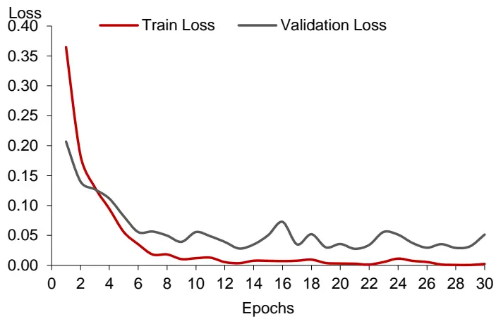
资料来源：Wind，华泰证券研究所

图表22： CNN模型对三组测试集真实样本的平均识别能力汇总（特征为收益率序列）
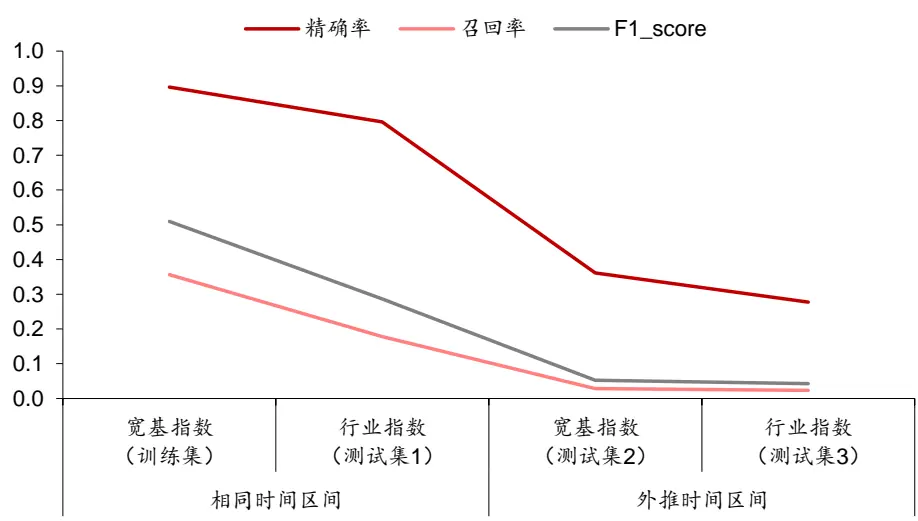
资料来源：Wind，华泰证券研究所

当训练特征为单收益率序列时，CNN 模型对三组测试集真实样本的平均识别能力如上图所示。总的来看，无论是训练集还是测试集，基于收益率的 CNN 模型识别能力均较弱。改变时间区间和指数对模型表现均有显著的负向影响，其中外推时间区间的精确率和召回率均出现较大滑坡，召回率接近 0。该结果表明，单纯基于收益率的 CNN 模型无法有效识别真假序列。

## 单换手率序列测试

接下来我们单独使用换手率序列作为特征，考察 CNN 模型能否根据换手率识别真假样本。
换手率序列选取连续 60 个交易日的数据，并经过标准化处理，即 1×60 的换手率向量。
除了卷积核宽度缩小至 1 以外，CNN模型其余参数和测试流程均保持不变。当训练特征为单换手率序列时，CNN 模型训练集和验证集损失随迭代次数变化如下图。
模型的验证集损失快速收敛，并且训练集损失与验证集损失接近，未体现出过拟合。

图表23： CNN模型训练集和验证集损失随迭代次数变化（特征为单换手率序列）
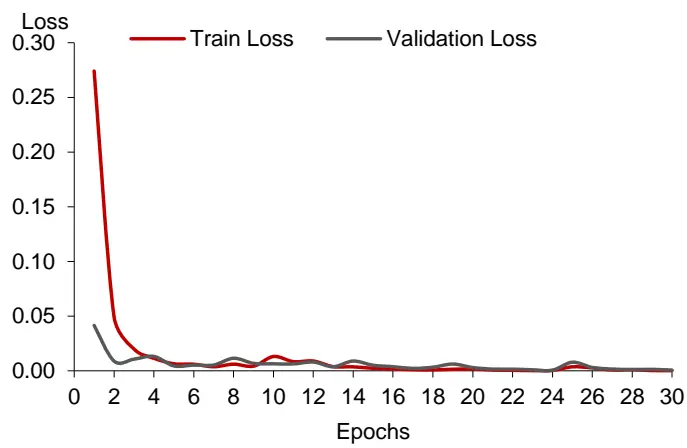
资料来源：Wind，华泰证券研究所

当训练特征为单换手率序列时，CNN 模型对三组测试集真实样本的平均识别能力如下图所示。总的来看，无论是训练集还是测试集，基于换手率的模型识别能力均较强，精确率接近 1，召回率也高于 0.85。模型在外推时间区间内的表现略有下滑，但是 F1_score 仍高于 0.9。该结果表明，单纯基于换手率的 CNN 模型能够有效识别真假序列。

图表24： CNN模型对三组测试集真实样本的平均识别能力汇总（特征为换手率序列）
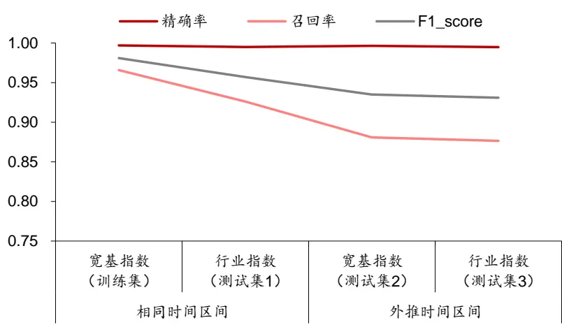
资料来源：Wind，华泰证券研究所

总的来看，单纯基于换手率的模型与基于收益率及换手率的模型表现接近，优于单纯基于收益率的模型。CNN模型可能主要根据换手率中存在的规律来识别真实和虚假价量序列，换言之，真实和虚假样本的核心区别可能体现在换手率，而非体现在收益率。

## 收益率结合技术指标测试：MACD和 PSY无增强效果

技术分析的核心是对技术指标的解读。技术指标是基于数学方法对市场的价量等原始信息的“再组装”。在之前的测试中，基于换手率序列的模型表现出色，而基于收益率序列的模型效果不佳。将收益率序列与技术指标相结合，能否改善识别效果？下面我们选取MACD 类的两个指标以及 PSY 指标结合收益率进行测试。真假技术指标序列的计算均基于价格序列，真假价格序列通过真假收益率序列还原得到。

## MACD 类指标

MACD 是反映长短期价格趋势及其相对差距的指标，首先通过计算长短时间窗口（通常为12 日和 26 日）内的指数移动均线值，并作差得到快慢线的离差值 DIF，作为反映长短期趋势差的指标；对 DIF曲线做 9 日指数移动平均得到慢线 DEA 线；DIF 和 DEA的差值即为 MACD 柱状图，用来反映长短期离差的差异。上述指标组成的“二线一柱”组合即为传统的 MACD 策略，经典的“黄金交叉”、“死亡交叉”等均出自该指标。

由于 DEA 相当于 DIF 的均线，两者同质化程度较高，我们仅对 DIF 进行测试，将收益率和DIF序列拼接而成2×60的矩阵作为特征。结果如下图所示，无论是训练集还是测试集，收益率结合 DIF的模型对真实样本的识别能力均较弱。

图表25： CNN模型对三组测试集真实样本的平均识别能力汇总（特征为收益率和 DIF序列）
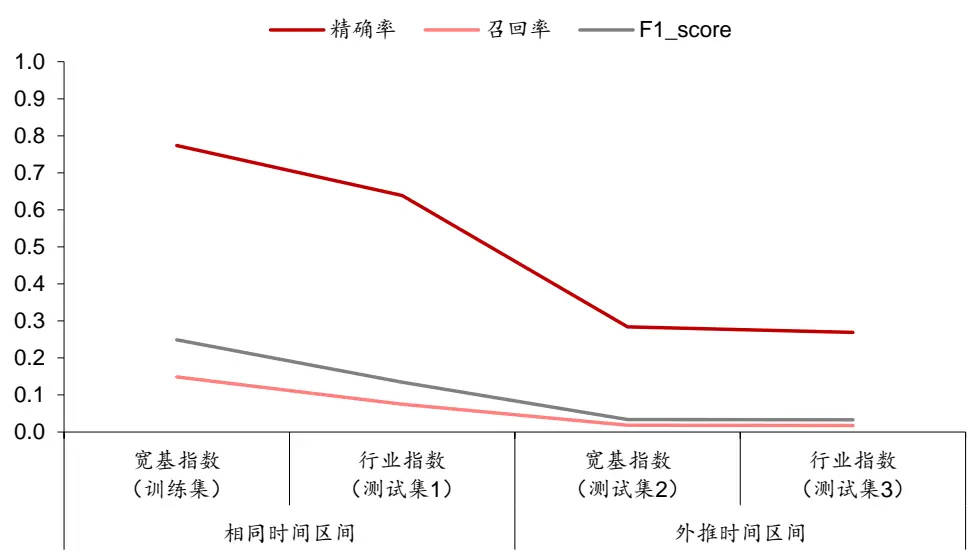
资料来源：Wind，华泰证券研究所

接下来我们选取收益率和 MACD 序列作为特征，结果如下图所示，和 DIF 序列类似，模型对训练集和测试集的真实样本均不具备有效识别能力。

图表26： CNN模型对三组测试集真实样本的平均识别能力汇总（特征为收益率和 MACD序列）
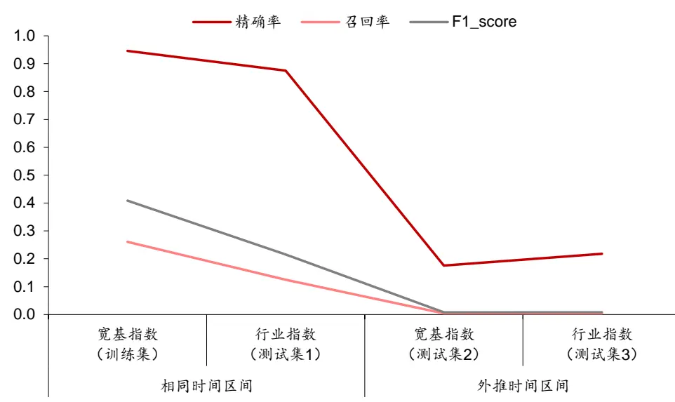
资料来源：Wind，华泰证券研究所

## PSY（心理线）指标

PSY指标通过计算过去指定时间内收益率为正数的天数比例，反映过去区间内股票上涨的动力，是用以反映股票强弱的指标。PSY = (N 日内上涨天数 / N) * 100，默认 N = 12。我们将收益率和 PSY 序列拼接成 2×60 的矩阵作为特征。结果如下图所示，模型对训练集和测试集的真实样本均不具备有效识别能力。

图表27： CNN模型对三组测试集真实样本的平均识别能力汇总（特征为收益率和 PSY序列）
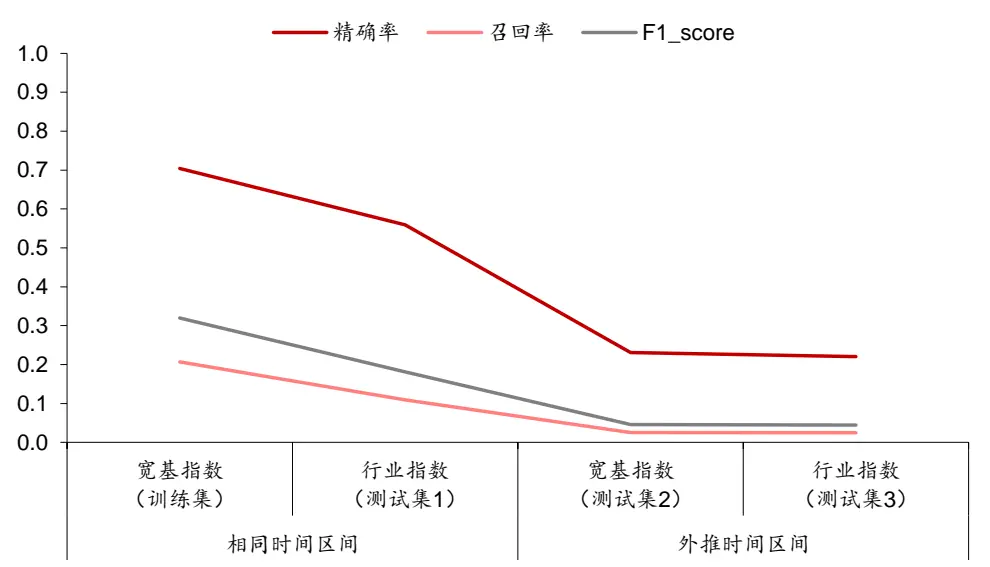
资料来源：Wind，华泰证券研究所

总的来看，以上将基于价的技术指标与收益率结合，并没有对模型的识别效果带来提升。真实样本和虚假样本的区别可能并不体现在基于价的技术指标上，换言之，基于价的技术指标本身包含信息的有效性存疑。

本章全部测试结果汇总如下表所示。附录部分将展示基于价格本身和技术指标序列模型的识别效果。

图表28： 基于收益率、换手率和技术指标等特征的 CNN模型对三组测试集真实样本的平均识别能力汇总

| 特征 | 维数 | 评价指标 | 宽基指数+相同时间 (训练集) | 行业指数+相同时间 (测试集1) | 宽基指数+外推时间 (测试集2) | 行业指数+外推时间 (测试集3) |
| --- | --- | --- | --- | --- | --- | --- |
| 收益率+换手率 | 2x60 | 精确率 | 0.986 | 0.986 | 0.990 | 0.988 |
|  |  | 召回率 | 0.978 | 0.958 | 0.863 | 0.882 |
|  |  | F1_score | 0.982 | 0.970 | 0.922 | 0.931 |
| 收益率 | 1×60 | 精确率 | 0.896 | 0.796 | 0.361 | 0.277 |
|  |  | 召回率 | 0.356 | 0.178 | 0.028 | 0.023 |
|  |  | F1_score | 0.510 | 0.286 | 0.053 | 0.043 |
| 换手率 | 1x60 | 精确率 | 0.997 | 0.995 | 0.997 | 0.995 |
|  |  | 召回率 | 0.966 | 0.926 | 0.881 | 0.876 |
|  |  | F1_score | 0.981 | 0.957 | 0.935 | 0.931 |
| 收益率+DIF | 2x60 | 精确率 | 0.774 | 0.639 | 0.284 | 0.269 |
|  |  | 召回率 | 0.149 | 0.075 | 0.018 | 0.018 |
|  |  | F1_score | 0.249 | 0.134 | 0.034 | 0.033 |
| 收益率+MACD | 2x60 | 精确率 | 0.946 | 0.875 | 0.176 | 0.218 |
|  |  | 召回率 | 0.261 | 0.125 | 0.004 | 0.004 |
|  |  | F1_score | 0.409 | 0.216 | 0.008 | 0.008 |
| 收益率+PSY | 2×60 | 精确率 | 0.704 | 0.559 | 0.231 | 0.220 |
|  |  | 召回率 | 0.207 | 0.109 | 0.025 | 0.025 |
|  |  | F1_score | 0.320 | 0.182 | 0.046 | 0.044 |

资料来源：Wind，华泰证券研究所

## 换手率序列包含何种信息？来自神经网络可视化的探索

本研究醉翁之意不在酒。识别真假序列之意不在识别真假序列本身，而在于分析真实市场价量序列包含的特征信息。根据前文测试结果，基于换手率序列的 CNN 模型识别能力更强，表明换手率相比于收益率序列更有可能包含反映真实市场规律的信息。那么，所谓的“真实市场信息”究竟是什么？

本研究主要基于 CNN 模型，神经网络类模型的黑箱特性以及相对复杂的网络结构，导致其可解释性低下，内部机制往往难以明晰。除直接打开网络的内部结构外，一些研究提出从其它层面可视化神经网络的方法。思路包括逐层观察权重，将权重作用于图像观察效果；也有一些算法通过定量方式计算像素的重要性，在图像上呈现特征提取情况，其中有代表性的是 Grad-CAM 算法。这一章我们将用 Grad-GAM 算法对 CNN 进行可视化处理，探索换手率序列包含何种有效信息。

## 基于 Grad-CAM 的可视化

Grad-CAM 是神经网络的可视化算法之一。针对神经网络分类问题中的某个类别，该方法通过梯度计算出图像中各像素对该类别的贡献值，即图像中指向该分类的信息重要程度，并以热力图的形式反映在图像上。具体原理可参考 Selvaraju 等人于 2016 年发表的论文《 Grad-CAM: Visual Explanations from Deep Networks via Gradient-basedLocalization》。

下图展示了一个已经训练完成的图像识别模型，对样例图片进行预测时，图片中各像素对应“猫”分类和“狗”分类的 Grad-CAM 热力图。某个分类下热力图像素点的颜色越偏红色（类似“亮斑”），表明该像素对于该分类的识别越重要；反之颜色越偏蓝色，表明该像素对于该分类的识别越不重要。下图的 Grad-CAM 热力图在猫和狗的对应区域出现“亮斑”，说明图片下部的像素对于猫的识别较为重要，图片上部的像素对于狗的识别较为重要。

图表29： 样例图片对应“猫”类别或“狗”类别的 Grad-CAM 热力图
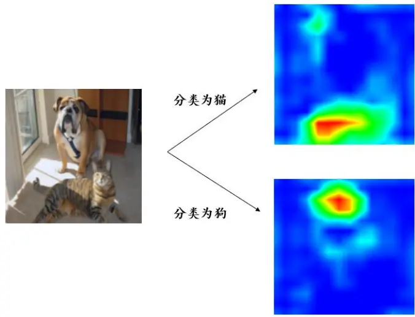
资料来源：Grad-CAM，华泰证券研究所

借鉴 Gram-CAM 思想，我们选取基于单换手率序列的 CNN 模型，首先对真实换手率序列进行预测，绘制真实换手率序列中各元素对应“真实样本”分类的 Grad-CAM 热力图，如下图所示。这里真实换手率序列的选取方法是：随机以测试集中的一个交易日 t 作为起始点，时间切片滚动步长设为 1，连续切取 10 段长度为 60 个交易日的换手率序列的切片，即第 1 段的时间区间为 t~t+59 日，第 2 段的时间区间为 t+1~t+60 日，第 10 段的时间区间为 t+9~t+68 日。

图表30： 连续真实换手率序列对应“真实样本”类别的 Grad-CAM 热力图

| 10 20 30 | 40 50 |  |  |  |  |  |
| --- | --- | --- | --- | --- | --- | --- |
|  | 10 | 20 | 30 | 40 | 50 | 0.8 |
|  | 10 | 20 | 30 | 40 | 50 |  |
|  |  |  |  |  |  | 0.6 |
|  | 10 | 20 | 30 | 40 | 50 |  |
|  | 10 | 20 | 30 | 40 | 50 |  |
|  | 10 | 20 | 30 | 40 | 50 | 0.4 |
|  | 10 | 20 | 30 | 40 | 50 |  |
|  | 10 | 20 | 30 | 40 | 50 | 0.2 |
|  | 10 | 20 | 30 | 40 | 50 |  |
|  |  |  | 30 | 40 | 50 |  |
|  | 10 | 20 |  |  |  | 0.0 |

资料来源：Wind，华泰证券研究所

我们以由黑到白变化的色阶表征像素（即各交易日换手率）对识别该分类的重要性。上面Grad-CAM 热力图的像素点越偏白色（类似“亮斑”），表明该像素点对于识别“真实样本”的重要性越高。从上面的 Grad-CAM 热力图可知，“亮斑”的分布随着时间推进存在显著的平移现象。10 段真实换手率序列本身随着时间推进，图片底部序列的时间区间对应t~t+59 日，图片顶部序列的时间区间对应 t+9~t+68 日。亮斑的平移和序列的平移相呼应。可以推测，CNN 模型可能是通过换手率序列中固定时间区间的局部片段（如 t+22日、t+36日附近的换手率片段），将这些序列统一识别为“真实样本”。

作为对照，我们随机抽取一段真实序列并用它随机生成 10 段乱序的虚假序列，绘制虚假换手率序列中各元素对应“虚假样本”分类的 Grad-CAM 热力图，如下图所示。这里Grad-CAM 热力图的像素点越偏白色（类似“亮斑”），表明该像素点对于识别“虚假样本”的重要性越高。结果显示，“亮斑”四散在各个位置，无明显规律。

图表31： 虚假换手率序列对应“虚假样本”类别的 Grad-CAM 热力图

| 1.0 |  |  |  |  |  |  |  |
| --- | --- | --- | --- | --- | --- | --- | --- |
|  | 10 20 |  | 30 | 40 | 50 |  |  |
| 10 |  |  |  |  |  |  |  |
|  | 20 | 30 | 40 | 50 | 0.8 |  |  |
| 10 | 20 | 30 | 40 | 50 |  |  |  |
| 10 |  |  |  |  | 0.6 |  |  |
|  | 20 | 30 | 40 | 50 |  |  |  |
| 10 20 30 40 50 |  |  |  |  |  |  |  |
|  |  |  |  |  |  |  | 0.4 |
|  | 10 20 | 30 |  | 40 | 50 |  |  |
| 10 |  | 20 | 30 | 40 |  |  |  |
| 50 |  |  |  |  |  |  |  |
|  |  | 20 |  |  |  |  | 0.2 |
|  | 10 |  | 30 | 40 | 50 |  |  |
| 10 |  | 20 | 30 | 40 | 50 |  |  |
| 10 20 |  |  | 30 | 40 | 50 | 0.0 |  |

资料来源：Wind，华泰证券研究所

实际应用中，将数据稀疏化是一种信息提纯的方式，过滤掉相对次要的成分从而突出重要信息。基于这种思路，我们考虑采用 Grad-CAM 进行反向分类：虚假样本包含倾向于真实类别的成分较少，从而可以将虚假样本指向真实类别，用 Grad-CAM 生成相应热力图，如下图所示。这里 Grad-CAM 热力图的像素点越偏白色（类似“亮斑”），表明该像素点对于识别“真实样本”的重要性越高。结果表明，将虚假序列指向真实分类，热力图密度显著降低，说明虚假序列中的真实信息含量较低且分散，打乱排序对结构信息的破坏程度较大。

图表32： 虚假换手率序列对应“真实样本”类别的 Grad-CAM 热力图

| ■ |  |  |  |  |  |  |
| --- | --- | --- | --- | --- | --- | --- |
| 0 | 10 | 20 | 30 | 40 | 50 | 0.8 0.6 |
|  |  |  | 30 | 40 |  |  |
| 0 | 10 | 20 |  |  | 50 |  |
| 0 | 10 | 20 | 30 | 40 | 50 |  |
|  | 10 | 20 | 30 | 40 | 50 |  |
| 10 |  | 20 | 30 | 40 | 50 |  |
| 0 | 10 | 20 | 30 | 40 | 50 |  |
|  |  | 20 | 30 | 40 |  |  |
|  | 10 |  |  |  | 50 |  |
|  |  |  | 30 |  |  |  |
| 0 | 10 | 20 |  | 40 | 50 |  |
|  | 10 | 20 | 30 | 40 | 50 |  |
|  |  |  | 30 |  |  |  |
|  |  | 20 |  | 40 |  |  |
|  | 10 |  |  |  | 50 |  |

资料来源：Wind，华泰证券研究所

此外，我们尝试将 Grad-CAM 热力图和真实换手率序列相结合，考察重要像素对应的局部片段是否具有一定共性。如下图所示，高亮度色块（金黄色至白色）在持续高换手率区间出现更加频繁，同时换手率大幅下降的区间也表现出较高的重要程度（红色以上）。我们推测，CNN 模型对持续的高换手以及换手大幅降低的局部特征有提取作用。但上述推测仅仅是针对下图 10 条真实换手率序列的定性分析总结，未必具有普遍性，后续研究有待进一步定量考察。

图表33： 真实换手率序列对应“真实样本”类别的 Grad-CAM 热力图与真实换手率序列对比
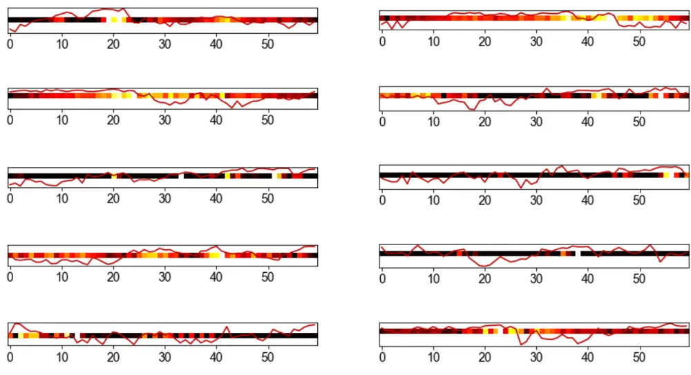
资料来源：Wind，华泰证券研究所

## 总结

本文从一个相对新颖的研究问题——真假市场价量序列识别入手，以机器学习为研究工具，考察真实市场价量序列是否包含显著区别于随机生成的虚假市场价量序列的信息，从反向的逻辑检验市场交易信息是否存在规律，并且进一步探讨基于交易信息的技术分析理论的可靠性。

## CNN 模型表现突出，优于其它机器学习模型

模型初筛阶段的结果表明，卷积神经网络（CNN）对真假价量序列的识别能力突出，表现显著优于其它模型；支持向量机和全连接神经网络表现出一定的识别能力，但是总体较弱；而逻辑回归、随机森林、XGBoost 等模型几乎没有识别能力。我们推测原因在于传统分类器依赖特征工程，需要人为从原始数据中提炼特征；而卷积神经网络本身具有提取特征的能力，并且对图像数据的局部特征有较强的识别能力，因此适用于类似图像形式的时间序列识别问题。

CNN 也存在一定的局限性，核心问题在于时间序列只有既定的横向结构（时间维度）而不存在纵向结构，因此处理三个以上序列时（例如收益率、MACD 和 PSY）会存在如何排列序列的问题。本研究所有特征的纵向宽度控制在 2以内，规避了序列排列的问题，但也限制了特征的丰富程度（例如无法检验基于收益率、MACD 和 PSY 三个指标的 CNN模型的识别能力）。另外，CNN 对卷积核大小等参数较为敏感，模型训练时间开销也较大。

## 换手率序列识别效果良好，引入技术指标无显著提升

基于收益率和换手率序列的 CNN 模型对真假序列的识别能力较强，说明市场的价量序列包含非随机特征。将收益率和换手率序列分离并单独测试，发现单纯基于收益率序列的CNN 模型识别效果不佳，在召回率上存在短板；单纯基于换手率序列的 CNN模型识别效果良好。由此推测价量序列的主要信息来源于换手率，而收益率包含的信息较少或者提取难度较大。

我们进而尝试通过技术指标对收益率信息进行定向提取，发现MACD家族的DIF和MACD指标以及 PSY 指标对识别效果没有显著提升。由此推测这些基于价格的技术指标带来的增量信息有限。

## 单纯基于价的技术分析可靠性存疑，量可能比价更有用

本研究测试结果表明，换手率序列存在可识别特征，并且在外推时间区间内 CNN 模型仍有良好表现；而基于收益率序列的 CNN 模型无法识别真假序列。换言之，基于量的技术分析或有合理之处，而单纯基于价的技术分析可靠性存疑，量可能比价更有用。价格、收益率或基于价的技术指标蕴含的信息可能有限，可能需要与换手率、成交量或其它基于量的技术指标结合使用。

从另一个角度看，理论上包含足够多神经元的单隐藏层神经网络可以拟合任何函数。本研究中的多层神经网络无法识别真假收益率序列，可能意味着 1）不存在一个“函数”能够刻画真实收益率的规律，或者 2）拟合该“函数”过于复杂，需要更多神经元的神经网络才能实现。更进一步，任何基于股票价格的时间序列分析都是在试图用“函数”刻画规律，如果以上第 1点成立，那么意味着对股票价格的时间序列分析可能是徒劳。未来需要更多研究证实或者证伪这一猜测。

## 神经网络 Grad-CAM 可视化：模型识别依靠局部特征

针对基于换手率序列的 CNN 模型，我们采用 Grad-CAM 方法对神经网络的识别过程进行可视化。连续真实序列的热力图显示出显著的连续平移迹象，表明模型识别真假序列主要来源于对换手率序列局部特征的识别。

将 Grad-CAM 热力图和部分真实换手率序列相结合，发现 CNN 模型对持续的高换手以及换手大幅降低的局部特征有提取作用。总的来看，针对模型的识别机制和特征提取方法仍缺乏深入理解，难以直观地解释，有待后续进一步的研究。

## 真假序列识别的应用思路

从实用的角度来看，CNN 模型对真假换手率序列的识别能力较强，可以考虑将模型应用于换手率或成交量的预测，再通过价量之间的关系发展相应的交易策略。基于收益率序列的模型召回率较低并不令人意外，这和传统认为价格服从几何布朗运动的理论较为契合。如果在维持一定水平召回率的情况下，找到合适的模型与特征，提升收益率识别的精确率，那么进一步开发择时或选股策略也存在可能。

将识别模型转化为预测方法的一种思路，在于组合真实序列和虚假序列，通过观察 CNN模型打分来判断未来走势是否合理。对于多种可能的未来走势，可结合基本面等其它信息进行分析。

## 本研究的局限性

本研究存在以下几点的局限性：

1. 真假价量序列仅基于 60 个交易日的收益率和换手率构建。上述结论无法推广到更长或更短的时间尺度。例如，将时间尺度拉长，真实价格序列可能存在有别于虚假价格序列的周期特征，从而能被模型识别出来。

2. 虚假样本未必具有代表性。目前的虚假样本生成机制是基于真实序列的重排列，该方法的优点是保证真实与虚假数据的分布完全相同，缺点在于破坏样本自相关性等时序关系。不同生成机制可能对模型训练造成不同影响。

3. 卷积神经网络的使用限制了超过 2 个指标序列共同组合的可能，仅在特征的纵向宽度不大于 2，即指标个数不超过 2 时，模型可以规避序列的纵向组合问题。例如，我们暂时无法检验基于收益率、MACD 和 PSY三个指标的 CNN 模型的识别能力。

4. 目前研究仅针对数据质量较好的指数，对于股票的识别效果暂不明确。

## 风险提示

真假价量序列识别研究是对市场规律的探索，不构成任何投资建议。基于换手率序列的卷积神经网络模型能够有效识别真假序列，不代表换手率等成交量相关指标能够直接应用于投资。机器学习模型是对历史规律的总结，如果市场规律发生变化，模型存在失效的可能。

## 附录

## 真假序列 Ljung-Box 白噪声检验结果

收益率及价格的真假序列仅凭肉眼观察几乎难以分辨。真实换手率序列表现出更强的趋势性和平滑性。正文部分探讨了机器学习模型对真假序列的识别能力。除了机器学习模型外，一些常用的时间序列分析技术能否识别真假序列？下面我们将尝试使用Ljung-Box白噪声检验进行识别。

Ljung-Box 白噪声检验常用于检验时间序列是否存在滞后 k 期的自相关性。我们随机选取真假收益率和换手率的 60 个交易日切片序列各 5 组进行 Ljung-Box 检验，其 p 值结果如下面两张图所示。

对于左下图的收益率序列，无论是真实（红色）还是虚假（灰色）样本，滞后各期的 p 值绝大部分大于 0.05。换言之，真假收益率序列均不存在自相关性，可以视作白噪声。Ljung-Box 白噪声检验结果无法有效识别真假收益率序列。

图表34： 真实（红色）与虚假（灰色）收益率序列 Ljung-Box 检验结果
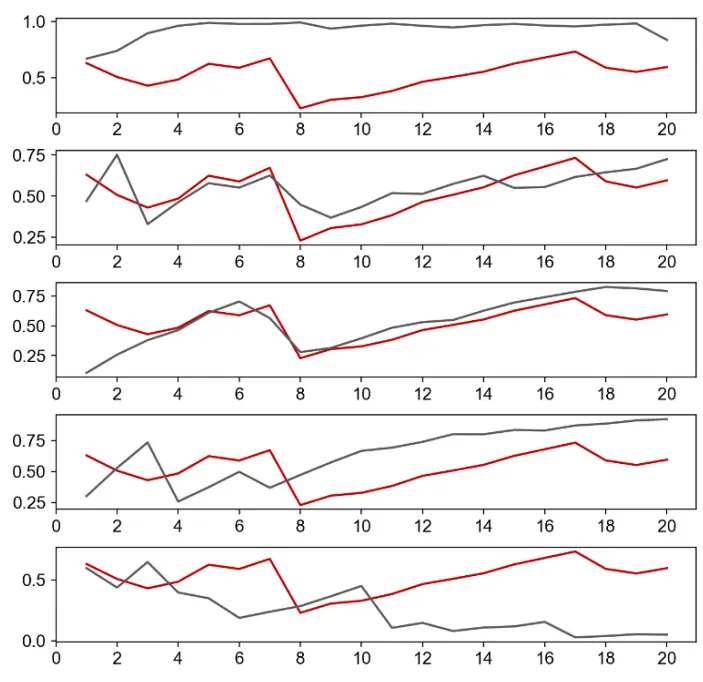
资料来源：Wind，华泰证券研究所

图表35： 真实（红色）与虚假（灰色）换手率序列 Ljung-Box 检验结果
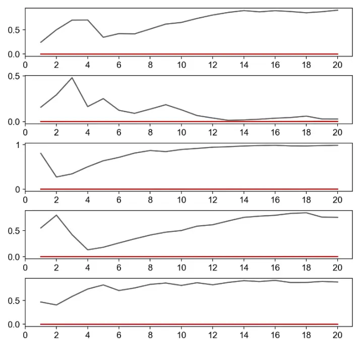
资料来源：Wind，华泰证券研究所

对于右上图的换手率序列，真实（红色）样本滞后各期的 p 值均小于 0.05，即真实换手率序列存在较强的自相关性，不可视作白噪声；而虚假（灰色）样本滞后各期的 p值均大于0.05，即虚假换手率序列不存在自相关性，可以视作白噪声。Ljung-Box 白噪声检验结果能够有效识别真假换手率序列。

那么，是否就没有必要使用机器学习模型识别真假序列呢？答案是否定的。首先，Ljung-Box 白噪声检验无法识别真假收益率序列，更复杂的机器学习模型是否具备识别能力尚不得而知，仍有必要进行探索。

其次，正文部分已作说明，本研究醉翁之意不在酒。识别真假序列之意不在识别真假序列本身，而在于分析真实市场价量序列包含的特征信息。Ljung-Box 白噪声检验仅能够说明真实换手率序列存在自相关性，但除此以外是否还包含其它规律，Ljung-Box 白噪声检验并不能给出回答。而机器学习模型能为我们解释换手率序列背后蕴含的规律打开窗口。

第三，既然真假换手率序列的核心区别在于自相关性，那么我们就可以通过一些手段制造具有自相关性的虚假换手率序列。此时，Ljung-Box 白噪声便无法识别真实换手率序列和更“真实”的虚假换手率序列。机器学习模型能否识别两者将是很有意思的研究问题。

## 特征为价格序列时的测试结果

正文部分使用的价格特征均采用收益率序列，而非价格序列。价格序列直接作为机器学习的特征并不合理，主要原因是：1）价格并非单位化变量，不同价格序列之间缺乏可比性；2）价格序列不具有良好的平稳性。

然而，技术分析的主要研究对象是 K线图，其本质仍是价格序列，而非收益率序列。我们仍然会关心以价格序列作为特征时，CNN模型是否具有识别真假价格序列的能力？另外，MACD 等技术指标经常和 K 线图结合使用，以价格序列结合技术指标作为特征时，CNN模型的识别效果如何？

真实价格序列的生成方式为直接截取连续 60 个交易日的指数收盘价数据。随后基于真实价格序列计算得到真实 DIF、MACD 和 PSY技术指标序列。

虚假价格序列的生成方式相对复杂。首先对真实价格序列进行差分，得到真实收益率序列，随后将其随机打乱，得到虚假收益率序列，最后将其还原为虚假价格序列。基于虚假价格序列计算得到虚假 DIF、MACD 和 PSY技术指标序列。

真实和虚假序列在机器学习模型训练之前，均在时间维度进行 Z-score标准化处理。下表展示了基于价格和技术指标等特征的 CNN 模型对测试集真实样本的识别能力。结果表明，模型精确率、召回率和 F1_score 均较低，识别效果不佳。可以认为，单纯使用价格序列或者将价格和技术指标结合均无法有效识别真假序列。

图表36： 基于价格和技术指标等特征的 CNN模型对三组测试集真实样本的平均识别能力汇总

| 特征 | 维数 | 评价指标 | 宽基指数+相同时间 | 行业指数+相同时间 | 宽基指数+外推时间 | 行业指数+外推时间 |
| --- | --- | --- | --- | --- | --- | --- |
| 价格 | 1×60 |  | (训练集) | (测试集1) | (测试集 2) | (测试集3) |
|  |  | 精确率 | 0.182 | 0.152 | 0.129 | 0.095 |
|  |  | 召回率 | 0.017 | 0.012 | 0.011 | 0.009 |
| 价格+DIF | 2×60 | F1_score | 0.032 | 0.022 | 0.020 | 0.016 |
|  |  | 精确率 | 0.462 | 0.074 | 0.000 | 0.143 |
|  |  | 召回率 | 0.003 | 0.001 | 0.000 | 0.001 |
| 价格+MACD | 2×60 | F1_score | 0.006 | 0.001 | 0.000 | 0.001 |
|  |  | 精确率 | 0.136 | 0.069 | 0.025 | 0.063 |
|  |  | 召回率 | 0.002 | 0.001 | 0.000 | 0.000 |
| 价格+PSY | 2×60 | F1_score | 0.004 | 0.002 | 0.001 | 0.001 |
|  |  | 精确率 | 0.275 | 0.181 | 0.044 | 0.053 |
|  |  | 召回率 | 0.017 | 0.009 | 0.002 | 0.003 |
|  |  | F1_score | 0.032 | 0.017 | 0.005 | 0.005 |

资料来源：Wind，华泰证券研究所

下面四张表分别展示特征为 1）价格序列，2）价格和 DIF 序列，3）价格和 MACD 序列，4）价格和 PSY序列时，CNN 模型平均识别能力汇总结果。

图表37： CNN模型对三组测试集真实样本的平均识别能力汇总（特征为价格序列）
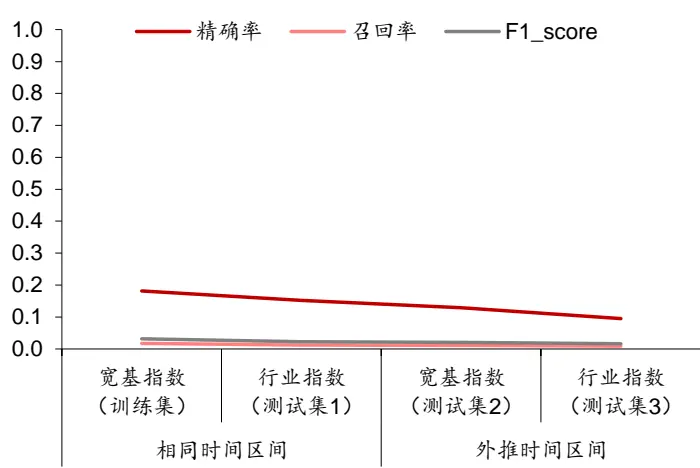
资料来源：Wind，华泰证券研究所

图表38： CNN模型对三组测试集真实样本的平均识别能力汇总（特征为价格和 DIF序列）
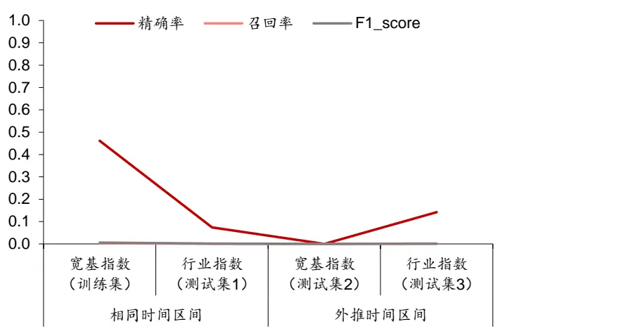
资料来源：Wind，华泰证券研究所

图表39： CNN模型对三组测试集真实样本的平均识别能力汇总（特征为价格和 MACD序列）
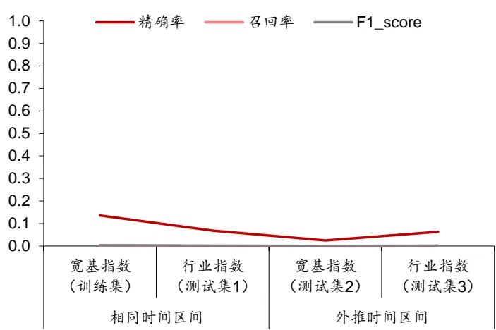
资料来源：Wind，华泰证券研究所

图表40： CNN模型对三组测试集真实样本的平均识别能力汇总（特征为价格和 PSY序列）
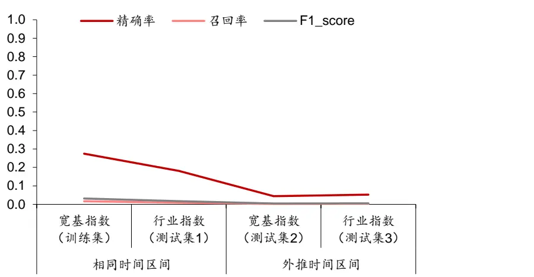
资料来源：Wind，华泰证券研究所

## 免责申明

本报告仅供华泰证券股份有限公司（以下简称“本公司”）客户使用。本公司不因接收人收到本报告而视其为客户。

本报告基于本公司认为可靠的、已公开的信息编制，但本公司对该等信息的准确性及完整性不作任何保证。本报告所载的意见、评估及预测仅反映报告发布当日的观点和判断。在不同时期，本公司可能会发出与本报告所载意见、评估及预测不一致的研究报告。同时，本报告所指的证券或投资标的的价格、价值及投资收入可能会波动。本公司不保证本报告所含信息保持在最新状态。本公司对本报告所含信息可在不发出通知的情形下做出修改，投资者应当自行关注相应的更新或修改。

本公司力求报告内容客观、公正，但本报告所载的观点、结论和建议仅供参考，不构成所述证券的买卖出价或征价。该等观点、建议并未考虑到个别投资者的具体投资目的、财务状况以及特定需求，在任何时候均不构成对客户私人投资建议。投资者应当充分考虑自身特定状况，并完整理解和使用本报告内容，不应视本报告为做出投资决策的唯一因素。对依据或者使用本报告所造成的一切后果，本公司及作者均不承担任何法律责任。任何形式的分享证券投资收益或者分担证券投资损失的书面或口头承诺均为无效。

本公司及作者在自身所知情的范围内，与本报告所指的证券或投资标的不存在法律禁止的利害关系。在法律许可的情况下，本公司及其所属关联机构可能会持有报告中提到的公司所发行的证券头寸并进行交易，也可能为之提供或者争取提供投资银行、财务顾问或者金融产品等相关服务。本公司的资产管理部门、自营部门以及其他投资业务部门可能独立做出与本报告中的意见或建议不一致的投资决策。

本报告版权仅为本公司所有。未经本公司书面许可，任何机构或个人不得以翻版、复制、发表、引用或再次分发他人等任何形式侵犯本公司版权。如征得本公司同意进行引用、刊发的，需在允许的范围内使用，并注明出处为“华泰证券研究所”，且不得对本报告进行任何有悖原意的引用、删节和修改。本公司保留追究相关责任的权力。所有本报告中使用的商标、服务标记及标记均为本公司的商标、服务标记及标记。

本公司具有中国证监会核准的“证券投资咨询”业务资格，经营许可证编号为：91320000704041011J。

全资子公司华泰金融控股（香港）有限公司具有香港证监会核准的“就证券提供意见”业务资格，经营许可证编号为：AOK809

©版权所有 2019年华泰证券股份有限公司

## 评级说明

## 行业评级体系

－报告发布日后的6个月内的行业涨跌幅相对同期的沪深300指数的涨跌幅为基准；

－投资建议的评级标准

增持行业股票指数超越基准

中性行业股票指数基本与基准持平

减持行业股票指数明显弱于基准

## 公司评级体系

－报告发布日后的6个月内的公司涨跌幅相对同期的沪深300指数的涨跌幅为基准；
－投资建议的评级标准
买入股价超越基准 20%以上
增持股价超越基准 5%-20%
中性股价相对基准波动在-5%~5%之间
减持股价弱于基准 5%-20%
卖出股价弱于基准 20%以上

## 华泰证券研究

## 南京

南京市建邺区江东中路228号华泰证券广场1号楼/邮政编码：210019

电话：86 25 83389999 /传真：86 25 83387521

电子邮件：ht-rd@htsc.com

## 深圳

深圳市福田区益田路5999号基金大厦10楼/邮政编码：518017

电话：86 755 82493932 /传真：86 755 82492062

电子邮件：ht-rd@htsc.com

## 北京

北京市西城区太平桥大街丰盛胡同28号太平洋保险大厦A座18层

邮政编码：100032

电话：86 10 63211166/传真：86 10 63211275

电子邮件：ht-rd@htsc.com

## 上海

上海市浦东新区东方路18号保利广场E栋23楼/邮政编码：200120

电话：86 21 28972098 /传真：86 21 28972068

电子邮件：ht-rd@htsc.com