## 金工研究/深度研究

2019年11月17日

林晓明 执业证书编号：S0570516010001

研究员 0755-82080134

陈烨 执业证书编号：S0570518080004

研究员 010-56793942

李子钰 0755-23987436

联系人 liziyu@htsc.com

何康 021-28972039

联系人 hekang@htsc.com

## 相关研究

1《金工: 风险预算模型如何度量风险更有效》2019.11

3《金工: 国之利器，锋芒初现》2019.10

# 市场弱有效性检验与择时战场选择华泰人工智能系列二十五——真假序列识别再探

## 尝试构建以真假序列识别为起点基于量价的主动投资研究框架

真假序列识别是检验市场有效性的有力工具。主动投资的核心是市场能否预测，如果市场无法预测，满足有效市场理论，主动投资就没有存在的价值。随机序列满足有效市场理论，无法预测。暂且抛开宏观、财务等数据，仅就交易数据看，如果人工智能算法无法识别真实量价序列和随机序列，那么弱有效市场假说可能成立；如果人工智能可以识别真假，那么可以进一步采用网络可视化技术挖掘模式，或采用遗传规划等算法来暴力挖掘特征。随后通过检验有效模式/特征、过拟合检验、风险控制等步骤，控制整体风险，实现完整的以真假序列识别为起点基于量价的主动投资研究流程。

## 模拟实验表明卷积神经网络能够识别收益率模式

模拟实验表明，卷积神经网络能够识别收益率模式，神经网络可视化技术能够辅助挖掘模式。在白噪音中插入模式片段，模拟有模式的收益率序列，视作“真实”收益率序列，将其打乱得到“虚假”收益率序列，随后采用卷积神经网络进行真假识别。结果显示样本信噪比越高，识别表现越好。采用中间层激活可视化和类激活热力图两种方法解释卷积神经网络，发现激活函数值较高或热力图热度较高的区域对应模式区域。神经网络可视化有助于定位模式所在位置，从而进一步挖掘规律。

## 不同时间频率的股指收益率识别表现对比

对比不同时间频率股指收益率识别表现。卷积神经网络无法识别股指日频真假序列，股指 60 个交易日的日频收益率可能不存在显著模式，市场相对接近弱有效，短线择时难度较大。卷积神经网络能够识别日内分钟频真假序列，股指在分钟线可能存在显著模式，市场可能不满足弱有效，日内 T+0策略有一定机会。随着频率从 1 分钟降低到 5 分钟，识别效果下降，市场逐渐接近弱有效。Grad-CAM 结果表明日内模式更可能出现在开盘后 30分钟和收盘前 1 小时。投资者的交易习惯可能是影响不同时间频率市场有效性的因素之一。

## 不同资产收益率识别表现对比

对比不同资产收益率的识别表现。个股日频收益率几乎无法识别，日频级别相对接近弱有效，个股短线择时难度较大。因子日频收益率几乎无法识别，短期因子择时难度较大。股指期货分钟频收益率识别表现一般，弱于股指本身，相比股指更接近弱有效，但日内 T+0 策略仍有机会。商品期货分钟频收益率识别表现好，日内商品 CTA策略有机会。股指、股指期货、商品期货识别表现的差异能够和自相关系数检验、随机游程检验等统计检验结果互相佐证。市场交易制度可能是造成股指和股指期货有效性差异的因素之一。

风险提示：真假价量序列识别研究是对市场规律的探索，不构成任何投资建议。基于股指和商品期货 1 分钟频收益率序列的卷积神经网络模型能够有效识别真假序列，不代表收益率等价格相关指标能够直接应用于中高频投资。机器学习模型是对历史规律的总结，如果市场规律发生变化，模型存在失效的可能。

## 以真假序列识别为起点的主动投资研究框架

## 有效市场理论与随机游走

有效市场理论是金融市场中最有争议的命题之一。如果市场是有效的，那么就无法通过历史数据对未来进行预测。事实上我们很难判定市场是否有效。对于金融市场而言，核心之一就是市场是否可以预测，如果市场无法预测，那么主动投资就没有存在的价值。

能够预测未来的前提，是历史数据存在规律。按照投资的时间期限划分，低频领域关注基本面是否有规律，中频领域关注量价以及基本面是否有规律，高频领域关注量价是否有规律。按照主动投资的两个关键问题来划分，择时是在时间序列上挖掘和运用规律，选股是在截面上挖掘和运用规律。可以说，主动投资的核心是市场是否有规律。由此衍生出两个问题：1）市场是否有规律？2）如果有规律，是什么规律？

图表1： 主动投资的核心是市场是否有规律
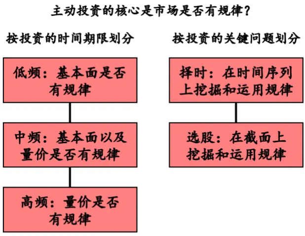
1）市场是否有规律？2）如果有规律，是什么规律？
资料来源：华泰证券研究所

在华泰金工《人工智能 24：投石问路：技术分析可靠否？》（20190902）一文中，我们提出一种相对新颖的研究范式，用以侦测市场是否有规律：提取真实市场得到的序列，随机生成虚假序列，将真假序列混合，任意取出一条序列，使用神经网络模型判断该序列是真序列还是假序列。

图表2： 真假序列识别研究范式
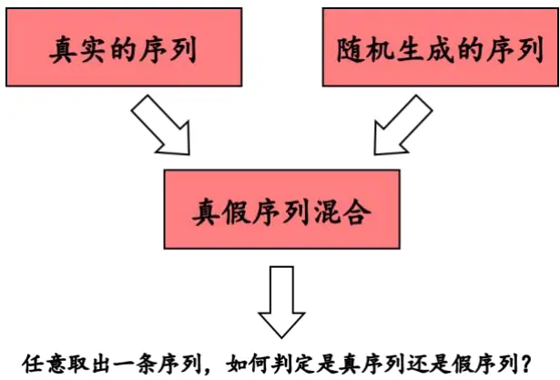
资料来源：华泰证券研究所

本文暂且抛开市场外的数据，如财务数据、宏观数据、另类数据，仅就市场的交易数据（即量价数据）来看。随机生成的序列不存在规律，满足有效市场理论。弱有效市场假说，是关于量价数据的。所有技术指标，或者高频类的多因子模型，其基础数据都是量价数据。如果弱有效市场假说成立，那么真实量价序列同样不存在规律，量价数据就没有用武之地。

量价数据的组合有近乎无穷多种可能性，而神经网络理论上可以拟合任意函数。因此我们可以采用真假混合的量价序列，以及人工智能的强大计算能力，来判定市场是否是弱有效市场。

1) 如果神经网络模型无法识别真假序列，那么说明真实量价数据背后可能并不存在规律，基于量价数据无法对未来进行预测，弱有效市场假说成立。

2)如果神经网络模型能够识别真假序列，弱有效市场假说不成立，那么就可以采用网络可视化技术挖掘模式（针对人脑可以理解的模式），或者采用遗传规划等算法来暴力挖掘特征（针对人脑无法理解的模式）。随后通过检验有效模式/特征、过拟合检验、风险控制等步骤，来控制整体的风险。信奉的就是技术分析的基本信念：技术分析不问为什么，问为什么就不是技术分析。

图表3： 以真假序列识别为起点基于量价的主动投资研究框架
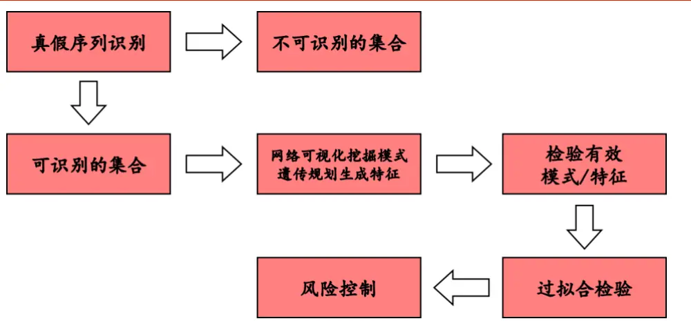
资料来源：华泰证券研究所

## 收益率序列模式和真假序列识别的关系

真假序列识别讨论的是市场量价数据背后是否有规律。特别地，真假收益率序列识别讨论的是市场价格数据背后是否有规律。在时间序列上寻找并运用规律，即为择时问题。在截面上寻找并运用规律，即为选股问题。本文暂且抛开选股问题，从相对更浅显的择时问题展开讨论。在此之前，首先需要厘清收益率序列模式、真假序列识别和市场择时三者间的关系。

若真假收益率序列能够被神经网络模型识别，则收益率序列必然存在模式；若收益率序列存在模式，则真假收益率序列大概率能够被神经网络模型识别。这里的模式（Pattern）即指代序列数据背后的规律。模式可能出现在固定时刻，如“尾盘拉升”；也可能出现在任意的局部时刻，如“若出现双底则未来上涨”；也可能是某种全局的统计特性，如“收益率的高阶自相关性”。以上模式仅作为举例说明使用，不一定真实存在。

从抽象的角度看，模式相当于某种条件概率分布。例如，假设“量价底背离是多头信号”的模式存在，那么 P(未来一段时间收益率|价创新低且量未创新低)的条件概率分布应显著高于 0，或者该条件概率分布的期望 E(未来一段时间收益率|价创新低且量未创新低)高于0。从具象的角度看，模式相当于某种典型的形态。同样的例子，假设“量价底背离是多头信号”的模式存在，那么应能多次观察到量价底背离后价格上涨的形态。技术分析强调的形态，本质上都是某种条件概率分布，也就是本文所述的“模式”。

神经网络等机器学习模型是经典的模式识别工具。事实上，在过去很长一段时间，“人工智能”、“机器学习”尚未成为流行词汇，大部分机器学习模型都属于“模式识别”领域。众多机器学习模型中，神经网络模型因其强大的学习能力，以及相对不依赖于特征工程的特点，尤其是卷积神经网络的平移不变性等诸多优势，被广泛应用于语音、图像等模式识别问题，模型输入特征一般为相对原始的语音或图像序列。

我们同样可以将神经网络应用于真假收益率识别。如果收益率存在模式，那么真假收益率序列大概率能够被神经网络模型识别。之所以称“大概率”，原因是当网络结构设计不当，或者模型超参数选择不当，又或者模型参数训练不当时，存在模型识别失败的可能。反过来，如果神经网络模型能够识别真假收益率序列，那么收益率序列必然存在模式。这里的模式可能是人肉眼可见的模式，如“量价底背离后大概率上涨”；可能是某种统计学的模式，如“序列存在自相关性”；也可能是肉眼难以见到的模式，此时便需要借助一些算法加以阐释。

## 收益率序列模式和市场择时的关系

择时需要有模式，有模式不一定能择时。一方面，如果收益率为随机游走序列，不存在模式，那么必然无法对其进行择时。另一方面，如果收益率序列存在模式，不一定代表能够对其进行择时。模式是对历史的提炼，择时是对未来的预测。存在模式但无法择时可能有多种原因。

无法择时的一个原因在于，模式对应的条件概率分布可能恰好无法用于择时。想象一种极端的情形，假设“双底后上涨”和“双底下大跌”均为某种模式，并且条件概率相等，即P(未来上涨|出现双底) =P(未来下跌|出现双底) =0.5，P(未来平盘|出现双底) =0，甚至于两种模式的条件期望收益率 E(未来一段时间收益率|出现双底)为 0，那么即使我们观察到双底形态，也无法对未来做出有效多空判断，因而无法择时（当然此时可以对波动率进行择时）。

无法择时的另一个原因在于，模式在实践层面无法用于交易。假设“三连板后大概率有第四个涨停板”为某种模式，P(下一交易日涨停|三连板)接近于 1，那么站在第三个板的时刻，我们当然能够发出多头信号，但该信号无法用于实际交易。

尽管模式和择时并不完全对等，我们仍可以将模式视作择时的先决条件。承接上一节收益率序列模式和真假序列识别的对等关系，我们得到如下的逻辑推导：

如果神经网络能够识别真假收益率序列，那么收益率序列存在模式，那么有可能对收益率进行择时。

如果神经网络无法识别真假收益率序列，那么收益率序列大概率不存在模式，那么很有可能无法对收益率进行择时。

图表4： 收益率序列模式、真假序列识别和市场择时三者间的关系
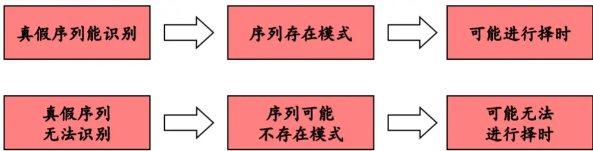
资料来源：华泰证券研究所

## 本文研究导读

本文的前序研究为华泰金工《人工智能 24：投石问路：技术分析可靠否？》（20190902）。该研究发现，卷积神经网络模型能够识别真假 60个交易日的宽基和行业指数换手率序列，但是无法识别真假 60 个交易日的宽基和行业指数收益率序列。该结果表明，基于指数的60 个交易日的收益率序列可能并没有包含一定的模式，指数在 60个交易日的时间尺度下可能满足弱有效市场假说，基于 60个交易日收益率或价格的技术分析可靠性可能存疑。

本研究是前序研究的扩展，共进行 7项子测试，分为 3 组，从不同视角关注相似的问题。
1) 第 1 组测试为模拟实验，在白噪音中插入模式片段，模拟有模式的收益率序列，视作“真实”收益率序列，将其打乱得到“虚假”收益率序列。这一部分关注的问题是：如果收益率序列存在模式，那么卷积神经网络模型能否识别？

2)第 2 组测试包含 2项子测试，对比不同时间频率股指收益率序列的识别表现，考察市场在不同时间尺度下的收益率序列是否存在模式，推测不同尺度下择时的难易程度。

3) 第 3 组测试包含 4 项子测试，对比不同资产收益率序列的识别表现，考察不同资产的收益率序列是否存在模式，推测不同资产的择时难易程度。

图表5： 本文各项测试及关注问题汇总

| 序号 | 真实序列 模拟收益率序列（噪音+模式） | 数据频率 无 | 关注问题 卷积神经网络能否识别收益率模式？ |
| --- | --- | --- | --- |
| 1 2 | 国内宽基指数收益率 | 日频 | 不同时间频率股指收益率序列识别表现对比 |
| 3 | 国内宽基指数收益率 | 1~5 分钟频 |  |
| 4 | A 股个股收益率 | 日频 | 不同资产收益率序列识别表现对比 |
| 5 | A 股因子收益率 | 日频 |  |
| 6 | 国内股指期货收益率 | 1分钟频 |  |
| 7 | 国内商品期货收益率 | 1分钟频 |  |

资料来源：华泰证券研究所

## 模拟实验表明卷积神经网络能够识别收益率模式

如果收益率序列存在模式，那么卷积神经网络模型能否识别？本部分我们将尝试在白噪音中插入模式片段，模拟有模式的收益率序列，视作“真实”收益率序列，将其打乱得到“虚假”收益率序列，随后采用卷积神经网络进行真假识别。模拟的模式包含简单和复杂两种情形。模拟实验相关参数和超参数如下表所示。

图表6： 模拟实验相关参数和超参数

| 样本相关参数 | 样本相关卷积层超参数 参数值 |  | 卷积层 超参数值 | 其余超参数 | 其余 超参数值 |
| --- | --- | --- | --- | --- | --- |
| 序列长度 | 200 | 卷积层卷积核大小 | 1x15 | 第3层全连接层神经元数 | 30 |
| 背景白噪音标准差 | 0.04 | 卷积层激活函数 | Relu | 第 3层全连接层激活函数 | Relu |
| 训练集 | 6510 | 卷积层 Stride | 1 | 输出层激活函数 | Sigmoid |
| 验证集 | 2790 | 卷积层 Padding | 1 | 损失函数 | 交叉熵 |
| 测试集 | 9300 | 第1层卷积层卷积核数 | 20 | 优化器 | Adam |
| 真假样本比例 | 1:30 | 第2层卷积层卷积核数 | 30 | 迭代次数 | 10 |

资料来源：华泰证券研究所

## 模拟模式 1：简单模式

简单收益率模式长度为 5，如下图所示。前两个收益区间各涨 10%，第三个收益区间大跌30%，最后两个收益区间各涨 10%，其单位净值呈现 Z 字型。由于收益率序列最后会进行标准化处理，这里的涨跌幅仅作说明之用，无实际意义。

图表7： 模拟模式 1示意图
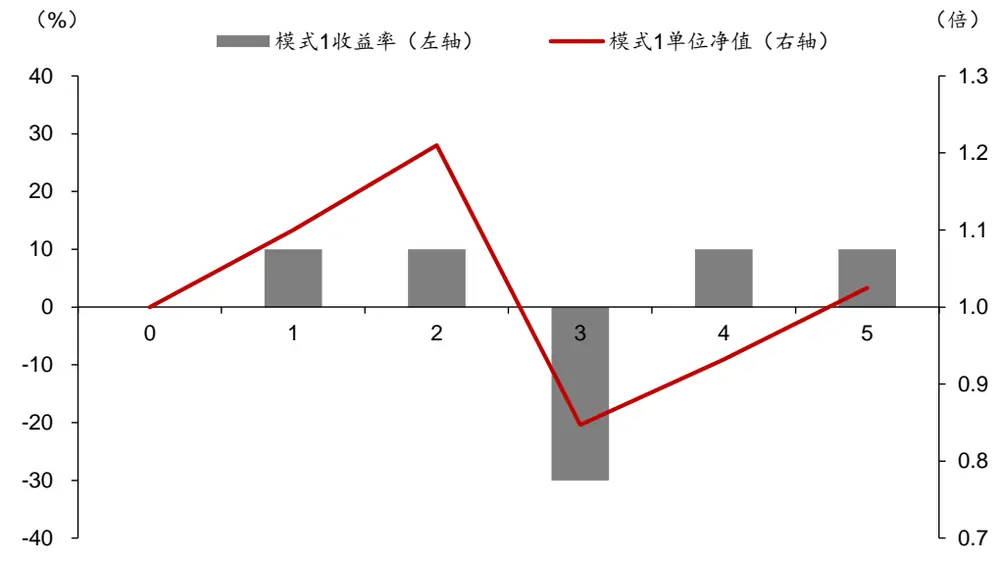
资料来源：华泰证券研究所

“真”序列的构造方式如下：

1. 对上述模式加上均值为0、标准差为0.01的白噪音，得到长度为5的收益率模式序列。

2. 构造长度为 195、均值为 0、标准差为 0.04 的原始白噪音序列，在任意位置随机插入步骤 1的模式序列，得到新的长度为 200 的含模式的收益率序列。

3. 对步骤 2的序列进行标准化，得到均值为 0、标准差为 0.01 的标准化收益率序列。

将“真”序列随机打乱，得到“假”序列。真假样本比例为 1:30。

图表8： 模拟模式 1“真”序列标准化收益率
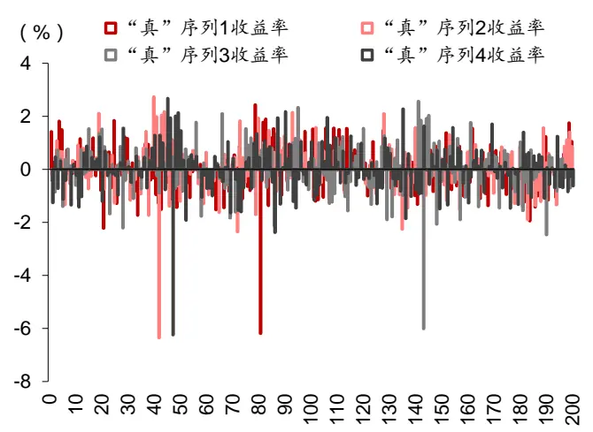
资料来源：华泰证券研究所

图表9： 模拟模式 1“真”序列单位净值
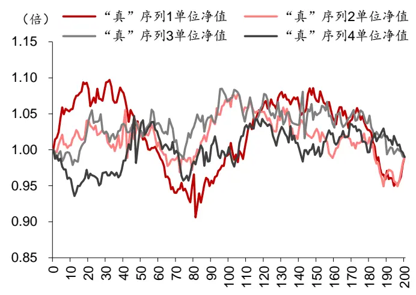
资料来源：华泰证券研究所

从 300 条样本内（训练集+验证集）“真”标准化收益率序列中任选 4条，绘制收益率和对应单位净值，如上图所示。收益率无肉眼可见规律，单位净值能够在不同位置观察到“涨-大跌-涨”的模式。例如右上图中，该模式分别出现在红色、粉色、浅灰色、深灰色序列的第 80、40、140、50 个收益区间附近。

图表10： 模拟模式 1“真”“假”序列标准化收益率
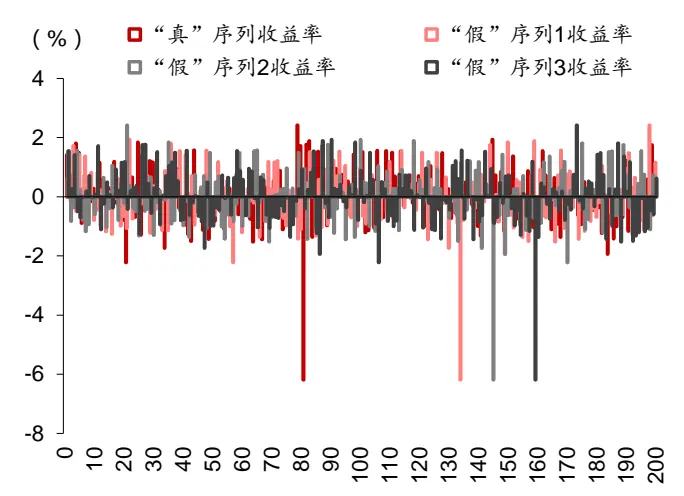
资料来源：华泰证券研究所

图表11： 模拟模式 1“真”“假”序列单位净值
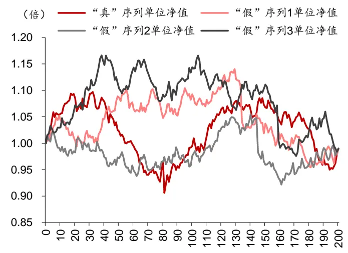
资料来源：华泰证券研究所

从 300 条样本内（训练集+验证集）“真”标准化收益率序列中任选 1条，从该“真”序列生成的 30 条“假”序列中任选 3 条，绘制收益率和对应单位净值，如上图所示。收益率无肉眼可见规律，“真”序列的单位净值能够观察到“涨-大跌-涨”的模式，而“假”序列的单位净值无法观察到该模式。

需要指出的是，“假”序列由“真”序列打乱生成，其收益率分布应与“真”序列完全相同。例如右上图中红色“真”序列的模式中包含 1次大跌，而在其余颜色“假”序列同样包含大跌，只不过该次大跌前后交易区间的收益率为随机数，而非固定模式。

## 模拟模式 2：复杂模式

复杂收益率模式长度为 15，如下图所示，模拟“双底”形态后上涨的走势。和简单模式类似，收益率序列最后会进行标准化处理，这里的涨跌幅仅作说明之用，无实际意义。

图表12： 模拟模式 2示意图
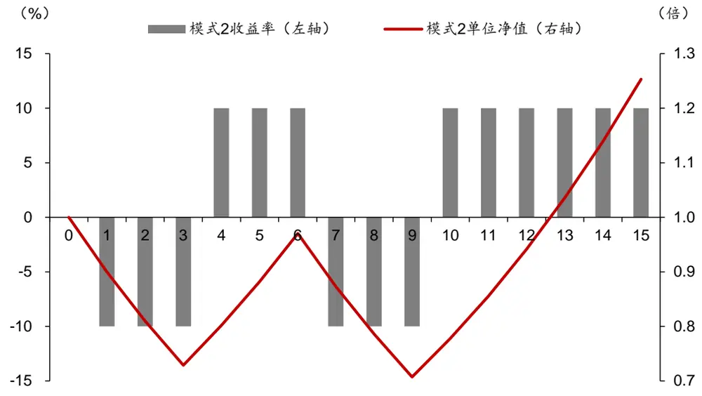
资料来源：华泰证券研究所

“真”“假”序列的构造方式与模式 1 类似，具体方法不再赘述。最终标准化收益率序列长度为 200。

从 300 条样本内（训练集+验证集）“真”标准化收益率序列中任选 4条，绘制收益率和对应单位净值，如下图所示。收益率无肉眼可见规律，单位净值能够在不同位置观察到“双底后上涨”的模式。例如右下图中，该模式分别出现在红色、粉色、浅灰色、深灰色序列的第 150、180、40、80 个收益区间附近。

图表13： 模拟模式 2“真”序列标准化收益率
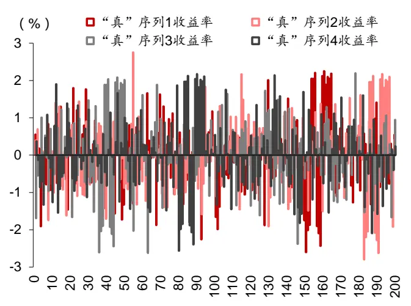
资料来源：华泰证券研究所

图表14： 模拟模式 2“真”序列单位净值
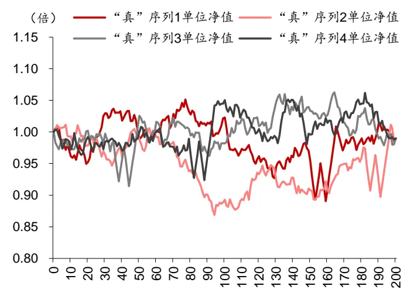
资料来源：华泰证券研究所

从 300 条样本内（训练集+验证集）“真”标准化收益率序列中任选 1条，从该“真”序列生成的 30 条“假”序列中任选 3 条，绘制收益率和对应单位净值，如下图所示。收益率无肉眼可见规律，“真”序列的单位净值能够观察到“双底后上涨”的模式，而“假”序列的单位净值无法观察到该模式。

图表15： 模拟模式 2“真”“假”序列标准化收益率
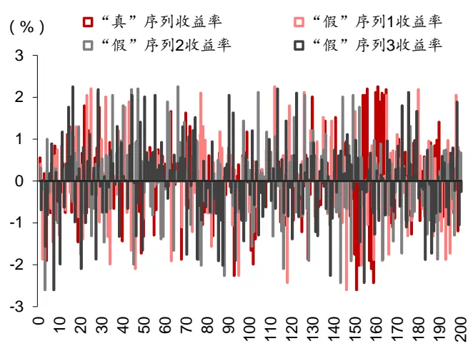
资料来源：华泰证券研究所

图表16： 模拟模式 2“真”“假”序列单位净值
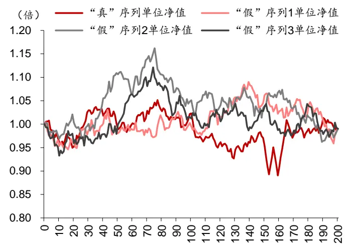
资料来源：华泰证券研究所

## 方法

除了设置简单和复杂模式两种模式外，本模拟实验还对另一变量——含模式样本占总样本比例进行操纵，该变量分为 100%、75%、50%、25%、0%共 5 个水平。100%代表全部“真”序列均包含模式片段；50%代表仅有 50%的“真”序列包含模式片段，剩下 50%的“真”序列实际为白噪音（但样本标签仍为“真”）；0%代表全部“真”序列均为白噪音（但样本标签仍为“真”）。“含模式样本占总样本比例”刻画的是模式的稀疏性：收益率模式并不一定存在于任何时间段。

在真假样本不均衡的二分类问题下，我们采用验证集和测试集中真样本的精确率、召回率和 F1 Score 衡量卷积神经网络模型的识别能力。真样本的精确率代表判断为真的样本里实际为真的比例，衡量查“准”的能力；真样本的召回率代表实际为真的样本里判断为真的比例，衡量查“全”的能力；一般而言，精确率和召回率存在此消彼长的关系，通常采用两者的调和平均值 F1 Score 进行综合评价。

## 结果

识别表现结果如下表所示。核心结果为：1）随着“模式样本占总样本比例”的提高，模型的识别表现提高；2）复杂模型的识别表现优于简单模式。

图表17： 卷积神经网络模型对不同模式在不同条件下的识别表现

| 含模式样本 占总样本比例 | 验证集 精确率 | 验证集 召回率 | 验证集 F1 Score | 测试集 精确率 | 测试集 召回率 | 测试集 |
| --- | --- | --- | --- | --- | --- | --- |
| 模拟模式1（简单模式） |  |  |  |  |  | F1 Score |
| 100% | 92.1% | 41.2% | 0.57 | 88.6% | 46.7% | 0.61 |
| 75% | 70.0% | 8.2% | 0.15 | 86.7% | 13.0% | 0.23 |
| 50% | 100.0% | 5.9% | 0.11 | 45.8% | 3.7% | 0.07 |
| 25% | 5.3% | 1.2% | 0.02 | 6.8% | 1.3% | 0.02 |
| 0% | 0.0% | 0.0% | 0.00 | 0.0% | 0.0% | 0.00 |
| 模拟模式2（复杂模式） |  |  |  |  |  |  |
| 100% | 100.0% | 90.6% | 0.95 | 100.0% | 96.7% | 0.98 |
| 75% | 92.5% | 57.6% | 0.71 | 88.2% | 50.0% | 0.64 |
| 50% | 81.3% | 15.3% | 0.26 | 69.5% | 13.7% | 0.23 |
| 25% | 9.1% | 1.2% | 0.02 | 10.3% | 1.0% | 0.02 |
| 0% | 0.0% | 0.0% | 0.00 | 0.0% | 0.0% | 0.00 |

资料来源：华泰证券研究所

上述两条结论符合直观。本质上，模式出现次数越频繁，模式越复杂，样本的信噪比就越高，模式被识别出的可能性就越高。特别地，不管模式出现在序列的哪个位置，卷积神经网络都能加以识别，体现出卷积神经网络的优点之一——平移不变性。

综上，借助模拟实验，我们得到结论：卷积神经网络能够识别收益率模式。

## 神经网络可视化技术挖掘模式

当卷积神经网络识别出收益率模式后，自然诞生出新的问题：是否可能显式地表达出这些模式？对此我们的思考是：对于人脑能够理解的模式，可以借助神经网络可视化技术将其展示出来；对人脑无法理解的模式，可能需要借助遗传规划等算法暴力搜寻模式。本文将关注前者，即神经网络可视化技术如何挖掘模式。

## 中间层激活的可视化

神经网络可视化的一种常用方法是中间层激活的可视化（Visualizing intermediateactivations）。以特定样本作为网络输入值，经过逐层前向传播，得到某个我们所关注层的激活函数值，即输出值。激活函数值反映了网络对于样本不同局部特征的敏感程度。激活函数值较高的区域可能表征了模式所在的位置。

我们选用基于模拟模式 2 训练的卷积神经网络，以四条真收益率序列作为输入值，计算第2 层卷积层（即最后一层卷积层）的激活函数值，如下图所示。激活图按如下方式解读：1. 每个子图对应一条真序列及其激活函数值，红线代表收益率序列对应的单位净值。

2. 子图共 30 行，每行代表一个卷积核，第 2 层卷积层共 30 个卷积核；子图共 200 列，对应收益率序列的总长度。

3. 子图的色阶代表激活函数值，我们采用的激活函数为 ReLU 函数，最小值为 0，最大值为正无穷。色阶越偏蓝色，代表激活函数值较低，该卷积层对输入特征不敏感；色阶越偏红色，代表激活函数值较高，该卷积层对输入特征较敏感。

图表18： 四条真序列在第 2层卷积层（基于模拟模式 2训练的卷积神经网络）的激活函数值
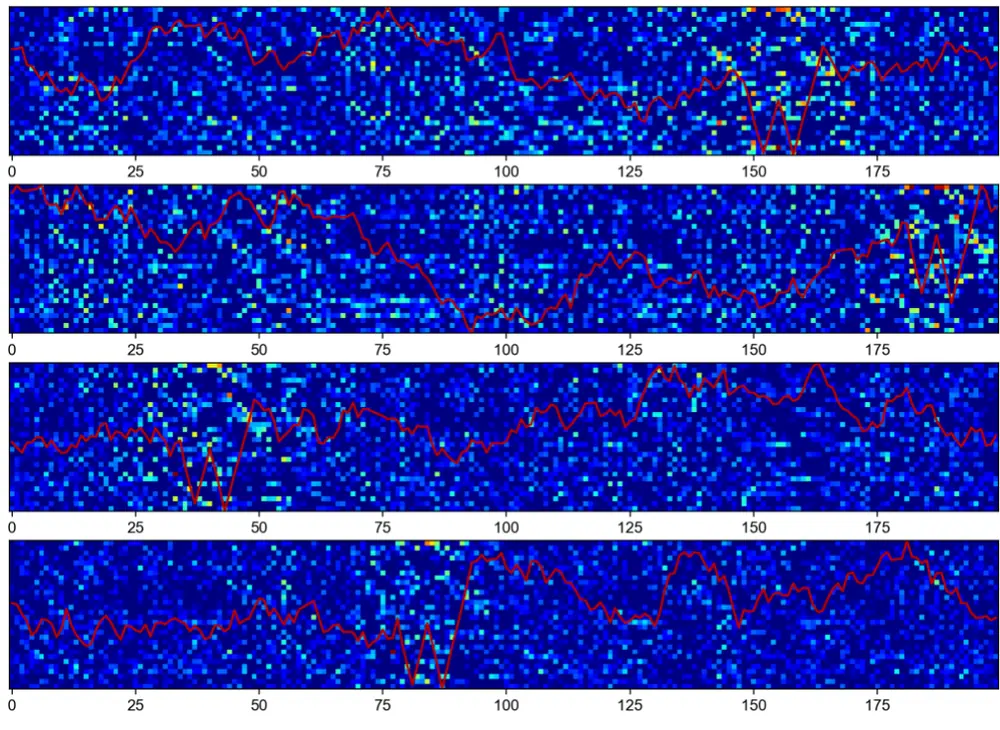
资料来源：华泰证券研究所

我们同样选用基于模拟模式 2 训练的卷积神经网络，以一条真收益率序列和三条对应的假收益率序列作为输入值，计算第 2层卷积层（即最后一层卷积层）的激活函数值。

对比上图（四条真序列）和下图（一真三假序列），可以得到如下结论：

1. 色阶图以蓝色调为主，说明激活函数值整体较小，符合神经元的稀疏激活特性。个别像素点为红色或黄色，说明卷积神经网络仅对样本收益率序列的局部时间段敏感。

2. 观察红色或黄色像素点所处位置，集中在模拟模式 2“双底”所在时间段，表明卷积神经网络对模式敏感。

3. 除“双底”模式所在位置，其余区域激活函数值较为杂乱，无明显规律，表明卷积神经网络对非模式的噪音不敏感。

4. 通过对比真假序列的中间卷积层激活函数值，可能有助于定位模式所在位置，从而进一步探查模式的具体形态，挖掘真实收益率序列背后潜藏的规律。

图表19： 一条真序列和对应三条假序列在第2层卷积层（基于模拟模式 2训练的卷积神经网络）的激活函数值
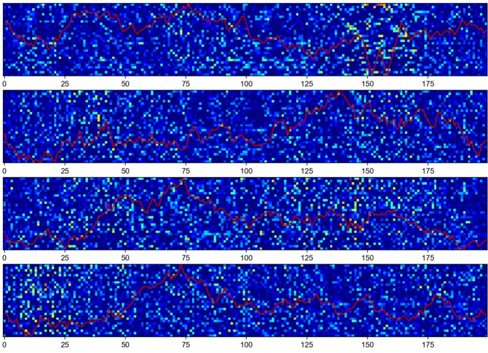
资料来源：华泰证券研究所

## 类激活热力图的可视化

神经网络可视化的另一种常用方法是类激活热力图的可视化（Visualizing heatmaps ofclass activations）。类激活热力图的基本思想为：计算样本输入特征中，每个局部区域对于把该样本识别为特定分类的重要性，将重要性以热力图的形式进行可视化展示。Grad-CAM（Gradient-weighted Class Activation Mapping）是类激活热力图家族中最具代表性的方法之一，由 Selvaraju 等人于 2017 年提出。

## Grad-CAM 的思想并不复杂。

1. 首先 Grad-CAM 认为，对于神经网络可视化而言，最重要的一层是最后一层卷积层，原因在于最后一层卷积层之后一般为平铺层（Flatten），平铺后神经元的空间线索被破坏，而靠前的卷积层尚未提取出足够的高阶语义线索。

2. 对于已完成训练的神经网络，以特定样本作为输入，逐层进行前向传播，可以得到该样本在最后一层卷积层每个卷积核进行卷积运算后各神经元的激活函数值，一般称为特征图（Feature Map），记第 k 个卷积核的特征图为 Ak。

3. 对于 N 分类问题，最后一层 Softmax 层一般有 N 个神经元，每个分类对应一个神经元。假设对于分类 c，特定样本在最后一层 Softmax层前的激活函数值为 yc。

4. 对 yc 进行反向传播（本质是链式求导），得到最后一层卷积层每张特征图每个神经元的梯度，如第 k 个特征图第 i行 j列神经元的梯度为：

$$
\frac{\partial y^{c}}{\partial A_{ij}^{k}}
$$

5. 对特征图 k 各神经元的梯度矩阵求算术平均（Global Average Pooling），得到特征图k 的“重要度”αkc：

$$
\alpha_{k}^{c}=\frac{1}{Z}{\sum_{i}\sum_{j}\frac{\partial y^{c}}{\partial A_{ij}^{k}}}.
$$

6. 将每张特征图重要度αc和特征图 Ak 相乘，对全部特征图求和，经过 ReLU 非线性函数变换，将小于 0的值设为 0（本质是稀疏化），最终得到 Grad-CAM 图。

$$
L_{Grad-CAM}^{c}=\operatorname{ReLU}(\sum_{k}\alpha_{k}^{c}A^{k})
$$

我们仍以华泰金工《人工智能 24：投石问路：技术分析可靠否？》中的例子对 Grad-CAM加以说明。下图展示了一个已经训练完成的图像识别模型，对样例图片进行预测时，图片中各像素对应“猫”分类和“狗”分类的 Grad-CAM 热力图。某个分类下热力图像素点的颜色越偏红色（类似“亮斑”），表明该像素对于该分类的识别越重要；反之颜色越偏蓝色，表明该像素对于该分类的识别越不重要。下图的 Grad-CAM 热力图在猫和狗的对应区域出现“亮斑”，说明图片下部的像素对于猫的识别较为重要，图片上部的像素对于狗的识别较为重要。

图表20： 样例图片对应“猫”类别或“狗”类别的 Grad-CAM 热力图
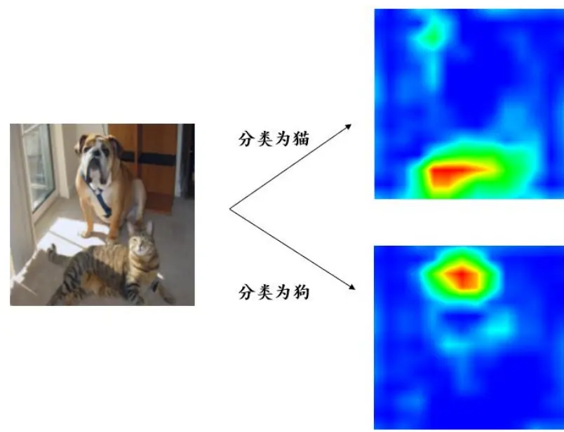
资料来源：Grad-CAM，华泰证券研究所

我们计算基于模拟模式 2 训练的卷积神经网络的 Grad-CAM 热力图。下图展示四条“真”序列指向真样本类别的 Grad-CAM 热力图，即真实序列中哪些区域的特征对于把该样本识别为真样本更重要。我们以由黑到白变化的色阶表征各像素（即模拟收益率序列）对识别该分类的重要性。Grad-CAM 热力图的像素点越偏白色（类似“亮斑”），表明该像素点对于识别“真”样本的重要性越高。图中红线代表收益率序列对应的单位净值。

如下图所示，偏白色的像素点集中于“双底”模式所在区域，说明卷积神经网络很有可能正是通过样本的局部特征将其识别为真样本。其它非模式区域同样存在个别亮斑，但是热度和集中程度均不及模式区域。

图表21： 四条真序列指向真样本类别的 Grad-CAM 热力图
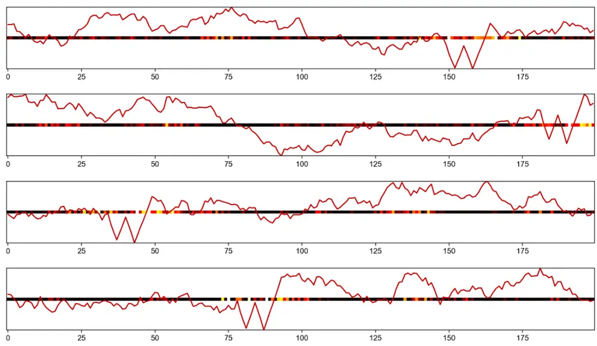
资料来源：华泰证券研究所

下图展示一条“真”序列和对应三条“假”序列指向真样本类别的 Grad-CAM 热力图。假序列中尽管存在亮斑，但是热度不及真序列且分布相对零散，不足以令神经网络将其识别为真样本。总的来看，Grad-CAM 是较好的神经网络可视化工具，能帮助研究者定位模式所在位置，进而挖掘规律。

图表22： 一条真序列和对应三条假序列指向真样本类别的 Grad-CAM 热力图
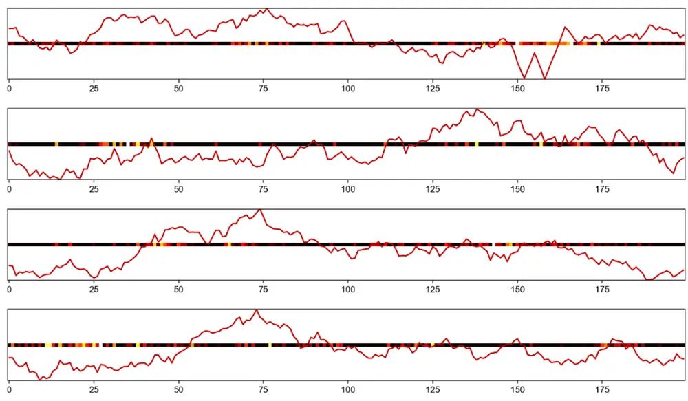
资料来源：华泰证券研究所

## 不同时间频率的股指收益率序列识别表现对比方法

不同时间频率的股指收益率序列是否存在可被卷积神经网络识别出的模式？这一部分我们将测试卷积神经网络对股指日频、日内 1~5 分钟频收益率真假序列的识别表现。样本相关参数如下表所示。

图表23： 不同时间频率股指真实收益率序列样本相关参数

| 测试品种 | 数据频率 | 训练集+验证集（7:3）测试集 |  | 序列长度采样方式 |  |
| --- | --- | --- | --- | --- | --- |
| 10只宽基指数日频 |  | 2007/1/15~2014/12/31 2015/1/5~2019/9/30 60 |  |  | 5日滚动采样 |
|  | 10只宽基指数1分钟频 | 2014/1/2~2016/12/30 | 2017/1/3~2019/9/30 237 |  | 每个交易日9:30~14:57的 |
|  | 2分钟频 |  |  | 118 | 分钟频价格以1/2/3/4/5 分 |
|  | 3分钟频 |  |  | 79 | 钟为间隔计算收益，作为 |
|  | 4分钟频 |  |  | 59 | 一条样本 |
|  | 5分钟频 |  |  | 47 |  |

资料来源：Wind，华泰证券研究所

## 需要说明的测试细节如下：

1. 股指日频收益率采用 5日滚动采样，及 T+0 至 T+59 日为第 1条真样本，T+5至 T+64日为第 2条真样本，以此类推。

2. 股指分钟频收益率以每个交易日 9:30~14:57 的分钟频价格以 1/2/3/4/5 分钟为间隔计算收益，作为一条样本。每个交易日 14:57~15:00 涉及集合竞价，价格变动不连续，暂时排除。

3. 真假样本比例为 1:30。

卷积神经网络参数和结构示意图如下所示。

图表24： 卷积神经网络模型超参数

| 卷积层超参数 | 卷积层超参数值卷积层超参数 |  | 卷积层超参数值其余超参数 |  | 其余超参数值 |
| --- | --- | --- | --- | --- | --- |
| 卷积层卷积核大小1x15 |  | 第1层卷积层卷积核数 | 20 | 输出层激活函数 Sigmoid |  |
| 卷积层激活函数 Relu |  | 第 2 层卷积层卷积核数 30 |  | 损失函数 | 交叉熵 |
| 卷积层 Stride | 1 | 第 3 层全连接层神经元数30 |  | 优化器 | Adam |
| 卷积层 Padding | 1 | 第 3 层全连接层激活函数 Relu |  | 迭代次数 | 10 |

资料来源：华泰证券研究所

图表25： 识别 1分钟频收益率的卷积神经网络模型网络结构示意图
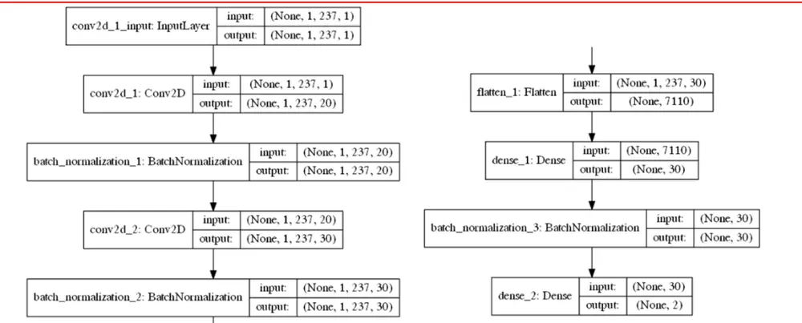
资料来源：华泰证券研究所

## 股指日频收益率

股指日频收益率识别表现如下表所示。10 只宽基指数的测试集精确率不高，召回率较低，F1 Score 较低，卷积神经网络基本不具备识别能力。60 个交易日内的股指日频收益率可能并不存在模式，股指在 60 个交易日的时间尺度上可能满足弱有效市场理论，针对股指的短线日频择时有一定难度。

图表26： 股指日频收益率识别表现

|  |  | 验证集 | 验证集 | 验证集 | 测试集 | 测试集 | 测试集 |
| --- | --- | --- | --- | --- | --- | --- | --- |
| 代码 | 简称 | 精确率 | 召回率 | F1 Score | 精确率 | 召回率 | F1 Score |
| 000001.SH | 上证综指 | 73.7% | 11.8% | 0.20 | 40.0% | 0.9% | 0.02 |
| 000009.SH | 上证 380 | 63.2% | 20.2% | 0.31 | 28.6% | 1.8% | 0.03 |
| 000016.SH | 上证50 | 58.3% | 17.6% | 0.27 | 33.3% | 1.8% | 0.03 |
| 000300.SH | 沪深300 | 72.9% | 36.1% | 0.48 | 18.8% | 1.4% | 0.03 |
| 000852.SH | 中证 1000 | 87.5% | 29.4% | 0.44 | 47.1% | 3.6% | 0.07 |
| 000905.SH | 中证500 | 79.4% | 45.4% | 0.58 | 33.3% | 4.5% | 0.08 |
| 000906.SH | 中证 800 | 69.4% | 28.6% | 0.40 | 21.4% | 1.4% | 0.03 |
| 399001.SZ | 深证成指 | 76.0% | 18.5% | 0.29 | 52.5% | 1.4% | 0.03 |
| 399005.SZ | 中小板指 | 62.3% | 18.9% | 0.28 | 5.6% | 0.7% | 0.01 |
| 399006.SZ | 创业板指 | 82.4% | 35.3% | 0.49 | 16.1% | 2.3% | 0.04 |

资料来源：Wind，华泰证券研究所

## 股指分钟频收益率

首先展示四只代表性股指的 1~5 分钟频收益率测试集 F1 Score，以及与日频收益率测试集 F1 Score 的对比。1 分钟频收益率识别效果较好，随着收益率采样频率的降低，识别表现也逐渐降低，但仍高于日频收益率识别表现。这说明股指在日内 1分钟的时间尺度上可能存在模式，不满足弱有效市场理论，针对股指的日内择时有机会；随着频率的降低，市场有效性增强。

我们猜测这可能和市场投资者的交易习惯有关，多数投资者可能习惯日频、周频、月频等中频时间尺度的交易，市场在这一频率相对拥挤，具有较好的有效性；而日内高频交易由于交易能力或者交易费率的限制，参与的投资者可能相对较少，有效性相对较低。

图表27： 代表性股指各时间频率收益率测试集 F1 Score比较
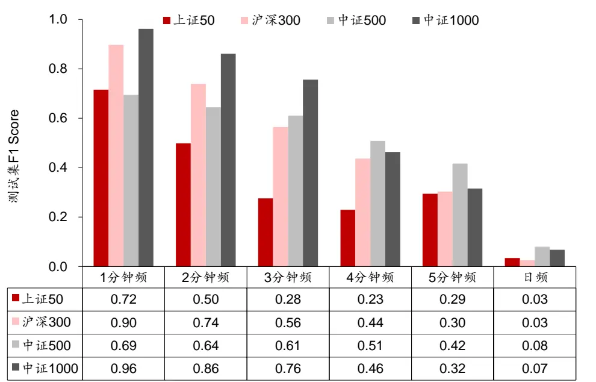
资料来源：Wind，华泰证券研究所

全部 10 只宽基指数 1~5 分钟频真假收益率识别的精确率、召回率和 F1 Score 详细结果如下面五张表所示。随着频率的降低，识别表现下降，市场有效性增强。

图表28： 股指 1分钟频收益率识别表现

| 代码 | 简称 | 验证集 | 验证集 召回率 | 验证集 | 测试集 | 测试集 | 测试集 |
| --- | --- | --- | --- | --- | --- | --- | --- |
| 000001.SH | 上证综指 | 精确率 97.5% | 83.9% | F1 Score 0.90 | 精确率 98.8% | 召回率 74.2% | F1 Score 0.85 |
| 000009.SH | 上证 380 | 100.0% | 99.8% | 1.00 | 100.0% | 79.2% | 0.88 |
| 000016.SH | 上证50 | 90.5% | 74.3% | 0.81 | 95.7% | 57.5% | 0.72 |
| 000300.SH | 沪深 300 | 98.9% | 93.3% | 0.96 | 99.7% | 81.7% | 0.90 |
| 000852.SH | 中证 1000 | 100.0% | 99.6% | 1.00 | 100.0% | 92.8% | 0.96 |
| 000905.SH | 中证 500 | 100.0% | 94.1% | 0.96 | 99.9% | 55.9% | 0.69 |
| 000906.SH | 中证 800 | 99.6% | 99.1% | 0.99 | 99.9% | 82.8% | 0.90 |
| 399001.SZ | 深证成指 | 94.6% | 90.9% | 0.92 | 97.5% | 94.2% | 0.96 |
| 399005.SZ | 中小板指 | 99.9% | 96.9% | 0.98 | 100.0% | 88.6% | 0.94 |
| 399006.SZ | 创业板指 | 99.6% | 98.4% | 0.99 | 100.0% | 73.0% | 0.84 |

资料来源：Wind，华泰证券研究所

图表29： 股指 2分钟频收益率识别表现

| 代码 | 简称 | 验证集 | 验证集 | 验证集 | 测试集 | 测试集 | 测试集 |
| --- | --- | --- | --- | --- | --- | --- | --- |
|  |  | 精确率 | 召回率 | F1 Score | 精确率 | 召回率 | F1 Score |
| 000001.SH | 上证综指 | 94.3% | 73.9% | 0.83 | 97.6% | 61.1% | 0.75 |
| 000009.SH | 上证 380 | 95.2% | 98.6% | 0.97 | 96.6% | 76.5% | 0.85 |
| 000016.SH | 上证50 | 83.2% | 51.4% | 0.64 | 92.7% | 34.1% | 0.50 |
| 000300.SH | 沪深 300 | 94.8% 100.0% | 81.5% 97.4% | 0.88 | 98.0% | 59.4% | 0.74 |
| 000852.SH 000905.SH | 中证 1000 | 99.1% | 97.7% | 0.99 0.98 | 99.8% 99.4% | 75.8% | 0.86 |
|  | 中证 500 | 97.2% | 93.7% | 0.95 |  | 47.7% | 0.64 |
| 000906.SH | 中证 800 深证成指 | 96.2% | 78.4% | 0.86 | 98.7% 98.8% | 57.7% 71.9% | 0.73 |
| 399001.SZ 399005.SZ | 中小板指 | 96.6% | 88.5% | 0.92 | 98.0% | 67.5% | 0.83 0.80 |
|  |  | 96.5% | 85.0% | 0.90 | 98.2% | 48.8% |  |
| 399006.SZ | 创业板指 |  |  |  |  |  | 0.65 |

资料来源：Wind，华泰证券研究所

图表30： 股指 3分钟频收益率识别表现

| 代码 | 简称 | 验证集 精确率 | 验证集 召回率 | 验证集 | 测试集 | 测试集 | 测试集 |
| --- | --- | --- | --- | --- | --- | --- | --- |
| 000001.SH | 上证综指 | 73.9% | 38.3% | F1 Score 0.50 | 精确率 91.5% | 召回率 41.9% | F1 Score 0.57 |
| 000009.SH | 上证 380 | 83.2% | 67.1% | 0.74 | 89.1% | 49.9% | 0.64 |
| 000016.SH | 上证50 | 66.7% | 19.8% | 0.31 | 81.0% | 16.6% | 0.28 |
| 000300.SH | 沪深 300 | 82.0% | 49.1% | 0.61 | 91.6% | 40.8% | 0.56 |
| 000852.SH | 中证 1000 | 81.5% | 62.2% | 0.71 | 90.6% | 64.9% | 0.76 |
| 000905.SH | 中证 500 | 87.3% | 64.9% | 0.74 | 93.8% | 45.3% | 0.61 |
| 000906.SH | 中证 800 | 65.7% | 59.5% | 0.62 | 78.3% | 47.5% | 0.59 |
| 399001.SZ | 深证成指 | 70.7% | 41.4% | 0.52 | 91.8% | 54.8% | 0.69 |
| 399005.SZ | 中小板指 | 75.3% | 56.4% | 0.64 | 90.1% | 51.8% | 0.66 |
| 399006.SZ | 创业板指 | 72.8% | 50.7% | 0.60 | 88.3% | 37.3% | 0.52 |

资料来源：Wind，华泰证券研究所

图表31： 股指 4分钟频收益率识别表现

| 代码 | 简称 | 验证集 | 验证集 | 验证集 | 测试集 | 测试集 | 测试集 |
| --- | --- | --- | --- | --- | --- | --- | --- |
|  |  | 精确率 | 召回率 | F1 Score | 精确率 | 召回率 | F1 Score |
| 000001.SH | 上证综指 | 37.7% | 26.1% | 0.31 | 70.8% | 29.8% | 0.42 |
| 000009.SH | 上证 380 | 63.1% | 50.0% | 0.56 | 83.6% | 43.5% | 0.57 |
| 000016.SH | 上证50 | 34.3% | 15.3% | 0.21 | 59.7% | 14.2% | 0.23 |
| 000300.SH 000852.SH | 沪深 300 | 52.7% 69.0% | 30.6% 37.2% | 0.39 | 75.4% 83.0% | 30.7% | 0.44 |
| 000905.SH | 中证 1000 | 70.4% | 39.6% | 0.48 0.51 | 89.1% | 32.1% | 0.46 |
| 000906.SH | 中证500 中证800 | 53.1% | 30.6% | 0.39 | 75.1% | 35.6% | 0.51 |
| 399001.SZ | 深证成指 | 38.8% | 19.8% | 0.26 | 71.5% | 34.2% 25.1% | 0.47 |
| 399005.SZ | 中小板指 | 60.2% | 28.6% | 0.39 | 78.5% | 31.0% | 0.37 0.44 |
|  |  |  | 32.6% | 0.45 | 81.2% | 21.9% |  |
| 399006.SZ | 创业板指 | 74.0% |  |  |  |  | 0.35 |

资料来源：Wind，华泰证券研究所

图表32： 股指 5分钟频收益率识别表现

| 代码 | 简称 | 验证集 | 验证集 | 验证集 | 测试集 | 测试集 | 测试集 |
| --- | --- | --- | --- | --- | --- | --- | --- |
| 000001.SH | 上证综指 | 精确率 41.4% | 召回率 16.2% | F1 Score | 精确率 | 召回率 16.2% | F1 Score |
| 000009.SH | 上证 380 | 56.6% | 27.0% | 0.23 0.37 | 64.3% 77.1% | 25.1% | 0.26 0.38 |
| 000016.SH | 上证50 | 26.5% | 18.0% | 0.21 | 57.6% | 19.8% | 0.29 |
| 000300.SH | 沪深 300 | 28.6% | 19.8% | 0.23 | 57.3% | 20.7% | 0.30 |
| 000852.SH | 中证 1000 | 56.7% | 24.4% | 0.34 | 83.9% | 19.4% | 0.32 |
| 000905.SH | 中证500 | 51.4% | 32.0% | 0.39 | 72.8% | 29.1% | 0.42 |
| 000906.SH | 中证 800 | 37.2% | 24.8% | 0.30 | 60.1% | 25.3% | 0.36 |
| 399001.SZ | 深证成指 | 39.2% | 12.8% | 0.19 | 74.7% | 18.1% | 0.29 |
| 399005.SZ | 中小板指 | 57.1% | 14.1% | 0.23 | 82.3% | 18.1% | 0.30 |
|  | 创业板指 | 49.2% | 28.2% | 0.36 | 71.5% | 22.8% | 0.35 |
| 399006.SZ |  |  |  |  |  |  |  |

资料来源：Wind，华泰证券研究所

## 神经网络可视化技术挖掘收益率模式

真假序列识别结果暗示，股指在 1分钟频的时间尺度上可能存在模式。那么我们可以采用神经网络可视化技术尝试挖掘收益率背后的模式。这里我们展示 Grad-CAM 热力图对收益率模式的解读。

真实沪深 300 指数测试集 1 分钟频收益率序列指向真样本类别的 Grad-CAM 热力图如下图所示。每一行代表1条测试集样本，各列代表9:30~14:57内的 237个分钟频收益区间。色阶代表重要性，颜色接近红色代表该样本在该时刻的收益率对于将该样本识别为真样本较为重要，即该时刻的收益率为模式一部分的可能性较高；反之，颜色接近蓝色代表该时刻的收益率为模式一部分的可能性较低。

观察下图可知，红色部分在各时刻均有分布，但在开盘和收盘阶段分布更为密集。换言之，沪深 300 指数日内分钟频收益率的模式更有可能出现在开盘和收盘阶段。

图表33： 真实沪深 300指数测试集 1分钟频收益率序列指向真样本类别的 Grad-CAM 热力图
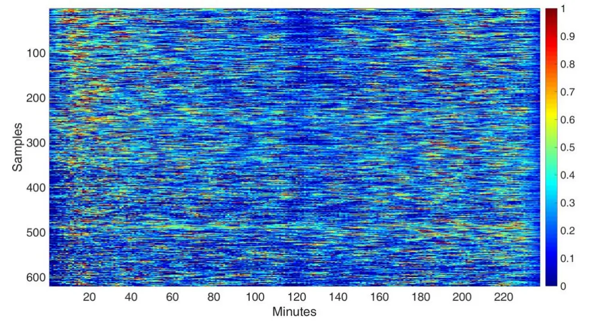
资料来源：Wind，华泰证券研究所

进一步对“重要”收益率特征的时间分布进行定量刻画，统计热力图数值（即热度）超过95%或 99%分位数特征所处时间段的频次分布，如下图所示。热度超过 99%的收益率特征中，超过16%的特征位于9:40~9:50时间段；32.5%的特征集中在开盘后30分钟，23.6%的特征集中在收盘前 1 小时。换言之，股指分钟频收益率模式更有可能出现在开盘后 30分钟和收盘前 1小时。

图表34： 真实沪深 300指数测试集 1分钟频收益率序列重要收益率特征所在时间段频次分布
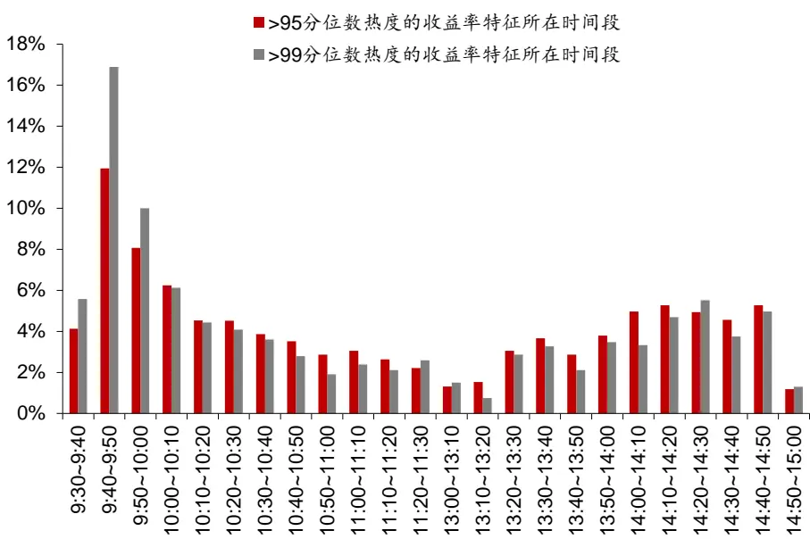
资料来源：Wind，华泰证券研究所

中证 500 指数的 Grad-CAM 结果和沪深 300 指数类似，重要特征所处的时间段集中分布在开盘和收盘阶段，如下面两张图所示。

图表35： 真实中证 500指数测试集 1分钟频收益率序列指向真样本类别的 Grad-CAM 热力图
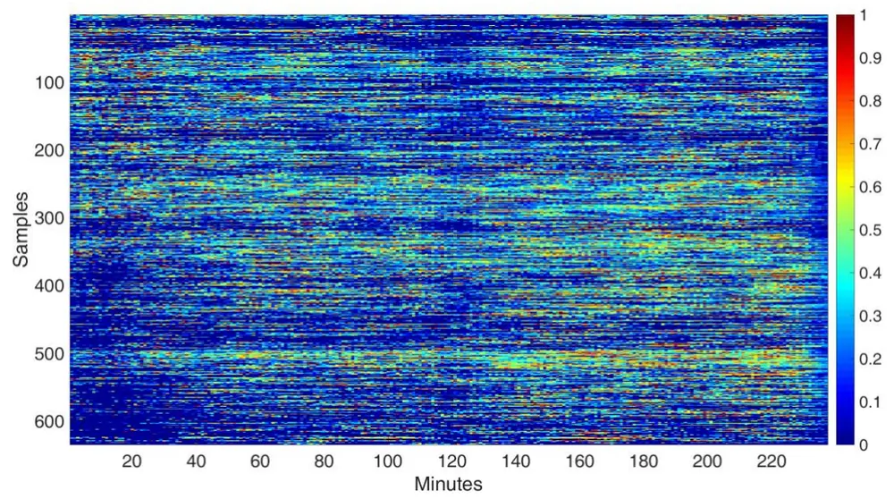
资料来源：Wind，华泰证券研究所

图表36： 真实中证 500指数测试集 1分钟频收益率序列重要收益率特征所在时间段频次分布
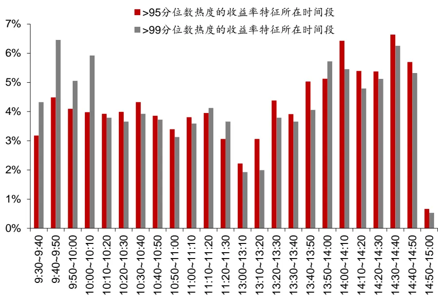
资料来源：Wind，华泰证券研究所

模式可能为何种形态？我们尝试将原始收益率序列对应的单位净值以及 Grad-CAM 热力图的热度共同展示。以 2017 年 1 月 9日沪深 300 指数为例，如下图所示，热力图热度的最高峰出现在 9:40~9:50 之间，对应的单位净值为“开盘冲高回落”形态；热力图热度的次高峰出现在 14:30 左右，对应的单位净值为“尾盘拉升”形态。

图表37： 沪深 300真实分钟频单位净值（2017年 1月 9日）及其 Grad-CAM 热力图结果比较
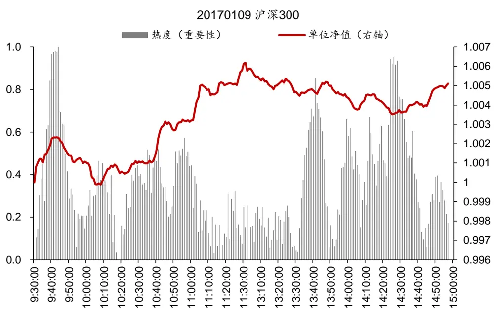
资料来源：Wind，华泰证券研究所

再以 2018 年 4 月 23 日沪深 300 指数为例，如下图所示，热力图热度的最高峰出现在9:50~10:00 之间，对应的单位净值为“开盘冲高回落”形态；热力图热度的次高峰出现在14:20~14:30 之间，对应的单位净值为“尾盘拉升”形态。

图表38： 沪深 300真实分钟频单位净值（2018年 4月 23日）及其 Grad-CAM热力图结果比较
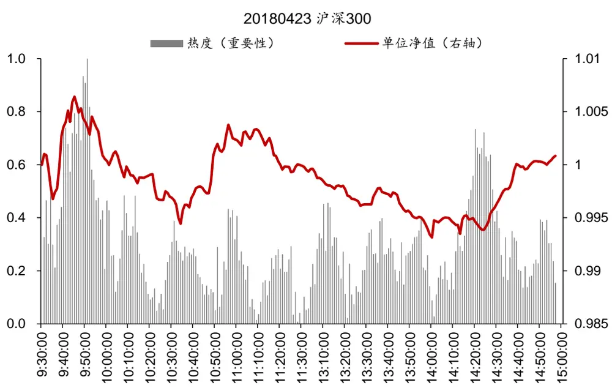
资料来源：Wind，华泰证券研究所

需要承认的是，两条个例并不能真正说明“开盘冲高回落”和“尾盘拉升”是市场必然存在的模式，理论上应该对所有样本的热力图进行归纳，总结其背后的共同模式，而这又并非人力所能及。另一个局限在于，尽管 Grad-CAM 有助于定位模式所在位置，可能该模式非人脑所能理解，于是“不识模式真面目，只缘身在此山中”。能否以更高效、更客观的方式解读 Grad-CAM 的结果，是有待进一步探索的众多方向之一。

## 不同资产的收益率序列识别表现对比

方法

不同资产的收益率序列是否存在可被卷积神经网络识别出的模式？这一部分我们将测试卷积神经网络对个股、因子日频收益率，以及股指期货、商品期货分钟频收益率真假序列的识别表现。样本相关参数如下表所示。

图表39： 不同资产真实收益率序列样本相关参数

| 资产 | 测试品种 | 数据频率训练集+验证集（7:3） | 测试集 | 序列长度采样方式 |  | 备注 |
| --- | --- | --- | --- | --- | --- | --- |
| A 股个股 | 2416只有效个日频 | 2007/1/15~2014/12/31 2015/1/5~2019/9/30 60 |  |  | 5日滚动采样 | 排除训练+验证样本少于 |
|  | 股 |  |  |  |  | 100 条或测试样本少于1 |
|  |  | 2005/1/7~2011/12/30 | 2012/1/4~2019/9/27 60 |  | 5日滚动采样 | 条的股票；停牌特殊处理 |
| 因子收益率 股指期货 | 10 个风格因子日频 IC、IF、IH | 1 分钟频2015/4/17~2017/6/30 | 2017/7/3~2019/9/30 | 239 | 每日9:31~15:00的分钟频为便于和指数本身对比， |  |
| 商品期货 |  |  |  |  | 收益率为一条样本 |  |
|  |  | AU、CF、CU、1 分钟频2014/1/2~2016/12/30 | 2017/1/2~2019/9/30 224 |  | 每日9:01~15:00的分钟频不计夜盘 | 仅取 9:31~15:00 的数据 |
|  | RB、RU |  |  |  | 收益率为一条样本 |  |

资料来源：Wind，聚宽，华泰证券研究所

需要说明的测试细节如下：

1. A 股个股日频数据从万得获取；因子收益率基于个股数据计算，计算方法请参考华泰金工《桑土之防：结构化多因子风险模型》（20190612）；股指期货和商品期货分钟频数据从聚宽获取。

2. 个股和因子收益率均采用 5日滚动采样，及 T+0至 T+59 日为第 1 条真样本，T+5 至T+64 日为第 2条真样本，以此类推。

3. 个股排除训练+验证样本少于 100 条或测试样本少于 1 条的股票。个股如遇停牌，将停牌前后交易日的收益率合并处理。

4. 股指期货统一从 2015 年 4 月 17 日开始；商品期货统一从 2014 年初开始。为便于和指数本身对比，股指期货以每日 9:31~15:00 的分钟频收益率为一条样本，舍去其余时刻的收益率信息。出于计算简便考虑，商品期货以每日 9:01~15:00 的分钟频收益率为一条样本，舍去夜盘。

5. 商品期货从贵金属、农产品、有色、黑色系、化工五个板块中选择流动性较好、有代表性的一个品种，分别为沪金 AU、棉花 CF、沪铜 CU、螺纹钢 RB、橡胶 RU；商品期货采用每日的分钟频收益率序列作为样本，不涉及展期等问题，故直接采用主力连续合约。

6. 真假样本比例仍为 1:30。

卷积神经网络参数和上一章节相同，不再赘述。

## 个股日频收益率

个股日频收益率真假序列识别总体结果如下表所示。98%的有效个股其测试集 F1 Score低于 10%，表明 60 个交易日内的个股日频收益率可能并不存在模式，个股在 60 个交易日的时间尺度上可能满足弱有效市场理论，针对个股的短线日频择时可能有较大难度。

图表40： 个股测试集识别表现频次分布
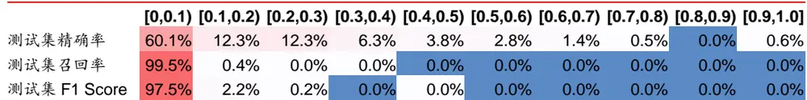
资料来源：Wind，华泰证券研究所；注：方括号代表闭区间，圆括号代表开区间

不同个股的识别能力有差异。识别表现排名前 20 的个股如下表所示，总体来看以小盘股居多。这些个股的日线上可能具有模式，或存在一定择时机会。

图表41： 测试集识别表现排名前 20的个股

| 代码 | 简称 | 验证集 | 验证集 | 验证集 | 测试集 | 测试集 | 测试集 | 20191115 |
| --- | --- | --- | --- | --- | --- | --- | --- | --- |
|  |  | 精确率 |  | 召回率 F1 Score | 精确率 |  |  | 召回率 F1 Score 总市值（亿元） |
| 600145.SH | *ST 新亿 | 48.1% | 23.6% | 0.32 | 57.1% | 30.8% | 0.40 | 27.9 |
| 600101.SH | 明星电力 | 26.2% | 45.4% | 0.33 | 31.3% | 25.9% | 0.28 | 28.7 |
| 000803.SZ | 金宇车城 | 51.4% | 68.9% | 0.59 | 46.3% | 18.8% | 0.27 | 17.2 |
| 600871.SH | 石化油服 | 55.4% | 42.3% | 0.48 | 40.4% | 18.7% 14.7% | 0.26 | 402.5 |
| 000025.SZ | 特力A | 59.1% | 25.2% | 0.35 | 34.8% |  | 0.21 | 87.5 |
| 000534.SZ 600375.SH | 万泽股份 | 36.1% 15.8% | 23.4% 19.8% | 0.28 | 37.0% 31.3% | 13.7% 14.7% | 0.20 | 42.3 |
| 600890.SH | 华菱星马 | 64.3% | 9.3% | 0.18 |  |  | 0.20 | 24.5 |
|  | 中房股份 | 45.7% | 23.1% | 0.16 0.31 | 73.7% 42.6% | 11.2% 11.2% | 0.19 | 36.8 |
| 000691.SZ 600151.SH | 亚太实业 航天机电 | 75.0% | 35.0% | 0.48 | 48.7% | 10.3% | 0.18 | 11.7 |
|  | 哈工智能 |  | 46.1% |  |  |  | 0.17 | 65.3 |
| 000584.SZ |  | 70.1% |  | 0.56 | 53.3% | 9.8% 9.2% | 0.16 | 36.1 |
| 600179.SH | ST 安通 | 70.1% | 44.8% | 0.55 | 46.2% |  | 0.15 | 70.6 |
| 000150.SZ | 宜华健康 | 52.5% | 21.4% | 0.30 | 38.3% | 9.4% | 0.15 | 50.0 |
| 000628.SZ 600221.SH | 高新发展 | 36.0% 28.3% | 19.8% | 0.26 | 37.7% | 9.3% | 0.15 | 30.2 |
|  | 海航控股 |  | 14.2% | 0.19 | 27.0% | 10.4% | 0.15 | 275.6 |
| 600488.SH | 天药股份 | 61.1% | 19.3% | 0.29 | 26.9% | 10.3% | 0.15 | 42.5 |
| 000004.SZ | 国农科技 | 51.7% | 41.4% | 0.46 | 29.5% | 9.9% | 0.15 | 15.5 |
| 000576.SZ | 广东甘化 | 63.6% | 40.0% | 0.49 | 44.7% | 8.4% | 0.14 | 32.1 |
| 600778.SH | 友好集团 | 51.1% | 21.3% | 0.30 | 38.6% | 8.5% | 0.14 | 15.2 |
| 600226.SH | 瀚叶股份 | 46.8% | 32.5% | 0.38 | 52.4% | 7.9% | 0.14 | 117.4 |

资料来源：Wind，华泰证券研究所

## 风格因子日频收益率

因子能否择时一直是备受争议的话题。以 AQR 为代表的一些机构对因子择时持悲观态度。BlackRock、高盛、JPMorgan、MSCI 等机构从因子动量、因子估值、因子拥挤度等维度提出了各自的因子择时策略。本文试图从真假序列识别出发，提供一个审视因子择时可信赖程度的新视角。

图表42： 风格因子单位化净值（2005/1/7~2019/11/14）
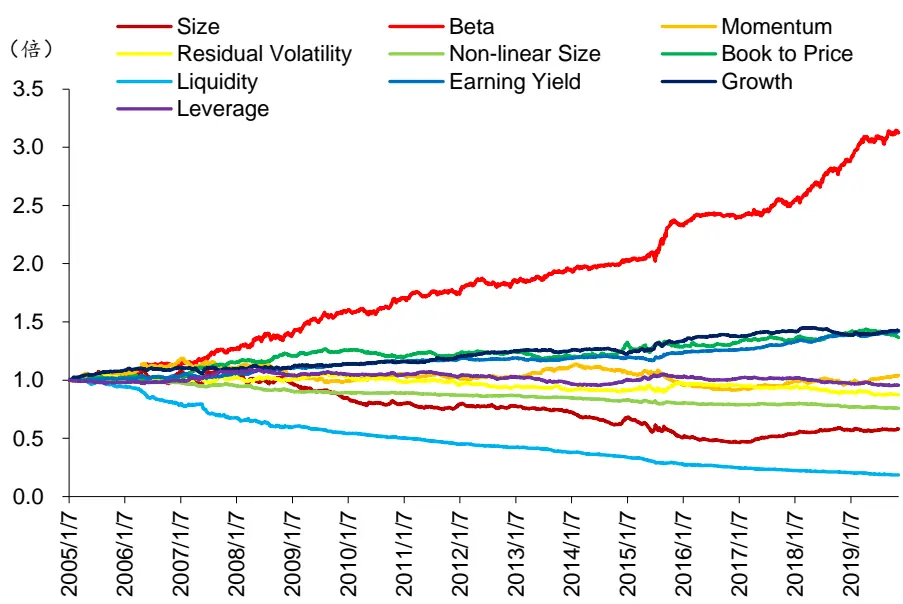
资料来源：Wind，华泰证券研究所

我们将风格因子也视作一类资产，计算因子收益率以及单位化净值，如上图所示。对 60个交易日的日频因子收益率真假序列进行识别，结果如下表所示。十个风格因子的识别效果不佳，测试集 F1 Score 最高不超过 0.20。因子在 60 个交易日的时间尺度上可能满足弱有效市场理论，针对因子的短线日频择时可能有较大难度。

图表43： 风格因子日频收益率识别表现
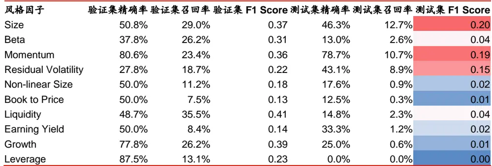
资料来源：Wind，华泰证券研究所

## 股指期货分钟频收益率

上一章我们发现股指日内分钟频收益率可能存在一定模式，不满足弱有效市场理论。股指本身无法交易，其对应的股指期货实行 T+0 交易制度。股指期货相较于股指本身是否可能更有效？我们同样可以借助真假序列识别的研究范式加以考察。

首先我们展示沪深 300指数以及对应 IF主力合约在 2014年 1月 2日和 2019年 11月 15日的日内价格和收益率。从肉眼看两者几乎看不出差别。

图表44： 沪深 300指数与 IF主力合约收盘价（2014/1/2）
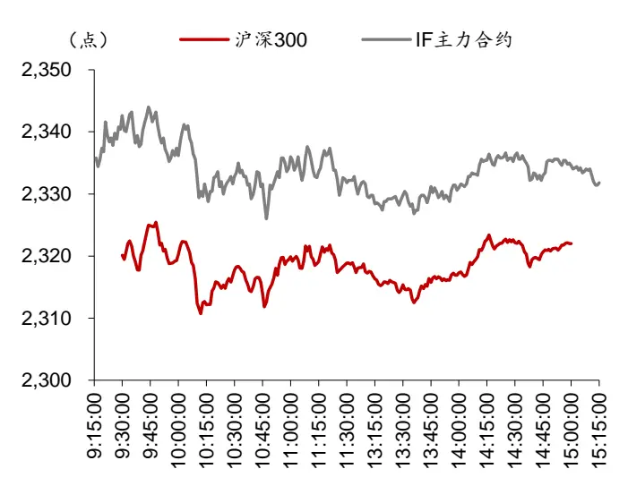
资料来源：Wind，聚宽，华泰证券研究所

图表45： 沪深 300指数与 IF主力合约分钟频收益率（2014/1/2）
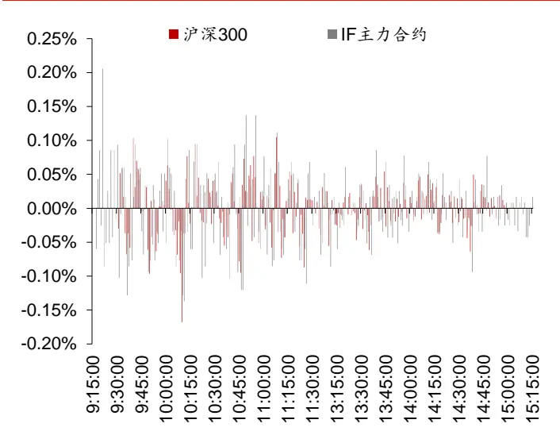
资料来源：Wind，聚宽，华泰证券研究所

图表46： 沪深 300 指数与 IF 主力合约收盘价（2019/11/15）
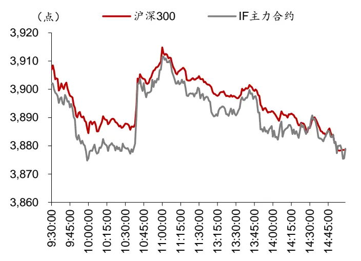
资料来源：Wind，聚宽，华泰证券研究所

图表47： 沪深 300指数与 IF主力合约分钟频收益率（2019/11/15）
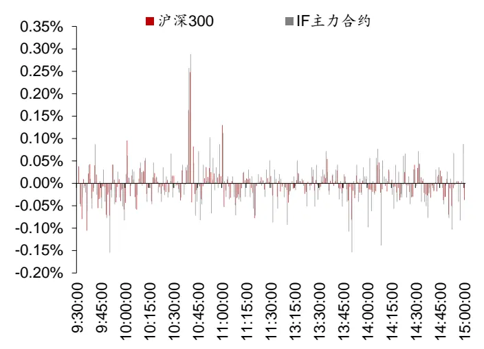
资料来源：Wind，聚宽，华泰证券研究所

股指期货分钟频真假收益率序列识别结果如下表所示。股指期货的识别表现总体弱于股指本身。测试集识别精确率相对较高，但召回率低，F1 Score 一般。其中上证 50 股指期货（IH）的识别能力相对较好。该结果印证了先前的猜测：资产的有效性与其交易模式有关，尽管股指期货和股指本身高度相关，但股指期货因其 T+0 的交易制度，有效性优于股指本身；但股指期货仍存在少许模式，股指期货日内 T+0 择时并非没有机会。

图表48： 股指期货分钟频收益率识别表现

| 测试品种 | 验证集精确率 | 验证集召回率 | 验证集 F1 Score 测试集精确率 |  | 测试集召回率 | 测试集 F1 Score |
| --- | --- | --- | --- | --- | --- | --- |
| IC | 59.6% | 18.5% | 0.28 | 91.3% | 17.1% | 0.29 |
| IF | 43.1% | 14.9% | 0.22 | 92.0% | 18.9% | 0.31 |
| IH | 73.8% | 26.8% | 0.39 | 95.7% | 32.1% | 0.48 |

资料来源：聚宽，华泰证券研究所

## 商品期货分钟频收益率

商品期货分钟频真假收益率序列识别结果如下表所示。商品期货识别表现较好，其日内收益率序列可能存在一定模式，不满足弱有效市场理论，日内 CTA策略有一定机会。

图表49： 代表性商品期货分钟频收益率识别表现

| 测试品种 | 验证集精确率验证集召回率 |  | 验证集 F1 Score 测试集精确率 |  | 测试集召回率 | 测试集 F1 Score |
| --- | --- | --- | --- | --- | --- | --- |
| AU | 91.2% | 67.1% | 0.77 | 98.3% | 77.8% | 0.87 |
| CU | 75.7% | 62.0% | 0.68 | 94.2% | 60.7% | 0.74 |
| CF | 40.0% | 87.5% | 0.55 | 69.5% | 89.0% | 0.78 |
| RB | 64.3% | 75.9% | 0.70 | 77.5% | 56.6% | 0.65 |
| RU | 93.6% | 67.6% | 0.78 | 97.0% | 63.4% | 0.77 |

资料来源：聚宽，华泰证券研究所

## 不同资产分钟频收益率识别表现差异的统计学解释

同为日内分钟频收益率序列，股指、股指期货、商品期货为何在识别表现上存在差异？本节我们借助统计学工具，尝试对上述问题加以解释。

图表50： 不同资产分钟频收益率测试集 F1 Score汇总
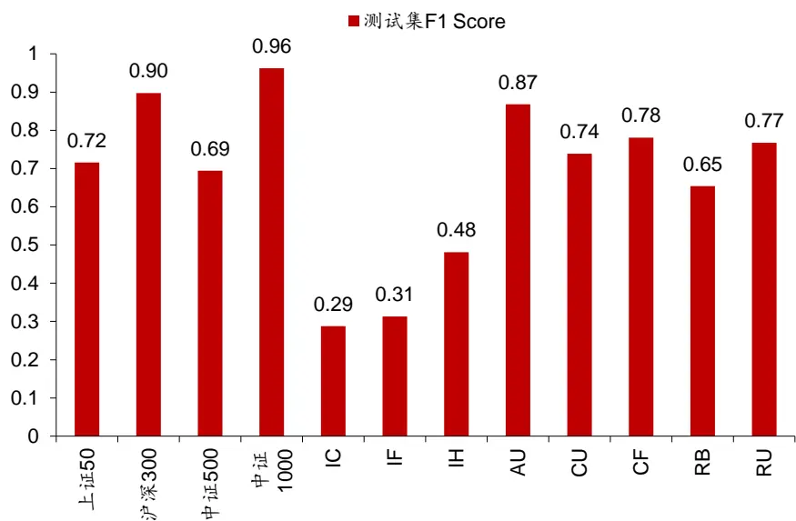
资料来源：Wind，聚宽，华泰证券研究所

对弱有效市场的检验主要是判断资产过去的价格能否预测未来的价格，即判断资产的收益率是否服从随机游走假设，通常采用以下两种统计检验方法：自相关系数检验和随机游程检验。

## 自相关系数检验

自相关系数检验通过检验时间序列样本数据中的随机变量与其滞后值之间的相关系数来判断样本数据的自相关性。我们将每个交易日的分钟频收益率作为一条时间序列样本，计算每条样本的 0~10 阶自相关系数，对各阶自相关系数按样本数量分别取均值，相关系数绝对值越接近 0，表明市场更接近弱有效。

不同资产分钟频收益率自相关系数检验结果如下表所示。股指的 1、2 阶自相关性较好，自相关系数高于 0.1，即股指在 T 时刻的收益率一定程度上能够预测其在 T+1、T+2 时刻的收益率，对应真假序列识别表现相对最好。股指期货的自相关性较低，其 1阶自相关性低于 0.10，即股指期货的分钟频收益率更“随机”，对应真假序列识别表现相对最差。商品期货的自相关性介于前两者之间，其 1 阶自相关性较好但 2阶自相关性较差，对应识别表现同样介于股指和股指期货之间。

图表51： 不同资产分钟频收益率自相关系数检验结果

|  | 测试集 | 0阶 | 1阶 | 2阶 | 3阶 | 4阶 | 5阶 | 6阶 | 7阶 | 8阶 | 9阶 | 10阶 |
| --- | --- | --- | --- | --- | --- | --- | --- | --- | --- | --- | --- | --- |
| 测试品种 | F1 Score | R值 | R值 | R值 | R值 | R值 | R值 | R值 | R值 | R值 | R值 | R值 |
| 上证50 | 0.72 | 1 | 0.242 | 0.108 | 0.080 | 0.084 | 0.072 | 0.068 | 0.070 | 0.067 | 0.064 | 0.061 |
| 沪深300 | 0.90 | 1 | 0.428 | 0.184 | 0.105 | 0.110 | 0.094 | 0.082 | 0.084 | 0.081 | 0.074 | 0.073 |
| 中证500 | 0.69 | 1 | 0.548 | 0.256 | 0.149 | 0.135 | 0.110 | 0.096 | 0.098 | 0.094 | 0.088 | 0.082 |
| 中证1000 | 0.96 |  | 0.659 | 0.269 | 0.144 | 0.140 | 0.116 | 0.102 | 0.104 | 0.099 | 0.091 | 0.086 |
| IC | 0.29 | 1 | 0.085 | 0.057 | 0.053 | 0.055 | 0.054 | 0.054 | 0.052 | 0.051 | 0.052 | 0.055 |
| IF | 0.31 | 1 | 0.079 | 0.057 | 0.056 | 0.057 | 0.054 | 0.053 | 0.054 | 0.053 | 0.052 | 0.052 |
| IH | 0.48 | 1 | 0.094 | 0.059 | 0.059 | 0.057 | 0.058 | 0.055 | 0.054 | 0.055 | 0.054 | 0.055 |
| AU | 0.87 | 1 | 0.181 | 0.063 | 0.059 | 0.057 | 0.057 | 0.057 | 0.057 | 0.057 | 0.056 | 0.055 |
| CU | 0.74 | 1 | 0.119 | 0.065 | 0.060 | 0.057 | 0.057 | 0.059 | 0.057 | 0.056 | 0.054 | 0.054 |
| CF | 0.78 | 1 | 0.152 | 0.065 | 0.059 | 0.061 | 0.058 | 0.058 | 0.056 | 0.056 | 0.056 | 0.055 |
| RB | 0.65 | 1 | 0.129 | 0.059 | 0.055 | 0.056 | 0.056 | 0.053 | 0.052 | 0.054 | 0.055 | 0.053 |
| RU | 0.77 | 1 | 0.120 | 0.065 | 0.061 | 0.058 | 0.057 | 0.056 | 0.055 | 0.056 | 0.053 | 0.054 |

资料来源：Wind，聚宽，华泰证券研究所

另外，在四只股指中，中证 1000 的自相关性相对较高，其真假序列识别表现也相对较好。在五种商品期货中，AU 的 1 阶自相关性相对较高，其真假序列识别表现在五种商品期货中也相对较好。类似的现象也体现在其余品种中，不再赘述。总体来看，序列自相关性和其真假序列识别能力具有一定相关关系，卷积神经网络在进行真假序列识别时，很可能借助了序列局部的自相关性线索。

## 随机游程检验

随机游程检验是一种非参数性统计假设的检验方法，通过考察时间序列正负号出现的规律来检验样本的随机性。游程是时间序列中，随机变量的变化保持相同符号的序列，即资产连续上涨或者连续下跌的一段序列。例如，若某收益率序列的符号为“---+++---++++++”，则其游程数为 4。

随机序列的游程总数不应过小或过大。例如，对于长度为 N 且一半交易日上涨另一半交易日下跌的收益率序列，设想两种极端情况：若序列游程数为 1，即所有交易日同涨或同跌，那么该资产可能处于趋势性行情中，并非随机游走；若序列游程数为 N/2，那么该资产涨跌交替出现，具有显著的负向自相关性，也非随机游走。

我们将每个交易日的分钟频收益率序列作为一条样本，对每条样本做游程检验，计算检验结果显著的样本数量占总样本数量的比值，比值越大，表明市场更接近弱有效。总的来看，股指期货的比值相对较大，收益率序列更“随机”，相对更接近弱有效；商品期货次之；股指的比值相对较小，收益率序列非“随机”，相对更接近无效。随机游程检验的结论与自相关性检验结果以及真假序列识别结果能够相互佐证。

图表52： 不同资产分钟频收益率随机游程检验结果

| 测试品种 | 测试集 F1 Score | 随机游程检验显著样本占比 |
| --- | --- | --- |
| 上证50 | 0.72 | 0.42 |
| 沪深 300 | 0.90 | 0.06 |
| 中证500 | 0.69 | 0.03 |
| 中证1000 | 0.96 | 0.00 |
| IC | 0.29 | 0.75 |
| IF | 0.31 | 0.75 |
| IH | 0.48 | 0.76 |
| AU | 0.87 | 0.55 |
| CU | 0.74 | 0.72 |
| CF | 0.78 | 0.58 |
| RB | 0.65 | 0.55 |
| RU | 0.77 | 0.56 |

资料来源：Wind，聚宽，华泰证券研究所

## 总结

本文尝试构建以真假序列识别为起点基于量价的主动投资研究框架。真假序列识别是检验市场有效性的有力工具。主动投资的核心是市场能否预测，如果市场无法预测，满足有效市场理论，主动投资就没有存在的价值。随机序列满足有效市场理论，无法预测。暂且抛开宏观、财务等数据，仅就交易数据看，如果人工智能算法无法识别真实量价序列和随机序列，那么弱有效市场假说可能成立；如果人工智能可以识别真假，那么可以进一步采用网络可视化技术挖掘模式，或采用遗传规划等算法来暴力挖掘特征。随后通过检验有效模式/特征、过拟合检验、风险控制等步骤，控制整体风险，实现完整的以真假序列识别为起点基于量价的主动投资研究流程。

## 本文核心结论如下：

1. 模拟实验表明，卷积神经网络能够识别收益率模式，神经网络可视化技术能够辅助挖掘模式。在白噪音中插入模式片段，模拟有模式的收益率序列，视作“真实”收益率序列，将其打乱得到“虚假”收益率序列，随后采用卷积神经网络进行真假识别。结果显示样本信噪比越高，识别表现越好。采用中间层激活可视化和类激活热力图两种方法解释卷积神经网络，发现激活函数值较高或热力图热度较高的区域对应模式区域。神经网络可视化有助于定位模式所在位置，从而进一步挖掘规律。

2. 对比不同时间频率股指收益率识别表现。卷积神经网络无法识别股指日频真假序列，股指 60 个交易日的日频收益率可能不存在显著模式，市场相对接近弱有效，短线择时难度较大。卷积神经网络能够识别日内分钟频真假序列，股指在分钟线可能存在显著模式，市场可能不满足弱有效，日内 T+0 策略有一定机会。随着频率从 1 分钟降低到 5 分钟，识别效果下降，市场逐渐接近弱有效。Grad-CAM 结果表明日内模式更可能出现在开盘后 30 分钟和收盘前 1 小时。投资者的交易习惯可能是影响不同时间频率市场有效性的因素之一。

3. 对比不同资产收益率的识别表现。个股日频收益率几乎无法识别，日频级别相对接近弱有效，个股短线择时难度较大。因子日频收益率几乎无法识别，短期因子择时难度较大。股指期货分钟频收益率识别表现一般，弱于股指本身，相比股指更接近弱有效，但日内 T+0 策略仍有机会。商品期货分钟频收益率识别表现好，日内商品 CTA 策略有机会。股指、股指期货、商品期货识别表现的差异能够和自相关系数检验、随机游程检验等统计检验结果互相佐证。市场交易制度可能是造成股指和股指期货有效性差异的因素之一。

## 风险提示

真假价量序列识别研究是对市场规律的探索，不构成任何投资建议。基于股指和商品期货1 分钟频收益率序列的卷积神经网络模型能够有效识别真假序列，不代表收益率等价格相关指标能够直接应用于中高频投资。机器学习模型是对历史规律的总结，如果市场规律发生变化，模型存在失效的可能。

## 免责申明

本报告仅供华泰证券股份有限公司（以下简称“本公司”）客户使用。本公司不因接收人收到本报告而视其为客户。

本报告基于本公司认为可靠的、已公开的信息编制，但本公司对该等信息的准确性及完整性不作任何保证。本报告所载的意见、评估及预测仅反映报告发布当日的观点和判断。在不同时期，本公司可能会发出与本报告所载意见、评估及预测不一致的研究报告。同时，本报告所指的证券或投资标的的价格、价值及投资收入可能会波动。本公司不保证本报告所含信息保持在最新状态。本公司对本报告所含信息可在不发出通知的情形下做出修改，投资者应当自行关注相应的更新或修改。

本公司力求报告内容客观、公正，但本报告所载的观点、结论和建议仅供参考，不构成所述证券的买卖出价或征价。该等观点、建议并未考虑到个别投资者的具体投资目的、财务状况以及特定需求，在任何时候均不构成对客户私人投资建议。投资者应当充分考虑自身特定状况，并完整理解和使用本报告内容，不应视本报告为做出投资决策的唯一因素。对依据或者使用本报告所造成的一切后果，本公司及作者均不承担任何法律责任。任何形式的分享证券投资收益或者分担证券投资损失的书面或口头承诺均为无效。

本公司及作者在自身所知情的范围内，与本报告所指的证券或投资标的不存在法律禁止的利害关系。在法律许可的情况下，本公司及其所属关联机构可能会持有报告中提到的公司所发行的证券头寸并进行交易，也可能为之提供或者争取提供投资银行、财务顾问或者金融产品等相关服务。本公司的资产管理部门、自营部门以及其他投资业务部门可能独立做出与本报告中的意见或建议不一致的投资决策。

本报告版权仅为本公司所有。未经本公司书面许可，任何机构或个人不得以翻版、复制、发表、引用或再次分发他人等任何形式侵犯本公司版权。如征得本公司同意进行引用、刊发的，需在允许的范围内使用，并注明出处为“华泰证券研究所”，且不得对本报告进行任何有悖原意的引用、删节和修改。本公司保留追究相关责任的权力。所有本报告中使用的商标、服务标记及标记均为本公司的商标、服务标记及标记。

本公司具有中国证监会核准的“证券投资咨询”业务资格，经营许可证编号为：91320000704041011J。

全资子公司华泰金融控股（香港）有限公司具有香港证监会核准的“就证券提供意见”业务资格，经营许可证编号为：AOK809

©版权所有 2019年华泰证券股份有限公司

## 评级说明

## 行业评级体系

－报告发布日后的6个月内的行业涨跌幅相对同期的沪深300指数的涨跌幅为基准；

－投资建议的评级标准

增持行业股票指数超越基准

中性行业股票指数基本与基准持平

减持行业股票指数明显弱于基准

## 公司评级体系

－报告发布日后的6个月内的公司涨跌幅相对同期的沪深300指数的涨跌幅为基准；
－投资建议的评级标准
买入股价超越基准 20%以上
增持股价超越基准 5%-20%
中性股价相对基准波动在-5%~5%之间
减持股价弱于基准 5%-20%
卖出股价弱于基准 20%以上

## 华泰证券研究

## 南京

南京市建邺区江东中路228号华泰证券广场1号楼/邮政编码：210019

电话：86 25 83389999 /传真：86 25 83387521

电子邮件：ht-rd@htsc.com

## 深圳

深圳市福田区益田路5999号基金大厦10楼/邮政编码：518017

电话：86 755 82493932 /传真：86 755 82492062

电子邮件：ht-rd@htsc.com

## 北京

北京市西城区太平桥大街丰盛胡同28号太平洋保险大厦A座18层

邮政编码：100032

电话：86 10 63211166/传真：86 10 63211275

电子邮件：ht-rd@htsc.com

## 上海

上海市浦东新区东方路18号保利广场E栋23楼/邮政编码：200120

电话：86 21 28972098 /传真：86 21 28972068

电子邮件：ht-rd@htsc.com