## 金工研究/深度研究

2019年11月25日

林晓明 执业证书编号：S0570516010001

研究员 0755-82080134

陈烨执业证书编号：S0570518080004

研究员 010-56793942

chenye@htsc.com

李子钰 执业证书编号：S0570519110003

研究员 0755-23987436

liziyu@htsc.com

何康 021-28972039

联系人 hekang@htsc.com

## 相关研究

1《金工：市场弱有效性检验与择时战场选择》2019.11

2《金工：风险预算模型如何度量风险更有效》2019.11

# 遗传规划在CTA信号挖掘中的应用华泰人工智能系列之二十六

## 本文介绍了遗传规划在CTA信号挖掘中的应用，并展示了实证结果

在机器学习中，遗传规划是一个优秀的特征生成工具，本文介绍了遗传规划在CTA信号挖掘中的应用。遗传规划的优势在于能在现有的数据和运算符中进行大规模启发式搜索，同时突破人类的思维局限，挖掘出特异的、能对现有CTA策略做出有益补充的信号。本文基于遗传规划程序包gplearn进行改进，并在多个商品期货品种上测试，挖掘出了一些回测效果较好且意义明确的 CTA 信号。

遗传规划能挖掘对现有CTA策略做出有益补充的信号，提高策略的差异性量化CTA策略中最常见的策略是趋势/反转策略。经典的趋势/反转策略大多已有数十年的历史，策略的逻辑相对固定，随着使用该类策略的投资者逐渐增多，策略可能面临交易拥挤、有效性下降的问题，此时遗传规划将会是一个值得尝试的工具。遗传规划可以充分利用计算机的强大算力生成大量公式化的交易信号，并通过启发式搜索寻找潜在有效的信号。在计算机7X24小时不间断的挖掘下，我们或许能够找到一些对现有CTA策略做出有益补充的信号，提高策略的差异化程度。

## 本文展示了遗传规划挖掘出的9个商品期货品种的CTA信号

本文选择三大商品交易所中流动性较好的40个商品期货品种进行测试，挖掘基于一分钟K线的信号。综合考虑信号的回测效果和复杂程度，本文展示了9个品种对应信号的回测结果。考虑到CTA信号过拟合可能性较高，我们对每个信号进行参数遍历，各品种的信号在全部参数下都有正收益，且各个信号使用的参数在所有参数中表现中上，不是刻意挑选出的最优信号。在挖掘出的信号中，一部分信号是趋势/反转信号，还有一部分信号则与成交量、持仓量有关。

## 本文构建了多策略组合来分散单一CTA信号的风险，提升夏普比率

单一品种的单一信号面临较大回撤风险。为了减小回撤，提升夏普比率，本文构建了多策略组合，策略运行中可能同时持有多个品种的合约。假设不使用杠杆，在单边交易成本为万分之三时，2015年以来多策略组合年化收益率为25.26%，夏普比率为2.25，最大回撤为10.51%。

风险提示：通过遗传规划挖掘的CTA信号是历史经验的总结，存在失效的可能。遗传规划所得CTA信号可能过于复杂，可解释性较低，使用需谨慎。

## 本文研究导读

在华泰金工人工智能系列之二十五《市场弱有效性检验与择时战场选择》(2019.11.17)中，我们通过真假序列识别的方法论证了国内商品期货1分钟收益率序列可能存在一定模式，不满足弱有效市场理论，基于1分钟K线的CTA策略有一定机会。遗传规划作为一种优秀的特征挖掘工具，可以在商品期货1分钟K线中挖掘模式，从而生成可交易的CTA信号。本文将主要关注以下三个问题：

1. 遗传规划能对现有 CTA 策略体系提供何种补充？

2. 在将遗传规划运用于CTA信号挖掘时，需要进行哪些定制化改进？

3. 遗传规划所得CTA信号的表现如何？信号的含义如何解读？

## 遗传规划回顾和量化 CTA策略简介

## 遗传规划回顾

遗传规划(genetic programming)是一种启发式的公式演化技术，如图表1所示，遗传规划从随机生成的公式群体开始，通过模拟自然界中遗传进化的过程，来逐渐生成契合特定目标的公式群体。在华泰金工人工智能系列的第二十一篇(2019.6.10)和第二十三篇(2019.8.7)报告里，我们介绍了遗传规划在选股因子挖掘中的应用。作为一个优秀的特征生成工具，遗传规划是否能在量化择时(如CTA)中有用武之地，将是本文讨论的内容。

图表1：遗传规划的总体流程
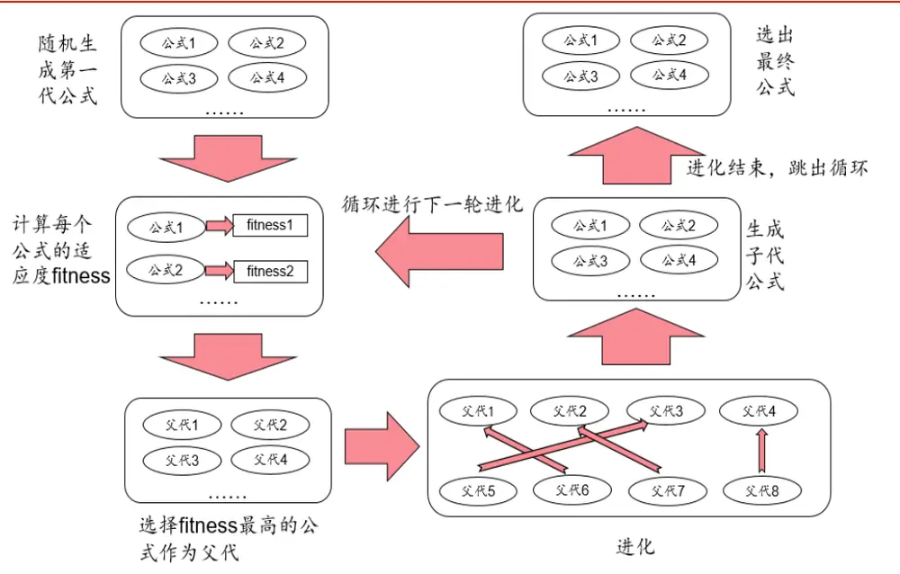
资料来源：华泰证券研究所

## 量化 CTA 策略简介

在投资领域，CTA(Commodity Trading Advisor)指商品交易顾问所采取的投资策略，又称管理期货(Managed Futures)策略，主要交易标的为期货。CTA策略中，量化策略占据重要地位，该类策略主要通过数量化分析方法寻找交易标的价格运行规律来获得盈利。常见的量化CTA策略有：趋势/反转策略、套利策略、CTA多因子策略等。其中趋势/反转策略是最为常见的量化CTA策略。趋势策略主要通过跟随已形成的价格趋势获利，在信号提示价格上涨时持有多仓，下跌时持有空仓，趋势出现反转时平仓。反转策略则通过判断价格拐点而获利，当信号提示价格反转向上时持有多仓，反转向下时持有空仓，在价格完成回归时平仓。

常见的趋势/反转策略包括：布林带策略、均线策略、MACD策略、ATR通道策略、菲阿里四价策略、空中花园策略、Dual Thrust 策略、R-Breaker策略等，下面分别进行简介。

1. 布林带策略将价格N期移动平均作为中枢，通过参数k乘以N期价格标准差构造区间确定上下轨，当价格突破上/下轨则相应做多/空。

2. 均线策略由美国投资专家 Joseph E.Granville 于20 世纪中期提出。策略使用简单移动平均(Simple Moving Average，SMA)构造交易信号。短期 SMA 上穿长期 SMA 为做多信号，反之则为做空信号。

3. MACD (Moving Average Convergence / Divergence)策略由 Geral Appel 在 1970 年提出。其与均线策略的关键不同在于MACD使用指数移动平均(Exponential MovingAverage，EMA)。EMA在计算时运用全部可得的历史数据，但对更近的数据赋予更高权重，权重以指数级向远处衰减。将DIF线定义为价格短期EMA减长期EMA，对DIF 线再次做 EMA 运算得到 MACD 线，DIF 线上穿 MACD 线为做多信号，反之为做空信号。

4. ATR即 Average True Range，指对 True Range 取平均。True Range 的定义是以下三者的最大者：当前最高价减前期最低价、当前最高价减前期收盘价绝对值、当前最低价减前期收盘价绝对值。计算 True Range 的 N 日平均值即得到 ATR，通过 ATR构造横盘整理区间，确定通道的上下轨，从而确定多空信号。

5. 菲阿里四价策略将上轨设置为上期最高价，下轨设置为上期最低价，价格突破上轨， 平空做多，反之平多做空。该策略信号构造较简单，容易触发，从而容易出现假突破。

6. 空中花园策略关注当日开盘价是高开还是低开。通常高开与低开意味着市场上存在重大利好或利空，那么行情往往会有巨大波动，形成交易机会。策略上轨是当日第一根k线最高价，下轨是当日第一根k线最低价，策略仅在当日开盘价对前日收盘价涨跌幅大于1%时才交易，价格突破上轨做多，反之做空。

7. Dual Thrust 由 Michael Chalek 在 20 世纪 80 年代提出。该策略关键变量有四个：N期最高价最大值HH、收盘价最小值LC、收盘价最大值HC、最低价最小值LL。用HH 一 LC 与 HC 一 LL 的最大值作为浮动区间，结合开盘价构造上下轨，当价格突破上/下轨则相应做多/空。

8. R-Breaker策略结合了趋势跟踪与趋势反转。策略根据前一期的收盘价、最高价和最低价数据通过一定方式计算出六个价位，从大到小依次为：突破买入价、观察卖出价、反转卖出价、反转买入价、观察买入价、突破卖出价，关键点在于通过上述六个价位判断波动与趋势，在已确认波动的情况下判断是否存在趋势，若存在趋势则顺势而为，若无趋势则在价格回调时做反转操作。

从以上的策略简介可以看出，经典的趋势/反转策略大多已有数十年的历史，策略的逻辑相对固定，随着使用该类策略的投资者逐渐增多，策略可能面临交易拥挤、有效性下降的问题，此时遗传规划将会是一个值得尝试的工具。遗传规划可以充分利用计算机的强大算力生成大量公式化的交易信号，并通过启发式搜索寻找潜在有效的信号。在计算机7X24小时不间断的挖掘下，我们或许能够找到一些对现有CTA策略做出有益补充的信号，提高策略的差异化程度。

## 遗传规划挖掘 CTA 信号的方法：gplearn 的改进

本文将不再介绍遗传规划的基本原理，对原理感兴趣的读者可阅读本系列报告《基于遗传规划的选股因子挖掘》。和之前报告一样，本文依然在开源项目gplearn(https://gplearn.readthedocs.io)的基础上来进行 CTA信号挖掘。首先我们介绍对gplearn的改进要点。

## 改进1：适用于CTA策略的信号函数

函数集是构建遗传规划算法的关键，由于gplearn自带的函数较为简单，本文针对CTA信号的构建新增了一系列函数。新增的函数列表如图表2所示，其中包含自定义函数(包括多种时间序列运算函数)和TA-Lib函数。TA-Lib(https://pypi.org/project/TA-Lib/)是目前广泛使用的技术指标库，内含多种高性能实现的技术指标。

图表2：函数列表

| 类型 | 名称 | 定义 |
| --- | --- | --- |
|  | X：以下函数中自变量 | X可以理解为向量{Xi}1≤isT，代表时间序列X在T个时间点上的取值，例如：X=close时，X为收 盘价序列。如果函数中使用明确的参数(如open，close)，则代表该参数固定，不可变化。以下函 |
|  |  | 数返回值均为向量。 X的相反数。 |
| 自定义函数 neg(X) 自定义函数 | delay(X, d) | d 天以前的 X值。 |
| 自定义函数 | delta(X, d) | X - delay(X, d)。 |
| 自定义函数 | ts_min(X, d) | 过去d天X值构成的时序数列中最小值。 |
| 自定义函数 | ts_max(X, d) | 过去d天X值构成的时序数列中最大值。 |
| 自定义函数 | ts_argmin(X, d) | 过去d天X值构成的时序数列中最小值出现的位置。 |
| 自定义函数 | ts_argmax(X, d) | 过去d天X值构成的时序数列中最大值出现的位置。 |
| 自定义函数 | ts_rank(X, d) | 过去d天X值构成的时序数列中本截面日X值所处分位数。 |
| 自定义函数 | ts_sum(X, d) | 过去d天X值构成的时序数列之和。 |
| 自定义函数 | ts_stddev(X, d) | 过去d天X值构成的时序数列的标准差。 |
| 自定义函数 | ts_corr(X,Y,d) | 过去d天X值构成的时序数列与Y构成的时序数列的相关系数。 |
| 自定义函数 | ts_mean_return(X,d) | 过去d天X值构成的时序数列的变化率的平均值。 |
| TA-Lib 函数 | DEMA(X,d) | 过去d天X值的双移动平均线，属于趋势信号。 |
| TA-Lib 函数 | KAMA(X,d) | 过去d天X值的考夫曼自适应移动平均线，属于趋势信号。 |
| TA-Lib 函数 | MA(X,d) | 过去d天X构成的时序数列的平均值，属于趋势信号。 |
| TA-Lib 函数 | MIDPOINT(X,d) | 过去d天X值构成的时序数列的最大值与最小值的平均值。 |
| TA-Lib 函数 | MIDPRICE(high,low,d) | 过去 d 天 high序列的最大值与low序列的最小值的平均值。 |
| TA-Lib 函数 | AROONOSC(high,low,d) | 过去d天的阿隆震荡指标，属于动量信号。 |
| TA-Lib 函数 | WILLR(high,low,close,d) | 过去d天的威廉指标，表示的是市场属于超买还是超卖状态，属于动量信号。 |
| TA-Lib 函数 | CCI(high,low,close,d) | 过去d天的顺势指标，测量股价是否已超出正常分布范围，属于动量信号。 |
| TA-Lib 函数 | ADX(high,low,close,d) | 过去d天的平均趋向指数，指标判断盘整、震荡和单边趋势，属于动量信号。 |
| TA-Lib 函数 | MFI(high,low,close,volume,d) | 过去d天的资金流量指标，反映市场的运行趋势，属于动量信号。 |
| TA-Lib 函数 | NATR(high,low,close,d) | 过去d天的归一化波动幅度均值，属于波动性信号。 |
| TA-Lib 函数 | BETA(X,Y,d) | 贝塔系数，过去d天X相对Y的波动情况，属于统计学信号。 |
| TA-Lib 函数 | LINEARREG_ANGEL(X,d) | 过去d天X值序列为因变量，序列1,..,d为自变量的线性回归角度，属于统计学信号。 |
| TA-Lib 函数 | LINEARREG_INTERCEPT(X,d) | 过去d天X值序列为因变量，序列1,..,d为自变量的线性回归截距，属于统计学信号。 |
| TA-Lib 函数 | LINEARREG_SLOPE(X,d) | 过去d天X值序列为因变量，序列1,..,d为自变量的线性回归斜率，属于统计学信号。 |
| TA-Lib 函数 HT_DCPHASE(X) |  | X值的希尔伯特变换-主导循环阶段，属于周期性信号。 |

资料来源：gplearn官网，TA-Lib，华泰证券研究所

## 改进2：适用于CTA信号的适应度计算函数

适应度是遗传规划中公式进化的重要参考指标。在生成某个CTA信号后，需要计算出其适应度，最直接的适应度计算方法就是对信号进行回测，然后得出信号的年化收益率、夏普比率等来作为适应度。由于本文是在商品期货的1分钟K线上进行回测，对于某单一品种，回测中需要遍历几十万甚至上百万的数据点，为了提高效率，本文采用Numba对回测代码进行加速以获得更高的运行效率，关于Numba的技术细节详见附录。

## 遗传规划挖掘CTA信号的流程

## 标的选择和数据处理

## 1. 标的选择

本文测试的标的为商品期货，我们选择三大商品交易所中流动性较好的40个品种进行测试，标的品种列表如图表3。

图表3：标的品种列表

| 交易所 | 上市品种 |
| --- | --- |
| 上期所 | 白银(AG)，铝(AL)，黄金(AU)，石油沥青(BU)，铜(CU)，燃料油(FU)，热轧卷板(HC)， |
| 大商所 | 镍(NI)，铅(PB)，螺纹钢(RB)，天然橡胶(RU)，锡(SN)，纸浆(SP)，锌(ZN) 豆1(A)，豆2(B)，玉米(C)，玉米淀粉(CS)，乙二醇(EG)，铁矿石(I)，焦炭(J)，鸡蛋(JD)， |
|  | 焦煤(JM)，聚乙烯(L)，豆粕(M)，棕榈油(P)，聚丙烯(PP)，豆油(Y) |
| 郑商所 | 棉花(CF)，棉纱(CY)，玻璃(FG)，甲醇(MA)，菜籽油(RS)，菜籽粕(RM)， 油菜籽(RS)，硅铁(SF)，锰硅(SM)，白糖(SR)，PTA(TA)，动力煤(ZC) |

资料来源：聚宽，华泰证券研究所

## 2. 原始数据选择

对于每个要测试的商品期货品种，我们都使用图表4中的原始数据构建信号，数据的频率为一分钟频。

图表4：原始数据列表

| 名称 | 定义 |
| --- | --- |
| open, close, high, low | 商品期货的一分钟开盘价、收盘价、最高价、最低价。 |
| volume | 商品期货的一分钟成交量。 |
| open_interest, delta_open_interest | 商品期货的每分钟持仓量和持仓量变化率。 |

资料来源：聚宽，华泰证券研究所

## 3. 商品期货换合约情况的处理

商品期货在每个时间点上都有其对应的主力合约。为了使得回测尽量接近真实的交易情况，我们不使用商品期货的连续合约来进行回测，而是将商品期货的各个主力合约拼接起来进行回测。在回测中，当遇到换合约时间点时，如果当前处于持仓状态，则强行平仓，下一次开仓时就在新的主力合约上开仓。

## 遗传规划流程

## 遗传规划流程如下：

1.使用图表4中的原始数据和图表2中的函数集，生成大量公式化的信号，并按照图表1的流程进行信号的进化和筛选。

2. 信号回测区间：对于每种商品期货，都使用其上市以来的一分钟K线行情进行回测。时间排前70%的行情序列为训练集，后30%的行情序列为验证集。

3. 信号回测：假设有信号 ${\mathsf{Si}}(\mathsf{i}{=}1,...,\mathsf{T}$ ，T为信号的总长度)，我们按照以下的开/平仓规则来回测：

(1) 当S向上突破 Si-10000~S序列的 80 分位数时，则在信号产生的一分钟后开多单并持续持有，如果策略净值回撤超过5%时则止盈/止损。

(2) 当 Si向下突破 Si-10000~Si序列的 20 分位数时，则在信号产生的一分钟后开空单并持续持有，如果策略净值回撤超过5%时则止盈/止损。

4. 信号适应度的计算：信号回测结束后，分别计算信号在训练集和验证集的夏普比率作为适应度，交易成本为单边万分之三。

5. 对挖掘出的信号分析其内在含义，并进行参数遍历，考察其稳定性。

6. 本文的回测中，都假设策略不使用杠杆。

## 遗传规划挖掘 CTA 信号的测试结果

我们对图表5中的所有商品期货品种分别使用遗传规划挖掘CTA信号，各品种的挖掘效果各异。我们综合考虑了信号的回测效果和复杂程度，选择在本文中展示以下品种对应信号的回测结果。

图表5：遗传规划挖掘出的表现较好的信号

| 品种 | 信号 |
| --- | --- |
| PTA(TA) | LINEARREG_ANGLE(high, 210) |
| 螺纹钢(RB) | MIDPOINT(neg(low), 450) |
| 聚乙烯(L) | neg(DEMA(close, 630)) |
| 铝(AL) | delta(ADX(high, low, close, 330), 630) |
| 天然橡胶(RU) | neg(delta(volume, 60)) |
| 菜籽粕(RM) | MA(volume, 180) |
| 焦炭(J) | MIDPOINT(DEMA(delta_open_interest, 440), 450) |
| 铁矿石(I) | HT_DCPHASE(ADX(high, low, close, 210)) |
| 热轧卷板(HC) | HT_DCPHASE(ts_rank(high, 210)) |

资料来源：聚宽，华泰证券研究所

## 信号详细测试结果和分析

本部分将对图表5中的信号进行详细测试并分析部分信号的实际意义。在测试中，我们会对每个信号进行参数(即信号中的常数项)遍历。参数遍历有两个目的：(1)观察信号择时效果的参数敏感性，信号在不同参数下是否依然有择时效果。(2)由于择时信号过拟合可能性较高，即过去表现最好的信号在将来大概率不会表现最好。通过参数遍历可判断图表5中的信号是否为刻意挑选出的最优信号。

## PTA(TA)

本节中我们将详细测试 PTA 期货的信号 LINEARREG_ANGLE(high， 210)。图表 6 展示了详细的测试结果。

图表6：PTA 信号的回测指标

| 指标 | 指标值 | 指标 | 指标值 |
| --- | --- | --- | --- |
| 年化收益率 | 24.58% | 总持仓次数 | 178 |
| 夏普比率 | 1.12 | 平均每次持仓收益 | 1.72% |
| 最大回撤 | 33.51% | 平均持仓分钟数 | 4635.49 |
| 胜率 | 51.12% | 平今次数 | 1 |

资料来源：聚宽，华泰证券研究所

图表7展示了PTA信号的回测净值。图表8中对信号参数进了遍历，遍历区间为[160，260]，从图表8中可以看出，在区间[160，260]中信号都有正收益，参数210所对应的信号在所有参数中表现中上，不是刻意挑选出的最优信号。

图表7：PTA 信号的回测净值
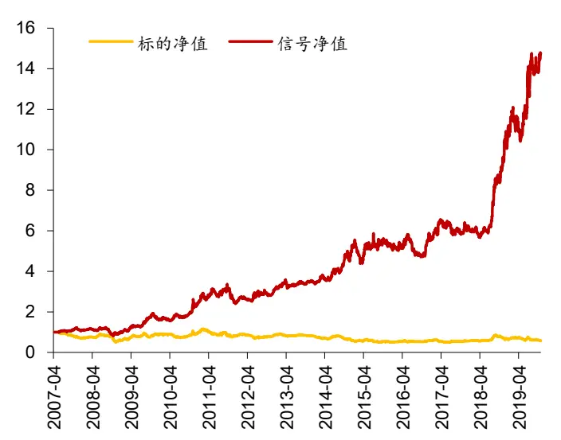
资料来源：聚宽，华泰证券研究所

图表8：PTA信号的参数遍历
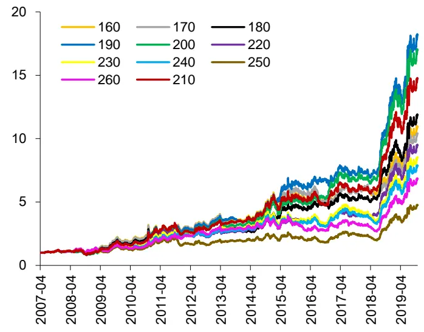
资料来源：聚宽，华泰证券研究所

图表9中截取了一小段回测时间来分析信号含义，标的收盘价和信号取值大致呈现出同涨同跌的关系，可知该信号是一个趋势信号。

图表9：PTA信号的含义分析(左轴：标的收盘价，右轴：信号取值)
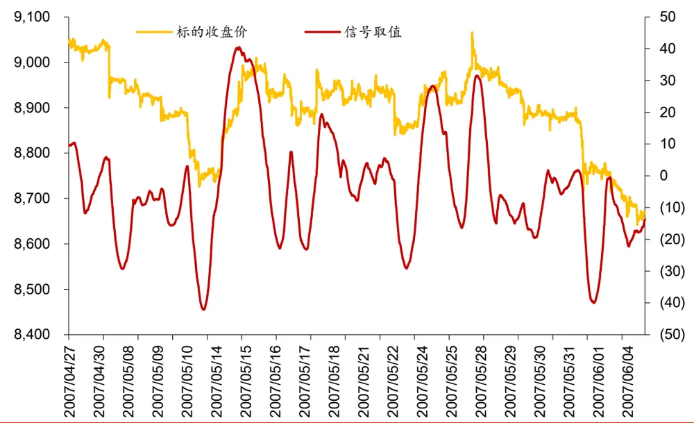
资料来源：聚宽，华泰证券研究所

## 螺纹钢(RB)

本节中我们将详细测试螺纹钢期货的信号MIDPOINT(neg(low)，450)。图表 10展示了详细的测试结果。

图表10：螺纹钢信号的回测指标

| 指标 | 指标值 | 指标 | 指标值 |
| --- | --- | --- | --- |
| 年化收益率 | 12.76% | 总持仓次数 | 62 |
| 夏普比率 | 0.95 | 平均每次持仓收益 | 2.17% |
| 最大回撤 | 22.72% | 平均持仓分钟数 | 5761.35 |
| 胜率 | 45.16% | 平今次数 | 1 |

资料来源：聚宽，华泰证券研究所

图表11展示了螺纹钢信号的回测净值。图表12中对信号参数进了遍历，遍历区间为[400，500]，从图表12中可以看出，在区间[400,500]中信号都有正收益，参数450所对应的信号在所有参数中表现中上，不是刻意挑选出的最优信号。

图表11：螺纹钢信号的回测净值
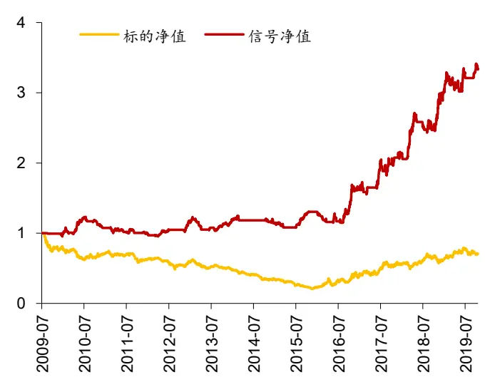
资料来源：聚宽，华泰证券研究所

图表12：螺纹钢信号的参数遍历
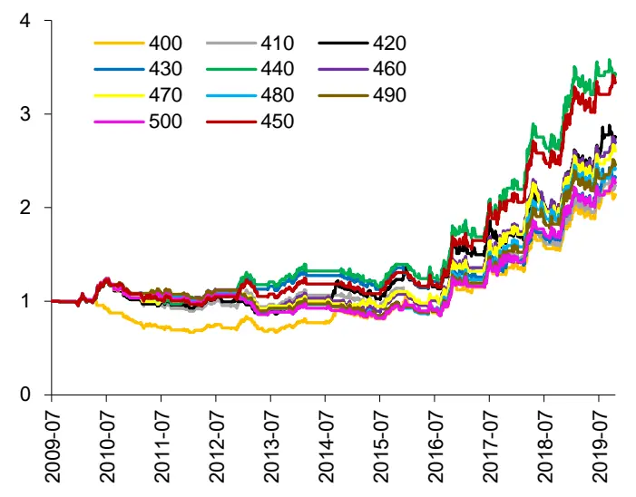
资料来源：聚宽，华泰证券研究所

图表13中截取了一段回测时间来分析信号含义，标的收盘价和信号取值呈现出相反的走势关系，结合信号的表达式，可知该信号是一个反转信号。

图表13：螺纹钢信号的含义分析(左轴：标的收盘价，右轴：信号取值)
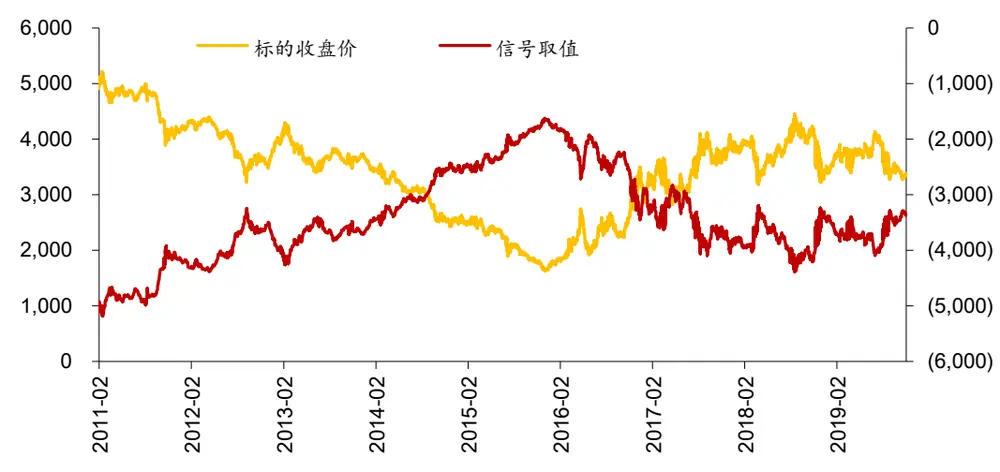
资料来源：聚宽，华泰证券研究所

## 聚乙烯(L)

本节中我们将详细测试聚乙烯期货的信号 neg(DEMA(close, 630))。图表 14 展示了详细的测试结果。

图表14：聚乙烯信号的回测指标

| 指标 | 指标值 | 指标 | 指标值 |
| --- | --- | --- | --- |
| 年化收益率 | 7.96% | 总持仓次数 | 105 |
| 夏普比率 | 0.55 | 平均每次持仓收益 | 1.07% |
| 最大回撤 | 33.48% | 平均持仓分钟数 | 3995.52 |
| 胜率 | 39.05% | 平今次数 | 3 |

资料来源：聚宽，华泰证券研究所

图表15展示了聚乙烯信号的回测净值。图表16中对信号参数进了遍历，遍历区间为[580，680]，从图表16中可以看出，在区间[580，680]中信号都有正收益，参数630所对应的信号在所有参数中表现中上，不是刻意挑选出的最优信号。

图表15：聚乙烯信号的回测净值
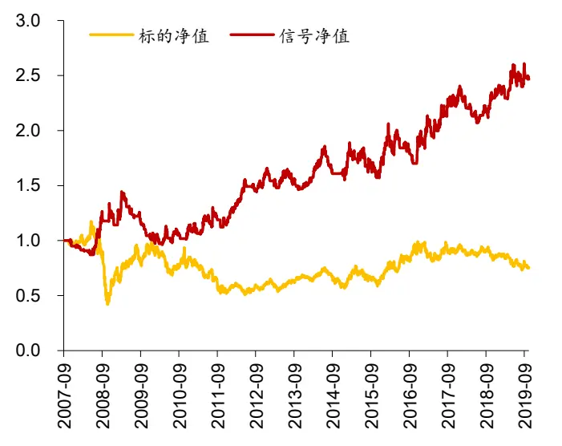
资料来源：聚宽，华泰证券研究所

图表16：聚乙烯信号的参数遍历
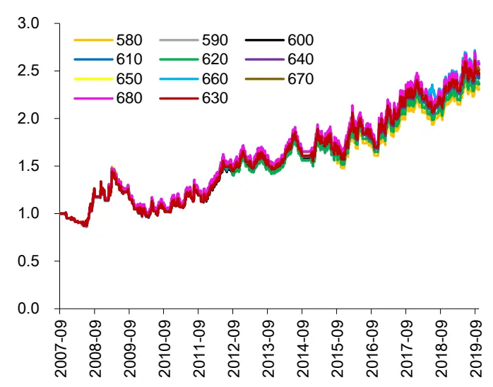
资料来源：聚宽，华泰证券研究所

图表17中截取了一段回测时间来分析信号含义，标的收盘价和信号取值呈现出相反的走势关系，结合信号的表达式，可知该信号是一个反转信号。

图表17：聚乙烯信号的含义分析(左轴：标的收盘价，右轴：信号取值)
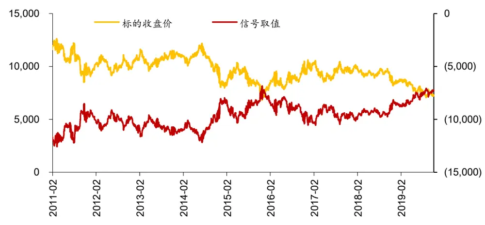
资料来源：聚宽，华泰证券研究所

## 铝(AL)

本节中我们将详细测试铝期货的信号 delta(ADX(high, low, close, 330)， 630)。图表 18 展示了详细的测试结果。

图表18：聚乙烯信号的回测指标

| 指标 | 指标值 | 指标 | 指标值 |
| --- | --- | --- | --- |
| 年化收益率 | 11.49% | 总持仓次数 | 220 |
| 夏普比率 | 0.79 | 平均每次持仓收益 | 0.81% |
| 最大回撤 | 29.04% | 平均持仓分钟数 | 4556.94 |
| 胜率 | 55.00% | 平今次数 | 5 |

资料来源：聚宽，华泰证券研究所

图表19展示了铝信号的回测净值。图表20中对信号参数进了遍历，该信号有两个参数，遍历区间分别为[280，380]和[580，680]，从图表20中可以看出，在遍历区间中信号都有正收益，参数(330,630)所对应的信号在所有参数中表现中上，不是刻意挑选出的最优信号。

图表19：铝信号的回测净值
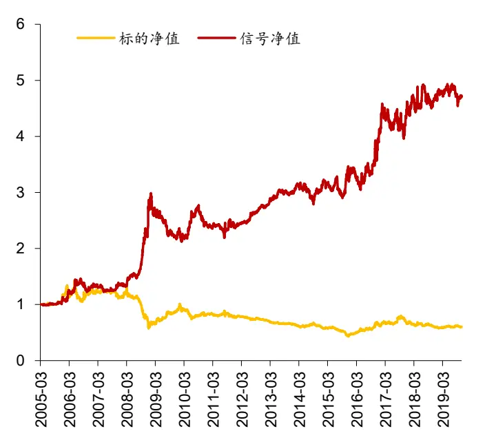
资料来源：聚宽，华泰证券研究所

图表20：铝信号的参数遍历
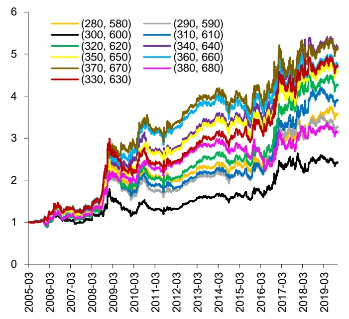
资料来源：聚宽，华泰证券研究所

由于信号表达式 delta(ADX(high，low， close，330)，630)中包含趋势信号 ADX，我们推测该信号为类趋势信号。

## 天然橡胶(RU)

本节中我们将详细测试天然橡胶期货的信号 neg(delta(volume, 60))。图表 21 展示了详细的测试结果。

图表21：天然橡胶信号的回测指标

| 指标 | 指标值 | 指标 | 指标值 |
| --- | --- | --- | --- |
| 年化收益率 | 12.43% | 总持仓次数 | 126 |
| 夏普比率 | 0.76 | 平均每次持仓收益 | 1.58% |
| 最大回撤 | 30.45% | 平均持仓分钟数 | 3026.71 |
| 胜率 | 39.68% | 平今次数 | 2 |

资料来源：聚宽，华泰证券研究所

图表22展示了天然橡胶信号的回测净值。图表23中对信号参数进了遍历，遍历区间为[10，110]，从图表23中可以看出，在区间[10,110]中信号都有正收益，参数60所对应的信号在所有参数中表现中上，不是刻意挑选出的最优信号。

图表22：天然橡胶信号的回测净值
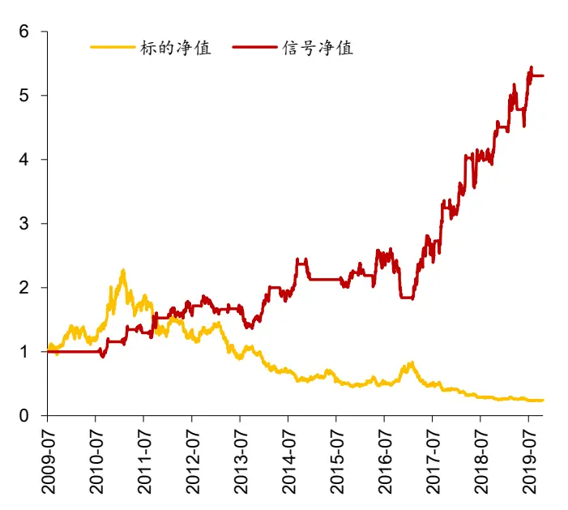
资料来源：聚宽，华泰证券研究所

图表23：天然橡胶信号的参数遍历
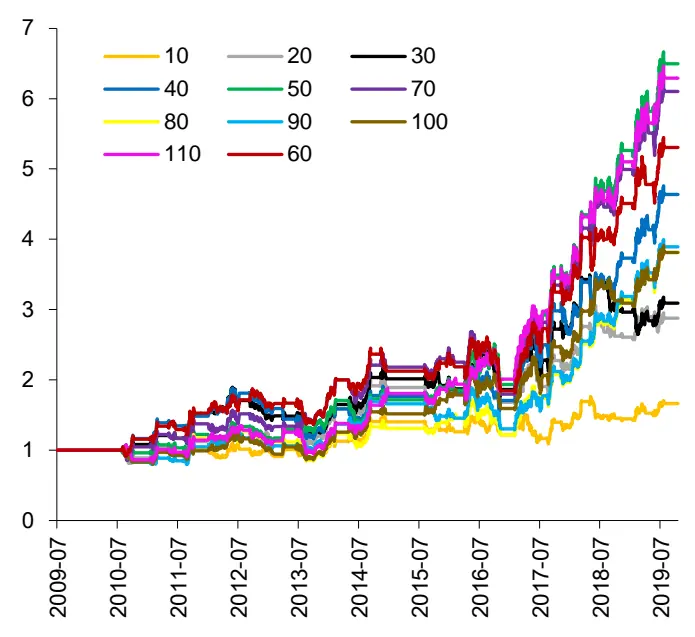
资料来源：聚宽，华泰证券研究所

根据信号表达式neg(delta(volume, 60))可知该信号是与成交量变化相关的信号。

## 菜籽粕(RM)

本节中我们将详细测试菜籽粕期货的信号MA(volume，180)。图表 24展示了详细的测试结果。

图表24：莱籽粕信号的回测指标

| 指标 | 指标值 | 指标 | 指标值 |
| --- | --- | --- | --- |
| 年化收益率 | 13.77% | 总持仓次数 | 96 |
| 夏普比率 | 0.74 | 平均每次持仓收益 | 1.02% |
| 最大回撤 | 20.89% | 平均持仓分钟数 | 5318.20 |
| 胜率 | 52.08% | 平今次数 | 1 |

资料来源：聚宽，华泰证券研究所

图表25展示了菜籽粕信号的回测净值。图表26中对信号参数进了遍历，遍历区间为[130，230]，从图表26中可以看出，在区间[130,230]中信号都有正收益，参数180所对应的信号在所有参数中表现中上，不是刻意挑选出的最优信号。

图表25：菜籽粕信号的回测净值
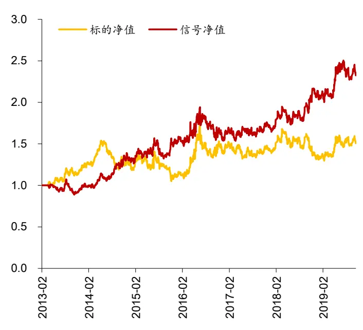
资料来源：聚宽，华泰证券研究所

图表26：莱籽粕信号的参数遍历
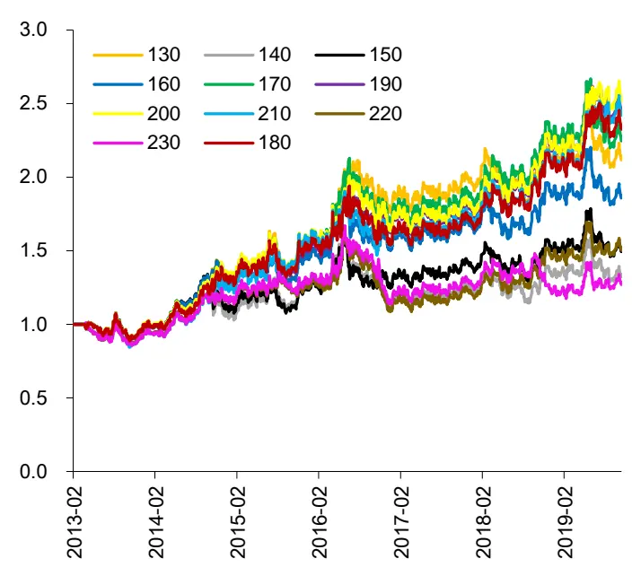
资料来源：聚宽，华泰证券研究所

根据信号表达式MA(volume，180)可知该信号是与成交量相关的信号，成交量持续放量则可能开多单，成交量持续缩量则可能开空单。

## 焦炭(J)

本节中我们将详细测试焦炭的信号 MIDPOINT(DEMA(delta_open_interest，440)，450)。
图表27展示了详细的测试结果。

图表27：焦炭信号的回测指标

| 指标 | 指标值 | 指标 | 指标值 |
| --- | --- | --- | --- |
| 年化收益率 | 28.80% | 总持仓次数 | 149 |
| 夏普比率 | 1.16 | 平均每次持仓收益 | 1.57% |
| 最大回撤 | 35.79% | 平均持仓分钟数 | 3687.56 |
| 胜率 | 44.30% | 平今次数 | 5 |

资料来源：聚宽，华泰证券研究所

图表28展示了焦炭信号的回测净值。图表29中对信号参数进了遍历，遍历区间分别为[390，490]和[400,500]，从图表29中可以看出，在遍历区间中信号都有正收益，参数(440,450)所对应的信号在所有参数中表现中上，不是刻意挑选出的最优信号。

图表28：焦炭信号的回测净值
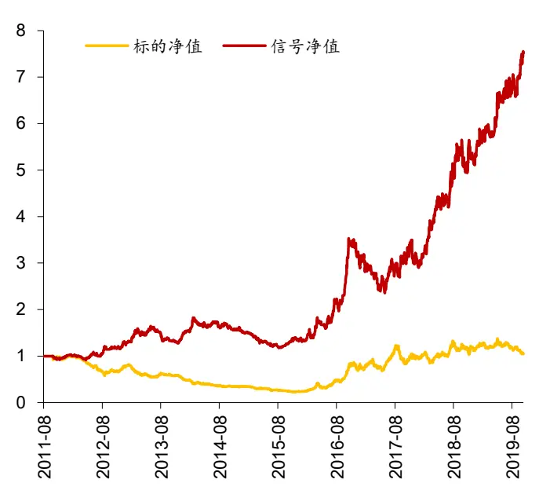
资料来源：聚宽，华泰证券研究所

图表29：焦炭信号的参数遍历
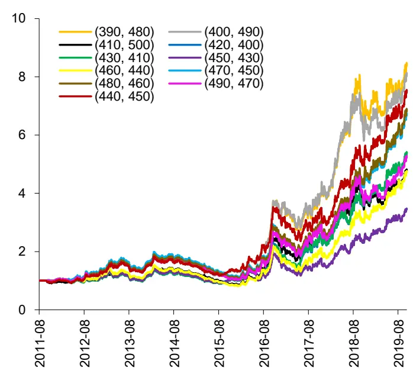
资料来源：聚宽，华泰证券研究所

根据信号表达式 MIDPOINT(DEMA(delta_open_interest，440)，450)可知该信号是与持仓量变化相关的信号。关于持仓量变化在 CTA 中的应用，Hong and Yogo 在其 2012 年的论文“What does futures market interest tell us about the macroeconomy and asset prices?Journal of Financial Economics”中认为总持仓量的变化能够影响期货的价格，持仓量上升表示投资者情绪好转，持仓量下降表示投资者情绪回落。该信号的逻辑含义正是如此。

## 铁矿石(I)

本节中我们将详细测试铁矿石期货的信号 HT_DCPHASE(ADX(high，low，close，210))。
图表30展示了详细的测试结果。

图表30：铁矿石信号的回测指标

| 指标 | 指标值 | 指标 | 指标值 |
| --- | --- | --- | --- |
| 年化收益率 | 30.91% | 总持仓次数 | 202 |
| 夏普比率 | 0.96 | 平均每次持仓收益 | 1.02% |
| 最大回撤 | 43.65% | 平均持仓分钟数 | 2350.56 |
| 胜率 | 42.08% | 平今次数 | 7 |

资料来源：聚宽，华泰证券研究所

图表31展示了铁矿石信号的回测净值。图表32中对信号参数进了遍历，遍历区间为[160，260]，从图表32中可以看出，在区间[160,260]中信号都有正收益，参数180所对应的信号在所有参数中表现中上，不是刻意挑选出的最优信号。

图表31：铁矿石信号的回测净值
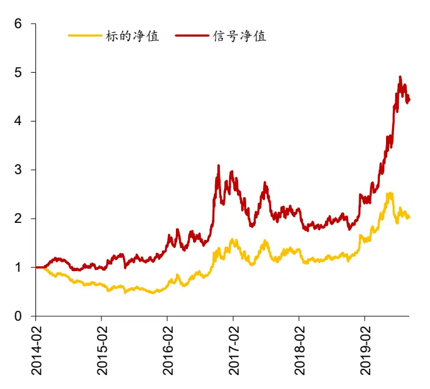
资料来源：聚宽，华泰证券研究所

图表32：铁矿石信号的参数遍历
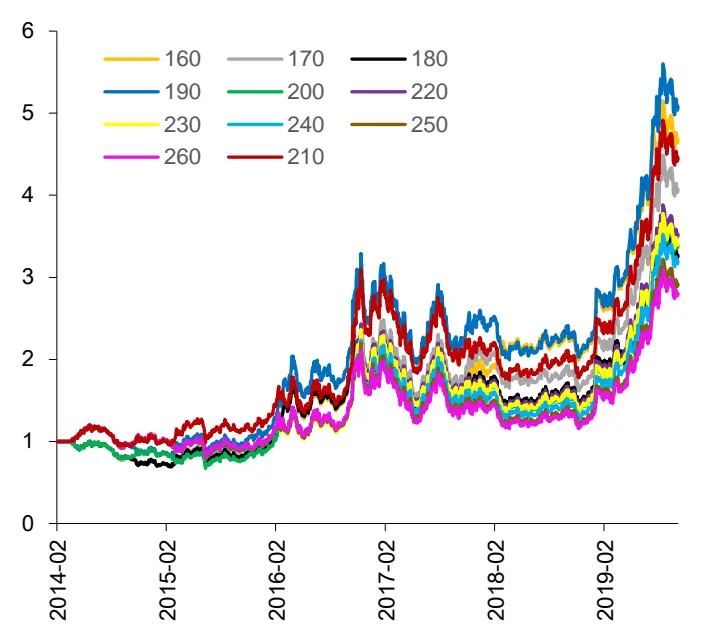
资料来源：聚宽，华泰证券研究所

## 热轧卷板(HC)

本节中我们将详细测试铁矿石期货的信号HT_DCPHASE(ts_rank(high，210))。图表33展示了详细的测试结果。

图表33：热轧卷板信号的回测指标

| 指标 | 指标值 | 指标 | 指标值 |
| --- | --- | --- | --- |
| 年化收益率 | 31.41% | 总持仓次数 | 106 |
| 夏普比率 | 1.17 | 平均每次持仓收益 | 1.56% |
| 最大回撤 | 23.60% | 平均持仓分钟数 | 4254.81 |
| 胜率 | 43.40% | 平今次数 | 3 |

资料来源：聚宽，华泰证券研究所

图表34展示了热轧卷板信号的回测净值。图表35中对信号参数进了遍历，遍历区间为[160，260]，从图表35中可以看出，在区间[160,260]中信号都有正收益，参数180所对应的信号在所有参数中表现中上，不是刻意挑选出的最优信号。

图表34：热轧卷板信号的回测净值
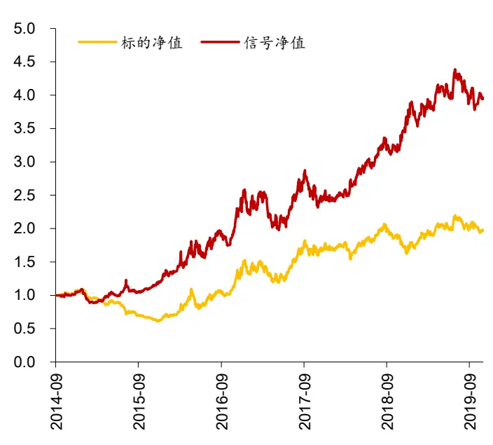
资料来源：聚宽，华泰证券研究所

图表35：热轧卷板信号的参数遍历
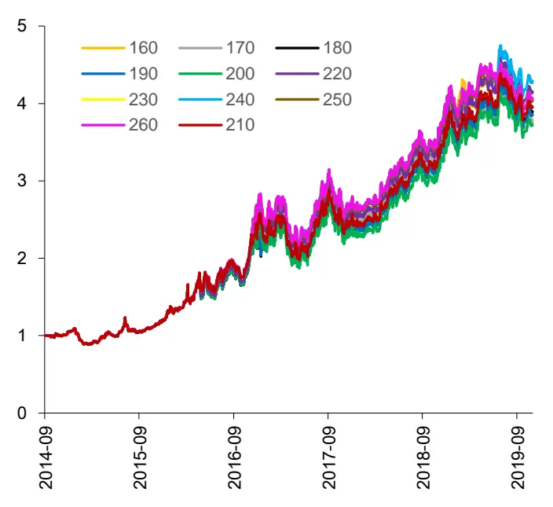
资料来源：聚宽，华泰证券研究所

## 多策略组合

从以上的回测可以看出，单一品种的单一信号面临较大回撤风险。为了减小回撤，提升夏普比率，一种较为简单的做法是构建多策略组合，策略运行中可能同时持有多个品种的合约。CTA领域中知名的对冲基金Winton也通过一个在线工具(https://tools.winton.com/thefuture)展示了多策略组合的可行之处。本节中，我们将为以上9个品种的信号分配相同的资金，测试多策略组合的表现，测试中，基准为9种标的等权组合。9种标的中，由于热轧卷板期货2014年之后才上市，我们将回测时间设为2015年1月1日到2019年10月31日。图表36和图表37展示了回测结果。

图表36：多策略组合回测指标

| 多策略组合，单边交易成本 |  |  | 多策略组合，单边交易成本 | 多策略组合，单边交易成本 | 多策略组合，单边交易成本 千分之一 |
| --- | --- | --- | --- | --- | --- |
|  | 9种标的等权组合 | 万分之二 |  |  |  |
| 年化收益率 | 11.34% | 25.79% | 万分之三 25.26% | 万分之五 24.22% | 21.70% |
| 夏普比率 | 0.66 | 2.29 | 2.25 | 2.18 | 1.99 |
| 最大回撤 | 25.90% | 10.30% | 10.51% | 10.92% | 11.92% |

资料来源：聚宽，华泰证券研究所

图表37：多策略组合回测净值
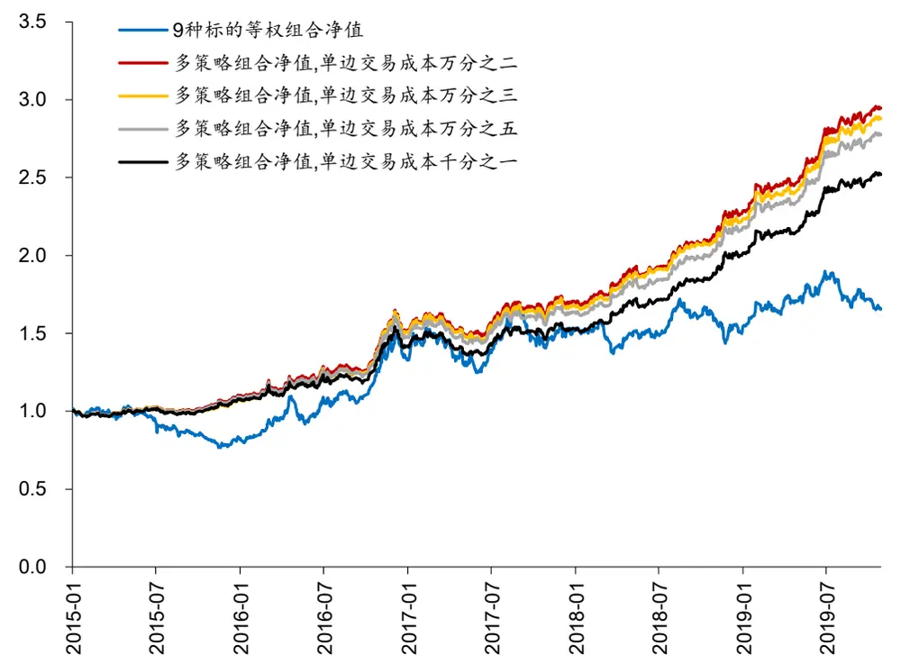
资料来源：聚宽，华泰证券研究所

## 结论

本文介绍了遗传规划在CTA信号挖掘中的应用，结论如下：

1. 量化CTA策略中最常见的策略是趋势/反转策略。经典的趋势/反转策略大多已有数十年的历史，策略的逻辑相对固定，随着使用该类策略的投资者逐渐增多，策略可能面临交易拥挤、有效性下降的问题，此时遗传规划将会是一个值得尝试的工具。遗传规划可以充分利用计算机的强大算力生成大量公式化的交易信号，并通过启发式搜索寻找潜在有效的信号。在计算机7X24小时不间断的挖掘下，我们或许能够找到一些对现有CTA策略做出有益补充的信号，提高策略的差异化。

2. 我们选择三大商品交易所中流动性较好的40个商品期货品种进行测试，挖掘基于一分钟K线的信号。综合考虑信号的回测效果和复杂程度，本文展示了9个品种对应信号的回测结果。考虑到CTA信号过拟合可能性较高，我们对每个信号进行参数遍历，各品种的信号在全部参数下都有正收益，且各个信号使用的参数在所有参数中表现中上，不是刻意挑选出的最优信号。在挖掘出的信号中，一部分信号是趋势/反转信号，还有一部分信号则与成交量、持仓量有关。

3. 单一品种的单一信号面临较大回撤风险。为了减小回撤，提升夏普比率，本文构建了多策略组合，策略运行中可能同时持有多个品种的合约。假设不使用杠杆，在单边交易成本为万分之三时，2015年以来多策略组合年化收益率为25.26%，夏普比率为2.25，最大回撤为10.51%。

## 风险提示

通过遗传规划挖掘的CTA信号是历史经验的总结，存在失效的可能。遗传规划所得CTA信号可能过于复杂，可解释性较低，使用需谨慎。

## 附录：Numba加速回测代码

Numba(https://numba.pydata.org)是Python的即时编译器(JIT compiler)，适用于加速NumPy代码、函数以及循环代码，其原理是将部分Python代码编译为更快速的机器代码“即时”执行。Numba的使用方法如下：

1. 导入 Numba 模块：import numba as nb，

2. 在需加速代码前加上@nb.njit即可。

例如回测函数为 backtest_process()，图表 38展示了使用 Numba 加速的代码。

图表38：使用 Numba 加速回测函数
```python
1. import numba as nb
2. @nb.njit
3. def backtest_process(mat, ...):
4.
5. for i in range(start_dates, end_dates):
6.
7. return index_nav, strategy_nav, posi
```
资料来源：Numba，华泰证券研究所

对于分钟级别的 CTA 回测，函数中的 for循环需要遍历近100万个数据点，因此使用Numba可以提高函数计算速度。图表39展示了Numba的加速效果，耗时减少约三分之一，回测运行速度明显提高。

图表39：Numba 加速前后速度对比

|  | 耗时取值范围 | 耗时均值 |
| --- | --- | --- |
| 加速前 | 7.86 ~ 10.55s | 9.37s |
| 加速后 | 5.67 ~ 6.67s | 6.22s |

资料来源：华泰证券研究所

## 免责申明

本报告仅供华泰证券股份有限公司（以下简称“本公司”）客户使用。本公司不因接收人收到本报告而视其为客户。

本报告基于本公司认为可靠的、已公开的信息编制，但本公司对该等信息的准确性及完整性不作任何保证。本报告所载的意见、评估及预测仅反映报告发布当日的观点和判断。在不同时期，本公司可能会发出与本报告所载意见、评估及预测不一致的研究报告。同时，本报告所指的证券或投资标的的价格、价值及投资收入可能会波动。本公司不保证本报告所含信息保持在最新状态。本公司对本报告所含信息可在不发出通知的情形下做出修改，投资者应当自行关注相应的更新或修改。

本公司力求报告内容客观、公正，但本报告所载的观点、结论和建议仅供参考，不构成所述证券的买卖出价或征价。该等观点、建议并未考虑到个别投资者的具体投资目的、财务状况以及特定需求，在任何时候均不构成对客户私人投资建议。投资者应当充分考虑自身特定状况，并完整理解和使用本报告内容，不应视本报告为做出投资决策的唯一因素。对依据或者使用本报告所造成的一切后果，本公司及作者均不承担任何法律责任。任何形式的分享证券投资收益或者分担证券投资损失的书面或口头承诺均为无效。

本公司及作者在自身所知情的范围内，与本报告所指的证券或投资标的不存在法律禁止的利害关系。在法律许可的情况下，本公司及其所属关联机构可能会持有报告中提到的公司所发行的证券头寸并进行交易，也可能为之提供或者争取提供投资银行、财务顾问或者金融产品等相关服务。本公司的资产管理部门、自营部门以及其他投资业务部门可能独立做出与本报告中的意见或建议不一致的投资决策。

本报告版权仅为本公司所有。未经本公司书面许可，任何机构或个人不得以翻版、复制、发表、引用或再次分发他人等任何形式侵犯本公司版权。如征得本公司同意进行引用、刊发的，需在允许的范围内使用，并注明出处为“华泰证券研究所”，且不得对本报告进行任何有悖原意的引用、删节和修改。本公司保留追究相关责任的权力。所有本报告中使用的商标、服务标记及标记均为本公司的商标、服务标记及标记。

本公司具有中国证监会核准的“证券投资咨询”业务资格，经营许可证编号为：91320000704041011J。

全资子公司华泰金融控股（香港）有限公司具有香港证监会核准的“就证券提供意见”业务资格，经营许可证编号为：A0K809

©版权所有2019年华泰证券股份有限公司

## 评级说明

## 行业评级体系

一报告发布日后的6个月内的行业涨跌幅相对同期的沪深300指数的涨跌幅为基准；

一投资建议的评级标准

增持行业股票指数超越基准

中性行业股票指数基本与基准持平

减持行业股票指数明显弱于基准

## 公司评级体系

一报告发布日后的6个月内的公司涨跌幅相对同期的沪深300指数的涨跌幅为基准；
一投资建议的评级标准
买入股价超越基准20%以上
增持股价超越基准 5%-20%
中性股价相对基准波动在-5%~5%之间
减持股价弱于基准 5%-20%
卖出股价弱于基准20%以上

## 华泰证券研究

## 南京

南京市建邺区江东中路228号华泰证券广场1号楼/邮政编码：210019

电话：86 25 83389999/传真：86 25 83387521

电子邮件：ht-rd@htsc.com

## 深圳

深圳市福田区益田路5999号基金大厦10楼/邮政编码：518017

电话：86 755 82493932/传真：86755 82492062

电子邮件：ht-rd@htsc.com

## 北京

北京市西城区太平桥大街丰盛胡同28号太平洋保险大厦A座18层

邮政编码：100032

电话：861063211166/传真：861063211275

电子邮件：ht-rd@htsc.com

## 上海

上海市浦东新区东方路18号保利广场E栋23楼/邮政编码：200120

电话：862128972098/传真：862128972068

电子邮件：ht-rd@htsc.com