## 金工研究/深度研究

2020年02月06日

林晓明 执业证书编号：S0570516010001

研究员 0755-82080134

陈烨 执业证书编号：S0570518080004

研究员 010-56793942

chenye@htsc.com

李子钰 执业证书编号：S0570519110003

研究员 0755-23987436

liziyu@htsc.com

何康 021-28972039

联系人 hekang@htsc.com

王晨宇

联系人 wangchenyu@htsc.com

2《金工: 从微观同步到宏观周期》2019.12

# 揭开机器学习模型的“黑箱”

# 华泰人工智能系列之二十七

## 本文介绍机器学习解释方法原理，以 XGBoost 选股模型为例揭开黑箱

本文介绍六种机器学习模型解释方法的原理，并以华泰 XGBoost 选股模型为例，尝试揭开机器学习模型的“黑箱”。机器学习多属于黑箱模型，而资管行业的伦理需要可解释的白箱模型。除传统的特征重要性外，ICE、PDP、SDT、LIME、SHAP 都是解释模型的有力工具。揭开选股模型黑箱，我们发现：1）价量类因子的重要性整体高于基本面类因子；2）XGBoost 模型以非线性的逻辑使用因子，因子的非线性特点在市值、反转、技术、情绪因子上体现尤为明显。

## 目前人工智能算法的本质仍是样本拟合，直接使用模型结论可能有风险

目前的人工智能算法，即使是近年来发展迅猛的深度神经网络，和线性回归并无本质上的不同，仍是对样本特征 X和标签 Y进行拟合，区别无非是机器学习模型的非线性拟合能力更强。人工智能并不具备真正的“智能”。模型只能学习特征和标签的相关关系，但无法挖掘其中的因果关系。如果不将机器学习模型的黑箱打开，不弄清机器学习模型的“思考”过程，直接使用机器学习的判断结果，可能带来较大的风险。

## 近年来研究者提出诸多机器学习模型解释方法，核心思想各有不同

近年来研究者提出诸多机器学习模型解释方法，除了传统的特征重要性外，ICE、PDP、SDT、LIME、SHAP都是揭开机器学习模型黑箱的有力工具。特征重要性计算依据某个特征进行决策树分裂时，分裂前后的信息增益。ICE 和 PDP 考察某项特征的不同取值对模型输出值的影响。SDT 用单棵决策树解释其它更复杂的机器学习模型。LIME 的核心思想是对于每条样本，寻找一个更容易解释的代理模型解释原模型。SHAP 的概念源于博弈论，核心思想是计算特征对模型输出的边际贡献。

## 应用多种机器学习模型解释方法，揭开 XGBoost 选股模型的“黑箱”

我们应用多种机器学习模型解释方法，对以2013~2018年为训练和验证集、2019年整年为测试集的模型进行分析，尝试揭开XGBoost选股模型的“黑箱”。特征重要性和SDT的结果表明，价量类因子的重要性整体高于基本面类因子。ICE和LIME能够展示模型对个股做出预测的依据。PDP和SHAP的结果表明：1）XGBoost 模型以非线性的逻辑使用因子，因子的非线性特点在市值、反转、技术、情绪因子上体现尤为明显；2）部分因子之间存在较强的交互作用；3）部分因子边际贡献为0，未来可以考虑事先剔除。

## SHAP理论完备，表达直观，从全局和个体层面展示特征的边际贡献

SHAP 的优点在于理论完备，表达直观，既能从全局层面评估特征的重要性，又能从个体层面评估每条样本每项特征对模型输出的影响，还能展示特征间的交互作用。SHAP 向我们揭示模型如何运用因子，反过来还可以帮助我们加深对因子的理解。几种机器学习模型解释方法各擅胜场，综合来看我们更推荐使用 SHAP。

风险提示：人工智能选股是对历史规律的总结，若未来规律发生变化，模型存在失效的风险。人工智能选股模型存在过拟合的风险。机器学习模型解释方法存在过度简化的风险。

## 资管行业的伦理需要“白箱”模型

如果您是一位投资者，您是否愿意将资产交给一组说不清道不明的所谓“人工智能”算法进行管理运作？机器学习算法的高复杂性和低解释性，决定了它在多数时候难以被人脑理解。机器学习的这一“黑箱”属性在一些行业或许并不构成问题。然而，资管行业的特殊性在于，资产管理人有义务理解并告知委托人投资策略的风险所在，此时模型的可解释性就显得尤为关键。资管行业的伦理需要可解释的“白箱”模型。

对于揭开机器学习黑箱的迫切需求并不单单存在于资管行业。在医疗领域，医生希望理解机器学习算法是如何进行“思考”的，尤其是当机器学习算法给出与常识相反的诊断之时。Cabitza 等人在 2017 年的论文 Unintended Consequences of Machine Learning inMedicine 中列举如下案例：某项机器学习研究以 14199 位肺炎患者为样本，探索肺炎死亡率的影响因素，发现肺炎同时罹患哮喘患者的死亡风险低于肺炎而无哮喘患者，即得到“哮喘是肺炎患者的保护因子”的反常结论。

导致这一反常结论的原因究竟为何？后续更深入的研究发现，肺炎同时罹患哮喘患者相比于无哮喘患者，更倾向于直接进入重症监护室以防止并发症的发生，该举措能够降低近一半的死亡率。然而，机器学习算法并未将“进入重症监护室的概率”纳入特征，而仅仅是对已有样本特征和标签的关系进行数据挖掘。如果不将机器学习模型的黑箱打开，不弄清机器学习模型的“思考”过程，直接使用机器学习的诊断结果，可能带来较大的风险。

归根结底，目前的人工智能算法，即使是近年来发展迅猛的深度神经网络，和线性回归并无本质上的不同，仍是对样本特征 X 和标签 Y 进行拟合，区别无非是机器学习模型的非线性拟合能力更强。人工智能并不具备真正的“智能”。在上述医疗领域的例子里，模型只能学习特征和标签的相关关系，但无法挖掘其中的因果关系。医疗领域如是，投资领域也是如此。

机器学习领域的学者们关注到了模型可解释性的问题，近年来研究者提出诸多揭开机器学习模型“黑箱”的方法。本文第一部分将介绍特征重要性（Feature Importance）、ICE（Individual Conditional Expectation）、PDP（Partial Dependence Plot）、SDT（SurrogateDecision Trees）、LIME（Local Interpretable Model-agnostic Explanations）、SHAP（Shapley Value）六种解释机器学习模型的常用方法。本文第二部分将以华泰金工XGBoost 选股模型为案例，采用上述六种解释方法探索模型如何进行选股决策，尝试揭开XGBoost 选股模型的“黑箱”。

## 解释机器学习模型的常用方法

本节我们将以模拟的因子选股数据集为例，介绍特征重要性、ICE、PDP、SDT、LIME、SHAP 六种解释机器学习模型的常用方法。

图表1： 模型解释方法总结

| 模型解释方法 | 核心思想 | 优点 | 缺点 |
| --- | --- | --- | --- |
| 特征重要性 | 依据某特征进行决策树分裂 时，分裂前后的信息增益 | 高度简洁，模型间可比 | 不能体现方向，只适 用于树模型 |
| ICE | 对于每条样本，考察某特征的 不同取值对模型输出的影响 | 计算简便，直观，能解释单样本 | 忽略特征间相关性 |
| PDP | 对于全体样本，考察某特征的 不同取值对模型输出的影响 | 计算简便，直观 | 忽略特征间相关性 |
| 全局代理：SDT | 对于全体样本，用单棵决策树高度直观 解释原模型 |  | 模型高度复杂时，单 棵决策树不足以刻画 |
| 局部代理：LIME | 对于每条样本，用更简单的模 型解释原模型 | 能够解释单样本 | 计算繁琐，对个别样 |
| SHAP | 计算某特征对模型输出的边 际贡献 | 理论完备，表达直观，从全局和个 体层面解释，展示特征间交互作用 | 本解释可能欠合理 计算繁琐 |

资料来源：Goldstein 等（2015），Lundberg 等（2018），Molnar（2018），Ribeiro 等（2016），华泰证券研究所

## 模拟数据和机器学习模型

模拟的因子选股数据集包含 150 条样本，4 项特征和 1 项三分类标签。标签分为“上涨”（y＝1）、“震荡”（y＝0）、“下跌”（y＝﹣1）三种类别，每种类别各含 50 条样本。4 项特征分别对应：效果一般的正向线性因子、效果较好的反向线性因子、效果较好的非线性因子、无效因子。因子值详细构建方式如下表所示。

图表2： 模拟因子值构建方式（N(μ,σ)代表均值为 μ、标准差为 σ 的正态分布）

| 因子 | “上涨”类别（y=1） | “震荡”类别（y=0） | “下跌”类别（y=-1） |
| --- | --- | --- | --- |
| X1（效果一般的正向线性因子） | N(1,1) | N(0,1) | N(-1,1) |
| X2（效果较好的反向线性因子） | N(-1,0.5) | N(0,0.5) | N(1,0.5) |
| X3（效果较好的非线性因子） |  | N(0,0.25) N(0.5,0.25)或 N(-0.5,0.25) N(1,0.25)或 N(-1,0.25) |  |
| X4（无效因子） | N(0,1) | N(0,1) | N(0,1) |

资料来源：华泰证券研究所

## X1 和 X2的两处区别在于：

1. X1 各分类下因子值的均值和所属类别一致，属于正向因子；X2 各分类下因子值的均值和所属类别相反，属于反向因子。

2. X1 的标准差为 1，X2的标准差为 0.5，X2比 X1的信噪比更高，效果更好。

X3 为非线性因子，当因子值较大或较小时，样本倾向于属于“下跌”类别；当因子值居中时，样本倾向于属于“上涨”类别。

下图展示全体样本的原始因子值及所属类别。每个子图的横轴、纵轴分别为 4项因子中的2 项，不同颜色代表不同分类。由于噪音的存在，仅根据线性方法显然无法做到精确分类。我们采用 XGBoost 模型对特征和标签进行拟合。

图表3： 模拟因子值及所属类别（红、白、蓝分别对应上涨、震荡和下跌分类）
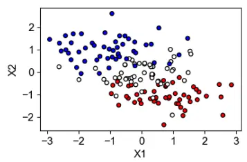

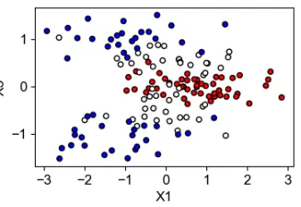

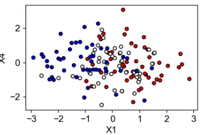

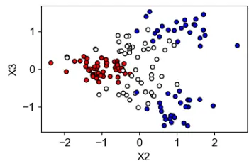
资料来源：华泰证券研究所

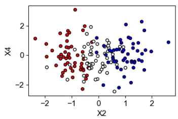

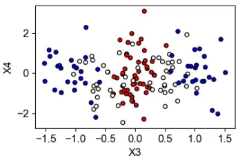

所有特征进入模型前首先进行标准化处理，转换为标准正态分布。我们不对 XGBoost 分类器进行交叉验证调参，所有超参数均采用默认值。事实上，对于上面的简单数据集，即使默认参数也能达到 100%的训练集正确率。我们也不再额外切分测试集。我们仅关心下面的问题：对于训练集数据，XGBoost 模型是根据什么规则进行决策的？

## 特征重要性

特征重要性（Feature Importance）的核心思想是计算依据某个特征进行决策树分裂时分裂前后的信息增益，信息增益越大，该特征越重要。特征重要性源于决策树模型，XGBoost 模型作为决策树的串行集成，也继承了特征重要性的概念。特征重要性是最传统的机器学习模型解释方法之一。

特征重要性的计算始于信息论中的概念——Gini指数（Gini Index）。Gini指数用来定义决策树分裂前后的信息增益程度。分类问题中，假设有 K个分类，样本集 D中的点属于第 k类的概率为 $P_{k}$ ，则分裂前的 Gini 指数为：

$$
Gini(D)=\sum_{k=1}^{K}P_{k}(1-P_{k})=1-\sum_{k=1}^{K}P_{k}^{2}
$$

Gini(D)反映了从数据集 D 中随机抽取两个样本，其类别标记不一致的概率。Gini(D)越小，数据集 D 的纯度越高。理解 Gini 指数时可以类比经济学中的基尼系数，一个国家随机抽取两个人，财富差距的期望越小，基尼系数越小，这个国家的贫富差距就越小。

对于给定的样本集合 D（|D|表示集合内元素个数），假设根据特征 A 分裂为 D1和 $\mathsf{D}_{2}$ 两棵不相交的子树，则分裂后的 Gini 指数为每棵子树 Gini指数的加权和：

$$
Gini(D,A)=\frac{|D_{1}|}{|D|}Gini(D_{1})+\frac{|D_{2}|}{|D|}Gini(D_{2})
$$

该步分裂下，特征A的重要性定义为该步分裂前后Gini指数的增益（分裂前减去分裂后）：

$$
I_{i}(A)=Gini(D_{i})-Gini(D_{i},A)
$$

对于一次完美的分类，分裂前各类别样本混杂，Gini指数较高；分裂后每棵子树内的类别单一，Gini指数较低；分裂前后 Gini指数增益较大。换言之，特征越重要，分裂前后 Gini指数增益就越大。

对于单棵决策树，特征 A 的重要性定义为所有按特征 A 进行分裂的节点，分裂前后 Gini指数增益的和：

$$
S(A)=\sum_{i}I_{i}(A)
$$

对于 XGBoost，特征 A 的重要性定义为特征 A 在每棵决策树的重要性之和。最后将所有特征的原始特征重要性归一化，即可得到各个特征的重要性。

这里需要说明，特征重要性的定义方式不只有信息增益，还可以是样本覆盖度和分裂次数，信息增益更为常用。

模拟因子选股数据集的 XGBoost 模型特征重要性如下图所示。X2（效果较好的反向因子）重要性相对最高，其次是 X3（效果较好的非线性因子），再次是 X1（效果一般的正向因子），X4（无效因子）重要性相对最低。

图表4： 模拟因子选股数据集的 XGBoost模型特征重要性
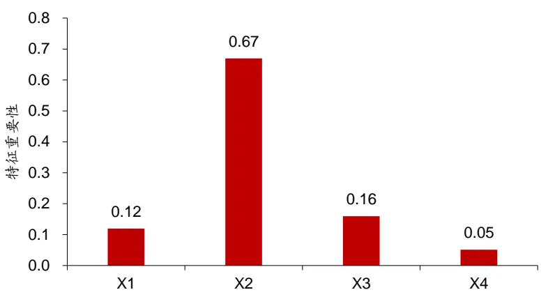
资料来源：华泰证券研究所

特征重要性的优点在于高度简洁，并且由于是归一化指标，在模型之间可比。特征重要性的缺点在于：1）不能体现因子的大小对于模型输出影响的方向；2）过于笼统，不能给出因子对模型输出影响的具体情况。

## ICE 和 PDP

ICE（Individual Conditional Expectation）和 PDP（Partial Dependence Plot）的核心思想是考察某项特征的不同取值对模型输出值的影响。ICE 和 PDP 的概念接近，常绘制在同一图表中，前者侧重于单条样本，后者侧重于全体样本，PDP 是全体样本 ICE 的均值。

图表5： ICE 和 PDP 示意图
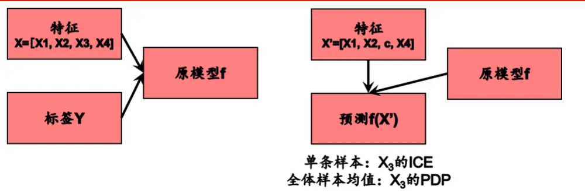
资料来源：华泰证券研究所

假设需要解释的原模型为 f，特征为 X，标签为 Y，X 包含 N 条样本和 p 项特征，那么 X的第 i条样本可表示为：

$$
\boldsymbol{x}^{(i)}=[x_{1}^{(i)},x_{2}^{(i)},\dots,x_{p}^{(i)}]
$$

X 的第j 项特征可表示为：

$$
X_{j}=[x_{j}^{(1)},x_{j}^{(2)},\dots,x_{j}^{(N)}]
$$

如果将某项特征 Xj全部设为常数 c，其余特征保持不变，可得到一组新的模型输入 X’。此时模型的输出：

$$
Y^{\prime}=f(X^{\prime})
$$

对 Y’取均值即可得 Xj＝c 条件下的 PDP值。对于不同的常数 c，可得不同的 PDP值，绘制 PDP随 c变化的曲线，可以刻画特征j 的不同取值对模型输出的影响。

ICE 衡量单条样本某项特征的不同取值对模型输出的影响。对于第 i条样本 x(i)，令该样本的第j项特征为常数 c，记作新的样本 x’(i)。此时模型的输出：

$$
\hat{y}^{\prime(i)}=f(x^{\prime(i)})
$$

该输出值即第 i条样本在 Xj＝c条件下的 ICE值。对于不同的常数 c，可得不同的 ICE值，绘制 ICE随 c变化的曲线，可以刻画样本 i特征j的不同取值对模型输出的影响。易知 PDP是全体样本 ICE的均值。

对于模拟因子选股数据集的 XGBoost 模型，其特征 X3 对应“上涨”类别输出的 ICE 和PDP 如下图所示。其中“ICE：y=1”代表某条属于“上涨”类别样本的 ICE，横轴为不同的 X3 取值，纵轴为模型输出属于“上涨”类别的概率。

图表6： 模拟因子选股数据集的 XGBoost模型 X3对应“上涨”类别的 ICE和 PDP
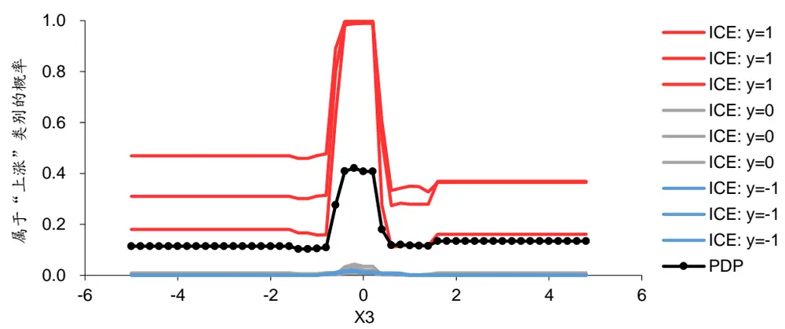
资料来源：华泰证券研究所

由上图可知，对于“震荡”和“下跌”类别样本，模型输出接近 0，X3 取值对模型输出几乎无影响；对于“上涨”类别样本，模型输出为倒 U型，当 X3取值接近 0 时，模型输出属于“上涨”概率接近 1。X3 的 PDP形态同样为倒 U型，表明 XGBoost 模型习得了 X3的非线性特点。

对于模拟因子选股数据集的 XGBoost 模型，其特征 X2 对应“上涨”类别输出的 ICE 和PDP 如下图所示。X2 的 ICE 和 PDP 形态均为左高右低，表明 XGBoost 模型习得了 X2反向因子的特点。

图表7： 模拟因子选股数据集的 XGBoost模型 X2对应“上涨”类别的 ICE和 PDP
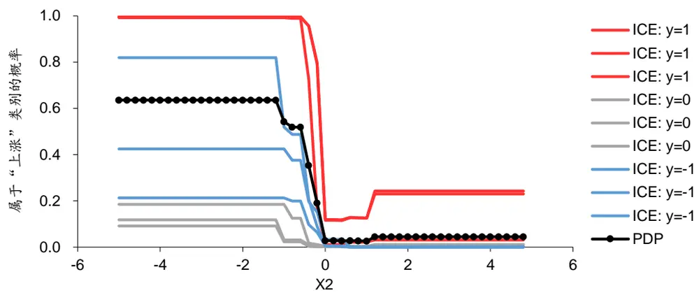
资料来源：华泰证券研究所

ICE 和 PDP 的优点在于，分别从单条样本和全体样本层面展示特征对模型输出的影响，较为直观。这两种方法的缺点在于仅针对单个特征，实际上背后的假设是特征间相互独立，从而忽略特征间的相关性。

## 全局代理：SDT

SDT（Surrogate Decision Trees）的核心思想是用单棵决策树解释其它更复杂的机器学习模型。为什么使用单棵决策树解释？因为决策树是最接近人类思维方式，也是最容易理解的非线性模型之一。代理决策树利用“白箱子”模型来解释“黑箱子”模型，即训练一个新的决策树模型来解释原黑箱模型的输出。

图表8： 全局代理 SDT示意图
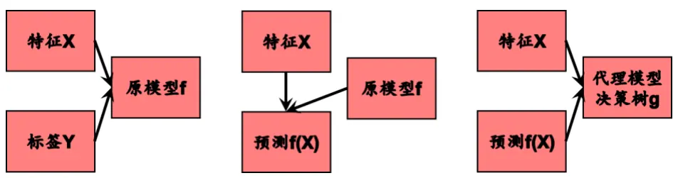
资料来源：华泰证券研究所

延续上节原模型 f、特征 X、标签 Y的定义，利用算法A得到原模型 f 的训练过程可记作：

$$
\mathcal{A}\colon X,Y\ \stackrel{\mathcal{A}}{\to}\ f
$$

该原模型预测的结果记为 f(X)，可以利用这个预测结果重新训练一个决策树模型 g，来解释原模型的输出：

$$
\mathcal{A}\colon X,f(X)\ {\stackrel{\mathcal{A}}{\to}}\ g
$$

由此得到的决策树模型 g 即为最终的 SDT。

模拟因子选股数据集的 XGBoost 模型 SDT 的可视化展示如下图，简单起见我们仅展示决策树的前三层。

图表9： 模拟因子选股数据集的 XGBoost模型 SDT可视化展示
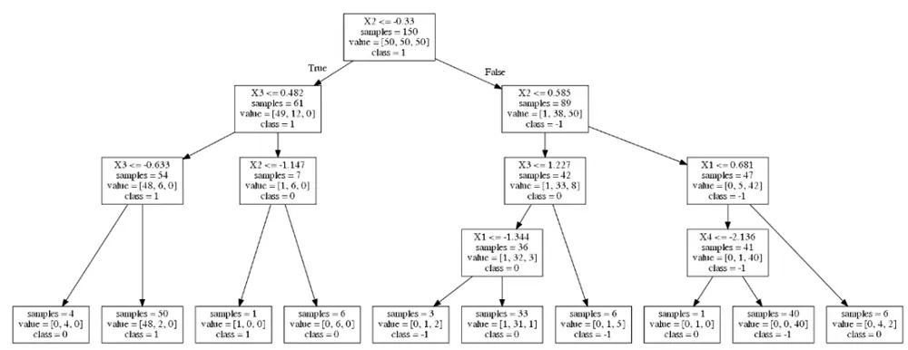
资料来源：华泰证券研究所

根节点位置，决策树首先依据 X2分裂，X2≤-0.33 归入左枝，倾向于认为属于“上涨”类别，否则归入右枝。这与 X2 反向因子的逻辑相符。另外，X2的信噪比总体高于其余特征，第一步依据 X2 分裂较为合理。

第一层左侧的叶子节点位置，决策树依据 X3 分裂，X3≤0.482 归入左枝，倾向于认为属于“上涨”类别，否则归入右枝。这与 X3 非线性因子的逻辑相符，X3居中时倾向于“上涨”，这一步可以将 X3 较大的部分样本筛出归入“震荡”类别。

第一层右侧的叶子节点位置，决策树继续依据 X2分裂，X2≤0.585归入左枝，倾向于认为属于“震荡”类别；否则归入右枝，倾向于认为属于“下跌”类别。同样与 X2 反向因子的逻辑相符。

其余分裂过程不再作详细解读。SDT 的优点在于高度直观。SDT 的缺点在于当模型高度复杂时，简单的决策树可能不足以刻画决策规则，并且用单棵决策树拟合原模型可能引入新的误差。

## 局部代理：LIME

LIME（Local Interpretable Model-agnostic Explanations）的核心思想是对于每条样本，寻找一个更容易解释的代理模型解释原模型。LIME和 SDT 思想类似，区别在于构建代理模型时，SDT 使用全体样本，LIME使用单条样本；另外 SDT 的代理模型为单棵决策树，LIME 的代理模型更为丰富，可以是决策树、线性回归、Logistic 回归等模型。SDT和 LIME也分别属于全局代理和局部代理。

图表10： 局部代理 LIME示意图 1
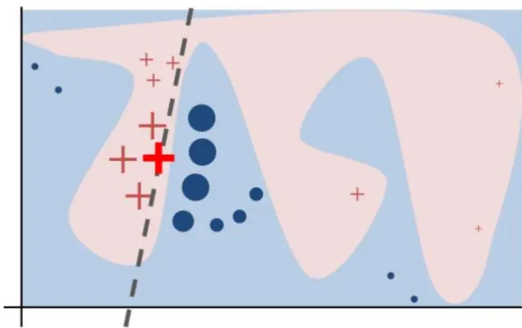
资料来源："Why Should I Trust You?": Explaining the Predictions of Any Classifier，华泰证券研究所

LIME 的概念相对复杂，首先我们以图示说明。下图引自 LIME 的原始论文"Why Should ITrust You?": Explaining the Predictions of Any Classifier，展示了一个二分类问题下的非线性分类器 f，红蓝两类的分类边界为曲线。对于以红色加粗十字表示的单条样本 x，我们希望得到原模型 f 的一个代理模型 g，其中 g 比 f 使用更少的特征。例如，原始样本 x=[x1,x2, x3, x4]，g 只使用其中的部分特征 x’=[x1, x2, x4]。

在该样本的邻域随机生成一部分新样本 z，通过原模型计算其预测值 f(z)，以红色十字和蓝色圆形表示。我们希望寻找一个简单的分类器 g，使用包含更少特征的样本 z’，就能将两类样本分开，即原模型 f 的预测值 f(z)和代理模型 g 的预测值 g(z’)尽可能接近。用公式表示，对于在 x邻域内随机生成的单条样本，即希望(f(z)－g(z’))2 尽可能小。实际操作中，可以给单条样本 x加上均值为 0、标准差为定值的高斯噪音，生成一系列新样本 z。

同时，随机生成的样本 z 并非等权，而是根据其与 x 的距离加权，距离越近权重 $\pi_{\mathsf{X}}(z)$ 越高，在上图中以红色十字和蓝色圆形的大小表示。用公式表示，对于在 x邻域内随机生成的一系列样本 z，希望下列式子尽可能小：

$$
\mathcal{L}(f,g,\pi_{x})=\sum_{z,z^{\prime}\in Z}\pi_{x}(z)(f(z)-g(z^{\prime}))^{2}
$$

其中 L(f, g, πx) 代表在 $\pi_{\mathsf{X}}$ 的范围内用 g 估计 f 的不可置信度，即在 x 的某个邻域内 g 与 f间的差距；Z 代表在 x邻域内随机生成的全部样本构成的集合。

更进一步，我们希望得到的代理模型 g 尽可能简单。定义 Ω(g)作为代理模型 g 的复杂度，决策树的 Ω(g)可以是叶子节点个数，线性回归的 Ω(g)可以是 L1 或 L2 正则化项，我们希望 Ω(g)尽可能小。假设 G 是一个包含许多具有潜在可解释性模型的集合，我们在 G 中寻找满足 L(f, g, πx)和 Ω(g)同时尽可能小的代理模型 g：

$$
g(x)=argmin[\mathcal{L}(f,g,\pi_{x})+\varOmega(g)]
$$

当G为线性回归模型构成的集合，Ω(g)为L1正则化项时，代理模型g等价于Lasso回归：

$$
Z,f(Z)\ {\overset{{\mathcal{A}}_{LASSO}}{\longrightarrow}}\ g
$$

此时 Lasso回归模型记作 $\mathsf{g}(\mathsf{Z}^{\prime})\mathsf{=w}\cdot\mathsf{Z}^{\prime}$ ，w 为 Lasso 回归系数。LIME 可由 Python 的 LIME库实现（https://github.com/marcotcr/lime），LIME 库输出每项特征及其对应回归系数的乘积，即该特征对于模型输出的贡献。

图表11： 局部代理 LIME示意图 2
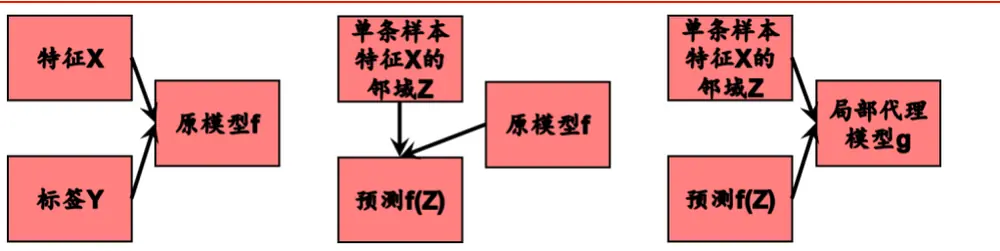
资料来源：华泰证券研究所

模拟因子选股数据集的 XGBoost 模型第 1条样本（属于“上涨”类别）的特征值和 LIME如下图所示。该样本各特征的 LIME由高到低排序为 X2、X3、X1、X4。这与四项因子有效程度的排序相符。其中反向因子 X2 值较小，X2的 LIME 值相应较高。

图表12： 模拟因子选股数据集的 XGBoost模型第 1条样本的 LIME
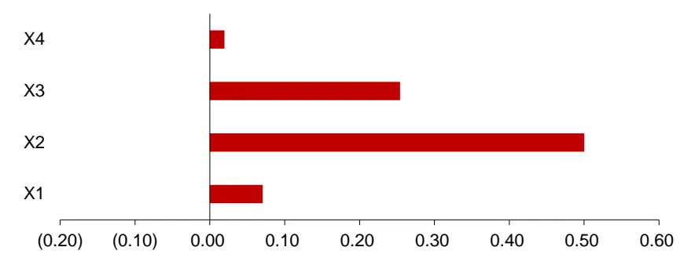

|  | X1 | X2 | X3 | X4 |
| --- | --- | --- | --- | --- |
| LIME | 0.071 | 0.500 | 0.254 | 0.020 |
| 特征值 | 1.497 | -1.125 | -0.207 | -0.063 |

资料来源：华泰证券研究所

图表13： 模拟因子选股数据集的 XGBoost模型第 50条样本的 LIME
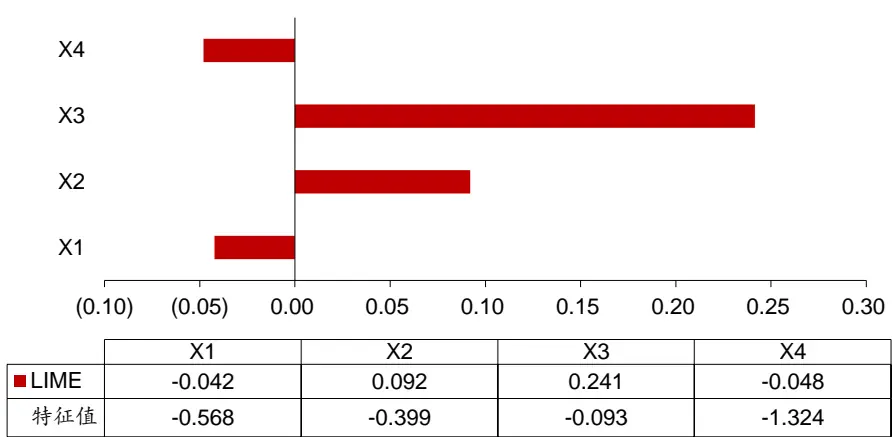

|  | X1 | X2 | X3 | X4 |
| --- | --- | --- | --- | --- |
| LIME | -0.042 | 0.092 | 0.241 | -0.048 |
| 特征值 | -0.568 | -0.399 | -0.093 | -1.324 |

资料来源：华泰证券研究所

模拟因子选股数据集的 XGBoost 模型第 50 条样本（属于“上涨”类别）的特征值和 LIME如上图所示。该样本和第 1条样本同属于“上涨”类别，区别之一在于反向因子 X2 取值，第 50 条样本 X2 值相对更大，该特征更不似于“上涨”类别，因此对应 LIME值更低；另一区别在于正向因子 X1 取值，第 50 条样本 X1 值相对更小，同样不似于“上涨”类别，因此对应 LIME值较低。

LIME 的优点在于能够解释单条样本，例如回答机器学习模型为什么预测茅台会涨。LIME的缺点在于计算相对繁琐，并且对于个别样本的解释可能有欠合理。

## SHAP

Shapley 值（Shapley Value，简记为 SHAP）的概念源于博弈论，核心思想是计算特征对模型输出的边际贡献。SHAP 值的概念较为复杂，我们先以一个简单案例说明。

假设 A、B、C三人合作完成一项工作，总产出 $\mathsf{V}(\{\mathsf{A},\mathsf{B},\mathsf{C}\})=100$ 。如何计算三人各自的贡献？首先将工作单独分配给 A、B或 C，计算每个人的独立产出：

$$
\mathsf{V}(\{\mathsf{A}\})=10,\mathsf{V}(\{\mathsf{B}\})=10,\mathsf{V}(\{\mathsf{C}\})=20
$$

其次将工作分配给任意两人，计算任意两个人的联合产出：

$$
\vee(\{\mathsf{A},\mathsf{B}\})=40,~\vee(\{\mathsf{A},\mathsf{C}\})=30,~\vee(\{\mathsf{B},\mathsf{C}\})=60
$$

假设三人合作时按A→B→C的顺序，我们可以计算三个各自的边际贡献。第一个人A的边际贡献为 V({A})＝10。第二个人 B 的边际贡献为 V({A,B})－V({A})＝40－10＝30。第三个人 C 的边际贡献为 V({A,B,C})－V({A,B})＝100－40＝60。对应下表 A•B•C 所在的行。

A→B→C是三人合作的可能顺序之一，可以计算所有可能顺序下，三人各自的边际贡献。对六种可能顺序下的边际贡献求均值，得到最终的 SHAP 值，对应下表的最后一行。可知B 的边际贡献最高，SHAP 值为 40，A的边际贡献最低，SHAP值为 25。

图表14： SHAP 值简单案例

| 顺序 |  | C |
| --- | --- | --- |
|  | A | B |
| A→B→C | 10 | 30 60 70 |
| A→C→B | 10 | 20 |
| B→A→C | 30 | 10 60 |
| B→C→A | 40 | 10 50 |
| C→A→B | 20 | 70 10 |
| C→B→A | 40 | 50 10 |
| 合计 | 150 | 240 210 |
| SHAP | 25 | 40 35 |

资料来源：华泰证券研究所

下面介绍 SHAP的详细定义。集合 N代表所有特征构成的集合，我们需要研究特征 i的重要性。定义集合 S 为 N 的一个不包含 i 的子集，即：S ⊂ N 且i ∉ S。特征 X、原模型 f、模型输出 f(X)沿用之前的定义。定义特征 i 的边际贡献：

$$
\Delta_{i}(S)=f_{X}(S\cup\{i\})-f_{X}(S)
$$

其中 $\mathsf{f}_{\mathsf{X}}$ 代表以特征集合 S为输入时，原模型 f 输出的期望：

$$
f_{X}(S)=E[f(X)|X_{S}]
$$

此时，特征 i的 SHAP值为：

$$
\phi_{i}=\frac{1}{|N|!}\sum_{R\in\mathcal{R}}\Delta_{i}{\big(S_{i}(R)\big)}\quad(\forall i\in N)
$$

其中ℛ为 N 的全排列集合；对于某个具体排列的 R，在特征 i 之前的其它特征的排列记为Si(R)；对每一种排列 Si(R)计算 i 的边际贡献，全排列共有|N|!种，对全部|N|!个边际贡献求均值，最终得到特征 i的 SHAP 值。

下表展示了当特征为 X1、X2、X3 和 X4 时，取 X3 计算 SHAP 值的过程。X1~X4 的全排列共有 4!=24 种，每行代表可能的排列方式，最右侧一列代表该排列方式下 X3 的边际贡献。X3 的 SHAP值为最右侧一列的加权平均，权重为第 2 列排列个数：

$$
\begin{array}{c}{\displaystyle{\phi_{X3}=\frac{1}{24}\left(6\Delta i(\emptyset)+2\Delta i(\{X1\})+2\Delta i(\{X2\})+2\Delta i(\{X4\})+2\Delta i(\{X1,X2\})+2\Delta i(\{X1,X4\})\right.}}\\{\displaystyle{\left.+2\Delta i(\{X2,X4\})+6\Delta i(\{X1,X2,X4\})\right)}}\end{array}
$$

图表15： SHAP 值计算实例（X1~X4四项特征，计算 X3的 SHAP值）

| X1~X4 排列 | 排列个数 | S:i之前的特征 | {i}：计算重要性的特征 | N\S\{i}：i之后的特征 {X1, X2, X4} | ∆i(S)：特征i 的边际贡献 |
| --- | --- | --- | --- | --- | --- |
| 3124, 3142, 3214, 3241, 3412, 3421 | 6 | ∅ | {X3} |  | fx({X1})-fx(∅) |
| 1324, 1342 | 2 | {X1} | {X3} | {X2, X4} | fx({X1, X3}) − fx({X1}) |
| 2314,2341 | 2 | {X2} | {X3} | {X1, X4} | fx({X2, X3}) − fx({X2}) |
| 4312, 4321 | 2 | {X4} | {X3} | {X1, X2} | fx({X3, X4}) − fx({X4}) |
| 1234,2134 | 2 | {X1, X2} | {X3} | {X4} | fx({X1, X2, X3}) − fx({X1, X2}) |
| 1432, 4132 | 2 | {X1, X4} | {X3} | {X2} | fx({X1, X3, X4}) − fx({X1, X4}) |
| 2431, 4231 | 2 | {X2, X4} | {X3} | {X1} | fx({X2, X3, X4}) − fx({X2, X4}) |
| 1243, 1423, 2143, | 6 | {X1, X2, X4} | {X3} | ∅ | fx({X1, X2, X3, X4}) − fx({X1, X2, X4}) |
| 2413, 4123, 4213 |  |  |  |  |  |

资料来源：华泰证券研究所

SHAP 值还可以按下面的简化方式定义：

$$
\phi_{i}=\sum_{S\subseteq N\setminus\{i\}}{\frac{|S|!(N-|S|-1)!}{N!}}[f_{X}(S\cup\{i\})-f_{X}(S)]
$$

对于 N 项特征的某种排列，总是可以划分为三部分：i 之前的特征集合 S，特征 i，i 之后的其余特征。模型输出值 fX(S)与 fX(S∪{i})不受排列顺序影响，因此可将 i 之前的|S|项特征全排列得到|S|!种结果，i 之后的(N-|S|-1)!项特征全排列得到(N-|S|-1)!种结果。将|S|!(N-|S|-1)!种结果合并，可以简化 SHAP 值的计算过程。SHAP 可由 Python 的 shap 库实现（https://github.com/slundberg/shap）。

对于模拟因子选股数据集的 XGBoost 模型，各因子对应“上涨”类别的 SHAP 绝对值的均值如下图所示。|SHAP|反映了该因子的重要性，从高到低分别为：X2（效果较好的反向因子）、X3（效果较好的非线性因子）、X1（效果一般的正向因子）、X4（无效因子）。

图表16： 模拟因子选股数据集的 XGBoost模型“上涨”类别的|SHAP|均值
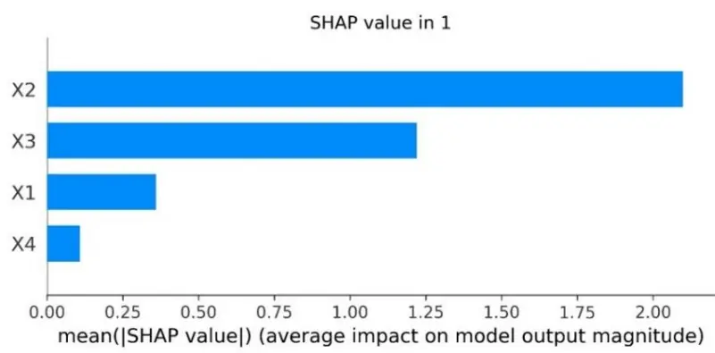
资料来源：华泰证券研究所

各因子对应“上涨”类别的 SHAP 原始值如下图所示。每个点代表每条样本。样本点的颜色代表因子值大小，颜色越偏红色代表因子值越大，颜色越偏蓝色代表因子值越小，颜色偏紫色代表因子值居中。样本点对应横轴位置代表 SHAP 值，SHAP值越高（靠右侧）代表该因子对于将该样本识别为“上涨”具有正向影响，SHAP 值越低（靠左侧）代表该因子对于将该样本识别为“上涨”具有负向影响。

图表17： 模拟因子选股数据集的 XGBoost模型“上涨”类别的各样本 SHAP 值
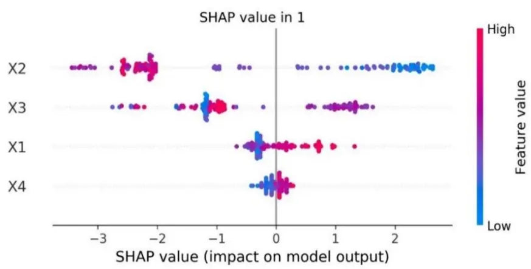
资料来源：华泰证券研究所

X2 蓝色点集中在横轴右侧，红色点集中在横轴左侧，表明 X2 因子值越小，更可能识别为“上涨”类别。X1 蓝色点集中在横轴左侧，红色点集中在横轴右侧，表明 X1因子值越大，更可能识别为“上涨”类别。XGBoost 模型习得了 X1的正向特点和 X2 的反向特点。

X3 蓝色点和红色点集中在横轴左侧，紫色点集中在横轴右侧，表明 X3 因子值较高或较低时，更不可能识别为“上涨”类别，而当 X3 因子值居中时，更可能识别为“上涨”类别。XGBoost 模型习得了 X3 的非线性特点。

X4 对应横轴位置集中在 0 附近，表明 X4 因子值对模型输出影响较弱，XGBoost 模型识别出了无效因子。

我们还可以绘制每个因子的 SHAP 值，如下面四张图所示。每个点代表每条样本，横轴为因子值，纵轴为 SHAP值，颜色代表与该因子 SHAP值相关性最低的另一个因子值。X1、X2、X3的 SHAP值分别呈现递增、递减、倒 U型的形态，均与它们各自的逻辑相符。

另外，SHAP值还能展示特征间的交互作用。以图 19 为例，横轴为 X2，纵轴为 X2的 SHAP值，颜色代表 X3。紫色点（X3居中的样本）在纵轴的分布相对于红色和蓝色点更宽。这表明当 X3居中时，X2对模型判断样本是否属于“上涨”类别的边际贡献更大；当 X3 较大或较小时，X2的边际贡献相对较小，由此展示 X2和 X3的交互作用。

图表18： 模拟数据集的 XGBoost模型“上涨”类别 X1的 SHAP值
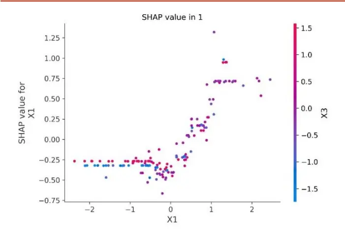
资料来源：华泰证券研究所

图表19： 模拟数据集的 XGBoost模型“上涨”类别 X2的 SHAP值
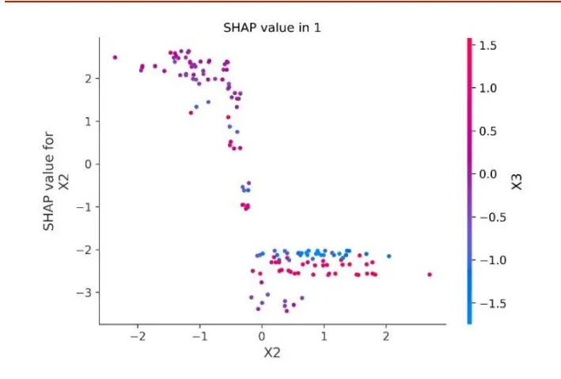
资料来源：华泰证券研究所

图表20： 模拟数据集的 XGBoost模型“上涨”类别 X3的 SHAP值
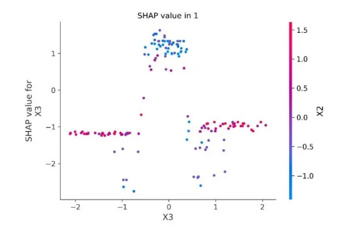
资料来源：华泰证券研究所

图表21： 模拟数据集的 XGBoost模型“上涨”类别 X4的 SHAP值
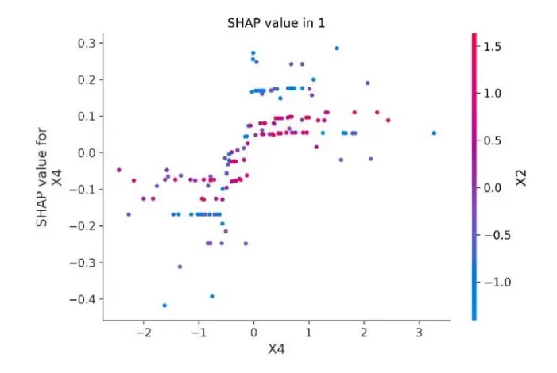
资料来源：华泰证券研究所

SHAP 值的优点在于理论完备，表达直观，既能从全局层面评估特征的重要性，又能从个体层面评估每条样本每项特征对模型输出的影响，并且能展示特征间的交互作用。缺点在于计算相对繁琐。总的来看，相比于此前介绍的其它方法，SHAP值可能是更好的机器学习模型解释工具。

另外还需要说明的是，机器学习模型解释方法不局限于以上六种。针对特定的机器学习方法，还有其它适用的解释工具。例如在华泰金工《人工智能 25：市场弱有效性检验与择时战场选择》（20191117）中，我们介绍了解释神经网络模型的两种方法：中间层激活的可视化，类激活热力图的可视化（如 Grad-CAM）。

本文着眼于普适性的解释工具，因此对神经网络解释工具不作介绍。事实上，本文介绍的六种方法中，除特征重要性外，ICE、PDP、SDT、LIME 和 SHAP 适用于绝大多数监督学习模型。

## 揭开 XGBoost选股模型的“黑箱”

本章以华泰 XGBoost 选股模型为例，应用多种机器学习模型解释方法，尝试揭开 XGBoost选股模型的“黑箱”。

## XGBoost 选股模型

XGBoost 选股模型（月调仓，全 A 选股，中证 500 行业市值中性）为指数增强策略，基准为中证 500 指数，回测表现如下图所示。在完整的收益区间内（20110201~20200203），该模型年化超额收益 12.53%，年化跟踪误差 5.20%，信息比率 2.41。2019 年该模型超额收益 3.59%，跟踪误差 5.34%，信息比率 0.67（由于模型为月初调仓，收益区间取20190102~20200102）。

月频调仓模型在 2019 年表现一般。我们更推荐半月频调仓的 XGBoost 模型，详细请参见华泰金工研究报告《机器学习选股模型的调仓频率实证》（20190419）和《近一年提高模型调仓频率较有优势》（20200105）。本文关注机器学习模型的解释方法，简单起见仍然考察月频调仓模型。

图表22： XGBoost选股模型净值（月调仓，全 A选股 500中性）
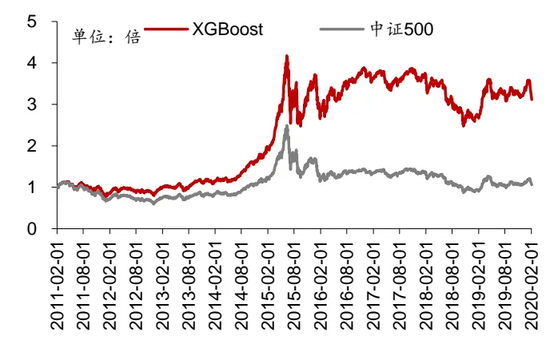
资料来源：Wind，华泰证券研究所；回测期：20110201~20200203

图表23： XGBoost选股累计超额收益（月调仓，全 A选股 500中性）
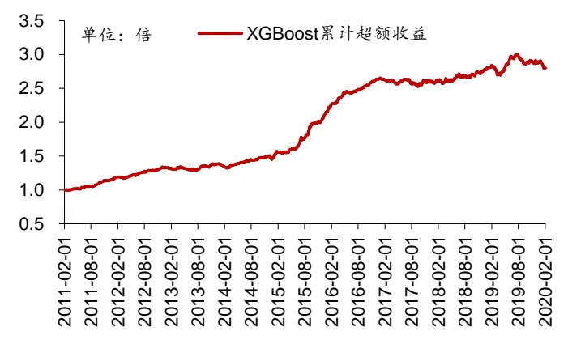
资料来源：华泰证券研究所；回测期：20110201~20200203

XGBoost 选股模型的构建包含如下步骤：

图表24： 人工智能选股模型测试流程示意图
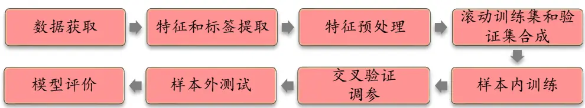
资料来源：华泰证券研究所

1． 数据获取：

a) 股票池：全 A股。剔除 ST 股票，剔除每个截面期下一交易日停牌的股票，剔除上市 3个月内的股票，每只股票视作一个样本。

b) 回测区间：2011 年 2 月 1 日至 2020 年 2 月 3 日。

2． 特征和标签提取：每个自然月的最后一个交易日，计算 70 个因子暴露度，作为样本的原始特征。因子池如下表所示，因子按下表进行方向调整。计算下一整个自然月的个股超额收益（以沪深 300 指数为基准），在每个月末截面期，选取下月收益排名前30%的股票作为正例（y = 1），后 30%的股票作为负例（y = 0），作为样本的标签。

图表25： 选股模型中涉及的全部因子及其描述

| 大类因子 | 具体因子 | 因子描述 | 因子方向 |
| --- | --- | --- | --- |
| 估值 | EP | 净利润（TTM）/总市值 |  |
| 估值 | EPcut | 扣除非经常性损益后净利润（TTM）/总市值 | 1 |
| 估值 | BP | 净资产/总市值 | 1 |
| 估值 | SP | 营业收入（TTM）/总市值 | 1 |
| 估值 | NCFP | 净现金流（TTM）/总市值 | 1 |
| 估值 | OCFP | 经营性现金流（TTM）/总市值 | 1 |
| 估值 | DP | 近12个月现金红利（按除息日计）/总市值 | 1 |
| 估值 | G/PE | 净利润（TTM）同比增长率/PE_TTM | 1 |
| 成长 | Sales_G_q | 营业收入（最新财报，YTD）同比增长率 | 1 |
| 成长 | Profit_G_q | 净利润（最新财报，YTD）同比增长率 | 1 |
| 成长 | OCF_G_q | 经营性现金流（最新财报，YTD）同比增长率 | 1 |
| 成长 | ROE_G_q | ROE（最新财报，YTD）同比增长率 | 1 |
| 财务质量 | ROE_q | ROE（最新财报，YTD） | 1 |
| 财务质量 | ROE_ttm | ROE（最新财报，TTM） |  |
| 财务质量 | ROA_q | ROA（最新财报，YTD） | 1 |
| 财务质量 | ROA_ttm | ROA（最新财报，TTM） |  |
| 财务质量 | grossprofitmargin_q | 毛利率（最新财报，YTD） |  |
| 财务质量 | grossprofitmargin_ttm | 毛利率（最新财报，TTM） | 1 |
| 财务质量 | profitmargin_q | 扣除非经常性损益后净利润率（最新财报，YTD） | 1 |
| 财务质量 | profitmargin_ttm | 扣除非经常性损益后净利润率（最新财报，TTM） | 1 |
| 财务质量 | assetturnover_q | 资产周转率（最新财报，YTD） |  |
| 财务质量 | assetturnover_ttm | 资产周转率（最新财报，TTM） |  |
| 财务质量 | operationcashflowratio_q | 经营性现金流/净利润（最新财报，YTD） | 1 |
| 财务质量 | operationcashflowratio_ttm | 经营性现金流/净利润（最新财报，TTM） | 1 |
| 杠杆 | financial_leverage | 总资产/净资产 | -1 |
| 杠杆 | debtequityratio | 非流动负债/净资产 | -1 |
| 杠杆 杠杆 | cashratio | 现金比率 | 1 |
| 市值 | currentratio | 流动比率 | 1 |
| 动量反转 | In_capital | 总市值取对数 | -1 |
| 动量反转 | HAlpha | 个股60个月收益与上证综指回归的截距项 | -1 |
| 动量反转 | return_Nm wgt_return_Nm | 个股最近N个月收益率，N=1，3，6，12 个股最近N个月内用每日换手率乘以每日收益率求算术平均 | -1 -1 |
| 动量反转 exp_wgt_return_Nm |  | 值，N=1，3，6，12 个股最近 N 个月内用每日换手率乘以函数 exp(-x_i/N/4)再乘 |  |
|  |  | 以每日收益率求算术平均值，x_i为该日距离截面日的交易日 的个数，N=1，3，6，12 | -1 |
| 波动率 | std_FF3factor_Nm | 特质波动率——个股最近 N 个月内用日频收益率对 Fama French三因子回归的残差的标准差，N=1，3，6，12 | -1 |
| 波动率 | std_Nm | 个股最近N个月的日收益率序列标准差，N=1，3，6，12 | -1 |
| 股价 beta | In_price | 股价取对数 | -1 |
| 换手率 | beta turn_Nm | 个股 60个月收益与上证综指回归的 beta 个股最近N个月内日均换手率(剔除停牌、涨跌停的交易日)， | -1 -1 |
|  |  | N=1, 3, 6, 12 |  |
| 换手率 | bias_turn_Nm | 个股最近N个月内日均换手率除以最近2年内日均换手率(剔 | -1 |
| 情绪 | rating_average | 除停牌、涨跌停的交易日）再减去1，N=1，3，6，12 wind 评级的平均值 | 1 |
| 情绪 | rating_change | wind评级（上调家数-下调家数）/总数 | 1 |
| 情绪 | rating_targetprice | wind一致目标价/现价-1 | 1 |
| 股东 | holder_avgpctchange | 户均持股比例的同比增长率 | 1 |
| 技术 | MACD |  | -1 |
| 技术 | DEA | 经典技术指标（释义可参考百度百科），长周期取30日，短 | -1 |
| 技术 | DIF | 周期取 10 日，计算 DEA 均线的周期（中周期）取15 日 | -1 |
| 技术 | RSI | 经典技术指标，周期取20日 | -1 |
| 技术 | PSY | 经典技术指标，周期取20日 | -1 |
| 技术 | BIAS | 经典技术指标，周期取20日 | -1 |

资料来源：Wind，华泰证券研究所

3． 特征预处理：

a) 中位数去极值：设第 T 期某因子在所有个股上的暴露度序列为 $D_{i}$ ， $D_{M}$ 为该序列中位数， $D_{M1}$ 为序列 $|D_{i}-D_{M}|$ 的中位数，则将序列 $D_{i}$ 中所有大于 $D_{M}+5D_{M1}$ 的数重设为 $D_{M}+5D_{M1}$ ，将序列 $D_{i}$ 中所有小于 $D_{M}-5D_{M1}$ 的数重设为 $D_{M}-5D_{M1}$ ；

b) 缺失值处理：得到新的因子暴露度序列后，将因子暴露度缺失的地方设为中信一级行业相同个股的平均值；

c) 行业市值中性化：将填充缺失值后的因子暴露度对行业哑变量和取对数后的市值做线性回归，取残差作为新的因子暴露度；其中市值因子只做行业中性，不做市值中性；

d) 标准化：将中性化处理后的因子暴露度序列减去其现在的均值、除以其标准差，得到一个新的近似服从 N(0, 1)分布的序列。

4． 滚动训练集和验证集的合成：采用年度滚动训练方式，全体样本内外数据共分为 9个阶段，如下表所示。例如预测 2011 年时，将 2005~2010 年共 72 个月数据合并作为样本内数据集；预测 T 年时，将 T-6 至 T-1 年的 72 个月合并作为样本内数据。根据分组时序交叉验证划分训练集和测试集，每次训练集长度均为 6个月的整数倍，验证集长度均等于 6个月。

图表26： 年度滚动训练示意图
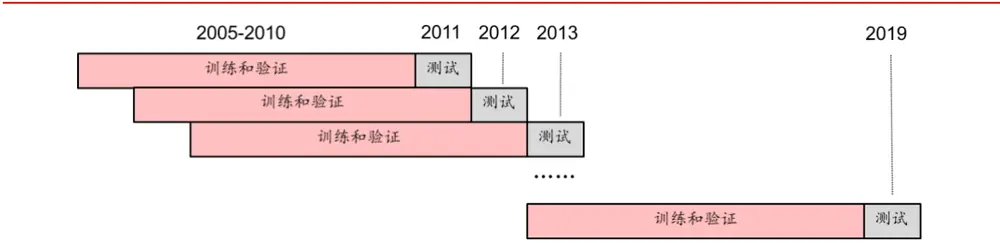
资料来源：华泰证券研究所

5． 样本内训练：使用 XGBoost 模型对训练集进行训练。

6． 交叉验证调参：对全部超参数组合进行网格搜索，选择验证集平均 AUC 最高的一组超参数作为模型最终的超参数。超参数设置和最优参数如下表所示。

图表27： XGBoost选股模型和超参数

| 基学习器 | 超参数 | 2011 | 2012 | 2013 | 2014 | 2015 | 2016 | 2017 | 2018 | 2019 |
| --- | --- | --- | --- | --- | --- | --- | --- | --- | --- | --- |
| XGBoost | 学习速率（learning_rate） | 0.05 | 0.025 | 0.075 | 0.025 | 0.05 | 0.075 | 0.025 | 0.05 | 0.05 |
|  | 最大树深度（max_depth） | 5 | 5 | 3 | 5 | 3 | 3 | 5 | 3 | 3 |
|  | 行采样比例（subsample） | 0.9 | 0.85 | 0.8 | 0.8 | 0.85 | 0.85 | 0.9 | 0.8 | 0.8 |

资料来源：Wind，华泰证券研究所

7． 样本外测试：确定最优超参数后，以 T 月末截面期所有样本预处理后的特征作为模型的输入，得到每个样本的预测值。将预测值视作合成后的因子，采用回归法、IC分析法和分层回测法进行单因子测试。

8． 模型评价：a) 测试集的正确率、AUC 等衡量模型性能的指标；b) 单因子测试得到的统计指标和回测绩效。

为了便于后续解读，这里我们需要重申：全部因子均已进行因子方向调整，例如 ln_capital因子本质是小市值因子，因子值越大代表市值越小；动量反转因子本质是反转因子，因子值越大代表历史跌幅越大；波动率因子本质是低波动因子，因子值越大代表历史波动率越小。估值、成长、财务质量、杠杆（部分）、情绪、股东因子均为正向因子，杠杆（部分）、动量反转、波动率、股价、beta、换手率、技术因子均为反向因子。

下面我们将针对以 2013~2018 年为训练和验证集、2019 年为测试集的模型（以下简称2019 年模型），结合 2019 年的预测（2019 年 1 月末~12 月末截面期）进行分析。

## 特征重要性

下表展示 XGBoost 选股 2019 年模型 70 个因子的特征重要性。前 10 个因子特征重要性之和为 0.47，接近全体因子特征重要性的一半，即提供了接近一半的信息增益，其中以价量因子为主导。前 3名均为反转因子，第 4、8 名为换手率因子，第 5、10名为波动率因子，第 6名为市值因子，第 7 名 EP属估值因子，第 9 名为分析师情绪因子。

排名靠后的因子主要包括：rsi 技术因子、financial_leverage 杠杆因子、财务质量类因子以及 std_FF3factor_6m 残差波动率因子。总的来看，价量类因子的特征重要性高于基本面类因子。

图表28： XGBoost 选股 2019 年模型特征重要性

| 排名 | 因子 | 特征重要性 | 排名 | 因子 | 特征重要性 | 排名 | 因子 | 特征重要性 |
| --- | --- | --- | --- | --- | --- | --- | --- | --- |
| 1 | exp_wgt_return_6m | 0.133 | 25 | bias_turn_12m | 0.013 | 49 | return_12m | 0.008 |
| 2 | exp_wgt_return_3m | 0.083 | 26 | OCFP | 0.012 | 50 | return_3m | 0.008 |
| 3 | wgt_return_1m | 0.077 | 27 | turn_12m | 0.012 | 51 | OCF_G_q | 0.007 |
| 4 | turn_1m | 0.041 | 28 | BP | 0.012 | 52 | return_6m | 0.007 |
| 5 | std_FF3factor_3m | 0.038 | 29 | rating_average | 0.012 | 53 | profitmargin_q | 0.006 |
| 6 | In_capital | 0.023 | 30 | DP | 0.012 | 54 | SP | 0.006 |
| 7 | EP | 0.022 | 31 | std_6m | 0.011 | 55 | cashratio | 0.006 |
| 8 | bias_turn_1m | 0.020 | 32 | turn_3m | 0.011 | 56 | currentratio | 0.006 |
| 9 | rating_change | 0.019 | 33 | HAlpha | 0.011 | 57 | std_1m | 0.006 |
| 10 | std_FF3factor_12m | 0.018 | 34 | bias | 0.011 | 58 | psy | 0.005 |
| 11 | std_12m | 0.018 | 35 | Sales_G_q | 0.010 | 59 | ROE_ttm | 0.004 |
| 12 | exp_wgt_return_12m | 0.017 | 36 | bias_turn_3m | 0.010 | 60 | In_price | 0.003 |
| 13 | Profit_G_q | 0.017 | 37 | beta | 0.010 | 61 | std_FF3factor_6m | 0.002 |
| 14 | wgt_return_3m | 0.016 | 38 | G/PE | 0.010 | 62 | ROA_ttm | 0 |
| 15 | exp_wgt_return_1m | 0.016 | 39 | NCFP | 0.009 | 63 | grossprofitmargin_q | 0 |
| 16 | std_FF3factor_1m | 0.016 | 40 | dea | 0.009 | 64 | grossprofitmargin_ttm | 0 |
| 17 | turn_6m | 0.015 | 41 | wgt_return_12m | 0.009 | 65 | assetturnover_q | 0 |
| 18 | EPcut | 0.015 | 42 | holder_avgpctchange | 0.009 | 66 | assetturnover_ttm | 0 |
| 19 | macd | 0.014 | 43 | return_1m | 0.008 | 67 | operationcashflowratio_q | 0 |
| 20 | ROA_q | 0.014 | 44 | wgt_return_6m | 0.008 | 68 | operationcashflowratio_ttm | 0 |
| 21 | ROE_q | 0.013 | 45 | profitmargin_ttm | 0.008 | 69 | financial_leverage | 0 |
| 22 | ROE_G_q | 0.013 | 46 | rating_targetprice | 0.008 | 70 | rsi | 0 |
| 23 | std_3m | 0.013 | 47 | bias_turn_6m | 0.008 |  |  |  |
| 24 | dif | 0.013 | 48 | debtequityratio | 0.008 |  |  |  |

资料来源：Wind，华泰证券研究所

## PDP

下表展示 XGBoost 选股 2019 年模型 5 个因子的 PDP。选取这 5 个因子的原因是前 4 个因子的 SHAP值排名所有因子前 4位（本章后续 SHAP 部分将介绍 SHAP值结果），第 5个 macd因子的非线性特征最为显著。

由下表知，ln_capital、exp_wgt_return_6m、wgt_return_1m、bias_turn_1m 的 PDP 均为单调递增，即个股属于“上涨”类别的概率随因子值的增大而提升。其中又以 ln_capital市值因子的 PDP斜率最大，当因子值小于 0时，上涨概率为 49%；当因子值大于 1.2 时，上涨概率为 58%。换言之，模型高度偏好小市值个股。

同时，观察到 macd 因子的 PDP 呈现倒 U 型，当 macd 因子较小或较大时，个股上涨概率约为 50%；当 macd 因子在±0.4 之间时，个股上涨概率提升至 51%以上。换言之，模型捕捉了 macd 因子的非线性逻辑，XGBoost 模型偏好 macd 值中等的个股。本章后续SHAP 部分将对此展开讨论。

图表29： XGBoost 选股 2019 年模型 5 个因子 PDP
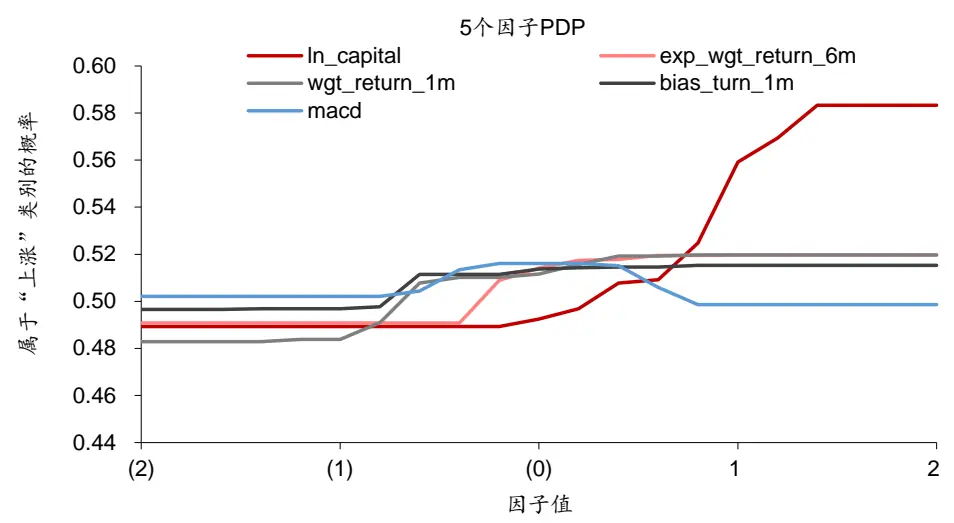
资料来源：Wind，华泰证券研究所

## ICE

PDP 是全部样本 ICE的均值。我们以 2019 年 1 月末截面期为例，展示 4只个股在上一节5 个因子上的 ICE。选股这 4 只个股的理由为，它们分别是股票池内预测上涨概率最高（603031.SH，安德利）、预测上涨概率最低（002366.SZ，台海核电）、实际下月超额收益最高（000859.SZ，国风塑业）、实际下月超额收益最低（603238.SH，诺邦股份）的个股。

总的来看，个股 ICE 和其均值 PDP 的形态接近。ln_capital、exp_wgt_return_6m、wgt_return_1m、bias_turn_1m 这 4 个因子的 ICE 单调递增，macd 因子的 ICE 呈倒 U 型。

同时，每个因子对于不同个股的影响不同。例如，ln_capital 市值因子对 603031.SH 较为重要，保持其余因子值不变，当市值因子值小于 0 时，预测该个股上涨概率仅为 54%；当市值因子为 1 时，预测上涨概率提升至 66%；当市值因子为 2 时，预测上涨概率提升至70%。而 ln_capital市值因子对 603238.SH 的影响相对较小，当市值因子值从﹣2 提升至2 时，预测上涨概率仅从 36%提升至 40%，其余 69 个因子可能就足以判定该个股的上涨概率较低。

图表30： XGBoost 模型 2019 年 1 月末截面期 ln_capital 因子 ICE
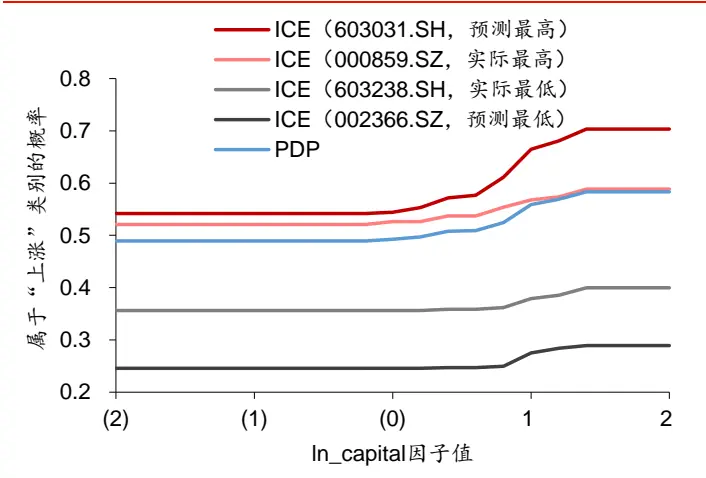
资料来源：Wind，华泰证券研究所

图表31： XGBoost 模型 2019 年 1 月末 exp_wgt_return_6m 因子 ICE
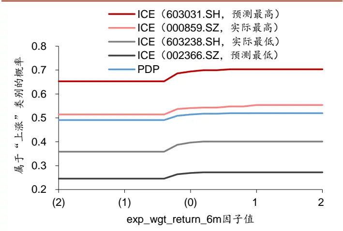
资料来源：Wind，华泰证券研究所

图表32： XGBoost模型 2019年 1月末截面期 wgt_return_1m因子 ICE
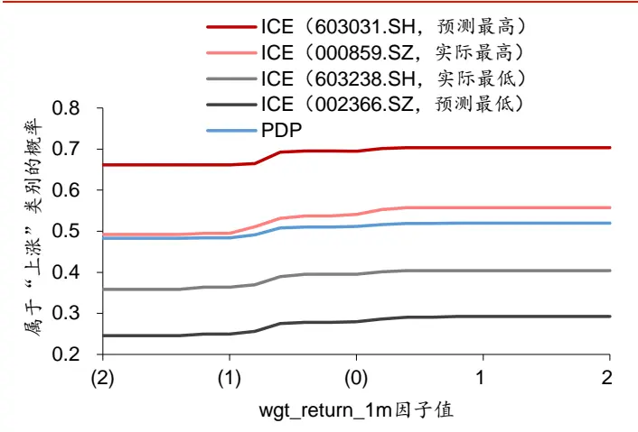
资料来源：Wind，华泰证券研究所

图表33： XGBoost 模型 2019 年 1 月末截面期 bias_turn_1m 因子 ICE
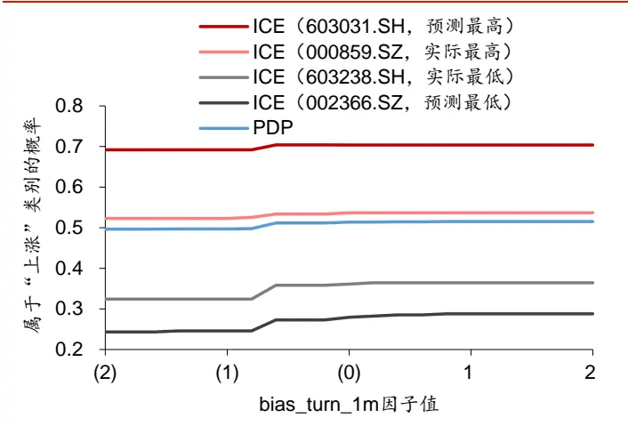
资料来源：Wind，华泰证券研究所

下图展示 macd 因子的个股 ICE。其中 603031.SH、000859.SZ 的 ICE 形态和 PDP 接近，整体呈现倒 U 型；而 603238.SH、002366.SZ 的 ICE 接近直线，说明 XGBoost 模型对这两只个股进行判断时，可能较少参考 macd因子。

图表34： XGBoost 模型 2019 年 1 月末截面期 macd 因子 ICE
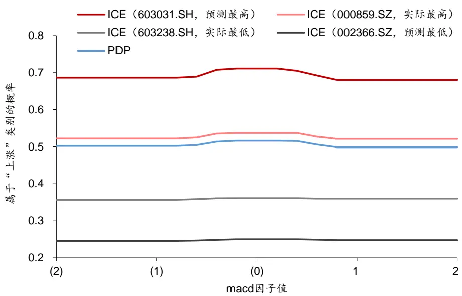
资料来源：Wind，华泰证券研究所

## 全局代理：SDT

XGBoost 选股 2019 年模型 SDT 可视化展示如下图，简单起见我们仅展示决策树的前 4层。在根节点位置，模型首先根据 exp_wgt_return_6m 反转因子（前述特征重要性最高的因子）判断，因子值较小则倾向于认为“下跌”，因子值较大则倾向于认为“上涨”。

第一层左侧叶子节点，模型根据 wgt_return_1m 反转因子（前述特征重要性排名第 2 高的因子）判断，因子值较小则倾向于认为“下跌”，因子值较大则倾向于认为“上涨”。第一层右侧叶子节点，模型根据 std_6m 波动率因子判断，因子值较小则倾向于认为“下跌”，因子值较大则倾向于认为“上涨”。

图表35： XGBoost 选股 2019 年模型 SDT 可视化展示
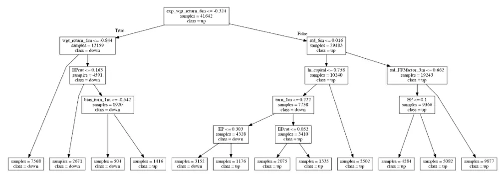
资料来源：华泰证券研究所

SDT 展示的重要因子还包括：EPcut、ln_capital、std_FF3factor_3m、bias_turn_1m、turn_1m、std_1m、EP。模型对这些因子的使用方式大体接近，因子低于某个值则倾向于认为“下跌”，高于某个值则倾向于认为“上涨 ”。由于预处理过程中因子均已作方向调整，可以认为 XGBoost 模型对这些因子线性逻辑的把握是正确的。然而仅凭 SDT 难以读出因子的非线性逻辑。

## 局部代理：LIME

我们以 2019 年 1 月末截面期为例，展示 4 只个股|LIME|最大的前 10 个因子其因子值和LIME。

安德利（603031.SH）是股票池内预测上涨概率最高的个股。如下图所示，该个股市值因子的重要性相对最高，LIME值为 0.06，表明 XGBoost 模型根据“小市值”这一特征判断该个股下月更可能上涨。价量因子整体为正向贡献，表明 XGBoost 模型根据“历史跌幅大”、“历史低波动”、“历史低换手”判断该个股下月更可能上涨。基本面因子整体为负向贡献，表明该个股基本面相对较差，XGBoost 模型根据基本面信息判断该个股下月更可能下跌。综合全部 70 个因子的贡献，预测该个股下月上涨概率为 70.3%。

图表36： XGBoost选股模型 2019年 1月末截面期预测上涨概率最高个股|LIME|最大的前 10个因子
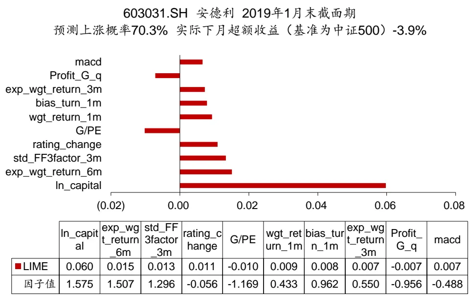

|  | In_capital | exp_wgt_return6m | std_FF3factor3m | rating_change | G/PE | wgt_ret burn_1m | ias_turn_1m | exp_wgt_return3m | ProfitG_q | macd |
| --- | --- | --- | --- | --- | --- | --- | --- | --- | --- | --- |
| LIME | 0.060 | 0.015 | 0.013 | 0.011 | -0.010 | 0.009 | 0.008 | 0.007 | -0.007 | 0.007 |
| 因子值 | 1.575 | 1.507 | 1.296 | -0.056 | -1.169 | 0.433 | 0.962 | 0.550 | -0.956 | -0.488 |

资料来源：Wind，华泰证券研究所

预测上涨概率53.7% 实际下月超额收益（基准为中证500）129.2%台海核电（002366.SZ）是股票池内预测上涨概率最低的个股。如上图所示，该个股|LIME|最大的前 10 个因子均为负向贡献，表明 XGBoost 模型根据“历史涨幅大”、“中等市值”、“历史高波动”、“历史高换手”、“营收同比负增长”这些特征判断该个股下月更可能下跌。

图表37： XGBoost选股模型 2019年 1月末截面期预测上涨概率最低个股|LIME|最大的前 10个因子
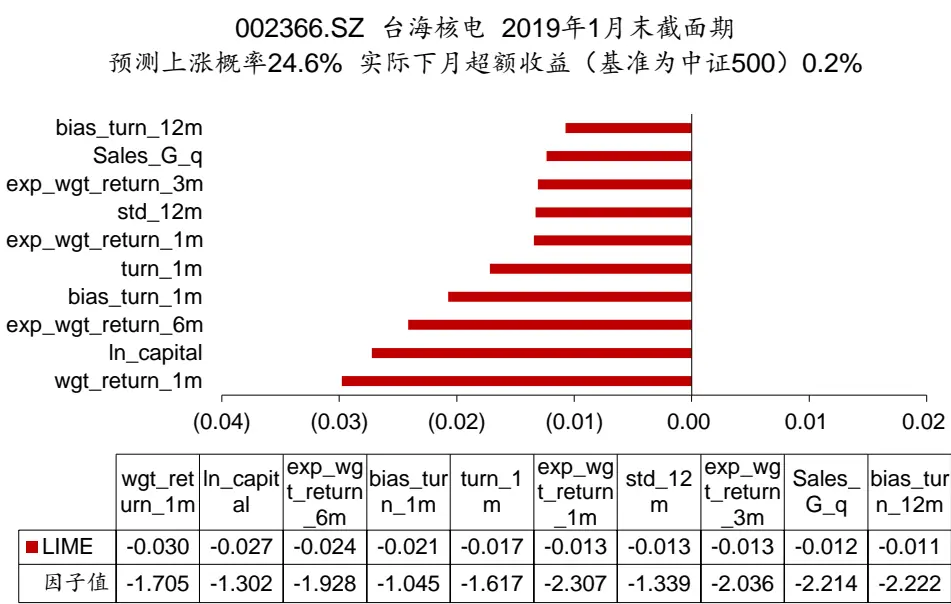

|  | wgt_ret Iurn_1m | n_capital | exp_wgt_return6m | bias_turn_1m | turn_1m | exp_wgt_return1m | std_12m | exp_wgt_return3m | SalesG_q | bias_turn_12m |
| --- | --- | --- | --- | --- | --- | --- | --- | --- | --- | --- |
| LIME | -0.030 | -0.027 | -0.024 | -0.021 | -0.017 | -0.013 | -0.013 | -0.013 | -0.012 | -0.011 |
| 因子值 | -1.705 | -1.302 | -1.928 | -1.045 | -1.617 | -2.307 | -1.339 | -2.036 | -2.214 | -2.222 |

资料来源：Wind，华泰证券研究所

图表38： XGBoost选股模型 2019年 2月实际超额收益最高个股在 1月末截面期|LIME|最大的前 10个因子000859.SZ 国风塑业 2019年1月末截面期
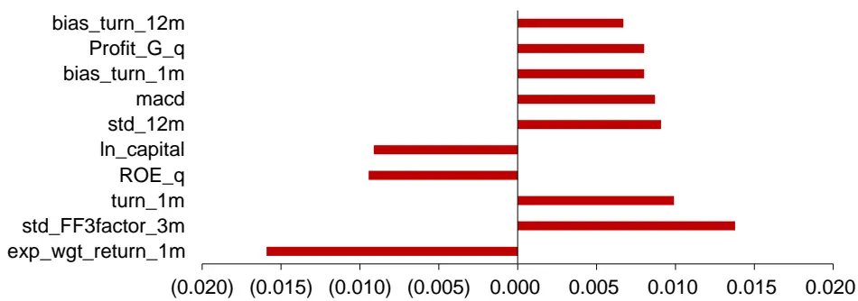

|  | exp_wgt_return1m | std_FF3factor3m | turn_1m | ROE_q | In_capital | std_12m | macd | bias_turn_1m | ProfitG_q | bias_turn_12m |
| --- | --- | --- | --- | --- | --- | --- | --- | --- | --- | --- |
| LIME | -0.016 | 0.014 | 0.010 | -0.009 | -0.009 | 0.009 | 0.009 | 0.008 | 0.008 | 0.007 |
| 因子值 | -0.704 | 1.205 | 1.047 | -1.369 | 0.619 | 1.439 | -0.125 | 0.334 | 2.294 | 1.187 |

资料来源：Wind，华泰证券研究所

国风塑业（000859.SZ）是股票池内实际下月超额收益最高的个股。然而 XGBoost 模型预测其上涨概率不高，仅为 53.7%。其中 exp_wgt_return_1m、ROE_q、ln_captial 三个因子均为负向贡献，表明 XGBoost 模型根据“本月涨幅高”、“当季 ROE低”、“中等市值”这些特征判断该个股下月更可能下跌。综合全部因子影响，模型最终给出相对中性的预测。

事实上，受益于 OLED 概念行情，国风塑业成为 2019 年 2 月的“妖股”之一，其高涨幅可能更多源于概念炒作，难以用因子模型解释。XGBoost 模型的判断及依据似乎无不妥。

图表39： XGBoost选股模型 2019年 2月实际超额收益最低个股在 1月末截面期|LIME|最大的前 10个因子
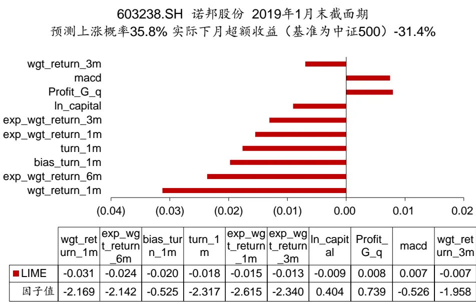
资料来源：Wind，华泰证券研究所

诺邦股份（603238.SH）是股票池内实际下月超额收益最低的个股，XGBoost 模型预测的上涨概率 35.8%同样较低。由上图 LIME可知，XGBoost 模型根据“本月涨幅高”、“本月高换手”、“中等市值”这些特征判断该个股下月更可能下跌。

事实上，诺邦股份在 2018 年 11~12 月及 2019 年 1 月逆势上涨，积累了较大的超额收益，2019 年 2 月的下跌可以解读为强势股补跌。这里 XGBoost 模型的判断及依据较为合理。

## SHAP

下面两张表分别展示 XGBoost 选股 2019 年模型的|SHAP|均值和 SHAP 值。从左下图的|SHAP|均值排名来看，ln_capital市值因子排名第一，表明市值因子对 XGBoost 模型输出的边际贡献最高。排名第2至第7的因子分属反转和换手率因子，第8为macd技术因子，第 9 为 std_12m 波动率因子，第 10 为 rating_change 分析师情绪因子。

排名靠后的因子包括：ln_price 股价因子、SP 市销率因子、std_FF3factor_6m 残差波动率因子、财务质量类因子、currentratio 杠杆因子以及 psy 技术因子。总的来看，价量类因子的 SHAP值高于基本面类因子。

值得注意的是，SHAP值排名和此前的特征重要性排名整体接近，但也存在一定出入。这一现象是合理的，本身两种模型解释方法的侧重点和算法都不同。特征重要性侧重于决策树分裂过程中的信息增益，SHAP 值侧重于特征对输出的边际贡献。

SHAP 相比特征重要性的优越之处在于，能够给出特征对模型输出的影响方向。如右下图所示，每个点代表每条测试集样本，横轴代表 SHAP值，纵轴对应每个因子，点的颜色代表该样本的因子值。对于第一行 ln_capital市值因子，基本遵循左蓝右红的规律，即因子值越大（偏红），SHAP值越高（偏右）。换言之，市值越小，市值因子值越大，模型判断该个股上涨的概率越高。

总的来看，绝大部分因子的 SHAP 均为左蓝右红，但仍存在部分因子为左红右蓝，表明XGBoost 模型在使用该因子时并未遵循我们所理解的逻辑；也有部分因子为左红中蓝右紫，表明 XGBoost 模型以明显的非线性逻辑使用该因子。下面我们将选取部分典型因子进行详细讨论。

图表40： XGBoost 选股 2019 年模型|SHAP|均值
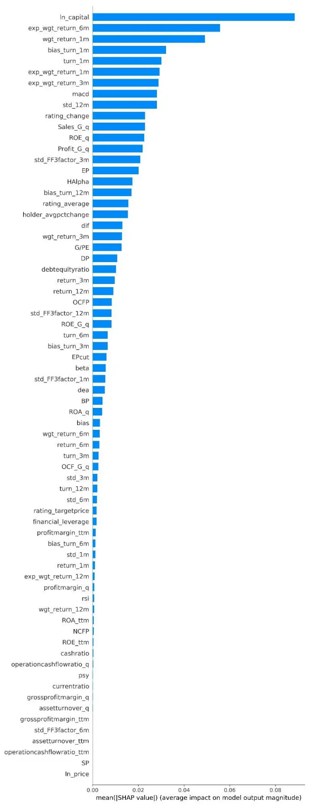
资料来源：Wind，华泰证券研究所

图表41： XGBoost 选股 2019 年模型 SHAP 值
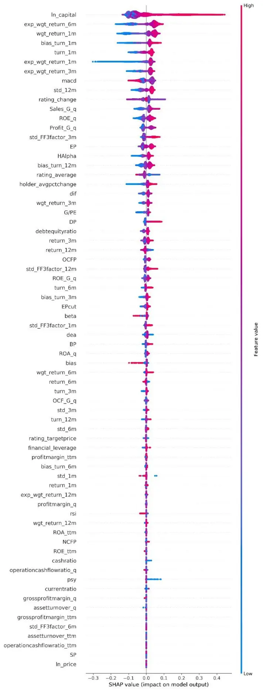
资料来源：Wind，华泰证券研究所

图表42： XGBoost 选股 2019 年模型 ln_capital 因子 SHAP 值
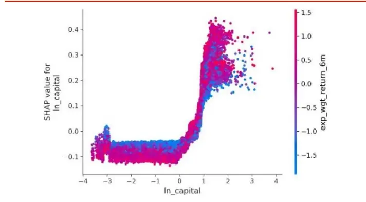
资料来源：Wind，华泰证券研究所

图表43： XGBoost 选股 2019 年 exp_wgt_return_6m 因子 SHAP 值
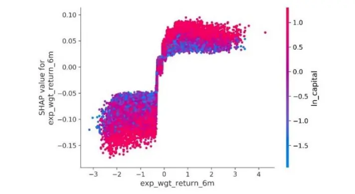
资料来源：Wind，华泰证券研究所

|SHAP|均值排名前 2 位的是 ln_captial 市值因子和 exp_wgt_return_6m 换手率指数加权 6个月反转因子。其 SHAP值原始结果如上图所示。每个点代表每条测试集样本，横轴代表因子值，纵轴代表 SHAP 值。颜色代表与该因子 SHAP 值交互作用最强（即相关系数绝对值最高）的另一个因子的因子值。交互作用的意义在于获取关于因子的额外信息：模型在使用该因子时，和其它哪个因子关系最密切？交互作用不是本文关注的重点，感兴趣的读者可以参考论文 Consistent individualized feature attribution for tree ensembles。

左上图 ln_capital 市值因子整体呈现左低右高的正相关关系，因子值越大 SHAP 值越大。这表明 XGBoost 模型的判断准则之一是个股市值越小预测下月上涨概率越高。然而市值和上涨概率之间并非线性正相关。当因子值大于 1.5 时，实际能观察到微弱的负相关，换言之，当个股市值非常小时，XGBoost 模型将调低对于上涨概率的预测。

同样地，观察到当 ln_capital 因子值在-3 左右时，SHAP值为正，图像上表现为一处“凸起”，说明 XGBoost 模型并非完全不看好大市值股票，对于市值因子在-3 左右（对应总市值约 1000 亿元）的个股存在一定偏好。左上图 ln_capital 因子很好地展示了 XGBoost 模型对于市值因子的使用方式，并非简单遵循线性逻辑，而是运用了相对复杂的非线性逻辑。

图 43~45 分别展示|SHAP|均值排名第 2 至 4 名的 exp_wgt_return_6m、wgt_return_1m、bias_turn_1m因子的SHAP值。这三个价量因子SHAP值的形态接近，整体呈现左低右高的S型。

以图 43 的 exp_wgt_return_6m 因子为例：当因子值小于 0 时 SHAP 集中在﹣0.15~﹣0.05区间，当因子值大于 0 时 SHAP 集中在 0~0.1 区间；因子值越大，过去 6 个月换手率指数加权的跌幅越大，总的来看预测下月上涨概率越高；但是当因子值大于 0时，因子值和SHAP 呈现微弱负相关，即并非历史跌幅越大越好。XGBoost 在这里遵循的是非线性的因子逻辑。

图表44： XGBoost 选股 2019 年模型 wgt_return_1m 因子 SHAP 值
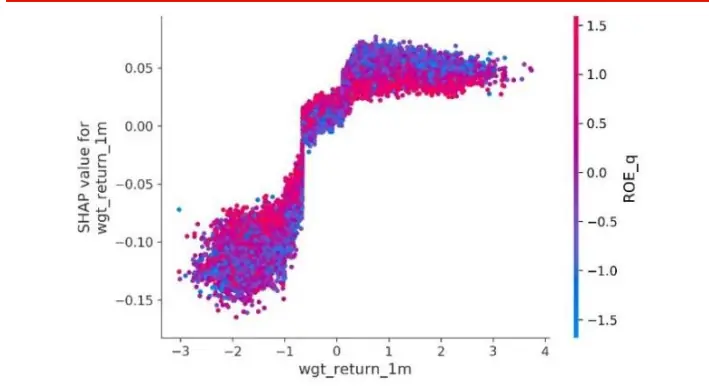
资料来源：Wind，华泰证券研究所

图表45： XGBoost 选股 2019 年模型 bias_turn_1m 因子 SHAP 值
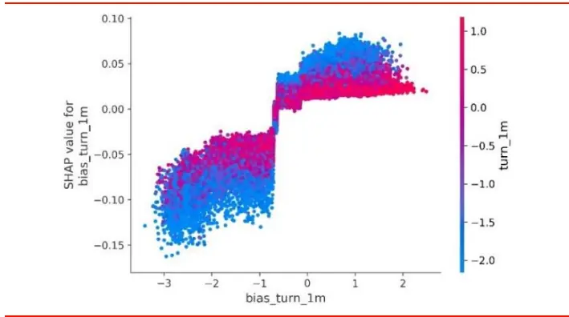
资料来源：Wind，华泰证券研究所

图表46： XGBoost 选股 2019 年模型 macd 因子 SHAP 值
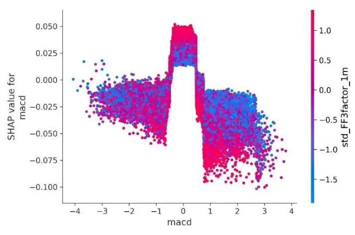
资料来源：Wind，华泰证券研究所

图表47： XGBoost 选股 2019 年模型 return_12m 因子 SHAP 值
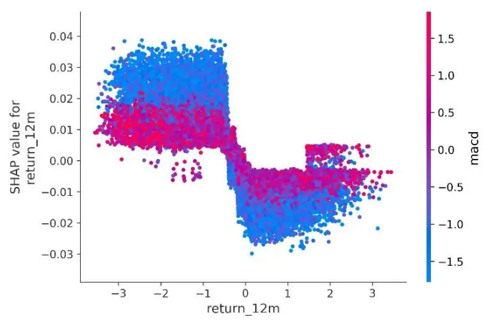
资料来源：Wind，华泰证券研究所

左上图展示 macd 因子（排名第 8）的 SHAP值，形态为倒 U型，和此前 PDP及 ICE 形态一致。当因子值较小或较大时 SHAP值小于 0，当因子值在﹣0.5~0.5 区间时 SHAP值大于 0。

当 macd 因子较小或较大时，macd 原始值较大或较小，个股可能处于加速上涨或加速下跌状态，此时 XGBoost 模型预测下月下跌概率较大，这可能是符合技术指标投资逻辑的。当 macd因子居中时，macd 原始值可能接近 0，个股可能处于见底回升或见顶回落状态，此时 XGBoost 模型预测下月上涨概率较大。至于模型是如何将见底回升和见顶回落两种状态区别开来的，仅根据 macd 的 SHAP值暂时难以回答。

右上图展示 return_12m 因子（排名第 26）的 SHAP值，形态为中间最低且左肩高于右肩的 U 型。当因子值较小，即过去 12个月涨幅较大时，SHAP 值为正，XGBoost 模型预测下月上涨概率较大。当因子值较大，即过去 12 个月跌幅较大时，SHAP值接近 0，XGBoost模型给出中性预测。当因子值居中，即过去 12 个月涨跌幅居中时，SHAP值为负，XGBoost模型预测下月下跌概率较大。XGBoost 模型对于 return_12m 因子的使用方式兼有动量和反转两种逻辑。

图表48： XGBoost 选股 2019 年模型 rating_change 因子 SHAP 值
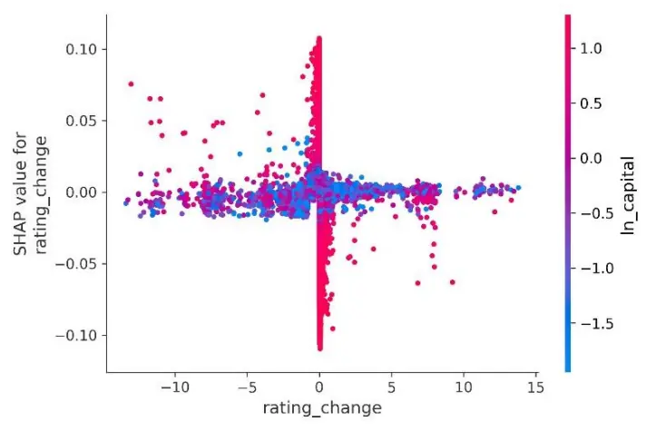
资料来源：Wind，华泰证券研究所

图表49： XGBoost 选股 2019 年模型 rating_average 因子 SHAP 值
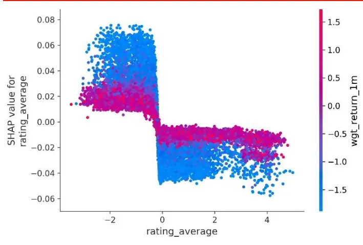
资料来源：Wind，华泰证券研究所

上面两张图展示两种分析师情绪因子的 SHAP值。左上图rating_change因子（排名第11）的形态较为特殊，因子值较小（评级显著调低）或较大（评级显著调高）时，SHAP值整体接近 0；因子值居中偏左时，SHAP 值较高，模型预测下月上涨概率高；因子值居中偏右时，SHAP值较低，模型预测下月下跌概率高。

对此可能的解读是，当分析师调低或调高评级成为全市场一致预期时，对模型输出的边际贡献是很小的；模型更有可能捕捉的是个别分析师调低或调高评级的行为。

右上图 rating_average 因子（排名第 18）SHAP 值的形态为左高右低，分析师平均评级越高，XGBoost 模型预测下月下跌概率越大。在 XGBoost 模型看来，分析师评级属于反向指标。对此可能的解读是，分析师评级是分析师根据市场公开信息得到，并且存在一定滞后，而市场可能已经对一些非公开信息提前做出反应，因此对于高评级个股模型反而给出负向预测。这也可以解释为什么左上图 rating_change 因子值在 0 左侧时 SHAP 值反而比 0 右侧时更高。

同时，注意到 rating_average 因子和 wgt_return_1m1 个月换手率加权反转因子具有较强的交互作用。当个股前期涨幅较大，wgt_return_1m 因子较小，颜色偏蓝色时，样本点在纵轴的分布相对于红色点更宽。换言之，对于前期涨幅较大的个股，分析师评级因子的反向边际贡献更大，分析师评级信息越是“反着用”。本质上反映出分析师的追涨倾向。

图表50： XGBoost 选股 2019 年模型 DP 因子 SHAP 值
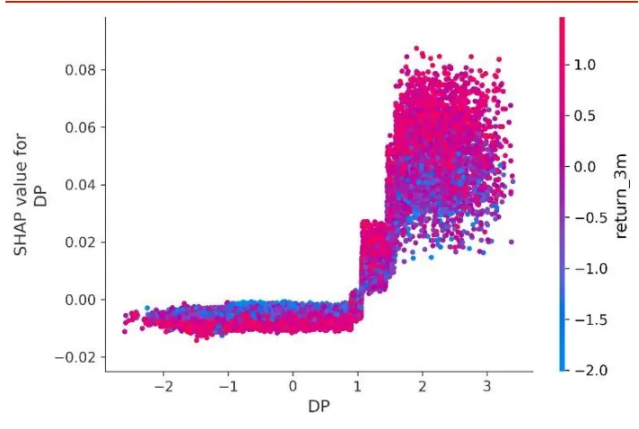
资料来源：Wind，华泰证券研究所

图表51： XGBoost 选股 2019 年模型 SP 因子 SHAP 值
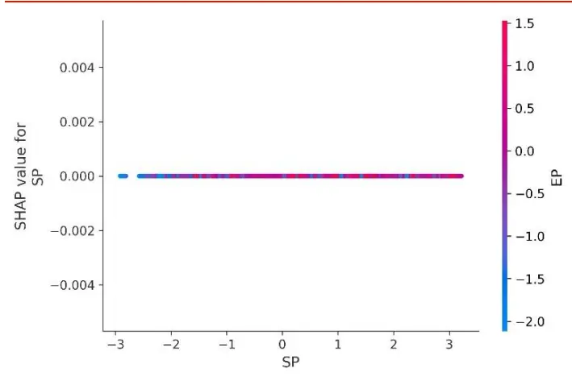
资料来源：Wind，华泰证券研究所

上面两张图展示两种估值因子的 SHAP 值。左上图 DP 股息率因子（排名第 23）的形态较为特殊。当因子值低于 1，即个股不分红或股息率较低时，SHAP 值接近 0 或低于 0，XGBoost 模型给出中性偏负向的预测。当因子值较高，即个股股息率较高时，SHAP大于0，XGBoost 模型预测下月上涨概率较高。

右上图 SP 市销率因子（排名第 69）的形态为纵轴值为 0 的直线。无论 SP 因子取多少，对 XGBoost 模型的输出不存在边际贡献。类似没有贡献的因子还包括：ln_price 股价因子、operationcashflowratio_ttm 经营性现金流/净利润因子、assetturnover_ttm 资产周转率因子、std_FF3factor_6m 残差波动率因子、grossprofitmargin_ttm 毛利率因子。如果以上因子在历年模型的 SHAP均接近 0，那么在未来进行选股模型优化时，可以考虑将这些因子事先剔除。

回顾以上六种模型解释方法，我们在 SHAP 上投入了较多笔墨，事实上 SHAP 相比于其余方法确实有优越之处。SHAP从全局和个体两个层面评估特征对模型输出的影响。SHAP向我们揭示模型如何运用因子，反过来还可以帮助我们加深对因子的理解。六种方法各擅胜场，综合来看我们更推荐使用 SHAP。

## 总结

本文介绍六种机器学习模型解释方法的原理，并以华泰 XGBoost 选股模型为例，尝试揭开机器学习模型的“黑箱”。机器学习多属于黑箱模型，而资管行业的伦理需要可解释的白箱模型。除传统的特征重要性外，ICE、PDP、SDT、LIME、SHAP都是解释模型的有力工具。揭开选股模型黑箱，我们发现：1）价量类因子的重要性整体高于基本面类因子；2）XGBoost 模型以非线性的逻辑使用因子，因子的非线性特点在市值、反转、技术、情绪因子上体现尤为明显。

目前的人工智能算法，即使是近年来发展迅猛的深度神经网络，和线性回归并无本质上的不同，仍是对样本特征 X和标签 Y进行拟合，区别无非是机器学习模型的非线性拟合能力更强。人工智能并不具备真正的“智能”。模型只能学习特征和标签的相关关系，但无法挖掘其中的因果关系。如果不将机器学习模型的黑箱打开，不弄清机器学习模型的“思考”过程，直接使用机器学习的判断结果，可能带来较大的风险。

近年来研究者提出诸多机器学习模型解释方法，除了传统的特征重要性外，ICE、PDP、SDT、LIME、SHAP都是揭开机器学习模型黑箱的有力工具。特征重要性计算依据某个特征进行决策树分裂时，分裂前后的信息增益。ICE 和 PDP 考察某项特征的不同取值对模型输出值的影响。SDT 用单棵决策树解释其它更复杂的机器学习模型。LIME的核心思想是对于每条样本，寻找一个更容易解释的代理模型解释原模型。SHAP的概念源于博弈论，核心思想是计算特征对模型输出的边际贡献。

我们应用多种机器学习模型解释方法，对以 2013~2018 年为训练和验证集、2019 年整年为测试集的模型进行分析，尝试揭开 XGBoost 选股模型的“黑箱”。特征重要性和 SDT的结果表明，价量类因子的重要性整体高于基本面类因子。ICE 和 LIME 能够展示模型对个股做出预测的依据。PDP 和 SHAP 的结果表明：1）XGBoost 模型以非线性的逻辑使用因子，因子的非线性特点在市值、反转、技术、情绪因子上体现尤为明显；2）部分因子之间存在较强的交互作用；3）部分因子边际贡献为 0，未来可以考虑事先剔除。

SHAP 的优点在于理论完备，表达直观，既能从全局层面评估特征的重要性，又能从个体层面评估每条样本每项特征对模型输出的影响，还能展示特征间的交互作用。SHAP向我们揭示模型如何运用因子，反过来还可以帮助我们加深对因子的理解。几种机器学习模型解释方法各擅胜场，综合来看我们更推荐使用 SHAP。

## 参考文献

Cabitza, F., Rasoini, R., & Gensini, G. F. (2017). Unintended consequences of machine learning in medicine. The Journal of the American Medical Association, 318(6), 517-518.

Goldstein, A. , Kapelner, A. , Bleich, J. , & Pitkin, E. . (2015). Peeking inside the black box: visualizing statistical learning with plots of individual conditional expectation. Journal of Computational and Graphical Statistics, 24(1), 44-65.

Lundberg, S. M., Erion, G. G., & Lee, S. I. (2018). Consistent individualized feature attribution for tree ensembles. arXiv preprint arXiv:1802.03888.

Molnar, C. (2018). Interpretable machine learning: A guide for making black box models explainable. E-book at< https://christophm. github. io/interpretable-ml-book/>.

Ribeiro, M. T., Singh, S., & Guestrin, C. (2016). " Why should I trust you?" Explaining the predictions of any classifier. In Proceedings of the 22nd ACM SIGKDD international conference on knowledge discovery and data mining, 1135-1144.

## 风险提示

人工智能选股是对历史规律的总结，若未来规律发生变化，模型存在失效的风险。人工智能选股模型存在过拟合的风险。机器学习模型解释方法存在过度简化的风险。

## 免责申明

本报告仅供华泰证券股份有限公司（以下简称“本公司”）客户使用。本公司不因接收人收到本报告而视其为客户。

本报告基于本公司认为可靠的、已公开的信息编制，但本公司对该等信息的准确性及完整性不作任何保证。本报告所载的意见、评估及预测仅反映报告发布当日的观点和判断。在不同时期，本公司可能会发出与本报告所载意见、评估及预测不一致的研究报告。同时，本报告所指的证券或投资标的的价格、价值及投资收入可能会波动。本公司不保证本报告所含信息保持在最新状态。本公司对本报告所含信息可在不发出通知的情形下做出修改，投资者应当自行关注相应的更新或修改。

本公司力求报告内容客观、公正，但本报告所载的观点、结论和建议仅供参考，不构成所述证券的买卖出价或征价。该等观点、建议并未考虑到个别投资者的具体投资目的、财务状况以及特定需求，在任何时候均不构成对客户私人投资建议。投资者应当充分考虑自身特定状况，并完整理解和使用本报告内容，不应视本报告为做出投资决策的唯一因素。对依据或者使用本报告所造成的一切后果，本公司及作者均不承担任何法律责任。任何形式的分享证券投资收益或者分担证券投资损失的书面或口头承诺均为无效。

本公司及作者在自身所知情的范围内，与本报告所指的证券或投资标的不存在法律禁止的利害关系。在法律许可的情况下，本公司及其所属关联机构可能会持有报告中提到的公司所发行的证券头寸并进行交易，也可能为之提供或者争取提供投资银行、财务顾问或者金融产品等相关服务。本公司的资产管理部门、自营部门以及其他投资业务部门可能独立做出与本报告中的意见或建议不一致的投资决策。

本报告版权仅为本公司所有。未经本公司书面许可，任何机构或个人不得以翻版、复制、发表、引用或再次分发他人等任何形式侵犯本公司版权。如征得本公司同意进行引用、刊发的，需在允许的范围内使用，并注明出处为“华泰证券研究所”，且不得对本报告进行任何有悖原意的引用、删节和修改。本公司保留追究相关责任的权力。所有本报告中使用的商标、服务标记及标记均为本公司的商标、服务标记及标记。

本公司具有中国证监会核准的“证券投资咨询”业务资格，经营许可证编号为：91320000704041011J。

全资子公司华泰金融控股（香港）有限公司具有香港证监会核准的“就证券提供意见”业务资格，经营许可证编号为：AOK809

©版权所有 2020年华泰证券股份有限公司

## 评级说明

## 行业评级体系

－报告发布日后的6个月内的行业涨跌幅相对同期的沪深300指数的涨跌幅为基准；

－投资建议的评级标准增持行业股票指数超越基准中性行业股票指数基本与基准持平减持行业股票指数明显弱于基准

## 公司评级体系

－报告发布日后的6个月内的公司涨跌幅相对同期的沪深300指数的涨跌幅为基准；
－投资建议的评级标准
买入股价超越基准 20%以上
增持股价超越基准 5%-20%
中性股价相对基准波动在-5%~5%之间
减持股价弱于基准 5%-20%
卖出股价弱于基准 20%以上

## 华泰证券研究

## 南京

南京市建邺区江东中路228号华泰证券广场1号楼/邮政编码：210019

电话：86 25 83389999 /传真：86 25 83387521

电子邮件：ht-rd@htsc.com

## 深圳

深圳市福田区益田路5999号基金大厦10楼/邮政编码：518017

电话：86 755 82493932 /传真：86 755 82492062

电子邮件：ht-rd@htsc.com

## 北京

北京市西城区太平桥大街丰盛胡同28号太平洋保险大厦A座18层

邮政编码：100032

电话：86 10 63211166/传真：86 10 63211275

电子邮件：ht-rd@htsc.com

## 上海

上海市浦东新区东方路18号保利广场E栋23楼/邮政编码：200120

电话：86 21 28972098 /传真：86 21 28972068

电子邮件：ht-rd@htsc.com