## 金工研究/深度研究

2020年02月18日

林晓明 执业证书编号：S0570516010001

研究员 0755-82080134

陈烨 执业证书编号：S0570518080004

研究员 010-56793942

chenye@htsc.com

李子钰 执业证书编号：S0570519110003

研究员 0755-23987436

liziyu@htsc.com

何康 021-28972039

联系人 hekang@htsc.com

王晨宇

联系人 wangchenyu@htsc.com

# 基于量价的人工智能选股体系概览华泰人工智能系列之二十八

## 本文构建了基于量价的人工智能选股体系并测试其有效性

经过华泰金工前期报告的探索，我们认为人工智能模型已经可以很好融入多因子选股模型的因子生成和多因子合成步骤。在多因子模型的信息来源中，量价信息能提供海量的数据，是最适合 AI 技术运用的领域。本文构建了基于量价信息的全流程人工智能选股体系，主要包含三个步骤：(1) 遗传规划自动挖掘因子；(2) 机器学习模型进行多因子合成；(3) 机器学习模型的可解释性分析。在测试中，该体系能提供独立于传统多因子模型的增量超额收益。

步骤 1：遗传规划自动挖掘因子——因子的适应度、增量信息和挖掘效率因子是超额收益的来源。遗传规划通过暴力生成+进化的方式，从原始量价数据中挖掘选股因子。该步骤中有三个关键环节：(1)因子适应度的定义，如果以因子的 RankIC 作为适应度，则可以挖掘线性因子；如果以因子的互信息为适应度，则可以挖掘非线性因子。非线性因子可能描述了市场中更高维度的规律，如果能利用这种规律，则可能为现有体系提供增量的alpha 信息。(2)挖掘增量信息需要引入因子正交化机制，为了避免频繁正交化带来的时间开销，我们提出以残差收益率为预测目标的增量信息挖掘方法。(3)提升因子挖掘的效率需要借助高性能计算的技术。

## 步骤 2：机器学习模型进行多因子合成——强拟合能力和过拟合的权衡

相比线性模型，机器学习模型有更强的拟合能力，能够拟合非线性关系。实际应用中，需要在机器学习的强拟合能力和过拟合现象间寻找平衡点。针对机器学习模型易过拟合的缺点，我们引入特征选择和时序交叉验证调参。本文选择嵌入式特征选择方法——随机森林模型，在模型训练时自动进行特征选择，并使用时序交叉验证对模型的三个关键参数寻优。

## 步骤 3：机器学习模型的可解释性分析——从“黑箱”到“白箱”

模型的可解释性是指人类能够理解其决策原因的程度。优秀的可解释性有助于打开机器学习模型的“黑箱”，提升人类对模型的信任，其重要性体现在：建模阶段，辅助研究人员理解模型，进行模型的对比选择，必要时优化调整模型；在投入运行阶段，向他人解释模型的内部机制和结果，并通过可解读的反馈结果不断优化模型。本文主要使用基于 SHAP值的方法进行模型可解释性分析。

## 基于量价的人工智能选股能提供独立于传统多因子模型的增量超额收益

本文从日频量价信息出发，通过遗传规划滚动挖掘调仓周期为 20 个交易日的因子，并使用随机森林模型拟合得到合成因子。合成因子进行行业、市值、20 日收益率、20 日波动率、20 日换手率五因子中性化后，RankIC均值为 8.87%，IC_IR 为 1.16，分五层测试中 TOP 组合年化超额收益率为9.65%，信息比率为 3.08。将合成因子叠加到使用传统因子的模型上后构建中证500增强选股组合，可使得组合的年化超额收益率平均提升 1.38%，信息比率平均提升 0.14。SHAP值可解释性分析显示，随机森林模型有效利用了遗传规划挖掘出的线性因子和非线性因子。

风险提示：通过人工智能模型构建的选股策略是历史经验的总结，存在失效的可能。遗传规划所得因子可能过于复杂，可解释性较低，使用需谨慎。机器学习模型存在过拟合的风险。机器学习模型解释方法存在过度简化的风险。

## 本文研究导读

自 2017 年 6 月以来，华泰金工在人工智能选股领域持续耕耘，在已发布的 20 多篇深度研究报告中，我们对人工智能运用于多因子选股进行了全方位的探索和论证。随着 A股市场的风云变换和 AI 技术的持续发展，我们也观察到人工智能选股方法已逐渐在各个机构中得到实践，成为多因子模型的重要补充部分。继往开来，我们将在前期报告的基础上，梳理出一套基于量价信息的全流程人工智能选股体系，并在未来尝试不断改善体系中的各个环节。本文将主要关注以下内容：

1. 目前人工智能技术能融入多因子选股的哪些环节？

2. 如何构建基于量价的人工智能选股体系？体系中各个步骤的关键问题和解决方案是什么？

3. 基于量价的人工智能选股体系测试效果如何？

## 人工智能融入多因子选股体系

## 从多因子选股到人工智能选股

多因子选股模型是当前最重要的定量管理模型之一，被广泛应用于构建主动量化、指数增强、量化对冲组合。多因子选股模型由套利定价模型(Arbitrage Pricing Theory，APT)发展而来，模型定量刻画了股票预期收益率与股票在每个因子上的因子载荷(风险敞口)，以及每个因子每单位因子载荷(风险敞口)的因子收益率之间的线性关系，其一般表达式为：

$$
\widetilde{r_{j}}=\sum_{k=1}^{K}X_{jk}*\widetilde{f_{k}}+\widetilde{u_{j}}
$$

$$
\begin{aligned}X_{jk}:股票j在因子k上的因子暴露(因子载荷)\\\widetilde{f}_{k}:因子k的因子收益\\\widetilde{u}_{j}:股票j的残差收益率\end{aligned}
$$

上式本质上是一个截面上的线性回归模型，人们重点关注模型中各个因子的金融学逻辑和统计显著性，并对因子进行线性组合来得到预期收益。随着市场的演进和技术的进步，多因子模型的发展也在与时俱进，其中一个方向就是在流程中融入人工智能模型。

传统的多因子选股模型主要包含三个步骤：因子生成、多因子合成、组合优化和风险控制。作为一种截面上的统计模型，多因子选股模型与人工智能模型有诸多共通之处，可借助大量人工智能领域的方法来做改进。如图表 1所示，经过华泰金工前期报告的探索，我们认为人工智能模型已经可以很好融入多因子选股模型的前两个步骤：因子生成和多因子合成。

图表1： 人工智能融入多因子选股体系
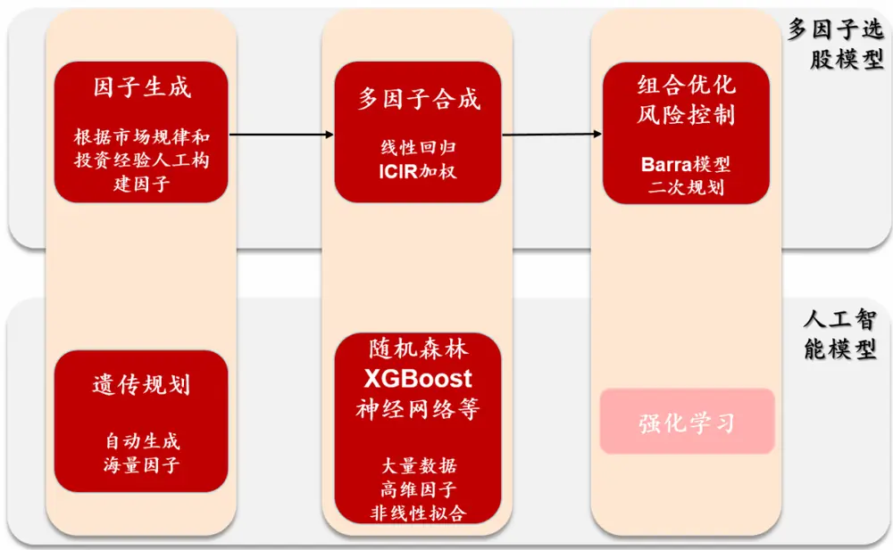
资料来源：华泰证券研究所

1. 对于因子生成步骤，传统多因子研究中人们一般从市场可见的规律和投资经验入手，进行因子挖掘和改进，常见的因子如估值、成长、财务质量、波动率等都是通过这种方法研究得出的。遗传规划作为一种优秀的特征生成工具，能在海量数据中自动探索，通过“进化”的方式得出一些经过检验有效的选股因子，拓展了因子生成的可探索领域。

2. 对于多因子合成步骤，传统多因子模型中一般使用线性回归、ICIR 加权等线性模型来合成因子，其优点是模型简单可控。在人工智能领域，则有各类机器学习模型(如随机森林、XGBoost、神经网络等)能替代线性模型来进行因子合成。相比线性模型，机器学习模型有更大的模型容量(capacity)，可以利用大量数据和高维因子，并进行非线性关系拟合。

3. 对于组合优化和风险控制，目前主流的方法是基于 Barra 的多因子风险模型进行风险预测和管理，并结合二次规划模型进行组合优化。如何将人工智能模型运用于该步骤有待更加深入的研究，强化学习可能是一个方向(由于目前我们尚无具体的相关研究，图表 1 中该处标为浅红色)。强化学习目前被广泛用于序列决策相关的问题中，如 AlphaGO(围棋AI)、AlphaStar(星际争霸 AI)、自动驾驶等。多因子模型中，组合优化步骤会在每个截面上根据预期收益和预期风险给出投资组合权重，强化学习或许可以融入组合优化步骤，得出更优的投资组合权重。

## 基于量价的人工智能选股体系概览

量价数据是 A 股市场中最丰富的数据来源，从日频到 Tick 级别的量价数据描述了市场参与者在各个频率上的交易行为。由于 A股市场并非完全有效的市场，众多投资者的交易行为造成了股票短期的定价偏差，使得从中获得超额收益成为可能。基于量价的量化策略尝试从各个频率上的交易行为中总结出市场规律，这种规律可以是基于严密逻辑推理得出的，也可以是基于人工智能模型自动挖掘得出的。通过科学的流程设计，人工智能模型可以自动挖掘市场中短期存在的量价规律，并利用海量的历史量价数据进行验证。如图表2所示，我们总结梳理了基于量价的人工智能选股体系，该体系囊括了多篇华泰金工人工智能选股报告的研究成果。

图表2： 基于量价的人工智能选股体系
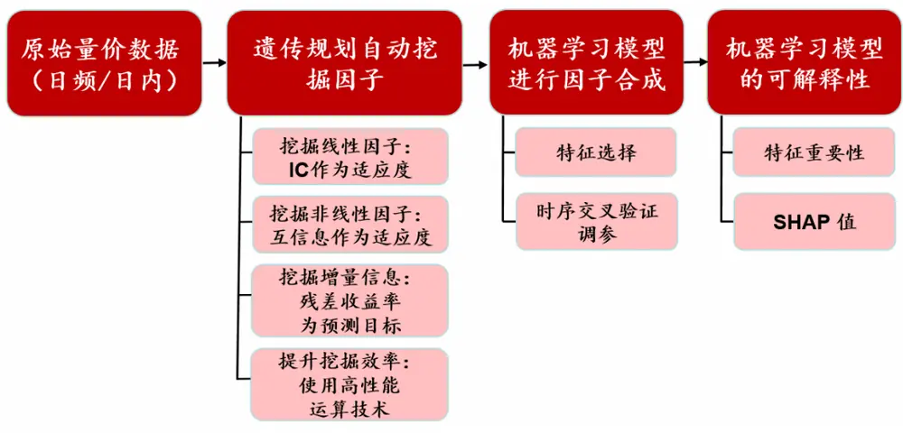
资料来源：华泰证券研究所

1. 原始量价数据：这里指个股在某个频率(从分钟频到日频)上的量价信息，包含开盘价、收盘价、最高价、最低价、成交量等，具体选用何种频率的量价数据，与策略的换手率有很大关系。

2. 遗传规划自动挖掘因子：遗传规划通过暴力生成+进化的方式，从原始量价数据中挖掘选股因子。本系列前期报告《基于遗传规划的选股因子挖掘》(2019.6.10)和《再探基于遗传规划的选股因子挖掘》(2019.8.7)中介绍了相关应用。该步骤包含以下关键点：

(1) 遗传规划中适应度的定义：我们认为在选股因子挖掘的过程中，适应度的定义是一个重要环节。如果以因子的 RankIC 作为适应度，则可以挖掘线性因子；如果以因子的互信息为适应度，则可以挖掘非线性因子。如图表 3 和图表 4所示，不同于线性因子，非线性因子的收益和因子暴露之间并非为单调关系，该类因子可能描述了市场中更高维度的规律，如果能利用这种规律，则可能为现有体系提供增量的 alpha 信息。

图表3： 以 RankIC为适应度挖掘出的线性因子的分层测试
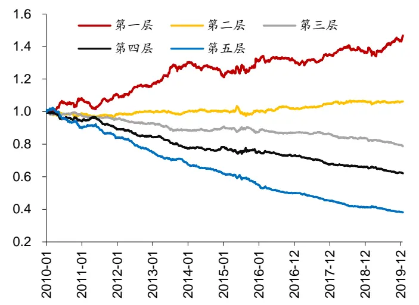
资料来源：Wind，华泰证券研究所

图表4： 以互信息为适应度挖掘出的非线性因子的分层测试
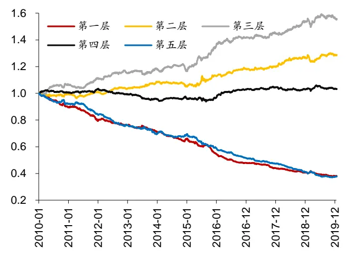
资料来源：Wind，华泰证券研究所

(2) 挖掘增量信息：随着挖掘出的因子逐渐增多，因子之间的相关性也在上升。为了挖掘增量信息，需要引入因子正交化机制，一般来说有两种方法：

a) 如下式所示，将新挖掘因子 $X_{k+1}$ 与全部已有因子 $\text{" }X_{i}正$ 交化得到残差因子 $X_{res}$ (下标n 代表第 n 个截面)，再计算残差因子和收益率之间的适应度(以 RankIC 为例)。

$$
X_{n,k+1}=\sum_{i}^{k}X_{n,i}f_{n,i}+X_{res},
$$

$$
Fiteness=\operatorname{RankIC}(X_{res},r_{n})
$$

b) 以收益率 $r_{n}$ 为因变量，全部已有因子 $X_{i}$ 为自变量，回归得到残差收益率 $\cdot r_{res}($ (下标 n代表第 n 个截面)，计算新挖掘因子 $X_{k+1}$ 和残差收益率之间的适应度(以 RankIC为例)。

$$
r_{n}=\sum_{i}^{k}X_{n,i}f_{n,i}+r_{res},
$$

$$
Fiteness=\operatorname{RankIC}(X_{n,k+1},r_{res})
$$

方法(a)的问题在于对每个待计算适应度的因子来说，都要和已有因子进行正交化，这会造成过大的时间和计算资源的开销，使因子挖掘效率低下(经过测试，因子正交化所需时间约占适应度计算时间的 70%)。而方法(b)只需要在每一轮因子挖掘前计算残差收益率即可，可以提升因子挖掘的效率。另外值得注意的是，方法(b)使用线性回归来计算残差收益率，但因变量中可能包含非线性因子，且因变量之间也不完全正交，此时可考虑使用核主成分分析(KPCA)对因变量进行非线性降维后得到正交的主成分，再计算残差收益率。关于核主成分分析的介绍和实证，请参见附录 1。

(3) 提升因子挖掘的效率：遗传规划需要在有限时间内进行启发式搜索，算法的运行速度越快，则能遍历的可能情形越多，因此优化算法的运行速度可提升因子挖掘的效率。遗传规划中时间开销较大的步骤有两个：因子计算和适应度计算，对于因子计算速度的优化，可考虑以下方法：

a) 利用并行计算：例如遗传规划某一代中要遍历 500 个因子，可将 500 个因子平均分为 10组，交给 10 个线程(或进程)并行计算。

b) 利用速度更快的语言或程序包：单个因子涉及到大量的矩阵运算，可考虑使用C/C++等高性能语言实现。对于 Python 来说也有一些高性能计算的程序包可以使用，例如 Bottleneck，详细内容可参见附录 2。

3. 机器学习模型进行因子合成：在这个步骤，我们使用机器学习模型(如随机森林、XGBoost、神经网络等)来替代线性模型进行因子合成。相比线性模型，机器学习模型有更大的模型容量，可以综合利用遗传规划挖掘出的线性和非线性因子。针对机器学习模型易过拟合的缺点，我们引入特征选择和时序交叉验证调参的方式来缓解过拟合。

(1) 特征选择：特征选择方法可以缓解模型的“维数灾难”，提升泛化能力。相比于传统的因子来说，通过遗传规划挖掘出的因子可解释性较差，因子存在失效的可能，因此特征选择变得更加重要。如图表 5所示，特征选择的大类方法有过滤式、包裹式、嵌入式三类。

a) 过滤式：该方法先使用特征选择对原始特征集合进行“过滤”，再基于过滤后的特征训练模型，这一特征选择过程与后续模型的训练无关。

b) 包裹式：该方法考虑后续模型的性能并以之作为特征子集优劣的评价准则，包裹式特征选择为给定的模型“量身定做”了最优的特征子集，由于需要多次训练模型，该方法的时间成本远大于过滤式方法。

c) 嵌入式：将特征选择和后续模型训练融为一体，即在模型训练过程中自动完成特征选择，例如 Lasso 回归、随机森林可视为嵌入式特征选择方法。关于特征选择的更详细内容可参见本系列前期报告《人工智能选股之特征选择》(2018.7.25)。

(2) 时序交叉验证调参：交叉验证是选择模型最优超参数的重要步骤。由于股票因子在不同横截面上存在时间序列相关性，不满足样本独立同分布假设，所以使用传统交叉验证方法(如 K折交叉验证)选择参数可能出现未来信息预测历史的“作弊”行为，我们推荐使用时序交叉验证调参，本系列前期报告《对抗过拟合：从时序交叉验证谈起》(2018.11.28)有过详细介绍。

图表5： 缓解机器学习过拟合的方法
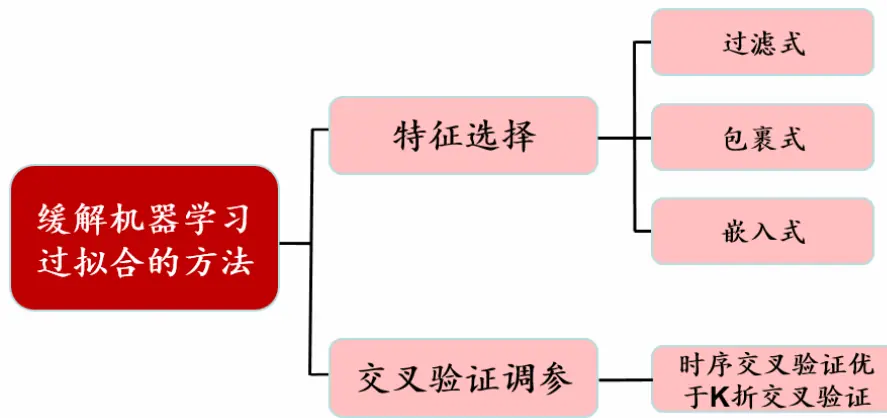
资料来源：华泰证券研究所

4. 机器学习模型的可解释性：由于原理复杂，多数人倾向于认为机器学习模型是一个“黑箱”，然而近年来对于机器学习模型可解释性方面的研究也有较大进展。模型的可解释性是指人类能够理解其决策原因的程度。优秀的可解释性有助于打开机器学习模型的“黑箱”，提升人类对模型的信任，其重要性体现在：建模阶段，辅助研究人员理解模型，进行模型的对比选择，必要时优化调整模型；在投入运行阶段，向他人解释模型的内部机制和结果，并通过可解读的反馈结果不断优化模型。本系列前期报告《揭开机器学习模型的“黑箱”》(2020.2.6)有过详细介绍。

特征重要性：对于基于决策树的随机森林、XGBoost 模型来说，都可以根据决策树的分裂准则计算特征重要性。特征重要性能够给出各个选股因子的“权重”，从而能得知模型做出决策的主导因素。

SHAP 值：SHAP 值(https://github.com/slundberg/shap)的概念源于博弈论，核心思想是计算特征对模型输出的边际贡献。SHAP值的原理可以这样通俗地理解：对于每个预测样本，模型都产生一个预测值，SHAP值就是该样本中每个特征所分配到的贡献数值。基于SHAP 值可以构建一套完备的机器学习模型可解释性工具。由于 SHAP值利用模型的预测结果进行解释，基于 SHAP 值的模型解释是一种和模型无关的方法，即机器学习领域中的大多数模型都可以用 SHAP值进行解释。目前 SHAP值可以完成以下任务：

(1) 通过对比不同模型中各个因子的 SHAP值，可得知模型对于因子的使用差异，从而辅助挑选合适的模型。

(2) SHAP 值能给出各个因子的作用方向(如因子是正向的、负向的、或是非线性的)，使得研究人员能得知模型对于因子的使用是否符合预期。

(3) SHAP值能分析因子之间的交互作用，从而辅助分析模型对多个因子的交互使用机制。

## 基于量价的人工智能选股体系测试流程

## 数据准备

1. 股票池：全 A股，剔除 ST、PT 股票，剔除每个截面期下一交易日涨跌停和停牌的股票。

2. 原始数据为未经过特征工程的个股量价信息，如图表 6所示。

3. 挖掘因子所需的函数列表如图表 7所示。

图表6： 原始数据列表

| 名称 | 定义 |
| --- | --- |
| return1 | 个股日频收益率(由相邻两个交易日的后复权收盘价计算得来) |
| open, close, high, low, volume | 个股日频开盘价、收盘价、最高价、最低价、成交量 |
| vwap | 个股日频成交量加权平均价 |
| turn, free_turn | 个股日频换手率、自由流通股换手率 |

资料来源：Wind，华泰证券研究所

图表7： 函数列表
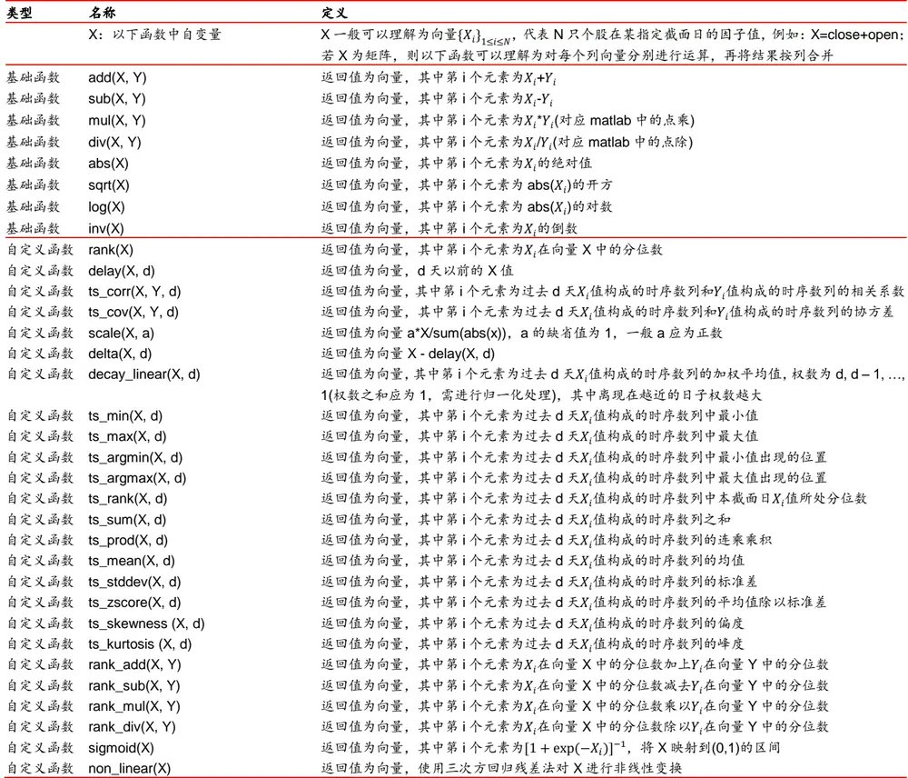
资料来源：华泰证券研究所

## 使用遗传规划进行因子挖掘

以滚动方式挖掘因子：从 2011 年 1 月 31 日到 2020 年 1 月 23 日，每隔一年，使用过去6 年的原始量价数据作为样本内数据挖掘因子。每次挖掘的流程如图表 8 所示，具体步骤如下：

1. 初始化种群：设置种群大小为 500，进化代数为 4 代。使用图表 6 中的因子和图表 7中的函数集，生成大量因子。

2. 公式适应度的计算：以挖掘增量信息为目标。第一轮挖掘时，以剔除风格因子(行业、市值、20 日收益率、20 日波动率、20 日换手率)的残差收益率为预测目标，计算因子的适应度。从第二轮开始，以上一轮的残差收益率为预测目标，计算因子的适应度。

3. 因子适应度判断：计算因子和残差收益率之间的适应度 (RankIC或互信息)，如果因子的适应度大于 0.015，则因子进入备选池。

4. 按照遗传规划的流程逐代进化。

5. 备选因子筛选：在备选因子池中，计算两两因子间的相关系数，删除相关性高(因子截面相关系数绝对值在 0.8 以上)的两个因子中适应度偏低的因子，得到最终因子池。

6. 以收益率为因变量，全部已有因子为自变量，回归得到残差收益率，供下一轮因子挖掘使用。

7. 重复以上(1)~(6)步，进行多轮因子挖掘，直到达到停止条件：预设的最大轮数或者不能挖出新因子，则停止。由于算力有限，本文设置最大轮数为 5轮。

图表8： 以残差收益率为预测目标，进行多轮因子挖掘
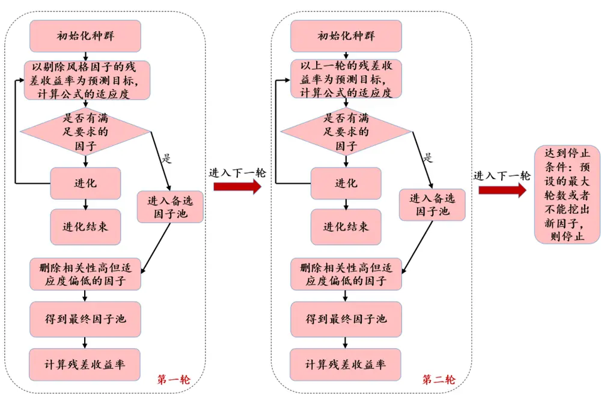
资料来源：华泰证券研究所

图表 9展示了部分因子的表达式。图表 10中为各个时间点挖掘出的因子数量。

图表9： 遗传规划挖掘出的选股因子

| 因子表达式 | 使用的适应度指标 |
| --- | --- |
| ts_corr(div(vwap, high), high, 10) | RankIC |
| ts_sum(rank(ts_corr (high, low, 20)),20) | RankIC |
| -sigmoid(rank(ts_cov(turn, close, 10))) | RankIC |
| -ts_cov(delay(turn, 3), volume, 7) | 互信息 |
| -ts_cov(delay(volume, 5), vwap, 4) | 互信息 |
| -ts_cov(ts_cov(delay(low, 3), turn, 7), turn, 7) | 互信息 |

资料来源：Wind，华泰证券研究所

图表10： 各个时间点挖掘出的因子数量

| 时间 | 2011-01 | 2012-01 | 2013-01 | 2014-01 | 2015-01 | 2016-01 | 2017-01 | 2018-01 | 2019-01 |
| --- | --- | --- | --- | --- | --- | --- | --- | --- | --- |
| 因子数量 | 146 | 149 | 153 | 149 | 151 | 149 | 154 | 156 | 140 |

资料来源：Wind，华泰证券研究所

## 使用机器学习模型合成因子

1. 模型选择：为了简单起见，本文选择嵌入式特征选择方法，即在模型训练时自动进行特征选择。这里我们选择随机森林模型，该模型具有非线性拟合能力，可以自动进行特征选择，且可通过行采样和列采样来缓解过拟合。

2. 特征预处理：

(1) 使用遗传规划挖掘出的因子作为特征。

(2) 中位数去极值：设第 T 期某因子在所有个股上的暴露度序列为 $D_{i},~D_{M}$ 为该序列中位数， $D_{M1}$ 为序列 $|D_{i}-D_{M}|$ 的中位数，则将序列 $D_{i}$ 中所有大于 $D_{M}+5D_{M1}$ 的数重设为 $D_{M}+5D_{M1}$ ，将序列 $D_{i}$ 中所有小于 ${}^{\cdot}D_{M}-5D_{M1}$ 的数重设为 $D_{M}-5D_{M1}$ ；

(3) 行业市值中性化：将填充缺失值后的因子暴露度对行业哑变量和取对数后的市值做线性回归，取残差作为新的因子暴露度；

(4) 标准化：将中性化处理后的因子暴露度序列减去其现在的均值、除以其标准差，得到一个新的近似服从 N(0, 1)分布的序列。

3. 数据标注：使用经过标准化的个股未来 20个交易日收益率。

4. 交叉验证调参和模型训练：从 2011 年 1 月 31 日到 2020 年 1 月 23 日，每隔半年，使用过去 6 年的数据作为样本内数据，进行时序交叉验证调参并用新参数重新训练模型，各个时间点的调参结果如图表 10 所示。

5. 样本外预测：在每个样本外数据截面上，使用最新训练的模型预测个股 20 个交易日后的收益率。

图表11： 随机森林模型的超参数

| 时间 | 2011-01 | 2011-07 | 2012-01 | 2012-07 | 2013-01 | 2013-07 | 2014-01 | 2014-07 2015-01 |  |
| --- | --- | --- | --- | --- | --- | --- | --- | --- | --- |
| 决策树数量(n_estimators) | 80 | 60 | 80 | 100 | 80 | 80 | 100 | 100 | 120 |
| 决策树分裂使用的特征比例(max_features) | 0.1 | 0.1 | 0.1 | 0.1 | 0.2 | 0.1 | 0.2 | 0.2 | 0.1 |
| 决策树最大深度(max_depth) | 8 | 8 | 10 | 10 | 10 | 12 | 10 | 10 | 10 |
| 时间 | 2015-07 | 2016-01 | 2016-07 2017-01 |  | 2017-07 | 2018-01 | 2018-07 2019-01 2019-07 |  |  |
| 决策树数量(n_estimators) | 100 | 100 | 120 | 100 | 80 | 60 | 80 | 80 | 100 |
| 决策树分裂使用的特征比例(max_features) | 0.1 | 0.2 | 0.2 | 0.1 | 0.1 | 0.1 | 0.1 | 0.1 | 0.1 |
| 决策树最大深度(max_depth) | 10 | 10 | 8 | 10 | 8 | 8 | 8 | 10 | 10 |

资料来源：Wind，华泰证券研究所

## 组合构建和回测

对于随机森林模型合成的因子，进行以下测试：

1. 单因子 IC 测试和分层测试。分析因子的 RankIC 均值、ICIR、分层组合年化收益率等指标。

2. 构建行业市值中性的中证 500增强策略进行回测。分析策略的年化超额收益率、信息比率、超额收益最大回撤等指标。

## 机器学习模型的可解释性分析

对训练好的模型分析特征重要性和 SHAP值，从而得知因子在模型中的权重和作用方向。

## 测试结果

本章将对基于量价的人工智能选股体系进行详细测试。由于我们使用遗传规划挖掘因子并利用随机森林合成因子，测试的模型简称为“遗传规划+随机森林”模型。

## “遗传规划+随机森林”模型的单因子 IC测试

我们将“遗传规划+随机森林”模型在每个截面上的预测结果视为合成的单因子，进行单因子 IC测试。测试方法如下：

1. 回测区间：2011 年 1 月 31 日到 2020 年 1 月 23 日。

2. 截面期：每隔 20 个交易日，用当前截面期因子值与当前截面期至下个截面期内的个股收益计算 RankIC 值。

3. 为了分析合成因子的增量信息，会展示因子进行行业、市值、20 日收益率、20 日波动率、20 日换手率五因子中性化后的测试结果。

图表12~图表13展示了合成因子的IC测试结果，合成因子在进行了五因子中性后，RankIC均值为 8.87%，IC_IR 为 1.16，增量信息显著。

图表12： 合成因子 IC 值分析 (回测期 20110131～20200123)

|  | RankIC 均值 | RankIC 标准差 | IC_IR | IC>0 占比 |
| --- | --- | --- | --- | --- |
| 合成因子 | 9.61% | 8.82% | 1.09 | 87.36% |
| 合成因子进行行业市值中性 | 9.66% | 8.64% | 1.12 | 88.47% |
| 合成因子进行五因子中性 | 8.87% | 7.66% | 1.16 | 85.59% |

资料来源：Wind，华泰证券研究所

图表13： 合成因子的累计 RankIC (回测期 20110131～20200123)
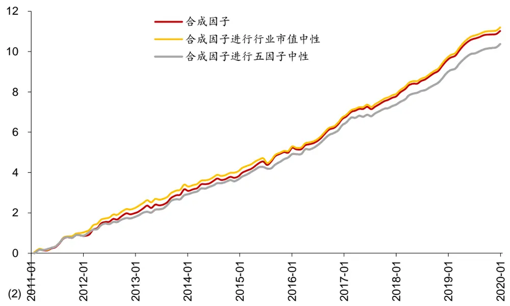
资料来源：Wind，华泰证券研究所

## “遗传规划+随机森林”模型的单因子分层测试

我们将“遗传规划+随机森林”模型在每个截面上的预测结果视为合成的单因子，进行单因子分 5层测试。测试方法如下：

1. 股票池、回测区间、截面期均与 IC测试一致。

2. 换仓：在每个截面期核算因子值，构建分层组合，在截面期下一个交易日按当日 vwap换仓，交易费用为单边千分之二。

3. 分层方法：先将因子暴露度向量进行一定预处理，将股票池内所有个股按处理后的因子值从大到小进行排序，等分 N 层，每层内部的个股等权重配置。当个股总数目无法被 N 整除时采用任一种近似方法处理均可，实际上对分层组合的回测结果影响很小。分层测试中的基准组合为股票池内所有股票的等权组合。

4. 多空组合收益计算方法：用 Top 组每天的收益减去 Bottom 组每天的收益，得到每日多空收益序列r1, r2, ⋯ , rn，则多空组合在第 n 天的净值等于(1 + r1)(1 + r2) ⋯ (1 + rn)。

5. 为了分析合成因子的增量信息，会展示因子进行行业、市值、20 日收益率、20 日波动率、20 日换手率五因子中性化后的测试结果。

图表 14~图表 15 展示了合成因子的分层测试结果，合成因子在进行了五因子中性后，TOP组合年化超额收益率为 9.65% ，信息比率为 3.08，多空组合年化收益率为 28.20%，多空组合夏普比率为 3.08。合成因子增量信息显著。

图表14： 合成因子分层测试结果(回测期 20110131～20200123)

|  |  |  |  |  |  | 多空组合 夏普比率 | 多空组合TOP 组合信 TOP 组合 | 息比率 胜率 |
| --- | --- | --- | --- | --- | --- | --- | --- | --- |
|  |  | 分层组合1～5(从左到右)年化超额收益率 |  |  | 年化收益率 |  |  |  |
| 合成因子 | 10.30% | 3.64% | -1.67% | -8.73%-17.16% | 32.82% | 4.93 | 3.09 | 82.41% |
| 合成因子进行行业市值中性 | 9.86% | 3.17% | -1.40% | -8.93%-16.51% | 31.20% | 4.57 | 2.94 | 80.56% |
| 合成因子进行五因子中性 | 9.65% | 2.63% | -2.43% | -9.74%-14.63% | 28.20% | 4.85 | 3.08 | 77.78% |

资料来源：Wind，华泰证券研究所

图表15： 合成因子进行五因子中性化的分层测试(回测期 20110131～20200123)
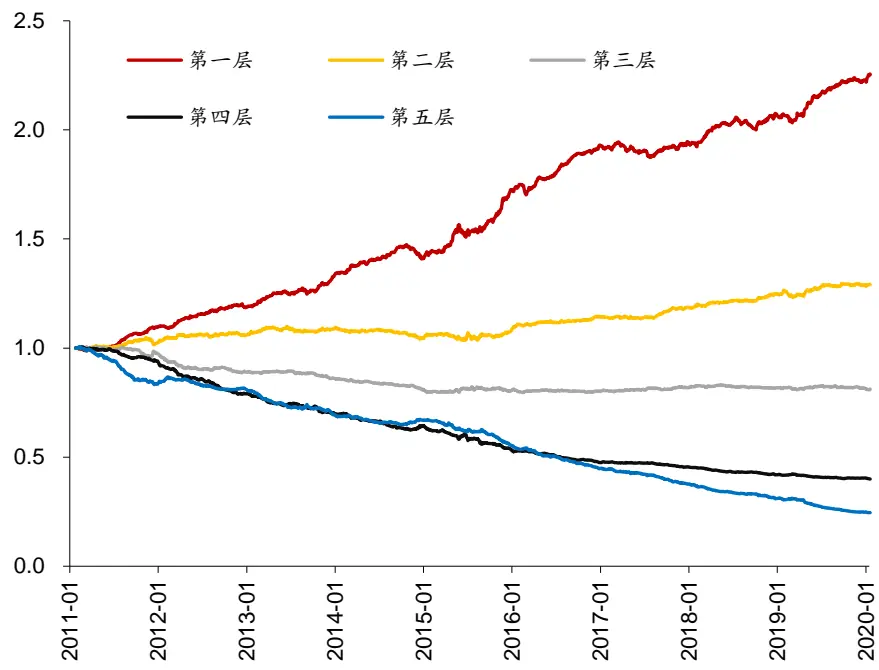
资料来源：Wind，华泰证券研究所

## “遗传规划+随机森林”模型构建行业市值中性的中证 500增强策略

我们将“遗传规划+随机森林”模型在每个截面上的预测结果视为合成的单因子，构建相对于中证 500 的行业、市值中性的全 A 选股策略并进行回测，测试方法如下：1. 股票池、回测区间、截面期均与 IC测试一致。

2. 换仓：在每个截面期核算因子值，通过组合优化模型得到新的持仓股票和权重，在截面期下一个交易日按当日 vwap 换仓，交易费用为单边千分之二。

图表 16~图表 18 展示了不同个股权重偏离情况下的回测结果。

图表16： 行业市值中性的中证 500增强策略回测绩效(回测期：20110131～20200123)

|  |  |  |  |  | 年化超额收 | 年化跟踪超额收益最 |  |  | Calmar 相对基准 比率 | 月胜率 | 月均双边 换手率 |
| --- | --- | --- | --- | --- | --- | --- | --- | --- | --- | --- | --- |
|  | 年化收益率年化波动率夏普比率 |  |  | 最大回撤 |  | 益率 误差 | 大回撤信息比率 |  |  |  |  |
| 个股权重偏离上限=0.5% | 16.20% | 24.33% | 0.67 | 45.33% | 13.21% | 5.35% | 5.27% | 2.47 | 2.51 | 76.85% | 113.49% |
| 个股权重偏离上限=1% | 18.91% | 24.35% | 0.78 | 42.80% | 15.81% | 6.13% | 7.27% | 2.58 | 2.17 | 77.78% | 114.15% |
| 个股权重偏离上限=1.5% | 19.73% | 24.34% | 0.81 | 42.66% | 16.55% | 6.73% | 7.68% | 2.46 | 2.16 | 76.85% | 113.65% |
| 个股权重偏离上限=2% | 19.33% | 24.43% | 0.79 | 43.32% | 16.17% | 7.06% | 7.45% | 2.29 | 2.17 | 76.85% | 113.72% |
| 中证 500 | 1.93% | 26.46% | 0.07 | 65.20% |  |  |  |  |  |  |  |

资料来源：Wind，华泰证券研究所

图表17： 行业市值中性的中证 500 增强策略回测绩效(回测期：20110131～20200123)

|  | 2011年 收益率 | 2012年 收益率 | 2013年 收益率 | 2014年 收益率 | 2015年 收益率 | 2016年 收益率 | 2017年 收益率 | 2018年 收益率 | 2019年 收益率 | 2020年 收益率 |
| --- | --- | --- | --- | --- | --- | --- | --- | --- | --- | --- |
| 个股权重偏离上限=0.5% | -19.02% | 13.68% | 33.91% | 46.25% | 87.86% | 0.95% | 6.01% | -26.89% | 38.61% | 1.16% |
| 个股权重偏离上限=1% | -15.93% | 16.39% | 36.70% | 43.41% | 98.68% | 3.94% | 7.97% | -26.62% | 42.86% | 1.45% |
| 个股权重偏离上限=1.5% | -16.11% | 18.35% | 38.23% | 42.73% | 104.88% | 0.94% | 11.14% | -27.54% | 45.30% | 1.86% |
| 个股权重偏离上限=2% | -16.23% | 20.65% | 35.28% | 42.69% | 101.05% | 2.92% | 11.63% | -29.52% | 44.86% | 1.94% |
| 中证500 | -28.17% | 0.28% | 16.89% | 39.01% | 43.12% | -17.78% | -0.20% | -33.32% | 26.38% | 2.09% |

资料来源：Wind，华泰证券研究所

图表18： 行业市值中性的中证 500增强策略超额收益情况(回测期：20110131～20200123)
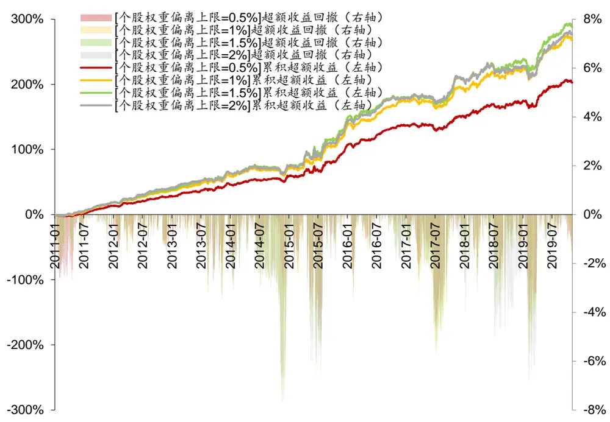
资料来源：Wind，华泰证券研究所

## “遗传规划+随机森林”模型增量超额收益分析

“遗传规划+随机森林”模型使用算法自动生成的因子来构建收益预测模型，其相对于使用传统因子构建的收益预测模型能提供多少超额收益？本节将进行分析。测试方法如下：

1. 股票池、回测区间、截面期均与 IC测试一致。

2. 换仓：在每个截面期核算因子值，通过组合优化模型得到新的持仓股票和权重，在截面期下一个交易日按当日 vwap 换仓，交易费用为单边千分之二。

3. 对比的模型：

模型 1：“遗传规划+随机森林”模型。

模型 2：以估值、成长、财务质量、杠杆、动量反转、波动率、换手率、beta、股价、技术、一致预期共 88 个传统因子为输入因子，个股 20 个交易日收益率为拟合目标，使用 XGBoost 模型得到合成因子(详细模型构建方法可参见报告《人工智能选股之Boosting 模型》，2017.9.11)。

模型 3：将模型 1 得到的合成因子和模型 2得到的合成因子等权相加。

我们主要对比模型 2 和模型 3 的表现，即观察使用传统因子的模型在叠加“遗传规划+随机森林”模型前后超额收益的变化。图表 19~图表 20 展示了模型 2 和模型 3 在不同个股权重偏离情况下的回测结果，在 4种情况下，模型 3 相比模型 2年化超额收益率平均提升1.38%，信息比率平均提升 0.14。

图表19： 使用模型 2构建的行业市值中性的中证 500增强策略回测绩效(回测期：20110131～20200123)

|  |  |  |  |  | 年化超额 | 年化跟踪超额收益最 |  | Calmar 相对基准 |  |  | 月均双边 换手率 |
| --- | --- | --- | --- | --- | --- | --- | --- | --- | --- | --- | --- |
|  | 年化收益率年化波动率夏普比率 |  |  | 最大回撤 |  | 收益率 | 误差 | 大回撤信息比率 | 比率 | 月胜率 |  |
| 个股权重偏离上限=0.5% | 16.27% | 25.39% | 0.64 | 45.59% | 13.59% | 5.20% | 5.23% | 2.62 | 2.60 | 76.85% | 108.86% |
| 个股权重偏离上限=1% | 18.60% | 25.16% | 0.74 | 43.94% | 15.75% | 6.01% | 6.27% | 2.62 | 2.51 | 75.93% | 112.53% |
| 个股权重偏离上限=1.5% | 18.50% | 25.12% | 0.74 | 43.57% | 15.60% | 6.48% | 6.68% | 2.41 | 2.34 | 72.22% | 113.16% |
| 个股权重偏离上限=2% | 18.75% | 25.19% | 0.74 | 44.20% | 15.84% | 6.79% | 6.74% | 2.33 | 2.35 | 74.07% | 113.64% |
| 中证 500 | 1.93% | 26.46% | 0.07 | 65.20% |  |  |  |  |  |  |  |

资料来源：Wind，华泰证券研究所

图表20： 使用模型 3 构建的行业市值中性的中证 500 增强策略回测绩效(回测期：20110131～20200123)

|  |  |  |  |  | 年化超额 | 年化跟踪超额收益最 |  | 比率 | Calmar 相对基准 | 月胜率 | 月均双边 换手率 |
| --- | --- | --- | --- | --- | --- | --- | --- | --- | --- | --- | --- |
|  | 年化收益率年化波动率夏普比率 |  |  | 最大回撤 |  | 收益率 误差 | 大回撤信息比率 |  |  |  |  |
| 个股权重偏离上限=0.5% | 17.82% | 25.23% | 0.71 | 45.30% | 15.05% | 5.34% | 5.75% | 2.82 | 2.62 | 75.93% | 111.57% |
| 个股权重偏离上限=1% | 19.87% | 24.87% | 0.80 | 43.37% | 16.88% | 6.22% | 6.34% | 2.71 | 2.66 | 77.78% | 114.18% |
| 个股权重偏离上限=1.5% | 20.12% | 25.03% | 0.80 | 44.06% | 17.14% | 6.71% | 6.97% | 2.56 | 2.46 | 73.15% | 115.22% |
| 个股权重偏离上限=2% | 20.19% | 25.15% | 0.80 | 44.05% | 17.21% | 7.06% | 7.48% | 2.44 | 2.30 | 68.52% | 115.84% |
| 中证500 | 1.93% | 26.46% | 0.07 | 65.20% |  |  |  |  |  |  |  |

资料来源：Wind，华泰证券研究所

图表 21展示了个股权重偏离上限=1.5%时模型 2 和模型 3 的超额收益对比。

图表21： 个股权重偏离上限=1.5%时模型 2和模型 3的超额收益对比(回测期：20110131～20200123)
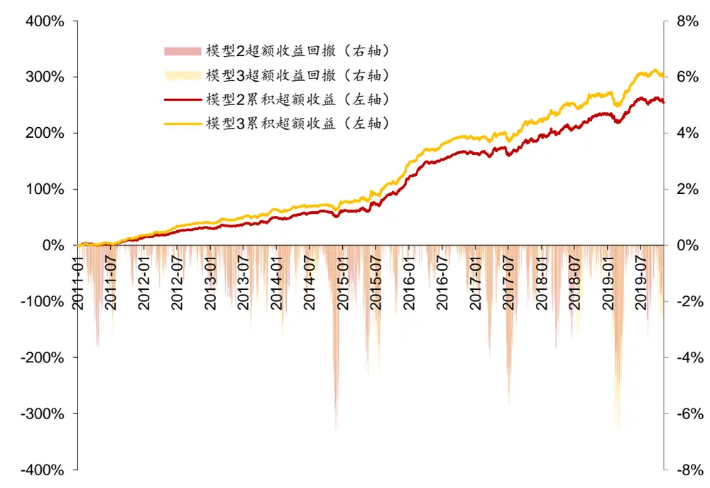
资料来源：Wind，华泰证券研究所

## 机器学习模型的可解释性分析

本节将利用SHAP值进行可解释性分析。我们选取最新一次训练的随机森林模型(2019-07)，在图表 22 和图表 23 中展示模型的|SHAP|均值和 SHAP值。|SHAP|均值只反映因子的重要性，SHAP值则包含因子的方向信息。由于因子数量众多而篇幅有限，图中仅展示|SHAP|均值排名前 30 的因子。图表 22 中，因子的|SHAP|均值越大，表明因子的重要性越高。图表 23 中，若因子的颜色分布为严格的左蓝中紫右红，那么在模型中因子为正向的线性因子；若因子的颜色分布为严格的左红中紫右蓝，那么在模型中因子为反向的线性因子；若因子的颜色分布非以上两种情况之一，则模型在使用因子时呈现出一定非线性规律。

图表22： 随机森林模型中因子的|SHAP|值(前 30因子)
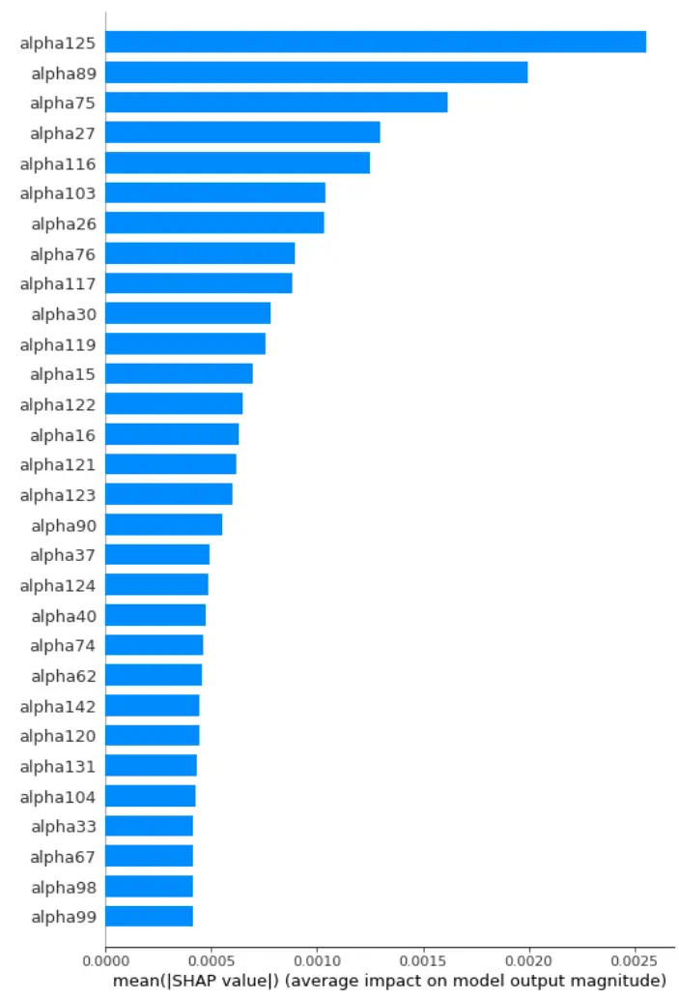
资料来源：Wind，华泰证券研究所

图表23： 随机森林模型中因子的 SHAP值(前 30因子)
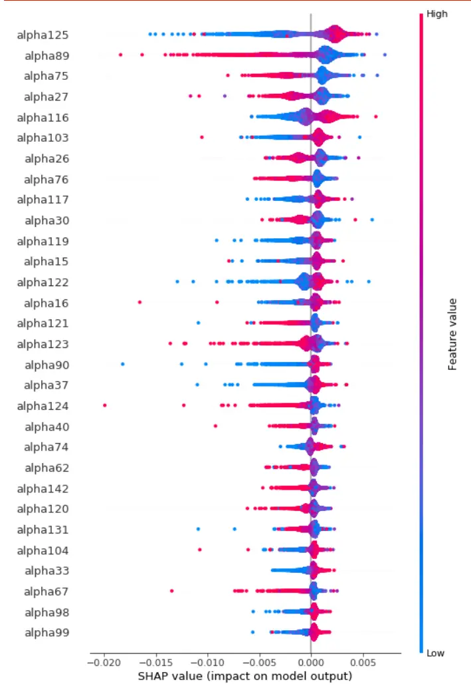
资料来源：Wind，华泰证券研究所

进一步地，我们对|SHAP|均值排名靠前的因子进行分析。对于 2019 年 7 月训练的模型来说，其利用的是 2013 年 7 月至 2019 年 7 月的因子数据，因此因子的分层测试区间也为2013 年 7 月至 2019 年 7 月。

## 1. alpha125：ts_corr(sub(open,free_turn),close,10)

在图表 24 的 alpha125 的分层测试中，该因子为正向的线性因子，但第一层和第二层区分不大，且第二层比第一层稳定。如图表 25 所示，alpha125 的 SHAP值和因子取值的关系可分两部分来分析，当因子取值小于 1 时(主要对应分层测试的三、四、五层)，SHAP 值和因子取值近似为正向线性关系，这与因子的分层测试结果吻合。当因子取值大于 1 时(主要对应分层测试的一、二层)，SHAP值随着因子取值的变大变化不大，甚至稍有下降，这也与因子的分层测试结果相呼应，而且模型倾向于给更稳定的第二层更高的 SHAP 值。以上分析说明随机森林模型对于 alpha125 的使用符合预期。

图表24： alpha125 因子的分层测试
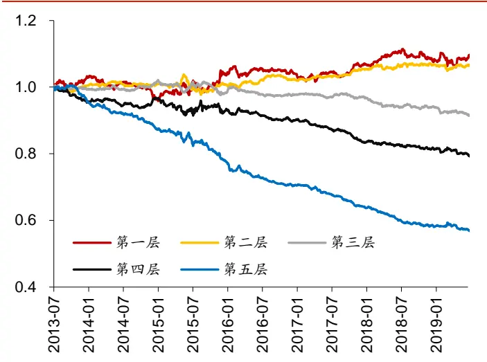
资料来源：Wind，华泰证券研究所

图表25： alpha125 因子的 SHAP 值和因子取值的关系
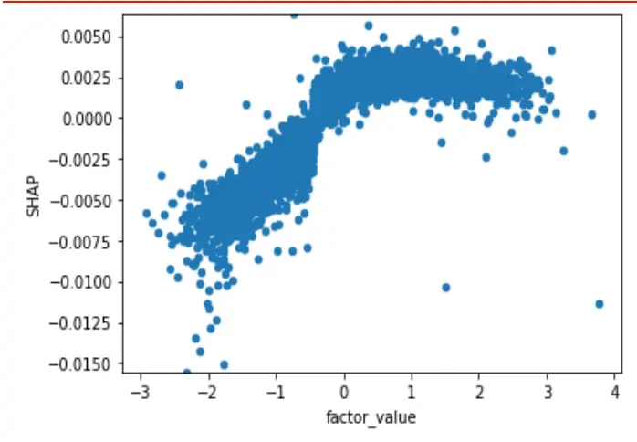
资料来源：Wind，华泰证券研究所

## 2. alpha89: rank_mul(turn, add(high, volume))

在图表 26 的 alpha89 的分层测试中，该因子为反向的线性因子，但第四层和第五层区分不大，且第四层比第五层稳定。如图表 27 所示，alpha89 的 SHAP 值和因子取值的关系可分两部分来分析，当因子取值大于 0 时(主要对应分层测试的一、二、三层)，SHAP 值和因子取值为近似为负向线性关系，这与因子的分层测试结果吻合。当因子取值小于 0 时(主要对应分层测试的四、五层)，SHAP 值随着因子取值的变小变化不大，甚至稍有下降，这也与因子的分层测试结果吻合，而且模型倾向于给更稳定的第四层更高的 SHAP 值。以上分析说明随机森林模型对于 alpha89 的使用符合预期。

图表26： alpha89 因子的分层测试
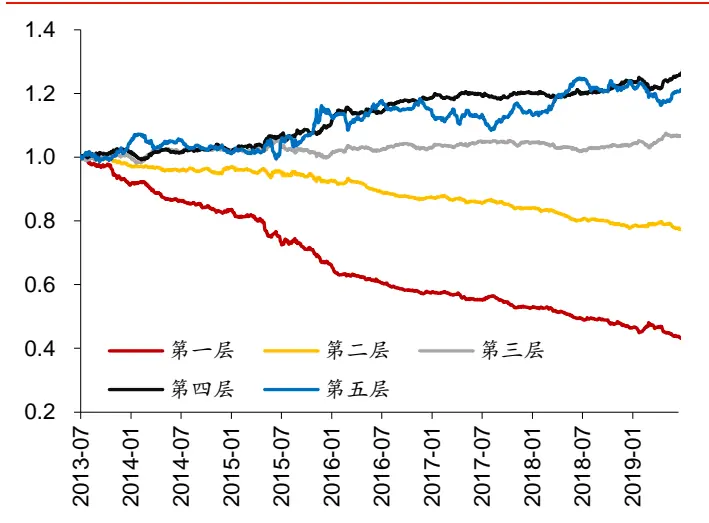
资料来源：Wind，华泰证券研究所

图表27： alpha89因子的 SHAP值和因子取值的关系
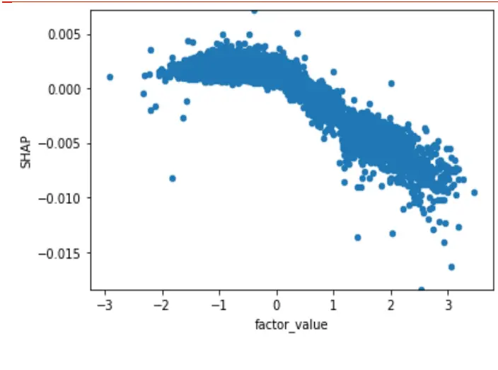
资料来源：Wind，华泰证券研究所

随机森林模型对于|SHAP|均值排名 3、4、5 的因子也基本呈现出线性的逻辑，这与alpha125 和 alpha89 类似，本文不再赘述。接下来我们分析|SHAP|均值排名第 6 的因子alpha103，该因子为非线性因子。

## 3. alpha103: ts_corr(high,low,20)

在图表 28 的 alpha103 的分层测试中，因子的第二层到第五层的超额收益表现单调，但是第一层的超额收益表现位于中间，因子呈现出非线性特征。如图表 29所示，alpha103 的SHAP 值和因子取值的关系可分两部分来分析，当因子取值小于 0.5 时(主要对应分层测试的二、三、四、五层)，SHAP 值和因子取值近似为正向线性关系，这与因子的分层测试结果吻合。当因子取值大于 0.5 时(主要对应分层测试的一、二层)，SHAP 值随着因子取值的变大而明显下降，这也与因子的分层测试结果相呼应，以上分析说明随机森林模型对于因子的使用符合预期，这同时也体现出了随机森林模型的非线性拟合能力。

图表28： alpha103 因子的分层测试
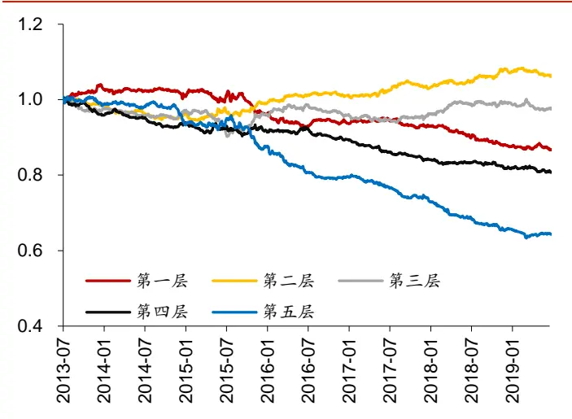
资料来源：Wind，华泰证券研究所

图表29： alpha103 因子的 SHAP 值和因子取值的关系
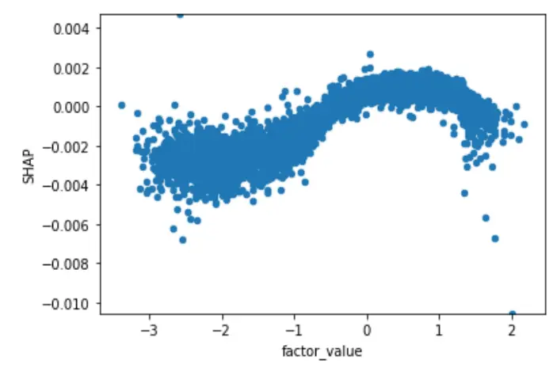
资料来源：Wind，华泰证券研究所

## 结论

本文在华泰金工人工智能系列前期报告的基础上，梳理出一套基于量价信息的全流程人工智能选股体系，完善了体系中的一些细节，并进行了实证。本文结论如下：

经过华泰金工前期报告的探索，我们认为人工智能模型已经可以很好融入多因子选股模型的因子生成和多因子合成步骤。在多因子模型的信息来源中，量价信息能提供海量的数据，是最适合 AI 技术运用的领域。本文构建了基于量价信息的全流程人工智能选股体系，主要包含三个步骤：(1) 遗传规划自动挖掘因子；(2) 机器学习模型进行多因子合成；(3) 机器学习模型的可解释性分析。在测试中，该体系能提供独立于传统多因子模型的增量超额收益。

步骤 1：遗传规划自动挖掘因子——因子的适应度、增量信息和挖掘效率。因子是超额收益的来源，遗传规划通过暴力生成+进化的方式，从原始量价数据中挖掘选股因子。该步骤中有三个关键环节：(1)因子适应度的定义，如果以因子的 RankIC 作为适应度，则可以挖掘线性因子；如果以因子的互信息为适应度，则可以挖掘非线性因子。非线性因子可能描述了市场中更高维度的规律，如果能利用这种规律，则可能为现有体系提供增量的 alpha信息。(2)挖掘增量信息需要引入因子正交化机制，为了避免频繁正交化带来的时间开销，我们提出以残差收益率为预测目标的增量信息挖掘方法。(3)提升因子挖掘的效率需要借助高性能计算的技术。

步骤 2：机器学习模型进行多因子合成——强拟合能力和过拟合的权衡。相比线性模型，机器学习模型有更强的拟合能力，能够拟合非线性关系。实际应用中，需要在机器学习的强拟合能力和过拟合现象间寻找平衡点。针对机器学习模型易过拟合的缺点，我们引入特征选择和时序交叉验证调参。本文选择嵌入式特征选择方法——随机森林模型，在模型训练时自动进行特征选择，并使用时序交叉验证对模型的三个关键参数寻优。

步骤 3：机器学习模型的可解释性分析——从“黑箱”到“白箱”。模型的可解释性是指人类能够理解其决策原因的程度。优秀的可解释性有助于打开机器学习模型的“黑箱”，提升人类对模型的信任，其重要性体现在：建模阶段，辅助研究人员理解模型，进行模型的对比选择，必要时优化调整模型；在投入运行阶段，向他人解释模型的内部机制和结果，并通过可解读的反馈结果不断优化模型。本文主要使用基于 SHAP值的方法进行模型可解释性分析。

基于量价的人工智能选股能提供独立于传统多因子模型的增量超额收益。本文从日频量价信息出发，通过遗传规划滚动挖掘调仓周期为 20 个交易日的因子，并使用随机森林模型拟合得到合成因子。合成因子进行行业、市值、20 日收益率、20 日波动率、20 日换手率五因子中性化后，RankIC均值为 8.87%，IC_IR 为 1.16，分五层测试中 TOP组合年化超额收益率为 9.65%，信息比率为 3.08。将合成因子叠加到使用传统因子的模型上后构建中证 500 增强选股组合，可使得组合的年化超额收益率平均提升 1.38%，信息比率平均提升0.14。SHAP值可解释性分析显示，随机森林模型有效利用了遗传规划挖掘出的线性因子和非线性因子。

## 风险提示

通过人工智能模型构建的选股策略是历史经验的总结，存在失效的可能。遗传规划所得因子可能过于复杂，可解释性较低，使用需谨慎。机器学习模型存在过拟合的风险。机器学习模型解释方法存在过度简化的风险。

```latex
1． 线性核： $\begin{array}{r}{K\big(\pmb{x}_{i},\pmb{x}_{j}\big)=\langle\pmb{x}_{i},\pmb{x}_{j}\rangle=\sum_{k=1}^{p}x_{i}^{(k)}x_{j}^{(k)}}\end{array}$
2． 多项式核： $\begin{array}{r}{K\big(\pmb{x}_{i},\pmb{x}_{j}\big)=\big(\gamma\langle\pmb{x}_{i},\pmb{x}_{j}\rangle+1\big)^{d}=(\gamma\sum_{k=1}^{p}x_{i}^{(k)}x_{j}^{(k)}+1)^{d}}\end{array}$ ，其中 d是多项式的阶数
3． Sigmoid 核： $K(\boldsymbol{x}_{i},\boldsymbol{x}_{j})=\tanh(\gamma\langle\boldsymbol{x}_{i},\boldsymbol{x}_{j}\rangle+1)=\tanh(\gamma\sum_{k=1}^{p}x_{i}^{(k)}x_{j}^{(k)}+1)$
4． 高斯核(RBF 核)： $K(\boldsymbol{x}_{i},\boldsymbol{x}_{j})=\exp(-\gamma(\sum_{k=1}^{p}(x_{i}^{(k)}-x_{j}^{(k)})^2))$
```
资料来源：华泰证券研究所

## 附录 1：核主成分分析简介

一般来说，主成分分析(Principal Components Analysis, PCA)适用于数据的线性降维。而核主成分分析(Kernel PCA, KPCA)可实现数据的非线性降维，可用于处理线性不可分的数据集。如图表 30 所示，KPCA 的流程是：对于输入空间中的特征 X，先用一个非线性映射φ把 X映射到一个高维甚至是无穷维的空间，使其线性可分，然后在这个高维空间进行PCA 降维。

图表30： KPCA 的流程
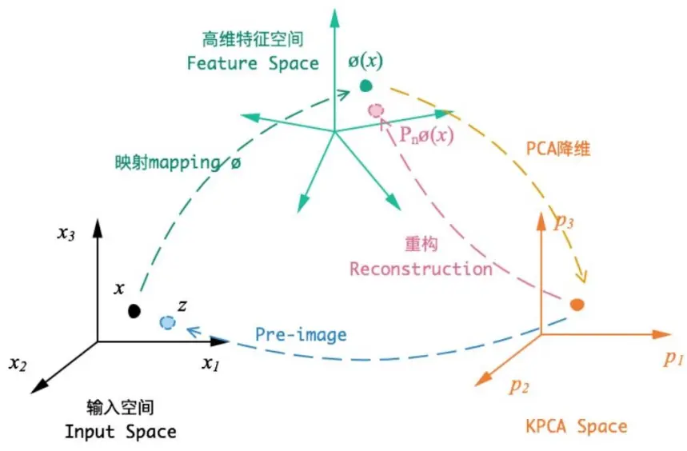
资料来源：华泰证券研究所

与支持向量机 SVM 类似，运用 KPCA时需要选择核函数，常用的核函数有：

图表31： KPCA常用核函数

为了形象化展示 KPCA 的效果，我们使用一个 sklearn 官网的例子来说明。如图表 32 所示，在二维空间中生成 400 个具有圆形决策边界的样本数据，红色样本点标签为 0，蓝色样本点标签为 1(图表 32 左上方)。显然原始数据是非线性可分的，PCA 降维后数据依然非线性可分(图表 32 右上方)。而 KPCA(RBF 核)通过非线性映射 ϕ将原始数据映射到高维空间后，能够对其进行线性降维(图表 32 左下方)，且 KPCA 的高维特征空间经过逆转换得到的样本空间与原始空间具有很高的相似性(图表 32 右下方)，说明 KPCA 对非线性可分数据的降维效果较好。

(https://scikit-learn.org/stable/auto_examples/decomposition/plot_kernel_pca.html#sphx -glr-auto-examples-decomposition-plot-kernel-pca-py)

图表32： PCA和 KPCA对非线性可分数据的降维效果对比
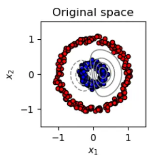

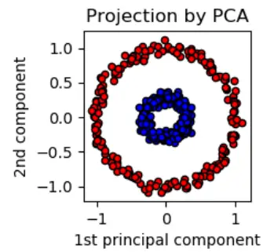

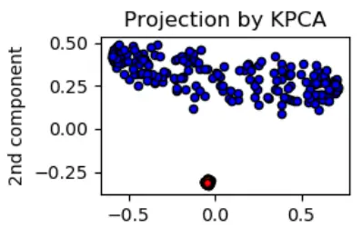
1st principal component in space induced by φ

Original space after inverse transform
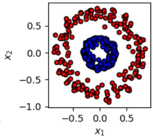
资料来源：sklearn，华泰证券研究所

前文提到，在使用遗传规划挖掘具有增量信息的因子时，我们可以使用以下方法：以收益率 $\cdot r_{n}$ 为因变量，全部已有因子 $X_{i}$ 为自变量，回归得到残差收益率 $\cdot r_{res^{\prime}}$ (下标 n代表第 n个截面)，计算新挖掘因子 $X_{k+}$ 1和残差收益率之间的适应度(以 RankIC 为例)。

$$
\begin{array}{r}{r_{n}=\sum_{i}^{k}X_{n,i}f_{n,i}+r_{res}}\end{array}\tag{1}
$$

$$
Fiteness=\operatorname{RankIC}(X_{n,k+1},r_{res})\tag{2}
$$

该方法使用线性回归来计算残差收益率，但因变量中可能包含非线性因子，且因变量之间也不完全正交，此时可考虑使用 KPCA对因变量进行非线性降维后得到正交的主成分，再计算残差收益率。一般来说，(1)式的拟合优度和显著性(如 R平方、F值)越高，说明已有因子 $X_{i}$ 对 $\left[r_{n}\right.$ 的解释程度越高，对残差收益率 $r_{res}$ 中的增量信息提纯效果越好。为了展示KPCA 的效果，我们通过以下三组测试进行对比：

1. 线性回归：直接以收益率 $r_{n}$ 为因变量，全部已有因子 $X_{i}$ 为自变量，进行线性回归，得到回归的 R 平方、调整 R平方、F值。

2. PCA+线性回归：对全部已有因子 $X_{i}$ 进行 PCA，取累积方差贡献达到 99%的主成分作为降维因子Wj。以收益率 $\cdot r_{n}$ 为因变量，降维因子Wj为自变量，进行线性回归，得到回归的 R 平方、调整 R 平方、F 值。

3. KPCA+线性回归：对全部已有因子X 进行 KPCA(使用三阶多项式核)，取累积方差贡献达到 99%的主成分作为降维因子 $Z_{k}$ 。以收益率 $\cdot r_{n}$ 为因变量，降维因子 $:Z_{k}$ 为自变量，进行线性回归，得到回归的 R 平方、调整 R平方、F 值。

图表 33展示了三组测试在多个截面上的平均拟合优度和显著性。可以看出，KPCA+线性回归的拟合优度和显著性最高，对增量信息的提纯效果最好。

图表33： 三组测试的平均拟合优度和显著性

|  | R 平方 | 调整R 平方 | F值 |
| --- | --- | --- | --- |
| 线性回归 | 0.1453 | 0.0976 | 3.3914 |
| PCA+线性回归 | 0.1347 | 0.0938 | 3.6710 |
| KPCA+线性回归 | 0.1546 | 0.1147 | 4.3178 |

资料来源：Wind，华泰证券研究所

## 附录 2：Python 高性能计算程序包 Bottleneck 简介

遗传规划中，因子使用公式化的方式来表示，计算因子的过程即调用相应的函数(主要是统计类函数) 进行矩阵运算的过程，因此加快矩阵运算的速度可以为算法提速。Bottleneck(https://pypi.org/project/Bottleneck/)是用 C 语言编写的加速 numpy 矩阵运算的函数集合。可以完成 numpy矩阵的常用数学与统计运算(如求和、均值、方差，以及它们的滚动计算等)，并且速度更快。可使用命令 pip install bottleneck 安装。

Bottleneck 能在多种运算函数上比 numpy 自带函数更快，图表 34 展示了二者速度的对比，表中的数字代表 Bottleneck 相比 numpy 的速度倍数。可以看出在绝大多数场景下Bottleneck 有更优性能。

图表34： Bottleneck 函数与 numpy 自带函数的速度对比

|  | 在长度为 100 的无 NaN 数 组上运算 | 在大小为 1000*1000 的无在大小为1000*1000 的有 NaN NaN 矩阵上运算 | 矩阵上运算 |
| --- | --- | --- | --- |
| nansum | 29.7 | 1.4 | 1.6 |
| nanmean | 99 | 2 | 1.8 |
| nanstd | 145.6 | 1.8 | 1.8 |
| nanvar | 138.4 | 1.8 | 1.8 |
| nanmin | 27.6 | 0.5 | 1.7 |
| nanmax | 26.6 | 0.6 | 1.6 |
| median | 120.6 | 1.3 | 4.9 |
| nanmedian | 117.8 | 5 | 5.7 |
| nanargmin | 66.8 | 5.5 | 4.8 |
| nanargmax | 57.6 | 2.9 | 5.1 |
| anynan | 10.2 | 0.3 | 52.3 |
| allnan | 15.1 | 196 | 156.3 |
| rankdata | 45.9 | 1.2 | 1.2 |
| nanrankdata | 50.5 | 1.4 | 1.3 |
| partition | 3.3 | 1.1 | 1.6 |
| argpartition | 3.4 | 1.2 | 1.5 |
| replace | 9 | 1.5 | 1.5 |
| push |  |  | 7 |
| move_sum | 1565.6 | 5.9 |  |
| move_mean | 2159.3 | 31.1 | 83.6 |
| move_std | 6264.3 | 66.2 | 111.9 |
| move_var | 8653.6 | 86.5 | 163.7 |
| move_min | 8856 | 96.3 | 171.6 |
|  | 1186.6 1188 | 13.4 | 30.9 |
| move_max |  | 14.6 33.3 | 29.9 61 |
| move_argmin | 2568.3 2475.8 | 30.9 | 58.6 |
| move_argmax |  | 153.9 | 151.4 |
| move_median | 2236.9 847.1 | 1.2 | 1.4 |
| move_rank |  |  |  |

资料来源：Bottleneck，华泰证券研究所

## 免责申明

本报告仅供华泰证券股份有限公司（以下简称“本公司”）客户使用。本公司不因接收人收到本报告而视其为客户。

本报告基于本公司认为可靠的、已公开的信息编制，但本公司对该等信息的准确性及完整性不作任何保证。本报告所载的意见、评估及预测仅反映报告发布当日的观点和判断。在不同时期，本公司可能会发出与本报告所载意见、评估及预测不一致的研究报告。同时，本报告所指的证券或投资标的的价格、价值及投资收入可能会波动。本公司不保证本报告所含信息保持在最新状态。本公司对本报告所含信息可在不发出通知的情形下做出修改，投资者应当自行关注相应的更新或修改。

本公司力求报告内容客观、公正，但本报告所载的观点、结论和建议仅供参考，不构成所述证券的买卖出价或征价。该等观点、建议并未考虑到个别投资者的具体投资目的、财务状况以及特定需求，在任何时候均不构成对客户私人投资建议。投资者应当充分考虑自身特定状况，并完整理解和使用本报告内容，不应视本报告为做出投资决策的唯一因素。对依据或者使用本报告所造成的一切后果，本公司及作者均不承担任何法律责任。任何形式的分享证券投资收益或者分担证券投资损失的书面或口头承诺均为无效。

本公司及作者在自身所知情的范围内，与本报告所指的证券或投资标的不存在法律禁止的利害关系。在法律许可的情况下，本公司及其所属关联机构可能会持有报告中提到的公司所发行的证券头寸并进行交易，也可能为之提供或者争取提供投资银行、财务顾问或者金融产品等相关服务。本公司的资产管理部门、自营部门以及其他投资业务部门可能独立做出与本报告中的意见或建议不一致的投资决策。

本报告版权仅为本公司所有。未经本公司书面许可，任何机构或个人不得以翻版、复制、发表、引用或再次分发他人等任何形式侵犯本公司版权。如征得本公司同意进行引用、刊发的，需在允许的范围内使用，并注明出处为“华泰证券研究所”，且不得对本报告进行任何有悖原意的引用、删节和修改。本公司保留追究相关责任的权力。所有本报告中使用的商标、服务标记及标记均为本公司的商标、服务标记及标记。

本公司具有中国证监会核准的“证券投资咨询”业务资格，经营许可证编号为：91320000704041011J。

全资子公司华泰金融控股（香港）有限公司具有香港证监会核准的“就证券提供意见”业务资格，经营许可证编号为：AOK809

©版权所有 2020年华泰证券股份有限公司

## 评级说明

## 行业评级体系

－报告发布日后的6个月内的行业涨跌幅相对同期的沪深300指数的涨跌幅为基准；

－投资建议的评级标准增持行业股票指数超越基准中性行业股票指数基本与基准持平减持行业股票指数明显弱于基准

## 公司评级体系

－报告发布日后的6个月内的公司涨跌幅相对同期的沪深300指数的涨跌幅为基准；
－投资建议的评级标准
买入股价超越基准 20%以上
增持股价超越基准 5%-20%
中性股价相对基准波动在-5%~5%之间
减持股价弱于基准 5%-20%
卖出股价弱于基准 20%以上

## 华泰证券研究

## 南京

南京市建邺区江东中路228号华泰证券广场1号楼/邮政编码：210019

电话：86 25 83389999 /传真：86 25 83387521

电子邮件：ht-rd@htsc.com

## 深圳

深圳市福田区益田路5999号基金大厦10楼/邮政编码：518017

电话：86 755 82493932 /传真：86 755 82492062

电子邮件：ht-rd@htsc.com

## 北京

北京市西城区太平桥大街丰盛胡同28号太平洋保险大厦A座18层

邮政编码：100032

电话：86 10 63211166/传真：86 10 63211275

电子邮件：ht-rd@htsc.com

## 上海

上海市浦东新区东方路18号保利广场E栋23楼/邮政编码：200120

电话：86 21 28972098 /传真：86 21 28972068

电子邮件：ht-rd@htsc.com