## 金工研究/深度研究

2020年03月19日

林晓明 执业证书编号：S0570516010001

研究员 0755-82080134linxiaoming@htsc.com

陈烨 执业证书编号：S0570518080004

研究员 010-56793942

chenye@htsc.com

李子钰 执业证书编号：S0570519110003

研究员 0755-23987436

liziyu@htsc.com

何康 021-28972039

联系人 hekang@htsc.com

王晨宇

联系人 wangchenyu@htsc.com

## 相关研究

1《金工: 不确定性与缓冲机制 》2020.03

# 提升超额收益:另类标签和集成学习

## 另类标签和集成学习有助于提升人工智能选股模型的超额收益

对于量化选股模型来说，另类标签指有别于收益率的标签，也可视为一种“另类数据”。本文通过设置多种测试情形，对比了另类标签(信息比率和Calmar 比率)与传统收益率标签在构建人工智能选股模型的优劣。相比收益率标签，另类标签在全 A股优势显著，能明显提升选股模型的超额收益和信息比率；另类标签在指数成分股内优势较小，仅对超额收益的提升有一定作用。本文进一步使用集成学习对多种标签构建的模型进行集成。集成模型的超额收益和信息比率有稳定提升，Calmar 比率也有较好表现。集成学习也可避免使用单一模型的风险，起到“模型分散化”的效果。

## 本文认为使用另类标签有三个方面的合理性

(1)另类标签相比收益率包含更多信息。传统的收益率标签只利用了时间区间两端的价格信息，忽略了区间内的价格走势。本文测试的另类标签包含了股票在区间内的收益、波动和回撤信息，具有更大信息量。(2) 标签也是一种指标，过度使用存在交易拥挤的可能性。标签通过损失函数的作用可以直接影响到输入选股因子的权重，不同的标签对于因子权重的影响不同。如果市场中大量的投资者使用收益率为标签，则存在交易拥挤的可能，此时如果使用一些另类标签，则可能开辟一片投资的“蓝海”。(3) 现有的一些研究中，也使用有别于收益率的另类标签来构建模型。

## 本文使用了在多种训练期长度下测试的方法对比不同标签构建的模型

如果仅对不同标签构建的模型进行单次测试对比，所得出的结论未必可靠。此时有必要进行多次对比测试来获得统计意义上的“确定结果”。本文在多种不同训练期长度下进行测试对比，训练期长度从 6 个月到 72 个月共 67种情形，在 67 种情形中，可以统计不同标签构建的模型在各个评价指标上的分布情况，从而得到更具有说服力的结果。此外，多种训练期长度训练的模型也为集成学习提供了大量可用的子模型。

相比收益率标签，另类标签在全 A股优势显著，在指数成分股内优势较小在全 A股中，另类标签相比收益率标签构建的模型在年化超额收益率、信息比率、Calmar 比率上表现都更好，年化超额收益率上的胜率在 90%左右。在中证 500 和中证 800成分股中，另类标签相比收益率标签构建的模型仅在年化超额收益率上有较稳定的优势，胜率在 58.21%~76.12%之间。此外在以上所有测试中，另类标签相比收益率标签构建的模型在超额收益最大回撤上都表现更差。对模型进行因子重要性分析，另类标签相比收益率标签构建的模型，三大量价因子(动量反转、波动率、换手率)的重要性下降，财务质量和一致预期因子的重要性上升。

## 集成学习能充分利用不同模型的优点，在多个股票池内回测效果最好

为了充分利用不同模型的优点，本文将各个子模型的预测结果视为单因子，使用 3种传统因子合成的方法(等权，历史 IC加权，历史因子收益率加权)进行模型集成。相比使用单一模型的平均回测绩效，集成模型的超额收益和信息比率有稳定提升，Calmar比率也有较好表现。集成学习也可避免使用单一模型的风险，起到“模型分散化”的效果。

风险提示：通过人工智能模型构建的选股策略是历史经验的总结，存在失效的可能。另类标签构建的选股模型回撤较大，使用须谨慎。

## 本文研究导读

人工智能选股的应用中，如何给股票打标签一直是值得深入探讨的问题，我们在前期报告《人工智能选股之数据标注方法实证》 (2019.3.13)中介绍了多种使用另类标签构建模型的方法。本文中，我们将延续前期报告的方法论，以全新的方式展示另类标签和集成学习在人工智能选股中的应用效果，主要包含以下几个方面：

1. 人工智能选股中，可构造的另类标签有哪些？这些标签有效的逻辑是什么?

2. 使用另类标签的模型在各个股票池内选股效果如何？

3. 集成学习能对多个另类标签综合运用，是否能达到更好的效果？

## 人工智能选股中的另类标签

## 另类标签的构造方法

传统的多因子选股和一些现有的机器学习选股模型中，普遍使用个股未来一段时间的收益率为预测目标(即标签)构建收益预测模型，其根源是基于经典的多因子模型：

$$
\widetilde{r_{j}}=\sum_{k=1}^{K}X_{jk}*\widetilde{f_{k}}+\widetilde{u_{j}}
$$

上式中， $\widetilde{r}_{j}$ 即为个股未来一段时间的收益率。

在人工智能选股模型中，除了使用股票收益率作为标签，还可以使用一些能综合体现股票收益、回撤以及波动的指标作为标签。由于我们使用人工智能选股模型构建指数增强策略，本文将使用指数增强策略中常用的评价指标信息比率和 Calmar 比率为标签。

1. 使用个股的信息比率作为标签。假设个股在第 t截面期的复权收盘价为 $P_{t}$ ，第 t+1 截面期的复权收盘价为 $P_{t+1}$ ，业绩比较基准的第 t 截面期的复权收盘价为 $B_{t},$ ，第 t+1 截面期的复权收盘价为 $B_{t+1}$ ，在这两个截面期之间个股的日度超额收益率标准差为 $\sigma_{2}$ ，则个股的信息比率定义为下式。

$$
IR=(\cfrac{P_{t+1}}{P_{t}}-\cfrac{B_{t+1}}{B_{t}})/\sigma_{2}
$$

该指标反映了个股的超额收益和跟踪误差之比。

2. 使用个股的 Calmar 比率作为标签。本文计算的是超额收益的 Calmar 比率。假设个股在第 t截面期的复权收盘价为 $P_{t}$ ，第 t+1 截面期的复权收盘价为 $P_{t+1}$ ，业绩比较基准的第 t截面期的复权收盘价为 $B_{t}$ ，第 t+1 截面期的复权收盘价为 $B_{t+1}$ ，在这两个截面期之间个股的超额收益最大回撤为MaxDD，则个股的 Calmar 比率定义为下式。

$$
Calmar=(\frac{P_{t+1}}{P_{t}}-\frac{B_{t+1}}{B_{t}})/MaxDD
$$

该指标反映了个股的超额收益和超额收益最大回撤之比。

## 使用另类标签的合理性

我们将从三个角度来讨论使用另类标签的合理性。

## 另类标签相比收益率包含更多信息

传统的收益率标签只利用了时间区间两端的价格信息，忽略了区间内的价格走势信息。本文测试的两种另类标签在体现股票收益率的同时，还兼顾了股票在区间内的波动、回撤，反映出股票在时间区间内的价格走势信息。另外，信息比率和 Calmar 比率是评价指数增强策略的常用指标，和收益率的相关性较高，有助于人工智能模型选出未来表现较好的股票。

## 标签也是一种指标，过度使用存在交易拥挤的可能性

人工智能模型中，标签通过损失函数的作用可以直接影响到输入选股因子的权重，不同的标签对于因子权重的影响不同，因此从某种意义上来说，标签和输入的选股因子类似，也是一种指标。在因子选股体系中，某个指标被过度使用会产生交易拥挤的现象，即过多的投资者对某个指标形成共识时，就会不约而同地采取相似的投资行为，从而削弱该指标的投资效果。如果市场中大量的投资者使用收益率为标签，则也存在交易拥挤的可能性，此时如果使用一些另类标签，则可能开辟一片投资的“蓝海”。

## 现有的一些研究中，也使用有别于收益率的另类标签来构建模型

将人工智能运用于量化投资的研究中也有一些使用另类标签的案例。XingYu Fu 等人在其论文 A Machine Learning Framework for Stock Selection,2018 中使用个股的收益风险比(类似于信息比率)来作为标签构建机器学习选股模型。Bryan Lim 等人在其论文 EnhancingTime Series Momentum Strategies Using Deep Neural Networks,2019 中使用择时信号的夏普比率来作为优化目标构建深度学习择时模型。Xiu Gao 等人在其论文 An Algorithmfor Trading and Portfolio Management Using Q-learning and Sharpe RatioMaximization,2000 中使用夏普比率作为奖励目标来构建强化学习投资组合。可见使用有别于收益率的另类标签来构建模型具有一定的研究基础和合理性。

## 如何对比不同标签的选股效果？在多种训练期长度下测试

本文依然使用 Boosting 模型作为因子合成模型进行测试。为了对比不同标签的模型在多种情形下的表现，我们在前期报告《人工智能选股之数据标注方法实证》 (2019.3.13)中使用了不同的随机数种子并进行多次测试来对比。然而在报告《必然中的偶然：机器学习中的随机数》(2019.4.29)中我们也指出，Boosting 模型在不同随机数种子下的表现差异较为有限。为了进一步增大不同测试情形的差异性，本文另辟蹊径，在多种训练期长度下测试。

如图表 1所示，对于三种标签，我们都使用不同的训练期长度训练模型。训练期长度从 6个月到 72 个月共 67 种情形，在 67 种情形中，可以统计不同标签构建的模型在各个评价指标上的分布情况，从而得到更具有说服力的结果。

图表1： 在多种训练集长度下测试
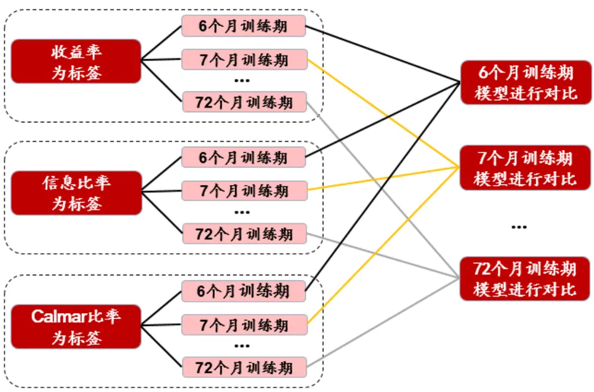
资料来源：华泰证券研究所

## 如何充分利用不同标签的优点？进行模型集成

不同模型可能在不同的回测指标上有一定优势，为了充分利用不同模型的优点，模型的集成是一种常用的方法。本文将各个子模型的预测结果视为单因子，使用 3 种传统因子合成的方法进行模型集成，包括：(1)等权集成；(2)历史 IC 加权集成；(3)历史因子收益率加权集成。因子合成方法的详细介绍可参见华泰金工报告《因子合成方法实证分析》(2019.01.04)

图表2： 不同标签训练的模型进行集成
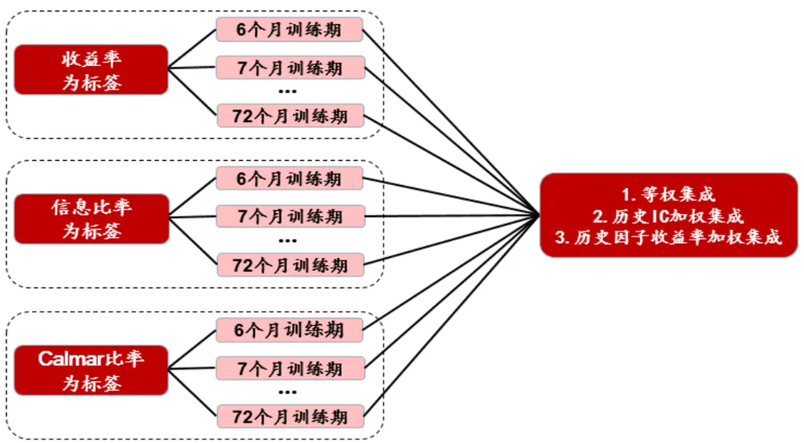
资料来源：华泰证券研究所

## 另类标签测试流程

图表3： 数据标注方法测试流程示意图

资料来源：华泰证券研究所

本文使用 CatBoost 模型进行测试，CatBoost 的原理和预测效果与 XGBoost 类似，但速度更快。测试流程包含如下步骤：

## 1． 数据获取：

1) 股票池：全 A 股，中证 500 成分股，中证 800 成分股。剔除 ST 股票，剔除每个截面期下一交易日停牌的股票，剔除上市 3个月内的股票，每只股票视作一个样本。

2) 回测区间：2011 年 1 月 31 日至 2020 年 2 月 28 日。

## 2． 特征提取和预处理：

1) 每个自然月的最后一个交易日，计算 82 因子暴露度，作为样本的原始特征，因子池如图表 5和图表 6所示。

2) 中位数去极值：设第 T 期某因子在所有个股上的暴露度序列为 $D_{i},~D_{M}$ 为该序列中位数， $D_{M1}$ 为序列 $|\bar{D}_{i}-D_{M}|$ 的中位数，则将序列 $D_{i}$ 中所有大于 $D_{M}+5D_{M1}$ 的数重设为 $D_{M}+5D_{M1}$ ，将序列 $D_{i}$ 中所有小于 $D_{M}-5D_{M1}$ 的数重设为 $D_{M}-5D_{M1}$ ；

3)缺失值处理：得到新的因子暴露度序列后，将因子暴露度缺失的地方设为中信一级行业相同个股的平均值；

4) 行业市值中性化：将填充缺失值后的因子暴露度对行业哑变量和取对数后的市值做线性回归，取残差作为新的因子暴露度；

5) 标准化：将中性化处理后的因子暴露度序列减去其现在的均值、除以其标准差，得到一个新的近似服从 N(0, 1)分布的序列。

3． 数据标注：该步骤是本文的着重步骤，主要使用以下数据标注方法：

1) 收益率：每个月末截面上，使用去极值、标准化后的下个月股票超额收益率(相对中证 500 或中证 800)作为标签。

2) 信息比率：每个月末截面上，使用去极值、标准化后的下个月股票信息比率(相对中证 500 或中证 800)作为标签。

3) Calmar 比率：每个月末截面上，使用去极值、标准化后的下个月股票 Calmar比率(相对中证 500 或中证 800)作为标签。

4． 月度训练和验证模型：如图表 4 所示，对于某个月份 T 月来说，将 T-N至 T-1 月的 N个月合并作为样本内数据集，按照时间先后以 7:3 的比例划分训练集和验证集，在训练集上训练模型，验证集上观察模型 loss 的收敛情况，使用提前停止(early_stopping)的方式停止模型训练，因此不同月份训练出的模型包含的决策树数量可能不同。模型其 他 参 数 设 置 如 下 ： max_depth=3 ， learning_rate=0.05 ， subsample=0.8 ，colsample_bylevel=0.1

5． 样本外预测：模型训练完成后，以 T 月末截面期所有样本预处理后的特征作为模型的输入，得到每个样本的预测值 f(x)。将预测值视作合成后的因子。

6． 组合构建：将样本外预测值输入到组合优化模型中得到组合权重，优化目标为最大化预测值，优化约束为保持与基准指数的行业和市值中性并控制个股相对基准的偏离上限比例。

7． 模型评价：我们以模型构建的选股策略的回测结果作为模型评价标准。

图表4： 月度滚动训练示意图
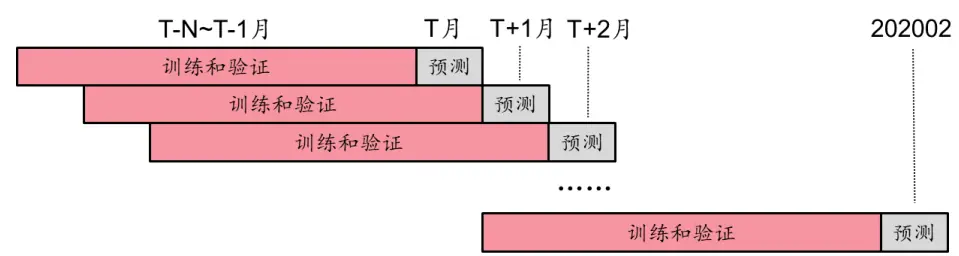
资料来源：华泰证券研究所

图表5： 选股模型中涉及的全部因子及其描述(表 1)

| 大类因子 | 具体因子 | 因子描述 |
| --- | --- | --- |
| 估值 | EP | 净利润(TTM)/总市值 |
| 估值 | EPcut | 扣除非经常性损益后净利润(TTM)/总市值 |
| 估值 | BP | 净资产/总市值 |
| 估值 | SP | 营业收入(TTM)/总市值 |
| 估值 | NCFP | 净现金流(TTM)/总市值 |
| 估值 | OCFP | 经营性现金流(TTM)/总市值 |
| 估值 | DP | 近12个月现金红利(按除息日计)/总市值 |
| 估值 | G/PE | 净利润(TTM)同比增长率/PE_TTM |
| 成长 | Sales_G_q | 营业收入(最新财报，YTD)同比增长率 |
| 成长 | Profit_G_q | 净利润(最新财报，YTD)同比增长率 |
| 成长 | OCF_G_q | 经营性现金流(最新财报，YTD)同比增长率 |
| 成长 | ROE_G_q | ROE(最新财报，YTD)同比增长率 |
| 财务质量 | ROE_q | ROE(最新财报，YTD) |
| 财务质量 | ROE_ttm | ROE(最新财报，TTM) |
| 财务质量 | ROA_q | ROA(最新财报，YTD) |
| 财务质量 | ROA_ttm | ROA(最新财报，TTM) |
| 财务质量 财务质量 | grossprofitmargin_q | 毛利率(最新财报，YTD) |
|  | grossprofitmargin_ttm | 毛利率(最新财报，TTM) |
| 财务质量 | profitmargin_q | 扣除非经常性损益后净利润率(最新财报，YTD) |
| 财务质量 | profitmargin_ttm | 扣除非经常性损益后净利润率(最新财报，TTM) |
| 财务质量 财务质量 | assetturnover_q | 资产周转率(最新财报，YTD) |
| 财务质量 | assetturnover_ttm | 资产周转率(最新财报，TTM) |
| 财务质量 | operationcashflowratio_q | 经营性现金流/净利润(最新财报，YTD) |
|  | operationcashflowratio_ttm | 经营性现金流/净利润(最新财报，TTM) |
| 杠杆 | financial_leverage | 总资产/净资产 |
| 杠杆 | debtequityratio | 非流动负债/净资产 |
| 杠杆 | cashratio | 现金比率 |
| 杠杆 | currentratio | 流动比率 |
| 市值 | In_capital | 总市值取对数 |
| 动量反转 | HAlpha | 个股60个月收益与上证综指回归的截距项 |
| 动量反转 | return_Nm | 个股最近N个月收益率，N=1，3，6，12 |
| 动量反转 | wgt_return_Nm | 个股最近N个月内用每日换手率乘以每日收益率求算术平均值， N=1, 3, 6, 12 |
| 动量反转 | exp_wgt_return_Nm | 个股最近N个月内用每日换手率乘以函数exp(-x_i/N/4)再乘以每日 收益率求算术平均值，X_i为该日距离截面日的交易日的个数，N=1， 3, 6, 12 |
| 波动率 | std_FF3factor_Nm | 特质波动率——个股最近 N 个月内用日频收益率对 Fama French 三因子回归的残差的标准差，N=1，3，6，12 |
| 波动率 | std_Nm | 个股最近N个月的日收益率序列标准差，N=1，3，6，12 |
| 股价 | In_price | 股价取对数 |
| beta | beta | 个股60个月收益与上证综指回归的 beta |
| 换手率 | turn_Nm | 个股最近N个月内日均换手率(剔除停牌、涨跌停的交易日)，N=1， 3, 6, 12 |
| 换手率 | bias_turn_Nm | 个股最近N个月内日均换手率除以最近2年内日均换手率(剔除停 |

资料来源：Wind，华泰证券研究所

图表6： 选股模型中涉及的全部因子及其描述(表 2)

| 大类因子 | 具体因子 | 因子描述 |
| --- | --- | --- |
| 一致预期 | rating_average | wind 评级的平均值 |
| 一致预期 | rating_change | wind 评级(上调家数-下调家数)/总数 |
| 一致预期 | rating_targetprice | wind一致目标价/现价-1 |
| 一致预期 | CON_EP | 朝阳永续一致预期EP |
| 一致预期 | CON_EP_REL | 朝阳永续一致预期EP季度环比 |
| 一致预期 | CON_BP | 朝阳永续一致预期EP |
| 一致预期 | CON_BP_REL | 朝阳永续一致预期EP季度环比 |
| 一致预期 | CON_GPE | 朝阳永续一致预期 GPE |
| 一致预期 | CON_GPE_REL | 朝阳永续一致预期 GPE 季度环比 |
| 一致预期 | CON_ROE | 朝阳永续一致预期 ROE |
| 一致预期 | CON_ROE_REL | 朝阳永续一致预期 ROE 季度环比 |
| 一致预期 | CON_EPS | 朝阳永续一致预期 EPS |
| 一致预期 | CON_EPS_REL | 朝阳永续一致预期 EPS 季度环比 |
| 一致预期 | CON_NP | 朝阳永续一致预期归母净利润 |
| 一致预期 | CON_NP_REL | 朝阳永续一致预期归母净利润季度环比 |
| 股东 | holder_avgpctchange | 户均持股比例的同比增长率 |
| 技术 | MACD | 经典技术指标(释义可参考百度百科)，长周期取30日，短周期取 |
| 技术 | DEA | 10日，计算 DEA 均线的周期(中周期)取 15 日 |
| 技术 | DIF |  |
| 技术 | RSI | 经典技术指标，周期取20日 |
| 技术 | PSY | 经典技术指标，周期取20日 |
| 技术 | BIAS | 经典技术指标，周期取20日 |

资料来源：Wind，朝阳永续，华泰证券研究所

## 另类标签测试结果

本章将分别展示全 A股、中证 500 成分股和中证 800 成分股中另类标签的测试结果。

全 A股：另类标签的年化超额收益率、信息比率、Calmar 比率表现更好如图表 7 所示，我们首先观察全 A 股中三种标签在截面上的相关系数均值，考察区间为2005 年 1 月 31 日至 2020 年 2 月 28日。可以看到，信息比率标签以及 Calmar比率标签与收益率标签的相关性都较高，分别为 0.95 和 0.89。Calmar 比率标签表现出的差异性更大一些。图表 8 展示了全 A股中三种标签的取值分布直方图，可知 Calmar 比率标签的分布与另外两个标签的分布差异较大。

图表7： 全 A股中三种标签在截面上的相关系数均值

|  | 收益率 | 信息比率 | Calmar 比率 |
| --- | --- | --- | --- |
| 收益率 |  | 0.95 | 0.89 |
| 信息比率 | 0.95 |  | 0.89 |
| Calmar 比率 | 0.89 | 0.89 |  |

资料来源：Wind，华泰证券研究所

图表8： 全 A股中三种标签的取值分布直方图
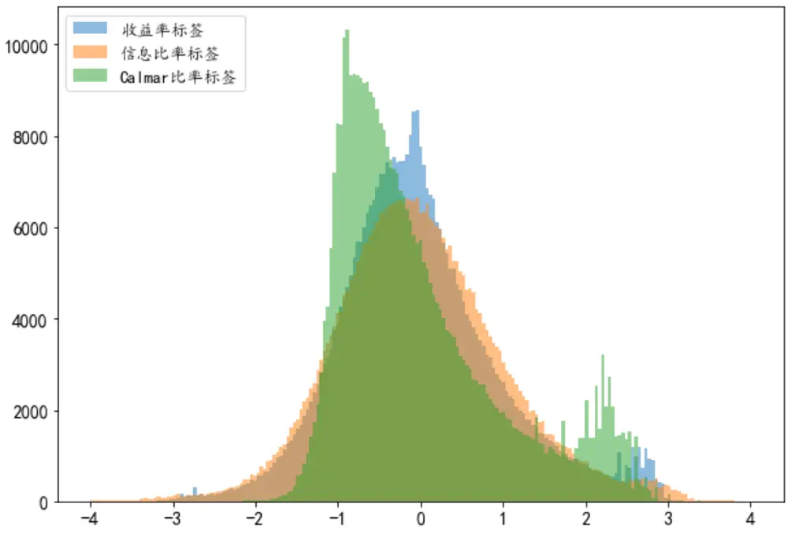
资料来源：Wind，华泰证券研究所

1. 将收益率为标签训练所得模型的预测结果输入组合优化模型中，构建行业市值中性的中证 500 增强策略。

2. 将信息比率为标签训练所得模型的预测结果输入组合优化模型中，构建行业市值中性的中证 500 增强策略。

3. 将 Calmar比率为标签训练所得模型的预测结果输入组合优化模型中，构建行业市值中性的中证 500 增强策略。

以上回测中，测试个股权重偏离上限分别为[0.3%, 0.5%, 1%, 1.5%, 2%, 3%]六种情况下的策略表现，为了方便不同标签间进行对比，将六种情况的回测指标取均值。

本节主要对比信息比率为标签构建的模型相比收益率为标签构建的模型的选股效果，图表9~图表 12 分别展示了两种标签的年化超额收益率、信息比率、Calmar比率和超额收益最大回撤的对比结果(横轴为训练期长度，纵轴为回测指标的取值)。可以看出，信息比率标签构建的模型在前三个回测指标上都表现更好，在超额收益最大回撤上没有优势，在年化超额收益率上的胜率达到了 89.55%(胜率是指 67 组对比中，信息比率为标签的模型表现优于收益率为标签的模型的比例，89.55%=60/67)。

图表9： 两种标签构建的中证 500增强策略在不同训练期下的年化超额收益率对比(回测期：2011年 1月 31日至 2020年 2月 28日)
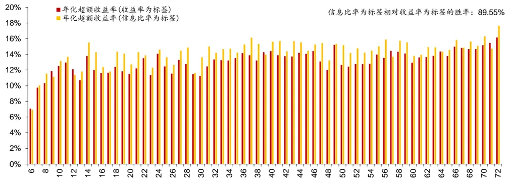
资料来源：Wind，朝阳永续，华泰证券研究所

图表10： 两种标签构建的中证 500 增强策略在不同训练期下的信息比率对比(回测期：2011 年 1 月 31 日至 2020 年 2 月 28 日)
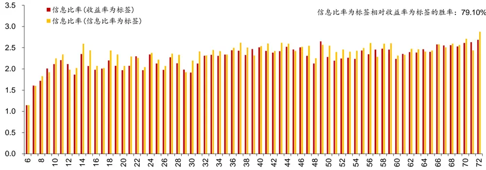
资料来源：Wind，朝阳永续，华泰证券研究所

图表11： 两种标签构建的中证 500增强策略在不同训练期下的 Calmar比率对比(回测期：2011年 1月 31日至 2020年 2月 28日)
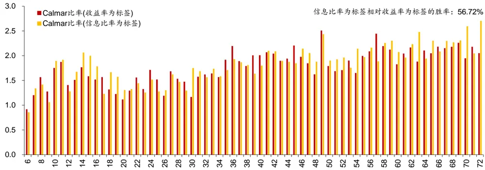
资料来源：Wind，朝阳永续，华泰证券研究所

图表12： 两种标签构建的中证 500 增强策略在不同训练期下的超额收益最大回撤对比(回测期：2011 年 1 月 31 日至 2020 年 2 月 28 日)
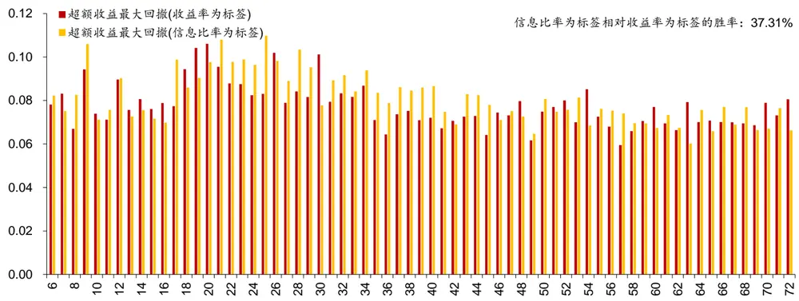
资料来源：Wind，朝阳永续，华泰证券研究所

本节主要对比 Calmar 比率为标签构建的模型相比收益率为标签构建的模型的选股效果，图表 13~图表 16 分别展示了两种标签的年化超额收益率、信息比率、Calmar 比率和超额收益最大回撤的对比结果(横轴为训练期长度，纵轴为回测指标的取值)。可以看出，Calmar比率标签构建的模型在前三个回测指标上都表现更好，在超额收益最大回撤上没有优势，在年化超额收益率上的胜率达到了 97.01%。

图表13： 两种标签构建的中证 500 增强策略在不同训练期下的年化超额收益率对比(回测期：2011 年 1 月 31 日至 2020 年 2 月 28 日)
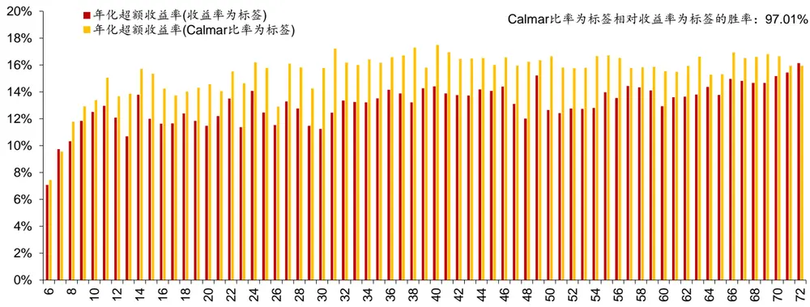
资料来源：Wind，朝阳永续，华泰证券研究所

图表14： 两种标签构建的中证 500 增强策略在不同训练期下的信息比率对比(回测期：2011 年 1 月 31 日至 2020 年 2 月 28 日)
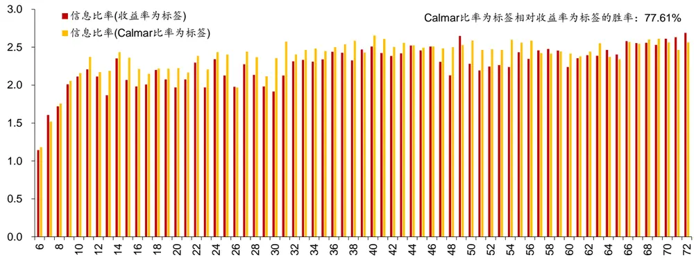
资料来源：Wind，朝阳永续，华泰证券研究所

图表15： 两种标签构建的中证 500增强策略在不同训练期下的 Calmar比率对比(回测期：2011年 1月 31日至 2020年 2月 28日)
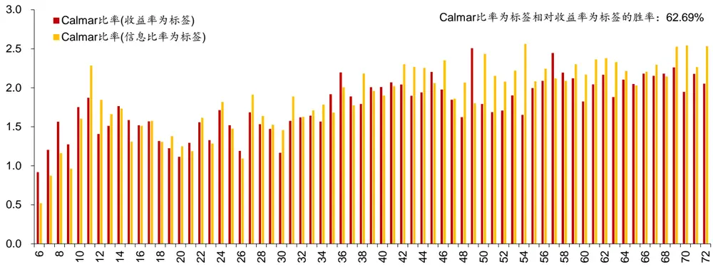
资料来源：Wind，朝阳永续，华泰证券研究所

图表16： 两种标签构建的中证 500增强策略在不同训练期下的超额收益最大回撤对比(回测期：2011年 1月 31日至 2020年 2月 28日)
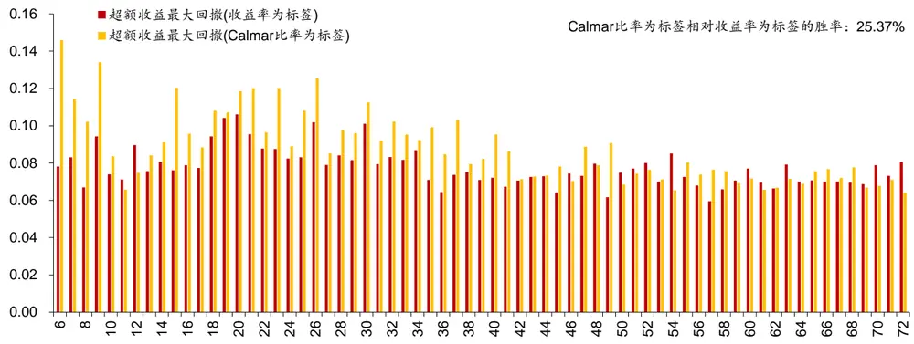
资料来源：Wind，朝阳永续，华泰证券研究所

## 中证 500成分股：另类标签的年化超额收益率表现更好

如图表 17 所示，我们首先观察中证 500 成分股中三种标签在截面上的相关系数均值，考察区间为 2005 年 1 月 31日至 2020 年 2月 28 日。可以看到，信息比率标签以及 Calmar比率标签与收益率标签的相关性都较高，分别为 0.94 和 0.92。Calmar 比率标签表现出的差异性更大一些。图表 18 展示了中证 500 成分股中三种标签的取值分布直方图，可知Calmar 比率标签的分布与另外两个标签的分布差异较大。

图表17： 中证 500成分股中三种标签在截面上的相关系数均值

|  | 收益率 | 信息比率 | Calmar 比率 |
| --- | --- | --- | --- |
| 收益率 |  | 0.94 | 0.92 |
| 信息比率 | 0.94 |  | 0.91 |
| Calmar 比率 | 0.92 | 0.91 |  |

资料来源：Wind，华泰证券研究所

图表18： 中证 500成分股中三种标签的取值分布直方图
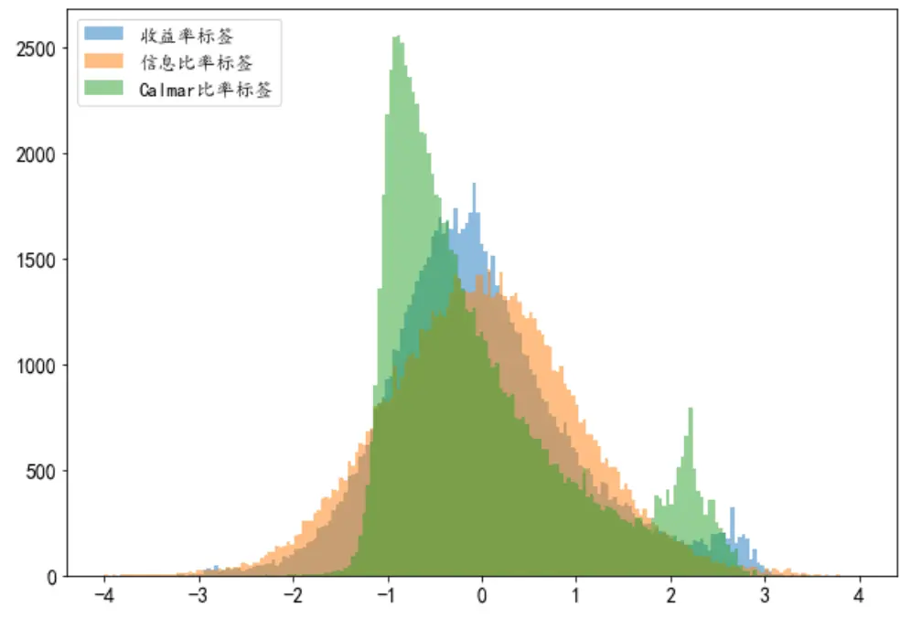
资料来源：Wind，华泰证券研究所

1. 将收益率为标签训练所得模型的预测结果输入组合优化模型中，构建行业市值中性的中证 500 增强策略。

2. 将信息比率为标签训练所得模型的预测结果输入组合优化模型中，构建行业市值中性的中证 500 增强策略。

3. 将 Calmar比率为标签训练所得模型的预测结果输入组合优化模型中，构建行业市值中性的中证 500 增强策略。

以上回测中，测试个股权重偏离上限分别为[0.3%, 0.5%, 1%, 1.5%, 2%, 3%]六种情况下的策略表现，为了方便不同标签间进行对比，将六种情况的回测指标取均值。

本节主要对比信息比率为标签构建的模型相比收益率为标签构建的模型的选股效果，图表19~图表 22 分别展示了两种标签的年化超额收益率、信息比率、Calmar 比率和超额收益最大回撤的对比结果(横轴为训练期长度，纵轴为回测指标的取值)。可以看出，信息比率标签构建的模型在前两个回测指标上都表现更好，在后两个回测指标上没有优势，在年化超额收益率上的胜率为 67.16 %。进一步观察回测中年化超额收益率的分布情况，当训练期较短时，信息比率标签构建的模型表现较为糟糕，只有当训练期较长时，信息比率标签构建的模型才能比较稳定地战胜收益率为标签的模型。

图表19： 两种标签构建的中证 500增强策略在不同训练期下的年化超额收益率对比(回测期：2011年 1月 31日至 2020年 2月 28日)
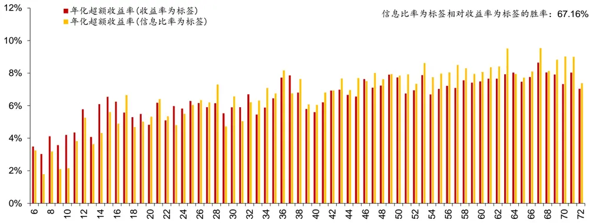
资料来源：Wind，朝阳永续，华泰证券研究所

图表20： 两种标签构建的中证 500增强策略在不同训练期下的信息比率对比(回测期：2011年 1月 31日至 2020年 2月 28日)
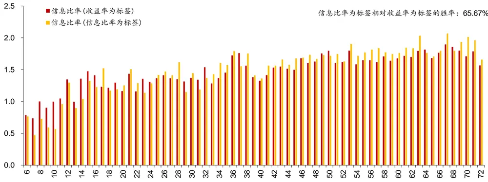
资料来源：Wind，朝阳永续，华泰证券研究所

图表21： 两种标签构建的中证 500增强策略在不同训练期下的 Calmar比率对比(回测期：2011年 1月 31日至 2020年 2月 28日)
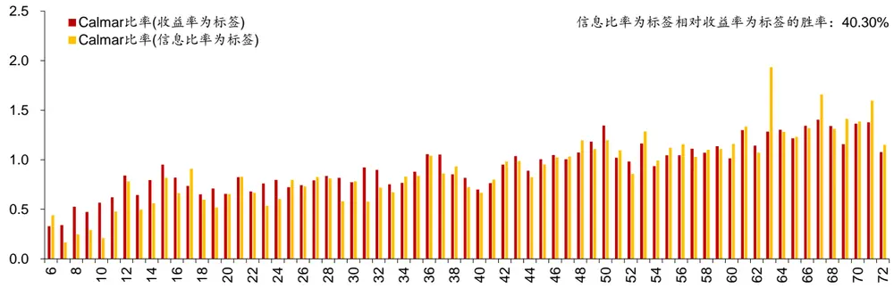
资料来源：Wind，朝阳永续，华泰证券研究所

图表22： 两种标签构建的中证 500 增强策略在不同训练期下的超额收益最大回撤对比(回测期：2011 年 1 月 31 日至 2020 年 2 月 28 日)
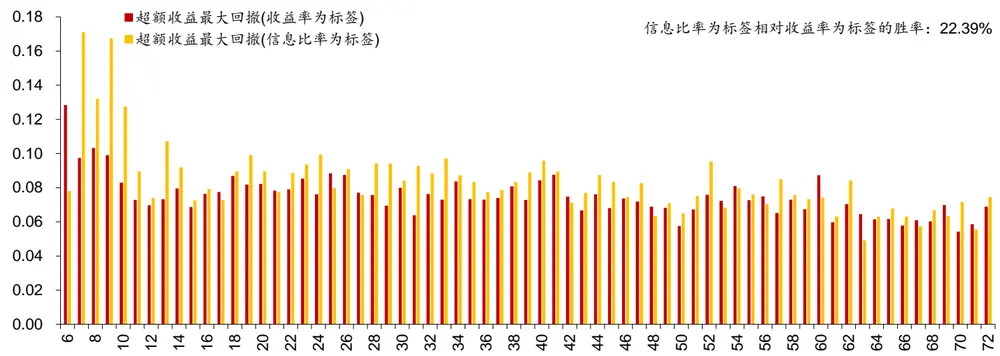
资料来源：Wind，朝阳永续，华泰证券研究所

本节主要对比 Calmar 比率为标签构建的模型相比收益率为标签构建的模型的选股效果，图表 23~图表 26 分别展示了两种标签的年化超额收益率、信息比率、Calmar 比率和超额收益最大回撤的对比结果(横轴为训练期长度，纵轴为回测指标的取值)。可以看出，Calmar比率标签构建的模型只在年化超额收益率上表现更好，胜率为 62.69%，在后三个指标上没有优势。进一步观察回测中年化超额收益率的分布情况，当训练期较短时，Calmar 比率标签构建的模型表现较为糟糕，只有当训练期较长时，Calmar 比率标签构建的模型才能比较稳定地战胜收益率为标签的模型。

图表23： 两种标签构建的中证 500增强策略在不同训练期下的年化超额收益率对比(回测期：2011年 1月 31日至 2020年 2月 28日)
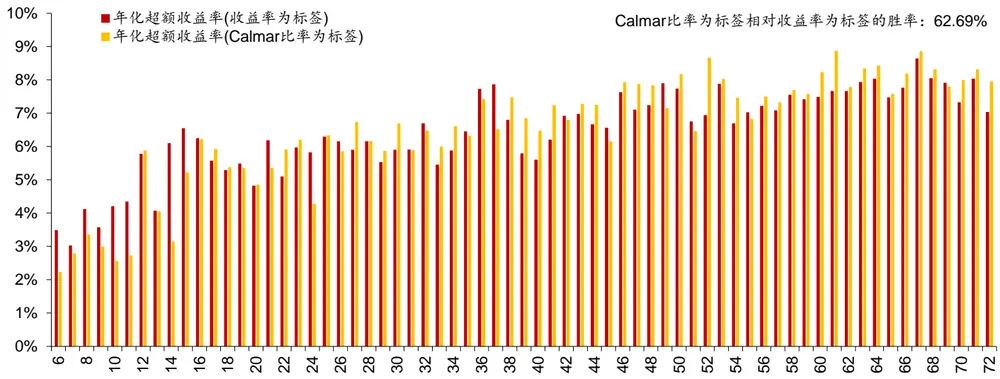
资料来源：Wind，朝阳永续，华泰证券研究所

图表24： 两种标签构建的中证 500增强策略在不同训练期下的信息比率对比(回测期：2011年 1月 31日至 2020年 2月 28日)
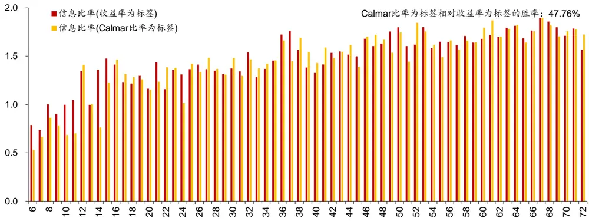
资料来源：Wind，朝阳永续，华泰证券研究所

图表25： 两种标签构建的中证 500增强策略在不同训练期下的 Calmar比率对比(回测期：2011年 1月 31日至 2020年 2月 28日)
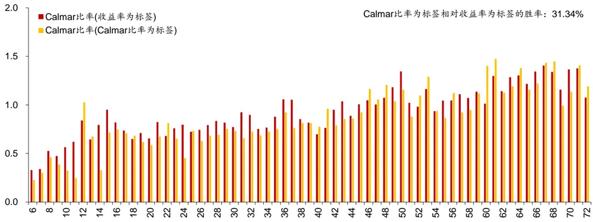
资料来源：Wind，朝阳永续，华泰证券研究所

图表26： 两种标签构建的中证 500增强策略在不同训练期下的超额收益最大回撤对比(回测期：2011年 1月 31日至 2020年 2月 28日)
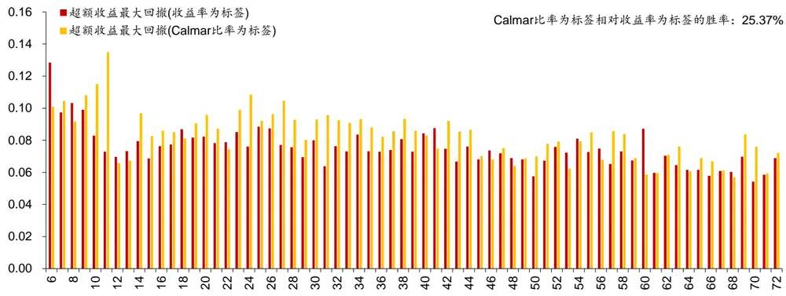
资料来源：Wind，朝阳永续，华泰证券研究所

## 中证 800成分股：另类标签的年化超额收益率、信息比率表现更好

如图表 27 所示，我们首先观察中证 800 成分股中三种标签在截面上的相关系数均值，考察区间为 2005 年 1 月 31日至 2020 年 2月 28 日。可以看到，信息比率标签以及 Calmar比率标签与收益率标签的相关性都较高，分别为 0.93 和 0.91。Calmar 比率标签表现出的差异性更大一些。图表 28 展示了中证 800 成分股中三种标签的取值分布直方图，可知Calmar 比率标签的分布与另外两个标签的分布差异较大。

图表27： 中证 800成分股中三种标签在截面上的相关系数均值

|  | 收益率 | 信息比率 | Calmar 比率 |
| --- | --- | --- | --- |
| 收益率 |  | 0.93 | 0.91 |
| 信息比率 | 0.93 |  | 0.92 |
| Calmar 比率 | 0.91 | 0.92 |  |

资料来源：Wind，华泰证券研究所

图表28： 中证 800成分股中三种标签的取值分布直方图
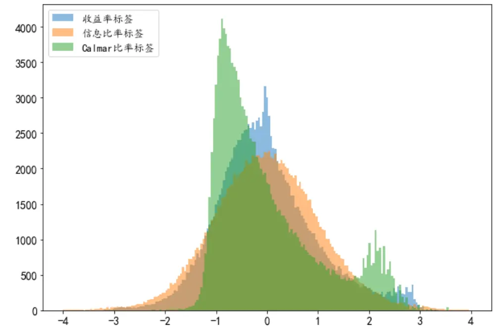
资料来源：Wind，华泰证券研究所

1. 将收益率为标签训练所得模型的预测结果输入组合优化模型中，构建行业市值中性的中证 800 增强策略。

2. 将信息比率为标签训练所得模型的预测结果输入组合优化模型中，构建行业市值中性的中证 800 增强策略。

3. 将 Calmar比率为标签训练所得模型的预测结果输入组合优化模型中，构建行业市值中性的中证 800 增强策略。

以上回测中，测试个股权重偏离上限分别为[0.3%, 0.5%, 1%, 1.5%, 2%, 3%]六种情况下的策略表现，为了方便不同标签间进行对比，将六种情况的回测指标取均值。

本节主要对比信息比率为标签构建的模型相比收益率为标签构建的模型的选股效果，图表29~图表 32 分别展示了两种标签的年化超额收益率、信息比率、Calmar 比率和超额收益最大回撤的对比结果(横轴为训练期长度，纵轴为回测指标的取值)。可以看出，信息比率标签构建的模型在前两个回测指标上都表现更好，在后两个回测指标上没有优势，在年化超额收益率上的胜率为 76.12 %。进一步观察回测中年化超额收益率的分布情况，当训练期较短时，信息比率标签构建的模型表现较为糟糕，只有当训练期较长时，信息比率标签构建的模型才能比较稳定地战胜收益率为标签的模型。

图表29： 两种标签构建的中证 800增强策略在不同训练期下的年化超额收益率对比(回测期：2011年 1月 31日至 2020年 2月 28日)
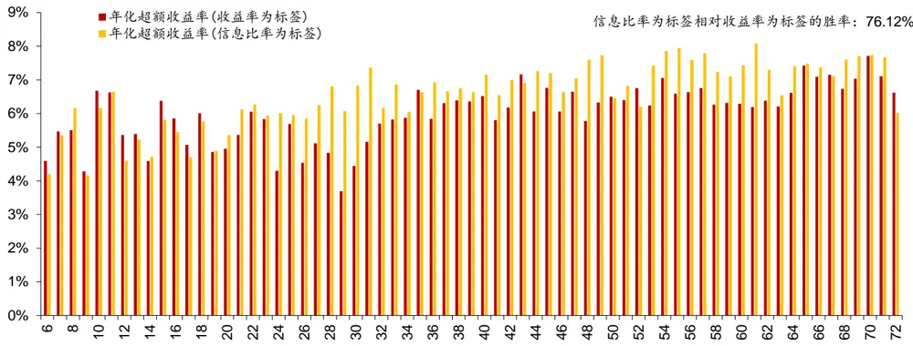
资料来源：Wind，朝阳永续，华泰证券研究所

图表30： 两种标签构建的中证 800增强策略在不同训练期下的信息比率对比(回测期：2011年 1月 31日至 2020年 2月 28日)
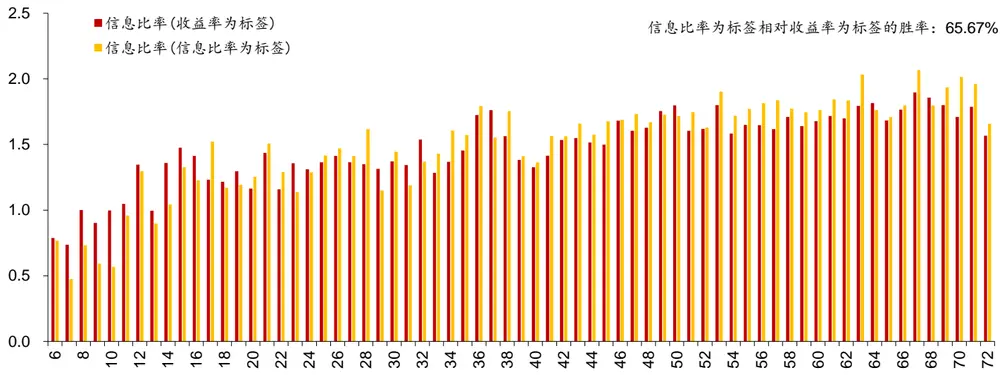
资料来源：Wind，朝阳永续，华泰证券研究所

图表31： 两种标签构建的中证 800增强策略在不同训练期下的 Calmar比率对比(回测期：2011年 1月 31日至 2020年 2月 28日)
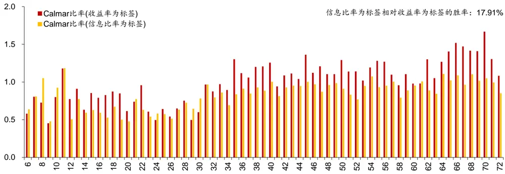
资料来源：Wind，朝阳永续，华泰证券研究所

图表32： 两种标签构建的中证 800 增强策略在不同训练期下的超额收益最大回撤对比(回测期：2011 年 1 月 31 日至 2020 年 2 月 28 日)
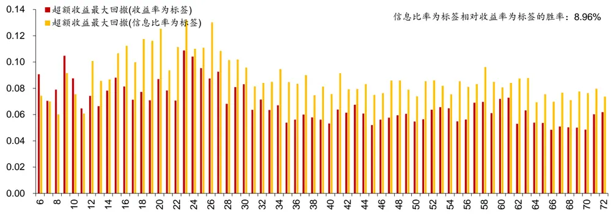
资料来源：Wind，朝阳永续，华泰证券研究所

本节主要对比 Calmar 比率为标签构建的模型相比收益率为标签构建的模型的选股效果，图表 33~图表 36 分别展示了两种标签的年化超额收益率、信息比率、Calmar 比率和超额收益最大回撤的对比结果(横轴为训练期长度，纵轴为回测指标的取值)。可以看出，Calmar比率标签构建的模型在前两个回测指标上都表现更好，在后两个回测指标上没有优势，在年化超额收益率上的胜率为 65.67%。进一步观察回测中年化超额收益率的分布情况，当训练期较短时，Calmar 比率标签构建的模型表现较为糟糕，只有当训练期较长时，Calmar比率标签构建的模型才能比较稳定地战胜收益率为标签的模型。

图表33： 两种标签构建的中证 800增强策略在不同训练期下的年化超额收益率对比(回测期：2011年 1月 31日至 2020年 2月 28日)
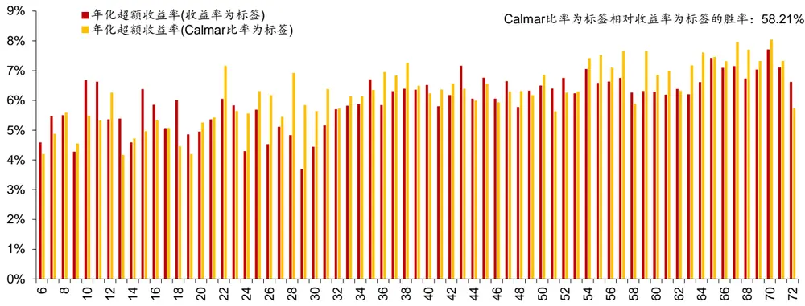
资料来源：Wind，朝阳永续，华泰证券研究所

图表34： 两种标签构建的中证 800增强策略在不同训练期下的信息比率对比(回测期：2011年 1月 31日至 2020年 2月 28日)
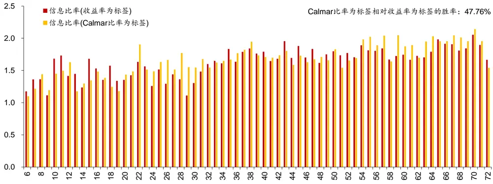
资料来源：Wind，朝阳永续，华泰证券研究所

图表35： 两种标签构建的中证 800增强策略在不同训练期下的 Calmar比率对比(回测期：2011年 1月 31日至 2020年 2月 28日)
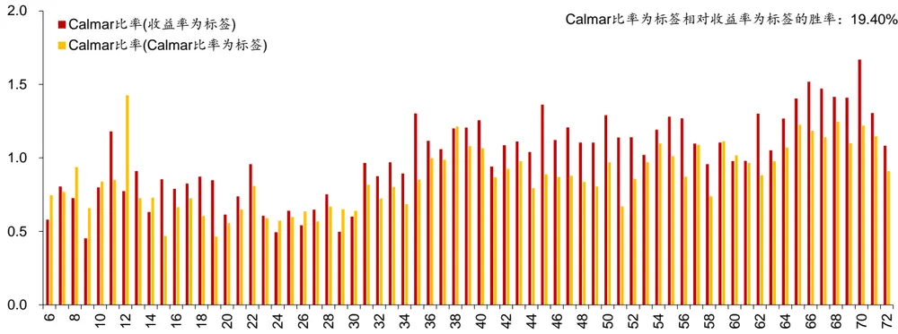
资料来源：Wind，朝阳永续，华泰证券研究所

图表36： 两种标签构建的中证 800增强策略在不同训练期下的超额收益最大回撤对比(回测期：2011年 1月 31日至 2020年 2月 28日)
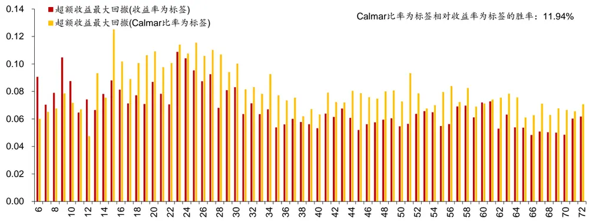
资料来源：Wind，朝阳永续，华泰证券研究所

## 因子重要性分析和对比

人工智能选股模型中，标签通过损失函数的作用可以直接影响到输入选股因子的权重，不同的标签对于因子权重的影响不同。我们取最近一年(2019.3 至 2020.2)训练的模型，并将不同训练期(6~72 个月)的模型进行合并分析。图表 37~图表 39 分别展示了三种标签训练的模型在三个股票池内的因子重要性对比。在不同的股票池中可以总结出以下普遍存在的规律：相比收益率为标签的模型，信息比率和 Calmar 比率为标签的模型中三大量价因子(动量反转、波动率、换手率)的重要性下降，财务质量和一致预期因子的重要性上升。

图表37： 三种标签训练的模型在全 A股内的因子重要性对比
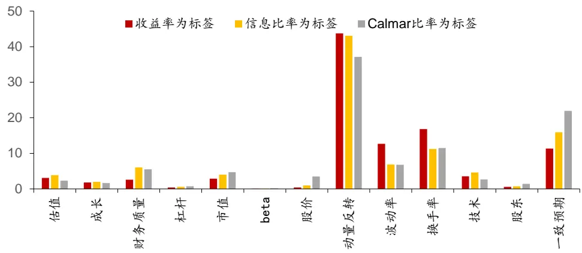
资料来源：Wind，朝阳永续，华泰证券研究所

图表38： 三种标签训练的模型在中证 500成分股内的因子重要性对比
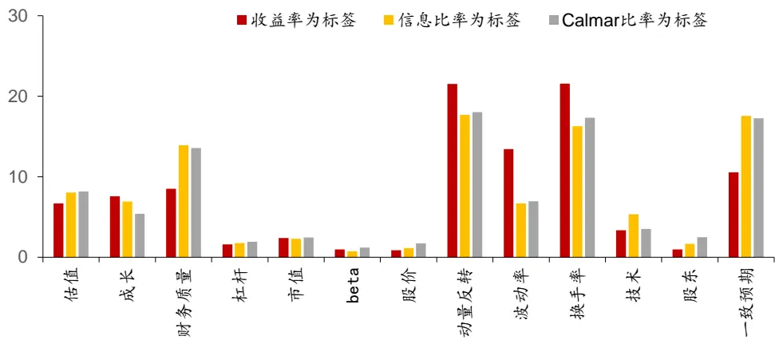
资料来源：Wind，朝阳永续，华泰证券研究所

图表39： 三种标签训练的模型在中证 800成份股内的因子重要性对比
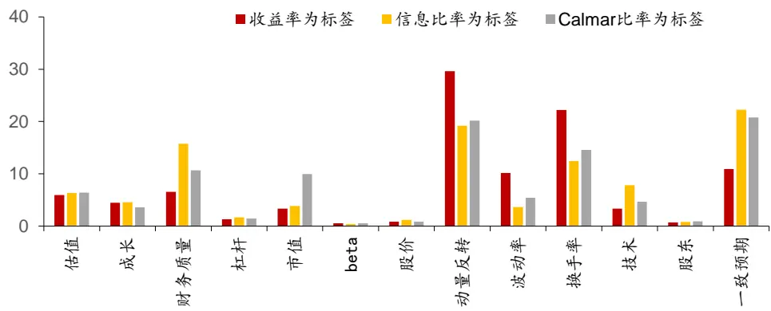
资料来源：Wind，朝阳永续，华泰证券研究所

## 模型集成测试结果

由上一章的测试可知，虽然另类标签训练所得模型相比收益率标签训练所得模型在年化超额收益率上表现更好，但是在超额收益回撤方面的表现却不理想。不同模型可能在不同的回测指标上有一定优势，为了充分利用不同模型的优点，模型的集成是一种常用的方法。本文将各个子模型的预测结果视为单因子，使用 3 种传统因子合成的方法进行模型集成。

图表40： 不同标签训练的模型进行集成

资料来源：华泰证券研究所

## 全 A股：集成模型的年化超额收益率、信息比率和 Calmar 比率表现更好本节使用以下模型构建相对中证 500 行业市值中性的全 A选股策略。

1. CTB-R 模型：以收益率为标签的 CatBoost 模型。图表 41 中展示的是训练期从 6 个月~72个月的模型回测指标的均值。

2. CTB-IR 模型：以信息比率为标签的 CatBoost 模型。图表 41 中展示的是训练期从 6个月~72个月的模型回测指标的均值。

3. CTB-Calmar 模型：以 Calmar 比率为标签的 CatBoost 模型。图表 41 中展示的是训练期从 6个月~72个月的模型回测指标的均值。

4. CTB-等权：按照图表 40 中的方法，将 CTB-R、CTB-IR、CTB-Calmar 三类模型的预测结果等权相加。

5. CTB-IC 加权：按照图表 40 中的方法，将 CTB-R、CTB-IR、CTB-Calmar 三个模型的预测结果视为单因子，进行历史 IC加权集成，历史区间为 6个月。

6. CTB-因子收益率加权：按照图表 40 中的方法，将 CTB-R、CTB-IR、CTB-Calmar三个模型的预测结果视为单因子，进行历史因子收益率加权集成，历史区间为 6 个月。

如图表 41 所示，三种集成模型在年化超额收益率、信息比率和 Calmar 比率上的表现显著优于单一标签构建的模型。图表 42 展示了当个股权重偏离上限为 1%时，六种模型构建的全 A选股策略的累计超额收益情况。

图表41： 六种模型构建的全 A选股策略回测指标的平均值对比(回测期 20110131～20200228)
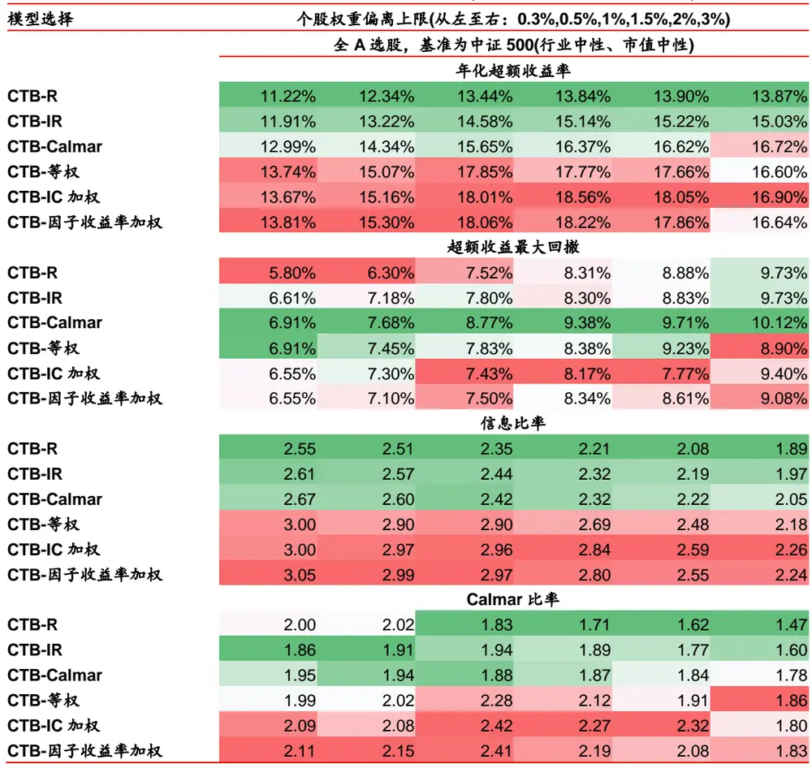
资料来源：Wind，朝阳永续，华泰证券研究所

图表42： 六种模型构建的全 A选股策略的累计超额收益(回测期 20110131～20200228)
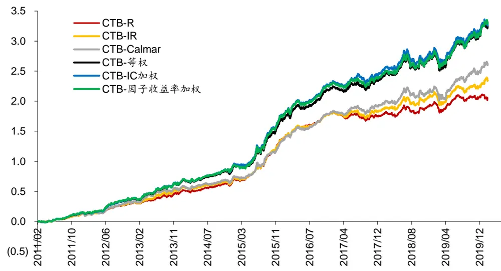
资料来源：Wind，朝阳永续，华泰证券研究所

## 中证 500成分股：集成模型的年化超额收益率和信息比率表现更好本节使用以下模型构建相对中证 500 行业市值中性的指数内选股策略。

1. CTB-R 模型：以收益率为标签的 CatBoost 模型。图表 43 中展示的是训练期从 6 个月~72个月的模型回测指标的均值。

2. CTB-IR 模型：以信息比率为标签的 CatBoost 模型。图表 43 中展示的是训练期从 6个月~72个月的模型回测指标的均值。

3. CTB-Calmar 模型：以 Calmar 比率为标签的 CatBoost 模型。图表 43 中展示的是训练期从 6个月~72个月的模型回测指标的均值。

4. CTB-等权：按照图表 40 中的方法，将 CTB-R、CTB-IR、CTB-Calmar 三类模型的预测结果等权相加。

5. CTB-IC 加权：按照图表 40 中的方法，将 CTB-R、CTB-IR、CTB-Calmar 三个模型的预测结果视为单因子，进行历史 IC加权集成，历史区间为 6个月。

6. CTB-因子收益率加权：按照图表 40 中的方法，将 CTB-R、CTB-IR、CTB-Calmar三个模型的预测结果视为单因子，进行历史因子收益率加权集成，历史区间为 6 个月。

如图表 43 所示，三种集成模型在年化超额收益率、信息比率和 Calmar 比率上的表现显著优于单一标签构建的模型。图表 44 展示了当个股权重偏离上限为 1%时，六种模型构建的中证 500 成份内选股策略的累计超额收益情况。

图表43： 六种模型构建的中证 500 成份内选股策略回测指标的平均值对比(回测期 20110131～20200228)
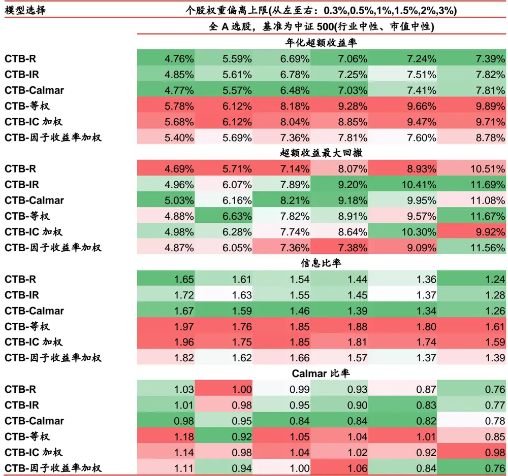
资料来源：Wind，朝阳永续，华泰证券研究所

图表44： 六种模型构建的中证 500成份内选股策略的累计超额收益(回测期 20110131～20200228)
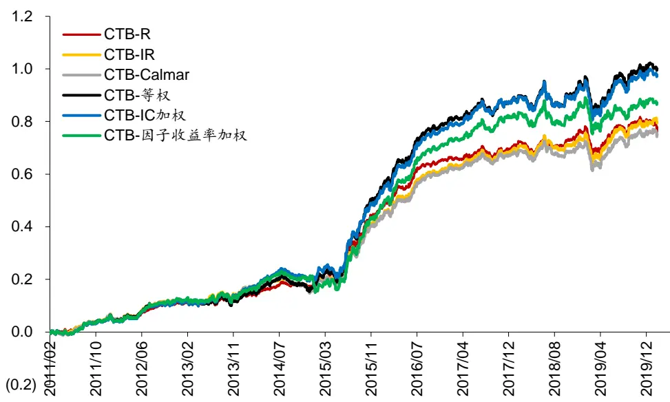
资料来源：Wind，朝阳永续，华泰证券研究所

## 中证 800成分股：集成模型的年化超额收益率和信息比率表现更好本节使用以下模型构建相对中证 800 行业市值中性的指数内选股策略。

1. CTB-R 模型：以收益率为标签的 CatBoost 模型。图表 45 中展示的是训练期从 6 个月~72个月的模型回测指标的均值。

2. CTB-IR 模型：以信息比率为标签的 CatBoost 模型。图表 45 中展示的是训练期从 6个月~72个月的模型回测指标的均值。

3. CTB-Calmar 模型：以 Calmar 比率为标签的 CatBoost 模型。图表 45 中展示的是训练期从 6个月~72个月的模型回测指标的均值。

4. CTB-等权：按照图表 40 中的方法，将 CTB-R、CTB-IR、CTB-Calmar 三类模型的预测结果等权相加。

5. CTB-IC 加权：按照图表 40 中的方法，将 CTB-R、CTB-IR、CTB-Calmar 三个模型的预测结果视为单因子，进行历史 IC加权集成，历史区间为 6个月。

6. CTB-因子收益率加权：按照图表 40 中的方法，将 CTB-R、CTB-IR、CTB-Calmar三个模型的预测结果视为单因子，进行历史因子收益率加权集成，历史区间为 6 个月。

如图表 45 所示，三种集成模型在年化超额收益率和信息比率上的表现显著优于单一标签构建的模型。图表 46 展示了当个股权重偏离上限为 1%时，六种模型构建的中证 800 成份内选股策略的累计超额收益情况。

图表45： 六种模型构建中证 800 成份内选股策略回测指标的平均值对比(回测期 20110131～20200228)

| 模型选择 | 个股权重偏离上限(从左至右：0.3%，0.5%,1%,1.5%,2%,3%) |  |  |  |
| --- | --- | --- | --- | --- |
|  | 全 A 选股，基准为中证500(行业中性、市值中性) |  |  |  |
|  | 年化超额收益率 |  |  |  |
| CTB-R | 5.40% 5.68% | 5.99% | 6.20% | 6.33% 6.48% |
| CTB-IR | 5.48% 6.04% | 6.62% | 6.91% 7.07% | 7.30% |
| CTB-Calmar | 5.63% 6.08% | 6.26% | 6.39% | 6.48% 6.57% |
| CTB-等权 | 6.63% 7.43% | 8.24% | 9.04% | 9.60% 9.08% |
| CTB-IC 加权 | 6.39% 7.02% | 8.04% | 9.00% 10.11% | 10.31% |
| CTB-因子收益率加权 | 5.94% 6.53% | 7.97% | 9.00% 9.55% | 9.62% |
|  | 超额收益最大回撤 |  |  |  |
| CTB-R | 4.03% 5.03% | 6.39% | 7.60% | 8.45% 9.33% |
| CTB-IR | 4.77% 6.30% | 8.71% | 10.20% | 11.02% 11.77% |
| CTB-Calmar | 4.71% 6.08% | 8.04% | 9.18% | 9.91% 10.73% |
| CTB-等权 | 5.70% 7.29% | 9.53% | 9.21% | 9.85% 10.75% |
| CTB-IC 加权 | 5.47% 6.61% | 8.36% | 9.02% | 9.46% 10.60% |
| CTB-因子收益率加权 | 6.59% 9.09% | 9.14% | 9.48% | 10.38% 10.80% |
|  | 信息比率 |  |  |  |
| CTB-R | 2.12 1.91 | 1.63 | 1.48 | 1.39 1.27 |
| CTB-IR | 2.17 2.01 | 1.73 | 1.58 1.49 | 1.37 |
| CTB-Calmar | 2.22 2.02 | 1.66 | 1.49 1.39 | 1.25 |
| CTB-等权 | 2.56 2.46 | 2.22 | 2.13 | 2.09 1.76 |
| CTB-IC 加权 | 2.55 2.37 | 2.17 | 2.14 | 2.20 1.99 |
| CTB-因子收益率加权 | 2.35 2.22 | 2.16 | 2.15 | 2.09 1.87 |
|  | Calmar 比率 |  |  |  |
| CTB-R | 1.42 1.19 | 0.99 | 0.87 0.80 | 0.76 |
| CTB-IR | 1.18 0.99 | 0.79 | 0.70 0.68 | 0.68 |
| CTB-Calmar | 1.23 1.03 | 0.81 | 0.74 0.71 | 0.69 |
| CTB-等权 | 1.16 1.02 | 0.86 | 0.98 | 0.97 0.85 |
| CTB-IC 加权 | 1.17 1.06 | 0.96 | 1.00 | 1.07 0.97 |
| CTB-因子收益率加权 | 0.90 0.72 | 0.87 | 0.95 | 0.92 0.89 |

资料来源：Wind，朝阳永续，华泰证券研究所

图表46： 六种模型构建的中证 800成份内选股策略的累计超额收益(回测期 20110131～20200228)
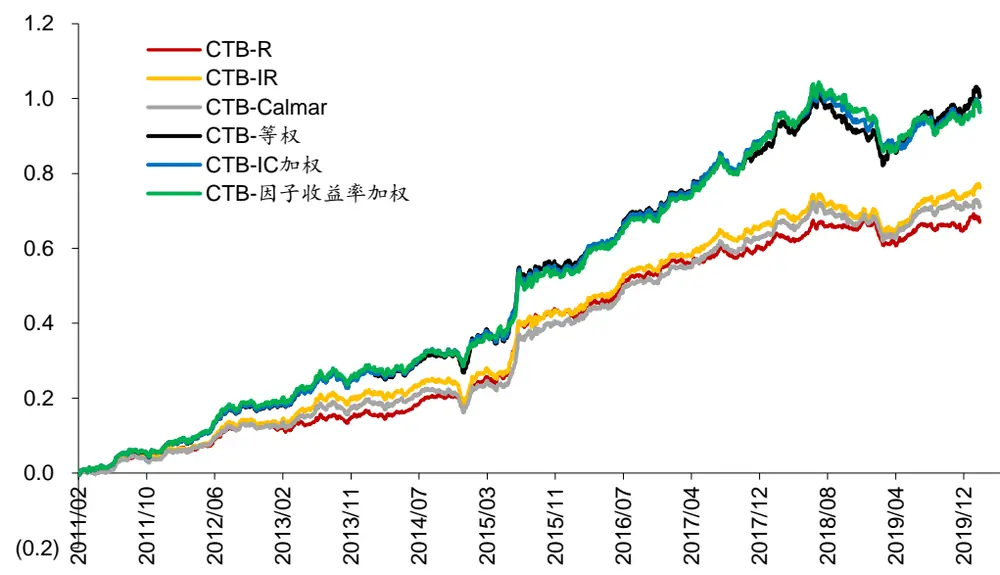
资料来源：Wind，朝阳永续，华泰证券研究所

## 结论

本文结论如下：

1. 另类标签和集成学习有助于提升人工智能选股模型的超额收益。本文通过设置多种测试情形，对比了另类标签(信息比率和 Calmar 比率)与传统收益率标签在构建人工智能选股模型的优劣。相比收益率标签，另类标签在全 A股优势显著，能明显提升选股模型的超额收益和信息比率；另类标签在指数成分股内优势较小，仅对超额收益的提升有一定作用。本文进一步使用集成学习对多种标签构建的模型进行集成。集成模型的超额收益和信息比率有稳定提升，Calmar 比率也有较好表现。集成学习也可避免使用单一模型的风险，起到“模型分散化”的效果。

2. 本文认为使用另类标签有三个方面的合理性：(1)另类标签相比收益率包含更多信息。传统的收益率标签只利用了时间区间两端的价格信息，忽略了区间内的价格走势。本文测试的另类标签包含了股票在区间内的收益、波动和回撤信息，具有更大信息量。(2) 标签也是一种指标，过度使用存在交易拥挤的可能性。标签通过损失函数的作用可以直接影响到输入选股因子的权重，不同的标签对于因子权重的影响不同。如果市场中大量的投资者使用收益率为标签，则存在交易拥挤的可能，此时如果使用一些另类标签，则可能开辟一片投资的“蓝海”。(3) 现有的一些研究中，也使用有别于收益率的另类标签来构建模型。

3. 本文使用了在多种训练期长度下测试的方法对比不同标签构建的模型。如果仅对不同标签构建的模型进行单次测试对比，所得出的结论未必可靠。此时有必要进行多次对比测试来获得统计意义上的“确定结果”。本文在多种不同训练期长度下进行测试对比，训练期长度从 6 个月到 72 个月共 67 种情形，在 67 种情形中，可以统计不同标签构建的模型在各个评价指标上的分布情况，从而得到更具有说服力的结果。此外，多种训练期长度训练的模型也为集成学习提供了大量可用的子模型。

4. 相比收益率标签，另类标签在全 A 股优势显著，在指数成分股内优势较小。在全 A股中，另类标签相比收益率标签构建的模型在年化超额收益率、信息比率、Calmar比率上表现都更好，年化超额收益率上的胜率在 90%左右。在中证 500 和中证 800成分股中，另类标签相比收益率标签构建的模型仅在年化超额收益率上有较稳定的优势，胜率在 58.21%~76.12%之间。此外在以上所有测试中，另类标签相比收益率标签构建的模型在超额收益最大回撤上都表现更差。对模型进行因子重要性分析，另类标签相比收益率标签构建的模型，三大量价因子(动量反转、波动率、换手率)的因子重要性下降，财务质量和一致预期因子的重要性上升。

5. 集成学习能充分利用不同模型的优点，在多个股票池内回测效果最好。为了充分利用不同模型的优点，本文将各个子模型的预测结果视为单因子，使用 3 种传统因子合成的方法(等权，历史 IC 加权，历史因子收益率加权)进行模型集成。相比使用单一模型的平均回测绩效，集成模型的超额收益和信息比率有稳定提升，Calmar 比率也有较好表现。集成学习也可避免使用单一模型的风险，起到“模型分散化”的效果。

## 风险提示

通过人工智能模型构建的选股策略是历史经验的总结，存在失效的可能。另类标签构建的选股模型回撤较大，使用须谨慎。

## 免责声明

## 分析师声明

本人，林晓明、陈烨、李子钰，兹证明本报告所表达的观点准确地反映了分析师对标的证券或发行人的个人意见；彼以往、现在或未来并无就其研究报告所提供的具体建议或所表迖的意见直接或间接收取任何报酬。

## 一般声明

本报告由华泰证券股份有限公司（已具备中国证监会批准的证券投资咨询业务资格，以下简称“本公司”）制作。本报告仅供本公司客户使用。本公司不因接收人收到本报告而视其为客户。

本报告基于本公司认为可靠的、已公开的信息编制，但本公司对该等信息的准确性及完整性不作任何保证。本报告所载的意见、评估及预测仅反映报告发布当日的观点和判断。在不同时期，本公司可能会发出与本报告所载意见、评估及预测不一致的研究报告。同时，本报告所指的证券或投资标的的价格、价值及投资收入可能会波动。以往表现并不能指引未来，未来回报并不能得到保证，并存在损失本金的可能。本公司不保证本报告所含信息保持在最新状态。本公司对本报告所含信息可在不发出通知的情形下做出修改，投资者应当自行关注相应的更新或修改。

本公司研究报告以中文撰写，英文报告为翻译版本，如出现中英文版本内容差异或不一致，请以中文报告为主。英文翻译报告可能存在一定时间迟延。

本公司力求报告内容客观、公正，但本报告所载的观点、结论和建议仅供参考，不构成所述证券的买卖出价或征价。该等观点、建议并未考虑到个别投资者的具体投资目的、财务状况以及特定需求，在任何时候均不构成对客户私人投资建议。投资者应当充分考虑自身特定状况，并完整理解和使用本报告内容，不应视本报告为做出投资决策的唯一因素。对依据或者使用本报告所造成的一切后果，本公司及作者均不承担任何法律责任。任何形式的分享证券投资收益或者分担证券投资损失的书面或口头承诺均为无效。

除非另行说明，本报告中所引用的关于业绩的数据代表过往表现，过往的业绩表现不应作为日后回报的预示。本公司不承诺也不保证任何预示的回报会得以实现，分析中所做的预测可能是基于相应的假设，任何假设的变化可能会显著影响所预测的回报。

本公司及作者在自身所知情的范围内，与本报告所指的证券或投资标的不存在法律禁止的利害关系。在法律许可的情况下，本公司及其所属关联机构可能会持有报告中提到的公司所发行的证券头寸并进行交易，也可能为之提供或者争取提供投资银行、财务顾问或者金融产品等相关服务。本公司的销售人员、交易人员或其他专业人士可能会依据不同假设和标准、采用不同的分析方法而口头或书面发表与本报告意见及建议不一致的市场评论和/或交易观点。本公司没有将此意见及建议向报告所有接收者进行更新的义务。本公司的资产管理部门、自营部门以及其他投资业务部门可能独立做出与本报告中的意见或建议不一致的投资决策。投资者应当考虑到本公司及/或其相关人员可能存在影响本报告观点客观性的潜在利益冲突。投资者请勿将本报告视为投资或其他决定的唯一信赖依据。有关该方面的具体披露请参照本报告尾部。

本研究报告并非意图发送、发布给在当地法律或监管规则下不允许向其发送、发布的机构或人员，也并非意图发送、发布给因可得到、使用本报告的行为而使本公司及关联子公司违反或受制于当地法律或监管规则的机构或人员。

本报告版权仅为本公司所有。未经本公司书面许可，任何机构或个人不得以翻版、复制、发表、引用或再次分发他人等任何形式侵犯本公司版权。如征得本公司同意进行引用、刊发的，需在允许的范围内使用，并注明出处为“华泰证券研究所”，且不得对本报告进行任何有悖原意的引用、删节和修改。本公司保留追究相关责任的权利。所有本报告中使用的商标、服务标记及标记均为本公司的商标、服务标记及标记。

## 针对美国司法管辖区的声明

## 美国法律法规要求之一般披露

本研究报告由华泰证券股份有限公司编制，在美国由华泰证券（美国）有限公司（以下简称华泰证券（美国））向符合美国监管规定的机构投资者进行发表与分发。华泰证券（美国）有限公司是美国注册经纪商和美国金融业监管局（FINRA）的注册会员。对于其在美国分发的研究报告，华泰证券（美国）有限公司对其非美国联营公司编写的每一份研究报告内容负责。华泰证券（美国）有限公司联营公司的分析师不具有美国金融监管（FINRA）分析师的注册资格，可能不属于华泰证券（美国）有限公司的关联人员，因此可能不受 FINRA 关于分析师与标的公司沟通、公开露面和所持交易证券的限制。任何直接从华泰证券（美国）有限公司收到此报告并希望就本报告所述任何证券进行交易的人士，应通过华泰证券（美国）有限公司进行交易。

## 所有权及重大利益冲突

分析师林晓明、陈烨、李子钰本人及相关人士并不担任本研究报告所提及的标的证券或发行人的高级人员、董事或顾问。分析师及相关人士与本研究报告所提及的标的证券或发行人并无任何相关财务利益。声明中所提及的“相关人士”包括FINRA 定义下分析师的家庭成员。分析师根据华泰证券的整体收入和盈利能力获得薪酬，包括源自公司投资银行业务的收入。

## 重要披露信息

- 华泰证券股份有限公司和/或其联营公司在本报告所署日期前的 12 个月内未担任标的证券公开发行或 144A 条款发行的经办人或联席经办人。

- 华泰证券股份有限公司和/或其联营公司在研究报告发布之日前 12 个月未曾向标的公司提供投资银行服务并收取报酬。

- 华泰证券股份有限公司和/或其联营公司预计在本报告发布之日后3个月内将不会向标的公司收取或寻求投资银行服务报酬。

- 华泰证券股份有限公司和/或其联营公司并未实益持有标的公司某一类普通股证券的 1%或以上。此头寸基于报告前一个工作日可得的信息，适用法律禁止向我们公布信息的情况除外。在此情况下，总头寸中的适用部分反映截至最近一次发布的可得信息。

- 华泰证券股份有限公司和/或其联营公司在本报告撰写之日并未担任标的公司股票证券做市商。

## 评级说明

## 行业评级体系

－报告发布日后的6个月内的行业涨跌幅相对同期的沪深300指数的涨跌幅为基准；

－投资建议的评级标准

增持行业股票指数超越基准

中性行业股票指数基本与基准持平

减持行业股票指数明显弱于基准

## 公司评级体系

－报告发布日后的 6 个月内的公司涨跌幅相对同期的沪深 300 指数的涨跌幅为基准；
－投资建议的评级标准
买入股价超越基准 20%以上
增持股价超越基准 5%-20%
中性股价相对基准波动在-5%~5%之间
减持股价弱于基准 5%-20%
卖出股价弱于基准 20%以上

## 华泰证券研究

## 南京

南京市建邺区江东中路228号华泰证券广场1号楼/邮政编码：210019

电话：86 25 83389999 /传真：86 25 83387521

电子邮件：ht-rd@htsc.com

## 深圳

深圳市福田区益田路5999号基金大厦10楼/邮政编码：518017电话：86 755 82493932 /传真：86 755 82492062电子邮件：ht-rd@htsc.com

## 北京

北京市西城区太平桥大街丰盛胡同28号太平洋保险大厦A座18层

邮政编码：100032

电话：86 10 63211166/传真：86 10 63211275

电子邮件：ht-rd@htsc.com

## 上海

上海市浦东新区东方路18号保利广场E栋23楼/邮政编码：200120
电话：86 21 28972098 /传真：86 21 28972068
电子邮件：ht-rd@htsc.com

## 法律实体披露

本公司具有中国证监会核准的“证券投资咨询”业务资格，经营许可证编号为：91320000704041011J。

华泰证券全资子公司华泰证券(美国)有限公司为美国金融业监管局(FINRA)成员，具有在美国开展经纪交易商业务的资格，经营业务许可编号为：CRD#.298809。

电话: 212-763-8160电子邮件: huatai@htsc-us.com

传真: 917-725-9702 http://www.htsc-us.com

©版权所有2020年华泰证券股份有限公司