## 金工研究/深度研究

2020年04月24日

林晓明 执业证书编号：S0570516010001

研究员 0755-82080134linxiaoming@htsc.com

陈烨 执业证书编号：S0570518080004

研究员 010-56793942

chenye@htsc.com

李子钰 执业证书编号：S0570519110003

研究员 0755-23987436liziyu@htsc.com

何康 021-28972039

联系人 hekang@htsc.com

王晨宇

联系人 wangchenyu@htsc.com

2《金工: 牛熊指标在择时轮动中的应用探讨》2020.04

# 从关联到逻辑：因果推断初探

## 华泰人工智能系列之三十

本文介绍了因果推断的框架，并研究了股票所属概念和收益的因果关系人工智能领域中，机器学习的优势在于强大的关联挖掘能力，然而由于缺乏逻辑推理能力，机器学习无法区分数据中的因果关联和虚假关联。因果推断是用于解释分析的建模工具，可帮助恢复数据中的因果关联，有望实现可解释的稳定预测。本文介绍了基于倾向性评分法的因果推断框架，归纳了三个关键步骤，并分别在 Lalonde 数据集和 A股概念数据中进行因果效应估计。结果显示，2016 年以来在中证 800 成分股中，基金重仓(季调)概念与股票未来一个月收益有正向因果关系，股票质押概念与股票未来一个月收益有反向因果关系，预增和护城河概念与股票收益的因果效应存疑。

机器学习本质是曲线拟合，可借助因果推断构建稳健、有推理能力的 AI现有的大部分机器学习模型是关联驱动的，本质上是曲线拟合。关联主要有三个来源：因果关联，选择性偏差和混杂偏倚。其中选择性偏差和混杂偏倚产生的关联是不稳定的。因果推断可以帮助恢复数据中的因果关联，用于指导机器学习，实现可解释的稳定预测。对于金融市场来说，一方面市场环境持续变化的特性导致多种可观测因素的有效性都随之而变；另一方面，资产管理人对策略内部的因果逻辑和可解释性都有较高要求。这些现状都说明在将机器学习方法运用于金融市场的策略构建时，融入因果推断的方法是一个值得尝试的方向。

## 本文介绍了基于倾向性评分法的因果推断框架

因果推断的基本思想是在处理组和对照组间进行对照实验以估计因果效应。在观测数据中，将处理组与对照组之间分布不一样且会对结果造成影响的特征称为混淆变量，因果效应评估的关键是如何保证混淆变量在处理组与对照组的分布一致。倾向性评分法将多个混淆变量的影响用一个综合的倾向性评分来表示，降低了混淆变量的维度，使得控制混淆变量成为可能。本文归纳了倾向性评分法的三个步骤：(1)计算倾向性评分并估计因果效应；(2)评估各倾向性评分方法的均衡性；(3)通过反驳评估所估计的因果效应是否可靠。

## 基于倾向性评分法，本文研究股票所属概念和收益的因果关系

本文首先在经典的 Lalonde 数据集上进行因果效应估计。然后基于倾向性评分法，研究了中证 800 成分股中股票所属的四个概念和股票未来一个月收益的因果关系，我们选取的混淆变量为股票的基本面和量价因子暴露，考察区间为 2016 年 1月到 2020 年 3 月。通过倾向性评分法的分析，我们认为基金重仓(季调)概念与股票收益有正向因果关系，股票质押概念与股票收益有反向因果关系，预增和护城河概念与股票收益的因果效应存疑。另外，倾向性评分加权法(PSW)在均衡性测试和反驳测试中表现都最好，可以认为其估计的因果效应较为可靠。

风险提示：因果推断所得结论是对历史规律的总结，若未来规律发生变化，结论存在失效的风险。倾向性评分法对于因果关系的建模存在过度简化的风险。倾向性评分法中，混淆变量的选取会对因果效应估计结果造成较大影响，应谨慎对待。

## 机器学习和因果推断

## 机器学习面临的风险

过去 10 年，以深度学习为代表的机器学习方法引领了人工智能的发展，在图像、语音、文本等多个领域中取得巨大成就。从根本上来说，机器学习是一种“连接主义”方法，即通过关联驱动的方式在大量的数据中进行拟合从而总结出规律。然而机器学习的工作方式离人脑依然有相当距离，不同于机器学习需要大量的数据，人类在学习过程中只需要比较少量的信息就能掌握规律，并通过逻辑推理不断适应事物和环境的变化。由于机器学习不具备逻辑推理的能力，无法区分数据中的因果关联和虚假关联，因而在数据匮乏或规律持续变化的环境中，机器学习模型难以展现出类似人脑的泛化性能。图灵奖得主、贝叶斯网络之父 Judea Pearl 认为现在人工智能的发展进入新的瓶颈期，大多数新的研究成果本质上是“曲线拟合”的工作。Pearl 认为人们应该更关注人工智能中的因果推断(causalinference)，这可能是实现通用人工智能的必由之路。

我们将通过两个案例说明当前机器学习可能面临的风险。

首先以一个图像识别问题为例：识别一张图片中是否有狗。如图表 1 所示，如果训练集有选择性偏差，使得我们拿到的图片有 80%都是草地上的狗，这样就会导致在训练集中草地这一特征会和图片中是否有狗这个标签十分相关。基于这样的有偏数据集学习到的预测模型，很有可能会将草地学习成很重要的特征，但显然这是不合理的，图片中的草地并不能决定是否有狗，真正决定图片中是否有狗的特征是狗的鼻子、耳朵、尾巴等等。对于测试集，如果跟训练集一样也是狗在草地上，则模型可以正确地预测；如果图片中的狗在有绿植的沙滩上，模型或许能识别出来；但是如果图片中的狗在水里，模型则大概率会识别不准。因此这样的模型对于未知测试集的预测效果并不稳定。

图表1： 在有选择性偏差的情况下进行图像识别
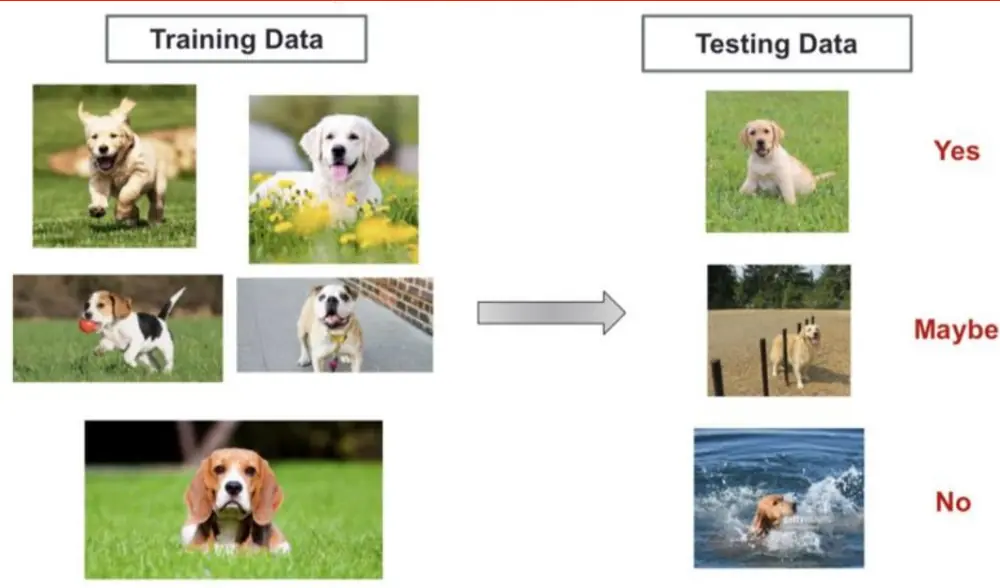
资料来源：Towards Explainable and Stable Prediction，Peng Cui，华泰证券研究所

再举一个医疗领域的例子：预测一个癌症患者的生存率。假设我们拿到了某个城市某个医院的数据，基于该数据学习到的模型有可能会把患者的收入学习成很重要的特征。当然这也是有道理的，收入高的患者能负担得起更好的治疗，生存率也会越高。但是收入并不是患者生存率的决定因素，真正影响生存率的是患者接受的治疗水平以及患者本身的身体素质等因素，即使是收入很高的患者，如果没有接受很好的治疗，或者本身体质虚弱，免疫力低下，生存率依然会很低。利用该模型做预测时，如果未来要预测的患者同样来自该医院，我们可能会得到很准确的预测结果。但是如果要预测的患者来自大学校医院，由于校医院对患者给予的治疗不由收入决定，此时的预测结果很可能不准确。

图表2： 在有混淆变量的情况下预测癌症患者生存概率
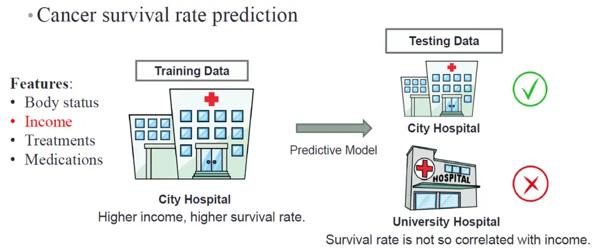
资料来源：Towards Explainable and Stable Prediction，Peng Cui，华泰证券研究所

机器学习模型表现不稳定的原因可能有以下两方面：

1. 一方面是数据的问题，现有的大部分机器学习方法都依赖于独立同分布(I.I.D)假设，即训练数据和测试数据是独立同分布的。在大数据条件下，由于训练数据可能已经涵盖了所有未来会出现的测试数据分布类型，这一假设或许能成立。然而在现实中，该假设很难满足，这样就会产生分布偏移(distribution shift)的问题。

2. 另一方面是模型的问题，现有的大部分机器学习模型是关联驱动的。关联主要有三个来源：Causation，Selection bias，Confounding bias。

(1) Causation(因果关联)是不会随着环境和数据集的变化而变化的(比如下雨会导致地面湿，这在任何城市和国家都是成立的)，是稳定且可解释的。

(2) Selection bias(选择性偏差)描述的就如图表 1 中草地和狗的例子，由于样本选择导致草地和狗十分相关，同样也可以通过样本选择使得沙滩等其它背景与狗十分相关，这种关联会随着数据集和环境的变化而变化。

(3) Confounding bias(混杂偏倚)描述的是由于某些混淆变量导致的关联，如图表 2 中癌症患者生存率的例子，患者的收入就是一个混淆变量。混淆变量与预测目标和其他因子都有关，如果未处理好混淆变量，则会掩盖或歪曲真实的关联。

通过 Selection bias 和 Confounding bias 产生的关联是不稳定的，这两种相关性为虚假相关(Spurious Correlation)。传统机器学习预测不稳定的主要原因就在于其没有区分因果关联与虚假关联，而笼统地将所有关联都用于模型学习和预测。

因果推断是用于解释分析的建模工具，可以帮助恢复数据中的因果关联，用于指导机器学习，有望实现可解释的稳定预测。对于金融市场来说，一方面市场环境持续变化的特性导致多种可观测因素的有效性都随之而变；另一方面，资产管理人对策略内部的因果逻辑和可解释性都有较高要求。这些现状都说明在将机器学习方法在运用于金融市场的策略构建时，融入因果推断的方法是一个值得尝试的方向。

## 因果推断简介

在因果推断研究的漫长历史中，诞生了众多模型，如贝叶斯网络、do-calculus、因果图等等。本文将不对各个因果推断模型进行详细介绍，而是从最常用的 Rubin CausalModel(RCM)出发，介绍因果推断的研究方法。

## RCM 模型

设 $T_{i}$ 表示个体 i 接受处理与否，处理取 1，对照取 0(这部分的处理变量都讨论二值的，多值的可以做相应的推广)；Y 表示个体 i 的结果变量。记 (Y(1), Y(0)) 表示个体 i 接受处理或者对照的潜在结果(potential outcome)，那么 Y(1) − Y(0) 表示个体 i 接受处理的个体因果作用。但是每个个体要么接受了处理，要么接受对照，(Y(1), Y(0)) 中必然缺失一半，因此个体的因果作用是不可识别的。注意，对于个体 i，潜在结果是确定的数；这里的随机性体现在 i 上，i 可以看成通常概率论中样本空间 Ω 中的样本点 ω。但是，在 T 做随机化的前提下，我们可以识别总体的平均因果作用(ACE，average causalefect)：

$$
ACE(TY)=E(Y_{i}(1)-Y_{i}(0))
$$

这是因为

$$
\begin{array}{rl}&{ACE(TY)=E\big(Y_{i}(1)\big)-E\big(Y_{i}(0)\big)}\\&{\qquad=E(Y_{i}(1)|T_{i}=1)-E(Y_{i}(0)|T_{i}=0)}\\&{\qquad=E(Y_{i}|T_{i}=1)-E(Y_{i}|T_{i}=0)}\end{array}
$$

最后一个等式表明 ACE 可以由观测的数据估计出来。其中第一个等式用到了期望算子的线性性质(非线性的算子导出的因果度量很难被识别)；第二个式子用到了随机化，即 T⊥(Y (1),Y (0))(⊥表示独立性)。 由此可见，随机化试验对于平均因果作用的估计起着至关重要的作用。

## 平均因果作用估计

最直接的平均因果作用估计方法为随机化实验。但随机化实验是有成本的，很多情况下会影响用户体验，甚至由于伦理道德等问题是不可行的，比如研究者不能因为想研究吸烟与肺癌的因果关系，就强迫受试者吸烟。因此常用的方法是使用观测数据估计因果效应。如图表3所示，在观测数据中，将处理组与对照组之间分布不一样且会对结果造成影响的特征称为Confounders(混淆变量)。当我们在研究 Treatment 变量 T 对 Outcome 变量 Y 的因果效应时，如果存在混淆变量W，它会影响Treatment变量T，也会影响最后的结果Y。当我们直接通过数据计算T对Y的关联时，实际上将W 对Y的效应也计算在内，因此很难区分T对Y的关联是由T对Y的因果效应导致的，还是由混淆变量W 通过T 对Y产生影响导致的。

图表3： 使用观测数据估计因果效应
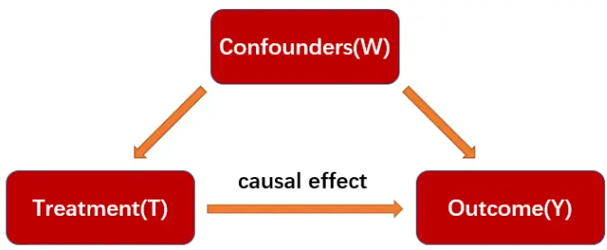
资料来源：The Book of Why，Judea Pearl，华泰证券研究所

因此在基于观测数据进行因果效应评估时，关键是如何保证混淆变量在评估数据的处理组与对照组的分布是一致的。最直接的是基于匹配的方法，为处理组匹配对照组中特征分布一致的人群，通过匹配后的人群计算因果效应。但是在高维情况下很难找到两个特征分布完全一样的样本，因此该方法很难应用到高维情况中。为了解决这个问题，研究者们提出了基于倾向性评分(propensity score)的方法，本文将重点介绍该方法并给出实证案例。

## 基于倾向性评分法的因果推断

倾向性评分法由Rosenbaum和Rubin于1983年首次提出，是控制混淆变量的常用方法，其基本原理是将多个混淆变量的影响用一个综合的倾向性评分来表示，从而降低了混淆变量的维度。图表 4 展示了基于倾向性评分法的因果推断流程，主要包含三个关键步骤。本文将逐一进行详细说明。

图表4： 基于倾向性评分法的因果推断流程
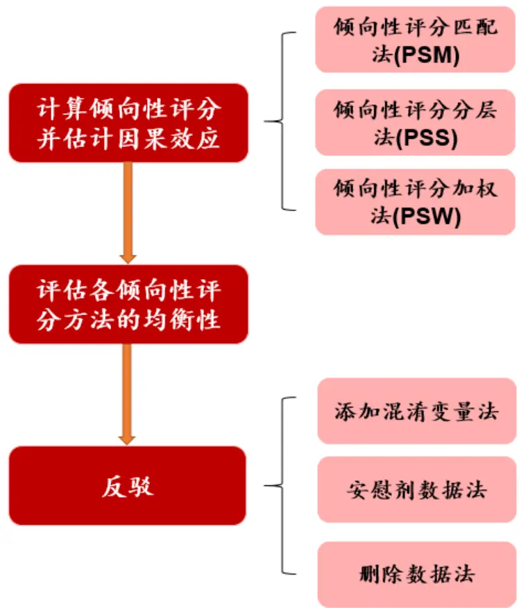
资料来源：华泰证券研究所

## 计算倾向性评分并估计因果效应

倾向性评分是给定混淆变量W的条件下，个体接受Treatment的概率估计，即 P(T=1|W)。如图表 5所示，要计算每个研究对象的倾向性评分，需要以 Treatment 为因变量，混淆变量 Confounders 为自变量，建立回归模型(如 Logistic 回归)来估计每个研究对象接受Treatment 的可能性。对于倾向性评分接近的样本，则认为它们近似匹配，可用来评估因果效应。匹配完成之后，即可通过下式计算 Treatment 变量 T 对 Outcome 变量 Y的因果效应。

$$
ACE(TY)=E(Y_{i}|T_{i}=1)-E(Y_{i}|T_{i}=0)
$$

图表5： 倾向性评分的计算和匹配
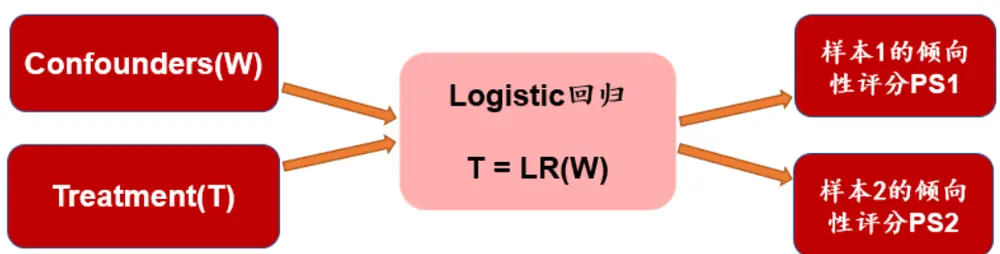
如果PS1≈PS2，则认为样本1和样本2近似匹配。
资料来源：华泰证券研究所

1. 倾向性评分匹配法(Propensity Score Matching，PSM)：PSM 将处理组和对照组中倾向性评分接近的样本进行匹配后得到匹配群体，再在匹配群体中计算因果效应。最常用的匹配方法是最近邻匹配法(nearest neighbor matching)，对于每一个处理组的样本，从对照组选取与其倾向评分最接近的所有样本，并从中随机抽取一个或多个作为匹配对象，未匹配上的样本则舍去。

2. 倾向性评分分层法(Propensity Score Stratification，PSS)：PSS 将所有样本按照倾向性评分大小分为若干层(通常分为 5-10 层)，此时层内组间混淆变量的分布可以认为是均衡的，当层内有足够样本量时，可以直接对单个层进行分析，也可以对各层效应进行加权平均。当两组的倾向性评分分布偏离较大时，可能有的层中只有对照组个体，而有的层只有试验组的个体，这些层不参与评估因果效应。PSS 的关键问题是分层数和权重的设定。可通过比较层内组间倾向性评分的均衡性来检验所选定的层数是否合理，权重一般由各层样本占总样本量的比例来确定。有研究表明，采用五等分可以有效消除倾向分数模型中所有特征变量 90%以上的偏差。(见参考文献[4])

3. 倾向性评分加权法(Propensity Score Weighting，PSW)：PSW 在计算得出倾向性评分的基础上，通过倾向性评分值赋予每个样本一个相应的权重进行加权，使得处理组和对照组中倾向性评分分布一致，从而达到消除混淆变量影响的目的。Robins 等人给出的加权系数计算方法是：

$$
\begin{array}{r}\mathrm{~\#\mathbb{L}\#\mathbb{L}\#\mathbb{L}\#\mathbb{L}\#\mathbb{L}\#\mathbb{L}\#\mathbb{L}\#\mathbb{L}\mathbb{L}W_{t}=\frac{1}{PS}}\end{array}
$$

$$
\begin{array}{r}{\vec{x}\dag\frac{\partial\mathcal{G}}{\partial x}\mathcal{L}_{\perp}\vec{\mathcal{t}}\dag\frac{\partial^{\prime}}{\partial\mathcal{F}}\dag\frac{\partial^{\prime}}{\partial\mathcal{H}}\dag\vec{y}\dag\vec{x}\mp\frac{\partial}{\partial\mathcal{H}}\dag\mathcal{W}_{c}=\frac{1}{1-PS}}\end{array}
$$

以上两式中，PS 是样本的倾向性评分。该加权方法的通俗理解方式为：由于 PS 是由 Logistic 回归拟合得到，总体上来看处理组样本的 PS 靠近 1，对照组样本的 PS靠近 0。PS 越小的处理组样本，越容易找到能与之匹配的对照组样本，使用该处理组样本估计的因果效应更可靠，其权重应该更大。所以对于处理组样本来说，其权重$W_{t}$ 等于 PS 的倒数。而对照组样本的情况和处理组样本正好相反，故其权重 $W_{c}$ 等于(1-PS)的倒数。

然而在大多数情况下，处理组和对照组样本的数量并不均衡。Hernan 等人对计算方法进行了调整，将整个样本空间中处理组样本的占比 $\left(P_{t}\right)$ 和非处理组样本的占比(1−$P_{t})$ 加入公式中，增大占比较大组的样本的权重，得到以下计算方法：

$$
\begin{array}{r}{\mathrm{~\AE~}\dot{\mathfrak{L}}\supseteq\mathrm{~\sharp~}\dot{\mathfrak{L}}\equiv\dot{\mathfrak{L}}\enspace\dot{\mathfrak{L}}\enspace{\dot{\mathfrak{L}}\enspace}\mathrm{~\AE~}\enspace\dot{\mathfrak{L}}\enspace{\dot{\mathfrak{L}}\rvert}\otimes\dot{\mathfrak{L}}\enspace{\dot{\mathfrak{L}}\rvert}\mathrm{~\rule{0.5ex}{5ex}~}}\end{array}
$$

$$
\begin{array}{r}{\vec{x}\dag\frac{\mathrm{H}\vec{\sigma}}{\mathrm{e}}\frac{\not\cdot\mathrm{H}\vec{\mathcal{H}}}{\mathrm{H}\vec{\mathcal{H}}}\frac{\not\cdot\mathrm{\Pi}}{\mathrm{\mathcal{H}}}\frac{\not\cdot\mathrm{H}^{3}}{\mathrm{H}\cdot\mathrm{J}}\frac{\not\cdot\mathrm{H}}{\mathrm{H}}\frac{\mathrm{\widehat{H}}}{\mathrm{\mathcal{H}}}\frac{\not\cdot\mathrm{H}}{\mathrm{J}}W_{c}=\frac{1-P_{t}}{1-PS}}\end{array}
$$

在给样本加权后，即可计算因果效应。PSW 的优点在于可以充分利用每个样本，不会出现样本无法匹配的情况。(见参考文献[5])

## 倾向性评分法的均衡性检验

倾向性评分法要求匹配后样本的所有混淆变量在处理组和对照组达到均衡，否则后续分析会有偏差，因此需要对匹配之后的样本进行均衡性检验。目前学术界比较公认的方法是使用标准化差值直观反映匹配前后的组间差异(见参考文献[6])。比如，混淆变量 x 的标准化差计算公式为

$$
stddiff=\frac{|mean(x_{t})-mean(x_{c})|}{\sqrt{(var(x_{t})+var(x_{c}))/2}}
$$

其中， $mean(x_{t})$ 和 $mean(x_{c})$ 分别表示 x 在处理组和对照组的平均值， $var(x_{t})$ 和$var(x_{c})$ 分别表示 x 在处理组和对照组的方差。对于倾向性评分分层，则需要对每一层进行均衡性检验。对于倾向性评分加权，则是在对每个个体赋予相应的权重之后计算标准化差。均衡性检验可用来评价不同倾向性评分方法的组间均衡效果。

## 反驳

反驳(Refute)使用不同的数据干预方式进行检验，以验证倾向性评分法得出的因果效应的有效性。反驳的基本原理是，对原数据进行某种干预之后，对新的数据重新进行因果效应的估计。理论上，如果处理变量(Treatment)和结果变量(Outcome)之间确实存在因果效应，那么这种因果关系是不会随着环境或者数据的变化而变化的，即新的因果效应估计值与原估计值相差不大。

反驳中进行数据干预的方式有：

1. 安慰剂数据法：用安慰剂数据(Placebo)代替真实的处理变量，其中 Placebo 为随机生成的变量或者对原处理变量进行不放回随机抽样产生的变量。

2. 添加随机混淆变量法：增加一个随机生成的混淆变量。

3. 子集数据法：随机删除一部分数据，新的数据为原数据的一个随机子集。

## 因果推断程序包 DoWhy 简介

DoWhy(https://microsoft.github.io/dowhy/)是微软开发的用于因果推断的 Python 程序包。DoWhy 通过简单的编程框架结合了若干因果推断方法。在 DoWhy 中可以使用的因果推断方法有：

1. 倾向性评分法(Propensity Score)。

2. 工具变量法(Instrument Variable)。

3. 断点回归法(Discontinuity Regression)。

我们将使用 DoWhy中倾向性评分法相关的模块，展示因果推断在不同数据集上的应用案例。

## 因果推断程序包 EconML简介

EconML (https://econml.azurewebsites.net/)同样是由微软开发的用于因果推断的 Python程序包。相比 DoWhy，EconML 借助一些更复杂的机器学习算法来进行因果推断。在EconML 中可以使用的因果推断方法有：

1. 双机器学习(Double Machine Learning)。

2. 双重鲁棒学习(Doubly Robust Learner)。

3. 树型学习器(Forest Learners)。

4. 元学习器(Meta Learners)。

5. 深度工具变量法(Deep IV).

6. 正交随机树(Orthogonal Random Forest)

7. 加权双机器学习(Weighted Double Machine Learning)

由于篇幅有限，本文将不对 EconML 做详细介绍。

## 基于倾向性评分法的因果推断案例：Lalonde数据集

Lalonde 数据集是因果推断领域的经典数据集，由 Robert Lalonde 在 1986 年整理，数据集的说明如图表 6 所示：

图表6： Lalonde 数据集说明

| 变量名称 | 含义 | 取值范围 |
| --- | --- | --- |
| age | 年龄 | 17-55 |
| educ | 教育年限 | 3-16 |
| black | 是否为黑人 | 0,1 |
| hisp | 是否为西班牙裔 | 0,1 |
| married | 是否已婚 | 0,1 |
| nodegr | 是否有高中文凭 | 0,1 |
| re74 | 1974年实际收入(美元) | 0-39570.7 |
| re75 | 1975年实际收入(美元) | 0-25142.2 |
| u74 | 1974 年收入是否为0 | 0,1 |
| u75 | 1975 年收入是否为 0 | 0,1 |
| re78 | 1978年实际收入(美元) | 0-60307.9 |
| treat | 是否参加就业培训 | 0, 1 |

资料来源：Lalonde，华泰证券研究所

数据集共包含 445 个观测对象，一个典型的因果推断案例是研究个人是否参加就业培训对1978年实际收入的影响。按照是否参加培训将所有观测对象进行分组，处理组(treat=1)185例，对照组(treat=0)260 例。混淆变量为 age、educ、black、hisp、married、nodeg。

各种倾向性评分法的因果效应估计值在图表 7 中，由于不同方法的原理不同，估计的因果效应值也不同。其中倾向性评分匹配法(PSM)因果效应估计值为 2196.61，即参加职业培训可以使得一个人的收入增加约 2196.61 美元。另外为了对比，我们计算 ATE(AverageTreatment Effect)，即在不考虑任何混淆变量的情况下，参加职业培训(treat=1)和不参加职业培训(treat=0)两个群体收入(re78)的平均差异。

图表7： 三种倾向性评分法的因果效应估计值

|  | 因果效应估计值 |
| --- | --- |
| PSM | 2196.61 |
| PSS | 1630.92 |
| PSW | 1618.33 |
| ATE | 1794.34 |

资料来源：Lalonde，华泰证券研究所

图表 8展示了各倾向性评分方法中，每个混淆变量的标准化差值 stddiff。总体来看，倾向性评分加权法(PSW)中各混淆变量的标准化差值最小(除了 hisp)，说明 PSW 中混淆变量在处理组和对照组间较均衡，其因果效应估计值可能更可靠。

图表8： 三种倾向性评分法中，每个混淆变量的标准化差值 stddiff

|  | nodegr | black | hisp | age | educ | married |
| --- | --- | --- | --- | --- | --- | --- |
| PSM | 0.0469 | 0.0455 | 0.0645 | 0.0974 | 0.0549 | 0.0671 |
| PSS | 0.0606 | 0.0490 | 0.0029 | 0.0542 | 0.1317 | 0.1200 |
| PSW | 0.0224 | 0.0085 | 0.0272 | 0.0113 | 0.0188 | 0.0054 |

资料来源：Lalonde，华泰证券研究所

图表 8展示了 100 次反驳测试中，三种倾向性评分法的每类反驳测试结果的均值。我们将三种倾向性评分法在真实数据下的因果效应估计值放在图表 9最右侧进行对比。在安慰剂数据法中，由于生成的安慰剂数据(Placebo)替代了真实的处理变量，每个个体接收培训的事实已不存在，因此反驳测试中的因果估计效应大幅下降，接近 0，这反过来说明了处理变量对结果变量具有一定因果效应。在添加随机混淆变量法和子集数据法中，反驳测试结果的均值在 1585.19~1681.75 之间。对比真实数据的因果估计效应值，PSM 的反驳测试结果大符下降，说明其估计的因果效应不太可靠；PSW 的反驳测试结果与真实数据因果效应估计值最接近，说明其因果效应估计值可能更可靠。

图表9： 100次反驳测试中，三种倾向性评分法的每类反驳测试结果的均值

|  | 安慰剂数据法 | 添加随机混淆变量法 | 子集数据法 | 真实数据因果效应估计值 |
| --- | --- | --- | --- | --- |
| PSM | -101.49 | 1652.11 | 1585.19 | 2196.61 |
| PSS | 92.80 | 1627.53 | 1681.75 | 1630.92 |
| PSW | -84.82 | 1617.47 | 1619.53 | 1618.33 |

资料来源：Lalonde，华泰证券研究所

## 基于倾向性评分法的因果推断案例：A股概念数据

本章我们将把视角转回投资领域，分析 A股市场中股票所属概念和股票未来收益的因果关系。股票是否属于某个概念是一种事件型的变量，可以套用到因果推断的框架中进行研究。本文使用的基于因果推断的方法，或许能为概念/事件驱动型策略提供一套科学的研究框架。

图表 10展示了基于因果推断的股票概念效应研究框架。股票是否属于某概念(是=1，否=0)可视为处理变量(Treatment)，股票未来的收益可视为结果变量(Outcome)。股票的基本面的和量价因子暴露与股票未来收益有关，与股票的概念取值也可能有关，因此可视为混淆变量。我们要研究的是，控制混淆变量在处理组(属于某概念)和对照组(不属于某概念)的分布一致的情况下，股票所属概念和股票未来收益的因果关系。

图表10： 基于因果推断的股票概念效应研究框架
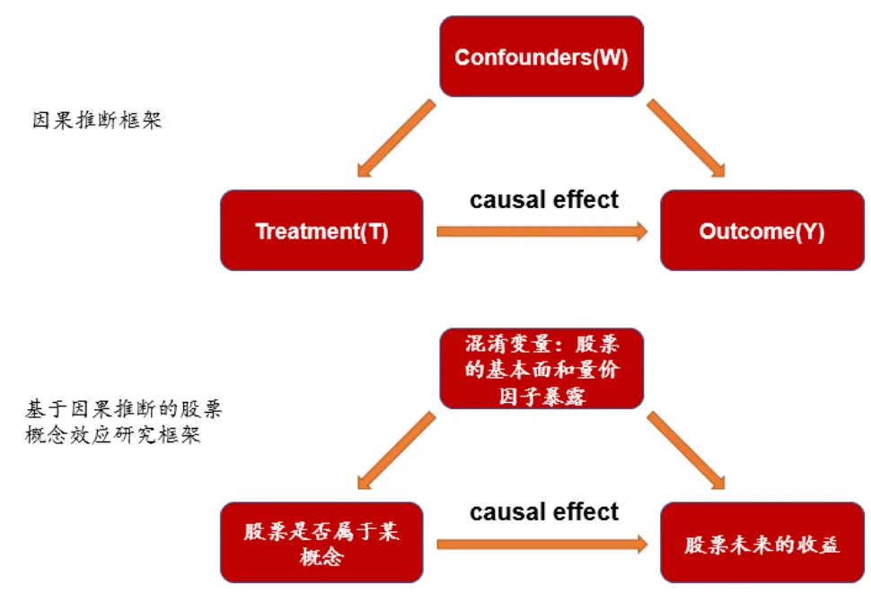
资料来源：华泰证券研究所

## 本章的测试细节如下：

1. 处理变量：股票是否属于某概念。我们所使用的概念数据来自于 Wind 概念指数成分股，主要研究的股票概念如图表 11所示。

2. 结果变量：为了方便不同截面月份进行对比，使用股票未来一个月的收益排序数(取值0~1 之间，收益越高越大)作为结果变量。

3. 混淆变量：我们选取图表 12 中的因子作为混淆变量，混淆变量覆盖了各大类风格因子。

4. 样本空间：由于概念覆盖的股票数量有限，样本空间为中证 800 成分股。

5. 时间区间：由于概念存在的时间较晚，时间区间为 2016 年 1 月至 2020 年 3 月。

图表11： 本文主要研究的股票概念及其描述

| 概念名称 | 概念描述 |
| --- | --- |
|  | 基金重仓(季调) 指基于最新财报所披露的股东数据计算而得的基金重仓持有的标的。具体规则为：1、计算最 新报告期，所有A股公司的基金持仓市值；2、按照持仓市值进行降序排列；3、将持仓市值 累计求和占全部基金持仓市值前80%的标的纳入。每季度财报披露完成之后调整样本，调仓 日4月30日，8月31日及10月31日。 |
| 股票质押 | “质押式回购”即股票质押式回购交易的简称，是指符合条件的资金融入方(简称“融入方”) 以所持有的股票或其他证券质押，向符合条件的资金融出方(简称“融出方”)融入资金，并约 定在未来返还资金、解除质押的交易。该概念主要涉及：截止当前日期，质押市值降序排列， |
| 预增 | 累积占比居于前70%的公司。 “预增”指去年同期净利润为正值，最新预告报告期盈利增幅大于100%或明确表示业绩将有 “大幅增长”的公司。 |
| 护城河 | 指按照行业分类，各自行业里面拥有最强盈利能力的上市公司。具体筛选逻辑：1、按照行业 分类，基于年报数据，对各自行业进行利润总额降序排列，获取累计利润求和占比超过全行业 70%的公司；2、剔除亏损的企业；3、按照1和2的逻辑，计算最近三年的数据，取连续三 |

资料来源：Wind，华泰证券研究所

图表12： 混淆变量

| 变量名称 | 所属因子大类 | 含义 |
| --- | --- | --- |
| EP | 估值 | 净利润(TTM)/总市值 |
| BP | 估值 | 净资产/总市值 |
| ROE_G_q | 成长 | ROE(最新财报，YTD)同比增长率 |
| ROE_q | 盈利 | ROE(最新财报，YTD) |
| financial_leverage | 杠杆 | 总资产/净资产 |
| In_capital | 市值 | 总市值取对数 |
| beta | beta | 个股60个月收益与上证综指回归的 beta |
| return_1m | 动量反转 | 个股最近1个月收益率 |
| std_1m | 波动率 | 个股最近1个月的日收益率序列标准差 |
| turn_1m | 换手率 | 个股最近1个月内日均换手率(剔除停牌、涨跌停的交易日) |

资料来源：Wind，华泰证券研究所

## 基金重仓(季调)

图表 13展示了每个月截面上中证 800 成分股中属于基金重仓(季调)概念的比例。

图表13： 每个月截面上中证 800成分股中属于基金重仓(季调)概念的比例
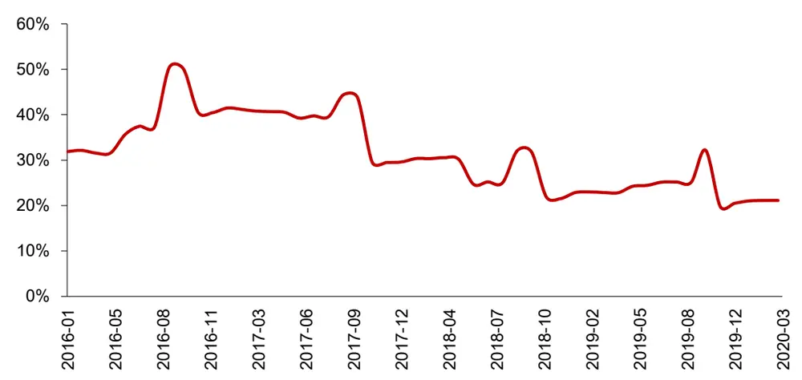
资料来源：Wind，华泰证券研究所

各种倾向性评分法的因果效应估计值在图表 14 中，其中倾向性评分匹配法(PSM)因果效应估计值为 0.0388，即在 2016 年 1 月至 2020 年 3 月这段时间中，属于基金重仓(季调)概念的股票，其未来一个月收益的排序数相比于不属于该概念的股票要高出 0.0388。另外为了对比，我们计算 ATE，即在不考虑任何混淆变量的情况下，属于基金重仓(季调)概念的股票和不属于基金重仓(季调)概念的股票的平均差异。图表 15 展示了三种倾向性评分法的因果效应估计值变化。可以看出，我们所选取的混淆变量对于因果效应估计值的影响不大。

图表14： 三种倾向性评分法的因果效应估计值均值(2016年 1月至 2020年 3月)

|  | 因果效应估计值均值 |
| --- | --- |
| PSM | 0.0388 |
| PSS | 0.0365 |
| PSW | 0.0410 |
| ATE | 0.0373 |

资料来源：Wind，华泰证券研究所

图表15： 三种倾向性评分法的因果效应估计值变化(2016年 1月至 2020年 3月)
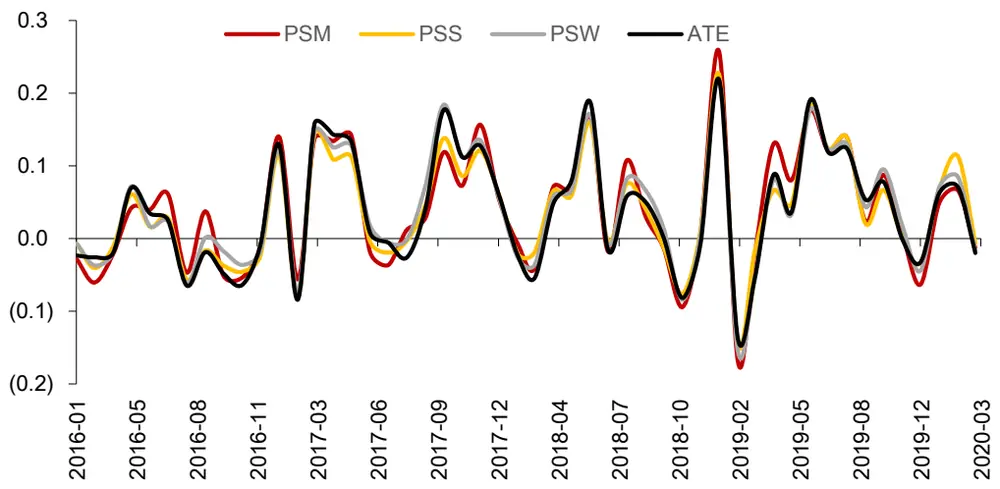
资料来源：Wind，华泰证券研究所

图表 16 展示了各倾向性评分方法中，每个混淆变量的标准化差值 stddiff。总体来看，倾向性评分加权法(PSW)中各混淆变量的标准化差值最小(除了 ln_capital)，说明 PSW 中混淆变量在处理组和对照组间较均衡，其因果效应估计值可能更可靠。

图表16： 三种倾向性评分法中，每个混淆变量的标准化差值 stddiff

| EP |  |  | ROE_G_q 0.0646 | 0.0596 | ROE_q financial_leverage | In_capital 0.0994 | beta 0.0617 | return_1m 0.0710 | std_1m 0.0647 | turn_1m 0.0883 |
| --- | --- | --- | --- | --- | --- | --- | --- | --- | --- | --- |
| PSM | 0.0799 | BP 0.0782 |  |  |  |  |  |  |  |  |
| PSS | 0.2493 | 0.2470 | 0.2221 | 0.2612 | 0.0655 0.2078 | 0.7814 | 0.2206 | 0.2258 | 0.2191 | 0.2547 |
| PSW | 0.0250 | 0.0151 | 0.0157 | 0.0256 | 0.0154 | 0.1022 | 0.0187 | 0.0185 | 0.0083 | 0.0240 |

资料来源：Wind，华泰证券研究所

图表 17 展示了 100 次反驳测试中，三种倾向性评分法的每类反驳测试结果的均值。我们将三种倾向性评分法在真实数据下的因果效应估计值放在图表 17 最右侧进行对比。在安慰剂数据法中，由于生成的安慰剂数据(Placebo)替代了真实的处理变量，每个样本是否属于概念的事实已不存在，因此反驳测试中的因果估计效应大幅下降，接近 0，这反过来说明了处理变量对结果变量具有一定因果效应。在添加随机混淆变量法和子集数据法中，PSW 的反驳测试结果与真实数据因果效应估计值最接近，说明其因果效应估计值可能更可靠。

图表17： 100次反驳测试中，三种倾向性评分法的每类反驳测试结果的均值

|  | 安慰剂数据法 | 添加随机混淆变量法 | 子集数据法 | 真实数据因果效应估计值 |
| --- | --- | --- | --- | --- |
| PSM | -0.0031 | 0.0573 | 0.0507 | 0.0388 |
| PSS | -0.0031 | 0.0575 | 0.0515 | 0.0365 |
| PSW | -0.0032 | 0.0583 | 0.0515 | 0.0410 |

资料来源：Wind，华泰证券研究所

## 股票质押

图表 18展示了每个月截面上中证 800 成分股中属于股票质押概念的比例。

图表18： 每个月截面上中证 800成分股中属于股票质押概念的比例
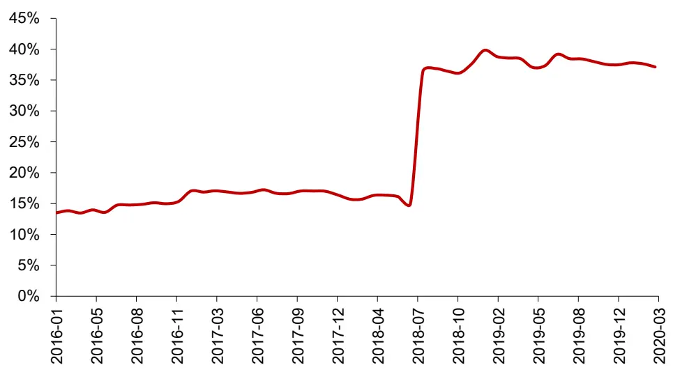
资料来源：Wind，华泰证券研究所

各种倾向性评分法的因果效应估计值在 19 中，其中倾向性评分匹配法(PSM)因果效应估计值为-0.0118，即在 2016 年 1月至 2020年 3月这段时间中，属于股票质押概念的股票，其未来一个月收益的排序数相比于不属于该概念的股票要低 0.0118。另外为了对比，我们计算 ATE，即在不考虑任何混淆变量的情况下，属于股票质押概念的股票和不属于股票质押概念的股票的平均差异。图表 20展示了三种倾向性评分法的因果效应估计值变化。

图表19： 三种倾向性评分法的因果效应估计值均值(2016年 1月至 2020年 3月)

|  | 因果效应估计值均值 |
| --- | --- |
| PSM | -0.0118 |
| PSS | -0.0082 |
| PSW | -0.0169 |
| ATE | -0.0153 |

资料来源：Wind，华泰证券研究所

图表20： 三种倾向性评分法的因果效应估计值变化(2016 年 1 月至 2020 年 3 月)
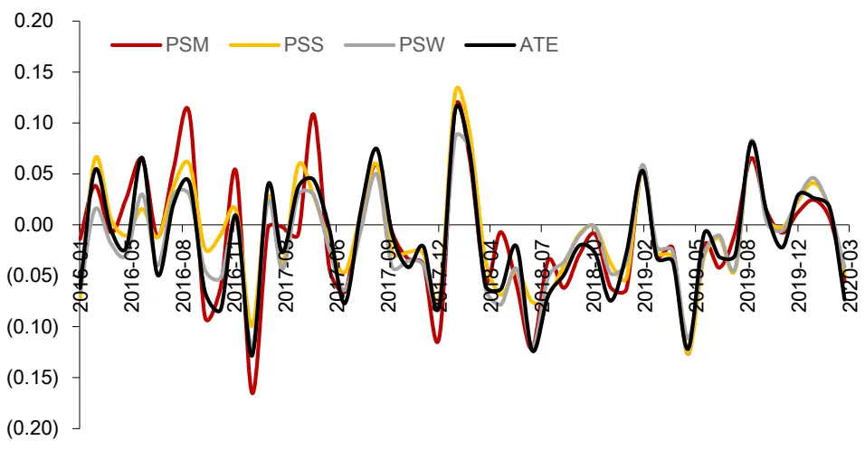
资料来源：Wind，华泰证券研究所

图表 21 展示了各倾向性评分方法中，每个混淆变量的标准化差值 stddiff。总体来看，倾向性评分加权法(PSW)中各混淆变量的标准化差值最小，说明 PSW 中混淆变量在处理组和对照组间较均衡，其因果效应估计值可能更可靠。

图表21： 三种倾向性评分法中，每个混淆变量的标准化差值 stddiff

|  | EP | BP | ROE_G_q |  | ROE_q financial_leverage | In_capital | beta | return_1m | std_1m | turn_1m |
| --- | --- | --- | --- | --- | --- | --- | --- | --- | --- | --- |
| PSM | 0.0785 | 0.0654 | 0.0643 | 0.0647 | 0.0847 | 0.0804 0.2208 | 0.0719 0.2154 | 0.0608 0.2181 | 0.0707 0.2034 | 0.0638 0.2044 |
| PSS PSW | 0.2138 0.0159 | 0.2033 0.0189 | 0.2147 0.0134 | 0.2041 0.0126 | 0.2024 0.0185 | 0.0148 | 0.0192 | 0.0258 | 0.0120 | 0.0197 |

资料来源：Wind，华泰证券研究所

图表 22 展示了 100 次反驳测试中，三种倾向性评分法的每类反驳测试结果的均值。我们将三种倾向性评分法在真实数据下的因果效应估计值放在图表 22 最右侧进行对比。在安慰剂数据法中，由于生成的安慰剂数据(Placebo)替代了真实的处理变量，每个样本是否属于概念的事实已不存在，因此反驳测试中的因果估计效应下降，接近 0，这反过来说明了处理变量对结果变量具有一定因果效应。在添加随机混淆变量法和子集数据法中，PSW的反驳测试结果与真实数据因果效应估计值最接近，说明其因果效应估计值可能更可靠。

图表22： 100次反驳测试中，三种倾向性评分法的每类反驳测试结果的均值

|  | 安慰剂数据法 | 添加随机混淆变量法 | 子集数据法 | 真实数据因果效应估计值 |
| --- | --- | --- | --- | --- |
| PSM | -0.0071 | -0.0237 | -0.0269 | -0.0118 |
| PSS | -0.0071 | -0.0236 | -0.0269 | -0.0082 |
| PSW | -0.0072 | -0.0236 | -0.0268 | -0.0169 |

资料来源：Wind，华泰证券研究所

## 预增

图表 23展示了每个月截面上中证 800 成分股中属于预增概念的比例。

图表23： 每个月截面上中证 800成分股中属于预增概念的比例
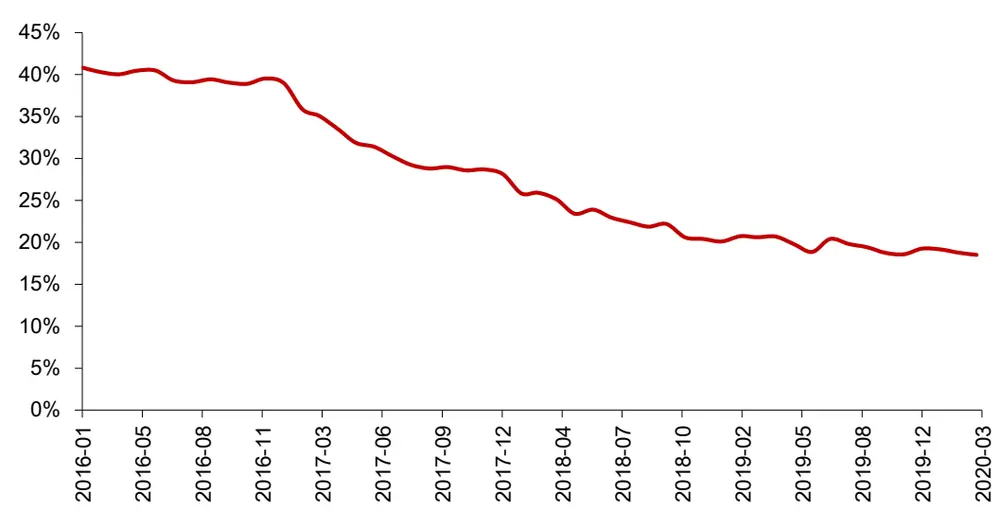
资料来源：Wind，华泰证券研究所

各种倾向性评分法的因果效应估计值在图表 24 中，其中倾向性评分匹配法(PSM)因果效应估计值为 0.0138，即在 2016 年 1月至 2020 年 3月这段时间中，属于预增概念的股票，其未来一个月收益的排序数相比于不属于该概念的股票要高出 0.0138。另外为了对比，我们计算 ATE，即在不考虑任何混淆变量的情况下，属于预增概念的股票和不属于预增概念的股票的平均差异。图表 25 展示了三种倾向性评分法的因果效应估计值变化。可以看出，在考虑混淆变量的情形下，预增概念的因果效应估计值均值都下降了。

图表24： 三种倾向性评分法的因果效应估计值均值(2016 年 1 月至 2020 年 3 月)

|  | 因果效应估计值均值 |
| --- | --- |
| PSM | 0.0138 |
| PSS | 0.0093 |
| PSW | 0.0047 |
| ATE | 0.0149 |

资料来源：华泰证券研究所

图表25： 三种倾向性评分法的因果效应估计值变化(2016年 1月至 2020年 3月)
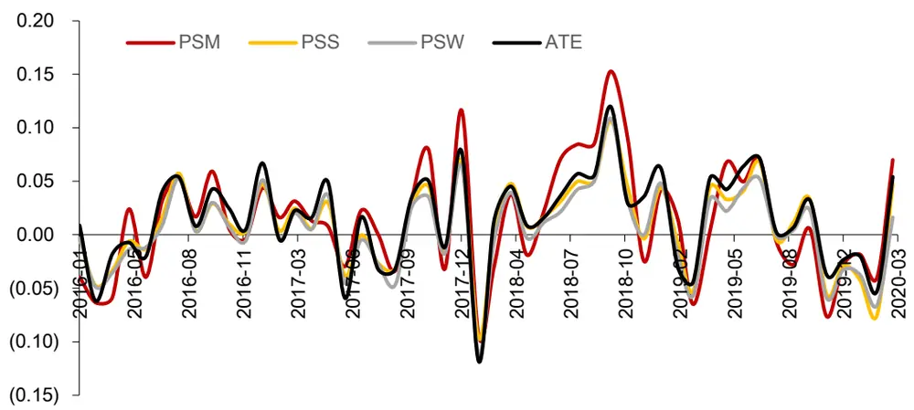
资料来源：Wind，华泰证券研究所

图表 26 展示了各倾向性评分方法中，每个混淆变量的标准化差值 stddiff。总体来看，倾向性评分加权法(PSW)中各混淆变量的标准化差值最小，说明 PSW 中混淆变量在处理组和对照组间较均衡，其因果效应估计值可能更可靠。

图表26： 三种倾向性评分法中，每个混淆变量的标准化差值 stddiff

| EP |  |  | ROE_G_q 0.0603 |  | ROE_q financial_leverage 0.0641 | In_capital 0.0514 | beta 0.0722 | return_1m 0.0654 | std_1m 0.0743 | turn_1m 0.0587 |  |
| --- | --- | --- | --- | --- | --- | --- | --- | --- | --- | --- | --- |
| PSM | 0.0800 | BP 0.0582 |  |  |  |  |  |  |  |  | 0.0603 |
| PSS | 0.2181 | 0.2132 | 0.2277 | 0.1981 | 0.2108 | 0.2570 | 0.1967 | 0.2115 | 0.2045 | 0.2091 |  |
| PSW | 0.0125 | 0.0074 | 0.0160 | 0.0079 | 0.0070 | 0.0124 | 0.0062 | 0.0086 | 0.0068 | 0.0073 |  |

资料来源：Wind，华泰证券研究所

图表 27 展示了 100 次反驳测试中，三种倾向性评分法的每类反驳测试结果的均值。我们将三种倾向性评分法在真实数据下的因果效应估计值放在图表 27 最右侧进行对比。在添加随机混淆变量法和子集数据法中，其估计的因果效应值的绝对值已经小于安慰剂数据法，说明在对原始数据添加干预之后，因果效应已不显著，因此预增概念对于股票收益的正向因果效应是存疑的。另外，PSW 的反驳测试结果与真实数据因果效应估计值最接近，说明其因果效应估计值可能更可靠。

图表27： 100次反驳测试中，三种倾向性评分法的每类反驳测试结果的均值

|  | 安慰剂数据法 | 添加随机混淆变量法 | 子集数据法 | 真实数据因果效应估计值 |
| --- | --- | --- | --- | --- |
| PSM | -0.0043 | 0.0007 | -0.0002 | 0.0138 |
| PSS | -0.0043 | 0.0017 | 0.0007 | 0.0093 |
| PSW | -0.0045 | 0.0008 | -0.0002 | 0.0047 |

资料来源：Wind，华泰证券研究所

## 护城河

图表 28展示了每个月截面上中证 800 成分股中属于护城河概念的比例。

图表28： 每个月截面上中证 800成分股中属于护城河概念的比例
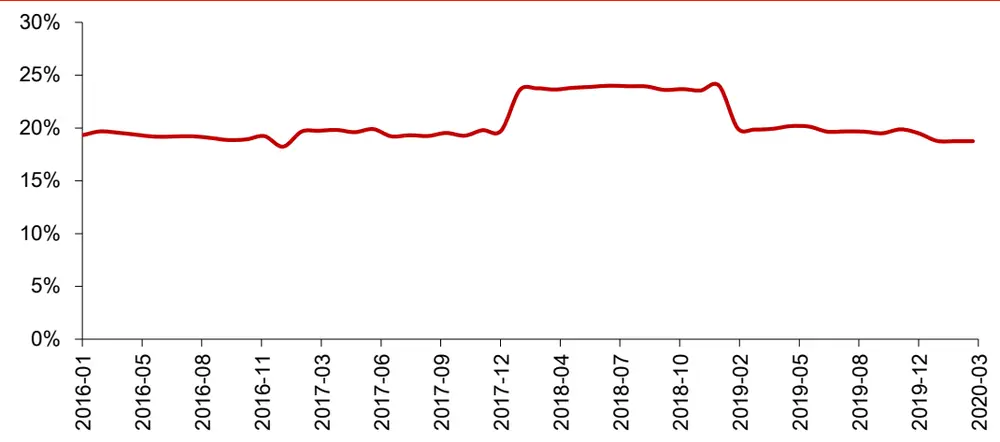
资料来源：Wind，华泰证券研究所

各种倾向性评分法的因果效应估计值在图表 29 中，其中倾向性评分匹配法(PSM)因果效应估计值为 0.0205，即在 2016 年 1 月至 2020 年 3 月这段时间中，属于护城河概念的股票，其未来一个月收益的排序数相比于不属于该概念的股票要高出 0.0205。另外为了对比，我们计算 ATE，即在不考虑任何混淆变量的情况下，属于护城河概念的股票和不属于护城河概念的股票的平均差异。图表 30 展示了三种倾向性评分法的因果效应估计值变化。可以看出，在考虑混淆变量的情形下，护城河概念的因果效应估计值均值都下降了。

图表29： 三种倾向性评分法的因果效应估计值均值(2016年 1月至 2020年 3月)

|  | 因果效应估计值均值 |
| --- | --- |
| PSM | 0.0205 |
| PSS | 0.0143 |
| PSW | 0.0048 |
| ATE | 0.0298 |

资料来源：华泰证券研究所

图表30： 三种倾向性评分法的因果效应估计值变化(2016 年 1 月至 2020 年 3 月)
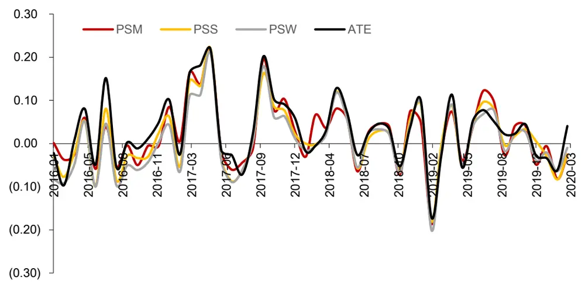
资料来源：Wind，华泰证券研究所

图表 31 展示了各倾向性评分方法中，每个混淆变量的标准化差值 stddiff。总体来看，倾向性评分加权法(PSW)中各混淆变量的标准化差值最小，说明 PSW 中混淆变量在处理组和对照组间较均衡，其因果效应估计值可能更可靠。

图表31： 三种倾向性评分法中，每个混淆变量的标准化差值 stddiff

| EP |  |  | ROE_G_q 0.0801 | 0.0801 | ROE_q financial_leverage 0.0879 | In_capital 0.0399 | beta 0.0714 | return_1m 0.0649 | std_1m 0.0663 | turn_1m 0.0699 |
| --- | --- | --- | --- | --- | --- | --- | --- | --- | --- | --- |
| PSM | 0.0569 | BP 0.0667 |  |  |  |  |  |  |  |  |
| PSS | 0.2224 | 0.1931 | 0.2099 | 0.2158 | 0.2074 | 0.4115 | 0.2098 | 0.2145 | 0.2160 | 0.2165 |
| PSW | 0.0299 | 0.0266 | 0.0146 | 0.0169 | 0.0184 | 0.0244 | 0.0145 | 0.0172 | 0.0186 | 0.0174 |

资料来源：Wind，华泰证券研究所

图表 32 展示了 100 次反驳测试中，三种倾向性评分法的每类反驳测试结果的均值。我们将三种倾向性评分法在真实数据下的因果效应估计值放在图表 32 最右侧进行对比。在添加随机混淆变量法和子集数据法中，其估计的因果效应值的绝对值与安慰剂数据法接近，说明在对原始数据添加干预之后，因果效应已不显著，因此护城河概念对于股票收益的正向因果效应是存疑的。另外，PSW 的反驳测试结果与真实数据因果效应估计值最接近，说明其因果效应估计值可能更可靠。

图表32： 100次反驳测试中，三种倾向性评分法的每类反驳测试结果的均值

|  | 安慰剂数据法 | 添加随机混淆变量法 | 子集数据法 | 真实数据因果效应估计值 |
| --- | --- | --- | --- | --- |
| PSM | -0.0066 | -0.0061 | -0.0067 | 0.0205 |
| PSS | -0.0066 | -0.0075 | -0.0083 | 0.0143 |
| PSW | -0.0069 | -0.0068 | -0.0077 | 0.0048 |

资料来源：Wind，华泰证券研究所

## 小结

通过以上四个股票概念的因果效应估计结果可以看出，PSW 在均衡性测试和反驳测试中表现都最好，可以认为其估计的因果效应较为可靠。四个概念的因果效应估计结果汇总在图表 33中。通过反驳测试，我们认为基金重仓(季调)概念与股票收益有正向因果关系，股票质押概念与股票收益有反向因果关系，预增和护城河概念与股票收益的因果效应存疑。

从概念描述的角度可对因果效应的估计结果做出解释，预增和护城河概念的描述中包含较多混淆变量的信息(如净利润、利润总额)，那么在考虑混淆变量的情况下，其因果效应存疑。而对于基金重仓(季调)和股票质押概念来说，它们使用了混淆变量中所不能解释的信息，且该信息对股票收益造成了影响，因此分别具有正向和反向的因果效应。

图表33： 本文主要研究的股票概念及其因果效应估计结果

| 概念名称 | 概念描述 | PSW 因果效应估计值 因果效应估计结果 |  |
| --- | --- | --- | --- |
|  | 基金重仓(季调)指基于最新财报所披露的股东数据计算而得的基金重仓持有的标的。具体规则为：1、计算 最新报告期，所有A股公司的基金持仓市值；2、按照持仓市值进行降序排列；3、将持仓市 值累计求和占全部基金持仓市值前80%的标的纳入。每季度财报披露完成之后调整样本，调 | 0.0410 | 正向因果效应 |
|  | 仓日4月30，8月31及10月31日。 “质押式回购”即股票质押式回购交易的简称，是指符合条件的资金融入方(简称“融入方”) 以所持有的股票或其他证券质押，向符合条件的资金融出方(简称“融出方”)融入资金，并 | -0.0169 | 反向因果效应 |
| 预增 | 约定在未来返还资金、解除质押的交易。该概念主要涉及：截止当前日期，质押市值降序排 列，累积占比居于前70%的公司。 “预增”指去年同期净利润为正值，最新预告报告期盈利增幅大于100%或明确表示业绩将 | 0.0047 | 因果效应存疑 |
| 护城河 | 有“大幅增长”的公司。 指按照行业分类，各自行业里面拥有最强盈利能力的上市公司。具体筛选逻辑：1、按照行 业分类，基于年报数据，对各自行业进行利润总额降序排列，获取累计利润求和占比超过全 | 0.0048 | 因果效应存疑 |

资料来源：Wind，华泰证券研究所

## 总结

本文结论如下：

1. 机器学习本质是曲线拟合，可借助因果推断构建稳健、有推理能力的 AI。现有的大部分机器学习模型是关联驱动的，关联主要有三个来源：因果关联，选择性偏差和混杂偏倚。其中选择性偏差和混杂偏倚产生的关联是不稳定的。因果推断可以帮助恢复数据中的因果关联，用于指导机器学习，实现可解释的稳定预测。对于金融市场来说，一方面市场环境持续变化的特性导致多种可观测因素的有效性都随之而变；另一方面，资产管理人对策略内部的因果逻辑和可解释性都有较高要求。这些现状都说明在将机器学习方法在运用于金融市场的策略构建时，融入因果推断的方法是一个值得尝试的方向。

2. 本文介绍了基于倾向性评分法的因果推断框架。因果推断的基本思想是在处理组和对照组间进行对照实验以估计因果效应。在观测数据中，将处理组与对照组之间分布不一样且会对结果造成影响的特征称为混淆变量，因果效应评估的关键是如何保证混淆变量在处理组与对照组的分布一致。倾向性评分法将多个混淆变量的影响用一个综合的倾向性评分来表示，降低了混淆变量的维度，使得控制混淆变量成为可能。本文归纳了倾向性评分法的三个步骤：(1)计算倾向性评分并估计因果效应；(2)评估各倾向性评分方法的均衡性；(3)通过反驳评估所估计的因果效应是否可靠。

3. 基于因果推断框架，本文研究股票所属概念和收益的因果关系。本文首先在经典的Lalonde 数据集上进行因果效应估计。然后基于倾向性评分法，研究了中证 800 成分股中股票所属的四个概念和股票未来一个月收益的因果关系，我们选取的混淆变量为股票的基本面和量价因子暴露，考察区间为 2016 年 1 月到 2020 年 3 月。通过倾向性评分法的分析，我们认为基金重仓(季调)概念与股票收益有正向因果关系，股票质押概念与股票收益有反向因果关系，预增和护城河概念与股票收益的因果效应存疑。另外，倾向性评分加权法(PSW)在均衡性测试和反驳测试中表现都最好，可以认为其估计的因果效应较为可靠。

## 风险提示

风险提示：因果推断所得结论是对历史规律的总结，若未来规律发生变化，结论存在失效的风险。倾向性评分法对于因果关系的建模存在过度简化的风险。倾向性评分法中，混淆变量的选取会对因果效应估计结果造成较大影响，应谨慎对待。

## 参考文献

Judea Pearl. Causality: Models, Reasoning and Inference. Cambridge University Press, 2009

Judea Pearl, Dana Mackenzie. The Book of Why: The New Science of Cause and Effect. Allen Lane, 2018

Peng Cui, Towards Explainable and Stable Prediction.

Paul R. Rosenbaum, Donald B. Rubin. Reducing Bias in Observational Studies Using Subclassification on the Propensity Score. Journal of the American Statistical Association 79(387), 1984

James M. Robins, Miguel Angel Hernan, Babette Brumback. Marginal Structural Models and Causal Inference in Epidemiology, Epidemiology (Cambridge, Mass.) 11:550-560,2000

Austin PC. Balance diagnostics for comparing the distribution of baseline covariates between treatment groups in propensity-score matched samples. Statistics in medicine,2009.

## 免责声明

## 分析师声明

本人，林晓明、陈烨、李子钰，兹证明本报告所表达的观点准确地反映了分析师对标的证券或发行人的个人意见；彼以往、现在或未来并无就其研究报告所提供的具体建议或所表迖的意见直接或间接收取任何报酬。

## 一般声明

本报告由华泰证券股份有限公司（已具备中国证监会批准的证券投资咨询业务资格，以下简称“本公司”）制作。本报告仅供本公司客户使用。本公司不因接收人收到本报告而视其为客户。

本报告基于本公司认为可靠的、已公开的信息编制，但本公司对该等信息的准确性及完整性不作任何保证。本报告所载的意见、评估及预测仅反映报告发布当日的观点和判断。在不同时期，本公司可能会发出与本报告所载意见、评估及预测不一致的研究报告。同时，本报告所指的证券或投资标的的价格、价值及投资收入可能会波动。以往表现并不能指引未来，未来回报并不能得到保证，并存在损失本金的可能。本公司不保证本报告所含信息保持在最新状态。本公司对本报告所含信息可在不发出通知的情形下做出修改，投资者应当自行关注相应的更新或修改。

本公司研究报告以中文撰写，英文报告为翻译版本，如出现中英文版本内容差异或不一致，请以中文报告为主。英文翻译报告可能存在一定时间迟延。

本公司力求报告内容客观、公正，但本报告所载的观点、结论和建议仅供参考，不构成所述证券的买卖出价或征价。该等观点、建议并未考虑到个别投资者的具体投资目的、财务状况以及特定需求，在任何时候均不构成对客户私人投资建议。投资者应当充分考虑自身特定状况，并完整理解和使用本报告内容，不应视本报告为做出投资决策的唯一因素。对依据或者使用本报告所造成的一切后果，本公司及作者均不承担任何法律责任。任何形式的分享证券投资收益或者分担证券投资损失的书面或口头承诺均为无效。

除非另行说明，本报告中所引用的关于业绩的数据代表过往表现，过往的业绩表现不应作为日后回报的预示。本公司不承诺也不保证任何预示的回报会得以实现，分析中所做的预测可能是基于相应的假设，任何假设的变化可能会显著影响所预测的回报。

本公司及作者在自身所知情的范围内，与本报告所指的证券或投资标的不存在法律禁止的利害关系。在法律许可的情况下，本公司及其所属关联机构可能会持有报告中提到的公司所发行的证券头寸并进行交易，也可能为之提供或者争取提供投资银行、财务顾问或者金融产品等相关服务。本公司的销售人员、交易人员或其他专业人士可能会依据不同假设和标准、采用不同的分析方法而口头或书面发表与本报告意见及建议不一致的市场评论和/或交易观点。本公司没有将此意见及建议向报告所有接收者进行更新的义务。本公司的资产管理部门、自营部门以及其他投资业务部门可能独立做出与本报告中的意见或建议不一致的投资决策。投资者应当考虑到本公司及/或其相关人员可能存在影响本报告观点客观性的潜在利益冲突。投资者请勿将本报告视为投资或其他决定的唯一信赖依据。有关该方面的具体披露请参照本报告尾部。

本研究报告并非意图发送、发布给在当地法律或监管规则下不允许向其发送、发布的机构或人员，也并非意图发送、发布给因可得到、使用本报告的行为而使本公司及关联子公司违反或受制于当地法律或监管规则的机构或人员。

本报告版权仅为本公司所有。未经本公司书面许可，任何机构或个人不得以翻版、复制、发表、引用或再次分发他人等任何形式侵犯本公司版权。如征得本公司同意进行引用、刊发的，需在允许的范围内使用，并注明出处为“华泰证券研究所”，且不得对本报告进行任何有悖原意的引用、删节和修改。本公司保留追究相关责任的权利。所有本报告中使用的商标、服务标记及标记均为本公司的商标、服务标记及标记。

## 针对美国司法管辖区的声明

## 美国法律法规要求之一般披露

本研究报告由华泰证券股份有限公司编制，在美国由华泰证券（美国）有限公司（以下简称华泰证券（美国））向符合美国监管规定的机构投资者进行发表与分发。华泰证券（美国）有限公司是美国注册经纪商和美国金融业监管局（FINRA）的注册会员。对于其在美国分发的研究报告，华泰证券（美国）有限公司对其非美国联营公司编写的每一份研究报告内容负责。华泰证券（美国）有限公司联营公司的分析师不具有美国金融监管（FINRA）分析师的注册资格，可能不属于华泰证券（美国）有限公司的关联人员，因此可能不受 FINRA 关于分析师与标的公司沟通、公开露面和所持交易证券的限制。任何直接从华泰证券（美国）有限公司收到此报告并希望就本报告所述任何证券进行交易的人士，应通过华泰证券（美国）有限公司进行交易。

## 所有权及重大利益冲突

分析师林晓明、陈烨、李子钰本人及相关人士并不担任本研究报告所提及的标的证券或发行人的高级人员、董事或顾问。分析师及相关人士与本研究报告所提及的标的证券或发行人并无任何相关财务利益。声明中所提及的“相关人士”包括FINRA 定义下分析师的家庭成员。分析师根据华泰证券的整体收入和盈利能力获得薪酬，包括源自公司投资银行业务的收入。

## 重要披露信息

- 华泰证券股份有限公司和/或其联营公司在本报告所署日期前的 12 个月内未担任标的证券公开发行或 144A 条款发行的经办人或联席经办人。

- 华泰证券股份有限公司和/或其联营公司在研究报告发布之日前 12 个月未曾向标的公司提供投资银行服务并收取报酬。

- 华泰证券股份有限公司和/或其联营公司预计在本报告发布之日后3个月内将不会向标的公司收取或寻求投资银行服务报酬。

华泰证券股份有限公司和 或其联营公司并未实益持有标的公司某一类普通股证券的 或以上。此头寸基于报告前一个工作日可得的信息，适用法律禁止向我们公布信息的情况除外。在此情况下，总头寸中的适用部分反映截至最近一次发布的可得信息。

- 华泰证券股份有限公司和/或其联营公司在本报告撰写之日并未担任标的公司股票证券做市商。

## 评级说明

## 行业评级体系

－报告发布日后的6个月内的行业涨跌幅相对同期的沪深300指数的涨跌幅为基准；

－投资建议的评级标准

增持行业股票指数超越基准

中性行业股票指数基本与基准持平

减持行业股票指数明显弱于基准

## 公司评级体系

－报告发布日后的 6 个月内的公司涨跌幅相对同期的沪深 300 指数的涨跌幅为基准；
－投资建议的评级标准
买入股价超越基准 20%以上
增持股价超越基准 5%-20%
中性股价相对基准波动在-5%~5%之间
减持股价弱于基准 5%-20%
卖出股价弱于基准 20%以上

## 华泰证券研究

## 南京

南京市建邺区江东中路228号华泰证券广场1号楼/邮政编码：210019

电话：86 25 83389999 /传真：86 25 83387521

电子邮件：ht-rd@htsc.com

## 深圳

深圳市福田区益田路5999号基金大厦10楼/邮政编码：518017电话：86 755 82493932 /传真：86 755 82492062电子邮件：ht-rd@htsc.com

## 北京

北京市西城区太平桥大街丰盛胡同28号太平洋保险大厦A座18层

邮政编码：100032

电话：86 10 63211166/传真：86 10 63211275

电子邮件：ht-rd@htsc.com

## 上海

上海市浦东新区东方路18号保利广场E栋23楼/邮政编码：200120
电话：86 21 28972098 /传真：86 21 28972068
电子邮件：ht-rd@htsc.com

## 法律实体披露

本公司具有中国证监会核准的“证券投资咨询”业务资格，经营许可证编号为：91320000704041011J。

华泰证券全资子公司华泰证券(美国)有限公司为美国金融业监管局(FINRA)成员，具有在美国开展经纪交易商业务的资格，经营业务许可编号为：CRD#.298809。

电话: 212-763-8160电子邮件: huatai@htsc-us.com

传真: 917-725-9702 http://www.htsc-us.com

©版权所有2020年华泰证券股份有限公司