## 金工研究/深度研究

2020年05月08日

林晓明 执业证书编号：S0570516010001

研究员 0755-82080134linxiaoming@htsc.com

陈烨 执业证书编号：S0570518080004

研究员 010-56793942

chenye@htsc.com

李子钰 执业证书编号：S0570519110003

研究员 0755-23987436liziyu@htsc.com

何康 021-28972039

联系人 hekang@htsc.com

王晨宇

联系人 wangchenyu@htsc.com

# 生成对抗网络 GAN初探

# 华泰人工智能系列之三十一

## GAN 的核心思想是通过学习真实训练数据，生成“以假乱真”的数据

本文关注生成对抗网络 GAN 及其在量化投资领域的应用。GAN 的核心思想是通过学习真实训练数据，生成“以假乱真”的数据。GAN 包含判别器D 和生成器 G两组神经网络，引入博弈的思想，通过交替训练的方式达到纳什均衡。我们训练 GAN 生成不同市场、不同时间频率的股指收益率和价格序列，并与 Bootstrap 和 GARCH 等其它生成虚假数据方法相比较，以波动率聚集、盈亏不对称性等指标评估生成模型优劣。结果表明，GAN 生成的数据质量优于其它两种方法。最后我们以双均线择时策略参数选择为案例，展示 GAN 在检验过拟合上的应用。

## GAN 交替训练判别器 D和生成器 G，直到达到纳什均衡状态

GAN 最具特色之处在于其训练方式，“以子之矛，攻子之盾”。GAN 包含判别器 D和生成器 G两组神经网络，G 的目标是生成尽可能逼真的赝品，D 的目标是尽可能将真品和 G 生成的赝品区分开。GAN 引入博弈的思想，采取交替训练方式，两个网络能力同时提升，直到达到纳什均衡状态，此时 D“明察秋毫”，而 G 生成赝品的技艺“巧夺天工”。从数学原理看，GAN的目标是最小化生成数据分布和真实数据分布的 JS 散度。GAN 的优点是生成数据质量更好，学习过程更简单，并且能够与深度学习结合。GAN 的缺点是黑箱问题，训练不收敛，G 和 D训练不同步，以及模式崩溃问题。

## 测试结果表明 GAN 相比于其它金融时间序列生成方法具有显著优势

我们采用 GAN 对上证综指日频序列、沪深 300 日频序列、标普 500 日频序列和标普 500 月频序列进行学习并生成 1000 条虚假序列，随后采用自相关性、厚尾分布、波动率聚集、杠杆效应、粗细波动率相关、盈亏不对称性共 6项评价指标检验生成序列质量，并与对照组 Bootstrap和 GARCH模型生成的序列进行对比。结果表明，GAN 生成序列能够复现出上述 6项真实序列具备的特性，而 Bootstrap 和 GARCH 仅能复现出部分性质。GAN相比于其它金融时间序列生成方法具有显著优势。

## GAN 的潜在应用价值包括提供训练样本，检验过拟合和预测未来

GAN 在量化投资领域的潜在应用价值包括：提供训练样本，检验量化策略过拟合程度，预测未来。机器学习应用于量化投资始终面临小样本困境，GAN 能够生成更丰富的训练样本，一定程度上缓解小样本问题，在量化学术研究领域不乏应用先例。量化策略开发的“痛点”之一是回测过拟合，我们可以将基于真实数据得到的量化策略，放在 GAN 模拟出的“平行世界”中测试，以检验过拟合程度。GAN 的变式如 cGAN 有可能帮助我们预测未来，但目前研究相对较少。我们以双均线择时策略参数选择为案例，展示GAN 在检验过拟合上的应用。

风险提示：GAN 生成虚假序列是对市场规律的探索，不构成任何投资建议。GAN 模型存在黑箱问题，训练不收敛不同步，以及模式崩溃问题。深度学习模型存在过拟合的可能。深度学习模型是对历史规律的总结，如果市场规律发生变化，模型存在失效的可能。

## 研究背景

自本文开始，我们将开启一段崭新而激动人心的研究旅程，我们将探索各类生成对抗网络（Generative Adversarial Networks，以下简称 GAN）及其在量化投资中的应用。

人类期待的“人工智能”应具备何种层次的智能？人工智能已经能够准确无误地识别图像、识别语音、翻译外语，能够在围棋、德扑、电子游戏、麻将赛场击败人类；未来或许可以协助医生诊断病患，可以指导投资者做出决策……然而，智慧的底色不应只有冷酷、精准、完美无缺，应当还有热情、创造、诗意和浪漫。人工智能是否可能绘制非凡的画作、谱写动人的音乐、书写令人一唱三叹的诗篇呢？当我们谈及人工智能创造力的可能性时，一个古老而崭新的研究领域——生成模型正徐徐展开。

生成模型（Generative Models）和判别模型（Discriminative Models）同属于人工智能的两大分支。华泰金工人工智能系列从 2017 年 6 月至今的 30 篇深度研究报告，基本都是探讨判别模型。事实上，在 GAN 成为“网红”算法前，即使在学术领域，生成模型相比判别模型也处于弱势地位。以人脸识别为例，判别模型的目标是识别出面部图像对应的身份信息，而生成模型的目标是生成一张逼真的人脸。判别模型往往直接针对识别身份、识别图像、筛选优质股票等实际需求；生成人脸、生成图片、生成股票序列往往显得脱离实际，生成模型看似无用武之地。

随着 2014 年 Ian Goodfellow 等关于 GAN 的论文横空出世，生成模型这一古老的研究领域重新焕发生机。GAN 是具有代表性的一种生成模型，以其独特的训练方式以及良好的生成效果，受到研究者的喜爱。此后，研究者陆续开发出数十种 GAN 的变式，并应用于各类场景。从莫奈风格绘画生成，到黑白照片重新上色，从无人驾驶训练，到医学影像生成，甚至服装款式设计，人类的想象力令 GAN 在各行各业大放异彩。在投资领域，也不乏有相关学术研究探讨经济指标或金融资产时间序列的生成，但整体仍处于起步阶段。

本文是生成对抗网络系列研究的第一篇。我们将从 Goodfellow 等（2014）的原版 GAN开始，介绍相关概念及算法，并展望 GAN 在量化投资领域的潜在应用，例如模型参数的过拟合检验。我们希望通过本系列向读者展示 GAN 的独特魅力，同时为投资实践提供可能的参考。

## 生成对抗网络概述

## GAN 的通俗理解

GAN 是具有代表性的一种生成模型。生成模型的目标是基于真实数据，生成“以假乱真”的数据，比如生成人脸、生成图片、生成音乐、生成时间序列等。在量化投资领域，我们希望生成经济指标或金融资产的时间序列。

相比于其它生成模型，GAN 最具特色之处在于它的训练方式，“以子之矛，攻子之盾”。一个 GAN 包含两个网络：生成器（Generator，简记为 G）和判别器（Discriminator，简记为 D）。假设生成器 G 的目标是生成尽可能逼真的绘画赝品，那么判别器 D 的目标就是尽可能将真品和 G 生成的赝品区分开。GAN 的训练蕴含了博弈的思想，采取交替训练的方式，每轮迭代先训练 D，再训练 G，“道高一尺，魔高一丈”，两个网络的能力同时提升。直到达到纳什均衡（Nash Equilibrium）的理想状态，此时判别器 D“明察秋毫”，而生成器 G生成赝品的技艺同样“巧夺天工”。

图表1： GAN及其变式生成的人脸

资料来源：The Malicious Use of Artificial Intelligence，华泰证券研究所

## GAN 的公式理解

在 Goodfellow 等（2014）论文中，原版 GAN 的公式如下：

$$
\min_{G}\max_{D}V(D,G)=\mathbb{E}_{\boldsymbol{x}\sim p_{data}(\boldsymbol{x})}[\log D(\boldsymbol{x})]+\mathbb{E}_{\boldsymbol{z}\sim p_{\boldsymbol{z}}(\boldsymbol{z})}[\log(1-D(G(\boldsymbol{z})))]
$$

上式理解起来并不轻松。其中：

1. x 为真实数据的随机向量，各元素服从某个特定的分布 pdata(x)。假设真实数据为 28×28 的灰度图像，那么 x 可以为 784 维向量；假设真实数据为长度 252 的时间序列，那么 x为 252 维向量。

2. z为噪音向量，也称为隐变量（Latent Variable），各元素服从分布 pz(z)，一般将 z的各元素设为独立同分布，且服从标准正态分布或[0,1]的均匀分布。噪音的维度可自由定义，例如将 z设为 100 维向量。

3. x~pdata(x)相当于真实数据的一次采样，每次采样得到一条真实样本，例如一张真实图像、一条真实股价序列；z~pz(z)相当于噪音数据的一次采样。

4. 生成器 G的结构为神经网络，神经网络本质上是某个从输入到输出的非线性映射。G的输入为噪音向量 z，输出为虚假数据 G(z)，G(z)的维数和真实数据 x 相同。假设真实数据为长度 252 的时间序列，x为 252 维向量，那么 G(z)也是 252 维向量。

5. 判别器 D 的结构为神经网络。D 的输入为真实数据 x 或虚假数据 G(z)，输出为 0~1之间的实数，相当于判别器对样本的真假判断。输出越接近 1代表判别器认为输入数据偏向于真样本，越接近 0代表判别器认为输入数据偏向于假样本。

6. 对判别器 D 的输出取对数 log，如 logD(x)及 log(1-D(G(z)))，是常见的判别模型损失函数构建方式。对数的作用是将[0,1]区间内的数映射到(-∞,0]的范围，以便对其求导而后进行梯度下降优化。

7. Ex~pdata(x)[logD(x)]代表判别器对真实样本判断结果的期望。对于最优判别器 D*，真实样本判断结果 D(x)应为 1，logD(x)为 0；若判别器非最优，logD(x)小于 0。换言之，若希望判别器达到最优， $\mathsf{E}_{\mathsf{x}\sim\mathsf{pdata}(\mathsf{x})}[\mathsf{IogD}(\mathsf{x})]$ 应越大越好。

8. 类似地，Ez~pz(z)[log(1-D(G(z)))]代表判别器对虚假样本判断结果的期望。对于最优判 别器 D*，虚假样本判断结果 D(G(z))应为 0，1-D(G(z))为 1，log(1-D(G(z)))为 0；若 判别器非最优，log(1-D(G(z)))小于 0。换言之，若希望判别器达到最优， Ez~pz(z)[log(1-D(G(z)))]应越大越好。

9. V(D,G)为上述两项的加总，称为价值函数（ValueFunction），相当于目标函数，本质是交叉熵损失函数。判别器真假识别能力越强，V(D,G)应越大。

10. GAN 求解的是 minimax（极小化极大）问题。第一步，我们希望寻找最优判别器 D*，使得优化目标 V(D,G)取最大值，即 maxDV(D,G)部分，第一步的逻辑参见上一点。关键在于第二步，我们希望继续寻找最优生成器 G*，使得最优判别器下的目标函数取最小值，即生成的样本令判别器表现越差越好，即 minGmaxDV(D,G)部分，博弈的思想正体现在此处。

## GAN 的训练算法

在实际操作中，对上一节理想的 minimax问题进行以下几处改进：

1. 并非如公式所写，先最优化 D，再最优化 G。而是交替优化，每轮迭代中，先优化 D，再保持 D不变，优化 G，如此迭代多次。

2. 需要平衡 D 和 G 的训练次数。G 的目标函数里包含 D，训练出优秀 G 的前提是训练出优秀的 D，因此一般在每轮迭代中，先训练 k 次 D（k 为大于等于 1 的整数），再训练一次 G。

3. 训练 G 时，一般固定 D，此时目标函数中的 Ex~pdata(x)[logD(x)]相当于常数，可以忽略，因此 G 的优化目标变成原始目标函数的后一项，即最小化 Ez~pz(z)[log(1-D(G(z)))]。

4. 在训练早期阶段，G 的生成能力较弱，D 能轻松分辨出真假样本，此时 log(1-D(G(z)))接近 0，其导数在 0 附近变化较小，不利于梯度下降优化。一般会将 G的优化目标从最小化 Ez~pz(z)[log(1-D(G(z)))]改为最大化 Ez~pz(z)[logD(G(z))]，便于早期学习。

GAN 训练算法的伪代码如下所示。

## 图表2： GAN训练算法的伪代码

输入：迭代次数 T，每轮迭代判别器 D训练次数 K，小批量（minibatch）样本数量 m
1 随机初始化 D网络参数 $\Theta_{\tt d}$ 和 G网络参数 $\Theta_{\mathtt{g}}$ 
2 for t • 1 to T do
# 训练判别器 D
3 for k • 1 to K do
# 采集小批量样本
4从标准正态分布 p (z)中采集m 条样本 $\{Z^{(m)}\}$ 
5从训练集 pdata(x)中采集 m 条样本{x(m)}
6使用随机梯度上升更新判别器 D，梯度为：
$\nabla_{\theta_{d}}\frac{1}{m}{\sum}_{i=1}^{m}[\log D\big(x^{(i)}\big)+\log(1-D(G(z^{(i)})))]$ 
7 end
# 训练生成器 G
8从标准正态分布 p (z)中采集 m条样本{z(m)}
9使用随机梯度上升更新生成器 G，梯度为：
$\nabla_{\theta_{g}}\frac{1}{m}{\sum}_{i=1}^{m}\log(1-D(G(z^{(i)})))$ 
10 end
输出：生成器 G
资料来源：Generative Adversarial Nets，华泰证券研究所

## GAN 的理论证明

对于大部分GAN的使用者，分别从通俗意义、minimax公式和训练算法三个层次理解GAN已经足够。GAN 的理论证明部分难度较大，往往被大家忽视。然而理解 GAN 的理论证明，有助于理解 GAN 的一系列变式，以及 GAN 与其它生成模型的关系。故本节参考 IanGoodfellow 等（2014）原作以及 Scott Rome 的详细推导笔记（http://srome.github.io），展示 GAN 的理论证明。

如前所述，真实数据 x 服从某个特定的联合分布 $\mathsf{poiata}(\mathsf{x})$ 。一个朴素的想法是：我们希望生成器 G 学习一个分布 $\mathsf{p}_{9}$ ，使得 $\mathsf{p_{g}}{=}\mathsf{p_{data}}$ ，即两个分布的“距离”越接近越好。由此产生三个问题：

1. 如何度量两个分布的“距离”？

2. $\mathsf{p_{9}}{=}\mathsf{p_{data}}$ 是否为生成器 G的全局最优解？

3. 前述的训练算法能否使得 $\mathsf{p}_{9}$ 收敛于 $\mathsf{pdata?}$

## KL 散度和 JS散度

KL 散度（Kullback-Leibler Divergence）和 JS 散度（Jensen-Shannon Divergence）是理解 GAN 理论证明的两个先导概念，用来刻画两个分布的“距离”。

对于两个连续的概率分布 p和 q，KL 散度定义为：

$$
KL(p||q)=\int_{-\infty}^{\infty}p(x)\log\frac{p(x)}{q(x)}dx.
$$

KL 散度具有非负性。当两个分布完全相同，对于任意 ${\sf X},$ ，有 $\mathbf{p}(\mathbf{x})=\mathbf{q}(\mathbf{x})$ ，此时 $\log(p(x)/q(x))$ 为 0，KL 散度为 0。当两个分布不完全相同，根据吉布斯不等式（Gibbs' Inequality）可证明 KL 散度为正数。注意到 KL 散度不满足对称性，即 $\mathsf{KL}(\mathsf{p}||\mathsf{q})\neq\mathsf{KL}(\mathsf{q}||\mathsf{p})$

JS散度解决了 KL 散度不对称的问题。JS散度定义为：

$$
\mathit{JS}(p||q)=\frac{1}{2}\mathit{KL}(p||\frac{p+q}{2})+\frac{1}{2}\mathit{KL}(q||\frac{p+q}{2})
$$

JS散度为两项 KL 散度之和。当 p 和 q两个分布完全相同，两项 KL 散度均为 0，JS散度也为 0。JS 散度同样满足非负性。JS 散度和 KL 散度的不同之处在于：1）KL 散度无上界，JS 散度存在上界 log2，JS 散度上界的证明过程可参考原始论文（Lin，1991）；2）KL 散度不满足对称性，而 JS散度满足对称性， $\mathsf{JS(p||q)=JS(q||p)}$ o

总的来看，KL 散度和 JS散度反映了两个分布的“距离”，当两个分布完全相同，KL 散度和 JS 散度取最小值 0；两个分布差异越大，KL 散度和 JS散度也越大。

## GAN 的全局最优解

本节我们证明 $\mathsf{p_{9}}{=}\mathsf{p_{data}}$ 是生成器 G 的全局最优解。证明又可以细分为三步：

1. 证明 D的最优解形式；

2. 将 minimax 问题中 G 的目标函数重写为另一种形式 C(G)；

3. 证明 $\mathsf{p_{9}}{=}\mathsf{p_{data}}$ 是 C(G)取全局最小值的充要条件。

首先，对于任意给定的 G，D 的训练目标是最大化价值函数 V(G,D)，而 V(G,D) 可写为在x 上的积分，也就是将数学期望展开为积分形式：

$$
V(G,D)=\int_{x}p_{data}(x)\log(D(x))dx+\int_{z}p_{z}(z)\log(1-D(G(z)))dz.
$$

考察上式的后一半，令 $\mathsf{x}=\mathsf{G}(\mathsf{z})$ 进行换元，再将前后两半合并，得到：

$$
V(G,D)=\int_{x}p_{data}(x)\log(D(x))dx+p_{g}(x)\log(1-D(x))dx.
$$

在给定 x 和 G 的前提下， $\mathsf{p_{data}(x)}和\mathsf{p_{g}(x)}$ 可视作常数，记作 a 和 b，那么上式可以写作：

$$
V(D)=a\log(D)+b\log(1-D)
$$

上式两边对 D求导，得到：

$$
\cfrac{dV(D)}{dD}=a\cfrac{1}{D}-b\cfrac{1}{1-D}
$$

当目标函数 V 取最大值，导数为 0，此时判别式 D 为最优解 $\mathsf{D}^{\star}$ ，即：

$$
0=\frac{a}{D^{*}}-\frac{b}{1-D^{*}}
$$

解得：

$$
D^{*}={\frac{a}{a+b}}
$$

因此，对于任意给定的 G，D 的最优解有如下形式：

$$
D_{G}^{*}(x)=\frac{p_{data}(x)}{p_{data}(x)+p_{g}(x)}
$$

此时，minimax 问题中 G 的目标函数可重写为 C(G)的形式：

$$
\begin{aligned}C(G)&=\max_{D}V(G,D)=\mathbb{E}_{\boldsymbol{x}\sim p_{data}(\boldsymbol{x})}[\log D_{G}^{*}(\boldsymbol{x})]+\mathbb{E}_{\boldsymbol{z}\sim p_{z}(\boldsymbol{z})}[\log(1-D_{G}^{*}(G(\boldsymbol{z})))]\\&\quad=\mathbb{E}_{\boldsymbol{x}\sim p_{data}(\boldsymbol{x})}[\log D_{G}^{*}(\boldsymbol{x})]+\mathbb{E}_{\boldsymbol{z}\sim p_{z}(\boldsymbol{z})}[\log(1-D_{G}^{*}(\boldsymbol{x}))]\\&\quad=\mathbb{E}_{\boldsymbol{x}\sim p_{data}(\boldsymbol{x})}\left[\log\frac{p_{data}(\boldsymbol{x})}{p_{data}(\boldsymbol{x})+p_{g}(\boldsymbol{x})}\right]+\mathbb{E}_{\boldsymbol{z}\sim p_{z}(\boldsymbol{z})}[\log\frac{p_{g}(\boldsymbol{x})}{p_{data}(\boldsymbol{x})+p_{g}(\boldsymbol{x})}]\end{aligned}
$$

当 $\mathsf{p_{9}}{=}\mathsf{p_{data}}$ 时，易知 $\log^{\star}(x)=1/2$ ，代入上式得到 $\mathrm{C}(\mathrm{G})=\log(-1/2)+\log(-1/2)=-\log4$ 对于任意 $\mathsf{p}_{9}$ ，首先将新目标函数 $\mathbf{C}(\mathbf{G})$ 的期望改写成积分形式：

$$
C(G)=\int_{x}[p_{data}(x)\log\left(\frac{p_{data}(x)}{p_{data}(x)+p_{g}(x)}\right)+p_{g}(x)\log\left(\frac{p_{g}(x)}{p_{data}(x)+p_{g}(x)}\right)]dx
$$

接下来是一个简单的代数技巧，对积分内的两项均同时减去和加上 log2：

$$
\begin{aligned}C(G)=\int_{x}\left\{&p_{data}(x)\left[-\log2+\log\left(\frac{p_{data}(x)}{p_{data}(x)+p_{g}(x)}\right)+\log2\right]\right.\\&\left.+p_{g}(x)\left[-\log2+\log\left(\frac{p_{g}(x)}{p_{data}(x)+p_{g}(x)}\right)+\log2\right]\right\}dx\end{aligned}
$$

移项整理可得 C(G)是下列三项积分项之和：

$$
\begin{aligned}C(G)=-\log2\int_{x}&\left[p_{data}(x)+p_{g}(x)\right]dx+\int_{x}p_{data}(x)\log[\frac{p_{data}(x)}{(p_{data}(x)+p_{g}(x))/2}]dx\\+&\int_{x}p_{g}(x)\log[\frac{p_{g}(x)}{(p_{data}(x)+p_{g}(x))/2}]dx\end{aligned}
$$

由概率密度的定义可知，上式的第一项积分项为常数：

$$
-\log2\int_{x}\big[p_{data}(x)+p_{g}(x)\big]dx=-2\log2=-\log4.
$$

由此前的先导概念可知，上式的后两项积分项正好等价于 KL 散度：

$$
\begin{aligned}\int_{x}^{x}p_{data}(x)\log[\frac{p_{data}(x)}{(p_{data}(x)+p_{g}(x))/2}]dx&=KL(p_{data}||\frac{p_{data}+p_{g}}{2})\\\int_{x}^{x}p_{g}(x)\log[\frac{p_{g}(x)}{(p_{data}(x)+p_{g}(x))/2}]dx&=KL(p_{g}||\frac{p_{data}+p_{g}}{2})\end{aligned}
$$

再由此前的先导概念可知，上述两式相加正好等价于 JS散度：

$$
KL(p_{data}||\frac{p_{data}+p_g}{2})+KL(p_g(x)||\frac{p_{data}+p_g}{2})=2JS(p_{data}||p_g)
$$

将各项积分项合并，最终得到生成器 G目标函数的最终形式：

$$
C(G)=-\log4+2JS(p_{data}||p_{g})
$$

根据 JS 散度概念，JS 散度为非负数，当且仅当 $\mathsf{p_{9}}{=}\mathsf{p_{data}}$ 时，JS 散度取最小值 0，此时$\mathbb{C}(\mathbb{G})$ 取全局最小值－log4，因此 $\mathsf{p_{g}}{=}\mathsf{p_{data}}$ 是生成器 G全局最优解的充要条件，证明完毕。

## GAN 的收敛性

Goodfellow 等（2014）原作证明，如果 G 和 D 有足够的学习能力，那么给定 G，D 可以达到其最优解，并且 $\mathsf{p}_{9}$ 可以通过前述的训练算法对下式进行优化：

$$
\mathbb{E}_{x\sim p_{data}(x)}[\log D_{G}^{*}(x)]+\mathbb{E}_{z\sim p_{z}(z)}[\log(1-D_{G}^{*}(x))]
$$

使得 $\mathsf{p}_{\mathsf{9}}$ 收敛于 pdata。

事实上，原作中对于这部分证明的着墨不多，也缺少相关参考资料，我们暂不展开讨论。

对 GAN 的理论证明做简要小结：GAN 的训练目标是最小化生成数据分布 $\mathbf{p_{9}}$ 和真实数据分布 $\mathbf{p}_{\mathbf{data}}$ 的 JS散度，而该训练目标可以通过 G和 D交替训练结合梯度下降实现。

## GAN 的优势和劣势

图表3： GAN的优势和劣势
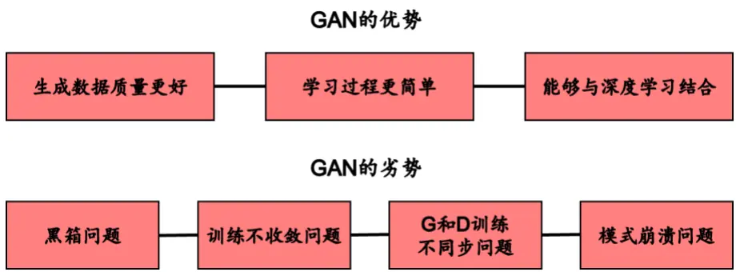
资料来源：Generative Adversarial Nets，华泰证券研究所

## GAN 的优势包括以下几点：

1. 生成数据质量更好。相比于其它生成模型，GAN 生成的数据质量一般更好，尤其对于图像而言。

2. 学习过程更简单。部分传统生成模型基于马尔可夫链，GAN 避免了马尔可夫链的学习机制，因此 GAN 所依赖的假设较少，学习过程也相对简单，仅依赖梯度下降。

3. 能够与深度学习结合。只要是可微分函数都能用于 D 和 G，因此 GAN 能够与各种形式的深度神经网络结合，从而搭上近十年深度学习迅猛发展的“顺风车”，快速应用于已被深度学习开垦过的各个领域。

## GAN 的劣势包括以下几点：

1. 黑箱问题。生成器 G 是噪声到生成数据的映射，通常采用深度神经网络，神经网络一般意义上为黑箱模型，可解释性较差。

2. 训练不收敛问题。一般的神经网络模型，只需观察验证集损失函数随迭代次数是否收敛，即可判断是否完成训练。而 GAN 的生成器 G和判别器 D始终处于博弈状态，两者的损失函数此消彼长，不存在收敛状态，因此无法根据损失函数判断是否完成训练。

3. G 和 D训练不同步问题。生成器 G 和判别器 D 需要同步训练，如果训练进度不匹配，也会出现问题。例如，如果 D 训练不够，始终维持在很弱的水平，那么 G 也很难提高。实际操作中，每轮迭代通常训练多次 D 和一次 G，目的就是为了尽快提升 D的水平。

4. 模式崩溃（Mode Collapse）问题。假设我们训练一个 GAN 模型生成 0~9 的手写数字，生成器 G的一个“投机取巧”方法是，只学习其中某个数字的生成方式，这样生成数据足以“骗过”判别器 D，但这样的 G并非我们想得到的。

针对 GAN 的缺陷，研究者提出诸多训练技巧以及 GAN 的变式，这些技巧和变式值得在未来做进一步介绍，本文暂不展开。

## 方法

在量化投资领域，使用 GAN 的目标是学习真实数据，生成“以假乱真”的资产收益率或价格序列。实现这一目标需要理清三个问题：1. 从哪里学？2. 如何学？3. 如何评价学得好不好？分别对应训练数据、网络构建和评价指标。下面我们将分别展示相关细节。

## 训练数据

本文将训练四组 GAN，分别学习不同市场（A股或美股）和不同时间频率（日频或月频）的宽基指数。具体标的和训练集起止日期如下表所示。

图表4： GAN训练数据

| 标的 | 频率 | 起止日期 | 每条样本长度 |
| --- | --- | --- | --- |
| 上证综指 | 日频 | 2004/12/31~2020/04/30 | 2520（10年） |
| 沪深 300 | 日频 | 2004/12/31~2020/04/30 | 2520（10年） |
| 标普 500 | 日频 | 1990/12/31~2020/04/30 | 2520（10年） |
| 标普500 | 月频 | 1927/12/30~2020/04/30 | 252（21年） |

资料来源：Wind，Bloomberg，华泰证券研究所

每组 GAN 的原始训练数据为一条完整的时间序列，例如跨度近 30 年的标普 500 指数日频对数收益率序列（本文所有收益率均指代对数收益率）。实际操作中，每条样本（向 GAN输入的真实序列，或者从 GAN 输出的虚假序列）长度均为小于完整序列长度的固定值。例如我们希望生成长度 10 年的序列，那么每条样本长度可设为 2520 天。真实样本可从原始训练数据滚动采样得到，如下图所示。

图表5： GAN训练集滚动采样方法
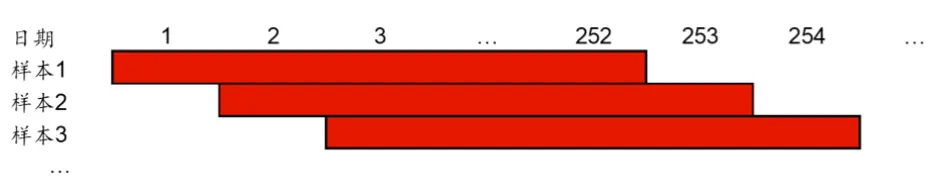
资料来源：华泰证券研究所

## 网络构建

GAN 的核心是生成器 G 和判别器 D两组神经网络。我们参考 Takahashi 等（2019）文献，构建含两个隐藏层的全连接神经网络作为生成器 G，含三个卷积层和一个全连接层的卷积神经网络作为判别器 D。网络构建参数及对应取值如下面两张表所示。

图表6： 生成器 G网络构建

| 参数 | 取值 |
| --- | --- |
| 结构 | 含两个隐藏层的全连接神经网络 |
| 输入噪音向量（隐变量）pz(z) | 标准正态分布 |
| 输入层神经元数量 | 100 |
| 第一隐藏层神经元数量 | 128 |
| 第一隐藏层激活函数 | Tanh |
| 第二隐藏层神经元数量 | 2048 |
| 第二隐藏层激活函数 | Tanh |
| 输出层神经元数量 | 2520（10年日频)或252（21年月频） |
| 是否批标准化 | 否 |
| 损失函数 | 交叉熵 |
| 优化器 | Adam |
| 优化器参数 | 学习速率 2e-4，β=(0.5,0.999) |

资料来源：Modeling financial time-series with generative adversarial networks，华泰证券研究所

图表7： 判别器 D网络构建

| 参数 | 取值 |
| --- | --- |
| 结构 | 含三个卷积层和一个全连接层的卷积神经网络 |
| 输入层神经元数量 | 2520（10年日频)或252（21年月频） |
| 第一卷积层卷积核数量 | 64 |
| 第二卷积层卷积核数量 | 128 |
| 第三卷积层卷积核数量 | 128 |
| 卷积核尺寸 |  |
| 卷积层 Padding | 9 |
| 卷积层激活函数 | 4 |
| 全连接层神经元数量 | LeakyReLU(0.2) |
| 全连接层激活函数 | 32 |
| 全连接层 Dropout 比例 | LeakyReLU(0.2) |
| 输出层神经元数量 | 0.5 |
| 输出层激活函数 | 1 |
| 是否批标准化 | Sigmoid |
| 损失函数 | 否 |
| 优化器 | 交叉熵 |
| 优化器参数 | Adam |
| Noise labeling:真样本标签范围 | 学习速率 1e-5，β=(0.1,0.999) |
| Noise labeling:假样本标签范围 | [0.9, 1.1] [0.1, 0.3] |

资料来源：Modeling financial time-series with generative adversarial networks，华泰证券研究所

我们对判别器 D增加一步 Noise labeling 处理，即在标签中引入噪音，作用是提升神经网络的鲁棒性。真样本的标签不再是 1，而是服从[0.9, 1.1]范围内的均匀分布；假样本的标签不再是 0，而是服从[0.1, 0.3]范围内的均匀分布。

GAN 迭代次数设为 2000 次，每轮迭代 G 和 D各训练 1 次。需要说明的是，GAN的训练和一般的神经网络不同，无法通过观察验证集损失确定迭代次数。此处取 2000 的原因，一是和 Takahashi等（2019）文献保持一致，二是当迭代次数为 2000 时生成的虚假序列已经较为“逼真”。GAN 的多种变式如WGAN可更客观地确定迭代次数，本文暂不展开。

图表8： GAN 训练通用参数

| 参数 | 取值 |
| --- | --- |
| 迭代次数 | 2000 |
| 每轮迭代 G 和 D 训练次数比 | 1:1 |
| Batch size | 24 |

资料来源：Modeling financial time-series with generative adversarial networks，华泰证券研究所

## 评价指标

如何评价生成序列的质量？仅凭肉眼观察，无法捕捉序列内部的微观结构。合理的方法是，寻找一些真实金融序列的特有性质，围绕这些性质设计定量指标，比较真实序列和生成的虚假序列在这些评价指标上是否存在差异。我们参考 Takahashi 等（2019）文献，考察如下表所示的 6项评价指标。

图表9： 生成虚假序列评价指标

| 指标名称 | 计算方法 | 真实序列特点 |
| --- | --- | --- |
| 自相关性 | 计算收益率序列1~k阶自相关系数 | 不相关 |
| 厚尾分布 | 统计收益率分布 | 厚尾分布 |
| 波动率聚集 | 计算收益率绝对值序列1~k阶自相关系数 | 低阶正相关，高阶不相关 |
| 杠杆效应 | 计算当前收益率和未来波动率的1~k阶相关度 | 低阶负相关，高阶不相关 |
|  | 粗细波动率相关计算周频收益率绝对值（粗波动率）和一周内日频收益率不对称，细能预测粗，粗不能预测细 绝对值之和（细波动率）的-k~k阶相关系数 |  |
| 盈亏不对称性 | 统计涨跌超过一定幅度所需最少交易日数的分布 | 涨得慢，跌得快 |

资料来源：Modeling financial time-series with generative adversarial networks，华泰证券研究所

## 自相关性

记资产收益率序列为 r，其均值和标准差分别为 μ和 σ。k 阶自相关系数定义为：

$$
Corr(r_{t},r_{t+k})=\frac{E[(r_{t}-\mu)(r_{t+k}-\mu)]}{\sigma^{2}}
$$

自相关性一定程度上反映了市场的有效性。一般认为，真实日频收益率序列不存在自相关，k 阶相关系数接近 0。

## 厚尾分布

一般认为，资产收益率不服从正态分布，而是服从尖峰厚尾分布，其特点是异常值概率密度值高于正态分布，通俗地说“黑天鹅”事件发生频率更高。常用的衡量分布厚尾程度的方法包括：

1. 计算分布的峰度（Kurtosis），即四阶矩。正态分布峰度为 3，厚尾分布峰度大于 3。

2. 记标准化真实收益率的概率密度函数为 $\mathsf{P}(\mathsf{r})$ ，对 r＞0 一侧部分的衰减拟合幂律函数：

$$
P(r)\propto r^{-\alpha}
$$

正态分布的参数 α 值大于 5，真实收益率的衰减系数 α值在 3和 5之间。本文采用第二种方法。

## 波动率聚集

真实收益率序列存在波动率聚集现象。收益率本身不存在自相关性，但波动率（以收益率的二阶矩或绝对值衡量）存在短时程的自相关性。这里我们计算收益率绝对值序列的 k 阶自相关系数。若收益率绝对值序列存在短时程自相关和长时程不相关，则自相关系数应随阶数 k 的提升而衰减，一般以幂律衰减刻画：

$$
Corr(|r_{t}|,|r_{t+k}|)\propto k^{-\beta}
$$

真实序列的衰减系数 β 值一般介于 0.1 和 0.5 之间。

## 杠杆效应

杠杆效应的含义是：当前收益率和未来波动率存在负相关。换言之，若市场近期跌幅较大，未来波动将增加；若市场近期涨幅较大，未来波动将降低。我们参考 Qiu 等（2006）文献，计算当前收益率和未来收益率平方的滞后 k 阶相关度：

$$
L(k)=\frac{E[r(t)|r(t+k)|^{2}]-E[r(t)]E[|r(t)|^{2}]}{E[|r(t)|^{2}]^{2}}
$$

真实序列在 k=1~10时的 L值小于 0，即表现为低阶负相关性。

## 粗细波动率相关

粗细波动率相关（Coarse-Fine Volatility Correlation）相比于上述 4 个评价指标而言略不常见。定义过去 5个交易日（视为 1周）区间收益率（即周收益率）的绝对值为粗波动率，公式中的 τ＝5：

$$
v_{c}^{\tau}(t)=\biggl|{\sum}_{i=1}^{\tau}r_{t-i}\biggr|.
$$

定义过去 5 个交易日的日收益率绝对值之和为细波动率，同样公式中的 $_{\mathrm{T}}{=}5$ ：

$$
v_{f}^{\tau}(t)={\sum}_{i=1}^{\tau}|r_{t-i}|
$$

计算当前细波动率和未来粗波动率的滞后 k 阶相关系数：

$$
\rho_{cf}^{\tau}(k)=Corr(v_{c}^{\tau}(t+k),v_{f}^{\tau}(t))
$$

当 k 为负数时，则是计算当前粗波动率和未来细波动率的相关系数。朴素地想，当前细波动率（信息量较多）对未来粗波动率的预测能力，应优于当前粗波动率（信息量较少）对未来细波动率的预测能力。换言之，上述 k 阶和-k 阶相关系数不对称。我们用两者之差刻画这种不对称性：

$$
\Delta\rho_{cf}^{\tau}(k)=\rho_{cf}^{\tau}(k)-\rho_{cf}^{\tau}(-k)
$$

真实序列当 k 较小时Δ值小于 0。但也有学者认为该指标存在噪音较大的缺陷。

## 盈亏不对称性

盈亏不对称性的通俗理解是市场涨得慢跌得快，计算方法为以任一交易日为起点，统计未来涨跌超过一定幅度（如 10%）所需最少交易日数的分布：

$$
T_{wait}^{t}(\theta)=\left\{\begin{aligned}&\inf\{t^{\prime}|r_{t\sim t+t^{\prime}}\geq\theta,t^{\prime}>0\}(\theta>0)\\&\inf\{t^{\prime}|r_{t\sim t+t^{\prime}}\leq\theta,t^{\prime}>0\}(\theta<0)\end{aligned}\right.
$$

其中 r 代表第 t 日和第 t+t’日之间的区间收益率，inf 代表下确界。对于日频收益率序列θ 取 0.1。T(θ)代表实现涨跌幅 θ 所需最少天数 t’的分布。一般而言，下跌超过 10%所需最少天数的分布 T(-0.1)位于上涨超过 10%所需最少天数的分布 T(0.1)的左侧，表现出盈亏不对称性。

需要说明的是，以上指标的原始定义均针对日频收益率序列。实证表明，其它频率收益率序列（如月频）也具备上述性质。具体计算时，针对日频和月频收益率序列所使用的参数略有差异，如下表所示。

图表10： 评价指标参数取值

| 评价指标名称 | 计算评价指标参数 | 日频收益率序列 | 月频收益率序列 |
| --- | --- | --- | --- |
| 粗细波动率相关 | T | 5 | 3 |
| 盈亏不对称性 | θ | 0.1 | 0.25 |

资料来源：Modeling financial time-series with generative adversarial networks，华泰证券研究所

粗细波动率相关的参数 τ 决定了计算粗细波动率的区间长度。日频收益率序列的 τ 取 5，此时粗波动率相当于周度波动率，细波动率相当于一周内日度波动率之和。月频收益率序列的 τ取 3，此时粗波动率相当于季度波动率，细波动率相当于一季内月度波动率之和。

盈亏不对称性的参数 θ决定了计算该指标时采用的区间涨跌幅度阈值。日频收益率序列的θ 取 0.1，即日收益率涨跌超过 10%需要用多少交易日。月频收益率序列的 θ取 0.25，即月收益率涨跌超过 25%需要用多少月份。

## 对照组

除 GAN 以外，重采样和时间序列分析模型也是模拟金融资产时间序列的常用方法。本文以重采样中的 Bootstrap 方法和时间序列分析的 GARCH 模型作为对照组，与 GAN 生成的虚假序列进行比较。

Bootstrap 生成虚假序列的方法是：对原始收益率序列进行有放回地抽样，重复 T 次，得到长度为 T 的虚假序列。

GARCH 模型生成虚假序列方法是：对原始收益率序列拟合含均值的 GARCH(1,1)模型，得到各参数的估计量，随后模拟长度为T的虚假序列。GARCH模型的概念本文不作赘述。

## 结果

本文训练 GAN 分别学习上证综指日频序列、沪深 300 日频序列、标普 500 日频序列和标普 500 月频序列，各生成 1000 条虚假序列，随后采用 6 项评价指标检验生成序列质量，并与对照组 Bootstrap和 GARCH模型生成的序列进行对比。以下分别展示四组测试结果，重点介绍上证综指日频序列结果。

## 上证综指日频序列

我们训练 GAN 学习上证综指 2004/12/31~2020/04/30 的日频收益率序列，并生成 1000条长度为 2520 日的虚假收益率序列，随后转换为初始值为 1的归一化价格序列。

GAN 历次迭代的损失函数随时间变化如左下图所示。判别器 D 的损失在第 1 次迭代时取得全局最大值，此后先降后增，在 200 次附近达到阶段极大值，随后逐渐减小，最终稳定在 0.5~1.0 的范围。生成器 G 损失的变化规律和判别器 D 刚好相反，开始迭代时较低，此后先增后降，在 200~300 次之间达到阶段极小值，随后逐渐增大，最终在更宽的范围内波动，波动中枢在 1.0~1.5 之间。

这里需要说明的是，生成器 G 的损失增大，并不一定代表 G“越变越差”，因为此时判别器 D“越变越好”。这就好比对手越来越强，尽管被对手打得越来越惨，但是自身势力其实也越来越强。由于 GAN 的判别器和生成器是博弈关系，无法观察到任何一方损失函数收敛，这也是 GAN 训练的难点。

图表11： 上证综指日频序列：GAN损失函数
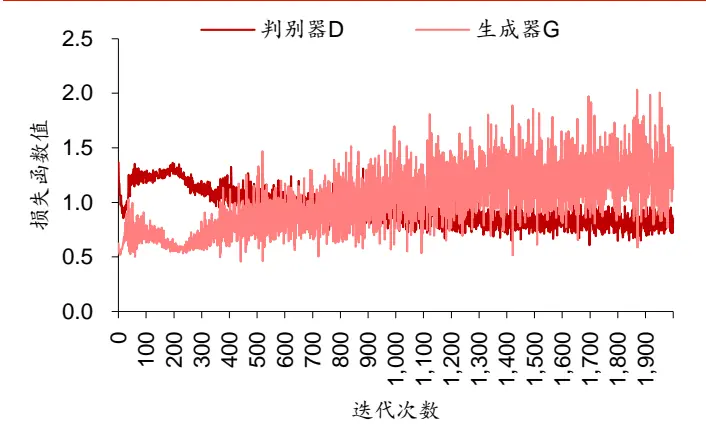
资料来源：Wind，华泰证券研究所

图表12： 上证综指日频序列：真实价格序列（2004/12/31~2020/04/30）
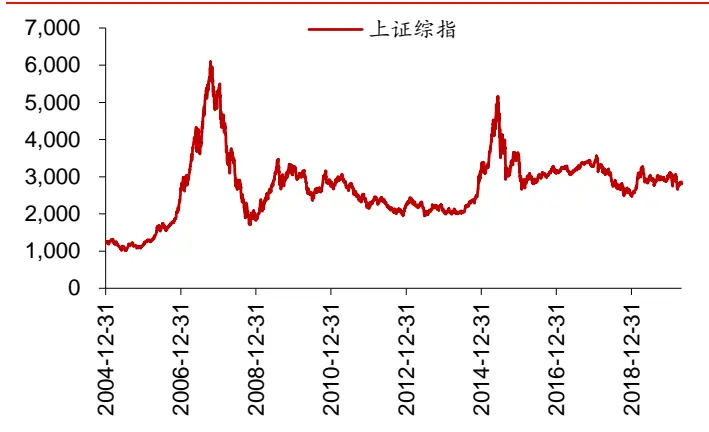
资料来源：Wind，华泰证券研究所

图表13： 上证综指日频序列：GAN生成价格序列范例 1
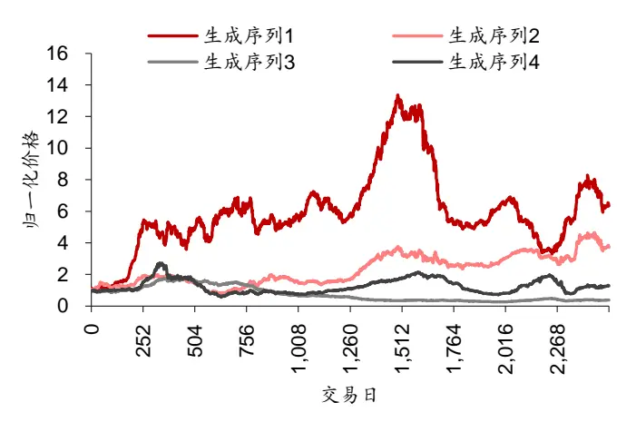
资料来源：Wind，华泰证券研究所

图表14： 上证综指日频序列：GAN生成价格序列范例 2
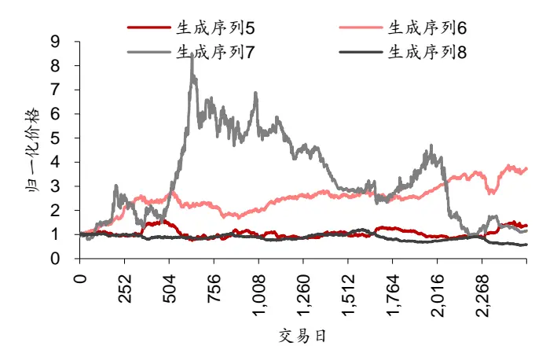
资料来源：Wind，华泰证券研究所

真实序列如图表 12；我们选取 1000 条虚假序列中的 8条，分别展示在图表 13 和图表 14中。可以看到生成序列内部差异性较大。

## 对照组假序列展示

我们同时展示对照组 Bootstrap 和 GARCH 模型生成的假序列。Bootstrap 生成结果如下面两张图所示。肉眼对比 GAN 结果和 Bootstrap 结果，一个相对明显的现象是 GAN 的局部“抖动”更小，且更接近真实序列。猜测GAN在刻画波动率聚集性质方面相较于Bootstrap更好，下一小节我们将通过定量指标加以说明。

图表15： 上证综指日频序列：Bootstrap生成价格序列范例 1
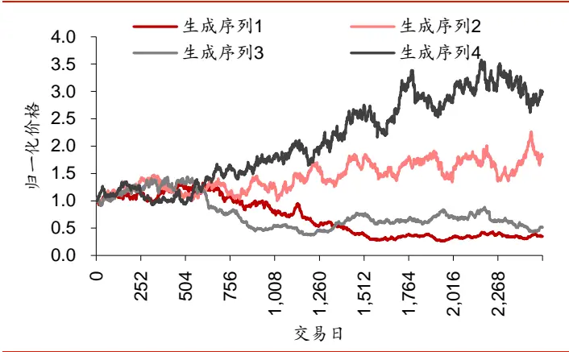
资料来源：Wind，华泰证券研究所

图表16： 上证综指日频序列：Bootstrap 生成价格序列范例 2
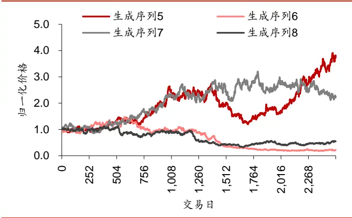
资料来源：Wind，华泰证券研究所

GARCH 模型生成结果如下面两张图所示。GARCH 模型的特点是部分生成序列可能出现极端的波动。

图表17： 上证综指日频序列：GARCH生成价格序列范例 1
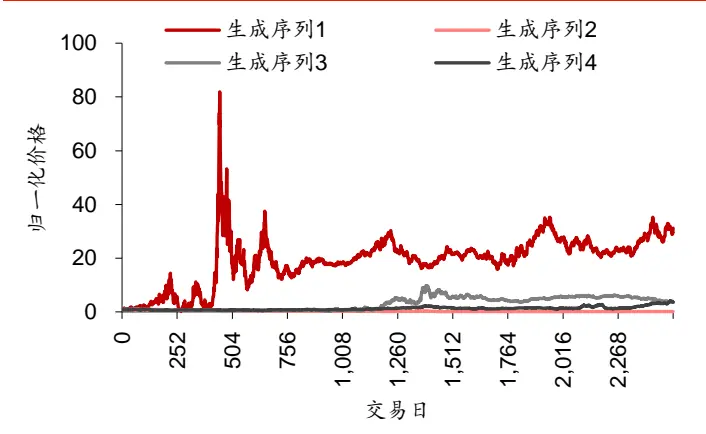
资料来源：Wind，华泰证券研究所

图表18： 上证综指日频序列：GARCH 生成价格序列范例 2
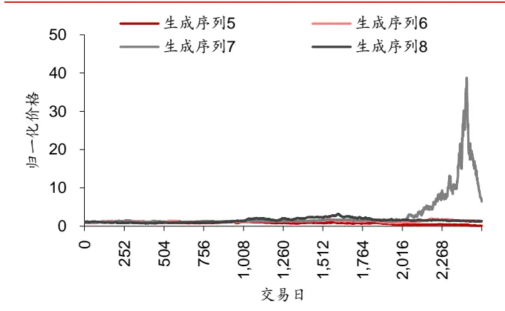
资料来源：Wind，华泰证券研究所

仅凭肉眼观察无法判断生成序列的质量。我们分别计算真实序列、GAN 生成序列、Bootstrap 生成序列和 GARCH 生成序列的 6项评价指标，从定量视角加以评判。

上证综指真实日频序列的 6项评价指标如下图所示：

1. 自相关性：左上子图为收益率的 k＝1~120 阶自相关系数，真实序列的自相关系数接近 0，不具备自相关性。

2. 厚尾分布：中上子图类似于标准化日度收益率的累积概率分布函数。传统累积概率分布函数为 p(r≤x)，这里取 p(r＞x)，等价于 1－p(r≤x)。该函数衰减越快，说明收益率越接近正态分布；衰减越慢，说明收益率越接近厚尾分布。

3. 波动率聚集：右上子图为收益率绝对值的 k＝1~120 阶自相关系数，能观察到明显衰减，即体现波动率的短时程正相关和长时程不相关。

4. 杠杆效应：左下子图展示当前收益率和未来波动率的滞后 1~120 阶相关度，该图能观察到低阶负相关和高阶不相关。注意这里的相关度不完全等价于相关系数，具体计算方式请参考上一章方法部分。

5. 粗细波动率相关：中下子图的蓝色点为细波动率和粗波动率的滞后 k 阶相关系数，橙色点是±k 阶相关系数之差。蓝色点左右不对称，橙色点在低阶区间小于 0，表明当前细波动率能预测未来粗波动率，但当前粗波动率无法预测未来细波动率。

6. 盈亏不对称性：右下子图红点和蓝点代表涨跌超过10%所需最少天数的分布。红色分布峰值位于蓝色分布峰值右侧，代表涨得慢跌得快。

图表19： 上证综指日频序列：真实序列 6项评价指标
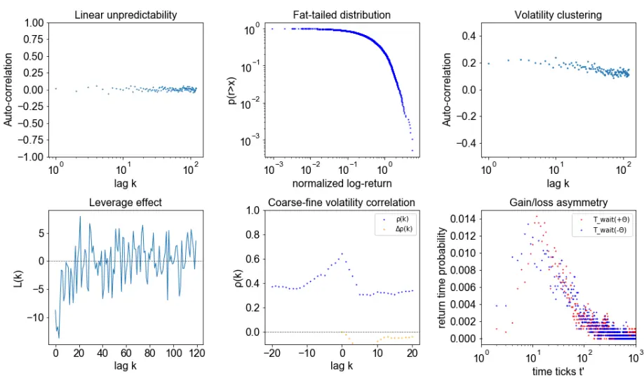
资料来源：Wind，华泰证券研究所

分别计算 GAN 生成 1000 条序列的 6 项评价指标并求其均值，结果如下图所示。和上图真实序列结果对比可知，GAN 能够良好复现出这 6 项性质。GAN的特点是依赖深度神经网络，学习能力强。

图表20： 上证综指日频序列：GAN生成序列 6项评价指标
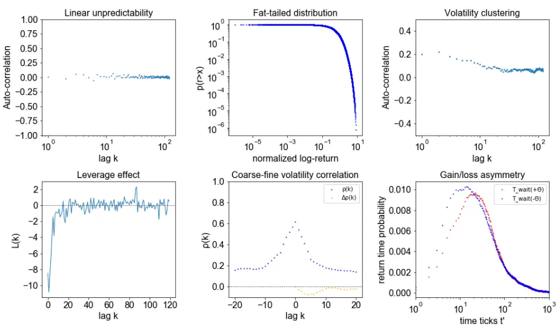
资料来源：Wind，华泰证券研究所

分别计算 Bootstrap 生成 1000 条序列的 6 项评价指标并求其均值，结果如下图所示。和真实序列结果对比可知，Bootstrap 能够复现出自相关性（左上子图）、厚尾分布（中上子图）和盈亏不对称性（右下子图），但难以复现波动率聚集（右上子图）、杠杆效应（左下子图）和粗细波动率相关（中下子图）。Bootstrap 抽样破坏了原序列的时序关系，在时序无关的指标——厚尾分布上表现良好，在部分时序有关的指标上表现不佳。

图表21： 上证综指日频序列：Bootstrap生成序列 6项评价指标
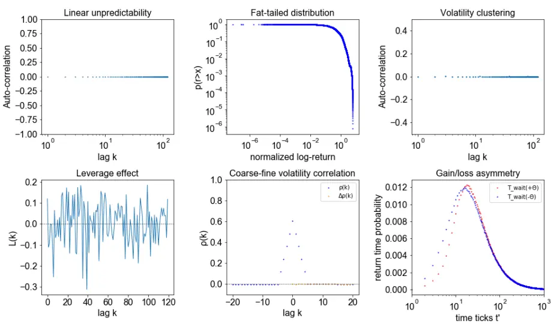
资料来源：Wind，华泰证券研究所

分别计算 GARCH 生成 1000 条序列的 6 项评价指标并求其均值，结果如下图所示。和真实序列结果对比可知，GARCH 能够复现出自相关性（左上子图）、厚尾分布（中上子图）和波动率聚集（右上子图），但难以复现杠杆效应（左下子图）、粗细波动率相关（中下子图）和盈亏不对称性（右下子图）。GARCH 模型侧重于序列的时序性质，在传统时序有关的指标——自相关性、波动率聚集上表现良好，但是在更为精细的指标—杠杆效应、粗细波动率相关上表现不如 GAN。

图表22： 上证综指日频序列：GARCH生成序列 6项评价指标
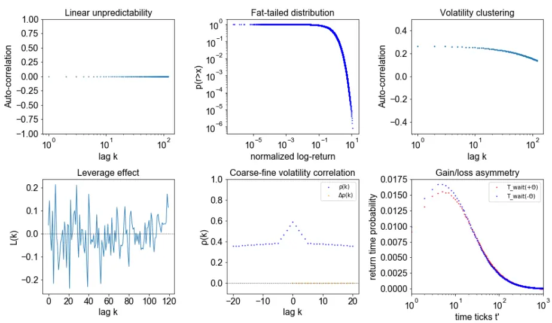
资料来源：Wind，华泰证券研究所

真实序列和 3 种生成方法在 6 项评价指标上表现汇总如下表所示。GAN 生成序列在 6 项指标上均接近真实序列，复现效果良好，优于 Bootstrap 和 GARCH。

图表23： 上证综指日频序列：各种生成方法6项评价指标对比

| 评价指标 | 统计量 | 真实序列 | GAN | Bootstrap | GARCH |
| --- | --- | --- | --- | --- | --- |
| 自相关性 | 前10阶自相关系数均值 | 0.11 | 0.11 | 0.10 | 0.10 |
| 厚尾分布 | 拟合幂律衰减系数 α | 4.22 | 4.52 | 4.26 | 4.60 |
| 波动率聚集 | 拟合幂律衰减系数β | 0.16 | 0.32 | 0.58 | 0.17 |
| 杠杆效应 | 前10 阶相关系数均值 | -7.02 | -4.65 | -0.05 | 0.02 |
| 粗细波动率相关 | 滞后±1 阶相关系数之差 | -0.02 | -0.03 | 0.00 | 0.00 |
| 盈亏不对称性 | 盈亏±θ所需天数分布峰值之差 | 4.00 | 7.45 | 2.26 | 0.89 |

资料来源：Wind，华泰证券研究所

## 随机数种子点敏感性分析

华泰金工《人工智能 20：必然中的偶然：机器学习中的随机数》（20200429）研究发现，全连接神经网络的判别模型对随机数种子点较为敏感。不同种子点训练出的 G 生成模型是否有较大差异？我们在 4 组不同的种子点下训练 GAN，发现 6 项指标在种子点间的差异较小，如下表所示。可以认为 GAN 模型对种子点不敏感。

图表24： 上证综指日频序列：GAN模型不同随机数种子点 6项评价指标对比

| 评价指标 | 统计量 | GAN 种子 1 | GAN 种子 2 | GAN 种子 3 | GAN 种子 4 |
| --- | --- | --- | --- | --- | --- |
| 自相关性 | 前10阶自相关系数均值 | 0.11 | 0.11 | 0.12 | 0.12 |
| 厚尾分布 | 拟合幂律衰减系数 α | 4.27 | 4.41 | 4.35 | 4.48 |
| 波动率聚集 | 拟合幂律衰减系数β | 0.42 | 0.30 | 0.27 | 0.33 |
| 杠杆效应 | 前10 阶相关系数均值 | -3.72 | -3.25 | -3.80 | -3.52 |
| 粗细波动率相关 | 滞后±1 阶相关系数之差 | -0.01 | -0.03 | -0.04 | -0.03 |
| 盈亏不对称性 | 盈亏±θ所需天数分布峰值之差 | 6.94 | 6.44 | 5.28 | 6.22 |

资料来源：Wind，华泰证券研究所

## 其它序列评价指标对比

GAN 在沪深 300 日频序列、标普 500 日频序列和标普 500 月频序列的详细测试结果请参见附录。这里展示最终 6 项评价指标的汇总结果。总的来看：

1. 对于日频序列，GAN 生成序列在 6 项指标上均接近真实序列，复现效果良好，优于Bootstrap 和 GARCH；

2. 对于月频序列，GAN 生成序列仅在波动率聚集指标上表现不佳，其余 5项指标的复现效果良好，也优于 Bootstrap 和 GARCH。

图表25： 沪深 300日频序列：各种生成方法 6项评价指标对比

| 评价指标 | 统计量 | 真实序列 | GAN | Bootstrap | GARCH |
| --- | --- | --- | --- | --- | --- |
| 自相关性 | 前10阶自相关系数均值 | 0.11 | 0.10 | 0.10 | 0.10 |
| 厚尾分布 | 拟合幂律衰减系数 α | 4.51 | 4.56 | 4.67 | 4.45 |
| 波动率聚集 | 拟合幂律衰减系数β | 0.16 | 0.19 | 0.54 | 0.16 |
| 杠杆效应 | 前 10 阶相关系数均值 | -6.18 | -4.26 | -0.05 | -0.03 |
| 粗细波动率相关 | 滞后±1 阶相关系数之差 | -0.02 | -0.03 | 0.00 | 0.00 |
| 盈亏不对称性 | 盈亏±θ所需天数分布峰值之差 | 6.00 | 3.98 | 1.58 | 0.97 |

资料来源：Wind，华泰证券研究所

图表26： 标普 500日频序列：各种生成方法 6项评价指标对比

| 评价指标 | 统计量 | 真实序列 | GAN | Bootstrap | GARCH |
| --- | --- | --- | --- | --- | --- |
| 自相关性 | 前10阶自相关系数均值 | 0.09 | 0.09 | 0.10 | 0.10 |
| 厚尾分布 | 拟合幂律衰减系数 α | 3.33 | 4.77 | 3.43 | 4.70 |
| 波动率聚集 | 拟合幂律衰减系数β | 0.30 | 0.55 | 0.57 | 0.40 |
| 杠杆效应 | 前10 阶相关系数均值 | -28.45 | -9.03 | -0.03 | -0.11 |
| 粗细波动率相关 | 滞后±1 阶相关系数之差 | -0.02 | -0.05 | 0.00 | 0.00 |
| 盈亏不对称性 | 盈亏±θ所需天数分布峰值之差 | 46.00 | 21.85 | 2.32 | 6.77 |

资料来源：Wind，华泰证券研究所

图表27： 标普 500月频序列：各种生成方法 6项评价指标对比

| 评价指标 | 统计量 | 真实序列 | GAN | Bootstrap | GARCH |
| --- | --- | --- | --- | --- | --- |
| 自相关性 | 前10阶自相关系数均值 | 0.12 | 0.11 | 0.10 | 0.10 |
| 厚尾分布 | 拟合幂律衰减系数 α | 3.93 | 4.48 | 3.79 | 4.51 |
| 波动率聚集 | 拟合幂律衰减系数β | 0.43 | 1.05 | 0.63 | 0.76 |
| 杠杆效应 | 前10 阶相关系数均值 | -4.78 | -1.48 | 0.05 | -0.04 |
| 粗细波动率相关 | 滞后±1 阶相关系数之差 | -0.01 | -0.01 | 0.00 | 0.00 |
| 盈亏不对称性 | 盈亏±θ所需天数分布峰值之差 | 6.00 | 9.91 | 2.93 | 3.92 |

资料来源：Bloomberg，华泰证券研究所

## 应用试举

GAN 有哪些应用价值？本章我们首先探讨 GAN 的三个潜在应用场景，随后以量化策略参数选择为例，展示 GAN 在量化投资领域的使用。

## GAN 应用漫谈

## 提供更丰富的训练样本

在图像识别领域，GAN 的重要作用之一是提供更丰富的训练样本。图像本身的样本空间就是巨大的，机器学习尤其是深度学习的参数数量同样巨大，另外在部分领域获取样本的成本较高（如医学影像、自动驾驶），以上三点使得任何的样本集在深度学习面前都是小样本。

类似的问题在量化投资领域同样存在，我们所能获取的历史样本总是有限的。而 GAN 生成的海量样本能够一定程度上缓解小样本问题，使得机器学习模型学习更为充分。在量化学术研究领域不乏应用先例，如 Koshiyama 等（2019）将 GAN 的变式 cGAN 应用于机器学习集成模型。

## 检验量化策略过拟合程度

在量化投资领域，GAN 的另一个应用场景是针对量化策略开发的“痛点”——回测过拟合问题，即模型在回测阶段表现良好，在实盘阶段表现不佳。我们在《人工智能 19：偶然中的必然：重采样技术检验过拟合》（20190422）和《人工智能 22：基于 CSCV 框架的回测过拟合概率》（20190617）研究中，介绍两种检验回测过拟合的方法，其思路是接近的：“真实世界”只有一个，但我们可以模拟出更多的“平行世界”，检验“真实世界”回测效果最好的策略在“平行世界”的表现是否稳健。

《偶然中的必然：重采样技术检验过拟合》一文提出的方法是 Bootstrap，而我们通过上一章的测试结果发现 Bootstrap 的生成数据质量不如 GAN。《基于 CSCV框架的回测过拟合概率》一文介绍的方法是组合对称交叉验证，该方法的缺点是仅仅将原始资产时间序列打乱，并没有真正意义上模拟出“平行世界”，并且打乱时序是否合理也值得商榷。

就生成虚假数据的质量而言，GAN 应该是生成模型中的最优选择之一。我们可以将基于真实数据开发的量化策略，放在 GAN 的生成数据中测试，检验其过拟合程度。这方面可供参考的学术文献较少，值得我们进一步探索。

## 预测未来

量化策略开发的最终目标是预测未来，指导投资实践。这方面是判别模型的主战场，而生成模型看似无用武之地。然而生成模型实际上也有可能帮助我们预测未来。例如，GAN的变式 cGAN 可以在给定的标签下进行生成，例如给定“男性”标签后生成“男性人脸”。理论上也可以借助 cGAN 预测资产收益，例如给定“过去两周的日频涨跌幅”标签，生成“未来 1天的涨跌幅”。这方面可供参考的学术文献同样较少，并且由于 GAN 本身较难训练，相比于直接应用深度学习等判别模型进行预测，实际上难度更大。

## 案例：双均线择时策略参数选择

下面我们展示 GAN 的一个应用案例：沪深 300 指数双均线择时策略参数选择。双均线择时规则为：以 t 日指数收盘价计算短均线和长均线，当短均线自下而上穿越长均线时，在t+1 日收盘开仓做多；当短均线自上而下穿越长均线时，在 t+1 日收盘平仓。尽管这样简单的策略可能缺乏实践意义，然而不失为一种好的“教具”。

双均线择时策略对两个参数——短、长均线长度较敏感。下图为两组参数(5,20)和(7,28)在真实沪深 300 数据上的回测结果。回测期为 2004 年底至 2020 年 4 月底，交易费率为万二点五。优化后的参数(7,28)相比原始参数(5,20)多出 6.6%的年化超额收益。问题在于，如何证明(7,28)这组参数确实比(5,20)好，而不是对回测数据的过拟合？

图表28： 两组双均线择时参数在真实数据的回测结果（2004/12/31~2020/04/30）
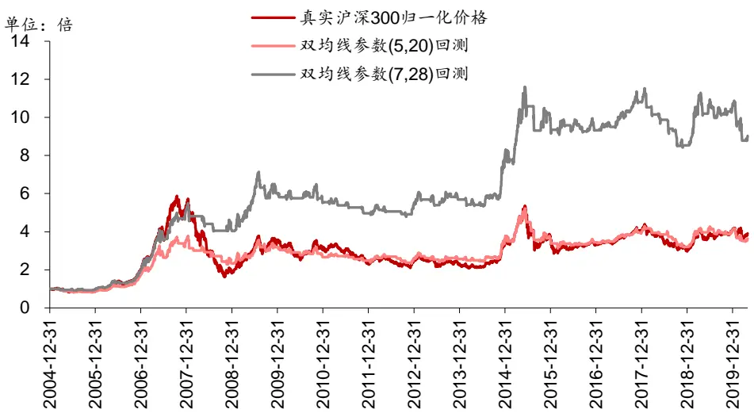
资料来源：Wind，华泰证券研究所

一个简单的方法是，将两组参数在上一章 GAN 生成的 1000 条长度为 2520 天的沪深 300虚假序列上进行回测。下面两张图展示分别展示两条虚假序列的回测结果。

图表29： 两组双均线择时参数在虚假数据 1的回测结果
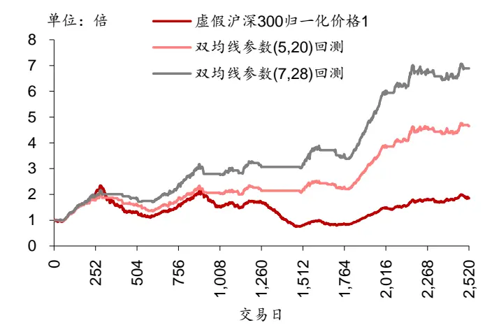
资料来源：Wind，华泰证券研究所

图表30： 两组双均线择时参数在虚假数据 2的回测结果
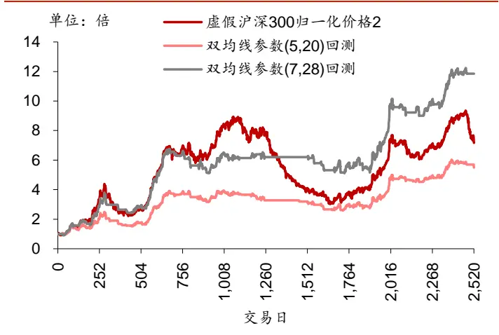
资料来源：Wind，华泰证券研究所

图表31： 两组双均线择时参数在 1000组虚假数据的年化超额收益分布
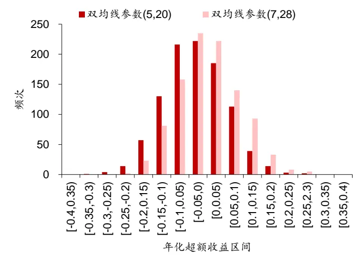
资料来源：Wind，华泰证券研究所

图表32： 两组双均线择时参数在 1000组虚假数据的信息比率分布
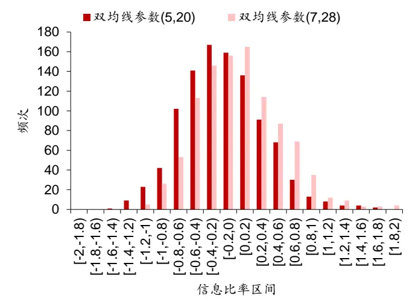
资料来源：Wind，华泰证券研究所

统计两组参数在全部 1000 条虚假样本的年化超额收益和信息比率，频次分布如上面两张图所示。参数(7,28)的年化超额收益在 86.7%的虚假数据回测中占优，信息比率在 85.8%的虚假数据回测中占优。对两组参数的年化超额收益和信息比率分别进行配对样本 t 检验，p 值均达到显著性水平（p<1e-167 和 p<1e-166）。由此我们推知，“参数(7,28) 比参数(5,20)更好”的结论大概率不是过拟合。

另一个现象是两组参数在虚假数据的平均年化超额收益和信息比率均低于真实数据。这一现象可以有多种解读。如果我们认为 GAN 生成数据能够完美复刻真实数据的方方面面，那么虚假数据回测弱于真实数据回测的结果说明，双均线择时策略的两组参数均存在一定过拟合。注意这一点和此前的结论并不矛盾。参数(7,28)确实比参数(5,20)更好，但两者都未必能在样本外获得稳定超额收益。

反过来，如果我们认为 GAN 生成数据还不够好——这并非没有可能，因为 GAN 仅仅通过了 6 项评价指标的检验，但仍然可能不够“真”，例如 GAN 生成序列可能出现过多的局部反转，而双均线择时策略更青睐趋势性强的资产——那么任何关于过拟合检验的结论仍然是不完备的。我们需要寻找更合适的方法评估 GAN 的优劣。说到底，我们对样本外的世界一无所知，如何评价生成数据像不像真实数据，是一个暂时难以回答，但始终需要面对的问题。

## 总结与讨论

本文关注生成对抗网络 GAN 及其在量化投资领域的应用。GAN 的核心思想是通过学习真实训练数据，生成“以假乱真”的数据。GAN 包含判别器 D 和生成器 G 两组神经网络，引入博弈的思想，通过交替训练的方式达到纳什均衡。我们训练 GAN 生成不同市场、不同时间频率的股指收益率和价格序列，并与 Bootstrap 和 GARCH 等其它生成虚假数据方法相比较，以波动率聚集、盈亏不对称性等指标评估生成模型优劣。结果表明，GAN 生成的数据质量优于其它两种方法。最后我们以双均线择时策略参数选择为案例，展示 GAN在检验过拟合上的应用。

GAN 最具特色之处在于其训练方式，“以子之矛，攻子之盾”。GAN 包含判别器 D 和生成器 G 两组神经网络，G 的目标是生成尽可能逼真的赝品，D 的目标是尽可能将真品和 G生成的赝品区分开。GAN 引入博弈的思想，采取交替训练方式，两个网络能力同时提升，直到达到纳什均衡状态，此时 D“明察秋毫”，而 G生成赝品的技艺“巧夺天工”。从数学原理看，GAN 的目标是最小化生成数据分布和真实数据分布的 JS 散度。GAN 的优点是生成数据质量更好，学习过程更简单，并且能够与深度学习结合。GAN 的缺点是黑箱问题，训练不收敛，G 和 D训练不同步，以及模式崩溃问题。

我们采用 GAN 对上证综指日频序列、沪深 300 日频序列、标普 500 日频序列和标普 500月频序列进行学习并生成 1000 条虚假序列，随后采用自相关性、厚尾分布、波动率聚集、杠杆效应、粗细波动率相关、盈亏不对称性共 6 项评价指标检验生成序列质量，并与对照组 Bootstrap 和 GARCH 模型生成的序列进行对比。结果表明，GAN 生成序列能够复现出上述 6 项真实序列具备的特性，而 Bootstrap 和 GARCH 仅能复现出部分性质。GAN 相比于其它金融时间序列生成方法具有显著优势。

GAN 在量化投资领域的潜在应用价值包括：提供训练样本，检验量化策略过拟合程度，预测未来。机器学习应用于量化投资始终面临小样本困境，GAN 能够生成更丰富的训练样本，一定程度上缓解小样本问题，在量化学术研究领域不乏应用先例。量化策略开发的“痛点”之一是回测过拟合，我们可以将基于真实数据得到的量化策略，放在 GAN 模拟出的“平行世界”中测试，以检验过拟合程度。GAN 的变式如 cGAN 有可能帮助我们预测未来，但目前研究相对较少。我们以双均线择时策略参数选择为案例，展示 GAN 在检验过拟合上的应用。

图表33： 各种生成方法 6项评价指标对比

| 评价指标 | 真实序列 | GAN | Bootstrap | GARCH |
| --- | --- | --- | --- | --- |
| 自相关性 | √ | √ | √ | √ |
| 厚尾分布 | √ | √ | √ | √ |
| 波动率聚集 | √ | √ | X | √ |
| 杠杆效应 | √ | √ | X | X |
| 粗细波动率相关 | √ | √ | X | X |
| 盈亏不对称性 | √ | √ | √ | X |

资料来源：Wind，Bloomberg，华泰证券研究所

本文是对 GAN 模型在量化投资应用的初步探索，存在诸多不完善之处：

1. 首先 GAN 存在难以训练、模式崩溃等问题，研究者提出诸多训练技巧及 GAN 的变式加以应对，这些技巧和变式的原理是什么，真实效果如何，需要在未来加以考察。

2. 其次，GAN 模型生成数据在 6 项评价指标上表现良好，并不表示 GAN 能够完美复刻真实数据的方方面面。能否提出更多的检测指标，又或者能否通过其它方式检验 GAN生成数据的质量？

3. 再次，本文使用 GAN 生成单个资产的时间序列，而在资产配置领域，模拟单个资产是不够的，我们还希望 GAN 模拟出多个资产之间的共变关系。

4. 最后，本文仅通过双均线择时策略参数选择的简单案例，展示 GAN 在检验过拟合上的应用。这种检验方式的效力如何，是否还有改进空间，也都值得在未来进行系统性的探索。

## 参考文献

Brundage, M. , Avin, S. , Clark, J. , Toner, H. , Eckersley, P. , & Garfinkel, B. , et al. (2018). The malicious use of artificial intelligence: forecasting, prevention, and mitigation.

Goodfellow, I. , Pouget-Abadie, J. , Mirza, M. , Xu, B. , Warde-Farley, D. , Ozair, S. , Courville, A. , & Bengio, Y. (2014). Generative adversarial nets. In Proceedings of the 27th International Conference on Neural Information Processing Systems - Volume 2 (NIPS’14). MIT Press, Cambridge, MA, USA, 2672–2680.

Koshiyama, A. , Firoozye, N. , & Treleaven, P. . (2019). Generative adversarial networks for financial trading strategies fine-tuning and combination. arXiv.

Lin, J. (2006). Divergence measures based on the Shannon entropy. IEEE Trans. Inf. Theor. 37, 1 (September 2006), 145–151. DOI:https://doi.org/10.1109/18.61115

Qiu, T & Zheng, B. & Ren, F. & Trimper, S. (2006). Return-volatility correlation in financial dynamics. Physical review. E, Statistical, nonlinear, and soft matter physics. 73. 065103. 10.1103/PhysRevE.73.065103.

Takahashi, S. & Chen, Y. & Tanaka-Ishii, K. (2019). Modeling financial time-series with generative adversarial networks. Physica A: Statistical Mechanics and its Applications. 527. 121261. 10.1016/j.physa.2019.121261.

## 风险提示

GAN 生成虚假序列是对市场规律的探索，不构成任何投资建议。GAN 模型存在黑箱问题，训练不收敛不同步，以及模式崩溃问题。深度学习模型存在过拟合的可能。深度学习模型是对历史规律的总结，如果市场规律发生变化，模型存在失效的可能。

## 附录

附录部分详细展示 GAN 在沪深 300 日频序列、标普 500 日频序列和标普 500 月频序列的结果。

沪深 300日频序列真假序列展示

图表34： 沪深 300日频序列：GAN损失函数
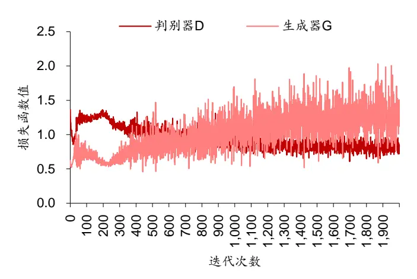
资料来源：Wind，华泰证券研究所

图表35： 沪深 300 日频序列：真实价格序列（2004/12/31~2020/04/30）
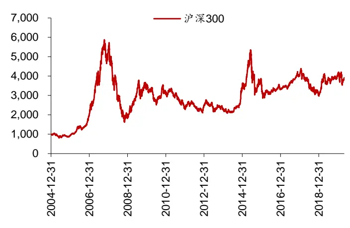
资料来源：Wind，华泰证券研究所

图表36： 沪深 300日频序列：GAN生成价格序列范例 1
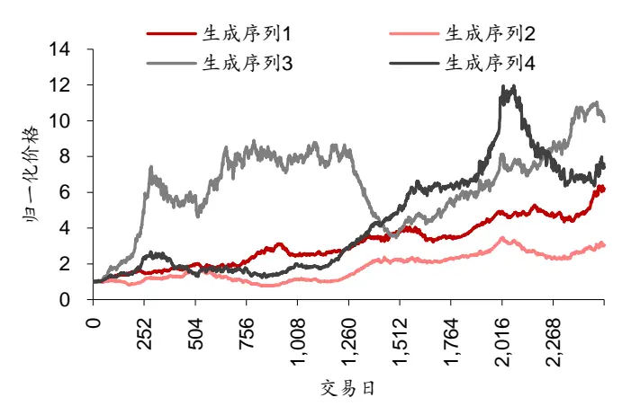
资料来源：Wind，华泰证券研究所

图表37： 沪深 300日频序列：GAN生成价格序列范例 2
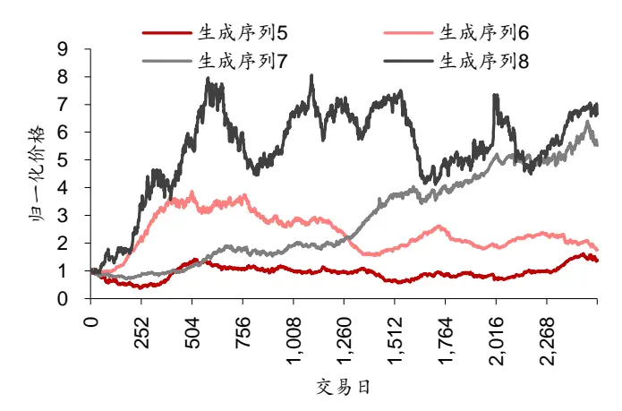
资料来源：Wind，华泰证券研究所

图表38： 沪深 300日频序列：真实序列 6项评价指标
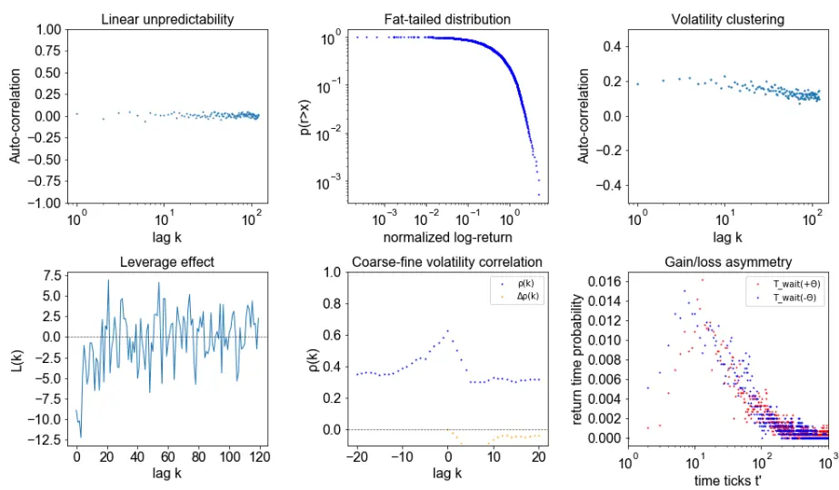
资料来源：Wind，华泰证券研究所

图表39： 沪深 300日频序列：GAN生成序列 6项评价指标
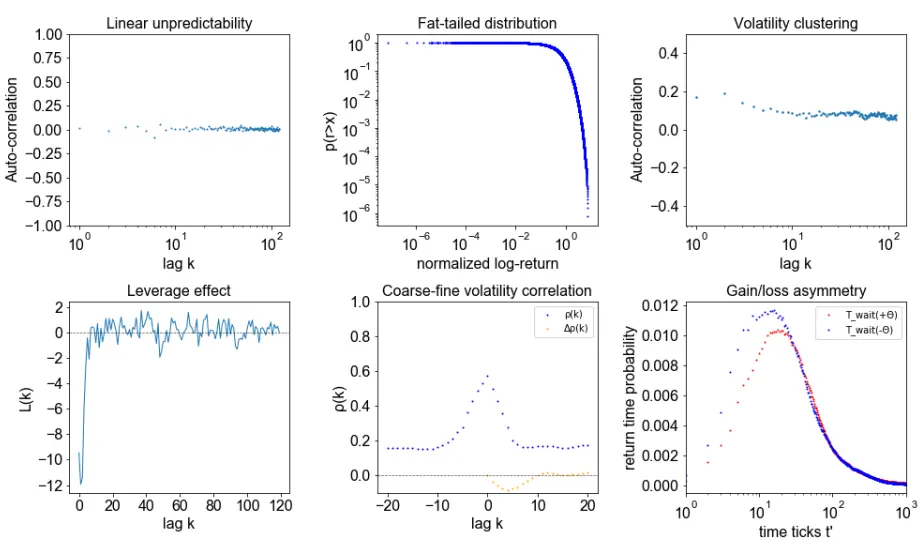
资料来源：Wind，华泰证券研究所

图表40： 沪深 300 日频序列：Bootstrap 生成序列 6 项评价指标
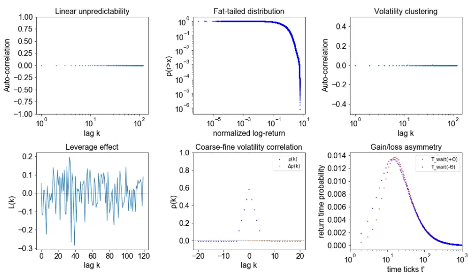
资料来源：Wind，华泰证券研究所

图表41： 沪深 300日频序列：GARCH生成序列 6项评价指标
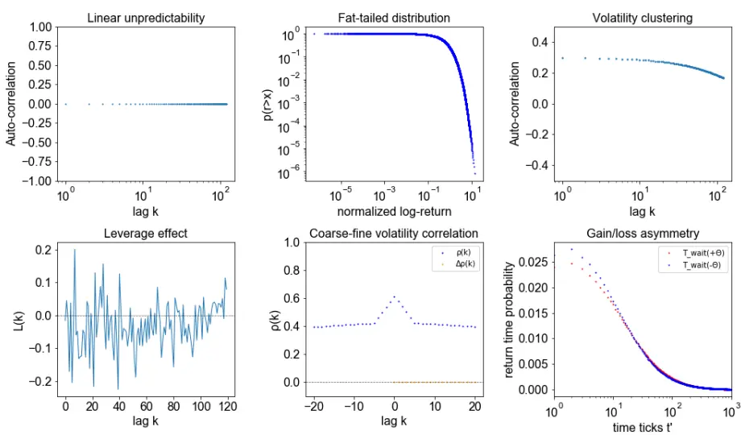
资料来源：Wind，华泰证券研究所

## 标普 500日频序列

图表42： 标普 500日频序列：GAN损失函数
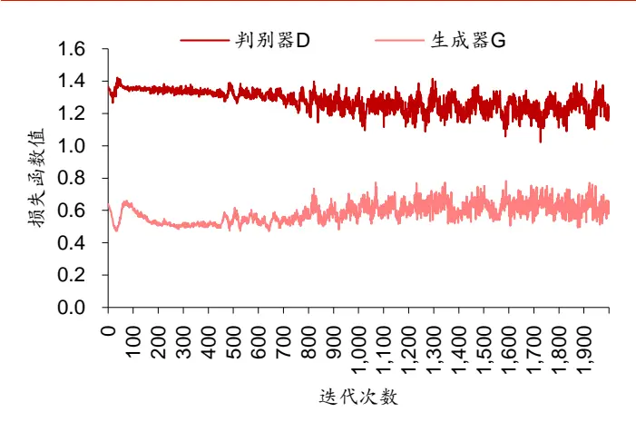
资料来源：Wind，华泰证券研究所

图表43： 标普 500 日频序列：真实价格序列（1990/12/31~2020/04/30）
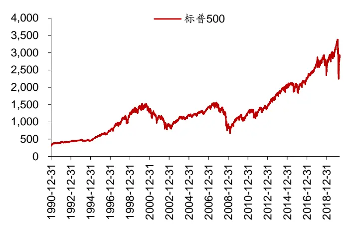
资料来源：Wind，华泰证券研究所

图表44： 标普 500日频序列：GAN生成价格序列范例 1
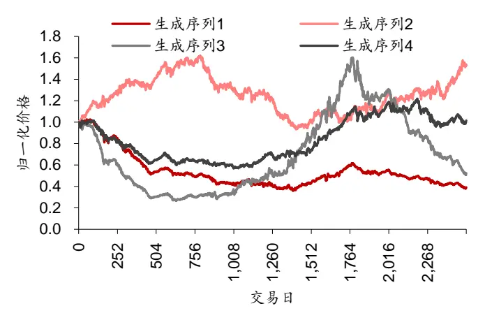
资料来源：Wind，华泰证券研究所

图表45： 标普 500日频序列：GAN生成价格序列范例 2
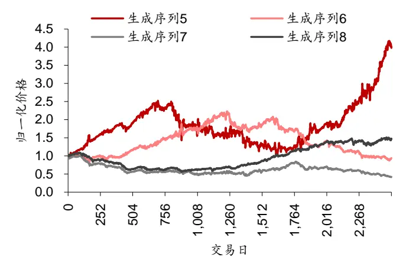
资料来源：Wind，华泰证券研究所

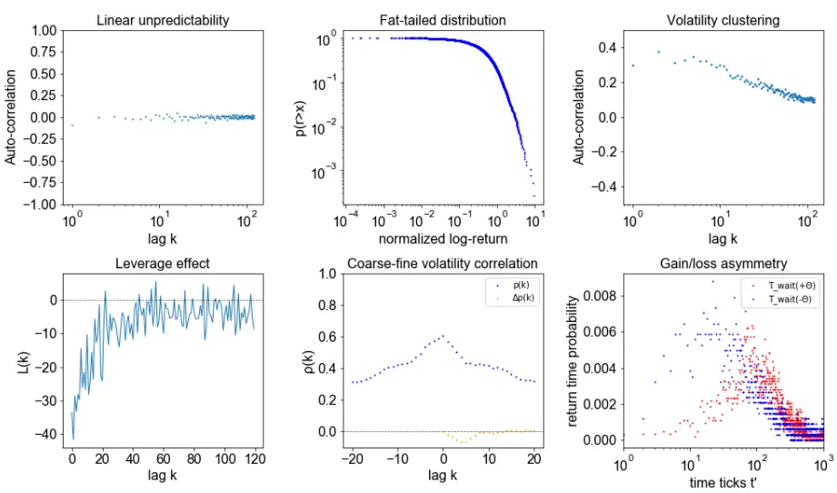
资料来源：Wind，华泰证券研究所

## 图表46： 标普 500日频序列：真实序列 6项评价指标

图表47： 标普 500日频序列：GAN生成序列 6项评价指标
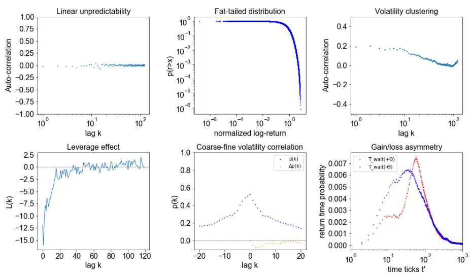
资料来源：Wind，华泰证券研究所

## 图表48： 标普 500日频序列：Bootstrap生成序列 6项评价指标

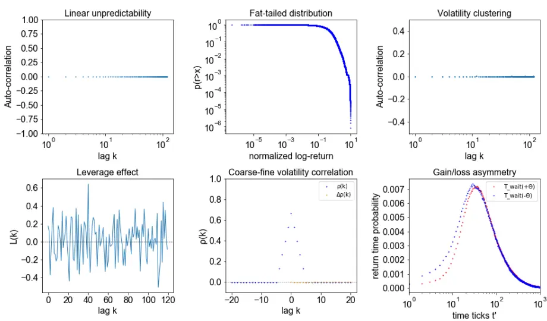
资料来源：Wind，华泰证券研究所

## 图表49： 标普 500日频序列：GARCH生成序列 6项评价指标

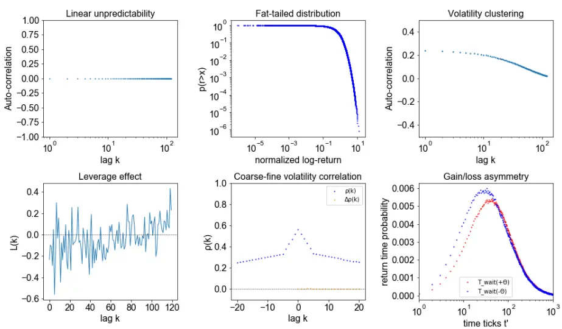
资料来源：Wind，华泰证券研究所

## 标普 500 月频序列

图表50： 标普 500月频序列：GAN损失函数
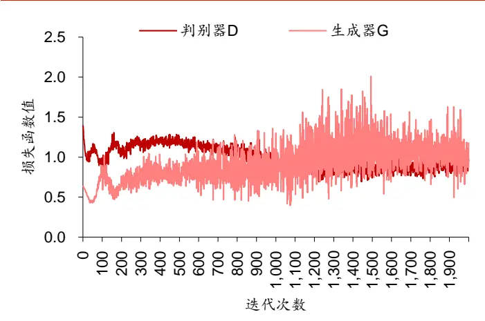
资料来源：Bloomberg，华泰证券研究所

图表51： 标普 500 月频序列：真实价格序列（1927/12/30~2020/04/30）
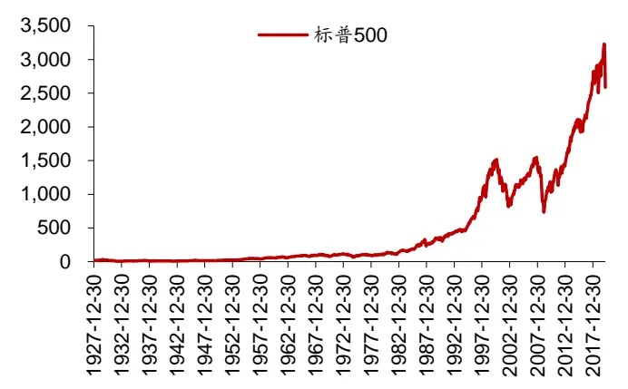
资料来源：Bloomberg，华泰证券研究所

图表52： 标普 500月频序列：GAN生成价格序列范例 1
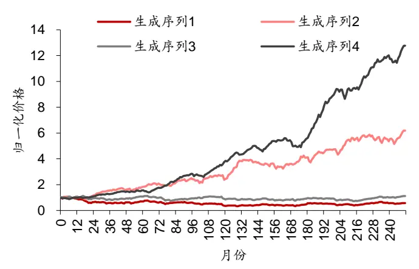
资料来源：Bloomberg，华泰证券研究所

图表53： 标普 500月频序列：GAN生成价格序列范例 2
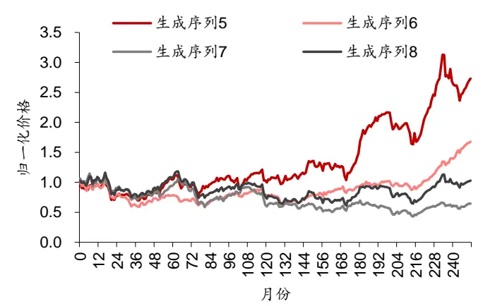
资料来源：Bloomberg，华泰证券研究所

图表54： 标普 500月频序列：真实序列 6项评价指标
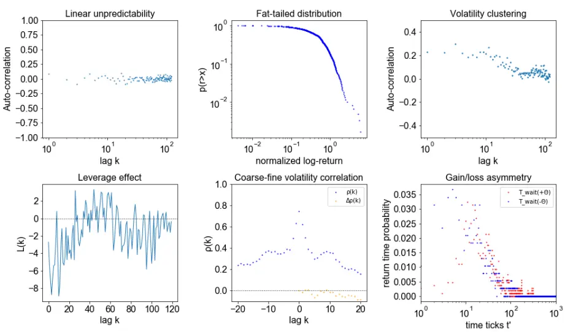
资料来源：Bloomberg，华泰证券研究所

图表55： 标普 500月频序列：GAN生成序列 6项评价指标
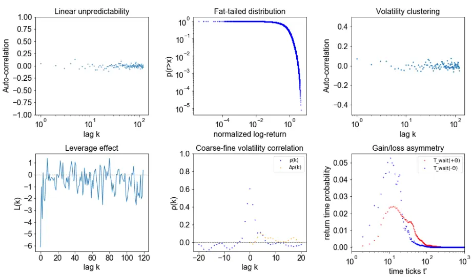
资料来源：Bloomberg，华泰证券研究所

图表56： 标普 500月频序列：Bootstrap生成序列 6项评价指标
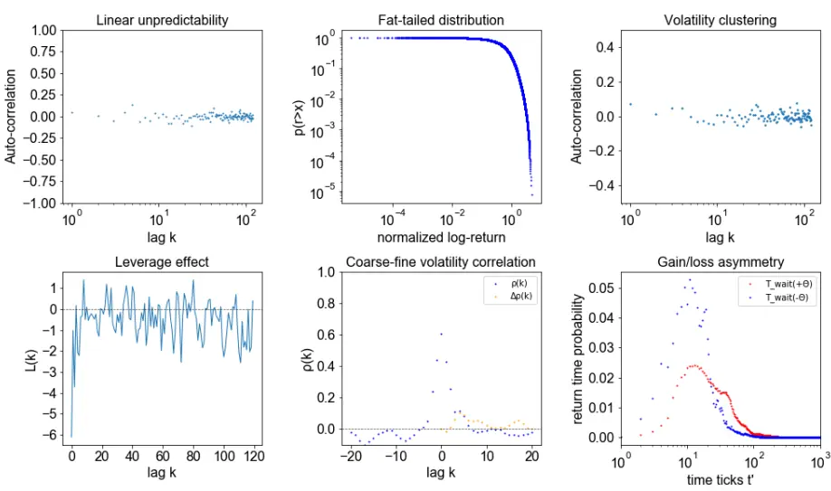
资料来源：Bloomberg，华泰证券研究所

图表57： 标普 500月频序列：GARCH生成序列 6项评价指标
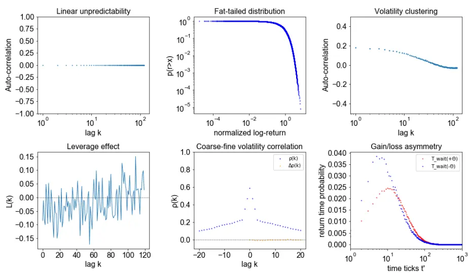
资料来源：Bloomberg，华泰证券研究所

## 免责声明

## 分析师声明

本人，林晓明、陈烨、李子钰，兹证明本报告所表达的观点准确地反映了分析师对标的证券或发行人的个人意见；彼以往、现在或未来并无就其研究报告所提供的具体建议或所表迖的意见直接或间接收取任何报酬。

## 一般声明

本报告由华泰证券股份有限公司（已具备中国证监会批准的证券投资咨询业务资格，以下简称“本公司”）制作。本报告仅供本公司客户使用。本公司不因接收人收到本报告而视其为客户。

本报告基于本公司认为可靠的、已公开的信息编制，但本公司对该等信息的准确性及完整性不作任何保证。本报告所载的意见、评估及预测仅反映报告发布当日的观点和判断。在不同时期，本公司可能会发出与本报告所载意见、评估及预测不一致的研究报告。同时，本报告所指的证券或投资标的的价格、价值及投资收入可能会波动。以往表现并不能指引未来，未来回报并不能得到保证，并存在损失本金的可能。本公司不保证本报告所含信息保持在最新状态。本公司对本报告所含信息可在不发出通知的情形下做出修改，投资者应当自行关注相应的更新或修改。

本公司研究报告以中文撰写，英文报告为翻译版本，如出现中英文版本内容差异或不一致，请以中文报告为主。英文翻译报告可能存在一定时间迟延。

本公司力求报告内容客观、公正，但本报告所载的观点、结论和建议仅供参考，不构成所述证券的买卖出价或征价。该等观点、建议并未考虑到个别投资者的具体投资目的、财务状况以及特定需求，在任何时候均不构成对客户私人投资建议。投资者应当充分考虑自身特定状况，并完整理解和使用本报告内容，不应视本报告为做出投资决策的唯一因素。对依据或者使用本报告所造成的一切后果，本公司及作者均不承担任何法律责任。任何形式的分享证券投资收益或者分担证券投资损失的书面或口头承诺均为无效。

除非另行说明，本报告中所引用的关于业绩的数据代表过往表现，过往的业绩表现不应作为日后回报的预示。本公司不承诺也不保证任何预示的回报会得以实现，分析中所做的预测可能是基于相应的假设，任何假设的变化可能会显著影响所预测的回报。

本公司及作者在自身所知情的范围内，与本报告所指的证券或投资标的不存在法律禁止的利害关系。在法律许可的情况下，本公司及其所属关联机构可能会持有报告中提到的公司所发行的证券头寸并进行交易，也可能为之提供或者争取提供投资银行、财务顾问或者金融产品等相关服务。本公司的销售人员、交易人员或其他专业人士可能会依据不同假设和标准、采用不同的分析方法而口头或书面发表与本报告意见及建议不一致的市场评论和/或交易观点。本公司没有将此意见及建议向报告所有接收者进行更新的义务。本公司的资产管理部门、自营部门以及其他投资业务部门可能独立做出与本报告中的意见或建议不一致的投资决策。投资者应当考虑到本公司及/或其相关人员可能存在影响本报告观点客观性的潜在利益冲突。投资者请勿将本报告视为投资或其他决定的唯一信赖依据。有关该方面的具体披露请参照本报告尾部。

本研究报告并非意图发送、发布给在当地法律或监管规则下不允许向其发送、发布的机构或人员，也并非意图发送、发布给因可得到、使用本报告的行为而使本公司及关联子公司违反或受制于当地法律或监管规则的机构或人员。

本报告版权仅为本公司所有。未经本公司书面许可，任何机构或个人不得以翻版、复制、发表、引用或再次分发他人等任何形式侵犯本公司版权。如征得本公司同意进行引用、刊发的，需在允许的范围内使用，并注明出处为“华泰证券研究所”，且不得对本报告进行任何有悖原意的引用、删节和修改。本公司保留追究相关责任的权利。所有本报告中使用的商标、服务标记及标记均为本公司的商标、服务标记及标记。

## 针对美国司法管辖区的声明

## 美国法律法规要求之一般披露

本研究报告由华泰证券股份有限公司编制，在美国由华泰证券（美国）有限公司（以下简称华泰证券（美国））向符合美国监管规定的机构投资者进行发表与分发。华泰证券（美国）有限公司是美国注册经纪商和美国金融业监管局（FINRA）的注册会员。对于其在美国分发的研究报告，华泰证券（美国）有限公司对其非美国联营公司编写的每一份研究报告内容负责。华泰证券（美国）有限公司联营公司的分析师不具有美国金融监管（FINRA）分析师的注册资格，可能不属于华泰证券（美国）有限公司的关联人员，因此可能不受 FINRA 关于分析师与标的公司沟通、公开露面和所持交易证券的限制。任何直接从华泰证券（美国）有限公司收到此报告并希望就本报告所述任何证券进行交易的人士，应通过华泰证券（美国）有限公司进行交易。

## 所有权及重大利益冲突

分析师林晓明、陈烨、李子钰本人及相关人士并不担任本研究报告所提及的标的证券或发行人的高级人员、董事或顾问。分析师及相关人士与本研究报告所提及的标的证券或发行人并无任何相关财务利益。声明中所提及的“相关人士”包括FINRA 定义下分析师的家庭成员。分析师根据华泰证券的整体收入和盈利能力获得薪酬，包括源自公司投资银行业务的收入。

## 重要披露信息

- 华泰证券股份有限公司和/或其联营公司在本报告所署日期前的 12 个月内未担任标的证券公开发行或 144A 条款发行的经办人或联席经办人。

- 华泰证券股份有限公司和/或其联营公司在研究报告发布之日前 12 个月未曾向标的公司提供投资银行服务并收取报酬。

- 华泰证券股份有限公司和/或其联营公司预计在本报告发布之日后3个月内将不会向标的公司收取或寻求投资银行服务报酬。

- 华泰证券股份有限公司和/或其联营公司并未实益持有标的公司某一类普通股证券的 1%或以上。此头寸基于报告前一个工作日可得的信息，适用法律禁止向我们公布信息的情况除外。在此情况下，总头寸中的适用部分反映截至最近一次发布的可得信息。

- 华泰证券股份有限公司和/或其联营公司在本报告撰写之日并未担任标的公司股票证券做市商。

## 评级说明

## 行业评级体系

－报告发布日后的6个月内的行业涨跌幅相对同期的沪深300指数的涨跌幅为基准；

－投资建议的评级标准

增持行业股票指数超越基准

中性行业股票指数基本与基准持平

减持行业股票指数明显弱于基准

## 公司评级体系

－报告发布日后的 6 个月内的公司涨跌幅相对同期的沪深 300 指数的涨跌幅为基准；
－投资建议的评级标准
买入股价超越基准 20%以上
增持股价超越基准 5%-20%
中性股价相对基准波动在-5%~5%之间
减持股价弱于基准 5%-20%
卖出股价弱于基准 20%以上

## 华泰证券研究

## 南京

南京市建邺区江东中路228号华泰证券广场1号楼/邮政编码：210019

电话：86 25 83389999 /传真：86 25 83387521

电子邮件：ht-rd@htsc.com

## 深圳

深圳市福田区益田路5999号基金大厦10楼/邮政编码：518017电话：86 755 82493932 /传真：86 755 82492062电子邮件：ht-rd@htsc.com

## 北京

北京市西城区太平桥大街丰盛胡同28号太平洋保险大厦A座18层

邮政编码：100032

电话：86 10 63211166/传真：86 10 63211275

电子邮件：ht-rd@htsc.com

## 上海

上海市浦东新区东方路18号保利广场E栋23楼/邮政编码：200120
电话：86 21 28972098 /传真：86 21 28972068
电子邮件：ht-rd@htsc.com

## 法律实体披露

本公司具有中国证监会核准的“证券投资咨询”业务资格，经营许可证编号为：91320000704041011J。

华泰证券全资子公司华泰证券(美国)有限公司为美国金融业监管局(FINRA)成员，具有在美国开展经纪交易商业务的资格，经营业务许可编号为：CRD#.298809。

电话: 212-763-8160电子邮件: huatai@htsc-us.com

传真: 917-725-9702 http://www.htsc-us.com

©版权所有2020年华泰证券股份有限公司