## 金工研究/深度研究

2020年06月14日

林晓明 执业证书编号：S0570516010001

研究员 0755-82080134linxiaoming@htsc.com

陈烨 执业证书编号：S0570518080004

研究员 010-56793942

chenye@htsc.com

李子钰 执业证书编号：S0570519110003

研究员 0755-23987436

liziyu@htsc.com

何康 021-28972039

联系人 hekang@htsc.com

王晨宇 02138476179

联系人 wangchenyu@htsc.com

2《金工: 耦合振子同步的藏本模型》2020.05

3《金工: 引入高阶矩改进马科维茨组合表现》2020.05

# AlphaNet：因子挖掘神经网络

# 华泰人工智能系列三十二

## 本文构建了端到端的因子挖掘神经网络 AlphaNet，并测试了其有效性

过去 10年，基于神经网络的深度学习模型引领了人工智能的发展。与传统的机器学习不同，深度学习模型通过端到端(end to end)的方式，直接从原始数据中提取特征并针对目标做出预测，从而避免了多步骤学习的人工干预和信息损失。然而将深度学习运用于多因子选股时，套用现有模型可能效果会不达预期，需要量身定制合适的网络结构。本文为了整合多因子选股中的因子生成和多因子合成步骤，设计了一种全新的网络结构：AlphaNet。在测试中，AlphaNet 能有效提取股票原始量价数据中的特征，其合成因子相比传统因子具有显著的增量信息。

## 深度学习的端到端特征学习能力使得借助神经网络挖掘因子成为可能

深度学习中的代表模型有卷积神经网络 CNN和循环神经网络 RNN。CNN通过引入卷积层和池化层，能有效提取图像中的特征，成为计算机视觉领域中的优秀模型。RNN通过引入序列网络结构，能有效提取序列数据中的特征，成为语音识别、自然语言处理等领域中的优秀模型。通过巧妙的网络结构构建，深度学习能展现出强大的特征学习能力，实现端到端的学习和预测。要达到优秀的端到端学习效果，需要结合神经网络的灵活性和待解决问题的领域知识，有针对性地设计出网络结构。本文针对量化投资中选股因子的自动挖掘和合成问题，设计了一种全新的网络结构：AlphaNet。

## 本文介绍了因子挖掘神经网络 AlphaNet 的结构和技术细节

为了有效提取股票原始量价数据中的特征，AlphaNet 借鉴了遗传规划中特征构建的思想，将多种运算符函数作为自定义网络层用于特征提取。AlphaNet 包含四部分：(1)数据输入：仿照 CNN 的方式，将个股原始量价数据整理为二维“数据图片”的形式输入网络。(2)特征提取层：AlphaNet中最关键的组成部分，实现了多种自定义运算网络层提取特征，并利用批标准化层(Batch Normalization)进行特征标准化。(3)池化层：与 CNN 中池化层基本一致，对上一层的特征进行“模糊化”操作。(4)全连接层：对接预测目标，作用是对提取的特征进行加权合成。

本文基于量价数据，测试了 AlphaNet 在不同调仓周期下的选股策略表现基于全A股的量价数据，本文介绍了AlphaNet的第一个版本：AlphaNet-v1的构建细节，并展示了 AlphaNet-v1 输出的合成因子在调仓周期为 10天和5 天的策略回测表现。合成因子在进行了行业、市值、动量、波动率、换手率五因子中性化后，RankIC 均值为 9.54%(10 天调仓)和 8.19%(5 天调仓)。分 5 层测试中 TOP 组合年化超额收益率为 12.42%(10 天调仓)和11.36%(5 天调仓)。合成因子的增量信息显著。最后，我们使用 SHAP 值对 AlphaNet-v1 进行可解释性分析。

风险提示：通过人工智能模型构建的选股策略是历史经验的总结，存在失效的可能。神经网络受随机性影响较大，使用需谨慎。机器学习模型解释方法存在过度简化的风险。

## 本文研究导读

在华泰金工 2020 年 2 月 18 日发布的报告《基于量价的人工智能选股体系概览》中我们指出：人工智能已经可以很好地融入到多因子选股模型的因子生成和多因子合成步骤，并构建了“遗传规划+随机森林”模型来进行量价因子的挖掘和合成。在“遗传规划+随机森林”模型中，因子挖掘和多因子合成依然是两个完全分离的步骤，人工干预较多，也可能存在不可避免的信息损失。因此从本篇报告开始，我们将利用当前人工智能领域最热门的技术：深度学习，来构建能整合多个步骤的端到端(end to end)系统。图表 1 中，我们进一步扩充了华泰金工的人工智能选股体系，加入深度学习和深度强化学习部分。

1. 深度学习：该部分用黑色虚线框圈出，是本篇报告将要介绍的内容。我们借助神经网络技术设计了一种全新的网络结构：AlphaNet，能够实现端到端的选股因子挖掘和因子合成。

2. 深度强化学习：深度强化学习目前已在 AlphaGo(围棋 AI)、AlphaStar(星际争霸 AI)等应用上取得成功。借助深度学习的强大特征学习能力和强化学习的组合优化能力，可以构建深度强化学习模型来实现端到端的因子挖掘、因子合成和组合优化。

图表1： 人工智能融入多因子选股体系
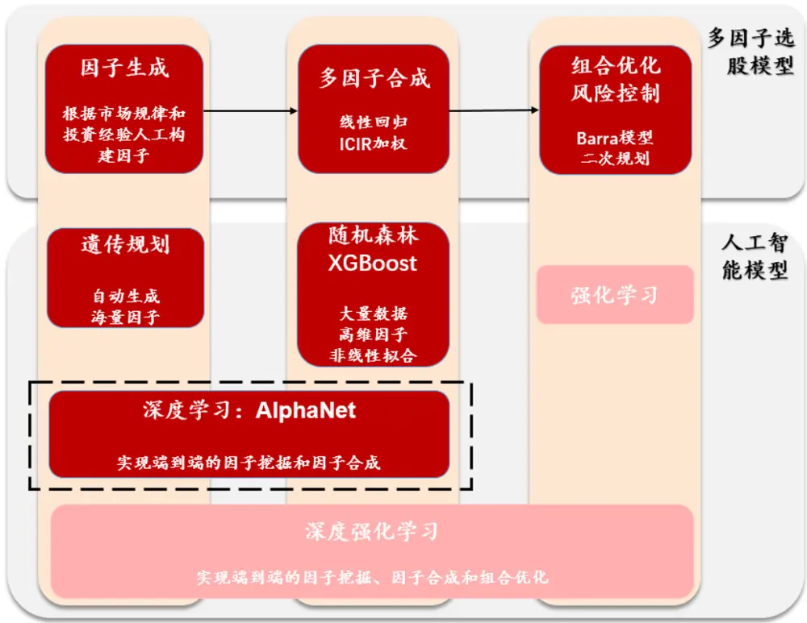
资料来源：华泰证券研究所

注：对于强化学习和深度强化学习，由于目前我们尚无具体的相关研究，图表 1 中该两处标为浅红色。

## 从 CNN/RNN 到 AlphaNet

本章我们首先回顾两种经典的深度学习模型：CNN和 RNN。通过巧妙的网络结构构建，神经网络能展现出强大的特征学习能力，实现端到端(end to end)的学习和预测。要达到优秀的端到端学习效果，需要结合神经网络的灵活性和待解决问题的领域知识，有针对性地设计出网络结构。我们针对量化投资中选股因子的自动挖掘和合成问题，设计了一种全新的网络结构：AlphaNet。

## 经典深度学习模型回顾：卷积神经网络 CNN

卷积神经网络(Convolutional Neural Network，CNN)是计算机视觉研究和应用领域中最具影响力的模型。卷积神经网络的结构模仿了眼睛的视觉神经的工作原理。对于眼睛来说，视觉神经是它和大脑沟通的桥梁，大量的视觉神经分工协作，各自负责一小部分区域的视觉图像，再将图像的各种局部特征抽象组合到高层的视觉概念，使得了人类具有了视觉认知能力。卷积神经网络也是类似，它包含了多层卷积层和池化层，由多个卷积核对图像的局部区域进行特征提取，并通过池化层汇聚得到抽象层级更高的特征，最后通过全连接层进行特征合成。图表 2为经典的 LeNet-5 卷积神经网络模型。

图表2： LeNet-5 卷积神经网络模型
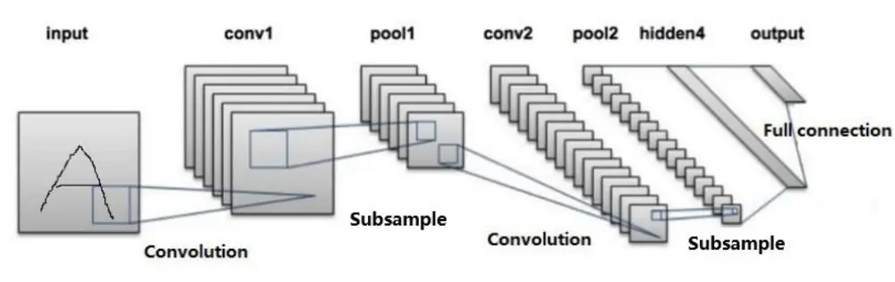
资料来源：LeCun，Bottou， Bengio & Haffner(1998)，华泰证券研究所

CNN 中最关键的特征提取组件是卷积核，如图表 3 左侧所示，卷积核(convolution kernel)是一个带有可优化权重和偏置项的“矩形”网络层。通过多层卷积核的作用，可以从人脸图像中逐步提取出边缘——五官轮廓——人脸的特征，最终完成人脸识别。

图表3： 卷积核以及人脸特征提取过程
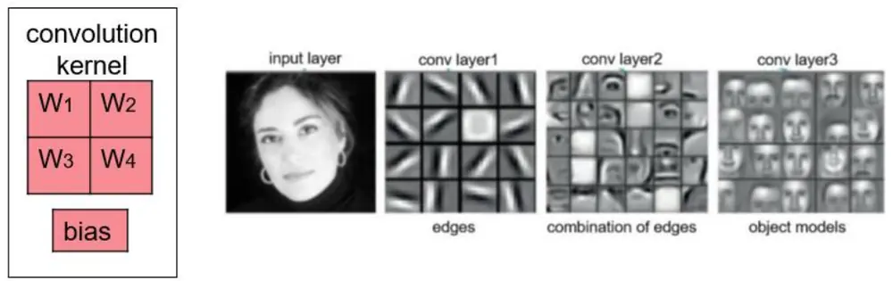
资料来源：Prof. Bart M. ter Haar Romeny，华泰证券研究所

CNN 使得端到端图像识别(即输入原始图像，直接输出识别结果)成为可能，避免了人为提取图像特征。CNN 能成为图像识别领域最优秀的模型，关键就是针对图像识别的特征提取原理，巧妙设计了卷积和池化的网络结构，体现了深度神经网络强大的特征学习能力。

## 经典深度学习模型回顾：循环神经网络 RNN

循环神经网络(Recurrent Neural Network，RNN)是一种以序列数据为输入，在序列的演进方向进行递归，且所有节点按链式连接的神经网络。RNN 的时序构造方式使得它在对序列的非线性特征进行学习时具有一定优势，因此其适合用于语音识别、自然语言处理等领域。如图表 4所示，RNN 对序列的建模方式一般有四种：

1. Many to many，每一个输入都有相对应的输出，例如给视频的每一帧贴标签。

2. Many to one，整个序列只有一个输出，例如文本的情感分析。

3. One to many，通过一个输入产生一个序列，例如给一张图片加上一串解说词。

4. Many to many，多对多，但不一一对应，典型应用是机器翻译。

图表4： RNN对序列的建模方式
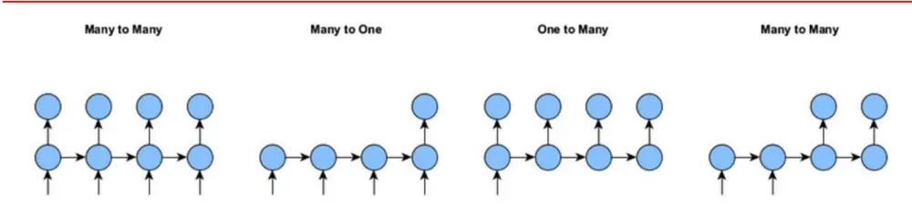
资料来源：华泰证券研究所

RNN 使得端到端的序列识别成为可能，避免了人为提取序列特征。RNN 在多种序列任务中的成功运用，同样体现了深度神经网络强大的特征学习能力。

## CNN/RNN 运用到选股因子挖掘可能出现的问题

从前两节的回顾可以看出，CNN 和 RNN 是结合了特定领域知识构建出的神经网络，脱离了其适用领域进行使用，效果可能会不达预期。具体对量化多因子选股而言，可能会有以下问题：

1. 对于 CNN，卷积核的局部感知操作和数据的排布方式有关，然而股票因子数据没有固定排布方式，这使得不同数据排布方式下的卷积效果会有差异。另外，卷积核运算的本质是对卷积区域内的数据进行加权平均，这种运算方式可能难以有效提取股票数据中的特征。

2. 对于 RNN，虽然其适用于序列特征提取，但递归运算的方式过于单一，可能难以有效提取股票数据中较为复杂的特征。

因此，本文创造性地提出了一种全新的神经网络结构：AlphaNet，可以有效进行选股因子挖掘和合成。

## 选股因子挖掘神经网络：AlphaNet

在华泰金工 2019 年 6 月 10 日发布的报告《基于遗传规划的选股因子挖掘》中，我们指出：遗传规划是优秀的特征生成工具，可以用来生成海量选股因子。AlphaNet 正是借鉴了遗传规划中特征构建的思想，将多种运算符函数作为自定义网络层用于特征提取。图表5 展示了 AlphaNet 的全局结构，接下来我们将对其中的每个要素进行分析。

图表5： AlphaNet 的结构

| open(t-n) | .…… | open(t-1) | open(t) |
| --- | --- | --- | --- |
| high(t-n) | ……… | high(t-1) | high(t) |
| low(t-n) | ……… | low(t-1) | low(t) |
| close(t-n) | .…… | close(t-1) | close(t) |
| vwap(t-n) | ……… | vwap(t-1) | vwap(t) |
| volume(t-n) | .…… | volume(t-1) | volume(t) |
| return1(t-n) | ………… | return1(t-1) | return1(t) |
| turn(t-n) | .… | turn(t-1) | turn(t) |
| free_turn(t-n) | ……… | free_turn(t-1) | free_turn(t) |

数据输入：个股量价“数据图片”
资料来源：华泰证券研究所

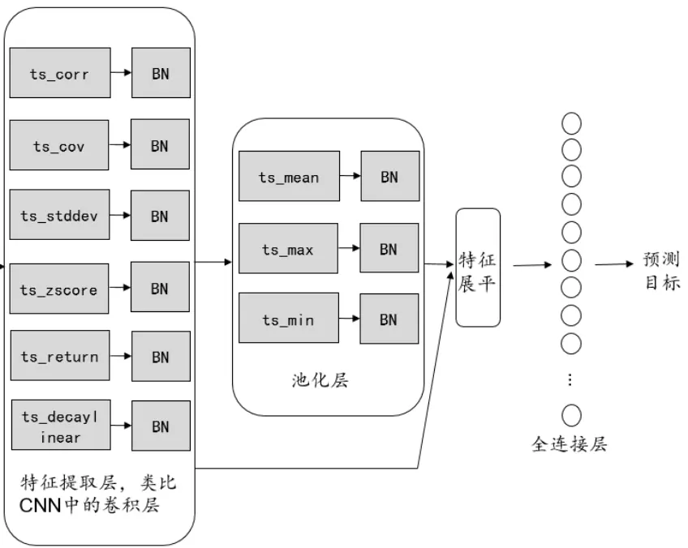

## 数据输入

AlphaNet 仿照 CNN 的方式，将个股量价数据整理为“数据图片”的形式输入网络。如图表 6 所示，一只股票在 t-4到 t 的量价数据构成一张“数据图片”，该个股对应一个收益率R(t+m)作为标签。如果在一个时间截面上有 3000 只个股，我们就可以得到 3000 张个股的“数据图片”及其对应的标签。值得注意的是，个股的量价数据不一定要按照图表 6的方式(open，high，low…)排布，可以按照任意的方式排布。

图表6： AlphaNet 的数据输入

| open(t-4) | open(t-3) | open(t-2) | open(t-1) | open(t) |
| --- | --- | --- | --- | --- |
| high(t-4) | high(t-3) | high(t-2) | high(t-1) | high(t) |
| low(t-4) | low(t-3) | low(t-2) | low(t-1) | low(t) |
| close(t-4) | close(t-3) | close(t-2) | close(t-1) | close(t) |
| vwap(t-4) | vwap(t-3) | vwap(t-2) | vwap(t-1) | vwap(t) |
| volume(t-4) | volume(t-3) | volume(t-2) | volume(t-1) | volume(t) |
| return1(t-4) | return1(t-3) | return1(t-2) | return1(t-1) | return1(t) |
| turn(t-4) | turn(t-3) | turn(t-2) | turn(t-1) | turn(t) |
| free_turn(t-4) | free_turn(t-3) | free_turn(t-2) | free_turn(t-1) | free_turn(t) |

资料来源：华泰证券研究所

## 特征提取层

特征提取层是AlphaNet最关键的组成部分。AlphaNet借鉴了遗传规划中特征构建的思想，将多种运算符函数作为自定义网络层进行特征提取。图表 7 展示了目前 AlphaNet 已实现的网络层。我们将对具有代表性的自定义网络层进行详细分析。

图表7： 自定义网络层

| 名称 | 定义 |
| --- | --- |
| ts_corr(X, Y, d) | 过去d天X值构成的时序数列和Y值构成的时序数列的相关系数。 |
| ts_cov(X, Y, d) | 过去d天X值构成的时序数列和Y值构成的时序数列的协方差。 |
| ts_stddev(X, d) | 过去d天X值构成的时序数列的标准差。 |
| ts_zscore(X, d) | 过去d天X值构成的时序数列的平均值除以标准差。 |
| ts_return(X, d) | (X - delay(X, d))/delay(X, d)-1, delay(X, d)为 X 在 d 天前的取值。 |
| ts_decaylinear(X, d) | 过去d天X值构成的时序数列的加权平均值，权数为d,d-1,..,1(权数之和应为1，需进行归一化处理)，其中离现在越 |
| ts_min(X, d) | 近的日子权数越大。 过去d天X值构成的时序数列中最小值。 |
| ts_max(X, d) | 过去d天X值构成的时序数列中最大值。 |
| ts_sum(X, d) | 过去d天X值构成的时序数列之和。 |
| BN | 批标准化层(Batch Normalization)，用来标准化以上自定义网络层提取的特征，使得不同特征在量纲上趋于一致。 |

资料来源：华泰证券研究所

## 1. ts_corr(X, Y, d)

设 d=3，图表 X 展示了 ts_corr(X, Y, 3)网络层的工作机制。ts_corr(X, Y, 3)会在时间维度上和特征维度上对二维的数据进行遍历运算，与 CNN类似，步进大小 stride 是可调参数，例如 stride=1 时，下一次计算在时间维度上往右步进一步。在特征维度上的计算则体现出了与 CNN卷积的不同之处，CNN 卷积运算只能进行局部感知，但是 ts_corr(X, Y, 3)会对所有类型的数据进行遍历，其计算区域不一定要相邻，例如在图表8中，会遍历C2 = 36次。这避免了 CNN中局部感知所带来的数据排布问题，可以充分提取数据中的特征。ts_corr(X,Y, 3)的运算结果是一张二维的“特征图片”，针对该图片，可以直接展平(flatten)输入到全连接神经网络中，也可以继续在此基础上进行特征提取或池化。如果继续进行特征提取，则可实现运算符的嵌套，如：

$$
\mathsf{ts\_corr(ts\_corr(X,Y,3),ts\_corr(Z,W,3),}3\mathsf{)}
$$

与 ts_corr(X, Y, d)相似的还有 ts_cov(X, Y, d)，这里不再赘述。

图表8： ts_corr(X, Y, 3)网络层的工作机制

| open(t-4) | open(t-3) | open(t-2) | open(t-1) | open(t) |  |  |
| --- | --- | --- | --- | --- | --- | --- |
| high(t-4) | high(t-3) | high(t-2) | high(t-1) | high(t) |  |  |
| low(t-4) | low(t-3) | low(t-2) | low(t-1) | low(t) |  |  |
| close(t-4) | close(t-3) | close(t-2) | close(t-1) | close(t) |  |  |
| vwap(t-4) | vwap(t-3) | vwap(t-2) | vwap(t-1) | vwap() |  |  |
| volume(t-4) | volume(t-3) | volume(t-2) | volume(t-1) | volume(t) |  |  |
| return1(t-4) | return1(t-3) | return1(t-2) | return1(t-1) | return1(t) |  |  |
| turn(t-4) | turn(t-3) | turn(t-2) | turn(t-1) | turn(t) |  |  |
| free_turn(t-4) | free_turn(t-3) | free_turn(t-2) | free_turn(t-1) | free_turn(t) | ts co | F1 …………ts_corr(X,Y,3)F2…….运算的结果：“特征图片” |
| open(t-4) | open(t-3) | open(t-2) op | en(t-1) | open(t) |  |  |
| high(t-4) | high(t-3) | high(t-2) | high(t-1) | high(t) |  |  |
| low(t-4) | low(t-3) | low(t-2) | ioW(t-1) | low(t) |  |  |
| close(t-4) | close(t-3) | close(t-2) | close(t-1) | close(t) |  |  |
| vwap(t-4) | vwap(t-3) | vwap(t-2) | vwap(t-1) | vwap(t) |  |  |
| volume(t-4) | volume(t-3) | volume(t-2) | volume(t-1) | volume(t) |  |  |
| return1(t-4) | return1(t-3) | return1(t-2) | return1(t-1) | return1(t) |  |  |
| turn(t-4) | turn(t-3) | turn(t-2) | turn(t-1) | turn(t) |  |  |
| free_turn(t-4) | free_turn(t-3) | free_turn(t-2) | free_turn(t-1) | free_turn(t) |  |  |

资料来源：华泰证券研究所

## 2. ts_stddev(X, d)

设 d=3，图表 9 展示了 ts_stddev(X, 3)网络层的工作机制。该网络层的机制较为简单，类似于 CNN中的 1*3卷积。其他网络层例如 ts_zscore(X, d)、ts_return(X, d)等与 ts_stddev(X,d)类似，这里不再赘述。

图表9： ts_stddev(X, 3)网络层的工作机制
在时间维度上步进，与CNN类似，步进大小stride是可调参数

| open(t-4) | open(t-3) | open(t-2) o | pen(t-1) | open(t) |  |
| --- | --- | --- | --- | --- | --- |
| high(t-4) | high(t-3) | high(t-2) | high(t-1) | high(t) |  |
| low(t-4) | low(t-3) | low(t-2) | low(t-1) | low(t) |  |
| close(t-4) | close(t-3) | close(t-2) | close(t-1) | cluse(t) |  |
| vwap(t-4) | vwap(t-3) | vwap(t-2) | vwap(t-1) | vwap(t) |  |
| volume(t-4) | volume(t-3) | volume(t-2) | volume(t-1) | volume(t) |  |
| return1(t-4) | return1(t-3) | return1(t-2) | return1(t-1) | return1(t) |  |
| turn(t-4) | turn(t-3) | turn(t-2) | turn(t-1) | turn(t) |  |
| free_turn(t-4) | free_turn(t-3) | free_turn(t-2) | free_turn(t-1) | free_turn(t) | ts_stddev(X, d) |
| open(t-4) | open(t-3) | open(t-2) | open(t-1) | open(t) |  |
| high(t-4) | high(t-3) | high(t-2) | high(t-1) | high(t) |  |
| low(t-4) | low(t-3) | low(t-2) | low(t-1) | low(t) |  |
| close(t-4) | close(t-3) | close(t-2) | close(t-1) | close(t) |  |
| vwap(t-4) | vwap(t-3) | vwap(t-2) | vwap(t-1) | vwap(t) |  |
| volume(t-4) | volume(t-3) | volume(t-2) | volume(t-1) | volume(t) |  |
| return1(t-4) | return1(t-3) | return1(t-2) | return1(t-1) | return1(t) |  |
| turn(t-4) | turn(t-3) | turn(t-2) | turn(t-1) | turn(t) |  |
| free_turn(t-4) | free_turn(t-3) | free_turn(t-2) | free_turn(t-1) | free_turn(t) |  |

资料来源：华泰证券研究所

## 3. BN 层

BN(Batch Normalization)，中文为批标准化层，该层已经是目前神经网络中最常用的组件之一，在 AlphaNet 的特征标准化中起着重要作用。下面我们简要介绍 BN 的原理。设Zl为神经网络第l层的计算结果， m为每个 batch 中样本的数量，有：

每个 batch 中样本在第l层的均值： $\begin{array}{r}{\mu=\frac{1}{m}{\sum_{i=1}^{m}Z^{l(i)}}}\end{array}$

每个 batch 中样本在第l层的方差： $\begin{array}{r}{\sigma^{2}=\frac{1}{m}{\sum_{i=1}^{m}(Z^{l(i)}-\mu)^{2}}}\end{array}$

则 BN 层的结果Ẑl为： $\begin{array}{r}{\hat{Z}^{l}=\gamma*\frac{Z^{l}-\mu}{\sqrt{\sigma^{2}+\varepsilon}}+\beta^{l}}\end{array}$

上式中，为了增强 BN 层的表达能力，引入了两个可优化参数γ和β，如果没有γ和β，则BN 层的运算就为 z-score 标准化，因此 BN 层的数据标准化操作和我们常用的标准化方法是非常类似的。

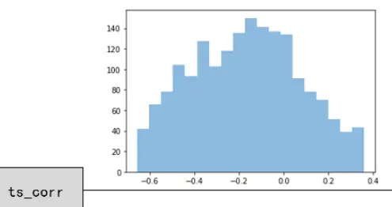

图表10： BN层标准化后，两个特征提取层的特征分布在量纲上可比
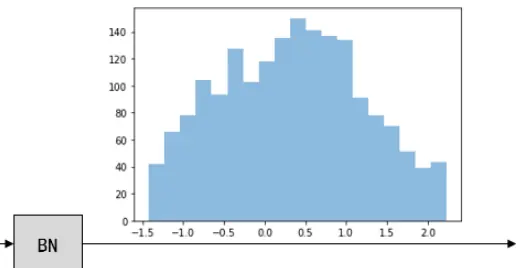

BN层标准化前的特征分布
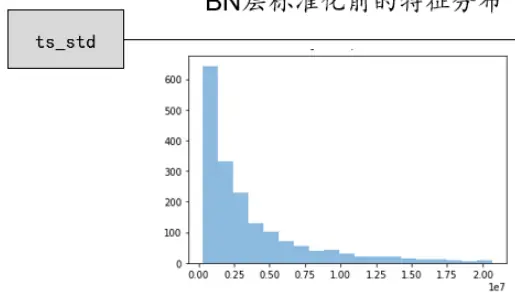
BN层标准化后的特征分布
资料来源：华泰证券研究所

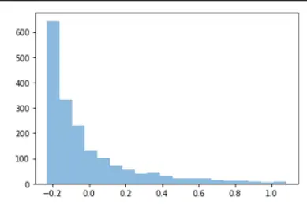

图表 10 展示了 BN 层的效果。从特征分布的直方图来看，在 BN 层标准化前，ts_corr 层提取特征的取值范围为(-0.7, 0.4)，ts_std 层提取特征的取值范围为(0, 23000000)，差距很大。而在 BN 层标准化后，特征的取值范围非常接近，都在区间(-1.5, 2)中，特征之间的量纲可比，这对于模型训练来说是非常有益的。此外，BN 层的设计者们还认为 BN 层有以下作用：

(1) 缓解 Internal Covariate Shift，使得网络学习更加稳定。

(2) 加速模型训练。

## 池化层

AlphaNet 的池化层机制和 CNN 基本一致，都是对上一层的特征进行“模糊化”操作。ts_mean(X, d)对应 CNN 中的(1*d)mean_pooling，ts_max(X, d)对应 CNN 中的(1*d)max_pooling，ts_min(X, d)对应 CNN 中的(1*d) min_pooling。池化层也实现了运算符的嵌套，如：

$$
\mathsf{ts\_mean(ts\_corr(X,Y,3),}3\mathrm{)}
$$

## 全连接层

在将特征提取层和池化层所得特征进行特征展平(flatten)后，会接入全连接层，全连接层最后对接预测目标，整个网络的参数会根据预测目标的 loss 以反向传播的方式进行优化。全连接层所起的作用是对特征进行加权合成，这与 CNN 中的全连接层一致。

## AlphaNet模型构建和测试细节

图表 11为 AlphaNet 模型构建流程，我们将逐步介绍流程中的细节。

图表11： AlphaNet 模型构建流程

资料来源：华泰证券研究所

## 数据准备

1. 股票池：全 A股，剔除 ST、PT 股票，剔除每个截面期下一交易日涨跌停和停牌的股票。

2. 原始数据：未经过特征工程的个股量价信息，如图表 12 所示。对于每只股票，将其量价数据拼接成 9*30的“数据图片”，30 为历史时间天数。

3. 预测目标：个股 10 天后标准化的收益率；个股 5天后标准化的收益率。

4. 时间区间：2011 年 1 月 31 日至 2020 年 5 月 29 日。

5. 样本内数据大小：每次训练都使用过去 1500 个交易日的数据作为样本内数据，每隔两天采样一次。

6. 训练集和验证集比例：按照时间先后进行 1：1划分，训练集在前，验证集在后。

图表12： 原始数据列表

| 名称 | 定义 |
| --- | --- |
| return1 | 个股日频收益率(由相邻两个交易日的后复权收盘价计算得来) |
| open, close, high, low, volume | 个股日频开盘价、收盘价、最高价、最低价、成交量 |
| vwap | 个股日频成交量加权平均价 |
| turn, free_turn | 个股日频换手率、自由流通股换手率 |

资料来源：Wind，华泰证券研究所

## AlphaNet 模型构建

本文使用开源框架 Keras(后端为 tensorflow)构建 AlphaNet，使用 Keras 提供的自定义网络层接口实现特征提取层和池化层中的各种自定义运算。图表 13 和图表 14 展示了按照AlphaNet 框架构建 AlphaNet-v1 模型的细节，包含一层特征提取层，一层池化层，一层全连接隐藏层。

图表13： AlphaNet-v1 模型构建细节图
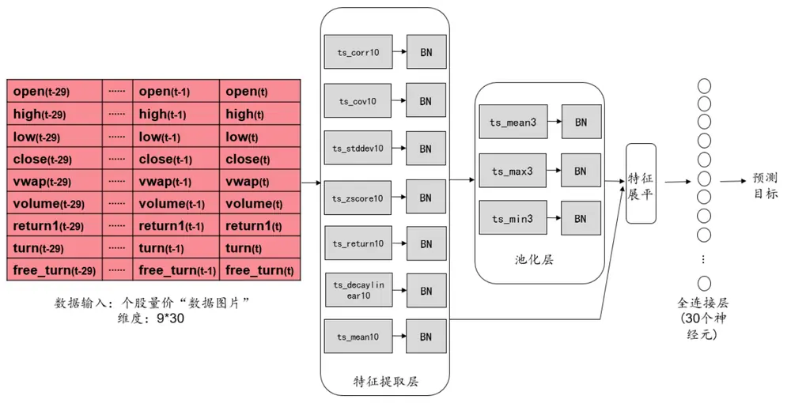
资料来源：华泰证券研究所

图表14： AlphaNet-v1 模型构建细节

| 网络构成 | 包含组件 | 参数和说明 |
| --- | --- | --- |
| 特征提取层 | ts_corr(X, Y, 10) ts_cov(X, Y, 10) ts_stddev(X, 10) ts_zscore(X, 10) ts_return(X, 10) ts_decaylinear(X, 10) | 1. 自定义网络层中，步进 stride=10。 2.每个自定义网络层后都连接BN层。 3.特征提取层所得特征，在输入到池化层的同时， 也直接展平后输入到全连接层。 |
| 池化层 | BN ts_mean(X, 3) ts_max(X, 3) ts_min(X, 3) | 1. 自定义网络层中，步进 stride=3。 2.每个自定义网络层后都连接BN层。 3.池化层所得特征直接展平后输入到全连接层。 |
| 全连接隐藏层 | BN 30 个神经元 | 1.激活函数：RELU。 2.DropOut 比率：0.5。 |
| 输出层 | 1 个神经元 | 3.权重初始化方式：truncated_normal。 1.激活函数：linear。 2.权重初始化方式：truncated_normal。 |
| 模型其他参数 | 1. 损失函数：均方误差 MSE。 2.优化器和学习速率：RMSProp，0.0001。 3.batch_size: 1000。 4.提前停止(early_stopping)：10。 |  |

资料来源：华泰证券研究所

## AlphaNet-v1 训练和预测方式

1. 模型训练：从 2011 年 1 月 31 日开始，每隔半年进行滚动训练。样本内数据为过去1500 个交易日的数据，训练集和验证集按照 1：1 划分。

2. 模型预测：在每个样本外数据截面上，使用最新训练的模型预测个股未来 10 天/5 天的收益率。

考虑到神经网络的训练受随机数种子影响较大，我们将以上步骤重复 10 次，得到 10 组预测结果，对其进行综合分析。

## 组合构建和回测

对于 AlphaNet-v1 合成的因子，进行以下测试：

1. 单因子 IC 测试和分层测试。分析因子的 RankIC 均值、ICIR、分层组合年化收益率等指标。

2. 构建行业市值中性的中证 500增强策略进行回测。分析策略的年化超额收益率、信息比率、超额收益最大回撤等指标。

AlphaNet-v1 结构比较简单(只包含一层特征提取层和一层池化层)，如图表 15 所示，对于展平后的每个特征，可得出它是如何从特征提取层和池化层运算得到的，例如展平后的第一个和第二个特征分别为：

$$
\mathsf{BN}(\mathsf{ts\_mean}(\mathsf{BN}(\mathsf{ts\_corr}(\mathsf{open},\mathsf{high},\mathsf{10})),\mathsf{3}))
$$

$$
\mathsf{BN}(\mathsf{ts\_mean}(\mathsf{BN}(\mathsf{ts\_corr}(\mathsf{open},\mathsf{low},\mathsf{10})),\mathsf{3}))
$$

我们可以借助模型可解释性工具 SHAP 分析展平后的每个特征与预测目标的关系，得出特征重要性，从而辅助对模型的理解。SHAP的原理可参见华泰金工报告《揭开机器学习模型的“黑箱”》。

图表15： AlphaNet-v1 模型构建细节图

| open(t-29) | .……… | open(t-1) | open(t) |
| --- | --- | --- | --- |
| high(t-29) | ……… | high(t-1) | high(t) |
| low(t-29) | ...…. | low(t-1) | low(t) |
| close(t-29) | ..…. | close(t-1) | close(t) |
| vwap(t-29) | ……… | vwap(t-1) | vwap(t) |
| volume(t-29) | .…… | volume(t-1) | volume(t) |
| return1(t-29) | ………. | return1(t-1) | return1(t) |
| turn(t-29) | ……… | turn(t-1) | turn(t) |
| free_turn(t-29) | .……… | free_turn(t-1) | free_turn(t) |

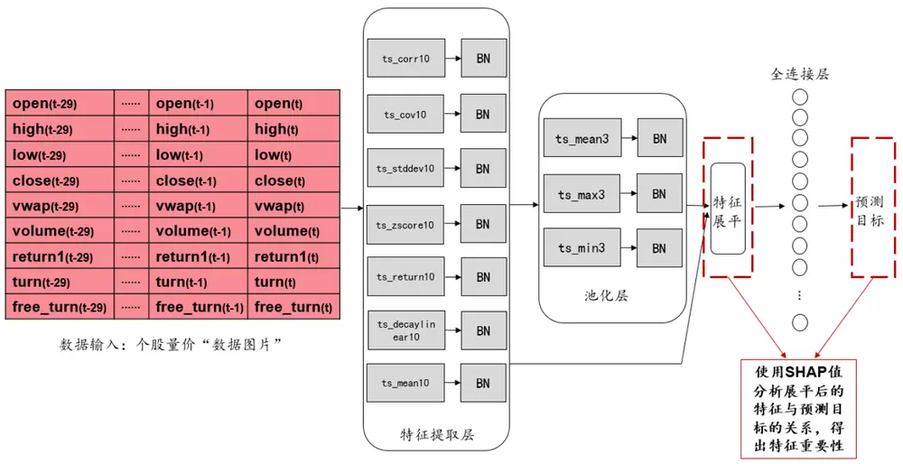
资料来源：华泰证券研究所

## AlphaNet 测试结果

本章将基于股票量价数据，对前一章构建的 AlphaNet-v1 进行测试。我们分别进行调仓周期为 10天和 5天的测试，并做模型可解释性分析。

## 调仓周期为 10 天

单因子 IC 测试

我们将 AlphaNet-v1 在每个截面上的预测结果视为合成的单因子，进行单因子 IC 测试。测试方法如下：

1. 回测区间：2011 年 1 月 31 日到 2020 年 5 月 29 日。

2. 截面期：每隔 10 个交易日，用当前截面期因子值与当前截面期至下个截面期内的个股收益计算 RankIC 值。

3. 为了分析合成因子的增量信息，会展示因子进行行业、市值、10 日收益率、10 日波动率、10 日换手率五因子中性化后的测试结果。

4. 由于神经网络的训练受随机数种子影响较大，测试结果是 10 次测试的均值。

图表16~图表17展示了合成因子的IC测试结果，合成因子在进行了五因子中性后，RankIC均值为 9.54%，IC_IR 为 1.01，增量信息显著。

图表16： AlphaNet-v1 合成因子 IC 值分析 (回测期 20110131～20200529)

|  | RankIC 均值 | RankIC 标准差 | IC_IR | IC>0 占比 |
| --- | --- | --- | --- | --- |
| 合成因子 | 10.33% | 11.56% | 0.89 | 81.20% |
| 合成因子进行行业市值中性 | 10.48% | 11.29% | 0.93 | 81.75% |
| 合成因子进行五因子中性 | 9.54% | 9.44% | 1.01 | 85.09% |

资料来源：Wind，华泰证券研究所

图表17： AlphaNet-v1 合成因子的累计 RankIC (回测期 20110131～20200529)
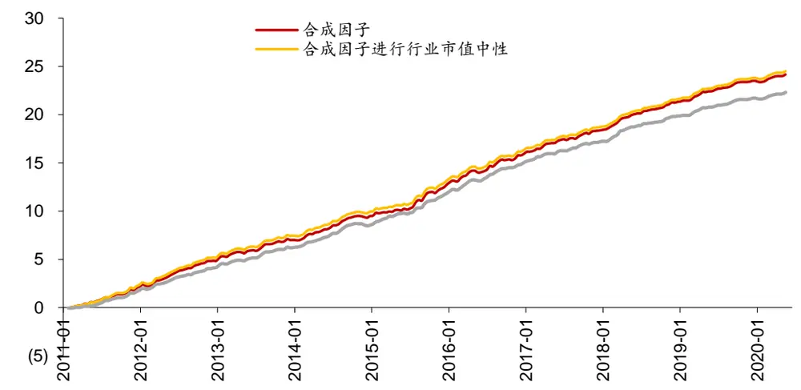
资料来源：Wind，华泰证券研究所

## 单因子分层测试

我们将AlphaNet-v1在每个截面上的预测结果视为合成的单因子，进行单因子分5层测试。测试方法如下：

2. 换仓：在每个截面期得到预测值，构建分层组合，在截面期下一个交易日按当日 vwap换仓，分别对不计交易费用和交易费用为单边千分之二两种情况进行测试。

3. 分层方法：先将因子暴露度向量进行一定预处理，将股票池内所有个股按处理后的因子值从大到小进行排序，等分 N 层，每层内部的个股等权重配置。当个股总数目无法被 N 整除时采用任一种近似方法处理均可，实际上对分层组合的回测结果影响很小。分层测试中的基准组合为股票池内所有股票的等权组合。

4. 多空组合收益计算方法：用 Top 组每天的收益减去 Bottom 组每天的收益，得到每日

多空收益序列 $r_{1},r_{2},\cdots,r_{n}$ ，则多空组合在第 n天的净值等于 $r(1+r_{1})(1+r_{2})\cdots(1+r_{n})$ o5. 为了分析合成因子的增量信息，会展示因子进行行业、市值、10 日收益率、10 日波动率、10 日换手率五因子中性化后的测试结果。

6. 由于神经网络的训练受随机数种子影响较大，测试结果是 10 次测试的均值。

图表 18~图表 21 展示了合成因子的分层测试结果。交易成本为单边千分之二时，合成因子在进行了五因子中性后，TOP 组合年化超额收益率为 12.42% ，信息比率为 3.11，多空组合年化收益率为 44.29%，多空组合夏普比率为 5.84。合成因子增量信息显著。

图表18： AlphaNet-v1 合成因子分层测试结果(不计交易成本，回测期 20110131～20200529)

| 多空组合 |  |  |  |  |  | 多空组合TOP组合信 夏普比率 | 息比率 | TOP 组合 胜率 |
| --- | --- | --- | --- | --- | --- | --- | --- | --- |
|  | 分层组合1～5(从左到右)年化超额收益率 |  |  |  | 年化收益率 |  |  |  |
| 合成因子 | 19.36% | 9.61% | 2.03% | -6.69%-20.57% | 49.59% | 5.66 | 4.83 | 87.95% |
| 合成因子进行行业市值中性 | 19.86% | 9.16% | 1.72% | -6.21%-20.59% | 50.27% | 5.74 | 4.92 | 86.88% |
| 合成因子进行五因子中性 | 18.50% | 8.97% | 1.20% | -7.60%-17.98% | 44.04% | 5.80 | 4.76 | 86.25% |

资料来源：Wind，华泰证券研究所

图表19： AlphaNet-v1 合成因子分层测试结果(交易成本千分之二，回测期 20110131～20200529)

|  |  |  |  |  | 多空组合 年化收益率 | 多空组合TOP 组合信 TOP 组合 |  | 胜率 |
| --- | --- | --- | --- | --- | --- | --- | --- | --- |
|  |  |  | 分层组合1～5(从左到右)年化超额收益率 |  |  | 夏普比率 | 息比率 |  |
| 合成因子 | 13.51% | 2.92% |  | -4.59%-12.53%-24.37% | 49.41% | 5.64 | 3.29 | 79.91% |
| 合成因子进行行业市值中性 | 13.84% | 2.31% | -4.97%-12.22%-24.45% |  | 49.99% | 5.71 | 3.34 | 78.66% |
| 合成因子进行五因子中性 | 12.42% | 2.00% |  | -5.51%-13.58%-22.33% | 44.29% | 5.84 | 3.11 | 77.23% |

资料来源：Wind，华泰证券研究所

图表20： 合成因子进行五因子中性化的分层测试(不计交易成本)
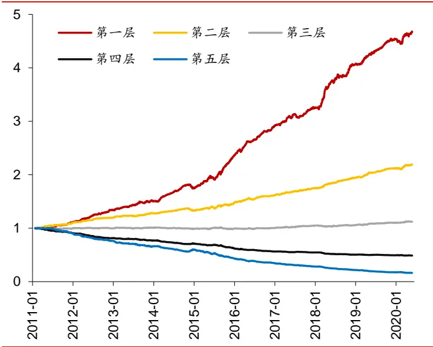
资料来源：Wind，华泰证券研究所

图表21： 合成因子进行五因子中性化的分层测试(交易成本千分之二)
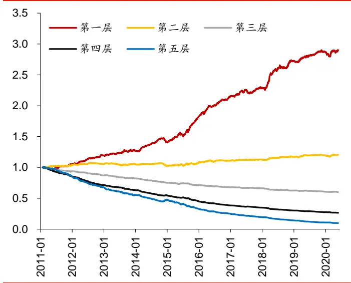
资料来源：Wind，华泰证券研究所

## 构建行业市值中性的中证 500增强策略进行回测

我们将AlphaNet-v1在每个截面上的预测结果视为合成的单因子，构建相对于中证500 的行业、市值中性的全 A 选股策略并进行回测，测试方法如下：

2. 换仓：在每个截面期得到预测值，通过组合优化模型得到新的持仓股票和权重，在截面期下一个交易日按当日 vwap 换仓，交易费用为单边千分之二，每次调仓双边换手率限制在 30%。

3. 由于神经网络的训练受随机数种子影响较大，测试结果是 10 次测试的均值。

图表 22和图表 23 展示了不同个股权重偏离情况下的回测结果。

图表22： 行业市值中性的中证 500增强策略回测绩效(回测期：20110131～20200529)

|  |  |  |  |  | 年化超额收年化跟踪误超额收益最 |  |  |  | Calmar 相对基准 | 调仓双边 月胜率 换手率 |  |
| --- | --- | --- | --- | --- | --- | --- | --- | --- | --- | --- | --- |
|  | 年化收益率年化波动率夏普比率 |  |  | 最大回撤 | 益率 | 差 | 大回撤信息比率 | 比率 |  |  |  |
| 个股权重偏离上限=0.5% | 18.31% | 25.50% | 0.72 | 47.11% | 15.67% | 5.24% | 7.37% | 2.99 | 2.14 | 75.45% | 58.55% |
| 个股权重偏离上限=1% | 19.08% | 25.53% | 0.75 | 47.40% | 16.38% | 6.02% | 8.06% | 2.72 | 2.04 | 73.66% | 58.29% |
| 个股权重偏离上限=1.5% | 19.16% | 25.65% | 0.75 | 47.67% | 16.45% | 6.60% | 8.64% | 2.49 | 1.96 | 71.96% | 58.13% |
| 个股权重偏离上限=2% | 19.35% | 25.75% | 0.75 | 47.87% | 16.63% | 7.06% | 9.27% | 2.36 | 1.84 | 71.16% | 58.05% |
| 中证500 | 1.83% | 26.67% | 0.07 | 65.20% |  |  |  |  |  |  |  |

资料来源：Wind，华泰证券研究所

图表23： 行业市值中性的中证 500增强策略超额收益情况(回测期：20110131～20200529)
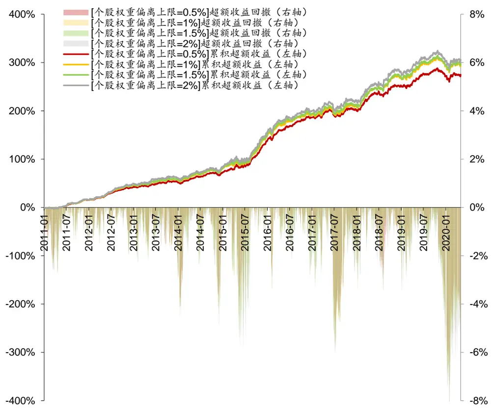
资料来源：Wind，华泰证券研究所

本节利用 SHAP值进行对 AlphaNet-v1 进行可解释性分析。我们选取最新一次训练的模型(2020-01)，在图表 24 和图表 25 中展示模型的|SHAP|均值和 SHAP 值。|SHAP|均值只反映因子的重要性，SHAP值则包含因子的方向信息。由于因子数量众多而篇幅有限，图中仅展示|SHAP|均值排名前 30 的因子。图表 24 中，因子的|SHAP|均值越大，表明因子的重要性越高。图表 25 中，若因子的颜色分布为严格的左蓝中紫右红，那么在模型中因子为正向的线性因子；若因子的颜色分布为严格的左红中紫右蓝，那么在模型中因子为反向的线性因子；若因子的颜色分布非以上两种情况之一，则模型在使用因子时呈现出一定非线性规律。

图表24： AlphaNet-v1 中因子的|SHAP|值(前 20 因子)
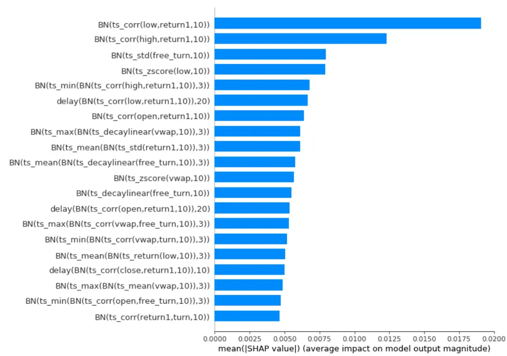
资料来源：Wind，华泰证券研究所

图表25： AlphaNet-v1 中因子的 SHAP 值(前 20 因子)
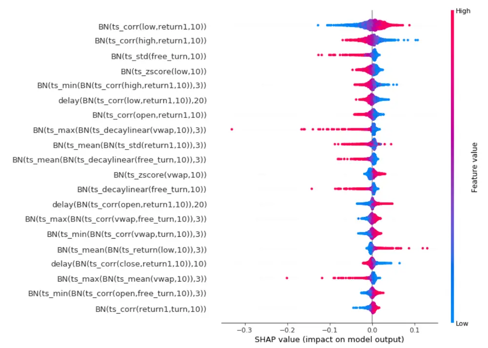
资料来源：Wind，华泰证券研究所

## 调仓周期为 5 天

## 单因子 IC 测试

我们将 AlphaNet-v1 在每个截面上的预测结果视为合成的单因子，进行单因子 IC 测试。测试方法如下：

1. 回测区间：2011 年 1 月 31 日到 2020 年 5 月 29 日。

2. 截面期：每隔 5 个交易日，用当前截面期因子值与当前截面期至下个截面期内的个股收益计算 RankIC 值。

3. 为了分析合成因子的增量信息，会展示因子进行行业、市值、5 日收益率、5 日波动率、5日换手率五因子中性化后的测试结果。

4. 由于神经网络的训练受随机数种子影响较大，测试结果是 10 次测试的均值。

图表 26 和图表 27 展示了合成因子的 IC 测试结果，合成因子在进行了五因子中性后，RankIC 均值为 8.19%，IC_IR 为 0.92，增量信息显著。

图表26： AlphaNet-v1 合成因子 IC 值分析 (回测期 20110131～20200529)

| RankIC 均值 |  | RankIC 标准差 | IC_IR | IC>0 占比 |
| --- | --- | --- | --- | --- |
| 合成因子 | 9.01% | 10.92% | 0.83 | 80.24% |
| 合成因子进行行业市值中性 | 9.03% | 10.59% | 0.85 | 80.58% |
| 合成因子进行五因子中性 | 8.19% | 8.90% | 0.92 | 83.12% |

资料来源：Wind，华泰证券研究所

图表27： AlphaNet-v1 合成因子的累计 RankIC (回测期 20110131～20200529)
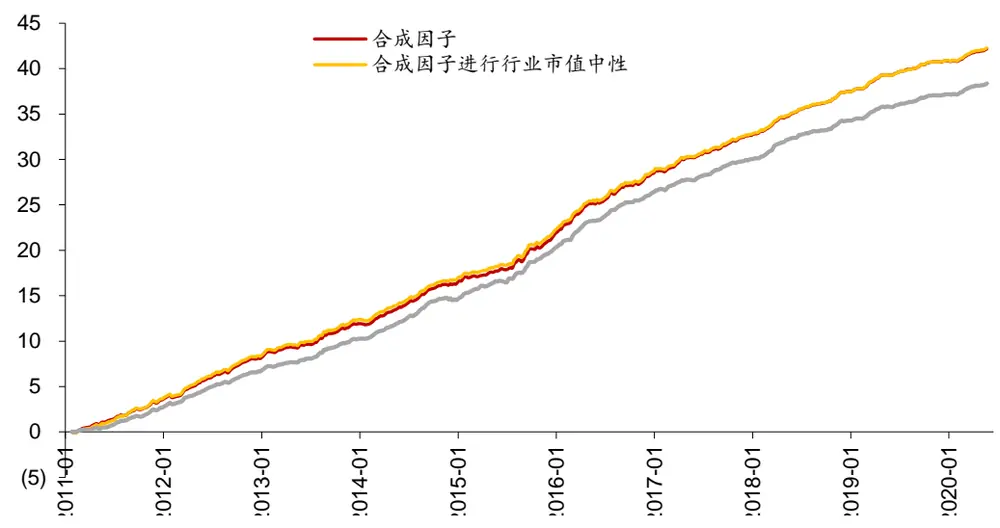
资料来源：Wind，华泰证券研究所

## 单因子分层测试

我们将AlphaNet-v1在每个截面上的预测结果视为合成的单因子，进行单因子分5层测试。测试方法如下：

2. 换仓：在每个截面期得到预测值，构建分层组合，在截面期下一个交易日按当日 vwap换仓，分别对不计交易费用和交易费用为单边千分之二两种情况进行测试。

3. 为了分析合成因子的增量信息，会展示因子进行行业、市值、5 日收益率、5 日波动率、5日换手率五因子中性化后的测试结果。

4. 由于神经网络的训练受随机数种子影响较大，测试结果是 10 次测试的均值。

图表 28~图表 31 展示了合成因子的分层测试结果。交易成本为单边千分之二时，合成因子在进行了五因子中性后，TOP 组合年化超额收益率为 11.36% ，信息比率为 2.70，多空组合年化收益率为 57.01%，多空组合夏普比率为 7.28。合成因子增量信息显著。

图表28： AlphaNet-v1 合成因子分层测试结果(不计交易成本，回测期 20110131～20200529)

|  |  |  |  |  |  | 多空组合 夏普比率 | 多空组合TOP组合信 息比率 | TOP 组合 胜率 |
| --- | --- | --- | --- | --- | --- | --- | --- | --- |
|  |  | 分层组合1～5(从左到右)年化超额收益率 |  |  | 年化收益率 |  |  |  |
| 合成因子 | 24.41% | 13.19% | 3.32% | -8.27%-25.87% | 67.01% | 7.34 | 5.85 | 87.59% |
| 合成因子进行行业市值中性 | 25.12% | 12.44% | 2.95% | -7.52%-25.82% | 67.85% | 7.42 | 5.91 | 86.79% |
| 合成因子进行五因子中性 | 23.03% | 12.23% | 1.91% | -9.87%-21.85% | 56.93% | 7.26 | 5.69 | 87.41% |

资料来源：Wind，华泰证券研究所

图表29： AlphaNet-v1 合成因子分层测试结果(交易成本千分之二，回测期 20110131～20200529)

|  |  |  |  | 多空组合 多空组合TOP 组合信 TOP 组合 |  |  |
| --- | --- | --- | --- | --- | --- | --- |
|  |  | 分层组合1～5(从左到右)年化超额收益率 | 年化收益率 | 夏普比率 | 息比率 | 胜率 |
| 合成因子 | 13.07% | -0.01% -9.52%-19.14%-32.18% | 65.90% | 7.22 | 3.02 | 73.66% |
| 合成因子进行行业市值中性 | 13.41% | -1.17%-10.04%-18.83%-32.25% | 66.56% | 7.28 | 3.04 | 73.21% |
| 合成因子进行五因子中性 | 11.36% | -1.53%-11.07%-20.99%-29.31% | 57.01% | 7.28 | 2.70 | 68.39% |

资料来源：Wind，华泰证券研究所

图表30： 合成因子进行五因子中性化的分层测试(不计交易成本)
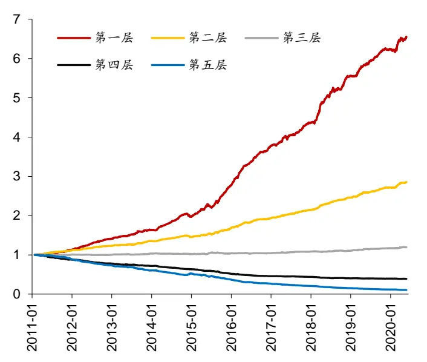
资料来源：Wind，华泰证券研究所

图表31： 合成因子进行五因子中性化的分层测试(交易成本千分之二)
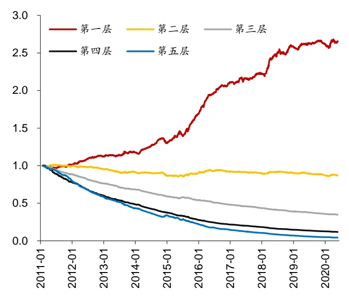
资料来源：Wind，华泰证券研究所

## 构建行业市值中性的中证 500增强策略进行回测

我们将AlphaNet-v1在每个截面上的预测结果视为合成的单因子，构建相对于中证500 的行业、市值中性的全 A 选股策略并进行回测，测试方法如下：

2. 换仓：在每个截面期得到预测值，通过组合优化模型得到新的持仓股票和权重，在截面期下一个交易日按当日 vwap 换仓，交易费用为单边千分之二，每次调仓双边换手率限制在 30%。

3. 由于神经网络的训练受随机数种子影响较大，测试结果是 10 次测试的均值。

图表 32~图表 33 展示了不同个股权重偏离情况下的回测结果。

图表32： 行业市值中性的中证 500增强策略回测绩效(回测期：20110131～20200529)

|  |  |  |  |  | 年化超额收年化跟踪误超额收益最 |  |  |  | Calmar 相对基准 | 调仓双边 月胜率 换手率 |  |
| --- | --- | --- | --- | --- | --- | --- | --- | --- | --- | --- | --- |
|  | 年化收益率年化波动率夏普比率 |  |  | 最大回撤 | 益率 | 差 | 大回撤信息比率 | 比率 |  |  |  |
| 个股权重偏离上限=0.5% | 20.02% | 25.13% | 0.80 | 43.94% | 17.23% | 5.22% | 7.64% | 3.30 | 2.29 | 77.95% | 30.72% |
| 个股权重偏离上限=1% | 20.39% | 25.19% | 0.81 | 44.44% | 17.55% | 6.02% | 8.65% | 2.92 | 2.04 | 76.07% | 30.73% |
| 个股权重偏离上限=1.5% | 19.83% | 25.37% | 0.78 | 44.83% | 17.03% | 6.51% | 8.81% | 2.62 | 1.95 | 73.48% | 30.69% |
| 个股权重偏离上限=2% | 19.22% | 25.50% | 0.75 | 45.68% | 16.44% | 6.92% | 9.48% | 2.38 | 1.75 | 71.70% | 30.63% |
| 中证500 | 1.83% | 26.67% | 0.07 | 65.20% |  |  |  |  |  |  |  |

资料来源：Wind，华泰证券研究所

图表33： 行业市值中性的中证 500增强策略超额收益情况(回测期：20110131～20200529)
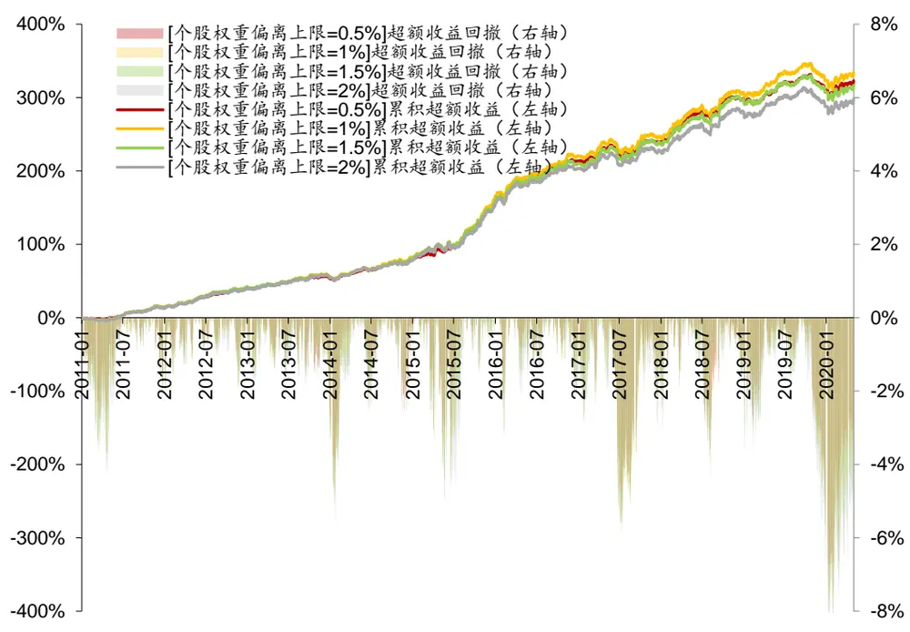
资料来源：Wind，华泰证券研究所

本节利用 SHAP 值进行对 AlphaNet-v1 进行可解释性分析。我们选取最新一次训练的模型(2020-01)，在图表 34 和图表 35 中展示模型的|SHAP|均值和 SHAP 值。

图表34： AlphaNet-v1 中因子的|SHAP|值(前 20 因子)
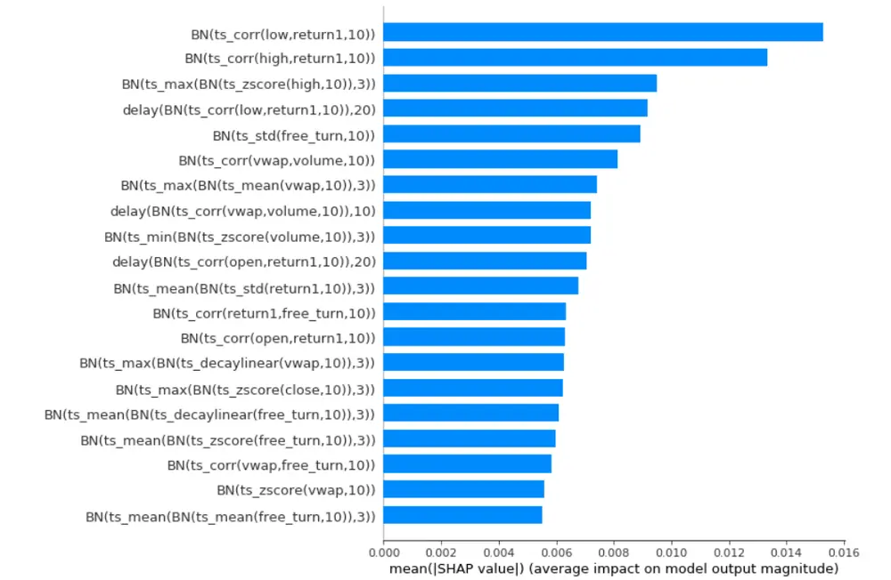
资料来源：Wind，华泰证券研究所

图表35： AlphaNet-v1 中因子的 SHAP 值(前 20 因子)
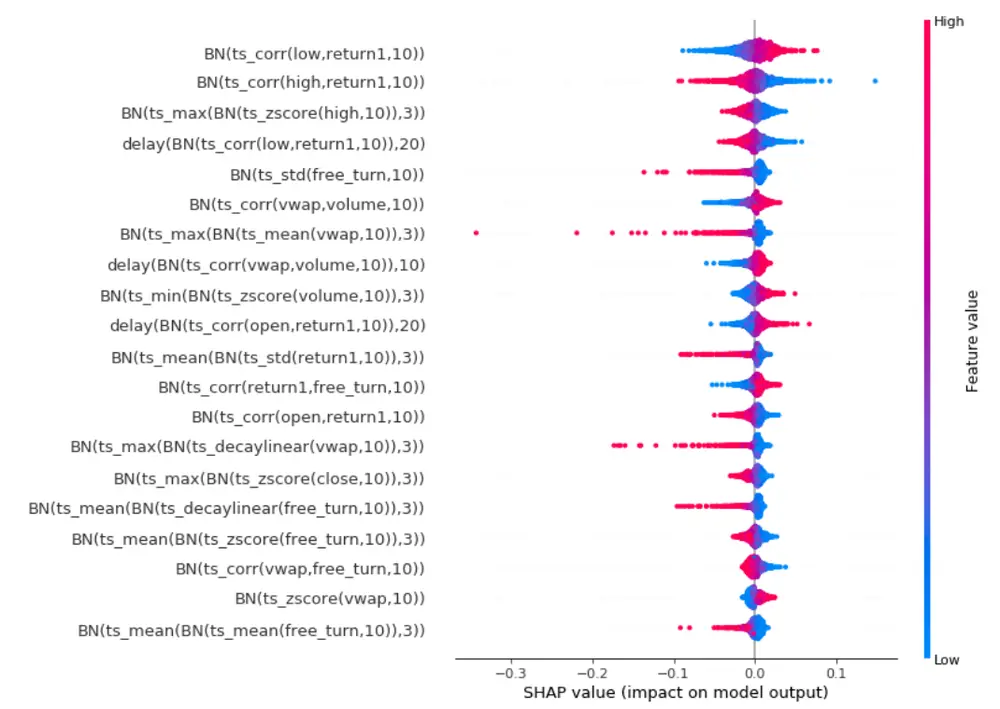
资料来源：Wind，华泰证券研究所

## 总结

本文结论如下：

1. 深度学习的端到端特征学习能力使得借助神经网络挖掘因子成为可能。与传统的机器学习不同，深度学习模型通过端到端的方式，直接从原始数据中提取特征并针对目标做出预测，从而避免了多步骤学习的人工干预和信息损失。深度学习中的代表模型有卷积神经网络 CNN 和循环神经网络 RNN。CNN 通过引入卷积层和池化层，能有效提取图像中的特征，成为计算机视觉领域中的优秀模型。RNN 通过引入序列网络结构，能有效提取序列数据中的特征，成为语音识别、自然语言处理等领域中的优秀模型。要达到优秀的端到端学习效果，需要结合神经网络的灵活性和待解决问题的领域知识，有针对性地设计出网络结构。本文针对量化投资中选股因子的自动挖掘和合成问题，设计了一种全新的网络结构：AlphaNet。

2. 本文介绍了因子挖掘神经网络 AlphaNet 的结构和技术细节。为了有效提取股票原始量价数据中的特征，AlphaNet 借鉴了遗传规划中特征构建的思想，将多种运算符函数作为自定义网络层用于特征提取。AlphaNet 包含四部分：(1)数据输入：仿照 CNN 的方式，将个股原始量价数据整理为二维“数据图片”的形式输入网络。(2)特征提取层：AlphaNet中最关键的组成部分，实现了多种自定义运算网络层提取特征，并利用批标准化层(BatchNormalization)进行特征标准化。(3)池化层：与 CNN中池化层基本一致，对上一层的特征进行“模糊化”操作。(4)全连接层：对接预测目标，作用是对提取的特征进行加权合成。

3. 本文基于量价数据，测试了 AlphaNet 在不同调仓周期下的选股策略表现。基于全部 A股的量价数据，本文介绍了 AlphaNet 的第一个版本：AlphaNet-v1 的构建细节，并展示了 AlphaNet-v1 输出的合成因子在调仓周期为 10 天和 5 天的策略回测表现。合成因子在进行了行业、市值、动量、波动率、换手率五因子中性化后，RankIC 均值为 9.54%(10天调仓)和 8.19%(5 天调仓)。分 5层测试中 TOP组合年化超额收益率为 12.42%(10 天调仓)和 11.36%(5 天调仓)。合成因子的增量信息显著。最后，我们使用 SHAP 值对AlphaNet-v1 进行可解释性分析。

## 风险提示

通过人工智能模型构建的选股策略是历史经验的总结，存在失效的可能。神经网络受随机性影响较大，使用需谨慎。机器学习模型解释方法存在过度简化的风险。

## 免责声明

## 分析师声明

本人，林晓明、陈烨、李子钰，兹证明本报告所表达的观点准确地反映了分析师对标的证券或发行人的个人意见；彼以往、现在或未来并无就其研究报告所提供的具体建议或所表迖的意见直接或间接收取任何报酬。

## 一般声明

本报告由华泰证券股份有限公司（已具备中国证监会批准的证券投资咨询业务资格，以下简称“本公司”）制作。本报告仅供本公司客户使用。本公司不因接收人收到本报告而视其为客户。

本报告基于本公司认为可靠的、已公开的信息编制，但本公司对该等信息的准确性及完整性不作任何保证。本报告所载的意见、评估及预测仅反映报告发布当日的观点和判断。在不同时期，本公司可能会发出与本报告所载意见、评估及预测不一致的研究报告。同时，本报告所指的证券或投资标的的价格、价值及投资收入可能会波动。以往表现并不能指引未来，未来回报并不能得到保证，并存在损失本金的可能。本公司不保证本报告所含信息保持在最新状态。本公司对本报告所含信息可在不发出通知的情形下做出修改，投资者应当自行关注相应的更新或修改。

本公司研究报告以中文撰写，英文报告为翻译版本，如出现中英文版本内容差异或不一致，请以中文报告为主。英文翻译报告可能存在一定时间迟延。

本公司力求报告内容客观、公正，但本报告所载的观点、结论和建议仅供参考，不构成所述证券的买卖出价或征价。该等观点、建议并未考虑到个别投资者的具体投资目的、财务状况以及特定需求，在任何时候均不构成对客户私人投资建议。投资者应当充分考虑自身特定状况，并完整理解和使用本报告内容，不应视本报告为做出投资决策的唯一因素。对依据或者使用本报告所造成的一切后果，本公司及作者均不承担任何法律责任。任何形式的分享证券投资收益或者分担证券投资损失的书面或口头承诺均为无效。

除非另行说明，本报告中所引用的关于业绩的数据代表过往表现，过往的业绩表现不应作为日后回报的预示。本公司不承诺也不保证任何预示的回报会得以实现，分析中所做的预测可能是基于相应的假设，任何假设的变化可能会显著影响所预测的回报。

本公司及作者在自身所知情的范围内，与本报告所指的证券或投资标的不存在法律禁止的利害关系。在法律许可的情况下，本公司及其所属关联机构可能会持有报告中提到的公司所发行的证券头寸并进行交易，也可能为之提供或者争取提供投资银行、财务顾问或者金融产品等相关服务。本公司的销售人员、交易人员或其他专业人士可能会依据不同假设和标准、采用不同的分析方法而口头或书面发表与本报告意见及建议不一致的市场评论和/或交易观点。本公司没有将此意见及建议向报告所有接收者进行更新的义务。本公司的资产管理部门、自营部门以及其他投资业务部门可能独立做出与本报告中的意见或建议不一致的投资决策。投资者应当考虑到本公司及/或其相关人员可能存在影响本报告观点客观性的潜在利益冲突。投资者请勿将本报告视为投资或其他决定的唯一信赖依据。有关该方面的具体披露请参照本报告尾部。

本研究报告并非意图发送、发布给在当地法律或监管规则下不允许向其发送、发布的机构或人员，也并非意图发送、发布给因可得到、使用本报告的行为而使本公司及关联子公司违反或受制于当地法律或监管规则的机构或人员。

本报告版权仅为本公司所有。未经本公司书面许可，任何机构或个人不得以翻版、复制、发表、引用或再次分发他人等任何形式侵犯本公司版权。如征得本公司同意进行引用、刊发的，需在允许的范围内使用，并注明出处为“华泰证券研究所”，且不得对本报告进行任何有悖原意的引用、删节和修改。本公司保留追究相关责任的权利。所有本报告中使用的商标、服务标记及标记均为本公司的商标、服务标记及标记。

## 针对美国司法管辖区的声明

## 美国法律法规要求之一般披露

本研究报告由华泰证券股份有限公司编制，在美国由华泰证券（美国）有限公司（以下简称华泰证券（美国））向符合美国监管规定的机构投资者进行发表与分发。华泰证券（美国）有限公司是美国注册经纪商和美国金融业监管局（FINRA）的注册会员。对于其在美国分发的研究报告，华泰证券（美国）有限公司对其非美国联营公司编写的每一份研究报告内容负责。华泰证券（美国）有限公司联营公司的分析师不具有美国金融监管（FINRA）分析师的注册资格，可能不属于华泰证券（美国）有限公司的关联人员，因此可能不受 FINRA 关于分析师与标的公司沟通、公开露面和所持交易证券的限制。任何直接从华泰证券（美国）有限公司收到此报告并希望就本报告所述任何证券进行交易的人士，应通过华泰证券（美国）有限公司进行交易。

## 所有权及重大利益冲突

分析师林晓明、陈烨、李子钰本人及相关人士并不担任本研究报告所提及的标的证券或发行人的高级人员、董事或顾问。分析师及相关人士与本研究报告所提及的标的证券或发行人并无任何相关财务利益。声明中所提及的“相关人士”包括FINRA 定义下分析师的家庭成员。分析师根据华泰证券的整体收入和盈利能力获得薪酬，包括源自公司投资银行业务的收入。

## 重要披露信息

- 华泰证券股份有限公司和/或其联营公司在本报告所署日期前的 12 个月内未担任标的证券公开发行或 144A 条款发行的经办人或联席经办人。

- 华泰证券股份有限公司和/或其联营公司在研究报告发布之日前 12 个月未曾向标的公司提供投资银行服务并收取报酬。

- 华泰证券股份有限公司和/或其联营公司预计在本报告发布之日后3个月内将不会向标的公司收取或寻求投资银行服务报酬。

- 华泰证券股份有限公司和/或其联营公司并未实益持有标的公司某一类普通股证券的 1%或以上。此头寸基于报告前一个工作日可得的信息，适用法律禁止向我们公布信息的情况除外。在此情况下，总头寸中的适用部分反映截至最近一次发布的可得信息。

- 华泰证券股份有限公司和/或其联营公司在本报告撰写之日并未担任标的公司股票证券做市商。

## 评级说明

## 行业评级体系

－报告发布日后的6个月内的行业涨跌幅相对同期的沪深300指数的涨跌幅为基准；

－投资建议的评级标准

增持行业股票指数超越基准

中性行业股票指数基本与基准持平

减持行业股票指数明显弱于基准

## 公司评级体系

－报告发布日后的 6 个月内的公司涨跌幅相对同期的沪深 300 指数的涨跌幅为基准；
－投资建议的评级标准
买入股价超越基准 20%以上
增持股价超越基准 5%-20%
中性股价相对基准波动在-5%~5%之间
减持股价弱于基准 5%-20%
卖出股价弱于基准 20%以上

## 华泰证券研究

## 南京

南京市建邺区江东中路228号华泰证券广场1号楼/邮政编码：210019

电话：86 25 83389999 /传真：86 25 83387521

电子邮件：ht-rd@htsc.com

## 深圳

深圳市福田区益田路5999号基金大厦10楼/邮政编码：518017电话：86 755 82493932 /传真：86 755 82492062电子邮件：ht-rd@htsc.com

## 北京

北京市西城区太平桥大街丰盛胡同28号太平洋保险大厦A座18层

邮政编码：100032

电话：86 10 63211166/传真：86 10 63211275

电子邮件：ht-rd@htsc.com

## 上海

上海市浦东新区东方路18号保利广场E栋23楼/邮政编码：200120
电话：86 21 28972098 /传真：86 21 28972068
电子邮件：ht-rd@htsc.com

## 法律实体披露

本公司具有中国证监会核准的“证券投资咨询”业务资格，经营许可证编号为：91320000704041011J。

华泰证券全资子公司华泰证券(美国)有限公司为美国金融业监管局(FINRA)成员，具有在美国开展经纪交易商业务的资格，经营业务许可编号为：CRD#.298809。

电话: 212-763-8160电子邮件: huatai@htsc-us.com

传真: 917-725-9702 http://www.htsc-us.com

©版权所有2020年华泰证券股份有限公司