## 金工研究/深度研究

2020年07月02日

林晓明 执业证书编号：S0570516010001

研究员 0755-82080134

陈烨 执业证书编号：S0570518080004

研究员 010-56793942

chenye@htsc.com

李子钰 执业证书编号：S0570519110003

研究员 0755-23987436

liziyu@htsc.com

何康 021-28972039

联系人 hekang@htsc.com

王晨宇 02138476179

联系人 wangchenyu@htsc.com

2《金工: 易方达养老目标 FOF 投资价值分析》2020.06

# 数据模式探索：无监督学习案例

# 华泰人工智能系列三十三

无监督学习对于研究资产的内在模式以及改进现有的模型具有积极意义机器学习模型中，无监督学习是指在无标记数据中学习内在规律的模型训练方式。不同于监督学习，无监督学习难以对金融资产未来表现做出预测，但对于研究资产的内在模式以及改进现有的模型具有积极意义。按照sklearn 的分类，无监督学习可以分为以下三个领域：1.流形学习，2.聚类，3.矩阵分解。对于流形学习和聚类，本文以实例的方式介绍了它们在投资中的应用。对于矩阵分解，本文则从一篇前沿的学术论文出发，探讨了其在因子投资中的应用。

## 流形学习应用：基金收益率降维和可视化，观察基金产品分布情况

流形学习通过非线性降维的手段将复杂的高维数据映射到低维，高维空间中特征相似的样本，在低维空间中会呈现聚集效果，这对于可视化数据内部结构很有帮助。本文首先测试了各种流形学习算法对于 sklearn 手写数字数据集的降维效果，发现 t-SNE 算法表现最好。进一步地，我们使用t-SNE算法进行基金收益率降维和可视化，在 t-SNE所得到的二维平面中，收益率相近的基金出现了聚集现象，可以帮助我们更直观地观察基金市场的产品分布情况。

## 聚类应用：对具有相似概念的股票进行聚类

聚类通过给定样本的特征或相似度来挖掘样本之间的内在联系。本文首先对比了常用的聚类算法和聚类的评价指标，再使用K-Means、层次聚类和谱聚类将股票按照所属产业概念进行聚类。结果显示，K-Means和层次聚类的表现接近，都优于谱聚类，我们展示了层次聚类的详细结果，聚类簇中的概念具有高度相似性，说明层次聚类将具有相似概念的股票聚到了一起。

## 矩阵分解应用：借助 PCA准确估计因子溢价

矩阵分解将矩阵拆解为数个矩阵的乘积从而提取矩阵内部隐含的信息，代表算法有 PCA、NMF 等。本文从一篇前沿的学术论文“Asset Pricing withOmitted Factors”出发，介绍了借助 PCA准确估计因子溢价的案例。对于不可交易的宏观因子，其因子溢价的估计结果会受到遗漏控制变量的影响，论文提出了“三步法”来准确估计因子溢价：1.使用 PCA提取资产收益率矩阵的主成分；2.使用截面回归估计 PCA主成分的因子溢价；3.使用时序回归得到待估计因子的因子溢价。相比传统因子溢价估计方法，“三步法”能更准确地估计因子溢价。

风险提示：无监督学习所得结论是对历史数据规律的总结，未来规律可能发生改变，存在失效的可能。无监督学习在对原始数据的降维过程中，可能会过度简化原始数据中的规律，导致结果失真。

## 无监督学习

机器学习模型可分为监督学习和无监督学习，二者的主要区别在于模型训练过程中是否需要标注数据(标签)。华泰金工人工智能系列的前期报告(系列 2~系列 29，20170622~20200319)介绍了大量和监督学习相关的内容。在实际应用中，也可能会存在以下情况导致我们无法使用监督学习模型：

1. 标签难以获取。

2. 问题关注的是数据本身内部的结构，不需要标签的参与。

此时无监督学习模型就会有用武之地。

如图表 1所示，按照 sklearn 的分类，无监督学习可以分为以下三个领域：

1. 流形学习：通过非线性降维的手段将复杂的高维数据映射到低维，对于可视化数据内部结构很有帮助。本文将介绍使用流形学习对基金收益率降维和可视化的案例。

2. 聚类：通过给定样本的特征或相似度来挖掘样本之间的内在联系。本文将介绍对股票产业概念进行聚类的案例。

3. 矩阵分解：将矩阵拆解为数个矩阵的乘积从而提取矩阵内部隐含的信息，被用于数据降维、推荐算法中。本文将介绍借助 PCA准确估计因子溢价的案例。

图表1： 无监督学习及其应用案例
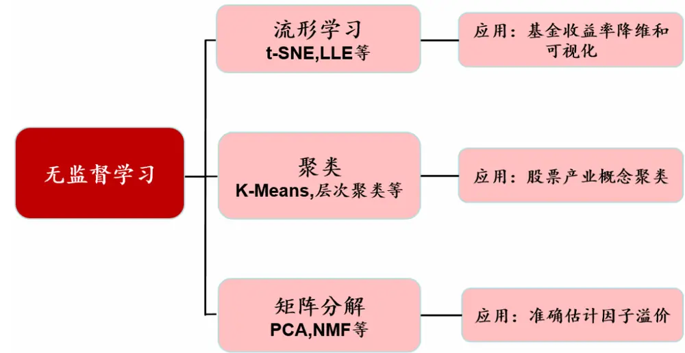
资料来源：华泰证券研究所

## 流形学习

## 流形学习简介

流形学习(manifold learning)是一类借鉴了拓扑流形概念的降维方法。流形学习的思想认为，我们所能够观察到的数据是由一个低维流形映射到高维空间上去的。由于数据内部特征的限制，一些高维空间中的数据存在冗余，实际上只需要用更低的维度就能唯一地表示。一个经典的说明流形学习思想的例子是三维空间中的瑞士卷。

图表2： 三维空间中的瑞士卷
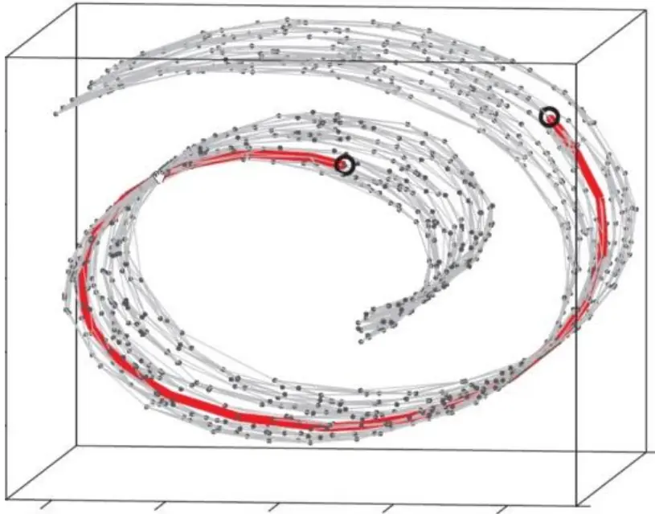
资料来源：华泰证券研究所

如上图所示，瑞士卷曲面上的点能用三维坐标 P(x, y, z)来确定，但实际上瑞士卷可以在二维平面展开，得到一个维度更低的流形空间，这说明使用三维空间刻画瑞士卷存在冗余。高维空间中的冗余可能会造成两个后果：

1. 维度灾难：维度灾难使得要研究的问题变得复杂，也会消耗更多计算资源。

2. 测量误差：以瑞士卷曲面上圈出的两个点为例，在流形空间(把瑞士卷展开)上两个点的距离(红色的线)很远，但是用三维空间的欧氏距离来计算它们的距离则要近得多。可见，如果我们观察到的数据本质是一个二维流形，却使用三维空间来刻画，那么采用欧氏距离可能会有测量误差。流形空间上点之间距离可以用欧氏距离测量，不代表低维流形所展开的高维空间中也可以使用欧氏距离测量，只有在流形空间中使用欧氏距离才有意义。

流形学习被设计来解决以上问题。流形空间中的“流形”是在局部与欧氏空间同胚的空间，换言之，流形在局部具有欧氏空间的性质，能用欧氏距离来进行距离计算。若将低维流形嵌入到高维空间中，数据样本在高维空间的分布虽然看上去非常复杂，但在局部仍具备欧氏空间的性质。如图表2中圈出两点的距离，可以近似等于红线上的点构成的折线的长度，即多段欧氏距离的总和。可以说，流形学习的思想是在局部建立降维映射关系，然后再设法将局部映射关系推广到全局。因此流形学习的主要应用之一是非线性降维，在降维的空间中不仅考虑到了距离，更考虑到了生成数据的拓扑结构。相比于 PCA 这样的线性降维，流形学习往往可以提供更好的降维效果。

流形学习常用来数据降维并可视化。常用的模型如下：

1. LLE(Locally Linear Embedding)：局部线性嵌入模型，目标为保持邻域内样本之间的线性关系。

2. LTSA(Local Tangent Space Alignment)：局部切空间对齐模型，其基本思想是将流形的局部几何先用切坐标表示，那么流形中的每一个点处的切空间可以和欧式空间中的一个开子集建立同构，也就是切映射。

3. Hessian LLE：相比于 LLE，其用其已有邻域点的低维坐标线性表示新增样本点，来得到新增点的低维嵌入，使得算法更加简便。

4. Modified LLE：相比于 LLE，其利用多重权重向量解决 LLE正则化的问题。

5. Isomap(Isometric Mapping)：等距特征映射模型，其引进了邻域图，即样本只与其相邻的样本连接，使得较远的点可通过最小路径算出距离，在此基础上进行降维保距。

6. MDS(Multidimensional Scaling)：多维尺度分析模型，其思路是保持新空间与原空间的相对位置关系，先用原空间的距离矩阵 D，求得新空间的内积矩阵 B，再由内积矩阵 B求得新空间的表示方法 Z。

7. SE(Spectral Clustering)：谱嵌入模型，利用相似矩阵的谱(特征值)来对数据降维。

8. t-SNE(t-distributed Stochastic Neighbor Embedding)：通过仿射(affinitie)变换将数据点映射到概率分布上，降维目标是保持近似的概率分布。

## 流形学习案例一：S型三维数据降维

图表3的案例来自sklearn，案例使用流形学习将左侧的S型的三维数据降维到二维平面。图表 3右侧为 8种流形学习算法的降维效果图。可见，各算法的降维结果中都保持了原始数据的单调颜色变化，但由于各算法的原理不同，所得的二维流形也有一定差异。

图表3： S型三维数据降维图
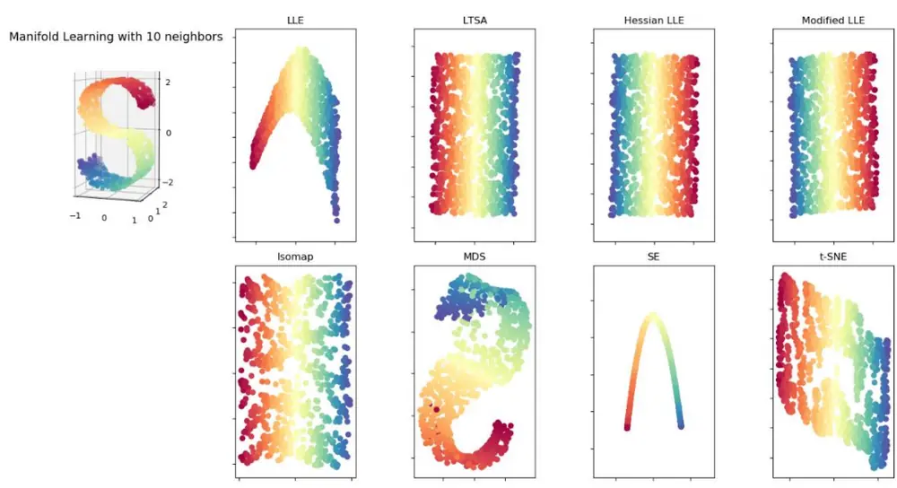
资料来源：sklearn，华泰证券研究所

## 流形学习案例二：手写体数字降维

本案例的数据来源于 sklearn 手写数字数据集，每张数字图片有 8*8 个像素。若将数据集图片按行展开，每张图可转换为 1*64 的手写数字向量。该案例的目的是通过各种流形学习算法将 64 维的手写数字向量降维到二维平面，并观察数字 0~5 的图片在降维后的分布情况。图表 5 和图表 6展示了各算法的降维效果，可知，t-SNE的降维效果较好，各数字对应的样本点自然地聚成了 6 个簇。

图表4： 手写数字数据集
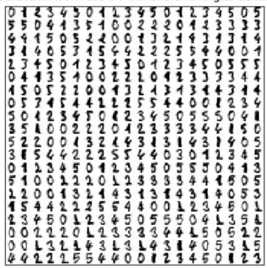
资料来源：sklearn，华泰证券研究所

图表5： 手写数字降维图 1
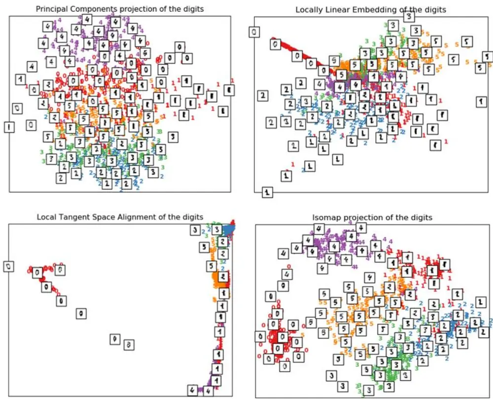
资料来源：sklearn，华泰证券研究所

图表6： 手写数字降维图 2
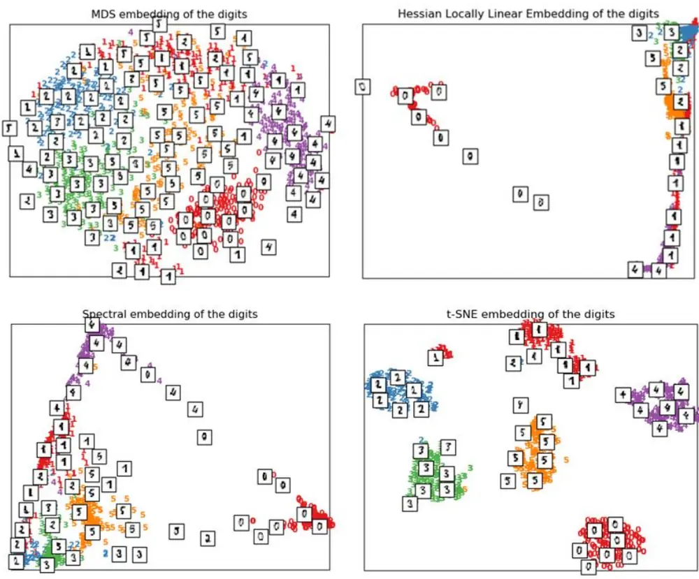
资料来源：sklearn，华泰证券研究所

## 流形学习案例三：使用 t-SNE 进行基金收益率降维和可视化

本节将介绍流形学习在金融数据中的应用：使用 t-SNE进行基金收益率降维和可视化。截至 2020 年 4 月 30 日，我们筛选出规模大于 10 亿元的偏股混合型基金，将其前 500 个交易日的基金净值日频收益率降维到二维平面。如图表 7 所示，图中一个点表示一只基金，点与点的相对距离表示了基金收益的相似程度，两点越近，基金收益率越相似。根据算法特性，横纵坐标绝对值没有特殊含义。为了提供参照和对比，我们将同时期的中证一级行业指数(全指能源、全指材料、全指工业、全指消费、全指可选、全指医药、全指金融、全指信息、全指电信、全指公用)收益率也降维到图表 7中，并用红色背景色显示。

观察图表7可知，在t-SNE算法所得到的二维平面中，收益率相近的基金出现了聚集现象，如上方的医疗主题基金(基金组 1)，它们的收益率与全指医药指数近似；左上方的消费主题基金(基金组 2) ，它们的收益率与全指消费指数近似。通过流形学习的降维和可视化，可以帮助我们更直观地观察基金市场的产品分布情况。

图表7： 偏股混合型基金收益率降维图
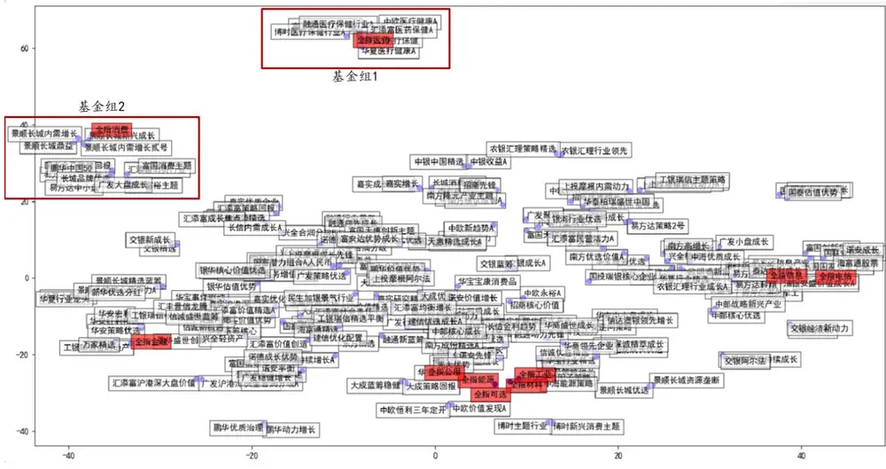
资料来源：Wind，华泰证券研究所

在上图的基金组 1 中选取 5只基金并加入全指医药指数，可得到图表 8 中的净值曲线，基金净值以及指数的走势相似。在上图的基金组 2 中选取 5 只基金并加入全指消费指数，可得到图表 9 中的净值曲线，基金净值以及指数的走势相似。

图表8： 偏股混合型基金组 1 净值
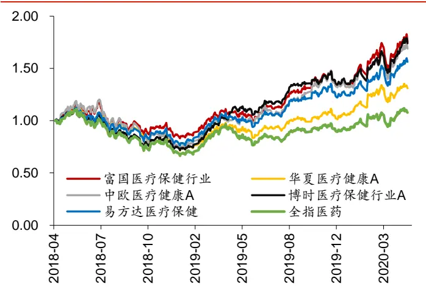
资料来源：Wind，华泰证券研究所

图表9： 偏股混合型基金组 2净值
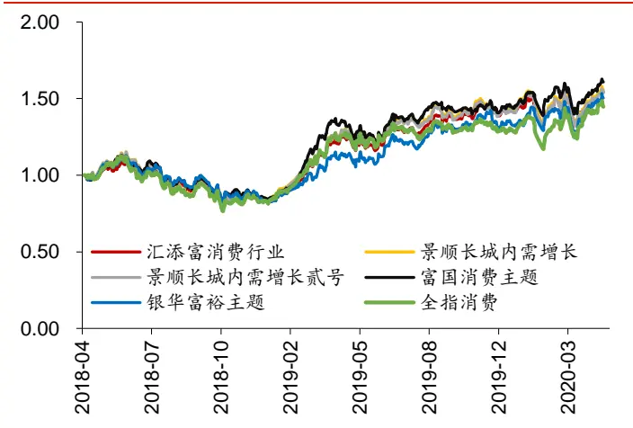
资料来源：Wind，华泰证券研究所

## 聚类

聚类是无监督学习领域中运用最广泛的算法。聚类试图将数据集中的样本划分为若干个不相交的子集，每个子集成为一个“簇”(cluster)。本文首先对比常用的聚类算法和聚类的评价指标，再将股票按照所属产业概念进行聚类。

## 聚类算法简介

常用的聚类算法如下：

1. K-Means：一种迭代求解的聚类分析算法，原理是把每个对象分配给距离它最近的聚类中心，直到达到平衡。

2. AP 聚类(Affinity Propagation)：基于图论的聚类算法，通过迭代过程不断更新每一个点的吸引度和归属度值，直到产生 m 个高质量的 Exemplar(类似于质心)，同时将其余的数据点分配到相应的聚类中。

3. 谱聚类：基于图论的聚类方法，通过对样本数据的拉普拉斯矩阵的特征向量进行聚类，可以理解为将高维空间的数据映射到低维，然后在低维空间用其它聚类算法(如K-Means)进行聚类。

4. 层次聚类：分为凝聚(自底向上)和分裂(自顶向下)两种方法，常用的方法是凝聚法，通过某种相似性测度计算节点之间的相似性，并按相似度由高到低排序，逐步重新连接个节点。

5.DBSCAN：基于密度的聚类算法，其将簇定义为密度相连的点的最大集合，能够把具有足够高密度的区域划分为簇，并可在噪声的空间数据库中发现任意形状的聚类。

图表10： 聚类算法对比

| 模型名称 | 是否需要指定聚类数目 | 模型输入 | 优点 | 缺点 |
| --- | --- | --- | --- | --- |
| K-Means | 是 | 样本的特征取值或 样本间的相似度 | 简单快速、适用于 大量数据 | 初始值敏感、异常值敏 感、容易局部最优、不能 处理非球型簇(如图表 11 的 1-1 与 1-2 所示，图形 连接处被断开)、不支持 |
| AP聚类 | 否 | 样本的特征取值或 样本间的相似度 | 支持大量的簇 | 过多的簇 时间复杂度高、数据量不 可拓展 |
| 谱聚类 | 是 | 样本的特征取值或 样本间的相似度 | 簇形状不敏感(如 图表 11 的 3-1 与 3-2所示，能够识 别出链状簇)、适 用于稀疏数据、处 理高维数据复杂 度低 | 不支持过多的簇、对相似 度定义和参数敏感 |
| 层次聚类 | 是 | 样本的特征取值或 样本间的距离 | 支持大量的簇、 簇形状不敏感(如 图表 11 的 4-1 与 4-2 所示，能够识 别出链状簇)、适 用于大量数据、能 够显示出聚类层 次、全局最优 | 时间复杂度高 |
| DBSCAN | 否 | 样本的特征取值或 样本间的距离 | 适用于大量数据、 簇形状不敏感、对 噪音不敏感(如图 表 11 的 5-3所示， 黑色数据点(噪音) 不被分类) | 空间复杂度高、需自定义 变量多且参数敏感 |

资料来源：sklearn，华泰证券研究所

图表11： 球形簇和非球形簇的聚类结果
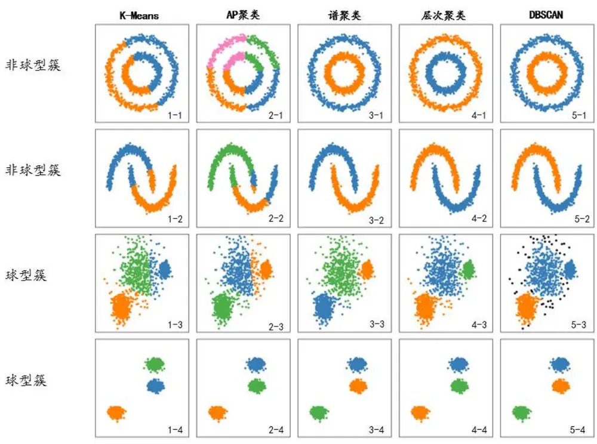
资料来源：sklearn，华泰证券研究所

聚类常用的评价指标有以下三个：

1. Silhouette Coefficient(轮廓系数)：该指标反映了不同簇类之间的分离度，值域为[-1，1]，值越大说明簇与簇之间距离越明显，聚类效果越好。

2. Calinski-Harabasz Index(方差比准则)：该指标是类间离差矩阵的迹与类内离差矩阵的迹的比值，值越大说明簇与簇之间界限越明显，聚类效果越好。

3. Davies-Bouldin Index(分类适确性指标)：该指标度量每个簇类最大相似度的均值。值域大于 0，值越小说明聚类效果越好。

以上评价指标的原理可参见附录。

## 聚类算法案例：基于股票产业概念的聚类

本章中，我们将对股票按照所属产业概念进行聚类，以观察 A股概念的分布情况，股票的概念数据来自于 Wind。从图表 10 可知，聚类算法的模型输入是样本间的相似度或距离，我们使用股票概念的余弦相似度来衡量股票的相似度：

$$
Similarity(A,B)={\frac{|A\cap B|}{\sqrt{|A|*|B|}}}
$$

其中 A 为股票 1 所属概念集合，B为股票 2 所属概念集合。例如股票 1 所属概念集合为：{干细胞;肺炎概念;创新药;生物疫苗;国产化创新;大消费}，股票 2 所属概念集合为：{大消费;国产化创新;流感;肺炎概念;生物疫苗;血液制品;创新药}，则它们的余弦相似度为：

Sim(股票 1, 股票 2)

$$
\begin{aligned}&=\frac{length\{师炎概念;创新药;生物疫啬;国产化创新;大消费\}}{\sqrt{length\{干细胞;师炎概念;创新药;生物疫啬;国产化创新;大消费\}*}}=\frac{5}{\sqrt{6*7}}\\&\sqrt{length\{大消费;国产化创新;流感;师炎概念;生物疫啬;血波制品;创新药\}}\\&\approx0.77\\\end{aligned}
$$

计算两两股票之间的相似度就可得到相似度矩阵：

$$
\begin{bmatrix}Sim_{1,1}&Sim_{1,2}\cdots&Sim_{1,n}\\\vdots&\ddots&\vdots\\Sim_{n,1}&\cdots&Sim_{n,n}\end{bmatrix}
$$

其中， $Sim_{i,j}$ 表示股票 i 与股票 j 之间的相似度， $Sim_{i,i}=0。Sim_{i,j}$ 越大，则股票概念越相似，股票在高维空间中越靠近。由于股票相似度和距离呈现负相关，可取 $(1-Sim_{i,j}$ )作为距离矩阵中的元素，得到距离矩阵：

$$
\begin{bmatrix}1-Sim_{1,1}&1-Sim_{1,2}\cdots&1-Sim_{1,n}\\\vdots&\ddots&\vdots\\1-Sim_{n,1}&\cdots&1-Sim_{n,n}\end{bmatrix}
$$

从图表 10 可知，5 种聚类算法中只有 K-Means，谱聚类和层次聚类能指定聚类数目。因此我们将对这三种聚类算法指定相同的聚类数目(9 类)，以方便使用评价指标对算法进行对比。图表 12 展示了对沪深 300 成分股进行聚类后三种评价指标的结果，图表 13 展示了对中证 500 成分股进行聚类后三种评价指标的结果。

图表12： 沪深 300成分股聚类评价指标

|  | 轮廓系数 | 方差比准则 | 分类适确性指标 |
| --- | --- | --- | --- |
| K-Means | 0.21 | 45.98 | 1.57 |
| 层次聚类 | 0.24 | 44.46 | 1.51 |
| 谱聚类 | 0.17 | 34.83 | 1.50 |

资料来源：Wind，华泰证券研究所

图表13： 中证 500成分股聚类评价指标

|  | 轮廓系数 | 方差比准则 | 分类适确性指标 |
| --- | --- | --- | --- |
| K-Means | 0.17 | 41.95 | 1.99 |
| 层次聚类 | 0.15 | 39.38 | 1.87 |
| 谱聚类 | 0.10 | 24.72 | 2.30 |

资料来源：Wind，华泰证券研究所

从三个评价指标来看，谱聚类表现最差，K-Means 和层次聚类的表现接近。我们详细展示层次聚类的结果。图表 14 和 15 中，纵坐标为簇间距离，层次聚类可以通过分层的方式显示各个类别的联系，越靠近底端的分支簇之间距离越小，簇间的相似度越高。例如，结合图表 14和 16 可知，类别 2和类别 3在概念上较为相似，“大消费”和“国产化创新”都是这两类中出现次数较多的概念。

图表14： 沪深 300成分股层次聚类图
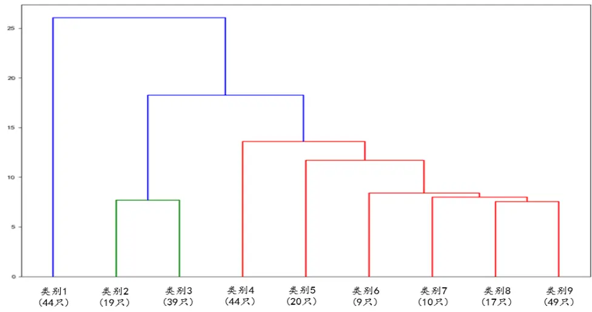
资料来源：Wind，华泰证券研究所

图表15： 中证 500成分股层次聚类图
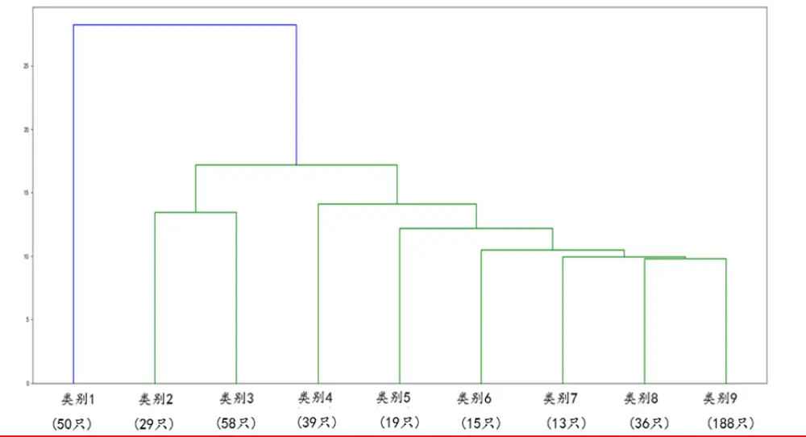
资料来源：Wind，华泰证券研究所

统计各聚类簇中概念出现次数，可得到图表 16 和图表 17 中各聚类簇的概念词云，概念的字体越大，表示簇中含有该概念的股票越多。可以看出，聚类簇中的概念具有高度相似性，说明层次聚类将具有相似概念的股票聚到了一起。

图表16： 沪深 300成分股层次聚类簇概念词云(聚成 9类)

资料来源：Wind，华泰证券研究所

图表17： 中证 500成分股层次聚类簇概念词云(聚成 9类)

资料来源：Wind，华泰证券研究所

图表 18和图表 19 展示了各个聚类中相似度较高的一些股票。

图表18： 沪深 300层次聚类

| 股票名称 | 股票概念 | 所属聚类 | 相似度 |
| --- | --- | --- | --- |
| 智飞生物 | 干细胞;肺炎概念;创新药;生物疫苗;国产化创新;大消费 | 2 | 0.77 |
| 沃森生物 | 大消费;国产化创新;流感;肺炎概念;生物疫苗;血液制品;创新药 |  |  |
| 华东医药 恒瑞医药 | 仿制药;医保概念;抗生素;国产化创新;创新药;医疗改革 大消费;国产化创新;医疗改革;干细胞;抗癌;医保概念;创新药;仿制药 | 2 | 0.72 |
| 深南电路 | 制造业单项冠军企业;珠三角;消费电子产业;科技龙头;华为概 |  |  |
| 生益科技 | 念;深圳;高价股;电路板;手机产业;基站;半导体材料;5G 聚酰亚胺;科技龙头;5G;珠三角;华为概念;电路板;基站;消费电子产 业 | 4 | 0.71 |
| 韦尔股份 | 华为概念;芯片国产化;集成电路;半导体产业;消费电子产业;浦东新 区;科技龙头;5G应用;TWS耳机;半导体分立器件;摄像头;虚拟现实 |  |  |
| 兆易创新 | 高价股;消费电子产业;集成电路;数字中国;存储器;芯片国产化;半导 体产业;华为概念;国产软硬件;科技龙头;手机产业;TWS耳机;出口型 企业 | 4 | 0.56 |
| 中航飞机 航发动力 | 航空发动机;高端装备制造;十大军工集团;航母;通用航空;大飞机 通用航空;十大军工集团;高端装备制造;大飞机;军民融合;航母 | 7 | 0.83 |
| 通威股份 隆基股份 | 新能源;光伏;国产化创新;异质结电池(HIT);CDM项目 新能源;国产软硬件;国产化创新;中非合作概念;异质结电池(HIT);数 | 9 | 0.68 |

资料来源：Wind，华泰证券研究所

图表19： 中证 500 层次聚类

| 股票名称 | 股票概念 | 所属聚类 | 相似度 |
| --- | --- | --- | --- |
| 深天马 A | 5G应用;超高清视频;国产化创新;小米产业链;国产软硬件;科技龙头； 触摸屏;手机屏幕;液晶显示;华为概念;MicroLED;珠三角;虚拟现实； 手机产业;新型显示技术;智能手表;OLED;消费电子产业 | 2 | 0.75 |
| 维信诺 太极股份 | 手机屏幕;新型显示技术;华为概念;智能手表;消费电子产业;出口型 企业;手机产业;5G应用;超高清视频;小米产业链;OLED;液晶显示 华为鲲鹏;金融科技;网络可视化;科技龙头;核高基;智慧城市;国产软 |  |  |
| 中国软件 | 硬件;云计算;自主可控;电子政务;工业互联网;5G应用;操作系统;网 络安全;十大军工集团;华为概念 知识产权;自主可控;核高基;华为概念;华为鲲鹏;科技龙头;电子政务； | 2 | 0.76 |
|  | 消费电子产业;国产软硬件;云计算;十大军工集团;操作系统;5G应用 |  |  |
| 浦东金桥 外高桥 | 迪士尼;上海国资改革;上海市国资;上海自贸区;浦东新区 上海国资改革;上海自贸区;创投;浦东新区;上海市国资;迪士尼 | 3 | 0.91 |
| 航发控制 | 大飞机;十大军工集团;高端装备制造;航母;航空发动机;通用航空;军 |  |  |
| 洪都航空 | 民融合 无人机;大飞机;高端装备制造;通用航空;军民融合;航空发动机;航母； 十大军工集团 | 5 | 0.93 |
| 浙江医药 |  |  |  |
| 哈药股份 | 超级细菌;医保概念;肺炎概念;维生素;抗生素;医疗改革 医保概念;医疗改革;抗生素;肺炎概念;工业大麻;东北振兴 | 5 | 0.67 |

资料来源：Wind，华泰证券研究所

## 无监督学习应用于因子投资——PCA算法准确估计因子溢价

资产定价和因子投资的核心问题是未来收益率的预测，过去有监督学习是主要的建模方法。但随着近年来对无监督学习应用的探索，一些研究发现通过引入无监督学习方法可以提升传统定价模型的表现，意味着无监督学习将可能成为资产定价和因子投资的重要工具。我们将介绍一篇近期论文，探讨无监督学习潜在的应用场景。

## 论文：Asset Pricing with Omitted Factors

本篇论文由耶鲁大学的Stefano Giglio和芝加哥大学的Dacheng Xiu撰写，收录于ChicagoBooth Research Paper No. 16-21。论文主要研究了如何在有遗漏变量的情况下使用 PCA进行更精确的因子溢价估计，特别是针对通胀率、GDP 等宏观因子，这些因子属于不可交易因子(nontradable factors)。对于不可交易因子，经典的因子溢价估计方法包括Fama-MacBeth 回归和因子模拟组合方法(mimicking-portfolio approach)，但这两种方法都会面临以下两个问题：

1. 估计结果会随着控制变量的变化而改变，例如当选取的控制变量为市场因子和 Fama三因子时，会得出不一样的因子溢价。

2. 会出现遗漏控制变量的问题，经典 Fama 三因子是从经济学角度提取的描述市场共性的因子，然而市场的复杂性可能导致一些潜在的定价因子难以通过人脑构造得出，从而遗漏控制变量。

基于以上问题，这篇论文创造性地提出了一种无需观测到全部真实因子便可准确估计因子溢价的方法：Three-Pass Estimator，可以有效解决资产定价模型中遗漏变量和测量误差的问题。

假定资产收益由 p 个因子的线性模型决定：

$$
r_{t}=\beta\gamma+\beta\nu_{t}+u_{t}\tag{1}
$$

其中， $\nu_{t}$ 代表 p 个不可观测的真实因子的新息(innovation)，即原始数据减去均值后的结果，$r_{t}$ 代表 n 个资产的超额收益， $u_{t}$ 是误差项， $\beta_{1}$ 代表因子载荷，γ代表 p 个因子的风险溢价。$\mathrm{E}(\nu_{t})=\mathrm{E}(u_{t})=0$ 并且 $\mathrm{Cov}(\nu_{t},u_{t})=0$ 。进一步，假定待估计的可观测因子 $g_{t}$ 与不可观测的真实因子 $\nu_{t}$ 呈现线性关系：

$$
g_{t}=\delta+\eta\nu_{t}+z_{t}\tag{2}
$$

其中， $z_{t}$ 为观测误差， $\mathrm{E}(z_t)=0且\mathrm{Cov}(v_t,z_t)=0.$

基于(1)(2)可知，可观测因子的风险溢价为 $\gamma_{g}=\eta\gamma$ 。Giglio 与 Xiu 提出三个步骤得到 $\gamma_{g}$ 的估计值：

1. 设n为资产数目，T为截面数，R是大小为 $n^{\star}T$ 的超额收益矩阵，R̅是R去均值后的矩阵。使用 PCA算法从 $.n^{-1}T^{-1}\bar{R}^{-1}\bar{R}$ 矩阵中提取主成分：

$$
\hat{V}=T^{\frac{1}{2}}\big(\xi_{1}\colon\xi_{2}\colon...\colon\xi_{p}\big)^{T}
$$

其中 $(\xi_{1};\xi_{2};\ldots;\xi_{p})$ 为矩阵的前 p个主成分，并得到系数 $\hat{\beta}=T^{-1}\overline{{R}}\hat{V}^{T}$ 。为方便计算将V̂标准化： $\hat{V}\hat{V}^{\prime}=I_{\hat{P}};$

2. 截面回归：用平均收益r̅对潜在因子暴露 $\hat{\beta}$ 进行截面回归，得到平均收益和主成分的回归系数，即主成分因子的因子溢价 $\hat{\gamma}$ ：

$$
\hat{\gamma}=(\hat{\beta}^{T}\hat{\beta})^{-1}\hat{\beta}^{T}\bar{r}
$$

3. 时序回归：设G是大小为d*T的可观测因子矩阵，d 为需要估计因子溢价的可观测因子数目，G̅为G去均值后的矩阵，通过时序回归 $\bar{G}=\hat{\eta}\hat{V}$ 可得到η̂：

$$
\hat{\eta}=\bar{G}\hat{V}^{T}(\hat{V}\hat{V}^{T})^{-1}
$$

最终，可观测因子的因子溢价为：

$$
\hat{\gamma}_{g}=\hat{\eta}\hat{\gamma}=\bar{G}\hat{V}^{T}(\hat{V}\hat{V}^{T})^{-1}(\hat{\beta}^{T}\hat{\beta})^{-1}\hat{\beta}^{T}\bar{r}.
$$

该方法之所以有效，是基于两个重要性质：(1)线性因子模型的旋转不变性；(2)只要真实因子 $\nu_{t}$ 足够显著，PCA总是可以还原对因子空间的某个线性变换。

实证部分中，Giglio 与 Xiu 采用了 647 个资产 1976~2010 年的月频数据，资产类型包括美国股票、各类债券和外汇。包含的资产类型越多，其覆盖到的风险类型越丰富，构建的“风险空间”就越完整。待评估的资产定价因子包括：市场因子(Market)、规模因子(SMB)、价值因子(HML)、盈利因子(RMW)、投资因子(CMA)、动量因子(MOM)、押注β因子(BAB，Frazzini 和 Pedersen (2014))、质量因子(QMJ，Asness et al. (2013))、工业产值增长的AR(1)新息(IP growth)、279 个宏观变量前三个主成分的 VAR(1)新息(Macro PC1-3，Ludvigson 和 Ng (2010))、流动性因子(Liquidity)、2 个中间资本因子(Interm.(He)，He etal. (2017)以及 Interm.(Adrian)，Adrian et al. (2014))、4 个来自 Novy-Marx (2014)的因子(NY temp、Global temp、EI Niño和 Sunsplots)以及 2 个基于消费的因子(Cons. Growth和 Stockholder cons.，Malloy et al. (2009))。论文中因子溢价估计结果如下：

图表20： 因子溢价估计结果
Table 1: Three-Pass Regression: Empirical Results

| Factors | Avg. Ret. stderr 7 |  | two-pass no controls |  | two-pass w/ Rm |  | two-pass w/FF3 |  | Mimick.-portf. w/ Rm |  | Mimick.-portf. w/ FF3 |  | three-pass regression |  |  | p-value |
| --- | --- | --- | --- | --- | --- | --- | --- | --- | --- | --- | --- | --- | --- | --- | --- | --- |
| Market | 0.51** | (0.23) | γ 0.56** | stderr (0.23) | 7 0.56** | stderr (0.23) | 7 0.51** | stderr (0.22) | γ 0.51** (0.22) | stderr | γ 0.51** | stderr (0.22) | 7 0.51** | stderr (0.23) | R2q 99.57 | g weak 0.00 |
| SMB | 0.25 | (0.15) | 0.82** | (0.34) | 0.07 | (0.16) | 0.10 | (0.16) | 0.08** (0.04) |  | 0.25 | (0.16) | 0.20 | (0.16) | 97.24 | 0.00 |
| HML | 0.35** (0.17) |  | –0.85** | (0.38) | 0.30* | (0.18) | 0.35** | (0.17) | –0.13** (0.06) |  | 0.35** | (0.15) | 0.20 | (0.15) | 83.03 | 0.00 |
| MOM | 0.69***(0.24) |  | –2.01** | (0.88) | 0.20 | (0.26) | 0.71*** | (0.24) | –0.05 | (0.05) | –0.21* |  | 0.49** | (0.23) | 89.82 | 0.00 |
| RMW |  |  |  |  |  |  |  |  |  |  |  | (0.11) |  |  |  |  |
| CMA | 0.38***(0.13) 0.32***(0.11) |  | 0.04 –0.59** | (0.16) (0.24) | -0.00 0.34** | (0.17) (0.14) | 0.27** 0.42*** | (0.13) (0.12) | –0.07** (0.03) –0.10** | (0.05) | –0.09 0.12 | (0.06) (0.08) | 0.22* 0.14 | (0.11) (0.10) | 71.48 59.03 | 0.00 0.00 |
| BAB | 0.94***(0.22) |  | –1.59* | (0.85) | 1.10*** | (0.29) | 1.21*** | (0.27) | –0.06 | (0.05) | 0.23** | (0.11) | 0.57*** (0.15) |  | 47.43 | 0.00 |
| QMJ | 0.44***(0.14) |  | –0.50** | (0.21) | 0.01 | (0.16) | 0.25* | (0.14) | –0.15** (0.07) |  |  | –0.29*** (0.09) | 0.06 | (0.13) | 84.29 | 0.00 |
| Liquidity |  |  | 2.26** (0.90) |  | 3.44*** | (1.09) | 0.57 | (0.68) | 0.21* | (0.11) | 0.32** | (0.14) | 0.37** | (0.16) | 12.11 | 0.00 |
| Interm. (He) |  | 1.01** | (0.45) | 0.19 | (0.49) |  |  |  |  |  |  |  |  |  |  | 0.00 |
| Interm. (Adrian) |  | 1.37*** | (0.30) |  | 1.52*** (0.28) |  | 0.43 1.58*** | (0.45) (0.27) | 0.57** (0.25) 0.10* | (0.06) | 0.78** 0.61*** (0.15) | (0.27) | 0.60** 0.72*** (0.16) | (0.31) | 69.05 51.99 | 0.00 |
| NY temp. |  | -319.01 | (255.73) | 125.89 |  |  |  |  |  |  |  |  |  |  |  |  |
| Global temp. |  | –6.65 | (4.85) | –5.29 | (152.76) |  | –277.96** -3.33 | (124.08) (2.07) | –2.35 –0.01 | (5.42) (0.09) | 10.71 0.11 | (10.94) (0.17) | –0.69 0.05 | (13.90) (0.21) | 0.76 2.21 | 0.84 0.09 |
| El Niño |  | 56.85*** | (17.42) | 19.23* | (4.92) (11.08) |  | –15.34** (7.11) |  | 0.39 | (0.33) | 0.94 | (0.59) | 0.41 | (0.82) | 1.58 | 0.43 |
| Sunspots |  | -409.37 | (937.73) | 1637.60***(467.40) |  | 882.89** | (405.40) |  | -19.30 | (19.49) | -4.33 | (30.42) | 4.01 | (35.63) | 0.86 | 0.72 |
| IP growth |  | –0.36** | (0.14) | –0.27** | (0.07) |  | –0.14*** | (0.05) | –0.00 | (0.00) | –0.01 | (0.01) | –0.01* | (0.00) | 2.25 | 0.21 |
| Macro PC 1 |  | 84.90*** | (24.76) | 87.26*** |  |  |  |  |  |  |  |  |  |  |  | 0.29 |
| Macro PC 2 |  | 9.35 | (15.93) |  | (20.95) 9.28 (16.34) |  | 39.96*** 23.91*** | (13.57) (8.97) | 1.22 –0.91 | (0.75) (0.59) | 2.49* –2.05** | (1.43) (1.03) | 3.26** –0.88 | (1.58) (1.27) | 2.34 4.05 | 0.09 |
| Macro PC 3 |  | –5.94 | (14.30) | –6.70 | (12.11) |  | –31.24*** | (9.74) | –0.99 | (0.64) | -0.61 | (1.21) | –1.25 | (1.51) | 6.60 | 0.01 |
| Cons. growth |  | 0.26* | (0.16) | –0.03 |  | (0.11) | 0.07 | (0.05) | –0.00 | (0.00) | –0.00 | (0.01) | 0.00 | (0.01) | 4.07 | 0.07 |
| Stockholder cons. |  | 6.26*** | (2.14) |  | 2.48** | (1.20) | 1.08* | (0.58) | 0.05 | (0.04) | 0.03 | (0.06) | 0.17** | (0.08) | 2.50 | 0.32 |

Note: For each factor, the table reports the risk premia estimates using different methods, with the restriction that the zero-beta rate is equal to the observed T-bill rate: “Avg. Ret.", the time-series average return of the factor, available when the factor is tradable; three versions of the two-pass cross-sectional regression, using no control factors in the model, using the market, and using the Fama-French three factors, respectively; two versions of the mimicking-portfolio estimator, projecting factors onto the market portfolio and the Fama-French three factors (given that we have more portfolios than observations, it is not feasible to use the mimicking-portfolio approach with all test portfolios); the three-pass estimator we propose in this paper, using p = 7 latent factors; the R² of the projection of gt onto the latent factors; and the p-value of the test that factor gt is weak.

资料来源：Asset Pricing with Omitted Factors，Stefano Giglio，Dacheng Xiu，Chicago Booth Research Paper No. 16-21，17 Sep 2019，华泰证券研究所上表展示了三个模型下每个因子的风险溢价。该表各列的含义如下：

1. 第一列展示了可交易因子的时序平均收益来作为对照标准。对于不可交易因子，无法计算其时序平均收益。

2. 第二到第四列展示了Fama-MacBeth回归估计的因子溢价。分别为采用无控制变量、市场因子作为控制变量和 Fama三因子作为控制变量估计的因子溢价。

3.第五列和第六列展示了因子模拟组合法估计的因子溢价。分别为采用市场因子作为控制变量和 Fama三因子作为控制变量估计的因子溢价。

4. 第七列展示了论文提出的三步法(Three-Pass Estimator)得到的因子溢价。这里设定PCA主成分为7，即有7个潜在因子。第8列是将可观测因子映射到潜在因子上的R2。第 9 列为可观测因子是弱因子的检验 p 值。

图表 27 显示，三步法得到了更符合逻辑的结果，其估计的可交易因子的溢价和因子本身的平均收益(第一列)接近。随着控制变量的变化，Fama-MacBeth 回归法和因子模拟组合法所估计的因子溢价会有变化，甚至有些因子溢价的符号与第一列中的结果符号相反，说明这两种方法表现欠佳。结果还显示，许多标准的宏观因子(如 Macro PC2 等)没有显著的风险溢价，而与市场摩擦相关的因子(如流动性因子、Interm.(He)和 Interm.(Adrian))有很显著的风险溢价。

## 总结

本文结论如下：

1. 机器学习模型中，无监督学习是指在无标记数据中学习内在规律的模型训练方式。不同于监督学习，无监督学习难以对金融资产未来表现做出预测，但对于研究资产的内在模式以及改进现有的模型具有积极意义。按照 sklearn 的分类，无监督学习可以分为以下三个领域：(1)流形学习，(2)聚类，(3)矩阵分解。对于流形学习和聚类，本文以实例的方式介绍了它们在投资中的应用。对于矩阵分解，本文则从一篇前沿的学术论文出发，探讨了其在因子投资中的应用。

2. 流形学习通过非线性降维的手段将复杂的高维数据映射到低维，高维空间中特征相似的样本，在低维空间中会呈现聚集效果，这对于可视化数据内部结构很有帮助。本文首先测试了各种流形学习算法对于 sklearn 手写数字数据集的降维效果，发现 t-SNE算法表现最好。进一步地，我们使用 t-SNE算法进行基金收益率降维和可视化，在 t-SNE所得到的二维平面中，收益率相近的基金出现了聚集现象，可以帮助我们更直观地观察基金市场的产品分布情况。

3. 聚类通过给定样本的特征或相似度来挖掘样本之间的内在联系。本文首先对比了常用的聚类算法和聚类的评价指标，再使用 K-Means、层次聚类和谱聚类将股票按照所属产业概念进行聚类。结果显示，K-Means 和层次聚类的表现接近，都优于谱聚类，我们展示了层次聚类的详细结果，聚类簇中的概念具有高度相似性，说明层次聚类将具有相似概念的股票聚到了一起。

4. 矩阵分解将矩阵拆解为数个矩阵的乘积从而提取矩阵内部隐含的信息，代表算法有PCA、NMF 等。本文从一篇前沿的学术论文”Asset Pricing with Omitted Factors”出发，介绍了借助 PCA 准确估计因子溢价的案例。对于不可交易的宏观因子，其因子溢价的估计结果会受到遗漏控制变量的影响，论文提出了“三步法”来准确估计因子溢价：(1)使用PCA 提取资产收益率矩阵的主成分；(2)使用截面回归估计 PCA 主成分的因子溢价；(3)使用时序回归得到待估计因子的因子溢价。相比传统因子溢价估计方法，“三步法”能更准确地估计因子溢价。

## 风险提示

无监督学习所得结论是对历史数据规律的总结，未来规律可能发生改变，存在失效的可能。无监督学习在对原始数据的降维过程中，可能会过度简化原始数据中的规律，导致结果失真。

## 附录：聚类评价指标原理

## 1. Silhouette Coefficient

Silhouette Coefficient 又被成为轮廓系数，用于无法获得真实标签情况下聚类效果的评估。该系数反应了不同簇类之间的分离度，值域为[-1，1]，值越大说明簇与簇之间距离越明显。轮廓系数公式如下:

$$
s={\frac{b-a}{max(a,b)}}
$$

其中，a是样本到同簇其他样本的平均距离，a越小说明样本越应该被聚类到该簇；b是样本到邻近簇所有样本的平均距 $离$ ，b越大说明簇分离效果越好。对于样本集合，其轮廓系数是所有样本轮廓系数平均数。

## 2. Calinski-Harabasz Index

Calinski-Harabasz Index 又被称为方差比准则，其公式为:

$$
s=\frac{tr(B_k)}{tr(W_k)}\cdot\frac{m-k}{k-1}
$$

其中 m 为训练集样本数，k 为类别数。 $B_{k}$ 为类别之间的协方差矩阵， $W_{k}$ 为类别内部数据的协方差矩阵， $tr(*)$ 为矩阵的迹。类别内部数据的协方差越小越好，类别之间的协方差越大越好，Calinski-Harabasz 值越高。

## 3. Davies-Bouldin Index

Davies-Bouldin Index 又称为分类适确性指标，该指标是每个簇类和最邻近簇类相似度的均值。值域大于 0，值越小表示聚类效果越好。其相似度的定义如下：

$$
\stackrel{\cdot}{R}_{ij}=\frac{s_{i}+s_{j}}{d}
$$

其中， $s_{i}$ dij 是簇类i中每个样本点和簇类中心的平均距离， $d_{ij}$ 是簇类i中心和簇类j中心的距离。Davies-Bouldin Index 公式如下：

$$
DB=\frac{1}{k}\sum_{i=1}^{k}\operatorname*{max}_{i\neq j}R_{ij}.
$$

## 免责声明

## 分析师声明

本人，林晓明、陈烨、李子钰，兹证明本报告所表达的观点准确地反映了分析师对标的证券或发行人的个人意见；彼以往、现在或未来并无就其研究报告所提供的具体建议或所表迖的意见直接或间接收取任何报酬。

## 一般声明

本报告由华泰证券股份有限公司（已具备中国证监会批准的证券投资咨询业务资格，以下简称“本公司”）制作。本报告仅供本公司客户使用。本公司不因接收人收到本报告而视其为客户。

本报告基于本公司认为可靠的、已公开的信息编制，但本公司对该等信息的准确性及完整性不作任何保证。本报告所载的意见、评估及预测仅反映报告发布当日的观点和判断。在不同时期，本公司可能会发出与本报告所载意见、评估及预测不一致的研究报告。同时，本报告所指的证券或投资标的的价格、价值及投资收入可能会波动。以往表现并不能指引未来，未来回报并不能得到保证，并存在损失本金的可能。本公司不保证本报告所含信息保持在最新状态。本公司对本报告所含信息可在不发出通知的情形下做出修改，投资者应当自行关注相应的更新或修改。

本公司研究报告以中文撰写，英文报告为翻译版本，如出现中英文版本内容差异或不一致，请以中文报告为主。英文翻译报告可能存在一定时间迟延。

本公司力求报告内容客观、公正，但本报告所载的观点、结论和建议仅供参考，不构成所述证券的买卖出价或征价。该等观点、建议并未考虑到个别投资者的具体投资目的、财务状况以及特定需求，在任何时候均不构成对客户私人投资建议。投资者应当充分考虑自身特定状况，并完整理解和使用本报告内容，不应视本报告为做出投资决策的唯一因素。对依据或者使用本报告所造成的一切后果，本公司及作者均不承担任何法律责任。任何形式的分享证券投资收益或者分担证券投资损失的书面或口头承诺均为无效。

除非另行说明，本报告中所引用的关于业绩的数据代表过往表现，过往的业绩表现不应作为日后回报的预示。本公司不承诺也不保证任何预示的回报会得以实现，分析中所做的预测可能是基于相应的假设，任何假设的变化可能会显著影响所预测的回报。

本公司及作者在自身所知情的范围内，与本报告所指的证券或投资标的不存在法律禁止的利害关系。在法律许可的情况下，本公司及其所属关联机构可能会持有报告中提到的公司所发行的证券头寸并进行交易，也可能为之提供或者争取提供投资银行、财务顾问或者金融产品等相关服务。本公司的销售人员、交易人员或其他专业人士可能会依据不同假设和标准、采用不同的分析方法而口头或书面发表与本报告意见及建议不一致的市场评论和/或交易观点。本公司没有将此意见及建议向报告所有接收者进行更新的义务。本公司的资产管理部门、自营部门以及其他投资业务部门可能独立做出与本报告中的意见或建议不一致的投资决策。投资者应当考虑到本公司及/或其相关人员可能存在影响本报告观点客观性的潜在利益冲突。投资者请勿将本报告视为投资或其他决定的唯一信赖依据。有关该方面的具体披露请参照本报告尾部。

本研究报告并非意图发送、发布给在当地法律或监管规则下不允许向其发送、发布的机构或人员，也并非意图发送、发布给因可得到、使用本报告的行为而使本公司及关联子公司违反或受制于当地法律或监管规则的机构或人员。

本报告版权仅为本公司所有。未经本公司书面许可，任何机构或个人不得以翻版、复制、发表、引用或再次分发他人等任何形式侵犯本公司版权。如征得本公司同意进行引用、刊发的，需在允许的范围内使用，并注明出处为“华泰证券研究所”，且不得对本报告进行任何有悖原意的引用、删节和修改。本公司保留追究相关责任的权利。所有本报告中使用的商标、服务标记及标记均为本公司的商标、服务标记及标记。

## 针对美国司法管辖区的声明

## 美国法律法规要求之一般披露

本研究报告由华泰证券股份有限公司编制，在美国由华泰证券（美国）有限公司（以下简称华泰证券（美国））向符合美国监管规定的机构投资者进行发表与分发。华泰证券（美国）有限公司是美国注册经纪商和美国金融业监管局（FINRA）的注册会员。对于其在美国分发的研究报告，华泰证券（美国）有限公司对其非美国联营公司编写的每一份研究报告内容负责。华泰证券（美国）有限公司联营公司的分析师不具有美国金融监管（FINRA）分析师的注册资格，可能不属于华泰证券（美国）有限公司的关联人员，因此可能不受 FINRA 关于分析师与标的公司沟通、公开露面和所持交易证券的限制。任何直接从华泰证券（美国）有限公司收到此报告并希望就本报告所述任何证券进行交易的人士，应通过华泰证券（美国）有限公司进行交易。

## 所有权及重大利益冲突

分析师林晓明、陈烨、李子钰本人及相关人士并不担任本研究报告所提及的标的证券或发行人的高级人员、董事或顾问。分析师及相关人士与本研究报告所提及的标的证券或发行人并无任何相关财务利益。声明中所提及的“相关人士”包括FINRA 定义下分析师的家庭成员。分析师根据华泰证券的整体收入和盈利能力获得薪酬，包括源自公司投资银行业务的收入。

## 重要披露信息

- 华泰证券股份有限公司和/或其联营公司在本报告所署日期前的 12 个月内未担任标的证券公开发行或 144A 条款发行的经办人或联席经办人。

- 华泰证券股份有限公司和/或其联营公司在研究报告发布之日前 12 个月未曾向标的公司提供投资银行服务并收取报酬。

- 华泰证券股份有限公司和/或其联营公司预计在本报告发布之日后3个月内将不会向标的公司收取或寻求投资银行服务报酬。

- 华泰证券股份有限公司和/或其联营公司并未实益持有标的公司某一类普通股证券的 1%或以上。此头寸基于报告前一个工作日可得的信息，适用法律禁止向我们公布信息的情况除外。在此情况下，总头寸中的适用部分反映截至最近一次发布的可得信息。

- 华泰证券股份有限公司和/或其联营公司在本报告撰写之日并未担任标的公司股票证券做市商。

## 评级说明

## 行业评级体系

－报告发布日后的6个月内的行业涨跌幅相对同期的沪深300指数的涨跌幅为基准；

－投资建议的评级标准

增持行业股票指数超越基准

中性行业股票指数基本与基准持平

减持行业股票指数明显弱于基准

## 公司评级体系

－报告发布日后的 6 个月内的公司涨跌幅相对同期的沪深 300 指数的涨跌幅为基准；
－投资建议的评级标准
买入股价超越基准 20%以上
增持股价超越基准 5%-20%
中性股价相对基准波动在-5%~5%之间
减持股价弱于基准 5%-20%
卖出股价弱于基准 20%以上

## 华泰证券研究

## 南京

南京市建邺区江东中路228号华泰证券广场1号楼/邮政编码：210019

电话：86 25 83389999 /传真：86 25 83387521

电子邮件：ht-rd@htsc.com

## 深圳

深圳市福田区益田路5999号基金大厦10楼/邮政编码：518017电话：86 755 82493932 /传真：86 755 82492062电子邮件：ht-rd@htsc.com

## 北京

北京市西城区太平桥大街丰盛胡同28号太平洋保险大厦A座18层

邮政编码：100032

电话：86 10 63211166/传真：86 10 63211275

电子邮件：ht-rd@htsc.com

## 上海

上海市浦东新区东方路18号保利广场E栋23楼/邮政编码：200120
电话：86 21 28972098 /传真：86 21 28972068
电子邮件：ht-rd@htsc.com

## 法律实体披露

本公司具有中国证监会核准的“证券投资咨询”业务资格，经营许可证编号为：91320000704041011J。

华泰证券全资子公司华泰证券(美国)有限公司为美国金融业监管局(FINRA)成员，具有在美国开展经纪交易商业务的资格，经营业务许可编号为：CRD#.298809。

电话: 212-763-8160电子邮件: huatai@htsc-us.com

传真: 917-725-9702 http://www.htsc-us.com

©版权所有2020年华泰证券股份有限公司