## 金工研究/深度研究

2020年08月24日

林晓明 SAC No. S0570516010001

研究员 SFC No. BPY4210755-82080134linxiaoming@htsc.com

陈烨 SAC No. S0570518080004

研究员SFC No. BPV962010-56793943chenye@htsc.com

李子钰 SAC No. S0570519110003

研究员 0755-23987436

何康 SAC No. S0570118080081

联系人 021-28972039

hekang@htsc.com

# 再探 AlphaNet：结构和特征优化

# 华泰人工智能系列之三十四

## 本文从网络结构和特征优化的角度改进AlphaNet，回测表现更好

华泰金工前期报告《AlphaNet：因子挖掘神经网络》(2020.6.14)提出了AlphaNet-v1模型，能以端到端的方式有效提取股票原始量价数据中的因子。然而AlphaNet-v1在2019年下半年之后表现欠佳，针对该问题，我们分别从神经网络结构和特征的角度进行改进，构建了AlphaNet-v2和AlphaNet-v3两个升级模型，并在多个股票池内测试。结果显示，在全A股和中证 800 成分股中AlphaNet-v2 表现优于 AlphaNet-v1，在中证 500成分股中AlphaNet-v3表现小幅优于AlphaNet-v2。另外，本文总结对比了“遗传规划+随机森林”模型和AlphaNet的优缺点。

## 本文介绍了两个改进模型：AlphaNet-v2 和AlphaNet-v3的改进思路

相比AlphaNet-v1，AlphaNet-v2改进了以下几点：(1)考虑到比率类特征的有效性，扩充了6个比率类特征；(2)将池化层和全连接层替换为LSTM层，从而更好地学习特征的时序信息；(3)训练集和验证集划分从1：1变成4：1，验证集更关注近期样本的表现。相比 AlphaNet-v2，AlphaNet-v3改进了以下几点：(1)扩充特征提取层，特征提取层1和特征提取层2中的运算函数具有不同的回看区间(10 和 5)；(2)将 LSTM 层替换为 GRU，减少模型参数。

## 在全 A 股和中证 800 成分股中，AlphaNet-v2 表现优于 AlphaNet-v1

设定回测期为20110131～20200731，调仓周期为10个交易日。在全A股中，AlphaNet-v2相比AlphaNet-v1 的RankIC 均值从9.72%提升至10.76%，ICIR从1.00提升至1.15。构建相对于中证500的行业、市值中性的全A选股策略，年化超额收益率从17.17%提升至19.09%，信息比率从2.73提升至3.13。在中证800成分股中，AlphaNet-v2相比AlphaNet-v1 的 RankIC 均值从 8.37%提升至 8.63%，ICIR 从 0.73 提升至0.75。构建相对于中证800的行业、市值中性的选股策略，年化超额收益率从 6.19%提升至7.84%，信息比率从 1.65提升至 2.00。

## 在中证 500 成分股中，AlphaNet-v3 表现小幅优于 AlphaNet-v2

设定回测期为20110131～20200731，调仓周期为10个交易日。在中证500 成分股中，AlphaNet-v3 相比 AlphaNet-v2 的 RankIC 均值从 9.05%提升至9.70%，ICIR从 0.89提升至1.00。构建相对于中证 500的行业、市值中性的选股策略，年化超额收益率从9.40%提升至9.75%，信息比率从2.19 提升至 2.30。

## 本文总结对比了AlphaNet和“遗传规划+随机森林”模型的优缺点

AlphaNet和“遗传规划+随机森林”模型都是基于量价数据的人工智能选股模型，本文对比了二者的优缺点。AlphaNet的优点是：端到端学习使得因子挖掘和因子合成使用同一目标函数进行优化，且无需维护因子池，从而无需做大量的单因子测试、因子相关性分析、因子中性化等工作。另外，只需按情况对网络结构做一定调整，就可针对任意的股票池、预测周期、数据频率构建预测模型，省时省力。AlphaNet的缺点是：模型可解释性较低，目前可嵌入神经网络的特征提取层还比较有限，没有覆盖遗传规划中全部因子计算函数。“遗传规划+随机森林”模型的优缺点则正好相反。

风险提示：通过人工智能模型构建的选股策略是历史经验的总结，存在失效的可能。神经网络受随机性影响较大，可解释性较低，使用需谨慎。

## 本文研究导读

在华泰金工2020年6月14日发布的报告《AlphaNet：因子挖掘神经网络》中我们指出：AlphaNet通过自定义特征提取层，能以端到端的方式有效提取股票原始量价数据中的特征，并展示了第一个版本：AlphaNet-v1 的构建细节。然而 AlphaNet-v1在 2019 年下半年之后表现欠佳，针对该问题，我们分别从神经网络结构和特征的角度进行改进，构建了AlphaNet-v2 和AlphaNet-v3 两个升级模型。对于AlphaNet-v2，我们在多个股票池内测试。对于AlphaNet-v3，由于模型复杂训练较慢，我们仅在中证500成分股内测试。

图表1：AlphaNet版本升级
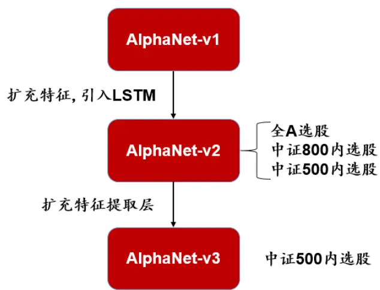
资料来源：华泰证券研究所

## 从 AlphaNet-v1 到 AlphaNet-v2 和 AlphaNet-v3

本章我们首先以图表方式展现三个版本AlphaNet模型的构建细节和差异，再逐一阐述AlphaNet-v2 和AlphaNet-v3 相比 AlphaNet-v1 的改进逻辑。图表 2 和图表 3 展示了AlphaNet-v1 的构建细节。

图表2：AlphaNet-v1 模型构建细节图
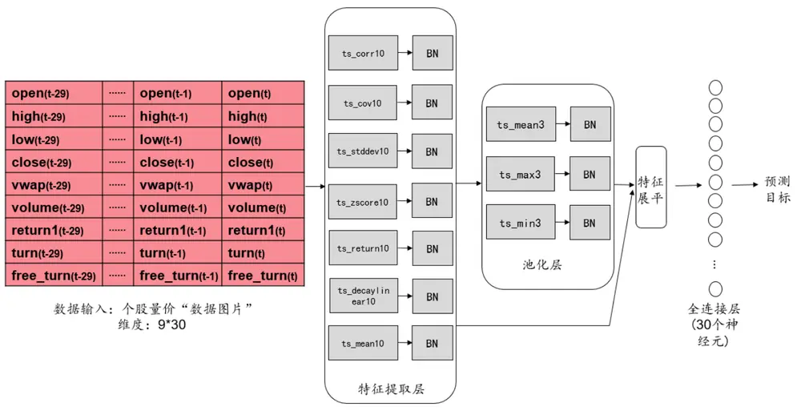
资料来源：华泰证券研究所

图表3：AlphaNet-v1 模型构建细节

| 网络构成 | 包含组件 | 参数和说明 | 可训练的参数数量 |
| --- | --- | --- | --- |
| 特征提取层 | ts_corr(X, Y, 10) | 1. 自定义网络层中，步进 stride=10。 2.每个自定义网络层后都连接BN层。 | 234 |
|  | ts_cov(X, Y, 10) ts_stddev(X, 10) |  |  |
|  | ts_zscore(X, 10) |  |  |
|  | ts_return(X, 10) ts_decaylinear(X, 10) |  |  |
|  | ts_mean(X, 10) |  |  |
| 池化层 | BN ts_mean(X, 3) | 1. 自定义网络层中，步进 stride=3。 | 702 |
|  | ts_max(X, 3) | 2.每个自定义网络层后都连接BN层。 |  |
|  | ts_min(X, 3) | 3.池化层所得特征直接展平后输入到全连 |  |
|  | BN |  |  |
|  |  | 接层。 |  |
| 全连接隐藏层 | 30 个神经元 | 1.激活函数：RELU。 | 21090 |
|  |  | 2.DropOut 比率：0.5。 3.权重初始化方式：truncated_normal。 |  |
| 输出层 | 1 个神经元 | 1.激活函数：linear。 2.权重初始化方式：truncated_normal。 | 31 |
| 模型其他参数 | 1.损失函数：均方误差 MSE。 |  |  |
|  | 2.优化器和学习速率：RMSProp，0.0001。 |  |  |
|  | 3.batch_size: 1000。 |  |  |
|  | 4.提前停止(early_stopping)：10。 5.训练集和验证集划分：按时间先后1：1划分。 |  |  |

资料来源：华泰证券研究所

图表 4 和图表 5 展示了 AlphaNet-v2 的构建细节。相比 AlphaNet-v1，AlphaNet-v2 改进了以下几点：

1. 扩充了6 个比率类特征，“数据图片”维度变为15*30。

2. 将池化层和全连接层替换为LSTM层，从而更好地学习特征的时序信息。

3. 训练集和验证集划分从1：1 变成4：1，验证集更关注近期样本的表现。

图表4：AlphaNet-v2 模型构建细节图

| open(t-29) | ...… | open(t-1) | open(t) |
| --- | --- | --- | --- |
| high(t-29) | .…… | high(t-1) | high(t) |
| low(t-29) | .... | low(t-1) | low(t) |
| close(t-29) | .…… | close(t-1) | close(t) |
| vwap(t-29) | ……… | vwap(t-1) | vwap(t) |
| volume(t-29) | .……. | volume(t-1) | volume(t) |
| return1(t-29) | .……. | return1(t-1) | return1(t) |
| turn(t-29) | ..... | turn(t-1) | turn(t) |
| free_turn(t-29) | ……… | free_turn(t-1) | free_turn(t) |
| close(t-29)/free_turn(t-29) | .….… | close(t-1)/free_turn(t-1) | close(t)/free_turn(t) |
| open(t-29)/turn(t-29) | …… | open(t-1)/turn(t-1) | open(t)/turn(t) |
| volume(t-29)/low(t-29) | ……… | volume(t-1)/low(t-1) | volume(t)/low(t) |
| vwap(t-29)/high(t-29) | ..…. | vwap(t-1)/high(t-1) | vwap(t)/high(t) |
| low(t-29)/high(t-29) | ……… | low(t-1)/high(t-1) | low(t)/high(t) |
| vwap(t-29)/close(t-29) | ……… | vwap(t-1)/close(t-1) | vwap(t)/close(t) |

数据输入：个股量价“数据图片”维度：15*30
资料来源：华泰证券研究所

图表5：AlphaNet-v2 模型构建细节

| 网络构成 | 包含组件 | 参数和说明 | 可训练的参数数量 540 |
| --- | --- | --- | --- |
| 特征提取层 | ts_corr(X, Y, 10) ts_cov(X, Y, 10) | 1. 自定义网络层中，步进 stride=10。 2.每个自定义网络层后都连接BN层。 |  |
|  | ts_stddev(X, 10) |  |  |
|  | ts_zscore(X, 10) ts_return(X, 10) |  |  |
| BN 循环神经网络层 LSTM BN | ts_decaylinear(X, 10) |  |  |
|  |  | 1. LSTM 中，time_step=3，输出神经元数 |  |
|  | 为 30。 2. LSTM 层后连接 BN 层。 1 个神经元 1.激活函数：linear。 | 36180 31 |  |
| 输出层 模型其他参数 | 2.权重初始化方式：truncated_normal。 |  |  |
|  | 1.损失函数：均方误差 MSE。 |  |  |
|  | 2.优化器和学习速率：Adam，0.0001。 3.batch_size:2000(全 A 选股模型)，800(中证 800 内选股模型)，500(中证 500 内选股模型)。 |  |  |
|  | 4.提前停止(early_stopping)：10。 |  |  |
|  | 5.训练集和验证集划分：按时间先后4：1划分。 |  |  |

资料来源：华泰证券研究所

图表 6 和图表 7 展示了 AlphaNet-v3 的构建细节。相比 AlphaNet-v2 改进了以下几点：

1. 扩充特征提取层，特征提取层1和特征提取层2中的运算函数具有不同的回看区间(10和5)。

2. 将 LSTM 层替换为 GRU，减少模型参数。

图表6:AlphaNet-v3 模型构建细节图

| open(t-29) | ..… | open(t-1) | open(t) |
| --- | --- | --- | --- |
| high(t-29) | .……. | high(t-1) | high(t) |
| low(t-29) | … | low(t-1) | low(t) |
| close(t-29) | …… | close(t-1) | close(t) |
| vwap(t-29) | .... | vwap(t-1) | vwap(t) |
| volume(t-29) | ..…. | volume(t-1) | volume(t) |
| return1(t-29) | .... | return1(t-1) | return1(t) |
| turn(t-29) | ... | turn(t-1) | turn(t)free_turn(t) |
| free_turn(t-29) | …… | free_turn(t-1) |  |
| close(t-29)/free_turn(t-29) | ..…. | close(t-1)/free_turn(t-1) | close(t)/free_turn(t) |
| open(t-29)/turn(t-29) | ..…. | open(t-1)/turn(t-1) | open(t)/turn(t) |
| volume(t-29)/low(t-29) | …… | volume(t-1)/low(t-1) | volume(t)/low(t) |
| vwap(t-29)/high(t-29) | .. | vwap(t-1)/high(t-1) | vwap(t)/high(t) |
| low(t-29)/high(t-29) | ..……. | low(t-1)/high(t-1) | low(t)/high(t) |
| vwap(t-29)/close(t-29) | ..……. | vwap(t-1)/close(t-1) | vwap(t)/close(t) |

资料来源：华泰证券研究所

图表7：AlphaNet-v3 模型构建细节

| 网络构成 | 包含组件 | 参数和说明 | 可训练的参数数量 |
| --- | --- | --- | --- |
| 特征提取层1 | ts_corr(X, Y, 10) ts_cov(X, Y, 10) | 1. 自定义网络层中，步进 stride=10。 2.每个自定义网络层后都连接BN层。 | 540 |
|  | ts_stddev(X, 10) ts_zscore(X, 10) |  |  |
|  | ts_return(X, 10) ts_decaylinear(X, 10) BN |  |  |
|  | 特征提取层2 ts_corr(X, Y, 5) ts_cov(X, Y, 5) ts_stddev(X, 5) ts_zscore(X, 5) ts_return(X, 5) ts_decaylinear(X, 5) | 1. 自定义网络层中，步进 stride=5。 2.每个自定义网络层后都连接BN层。 | 540 |
| 循环神经网络层1GRU | BN | 1. GRU 中，time_step=3，输出神经元数为 30。 2. GRU 层后连接 BN 层。 | 27150 |
| 循环神经网络层2GRU | BN | 1. GRU 中，time_step=6，输出神经元数为 30。 2. GRU 层后连接 BN 层。 | 27150 |
| 输出层 | 1 个神经元 1.损失函数：均方误差MSE。 | 1.激活函数：linear。 2.权重初始化方式：truncated_normal。 | 61 |
| 模型其他参数 | 2.优化器和学习速率：Adam，0.0001。 3.500(中证 500 内选股模型)。 |  |  |

资料来源：华泰证券研究所

## 改进说明1：扩充比率类特征

比率类特征具有丰富的信息。在遗传规划所挖掘出的因子中，我们观察到包含比率类特征的因子回测表现较好，图表8和图表9分别展示了包含比率类特征的因子1和因子2的分层回测表现。

因子1：ts_corr(div(open,free_turn),close,10)。

因子2：ts_corr(div(volume,low),close,10)。

图表8：因子1分层回测表现
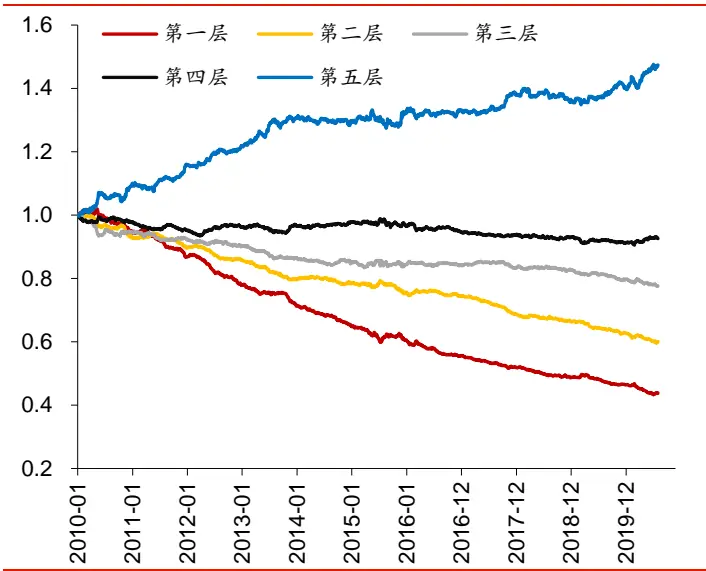
资料来源：Wind，华泰证券研究所

图表9：因子2分层回测表现
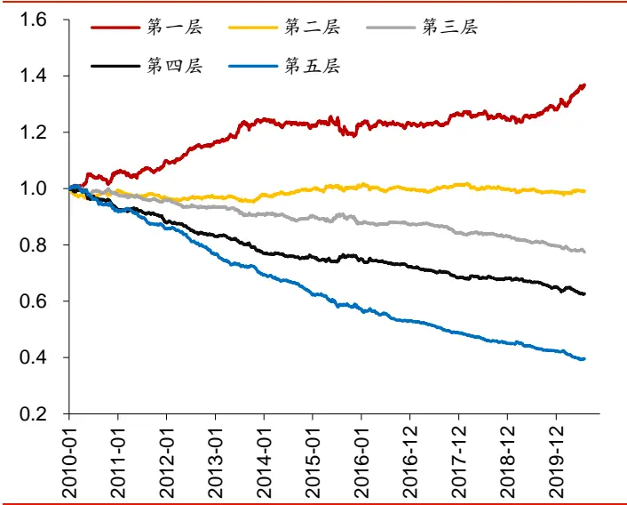
资料来源：Wind，华泰证券研究所

我们在 AlphaNet-v2 和 AlphaNet-v3 中加入了以下6 个比率类特征：

图表10：6个比率类特征

| 名称 | 定义 |
| --- | --- |
| close/free_turn | 个股日频收盘价/个股日频自由流通股换手率 |
| open/turn | 个股日频开盘价/个股日频换手率 |
| volume/low | 个股日频成交量/个股日频最低价 |
| vwap/high | 个股日频成交量加权平均价/个股日频最高价 |
| low/high | 个股日频最低价/个股日频最高价 |
| vwap/close | 个股日频成交量加权平均价/个股日频收盘价 |

资料来源：Wind，华泰证券研究所

## 改进说明2：将池化层和全连接层替换为LSTM/GRU层

如图表11所示，由于特征提取层得到的特征依然具有时序信息，因此相比池化层，LSTM/GRU更合适作为后续的网络结构。

图表11：提取的特征依然具有时序信息，LSTM/GRU更合适
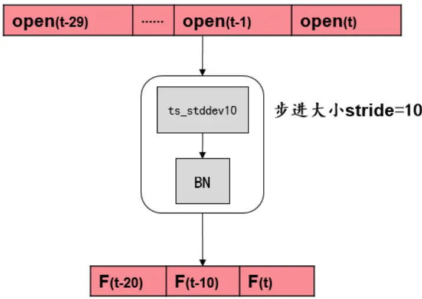
提取的特征依然具有时序信息，相比池化层，LSTM/GRU更合适
资料来源：华泰证券研究所

图表 12 和图表 13 分别是 LSTM 和 GRU 的隐藏状态结构，相比 LSTM，GRU 少了一个门控结构，待优化的参数量减少了四分之一，但性能基本一致，因此在更为复杂的AlphaNet-v3 中，我们使用 GRU 来代替 LSTM。

图表12：LSTM 隐藏状态结构
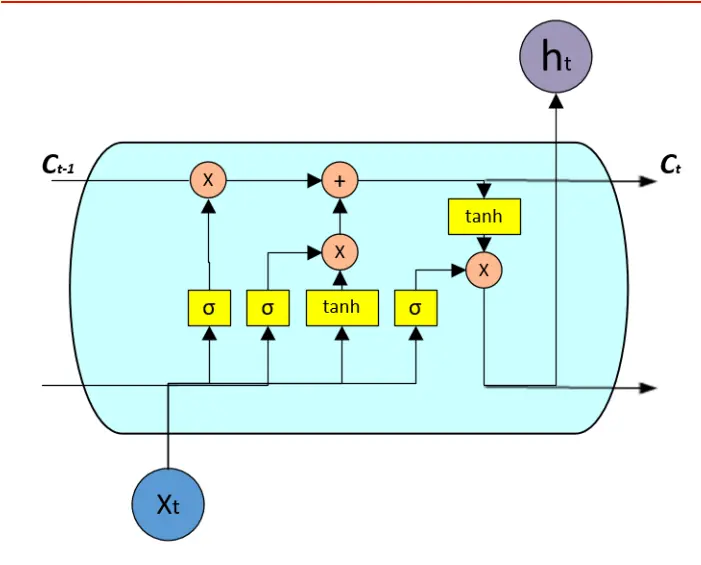
资料来源：华泰证券研究所

图表13：GRU 隐藏状态结构
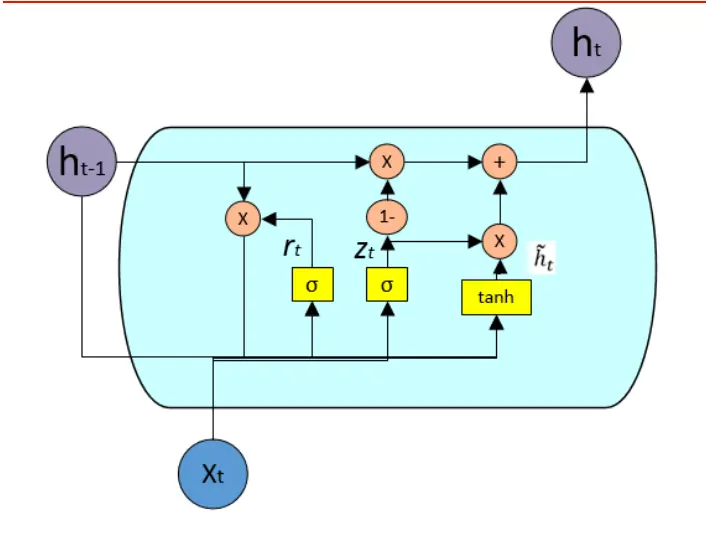
资料来源：华泰证券研究所

## “遗传规划+随机森林”模型和AlphaNet的对比

到目前为止，华泰金工人工智能系列报告介绍了两套方法来通过个股量价数据构建多因子选股策略，分别是：

1.“遗传规划+随机森林”模型：先使用遗传规划挖掘因子，再用随机森林做因子合成，详见《基于量价的人工智能选股体系概览》(2020.2.18)。

2.AlphaNet模型：使用神经网络实现端到端的因子挖掘和因子合成。

“遗传规划+随机森林”模型是传统机器学习时代方法的体现，即首先进行特征工程，再做模型训练。而AlphaNet则是深度学习时代方法的体现，即实现原始数据到目标问题的端到端学习。对于多因子选股来说，二者各有优劣，我们在图表14中做了对比。

图表14：“遗传规划+随机森林”模型和AlphaNet 的对比

|  | 优点 | 缺点 |
| --- | --- | --- |
| 遗传规划+随机森林 (传统机器学习) | 1.因子挖掘和因子合成分为两个步骤，流程上的 可控性更高。 2.挖掘出的因子具有明确的表达式，模型的可解 释性更强。 | 1.流程上更复杂，人工干预更多。 2.由于不是端到端学习，股票池、 预测周期、数据频率变化后，需要 重新挖掘因子并训练模型，费时费 力。 |
| AlphaNet (深度学习) | 1.实现了端到端学习，因子挖掘和因子合成使用 同一目标函数进行优化。 2.从原始数据得到最终alpha 因子的流程大大简 化，无需维护因子池，从而不需要做大量的单因 子测试、因子相关性分析、因子中性化等工作。 3.只需按情况对网络结构做一定调整，就可以针 对任意的股票池、预测周期、数据频率构建预测 | 1.模型可解释性较低。 2.目前可嵌入神经网络的特征提取 层还比较有限，没有覆盖遗传规划 中全部因子计算函数。 |

资料来源：华泰证券研究所

## AlphaNet 模型测试流程

## 数据准备

1.股票池：全A股，中证500成分股，中证800成分股。剔除ST、PT股票，剔除每个截面期下一交易日涨跌停和停牌的股票。

2.原始特征：个股日频量价信息，如图表15所示。对于每只股票，将其量价数据拼接成15*30的“数据图片”，30为历史时间天数。

3. 预测目标：个股10天后标准化的收益率。

4.回测区间：2011年1月31日至2020年7月31日。

5. 样本内数据大小：每次训练都使用过去1500个交易日的数据作为样本内数据，每隔两天采样一次。

6.训练集和验证集比例：按照时间先后进行4：1划分，训练集在前，验证集在后。

图表15：原始特征列表

| 名称 | 定义 |
| --- | --- |
| return1 | 个股日频收益率(由相邻两个交易日的后复权收盘价计算得来) |
| open, close, high, low, volume | 个股日频开盘价、收盘价、最高价、最低价、成交量 |
| vwap | 个股日频成交量加权平均价 |
| turn, free_turn | 个股日频换手率、自由流通股换手率 |
| close/free_turn | 个股日频收盘价/个股日频自由流通股换手率 |
| open/turn | 个股日频开盘价/个股日频换手率 |
| volume/low | 个股日频成交量/个股日频最低价 |
| vwap/high | 个股日频成交量加权平均价/个股日频最高价 |
| low/high | 个股日频最低价/个股日频最高价 |
| vwap/close | 个股日频成交量加权平均价/个股日频收盘价 |

资料来源：Wind，华泰证券研究所

## AlphaNet 训练和预测方式

1. 模型训练：从2011年1月31日开始，每隔半年进行滚动训练。样本内数据为过去1500个交易日的数据，训练集和验证集按照4：1划分。

2.模型预测：在每个样本外数据截面上，使用最新训练的模型预测个股未来10天的收益率。

考虑到神经网络的训练受随机数种子影响较大，我们会训练10个模型，并将10个模型的预测结果做等权平均，取该平均值为AlphaNet的合成因子。

## 组合构建和回测

对于 AlphaNet-v2 合成的因子，在全 A 股和中证 800 成分股内测试，并与 AlphaNet-v1进行对比。

1. 单因子IC测试和分层测试。分析因子的 RankIC 均值、ICIR、分层组合年化收益率等指标。

2. 对于全 A 选股模型，构建行业市值中性的中证500增强策略进行回测。分析策略的年化超额收益率、信息比率、超额收益最大回撤等指标。

3. 对于中证800内选股模型，构建行业市值中性的中证800增强策略进行回测。分析策略的年化超额收益率、信息比率、超额收益最大回撤等指标。

对于 AlphaNet-v3 合成的因子，在中证 500成分股内测试，并与 AlphaNet-v2 进行对比。

1.单因子IC测试和分层测试。分析因子的 RankIC均值、ICIR、分层组合年化收益率等指标。

2.对于中证500内选股模型，构建行业市值中性的中证500增强策略进行回测。分析策略的年化超额收益率、信息比率、超额收益最大回撤等指标。

## AlphaNet-v2 测试结果

本章将对 AlphaNet-v2进行以下两组测试：

1. 全 A 选股测试，并与 AlphaNet-v1 对比。

2. 中证 800 成分股内测试，并与 AlphaNet-v1 对比。

单因子IC测试的方法如下：

1. 样本空间：全 A 股，中证800成分股。剔除ST、PT股票，剔除每个截面期下一交易日涨跌停和停牌的股票。

2.回测区间：2011年1月31日到2020年7月31日。

3.截面期：每隔10个交易日，用当前截面期因子值与当前截面期至下个截面期内的个股收益计算 RankIC值。

4.为了分析合成因子的增量信息，会展示因子进行行业、市值、10日收益率、10日波动率、10日换手率五因子中性化后的测试结果。

## 单因子分层测试的方法如下：

1.股票池、回测区间、截面期均与IC测试一致。

2. 换仓：在每个截面期得到预测值，构建分层组合，在截面期下一个交易日按当日vwap换仓，交易费用为单边千分之二。

3.分层方法：先将因子暴露度向量进行一定预处理，将股票池内所有个股按处理后的因子值从大到小进行排序，等分N层，每层内部的个股等权重配置。当个股总数目无法被N整除时采用任一种近似方法处理均可，实际上对分层组合的回测结果影响很小。分层测试中的基准组合为股票池内所有股票的等权组合。

4. 多空组合收益计算方法：用 Top 组每天的收益减去 Bottom 组每天的收益，得到每日多空收益序列 $\mathbf{r}_{1},\mathbf{r}_{2},\cdots,\mathbf{r}_{\mathrm{n}}$ ，则多空组合在第n天的净值等于 $(1+\mathrm{r}_{1})(1+\mathrm{r}_{2})\cdots(1+\mathrm{r}_{\mathrm{n}})$

5.为了分析合成因子的增量信息，会展示因子进行行业、市值、10日收益率、10日波动率、10日换手率五因子中性化后的测试结果。

构建行业市值中性的指数增强策略回测的方法如下：

1.股票池、回测区间、截面期均与IC测试一致。

2.换仓：在每个截面期得到预测值，通过组合优化模型得到新的持仓股票和权重，在截面期下一个交易日按当日vwap换仓，交易费用为单边千分之二，每次调仓双边换手率限制在 60%。

## 全 A选股测试

我们将 AlphaNet-v1 和 AlphaNet-v2 在每个截面上的预测结果视为合成的单因子，进行单因子 IC 测试。图表 16 和图表 17 展示了合成因子的 IC 测试结果，AlphaNet-v2 在各项测试指标上都优于 AlphaNet-v1。

图表16：AlphaNet-v1 和 AlphaNet-v2 合成因子 IC 值分析(回测期 20110131～20200731)

|  | RankIC 均值 | RankIC 标准差 | IC_IR | IC>0 占比 |
| --- | --- | --- | --- | --- |
| AlphaNet-v1 | 9.72% | 9.69% | 1.00 | 85.71% |
| AlphaNet-v2 | 10.76% | 9.39% | 1.15 | 90.34% |

资料来源：Wind，华泰证券研究所

图表17：AlphaNet-v1 和 AlphaNet-v2 合成因子的累计 RankIC (回测期 20110131～20200731)
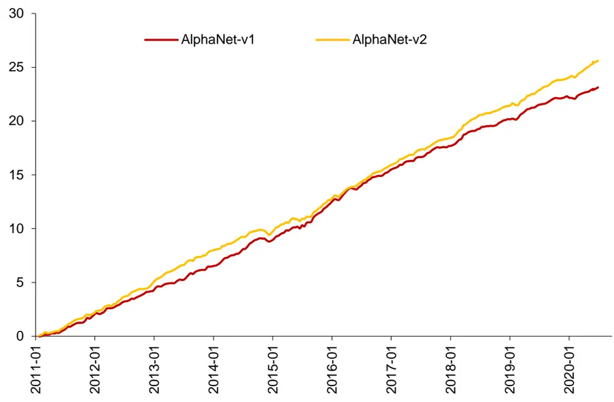
资料来源：Wind，华泰证券研究所

我们将 AlphaNet-v1 和 AlphaNet-v2 在每个截面上的预测结果视为合成的单因子，进行单因子分5 层测试。图表18~图表 20 展示了合成因子的分层测试结果，AlphaNet-v2 在各项测试指标上都优于 AlphaNet-v1。

图表18:AlphaNet-v1 和 AlphaNet-v2 合成因子分层测试结果(回测期 20110131～20200731)

|  |  |  |  | 多空组合 多空组合TOP 组合信 |  |  | TOP 组合 胜率 |
| --- | --- | --- | --- | --- | --- | --- | --- |
|  |  |  | 分层组合1～5(从左到右)年化超额收益率 | 年化收益率 | 夏普比率 | 息比率 |  |
| AlphaNet-v1 | 12.35% | 2.76% | -4.94%-14.37%-22.79% | 45.00% | 5.64 | 3.07 | 73.68% |
| AlphaNet-v2 | 14.93% | 3.00% | -5.31%-14.96%-23.44% | 49.61% | 6.28 | 3.80 | 80.70% |

资料来源：Wind，华泰证券研究所

图表19：AlphaNet-v2 合成因子的分层测试
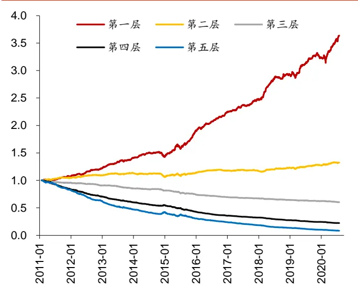
资料来源：Wind，华泰证券研究所

图表20：AlphaNet-v1 和 AlphaNet-v2 第一层表现
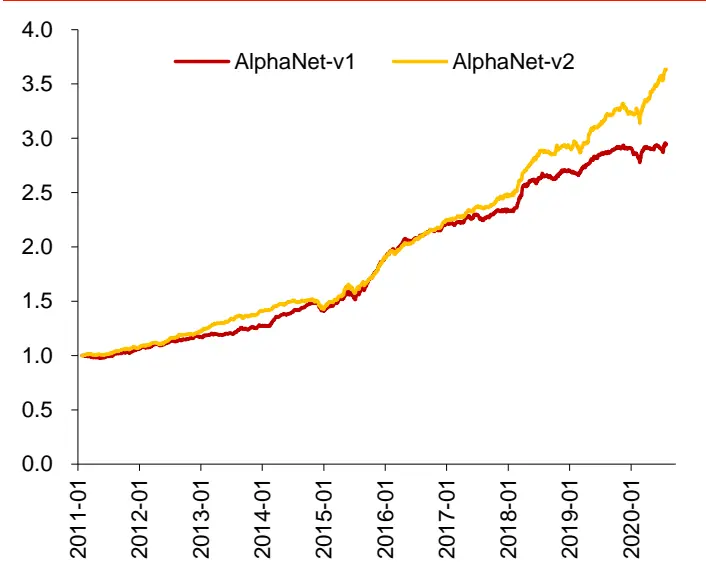
资料来源：Wind，华泰证券研究所

## 构建行业市值中性的中证500增强策略进行回测

我们将 AlphaNet-v1 和 AlphaNet-v2 在每个截面上的预测结果视为合成的单因子，构建相对于中证500 的行业、市值中性的全A选股策略并进行回测，图表21~图表23 展示了个股权重偏离上限为1%时的回测结果。AlphaNet-v2在多项测试指标上都优于AlphaNet-v1。

图表21：行业市值中性的中证500增强策略回测绩效(回测期：20110131～20200731)

| 年化超额收年化跟踪误超额收益最 |  |  |  |  |  |  | Calmar 相对基准 |  |  |  |  |
| --- | --- | --- | --- | --- | --- | --- | --- | --- | --- | --- | --- |
|  | 年化收益率年化波动率夏普比率 |  |  | 最大回撤 | 益率 | 差 | 大回撤信息比率 |  | 比率 | 月胜率 | 换手率 |
| AlphaNet-v1 | 22.43% | 25.52% | 0.88 | 45.20% | 17.17% | 6.28% | 11.05% | 2.73 | 1.55 | 76.32% | 58.50% |
| AlphaNet-v2 | 24.41% | 25.56% | 0.96 | 47.73% | 19.09% | 6.11% | 8.47% | 3.13 | 2.26 | 80.70% | 58.90% |
| 中证500 | 3.96% | 26.70% | 0.15 | 65.20% |  |  |  |  |  |  |  |

资料来源：Wind，华泰证券研究所

图表22：行业市值中性的中证500增强策略逐年回测绩效(回测期：20110131～20200731)

|  | 2011年 | 2012年 | 2013年 | 2014年 | 2015年 | 2016年 | 2017年 | 2018年 | 2019年 | 2020年 |
| --- | --- | --- | --- | --- | --- | --- | --- | --- | --- | --- |
|  | 收益率 | 收益率 | 收益率 | 收益率 | 收益率 | 收益率 | 收益率 | 收益率 | 收益率 | 收益率 |
| AlphaNet-v1 | -13.60% | 19.96% | 28.26% | 45.60% | 115.01% | 2.20% | 10.38% | -22.75% | 41.77% | 27.06% |
| AlphaNet-v2 | -11.15% | 23.99% | 38.26% | 39.42% | 110.15% | 1.68% | 7.61% | -24.26% | 47.66% | 38.64% |
| 中证500 | -28.17% | 0.28% | 16.89% | 39.01% | 43.12% | -17.78% | -0.20% | -33.32% | 26.38% | 24.91% |

资料来源：Wind，华泰证券研究所

图表23：行业市值中性的中证500增强策略超额收益情况(回测期：20110131～20200731)
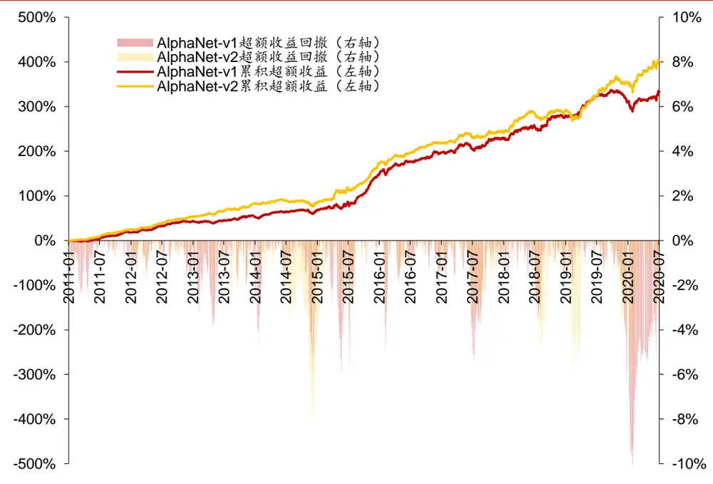
资料来源：Wind，华泰证券研究所

## 中证800成分股内测试

我们将 AlphaNet-v1 和 AlphaNet-v2 在每个截面上的预测结果视为合成的单因子，进行单因子 IC 测试。图表 24 和图表 25 展示了合成因子的 IC 测试结果， AlphaNet-v2 在 RankIC均值，IC_IR 优于 AlphaNet-v1。

图表24：AlphaNet-v1 和 AlphaNet-v2 合成因子IC值分析(中证 800 成分股，回测期 20110131～20200731)

|  | RankIC 均值 | RankIC 标准差 | IC_IR | IC>0 占比 |
| --- | --- | --- | --- | --- |
| AlphaNet-v1 | 8.37% | 11.53% | 0.73 | 76.05% |
| AlphaNet-v2 | 8.63% | 11.56% | 0.75 | 76.05% |

资料来源：Wind，华泰证券研究所

图表25：AlphaNet-v1 和 AlphaNet-v2 累计 RankIC(中证 800 成分股，回测期 20110131～20200731)
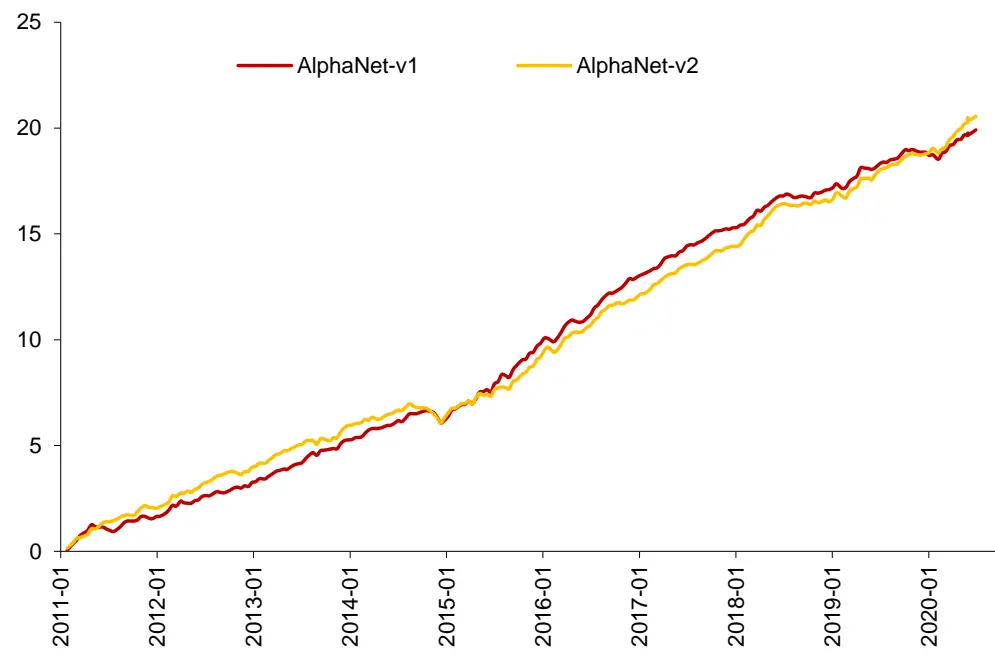
资料来源：Wind，华泰证券研究所

我们将 AlphaNet-v1 和AlphaNet-v2 在每个截面上的预测结果视为合成的单因子，进行单因子分5层测试。图表 26~图表 28展示了合成因子的分层测试结果。AlphaNet-v2的 TOP组合超额收益率、TOP组合信息比率、多空组合夏普比率优于 AlphaNet-v1。

图表26：AlphaNet-v1 和 AlphaNet-v2 合成因子分层测试结果(中证 800 成分股，回测期 20110131～20200731)

| TOP 组合 |  |  |  |  | 多空组合 多空组合TOP 组合信 |  |  |
| --- | --- | --- | --- | --- | --- | --- | --- |
|  |  | 分层组合1～5(从左到右)年化超额收益率 |  | 年化收益率 | 夏普比率 | 息比率 | 胜率 |
| AlphaNet-v1 | 7.80% | -1.21% | -5.74%-10.68%-18.79% | 31.95% | 3.17 | 1.68 | 71.05% |
| AlphaNet-v2 | 8.36% | 0.44% | -6.23%-12.94%-17.65% | 30.99% | 3.34 | 1.71 | 66.67% |

资料来源：Wind，华泰证券研究所

图表27：AlphaNet-v2 合成因子的分层测试
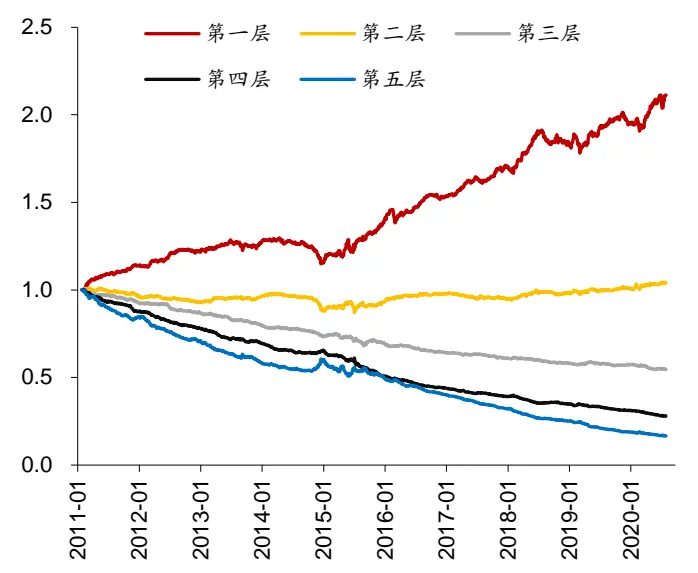
资料来源：Wind，华泰证券研究所

图表28：AlphaNet-v1 和 AlphaNet-v2 第一层表现
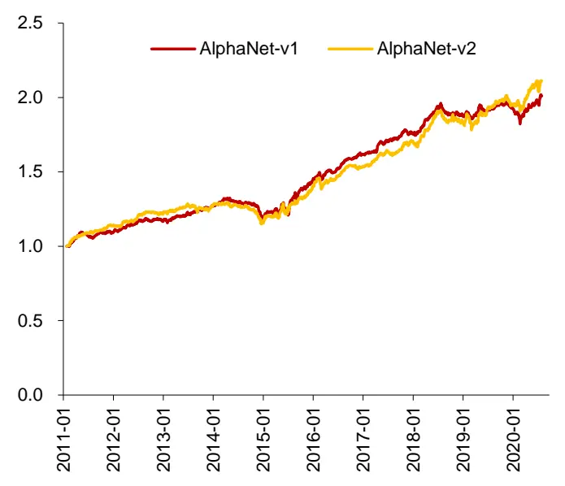
资料来源：Wind，华泰证券研究所

## 构建行业市值中性的中证800增强策略进行回测

我们将AlphaNet-v2在每个截面上的预测结果视为合成的单因子，构建相对于中证800的行业、市值中性选股策略并进行回测。图表29~图表31展示了个股权重偏离上限为1%时的回测结果。AlphaNet-v2 在多项测试指标上都优于 AlphaNet-v1。

图表29：行业市值中性的中证 800增强策略回测绩效(回测期：20110131～20200731)

| 年化超额收年化跟踪误超额收益最 |  |  |  |  |  |  | Calmar 相对基准 |  |  |  |  |
| --- | --- | --- | --- | --- | --- | --- | --- | --- | --- | --- | --- |
|  | 年化收益率年化波动率夏普比率 |  |  | 最大回撤 | 益率 | 差 | 大回撤信息比率 |  | 比率 | 月胜率 | 换手率 |
| AlphaNet-v1 | 11.19% | 22.86% | 0.49 | 39.68% | 6.19% | 3.76% | 8.81% | 1.65 | 0.70 | 69.30% | 59.59% |
| AlphaNet-v2 | 12.88% | 23.05% | 0.56 | 42.50% | 7.84% | 3.92% | 8.19% | 2.00 | 0.96 | 74.56% | 59.87% |
| 中证800 | 4.53% | 23.30% | 0.19 | 50.91% |  |  |  |  |  |  |  |

资料来源：Wind，华泰证券研究所

图表30：行业市值中性的中证800增强策略逐年回测绩效(回测期：20110131～20200731)

|  | 2011年 收益率 | 2012年 收益率 | 2013年 收益率 | 2014年 收益率 | 2015年 收益率 | 2016年 收益率 | 2017年 收益率 | 2018年 收益率 | 2019年 收益率 | 2020年 收益率 |
| --- | --- | --- | --- | --- | --- | --- | --- | --- | --- | --- |
| AlphaNet-v1 | -22.02% | 9.10% | 4.29% | 40.18% | 41.78% | -2.26% | 23.03% | -23.28% | 36.40% | 20.09% |
| AlphaNet-v2 | -18.95% | 9.50% | 7.67% | 43.10% | 38.86% | -3.51% | 30.93% | -23.58% | 41.01% | 19.12% |
| 中证800 | -24.15% | 5.81% | -2.14% | 48.28% | 14.91% | -13.27% | 15.16% | -27.38% | 33.71% | 24.91% |

资料来源：Wind，华泰证券研究所

图表31：行业市值中性的中证800增强策略超额收益情况(回测期：20110131～20200731)
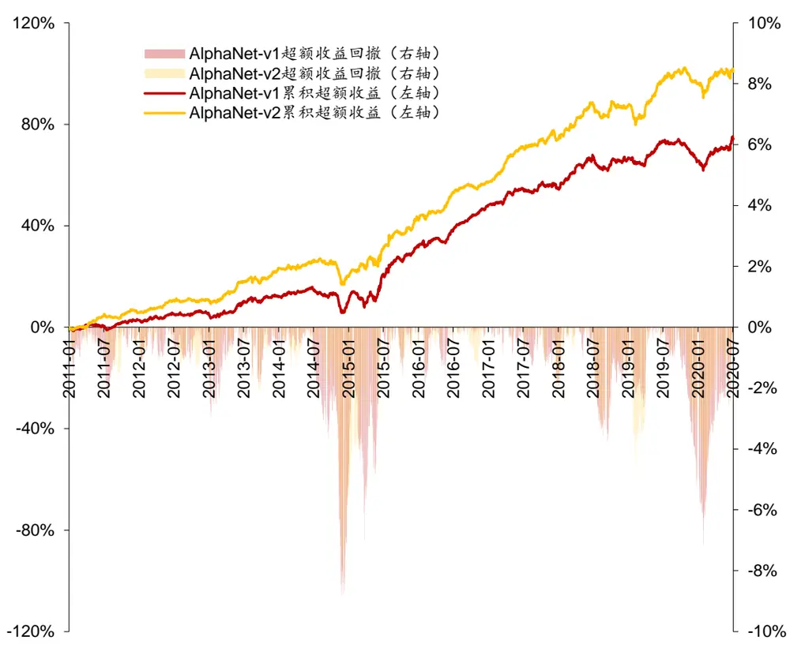
资料来源：Wind，华泰证券研究所

## AlphaNet-v3 测试结果

由于AlphaNet-v3结构较为复杂，对算力要求较高，本章仅在中证500成分股内测试AlphaNet-v3，并与AlphaNet-v2 进行对比。

单因子IC测试的方法如下：

1.样本空间：中证500成分股。剔除ST、PT股票，剔除每个截面期下一交易日涨跌停和停牌的股票。

2.回测区间：2011年1月31日到2020年7月31日。

3.截面期：每隔10个交易日，用当前截面期因子值与当前截面期至下个截面期内的个股收益计算 RankIC值。

4.为了分析合成因子的增量信息，会展示因子进行行业、市值、10日收益率、10日波动率、10日换手率五因子中性化后的测试结果。

## 单因子分层测试的方法如下：

1.股票池、回测区间、截面期均与IC测试一致。

2. 换仓：在每个截面期得到预测值，构建分层组合，在截面期下一个交易日按当日vwap换仓，交易费用为单边千分之二。

3.分层方法：先将因子暴露度向量进行一定预处理，将股票池内所有个股按处理后的因子值从大到小进行排序，等分N层，每层内部的个股等权重配置。当个股总数目无法被N整除时采用任一种近似方法处理均可，实际上对分层组合的回测结果影响很小。分层测试中的基准组合为股票池内所有股票的等权组合。

4. 多空组合收益计算方法：用 Top组每天的收益减去 Bottom 组每天的收益，得到每日多空收益序列 $\mathbf{r}_{1},\mathbf{r}_{2},\cdots,\mathbf{r}_{\mathrm{n}}$ ，则多空组合在第n天的净值等于 $(1+\mathrm{r}_{1})(1+\mathrm{r}_{2})\cdots(1+\mathrm{r}_{\mathrm{n}})$

5.为了分析合成因子的增量信息，会展示因子进行行业、市值、10日收益率、10日波动率、10日换手率五因子中性化后的测试结果。

构建行业市值中性的指数增强策略回测的方法如下：

1.股票池、回测区间、截面期均与IC测试一致。

2.换仓：在每个截面期得到预测值，通过组合优化模型得到新的持仓股票和权重，在截面期下一个交易日按当日vwap换仓，交易费用为单边千分之二，每次调仓双边换手率限制在 60%。

## 中证500成分股内测试

我们将 AlphaNet-v2和 AlphaNet-v3 在每个截面上的预测结果视为合成的单因子，进行单因子 IC 测试。图表 32 和图表 33 展示了合成因子的 IC 测试结果，AlphaNet-v3 在各项测试指标上都优于 AlphaNet-v2。

图表32：AlphaNet-v2 和AlphaNet-v3 合成因子 IC 值分析(中证 500 成分股，回测期 20110131～20200731)

|  | RankIC 均值 | RankIC 标准差 | IC_IR | IC>0 占比 |
| --- | --- | --- | --- | --- |
| AlphaNet-v2 | 9.05% | 10.13% | 0.89 | 82.77% |
| AlphaNet-v3 | 9.70% | 9.69% | 1.00 | 83.19% |

资料来源：Wind，华泰证券研究所

图表33：AlphaNet-v2 和AlphaNet-v3累计 RankIC (中证 500 成分股，回测期 20110131～20200731)
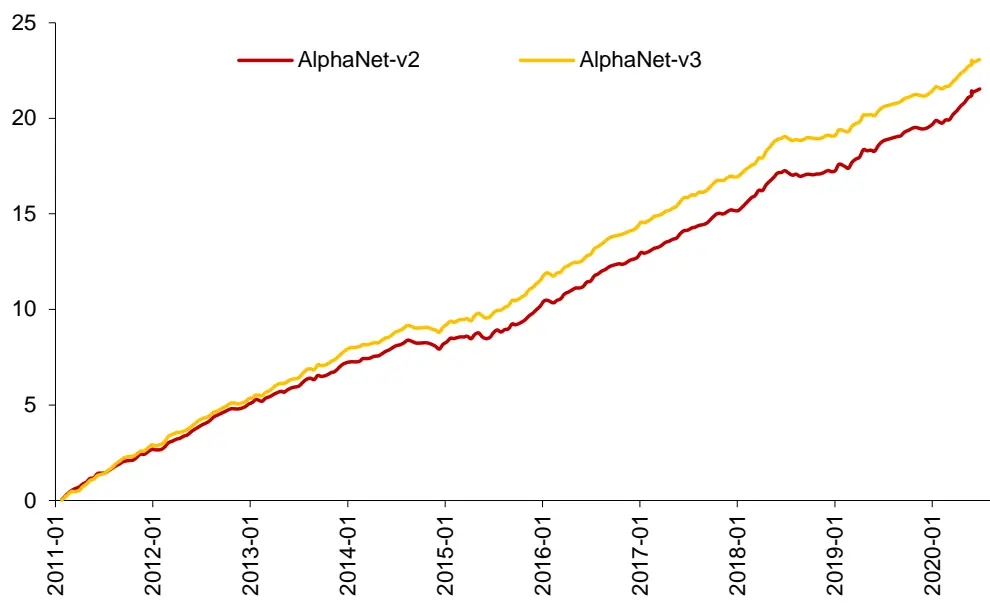
资料来源：Wind，华泰证券研究所

我们将 AlphaNet-v2 和AlphaNet-v3 在每个截面上的预测结果视为合成的单因子，进行单因子分 5 层测试。图表 34~图表 36 展示了合成因子的分层测试结果，AlphaNet-v3 在各项测试指标上都优于AlphaNet-v2，但优势并不显著。

图表34：AlphaNet-v2 和 AlphaNet-v3 合成因子分层测试结果(回测期 20110131～20200731)

|  |  |  |  |  | 多空组合 多空组合TOP 组合信 |  | TOP 组合 胜率 |
| --- | --- | --- | --- | --- | --- | --- | --- |
|  | 分层组合1～5(从左到右)年化超额收益率 |  |  | 年化收益率 | 夏普比率 | 息比率 |  |
| AlphaNet-v2 | 8.73% | 0.00% | -4.87%-12.22%-19.24% | 34.09% | 3.88 | 1.78 | 64.91% |
| AlphaNet-v3 | 8.86% | 1.73% | -6.11%-11.82%-20.99% | 37.23% | 4.23 | 1.81 | 70.18% |

资料来源：Wind，华泰证券研究所

图表35：AlphaNet-v3 合成因子的分层测试
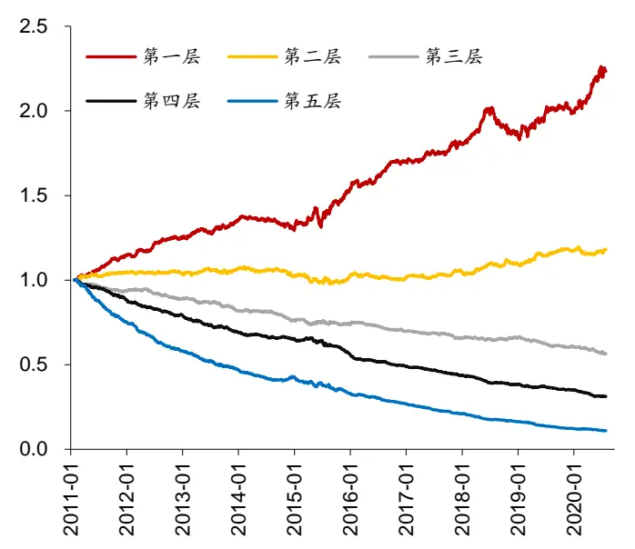
资料来源：Wind，华泰证券研究所

图表36： AlphaNet-v2 和 AlphaNet-v3 第一层表现
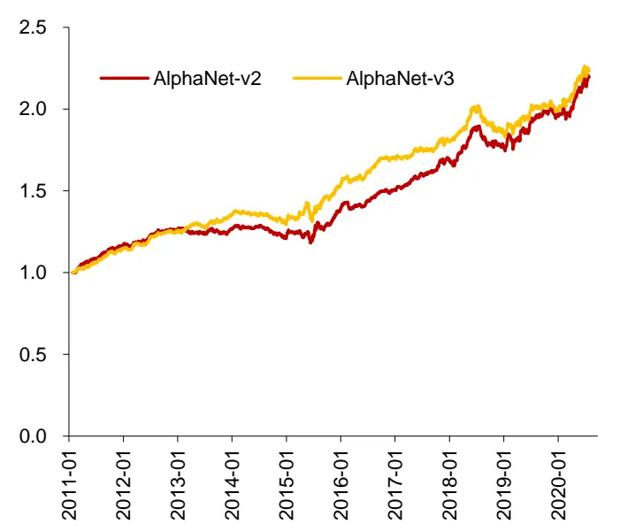
资料来源：Wind，华泰证券研究所

## 构建行业市值中性的中证500增强策略进行回测

我们将 AlphaNet-v2和 AlphaNet-v3 在每个截面上的预测结果视为合成的单因子，构建相对于中证500的行业、市值中性的全 A 选股策略并进行回测，图表 37~图表39展示了个股权重偏离上限为1%时的回测结果。AlphaNet-v3在各项测试指标上都优于AlphaNet-v2，但优势并不显著。

图表37：行业市值中性的中证500增强策略回测绩效(回测期：20110131～20200731)

| 年化超额收年化跟踪误超额收益最 |  |  |  |  |  |  | Calmar 相对基准 |  |  |  |  |
| --- | --- | --- | --- | --- | --- | --- | --- | --- | --- | --- | --- |
|  | 年化收益率年化波动率夏普比率 |  |  | 最大回撤 | 益率 | 差 | 大回撤信息比率 |  | 比率 | 月胜率 | 换手率 |
| AlphaNet-v2 | 14.06% | 25.95% | 0.54 | 48.02% | 9.40% | 4.30% | 7.15% | 2.19 | 1.31 | 70.18% | 58.82% |
| AlphaNet-v3 | 14.39% | 26.05% | 0.55 | 49.06% | 9.75% | 4.24% | 6.05% | 2.30 | 1.61 | 76.32% | 58.70% |
| 中证500 | 3.96% | 26.70% | 0.15 | 65.20% |  |  |  |  |  |  |  |

资料来源：Wind，华泰证券研究所

图表38：行业市值中性的中证500 增强策略逐年回测绩效(回测期：20110131～20200731)

|  | 2011年 收益率 | 2012年 | 2013年 | 2014年 | 2015年 | 2016年 | 2017年 | 2018年 | 2019年 | 2020年 收益率 |  |
| --- | --- | --- | --- | --- | --- | --- | --- | --- | --- | --- | --- |
|  |  |  |  |  |  |  |  |  |  |  | 收益率 |
| AlphaNet-v2 | -17.73% | 收益率 13.39% | 收益率 21.63% | 36.76% | 收益率 63.27% | 收益率 -4.32% | 收益率 13.92% | 收益率 -31.87% | 收益率 33.39% | 35.43% |  |
| AlphaNet-v3 | -19.51% | 9.83% | 31.00% | 37.27% | 68.41% | -5.56% | 9.84% | -29.93% | 30.58% | 37.89% |  |
| 中证500 | -28.17% | 0.28% | 16.89% | 39.01% | 43.12% | -17.78% | -0.20% | -33.32% | 26.38% | 24.91% |  |

资料来源：Wind，华泰证券研究所

图表39：行业市值中性的中证500增强策略超额收益情况(回测期：20110131～20200731)
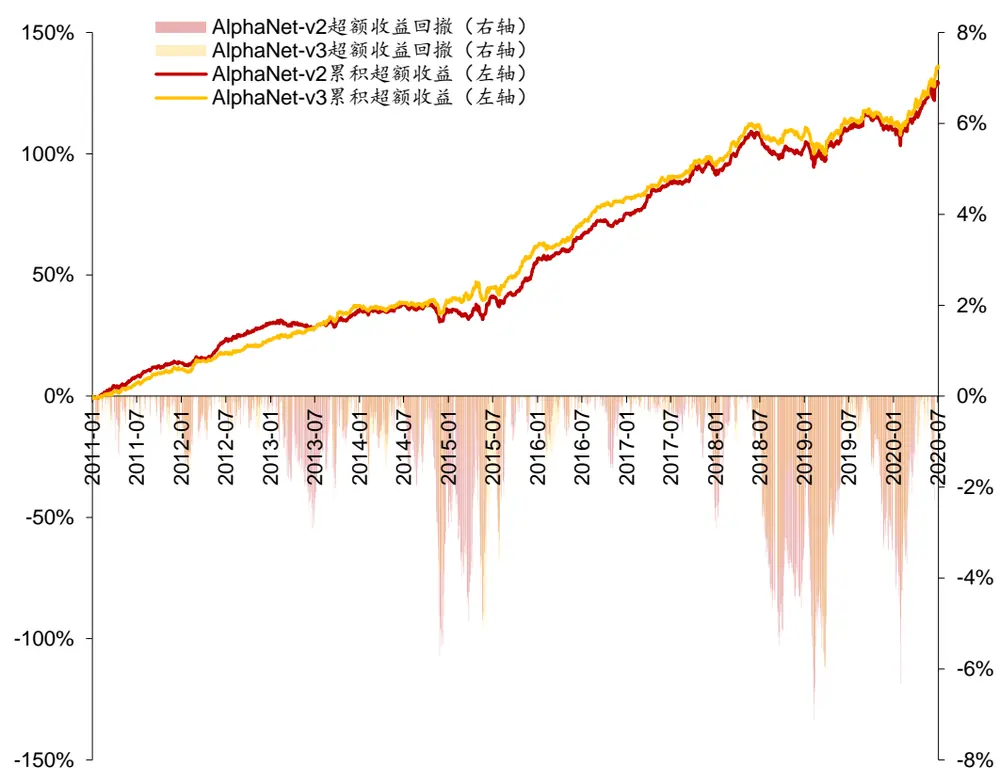
资料来源：Wind，华泰证券研究所

## 总结

本文结论如下：

1. 本文介绍了两个 AlphaNet 改进模型：AlphaNet-v2和AlphaNet-v3 的改进思路。相比 AlphaNet-v1，AlphaNet-v2 改进了以下几点：(1)考虑到比率类特征的有效性，扩充了6个比率类特征；(2)将池化层和全连接层替换为LSTM层，从而更好地学习特征的时序信息；(3)训练集和验证集划分从1：1变成4：1，验证集更关注近期样本的表现。相比AlphaNet-v2，AlphaNet-v3改进了以下几点：(1)扩充特征提取层，特征提取层1和特征提取层 2 中的运算函数具有不同的回看区间(10 和 5)；(2)将LSTM 层替换为 GRU，减少模型参数。

2. 在全 A 股和中证 800 成分股中，AlphaNet-v2 表现优于 AlphaNet-v1。设定回测期为20110131～20200731，调仓周期为10个交易日。在全A 股中，AlphaNet-v2相比AlphaNet-v1 的 RankIC 均值从 9.72%提升至 10.76%，ICIR 从 1.00 提升至 1.15。构建相对于中证500的行业、市值中性的全A选股策略，年化超额收益率从17.17%提升至19.09%，信息比率从2.73提升至3.13。在中证800成分股中，AlphaNet-v2相比AlphaNet-v1 的 RankIC 均值从 8.37%提升至 8.63%，ICIR 从 0.73 提升至 0.75。构建相对于中证800的行业、市值中性的选股策略，年化超额收益率从6.19%提升至7.84%，信息比率从 1.65提升至 2.00。

3. 在中证 500成分股中，AlphaNet-v3表现小幅优于AlphaNet-v2。设定回测期为设定回测期为20110131～20200731，调仓周期为10个交易日。在中证500成分股中，AlphaNet-v3 相比 AlphaNet-v2 的 RankIC 均值从 9.05%提升至 9.70%，ICIR 从 0.89 提升至1.00。构建相对于中证500的行业、市值中性的选股策略，年化超额收益率从9.40%提升至 9.75%，信息比率从 2.19提升至 2.30。

4. 本文总结对比了AlphaNet和“遗传规划+随机森林”模型的优缺点。AlphaNet和“遗传规划+随机森林”模型都是基于量价数据的人工智能选股模型，本文对比了二者的优缺点。AlphaNet的优点是：端到端学习使得因子挖掘和因子合成使用同一目标函数进行优化，且无需维护因子池，从而无需做大量的单因子测试、因子相关性分析、因子中性化等工作。另外，只需按情况对网络结构做一定调整，就可针对任意的股票池、预测周期、数据频率构建预测模型，省时省力。AlphaNet的缺点是：模型可解释性较低，目前可嵌入神经网络的特征提取层还比较有限，没有覆盖遗传规划中全部因子计算函数。“遗传规划+随机森林”模型的优缺点则正好相反。

## 风险提示

通过人工智能模型构建的选股策略是历史经验的总结，存在失效的可能。神经网络受随机性影响较大，可解释性较低，使用需谨慎。

## 免责声明

## 分析师声明

本人，林晓明、陈烨、李子钰，兹证明本报告所表达的观点准确地反映了分析师对标的证券或发行人的个人意见；彼以往、现在或未来并无就其研究报告所提供的具体建议或所表达的意见直接或间接收取任何报酬。

## 一般声明及披露

本报告由华泰证券股份有限公司（已具备中国证监会批准的证券投资咨询业务资格，以下简称“本公司”）制作。本报告仅供本公司客户使用。本公司不因接收人收到本报告而视其为客户。

本报告基于本公司认为可靠的、已公开的信息编制，但本公司对该等信息的准确性及完整性不作任何保证。本报告所载的意见、评估及预测仅反映报告发布当日的观点和判断。在不同时期，本公司可能会发出与本报告所载意见、评估及预测不一致的研究报告。同时，本报告所指的证券或投资标的的价格、价值及投资收入可能会波动。以往表现并不能指引未来，未来回报并不能得到保证，并存在损失本金的可能。本公司不保证本报告所含信息保持在最新状态。本公司对本报告所含信息可在不发出通知的情形下做出修改，投资者应当自行关注相应的更新或修改。

本公司力求报告内容客观、公正，但本报告所载的观点、结论和建议仅供参考，不构成购买或出售所述证券的要约或招揽。该等观点、建议并未考虑到个别投资者的具体投资目的、财务状况以及特定需求，在任何时候均不构成对客户私人投资建议。投资者应当充分考虑自身特定状况，并完整理解和使用本报告内容，不应视本报告为做出投资决策的唯一因素。对依据或者使用本报告所造成的一切后果，本公司及作者均不承担任何法律责任。任何形式的分享证券投资收益或者分担证券投资损失的书面或口头承诺均为无效。

除非另行说明，本报告中所引用的关于业绩的数据代表过往表现，过往的业绩表现不应作为日后回报的预示。本公司不承诺也不保证任何预示的回报会得以实现，分析中所做的预测可能是基于相应的假设，任何假设的变化可能会显著影响所预测的回报。

本公司及作者在自身所知情的范围内，与本报告所指的证券或投资标的不存在法律禁止的利害关系。在法律许可的情况下，本公司及其所属关联机构可能会持有报告中提到的公司所发行的证券头寸并进行交易，为该公司提供投资银行、财务顾问或者金融产品等相关服务或向该公司招揽业务。

本公司的销售人员、交易人员或其他专业人士可能会依据不同假设和标准、采用不同的分析方法而口头或书面发表与本报告意见及建议不一致的市场评论和/或交易观点。本公司没有将此意见及建议向报告所有接收者进行更新的义务。本公司的资产管理部门、自营部门以及其他投资业务部门可能独立做出与本报告中的意见或建议不一致的投资决策。投资者应当考虑到本公司及/或其相关人员可能存在影响本报告观点客观性的潜在利益冲突。投资者请勿将本报告视为投资或其他决定的唯一信赖依据。有关该方面的具体披露请参照本报告尾部。

本报告并非意图发送、发布给在当地法律或监管规则下不允许向其发送、发布的机构或人员，也并非意图发送、发布给因可得到、使用本报告的行为而使本公司及关联子公司违反或受制于当地法律或监管规则的机构或人员。

本公司研究报告以中文撰写，英文报告为翻译版本，如出现中英文版本内容差异或不一致，请以中文报告为主。英文翻译报告可能存在一定时间迟延。

本报告版权仅为本公司所有。未经本公司书面许可，任何机构或个人不得以翻版、复制、发表、引用或再次分发他人等任何形式侵犯本公司版权。如征得本公司同意进行引用、刊发的，需在允许的范围内使用，并注明出处为“华泰证券研究所”，且不得对本报告进行任何有悖原意的引用、删节和修改。本公司保留追究相关责任的权利。所有本报告中使用的商标、服务标记及标记均为本公司的商标、服务标记及标记。

## 中国香港

本报告由华泰证券股份有限公司制作，在香港由华泰金融控股（香港）有限公司向符合《证券及期货条例》第571章所定义之机构投资者和专业投资者的客户进行分发。华泰金融控股（香港）有限公司受香港证券及期货事务监察委员会监管，是华泰国际金融控股有限公司的全资子公司，后者为华泰证券股份有限公司的全资子公司。在香港获得本报告的人员若有任何有关本报告的问题，请与华泰金融控股（香港）有限公司联系。

## 香港-重要监管披露

- 华泰金融控股（香港）有限公司的雇员或其关联人士没有担任本报告中提及的公司或发行人的高级人员。
更多信息请参见下方“美国-重要监管披露”。

## 美国

本报告由华泰证券股份有限公司编制，在美国由华泰证券（美国）有限公司向符合美国监管规定的机构投资者进行发表与分发。华泰证券（美国）有限公司是美国注册经纪商和美国金融业监管局（FINRA）的注册会员。对于其在美国分发的研究报告，华泰证券（美国）有限公司对其非美国联营公司编写的每一份研究报告内容负责。华泰证券（美国）有限公司联营公司的分析师不具有美国金融监管（FINRA）分析师的注册资格，可能不属于华泰证券（美国）有限公司的关联人员，因此可能不受FINRA关于分析师与标的公司沟通、公开露面和所持交易证券的限制。华泰证券（美国）有限公司是华泰国际金融控股有限公司的全资子公司，后者为华泰证券股份有限公司的全资子公司。任何直接从华泰证券（美国）有限公司收到此报告并希望就本报告所述任何证券进行交易的人士，应通过华泰证券（美国）有限公司进行交易。

## 美国-重要监管披露

- 分析师林晓明、陈烨、李子钰本人及相关人士并不担任本报告所提及的标的证券或发行人的高级人员、董事或顾问。分析师及相关人士与本报告所提及的标的证券或发行人并无任何相关财务利益。声明中所提及的“相关人士”包括FINRA定义下分析师的家庭成员。分析师根据华泰证券的整体收入和盈利能力获得薪酬，包括源自公司投资银行业务的收入。

- 华泰证券股份有限公司、其子公司和/或其联营公司，及/或不时会以自身或代理形式向客户出售及购买华泰证券研究所覆盖公司的证券/衍生工具，包括股票及债券（包括衍生品）华泰证券研究所覆盖公司的证券/衍生工具，包括股票及债券（包括衍生品)。

- 华泰证券股份有限公司、其子公司和/或其联营公司，及/或其高级管理层、董事和雇员可能会持有本报告中所提到的任何证券（或任何相关投资）头寸，并可能不时进行增持或减持该证券（或投资）。因此，投资者应该意识到可能存在利益冲突。

## 评级说明

投资评级基于分析师对报告发布日后6至12个月内行业或公司回报潜力（含此期间的股息回报）相对基准表现的预期(A股市场基准为沪深300指数，香港市场基准为恒生指数，美国市场基准为标普500指数)，具体如下：

## 行业评级

增持：预计行业股票指数超越基准

中性：预计行业股票指数基本与基准持平

减持：预计行业股票指数明显弱于基准

## 公司评级

买入：预计股价超越基准15%以上

增持：预计股价超越基准5%~15%

持有：预计股价相对基准波动在-15%~5%之间

卖出：预计股价弱于基准15%以上

暂停评级：已暂停评级、目标价及预测，以遵守适用法规及/或公司政策

无评级：股票不在常规研究覆盖范围内。投资者不应期待华泰提供该等证券及/或公司相关的持续或补充信息

## 法律实体披露

中国：华泰证券股份有限公司具有中国证监会核准的“证券投资咨询”业务资格，经营许可证编号为：91320000704041011J香港：华泰金融控股（香港）有限公司具有香港证监会核准的“就证券提供意见”业务资格，经营许可证编号为：AOK809美国：华泰证券（美国）有限公司为美国金融业监管局（FINRA）成员，具有在美国开展经纪交易商业务的资格，经营业务许可编号为：CRD#:298809/SEC#:8-70231

## 华泰证券股份有限公司

南京南京市建邺区江东中路228号华泰证券广场1号楼/邮政编码：210019

电话：86 25 83389999/传真：86 25 83387521电子邮件：ht-rd@htsc.com

深圳
深圳市福田区益田路5999号基金大厦10楼/邮政编码：518017
电话：86755 82493932/传真：86755 82492062
电子邮件：ht-rd@htsc.com

## 华泰金融控股（香港）有限公司

香港中环皇后大道中99号中环中心58楼5808-12室
电话：+852 3658 6000/传真：+85221690770
电子邮件：research@htsc.com
http://www.htsc.com.hk

## 华泰证券（美国）有限公司

美国纽约哈德逊城市广场10号41楼（纽约10001）
电话：+212-763-8160/传真：+917-725-9702
电子邮件： Huatai@htsc-us.com
http://www.htsc-us.com

©版权所有2020年华泰证券股份有限公司

北京
北京市西城区太平桥大街丰盛胡同28号太平洋保险大厦A座18层/
邮政编码：100032
电话：861063211166/传真：861063211275
电子邮件：ht-rd@htsc.com
上海
上海市浦东新区东方路18号保利广场E栋23楼/邮政编码：200120
电话：862128972098/传真：862128972068
电子邮件：ht-rd@htsc.com