## 金工研究/深度研究

2020年08月28日

林晓明 SAC No. S0570516010001

研究员 SFC No. BPY4210755-82080134linxiaoming@htsc.com

陈烨 SAC No. S0570518080004

研究员SFC No. BPV962010-56793943chenye@htsc.com

李子钰 SAC No. S0570519110003

研究员 0755-23987436

何康 SAC No. S0570520080004

研究员 021-28972039

hekang@htsc.com

# WGAN应用于金融时间序列生成华泰人工智能系列之三十五

WGAN 模型可应用于金融资产时间序列生成，效果优于原始 GAN 模型本文探讨 GAN 模型的一类重要变体——WGAN，并将其运用于金融资产时间序列的生成，发现WGAN 在生成数据的真实性和多样性上均优于原始GAN。原始 GAN 模型具有训练不同步、训练损失函数不收敛和模式崩溃的缺点。WGAN模型使用 Wasserstein 距离衡量真实分布与生成分布之间的距离，克服了原始 GAN模型中 JS距离的缺陷。使用 GAN 和WGAN生成上证综指日频和标普 500 月频收益率序列，结果表明 GAN 无法复现出真实序列的长时程相关等特性，WGAN 则有显著改善，并且 WGAN 在多样性上相比于 GAN 也有一定提升。

## W距离克服了 JS散度的缺陷，在生成对抗网络中是更合适的距离指标

原始 GAN 模型的主要缺点是判别器 D 和生成器 G训练不同步、训练损失函数不收敛和模式崩溃。其中训练不同步问题与 JS散度的梯度消失现象有关；模式崩溃由 KL 散度的不对称性导致；损失函数不收敛由 GAN 本身 D和 G 的博弈导致。W 距离避免了 JS散度带来的梯度消失现象，故而不用再小心平衡 D 和 G 的训练过程。WGAN 用判别器近似估计真假分布间的W 距离，随着训练的进行，W 距离越来越小，即判别器的损失函数收敛，可以辅助指示训练进程。因此相比于 JS散度和 KL 散度，W 距离是应用于生成对抗网络里更合适的衡量分布间“距离”的指标。

## WGAN 生成序列在“真实性”上相比于 GAN 模型有进一步的提升

数据实证部分围绕WGAN与 GAN 模型的对比展开，我们选取上证综指日频和标普 500 月频的对数收益率序列进行生成训练并展示结果。除自相关性、厚尾分布、波动率聚集、杠杆效应、粗细波动率相关、盈亏不对称性这六项指标以外，本文还引入方差比率检验、长时程相关的 Hurst 指数两项指标验证生成序列的真实性。在上证综指日频序列上，GAN 生成序列在Hurst 指标上与真实序列仍有差距，WGAN 则有显著改善；在标普 500 月频数据上，GAN 生成序列在波动率聚集、粗细波动率相关和盈亏不对称性指标上表现不佳，WGAN也改善明显，更接近真实序列。

## WGAN 生成序列在不失真的基础上相比于 GAN 生成序列更加多样

另外我们引入衡量序列相似性的 DTW 指标，评价生成序列的多样性。在上证综指日频序列上，WGAN 生成序列多样性相较于 GAN 有小幅提升；在标普 500月频数据上，WGAN生成序列多样性相较于 GAN有明显提升。我们看到的不再是重复的生成序列，而是观察到了更多的市场可能性。

风险提示：WGAN生成虚假序列是对市场规律的探索，不构成任何投资建议。WGAN模型存在黑箱问题，深度学习存在过拟合的可能。深度学习模型是对历史规律的总结，如果市场规律发生变化，模型存在失效的可能。

## 研究导读

本文是华泰金工生成对抗网络（GAN）系列的第二篇，关注 GAN 的重要变式——WGAN。在前序研究《人工智能 31：生成对抗网络 GAN 初探》（20200508）中，我们指出 GAN网络可以生成“以假乱真”的股指收益率时间序列，多项统计指标表明 GAN 生成序列的质量优于对照组模型。WGAN 是 GAN 的经典变式之一，将 GAN 中的 JS 散度替换成Wasserstein 距离（简称W 距离），在图像生成等领域被证明效果优于 GAN。本文将展示WGAN在生成模拟金融资产数据中的应用，并对比WGAN 与 GAN 的生成效果。

GAN 的生成样本表现已较为优秀，但是理论推导及实践结果均表明 GAN 存在固有缺陷。我们的目标是希望模型能简单高效地生成逼真且多样化的样本，以模拟市场的多种可能性。然而 GAN 模型存在的训练不收敛、判别器与生成器训练不同步、模式崩溃等问题使得目标难以完美实现。GAN 模型仍具有改进空间，WGAN 正是为应对 GAN 的缺陷而提出的变式。

相比于 GAN 模型使用的 JS散度，WGAN 使用W 距离衡量目标的生成分布与真实分布之间的远近。Martin Arjovsky等学者对 JS散度的研究表明，GAN的缺陷大多数与 JS散度有关，JS散度可能并不适用于生成对抗网络，W 距离是更合适的选择。WGAN的主要改变正是引入W 距离，核心思想是用判别器估计生成分布与真实分布的 W 距离，用生成器拉近W 距离，以达到生成样本逼近真实样本的目标。

本文分为理论与实践两部分展示WGAN。理论部分探讨 GAN 的缺点，并通过对比的方式介绍 WGAN 的原理和算法。实践部分从生成样本的“真实性”和“多样性”两个角度出发，比较WGAN和 GAN 的生成结果，实证结果表明WGAN 的生成样本质量相较于 GAN改善明显。

## 生成对抗网络 GAN 的缺点

## GAN 的缺点回顾

在引入WGAN之前，我们首先讨论 GAN 模型的缺点，主要包括以下三方面：

1. 生成器 G和判别器 D训练不同步问题。生成器与判别器的训练进度需要小心匹配，若匹配不当，导致判别器 D 训练不好，则生成器 G难以提升；若判别器 D训练得太好，则生成器 G训练容易梯度消失，难以训练。

2. 训练不收敛问题。生成器 G与判别器 D 相互博弈，此消彼长，训练过程中任何一方的损失函数都不会出现明显的收敛过程，我们只能通过观察生成样本的的好坏判断训练是否充分，缺少辅助指示训练进程的指标。

3. 模式崩溃（Mode Collapse）问题。GAN 模型的生成样本容易过于单一，缺乏多样性。注意样本单一并不一定导致样本失真：GAN 生成的收益率序列表现出的经验特征与真实序列十分接近，但并不代表生成序列包含市场可能出现的各种情况。

图表1： GAN的缺点
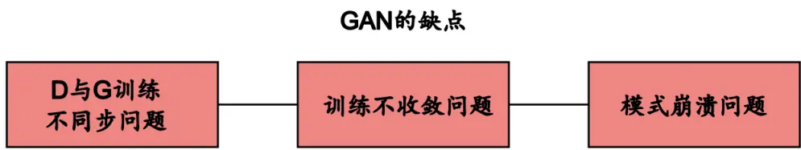
资料来源：Generative Adversarial Nets，华泰证券研究所

## GAN 缺点一：G和 D训练不同步

一方面，由于生成器与判别器的“博弈”关系，如果判别器训练得不好，无法给真假样本作出公允评判，那么生成器将无法得到正确反馈，生成水平无法得到提升，生成数据质量大概率较低。

另一方面，判别器训练得太好也会阻碍生成器的训练，原因分以下两步骤讨论：

1. JS散度的进一步探讨；

2. 训练生成器梯度消失。

## JS散度的进一步探讨

首先我们对 JS散度进行简要回顾。JS散度和 KL 散度均可衡量两个分布 p和 q之间的距离，其中 JS散度定义在 KL 散度的基础上，解决了 KL 散度不对称的问题。二者定义为：

$$
\begin{array}{l}{{\displaystyle KL(p||q)=E_{x\sim p(x)}\left[\log\frac{p(x)}{q(x)}\right]=\int_{x}p(x)log\frac{p(x)}{q(x)}dx}}\\{{\displaystyle JS(p||q)=\frac{1}{2}KL(p||\frac{p+q}{2})+\frac{1}{2}KL(q||\frac{p+q}{2})}}\end{array}
$$

GAN 使用 JS 散度衡量真实分布 ${\mathsf p}_{\mathsf{r}}$ 与生成分布 $\mathsf{p}_{9}$ 间的距离，模型的训练过程近似等价于最小化 JS(pr||pg)，随着 JS散度越来越小，生成分布逼近真实分布，生成样本则越来越拟真，最终达到“以假乱真”的效果。

当两个分布有重合部分时，分布离得越近，JS散度越小；当两个分布完全重合时，JS散度取值为零。JS 散度的特殊性质体现在，当两个分布无重合部分时，分布离得越远，并不意味着 JS 散度一定越大。严谨的表述为：如果 ${\mathfrak{p}}_{\mathfrak{r}}$ 和 ${\mathfrak{p}}_{\mathfrak{g}}$ 的支撑集相交部分测度为零，则它们之间的 JS散度恒为常数 log2：

$$
JS(p_{r}||p_{g})\equiv log2
$$

上述命题的精确解释及证明过程请参考附录部分。该命题的通俗解释是，如果 pr和 ${\mathsf p}_{9}$ 不相交或者近似不相交（即支撑集相交部分测度为零），那么 JS散度恒为常数 log2。这个结论意味着只要 pr和 $\mathsf{p}_{\mathsf{g}}$ 不重合，那么无论二者距离多远，JS散度都为常数，如下图的 State1和 State2 所示。换言之，此时 JS 散度失去了判别距离远近的能力。GAN 训练时如果判别器训练太好，往往就会出现这种情况，阻碍生成器的训练，我们在下一小节详细展开。

图表2： 不同距离下两个分布间的 JS散度
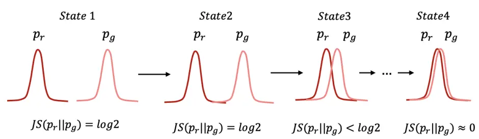
资料来源：华泰证券研究所

## 训练生成器梯度消失

为叙述清晰，我们再次展示原始 GAN 模型的目标函数：

$$
V(G,D)=E_{x\sim p_{r}}{\bigl[}\log\bigl(D(x)\bigr)\bigr]+E_{z\sim p_{z}}{\bigl[}\log\bigl(1-D(G(z))\bigr)\bigr]
$$

或者可以直接写成下述目标函数形式，其中 $\mathsf{p}_{\mathsf{r}}$ 表示真实分布， $\mathsf{p}_{9}$ 表示生成分布：

$$
V(G,D)=E_{x\sim p_{r}}{\bigl[}\log{\bigl(}D(x){\bigr)}{\bigr]}+E_{x\sim p_{g}}{\bigl[}\log\bigl(1-D(x)\bigr){\bigr]}
$$

在《人工智能 31：生成对抗网络 GAN 初探》（20200508）中我们证明对于给定的生成器G，如果判别器 D训练到最优，则训练生成器的损失函数将变成：

$$
C(G)=-log4+2JS(p_{r}||p_{g})
$$

上式中的 JS 散度导致生成器难以训练。事实上，拓扑学理论可以证明，大部分情况下生成分布与真实分布二者的支撑集相交部分的测度是零，即绝大部分情况下两个分布不相交或者近似不相交。那么根据 JS 散度的性质可以推出，在判别器达到最优的情况下，优化生成器的损失函数会变成常数，而常数的梯度恒为零。换言之，此时训练生成器会出现严重的梯度消失问题。

从更直观的角度而言，判别器最优时，JS 散度只能告诉生成器当前的生成分布与真实分布距离远，但是到底距离多远？JS 散度无法告诉生成器答案，因此只要生成分布与真实分布近似不重合，那么二者差很远或较接近对生成器没有任何区别，损失函数梯度都是零，生成器自然难以训练。

在实际训练过程中，我们毕竟难以达到理论上的“最优判别器”，但是 Arjovsky等（2017）指出，随着判别器接近最优，生成器损失函数的梯度仍会接近于零，出现梯度消失现象：

$$
\operatorname*{lim}_{\substack{||D-D^{*}||0}}\nabla_{\theta}E_{z\sim p_{z}}[\log(1-D(G_{\theta}(z))]=0
$$

我们对 GAN 的缺点一进行总结：GAN 在训练过程中如果判别器训练得不好，则生成器难以提升；如果判别器训练得太好，再去训练生成器容易产生梯度消失的问题，导致生成器难以训练。

图表3： GAN 中 G 和 D 训练不同步
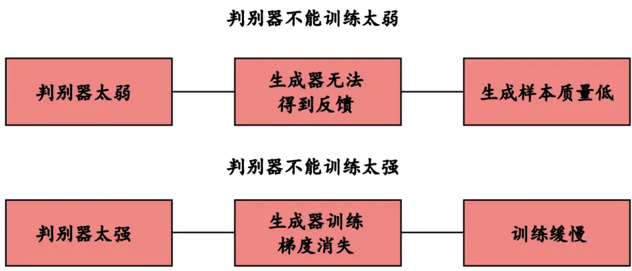
资料来源：Towards principled methods for training generative adversarial networks，华泰证券研究所

## GAN 缺点二：训练不收敛

从逻辑上说，生成器 G 和判别器 D 始终处于相互博弈、相互提升的过程中，因此无法看到任何一方的损失函数收敛，损失函数无法提供有意义的指导价值。从损失函数表达式出发，可以更清晰地观察不收敛的过程。

在原始的 GAN 中，我们实际训练判别器和生成器使用的损失函数分别为下面两式。判别器的损失函数 J(D)在 GAN 原始目标函数前加负号，是因为训练中默认使用梯度下降法最小化损失函数。生成器损失函数 J(G)只有 J(D)的第二项，是因为在训练生成器时，log(D(x))不包含 G且 D固定，相当于常数，故略去。

判别器： $J(D)=-(E_{x\sim p_{r}}[\log\bigl(D(x)\bigr)]+E_{z\sim p_{z}}[\log(1-D(G(z)))])$

$$
J(G)=E_{z\sim p_{z}}[\log(1-D(G(z)))]
$$

在训练时每轮迭代优化判别器，使得 J(D)减小，即要求 $\mathsf E_{z\sim\mathsf{p}z}[\mathsf{log}(1\cdot\mathsf{D}(\mathsf{G}(z)))]$ 增大；优化生成器，使得 J(G)减小，即要求 Ez~pz[log(1-D(G(z)))]减小。一方增大而一方减小，即判别器与生成器的损失函数优化过程相背离，无法看到任何一方收敛。

## GAN 缺点三：模式崩溃

GAN 在生成时容易出现生成样本过于单一，缺乏多样性的现象，这种现象称为模式崩溃。例如在生成手写数据集样本时，某种结构的 GAN 生成结果如下图所示。模型最终只生成手写数字“6”，虽然形态十分逼真，但显然不是我们想要的生成模型。

在论证模式崩溃的问题之前，我们首先引入 Non-saturating GAN 的概念。在原始的 GAN目标函数中包含 Ez~pz[log(1-D(G(z)))]，由于 log(1-D(G(z)))在训练初期梯度太小，因此在实践中我们更常使用−Ez~pz[log(D(G(z)))]代替上面这项，此时判别器与生成器的损失函数分别为：

判别器： $J(D)=E_{z\sim p_{z}}{\bigl[}\log D{\bigl(}G(z){\bigr)}{\bigr]}-E_{x\sim p_{r}}{\bigl[}\log{\bigl(}D(x){\bigr)}{\bigr]}$

生成器： $J(G)=-E_{z\sim p_{z}}[\log D(G(z))]$

这种形式的 GAN 称为 Non-saturating GAN，原始的 GAN 称为 Minimax GAN，二者在网络对抗的思想上一致，但 Non-saturating GAN 更便于解释模式崩溃的问题。以下我们分两步论述模式崩溃：

1. Non-saturating GAN 生成器损失函数的等价表达；

2. 模式崩溃的原因。

图表4： 生成手写数据集的模式崩溃现象
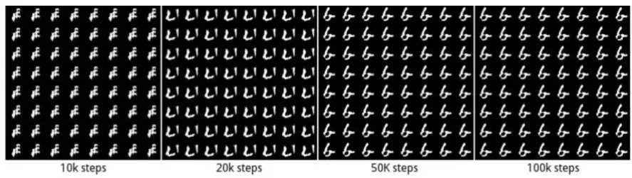
资料来源：Unrolled Generative Adversarial Networks，华泰证券研究所

## Non-saturating GAN 中 J(G)的等价表达

前文我们已经提到，在 Minimax GAN 模型中，如果判别器达到最优（不妨假设为 $\mathsf{D}^{\star}(\mathsf{x}))$ 那么训练生成器的目标函数将变为：

$$
\begin{array}{c}{{C(G)=E_{x\sim p_{r}}\bigl[\log\bigl(D^{*}(x)\bigr)\bigr]+E_{x\sim p_{g}}\bigl[\log\bigl(1-D^{*}(x)\bigr)\bigr]}}\\{{=-log4+2JS(p_{r}||p_{g})}}\end{array}
$$

对应的最优判别器表达式为：

$$
D^{*}(x)={\frac{p_{r}(x)}{p_{r}(x)+p_{g}(x)}}
$$

下面我们考虑生成分布与真实分布的 KL 散度：

$$
\begin{array}{rl}&{\quad KL(p_{g}||p_{r})=E_{x\sim p_{g}}\left[\log\displaystyle\frac{p_{g}(x)}{p_{r}(x)}\right]}\\&{=E_{x\sim p_{g}}\left[\log\displaystyle\frac{p_{g}(x)/(p_{r}(x)+p_{g}(x))}{p_{r}(x)/(p_{r}(x)+p_{g}(x))}\right]}\\&{=E_{x\sim p_{g}}\left[\log\displaystyle\frac{1-D^{*}(x)}{D^{*}(x)}\right]}\\&{=E_{x\sim p_{g}}\big[\log\big(1-D^{*}(x)\big)\big]-E_{x\sim p_{g}}\left[\log D^{*}(x)\right]}\end{array}
$$

联立C(G)的表达式，我们可以得到Non-saturating GAN中生成器损失函数的等价表达为：

$$
\begin{array}{c}{{J(G)=-E_{z\sim p_{z}}\bigl[\log D^{*}\bigl(G(z)\bigr)\bigr]=-E_{x\sim p_{g}}[\log D^{*}(x)]}}\\{{=KL(p_{g}||p_{r})-2JS(p_{r}|\left|p_{g}\right.)+log4+E_{x\sim p_{r}}\bigl[\log\bigl(D^{*}(x)\bigr)\bigr]}}\end{array}
$$

由于在训练生成器时完全依赖于判别器的损失函数项为常数可以忽略，因此简化的等价表达为：

$$
J(G)=KL(p_{g}||p_{r})-2JS(p_{r}|\big|p_{g}\big)
$$

注意，上述表达式的前提是判别器达到最优。实际上，当 GAN 训练到后期，判别器的能力已经很强，可近似认为判别器接近最优。因此，训练生成器近似于最小化上述 J(G)的表达式。生成器的模式崩溃正是由 J(G)的第一项 KL 散度的不对称性导致。

## 模式崩溃的原因

基于上文 J(G)的等价表达式可以进一步推导出模式崩溃的原因。首先将 KL 散度写成积分的形式：

$$
\begin{array}{l}{{\displaystyle KL(p_{g}||p_{r})=E_{x\sim P_{g}}\left[\log\frac{p_{g}(x)}{p_{r}(x)}\right]}}\\{{\displaystyle~=\int_{x}~p_{g}(x)~\log\frac{p_{g}(x)}{p_{r}(x)}dx}}\end{array}
$$

我们考虑生成样本的两种情形：

1. 生成器生成了不真实的样本。对应于那些不真实的样本，pg(x)>0 但 pr(x)≈0，此时KL 散度中间的被积项将会趋于∞；

2. 生成器没能生成真实的样本。对应于没能生成的那些真实样本，pr(x)>0 但 pg(x)≈0，此时 KL 散度中间的被积项将会趋于 0。

Non-saturating GAN 中优化生成器的损失函数要求 KL 散度尽量小。由于第一种情形损失接近无穷，惩罚巨大，生成器就会避免生成不真实的样本；由于第二种情形损失接近零，惩罚微小，因此生成器完全有可能只生成单一的真实样本，而不生成更多不同的真实样本。生成单一的真实样本已经足够“安全”，生成器没有必要冒着失真的风险生成多样化的样本，模式崩溃问题由此产生。

图表5： GAN生成样本的两种情形
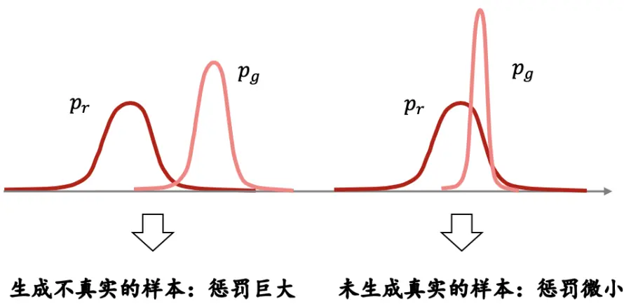
资料来源：华泰证券研究所

## Wasserstein GAN 介绍

## Wasserstein 距离

从上一章可知，GAN 的大部分缺陷与 JS 散度有关，因此 JS 散度可能不适用于 GAN。Arjovsky等（2017）提出使用 Wasserstein 距离（简称 W 距离）替代 JS 散度，这样构建的生成对抗网络称为 Wasserstein GAN（简称 WGAN）。

## W距离的通俗解释

W 距离用来衡量两个分布之间的远近，也称为“推土机距离”（Earth Mover Distance，后文简称 EM 距离），这个名称十分形象。如果将两个分布 p 和 q 分别比作两堆土，那么我们可以有不同的方式将土堆 p 推到和土堆 q相同的位置和形状。如下图所示，我们展示两种将土堆 p 推成土堆 q的方案，很显然这两种方式的平均推土距离（以推土量为权重，推土距离的加权和）不相等。EM 距离表示在所有推土方案中，平均推土距离最小的方案对应的推土距离。

图表6： EM 距离示意图
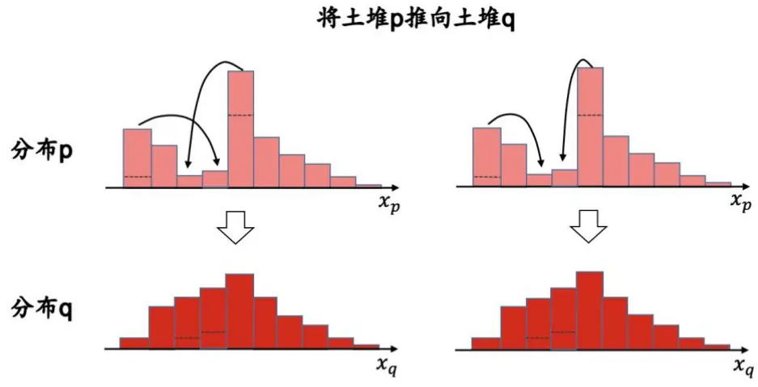
上述两种推土方案中，右侧即为当前两分布间的EM距离
资料来源：华泰证券研究所

从“推土”的角度出发，EM 距离的表达式如下所示：

$$
W(p,q)=\operatorname*{min}_{\gamma\in\Pi}\sum_{x_{p},x_{q}}\gamma\big(x_{p},x_{q}\big)||x_{p}-x_{q}||
$$

其中 $\gamma(\mathsf{x}_{\mathsf{p}},\mathsf{x}_{\mathsf{q}})$ 表示某种推土方案下对应的 $\mathsf{x}_{\mathsf{p}}$ 到 $\mathsf{X}_{\mathsf{q}}$ 的推土量， $||x_{p}-x_{q}||$ |则表示二者之间的某种距离（如欧式距离），Π表示所有可能的推土方案。根据 EM 距离的直观定义可知，EM 距离没有上界，随着两个分布之间越来越远，EM 距离会趋于无穷。换言之，EM 距离和 JS散度不同，不会出现梯度为零的情况。

## W距离的数学定义及性质

上一小节我们从“推土”的角度定义了 EM 距离也即 W 距离，这里我们从概率分布的角度定义W 距离。根据 Arjovsky等（2017），衡量真实分布与生成分布的W 距离数学定义如下：

$$
W\big(p_{r},p_{g}\big)=\operatorname*{inf}_{\gamma\sim\Pi\big(p_{r},p_{g}\big)}E_{(x,y)\sim\gamma}[||x-y||]
$$

其中 ${\mathsf{X}}{\sim}{\mathsf{p}}_{\mathsf{r}}$ ${\tt y}\sim{\tt p}_{\tt g},$ ，γ表示(x,y)的联合分布， $\Pi(\mathsf{p}_{\mathsf{r}},\mathsf{p}_{\mathsf{g}})$ 表示所有可能的γ取值空间。上式的本质是将分布 pr推向分布 ${\mathsf p}_{9}$ 所要经过的最小距离。

在论证原始的 GAN 模型 G与 D 训练不同步的问题时，我们提到若真实分布与生成分布的支撑集相交部分测度为零，JS 散度恒为常数。真实分布与生成分布近似不相交或者完全不相交时，那么无论真实分布与生成分布是距离一步之遥，还是距离海角天涯，JS 散度都是常数。换言之，JS散度无法指示不重合的两个分布到底距离多远。

W 距离的优越性正体现于此。W 距离随分布间“距离”的变化是连续的，即使两个分布完全不相交，W 距离也不会收敛到常数，而是随分布间“距离”的增加而不断增大，直至无穷。因此，W 距离没有梯度消失的问题，可以用W 距离替代 GAN 中的 JS散度。

## Wasserstein GAN 的原理

## WGAN 的原理

W 距离的原始数学定义过于理论，且在实际中无法直接计算。为便于使用，可以通过Kantorovich-Rubinstein Duality 公式（Arjovsky, 2017）将其等价变换为下式：

$$
\begin{array}{rlr}&{}&{W\big(p_{r},p_{g}\big)=\displaystyle\frac{1}{K}\operatorname*{sup}_{w:\left||f_{w}|\right|_{L}\leq K}(E_{x\sim p_{r}}\big[f_{w}(x)\big]-E_{x\sim p_{g}}\big[f_{w}(x)\big])\quad}\\&{}&{\qquad=\displaystyle\frac{1}{K}\operatorname*{sup}_{w:\left||f_{w}|\right|_{L}\leq K}(E_{x\sim p_{r}}\big[f_{w}(x)\big]-E_{z\sim p_{z}}\big[f_{w}\big(G(z)\big)\big])}\end{array}
$$

关于这个等价定义，我们进行如下三点解释：

1. $\{f_{w}(x),w\in\mathcal{W}\}$ 表示一族依赖于参数 w 的函数f，参数 w 的取值空间为W。函数f可以是能写出表达式的简单初等函数，也可以是一个复杂的深度学习网络。如果f是一个深度学习网络，则参数 w 就是网络中的一系列权重。

2. w:||fw||≤K表示函数 $f_{w}$ 满足 Lipschitz 条件：即对于 $f_{w}\gnapprox$ 义域内的任何取值a和b，满足$|f_{w}(a)-f_{w}(b)|\leq K|a-b|$ ，K称为 Lipschitz 常数。在 W 距离的等价定义式中，K可以是任意正实数。

3. sup 表示对所有满足条件的函数 $f_{w}$ 求括号中表达式的上确界，在实际应用中近似等价于求括号中表达式的最大值。

W 距离的等价定义式实际上就是WGAN的目标函数。在给定生成器 G时，上述定义式中的函数 $f_{w}$ 可以用一个深度学习网络来代替，这个深度学习网络的目标就是要最大化$\mathsf E_{\mathsf e\sim\mathsf p\mathsf{r}}[f_{w}(\mathsf{x})]\mathsf{-E}_{z\sim\mathsf{p}z}[f_{w}(\mathsf{G}(z))]$ ，在训练时K是一个常数，因此系数项可以忽略。为保持与 GAN统一，这里我们仍称这个深度学习网络为“判别器”（原文称为 critic），当然此时“判别器”已不再执行判别真假的功能，而是估计真假样本分布的 W 距离。类似于 GAN，WGAN 在实践中判别器与生成器也是交替训练的，这里我们列出二者的损失函数：

判别器： $J(D)=E_{z\sim P_{z}}\bigl[f_{w}\bigl(G(z)\bigr)\bigr]-E_{x\sim P_{r}}[f_{w}(x)]$

生成器： $J(G)=-E_{z\sim P_{z}}\big[f_{w}\big(G(z)\big)\big]$

在原始的 GAN 模型里，判别器的作用本质上也是在估计生成分布与真实分布之间的距离（用 JS 散度衡量），然后用生成器去拉近 JS 散度。在 WGAN 中这种思想则更为直接：用判别器去拟合两个分布之间的 W距离，用生成器去拉近 W 距离。

## WGAN-GP 的原理

WGAN 的原理逻辑较清晰，但是在等价定义式中对判别器有一个重要限制——判别器需满足 Lipschitz 条件。通常来说有两种处理办法，一种是权重剪裁（Weight Clipping），一种是梯度惩罚（Gradient Penalty），这里分别介绍。

权重剪裁的思想是对判别器网络的权重进行限制，因为神经网络仅仅是有限个权值与神经元相乘的结果，所以如果权重在某个有限范围内变化，那么判别器的输出值 $f_{w}({\sf x})$ 也不会变得太大，近似可以满足K-Lipschitz条件。实际操作中，会在训练判别器的每一步反向传播更新权值之后对权重进行剪裁，例如可以将更新后的权值限制到[-0.01, 0.01]中：

$$
w_{update}^{clip}=\left\{\begin{array}{rl}{0.01,\quad}&{ifw_{update}>0.01}\\{w_{update},\quad}&{if-0.01\leq w_{update}\leq0.01}\\{-0.01,\quad}&{ifw_{update}<-0.01}\end{array}\right.
$$

权重剪裁实际上并没有真正让判别器满足K-Lipschitz条件，且实证表明权重剪裁会让大部分网络权重落在限制边界上，使得生成样本的质量不佳。

更常用的方法是梯度惩罚。如果能将判别器 $f_{w}$ 相对于输入 x的梯度限制在一定范围内，那么自然 $f_{w}$ 就能满足K-Lipschitz条件。根据这个思想，可以在判别器损失函数中增加惩罚项，将判别器损失函数写成：

$$
J(D)=E_{z\sim p_{z}}\big[f_{w}\big(G(z)\big)\big]-E_{x\sim p_{r}}[f_{w}(x)]+\lambda E_{\hat{x}\sim p_{\hat{x}}}[(\big||\nabla_{\hat{x}}f_{w}(\hat{x})|\big|_{2}-1)^{2}]
$$

这个损失函数对判别器 $f_{\mathrm{w}}$ 相对于输入的梯度进行惩罚，将梯度的 L2-范数约束在 1 附近，从而保证 Lipschitz 条件的成立。通过这种改进的 WGAN 模型就称为 WGAN-GP 模型（Gulrajani，2017）。这里我们进行额外几点说明：

1. 在约束K-Lipschitz 条件时，我们并不关心K是多少，实际上根据 W 距离的等价关系，K可以是任意的正实数，所以只要能让 $f_{w}$ 满足某个尺度的 Lipschitz条件即可。

2. 带有梯度惩罚的损失函数中将梯度的 L2-范数约束在 1 附近，这个常数 1 是原文作者经过多次尝试选择出的较合适的常数，并无理论依据。

3. 理论上梯度惩罚应该对所有可能的输入x进行梯度约束，而上述损失函数实际上仅对介于真实样本与生成样本之间的那些样本x̂进行梯度约束， $p_{\hat{x}}$ 表示x̂的分布，实证表明这样做的效果已经较为理想。在实际应用时，某一次迭代对x̂的采样由下式产生：

$$
\hat{x}=\alpha x+(1-\alpha)G(z)
$$

其中α是[0,1]中的随机数，x为随机的真实样本，z为标准正态分布的随机采样。

4. WGAN-GP 中生成器的损失函数 J(D)和原始 WGAN 保持一致。

## WGAN-GP 的训练算法

在WGAN-GP的实际训练过程中，判别器 D与生成器 G交替进行训练，一般判别器 D训练 K 次，生成器 G训练 1 次。基于前文的分析，WGAN-GP训练算法的伪代码如下所示。

## 图表7： WGAN-GP训练算法的伪代码

输入：迭代次数 T，每轮迭代判别器 D训练次数 K，小批量（minibatch）样本数量 m
随机初始化 D网络参数 $\theta_{d}$ 和 G网络参数 ${\it\Delta}\cdot\theta_{g}$ 
2 for t ←1 to T do
# 训练判别器 D
3 for k ←1 to K do
# 采集小批量样本
4从训练集 ${\mathfrak{p}}_{r}(x)$ 中采集 m条样本 $\{x^{(m)}\}$ 
5从标准正态分布 $p_{g}(z)$ 中采集 m条样本 $\cdot\{z^{(m)}\}$ 
6从[0,1]均匀分布中采集m 个随机数 $\{\epsilon^{(m)}\}$ ，并计算 $\hat{x}^{(i)}=\epsilon^{(i)}x^{(i)}+(1-\epsilon^{(i)})\mathsf{G}(z^{(i)})$ ，得到{x̂(m)}
7使用随机梯度下降更新判别器 D，梯度为：
$\nabla_{\theta_{d}}\frac{1}{m}\sum_{i=1}^{m}[D\left(G\big(z^{(i)}\big)\right)-D\big(x^{(i)}\big)+\lambda(\Big|\big|\nabla_{\hat{x}}D\big(\hat{x}^{(i)}\big)\big|\Big|_{2}-1)^{2}]$ 
8 end
# 训练生成器 G
9从标准正态分布 ${\dot{p}}_{g}(z)$ 中采集 m 条样本 $\{z^{(m)}\}$ 
10使用随机梯度下降更新生成器G，梯度为：
$\nabla_{\theta_{g}}\frac{1}{m}{\sum_{i=1}^{m}[-D\left(G{\left(z^{(i)}\right)}\right)]}$ 
11 end
输出：生成器 G
资料来源：Improved Training of Wasserstein GAN，华泰证券研究所

## GAN 与 WGAN 的比较

本小节我们分析WGAN 是否针对 GAN 的三项缺点有所改进。

1. GAN的判别器D与生成器G训练进程必须小心平衡，否则会出现训练不同步的问题。一般每轮迭代 D训练 K次，G 训练 1次，对于 GAN我们要重点调整 K的值，避免判别器太好或太差；对于WGAN 则无需小心调整 K，可以让判别器的训练进度适当快于生成器。即使判别器 D训练得很好，再去训练生成器也不会出现梯度消失的问题。例如，在实践中每轮迭代可以令 D 训练 5次，再令 G训练 1 次。

2. GAN 模型 D和 G的损失函数都不收敛，无法指示训练进程。在WGAN中，因为判别器的损失函数是在近似估计真假样本分布之间的 W 距离，随着训练的推进，这个 W距离会存在收敛的过程，可以辅助指示训练的进程。

3. GAN 模型容易产生模式崩溃的问题。前文我们提到，模式崩溃主要和 KL 散度以及 JS散度有关，在WGAN中 JS散度被替换成W 距离，因此导致 GAN 发生模式崩溃的原因在WGAN中也就消失了。但值得注意的是，这并不意味着WGAN生成的样本完全没有模式崩溃的可能性。

图表8： GAN 与 WGAN 比较
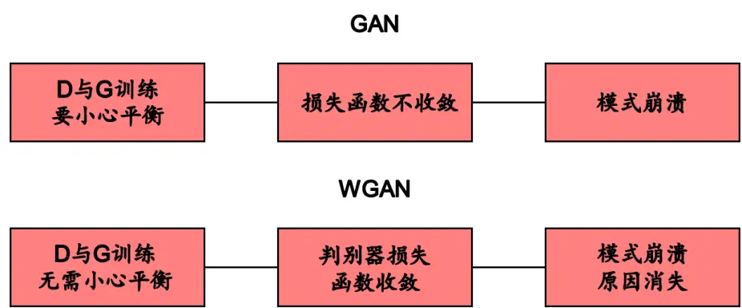
资料来源：Wasserstein Gan，华泰证券研究所

## 方法

在实证部分，我们围绕 GAN 与 WGAN 的对比展开实验，展示在生成金融时间序列上WGAN相对于 GAN 的改进。在展示结果之前，我们同样对训练数据、网络构建和评价指标进行说明。此外我们还引入衡量序列相似性的指标，用来判别样本的多样性。这里特别说明，由于 WGAN-GP 的梯度惩罚方法在实际应用中生成效果更好，因此本文数据测试均基于WGAN-GP模型，后文提到WGAN 也均指代 WGAN-GP，不作严格区别。

## 训练数据

为方便后续对比，本文选取《人工智能 31：生成对抗网络 GAN 初探》（20200508）中具有代表性的指数日频及月频对数收益率进行训练建模，标的和数据起止日期如下。

图表9： WGAN-GP 训练数据集

| 标的 | 频率 | 起止日期 | 每条样本长度 |
| --- | --- | --- | --- |
| 上证综指 | 日频 | 2004/12/31~2020/07/31 | 2520个交易日（约为10年） |
| 标普500 | 月频 | 1927/12/30~2020/07/31 | 252个交易月份（21年） |

资料来源：Wind，Bloomberg，华泰证券研究所

与 GAN 建模时相同，在处理真实样本时，采用滚动的方式对原始的对数收益率数据进行采样。例如对于上证综指原始近 16 年的时序数据，滚动生成长度为 2520 个交易日（约为 10 年）的样本，那么真实样本约有 1500 条。

## 网络构建

相比于 GAN 模型，WGAN 在网络结构上的主要改动在于判别器最后的输出层没有进行sigmoid 激活。这是因为 GAN 模型中的判别器需要对真假样本进行判别，最后的输出必须是 0～1 之间的值，表示输入样本是真实样本的概率。而WGAN 中的判别器作用是拟合生成分布与真实分布间的 W 距离，所以网络不应对输出值进行 0～1的限制。

此外在构建判别器网络时，由于判别器的损失函数加入了梯度惩罚项，且梯度惩罚项对每一 个 输 入 样 本 的 梯 度 进 行 限 制 ， 因 此 在 判 别 器 的 网 络 结 构 中 不 应 该 加 入Batch-Normalization（批归一化，简称 BN）层，BN 会将同一批其他样本的信息融入到对单个样本的梯度计算中，破坏样本间的独立性，此时算出来的梯度并不是真实的判别器对单个样本的梯度。一般可以使用 Layer-Normalization 层或者不使用任何归一化层。

参考 Pardo 等（2019）文献，我们构建如下生成器 G与判别器 D。生成器 G含有四个卷积层及一个输出层，每两个卷积层之间含一个上采样层；判别器 D含有三个卷积层、两个全连接网络层及一个输出层，每两个卷积层之间含一个最大值池化层。

图表10： WGAN-GP 生成器 G网络结构

| 参数 | 取值 |
| --- | --- |
| 结构 | 含四个卷积层、三个上采样层的卷积网络 |
| 输入噪音向量（隐变量）pz(z) | 标准正态分布 |
| 输入层神经元数量 | 100 |
| 卷积层卷积核数量 | 32 |
| 卷积层核尺寸 | 3 |
| 卷积层 Stride | 1 |
| 卷积层 Padding | 1 |
| 卷积层激活函数 | LeakyReLU(0.2) |
| 上采样层尺度 | 2 |
| 输出层神经元数量 | 2520(10年日频)或 252(21年月频) |
| 是否标准化 | 是（Batch-Normalization） |
| 损失函数 | −Ez~pz[fw(G(z))] |
| 优化器 | RMSProp |
| 优化器参数 | 0.0001 |

资料来源：Enriching Financial Datasets with Generative Adversarial Networks，华泰证券研究所

图表11： WGAN-GP 判别器 D网络结构

| 参数 | 取值 |
| --- | --- |
| 结构 | 含三个卷积层、两个最大值池化层及两个全连接层的卷积网络 |
| 输入层神经元数量 | 2520(10年日频)或 252(21年月频) |
| 卷积层卷积核数量 | 32 |
| 卷积层核尺寸 | 3 |
| 卷积层 Stride | 1 |
| 卷积层 Padding | 1 |
| 卷积层激活函数 | LeakyReLU(0.2) |
| 池化层核尺寸 | 2 |
| 池化层 Stride | 2 |
| 池化层 Padding | 0 |
| 第一层全连接层神经元数量 | 50 |
| 第二层全连接层神经元数量 | 15 |
| 全连接层激活函数 | LeakyReLU(0.2) |
| 输出层神经元数量 | 1 |
| 输出层激活函数 | LeakyReLU(0.2) |
| 是否标准化 | 否/Layer-Normalization |
| 损失函数 | $E_{z\sim p_{z}}\big[f_{w}\big(G(z)\big)\big]-E_{x\sim p_{r}}[f_{w}(x)]+\lambda E_{\hat{x}\sim p_{\hat{x}}}[(\big\|\|\nabla_{\hat{x}}f_{w}(\hat{x})\|\big\|_{2}-1)^{2}]$ |
| 优化器 | RMSProp |
| 优化器参数 | 0.0001 |

资料来源：Enriching Financial Datasets with Generative Adversarial Networks，华泰证券研究所

结合 判别器的收敛情况及生成数据的质量，本文选择的上证综指日频数据训练迭代次数为 1500 次，标普 500 月频的训练迭代次数为 1000 次，相比于 GAN 模型的 2000次，训练时间开销显著降低。在 WGAN 中我们不再需要小心平衡判别器与生成器的训练次数，每轮迭代可以令判别器多训练几次，本文设定每轮迭代中判别器 D 训练 5次，生成器 G训练 1 次。

图表12： GAN 与 WGAN-GP 通用参数比较

| 参数 | WGAN-GP 取值 | GAN 取值 |
| --- | --- | --- |
| 迭代次数 | 1500（上证综指日频）/1000（标普500月频） | 2000 |
| 每轮迭代 G 和 D 的训练次数比 | 1:5 | 1:1 |
| Batch Size | 24 | 24 |

资料来源：华泰证券研究所

## 序列真实性指标

在评估 GAN 生成序列的质量时我们介绍了 6 项指标：自相关性、厚尾分布、波动率聚集、杠杆效应、粗细波动相关和盈亏不对称性，具体定义可以参考《人工智能 31：生成对抗网络 GAN 初探》（20200508）报告，这里不再展开。

为更好地评估生成序列的真实程度，除上述 6项指标外，我们额外引入 2类衡量真实序列特征的指标，最后将WGAN与 GAN 各自生成的虚假序列在这 8项指标上与真实序列进行对比，观察WGAN的生成序列相对于 GAN 模型是否有所改进。

## 方差比率检验

方差比率检验（Variance Ratio Test）最早提出是为了检验金融资产的价格序列是否为随机游走，从而验证市场的有效性。检验的核心思想在于，如果市场是有效的，那么资产价格服从随机游走，则收益率的方差是时间的线性函数，下面我们展开说明。

假设 $P_{t}$ 代表 t 时刻资产的对数价格, $r_{t}=P_{t}-P_{t-1}$ 表示 t 时刻对应的单期对数收益率，$r_{t}(q)=P_{t}-P_{t-q}$ 代表 t时刻对应的 q 期对数收益率，t的取值为 0～T。对数价格的随机游走过程由下式刻画：

$$
P_{t}=\mu+P_{t-1}+\varepsilon_{t}
$$

其中 $\mu$ 表示漂移项，εt表示随机增量。关于 $\varepsilon_{\mathrm{t}}$ 的不同假设可以得到不同强度的随机游走，例如我们可以假设 $\scriptstyle{\mathcal{E}}_{\mathrm{t}}$ 非自相关，且同方差。此时：

$$
\begin{array}{c}{{Var[r_{t}(q)]=Var\bigl[P_{t}-P_{t-q}\bigr]}}\\{{=Var\bigl[(P_{t}-P_{t-1})+(P_{t-1}-P_{t-2})+\cdots+\bigl(P_{t-q+1}-P_{t-q}\bigr)\bigr]}}\\{{=Var\bigl[r_{t}+r_{t-1}+\cdots r_{t-q+1}\bigr]=Var[q\mu+\varepsilon_{t}+\varepsilon_{t-1}+\cdots+\varepsilon_{t-q+1}]}}\\{{=qVar[\varepsilon_{t}]=qVar[r_{t}]}}\end{array}
$$

即在随机游走假设下， $Var[r_{t}(q)]=qVar[r_{t}]$ 成立，q 期的对数收益率方差等于单期对数收益率方差的 q倍，因此可以用如下方差比率检验来判断市场的随机游走假设是否成立。

$$
H_{0}:\frac{Var[r_{t}(q)]}{qVar[r_{t}]}=1
$$

Lo 和 Mackinlay 等（1988）提出统计量 $\mathsfit{Z}(\mathsfit{q})$ 对此进行检验，Z(q)的具体计算公式请参考附录。如果 H0假设成立，即 q 期的对数收益率方差等于单期对数收益率方差的 q 倍，那么在大样本条件下 $Z({\mathsf{q}})$ 服从 N(0,1)标准正态分布，95%置信水平下的拒绝域为$(-\infty,1.96]\cup[1.96,+\infty)$ 。因此，对于真实序列和生成的每条样本序列，我们可以遵循如下步骤进行方差比率检验：

1. 选定需要检验的滞后阶数 q，计算样本的单期对数收益率序列；

2. 计算检验统计量 $Z({\mathsf{q}})$ ；

3. 将 $\mathsfit{Z}(\mathsfit{q})$ 与拒绝域临界值进行比较，例如在 95%的置信水平下，如果-1.96≤Z(q) ≤1.96，则接受原假设，认为当前序列在 q 期的时间跨度内为随机游走，否则为非随机游走。

一般来说，A股市场在短期内不能拒绝原假设，会表现出随机游走的特征，在中长期则拒绝原假设，表现出非随机游走的特征。

长时程相关

时间序列的长时程相关(Long-Range Dependence)指的是时间序列过去的状态可能对现在或未来产生影响。对于金融时间序列，长时程相关则意味着间隔较久的证券价格之间也存在相关性，在这种假设下，市场可能会产生“历史重演”的现象，因此长时程相关也称为长记忆性。Hurst指数可以刻画这种长时程相关，其定义如下：

$$
E\left[\frac{R(n)}{S(n)}\right]=An^{H}
$$

其中 n表示某一段序列的区间长度，R(n)表示这一段序列在区间上的变化范围，S(n)表示这一段序列在区间上的波动，A 表示某一个常数，H 表示 Hurst 指数。在实际计算过程中我们正是按照 Hurst 指数的定义来计算的，这种计算方法也叫做 R/S 分析法（RescaledRange Analysis），计算步骤如下图所示。

## 图表13： Hurst 指数计算的 R/S 分析法

## 输入：时间序列长度为 N 的对数收益率序列{r }

1 选择一个整数步长 n，将序列按顺序分为 N/n=M个子序列

2 在第i个子序列内逐一计算累积离差：

$$
Y_{ik}=\sum_{t=1}^{k}(r_{ik}-\bar{r_{i}}),k=1,2,\dots,n
$$

其中 $\bar{r}_{i}$ 为第i个子序列的均值

3计算第i个子序列的标准差 $.S_{i}$ 以及第i个子序列的累积离差变化范围 $R_{i}$

$$
R_{i}=\operatorname*{max}(Y_{ik})-\operatorname*{min}(Y_{ik}),1\leq k\leq n
$$

4对于第i个子序列，我们得到 R/S比率为 $R_{i}/S_{i}$

5对所有划分的子序列重复 2~4, 并对所有的 R/S 比率取均值，得到步长为 n 时的平均意义下 R/S 比率为

$$
\left(\frac{R}{S}\right)_{n}=\frac{1}{M}\sum_{I=1}^{M}\frac{R_{i}}{S_{i}}
$$

6 对于一系列的 n重复 1～5，令 $\left({\frac{R}{s}}\right)_{r}$ 对n进行回归，回归系数即为所求的 Hurst 指数如果 Hurst > 0.5，则表示时间序列具有长记忆性；如果 Hurst < 0.5，则表示时间序列具有反持续性，表现出均值回复的特征，波动较强；如果 Hurst = 0.5，则表示时间序列随机游走。A股及美股市场指数对数收益率序列的 Hurst值在 0.5～0.6 之间，表现出较弱的长记忆性。

## 评价指标小结

这里我们对总计 8 项评价生成序列质量的指标进行总结，如下表所示。

图表14： 8项生成虚假序列评价指标

| 指标名称 | 计算方法 | 真实序列特点 |
| --- | --- | --- |
| 自相关性 | 计算收益率序列1~k阶自相关系数 | 不相关 |
| 厚尾分布 | 统计收益率分布 | 厚尾分布 |
| 波动率聚集 | 计算收益率绝对值和未来波动率的1~k阶自相关系数 | 低阶正相关，高阶不相关 |
| 杠杆效应 | 计算当前收益率和未来波动率的1~k阶相关度 | 低阶负相关，高阶不相关 |
|  | 粗细波动率相关计算周频收益率绝对值(粗波动率)和一周内日频收益率绝对不对称，细能预测粗，粗不能预测 | 细 |
| 盈亏不对称性 | 值之和(细波动率)的-k~k阶相关系数 统计涨跌超过一定幅度所需最少交易日数的分布 | 涨的慢，跌得快 |
| 方差比率检验 | 计算收益率序列若干阶的方差比率统计量 | 低阶随机游走，高阶非随机游走 |
| 长时程相关 | 计算收益率序列的 Hurst 指数 | Hurst 指数在 0.5~0.6 之间 |

资料来源：华泰证券研究所

## 序列相似性指标

从理论上来说，WGAN 消除了 GAN 模式崩溃的原因，那么 WGAN 生成样本的多样性是否有所提升？要回答这个问题，我们首先需要找到合适的衡量序列多样性的指标。

本文采用动态时间规整指标（Dynamic Time Warping，简称 DTW）进行衡量，这一指标源于语音识别和匹配领域，可用于匹配两段内容相似但是语速不同的语音片段。由于语速不同，相同时刻的内容差别可能比较大，用传统的欧式距离去衡量相同时刻的距离很可能得出两条片段不相似的结论。

如果两段金融时间序列整体趋势相同，但是在时间轴上存在伸缩或变形，如左下图所示，粗线代表两条序列，细线代表对应时点求欧式距离，那么此时计算对应时刻的欧式距离再求和就不是合适的距离度量指标。

DTW 算法是对欧式距离的改良，它并不直接计算序列在相同时刻的欧式距离之和，而是找到趋势最为匹配的时间点然后计算彼此间的距离，一条时间序列上的某个点可能对应另一条时间序列上的多个点，如右下图所示。即使时间序列在时间尺度上有拉长或压缩，DTW也能把握序列整体的趋势，从而判定两条序列总体相似或者不相似，这样的方法也称为时间序列的形态匹配。

图表15： 欧式距离方法与 DTW 方法
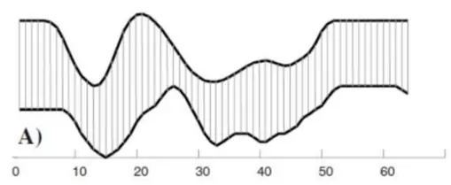

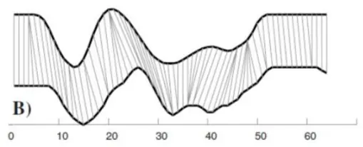
资料来源：Pattern matching trading system based on the dynamic time warping algorithm，华泰证券研究所

DTW 基于动态规划算法寻找每一步最匹配的两个点，规划的递推公式如下：

$$
D(i,j)=\operatorname*{min}\{D(i-1,j-1)+D(i,j-1),D(i-1,j)\}+distance(i,j)
$$

我们称两条序列分别为 A 和 B。上式中等式左侧的D(i,j)表示直到序列 A 的第 i 个时刻和序列 B 的第 j 个时刻两条序列的累积 DTW 距离；等式右侧的distance(i,j)则表示序列 A的第i个点和序列B的第j个点之间的欧式距离。如果两条序列长度均为 N，则最终D(N,N)就表示两条序列的累积 DTW 距离。

两条序列之间的 DTW 指标越小，表示两条序列越相似，反之则表示两条序列越不相似。
我们希望WGAN 的生成序列具备多样性，序列间的 DTW 值越大越好。

## WGAN 与 GAN 结果对比

本章对比WGAN和 GAN 的生成效果。实验表明，WGAN 的生成效果优于 GAN，体现在两方面：1.WGAN 生成数据质量更好，在长时程相关等统计指标上相较于 GAN更接近真实序列；2. WGAN 在生成样本多样性上相较于 GAN 有提升。WGAN 的优势在标普 500月频序列生成上体现更为明显。

## 上证综指日频序列

## 损失函数及真假序列展示

左下图展示WGAN模型在训练过程中生成器 G 与判别器 D 的损失函数。可以看到判别器的损失函数在 100 轮迭代次数以内从一个较大的值迅速减小，在 200～700 轮迭代之间上下波动，700 轮后收敛，在较窄范围内波动。生成器的损失函数没有明显的收敛过程。根据判别器损失函数的指示及生成序列的质量，最终我们选择 1500 轮迭代次数进行训练。

图表16： 上证综指日频序列：WGAN-GP损失函数
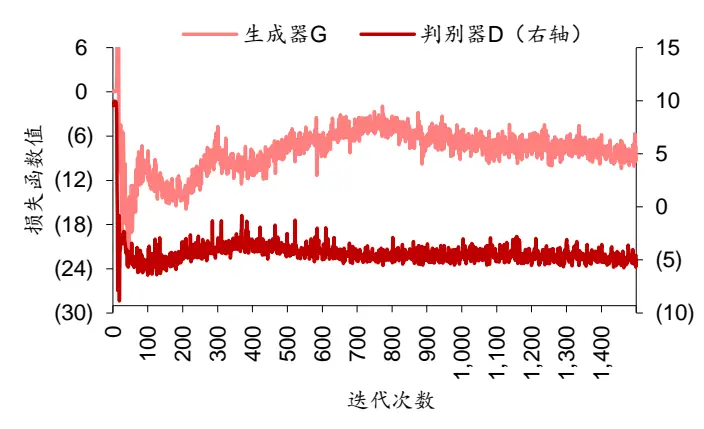
资料来源：Wind，华泰证券研究所

图表17： 上证综指日频序列：真实价格序列（2004/12/31~2020/07/31）
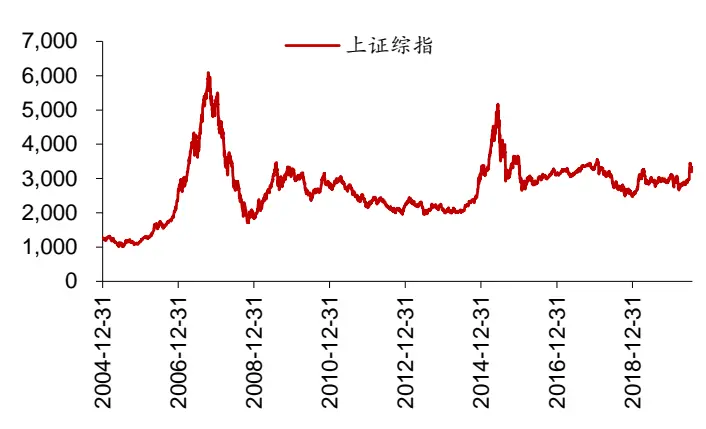
资料来源：Wind，华泰证券研究所

图表18： 上证综指日频序列：GAN生成价格序列范例 1
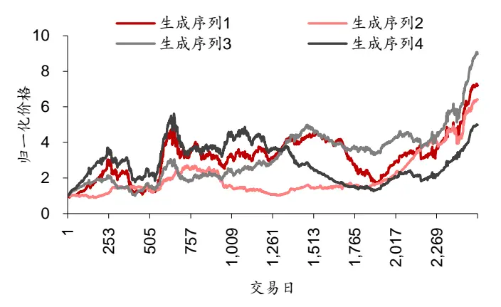
资料来源：Wind，华泰证券研究所

图表19： 上证综指日频序列：GAN生成价格序列范例 2
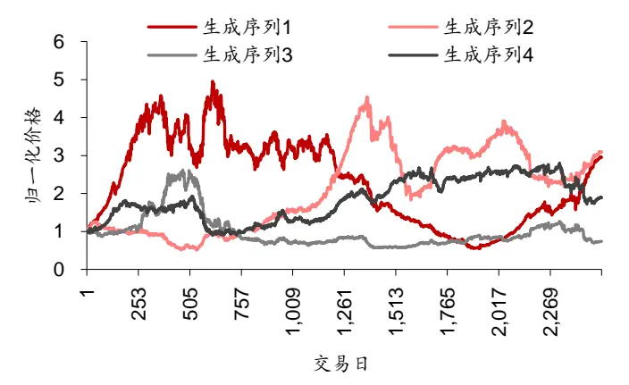
资料来源：Wind，华泰证券研究所

图表20： 上证综指日频序列：WGAN-GP生成价格序列范例 1
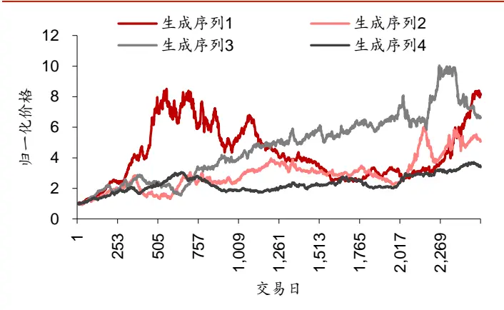
资料来源：Wind，华泰证券研究所

图表21： 上证综指日频序列：WGAN-GP生成价格序列范例 2
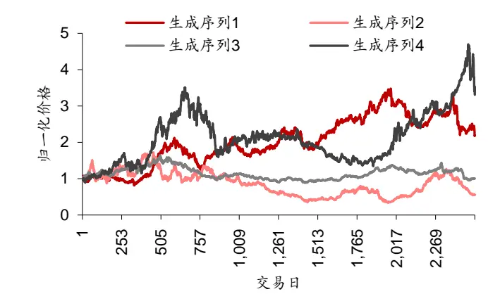
资料来源：Wind，华泰证券研究所

## 评价指标对比

这里我们将上证综指日频真实序列、WGAN和 GAN 生成序列的 8 项指标进行对比。首先考察前 6 项指标，GAN 与 WGAN 各自分别生成 1000 条虚假序列计算评价指标并求其均值，结果如下所示。WGAN和 GAN 的生成序列都较完美地复现出上证综指日频序列在自相关性、厚尾分布、波动率聚集、杠杆效应、粗细波动率相关及盈亏不对称性上的特征。

图表22： 上证综指日频序列：真实序列 6项评价指标
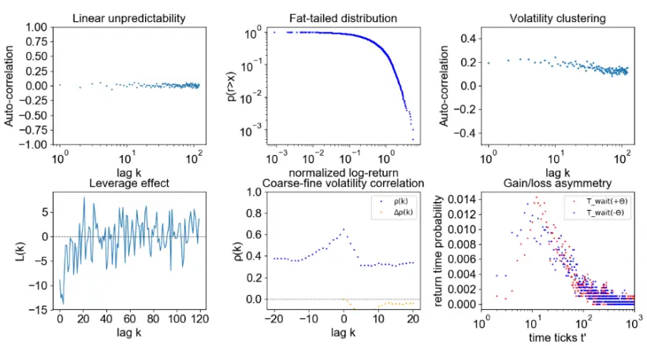
资料来源：Wind，华泰证券研究所

图表23： 上证综指日频序列：GAN生成序列 6项评价指标
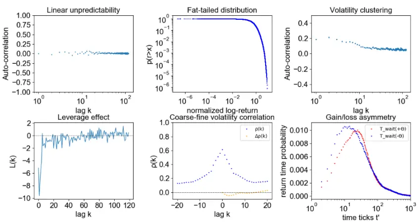
资料来源：Wind，华泰证券研究所

图表24： 上证综指日频序列：WGAN-GP生成序列 6项评价指标
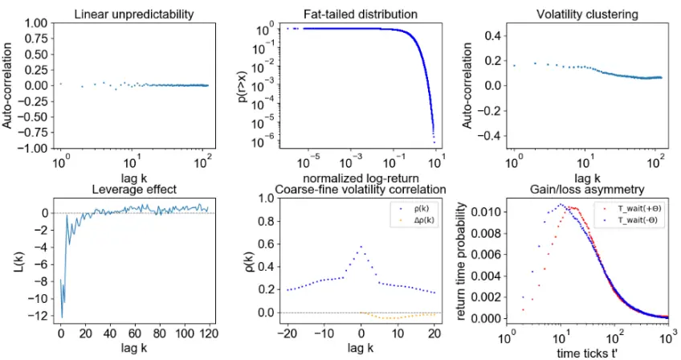
资料来源：Wind，华泰证券研究所

图表25： 上证综指日频序列：GAN与 WGAN-GP生成序列前 6项指标对比

| 评价指标 | 统计量 | 真实序列 | GAN | WGAN-GP |
| --- | --- | --- | --- | --- |
| 自相关性 | 前10阶自相关系数均值 | 0.01 | 0.01 | 0.01 |
| 厚尾分布 | 拟合幂律衰减系数α | 4.21 | 4.27 | 4.91 |
| 波动率聚集 | 拟合幂律衰减系数β | 0.16 | 0.36 | 0.29 |
| 杠杆效应 | 前10阶相关系数均值 | -6.33 | -3.29 | -4.87 |
| 粗细波动率相关 | 滞后±1 阶相关系数之差 | -0.02 | -0.03 | -0.01 |
| 盈亏不对称性 | 盈亏±0所需天数分布峰值之差 | 4.00 | 7.45 | 6.11 |

资料来源：Wind，华泰证券研究所

在前 6 项评价指标上 WGAN 与 GAN 模型旗鼓相当，下面我们继续展示在补充的 2 项指标上二者的表现。下图是两模型在方差比率检验上的结果，其中蓝色虚线表示真实序列各阶的方差比率检验统计值，箱线图表示 1000 条生成序列在各阶的方差比率检验统计值的分布；表格为两个模型各自 1000 条生成序列在各阶方差比率检验统计量的均值。

真实序列表现出的特征是短期（对应阶数 2～10）随机游走，即低阶方差比率检验统计量落在[-1.96，1.96]的范围内；高阶（对应阶数 50～100）非随机游走，即高阶方差比率检验统计量落在[-1.96，1.96]的范围外。总体来说，GAN 与WGAN 的生成序列都复现出了这一特征，但左图蓝线在箱形外沿，右图蓝线贴近箱形均值，说明 WGAN 生成序列的方差比检验统计量与真实序列更为接近。

图表26： 上证综指日频序列：GAN方差比检验结果
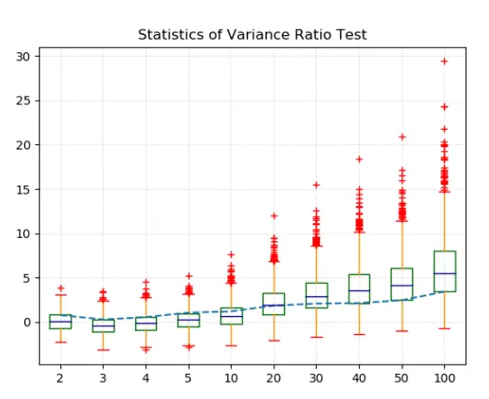
资料来源：Wind，华泰证券研究所

图表27： 上证综指日频序列：WGAN-GP方差比检验结果
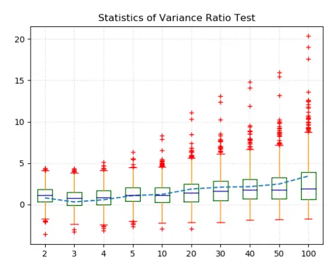
资料来源：Wind，华泰证券研究所

图表28： 上证综指日频序列：方差比率检验统计值

| 阶数 | 2 | 3 | 4 | 5 | 10 | 20 | 30 | 40 | 50 | 100 |
| --- | --- | --- | --- | --- | --- | --- | --- | --- | --- | --- |
| 真实序列 | 0.79 | 0.30 | 0.56 | 1.07 | 1.21 | 1.86 | 2.09 | 2.15 | 2.47 | 3.43 |
| GAN | 0.15 | -0.33 | -0.09 | 0.31 | 0.82 | 2.20 | 3.25 | 4.00 | 4.60 | 6.19 |
| WGAN | 1.09 | 0.77 | 0.86 | 1.22 | 1.21 | 1.52 | 1.81 | 2.04 | 2.18 | 2.56 |

资料来源：Wind，华泰证券研究所

GAN 与WGAN 生成序列的 Hurst 指数值如下图所示。上证综指日频序列的真实 Hurst 值为 0.52，表现出弱长时程相关的特征。GAN 模型生成序列中大部分的 Hurst 指数都小于0.5，仅有约 20% Hurst 值大于 0.5。WGAN 模型生成序列则有显著改善，约有 60%的 Hurst值大于 0.5，可以看到WGAN 生成序列的 Hurst值整体分布位于 GAN 的右侧。

图表29： 上证综指日频序列：GAN与 WGAN-GP生成序列 Hurst指数分布
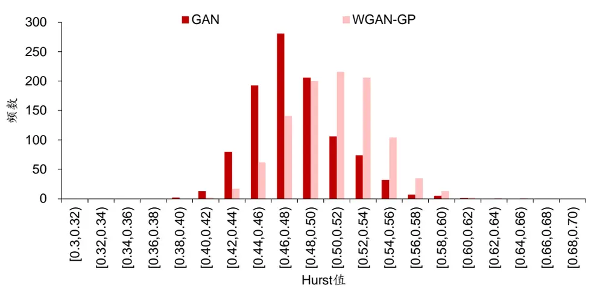
资料来源：Wind，华泰证券研究所

然而仅根据表现出长时程相关的序列比例判定生成序列是否失真是不够的，这里对生成序列的 Hurst 值进行假设检验。我们想要验证生成分布在 Hurst 指标上的总体均值是否显著大于 0.5，假设μH表示生成分布在 Hurst指标上的总体均值，则原假设和备择假设为：

$$
H_{0}\colon\mu_{H}>0.5H_{1}\colon\mu_{H}\leq0.5
$$

生成的 1000 条虚假序列相当于从生成分布总体中的采样，对于这样的大样本检验，我们可以直接使用单样本正态总体均值的单边显著性检验统计量，如下所示：

$$
U=\frac{\sqrt{1000}(\bar{X}-0.5)}{S_{n}}
$$

其中X̅表示 1000 条生成样本 Hurst 指数的样本均值， $\mathsf{S}_{\mathsf{n}}$ 表示 1000 条生成样本 Hurst 指数的样本方差，记 $\scriptstyle\sum\{h_{t}\}_{t=1,\dots,1000}$ 为 1000 条生成序列的 Hurst 指标值，即

$$
\bar{X}=\frac{1}{1000}{\sum}_{t=1}^{1000}h_{t}
$$

$$
S_{n}={\frac{1}{999}}{\sum}_{t=1}^{1000}(h_{t}-\bar{X})^{2}
$$

在大样本（一般来说样本数大于 30）条件下，原假设 H0成立时 U 服从 N(0,1)标准正态分布，因此在 95%置信水平下，U 如果落入(−∞,−1.64]的拒绝域，则拒绝原假设，认为生成样本的 Hurst指数总体均值小于 0.5。

在上述假设检验下，GAN 与WGAN 生成的 1000 条序列检验结果如下表所示。GAN 模型1000 条生成序列的 Hurst均值假设检验统计量为-657.02，远小于-1.64，因此有理由相信GAN 模型生成序列在长时程相关上是失真的。WGAN模型检验统计量为 192.27，充分远离拒绝域，因此可以合理认为WGAN 生成序列复现了真实序列的长时程相关特征。

图表30： 上证综指日频序列：GAN与 WGAN-GP生成样本 Hurst值假设检验结果

| 模型 | Hurst 均值 | Hurst 大于 0.5 比例 | 检验统计量U | 是否拒绝原假设 是否长时程相关 |  |
| --- | --- | --- | --- | --- | --- |
| GAN | 0.48 | 22.5% | -657.02 | 是 | 否 |
| WGAN-GP | 0.51 | 57.8% | 192.27 | 否 | 是 |

资料来源：Wind，华泰证券研究所

## 样本多样性

我们从 GAN 模型生成的 1000 条上证综指日频假序列中随机抽取 1000 组配对序列，计算这 1000 组配对序列之间的 DTW 指标，对WGAN 生成序列也进行同样的操作。两个模型的 DTW 分布如下图所示。整体上看来，WGAN 生成样本序列之间的 DTW 值分布位于GAN 右侧，DTW 值更大，即意味着序列之间的相似性更低，多样性略有提升。

图表31： 上证综指日频序列：GAN与 WGAN-GP生成序列 DTW 分布
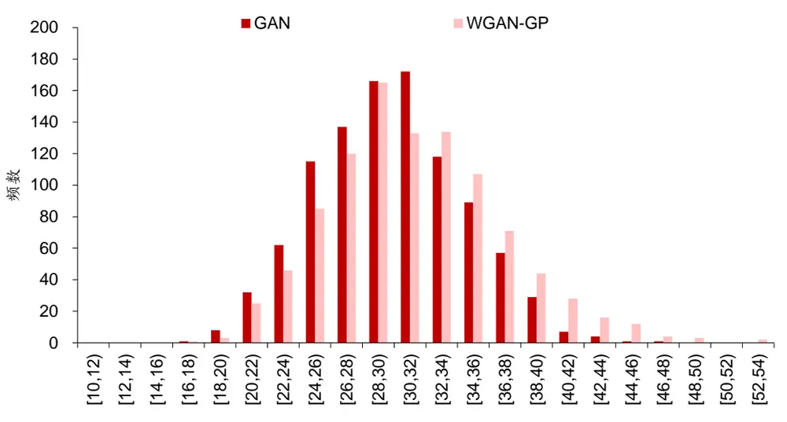
资料来源：Wind，华泰证券研究所

## 标普 500月频序列

## 损失函数及真假样本展示

WGAN模型的训练损失函数如左下图所示。判别器损失函数在前100次迭代时迅速降低，在 100～700 次迭代期间先减后增，700 次迭代以后收敛到一个较小的范围内。结合损失函数的形态及生成数据的质量，我们最后选取 1000 轮迭代次数进行训练。生成器的损失函数同样没有明显的收敛过程。

图表 34～37展示两类模型生成的标普 500 月频部分数据，左侧序列与右侧序列分别是不同尺度上随机抽取的 4组虚假序列。从净值图可知，WGAN 生成样本相对于 GAN 生成样本更为丰富，内部差异更大，而不是完全“复制”真实序列的单调上升趋势。

图表32： 标普 500 月频序列：WGAN-GP 损失函数
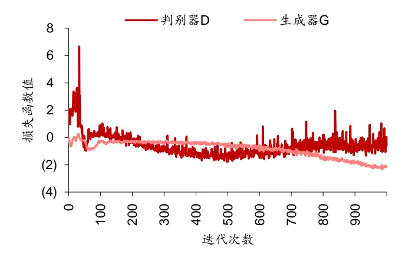
资料来源：Bloomberg，华泰证券研究所

图表33： 标普 500 月频序列：真实价格序列（1927/12/30~2020/07/31）
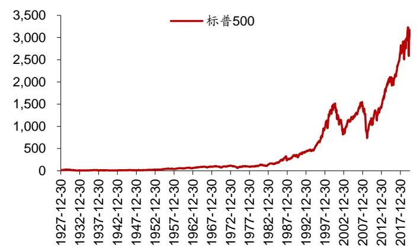
资料来源：Bloomberg，华泰证券研究所

图表34： 标普 500月频序列：GAN生成价格序列范例 1
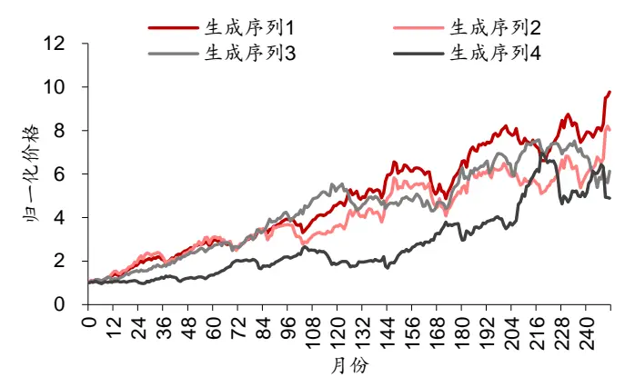
资料来源：Bloomberg，华泰证券研究所

图表35： 标普 500月频序列：GAN生成价格序列范例 2
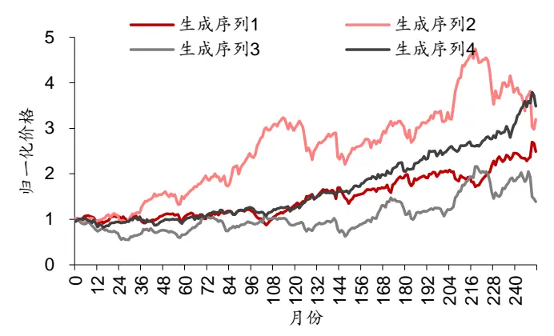
资料来源：Bloomberg，华泰证券研究所

图表36： 标普 500月频序列：WGAN-GP 生成价格序列范例 1
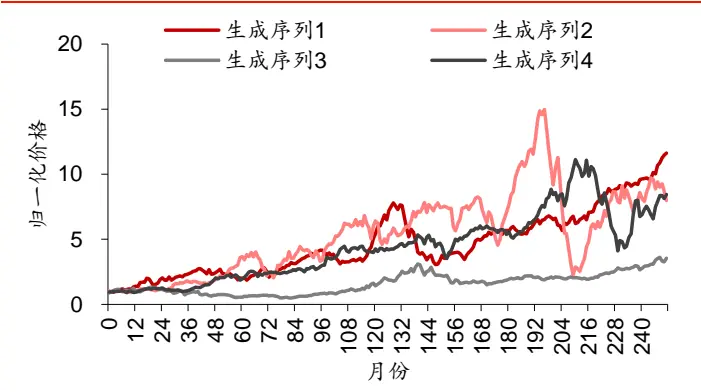
资料来源：Bloomberg，华泰证券研究所

图表37： 标普 500月频序列：WGAN-GP 生成价格序列范例 2
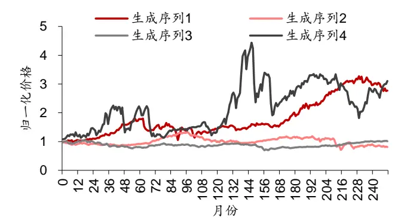
资料来源：Bloomberg，华泰证券研究所

## 评价指标对比

真实序列、WGAN 与 GAN 生成序列的前 6 项评价指标如下图所示。GAN 生成序列在波动率聚集指标上没有表现出明显的衰减过程；在粗细波动率相关指标上虽然表现出预测能力的不对称性，但是不对称性与真实序列正好相反；在盈亏不对称性指标上没能表现出涨得慢、跌得快的特征，即红色分布未明显分布在蓝色分布右侧。

相比之下，WGAN 生成序列有明显改善。WGAN 生成序列的波动率聚集指标表现出一定的衰减特征；粗细波动率相关指标橙色点在低阶为负，与真实序列的不对称性一致；在盈亏不对称性指标上红色分布峰值位于蓝色分布峰值右侧，表现出涨得慢、跌得快的特征。

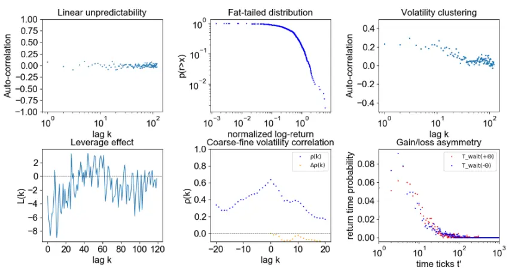
图表38： 标普 500月频序列：真实序列 6项评价指标
资料来源：Bloomberg，华泰证券研究所

图表39： 标普 500月频序列：GAN生成序列 6项评价指标
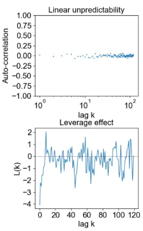
资料来源：Bloomberg，华泰证券研究所

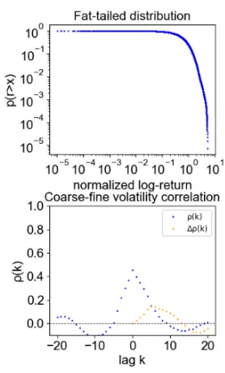

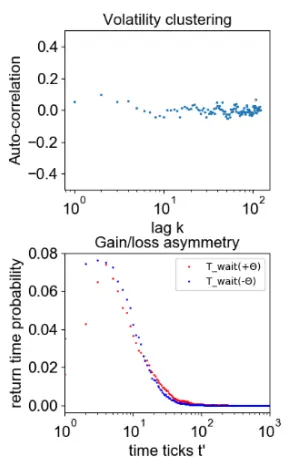

图表40： 标普 500月频序列：WGAN-GP 生成序列 6项评价指标
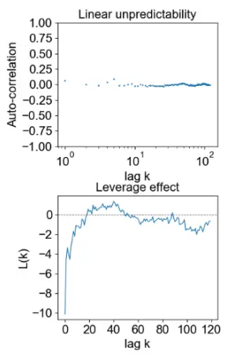
资料来源：Bloomberg，华泰证券研究所

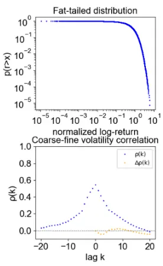

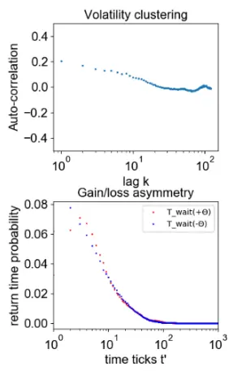

图表41： 标普 500月频序列：GAN与 WGAN-GP生成序列前 6项指标对比

| 评价指标 | 统计量 | 真实序列 | GAN | WGAN-GP |
| --- | --- | --- | --- | --- |
| 自相关性 | 前10阶自相关系数均值 | 0.02 | -0.01 | 0.01 |
| 厚尾分布 | 拟合幂律衰减系数α | 3.92 | 4.41 | 4.47 |
| 波动率聚集 | 拟合幂律衰减系数β | 0.43 | 0.92 | 0.94 |
| 杠杆效应 | 前10阶相关系数均值 | -5.36 | -0.66 | -2.82 |
| 粗细波动率相关 | 滞后±1 阶相关系数之差 | -0.01 | 0.03 | -0.03 |
| 盈亏不对称性 | 盈亏±θ所需天数分布峰值之差 | 1.00 | 1.31 | 2.07 |

资料来源：Bloomberg，华泰证券研究所

两组模型生成序列在方差比率检验上的结果如下所示。标普 500 月频真实序列在全阶数上均表现出随机游走的特征，整体上来说 GAN 模型与WGAN 模型的生成序列也都复现出了随机游走的性质，即方差比率检验统计量均落入[-1.96，1.96]范围内。但是 GAN 生成序列的方差比率检验结果与真实序列仍有偏差，在 20～50 阶左右表现尤为明显，此时代表真实序列的蓝色虚线完全偏离在箱形图之外。相比之下，WGAN 的方差比率检验结果则与真实序列更为接近。

图表42： 标普 500月频序列：GAN方差比检验结果
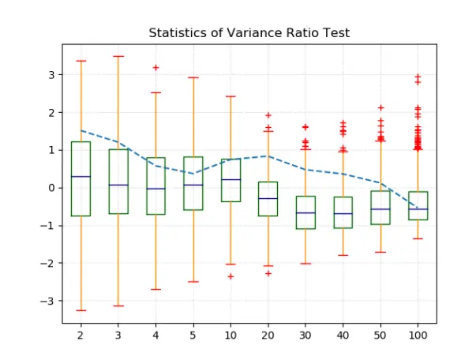
资料来源：Bloomberg，华泰证券研究所

图表43： 标普 500月频序列：WGAN-GP 方差比检验结果
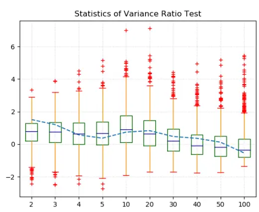
资料来源：Bloomberg，华泰证券研究所

图表44： 标普 500月频序列：方差比率检验统计值

| 阶数 | 2 | 3 | 4 | 5 | 10 | 20 | 30 | 40 | 50 | 100 |
| --- | --- | --- | --- | --- | --- | --- | --- | --- | --- | --- |
| 真实序列 | 1.51 | 1.20 | 0.57 | 0.37 | 0.74 | 0.83 | 0.47 | 0.36 | 0.12 | -0.54 |
| GAN | 0.23 | 0.13 | 0.02 | 0.11 | 0.19 | -0.31 | -0.62 | -0.61 | -0.49 | -0.41 |
| WGAN | 0.72 | 0.72 | 0.64 | 0.68 | 0.98 | 0.75 | 0.33 | 0.05 | -0.01 | -0.07 |

资料来源：Bloomberg，华泰证券研究所

两组模型生成序列在Hurst指数上的分布如下所示。标普500月频对数收益率序列的Hurst指数为 0.60，表现出长记忆性。WGAN序列和 GAN 生成序列的 Hurst指数均有超过 70%大于 0.5。对两组生成序列 Hurst 值的假设检验结果表明，两组生成序列 Hurst 指数总体均值显著大于 0.5，WGAN与 GAN 生成的标普 500 月频序列均复现出真实序列的长时程相关性。

图表45： 标普 500 月频序列：GAN 与 WGAN-GP 生成序列 Hurst 指数分布
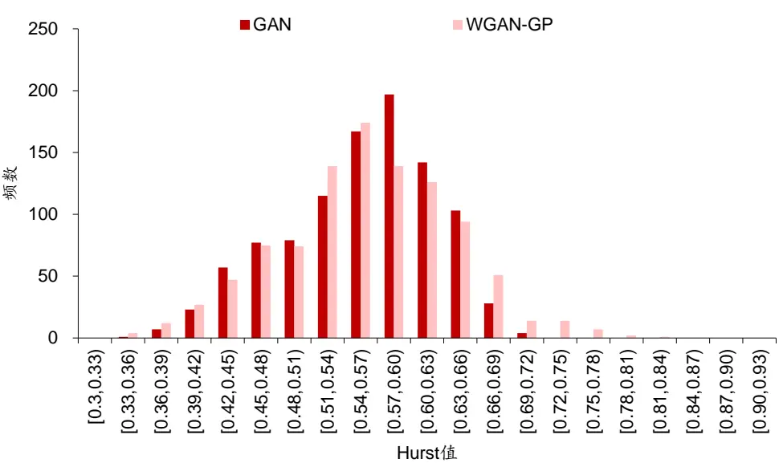
资料来源：Bloomberg，华泰证券研究所

图表46： 标普 500月频序列：GAN与 WGAN-GP生成样本 Hurst值假设检验结果

| 模型 | Hurst 均值 | Hurst 大于 0.5 比例 |  | 检验统计量U 是否拒绝原假设 是否长时程相关 |  |
| --- | --- | --- | --- | --- | --- |
| GAN | 0.56 | 77.6% | 388.85 | 否 | 是 |
| WGAN-GP | 0.56 | 78.1% | 311.38 | 否 | 是 |

资料来源：Bloomberg，华泰证券研究所

## 样本多样性

相比于 GAN 生成序列，WGAN 生成序列肉眼看起来多样性有明显提升，并且多样性的提升建立在生成序列特征更接近于真实序列的基础上。为量化多样性，我们仍然在两组生成样本内各随机抽取 1000 组配对序列并计算 DTW 指标，结果如下图所示。WGAN 生成序列之间的 DTW 值分布明显位于 GAN 模型生成序列的右侧，说明WGAN 生成序列的多样性相比于 GAN 模型有显著提升。

图表47： 标普 500月频序列：GAN 与 WGAN-GP 生成序列 DTW 分布
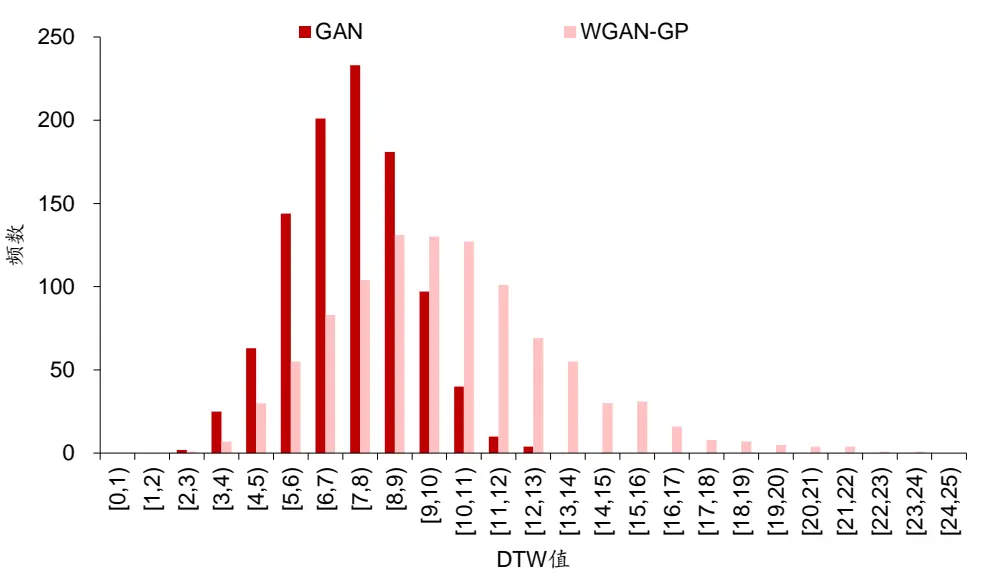
资料来源：Bloomberg，华泰证券研究所

## 评价指标汇总

我们对两种模型在上证综指日频和标普 500 月频上的生成序列评价指标进行总结，如下图所示。其中前 1～7 项指标均表示真实序列表现出了对应特征，第 8 项方差比率检验指标含义如下：上证综指日频真实序列低阶随机游走，高阶非随机游走；标普 500 月频真实序列全阶数随机游走。

图表48： 上证综指日频序列：GAN与 WGAN-GP生成序列 8项评价指标对比

| 评价指标 | 真实序列 | GAN | WGAN |
| --- | --- | --- | --- |
| 自相关性 | √ | √ | √ |
| 厚尾分布 | √ | √ | √ |
| 波动率聚集 | √ | √ | √ |
| 杠杆效应 | √ | √ | √ |
| 粗细波动率相关 | √ | √ | √ |
| 盈亏不对称性 | √ | √ | √ |
| 长时程相关 | √ | × | √ |
| 方差比率检验 | √ | √ | √ |

资料来源：Wind，Bloomberg，华泰证券研究所

图表49： 标普 500月频序列：GAN与 WGAN-GP生成序列 8项评价指标对比

| 评价指标 | 真实序列 | GAN | WGAN |
| --- | --- | --- | --- |
| 自相关性 | √ | √ | √ |
| 厚尾分布 | √ | √ | √ |
| 波动率聚集 | √ | X | √ |
| 杠杆效应 | √ | √ | √ |
| 粗细波动率相关 | √ | X | √ |
| 盈亏不对称性 | √ | X | √ |
| 长时程相关 | √ | √ | √ |
| 方差比率检验 | √ | X | √ |

资料来源：Wind，Bloomberg，华泰证券研究所

## 总结与讨论

本文探讨 GAN 模型的一类重要变体——WGAN 在生成金融时间序列中的应用并与 GAN进行比较。不同于 GAN 模型中的 JS 散度，WGAN 模型使用 Wasserstein 距离衡量训练过程中真实分布与生成分布之间的“距离”。每一步训练迭代中用判别器 D 估计两个分布之间的 W 距离，用生成器 G 拉近 W 距离，目标是使得真实分布与生成分布越来越接近，以此达到生成“以假乱真”样本的目的。WGAN的训练过程比 GAN 更加方便快捷，且生成序列在真实性和多样性上相比 GAN 有显著提升。

原始 GAN 模型的主要缺点是判别器 D 和生成器 G训练不同步、训练损失函数不收敛和模式崩溃。其中训练不同步问题与 JS 散度的梯度消失现象有关；模式崩溃由 KL 散度的不对称性导致；损失函数不收敛由 GAN 本身 D 和 G 的博弈导致。W 距离避免了 JS散度带来的梯度消失现象，故而不用再小心平衡 D和 G的训练过程。WGAN 用判别器近似估计真假分布间的 W 距离，随着训练的进行，W 距离越来越小，即判别器的损失函数收敛，可以辅助指示训练进程。因此相比于 JS 散度和 KL 散度，W 距离是应用于生成对抗网络里更合适的衡量分布间“距离”的指标。

数据实证部分围绕 WGAN 与 GAN 模型的对比展开，我们选取上证综指日频和标普 500月频的对数收益率序列进行生成训练并展示结果。除自相关性、厚尾分布、波动率聚集、杠杆效应、粗细波动率相关、盈亏不对称性这六项指标以外，本文还引入方差比率检验、长时程相关的 Hurst指数两项指标验证生成序列的真实性。在上证综指日频序列上，GAN生成序列在 Hurst 指标上与真实序列仍有差距，WGAN 则有显著改善；在标普 500 月频数据上，GAN 生成序列在波动率聚集、粗细波动率相关和盈亏不对称性指标上表现不佳，WGAN改善明显，更接近真实序列。

另外我们引入衡量序列相似性的 DTW 指标，评价生成序列的多样性。在上证综指日频序列上，WGAN 生成序列多样性相较于 GAN 有小幅的提升；在标普 500 月频数据上，WGAN生成序列多样性相较于 GAN 有明显提升。我们看到的不再是重复的美股“慢牛”序列，而是观察到了更多的市场可能性。

总的来看，WGAN模型是针对距离度量指标的改良提出的一类 GAN 的变体，理论及实证表明，WGAN 在生成金融时序数据上相比于 GAN 有明显改善。在 GAN 的相关变式中，还有其它方向上的改良，例如针对 GAN 损失函数的改良（RGAN）、针对 GAN 原始输入数据的改良（CGAN）等，这些都是值得深入挖掘与探究的方向。

## 参考文献

Arjovsky, M., & Bottou, L. (2017). Towards principled methods for training generative adversarial networks. arXiv preprint arXiv:1701.04862.

Arjovsky, M., Chintala, S., & Bottou, L. (2017). Wasserstein gan. arXiv preprint arXiv:1701.07875.

Gulrajani, I., Ahmed, F., Arjovsky, M., Dumoulin, V., & Courville, A. C. (2017). Improved training of wasserstein gans. In Advances in neural information processing systems (pp. 5767-5777).

De Meer Pardo, F. (2019). Enriching Financial Datasets with Generative Adversarial Networks (Doctoral dissertation, Master’s thesis, Delft University of Technology, the Netherlands).

Campbell, J. Y., Lo, A. W., & MacKinlay, A. C. (1997). The econometrics of financial markets. Princeton University Press.

Takahashi, S., Chen, Y., & Tanaka-Ishii, K. (2019). Modeling financial time-series with generative adversarial networks. Physica A: Statistical Mechanics and its Applications, 527, 121261.

Kim, S. H., Lee, H. S., Ko, H. J., Jeong, S. H., Byun, H. W., & Oh, K. J. (2018). Pattern matching trading system based on the dynamic time warping algorithm. Sustainability, 10(12), 4641.

Lo, A. W., & MacKinlay, A. C. (1988). Stock market prices do not follow random walks: Evidence from a simple specification test. The review of financial studies, 1(1), 41-66.

Metz, L., Poole, B., Pfau, D., & Sohl-Dickstein, J. (2016). Unrolled generative adversarial networks. arXiv preprint arXiv:1611.02163.

Hurst, H. E. (1951). Long-term storage capacity of reservoirs. Trans. Amer. Soc. Civil Eng., 116, 770-799.

## 风险提示

WGAN 生成虚假序列是对市场规律的探索，不构成任何投资建议。WGAN 模型存在黑箱问题，深度学习存在过拟合的可能。深度学习模型是对历史规律的总结，如果市场规律发生变化，模型存在失效的可能。

## 附录

## JS 散度性质的证明

JS 散度的性质：如果两个分布 $\mathsf{p}_{\mathsf{r}}$ 和 $\mathsf{p}_{\mathsf{g}}$ 的支撑集相交部分测度为零，则 JS 散度恒为常数log2，即：

$$
JS(p_{r}||p_{g})\equiv log2
$$

我们对上述性质进行证明，首先介绍两个概念：测度和支撑集。

集合的测度：测度用来衡量 Rn中子集的“大小”。以一维实数空间 R中的子集为例，测度相当于是对“长度”这一概念的延伸，不仅可以描述某段连续区域的大小，即通常意义的长度概念，还可以衡量其它任意子集的“大小”。例如区间[0,1]的“大小”即为长度 1，全体整数构成的集合 Z 的“大小”为 0（虽然 Z不是空集，但测度仍然为零）。

本节推导将用到测度的一个重要性质：如果函数 $\boldsymbol{\mathfrak{f}}(\boldsymbol{x})$ 定义域内某个子集 E的测度为零，那么 f(x)在 E上的积分值也为零，公式表述如下所示：

$$
\int_{E}f(x)dx=0
$$

随机变量的支撑集：假设随机变量ξ的概率密度函数为 $f(x)$ ，则ξ的支撑集（或称 f(x)的支撑集）指的是ξ的所有可能取值组成的集合，即满足 f(x)不为 0 的那些点组成的集合。例如定义在[0,1]区间上的均匀分布支撑集为[0,1]，标准正态分布的支撑集为 R。

下面进行证明。对于真实分布与生成分布的所有可能的取值（二者均不可能的取值对 JS散度无贡献，无需考虑），我们可以划分为 3 部分互不相交的集合 A、B、C，其中：

$$
\begin{array}{c}{{A=\left\{x\colon p_{r}(x)\neq0andp_{g}(x)=0\right\}}}\\{{B=\left\{x\colon p_{r}(x)=0andp_{g}(x)\neq0\right\}}}\\{{C=\left\{x\colon p_{r}(x)\neq0andp_{g}(x)\neq0\right\}}}\end{array}
$$

因为 ${\mathsf p}_{\mathsf{r}}$ 和 $\mathsf{p}_{\mathsf{g}}$ 的支撑集相交部分测度为零，所以集合 C的测度为零。JS散度的计算等价于在上面 3块集合上进行积分：

$$
\begin{array}{l}{{\displaystyle JS(p_{r}||p_{g})=\frac{1}{2}\int_{x}~[p_{r}(x)log~\frac{2p_{r}(x)}{p_{r}(x)+~p_{g}(x)}+~p_{g}(x)log~\frac{2~p_{g}(x)}{p_{r}(x)+~p_{g}(x)}]dx}}\\{{\displaystyle\qquad=\frac{1}{2}\int_{A\cup B\cup C}[p_{r}(x)log~\frac{2p_{r}(x)}{p_{r}(x)+~p_{g}(x)}+~p_{g}(x)log~\frac{2~p_{g}(x)}{p_{r}(x)+~p_{g}(x)}]dx}}\end{array}
$$

上面的式子可进一步拆分为分别在 A、B、C 三个集合上对中间求和项表达式进行积分，在集合 A上即为：

$$
\begin{array}{l}{\displaystyle{\frac{1}{2}\int_{A}\mathsf{\Pi}[p_{r}(x)log\frac{2p_{r}(x)}{p_{r}(x)+p_{g}(x)}+\ p_{g}(x)log\frac{2p_{g}(x)}{p_{r}(x)+p_{g}(x)}]dx}}\\{\displaystyle{\qquad=\frac{1}{2}log2\int_{A}p_{r}(x)dx}}\\{\displaystyle{\qquad=\frac{1}{2}log2\int_{A\cup B\cup C}p_{r}(x)dx}}\\{\displaystyle{\qquad=\frac{1}{2}log2}}\end{array}
$$

注意到在集合 B上 $\mathsf{p}_{\mathsf{r}}(\mathsf{x}){=}0$ ，且集合 C 的测度为零，所以在集合 B 与 C 上对 pr(x)进行积分均为零，因此上述推导中的第三行才能直接成立。类似地，在集合 B上对中间求和项进行积分的结果也为 1/2log2。同样由于集合 C 的测度为零，在集合 C 上对中间求和项进行积分的结果为零。因此

$$
JS(p_{r}||p_{g})\equiv\frac{1}{2}log2+\frac{1}{2}log2=log2
$$

## 方差比率检验统计量计算公式

方差比率检验的原假设为：

$$
H_{0}:\frac{Var[r_{t}(q)]}{qVar[r_{t}]}=1
$$

用于检验上述原假设的统计量为 $Z({\mathsf{q}})$ ，q表示待检验的阶数。 $Z({\mathsf{q}})$ 的表达式如下所示：

$$
Z(q)=\frac{VR(q)-1}{\sqrt{\phi(q)}}
$$

其中，分子的 ${\mathsf{VR}}({\mathsf{q}})$ 是对方差比率的估计统计量，即：

$$
VR(q)=\frac{\hat{\sigma}^{2}(q)}{\hat{\sigma}^{2}(1)}
$$

$$
\hat{\sigma}^{2}(q)=\frac{1}{q(T-q+1)\left(1-\frac{q}{T}\right)}{\sum}_{t=q}^{T}(r_{t}(q)-q\hat{u})^{2}
$$

$$
\hat{\sigma}^{2}(1)=\frac{1}{T-1}{\sum_{t=1}^{T}}(r_{t}-\hat{u})^{2}
$$

这里û表示所有单期对数收益率的样本均值。分母的 $\phi(q)$ 是调整项，表达式如下所示：

$$
\phi(q)=4\sum_{j=1}^{q-1}\left[1-\frac{j}{q}\right]^{2}\delta(j)
$$

$$
\delta(j)=\frac{\sum_{t=j+1}^{T}(r_{t}-\hat{u})^{2}(r_{t-j}-\hat{u})^{2}}{[\sum_{t=1}^{T}(r_{t}-\hat{u})^{2}]^{2}}
$$

## 免责声明

## 分析师声明

本人，林晓明、陈烨、李子钰、何康，兹证明本报告所表达的观点准确地反映了分析师对标的证券或发行人的个人意见；
彼以往、现在或未来并无就其研究报告所提供的具体建议或所表迖的意见直接或间接收取任何报酬。

## 一般声明及披露

本报告由华泰证券股份有限公司（已具备中国证监会批准的证券投资咨询业务资格，以下简称“本公司”）制作。本报告仅供本公司客户使用。本公司不因接收人收到本报告而视其为客户。

本报告基于本公司认为可靠的、已公开的信息编制，但本公司对该等信息的准确性及完整性不作任何保证。本报告所载的意见、评估及预测仅反映报告发布当日的观点和判断。在不同时期，本公司可能会发出与本报告所载意见、评估及预测不一致的研究报告。同时，本报告所指的证券或投资标的的价格、价值及投资收入可能会波动。以往表现并不能指引未来，未来回报并不能得到保证，并存在损失本金的可能。本公司不保证本报告所含信息保持在最新状态。本公司对本报告所含信息可在不发出通知的情形下做出修改，投资者应当自行关注相应的更新或修改。

本公司力求报告内容客观、公正，但本报告所载的观点、结论和建议仅供参考，不构成购买或出售所述证券的要约或招揽。该等观点、建议并未考虑到个别投资者的具体投资目的、财务状况以及特定需求，在任何时候均不构成对客户私人投资建议。投资者应当充分考虑自身特定状况，并完整理解和使用本报告内容，不应视本报告为做出投资决策的唯一因素。对依据或者使用本报告所造成的一切后果，本公司及作者均不承担任何法律责任。任何形式的分享证券投资收益或者分担证券投资损失的书面或口头承诺均为无效。

除非另行说明，本报告中所引用的关于业绩的数据代表过往表现，过往的业绩表现不应作为日后回报的预示。本公司不承诺也不保证任何预示的回报会得以实现，分析中所做的预测可能是基于相应的假设，任何假设的变化可能会显著影响所预测的回报。

本公司及作者在自身所知情的范围内，与本报告所指的证券或投资标的不存在法律禁止的利害关系。在法律许可的情况下，本公司及其所属关联机构可能会持有报告中提到的公司所发行的证券头寸并进行交易，为该公司提供投资银行、财务顾问或者金融产品等相关服务或向该公司招揽业务。

本公司的销售人员、交易人员或其他专业人士可能会依据不同假设和标准、采用不同的分析方法而口头或书面发表与本报告意见及建议不一致的市场评论和/或交易观点。本公司没有将此意见及建议向报告所有接收者进行更新的义务。本公司的资产管理部门、自营部门以及其他投资业务部门可能独立做出与本报告中的意见或建议不一致的投资决策。投资者应当考虑到本公司及/或其相关人员可能存在影响本报告观点客观性的潜在利益冲突。投资者请勿将本报告视为投资或其他决定的唯一信赖依据。有关该方面的具体披露请参照本报告尾部。

本报告并非意图发送、发布给在当地法律或监管规则下不允许向其发送、发布的机构或人员，也并非意图发送、发布给因可得到、使用本报告的行为而使本公司及关联子公司违反或受制于当地法律或监管规则的机构或人员。

本公司研究报告以中文撰写，英文报告为翻译版本，如出现中英文版本内容差异或不一致，请以中文报告为主。英文翻译报告可能存在一定时间迟延。

本报告版权仅为本公司所有。未经本公司书面许可，任何机构或个人不得以翻版、复制、发表、引用或再次分发他人等任何形式侵犯本公司版权。如征得本公司同意进行引用、刊发的，需在允许的范围内使用，并注明出处为“华泰证券研究所”，且不得对本报告进行任何有悖原意的引用、删节和修改。本公司保留追究相关责任的权利。所有本报告中使用的商标、服务标记及标记均为本公司的商标、服务标记及标记。

## 中国香港

本报告由华泰证券股份有限公司制作,在香港由华泰金融控股（香港）有限公司向符合《证券及期货条例》第 571 章所定义之机构投资者和专业投资者的客户进行分发。华泰金融控股（香港）有限公司受香港证券及期货事务监察委员会监管，是华泰国际金融控股有限公司的全资子公司，后者为华泰证券股份有限公司的全资子公司。在香港获得本报告的人员若有任何有关本报告的问题,请与华泰金融控股（香港）有限公司联系。

## 香港-重要监管披露

- 华泰金融控股（香港）有限公司的雇员或其关联人士没有担任本报告中提及的公司或发行人的高级人员。
更多信息请参见下方 “美国-重要监管披露”。

## 美国

本报告由华泰证券股份有限公司编制，在美国由华泰证券（美国）有限公司向符合美国监管规定的机构投资者进行发表与分发。华泰证券（美国）有限公司是美国注册经纪商和美国金融业监管局（FINRA）的注册会员。对于其在美国分发的研究报告，华泰证券（美国）有限公司对其非美国联营公司编写的每一份研究报告内容负责。华泰证券（美国）有限公司联营公司的分析师不具有美国金融监管（FINRA）分析师的注册资格，可能不属于华泰证券（美国）有限公司的关联人员，因此可能不受 FINRA 关于分析师与标的公司沟通、公开露面和所持交易证券的限制。华泰证券（美国）有限公司是华泰国际金融控股有限公司的全资子公司，后者为华泰证券股份有限公司的全资子公司。任何直接从华泰证券（美国）有限公司收到此报告并希望就本报告所述任何证券进行交易的人士，应通过华泰证券（美国）有限公司进行交易。

## 美国-重要监管披露

分析师林晓明、陈烨、李子钰、何康本人及相关人士并不担任本报告所提及的标的证券或发行人的高级人员、董事或顾问。分析师及相关人士与本报告所提及的标的证券或发行人并无任何相关财务利益。声明中所提及的“相关人士”包括 FINRA 定义下分析师的家庭成员。分析师根据华泰证券的整体收入和盈利能力获得薪酬，包括源自公司投资银行业务的收入。

华泰证券股份有限公司、其子公司和/或其联营公司, 及/或不时会以自身或代理形式向客户出售及购买华泰证券研究所覆盖公司的证券/衍生工具，包括股票及债券（包括衍生品）华泰证券研究所覆盖公司的证券/衍生工具，包括股票及债券（包括衍生品）。

- 华泰证券股份有限公司、其子公司和/或其联营公司, 及/或其高级管理层、董事和雇员可能会持有本报告中所提到的任何证券（或任何相关投资）头寸，并可能不时进行增持或减持该证券（或投资）。因此，投资者应该意识到可能存在利益冲突。

## 评级说明

投资评级基于分析师对报告发布日后 6 至 12个月内行业或公司回报潜力（含此期间的股息回报）相对基准表现的预期（A股市场基准为沪深 300 指数，香港市场基准为恒生指数，美国市场基准为标普 500 指数），具体如下：

## 行业评级

增持：预计行业股票指数超越基准

中性：预计行业股票指数基本与基准持平

减持：预计行业股票指数明显弱于基准

## 公司评级

买入：预计股价超越基准 15%以上

增持：预计股价超越基准 5%~15%

持有：预计股价相对基准波动在-15%~5%之间

卖出：预计股价弱于基准 15%以上

暂停评级：已暂停评级、目标价及预测，以遵守适用法规及/或公司政策

无评级：股票不在常规研究覆盖范围内。投资者不应期待华泰提供该等证券及/或公司相关的持续或补充信息

## 法律实体披露

中国：华泰证券股份有限公司具有中国证监会核准的“证券投资咨询”业务资格，经营许可证编号为：91320000704041011J香港：华泰金融控股（香港）有限公司具有香港证监会核准的“就证券提供意见”业务资格，经营许可证编号为：AOK809美国：华泰证券（美国）有限公司为美国金融业监管局（FINRA）成员，具有在美国开展经纪交易商业务的资格，经营业务许可编号为：CRD#:298809/SEC#:8-70231

## 华泰证券股份有限公司

南京南京市建邺区江东中路228号华泰证券广场1号楼/邮政编码：210019

电话：86 25 83389999/传真：86 25 83387521电子邮件：ht-rd@htsc.com

深圳
深圳市福田区益田路5999号基金大厦10楼/邮政编码：518017
电话：86 755 82493932/传真：86 755 82492062
电子邮件：ht-rd@htsc.com

## 华泰金融控股（香港）有限公司

香港中环皇后大道中 99号中环中心 58楼 5808-12室
电话：+852 3658 6000/传真：+852 2169 0770
电子邮件：research@htsc.com
http://www.htsc.com.hk

## 华泰证券（美国）有限公司

美国纽约哈德逊城市广场 10号 41楼（纽约 10001）
电话: + 212-763-8160/传真: +917-725-9702
电子邮件: Huatai@htsc-us.com
http://www.htsc-us.com

©版权所有2020年华泰证券股份有限公司

北京
北京市西城区太平桥大街丰盛胡同28号太平洋保险大厦A座18层/
邮政编码：100032
电话：86 10 63211166/传真：86 10 63211275
电子邮件：ht-rd@htsc.com
上海
上海市浦东新区东方路18号保利广场E栋23楼/邮政编码：200120
电话：86 21 28972098/传真：86 21 28972068
电子邮件：ht-rd@htsc.com