## 金工研究/深度研究

2020年09月22日

林晓明 SAC No. S0570516010001

研究员 SFC No. BPY421

linxiaoming@htsc.com

李子钰 SAC No. S0570519110003

研究员 0755-23987436

liziyu@htsc.com

何康 SAC No. S0570520080004

研究员 021-28972039

hekang@htsc.com

## 相关研究

1《金工: 行业配置策略：趋势追踪视角》2020.08

# 相对生成对抗网络 RGAN 实证

# 华泰人工智能系列之三十六

RGAN 引入相对损失函数，提高训练稳定性，可应用于金融时间序列模拟本文介绍 GAN 的一类重要变式——相对生成对抗网络（RGAN），并将其应用于金融资产时间序列的生成，发现 RGAN 在生成数据的真实性上优于原始 GAN。GAN 的绝对判别器直接将某一类样本作为输入，判定该样本是否真实；而 RGAN 的相对判别器将真假样本对作为输入，以其中一个样本作为基准，计算另一个样本相对基准更加真实的程度，再给出判定结果，使得判别器更稳健，生成对抗网络训练更稳定。使用 GAN 和 RGAN 生成上证综指日频和标普 500 月频收益率序列，结果表明 GAN 无法复现出真实序列的长时程相关等特性，RGAN 则有显著改善。

## 相对损失函数使生成器能够影响整个损失函数，克服原始 GAN 的缺陷

RGAN 能克服原始 GAN 模型的缺陷。原始 GAN 的生成器不能影响真样本的判定结果，只能影响一半的损失函数。这导致判别器不具备“输入样本一半为假”的先验知识，并且生成器的训练过程无法最小化 JS散度。RGAN引入先验知识，并且使生成器能够最小化 JS散度。此外，若允许生成器影响真样本的判定结果，损失函数梯度会向基于 IPM 的 GAN 靠近，从而拥有一些基于 IPM 的 GAN 所具备的优良性质，判别器训练过程中真样本的影响不会下降过快。相对判别器对真样本的判定以假样本作为基准，因此生成器能够影响真样本的判定结果，克服上述由绝对判别器带来的缺陷。

## RaGAN 对基准样本的判别器原始输出进行平均，减少梯度随机性

实践中一般采用 RGAN 的改进形式 RaGAN。RGAN 的算法选取随机样本对，判定其中一个样本比另一个样本更真实的程度。上述随机样本选取导致相对判定的结果存在较大的不确定性，进而增加损失函数梯度的随机性。相对平均生成对抗网络（RaGAN）先对一组基准样本的判别器原始输出进行平均，再取其均值作为基准，从而降低了梯度的随机性，同时也没有增加算法的时间复杂度。

RGAN 和 RaGAN 生成序列表现接近，相比 GAN 在部分场景有显著提升实证部分我们检验在 SGAN、LSGAN、HingeGAN 这三种 GAN 上应用相对损失函数和相对平均损失函数的效果。测试过程中，我们保持基准 GAN和相对 GAN 的网络及参数基本相同，并采用多项统计指标评价生成质量。结果表明，部分指标上基准 GAN、RGAN 和 RaGAN 均有优良表现；另一部分指标上，基准 GAN 表现不佳，RGAN 和 RaGAN 相比于基准 GAN 则有显著提升。例如上证综指日频数据集上，SGAN 生成序列的长时程相关性不明显，相应的 RSGAN 和 RaSGAN 则有显著改进。

风险提示：RGAN 生成虚假序列是对市场规律的探索，不构成任何投资建议。RGAN 模型可能存在黑箱问题，训练不收敛不同步，以及模式崩溃问题。深度学习模型存在过拟合的可能。深度学习模型是对历史规律的总结，如果市场规律发生变化，模型存在失效的可能。

## 本文研究导读

本文是华泰金工生成对抗网络（GAN）系列的第三篇，关注 GAN 的重要变式——相对生成对抗网络（Relativistic GAN，简称 RGAN）。RGAN 将原始 GAN 中的绝对判别器改成相对判别器，把绝对损失函数改成相对损失函数。这种“相对”的思想使 RGAN 在训练过程中更稳定，且 RGAN 对网络结构的要求相比 GAN 更不敏感，整体表现相比 GAN 更优秀。本文将相对损失函数应用于三种非相对 GAN，对比采用相对损失函数的 RGAN 和未采用相对损失函数的 GAN 在模拟金融数据方面的表现。

原始 GAN 模型的生成器只能提高生成样本被判别器判为真的概率，但不能改变真实样本被判为真的概率。我们将证明“降低真实样本被判定为真的概率”对于提升生成序列质量十分重要。相比之下，引入相对损失函数的 RGAN 则充分利用真假样本的信息，其生成器既可提高生成样本被判为真的概率，又可降低真实样本被判为真的概率，弥补了 GAN的缺陷。

RGAN 的相对损失函数以样本点作为比较基准，存在较大随机性。相对平均生成对抗网络（Relativistic average GAN，简称 RaGAN）对 RGAN 进行改良，把样本群体作为比较基准，能够降低 RGAN 算法中的随机性。同时，RaGAN 没有增加算法的复杂度，因此实际操作中比 RGAN 更常用。

本文分为理论和实践两部分。理论部分将分析经典 GAN 模型绝对损失函数存在的缺陷，引出 RGAN相对损失函数和相对判别器的概念，再进一步介绍其变体 RaGAN。实践部分将三种非相对 GAN 的损失函数改成相对损失函数进行对比，结果表明在网络结构和参数基本相同的情况下，RGAN 的表现优于 GAN。

## SGAN 的缺陷

## 广义 GAN

本文涉及 GAN 的较多变体，为便于区分，我们先给出广义 GAN 的定义，再基于这一定义进行分类。在《人工智能 31：生成对抗网络 GAN 初探》（20200508）一文中，我们提到生成器和判别器分别最大化、最小化同一个目标函数。换言之，生成器和判别器训练时各自试图最小化的损失函数互为相反数。但在广义 GAN 中，生成器和判别器可以有不同的损失函数。因此我们需要给出一组损失函数 $(L_{D}^{GAN},L_{G}^{GAN})$ ，分别表示判别器和生成器各自试图最小化的损失函数：

$$
L_{D}^{GAN}=\mathbb{E}_{\boldsymbol{x}_{r}\sim\mathbb{P}_{\boldsymbol{r}}}\big[\widetilde{f}_{1}\big(D(\boldsymbol{x}_{r})\big)\big]+\mathbb{E}_{\boldsymbol{z}\sim\mathbb{P}_{\boldsymbol{z}}}\left[\widetilde{f}_{2}\left(D\big(G(\boldsymbol{z})\big)\right)\right]
$$

$$
L_{G}^{GAN}=\mathbb{E}_{\boldsymbol{x}_{r}\sim\mathbb{P}_{r}}\big[\widetilde{g_{1}}\big(D(\boldsymbol{x}_{r})\big)\big]+\mathbb{E}_{\boldsymbol{z}\sim\mathbb{P}_{z}}\left[\widetilde{g_{2}}\left(D\big(G(\boldsymbol{z})\big)\right)\right]
$$

图表1： GAN损失函数计算流程
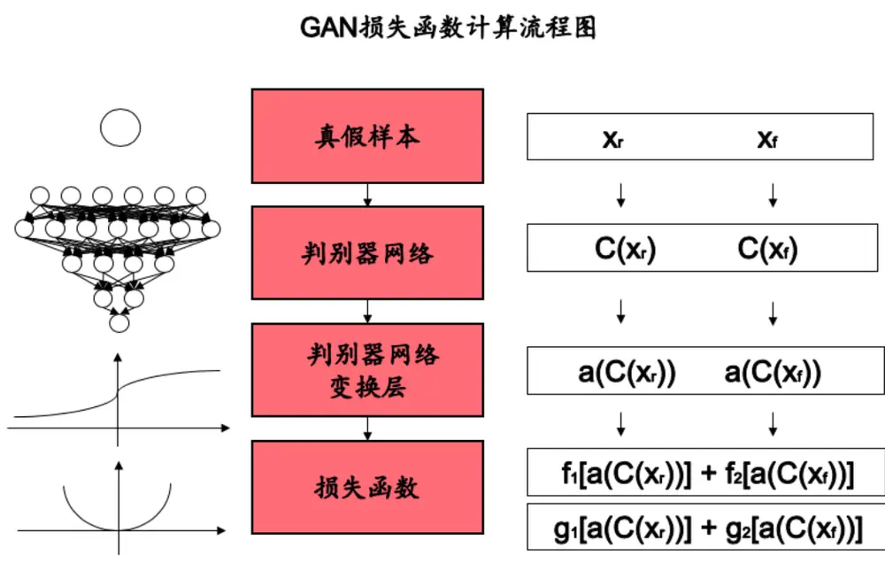
资料来源：The relativistic discriminator: a key element missing from standard GAN，华泰证券研究所

上图展示了 GAN 模型中损失函数的计算流程。关于损失函数表达式及其计算流程，我们进行如下 4 点说明：

1. $x_{r}$ 和ℙ 分别表示真样本和真样本的分布，z和ℙ 分别表示隐变量和隐变量的分布。后续我们还会用 $x_{f}$ 来表示生成器生成的假样本 $\mathbf{\nabla}_{\mathbf{\nabla}}G(\mathbf{z})$ ，用ℙ 来表示假样本的分布。

2. $D(x)$ 为判别器， $G(x)$ 为生成器。与之前不同的是，这里我们对判别器做进一步拆分：

$$
D({\pmb x})=a{\bigl(}C({\pmb x}){\bigr)}
$$

其中， $C(x)$ 是判别器网络的原始输出，其数值范围通常不受限制。 $a(.)$ 是用来限制判别器最终输出数值范围的变换层，例如采用 Sigmoid 变换将输出范围从 $\cdot(-\infty,+\infty)压$ 缩至[0,1]。某些损失函数可以没有这一变换层，或者说 $.a(.)$ 是恒等函数。这一类损失函数则需要在网络训练过程中进行其它条件限制，以防止判别器输出爆炸而导致的损失函数爆炸。

3. $\widetilde{f_{1}},\widetilde{f_{2}},\widetilde{g_{1}},\widetilde{g_{2}}$ 是从标量到标量的函数，代表损失函数的类型。例如，若采用交叉熵损失函数， $\widetilde{f}_{1}(x)=-log(x),\quad\widetilde{f}_{2}(x)=-log(1-x)$ ；若采用最小二乘损失函数， $\widetilde{f}_{1}(x)=$ $\widetilde{f}_{2}(x)=(x-x_{label})^{2}$ 。值得注意的是， $\widetilde{g_{1}}$ 实际上不起任何作用，可以忽略。这是因为$\widetilde{g_{1}}$ 只存在于生成器 G的损失函数中，但它对应的损失项E $\mathbb{E}_{\boldsymbol{x}_{r}\sim\mathbb{P}_{r}}\big[\widetilde{g_{1}}\big(D(\boldsymbol{x}_{r})\big)\big]$ 不含生成器G，即 $\widetilde{g_{1}}$ 所在的损失项对生成器 G参数的梯度为 0，也就无法影响生成器训练。

4. 根据 $\widetilde{f_1},\widetilde{f_2},\widetilde{g_1},\widetilde{g_2}$ 间的关系，可以把 GAN 分为饱和、非饱和两大类。

a. 当 $i\widetilde{f}_{1}=-\widetilde{g_{1}},\widetilde{f}_{2}=-\widetilde{g_{2}}\mathsf{I}$ 时，这种损失函数称为饱和损失函数（Saturating Loss），相应的 GAN 称为饱和 GAN（Saturating GAN）。此时，生成器和判别器的损失函数互为相反数，也就是生成器和判别器分别在最小化和最大化同一个目标函数。例如，当判别器最后的输出可以理解为概率时，判别器试图降低假样本被判定为真的概率，生成器就试图提高假样本被判定为真的概率。其损失函数表达式如下：

$$
L_{D}^{GAN}=\mathbb{E}_{\boldsymbol{x}_{r}\sim\mathbb{P}_{r}}\big[\widetilde{f}_{1}\big(D(\boldsymbol{x}_{r})\big)\big]+\mathbb{E}_{\boldsymbol{z}\sim\mathbb{P}_{\boldsymbol{z}}}\left[\widetilde{f}_{2}\left(D\big(G(\boldsymbol{z})\big)\right)\right]
$$

$$
L_{G}^{GAN}=\mathbb{E}_{\boldsymbol{x}_{\boldsymbol{r}}\sim\mathbb{P}_{\boldsymbol{r}}}\big[\widetilde{-f_{1}}\big(D(\boldsymbol{x}_{\boldsymbol{r}})\big)\big]+\mathbb{E}_{\boldsymbol{z}\sim\mathbb{P}_{\boldsymbol{z}}}\left[\widetilde{-f_{2}}\left(D\big(G(\boldsymbol{z})\big)\right)\right]
$$

b. 当 $\widetilde{f_{1}}=\widetilde{g_{2}},\widetilde{f_{2}}=\widetilde{g_{1}}$ 时，这种损失函数称为非饱和损失函数（Non-saturating Loss），相应的 GAN 称为非饱和 GAN（Non-saturating GAN）。此时，生成器和判别器也可以看成共用同一个目标函数，只是互换了真样本和假样本的位置。例如，当判别器最后的输出可以理解为概率时，判别器试图提高真样本被判定为真的概率，生成器就提高假样本被判定为真的概率。其损失函数表达式如下：

$$
L_{D}^{GAN}=\mathbb{E}_{\boldsymbol{x}_{r}\sim\mathbb{P}_{r}}\big[\widetilde{f}_{1}\big(D(\boldsymbol{x}_{r})\big)\big]+\mathbb{E}_{\boldsymbol{z}\sim\mathbb{P}_{\boldsymbol{z}}}\left[\widetilde{f}_{2}\left(D\big(G(\boldsymbol{z})\big)\right)\right]
$$

$$
L_{G}^{GAN}=\mathbb{E}_{\boldsymbol{x}_{r}\sim\mathbb{P}_{r}}\big[\widetilde{f}_{2}\big(D(\boldsymbol{x}_{r})\big)\big]+\mathbb{E}_{\boldsymbol{z}\sim\mathbb{P}_{z}}\left[\widetilde{f}_{1}\left(D\big(G(\boldsymbol{z})\big)\right)\right]
$$

图表2： GAN 的分类
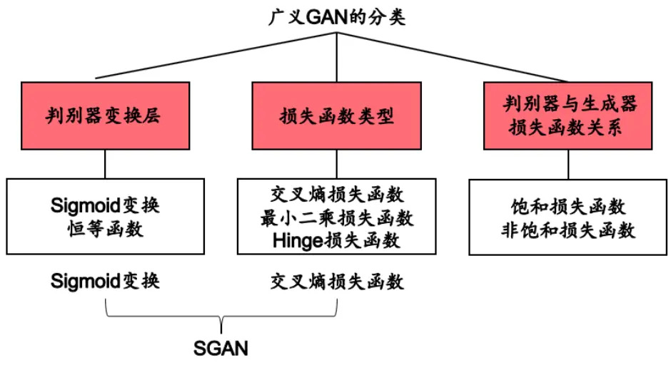
资料来源：The relativistic discriminator: a key element missing from standard GAN，华泰证券研究所

定义注解的 2、3、4项，分别规定了 GAN 的判别器变换层、损失函数类型、判别器和生成器损失函数之间的关系。如上图所示，这些关系都可以作为分类的依据。例如，经典的SGAN（Standard GAN）规定了判别器变换层和损失函数的类型：

1. 判别器变换层为 Sigmoid。因此，判别器的输出在[0, 1]之间，可以理解为概率。例如，当真样本的标签为 1，假样本的标签为 0，判别器的输出即代表“判别器判定该样本为真样本的概率”。

2. 损失函数为交叉熵损失函数， $即\widetilde{f}_{1}(x)=-log(x),\widetilde{f}_{2}(x)=-log(1-x)\text{。 }$ 由上述两点可知，SGAN 的损失函数表达式为（非饱和形式）：

$$
L_{D}^{SGAN}=-\mathbb{E}_{\boldsymbol{x}_{\boldsymbol{r}}\sim\mathbb{P}_{r}}logsigmoid\big(C(\boldsymbol{x}_{r})\big)-\mathbb{E}_{\boldsymbol{x}_{f}\sim\mathbb{P}_{f}}log\left(1-sigmoid\left(C\big(\boldsymbol{x}_{f}\big)\right)\right)
$$

$$
L_{G}^{SGAN}=-\mathbb{E}_{\boldsymbol{x}_{\boldsymbol{r}}\sim\mathbb{P}_{r}}log\left(1-sigmoid\left(C\left(\boldsymbol{x}_{r}\right)\right)\right)-\mathbb{E}_{\boldsymbol{x}_{f}\sim\mathbb{P}_{f}}log\;sigmoid\left(C\left(\boldsymbol{x}_{f}\right)\right)
$$

前文我们提到，GAN 损失函数中g̃可以忽略。在 SGAN 的概率框架下，这意味着判别器最大化损失函数，使得D(x) → 1，D(G(z)) → 0，即最大化真样本被判定为真实的概率，同时最小化假样本被判定为真实的概率；但是生成器虽然最小化同样的损失函数，却只能使D(G(z)) → 1，即只能最大化假样本被判定为真实的概率，而不能改变真样本被判定为真实的概率。SGAN 概率框架下的理想训练过程如下图所示。

图表3： SGAN生成器理想训练过程
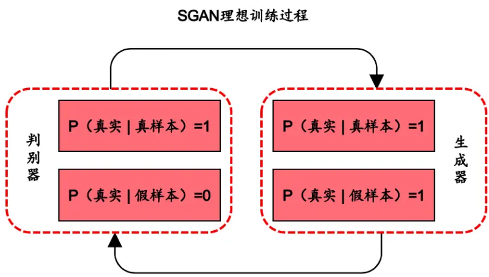
资料来源：华泰证券研究所

简言之，我们注意到 SGAN 在假样本被判定为真实的概率上升的同时，真样本被判定为真实的概率并不会下降。事实上，正如广义 GAN 定义的第 3 点所提到的，所有非相对生成对抗网络的g̃都无关紧要，因此都存在类似问题。不失一般性地，我们以 SGAN 为例，从以下三方面论证“真样本被判定为真实的概率下降”的重要性。

1. SGAN 的判别器不具备“输入样本一半为假”的先验知识。

2. SGAN 的训练轨迹不能直接最小化 JS散度。

3. 真样本对 SGAN 判别器梯度的影响随着训练的进行越来越小，判别器的学习趋于停滞。

## 判别器的先验知识

假设我们不考虑生成器无法影响真样本判别结果，在生成器训练阶段仍然向判别器输入真样本。那么无论在判别器还是生成器训练阶段，判别器的输入均是一半真样本，一半假样本。因此，判别器理应具备“输入样本一半为假”这一先验知识。

然而，在 SGAN 生成器训练结束阶段，理想状态下生成器生成的样本能够“蒙骗”判别器，因此判别器会把所有样本都判定为真。这显然违背了“输入样本一半为假”的先验知识。这意味着在 SGAN 中，除非我们刻意增加判别器训练的难度（例如降低学习速率、正则化），否则判别器不会做出合理的判定。

如果时刻要求判别器具备这一先验知识，自然的想法是让判别器在真假样本之间进行取舍，选取相对而言更真实的一半判定为真。为实现这种取舍，我们需要能够在生成器训练阶段降低真样本被判定为真实的概率。进一步地说，理想状态下当生成器越来越强时，生成器应能生成非常接近真实甚至更真实的数据。此时，判别器将混淆真假样本，在提高假样本被判定为真的概率的同时，降低真样本被判定为真的概率。

## 最小化 JS 散度

在《人工智能 31：生成对抗网络 GAN 初探》（20200508）中我们证明过，如果采用饱和SGAN，在最优化判别器的前提下（即理想状态下判别器训练结束后），生成器的损失函数等价于真样本分布和假样本分布之间的 Jensen-Shannon 散度。其数学表达如下：

$$
L_{G}^{SGAN}\;=\;-2log2\;+\;2JSD(\mathbb{P}_{r}||\mathbb{P}_{f})
$$

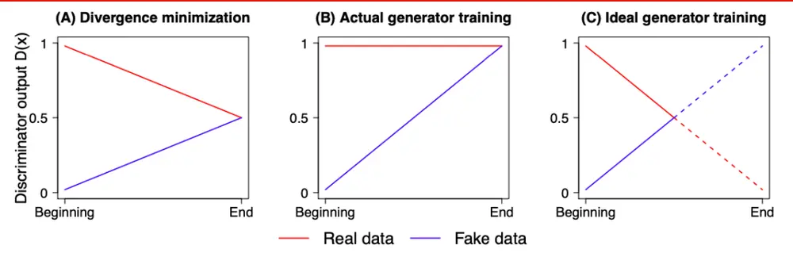
图表4： 真假样本的判别器输出随网络训练时间的变化
资料来源：The relativistic discriminator: a key element missing from standard GAN，华泰证券研究所
注：理想路径（图 C）的虚线部分是否有必要是值得商榷的，因此用虚线标识。这部分训练意味着使假样本比真样本“更真实”。

根据 SGAN 生成器损失函数的定义，我们又有：

$$
L_{G}^{SGAN}=\mathbb{E}_{\boldsymbol{x}_{\boldsymbol{r}}\sim\mathbb{P}_{\boldsymbol{r}}}\big[log\big(D^{*}(\boldsymbol{x}_{\boldsymbol{r}})\big)\big]+\mathbb{E}_{\boldsymbol{x}_{\boldsymbol{f}}\sim\mathbb{P}_{\boldsymbol{f}}}\big[log\big(1-D^{*}(\boldsymbol{x}_{\boldsymbol{f}})\big)\big]
$$

其中 $D^{*}$ 表示最优化的判别器。代入 SGAN 生成器损失函数的表达式，我们可以得到$JSD(\mathbb{P}_{r}||\mathbb{P}_{f})$ 的表达式：

$$
JSD(\mathbb{P}_{r}||\mathbb{P}_{f})=log2+\frac{1}{2}\mathbb{E}_{\boldsymbol{x}_{\mathbf{r}}\sim\mathbb{P}_{r}}[log(D^{*}(\boldsymbol{x}_{\mathbf{r}}))]+\frac{1}{2}\mathbb{E}_{\boldsymbol{x}_{\mathbf{f}}\sim\mathbb{P}_{f}}[log(1-D^{*}(\boldsymbol{x}_{\mathbf{f}}))]
$$

进而，我们得到全局 $JSD(\mathbb{P}_{r}||\mathbb{P}_{f})$ 的表达式为：

$$
\begin{array}{rl}{JSD(\mathbb{P}_{r}||\mathbb{P}_{f})}&{=log2+max_{D:X\rightarrow[0,1]}\left\{\frac{1}{2}\mathbb{E}_{\boldsymbol{x}_{r}\sim\mathbb{P}_{r}}\big[log\big(D(\boldsymbol{x}_{r})\big)\big]+\frac{1}{2}\mathbb{E}_{\boldsymbol{x}_{f}\sim\mathbb{P}_{f}}\left[log\left(1-D\big(\boldsymbol{x}_{f}\big)\right)\right]\right\}}\\&{=log2+max_{D:X\rightarrow[0,1]}(L_{G}^{SGAN}/2)}\end{array}
$$

下面我们论证，虽然理论上SGAN的生成器应该最小化JS散度，从而模拟真实数据分布，但实际的训练过程却与之相悖。JS 散度的理论上界为 log2，为达到这一极值，必须使$D(\pmb{x}_{\pmb{r}})=1,\quad D(\pmb{x}_{\pmb{f}})=0;$ ；JS散度的理论下界为 $0,$ ，为达到这一极值，必须使：

$$
D(\pmb{x}_{\pmb{r}})=D(\pmb{x}_{\pmb{f}})=0.5
$$

由于 JS 散度当且仅当真实数据分布和虚假数据分布完全相同时取 0，所以如果我们想要真实数据分布和虚假数据分布完全相同，必须使 JS 散度取 0，也就必须使生成器达到如下的极值：

$$
D(\pmb{x}_{\pmb{r}})=D(\pmb{x}_{\pmb{f}})=0.5
$$

但在 SGAN 中，一旦判别器训练结束后 $D(\pmb{x}_{r})\rightarrow1$ ，生成器就无法改变 $D(\pmb{x}_{r})$ 的值，即无论如何也达不到 $D(\pmb{x}_{r})=0.5$ ，也就无法最小化 JS散度。

我们可以用下图来更直观地表示：A. 理论上最小化 JS散度的训练路径（图 A）；B. 实际上 SGAN 的训练路径（图 B）；C. 理想状态下的训练路径（图 C）。其中纵轴表示判别器输出，横轴表示迭代次数。想要实现图 C，就必须能够降低真样本被判定为真实的概率。

## 梯度分析

在训练网络过程中我们采用梯度下降方法，分析不同损失函数的梯度能够更直观地反映损失函数对网络训练的影响。饱和 SGAN 与非饱和 SGAN 在生成对抗的思想上是一致的，因此不失一般性地，我们将比较非饱和 SGAN 与基于 IPM 的 GAN 的损失函数梯度，分析降低真样本被判定为真实的概率对损失函数梯度的影响。下一小节我们先介绍基于 IPM 的GAN。

## 积分概率测度 IPM 及基于 IPM 的 GAN

与 KL 散度、JS 散度相似，积分概率测度（Integral probability metrics，简称 IPM）也是一种统计散度，其数学表达式为：

$$
IPM_{\mathcal{F}}(\mathbb{P}||\mathbb{Q})=sup_{C\in\mathcal{F}}\mathbb{E}_{\boldsymbol{x}\in\mathbb{P}}[C(\boldsymbol{x})]-\mathbb{E}_{\boldsymbol{x}\in\mathbb{Q}}[C(\boldsymbol{x})]
$$

其中，ℱ为一类实函数。IPM 也可以用来衡量两个分布ℙ和ℚ之间的距离：ℙ和ℚ之间的差距越大，IPM 就越大。因此，IPM 也可以被用作 GAN 的损失函数。

我们给出过非饱和 GAN 的损失函数表达式如下：

$$
\begin{aligned}&L_{D}^{GAN}=\mathbb{E}_{\boldsymbol{x}_{r}\sim\mathbb{P}_{r}}\big[\widetilde{f}_{1}\big(D(\boldsymbol{x}_{r})\big)\big]+\mathbb{E}_{\boldsymbol{z}\sim\mathbb{P}_{z}}\left[\widetilde{f}_{2}\left(D\big(G(\boldsymbol{z})\big)\right)\right]\\&\\&L_{G}^{GAN}=\mathbb{E}_{\boldsymbol{x}_{r}\sim\mathbb{P}_{r}}\big[\widetilde{f}_{2}\big(D(\boldsymbol{x}_{r})\big)\big]+\mathbb{E}_{\boldsymbol{z}\sim\mathbb{P}_{z}}\left[\widetilde{f}_{1}\left(D\big(G(\boldsymbol{z})\big)\right)\right]\\\end{aligned}
$$

若取 $-\widetilde{f}_{1}\big(D(x)\big)=\widetilde{f}_{2}\big(D(x)\big)=D(x)=C(x)$ ，即判别器变换层a(.)是恒等函数，则可以得到基于 IPM 的 GAN的损失函数表达式：

$$
\begin{array}{rl}&{L_{D}^{IPM}=-\{\mathbb{E}_{\boldsymbol{x}_{r}\sim\mathbb{P}_{r}}[C(\boldsymbol{x}_{r})]-\mathbb{E}_{\boldsymbol{x}_{f}\sim\mathbb{P}_{f}}[C\big(\boldsymbol{x}_{f}\big)]\}}\\&{L_{G}^{IPM}=\mathbb{E}_{\boldsymbol{x}_{r}\sim\mathbb{P}_{r}}[C(\boldsymbol{x}_{r})]-\mathbb{E}_{\boldsymbol{x}_{f}\sim\mathbb{P}_{f}}[C\big(\boldsymbol{x}_{f}\big)]}\end{array}
$$

对比基于 IPM 的 GAN 的损失函数以及 IPM 的数学定义式可知，给定ℱ，则判别器损失函数的下界就是真实数据和虚假数据在ℱ下的 IPM 散度的相反数。即：

$$
\begin{aligned}min_{C\in\mathcal{F}}L_{D}^{IPM}&=-max_{C\in\mathcal{F}}\{\mathbb{E}_{\boldsymbol{x}_{r}\sim\mathbb{P}_{r}}[C(\boldsymbol{x}_{r})]-\mathbb{E}_{\boldsymbol{x}_{f}\sim\mathbb{P}_{f}}[C(\boldsymbol{x}_{f})]\}\\&=-sup_{C\in\mathcal{F}}\{\mathbb{E}_{\boldsymbol{x}_{r}\sim\mathbb{P}_{r}}[C(\boldsymbol{x}_{r})]-\mathbb{E}_{\boldsymbol{x}_{f}\sim\mathbb{P}_{f}}[C(\boldsymbol{x}_{f})]\}\\&=-IPM_{\mathcal{F}}(\mathbb{P}_{r}||\mathbb{P}_{f})\end{aligned}
$$

所以在最优化判别器的前提下，即判别器达到损失函数下界，基于 IPM 的 GAN 的生成器损失函数等价于真实分布和虚假分布在F下的 IPM 散度，而不是 SGAN 中的 JS散度。

由于基于 IPM 的 GAN 的判别器变换层 $a(.)$ 是恒等函数，无法限制判别器的输出，损失函数可能很快趋于负无穷，梯度也随之爆炸。所以在实践中，我们希望 C不易发散。事实上，我们在《人工智能 35：WGAN 应用于金融时间序列生成》（20200828）中介绍的 WGAN和WGAN-GP都属于基于 IPM 的 GAN。WGAN通过限制网络参数变化范围，把ℱ限定为满足 Lipschitz 条件的函数；而 WGAN-GP 通过增加梯度惩罚项，则把ℱ限定为梯度范数接近于 1的函数。

诸多研究（Arjovsky 等，2017；Gulrajani 等，2017；Mroueh 等，2017；Mroueh 和Sercu，2017）表明，基于 IPM 的 GAN（如WGAN 等）拥有优于 GAN 的表现。下一小节我们将从损失函数梯度的角度分析基于 IPM 的 GAN与 SGAN 有何不同。由于梯度是网络训练过程中的直接影响因素，如果可以模仿基于 IPM 的 GAN 的损失函数梯度，那么就有可能得到拥有相似优良表现的 GAN。

## 损失函数梯度对比

本小节我们将对比非饱和 SGAN 和基于 IPM的 GAN的损失函数梯度。已知非饱和 SGAN的损失函数如下：

$$
L_{D}^{SGAN}=\mathbb{E}_{\boldsymbol{x}_{r}\sim\mathbb{P}_{r}}[log(D(\boldsymbol{x}_{r}))]+\mathbb{E}_{\boldsymbol{x}_{f}\sim\mathbb{P}_{f}}\left[log\left(1-D(\boldsymbol{x}_{f})\right)\right]
$$

$$
L_{G}^{SGAN}=\mathbb{E}_{\boldsymbol{x}_{\boldsymbol{r}}\sim\mathbb{P}_{\boldsymbol{r}}}[log(1-D(\boldsymbol{x}_{\boldsymbol{r}}))]+\mathbb{E}_{\boldsymbol{x}_{\boldsymbol{f}}\sim\mathbb{P}_{\boldsymbol{f}}}[log(D(\boldsymbol{x}_{\boldsymbol{f}}))]
$$

可以求得其对网络参数 w的梯度为：

$$
\begin{aligned}&\nabla_{w}L_{D}^{SGAN}=-\mathbb{E}_{\boldsymbol{x}_{r}\sim\mathbb{P}_{r}}\big[\big(1-D\big(\boldsymbol{x}_{r}\big)\big)\nabla_{w}C\big(\boldsymbol{x}_{r}\big)\big]+\mathbb{E}_{\boldsymbol{x}_{f}\sim\mathbb{P}_{f}}\big[D\big(\boldsymbol{x}_{f}\big)\nabla_{w}C\big(\boldsymbol{x}_{f}\big)\big]\\&\nabla_{w}L_{G}^{SGAN}=-\mathbb{E}_{\boldsymbol{x}_{f}\sim\mathbb{P}_{f}}\big[\big(1-D\big(\boldsymbol{x}_{f}\big)\big)\nabla_{w}C\big(\boldsymbol{x}_{f}\big)\big]\\\end{aligned}
$$

基于 IPM 的 GAN 的损失函数为：

$$
\begin{array}{rl}&{L_{D}^{IPM}=-\{\mathbb{E}_{\boldsymbol{x}_{r}\sim\mathbb{P}_{r}}[C(\boldsymbol{x}_{r})]-\mathbb{E}_{\boldsymbol{x}_{f}\sim\mathbb{P}_{f}}[C\big(\boldsymbol{x}_{f}\big)]\}}\\&{L_{G}^{IPM}=\mathbb{E}_{\boldsymbol{x}_{r}\sim\mathbb{P}_{r}}[C(\boldsymbol{x}_{r})]-\mathbb{E}_{\boldsymbol{x}_{f}\sim\mathbb{P}_{f}}[C\big(\boldsymbol{x}_{f}\big)]}\end{array}
$$

可以求得其对网络参数 w的梯度为：

$$
\begin{aligned}\nabla_{w}L_{D}^{IPM}&=-\mathbb{E}_{\boldsymbol{x}_{r}\sim\mathbb{P}_{r}}[\nabla_{w}C(\boldsymbol{x}_{r})]+\mathbb{E}_{\boldsymbol{x}_{f}\sim\mathbb{P}_{f}}[\nabla_{w}C(\boldsymbol{x}_{f})]\\\nabla_{w}L_{G}^{IPM}&=-\mathbb{E}_{\boldsymbol{x}_{f}\sim\mathbb{P}_{f}}[\nabla_{w}C(\boldsymbol{x}_{f})]\end{aligned}
$$

对比二者梯度表达式可知，如果 SGAN 具备以下条件，则二者的损失函数梯度相同：

1. 对 $L_{D}^{SGAN}而言$ ，若在判别器训练开始前（生成器训练结束后）， $D(\boldsymbol{x}_{r})=0,D(\boldsymbol{x}_{f})=1$ 则变为相同。

在理想状态下，SGAN 判别器训练结束后， $D(\pmb{x}_{\pmb{r}})\rightarrow1,D(\pmb{x}_{\pmb{f}})\rightarrow0$ ，因此第二个条件被近似满足；生成器对 $D(\pmb{x}_{r})$ 并没有影响，因此生成器训练结束后， $D(\pmb{x}_{r})\rightarrow1,\quad D(\pmb{x}_{f})\rightarrow1$ 第一个条件中的 $D(\pmb{x}_{r})=0$ 没有被满足。因此，二者的主要区别在于生成器结束后， $D(\pmb{x}_{r})$ 是否趋于 0。

下面我们给出上述梯度差别的直觉解释。在 SGAN 生成器训练的过程中，我们没有改变$D(\pmb{x}_{r})$ ，所以在判别器训练的过程中，真实数据梯度 $\nabla_{w}C(\pmb{x}_{r})$ 的“权重项” $1-D(\pmb{x}_{r})\approx0$ 即真实数据的影响逐渐下降。这导致 SGAN 判别器过多关注虚假数据，不再注重学习真实数据，进而导致学习的停滞。这也就是 SGAN 和基于 IPM 的 GAN 之间的差距所在。因此，如果损失函数能够在 $D(\pmb{x}_{f})$ 上升的同时让 $D(\pmb{x}_{r})$ 下降并趋近于 0，那么判别器训练时就始终对真实数据保持更高比例的关注，就有助于提高算法的表现和稳定性。

下图总结真样本被判定为真实的概率不下降带来的三个缺陷。

图表5： 真样本判真概率不下降的缺陷
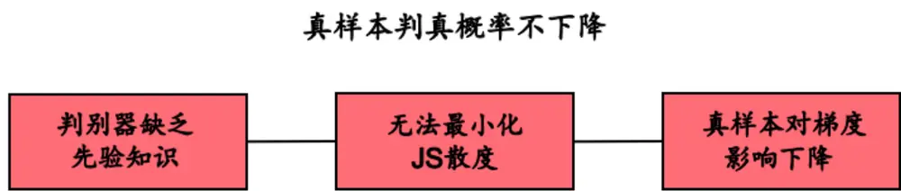
资料来源：The relativistic discriminator: a key element missing from standard GAN，华泰证券研究所

## 相对生成对抗网络 RGAN

## 相对损失函数与相对判别器

如前文所述，所有非相对生成对抗网络的生成器都只能影响损失函数的一半，无法影响真样本的判别器输出。因此，它们都缺乏让真样本的判别器输出下降的特性，而这一特性又是十分重要的。相对生成对抗网络 RGAN（Relativistic GAN）将 GAN 的损失函数改为相对损失函数，判别器修改成相对判别器，使得生成器能够影响整个损失函数。

相对判别器需要将真样本和假样本相互比较，判定二者之间谁更加真实。例如，如果我们将 SGAN 损失函数改为相对损失函数，我们就得到了相对 SGAN（RSGAN），其判别器以一类样本作为基准，输出另一类样本比基准更真实的概率。SGAN 中，判别器最大化真样本被判定为真实的概率，最小化假样本被判定为真实的概率；生成器最大化假样本被判定为真实的概率。但在 RSGAN 中，相对判别器最大化真样本比假样本更真实的概率，最小化假样本比真样本更真实的概率；生成器最小化真样本比假样本更真实的概率，最大化假样本比真样本更真实的概率。

下图将相对判别器与绝对判别器进行对比，清晰展示了相对判别器的比较优势。其中面包被设定为真样本（判别器原始输出趋于正），狗被设定为假样本（判别器原始输出趋于负）。

图表6： 相对与绝对判别器输出对比图
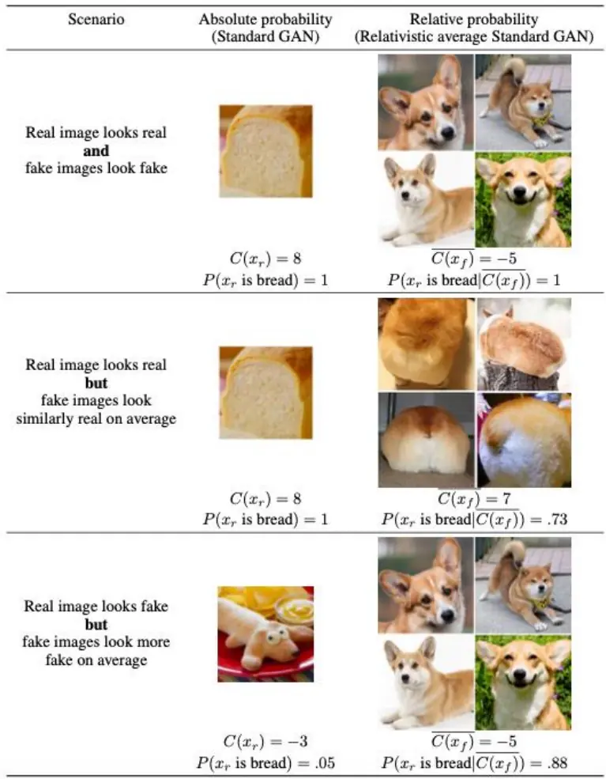
资料来源：The relativistic discriminator: a key element missing from standard GAN，华泰证券研究所

第一种情况下，真样本很像面包（判别器原始输出为 8），假样本很像狗（判别器原始输出为－5）。绝对判别器根据真样本的原始输出 8，直接判定真样本 100%是面包；相对判别器考虑到假样本的原始输出是－5，因此真样本远比假样本更像面包，进而判定真样本 100%是面包。两个判别器表现相当。

第二种情况下，真样本很像面包（判别器原始输出为 8），但假样本也很像面包（判别器原始输出为 7）。绝对判别器仍旧根据真样本的原始输出 8，直接判定真样本 100%是面包；相对判别器考虑到假样本的原始输出是 7，因此真样本仅比假样本略微更像面包，进而判定真样本有 73%的可能性是面包。虽然相对判别器的结论稍逊于绝对判别器，但并没有彻底背离事实。

第三种情况下，真样本很像狗（判别器原始输出为－3），但是假样本更像狗（判别器原始输出为－5）。绝对判别器根据真样本的原始输出－3，直接判定真样本仅有 5%的可能性是面包；相对判别器考虑到假样本的原始输出是－5，因此真样本虽然不像面包，但是跟假样本相比还是更像面包一些，进而判定真样本有 88%的可能性是面包。此时，绝对判别器的判定明显偏离事实，相对判别器则凸显出优势。

## RGAN 的定义

## RGAN 的原理

RGAN 的本质是将原先的绝对损失函数改为相对损失函数，因此所有拥有相对损失函数的GAN 都属于 RGAN。换言之，如果将损失函数改为相对损失函数“有利可图”，那么我们可以将其应用于几乎任何非相对损失函数，以赋予其某些相对损失函数的优秀性质。RGAN 的损失函数定义如下：

$$
\begin{aligned}L_{D}^{RGAN}=\mathbb{E}_{\left(\boldsymbol{x}_{r},\boldsymbol{x}_{f}\right)\sim\left(\mathbb{P}_{r},\mathbb{P}_{f}\right)}\left[\widetilde{f}_{1}\left(a\left(C(\boldsymbol{x}_{r})-C(\boldsymbol{x}_{f})\right)\right)\right]\\+\mathbb{E}_{\left(\boldsymbol{x}_{r},\boldsymbol{x}_{f}\right)\sim\left(\mathbb{P}_{r},\mathbb{P}_{f}\right)}\left[\widetilde{f}_{2}\left(a\left(C\left(\boldsymbol{x}_{f}\right)-C(\boldsymbol{x}_{r})\right)\right)\right]\end{aligned}
$$

$$
\begin{aligned}L_{G}^{RGAN}=\mathbb{E}_{\left(\boldsymbol{x}_{r},\boldsymbol{x}_{f}\right)\sim\left(\mathbb{P}_{r},\mathbb{P}_{f}\right)}\left[\widetilde{g_{1}}\left(a\left(C(\boldsymbol{x}_{r})-C(\boldsymbol{x}_{f})\right)\right)\right]\\+\mathbb{E}_{\left(\boldsymbol{x}_{r},\boldsymbol{x}_{f}\right)\sim\left(\mathbb{P}_{r},\mathbb{P}_{f}\right)}\left[\widetilde{g_{2}}\left(a\left(C(\boldsymbol{x}_{f})-C(\boldsymbol{x}_{r})\right)\right)\right]\end{aligned}
$$

需要指出的是，原著中 RGAN 的定义中没有a(. )这一项。此处为使 $\widetilde{f}_{1}$ ， $\widetilde{f}_{2}$ ， $\widetilde{g_{1}}$ ， $\widetilde{g_{2}}$ 的含义与前文保持一致，故将a(. )从f1̃， $\widetilde{f}_{2}$ ，g̃1，g̃2中独立出来单列。

下面我们对 RGAN损失函数中与 GAN 损失函数不同的部分做进一步解释：

1. 最主要的变化是相对判别器 $D\left(\left(\pmb{x}_{r},\pmb{x}_{f}\right)\right)=a\left(C(\pmb{x}_{r})-C(\pmb{x}_{f})\right)$ 。相对判别器以一对样本作为输入，在输出时先将二者的原始输出相减，再对其结果进行变换a(.)。例如，在RSGAN 中，为了输出真样本比假样本更真的概率，我们以假样本为基准，用真样本的判别器原始输出减去假样本的判别器原始输出，再用 Sigmoid 函数将这一输出转换为概率。

2. $\widetilde{f}_{1},\widetilde{f}_{2},\widetilde{g}_{1},\widetilde{g}_{2}$ 的含义与 GAN 中相同，同样可以根据这四项之间的关系把 RGAN 划分为饱和 RGAN 和非饱和 RGAN。但与 GAN 中不同的是，在 RGAN 中 $\widetilde{g_{1}}$ 不可省略，因为包含 $\widetilde{g_{1}}$ 的项E $\mathbf{f}_{\left(x_{r},x_{f}\right)\sim\left(\mathbb{P}_{r},\mathbb{P}_{f}\right)}\left[\widetilde{g_{1}}\left(a\left(C(\pmb{x}_{r})-C(\pmb{x}_{f})\right)\right)\right]$ 里也包含 $x_{f}$ ，即G(z)，在生成器优化的过程中这一项的梯度并不为 0。

不少 GAN 的损失函数具有如下性质 $\widetilde{f}_{1}\big(a(x)\big)=\widetilde{f}_{2}\big(a(-x)\big)$ ，例如 SGAN。满足这一性质的RGAN 损失函数可以进一步化简，其中非饱和形式 $(\widetilde{f}_{1}=\widetilde{g_{2}},\widetilde{f}_{2}=\widetilde{g_{1}})$ 的化简结果如下：

$$
L_{D}^{RGAN}=\mathbb{E}_{\left(\boldsymbol{x}_{r},\boldsymbol{x}_{f}\right)\sim\left(\mathbb{P}_{r},\mathbb{P}_{f}\right)}\left[\widetilde{f}_{1}\left(a\left(C(\boldsymbol{x}_{r})-C(\boldsymbol{x}_{f})\right)\right)\right]
$$

$$
L_{G}^{RGAN}=\mathbb{E}_{\left(\boldsymbol{x}_{r},\boldsymbol{x}_{f}\right)\sim\left(\mathbb{P}_{r},\mathbb{P}_{f}\right)}\left[\widetilde{f}_{1}\left(a\left(C\left(\boldsymbol{x}_{f}\right)-C\left(\boldsymbol{x}_{r}\right)\right)\right)\right]
$$

此外，基于 IPM 的 GAN实际上是一种特殊的 RGAN，具体介绍详见附录。

## RGAN 的算法伪代码

上文我们提到，不少 GAN的损失函数满足 $\widetilde{f}_{1}\big(a(x)\big)=\widetilde{f}_{2}\big(a(-x)\big)$ 。我们给出满足这一条件的 RGAN 算法伪代码（非饱和形式）：

## 图表7： RGAN算法伪代码

```latex
输入：每轮判别器训练次数 $\pmb{n}_{D}$ （通常取 1），批量样本数量 m，决定损失项的函数 f
1随机初始化判别器网络参数 w和生成器网络参数θ
2 while θ不收敛
3 For $t\rightarrow1$ to $\pmb{n}_{D}$ do
# 训练判别器 D
4从真实数据分布中采集m个样本 $\{x^{i}\}$
5从标准正态分布中采集m个样本 $\{\mathbf{z}^{i}\}$
6用随机梯度下降算法更新 $\mathbf{w},$ ，梯度计算表达式为
$\nabla_{w}\frac{1}{m}\Sigma_{i=1}^{m}\left[f\left(\boldsymbol{a}\left(\boldsymbol{C}_{w}(\boldsymbol{x}^{i})-\boldsymbol{C}_{w}\left(\boldsymbol{G}_{\boldsymbol{\theta}}(\boldsymbol{z}^{i})\right)\right)\right)\right]$
7 End
# 训练生成器 G
8从真实数据分布中采集m 个样本 $\{x^{i}\}$
9从标准正态分布中采集m 个样本 $\{\mathbf{z}^{i}\}$
10用随机梯度下降算法更新θ，梯度计算表达式为
$\nabla_{\theta}\frac{1}{m}\Sigma_{i=1}^{m}\left[f\left(a\left(C_{w}\big(G_{\theta}(z^{i})\big)-C_{w}(x^{i})\right)\right)\right]$
11 End
输出：生成器 G
```
资料来源：The relativistic discriminator: a key element missing from standard GAN， 华泰证券研究所

## RaGAN 的定义

## RaGAN 的原理

RSGAN 设计判别器和生成器损失函数的初衷是衡量一类数据比另一类数据更真实的概率。然而在设计 RGAN 损失函数以及算法伪代码的过程中，我们实际选取了多组数据对（伪代码中的 $\left(x^{i},G(z^{i})\right)对\rangle$ ），衡量一类数据的单个样本点比另一类数据的单个样本点更真实的概率。事实上，理想的判别器损失函数应该如下：

$$
L_{D}^{RSGAN}=-\{\mathbb{E}_{\boldsymbol{x}_{r}\sim\mathbb{P}_{r}}\left[log\mathbb{E}_{\boldsymbol{x}_{f}\sim\mathbb{P}_{f}}[D\big(\boldsymbol{x}_{r},\boldsymbol{x}_{f}\big)]\right]+\mathbb{E}_{\boldsymbol{x}_{f}\sim\mathbb{P}_{f}}\left[log(1-\mathbb{E}_{\boldsymbol{x}_{f}\sim\mathbb{P}_{f}}[D\big(\boldsymbol{x}_{r},\boldsymbol{x}_{f}\big)])\right]\}
$$

其中：

1. $\mathbb{E}_{\pmb{x}_{f}\sim\mathbb{P}_{f}}[D(\pmb{x}_{r},\pmb{x}_{f})]$ ]表示某一真样本比全体假样本更真实的概率均值， $\mathbb{E}_{\boldsymbol{x}_{r}\sim\mathbb{P}_{r}}[D(\boldsymbol{x}_{f},\boldsymbol{x}_{r})]$ 表示某一假样本比全体真样本更真实的概率均值。

2. $\mathbb{E}_{\boldsymbol{x}_{r}\sim\mathbb{P}_{\boldsymbol{r}}}[log\mathbb{E}_{\boldsymbol{x}_{f}\sim\mathbb{P}_{f}}[D(\boldsymbol{x}_{r},\boldsymbol{x}_{f})]]$ 表示每一个真样本比全体假样本更真实的概率小于 1 时造成的交叉熵损失。 $\mathbb{E}_{\boldsymbol{x}_{\boldsymbol{f}}\sim\mathbb{P}_{\boldsymbol{f}}}[log(1-\mathbb{E}_{\boldsymbol{x}_{\boldsymbol{r}}\sim\mathbb{P}_{\boldsymbol{r}}}[D(\boldsymbol{x}_{\boldsymbol{f}},\boldsymbol{x}_{\boldsymbol{r}})])]$ 表示每一个假样本比全体真样本更真实的概率大于 0 时造成的交叉熵损失。

虽然这种算法更符合 RGAN 的初衷，但是该算法需要遍历所有样本组合，复杂度为 $O(m^{2})$ 而原先 RSGAN 的算法复杂度为 $O(m)$ 。为降低算法复杂度，我们注意到，这一算法是对更真实的概率进行平均，如果我们先对一类数据的判别器原始输出 $C(x)$ 进行平均，再用另一类数据样本点的判别器原始输出，减去这类数据的判别器原始输出的均值，来估计其相对更加真实的概率，我们就可以把算法复杂度改进到 $O(m)$ 。改进后的损失函数如下：

$$
\begin{aligned}L_{D}^{RaSGAN}=-&\{\mathbb{E}_{\boldsymbol{x}_{\mathbf{r}}\sim\mathbb{P}_{\mathbf{r}}}\left[log\;Sigmoid\left(C(\boldsymbol{x}_{r})-\mathbb{E}_{\boldsymbol{x}_{f}\sim\mathbb{P}_{f}}[C(\boldsymbol{x}_{f})]\right)\right]\\+&\mathbb{E}_{\boldsymbol{x}_{f}\sim\mathbb{P}_{f}}\left[log\left(1-Sigmoid\left(C(\boldsymbol{x}_{f})-\mathbb{E}_{\boldsymbol{x}_{r}\sim\mathbb{P}_{\mathbf{r}}}[C(\boldsymbol{x}_{r})]\right)\right)\right]\}\end{aligned}
$$

如果放松 SGAN 中对交叉熵损失函数和 Sigmoid 变换层的限制，我们可以给出广义RaGAN（Relativistic average GAN）的定义：

$$
\begin{aligned}L_{D}^{RaGAN}=\mathbb{E}_{\boldsymbol{x}_{r}\sim\mathbb{P}_{\mathrm{r}}}\left[\widetilde{f_{1}}\left(a\left(C(\boldsymbol{x}_{r})-\mathbb{E}_{\boldsymbol{x}_{f}\sim\mathbb{P}_{f}}C(\boldsymbol{x}_{f})\right)\right)\right]\\+\mathbb{E}_{\boldsymbol{x}_{f}\sim\mathbb{P}_{f}}\left[\widetilde{f_{2}}\left(a\left(C(\boldsymbol{x}_{f})-\mathbb{E}_{\boldsymbol{x}_{r}\sim\mathbb{P}_{\mathrm{r}}}C(\boldsymbol{x}_{r})\right)\right)\right]\\L_{G}^{RaGAN}=\mathbb{E}_{\boldsymbol{x}_{r}\sim\mathbb{P}_{\mathrm{r}}}\left[\widetilde{g_{1}}\left(a\left(C(\boldsymbol{x}_{r})-\mathbb{E}_{\boldsymbol{x}_{f}\sim\mathbb{P}_{f}}C(\boldsymbol{x}_{f})\right)\right)\right]\\+\mathbb{E}_{\boldsymbol{x}_{f}\sim\mathbb{P}_{f}}\left[\widetilde{g_{2}}\left(a\left(C(\boldsymbol{x}_{f})-\mathbb{E}_{\boldsymbol{x}_{r}\sim\mathbb{P}_{\mathrm{r}}}C(\boldsymbol{x}_{r})\right)\right)\right]\end{aligned}
$$

RaGAN 与 RGAN 的主要差别在于，判别器在计算一类样本和另一类样本（基准样本）的相对值时，RaGAN 会对基准样本的原始输出先进行平均，以衡量另一组样本的整体水平，增加梯度下降的稳定性。

## RaGAN 的算法伪代码

下面给出非饱和 RaGAN 的算法伪代码：

## 图表8： RaGAN算法伪代码

输入：每轮判别器训练次数 $\pmb{n}_{D}$ （通常取 1），批量样本数量 m，决定损失项的函数 $f_{1}$ $f_{2}.$ 
1随机初始化判别器网络参数 w和生成器网络参数θ
2 while θ不收敛
3 For $t\rightarrow1$ to $\pmb{n}_{D}$ do
# 训练判别器 D
4从真实数据分布中采集m个样本 $\{x^{i}\}$ 
5从标准正态分布中采集m个样本 $\{\mathbf{z}^{i}\}$ 
6求判别器对真实数据输出的“均值” $\overline{{C_{w}(\pmb{x}_{r})}}=\pmb{\Sigma}_{i=1}^{m}C_{w}(\pmb{x}^{i})/m$ 
7求判别器对虚假数据输出的“均值” $\overline{{C_{w}(x_{f})}}=\Sigma_{i=1}^{m}C_{w}\left(G_{\theta}(z^{i})\right)/m$ 
8用随机梯度下降算法更新w，梯度计算表达式为
$\boldsymbol{V}_{w}\frac{1}{m}\boldsymbol{\Sigma}_{i=1}^{m}\left[\boldsymbol{f}_{1}\left(\boldsymbol{a}\left(\boldsymbol{C}_{w}(\boldsymbol{x}^{i})-\overline{{\boldsymbol{C}_{w}(\boldsymbol{x}_{f})}}\right)\right)+\boldsymbol{f}_{2}\left(\boldsymbol{a}\left(\boldsymbol{C}_{w}\big(\boldsymbol{G}_{\boldsymbol{\theta}}(\boldsymbol{z}^{i})\big)-\overline{{\boldsymbol{C}_{w}(\boldsymbol{x}_{r})}}\right)\right)\right]$ 
9 End
# 训练生成器 G
10从真实数据分布中采集m 个样本 $\{x^{i}\}$ 
11从标准正态分布中采集m 个样本 $\{\mathbf{z}^{i}\}$ 
12求真实数据的“平均值” $\overline{{C_{w}(\pmb{x}_{r})}}=\pmb{\Sigma}_{i=1}^{m}C_{w}(\pmb{x}^{i})/m$ 
13求虚假数据的“平均值 $\overline{{C_w(x_f)}}=\Sigma_{i=1}^mC_w(G_\theta(z^i))/m$ 
14用随机梯度下降算法更新θ，梯度计算表达式为
$V_{w}\frac{1}{m}\boldsymbol{\Sigma}_{i=1}^{m}[\boldsymbol{f}_{1}(\boldsymbol{a}\left(C_{w}\big(\boldsymbol{G}_{\boldsymbol{\theta}}(\boldsymbol{z}^{i})\big)-\overline{{C_{w}(\boldsymbol{x}_{r})}}\right))+\boldsymbol{f}_{2}(\boldsymbol{a}(C_{w}(\boldsymbol{x}^{i})-\overline{{C_{w}(\boldsymbol{x}_{f})}}))]$ 
15 End
输出：生成器 G
资料来源：The relativistic discriminator: a key element missing from standard GAN， 华泰证券研究所

从算法稳定性的角度看，在 RGAN 中我们随机选取 m 对真实和虚假数据进行随机梯度下降，算法的随机性更强；而 RaGAN 则对一组数据取平均再计算相对值，算法相对更稳定。尽管如此，二者孰优孰劣并不能就此定论：RaGAN 的梯度计算经过平均，因此更加准确；但是 RGAN算法中的随机性可能会使结果更加稳健，正如随机梯度下降 SGD比一般梯度下降表现更好。

## 方法

## 训练数据

本文与 GAN 系列的前两篇报告保持一致，仍选取上证综指日频数据和标普 500 月频数据作为训练集，同样采用滑动窗口的方法取得真实样本。感兴趣的读者可以参考《人工智能35：WGAN应用于金融时间序列生成》（20200828）。

图表9： GAN训练数据集

| 标的 | 频率 | 起止日期 | 每条样本长度 |
| --- | --- | --- | --- |
| 上证综指 | 日频 | 2004/12/31~2020/08/31 | 2520 个交易日（约 10年） |
| 标普500 | 月频 | 1927/12/30~2020/08/31 | 252个交易月份（21年） |

资料来源：Wind，Bloomberg，华泰证券研究所

## 损失函数

RGAN 和 RaGAN 的理念可以用于各种非相对 GAN，因此我们把 SGAN、LSGAN、HingeGAN 都修改成相应的相对 GAN，再对比其结果，以体现相对损失函数的优势。RaGAN 与 RGAN 效果相近，因此除了将 SGAN 与 RSGAN、RaSGAN 两者对比外，LSGAN和HingeGAN只分别与RaLSGAN和RaHingeGAN对比。下面我们给出LSGAN、RaLSGAN、HingeGAN、RaHingeGAN 的损失函数。

最小二乘 GAN（Least Square GAN，简称 LSGAN）的损失函数是预测值和标签值的平方，也即 $\widetilde{f}_{1}(x)=\widetilde{f}_{2}(x)=(x-x_{label})^{2}\quad,\quad a(x)=x.$ 。因此 LSGAN 损失函数表达式为：

$$
L_{D}^{LSGAN}=\mathbb{E}_{\boldsymbol{x}_{\boldsymbol{r}}\sim\mathbb{P}_{r}}(C(\boldsymbol{x}_{\boldsymbol{r}})-1)^{2}+\mathbb{E}_{\boldsymbol{x}_{\boldsymbol{f}}\sim\mathbb{P}_{\boldsymbol{f}}}\left(C\big(\boldsymbol{x}_{\boldsymbol{f}}\big)\right)^{2}
$$

$$
L_{G}^{LSGAN}=\mathbb{E}_{\boldsymbol{x}_{\boldsymbol{r}}\sim\mathbb{P}_{\boldsymbol{r}}}\big(C(\boldsymbol{x}_{\boldsymbol{r}})\big)^{2}+\mathbb{E}_{\boldsymbol{x}_{\boldsymbol{f}}\sim\mathbb{P}_{\boldsymbol{f}}}\big(C(\boldsymbol{x}_{\boldsymbol{f}})-1\big)^{2}
$$

RaLSGAN 损失函数表达式为：

$$
L_{D}^{LSGAN}=\mathbb{E}_{\boldsymbol{x}_{\boldsymbol{r}}\sim\mathbb{P}_{\boldsymbol{r}}}\Big(C(\boldsymbol{x}_{\boldsymbol{r}})-\mathbb{E}_{\boldsymbol{x}_{\boldsymbol{f}}\sim\mathbb{P}_{\boldsymbol{f}}}C\big(\boldsymbol{x}_{\boldsymbol{f}}\big)-1\Big)^{2}+\mathbb{E}_{\boldsymbol{x}_{\boldsymbol{f}}\sim\mathbb{P}_{\boldsymbol{f}}}\big(C\big(\boldsymbol{x}_{\boldsymbol{f}}\big)-\mathbb{E}_{\boldsymbol{x}_{\boldsymbol{r}}\sim\mathbb{P}_{\boldsymbol{r}}}C(\boldsymbol{x}_{\boldsymbol{r}})+1\big)^{2}
$$

$$
L_{G}^{LSGAN}=\mathbb{E}_{\boldsymbol{x}_{r}\sim\mathbb{P}_{r}}\left(C(\boldsymbol{x}_{r})-\mathbb{E}_{\boldsymbol{x}_{f}\sim\mathbb{P}_{f}}C(\boldsymbol{x}_{f})+1\right)^{2}+\mathbb{E}_{\boldsymbol{x}_{f}\sim\mathbb{P}_{f}}\bigl(C\bigl(\boldsymbol{x}_{f}\bigr)-\mathbb{E}_{\boldsymbol{x}_{r}\sim\mathbb{P}_{r}}C(\boldsymbol{x}_{r})-1\bigr)^{2}
$$

HingeGAN 的损失函数对与标签值同方向的预测值不给予损失，反方向的预测值给予线性损失。例如，设预测值为y，若标签值为 1，那么大于 1的预测值损失为 0，小于 1的预测值损失为 1－y。若标签值为－1，那么小于－1 的预测值损失为 0，大于－1 的预测值损失为1＋y。因为这种损失函数状如铰链（见图表11），因此得名Hinge。取 $\widetilde{f}_{1}(x)=ReLU(1-x)$ $\widetilde{f}_{2}(x)=ReLU(x)$ ，又有a(x) = x，得到 HingeGAN 损失函数表达式：

$$
L_{D}^{HingeGAN}=\mathbb{E}_{\boldsymbol{x}_{r}\sim\mathbb{P}_{r}}ReLU(1-C(\boldsymbol{x}_{r}))+\mathbb{E}_{\boldsymbol{x}_{f}\sim\mathbb{P}_{f}}ReLU(C(\boldsymbol{x}_{f}))
$$

$$
L_{G}^{HingeGAN}=\mathbb{E}_{\boldsymbol{x}_{r}\sim\mathbb{P}_{r}}ReLU(C(\boldsymbol{x}_{r}))+\mathbb{E}_{\boldsymbol{x}_{f}\sim\mathbb{P}_{f}}ReLU(1-C(\boldsymbol{x}_{f}))
$$

RaHingeGAN 损失函数表达式：

$$
\begin{aligned}L_{D}^{HingeGAN}=\mathbb{E}_{\boldsymbol{x}_{r}\sim\mathbb{P}_{\mathrm{r}}}ReLU\left(1-\left(C(\boldsymbol{x}_{r})-\mathbb{E}_{\boldsymbol{x}_{f}\sim\mathbb{P}_{f}}C(\boldsymbol{x}_{f})\right)\right)\\+\mathbb{E}_{\boldsymbol{x}_{f}\sim\mathbb{P}_{f}}ReLU\left(1+\left(C(\boldsymbol{x}_{f})-\mathbb{E}_{\boldsymbol{x}_{r}\sim\mathbb{P}_{\mathrm{r}}}C(\boldsymbol{x}_{r})\right)\right)\end{aligned}
$$

$$
\begin{aligned}L_{G}^{HiggsGAN}=\mathbb{E}_{\boldsymbol{x}_{r}\sim\mathbb{P}_{\mathrm{r}}}ReLU\Bigg(1+\Big(C(\boldsymbol{x}_{r})-\mathbb{E}_{\boldsymbol{x}_{f}\sim\mathbb{P}_{f}}C(\boldsymbol{x}_{f})\Big)\Bigg)\\+\mathbb{E}_{\boldsymbol{x}_{f}\sim\mathbb{P}_{f}}ReLU\Bigg(1-\Big(C(\boldsymbol{x}_{f})-\mathbb{E}_{\boldsymbol{x}_{r}\sim\mathbb{P}_{\mathrm{r}}}C(\boldsymbol{x}_{r})\Big)\Bigg).\end{aligned}
$$

$$
其中,\ ReLU(x)=\left\{\begin{aligned}0,\ x\leq0\\x,\ x\geq0\end{aligned}\right.。
$$

下面两张图表分别总结测试阶段所使用 GAN 模型的区别和损失函数对比。

图表10： 各种 GAN模型的区别

| GAN 类型 | 判别器类型 | 判别器变换层 | 损失函数类型 |
| --- | --- | --- | --- |
| SGAN | 绝对判别器 | Sigmoid | 交叉熵损失函数 |
| RSGAN | 相对判别器 | Sigmoid | 交叉熵损失函数 |
| RaSGAN | 相对平均判别器 | Sigmoid | 交叉熵损失函数 |
| LSGAN | 绝对判别器 | 恒等变换 | 最小二乘损失函数 |
| RaLSGAN | 相对平均判别器 | 恒等变换 | 最小二乘损失函数 |
| HingeGAN | 绝对判别器 | 恒等变换 | Hinge 损失函数 |
| RaHingeGAN | 相对平均判别器 | 恒等变换 | Hinge 损失函数 |

资料来源：华泰证券研究所

图表11： 各种损失函数对比
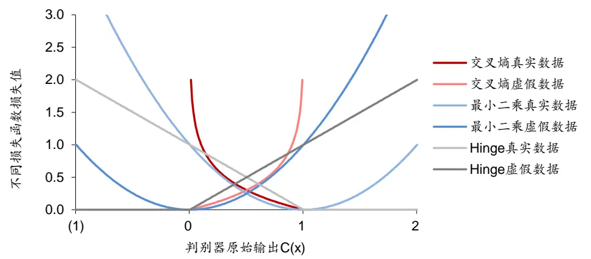
资料来源：华泰证券研究所

## 网络结构

为比较相对损失函数的作用，本文测试保证网络的结构及参数基本相同，及C(x)保持一致，大体沿用《人工智能 31：生成对抗网络 GAN 初探》（20200508）中的网络框架。理论部分提到，相对损失函数的判别器具备“输入样本一半为假”的先验假设，不需要像非相对损失函数的判别器一样进行过多限制。因此，本文 RSGAN 和 RaSGAN 模型中判别器学习速率提高为原先的 10 倍。实验表明，当 SGAN 模型中判别器学习速率提高为原先的 10倍时，SGAN 模型表现不佳。因此，提高判别器学习速率是最优化相对 GAN 所要求的，而并非提高学习速率本身增强了模型表现。

图表12： 生成器 G网络结构

| 参数 | 取值 |
| --- | --- |
| 结构 | 含两个隐藏层的全连接神经网络 |
| 输入噪音向量（隐变量）pz(z) | 标准正态分布 |
| 输入层神经元数量 | 100 |
| 第一隐藏层神经元数量 | 128 |
| 第一隐藏层激活函数 | Tanh |
| 第二隐藏层神经元数量 | 2048 |
| 第二隐藏层激活函数 | Tanh |
| 输出层神经元数量 | 2520（约10年日频)或252（21年月频） |
| 是否标准化 | 是 |
| 优化器 | Adam |
| 优化器参数 | 学习速率2e-4，β=(0.5,0.999) |

资料来源：Enriching Financial Datasets with Generative Adversarial Networks，华泰证券研究所

图表13： 判别器 D网络结构

| 参数 | 取值 |
| --- | --- |
| 结构 | 含三个卷积层和一个全连接层的卷积神经网络 |
| 输入层神经元数量 | 2520（10年日频)或252（21年月频） |
| 第一卷积层卷积核数量 | 64 |
| 第二卷积层卷积核数量 | 128 |
| 第三卷积层卷积核数量 | 128 |
| 卷积核尺寸 |  |
| 卷积层 Padding | 9 |
| 卷积层激活函数 | 4 |
| 全连接层神经元数量 | LeakyReLU(0.2) |
| 全连接层激活函数 | 32 |
| 全连接层 Dropout 比例 | LeakyReLU(0.2) |
| 输出层神经元数量 | 0.5 1 |
| 输出层激活函数 |  |
| 是否批标准化 | Sigmoid 否 |
| 优化器 | Adam |
| 优化器参数 | 学习速率1e-5，β=(0.1,0.999)（RSGAN、RaSGAN学习速率1e-4) |
| Noise labeling:真样本标签范围 | [0.9,1.1] |
| Noise labeling:假样本标签范围 | [0.1,0.3] |

资料来源：Enriching Financial Datasets with Generative Adversarial Networks，华泰证券研究所

以上给出本文 GAN 的生成器和判别器网络结构。其中损失函数略去不写，采取上述各种相对和非相对 GAN 的损失函数的非饱和形式。

## 评价指标

RGAN 和 RaGAN 弥补了生成器不能使真样本被判定为真实的概率下降这一缺陷，在实践中被证明有助于算法稳定性的提高。例如，一般而言批归一化层有助于提高算法稳定性，但是RGAN即使去掉了批归一化层也能表现很好。由于并没有明确指向某个指标的改进，本文采用WGAN 文中的全部 9 项指标，以评价 RGAN 的总体表现。

图表14： 9项生成虚假序列评价指标

| 指标名称 | 计算方法 | 真实序列特点 |
| --- | --- | --- |
| 自相关性 | 计算收益率序列1~k阶自相关系数 | 不相关 |
| 厚尾分布 | 统计收益率分布 | 厚尾分布 |
| 波动率聚集 | 计算收益率绝对值和未来波动率的1~k阶自相关系数 | 低阶正相关，高阶不相关 |
| 杠杆效应 | 计算当前收益率和未来波动率的1~k阶相关度 | 低阶负相关，高阶不相关 |
|  | 粗细波动率相关计算周频收益率绝对值(粗波动率)和一周内日频收益率绝对值不对称，细能预测粗，粗不能预 |  |
| 盈亏不对称性 | 之和(细波动率)的-k~k阶相关系数 统计涨跌超过一定幅度所需最少交易日数的分布 | 测细 涨的慢，跌得快 |
| 方差比率检验 | 计算收益率序列若干阶的方差比率统计量 | 低阶随机游走，高阶非随机游走 |
| 长时程相关 | 计算收益率序列的 Hurst 指数 | Hurst 指数略大于 0.5 |
| 多样性 | 统计序列间 DTW 值的分布 |  |

资料来源：Modeling financial time-series with generative adversarial networks，华泰证券研究所

## RGAN 测试结果

本文测试 RGAN 和 RaGAN 在生成上证综指日频和标普 500 月频收益率序列中的表现。由于 RGAN和 RaGAN 在两个数据集上表现接近，正文部分仅展示上证综指日频的结果，标普 500 月频的结果详见附录。总体而言，RGAN、RaGAN 在大部分指标上表现与 GAN接近，在 Hurst指数上的表现明显优于 GAN。

## RSGAN、RaSGAN 与 SGAN 对比结果

下图分别展示 RSGAN 和 RaSGAN 的损失函数值。总体而言，生成器损失函数比判别器损失函数的值更大。原因在于，与非相对损失函数不同，相对损失函数对生成器的要求尤其高。非相对损失函数的生成器只需要将假样本被判定为真实的概率变成 1，损失函数就接近 0；但是拥有相对损失函数的生成器需要将假样本比真样本更真实的概率变成 1，损失函数才接近 0。因此，相对损失函数的生成器损失值会更高。更通俗的解读是，对生成器而言，拟真并不难（非相对损失），“比真实还要真”更难（相对损失）。

图表15： 上证综指日频序列：RSGAN损失函数
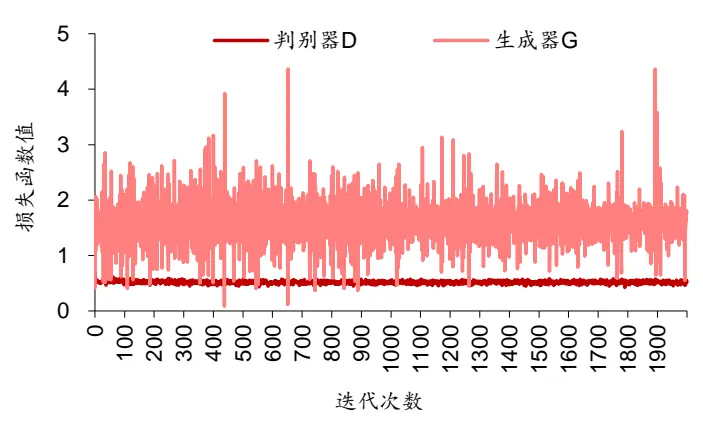
资料来源：Wind，华泰证券研究所

图表16： 上证综指日频序列：RaSGAN 损失函数
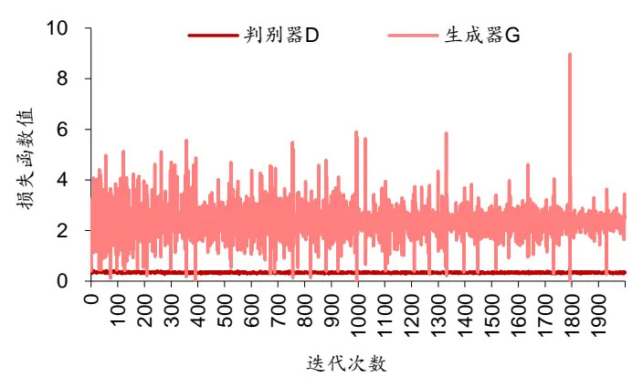
资料来源：Wind，华泰证券研究所

下面分别展示真实价格序列和 RSGAN、RaSGAN 的生成序列。

图表17： 上证综指日频序列：真实价格序列（2004/12/31~2020/08/31）
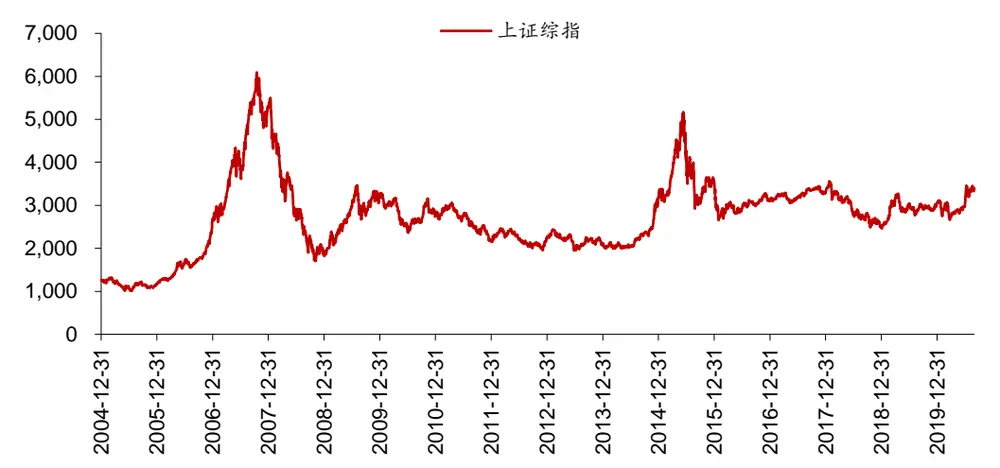
资料来源：Wind，华泰证券研究所

图表18： 上证综指日频序列：RSGAN生成价格序列范例
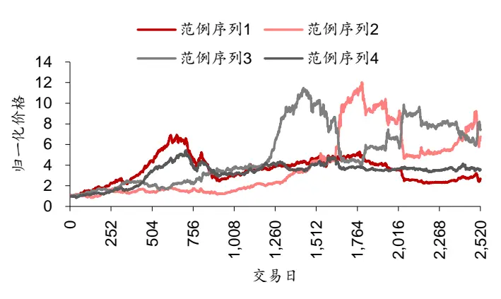
资料来源：华泰证券研究所

图表19： 上证综指日频序列：RaSGAN 生成价格序列范例
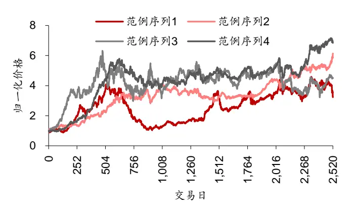
资料来源：华泰证券研究所

下面我们展示生成序列在各项评价指标上的表现。RSGAN、RaSGAN 的生成序列在前六项指标（自相关性、厚尾分布、波动率聚集、杠杆效应、粗细波动率相关及盈亏不对称性）上的表现与 SGAN 相近，均接近真实序列。

图表20： 上证综指日频序列：真实序列 6项评价指标
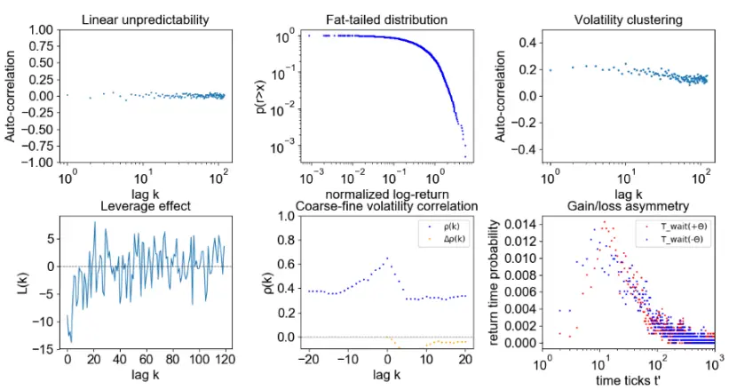
资料来源：Wind，华泰证券研究所

图表21： 上证综指日频序列：SGAN 生成序列 6项评价指标
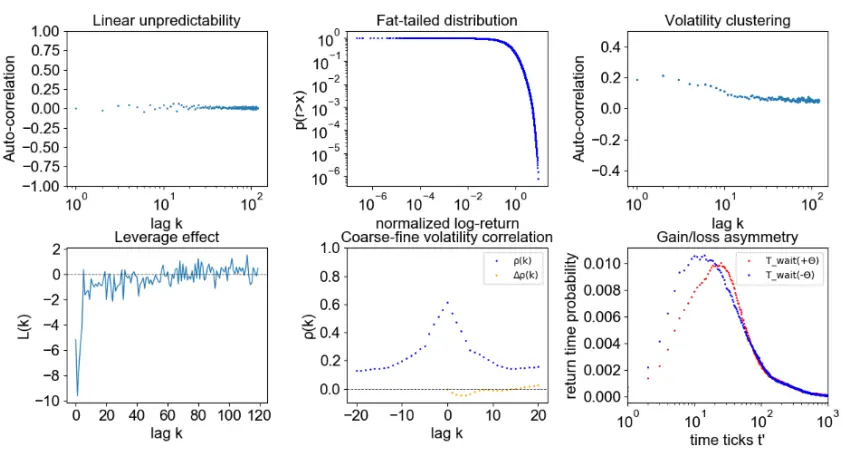
资料来源：Wind，华泰证券研究所

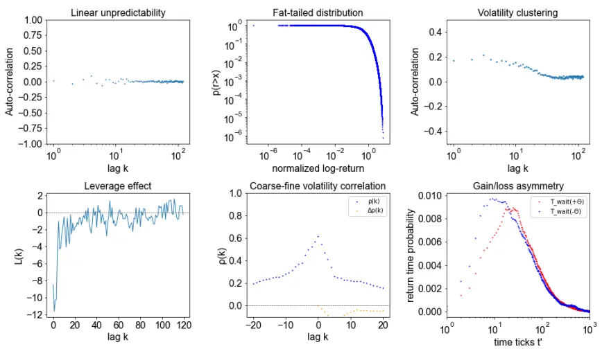
图表22： 上证综指日频序列：RSGAN 生成序列 6项评价指标
资料来源：Wind，华泰证券研究所

图表23： 上证综指日频序列：RaSGAN 生成序列 6项评价指标
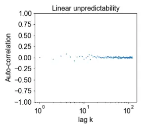

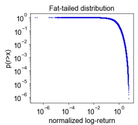


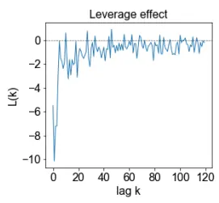
资料来源：Wind，华泰证券研究所

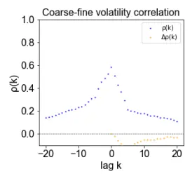

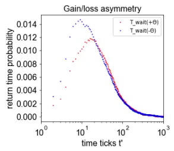

下表展示这六项指标的统计结果，从中也可以看出 RSGAN 和 RaSGAN 在这六项指标上表现与 SGAN 相似。

图表24： 上证综指日频序列：SGAN、RSGAN、RaSGAN 生成数据 6项评价指标对比

| 评价指标 | 统计量 | 真实序列 | SGAN | RSGAN | RaSGAN |
| --- | --- | --- | --- | --- | --- |
| 自相关性 | 前10阶自相关系数均值 | 0.11 | 0.11 | 0.11 | 0.11 |
| 厚尾分布 | 拟合幂律衰减系数 α | 4.22 | 4.52 | 4.42 | 4.67 |
| 波动率聚集 | 拟合幂律衰减系数β | 0.16 | 0.32 | 0.42 | 0.43 |
| 杠杆效应 | 前10阶相关系数均值 | -7.02 | -4.65 | -5.85 | -4.07 |
| 粗细波动率相关 | 滞后±1 阶相关系数之差 | -0.02 | -0.03 | -0.02 | -0.02 |
| 盈亏不对称性 | 盈亏±θ所需天数分布峰值之差 | 4.00 | 7.45 | 8.48 | 7.45 |

资料来源：华泰证券研究所

下面展示方差比率结果。三者总体表现接近，均能很好地还原真实数据的方差比率。

图表25： 上证综指日频序列：SGAN、RSGAN、RaSGAN 生成序列方差比率指标
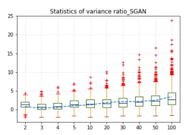
资料来源：Wind，华泰证券研究所

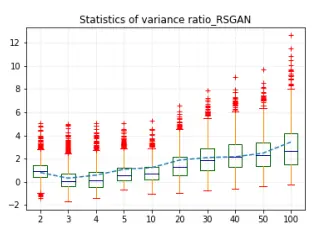

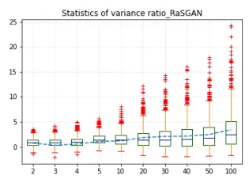

下表展示 Hurst 指数值及假设检验的结果。Hurst 指数大于 0.5 表示序列具有长记忆性，即序列存在长时程相关，小于0.5表示序列具有反持续性。真实序列的Hurst指数为0.52，即体现出弱长时程相关。SGAN 生成序列的 Hurst 指数平均值小于 0.5，而 RSGAN 和RaSGAN 的 Hurst 指数平均值均大于 0.5，更好地模拟了真实数据的特点。我们还进行如下单边假设检验：

$$
H_{0}:\ H_{H}first均值>0.5\leftrightarrow H_{1}:\ H_{H}first均值\leq0.5
$$

检验统计量为：

$$
U=\frac{\sqrt{1000}(\bar{X}-0.5)}{S_n}
$$

其中X̅表示 1000 条生成样本 Hurst 指数的样本均值， $S_{n}$ 表示 1000 条生成样本 Hurst 指数的样本方差。若U小于-1.64，则可以拒绝原假设，即 Hurst 指数平均值在 95%的置信水平下小于等于 0.5；反之，则无法拒绝原假设，即 Hurst 指数平均值在 95%的置信水平下大于 0.5。结果显示，RSGAN 和 RaSGAN 的生成序列均值显著大于 0.5，而 SGAN 的生成序列显著小于0.5。因此RSGAN和RaSGAN的生成序列在Hurst指数指标上有明显进步。

图表26： 上证综指日频序列：SGAN、RSGAN、RaSGAN 生成序列 Hurst值假设检验结果

| 模型 | Hurst 均值 | Hurst 大于 0.5 比例 |  | 检验统计量U 是否拒绝原假设 | 是否长时程相关 |
| --- | --- | --- | --- | --- | --- |
| 真实序列 | 0.52 |  |  |  | 是 |
| SGAN | 0.48 | 34% | -12.52 | 是 否 | 否 是 |
| RSGAN | 0.51 | 61% | 10.31 11.61 | 否 | 是 |
| RaSGAN | 0.51 | 62% |  |  |  |

资料来源：Wind，华泰证券研究所

下图展示生成序列多样性的对比。三种模型生成序列总体的多样性水平相近。RSGAN 和RaSGAN 生成序列的 DTW 距离分布与 SGAN 生成序列的 DTW 距离分布的均值接近，方差略大。

图表27： 上证综指日频序列：SGAN、RSGAN生成序列多样性
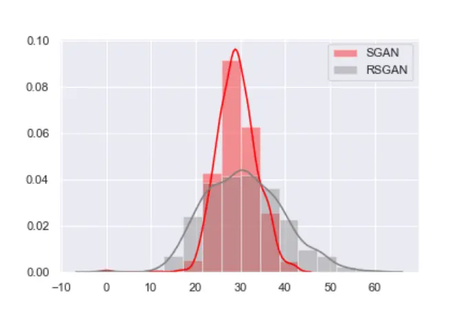
资料来源：Wind，华泰证券研究所

图表28： 上证综指日频序列：SGAN、RaSGAN生成序列多样性
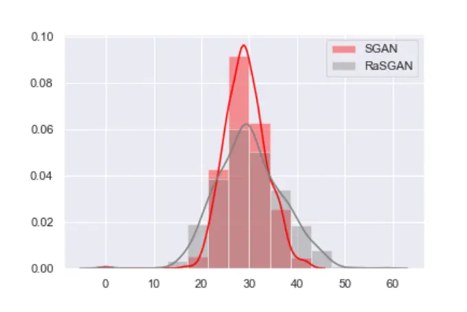
资料来源：Wind，华泰证券研究所

## RaLSGAN 与 LSGAN、RaHingeGAN 与 HingeGAN 对比结果

下图分别展示 LSGAN、RaLSGAN、HingeGAN、RaHingeGAN 的损失函数。如前所述，相比非相对损失函数，相对损失函数损失值会整体更大一些。

图表29： 上证综指日频序列：LSGAN损失函数
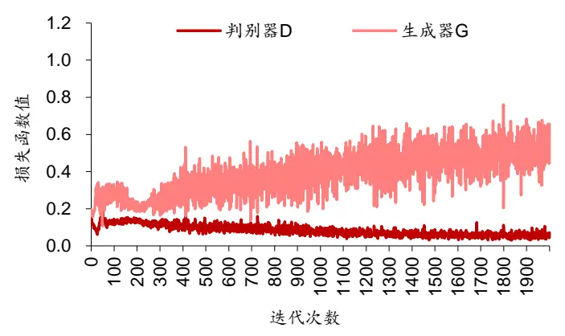
资料来源：Wind，华泰证券研究所

图表30： 上证综指日频序列：RaLSGAN损失函数
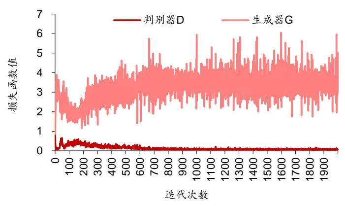
资料来源：Wind，华泰证券研究所

图表31： 上证综指日频序列：HingeGAN 损失函数
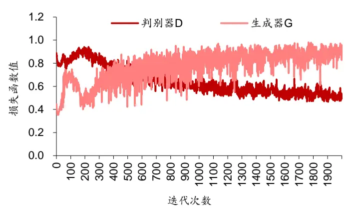
资料来源：Wind，华泰证券研究所

图表32： 上证综指日频序列：RaHingeGAN损失函数
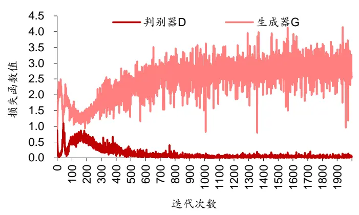
资料来源：Wind，华泰证券研究所

下图依次展示四种损失函数的生成序列。

图表33： 上证综指日频序列：LSGAN生成价格序列范例
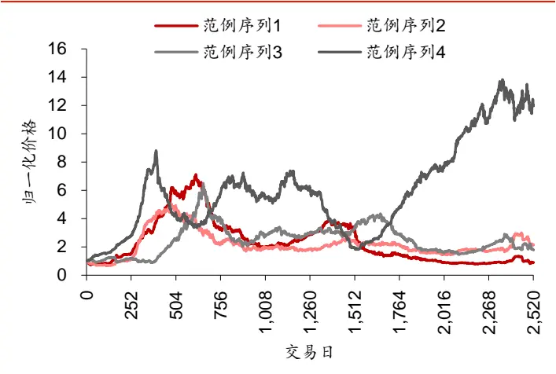
资料来源：Wind，华泰证券研究所

图表34： 上证综指日频序列：RaLSGAN生成价格序列范例
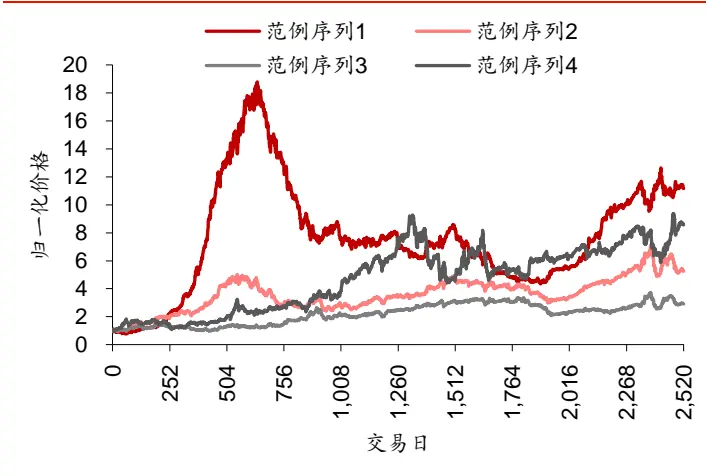
资料来源：Wind，华泰证券研究所

图表35： 上证综指日频序列：HingeGAN 生成价格序列范例
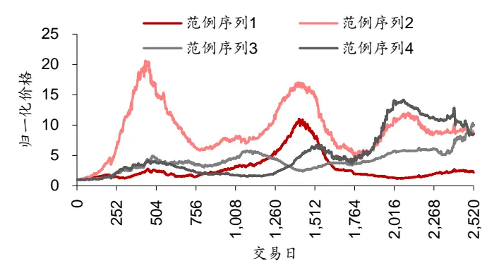
资料来源：Wind，华泰证券研究所

图表36： 上证综指日频序列：RaHingeGAN生成价格序列范例
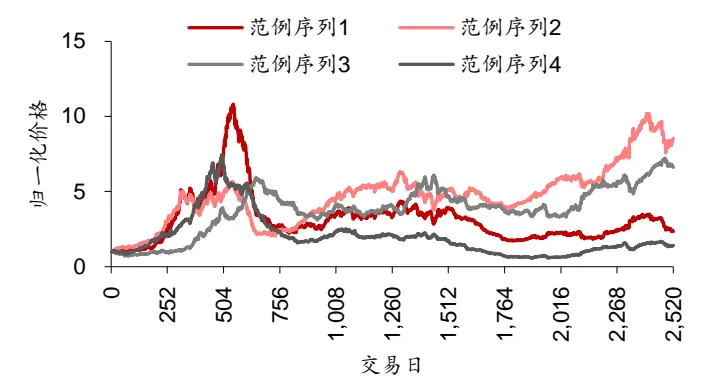
资料来源：Wind，华泰证券研究所

下面我们对比不同相对损失函数和非相对损失函数的生成序列在各项评价指标上的表现。与 SGAN 的情况相似，RaLSGAN 的表现与 LSGAN 接近，RaHingeGAN 的表现与HingeGAN 接近，并且都很好地模拟了真实数据。其中，HingeGAN 生成数据的盈亏不对称性不明显，但是 RaHingeGAN 中表现有显著提升。

图表37： 上证综指日频序列：LSGAN 生成序列 6项评价指标
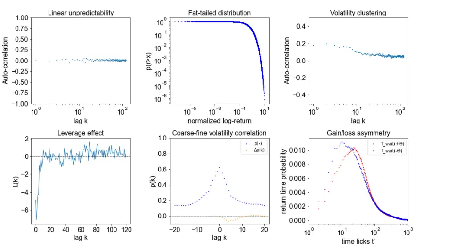
资料来源：Wind，华泰证券研究所

图表38： 上证综指日频序列：RaLSGAN生成序列 6项评价指标
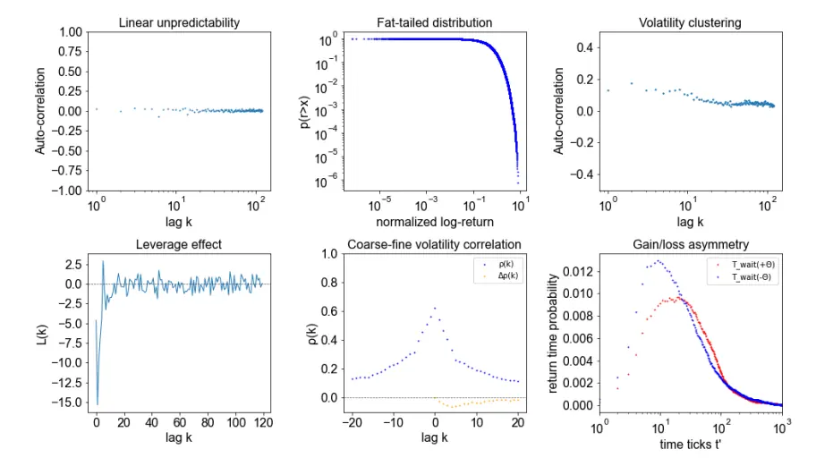
资料来源：Wind，华泰证券研究所

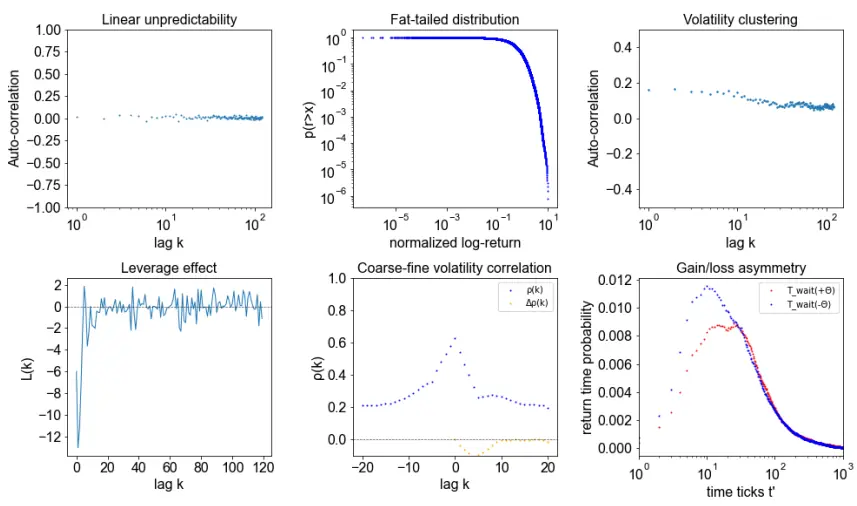

图表39： 上证综指日频序列：HingeGAN 生成序列 6 项评价指标


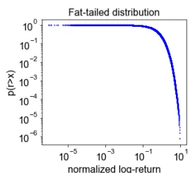

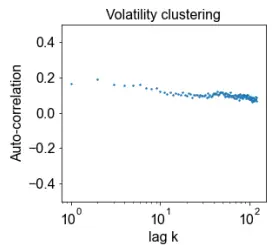

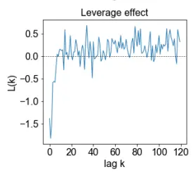
资料来源：Wind，华泰证券研究所

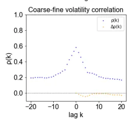

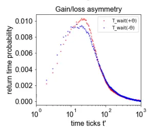
图表40： 上证综指日频序列：RaHingeGAN生成序列 6项评价指标
资料来源：Wind，华泰证券研究所

下表展示这六个指标的统计结果。在大部分情况下，相对平均GAN的生成序列质量与GAN接近，在个别指标上有明显改进（标记红色部分）：HingeGAN 的杠杆效应和盈亏不对称性表现均不明显，指标与真实序列相差一个数量级；但是 RaHingeGAN 的表现与真实数据十分接近。

图表41： 上证综指日频序列：LSGAN、RaLSGAN、HingeGAN、RaHingeGAN 生成序列 6 项评价指标对比

| 评价指标 | 统计量 | 真实序列 | LSGAN | RaLSGAN | HingeGAN | RaHingeGAN |
| --- | --- | --- | --- | --- | --- | --- |
| 自相关性 | 前10阶自相关系数均值 | 0.11 | 0.11 | 0.11 | 0.09 | 0.11 |
| 厚尾分布 | 拟合幂律衰减系数 α | 4.22 | 4.21 | 4.49 | 4.54 | 4.37 |
| 波动率聚集 | 拟合幂律衰减系数β | 0.16 | 0.36 | 0.33 | 0.18 | 0.25 |
| 杠杆效应 | 前10 阶相关系数均值 | -7.02 | -3.11 | -4.57 | -0.65 | -4.35 |
| 粗细波动率相关 | 滞后±1 阶相关系数之差 | -0.02 | -0.02 | -0.02 | -0.01 | -0.04 |
| 盈亏不对称性 | 盈亏±θ所需天数分布峰值之差 | 4.00 | 6.19 | 9.25 | 0.89 | 7.39 |

资料来源：华泰证券研究所

下面展示生成序列方差比率结果。LSGAN 生成序列的方差比率大部分位于真实数据下方，RaLSGAN 生成序列大部分位于真实数据上方，但是 RaLSGAN 生成序列的极端值更少。RaHingeGAN 的方差比率则比 HingeGAN 更接近真实值。

图表42： 上证综指日频序列：LSGAN、RaLSGAN、HingeGAN、RaHingeGAN 生成序列方差比率指标
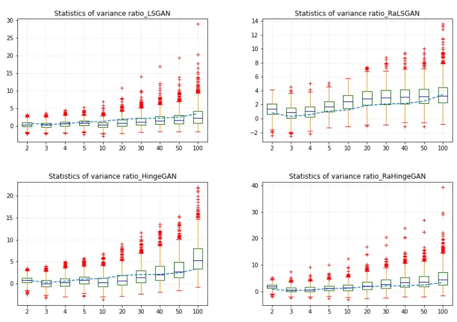
资料来源：Wind，华泰证券研究所

下表展示 Hurst指数结果。非相对 GAN 生成序列的平均 Hurst指数却均小于 0.5，呈现出反持续性。相对平均 GAN生成序列的平均 Hurst 指数则均有明显提升，与真实数据接近。这一改进在 Hurst 指数大于 0.5 的序列比例（P（Hurst>0.5））上更为明显。

图表43： 上证综指日频序列：LSGAN、RaLSGAN、HingeGAN、RaHingeGAN 生成序列 Hurst 值

| 模型 | Hurst 均值 | Hurst 大于 0.5 比例 |  | 检验统计量U 是否拒绝原假设 | 是否长时程相关 |
| --- | --- | --- | --- | --- | --- |
| 真实序列 | 0.52 |  |  |  | 是 |
| LSGAN | 0.47 | 9% | -40.63 | 是 | 否 |
| RaLSGAN | 0.53 | 81% | 28.53 | 否 | 是 |
| HingeGAN | 0.45 | 8% | -48.72 | 是 | 否 |
| RaHingeGAN | 0.49 | 34% | -12.35 | 是 | 否 |

资料来源：Wind，华泰证券研究所

下图展示生成序列多样性的对比。RaLSGAN 生成序列的多样性略高于 LSGAN，RaHingeGAN 生成序列的多样性则略低于 HingeGAN。RaGAN 从原理上改进模型生成序列的真实度，并不一定能解决多样性不足、模式崩溃的问题，所以多样性略低在情理之中。

图表44： 上证综指日频序列：LS/RaLSGAN生成序列多样性
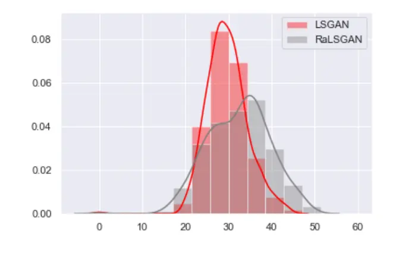
资料来源：Wind，华泰证券研究所

图表45： 上证综指日频序列：Hinge/RaHingeGAN 生成序列多样性
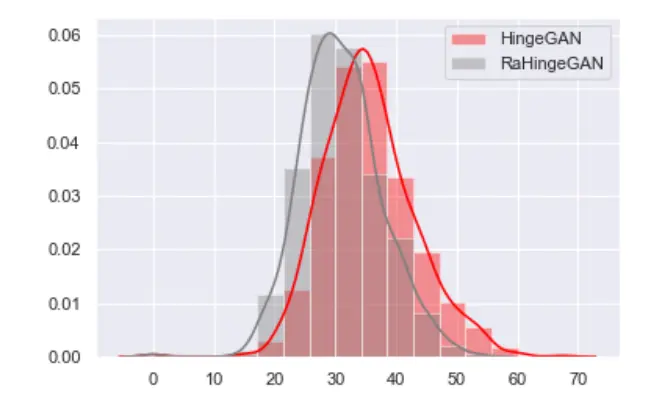
资料来源：Wind，华泰证券研究所

## 总结与讨论

本文介绍 GAN 的一类重要变式——RGAN 在生成模拟金融时间序列中的应用。RGAN 将GAN 中的损失函数改为相对损失函数，绝对判别器改为相对判别器。GAN 的绝对判别器直接将某一类样本作为输入，判定该样本是否真实；而 RGAN 的相对判别器将真假样本对作为输入，以其中一个样本作为基准，计算另一个样本相对基准更真实的程度，再给出判定结果。这使得判别器更稳健，生成对抗网络的训练更稳定。

RGAN 能克服原始 GAN 模型的缺陷。原始 GAN 的生成器不能影响真样本的判定结果，只能影响一半的损失函数。这导致判别器不具备“输入样本一半为假”的先验知识，并且生成器的训练过程无法最小化 JS散度。RGAN 引入先验知识，并且使生成器能够最小化JS 散度。此外，若允许生成器影响真样本的判定结果，损失函数梯度会向基于 IPM 的 GAN靠近，从而拥有一些基于 IPM 的 GAN 所具备的优良性质，判别器训练过程中真样本的影响不会下降过快。相对判别器对真样本的判定以假样本作为基准，因此生成器能够影响真样本的判定结果，克服上述由绝对判别器带来的缺陷。

实践中一般采用 RGAN 的改进形式 RaGAN。RGAN 的算法选取随机样本对，判定其中一个样本比另一个样本更真实的程度。上述随机样本选取导致相对判定的结果存在较大的不确定性，进而增加损失函数梯度的随机性。相对平均生成对抗网络（RaGAN）先对一组基准样本的判别器原始输出进行平均，再取其均值作为基准，从而降低了梯度的随机性，同时也没有增加算法的时间复杂度。

实证部分我们检验在 SGAN、LSGAN、HingeGAN 这三种 GAN 上应用相对损失函数和相对平均损失函数的效果。测试过程中，我们保持基准 GAN 和相对 GAN 的网络及参数基本相同，并采用多项统计指标评价生成质量。结果表明，部分指标上基准 GAN、RGAN 和RaGAN 均有优良表现；另一部分指标上，基准 GAN 表现不佳，RGAN 和 RaGAN 相比于基准 GAN 则有显著提升。例如上证综指日频数据集上，SGAN 生成序列的长时程相关性不明显，HingeGAN 生成序列的盈亏不对称性不明显，相应的相对 GAN 在这些方面均有明显改进。下表汇总了各种 GAN 的所有指标测试结果。

图表46： 上证综指日频序列：各种 GAN 生成序列 8项评价指标对比

| 评价指标 | 真实序列 | SGAN | RSGAN | RaSGAN | LSGAN | RaLSGAN | HingeGAN RaHingeGAN |  |
| --- | --- | --- | --- | --- | --- | --- | --- | --- |
| 自相关性 | √ | √ | √ | √ | √ | √ | √ | √ |
| 厚尾分布 | √ | √ | √ | √ | √ | √ | √ | √ |
| 波动率聚集 | √ | √ | √ | √ | √ | √ | √ | √ |
| 杠杆效应 | √ | √ | √ | √ | √ | √ | X | √ |
| 粗细波动率相关 | √ | √ | √ | √ | √ | √ | √ | √ |
| 盈亏不对称性 | √ | √ | √ | √ | √ | √ | X | √ |
| 长时程相关 | √ | × | √ | √ | X | √ | X | × |
| 方差比率检验 | √ | √ | √ | √ | √ | √ | √ | √ |

资料来源：Wind，华泰证券研究所

我们在《人工智能 35：WGAN 应用于金融时间序列生成》（20200828）中介绍了 GAN的重要变式 WGAN，那么本文研究的 RGAN 和 WGAN 相比效果如何？从 8 项衡量生成数据真实性的指标看，RGAN 和WGAN 较为接近，表现均优于原始 GAN。从衡量生成数据多样的 DTW 指标看，RGAN 表现弱于 WGAN。原因在于 RGAN 从理论上并未针对模式崩溃问题做出改进，因此 RGAN 的模式崩溃风险相较于WGAN 更高。

总的来看，本文从理论和实践的角度讨论了 RGAN 相比于 GAN 的改进之处。相对和相对平均损失函数可以应用于几乎所有非相对的损失函数，本文仅测试了其中三种常见的损失函数。在其它损失函数上应用是否有相似的效果，值得进一步检验。另外，WGAN和 RGAN这两种 GAN 的变式从损失函数的角度对原始 GAN 进行改造，那么是否可能从网络结构、正则化和标准化方式等其它角度对 GAN 加以改进，也是未来值得探讨的话题。

## 参考文献

Arjovsky M, Chintala S, Bottou L. (2017). Wasserstein gan. arXiv preprint arXiv:1701.07875.

Jolicoeur-Martineau A. (2018). The relativistic discriminator: a key element missing from standard GAN. arXiv preprint arXiv:1807.00734.

Gulrajani I, Ahmed F, Arjovsky M, et al. (2017). Improved training of wasserstein gans. Advances in neural information processing systems. 5767-5777.

De Meer Pardo F. (2019). Enriching Financial Datasets with Generative Adversarial Networks (Doctoral dissertation, Master’s thesis, Delft University of Technology, the Netherlands).

Mroueh Y, Li C L, Sercu T, Raj A, & Cheng Y. (2017). Sobolev gan. arXiv preprint arXiv:1711.04894.

Mroueh Y, & Sercu T. (2017). Fisher gan. Advances in Neural Information Processing Systems. 2513-2523.

Takahashi S, Chen Y, & Tanaka-Ishii K. (2019). Modeling financial time-series with generative adversarial networks. Physica A: Statistical Mechanics and its Applications. 527. 121261. 10.1016/j.physa.2019.121261.

## 风险提示

RGAN 生成虚假序列是对市场规律的探索，不构成任何投资建议。RGAN 模型可能存在黑箱问题，训练不收敛不同步，以及模式崩溃问题。深度学习模型存在过拟合的可能。深度学习模型是对历史规律的总结，如果市场规律发生变化，模型存在失效的可能。

## 附录

附录部分详细展示 1）基于 IPM 的 GAN 与 RGAN 的关系；2）RGAN 在标普 500 月频序列的测试结果。

## 基于 IPM 的 GAN 与 RGAN

事实上，基于 IPM 的 GAN 是一种特殊的 RGAN。正文部分我们给出过非饱和 RGAN 损失函数的形式如下：

$$
L_{D}^{RGAN}=\mathbb{E}_{\left(\boldsymbol{x}_{r},\boldsymbol{x}_{f}\right)\sim\left(\mathbb{P}_{r},\mathbb{P}_{f}\right)}\left[\widetilde{f}_{1}\left(a\left(C(\boldsymbol{x}_{r})-C(\boldsymbol{x}_{f})\right)\right)\right]
$$

$$
L_{G}^{RGAN}=\mathbb{E}_{\left(\boldsymbol{x}_{r},\boldsymbol{x}_{f}\right)\sim\left(\mathbb{P}_{r},\mathbb{P}_{f}\right)}\left[\widetilde{f}_{1}\left(a\left(C\left(\boldsymbol{x}_{f}\right)-C\left(\boldsymbol{x}_{r}\right)\right)\right)\right]
$$

取a(x) = x，f1̃(x) = −x，又有(xr, xf)独立，因此有：

$$
L_{D}^{RGAN}=-\widehat{\{\mathbb{E}_{\boldsymbol{x}_{r}\sim\mathbb{P}_{r}}[C(\boldsymbol{x}_{r})]-\mathbb{E}_{\boldsymbol{x}_{f}\sim\mathbb{P}_{f}}[C(\boldsymbol{x}_{f})]\}}
$$

$$
L_{G}^{RGAN}=\mathbb{E}_{\boldsymbol{x}_{r}\sim\mathbb{P}_{r}}[C(\boldsymbol{x}_{r})]-\mathbb{E}_{\boldsymbol{x}_{f}\sim\mathbb{P}_{f}}[C(\boldsymbol{x}_{f})]
$$

即基于 IPM 的 GAN 的定义式。

注意到，在介绍基于 IPM 的 GAN 时，我们从 GAN 的定义式推导出基于 IPM 的 GAN。因此，基于 IPM 的 GAN 可以被视为 GAN和 RGAN 的一个交集。

## 标普 500月频序列的结果展示

图表47： 标普 500月频序列：RSGAN 损失函数
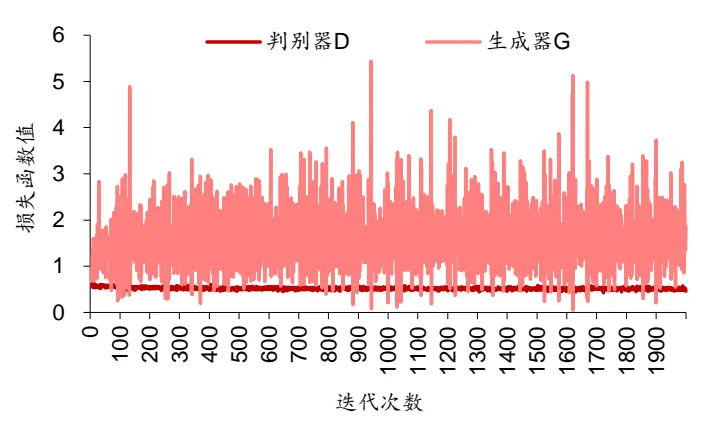
资料来源：Bloomberg，华泰证券研究所

图表48： 标普 500月频序列：RaSGAN 损失函数
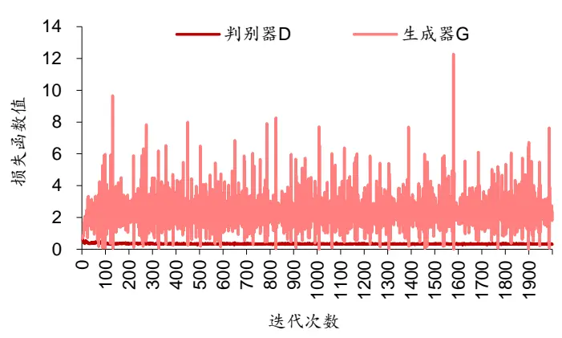
资料来源：Bloomberg，华泰证券研究所

图表49： 标普 500月频序列：LSGAN 损失函数
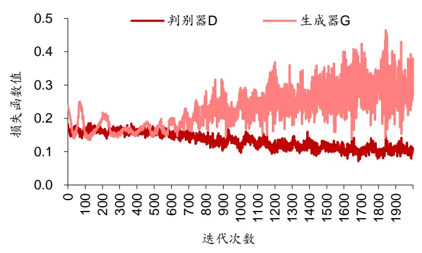
资料来源：Bloomberg，华泰证券研究所

图表50： 标普 500月频序列：RaLSGAN损失函数
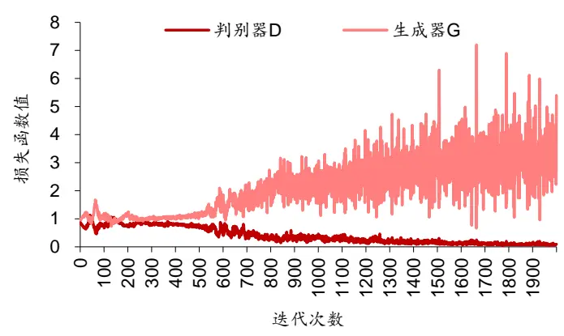
资料来源：Bloomberg，华泰证券研究所

图表51： 标普 500 月频序列：HingeGAN 损失函数
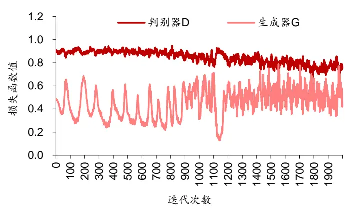
资料来源：Bloomberg，华泰证券研究所

图表52： 标普 500 月频序列：RaHingeGAN 损失函数
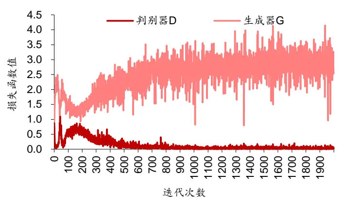
资料来源：Bloomberg，华泰证券研究所

图表53： 标普 500 月频序列：真实价格序列（1927/12/30~2020/08/31）
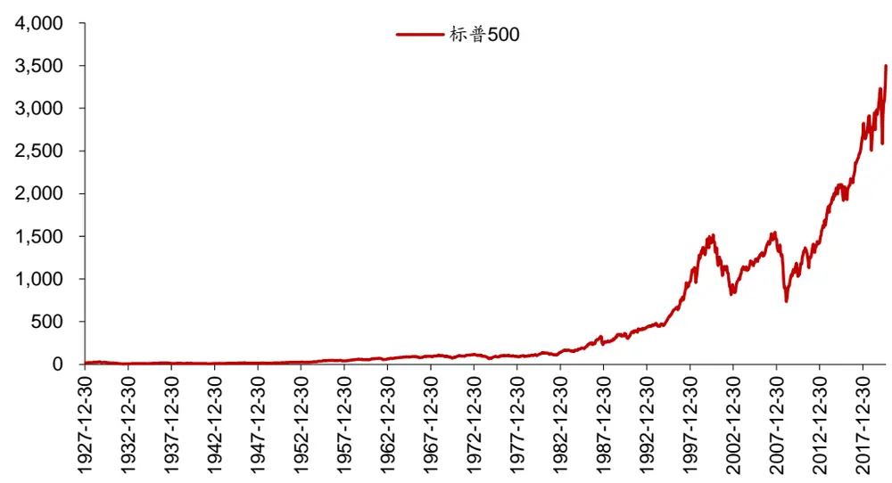
资料来源：Bloomberg，华泰证券研究所

图表54： 标普 500月频序列：RSGAN 生成价格序列范例
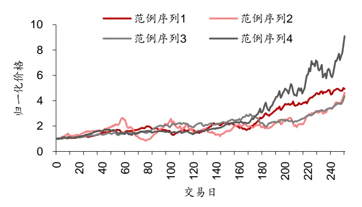
资料来源：Bloomberg，华泰证券研究所

图表55： 标普 500月频序列：RaSGAN 生成价格序列范例
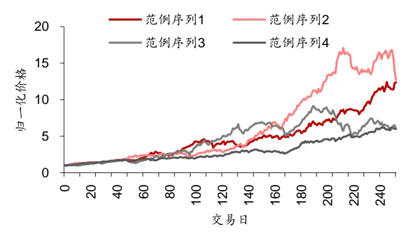
资料来源：Bloomberg，华泰证券研究所

图表56： 标普 500月频序列：LSGAN 生成价格序列范例
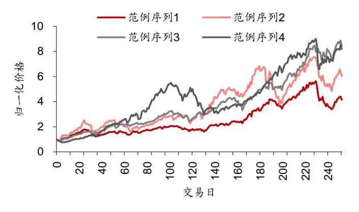
资料来源：Bloomberg，华泰证券研究所

图表57： 标普 500月频序列：RaLSGAN生成价格序列范例
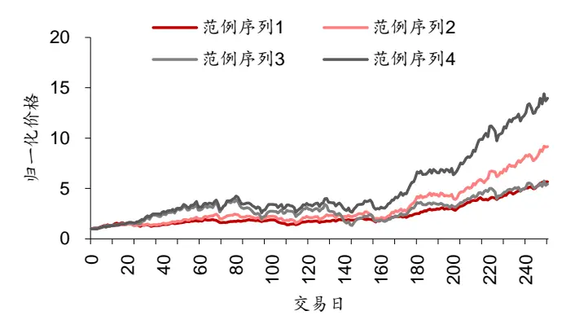
资料来源：Bloomberg，华泰证券研究所

图表58： 标普 500月频序列：HingeGAN 生成价格序列范例
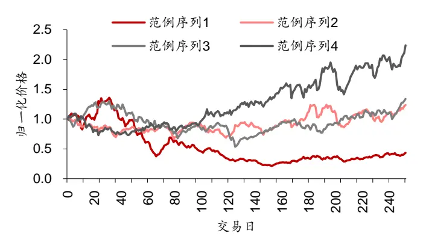
资料来源：Bloomberg，华泰证券研究所

图表59： 标普 500月频序列：RaHingeGAN生成价格序列范例
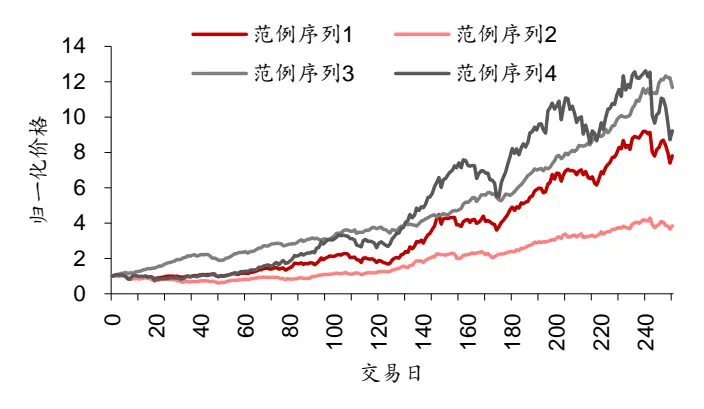
资料来源：Bloomberg，华泰证券研究所

图表60： 标普 500月频序列：真实序列 6项评价指标
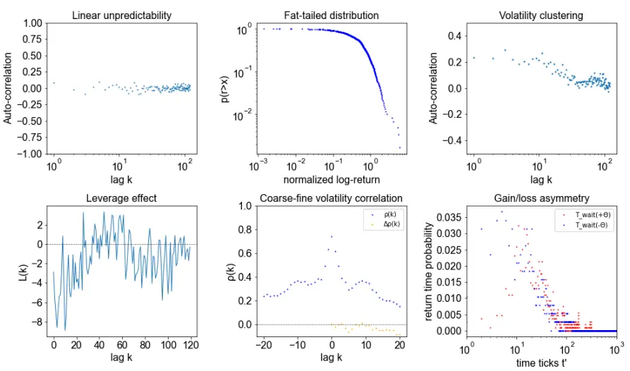
资料来源：Bloomberg，华泰证券研究所

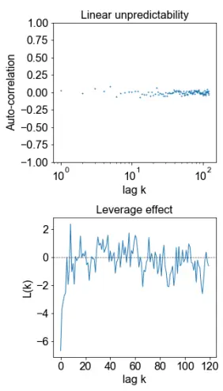

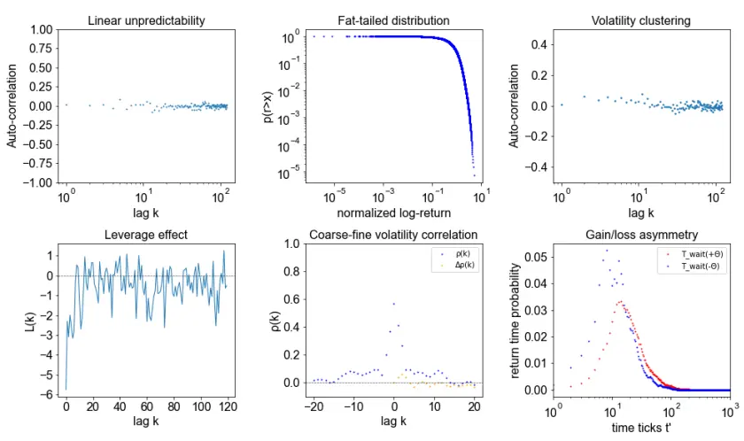
图表61： 标普 500月频序列：SGAN 生成序列 6项评价指标
资料来源：Bloomberg，华泰证券研究所

图表62： 标普 500月频序列：RSGAN 生成序列 6项评价指标
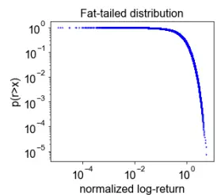

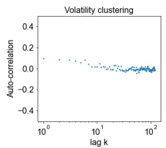
资料来源：Bloomberg，华泰证券研究所

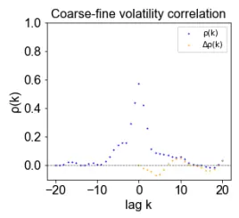

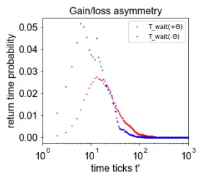

图表63： 标普 500月频序列：RaSGAN 生成序列 6项评价指标
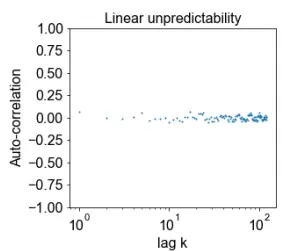

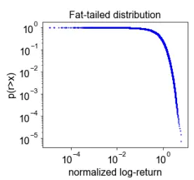

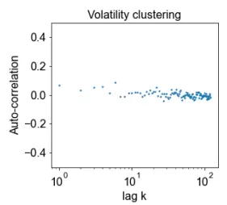

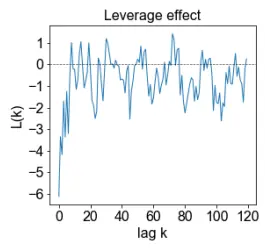
资料来源：Bloomberg，华泰证券研究所


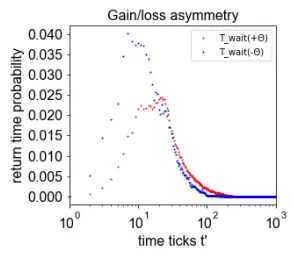

图表64： 标普 500月频序列：LSGAN 生成序列 6项评价指标
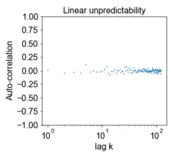

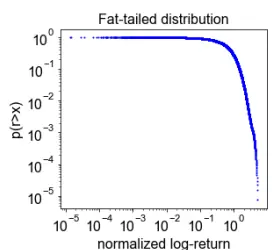

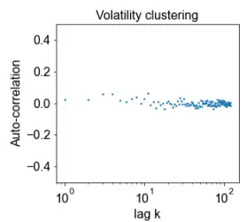

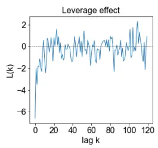
资料来源：Bloomberg，华泰证券研究所

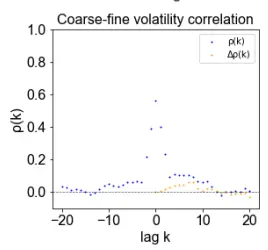

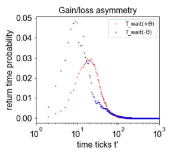

图表65： 标普 500月频序列：RaLSGAN生成序列 6项评价指标
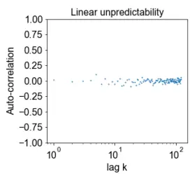

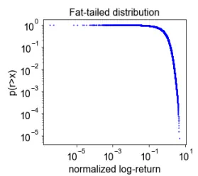

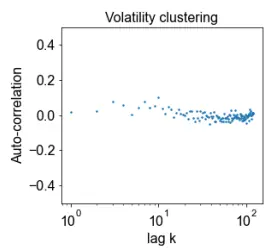

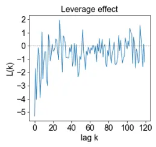
资料来源：Bloomberg，华泰证券研究所

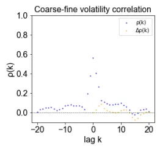

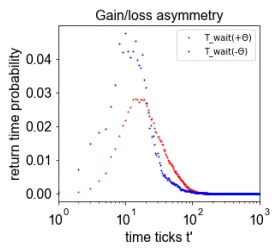

图表66： 标普 500月频序列：HingeGAN 生成序列 6项评价指标


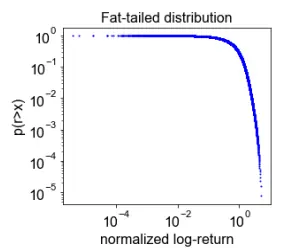


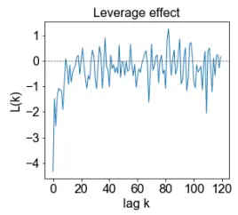
资料来源：Bloomberg，华泰证券研究所

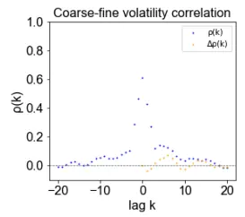

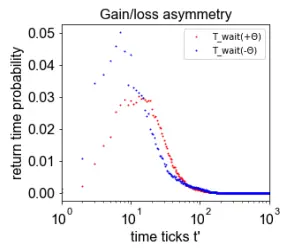

图表67： 标普 500月频序列：RaHingeGAN生成序列 6项评价指标
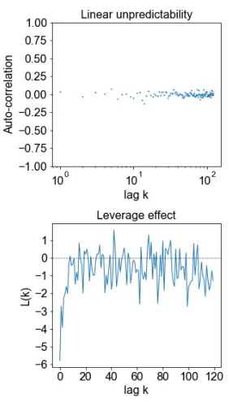
资料来源：Bloomberg，华泰证券研究所

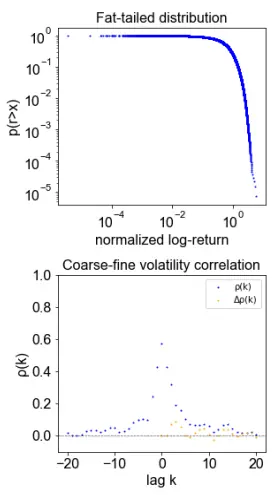

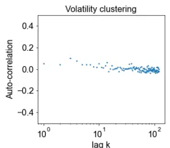

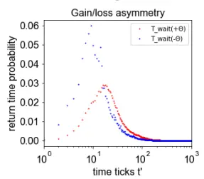

图表68： 标普 500月频序列：各种 GAN 生成序列 6项评价指标对比

| 评价指标 | 统计量 | 真实序列 | SGAN | RSGAN | RaSGAN | LSGAN | RaLSGAN HingeGAN RaHingeGAN |  |  |
| --- | --- | --- | --- | --- | --- | --- | --- | --- | --- |
| 自相关性 | 前10阶自相关系数均值 | 0.11 | 0.11 | 0.11 | 0.11 | 0.10 | 0.10 | 0.10 | 0.10 |
| 厚尾分布 | 拟合幂律衰减系数 α | 3.92 | 5.09 | 4.47 | 4.66 | 5.00 | 5.16 | 5.08 | 4.81 |
| 波动率聚集 | 拟合幂律衰减系数β | 0.43 | 0.42 | 0.94 | 0.87 | 0.69 | 0.73 | 0.78 | 0.67 |
| 杠杆效应 | 前10阶相关系数均值 | -4.76 | -2.10 | -2.03 | -2.28 | -2.09 | -2.16 | -1.59 | -2.10 |
|  | 粗细波动率相关滞后±1 阶相关系数之差 | -0.02 | 0.04 | -0.02 | -0.02 | 0.01 | 0.03 | -0.04 | 0.00 |
| 盈亏不对称性 | 盈亏±θ所需天数分布峰值之差 | 6.00 | 7.92 | 6.69 | 9.22 | 11.99 | 9.94 | 8.06 | 9.36 |

资料来源：Bloomberg，华泰证券研究所

图表69： 标普 500月频序列：SGAN、RSGAN、RaSGAN 生成序列方差比率指标
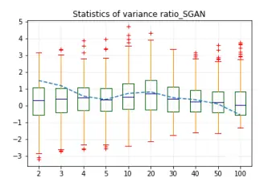
资料来源：Bloomberg，华泰证券研究所

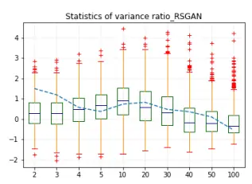

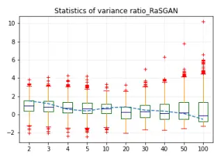

图表70： 标普 500月频序列：LSGAN、RaLSGAN 生成序列方差比率指标
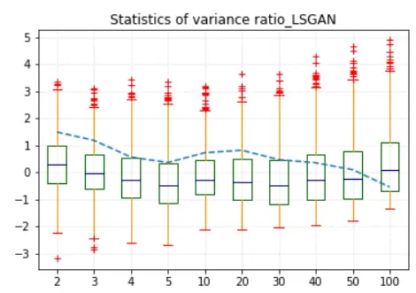
资料来源：Bloomberg，华泰证券研究所

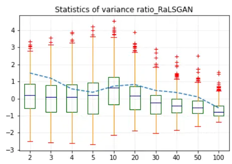

图表71： 标普 500 月频序列：HingeGAN、RaHingeGAN 生成序列方差比率指标
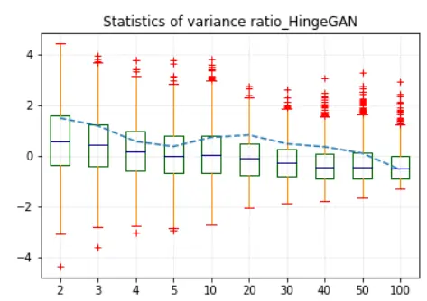
资料来源：Bloomberg，华泰证券研究所

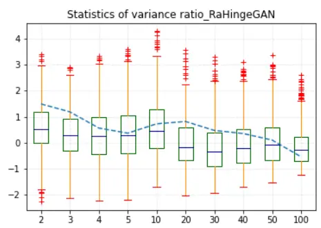

图表72： 标普 500月频序列：各种 GAN生成序列 Hurst值假设检验结果

| 模型 | Hurst 均值 | Hurst 大于 0.5 比例 |  | 检验统计量U 是否拒绝原假设 | 是否长时程相关 |
| --- | --- | --- | --- | --- | --- |
| 真实序列 | 0.61 |  |  |  | 是 |
| SGAN | 0.54 | 70% | 17.29 | 否 | 是 |
| RSGAN | 0.58 | 91% | 40.83 | 否 | 是 |
| RaSGAN | 0.57 | 89% | 40.16 | 否 | 是 |
| LSGAN | 0.50 | 48% | -0.47 | 否 | 是 |
| RaLSGAN | 0.59 | 89% | 40.17 | 否 | 是 |
| HingeGAN | 0.54 | 72% | 17.81 | 否 | 是 |
| RaHingeGAN | 0.56 | 82% | 30.88 | 否 | 是 |

资料来源：Bloomberg，华泰证券研究所

图表73： 标普 500月频序列：SGAN、RSGAN生成序列多样性
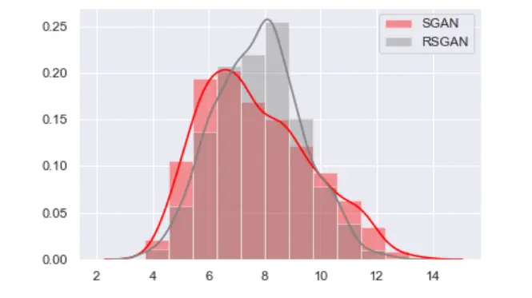
资料来源：Bloomberg，华泰证券研究所

图表74： 标普 500月频序列：SGAN、RaSGAN生成序列多样性
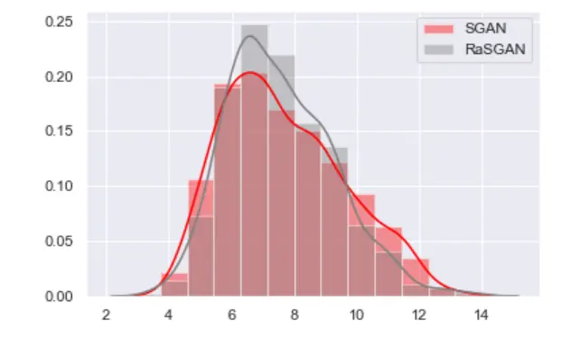
资料来源：Bloomberg，华泰证券研究所

图表75： 标普 500月频序列：LS/RaLSGAN生成序列多样性
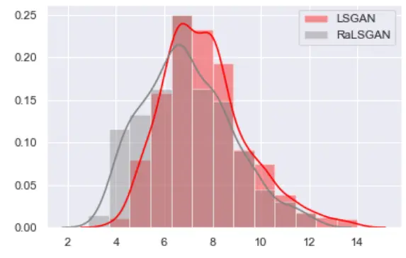
资料来源：Bloomberg，华泰证券研究所

图表76： 标普 500 月频序列：Hinge/RaHingeGAN 生成序列多样性
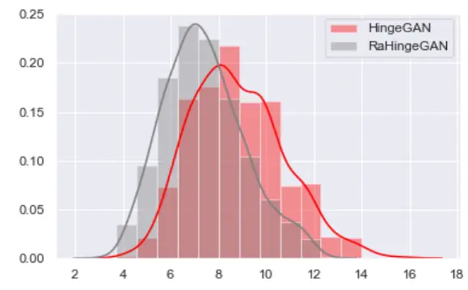
资料来源：Bloomberg，华泰证券研究所

## 免责声明

## 分析师声明

本人，林晓明、李子钰、何康，兹证明本报告所表达的观点准确地反映了分析师对标的证券或发行人的个人意见；彼以往、现在或未来并无就其研究报告所提供的具体建议或所表迖的意见直接或间接收取任何报酬。

## 一般声明及披露

本报告由华泰证券股份有限公司（已具备中国证监会批准的证券投资咨询业务资格，以下简称“本公司”）制作。本报告仅供本公司客户使用。本公司不因接收人收到本报告而视其为客户。

本报告基于本公司认为可靠的、已公开的信息编制，但本公司对该等信息的准确性及完整性不作任何保证。本报告所载的意见、评估及预测仅反映报告发布当日的观点和判断。在不同时期，本公司可能会发出与本报告所载意见、评估及预测不一致的研究报告。同时，本报告所指的证券或投资标的的价格、价值及投资收入可能会波动。以往表现并不能指引未来，未来回报并不能得到保证，并存在损失本金的可能。本公司不保证本报告所含信息保持在最新状态。本公司对本报告所含信息可在不发出通知的情形下做出修改，投资者应当自行关注相应的更新或修改。

本公司力求报告内容客观、公正，但本报告所载的观点、结论和建议仅供参考，不构成购买或出售所述证券的要约或招揽。该等观点、建议并未考虑到个别投资者的具体投资目的、财务状况以及特定需求，在任何时候均不构成对客户私人投资建议。投资者应当充分考虑自身特定状况，并完整理解和使用本报告内容，不应视本报告为做出投资决策的唯一因素。对依据或者使用本报告所造成的一切后果，本公司及作者均不承担任何法律责任。任何形式的分享证券投资收益或者分担证券投资损失的书面或口头承诺均为无效。

除非另行说明，本报告中所引用的关于业绩的数据代表过往表现，过往的业绩表现不应作为日后回报的预示。本公司不承诺也不保证任何预示的回报会得以实现，分析中所做的预测可能是基于相应的假设，任何假设的变化可能会显著影响所预测的回报。

本公司及作者在自身所知情的范围内，与本报告所指的证券或投资标的不存在法律禁止的利害关系。在法律许可的情况下，本公司及其所属关联机构可能会持有报告中提到的公司所发行的证券头寸并进行交易，为该公司提供投资银行、财务顾问或者金融产品等相关服务或向该公司招揽业务。

本公司的销售人员、交易人员或其他专业人士可能会依据不同假设和标准、采用不同的分析方法而口头或书面发表与本报告意见及建议不一致的市场评论和/或交易观点。本公司没有将此意见及建议向报告所有接收者进行更新的义务。本公司的资产管理部门、自营部门以及其他投资业务部门可能独立做出与本报告中的意见或建议不一致的投资决策。投资者应当考虑到本公司及/或其相关人员可能存在影响本报告观点客观性的潜在利益冲突。投资者请勿将本报告视为投资或其他决定的唯一信赖依据。有关该方面的具体披露请参照本报告尾部。

本报告并非意图发送、发布给在当地法律或监管规则下不允许向其发送、发布的机构或人员，也并非意图发送、发布给因可得到、使用本报告的行为而使本公司及关联子公司违反或受制于当地法律或监管规则的机构或人员。

本公司研究报告以中文撰写，英文报告为翻译版本，如出现中英文版本内容差异或不一致，请以中文报告为主。英文翻译报告可能存在一定时间迟延。

本报告版权仅为本公司所有。未经本公司书面许可，任何机构或个人不得以翻版、复制、发表、引用或再次分发他人等任何形式侵犯本公司版权。如征得本公司同意进行引用、刊发的，需在允许的范围内使用，并注明出处为“华泰证券研究所”，且不得对本报告进行任何有悖原意的引用、删节和修改。本公司保留追究相关责任的权利。所有本报告中使用的商标、服务标记及标记均为本公司的商标、服务标记及标记。

## 中国香港

本报告由华泰证券股份有限公司制作,在香港由华泰金融控股（香港）有限公司向符合《证券及期货条例》第 571 章所定义之机构投资者和专业投资者的客户进行分发。华泰金融控股（香港）有限公司受香港证券及期货事务监察委员会监管，是华泰国际金融控股有限公司的全资子公司，后者为华泰证券股份有限公司的全资子公司。在香港获得本报告的人员若有任何有关本报告的问题,请与华泰金融控股（香港）有限公司联系。

## 香港-重要监管披露

- 华泰金融控股（香港）有限公司的雇员或其关联人士没有担任本报告中提及的公司或发行人的高级人员。
更多信息请参见下方 “美国-重要监管披露”。

## 美国

本报告由华泰证券股份有限公司编制，在美国由华泰证券（美国）有限公司向符合美国监管规定的机构投资者进行发表与分发。华泰证券（美国）有限公司是美国注册经纪商和美国金融业监管局（FINRA）的注册会员。对于其在美国分发的研究报告，华泰证券（美国）有限公司对其非美国联营公司编写的每一份研究报告内容负责。华泰证券（美国）有限公司联营公司的分析师不具有美国金融监管（FINRA）分析师的注册资格，可能不属于华泰证券（美国）有限公司的关联人员，因此可能不受 FINRA 关于分析师与标的公司沟通、公开露面和所持交易证券的限制。华泰证券（美国）有限公司是华泰国际金融控股有限公司的全资子公司，后者为华泰证券股份有限公司的全资子公司。任何直接从华泰证券（美国）有限公司收到此报告并希望就本报告所述任何证券进行交易的人士，应通过华泰证券（美国）有限公司进行交易。

## 美国-重要监管披露

分析师林晓明、李子钰、何康本人及相关人士并不担任本报告所提及的标的证券或发行人的高级人员、董事或顾问。分析师及相关人士与本报告所提及的标的证券或发行人并无任何相关财务利益。声明中所提及的“相关人士”包括FINRA 定义下分析师的家庭成员。分析师根据华泰证券的整体收入和盈利能力获得薪酬，包括源自公司投资银行业务的收入。

- 华泰证券股份有限公司、其子公司和/或其联营公司, 及/或不时会以自身或代理形式向客户出售及购买华泰证券研究所覆盖公司的证券/衍生工具，包括股票及债券（包括衍生品）华泰证券研究所覆盖公司的证券/衍生工具，包括股票及债券（包括衍生品）。

- 华泰证券股份有限公司、其子公司和/或其联营公司, 及/或其高级管理层、董事和雇员可能会持有本报告中所提到的任何证券（或任何相关投资）头寸，并可能不时进行增持或减持该证券（或投资）。因此，投资者应该意识到可能存在利益冲突。

## 评级说明

投资评级基于分析师对报告发布日后 6 至 12个月内行业或公司回报潜力（含此期间的股息回报）相对基准表现的预期（A 股市场基准为沪深 300 指数，香港市场基准为恒生指数，美国市场基准为标普 500 指数），具体如下：

## 行业评级

增持：预计行业股票指数超越基准

中性：预计行业股票指数基本与基准持平

减持：预计行业股票指数明显弱于基准

## 公司评级

买入：预计股价超越基准 15%以上

增持：预计股价超越基准 5%~15%

持有：预计股价相对基准波动在-15%~5%之间

卖出：预计股价弱于基准 15%以上

暂停评级：已暂停评级、目标价及预测，以遵守适用法规及/或公司政策

无评级：股票不在常规研究覆盖范围内。投资者不应期待华泰提供该等证券及/或公司相关的持续或补充信息

## 法律实体披露

中国：华泰证券股份有限公司具有中国证监会核准的“证券投资咨询”业务资格，经营许可证编号为：91320000704041011J香港：华泰金融控股（香港）有限公司具有香港证监会核准的“就证券提供意见”业务资格，经营许可证编号为：AOK809美国：华泰证券（美国）有限公司为美国金融业监管局（FINRA）成员，具有在美国开展经纪交易商业务的资格，经营业务许可编号为：CRD#:298809/SEC#:8-70231

## 华泰证券股份有限公司

南京南京市建邺区江东中路228号华泰证券广场1号楼/邮政编码：210019

电话：86 25 83389999/传真：86 25 83387521电子邮件：ht-rd@htsc.com

深圳
深圳市福田区益田路5999号基金大厦10楼/邮政编码：518017
电话：86 755 82493932/传真：86 755 82492062
电子邮件：ht-rd@htsc.com

## 华泰金融控股（香港）有限公司

香港中环皇后大道中 99号中环中心 58楼 5808-12室
电话：+852 3658 6000/传真：+852 2169 0770
电子邮件：research@htsc.com
http://www.htsc.com.hk

## 华泰证券（美国）有限公司

美国纽约哈德逊城市广场 10号 41楼（纽约 10001）
电话: + 212-763-8160/传真: +917-725-9702
电子邮件: Huatai@htsc-us.com
http://www.htsc-us.com

©版权所有2020年华泰证券股份有限公司

北京
北京市西城区太平桥大街丰盛胡同28号太平洋保险大厦A座18层/
邮政编码：100032
电话：86 10 63211166/传真：86 10 63211275
电子邮件：ht-rd@htsc.com
上海
上海市浦东新区东方路18号保利广场E栋23楼/邮政编码：200120
电话：86 21 28972098/传真：86 21 28972068
电子邮件：ht-rd@htsc.com