## 金工研究/深度研究

2020年10月22日

林晓明 SAC No. S0570516010001

研究员 SFC No. BPY421

linxiaoming@htsc.com

李子钰 SAC No. S0570519110003

研究员 0755-23987436

何康 SAC No. S0570520080004

研究员 021-28972039

王晨宇 SAC No. S0570119110038

联系人 02138476179

wangchenyu@htsc.com

3《金工: 竞速科技赛道：科技投资新工具》2020.10

# 舆情因子和 BERT情感分类模型

# 华泰人工智能系列之三十七

本文研究了基于金融新闻的舆情因子，并测试了 BERT 文本情感分类模型随着国内量化投资的发展，挖掘另类数据中的增量信息逐渐受投资者关注。另类数据中一大类数据就是舆情文本数据。本文提取 Wind 金融新闻数据中的情感正负面标签构建新闻舆情因子，因子在沪深 300内表现最好。进一步地，本文介绍了前沿的自然语言处理(NLP)模型 BERT 的原理和训练方法，并基于 Wind 的有标注金融新闻数据训练金融新闻情感分类模型，模型在正负不平衡样本上达到了很高的预测精度。最后，本文介绍了 BERT模型可解释性工具 LIT。通过LIT 可分析文本中字符对于预测结果的重要性并帮助理解 BERT 的学习机制。

## 基于金融新闻的舆情因子具有一定选股效果，在沪深 300内表现最好

本文基于 Wind 金融新闻数据，提取其中的情感正负面标签，构建日频的新闻舆情因子。2017 年以来，因子在沪深 300、中证 500、全 A股的平均覆盖率分别为 84.41%，76.16%，63.03%，且覆盖率随时间推移逐渐上升。因子在沪深 300 成分股内表现最好，行业市值中性后 RankIC 均值为6.13%，IC_IR 为 0.42，分 5 层测试中 TOP 组合年化收益率为 17.79%，多空组合夏普比率为 1.66。因子在中证 500 成分股内表现次之，在全 A股内则表现最差。

## 前沿的 NLP模型 BERT 能实现高精度的金融新闻情感分类

近年来， NLP领域最前沿的研究成果是预训练模型 BERT。模型首先使用大量无监督语料进行语言模型预训练，再使用少量标注语料进行微调来完成具体任务(如本文的金融新闻情感分类)。本文介绍了 BERT 的核心原理：Transformer和自注意力机制。随后，本文基于Wind的有标注金融新闻数据，使用 BERT 训练金融新闻情感分类模型。模型在正负不平衡样本上达到了很高的预测精度，样本外的准确率为 0.9826，AUC 为 0.9746，精确率为 0.9736，召回率为 0.9744。

## 打开 BERT 模型的黑箱：模型可解释性工具 LIT 介绍

BERT 模型结构复杂且参数量庞大，本文借助 Google 发布的开源 NLP 模型可解释性工具 LIT 来打开 BERT 的黑箱，理解 BERT 的“思考过程”。LIT 有两个重要模块：(1) Salience Maps 模块，可分析输入文本中每个字符对于模型预测结果的重要性。例句中的结果显示，正面情感新闻中“同比预增”、“中标”等字符重要性较高，负面情感新闻中“风控”、“摘牌”、“减持”等字符重要性较高。说明 BERT 都能够较好地抓住文本中的关键词，做出准确预测。(2)Attention 模块，可分析注意力权重，从而帮助理解 BERT 的学习机制。

风险提示：舆情因子的测试结果是历史表现的总结，存在失效的可能。本文使用的金融新闻数据只覆盖了部分新闻来源，构建的因子可能是有偏的。模型可解释性工具 LIT 可能存在过度简化的风险。

## 本文研究导读

自本文开始，我们将探索人工智能模型对于另类数据中信息的提取，从而帮助投资者更好地将另类数据运用到投资决策中。

在投资领域，另类数据(Alternative Data)是指除了传统财务、量价信息之外的，能为投资决策提供增量信息的数据。随着传统投资数据中的信息被不断挖掘，从中获得增量 Alpha的空间越来越小，于是投资者开始关注另类数据的使用。然而另类数据往往具有收集困难、非结构化等特点，具有一定的运用门槛。人工智能技术作为处理非结构化数据的利器，对另类数据中的信息提取起到了关键作用。

另类数据中一大类数据就是舆情文本数据。随着互联网技术和金融产业的飞速发展，网络上金融新闻数据日益丰富。大量的金融新闻中都包含有对上市公司经营状况的正面或负面描述，对于股票定价来说，金融新闻中可能蕴含有传统投资数据之外的增量信息。因此，借助人工智能模型对金融新闻进行情感分析有助于投资决策。

本文将对金融新闻数据的运用和自然语言处理模型进行详细介绍，主要包含以下内容：

1. Wind金融新闻数据说明和选股因子构建。

2. 介绍当前最前沿的自然语言处理模型 BERT 及其情感分类测试效果。

3. 打开 BERT 模型的黑箱：模型可解释性工具 LIT 介绍。

## 基于 Wind金融新闻数据的选股因子

## Wind 金融新闻数据说明

对于金融新闻数据的获取，一方面可以使用网络爬虫自行爬取数据，另一方面也可从一些现有的第三方数据库中获取。简便起见，本文使用 Wind 底层数据库中的金融新闻数据，该数据有以下两个特点：

1. 每条金融新闻文本已和所涉及的股票对应上。

2. 大量新闻已有正负面的情感标注。一方面，可通过标注好的新闻数据直接计算选股因子。另一方面，可利用标注好的新闻训练情感分析模型，从而可将模型运用到更多未标注的金融文本情感分析上。

图表 1为Wind 金融新闻数据库中的 2 条原始数据样本。

图表1： Wind金融新闻数据的 2条原始数据样本

| 发布时间 2020/9/26 00:16:19 | 新闻标题 朗玛信息： 动视云未 来业务发 展存在一 定的不确 了更好地推动动视云业务快速发 定性 展，但目前云游戏行业属于行业 | 新闻内容 香港万得通讯社报道，Wind风控 日报数据显示，朗玛信息回复关 注函，动视云通过股权转让及增 资扩股的方式引入新股东，是为 | 来源 Wind | 新闻栏目 股市\|个股\|标准新闻\| 旧版新闻\|A 股\|功能 关键字\|直播\|精选新 闻\|Wind 数据\|Wind 阳朗玛信息技术股 | 相关公司 ON0201:A 股 \|300288.SZ：朗玛信 息\|eFYy85zLDw:贵 | 市场情绪 TITLEFM0402:标题预警\|3746:负 面情绪\|CJFM0402：负面新闻 \|ON11:市场情绪\|300288.SZ0402： |
| --- | --- | --- | --- | --- | --- | --- |
| 2020/9/27 17:31:27 | 启迪环境： 预中标 1.15 亿元 合同 | 发展初期，商业模式尚未成熟与 清晰，动视云未来业务发展存在 一定的不确定性。 e公司讯，启迪环境(000826)9 e 公司 月27日晚间公告，预中标西安市 碑林区生活垃圾清运及公厕运营 管理项目(三次)项目，本项目总 投资约为1.15亿元，如合同正式 签订，合同履行对本公司未来年 |  | 个股\|标准新闻\|分类\|1000826:启迪环境 精选新闻\|旧版新闻\| 评论观点类\|功能关公司\|3783:公司实 键字 | 公司\|3783：公司实体 科技发展股份有限 体\|ON02：公司 \|000826.SZ：启迪 环境\|ON0201:A 股 | eFYy85zLDw.FM0402:贵阳朗玛 信息技术股份有限公司负面 \|ON110211:非上市公司负面 000826.SZ0401：启迪环境正面 JON11010301:A 股正 面 \|ON110103:公司正面\|3745:正面 情绪\|ON11:市场情绪 |

资料来源：Wind，华泰证券研究所

我们从 Wind 获取了 2017 年 1 月至 2020 年 9 月的金融新闻数据，该数据包括了新闻发布时间、新闻标题、新闻内容、新闻来源、新闻对应公司的股票代码和情感分类标签等内容。在运用于后续任务之前，需要对金融舆情数据进行预处理，步骤如下：

1. 筛选出与 A股个股相关的新闻；

2. 剔除行情类的新闻以及标题中含有“快讯”、“涨”、“跌”的新闻；

3. 将新闻标题与新闻内容整合为一条文本，并去除文本中的空格；

4. 提取文本情感分类结果，将正面新闻打上标签 1，将负面新闻打上标签 0；

5. 保留新闻发布时间、新闻来源、情感分类标签、股票代码和新闻文本五个字段。

下图展示了数据时间范围内每日正面新闻与负面新闻数量的对比情况，可以看到在 2017年至 2019 年，正面新闻的数量总体上要多于负面新闻，而在 2019 年之后，负面新闻的数量则远多于正面新闻。

图表2： 正面新闻与负面新闻数量对比情况
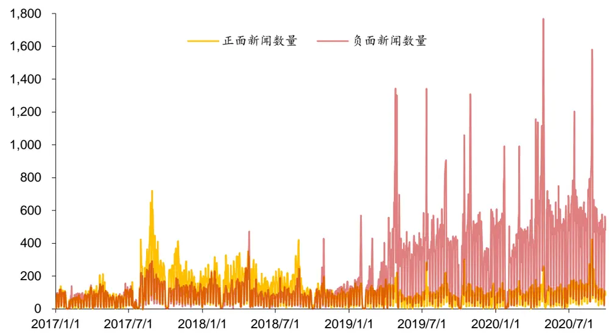
资料来源：Wind，华泰证券研究所

我们将 2017 年以来的新闻的标题进行分词并统计词频。图表 3和图表 4分别为正面新闻和负面新闻的标题词云(词云中字号越大说明词频越高)。正面新闻的标题中，“增长”、“增持”、“看好”、“改善”、“中标”等词出现次数较多。负面新闻的标题中，“减持”、“亏损”、“问询”、“辞职”、“担保”等词出现次数较多。

图表3： 正面新闻的标题词云

资料来源：Wind，华泰证券研究所

图表4： 负面新闻的标题词云

资料来源：Wind，华泰证券研究所

图表 5为 2020 年金融舆情数据的主要来源情况，Wind 和格隆汇为最主要的来源。

图表5： 2020年金融舆情数据的主要来源情况
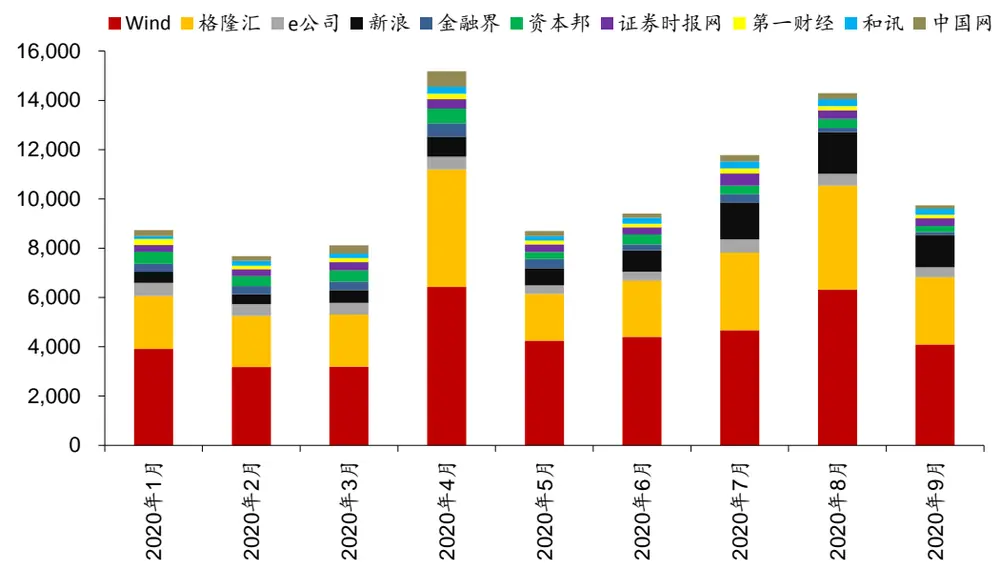
资料来源：Wind，华泰证券研究所

## 新闻舆情因子构建

在上一节的数据预处理完成之后，将通过以下步骤构建选股因子：

1. 在每个自然日 t，针对每只个股 i，取其当天全部有情感标注的新闻计算个股的情感得分 $\cdot S_{i,t},\ S_{i,t}$ 的计算方式为：

$$
S_{i,t}=\mathbb{E}\mathbb{E}\mathbb{E}\mathbb{\ H}\mathbb{\ H}\mathbb{\ H}\mathbb{\ H}\mathbb{\ H}\mathbb{\ H}^{\ominus}-\mathbb{\ H}\mathbb{\ H}\mathbb{\ H}\mathbb{\ H}\mathbb{\ H}\mathbb{\ H}\mathbb{\ H}\mathbb{\ H}\mathbb{\ H}\mathbb{\ H}\mathbb{\ H}\mathbb{\ H}\mathbb{\ H}
$$

2. 在每个交易日 T，针对每只个股 i，取过去 T-30 个自然日的情感得分，按照时间先后对个股情感得分求线性衰减加权和，得到新闻舆情因子 $F_{i,T}$

$$
F_{i,T}=\sum_{t=T-29}^{T}w_{t}S_{i,t},\qquad w_{t}={\frac{30-(T-t)}{30}}\qquad
$$

3. Wind数据库中，当出现证券公司点评其他公司的新闻时，可能会将该新闻涉及的情感与证券公司关联，这是不合理的。因此我们不针对证券行业的股票计算舆情因子。

4. 考虑到市值大的公司新闻数量往往更多，不同行业的公司新闻数量也不具可比性，因此对新闻舆情因子进行行业市值中性。

图表 6展示了各成分股中新闻舆情因子的覆盖度，可见沪深 300 成分股内覆盖度最高，且随着时间的推移，各成分股的因子覆盖度也在逐渐上升。

图表6： 新闻舆情因子覆盖度
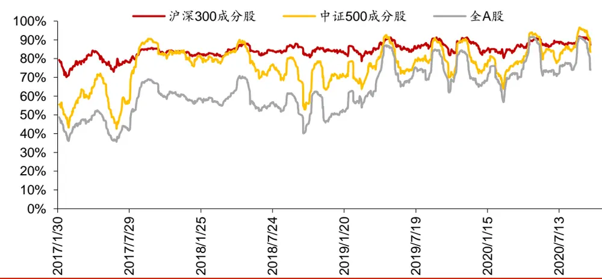
资料来源：Wind，华泰证券研究所

## 单因子测试方法简介

## 回归法

回归法是一种最常用的测试因子有效性的方法，具体做法是将第T期的因子暴露度向量与T+1期的股票收益向量进行线性回归，所得到的回归系数即为因子在T期的因子收益率，同时还能得到该因子收益率在本期回归中的显著度水平——t 值。在某截面期上的个股的因子暴露度(Factor Exposure)即指当前时刻个股在该因子上的因子值。第T期的回归模型具体表达式如下。

$$
\boldsymbol{r}^{T+1}=\boldsymbol{X}^{T}\boldsymbol{a}^{T}+\sum_{j}Ind\boldsymbol{u}\boldsymbol{s}_{j}^{T}\boldsymbol{b}_{j}^{T}+ln\mathbin{\lrcorner}m\boldsymbol{k}\boldsymbol{t}^{\mathrm{T}}\boldsymbol{b}^{T}+\boldsymbol{\varepsilon}^{T}
$$

$r^{T+1}$ :所有个股在第T+1期的收益率向量

$X^{T}$ :所有个股第T期在被测单因子上的暴露度向量

IndusjT: 所有个股第 T 期在第 j 个行业因子上的暴露度向量(0/1 哑变量)

$ln\_mkt^{\mathrm{T}};$ :所有个股第T期在对数市值因子上的暴露度向量

$a^{T},b^{T},b_{j}^{T}$ :对应因子收益率，待拟合常数，通常比较关注 $.a^{T}$

$\varepsilon^{T};$ :残差向量

回归模型构建方法如下：

1． 股票池：沪深 300 成分股、中证 500 成分股，全 A 股，剔除 ST、PT 股票，剔除每个截面期下一交易日停牌的股票。

2． 回溯区间：2017/1/26～2020/9/30。

3． 截面期：每个交易日作为截面期计算因子值，与该截面期之后 20 个交易日内个股收益进行回归。

4． 数据处理方法：

a) 中位数去极值：设第 T 期某因子在所有个股上的暴露度向量为 $D_{i}$ ， $D_{M}$ 为该向量中位数， $D_{M1}$ 为向量 $|D_{i}-D_{M}|\ LH_{\cdot}^{\ L}\ L]$ 中位数，则将向量 $D_{i}$ 中所有大于 $D_{M}+5D_{M1}$ 的数重设为 $D_{M}+5D_{M1}$ ，将向量 $D_{i}$ 中所有小于 $D_{M}-5D_{M1}$ 的数重设为 $D_{M}-5D_{M1}$

b) 中性化：以行业及市值中性化为例，在第 T 期截面上用因子值(已去极值)做因变量、对数总市值因子(已去极值)及全部行业因子(0/1 哑变量)做自变量进行线性回归，取残差作为因子值的一个替代，这样做可以消除行业和市值因素对因子的影响；

c) 标准化：将经过以上处理后的因子暴露度序列减去其现在的均值、除以其标准差，得到一个新的近似服从 N(0,1)分布的序列，这样做可以让不同因子的暴露度之间具有可比性；

d) 缺失值处理：因本文主旨为单因子测试，为了不干扰测试结果，如文中未特殊指明均不填补缺失值(在构建完整多因子模型时需考虑填补缺失值)。

5． 回归权重：由于普通最小二乘回归(OLS)可能会夸大小盘股的影响(因为小盘股的财务质量因子出现极端值概率较大，且小盘股数目很多，但占全市场的交易量比重较小)，并且回归可能存在异方差性，故我们参考 Barra 手册，采用加权最小二乘回归(WLS)，使用个股流通市值的平方根作为权重，此举也有利于消除异方差性。

6． 因子评价方法：

a) t 值序列绝对值均值——因子显著性的重要判据；

b) t 值序列绝对值大于 2的占比——判断因子的显著性是否稳定；

c) t 值序列均值——与 a)结合，能判断因子 t 值正负方向是否稳定；

d) 因子收益率序列均值——判断因子收益率的大小。

## IC 值分析法

因子的 IC 值是指因子在第 T 期的暴露度向量与 T+1 期的股票收益向量的相关系数，即

$$
IC^{T}=\operatorname{corr}(r^{T+1},X^{T})
$$

上式中因子暴露度向量 $X^{T}$ 一般不会直接采用原始因子值，而是经过去极值、中性化等手段处理之后的因子值。在实际计算中，使用 Pearson 相关系数可能受因子极端值影响较大，使用Spearman秩相关系数则更稳健一些，这种方式下计算出来的 IC一般称为Rank IC。IC 值分析模型构建方法如下：

1. 股票池、回溯区间、截面期均与回归法相同。

2. 先将因子暴露度向量进行一定预处理(下文中会指明处理方式)，再计算处理后的 T 期因子暴露度向量和T+1期股票收益向量的Spearman秩相关系数，作为T期因子RankIC 值。

3. 因子评价方法：

a) Rank IC 值序列均值——因子显著性；

b) Rank IC 值序列标准差——因子稳定性；

c) IC_IR(Rank IC 值序列均值与标准差的比值)——因子有效性；

d) Rank IC 值序列大于零的占比——因子作用方向是否稳定。

## 分层回测法

依照因子值对股票进行打分，构建投资组合回测，是最直观的衡量因子优劣的手段。分层测试法与回归法、IC 值分析相比，能够发掘因子对收益预测的非线性规律。也即，若存在一个因子分层测试结果显示，其 Top 组和 Bottom 组的绩效长期稳定地差于 Middle 组，则该因子对收益预测存在稳定的非线性规律，但在回归法和 IC 值分析过程中很可能被判定为无效因子。分层测试模型构建方法如下：

1. 股票池、回溯区间、截面期均与回归法相同。

2. 换仓：在每个截面期核算因子值，构建分层组合，在截面期下一个交易日按当日收盘价换仓，交易费用默认为单边 0.2%。

3. 分层方法：先将因子暴露度向量进行一定预处理(下文中会指明处理方式)，将股票池内所有个股按处理后的因子值从大到小进行排序，等分 N 层，每层内部的个股等权重配置。当个股总数目无法被 N 整除时采用任一种近似方法处理均可，实际上对分层组合的回测结果影响很小。分层测试中的基准组合为股票池内所有股票的等权组合。

4. 多空组合收益计算方法：用 Top组每天的收益减去 Bottom 组每天的收益，得到每日多空收益序列 $\vert r_{1},r_{2},\cdots,r_{n}$ ，则多空组合在第n天的净值等于 $(1+r_{1})(1+r_{2})\cdots(1+r_{n})$

5. 本文分层测试的结果均不存在“路径依赖”效应，我们以交易日=20 天为例说明构建方法：首先，在回测首个交易日 $K_{0}$ 构建分层组合并完成建仓，然后分别在交易日$K_{i},K_{i+20},K_{i+40},$ ⋯按当日收盘信息重新构建分层组合并完成调仓，i取值为 1～20内的整数，则我们可以得到 20 个不同的回测轨道，在这 20 个回测结果中按不同评价指标(比如年化收益率、信息比率等)可以提取出最优情形、最差情形、平均情形等，以便我们对因子的分层测试结果形成更客观的认知。

评价方法：全部 N 层组合年化收益率(观察是否单调变化)，多空组合的年化收益率、夏普比率、最大回撤等。

## 新闻舆情因子测试结果

回归法和 IC值分析法

图表 7~图表 9 展示了新闻舆情因子的回归法和 IC值分析法结果。可知新闻舆情因子在沪深 300 成分股内表现最好，在中证 500 成分股内表现次之，在全 A股内则表现最差。

图表7： 新闻舆情因子回归法和 IC值分析法结果

|  | It\|均值 | \|tl>2 占比 | t均值 | 因子收益率均值 | RankIC 均值 | RankIC 标准差 | IC_IR | RackIC>0 占比 |
| --- | --- | --- | --- | --- | --- | --- | --- | --- |
| 沪深 300 成份股内 | 1.57 | 30.67% | 0.71 | 0.29% | 6.13% | 14.72% | 0.42 | 67.73% |
| 中证 500 成份股内 | 1.29 | 21.89% | 0.50 | 0.17% | 3.03% | 9.12% | 0.33 | 62.60% |
| 全 A股 | 2.53 | 52.34% | 1.14 | 0.13% | 1.79% | 7.07% | 0.25 | 62.49% |

资料来源：Wind，华泰证券研究所

图表8： 新闻舆情因子累计因子收益率
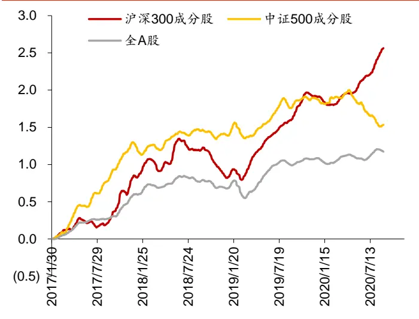
资料来源：Wind，华泰证券研究所

图表9： 新闻舆情因子累计因子 RankIC
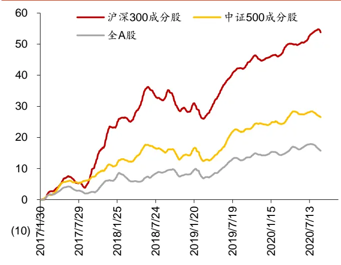
资料来源：Wind，华泰证券研究所

## 分层测试法

图表 10~图表 12 展示了新闻舆情因子的分层测试结果。可知新闻舆情因子在沪深 300 成分股内表现最好，在中证 500 成分股内表现次之，在全 A 股内则表现最差。在沪深 300成分股内因子多头的表现也不太稳定，2018 年出现了持续的回撤。

图表10： 新闻舆情因子分层测试结果

|  |  |  |  |  |  | 多空组合 多空组合多空组合最 |  | 多空组合 | 胜率 |
| --- | --- | --- | --- | --- | --- | --- | --- | --- | --- |
|  |  | 分层组合1～5(从左到右)年化收益率 |  |  | 年化收益率 | 夏普比率 | 大回撤 |  |  |
| 沪深 300 成份股内 | 17.79% | 5.64% | 0.29% | -1.14% | -1.30% | 18.73% | 1.66 | 19.47% | 65.91% |
| 中证500成份股内 | 8.10% | -2.65% | -0.38% | -4.44% | -4.01% | 12.35% | 1.42 | 15.38% | 72.73% |
| 全A股 | 0.38% | -1.21% | 1.16% | -3.72% | -5.10% | 5.39% | 0.87 | 11.90% | 63.64% |

资料来源：Wind，华泰证券研究所

图表11： 沪深 300成份股内分层测试相对等权基准的累计超额收益
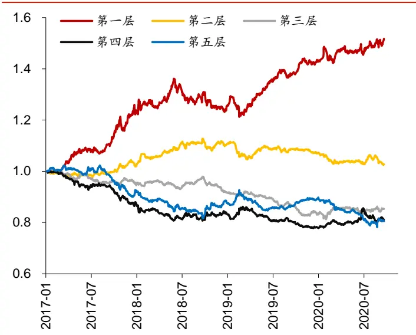
资料来源：Wind，华泰证券研究所

图表12： 中证 500成份股内分层测试相对等权基准的累计超额收益
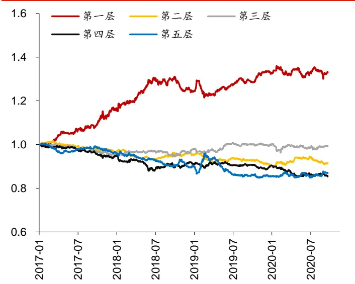
资料来源：Wind，华泰证券研究所

## 本章小结

本章我们基于Wind 金融新闻数据，使用简单的方法构建了新闻舆情因子，因子在沪深 300成分股内覆盖度最高，表现最好。

Wind 提供的金融新闻数据只覆盖了部分新闻来源，因此我们构建的因子可能是有偏的。为了丰富样本，可利用现有的新闻数据训练面向金融领域的文本情感分析模型，对更多的未标注文本预测情感得分，近年来飞速发展的自然语言处理模型使之成为可能，本文接下来将介绍基于 BERT 的自然语言处理模型。

## 基于 BERT的自然语言处理简介

## NLP 和预训练自然语言模型

NLP(Natural Language Process，自然语言处理)是人工智能的子领域，专注于人机交互和自然语言数据的处理和分析。近年来，NLP领域最激动人心的成果莫过于预训练自然语言模型，图表 13 回顾了近年来预训练自然语言模型的发展情况。预训练自然语言模型的开创了 NLP研究的新范式，即首先使用大量无监督语料进行语言模型预训练(Pre-training)，再使用少量标注语料进行微调(Fine-tuning)来完成具体 NLP 任务(文本分类、序列标注、句间关系判断和机器阅读理解等)。近年来 NLP 预训练语言模型呈现出了爆发式的发展，形成了 Google 的 BERT 系列和 OpenAI 的 GPT 系列为代表的模型。本文主要介绍基于BERT 的金融新闻情感分类。

图表13： 预训练自然语言模型发展
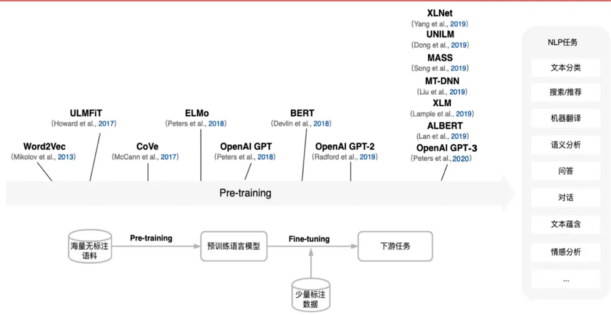
资料来源：华泰证券研究所

## BERT 模型的训练

2018 年，Google 在论文“BERT: Pre-training of Deep Bidirectional Transformers forLanguage Understanding”中提出了自然语言预训练模型 BERT。如图表 14 所示，BERT模型的训练主要包含两步：

1. 预训练：通过多种预训练任务，从海量文本数据中学习字符级、词语级、语句级和语句间关系的特征。

2. 微调：在预训练完成的模型基础之上，为具体的下游任务(如文本情感分类，序列标注等)定制和添加一层输出层，并运用下游任务的数据对模型进行微调，从而为各种自然语言处理任务生成预测精度更高的模型。

图表14： BERT模型的训练

资料来源：华泰证券研究所

## BERT 预训练：以海量文本数据赋予模型经验与知识

BERT 的预训练通过同时进行 Masked LM 和 NSP 两个预训练任务，从海量文本数据中学习字符级、词语级、语句级和语句间关系的特征。在预训练时会将同一语料多次输入到模型中，但每次投入时都会经过进行不同形式的预处理，使得同一语料被充分利用。对于一般用户来说，可从互联网上下载已经预训练好的模型直接微调，无需自己做预训练，这体现出了 BERT 的便捷之处。

图表15： BERT 预训练
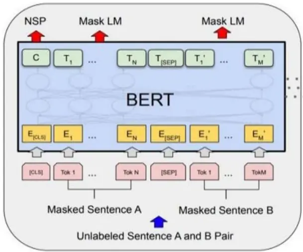
资料来源：华泰证券研究所
Pre-training

## 任务 1: Masked LM

Masked Language Model(MLM)是指随机从输入语料上遮盖掉一些字符，然后训练模型去预测被盖住的字符。正如我们在做完形填空时，我们会反复阅读空格处的上下文以进行推理一般，MLM 通过这种方式使得模型能够双向地记住字符的上下文，从而学习语句间的双向关系。

以输入语料“证券大涨带动做多情绪升温”为例，BERT 在进行 MLM 预训练任务时，输入语料会发生下述三种变化：

1. 有 80%的概率输入语料会变为“证券大涨带动做多情绪[mask]”。[mask]字符代表着“升温”被遮盖住，需要 BERT 模型对“升温”进行预测；

2. 有 10%的概率输入语料会变为“证券大涨带动做多情绪波动”，即将“升温”替换为其他句子中的任意一个词语，此处为“波动”；

3. 有 10%的概率输入语料保持不变。

之所以会有第 2 种和第 3 种变化，是因为在后续的微调中[mask]字符不会真正出现，故MLM 通过这种方式来提醒 BERT 该字符是一种噪声，使得模型能够尽量减小[mask]字符带来的不利影响。

## 任务 2: Next Sentence Prediction

Next Sentence Prediction(NSP)完成的任务为判断一个语句是否是另一语句的下一语句，并输出“是”与“否”。许多 NLP 任务，例如本研究报告的金融舆情分析，都需要模型能够理解句子之间的关系，而 BERT 正是通过这个任务来学习的。在进行 NSP 预训练任务时，BERT 会选取一半的训练数据为连续的句对，另一半则为不连续的句对，随后 BERT在这些数据上进行有监督训练，从而学习到句子之间的关系。

同样以输入语料“证券大涨带动做多情绪升温”为例，BERT 在进行 NSP预训练任务时，会以 50%的概率分别构造以下训练数据：

1. 输入：[CLS]证券大涨带动做多情绪升温 [SEP] 题材概念全线开花 [SEP] 标签：是

2. 输入：[CLS]证券大涨带动做多情绪升温 [SEP] 新型冠状病毒肺炎疫情在全 球肆意蔓延 [SEP]

标签：否

其中[CLS]字符用于储存和分类有关的信息，[SEP]字符为分句符号。

## BERT 微调：通过迁移学习实现金融新闻情感分类下游任务

在 BERT 完成预训练之后，可根据后续任务的具体需求对 BERT 微调，即可将训练成果应用于特定的任务情境。就本研究报告的金融舆情分析任务而言，由于 [CLS]字符(图表 16中的 C)储存的是语句与分类有关的信息，故只需在 BERT 模型的最顶层添加一个Softmax分类层，并以[CLS]字符的输出信息作为分类层的输入，即可得到 BERT 对该语句的情感分类结果。然后，再使用带有情感标注的金融新闻微调 BERT，就可训练出针对金融新闻预测精度更高的模型。

图表16： BERT微调后可用于文本情感分类
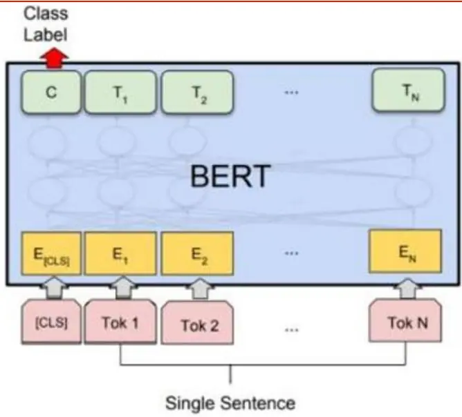
资料来源：华泰证券研究所

## BERT 模型的原理

如图表 17 所示，BERT 模型的核心原理包含两点：

1. Transformer： 2017 年 ，Google 在 论文 “Attention Is All You Need”中 提出了Transformer 架构，Transformer 在传统的 CNN 和 RNN 体系之外，开创了一种完全基于注意力机制的网络架构，非常适合自然语言处理任务。BERT 模型借用了Transformer 的编码器部分。

2. 自注意力机制：Transformer 中使用了多头自注意力机制(multi-head self-attention)来捕捉自然语言中的语义结构。自注意力机制本质上是一种基于向量内积的特征提取方法，特别适合提取自然语言中语义相似性的特征。

图表17： BERT模型的核心原理

资料来源：华泰证券研究所

## BERT 的网络架构：基于 Transformer

BERT 的网络架构是基于 Transformer 结构的 Encoder 部分，用于生成语言模型。使用Transformer 的优势在于：

1. 利用注意力机制使得任意两个字符直接互通，无视它们之间的方向和距离，解决以RNN 为结构带来的长距离依赖问题，从而通过上下文更好地学习文本的语义表示。

2. Transformer有利于进行并行化计算，大大提高模型训练的效率。

3. 通过注意力机制可以针对性地削弱 Masked LM 任务中 mask 标记的权重，以降低mask 标记对模型训练的不利影响。

基于 Transofrmer 的 BERT 网络架构如图表 18 所示，图中的一个“ECO”对应一个Transformer Block。BERT 模型训练时，将文本经过预处理生成的张量(input tensor)输入模型进行训练。文本的预处理过程包含较为复杂的步骤，详细过程请参见附录 1。

图表18： BERT 的网络架构：基于 Transformer
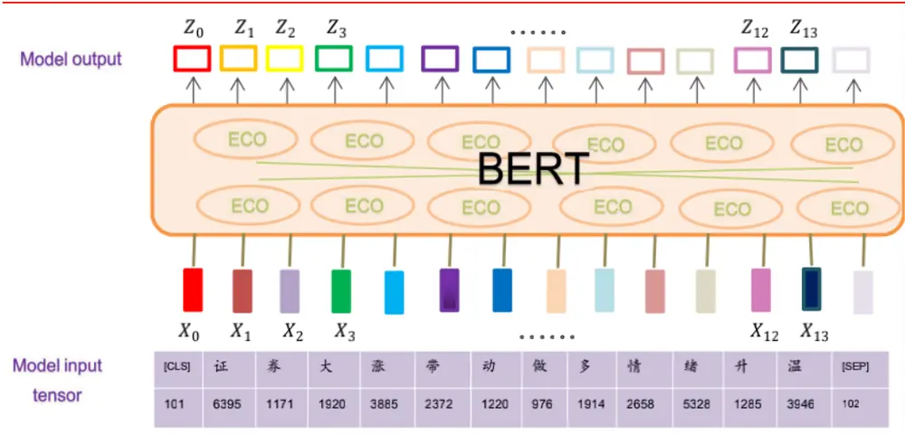
资料来源：华泰证券研究所

## Transformer 的特征提取方法：多头自注意力机制

接下来我们介绍 Transformer 中的多头自注意力机制(multi-head self-attention)。假设一个语言模型准备分析以下这句话：“猎豹没有追上这只鹿，因为它跑得太快了。”现在的问题是，这句话里的“它”指的是什么？是猎豹还是鹿？对于人类来说，答案是显而易见的，但对于一个模型来说可能并不是这么容易。注意力机制的作用就在于，让模型模仿人类的阅读习惯，在分析一句话的时候，有选择性的关注上下文的重点部分，从而提高模型完成任务的准确性。总的来说，注意力机制通过充分利用句子中其他词语的信息，为当前词语产生一个更好的语义编码。

注意力机制类似于查询的过程，其使用了 Key、Value、Query 三个特征向量来计算分配给每个词的注意力权重。输入语句中的每个词由一系列成对的(Key，Value)组成，而 Query则代表着目标语句中的词语，即模型的学习目标。通过计算目标语句的 Query和每个 Key的相似度，可以得到每个 Key对应的 Value 的权重，因为 Value 代表着当前的词语，所以该权重代表了当前词语的重要性。最后，将每个 Value进行加权求和，就可以得到语句的语义编码。

在 Transformer 的自注意力机制中，我们有 Key=Value=Query，这样做的好处是可以将注意力机制运用到一个句子的内部，将输入语句本身作为学习目标，使得模型能够学习到句子内部词语的依赖关系，捕捉句子的内部结构。接下来，我们结合公式来理解自注意力机制的计算过程。假设现在有一个输入语句X，首先通过线性变换得到 Query、Key 和 Value的向量序列Q、K和V：

$$
\begin{array}{r}{Q=W_{Q}X}\\{K=W_{K}X}\\{V=W_{V}X}\end{array}
$$

然后，可通过以下公式计算注意力：

$$
Attention\big(Q,\ K,\ V\big)=softmax(\frac{QK^{T}}{\sqrt{d_{k}}})V
$$

在上面的公式中，通过计算点积 $QK^{T}$ 得到 Query 和 Key 的相似度，再将相似度输入softmax 函数规范化到(0，1)范围内，得到Key对应Value 的权重，并乘上V得到最终的注意力向量。

我们以句子“证券大涨带动做多情绪升温”为例，说明其前三个字符的自注意力计算流程。前三个字符经过预处理编码后可得向量 X ，X ，X ，对其做线性变换后得到 K，Q，V 向量。图表 19 展示了使用 $\ Q_{2}$ 作为查询向量的子注意力计算流程。针对句子中的每个字符的向量，都重复图表 19中的过程，就可得到整个句子的注意力输出序列。

图表19： 自注意力计算流程
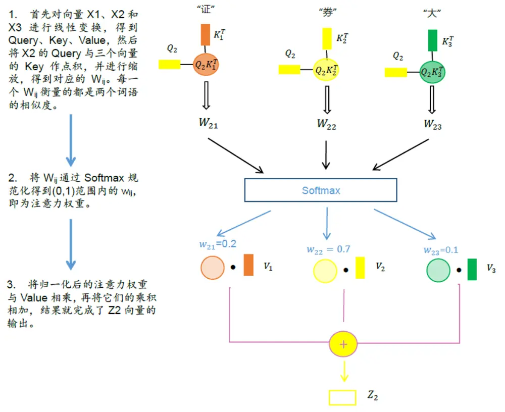
资料来源：华泰证券研究所

BERT 在自注意力机制的基础上，采用了多头自注意力(multi-head self-attention)机制，具体做法是针对文本进行多次注意力运算，在把运算结果合并起来，即得到多个 “注意力头”的集成结果。这可以让模型关注到语句不同位置的信息，也可通过不同注意力头的集成缓解过拟合。具体实现请参见附录 2。

## 基于 BERT的金融新闻情感分类实证

本章基于已有情感标注的Wind金融新闻数据，测试BERT模型在金融情感分类任务的表现。

## 数据预处理和模型准备

数据预处理包含以下步骤：

1. 从Wind底层库中获取 2020 年 1 月至 2020 年 5 月的新闻数据；

2. 筛选出与 A股个股相关的新闻；

3. 剔除行情类的新闻以及标题中含有“快讯”、“涨”、“跌”的新闻；

4. 将新闻标题与新闻内容整合为一条文本，并去除文本中的空格；

5. 提取文本情感分类结果，将正面新闻打上标签 1，将负面新闻打上标签 0；

6. 样本数量总共有 125513 条，其中正面新闻占比 18.13%。按照时间先后分别划分为训练集、验证集和测试集，划分比例为 4:1:1。

如图表 20 所示，标准的 BERT 模型 BERT-base 层数多、参数量大、训练耗时多。本文使用了论文” A Large-scale Chinese Corpus for Pre-training Language Model”中提到的RoBERTa-tiny-clue 模型，该模型通过简化网络结构，在尽量保持 BERT 模型优秀表现的前提下，很大程度地加快了模型训练的速度。

图表20： 两种 BERT模型的对比

| 模型 | Transformer 层数 | 隐藏层神经元数 | 自注意力头数目 | 参数量 | 模型大小 |
| --- | --- | --- | --- | --- | --- |
| RoBERTa-tiny-clue | 4 | 312 | 4 | 750万 | 28.3MB |
| BERT-base | 12 | 768 | 12 | 1.1亿 | 392MB |

资料来源：华泰证券研究所

本 文 使 用 Pytorch 版 本 的 RoBERTa-tiny-clue 模 型 ， 模 型 下 载 地 址 为 ：https://pan.baidu.com/share/init?surl=hoR01GbhcmnDhZxVodeO4w 提取码:8qvb。训练时模型的主要参数如下：

图表21： 模型的主要参数

| 参数 | 参数含义 | 参数取值 |
| --- | --- | --- |
| learning_rate | 学习率 | 0.00001 |
| num_train_epochs | 迭代次数 | 5 |
| max_seq_length | 文本的最长长度，超过会截断 | 500 |

资料来源：华泰证券研究所

## 测试结果

图表 22 展示了 BERT 训练过程中在验证集上的表现，横轴为训练的 batch 数目。可见，模型在 5000 个 batch 之内就已达到了较好的预测效果，大约在 30000 个 batch 时模型在验证集上达到最优表现。

图表22： BERT训练过程中在验证集上的表现
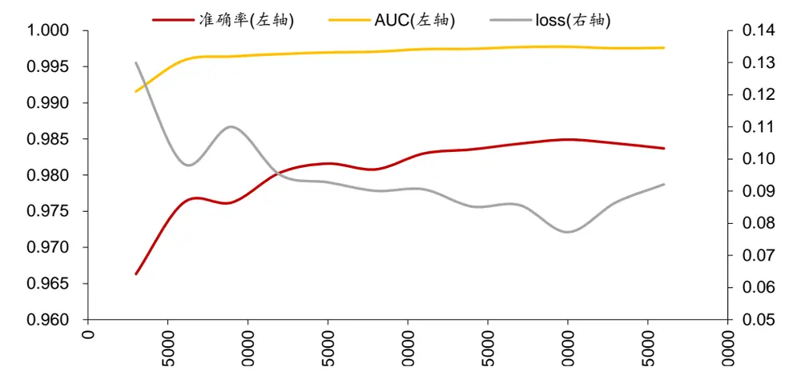
资料来源：Wind，华泰证券研究所

图表 23 为 BERT 在测试集的表现。虽然数据的正负标签样本数量很不平衡，模型在测试集上的表现和验证集差距很小，具有很高的预测精度。

图表23： BERT在测试集的表现

|  | 准确率 | AUC | 精确率 | 召回率 |
| --- | --- | --- | --- | --- |
| 测试集表现 | 0.9826 | 0.9746 | 0.9736 | 0.9744 |

资料来源：Wind，华泰证券研究所

## 打开 BERT模型的黑箱：模型可解释性工具 LIT

Language Interpretability Tool (LIT)是一款由 Google 发布的开源 NLP 模型可解释性工具(GitHub 地址：https://github.com/PAIR-code/lit)，LIT 能够将 NLP 模型训练以及预测的过程可视化，使得 NLP模型不再是一个“黑箱”。LIT 主要关注的问题包括：模型预测的效果如何？模型在预测时重点关注哪些词语？语句内部以及之间的注意力关系如何？LIT 通过将各个分析模块集成到一个基于浏览器的界面中，使得用户可以快速、便捷地对 NLP模型的表现进行可视化分析，下图展示了 LIT 的用户界面以及部分功能。

图表24： LIT用户界面及部分功能说明
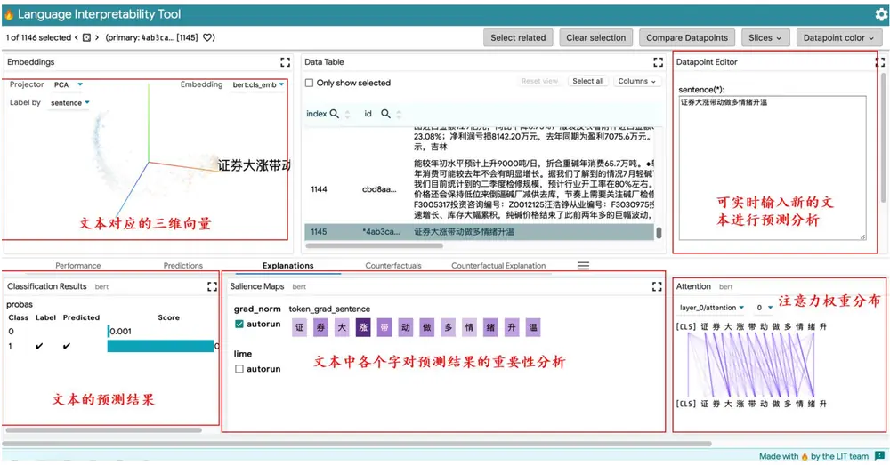
资料来源：LIT，华泰证券研究所

LIT 较为重要的模块为 Salience Maps 模块和 Attention 模块。接下来我们对这两个模块进行详细介绍。其他模块的介绍请参见 LIT 项目官方文档。

## Salience Maps 模块：分析字符重要性

Salience Maps 模块展示的是输入文本中的每个字符对于模型预测结果的重要性。通过运用局部梯度(local gradients)和LIME方法，每个字符都会得出0到1之间的权重，权重越大字符的颜色越深，代表着该字符对于模型预测结果有着较为显著的影响。接下来，我们结合两条正面新闻和两条负面新闻，来观察BERT模型在预测文本情感时重点关注哪些字符。

首先分析两条正面新闻。由下图可知，在预测正面新闻 1 时，BERT 模型认为“同比预增”等字符重要性较高；在预测正面新闻 2 时，BERT 模型认为“中标”等字符重要性较高。

图表25： 正面新闻 1 分析结果
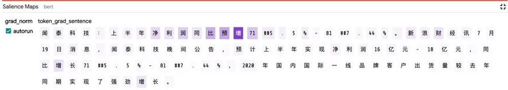
资料来源：Wind，华泰证券研究所

图表26： 正面新闻 2分析结果

| Salience Maps | bert |  |  |  |  |  |  |  |  |  |  |  |  |  |  |  |  |  |  |  |  |  |  |  |  |  |  |  |  |  |  |  |  |  |  |  |  |
| --- | --- | --- | --- | --- | --- | --- | --- | --- | --- | --- | --- | --- | --- | --- | --- | --- | --- | --- | --- | --- | --- | --- | --- | --- | --- | --- | --- | --- | --- | --- | --- | --- | --- | --- | --- | --- | --- |
| grad_norm | token_grad_sentence |  |  |  |  |  |  |  |  |  |  |  |  |  |  |  |  |  |  |  |  |  |  |  |  |  |  |  |  |  |  |  |  |  |  |  |  |
| autorun |  | 东 | 南 | 网 | 架 : |  | 中 | 标 | 3 | : | 57 | 亿 | 元 | 工 | 程 | 项 | 目 | 0 | e | 公 | 司 | 讯 | , |  | 东 | 南 | 网 | 架 | ( | 0 | ##0 |  | ##2 | ##1 | ##3 | ##5 |  |
|  | ) | 1 | 月 | 19 | 日 | 晚 | 间 | 公 | 告 | ， | 公 | 司 |  | 近 | 日 | 收 | 到 | 中 | 标 | 通 |  | 知 | 书 | ， | 确 | 认 | 公 | 司 | 为 | 赣 | 州 |  | 绿 | 地 | 国 | 际 | 博 |
|  | 览 | 城 | 会 | 展 | 中 | 心 |  | 项 | 目 | 钢 | 结 | 构 | 及 | 金 | 属 | 屋 | 面 | 供 | 应 | 安 |  | 装 | 工 | 程 | 的 | 中 | 标 | 单 | 位 | , |  | 中 | 标 | 金 | 额 | 约 |  |
|  | 3 |  | 57 | 亿 | 元 |  | 占 | 2019 |  | 年 | 营 | 收 | 的 | 3 | 98 | % | 。 |  |  |  |  |  |  |  |  |  |  |  |  |  |  |  |  |  |  |  |  |

资料来源：Wind，华泰证券研究所

接下来分析两条负面新闻。由下图可知，在预测负面新闻 1 时，BERT 模型认为“摘牌”、“风控”等字符重要性较高；在预测负面新闻 2 时，BERT 模型认为“减持”、“风控”等字符重要性较高。

图表27： 负面新闻 1分析结果

| Salience Maps bert |  |  |  |  |  |  |  |  |  |  |  |  |  |  |  |  | 非 |  |  |  |  |  |  |  |  |  |  |  |  |  |  |  |  |
| --- | --- | --- | --- | --- | --- | --- | --- | --- | --- | --- | --- | --- | --- | --- | --- | --- | --- | --- | --- | --- | --- | --- | --- | --- | --- | --- | --- | --- | --- | --- | --- | --- | --- |
| grad_norm |  | token_grad_sentence |  |  |  |  |  |  |  |  |  |  |  |  |  |  |  |  |  |  |  |  |  |  |  |  |  |  |  |  |  |  |  |
| autorun | 天 | 茂 | 退 | : | 将 | 在 | 7 | 月 | 20 | 日 被 | 深 | 交 | 所 | 摘 | 牌 | o | 否 | 港 | 万 | 得 | 通 | 讯 | 社 | 报 | 道 | 1 |  |  | ##in | ##d | 风 | 控 | 日 |
|  | 报 | 数 | 据 | 显 | 示 9 | 天 |  | 茂 退 | 7 月 |  | 19 | 日 | 晚 | 间 | 公 | 告 | 称 |  |  | 退 | 市 | 整 | 理 | 期 | 已 |  |  |  |  |  |  |  |  |
|  | 日 | 被 | 深 | 交 所 | 摘 | 牌 |  |  |  |  |  |  |  |  |  |  |  | ， |  |  |  |  |  |  |  | 结 | 束 | , | 将 | 在 | 7 | 月 | 20 |

资料来源：Wind，华泰证券研究所

图表28： 负面新闻 2分析结果
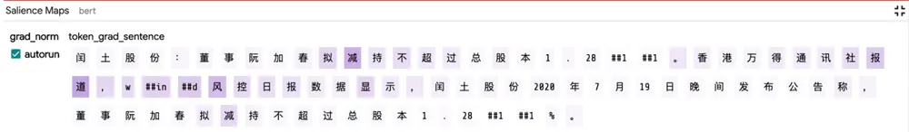
资料来源：Wind，华泰证券研究所

由上述分析可以发现，本报告所构建的 BERT 模型无论在预测正面新闻还是负面新闻时，都能够较好地抓住文本中的关键词，做出准确预测。

## Attention 模块：分析注意力权重

Attention 模块可以展示 BERT 模型中每层的注意力头学习到的注意力权重，线条的颜色越深代表着注意力权重越大。下图展示了 BERT 模型第 3 层中第 3 个和第 6 个注意力头的注意力权重情况，在不同的注意力头中，注意力权重分布不同。从图表 30 可看出，相邻字符间注意力权重较大，语义上有相似性，这也是合乎情理的。

图表29： 第 3层中第 3个注意力头的注意力权重情况
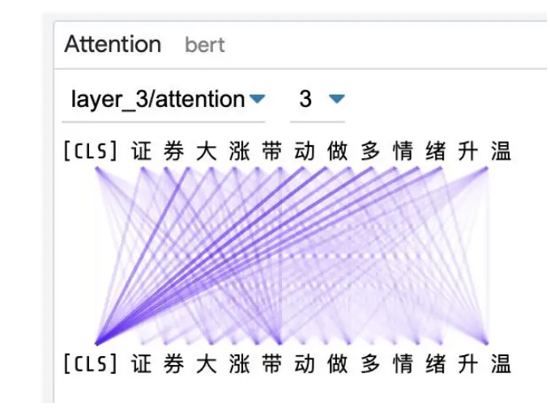
资料来源：Wind，华泰证券研究所

图表30： 第 3层中第 6个注意力头的注意力权重情况
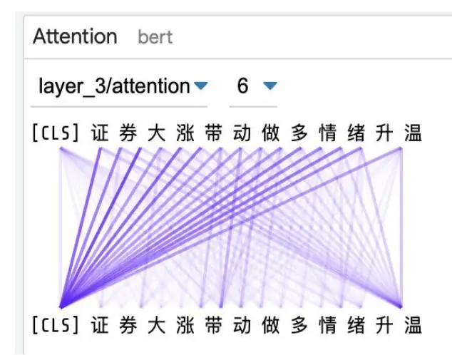
资料来源：Wind，华泰证券研究所

## 总结

本文是将 BERT 模型运用于金融文本信息提取的初步探索，总结如下：

随着国内量化投资的发展，挖掘另类数据中的增量信息逐渐受投资者关注。另类数据中一大类数据就是舆情文本数据。本文提取 Wind 金融新闻数据中的情感正负面标签构建新闻舆情因子，因子在沪深 300 内表现最好。进一步地，本文介绍了前沿的自然语言处理(NLP)模型 BERT 的原理和训练方法，并基于Wind 的有标注金融新闻数据训练金融新闻情感分类模型，模型在正负不平衡样本上达到了很高的预测精度。最后，本文介绍了 BERT 模型可解释性工具 LIT。通过 LIT 可分析文本中字符对于预测结果的重要性并帮助理解 BERT的学习机制。

本文基于 Wind 金融新闻数据，提取其中的情感正负面标签，构建日频的新闻舆情因子。2017 年以来，因子在沪深 300、中证 500、全 A股的平均覆盖率分别为 84.41%，76.16%，63.03%，且覆盖率随时间推移逐渐上升。因子在沪深 300 成分股内表现最好，行业市值中性后 RankIC 均值为 6.13%，IC_IR 为 0.42，分 5 层测试中 TOP 组合年化收益率为17.79%，多空组合夏普比率为 1.66。因子在中证 500 成分股内表现次之，在全 A股内则表现最差。

近年来， NLP 领域最前沿的研究成果是预训练模型 BERT。模型首先使用大量无监督语料进行语言模型预训练，再使用少量标注语料进行微调来完成具体任务(如本文的金融新闻情感分类)。本文介绍了 BERT 的核心原理：Transformer 和自注意力机制。随后，本文基于Wind的有标注金融新闻数据，使用 BERT 训练金融新闻情感分类模型。模型在正负不平衡样本上达到了很高的预测精度，样本外的准确率为 0.9826，AUC 为 0.9746，精确率为 0.9736，召回率为 0.9744。

BERT 模型结构复杂且参数量庞大，本文借助 Google 发布的开源 NLP模型可解释性工具LIT 来打开 BERT 的黑箱，理解 BERT 的“思考过程”。LIT 有两个重要模块：(1) SalienceMaps 模块，可分析输入文本中每个字符对于模型预测结果的重要性。例句中的结果显示，正面情感新闻中“同比预增”、“中标”等字符重要性较高，负面情感新闻中“风控”、“摘牌”、“减持”等字符重要性较高。说明 BERT 都能够较好地抓住文本中的关键词，做出准确预测。(2)Attention 模块，可分析注意力权重，从而帮助理解 BERT 的学习机制。

## 风险提示

舆情因子的测试结果是历史表现的总结，存在失效的可能。本文使用的金融新闻数据只覆盖了部分新闻来源，构建的因子可能是有偏的。模型可解释性工具 LIT 可能存在过度简化的风险。

## 附录 1：BERT模型输入的构造

文本在输入 BERT 模型之前，会经过多步的预处理编码成张量，处理流程如图表 31 所示。

图表31： BERT模型输入数据的处理流程
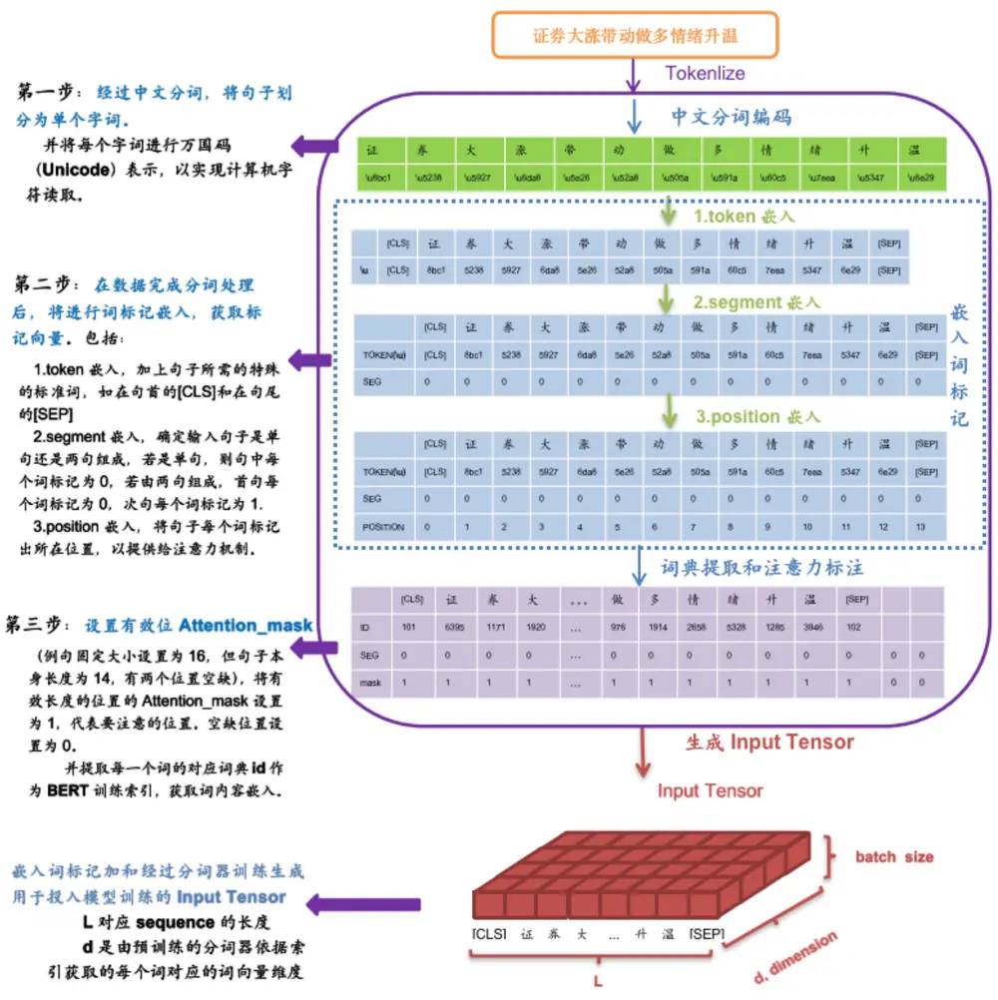
资料来源：华泰证券研究所

## 附录 2：Transformer多头自注意力机制的实现

如图表 32 所示，假设有 8个注意力头，多头自注意力机制的计算流程为：

1.将输入 X与 8个不同的权重矩阵 $W_{i}$ 相乘，构成输入向量 $W_{i}X$ ，形成 $Q_{i},\ K_{i},\ V_{i},\ \mathrm{i}=1$ . . . ，8，

2.计算注意力权重：

$$
Z_{i}=softmax(Q_{i}K_{i}^{T}/\sqrt{d_{k}})V_{i}~,
$$

3.将 8个注意力头的结果合并。

$$
Z^{C}=concact(Z_{1},\ \ldots,\ Z_{8}),i=1,\ \ldots,\ 8
$$

图表32： 多头注意力机制训练流程
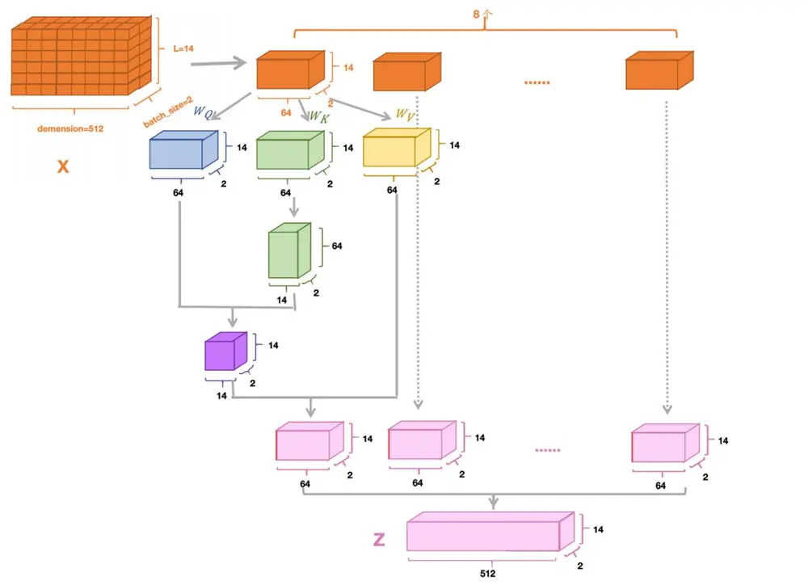
资料来源：华泰证券研究所

## 免责声明

## 分析师声明

本人，林晓明、李子钰、何康，兹证明本报告所表达的观点准确地反映了分析师对标的证券或发行人的个人意见；彼以往、现在或未来并无就其研究报告所提供的具体建议或所表迖的意见直接或间接收取任何报酬。

## 一般声明及披露

本报告由华泰证券股份有限公司（已具备中国证监会批准的证券投资咨询业务资格，以下简称“本公司”）制作。本报告仅供本公司客户使用。本公司不因接收人收到本报告而视其为客户。

本报告基于本公司认为可靠的、已公开的信息编制，但本公司对该等信息的准确性及完整性不作任何保证。本报告所载的意见、评估及预测仅反映报告发布当日的观点和判断。在不同时期，本公司可能会发出与本报告所载意见、评估及预测不一致的研究报告。同时，本报告所指的证券或投资标的的价格、价值及投资收入可能会波动。以往表现并不能指引未来，未来回报并不能得到保证，并存在损失本金的可能。本公司不保证本报告所含信息保持在最新状态。本公司对本报告所含信息可在不发出通知的情形下做出修改，投资者应当自行关注相应的更新或修改。

本公司力求报告内容客观、公正，但本报告所载的观点、结论和建议仅供参考，不构成购买或出售所述证券的要约或招揽。该等观点、建议并未考虑到个别投资者的具体投资目的、财务状况以及特定需求，在任何时候均不构成对客户私人投资建议。投资者应当充分考虑自身特定状况，并完整理解和使用本报告内容，不应视本报告为做出投资决策的唯一因素。对依据或者使用本报告所造成的一切后果，本公司及作者均不承担任何法律责任。任何形式的分享证券投资收益或者分担证券投资损失的书面或口头承诺均为无效。

除非另行说明，本报告中所引用的关于业绩的数据代表过往表现，过往的业绩表现不应作为日后回报的预示。本公司不承诺也不保证任何预示的回报会得以实现，分析中所做的预测可能是基于相应的假设，任何假设的变化可能会显著影响所预测的回报。

本公司及作者在自身所知情的范围内，与本报告所指的证券或投资标的不存在法律禁止的利害关系。在法律许可的情况下，本公司及其所属关联机构可能会持有报告中提到的公司所发行的证券头寸并进行交易，为该公司提供投资银行、财务顾问或者金融产品等相关服务或向该公司招揽业务。

本公司的销售人员、交易人员或其他专业人士可能会依据不同假设和标准、采用不同的分析方法而口头或书面发表与本报告意见及建议不一致的市场评论和/或交易观点。本公司没有将此意见及建议向报告所有接收者进行更新的义务。本公司的资产管理部门、自营部门以及其他投资业务部门可能独立做出与本报告中的意见或建议不一致的投资决策。投资者应当考虑到本公司及/或其相关人员可能存在影响本报告观点客观性的潜在利益冲突。投资者请勿将本报告视为投资或其他决定的唯一信赖依据。有关该方面的具体披露请参照本报告尾部。

本报告并非意图发送、发布给在当地法律或监管规则下不允许向其发送、发布的机构或人员，也并非意图发送、发布给因可得到、使用本报告的行为而使本公司及关联子公司违反或受制于当地法律或监管规则的机构或人员。

本公司研究报告以中文撰写，英文报告为翻译版本，如出现中英文版本内容差异或不一致，请以中文报告为主。英文翻译报告可能存在一定时间迟延。

本报告版权仅为本公司所有。未经本公司书面许可，任何机构或个人不得以翻版、复制、发表、引用或再次分发他人等任何形式侵犯本公司版权。如征得本公司同意进行引用、刊发的，需在允许的范围内使用，并注明出处为“华泰证券研究所”，且不得对本报告进行任何有悖原意的引用、删节和修改。本公司保留追究相关责任的权利。所有本报告中使用的商标、服务标记及标记均为本公司的商标、服务标记及标记。

## 中国香港

本报告由华泰证券股份有限公司制作,在香港由华泰金融控股（香港）有限公司向符合《证券及期货条例》第 571 章所定义之机构投资者和专业投资者的客户进行分发。华泰金融控股（香港）有限公司受香港证券及期货事务监察委员会监管，是华泰国际金融控股有限公司的全资子公司，后者为华泰证券股份有限公司的全资子公司。在香港获得本报告的人员若有任何有关本报告的问题,请与华泰金融控股（香港）有限公司联系。

## 香港-重要监管披露

- 华泰金融控股（香港）有限公司的雇员或其关联人士没有担任本报告中提及的公司或发行人的高级人员。
更多信息请参见下方 “美国-重要监管披露”。

## 美国

本报告由华泰证券股份有限公司编制，在美国由华泰证券（美国）有限公司向符合美国监管规定的机构投资者进行发表与分发。华泰证券（美国）有限公司是美国注册经纪商和美国金融业监管局（FINRA）的注册会员。对于其在美国分发的研究报告，华泰证券（美国）有限公司对其非美国联营公司编写的每一份研究报告内容负责。华泰证券（美国）有限公司联营公司的分析师不具有美国金融监管（FINRA）分析师的注册资格，可能不属于华泰证券（美国）有限公司的关联人员，因此可能不受 FINRA 关于分析师与标的公司沟通、公开露面和所持交易证券的限制。华泰证券（美国）有限公司是华泰国际金融控股有限公司的全资子公司，后者为华泰证券股份有限公司的全资子公司。任何直接从华泰证券（美国）有限公司收到此报告并希望就本报告所述任何证券进行交易的人士，应通过华泰证券（美国）有限公司进行交易。

## 美国-重要监管披露

分析师林晓明、李子钰、何康本人及相关人士并不担任本报告所提及的标的证券或发行人的高级人员、董事或顾问。分析师及相关人士与本报告所提及的标的证券或发行人并无任何相关财务利益。声明中所提及的“相关人士”包括FINRA 定义下分析师的家庭成员。分析师根据华泰证券的整体收入和盈利能力获得薪酬，包括源自公司投资银行业务的收入。

华泰证券股份有限公司、其子公司和/或其联营公司, 及/或不时会以自身或代理形式向客户出售及购买华泰证券研究所覆盖公司的证券/衍生工具，包括股票及债券（包括衍生品）华泰证券研究所覆盖公司的证券/衍生工具，包括股票及债券（包括衍生品）。

- 华泰证券股份有限公司、其子公司和/或其联营公司, 及/或其高级管理层、董事和雇员可能会持有本报告中所提到的任何证券（或任何相关投资）头寸，并可能不时进行增持或减持该证券（或投资）。因此，投资者应该意识到可能存在利益冲突。

## 评级说明

投资评级基于分析师对报告发布日后 6 至 12个月内行业或公司回报潜力（含此期间的股息回报）相对基准表现的预期（A股市场基准为沪深 300 指数，香港市场基准为恒生指数，美国市场基准为标普 500 指数），具体如下：

## 行业评级

增持：预计行业股票指数超越基准

中性：预计行业股票指数基本与基准持平

减持：预计行业股票指数明显弱于基准

## 公司评级

买入：预计股价超越基准 15%以上

增持：预计股价超越基准 5%~15%

持有：预计股价相对基准波动在-15%~5%之间

卖出：预计股价弱于基准 15%以上

暂停评级：已暂停评级、目标价及预测，以遵守适用法规及/或公司政策

无评级：股票不在常规研究覆盖范围内。投资者不应期待华泰提供该等证券及/或公司相关的持续或补充信息

## 法律实体披露

中国：华泰证券股份有限公司具有中国证监会核准的“证券投资咨询”业务资格，经营许可证编号为：91320000704041011J香港：华泰金融控股（香港）有限公司具有香港证监会核准的“就证券提供意见”业务资格，经营许可证编号为：AOK809美国：华泰证券（美国）有限公司为美国金融业监管局（FINRA）成员，具有在美国开展经纪交易商业务的资格，经营业务许可编号为：CRD#:298809/SEC#:8-70231

## 华泰证券股份有限公司

南京南京市建邺区江东中路228号华泰证券广场1号楼/邮政编码：210019

电话：86 25 83389999/传真：86 25 83387521电子邮件：ht-rd@htsc.com

深圳
深圳市福田区益田路5999号基金大厦10楼/邮政编码：518017
电话：86 755 82493932/传真：86 755 82492062
电子邮件：ht-rd@htsc.com

## 华泰金融控股（香港）有限公司

香港中环皇后大道中 99号中环中心 58楼 5808-12室
电话：+852 3658 6000/传真：+852 2169 0770
电子邮件：research@htsc.com
http://www.htsc.com.hk

## 华泰证券（美国）有限公司

美国纽约哈德逊城市广场 10号 41楼（纽约 10001）
电话: + 212-763-8160/传真: +917-725-9702
电子邮件: Huatai@htsc-us.com
http://www.htsc-us.com

©版权所有2020年华泰证券股份有限公司

北京
北京市西城区太平桥大街丰盛胡同28号太平洋保险大厦A座18层/
邮政编码：100032
电话：86 10 63211166/传真：86 10 63211275
电子邮件：ht-rd@htsc.com
上海
上海市浦东新区东方路18号保利广场E栋23楼/邮政编码：200120
电话：86 21 28972098/传真：86 21 28972068
电子邮件：ht-rd@htsc.com