## 金工研究/深度研究

2020年11月23日

林晓明 SAC No. S0570516010001

研究员 SFC No. BPY421

linxiaoming@htsc.com

李子钰 SAC No. S0570519110003

研究员 0755-23987436

何康 SAC No. S0570520080004

研究员 021-28972039

王晨宇 SAC No. S0570119110038

联系人 02138476179

wangchenyu@htsc.com

3《金工: 行业配置策略：景气度视角》2020.11

# WGAN生成：从单资产到多资产

# 华泰人工智能系列之三十八

## 将生成对抗网络的应用领域从单资产序列生成拓展至多资产序列生成

本研究将生成对抗网络的应用领域从单资产序列生成拓展至多资产序列生成。多资产序列生成中，不仅需要模拟每种资产收益率的分布特征和时序特性，还需要复现多资产之间的协变关系。为此必须在前期研究基础上进行两项改造：1）增加评价多资产之间协变关系的指标；2）改变网络结构使之能适应多资产输入。我们将改造后的WGAN模型应用于 1）相同类型的三种股票指数以及 2）不同类型的股票、债券、商品指数收益率序列的生成，结果表明WGAN能够复现真实序列具有的典型化事实，在评价指标上相比对照组模型更接近真实序列。

## 从真实序列的典型化事实出发，设计多资产收益率序列评价指标

设计评价指标的出发点是典型化事实。经济学中的典型化事实是人们从经济运行中观察到的客观现象的简化描述，也是对数据统计分析结果的高度概括。本文研究的对象是多资产收益率时间序列，典型化事实既涉及单资产序列本身，又涉及多资产序列间的协变关系。本文从真实的多资产序列典型化事实出发，设计相应指标评价生成序列质量。在前期研究使用的厚尾分布、波动率聚集等 6 项单资产序列评价指标的基础上，本文进一步设计交叉相关性、波动率相关性、交叉杠杆效应、滚动相关系数分布相似度、极端值相关性共5项多资产收益率序列评价指标，衡量WGAN的生成效果。

## 将 WGAN 判别器输入设置为多通道，以适用于多资产序列生成任务

本文在前期研究使用的WGAN 基础上进行网络结构改造。在多资产生成的应用场景下，为了使判别器 D 具有鉴别多资产序列的能力，我们将第一层卷积层设置为多通道输入，每一通道对应一项资产。此时，判别器 D 不仅能在时间序列维度上提取单资产时序相关性的局部特征，也能在通道维度上提取多资产相关性的局部特征。我们将WGAN分别应用于 1）相同类型资产（标普 500、上证综指、欧洲斯托克 50）；2）不同类型资产收益率序列生成（沪深 300、中债-国债总财富指数、SGE 黄金 9999），并与对照组Bootstrap 重采样和 MGARCH 模型等传统时间序列模拟方法进行比较。

## WGAN 相比于对照组模型能够更好复现真实序列的典型化事实

结果表明，无论是单资产序列评价指标还是多资产序列评价指标，相较于对照组 Bootstrap 和 MGARCH 方法，WGAN 生成的多资产序列均能更好复现真实序列呈现的典型化事实，各项评价指标均与真实序列的结果较为接近。尤其是单资产收益率的杠杆效应、粗细波动率相关和盈亏不对称性，以及两资产收益率的 1 阶正相关性和交叉杠杆效应，对照组 Bootstrap 和MGARCH 方法均无法复现真实序列具有的上述典型化事实。

风险提示：WGAN生成虚假序列是对市场规律的探索，不构成任何投资建议。深度学习模型存在过拟合的可能。深度学习模型是对历史规律的总结，如果市场规律发生变化，模型存在失效的可能。

## 研究背景：从单资产到多资产

华泰金工“生成对抗网络”系列研究尝试将生成对抗网络 GAN 技术运用于量化投资研究，目前已发布三篇研究报告，分别测试原始 GAN、WGAN、RGAN 三种模型生成单个资产收益率序列的仿真效果。测试结果表明，生成对抗网络能够刻画单个资产真实收益率序列所具备的统计特性，如厚尾分布、波动率聚集等，其中 WGAN模型生成效果相对更佳。

然而在部分投资场景中，我们希望得到多个资产的仿真序列。生成对抗网络若仅能生成单资产序列，即使生成效果再“逼真”，也会面临应用场景上的局限。那么，生成对抗网络能否同时生成多个资产的时间序列？从技术上讲，生成本身并不难，通过改变网络结构就可以较方便地实现，真正的难点在于，如何评价多资产序列的生成质量？

设想一下，随意写下几串随机数序列，也可以算某种意义上的“生成”，但生成效果显然不会好。我们需要寻找一些评价指标，证明生成对抗网络的生成效果优于人脑随机生成或其它方法。在前期研究中，我们从单资产收益率的厚尾分布、波动率聚集等特性出发，对单资产生成序列进行评价，这些评价指标在经济学中也称为典型化事实。

典型化事实是对经济统计数据所反映客观现象的高度概括，具有一定客观性、稳定性和可解释性，并可用以检验数据的可靠性。针对单资产收益率的典型化事实，学术界已有充分论述，我们也已应用于前期研究。针对多资产收益率的典型化事实，可资借鉴的学术研究相对较少。本文构建交叉相关性、波动率相关性、交叉杠杆效应、滚动相关系数分布相似度、极端值相关性等指标，评价多资产序列两两之间的典型化事实。这些指标有自洽的数学定义，对应的典型化事实同样具有直观的经济学含义。

本文首先简要回顾WGAN的基本思想、优化目标函数以及训练算法。前期研究中，WGAN生成器和判别器的主体结构是卷积层和全连接层。在此基础上，本文对 WGAN 网络进行必要改造，以适用于多资产序列生成。相比于单资产序列，我们在设计生成多资产序列的WGAN 模型时，既要从形式上使其能够处理多资产序列的输入，又要从实质上使其能够学习到多资产序列之间的相关关系。为达到这两点要求，本文提出的 WGAN 模型在判别器的卷积层中，使用多个通道来处理多资产序列的输入。

实证环节，我们将分别测试 WGAN 对相同类型资产组合（标普 500 指数、上证综指、欧洲斯托克 50 指数）和不同类型资产组合（沪深 300 指数、中债-国债总财富指数、SGE黄金 9999）的生成效果，将生成序列与由 Bootstrap 和 MGARCH 方法生成的对照组进行比较。结果表明，WGAN生成的多资产收益率序列更符合真实序列蕴含的典型化事实。

## 典型化事实与生成序列评价指标

本文希望将生成对抗网络的应用场景从单资产拓宽至多资产，而评价生成序列是否足够“逼真”是验证模型有效性的关键。在生成对抗网络的常见应用场景——图像生成中，评价模型生成的图像是否“逼真”较为容易——人们可以通过长久积累的视觉经验主观判断，例如生成的物体是否符合常识等。在这些领域，人们基于主观经验，对网络的生成表现作判断，进而指导网络结构设计、超参数选择等。

在金融领域，人们在一定程度上也能利用经验判断生成对抗网络的生成序列是否“逼真”，例如收益率取值范围是否与实际情况大致吻合等，但这些评判标准显然较为原始，远不及“充分”的标准。随着研究者对金融市场的理解逐渐加深，越来越多的复杂指标被设计和提出。本文将从典型化事实出发，设计指标以评价 WGAN 生成多资产收益率序列的质量。

## 经济学中的典型化事实

人类认识世界往往从客观现象入手，进而提炼抽象规律，比如“牛顿的苹果”与万有引力、黑体辐射与量子力学等，经济学也不例外。经济学中的典型化事实（Stylized Facts），是人们从经济运行中观察到的客观现象的简化描述，也是对数据统计分析结果的高度概括。这些事实或者可以被当前的经济学理论解释，或者有待于未来的经济学理论去解释。

## 典型化事实具有三个特点：

1. 典型化事实是对经济运行中客观现象的描述，具有一定客观性。比如在国际贸易领域，“有的企业参与出口，有的企业则只在国内市场上销售”，这就是基于企业参与国际贸易情况的统计数据做出的描述，因而也是对客观现象的描述。

2. 典型化事实不是客观现象本身，而是对客观现象的高度概括，通常具有一定的稳定性。例如“1992 年美国只有 21%的企业参与出口”仅仅是客观现象，这一统计数字每年可能发生变化，也可能因国家或地区而异，不属于典型化事实；但“不是所有企业都会参与出口”对大多数国家地区及年份都成立，属于典型化事实。

3. 典型化事实具有可解释性，既可能被当前理论所解释，也可能有待未来的研究去解释。例如，上述例子中体现出的企业异质性无法被当时的克鲁格曼的新贸易理论（NewTrade Theory；Helpman 和 Krugman，1985）所解释，因为该理论预测所有企业都会参与国际贸易。对此，后来的学者进一步提出异质企业模型（Trade Models withHeterogeneous Firms；Melitz，2003）和新新贸易理论（New New Trade Theory；Baldwin 和 Nicoud，2004）。

正是由于典型化事实具有一定的客观性、稳定性、可解释性，它也可以反过来验证数据的可靠性。

本文将从真实的多资产收益率序列典型化事实出发，评价生成序列的质量。具体而言，首先提出若干具有经济学含义的统计指标，并计算真实序列在这些统计指标上的数值；随后提炼结果得到相应典型化事实。最后根据生成序列统计指标的计算结果，判断生成序列是否存在这些典型化事实，进而比较不同生成方法优劣。由于本文研究的对象是多资产收益率时间序列，因此典型化事实既涉及单资产序列本身，又涉及多资产序列之间的协变关系。

## 单资产收益率序列的典型化事实与评价指标

对于单资产收益率序列，学者总结提炼出众多典型化事实。Cont 在 2001 年发表综述文章Empirical properties of asset returns: stylized facts and statistical issues，详细介绍厚尾分布、盈亏不对称性、波动率聚集等 11 项典型化事实。Chakraborti 等人在 2011 年发表综述文章 Econophysics review: I. Empirical facts，从价格、收益率、成交量、波动率等角度介绍单资产的典型化事实，并构建相应评价指标。

本文沿用前期研究《WGAN应用于金融时间序列生成》（20200828）构建的自相关性、厚尾分布、波动率聚集、杠杆效应、粗细波动率相关、盈亏不对称性等 6项评价指标。对于各指标的具体计算过程，本文不再赘述。下表简要概括 6 项指标的计算方法，及对应真实序列的典型化事实和评价结果。

图表1： 单资产收益率序列评价指标

| 指标名称 | 计算方法 | 真实序列的典型化事实 | 真实序列的评价指标 |
| --- | --- | --- | --- |
| 自相关性 | 滞后1~k阶自相关系数均值 | 弱有效市场不存在自相关 | 若不考虑收益再投资，接近0 |
| 厚尾分布 | 收益率分布单侧区间拟合幂律衰减系数α | 厚尾分布 | 一般介于3和5之间 |
| 波动率聚集 | 收益率绝对值序列1~k阶自相关系数关于k的拟合幂律衰减系数β | 低阶正相关，高阶不相关 | 一般介于 0.1 和0.5之间 |
| 杠杆效应 | 未来波动率领先当前收益率1~k阶相关系数均值 | 低阶负相关，高阶不相关 | 小于0 |
|  | 粗细波动率相关 周频收益率绝对值（粗波动率）和单周日频收益率绝对值之和（细波不对称，细能预测粗，粗不能预小于0 |  |  |
| 盈亏不对称性 | 动率）滞后±k阶相关系数之差 | 测细 |  |
|  | 盈亏±θ所需天数分布峰值之差 | 涨得慢，跌得快 | 大于0 |

资料来源：华泰证券研究所

## 多资产收益率序列的典型化事实与评价指标

不同的资产收益率序列之间可能存在一定协变关系，其典型化事实体现在它们的某些指标具有一定相关性。有两种逻辑可以解释协变关系的存在：第一，多资产同时受到系统性风险的影响，例如某些宏观经济变量的变化或者对整体市场的外部冲击；第二，多资产在微观经济中存在相互影响。

学术文献较少提及多资产收益率序列的典型化事实与评价指标。我们参考 Cont（2001）等研究，设计交叉相关性、波动率相关性、交叉杠杆效应、滚动相关系数分布相似度、极端值相关性共5项评价指标，以观察不同资产之间的协变关系，进而评价模型的生成结果。5 项指标及计算方法如下表所示。

图表2： 多资产收益率序列协变关系评价指标

| 指标名称 | 计算方法 |
| --- | --- |
| 交叉相关性 | 不同资产收益率序列0~k阶时滞交叉相关系数 |
| 波动率相关性 | 不同资产收益率绝对值序列0~k阶时滞交叉自相关系数 |
| 交叉杠杆效应 | 某一资产当前收益率滞后另一资产未来波动率1~k阶相关系数均值 |
| 滚动相关系数分布相似度 | 滚动相关系数分布 Anderson-Darling 检验统计量及其p 值 |
| 极端值相关性 | 某一资产收益率出现极端值时，另一资产收益率也出现极端值的概率 |

资料来源：华泰证券研究所

值得注意的是，不同于单资产场景，多资产场景中收益率序列的协变关系因资产种类而异，因而上述指标所表现出的典型化事实也可能存在较大差异，难以统一描述。后文中我们也将结合具体案例，比较真实序列与生成序列的评价指标是否接近。

## 交叉相关性

记资产 i 的收益率序列为 ri,t，其均值和标准差分别为 μi和 σi，则资产 i 与资产 j 的 k 阶时滞交叉相关系数定义为：

$$
Corr(r_{i,t},r_{j,t+k})=\frac{E[(r_{i,t}-\mu_{i})(r_{j,t+k}-\mu_{j})]}{\sigma_{i}\sigma_{j}}
$$

交叉相关性考虑的是两种资产在不同时间上的相关性，在一定程度上反映市场的有效性。在市场弱有效的前提下，不同资产之间不应该存在较为明显的时滞交叉相关性，否则将为市场参与者提供套利空间。

## 波动率相关性

波动率相关性计算的是不同资产收益率绝对值序列之间的时滞交叉相关性，即：

$$
Corr(|r_{i,t}|,|r_{j,t+k}|)
$$

尽管在市场弱有效的前提下，不同资产收益率序列之间不存在显著的交叉相关性，然而其波动率却可能呈现显著的交叉相关性。对于某些联系比较紧密的资产，有时可以观察到一种资产波动率的放大会导致另一种资产波动率的放大，其波动率短期内存在较为显著的正相关性，随着时间推移，交叉相关性会逐渐减弱。

## 交叉杠杆效应

类似于单资产杠杆效应，交叉杠杆效应可以解释为：某一资产当前的收益率与另一资产未来的波动率之间存在负相关性。也就是说，若某一资产当前跌幅较大，另一资产未来的波动率可能随之增加；若某一资产当前涨幅较大，另一资产未来的波动率可能降低。交叉杠杆效应定义为资产 i收益率与资 $\dot{\bar{r}}\mathrm{~i~}$ 波动率之间的 k 阶时滞相关度：

$$
L_{ij}(k)=\frac{E\big[r_{i,t}|r_{j,t+k}|^{2}\big]-Er_{i,t}\cdot E|r_{j,t}|^{2}}{E[|r_{j,t}|^{2}]^{2}}
$$

对于某些联系较为紧密的资产，或可观察到对于低阶的 k， $\mathsf{L}_{\mathsf{I}}$ 取值为负。

## 滚动相关系数分布相似度

滚动相关系数是指在一定的时间窗口 w内，两种或两种以上资产之间的相关系数，它反映多资产之间在短期内的相关关系，因而具有一定随机性。在某些时期内，资产之间的正相关关系较强，从而表现出显著为正的滚动相关系数；在另外一些时期内，资产之间的负相关关系较强，从而表现出显著为负的滚动相关系数；若短期相关关系较弱，则滚动相关系数接近 0。通过考察滚动相关系数的概率分布，能够了解多项资产在一段较长时期内短期相关关系的变化。本文提供两个角度考察滚动相关系数的分布。

第一个角度是直接估计经验概率密度函数，随后画出相应的概率密度分布，进行直观比较。具体来说，将滚动相关系数的取值范围[-1, 1]进行 N 等分，得到一个非重叠的区间划分-1$\scriptstyle=\mathtt{x}_{0}<\mathtt{x}_{1}<\cdots<\mathtt{x}_{\mathsf{N}}=1$ ，其中：

$$
x_{i}=-1+\frac{2i}{N},i=0,1,\dots,N
$$

则相关系数 c的经验概率密度估计为：

$$
p_{i}=P(x_{i-1}<c\leq x_{i}),i=1,2,\ldots,N
$$

第二个角度是间接检验生成序列滚动相关系数分布与真实序列滚动相关系数分布是否为同一分布。本文采用在工业统计中较常用的 k 样本 Anderson-Darling(AD)检验。该检验的零假设为 k 组样本是来自同一总体的独立同分布样本，备择假设为 k 组样本 $\cdot\dot{\bar{\mathcal{P}}}$ 生于不同分布。我们计算 AD 检验的统计量，用该统计量的 p值定义滚动相关系数分布相似度。

假设存在 k 组待检验样本，第 i组样本的观测值数目为 $\mathsf{n}_{\mathsf{i}\circ}$ 我们将 k 组样本合为一个整体，整体的观测值数目为 $\mathsf{n}{=}\Sigma\mathsf{n}_{\mathrm{i}}$ ，再将整体中所有取值各异的观测值按照从小到大顺序排列，得到 $z_{1}<z_{2}<\cdots<z_{\mathsf{M}}$ ，其中 ${\mathsf{M}}{\leqslant}{\mathsf{n}}$ 为整体中取值各异的观测值个数，则 k 组样本的 AD 统计量定义为：

$$
AD_{k}=\frac{n-1}{n^{2}(k-1)}\sum_{i=1}^{k}\left[\frac{1}{n_{i}}\sum_{j=1}^{M}h_{j}\frac{\left(nF_{ij}-n_{i}H_{j}\right)^{2}}{H_{j}\left(n-H_{j}\right)-nh_{j}/4}\right]
$$

其中：

1. $\mathsf{h}_{\mathsf{j}}$ 为整体样本中取值等于 $z_{\mathrm{j}}$ 的样本数目；

2. Hj为整体样本中取值小于 $\mathsfit{Zj}$ 的样本数目，加上取值等于 $\mathsfit{Zj}$ 的样本数目的一半；

3. $\mathsf{F}_{\parallel}$ 为第i组数据中取值小于 $\mathsfit{Zj}$ 的样本数目，加上取值等于 $z_{\mathrm{j}}$ 的样本数目的一半。

统计量 $\mathsf{AD}_{\mathsf{k}}$ 的取值越大，对应的 p值越小，越倾向于拒绝零假设，即越倾向于认为该 k 组样本来自于不同的分布。实际使用过程中，我们考察各资产两两之间滚动相关系数分布相似度，因此 k 取 2。

## 极端值相关性

极端值相关性定义为资产 i 的收益率取值为极端值的条件下，资产 j 的收益率取值也为极端值的概率（Cont，2001），即：

$$
REV=P\big(r_{j}<q_{j}\big|r_{i}<q_{i}\big)
$$

其中，极端值阈值 qi和 qj分别取对应资产收益率分布的 p 分位数，如 5%分位数。REV可通过统计历史序列中对应事件发生的频率进行估计。该值越大，表明资产 i 收益率极端低时，资产 j 收益率极端低的可能性越大。值得注意的是，即使两资产协方差接近 0，它们之间也可能存在较强的极端值相关性。

为什么需要关注多资产收益率序列的极端值相关性？人们通常采用多资产收益率的协方差矩阵刻画资产间的协变关系，进而构建组合以达到分散投资的效果。然而，协方差矩阵衡量的是某种“平均”相关性，而在投资实践中，人们往往更关注在市场出现大幅波动时，资产间的“条件”相关性。更多关于极端值相关性的实证研究请参考 Cont（2001）。

多资产收益率序列评价指标的参数取值详见下表。

图表3： 多资产收益率序列协变关系评价指标参数取值

| 评价指标名称 | 计算评价指标参数 | 取值 |
| --- | --- | --- |
| 交叉相关性 | 时滞阶数 k | 120 |
| 波动率相关性 | 时滞阶数 k | 120 |
| 交叉杠杆效应 | 时滞阶数 k | 100 |
| 滚动相关系数分布相似度 | 时间窗口长度W | 5 |
| 极端值相关性 | 极端值对应的分布中的概率 | 5% |

资料来源：华泰证券研究所

## 多资产序列的生成方法

前期研究《WGAN应用于金融时间序列生成》已详细介绍WGAN的基本思想和实现细节，同时以 Bootstrap 重采样和一元 GARCH 模型等传统时间序列生成方法为对照组，验证WGAN在生成单资产序列方面相对于传统方法的优势。为进一步拓展WGAN的应用场景，本研究需验证WGAN生成“以假乱真”的多资产序列的能力。对此，本研究将对 WGAN的实现细节进行必要改造，使其适用于多资产场景。同时，我们将采用 Bootstrap 重采样和多元 GARCH（MGARCH）模型为对照组。

## Wasserstein 生成对抗网络 WGAN

## 基本原理

Arjovsky 等（2017）使用 Wasserstein 距离（简称 W 距离）替代 GAN 所使用的 JS 散度，这样构建的生成对抗网络称为Wasserstein GAN（简称WGAN）。在原始 GAN 模型里，判别器 D 的作用本质上是估计生成分布与真实分布之间的距离（用 JS 散度衡量），然后用生成器 G拉近 JS散度。在WGAN 中这种思想则更为直接：用判别器 D 拟合两个分布之间的W 距离，用生成器 G 拉近W 距离。

W 距离的原始数学定义在实践中难以直接计算，可通过 Kantorovich-Rubinstein Duality公式（Arjovsky，2017）将其等价变换为下式：

$$
\begin{array}{rlr}&{}&{W\big(p_{r},p_{g}\big)=\displaystyle\frac{1}{K}\operatorname*{sup}_{w:||f_{w}||_{L}\le K}(E_{x\sim p_{r}}[f_{w}(x)]-E_{x\sim p_{g}}[f_{w}(x)])}\\&{}&{\qquad=\displaystyle\frac{1}{K}\operatorname*{sup}_{w:||f_{w}||_{L}\le K}(E_{x\sim p_{r}}[f_{w}(x)]-E_{z\sim p_{z}}[f_{w}\big(G(z)\big)])}\end{array}
$$

在单资产收益率序列生成的应用场景下，假定生成序列长度为 T，那么 WGAN 模型中的“生成分布”实际为 T 个收益率构成的 T 维联合分布。类似地，在多资产收益率序列生成的应用场景下，假定生成序列维度为 K×T（资产数目×序列长度），则“生成分布”实际应为 K×T 个收益率构成的 T 维联合分布。

## 网络构建

为了尽量避免生成器 G 或判别器 D 任何一方过于强大，D 和 G 在参数数量和网络复杂度方面应当接近平衡。G 网络沿用前期研究《WGAN 应用于金融时间序列生成》含四个卷积层、三个上采样层的卷积网络结构。在多资产生成的应用场景下，对于最后一层线性层的输出，我们需要将其按资产数目 K 乘以序列长度 T 的形式重新排列。G 网络具体参数详见下表。

图表4： 生成器 G网络结构与参数

| 参数 | 取值 |
| --- | --- |
| 结构 | 含四个卷积层、三个上采样层的卷积网络 |
| 输入噪音向量（隐变量）pz(z) | 标准正态分布 |
| 输入层神经元数量 | 100 |
| 卷积层卷积核数量 | 32 |
| 卷积层核尺寸 | 3 |
| 卷积层 Stride | 1 |
| 卷积层 Padding | 1 |
| 卷积层激活函数 | LeakyReLU(0.2) |
| 上采样层尺度 | 2 |
| 输出层神经元数量 | KXT |
| 是否标准化 | 是（Batch-Normalization) |
| 损失函数 | −Ez~pz[fw(G(z))] |
| 优化器 | RMSProp |
| 优化器参数 | 0.0001 |

资料来源：华泰证券研究所

判别器 D 网络沿用前期研究《WGAN 应用于金融时间序列生成》含三个卷积层、两个最大值池化层及两个全连接层的卷积网络结构。在多资产生成的应用场景下，为了使 D 具有鉴别多资产序列的能力，我们将第一层卷积层设置为多通道输入，每一通道对应多资产序列中的一个标的资产。D 网络的第一层卷积层及网络具体参数详见下面两张图表。

图表5： 适用于多资产场景的一维卷积核示意图
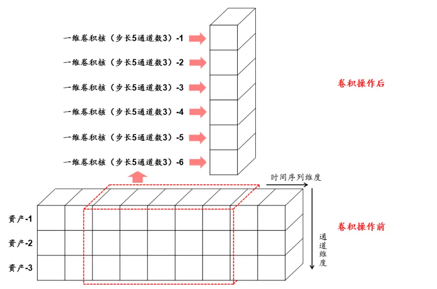
资料来源：华泰证券研究所

图表6： 判别器 D网络构建

| 参数 | 取值 |
| --- | --- |
| 结构 | 含三个卷积层、两个最大值池化层及两个全连接层的卷积网络 |
| 输入层神经元数量 | KXT |
| 卷积层卷积核数量 | 32 |
| 卷积层核尺寸 | 3 |
| 卷积层 Stride | 1 |
| 卷积层 Padding | 1 |
| 卷积层激活函数 | LeakyReLU(0.2) |
| 池化层核尺寸 | 2 |
| 池化层 Stride | 2 |
| 池化层 Padding | 0 |
| 第一层全连接层神经元数量 | 50 |
| 第二层全连接层神经元数量 | 15 |
| 全连接层激活函数 | LeakyReLU(0.2) |
| 输出层神经元数量 | 1 |
| 输出层激活函数 | LeakyReLU(0.2) |
| 是否标准化 | 否/Layer-Normalization |
| 损失函数 | Ez~pz[fw(G(z))] − Ex~pr[fw(x)] + λEx~px[(\|∇xfw(x)\|\|2 − 1)2] |
| 优化器 | RMSProp |
| 优化器参数 | 0.0001 |

资料来源：华泰证券研究所

## 训练样本

本文使用下列两组训练数据集：

1. 相同类别资产（股票类资产）：标普 500 指数、上证综指、欧洲斯托克 50 指数；

2. 不同类别资产（股票、债券、商品类资产）：沪深 300 指数、中债国债总财富（总值）指数、上海黄金交易所黄金现货 AU99.99。

具体标的及数据起止时间如下表所示。数据采用日频收盘价，按上海证券交易所交易日对齐。生成器 G 输出层神经元数量和判别器输入层神经元数量均为 3×252。

图表7： WGAN 训练数据

| 测试项目 | 资产名称 | Wind 代码 | 频率 | 起止日期 | 每条样本长度 |
| --- | --- | --- | --- | --- | --- |
| 实证测试1： 相同类型资产 | 标普500 | SPX.GI | 日频 | 1997/12/1~2020/10/30 | 252（约 1年） |
|  | 上证综指 | 000001.SH | 日频 | 1997/12/1~2020/10/30 | 252（约1年） |
|  | 欧洲斯托克50 | SX5P.DF | 日频 | 1997/12/1~2020/10/30 | 252（约1年） |
| 实证测试2: 不同类型资产 | 沪深 300 | 000300.SH | 日频 | 2004/1/2~2020/10/30 | 252（约1年） |
|  | 中债国债总财富 | CBA00601.CS | 日频 | 2004/1/2~2020/10/30 | 252（约1年） |
|  | 黄金 9999 | AU9999.SGE | 日频 | 2004/1/2~2020/10/30 | 252（约1年） |

资料来源：Wind，华泰证券研究所

上述训练数据中任何一项资产的原始数据均为一条完整的资产价格时间序列（约 23 年或17 年）。首先将其转换为对数收益率序列，再将不同标的收益率序列组成一个多元时间序列，该序列第一个维度对应不同资产，第二个维度对应不同交易日。在训练 WGAN 时，从多资产序列中抽取连续的长度为 252 个交易日的序列作为模型输入的一个样本，如下图所示。

图表8： 多元时间序列滚动生成训练样本示意图

| 1r1 | r2 | ¿31 |  | 1252 | r253 | r254 |  |
| --- | --- | --- | --- | --- | --- | --- | --- |
| 21 | .2r2 | 2r3 | F | 2252 | 2253 | 2r254 |  |
| 31 | 3r2 | 3r3 | 口■ ■ | 3r252 | 3253 | 3r254 | ■ ■ ■ |

资料来源：华泰证券研究所

## 训练过程

WGAN的实际训练过程中，判别器D与生成器G交替进行训练，一般判别器D训练K次，生成器G训练1次。训练采用小批量随机梯度下降方法。交替训练过程的伪代码详见下表。

图表9： WGAN 训练算法的伪代码
```latex
输入：迭代次数 T，每轮迭代判别器 D训练次数 K，小批量（minibatch）样本数量 m
1随机初始化 D网络参数θ 和 G网络参数 ${\it\Delta}\cdot\theta_{g}$
2 for t ←1 to T do
# 训练判别器 D
3 for k ←1 to K do
# 采集小批量样本
4从训练集p (x)中采集 m条样本 $\{x^{(m)}\}$
5从标准正态分布 $p_{g}(z)$ 中采集 m条样本 $\{z^{(m)}\}$
6从[0,1]均匀分布中采集 m 个随机数 $\{\epsilon^{(m)}\}$ ，并计算 $\hat{x}^{(i)}=\epsilon^{(i)}x^{(i)}+(1-\epsilon^{(i)}){\cal{G}}(z^{(i)})$ ，得到{x̂(m)}
7使用随机梯度下降更新判别器 D，梯度为：
$\nabla_{\theta_{d}}\frac{1}{m}\sum_{i=1}^{m}[D\left(G\big(z^{(i)}\big)\right)-D\big(x^{(i)}\big)+\lambda(\Big|\big|\nabla_{\hat{x}}D\big(\hat{x}^{(i)}\big)\big|\Big|_{2}-1)^{2}]$
8 end
# 训练生成器 G
9从标准正态分布 ${\dot{p}}_{g}(z)$ 中采集m 条样本 $\{z^{(m)}\}$
10使用随机梯度下降更新生成器G，梯度为：
$\nabla_{\theta_{g}}\frac{1}{m}{\sum_{i=1}^{m}[-D\left(G{\left(z^{(i)}\right)}\right)]}$
11 end
输出：生成器 G
```
资料来源：华泰证券研究所

图表10： WGAN训练通用参数

| 参数 | 取值 |
| --- | --- |
| 迭代次数 | 1500 |
| 每轮迭代 G 和 D 训练次数比 | 1:5 |
| 小批量规模 | 24 |
| 优化器 | Adam |
| 生成网络G优化器参数 | 学习速率 5e-4，β = (0.5,0.999) |
| 判别网络 D 优化器参数 | 学习速率 5e-4，β = (0.1,0.999) |

资料来源：华泰证券研究所

WGAN训练通用参数详见上表。对于一般的WGAN模型，训练判别器 D的过程中，真实样本的标签是 1，生成样本的标签是 $0_{\circ}$ 为了提升模型鲁棒性，参考 Takahashi等（2019）文献，训练 D 时对样本标签进行 Noise labeling 处理。使用的噪音为均匀分布随机变量，使得真实样本对应的标签取值范围介于 0.9 和 1.1 之间，生成样本对应的标签取值范围介于 0.1 和 0.3 之间。

## 对照组 1：Bootstrap 重采样

Bootstrap 重采样是一种有放回的随机抽样技术。其生成虚假序列的方法是：对多资产收益率序列在时间维度上进行有放回地随机抽样，重复 252 次，得到长度为 252 的收益率序列。在时间维度上进行采样，是指每次随机抽取一个交易日，并将该交易日所有资产的收益率进行抽取，如下图所示。因此，Bootstrap 不会破坏不同资产收益率之间的截面相关关系（0 阶相关关系），但可能破坏其它相关性指标，如时序相关性。

图表11： Bootstrap重采样生成虚假序列示意图
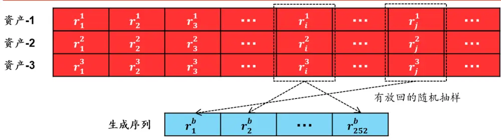
资料来源：华泰证券研究所

## 对照组 2：MGARCH 模型

## 一元 GARCH 模型

在介绍多元 GARCH（MGARCH）模型前，我们首先回顾一元 GARCH 模型的基本原理。在进行金融时间序列分析时，单资产收益率序列 rt通常写为：

$$
r_{t}=\mu_{t}+a_{t}
$$

上式中： $\mu_{\mathrm{t}}{=}\mathsf{E}(\mathsf{r}_{\mathrm{t}}|\mathsf{r}_{\mathrm{t-}1})$ 是 rt在给定过去信息 rt-1下的条件期望，可用均值模型如 ARMA 模型模拟；at是序列的扰动，也被称为新息；σt＝Var(at|rt-1)是 at在给定过去信息 $\pmb{\lceil\mathtt{t}-\mathtt{1}}$ 下的条件标准差，可用波动率模型模拟。GARCH 是常见的波动率模型之一。

本研究的目的是使用 GARCH 模型模拟 σ 这一随机过程，进一步随机生成一系列 r 序列，从而与WGAN的生成序列形成对照。对于开展 zero-mean 标准化的序列而言，不妨假设$\mu{\mathrm{_t}}$ 等于 0。我们称 $\mathtt{a}_{\mathrm{t}}$ 服从 GARCH(p,q)模型，若 at满足：

$$
\begin{array}{c}{a_{t}=\sigma_{t}\varepsilon_{t}}\\{\sigma_{t}^{2}=\displaystyle\alpha_{0}+\sum_{i=1}^{p}\alpha_{i}a_{t-i}^{2}+\sum_{j=1}^{q}\beta_{j}\sigma_{t-j}^{2}}\end{array}
$$

其中，εt通常被假定独立同分布于标准正态分布、t分布或广义误差分布。金融时间序列分析领域通常使用 GARCH(1,1)模型：

$$
\sigma_{t}^{2}=\alpha_{0}+\alpha_{1}a_{t-1}^{2}+\beta_{1}\sigma_{t-1}^{2}
$$

观察可知，大的 $a_{t-1}^{2}$ 或 $\sigma_{t-\cdot}^{2}$ 将引起大的 $\sigma_{t}^{2}$ ，这说明大的波动率会紧跟着另一个大的波动率，这便是金融时间序列的“波动率聚集”现象。

## 多元 MGARCH 模型

进一步将一元 GARCH 模型推广至多元 MGARCH 模型。MGARCH 模型不仅需要模拟各资产波动率，还需模拟各资产间的协变关系。MGARCH模型有多种变式，如BEKK-GARCH模型、CCC-GARCH 模型、DCC-GARCH 等，区别主要在于对相关系数矩阵或者协方差矩阵开展参数化处理的方式不同。本文着重介绍 BEKK-GARCH 模型（Engle and Kroner，1995）。

首先将多资产收益率序列 rt写为：

$$
r_{t}=\mu_{t}+a_{t}
$$

同样，不妨假设 $\mu_{\mathrm{t}}$ 为零向量。我们称 $\mathtt{a}_{\mathrm{t}}$ 服从 BEKK-GARCH(p,q)模型，若 $\mathtt{a}_{\mathrm{t}}$ 满足：

$$
a_{t}=\Sigma_{t}\varepsilon_{t}
$$

$$
{{\cal{S}}_{t}}={A_{0}}{A_{0}^{\prime}}+\sum_{i=1}^{p}{A_{i}}({a_{t-i}}{a_{t-i}^{\prime}}){A_{i}^{\prime}}+\sum_{j=1}^{q}{B_{j}}{\Sigma_{t-j}}{B_{j}^{\prime}}
$$

上式中： ${\boldsymbol{\Sigma}}_{\mathrm{t}}{=}\mathsf{Cov}(\mathsf{a}_{\mathrm{t}}|\mathsf{r}_{\mathrm{t}-1})$ 是 at在给定过去信息 $\boldsymbol{\mathsf{r}}_{\mathsf{t}-1}$ 下的条件协方差矩阵，是波动率模型模拟的对象；系数矩阵 $\mathsf{A}_{0}$ 是 k×k 的下三角矩阵，Ai、Bj均是 k×k 的矩阵。如果 $A_{0}A_{0}^{\prime}$ 是正定矩阵，那么协方差矩阵满足半正定的要求（Engel and Kroner, 1995）。

不难发现，BEKK-GARCH 模型在形式上与一元 GARCH 模型较为相似。金融时间序列分析领域通常使用 BEKK-GARCH(1,1)模型：

$$
\Sigma_{t}=A_{0}A_{0}^{\prime}+A_{1}(a_{t-1}a_{t-1}^{\prime})A_{1}^{\prime}+B_{1}\Sigma_{t-1}B_{1}^{\prime}
$$

## BEKK-GARCH 生成多资产序列

BEKK-GARCH(1,1)模型的系数矩阵采用极大似然法估计。关于不同 $\varepsilon_{\mathrm{t}}$ 分布假设下似然函数的推导，感兴趣的读者可以参考 Orskaug（2009）。根据前文介绍，不难计算该模型待估计的参数数量高达 2k2+k(k+1)/2，因此当资产数量 k 较大时，该模型在估计参数时将面临“维度的诅咒”。不过这不妨碍本研究在三资产案例中使用该模型作为 WGAN 的对照组。

假设 εt服从标准多元正态分布，当我们使用极大似然法估计得到 BEKK-GARCH(1,1)的系数矩阵后，多资产序列的生成过程如下：

1. 记当前时刻为 0时刻，取 $\mathtt{a}_{0}=\mathtt{r}_{0}$ ，Σ0取 rt历史序列的样本协方差矩阵；

2. 使用 BEKK-GARCH(1,1)模型递推得到 $\Sigma_{1}$ ；

3. 从标准多元正态分布中随机采样，得到 $\tt{\tt t}_{1}$ ，进一步计算得到 $a_{1}$ ；

4. 重复步骤 2 和 3，直到生成序列长度达到 252。

## 实证测试 1：相同类型资产生成结果与讨论

本章以标普 500、上证综指、欧洲斯托克 50三种资产构成的多资产收益率时间序列为例，展示 WGAN 的训练效果，并生成 1000 组样本。随后使用前文介绍的单资产和多资产序列评价指标评价生成序列的质量，并与 Bootstrap 重采样和 MGARCH 模型生成的对照组序列进行对比。

## 真实序列与生成序列展示

本节分别展示真实的多资产序列、WGAN 生成的序列、使用 Bootstrap 重采样生成的对照组序列、使用 MGARCH 模型生成的对照组序列共四类序列。对于每一类序列，分别展示随机抽取的两组样本。抽取的样本原始数据为对数收益率序列 r。展示时，将其转换为初始价格为 1 的归一化价格序列。记第 0 天资产价格为 1，则第 t天的资产价格如下式所示。

$$
P_{t}=\exp\left(\sum_{i=1}^{t}r_{i}\right)
$$

## 真实序列展示

从训练数据中抽取两组长度为 252 的真实收益率序列样本，并将其转换为初始价格为 1 的归一化价格序列，如下面两张图表所示。观察可知，三种资产真实序列可能存在一定短期相关性，其中标普 500 与欧洲斯托克 50 正相关性相对更强，两者与上证综指的正相关性相对弱。

图表12： 相同类型多资产收益率序列：真实样本 1
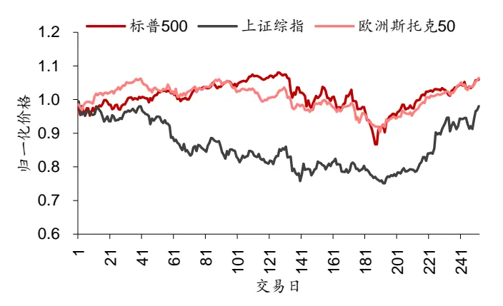
资料来源：Wind，华泰证券研究所

图表13： 相同类型多资产收益率序列：真实样本 2
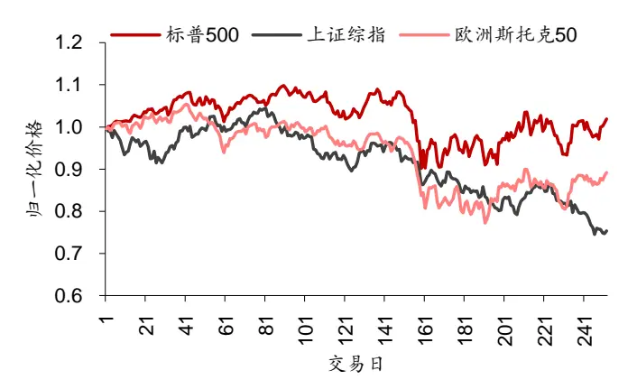
资料来源：Wind，华泰证券研究所

## WGAN 损失函数与生成序列展示

首先考察 WGAN 生成器 G 和判别器 D 损失函数值的变化情况，如下图所示。结果显示，迭代 1000 次（训练一个 Batch 为一次迭代）左右，G和 D 的损失函数便基本保持在相对稳定的水平上，没有出现单个网络过于强大的现象，G和 D 处于相对稳定的“博弈”状态。

图表14： 相同类型资产 WGAN损失函数
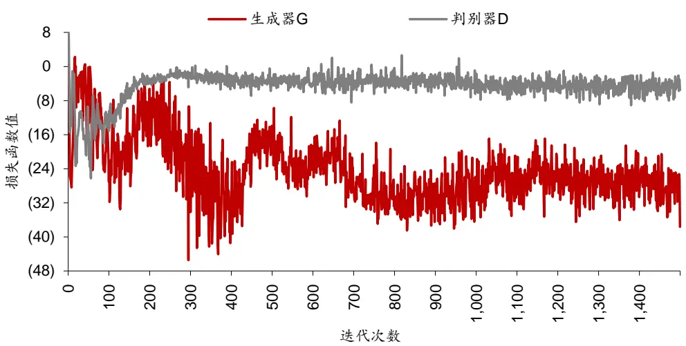
资料来源：Wind，华泰证券研究所

下面两张图展示 WGAN 随机生成的两组样本，生成的多资产收益率序列已转化为归一化价格序列。首先，WGAN 生成的两组样本之间存在较大差异，初步表明 WGAN 能够生成丰富多样的样本。其次，大致能观察到，三种资产的生成序列可能存在一定的短期相关性，其中标普 500 与欧洲斯托克 50 的正相关性相对强，两者与上证综指的正相关性相对弱。该现象与真实序列一致。

图表15： 相同类型多资产收益率序列：WGAN生成样本 1
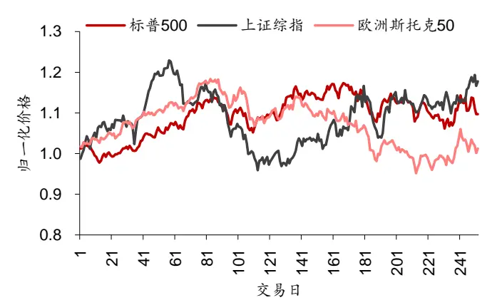
资料来源：Wind，华泰证券研究所

图表16： 相同类型多资产收益率序列：WGAN生成样本 2
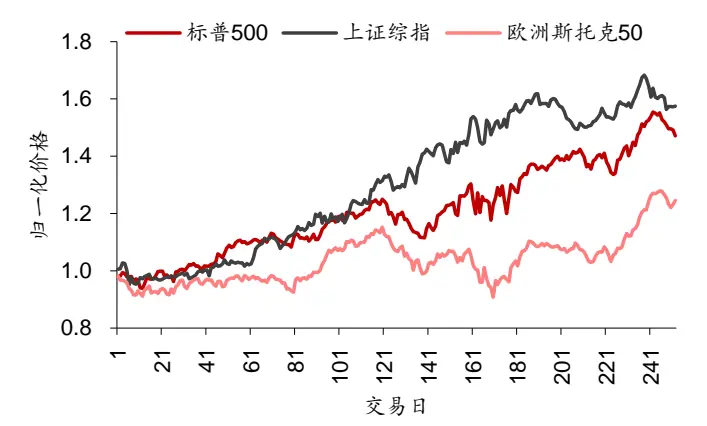
资料来源：Wind，华泰证券研究所

## 对照组 Bootstrap 和 MGARCH 生成序列展示

下面两张图展示 Bootstrap 方法随机生成的两组样本，生成的多资产收益率序列已转化为归一化价格序列。不难发现，三种资产的生成序列同样可能存在短期相关性，其中，标普500 与欧洲斯托克 50 的相关性略强于两者与上证综指的相关性。其原因在于，Bootstrap重采样不会破坏不同资产收益率之间的 0阶相关关系。但 Bootstrap 是否会破坏不同资产收益率之间的 1阶或更高阶相关关系，暂无法通过观察走势图判断，后续部分将采用量化指标评价生成序列质量。

图表17： 相同类型多资产收益率序列：Bootstrap生成样本 1
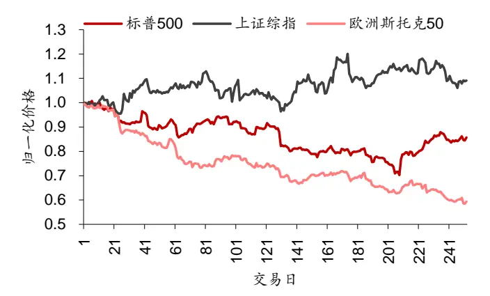
资料来源：Wind，华泰证券研究所

图表18： 相同类型多资产收益率序列：Bootstrap 生成样本 2
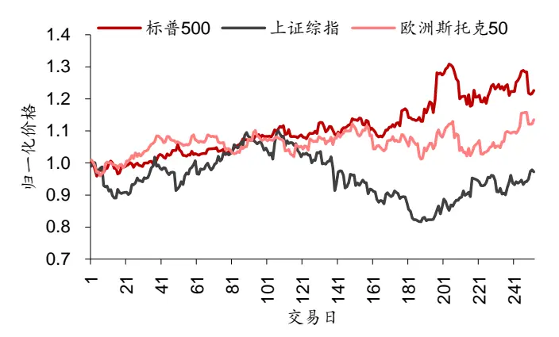
资料来源：Wind，华泰证券研究所

下面两张图展示 MGARCH 模型随机生成的两组样本，生成的多资产收益率序列已转化为归一化价格序列。仍然可观察到，三种资产的生成序列可能存在短期相关性。然而若仔细观察价格走势的细节，不难发现标普 500（红色线）和欧洲斯托克 50（粉色线）的共变关系相对于前述方法偏弱，表明 MGARCH 生成序列的短期相关性略弱于 WGAN 和Bootstrap 方法的结果。

图表19： 相同类型多资产收益率序列：MGARCH 生成样本 1
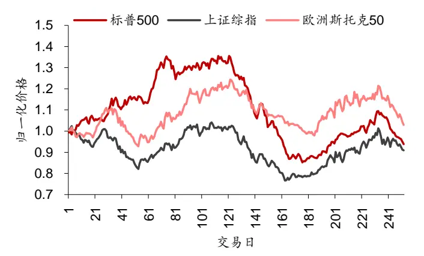
资料来源：Wind，华泰证券研究所

图表20： 相同类型多资产收益率序列：MGARCH生成样本 2
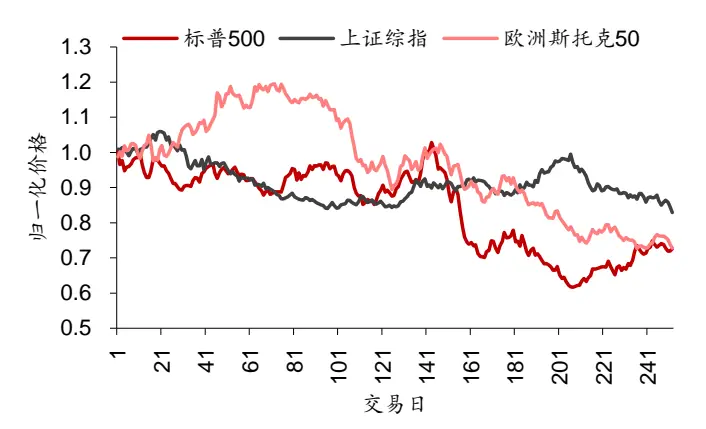
资料来源：Wind，华泰证券研究所

## 评价指标对比

仅从上节展示的价格序列看，很难直观判断生成序列的质量，需结合量化指标对四类序列进行更为细致的评价。接下来，我们分别从单资产序列和多资产序列两个角度评价和对比生成序列的质量。

## 单资产序列评价指标

分别计算标普 500 指数、上证综指、欧洲斯托克 50 指数的真实序列和生成序列的单资产序列评价指标。这些指标在前期研究《WGAN 应用于金融时间序列生成》中已进行深入探究，WGAN 生成单资产序列的效果已也得到充分验证，故本文仅展示标普 500 指数的单资产序列评价指标计算结果。

以标普 500 指数为例，真实序列的单资产序列评价指标如下图所示。我们依次对真实序列的各项评价指标进行分析，并从中提取真实序列的典型化事实：

1. 自相关性：左上子图为收益率 k＝1~120 阶时滞自相关系数，各阶时滞自相关系数接近 0，表明真实收益率序列不存在显著的自相关性。

2. 厚尾分布：中上子图为标准化单侧收益率的累积概率分布 P(r>x)，该函数衰减越快，表明分布越接近正态分布；衰减越慢，表明分布越接近厚尾分布。

3. 波动率聚集：右上子图为收益率绝对值序列的 k=1~120 阶时滞自相关系数，观察可知，标普 500 指数的收益率绝对值序列存在较强的低阶时滞自相关，而高阶自相关性趋于零。

4. 杠杆效应：左下子图展示当前收益率和未来波动率的时滞相关性，观察可知两者低阶负相关，高阶不相关。

5. 粗细波动率相关：中下子图蓝色点线为粗波动率滞后细波动率 k 期的相关系数，橙色点线为±k 阶相关系数的差值，该差值刻画粗细波动率间相互预测能力的差异；橙色点线低阶为负值，表明当前细波动率对未来粗波动率的预测能力更强。

6. 盈亏不对称性：右下子图红点和蓝点分别代表实现累计盈利和亏损超过 10%所需的最少交易日数；红色分布峰值位于蓝色分布峰值右侧，表明涨得慢跌得快。

图表21： 标普 500：真实序列评价指标
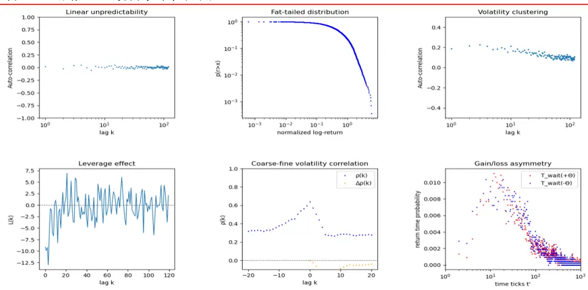
资料来源：Wind，华泰证券研究所

我们使用训练好的 WGAN 随机生成 1000 条多资产收益率序列，从中提取标普 500 指数对应的收益率序列，计算 1000 条序列 6 项单资产序列评价指标并求均值，最终汇总计算结果如下图所示。结果表明，WGAN 能够较好地复现真实序列的各项典型化事实。

图表22： 标普 500：WGAN生成序列评价指标
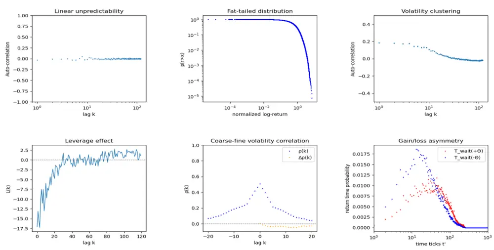
资料来源：Wind，华泰证券研究所

作为 WGAN 的对照，我们对 Bootstrap 方法和 MGARCH 模型生成的 1000 个样本，分别开展同样的单资产序列评价指标计算和汇总，如下面两张图所示。结果显示，Bootstrap方法难以复现波动率聚集（右上子图）、杠杆效应（左下子图）、粗细波动率相关（中下子图）、盈亏不对称性（右下子图）等评价指标。对于自相关性指标（左上子图），从完整序列中随机抽样的过程破坏了自相关的结构，因此 Bootstrap 方法生成不存在显著自相关性的序列。对于厚尾分布指标（中上子图），根据 Bootstrap 方法原理，只要抽样次数足够多，Bootstrap 在理论上能够复现真实序列在分布方面的典型化事实。

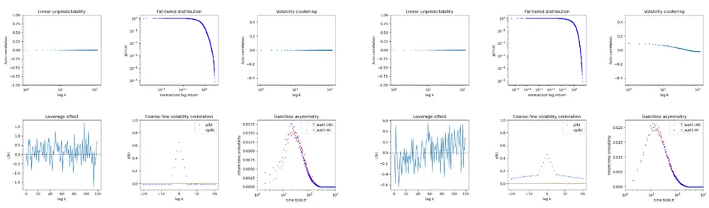
图表23： 标普 500：Bootstrap 生成序列评价指标
资料来源：Wind，华泰证券研究所
图表24： 标普 500：MGARCH生成序列评价指标
资料来源：Wind，华泰证券研究所

相较于 Bootstrap 方法，MGARCH 模型在波动率聚集（右上子图）指标上取得显著进步。其原因在于，ARCH 类模型最初就是为了模拟金融时间序列的波动率聚集现象而提出的。然而不难发现，MGARCH 也难以复现杠杆效应（左下子图）、粗细波动率相关（中下子图）、盈亏不对称性（右下子图）等指标。这可能是由于在一段较长时期内，资产波动率的变化并不存在固定的模式，而 MGARCH 使用固定的线性模式去模拟较长时期内资产波动率的变化，因而产生偏差。

计算 6项单资产序列评价指标的统计量。真实序列和 3种生成方法在 6项评价指标上的表现汇总如下表所示。就单资产序列评价指标而言，WGAN 生成序列较为“逼真”，复现效果整体上优于 Bootstrap 和 MGARCH。

图表25： 标普 500：真实序列与 3种生成方法在单资产序列评价指标上的表现对比

| 评价指标 | 统计量 | 真实序列 | WGAN | Bootstrap | MGARCH |
| --- | --- | --- | --- | --- | --- |
| 自相关性 | 前10 阶自相关系数均值 | 0.11 | 0.09 | 0.10 | 0.10 |
| 厚尾分布 | 拟合幂律衰减系数 α | 4.22 | 4.14 | 3.26 | 5.22 |
| 波动率聚集 | 拟合幂律衰减系数β | 0.22 | 0.86 | 0.68 | 0.71 |
| 杠杆效应 | 前10 阶相关系数均值 | -6.14 | -12.31 | -0.04 | -0.19 |
| 粗细波动率相关 | 滞后±1 阶相关系数之差 | -0.03 | -0.02 | 0.00 | 0.00 |
| 盈亏不对称性 | 盈亏±θ所需天数分布峰值之差 | 4.00 | 28.38 | 5.62 | 1.80 |

资料来源：Wind，华泰证券研究所

## 多资产序列评价指标

进一步考察两对资产收益率序列——标普 500 指数和上证综指、标普 500 指数和欧洲斯托克 50 指数的多资产序列评价指标，结果分别如下面两张图所示。特别地，由于三资产系统自由度为 2，通过两对资产的表现大致能推断第三对资产的表现，因此本文不再展示上证综指和欧洲斯托克 50 指数的多资产序列评价指标。

我们依次对真实序列的各项评价指标进行分析，并从中提取真实序列的典型化事实：

1. 交叉相关性：两图中的左上子图展示两收益率序列的 k＝0~120 阶时滞交叉相关系数。观察可知，标普 500 和欧洲斯托克 50 存在显著的 0阶和 1 阶正相关性，标普 500 和上证综指存在一定 0阶和 1阶正相关性，体现出全球股票资产的联动性。此外，两对资产之间均不存在显著的更高阶交叉相关性。

2. 波动率相关性：两图中的右上子图分别展示两对资产收益率的绝对值序列之间的交叉相关系数。观察可知，两对资产均存在低阶的波动率正相关性，其中标普 500 与欧洲斯托克 50 之间的波动率正相关性更为显著。

3. 交叉杠杆效应：两图中的左下子图展示一种资产当前收益率与另一种资产未来波动率之间的时滞相关性。观察可知，两对资产之间均存在低阶负相关，其中标普 500 与欧洲斯托克 50 之间的负相关更为显著，持续阶数更多。

4. 滚动相关系数分布：两图的右下子图展示两对资产之间滚动相关系数的经验密度估计，黑色虚线标明分布的峰值位置。其中，标普 500 与上证综指的滚动相关系数分布接近对称分布，对称轴略大于 0，说明两者之间存在微弱的正相关关系；而标普 500 与欧洲斯托克 50 的滚动相关系数分布为非对称分布，峰值位于 0.9 附近，说明两者之间存在较强的短期正相关性。从图中还能看到，两资产之间的短期相关关系并不稳定，尤其是标普500 与上证综指，其短期相关关系正负不定。

5. 极端值相关性：不适合作图，将在后文单独讨论。

图表26： 标普 500 vs 上证综指：真实序列相关性指标
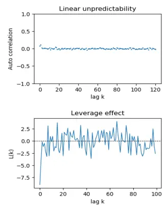
资料来源：Wind，华泰证券研究所

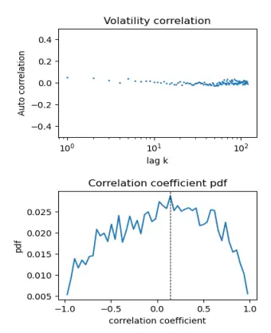

图表27： 标普 500 vs 欧洲斯托克 50：真实序列相关性指标
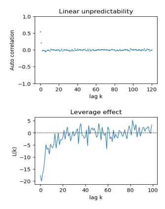
资料来源：Wind，华泰证券研究所

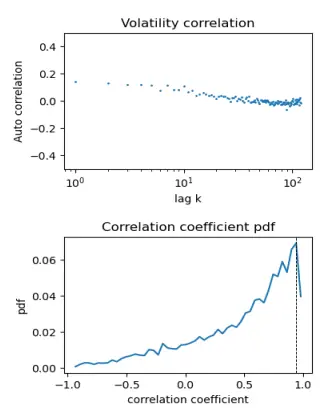

使用训练好的 WGAN 随机生成 1000 条多资产收益率序列，针对本节考察的两对资产，计算 1000 条序列各项多资产序列评价指标并求均值，最后汇总计算结果，如下面两张图所示。结果表明，WGAN能较好复现真实序列的各项典型化事实。

图表28： 标普 500 vs 上证综指：WGAN生成序列相关性指标
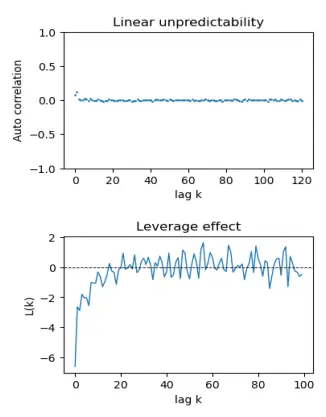
资料来源：Wind，华泰证券研究所

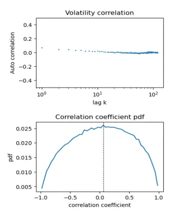

图表29： 标普 500 vs 欧洲斯托克 50：WGAN生成序列相关性指标
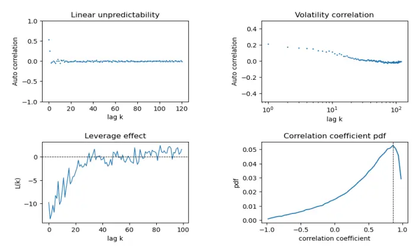
资料来源：Wind，华泰证券研究所

作为 WGAN 的对照，我们对 Bootstrap 方法和 MGARCH 模型生成的 1000 个样本，分别开展同样的多资产序列评价指标计算和汇总。其中，Bootstrap 的结果如下面两张图所示。观察可知，Bootstrap 基本能复现滚动相关系数分布（右下子图），但难以复现波动率相关性（右上子图）和杠杆效应（左下子图）两个指标。对于交叉相关性（左上子图）指标，Bootstrap 能较好复现真实序列的 0阶正相关性，但无法复现 1阶正相关性。

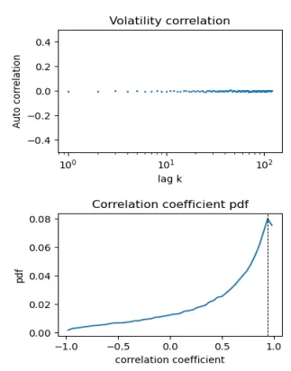

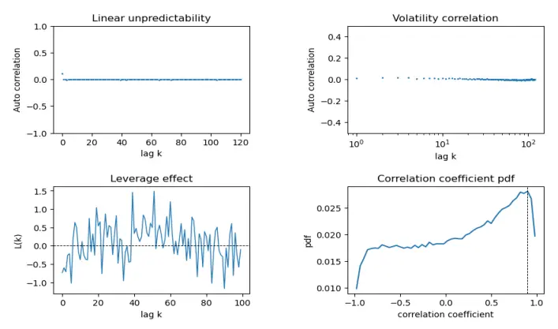
资料来源：Wind，华泰证券研究所

一方面，Bootstrap 能够维持同一交易日内不同资产的收益率结构，因此，滚动相关系数的分布特征以及 0 阶正相关性能够被大规模随机抽样复现。另一方面，Bootstrap 不能保持原来交易日的顺序，无法维持相邻交易日之间资产收益率的时序因果关系，而波动率相关性、杠杆效应、1 阶正相关性对序列在时间维度上的动态结构有较强的依赖性，因此，Bootstrap 难以复现真实序列的上述典型化事实。

图表30： 标普 500 vs 上证综指：Bootstrap生成序列相关性指标
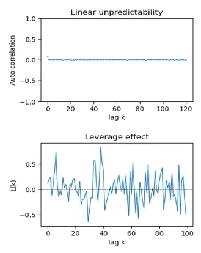
资料来源：Wind，华泰证券研究所

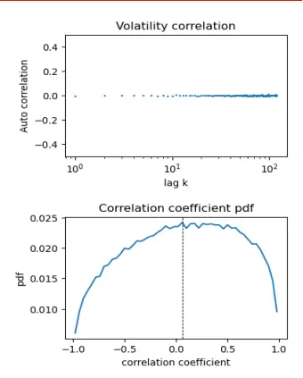

图表31： 标普 500 vs 欧洲斯托克 50：Bootstrap 生成序列相关性指标
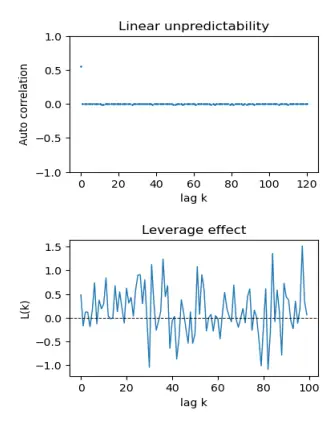
资料来源：Wind，华泰证券研究所

MGARCH 的结果如下面两张图所示。相较于 Bootstrap 方法，MGARCH 模型在波动率相关性（右上子图）上的表现略有改善，尤其是对于标普 500 和欧洲斯托克 50，观察可知这对资产正的低阶波动率相关性，不过不如真实序列的结果显著。同时，MGARCH 模型在标普 500 和上证综指的滚动相关系数分布（右下子图）上复现效果不佳。而在复现其它各项典型化事实时，MGARCH 的表现与 Bootstrap 的表现相差不大。

图表32： 标普 500 vs 上证综指：MGARCH生成序列相关性指标
图表33： 标普 500 vs欧洲斯托克 50：MGARCH生成序列相关性指标
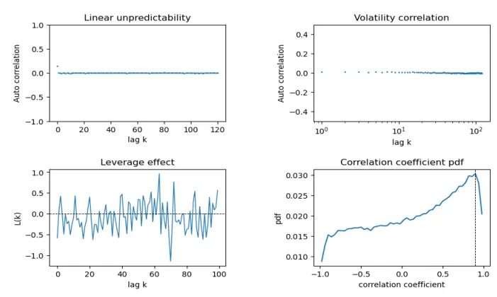
资料来源：Wind，华泰证券研究所

计算各项多资产序列评价指标的统计量，真实序列和 3种生成方法在各项评价指标上的表现汇总如下面两张表所示。相对于 Bootstrap 和 MGARCH，WGAN 在各项多资产序列评价指标中的表现均更为优异：

1. 交叉相关性：真实的多资产收益率序列呈现 0 阶和 1阶正相关性、高阶无显著交叉相关性；三种生成方法都能较好复现两个股指之间的 0 阶正相关性和高阶无显著交叉相关性，但只有WGAN能较好复现 1阶正相关性。

2. 波动率相关性：真实的多资产收益率序列呈现正的低阶波动率相关性；WGAN能较好复现真实序列的这一典型化事实，MGARCH 只能在标普 500 和欧洲斯托克 50 之间复现出微弱的低阶波动率相关性，而 Bootstrap 无法复现该指标。

3. 交叉杠杆效应：在真实的多资产序列中，一种资产的当前收益率与另一种资产的未来波动率之间存在低阶时滞交叉相关性；WGAN能较好复现真实序列的这一典型化事实，而 Bootstrap 和 MGARCH 无法复现该指标。

4. 滚动相关系数分布相似度：尽管从经验密度估计图中看到，三种生成方法的结果都比较接近真实序列的结果，然而对真实序列和三种生成方法得到的滚动相关系数分布开展双样本 AD 检验发现，三种生成方法生成的滚动相关系数分布在 5%显著性水平下与真实分布存在差异。不过相较于 Bootstrap 和 MGARCH，WGAN 的结果具有更小的检验统计量和更大的 p 值，表明WGAN的滚动相关系数分布更接近真实分布。

5. 极端值相关性：标普 500 和欧洲斯托克 50之间存在显著的极端值相关性；WGAN 和Bootstrap 都能较好复现真实序列的这一典型化事实，而 MGARCH 无法复现该指标。

图表34： 标普 500 vs 上证综指：不同生成方法相关性指标对比

| 评价指标 | 统计量 | 真实序列 | WGAN | Bootstrap | MGARCH |
| --- | --- | --- | --- | --- | --- |
| 交叉相关性 | 0~10阶时滞交叉相关系数均值 | 0.03 | 0.02 | 0.01 | 0.01 |
| 波动率相关性 | 0~10阶时滞交叉相关系数均值 | 0.09 | 0.04 | 0.01 | 0.02 |
| 交叉杠杆效应 | 前10 阶时滞相关系数均值 | -3.13 | -2.26 | 0.15 | -0.23 |
| 滚动相关系数 | 滚动相关系数 AD 检验统计量 | 一 | 2.04 | 8.31 | 134.77 |
| 分布相似度 | 滚动相关系数 AD 检验 p 值 | 一 | 0.05 | 0.00 | 0.00 |
| 极端值相关性 | 极端值条件概率 | 0.00 | 0.02 | 0.01 | 0.05 |

资料来源：Wind，华泰证券研究所；滚动相关系数 AD 检验统计量越小，p 值越大，代表生成序列越接近真实序列

图表35： 标普 500 vs 欧洲斯托克 50：不同生成方法相关性指标对比

| 评价指标 | 统计量 | 真实序列 | WGAN | Bootstrap | MGARCH |
| --- | --- | --- | --- | --- | --- |
| 交叉相关性 | 0~10阶时滞交叉相关系数均值 | 0.06 | 0.06 | 0.05 | 0.01 |
| 波动率相关性 | 0~10阶时滞交叉相关系数均值 | 0.27 | 0.17 | 0.04 | 0.02 |
| 交叉杠杆效应 | 前10阶时滞相关系数均值 | -14.69 | -9.01 | 0.15 | -0.15 |
| 滚动相关系数 | 滚动相关系数 AD 检验统计量 | 一 | 51.21 | 56.20 | 1369.48 |
| 分布相似度 | 滚动相关系数 AD 检验 p 值 | 一 | 0.00 | 0.00 | 0.00 |
| 极端值相关性 | 极端值条件概率 | 0.33 | 0.16 | 0.23 | 0.05 |

资料来源：Wind，华泰证券研究所；滚动相关系数 AD 检验统计量越小，p 值越大，代表生成序列越接近真实序列

## 实证测试 2：不同类型资产生成结果与讨论

本章以沪深 300 指数、中债-国债总财富指数、SGE 黄金 9999 三种资产构成的多资产收益率时间序列为例，展示 WGAN 的训练效果，并生成 1000 组样本。随后使用前文介绍的单资产和多资产序列评价指标评价生成序列的质量，并与Bootstrap重采样和MGARCH模型生成的对照组序列进行对比。

## 真实序列与生成序列展示

## 真实序列展示

从训练数据中抽取两组长度为 252 的真实收益率序列样本，并转换为初始价格为 1的归一化价格序列，分别如下面两张图所示。其中债券类资产的波动较小，对应右坐标轴。统计2004 年初至 2020 年 10 月末各资产两两之间相关系数，沪深 300 与中债国债指数存在弱的负相关（相关系数-0.051），沪深 300 与黄金存在弱的正相关（相关系数 0.044），中债国债指数与黄金存在弱的正相关（相关系数 0.059）。然而仅看下面两组长度为 252 个交易日的真实样本，上述相关性并无明显体现。

图表36： 不同类型多资产收益率序列：真实样本 1
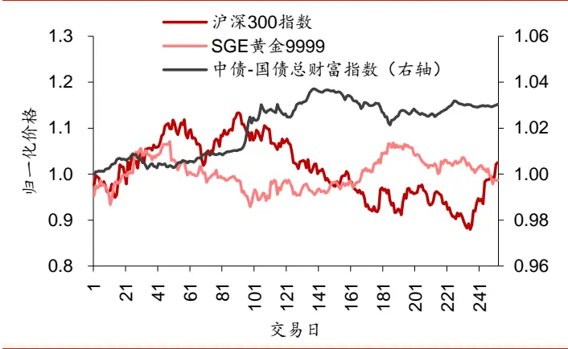
资料来源：Wind，华泰证券研究所

图表37： 不同类型多资产收益率序列：真实样本 2
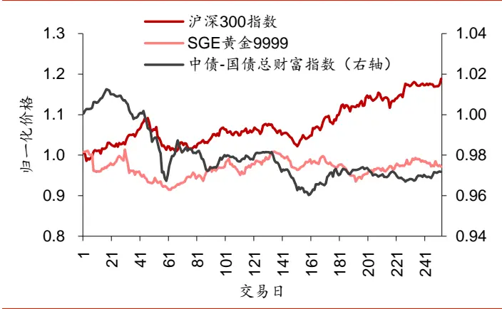
资料来源：Wind，华泰证券研究所

## WGAN 损失函数与生成序列展示

WGAN 损失函数如下图所示。迭代 1000 次左右，G 和 D 的损失函数便基本保持在两个相对稳定的水平上，G和 D处于一个相对稳定的“博弈”状态。

图表38： 不同类型资产 WGAN损失函数
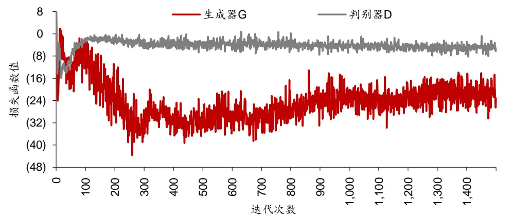
资料来源：Wind，华泰证券研究所

下面两张图展示 WGAN 随机生成的两组样本。生成的多资产收益率序列已转化为归一化价格序列。WGAN生成的这两组样本之间存在较大差异，初步表明 WGAN 能够生成丰富多样的样本。

图表39： 不同类型多资产收益率序列：WGAN生成样本 1
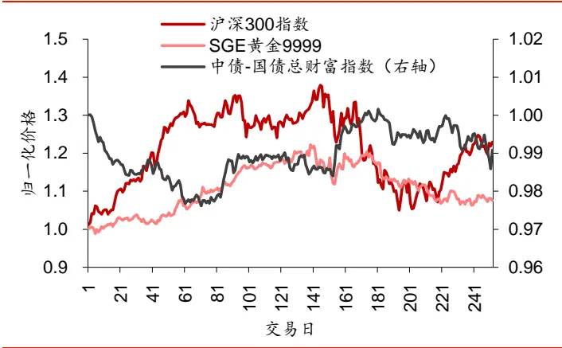
资料来源：Wind，华泰证券研究所

图表40： 不同类型多资产收益率序列：WGAN生成样本 2
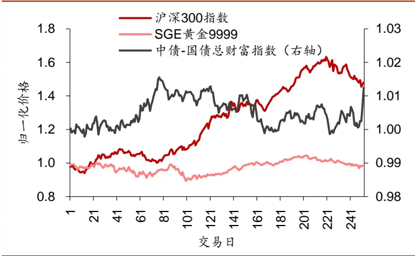
资料来源：Wind，华泰证券研究所

## 对照组 Bootstrap 和 MGARCH 生成序列展示

下面两张图展示 Bootstrap 方法随机生成的两组样本，生成的多资产收益率序列已转化为归一化价格序列。

图表41： 不同类型多资产收益率序列：Bootstrap 生成样本 1
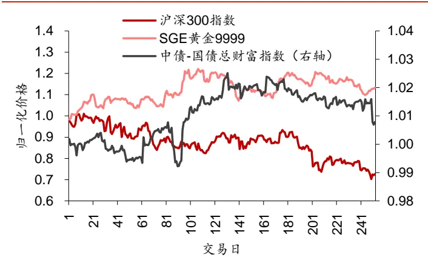
资料来源：Wind，华泰证券研究所

图表42： 不同类型多资产收益率序列：Bootstrap 生成样本 2
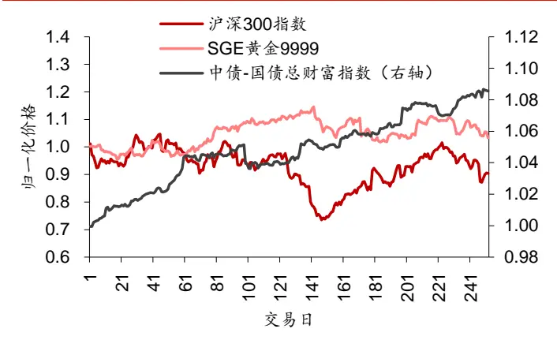
资料来源：Wind，华泰证券研究所

下面两张图展示 MGARCH 模型随机生成的两组样本，生成的多资产收益率序列已转化为归一化价格序列。

图表43： 不同类型多资产收益率序列：MGARCH 生成样本 1
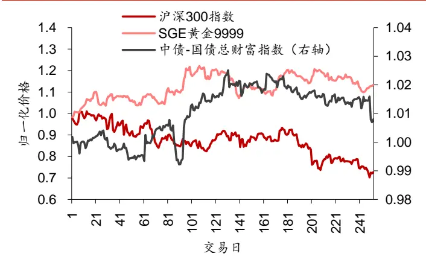
资料来源：Wind，华泰证券研究所

图表44： 不同类型多资产收益率序列：MGARCH生成样本 2
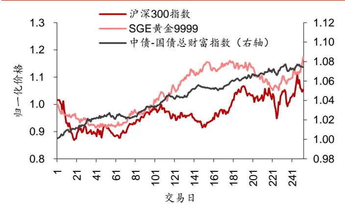
资料来源：Wind，华泰证券研究所

## 评价指标对比

## 单资产序列评价指标

分别计算沪深 300 指数、中债-国债总财富指数、SGE 黄金 9999 的真实序列和生成序列的单资产序列评价指标。，WGAN生成单资产序列的效果已得到充分验证，故本文仅展示沪深 300 指数的单资产序列评价指标计算结果。沪深 300 指数真实序列评价指标如下图所示。

图表45： 沪深 300指数：真实序列评价指标
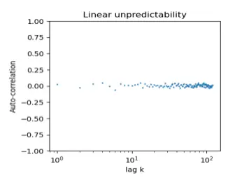

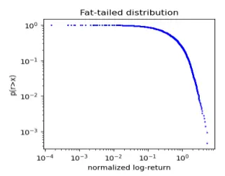

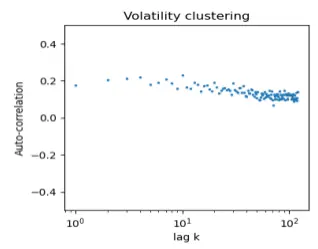

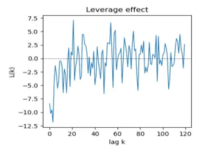
资料来源：Wind，华泰证券研究所

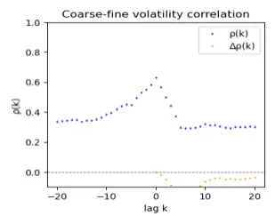

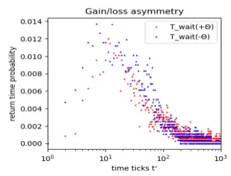

沪深 300 指数WGAN生成序列评价指标如下图所示。观察可知，WGAN能较好复现真实序列的各项典型化事实。

图表46： 沪深 300指数：WGAN生成序列评价指标
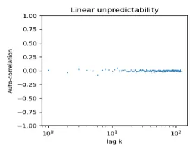

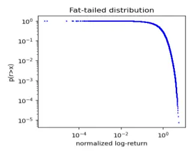

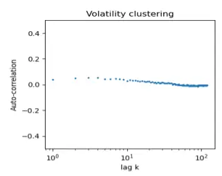

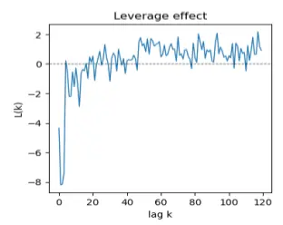
资料来源：Wind，华泰证券研究所

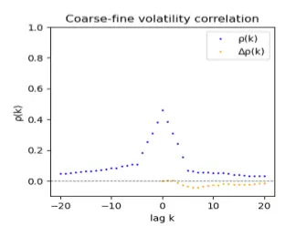

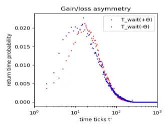

对照组Bootstrap方法和MGARCH模型生成序列评价指标如下面两张图所示。观察可知，对照组模型在后三项指标（杠杆效应、粗细波动率相关、盈亏不对称性）的复现效果均不及 WGAN。

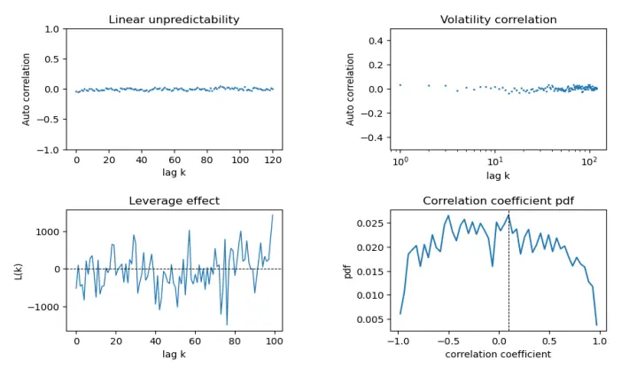
资料来源：Wind，华泰证券研究所

图表47： 沪深 300 指数：Bootstrap 生成序列评价指标
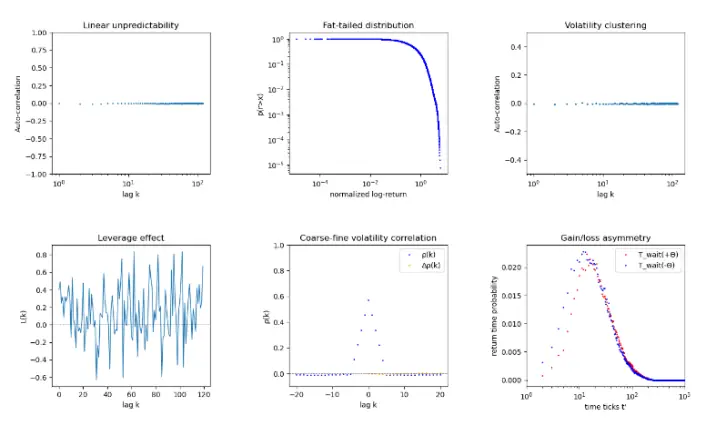
资料来源：Wind，华泰证券研究所

图表48： 沪深 300指数：MGARCH生成序列评价指标
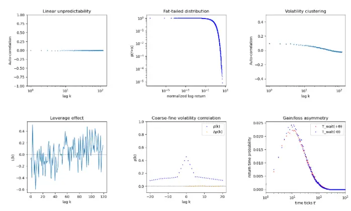
资料来源：Wind，华泰证券研究所

进一步计算 6项单资产序列评价指标的统计量。真实序列和 3种生成方法在 6项评价指标上的表现汇总如下表所示。就单资产序列评价指标而言，WGAN 生成序列较为“逼真”，复现效果整体上优于 Bootstrap 和 MGARCH。

图表49： 沪深 300指数：真实序列与 3种生成方法在单资产序列评价指标上的表现对比

| 评价指标 | 统计量 | 真实序列 | WGAN | Bootstrap | MGARCH |
| --- | --- | --- | --- | --- | --- |
| 自相关性 | 前10阶自相关系数均值 | 0.11 | 0.10 | 0.10 | 0.10 |
| 厚尾分布 | 拟合幂律衰减系数 α | 4.58 | 4.58 | 4.21 | 4.99 |
| 波动率聚集 | 拟合幂律衰减系数β | 0.16 | 0.60 | 0.55 | 0.64 |
| 杠杆效应 | 前 10 阶相关系数均值 | -5.89 | -3.48 | 0.32 | -0.13 |
| 粗细波动率相关 | 滞后±1 阶相关系数之差 | -0.02 | 0.00 | 0.00 | 0.00 |
| 盈亏不对称性 | 盈亏±θ所需天数分布峰值之差 | 6.00 | 5.92 | 1.53 | 2.32 |

资料来源：Wind，华泰证券研究所

## 多资产序列评价指标

考察两对资产收益率序列——沪深 300 指数和中债-国债总财富指数、沪深 300 指数和SGE 黄金 9999 的多资产序列评价指标，结果分别下面两张图所示。由于三资产系统自由度为 2，通过两对资产的表现大致能推断第三对资产的表现，因此本文不再展示中债-国债总财富指数和 SGE黄金 9999 的多资产序列评价指标。

图表50： 沪深 300指数 vs中债-国债总财富指数：真实序列相关性指标
图表51： 沪深 300指数 vs SGE黄金 9999：真实序列相关性指标
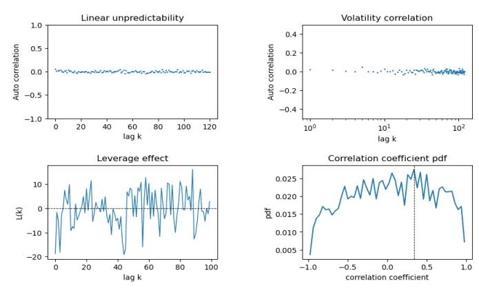
资料来源：Wind，华泰证券研究所

我们依次对真实序列的各项评价指标进行分析，并从中提取真实序列的典型化事实：

1. 交叉相关性：两图中的左上子图展示两收益率序列的 k＝0~120 阶时滞交叉相关系数。观察可知，沪深 300 和国债指数存在较弱的 0~2 阶负相关性，沪深 300 和现货黄金存在较弱的 0 阶正相关性。此外，两对资产之间均不存在显著的更高阶交叉相关性。

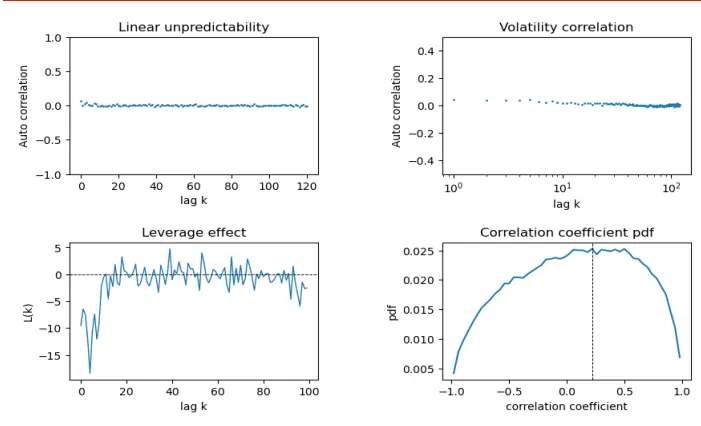

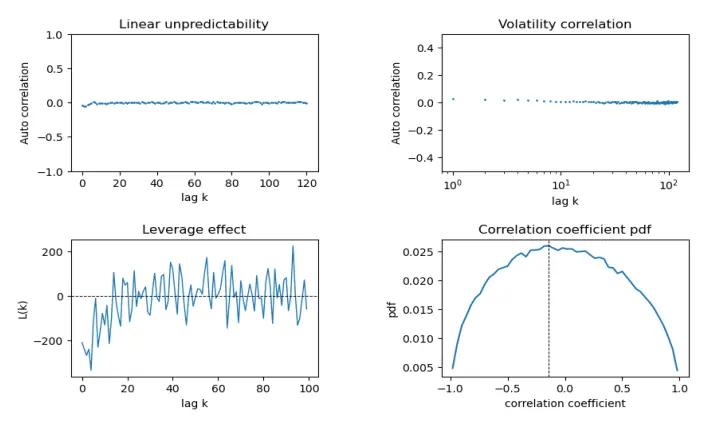
图表52： 沪深 300 vs中债-国债：WGAN 生成序列相关性指标
资料来源：Wind，华泰证券研究所
图表53： 沪深 300 vs SGE 黄金 9999：WGAN 生成序列相关性指标
资料来源：Wind，华泰证券研究所

2. 波动率相关性：两图中的右上子图分别展示两对资产收益率的绝对值序列之间的交叉相关系数。观察可知，两对资产均存在较弱的低阶波动率正相关性。

3. 交叉杠杆效应：两图中的左下子图展示一种资产当前收益率与另一种资产未来波动率之间的时滞相关性。观察可知，两对资产之间均存在较弱的低阶负相关，但相关关系整体看并不稳定。

4. 滚动相关系数分布：两图的右下子图展示两对资产之间滚动相关系数的经验密度估计，黑色虚线标明分布的峰值位置。其中，沪深 300 和国债指数的滚动相关系数分布为正偏态分布，对称轴接近 0，但在 0 轴左侧分布更密集，表明股票和债券资产存在较弱的短期负相关性；沪深 300 和黄金的滚动相关系数分布为负偏态分布，对称轴接近 0，但在 0轴右侧分布更密集，表明股票和债券资产存在较弱的短期正相关性。

5. 极端值相关性：不适合作图，将在后文单独讨论。

使用训练好的 WGAN 随机生成 1000 条多资产收益率序列，针对本节考察的两对资产，计算 1000 条序列各项多资产序列评价指标并求均值，最后汇总计算结果，分别如下面两张图所示。结果表明，WGAN 能较好复现真实序列的各项典型化事实。

对照组 Bootstrap 方法的结果如下面两张图所示。结果表明，Bootstrap 难以复现波动率相关性（右上子图）和交叉杠杆效应（左下子图）。

图表54： 沪深 300 vs中债-国债：Bootstrap生成序列相关性指标
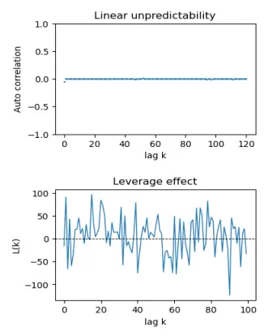
资料来源：Wind，华泰证券研究所

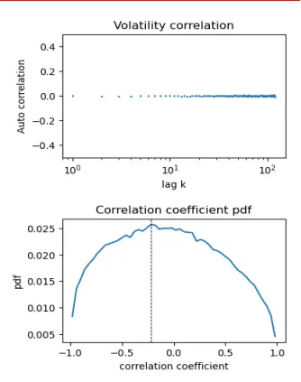

图表55： 沪深 300 vs SGE 黄金 9999：Bootstrap 生成序列相关性指标
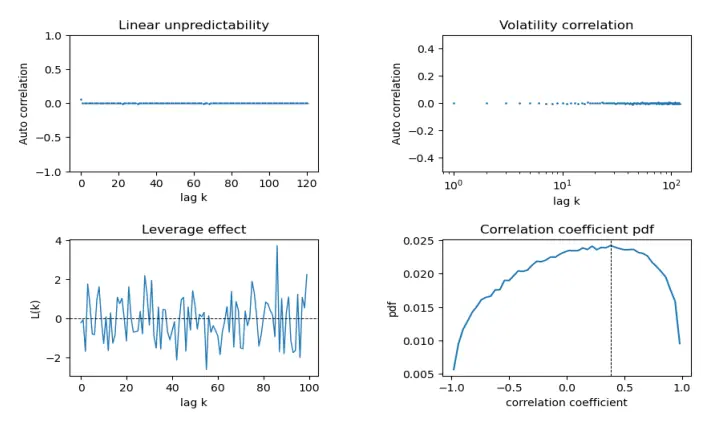
资料来源：Wind，华泰证券研究所

对照组 MGARCH 模型的结果如下面两张图所示。结果表明，MGARCH 难以复现交叉杠杆效应（左下子图）和滚动相关系数分布（右下子图）。

图表56： 沪深 300 vs中债-国债：MGARCH生成序列相关性指标
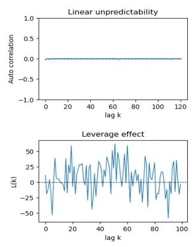
资料来源：Wind，华泰证券研究所

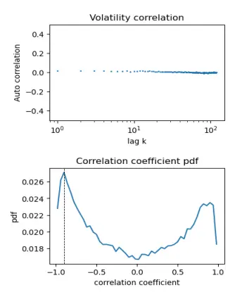

图表57： 沪深 300 vs SGE 黄金 9999：MGARCH 生成序列相关性指标
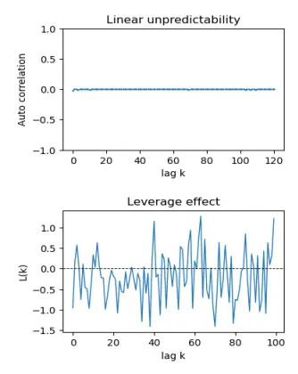
资料来源：Wind，华泰证券研究所

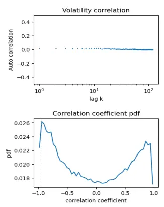

计算各项多资产序列评价指标的统计量。真实序列和 3种生成方法在各项评价指标上的表现汇总如下面两张表所示。相对于 Bootstrap 和 MGARCH，WGAN 在各项多资产序列评价指标中的表现均更为优异。

图表58： 沪深 300指数 vs中债-国债总财富指数：不同生成方法相关性指标对比

| 评价指标 | 统计量 | 真实序列 | WGAN | Bootstrap | MGARCH |
| --- | --- | --- | --- | --- | --- |
| 交叉相关性 | 0~10 阶时滞交叉相关系数均值 | -0.02 | -0.02 | -0.01 | 0.00 |
| 波动率相关性 | 0~10阶时滞交叉相关系数均值 | 0.02 | 0.02 | 0.00 | 0.03 |
| 交叉杠杆效应 | 前10 阶时滞相关系数均值 | -94.81 | -179.60 | 4.70 | -3.77 |
| 滚动相关系数 | 滚动相关系数 AD 检验统计量 | 一 | 10.68 | 3.76 | 87.89 |
| 分布相似度 | 滚动相关系数 AD 检验 p 值 | 一 | 0.00 | 0.01 | 0.00 |
| 极端值相关性 | 极端值条件概率 | 0.00 | 0.00 | 0.00 | 0.04 |

资料来源：Wind，华泰证券研究所；滚动相关系数 AD 检验统计量越小，p 值越大，代表生成序列越接近真实序列

图表59： 沪深 300指数 vs SGE黄金 9999：不同生成方法相关性指标对比

| 评价指标 | 统计量 | 真实序列 | WGAN | Bootstrap | MGARCH |
| --- | --- | --- | --- | --- | --- |
| 交叉相关性 | 0~10阶时滞交叉相关系数均值 | 0.02 | 0.02 | 0.01 | 0.00 |
| 波动率相关性 | 0~10阶时滞交叉相关系数均值 | 0.09 | 0.04 | 0.01 | 0.03 |
| 交叉杠杆效应 | 前10阶时滞相关系数均值 | -11.48 | -9.35 | 0.13 | -0.27 |
| 滚动相关系数 | 滚动相关系数 AD 检验统计量 | 一 | 8.74 | 4.04 | 91.32 |
| 分布相似度 | 滚动相关系数 AD 检验 p 值 | 一 | 0.00 | 0.01 | 0.00 |
| 极端值相关性 | 极端值条件概率 | 0.00 | 0.02 | 0.00 | 0.03 |

资料来源：Wind，华泰证券研究所；滚动相关系数 AD 检验统计量越小，p 值越大，代表生成序列越接近真实序列

## 总结与展望

本研究将生成对抗网络的应用领域从单资产序列生成拓展至多资产序列生成。多资产序列生成中，不仅需要模拟每种资产收益率的分布特征和时序特性，还需要复现多资产之间的协变关系。为此必须在前期研究基础上进行两项改造：1）增加评价多资产之间协变关系的指标；2）改变网络结构使之能适应多资产输入。我们将改造后的WGAN模型应用于 1）相同类型的三种股票指数以及 2）不同类型的股票、债券、商品指数收益率序列的生成，结果表明 WGAN 能够复现真实序列具有的典型化事实，在评价指标上相比对照组模型更接近真实序列。

设计评价指标的出发点是典型化事实。经济学中的典型化事实是人们从经济运行中观察到的客观现象的简化描述，也是对数据统计分析结果的高度概括。本文研究的对象是多资产收益率时间序列，典型化事实既涉及单资产序列本身，又涉及多资产序列间的协变关系。本文从真实的多资产序列典型化事实出发，设计相应指标评价生成序列质量。在前期研究使用的厚尾分布、波动率聚集等 6项单资产序列评价指标的基础上，本文进一步设计交叉相关性、波动率相关性、交叉杠杆效应、滚动相关系数分布相似度、极端值相关性共 5 项多资产收益率序列评价指标，衡量 WGAN的生成效果。

本文在前期研究使用的 WGAN 基础上进行网络结构改造。在多资产生成的应用场景下，为了使判别器 D具有鉴别多资产序列的能力，我们将第一层卷积层设置为多通道输入，每一通道对应一项资产。此时，判别器 D不仅能在时间序列维度上提取单资产时序相关性的局部特征，也能在通道维度上提取多资产相关性的局部特征。我们将 WGAN 分别应用于1）相同类型资产（标普 500、上证综指、欧洲斯托克 50）；2）不同类型资产收益率序列生成（沪深 300、中债-国债总财富指数、SGE 黄金 9999），并与对照组 Bootstrap 重采样和 MGARCH 模型等传统时间序列模拟方法进行比较。

结果表明，无论是单资产序列评价指标还是多资产序列评价指标，相较于对照组 Bootstrap和 MGARCH 方法，WGAN 生成的多资产序列均能更好复现真实序列呈现的典型化事实，各项评价指标均与真实序列的结果较为接近。尤其是单资产收益率的杠杆效应、粗细波动率相关和盈亏不对称性，以及两资产收益率的 1 阶正相关性和交叉杠杆效应，对照组Bootstrap 和 MGARCH 方法均无法复现真实序列具有的上述典型化事实。

本研究基于真实多资产序列的典型化事实，验证 WGAN 在生成多资产收益率序列方面的能力，进一步拓宽 WGAN 在数据增强、过拟合检测、指导投资实践等方面的应用场景。不过，本文仍有值得进一步探索的方面：

1. 本文提出的多资产序列评价指标大部分局限于两资产间，未来研究可着眼于设计同时考察 k＞2 个资产收益率信息的评价指标，如资产协方差矩阵的特征值等，从而对WGAN的生成能力及局限性有更深入的认知；

2. 本文考察的多资产系统仅包含三种资产，进一步增加资产数量意味着 WGAN 网络的参数数量也将大幅增加，可能会面临“维度的诅咒”，未来研究可着眼于改善 WGAN的网络结构，探索WGAN对资产数量的容纳能力。

## 参考文献

Baldwin, R. E. , & Robert-Nicoud, F. (2004). The impact of trade on intra-industry reallocation and aggregate industry productivity: A comment (No. w10718). National Bureau of Economic Research.

Chakraborti, A. , Toke, I. M. , Patriarca, M. , & Abergel, F. (2011). Econophysics review: i. empirical facts. Quantitative Finance, 11(7), 991-1012.

Cont, R. (2001). Empirical properties of asset returns: Stylized facts and statistical issues. Quantitative Finance, 1(2), 223–236.

Engle, R. F. , Kroner, K. F. (1995). Multivariate simultaneous generalized ARCH. Econometric Theory, 11, 122–150.

Helpman, E. , & Krugman, P. (1986). Market structure and foreign trade: increasing returns, imperfect competition and international trade. MIT Press Books, 1(381), 543-543.

Melitz, M. J. (2003). The impact of trade on intra-industry reallocations and aggregate industry productivity. Econometrica, 71(6).

Orskaug, E. (2009). Multivariate DCC-GARCH Model: With Various Error Distributions. Thesis of Master Degree. Norwegian University of Science and Technology.

Takahashi, S. , Chen, Y. , Tanaka-Ishii, K. (2019). Modeling financial time-series with generative adversarial networks. Physica A: Statistical Mechanics and its Applications. 527. 121261. 10.1016/j.physa.2019.121261.

## 风险提示

WGAN 生成虚假序列是对市场规律的探索，不构成任何投资建议。深度学习模型存在过拟合的可能。深度学习模型是对历史规律的总结，如果市场规律发生变化，模型存在失效的可能。

## 免责声明

## 分析师声明

本人，林晓明、李子钰、何康，兹证明本报告所表达的观点准确地反映了分析师对标的证券或发行人的个人意见；彼以往、现在或未来并无就其研究报告所提供的具体建议或所表迖的意见直接或间接收取任何报酬。

## 一般声明及披露

本报告由华泰证券股份有限公司（已具备中国证监会批准的证券投资咨询业务资格，以下简称“本公司”）制作。本报告仅供本公司客户使用。本公司不因接收人收到本报告而视其为客户。

本报告基于本公司认为可靠的、已公开的信息编制，但本公司对该等信息的准确性及完整性不作任何保证。本报告所载的意见、评估及预测仅反映报告发布当日的观点和判断。在不同时期，本公司可能会发出与本报告所载意见、评估及预测不一致的研究报告。同时，本报告所指的证券或投资标的的价格、价值及投资收入可能会波动。以往表现并不能指引未来，未来回报并不能得到保证，并存在损失本金的可能。本公司不保证本报告所含信息保持在最新状态。本公司对本报告所含信息可在不发出通知的情形下做出修改，投资者应当自行关注相应的更新或修改。

本公司力求报告内容客观、公正，但本报告所载的观点、结论和建议仅供参考，不构成购买或出售所述证券的要约或招揽。该等观点、建议并未考虑到个别投资者的具体投资目的、财务状况以及特定需求，在任何时候均不构成对客户私人投资建议。投资者应当充分考虑自身特定状况，并完整理解和使用本报告内容，不应视本报告为做出投资决策的唯一因素。对依据或者使用本报告所造成的一切后果，本公司及作者均不承担任何法律责任。任何形式的分享证券投资收益或者分担证券投资损失的书面或口头承诺均为无效。

除非另行说明，本报告中所引用的关于业绩的数据代表过往表现，过往的业绩表现不应作为日后回报的预示。本公司不承诺也不保证任何预示的回报会得以实现，分析中所做的预测可能是基于相应的假设，任何假设的变化可能会显著影响所预测的回报。

本公司及作者在自身所知情的范围内，与本报告所指的证券或投资标的不存在法律禁止的利害关系。在法律许可的情况下，本公司及其所属关联机构可能会持有报告中提到的公司所发行的证券头寸并进行交易，为该公司提供投资银行、财务顾问或者金融产品等相关服务或向该公司招揽业务。

本公司的销售人员、交易人员或其他专业人士可能会依据不同假设和标准、采用不同的分析方法而口头或书面发表与本报告意见及建议不一致的市场评论和/或交易观点。本公司没有将此意见及建议向报告所有接收者进行更新的义务。本公司的资产管理部门、自营部门以及其他投资业务部门可能独立做出与本报告中的意见或建议不一致的投资决策。投资者应当考虑到本公司及/或其相关人员可能存在影响本报告观点客观性的潜在利益冲突。投资者请勿将本报告视为投资或其他决定的唯一信赖依据。有关该方面的具体披露请参照本报告尾部。

本报告并非意图发送、发布给在当地法律或监管规则下不允许向其发送、发布的机构或人员，也并非意图发送、发布给因可得到、使用本报告的行为而使本公司及关联子公司违反或受制于当地法律或监管规则的机构或人员。

本公司研究报告以中文撰写，英文报告为翻译版本，如出现中英文版本内容差异或不一致，请以中文报告为主。英文翻译报告可能存在一定时间迟延。

本报告版权仅为本公司所有。未经本公司书面许可，任何机构或个人不得以翻版、复制、发表、引用或再次分发他人等任何形式侵犯本公司版权。如征得本公司同意进行引用、刊发的，需在允许的范围内使用，并注明出处为“华泰证券研究所”，且不得对本报告进行任何有悖原意的引用、删节和修改。本公司保留追究相关责任的权利。所有本报告中使用的商标、服务标记及标记均为本公司的商标、服务标记及标记。

## 中国香港

本报告由华泰证券股份有限公司制作,在香港由华泰金融控股（香港）有限公司向符合《证券及期货条例》第 571 章所定义之机构投资者和专业投资者的客户进行分发。华泰金融控股（香港）有限公司受香港证券及期货事务监察委员会监管，是华泰国际金融控股有限公司的全资子公司，后者为华泰证券股份有限公司的全资子公司。在香港获得本报告的人员若有任何有关本报告的问题,请与华泰金融控股（香港）有限公司联系。

## 香港-重要监管披露

- 华泰金融控股（香港）有限公司的雇员或其关联人士没有担任本报告中提及的公司或发行人的高级人员。
更多信息请参见下方 “美国-重要监管披露”。

## 美国

本报告由华泰证券股份有限公司编制，在美国由华泰证券（美国）有限公司向符合美国监管规定的机构投资者进行发表与分发。华泰证券（美国）有限公司是美国注册经纪商和美国金融业监管局（FINRA）的注册会员。对于其在美国分发的研究报告，华泰证券（美国）有限公司对其非美国联营公司编写的每一份研究报告内容负责。华泰证券（美国）有限公司联营公司的分析师不具有美国金融监管（FINRA）分析师的注册资格，可能不属于华泰证券（美国）有限公司的关联人员，因此可能不受 FINRA 关于分析师与标的公司沟通、公开露面和所持交易证券的限制。华泰证券（美国）有限公司是华泰国际金融控股有限公司的全资子公司，后者为华泰证券股份有限公司的全资子公司。任何直接从华泰证券（美国）有限公司收到此报告并希望就本报告所述任何证券进行交易的人士，应通过华泰证券（美国）有限公司进行交易。

## 美国-重要监管披露

分析师林晓明、李子钰、何康本人及相关人士并不担任本报告所提及的标的证券或发行人的高级人员、董事或顾问。分析师及相关人士与本报告所提及的标的证券或发行人并无任何相关财务利益。声明中所提及的“相关人士”包括FINRA 定义下分析师的家庭成员。分析师根据华泰证券的整体收入和盈利能力获得薪酬，包括源自公司投资银行业务的收入。

华泰证券股份有限公司、其子公司和/或其联营公司, 及/或不时会以自身或代理形式向客户出售及购买华泰证券研究所覆盖公司的证券/衍生工具，包括股票及债券（包括衍生品）华泰证券研究所覆盖公司的证券/衍生工具，包括股票及债券（包括衍生品）。

- 华泰证券股份有限公司、其子公司和/或其联营公司, 及/或其高级管理层、董事和雇员可能会持有本报告中所提到的任何证券（或任何相关投资）头寸，并可能不时进行增持或减持该证券（或投资）。因此，投资者应该意识到可能存在利益冲突。

## 评级说明

投资评级基于分析师对报告发布日后 6 至 12个月内行业或公司回报潜力（含此期间的股息回报）相对基准表现的预期（A股市场基准为沪深 300 指数，香港市场基准为恒生指数，美国市场基准为标普 500 指数），具体如下：

## 行业评级

增持：预计行业股票指数超越基准

中性：预计行业股票指数基本与基准持平

减持：预计行业股票指数明显弱于基准

## 公司评级

买入：预计股价超越基准 15%以上

增持：预计股价超越基准 5%~15%

持有：预计股价相对基准波动在-15%~5%之间

卖出：预计股价弱于基准 15%以上

暂停评级：已暂停评级、目标价及预测，以遵守适用法规及/或公司政策

无评级：股票不在常规研究覆盖范围内。投资者不应期待华泰提供该等证券及/或公司相关的持续或补充信息

## 法律实体披露

中国：华泰证券股份有限公司具有中国证监会核准的“证券投资咨询”业务资格，经营许可证编号为：91320000704041011J香港：华泰金融控股（香港）有限公司具有香港证监会核准的“就证券提供意见”业务资格，经营许可证编号为：AOK809美国：华泰证券（美国）有限公司为美国金融业监管局（FINRA）成员，具有在美国开展经纪交易商业务的资格，经营业务许可编号为：CRD#:298809/SEC#:8-70231

## 华泰证券股份有限公司

南京南京市建邺区江东中路228号华泰证券广场1号楼/邮政编码：210019

电话：86 25 83389999/传真：86 25 83387521电子邮件：ht-rd@htsc.com

深圳
深圳市福田区益田路5999号基金大厦10楼/邮政编码：518017
电话：86 755 82493932/传真：86 755 82492062
电子邮件：ht-rd@htsc.com

## 华泰金融控股（香港）有限公司

香港中环皇后大道中 99号中环中心 58楼 5808-12室
电话：+852 3658 6000/传真：+852 2169 0770
电子邮件：research@htsc.com
http://www.htsc.com.hk

## 华泰证券（美国）有限公司

美国纽约哈德逊城市广场 10号 41楼（纽约 10001）
电话: + 212-763-8160/传真: +917-725-9702
电子邮件: Huatai@htsc-us.com
http://www.htsc-us.com

©版权所有2020年华泰证券股份有限公司

北京
北京市西城区太平桥大街丰盛胡同28号太平洋保险大厦A座18层/
邮政编码：100032
电话：86 10 63211166/传真：86 10 63211275
电子邮件：ht-rd@htsc.com
上海
上海市浦东新区东方路18号保利广场E栋23楼/邮政编码：200120
电话：86 21 28972098/传真：86 21 28972068
电子邮件：ht-rd@htsc.com