## 金工研究/深度研究

2020年12月21日

林晓明 SAC No. S0570516010001

研究员 SFC No. BPY421

0755-82080134

linxiaoming@htsc.com

李子钰 SAC No. S0570519110003

研究员 0755-23987436

liziyu@htsc.com

何康 SAC No. S0570520080004

研究员 021-28972039

王晨宇 SAC No. S0570119110038

联系人 02138476179

wangchenyu@htsc.com

## 相关研究

1《金工: 行业配置落地：指数增强篇》2020.11

## 2020.11

2《金工: 农业板块迎来全新工具型投资产品》

3《金工: 多视角下的指数增强基金分析》2020.11

# 周频量价选股模型的组合优化实证

本文对周频 AlphaNet 测试多种组合优化方案，可匹配多种风险收益目标近年来，中高频调仓的量价选股模型日益受到投资者关注，针对该类模型的风险模型和组合优化是一个值得研究的主题。本文以基于量价数据构建的 AlphaNet 为收益模型，对其进行业绩归因、风险模型构建和组合优化。业绩归因结果显示，行业市值中性的周频AlphaNet具有显著的alpha收益，但 2015 年之后在 Barra 风格因子上的暴露逐渐增加。为了精确控制组合风险，本文论述了不同预测期限下多因子风险模型的构建方法并验证了其有效性。最后，我们对周频调仓的 AlphaNet测试了多种组合优化方案，可匹配多种风险收益目标。

## 行业市值中性下周频 AlphaNet 模型的业绩归因分析：alpha 收益显著

业绩归因是分析组合绩效和改进组合的重要根据。本文分析了 Barra 风格因子对行业市值中性的周频 AlphaNet 模型的收益贡献，并以 Barra风格因子不能解释的特异性收益率作为策略的 alpha 收益。业绩归因表明，2011年以来 AlphaNet 模型具有显著的 alpha 收益，但是 2015 年之后模型在Barra 风格因子上的暴露逐渐增加，为了减小风格因子的不稳定性所带来的组合波动，需要尝试更精细化的风险控制方法。

## 本文总结了不同预测期限下的多因子风险模型构建方法

传统的 Barra 多因子结构化风险模型常用于月频调仓的选股组合，对于周频调仓的 AlphaNet 模型，需要构建预测期限匹配的风险模型才能合理地控制风险。为了使多因子风险模型能适应不同的调仓周期，本文对因子收益协方差矩阵和特异性收益方差矩阵依次做两项调整：(1)修正 Newey-West调整的时间乘数。(2)修正波动率偏误调整的时间区间。

## 本文构建的周频多因子风险模型可以实现对组合风险准确稳定的预测

为了评价不同预测期限下的多因子风险模型的预测效果，本文以偏误统计量为评价指标，使用数值模拟的方法随机抽取股票构成等权重组合和随机权重组合，设定 10年和 6年两个回测时间长度，验证周频、双周频和月频多因子风险模型的风险预测效果。结果表明周频多因子风险模型最为稳定准确。此外，本文还展示了周频、双周频和月频因子风险模型对于沪深 300和中证 500 指数的波动率预测效果。

## 本文测试了不同组合优化方案下 AlphaNet 模型的表现

针对周频调仓的 AlphaNet，本文在 2011 年 1 月 31 日至 2020 年 11 月 30日的时间区间上测试了三种组合优化的方案，分别是：(1)考察周频风险模型对 AlphaNet 组合表现的影响。测试中风险模型可以有效降低组合跟踪误差并提高信息比率。(2)考察不同的 Barra 风格因子约束下 AlphaNet 组合的表现。测试显示行业市值中性+Barra 量价因子中性可以显著减小组合在2019年的超额收益回撤。(3)考察AlphaNet组合在允许行业偏配时的表现。测试显示通过市值中性+扩大行业偏配，可明显提升组合的超额收益，但同时也会增大超额收益最大回撤和跟踪误差。

风险提示：多因子风险模型是历史经验的总结，如果市场规律改变，存在风险预测滞后、甚至模型失效的可能。AlphaNet 是对股票历史量价规律的归纳学习，未来存在失效的可能。

## 本文研究导读

华泰金工前期发布了两篇 AlphaNet 相关报告：《AlphaNet：因子挖掘神经网络》(2020.6.14)和《再探 AlphaNet：结构和特征优化》(2020.8.24)。如图表 1 所示，通过 AlphaNet 可构建基于股票量价数据的收益预测模型，而将收益预测转化为实际的投资组合需要借助组合优化方法，这将是本文重点研究的问题。本文将以 Barra 模型为基础，通过以下三个要点展开讨论：

1. 行业市值中性下的周频 AlphaNet 业绩归因分析。

2. 针对周频调仓，结构化多因子风险模型需要做出的调整。

3. 周频调仓的 AlphaNet在各种组合优化方法下的回测实证。

图表1： 基于 AlphaNet的量价选股策略流程

资料来源：华泰证券研究所

## 行业市值中性下周频调仓的 AlphaNet业绩归因分析

本章我们选取华泰金工人工智能选股周报中的周频调仓 AlphaNet 模型进行业绩归因分析，该模型的组合优化较为简单，构建方法如下：

$$
\operatorname*{max}r^{\prime}\mathbf{x}\tag{1}
$$

$$
\begin{array}{r}{\mathsf{s.t.~\ x=w-w_{b}}}\end{array}\tag{2}
$$

$$
\lvert\mathrm{w}-\mathrm{w}_{0}\rvert\leq\delta\tag{3}
$$

$$
{\Chi}_{\mathrm{mkt}}{\mathbf{x}}=0\tag{4}
$$

$$
\mathrm{X}_{\mathrm{industry}}\mathrm{X}=0\tag{5}
$$

$$
\mathbf{x}\leq\mathbf{w_{\mathrm{upper}}}\tag{6}
$$

$$
\mathbf{e}^{\prime}\mathbf{x}=1-\mathbf{e}^{\prime}\mathbf{w_{b}}\tag{7}
$$

(1)式为优化目标。其中r为股票的预期收益向量，x为股票的主动权重向量，优化目标为线性优化，不包含结构化风险模型。

(2)式为股票主动权重和绝对权重的关系， $\mathrm{w_{b}}$ 为基准中股票权重向量，基准为中证 500。

(3)式为换手率约束， $\mathbf{w}_{0}$ 为股票上一期权重向量，δ为换手率上限。

(4)式为市值中性约束， $\Chi_{\mathrm{mkt}}$ 为 Barra 市值因子暴露。

(5)式为行业中性约束， $\mathrm{X_{industry}}$ 为行业因子暴露。

(6)式为股票主动权重的上限约束。

(7)式为股票组合总权重和为 1 的限制，e代表一个全 1 列向量。

以上组合优化方法主要使用行业市值中性的方式控制组合风险，较为简单直接。然而在实际组合管理中可能需要更精细的风险控制才能进一步规避组合风险，达到更加稳定的超额收益。我们将首先从业绩归因的角度分析以上组合优化方法所得组合的风险因子暴露情况。

## 业绩归因：基于 Barra模型的因子收益贡献分析

进行因子收益贡献分析首先要估计因子收益率，本文参考 Barra USE4、CNE5 估计因子收益率，使用的 Barra 风格因子如图表 2所示。

图表2： 因子收益贡献分析中使用的 Barra风格因子及其描述

| 大类 | 子类 | 因子简要描述 | 因子权重 |
| --- | --- | --- | --- |
| Size | LNCAP | 股票总市值的自然对数 | 1 |
| Beta | BETA | 股票收益率对中证全指收益率的线性回归斜率 | 1 |
| Momentum | RSTR | 历史收益率均值，采用指数加权计算 | 1 |
| Residual Volatility | DASTD | 历史波动率，采用指数加权计算 | 0.74 |
|  | CMRA | 历史收益率的波动幅度 | 0.16 |
|  | HSIGMA | Beta因子计算中线性回归残差项的标准差 | 0.1 |
| Non-linear Size | NLSIZE | Size因子的三次方对 Size 因子的正交增量 | 1 |
| Book to Price | BTOP | 企业总权益值与当前市值的比值 | 1 |
| Liquidity | STOM | 过去一个月的流动性 | 0.35 |
|  | STOQ | 过去一个季度的流动性 | 0.35 |
|  | STOA | 过去一年的流动性 | 0.3 |
| Earning Yield | ETOP | 过去12个月的市盈率 | 0.66 |
|  | CETOP | 过去12个月的经营性净现金流与市值的比值 | 0.34 |
| Growth | EGRO | 过去5年企业归属母公司净利润的复合增长率 | 0.34 |
|  | SGRO | 过去5年企业营业总收入的复合增长率 | 0.66 |
| Leverage | MLEV | 市场杠杆 | 0.38 |
|  | DTOA | 资产负债率 | 0.35 |
|  | BLEV | 账面杠杆 | 0.27 |

资料来源：华泰证券研究所

股票收益率可以表示为市场收益率、行业收益率、风格因子收益率以及特质收益率的线性组合：

$$
r_{n}=f_{m}+\sum_{i}X_{i}^{I}f_{i}^{I}+\sum_{i}X_{i}^{S}f_{i}^{S}+u_{n}
$$

上式中， $r_{n}$ 为未来 5 个交易日的股票收益率， $f_{m}$ 为市场收益， $f_{i}^{I}$ 为行业i的因子收益， $f_{i}^{S}$ 为风格i的因子收益，XI和 $\mathbf{\nabla}\cdot\mathbf{{\mathit{X}}}_{i}^{S}$ 分别为股票 n对行业i、风格i的因子暴露， $u_{n}$ 为特质收益率。由于股票收益率存在异方差性，因此以根号市值作为权重，使用加权最小二乘法(WeightedLeast Squares, WLS)估计以上模型。

在每个截面上，都可回归得到因子收益率和特质收益率，然后可通过下式计算因子k对组合的因子收益贡献。

$$
RC_{k}=X_{k}^{P}f_{k}=\sum_{n}w_{n}^{P}X_{nk}\cdot f_{k}
$$

上式中， $X_{k}^{P}$ 为组合在因子k上的暴露，是个股因子暴露的加权平均， $f_{k}$ 为因子k的因子收益率， $w_{n}^{P}$ 为组合中股票n的权重， $X_{nk}$ 为股票n在因子k上的暴露。此外，可以认为组合的 alpha收益为风格因子所不能解释的特质收益率，可通过下式计算。

$$
RC_{\alpha}=w_{n}^{P}u_{n}
$$

将每个截面的 $RC_{k}$ 和 $RC_{\alpha}$ 累加，即可得组合累计因子收益贡献。图表 3 为行业市值中性下周频调仓的 AlphaNet的因子收益贡献分析。

图表3： 行业市值中性下周频调仓的 AlphaNet的因子收益贡献分析
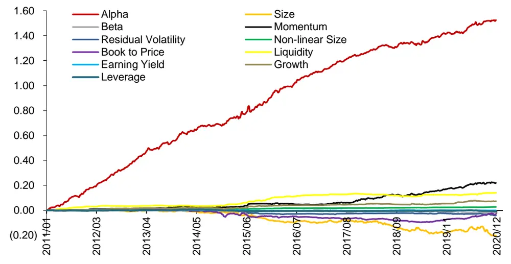
资料来源：Wind，华泰证券研究所

业绩归因表明，2011 年以来，行业市值中性下周频 AlphaNet 模型具有非常显著的 alpha收益，但是2015年之后风格因子贡献的收益逐渐增加，比较明显的有 Momentum、Liquidity和 Size 因子。

## 更短调仓周期下(周频、双周频)的结构化多因子风险模型

由上一章的业绩归因结果可以看出，以行业市值中性为风险控制方法所构建的 AlphaNet组合中，Barra 风格因子会贡献一定的因子收益。由于风格因子收益具有不稳定性，组合在风格因子上的暴露可能会增大组合收益的波动性，因此需要更精细化的方式控制组合风险，基于 Barra 多因子结构化风险模型的风控方法是目前的主流方法。然而多因子风险模型常用于月频调仓的选股组合，因此本章将重点讨论在更短的调仓周期下(周频、双周频)应如何构建风险模型，并测试模型对于风险预测的效果。

适用于不同预测期限(forecasting horizon)的多因子风险模型是在不同调仓频率下使用因子风险模型的基础。没有经过系统调整的因子风险模型在不同的预测期限下会呈现对于风险显著的有偏估计。本文以华泰金工结构化多因子风险模型为基础，介绍调整风险模型预测期限的方法，使得调整后的风险模型对于风险具有鲁棒性较好的预测能力。

一般来说，对于多因子风险模型的调整分为两个部分，分别是对于因子收益协方差矩阵的调整以及对于特异性风险协方差矩阵的调整，前者被认为是由给定因子结构解释的系统性风险(system risk)，后者被认为是没有被因子结构解释的个股特异性风险(idiosyncraticrisk)。对于因子协方差矩阵的调整和特异性收益方差矩阵的调整的步骤如图表 4 所示。关于多因子风险模型的详细构建方法，可参见华泰金工前期报告：《桑土之防：结构化多因子风险模型》(2019.6.12)。

图表4： 多因子风险模型风险矩阵的调整方法
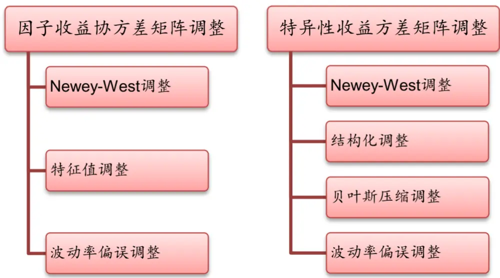
资料来源：华泰证券研究所

其中，对于因子收益协方差矩阵调整所使用的 Newey-West 方法以及特征值调整属于ex-ante 风险调整(不会用到未来数据)，而波动率偏误调整属于 ex-post 风险调整(会用到未来数据)；类似的，在对于特异性收益方差矩阵的调整中，Newey-West 调整，结构化调整以及贝叶斯压缩调整属于 ex-ante 风险调整，而波动率偏误调整属于 ex-post 风险调整。

因此，在风险模型预测风险能力的测试中，对于因子收益协方差矩阵仅会使用特征值调整之后的因子收益协方差矩阵；同理，特异性收益协方差矩阵仅会使用贝叶斯压缩调整后的特异性收益协方差矩阵。两类协方差矩阵的波动率偏误调整后的结果主要被应用于ex-post 的风险归因以及测试不同预测期限下波动率偏误调整的有效性。

## 针对不同预测期限，因子收益协方差矩阵的调整

## Newey-West 调整

对于因子收益协方差收益矩阵而言，ex-ante 的风险调整中第一步 Newey-West 调整的目的是构造一个符合预测期限 H 的因子收益协方差矩阵的相合估计量。具体来说，对于滚动过去 T 个交易日的预测期限为 H 的因子收益协方差矩阵，它的 Newey-West 调整具有如下形式：

$$
\mathrm{F_{T}^{NW}}=\mathrm{H}\times\widehat{\Omega}=\mathrm{H}\times\left[\mathrm{F_{T}^{Raw}}+\sum_{d=1}^{D}\left(1-\frac{d}{D+1}\right)\times\left(\widehat{\Omega_{d}}+\widehat{\Omega_{d}}^{\prime}\right)\right]
$$

$$
\widehat{\Omega_{d}}=\sum_{t=1}^{T-d}\lambda^{T-d-t}f_{t}f_{t+d}^{\prime}\Big/\sum_{t=1}^{T-d}\lambda^{T-d-t}
$$

$$
\begin{array}{r}{\mathbf{F}_{\mathrm{T}}^{\mathrm{Raw}}=\left(\mathrm{F}_{\mathrm{k},1}^{\mathrm{Raw}}\right)_{k,l}=\displaystyle\sum_{s=0}^{h}\lambda_{T-s}(f_{k,T-s}-\overline{{f_{k}}})(f_{l,T-s}-\overline{{f_{l}}})/\sum_{s=0}^{h}\lambda_{T-s}}\\{\lambda_{T-s}=0.5^{s/\tau}\qquad}\end{array}
$$

上式中，FRaw是原本的因子收益协方差矩阵， $f_{t}$ 是截面 t上的所有因子收益率序列， $f_{k,t}$ 代表截面 t 上的第 k 个因子的因子收益率。当调仓周期为周频时，H=5。Newey-West 调整的其他参数取值与前期华泰金工多因子风险模型中的参数取值一致，其中权重半衰期τ=90，滞后期长度 D=2，计算原始因子收益协方差矩阵时用到的时间窗长度为 252。

## 特征值调整

特征值调整中，本文按照前期华泰金工多因子风险模型的步骤完成，没有针对预测期限进行额外调整。但需要注意的是该步骤中的蒙特卡洛模拟(MC)的假设前提发生了改变，MC模拟的假设由原本的“特征组合月收益率满足正态分布”修改为“特征组合在预测期限为H 的收益率满足正态分布”，这一改变对于预测期限较短的情况存在影响，因为相对于长期收益分布，超短期收益分布更容易出现尖峰肥尾的情况。

## 波动率偏误调整

在因子收益协方差矩阵的 ex-post 风险调整涉及的波动率偏误调整中，需要对截面 t 的因子总偏误统计量进行调整，即对于因子总偏误统计量，当预测期限为 H时，其计算公式修正为：

$$
\mathbf{B}_{\mathrm{t}}^{\mathrm{F}}=\sqrt{\frac{1}{K}\sum_{k=1}^{K}\left(\frac{f_{k,t\sim t+H}}{\widehat{\sigma_{k,t}}}\right)^{2}}
$$

其中， $f_{k,t\sim t+H}$ 代表第 k 个因子在截面 t 到未来第 t+H 个截面的累计收益率，而 $\widehat{\sigma_{k,t}}$ 表示截面 t 时刻做出的对于 t~t+H 区间收益波动率的预测。

## 针对不同预测期限，特异性收益协方差矩阵的调整

特异性收益协方差矩阵在不同预测期限下的调整涉及 Newey-West 调整和波动率偏误调整两个部分，调整细节与因子收益协方差矩阵在不同预测期限下的调整大同小异。

## Newey-West 调整

对于滚动过去 T 个交易日的预测期限为 H的特异性收益协方 $\ncong$ 矩阵的 Newer-West 调整，具体形式如下：

$$
(\sigma^{\mathrm{NW}})^{2}=\mathrm{H}\times\left[\widehat{\Omega_{0}}+\sum_{d=1}^{D}\left(1-\frac{d}{D+1}\right)\times\left(\widehat{\Omega_{d}}+\widehat{\Omega_{d}}^{\prime}\right)\right]
$$

$$
\widehat{\Omega_{d}}=\sum_{t=1}^{T-d}\lambda^{T-d-t}diag(u_{t}u_{t+d}^{\prime})/\sum_{t=1}^{T-d}\lambda^{T-d-t}
$$

$$
\widehat{\Omega_{0}}=\sum_{s=0}^{h}\lambda_{T-s}\big(u_{n,T-s}-\overline{{u_{n}}}\big)^{2}/\sum_{s=0}^{h}\lambda_{T-s}
$$

上式中， $u_{t}$ 代表截面 t 上的所有股票的特异性收益率序列， $u_{n,t}$ 是截面 t上第 n 个股票的特异性收益率。当调仓周期为周频时，H=5。Newey-West 调整的其他参数取值与前期华泰金工多因子风险模型中的参数取值一致。其中权重半衰期τ=90，滞后期长度 D=5，计算特异性收益方差矩阵时用到的时间窗长度为 252。

## 波动率偏误调整

特异性收益协方差矩阵的波动率偏误调整中，需要对时间截面 t 上的所有股票的特异性风险的总偏误统计量进行调整。当预测期限为 H 时，截面 t 上的所有股票特异风险的总偏误统计量的计算公式为：

$$
\mathrm{B}_{\mathrm{t}}^{\mathrm{S}}=\sqrt{\sum_{n=1}^{N}w_{n,t}\left(\frac{u_{n,t\sim t+H}}{\widehat{\sigma_{n,t}}}\right)^{2}}
$$

其中， $w_{n,t}$ 表示第 n个股票的流通 A股市值权重， $u_{n,t}$ 表示第 n 个股票在第 t个截面到未来第 t+H 个截面的累计特异性收益率，而 $\widehat{\sigma_{n,t}}$ 代表在截面 t 时刻做出的关于从 t~t+H 时间区间的股票的特异性波动率的预测值。

## 衡量因子风险模型的预测效果

对于一个优秀的因子风险模型而言，ex-ante 调整后的风险预测效果极为重要。本节使用数值模拟的方法，计算不同预测期限(周频、双周频，月频)下的风险模型的表现。为了衡量风险模型的准确度，首先需要引入一个统计量，参考 Briner et al.(2008)以及 Barra USE4，使用偏误统计量(bias statistics)衡量真实测度下风险模型预测的准确程度。对于个股或资产组合 k, b统计量在时间截面 t 计算方式如下：

$$
b_{k,t}=\frac{r_{k,t\sim t+\delta}}{\sigma_{k,t}}
$$

直观理解为使用 t 时间点(使用的数据不包含 t)得到的波动率估计对截面 t 到未来第t+δ个截面的收益进行标准化。在理想情况下，如果预测完全准确，则对于一系列 $\{b_{k,t_{i}}\}$ i=1,2,…,N,对于偏误统计量，有：

$$
B_{k}=\sqrt{\frac{1}{N-1}\big(b_{k,t_{i}}-\overline{{b_{k}}}\big)^{2}}=1
$$

如果模型对风险存在低估，那么偏误统计量 $\mathrm{B_{k}}>1$ ；如果模型对于风险存在高估，那么偏误统计量 $B_{k}<1$ 。另外，根据 Connor(2000)给出的推导，偏误统计量有如下 95%置信区间(CI)，即，如果风险预测是准确的， $B_{k}$ 应该落在 95%的置信区间之内。

$$
\mathrm{CI}=\left[1-{\sqrt{\frac{2}{N}}},1+{\sqrt{\frac{2}{N}}}\right].
$$

对于风险模型在不同预测期限上的对比，Briner et al.(2008)曾做过比较详细的研究，作者利用 B统计量，对比了 Barra 多因子风险模型在 1个月和 6 个月预测期限下的风险预测效果，其结果如图表 5 和图表 6 所示，图中纵轴为百分比，横轴为 B统计量的值，灰色柱体表明数据落在 95%的置信区间内，黑色柱体表明数据超出了 95%的置信区间。

图表5： 预测期限为 1个月的风险模型的 B统计量分布
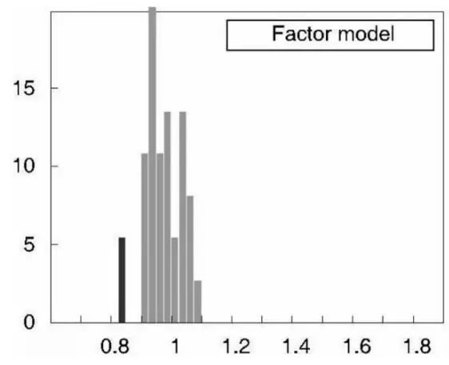
资料来源：Briner et al.(2008)，华泰证券研究所

图表6： 预测期限为 6个月的风险模型的 B统计量分布
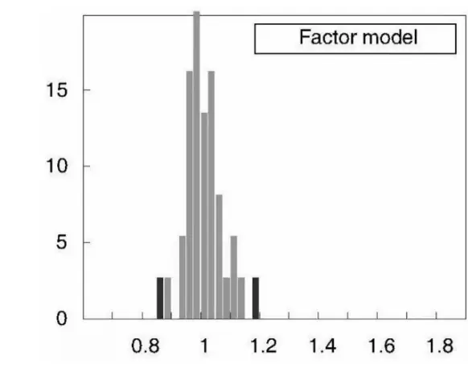
资料来源：Briner et al.(2008)，华泰证券研究所

同时，Briner et al.(2008)还指出在使用 B统计量的时候，其作为聚合统计量可能会消除不同回测时间长短下模型表现的差异，因此 Briner et al.(2008)提出在使用 B统计量时，应当设定不同的回测时间区间，以保证风险模型的表现不会受到回测时间区间起始点选择(回测区间长度)的显著影响。

## 多因子风险模型的预测期限分析

借鉴 Briner et al.(2008)中所使用的方法，本节采用构建随机组合并进行数值模拟的方法，对比周频，双周频，月频三个不同预测期限下风险模型的风险预测准确度。数值模拟的具体方法如下：

1. 设定模拟的次数为 100 次。

2. 在初始交易日随机选出 100 个上市超过 180 天且没有退市的股票，在随机选股过程中，限定单个股票的权重不能超过 0.1。

3. 分别使用随机权重和等权重构造资产组合，每隔 H 天计算一次 b 统计量，对于每次模拟，可以通过一系列 b 统计量得到一个偏误统计量。

4. 模拟中预测期限 H 的取值为周频，双周频，月频，实际操作中表现为按照交易日日历每隔 1周，2 周，1 个月算一次。

5. 数值模拟的时间区间开始点为 2011 年 1 月 31 日(10 年)，2015 年 1 月 31 日(6 年)。

图表 7~图表 10 分别展示了不同预测期限风险模型的偏误统计量经验分布。在上述的图表中，虚线都分别对应 B统计量为 1的 95%置信区间的上界和下界。

图表7： 回测区间为 10 年的随机权重组合的 B 统计量分布，预测期限从左到右分别是周频，双周频，月频
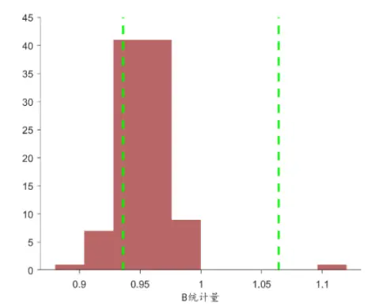
资料来源：Wind，华泰证券研究所

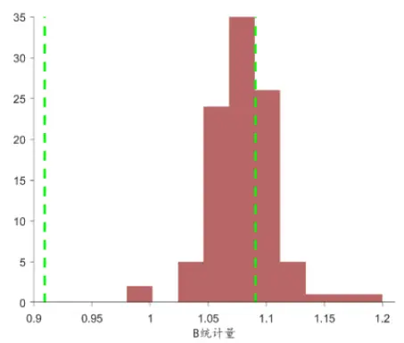

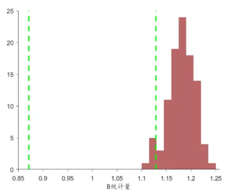

图表8： 回测区间为 10年的等权重组合的B统计量分布，预测期限从左到右分别是周频，双周频，月频
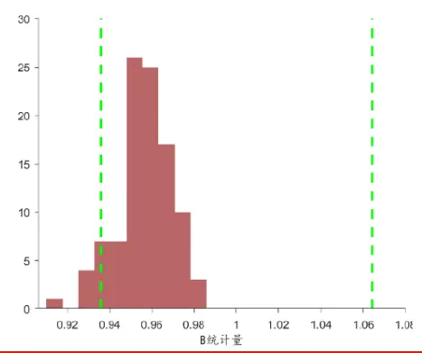
资料来源：Wind，华泰证券研究所

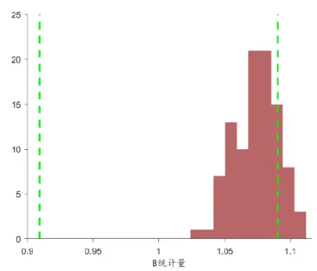

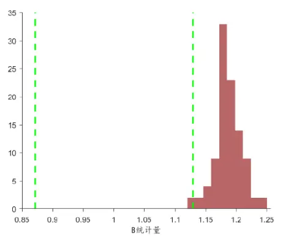
图表9： 回测区间为 6 年的随机权重组合的 B 统计量分布，预测期限从左到右分别是周频，双周频，月频

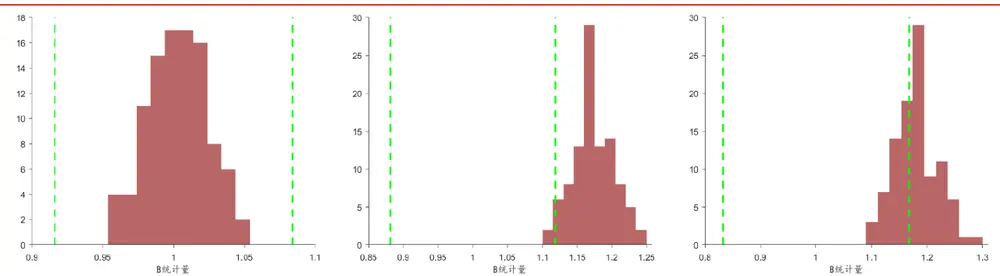
资料来源：Wind，华泰证券研究所

图表10： 回测区间为 6年的等权重组合的 B统计量分布，预测期限从左到右分别是周频，双周频，月频
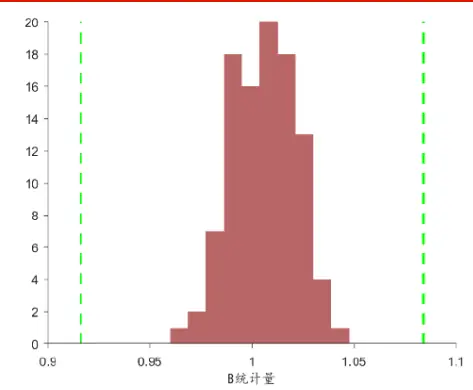
资料来源：Wind，华泰证券研究所

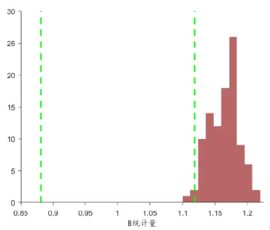

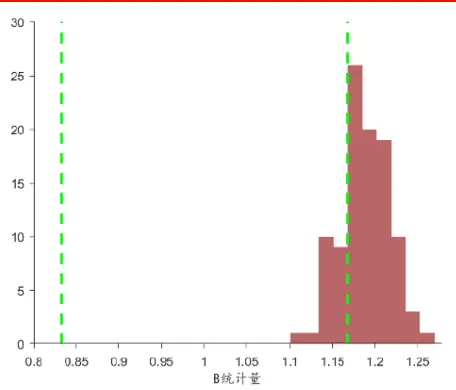

对比不同时间长度的回测区间，可以得出以下结论：

1. 相同测试条件下，使用随机权重和等权重构造资产组合的测试结果非常接近。

2. 在回测区间为 10 年的情况下，预测期限为周频和双周频的风险模型对于风险的估计相对比较准确，有超过一半的值落在 95%置信区间内，而预测期限为月频的因子风险模型对风险存在比较显著的低估。

3. 在回测区间为 6年的情况下，预测期限为周频的风险模型对于风险的估计相对比较准确，所有 B 统计量都落在 95%的置信区间内，统计学意义上可以认为模型给出的风险估计是准确的。预测期限为双周频和月频的因子风险模型都对风险有一定低估。

4. 综合 10 年回测区间和 6 年回测区间的表现，预测期限为周频的风险因子模型表现最为稳定，可以在 95%置信区间下认为其风险预测比较准确。

## 不同预测期限下多因子风险模型的实际表现

为了进一步展示不同预测期限下多因子风险模型的实际表现，本节针对沪深 300 和中证500 指数进行测试：

1. 周频多因子风险模型的预测波动率和指数周频的实际波动率对比。

2. 双周频多因子风险模型的预测波动率和指数双周频的实际波动率对比。

3. 月频多因子风险模型的预测波动率和指数月频的实际波动率对比。

在实证过程中，本节使用因子暴露矩阵 X，预测期限对应的 ex-ante 因子收益协方差矩阵F 和特异性收益协方差对角矩阵 D，构造个股的波动率估计矩阵如下：

$$
V=XFX^{\prime}+D
$$

考虑到指数成分股权重 w，则对于具体指数，它的预期波动率可以通过下式计算：

$$
\left(\widehat{\sigma_{p}}\right)^{2}=w^{\prime}(XFX^{\prime}+D)w
$$

图表 11 ~图表 16 为不同预测期限下，风险模型对于指数波动率的预测结果。

图表11： 沪深 300的实际周频波动率和预测周频波动率对比
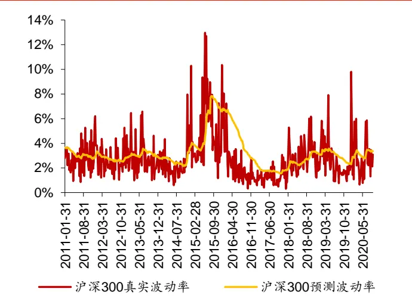
资料来源：Wind，华泰证券研究所

图表12： 中证 500的实际周频波动率和预测周频波动率对比
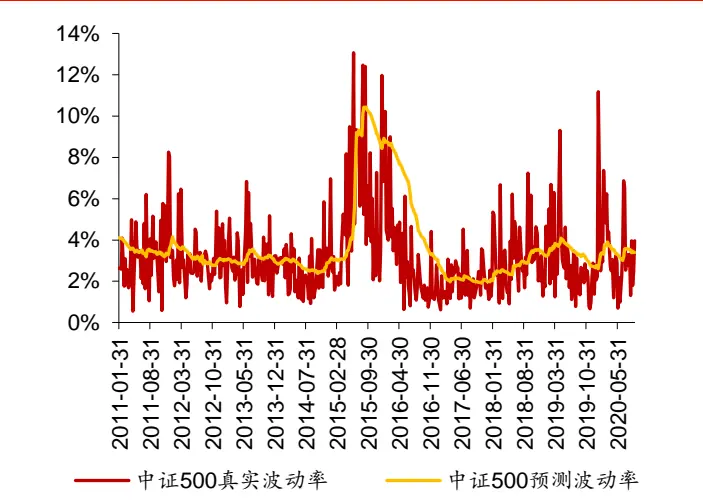
资料来源：Wind，华泰证券研究所

图表13： 沪深 300的实际双周频波动率和预测双周频波动率对比
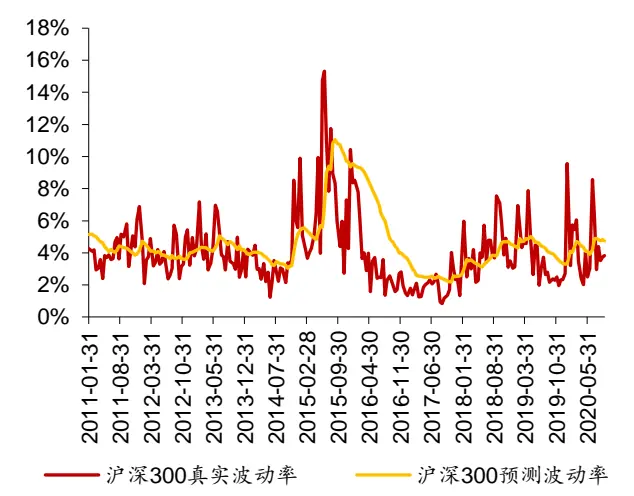
资料来源：Wind，华泰证券研究所

图表14： 中证 500的实际双周频波动率和预测双周频波动率对比
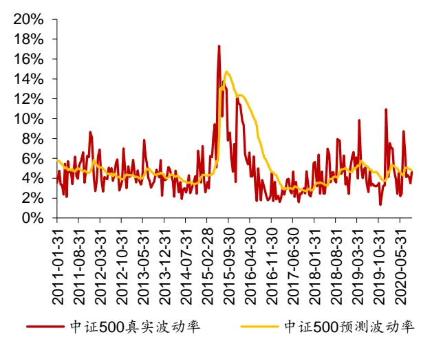
资料来源：Wind，华泰证券研究所

图表15： 沪深 300的实际月频波动率和预测月频波动对比
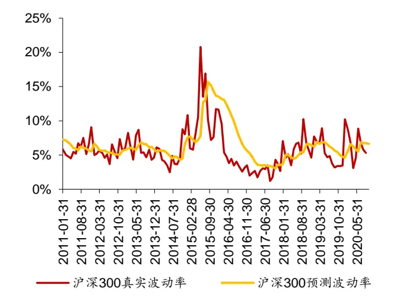
资料来源：Wind，华泰证券研究所

图表16： 中证 500的实际月频波动率和预测月频波动率对比
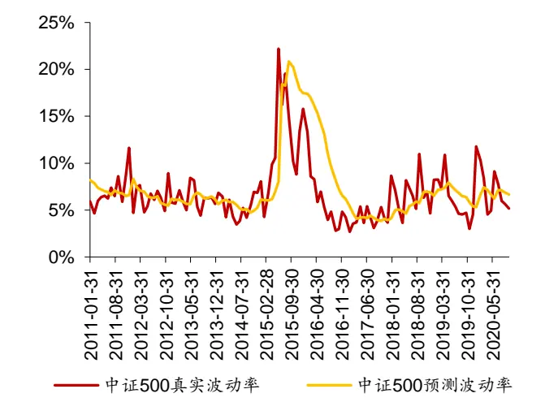
资料来源：Wind，华泰证券研究所

## 周频调仓 AlphaNet的组合优化实证

本章针对周频调仓的 AlphaNet 模型，进行以下组合优化测试：

测试 1：引入周频多因子风险模型，以最大化风险调整后收益为目标的组合优化，风格因子约束为行业市值中性(相对中证 500)，主要考察周频风险模型对 AlphaNet 组合表现的影响。

测试 2：以最大化预期收益为目标的组合优化，风格因子约束为行业市值中性外加指定的Barra 风格因子中性(相对中证 500)，主要考察不同的 Barra 风格因子约束下 AlphaNet组合的表现。

测试 3：以最大化预期收益为目标的组合优化，风格因子约束为市值中性，并适当放松行业因子的中性约束(相对中证 500)，主要考察 AlphaNet 组合在允许行业偏配时的表现。

## 测试 1：考察周频风险模型对 AlphaNet组合表现的影响

$$
\operatorname*{max}{r^{\prime}x}-\lambda x^{\prime}\Sigma x\tag{1}
$$

$$
\mathsf{s.t.\ x=w-w_{b}}\tag{2}
$$

$$
\lvert\mathrm{w}-\mathrm{w}_{0}\rvert\leq\delta\tag{3}
$$

$$
{\Chi}_{\mathrm{mkt}}{\mathbf{x}}=0\tag{4}
$$

$$
\mathrm{X}_{\mathrm{industry}}\mathrm{X}=0\tag{5}
$$

$$
\mathbf{x}\leq\mathbf{w_{\mathrm{upper}}}\tag{6}
$$

$$
\mathrm{e^{\prime}x}=1-\mathrm{e^{\prime}w_{b}}\tag{7}
$$

(1)式为优化目标。其中r为股票的预期收益向量，x为股票的主动权重向量，优化目标为最大化风险调整后收益。在测试中会遍历风险厌恶系数λ的取值。

(2)式为股票主动权重和绝对权重的关系， $\mathrm{w_{b}}$ 为基准中股票权重向量，基准为中证 500。

(3)式为换手率约束， $\mathrm{w}_{0}$ 为股票上一期权重向量，δ为换手率上限，测试中δ=0.3。

(4)式为市值中性约束， $\Chi_{\mathrm{mkt}}$ 为 Barra 市值因子暴露。

(5)式为行业中性约束， ${\mathrm{X}}_{\mathrm{industry}}$ 为 Barra 行业因子暴露。

(6)式为股票主动权重的上下限约束，测试中 $\mathsf{w}_{\mathrm{upper}}{=}0.01$ ，不允许做空。

(7)式为股票组合总权重和为 1 的限制，e代表一个全 1 列向量。

1. 股票池：全 A股，剔除 ST、PT、涨跌停、停牌、上市不满 180 个自然日的股票。

2. 回测区间：2011 年 1 月 31 日至 2020 年 11 月 30 日。

4. 风险厌恶系数λ的取值分别为 0，0.2，0.5，1，2。

图表 17~图表 19 为测试结果。

图表17： 不同风险厌恶系数下 AlphaNet组合的超额收益与超额收益回撤
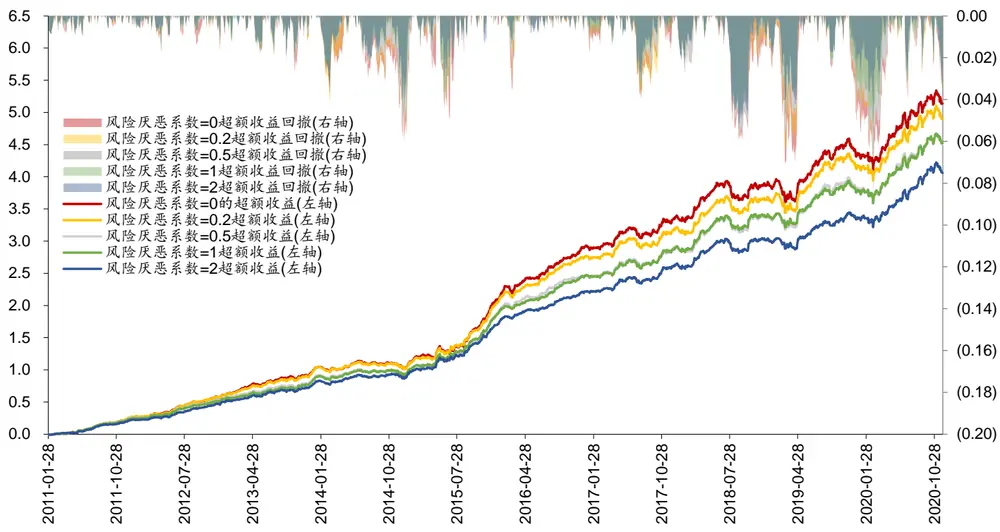
资料来源：Wind，华泰证券研究所

图表18： 不同风险厌恶系数下 AlphaNet 组合的主要指标

| 组合名称 | 年化收益率夏普比率 |  | 年化超额收益率跟踪误差超额收益最大回撤信息比率 |  |  |  | Calmar 比率 | 平均周胜率 | 平均双边换手率 |
| --- | --- | --- | --- | --- | --- | --- | --- | --- | --- |
| 风险厌恶系数=0 | 25.77% | 1.01 | 20.95% | 6.35% | 8.58% | 3.30 | 2.44 | 63.56% | 31.29% |
| 风险厌恶系数=0.2 | 25.21% | 0.99 | 20.40% | 6.05% | 7.92% | 3.37 | 2.58 | 66.33% | 29.12% |
| 风险厌恶系数=0.5 | 24.23% | 0.95 | 19.53% | 5.80% | 8.08% | 3.37 | 2.42 | 65.72% | 28.49% |
| 风险厌恶系数=1 | 24.28% | 0.95 | 19.58% | 5.48% | 7.08% | 3.57 | 2.77 | 67.34% | 27.49% |
| 风险厌恶系数=2 | 23.08% | 0.90 | 18.49% | 5.15% | 5.45% | 3.59 | 3.39 | 66.73% | 25.67% |
| 中证 500 指数 | 3.50% | 0.13 |  |  |  |  |  |  |  |

资料来源：Wind，华泰证券研究所

图表19： 不同风险厌恶系数下 AlphaNet 组合的分年度表现

| 组合名称 | 2011 | 2012 | 2013 | 2014 | 2015 | 2016 | 2017 | 2018 | 2019 | 2020 |
| --- | --- | --- | --- | --- | --- | --- | --- | --- | --- | --- |
| 风险厌恶系数=0 | -9.15% | 28.17% | 46.67% | 43.17% | 118.76% | 4.56% | 12.81% | -25.35% | 39.56% | 36.17% |
| 风险厌恶系数=0.2 | -8.51% | 27.80% | 45.44% | 42.43% | 114.52% | 2.64% | 12.02% | -25.76% | 40.44% | 37.74% |
| 风险厌恶系数=0.5 | -9.65% | 25.65% | 40.34% | 43.70% | 113.23% | 0.24% | 13.19% | -25.04% | 39.05% | 37.84% |
| 风险厌恶系数=1 | -10.12% | 25.18% | 39.96% | 46.19% | 110.90% | 0.91% | 13.01% | -24.75% | 37.68% | 39.22% |
| 风险厌恶系数=2 | -11.84% | 23.77% | 39.11% | 47.58% | 105.05% | -1.22% | 13.42% | -26.14% | 37.26% | 39.60% |
| 中证 500 指数 | -28.17% | 0.28% | 16.89% | 39.01% | 43.12% | -17.78% | -0.20% | -33.32% | 26.38% | 20.00% |

资料来源：Wind，华泰证券研究所

结合图表 17~图表 19 可知：

1. 随着风险厌恶系数的增大，周频调仓 AlphaNet 组合的跟踪误差逐渐减小，信息比率逐渐上升，超额收益最大回撤有一定下降，体现了多因子风险模型对组合风险的控制能力。

2. 随着风险厌恶系数的增大，周频调仓 AlphaNet 组合的年化超额收益率有一定下降。

## 测试 2：考察不同的 Barra 风格因子约束下 AlphaNet 组合的表现

$$
\operatorname*{max}r^{\prime}x\tag{1}
$$

$$
\mathsf{s.t.\ x=w-w_{b}}\tag{2}
$$

$$
|\mathrm{w}-\mathrm{w}_{0}|\leq\delta\tag{3}
$$

$$
{\Chi}_{\mathrm{mkt}}{\mathbf{x}}=0\tag{4}
$$

$$
\mathrm{X}_{\mathrm{industry}}\mathrm{X}=0\tag{5}
$$

$$
{\tt X}_{\mathrm{f}}{\tt X}=0\tag{6}
$$

$$
\mathbf{x}\leq\mathbf{w_{\mathrm{upper}}}\tag{7}
$$

$$
\mathbf{e}^{\prime}\mathbf{x}=1-\mathbf{e}^{\prime}\mathbf{w_{b}}\tag{8}
$$

(1)式为优化目标。其中r为股票的预期收益向量，x为股票的主动权重向量，优化目标为线性优化，不包含结构化风险模型。

(2)式为股票主动权重和绝对权重的关系， $\mathrm{w_{b}}$ 为基准中股票权重向量，基准为中证 500。

(3)式为换手率约束， $\mathbf{w}_{0}$ 为股票上一期权重向量，δ为换手率上限，测试中δ=0.3。

(4)式为市值中性约束。

(5)式为行业中性约束。

(6)式为其他 Barra 风格因子中性约束。

(7)式为股票主动权重的上限约束，测试中 $\mathrm{w_{upper}}{=}0.01$ ，不允许做空。

(8)式为股票组合总权重和为 1 的限制。

1. 股票池：全 A股，剔除 ST、PT、涨跌停、停牌、上市不满 180 个自然日的股票。

2. 回测区间：2011 年 1 月 31 日至 2020 年 11 月 30 日。

图表 20~图表 23 为测试结果。

图表20： 行业市值中性+不同风格因子中性下 AlphaNet组合的超额收益与超额收益回撤
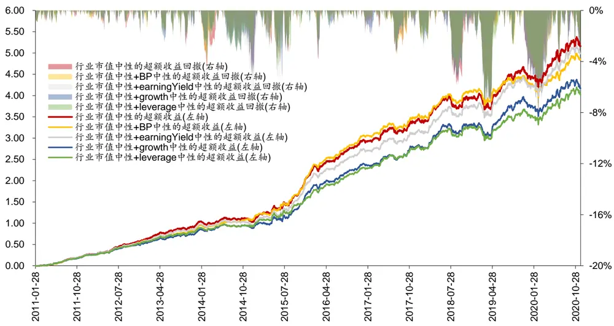
资料来源：Wind，华泰证券研究所

图表21： 行业市值中性+不同风格因子中性下 AlphaNet组合的超额收益与超额收益回撤
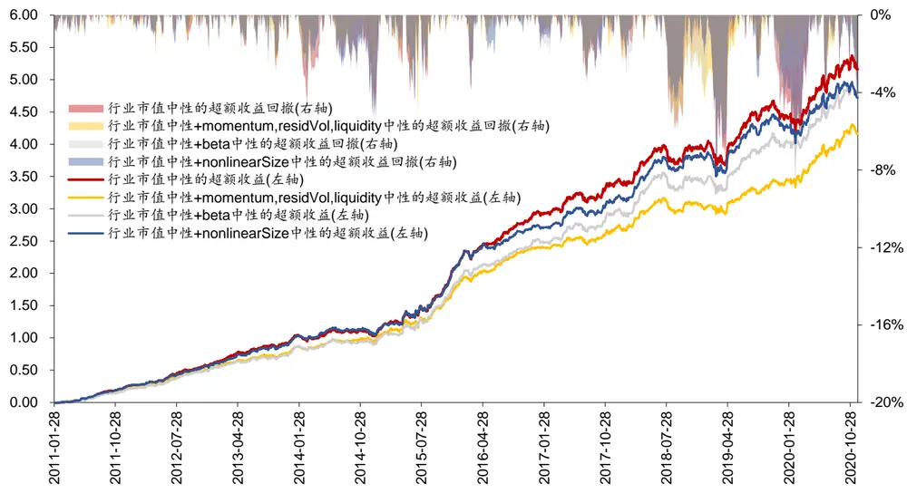
资料来源：Wind，华泰证券研究所

图表22： 行业市值中性+不同风格因子中性下 AlphaNet组合的主要指标

|  |  |  | 年化超额收 |  | 超额收益最 |  | Calmar 平均周胜 |  |  |
| --- | --- | --- | --- | --- | --- | --- | --- | --- | --- |
| 组合名称 | 年化收益率夏普比率 |  |  | 益率跟踪误差 |  | 大回撤信息比率 | 比率 | 率 | 率 |
| 行业市值中性 | 25.77% | 1.01 | 20.95% | 6.35% | 8.58% | 3.30 | 2.44 | 66.9% | 31.29% |
| 行业市值中性+momentum,residVol,liquidity中性 | 23.31% | 0.90 | 18.73% | 5.61% | 6.03% | 3.34 | 3.11 | 68.0% | 30.94% |
| 行业市值中性+BP 中性 | 25.23% | 1.01 | 20.30% | 5.64% | 9.50% | 3.60 | 2.14 | 67.1% | 31.07% |
| 行业市值中性+earningYield 中性 | 25.45% | 1.01 | 20.58% | 6.26% | 8.26% | 3.29 | 2.49 | 66.9% | 31.16% |
| 行业市值中性+growth 中性 | 23.56% | 0.93 | 18.75% | 6.20% | 9.15% | 3.02 | 2.05 | 66.5% | 31.06% |
| 行业市值中性+leverage 中性 | 23.11% | 0.91 | 18.39% | 5.93% | 7.86% | 3.10 | 2.34 | 66.1% | 30.18% |
| 行业市值中性+beta中性 | 24.56% | 0.93 | 20.07% | 6.06% | 7.21% | 3.31 | 2.79 | 66.1% | 31.31% |
| 行业市值中性+nonlinearSize 中性 | 24.85% | 0.98 | 20.02% | 6.21% | 8.25% | 3.22 | 2.43 | 65.9% | 31.01% |
| 中证 500 指数 | 3.50% | 0.13 |  |  |  |  |  |  |  |

资料来源：Wind，华泰证券研究所

图表23： 行业市值中性+不同风格因子中性下 AlphaNet组合的分年度表现

| 组合名称 | 2011 | 2012 | 2013 | 2014 | 2015 | 2016 | 2017 | 2018 2019 2020 |
| --- | --- | --- | --- | --- | --- | --- | --- | --- |
| 行业市值中性 | -9.15% | 28.17% | 46.67% | 43.17% | 118.76% | 4.56% | 12.81% | -25.35% 39.56% 36.17% |
| 行业市值中性+momentum,residVol,liquidity中性 | -11.50% | 26.40% | 38.57% | 49.61% | 105.80% | 0.19% | 10.06% | -27.27% 36.62% 41.78% |
| 行业市值中性+BP中性 | -9.17% | 26.36% | 41.56% | 54.11% | 115.24% | 7.41% | 12.37% | -24.70% 31.09%33.82% |
| 行业市值中性+earningYield 中性 | -9.05% | 25.54% | 44.79% | 41.30% | 118.45% | 4.09% | 12.22% | -23.82% 39.45% 37.96% |
| 行业市值中性+growth 中性 | -9.82% | 22.93% | 39.44% | 46.82% | 108.17% | 2.10% | 13.20% | -24.45% 40.24% 30.58% |
| 行业市值中性+leverage中性 | -10.09% | 25.44% | 40.59% | 46.21% | 94.06% | 4.10% | 15.38% | -25.29% 35.61% 33.32% |
| 行业市值中性+beta 中性 | -12.59% | 26.99% | 38.68% | 47.19% | 114.48% | 1.29% | 13.45% | -25.60% 41.76% 38.52% |
| 行业市值中性+nonlinearSize中性 | -9.21% | 27.18% | 46.51% | 45.71% | 117.64% | -0.89% | 12.42% | -22.90% 38.87% 30.45% |
| 中证 500 指数 | -28.17% | 0.28% | 16.89% | 39.01% | 43.12%-17.78% |  | -0.20% | -33.32% 26.38% 20.00% |

资料来源：Wind，华泰证券研究所

结合图表 20 ~图表 23 可知：

1. 由于 AlphaNet 完全基于量价数据构建而来，在行业市值中性的基础上，通过额外限定 Barra 量价风格因子(momentum，residual volatility 和 liquidity)中性，可明显降低组合的跟踪误差和超额收益最大回撤，并提高信息比率和Calmar比率，该组合在2019年底的超额收益回撤明显减小，但是年化超额收益率有一定下降。

2. 在行业市值中性的基础上，通过额外限定其他 Barra 风格因子中性，可降低组合的跟踪误差且在大部分(除了行业市值中性+BP 中性和行业市值中性+growth 中性)情况下可以改善策略的超额收益最大回撤，但组合的年化超额收益率有一定下降。

## 测试 3：考察 AlphaNet 组合在允许行业偏配时的表现

$$
\operatorname*{max}r^{\prime}x\tag{1}
$$

$$
\mathsf{s.t.}~\mathrm{x=w-w_{b}}\tag{2}
$$

$$
\lvert\mathrm{w}-\mathrm{w}_{0}\rvert\leq\delta\tag{3}
$$

$$
{\Chi}_{\mathrm{mkt}}{\mathbf{x}}=0\tag{4}
$$

$$
\mathrm{X}_{\mathrm{industry}}\mathrm{X}\leq\theta\tag{5}
$$

$$
\mathbf{x}\leq\mathbf{w_{\mathrm{upper}}}\tag{6}
$$

$$
\mathbf{e}^{\prime}\mathbf{x}=1-\mathbf{e}^{\prime}\mathbf{w_{b}}\tag{7}
$$

(1)式为优化目标。其中r为股票的预期收益向量，x为股票的主动权重向量，优化目标为线性优化，不包含结构化风险模型。

(2)式为股票主动权重和绝对权重的关系， $\mathrm{w_{b}}$ 为基准中股票权重向量，基准为中证 500。

(3)式为换手率约束， $\mathrm{w}_{0}$ 为股票上一期权重向量，δ为换手率上限，测试中δ=0.3。

(4)式为市值中性约束。

(5)式为行业因子暴露约束，暴露上限为θ。

(6)式为股票主动权重的上限约束，测试中 $\mathrm{w_{upper}}{=}0.01$ ，不允许做空。

(7)式为股票组合总权重和为 1 的限制。

1. 股票池：全 A股，剔除 ST、PT、涨跌停、停牌、上市不满 180 个自然日的股票。

2. 回测区间：2011 年 1 月 31 日至 2020 年 11 月 30 日。

4. 行业因子暴露上限θ分别取 0，0.5%，1%，2%以及不设上限。

图表 24~图表 26 为测试结果。

图表24： 市值中性+不同行业偏配下 AlphaNet组合的超额收益与超额收益回撤
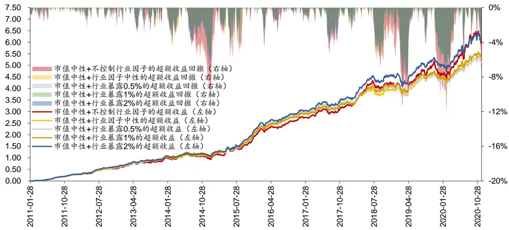
资料来源：Wind，华泰证券研究所

图表25： 市值中性+不同行业偏配下 AlphaNet 组合的主要指标
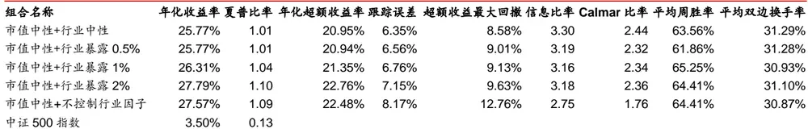
资料来源：Wind，华泰证券研究所

图表26： 市值中性+不同行业偏配下 AlphaNet组合的分年度表现

| 组合名称 | 2011 | 2012 | 2013 | 2014 | 2015 | 2016 | 2017 | 2018 | 2019 | 2020 |
| --- | --- | --- | --- | --- | --- | --- | --- | --- | --- | --- |
| 市值中性+行业中性 | -9.15% | 28.17% | 46.67% | 43.17% | 118.76% | 4.56% | 12.81% | -25.35% | 39.56% | 36.17% |
| 市值中性+行业暴露 0.5% | -8.75% | 29.53% | 47.32% | 44.37% | 117.29% | 3.73% | 12.14% | -24.22% | 34.21% | 38.56% |
| 市值中性+行业暴露1% | -7.97% | 30.44% | 44.70% | 45.64% | 115.48% | 2.61% | 12.49% | -21.63% | 35.40% | 39.66% |
| 市值中性+行业暴露 2% | -7.97% | 30.44% | 43.99% | 44.43% | 126.09% | 2.80% | 14.04% | -19.25% | 37.81% | 41.60% |
| 市值中性+不控制行业因子 | -8.79% | 25.45% | 45.35% | 41.69% | 120.23% | 4.16% | 14.40% | -18.92% | 38.44% | 47.80% |
| 中证 500 指数 | -28.17% | 0.28% | 16.89% | 39.01% | 43.12% | -17.78% | -0.20% | -33.32% | 26.38% | 20.00% |

资料来源：Wind，华泰证券研究所

## 结合图表 24 ~图表 26 可知：

1. 通过市值中性+扩大行业偏配，可明显提升组合的超额收益，但同时也会增大超额收益最大回撤和跟踪误差，导致信息比率和 Calmar 比率的下降。

2. 近年来行业表现分化较大，放松组合的行业暴露限制在 2018 年和 2020 年都能提升收益。

## 总结

近年来，中高频调仓的量价选股模型日益受到投资者关注，针对该类模型的风险模型和组合优化是一个值得研究的主题。本文以基于量价数据构建的 AlphaNet 为收益模型，对其进行业绩归因、风险模型构建和组合优化。全文总结如下：

1. 本文分析了 Barra 风格因子对行业市值中性的周频 AlphaNet 模型的收益贡献，并以Barra 风格因子不能解释的特异性收益率作为策略的 alpha 收益。业绩归因表明，AlphaNet 模型具有非常显著的 alpha 收益，但是 2015 年之后模型在 Barra 风格因子上的暴露逐渐增加，为了减小风格因子的不稳定性所带来的组合波动，需要尝试更精细化的风险控制方法。

2. 本文总结了不同预测期限下的多因子风险模型构建方法。传统的 Barra 多因子结构化风险模型常用于月频调仓的选股组合，对于周频调仓的 AlphaNet 模型，需要构建预测期限匹配的风险模型才能合理地控制风险。为了使多因子风险模型能适应不同的调仓周期，本文对因子收益协方差矩阵和特异性收益方差矩阵依次做两项调整：(1)修正Newey-West 调整的时间乘数。(2)修正波动率偏误调整的时间区间。

3. 为了评价不同预测期限下的多因子风险模型的预测效果，本文以偏误统计量为评价指标，使用数值模拟的方法随机抽取股票构成等权重组合和随机权重组合，设定 10 年和 6年两个回测时间长度，验证周频、双周频和月频多因子风险模型的风险预测效果。结果表明周频多因子风险模型最为稳定准确。此外，本文还展示了周频、双周频和月频因子风险模型对于沪深 300 和中证 500 指数的波动率预测效果。

4. 针对周频调仓的 AlphaNet，本文在 2011 年 1 月 31 日至 2020 年 11 月 30 日的时间区间上测试了三种组合优化的方案，分别是：(1)考察周频风险模型对 AlphaNet 组合表现的影响。测试中风险模型可以有效降低组合跟踪误差并提高信息比率。(2)考察不同的 Barra 风格因子约束下 AlphaNet 组合的表现。测试显示行业市值中性+Barra 量价因子中性可以显著减小组合在 2019 年的超额收益回撤。(3)考察 AlphaNet 组合在允许行业偏配时的表现。测试显示通过市值中性+扩大行业偏配，可明显提升组合的超额收益，但同时也会增大超额收益最大回撤和跟踪误差。

## 风险提示

多因子风险模型是历史经验的总结，如果市场规律改变，存在风险预测滞后、甚至模型失效的可能。AlphaNet是对股票历史量价规律的归纳学习，未来存在失效的可能。

## 参考文献

[1] Beat G. Briner, Gregory Connor. How much structure is best? A comparison of market model, factor model and unstructured equity covariance matrices. The Journal of Risk, 2008.

[2] Gregory Connor. Robust confidence intervals for the bias test of risk forecasts. Technical Report, MSCI Barra, 2002.

## 免责声明

## 分析师声明

本人，林晓明、李子钰、何康，兹证明本报告所表达的观点准确地反映了分析师对标的证券或发行人的个人意见；彼以往、现在或未来并无就其研究报告所提供的具体建议或所表迖的意见直接或间接收取任何报酬。

## 一般声明及披露

本报告由华泰证券股份有限公司（已具备中国证监会批准的证券投资咨询业务资格，以下简称“本公司”）制作。本报告仅供本公司客户使用。本公司不因接收人收到本报告而视其为客户。

本报告基于本公司认为可靠的、已公开的信息编制，但本公司对该等信息的准确性及完整性不作任何保证。本报告所载的意见、评估及预测仅反映报告发布当日的观点和判断。在不同时期，本公司可能会发出与本报告所载意见、评估及预测不一致的研究报告。同时，本报告所指的证券或投资标的的价格、价值及投资收入可能会波动。以往表现并不能指引未来，未来回报并不能得到保证，并存在损失本金的可能。本公司不保证本报告所含信息保持在最新状态。本公司对本报告所含信息可在不发出通知的情形下做出修改，投资者应当自行关注相应的更新或修改。

本公司力求报告内容客观、公正，但本报告所载的观点、结论和建议仅供参考，不构成购买或出售所述证券的要约或招揽。该等观点、建议并未考虑到个别投资者的具体投资目的、财务状况以及特定需求，在任何时候均不构成对客户私人投资建议。投资者应当充分考虑自身特定状况，并完整理解和使用本报告内容，不应视本报告为做出投资决策的唯一因素。对依据或者使用本报告所造成的一切后果，本公司及作者均不承担任何法律责任。任何形式的分享证券投资收益或者分担证券投资损失的书面或口头承诺均为无效。

除非另行说明，本报告中所引用的关于业绩的数据代表过往表现，过往的业绩表现不应作为日后回报的预示。本公司不承诺也不保证任何预示的回报会得以实现，分析中所做的预测可能是基于相应的假设，任何假设的变化可能会显著影响所预测的回报。

本公司及作者在自身所知情的范围内，与本报告所指的证券或投资标的不存在法律禁止的利害关系。在法律许可的情况下，本公司及其所属关联机构可能会持有报告中提到的公司所发行的证券头寸并进行交易，为该公司提供投资银行、财务顾问或者金融产品等相关服务或向该公司招揽业务。

本公司的销售人员、交易人员或其他专业人士可能会依据不同假设和标准、采用不同的分析方法而口头或书面发表与本报告意见及建议不一致的市场评论和/或交易观点。本公司没有将此意见及建议向报告所有接收者进行更新的义务。本公司的资产管理部门、自营部门以及其他投资业务部门可能独立做出与本报告中的意见或建议不一致的投资决策。投资者应当考虑到本公司及/或其相关人员可能存在影响本报告观点客观性的潜在利益冲突。投资者请勿将本报告视为投资或其他决定的唯一信赖依据。有关该方面的具体披露请参照本报告尾部。

本报告并非意图发送、发布给在当地法律或监管规则下不允许向其发送、发布的机构或人员，也并非意图发送、发布给因可得到、使用本报告的行为而使本公司及关联子公司违反或受制于当地法律或监管规则的机构或人员。

本公司研究报告以中文撰写，英文报告为翻译版本，如出现中英文版本内容差异或不一致，请以中文报告为主。英文翻译报告可能存在一定时间迟延。

本报告版权仅为本公司所有。未经本公司书面许可，任何机构或个人不得以翻版、复制、发表、引用或再次分发他人等任何形式侵犯本公司版权。如征得本公司同意进行引用、刊发的，需在允许的范围内使用，并注明出处为“华泰证券研究所”，且不得对本报告进行任何有悖原意的引用、删节和修改。本公司保留追究相关责任的权利。所有本报告中使用的商标、服务标记及标记均为本公司的商标、服务标记及标记。

## 中国香港

本报告由华泰证券股份有限公司制作,在香港由华泰金融控股（香港）有限公司向符合《证券及期货条例》第 571 章所定义之机构投资者和专业投资者的客户进行分发。华泰金融控股（香港）有限公司受香港证券及期货事务监察委员会监管，是华泰国际金融控股有限公司的全资子公司，后者为华泰证券股份有限公司的全资子公司。在香港获得本报告的人员若有任何有关本报告的问题,请与华泰金融控股（香港）有限公司联系。

## 香港-重要监管披露

- 华泰金融控股（香港）有限公司的雇员或其关联人士没有担任本报告中提及的公司或发行人的高级人员。

更多信息请参见下方 “美国-重要监管披露”。

## 美国

本报告由华泰证券股份有限公司编制，在美国由华泰证券（美国）有限公司向符合美国监管规定的机构投资者进行发表与分发。华泰证券（美国）有限公司是美国注册经纪商和美国金融业监管局（FINRA）的注册会员。对于其在美国分发的研究报告，华泰证券（美国）有限公司对其非美国联营公司编写的每一份研究报告内容负责。华泰证券（美国）有限公司联营公司的分析师不具有美国金融监管（FINRA）分析师的注册资格，可能不属于华泰证券（美国）有限公司的关联人员，因此可能不受 FINRA 关于分析师与标的公司沟通、公开露面和所持交易证券的限制。华泰证券（美国）有限公司是华泰国际金融控股有限公司的全资子公司，后者为华泰证券股份有限公司的全资子公司。任何直接从华泰证券（美国）有限公司收到此报告并希望就本报告所述任何证券进行交易的人士，应通过华泰证券（美国）有限公司进行交易。

## 美国-重要监管披露

分析师林晓明、李子钰、何康本人及相关人士并不担任本报告所提及的标的证券或发行人的高级人员、董事或顾问。分析师及相关人士与本报告所提及的标的证券或发行人并无任何相关财务利益。声明中所提及的“相关人士”包括FINRA 定义下分析师的家庭成员。分析师根据华泰证券的整体收入和盈利能力获得薪酬，包括源自公司投资银行业务的收入。

- 华泰证券股份有限公司、其子公司和/或其联营公司, 及/或不时会以自身或代理形式向客户出售及购买华泰证券研究所覆盖公司的证券/衍生工具，包括股票及债券（包括衍生品）华泰证券研究所覆盖公司的证券/衍生工具，包括股票及债券（包括衍生品）。

- 华泰证券股份有限公司、其子公司和/或其联营公司, 及/或其高级管理层、董事和雇员可能会持有本报告中所提到的任何证券（或任何相关投资）头寸，并可能不时进行增持或减持该证券（或投资）。因此，投资者应该意识到可能存在利益冲突。

## 评级说明

投资评级基于分析师对报告发布日后 6 至 12个月内行业或公司回报潜力（含此期间的股息回报）相对基准表现的预期（A 股市场基准为沪深 300 指数，香港市场基准为恒生指数，美国市场基准为标普 500 指数），具体如下：

## 行业评级

增持：预计行业股票指数超越基准

中性：预计行业股票指数基本与基准持平

减持：预计行业股票指数明显弱于基准

## 公司评级

买入：预计股价超越基准 15%以上

增持：预计股价超越基准 5%~15%

持有：预计股价相对基准波动在-15%~5%之间

卖出：预计股价弱于基准 15%以上

暂停评级：已暂停评级、目标价及预测，以遵守适用法规及/或公司政策

无评级：股票不在常规研究覆盖范围内。投资者不应期待华泰提供该等证券及/或公司相关的持续或补充信息

## 法律实体披露

中国：华泰证券股份有限公司具有中国证监会核准的“证券投资咨询”业务资格，经营许可证编号为：91320000704041011J香港：华泰金融控股（香港）有限公司具有香港证监会核准的“就证券提供意见”业务资格，经营许可证编号为：AOK809美国：华泰证券（美国）有限公司为美国金融业监管局（FINRA）成员，具有在美国开展经纪交易商业务的资格，经营业务许可编号为：CRD#:298809/SEC#:8-70231

## 华泰证券股份有限公司

南京南京市建邺区江东中路228号华泰证券广场1号楼/邮政编码：210019

电话：86 25 83389999/传真：86 25 83387521电子邮件：ht-rd@htsc.com

深圳
深圳市福田区益田路5999号基金大厦10楼/邮政编码：518017
电话：86 755 82493932/传真：86 755 82492062
电子邮件：ht-rd@htsc.com

## 华泰金融控股（香港）有限公司

香港中环皇后大道中 99号中环中心 58楼 5808-12室
电话：+852 3658 6000/传真：+852 2169 0770
电子邮件：research@htsc.com
http://www.htsc.com.hk

## 华泰证券（美国）有限公司

美国纽约哈德逊城市广场 10号 41楼（纽约 10001）
电话: + 212-763-8160/传真: +917-725-9702
电子邮件: Huatai@htsc-us.com
http://www.htsc-us.com

©版权所有2020年华泰证券股份有限公司

北京
北京市西城区太平桥大街丰盛胡同28号太平洋保险大厦A座18层/
邮政编码：100032
电话：86 10 63211166/传真：86 10 63211275
电子邮件：ht-rd@htsc.com
上海
上海市浦东新区东方路18号保利广场E栋23楼/邮政编码：200120
电话：86 21 28972098/传真：86 21 28972068
电子邮件：ht-rd@htsc.com