## 金工研究/深度研究

2020年12月22日

林晓明 SAC No. S0570516010001

研究员 SFC No. BPY421

0755-82080134

linxiaoming@htsc.com

李子钰 SAC No. S0570519110003

研究员 0755-23987436

何康 SAC No. S0570520080004

研究员 021-28972039

王晨宇 SAC No. S0570119110038

联系人 02138476179

wangchenyu@htsc.com

2《金工: 行业配置落地：指数增强篇》2020.11

# 微软 AI量化投资平台 Qlib 体验

## 华泰人工智能系列之四十

## 核心观点

本文介绍微软 AI 量化投资平台 Qlib 基础和进阶功能，对比传统量化策略开发流程和 Qlib 提供的解决方案，提炼 Qlib 特色及优势，并探讨笔者使用体会。Qlib 于 2020 年 9 月公开初版源码，2020 年 12 月获微软官网报道并引发热议。我们认为 Qlib 的主要优势在于：1）覆盖量化投资全过程，用户无需切换工具包或编程语言，降低 AI 算法使用门槛；2）从工程实现角度，对因子数据储存、因子计算等环节提出创新解决方案，提升运算性能和开发效率，或能解决量化投资研究中的部分痛点。

## 笔者使用体会：侧重量价选股，解决部分痛点，开源或推动技术发展

笔者使用 Qlib 的体会是，Qlib 在“术”层面的创新要大于在“道”层面的创新。Qlib 在宣传中称其为“业内首个 AI 量化投资开源平台”，而就目前公开的功能看，Qlib 的核心是“量价因子结合 AI 模型选股流程”，在“道”的层面未脱离传统因子选股方法论。在“术”的层面， Qlib 提出的数据存储方案、表达式引擎等工程创新一定程度上能够解决研究中的部分痛点。微软此次的开源尝试能够降低整个行业的学习和研发成本，或能推动量化投资行业的技术发展。

## Qlib 基础功能：以港股日频量价因子 LightGBM 选股策略为例

Qlib 官方推荐的学习素材有 GitHub 文档和在线文档，包含 A 股日频量价因子 AI选股策略案例，然而直接学习官方代码的“代入感”不强，并且官方代码绕过了很多“坑”，但研究者在实际学习使用时可能绕不开这些“坑”。为了帮助读者快速上手 Qlib，我们参考官方代码，设计新的应用场景，以港股日频量价因子 LightGBM 选股策略为例，分 Qlib 安装、数据准备、因子生成、策略构建、结果展示各步骤，讲解 Qlib 基础功能。

## Qlib 进阶功能：自定义策略组件

我们以自定义因子、标签、数据预处理方式、AI模型为例讲解Qlib的进阶功能。AI选股模型包含因子生成和预处理、模型训练、策略回测等组件，在Qlib中这些组件通过工作流 workflow 串联在一起，每个组件均有对应参数控制。因此最简单的自定义策略方式是直接修改参数。另外，每个组件都有其对应源码，更灵活的自定义策略方式是修改源码或仿照源码创建新的继承类。

## Qlib 特色：覆盖量化投资全过程，拥有多项工程上的创新

Qlib 的设计初衷之一在于覆盖量化投资的全过程，为用户的 AI算法提供高性能的底层基础架构，降低 AI 算法的使用门槛，便于金融从业者使用。Qlib 的“高性能底层基础架构”体现在多项工程上的创新，例如数据存储方案、表达式引擎和缓存系统。据论文 Qlib: An AI-oriented QuantitativeInvestment Platform 测试显示，Qlib 在读取原始数据和生成因子任务上的性能表现优于传统关系型数据库 MySQL、非关系型数据库 MongoDB、时序数据库 InfluxDB 和 HDF5。

风险提示：本文的港股 AI 选股策略仅作案例教学使用，不具备实际投资价值，例如未剔除低价股、低流动性股票，训练集和测试集较短，未进行参数优化等。Qlib 仍在开发中，部分功能未加完善和验证，使用存在风险。人工智能挖掘市场规律是对历史的总结，市场规律在未来可能失效。人工智能技术存在过拟合风险。

## 研究导读

2020 年 9 月，微软亚洲研究院在学术论文预印本平台 arXiv 发布论文 Qlib: An AI-orientedQuantitative Investment Platform，公开其开发的业内首个 AI 量化投资开源平台 Qlib，并在代码托管平台 GitHub 上开放源代码。2020 年 12 月，微软亚洲研究院在官网报道该消息，一石激起千层浪。微软称 Qlib“通过创建一个通用的技术平台，帮助实现量化投资流程的 AI闭环”。

AI 量化投资开源平台对于量化投资领域的意义不凡。一套标准化的代码能提升整个行业的研究效率，避免重复造轮子；代码开源使得研究者能够学习业内同行的先进经验，并根据实际需求自由修改和添加功能。投资者关心的问题是，Qlib 是否如宣传得那么强大？Qlib包含哪些功能，有哪些使用场景？Qlib 解决了传统量化策略开发流程中的哪些痛点？Qlib的实际使用体验如何？

带着上述问题，笔者将从实操层面一探究竟。本文第一部分以港股日频量价因子 LightGBM选股策略为例，带领读者快速上手 Qlib。第二部分深入讲解如何自定义策略中的各个组件，如自定义因子、标签、数据预处理方式、AI 模型等环节。第三部分结合 Qlib 论文，介绍Qlib 的特色以及相比传统量化策略开发流程的改进之处，最后谈谈笔者的使用体会。

我们认为，Qlib 的主要优势在于：1）覆盖量化投资全过程，用户无需切换工具包或编程语言，降低 AI 算法使用门槛；2）从工程实现角度，对因子数据储存、因子计算等环节提出创新解决方案，提升运算性能和开发效率，或能解决量化投资研究中的部分痛点。

## 快速上手 Qlib：以港股日频量价因子AI 选股策略为例

Qlib 官方推荐的学习素材有 GitHub 文档（https://github.com/microsoft/qlib）和在线文档（https://qlib.readthedocs.io/en/latest/index.html）。学习素材包含 A 股日频量价因子 AI选股策略案例。然而直接学习官方代码的“代入感”不强，并且官方代码绕过了很多“坑”，但研究者在实际学习使用时可能绕不开这些“坑”。为了帮助读者快速上手 Qlib，我们参考官方代码，设计新的应用场景，以港股日频量价因子 AI 选股策略为例，分 Qlib 安装、数据准备、因子生成、策略构建、结果展示各步骤，讲解 Qlib 使用方法。

## Qlib 安装

Qlib 安装是读者容易遇到的第一个“坑”。首先推荐在 Python 3.7 及更新版的 Python 环境下安装。Qlib 官方提供 1）pip 和 2）setup.py 两种安装方式。其中 pip 安装较为简单，在命令行直接运行 pip install pyqlib 即可，将自动安装最新的 Qlib 稳定版。不过笔者经Windows 和 Mac 系统下测试，更推荐 setup.py 方式。具体安装步骤如下。

## 安装 Microsoft C++生成工具

Qlib 运行依赖 Microsoft Visual C++ 14.0，否则安装过程中会报如下错误：

error: Microsoft Visual C++ 14.0 is required. Get it with "Build Tools for Visual Studio": https://visualstudio.microsoft.com/downloads/

注意这里仅安装运行组件（Microsoft Visual C++ Redistributable）无法解决此问题，需要安装完整版 Microsoft Visual Studio 或者参考报错信息安装 Microsoft C++生成工具。生成工具的下载链接为：https://visualstudio.microsoft.com/zh-hans/visual-cpp-build-tools/

图表1： Microsoft C++生成工具下载
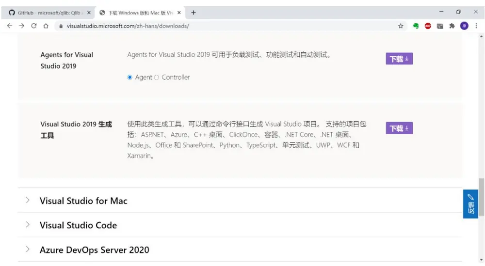
资料来源：微软官网，华泰证券研究所

安装生成工具过程中，需要点选部分选项，参考微软官方建议链接及下图：https://docs.microsoft.com/en-us/answers/questions/136595/error-microsoft-visual-c-140-or-greater-is-require.html

图表2： Microsoft C++生成工具安装
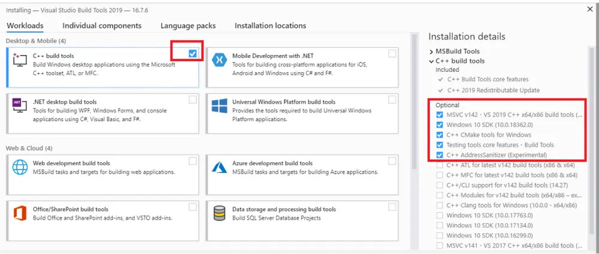
资料来源：微软官网，华泰证券研究所

## setup.py 安装

Qlib 官方给出的 setup.py 安装方式如下。首先安装或更新 numpy 和 cython 库，在命令行运行 pip install numpy 和 pip install --upgrade cython 即可。

接下来的安装分两种情况：

1. 若已安装 git 并完成环境配置，在命令行运行下列指令即可：git clone https://github.com/microsoft/qlib.git && cd qlibpython setup.py install

2. 若未安装 git，可在 GitHub 下载 zip 源码包（https://github.com/microsoft/qlib），解压缩至任意路径，如笔者放在 C:/Users/username/anaconda3/Lib/site-packages/qlib，确保 setup.py 文件在该路径下，随后在该路径下启动命令行，运行如下指令即可：python setup.py install

Qlib 的 setup.py 安装方式将自动安装包含开发版在内的最新版。例如笔者在 2020 年 12月 14 日安装的版本为 0.6.1.dev0。笔者办公网络环境不支持 git 安装，故采用上述第二种方式，命令行安装过程如下图。

图表3： setup.py 安装 Qlib
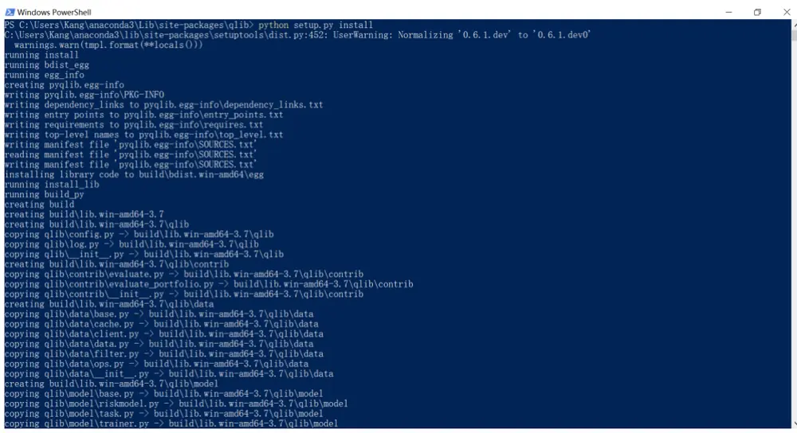
资料来源：Qlib，华泰证券研究所

## 数据准备

## get_data 下载官方数据

Qlib 提供 A 股和美股两类数据作学习测试使用。Qlib 官方给出的 A 股数据下载方法为：在 Qlib 安装路径（如 C:/Users/username/anaconda3/Lib/site-packages/qlib）启动命令行，运行如下 get_data 指令：

python scripts/get_data.py qlib_data --target_dir ~/.qlib/qlib_data/cn_data --region cn

若读者采用 pip 方式安装 Qlib，运行上述指令可能报错：ModuleNotFoundError: No modulenamed 'qlib.tests'。解决方法为：在 GitHub 下载 Qlib 的 zip 源码包，将 tests 文件拷贝至安装路径。

图表4： get_data 下载官方数据
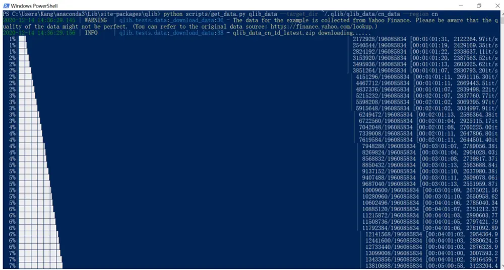
资料来源：Qlib，华泰证券研究所

笔者下载 Qlib 官方数据过程如上图所示。下载成功后，数据保存在如下路径：C:/Users/username/.qlib/qlib_data/cn_data。

## dump_all 转换用户数据格式

除官方数据外，Qlib 支持用户提供的 csv 格式数据，需要调用 dump_all 指令将 csv 格式数据转换为 bin 和 txt格式。下面笔者以港股行情数据为例，展示数据格式转换的步骤。

图表5： dump_all 转换前的 csv 文件
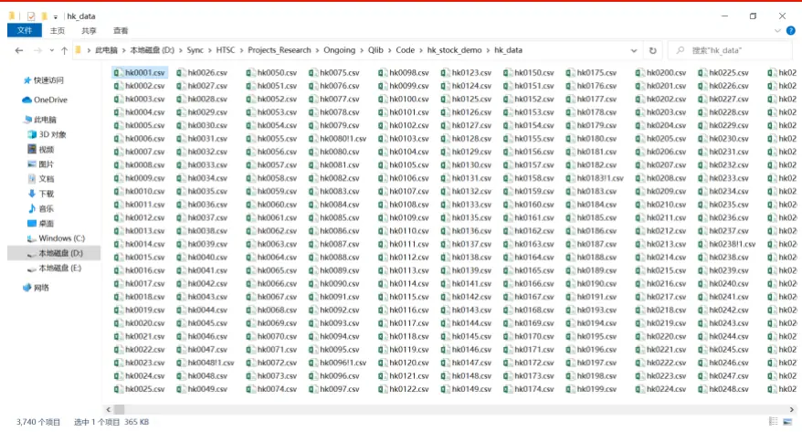
资料来源：Wind，华泰证券研究所

将原始港股行情数据保存为上图形式，即每只股票存成一个csv文件，文件名为股票代码，文件夹命名为 hk_data。数据从 2008 年初至 2020 年 11 月末，共计 3739 只股票（含权证，含已退市）。每个 csv文件内部如下图所示。

图表6： 港股行情 csv数据（以腾讯控股 0700 HK为例）

|  |  |  |  |  |  |  |  | hk0700.csv - Excel |  |  |  |  |  |  |  |  |  |  | ? 一 凸 |  | x 登录 |
| --- | --- | --- | --- | --- | --- | --- | --- | --- | --- | --- | --- | --- | --- | --- | --- | --- | --- | --- | --- | --- | --- |
| 文件 |  | 开始 插入 |  | 页面布局 | 公式 数据 | 审阅 视图 |  |  |  |  |  |  |  |  |  |  |  |  |  |  |  |
| A1 | 4 |  | × √fx | stock_code |  |  |  |  |  |  |  |  |  |  |  |  |  |  |  | 4 |  |
|  | A |  | B | C | D | E | F low | G close | H factor | vwap | 1 | K | L | M | N | 0 | P | Q | R | 血 |  |
|  | stock codedate |  | 20080104 | volume 4795780 | money 293260.1 | open high 59.1038 | 63.6581 | 59.1038 | 63.5557 1.023442 |  | 62.58306 | change |  |  |  |  |  |  |  |  |  |
| 2 | hk0700 |  | 20080107 | 2953701 | 176470.4 | 62.3276 | 62.3276 | 60.3831 | 61.4065 | 1.023442 | 61.14604 | -0.03382 |  |  |  |  |  |  |  |  |  |
| 3 hk0700 | 4 hk0700 |  | 20080114 | 2479594 | 141671 | 59.8713 | 60.4342 | 57.3127 | 57.4663 1.023442 |  | 58.47414 | -0.06417 |  |  |  |  |  |  |  |  |  |
|  |  |  | 20080111 | 1796200 105976.5 |  | 61.0995 | 61.4065 | 59.8713 | 60.2295 1.023442 |  | 60.38347 | 0.048084 |  |  |  |  |  |  |  |  |  |
| 5 hk0700 |  |  | 20080108 | 4877200 287137.1 |  | 61.4065 | 61.7647 | 59.5643 | 60.2807 1.023442 |  | 60.2534 | 0.00085 |  |  |  |  |  |  |  |  |  |
| 6 hk0700 |  |  | 20080102 | 1470600 85120.96 |  | 60.5878 | 60.5878 | 58.3362 | 59.0526 1.023442 |  | 59.23865 | -0.02037 |  |  |  |  |  |  |  |  |  |
| 7 hk0700 |  |  | 20080103 | 1855981 108746.4 |  | 58.285 | 60.8948 | 58.1315 | 59.8713 1.023442 |  | 59.96591 | 0.013864 |  |  |  |  |  |  |  |  |  |
| 8 hk0700 | 9 hk0700 |  | 20080109 | 4239000 | 243873 | 60.5878 | 60.5878 | 57.3639 | 59.462 1.023442 |  | 58.87942 | -0.00684 |  |  |  |  |  |  |  |  |  |
|  | 10 hk0700 |  | 20080110 | 3023636 176060.6 |  | 57.7221 | 61.253 | 57.3639 | 60.9971 1.023442 |  | 59.59307 | 0.025816 |  |  |  |  |  |  |  |  |  |
|  | 11 hk0700 |  | 20080115 | 4512836 246533.8 |  | 58.3874 | 59.0014 | 54.2424 | 54.6006 1.023442 |  | 55.91011 | -0.10487 |  |  |  |  |  |  |  |  |  |
|  | 12 hk0700 |  | 20080117 | 6291645 309758.8 |  | 50.3533 | 54.1401 | 48.9205 | 51.2744 1.023442 |  | 50.38752 | -0.06092 |  |  |  |  |  |  |  |  |  |
|  | 13 hk0700 |  | 20080121 | 2582850 120219.6 |  | 49.4322 | 49.4322 | 46.4643 | 46.6689 1.023442 |  | 47.63641 | -0.08982 |  |  |  |  |  |  |  |  |  |
|  | 14 hk0700 |  | 20080124 | 6089871 | 290326 | 46.0549 | 50.8651 | 46.0037 | 47.9482 1.023442 |  | 48.79115 | 0.027412 |  |  |  |  |  |  |  |  |  |
| 15 hk0700 |  |  | 20080122 | 9971728 408981.3 |  | 41.9611 | 43.9057 | 40.6306 | 42.524 1.023442 |  | 41.97554 | -0.11313 |  |  |  |  |  |  |  |  |  |
|  | 16 hk0700 |  | 20080130 | 2000242 91337.15 |  | 49.4834 | 49.4834 | 45.6967 |  | 46.4643 1.023442 46.73342 0.092661 |  |  |  |  |  |  |  |  |  |  |  |
| 17 hk0700 |  |  | 20080116 | 5837940 293532.8 |  | 53.1166 | 53.1166 | 50.5069 | 51.3768 1.023442 |  | 51.45886 | 0.105726 |  |  |  |  |  |  |  |  |  |
| 18 hk0700 |  |  | 20080128 | 2922631 136440.2 |  | 49.1252 | 49.7393 | 46.7201 | 48.0506 1.023442 |  | 47.77836 | -0.06474 |  |  |  |  |  |  |  |  |  |

资料来源：Wind，华泰证券研究所

股票 csv数据需要至少包含下表所示字段。其中有两个“坑”需要注意：

1. 价格数据的要求在官方文档中未提及，笔者建议采用复权价格，原因在于后续数据标注（源码见 qlib.contrib.data.handler）采用 close 或 vwap 计算股票未来收益率，且回测（源码见 qlid.contrib.evaluate.backtest）使用 close、open 或 vwap 进行交易。

2. 数据需包含 factor 或 change 字段，否则运行 Qlib 官方提供的策略全流程范例代码examples/workflow_by_code.py 时，策略收益和净值将出现异常。

图表7： csv数据字段说明

| 字段名称 | 字段说明 | 字段名称 | 字段说明 |
| --- | --- | --- | --- |
| stock_code | 股票代码，和文件名一致，字段名称low 不唯一 |  | 复权最低价 |
| date | 日频日期，字段名称不唯一 | close | 复权收盘价 |
| volume | 成交量 | factor | 复权因子 |
| money | 成交额 | vwap | 复权均价 相对前一个交易日涨跌幅 |
| open | 复权开盘价，前后复权均可（下同），change 笔者采用后复权 |  |  |
| high | 复权最高价 |  |  |

资料来源：Wind，华泰证券研究所

除个股数据外，还需准备指数数据作为基准。笔者将恒生指数行情数据以和股票数据相同形式保存在相同路径下，命名为 hkhsi.csv。回到 Qlib 安装路径，在命令行运行 dump_all指令：

python scripts/dump_bin.py dump_all --csv_path ~/.qlib/csv_data/hk_data 
--qlib_dir ~/.qlib/qlib_data/hk_data --symbol_field_name stock_code 
--date_field_name date --include_fields 
open,high,low,close,volume,money,factor,vwap,change

上述 dump_all 指令包含如下参数：

1. symbol_field_name：csv 文件中股票代码列名，此处为 stock_code；

2. date_field_name：csv 文件中日期列名，此处为 date；

3. include_fields：其余字段名，注意逗号后不能有空格，否则数据转换将出现错误。

使用 dump_all将用户 csv数据格式转为 bin 数据格式的过程如下图所示。

图表8： dump_all 转换用户数据格式
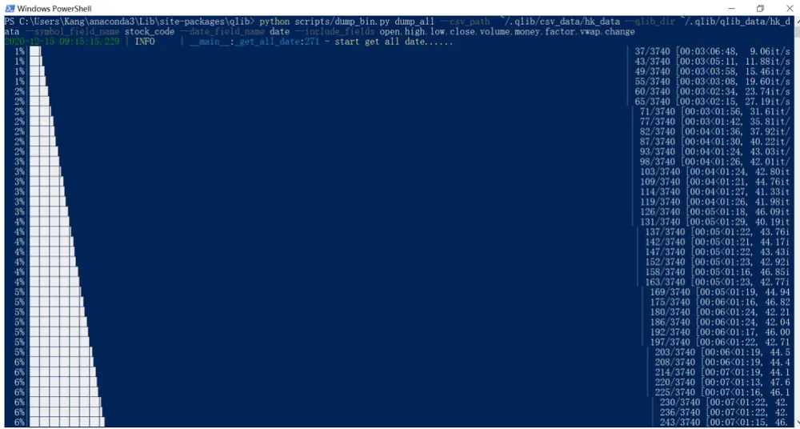
资料来源：Wind，Qlib，华泰证券研究所

转换完成后，新数据保存在如下路径：C:/Users/username/.qlib/qlib_data/hk_data。该路径下包含 calendar、features 和 instruments 三个子文件夹，分别存放交易日历、行情特征和股票池。其中行情特征为 bin 格式，这与传统量化策略开发使用的数据格式类型不同，Qlib 数据存储方案的优势将在后文介绍。

图表9： dump_all 转换后的 bin 和 txt 文件
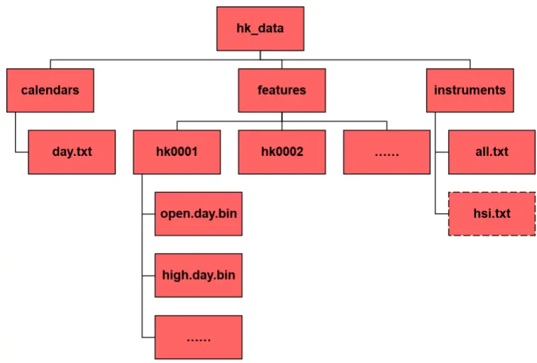
资料来源：Wind，Qlib，华泰证券研究所

## 港股日频量价因子生成

接下来我们将构建港股日频量价因子 AI 选股策略，核心环节之一是生成量价因子。Qlib提供两套自带的因子库，分别为 Alpha158 和 Alpha360，分别包含 158 和 360 个 Alpha因子。这里的因子库并非是计算好的因子值，而是一套生成因子的算法（Qlib 中称表达式），因此可迁移至任意股票池。

## 初始化运行环境和原始数据读取

在 Python 中运行 Qlib 程序前，需要首先初始化运行环境，命令为 qlib.init，参数 provider_uri为港股数据所在路径，如下图所示。

图表10： 初始化运行环境
[11780:MainThread](2020-12-17 11:09:56,698) INF0 - qlib.Initialization - [_init__.p 
y:42] - default conf: client. 
[11780:MainThread](2020-12-17 11:09:58,704) WARNING - qlib.Initialization - [_init_ 
_.py:58] - redis connection failed(host=127.0.0.1 port=6379), cache will not be used! 
[11780:MainThread](2020-12-17 11:09:58,709) INF0 - qlib.Initialization - [_init.p 
[11780:MainThread](2020-12-17 11:09:58,713) INF0 - qlib.Initialization - [__init_.p 
y:80]- data_path=C:\Users\Kang\. qlib\qlib_data\hk data
资料来源：Wind，Qlib，华泰证券研究所

调用 qlib.data 模块可读取原始数据。例如 qlib.data.calendar 命令可读取指定时间区间内交易日期；qlib.data.instruments 命令可定义股票池，参数 market=’all’代表选取全部个股构成股票池；qlib.data.list_instruments 命令可以展示指定时间区间内的股票池，时间区间的意义在于，股票池可能会随时间动态变化，如指数成分股票池。

图表11： 获取交易日期和全部股票代码
[Timestamp('2020-01-02 00:00:00') Timestamp('2020-01-0300:00:00') 
Timestamp('2020-01-0600:00:00') Timestamp('2020-01-07 00:00:00') 
Timestamp('2020-01-08 00:00:00')] 
['HK9996','HK9997', 'HK9998','HK9999','HKHSI']
资料来源：Wind，Qlib，华泰证券研究所

调用 qlib.data.features 模块可以获取指定股票指定日期指定字段数据，例如下图展示获取腾讯控股（0700 HK）在 2020 年 1 月初至 11 月底的日频后复权收盘价和成交量。需注意，Windows 系统下 Qlib 安装路径以及数据文件默认在 C 盘，笔者的经验是读取数据的程序最好也在 C 盘下运行，否则获取 feature 时可能无响应。

图表12： 获取指定股票指定日期指定字段数据
$close $volume 
instrument datetime 
HK0700 2020-01-02 2024.225952 13991006.0 
2020-01-03 2027.401978 15313106.0 
2020-01-06 1997.758545 12123194.0 
2020-01-07 2041.165039 17686346.0 
2020-01-08 2022.108643 15529153.0
资料来源：Wind，Qlib，华泰证券研究所

## 自定义股票池

上述代码中，股票池定义为全部个股，这种定义方式存在两个问题。首先，我们的原始数据中包含恒生指数，但恒生指数是作为基准用，不参与到选股中，在计算因子和后续选股模型构建环节应予以剔除。其次，股票是否进入选股池需考虑其它因素，如 A股选股模型通常剔除风险警示股票、次新股等，港股中的低价股也不适合纳入。

这里我们采用 qlib.data.filter 模块自定义股票池。首先，使用 qlib.data.filter.NameDFilter命令进行股票名称静态筛选，参数 name_rule_re 为纳入股票代码的正则表达式，如HK[0-9!]表示以 HK开头，后续为数字或感叹号的股票代码，感叹号代表目前已退市股票。其次，使用 qlib.data.filter.ExpressionDFilter 命令进行股票因子表达式的动态筛选，参数rule_expression 为入选的因子表达式，如$close>=1 代表收盘价应大于等于 1 元。随后，通过 qlib.data.instruments 命令的参数 filter_pipe，将两个筛选条件组装到一起。

下图展示自定义股票池的过程，展示股票池（按数字排序）的后 5个股票代码，相比于全股票池，自定义股票池缺少 HKHSI（恒生指数）和 HK9998（光荣控股，9998 HK，2020年 7~11 月收盘价均低于 1元），表明我们的两步筛选起到作用。

图表13： 自定义股票池
['HK9993','HK9995','HK9996','HK9997','HK9999']
资料来源：Wind，Qlib，华泰证券研究所

## Alpha158 因子库

下面进入核心的因子计算部分。Qlib 提供 Alpha158 和 Alpha360 两类量价因子库，用户也可根据需要自定义因子库。Alpha158 和 Alpha360 的因子定义方式可以参考源码文件qlib/contrib/data/handler.py。我们以 Alpha158 为例进行展示说明。

生成 Alpha158 因子调用 qlib.contrib.data.handler 模块下的 Alpha158 类，具体命令为：from qlib.contrib.data.handler import Alpha158

## h = Alpha158(**data_handler_config)

其中参数 data_handler_config 相当于配置文件，字典类型，用来定义完整数据起止日期（start_time 和 end_time），拟合数据起止日期（fit_start_time 和 fit_end_time），股票池（instruments）等。拟合数据起止日期区间应为完整数据起止日期数据的子集。拟合数据日期（训练和验证集）和余下日期（测试集）在数据预处理的方式上有所不同，将在下章展开讨论。

执行上述指令后，程序将计算从 start_time 至 end_time 的当期因子值和下期收益，分别作为后续 AI 模型训练的特征和标签。在笔者运行环境下（CPU：Intel i5-8265U @ 1.60GHz；RAM：16.0GB），生成 2020 年 1~11 月港股日频 158 个因子的时间开销约为 695 秒。下图展示生成Alpha158因子过程以及158个因子简称。以前两个因子KMID和KLEN为例，查看源码知，KMID=(close-open)/open，其含义为日内涨跌幅，KLEN=(high-low)/open，其含义为日内振幅。

图表14： 生成 Alpha158特征（当期因子）和标签（下期收益）
[11780:MainThread] (2020-12-17 11:21:56,500) INF0 - q1ib.timer - [1og. py:81] - Time co 
st: 694.383s | Loading data Done 
[11780:MainThread] (2020-12-17 11:21:56,870) INF0 - q1ib. timer - [1og. py:81] - Time co 
st: 0. 130s DropnaLabel Done 
[11780:MainThread] (2020-12-17 11:21:57,434) INF0 - q1ib. timer - [1og. py:81] - Time co 
st: 0.563s | CSZScoreNorm Done 
[11780:MainThread] (2020-12-17 11:21:57,435) INF0 - q1ib.timer - [1og. py:81] - Time co 
st: 0.933s | fit & process data Done 
[11780:MainThread](2020-12-17 11:21:57, 436) INF0 - qlib. timer - [1og. py:81] - Time co 
st: 695.319s | Init data Done 
['KMID', 'KLEN', 'KMID2', 'KUP', 'KUP2', 'KLOW', 'KLOW2', 'KSFT', 'KSFT2', 'OPENO', 
'HIGH0','LOW0','VWAP0','ROC5','ROC10','ROC20','ROC30','ROC60','MA5','MA10', 
'MA20', 'MA30', 'MA60', 'STD5', 'STD10', 'STD20', 'STD30', 'STD60', 'BETA5', 'BETA1 
0', 'BETA20', 'BETA30', 'BETA60', 'RSQR5', 'RSQR10', 'RSQR20', 'RSQR30', 'RSQR60', 'R 
ESI5', 'RESI10', 'RESI20', 'RESI30', 'RESI60', 'MAX5', 'MAX10', 'MAX20', 'MAX30', 'MA 
X60', 'MIN5', 'MIN10', 'MIN20', 'MIN30', 'MIN60', 'QTLU5', 'QTLU10', 'QTLU20', 'QTLU3 
0', 'QTLU60', 'QTLD5', 'QTLD10', 'QTLD20', 'QTLD30', 'QTLD60', 'RANK5', 'RANK10', 'RA 
NK20', 'RANK30', 'RANK60', 'RSV5', 'RSV10', 'RSV20', 'RSV30', 'RSV60','IMAX5', 'IMAX 
10','IMAX20','IMAX30','IMAX60','IMIN5','IMIN10','IMIN20','IMIN30','IMIN60', 
'IMXD5','IMXD10','IMXD20','IMXD30','IMXD60','CORR5','CORR10','CORR20','CORR3 
0', 'CORR60', 'CORD5', 'CORD10', 'CORD20', 'CORD30', 'CORD60', 'CNTP5', 'CNTP10', 'CN 
TP20', 'CNTP30', 'CNTP60', 'CNTN5', 'CNTN10', 'CNTN20', 'CNTN30', 'CNTN60', 'CNTD5', 
'CNTD10', 'CNTD20', 'CNTD30', 'CNTD60', 'SUMP5', 'SUMP10', 'SUMP20', 'SUMP30', 'SUMP6 
0', 'SUMN5', 'SUMN10', 'SUMN20', 'SUMN30', 'SUMN60', 'SUMD5', 'SUMD10', 'SUMD20', 'SU 
MD30', 'SUMD60', 'VMA5', 'VMA10', 'VMA20', 'VMA30', 'VMA60', 'VSTD5', 'VSTD10', 'VSTD 
20', 'VSTD30', 'VSTD60', 'WVMA5', 'WVMA10', 'WVMA20', 'WVMA30', 'WVMA60', 'VSUMP5', 
'VSUMP10', 'VSUMP20', 'VSUMP30', 'VSUMP60', 'VSUMN5', 'VSUMN10', 'VSUMN20', 'VSUMN3 
0', 'VSUMN60', 'VSUMD5', 'VSUMD10', 'VSUMD20', 'VSUMD30', 'VSUMD60', 'LABEL0']
资料来源：Wind，Qlib，华泰证券研究所

通过 h.fetch(col_set=’label’)指令可获取标签。默认参数下，股票 t 日的标签对应 t+2 日收盘价相对于 t+1 日收盘价的涨跌幅，相当于 t 日收盘后发信号，t+1 日收盘时刻开仓，t+2日收盘时刻平仓。如下图，2020年 1月 2日 HK0001（长和；0001 HK）的标签值为-0.007423，对应 2020 年 1 月 6 日该股票涨跌幅为-0.7423%（2020 年 1 月 4~5 日非交易日）。

图表15： 获取 Alpha158因子库标签（下期收益）
LABEL0
datetime instrument
2020-01-02 HK0001-0.007423
HK0002-0.006086
HK0003-0.002625
HK0004-0.017822
HK0005-0.006623
2020-11-30 HK9993 NaN
HK9995 NaN
HK9996 NaN
HK9997 NaN
HK9999 NaN
[274385 rows x 1 columns]
资料来源：Wind，Qlib，华泰证券研究所

通过 h.fetch(col_set=’feature’)指令可获取特征。默认参数下，股票 t 日的特征对应 t 日收盘后计算出的因子值。下图展示部分股票部分交易日的部分因子值。

图表16： 获取 Alpha158 因子库特征（当期因子）
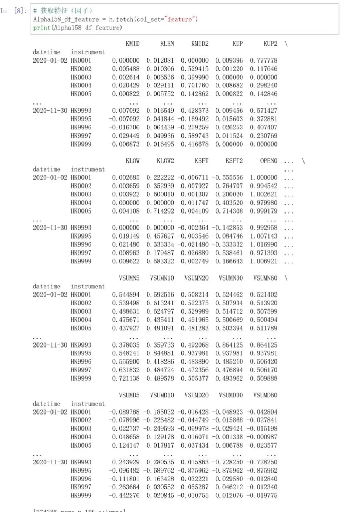
[274385 rows x 158 columns]
资料来源：Wind，Qlib，华泰证券研究所

## LightGBM 选股策略构建

下面进入核心的选股策略构建部分，这一部分同样参考 Qlib 范例 workflow_by_code_py，将范例代码中的 A 股策略改为港股策略。首先，导入后续将会调用的相关 Qlib 模块，如下图所示。

图表17： 导入 Qlib 模块代码
资料来源：Wind，Qlib，华泰证券研究所

初始化环境和定义股票池的代码不再赘述，股票池采用全部港股（含权证），剔除作为基准的恒生指数。

图表18： 定义股票池和基准指数代码
资料来源：Wind，Qlib，华泰证券研究所

接下来定义因子生成参数 data_handler_config 和模型训练参数 task。因子生成参数前文已作介绍，不再赘述。模型训练参数 task 为字典类型，较复杂，也是整个模型的核心部分，又可以分为 model 和 dataset 两个字典。

第一项 model 为 AI 模型参数，必须包含 class（AI 模型名称）和 module_path（AI 模型所在路径）两个子键；kwargs 为 model 的可选子键，通过 kwargs 设置指定 AI 模型的超参数。下图展示 model的键、示例值与说明。这里我们选用固定超参数，不进行参数优化。

图表19： 模型训练参数 task的 AI 模型参数 model

| 键 | 示例值 | 说明 |
| --- | --- | --- |
| model |  | AI 模型参数 |
| class | LGBModel | AI 模型名称，此处为 LightGBM |
| module_path | qlib.contrib.model.gbdt | AI 模型所在路径 |
| kwargs |  | LightGBM 模型超参数 |
|  | mse | 损失函数，此处为均方误差 |
|  | colsample_bytree 0.8879 | 列采样比例 |
| learning_rate | 0.0421 | 学习率 |
| subsample | 0.8789 | 行采样比例 |
| lambda_I1 | 205.6999 | L1 正则化惩罚系数 |
| lambda_l2 | 580.9768 | L2 正则化惩罚系数 |
| max_depth | 8 | 最大树深 |
| num_leaves | 210 | 最大叶子节点数 |
| num_threads | 20 | 最大并行线程数 |

资料来源：Wind，Qlib，华泰证券研究所

第二项 dataset 为数据集参数，必须包含 class（数据集名称）和 module_path（数据集所在路径）两个子键；kwargs 为 dataset 的可选子键，通过 kwargs 设置指定数据集的参数。下图展示 dataset 的键、示例值与说明。

图表20： 模型训练参数 task 的 AI 模型参数 dataset

| 键 |  |  |  | 说明 |
| --- | --- | --- | --- | --- |
| dataset |  |  |  | 数据集参数 |
| class |  |  |  | 数据集名称 |
| module_path |  |  |  | 数据集所在路径 |
| kwargs |  |  |  | DatasetH 模型参数 |
| handler |  |  |  | 因子库参数 |
|  | class | Alpha158 |  | 因子库名称 |
|  | module_path | qlib.contrib.data.handler | 因子库路径 |  |
|  | kwargs |  | data_handler_config | Alpha158 因子库参数 |
|  | segments |  |  | 时间划分参数 |
|  |  | train | ("2020-01-01", "2020-04-30") | 训练集时间区间 |
|  |  | valid | ("2020-05-01", "2020-06-30") | 验证集时间区间 |
|  |  | test | ("2020-07-01", "2020-11-30") | 测试集时间区间 |

资料来源：Wind，Qlib，华泰证券研究所

因子生成参数 data_handler_config 和模型训练参数 task 的代码实现过程如下所示。通过qlib.utils.init_instance_by_config 命令将上述参数分别写入模型，分别返回模型 model 和数据集 dataset。

图表21： 因子生成参数 data_handler_config 和模型训练参数 task 设置代码
####＃＃#
资料来源：Wind，Qlib，华泰证券研究所

完成模型训练参数定义后，调用 qlib.workflow 模块正式进行训练，依次执行如下命令：qlib.workflow.start 开启训练；model.fit 拟合模型；qlib.workflow.save_objects 保存模型；qlib.workflow.get_recorder().id 获取“实验”（即模型训练）记录的编号。下图展示模型训练的代码实现过程。笔者运行环境下，读入数据及数据预处理时间开销约为 372 秒，训练模型时间开销约为 9 秒。LightGBM 模型迭代的实质是参数优化，当验证集损失连续 50轮未降低时停止迭代，此处迭代 71次后结束训练。

图表22： 模型训练代码
[2060:MainThread](2020-12-15 16:55:42,712) INF0 - qlib. timer - [1og. py:81] - Time cos 
t: 370. 142s | Loading data Done 
[2060:MainThread](2020-12-15 16:55:43,449) INF0 - qlib. timer - [1og. py:81] - Time cos 
t: 0.256s | DropnaLabel Done 
[2060:MainThread] (2020-12-15 16:55:44, 127) INF0 - q1ib. timer - [1og. py:81] - Time cos 
t: 0.677s | CSZScoreNorm Done 
[2060:MainThread] (2020-12-15 16:55:44, 128) INF0 - qlib. timer - [1og. py:81] - Time cos 
t: 1.415s | fit & process data Done 
[2060:MainThread] (2020-12-15 16:55:44, 128) INF0 - qlib. timer - [1og. py:81] - Time cos 
t: 371.558s | Init data Done 
[2060:MainThread] (2020-12-15 16:55:44, 129) INF0 - q1ib. workflow - [expm. py:245] - No 
tracking URI is provided. Use the default tracking URI. 
[2060:MainThread] (2020-12-15 16:55:44, 133) INF0 - qlib, workf1ow - [expm, py:168] - No 
valid experiment found. Create a new experiment with name train model. 
[2060:MainThread] (2020-12-15 16:55:44, 141) INF0 - q1ib. workf1ow - [exp. py:181] - Expe 
riment 1 starts running ... 
[2060:MainThread] (2020-12-15 16:55:44, 225) INF0 - q1ib. workf1ow - [recorder. py:236] - 
Recorder 79cea3afbd4a4e2fa131ecce5c53db41 starts running under Experiment 1 .. 
Training until validation scores don't improve for 50 rounds 
[20] train's 12: 0.957767 valid's 12: 0.900906 
[40] train's 12: 0.954599 yalid's 12: 0.900364 
[60] train's 12: 0.95203 yalid's 12: 0.900279 
[80] train's 12: 0.949768 valid's 12: 0.900328 
[100] train's 12: 0.947697 yalid's 12: 0.900449 
[120] train's 12: 0.945859 valid's 12: 0.900483 
Early stopping, best iteration is: 
[71] train's 12: 0.950702 valid's 12: 0.900244 
train model - Time count: 8.961s
资料来源：Wind，Qlib，华泰证券研究所

## 选股策略回测

图表23： 策略回测参数 port_analysis_config

| 键 | 示例值 | 说明 |
| --- | --- | --- |
| strategy |  | 策略参数 |
| class | TopkDropoutStrategy | 策略名称 |
| module_path | qlib.contrib.strategy.strategy | 策略所在路径 |
| kwargs |  | TopkDropout 策略参数 |
| topk n_drop | 50 | 每日持仓股票数 |
|  | 5 | 每日换仓股票数 |
| backtest |  | 回测参数 |
| verbose | False | 是否实时显示回测信息 |
| limit_threshold | np.inf | 涨跌停限制，港股不设涨跌停 |
| account | 100000000 | 起始资金 |
| benchmark | benchmark | 业绩比较基准，此处为恒生指数 |
| deal_price | close | 成交价格，此处为收盘价 |
| open_cost | 0.0015 | 开仓交易费率 |
| close_cost | 0.0015 | 平仓交易费率 |
| min_cost | 20 | 最低交易费用 |

资料来源：Wind，Qlib，华泰证券研究所

[2060:MainThread] (2020-12-15 16:55:53, 102) INF0 - q1ib. workflow - [expm. py:245] - No 
tracking URI is provided. Use the default tracking URI. 
[2060:MainThread] (2020-12-15 16:55:53, 106) INF0 − q1ib. workflow − [expm. py:168] − No 
valid experiment found. Create a new experiment with name backtest analysis 
[2060:MainThread] (2020-12-15 16:55:53, 117) INF0 - q1ib. workf1ow - [exp. py:181] - Expe 
[2060:MainThread](2020-12-15 16:55:53, 150) INF0 - glib. workf1ow - [recorder. py:236] - 
Recorder a414fb15a75c4ee0a9fe7c79fdebb5d3 starts running under Experiment 2 ... 
[2060:MainThread] (2020-12-15 16:55:53,978) INF0 - qlib. workflow − [record_temp. py:12 
[2060:MainThread](2020-12-15 16:55:54, 067) INF0 - glib. Evaluate - [evaluate, py:161] - 
Create new exchange 
[2060:MainThread] (2020-12-15 16:55:54, 073) WARNING - qlib. online operator - [exchang 
datetime instrument 
2020-07-02 HK0001 -0.018582 
HK0002 -0.020668 
HK0003 -0.015716 
HK0004 -0.039070 
HK0005 -0.006372 
[2060:MainThread] (2020-12-15 16:56:09,025) INF0 – q1ib. workflow – [record_temp. py:25 
6] - Portfolio analysis record'port analysis. pkl' has been saved as the artifact of 
the Experiment 2 
risk 
mean 0.007799 
0.017297 
annualized_return 1.965411 
information ratio 7. 157980 
max_drawdown -0.096032 
mean 0.007450 
0.017304 
annualized_return 1.877380 
information_ratio 6.834413 
max drawdown -0.099835 
backtest and analysis - Time count: 15.944s
图表25： 选股策略回测代码

接下来设置策略回测参数 port_analysis_config，该参数为字典类型，又可以分为 strategy和 backtest 两个子键。第一项 strategy 为策略参数，例如此处使用 TopkDropout 策略，每日等权持有 topk=50 只股票，同时每日卖出持仓股票中最新预测收益最低的 n_drop=5只股票，买入未持仓股票中最新预测收益最高的 n_drop=5 只股票。第二项 backtest 为回测参数，用于设置涨跌停限制、起始资金、业绩比较基准、成交价格、交易费率等信息。

图表24： 选股策略回测参数设置代码
#井＃＃＃＃＃＃＃
资料来源：Wind，Qlib，华泰证券研究所
资料来源：Wind，Qlib，华泰证券研究所

回测代码实现如上图所示。调用 qlib.workflow 模块正式进行回测，依次执行如下命令：qlib.workflow.start 开启回测；qlib.workflow.get_recorder 获取此前模型训练“实验”记录；recorder.load_object 读取模型；qlib.workflow.get_recorder 初始化回测“实验”记录；qlib.workflow.record_temp.SignalRecord 初始化调仓信号；sr.generate 生成调仓信号；qlib.workflow.record_temp.PortAnaRecord 初始化回测及绩效分析；par.generate 生成回测及绩效分析结果。

回测代码运行过程中，还显示部分预测结果。例如在测试集第一个交易日（2020 年 7 月 2日）对个股下期收益的预测值，如 HK00001 预测值为-0.018582；又如不扣费及扣费后的日均收益、日度波动率、年化收益、信息比率和最大回撤。

## 回测和绩效分析结果展示

完成策略回测后，调用 qlib.contrib.report 模块展示回测和绩效分析结果。展示前首先执行qlib.workflow.get_recorder 获取回测“实验”记录，相关结果均储存为 pkl 格式，执行recorder.load_object 读取预测结果 pred.pkl、回测报告 report_normal.pkl、仓位情况positions_normal.pkl 和持仓分析 port_analysis.pkl。

图表26： 回测和绩效分析结果读取代码
资料来源：Wind，Qlib，华泰证券研究所

执行下列命令展示 AI 模型预测个股收益的 IC 和 Rank IC 值，可视化结果如下图所示。

```python
label_df = dataset.prepare("test", col_set="label")
label_df.columns = ['label']
pred_label=pd.concat([label_df,pred_df],axis=1,sort=True).reindex(label_df.index)
analysis_position.score_ic_graph(pred_label)
```
图表27： AI 模型预测结果 IC 和 Rank IC

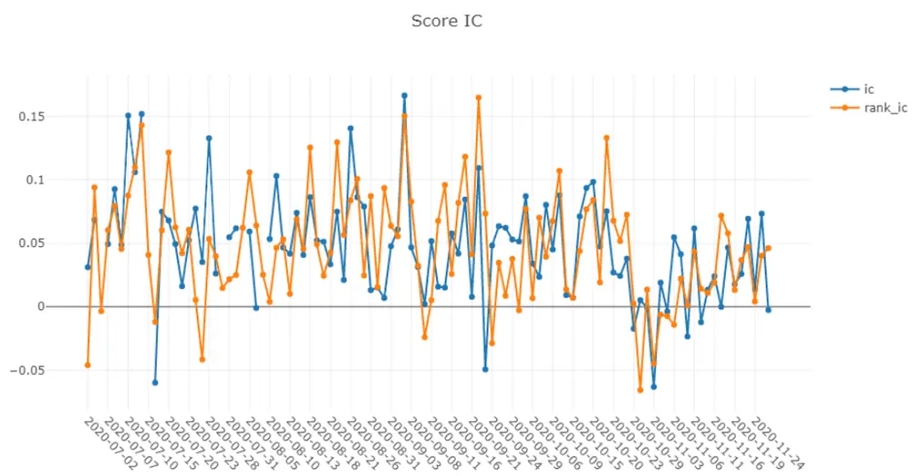
资料来源：Wind，Qlib，华泰证券研究所

执行 analysis_position.report_graph(report_normal_df)展示回测净值相关结果。如下图所示，7张子图自上而下分别为：不扣费、扣费和基准净值；不扣费净值最大回撤；扣费净值最大回撤；不扣费和扣费超额收益净值；换手率；不扣费超额收益最大回撤；扣费超额收益最大回撤。观察知，选股模型在2020年7~10月超额收益较稳定，但在11月份出现回撤。

图表28： 策略净值、超额收益净值、最大回撤和换手率
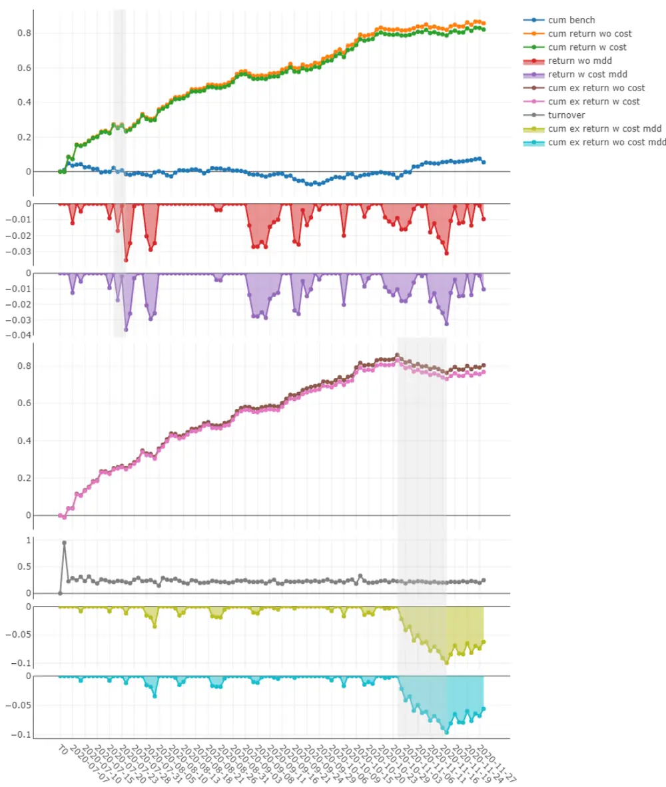
资料来源：Wind，Qlib，华泰证券研究所

至此，我们走完了港股日频量价因子 AI 选股策略的全流程，希望帮助读者快速上手 Qlib。
下面我们将介绍 Qlib 进阶功能，如需自定义 AI 选股策略的组件，应如何通过代码实现。

## Qlib进阶：自定义策略组件

下面我们讲解如何自定义策略。AI 选股模型包含因子生成和预处理、模型训练、策略回测各组件。在 Qlib 中这些组件通过工作流 workflow 串联在一起，每个组件均有参数控制。因此最简单的自定义策略方式是直接修改参数。另外，每个组件都有其对应源码，更灵活的自定义策略方式是修改源码或者仿照源码创建新的继承类。

图表29： 各组件参数及对应源码所在路径

| 参数 | 参数说明 |  | 对应源码所在路径 |
| --- | --- | --- | --- |
| data_handler_config |  | 数据集参数（特征标签生成和预处理） | qlib.contrib.data.handler |
| task |  | 模型训练参数 | qlib.contrib.model |
| port_analysis_config | model dataset | AI 模型参数 |  |
|  |  | 数据集参数（训练、验证、测试集划分）qlib.data.dataset 策略回测参数 |  |
|  |  | 策略参数 |  |
|  | strategy |  | qlib.contrib.strategy |
|  | backtest | 回测参数 | qlib.contrib.evaluate.backtest |

资料来源：Qlib，华泰证券研究所

## 自定义特征

如果不满足于 Qlib 自带的 Alpha158 和 Alpha360 两个因子库，如何自定义新的特征（因子）？Alpha158 和 Alpha360 的源码位于 qlib.contrib.data.handler，这两个因子库继承了qlib.data.dataset.handler.DataHandlerLP 类。DataHandlerLP 类计算因子的核心方法是get_feature_config。通过修改 get_feature_config以及它所调用的方法，可以自定义特征。

下图展示自定义特征代码，笔者定义了一个新的因子库类 AlphaSimpleCustom，它继承了Alpha158类，共包含6个因子，分别为5/10/20/30/60日均线与当前收盘价比值以及MACD。定义单个因子的方式是直接写出该因子的表达式，例如 5 日均线可写作 Mean($close,5)，5 日均线与收盘价比值可写作 Mean($close,5)/$close。这种因子定义方式简洁直观，便于研究者构建新因子。

图表30： 自定义特征代码
class A1phaSimpleCustom(Alpha158): 
def get feature config(self):
资料来源：Wind，Qlib，华泰证券研究所

## 自定义标签

Alpha158 因子库默认的标签定义方式为：股票 t日的标签对应 t+2 日收盘价相对于 t+1 日收盘价的涨跌幅，相当于 t 日收盘后发信号，t+1 日收盘时刻开仓，t+2 日收盘时刻平仓。下面我们展示两种自定义标签方法。

如果希望以 vwap 价交易，将标签定义为 t+2 日 vwap 价相对于 t+1 日 vwap 价的涨跌幅，那么可以在设置模型训练参数 task时，将 task[‘dataset’][‘handler’][’class’]的值从 Alpha158改为 Alpha158vwap，同时在设置回测参数 port_analysis_config 时，将交易价格 deal_price的值从 close 改为 vwap 即可，代码实现如下图。

图表31： 通过设置参数自定义标签代码
"kwargs": data_handler_config,
资料来源：Wind，Qlib，华泰证券研究所

更灵活的自定义标签方式是修改因子库源码。在 DataHandlerLP 类（即 Alpha158 因子库的父类）中，计算标签的核心方法是 get_label_config，修改该方法可以自定义标签。如下图展示两个案例，分别以 t+1 日 vwap 价与 t+2 日 vwap 价之间的区间收益为标签，和以 t+1 日开盘价与 t+6 日开盘价之间的区间收益为标签。

图表32： 通过修改因子库源码自定义标签代码
class Alpha158ywap(Alpha158): 
class AlphaSimpleCustom(Alpha158):
资料来源：Wind，Qlib，华泰证券研究所

## 更换数据预处理方法

Qlib 中内置多种数据预处理方法，源码位于 qlib.data.dataset.processor，包含样本处理、特征处理、异常值处理、缺失值填充和标准化共 5大类 13 小类，如下表所示。

图表33： Qlib 内置数据预处理方法（qlib.data.dataset.processor）

| 类别 | 方法 | 说明 |
| --- | --- | --- |
| 样本处理 | DropnaProcessor | 删除指定特征为缺失值的样本 |
|  | DropnaLabel | 删除标签为缺失值的样本 |
| 特征处理 | DropCol | 删除指定特征 |
|  | FilterCol | 筛选指定特征 |
| 异常值处理 | TanhProcess | tanh 处理 |
|  | Processlnf | inf 以均值替换 |
| 缺失值填充 | Fillna | 以0填充缺失值 |
|  | CSZFillna | 以截面均值填充缺失值 |
| 标准化 | MinMaxNorm | 最小最大值标准化至[0,1]范围 |
|  | ZScoreNorm RobustZScoreNorm | Z分数标准化至标准正态分布，即对原始数据减去均值除以标准差 |
|  | CSZScoreNorm | 稳健Z分数标准化，即对原始数据减去中位数除以1.48倍MAD统计量 截面Z分数标准化至标准正态分布 |
|  | CSRankNorm |  |
|  |  | 截面先转换为 rank序数，再Z分数标准化至标准正态分布 |

资料来源：Qlib，华泰证券研究所

实际数据预处理是上述操作的任意组合。例如 Alpha158 和 Alpha360 因子库中，训练集和验证集的预处理是先剔除标签为缺失值的样本，再对标签（即收益）进行截面标准化；测试集的预处理是先将 inf 替换为均值，再进行 Z 分数标准化，最后将缺失值填充为 0。下图为因子库数据预处理的源码，训练集和验证集对应 learn_processors，测试集对应infer_processors，两者均为多项预处理操作组合而成的列表形式。

图表34： Alpha158 和 Alpha360 因子库默认预处理方式
DEFAULT LEARN PROCESSORS = [ 
_DEFAULT INFER_PROCESSORS = [
资料来源：Wind，Qlib，华泰证券研究所

图表35： 自定义数据预处理代码
data_handler_config = {
资料来源：Wind，Qlib，华泰证券研究所

自定义数据预处理方法的较简单方式是直接修改数据集参数 data_handler_config，增加learn_processors 和 infer_processors 两个键，值为目标预处理操作组合而成的列表。如上图所示，训练集和验证集的预处理是先剔除标签缺失的样本，再将每个截面的标签转换为 rank 序数；测试集的预处理是先提取指定的三个因子，再对因子做稳健 Z 分数标准化，最后将因子缺失值填充为 0。

## 更换 AI 模型

Qlib 内置了丰富的 AI 模型，官方文档称为 Quant Model Zoo，源码位于 qlib.contrib.model，支持的模型如下表所示。

图表36： Qlib 内置 AI 模型（qlib.contrib.model）

| 分类 | 模型 |
| --- | --- |
| 线性模型 | Linear(参数可选择"ols", "nnls", "ridge"和"lasso") |
| Boosting 集成学习模型 | LightGBM |
|  | Catboost |
|  | XGBoost |
| 时间序列相关神经网络模型 | GRU |
|  | LSTM |
|  | ALSTM |
|  | SFM |
|  | TFT |
| 图神经网络 | GATs |
| 其它神经网络 | MLP |
|  | DNN |

资料来源：Qlib，华泰证券研究所

如果希望使用 Qlib 内置模型，可以较方便地通过设置模型训练参数 task 下的 AI 模型参数model 实现，模型本身的超参数也在 model中设置。下图分别展示 Lasso回归和 XGBoost两类模型的参数设置过程。

图表37： 通过设置参数自定义 AI模型代码
资料来源：Wind，Qlib，华泰证券研究所

如果希望使用的模型并未在Qlib提供的Quant Model Zoo中，可以创建新的类继承Model类，再通过参数 model 调用新创建的类。创建新类的关键是写模型拟合 fit 和模型预测predict 两个方法。下图展示创建 SVR 支持向量回归类的过程。

图表38： 通过创建新 Model子类（如 SVR支持向量回归）自定义 AI模型代码
from ...data.dataset import DatasetH 
class SVRModel (Model); 
def fit(self,dataset: DatasetH):
资料来源：Wind，Qlib，华泰证券研究所

## 其它功能

下面讨论用户可能关心的其它功能，这些功能有的尚未实现，有的已实现但源码尚未公开，有的源码或已公开但缺少文档。

预测和调仓频率均为日频，能否更换频率？若数据库为日频，目前可能无法直接通过设置参数的方式实现，相对可行的方式是重新通过dump_all方法读入月频或分钟频原始数据。

如何更新数据？据 Qilb 开发团队在 GitHub 上的讨论，目前团队内部已实现该功能，但暂未开源。

能否更换选股组合构建方式？目前仅开源 TopkDropoutStrategy 一种已实现的组合构建方法，如需自定义组合构建方式，需要通过继承 qlib.contrib.strategy.BaseStrategy 类的方式创建新的策略类。

如何实现模型调参？在 Qlib 原始论文中提到 Qlib 提供调参引擎 Hyperparameters TuningEngine（HTE），同时笔者观察到源码包含 qlib.contrib.tuner 模块，但在官方文档里未公布使用方法。截至 2020 年 12 月 22 日，GitHub 的产品线路图中包含自动调参（automaticparameter tuning）项目，预计该功能未来可能上线。

能否实现模型滚动训练，例如自动实现 2008~2014 年训练 2015 年测试，2009~2015 年训练 2016 年测试，而非手动写循环？笔者在源码和官方文档中暂未找到相关功能。

## Qlib 特色及使用体会

本章我们将结合Qlib论文，介绍Qlib的特色以及相比传统量化策略开发流程的改进之处，最后谈谈笔者的使用体会。

## Qlib 覆盖量化投资全过程

## 传统量化投资策略开发

在传统 AI 量化投资策略开发过程中，策略各环节相对独立，部署在不同项目甚至于不同软件平台。以某团队人工智能选股模型开发流程为例：

1. 首先通过 MATLAB获取原始数据，存成 MAT 格式文件；

2. 在 MATLAB中计算因子，存成 CSV格式文件；

3. 再转到 Python 平台，读取 CSV 文件，使用 scikit-learn、XGBoost、TensorFlow 和PyTorch 包训练人工智能模型，得到预测值，存成 CSV 格式文件；

4. 再回到 MATLAB平台进行策略回测和绩效分析。

图表39： 某团队人工智能选股模型开发流程

| 步骤 | 编程平台 | 使用动机 |
| --- | --- | --- |
| 获取保存原始数据 | MATLAB | 节省存储空间；便于文件传输和管理 |
| 计算因子 | MATLAB | 矩阵运算效率高 |
| 训练人工智能模型 | Python | 拥有成熟机器学习开源项目；及时共享最新AI算法 |
| 策略回测和绩效分析 | MATLAB | 路径依赖 |

资料来源：Mathworks 官网，scikit-learn 官网，TensorFlow 官网，PyTorch 官网，华泰证券研究所

上述开发流程实属繁琐，需要执行四个项目并切换两次编程语言。然而，这种看似“全局非最优”实际上是“局部最优”的结果：

1. 从数据存储的角度来说，MATLAB 的 MAT 格式是一种不错的方案，v7.3 以上版本MATLAB 的 MAT 文件使用基于 HDF5 格式，MAT（HDF5）格式优点在于：

1） MATLAB 会对数据进行压缩以节省存储空间，尽管压缩和解压缩需要额外时间，但这是值得的，据 MATLAB 官方文档（链接如下）显示，某些情况下加载压缩数据比加载未压缩数据更快。

https://ww2.mathworks.cn/help/matlab/import_export/mat-file-versions.html

2） MAT 格式便于传输和管理，只需将所有数据表打包成单个 MAT 文件即可。如果采用 CSV 格式，每张表（每个股票或每个交易日）单独存成一个文件，需要管理的文件数量过于庞大，不便于增删改查等管理操作。

2. 从计算因子的角度来说，MATLAB 的矩阵数据类型是较为理想的方案。因子数据本质是一个三维数组，包含股票、交易日、因子三个维度，任取两个维度相当于从一个三维立体中切取一个二维平面。而计算因子往往可以通过二维矩阵运算实现，批量计算全部股票全部交易日的因子值，无需执行循环，运算效率较高。

近年来随着 Python 语言的普及，NumPy 包的 Ndarray 格式也逐渐为广大使用者接受，NumPy 在功能和语法上已经和 MATLAB 较为接近，但运算速度是 NumPy 的短板，即便使用 Numba 等加速包，总体看 Python 的 NumPy 仍比 MATLAB 慢一些。

3. 从训练 AI 模型的角度来说，Python 相比于其它编程语言无疑具有显著优势，scikit-learn、XGBoost、TensorFlow 和 PyTorch 包都是基于 Python 语言的成熟机器学习项目。Python 的开源特性使得全世界研究者都能参与到开发中，及时共享最新AI 算法，这种开放性是 MATLAB 等商业软件无法比拟的。

4. 从策略回测和绩效分析的角度来说，这部分对于运行效率和算法的依赖度较低，各种编程语言均能胜任。某团队使用 MATLAB作为回测平台的原因主要是路径依赖，原始数据采用 MAT 格式保存，那么回测使用 MATLAB也更方便。

## Qlib 的改进

Qlib 的设计初衷之一就在于希望覆盖量化投资全过程，为用户的 AI 算法提供高性底层基础架构，降低 AI 算法使用门槛，便于金融从业者使用。“覆盖全过程”这一点更显示出其作为“平台”而不是“工具箱”的特性：从原始数据处理，到 AI 模型训练，再到投资组合的构建以及交易策略的生成全程使用，无需切换至其它编程软件或工具箱。Qlib 提供的人工智能选股模型开发解决方案如下表所示。

图表40： Qlib提供的人工智能选股模型开发解决方案

| 步骤 | 编程平台 | 对应模块 |
| --- | --- | --- |
| 获取保存原始数据 | Python Qlib | 数据服务模块（Data Server)，数据增强模块(Data Enhancement) |
| 计算因子 | Python Qlib | 信息抽取模块（Information Extractor） |
| 训练人工智能模型 | Python Qlib | 训练模块（Trainer)，模型管理模块（Model Manager)，模型集成 模块（Model Ensemble)，预测模型(Forecast Model) |
| 策略回测和绩效分析 | Python Qlib | 投资组合生成模块（Portfolio Generator)，模拟订单执行模块（Order Executor)，分析模块（Analyser） |

资料来源：Qlib 官方文档，华泰证券研究所

Qlib 在官方文档中展示其设计框架，如下图所示。自下而上共三层，分别为基础架构层（Infrastructure）、量化投资流程层（Workflow）和交互层（Interface），下面逐一介绍各自的功能和特色。

图表41： Qlib的三层框架：基础架构层、量化投资流程层和交互层
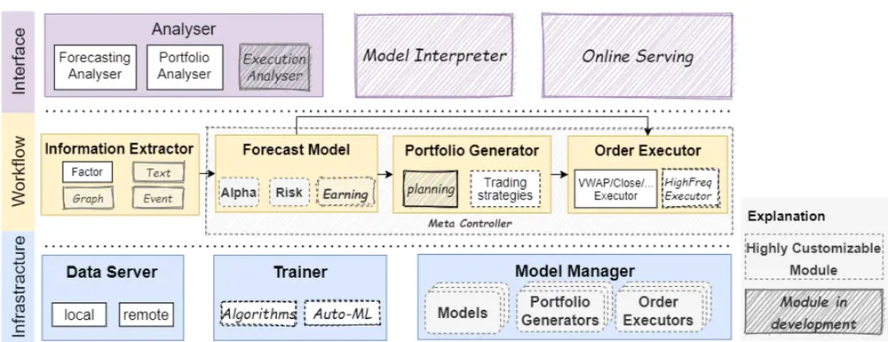
资料来源：Qlib 官方文档，华泰证券研究所

基础框架层：基础框架层从左下角的数据服务模块（Data Server）开始，数据服务模块帮助用户查询和加工原始数据；数据增强模块（Data Enhancement）提供一系列方法，让用户依据实际问题构建相应数据集；训练模块（Trainer）为 AI 算法提供灵活的接口，便于用户自定义训练模型；模型管理模块（Model Manager）便于用户管理众多 AI 模型；模型集成模块（Model Ensemble）能够实现模型集成，提升 AI模型鲁棒性。

量化投资流程层：该层涵盖量化投资的整个工作流，信息抽取模块（Information Extractor）为 AI 模型提取有效数据，除因子之外，文本、图片、事件等都可以作为自定义信息输入到 AI 模型；预测模型（Forecast Model）接收数据后输出各种预测信号，如预期收益、预期风险等；投资组合生成模块（Portfolio Generator）根据预测模型输出结果生成目标投资组合；订单执行模块（Order Executor）是一套高度仿真的交易模拟系统，使得回测结果更贴近实盘交易。

交互层：最上层的交互层为底层系统提供用户友好界面，分析模块（Analyser）根据下层的预测信号、仓位、执行结果做出详细分析并可视化呈现。上一层的订单执行模块并不是简单的回测函数，而是设计成响应式的模拟器，能够支持强化学习等一些基于环境反馈的学习算法，而这些环境反馈正是来自交互层。

有意思的是，在 Qlib 原始论文 Qlib: An AI-oriented Quantitative Investment Platform 中，还提出了另一种各模块的拆解方式，如下图所示，自左向右分别为静态流程（StaticWorkflow）、动态建模（Dynamic Modeling）和分析模块（Analysis）。其中静态流程和分析模块属于常规模块（Normal Module），动态建模属于高度自定义模块（Highlyuser-customizable）。

图表42： Qlib各模块的另一种拆解：静态流程、动态建模和分析模块
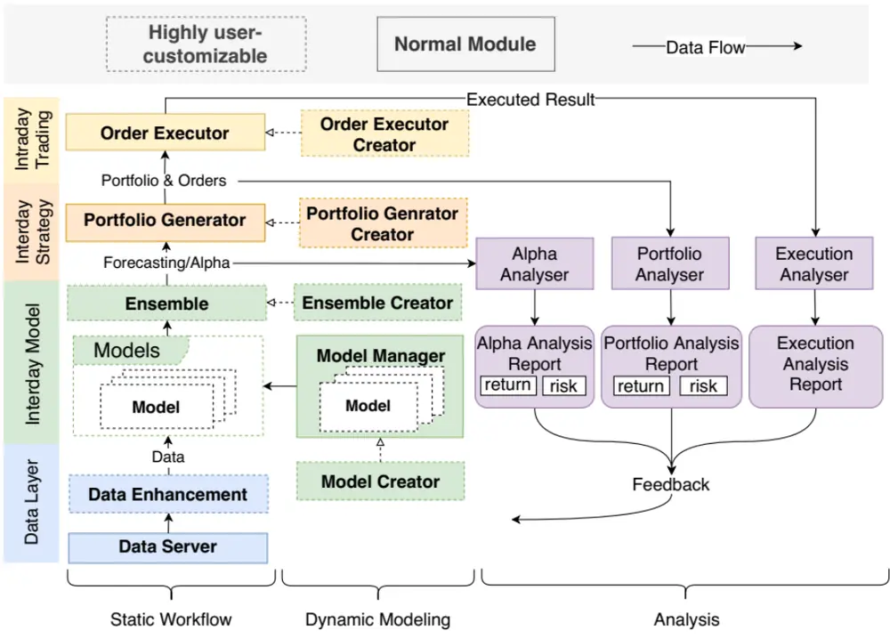
资料来源：Qlib: An AI-oriented Quantitative Investment Platform，华泰证券研究所

静态流程涵盖此前提到的数据服务、数据增强、模型集成、投资组合生成和订单执行功能。如果仅仅使用训练完成后就不再更改的静态模型，静态流程通常已经能够满足用户需求。然而对量化投资而言，数据会在时间维度上扩展，今天的“样本外测试集”到明天就可能成为“样本内训练集”，因此模型的更新迭代就变得格外重要。

动态建模正是针对上述“痛点”而开发，包含模型生成器（Model Creator）、模型管理模块、集成模型生成器（Ensemble Creator）、投资组合生成器（Portfolio Generator Creator）和订单执行生成器（Order Executor Creator）。动态建模在 Qlib 论文中有提及，但截至2020 年 12 月 22 日，该功能未在 Qlib 开源代码中体现，笔者推测该功能尚在开发中或者已开发完成但暂未开源。

分析模块又可分为 Alpha 分析、投资组合分析和交易分析三部分。Qlib 论文对该模块未作介绍，笔者认为这样的拆分具有合理性。AI 模型的 Alpha 并不等于实盘能获得的 Alpha收益，从模型预测到构建投资组合再到交易执行，每一步都可能存在 Alpha 的“损耗”，因此有必要将三部分拆解开来分析。例如，如果模型 Alpha 较高但投资组合收益不理想，那么可推知组合构建方式需要改进；如果投资组合收益高但执行交易后收益不理想，那么可推知交易时机或交易算法需要改进。

## 工程创新：数据存储设计，表达式引擎，缓存系统

Qlib 的“高性能底层基础架构”体现在多项工程上的创新，下面分别从数据存储方案（FileStorage Design）、表达式引擎（Expression Engine）和缓存系统（Cache System）三方面展开介绍。

图表43： Qlib高性能底层基础架构
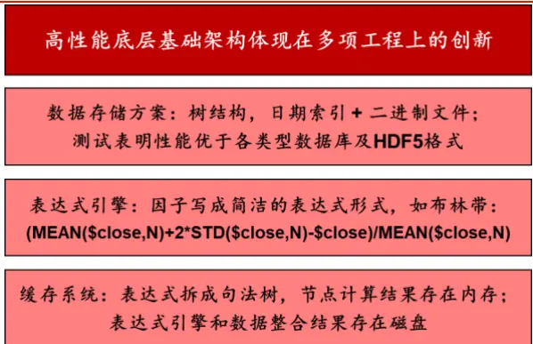
资料来源：Qlib: An AI-oriented Quantitative Investment Platform，华泰证券研究所

## 数据存储方案

因子选股的数据存在股票、时间、因子三个维度。传统因子数据存储方式有以 MySQL 为代表的关系型数据库，以 MongoDB 为代表的非关系型数据库，以 InfluxDB 为代表的时序数据库，以及 NumPy数组、pandas 数据集（保存为 HDF5、pickle）等科学计算格式。这些数据存储方案各有长处和短板。

各类型数据库的长处在于查询及维护较为便捷，而这正是数据库的设计初衷。其中关系型数据库普适性较好，适用于各类型数据；非关系型数据库更适用于非结构化数据，如基金持仓数据等；时序数据库顾名思义更适用于时序数据。它们的短板是并非针对因子数据设计，因子是结构化的、兼具时序和面板属性的数据，和上述数据库的适用场景不完全匹配，因此会牺牲一定的效率。另外，当处理日内数据等更高频数据时，数据库的查询和计算速度较慢（并非没有解决办法，有商业付费数据库提供分布式集群方案）。

NumPy数组、pandas 数据集、MATLAB矩阵也是常用的因子数据存储方案。这些数据类型正是为科学计算而设计，它们的优缺点刚好和数据库相反。由于这些数据类型均为矩阵形式，便于进行矩阵运算，适用于因子数据加工，计算效率较高。它们的短板是查询和维护效率较低。除此以外，MAT 格式对除 MATLAB以外的编程语言不友好。

图表44： 不同因子数据存储方案的长处和短板

| 数据库类别代表性产品 关系型数据库MySQL |  | 长处 便于查询和维护，适用于各类型数据量较大时，查询和计算速度慢； | 短板 |
| --- | --- | --- | --- |
| 非关系型数据 MongoDB |  | 数据 适用于非结构化数据 | 并非针对因子数据设计 并非针对因子数据设计（因子为结构 |
| 库 时序数据库InfluxDB |  | 适用于时序数据 | 化数据） 并非针对因子数据设计（因子兼具时 |
|  |  |  | 序和面板属性） 科学计算格式NumPy、pandas保存为 矩阵形式，适用于因子数据，矩难以查询及更新数据；MAT格式对除 |
|  | HDF5、pickle 格式； MATLAB 矩阵保存为 MAT 格式 | 阵运算效率高 | MATLAB 以外的编程语言不友好 |
| 日期索引+二 Qlib 进制文件 |  | 兼顾计算效率与查询便捷度 | 技术尚在发展中，未普及 |

资料来源：Qlib: An AI-oriented Quantitative Investment Platform，MySQL 官网，MongoDB 官网，InfluxDB 官网，NumPy 官网，pandas 官网，Mathworks 官网，华泰证券研究所

总的来看，上述存储方案难以兼顾计算效率与查询便捷度。Qlib 底层为此设计了专用的数据库，即日期索引+二进制文件的形式，将文件组织成一种树结构，数据存放在不同目录下的不同文件中，依据频率、属性和测度来分类。这种针对性的设计使它对金融数据的科学计算更为高效。

下图展示 Qlib 数据存储方案示意图。左半部分为数据存储结构，公共的时间轴存放于calendar.txt 文件中，用于按时间查询的操作。右半部分显示所有属性值存放于一种紧凑的二进制文件中，共有(N+1)*4 个比特，前 4 个比特存放时间戳信息，用于和时间轴中的时间作匹配，使得程序内部能按比特来取索引。这种数据存储方式适合于科学计算的文件结构，以及按时间顺序的数据组织结构，既能保证运算的高效，又能以低成本对数据进行增删改查操作。

图表45： Qlib数据存储方案
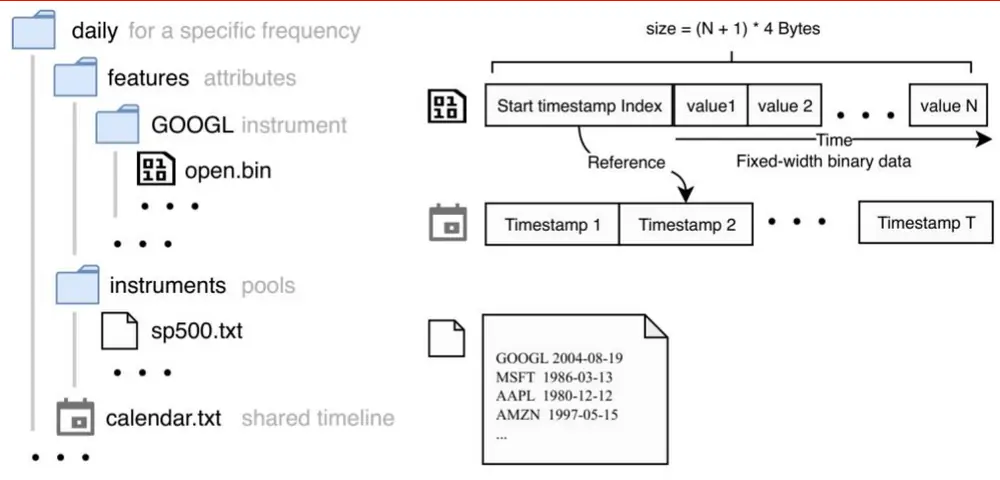
资料来源：Qlib: An AI-oriented Quantitative Investment Platform，华泰证券研究所

Qlib 研发团队将 Qlib 的数据存储方案与其它常用的数据存储方案进行比较。实验任务是从2007 年至 2020 年每个交易日 800 只股票的原始行情数据（开、高、低、收、量）出发，创建一个包含 14 项因子数据集，以 1）占用存储空间，2）读取数据、计算因子等步骤的时间开销为评判标准。

图表46： 不同因子数据存储方案下的性能比较

|  | HDF5 | MySQL | MongoDB | InfluxDB | Qlib -E-D | Qlib +E -D | Qlib +E +D |
| --- | --- | --- | --- | --- | --- | --- | --- |
| Storage(MB) | 287 | 1,332 | 911 | 394 | 303 | 802 | 1,000 |
| Load Data(s) | 0.80±0.22 | 182.5±4.2 | 70.3±4.9 | 186.5±1.5 | 0.95±0.05 | 4.9±0.07 | 7.4±0.3 |
| Compute Expr.(s) | 179.8±4.4 |  |  |  | 137.7±7.6 | 35.3±2.3 |  |
| Convert Index(s) |  |  |  |  | 3.6±0.1 |  | - |
| Filter by Pool(s) | 3.39 ±0.24 |  |  |  |  |  |  |
| Combine data(s) | 1.19±0.30 |  |  |  |  |  |  |
| Total (1CPU) (s) | 184.4±3.7 | 365.3±7.5 | 253.6±6.7 | 368.2±3.6 | 147.0±8.8 | 47.6±1.0 | 7.4±0.3 |
| Total(64CPUs) (s) |  |  |  |  | 8.8±0.6 | 4.2±0.2 |  |

资料来源：Qlib: An AI-oriented Quantitative Investment Platform，华泰证券研究所

实验结果如上表所示，Qlib（即 Qlib –E –D）占用存储空间和读取数据时间均低于关系型数据库 MySQL、非关系型数据库 MongoDB 和时序数据库 InfluxDB，仅高于 HDF5 格式，计算因子时间和运行总时间均低于 MySQL、MongoDB、InfluxDB 和 HDF5，在数据存储方面展现出较高性能。

## 表达式引擎

表达式引擎主要用于因子生成，基于原始数据构建因子是经典研究方法，但新因子的构建往往开发成本和时间开销都较高。事实上，构建因子的过程无非是编写将原始数据映射成另一种数据的函数，这种函数能够拆分成一系列表达式的组合，表达式引擎的设计出发点正是基于此。

通过Qlib 的表达式，用户能快速写出简洁而清晰的表达式来生成因子，不再需要写复杂而难以理解的数学函数。例如 N 日布林带可写作：

$$
(\mathsf{MEAN}(\$\mathsf{close},\mathsf{N})+2^{\star}\mathsf{STD}(\ Sclose,\mathsf{N})-\ P\mathsf{close})/\mathsf{MEAN}(\ Sclose,\mathsf{N})
$$

又如 MACD 可写作：

$$
\begin{array}{rl}&{(\mathsf{EMA}(\hat{\mathfrak{G}}\mathsf{close},12)-\mathsf{EMA}(\hat{\mathfrak{G}}\mathsf{close},26))/\hat{\mathfrak{G}}\mathsf{close}-\mathsf{EMA}((\mathsf{EMA}(\hat{\mathfrak{G}}\mathsf{close},12)\cdot\mathsf{EMA}(\hat{\mathfrak{G}}\mathsf{close},12),\ Q)}\\&{\qquad26))/\hat{\mathfrak{G}}\mathsf{close},\ 9)/\hat{\mathfrak{F}}\mathsf{close}}\end{array}
$$

## 缓存系统

缓存系统的设计也是 Qlib 的工程创新之一。计算机读取内存的速度快于读取磁盘的速度，而内存的容量则远小于磁盘容量。我们既无法将所有原始数据和运算过程中的数据都存在内存中，又不可能因为内存容量有限而放弃其读写高效的优势。

考虑到这点，Qlib 设计了一套包含内存缓存（In-Memory Cache）和磁盘缓存（Disk Cache）在内的缓存系统。将因子表达式拆解成句法树，句法树节点的运算结果往往可以复用，因而存放在内存缓存中。而将表达式引擎计算结果和数据整合结果存放在磁盘缓存中。

图表47： Qlib 缓存系统
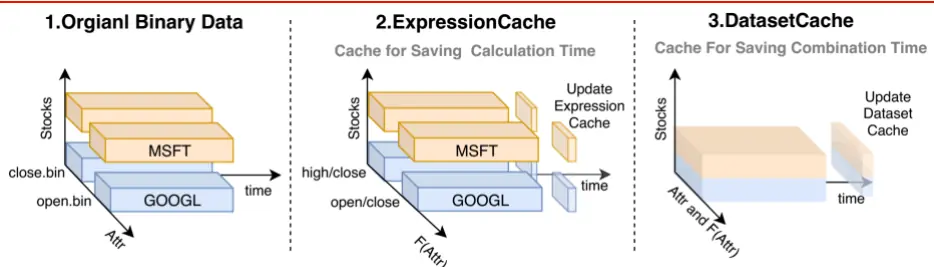
资料来源：Qlib: An AI-oriented Quantitative Investment Platform，华泰证券研究所

## 使用体会：侧重量价选股，解决部分痛点，开源或推动技术发展

笔者使用 Qlib 一周的体会是，Qlib 在“术”层面的创新要大于在“道”层面的创新。Qlib在宣传中称其为“业内首个 AI 量化投资开源平台”，而就目前公开的功能看，Qlib 的核心是“量价因子结合 AI 模型选股流程”。笔者所期待的诸如 AI 在量化择时上的应用，以及高频交易环境下的强化学习模块，暂未出现在目前的开源代码中。可以说 Qlib 在“道”的层面并未脱离传统的因子选股方法论。

而在“术”的层面，笔者认为 Qlib 提出的解决方案颇有可圈可点之处。笔者在日常研究中常面临一些困惑：比如数据以何种方式存储，能够兼顾计算效率和查询便捷度，又如量价因子计算速度通常较慢。而 Qlib 的数据存储方案和表达式引擎这两处工程创新对笔者而言具有很高的借鉴价值。Qlib 在“术”层面的创新一定程度上能够解决研究中的部分痛点。

笔者认为，不同层次研究者或能够从 Qlib 中各取所需。对于本领域的初学者而言，Qlib是不错的学习素材，从策略流程到程序设计均可提供参照，同时也节省重复造轮子的时间。对于有一定经验的研究者而言，Qlib 在工程实现等角度的创新或能提供启发，并根据实际需求自由修改和添加功能。当然，对于经验更丰富的研究者而言，目前开源的 Qlib 模块可能仍偏基础，未来期待开源更多的进阶功能。

最后，笔者认为 Qlib 还有一大意义在于开源。量化投资的圈子整体较为封闭，研究者出于策略隐私性的考虑，通常不愿意分享自己的代码。而近三十年来，Linux、安卓、Python语言等开源项目的成功经验表明，开源能够降低整个行业的学习和研发成本，为行业进步提供源动力。微软此次的开源尝试或能推动量化投资行业的技术发展。

## 参考文献

Yang, X. , Liu, W. , Zhou, D. , Bian, J. , & Liu, T. Y. . (2020). Qlib: an ai-oriented quantitative investment platform. arXiv.

## 风险提示

本文的港股 AI 选股策略仅作案例教学使用，不具备实际投资价值，例如未剔除低价股、低流动性股票，训练集和测试集较短，未进行参数优化等。Qlib 仍在开发中，部分功能未加完善和验证，使用存在风险。人工智能挖掘市场规律是对历史的总结，市场规律在未来可能失效。人工智能技术存在过拟合风险。

## 免责声明

## 分析师声明

本人，林晓明、李子钰、何康，兹证明本报告所表达的观点准确地反映了分析师对标的证券或发行人的个人意见；彼以往、现在或未来并无就其研究报告所提供的具体建议或所表迖的意见直接或间接收取任何报酬。

## 一般声明及披露

本报告由华泰证券股份有限公司（已具备中国证监会批准的证券投资咨询业务资格，以下简称“本公司”）制作。本报告仅供本公司客户使用。本公司不因接收人收到本报告而视其为客户。

本报告基于本公司认为可靠的、已公开的信息编制，但本公司对该等信息的准确性及完整性不作任何保证。本报告所载的意见、评估及预测仅反映报告发布当日的观点和判断。在不同时期，本公司可能会发出与本报告所载意见、评估及预测不一致的研究报告。同时，本报告所指的证券或投资标的的价格、价值及投资收入可能会波动。以往表现并不能指引未来，未来回报并不能得到保证，并存在损失本金的可能。本公司不保证本报告所含信息保持在最新状态。本公司对本报告所含信息可在不发出通知的情形下做出修改，投资者应当自行关注相应的更新或修改。

本公司力求报告内容客观、公正，但本报告所载的观点、结论和建议仅供参考，不构成购买或出售所述证券的要约或招揽。该等观点、建议并未考虑到个别投资者的具体投资目的、财务状况以及特定需求，在任何时候均不构成对客户私人投资建议。投资者应当充分考虑自身特定状况，并完整理解和使用本报告内容，不应视本报告为做出投资决策的唯一因素。对依据或者使用本报告所造成的一切后果，本公司及作者均不承担任何法律责任。任何形式的分享证券投资收益或者分担证券投资损失的书面或口头承诺均为无效。

除非另行说明，本报告中所引用的关于业绩的数据代表过往表现，过往的业绩表现不应作为日后回报的预示。本公司不承诺也不保证任何预示的回报会得以实现，分析中所做的预测可能是基于相应的假设，任何假设的变化可能会显著影响所预测的回报。

本公司及作者在自身所知情的范围内，与本报告所指的证券或投资标的不存在法律禁止的利害关系。在法律许可的情况下，本公司及其所属关联机构可能会持有报告中提到的公司所发行的证券头寸并进行交易，为该公司提供投资银行、财务顾问或者金融产品等相关服务或向该公司招揽业务。

本公司的销售人员、交易人员或其他专业人士可能会依据不同假设和标准、采用不同的分析方法而口头或书面发表与本报告意见及建议不一致的市场评论和/或交易观点。本公司没有将此意见及建议向报告所有接收者进行更新的义务。本公司的资产管理部门、自营部门以及其他投资业务部门可能独立做出与本报告中的意见或建议不一致的投资决策。投资者应当考虑到本公司及/或其相关人员可能存在影响本报告观点客观性的潜在利益冲突。投资者请勿将本报告视为投资或其他决定的唯一信赖依据。有关该方面的具体披露请参照本报告尾部。

本报告并非意图发送、发布给在当地法律或监管规则下不允许向其发送、发布的机构或人员，也并非意图发送、发布给因可得到、使用本报告的行为而使本公司及关联子公司违反或受制于当地法律或监管规则的机构或人员。

本公司研究报告以中文撰写，英文报告为翻译版本，如出现中英文版本内容差异或不一致，请以中文报告为主。英文翻译报告可能存在一定时间迟延。

本报告版权仅为本公司所有。未经本公司书面许可，任何机构或个人不得以翻版、复制、发表、引用或再次分发他人等任何形式侵犯本公司版权。如征得本公司同意进行引用、刊发的，需在允许的范围内使用，并注明出处为“华泰证券研究所”，且不得对本报告进行任何有悖原意的引用、删节和修改。本公司保留追究相关责任的权利。所有本报告中使用的商标、服务标记及标记均为本公司的商标、服务标记及标记。

## 中国香港

本报告由华泰证券股份有限公司制作,在香港由华泰金融控股（香港）有限公司向符合《证券及期货条例》第 571 章所定义之机构投资者和专业投资者的客户进行分发。华泰金融控股（香港）有限公司受香港证券及期货事务监察委员会监管，是华泰国际金融控股有限公司的全资子公司，后者为华泰证券股份有限公司的全资子公司。在香港获得本报告的人员若有任何有关本报告的问题,请与华泰金融控股（香港）有限公司联系。

## 香港-重要监管披露

- 华泰金融控股（香港）有限公司的雇员或其关联人士没有担任本报告中提及的公司或发行人的高级人员。
更多信息请参见下方 “美国-重要监管披露”。

## 美国

本报告由华泰证券股份有限公司编制，在美国由华泰证券（美国）有限公司向符合美国监管规定的机构投资者进行发表与分发。华泰证券（美国）有限公司是美国注册经纪商和美国金融业监管局（FINRA）的注册会员。对于其在美国分发的研究报告，华泰证券（美国）有限公司对其非美国联营公司编写的每一份研究报告内容负责。华泰证券（美国）有限公司联营公司的分析师不具有美国金融监管（FINRA）分析师的注册资格，可能不属于华泰证券（美国）有限公司的关联人员，因此可能不受 FINRA 关于分析师与标的公司沟通、公开露面和所持交易证券的限制。华泰证券（美国）有限公司是华泰国际金融控股有限公司的全资子公司，后者为华泰证券股份有限公司的全资子公司。任何直接从华泰证券（美国）有限公司收到此报告并希望就本报告所述任何证券进行交易的人士，应通过华泰证券（美国）有限公司进行交易。

## 美国-重要监管披露

分析师林晓明、李子钰、何康本人及相关人士并不担任本报告所提及的标的证券或发行人的高级人员、董事或顾问。分析师及相关人士与本报告所提及的标的证券或发行人并无任何相关财务利益。声明中所提及的“相关人士”包括FINRA 定义下分析师的家庭成员。分析师根据华泰证券的整体收入和盈利能力获得薪酬，包括源自公司投资银行业务的收入。

- 华泰证券股份有限公司、其子公司和/或其联营公司, 及/或不时会以自身或代理形式向客户出售及购买华泰证券研究所覆盖公司的证券/衍生工具，包括股票及债券（包括衍生品）华泰证券研究所覆盖公司的证券/衍生工具，包括股票及债券（包括衍生品）。

- 华泰证券股份有限公司、其子公司和/或其联营公司, 及/或其高级管理层、董事和雇员可能会持有本报告中所提到的任何证券（或任何相关投资）头寸，并可能不时进行增持或减持该证券（或投资）。因此，投资者应该意识到可能存在利益冲突。

## 评级说明

投资评级基于分析师对报告发布日后 6 至 12个月内行业或公司回报潜力（含此期间的股息回报）相对基准表现的预期（A 股市场基准为沪深 300 指数，香港市场基准为恒生指数，美国市场基准为标普 500 指数），具体如下：

## 行业评级

增持：预计行业股票指数超越基准

中性：预计行业股票指数基本与基准持平

减持：预计行业股票指数明显弱于基准

## 公司评级

买入：预计股价超越基准 15%以上

增持：预计股价超越基准 5%~15%

持有：预计股价相对基准波动在-15%~5%之间

卖出：预计股价弱于基准 15%以上

暂停评级：已暂停评级、目标价及预测，以遵守适用法规及/或公司政策

无评级：股票不在常规研究覆盖范围内。投资者不应期待华泰提供该等证券及/或公司相关的持续或补充信息

## 法律实体披露

中国：华泰证券股份有限公司具有中国证监会核准的“证券投资咨询”业务资格，经营许可证编号为：91320000704041011J香港：华泰金融控股（香港）有限公司具有香港证监会核准的“就证券提供意见”业务资格，经营许可证编号为：AOK809美国：华泰证券（美国）有限公司为美国金融业监管局（FINRA）成员，具有在美国开展经纪交易商业务的资格，经营业务许可编号为：CRD#:298809/SEC#:8-70231

## 华泰证券股份有限公司

南京南京市建邺区江东中路228号华泰证券广场1号楼/邮政编码：210019

电话：86 25 83389999/传真：86 25 83387521电子邮件：ht-rd@htsc.com

深圳
深圳市福田区益田路5999号基金大厦10楼/邮政编码：518017
电话：86 755 82493932/传真：86 755 82492062
电子邮件：ht-rd@htsc.com

## 华泰金融控股（香港）有限公司

香港中环皇后大道中 99号中环中心 58楼 5808-12室
电话：+852 3658 6000/传真：+852 2169 0770
电子邮件：research@htsc.com
http://www.htsc.com.hk

## 华泰证券（美国）有限公司

美国纽约哈德逊城市广场 10号 41楼（纽约 10001）
电话: + 212-763-8160/传真: +917-725-9702
电子邮件: Huatai@htsc-us.com
http://www.htsc-us.com

©版权所有2020年华泰证券股份有限公

北京
北京市西城区太平桥大街丰盛胡同28号太平洋保险大厦A座18层/
邮政编码：100032
电话：86 10 63211166/传真：86 10 63211275
电子邮件：ht-rd@htsc.com
上海
上海市浦东新区东方路18号保利广场E栋23楼/邮政编码：200120
电话：86 21 28972098/传真：86 21 28972068
电子邮件：ht-rd@htsc.com