## 金工研究/深度研究

2021年01月18日

林晓明 SAC No. S0570516010001

研究员 SFC No. BPY421

0755-82080134

linxiaoming@htsc.com

李子钰 SAC No. S0570519110003

研究员 0755-23987436

何康 SAC No. S0570520080004

研究员 021-28972039

王晨宇 SAC No. S0570119110038

联系人 02138476179

wangchenyu@htsc.com

3《金工: 微软 AI量化投资平台Qlib体验》2020.12

# 基于 BERT 的分析师研报情感因子华泰人工智能系列之四十一

本文基于 BERT 模型构建分析师研报情感因子，因子在最近两年表现优秀分析师研报对上市公司进行了多层面的研究分析，除了一些已经结构化的分析师因子，研报文字中对于上市公司发表的各种观点和判断也具有很大的挖掘价值。BERT 是目前最先进的自然语言处理(NLP)模型，本文梳理了基于 BERT 的分析师研报因子的构建流程，并构建了研报情感因子 sent及其调整因子 senti_adj。在因子测试中，senti 表现较好，而 senti_adj 更能体现研报情感因子的增量信息。最后，我们构建了研报情感因子 TOP80组合，组合的绝对收益表现优秀，在 2019 年和 2020 年分别获得了 51.61%和 69.69%的绝对收益。

## 本文梳理了基于 BERT 的分析师研报情感因子的构建流程

基于 BERT 的分析师研报情感因子的构建流程为：(1) 下载预训练好的中文BERT模型。(2) 使用Wind有情感标注的金融舆情文本微调模型。(3) 将微调后的模型在无标注的分析师研报摘要上预测情感。(4) 通过摘要文本的情感分析结果构建选股因子。本文使用 NLP 模型可解释性工具 LIT 对研报情感分析的结果进行解读，可知 BERT 模型对于给定研报摘要的情感分析都是比较合理的，做出了与人类相似的判断。

## 本文构建了研报情感因子 senti 及其调整因子 senti_adj

得到研报摘要中每个句子的情感预测概率后，我们在 90 个自然日的滚动窗口内，使用线性衰减加权的方式构建研报情感因子 senti。考虑到分析师对上市公司的正面评价居多，我们给予负面情感文本更大权重，构建了调整因子 senti_adj。为了对比研报情感因子和传统分析师因子，我们用类似的方法构建了研报评分因子 report_score 和研报数量因子 report_num。senti和 report_score 及 report_num 的相关性都较高，而 senti_adj 和其他因子的相关性都较低。在 2020 年 12 月底，食品饮料、电子、通信行业的研报情感因子取值较高，说明这些行业的研报正面情感较突出。

因子测试：senti表现较好，senti_adj更能体现研报情感因子的增量信息本文测试了 senti 和 senti_adj 因子及它们对 report_score 和 report_num中性化后残差因子 sent_res 和 senti_adj_res 的表现。总体来看，senti 在各个股票池内表现最好，但其残差因子 senti_res 表现最差，说明其大部分信息可被 report_score 和 report_num 因子所解释。而 senti_adj 及其残差因子 senti_adj_res 的表现相差不大，说明 senti_adj 因子更能体现出研报情感因子相比 report_score 和 report_num 因子的增量信息。senti_adj 因子在沪深 300、中证 500、全 A 股的多头年化超额收益率分别为 5.40%，6.26%，4.39%(回测区间：20100504~20201231)，在最近两年表现优秀。

## 绝对收益组合：基于研报情感因子的 TOP80 选股组合表现优秀

本文基于 senti 因子，构建 TOP80 组合并回测，构建方法如下：(1)样本空间：中证 800 成分股。(2)回测区间：2011 年 1 月 31 日至 2020 年 12 月 31日。(3)月频调仓，每个月最后一个交易日选择 senti 因子取值最高的前 100只股票，按照流通市值加权的方法，在下一交易日按收盘价调仓，交易成本为双边千分之四。研报情感因子TOP80组合年化收益率为14.90%，组合在2019年和 2020年表现优秀，分别获得了51.61%和 69.69%的绝对收益。

风险提示：分析师研报情感因子的测试结果是历史表现的总结，存在失效的可能。本文假设金融新闻与分析师研报具有相似的语义结构，该假设是否完全成立本文尚未讨论。模型可解释性工具LIT可能存在过度简化的风险。

## 基于 BERT的文本因子构建流程

本文是探索人工智能模型对于另类数据中信息提取的第二篇报告。在前期报告《舆情因子和 BERT 情感分类模型》(2020.10.22)中，我们梳理了 Wind的金融舆情数据并构建了高准确度的 BERT 情感分类模型，该模型可用于更多无标注金融文本的情感分类。

为了提取无标注文本中的 Alpha 信息，我们提出了图表 1 所示的基于 BERT 的文本因子构建流程。

1. 下载预训练好的中文 BERT 模型。

2. 使用 Wind 有情感标注的金融舆情文本微调 BERT，得到用于判断金融舆情文本情感的模型。

3. 将微调后的 BERT 模型在无标注的文本上预测情感，本文重点研究的是分析师研报文本。

4. 使用传统的因子构建方法，通过文本的情感分析结果构建选股因子。

图表1： 基于 BERT的文本因子构建流程
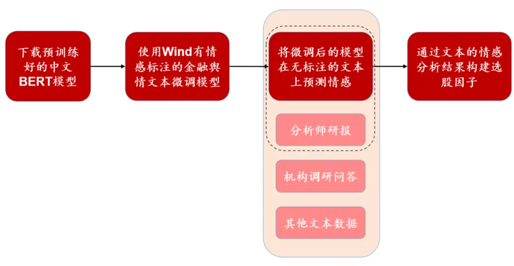
资料来源：华泰证券研究所

我们将在接下来的章节中对图表 1中的流程进行详细说明。

## 基于 BERT的金融文本情感分类模型训练

我们在前期报告《舆情因子和 BERT 情感分类模型》(2020.10.22)中详细介绍了 BERT 模型的原理，本文不再赘述。本章主要展示训练数据的准备和训练结果。

## 预训练 BERT 模型准备

标准的 BERT 模型 BERT-base 层数多、参数量大、训练耗时多。本文使用了论文“ ALarge-scale Chinese Corpus for Pre-training Language Model ” 中 提 到 的RoBERTa-tiny-clue 模型，该模型通过简化网络结构，在尽量保持 BERT 模型优秀表现的前提下，很大程度地加快了模型训练的速度。

图表2： 两种 BERT模型的对比

| 模型 | Transformer 层数 | 隐藏层神经元数 | 自注意力头数目 | 参数量 | 模型大小 |
| --- | --- | --- | --- | --- | --- |
| RoBERTa-tiny-clue | 4 | 312 | 4 | 750万 | 28.3MB |
| BERT-base | 12 | 768 | 12 | 1.1亿 | 392MB |

资料来源：华泰证券研究所

## 微调模型所需数据的说明和微调结果

本文使用Wind底层数据库中的金融新闻数据，该数据有两个特点：(1)每条金融新闻文本已和所涉及的股票对应上。(2)大量新闻已有正负面的情感标注。图表 3为Wind金融新闻数据的 2条原始数据样本。

图表3： Wind金融新闻数据的 2条原始数据样本

| 发布时间 | 新闻标题 | 新闻内容 | 来源 | 新闻栏目 | 相关公司 | 市场情绪 |
| --- | --- | --- | --- | --- | --- | --- |
| 2020/9/26 00:16:19 | 朗玛信息： 动视云未 来业务发 展存在一 定的不确 定性 启迪环境： 预中标 合同 度的经营业绩将产生较为积极的 | 香港万得通讯社报道，Wind风控 日报数据显示，朗玛信息回复关 注函，动视云通过股权转让及增 资扩股的方式引入新股东，是为 了更好地推动动视云业务快速发 展，但目前云游戏行业属于行业 发展初期，商业模式尚未成熟与 清晰，动视云未来业务发展存在 一定的不确定性。 e 公司讯，启迪环境(000826)9 月27日晚间公告，预中标西安市 碑林区生活垃圾清运及公厕运营 管理项目(三次)项目，本项目总 1.15亿元 投资约为1.15亿元，如合同正式 签订，合同履行对本公司未来年 | Wind e公司 | 股市\|个股\|标准新闻\| 旧版新闻\|A股\|功能 关键字\|直播\|精选新 闻\|Wind 数据\|Wind 风控\|分类\|人工新闻 个股\|标准新闻\|分类\| 精选新闻\|旧版新闻\| 评论观点类\|功能关 键字 \|000826.SZ:启迪 | ON0201:A 股 \|300288.SZ:朗玛 信息 \|eFYy85zLDw:贵 阳朗玛信息技术股 份有限公司\|ON02: 公司\|3783：公司实 体 1000826:启迪环境 科技发展股份有限 公司\|3783:公司实 | TITLEFM0402:标题预警\|3746:负 面情绪\|CJFM0402:负面新闻 ION11:市场情绪 \|300288.SZ0402:朗玛信息负面 JON11020301:A 股负面 \|ON110203:公司负面 \|eFYy85zLDw.FM0402:贵阳朗玛 信息技术股份有限公司负面 JON110211:非上市公司负面 000826.SZ0401:启迪环境正面 JON11010301:A 股正面 |

资料来源：Wind，华泰证券研究所

我们获取了 2017 年 1 月至 2020 年 9 月的金融新闻数据，然后按照如下步骤构造训练数据：

1. 筛选出与 A股个股相关的新闻。

2. 剔除行情类的新闻以及标题中含有“走强”、“涨”、“跌”、“拉升”和“封板”的新闻。

3. 由于新闻内容冗长且无效信息较多，只提取新闻的标题作为输入模型的文本。

4. 提取文本情感分类结果，将正面新闻打上标签 1，将负面新闻打上标签 0。

5. 进行随机欠采样，即对负面新闻进行随机抽样，使得正负面新闻数量相同。

6. 训练集样本数量总共有 86503 条，验证集样本总共有 43252 条，测试集样本总共有 43251 条。

训练时模型的主要参数如下：

图表4： 模型的主要参数

| 参数 | 参数含义 | 参数取值 |
| --- | --- | --- |
| learning_rate | 学习率 | 0.00001 |
| num_train_epochs | 迭代次数 | 5 |
| max_seq_length | 文本的最长长度，超过会截断 | 500 |

资料来源：华泰证券研究所

微调完成后，模型在测试集上的准确率为 0.9833，AUC 为 0.9762，具有很高的预测精度，说明 BERT 模型学会了如何判断金融文本的情感。

## 使用微调后的 BERT模型预测分析师研报情感并构建因子

分析师研报中包含了分析师对上市公司多层面的研究分析，除了一些已经结构化的分析师因子，研报文字中对于上市公司发表的各种观点和判断也具有很大的挖掘价值。研报的各个组成部分中，摘要相比标题来说更加丰富，相比正文来说更加归纳凝练，因此我们将以研报中的摘要作为重点研究对象。

## 研报文本的预处理

我们从朝阳永续数据库的 CMB_REPORT_RESEARCH 表获取了 2010 年 1 月至 2020 年12 月的研报文本数据，文本的预处理流程如下：

1. 筛选出与 A股个股相关的研报，提取每篇研报的摘要部分。

2. 剔除摘要文本中的转义字符，并将摘要“风险提示”后的内容删除。

3. 将每篇研报的摘要按句号分割，使得每篇研报形成多个文本。

4. 将无实际意义的样本删除，例如以“数据来源”和“相关资料”等作为开头的文本。

## BERT 模型预测结果

在按上一节的步骤构造了测试数据后，我们使用训练好的 BERT 模型对摘要中每一句文本的情感得分进行预测。图表 5 展示了于 2017 年 12 月 29 日发布的研报《上汽集团投资主题：高股息率》的预测结果。

图表5： BERT 模型预测结果展示

| 研报摘要内容 | 情感预测预测为正面样本的概率 |  |
| --- | --- | --- |
| 投资要点：销量增速显著高于行业增速，龙头地位巩固 公司1-11月累计产、销分别为629.81、619.70万辆，同比增长8.32%、7.48%，同期汽车行业整体产、销同 | 正面 | 0.9979 |
| 比增速为4.10%、3.59%，其中乘用车整体产、销增速为2.20%、2.30%，公司产销增速显著高于行业增速，龙 头地位得到巩固 | 正面 | 0.9992 |
| 业绩稳健增长，公司前三季度实现营收6080.5亿元，同比增长14.38%，实现归母净利润(扣非)238.57亿元， 同比增长 8.16% | 正面 | 0.9994 |
| 成本控制能力强，公司前三季度毛利率为13.19%，较去年同期上升0.77个百分点 | 正面 | 0.9993 |
| 自主品牌持续向好，合资品牌稳健发展 上汽自主品牌1-11月产销47.71、46.71万辆，同比增长75.59%、70.01%，增速显著，持续向好，荣威RX5 | 正面 | 0.9998 |
| 等车型表现亮眼，RX5 在 11 月实现 2.52 万辆销售，RX3、RX8 将在 2018 年贡献主要增量 | 正面 | 0.9997 |
| 合资品牌稳健发展，产品结构向好 上汽大众1-11月实现187.16万辆销售，同比增长3.51%，2017年上市的途观L、柯迪亚克等高端车型销量持 | 正面 | 0.9998 |
| 续爬坡，途观L单月销量近3万辆；上汽通用实现178.05万辆销售，同比增长6.32%，别克GL8、凯迪拉克等 高端车型销量耀眼，1-11月分别累计销量达13.4、16万辆，同比增长90%、101% | 正面 | 0.9995 |
| 2018年乘用车预计维持低增速，龙头效应凸显，高股息率提供良好的安全边际 | 正面 | 0.9995 |
| 购置税率在2016年变为5%，2017年变为7.5%，造成提前透支，在2018年购置税恢复10%条件下，考历史 购置税减半效应及未来2年影响，预计2018年汽车行业增速整体表现不容乐观 | 负面 | 0.0899 |
| 汽车行业竞争加剧，龙头议价能力凸显，提防部分上游零部件企业毛利率再次下滑 | 负面 |  |
| 上汽集团作为行业领头羊，在规模化采购、成本控制能力优势显著，拥有极强的护城河 | 正面 | 0.0051 0.9997 |
| 公司2013-2016年股利支付率分别高达53.34%、51.24%、50.33%、60.23%，根据Wind一致预期，预计公司 2017、2018年实现EPS为3.06、3.36元，按照60%股利支付率，对应股息率(按 29日收盘价算)约为5.73%、 | 正面 | 0.9543 |
| 6.29%，稳定的高股息率提供了较高安全边际 预计 2017/2018 年实现 EPS 分别为 3.06 元/3.36 元，对应 PE 为 10.47/9.54 倍，29日收盘价对应 PB 为 1.74 倍；公司近5年(3年)PE(ttm)、PB中位数分别为7.81(8.70)、1.39(1.48)倍，考虑到公司行业地位、市场风格、 |  |  |

资料来源：Wind，朝阳永续，华泰证券研究所

接下来，我们使用模型可解释性工具 Language Interpretability Tool (LIT，GitHub 地址：https://github.com/PAIR-code/lit)中的 Salience Maps 模块来理解 BERT 模型的预测结果，该模块可展示 BERT 模型在预测文本情感时重点关注哪些字符。

首先分析两条正面的研报文本。由下图可知，在预测正面文本 1时，BERT 模型认为“上升”等字符重要性较高；在预测正面文本 2时，BERT 模型认为“向好”、“稳健”等字符重要性较高。

图表6： 正面文本 1 分析结果
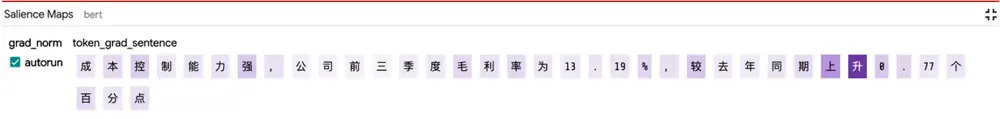
资料来源：Wind，朝阳永续，华泰证券研究所

图表7： 正面文本 2分析结果
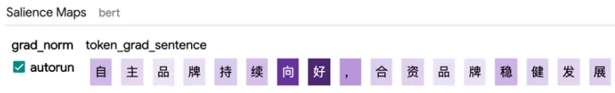
资料来源：Wind，朝阳永续，华泰证券研究所

接下来分析两条负面的研报文本。由下图可知，在预测负面文本 1 时，BERT 模型认为“透支”、“不容乐观”等字符重要性较高；在预测负面文本 2 时，BERT 模型认为“竞争加剧”、“下滑”等字符重要性较高。

图表8： 负面文本 1分析结果
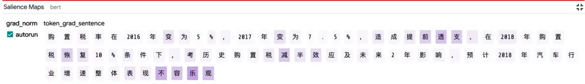
资料来源：Wind，朝阳永续，华泰证券研究所

图表9： 负面文本 2分析结果
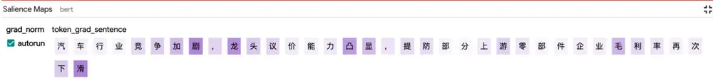
资料来源：Wind，朝阳永续，华泰证券研究所

由以上的案例可见，无论是从预测的准确性和可解释性上来看，BERT 模型对于这篇研报摘要的情感分析都是比较合理的，做出了与人类相似的判断。

## 分析师研报情感因子构建

在 朝 阳 永 续 数 据 库 的 CMB_REPORT_RESEARCH 表 中 ， 研 报 文 本 数 据 有CREATE_DATE 和 INTO_DATE 两个属性，前者为文本的创建时间，后者为文本进入数据库的时间，需要注意的是，文本只有在进入数据库之后才是可用的。获得研报摘要中每个句子的情感判断后，即可采用传统的因子构建方法构建因子，步骤如下：

1. 将 BERT 模型预测样本为正面的概率减去 0.5 后得到的值作为该样本的情感得分，使得中性文本的情感得分约为 0。

2. 对于每个入库日t，若t为交易日，则取该日过去 90个自然日的研报数据，否则跳过。

3. 在上述 90 个自然日的研报数据中，对于每个研报的创建日期c和每只个股i，将日期c中每篇研报摘要文本的情感得分取平均作为研报的情感得分，若个股i在当日有多篇研报，则对多篇研报的情感得分再进行平均，得到c当日每只个股i的情感得分Score ，若个股i在c当日无研报则情感得分为空。

4. 按照时间先后对上述 90 个自然日的个股情感得分求线性衰减加权和(越靠近t的情感得分权重越大)，得到t当日的研报情感因子，该研报情感因子我们命名为 senti。

图表10： 研报情感因子的线性衰减加权求和计算示意图

| Score1,t–89 | Score1,t–88 | ……… | Score1,t–1 | Score1,t |  |  |
| --- | --- | --- | --- | --- | --- | --- |
| Score2,t–89 | Score2,t–88 | ……… | Score2,t–1 | Score2,t |  | Score2,t |
| Score3,t–89 | Score3,t–88 | ………… | Score3,t–1 | Score3,t |  | Score3,t |
|  | ……… | ……… | ………… | ……… | 线性衰减加权求和 | ……… |
| ……… | ……… | ……… | ………… | ………… |  | ……… |
| ………… | ………… | ………… | ……… | ……… |  | ………… |
| ………… | ………. | ………… | ………. | ………… |  | ………. |
| ………… | ………… | ………… | ………… | ………… |  | ………… |

资料来源：华泰证券研究所

然而，我们在分析 BERT 模型预测结果时发现，预测为正面情感的样本数量约为预测为负面情感的样本数量的 3倍。这是一个比较合理的结果，因为总体上来说分析师对于上市公司的正面评价居多。考虑到该现象的存在，我们构建了一个调整后的研报情感因子senti_adj，因子的构建方法为：

将 BERT 模型预测样本为正面的概率减去 0.5，如果取值小于 0，则将该取值乘 3倍，增大负面样本的权重；如果取值大于 0，则不做处理。接下来按照 senti因子的 2、3、4步构造 senti_adj 因子。

为了对比研报情感因子和传统分析师因子，我们用类似的方法构建以下两个因子。

1. 研报评分因子 report_score：取 CMB_REPORT_RESEARCH 表中 SCORE_ID 字段(Go-Goal 评级 ID)，该字段是朝阳永续整理的研报评级，取值如图表 11 所示。然后按照研报情感因子的 2、3、4步构造因子。

图表11： 朝阳永续 CMB_REPORT_RESEARCH 表中 SCORE_ID 字段说明

| 取值 |  |
| --- | --- |
|  | 含义 |
| 0 | 无 |
| 1 | 卖出 |
| 2 | 减持 |
| 3 | 中性 |
| 5 | 增持 |
| 7 | 买入 |

资料来源：朝阳永续，华泰证券研究所

2. 研报数量因子 report_num：对每只股票，取其过去 90 个自然日的研报数据，在同一天内计算当天的研报总数，然后按照图表 10 的线性衰减加权方法计算因子值。

## 研报情感因子测试

本章我们对两个研报情感因子和两个对比因子进行系统的测试，测试框架如下。

图表12： 研报情感因子分析测试框架
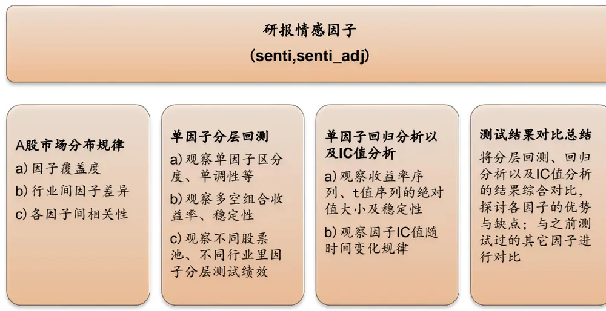
资料来源：华泰证券研究所

## 研报情感因子的覆盖度

图表 13 为各成分股中研报情感因子的覆盖度，senti 和 senti_adj 的覆盖度完全一致，可见沪深 300 成分股内覆盖度最高。

图表13： 研报情感因子在不同股票池内的覆盖度
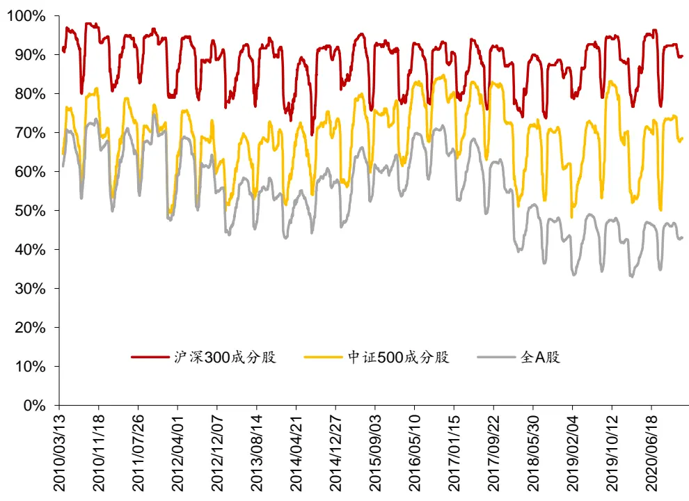
资料来源：Wind，朝阳永续，华泰证券研究所

图表 14 展示了各中信一级行业中研报情感因子的逐年平均覆盖度和 2010 年以来的覆盖度均值。

图表14： 研报情感因子在不同行业内的覆盖度

|  | 2016 | 2017 | 2019 | 2018 | 2020 | 覆盖度均值 |
| --- | --- | --- | --- | --- | --- | --- |
| 煤炭 | 62.18% | 60.91% | 64.84% | 60.42% | 53.24% | 61.58% |
| 交通运输 | 65.13% | 61.44% | 43.73% | 42.12% | 44.18% | 55.65% |
| 房地产 | 60.08% | 48.77% | 29.94% | 30.89% | 33.05% | 44.78% |
| 电力及公用事业 | 63.09% | 61.36% | 43.63% | 45.43% | 37.02% | 53.61% |
| 机械 | 55.59% | 54.83% | 36.70% | 33.30% | 33.96% | 51.12% |
| 电力设备及新能源 | 61.36% | 56.34% | 32.39% | 33.51% | 35.36% | 50.56% |
| 有色金属 | 58.51% | 59.24% | 49.81% | 52.89% | 45.46% | 58.92% |
| 基础化工 | 56.17% | 53.44% | 43.82% | 42.31% | 42.61% | 49.50% |
| 商贸零售 | 58.57% | 55.15% | 43.40% | 40.34% | 33.10% | 54.27% |
| 建筑 | 70.52% | 63.94% | 50.22% | 46.29% | 36.95% | 58.40% |
| 轻工制造 | 60.44% | 53.53% | 46.30% | 41.00% | 41.85% | 50.86% |
| 综合 | 44.26% | 38.15% | 15.64% | 16.73% | 9.57% | 25.80% |
| 医药 | 68.53% | 61.53% | 48.05% | 42.72% | 44.86% | 59.64% |
| 纺织服装 | 77.15% | 57.75% | 42.98% | 42.47% | 36.42% | 51.08% |
| 食品饮料 | 70.15% | 71.54% | 57.71% | 58.14% | 62.85% | 65.76% |
| 家电 | 71.56% | 58.42% | 47.68% | 44.03% | 44.38% | 59.35% |
| 汽车 | 60.97% | 59.53% | 40.71% | 33.52% | 35.03% | 51.92% |
| 电子 | 63.91% | 62.77% | 48.28% | 49.56% | 52.05% | 55.10% |
| 建材 | 62.02% | 55.11% | 39.12% | 38.56% | 40.22% | 52.53% |
| 消费者服务 | 85.08% | 83.13% | 68.65% | 62.38% | 51.16% | 71.88% |
| 石油石化 | 59.42% | 59.86% | 56.30% | 56.26% | 51.47% | 60.49% |
| 国防军工 | 74.38% | 76.21% | 68.10% | 68.06% | 59.77% | 66.48% |
| 农林牧渔 | 60.82% | 57.61% | 42.73% | 41.23% | 38.72% | 52.23% |
| 钢铁 | 71.92% | 60.16% | 52.65% | 62.28% | 55.94% | 67.69% |
| 通信 | 75.53% | 63.53% | 41.22% | 43.52% | 38.46% | 57.25% |
| 计算机 | 78.52% | 68.16% | 46.98% | 46.77% | 51.09% | 64.20% |
| 非银行金融 | 86.58% | 78.91% | 49.76% | 46.05% | 41.91% | 73.89% |
| 传媒 | 76.04% | 66.77% | 45.67% | 41.52% | 38.58% | 65.79% |
| 银行 | 98.66% | 93.69% | 90.01% | 86.69% | 87.43% | 94.61% |
| 综合金融 |  |  |  | 14.29% | 14.24% | 14.25% |

资料来源：Wind，朝阳永续，华泰证券研究所

## 研报情感因子的行业间差异

研报情感因子在各个行业的分布有差异性，在 2020 年 12 月底，食品饮料、电子、通信行业的 senti因子和 senti_adj 因子取值较高，说明这些行业的研报正面情感较突出。

图表15： senti因子在各个行业的平均取值
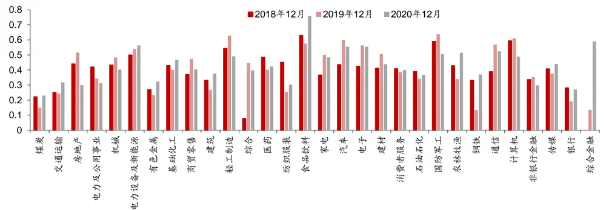
资料来源：Wind，朝阳永续，华泰证券研究所

图表16： senti_adj 因子在各个行业的平均取值
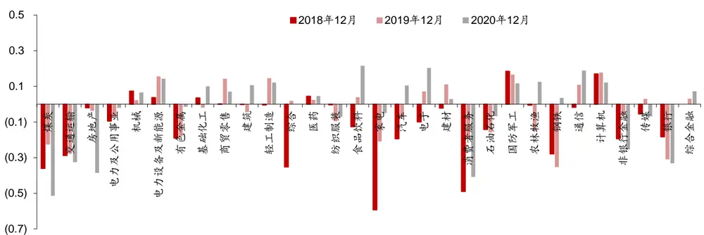
资料来源：Wind，朝阳永续，华泰证券研究所

## 研报情感因子和其他因子的相关性

图表 17 为研报情感因子和其他因子的相关系数，这里我们加入了另外两个分析师一致预期因子一致预期 ROE 和一致预期 EPS 进行对比。可知，senti 因子和 report_score 及report_num 因子的相关性都较高，而 senti_adj 因子和其他因子的相关性都较低。

图表17： 研报情感因子和其他因子的相关系数
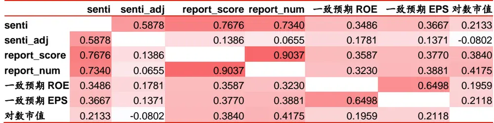
资料来源：Wind，朝阳永续，华泰证券研究所

## 单因子测试方法简介

## 回归法

回归法是一种最常用的测试因子有效性的方法，具体做法是将第T期的因子暴露度向量与T+1期的股票收益向量进行线性回归，所得到的回归系数即为因子在T期的因子收益率，同时还能得到该因子收益率在本期回归中的显著度水平——t 值。在某截面期上的个股的因子暴露度(Factor Exposure)即指当前时刻个股在该因子上的因子值。第T期的回归模型具体表达式如下。

$$
r^{T+1}=X^{T}a^{T}+\sum_{j}Indus_{j}^{T}b_{j}^{T}+ln\_mkt^{\mathrm{T}}b^{T}+\varepsilon^{T}
$$

$r^{T+1}$ :所有个股在第T+1期的收益率向量

$X^{T};$ :所有个股第T期在被测单因子上的暴露度向量

IndusjT: 所有个股第 T 期在第 j 个行业因子上的暴露度向量(0/1 哑变量)

$ln\_mkt^{\mathrm{T}};$ :所有个股第T期在对数市值因子上的暴露度向量

$a^{T},b^{T},b_{j}^{T}$ :对应因子收益率，待拟合常数，通常比较关注 $.a^{T}$

εT:残差向量

回归模型构建方法如下：

1． 股票池：沪深 300 成分股、中证 500 成分股，全 A 股，剔除 ST、PT 股票，剔除每个截面期下一交易日停牌的股票。

2． 回溯区间：2010/5/4～2020/12/31。

3． 截面期：每个月最后一个交易日计算因子值，与该截面期之后一个月的个股收益进行回归。

4． 数据处理方法：

a) 中位数去极值：设第 T 期某因子在所有个股上的暴露度向量为 $D_{i}$ ， $D_{M}$ 为该向量中位数， $D_{M1}$ 为向量 $|D_{i}-D_{M}|$ 的中位数，则将向量 $D_{i}$ 中所有大于 ${}^{\cdot}D_{M}+5D_{M1}$ 的数重设为 $D_{M}+5D_{M1}$ ，将向量 $D_{i}$ 中所有小于 $\text{∠ }\cdot D_{M}-5D_{M1}的$ 数重设为 $D_{M}-5D_{M1}$

b) 中性化：以行业及市值中性化为例，在第 T 期截面上用因子值(已去极值)做因变量、对数总市值因子(已去极值)及全部行业因子(0/1 哑变量)做自变量进行线性回归，取残差作为因子值的一个替代，这样做可以消除行业和市值因素对因子的影响；

c) 标准化：将经过以上处理后的因子暴露度序列减去其现在的均值、除以其标准差，得到一个新的近似服从 N(0,1)分布的序列，这样做可以让不同因子的暴露度之间具有可比性；

d) 缺失值处理：因本文主旨为单因子测试，为了不干扰测试结果，如文中未特殊指明均不填补缺失值(在构建完整多因子模型时需考虑填补缺失值)。

5． 回归权重：由于普通最小二乘回归(OLS)可能会夸大小盘股的影响(因为小盘股的财务质量因子出现极端值概率较大，且小盘股数目很多，但占全市场的交易量比重较小)，并且回归可能存在异方差性，故我们参考Barra手册，采用加权最小二乘回归(WLS)，使用个股流通市值的平方根作为权重，此举也有利于消除异方差性。

6． 因子评价方法：

a) t 值序列绝对值均值——因子显著性的重要判据；

b) t 值序列绝对值大于 2的占比——判断因子的显著性是否稳定；

c) t 值序列均值——与 a)结合，能判断因子 t值正负方向是否稳定；

d) 因子收益率序列均值——判断因子收益率的大小。

## IC 值分析法

因子的 IC 值是指因子在第 T 期的暴露度向量与 T+1 期的股票收益向量的相关系数，即

$$
IC^{T}=\operatorname{corr}(r^{T+1},X^{T})
$$

上式中因子暴露度向量 $X^{T}$ 一般不会直接采用原始因子值，而是经过去极值、中性化等手段处理之后的因子值。在实际计算中，使用 Pearson 相关系数可能受因子极端值影响较大，使用Spearman秩相关系数则更稳健一些，这种方式下计算出来的 IC一般称为Rank IC。IC 值分析模型构建方法如下：

1. 股票池、回溯区间、截面期均与回归法相同。

2. 先将因子暴露度向量进行一定预处理(下文中会指明处理方式)，再计算处理后的 T 期因子暴露度向量和T+1期股票收益向量的Spearman秩相关系数，作为T期因子RankIC 值。

3. 因子评价方法：

a) Rank IC 值序列均值——因子显著性；

b) Rank IC 值序列标准差——因子稳定性；

c) IC_IR(Rank IC 值序列均值与标准差的比值)——因子有效性；

d) Rank IC 值序列大于零的占比——因子作用方向是否稳定。

## 分层回测法

依照因子值对股票进行打分，构建投资组合回测，是最直观的衡量因子优劣的手段。分层测试法与回归法、IC 值分析相比，能够发掘因子对收益预测的非线性规律。也即，若存在一个因子分层测试结果显示，其 Top组和 Bottom 组的绩效长期稳定地差于 Middle 组，则该因子对收益预测存在稳定的非线性规律，但在回归法和 IC 值分析过程中很可能被判定为无效因子。分层测试模型构建方法如下：

1. 股票池、回溯区间、截面期均与回归法相同。

2. 换仓：在每个截面期核算因子值，构建分层组合，在截面期下一个交易日按当日收盘价换仓，交易费用以双边千分之四计。

3. 分层方法：因子暴露度向量XT先用中位数法去极值，然后进行市值、行业中性化处理(方法论详见上一小节)，将股票池内所有个股按因子从大到小进行排序，等分 N 层，每层内部的个股等权配置。当个股总数目无法被 N整除时采用任一种近似方法处理均可，实际上对分层组合的回测结果影响很小。

4. 多空组合收益计算方法：用 Top 组每天的收益减去 Bottom 组每天的收益，得到每日多空收益序 $列r_{1},r_{2},\cdots,r_{n},$ ，则多空组合在第n天的净值等于 $(1+r_{1})(1+r_{2})\cdots(1+r_{n})$ 评价方法：全部 N层组合年化收益率(观察是否单调变化)，多空组合的年化收益率、夏普比率、TOP 组合信息比率、月胜率等。

## 研报情感因子测试结果

本章将展示 senti 和 senti_adj 因子的测试结果，为了分析它们相对 report_score 和report_num 因子是否有增量信息，将 senti 因子与 report_score 和 report_num 因子回归取残差得到 senti_res 因子，将 senti_adj 因子与 report_score 和 report_num 因子回归取残差得到 senti_adj_res 因子。考虑到篇幅的限制，本节不展示 report_score 和 report_num因子的测试结果，感兴趣的读者可参见附录。

## 回归法和 IC值分析法

图表 18展示了研报情感因子及其残差因子的回归法和 IC 值分析法结果。总体来看，senti在各个股票池内表现最好，但其残差因子 senti_res 表现最差，说明其大部分信息可被report_score 和 report_num 因子所解释。而 senti_adj 及其残差因子 senti_adj_res 的表现相差不大，且优于 senti_res，说明 senti_adj 因子更能体现出研报情感因子相比report_score 和 report_num 因子的增量信息。

图表18： 研报情感因子及其残差因子回归法和 IC值分析法结果

|  | It\|均值 | \|tl>2 占比 | t均值 | 因子收益率均值 | RankIC 均值 | RankIC 标准差 | IC_IR | IC>0 占比 |
| --- | --- | --- | --- | --- | --- | --- | --- | --- |
| 沪深 300 成分股 |  |  |  |  |  |  |  |  |
| senti | 1.35 | 24.22% | 0.45 | 0.25% | 4.38% | 14.29% | 0.31 | 59.38% |
| senti_res | 1.23 | 17.97% | -0.07 | -0.02% | 1.74% | 12.78% | 0.14 | 49.22% |
| senti_adj | 1.20 | 17.97% | 0.30 | 0.11% | 2.36% | 13.24% | 0.18 | 54.69% |
| senti_adj_res | 1.22 | 18.75% | 0.27 | 0.10% | 2.17% | 13.26% | 0.16 | 54.69% |
| 中证 500 成分股 |  |  |  |  |  |  |  |  |
| senti | 1.53 | 33.59% | 0.64 | 0.32% | 3.71% | 14.12% | 0.26 | 60.16% |
| senti_res | 1.15 | 13.28% | 0.43 | 0.23% | 2.82% | 9.94% | 0.28 | 61.72% |
| senti_adj | 1.15 | 16.41% | 0.40 | 0.21% | 2.91% | 10.43% | 0.28 | 61.72% |
| senti_adj_res | 1.12 | 14.06% | 0.41 | 0.22% | 2.98% | 10.02% | 0.30 | 62.50% |
| 全 A股 |  |  |  |  |  |  |  |  |
| senti | 2.95 | 53.91% | 1.39 | 0.31% | 3.71% | 11.84% | 0.31 | 60.16% |
| senti_res | 1.98 | 39.06% | 0.54 | 0.15% | 2.34% | 11.22% | 0.21 | 60.16% |
| senti_adj | 1.99 | 39.84% | 0.52 | 0.10% | 2.81% | 10.50% | 0.27 | 62.50% |
| senti_adj_res | 1.96 | 39.84% | 0.50 | 0.10% | 2.80% | 10.68% | 0.26 | 61.72% |

资料来源：Wind，朝阳永续，华泰证券研究所

## 分层测试法

图表 19~图表 25 展示了研报情感因子及其残差因子的分层测试结果。从各项指标来看，分层测试的结论与回归法和 IC 值分析法一致。

图表19： 研报情感因子及其残差因子分层测试结果

|  |  |  |  |  | 多空组合 |  | 多空组合 | TOP 组合 TOP 组合 TOP 组合 |  |  |
| --- | --- | --- | --- | --- | --- | --- | --- | --- | --- | --- |
|  | 分层组合1～5(从左到右)年化超额收益率 |  |  |  |  | 年化收益率 | 夏普比率 | 信息比率 | 胜率 | 换手率 |
| 沪深 300 成分股 |  |  | -3.42% |  |  |  |  |  |  |  |
| senti | 7.39% | -0.49% |  | -5.92% | -8.49% | 16.56% | 1.34 | 1.00 | 60.94% | 72.35% |
| senti_res | 3.79% | -1.86% | -4.38% | -4.37% | -4.67% | 8.27% | 0.76 | 0.59 | 57.81% | 83.19% |
| senti_adj | 5.40% | -3.06% | -3.59% | -5.68% | -4.52% | 9.72% | 0.86 | 0.82 | 60.16% | 78.67% |
| senti_adj_res 中证 500 成分股 | 4.95% | -2.91% | -4.42% | -5.15% | -3.99% | 8.66% | 0.77 | 0.75 | 57.81% | 79.93% |
| senti | 5.58% | 0.17% | -3.46% | -7.43% | -4.87% | 10.36% | 0.91 | 0.83 | 60.16% | 75.07% |
| senti_res | 5.73% | -2.15% | -3.33% | -5.76% | -4.29% | 10.10% | 1.13 | 0.99 | 62.50% | 85.09% |
| senti_adj | 6.26% | -1.92% | -4.67% | -4.77% | -4.74% | 11.15% | 1.21 | 1.03 | 64.84% | 80.82% |
| senti_adj_res | 7.03% | -2.64% | -4.76% | -4.54% | -4.72% | 11.96% | 1.32 | 1.17 | 64.06% | 81.99% |
| 全A股 |  |  |  |  |  |  |  |  |  |  |
| senti | 4.18% | 0.00% | -1.32% | -5.29% | -7.57% | 12.21% | 1.26 | 0.78 | 57.03% | 72.57% |
| senti_res | 3.81% | -0.41% | -2.62% | -4.58% | -5.95% | 9.92% | 1.12 | 0.80 | 58.59% | 83.29% |
| senti_adj | 4.39% | 0.21% | -3.03% | -4.73% | -6.46% | 11.11% | 1.21 | 0.89 | 59.38% | 79.14% |
| senti_adj_res | 4.53% | 0.21% | -3.19% | -4.74% | -6.47% | 11.27% | 1.23 | 0.93 | 57.81% | 80.43% |

资料来源：Wind，朝阳永续，华泰证券研究所

图表20： senti因子分层测试相对等权基准超额收益(沪深 300)
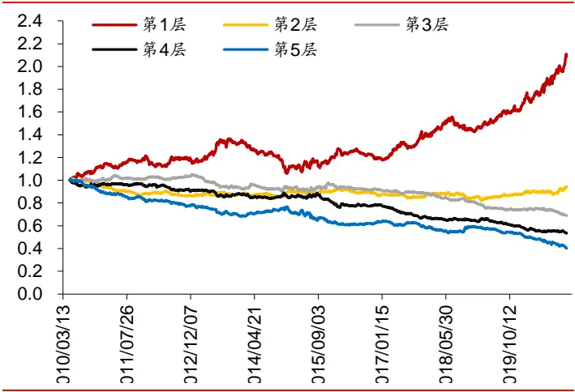
资料来源：Wind，朝阳永续，华泰证券研究所

图表21： senti_adj因子分层测试相对等权基准超额收益(沪深 300)
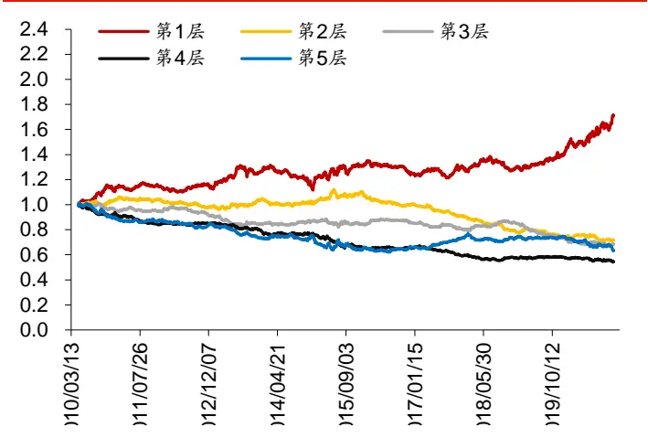
资料来源：Wind，朝阳永续，华泰证券研究所

图表22： senti因子分层测试相对等权基准超额收益(中证 500)
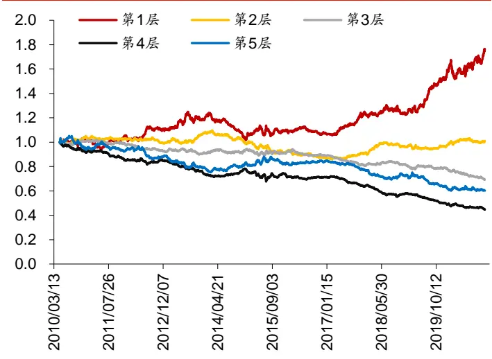
资料来源：Wind，朝阳永续，华泰证券研究所

图表23： senti_adj 因子分层测试相对等权基准超额收益(中证 500)
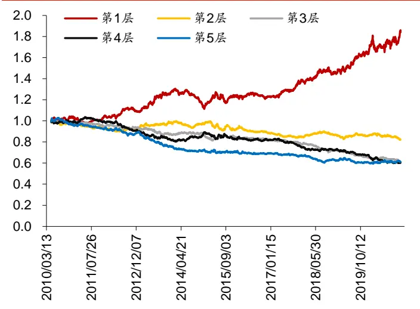
资料来源：Wind，朝阳永续，华泰证券研究所

图表24： senti因子分层测试相对等权基准超额收益(全 A)
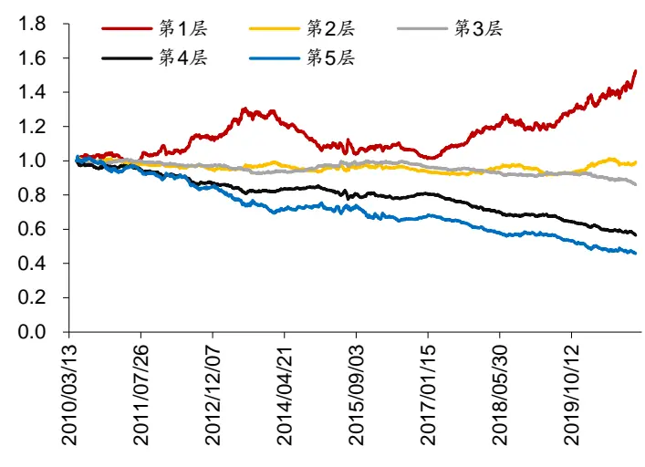
资料来源：Wind，朝阳永续，华泰证券研究所

图表25： senti_adj 因子分层测试相对等权基准超额收益(全 A)
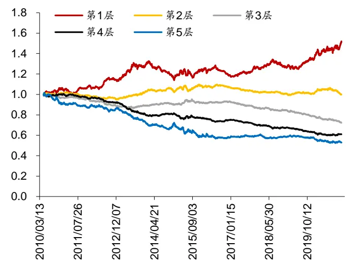
资料来源：Wind，朝阳永续，华泰证券研究所

图表 26~图表 28 展示了残差因子的 TOP 组合相对等权基准的超额收益，可知在各个股票池内 senti_adj_res 表现都优于 senti_res。

图表26： 残差因子的 TOP 组合相对等权基准超额收益(沪深 300)
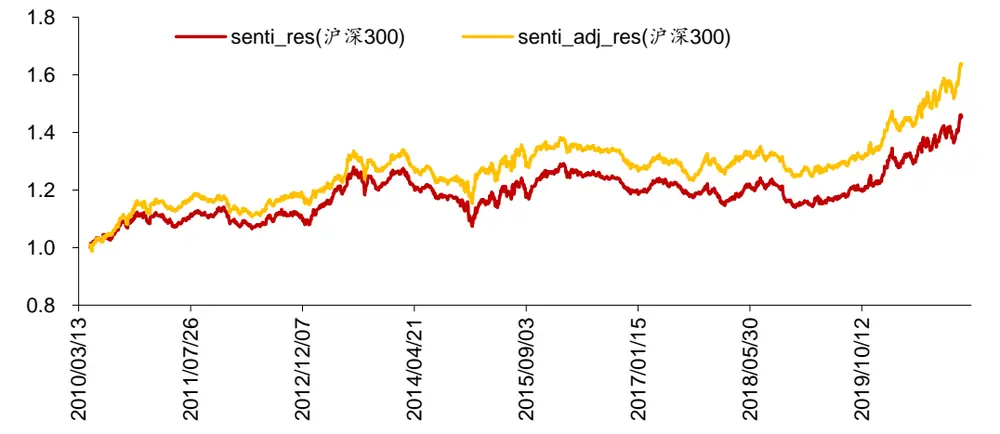
资料来源：Wind，朝阳永续，华泰证券研究所

图表27： 残差因子的 TOP 组合相对等权基准超额收益(中证 500)
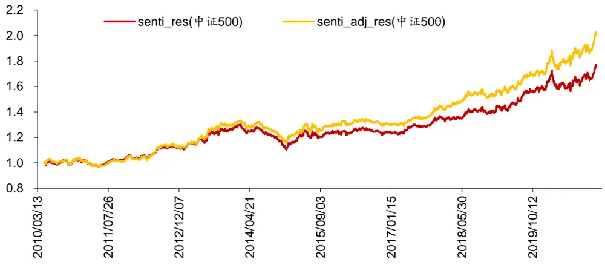
资料来源：Wind，朝阳永续，华泰证券研究所

图表28： 残差因子的 TOP组合相对等权基准超额收益(全 A)
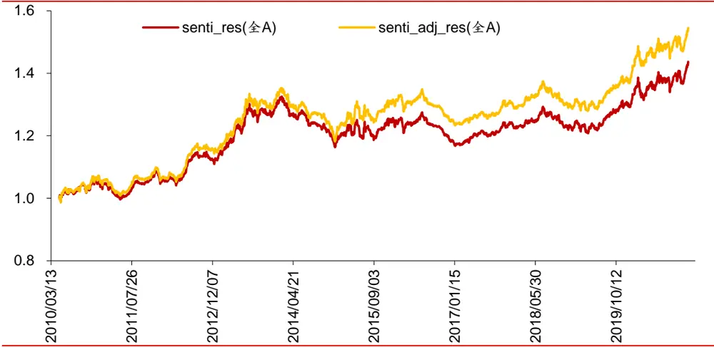
资料来源：Wind，朝阳永续，华泰证券研究所

## 研报情感因子的行业内选股效果

图表 29 和图表 30 分别展示了 senti 和 senti_adj 因子在行业内选股的测试结果。由于综合行业和综合金融行业因子覆盖度太低，不做测试。

图表29： senti因子在行业内选股的表现

| 多空组合年 |  |  |  |  |  |  |  |  |  | 多空组合 | TOP 组合 | TOP 组因子覆盖 |
| --- | --- | --- | --- | --- | --- | --- | --- | --- | --- | --- | --- | --- |
| 行业 | RankIC 均值 IC_IR |  |  | 分层组合1～5（从左到右）年化超额收益率 |  |  |  | 化收益率 | 夏普比率 | 信息比率 | 合胜率 度均值 |  |
| 石油石化 | 7.35% | 0.27 | 11.18% | 3.07% | -13.55% | -1.97%-12.96% |  | 23.02% | 0.84 | 0.68 52.34% | 60.49% |  |
| 食品饮料 | 5.68% | 0.27 | 9.08% | -1.81% | -3.32% | -7.33% | -7.99% | 16.09% | 0.78 | 0.75 59.38% | 65.76% |  |
| 传媒 | 4.88% | 0.22 | 7.21% | 1.48% | -4.35% | -9.48% | -7.77% | 13.41% | 0.59 | 0.51 55.47% | 65.79% |  |
| 银行 | 1.90% | 0.08 | 6.47% | -7.26% | -2.93% | -6.24% | -5.03% | 11.00% | 0.76 | 0.72 58.59% | 94.61% |  |
| 机械 | 6.00% | 0.38 | 6.13% | 1.34% | -1.89% | -7.82% | -8.81% | 15.15% | 1.02 | 0.69 57.81% | 51.12% |  |
| 房地产 | 1.83% | 0.09 | 5.92% | -1.87% | -4.34% | -4.76% | -4.84% | 9.66% | 0.49 | 0.44 54.69% | 44.78% |  |
| 建材 | 3.15% | 0.15 | 5.43% | 2.75% | -7.49% | -8.57% | -4.09% | 7.26% | 0.33 | 0.41 54.69% | 52.53% |  |
| 电力设备及新能源 | 4.05% | 0.23 | 5.26% | 0.30% | 1.74%-12.30% |  | -7.25% | 11.84% | 0.65 | 0.45 53.91% | 50.56% |  |
| 家电 | 4.01% | 0.16 | 5.18% | -3.55% | 0.30% | -8.75% | -7.57% | 11.00% | 0.48 | 0.36 53.13% | 59.35% |  |
| 钢铁 | 7.17% | 0.29 | 3.99% | 1.48% | 3.34% | -7.55% -14.19% |  | 18.54% | 0.85 | 0.28 56.25% | 67.69% |  |
| 医药 | 4.34% | 0.26 | 3.90% | 0.02% | -4.08% | -5.53% | -6.13% | 9.66% | 0.69 | 0.47 54.69% | 59.64% |  |
| 电子 | 3.89% | 0.21 | 3.80% | -0.05% | -1.64% | -4.54% | -9.18% | 12.78% | 0.75 | 0.36 57.03% | 55.10% |  |
| 轻工制造 | 3.40% | 0.16 | 3.49% | -1.14% | 4.39% | -7.86% -11.14% |  | 14.02% | 0.66 | 0.25 53.91% | 50.86% |  |
| 计算机 | 3.39% | 0.20 | 2.05% | -1.51% | -3.89% | -3.53% | -5.38% | 6.31% | 0.37 | 0.19 53.13% | 64.20% |  |
| 纺织服装 | 2.16% | 0.09 | 1.84% | -1.64% | -5.62% | -5.25% | -1.27% | 0.99% | 0.05 | 0.14 50.00% | 51.08% |  |
| 有色金属 | 3.84% | 0.20 | 1.76% | 0.29% | -5.82% | -5.90% | -3.01% | 3.11% | 0.16 | 0.14 50.78% | 58.92% |  |
| 国防军工 | 3.98% | 0.15 | 0.91% | 1.29% | -5.62% | -3.12% | -8.01% | 6.30% | 0.26 | 0.06 45.31% | 66.48% |  |
| 汽车 | 2.22% | 0.13 | -0.01% | -3.29% | -1.83% | -1.42% | -6.23% | 5.19% | 0.30 | 0.00 50.00% | 51.92% |  |
| 基础化工 | 3.60% | 0.24 | -0.22% | 0.45% | -0.01% | -3.70% | -7.30% | 6.56% | 0.45 | -0.02 51.56% | 49.50% |  |
| 非银行金融 | 4.51% | 0.18 | -1.01% | -2.63% | 4.42% | -8.02% | -5.27% | 2.89% | 0.16 | -0.09 48.44% | 73.89% |  |
| 交通运输 | 2.51% | 0.14 | -1.02% | 3.05% | -4.88% | -0.76% | -7.30% | 5.33% | 0.31 | -0.09 45.31% | 55.65% |  |
| 消费者服务 | 3.76% | 0.14 | -1.45% | 7.58% |  | -1.69%-10.16% -10.03% |  | 6.32% | 0.25 | -0.09 47.66% | 71.88% |  |
| 电力及公用事业 | 2.55% | 0.13 | -2.40% | 2.43% | -4.21% | -2.04% | -6.54% | 2.81% | 0.16 | -0.23 46.88% | 53.61% |  |
| 农林牧渔 | 1.81% | 0.08 | -2.87% | -3.71% | 2.62% | -0.80% | -6.76% | 1.70% | 0.08 | -0.23 49.22% | 52.23% |  |
| 煤炭 | 2.52% | 0.10 | -3.22% | -0.16% | -4.17% | -1.79% | -4.44% | -0.85% | -0.04 | -0.23 44.53% | 61.58% |  |
| 通信 | 0.41% | 0.02 | -4.25% | 2.31% | -1.13% | -5.78% | -3.82% | -2.43% | -0.12 | -0.34 | 46.09%57.25% |  |
| 商贸零售 | 0.60% | 0.03 | -4.50% | -0.66% | -4.08% | -1.55% | -0.73% | -5.33% | -0.29 | -0.40 42.19% | 54.27% |  |
| 建筑 | 0.17% | 0.01 | -4.99% | 0.54% | -2.23% | -1.03% | -6.74% | 0.00% | 0.00 | -0.40 44.53% | 58.40% |  |

资料来源：Wind，朝阳永续，华泰证券研究所

图表30： senti_adj 因子在行业内选股的表现

| 行业 | RankIC 均值 IC_IR | 分层组合1～5（从左到右）年化超额收益率 |  |  |  |  |  |  |  | 多空组合 TOP 组合 | TOP 组因子覆盖 合胜率 | 度均值 |
| --- | --- | --- | --- | --- | --- | --- | --- | --- | --- | --- | --- | --- |
|  |  |  |  |  |  |  |  | 化收益率 | 夏普比率 信息比率 |  |  |  |
| 石油石化 | 4.74% | 0.19 | 8.94% | 0.52% | -9.08% | -9.89% | -3.91% | 9.54% | 0.36 | 0.57 | 54.69% 60.49% |  |
| 传媒 | 2.77% | 0.14 | 7.66% | -5.39% | -8.39% | -5.15% | -2.33% | 7.81% | 0.37 | 0.58 | 57.81% 65.79% |  |
| 家电 | 1.31% | 0.06 | 7.63% | -7.02% | -4.18% | -8.55% | -1.71% | 6.99% | 0.33 |  | 0.54 55.47% | 59.35% |
| 食品饮料 | 3.77% | 0.21 | 7.08% | 0.55% | -5.72% | -7.77% | -5.87% | 12.03% | 0.66 | 0.60 | 55.47% | 65.76% |
| 机械 | 3.32% | 0.28 | 4.73% | -4.48% | -0.51% | -4.96% | -5.59% | 9.95% | 0.74 | 0.58 | 52.34% | 51.12% |
| 非银行金融 | -0.74% | -0.03 | 4.71% | -5.32% | -4.58% | -6.79% | -0.88% | 3.54% | 0.18 | 0.37 | 51.56% | 73.89% |
| 轻工制造 | 5.26% | 0.28 | 4.59% | 3.51% | -3.84% |  | -2.20%-14.35% | 19.63% | 0.93 | 0.33 | 57.81% | 50.86% |
| 交通运输 | 3.70% | 0.19 | 4.06% | 2.27% | -5.53% | -7.61% | -5.43% | 8.36% | 0.48 | 0.38 | 49.22% | 55.65% |
| 电力设备及新能源 | 2.53% | 0.19 | 3.39% | -1.68% | -1.44% | -5.49% | -7.90% | 10.68% | 0.62 | 0.31 | 48.44% | 50.56% |
| 电子 | 3.29% | 0.22 | 3.32% | 2.75% | -3.55% | -9.60% | -4.40% | 6.99% | 0.48 | 0.34 | 57.03% | 55.10% |
| 钢铁 | 5.20% | 0.25 | 3.16% | 6.10% |  | -9.86% -10.24% | -5.74% | 7.24% | 0.35 | 0.24 | 53.13% | 67.69% |
| 计算机 | 2.60% | 0.19 | 3.12% | -1.97% | -4.62% | -4.22% | -3.86% | 6.11% | 0.40 | 0.31 | 53.91% | 64.20% |
| 纺织服装 | 1.98% | 0.10 | 2.36% | -2.54% | -4.69% | -5.03% | -2.60% | 3.35% | 0.17 | 0.18 | 56.25% | 51.08% |
| 商贸零售 | 1.40% | 0.09 | 1.72% | -4.20% | -3.51% | -5.06% | -1.40% | 1.84% | 0.11 | 0.16 | 51.56% | 54.27% |
| 医药 | 2.97% | 0.24 | 1.69% | 3.14% | -3.22% | -7.59% | -4.98% | 6.38% | 0.55 | 0.22 | 50.78% | 59.64% |
| 基础化工 | 1.68% | 0.13 | 1.37% | -2.16% | -3.82% | -2.78% | -3.35% | 3.99% | 0.29 | 0.15 | 52.34% | 49.50% |
| 国防军工 | 3.98% | 0.16 | 1.02% | -0.44% | -5.63% | -3.00% | -9.32% | 8.41% | 0.36 | 0.07 | 51.56% | 66.48% |
| 房地产 | 0.78% | 0.05 | 1.00% | -3.55% | -2.91% | -2.65% | -2.86% | 2.73% | 0.17 | 0.10 | 52.34% | 44.78% |
| 电力及公用事业 | 1.71% | 0.10 | 0.57% | -1.16% | -1.06% | -4.22% | -6.19% | 5.89% | 0.36 | 0.06 | 52.34% | 53.61% |
| 建材 | 2.32% | 0.12 | 0.54% | 2.10% | -7.87% | -3.06% | -5.02% | 3.43% | 0.16 | 0.04 | 47.66% | 52.53% |
| 建筑 | 2.46% | 0.16 | 0.20% | -0.69% | 1.59% | -4.47% | -7.21% | 6.42% | 0.36 | 0.02 | 50.00% | 58.40% |
| 汽车 | 1.30% | 0.08 | -0.02% | 0.01% | -7.33% | -2.02% | -3.19% | 1.73% | 0.10 | 0.00 | 50.78% | 51.92% |
| 有色金属 | 4.00% | 0.23 | -0.37% | 1.18% | -2.45% | -1.86% | -7.49% | 5.98% | 0.33 | -0.03 | 45.31% | 58.92% |
| 农林牧渔 | 2.11% | 0.11 | -1.31% | -6.78% | 3.24% | -5.43% | -6.20% | 3.07% | 0.16 | -0.11 | 47.66% | 52.23% |
| 通信 | -0.51% | -0.03 | -1.83% | 0.83% | 0.26% | -6.41% | -3.20% | -0.37% | -0.02 | -0.15 | 45.31% | 57.25% |
| 消费者服务 | 3.09% | 0.16 | -1.95% | -2.16% | -0.95% | -5.21% | -5.91% | 1.66% | 0.07 | -0.13 |  | 43.75% 71.88% |
| 银行 | -0.87% | -0.03 | -2.62% | -6.15% | -2.33% | -5.29% | 0.70% | -4.20% | -0.30 | -0.30 | 42.97% | 94.61% |
| 煤炭 | -0.90% | -0.03 | -3.22% | -2.78% | -8.35% | 0.39% | 0.80% | -5.82% | -0.28 |  | -0.24 43.75% | 61.58% |

资料来源：Wind，朝阳永续，华泰证券研究所

## 基于研报情感因子的 TOP80选股组合构建

本章基于 senti因子，构建 TOP80 组合并回测，构建方法如下：

1. 样本空间：中证 800 成分股。

2. 回测区间：2011 年 1 月 31 日至 2020 年 12 月 31 日。

3. 月频调仓，每个月最后一个交易日选择 senti 因子取值最高的前 80 只股票，按照流通市值加权的方法，在下一交易日按收盘价调仓，交易成本为双边千分之四。

图表 31~图表 33 为回测结果，研报情感因子 TOP80 组合在 2019 年和 2020 年表现优秀，分别获得了 51.61%和 69.69%的绝对收益。

图表31： 研报情感因子 TOP80组合回测净值
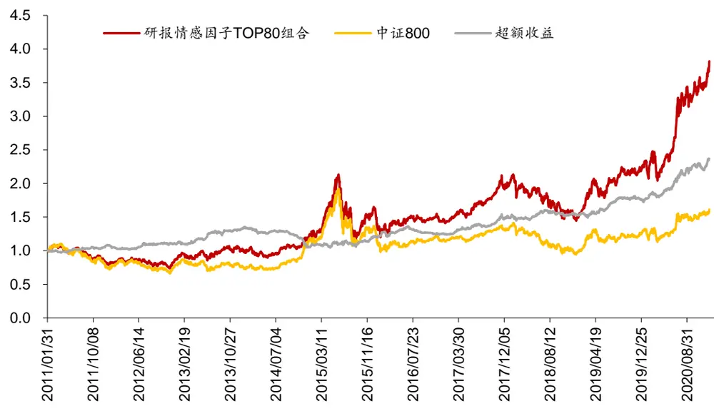
资料来源：Wind，朝阳永续，华泰证券研究所

图表32： 研报情感因子 TOP80 组合回测绩效

|  | 年化收益率 | 年化波动率 | 夏普比率 | 最大回撤 | 月均双边换手率 |
| --- | --- | --- | --- | --- | --- |
| 研报情感因子 TOP80 组合 | 14.90% | 25.50% | 0.58 | 46.50% | 84.70% |
| 中证 800 | 5.10% | 23.00% | 0.22 | 50.90% |  |

资料来源：Wind，朝阳永续，华泰证券研究所

图表33： 研报情感因子 TOP80组合逐年收益率

|  | 2011年 | 2012年 | 2013年 | 2014年 | 2015年 | 2016年 | 2017年 | 2018年 | 2019年 | 2020年 |
| --- | --- | --- | --- | --- | --- | --- | --- | --- | --- | --- |
| 研报情感因子 TOP80 组合 | -18.83% | 7.68% | 17.16% | 17.88% | 32.48% | -10.38% | 36.87% | -24.37% | 51.61% | 69.69% |
| 中证 800 | -25.14% | 5.81% | -2.14% | 48.28% | 14.91% | -13.27% | 15.16% | -27.38% | 33.71% | 25.79% |

资料来源：Wind，朝阳永续，华泰证券研究所

## 总结和展望

本文是探索人工智能模型对于另类数据中信息提取的第二篇报告，总结如下：

1. 本文梳理了基于 BERT 的分析师研报情感因子构建流程。该流程为：(1) 下载预训练好的中文 BERT 模型。(2) 使用Wind 有情感标注的金融舆情文本微调模型。(3) 将微调后的模型在无标注的分析师研报摘要上预测情感。(4) 通过摘要文本的情感分析结果构建选股因子。本文使用 NLP模型可解释性工具 LIT 对研报情感分析的结果进行解读，可知 BERT 模型对于给定研报摘要的情感分析都是比较合理的，做出了与人类相似的判断。

2. 本文构建了研报情感因子 senti 及其调整因子 senti_adj。得到研报摘要中每个句子的情感预测概率后，我们在 90 个自然日的滚动窗口内，使用线性衰减加权的方式构建研报情感因子 senti。考虑到分析师对上市公司的正面评价居多，我们给予负面情感文本更大权重，构建了调整因子 senti_adj。为了对比研报情感因子和传统分析师因子，我们用类似的方法构建了研报评分因子 report_score 和研报数量因子report_num。senti 和 report_score 及 report_num 的相关性都较高，而 senti_adj 和其他因子的相关性都较低。在 2020 年 12 月底，食品饮料、电子、通信行业的研报情感因子取值较高，说明这些行业的研报正面情感较突出。

3. 因子测试：senti表现较好，senti_adj 更能体现研报情感因子的增量信息。本文测试了 senti 和 senti_adj 因子及它们对 report_score 和 report_num 中性化后残差因子sent_res 和 senti_adj_res 的表现。总体来看，senti 在各个股票池内表现最好，但其残差因子 senti_res 表现最差，说明其大部分信息可被 report_score 和 report_num因子所解释。而 senti_adj 及其残差因子 senti_adj_res 的表现相差不大，说明 senti_adj因子更能体现出研报情感因子相比 report_score 和 report_num 因子的增量信息。senti_adj 因子在沪深 300、中证 500、全 A股的多头年化超额收益率分别为 5.40%，6.26%，4.39%(回测区间：20100504~20201231)，在最近两年表现优秀。

4. 绝对收益组合：基于研报情感因子的 TOP80 选股组合表现优秀。本文基于 senti 因子，构建 TOP80 组合并回测，构建方法如下：(1)样本空间：中证 800 成分股。(2)回测区间：2011 年 1月 31 日至 2020 年 12 月 31 日。(3)月频调仓，每个月最后一个交易日选择 senti因子取值最高的前 100 只股票，按照流通市值加权的方法，在下一交易日按收盘价调仓，交易成本为双边千分之四。研报情感因子 TOP80 组合年化收益率为 14.90%，夏普比率为 0.58，组合在 2019 年和 2020 年表现优秀，分别获得了 51.61%和 69.69%的绝对收益。

## 基于 BERT 的分析师研报因子构建流程依然有改进的空间：

1. 该流程的假设是金融新闻与分析师研报具有相似的语义结构，才能将模型在不同的数据间迁移，该假设是否完全成立本文尚未讨论。未来可以参考迁移学习中的领域自适应方法(domain adaptation)进行改进。

2. 不同行业上市公司的研报可能有不同的语义特征，训练针对单行业的 NLP模型或许是改进方向。

## 风险提示

分析师研报情感因子的测试结果是历史表现的总结，存在失效的可能。本文假设金融新闻与分析师研报具有相似的语义结构，该假设是否完全成立本文尚未讨论。模型可解释性工具 LIT 可能存在过度简化的风险。

## 附录：report_score 和 report_num 因子测试结果

图表 34~图表 35 为 report_score 和 report_num 因子的回归、IC、分层测试结果。

图表34： report_score 和 report_num 因子回归法和 IC 值分析法结果

|  | It\|均值 | Itl>2 占比 | t均值 | 因子收益率均值 | RankIC 均值 | RankIC 标准差 | IC_IR | IC>0 占比 |
| --- | --- | --- | --- | --- | --- | --- | --- | --- |
| 沪深 300 成分股 |  |  |  |  |  |  |  |  |
| report_score | 1.37 | 28.13% | 0.66 | 0.34% | 4.01% | 13.85% | 0.29 | 59.38% |
| report_num | 1.39 | 25.00% | 0.68 | 0.36% | 5.11% | 14.32% | 0.36 | 59.38% |
| 中证 500 成分股 |  |  |  |  |  |  |  |  |
| report_score | 1.49 | 27.34% | 0.50 | 0.23% | 2.89% | 12.72% | 0.23 | 60.94% |
| report_num | 1.58 | 31.25% | 0.63 | 0.30% | 3.25% | 12.71% | 0.26 | 60.16% |
| 全 A股 |  |  |  |  |  |  |  |  |
| report_score | 2.98 | 60.94% | 1.52 | 0.32% | 3.00% | 10.89% | 0.28 | 60.94% |
| report_num | 3.06 | 60.16% | 1.75 | 0.42% | 2.84% | 10.86% | 0.26 | 60.16% |

资料来源：Wind，朝阳永续，华泰证券研究所

图表35： report_score 和 report_num 因子分层测试结果

|  |  |  |  |  | 多空组合 |  | 多空组合 TOP 组合 TOP 组合 TOP 组合 |  |  |  |
| --- | --- | --- | --- | --- | --- | --- | --- | --- | --- | --- |
|  | 分层组合1～5(从左到右)年化超额收益率 |  |  |  |  | 年化收益率 | 夏普比率信息比率 |  | 胜率 | 换手率 |
| 沪深 300 成分股 |  |  |  |  |  |  |  |  |  |  |
| report_score | 3.98% | 1.69% | -4.07% | -5.51% | -7.79% | 12.10% | 1.09 | 0.62 | 53.91% | 73.16% |
| report_num | 6.58% | 0.54% | -3.03% | -5.23% | -9.12% | 16.54% | 1.43 | 0.98 | 57.03% | 68.87% |
| 中证 500 成分股 |  |  |  |  |  |  |  |  |  |  |
| report_score | 2.91% | 0.48% | -3.24% | -6.07% | -5.08% | 7.92% | 0.77 | 0.47 | 54.69% | 76.08% |
| report_num | 4.71% | 0.65% | -5.00% | -5.53% | -4.82% | 9.53% | 0.93 | 0.74 | 57.03% | 68.84% |
| 全 A股 |  |  |  |  |  |  |  |  |  |  |
| report_score | 2.56% | -0.59% | -3.16% | -3.87% | -5.62% | 8.35% | 1.02 | 0.52 | 51.56% | 70.96% |
| report_num | 2.75% | -1.45% | -2.30% | -3.08% | -5.88% | 8.86% | 1.03 | 0.50 | 53.91% | 63.32% |

资料来源：Wind，朝阳永续，华泰证券研究所

## 免责声明

## 分析师声明

本人，林晓明、李子钰、何康，兹证明本报告所表达的观点准确地反映了分析师对标的证券或发行人的个人意见；彼以往、现在或未来并无就其研究报告所提供的具体建议或所表迖的意见直接或间接收取任何报酬。

## 一般声明及披露

本报告由华泰证券股份有限公司（已具备中国证监会批准的证券投资咨询业务资格，以下简称“本公司”）制作。本报告仅供本公司客户使用。本公司不因接收人收到本报告而视其为客户。

本报告基于本公司认为可靠的、已公开的信息编制，但本公司对该等信息的准确性及完整性不作任何保证。本报告所载的意见、评估及预测仅反映报告发布当日的观点和判断。在不同时期，本公司可能会发出与本报告所载意见、评估及预测不一致的研究报告。同时，本报告所指的证券或投资标的的价格、价值及投资收入可能会波动。以往表现并不能指引未来，未来回报并不能得到保证，并存在损失本金的可能。本公司不保证本报告所含信息保持在最新状态。本公司对本报告所含信息可在不发出通知的情形下做出修改，投资者应当自行关注相应的更新或修改。

本公司力求报告内容客观、公正，但本报告所载的观点、结论和建议仅供参考，不构成购买或出售所述证券的要约或招揽。该等观点、建议并未考虑到个别投资者的具体投资目的、财务状况以及特定需求，在任何时候均不构成对客户私人投资建议。投资者应当充分考虑自身特定状况，并完整理解和使用本报告内容，不应视本报告为做出投资决策的唯一因素。对依据或者使用本报告所造成的一切后果，本公司及作者均不承担任何法律责任。任何形式的分享证券投资收益或者分担证券投资损失的书面或口头承诺均为无效。

除非另行说明，本报告中所引用的关于业绩的数据代表过往表现，过往的业绩表现不应作为日后回报的预示。本公司不承诺也不保证任何预示的回报会得以实现，分析中所做的预测可能是基于相应的假设，任何假设的变化可能会显著影响所预测的回报。

本公司及作者在自身所知情的范围内，与本报告所指的证券或投资标的不存在法律禁止的利害关系。在法律许可的情况下，本公司及其所属关联机构可能会持有报告中提到的公司所发行的证券头寸并进行交易，为该公司提供投资银行、财务顾问或者金融产品等相关服务或向该公司招揽业务。

本公司的销售人员、交易人员或其他专业人士可能会依据不同假设和标准、采用不同的分析方法而口头或书面发表与本报告意见及建议不一致的市场评论和/或交易观点。本公司没有将此意见及建议向报告所有接收者进行更新的义务。本公司的资产管理部门、自营部门以及其他投资业务部门可能独立做出与本报告中的意见或建议不一致的投资决策。投资者应当考虑到本公司及/或其相关人员可能存在影响本报告观点客观性的潜在利益冲突。投资者请勿将本报告视为投资或其他决定的唯一信赖依据。有关该方面的具体披露请参照本报告尾部。

本报告并非意图发送、发布给在当地法律或监管规则下不允许向其发送、发布的机构或人员，也并非意图发送、发布给因可得到、使用本报告的行为而使本公司及关联子公司违反或受制于当地法律或监管规则的机构或人员。

本公司研究报告以中文撰写，英文报告为翻译版本，如出现中英文版本内容差异或不一致，请以中文报告为主。英文翻译报告可能存在一定时间迟延。

本报告版权仅为本公司所有。未经本公司书面许可，任何机构或个人不得以翻版、复制、发表、引用或再次分发他人等任何形式侵犯本公司版权。如征得本公司同意进行引用、刊发的，需在允许的范围内使用，并注明出处为“华泰证券研究所”，且不得对本报告进行任何有悖原意的引用、删节和修改。本公司保留追究相关责任的权利。所有本报告中使用的商标、服务标记及标记均为本公司的商标、服务标记及标记。

## 中国香港

本报告由华泰证券股份有限公司制作,在香港由华泰金融控股（香港）有限公司向符合《证券及期货条例》第 571 章所定义之机构投资者和专业投资者的客户进行分发。华泰金融控股（香港）有限公司受香港证券及期货事务监察委员会监管，是华泰国际金融控股有限公司的全资子公司，后者为华泰证券股份有限公司的全资子公司。在香港获得本报告的人员若有任何有关本报告的问题,请与华泰金融控股（香港）有限公司联系。

## 香港-重要监管披露

- 华泰金融控股（香港）有限公司的雇员或其关联人士没有担任本报告中提及的公司或发行人的高级人员。
更多信息请参见下方 “美国-重要监管披露”。

## 美国

本报告由华泰证券股份有限公司编制，在美国由华泰证券（美国）有限公司向符合美国监管规定的机构投资者进行发表与分发。华泰证券（美国）有限公司是美国注册经纪商和美国金融业监管局（FINRA）的注册会员。对于其在美国分发的研究报告，华泰证券（美国）有限公司对其非美国联营公司编写的每一份研究报告内容负责。华泰证券（美国）有限公司联营公司的分析师不具有美国金融监管（FINRA）分析师的注册资格，可能不属于华泰证券（美国）有限公司的关联人员，因此可能不受 FINRA 关于分析师与标的公司沟通、公开露面和所持交易证券的限制。华泰证券（美国）有限公司是华泰国际金融控股有限公司的全资子公司，后者为华泰证券股份有限公司的全资子公司。任何直接从华泰证券（美国）有限公司收到此报告并希望就本报告所述任何证券进行交易的人士，应通过华泰证券（美国）有限公司进行交易。

## 美国-重要监管披露

- 分析师林晓明、李子钰、何康本人及相关人士并不担任本报告所提及的标的证券或发行人的高级人员、董事或顾问。分析师及相关人士与本报告所提及的标的证券或发行人并无任何相关财务利益。声明中所提及的“相关人士”包括FINRA 定义下分析师的家庭成员。分析师根据华泰证券的整体收入和盈利能力获得薪酬，包括源自公司投资银行业务的收入。

- 华泰证券股份有限公司、其子公司和/或其联营公司, 及/或不时会以自身或代理形式向客户出售及购买华泰证券研究所覆盖公司的证券/衍生工具，包括股票及债券（包括衍生品）华泰证券研究所覆盖公司的证券/衍生工具，包括股票及债券（包括衍生品）。

- 华泰证券股份有限公司、其子公司和/或其联营公司, 及/或其高级管理层、董事和雇员可能会持有本报告中所提到的任何证券（或任何相关投资）头寸，并可能不时进行增持或减持该证券（或投资）。因此，投资者应该意识到可能存在利益冲突。

## 评级说明

投资评级基于分析师对报告发布日后 6 至 12个月内行业或公司回报潜力（含此期间的股息回报）相对基准表现的预期（A 股市场基准为沪深 300 指数，香港市场基准为恒生指数，美国市场基准为标普 500 指数），具体如下：

## 行业评级

增持：预计行业股票指数超越基准

中性：预计行业股票指数基本与基准持平

减持：预计行业股票指数明显弱于基准

## 公司评级

买入：预计股价超越基准 15%以上

增持：预计股价超越基准 5%~15%

持有：预计股价相对基准波动在-15%~5%之间

卖出：预计股价弱于基准 15%以上

暂停评级：已暂停评级、目标价及预测，以遵守适用法规及/或公司政策

无评级：股票不在常规研究覆盖范围内。投资者不应期待华泰提供该等证券及/或公司相关的持续或补充信息

## 法律实体披露

中国：华泰证券股份有限公司具有中国证监会核准的“证券投资咨询”业务资格，经营许可证编号为：91320000704041011J香港：华泰金融控股（香港）有限公司具有香港证监会核准的“就证券提供意见”业务资格，经营许可证编号为：AOK809美国：华泰证券（美国）有限公司为美国金融业监管局（FINRA）成员，具有在美国开展经纪交易商业务的资格，经营业务许可编号为：CRD#:298809/SEC#:8-70231

## 华泰证券股份有限公司

南京南京市建邺区江东中路228号华泰证券广场1号楼/邮政编码：210019

电话：86 25 83389999/传真：86 25 83387521电子邮件：ht-rd@htsc.com

深圳
深圳市福田区益田路5999号基金大厦10楼/邮政编码：518017
电话：86 755 82493932/传真：86 755 82492062
电子邮件：ht-rd@htsc.com

## 华泰金融控股（香港）有限公司

香港中环皇后大道中 99号中环中心 58楼 5808-12室
电话：+852 3658 6000/传真：+852 2169 0770
电子邮件：research@htsc.com
http://www.htsc.com.hk

## 华泰证券（美国）有限公司

美国纽约哈德逊城市广场 10号 41楼（纽约 10001）
电话: + 212-763-8160/传真: +917-725-9702
电子邮件: Huatai@htsc-us.com
http://www.htsc-us.com

©版权所有2021年华泰证券股份有限公司

北京
北京市西城区太平桥大街丰盛胡同28号太平洋保险大厦A座18层/
邮政编码：100032
电话：86 10 63211166/传真：86 10 63211275
电子邮件：ht-rd@htsc.com
上海
上海市浦东新区东方路18号保利广场E栋23楼/邮政编码：200120
电话：86 21 28972098/传真：86 21 28972068
电子邮件：ht-rd@htsc.com