# 图神经网络选股与 Qlib实践

华泰研究

2021 年 2 月 21 日│中国内地

深度研究

人工智能 42：图神经网络考虑股票间关系的增量信息，提升选股策略表现本文是华泰人工智能系列第 42 篇深度研究，介绍图神经网络（GNN）概念，通过微软 Qlib 平台测试 GNN 选股效果。传统因子选股模型中，通常将股票视作相互独立的样本，但股票间显然存在复杂关联，如产业链上下游关系、相关行业主题等。GNN 的优势在于能将股票间关系作为增量信息纳入预测模型。微软 AI 量化投资开源平台 Qlib 已实现动态图注意力网络（GATs_ts），我们测试该方法在沪深 300 成分股量价因子日频选股上的表现，相比基准模型 LSTM，GATs_ts 回测期内（2010 年至 2021 年 2 月初）相对沪深 300年化超额收益率从 25.7%提升至 28.9%，信息比率从 2.64提升至 2.94。

## 图神经网络对样本间关系进行建图，将邻居节点的特征聚合到中心节点

图神经网络（GNN）将深度学习技术的使用场景从传统的图像、语音拓展至图结构数据，在欺诈检测、购物推荐等领域有广泛应用。GNN 由图信号理论和谱域图卷积发展而来，其思想是对样本间关系进行显式或隐式建图，每个节点对应一条样本，再将邻居节点的特征聚合到中心节点，以更新节点特征。图卷积网络（GCN）、GraphSAGE、图注意力网络（GAT）是三种具有代表性的 GNN。GCN属于转导学习，当新样本加入时需重新训练模型方能进行预测；GraphSAGE 和 GAT 分别通过聚合器和注意力机制的方式实现归纳学习，可直接用于新样本预测，适用于样本动态变化的股票市场。

## 图时空网络将循环神经网络与图神经网络相结合，适用于量化选股

图时空网络的核心思想是将循环神经网络（或卷积神经网络）与图神经网络结合，目标是学习原始数据时间域和空间域上更丰富的信息，适用于量化选股领域。关系股票排序框架（RSR）和 GATs_ts 都属于图时空网络范畴。RSR 在顺序嵌入层采用 LSTM 学习股票的时间序列特征，随后对股票间的多种类型关系构建显式图，在关系嵌入层使用动态时间图卷积学习股票间的相互作用，最终预测股票收益率排序。GATs_ts 与 RSR 类似，在动态时间图卷积模块采用 GAT 的全局注意力机制，无需对股票市场显式建图，而是隐式学习所有节点对中心节点的影响，再将这些信息聚合到中心节点。

Qlib 平台实现基于 Alpha158 因子和 GATs_ts 的沪深 300 成分内选股策略微软 AI量化平台 Qlib 已实现一层 GATs_ts，在源码基础上加以改造可实现多层 GATs_ts。基于 Qlib 内置的 Alpha158vwap 因子库，采用 GATs_ts 对沪深 300 成分股进行日收益率预测，使用 Qlib 提供的 TopkDropout 策略构建日频调仓投资组合。回测期内（2010-01-04 至 2021-02-02），一层 GATs_ts年化收益率 35.70%，夏普比率 1.42，相对于基准沪深 300 指数的年化超额收益率 28.89%，信息比率 2.94，超额收益最大回撤-16.92%，表现优于基准模型 LSTM 和多层 GATs_ts。

风险提示：Qlib 仍在开发中，部分功能未加完善和验证，使用存在风险。人工智能挖掘市场规律是对历史的总结，市场规律在未来可能失效。人工智能技术存在过拟合风险。

研究员

SAC No. S0570516010001

林晓明

linxiaoming@htsc.com

SFC No. BPY421

+86-755-82080134

研究员

SAC No. S0570519110003

李子钰

liziyu@htsc.com

+86-755-23987436

研究员

SAC No. S0570520080004

何康，PhD

hekang@htsc.com

+86-21-28972039

联系人

王晨宇

SAC No. S0570119110038 wangchenyu@htsc.com

+8602138476179

## GATs_ts（K=1）回测净值

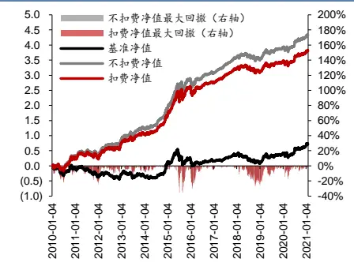
资料来源：Qlib，Wind，华泰研究

## 研究导读

本文介绍图神经网络基础概念，通过微软 Qlib 平台测试图神经网络应用于日频选股的效果。传统线性或非线性选股模型中，通常将股票视作相互独立的样本，然而股票间显然存在复杂的关联，如产业链的上下游关系、相关行业主题等。如何将股票间的关系作为增量信息纳入预测模型，是本文希望解决的核心问题。

传统的卷积神经网络（CNN）、循环神经网络系列（RNN 和 LSTM）不具备考虑样本间关系的能力。CNN 通过卷积运算提取样本局部特征，适用于图像数据。RNN 和 LSTM 的循环结构使得网络能够学习时序上的规律，适用于语音等时序数据。如果希望网络学习样本间关联的规律，那么就需要对网络运算方式或结构进行相应改造。

近年来，研究者陆续提出图卷积网络（Graph Convolutional Network，简称 GCN）、GraphSAGE（Graph SAmple and aggreGatE）、图注意力网络（Graph Attenion Network ，简称 GAT），正是将图论的概念引入传统神经网络，创造出一套全新的适用于图结构数据的网络架构，统称图神经网络（Graph Neural Network，简称 GNN）。GNN 在学界和业界有着深远影响及广泛应用，对量化选股领域同样具有很高的借鉴价值。

在华泰金工《人工智能 40：微软 AI量化投资平台 Qlib 体验》（2020-12-22）中，我们讲解Qlib 的基础和进阶功能，该平台的优势在于覆盖量化投资全过程，从工程实现角度对因子存储、因子计算等环节提出创新解决方案，目前已开源的功能侧重于量价因子结合 AI 模型选股。Qlib 除纳入集成学习及传统循环神经网络等 AI 模型外，还实现了动态图注意力网络（GATs_ts）。GATs_ts将循环神经网络和 GAT 结合，兼顾股票时序信息和股票间关系信息。借助 Qlib 开源平台，我们得以方便地了解图神经网络的实现细节，并测试该方法在量价因子选股上的表现。

## 本文主要内容如下：

1. 第一部分讲解 GNN的基础概念，依次介绍谱域图卷积运算、谱域图卷积网络、空间域图卷积网络的概念。完整的 GNN 由上述三者一步步发展而来，介绍其发展历史有助于读者更好理解 GNN的内涵。

2. 第二部分介绍 GNN针对选股问题而诞生出的变式——图时空网络选股框架，其中关系股票排序框架（Relational Stock Ranking，简称 RSR）和 GATs_ts 都属于图时空网络选股框架范畴。我们首先从 RSR 切入，引出图时空网络选股的设计思路。

3. 第三部分关注 GATs_ts 在微软 Qlib 平台的具体实现方式。我们将详细介绍 GATs_ts的选股思路和 Qlib 代码，随后在 GATs_ts基础上，实现多跳邻居聚合即多层 GATs_ts。

4. 第四部分采用 Qlib 内置的 Alpha158vwap 因子库及 TopkDropout 策略，在 2010 年 1月初至 2021 年 2 月初区间内进行日频选股实证，比较基准模型 LSTM和 GATs_ts（层数 K=1、2 和 3）表现。

我们认为，动态图注意力网络作为一种新的方法论，将样本的时序信息与样本间关联信息结合在一起，通过空间域上的邻居聚合得到股票节点的嵌入表示（Embedding），这是相比传统机器学习及深度学习架构的创新之处。未来有更多方向值得探索，如建图方法、网络结构、策略构建等。

## 图神经网络

图神经网络将深度学习技术的使用场景从传统的图像、语音等数据拓展至图结构数据，在欺诈检测、购物推荐和交通流量预测等领域都有广泛应用。本章将从谱域和空间域两个方向介绍图神经网络：首先以图信号处理为基础，介绍谱域下的图卷积运算过程，通过参数化谱域卷积滤波器和切比雪夫多项式近似得到谱域图卷积网络，进而得到一阶切比雪夫图卷积网络即图卷积网络（GCN），由此引出 GCN 从谱域到空间域的过渡；随后介绍 GCN在空间域下的两个改进变式：GraphSAGE 和图注意力网络（GAT）。

## 谱域图卷积运算

## 图的基本定义和性质

谱域图卷积网络（Spectral-based GCN）为后续空间域图卷积网络（Spatial-based GCN）提供了强有力的理论基础，方便我们理解图神经网络如何发展而来。我们首先给出图及谱图理论的一些基本定义。

对于一个图 $G=(V,E)$ ，V 代表节点集合，E 代表边的集合。拉普拉斯矩阵 $\cdot L=D-W$ 是表示图拓扑结构的一种矩阵，是谱图理论中的一个有效算子。其中W 可以是邻接矩阵，若节点 $v_{i}和$ 节点vj有边连接则有 $\left[w_{ij}=1\right.$ ，否则 $w_{ij}=0$ ；W 也可以是加权邻接矩阵，即 $w_{ij}$ 可以是由高斯核权重函数定义的边权。对角矩阵 $D=diag(d_1,d_2,\cdots,d_n)$ 称为度矩阵，其中 $d_{i}=$ $\textstyle\sum_{j=1}^{n}w_{ij}$ 。对拉普拉斯矩阵 L 对称标准化得到标准化拉普拉斯矩阵： $L_{sym}=D^{-1/2}LD^{-1/2}=$ $I_{n}-D^{-1/2}WD^{-1/2}$ 。以未加权的邻接矩阵为例，L 的元素级定义如下：

$$
L_{ij}=\left\{\begin{matrix}d_{i},&ifi=j\\-1,&ifw_{ij}=1\\0,&otherwise\end{matrix}\right.
$$

图表1： 图结构数据 G和图信号 X举例
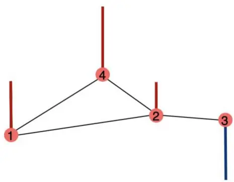

资料来源：华泰研究

例如对于上图的图结构数据 G，可以得到如下三个矩阵：

$$
W=\begin{bmatrix}0&1&0&1\\1&0&1&1\\0&1&0&0\\1&1&0&0\end{bmatrix}D=\begin{bmatrix}2&0&0&0\\0&3&0&0\\0&0&1&0\\0&0&0&2\end{bmatrix}L=\begin{bmatrix}2&-1&0&-1\\-1&3&-1&-1\\0&-1&1&0\\-1&-1&0&2\end{bmatrix}
$$

关于拉普拉斯矩阵 L 的性质，可证明 L 是实对称矩阵和半正定矩阵，并且特征值为非负实数，最小特征值为零，即 $\begin{array}{r}{{}^{!}0=\lambda_{1}\leq\lambda_{2}\leq\cdots\leq\lambda_{n},}\end{array}$ ，对应单位正交的特征向量 $U=[u_{1},u_{2},\cdots,u_{n}]$ U 是正交矩阵，有 $UU^{T}=I;$ ；实对称矩阵 L可以被正交对角化 $L=U\Lambda U^{T}$ ，其中Λ是由 L 的特征值从小到大排列组成的对角矩阵。图表 1中 G的拉普拉斯矩阵 L可以分解为：

$$
U\Lambda U^{T}=\begin{bmatrix}0.50&0.41&0.71&-0.29\\0.50&0&0&0.87\\0.50&-0.82&0&-0.29\\0.50&0.41&-0.71&-0.29\end{bmatrix}\begin{bmatrix}0&0&0&0\\0&1&0&0\\0&0&3&0\\0&0&0&4\end{bmatrix}\begin{bmatrix}0.50&0.50&0.50&0.50\\0.41&0&-0.82&0.41\\0.71&0&0&-0.71\\-0.29&0.87&-0.29&-0.29\end{bmatrix}
$$

在图信号处理中，图信号描述节点集 V 到实数域 R 的一种映射，V 上节点的信号值对应向量 ${\boldsymbol{\imath}}X=[x_{1},x_{2},\cdots,x_{n}]^{T}\in R^{n}$ ，如上述 G中节点 $v_{i}$ 上的竖线代表该节点的信号值 $x_{i},$ 。一维图信号 $X\in R^{n}$ 可以推广至多维，得到图信号矩阵X $\in R^{n\times c}$ ，其中 c为通道数量，即节点的特征维度大小。例如对股票市场建图，一只股票是一个节点，连边表示两只股票间存在某种关系，节点上的 c 维信号值分别对应该股票的 c 个因子特征。下文将以图表 1 中 G 的一维图信号$X=[x_{1},x_{2},x_{3},x_{4}]^{T}$ 为例，进行后续概念的解释。

## 图傅里叶变换

图结构数据节点具有无序性和不规则性两个特征，前者是指邻居节点不具备空间上的天然顺序，后者指节点的邻居节点数量不固定。深度学习中最具代表性的卷积神经网络（CNN）使用卷积核平移扫描图像的方式，对像素点局部空间信息进行加权求和，像素点周围是固定的 8个邻居像素点，这些点具有空间顺序。由此可见，CNN 的应用场景和图结构数据不匹配，无法直接将图像领域的成熟解决方案应用于图结构数据。

我们考虑运用卷积定理，将节点的空间域信息先转换到谱域上，经过在谱域上的变换后，再返回到原始的空间域上。其意义在于将空间域上的卷积运算转换为谱域上的相乘运算。卷积定理指函数卷积的傅里叶变换等于函数傅里叶变换的乘积：

$$
F(f*g)=F(f)*F(g)
$$

两个函数 f 和 g 的卷积运算在谱域上表示如下，其中 F表示傅里叶变换。

$$
f*g=F^{-1}{\bigl(}F(f)*F(g){\bigr)}\tag{1}
$$

谱域图卷积是在图信号处理（Graph Signal Processing，简称 GSP）的基础上，由式(1)卷积定理得到。根据式(1)我们需要找到图上类似的傅里叶基以及傅里叶变换该如何定义，并有什么样的含义。

图傅里叶变换（Graph Fourier Transform，简称 GFT）由经典傅里叶变换扩展而来（Shumanet al.，2013），它计算了图信号 X在拉普拉斯矩阵特征向量上的投影。对于 G上的任意图信号 X，定义图信号 X 在拉普拉斯矩阵 L的第 k 个特征向量 $u_{k}$ 上的图傅里叶变换：

$$
\alpha_{k}={\sum}_{i=1}^{N}u_{ki}*x_{i}=u_{k}^{T}X
$$

其中特征向量 $u_{k}$ 和系数 $\alpha_{k}$ 分别称为傅里叶基和傅里叶系数，写成矩阵形式如下：

$$
\vec{\alpha}=U^{T}X=\begin{bmatrix}u_{1}^{T}\\u_{2}^{T}\\\vdots\\u_{n}^{T}\end{bmatrix}X=\begin{bmatrix}\alpha_{1}\\\alpha_{2}\\\vdots\\\alpha_{n}\end{bmatrix}
$$

可以看到，计算结果是将图信号 X 投影到每个特征向量上，得到谱域上的 n 个傅里叶系数：$\vec{\alpha}=[\alpha_{1},\alpha_{2},\cdots,\alpha_{n}]^{T}$ ，称该向量为频谱（spectrum），衡量了图信号与傅里叶基之间的相似程度。

由于 ${}^{\cdot}UU^{T}=I_{n}$ ，则有 $U{\vec{\alpha}}=UU^{T}X=X$ ，即对频谱α⃑左乘 U，将会返回到原始空间域上的图信号 X，因此称 $\begin{array}{r}{X=U\vec{\alpha}=\sum_{k=1}^{n}\alpha_{k}u_{k}}\end{array}$ 为逆图傅里叶变换（Inverse Graph Fourier Transform，简称 IGFT）。IGFT 的含义是图信号可以分解到空间中的傅里叶基上， $而$ 系数则为基对应的傅里叶系数。只要给定图 G和频谱特征α⃑，便可以通过 IGFT 得到空间域的图信号 X。与在欧几里得空间上的操作一样，这样的变换使得图数据上的卷积操作成为可能。

## 总变差及图平滑度分析

在介绍图卷积运算之前，我们先给出与拉普拉斯矩阵L相关的变差（Variation）、总变差（TotalVariation）的定义，以及图平滑度分析。图平滑度分析将帮助读者直观理解后续的图卷积运算过程。关于变差，将 L 作用在 X上得到 LX，对每个节点 $v_{i}$ 有：

$$
(LX)_{i}={\sum}_{v_{j}\in N(v_{i})}w_{ij}(x_{i}-x_{j})
$$

将 $(LX)_{i}$ 称为节点 $v_{i}$ 的变差，它是节点与其邻居节点之间信号值的差值之和，衡量了节点信号值的局部平滑度，以图表 1 中 G举例：

$$
LX=\begin{bmatrix}2&-1&0&-1\\-1&3&-1&-1\\0&-1&1&0\\-1&-1&0&2\end{bmatrix}\begin{bmatrix}x_{1}\\x_{2}\\x_{3}\\x_{4}\end{bmatrix}=\begin{bmatrix}(x_{1}-x_{2})+(x_{1}-x_{4})\\(x_{2}-x_{1})+(x_{2}-x_{3})+(x_{2}-x_{4})\\(x_{3}-x_{2})\\(x_{4}-x_{1})+(x_{4}-x_{2})\end{bmatrix}
$$

变差仅考虑单个节点的局部信号变化，对 LX 左乘 X 的转置后得到整张图上的平滑度，称为图平滑度即总变差，是图上全部有边相连的节点对之间信号值差值的平方和，如式(2)：

$$
X^{T}LX={\sum}_{v_{i}}{\sum}_{v_{j}\in N(v_{i})}w_{ij}(x_{i}-x_{j})={\sum}_{i\sim j}w_{ij}{\left(x_{i}-x_{j}\right)}^{2}\tag{2}
$$

以图表 1中 G为例：

$$
X^{T}LX=(x_{1}-x_{2})^{2}+(x_{1}-x_{4})^{2}+(x_{2}-x_{3})^{2}+(x_{2}-x_{4})^{2}
$$

有了上述概念后，我们回到总变差，将式(2)中的 X 替换成逆变换Uα⃑，化简后得到的总变差是所有特征值的线性组合，系数为傅里叶系数平方项，如式(3)：

$$
X^{T}LX=X^{T}U\Lambda U^{T}X=(U\ddot{\alpha})^{T}U\Lambda U^{T}(U\ddot{\alpha})=\ddot{\alpha}^{T}U^{T}U\Lambda U^{T}U\ddot{\alpha}=\ddot{\alpha}^{T}\Lambda\ddot{\alpha}=\sum_{i=1}^{n}\alpha_{i}^{2}\lambda_{i}\tag{3}
$$

称拉普拉斯矩阵的特征值 $\lambda_{i}$ 为频率，傅里叶系数 $\alpha_{i}$ 为图信号在该频率分量 $\lambda_{i}$ 上的强度或能量。与经典傅里叶变换类似，特征值同样具有频率的意义，如果将拉普拉斯特征向量作为图信号表示在图上，则与低频相关的特征向量在图中变化缓慢，与高频相关的特征向量振荡得更快。

我们以最小化总变差为例，该过程是使图平滑度更高、图信号更加平滑的过程，可以帮助读者理解后文中图卷积的作用。根据式(4)从空间域和频谱域两个角度分析该过程：

$$
\min X^{T}LX=\min\sum_{i\sim j}w_{ij}(x_{i}-x_{j})^{2}=\min\sum_{i=1}^{n}\alpha_{i}^{2}\lambda_{i}\tag{4}
$$

1. 空间域角度，即相连节点对之间信号值差值的平方和，对应式(4)的第一个等号：

a) 权值 $.w_{ij}$ 较大时，最小化总变差就需要 $\cdot x_{i}=x_{j}$ 两信号尽可能相似，即高权值的节点间具有高相似度；

b) 权值 $w_{ij}$ 较小时， $x_{i}1$ 和 ${}^{\prime}x_{j}$ 之间的差值对总变差影响不大；

综合 a和 b，通过最小化总变差，高权值节点间的信号值趋于一致，图平滑度更高。

2. 频谱域角度，即所有频率的线性组合，对应式(4)的第二个等号：

a) 频率 $\lambda_{i}$ 较大时，最小化总变差就需要强度 $\alpha_{i}$ 越小越好，即剔除图上的高频信息；

b) 频率 $\lambda_{i}$ 较小时，强度 $.\alpha_{i}$ 的大小对总变差影响不大，强度 $\cdot\alpha_{i}$ 可以大一些，即保留图上的低频信息；

通过最小化总变差，图平滑度更高，剔除了图中的高频信息并保留了低频信息，相当于对图信号作了低通滤波过滤。

在图的半监督学习中，总变差（不需要标签信息）可以作为图正则项加入损失函数，对每一组相连的节点对进行约束。最小化损失函数的过程可以保证总变差尽可能小，从而实现平滑假设。所谓平滑假设，是指对图网络我们假设相邻节点之间往往有相似的预测，这一类网络称为同配图（Assortative Graph），例如引文网络（Citation Network）的 Cora, Citeseer和 Pubmed 数据集。

与同配图对应的是异配图（Disassortative Graph），在这类图中具有不同标签的节点反而有边相连，因此平滑假设不适用于异配图。对于异配图我们的目标反而应该是最大化总变差，相应的操作是将总变差的相反数加入损失函数中。

图表2： 空间域和频谱域双视角下理解图平滑度
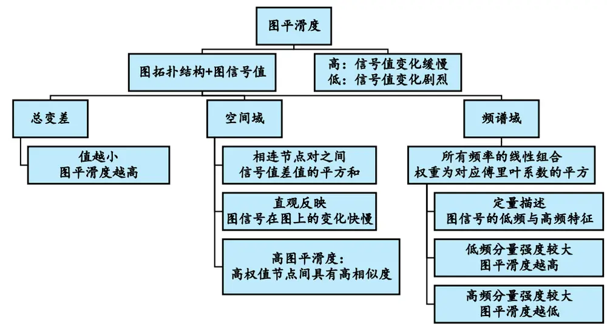
资料来源：华泰研究

图表3： 空间域的图信号
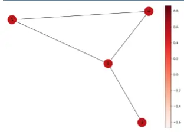

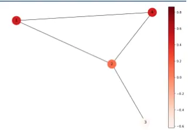

图表4： 频谱域图信号的频谱图
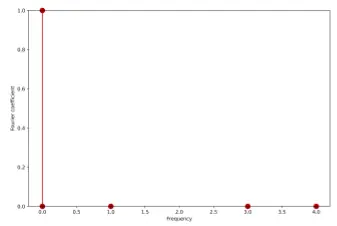

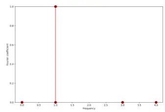

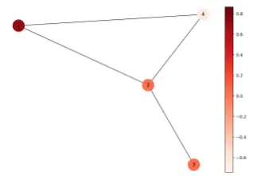
资料来源：华泰研究

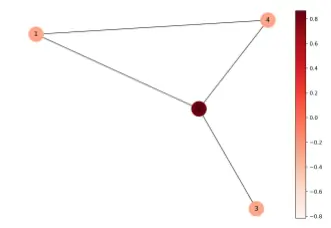

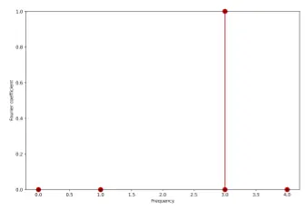
资料来源：华泰研究

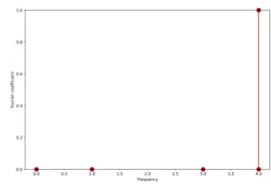

下面我们以更具体的例子展示图平滑度分析的过程。以图表 1 中 G 为例，我们分别设定四组不同的信号值，计算四种情况各自对应的图平滑度。每一种情况下，各节点的信号值以色阶形式展示在空间域上，如图 3 所示；按特征值从小到大的顺序，将图信号在该频率分量上的傅里叶系数即强度以柱图形式展示在频谱域上，如图 4所示。

以图 3（空间域）和图 4 （频谱域）的左上子图为例。空间域中四个节点颜色相同，信号值均为 0.5，沿着图的拓扑结构来看，信号值没有变化，具有很高的图平滑度。频谱域中在频率为 0 的低频分量上取得傅里叶系数的最大值，同样说明该图信号的图平滑度更高。频谱向量计算过程如下：

$$
\vec{\alpha}_{0}=U^{T}X=\begin{bmatrix}0.50&0.50&0.50&0.50\\0.41&0&-0.82&0.41\\0.71&0&0&-0.71\\-0.29&0.87&-0.29&-0.29\end{bmatrix}\begin{bmatrix}0.50\\0.50\\0.50\\0.50\end{bmatrix}=\begin{bmatrix}1\\0\\0\\0\end{bmatrix}
$$

再以图 3（空间域）和图 4 （频谱域）的右下子图为例。空间域中四个节点的图信号值为X = [−0.29, 0.87, −0.29, −0.29]T，即节点 $v_{2}$ 与其他三个邻居节点的信号值均存在较大差异，信号值变化剧烈，图平滑度较低。频谱域中在频率为 4 的高频分量上取得傅里叶系数的最大值，同样说明该图信号的图平滑度较低。

由上述空间域和频谱域上的分析可以发现，空间域可以直观反映图信号的变化快慢，经过图傅里叶变换得到的频谱域信息从数值上反映了图信号的低频与高频特征。从计算公式来看，频谱 $\vec{\alpha}=U^{T}$ X既考虑了图信号值的大小，也考虑了图的拓扑结构信息。这将为后文如何得到频谱域视角上的图卷积提供理论基础和一个直观的理解。

## 图卷积运算

有了拉普拉斯矩阵和图傅里叶变换的定义后，我们对图信号先转换到谱域，对其在谱域上进行滤波操作，提取滤波器想要提取的特征，再对两者在谱域上的乘积做逆图傅里叶变换，得到空间域上新的图信号。由于滤波操作相当于卷积，因此上述运算也称为图卷积运算。

在式(1)的基础上，定义谱域中的图卷积操作 $^{*}G$ 如下：

$$
g*_{G}X=\mathrm{U}(\mathrm{U}^{T}g\odot\mathrm{U}^{T}X)=\mathrm{U}g_{\theta}\mathrm{U}^{T}X\tag{5}
$$

其中 $g_{n*1}$ 为卷积滤波器（Filter），U 为拉普拉斯矩阵 L正交分解后的特征向量矩阵，⨀是哈达 玛 积 ， $g_{\theta}$ 为 经 过 图 傅 里 叶 变 换 后 的 谱 域 卷 积 滤 波 器 , 即 $g_{\theta}=diag(\mathbf{U}^{T}g)=$ $diag(\hat{g}(\lambda_{1}),\hat{g}(\lambda_{2}),\cdots,\hat{g}(\lambda_{n}))$ ，对角线上的元素是卷积滤波器 g 在相应特征向量 $u_{i}$ 上的投影$\hat{g}(\lambda_{i})=u_{i}^{T}g$

我们以一组特殊的滤波器为例进行解释，以拉普拉斯矩阵 L 的特征值对角矩阵Λ作为谱域卷积滤波器，即 $g_{\theta}=\Lambda=diag(\lambda_{1},\lambda_{2},\cdots,\lambda_{n})$ ，此时式(5)的图卷积可以写成如下结果：

$$
Y=\mathrm{U}g_{\theta}\mathrm{U}^{T}X=U\Lambda U^{T}X
$$

对上述公式由右向左理解图卷积UΛUTX的过程，主要分为三步：

1. $U^{T}X{\colon\thinspace}U^{T}X$ 表示图傅里叶变换，结果是将图信号 X投影到每个傅里叶基，得到谱域上的频谱 $\vec{\alpha}=[\alpha_{1},\alpha_{2},\cdots,\alpha_{n}]^T$ ；

2. $\Lambda U^{T}X=\Lambda\vec{\alpha}:$ 通过对角矩阵Λ中 的特征值，将α⃑ 放缩过滤得到向量 $\bar{\alpha}_{scale}=$ $[\lambda_{1}\alpha_{1},\lambda_{2}\alpha_{2},\cdots,\lambda_{n}\alpha_{n}]^{T}$ ；滤波操作后，低频上的强度被削弱，高频上的强度被增强，其本质是高通滤波；

3. $U\Lambda U^{T}X=U\vec{\alpha}_{scale}$ ：完成上一步滤波后，对其左乘矩阵 U，即逆图傅里叶变换，作用是将谱域信息返回到空间域上，得到滤波后的图信号 Y。

图表5： 图卷积运算过程
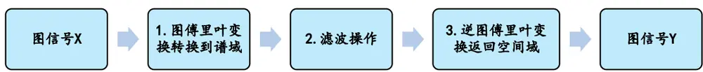
资料来源：华泰研究

称式(5)中的 $\mathrm{U}g_{\theta}\mathrm{U}^{T}$ 为图滤波器 H，定义为对给定图信号上的各频率分量的强度进行增强或削弱，再返回到空间域的转换操作。此时谱域上图卷积过程可以写成图滤波的形式 Y＝HX，该式从空间域的角度，描述了将一阶邻居节点信号 X 作用于每个中心节点，最终得到新信号 Y的转换过程，其作用仍是调节图信号的平滑度。

上述例子中的图滤波器是拉普拉斯矩阵 $\cdot U\Lambda U^{T}=L$ ，属于高通滤波器。图滤波器还可以选择邻接矩阵或拉普拉斯矩阵的变体等，也可以是设计的图滤波器（Tremblay et al.，2018）。后文中的 U 和特征值不作额外说明的话仍然是对拉普拉斯矩阵 L分解得到。

图表6： 低通滤波器去噪实验
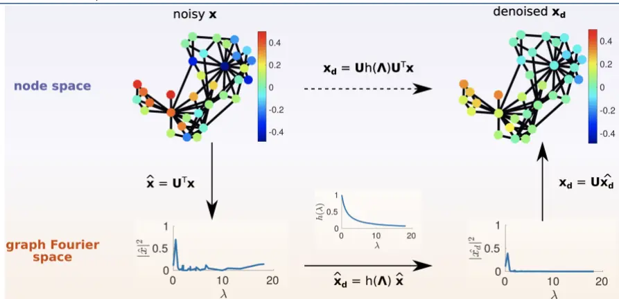
资料来源：Tremblay, Gonçalves, & Borgnat. (2018). Design of graph filters and filterbanks. Cooperative and Graph Signal Processing，华泰研究

我们再举一例，展示低通滤波器进行去噪声的过程，借助图 6 可以更形象地理解图卷积运算在空间域和谱域上的过程和表现。x 是低频数据加入高斯噪声后的信号值，通过图卷积运算 $\cdot x_{d}=Uh(\Lambda)U^{T}x后$ ，得到去噪后的图信号 $[x_{d},$ 。三条箭头实线分别对应图卷积的三步过程。从频谱域看（左下和右下子图），横坐标为频率，纵坐标为傅里叶系数平方项，因此曲线下的面积等价于总变差（见式(3)推导）。对比第二步滤波操作 $\hat{x}_{d}=h(\Lambda)$ x̂前后：高频信息被削弱，低频信息得以保留，曲线下面积即总变差变小，图平滑度提高，表现在空间域上（左上和右上子图）为相邻节点间的信号值变得更加相似，达到了去噪的目的。

## 谱域图卷积网络

## 参数化

通过以拉普拉斯矩阵作为图滤波器，我们得到了图信号的新表示 $Y,$ ，因此谱域上图卷积运算的核心是谱域卷积滤波器 $g_{\theta}$ 的设计。如果是对图数据进行学习训练，那么可以将其设置为一个可学习的参数化对角矩阵 $\Theta=diag(\theta_{1},\theta_{2},\cdots\theta_{n})$ （Bruna et al.，2013）。其中 $\theta=$ $(\theta_{1},\theta_{2},\cdots,\theta_{n})\in R^{n}$ ，对应的图卷积操作如下：

$$
Y=g*_{G}X=\mathbb{U}\Theta U^{T}X
$$

上述参数化主要存在三个问题：

1. 学习的参数数量为 n，对于大规模图不仅需要更多时间训练，也会存在过拟合问题；

2. 运算复杂度高，矩阵的特征分解复杂度为 $0(n^{3})$ ，图傅里叶变换的复杂度为 $0(n^{2})$

3. 不具有空间域局部特征，如没有考虑 K-hop 的邻居信 $息L^{K}$ ，这里 K-hop 邻居指从中心节点出发，路径长度不超过K的节点集合。

## 多项式图卷积

上述问题可以通过多项式逼近参数的方法加以克服（Defferrard et al.，2016），将谱域卷积滤波器 $g_{\theta}(\Lambda)$ 表示成关于Λ的 K-1 阶多项式：

$$
g_{\theta}(\Lambda)={\sum}_{k=0}^{K-1}\theta_{k}\Lambda^{k}\tag{6}
$$

其矩阵形式为：

$$
g_{\theta}(\Lambda)=\left[\begin{aligned}{\sum}&{{}_{k=0}^{K-1}\theta_{k}\lambda_{1}^{k}}\\&{}&{\ddots}\\&{}&{}&{\sum}&{{}_{k=0}^{K-1}\theta_{k}\lambda_{n}^{k}}\end{aligned}\right].
$$

其中 $\theta\in R^{K}$ 是需要学习的参数。进一步化简有：

$$
\begin{align*}Y=g*_{G}X=\mathsf{U}g_{\theta}(\Lambda)U^{T}X&=\mathsf{U}et{}{_{k=0}^{K-1}}\sum\theta_{k}\Lambda^{k}U^{T}X\\=et{}{_{k=0}^{K-1}}\sum\theta_{k}U\Lambda^{k}U^{T}X&=et{}{_{k=0}^{K-1}}\sum\theta_{k}L^{k}X\end{align*}
$$

其中 $\theta\in R^{K}$ 是多项式的系数向量，可以看到通过多项式逼近，参数数量由 n 缩减到 $K,$ ，并且用拉普拉斯矩阵多项式表示的图滤波器含有多跳邻居信息。K可以理解为感受野范围，即在空间域上是 K-1 跳邻居可达的。例如考虑LK作为图滤波器则有 $Y=L^{K}X=L(L^{K-1}X)=$ $LX^{(K-1)}$ ，将X(K−1)看作是节点的 K-1跳特征表示，则 Y是对节点的 K-1 跳特征表示 $X^{(K-1)}$ 再通过左乘一个 L图滤波器得到的 K跳特征表示。

## 截断切比雪夫多项式图卷积：ChebNet

切比雪夫多项式具有数值稳定的优势（Hammond et al.，2011），其递推关系式为 $T_{k}(x)=$ $2xT_{k-1}(x)-T_{k-2}(x)$ ，且 $T_{0}(x)=1,T_{1}(x)=x$ 。因此使用 K-1 阶截断的切比雪夫多项式 $\mathinner{|{T_{k}(x)}\rangle}$ 来近似式(6)中的多项式卷积（Defferrard et al.，2016）：

$$
g_{\theta}(\Lambda)={\sum}_{k=0}^{K-1}\theta_{k}T_{k}(\widetilde{\Lambda})
$$

其中 $\theta\in R^{K}$ 是切比雪夫系数向量，即需要学习的参数； $T_{k}(\widetilde{\Lambda})\in R^{n\times n}$ 是通过Λ̃来计算的 k 阶切比雪夫多项式；Λ̃是Λ经特征值放缩到[-1, 1]上的特征值对角矩阵： $\widetilde{\Lambda}=2\Lambda/\lambda_{max}-I_{n};\lambda_{max}$ 是 L 的最大特征值。这里进行放缩是因为切比雪夫多项式的输入要求在[-1,1]之间。此时，切比雪夫多项式图卷积可以表示为：

$$
Y=g*_{G}X=Ug_{\theta}(\Lambda)U^{T}X=U{\sum}_{k=0}^{K-1}\theta_{k}T_{k}(\widetilde{\Lambda})U^{T}X={\sum}_{k=0}^{K-1}\theta_{k}T_{k}\big(\widetilde{L}\big)X.\tag{7}
$$

其中 $T_{k}(\tilde{L})\in R^{n\times n}$ 是基于放缩的拉普拉斯矩阵 $\tilde{L}=2L/\lambda_{max}-I_{n}$ 计算的 k 阶切比雪夫多项式。记 $\bar{X}_{k}=T_{k}(\tilde{L})X\in R^{n}$ ，通过递推关系可以得到： $\bar{X}_{k}=2\tilde{L}\bar{X}_{k-1}-\bar{X}_{k-2}$ ，其中 $\bar{X}_{0}=X,\bar{X}_{1}=\tilde{L}X$ 则 $Y=[\bar{X}_{0},\bar{X}_{1},\cdots,\bar{X}_{K-1}]\theta,\quad\theta=(\theta_{0},\theta_{1},\cdots,\theta_{K-1})\in R^{K}$ o

上述图卷积通过递推关系每次对 $\bar{X}_{k-1}$ 左乘L̃，需要递推 K次，复杂度降低为Ο(K|ℰ|)，其中|ℰ|为图 G 中边的数量。上述图卷积操作的参数数量为 K，具有空间域局部特征，不需要进行特征分解，需要额外计算 L的最大特征值。作者将式(7)称为快速局部谱滤波（Fast LocalizedSpectral Filtering），或简称为 ChebNet。

与其它图卷积操作一样，ChebNet 可以将图信号向量 $X\in R^{n}$ 推广到图信号矩阵X $\in R^{n\times c}$ 其中 c 为通道数量，即节点的特征维度大小。ChebNet 既可以对每一个特征维进行卷积，也可以对同一特征维学习多组卷积滤波参数，得到不同的过滤特征。

## 空间域图卷积网络

## GCN：谱域向空间域的经典过渡

进一步精简ChebNet，将式(7)的K设置为2，即考虑一阶切比雪夫多项式（Kipf et al.，2016）来近似图卷积，并将 $\lambda_{max}$ 近似为 2，作者希望这样的近似在参数训练过程中可以被自动适应。另外可以证明标准化拉普拉斯矩阵 $\cdot L_{sym}=D^{-1/2}LD^{-1/2}=I_{n}-D^{-1/2}WD^{-1/2}$ 的特征值的上界为 2（Chung et al.，1997）。因此有 $\tilde{L}=2L/\lambda_{max}-I_{n}\approx2L_{sym}/2-I_{n}=L_{sym}-I_{n}$ ，将其代入式(7)得到线性图卷积如下：

$$
Y={\sum}_{k=0}^{K-1}\theta_{k}^{\prime}T_{k}\big(\bar{L}\big)X\approx\theta_{0}^{\prime}X+\theta_{1}^{\prime}\big(L_{sym}-I_{n}\big)X=\theta_{0}^{\prime}X-\theta_{1}^{\prime}D^{-1/2}WD^{-1/2}X
$$

减少参数量可以防止过拟合的发生，并减少矩阵乘法的运算量。 $记\theta=\theta_{0}^{\prime}=-\theta_{1}^{\prime}$ 得到：

$$
Y\approx\theta(I_{n}+D^{-1/2}WD^{-1/2})X
$$

注意到 $I_{n}+D^{-1/2}WD^{-1/2}$ 的特征值范围是[0,2]。如果在深度神经网络中多次堆叠（堆叠指代叠加多层图卷积层），上述图卷积可能会导致数值不稳定、梯度消失和梯度爆炸的情形发生。因此作者引入了一个再标准化的技巧：

$$
I_{n}+D^{-1/2}WD^{-1/2}\rightarrow\widetilde{D}^{-1/2}\widetilde{W}\widetilde{D}^{-1/2},\textrm{ 其 中: }\widetilde{W}=W+I_{n},\begin{array}{l}\widetilde{D}_{ii}=\sum_{j}\widetilde{W}_{ij}\end{array}
$$

这里的再标准化指给图上的每个节点加入一个自环，结果是增强了中 $心$ 节点本身的特征所带来的影响。再标准化式子中使用箭头而非等号，表示该式不是恒等变换。

推广到图信号矩阵X $\in R^{n\times c}$ 上，c 为节点的特征维度，图卷积操作数量为 f，即特征映射到f 维，得到如下矩阵表示的卷积结果，称式(8)为图卷积层：

$$
Z=\sigma(\widehat{W}X\Theta)\tag{8}
$$

其中 $\widehat{W}=\widetilde{D}^{-1/2}\widetilde{W}\widetilde{D}^{-1/2},\quad\Theta\in R^{c\times f}$ 是参数矩阵，经过一阶图卷积和非线性变换后得到新的网络表示Z $\in R^{n\times f}$ ，上述卷积的时间复杂度为 $0(|\mathcal{E}|fc)$ 。作者通过堆叠两次图卷积层，得到两层的图卷积网络（Graph Convolutional Network，简称 GCN）：

$$
Z=f\big(X,\widehat{W}\big)=softmax\big(\widehat{W}ReLU\big(\widehat{W}X\Theta^{(0)}\big)\Theta^{(1)}\big)\tag{9}
$$

其中， $\Theta^{(0)}\in R^{c\times h}$ 是包含 h个特征映射的隐藏层参数矩阵， $\Theta^{(1)}\in R^{h\times f}$ 是包含 f 个特征映射的输出层参数矩阵。图 7 展示两层图卷积网络用于半监督学习的过程，网络结构（黑色连边）在层上共享，标签为Yi，节点 2 和节点 3 的标签通过该模型半监督学习预测得出。

图表7： 两层图卷积网络用于半监督学习示意图
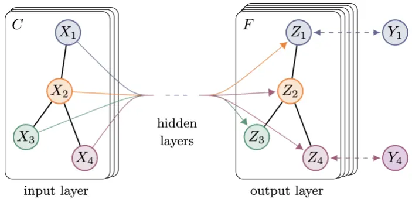
资料来源：Kipf, & Welling. (2016). Semi-supervised classification with graph convolutional networks. arXiv，华泰研究

Ŵ 相当于图滤波器 H，下面我们从谱域和空间域两个角度分析式(8)图卷积层的意义。

## 谱域

图卷积运算一节中提到图滤波器用来调节图信号的平滑度。记加入自环后的标准化拉普拉斯矩阵 $\hat{L}_{sym}=I_{n}-\widehat{W}$ ，可 $\mathrm{知}\widehat{L}_{sym}$ 的最大特征值严格小于 2（Wuet al.，2019），即它的最小特征值为 0，最大特征值被缩小。此时图滤波器Ŵ 可以写成：

$$
\widehat{W}=I_{n}-\widehat{L}_{sym}=I_{n}-U_{l}\Lambda_{l}U_{l}^{T}=U_{l}(I_{n}-\Lambda_{l})U_{l}^{T}
$$

其中 $\Lambda_{l}$ 为 $\hat{L}_{sym}$ 的特征值对角矩阵，Ŵ 中对应的谱域卷积滤波器 $g_{\theta}=I_{n}-\Lambda_{l}$ 是一个关于特征值线性收缩的函数，频率（即特征值）响应的取值范围是(−1,1]，其结果是平滑了图信号的特征。前文的图平滑度分析和图卷积运算中的低通滤波器去噪实验示意图给出了详细解释。

此外，简单图卷积（Simple Graph Convolution，简称 SGC）（Wu et al.，2019）直接将式(9)中多层堆叠简化为Ŵ 的 K次多跳σ(Ŵ KXΘ)，参数只有一个Θ矩阵。考虑其幂形式 $\_g_{\theta}(\Lambda_{l})=$ $(1-\Lambda_{l})^{K}$ ，当 K>1 时，SGC 实际上相当于一个加强版低通滤波器，K越大，其收缩过滤效果越强，并且通过Ŵ 使得频率限制在[0,2)上。

## 空间域

图滤波器作用于 X，将 X看作行向量矩阵，则Ŵ X按照行向量矩阵乘法可以理解为其每一行$(\widehat{W}X)_{i,:}$ 是 X 所有行向量的线性组合，对应权重系数为 $\widehat{W}_{ij}$ ，即 $\begin{array}{r}{(\widehat{W}X)_{i,:}=\sum_{j=1}^{n}\widehat{W}_{ij}X_{j,:}}\end{array}$ ，因此从空间域来看图卷积层分为三步：

1. 邻居聚合：上述行向量矩阵乘法相当于将中心节点 $v_{i}$ 和邻居节点的特征分别以权重 $\widehat{W}_{ij}$ 传递聚合给中心节点，从而更新中心节点的特征表示；

2. 特征降维：完成所有节点的初步特征更新后右乘参数矩阵Θ进行线性变换微调；

3. 非线性激活：最后通过一层非线性变换得到节点最终的特征表示。

当堆叠多层图卷积层时如式(9)的两层 GCN，空间域上是节点先聚合一跳邻居节点特征得到$Z^{(1)}$ ，注意此时 $\boldsymbol{Z}^{(1)}$ 中每个节点特征已包含了其邻居节点的特征，接着在下一层聚合 $\cdot Z^{(1)}$ 即可获取邻居的邻居节点特征，最终结果是每个节点聚合了共计两跳的邻居节点特征。而 SGC通过 $.\widehat{W}^{K}$ 直接将 K跳邻居节点特征一次性聚合到中心节点上，参数数量相比 GCN来说更少。

## GraphSAGE：聚合器实现归纳学习，可应用于动态图

GCN 在空间域实际上是一个迭代式多跳聚合邻居节点特征、将其特征降至低维的过程，但GCN 存在的主要问题如下：

1. GCN 属于转导学习（Transductive Learning），式(8)需要增强版归一化邻接矩阵Ŵ 作为输入，并且它是基于整张图的固定结构。这种学习要求模型在训练和测试过程中，图上所有节点可见。如果加入新节点或将训练好的模型用于全新的图，则无法通过转导学习完成，需要重新训练模型。现实中大部分图往往是动态变化的，比如股票网络随着时间的推移会有新公司上市。相反，归纳学习（Inductive Learning）可以通过学习一种规则或函数来泛化预测从未见过的节点。

2. GCN 的训练是全图方式（Full-Batch），占用内存较多，尽管其作者提出将稀疏矩阵和稠密矩阵相乘的方式来加速运算，但其结构不允许采用小批量随机梯度下降方法（Mini-Batch SGD）训练，因此仍然无法推广到大规模图训练上。

针对上述问题，研究者提出大规模图上的归纳学习框架（Graph SAmple and aggreGatE，简称 GraphSAGE），利用节点特征为不可见数据生成节点嵌入（Hamilton et al.，2017）。GraphSAGE 并非像式(10)和 GCN 式(11)为每个节点训练一个单独嵌入，而是学习训练一组聚合器，通过从一个节点的局部邻居中采样，与聚合器生成节点嵌入。

图 8 上侧的三个子图展示了 GraphSAGE 的采样聚合过程。我们希望对左上子图的中心节点生成节点嵌入。采样如左上子图所示，以由内向外的方式进行：首先对中心节点的 5 个 1跳邻居采样，得到 3 个标红的 1 跳邻居节点；随后对每个 1 跳邻居节点的 1 跳邻居采样，得到最外圈标红的 2跳邻居节点。聚合如中上子图所示，以由外向内的方式进行：首先将 2跳邻居节点的特征聚合到 1 跳邻居节点，如绿色箭头；随后将 1 跳邻居节点的特征聚合到中心节点。最终右上子图的中心节点已经包含其 2跳邻居的特征，称为 2 跳嵌入表示。

图 8 下侧的三个子图展示了聚合过程的另一种理解方式——计算树。左下子图为节点 A 作为中心节点的计算树，即{A}的 1 跳邻居节点为{B,C,D}，1 跳邻居的 1 跳邻居（即 A 的 2 跳邻居节点）分别为{A,C}、{A,B,E,F}和{A}。右下子图中，2 跳邻居节点（Layer-0）的特征首先聚合到 1跳邻居节点（Layer-1），再聚合到中心节点（Layer-2），最终得到中心节点的2 跳节点嵌入。通过上述前向传播算法，可以得到全部节点的任意 K跳节点嵌入，K为节点的搜索深度。

图表8： GraphSAGE采样聚合过程（上）和计算树（下）示意图
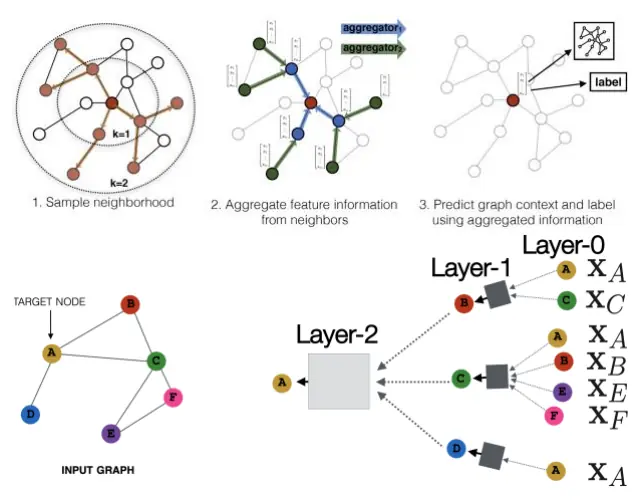
资料来源：Hamilton, Ying, & Leskovec. (2017). Inductive representation learning on large graphs. Advances in neural information processing systems， http://web.stanford.edu/class/cs224w/slides/08-GNN.pdf，华泰研究

图表9： GraphSAGE小批量前向传播算法
Algorithm 2: GraphSAGE minibatch forward propagation algorithm 
Input : Graph G(V, ε); 
input features {xv, ∀v ∈ B}; 
depth K; weight matrices Wk, ∀k ∈ {1, ..., K }; 
non-linearity σ; 
differentiable aggregator functions AGGREGATEk, ∀k ∈ {1, ..., K }; 
neighborhood sampling functions, Nk : v → 2ν, ∀k ∈ {1,..., K} 
Output : Vector representations z for all v ∈ B 
1 BK ← B; 
2 for k = K...1 do 
3 Bk−1 ← Bk : 
4 for u ∈ Bk do 
5 |Bk−1 ← Bk−1∪Nk(u); 
6 end 
7 end 
8 h0 ← xv, ∀v ∈ B0 ; 
9 for k = 1...K do 
10 for u ∈ Bk do 
11 hkN(u) ← AGGREGATEk({hk−1, ∀u′ ∈ Nk(u)}); 
12 hk ← σ (Wk . CONCAT(hk−1, hkN(); 
13 hk ← hk/∥|hk||2; 
14 end 
15 end 
16 Zu ← hκ , ∀u ∈ B
资料来源：Hamilton, Ying, & Leskovec. (2017). Inductive representation learning on large graphs. Advances in neural information processing systems，华泰研究

图 9 展示 GraphSAGE 小批量前向传播算法的伪代码，整体分为两部分。

## 1. 由内到外采样

为了提高计算效率，作者随机采样一个固定大小的邻域集，由于每个中心节点及其采样的邻居数量相同，使得计算树具有相同结构，因此可以在 GPU 上进行小批量训练。具体做法是对第 k 层的每个节点固定采样数量为 Sk，当邻居数量小于 $\mathbb{S}_{\mathrm{k}}$ 时，采用放回抽样，否则采用无放回抽样。对于一个批次的目标节点集 B来讲，其空间和时间复杂度为 $\begin{array}{r}{\mathbb{O}(\prod_{k=1}^{K}S_{k})}\end{array}$

采样阶段对应图9算法的2~7行。从Layer-K层开始，即目标节点集BK；接着采样Layer-(K-1)层得到 BK-1 采样结果，包含了目标节点和其 1 跳邻居节点；由内到外直到 Layer-0 层得到B0，包含了目标节点和其 1跳、2跳、……、K跳邻居节点。

## 2. 由外到内聚合

完成采样后进入聚合阶段，对应图 9 算法的 9~15 行。在每一轮循环 k 中，对每个节点 u，先对 u的 k-1 层（即上一层）采样节点进行邻居聚合得到 $h_{N(u)}^{k}$ ，再将 $\mathfrak{n}_{N(u)}^{k}$ 与节点 u的第 k-1层表示 $h_{u}^{k-1}$ 拼接，通过全连接层转换后得到 u 在第 k 层的节点嵌 $入h_{u}^{k},$ 。与采样阶段相反，聚合阶段是由外向内迭代聚合：首先对 k=1 即 $B^{1}$ 中的节点进行聚合，需要的采样邻居为最外层 $\cdot B^{0}$ 中的节点；直到把 $\cdot B^{K-1}$ 中的节点特征聚合给目标节点集 $.B^{K}$ 。

算法第 11~12 行的聚合过程可以表示为：

$$
h_{u}^{k}=\sigma(W_{k}\cdot[h_{u}^{k-1}\parallel AGG\big(\big\{h_{u^{\prime}}^{k-1},\forall\pmb{u}^{\prime}\in N(\pmb{u})\big\}\big)])
$$

其中||表示拼接操作， $W_{k}$ 为中 $心$ 节点特征 $与$ 聚合邻居特征的共享参数。另外，也有研究者将两者参数分别训练，再进行拼接操作，对应的参数分别为 $W_{k}和\Psi_{k}$ ，过程如下：

$$
h_{u}^{k}=\sigma([\Psi_{k}h_{u}^{k-1}\parallel W_{k}\cdot AGG\big(\big\{h_{u^{\prime}}^{k-1},\forall u^{\prime}\in N(\boldsymbol{u})\big\}\big)])
$$

在 GraphSAGE 原文（Hamilton et al.，2017）中，作者分析了聚合器 AGG 需具备的条件。首先聚合器必须是对称的，即运算结果不受节点顺序的影响， $\mathsf{AGG}(\mathsf{x},\mathsf{y})=\mathsf{AGG}(\mathsf{y},\mathsf{x})$ 。其次希望聚合器可训练并保持较高的表达能力。作者提出三种满足条件的聚合器：

1. Mean 聚合器。对邻居节点的特征逐元素取平均：

$$
AGG=\sum_{u^{\prime}\in N(u)}\frac{h_{u^{\prime}}^{k-1}}{|N(u)|}
$$

该操作与 GCN 近似，作者通过合并算法第 11~12 行，推导出 GCN的归纳式变体：

$$
h_{u}^{k}\gets\sigma(W\cdot MEAN(\{h_{u}^{k-1}\}\cup\{h_{u^{\prime}}^{k-1},\forall u^{\prime}\in N(u)\}))
$$

注意 GCN 归纳式变体未进行第 12 行的拼接，而这样的拼接类似于在不同层特征（如第 k-1层中心节点特征与第 k 层邻居聚合）的跳跃连接，实验证明这种拼接是有效的。

2. LSTM 聚合器。由于 LSTM是为有序数据设计的学习网络，因此可将邻居节点随机打乱输入到 LSTM中进行聚合：

$$
AGG=LSTM([h_{u^{\prime}}^{k-1},\forall u^{\prime}\in\pi(N(u))])
$$

3. Pool聚合器。对每个邻居节点特征独立通过一个全连接网络（也可以是多层深度网络），最后对输出进行逐元素的最大池化或平均池化操作：

$$
AGG=\max(\{\sigma(W_{pool}h_{u'}^{k-1}+b),\forall u'\in N(u)\})
$$

通过采样阶段和聚合阶段训练后，只要基于某一节点及其 K 阶邻居节点的特征和关系，就可以通过该聚合器得到节点的嵌入表示。GraphSAGE 是空间域视角下 GCN 走向工业落地的代表性变体。

## GAT：差异化邻居节点对中心节点的影响

从空间域角度看，GCN与消息传递的思路相似，将中心节点 v的邻居节点N(v)特征以某种方式聚合到该中心节点上，既考虑了图的拓扑结构，也考虑了邻居节点的特征信息。由此GCN 完成了图神经网络由谱域向空间域的经典过渡。

普通图神经网络最基本的节点级别邻居特征聚合过程可以表示为：

$$
h_{i}^{k}=\sigma(\Theta_{\mathbf{k}}\sum_{j\in N(i)}\frac{W_{ij}}{|N(i)|}h_{j}^{k-1}+\Psi_{k}h_{i}^{k-1}),\tag{10}
$$

其中 $\Theta_{\mathrm{k}}$ 和 $\Psi_{k}$ 是第 k 层中需要学习的参数； $h_{j}^{k-1}$ 为上一层第 k-1层邻居节点的特征； $W_{ij}$ 是已知中心节点 i 和邻居节点 j 在邻接矩阵 W 上的元素值；第 0 层 $h_{i}^{0}=x_{i}$ 为节点的初始特征；聚合第 k-1 层邻居节点特征和自身特征后，通过全连接层即可得到第 k 层特征，如此重复 K层聚合后，得到最终每个节点的 K跳嵌 $\lambda z_{i}=h_{i}^{K}$ 0

$而$ GCN 中的Ŵ 考虑了自环和邻居节点度标准化技巧（对应式(8)的矩阵形式），其节点级别邻居特征聚合的更新过程表示为：

$$
h_{i}^{k}=\sigma(\Theta_{\mathrm{k}}\sum_{j\in N(i)\cup i}\frac{W_{ij}}{\sqrt{(|N(i)|+1)(|N(j)|+1)}}h_{j}^{k-1}),\tag{11}
$$

观察式(10)图神经网络的邻居节点聚合过程，每一个邻居节点 j 的信息对中心节点 i 的影响是相同的，其影响显式定义为 $\alpha_{ij}=W_{ij}/|N(i)|$ 。然而在现实中，邻居节点对中心节点的影响往往不同，就像人类将视觉聚焦在一张图片最关键的位置，而不是将注意力平均分配给图片中的每个像素。

观察式(11)GCN的邻居节点聚合过程，每一个邻居节点j 的信息对中心节点 i的影响被显式定义为 $\alpha_{ij}=W_{ij}/\sqrt{(|N(i)|+1)(|N(j)|+1)}$ ，即邻居节点的度|N(j)|越大，对中心节点影响越小。然而这种规律在现实中不一定总是成立。总的来看，式(10)和式(11)分别对应的普通图神经网络和 GCN，在邻居节点聚合方式上，仍存在不符合现实之处。

如果采用注意力机制，就可以克服上述问题。近年来注意力机制（Attention Mechanism）被成功应用在计算机视觉和自然语言处理任务中，其优势是允许处理不同规模的输入信息，专注于输入信息中最相关的部分来做出决定。给定一个查询 Query和 Source 中的一系列键值对（Key，Value），则注意力机制的本质是计算基于查询和相应键值的加权和，即查询和键之间的关系决定了哪些值需要重点关注：

$$
Attention(Query,Source)=\sum_{i=1}^{L_x}Similarity(Query,Key_i)*Value_i
$$

其中 $L_{x}$ 为 Source 的长度，首先计算 Query 和 Key 的相似度，称为注意力系数，通过该系数加权求和 Value，即可得到查询结果。

我们将注意力机制的思想迁移到图神经网络。将中心节点 i的特征向量看作 Query，将所有邻居节点的特征向量看作 Source，则结果Attention(Query, Source)就是中心节点 i 经过所有邻居节点特征聚合后新的特征向量。事实上这一操作属于自注意力机制（Self-Attention），有 $\begin{array}{r}{\mathopen{}\mathclose\bgroup\left\{\begin{array}{rlrl}\end{array}\aftergroup\egroup\right.Query=Key=Value=W_{k}\vec{h}_{i}^{k-1}}\end{array}$ ，即节点特征和节点特征自己求相似度，再和节点特征本身相乘，得到查询结果。

图注意力网络 GAT（Veličković et al.，2017）通过上述注意力机制，隐式地训练学习邻居节点j对中心节点 i消息传递的重要性，根据重要性对邻居节点特征加权求和，得到新的节点嵌入。GAT 的实现过程主要分为如下三个步骤：

## 1. 计算注意力系数

为了获得更好的表达能力，先将第k-1层的节点特征 $\bar{h}_{i}^{k-1}$ 通过一层线性变换，共享参数为 $W_{k}$ 。随后在节点上执行自注意力机制，得到注意力系数 $e_{ij}$ ，代表节点 j 特征对节点 i的重要性：

$$
e_{ij}=a(W_{k}\vec{h}_{i}^{k-1},W_{k}\vec{h}_{j}^{k-1})
$$

其中 $a\colon R^{F^{\prime}}\times R^{F^{\prime}}\to R$ 是用来计算注意力系数的共享注意力机制； $F^{\prime}$ 为 $\vec{h}_{i}^{k-1}$ 通过线性变换后的特征维度。

GAT 原文（Veličković et al.，2017）中，作者同时还将图结构信息注入给上式，相当于只考虑节点 i 与其所有 1 跳邻居节点之间的注意力系数。这样的方式称为 MaskedSelf-Attention，即注意力机制的运算只在邻居节点间进行。

## 2. 标准化注意力系数

对 i的所有邻居节点j的注意力系数采用 softmax 函数标准化后得到标准化注意力系数，这一操作使得邻居之间的注意力系数具有可比性：

$$
\alpha_{ij}=softmax_{j}(e_{ij})=\frac{\exp(e_{ij})}{\sum_{k\in N(i)}\exp(e_{ik})}
$$

GAT 原文中，作者将注意力机制a(∙)设置为一个单层前馈神经网络，参数为a⃑ $\in R^{2F^{\prime}}$ ，符号||表示拼接操作。另外，将注意力系数通过一层 LeakyReLU 非线性变换，过程如图 10 左侧子图。这样标准化注意力系数 $\alpha_{ij}$ 可表示为：

$$
\alpha_{ij}=\frac{\exp(LeakReLU(\vec{a}^T[W_k\vec{h}_i^{k-1}\parallel W_k\vec{h}_j^{k-1}]))}{\sum_{k\in N(i)}\exp(LeakReLU(\vec{a}^T[W_k\vec{h}_i^{k-1}\parallel W_k\vec{h}_k^{k-1}]))}\tag{12}
$$

## 3. 加权求和

获得标准化注意力系数后，对邻居节点特征进行加权求和，得到聚合特征。再进行非线性变换后，即可得到节点 i在第 k 层的特征表示：

$$
\vec{h}_{i}^{k}=\sigma({\sum}_{j\in N(i)}\alpha_{ij}W_{k}\vec{h}_{j}^{k-1})\tag{13}
$$

图表10： 图注意力机制和多头注意力机制示意图
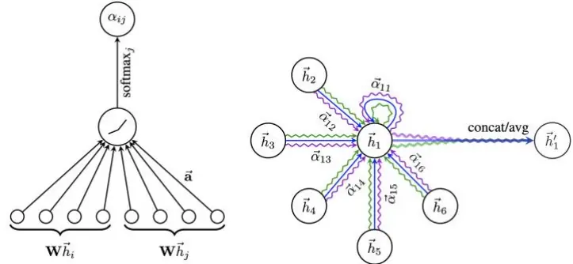
资料来源：Veličković, Cucurull, Casanova, et al. (2017). Graph attention networks. arXiv，华泰研究

为了使上述注意力机制运算过程更稳定，作者还借鉴多头注意力机制的思想，对上述过程独立重复 M 次，将 M 次特征结果取简单平均，并进行非线性变换，得到节点 i在第 k 层的最新特征表示：

$$
\overrightarrow{h}_{i}^{k}=\sigma(\frac{1}{M}{\sum}_{m=1}^{M}{\sum}_{j\in N(i)}\alpha_{ij}^{m}W_{k}^{m}\overrightarrow{h}_{j}^{k-1})
$$

多头注意力机制的直观解释如图10右侧子图，不同颜色的波浪线代表不同的图注意力机制。
后文 Qlib平台的 GATs_ts未加入多头注意力机制，感兴趣的读者可以尝试加入并验证效果。

相比于普通图神经网络和 GCN，GAT 的优势如下：

1. 计算高效：注意力机制可在所有边上并行化；输出特征的计算也可在所有节点上并行化；由于多头注意力机制独立重复进行，因此也可以并行。

2. 根据学习到的注意力系数大小进行特征聚合，关注更重要的邻居节点；通过多头注意力机制为同一邻居分配不同的重要性，鲁棒性更强。

3. 注意力机制中的参数对所有的节点共享，因此不依赖于对全局图结构或所有节点特征的预先访问。图可以是无向图，也可以是有向图，我们需要计算的仅仅是 j 对 i 逐节点的注意力系数。获得共享参数 $W_{k}$ 和a⃑后，这些训练好的参数便与图的变化无关。与GraphSAGE 类似，只需知道新节点的特征及邻居节点关系，就可以得到新节点的特征表示，因此同时可用于转导学习和归纳学习。

邻居节点关系在作者用到的 Masked Self-Attention 方式中是必需的，因为上文提到该方式计算的是 1 跳邻居节点与中心节点间的注意力系数。而另一种 GlobalSelf-Attention 全局方式不需要图结构信息，它计算了中心节点与图中所有节点之间的注意力系数，并将所有节点特征聚合给自己，因此该方式不需要预先构建显式图，但这也在一定程度上损失了图结构信息且计算成本高昂。全局方式将在后文 Qlib 平台的 GATs_ts动态图注意力网络选股中用到。

在 GCN一节中，我们从谱域角度论证 GCN是一个使得节点信号值变得平滑的低通滤波器。下面将在空间域上分析 GCN 和 GAT 也属于低通滤波器：

1. GCN 的节点表示将邻居节点特征 $以W_{ij}/\sqrt{(|N(i)|+1)(|N(j)|+1)}$ 的权重聚合给自己。注意到该权重大于 0，自身中心节点的权重也大于 0，相当于通过邻居节点给自己的特征作了平滑，因此是一个低通滤波器；如果 $\mathbf{\Theta_{k}}$ 为负，将负号提出相当于对聚合后的特征取个相反数，本质仍然是低通滤波器。

2. GAT 在对注意力系数标准化时，通过了一层 softmax 函数，因此计算的标准化注意力系数 $\alpha_{ij}$ 即权重大于 0，以正权重的邻居节点特征聚合给正权重的中心节点特征上，因此 GAT 也属于低通滤波器。

最后，我们展示 GCN、GraphSAGE 和 GAT 的主要公式、核心思想及分析比较，见下表。

图表11： GCN、GraphSAGE 和 GAT 的分析比较

| 模型 | 核心公式 | 理解视角核心思想 |  | 分析 |
| --- | --- | --- | --- | --- |
| GCN | 一层 GCN: |  | 频谱域一阶切比雪夫多项式近似化简，加入再标准 | 优点：由频谱域过渡到空间域，为图 |
|  | $Z=\sigma{\bigl(}{\widehat{W}}X\Theta{\bigr)}$ |  | 化邻接矩阵。W相当于低通滤波器，对图信 | 神经网络在空间域上的发展提供了 |
|  | 两层 GCN： $Z=f\left(X,\widehat{W}\right)=softmax\left(\widehat{W}ReLU\left(\widehat{W}X\Theta^{(0)}\right)\Theta^{(1)}\right)$ |  | 号进行平滑。 | 设计思路。 |
| GraphSAGE |  |  |  | 不足：GCN属于转导学习，需要输 |
|  | 节点表示： |  | 空间域由行向量矩阵乘法可以得到空间域上的理 | 入整张图的邻接矩阵；全图方式训 |
|  |  |  | 解，将邻居节点特征以 $W_{ij}/$ | 练，占用内存较高。 |
|  | $h_{i}^{k}=\sigma(\Theta_{\mathbf{k}}\sum_{j\in N(i)\cup i}\frac{W_{ij}}{\sqrt{(\|N(i)\|+1)(\|N(j)\|+1)}}h_{j}^{k-1}).$ |  | √(\|N(i)\|+1)(\|N(j)\|+1)的权重聚合给中心 节点。 |  |
|  | $h_{u}^{k}=\sigma(W_{k}\cdot[\;h_{u}^{k-1}\;\\|\;AGG\big(\big\{h_{u^{\prime}}^{k-1},\forall\pmb{u}^{\prime}\in N(\pmb{u})\big\}\big)])$ | 的聚合； | 空间域1. 采样固定数量的邻居节点，进行空间域上 | 优点：采样使得训练可以在GPU上 以批训练的方式进行；聚合器不依赖 |
|  | 关于 AGG: |  | 2. 设计聚合方式为一个可训练的聚合器，比 | 于GCN中的邻接矩阵，而是将训练 |
|  |  |  | 如 LSTM 和 Pool 聚合器。 | 好的聚合器用在邻居节点上，因此可 以用于转导学习和归纳学习。 |
|  | $AGG={\sum}_{u^{\prime}\in N(u)}\frac{h_{u^{\prime}}^{k-1}}{\|N(u)\|}$ |  |  |  |
| $AGG=\max(\{\sigma(W_{pool}h_{u'}^{k-1}+b),\forall u'\in N(u)\})$ | $AGG=LSTM([h_{u^{\prime}}^{k-1},\forall u^{\prime}\in\pi(N(u))])$ |  |  |  |
| GAT |  |  |  |  |
|  |  |  |  | 不足：设计的聚合器未考虑邻居节点 |
|  |  |  |  | 对中心节点的影响不同。 |
|  | 1. 注意力系数 | 空间域 | 以注意力机制的方式，学习邻居节点对中心 | 优点：关注更加重要的邻居节点；通 |
|  | $e_{ij}=a(W_{k}\vec{h}_{i}^{k-1},W_{k}\vec{h}_{j}^{k-1})$ |  | 节点的不同影响，得到训练好的注意力机制， | 过多头注意力机制为同一邻居分配 |
|  | 2. 标准化注意力系数 |  | 以及中心节点和邻居节点的特征，计算出聚 合权重，进而进行加权求和。 | 不同的重要性，鲁棒性更强；可以用 |
|  |  |  |  | 于转导学习和归纳学习。 |
|  | $\alpha_{ij}=\frac{\exp\left(LeakReLU\left(\vec{a}^T\left[W_k\vec{h}_i^{k-1}\parallel W_k\vec{h}_j^{k-1}\right]\right)\right)}{\sum_{k\in N(i)}\exp\left(LeakReLU\left(\vec{a}^T\left[W_k\vec{h}_i^{k-1}\parallel W_k\vec{h}_k^{k-1}\right]\right)\right)}$ |  |  |  |
|  |  |  |  | 不足：和GCN一样也是全图的训练 |
|  | 3. 节点表示（加权求和） |  |  | 方式，可以参考 GraphSAGE的采样 |
| hk = σ(∑i | αijWkhk−1) |  |  | 方式在 GPU 上训练。 |
|  | j∈N(i) |  |  |  |

## 图时空网络选股框架

本章介绍图时空网络在量化选股中的应用。图时空网络的核心思想是将循环神经网络（或卷积神经网络）与图神经网络相结合，目标是学习到原始数据中时间域和空间域上更丰富的信息，适用于量化选股领域。

传统多因子选股框架中，股票数据属于面板数据，对单只股票而言，包含时间序列信息和一系列因子特征信息。传统的数据处理方法是将各时间截面上的各股票样本简单拼接起来组成训练集（如图 12），送入全连接网络或循环神经网络，尽管数据量可以很大，但并没有挖掘出足够多的信息。这种数据处理方法忽略了面板数据所能提供的额外信息，比如时间域上的价格的自相关性和传递性，以及空间域上股票之间的相关性。

具体分析面板数据中所蕴涵的额外信息，从时间和空间两个维度讨论。从时间域维度看，同一只股票价格及因子特征存在自相关性；不同股票之间也存在交叉相关性，如龙头股票领涨，导致其它股票在未来跟涨。从空间域维度看，相同行业板块的股票之间存在相关度；不同行业股票之间也存在关联，如产业链上下游关系。

图表12： 传统多因子选股框架下训练集构造方式
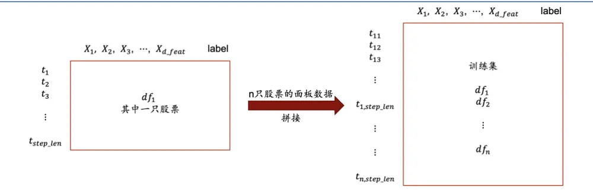
资料来源：华泰研究

## RSR 关系股票排序框架

关系股票排序框架（Relational Stock Ranking，简称 RSR）利用 LSTM 处理时间序列的优势和图神经网络 GNN在空间域的优势，解决股票收益率的排序预测问题（Feng et al.，2019）。作为一种图时空网络模型，它为人工智能在选股上的应用提供了新的思路。

图表13： RSR关系股票排序框架
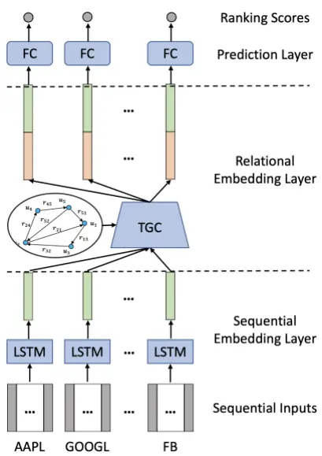
资料来源：Feng, He, Wang et al. (2019). Temporal relational ranking for stock prediction. ACM Transactions on Information Systems 37(2)，华泰研究

图 13 展示了 RSR 框架，该框架主要包括三层，由下而上依次是顺序嵌入层、关系嵌入层以及预测层。同一层的 LSTM 单元和全连接层 FC 单元的权重是共享的。选股思路如下：

1. 首先，将每只股票的历史时间序列数据输入到同一个 LSTM 中，捕获序列自身相关性，得到股票的顺序嵌 $入E^{t}$ ；

2. 其次，使用时间图卷积组件（Temporal Graph Convolution，简称 TGC）在股票关系的基础上，加入一种时间敏感的方式，对顺序嵌入Et进行修正，得到关系嵌 $入EG^{t}$ ；

3. 最后，将顺序嵌入和关系嵌入拼接，输入到同一个全连接层，得到每只股票的排序得分$\hat{r}^{t+1}=f(X^{t})$

RSR 框架将 N只股票映射到一个排名列表上，预测排序得分越高的股票在未来将获得更高的投资收益。

## 顺序嵌入层

股票数据蕴含丰富的时间信息，股票的历史状况可能是影响其未来走势的最具影响力的因素之一。顺序嵌入层将每只股票的历史特征时间序列数据输入到 LSTM，以捕获序列相关性，最终学习到股票的顺序嵌入。

具体而言，将股票 i 在交易日 t 的历史特征序列Xt输入到 LSTM，并提取最后一个隐藏层状态 $e_{i}^{t}$ 作为股票的顺序嵌入：

$$
E^{t}=LSTM(X^{t})
$$

其中 $\begin{array}{r}{[X^{t}\in R^{N\times S\times F}=[X_{1}^{t},\cdots,X_{N}^{t}]^{T}}\end{array}$ 是N只股票 $在$ 交易日t的历史特征序列；S为时间序列长度；F 为原始特征维度； $E^{t}=[e_{1}^{t},\cdots,e_{N}^{t}]^{T}\in R^{N\times F^{\prime}}$ 为所有股票的顺序嵌入表示； $F^{\prime}$ 表示嵌入大小，即 LSTM 中隐藏单元的数量。选择 LSTM是因为它能够捕捉长期依赖关系。

## 关系嵌入层

关系嵌入层的核心是建立描述股票间关联关系的模型。股票间的关联可以体现在：若两家公司在同一个板块或行业，它们的股价可能表现出类似的趋势，因为它们往往受到类似的外部事件影响；若两家公司是供应链上的合作伙伴，那么上/下游公司的事件可能会影响下/上游公司的股价。

为了在股票历史数据中捕捉上述模式带来的影响，RSR 框架中显式地建立了股票关系图，给定 Q 种类型的关系，将两支股票 i 和 j 之间的关系编码为一个 Q 维二进制股票关系向量$a_{ji}\in R^{Q}$ ，它的每个元素表示 i和 j之间是否存在对应类型的关系。

关系嵌入层设计了一种新的神经网络组件——时间图卷积（Temporal Graph Convolution，简称 TGC），根据显式的股票关系图，以动态时间敏感的方式修正顺序嵌入层的结果，得到关系嵌 $入EG^{t}$ 。RSR 原文（Feng et al.，2019）中，作者由浅入深介绍了如下三种关系嵌入方式，其中第三种方式正是 TGC。

## 1. 一致嵌入传播（Uniform Embedding Propagation）：仅考虑 $.d_{j}$ 的显式关系

第一个灵感来自于链接分析研究，一个节点对另一个节点的影响可以通过在图中传播信息来获得。一个著名的例子是 PageRank 方法，它将一个节点的重要性分数传播到邻居节点。由于股票关系向量编码了两个连接股票节点之间的某种相似信息，借鉴链接分析中相似的传播过程来关联连接节点的嵌入：

$$
eg_{i}^{t}={\sum}_{\left\{j\mid sum(a_{ji})>0\right\}}\frac{1}{d_{j}}e_{j}^{t}.
$$

$sum(a_{ji})$ 表示 j 和 i 之间有几种类型关系的连接，只要大于 0 说明两者是邻居关系，将邻居节点j的特征 $\cdot e_{j}^{t}$ 传播给节点 i，聚合方式为加权平均，加权系数为邻居节点 j 度数 $\cdot d_{j}$ 的倒数。这里的 $d_{j}$ 指满足条件 $sum(a_{ji})>0$ 的股票数量，即 j 和 i 可能有多种类型关系，但数量只记一次。另外，上述嵌入传播类似于 1阶 GCN 图卷积，聚合方式为 $f(F,X)=WX$ o

## 2. 加权嵌入传播（Weighted Embedding Propagation）：通过关系－强度函数

考虑到两只股票之间不同的类型关系会对其价格产生不同影响，可在嵌入传播时采用加权聚合方式：

$$
eg_{i}^{t}=\sum_{\{j|sum(a_{ji})>0\}}\frac{g(a_{ji})}{d_{j}}e_{j}^{t}.
$$

其中 g 是一个映射函数，称为关系－强度函数，目的是用来学习股票关系向量中不同类型关系的影响强度。我们认为，加权嵌入相当于一个考虑不同类型连接边的注意力机制，既显式应用了图的局部拓扑结构信息，也通过关系－强度函数学习了关系类型的语义信息。

## 3. 时间敏感嵌入传播（Time-aware Embedding Propagation）： $\pmb{a}_{ji}$ 上加入动态信息

上述加权嵌入传播的一个缺点是关系向量是固定不变的，因此通过关系－强度函数返回的是固定强度，并未考虑不同时间步长的演化对强度的影响。由于市场是高度动态的，股票的状态和关系的强度在不断变化，因此作者提出将时间信息即顺序嵌入et注入关系强度函数，得到时间敏感的嵌入传播过程如下：

$$
eg_{i}^{t}={\sum}_{\left\{j\:|\:sum(a_{ji})>0\right\}}\frac{g(a_{ji},e_{i}^{t},e_{j}^{t})}{d_{j}}e_{j}^{t},\tag{14}
$$

关于上述关系－强度函数 g 的形式，作者设计了如下两种时间敏感的学习函数，它们的区别在于通过显式或隐式的方式来捕捉两只股票之间的关系强度。

显式建模的关系－强度函数 g 如下是时间相似度和关系重要性的乘积：

$$
g\big(a_{ji},e_{i}^{t},e_{j}^{t}\big)=\underbrace{e_{i}^{t^{T}}e_{j}^{t}}_{time\:similarity}\times\underbrace{\emptyset\big(w^{T}a_{ji}+b\big)}_{relation\:importance}
$$

第一项度量了当前时间步长下两只股票间的相似性，使用内积来估计相似度，这两只股票当前越相似，它们之间的关系就越有可能在未来影响它们的价格。第二项是关于股票关系向量的一层全连接网络，用来学习股票j 和股票 i之间关系的重要性。其中 $w\in R^{Q}$ 和偏置 b是训练参数，∅是一个激活函数。由于这两项可被显式解释，因此称之为显式建模。

隐式建模将顺序嵌入和关系向量输入到一个全连接层中来计算关系强度：

$$
g\big(a_{ji},e_{i}^{t},e_{j}^{t}\big)=\varnothing(w^{T}\left[{e_{i}^{t}}^{T},{e_{j}^{t}}^{T},a_{ji}^{T}\right]^{T}+b)\tag{15}
$$

同样 $\cdot w\in R^{2F^{\prime}+Q}$ 和偏置 b是训练参数，∅是一个激活函数。由于这种交互方式是由参数隐式捕获的，所以称之为隐式建模。

## 预测层

RSR 框架最后将顺序嵌入层和关系嵌入层的结果进行拼接，输入到一个全连接层，以预测各股票收益率的排名得分，根据预测得分构建投资组合。为了优化模型，作者提出了一个点对回归损失和成对排序损失加和的目标函数：

$$
l(\hat{r}^{t+1},r^{t+1})=\|\hat{r}^{t+1}-r^{t+1}\|^{2}+\alpha\sum_{i=0}^{N}\sum_{j=0}^{N}\max(0,-(\hat{r}_{i}^{t+1}-\hat{r}_{j}^{t+1})(r_{i}^{t+1}-r_{j}^{t+1}))
$$

其中 $r^{t+1}=[r_1^{t+1},\cdots,r_N^{t+1}],\enspace\hat{r}^{t+1}=[\hat{r}_1^{t+1},\cdots,\hat{r}_N^{t+1}]\in R^N$ 分别表示 N 只股票的真实和预测得分向量，α是超参数用来平衡两个损失项。

上述目标函数中第一个回归项惩罚了真实值和预测得分之间的差异，第二项是成对的最大边际损失，它鼓励股票对的预测分数与真实值保持相同的相对顺序。这样一来有如下好处：

1. 保证绝对收益率的预测结果：准确预测收益率有利于确定投资时机，因为只有在收益率大幅上升时，排名靠前的股票才会成为有价值的投资目标；

2. 保证股票收益率的相对顺序，以便投资者做出更好的投资决策：正确的股票相对顺序有助于选择投资目标，例如选择排名更高的股票。

## RSR 和 GAT 的比较

RSR 框架首先根据股票间多种类型关系得到股票关系图，随后运用时序信息和股票关系来预测股票的未来收益率排序情况。RSR 框架的重要贡献如下：

1. 为股票间建立多种类型关系，构建了真实存在的关系图：对纳斯达克交易所/纽交所的股票分别构建了 112/130 种行业关系和 42/32 种基于维基百科中公司描述的关系，例如供应商－消费者关系和所有权关系；

2. 将股票预测设置为排序任务，提出 RSR 深度学习框架进行股票收益率的排名预测；

3. 以一种时间敏感的方式捕获股票关系，提出一种新的神经网络建模组件 TGC，将股票的时间演化和股票间关系注入到模型中。

我们将式(15)得到的强度通过 softmax 函数标准化使邻居间可比，代入式(14)得到如下关系嵌入：

$$
eg_{i}^{t}=\sum_{\{j|sum(a_{ji})>0\}}\frac{softmax_{j}(\varnothing(w^{T}\left[e_{i}^{t^{T}},e_{j}^{t^{T}},a_{ji}^{T}\right]^{T}+b))}{d_{j}}e_{j}^{t}.\tag{16}
$$

将上述关系嵌入与图注意力网络 GAT 中式(12)代入式(13)后的特征表示 $\vec{h}_{i}^{k}$ 进行对比，我们发现两者在结构上是类似的，均采用注意力机制的方式，将信息聚焦到更重要的邻居节点上再进行加权求和。只不过 GAT 中是将静态的特征节点进行拼接，而 RSR 框架中使用的节点特征为时间敏感的节点特征，并且额外拼接了关系向量。前文中 GAT 的优势在 RSR中同样具备。

## 微软 Qlib 平台 GATs_ts 模型的应用介绍

本章我们关注图神经网络选股在微软 Qlib 平台的实现方式。Qlib 是微软开发的开源 AI 量化投资平台，Qlib 源码在 base.Model 基类的基础上提供了多个 AI 算法（Model Zoo）样例，包括 Boosting 集成学习、循环神经网络和图神经网络等。Qlib 中称这些 AI 算法为预测模型（Forecast Model），先用样本内数据集训练模型，再对样本外数据集的每只股票进行预测。由于组件的设计是松耦合的，这些模型可以作为一个独立的模块运行使用，用户也可以将自定义模型集成到 Qlib 中。

## 模型实现

Qlib 中目前提供的模型算法如下表所示，其中 GATs_ts 属于图神经网络范畴，本质是时间序列模型与图注意力机制的结合。下面我们介绍 Qlib 中 GATs_ts用于量价因子选股的实现细节，并和长短期记忆网络 LSTM 进行比较。

图表14： Qlib内置模型算法

| 分类 | 模型 |
| --- | --- |
| Boosting 集成学习模型 | LightGBM |
|  | Catboost |
| 时间序列相关神经网络模型 | XGBoost |
|  | GRU |
|  | LSTM |
|  | ALSTM |
|  | SFM |
|  | TFT |
| 图神经网络 | GATs_ts(时间序列模型+图注意力网络） |
| 其他 | MLP |
|  | DNN |
|  | TabNet |
|  | Linear(参数可选择"ols"， "nnls"， "ridge"和"lasso"进行配置） |

资料来源：Qlib，华泰研究

在图神经网络一章的最后以及图时空网络选股框架一章中，我们分别介绍了图注意力网络GAT 和 RSR 选股框架。两者的相似之处在于注意力机制的运用，区别主要在于节点特征是动态还是静态，即是否考虑图的动态性。Qlib 中的 GATs_ts 模型借鉴了 RSR 的框架结构，并采用了 GAT 的自注意力机制全局方式。由于 GATs_ts 将循环神经网络 RNN 的最后时刻隐藏层状态特征送入 GAT，因此我们称之为动态图注意力网络。

在顺序嵌入这一步，GATs_ts 与 RSR 的顺序嵌入层一样，首先学习时间信息得到顺序嵌入hidden：

$$
hidden=rnn(x)
$$

为了方便读者理解，这里采用的符号尽量与 Qlib 中 GATs_ts 源码 pytorch_gats_ts.py 一致（图 15）。其中ℎidden ∈ Rsample_num×ℎidden_size是 RNN 在最后一个时刻 T 的输出，即最后一个时刻的隐藏层状态特征。

在关系嵌入这一步，GATs_ts 采用 GAT 中注意力机制的 Global Self-Attention 全局方式，这种方式不需要像 RSR 那样构建显式的股票关系图，而是对每一个中心节点计算其它所有节点的特征聚合。

关系嵌入的具体方式与 RSR 类似，采用将动态特征（即顺序嵌入 hidden）注入注意力机制的全局方式，由于无需显式构图因而省略关系向量 $[a_{ji}$ ，此时节点j 对节点 i的标准化注意力系数为：

$$
att_{-}weight_{ji}=softmax_{j}(leaky\_relu(a^{T}[W\cdot hidden_{i}\parallel W\cdot hidden_{j}]))
$$

相当于将 GAT 中式(12)的静态特征替换为 LSTM 输出的时刻 T 动态特征 hidden，其中 j 为节点集 V 中的所有节点，W ∈ Rℎidden_size×ℎidden_size是一层对 hidden 的线性变换，a ∈

R2ℎidden_size×1是注意力机制，即一层全连接网络。

图 15 代码中通过 cal_attention 函数实现注意力系数矩阵的计算。其中attention_in ∈Rsample_num2×2ℎidden_size 是将 sample_num 个节点特征进行两两组合拼接， 共计得到sample_num2个节点对特征，每行为一个拼接的节点对[W ∙ ℎidden ∥ W ∙ ℎidden ]。随后通 过 aT 与 attention_inT 相 乘 ， 再 调 整 成 [sample_num, sample_num] 的 大 小 ， 得 到attention_out ∈ Rsample_num×sample_num 。 将 其 送 入 非 线 性 激 活 层 leaky_relu ， 并 通 过softmax 标准化，最终得到标准化注意力系数矩阵att_weigℎt ∈ Rsample_num×sample_num。

得到注意力系数后，将所有的节点j的特征加权聚合给节点i，这样就得到节点i的特征表示，代码中加入了节点 i的自身特征，相当于引入一个自环：

$$
hidden_{i}^{\prime}=hidden_{i}+{\sum}_{j\in V}att_{-}weight_{ij}\times hidden_{j}
$$

完成上述所有节点特征的聚合更新后，图 15 代码中最后将聚合结果依次送入全连接层 fc、非线性激活层 leaky_relu 以及最后一层全连接层 fc_out。最后一层全连接层输出预测股票收益率。

图表15： Qlib 中动态图注意力网络 GATs_ts 源码（pytorch_gats_ts.py）
class GATModel(nn.Module): 
def__init__(self, d_feat=6, hidden_size=64, num_layers=2, dropout=0.0, base_model="GRU"): 
if base model == "GRU": 
self.rnn = nn.GRu(input_size=d_feat, hidden_size=hidden_size, num_layers=num_layers, batch_first=True, dropout=dropout, 
elif base model == "LSTM": 
self.rnn = nn.LSTM(input_size=d_feat, hidden_size=hidden_size, num_layers=num_layers, batch_first=True, dropout=dropout,) 
else: 
raise ValueError("unknown base model name ss"% base_model 
self.hidden size = hidden size 
self.d_feat = d_feat 
self.transformation = nn.Linear(self.hidden_size, self.hidden_size 
self.a = nn.Parameter(torch,randn(self.hidden size * 2. 1)) # 图注意力机制：—层全连接网络，(2*hidden size.1) 
self.a.requires_grad = True 
self.fc = nn.Linear(self.hidden size. self.hidden size 
self.fc out = nn.Linear(hidden size, 1) 
self.leaky_relu = nn.LeakyReLU 
self.softmax = nn.Softmax(dim=1) 
def cal attention(self, x, y): 
x = self.transformation(x) # 线性变换 
y = self.transformation(y) 
sample_num = x. shape[0] 
dim = x.shape[1] 
e_x = x.expand (sample_num, sample_num, dim 
e_y = torch.transpose(e_x, 0, 1) 
attention_in = torch.cat((e_x, e_y)，2).view(-1,dim * 2) # 将sample_num个节点特征进行两两拼接，(sample_num^2, 2*hidden_size) 
self.a_t = torch.t(self.a) 
attention_out = self.a_t.mm(torch.t(attention_in)).view(sample_num, sample_num) # 执行注意力机制 
attention_out = self.leaky_relu(attention_out) # 非线性激活层 
att_weight = self.softmax(attention_out) # 标准化系数 
return att_weight #注意力系数矩阵：第i行的元素att_weight_ij表示节点j对节点i的影响权重，(sample_num，sample_num) 
def forward(self, x): 
out，_ = self.rnn(x) # 学习历史时间信息 
hidden = out[:, -1, :] # 时刻T的输出， (sample_num, hidden_size 
att_weight = self.cal_attention(hidden, hidden) # 计算注意力系数矩阵，(sample_num, sample_num) 
hidden = att_weight.mm(hidden) + hidden # 全局节点聚合并加入自环 
hidden = self.fc(hidden) # 全连接层 
hidden = self.leaky_relu(hidden) # 非线性激活层 
return self.fc_out(hidden).squeeze() # 全连接层预测股票收益率
资料来源：Qlib，华泰研究

## GATs_ts 与 LSTM 输入数据辨析

为了帮助读者更好理解 GATs_t 所使用的输入数据结构，我们对 GATs_ts 与 LSTM 输入数据进行辨析。LSTM 输入数据结构参考 Qlib 源码 pytorch_lstm_ts.py 中的 LSTMModel，GATs_ts 输入数据结构参考 Qlib 源码 pytorch_gats_ts.py 中的 GATModel。

在 LSTM 和 GATs_ts 模型中，每个 batch 张量在各维度的大小为[n_samples, step_len,d_feat+1]。其中 n_samples 为每个 batch 的样本数即 batch_size，step_len 为历史时间序列长度（此处设为 20），d_feat 为特征维度即因子个数（此处设为 20），加 1 为其对应的标签列。GATs_ts 与 LSTM 输入数据的核心区别就在于 batch_size 的处理。LSTM 输入数据的 batch_size 是固定的，而 GATs_ts 输入数据的 batch_size 是可变的。

真实市场中，每个交易日的股票数量不同，例如 2017 年 2 月 10日、13 日和 14日沪深 300成分股票池的有效股票数量分别为 299、299 和 300，14 日相比前一交易日增加一只股票。此时，每个交易日的全局股票图网络是一个动态图。GATs_ts 模型 batch_size 可变的特性使得模型可以将每个交易日的全部有效股票放进一个 batch，不同 batch 对应不同交易日，而 LSTM 无法做到这一点。

图表16： Qlib 中 GATs_ts 模型 GATModel 输入数据维度
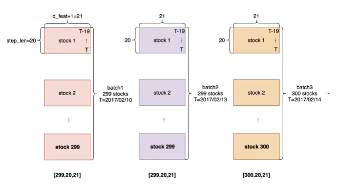
资料来源：Qlib，华泰研究

图表17： Qlib 中 LSTM 模型 LSTMModel 输入数据维度
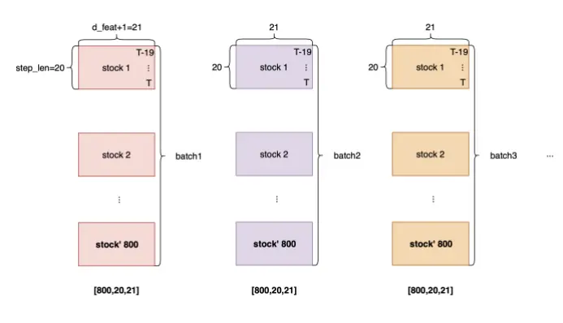
资料来源：Qlib，华泰研究

图 16 和图 17 展示了两种模型的具体输入数据形式。图 16 的 GATs_ts 模型中，以T=2017/2/10 对应的 batch1 为例（左上角），stock1 的 step_len 维度为[T-19, T-18,…, T]，即对应 stock1股票从 T-19 到 T 日的因子特征。若该股票 T-19 到 T-1 日因子有缺失，则用最新数据补全之前的缺失值。图表 18 左侧展示了当 T=2017/03/09 时，stock1(SH600000)的原始数据。

图 17 的 LSTM模型中，原始训练集大小为[N, d_feat+1]，N 为训练集总行数，时间、股票代码分别为第一、第二索引（如图表 18）。对每 800 行中的样本，取从 T-19 到 T 日 20 天的因子特征及标签放进一个 batch，得到[800, 20, 21]的 batch 张量。此时同一个 batch 中股票可能出现重复。例如这个 batch 中，可能同时包含 stock1 在 2017/02/10~2017/03/09日的因子数据，以及 stock1 在 2017/02/13~2017/03/10 的因子数据，并把两者视作独立的样本，这显然有欠合理。

图表18： GATs_ts模型输入数据与前 800条原始数据样例
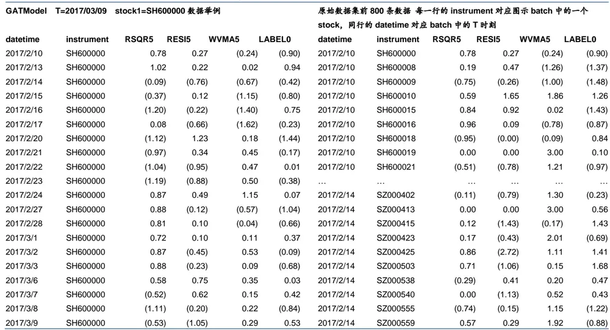
资料来源：Wind，华泰研究

在预测样本外数据时，由于 GAT 中的注意力机制采用点对式操作，只要获得 GAT 的共享参数 $W_{k}$ （特征变换）和a⃑（图注意力机制），就可以对新加入的股票进行收益率预测，从而实现归纳学习。这也是 GAT 相比于 GCN 等转导学习方法的优越之处。

另外需要指出的细节是 Qlib 对于不同因子库的 GAT 模型路径配置不同。Qlib 内置了Alpha158 和 Alpha360 两类因子库，两者的 GAT 模型路径配置不同，分别为qlib.contrib.model.pytorch_gats_ts 和 qlib.contrib.model.pytorch_gats。原因在于两类因子库在计算特征时的数据组成结构不同：Alpha158 的每一列为一个因子特征，而 Alpha360的每一列是一个与时间%d相关的因子特征，比如前60列是关于CLOSE的时间序列特征，列名依次为[CLOSE59,CLOSE58,……,CLOSE0]。在正式送入模型前，需要采用不同数据预处理方式，将特征数据的 batch 转换成相同的[n_samples, step_len, d_feat]的大小形式。两个代码使用的 GAT 本质上是一致的，只是数据预处理方式有所区别。

## 多跳邻居实现

Qlib 中 GATs_ts 源码仅实现了一层图注意力网络，即只考虑 1 跳邻居的关系嵌入。我们在Qlib 源码基础上实现了 K层 GATs_ts 模型，并用于后文中的回测，用来检验更远的节点特征能否提供额外的信息。例如 K＝2 相当于对节点进行两跳的邻居聚合，即将邻居以及邻居的邻居聚合给自身。多跳邻居的代码实现如图 19 所示，在 yaml 配置文件中加入num_layers_gat（等价于层数 K）的参数定义即可完成多跳邻居的训练。

图 19 代码中，首先定义图注意力层 GATlayer 类，在 GATModel 中通过循环堆叠num_layers_gat 层即可得到多跳邻居的特征聚合。整个前向传播过程分为三步：rnn 循环神经网络、多层 GAT 和 fc全连接。

## 图表19： 动态图注意力网络 GATs_ts 的多跳邻居实现

class GATModel(nn.Module): 
def init (self, d feat=6, hidden size=64, num lavers=2, num lavers gat=2, dropout=0.0, base model="GRu"): 
if base_model == "GRU": 
self.rnn = nn.GRU(input_size=d_feat,hidden_size=hidden_size,num_layers=num_layers,batch_first=True,dropout=dropout,) 
elif base_model == "LSTM": 
self.rnn = nn.LSTM(input_size=d_feat,hidden_size=hidden_size,num_layers=num_layers,batch_first=True,dropout=dropout,) 
else: 
raise ValueError("unknown base model name `%s" % base_model 
self.hidden size = hidden size 
self.d_feat = d_feat 
self.fc = nn.Linear(self.hidden_size, self.hidden_size) 
self.fc_out = nn.Linear(hidden_size, 1) 
self.leaky_relu = nn.LeakyReLU() 
self.num_layers_gat = num_layers_gat # GATs层数 (K) 
self.gat_layers = nn.ModuleList() 
for l in range(self.num_layers_gat): 
self.gat_layers.append(GATlayer(self.hidden_size) 
def forward(self, x): 
# rnn 
out, _ = self.rnn(x) 
hidden = out[:, -1, :] 
# 多层GATs 
for l in range(self.num_layers_gat): 
hidden = self.gat_layers[l](hidden 
hidden = hidden + out[:, -1， :] # 加入k=0即rnn的原始特征自环out[:, -1， :] 
hidden = self.fc(hidden) 
hidden = self.leaky_relu(hidden 
return self.fc_out(hidden).squeeze() 
class GATlaver(nn.Module): 
def__init__(self, hidden_size=64): 
self.hidden_size = hidden_size 
self.transformation = nn.Linear(self.hidden size. self.hidden size 
self.a = nn.Parameter(torch.randn(self.hidden_size * 2, 1)) 
self.a.requires_grad = True 
self.leaky_relu = nn.LeakyReLU() 
self.softmax = nn.Softmax(dim=1) 
def cal_attention(self, x, y): 
计算注意力系数矩阵，与源码一致 
return att_ weight 
def forward(self, x): 
att weight = self.cal attention(x, x 
hidden = att_weight.mm(x) 
return hidden
资料来源：Qlib，华泰研究

在前向传播中，每一层 for 循环完成 self.gat_layers[l](hidden)特征聚合后，我们借鉴一种残差跳跃的方式（Chen et al., 2020）：从初始层（k=0）进行残差连接。具体做法是在self.gat_layers[l](hidden)的基础上，加入 k=0 原始特征的自环 out[:, -1, :]，这是为了防止图神经网络的过平滑（Over Smoothing）问题，即随着层数增加，节点会学到图中全局信息，导致所有节点的特征趋于类似从而无法区分。

## GATs_ts 回测分析

## 测试流程

我们在 Qlib 平台上对动态图注意力网络模型 GATs_ts进行选股回测，流程如下：

a) 获取 Wind 中的 A 股数据，按照华泰金工研报《人工智能 40：微软 AI 量化投资平台 Qlib 体验》（2020-12-22）中 dump_all 转换用户数据格式的方式，转换为Qlib 的 bin 数据存储格式。

b) 股票池：沪深 300 成分股。

c) 回测区间：2010-01-04 至 2021-02-02，分 12 个阶段滚动回测，如下图所示。

图表20： 分阶段滚动回测样本内外时间选取示意图
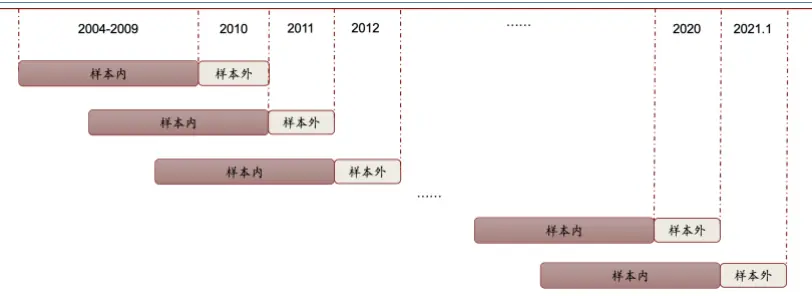
资料来源：华泰研究

2. 特征和标签提取：特征采用 Qlib 内置的因子库 Alpha158vwap 中的 158 个因子特征，将标签定义为 t+2 日 vwap 复权均价相对于 t+1 日 vwap 复权均价的涨跌幅，相当于 t日收盘后发信号，t+1 日以日内均价开仓，t+2 日以日内均价平仓。

3. 特征预处理：

a) 训练集和验证集：首先剔除标签为缺失值的样本（Qlib 的 DropnaLabel 类），再对标签进行截面标准化（Qlib 的 CSRankNorm 类），即对每个截面的标签先转换为 rank 序数，最后 Z 分数标准化至标准正态分布。

b) 测试集：首先对特征进行标准化（Qlib 的 RobustZScoreNorm 类），即对因子做稳健 Z 分数标准化，对原始数据减去中位数除以 1.48 倍 MAD 统计量，再将因子特征取值限制在-3 到 3 之间（clip_outlier 设置为 True），最后将因子缺失值填充为 0（Qlib 的 Fillna 类）。

4. 数据集设置：训练集采用样本内数据的前五年，验证集采用样本内数据的最后一年，测试集采用接下来的样本外一年。

5. 样本内训练：使用自定义 pytorch_gats_ts_layers.py 的 GATs 类训练，GAT 类调用了图 19 的 GATModel 类，即多层动态图注意力网络模型 GATs_ts 的实现。将回测区间按年份划分为 12 个子区间，因此需要配置相应的训练集区间进行滚动训练。

6. 验证集调参：训练过程中，当验证集上的评价分数在连续 10 轮迭代后都没有提升时，停止模型训练，选取验证集评价分数最高的一组参数作为模型的最优参数，用来对测试集进行预测。这里的评价分数使用 Qlib 中默认的方式，即均方误差的相反数。

7. 样本外测试和回测：

a) 得到最优参数后，进行模型预测得到测试集中每一天股票的预测收益率。

b) 由于 Qlib 开源部分还未配置滚动回测，我们编辑了 12 个 yaml 文件依次进行回测，分别得到 2010 年至 2021 年中每一年测试集上的预测收益率。我们将每年的pred.pkl（预测收益率结果）合并，再送入 backtest_for_pred 函数，进行 2010~2021年的整体回测和报告输出。该回测函数和指标计算函数如图 21所示。

c) 使用 TopkDropout 策略，每日持有 topk=50 只股票，同时每日卖出持仓股票中最新预测收益最低的 n_drop=5 只股票，买入未持仓股票中最新预测收益最高的n_drop=5 只股票。买入每只股票的金额为 95%的剩余现金除以需要购买的股票数量，95%是策略的一个可调参数，用来控制仓位。关于费率的设置，开仓交易费率为 0.05%，平仓交易费率为 0.15%，最小交易费用为 5 元（人民币）。

图表21： Qlib自定义滚动回测函数和指标计算函数代码
#回测 
def backtest_for_pred(pred_df): 
STRATEGY CONFIG = {"topk"：50, "n drop"：5,} # 策略参数 
BACKTEST_CONFIG = 
"verbose": False, "limit_threshold": 0.095, "account": 100000000, "benchmark": benchmark, 
"deal_price": "vwap", "open_cost":0.0005, "close_cost": 0.0015,"min_cost": 5,}# 回测参数 
#设置调仓策略 
strategy = TopkDropoutStrategy(**STRATEGY_CONFIG) 
#pred_df是模型在测试集上的预测得分，即收益率，通过qrun工具会得到pred.pkl预测结果 
report_normal_df, positions = backtest(pred_df, strategy=strategy, **BACKTEST_CoNFIG) # 调用qlib.contrib.evaluate.backtest函数进行回测 
return report_normal_df, positions 
def risk_analysis(r_no_excess, r_excess, N=252): 
#非超额收益率 
annualized_return_no_excess = r_no_excess.mean * N 
annualized_volatility_no_excess = np.nanstd(r_no_excess) * np.sqrt(N) 
sharpe = annualized_return_no_excess / annualized_volatility_no_excess 
max_drawdown_no_excess = (r_no_excess.cumsum() - r_no_excess.cumsum().cummax()).min() 
#超额收益率 
mean_excess = r_excess.mean( 
std_excess = r_excess.std(ddof=1 
annualized_return_excess = mean_excess * N 
annualized_volatility_excess = np.nanstd(r_excess) * np.sqrt(N) 
information_ratio = mean_excess / std_excess * np.sqrtN 
max_drawdown_excess = (r_excess.cumsum() - r_excess.cumsum().cummax()).min() 
data = { 
"annualized_return": annualized_return_no_excess, 
"annualized_volatility": annualized_volatility_no_excess, 
"sharpe": sharpe, 
"max_drawdown": max_drawdown_no_excess, 
"annualized_return_excess": annualized_return_excess, 
"annualized_volatility_excess": annualized_volatility_excess, 
"information_ratio": information_ratio, 
"max drawdown excess": max drawdown excess 
res = pd.Series(data, index=data.keys()).to_frame("risk") 
return res 
#指标计算 
def cal_risk(report_normal_df): 
analysis = dict() 
analysis["excess_return_without_cost"] = risk_analysis(report_normal_df["return"], report_normal_df["return"] - report_normal_df["bench"]) 
analysis["excess_return_with_cost"] = risk_analysis 
report_normal_df["return"] - report_normal_df["cost"], 
report_normal_df["return"] - report_normal_df["bench"] - report_normal_df["cost"] 
) #在glib.contrib.evaluate.,risk analysis的基础上加了几个指标 
analysis_df = pd.concat(analysis 
return analysis_df
资料来源：Qlib，华泰研究

## 模型参数配置

我们将 d_feat 设置为 158，使用 Alpha158vwap 因子库的所有特征进行训练；with_pretrain设置为 False，即不预先给 158 个特征的数据训练一个 LSTM 网络；module_path 设置为qlib.contrib.model.pytorch_gats_ts_layers，即我们的模型实现的位置；num_layers_gat为 GATs_ts层数，后文中设置为 1，2和 3 进行回测；其余参数的设置与 Qlib 中 yaml配置上的保持一致，具体如下表所示。基准模型 LSTM 的参数请见附录。

图表22： GATs_ts 参数设置

| 参数 | 含义 | yaml 配置中的取值 |
| --- | --- | --- |
| step_len | 时间序列长度 | 20 |
| d_feat | 原始特征维度 | 158 |
| hidden_size | 隐藏层神经元数 | 64 |
| num_layers | 隐藏层层数 | 2 |
| dropout | 神经元被临时删除的概率 | 0.7 |
| n_epochs | 训练轮数 | 200 |
| Ir | 学习率 | 0.0001 |
| optimizer | 优化器 | adam |
| early_stop | 提前结束轮数 | 10 |
| metric | 提前结束训练的度量方法 | loss |
| loss | 损失计算方式 | mse |
| base_model | 循环神经网络类型 | LSTM |
| with_pretrain | 是否导入预训练模型 | False |
| model_path | 上述模型的路径 | "benchmarks/LSTM/csi300_Istm_ts.pkl" |
| GPU | 用来训练的 GPU 编号 | 0 |
| num_layers_gat | GATs 层数 | 1（或2、3） |

资料来源：Qlib，华泰研究

## 单因子测试

## IC 值分析法

如果将模型的输出即预测收益率视为单因子，则可以对单因子向量与真实收益率向量进行IC 值分析，得到不同预测模型在各年度 IC均值、Rank IC 均值、ICIR 和 Rank ICIR，衡量因子的有效性。预测模型包括 1、2、3层 GATs_ts 以及基准模型 LSTM。

分年度和完整回测区间的汇总结果如表 23，Rank IC 日频序列值如图 24 和 25所示。基准模型 LSTM 在回测期间的 Rank IC 均值和 Rank ICIR 分别为 0.09 和 0.65，Rank IC 值大于0 的交易日占比为 75.65%。对于 GATs_ts 模型，当图注意力层数为一层（即 K＝1）时，2010~2021 年的 Rank IC 均值和 Rank ICIR 分别为 0.09 和 0.63，Rank IC 值大于 0 的交易日占比为 74.76%。总的来看，LSTM 模型的 IC 测试结果略优于 GATs_ts 模型，一层GATs_ts 模型优于其它层数（K＝2 或 3）的 GATs_ts 模型。

图表23： 不同预测模型输出值单因子 IC 测试结果（回测期 2010-01-04 至 2021-01-29）

| 模型 | 指标 | 2010~2021 | 2010 | 2011 | 2012 | 2013 | 2014 | 2015 | 2016 | 2017 | 2018 | 2019 | 2020 | 2021 |
| --- | --- | --- | --- | --- | --- | --- | --- | --- | --- | --- | --- | --- | --- | --- |
| LSTM | IC | 0.08 | 0.10 | 0.09 | 0.09 | 0.10 | 0.09 | 0.11 | 0.09 | 0.10 | 0.07 | 0.04 | 0.05 | 0.07 |
|  | ICIR | 0.62 | 0.81 | 0.90 | 0.75 | 0.77 | 0.62 | 0.64 | 0.62 | 0.89 | 0.50 | 0.30 | 0.34 | 0.41 |
|  | Rank IC | 0.09 | 0.11 | 0.08 | 0.09 | 0.10 | 0.10 | 0.13 | 0.11 | 0.11 | 0.07 | 0.06 | 0.06 | 0.08 |
|  | Rank ICIR | 0.65 | 0.83 | 0.84 | 0.74 | 0.76 | 0.71 | 0.68 | 0.64 | 0.96 | 0.51 | 0.45 | 0.39 | 0.54 |
| GATs_ts (K=1) | IC | 0.08 | 0.10 | 0.09 | 0.12 | 0.11 | 0.09 | 0.11 | 0.07 | 0.10 | 0.06 | 0.03 | 0.03 | 0.06 |
|  | ICIR | 0.57 | 0.82 | 0.84 | 1.00 | 0.75 | 0.62 | 0.58 | 0.47 | 0.87 | 0.39 | 0.22 | 0.20 | 0.35 |
|  | Rank IC | 0.09 | 0.10 | 0.09 | 0.12 | 0.12 | 0.10 | 0.13 | 0.08 | 0.10 | 0.07 | 0.05 | 0.04 | 0.08 |
|  | Rank ICIR | 0.63 | 0.82 | 0.81 | 1.06 | 0.84 | 0.68 | 0.67 | 0.52 | 0.91 | 0.49 | 0.34 | 0.29 | 0.44 |
| GATs_ts (K=2) | IC | 0.08 | 0.10 | 0.09 | 0.12 | 0.11 | 0.09 | 0.10 | 0.07 | 0.09 | 0.05 | 0.03 | 0.03 | 0.06 |
|  | ICIR | 0.54 | 0.76 | 0.80 | 0.91 | 0.73 | 0.60 | 0.56 | 0.47 | 0.76 | 0.32 | 0.19 | 0.20 | 0.30 |
|  | Rank IC | 0.09 | 0.09 | 0.09 | 0.12 | 0.12 | 0.10 | 0.12 | 0.09 | 0.10 | 0.07 | 0.05 | 0.04 | 0.08 |
|  | Rank ICIR | 0.61 | 0.76 | 0.78 | 0.96 | 0.83 | 0.66 | 0.66 | 0.53 | 0.84 | 0.42 | 0.33 | 0.29 | 0.42 |
| GATs_ts (K=3) | IC | 0.08 | 0.09 | 0.09 | 0.12 | 0.10 | 0.09 | 0.10 | 0.07 | 0.09 | 0.05 | 0.03 | 0.04 | 0.08 |
|  | ICIR | 0.54 | 0.73 | 0.78 | 0.89 | 0.70 | 0.59 | 0.52 | 0.47 | 0.77 | 0.34 | 0.23 | 0.24 | 0.41 |
|  | Rank IC | 0.09 | 0.09 | 0.09 | 0.12 | 0.11 | 0.10 | 0.12 | 0.08 | 0.09 | 0.07 | 0.05 | 0.05 | 0.09 |
|  | Rank ICIR | 0.60 | 0.70 | 0.75 | 0.93 | 0.79 | 0.66 | 0.62 | 0.51 | 0.79 | 0.44 | 0.37 | 0.33 | 0.48 |

资料来源：Qlib，Wind，华泰研究

图表24： LSTM 和 GATs_ts（K=1）Rank IC 日频序列值
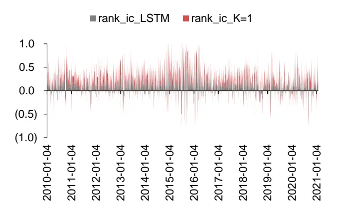
资料来源：Qlib，Wind，华泰研究

图表25： GATs_ts（K=2）和 GATs_ts（K=3）Rank IC 日频序列值
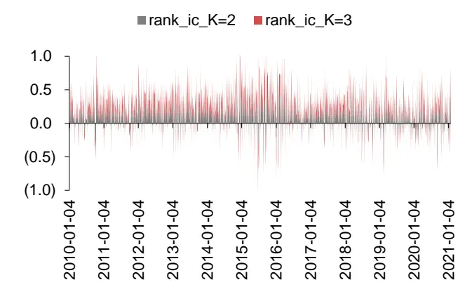
资料来源：Qlib，Wind，华泰研究

统计因子在各月上的表现，得到 Rank IC 月度均值，如表 26 所示。可以看到各模型月度Rank IC 在 2017 年及以前相对稳定，在 2018 年及以后逐渐降低。这可能说明随着交易拥挤或者市场环境的变化，量价因子预测能力在逐渐失效。

图表26： 不同模型 Rank IC月度均值

| 模型 | 年份 | 1 | 2 | 3 | 4 | 5 | 6 | 7 | 8 | 9 | 10 | 11 | 12 |
| --- | --- | --- | --- | --- | --- | --- | --- | --- | --- | --- | --- | --- | --- |
| LSTM | 2010 | 0.11 | 0.09 | 0.07 | 0.04 | 0.12 | 0.09 | 0.13 | 0.11 | 0.14 | 0.17 | 0.16 | 0.12 |
|  | 2011 | 0.09 | 0.18 | 0.09 | 0.10 | 0.05 | 0.06 | 0.10 | 0.06 | 0.08 | 0.02 | 0.11 | 0.07 |
|  | 2012 | 0.03 | 0.07 | 0.08 | 0.09 | 0.10 | 0.14 | 0.06 | 0.06 | 0.07 | 0.11 | 0.14 | 0.12 |
|  | 2013 | 0.08 | 0.15 | 0.07 | 0.09 | 0.09 | 0.20 | 0.09 | 0.07 | 0.07 | 0.08 | 0.10 | 0.16 |
|  | 2014 | 0.09 | 0.10 | 0.07 | 0.13 | 0.04 | 0.10 | 0.06 | 0.14 | 0.11 | 0.12 | 0.09 | 0.16 |
|  | 2015 | 0.17 | 0.10 | 0.14 | 0.11 | 0.12 | 0.11 | 0.12 | 0.13 | 0.11 | 0.16 | 0.14 | 0.09 |
|  | 2016 | 0.01 | 0.12 | 0.22 | 0.12 | 0.10 | 0.11 | 0.14 | 0.12 | 0.07 | 0.10 | 0.07 | 0.07 |
|  | 2017 | 0.10 | 0.10 | 0.10 | 0.14 | 0.08 | 0.14 | 0.10 | 0.08 | 0.13 | 0.11 | 0.11 | 0.10 |
|  | 2018 | 0.08 | 0.08 | 0.12 | 0.11 | 0.07 | 0.09 | 0.03 | 0.05 | 0.00 | 0.04 | 0.09 | 0.06 |
|  | 2019 | 0.03 | 0.01 | 0.17 | 0.10 | 0.09 | 0.02 | 0.05 | 0.04 | 0.06 | 0.03 | 0.06 | 0.02 |
|  | 2020 | (0.00) | 0.06 | 0.09 | 0.12 | 0.04 | 0.00 | 0.05 | 0.07 | 0.06 | 0.05 | 0.04 | 0.08 |
|  | GATs_ts (K=1) | 2021 | 0.08 |  |  |  |  |  |  |  |  |  |  |
| 2010 |  | 0.10 | 0.09 | 0.05 | 0.05 | 0.06 | 0.10 | 0.10 | 0.11 | 0.12 | 0.13 | 0.17 | 0.10 |
| 2011 |  | 0.08 | 0.18 | 0.09 | 0.12 | 0.09 | 0.06 | 0.10 | 0.06 | 0.07 | 0.02 | 0.13 | 0.08 |
| 2012 |  | 0.11 | 0.10 | 0.14 | 0.12 | 0.14 | 0.16 | 0.10 | 0.12 | 0.08 | 0.14 | 0.11 | 0.17 |
| 2013 |  | 0.07 | 0.17 | 0.12 | 0.12 | 0.09 | 0.15 | 0.11 | 0.08 | 0.09 | 0.11 | 0.14 | 0.16 |
| 2014 |  | 0.09 | 0.14 | 0.10 | 0.11 | 0.07 | 0.09 | 0.09 | 0.14 | 0.11 | 0.14 | 0.06 | 0.08 |
| 2015 |  | 0.20 | 0.14 | 0.13 | 0.12 | 0.09 | 0.10 | 0.12 | 0.16 | 0.13 | 0.15 | 0.13 | 0.11 |
| 2016 |  | 0.04 | 0.08 | 0.15 | 0.09 | 0.07 | 0.09 | 0.11 | 0.08 | 0.06 | 0.04 | 0.09 | 0.06 |
| 2017 |  | 0.09 0.09 | 0.07 | 0.11 | 0.11 | 0.10 | 0.13 | 0.10 | 0.04 | 0.11 | 0.11 | 0.10 | 0.10 |
| 2018 2019 |  | 0.06 | 0.10 | 0.09 | 0.11 | 0.06 | 0.09 | 0.03 | 0.06 | 0.02 | 0.05 | 0.08 | 0.08 |
| 2020 | 0.00 | (0.07) | 0.16 | 0.10 | 0.08 | 0.01 | 0.04 | 0.03 | 0.05 | 0.04 | 0.04 | 0.01 |  |
|  | 2021 | 0.00 | 0.10 | 0.08 | (0.00) | 0.00 | 0.05 | 0.10 | 0.06 | 0.04 | 0.02 | 0.06 |  |
| GATs_ts (K=2) |  | 0.08 0.10 | 0.10 |  |  |  |  |  |  |  |  |  |  |
|  | 2010 2011 | 0.07 |  | 0.05 0.09 | 0.06 0.11 | 0.11 | 0.07 | 0.08 | 0.11 0.11 | 0.12 | 0.14 | 0.09 |  |
|  | 2012 | 0.15 | 0.17 |  | 0.09 | 0.06 | 0.10 | 0.06 | 0.07 | 0.02 | 0.11 | 0.09 |  |
|  | 2013 | 0.07 | 0.09 0.18 | 0.17 0.12 | 0.12 0.11 | 0.13 0.09 | 0.15 0.16 | 0.10 0.12 0.11 0.09 | 0.06 | 0.14 | 0.10 | 0.16 |  |
|  | 2014 | 0.08 | 0.12 | 0.08 | 0.11 | 0.06 | 0.09 | 0.08 0.15 | 0.09 0.11 | 0.10 0.13 | 0.14 | 0.16 |  |
|  | 2015 | 0.19 | 0.14 | 0.13 | 0.12 | 0.10 | 0.09 | 0.09 0.13 | 0.11 | 0.16 | 0.07 | 0.08 |  |
|  | 2016 | 0.01 | 0.08 | 0.18 | 0.11 | 0.07 | 0.09 0.11 | 0.10 | 0.06 | 0.05 | 0.13 | 0.13 |  |
|  | 2017 | 0.09 | 0.07 | 0.10 | 0.10 | 0.08 | 0.15 0.09 | 0.05 | 0.11 | 0.11 | 0.09 0.10 | 0.06 |  |
|  | 2018 | 0.08 0.12 | 0.08 | 0.10 | 0.05 | 0.07 | 0.03 | 0.05 | 0.02 | 0.05 | 0.08 | 0.11 0.07 |  |

资料来源：Qlib，Wind，华泰研究

## 单因子分层回测法

依照因子值对股票进行打分，构建投资组合回测，是最直观的衡量指标优劣的手段。测试模型的构建方法如下：

1. 股票池：沪深 300 成分股。

2. 回溯区间：2010-01-04 至 2021-01-29。

3. 换仓期：每个交易日。

4. 数据处理：将模型对股票收益率的预测值视作单因子，因子值为空的股票不参与分层。

5. 分层方法：将因子值由大到小排序，前 20%为组合 1，后 20%为组合 5，另有组合long-short 为买入组合 1、卖空组合 5，组合 long-average 为买入组合 1、卖空平均组合，这里的平均是指取每个交易日中所有股票的平均收益率。我们调用 qlib.contrib.report.analysis_model.analysis_model_performance 中的_group_return 方法来计算各组合的累计收益。比如计算组合 1时，首先将因子值降序排列，然后对每个交易日中前 20%的股票收益率取均值作为该日的收益率，相当于等值购买前 20%的股票。

图表27： 不同模型分层组合回测指标（不含交易费用，基准为组合 long-average 中的平均组合，回测期 2010-01-04 至 2021-01-29）

| 模型 | 指标 | Group1 | Group2 | Group3 | Group4 | Group5 | long-short |  | long-average |
| --- | --- | --- | --- | --- | --- | --- | --- | --- | --- |
| LSTM（两层） | 年化收益率（%） |  | 52.75 | 21.85 | 6.85 | (9.58) | (46.70) | 99.44 | 47.71 |
|  | 年化波动率（%） |  | 23.50 | 22.08 | 21.62 | 21.12 | 21.83 | 13.14 | 7.04 |
|  | 夏普比率 |  | 2.24 | 0.99 | 0.32 | (0.45) | (2.14) | 7.57 | 6.77 |
|  | 最大回撤（%） | (48.55) |  | (44.60) | (56.38) | (137.68) | (511.30) | (11.33) | (5.37) |
|  | 年化超额收益率（%） | 47.71 |  | 16.82 | 1.81 | (14.62) | (51.73) |  |  |
|  | 超额收益年化波动率（%） | 7.04 |  | 4.38 | 3.74 | 4.48 | 7.41 |  |  |
|  | 信息比率 | 6.77 |  | 3.84 | 0.48 | (3.26) | (6.98) |  |  |
| GATs_ts (K=1) | 超额收益最大回撤（%） | (5.37) |  | (3.20) | (7.57) | (157.69) | (552.80) | - | - |
|  | 年化收益率（%） | 49.78 |  | 23.25 | 6.56 | (8.56) | (45.86) | 95.64 | 44.75 |
|  | 年化波动率（%） | 23.35 |  | 21.95 | 21.52 | 21.52 | 22.31 | 14.20 | 7.57 |
|  | 夏普比率 | 2.13 |  | 1.06 | 0.30 | (0.40) | (2.06) | 6.74 | 5.91 |
|  | 最大回撤（%） | (51.01) |  | (50.43) | (64.66) | (139.21) | (502.77) | (17.96) | (10.12) |
|  | 年化超额收益率（%） | 44.75 |  | 18.22 | 1.52 | (13.60) | (50.89) |  |  |
|  | 超额收益年化波动率（%） | 7.57 |  | 4.59 | 3.83 | 4.68 | 8.01 |  |  |
|  | 信息比率 | 5.91 |  | 3.97 | 0.40 | (2.91) | (6.35) |  |  |
| GATs_ts (K=2) | 超额收益最大回撤（%） | (10.12) |  | (7.41) | (10.80) | (146.16) | (543.98) |  |  |
|  | 年化收益率（%） | 47.35 |  | 23.25 | 6.66 | (9.46) | (42.62) | 89.97 | 42.31 |
|  | 年化波动率（%） | 23.51 |  | 22.00 | 21.37 | 21.41 | 22.32 | 14.05 | 7.49 |
|  | 夏普比率 | 2.01 |  | 1.06 | 0.31 | (0.44) | (1.91) | 6.40 | 5.65 |
|  | 最大回撤（%） | (55.85) |  | (48.32) | (61.81) | (154.20) | (468.06) | (21.74) | (14.22) |
|  | 年化超额收益率（%） | 42.31 |  | 18.22 | 1.62 | (14.49) | (47.66) |  |  |
|  | 超额收益年化波动率（%） | 7.49 |  | 4.61 | 3.87 | 4.81 | 7.94 |  |  |
|  | 信息比率 | 5.65 | 3.95 |  | 0.42 | (3.01) | (6.00) |  |  |
| GATs_ts (K=3) | 超额收益最大回撤（%） | (14.22) | (5.55) |  | (7.55) | (154.92) | (509.65) |  |  |
|  | 年化收益率（%） | 48.32 |  | 20.35 | 9.37 | (9.64) | (43.23) | 91.56 | 43.29 |
|  | 年化波动率（%） | 23.94 | 22.16 |  | 21.47 | 21.34 | 21.90 | 14.42 | 7.70 |
|  | 夏普比率 | 2.02 |  | 0.92 | 0.44 | (0.45) | (1.97) | 6.35 | 5.62 |
|  | 最大回撤（%） | (57.82) |  | (52.07) | (58.31) | (142.07) | (473.32) | (28.33) | (15.52) |
|  | 年化超额收益率（%） | 43.29 |  | 15.32 | 4.33 | (14.67) | (48.27) |  |  |
|  | 超额收益年化波动率（%） | 7.70 |  | 4.65 | 3.98 | 4.78 | 8.29 |  |  |
|  | 信息比率 | 5.62 |  | 3.29 | 1.09 | (3.07) | (5.82) |  |  |
|  | 超额收益最大回撤（%） | (15.52) |  | (8.29) | (5.44) | (157.47) | (516.21) |  |  |

资料来源：Qlib，Wind，华泰研究

图表28： LSTM 分层组合回测净值
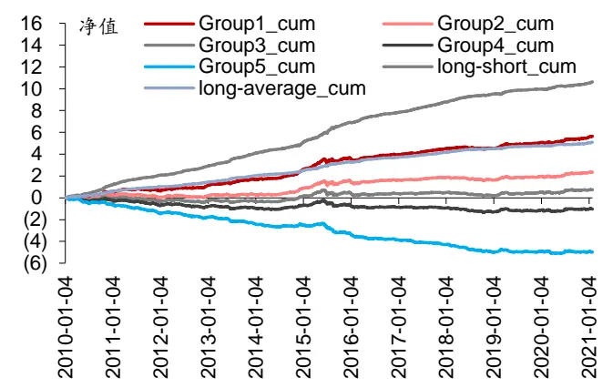
资料来源：Qlib，Wind，华泰研究

图表29： GATs_ts（K=1）分层组合回测净值
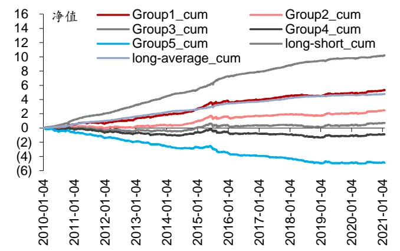
资料来源：Qlib，Wind，华泰研究

图表30： GATs_ts（K=2）分层组合回测净值
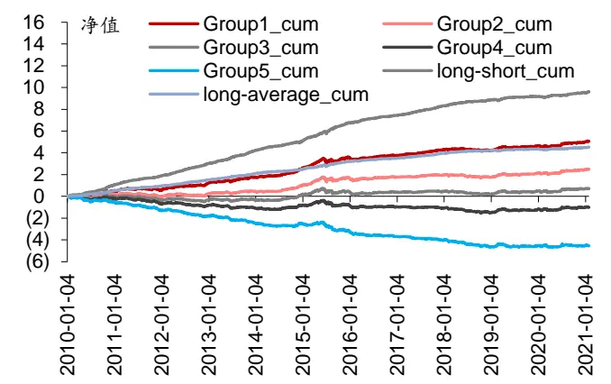
资料来源：Qlib，Wind，华泰研究

图表31： GATs_ts（K=3）分层组合回测净值
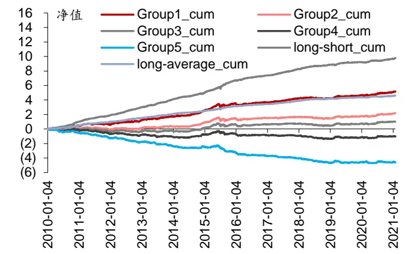
资料来源：Qlib，Wind，华泰研究

比较各预测模型单因子分层回测表现，LSTM和 GATs_ts（K=1）多头组合 Group1 的年化超额收益率分别为 47.71%和 44.75%，多空组合 long-short 年化收益率分别为 99.44%和95.64%，LSTM在收益能力上略胜一筹。一层GATs_ts优于其它层数（K＝2或3）的GATs_ts模型。

## 构建组合策略及回测分析

图表32： 不同模型 TopkDropout 策略各年度回测指标（含交易费用，基准为沪深 300 指数，回测期 2010-01-04 至 2021-02-02）

| 模型 | 指标 | 2010~2021 | 2010 | 2011 | 2012 | 2013 | 2014 | 2015 | 2016 | 2017 | 2018 | 2019 | 2020 | 2021 |
| --- | --- | --- | --- | --- | --- | --- | --- | --- | --- | --- | --- | --- | --- | --- |
| LSTM | 年化收益率（%） | 32.50 | 30.50 | (10.32) | 37.38 | 35.49 | 64.03 | 69.36 | 30.47 | 42.63 | (18.63) | 36.80 | 35.69 | 75.19 |
|  | 年化波动率（%） | 25.70 | 26.99 | 22.39 | 21.29 | 22.87 | 18.97 | 45.70 | 28.47 | 10.57 | 24.50 | 20.31 | 25.87 | 15.88 |
|  | 夏普比率 | 1.26 | 1.13 | (0.46) | 1.76 | 1.55 | 3.37 | 1.52 | 1.07 | 4.03 | (0.76) | 1.81 | 1.38 | 4.74 |
|  | 最大回撤（%） | (38.39) | (28.55) | (23.68) | (10.81) | (13.28) | (7.77) | (38.33) | (23.43) | (4.03) | (25.11) (16.54) |  | (17.92) | (2.58) |
|  | 年化超额收益率（%） | 25.69 | 38.03 | 21.36 | 25.62 | 41.88 | 15.83 | 66.31 | 32.07 | 21.31 | 12.19 | 0.20 | 8.40 | 24.12 |
|  | 超额收益年化波动率（%） | 9.72 | 7.80 | 6.07 | 6.24 | 10.05 | 10.79 | 16.41 | 10.98 | 6.23 | 9.13 | 7.30 | 8.99 | 12.16 |
|  | 信息比率 | 2.64 | 4.86 | 3.51 | 4.10 | 4.16 | 1.46 | 4.03 | 2.91 | 3.41 | 1.33 | 0.03 | 0.93 | 1.94 |
| GATs_ts (K=1) | 超额收益最大回撤（%） | (10.95) | (4.66) | (2.53) | (2.07) | (5.84) | (10.95) | (8.63) | (5.12) | (2.89) | (6.46) | (5.38) | (4.44) | (1.88) |
|  | 年化收益率（%） | 35.70 | 31.03 | (2.53) | 53.20 | 36.73 | 61.62 | 76.38 | 24.04 | 48.39 | (15.97) | 39.23 | 30.93 | 43.44 |
|  | 年化波动率（%） | 25.19 | 26.28 | 22.24 | 23.82 | 21.97 | 17.48 | 43.45 | 27.34 | 10.88 | 26.05 | 19.60 | 23.38 | 17.32 |
|  | 夏普比率 | 1.42 | 1.18 | (0.11) | 2.23 | 1.67 | 3.52 | 1.76 | 0.88 | 4.45 | (0.61) | 2.00 | 1.32 | 2.51 |
|  | 最大回撤（%） | (35.75) | (22.18) | (22.07) |  | (10.08) (13.55) | (7.25) | (34.72) | (21.94) | (3.33) |  | (27.34) (14.25) | (18.12) | (3.86) |
|  | 年化超额收益率（%） | 28.89 | 38.56 | 29.15 | 41.44 | 43.11 | 13.42 | 73.33 | 25.64 | 27.08 | 14.86 | 2.63 | 3.64 | (9.14) |
|  | 超额收益年化波动率（%） 信息比率 | 9.81 | 7.12 5.41 | 6.17 | 7.48 | 8.90 | 11.62 | 16.72 | 10.03 | 6.53 | 10.83 | 6.76 | 8.17 | 13.53 |
| GATs_ts (K=2) | 超额收益最大回撤（%） | 2.94 |  | 4.72 | 5.53 | 4.83 | 1.15 | 4.38 | 2.55 | 4.14 | 1.37 | 0.39 | 0.44 | (0.66) |
|  | 年化收益率（%） | (16.92) | (5.56) | (3.00) | (2.33) | (6.04) | (16.92) | (6.80) | (4.69) | (2.73) | (8.60) | (5.51) | (6.37) | (3.39) |
|  | 年化波动率（%） | 32.76 25.30 | 26.51 | (9.32) | 51.44 | 34.80 | 62.14 | 73.74 | 25.66 | 42.56 | (20.87) | 37.68 | 34.81 | 37.90 |
|  | 夏普比率 | 1.30 | 27.08 0.98 | 22.83 | 24.92 2.06 | 23.44 | 17.92 | 42.57 | 27.40 | 12.06 | 26.17 | 19.19 | 22.55 | 17.42 |
|  | 最大回撤（%） |  | (24.79) | (0.41) (25.83) | (11.00) | 1.48 | 3.47 | 1.73 (38.55) | 0.94 | 3.53 | (0.80) | 1.96 | 1.54 | 2.18 |
|  | 年化超额收益率（%） | (38.55) 25.96 | 34.04 | 22.36 | 39.69 | (13.78) 41.18 | (7.30) 13.94 | 70.69 | (22.54) 27.27 | (4.16) 21.25 | (30.25) 9.95 | (14.63) | (16.83) | (3.95) |
|  | 超额收益年化波动率（%） | 9.92 | 8.20 | 6.34 | 8.19 | 9.08 | 12.07 | 15.21 |  | 7.91 | 11.07 | 1.08 | 7.52 | (14.95) |
|  | 信息比率 |  | 4.14 | 3.52 | 4.84 | 4.52 |  | 4.64 | 10.21 2.66 | 2.68 | 0.90 | 6.65 | 8.11 | 12.02 |
|  | 超额收益最大回撤（%） | 2.62 (16.85) |  | (3.42) |  |  | 1.15 (16.85) |  |  | (4.83) (11.66) |  | 0.16 | 0.93 | (1.21) |
| GATs_ts (K=3) | 年化收益率（%） | 33.68 | (6.74) 29.74 | (5.16) | (2.62) 48.31 | (7.37) 36.48 |  | (6.17) | (4.73) |  |  | (6.69) | (6.44) | (3.54) |
|  | 年化波动率（%） | 25.86 | 27.39 | 22.76 | 24.35 | 21.91 | 59.78 17.18 | 68.28 44.79 | 21.18 28.25 | 12.73 | 46.33 (13.79) 25.82 | 42.71 19.88 | 32.65 | 73.67 |
|  | 夏普比率 | 1.30 | 1.09 | (0.23) | 1.98 | 1.66 | 3.48 | 1.52 | 0.75 | 3.64 | (0.53) | 2.15 | 25.79 1.27 | 22.63 3.26 |
|  | 最大回撤（%） | (40.43) | (23.74) | (21.14) | (10.44) | (14.15) | (7.19) | (41.06) | (23.56) | (4.23) | (28.29) | (14.70) | (18.69) | (4.64) |
|  | 年化超额收益率（%） | 26.88 | 37.26 | 26.52 | 36.56 | 42.86 | 11.57 | 65.23 | 22.79 | 25.02 | 17.04 | 6.11 | 5.37 | 22.52 |
|  | 超额收益年化波动率（%） | 10.20 | 8.94 4.16 | 6.52 4.06 | 7.98 4.57 | 8.27 5.17 | 12.08 0.96 | 17.14 3.80 | 10.72 2.12 | 8.32 3.00 | 10.54 1.61 | 7.00 0.87 | 9.96 0.54 | 14.77 1.49 |

资料来源：Qlib，Wind，华泰研究

采用 Qlib 内置的 TopkDropout 策略，进行沪深 300 成分股内选股回测，组合构建方式已在前文详述，基准为沪深 300 指数。策略回测结果如表 32 所示。LSTM和一层 GATs_ts 模型在回测期间的年化超额收益率分别为 25.69%和 28.89%，夏普比率分别为 1.26 和 1.42，信息比率分别为 2.64 和 2.94，超额收益最大回撤分别为-10.95%和-16.92%。一层 GATs_ts优于两层 LSTM，也优于二层和三层 GATs_ts模型。

一层 GATs_ts 在单因子测试上稍弱于 LSTM，但在 TopkDropout 策略回测表现上优于 LSTM，我们认为这可能是因为 GATs_ts 对整个股票池的预测能力稍逊，但对头部股票的预测能力较好。TopkDropout 策略仅关注每个交易日预测得分最高的 5只股票，即使对整个沪深 300股票池预测能力一般，只要每日头部股票预测正确，仍能取得较高回测收益。

从分年度表现来看，各类型策略的超额收益表现出明显的衰减，我们认为这和模型使用的因子有关。Alpha158vwap 因子库包含 158 个量价因子，这些因子是原始量价数据由基础运算符相连接得到的因子表达式。若传统量价出现拥挤，或者因为市场环境变化量价因子整体失效，那么 GATs_ts 模型也不可避免出现滑坡。GATs_ts 只能解决因子合成的问题，无法解决因子失效问题。持续挖掘新 Alpha 因子仍是提升 Alpha 策略表现的最好途径之一。

图表33： LSTM 策略回测净值表现
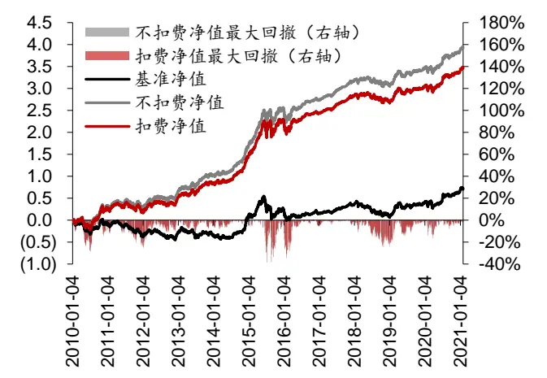
资料来源：Qlib，Wind，华泰研究

图表34： LSTM 策略回测超额净值表现（基准为沪深 300）
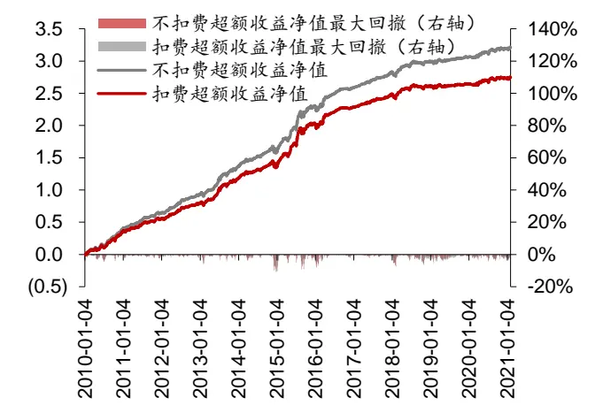
资料来源：Qlib，Wind，华泰研究

图表35： GATs_ts（K=1）策略回测净值表现
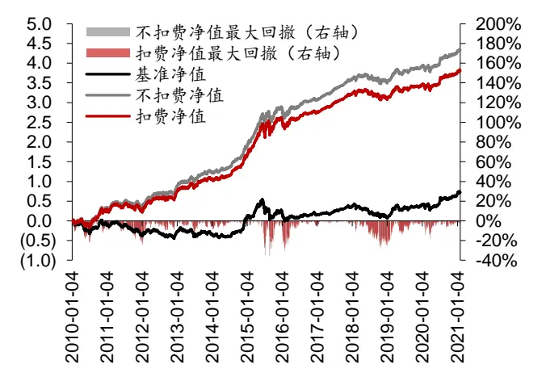
资料来源：Qlib，Wind，华泰研究

图表36： GATs_ts（K=1）策略回测超额净值表现（基准为沪深 300）
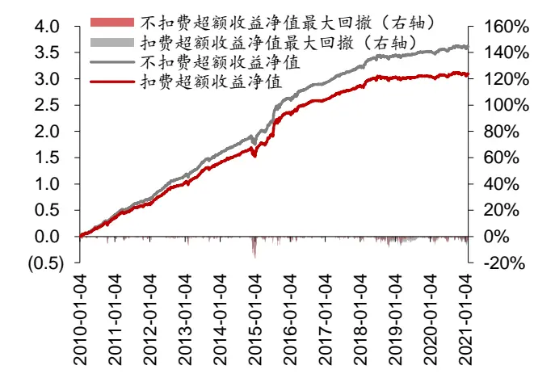
资料来源：Qlib，Wind，华泰研究

图 33 至图 40 分别展示四个模型在回测期间的净值和超额净值图。LSTM 超额收益最大回撤发生在 2014-11-24 至 2014-12-22，回撤幅度为-10.95%；GATs_ts（K＝1）超额收益最大回撤发生在 2014-11-24 至 2015-1-5，回撤幅度为-16.92%。GATs_ts 控制风险能力略逊于 LSTM。

图表37： GATs_ts（K=2）策略回测净值表现
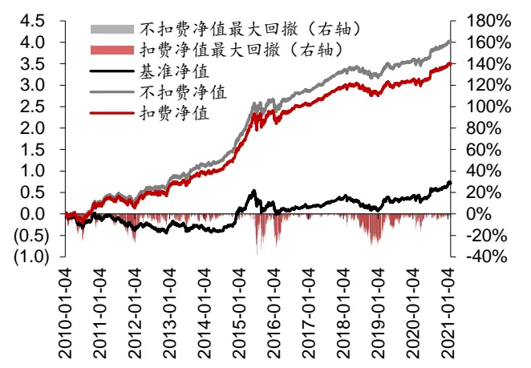
资料来源：Qlib，Wind，华泰研究

图表38： GATs_ts（K=2）策略回测超额净值表现（基准为沪深 300）
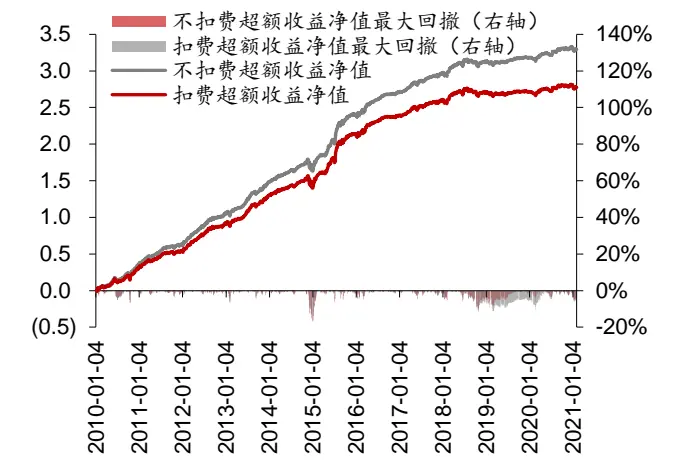
资料来源：Qlib，Wind，华泰研究

图表39： GATs_ts（K=3）策略回测净值表现
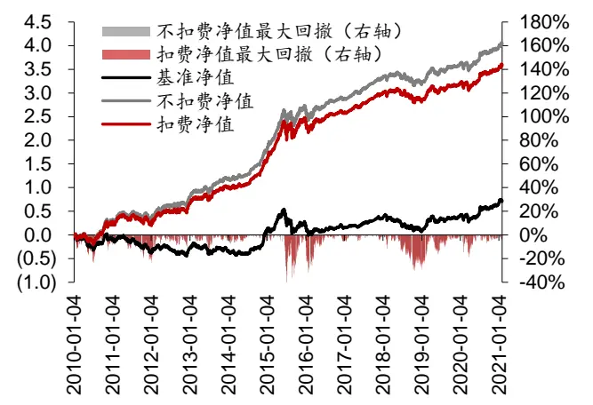
资料来源：Qlib，Wind，华泰研究

图表40： GATs_ts（K=3）策略回测超额净值表现（基准为沪深 300）
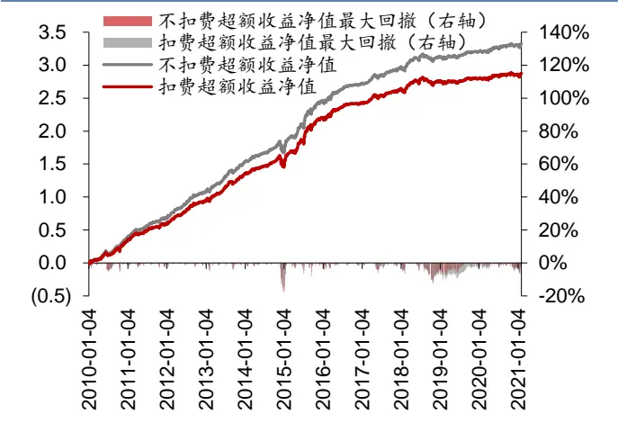
资料来源：Qlib，Wind，华泰研究

下面两张图展示四个模型日度策略换手率变化。2010至 2014年日换手率在 20%附近波动，2015 至 2016 年换手率波动较大，此后 GATs_ts（K＝1）和 GATs_ts（K＝2）模型的日换手率维持在 20%附近，而 LSTM 和 GATs_ts（K＝3）模型的日换手率维持在 15%附近。

图表41： LSTM 和 GATs_ts（K=1）策略日换手率
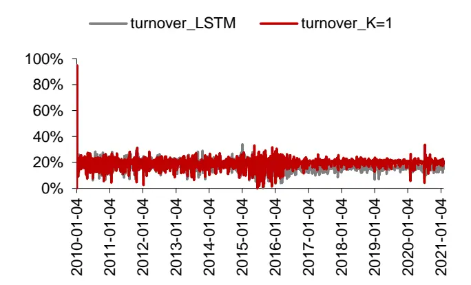
资料来源：Qlib，Wind，华泰研究

图表42： GATs_ts（K=2）和 GATs_ts（K=3）策略日换手率
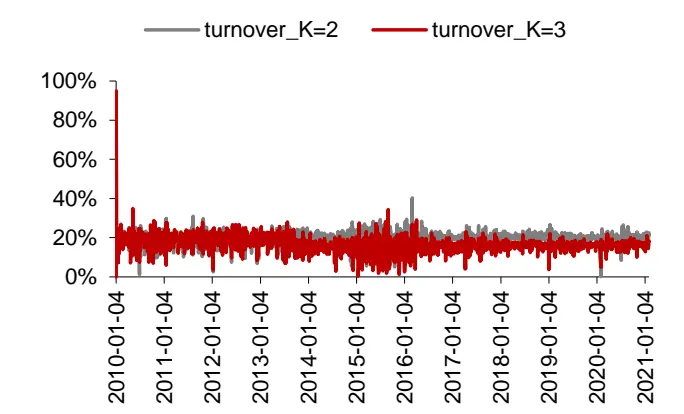
资料来源：Qlib，Wind，华泰研究

## 总结和展望

为了方便读者更好地理解图神经网络的原理，我们花费了较长篇幅介绍图神经网络的思想和发展。总的来说，它由图信号理论和谱域图卷积发展而来，目前更多聚焦在空间域上的卷积方式，即将邻居节点的特征聚合给中心节点的方式来更新节点特征。

GCN、GraphSAGE 和 GAT 是三种具有代表性的图神经网络。GCN 仅适用于转导学习和无向图，即在未来有新节点加入时需要重新训练模型才能进行预测；GraphSAGE 和 GAT分别通过聚合器和注意力机制的方式将其扩展到归纳式学习，可用于新节点的预测，这对动态的股票市场来说是富有意义的。

随后我们以 RSR 框架为例，介绍图时空网络在量化多因子选股上的应用。RSR 结合动态图的时间信息和横截面上股票间的关联信息，对收益率排序进行预测。相比于传统多因子选股仅考虑截面因子并且将股票视作独立样本的处理方式，图时空网络选股具有先进之处，它既考虑了因子的时间序列信息，也考虑了股票间的互相影响。

最后我们给出 Qlib 平台 GATs_ts 模型的实现方式，GATs_ts 将 GAT 的注意力机制融入图时空网络选股框架。基于 Qlib 内置的 Alpha158 因子库，我们采用 GATs_ts 模型对沪深 300成分股进行日收益率预测，随后构建日频调仓投资组合。回测期内（2010-01-04 至2021-02-02），一层 GATs_ts 策略相对于基准沪深 300 指数的年化超额收益率为 28.89%，信息比率为2.94，超额收益最大回撤为-16.92%，表现优于基准模型LSTM和多层GATs_ts。

## 本研究存在以下未尽之处：

1. 建图方法：GATs_ts 采用 GAT 的全局注意力机制，即对股票之间关系进行隐式建模。如果对股票市场建立显式的股票间关系，再应用于选股策略，效果如何？这些关系类型可能具有语义特征，是否可以考虑知识图谱与图时空网络的结合？

2. 网络结构：GATs_ts 首先将时序数据送入循环神经网络，随后对股票之间进行图卷积。与之相反，如果先对每个交易日的股票图进行图卷积，再将其送入循环神经网络中，从方法论上同样可行？

3. 策略构建：本研究直接调用 Qlib 中的 Alpha158 因子库及 TopkDropOut 选股策略，在沪深 300 成分股票池内采用日频调仓方式构建组合。模型在其它股票池、其它换仓频率、其它组合构建方式下表现如何？模型 2018 年后超额收益逐渐衰减，是否和因子失效有关，引入新因子能否起到改进效果？

图神经网络应用于量化策略是一个相对新颖的领域，上述问题都值得进一步探索。

## 参考文献

[1] Yang X, Liu W, Zhou D, et al. Qlib: An AI-oriented Quantitative Investment Platform[J]. arXiv preprint arXiv:2009.11189, 2020.

[2] Shuman D I, Narang S K, Frossard P, et al. The emerging field of signal processing on graphs: Extending high-dimensional data analysis to networks and other irregular domains[J]. IEEE signal processing magazine, 2013, 30(3): 83-98.

[3] 刘忠雨，李彦霖，周洋. 深入浅出图神经网络：GNN 原理解析[M]. 北京：机械工业出版社，2020

[4] Tremblay N, Gonçalves P, Borgnat P. Design of graph filters and filterbanks[M]. Cooperative and Graph Signal Processing. Academic Press, 2018: 299-324.

[5] Bruna J, Zaremba W, Szlam A, et al. Spectral networks and locally connected networks on graphs[J]. arXiv preprint arXiv:1312.6203, 2013.

[6] Hammond D K, Vandergheynst P, Gribonval R. Wavelets on graphs via spectral graph theory[J]. Applied and Computational Harmonic Analysis, 2011, 30(2): 129-150.

[7] Defferrard M, Bresson X, Vandergheynst P. Convolutional neural networks on graphs with fast localized spectral filtering[J]. Advances in neural information processing

systems, 2016, 29: 3844-3852.

[8] Chung F R K, Graham F C. Spectral graph theory[M]. American Mathematical Soc., 1997.

[9] Kipf T N, Welling M. Semi-supervised classification with graph convolutional networks[J]. arXiv preprint arXiv:1609.02907, 2016.

[10] Wu F, Zhang T, Souza Jr A H, et al. Simplifying graph convolutional networks[J]. arXiv preprint arXiv:1902.07153, 2019.

[11] Hamilton W, Ying Z, Leskovec J. Inductive representation learning on large graphs[C]. Advances in neural information processing systems. 2017: 1024-1034.

[12] Veličković P, Cucurull G, Casanova A, et al. Graph attention networks[J]. arXiv preprint arXiv:1710.10903, 2017.

[13] Feng F, He X, Wang X, et al. Temporal relational ranking for stock prediction[J]. ACM Transactions on Information Systems (TOIS), 2019, 37(2): 1-30.

[14] Chen M, Wei Z, Huang Z, et al. Simple and deep graph convolutional networks[C]. International Conference on Machine Learning. PMLR, 2020: 1725-1735.

## 风险提示

Qlib 仍在开发中，部分功能未加完善和验证，使用存在风险。人工智能挖掘市场规律是对历史的总结，市场规律在未来可能失效。人工智能技术存在过拟合风险。

## 附录

基准模型 LSTM 参数设置如下表所示。

图表43： LSTM 参数设置

| 参数 | 含义 | yaml 配置中的取值 |
| --- | --- | --- |
| step_len | 时间序列长度 | 20 |
| d_feat | 原始特征维度 | 158 |
| hidden_size | 隐藏层神经元数 | 64 |
| num_layers | 隐藏层层数 | 2 |
| dropout | 神经元被临时删除的概率 | 0 |
| n_epochs | 训练轮数 | 200 |
| Ir | 学习率 | 0.001 |
| early_stop | 提前结束轮数 | 10 |
| metric | 提前结束训练的度量方法 | loss |
| loss | 损失计算方式 | mse |
| n_jobs | 最大线程数 | 20 |
| GPU | 用来训练的 GPU 编号 | 0 |
| rnn_type | 循环神经网络类型 | GRU |

资料来源：Qlib，华泰研究

除 GATs_ts 和 LSTM 模型外，我们还测试了经典的决策树集成模型 LightGBM，回测结果如下。

图表44： LightGBM 模型输出值单因子 IC 测试结果（回测期 2010-01-04 至 2021-01-29）

| 模型 | 指标 | 2010~2021 | 2010 | 2011 | 2012 | 2013 | 2014 | 2015 | 2016 | 2017 | 2018 | 2019 | 2020 | 2021 |
| --- | --- | --- | --- | --- | --- | --- | --- | --- | --- | --- | --- | --- | --- | --- |
| LightGBM | IC | 0.08 | 0.11 | 0.09 | 0.09 | 0.09 | 0.09 | 0.11 | 0.08 | 0.10 | 0.07 | 0.04 | 0.04 | 0.05 |
|  | ICIR | 0.64 | 0.86 | 0.93 | 0.87 | 0.76 | 0.80 | 0.67 | 0.57 | 0.93 | 0.53 | 0.31 | 0.28 | 0.27 |
|  | Rank IC | 0.09 | 0.12 | 0.09 | 0.10 | 0.10 | 0.10 | 0.12 | 0.09 | 0.10 | 0.08 | 0.05 | 0.05 | 0.07 |
|  | Rank ICIR | 0.70 | 0.90 | 0.87 | 0.86 | 0.83 | 0.82 | 0.72 | 0.65 | 0.99 | 0.57 | 0.41 | 0.38 | 0.42 |

资料来源：Qlib，Wind，华泰研究

图表45： LightGBM 模型 Rank IC 日频序列值
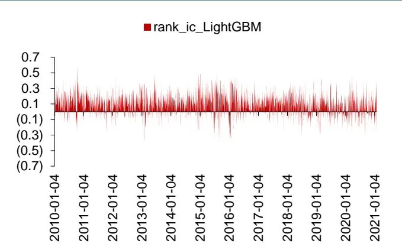
资料来源：Qlib，Wind，华泰研究

图表46： LightGBM 分层组合回测净值
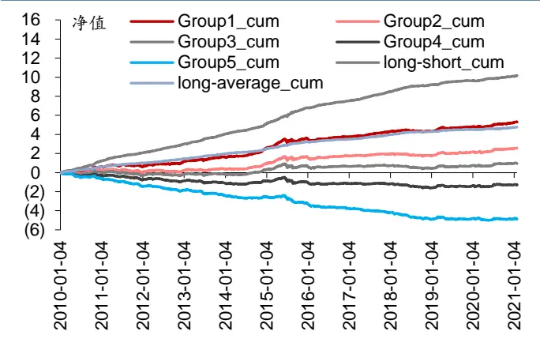
资料来源：Qlib，Wind，华泰研究

图表47： LightGBM 模型 Rank IC 月度均值

| 模型 | 年份 | 1 | 2 | 3 | 4 | 5 | 6 | 7 | 8 | 9 | 10 | 11 | 12 |
| --- | --- | --- | --- | --- | --- | --- | --- | --- | --- | --- | --- | --- | --- |
| LightGBM | 2010 | 0.10 | 0.14 | 0.09 | 0.10 | 0.10 | 0.08 | 0.14 | 0.11 | 0.13 | 0.13 | 0.17 | 0.13 |
|  | 2011 | 0.07 | 0.20 | 0.09 | 0.11 | 0.07 | 0.09 | 0.10 | 0.08 | 0.05 | 0.06 | 0.13 | 0.04 |
|  | 2012 | 0.09 | 0.08 | 0.10 | 0.09 | 0.10 | 0.10 | 0.09 | 0.08 | 0.09 | 0.10 | 0.10 | 0.14 |
|  | 2013 | 0.07 | 0.16 | 0.07 | 0.10 | 0.10 | 0.17 | 0.09 | 0.08 | 0.08 | 0.11 | 0.10 | 0.15 |
|  | 2014 | 0.09 | 0.08 | 0.06 | 0.12 | 0.05 | 0.10 | 0.08 | 0.15 | 0.10 | 0.11 | 0.10 | 0.14 |
|  | 2015 | 0.15 | 0.11 | 0.16 | 0.12 | 0.10 | 0.09 | 0.09 | 0.14 | 0.10 | 0.15 | 0.14 | 0.09 |
|  | 2016 | 0.01 | 0.10 | 0.17 | 0.11 | 0.07 | 0.11 | 0.11 | 0.12 | 0.07 | 0.08 | 0.08 | 0.08 |
|  | 2017 | 0.11 | 0.11 | 0.08 | 0.12 | 0.12 | 0.14 | 0.10 | 0.08 | 0.12 | 0.08 | 0.10 | 0.11 |
|  | 2018 | 0.12 | 0.08 | 0.13 | 0.09 | 0.06 | 0.09 | 0.04 | 0.06 | 0.02 | 0.01 | 0.09 | 0.08 |
|  | 2019 | 0.03 | 0.00 | 0.16 | 0.09 | 0.09 | (0.01) | 0.08 | 0.03 | 0.05 | 0.07 | 0.04 | 0.01 |
|  | 2020 | (0.00) | 0.04 | 0.08 | 0.12 | 0.06 | 0.01 | 0.04 | 0.07 | 0.06 | 0.05 | 0.03 | 0.05 |
|  | 2021 | 0.07 |  |  |  |  |  |  |  |  |  |  |  |

资料来源：Qlib，Wind，华泰研究

图表48： LightGBM 模型分层组合回测指标（不含交易费用，基准为组合 long-average 中的平均组合，回测期 2010-01-04 至 2021-01-29）

| 模型 | 指标 | Group1 | Group2 | Group3 | Group4 | Group5 | long-short | long-average |  |
| --- | --- | --- | --- | --- | --- | --- | --- | --- | --- |
| LightGBM | 年化收益率（%） | 49.69 | 23.99 |  | 9.03 | (12.10) | (45.44) | 95.14 | 44.66 |
|  | 年化波动率（%） | 23.38 | 22.26 | 21.52 |  | 21.20 | 21.49 | 12.13 | 6.30 |
|  | 夏普比率 | 2.13 | 1.08 |  | 0.42 | (0.57) | (2.11) | 7.84 | 7.09 |
|  | 最大回撤（%） | (47.25) | (45.80) |  | (55.38) | (162.90) | (502.11) | (11.84) | (5.34) |
|  | 年化超额收益率（%） | 44.66 | 18.96 |  | 4.00 | (17.14) | (50.48) |  |  |
|  | 超额收益年化波动率（%） | 6.30 | 4.36 |  | 3.79 | 4.37 | 7.24 |  |  |
|  | 信息比率 | 7.09 | 4.35 |  | 1.06 | (3.92) | (6.98) | - |  |
|  | 超额收益最大回撤（%） | (5.34) | (3.71) | (5.51) | (183.14) |  | (539.66) | - |  |

资料来源：Qlib，Wind，华泰研究

图表49： LightGBM 模型 TopkDropout 策略各年度回测指标（含交易费用，基准为沪深 300 指数，回测期 2010-01-04 至 2021-02-02）

| 模型 | 指标 | 2010~2021 | 2010 | 2011 | 2012 | 2013 | 2014 | 2015 | 2016 | 2017 | 2018 | 2019 | 2020 | 2021 |
| --- | --- | --- | --- | --- | --- | --- | --- | --- | --- | --- | --- | --- | --- | --- |
| LightGBM | 年化收益率（%） | 28.03 | 20.34 | (14.31) | 34.48 | 26.11 | 69.23 | 48.85 | 22.61 | 45.68 | (16.72) | 46.02 | 32.04 | 60.42 |
|  | 年化波动率（%） | 25.91 | 27.35 | 22.73 | 22.88 | 23.52 | 19.17 | 46.44 | 28.57 | 11.43 | 24.68 | 20.10 | 24.66 | 17.94 |
|  | 夏普比率 | 1.08 | 0.74 | (0.63) | 1.51 | 1.11 | 3.61 | 1.05 | 0.79 | 4.00 | (0.68) | 2.29 | 1.30 | 3.37 |
|  | 最大回撤（%） | (49.70) | (28.10) | (24.98) | (14.74) | (14.28) | (8.40) | (49.62) | (23.68) | (3.67) | (27.95) | (14.29) | (18.32) | (5.00) |
|  | 年化超额收益率（%） | 21.23 | 27.87 | 17.37 | 22.72 | 32.49 | 21.02 | 45.80 | 24.22 | 24.36 | 14.10 | 9.42 | 4.75 | 8.65 |
|  | 超额收益年化波动率（%） | 9.05 | 7.87 | 6.53 | 6.51 | 9.00 | 8.26 | 15.74 | 10.36 | 5.82 | 9.08 | 6.77 | 8.22 | 14.19 |
|  | 信息比率 | 2.35 | 3.53 | 2.65 | 3.49 | 3.60 | 2.54 | 2.90 | 2.33 | 4.17 | 1.55 | 1.39 | 0.58 | 0.59 |
|  | 超额收益最大回撤（%） | (9.96) | (6.61) | (4.01) | (2.31) | (6.42) | (7.05) | (9.96) | (4.61) | (2.51) | (9.65) | (3.81) (4.51) |  | (2.19) |

资料来源：Qlib，Wind，华泰研究

图表50： LightGBM 策略回测净值表现
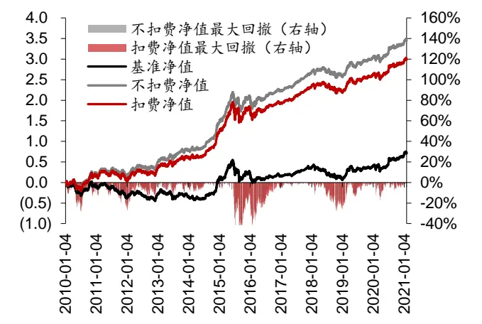
资料来源：Qlib，Wind，华泰研究

图表51： LightGBM策略回测超额净值表现（基准为沪深 300）
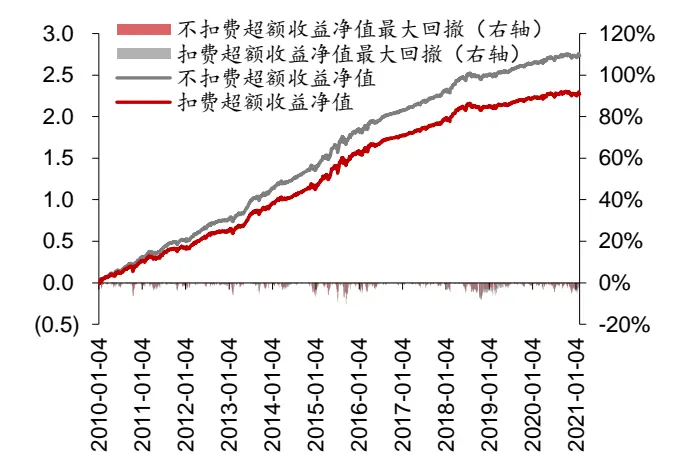
资料来源：Qlib，Wind，华泰研究

## 免责声明

## 分析师声明

本人，林晓明、李子钰、何康，兹证明本报告所表达的观点准确地反映了分析师对标的证券或发行人的个人意见；彼以往、现在或未来并无就其研究报告所提供的具体建议或所表迖的意见直接或间接收取任何报酬。

## 一般声明及披露

本报告由华泰证券股份有限公司（已具备中国证监会批准的证券投资咨询业务资格，以下简称“本公司”）制作。本报告所载资料是仅供接收人的严格保密资料。本报告仅供本公司及其客户和其关联机构使用。本公司不因接收人收到本报告而视其为客户。

本报告基于本公司认为可靠的、已公开的信息编制，但本公司及其关联机构(以下统称为“华泰”)对该等信息的准确性及完整性不作任何保证。

本报告所载的意见、评估及预测仅反映报告发布当日的观点和判断。在不同时期，华泰可能会发出与本报告所载意见、评估及预测不一致的研究报告。同时，本报告所指的证券或投资标的的价格、价值及投资收入可能会波动。以往表现并不能指引未来，未来回报并不能得到保证，并存在损失本金的可能。华泰不保证本报告所含信息保持在最新状态。华泰对本报告所含信息可在不发出通知的情形下做出修改，投资者应当自行关注相应的更新或修改。

本公司不是 FINRA 的注册会员，其研究分析师亦没有注册为 FINRA 的研究分析师/不具有 FINRA 分析师的注册资格。

华泰力求报告内容客观、公正，但本报告所载的观点、结论和建议仅供参考，不构成购买或出售所述证券的要约或招揽。该等观点、建议并未考虑到个别投资者的具体投资目的、财务状况以及特定需求，在任何时候均不构成对客户私人投资建议。投资者应当充分考虑自身特定状况，并完整理解和使用本报告内容，不应视本报告为做出投资决策的唯一因素。对依据或者使用本报告所造成的一切后果，华泰及作者均不承担任何法律责任。任何形式的分享证券投资收益或者分担证券投资损失的书面或口头承诺均为无效。

除非另行说明，本报告中所引用的关于业绩的数据代表过往表现，过往的业绩表现不应作为日后回报的预示。华泰不承诺也不保证任何预示的回报会得以实现，分析中所做的预测可能是基于相应的假设，任何假设的变化可能会显著影响所预测的回报。

华泰及作者在自身所知情的范围内，与本报告所指的证券或投资标的不存在法律禁止的利害关系。在法律许可的情况下，华泰可能会持有报告中提到的公司所发行的证券头寸并进行交易，为该公司提供投资银行、财务顾问或者金融产品等相关服务或向该公司招揽业务。

华泰的销售人员、交易人员或其他专业人士可能会依据不同假设和标准、采用不同的分析方法而口头或书面发表与本报告意见及建议不一致的市场评论和/或交易观点。华泰没有将此意见及建议向报告所有接收者进行更新的义务。华泰的资产管理部门、自营部门以及其他投资业务部门可能独立做出与本报告中的意见或建议不一致的投资决策。投资者应当考虑到华泰及/或其相关人员可能存在影响本报告观点客观性的潜在利益冲突。投资者请勿将本报告视为投资或其他决定的唯一信赖依据。有关该方面的具体披露请参照本报告尾部。

本报告并非意图发送、发布给在当地法律或监管规则下不允许向其发送、发布的机构或人员，也并非意图发送、发布给因可得到、使用本报告的行为而使华泰违反或受制于当地法律或监管规则的机构或人员。

本报告版权仅为本公司所有。未经本公司书面许可，任何机构或个人不得以翻版、复制、发表、引用或再次分发他人(无论整份或部分)等任何形式侵犯本公司版权。如征得本公司同意进行引用、刊发的，需在允许的范围内使用，并需在使用前获取独立的法律意见，以确定该引用、刊发符合当地适用法规的要求，同时注明出处为“华泰证券研究所”，且不得对本报告进行任何有悖原意的引用、删节和修改。本公司保留追究相关责任的权利。所有本报告中使用的商标、服务标记及标记均为本公司的商标、服务标记及标记。

## 中国香港

本报告由华泰证券股份有限公司制作,在香港由华泰金融控股（香港）有限公司向符合《证券及期货条例》及其附属法律规定的机构投资者和专业投资者的客户进行分发。华泰金融控股（香港）有限公司受香港证券及期货事务监察委员会监管，是华泰国际金融控股有限公司的全资子公司，后者为华泰证券股份有限公司的全资子公司。在香港获得本报告的人员若有任何有关本报告的问题,请与华泰金融控股（香港）有限公司联系。

## 香港-重要监管披露

- 华泰金融控股（香港）有限公司的雇员或其关联人士没有担任本报告中提及的公司或发行人的高级人员。

更多信息请参见下方 “美国-重要监管披露”。

## 美国

在美国本报告由华泰证券（美国）有限公司向符合美国监管规定的机构投资者进行发表与分发。华泰证券（美国）有限公司是美国注册经纪商和美国金融业监管局（FINRA）的注册会员。对于其在美国分发的研究报告，华泰证券（美国）有限公司根据《 年证券交易法》（修订版）第 条规定以及美国证券交易委员会人员解释，对本研究报告内容负责。华泰证券（美国）有限公司联营公司的分析师不具有美国金融监管（FINRA）分析师的注册资格，可能不属于华泰证券（美国）有限公司的关联人员，因此可能不受 FINRA 关于分析师与标的公司沟通、公开露面和所持交易证券的限制。华泰证券（美国）有限公司是华泰国际金融控股有限公司的全资子公司，后者为华泰证券股份有限公司的全资子公司。任何直接从华泰证券（美国）有限公司收到此报告并希望就本报告所述任何证券进行交易的人士，应通过华泰证券（美国）有限公司进行交易。

## 美国-重要监管披露

- 分析师林晓明、李子钰、何康本人及相关人士并不担任本报告所提及的标的证券或发行人的高级人员、董事或顾问。分析师及相关人士与本报告所提及的标的证券或发行人并无任何相关财务利益。本披露中所提及的“相关人士”包括 FINRA 定义下分析师的家庭成员。分析师根据华泰证券的整体收入和盈利能力获得薪酬，包括源自公司投资银行业务的收入。

- 华泰证券股份有限公司、其子公司和/或其联营公司, 及/或不时会以自身或代理形式向客户出售及购买华泰证券研究所覆盖公司的证券/衍生工具，包括股票及债券（包括衍生品）华泰证券研究所覆盖公司的证券/衍生工具，包括股票及债券（包括衍生品）。

- 华泰证券股份有限公司、其子公司和/或其联营公司, 及/或其高级管理层、董事和雇员可能会持有本报告中所提到的任何证券（或任何相关投资）头寸，并可能不时进行增持或减持该证券（或投资）。因此，投资者应该意识到可能存在利益冲突。

## 评级说明

投资评级基于分析师对报告发布日后 6 至 12个月内行业或公司回报潜力（含此期间的股息回报）相对基准表现的预期（A 股市场基准为沪深 300 指数，香港市场基准为恒生指数，美国市场基准为标普 500 指数），具体如下：

## 行业评级

增持：预计行业股票指数超越基准

中性：预计行业股票指数基本与基准持平

减持：预计行业股票指数明显弱于基准

## 公司评级

买入：预计股价超越基准 15%以上

增持：预计股价超越基准 5%~15%

持有：预计股价相对基准波动在-15%~5%之间

卖出：预计股价弱于基准 15%以上

暂停评级：已暂停评级、目标价及预测，以遵守适用法规及/或公司政策

无评级：股票不在常规研究覆盖范围内。投资者不应期待华泰提供该等证券及/或公司相关的持续或补充信息

## 法律实体披露

中国：华泰证券股份有限公司具有中国证监会核准的“证券投资咨询”业务资格，经营许可证编号为：91320000704041011J香港：华泰金融控股（香港）有限公司具有香港证监会核准的“就证券提供意见”业务资格，经营许可证编号为：AOK809美国：华泰证券（美国）有限公司为美国金融业监管局（FINRA）成员，具有在美国开展经纪交易商业务的资格，经营业务许可编号为：CRD#:298809/SEC#:8-70231

## 华泰证券股份有限公司

## 南京

南京市建邺区江东中路228号华泰证券广场1号楼/邮政编码：210019

电话：86 25 83389999/传真：86 25 83387521电子邮件：ht-rd@htsc.com

## 深圳

深圳市福田区益田路5999号基金大厦10楼/邮政编码：518017电话：86 755 82493932/传真：86 755 82492062电子邮件：ht-rd@htsc.com

## 华泰金融控股（香港）有限公司

香港中环皇后大道中 99号中环中心 58楼 5808-12室
电话：+852-3658-6000/传真：+852-2169-0770
电子邮件：research@htsc.com
http://www.htsc.com.hk

## 华泰证券（美国）有限公司

美国纽约哈德逊城市广场 10号 41楼（纽约 10001）
电话：+212-763-8160/传真：+917-725-9702
电子邮件: Huatai@htsc-us.com
http://www.htsc-us.com

©版权所有2021年华泰证券股份有限公司

北京
北京市西城区太平桥大街丰盛胡同28号太平洋保险大厦A座18层/
邮政编码：100032
电话：86 10 63211166/传真：86 10 63211275
电子邮件：ht-rd@htsc.com
上海
上海市浦东新区东方路18号保利广场E栋23楼/邮政编码：200120
电话：86 21 28972098/传真：86 21 28972068
电子邮件：ht-rd@htsc.com